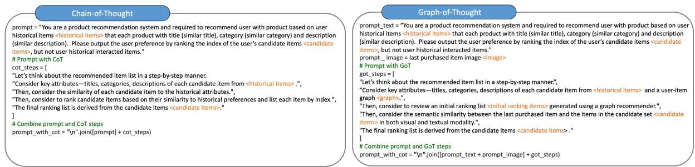
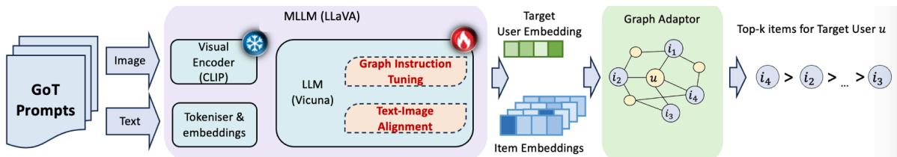
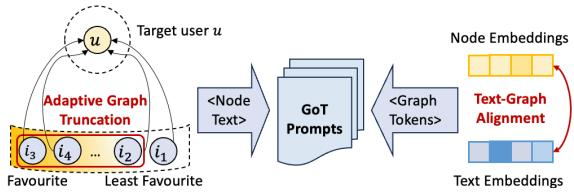
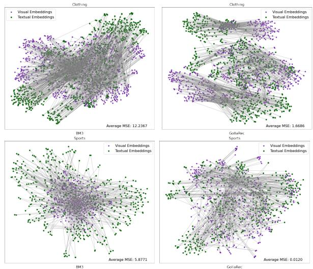
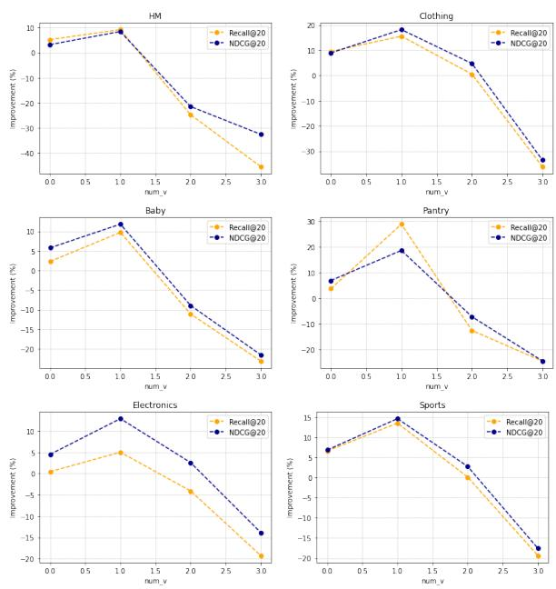
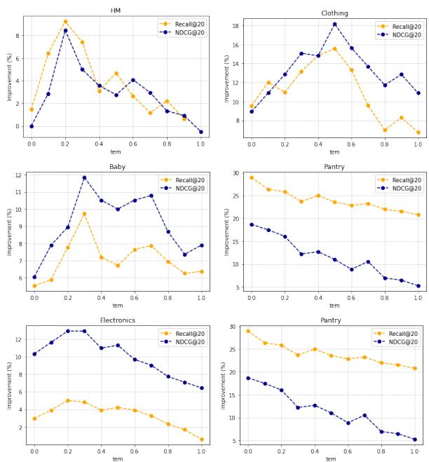
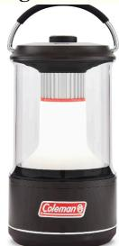

# A Multi-modal Large Language Model with Graph-of-Thought for Effective Recommendation

Zixuan Yi University of Glasgow z.yi.1@research.gla.ac.uk

Iadh Ounis University of Glasgow iadh.ounis@glasgow.ac.uk

## Abstract

Chain-of-Thought (CoT) prompting has been shown to be effective in guiding Large Language Models (LLMs) to decompose complex tasks into multiple intermediate steps, and constructing a rational reasoning chain for inferring answers. However, the linear nature of CoT falls short from enabling LLMs to effectively handle graph structures, which are essential for personalised recommendation tasks that rely on user-item interaction graphs. To bridge this gap, we propose GollaRec, which leverages a new Graph-of-Thought (GoT) prompting technique in a Multi-modal LLM, namely LLaVA, to effectively exploit the complex structure of the interaction graphs. GollaRec enhances the recommendation effec tiveness by integrating both visual and textual "thoughts" into a graph-structured prompt, using both item images and descriptions to produce richer multi-modal user/item representations. In our proposed approach, GollaRec leverages text-graph alignment and graph instruction tuning to allow the Multi-modal LLM to capture complex graph structures. In addition, GollaRec leverages a graph adaptor to integrate user-item interactions into the result ing user/item embeddings, therefore effectively adapting the model to the recommendation task. Our extensive experiments on 6 benchmark datasets demonstrate the superiority of our proposed GollaRec model over 12 existing state-of-the-art models in various multi-modal recommendation tasks, including general and multi-domain recommendation tasks.

## 1 Introduction

Large Language Models (LLMs) have demonstrated a remarkable capability in language understanding and text generation in various realworld scenarios (Touvron et al., 2023; Jiang et al., 2024). However, their training on unstructured data often limits their capability in handling complex tasks necessitating complex, multi-step reasoning or a precise contextual understanding (Lei et al., 2023). This limitation becomes particularly important with graph-structured data, which is essential in fields such as social network analysis, drug discovery, and notably recommender systems (Guo et al., 2023). Indeed, graph data, with its complex relational structures between node entities, poses a unique challenge for LLMs, which typically do not encounter structured data formats like columnindexed records during their pre-training, leading to difficulties in handling domain-specific knowledge inherent to such data (Yu et al., 2023).

Recent advances in prompting techniques have enhanced the LMMs’ capability to address complex reasoning tasks (Jin et al., 2022). For example, Brown et al. (2020) employed few-shot in-context learning to enhance the reasoning capabilities of an LLM by using input and output examples as prompts. Wei et al. (2022) and Wang et al. (2022b) enhanced the LLMs’ effectiveness by using Chainof-Thought (CoT) prompting, which involves a series of demonstrations where each step of the detailed, step-by-step explanation, serves as an instructive example to guide reasoning processes. Despite its effectiveness in linear textual reasoning, CoT does not inherently extend to tasks involving structural graph data, which necessitate mining complex relational structures (Jiang et al., 2023). This identified limitation, henceforth denoted as insufficient graph mining, emphasises the need for enhancing LLMs to effectively tackle graph-related tasks. The graph data, especially user-item interaction graphs in recommender systems, encapsulates unique patterns that contain domain-specific knowledge. To bridge this gap, we integrate graph data into the prompt by linearising the structured data into textual sentences, thereby addressing the insufficient graph mining problem in CoT.

In addition to the problem of insufficient graph mining in CoT, the language-based reasoning process is often overly complex and abstract (Huang and Chang, 2023). Instead, the use of the item images can be an intuitive medium in recommendation tasks. Indeed, integrating an image in a prompt not only enriches the modelling of the user profiles but also enables the used model to generate more coherent outputs. In this paper, we use a Multi-modal Large Language Model (MLLM), namely LLaVA (Liu et al., 2024), to ensure that the user/item embeddings are semantically coherent. To prompt effective reasoning in presence of multi-modality and a graph structure, we propose a multi-modal Graph-of-Thought (GoT) prompting technique, as illustrated in Figure 1, which can be used in two distinct recommendation tasks: a general recommendation task and a multi-domain recommendation task. To enable an effective understanding of the graph knowledge in the used MLLM, we first perform a text-graph alignment to align the item textual embeddings and the corresponding item node embeddings in the semantic space and perform a graph instruction tuning on the MLLM so as to match each graph token with its textual description. On the other hand, recent recommendation approaches employing LLMs for various recommendation tasks encounter a key challenge, namely the constraint of input token length in these LLMs (Ren et al., 2024; Wei et al., 2024). This limitation also restricts the amount of graph information that can be integrated within a GoT prompt. Hence, in order to adequately integrate sufficient graph information within a GoT, we pre-train a recommender (He et al., 2020), specif ically designed to select the maximum number of high-potential items within the input token limit.

  
Figure 1: Chain-of-thought prompting and our proposed graph-of-thought prompting in the recommendation task.

Our contributions can be summarised as follows: (1) We propose Graph-of-thought LLaVA for Recommendation (GollaRec), a new recommendation model integrating the user-item graph information within Graph-of-Thought (GoT). To the best of our knowledge, this is the first work to apply GoT prompting specifically tailored to enhance multi-modal recommendation tasks, so as to effectively address the problem of insufficient graph mining in CoT; (2) To effectively integrate the user-item graph information within GoT, we use a text-graph alignment method and graph instruction tuning to effectively capture the graph patterns; (4) To address the limited token length problem in the MLLM, we use a pre-trained recommender to feed a maximum number of high-potential items into GoT; (5) Our extensive experiments on six benchmark datasets show that GollaRec significantly outperforms 12 strong baselines across two recommendation tasks.

## 2 GollaRec

We first describe in Section 2.1 the two top-k multimodal recommendation tasks we tackle in this paper, namely a general recommendation task and a multi-domain recommendation task. Section 2.2 presents our proposed GoT technique, which includes three key parts (adaptive graph truncation, text-graph alignment and text-image alignment). Next, we introduce the architecture of GollaRec in Section 2.3. The model is illustrated in Figure 2.

## 2.1 Multi-modal Recommendation Tasks

In this paper, we address two specific recommendation tasks that leverage the capabilities of a Multimodal Large Language Model (MLLM) alongside a graph adaptor to process and integrate diverse data types. Each task includes user and item sets, denoted as $\mathcal { U } = \{ \boldsymbol { u } \}$ and $I = \{ i \}$ respectively, with embeddings $\mathbf { \bar { X } } ~ \in ~ \mathbb { R } ^ { d \times ( | U | \hat { + } | \hat { I } | ) }$ where d is the dimensionality of these embeddings. Then, we denote the items’ multi-modal embeddings as $\mathbf { X } _ { i , m } \in \mathbb { R } ^ { d _ { m } \times | I | }$ , where $d _ { m }$ is the dimension of that modality’s embedding, $m \in \mathcal { M }$ is the set of modalities where $\boldsymbol { \mathcal { M } } = \{ \boldsymbol { v } , t \}$ , with v and t representing the visual and textual modalities1, respectively.

  
Figure 2: The architecture of our GollaRec model.

The users’ historical behaviour data is denoted by $\mathcal { R } \in \{ 0 , 1 \} ^ { | U | \times | I | }$ , where each entry $\mathcal { R } _ { u , i } = 1$ if the user u clicked item i, otherwise $R _ { u , i } = 0$ . Using the historical interaction data, we construct an interaction graph $\mathcal { G } = \{ \nu , \varepsilon \}$ with $\gamma = \{ \mathcal { U } \cup I \}$ and $\mathcal { E } = \{ ( u , i ) | u \in \mathcal { U } , i \in I , \mathcal { R } _ { u i } = 1 \}$

Task 1 - General Recommendation: For the general recommendation task, given an interaction graph , the item descriptions and the item images, we aim to estimate the user preferences through an MLLM $f _ { \theta _ { 1 } }$ and an adaptor $f _ { \boldsymbol { \theta _ { 2 } } }$ that recommend the top-k items for a target user u.

Task 2 - Multi-domain Recommendation: The multi-domain recommendation task extends the application of the MLLM $f _ { \theta _ { 1 } }$ and the adaptor $f _ { \boldsymbol { \theta _ { 2 } } }$ across multiple source domains $\{ D _ { 1 } , \ldots , D _ { n } \}$ to a new target domain $D _ { n + 1 }$ . The goal of this task is to rank the top-k items for a target user u in a new target domain $D _ { n + 1 }$ . Note that, in this task, we do not require overlapping users between the domains.

## 2.2 Graph-of-Thought

As discussed in Section 1, LLMs often struggle with unfamiliar patterns and structures in graph data, thereby impeding these LLMs from generating accurate and coherent responses in graphrelated tasks. To tackle this problem of insufficient graph mining, it is important to enhance the LLM’s ability to interpret the interactions with the useritem graph. This necessitates a step-by-step demonstration of reasoning within the task. In this paper, we propose a Graph-of-Thought (GoT) prompting technique, specifically designed to provide a structured rationale that delineates the reasoning steps needed for the recommendation tasks. Specifically, this GoT technique prompts the MLLM to reason about the potential candidates on the user-item interaction graph, taking into account the semantic similarity derived from both the visual and textual item embeddings in order to determine the final ranking list of the target user. Figure 1 (right) shows our proposed GoT technique in action when addressing two multi-modal recommendation tasks. However, effectively incorporating graph and multimodal data for an MLLM empowered with a GoT technique presents several challenges:

C1. How to integrate a large volume of textual nodes within a fixed input token length?

C2. How to enable the MLLM to effectively model the relationship between the item images and their descriptions?

C3. How to facilitate the MLLM’s understanding of graph patterns in the user-item graph?

In the following, we propose solutions to address these challenges, namely adaptive graph truncation, text-image alignment and text-graph alignment.

Adaptive Graph Truncation. In our initial experiments, we found that the used MLLM, namely LLaVA (Vicuna-7B)2, configures 576 visual tokens within its overall input token length limit (2048). As outlined in challenge C1, such employed amount of the total input token length markedly reduces the remaining available token length, thereby impeding the model’s capability to encode richer user-item graph information. To address this limitation and ensure an effective user/item modelling, we leverage a pre-trained recommender to produce an initial candidate ranking list of items for the target user. We aim to maintain the most potential candidate items in both recommendation tasks. In particular, we append the descriptions of these highly potential candidate items to the GoT prompt, and adaptively truncate this list so that it fits within the restricted token limit. Algorithm 1 presents our method for addressing the limited input token length of LLaVA. Figure 3 illustrates our adaptive truncation method applied within our GoT prompt.

Text-image Alignment. To address challenge C2 and enhance the MLLM’s understanding of the relationships between multiple modalities, we use a contrastive pre-training method to pre-train LLaVA using all available item image-text pairs. Yi et al. (2024a) also showed that fine-tuning MLLMs with image-text pairs significantly enhances the recommendation performance. Therefore, we use item images and their descriptions as inputs to pre-train LLaVA with an Image-Text Contrastive (ITC) loss. This pre-training method aims to maximise the similarity between the items’ image and description pairs while minimising the similarity between the mismatched pairs, thereby facilitating a unified joint embedding space for multi-modal inputs within GoT. The ITC loss is defined as follows:

Algorithm 1 Adaptive Graph Truncation in GoT   
1: Input: User ID, Item ID and Descriptions, Max Tokens = 2048   
2: Output: Truncated Item List   
3: Initialise a pre-trained recommender (e.g., LightGCN)   
4: # Generate initial ranking   
5: items\_list Recommender.RankItems(User ID, Item ID)   
6: # Reserve tokens for visual data   
7: total\_tokens 576   
8: Initialise initial\_list as empty   
9: for each item in items\_list do   
10: description GetDescription(item)   
11: tokens Tokenise(description)   
12: if total\_tokens + length(tokens)  Max Tokens then   
13: append description to initial\_list   
14: total\_tokens total\_tokens + length(tokens)   
15: else   
16: break   
17: end if   
18: end for   
19: return initial\_list

$$
\mathcal { L } _ { \mathrm { I T C } } = - \frac { 1 } { B } \sum _ { p = 1 } ^ { N } \log \frac { \exp \left( \sin \left( v _ { p } , t _ { p } \right) / \tau \right) } { \sum _ { q \neq p } \exp \left( \sin \left( v _ { p } , t _ { q } \right) / \tau \right) }\tag{1}
$$

where $B$ is the batch size, $v _ { k }$ and $t _ { k }$ are the visual and textual embeddings of the $p { \cdot } \mathrm { t h }$ item, q represents a negative item index, sim is a similarity function using cross-entropy (Zhang and Sabuncu, 2018), and $\tau$ is a temperature parameter. As such, LLaVA learns the relationships between the item descriptions and their corresponding images, hence enriching GoT with contextualised information.

Text-graph Alignment. To address challenge C3 – enhancing the understanding of graph structural information by the MLLM – we focus on aligning the encoding of the graph structures with the natural language space. This alignment enables the used MLLM to effectively capture the structural patterns using their language understanding capabilities. Inspired by prior works about aligning text and graph data for the node classification task (Wen and Fang, 2023; Tang et al., 2024), we employ a text-graph grounding method and a graph instruction tuning method to maintain the graph’s structural context within the used MLLM in the recommendation scenarios.

(1) Text-graph grounding: Following (Wen and Fang, 2023), we use a text encoder (namely BERT (Devlin et al., 2019) ) and a graph encoder (namely a graph transformer (Yun et al., 2019) ) to align their resulting item node embeddings $z _ { 1 }$ and the item textual embeddings $z _ { 2 }$ . We input item descriptions into both encoders to generate these embeddings, aligning them within a unified semantic space. Similar to Equation (1), we use a text-node contrastive loss by (Wen and Fang, 2023) to differentiate between the node-text matching pair $( z _ { 1 p } , z _ { 2 p } )$ as a positive pair and the non-matching pair $( z _ { 1 p } , \ z _ { 2 q } )$ as a negative pair. As a result, we use this contrastive loss to refine this alignment, thereby preparing the well-trained graph encoder for the following instruction tuning.

(2) Graph instruction tuning: Following the text-graph grounding phase, we use the pre-trained graph encoder to project the node embeddings into graph tokens using a Multi-Layer Perceptron (MLP): $\hat { z _ { 1 } } = \mathrm { M L P } \left( z _ { 1 } \right)$ , where are $z _ { 1 }$ the node embeddings derived from the graph encoder and $\hat { z _ { 1 } }$ represents the resulting graph tokens. These graph tokens, which represent graph structures, allow the MLLM to process and interpret the graphstructured data, thereby enabling the MLLM’s understanding of graph patterns in the interaction graph. Inspired by GraphGPT’s (Tang et al., 2024) methodology, we adapt a graph matching task to the context of recommender systems during this instruction tuning phase. Specifically, we construct the instruction by selecting a central item node and its l neighbouring nodes, presenting these nodes as a sequence of graph tokens (<graph\_start>, <graph\_token>1, <graph\_token>2, ..., <graph\_token>l, <graph\_end>). The goal of this matching task is to differentiate and match graph tokens with the corresponding language tokens using an MLLM. We input the projected graph tokens $\hat { z _ { 1 } }$ and the instruction’s textual embeddings $z _ { 3 }$ , for a given sequence of length l. We then compute the probability of generating the target output $\mathrm { x } _ { o }$ as follows:

$$
\psi \left( x _ { o } \mid { \hat { z _ { 1 } } } , z _ { 3 } \right) = \prod _ { j = 1 } ^ { l } \psi _ { \theta _ { 2 } } \left( x _ { j } \mid { \hat { z _ { 1 } } } , z _ { 3 } \right)\tag{2}
$$

where $\theta _ { 2 }$ are the learnable parameters within GollaRec, and $\psi _ { \theta _ { 2 } }$ is the probability of the $j \cdot$ -th token $x _ { j }$ . Moreover, we optimise the MLLM’s performance in matching the shuffled list of language tokens to the ordered sequence of graph tokens using a cross-entropy loss. As such, we enhance the understanding of graph structural information by the MLLM, thereby addressing the insufficient graph mining problem.

  
Figure 3: Our proposed GoT for recommendation.

## 2.3 Model Architecture

Figure 2 provides a detailed overview of the GollaRec model architecture, including the GoT technique to prompt the LLaVA model as input and an adapter, namely LightGCN (He et al., 2020), to propagate the resulting embeddings from the MLLM’s last layer and output final embeddings for ranking. We obtain the final user embeddings using the adapter as follows: $\begin{array} { r } { h _ { u } = \sum _ { i \in \mathcal { N } _ { u } } \frac { h _ { i } } { \sqrt { | \mathcal { N } _ { i } | | \mathcal { N } _ { u } | } } , } \end{array}$ where ${ \mathcal { N } } _ { i }$ and $\mathcal { N } _ { u }$ denote the set of neighbours for user u and item i, respectively, while $| \mathcal { N } _ { u } |$ and $| \mathcal { N } _ { i } |$ represent the size of $\mathcal { N } _ { u }$ and ${ \mathcal { N } } _ { i }$ . Analogously, we also obtain the item embeddings. Our GollaRec model leverages two types of input, with the textual input encompassing the item descriptions and the visual input including the item images. During the training stage, the text-graph and text-image alignment methods enable LLaVA to capture graph structures and the relationships between the item images and descriptions. For the inference stage, we append the resulting GoT to our GollaRec model’s input so as to generate the corresponding user/item embeddings, as shown in Figrue 2. Then, we use a graph adapter to integrate the user-item interactions, thereby refining the final user/item embeddings for the top-k multimodal recommendation tasks, so as to address the problem of insufficient graph mining in the current prompting techniques.

## 3 Experiments

## 3.1 Experimental Setup

Datasets. In order to evaluate the effectiveness of our GollaRec model across multi-modal general and multi-domain recommendation tasks, we conduct experiments on six commonly used datasets – three are focused on general recommendations and three on multi-domain recommendations. For general recommendations, we use two Amazon Review datasets (He and McAuley, 2016a) – Clothing and Baby datasets – and the HM fashion recommendation dataset (Xian et al., 2023). For multi-domain recommendations, we conduct experiments across seven domains derived from the Amazon Review datasets. We use the Food, Home, Clothing, and Office datasets as the source domain datasets and evaluate GollaRec and the used baselines on three target datasets, namely Pantry, Electronics and Sports. We choose these datasets for their extensive user-item interactions and rich multi-modal data, which include images and detailed textual descriptions such as titles, categories, and brands (Yi and Ounis, 2025; Yi et al., 2023a). Table 5 in Appendix A presents the statistics of the used datasets.

Evaluation. Following the evaluation setting in (Zhang et al., 2021a; Yi et al., 2023b), we randomly split the datasets into training, validation, and testing sets using an 8:1:1 ratio. We optimise the hyper-parameters of both our GollaRec model and the baseline models using a grid search on the validation set. We use two commonly used evaluation metrics, namely Recall@k and NDCG@k, to examine the top-k recommendation performance for both the general and multi-domain recommendation tasks. We set k to 20 (Zhang et al., 2021a; Yi et al., 2024b), and report the average performance achieved for all users in the test set. All used baselines and our GollaRec model are implemented with PyTorch and were run on two GPU A6000s with 96GB memory. We report the detailed hyperparameter settings unique to GollaRec across all six datasets, including the batch size, learning rate, epochs, maximum token length, warmup ratio and weight decay in Appendix B. Our source code and model checkpoints are publicly available at: https://github.com/zxy-ml84/GollaRec.

Baselines. To examine the effectiveness of our GollaRec model in the multi-modal general recommendation task, we compare GollaRec against 9 existing state-of-the-art models, categorised into three groups: (1) General recommenders: Light-GCN (He et al., 2020); (2) Multi-modal recommenders: VBPR (He and McAuley, 2016b), MMGCL (Yi et al., 2022), BM3 (Zhou et al., 2023); MLLM methods: CLIP (Radford et al.,

<table><tr><td>Dataset</td><td colspan="2">HM</td><td colspan="2">Clothing</td><td colspan="2">Baby</td></tr><tr><td>Methods</td><td>Recall@20</td><td>NDCG@20</td><td>Recall@20</td><td>NDCG@20</td><td>Recall@20</td><td>NDCG@20</td></tr><tr><td>LightGCN</td><td>0.1254*</td><td>0.0743*</td><td>0.0553*</td><td>0.0246*</td><td>0.0714*</td><td>0.0319*</td></tr><tr><td>VBPR</td><td>0.1108</td><td>0.0717</td><td>0.0611</td><td>0.0277</td><td>0.0740</td><td>0.0329</td></tr><tr><td>MMGCL</td><td>0.1633*</td><td>0.0964*</td><td>0.0607*</td><td>0.0277*</td><td>0.0790*</td><td>0.0352*</td></tr><tr><td>BM3</td><td>0.1711*</td><td>0.0981*</td><td>0.0797*</td><td>0.0358*</td><td>0.0863*</td><td>0.0380*</td></tr><tr><td>CLIP</td><td>0.0956</td><td>0.0687</td><td>0.0631</td><td>0.0281</td><td>0.0664</td><td>0.0304</td></tr><tr><td>BEiT-3</td><td>0.0874*</td><td>0.0661*</td><td>0.0617*</td><td>0.0265*</td><td>0.0688*</td><td>0.0311*</td></tr><tr><td>LLaVA</td><td>0.1346*</td><td>0.0910*</td><td>0.0702*</td><td>0.0315*</td><td>0.0674*</td><td>0.0316*</td></tr><tr><td>P5</td><td>0.1417*</td><td>0.0872</td><td>0.0766</td><td>0.0360*</td><td>0.0825</td><td>0.0356</td></tr><tr><td>LMRecSys</td><td>0.1269*</td><td>0.0801*</td><td>0.0623*</td><td>0.0322*</td><td>0.0778*</td><td>0.0322*</td></tr><tr><td>TALLREC</td><td>0.1145*</td><td>0.0782*</td><td>0.0632*</td><td>0.0335*</td><td>0.0752*</td><td>0.0313*</td></tr><tr><td>GollaRec-CoT</td><td>0.1807</td><td>0.1039</td><td>0.0911*</td><td>0.0404</td><td>0.0939</td><td>0.0410</td></tr><tr><td>GollaRec</td><td>0.1880</td><td>0.1064</td><td>0.0932</td><td>0.0423</td><td>0.0958</td><td>0.0425</td></tr></table>

Table 1: Comparison of GollaRec with the used general recommendation baselines. ∗ denotes a significant difference with a baseline using the Holm-Bonferroni corrected paired t-test with p< 0.05.
<table><tr><td>Dataset</td><td colspan="2">Pantry</td><td colspan="2">Electronics</td><td colspan="2">Sports</td></tr><tr><td>Methods</td><td>Recall@20</td><td>NDCG@20</td><td>Recall@20</td><td>NDCG@20</td><td>Recall@20</td><td>NDCG@20</td></tr><tr><td>VBPR</td><td>0.0723*</td><td>0.0326*</td><td>0.0442*</td><td>0.0196*</td><td>0.0771*</td><td>0.0349*</td></tr><tr><td>MMGCL</td><td>0.0907*</td><td>0.0377*</td><td>0.0627*</td><td>0.0304*</td><td>0.0913*</td><td>0.0428*</td></tr><tr><td>BM3</td><td>0.0932*</td><td>0.0417*</td><td>0.0638*</td><td>0.0310*</td><td>0.0970*</td><td>0.0438*</td></tr><tr><td>CLiP</td><td>0.0683*</td><td>0.0318</td><td>0.0461*</td><td>0.0235</td><td>0.0727</td><td>0.0310</td></tr><tr><td>BEiT-3</td><td>0.0596*</td><td>0.0289*</td><td>0.0481*</td><td>0.0240*</td><td>0.0748*</td><td>0.0341*</td></tr><tr><td>LLaVA</td><td>0.0659*</td><td>0.0313*</td><td>0.0604*</td><td>0.0288*</td><td>0.0709*</td><td>0.0303*</td></tr><tr><td>MOME</td><td>0.0797</td><td>0.0352</td><td>0.0573*</td><td>0.0261</td><td>0.0749</td><td>0.0318</td></tr><tr><td>PLE</td><td>0.0862*</td><td>0.0384*</td><td>0.0595*</td><td>0.0278*</td><td>0.0866*</td><td>0.0367*</td></tr><tr><td>MGFN</td><td>0.0891*</td><td>0.0413*</td><td>0.0623*</td><td>0.0305*</td><td>0.0894*</td><td>0.0383*</td></tr><tr><td>GollaRec (CoT)</td><td>0.1183</td><td>0.0469</td><td>0.0655*</td><td>0.0323*</td><td>0.1046*</td><td>0.0456</td></tr><tr><td>GollaRec</td><td>0.1213</td><td>0.0495</td><td>0.0681</td><td>0.0350</td><td>0.1112</td><td>0.0502</td></tr></table>

Table 2: Comparison of GollaRec with the used multidomain baselines. ∗ denotes a significant difference with a baseline using the Holm-Bonferroni corrected paired t-test with p< 0.05.

2021), LLaVA (Liu et al., 2024); (3) Languagebased recommenders: P5 (Geng et al., 2022), LM-RecSys (Zhang et al., 2021b) and TALLRec (Bao et al., 2023). For the multi-modal multi-domain recommendation task, apart from using the same multi-modal methods above, we also compare GollaRec with three multi-domain recommenders: MOME (Ma et al., 2018), PLE (Tang et al., 2020), MGFN (Zhang et al., 2022a). We describe the used baselines in Appendix A, with a summary provided in Table 6.

## 3.2 Results & Analysis

We provide our main results in this section. We also provide additional experimental results using various LLaVA variants and a qualitative case study that illustrates how GollaRec makes specific decisions in Appendix C. The same appendix also investigates GollaRec’s effectiveness in a cold-start scenario, a hyper-parameter study, and an assessment of GollaRec’s time efficiency.

## (RQ1): How does our proposed GollaRec model perform compared with existing recommendation models?

We compare GollaRec with all the used baselines. Table 1 and Table 2 present the comparison results for the general and multi-domain recommendation tasks, where "GollaRec-CoT" refers to a GollaRec variant that uses CoT instead of GoT. To assess the significance of the reported performance differences between GollaRec and the baselines, we use a paired t-test with the Holm-Bonferroni correction $( \mathtt { p } < 0 . 0 5 )$ .

General recommendation task: Table 1 shows the performance of our GollaRec model and the general recommendation baselines. The results highlight several key findings: (1) Our GollaRec model consistently achieves the best performance on all the used datasets. Compared with the best baseline model (namely BM3), GollaRec achieves an average improvement of 12.7% across all the datasets. These results demonstrate the effective ness of GollaRec in the general recommendation task; (2) GollaRec outperforms the MLLM models (CLIP, BEiT-3, LLaVA) by a large margin on all used datasets. The suboptimal performance of the previous MLLM models suggests their failure to effectively prompt the MLLM to a recommendation task and the absence of informative interactions in the models. Overall, our results indicate that GollaRec, which prompts an MLLM with interac tions is more effective than relying solely on visual and textual similarities for recommendations; (3) When comparing GollaRec with language based models (P5, LMRecSys, TALLRec) and multi-modal models (VBPR, MMGCL, BM3) in Table 1, we observe that our GollaRec model significantly outperforms both groups of models on the three used datasets. This indicates that our GollaRec model successfully adapts an MLLM to the recommendation task, effectively leveraging textual and visual prompts with GoT to recommend more accurate items; (4) From Table 1, we observe that our GollaRec model significantly outperforms the GollaRec-CoT variant on all three datasets. This indicates that GoT, with its integration of the user-item interaction graph as additional context, is more effective in handling the general recommen dation task compared to CoT; (5) When comparing our GollaRec model with LightGCN, it is notable that our GollaRec model initialises node embed dings with MLLM-initialised embeddings, whereas LightGCN uses randomly-initialised embeddings. Our GollaRec model significantly outperforms LightGCN by a large margin across all used datasets, indicating the effectiveness of leveraging pre-trained embeddings over training from scratch.

<table><tr><td>Dataset</td><td colspan="2">General Rec (Clothing)</td><td colspan="2">Multi-domain Rec (Sports)</td></tr><tr><td>Variants</td><td>Recall@20</td><td>NDCG@20</td><td>Recall@20</td><td>NDCG@20</td></tr><tr><td>w/o GoT</td><td>0.0885*</td><td>0.0402*</td><td>0.0982*</td><td>0.0442*</td></tr><tr><td>w/o Adapter</td><td>0.0821*</td><td>0.0358*</td><td>0.0848*</td><td>0.0363*</td></tr><tr><td>w/o Text-image Alignment</td><td>0.0868*</td><td>0.0389*</td><td>0.0941*</td><td>0.0436*</td></tr><tr><td>w/o Text-graph Alignment</td><td>0.0901*</td><td>0.0402*</td><td>0.1068</td><td>0.0468*</td></tr><tr><td>GollaRec</td><td>0.0932</td><td>0.0423</td><td>0.1112</td><td>0.0502</td></tr></table>

Table 3: Results for ablating the key components of GollaRec. ∗ indicates a significant difference using a paired t-test with p < 0.05.

Multi-domain recommendation: From the observed multi-domain recommendation results in Table 2, we observe the following findings: (1) We observe that GollaRec significantly outperforms all the baselines and GollaRec-CoT in most instances (except in 2 out of 60 instances) across the three used datasets. These results confirm GollaRec’s capability in effectively leveraging both domain-specific and shared common knowledge within multi-domain recommendation settings. In addition, the results show that GoT is a more effective prompting technique than CoT, particularly in integrating the interaction graph information to generate effective user/item embeddings. (2) When comparing the multi-modal models (VBPR, MMGCL, BM3, GollaRec) with the multi-domain baselines (MOME, PLE, MGFN), we observe that the models from the former group, which incorporate multi-modal item contents, are consistently more effective. This result suggests that incorporating rich multi-modal data facilitates a more effective transfer of multi-modal semantic knowledge in recommendation scenarios. (3) When compared with the MLLM models (CLIP, BEiT-3, LLaVA), GollaRec demonstrates significant performance improvements on the three used multidomain datasets. Such a superior performance emphasises the importance to leverage the abundant interactions from the target domain in order to enhance the MLLM’s understanding of the multidomain recommendation task.

## (RQ2): How do the key components of GollaRec affect the performance of the model?

We conduct an ablation study to assess the impact of the different components of GollaRec, including the GoT, Adaptor, Text-graph and Text-image alignment methods. We illustrate the results using the Clothing dataset for the general recommendation task and the Sports dataset for multi-domain recommendation task since we observe similar trends and conclusions across all the other used datasets. First, to gauge the effectiveness of GoT in GollaRec, we conduct a comparative analysis by removing GoT and retaining the initial prompt for the task description. From Table 3, we observe that GollaRec significantly outperform its "w/o GoT" variant in all instances on both datasets. This result confirms that prompting GollaRec with a graph structure results in an improved recommendation performance. Next, we ablate the adapter used in our GollaRec model, so as to examine its usefulness. We observe a marked decrease in GollaRec’s performance when removing the graph adapter (c.f. the "w/o Adaptor" variant in Table 3). This confirms the necessity of including personalised information such as the user-item interactions in order to capture domain-specific knowledge in GollaRec. Table 3 also shows that the "w/o Text-image Alignment" variant exhibits a reduced performance compared to GollaRec on both datasets. This highlights the importance of learning the relationships between the item textual descriptions and the images within the GoT prompt, in order to enhance the recommendation performance in both general and crossdomain recommendation tasks. In addition, we observe that GollaRec significantly outperforms its "w/o Text-graph Alignment" variant in 3 out of 4 instances. This result shows that the text-graph alignment method is overall promising in incorporating the graph information into GollaRec, thereby ad dressing Challenge C3 (refer to Section 2.2) by enhancing the MLLM’s ability in interpreting graph patterns within the user-item graph.

  
Figure 4: The t-SNE visualisation of the item embeddings on the Sports and Clothing datasets. A star refers to a visual embedding while a pentagon represents a text embedding. The average MSE value indicates the average distance between the visual and textual embeddings.

<table><tr><td>Dataset</td><td colspan="2">General Rec (Clothing)</td><td colspan="2">Multi-domain Rec (Sports)</td></tr><tr><td>Variants</td><td>Recall@20</td><td>NDCG@20</td><td>Recall@20</td><td>NDCG@20</td></tr><tr><td>- RandomDemonstrationPos</td><td>0.0920†</td><td>0.0424†</td><td>0.1027</td><td>0.0465†</td></tr><tr><td>- RandomImagePos</td><td>0.0941†</td><td>0.0426†</td><td>0.1061†</td><td>0.0508†</td></tr><tr><td>- RandomLenTrunction (80%)</td><td>0.0834</td><td>0.0366</td><td>0.0983</td><td>0.0440</td></tr><tr><td>- RandomLenTrunction (60%)</td><td>0.0807</td><td>0.0334</td><td>0.0960</td><td>0.0425</td></tr><tr><td>GollaRec</td><td>0.0932</td><td>0.0423</td><td>0.1112</td><td>0.0502</td></tr></table>

Table 4: Overall performance of GollaRec with different GoT lengths and text/image prompts’ positions. † indicates an equivalent effectiveness using a two one-sided test (TOST) with p < 0.05.

(RQ3): Does GollaRec exhibit a better integration of the item descriptions and images compared to the strongest baseline BM3?

To address challenge C2 (c.f. Section 2.2) and assess the effectiveness of integrating the item descriptions and images in our GoT prompt, we visualise the resulting embeddings to see if these modalities are closely aligned – an indicator of whether GollaRec integrates coherent semantics across different modalities within a unified semantic space. For conciseness and space constraints, we compare the results of GollaRec with the strongest performing baseline according to Table 1 and Table 2, namely BM3, in both the general (Clothing dataset) and multi-domain (Sports dataset) recommendation scenarios. Note however that we observe similar trends and conclusions with other baselines and datasets. We anticipate that a higher-quality multimodal embedding will exhibit cohesive distributions and lower MSE values, indicating that the corresponding model has effectively interpreted both modalities. In contrast, embeddings that are of poorer quality will likely appear more dispersed and should exhibit higher MSE values, indicating a lack of a comprehensive understanding of the modalities by the model. Figure 4 shows the visualisations of the obtained items’ visual and textual embeddings on the Sports and Clothing datasets. From the figure, we observe that the items’ visual and textual embeddings in BM3 are widely and distantly scattered across both datasets. Conversely, GollaRec’s embeddings are cohesively distributed, resulting in a more unified semantic space on the Clothing and Sports datasets. In addition, the markedly lower average MSE values for GollaRec (1.66, 0.12) compared to BM3 (12.23, 5.87) on these datasets indicate that GollaRec appears to have successfully addressed challenge C2 by integrating coherent semantics across different modalities, thereby improving the model’s performance in downstream recommendation tasks.

(RQ4): How do the length of GoT and the position of demonstration steps affect the performance of our model?

Given that the prompt position and input length are crucial in language modelling (Navigli et al., 2023), we assess the GoT structure in our model by randomly shuffling the positions of demonstration prompts and images within GoT, and by constraining the maximum input token length. Table 4 reports the obtained results on the Clothing and Sports datasets. We do not report results on other datasets since they show similar trends and conclusions. Specifically, the "- RandomDemonstrationPos" variant randomly shuffles the positions of demonstration prompts within the GoT structure, where "demonstration" serves as an example for each step (Wei et al., 2022). From the table, we observe that GollaRec performs on par with its "- RandomDemonstrationPos" variant in 3 out of 4 instances across both datasets, suggesting that the random repositioning of the step-by-step prompts does not affect the model performance. Similarly, adjusting the position of the image prompt within GoT ("- RandomImagePos" variant) shows no positive effect on the recommendation performance. In addition, we assess the impact of constraining the GoT’s length to 80% and 60% of the maximum token length, considering that the image tokens already use 25% of the token capacity, and the other necessary tokens, such as the system’s tokens, further reduce the remaining available length. From Table 4, we observe decreases in performance in the "- RandomLenTrunction" variants when reducing the maximum input token length on both datasets. This result indicates that GollaRec relies on a richer GoT, which encapsulates essential demonstration prompts for the recommendation tasks. This finding indicates that GollaRec effectively addresses the problem of limited token length.

## 4 Related Work

There are two main bodies of related work, namely the use of LLMs in recommender systems, and leveraging chain-of-thought prompting approaches.

LLM for Recommendation: Recent recommendation approaches have used LLMs as inference models by designing prompts tailored to recommendation tasks (Geng et al., 2022; Gao et al., 2023; Zhang et al., 2024; Yi and Ounis, 2024). For example, P5 (Geng et al., 2022) employed a pre-trained T5 model to adapt the recommendation tasks into natural language processing scenarios using personalised prompts. LMRecSys (Zhang et al., 2021b) converted the user-item interactions into textual prompts using item indexes. By doing so, they reformulated the recommendation task as a language modelling task. Unlike existing approaches, we construct a prompt that incorporates the user-item graph and item images in an MLLM, thereby providing richer contextualised information. We also devise CoT-like step-by-step demonstration prompts, each serving as an example for the reasoning process in the recommendation tasks. However, the use of LLMs for recommender systems often encounter difficulties in integrating the abundant user-item interactions. This is mainly due to the constraint of fixed input token length in the LLMs, which hinders their effectiveness in recommendation scenarios (Liu et al., 2023; Ren et al., 2024). To address this problem, we propose an adaptive truncation method that selectively maintains the most informative interactions within our devised GoT prompt. In particular, we integrate an initial ranking list, determined by a pre-trained recommender, into the step of the GoT’s demonstration, thereby ensuring that the list length fits the token length constraint.

Chain-of-Thought: Chain-of-Thought (CoT) is a prompting technique that improves Large Language Models (LLMs) in domains requiring logical reasoning (Chu et al., 2024; Wang et al., 2022b), for example in mathematical reasoning (Ranaldi and Freitas, 2024). While Chain-of-Thought (CoT) is effective in linear textual reasoning, it becomes less useful with graph-related tasks (Wang et al., 2024), such as in recommendation tasks, which involve complex user-item interaction graphs. To address this problem of insufficient graph mining in typical CoT setups, we introduce the Graph-of-Thought (GoT) technique in our proposed GollaRec model, which is specifically tailored for recommender systems. In particular, we leverage a text-graph alignment method to capture the relationships inherent between the item textual embeddings and the corresponding node embeddings. Additionally, we apply graph instruction tuning on an MLLM to effectively integrate user-item graph data in the recommendation tasks.

## 5 Conclusions

In this paper, we introduced GollaRec, a novel Multi-modal Large Language Model (MLLM) for both general and multi-domain recommendation tasks. Specifically, GollaRec consists of an MLLM (i.e. LLaVA), which handles the interaction graph information within a newly designed Graph-of-Thought (GoT) prompt, and a graph adapter to incorporate domain-specific knowledge for both recommendation tasks. Additionally, we devised an adaptive graph truncation method to maximize the number of high-potential items inputted into the GoT, thereby addressing the limited token length in the used MLLM. Our extensive experiments on 6 public benchmark datasets showed that GollaRec significantly outperformed 12 strong existing baselines for both tacked recommendation tasks. The performance improvement reaches up to 18.2% in comparison to the strongest baseline model, BM3, on the used datasets. We also conducted an ablation study, which confirmed the significant contributions of the components of GollabRec, namely the GoT technique, the graph adapter, the text-graph and text-image alignment methods, to a more effective multi-modal recommendation.

## 6 Limitations

A potential limitation of this work is the manual design of the demonstrations in the introduced GoT technique for the recommendation tasks. Indeed, we have manually written several prompt candidates and selected the one with the best performance based on a set of representative examples. While we compared both manually designed prompts and those automatically generated by models like LLaMA3, we did not observe a significant performance difference between these prompts. Currently, we use a recommendation model (i.e., LightGCN) to determine the initial item list in our GoT prompt. However, exploring the use of more advanced models or similarity measures in the hidden space to refine this process is a potentially interesting direction. In particular, we aim to explore more advanced and deterministic prompt generation strategies (Zhang et al., 2022b; Shum et al., 2023), specifically tailored to recommender system tasks, to potentially further enhance performance. In addition, while in this paper we focused our work on the effectiveness of GollaRec in tackling general and multi-domain recommendation tasks, the application of the model to conversational recommender systems has not yet been fully explored. We leave the evaluation of GollaRec in multi-modal conversational scenarios as future work.

## References

Keqin Bao, Jizhi Zhang, Yang Zhang, Wenjie Wang, Fuli Feng, and Xiangnan He. 2023. Tallrec: An effective and efficient tuning framework to align large language model with recommendation. In Proc. of RecSys.

Tom Brown, Benjamin Mann, Nick Ryder, Melanie Subbiah, Jared D Kaplan, Prafulla Dhariwal, Arvind Neelakantan, Pranav Shyam, Girish Sastry, Amanda Askell, et al. 2020. Language models are few-shot learners. In Proc. ofNeurIPS.

Zheng Chu, Jingchang Chen, Qianglong Chen, Weijiang Yu, Tao He, Haotian Wang, Weihua Peng, Ming Liu, Bing Qin, and Ting Liu. 2024. A survey of chain of thought reasoning: Advances, frontiers and future. In Proc. ofACL.

Jacob Devlin, Ming-Wei Chang, Kenton Lee, and Kristina Toutanova. 2019. Bert: Pre-training of deep bidirectional transformers for language understanding. In Proc. ofNAACL.

Yunfan Gao, Tao Sheng, Youlin Xiang, Yun Xiong, Haofen Wang, and Jiawei Zhang. 2023. Chatrec: Towards interactive and explainable llmsaugmented recommender system. arXiv preprint arXiv:2303.14524.

Shijie Geng, Shuchang Liu, Zuohui Fu, Yingqiang Ge, and Yongfeng Zhang. 2022. Recommendation as language processing (rlp): A unified pretrain, personalized prompt & predict paradigm (p5). In Proc. of RecSys.

Jiayan Guo, Lun Du, Hengyu Liu, Mengyu Zhou, Xinyi He, and Shi Han. 2023. Gpt4graph: Can large language models understand graph structured data? an empirical evaluation and benchmarking. arXiv preprint arXiv:2305.15066.

Ruining He and Julian McAuley. 2016a. Ups and downs: Modeling the visual evolution of fashion trends with one-class collaborative filtering. In Proc. of WWW.

Ruining He and Julian McAuley. 2016b. Vbpr: Visual bayesian personalized ranking from implicit feedback. In Proc. ofAAAI.

Xiangnan He, Kuan Deng, Xiang Wang, Yan Li, Yongdong Zhang, and Meng Wang. 2020. LightGCN: Simplifying and powering graph convolution network for recommendation. In Proc. ofSIGIR.

Jie Huang and Kevin Chen-Chuan Chang. 2023. Towards reasoning in large language models: A survey. In Proc. of ACL (Findings).

Albert Q Jiang, Alexandre Sablayrolles, Antoine Roux, Arthur Mensch, Blanche Savary, Chris Bamford, Devendra Singh Chaplot, Diego de las Casas, Emma Bou Hanna, Florian Bressand, et al. 2024. Mixtral of experts. arXiv preprint arXiv:2401.04088.

Jinhao Jiang, Kun Zhou, Zican Dong, Keming Ye, Wayne Xin Zhao, and Ji-Rong Wen. 2023. Structgpt: A general framework for large language model to reason over structured data. In Proc ofEMNLP.

Woojeong Jin, Yu Cheng, Yelong Shen, Weizhu Chen, and Xiang Ren. 2022. A good prompt is worth millions of parameters: Low-resource prompt-based learning for vision-language models. In Proc. of ACL.

Jared Kaplan, Sam McCandlish, Tom Henighan, Tom B Brown, Benjamin Chess, Rewon Child, Scott Gray, Alec Radford, Jeffrey Wu, and Dario Amodei. 2020. Scaling laws for neural language models. arXiv preprint arXiv:2001.08361.

Bin Lei, Chunhua Liao, Caiwen Ding, et al. 2023. Boosting logical reasoning in large language models through a new framework: The chain of thought. arXiv preprint arXiv:2308.08614.

Haotian Liu, Chunyuan Li, Qingyang Wu, and Yong Jae Lee. 2024. Visual instruction tuning. In Proc. of NeurIPS.

Junling Liu, Chao Liu, Peilin Zhou, Renjie Lv, Kang Zhou, and Yan Zhang. 2023. Is chatgpt a good recommender? a preliminary study. arXiv preprint arXiv:2304.10149.

Jiaqi Ma, Zhe Zhao, Xinyang Yi, Jilin Chen, Lichan Hong, and Ed H Chi. 2018. Modeling task relationships in multi-task learning with multi-gate mixtureof-experts. In Proc. ofSIGKDD.

Roberto Navigli, Simone Conia, and Björn Ross. 2023. Biases in large language models: origins, inventory, and discussion. Journal of Data and Information Quality.

Max Peeperkorn, Tom Kouwenhoven, Dan Brown, and Anna Jordanous. 2024. Is temperature the creativity parameter of large language models? arXiv preprint arXiv:2405.00492.

Alec Radford, Jong Wook Kim, Chris Hallacy, Aditya Ramesh, Gabriel Goh, Sandhini Agarwal, Girish Sastry, Amanda Askell, Pamela Mishkin, Jack Clark, et al. 2021. Learning transferable visual models from natural language supervision. In Proc. ofICML.

Leonardo Ranaldi and Andre Freitas. 2024. Aligning large and small language models via chain-of-thought reasoning. In Proc. ofEACL.

Xubin Ren, Wei Wei, Lianghao Xia, Lixin Su, Suqi Cheng, Junfeng Wang, Dawei Yin, and Chao Huang. 2024. Representation learning with large language models for recommendation. In Proc. ofWWW.

Kashun Shum, Shizhe Diao, and Tong Zhang. 2023. Automatic prompt augmentation and selection with chain-of-thought from labeled data. In Proc. of EMNLP (Findings).

Hongyan Tang, Junning Liu, Ming Zhao, and Xudong Gong. 2020. Progressive layered extraction (ple): A novel multi-task learning (mtl) model for personalized recommendations. In Proc. of RecSys.

Jiabin Tang, Yuhao Yang, Wei Wei, Lei Shi, Lixin Su, Suqi Cheng, Dawei Yin, and Chao Huang. 2024. Graphgpt: Graph instruction tuning for large language models. In Proc. ofSIGIR.

Hugo Touvron, Louis Martin, Kevin Stone, Peter Albert, Amjad Almahairi, Yasmine Babaei, Nikolay Bashlykov, Soumya Batra, Prajjwal Bhargava, Shruti Bhosale, et al. 2023. Llama 2: Open foundation and fine-tuned chat models. arXiv preprint arXiv:2307.09288.

Heng Wang, Shangbin Feng, Tianxing He, Zhaoxuan Tan, Xiaochuang Han, and Yulia Tsvetkov. 2024. Can language models solve graph problems in natural language? In Proc. of NeurIPS.

Wenhui Wang, Hangbo Bao, Li Dong, Johan Bjorck, Zhiliang Peng, Qiang Liu, Kriti Aggarwal, Owais Khan Mohammed, Saksham Singhal, Subhojit Som, et al. 2022a. Image as a foreign language: Beit pretraining for all vision and vision-language tasks. In Proc. of CVPR.

Xuezhi Wang, Jason Wei, Dale Schuurmans, Quoc V Le, Ed H Chi, Sharan Narang, Aakanksha Chowdhery, and Denny Zhou. 2022b. Self-consistency improves chain of thought reasoning in language models. In Proc. of ICLR.

Jason Wei, Xuezhi Wang, Dale Schuurmans, Maarten Bosma, Fei Xia, Ed Chi, Quoc V Le, Denny Zhou, et al. 2022. Chain-of-thought prompting elicits reasoning in large language models. Proc. ofNeurIPS.

Wei Wei, Xubin Ren, Jiabin Tang, Qinyong Wang, Lixin Su, Suqi Cheng, Junfeng Wang, Dawei Yin, and Chao Huang. 2024. Llmrec: Large language models with graph augmentation for recommendation. In Proc of WSDM.

Zhihao Wen and Yuan Fang. 2023. Augmenting lowresource text classification with graph-grounded pretraining and prompting. In Proc. ofSIGIR.

Dan Xian, Shaozan Cui, Bo Wang, and Lishuai Cui. 2023. H&m personalized fashion product recommendation using lightgbmranker. In Proc, of ICBIS 2023.

Zixuan Yi, Zijun Long, Iadh Ounis, Craig Macdonald, and Richard Mccreadie. 2024a. Enhancing recommender systems: Deep modality alignment with large multi-modal encoders. Transations on Recommender Systems.

Zixuan Yi and Iadh Ounis. 2024. A unified graph transformer for overcoming isolations in multi-modal recommendation. In Proc. ofRecSys.

Zixuan Yi and Iadh Ounis. 2025. A multi-modal recipe for improved multi-domain recommendation. In Proc. ofECIR.

Zixuan Yi, Iadh Ounis, and Craig Macdonald. 2023a. Contrastive graph prompt-tuning for cross-domain recommendation. Transactions on Information Systems.

Zixuan Yi, Iadh Ounis, and Craig Macdonald. 2023b. Graph contrastive learning with positional representation for recommendation. In Proc. ofECIR.

Zixuan Yi, Xi Wang, and Iadh Ounis. 2024b. A directional diffusion graph transformer for recommendation. arXiv preprint arXiv:2404.03326.

Zixuan Yi, Xi Wang, Iadh Ounis, and Craig Macdonald. 2022. Multi-modal graph contrastive learning for micro-video recommendation. In Proc. ofSIGIR.

Junchi Yu, Ran He, and Zhitao Ying. 2023. Thought propagation: An analogical approach to complex reasoning with large language models. In Proc. ofICLR.

Seongjun Yun, Minbyul Jeong, Raehyun Kim, Jaewoo Kang, and Hyunwoo J Kim. 2019. Graph transformer networks. In Proc. ofNeurIPS.

Fan Zhang, Qiuying Peng, Yulin Wu, Zheng Pan, Rong Zeng, Da Lin, and Yue Qi. 2022a. Multi-graph based multi-scenario recommendation in large-scale online video services. In Proc. of WWW.

Jinghao Zhang, Yanqiao Zhu, Qiang Liu, Shu Wu, Shuhui Wang, and Liang Wang. 2021a. Mining latent structures for multimedia recommendation. In Proc. of MM.

Junjie Zhang, Ruobing Xie, Yupeng Hou, Wayne Xin Zhao, Leyu Lin, and Ji-Rong Wen. 2024. Recommendation as instruction following: A large language model empowered recommendation approach. Transactions on Information Systems.

Yuhui Zhang, Hao Ding, Zeren Shui, Yifei Ma, James Zou, Anoop Deoras, and Hao Wang. 2021b. Language models as recommender systems: Evaluations and limitations. In Proc. of NeurIPS I (Still) Can’t Believe It’s Not Better Workshop.

Zhilu Zhang and Mert Sabuncu. 2018. Generalized cross entropy loss for training deep neural networks with noisy labels. In Proc. ofNeurIPS.

Zhuosheng Zhang, Aston Zhang, Mu Li, and Alex Smola. 2022b. Automatic chain of thought prompting in large language models. In Proc. ofICLR.

Xin Zhou, Hongyu Zhou, Yong Liu, Zhiwei Zeng, Chunyan Miao, Pengwei Wang, Yuan You, and Feijun Jiang. 2023. Bootstrap latent representations for multi-modal recommendation. In Proc. ofWWW.

## A Datasets and Baselines

In this section, we first describe the used datasets. Then, we introduce the used baselines in both the general and multi-modal recommendation tasks.

Dataset. Table 5 shows the statistics of the used general and multi-domain datasets. A crosscomparison of these statistics across the used 10 datasets shows a similar sparsity level.

Baselines. Table 6 summarises the 12 used baselines across different aspects for both the general and multi-domain recommendation tasks. We also show GollaRec for comparison. First, we describe the baseline models for the multi-modal general recommendation task:

(1) General Recommender: LightGCN (He et al., 2020) is a light graph neural recommender, characterised by the removal of non-linear activation functions and the weighted matrices in the feature propagation process.

(2) Multi-modal Recommenders: VBPR (He and McAuley, 2016b) is a recommendation model, which exclusively integrates the visual features with the user/item IDs into a matrix factorisation to allow recommendation; MMGCL (Yi et al., 2022) introduces a modality edge dropout and modality masking augmentations to the concatenated multi-modal user/item embeddings, enhancing multi-modal representation learning through a self-supervised learning paradigm; BM3 (Zhou et al., 2023) bootstraps the latent user/item representations in contrastive learning by reconstructing the user-item interaction graph to enhance the recommendation performance.

(3) Language-based Recommenders: P5 (Geng et al., 2022) is pre-trained on the user-item interaction data to adapt the LLMs for recommendations. It converts the recommendation tasks into tailored natural language sentences using personalised prompts; LMRecSys (Zhang et al., 2021b) transforms the recommendation task into a language modelling task by converting a user’s interaction sequence into a nature language query.

(4) MLLM Models: CLIP (Radford et al., 2021) leverages a dual-stream transformer architecture to encode the image and text pairs. In this paper, we feed the item images and descriptions to CLIP and perform dot products between the obtained visual and textual embeddings when ranking items for the target users; BEiT-3 (Wang et al., 2022a) exhibits a unified transformer architecture to encode different modalities, with a mixture of modality experts replacing the feed-forward network of a standard Transformer so as to obtain visual and textual embeddings. Similar to CLIP, we perform dot products between the obtained visual and textual embeddings when ranking items for the target users; LLaVA (Liu et al., 2024) leverages a frozen CLIP visual encoder and a large language model (e.g., Vicuna-7B) to encode the visual and textual inputs. In this paper, we provide as input the users interaction sequence of the items’ descriptions to estimate the user profile for ranking.

<table><tr><td>Datasets</td><td>#Users</td><td>#Items</td><td>#Interactions</td><td>Sparsity</td></tr><tr><td colspan="5">General Recommendation</td></tr><tr><td>HM</td><td>27,883</td><td>2,742</td><td>185,297</td><td>99.76%</td></tr><tr><td>Clothing</td><td>39,387</td><td>22,499</td><td>185,297</td><td>99.99%</td></tr><tr><td>Baby</td><td>19,445</td><td>7,037</td><td>271,001</td><td>99.99%</td></tr><tr><td colspan="5">Multi-domain Recommendation</td></tr><tr><td>Food</td><td>115,349</td><td>39,670</td><td>1,027, 413</td><td>99.99%</td></tr><tr><td>Home</td><td>731,913</td><td>185,552</td><td>6,451, 926</td><td>99.99%</td></tr><tr><td>Clothing</td><td>39,387</td><td>23,033</td><td>237,488</td><td>99.97%</td></tr><tr><td>Office</td><td>87,436</td><td>25,986</td><td>684,837</td><td>99.97%</td></tr><tr><td>Pantry</td><td>13,101</td><td>4,898</td><td>126,962</td><td>99.82%</td></tr><tr><td>Electronics</td><td>192,403</td><td>63,001</td><td>1, 689, 188</td><td>99.99%</td></tr><tr><td>Sports</td><td>87,436</td><td>25,986</td><td>684,837</td><td>99.95%</td></tr></table>

Table 5: Statistics of the used datasets.

For the multi-modal multi-domain recommendation task, apart from the aforementioned multimodal models, we introduce the following multidomain baseline models:

(1) MOME (Ma et al., 2018) uses multiple expert networks and a gating network that selects a relevant subset of experts for each target recommendation domain, thereby enhancing the recommendation accuracy in those target domains.

(2) PLE (Tang et al., 2020) distinguishes between the task-shared and task-specific experts and uses a progressive routing mechanism to dynamically route the target domain recommendations through the appropriate experts.

(3) MGFN (Zhang et al., 2022a) uses Graph Attention Networks to learn both intra-domain and inter-domain knowledge, enhancing the model’s ability to facilitate recommendations across multiple domains.

## B Training and Hyperparameter Settings

As introduced in Section 2.2, we use LLaVA (Vicuna-7B) as the MLLM in our GollaRec model. Following LLaVA’s setup (Liu et al., 2024), we maintain a consistent batch size, token length, and optimiser settings. Additionally, we adjust the number of input image prompts numv, temperature tem, learning rate, warmup ratio, and weight decay to optimise performance across the used datasets using the validation sets. Table 7 summarises the training details of our GollaRec model.

<table><tr><td>Method</td><td>General</td><td>Multi-modal</td><td>MLLM</td><td>Multi-domain</td><td>Language-based</td></tr><tr><td>LightGCN</td><td>√</td><td>×</td><td>×</td><td>×</td><td>×</td></tr><tr><td>VBPR</td><td>√</td><td>√</td><td>×</td><td>×</td><td>×</td></tr><tr><td>MMGCL</td><td>√</td><td>√</td><td>×</td><td>×</td><td>×</td></tr><tr><td>BM3</td><td>√</td><td>√</td><td>×</td><td>×</td><td>×</td></tr><tr><td>CLIP</td><td>×</td><td>×</td><td>√</td><td>×</td><td>×</td></tr><tr><td>BEiT-3</td><td>×</td><td>×</td><td>√</td><td>×</td><td>×</td></tr><tr><td>LLaVA</td><td>×</td><td>×</td><td>√</td><td>×</td><td>×</td></tr><tr><td>MOME</td><td>×</td><td>×</td><td>X</td><td>√</td><td>×</td></tr><tr><td>PLE</td><td>×</td><td>×</td><td>×</td><td>√</td><td>×</td></tr><tr><td>MGFN</td><td>×</td><td>×</td><td>×</td><td>√</td><td>×</td></tr><tr><td>P5</td><td>×</td><td>×</td><td>×</td><td>×</td><td>√</td></tr><tr><td>LMRecSys</td><td>×</td><td>×</td><td>×</td><td>×</td><td>√</td></tr><tr><td>GollaRec</td><td>√</td><td>√</td><td>√</td><td>√</td><td>√</td></tr></table>

Table 6: Summary of the compared approaches.

## C Additional Experimental Results

In this section, we first evaluate the performance of GollaRec using additional LLaVA variants, including various model scales and different backbone LLMs, on both the general and multi-domain recommendation datasets. Then, we present a cold-start analysis, an assessment of GollaRec’s time efficiency and a qualitative case study by comparing it with the strongest BM3 baseline. These details are not included in the main sections due to space constraints.

Performance of GollaRec with different LLaVA Variants. In the main results section (Section 3.2), we reported the performance of GollaRec using a base version (LLaVA Vicuna-7B) of the corresponding MLLM. To determine if GollaRec’s effectiveness extends to other LLaVA variants, in this section, we evaluate the performance of additional GollaRec configurations with different LLaVA variants, including LLaVA Llama-7B, LLaVA Llama-13B, LLaVA Mistral-7B, and LLaVA Vicuna-13B. These variants vary in terms of the model scale (7B vs. 13B) and employ different backbone architectures (Llama, Mistral, Vicuna), thereby offering insights into how changes in the model’s configuration might affect its performance. For conciseness, we report the experiments on the Clothing and Sports datasets, since we observed consistent trends and conclusions on the other used datasets. Table 8 shows the performance comparison between our default GollaRec configuration (LLaVA Vicuna-7B) and alternative configurations using different LLaVA variants. We observe that our default GollaRec configuration maintains an effectiveness equivalent to that of a larger MLLM (LLaVA

Vicuna-13B). In addition, we observe that GollaRec (LLaVA Mistral-7B) exhibits an equivalent performance with our default GollaRec configuration in 2 out of 4 instances, while GollaRec (LLaVA Llama-7B) does not show a competitive performance. These results suggest that LLaVA Mistral-7B is also a good potential alternative MLLM for GollaRec, in contrast to LLaVA Llama-7B. When comparing GollaRec (LLaVA Llama-7B, LLaVA Vicuna-7B) with GollaRec (LLaVA Llama-13B, LLaVA Vicuna-13B), we do not observe marked changes on both datasets. This may indicate that, given the relatively small scale of the recommendation dataset (e.g., 22,499 item descriptions for the Clothing dataset), a larger MLLM does not seem to gain sufficient information to effectively leverage their larger parameter sets. This finding suggests a possible future research direction, which aims to explore whether the scaling rules (Kaplan et al., 2020) hold with larger-scale recommendation datasets.

Cold-start Analysis. To investigate the effectiveness of our GollaRec model using the GoT prompt, we examine our GollaRec in a cold-start scenario by focusing on users with fewer than 10 interactions. We conduct this analysis across all used datasets to assess how well GollaRec estimates the profiles of the cold-start users in both the general and multi-domain recommendation tasks. Table 9 shows the performances of GollaRec for both the cold-start and regular users, in comparison to the best-performing baseline, BM3, in terms of Recall@20 (since we observe the same conclusions on NDCG@20). From Table 9, we observe that GollaRec shows significant improvements in the coldstart users in comparison to BM3 and significantly according to the paired t-test on all six datasets. This observation suggests that GollaRec successfully leverages the GoT prompt and MLLM’s world knowledge to bring useful information to estimate a user’s preferences. In addition, in Table 9, GollaRec shows a larger improvement in cold-start users than regular users. we observe that our GollaRec model actually benefits the cold-start users more than the regular users. For example, on the HM dataset, GollaRec improves the performance by 21.73% for the cold-start users in comparison to BM3, while it only improves the performance by just 9.66% for the regular users. This result suggests that the GollaRec model successfully leverages the GoT prompt to incorporate more useful context and multi-modal information to a cold-start user, thereby enriching the representations of users with sparse interactions in both general and multidomain recommendation tasks.

<table><tr><td>Dataset</td><td>HM</td><td>Clothing</td><td>Baby</td><td>Pantry</td><td>Electronics</td><td>Sports</td></tr><tr><td>LLM Configuration</td><td>Vicuna-7B</td><td>Vicuna-7b-delta</td><td>Vicuna-7B</td><td>Vicuna-7B</td><td>Vicuna-7B</td><td>Vicuna-7B</td></tr><tr><td>Learning Rate</td><td>1e - 3</td><td> $\mathrm { 3 e - 3 }$ </td><td> $\mathrm { 1 e - 4 }$ </td><td> $\mathrm { 2 e - 4 }$ </td><td> $\mathrm { 2 e - 3 }$ </td><td>5e − 4</td></tr><tr><td>Batch Size</td><td>8</td><td>8</td><td>8</td><td>8</td><td>8</td><td>8</td></tr><tr><td>Maximum Input Length</td><td>2048</td><td>2048</td><td>2048</td><td>2048</td><td>2048</td><td>2048</td></tr><tr><td>Training Steps</td><td>50,000</td><td>50,000</td><td>60,000</td><td>60,000</td><td>50,000</td><td>60,000</td></tr><tr><td>Warmup Ratio</td><td>0.03</td><td>0.03</td><td>0.01</td><td>0.03</td><td>0.01</td><td>0.03</td></tr><tr><td>Weight Decay</td><td>0</td><td>0.01</td><td>0</td><td>0</td><td>0</td><td>0.01</td></tr><tr><td>Optimiser</td><td>AdamW</td><td>AdamW</td><td>AdamW</td><td>AdamW</td><td>AdamW</td><td>AdamW</td></tr></table>

Table 7: Hyperparameters of GollaRec on the Clothing and Sports datasets

<table><tr><td colspan="2">Dataset</td><td colspan="2">General Rec (Clothing)</td><td colspan="2">Multi-domain Rec (Sports)</td></tr><tr><td>GollaRec Variants</td><td>Recall@20</td><td>NDCG@20</td><td>Recall@20</td><td>NDCG@20</td><td></td></tr><tr><td>- LLaVA Llama-7B</td><td>0.0822</td><td>0.0383</td><td></td><td>0.0947</td><td>0.0434</td></tr><tr><td>- LLaVA Llama-13B</td><td>0.0846</td><td></td><td>0.0395†</td><td>0.0936†</td><td>0.0430</td></tr><tr><td>- LLaVA Mistral-7B</td><td>0.0904</td><td>0.0411†</td><td></td><td>0.1076†</td><td>0.0503</td></tr><tr><td>- LLaVA Vicuna-13B</td><td>0.0946†</td><td>0.0442†</td><td></td><td>0.1103†</td><td>0.0506†</td></tr><tr><td>GollaRec (LLaVA Vicuna-7B)</td><td>0.0932</td><td></td><td>0.0423</td><td>0.1112</td><td>0.0502</td></tr></table>

Table 8: Overall performance of GollaRec with different GoT lengths and text/image prompts’ positions. † indicates an effectiveness equivalence using a two one-sided equivalence test (TOST) with $p < 0 . 0 5$

Table 9: Cold-start analysis results for GollaRec and the BM3 baseline. ’Cold-start’ denotes the cold-start users and ’Regular’ denotes the regular users in the used datasets. ∗ denotes a significant difference between GollaRec and BM3 using the paired t-test with $p < 0 . 0 5$
<table><tr><td>Datasets</td><td></td><td>GollaRec (Recall@20)</td><td>BM3 (Recall@20)</td><td>%Improv.</td></tr><tr><td rowspan="2">HM</td><td>Cold-start</td><td>0.1574*</td><td>0.1293</td><td>21.73%</td></tr><tr><td>Regular</td><td>0.2134*</td><td>0.1946</td><td>9.66%</td></tr><tr><td rowspan="2">Clothing</td><td>Cold-start</td><td>0.0782*</td><td>0.0592</td><td>32.09%</td></tr><tr><td>Regular</td><td>0.1208*</td><td>0.1072</td><td>12.68%</td></tr><tr><td rowspan="2">Baby</td><td>Cold-start</td><td>0.0672*</td><td>0.0603</td><td>11.44%</td></tr><tr><td>Regular</td><td>0.1252</td><td>0.1124</td><td>11.39%</td></tr><tr><td rowspan="2">Pantry</td><td>Cold-start</td><td>0.0734*</td><td>0.0586</td><td>25.26%</td></tr><tr><td>Regular</td><td>0.1572*</td><td>0.1347</td><td>16.70%</td></tr><tr><td rowspan="2">Electronics</td><td>Cold-start</td><td>0.0633*</td><td>0.0550</td><td>15.09%</td></tr><tr><td>Regular</td><td>0.0984*</td><td>0.0887</td><td>10.94%</td></tr><tr><td rowspan="2">Sports</td><td>Cold-start</td><td>0.0784*</td><td>0.0651</td><td>20.43%</td></tr><tr><td>Regular</td><td>0.1462*</td><td>0.1315</td><td>11.18%</td></tr></table>

Hyper-parameter Study. We now study the sensitivity of our GollaRec model to the hyperparameters. We primarily analyse two important parameters in our GollaRec model, namely: (i) the number of image prompts, denoted as $n u m _ { v } ,$ which determines the count of a target user’s historically interacted items included in the input; and (ii) the temperature parameter, denoted as tem, which influences the diversity of the outputs from the utilized MLLM. Higher values of tem enable a broader exploration and more varied responses, while lower values promote more deterministic and consistent outputs (Peeperkorn et al., 2024). Figure 5 and Figure 6 show the performance improvement of GollaRec compared to the best-performing baseline BM3 with different values of numv and tem, respectively.

  
Figure 5: Performance of our GollaRec model with respect to different numv on the HM and Pantry datasets.

As discussed in Section 2.2, we incorporate the image of the last interacted item of the target user into our GollaRec model to estimate user profiles in a multi-modal approach. This $n u m _ { v }$ parameter indicates the number of historical visual interactions included in the input to our GollaRec model. Due to the constraint of the input token length, we vary $n u m _ { v }$ within the range {0, 1, 2, 3} with a step size of 1. From Figure 5, we can observe that the best performance of our GollaRec model generally occurs at 1 across all the used datasets. These results highlight the importance of balancing the visual data and managing the limited token space available, suggesting that a single image is more beneficial than none or multiple images in the recommendation tasks.

  
Figure 6: Performance of our GollaRec model with respect to different tem on the HM and Pantry datasets.

We also assess the impact of different values of temp, which regulate the diversity of the outputs from the utilized MLLM. By adjusting temp, we aim to produce a more diverse and effective user embedding for the target user. We vary temp within the range $\{ 0 . 1 , 0 . 2 , . . . , 1 . 0 \}$ with a step size of 0.1. From Figure 6, we observe that our GollaRec model reaches its peak performance on the used Cloth and Pantry datasets when temp = 0.2 and temp = 0.6. These results indicate that the optimal temp value may vary based on the specific recommendation scenario, emphasising the importance of careful parameter tuning to achieve the best results.

Training & Inference Time. In this work, we use a graph instruction tuning task to train GollaRec in order to enhance the understanding of graph structures within the user-item interaction graph. We report on the average training and inference times per epoch of our GollaRec model across various datasets, as illustrated in Table 10. Since our primary focus is to demonstrate how effectively MLLMs can be adapted to generate effective recommendations, we therefore specify the time durations for training and inference of our model. These results help us to evaluate the effectiveness and efficiency of GollaRec in practical recommendation scenarios, without directly comparing these time metrics to other baselines.

Table 10 shows the average training and inference time compared with existing MLLMs on the HM dataset. We observe similar conclusions across other used datasets. We also provide additional results of recent open and close-sourced MLLMs (i.e., LLaVA, Llama 3.2, GPT-4V) for a fair comparison. In terms of the effectiveness of these MLLMs in Table 10, we report their recommendation performances in the zero-shot setting. Moreover, we do not report training times for LLaVA, Llama 3.2 and GPT-4V as they are not trained with our graph instruction tuning method. From Table 10, we observe that there are no significant differences in the inference time between our GollaRec and other MLLMs, thereby indicating that our GollaRec model exhibits comparable time efficiency while providing more effective recommendations compared to existing MLLMs.

Table 10: Time efficiency comparison on the HM dataset in terms of training and inference time.
<table><tr><td>Model</td><td>Training Time</td><td>Inference Time</td><td>Recall@20</td></tr><tr><td>GollaRec</td><td>24.66h</td><td>5.54s</td><td>0.1880</td></tr><tr><td>LLaVA</td><td></td><td>5.36s</td><td>0.1346</td></tr><tr><td>LLaMA 3.2</td><td></td><td>8.32s</td><td>0.1242</td></tr><tr><td>GPT-4V</td><td></td><td>6.72s</td><td>0.1043</td></tr></table>

Case Study. Although the proposed GollaRec model showed a promising effectiveness in our quantitative evaluation in Table 1 and Table 2, it is worth investigating its recommendation outcomes and decision-making processes from a qualitative analysis. Therefore, we present a case study using the Sports dataset in Figure 7, illustrating the used GoT prompt, and the recommended items by our GollaRec model in comparison to those items recommended by the strongest baseline model BM3. We ensure the representativeness of our results by selecting a user that shows a median level of performance improvement compared to BM3 in our user pool. From Figure 7, we observe that the user’s interest is primarily in camping and outdoor equipment. GollaRec accurately recommends three relevant products in its top 20 rankings: a camp chair (#247), an outdoor tool – a knife (#15219), and another outdoor tool – a carabiner (#9168). In contrast, BM3’s recommendations are less effective and only include two relevant items: an outdoor tool – a knife (#15219) and another outdoor tool – a carabiner (#9168). This comparison between GollaRec and BM3 demonstrates that GollaRec effectively leverages the GoT prompt to adapt a powerful MLLM to the recommendation task by adequately integrating relevant and diverse graph information within GoT.

Prompt\_text:You are a product recommendation system and required to recommend user with product based on user historical items: item 1122 <Coleman Tent Light Coleman Sports & Outdoors Outdoor Gear Camping Hiking Lights Lanterns Lanterns>; item 2362 <Schwinn Katana Road Bike (54cm Frame) Sports & Outdoors Cycling Bikes Road Bikes The Schwinn S2704 700c Men’s Katana Bicycle> ... item 921 <Victorinox Explorer Victorinox Sports & Outdoors Outdoor Gear Camping Hiking Knives Tools Folding Knives>; that each product with title (similar title), category (similar category) and description (similar description). Please output the user preference by ranking the index of the user’s candidate items: item 2316 <OnGuard Bulldog MINI TC 5013TC Bicycle U-Lock Sports & Outdoors Cycling Accessories Bike Locks U-Locks 3-Millimeter hardened ultra steel shackle>; item 247 <Picnic Time Portable Reclining Camp Chair, Black/Gray Sports & Outdoors Outdoor Gear Camping Hiking>; item 17281 <KRuger 10/22 Receiver Stock Takedown Cap Screw Sports & Outdoors Hunting & Fishing Hunting Gun Accessories Gun Stocks Ruger 10/22 stainless steel takedown screw to attach receiver to stock for 10/22, Charger, Elite22 and Cohort. Allen wrench cap screw Type.>; ... item 4618 <Gear Aid ReviveX Nubuck, Suede amp; Fabric Water Repellent, 4-Ounce McNett Sports & Outdoors Outdoor Gear Camping & Hiking Personal Care Insect Repellent When you need to waterproof hiking boots, protect suede shoes or weatherproof GORE-TEX footwear, only one water repellent will do>; but not user historical interacted items. Enclosed is the image of user’s last purchased item <image>.   
Prompt\_image:

item 852 <Coghlans Fuel Tablets Coghlans Sports & Outdoors Outdoor Gear Camping Hiking Camp Kitchen Coghlan’s 9565 Fuel Tablets - For use with Coghlan’s Emergency Stove. A safe, clean burning fuel, that is easy to ignite. These solid fuel tablets will burn for 9 minutes. 24 Tablets per box.>; ....item 14618 <Survivor HK-690 Series Survival Knife 8.5-Inch Overall Survivor Sports & Outdoors Hunting Fishing Tactical Duty Tactical Knives >; item 15219 <Kershaw Amphibian - Kydex Sheath Knife Kershaw Sports & Outdoors Hunting Fishing Hunting Hunting Tactical Knives Hunting Knives>; ... item 9168 <Nite Ize SBP2-03-01BG S-Biner Plastic Size-2 Double Gated Carabiner, Black Nite Ize Sports & Outdoors>; ... item 10372 <earl Izumi Men’s Elite Thermal Cycling Tight Sports & Outdoors Cycling Clothing Men Pants ELITE Thermal Fleece fabric panels provide superior moisture transfer and warmth ELITE 3D Chamois Constructed leg articulation for a full range of motion 8” lower leg zipper with internal draft flap and zipper garage Contoured leg opening provides additional coverage at top of shoe Silicone gripper at ankles to keep tights in place 360 degree reflectivity>;

Figure 7: User #826 on the Sports dataset. The items with descriptions highlighted in red represent the correct recommendations in the test set.