# A Probabilistic Framework for LLM Hallucination Detection via Belief Tree Propagation

Bairu Hou1\* Yang Zhang2 Jacob Andreas3 Shiyu Chang1

1UC Santa Barbara 2MIT-IBM Watson AI Lab 3MIT CSAIL

## Abstract

We describe Belief Tree PROPagation (BTPROP), a probabilistic framework for LLM hallucination detection. To judge the truth of a statement, BTPROP generates a belieftree by recursively expanding the initial statement into a set of logically related claims, then reasoning globally about the relationships between these claims. BTPROP works by constructing a probabilistic model of the LM itself: it reasons jointly about logical relationships between claims and relationships between claim probabilities and LM factuality judgments via probabilistic inference in a “hidden Markov tree”. This method improves over state-of-theart baselines by 3%-9% (evaluated by AUROC and AUC-PR) on multiple hallucination detection benchmarks. Code is available at https: //github.com/UCSB-NLP-Chang/BTProp.

## 1 Introduction

Current large language models (LLMs) often produce factually incorrect statements (sometimes referred to as “hallucinations”). One popular approach to detecting hallucinations is to prompt LLMs to assign probabilities to the correctness of their own outputs (sometimes referred to as model “beliefs"; Mitchell et al., 2022; Hase et al., 2023; Kassner et al., 2023). However, these beliefs are themselves frequently incorrect, miscalibrated, or inconsistent with each other. To improve the accuracy of LM factuality judgments, a large body of work adjusts the assessed probability of a target claim by reasoning about sets of related statements (Manakul et al., 2023; Akyürek et al., 2024; Cao et al., 2023; Mündler et al., 2023). These approaches typically involve two steps: first, the LLM is prompted to generate an augmented set of statements that support or contradict the target statement, possibly with probabilities attached (Jung et al., 2022); second, these claims are combined via logical or probabilistic inference. As a simple example, if an LM assigns high probability to a target statement, but even higher probability to a contradictory statement, it may be reasonably inferred that the target statement is actually incorrect.

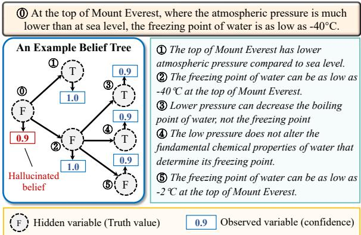  
Figure 1: An example constructed belief tree.

One key limitation of current methods is that they do not model noise or uncertainty in the LM generation process itself. LLMs’ “beliefs” are often poorly calibrated – even statements that models judge to be true with 100% probability are sometimes false. How can we produce reliable judgments about sets of related statements when even their assessments of individual statements are unreliable?

To do so, we propose Belief Tree PROPagation (BTPROP), a probabilistic method for improving the accuracy LLM “beliefs” with applications to hallucination detection. Specifically, given an initial statement generated by an LLM, BTPROP first generates a belief tree of recursively generated claims that are logically related ot the initial statement. An example is shown in Figure 1, in which the root node of the belief tree is one sentence generated by the LLM about the freezing point of water, and each child node supports or contradicts its parent. Next, BTPROP interprets this belief tree as a directed graphical model (a “hidden Markov tree"; Crouse et al., 1998; Durand et al., 2004) in which the LLM’s confidence scores are modeled as observed variables, and the ground-truth truthfulness of the statements as the corresponding hidden variables. Thus, the problem of assigning probabilities to statements can be reduced to probabilistic inference in a well-studied model family. Here, inference makes it possible to integrate knowledge about the (logical) structure of related statements, and the (probabilistic) relationship between statements and noisy LM outputs. Experiment results show that our method achieves state-of-the-art performance, improving the hallucination detection performance (AUROC and AUC-PR) by 3%–9% on FELM-Science (Chen et al., 2023b) and FactCheckGPT (Fadeeva et al., 2024) datasets relative to state-of-the-art baselines.

## 2 Related Work

Hallucinations in LLMs. Hallucination has become a prominent topic in the research of LLMs (Liu et al., 2022; Dhuliawala et al., 2023; Azaria and Mitchell, 2023; Li et al., 2023; Zhang et al., 2023a). Prior work (Ji et al., 2023; Huang et al., 2023) characterizes hallucination into two main types: factuality hallucination and faithfulness hallucination. Factuality hallucinations refer to outputs that are inconsistent with real-world facts. In comparison, faithfulness hallucinations shift to the generated content that deviates from the user’s instruction or user-provided contextual information. In this paper, we mainly focuses on factuality hallucinations and aim to better leverage the LLM’s intrinsic capabilities to detect such nonfactual statements within their generations.

Hallucination detection. To detect hallucinations in LLM generation, the retrieval-based methods (Shuster et al., 2021; Min et al., 2023; Chern et al., 2023; Semnani et al., 2023; Huo et al., 2023; Zhang et al., 2024) compare the LLM’s output with information from a reliable knowledge base. When an external knowledge base is inaccessible, another category of methods rely on the model’s intrinsic capabilities. Among them, some approaches leverage the reasoning ability of LLMs to detect and reduce hallucinations (Chen et al., 2023b; Dhuliawala et al., 2023) via chain-of-thought prompting (Wei et al., 2022). Uncertainty-based methods perform token-level or sentence-level uncertainty quantification (Varshney et al., 2023; Fadeeva et al., 2024) to predict the factuality of model’s generation. Probing the model’s hidden states can also help detect hallucinations (Azaria and Mitchell, 2023; Chen et al., 2023a; Su et al., 2024). The sampled-based methods (or consistency-based methods) (Manakul et al., 2023; Cao et al., 2023; Mündler et al., 2023) sample multiple responses and then perform consistency checks between these responses and the original model generation. Inconsistencies are then used to detect hallucinations. Our method is closely related to the consistency-based methods. Instead of sampling additional responses and performing unstructured consistency checks, our method generates logically-related statements organized in a tree structure. We further propose a probabilistic framework based on the hidden Markov tree model to check consistency and detect hallucinations.

Improving factuality via logical consistency. A growing body of research explores improving LLMs’ factuality using the logical consistency across their beliefs (Dalvi et al., 2021; Tafjord et al., 2022; Mitchell et al., 2022; Jung et al., 2022; Hase et al., 2023; Kassner et al., 2023; Akyürek et al., 2024). Starting from an initial text (e.g., a statement requiring truthfulness assessment or a question), these methods identify additional texts that are logically connected to the initial text and organize them in tree or graph structures. The inconsistencies of model’s beliefs on the factual correctness of these texts are resolved based on the inferential relations among these texts. One main limitation is that they treat the beliefs (LM-generated truth values or probabilities) as calibrated, which is generally not the case. Motivated by this, we build a probabilistic framework to integrate the model’s beliefs and figure out the most possible and reliable correctness evaluation of the initial text.

## 3 Method

Given a statement v from the LLM-generated text, e.g., A star’s temperature is determined by the amount of mass and energy it has, and an LLM, we aim to use the LLM to gauge the correctness of the statement. Many previous approaches use simple prompting techniques to directly elicit the LLM’s “belief”, or assessed probability of the statement, as a confidence score in [0, 1]. For example, one approach is to directly query the LLM for whether this is true. By sampling multiple answers from the LLM, we can obtain the confidence score as the fraction of answers that say yes (or some paraphrase thereof). Crucially, these scores may be wrong in several ways: in addition to being factually incorrect, they may be miscalibrated (reflecting an inappropriate degree of certainty or uncertainty) or inconsistent (e.g., assigning high probability to mutually incompatible statements, or different probabilities to logically equivalent statements). Below, we describe a method that addresses both categories of error by reasoning jointly about relationships between the truth values of related statements and LLM confidence scores.

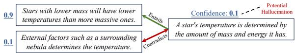  
Figure 2: Motivating example for the proposed method.

## 3.1 BTPROP: An Intuitive Overview

The basic idea of our approach is to construct a belief tree, denoted , in which the root node is the target statement, each child node is a statement logically related to the parent node, and each edge represents the logical relationship between two nodes. We then obtain the confidence scores of all the nodes and use the logical consistency among them to correct any potential mistakes in the scores.

Figure 2 shows an example, where the target statement is A star’s temperature is determined by the amount of mass and energy it has. This statement is true but assume that the LLM produces a low confidence score, 0.1, for the statement. To correct this error, we can construct a belief tree by generating two child nodes from the target node, where the first, which is true, is entailed by the target statement and the second, which is false, contradicts the target statement. Assume that the LLM correctly assigns a high confidence score to the former and a low score to the latter. In this case, we can easily recognize that the belief of the target node is logically inconsistent with those of the child nodes, and that increasing the confidence score of the target node would resolve the logical inconsistency, thereby correcting the mistake.

The example above shows a simple case in which LLM beliefs about child nodes are all correct. In reality, these child nodes’ beliefs may themselves be incorrect. To mitigate these additional errors, we can construct a much larger belief tree with greater depth and many different statements. Assuming the errors in the confidence scores are sporadic, we can then expect to correct most of these errors, in both the target and child nodes, by taking into account all the confidence scores and their logical consistency. An example of such a full belief tree

is shown in Figure 3.

As implied by the discussion above, our algorithm consists of two components: ❶ Constructing the belief tree, and ❷ inferring the truthfulness of the target statement by integrating the confidence scores across the belief tree. Section 3.2 will discuss the former and Sections 3.3-3.5 the latter.

## 3.2 Belief Tree Construction

Since the belief tree consists of nodes as statements and edges as the logical relationships between parent and child statements, the construction of the belief tree iterates between the following two steps. Step 1: Given a statement as the parent node, generate a set of logically connected statements as the children nodes. Step 2: Determine the logical connection between the children nodes and parent node. The iterative process starts with the target statement as the root node, and terminates when the maximum tree depth is reached. Each step is detailed below.

Generating Child Statements As will be described below, BTPROP is general, and compatible with any method for generating belief tree nodes from parent statements. We explore three specific strategies for statement generation:

Strategy 1: Statement Decomposition. For statements containing multiple facts/claims, we decompose them into individual sub-statements. Figure 1 shows an example where the target statement (Node 0) contains multiple facts (the atmosphere pressure level and the freezing point of water on Mound Everest), It is then decomposed into two statements, one on the atmosphere pressure level and one on the freezing point of water. Statement decomposition can be achieved by prompting the LLM with in-context examples, as listed in Appendix A.7.

Strategy 2: Supportive and Contradictory Premises. We prompt the LLM to generate a set of premises that are supportive or contradictory to the parent claim. When verifying the truthfulness of Node 2 in Figure 1 about the freezing point of water, we can prompt the model to generate contradictory premises (Node 3 and Node 4) that implies the limited influence of low pressure on the freezing point of water. By leveraging these generated premises, we can indeed correct the model’s wrong belief on Node 2 since the model’s confidence scores on these generated premises are high in this example.

Strategy 3: Statement Correction. In this strategy, the LLM is instructed to generate what it believes to be corrected versions of the parent statement. The Node 5 in Figure 1 shows one example of the statement correction process, where the statement is about the freezing point of water. Then the corrected statements would be almost the same as the parent statement (Node 2), except that the actual temperature is replaced with alternatives that LLM believes may be true. This strategy is implemented via a three-step prompting process. First, the LLM is prompted to generate a question about the key information in the statement (e.g., the freezing point in Node 2 in Figure 1). Then, the we sample answers from the LLM. Finally, the LLM is prompted to generate a corrected statement from the original statement if it is wrong according to each sampled answer. Note that there can be multiple corrected statements because the LLM may produce different answers when sampled multiple times. Also, the corrected statements may include the parent statement itself if the LLM believes the parent statement is a likely answer. More details about this process can be found in Appendix A.7.

Our method select the most appropriate strategies for each parent claim as follows. First, LLM first attempt the statement decomposition strategy. If the decomposition returns multiple statements, which indicates that the decomposition is meaningful, we would use them as the child statements. If only a single statement is returned, indicating that the parent statement cannot be further decomposed, we will prompt the LLM to select between strategies 2 and 3 with a list of rules and examples. The detailed prompts are in Appendix A.1.

Determining Logical Relationships Given a pair of parent and child statements, u and v, we consider the following four logical relationships: ❶ Equivalence, $u \Leftrightarrow v ,$ if u entails v and v entails u; ❷ entailment, $u  v .$ , if u entails v but v is neutral to u; ❸ reverse entailment, $u \Leftarrow v ,$ , if u is neutral to v but v entails u; and ❹ contradiction, $u \Rightarrow \neg v$ (or, equivalently, $v \Rightarrow \neg u )$ . Note that we do not consider the completely neutral relationship because any statements determined as completely neutral to their parent statement will be removed.

For the decomposition strategy (strategy 1), the child node statements are, by construction, jointly equivalent to the parent statement. Formally, denote u as the parent node and $\mathcal { C } ( u )$ as the set of its child nodes, then their logical relationship is determined as $u \Leftrightarrow \cap _ { v \in { \mathcal { C } } ( u ) } v$

For strategies 2 and 3, since each child statement is independently generated, we only need to determine their individual relationship to the parent statement, rather than the joint relationship. To this end, we leverage an off-the-shelf natural language inference (NLI) model to infer the entailment, neutrality, or contradiction between the statements. For each pair of parent statement u and an individual child statement v, we derive two NLI relationships, one by setting u as the premise and v as the hypothesis, and the other with u and v switched. The two NLI outputs are then mapped to the aforementioned logical relationships – (entail, entail) mapped to equivalence; (entail, neutral) mapped to entailment; (neutral, entail) mapped to reverse entailment; and any results containing contradict in either direction mapped to contradiction. If the NLI module returns (neutral, neutral), the corresponding child statement will be discarded.

Prior Belief Estimation The last step of the belief tree construction is to estimate the model’s belief $( i . e .$ , whether the statement is true) on each node. Specifically, we directly probe the LLM with the prompt ‘True or False? {target statement}’ and use the next token prediction probabilities of the words $\ T r u e ^ { \prime }$ and ‘False’ to compute the model confidence. We normalize the prediction logits of the two words to get the confidence score of that statement. The only exception is in the case of statement correction, where the LLM is already instructed to output alternative statements it believes to be true. As a result, we simply set the confidence score of each generated statement to 1. Our empirical analysis shows that this would greatly reduce the number of LLM queries without deteriorating the performance.

## 3.3 A Hidden Markov Tree Model

After the belief tree is constructed, the next question is how to utilize the confidence scores across the tree to better determine the truthfulness of the root statement, namely the target statement. To this end, we introduce a hidden Markov tree model and frame the truthfulness estimation problem as a probabilistic inference problem.

Figure 3 shows an example hidden Markov tree model built upon the belief tree, where there are two layers of variables. The upper layer consists of the confidence score of each statement, denoted $\{ S _ { u } \}$ , which is estimated during the belief tree construction process. The lower layer consists of the binary variables representing the actual correctness of each statement, denoted as $\{ Z _ { u } \} . ~ Z _ { u } = T$ if statement v is correct and $Z _ { u } = F$ otherwise. $\{ S _ { u } \}$ are observed variables while $\{ Z _ { u } \}$ are hidden variables.

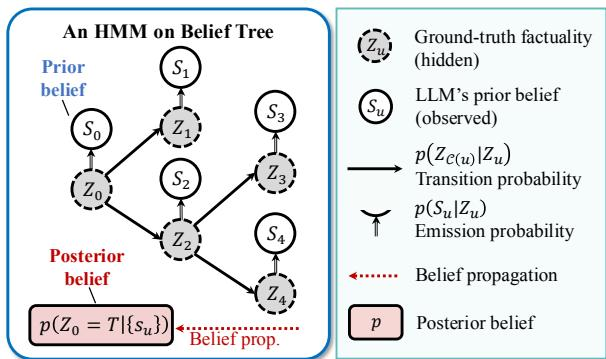  
Figure 3: An example hidden Markov tree model.

Given the above hidden Markov tree model, determining the truthfulness of the target statement can be cast as computing the posterior probability, $i . e . , p ( Z _ { 0 } = T \mid \{ S _ { u } \} )$ , which means the truthfulness of the root node given the confidence scores on all the nodes in this belief tree. To computing $p ( Z _ { 0 } = T \mid \{ S _ { u } \} )$ , we need to estimate the following probabilities.

The first set is the emission probability, $p ( S _ { u } \mid$ $Z _ { u } )$ , which characterizes the LLM’s confidence score of the statement given its underlying truthfulness. The emission probability captures the quality of LLM’s original confidence score. If the confidence score is accurate, then $p ( S _ { u } \mid Z _ { u } = T )$ will concentrate its probability mass towards 1, and $p ( S _ { u } \mid Z _ { u } = F )$ will concentrate its probability mass towards 0. Otherwise, the conditional distributions will be more spread.

The second set of distribution is the transition $p r o b a b i l i t y , p ( Z c _ { ( u ) } \mid Z _ { u } )$ , where $Z _ { C ( u ) }$ represent the set of truthfulness variables of all the child nodes of $u .$ The transition probability is the joint probability of the truthfulness of the child statements given that of the parent statement, which captures the logical relationships among these statements.

The third set of distribution is the prior distribution of hidden variables, $i . e . , p ( Z _ { u } = z )$ , which refers to the probability of an arbitrary statement u generated by the LLM being true or false. We use uniform prior (both 0.5 for $z = T { \mathrm { ~ a n d ~ } } z = F )$ in this paper.

Therefore, the process of computing the posterior probability contains two steps: ❷ the estimation step, to first estimate these probabilities on a held-out dataset. ❸ the inference step, to compute the posterior probability for each testing example. Section 3.4 will discuss how to determine the emission and transition probabilities and Section 3.5 how to infer $p ( Z _ { 0 } = T \mid \{ S _ { u } \} )$

<table><tr><td></td><td>Su ∈ [0.0, 0.2)</td><td>[0.2, 0.4)</td><td>[0.4, 0.7)</td><td>[0.7, 0.9)</td><td>[0.9, 1.0]</td></tr><tr><td> $Z _ { u } = \mathsf { T r u e }$ </td><td>0.12</td><td>0.05</td><td>0.10</td><td>0.08</td><td>0.65</td></tr><tr><td>Zu = False</td><td>0.30</td><td>0.10</td><td>0.15</td><td>0.13</td><td>0.32</td></tr></table>

Table 1: Empirical estimation of the emission probability on Wikibio-GPT3 dataset (Manakul et al., 2023).

## 3.4 Determining Conditional Probabilities

Determining Emission Probabilities The emission probabilities, $p ( S _ { u } \mid Z _ { u } )$ , can be estimated from labeled datasets. Specifically, given a dataset of statements with truthfulness labels, we can run the LLM to obtain the confidence scores of all the statements. We can then estimate $p ( S _ { u } \mid Z _ { u } = T )$ by obtaining the empirical distribution of the confidence scores within the statements labeled as true, and $p ( S _ { u } \mid Z _ { u } = F )$ within the statements labeled as false. To obtain the empirical distribution of the continuous confidence scores, we first quantize the support [0, 1] into multiple bins, and count the histogram of the confidence scores falling into each bin. The boundaries of each bin are listed in Table 1. Given a particular confidence score on a statement, we look up the table to get the corresponding emission probability. For example, a confidence score 0.95 leads to $p ( S _ { u } = 0 . 9 5 \mid Z _ { u } = F ) = 0 . 6 5$

Determining Transition Probabilities The transition probability, $p \big ( Z _ { \mathcal { C } ( u ) } \ \mid \ Z _ { u } \big )$ , is a multivariate Bernoulli distribution with the support $\{ T , F \} ^ { m }$ where m is the size of (u). As discussed in Section 3.2, different statement generation strategies have different logical relationship properties. For the statement decomposition strategy, the child statements are always jointly equivalent to the parent statement. Therefore, when the parent claim is true, $i . e . , Z _ { u } = T$ , we know that all of the child statements must be true, and thus $p ( Z _ { \mathcal { C } ( u ) } = z \mid Z _ { u } = T )$ equals one when every element in z is true and zero otherwise. Conversely, when the parent claim is false, $i . e . , Z _ { u } = F .$ , we can infer that at least one child statement is wrong, so $p ( Z _ { \mathcal { C } ( u ) } = z \ | \ Z _ { u } = F )$ is set to zero when every element in z is true and uniformly set to $1 / ( 2 ^ { m } - 1 )$ otherwise.

For the other two strategies, the child statements of the same parent statement are considered independent conditional on the parent statement. Therefore, we can decompose the probability $p \big ( Z _ { \mathcal { C } ( u ) } \ | \ Z _ { u } \big )$ into $\begin{array} { r } { \prod _ { v \in \mathcal { C } ( u ) } p ( Z _ { v } \mid Z _ { u } ) } \end{array}$ , where each $p ( Z _ { v } \mid Z _ { u } )$ is the transitional probability between parent statement u and one child statement v. $p ( Z _ { v } \mid Z _ { u } )$ is determined based on the four different possible logical relationships between u and v (recall the discussion in Section 3.2), which is listed in Table 2.

<table><tr><td>/</td><td colspan="2">u⇔v</td><td colspan="2"> $u \Rightarrow v$ </td><td colspan="2"> $u \Leftarrow v$ </td><td colspan="2"> $u \Rightarrow \neg v$ </td></tr><tr><td></td><td> $u = T$ </td><td> $u = F$ </td><td> $u = T$ </td><td> $u = F$ </td><td> $u = T$ </td><td> $u = F$ </td><td> $u = T$ </td><td> $u = F$ </td></tr><tr><td>v = T</td><td>1.0</td><td>0.0</td><td>1.0</td><td>Pt</td><td>Pt</td><td>0.0</td><td>0.0</td><td>Pt</td></tr><tr><td>v = F</td><td>0.0</td><td>1.0</td><td>0.0</td><td>Pf</td><td>pf</td><td>1.0</td><td>1.0</td><td>Pf</td></tr></table>

Table 2: Transition probability given different logical relationships between two nodes. $p _ { t }$ and $p _ { f }$ are set to 0.5 in this paper.

## 3.5 Inferring the Posterior Probability of $Z _ { 0 }$

Inferring the posterior probability $p ( Z _ { 0 } = T \mid \{ S _ { u } \} )$ is a standard inference problem in hidden Markov tree models and we can apply the standard upwarddownward algorithm (Crouse et al., 1998) to efficiently compute this probability. For brevity, we only describe the gist of the algorithm here. More details can be found in Appendix A.4 and previous work (Crouse et al., 1998; Durand et al., 2004).

The algorithm introduces an auxiliary conditional distribution $\beta ( z , u ) \equiv p ( S _ { T ( u ) } \mid Z _ { u } = z )$ , where $z ~ \in ~ \{ T , F \}$ and $S _ { T ( u ) }$ represents the confidence scores of all the nodes in the sub-tree whose root node is u. Note that the posterior probability of our interest, $p ( Z _ { 0 } = T \mid \{ S _ { T ( 0 ) } \} )$ ), can be computed as

$$
p ( Z _ { 0 } = T \mid \{ S _ { \mathcal { T } ( 0 ) } \} ) = \frac { \beta ( T , 0 ) p ( Z _ { 0 } = T ) } { \sum _ { z \in \{ T , F \} } \beta ( z , 0 ) p ( Z _ { 0 } = z ) } ,
$$

where $p ( Z _ { 0 } = T )$ and $p ( Z _ { 0 } = F )$ are exactly the prior probabilities we mentioned in Section 3.3, and both are set to be 0.5. Therefore, the posterior probability above can be represented as $\beta ( T , 0 ) / ( \beta ( F , 0 ) +$ $\beta ( T , 0 ) )$ ). According to the Bayesian rule, we can derive a recursive relationship between $\beta ( z , u )$ of a parent node u and those of the child nodes:

$$
\begin{array} { r l } & { \beta ( z , u ) = p ( S _ { u } \mid Z _ { u } = z ) \cdot } \\ & { \qquad \displaystyle \sum _ { Z _ { \mathcal { C } ( u ) } \in \{ T , F \} ^ { m } } p ( Z _ { \mathcal { C } ( u ) } \mid Z _ { u } = z ) \prod _ { v \in \mathcal { C } ( u ) } \beta ( Z _ { v } , v ) , } \end{array}\tag{1}
$$

where m is the size of $\mathcal { C } ( u )$ (namely the number of child statements to node u). Note that the first term on the RHS is the emission probability, and the first term inside the summation is the transition probability, which are both already known. Therefore, Equation 1 provides a way to compute $\beta ( z , 0 )$ recursively from the leaf nodes back to the root node. First, we compute the $\beta ( z , u )$ of the leaf nodes as $\beta ( z , u ) = p ( S _ { u } \mid Z _ { u } = z )$ . Then, we use Equation 1 to recursively compute the $\beta ( z , u )$ of a parent node u from their child nodes, until the root node is reached. The entire process is essentially propagating and merging the beliefs in the confidence scores from sub-trees upward to the parent node. By the time we reach the root node, we have gathered the information of all the confidence scores. Hence this process is also referred to as a belief propagation process.

We summarize the whole algorithm in Appendix A.5.

## 4 Experiments

In this section, we conduct empirical evaluations on widely-used hallucination detection benchmarks.

## 4.1 Experiment Configurations

Datasets We follow the previous work of hallucination detection (Manakul et al., 2023; Chen et al., 2023b) and use the following datasets for evaluation: Wikibio-GPT3 (Manakul et al., 2023), FELM-Science (Chen et al., 2023b), and FactCheckGPT (Wang et al., 2023). Wikibio-GPT3 mainly consists of biography articles generated by LLMs, whereas the other two datasets cover a broader range of topics such as physics, chemistry, and computer science.

Evaluation settings and metrics We conduct hallucination detection at sentence-level on Wikibio-GPT3 and FactCheckGPT and segmentlevel on FELM-Science following the default settings. Our evaluation metrics include the area under the receiver operator characteristic curve (AU-ROC), area under the precision-recall curve (AUC-PR), F1 score, and detection accuracy. As F1 score and detection accuracy evaluation require a decision threshold, we search for the optimal threshold to maximize the F1 score for each method and compute the two metrics. The hallucinated examples are considered as positive instances following the default configurations of these datasets. Moreover, Wikibio-GPT3 and FELM-Science exhibit significant class imbalances, so the detection accuracy on these datasets serve merely as reference points.

Baselines We include the following baselines for comparison. (1) PRIOR CONFIDENCE , which directly queries the model’s confidence on the truthfulness of each sentence or segment. (2) COT, which prompts the model to first generate a reasoning process before deciding the truthfulness. We adopt the prompting method from the official FELM (Chen et al., 2023b) dataset, with slight modifications for sentence-level and segment-level hallucination detection. (3) SELFCHECKGPT (Manakul et al., 2023), which samples additional responses from the model and use the inconsistency between each response and the target statement for hallucination detection. Among the multiple variants, we choose SELFCHECKGPT-prompt with the best performance for comparison. (4) MAIEUTIC PROMPTING (Jung et al., 2022), which builds a belief tree via backward-chaining and then infers the truth-value of the original statement that resolves the inconsistencies. (5) SEMANTIC UNCER-TAINTY (Kuhn et al., 2023; Farquhar et al., 2024), which estimate the model’s predictive uncertainty on the generation for hallucination detection. (6) FOCUS (Zhang et al., 2023b), which quantify the predictive uncertainty of the LLM on given texts to detect hallucinations. Note that we only include FOCUS when the backbone is Llama3 since it requires full access to the LLM.

<table><tr><td>Method</td><td>Backbone</td><td>AUROC</td><td>AUC-PR</td><td>F1</td><td>Acc</td><td>Backbone</td><td>AUROC</td><td>AUC-PR</td><td>F1</td><td>Acc</td></tr><tr><td colspan="9">Wikibio-GPT3</td><td></td></tr><tr><td>PRIOR CONFIDENCE CoT</td><td rowspan="5">gpt-3.5</td><td>73.1 71.3</td><td>85.7</td><td>84.5</td><td>76.3</td><td rowspan="5"></td><td>71.0 72.0</td><td>85.7</td><td>85.5</td><td>75.9</td></tr><tr><td></td><td></td><td>83.4</td><td>85.2</td><td>76.4</td><td></td><td>84.4</td><td>85.3 84.5</td><td>75.7</td></tr><tr><td>SEMANTIC UNCERTAINTY -turbo</td><td>70.8</td><td>86.1</td><td>84.3</td><td>73.7</td><td>Llama3-8B 60.3 Instruct</td><td>78.7</td><td></td><td>73.6</td></tr><tr><td>SELFCHECKGPT</td><td>82.6</td><td>91.3</td><td>86.6</td><td>80.0</td><td>77.0</td><td>86.8</td><td>86.1</td><td>76.8</td></tr><tr><td>FoCUs BTPROP</td><td></td><td></td><td></td><td></td><td>73.0 74.0</td><td>85.1 86.2</td><td>86.2</td><td>77.3 86.1 77.5</td></tr><tr><td>90.4 87.6 80.4</td><td colspan="9">80.7</td></tr><tr><td colspan="9">FELM-Science 75.5</td><td>44.0</td><td>80.6</td></tr><tr><td>PRIOR CONFIDENCE CoT</td><td rowspan="7">gpt-3.5 -turbo</td><td>56.3</td><td>37.2 19.0</td><td>42.1 28.6</td><td>81.6 72.5</td><td rowspan="7">Llama3-8B Instruct</td><td>76.1 61.6</td><td>38.2 25.7</td><td>32.6</td><td>71.2</td></tr><tr><td>SEMANTIC UNCERTAINTY</td><td>59.1</td><td>25.6</td><td>32.6</td><td>75.2</td><td>52.5</td><td>17.2</td><td>27.9</td><td>79.6</td></tr><tr><td>SELFCHECKGPT</td><td>77.4</td><td>45.7</td><td>51.3</td><td>84.4</td><td>77.8</td><td>39.5</td><td>49.1</td><td>76.5</td></tr><tr><td>MAIEUTIC PROMPTING</td><td></td><td></td><td></td><td>82.6</td><td></td><td></td><td>22.9</td><td>79.2</td></tr><tr><td></td><td>-</td><td></td><td>27.2</td><td></td><td></td><td></td><td></td><td>76.5</td></tr><tr><td>FoCUs</td><td></td><td>=</td><td></td><td></td><td>69.4</td><td>43.5</td><td>41.7</td><td></td></tr><tr><td>BTPROP</td><td>79.1</td><td>52.3</td><td>56.5 81.6</td><td></td><td>77.8</td><td>48.2</td><td>51.3</td><td>82.8</td></tr><tr><td colspan="9">FactCheckGPT</td></tr><tr><td>PRIOR CONFIDENCE</td><td rowspan="2"></td><td>76.0</td><td>52.6</td><td>53.6</td><td>71.5 66.4</td><td rowspan="2"></td><td>71.9 72.5</td><td>47.6 43.3</td><td>50.8 53.2</td><td>60.5</td></tr><tr><td>CoT</td><td>66.5</td><td>38.9</td><td>47.7</td><td></td><td></td><td></td><td></td><td>66.1 49.9</td></tr><tr><td>SEMANTIC UNCERTAINTY</td><td rowspan="3">gpt-3.5 -turbo</td><td>56.3</td><td>33.9</td><td>40.9</td><td>65.9</td><td rowspan="3">Llama3-8B Instruct</td><td>57.6</td><td>34.1</td><td>40.8</td><td>65.9</td></tr><tr><td>SELFCHECKGPT</td><td>74.9</td><td>49.7</td><td>54.4</td><td>74.0</td><td>72.5</td><td>46.4</td><td>51.9 39.8</td><td>66.8</td></tr><tr><td>MAIEUTIC PROMPTING</td><td></td><td></td><td>35.0</td><td>72.2</td><td></td><td></td><td></td><td></td></tr><tr><td>BTPROP</td><td></td><td>79.4</td><td>54.3</td><td>60.2</td><td>75.3</td><td></td><td>73.9</td><td>49.1</td><td>55.3</td><td>72.6</td></tr></table>

Table 3: Hallucination detection performance of different methods. We report AUROC, ROC-PR, F1 score, and detection accuracy(Acc) for all methods with two backbone models. The best results are highlighted in bold.

Implementation details We evaluate our methods and baselines using GPT-3.5-turbo-0125 and Llama-3-8B-Instruct. For our method, we set the maximum belief tree depth to 2. We employ greedy decoding during belief tree construction and prior belief estimation. The exception is the statement correction strategy, where we sample 5 corrected statements using temperature 0.7. Additionally, since each statement in FactCheckGPT is manually processed to ensure it contains only one property or fact, we do not apply statement decomposition when build the belief tree for statements from FactCheckGPT. We use the first 120 examples in the Wikibio-GPT3 dataset to estimate the emission probability in our method, and validate it on the remaining examples and two other datasets. More details are in Appendix A.1.

## 4.2 Experiment Results

Overall comparison We evaluate the effectiveness of BTPROP with the experiment results in Table 3. We highlight the following observations. First, our method achieves the best performance on FELM-Science and FactCheckGPT datasets across different backbones, demonstrating the superiority of our method. BTPROP improves upon the best baselines by 3% - 9% on AUROC and ROC-PR. The only exception is the Wikibio-GPT3 dataset, where the SELFCHECKGPT is more effective for detection hallucinated outputs in biographies generated by LLMs. Second, compared to SELFCHECK-GPT which leverages contradictions between the target statement and the sampled responses for hallucination detection, our method is more effective on detecting hallucinated responses related to scientific knowledge. Both FELM-Science and FactCheckGPT datasets contain a significant proportion of questions on scientific knowledge, and our method achieves the best performance on them. Third, chain-of-thought prompting is less effective in hallucination detection, especially on the FELM-Science dataset. This finding aligns with the experimental results in the original FELM dataset paper. Our experiments show that the model tends to regard the input sentence as true most of the time, leading to sub-optimal performance. The Maieuticprompting method, which is originall designed to verify the correctness of statements related to commonsense reasoning, is less effective for hallucination detection. Even on the FELM-Science and FactCheckGPT datasets which contain many statements about scientific knowledge, it remains less effective compared to other methods. We also find that the Semantic Uncertainty method is more effective on detection hallucinations in biography generation. However, its effectiveness diminishes when applied to the other two datasets. In contrast, our method consistently delivers competitive performance across a variety of benchmarks.

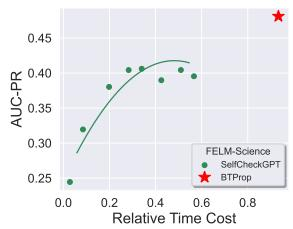

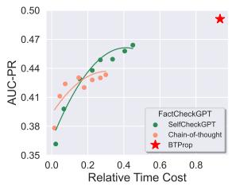  
Figure 4: Performance-efficiency comparison.

Deployment efficiency One concern on our method is the belief tree construction would be inefficient. We compare the time cost of our method with the baselines on the FELM-Science and FactCheckGPT datasets, where our method significantly outperform baselines. We use the gpt-3.5-turbo as the backbone, and eliminate CoT prompting method on FELM-Science dataset due to its poor performance. We visualize the tradeoff between hallucination detection performance and the time cost in Figure 4. The baseline methods, including SELFCHECKGPT and COT prompting, samples additional 20 responses for hallucination detection. We vary the number of samples and test the corresponding performance to visualize the trade-off. As depicted in the graph, the baseline performance shows diminishing returns in performance improvement with increased computational complexity. As time cost increases, the performance growth of the two baseline models gradually levels off, eventually reaching a point where additional time does not translate into significantly better performance. In comparison, our method can effectively trades off increased time cost for significantly improved performance. Despite its higher computational complexity, it achieves a marked improvement in performance metrics, underscoring its efficiency and effectiveness.

<table><tr><td></td><td>AUROC</td><td>AUC-PR</td><td>F1</td><td>Acc</td></tr><tr><td>BTPROP</td><td>79.1</td><td>52.3</td><td>56.5</td><td>81.6</td></tr><tr><td>Decomposition only</td><td>67.9</td><td>31.2</td><td>43.3</td><td>79.6</td></tr><tr><td>Premise only</td><td>70.2</td><td>30.7</td><td>40.4</td><td>78.6</td></tr><tr><td>Correction only</td><td>77.4</td><td>47.5</td><td>53.0</td><td>81.5</td></tr><tr><td>PRIOR CONFIDENCE</td><td>75.5</td><td>37.2</td><td>42.1</td><td>81.6</td></tr></table>

Table 4: Performance of BTPROP given different child node generation strategies.

Hallucination detection in texts generated by the backbone model. Since the datasets in the above experiments consist of text generated by another model for hallucination detection, we also include texts generated by the backbone model itself to to provide a more comprehensive evaluation of our method’s effectiveness. Detailed results are available in Appendix A.2, where we show that our method can also effectively detect the hallucinations in the text generated by the backbone model itself.

Qualitative results We visualize several examples of the constructed belief trees to demonstrate how the inconsistencies in model’s beliefs help detect the hallucination. Due to space limit, we put these examples and the analyses in Appendix A.3.

Ablation study: belief tree construction We introduce three strategies to build the belief tree: statement decomposition, generating supportive and contradictory premises, and statement correction. We perform ablation study to demonstrate the necessity to introduce these different strategies in Table 4 using gpt-3.5-turbo-0125 as the backbone model. Specifically, we evaluate the performance of our method when only use one child node generation strategies on the FELM-Science dataset. We highlight the following observations. First, only applying one child node generation strategy is sub-optimal. There exist a significant gap between using one strategy and using them all. Second, statement correction tends to contribute most to the performance improvement, but when combining it with other strategies, the performance can still be further improved.

## 5 Conclusion

In this paper, we propose BTPROP, a method that leverages the model’s intrinsic capability for hallucination detection. Given a statement from the LLM-generated texts, our method organizes the model’s intrinsic beliefs on neighboring statements in a belief tree. By introducing the hidden Markov tree model, we convert the the hallucination detection into a posterior probability estimation problem and propose corresponding solutions to solve it. Experiment results have demonstrate the effectiveness of our method. The future direction would be how to further improve the belief tree construction method to make it more effective and efficient.

## 6 Societal Impact and limitations

In this paper, our primary goal is to develop an algorithm that can integrate the model’s internal beliefs on logically-connected statements to detect hallucinations in texts generated by the LLM. Our method is designed to improve the trustworthiness of LLMs and make fully use of their intrinsic capabilities. Therefore, our method is less likely to introduce the unintended risks. We also assess the experiments to ensure they are devoid of any harmful content or adverse impacts.

While BTPROP improves the hallucination detection performance and enhance the trustworthiness of LLMs, it involves collecting a set of augmented statements (the belief tree) to perform inference. Therefore, the main limitation of our method is its high time cost. Constructing a belief tree necessitates multiple queries to the large language model, leading to significant delays. Additionally, the time complexity of generating child nodes increases exponentially as more layers are added to the tree. A potential solution to this issue could be to develop a mechanism that selectively expands nodes within the belief tree, thereby optimizing the process.

## Acknowledgments

The work of Bairu Hou and Shiyu Chang was partially supported by National Science Foundation (NSF) Grant IIS-2338252, NSF Grant IIS-2207052, and NSF Grant IIS-2302730. The work of Jacob Andreas is supported by a Sloan Fellowship and the

NSF under grant IIS-2238240. The computing resources used in this work were partially supported by the Accelerate Foundation Models Research program of Microsoft and CAIS Compute Cluster of Center for AI Safety.

## References

Afra Feyza Akyürek, Ekin Akyürek, Leshem Choshen, Derry Wijaya, and Jacob Andreas. 2024. Deductive closure training of language models for coherence, accuracy, and updatability. arXiv preprint arXiv:2401.08574.

Amos Azaria and Tom Mitchell. 2023. The internal state of an llm knows when it’s lying. In The 2023 Conference on Empirical Methods in Natural Language Processing.

Zouying Cao, Yifei Yang, and Hai Zhao. 2023. Autohall: Automated hallucination dataset generation for large language models. arXiv preprint arXiv:2310.00259.

Chao Chen, Kai Liu, Ze Chen, Yi Gu, Yue Wu, Mingyuan Tao, Zhihang Fu, and Jieping Ye. 2023a. Inside: Llms’ internal states retain the power of hallucination detection. In The Twelfth International Conference on Learning Representations.

Shiqi Chen, Yiran Zhao, Jinghan Zhang, I-Chun Chern, Siyang Gao, Pengfei Liu, and Junxian He. 2023b. Felm: Benchmarking factuality evaluation of large language models. In Thirty-seventh Conference on Neural Information Processing Systems Datasets and Benchmarks Track.

I Chern, Steffi Chern, Shiqi Chen, Weizhe Yuan, Kehua Feng, Chunting Zhou, Junxian He, Graham Neubig, Pengfei Liu, et al. 2023. Factool: Factuality detection in generative ai–a tool augmented framework for multi-task and multi-domain scenarios. arXiv preprint arXiv:2307.13528.

Matthew S Crouse, Robert D Nowak, and Richard G Baraniuk. 1998. Wavelet-based statistical signal processing using hidden markov models. IEEE Transactions on signal processing, 46(4):886–902.

Bhavana Dalvi, Peter Jansen, Oyvind Tafjord, Zhengnan Xie, Hannah Smith, Leighanna Pipatanangkura, and Peter Clark. 2021. Explaining answers with entailment trees. In Proceedings ofthe 2021 Conference on Empirical Methods in Natural Language Processing, pages 7358–7370.

Shehzaad Dhuliawala, Mojtaba Komeili, Jing Xu, Roberta Raileanu, Xian Li, Asli Celikyilmaz, and Jason Weston. 2023. Chain-of-verification reduces hallucination in large language models. arXiv preprint arXiv:2309.11495.

J-B Durand, Paulo Goncalves, and Yann Guédon. 2004. Computational methods for hidden markov tree models-an application to wavelet trees. IEEE Transactions on Signal Processing, 52(9):2551–2560.

Ekaterina Fadeeva, Aleksandr Rubashevskii, Artem Shelmanov, Sergey Petrakov, Haonan Li, Hamdy Mubarak, Evgenii Tsymbalov, Gleb Kuzmin, Alexander Panchenko, Timothy Baldwin, et al. 2024. Factchecking the output of large language models via token-level uncertainty quantification. arXiv preprint arXiv:2403.04696.

Ekaterina Fadeeva, Roman Vashurin, Akim Tsvigun, Artem Vazhentsev, Sergey Petrakov, Kirill Fedyanin, Daniil Vasilev, Elizaveta Goncharova, Alexander Panchenko, Maxim Panov, et al. 2023. Lmpolygraph: Uncertainty estimation for language models. In Proceedings of the 2023 Conference on Empirical Methods in Natural Language Processing: System Demonstrations, pages 446–461.

Sebastian Farquhar, Jannik Kossen, Lorenz Kuhn, and Yarin Gal. 2024. Detecting hallucinations in large language models using semantic entropy. Nature, 630(8017):625–630.

Peter Hase, Mona Diab, Asli Celikyilmaz, Xian Li, Zornitsa Kozareva, Veselin Stoyanov, Mohit Bansal, and Srinivasan Iyer. 2023. Methods for measuring, updating, and visualizing factual beliefs in language models. In Proceedings of the 17th Conference of the European Chapter of the Association for Computational Linguistics, pages 2714–2731.

Lei Huang, Weijiang Yu, Weitao Ma, Weihong Zhong, Zhangyin Feng, Haotian Wang, Qianglong Chen, Weihua Peng, Xiaocheng Feng, Bing Qin, et al. 2023. A survey on hallucination in large language models: Principles, taxonomy, challenges, and open questions. arXiv preprint arXiv:2311.05232.

Siqing Huo, Negar Arabzadeh, and Charles LA Clarke. 2023. Retrieving supporting evidence for llms generated answers. arXiv preprint arXiv:2306.13781.

Ziwei Ji, Nayeon Lee, Rita Frieske, Tiezheng Yu, Dan Su, Yan Xu, Etsuko Ishii, Ye Jin Bang, Andrea Madotto, and Pascale Fung. 2023. Survey of hallucination in natural language generation. ACM Computing Surveys, 55(12):1–38.

Jaehun Jung, Lianhui Qin, Sean Welleck, Faeze Brahman, Chandra Bhagavatula, Ronan Le Bras, and Yejin Choi. 2022. Maieutic prompting: Logically consistent reasoning with recursive explanations. In Proceedings of the 2022 Conference on Empirical Methods in Natural Language Processing, pages 1266–1279.

Nora Kassner, Oyvind Tafjord, Ashish Sabharwal, Kyle Richardson, Hinrich Schuetze, and Peter Clark. 2023. Language models with rationality. In The 2023 Conference on Empirical Methods in Natural Language Processing.

Lorenz Kuhn, Yarin Gal, and Sebastian Farquhar. 2023. Semantic uncertainty: Linguistic invariances for uncertainty estimation in natural language generation. In The Eleventh International Conference on Learning Representations.

Woosuk Kwon, Zhuohan Li, Siyuan Zhuang, Ying Sheng, Lianmin Zheng, Cody Hao Yu, Joseph E. Gonzalez, Hao Zhang, and Ion Stoica. 2023. Efficient memory management for large language model serving with pagedattention. In Proceedings of the ACM SIGOPS 29th Symposium on Operating Systems Principles.

Junyi Li, Xiaoxue Cheng, Wayne Xin Zhao, Jian-Yun Nie, and Ji-Rong Wen. 2023. Halueval: A largescale hallucination evaluation benchmark for large language models. In Proceedings ofthe 2023 Conference on Empirical Methods in Natural Language Processing, pages 6449–6464.

Tianyu Liu, Yizhe Zhang, Chris Brockett, Yi Mao, Zhifang Sui, Weizhu Chen, and William B Dolan. 2022. A token-level reference-free hallucination detection benchmark for free-form text generation. In Proceedings of the 60th Annual Meeting of the Association for Computational Linguistics (Volume 1: Long Papers), pages 6723–6737.

Potsawee Manakul, Adian Liusie, and Mark Gales. 2023. Selfcheckgpt: Zero-resource black-box hallucination detection for generative large language models. In The 2023 Conference on Empirical Methods in Natural Language Processing.

Sewon Min, Kalpesh Krishna, Xinxi Lyu, Mike Lewis, Wen-tau Yih, Pang Koh, Mohit Iyyer, Luke Zettlemoyer, and Hannaneh Hajishirzi. 2023. Factscore: Fine-grained atomic evaluation of factual precision in long form text generation. In Proceedings ofthe 2023 Conference on Empirical Methods in Natural Language Processing, pages 12076–12100.

Eric Mitchell, Joseph Noh, Siyan Li, Will Armstrong, Ananth Agarwal, Patrick Liu, Chelsea Finn, and Christopher D Manning. 2022. Enhancing selfconsistency and performance of pre-trained language models through natural language inference. In Proceedings ofthe 2022 Conference on Empirical Methods in Natural Language Processing, pages 1754– 1768.

Niels Mündler, Jingxuan He, Slobodan Jenko, and Martin Vechev. 2023. Self-contradictory hallucinations of large language models: Evaluation, detection and mitigation. In The Twelfth International Conference on Learning Representations.

Sina Semnani, Violet Yao, Heidi Zhang, and Monica Lam. 2023. Wikichat: Stopping the hallucination of large language model chatbots by few-shot grounding on wikipedia. In Findings of the Association for Computational Linguistics: EMNLP 2023, pages 2387–2413.

Kurt Shuster, Spencer Poff, Moya Chen, Douwe Kiela, and Jason Weston. 2021. Retrieval augmentation reduces hallucination in conversation. In Findings of the Association for Computational Linguistics: EMNLP 2021, pages 3784–3803.

Weihang Su, Changyue Wang, Qingyao Ai, Yiran Hu, Zhijing Wu, Yujia Zhou, and Yiqun Liu. 2024. Unsupervised real-time hallucination detection based on the internal states of large language models. arXiv preprint arXiv:2403.06448.

Oyvind Tafjord, Bhavana Dalvi Mishra, and Peter Clark. 2022. Entailer: Answering questions with faithful and truthful chains of reasoning. arXiv preprint arXiv:2210.12217.

Neeraj Varshney, Wenlin Yao, Hongming Zhang, Jianshu Chen, and Dong Yu. 2023. A stitch in time saves nine: Detecting and mitigating hallucinations of llms by validating low-confidence generation. arXiv preprint arXiv:2307.03987.

Xuezhi Wang, Jason Wei, Dale Schuurmans, Quoc V Le, Ed H Chi, Sharan Narang, Aakanksha Chowdhery, and Denny Zhou. 2022. Self-consistency improves chain of thought reasoning in language models. In The Eleventh International Conference on Learning Representations.

Yuxia Wang, Revanth Gangi Reddy, Zain Muhammad Mujahid, Arnav Arora, Aleksandr Rubashevskii, Jiahui Geng, Osama Mohammed Afzal, Liangming Pan, Nadav Borenstein, Aditya Pillai, et al. 2023. Factcheck-gpt: End-to-end fine-grained documentlevel fact-checking and correction of llm output. arXiv preprint arXiv:2311.09000.

Jason Wei, Xuezhi Wang, Dale Schuurmans, Maarten Bosma, Fei Xia, Ed Chi, Quoc V Le, Denny Zhou, et al. 2022. Chain-of-thought prompting elicits reasoning in large language models. Advances in neural information processing systems, 35:24824–24837.

Jiawei Zhang, Chejian Xu, Yu Gai, Freddy Lecue, Dawn Song, and Bo Li. 2024. Knowhalu: Hallucination detection via multi-form knowledge based factual checking. arXiv preprint arXiv:2404.02935.

Muru Zhang, Ofir Press, William Merrill, Alisa Liu, and Noah A Smith. 2023a. How language model hallucinations can snowball. arXiv preprint arXiv:2305.13534.

Tianhang Zhang, Lin Qiu, Qipeng Guo, Cheng Deng, Yue Zhang, Zheng Zhang, Chenghu Zhou, Xinbing Wang, and Luoyi Fu. 2023b. Enhancing uncertaintybased hallucination detection with stronger focus. In Proceedings of the 2023 Conference on Empirical Methods in Natural Language Processing, pages 915– 932.

## A Appendix / supplemental material

## A.1 Implementation Details

Data preprocessing We preprocess the data in Wikibio-GPT3 (Manakul et al., 2023) and FELM-Science (Chen et al., 2023b) before evaluating our method and baselines. The data preprocessing includes two steps. First, we perform decontextualization since the sentences in a response generated by the LLM might be context-dependent and contain pronouns or noun phrases that cannot be understood without full context. Take the first data instance from Wikibio-GPT3 for demonstration, which is a biography of “John Russell Reynolds” generated by an LLM. The second sentence within the biography requiring hallucination detection is “He was born in London, the son of a barrister, and was educated at Eton College and Trinity College, Cambridge.” Without the context, we cannot identify the truthfulness of this sentence due to the pronoun. Therefore, we first decontextualize the sentences in the two datasets by prompting gpt-3.5-turbo-0125. The prompt is available in Figure 9.

Second, we further manually clean up the dataset by filtering out some sentences that are not checkworthy but still annotated as “true” in the datasets. For example, the FELM contains some sentences such as “Sure!” and “If you have any further questions or concerns, please let me know.”. These sentences are annotated as “true” and will be counted into performance evaluation. Since both two datasets contains not too many examples, we manually filter out these sentences to exclude them in our evaluation. The datasets after our preprocessing and filtering are available in the supplemental material and will be made open-sourced.

Implementation of our method We use the vLLM (Kwon et al., 2023) to perform the inference of Llama-3-8B-Instruct. We use a single NVIDIA A100 80GB PCIe GPU to evaluate the performance and report the time cost in Figure 4. For the emission probability estimation (Table 1), we use the first 120 examples in the Wikibio-GPT3 dataset (50% of it) to compute the empirical estimation of the emission probability. The model we use is gpt-3.5-turbo-0125. Then we transfer the estimated emission probabilities to the remaining examples in Wikibio-GPT3 and other datasets for performance evaluation. For Llama-3-8B-Instruction, we also use the same estimated emission probabilities.

<table><tr><td></td><td>AUROC</td><td>AUC-PR</td><td>F1</td><td>Acc</td></tr><tr><td>Prior Confidence</td><td>67.7</td><td>63.2</td><td>71.6</td><td>68.1</td></tr><tr><td>MSP</td><td>70.5</td><td>73.3</td><td>69.3</td><td>57.4</td></tr><tr><td>Perplexity</td><td>66.0</td><td>63.4</td><td>70.0</td><td>59.3</td></tr><tr><td>CCP</td><td>75.8</td><td>78.1</td><td>72.4</td><td>69.5</td></tr><tr><td>BTPROP</td><td>76.5</td><td>75.5</td><td>73.3</td><td>70.0</td></tr></table>

Table 5: Performance of BTPROP given different child node generation strategies.

For the emission probability, we use first 120 examples of the Wikibio-GPT3 dataset as the validation set and estimate the emission probability on it using gpt-3.5-turbo-0125. The estimated emission probabilities are in Table 1 and will used on the other testing examples of Wikibio-GPT3 and other two datasets. Additionally, since we set the model confidence on child nodes generated by statement correction as 1.0 rather than probe the model’s confidence, we find setting an individual set of emission probabilities for those statements improves the performance. Therefore, we tune the emission probabilities for child nodes generated by statement correction on the validation set. The emission probabilities for those child nodes we use are $p ( S _ { u } ~ = ~ 1 ~ \vert ~ Z _ { u } ~ = ~ 1 ) ~ = ~ 0 . 8$ and $p ( S _ { u } = 1 \mid Z _ { u } = 0 ) = 0 . 2$ . During the belief tree construction process, we add several constraints to boost the efficiency. Specifically, we only apply statement decomposition to the root node, assuming the child nodes generated by the LLM is atomic statements that only contain one aspect of information. Also, we do not expand nodes generated by statement correction, as they are homogeneous to their parent node.

Implementation of baselines We follow the default configuration of each baselines. For SELFCHECKGPT, we sample 20 additional responses for hallucination detection. Similarly, we also sample 20 different answers for chainof-thought prompting and aggregate them using self-consistency (Wang et al., 2022). For Maieutic-Prompting, we use their prompts for the CREAK datasets to generate belief trees in our evaluation. For all methods, we use the scikit-learn package to compute the evaluation metrics including AUROC, AUC-PR, and F1 score.

## A.2 Additional Results

Since the datasets in the above experiments consist of text pre-generated by another model for hallucination detection, we also include texts generated by the hallucination detection model itself to further evaluate the effectiveness of our method. Specifically, we first generate biographical data using the prompt from Wikibio-GPT3 dataset with Llama-3- 8b-instruct, following the “claim-level uncertainty quantification” setup of LM-Polygraph (Fadeeva et al., 2023). Then we use the same model to detect the hallucinations in its generations, where the ground-truth label for each claim is determined by FactScore (Min et al., 2023). We evaluate the performance of our method and additional baselines including CCP (Fadeeva et al., 2024), maximum sequence probability (MSP), and Perplexity. The ground-truth label for each claim is determined by FactScore. The results are summarized in Table 5.

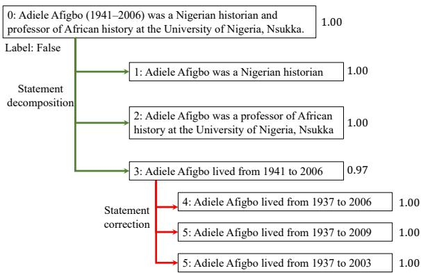  
Figure 5: Belief tree example.

Similar to the observation in our main experiments, our method performs competitively against these state-of-the-art uncertainty quantification techniques. Specifically, our approach achieves the highest AUROC, F1 scores, and accuracy, demonstrating its ability to reliably detect hallucinations. Please note that our method is not originally designed for the “claim-level” hallucination detection, where the biography data are decomposed into atomic claims for fact-checking. Nevertheless, our method still achieves competitive performance.

## A.3 Examples of Belief Trees

We visualize several constructed belief trees as well as how our method leverage the inconsistencies in model’s beliefs for hallucination detection. We start with a simple example from the Wikibio-GPT3 dataset (Manakul et al., 2023) shown in Figure 5. Starting from the root node about Adiele Afigbo, the first layer contains 3 child nodes generated by statement decomposition. However, despite the statement is wrong, the model (gpt-3.5-turbo-0125) assign a high confidence score to both the original statement and the child nodes decomposed from the root node. Then, our method further generate child nodes for node 1,2, and 3. We display the child nodes of node 3 in the figure, which is generated by statement correction. With the three different statements about the date of death of that person, we decrease the model’s confidence on node 3 and finally correct the model’s belief on the root node. Note that in statement correction, we directly set the confidence of the generated child nodes as 1.0. For this example, if we query the model’s confidence scores on node 4, 5, and 6, we will get confidence scores 0.97, 0.91, 0.88, respectively, which will still contradicts to their parent node.

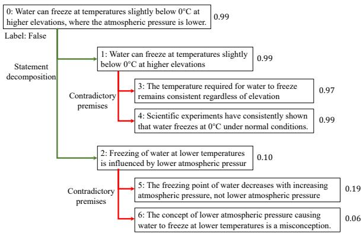  
Figure 6: Belief tree example.

Another example of the belief tree is shown in Figure 6, which mainly consists of child nodes generated by supportive and contradictory premises. At the root node, the model assigns a high confidence score to the statement about freezing point of water from the FELM dataset (Chen et al., 2023b). After the statement decomposition, the inconsistency is triggered due to model’s low confidence on node 2. Furthermore, if we continuously generate premises for node 1, we get two additional child nodes (node 3 and 4) that are contradictory to their parent node. However, the model still assigns a high confidence to node 3 and 4. Within the belief propagation framework, the conditional probability of node 1 being true given the observations on node 3 and 4 will be decreased. Similarly, this effect will propagate to the root node and lead to a low posterior probability of the root node being true.

We then show one failure case of our method in Figure 7. The target statements comes from the FactCheckGPT dataset (Wang et al., 2023). Our method first generation two supportive premises with high confidence. These two child nodes are indeed reasonable and can support the opinion that “Linux operating system has a widespread adoption.”, thus contradicting to the root statement and further decreasing the model’s confidence on the root node. We hypothesize that the original statement, “Linux adoption has limited compared to other operating systems like Windows and macOS” lacks sufficient specificity and could be interpreted from multiple perspectives. For example, it could refer to market share in personal computing versus cloud computing domains, making the ground-truth label nondeterministic.

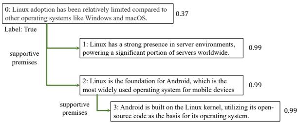  
Figure 7: Belief tree example.

A.4 Inferring the Posterior Probability of $Z _ { 0 }$ The posterior probability $p ( Z _ { 0 } = T \mid \{ S _ { u } \} )$ can be computed by:

$$
\frac { p ( Z _ { 0 } = T , \{ S _ { u } \} ) } { p ( Z _ { 0 } = T , \{ S _ { u } \} ) + p ( Z _ { 0 } = F , \{ S _ { u } \} ) } ,
$$

where $\left\{ S _ { u } \right\} = \left\{ s _ { u } \right\}$ refers to the set of all observed variables in the belief tree.

Therefore, the key of the inference on the belief tree is to compute the two joint probabilities $p ( Z _ { 0 } = T , \{ S _ { u } \} )$ and $p ( S _ { 1 } = F , \bar { X } _ { 1 } = \bar { x } _ { 1 } )$ . Following the conditional independence assumption in the hidden Markov model, the truthfulness $( i . e ,$ states of hidden variables) of each node is determined by its parent node in the tree and the transition probability. Also, the model’s confidence (i.e., states of observed variables) on each node is determined by the state of the corresponding variable and the emission probability. With such an assumption, they can be decomposed as:

$$
p ( Z _ { 0 } = T , \{ S _ { u } \} ) = p ( \{ S _ { u } \} \mid Z _ { 0 } = T ) * p ( Z _ { 0 } = T ) ,\tag{2}
$$

where $p ( Z _ { 0 } = T )$ is the prior probability of the statement being true (note that we set it to be 0.5 in this paper). $p ( \{ S _ { u } \} | Z _ { 0 } = T )$ is the conditional probability of all observed variables (exclude the root node) given the root node being true. Recall that we introduce a notation $\beta ( z , u ) = p ( S _ { T ( u ) } | Z _ { u } = z )$ to represent such conditional probabilities, where $S _ { T ( u ) }$ refers to the confidence scores (observed variables) of all nodes on the subtree rooted at node u. Therefore, the conditional probability $p ( \{ S _ { u } \} \mid Z _ { 0 } = T )$ can be denoted as $\beta ( T , 0 )$ (node 0, hidden variable $Z _ { 0 } = T )$

Without loss of generality, we discuss below how to compute $\beta ( z , u )$ for an arbitrary node u in the tree. The computation for $\beta ( T , 0 )$ and $\beta ( F , 0 )$ can be performed in exactly the same way. Specifically, we can further decompose $\beta ( z , u )$ as:

$$
\begin{array} { l } { { p ( S _ { \mathcal { T } ( u ) } ) \mid Z _ { u } = z ) = p ( S _ { u } \mid Z _ { u } = z ) \cdot } } \\ { { \qquad \left\{ \underset { { v \in { \cal C } ( u ) } } { \prod } p ( S _ { \mathcal { T } ( v ) } \mid Z _ { u } = z ) \right\} . } } \end{array}\tag{3}
$$

The probability $p ( S _ { \mathcal { T } ( v ) } \mid Z _ { u } = z )$ can be decomposed as:

$$
\begin{array} { r l } & { p ( S _ { \mathcal { T } ( v ) } \mid Z _ { u } = z ) } \\ & { ~ = \displaystyle \sum _ { k \in \{ T , F \} } p ( S _ { \mathcal { T } ( v ) } \mid Z _ { v } = k ) * p ( Z _ { v } = k \mid Z _ { u } = z ) } \\ & { = \displaystyle \sum _ { k \in \{ T , F \} } \beta ( v , k ) * p ( Z _ { v } = k \mid Z _ { u } = z ) . } \end{array}\tag{4}
$$

Therefore, the conditional probability $\beta ( z , u ) =$ $p ( S _ { T ( u ) } ) \mid Z _ { u } = z )$ can be computed in a recursive manner:

$$
\begin{array} { l } { \displaystyle \beta ( z , u ) = \underbrace { p ( S _ { u } \mid Z _ { u } = z ) } _ { \mathrm { E m i s s i o n P r o b a b i l i t y } } \cdot } \\ { \displaystyle \left\{ \prod _ { v \in { \mathscr C } ( u ) } \sum _ { k \in \{ T , F \} } \beta ( v , k ) * \underbrace { p ( Z _ { v } = k \mid Z _ { u } = z ) } _ { \mathrm { T r a n s i t i o n P r o b a b i l i t y } } \right\} . } \end{array}\tag{5}
$$

There are two types of probabilities in the above equation. First, $p ( S _ { u } \mid Z _ { u } = z )$ is the “emission probability" at node u. Second, $p ( Z _ { v } = k \mid Z _ { u } =$ $z )$ is the “transition probability" from node u to its child node v. The recursive computation in Equation 5 will starts from the leaf nodes. When v is the leaf node in the tree, $\beta ( v , k )$ is actually $p ( S _ { v } \mid Z _ { v } = k )$ , which is the emission probability at node v. Such a process propagates from bottom to up. Finally, we can compute $\beta ( t , 0 )$ as well as the joint probability $p ( Z _ { 0 } = T \mid \{ S _ { u } \} )$ according to Equation 2.

Beyond conditional independence: transition probability for statement decomposition. The above computation of the posterior probability is based on the assumption of conditional independence. Assume the node u have two child nodes, $v _ { 1 }$ and $v _ { 2 }$ . Then we consider the transition probabilities from u to $v _ { 1 }$ and from u to $v _ { 2 }$ independently. However, this does not hold for the child nodes generated by statement decomposition, in which the truthfulness of the child nodes are influenced by their parent node simultaneously. If u is true, then we know that both two child nodes are also true. In contrast, if u is false, we can only infer that at least one of the child nodes are false. To handle such a case, we revise the probability computation in Equation 3 accordingly. Assume node u has m child nodes. The probability $\beta ( z , u ) = p ( S _ { T ( u ) } ) \ | \ Z _ { u } = z )$ can be computed as:

Algorithm 1 BTPROP Algorithm   
1: Input: Statement u , maximum tree depth $d _ { \mathrm { m a x } }$   
2: Output: The posterior probability $p ( Z _ { 0 } ^ { \bullet } = 1 \mid S _ { T ( 0 ) } )$   
3:   
4: Initialize the belief tree with root node u   
5: Initialize the leaf node set $\mathcal { N } = \{ u _ { 0 } \}$   
6: while $\mathcal { N } \neq \emptyset$ do ▷ Belief tree construction   
7: Pop an element u from $\mathcal { N }$   
8: Generate child nodes $\mathcal C ( u )$ for u   
9: for Node v $\in \mathcal { C } ( u )$ do   
10: Add v to   
11: Add v to if $d _ { u } < d _ { \operatorname* { m a x } }$   
12: end for   
13: end while   
14:   
15: function GETBETA(u, z) ▷ Compute $\beta ( z , u )$ in Eq. 1   
16: if $\mathcal { C } ( u ) = \oslash$ then   
17: return $p ( s _ { u } \mid Z _ { u } = z )$   
18: end if   
19: for $v \in \mathcal { C } ( u )$ do   
20: $\beta ( v , 0 ) \overset { \cdot } { = } \mathbf { G } \mathbf { E } \mathrm { T } \mathbf { B } \mathbf { E } \mathrm { T } \mathbf { A } ( v , 0 )$   
21: $\beta ( v , 1 ) = \tt G E T B E T A ( v , 1 )$   
22: end for   
23: Compute $\beta ( u , z )$ according to Eq. 1   
24: return $\beta ( u , z )$   
25: end function   
26:   
27: β(1, 0) = GETBETA(u = 0, z = 1)   
28: β(0, 0) = GETBETA(u = 0, z = 0)   
29: p(Z0 = 1  S (0)) = β(1, 0)/(β(1, 0) + β(0, 0))

$$
\begin{array} { l } { p ( S _ { \mathcal { T } ( u ) } ) \mid Z _ { u } = z ) = p ( S _ { u } \mid Z _ { u } = z ) \tilde { \beta } ( u , z ) , \mathrm { w h e r e } } \\ { \tilde { \beta } ( u , z ) = \displaystyle \sum _ { Z _ { \mathcal { C } ( u ) } \in \{ T , F \} ^ { m } } p ( Z _ { \mathcal { C } ( u ) } \mid Z _ { u } = z ) \prod _ { v \in \mathcal { C } ( u ) } \beta ( Z _ { v } , v ) } \end{array}
$$

which is the Equation 1 in the main paper.

## A.5 Summary of the Algorithm

We summarize the pipeline of our method in Algorithm 1. The root node of the belief tree is the given statement $u _ { 0 }$ . During the belief tree construction process, we maintain a set $\mathcal { N }$ that contains all current leaf nodes of the belief tree. We recursively expand each leaf node $u \in \mathcal N$ by its child nodes (u) and add these new child nodes to the belief tree if they are logically-connected to the current leaf node. These generated child nodes then become new leaf nodes. They will also be added to  and be expanded until the maximum depth is reached. Given the constructed belief tree and the emission and transition probabilities estimated from a held-out dataset, the posterior probability $\beta ( Z _ { 0 } = 1 \mid S _ { T ( 0 ) } )$ can be then computed in a recursive manner, which will be further used to predict the truthfulness of the given statement.

## A.6 Submission Checklist

FactCheckGPT is under Apache-2.0 license. FELM is under CC-BY-NC-SA-4.0 license, and Wikibio-GPT3 is under CC-BY-SA-3.0 license. We have cited them accordingly in the main paper. All of these datasets are in English. These datasets are created to evaluate the hallucination detection performance, and our usages are consistent with their intended use. We also manually check the datasets and confirm that they do not contains any information that names or uniquely identifies individual people or offensive content.

We leverage ChatGPT to help develop some of the prompt we use in the experiments and improve the writing.

## A.7 Prompt

In this section, we list all the prompt used in this paper, including belief tree construction, prior confidence estimation, and data preprocessing.

Belief tree construction Given a statement from the LLM output, we use the following prompt gpt-3.5-turbo-0125 to perform statement decomposition, which is shown in Figure 10. In the instruction, we specify the requirements to extract check-worthy claims and provide the model with several examples. We also include an additional special example, where the given sentence is actually a subjective opinion, to prevent the model from decomposing sentences that are actually not check-worthy. We use a similar prompt for Llama-3-8b-Instruction as shown in Figure 11.

To generate supportive and contradictory premises, we prompt the model as follows: If the model judge the given statement as true, then it needs to generate several explanations to its judgment, which form the supportive premises. In contrast, if the model believes the given statement is false, then it will generate explanations to its judgment, which form the contradictory premises. The prompts we used are listed in Figure 12 and Figure 13. We first prompt the model with the prompt in Figure 12. If the model judges the statement as true and generates supportive premises, then these premises will be returned and contradictory premises will not be generated. If the model judges the statement as false, then we prompt the model with the prompt in Figure 13 for contradictory premises. Although there might be better prompting strategies to generate such premises, finding the optimal prompts and prompting strategies is out of the scope of this paper. Therefore, we leave it for future work.

Finally, to generate child nodes via statement correction, we adopt the following pipeline. First, we prompt the model using prompts listed in Figure 14 and Figure 15 to generate a question about the key pieces of information in the statement. After that, we feed the generated question to the LLM again without any other prompt to get its answer. Finally, we ask the model to revise the original statement according to the “background knowledge", which is the answer generated by itself. By doing this, we expect to better utilize the inconsistency across model’s beliefs for child node generation. The prompt for the last step is shown in Figure 16

To select the most appropriate strategies for each node, we use the following prompts to ask the LLM to output the most suitable strategies, which is displayed in Figure 17 and Figure 18.

Prior confidence estimation When prompt gpt-3.5-turbo-0125 for the confidence score on the truthfulness of a statement, we use the following prompt: True or False? {target\_statement}. For Llama-3 model, we find it sometimes refuse to judge the truthfulness and simply output it requires additional context. To enforce the model to output the confidence score, we change the prompt accordingly:

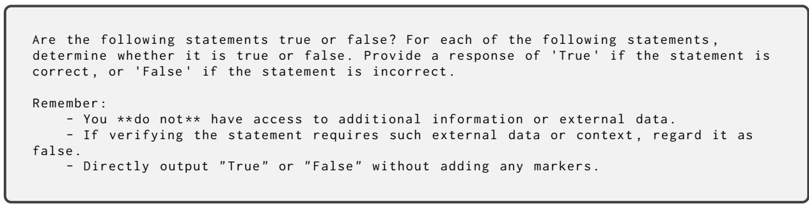  
Figure 8: Prompt for confidence estimation (Llama-3-8B-Instruct).

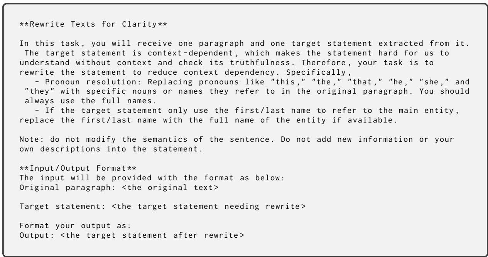  
Figure 9: Prompt for data preprocessing.

\*\* Fact - Checking Claims Extraction :\*\*   
\*\* Objective :\*\* Analyze the provided statement to extract and list all distinct factual   
claims that require verification . Each listed claim should be verifiable and not overlap   
in content with other claims listed .   
\*\* Instructions :\*\*   
1. \*\* Identify Factual Claims \*\*:   
- Identify parts of the statement that assert specific , verifiable facts , including :   
- Statistical data and measurements .   
- Historical dates and events or other information .   
- Direct assertions about real - world phenomena , entities , events , statistics   
- Conceptual understandings and theories .   
- In every claim , alway use the \*\* full names \*\* when referring to any concept , person ,   
or entity . \*\* Avoiding the use of pronouns or indirect references \*\* that require   
contextual understanding .   
2. List each verifiable claim separately . Ensure that each claim is distinct and there   
is no overlap in the factual content between any two claims .   
- If a single claim is repeated in different words , list it only once to avoid   
redundancy .   
3. \*\* Output :\*\*   
- If there are multiple check - worthy claims , list each one clearly and separately .   
- If there is only one check - worthy claim , output just that one claim .   
- If no part of the statement contains verifiable facts (e.g., purely subjective   
opinions , hypothetical scenarios ), output the following message : " Claim 1: No check -   
worthy claims available ."   
\*\* Output Format \*\*:   
Your output should be organized as follows :   
Claim 1: <the first claim >   
Claim 2: <the second claim >   
Claim 3: <the third claim (if necessary )>   
\*\* Examples :\*\*   
Statement : According to recent data , China has surpassed the United States in terms of   
GDP when measured using Purchasing Power Parity ( PPP ) , and India is projected to   
overtake China by 2030.   
Claim 1: China has surpassed the United States in terms of GDP when measured using   
Purchasing Power Parity ( PPP).   
Claim 2: India is projected to overtake China in terms of GDP by 2030."   
Statement : The world 's largest desert is Antarctica , and it is larger than the Sahara .   
Claim 1: The world 's largest desert is Antarctica .   
Claim 2: Antarctica is larger than the Sahara .   
Statement : I think pizza is the best food ever !   
Claim 1: No check - worthy claims available .   
Statement : The software 'Photoshop ' was released by Adobe Systems in 1988.   
Claim 1: The software 'Photoshop ' was released by Adobe Systems in 1988.  
Figure 10: The prompt for statement decomposition using gpt-3.5-turbo-0125.

\*\* Fact - Checking Claims Extraction :\*\*   
\*\* Objective :\*\* Analyze the provided statement to extract and list all distinct factual   
claims that require verification . Each listed claim should be verifiable and not overlap   
in content with other claims listed .   
\*\* Instructions :\*\*   
1. Identify parts of the statement that assert specific , verifiable facts . In every   
claim , alway use the \*\* full names \*\* when referring to any concept , person , or entity . \*\*   
Avoiding the use of pronouns or indirect references \*\* that require contextual   
understanding .   
2. List each verifiable claim separately . Ensure that each claim is distinct and there   
is no overlap in the factual content between any two claims .   
3. Exclude any statements that are purely hypothetical , assume theoretical scenarios , or   
are speculative in nature . These do not contain verifiable factual claims . For example ,   
statements involving assumptions (" Let 's assume ...") , theoretical discussions ("   
consider whether ...") , or purely speculative scenarios should not be considered as   
containing verifiable claims .   
4. If the statement does not contain any verifiable facts , output the following message :   
" Claim 1: No check - worthy claims available ."   
\*\* Output Format \*\*:   
Your output should be organized as follows :   
Claim 1: <the first claim >   
Claim 2: <the second claim >   
Claim 3: <the third claim (if necessary )>   
\*\* Examples :\*\*   
Statement : According to recent data , China has surpassed the United States in terms of   
GDP when measured using Purchasing Power Parity (PPP ), and India is projected to   
overtake China by 2030.   
Claim 1: China has surpassed the United States in terms of GDP when measured using   
Purchasing Power Parity ( PPP).   
Claim 2: India is projected to overtake China in terms of GDP by 2030."   
Statement : The world 's largest desert is Antarctica , and it is larger than the Sahara .   
Claim 1: The world 's largest desert is Antarctica .   
Claim 2: Antarctica is larger than the Sahara .   
Statement : I think pizza is the best food ever !   
Claim 1: No check - worthy claims available .   
Statement : Let 's assume there is a highest prime number and consider its implications on   
number theory .   
Claim 1: No check - worthy claims available .  
Figure 11: The prompt for statement decomposition using Llama-3-8b-Instruct.

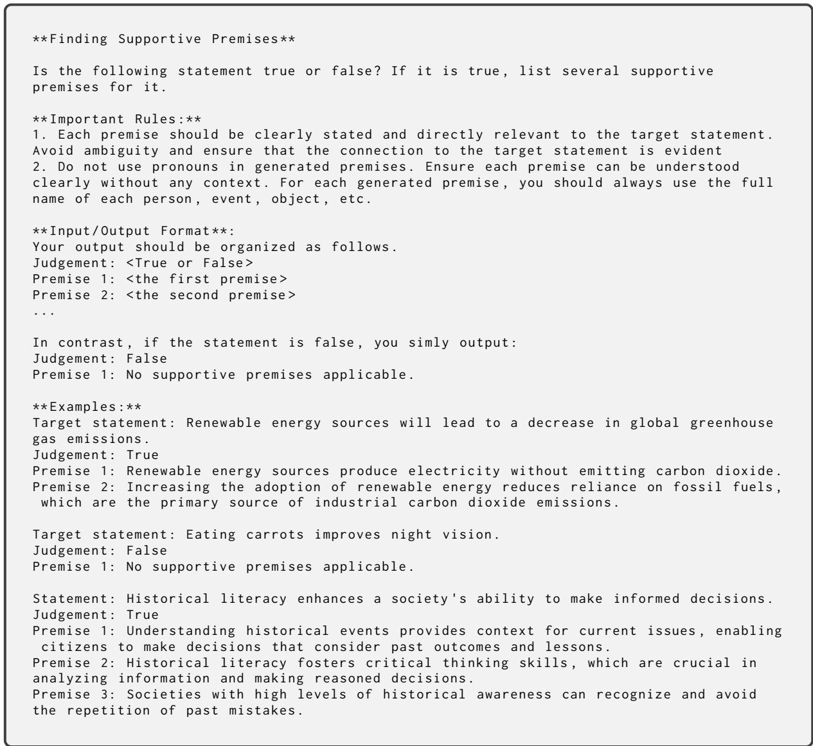  
Figure 12: The prompt for generation of supportive premises.

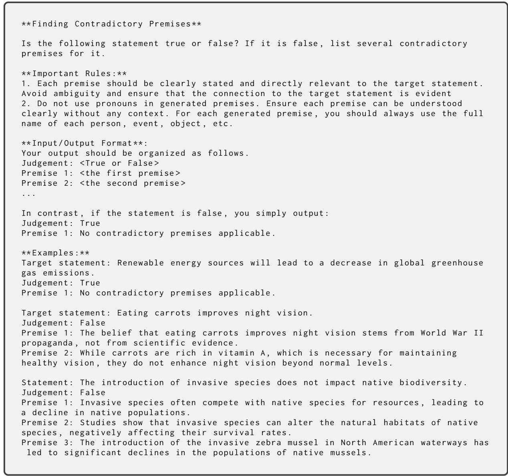  
Figure 13: The prompt for generation of contradictory premises.

Given the following claim , your tasks include :   
1. Identify the key pieces of information critical for fact - checking to determine   
its truthfulness .   
2. Create a masked version of the claim by masking these key pieces of information   
3. Generate a question asking for the key pieces of information   
Rules :   
1. Do not mask the grammatical subject of the sentence -- the actor , entity , or object   
that performs the action in the sentence 's main clause . Also , following the format of   
the below examples in your output .   
\*\* Examples :\*\*   
Statement : Bitcoin was created in 2009 by an anonymous entity known as Satoshi Nakamoto .   
Masked statement : Bitcoin was created in 2009 by an anonymous entity known as [ which   
person ].   
Question : Who created Bitcoin in 2009?   
Statement : The iPhone was first released by Apple in 2007.   
Masked statement : The iPhone was first released by Apple in [ what year ].   
Question : Was the iPhone first released by Apple in 2007?   
Statement : The speed of light in a vacuum is approximately 299 ,792 kilometers per second   
Masked statement : 'Romeo and Juliet ' was written by Shakespeare in [ what time period ].   
Question : What is the speed of light in a certain medium ?   
Statement : " Attention Is All You Need " is a paper written by Ashish Vaswani , Noam   
Shazeer , Niki Parmar , Jakob Uszkoreit , Llion Jones , Aidan N. Gomez , Lukasz Kaiser , Illia   
Polosukhin .   
Masked statement : " Attention Is All You Need " is a paper written by [ whom ]   
Question : Who was/ were the authors of the paper " Attention Is All You Need "?   
Statement : The Great Wall of China is visible from space .   
Masked statement : The Great Wall of China is [ visible or invisible ] from space .   
Question : Is the Great Wall of China visible from space ?   
Statement : The headquarters of the United Nations is located in New York City   
Masked statement : The headquarters of the United Nations is located in [ which city ].   
Question : Where is the headquarters of the United Nations located ?  
Figure 14: Step 1 in statement correction: question generation. This prompt is used for gpt-3.5-turbo-0125.

Given a statement , your task is to identify a general question that can be used to check   
the truthfulness of the statement . The question should directly address the claim to   
confirm or refute it without seeking additional detailed information .   
\*\* Examples :\*\*   
Statement : Bitcoin was created in 2009 by an anonymous entity known as Satoshi Nakamoto .   
Question : Who created Bitcoin in 2009?   
Statement : The iPhone was first released by Apple in 2007.   
Question : When was iPhone first relased by Apple ?   
Statement : 'Romeo and Juliet ' was written by Shakespeare in the late 16 th century .   
Question : When was 'Romeo and Juliet ' was written by Shakespeare ?   
Statement : " Attention Is All You Need " is a paper written by Ashish Vaswani , Noam   
Shazeer , Niki Parmar , Jakob Uszkoreit , Llion Jones , Aidan N. Gomez , Lukasz Kaiser , Illia   
Polosukhin .   
Question : Who was/ were the authors of the paper " Attention Is All You Need "?   
Statement : The Eiffel Tower is located in Paris   
Question : Where is the Eiffel Tower located ?   
Statement : Albert Einstein was a physicist .   
Question : What profession was Albert Einstein ?  
Figure 15: Step 1 in statement correction: question generation. This prompt is used for Llama-3-8b-Instruct. We adjust the prompt since the masked statement is not used in the prompt for gpt-3.5-turbo-0125.

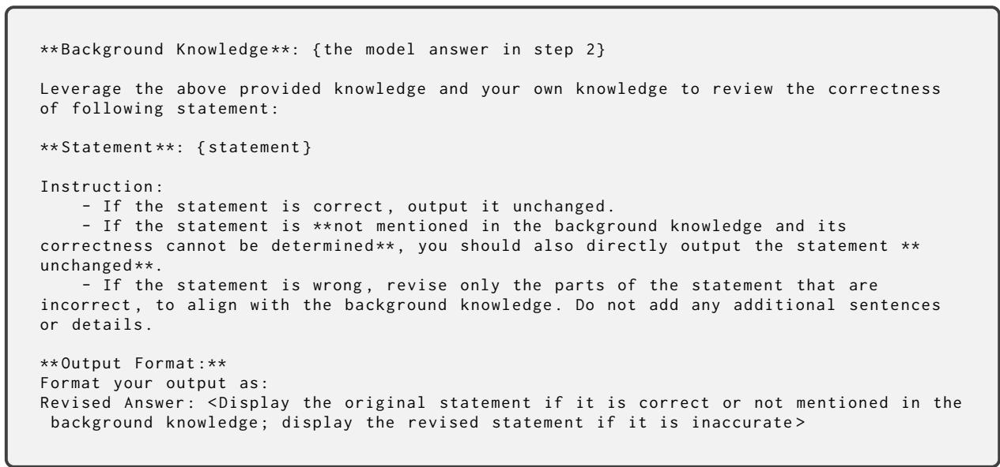  
Figure 16: Step 3 in statement correction: statement revision.

  
Figure 17: Prompt for strategy selection (gpt-3.5-turbo-0125).

  
Figure 18: Prompt for strategy selection (Llama-3-8b-Instruction).