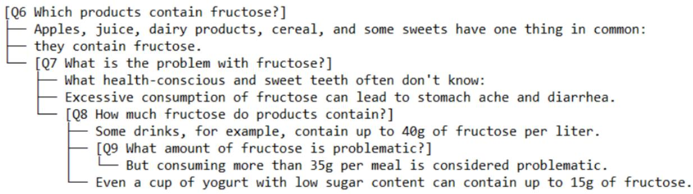
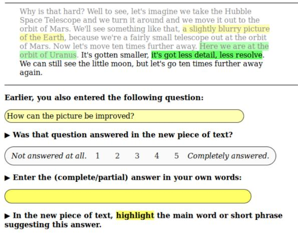
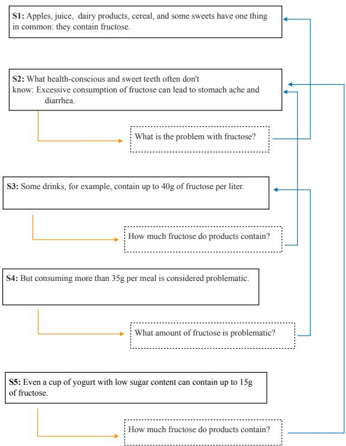

# A Survey of QUD Models for Discourse Processing

Yingxue Fu   
School of Computer Science University of St Andrews Scotland, UK   
fuyingxue321@gmail.com

## Abstract

Question Under Discussion (QUD), which is originally a linguistic analytic framework, gains increasing attention in the community of natural language processing over the years. Various models have been proposed for implementing QUD for discourse processing. This survey summarizes these models, with a focus on application to written texts, and examines studies that explore the relationship between QUD and mainstream discourse frameworks, including RST, PDTB and SDRT. Some questions that may require further study are suggested.

## 1 Introduction

Mainstream discourse frameworks, such as Rhetorical Structure Theory (RST) (Mann and Thompson, 1988), Penn Discourse Treebank (PDTB) (Webber et al., 2003) and Segmented Discourse Representation Theory (SDRT) (Asher and Lascarides, 2003), are based on coherence relations. These relations are typically expressed with representative lexicons, such as Contrast and Purpose. Accordingly, discourse relation recognition is implemented as a multi-class classification task.

In recent years, the Question Under Discussion (QUD) framework gains increasing attention as an alternative approach to discourse modelling, which is in line with the trend in converting NLP tasks into Question-Answering (QA) tasks (He et al., 2015; Pyatkin et al., 2020).

The QUD framework is originally a linguistic analytic framework for explaining pragmatic phenomena and information structural analysis (Benz and Jasinskaja, 2017). Early works by Von Stutterheim and Klein (1989) and Van Kuppevelt (1995) show how the framework can be applied for discourse modelling. The main idea is that discourse units, such as sentences, can be considered as answers to some implicit or explicit questions, called QUDs. One QUD may give rise to another QUD and some QUDs work together to answer a higherlevel QUD. The organization of discourse units can be understood by the relationship between these QUDs.

Although the conceptualization is simple, only in recent years, the implementation of the framework becomes a popular topic in discourse annotation and parsing. One reason is that reconstructing implicit QUDs for discourse units has been deemed an infeasible task because of the lack of constraints in the question generation process (Riester, 2019). The second reason is that justification is needed for the reconstructed implicit QUDs, which makes the approach less favorable for analyzing written texts, where QUDs are implicit in most of the cases (Benz and Jasinskaja, 2017). Nevertheless, using freeform questions for discourse annotation is arguably simpler for lay annotators than using a fixed set of discourse relations predefined by experts, which are often abstract and ambiguous. Moreover, natural language generation (NLG) and QA tasks have been spurred by the development of large language models (LLMs), making the QUD approach to discourse modelling a potentially more cost-effective option than the other frameworks (Ko et al., 2023).

A few challenges are discernible with implementing the QUD framework for discourse modelling. Similar to discourse frameworks based on coherence relations such as RST and PDTB, models that vary in the underlying theoretical assumptions have been proposed under the QUD framework, such as the QUD-tree approach by Riester (2019) and De Kuthy et al. (2018) and the expectation-driven approach by Westera et al. (2020). As these models are typically rooted in linguistic theories, it is difficult to understand the constraints and the properties of the representations obtained with the models. Meanwhile, the evaluation of QUD annotation and the automatic generation of QUDs are challenging due to the use of free-form questions, since a single QUD can be expressed in multiple ways.

In this paper, we survey models for discourse processing proposed under the QUD framework to support researchers who are interested in applying this framework in downstream tasks or exploring discourse annotation and processing with the QUD framework (De Kuthy et al., 2018, 2020), or integrating different discourse frameworks (Riester et al., 2021; Fu, 2022).

Compared with mainstream discourse frameworks, the body of literature on QUD is much smaller, particularly regarding the implementation. The studies covered in this survey were selected based on their influence in the field of computational linguistics, as reflected by follow-up works inspired by them. We began with seminal and high-impact studies and traced their references to develop a comprehensive understanding of the research landscape.

The contributions of this paper are summarized as follows:

1. We identify three models for discourse processing under the QUD framework: QUD-tree approach, expectation-driven approach, and dependency-based approach.

2. We discuss the details and theoretical background of these models and compare them to highlight their respective properties.

3. We review studies on the relationship between mainstream discourse frameworks, including RST, PDTB and SDRT, and different QUD models.

## 2 QUD-Based Discourse Models

Two general approaches to discourse processing can be identified within the QUD framework: the QUD-tree approach and the expectation-driven approach. The first approach is based on the theoretical proposal by Roberts (2012), which uses trees to model the structure of QUDs. The second approach, named as such in the study by Kehler and Rohde (2017), is developed by Onea (2016). In addition to the two canonical approaches, Ko et al. (2020) introduce another approach, which features inquisitive questions that can be anchored in the previous context (henceforth “dependency-based QUD”). This approach is similar to the expectationdriven approach in some ways but involves the identification of the source that triggers the question in the previous context.

## 2.1 QUD-Tree Approach

Early researchers, including Von Stutterheim and Klein (1989) and Van Kuppevelt (1995), consider QUD as a principle for discourse structuring, where the relationships between sentences can be understood from the relationships between the QUDs they answer. Questions are raised one after another, and sentences either answer the questions or evoke further questions and answers in order to address the initial question. The final purpose of the questioning process is to answer an overarching discourse question, called the Quaestio of the text by Von Stutterheim and Klein (1989).

This hierarchical relationship between questions may shape the choice of words and connectives. The restrictions imposed by QUDs on texts are studied by Von Stutterheim and Klein (1989). They refer to the incremental process of information unfolding in texts as referential movement. To model this process, they categorize the different types of information within a proposition into five basic categories, called reference areas, which include temporal properties, spatial properties, people involved, predicates (such as processes, states, and events), and modal properties. Within a proposition, information from the five areas is integrated into a whole, with information about predicates and people forming the inner core. The referential movement from one proposition to another is guided by the QUDs. For illustration, they use a simple narrative structure with a single characteristic QUD “What happened to you?”. To answer this QUD, the propositions will describe events occurring during different time intervals t . Therefore, the structure of the text can be delineated as “Q1: What happened to you during the time interval t1”, “Q2: What happened to you during the time interval t2”, and so on. Based on this structure of QUDs, they discuss whether references to entities in different reference areas should be maintained or adjusted during the referential movement. Von Stutterheim and Klein (1989) recognize that texts with other structures exist, which cannot be characterized by one clear overarching QUD. These types of texts are weakly structured and coherence is established locally for a QUD. Furthermore, Von Stutterheim and Klein (1989) highlight the existence of secondary structures, where a QUD interrupts the flow of the main narrative structure. If secondary structures are developed extensively, they may give rise to a new high-level QUD. However, Von Stutterheim and Klein (1989) perceive secondary structures negatively, because they believe that these structures do not contribute directly to the overall QUD of the text and involve violations of restrictions on referential movement. This negative view towards secondary structures is shared by Roberts (2012).

Roberts (2012) posits that discourse is organized according to the strategies of inquiry used by discourse participants to share information and reach a common understanding about “What is the way things are?”. This process involves a series of moves in which questions are posed and answered, leading to a reduction in ambiguities or indeterminacies. A question implies a set of alternatives, called the q-alternative set of the question. A partial answer to the question involves evaluating at least one item from the q-alternative set. A complete answer, on the other hand, provides an evaluation of every item in the q-alternative set. Take the example from Roberts (2012):

## Q: Who did Mary invite?

If there are three people in the model of discourse, viz. P={Mary, Alice, Grace}, the qalternative set of the question Q is: {Mary invited Alice and Grace, Mary invited Alice but not Grace, Mary invited Grace but not Alice, Mary invited nobody}1. Thus, the q-alternative set implies a partition of possible worlds. A complete answer suggests that one of the cells of the partition is chosen, such as “Mary invited Alice but not Grace”, and the rest of the cells are discarded. In contrast, a partial answer would rule out some cells but require more moves to determine the final state. For example, an answer “Mary invited Alice” does not contain information about whether Grace is invited.

A focal alternative set is defined for answers. When an answer “Mary invited nobody” is given to the question Q above, if “nobody” is the focus, the focal alternative set would be: {Mary invited Alice and Grace, Mary invited Alice but not Grace, Mary invited Grace but not Alice}. In this case, the answer is congruent with the question, because the focal alternative set of the answer matches the qalternative set of the question. If the same answer is given but the focus is on “Mary”, the focal alternative set would be: {Alice invited nobody but Grace invited somebody, Alice and Grace invited nobody, Grace invited nobody but Alice invited somebody}, which forms a counter-example to the idea that an answer should be congruent with the question. Therefore, in the theory by Roberts (2012), focus analysis, an aspect of information structural analysis, plays an important role.

At the center of the theory by Roberts (2012) is the QUD stack, the bottom of which is the overarching question of the discourse, called the superquestion by Roberts (2012). Roberts (2012) claims that when a question is accepted as a QUD and put on the QUD stack, the discourse participants will be committed to answering it until it is completely answered or until it is determined to be unanswerable. This is based on the assumption that rational discourse participants treat linguistic communication as a cooperative activity. Following Gricean maxims (Grice, 1991), the discourse participants will try to be relevant. Guided by the maxim of relevance, questions will be answered as soon as possible. The maxim of quantity requires the discourse participants to provide as much information as possible, favoring complete answers over partial ones. In the theory by Roberts (2012), it is not required that questions on a QUD stack entail those lower on the stack, where a question q1 entails a question $q _ { 2 }$ if and only if answering q1 yields a complete answer to $q _ { 2 }$ . Instead, a move should be relevant to the immediate QUD, which means that the move should either introduce (at least) a partial answer to the QUD, when the move is an answer, or the move should be a part of the strategy to answer the QUD, if the move is a question2. Answers that are irrelevant to the immediate QUDs are called “non-sequiturs”, which reflect poor strategies and lack of commitment to the goal of communication, similar to the secondary structures discussed by Von Stutterheim and Klein (1989).

Riester (2019) proposes a method for implementing the theory by Roberts (2012). The main idea is to introduce some constraints for reconstructing QUDs and make the process less dependent on phonological and syntactic analysis of texts, which is required in the approach demonstrated by Roberts (2012).

With the method by Riester (2019), the first step involves discourse segmentation. Coordinated clauses, as well as verbal-phrase (VP) or determiner-phrase (DP) conjunctions or disjunctions, are segmented. When the resultant segments are incomplete, the elided materials are reconstructed so that a question can be inferred for each segment. After this step, the annotators are asked to infer QUDs for the segments and organize these QUDs into a hierarchical structure.

The constraints for reconstructing QUDs include:

1. Q-A-Congruence: QUDs must be answerable by the segments that they immediately dominate.

This constraint is rooted in the notion of congruence proposed by Roberts (2012), which requires that the q-alternative set matches the focal alternative set. However, Riester (2019) does not follow this requirement strictly, only specifying that the interrogative part of a question is expected to be answered by the focus of the segment.

2. Q-Givenness: Implicit QUDs can only contain given materials.

Riester (2019) stresses that explicit QUDs are different from implicit ones because explicit QUDs can alter the information status of content by introducing new information into the discourse, whereas implicit QUDs are not meant to change the discourse, and therefore, they can only contain information from the previous context.

3. Maximize-Q-Anaphoricity: Implicit QUDs should contain as much given material as possible.

This constraint is introduced to ensure that reconstructed QUDs contain as many given details from the context as possible.

4. Back-to-the-Roots: This constraint concerns the attachment site of an incoming QUD and its answer. Riester (2019) adopts the right frontier constraint, which means that an incoming unit should be attached as low as necessary to allow for anaphoric reference but as high as possible to facilitate the conclusion of the current lower-level discourse and return to the main question of the discourse.

At the same time, the method proposed by Riester (2019) deviates from the theoretical assumptions of Roberts (2012) in some aspects. First, the notion of “being relevant” is relaxed considerably. A discourse move is considered valid as long as a topical connection to the previous context can be established. Therefore, an incoming QUD and its answer are not bound to provide an answer to the QUDs on the stack. This choice is motivated by the suggestions by Hunter and Abrusán (2015) on the basis of comparing discourse structures formed by discourse relations and QUDs. However, as argued by Lee (2024), it is difficult to formalize the notion of topical connection and this operation reduces the predictive power of the QUD model. The second deviation relates to the non-sequiturs. While Roberts (2012) views information that does not contribute to answering the immediate QUD negatively, Riester (2019) examines a broad range of such information under the notion of non-at-issue content3, and believes that this kind of information represents new content. Even if it does not pertain to the immediate QUD, it may become the focus in subsequent discourse. Non-at-issue materials are annotated as a part of information structural analy sis. The other categories covered in the annotation of information structure include focus (F), back ground (BG) and contrastive topic (CT) (De Kuthy et al., 2018). The focus refers to the constituent of the answer that addresses the current QUD, while the background denotes the remaining part that also addresses the QUD, but not in a salient status compared to the focus. The two parts form a focus domain. In the annotation model by Riester (2019), contrastive topics refer to questions containing two interrogative parts, such as “Who did what?”. These questions are typically answered by providing responses to subquestions about “who” and “what”, respectively.

De Kuthy et al. (2018) report empirical results with the method by Riester (2019). In their experiments, two trained annotators were asked to annotate two sections of a transcript of an English interview. The Cohen’s Kappa (κ) value is 0.52 on average, indicating moderate agreement. Results on annotating information structure show strong inter-annotator agreement.

An example of annotation using the method proposed by Riester (2019) is illustrated in Figure 1. The example below shows how information structure is annotated by De Kuthy et al. (2018). To improve consistency in the annotation, some heuristic rules are introduced. For instance, connectives are not annotated, which is illustrated by the case with “and”, and pronouns are labeled BG, as shown by the annotation for “one”:

  
Figure 1: An illustration of annotation with the QUD-tree approach, from Shahmohammadi et al. (2023).

Q: What kind of cars were there?

A’: [A]BG [red]F [one]BG

A”: and [a]BG [green]F [one]BG.

De Kuthy et al. (2020) investigate methods for the automatic generation of QUDs. Due to the lack of a large corpus annotated with QUDs and corresponding answer spans, they employ a rule-based method to create a corpus of triples consisting of a sentence, its associated question, and the phrase providing the answer within the sentence. This corpus is then used to train a neural question generation system. Experimental results demonstrate that a sequence-to-sequence model with an attention mechanism can generate questions comparable to those produced by the rule-based method.

## 2.2 Expectation-Driven Approach

As defined by Kehler and Rohde (2017), an expectation-driven QUD model is one in which discourse participants anticipate the development of the discourse and use contextual cues to generate possible questions that subsequent sentences will answer.

As one of the efforts investigating the implementation of this framework, Westera et al. (2020) add a layer of QUD annotations with this approach to the English portion of TED-MDB (TED-Multilingual Discourse Bank) (Zeyrek et al., 2020). Their annotation effort centers on two questions: (a) what questions a discourse segment evokes, and (b) which question is answered in the subsequent discourse. To simplify the annotation task, annotators are presented with excerpts of a text, each excerpt comprising 18 sentences, and an annotator only works on 6 excerpts. The excerpts are shown incrementally to the annotators, and a probe point is set every two sentences, where the annotators are asked to enter a question evoked by the text up to that point, without knowledge about the following development of the discourse. Therefore, the questions should not have been answered up to that probe point. For questions that are evoked at previous two probe points but unanswered yet, the annotators are asked to indicate if the questions are answered at that probe point, based on a 5-point Likert scale, which encodes the degree to which the questions are answered, i.e., question answeredness.

  
Figure 2: An illustration of checking the answeredness of a question, from Westera et al. (2020).

Figure 2 shows the annotation interface used by Westera et al. (2020). The annotators are also asked to highlight the words or spans in the sentence that form the most informative part of the answer.

To ensure full coverage of the excerpts, probe points are alternated between participants. Since evaluating the relatedness of free-form questions automatically is non-trivial, an additional stage is introduced to manually estimate the semantic similarity of the evoked questions, serving as a measure of the reliability of questions evoked at each probe point. They detect a weak but statistically significant correlation between question reliability and question answeredness in the subsequent context.

## 2.3 Dependency-Based Approach

This approach was originally not targeted at discourse processing but focused on the QA task. Ko et al. (2020) try to propose a new way of eliciting questions that reflect high-level understanding, in comparison with previous studies on factoid question answering, such as SQuAD (Rajpurkar et al., 2018). Annotators are shown one sentence at a time and they are asked to generate 0-3 questions, which are required to be grounded in a textual span of the current sentence. The questions are to be asked to increase the annotators’ understanding of the text. Therefore, they call this type of questions inquisitive questions. Owing to the challenging na ture of this task, only the first five sentences of each news article are annotated. Ko et al. (2020) propose three criteria for evaluating the generated questions, including (1) if the question is a complete and valid question; (2) if the question is related to the textual span; and (3) if the question has already been answered in the previous context. Although the purpose of the research differs from that of Westera et al. (2020), the two studies share commonalities in using free-form questions to represent expectation about the development of discourse at the local segment level. In addition, Ko et al. (2020) explore automatic generation of inquisitive questions based on the dataset.

Ko et al. (2022) extend the approach proposed by Ko et al. (2020) for discourse processing. Except for the first sentence, each sentence S in a text is believed to be connected to a previous sentence by providing an answer to that sentence, which is called the anchor (A) of the question answered by S. A free-form question (Q) is used to describe the link between S and A. Therefore, discourse parsing can be formulated as a question of trying to identify A, given S and the previous context C of S, and generating Q. As free-form questions pose a challenge for evaluation, human judges are used to assess the similarity between the annotated questions. They find that 41.8% of the questions provided by different annotators are considered highly similar, while an almost equal proportion, 40.7%, are deemed semantically different. This approach combines dependency structure with QUD.

  
Figure 3: An illustration of the analysis with the dependency-based QUD approach proposed by Ko et al. (2022). Arrows in orange show the question-answer relationship, and arrows in blue show that the question is anchored in a previous sentence. For example, S2 answers the question “What is the problem with fructose?”, and the question is anchored in S1. As the questions are inferred, rather than being present in the original text, they are shown in dotted boxes.

Figure 3 shows the discourse representation for the example in Figure 1 with the dependency-based QUD approach proposed by Ko et al. (2022). It can be seen that the last sentence, S5, answers the same question as S3 and the question is rooted in S2.

Based on the corpus created by Ko et al. (2022), Ko et al. (2023) develop a discourse dependency parser. To compare the annotations with RST, Ko et al. (2023) ask annotators to add RST relations to the corpus. They find that the questions annotated with the dependency-based QUD approach tend to be more fine-grained than RST relations, and more than one RST relation is possible where a question is annotated. This result is consistent with that of Hunter and Abrusán (2015), although Hunter and Abrusán (2015) focus on the comparison between SDRT and QUD trees produced with the analysis of Roberts (2012). As the corpus created by Ko et al. (2022) takes sentences as the basic unit, the comparison is made at the inter-sentential level. They also find that the QUD dependency structure differs from the dependency structure representation of RST trees, which is obtained with the method proposed by Hirao et al. (2013). A similar observation is made by Shahmohammadi et al. (2023). The reason is that RST distinguishes the salience of discourse segments linked by a relation, whereas QUD organizes the hierarchical structure based on the relationships between questions and subquestions.

Wu et al. (2023a) propose an evaluation suite for QUD dependency parsing. The criteria are rooted in the constraints of QUD reconstruction put forward by Riester et al. (2018) and De Kuthy et al. (2018). Given a sentence S and the predicted anchor Aˆ of the predicted question Qˆ answered by S, the quality of Qˆ can be evaluated by four criteria: 1. if Qˆ is well-formulated linguistically and relevant to the content; 2. if the main part (focus in terms of information structural analysis) of S answers Qˆ; 3. if Qˆ only contains concepts introduced or inferrable from the previous context; and 4. if Qˆ is closely related to Aˆ. Apart from the first criterion, which has only two values, ‘yes’ and ‘no’, each of the other criteria involves more nuanced evaluations. Moreover, Wu et al. (2023a) suggest that more than one Aˆ is possible theoretically and operationally, and the results are heavily influenced by the specificity of questions.

Wu et al. (2024) create a corpus containing annotations of the salience of evoked questions generated using the framework proposed by Ko et al. (2022). A Likert scale from 1 to 5 is adopted to quantify the salience of questions. Multiple LLMs are employed to generate the questions, which are then evaluated by human annotators for their salience. Additionally, a subset of the questions is annotated with their answeredness in the following context, using a Likert scale from 0 to 3. They find that question salience is a statistically significant indicator of QUD, which is consistent with the observation of Westera et al. (2020) who suggest that reliably evoked questions that are also answered in the subsequent context are likely to be the QUDs. However, Westera et al. (2020) track whether a previously unanswered question is answered in the subsequent context at two consecutive probe points, while Wu et al. (2024) consider the entire subsequent context. This is because the model adopted by Wu et al. (2024) uses dependency links to represent the relations between sentences, which may involve long-distance connections. A question that remains to be studied with this approach is how to capture the hierarchical relationship between QUDs. As can be seen from Figure 3, the relationship shown with dependency links is shallower than the QUD-tree approach shown in Figure 1.

An overview of the approaches discussed in 2.1, 2.2 and 2.3 is shown in Table 1.

## 3 Benchmarks and Datasets

Table 2 presents the benchmarks and datasets for different QUD models.

As pointed out by Riester (2019), the reconstruction of QUDs typically does not rely on morphosyntactic signals, making the framework potentially cross-linguistically applicable. Works have shown that QUD is applicable to languages other than English, such as German (De Kuthy et al., 2018; Shahmohammadi et al., 2023) and Italian (De Kuthy et al., 2019).

Similar to other mainstream discourse frameworks, such as RST and PDTB, QUD can be used for capturing higher-level linguistic information. As such, it is potentially useful for various NLP tasks that involve higher-level linguistic understanding. Applications already explored include facilitating narrative understanding (Xu et al., 2024), where the dependency-based approach is adopted, conditional text generation (Narayan et al., 2023), which does not involve implementation of any of the existing QUD frameworks but only turns sentential information into question and answer pairs, similar to the first step of automatic question generation adopted by De Kuthy et al. (2020), text simplification, specifically elaborative simplification (Wu et al., 2023b), and summarization (Wu et al., 2024).

## 4 Relationship Between QUD and Discourse Frameworks

This section reviews existing studies that explore the relationship between QUD and mainstream discourse frameworks including RST, PDTB, and SDRT

## 4.1 QUD and RST

Shahmohammadi et al. (2023) annotate a corpus of 28 German texts, which are podcast transcripts and their corresponding blog posts. The corpus contains annotations of QUD trees in parallel with RST-style annotations. In order to simplify the comparison between the two frameworks, they apply the segmentation criteria of RST when performing QUD annotation, but the other steps of QUD annotation are performed following the guidelines developed by Riester et al. (2018). They convert RST-style annotations into a format similar to QUD-style annotations and compare the structures. A variant of the PARSEVAL metric for evaluating constituency parsing is adopted to measure the similarity between the tree structures of RST and QUD quantitatively. They find that the structural similarity is 74% on average4, and the similarity for monologues is higher than for dialogues, even though monologues are longer. Qualitative comparison shows that RST and QUD have similar patterns in grouping discourse segments, although there are cases where they differ owing to different focuses of the two frameworks. In terms of specific relations, they find that it is not straightforward to represent Background, Restatement, Concession and Contrast relations with QUD.

<table><tr><td rowspan=1 colspan=1></td><td rowspan=1 colspan=1>TheoreticalFoundation</td><td rowspan=1 colspan=1>StructuralAssump-tion</td><td rowspan=1 colspan=1>Central Idea</td><td rowspan=1 colspan=1>Basic Unit</td><td rowspan=1 colspan=1>Non-at-issueMaterial</td><td rowspan=1 colspan=1>Number ofQUDs perEdge</td><td rowspan=1 colspan=1>Edge-crossing</td></tr><tr><td rowspan=1 colspan=1>QUD-treeapproach</td><td rowspan=1 colspan=1>Roberts(2012)</td><td rowspan=1 colspan=1>a singletree</td><td rowspan=1 colspan=1>based on the constraintsproposed by Riester (2019):Q-A-Congruence, Q-Givenness,Maximize-Q-Anaphoricity,Back-to-the-Roots</td><td rowspan=1 colspan=1>informational structuralunits, typically morefine-grained than sen-tences</td><td rowspan=1 colspan=1>captured, aslong as a top-ical connec-tion can beestablished</td><td rowspan=1 colspan=1>1</td><td rowspan=1 colspan=1>not  al-lowed</td></tr><tr><td rowspan=1 colspan=1>expectation-drivenapproach</td><td rowspan=1 colspan=1>Onea(2016)</td><td rowspan=1 colspan=1>not con-siderhigher-levelstructure</td><td rowspan=1 colspan=1>annotate questions evoked at agiven discourse unit and ex-pected to be answered in the fol-lowing, not knowing the follow-ing discourse</td><td rowspan=1 colspan=1>sentences or chunks ofsentences</td><td rowspan=1 colspan=1>not captured</td><td rowspan=1 colspan=1>more thanone</td><td rowspan=1 colspan=1>possible,becausequestionsevokedat a dis-courseunitwillbetrackedin  thefollowingfew (2+)discourseunits</td></tr><tr><td rowspan=1 colspan=1>dependency-basedapproach</td><td rowspan=1 colspan=1>Ko et al.(2022)</td><td rowspan=1 colspan=1>dependencystructure</td><td rowspan=1 colspan=1>treat each sentence as an answerto an implicit question triggeredby a sentence in the previous con-text, which is called “anchor&quot;</td><td rowspan=1 colspan=1>sentences</td><td rowspan=1 colspan=1>not captured,unless   asentenceis allowedto have noanchors</td><td rowspan=1 colspan=1>theoreticallyand oper-ationallycan   bemore than1</td><td rowspan=1 colspan=1>possible</td></tr></table>

Table 1: An overview of existing QUD models.

<table><tr><td rowspan=1 colspan=4>Systems Developed   Datasets</td></tr><tr><td rowspan=1 colspan=4>QUD-tree  A full parser is  1. De Kuthy et al. (2018) createapproach   not yetdevel-  a corpus comprising two sectionsoped. De Kuthy et al.  of a transcript of an interview (En-(2020) show a rule-  glish) (60 and 69 text segments, re-based method of  spectively) and a German radio in-question generation.   terview (158 segments). 2. Shah-mohammadi et al. (2023) anno-tate 14 podcast transcripts and cor-responding blog posts (German)(note that the segmentation in QUDannotation follows RST segmenta-tion criteria).</td></tr><tr><td rowspan=4 colspan=4>Expectation-Wu et al. (2024)  TED-Q (Westera et al., 2020)driven     employ   instruc-  (the English portion of TED-approach   tiontuningof  MDB (Zeyrek et al., 2020).open-source LLMs.Agreement betweenresults given byautomatic methodsand human annota-tions is 0.579 (MeanAbsolute  Error),0.623 (Spearman),and 0.615 (Krippen-dorff&#x27;s α).</td></tr><tr><td rowspan=1 colspan=1></td></tr><tr><td rowspan=1 colspan=1>0.417 (Macro F1)</td></tr><tr><td rowspan=1 colspan=1></td><td rowspan=1 colspan=1></td></tr><tr><td rowspan=18 colspan=4>and second step  inquisitive questions. 3. Regard-focuses on question  ing evaluation of QUDs: QUDE-generation and the  VAL (Wu et al., 2023a) is a datasetgenerated questions  comprising fine-grained evaluationare then reranked. 2.  of 2,190 QUDs over 51 news arti-Suvarna et al. (2024)  cles.use   instruction-tuning to jointlypredict the anchorsentences and thecorresponding ques-tions.</td></tr><tr><td rowspan=1 colspan=1>based</td></tr><tr><td rowspan=1 colspan=1>approach</td></tr><tr><td rowspan=1 colspan=1></td></tr><tr><td rowspan=1 colspan=1></td></tr><tr><td rowspan=1 colspan=1></td><td rowspan=3 colspan=3></td></tr><tr><td rowspan=1 colspan=1></td></tr><tr><td rowspan=1 colspan=1></td></tr><tr><td rowspan=1 colspan=1></td></tr><tr><td rowspan=1 colspan=1></td></tr><tr><td rowspan=1 colspan=1></td></tr><tr><td rowspan=1 colspan=1></td></tr><tr><td rowspan=1 colspan=1></td></tr><tr><td rowspan=1 colspan=1></td></tr><tr><td rowspan=1 colspan=1></td></tr><tr><td rowspan=1 colspan=1></td></tr><tr><td rowspan=1 colspan=1></td></tr><tr><td rowspan=1 colspan=1></td></tr></table>

Table 2: An overview of existing benchmarks and datasets for each QUD model.

Riester et al. (2021) propose a method of mapping RST and the CCR framework (Sanders et al., 1992, 1993) onto the QUD framework, represented by the QUD-tree approach (Riester, 2019). A text of political speech annotated with the three frameworks in parallel is taken as an example. As segmentation in QUD is determined based on information structure, some smaller textual units that can function as answers to QUDs are considered as valid segments. This makes segmentation in QUD more fine-grained than RST and CCR, which typically take clauses or sentences as discourse segments. However, they argue that the more finegrained segments in QUD can be captured by relations in RST, such as Elaboration, Restatement and List. In addition, they discuss how subordinating and coordinating discourse relations can be expressed with QUD structures. The case with subordinating relations is straightforward: a subordinating relation can be converted into a subordinating QUD structure. For coordinating relations such as Conjunction, Disjunction, List and Joint, one QUD node dominates the coordinating segments, each segment providing a partial answer to the overarching question. Relations including Contrast and Sequence require the representation with a higher-level question, which takes questions that each segment answers respectively as its children, similar to the approach introduced by Von Stutterheim and Klein (1989).

## 4.2 QUD and PDTB

In the research by Westera et al. (2020), during the annotation process, annotators are only shown excerpts of texts and question-answeredness is tracked for only two consecutive chunks. Therefore, the discourse relations captured tend to be local, similar to PDTB-style annotations. The corpus they used also contains PDTB-style annotations, which allows an investigation into the relationships between the two frameworks. As freeform questions cannot be categorized easily, such as questions starting with “how” and “what”, they only focus on why-questions, which are potentially strongly correlated with causal relations. They find a statistically significant correlation between whyquestions and causal relations in PDTB including Cause, Cause+Belief and Purpose.

## 4.3 QUD and SDRT

Hunter and Abrusán (2015) study the compatibility between QUD and SDRT. They highlight the fundamental differences between the two discourse models. If a stack is used for building a QUD tree, it is questions that are put on the stack during the process of tree construction. In contrast, during the process of constructing the hierarchical structure in the SDRT framework, it is discourse units, i.e., answers in the QUD framework, that are attached to the right frontier. The QUD tree approach proposed by Roberts (2012) follows a strict principle of organization based on questions and subquestions. A QUD is not popped off the stack until it is addressed. Therefore, the organization of the SDRT discourse graph does not necessarily mirror the QUD tree structure. Moreover, SDRT allows a node to have more than one parent, which is not possible under QUD. In addition, Hunter and Abrusán (2015) show the challenges of representing some coordinating relations with QUD. Therefore, Hunter and Abrusán (2015) reject a oneto-one correspondence between SDRT and QUD. Instead, they propose that CDUs, which group discourse units based on a common topic, have a similar planning function to QUDs, where questions are broken down into subquestions until the QUDs are manageable for discourse participants.

## 5 Conclusion

In this survey, three approaches for implementing the QUD framework for discourse representation are identified. Similar to the case with mainstream discourse frameworks represented by RST, PDTB and SDRT, these approaches exhibit varying focuses and capture different types of discourse information.

While there are a few studies that explore the relationship between QUD-based discourse models and mainstream discourse frameworks, it remains an under-studied question whether QUDs represent the same type of discourse information as that encoded by discourse relations, for example, if why questions encode causal relations consistently across the different frameworks and when why questions are used for eliciting a Background relation (if possible). Research on this question may provide insights on the strengths and weaknesses of different discourse frameworks. Moreover, it is still challenging to achieve high interannotator agreement, especially with the QUD-tree approach. In future work, a two-step approach similar to the method by Yung et al. (2019) can be adopted to control the QUD annotation process, where QUDs are elicited first and then categorized based on a predefined set of question templates that can be mapped unambiguously to discourse relations (Pyatkin et al., 2020). Additionally, automatic QUD generation and application in downstream tasks also require further research.

## 6 Limitations

The theoretical background of the QUD-tree approach is discussed in details, because this approach is rooted in linguistic studies and the discussion may make it easier to understand later studies by Riester (2019), which further forms the basis of the research by Wu et al. (2023a). The expectationdriven approach is simpler and its theoretical foundation is not given much space.

## 7 Ethics Statement

We do not foresee any ethical concerns with this survey.

## References

Nicholas Asher and Alex Lascarides. 2003. Logics of conversation. Cambridge University Press.

Anton Benz and Katja Jasinskaja. 2017. Questions under discussion: From sentence to discourse.

Kordula De Kuthy, Lisa Brunetti, and Marta Berardi. 2019. Annotating information structure in Italian: Characteristics and cross-linguistic applicability of a QUD-based approach. In Proceedings ofthe 13th Linguistic Annotation Workshop, pages 113–123, Florence, Italy. Association for Computational Linguistics.

Kordula De Kuthy, Madeeswaran Kannan, Haemanth Santhi Ponnusamy, and Detmar Meurers. 2020. Towards automatically generating questions under discussion to link information and discourse structure. In Proceedings ofthe 28th International Conference on Computational Linguistics, pages 5786–5798, Barcelona, Spain (Online). International Committee on Computational Linguistics.

Kordula De Kuthy, Nils Reiter, and Arndt Riester. 2018. QUD-based annotation of discourse structure and information structure: Tool and evaluation. In Proceedings ofthe Eleventh International Conference on Language Resources and Evaluation (LREC 2018), Miyazaki, Japan. European Language Resources Association (ELRA).

Yingxue Fu. 2022. Towards unification of discourse annotation frameworks. In Proceedings ofthe 60th Annual Meeting of the Association for Computational Linguistics: Student Research Workshop, pages 132– 142, Dublin, Ireland. Association for Computational Linguistics.

Paul Grice. 1991. Studies in the Way ofWords. Harvard University Press.

Luheng He, Mike Lewis, and Luke Zettlemoyer. 2015. Question-answer driven semantic role labeling: Using natural language to annotate natural language.

In Proceedings of the 2015 Conference on Empirical Methods in Natural Language Processing, pages 643–653, Lisbon, Portugal. Association for Computational Linguistics.

Tsutomu Hirao, Yasuhisa Yoshida, Masaaki Nishino, Norihito Yasuda, and Masaaki Nagata. 2013. Singledocument summarization as a tree knapsack problem. In Proceedings of the 2013 Conference on Empirical Methods in Natural Language Processing, pages 1515–1520, Seattle, Washington, USA. Association for Computational Linguistics.

Julie Hunter and Marta Abrusán. 2015. Rhetorical structure and quds. In JSAI International Symposium on Artificial Intelligence, pages 41–57. Springer.

Andrew Kehler and Hannah Rohde. 2017. Evaluating an expectation-driven question-under-discussion model of discourse interpretation. Discourse Processes, 54(3):219–238.

Wei-Jen Ko, Te-yuan Chen, Yiyan Huang, Greg Durrett, and Junyi Jessy Li. 2020. Inquisitive question generation for high level text comprehension. In Proceedings ofthe 2020 Conference on Empirical Methods in Natural Language Processing (EMNLP), pages 6544–6555, Online. Association for Computational Linguistics.

Wei-Jen Ko, Cutter Dalton, Mark Simmons, Eliza Fisher, Greg Durrett, and Junyi Jessy Li. 2022. Discourse comprehension: A question answering framework to represent sentence connections. In Proceedings ofthe 2022 Conference on Empirical Methods in Natural Language Processing, pages 11752–11764, Abu Dhabi, United Arab Emirates. Association for Computational Linguistics.

Wei-Jen Ko, Yating Wu, Cutter Dalton, Dananjay Srinivas, Greg Durrett, and Junyi Jessy Li. 2023. Discourse analysis via questions and answers: Parsing dependency structures of questions under discussion. In Findings ofthe Associationfor Computational Linguistics: ACL 2023, pages 11181–11195, Toronto, Canada. Association for Computational Linguistics.

EunHee Lee. 2024. Integrating relational and intentional theories of discourse coherence. Glossa: a journal ofgeneral linguistics, 9(1).

William C Mann and Sandra A Thompson. 1988. Rhetorical structure theory: Toward a functional theory of text organization. Text, 8(3):243–281.

Shashi Narayan, Joshua Maynez, Reinald Kim Amplayo, Kuzman Ganchev, Annie Louis, Fantine Huot, Anders Sandholm, Dipanjan Das, and Mirella Lapata. 2023. Conditional generation with a questionanswering blueprint. Transactions of the Association for Computational Linguistics, 11:974–996.

Edgar Onea. 2016. Potential questions at the semanticspragmatics interface. In Potential Questions at the Semantics-Pragmatics Interface. Brill.

Valentina Pyatkin, Ayal Klein, Reut Tsarfaty, and Ido Dagan. 2020. QADiscourse - Discourse Relations as QA Pairs: Representation, Crowdsourcing and Baselines. In Proceedings ofthe 2020 Conference on Empirical Methods in Natural Language Processing (EMNLP), pages 2804–2819, Online. Association for Computational Linguistics.

Pranav Rajpurkar, Robin Jia, and Percy Liang. 2018. Know what you don’t know: Unanswerable questions for SQuAD. In Proceedings ofthe 56th Annual Meeting of the Association for Computational Linguistics (Volume 2: Short Papers), pages 784–789, Melbourne, Australia. Association for Computational Linguistics.

Arndt Riester. 2019. Constructing qud trees. In Questions in discourse, pages 164–193. Brill.

Arndt Riester, Lisa Brunetti, and Kordula De Kuthy. 2018. Annotation guidelines for questions under discussion and information structure. Information structure in lesser-described languages: Studies in prosody and syntax, pages 403–443.

Arndt Riester, Amalia Canes Nápoles, and Jet Hoek. 2021. Combined discourse representations: Coherence relations and questions under discussion. In Proceedings of the First Workshop on Integrating Perspectives on Discourse Annotation, pages 26–30, Tübingen, Germany. Association for Computational Linguistics.

Craige Roberts. 2012. Information structure: Towards an integrated formal theory of pragmatics. Semantics and pragmatics, 5:6–1.

Ted JM Sanders, Wilbert PM Spooren, and Leo GM Noordman. 1992. Toward a taxonomy of coherence relations. Discourse processes, 15(1):1–35.

Ted JM Sanders, Wilbert PM Spooren, and Leo GM Noordman. 1993. Coherence relations in a cognitive theory of discourse representation.

Sara Shahmohammadi, Hannah Seemann, Manfred Stede, and Tatjana Scheffler. 2023. Encoding discourse structure: Comparison of RST and QUD. In Proceedings ofthe 4th Workshop on Computational Approaches to Discourse (CODI 2023), pages 89– 98, Toronto, Canada. Association for Computational Linguistics.

Ashima Suvarna, Xiao Liu, Tanmay Parekh, Kai-Wei Chang, and Nanyun Peng. 2024. QUDSELECT: Selective decoding for questions under discussion parsing. In Proceedings of the 2024 Conference on Empirical Methods in Natural Language Processing, pages 1288–1299, Miami, Florida, USA. Association for Computational Linguistics.

Jan Van Kuppevelt. 1995. Discourse structure, topicality and questioning. Journal oflinguistics, 31(1):109– 147.

Christiane Von Stutterheim and Wolfgang Klein. 1989. Referential movement in descriptive and narrative discourse. In North-Holland Linguistic Series: Linguistic Variations, volume 54, pages 39–76. Elsevier.

Bonnie Webber, Matthew Stone, Aravind Joshi, and Alistair Knott. 2003. Anaphora and discourse structure. Computational Linguistics, 29(4):545–587.

Matthijs Westera, Laia Mayol, and Hannah Rohde. 2020. TED-Q: TED talks and the questions they evoke. In Proceedings ofthe Twelfth Language Resources and Evaluation Conference, pages 1118–1127, Marseille, France. European Language Resources Association.

Yating Wu, Ritika Mangla, Greg Durrett, and Junyi Jessy Li. 2023a. QUDeval: The evaluation of questions under discussion discourse parsing. In Proceedings of the 2023 Conference on Empirical Methods in Natural Language Processing, pages 5344– 5363, Singapore. Association for Computational Linguistics.

Yating Wu, Ritika Rajesh Mangla, Alex Dimakis, Greg Durrett, and Junyi Jessy Li. 2024. Which questions should I answer? salience prediction of inquisitive questions. In Proceedings of the 2024 Conference on Empirical Methods in Natural Language Processing, pages 19969–19987, Miami, Florida, USA. Association for Computational Linguistics.

Yating Wu, William Sheffield, Kyle Mahowald, and Junyi Jessy Li. 2023b. Elaborative simplification as implicit questions under discussion. In Proceedings ofthe 2023 Conference on Empirical Methods in Natural Language Processing, pages 5525–5537, Singapore. Association for Computational Linguistics.

Liyan Xu, Jiangnan Li, Mo Yu, and Jie Zhou. 2024. Fine-grained modeling of narrative context: A coherence perspective via retrospective questions. In Proceedings of the 62nd Annual Meeting of the Association for Computational Linguistics (Volume 1: Long Papers), pages 5822–5838, Bangkok, Thailand. Association for Computational Linguistics.

Frances Yung, Vera Demberg, and Merel Scholman. 2019. Crowdsourcing discourse relation annotations by a two-step connective insertion task. In Proceedings of the 13th Linguistic Annotation Workshop, pages 16–25, Florence, Italy. Association for Computational Linguistics.

Deniz Zeyrek, Amália Mendes, Yulia Grishina, Murathan Kurfalı, Samuel Gibbon, and Maciej Ogrodniczuk. 2020. Ted multilingual discourse bank (tedmdb): a parallel corpus annotated in the pdtb style. Language Resources and Evaluation, 54(2):587–613.