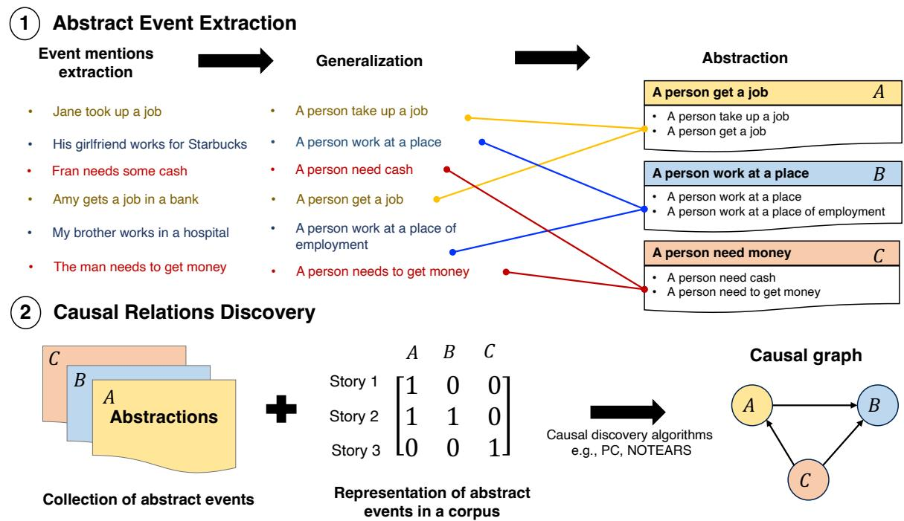
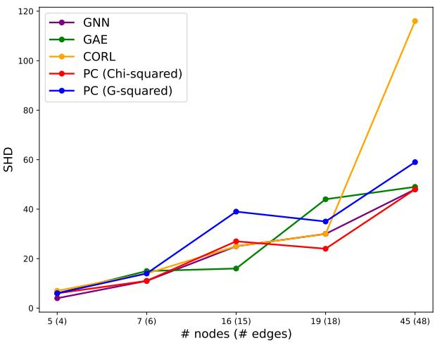
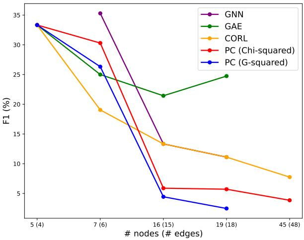
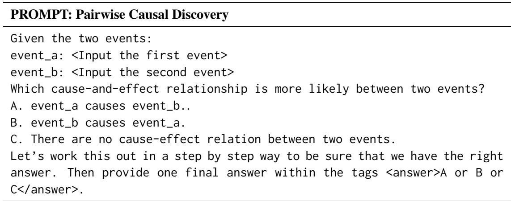
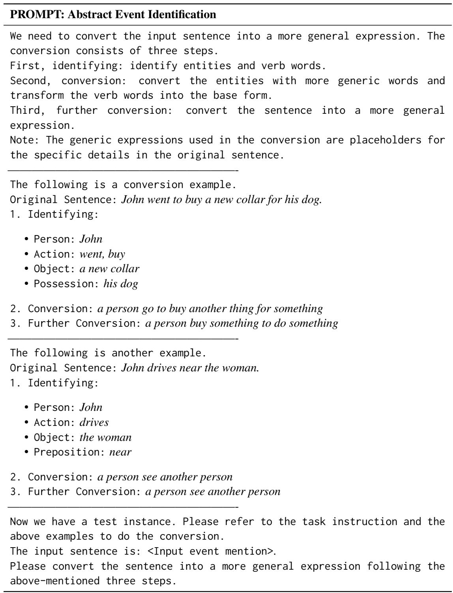

# ACCESS : A Benchmark for Abstract Causal Event Discovery and Reasoning

Vy Vo Lizhen Qu Tao Feng Yuncheng Hua Xiaoxi Kang   
Songhai Fan Tim Dwyer Lay-Ki Soon Gholamreza Haffari Monash University, Australia {firstname.lastname}@monash.edu

## Abstract

Identifying cause-and-effect relationships is critical to understanding real-world dynamics and ultimately causal reasoning. Existing methods for identifying event causality in NLP, including those based on Large Language Models (LLMs), exhibit difficulties in out-ofdistribution settings due to the limited scale and heavy reliance on lexical cues within available benchmarks. Modern benchmarks, inspired by probabilistic causal inference, have attempted to construct causal graphs of events as a robust representation of causal knowledge, where CRAB (Romanou et al., 2023) is one such recent benchmark along this line. In this paper, we introduce ACCESS, a benchmark designed for discovery and reasoning over abstract causal events. Unlike existing resources, ACCESS focuses on causality of everyday life events on the abstraction level. We propose a pipeline for identifying abstractions for event generalizations from GLUCOSE (Mostafazadeh et al., 2020), a large-scale dataset of implicit commonsense causal knowledge, from which we subsequently extract 1, 4K causal pairs. Our experiments highlight the ongoing challenges of using statistical methods and/or LLMs for automatic abstraction identification and causal discovery in NLP. Nonetheless, we demonstrate that the abstract causal knowledge provided in ACCESS can be leveraged for enhancing QA reasoning performance in LLMs.

## 1 Introduction

Commonsense causal reasoning plays a vital role in developing a mental model of reality, where the ability to discover, explain and predict causal relations between events or forces in the environment is fundamental to human planning and control (Johnson-Laird and Khemlani, 2017; Griffiths, 2017). Cognitive science studies further suggest that event causality is critical to human understanding of narratives (Van den Broek et al., 1996; Fletcher and Bloom, 1988; Tillman et al., 2020;

Sun et al., 2023), and story events with more causal relations tend to be better memorized than those with fewer relations (Graesser et al., 2003). Humans are able to construct a causal mental model of events after reading a set of stories (Zwaan et al., 1995). For example, in Figure 1, a reader would easily identify a causal relation between e1 : “A person needs money.” and e2 : “A person gets a job.” by abstracting away concrete details, such as mentions of particular entities, grouping linguistic variations of the same meanings, and observing that e1 almost always leads to e2 in multiple stories, without explicit presence of lexical cues (e.g. because) in text. Thus, this paper focuses on investigating to what extent LLMs can identify causal relations without relying on linguistic cues and perform causal reasoning over commonsense knowledge on the abstraction level.

Prior works on causal relation extraction heavily rely on linguistic cues, e.g. because of, by, due to, to discern causal relations between event mentions and cause/effect text spans within a text (Wolff and Song, 2003; Mirza and Tonelli, 2014). In contrast, statistical causal discovery methods for event causality do not require linguistic cues but exploit statistical information of symbolic representations of events (Pearl and Mackenzie, 2018). As a result, those approaches are able to find causal relations even when they are not explicitly mentioned anywhere in texts. Therefore, there has been criticism regarding the susceptibility of these causal relation extraction models to exploit the linguistic cues to attain high performance without engaging in actual causal reasoning (Yang et al., 2022; Li et al., 2022). Ample of causal relation extraction datasets, including TempEval-3 (Mirza et al., 2014), CATENA (Mirza and Tonelli, 2016), Causal-TimeBank (Mirza and Tonelli, 2014), BECauSE (Dunietz et al., 2015, 2017) and Event StoryLine Corpus (Caselli and Vossen, 2017), are not suitable for evaluating statistical causal discovery methods, because mentions of causal events that are semantically similar but expressed in different linguistic forms are not mapped into the same symbols.

  
Figure 1: Pipeline of abstract causal event discovery. An event is viewed from three hierarchical levels: mention (realization in a specific text corpus), generalization (conceptualization of the event’s components) and abstraction (group of causally consistent generalizations). Given a collection of event mentions, Phase 1 produces a collection of abstractions A, B, C that are mapped back to the original corpus to construct a suitable representation in Phase 2, such as a co-occurrence matrix. Causal discovery algorithms can then be employed to detect causal relations within the data, which may consider the contexts.

Humans identify grouping of semantic similar event mentions via abstraction, which omits concrete spurious details. It has also been suggested that effective causal reasoning requires models to learn suitable abstract representation of the world (Girju, 2003). Abstraction of events can well leverage causality theories (Pearl, 2009), which provide a theoretical underpinning for causal reasoning and formal analysis of causal relations. Given a set of random variables, theoretically grounded causal discovery algorithms (Vowels et al., 2022) use statistics collected from a dataset to construct causal graphs, which combine causal relations into logically coherent directed acyclic graphs (DAGs). In a causal graph, a node $v _ { i }$ denotes a random variable, while an edge from $v _ { i }$ to $v _ { j }$ indicates $v _ { i }$ is a direct cause of $v _ { j }$ . To the best of our knowledge, none of the existing datasets, such as COPA (Roemmele et al., 2011) and MAVEN-ERE (Wang et al., 2022), provide both abstraction of events grounded in a corpus and the corresponding causal graphs.

Existing knowledge graphs containing causal relations (Sap et al., 2019; Hwang et al., 2021; Hassanzadeh et al., 2022; Mbouadeu et al., 2023), cannot support evaluating both (1) event abstractions grounded in a corpus, and (2) construction of commonsense causal graphs from a collection of documents. The popular ATOMIC (Sap et al., 2019) in particular is harvested by crowd-sourcing so that similar events in ATOMIC are not grouped together and there is also no associated corpus containing all relevant event mentions. As a result, it is challenging to recover the grounded contexts and map events to random variables in order to apply statistical causal discovery. Two additional resources for constructing causal graphs from a collection of documents are CauseNet (Heindorf et al., 2020) and CRAB (Romanou et al., 2023). The causal relations from CauseNet are explicitly mentioned in texts while causal semantics can exist beyond lexical mentions. CRAB generates causal graphs from events extracted from online news articles. Neither CauseNet or CRAB provides abstraction of events or grouping of semantically equivalent events with linguistic variations. Therefore, the resulting graphs over fine-grained events can explode in size, posing severe computational difficulties. Another related resource is GLUCOSE (Mostafazadeh et al., 2020), which translates natural language expressions of event mentions and their relations into generic inferential rules dependent on story contexts. In those rules, entities are mapped to generalized concepts and the same keywords are used for the same relations, such as causes. Although GLUCOSE lacks grouping of similar abstract events and the interconnection of relations into a logically coherent causal graph, our paper extends this dataset to construct abstract knowledge graphs of causality.

Contribution. We introduce ACCESS, a benchmark for AbstraCt Causal Event DiScovery and ReaSoning. We propose to explore event causality at the abstraction level as a more efficient representation of knowledge. We introduce a reusable pipeline (See Figure 1) to curate causal relations from a large corpus of stories of daily life events. The resulting benchmark, ACCESS, is a graphical modelling of causal relations of 725 event abstractions forming a base of abstract commonsense knowledge of causation. Our benchmark also includes annotations to evaluate each step of the pipeline. Using ACCESS, our experiments shed light on the ongoing challenges within the field.

Firstly, the application of statistical structure learning algorithms for full graph discovery remains highly challenging. Secondly, solely relying on LLMs and automatic clustering proves insufficient for adequate event abstraction. Thirdly, LLMs still struggle with pairwise non-contextual causal discovery, indicating a gap in their possession of complete commonsense causal knowledge. Lastly, incorporating abstract commonsense knowledge through a causal graph enhances Question Answering (QA) reasoning tasks in LLMs up to 20%.

## 2 Causal Event Abstraction

We follow the definition of events provided in TimeML (Pustejovsky et al., 2003), ECB+ Annotation Guidelines (Cybulska and Vossen, 2014) and Event StoryLine Corpus (Caselli and Vossen, 2017). An event refers to any situation or state that happens or holds, which consists of four basic components: action/state, location, time and participant(s). We here consider location and time as optional; for instance, the sentence he goes to sleep is sufficiently an event. Each component of an event is associated with a concept in an ontology.1 A realization of a concept in the event is an event mention. An event abstraction is a tuple action (state)/concept, participant/concept, time/concept, location/concept shared among all mentions of that event, where each component is either an entity or a concept at an appropriate abstraction level. An event abstraction is itself an event and can be identified by replacing every component in its representation by a more abstract concept in the ontology. For example, His girlfriend [person] works [action] for Starbucks [location] on the weekends [time].

From another point of view, an event abstraction is a generalization of a cluster of event mentions that describe the same event. Two event mentions are equivalent if they are associated with the same event abstraction. An event abstraction is causally consistent w.r.t. a set of event mentions, if (1) none of its mention pairs at the semantic level contains a causal relationship, and (2) the semantics of all its mentions are either the cause or the effect of mentions in another event abstraction. Table 1 describes all the terms used in this paper and throughout the annotation process.

Definition of causation. Based on the counterfactual theory of causation (Lewis, 2013), an event x is said to cause another event y and event y is said to be an effect of event x if (1) event y temporally follows event x directly i.e., there are no intermediate events or if there is one, it must rarely occur, and (2) event y would not commonly occur if event x did not occur. It is worth noting that unlike such datasets as BECauSE (Dunietz et al., 2017) or CauseNet (Heindorf et al., 2020) that consider causality between concepts, here causality is defined on the event (sentence) level, which takes into account the interaction of multiple participants. In statistical causality literature, there exist 3 causal structures of interest: confounder, collider and mediator. For random variables X, Y, Z,

• Z is a called confounder if it causes both X and Y, written as $X \left. Z \right. Y ;$ ;

• Z is a collider when Z is a common child of X and Y but X and Y themselves are not related, written as $X \right. Z \left. Y$

<table><tr><td>Terminology</td><td>Description</td></tr><tr><td>Event</td><td>Any situation, state or action that happens, occurs or holds. An event consists of four basic components: participant(s), action/state, location and time.</td></tr><tr><td>Event sentence</td><td>An English sentence describing an event in daily life. An event sentence must contain the participant(s) and action/state components while location and time are the optional components and should not influence the judgment of the meaning of the sentence.</td></tr><tr><td>Cluster</td><td>A group of sentences describing the same event.</td></tr><tr><td>Topic</td><td>An event that is unique to a particular cluster and sufficiently abstract to be described by all event sentences in that cluster.</td></tr><tr><td>Topic sentence</td><td>The English sentence describing the topic of a particular cluster.</td></tr><tr><td>Story</td><td>A description of a series of connected events.</td></tr></table>

Table 1: Terminologies of the ACCESS benchmark.

• Z is a mediator if there is a chain X causes Z and Z causes Y, written as $X  Z  Y$

Quality criteria. We present the overarching criteria that guide our data construction process. These criteria aim to ensure that the event abstractions i.e., clusters of event mentions, in ACCESS achieve causal consistency:

1. Every cluster must be assigned with only one event abstraction.

2. All event mentions in each cluster must describe the same event and that event (abstraction) must be sufficiently abstract to cover all instances while being specific about the action taking place.

3. Every cluster must be in a cause-and-effect relation with at least one of the other clusters.

4. If there exists a causal relation between events at one level, the causal relation must hold at its higher levels of abstraction in the hierarchy. For example, a causal relation between events at the mention level must hold at the generalization and abstraction levels.

5. A cluster A is said to cause another cluster B if at least one event mentions in cluster A causes any other event mentions in cluster B, according to the above cause-effect definition.

## 3 The ACCESS Benchmark

ACCESS provides a graphical modelling of the cause-and-effect relations among event abstractions, where every node in the causal graph represents an event abstraction in the causal relation between any two nodes is represented by an arrow going from the cause event abstraction to the effect event abstraction. There are 725 abstractions or clusters, each of which on average contains 7 instances, and in total associated with 9, 513 stories in the GLUCOSE dataset. The graph also contains diverse causal structures for causal inference, including confounding, mediation and collider (Pearl, 2009). See Table 2 for examples of pairs of causal abstract events and Table 3 for the descriptive statistics of ACCESS.

Figure 1 illustrates our proposed pipeline for performing abstract causal event discovery and reasoning. The ACCESS dataset is constructed in the two phases: Phase (1) is to extract event abstractions from a collection of event mentions, by grouping mentions whose generalizations describing the same event in a way that the resulting abstraction satisfies the above quality criteria. Phase (2) is to identify the causal relations among these event abstractions. Both phases entail an alternation between using automatic algorithms for extracting candidate clusters/causal pairs and crowd-sourcing for refinement and quality control. We briefly describe each phase in the following sections. See Appendix B for more details on our crowd-sourcing pipeline and task descriptions.

## 3.1 Abstract Event Extraction

We now describe the process of curating these event mentions and extracting event abstractions. Our source of commonsense knowledge is GLUCOSE (Mostafazadeh et al., 2020), a large-scale dataset of over 670K stories with annotated causal relations. GLUCOSE also provides generalized inference rules mapped from specific statements, which correspond to our concept of event mentions.2 We make use of the generalized expressions for our abstraction procedure and focus only on dimensions 1 and 6 of causal explanations: the direct effect. For simplicity, we will from now on refer to these generalizations as events.

<table><tr><td colspan="2">Cause event</td><td colspan="2">Effect event</td></tr><tr><td>Abstraction</td><td>Generalizations</td><td>Abstraction</td><td>Generalizations</td></tr><tr><td>a person</td><td>a person need money</td><td>a person get</td><td>a person take up a job</td></tr><tr><td>need money</td><td>a person need cash</td><td> $a j o b$ </td><td>a person get a good job</td></tr><tr><td></td><td>a person need to get money</td><td></td><td>a person get a job at a place</td></tr><tr><td>a person win</td><td>a person win the contest</td><td>a person</td><td>a person be celebrate an occasion</td></tr><tr><td></td><td>a person win something</td><td>celebrate</td><td>a person have a celebration</td></tr><tr><td></td><td>a person end up winning</td><td></td><td>a person celebrate something</td></tr><tr><td>a person fall</td><td>a person fall down</td><td>a person feel pain</td><td>a person be in pain</td></tr><tr><td></td><td>a person fall to the floor</td><td></td><td>a person experience pain in a body part</td></tr><tr><td></td><td>a person fall on the ground</td><td></td><td>a person &#x27;s body be in pain</td></tr></table>

Table 2: Examples of event causality on the abstraction and generalization level.

<table><tr><td colspan="2">Story corpus</td></tr><tr><td>Stories Events</td><td>9,513 4,708</td></tr><tr><td>Causal graph</td><td></td></tr><tr><td>Nodes (clusters / abstractions)</td><td>725</td></tr><tr><td>Edges (causal pairs)</td><td>1,494</td></tr><tr><td>Expected degree per node</td><td>4</td></tr><tr><td>Confounders</td><td>149</td></tr><tr><td>Mediators</td><td>368</td></tr><tr><td>Colliders</td><td>3,956</td></tr></table>

Table 3: General descriptive statistics of ACCESS.

Automatic extraction. Two or more event mentions must describe the same event to be clustered together. To describe the same event means they must be semantically related or similar. We initially apply standard text preprocessing and subsequently implement correlation clustering (Bansal et al., 2004; Charikar et al., 2005) to automatically group events with shared semantics. We adopt an algorithm akin to the PIVOT algorithm (Fukunaga, 2019) that aims to maximize the semantic similarity of events in each cluster. We propose to measure semantic similarity by two metrics: cosine similarity and paraphrasing likelihood. The pairwise similarity of two expressions x, y is given by

$$
\mathcal { S } _ { x y } = 0 . 5 \times \big [ f _ { c o s } ( x , y ) + f _ { p h r } ( x , y ) \big ] ,\tag{1}
$$

where $S _ { x y } \in [ 0 , 1 ] , f _ { c o s }$ returns the cosine similarity of the contextual embeddings of expressions $x , y ,$ and $f _ { p h r }$ returns the probability events x, y are paraphrases. If x, y are causally related, based on the annotations in GLUCOSE, $S _ { x y } ~ = ~ 0$ The contextual embeddings are obtained from the pretrained all-MiniLM-L6-v2 sentence Transformers (Reimers and Gurevych, 2020) while the paraphrasing likelihood is obtained from the pre-trained adversarial paraphrase detector by Nighojkar and Licato (2021).

Appendix C presents details of our clustering algorithm, which contains an ablation study against other popular clustering algorithms on unsupervised and supervised metrics to show that our PIVOT algorithm is preferable. In summary, the algorithm begins with a randomly chosen causeeffect pair of events as pivots. For each of these nodes, it finds the neighbors with which the similarity score exceeds 70%. The process is repeated for the remaining events until all events are clustered. Events that do not belong to any clusters are temporarily discarded. To ensure causal consistency, we perform post-processing by splitting each cluster in a way that (1) no events in the same cluster are causally related, and (2) there exists either no or only one causal relations between any two clusters.

Human annotation. We then utilize 10 human annotators to assess the quality of cluster assignment as well as determine the abstract expression (or “topic" in laymen term) for each cluster. This involves five key steps. First, the annotators are required to perform sub-clustering out of the clusters formed in the previous step. To strictly guarantee that events grouped together share the same semantics and maximize annotation consistency, we outline 11 scenarios where word uses convey differences in meaning. Next, for each newly formed subcluster, they are also asked to identify the “topic", which subsequently serves as an event abstraction. We then conduct three additional steps to resolve the disagreements in annotation as well as to handle the outlier events that are temporarily removed after the automatic procedure. Appendix B.1 details this annotation process.

## 3.2 Causal Relations Discovery

This phase aims to identify the causal relations among the abstract events extracted from the previous phase, based on both non-contextual and contextual commonsense knowledge.

Automatic causal discovery. To identify candidate causal pairs of event abstractions, we use a combination of existing annotated relations in GLUCOSE and statistical causal discovery methods. Regarding GLUCOSE, we determine the causal relation of two event abstractions (clusters) based on criterion #5 in the above list of quality criteria. Regarding statistical causal discovery, we construct a dataset where each observation is a document or story in the GLUCOSE corpus and each feature records the counts of occurrences (or mentions) of a cluster in a story. On this co-occurrence data matrix, we run the well-known PC algorithm3 (Spirtes et al., 2000) to obtain more causal candidates, using G-squared and Chi-squared tests at p-value of 0.01. Note that we intentionally avoid using NLP models for event causality identification to avoid potential biases from their training data.

Human annotation. We proceed with human annotation on the union of the causal candidates from the above step. There are 3 annotators participating in this task. They are asked to categorize each candidate causal pair A and B into three scenarios: A causes B, B causes A, or A and B have no relation. Initially, the workers are tasked with annotating the causal relations without considering contexts, that is to solely rely on their commonsense about the abstractions. Subsequently, we identify the causal pairs with no consensus from the three workers. We provide the story contexts in GLUCOSE associated with each of these pairs and ask them to reevaluate their annotations. Out of 2, 862 candidate pairs detected from GLUCOSE, 39.6% of them are humanly annotated to be truly causal while that number is 61.5% within PC candidates. The final relation of each pair is decided through majority voting. The inter-rate agreement score (Krippendorff’s α) is 77.2%. See Appendix B.2 for details.

## 4 Experiments

In this section, we conduct empirical analyses to demonstrate how the ACCESS benchmark is used for evaluating (1) the effectiveness of automatic event abstraction and causal discovery approaches, and (2) how a causal structure assists reasoning models on causal QA tasks. All experimental results are averaged over 5 random running seeds. The codes and data for reproducing our experiments are published at github.com/isVy08/ACCESS.

## 4.1 Abstract Event Identification

For abstract causal discovery and reasoning, a practical question is how one can identify abstract events from real-world corpora where the groundtruth is unknown. Given the advances of LLMs, a promising approach to use LLMs to generate abstractions. In this experiment, we explore two approaches to automatically extract event abstraction with GPT-4o-mini, using Open AI’s official API.4 We then use ACCESS as ground-truth to evaluate the quality of abstraction.

Generate abstract events in a Single Step. We have GPT-4o-mini directly generate the generalized expressions. We extract 9, 495 event mentions from GLUCOSE and ask the model to generate two generalized versions for every instance, corresponding to the levels of generalization (level 1) and abstraction (level 2) described in Figure 1. We then compare the generated abstractions with the ground-true ones provided by GLUCOSE and ACCESS. The model achieves the BLEU score of 0.520. The prompt for this task can be found in Appendix E.

Identify abstract events in Two Steps. In the second approach5, we obtain the produced generalizations by GPT-4o-mini from the above step, then run automatic clustering to find the abstractions, following the setup in Section 3.1. For all instances in every output cluster, we retrieve the ground-true clusters given by ACCESS and take the majority one as the predicted assignment. We measure the level of agreement between the predicted and the true assignment, using the Rand index (Steinley, 2004) and mutual information (Vinh et al., 2009).

In Appendix C, Table 8 provides detailed numerical results for various clustering algorithms in this experiment. In all cases, the agreement scores are well below 1.0 (perfect agreement). This indicates vanilla automatic clustering is inadequate in identifying useful abstractions. While choosing a good clustering algorithm remains important, we find that the quality of the input generalizations plays a more critical role in the performance. When we conduct the same experiments on the ground-true generalizations from GLUCOSE, all metrics are significantly improved by at least 28%.

We further observe that on average, with generalizations from GPT-4o-mini, an output cluster has more than 40% of its instances belonging to a different cluster from the predicted one, and based on the ground-truth, a cluster should be further divided into at least 2 sub-clusters to be considered correct. We find that the issue is mainly due to the fact the model produces over-generalized expressions, causing the clustering algorithm to form bigger clusters. For example, the mentions Amanda feels excited and He is scared are both generalized to A person feel an emotion while we consider be excited or be scared to refer to different states. Another example is the mention Tom works hard being one-step generalized to be A person do something, which arbitrarily can be applied to any expressions. This reveals the difficulty in controlling the granularity of abstractions using LLMs, which substantiates the necessity for the benchmarks on event generalization and abstraction.

## 4.2 Pairwise Causal Discovery

We now describe how the data provided in ACCESS can be used for the causal discovery task. In the main text, we discuss the pairwise causal discovery task in LLMs. We examine how well LLMs can discern pairwise causal relations between two abstract events. Formally, given a pair of events x and y, LLMs are asked to determine the relation between them by outputting one of the three possible relations: x causes y, y causes x, or no causal relation. In addition to the 1, 494 causal relations in ACCESS, we also randomly generate 1, 000 negative pairs to challenge the models. For our experiments, the LLMs used are GPT-4o-mini, Llama3.2-3B-Instruct, Llama3.1-8B-Instruct and Llama2-chat-7B6. The output from these models is post-processed to extract the final relation. The prompts can be found in Table 9 of Appendix E.

The results are presented in Table 4, using Precision, Recall, and F1 score as evaluation metrics. We also report the performance of random choices and majority baseline, where the most frequent answer is selected for assessment based on the reference data. LLMs achieve fairly humble accuracies, where GPT-4o-mini achieves the best performance, second to which is Llama3.1-8B. It is worth noting that the task is non-contextual since the goal is to assess the models’ capability of intuitive or commonsense causal reasoning. Such intuition in humans is typically shaped by our observations and experiences from everyday life, enabling us to quickly identify scenarios where the causal relationships often hold. For example, we intuitively understand that speeding can frequently result in being the person being fined by the police.

Appendix D later demonstrates how the ACCESS pipeline facilitates the application of statistical structure learning algorithms. These methods are currently shown to under-perform on our benchmark, suggesting that there remains a large gap between theoretically grounded causal discovery and event causality identification research in NLP.

<table><tr><td colspan="4">Causal Discovery on ACCESS</td></tr><tr><td></td><td>Precision ↑</td><td>Recall ↑</td><td>F1↑</td></tr><tr><td>GPT-4o-mini Llama3.2-3B</td><td> $\mathbf { 0 . 7 0 5 \pm . 0 2 6 }$   $0 . 3 8 4 \pm . 0 1 5$ </td><td> $\mathbf { 0 . 5 8 1 \pm . 0 2 8 }$   $0 . 3 6 4 \pm . 0 0 6$ </td><td> $\mathbf { 0 . 5 5 9 \pm . 0 2 5 }$   $0 . 3 2 6 \pm . 0 0 7$ </td></tr><tr><td>Llama3.1-8B Llama2-7B</td><td> $0 . 4 3 7 \pm . 0 0 6$   $0 . 3 7 6 \pm . 0 0 6$ </td><td> $0 . 4 2 5 \pm . 0 0 6$   $0 . 3 5 9 \pm . 0 0 6$ </td><td> $0 . 4 1 3 \pm . 0 0 6$   $0 . 3 1 6 \pm . 0 0 7$ </td></tr><tr><td>Random Majority</td><td> $0 . 3 4 0 \pm . 0 0 8$   $0 . 1 1 4 \pm . 0 0 1$ </td><td> $0 . 3 3 0 \pm . 0 0 3$   $0 . 3 3 3 \pm . 0 0 1$ </td><td> $0 . 3 3 0 \pm . 0 0 8$   $0 . 1 7 0 \pm . 0 0 1$ </td></tr></table>

Table 4: Experiment results of causal discovery on ACCESS dataset. Precision, Recall, and F1 are computed under macro-average setting. Bold indicates best performance. Higher is better.

## 4.3 Reasoning with Causal Graphs

We now study how the causal graphs in ACCESS can be used to assist models in QA reasoning tasks. In connection with Section 4.2, this can essentially be viewed as a contextual causal discovery task. We construct a causal QA dataset from GLUCOSE, which provides a set of stories with annotated causal relations between events at both the mention and nal mention level, whereas in the second one, the cause/effect event is transformed into its generalized version. For example, the question "What could be the cause of the event ’Amy gets a job in a bank’?" is replaced into "The story describes an event where ’a person gets a job’. What could be the cause of the event?". We label the two variants as Specific QA and Abstract QA respectively. To perform the second task, ideally the model should be able to first perform abstract reasoning, that is to map the generalized cause/effect event to its corresponding mention in the context, prior to retrieving the correct causal pair. Examples of this GLUCOSE-QA dataset are provided in Appendix E.

<table><tr><td colspan="7">QA Reasoning on GLUCOSE</td></tr><tr><td></td><td colspan="2">Specific QA</td><td colspan="2">Specific QA+</td><td colspan="2">Abstract QA+</td></tr><tr><td>zero-shot COT</td><td>Accuracy ↑</td><td></td><td>F1 ↑| Accuracy ↑</td><td></td><td>F1↑| Accuracy ↑</td><td>F1↑</td></tr><tr><td>GPT-4o-mini</td><td> $0 . 7 9 0 \pm . 0 0 8$ </td><td> $0 . 8 0 9 \pm . 0 0 6$ </td><td> $0 . 7 1 9 \pm . 0 4 9$ </td><td> $0 . 7 2 0 \pm . 0 1 9$ </td><td> $0 . 5 6 1 \pm . 0 1 3$ </td><td> $0 . 5 5 4 \pm . 0 1 3$ </td></tr><tr><td> $\mathsf { G P T } \mathsf { - } 4 0 \mathsf { - m i n i } + \mathsf { C G }$ </td><td> $\mathbf { 0 . 8 9 4 \pm . 0 6 7 }$ </td><td> $\mathbf { 0 . 8 8 7 \pm . 0 4 6 }$ </td><td> $\mathbf { 0 . 9 1 2 \pm . 0 1 2 }$ </td><td> $\mathbf { 0 . 8 8 7 \pm . 0 0 6 }$ </td><td> $\mathbf { 0 . 7 3 1 \pm . 0 4 7 }$ </td><td> $\mathbf { 0 . 6 8 6 \pm . 0 1 7 }$ </td></tr><tr><td>Llama3.2-3B</td><td> $0 . 7 2 3 \pm . 0 0 6$ </td><td> $0 . 5 0 1 \pm . 0 1 0$ </td><td> $0 . 6 9 6 \pm . 0 2 2$ </td><td> $0 . 4 8 7 \pm . 0 1 0$ </td><td> $0 . 6 3 1 \pm . 0 0 6$ </td><td> $0 . 5 2 4 \pm . 0 0 8$ </td></tr><tr><td> $\mathsf { L 1 a m a 3 . 2 - 3 B + C G }$ </td><td> $\mathbf { 0 . 8 0 3 \pm . 0 0 2 }$ </td><td> $\mathbf { 0 . 5 6 1 \pm . 0 1 4 }$ </td><td> $\mathbf { 0 . 7 5 4 \pm . 0 0 1 }$ </td><td> $\mathbf { 0 . 5 3 3 \pm . 0 0 2 }$ </td><td> $\mathbf { 0 . 7 2 5 \pm . 0 0 5 }$ </td><td> $\mathbf { 0 . 5 5 1 \pm . 0 0 4 }$ </td></tr><tr><td>Llama3.1-8B</td><td> $0 . 8 8 3 \pm . 0 0 5$ </td><td> $0 . 4 2 8 \pm . 0 0 3$ </td><td> $0 . 8 3 3 \pm . 0 1 8$ </td><td> $0 . 4 1 8 \pm . 0 1 0$ </td><td> $0 . 7 9 4 \pm . 0 1 2$ </td><td> $0 . 4 2 1 \pm . 0 0 4$ </td></tr><tr><td> $\mathrm { L 1 } \mathsf { a m a 3 . } \mathsf { 1 } \mathsf { - 8 B } + \mathrm { C G }$ </td><td> $\mathbf { 0 . 9 2 4 } \pm . 0 0 8$ </td><td> $\mathbf { 0 . 5 5 6 \pm . 0 1 8 }$ </td><td> $\mathbf { 0 . 8 8 5 \pm . 0 0 2 }$ </td><td> $\mathbf { 0 . 5 2 1 \pm . 0 1 1 }$ </td><td> $\mathbf { 0 . 8 7 5 \pm . 0 0 1 }$ </td><td> $\mathbf { 0 . 5 2 4 \pm . 0 0 9 }$ </td></tr><tr><td>Llama2-7B  $\mathsf { L 1 a m a 2 – 7 B + C G }$ </td><td> $0 . 5 3 0 \pm . 0 1 3$   $\mathbf { 0 . 6 8 1 \pm . 0 0 4 }$ </td><td> $0 . 5 0 9 \pm . 0 1 2$   $\mathbf { 0 . 6 0 1 \pm . 0 0 9 }$ </td><td> $0 . 4 8 0 \pm . 0 0 3$   $\mathbf { 0 . 6 3 5 \pm . 0 1 5 }$ </td><td> $0 . 5 5 3 \pm . 0 0 7$   $\mathbf { 0 . 6 3 2 \pm . 0 1 0 }$ </td><td> $0 . 4 8 3 \pm . 0 1 5$   $\mathbf { 0 . 6 9 2 \pm . 0 1 0 }$ </td><td> $0 . 5 3 7 \pm . 0 0 5$   $\mathbf { 0 . 6 6 3 \pm . 0 0 9 }$ </td></tr></table>

Table 5: Experiment results of multi-choice causal reasoning on GLUCOSE-QA dataset. QA+ indicates the setting where the stories are paraphrased. +CG refers to the experiment that prompts the causal information from ACCESS.

<table><tr><td rowspan=1 colspan=2>Abstract QA+ on GLUCOSE</td></tr><tr><td rowspan=1 colspan=1>bi-level COT</td><td rowspan=1 colspan=1>Accuracy ↑               F1↑</td></tr><tr><td rowspan=1 colspan=1>Llama3.2-3BL1ama3.2-3B + CG</td><td rowspan=1 colspan=1> $0 . 7 2 2 \pm . 0 2 5$      $0 . 3 7 8 \pm . 0 0 4$  $\mathbf { 0 . 7 4 0 \pm . 0 2 5 }$    $\mathbf { 0 . 4 1 0 \pm . 0 1 4 }$ </td></tr><tr><td rowspan=1 colspan=1>Llama3.1-8BL1ama3.1-8B + CG</td><td rowspan=1 colspan=1> $0 . 7 5 3 \pm . 0 1 1$      $0 . 4 3 0 \pm . 0 0 9$  $\mathbf { 0 . 8 1 3 \pm . 0 2 2 }$    $\mathbf { 0 . 4 9 3 \pm . 0 1 8 }$ </td></tr><tr><td rowspan=1 colspan=1>Llama2-7B $\mathsf { L 1 a m a 2 – 7 B + C G }$ </td><td rowspan=1 colspan=1> $0 . 5 0 3 \pm . 0 2 8$      $0 . 5 1 6 \pm . 0 0 7$  $\mathbf { 0 . 6 0 5 \pm . 0 1 8 }$    $\mathbf { 0 . 6 2 3 \pm . 0 0 5 }$ </td></tr></table>

Table 6: Experiment results of multi-choice Abstract QA+ with bi-level COT prompting.

generalization levels. For every story, we create two alternative multi-choice questions about the cause and effect. We extract the sentences in the story as candidate answers. The event appears in the annotated causal pair is thus considered a correct answer. Furthermore, in some cases, there can exist multiple causes that co-occur and lead to an effect and vice versa. To address this, we have a human expert review the data to identify additional correct causal events. The judgment of causality is based on the same criteria of the annotation process described in Appendix B.2. It is worth highlighting again that we focus on direct causal relations, meaning that we do not consider events that result from/in some intermediate causes/effects. The resulting dataset contains 480 questions, some of which have multiple correct answers.

Since the LLMs have the tendency to exploit the textual cues, we additionally generate the paraphrases for each story while retaining the event choices in their original version. We label this extra setting as QA+. We also experiment with two variants of question design. In this first one, the cause/effect event of question occurs at the origi-

How ACCESS provides abstract causal information. To evaluate whether the causal abstract knowledge from ACCESS can help QA reasoning, we extend the above experiment by adding the causal relations between two relevant abstractions as an additional context in the prompt. In our experiments, the corresponding abstraction of an event mention can be retrieved directly from ACCESS. However, for an arbitrary QA dataset, this should be done via two subsequent steps: (1) perform abstraction of the event described in the target cause/effect and (2) map the output abstraction to at least one abstract event in ACCESS and retrieve the corresponding causal relations. Section 4.1 has described two possible approaches to step (1).

Results. Given a story and a causal question, we prompt LLMs to generate the answer from a set of provided candidates. We first adopt zero-shot chainof-thought (COT) (Kojima et al., 2022) with the basic “let’s think step by step" prompting. Given the Llama models are open-sourced, we consider a bi-level COT dedicated to abstract QA tasks. In this approach, we provide a brief instruction on how to perform abstract causal reasoning, which entails two steps: the first one is for abstract reasoning, that is to identify the mention corresponding to the generalized cause/effect of question; the second step is for causal reasoning, that is to retrieve the corresponding effect/cause mentioned in the story context. See Appendix E for prompts and qualitative examples.

The evaluation metrics include Accuracy (which measures how often the model successfully retrieves at least one correct answer) and F1 score under weighted-average setting (which considers the alignment of all predicted choices). Tables 5 and 6 summarize our experiment results. Each setting introduces an increased level of difficulty in abstract reasoning. In the first task of Specific QA, the models can draw the answers directly from the raw context. Meanwhile, Specific QA+ tasks obscure away the linguistic cues, which the models are known to heavily exploit for prediction. Finally, Abstract QA+ is the most challenging, where the models are expected to concretize the abstract events before deriving the answers.

The findings reveal that the inclusion of causal graphs significantly enhances the performance of LLMs across all experimental settings. Except Llama2 whose performance is consistently poor, the performance of all models degrade on Abstract QA+ tasks, which indicates their struggle in reasoning over abstract causality. However, while we use ACCESS to provide the LLMs with the causal relations only between event abstractions, large improvements have been observed. Therefore, we hypothesize that the model may possess a subtle capacity to reason abstractly that needs proper activating. Compared to GPT-4o-mini, the Llama family are more prone to temporal and lexical biases, resulting in low F1 scores due to a higher number of negative selections. Concretely, the models select on average 1.9-2.9 more answers than the actual ones across the QA tasks. With the additional causal information, the ratios are reduced to 1.8  2.6. Bi-level COT unfortunately yields undesirable results, with a slight gain in accuracy in smaller models yet at a cost of reduced F1 scores due to increased over-prediction. This implies potential errors in some reasoning steps, but tracing and evaluating lines of reasoning in complex COT is an open challenge. Nevertheless, our experiments show that a simple zero-shot COT plus relevant abstract causal knowledge can greatly benefit the models. This presents a straightforward alternative strategy to enhance performance by leveraging external knowledge bases.

## 5 Conclusion

This paper introduces ACCESS, a benchmark for abstract causal event discovery and reasoning. We present a pipeline that combines automatic methods and human crowd-sourcing to extract 1, 494 causal relations among 725 abstract events. We demonstrate that incorporating causal knowledge from our benchmark leads to improvements in QA reasoning tasks for LLMs. However, we also highlight challenges in automatic event abstraction identification and causal discovery, where in the latter, the popular statistical algorithms perform poorly in recovering our sub-graphs of fewer than 50 nodes. Our empirical evidence also suggests that LLMs are not ready to perform causal inference effectively due to the lack of effective acquisition of two critical sub-processes: abstract reasoning and causal discovery. This underscores the need for future research to equip the models with these essential skills for achieving true causal reasoning.

## Limitations

Our benchmark is built upon GLUCOSE (Mostafazadeh et al., 2020) whose scope is limited to everyday children’s stories. Acknowledging this limitation, we propose a reproducible data construction pipeline applicable for curating diverse corpora of event causality. Since ACCESS primarily addresses commonsense knowledge in real-world events, it is susceptible to biases regarding the judgement of semantic similarity and cause-and-effect relation of events. To mitigate this issue, our first effort is at every phase, to employ automatic methods alongside with human annotation, based on a set of objective definitions and criteria about events, abstractions and event causality. In the event abstraction phase, we specifically provide the annotators with a list of common scenarios (though non-exhaustive) indicating when the semantics of two expressions are considered similar of different to reduce potential biases. Regarding the subjectivity in human causal judgment, while we focus on non-contextual causal commonsense knowledge, we leverage contextual signals in the original corpus whenever necessary to objectively guide the annotators’ decisions on the causal relations. Due to the resource constraints, our causal graph is sparse and limited in size, which however still presents a challenge for statistical structure learning as well as LLMs on causal discovery tasks. One critical drawback in the experiment with statistical methods lies in the representation power of the co-occurrence matrix, which underscores the need for further research on representation learning of abstractions in language domain. As above, future works could also explore other resources to enlarge our causal graph and expand the coverage of real-world data. Such a causal graph could further be leveraged for causal inference according the engine described by Pearl (Pearl, 2009), which seeks to answer causal queries across the three rungs of the Ladder of Causation i.e., associational (Rung 1), interventional (Rung 2), and counterfactual (Rung 3).

## Ethics Statement

To address potential misuse and uphold fairness and inclusivity, we discuss several ethical considerations for ACCESS. Firstly, it is crucial to clarify that the resources provided in this work are solely intended for research purposes. The narrative scenarios within ACCESS should not be utilized for insults, slander, or any other malicious purposes. Users are expected to adhere to the highest ethical standards, ensuring responsible and transparent use in line with ethical research practices. The creators of the dataset hold no responsibility for misuse or misinterpretation, and all necessary measures have been taken to respect privacy and ensure informed consent during the data collection process. Secondly, it is imperative to acknowledge the mental well-being of annotators during the data annotation process. Prior to data collection, this study underwent a thorough review and approval process by an internal review board. We require each annotator to take a break every two hours or whenever they feel uncomfortable.

## Acknowledgment

This material is based on research sponsored by DARPA under agreement number HR001122C0029. The U.S. Government is authorized to reproduce and distribute reprints for Governmental purposes notwithstanding any copyright notation thereon This work is also partially supported by the DARPA Assured Neuro Symbolic Learning and Reasoning (ANSR) program under award number FA8750-23-2-1016.

## References

Mihael Ankerst, Markus M Breunig, Hans-Peter Kriegel, and Jörg Sander. 1999. Optics: Ordering points to identify the clustering structure. ACM Sigmod record, 28(2):49–60.

Nikhil Bansal, Avrim Blum, and Shuchi Chawla. 2004. Correlation clustering. Machine learning, 56:89– 113.

Helen Beebee, Christopher Hitchcock, Peter Charles Menzies, and Peter Menzies. 2009. The Oxford handbook ofcausation. Oxford Handbooks.

Kevin Bello, Bryon Aragam, and Pradeep Ravikumar. 2022. Dagma: Learning dags via m-matrices and a log-determinant acyclicity characterization. Advances in Neural Information Processing Systems, 35:8226–8239.

Vincent D Blondel, Jean-Loup Guillaume, Renaud Lambiotte, and Etienne Lefebvre. 2008. Fast unfolding of communities in large networks. Journal ofstatistical mechanics: theory and experiment, 2008(10):P10008.

Paul Van den Broek, Elizabeth Pugzles Lorch, and Richard Thurlow. 1996. Children’s and adults’ memory for television stories: The role of causal factors, story-grammar categories, and hierarchical level. Child development, 67(6):3010–3028.

Tommaso Caselli and Piek Vossen. 2017. The event storyline corpus: A new benchmark for causal and temporal relation extraction. In Proceedings of the Events and Stories in the News Workshop, pages 77– 86.

Moses Charikar, Venkatesan Guruswami, and Anthony Wirth. 2005. Clustering with qualitative information. Journal ofComputer and System Sciences, 71(3):360– 383.

Fei Cheng and Yusuke Miyao. 2017. Classifying temporal relations by bidirectional lstm over dependency paths. In Proceedings of the 55th Annual Meeting of the Associationfor Computational Linguistics (Volume 2: Short Papers), pages 1–6.

David Maxwell Chickering. 2002. Optimal structure identification with greedy search. Journal ofmachine learning research, 3(Nov):507–554.

Agata Cybulska and Piek Vossen. 2014. Guidelines for ecb+ annotation of events and their coreference.

Dhairya Dalal, Paul Buitelaar, and Mihael Arcan. 2023. Calm-bench: A multi-task benchmark for evaluating causality-aware language models. In Findings ofthe Association for Computational Linguistics: EACL 2023, pages 296–311.

Jesse Dunietz, Lori Levin, and Jaime G Carbonell. 2015. Annotating causal language using corpus lexicography of constructions. In Proceedings of The 9th Linguistic Annotation Workshop, pages 188–196.

Jesse Dunietz, Lori Levin, and Jaime G Carbonell. 2017. The because corpus 2.0: Annotating causality and overlapping relations. In Proceedings of the 11th Linguistic Annotation Workshop, pages 95–104.

Charles R Fletcher and Charles P Bloom. 1988. Causal reasoning in the comprehension of simple narrative texts. Journal ofMemory and language, 27(3):235– 244.

Takuro Fukunaga. 2019. Lp-based pivoting algorithm for higher-order correlation clustering. Journal of Combinatorial Optimization, 37:1312–1326.

Jinglong Gao, Xiao Ding, Bing Qin, and Ting Liu. 2023. Is chatgpt a good causal reasoner? a comprehensive evaluation. arXiv preprint arXiv:2305.07375.

Lei Gao, Prafulla Kumar Choubey, and Ruihong Huang. 2019. Modeling document-level causal structures for event causal relation identification. In Proceedings of the 2019 Conference of the North American Chapter of the Association for Computational Linguistics: Human Language Technologies, Volume 1 (Long Papers).

Roxana Girju. 2003. Automatic detection of causal relations for question answering. In Proceedings of the ACL 2003 workshop on Multilingual summarization and question answering, pages 76–83.

Arthur C Graesser, Brent Olde, and Bianca Klettke. 2003. 10 how does the mind construct and represent stories? Narrative impact: Social and cognitive foundations, page 121.

Thomas L Griffiths. 2017. Formalizing prior knowledge in causal induction. The oxford handbook ofcausal reasoning, pages 115–126.

Thomas R Gruber. 1993. A translation approach to portable ontology specifications. Knowledge acquisition, 5(2):199–220.

Chikara Hashimoto, Kentaro Torisawa, Julien Kloetzer, Motoki Sano, István Varga, Jong-Hoon Oh, and Yutaka Kidawara. 2014. Toward future scenario generation: Extracting event causality exploiting semantic relation, context, and association features. In Proceedings of the 52nd Annual Meeting of the Association for Computational Linguistics (Volume 1: Long Papers), pages 987–997.

Oktie Hassanzadeh, Parul Awasthy, Ken Barker, Onkar Bhardwaj, Debarun Bhattacharjya, Mark Feblowitz, Lee Martie, Jian Ni, Kavitha Srinivas, and Lucy Yip. 2022. Knowledge-based news event analysis and forecasting toolkit. In IJCAI, pages 5904–5907.

Mutian He, Tianqing Fang, Weiqi Wang, and Yangqiu Song. 2022. Acquiring and modelling abstract commonsense knowledge via conceptualization. arXiv preprint arXiv:2206.01532.

Stefan Heindorf, Yan Scholten, Henning Wachsmuth, Axel-Cyrille Ngonga Ngomo, and Martin Potthast. 2020. Causenet: Towards a causality graph extracted from the web. In CIKM. ACM.

Jena D Hwang, Chandra Bhagavatula, Ronan Le Bras, Jeff Da, Keisuke Sakaguchi, Antoine Bosselut, and Yejin Choi. 2021. (comet-) atomic 2020: On symbolic and neural commonsense knowledge graphs. In Proceedings ofthe AAAI Conference on Artificial Intelligence, volume 35, pages 6384–6392.

Alon Jacovi, Avi Caciularu, Omer Goldman, and Yoav Goldberg. 2023. Stop uploading test data in plain text: Practical strategies for mitigating data contamination by evaluation benchmarks. In Proceedings of the 2023 Conference on Empirical Methods in Natural Language Processing, pages 5075–5084.

Zhijing Jin, Jiarui Liu, Zhiheng Lyu, Spencer Poff, Mrinmaya Sachan, Rada Mihalcea, Mona Diab, and Bernhard Schölkopf. 2023. Can large language models infer causation from correlation? arXiv preprint arXiv:2306.05836.

Philip Nicholas Johnson-Laird and Sangeet Khemlani. 2017. Mental models and causation. Oxford handbook of causal reasoning, pages 1–42.

Emre Kıcıman, Robert Ness, Amit Sharma, and Chenhao Tan. 2023. Causal reasoning and large language models: Opening a new frontier for causality. arXiv preprint arXiv:2305.00050.

Takeshi Kojima, Shixiang Shane Gu, Machel Reid, Yutaka Matsuo, and Yusuke Iwasawa. 2022. Large language models are zero-shot reasoners. Advances in neural information processing systems, 35:22199– 22213.

David Lewis. 2013. Counterfactuals. John Wiley & Sons.

Jiaxuan Li, Lang Yu, and Allyson Ettinger. 2022. Counterfactual reasoning: Do language models need world knowledge for causal inference? In NeurIPS 2022 Workshop on Neuro Causal and Symbolic AI (nCSI).

Steve Fonin Mbouadeu, Martin Lorenzo, Ken Barker, and Oktie Hassanzadeh. 2023. An evaluation framework for mapping news headlines to event classes in a knowledge graph. In Proceedings of the 6th Workshop on Challenges and Applications of Automated Extraction of Socio-political Events from Text, pages 44–52, Varna, Bulgaria. INCOMA Ltd., Shoumen, Bulgaria.

Paramita Mirza, Rachele Sprugnoli, Sara Tonelli, and Manuela Speranza. 2014. Annotating causality in the tempeval-3 corpus. In Proceedings of the EACL 2014 Workshop on Computational Approaches to Causality in Language (CAtoCL), pages 10–19.

Paramita Mirza and Sara Tonelli. 2014. An analysis of causality between events and its relation to temporal information. In Proceedings ofCOLING 2014, the 25th International Conference on Computational Linguistics: Technical Papers, pages 2097–2106, Dublin, Ireland. Dublin City University and Association for Computational Linguistics.

Paramita Mirza and Sara Tonelli. 2016. Catena: Causal and temporal relation extraction from natural language texts. In The 26th international conference on computational linguistics, pages 64–75. ACL.

Nasrin Mostafazadeh, Aditya Kalyanpur, Lori Moon, David Buchanan, Lauren Berkowitz, Or Biran, and Jennifer Chu-Carroll. 2020. GLUCOSE: GeneraLized and COntextualized story explanations. In Proceedings of the 2020 Conference on Empirical Methods in Natural Language Processing (EMNLP), pages 4569–4586, Online. Association for Computational Linguistics.

Gregory Murphy. 2004. The big book of concepts. MIT press.

Ignavier Ng, AmirEmad Ghassami, and Kun Zhang. 2020. On the role of sparsity and dag constraints for learning linear dags. Advances in Neural Information Processing Systems, 33:17943–17954.

Ignavier Ng, Shengyu Zhu, Zhitang Chen, and Zhuangyan Fang. 2019. A graph autoencoder approach to causal structure learning. arXiv preprint arXiv:1911.07420.

Animesh Nighojkar and John Licato. 2021. Improving paraphrase detection with the adversarial paraphrasing task. In Proceedings of the 59th Annual Meeting of the Association for Computational Linguistics and the 11th International Joint Conference on Natural Language Processing (Volume 1: Long Papers), pages 7106–7116, Online. Association for Computational Linguistics.

Jong-Hoon Oh, Kentaro Torisawa, Chikara Hashimoto, Motoki Sano, Stijn De Saeger, and Kiyonori Ohtake. 2013. Why-question answering using intra-and intersentential causal relations. In Proceedings ofthe 51st Annual Meeting of the Association for Computational Linguistics (Volume 1: Long Papers), pages 1733– 1743.

Judea Pearl. 2009. Causality. Cambridge university press.

Judea Pearl and Dana Mackenzie. 2018. The book of why: the new science of cause and effect. Basic books.

James Pustejovsky, Patrick Hanks, Roser Sauri, Andrew See, Robert Gaizauskas, Andrea Setzer, Dragomir Radev, Beth Sundheim, David Day, Lisa Ferro, et al. 2003. The timebank corpus. In Corpus linguistics, volume 2003, page 40. Lancaster, UK.

James Pustejovsky, Jessica Littman, Roser Saurí, and Marc Verhagen. 2006. Timebank 1.2 documentation. Event London, no. April, pages 6–11.

Nils Reimers and Iryna Gurevych. 2020. Making monolingual sentence embeddings multilingual using knowledge distillation. In Proceedings of the 2020 Conference on Empirical Methods in Natural Language Processing. Association for Computational Linguistics.

Mehwish Riaz and Roxana Girju. 2014. Recognizing causality in verb-noun pairs via noun and verb semantics. In Proceedings of the EACL 2014 Workshop on Computational Approaches to Causality in Language (CAtoCL), pages 48–57.

Melissa Roemmele, Cosmin Adrian Bejan, and Andrew S Gordon. 2011. Choice of plausible alternatives: An evaluation of commonsense causal reasoning. In 2011 AAAI Spring Symposium Series.

Angelika Romanou, Syrielle Montariol, Debjit Paul, Leo Laugier, Karl Aberer, and Antoine Bosselut. 2023. Crab: Assessing the strength of causal relationships between real-world events. arXiv preprint arXiv:2311.04284.

Peter J Rousseeuw. 1987. Silhouettes: a graphical aid to the interpretation and validation of cluster analysis. Journal ofcomputational and applied mathematics, 20:53–65.

Maarten Sap, Ronan Le Bras, Emily Allaway, Chandra Bhagavatula, Nicholas Lourie, Hannah Rashkin, Brendan Roof, Noah A Smith, and Yejin Choi. 2019. Atomic: An atlas of machine commonsense for ifthen reasoning. In Proceedings of the AAAI conference on artificial intelligence, volume 33, pages 3027–3035.

Shirong Shen, Heng Zhou, Tongtong Wu, and Guilin Qi. 2022. Event causality identification via derivative prompt joint learning. In Proceedings of the 29th International Conference on Computational Linguistics, pages 2288–2299, Gyeongju, Republic of Korea. International Committee on Computational Linguistics.

Peter Spirtes and Clark Glymour. 1991. An algorithm for fast recovery of sparse causal graphs. Social science computer review, 9(1):62–72.

Peter Spirtes, Clark N Glymour, and Richard Scheines. 2000. Causation, prediction, and search. MIT press.

Douglas Steinley. 2004. Properties of the hubertarable adjusted rand index. Psychological methods, 9(3):386.

Yidan Sun, Qin Chao, and Boyang Li. 2023. Event causality is key to computational story understanding. arXiv preprint arXiv:2311.09648.

Katharine Tillman, Nestor Tulagan, Jessica Sullivan, S Denison, M Mack, Y Xu, and BC Armstrong. 2020. Children’s spontaneous inferences about time and causality in narrative. In CogSci.

Vincent A Traag, Ludo Waltman, and Nees Jan Van Eck. 2019. From louvain to leiden: guaranteeing well-connected communities. Scientific reports, 9(1):5233.

Nguyen Xuan Vinh, Julien Epps, and James Bailey. 2009. Information theoretic measures for clusterings comparison: is a correction for chance necessary? In Proceedings ofthe 26th annual international conference on machine learning, pages 1073–1080.

Matthew J Vowels, Necati Cihan Camgoz, and Richard Bowden. 2022. D’ya like dags? a survey on structure learning and causal discovery. ACM Computing Surveys, 55(4):1–36.

Michael Waldmann. 2017. The Oxford handbook of causal reasoning. Oxford University Press.

Xiaoqiang Wang, Yali Du, Shengyu Zhu, Liangjun Ke, Zhitang Chen, Jianye Hao, and Jun Wang. 2021. Ordering-based causal discovery with reinforcement learning. arXiv preprint arXiv:2105.06631.

Xiaozhi Wang, Yulin Chen, Ning Ding, Hao Peng, Zimu Wang, Yankai Lin, Xu Han, Lei Hou, Juanzi Li, Zhiyuan Liu, Peng Li, and Jie Zhou. 2022. MAVEN-ERE: A unified large-scale dataset for event coreference, temporal, causal, and subevent relation extraction. In Proceedings ofthe 2022 Conference on Empirical Methods in Natural Language Processing, pages 926–941, Abu Dhabi, United Arab Emirates. Association for Computational Linguistics.

Phillip Wolff and Grace Song. 2003. Models of causation and the semantics of causal verbs. Cognitive psychology, 47(3):276–332.

Jie Yang, Soyeon Caren Han, and Josiah Poon. 2022. A survey on extraction of causal relations from natural language text. Knowledge and Information Systems, 64(5):1161–1186.

Yue Yu, Jie Chen, Tian Gao, and Mo Yu. 2019. Dag-gnn: Dag structure learning with graph neural networks. In International Conference on Machine Learning, pages 7154–7163. PMLR.

Matej Zecevi ˇ c, Moritz Willig, Devendra Singh Dhami,´ and Kristian Kersting. 2023. Causal parrots: Large language models may talk causality but are not causal. arXiv preprint arXiv:2308.13067.

Keli Zhang, Shengyu Zhu, Marcus Kalander, Ignavier Ng, Junjian Ye, Zhitang Chen, and Lujia Pan. 2021. gcastle: A python toolbox for causal discovery.

Xun Zheng, Bryon Aragam, Pradeep K Ravikumar, and Eric P Xing. 2018. Dags with no tears: Continuous optimization for structure learning. Advances in neural information processing systems, 31.

Xun Zheng, Chen Dan, Bryon Aragam, Pradeep Ravikumar, and Eric Xing. 2020. Learning sparse nonparametric dags. In International Conference on Artificial Intelligence and Statistics, pages 3414–3425. PMLR.

Xinyu Zuo, Pengfei Cao, Yubo Chen, Kang Liu, Jun Zhao, Weihua Peng, and Yuguang Chen. 2021. Improving event causality identification via selfsupervised representation learning on external causal statement. In Findings of the Association for Computational Linguistics: ACL-IJCNLP 2021, pages 2162–2172, Online. Association for Computational Linguistics.

Rolf A Zwaan, Mark C Langston, and Arthur C Graesser. 1995. The construction of situation models in narrative comprehension: An event-indexing model. Psychological science, 6(5):292–297.

## A Related Work

Theory of causation. Extensive research into theories of causation spans various disciplines (Dalal et al., 2023) such as philosophy (Beebee et al., 2009), cognitive science (Waldmann, 2017), and probability and statistics (Pearl, 2009). In this paper, we follow the counterfactual theory of causation (Lewis, 2013), which entails three aspects: a relational aspect (involving a cause and an effect components), a temporal aspect (the cause precedes the effect), and a counterfactual aspect (if the causing event had not taken place, the effect would not have occurred).

Causal discovery in Statistics. The task of causal discovery or structure learning is to recover the causal DAG using available observational or experimental data. It remains a challenging problem in statistics since the search space is superexponential in the number of variables and the identifiability of the true DAG does not always exist. Causal discovery methods primarily fall into two categories: constraint-based and score-based approaches. Constraint-based methods such as PC (Spirtes and Glymour, 1991) and FCI (Spirtes et al., 2000) extract conditional independencies from the data distribution to detect edge existence and direction. Meanwhile, score-based methods search for model parameters in the DAG space by optimizing a scoring function (Chickering, 2002; Zheng et al., 2018; Yu et al., 2019; Bello et al., 2022).

Causal discovery in NLP. Ample of work in NLP focuses on event causality identification (ECI), which identifies cause/effect spans from textual descriptions. ECI is commonly treated as a classification task that relies heavily on annotated data for supervised learning (Oh et al., 2013; Hashimoto et al., 2014; Riaz and Girju, 2014; Cheng and Miyao, 2017; Gao et al., 2019), or at least partially for semi-supervised training (Zuo et al., 2021; Shen et al., 2022). Machine learning models trained on mention-level annotations exploit event temporal links (Pustejovsky et al., 2003, 2006) and/or lexical cues or semantics that signal causal information, including, but not limited to, prepositions e.g. because of, by, due to, conjunctions/conjunctive adverbs e.g. because, since, therefore, as a result or verb semantics (Wolff and Song, 2003; Mirza and Tonelli, 2014) such as causation e.g. cause, force. However, as these annotated benchmarks are relatively limited in scale, ECI models are prone to overfitting and tend to mishandle new and unseen cases (Zuo et al., 2021; Sun et al., 2023).

Causal discovery with LLMs. Despite impressive language skills and breakthroughs in AI capabilities, large language models (LLMs) are reported to exhibit the same difficulty where they fail to perform causal inference in out-of-distribution settings when variable names and textual expressions used in the queries are different to those in the training set (Jin et al., 2023; Zeceviˇ c et al.´ , 2023). On the other hand, whether LLMs can perform causal discovery is a controversial topic. Kıcı- man et al. (2023) show that in medical and climate domains, LLMs can achieve competitive performance in determining pairwise causal relationships with accuracies up to 97%, yet heavily relying on prompt engineering with occasional inconsistencies. Meanwhile, full graph discovery in LLMs remains excessively challenging, though proper prompting could yield some potential. However, when evaluated on datasets of real-world events, GPT-3 and GPT-4 are consistently surpassed by small fine-tuned small pre-trained language models on ECI tasks (Gao et al., 2019) while underperforming greatly on binary pairwise causality inference (Romanou et al., 2023). Since LLMs are trained on massive volume of natural language texts, they excel in identifying causal event pairs but not non-causal ones, raises concerns regarding the memorization of event knowledge rather than generalization (Jacovi et al., 2023; Gao et al., 2023; Romanou et al., 2023).

Abstract reasoning. The human brain is equipped with a remarkable capability of abstract reasoning: thinking of concepts and generalizations of concrete entities that exist in infinity. Conceptualization glues separate pieces of experiences into a mental world that forms commonsense knowledge and allows us to function in the complex reality (Murphy, 2004). By the same logic, events sharing a physical mechanisms should exhibit the similar causal dynamics. For examples, broken window and shattered glass both refers to an effect resulting from a hard physical object hitting against a glassy surface. GLUCOSE (Mostafazadeh et al., 2020) is one large-scale annotated corpus that explicitly facilitates causal commonsense knowledge. The dataset captures 10 dimensions of causal explanations in story events covering a wider range of entities and contexts. GLUCOSE provides rich translations of specific expressions into generic inferential rules dependent on story contexts. GLUCOSE is thus a rich resource for exploiting abstract causal knowledge, which remains a promising yet unexplored avenue. In the common pursuit of abstract knowledge, He et al. (2022) build an event conceptualization pipeline on top of ATOMIC (Sap et al., 2019), a large-scale annotated commonsense knowledge graph, wherein the mentioned textual entities are replaced with the corresponding abstract concepts.

## B Data Annotation Pipeline

We recruit in total 13 university students in Malaysia aged 20 30. The total hours are 329.7, where the hourly rate is RM20 (Malaysian ringgit), which is higher than the minimum wage of RM7.1.

As for the annotation guidelines, we translate the technical terminologies in Section 2 into layman language comprehensible to human annotators.

## B.1 Abstract Event Extraction

There are five steps in this annotation phase. Steps 1 and 2 are key to extracting abstract events, whereas Steps 3  5 serve as post-processing to strengthen consistency among human annotators.

Step 1: Sub-clustering. Each annotator is presented with a set of clusters generated from an automatic clustering algorithm. Each cluster contains multiple English sentences that describe events in daily life. Each word in every sentence is lemmatized to its base form so that the tense of the sentence does not influence the judgment of meaning. For every cluster, they are required to sub-group event sentences that are semantically similar or related together. There can exist clusters in which all sentences are related to one another; in this case no sub-clustering is needed. There can also be outlier events i.e., sentences that do not belong to any sub-clusters. For a sub-cluster to exist, it must contain at least two events. If an event cannot be sub-clustered, the annotator is to classify it as an outlier. If a sentence is lexically or grammatically erroneous that makes it unjustifiable, the annotator is also asked to highlight and correct it whenever appropriate before clustering.

Two event sentences are considered semantically related or similar7 if they describe the same event, and the decision must not be affected by the information about location and time. We note there is a difference between a state/action actually taking place with the prospect of the state/action taking place. In particular, we outline 11 scenarios where word uses convey differences in meaning.

1. single participant vs. group of participants e.g., a person be playing in the park = a person and another person be playing in the park.

2. affirmation vs. negation e.g., a person be asleep = a person do not sleep.

3. present vs. future tense e.g., a person go to sleep = a person will go to sleep.

4. ability e.g., a person do not eat = a person cannot eat.

5. intention or desire e.g., a person do not eat = a person do not want to eat.

6. deduction or possibility e.g., it rain = it may rain..

7. obligation, advice or prohibition e.g., a person do not eat = a person should not eat.

8. offers, effort or decision e.g., a person help another person = a person offer to assist another person; a person go to the gym = a person decide to go to the gym.

9. location as object. In some cases, the object receives an action from the verb refers to a place or location e.g., a person clean a place. Here room is considered an (spatial) item being taken action on and similar to any other items such as cup or a table a person clean a place = a person clean something.

10. multiple actions. Some sentences describe two actions happening at the same time e.g., a person take something and leave. In order to evaluate its meaning, one must select one of them to the key action. The key action is the action that is described by most of other events in the same cluster. This means that if most of the other events are about someone leaving somewhere, the leave action should be focused instead of take action.

11. continuous vs. simple tense. Some sentences describe actions in the continuous state e.g., a person be go home. We ignore the continuous state of the action and consider them equivalent to the action described simple tense a person be go home = a person go home.

Step 2 : Topic identification. In this step, the annotator asked to identify the topic for every cluster or sub-cluster formed. The topic must first be an event, therefore it must contain at least two components: participant(s) and action. The topic must be specific about the state or action that takes place. At the same time, the topic must be written in a way that makes it general or abstract enough to include all event sentences. Whenever possible, it is acceptable to use the most representative event sentence in a cluster as the topic.

Intermediate processing. In Steps 1 and 2, we divide the collection of clusters into 7 batches. Each of the batch contains 60 clusters and two workers are asked to annotate one same batch of clusters. This results in one cluster having two annotation results. Subsequently, an algorithm is run to automatically unify the results from two annotators. For every cluster in the original data, the algorithm starts by randomly selecting an event as a centroid. It then forms a sub-cluster around the centroid that contains all other events that are considered by both annotators to be semantically related to the centroid. The topic assigned to that subcluster is presented in the format TOPIC : [Text 1] / [Text 2] where [Text 1] is the topic assigned to events in this sub-cluster by the first annotator and [Text 2] is the topic assigned to them by the second annotator. Repeat the process with the other events until all instances are processed. Thereafter, any event that is not assigned to any cluster will exist as a stand-alone instance and temporarily be considered an outlier.

The next steps focus on resolving the disagreements from two annotation results, which includes Topic alignment and Outliers processing. We assume that a sub-cluster is properly annotated if it (1) contain at least 2 instances and (2) no annotators consider that sub-cluster to be an outlier.

Step 3: Topic alignment. Every cluster is now annotated with two topics. If both topics describe the same event, the annotator is asked to choose either or the one more representative. Otherwise, choose the one that fits most of the sentences in the cluster. If the chosen topic is already assigned to some previous cluster, merge the current cluster into that cluster. If at least one of the topics is Outliers (i.e., at least one annotator considers the sub-cluster as Outliers), temporarily view them as Outliers.

Step 4: Outliers processing. The annotator moves on to process the outliers. For any event that is assigned by only one of the previous annotators to be outliers while assigned by the other to be associated some existing sub-cluster, the annotator is asked to merge it into the assigned sub-cluster if the event can be represented by the topic of that sub-cluster; otherwise, keep it as an outlier. For any event that is agreed by both annotators to be an outlier, the current annotator is asked to re-examine it for possible assignment to any existing sub-cluster. The merging decision must be again based on the conditions described in Step 1. Any remaining stand-alone instances are discarded.

Step 5: Topic matching. This step aims to correct for potential mis-clustering from the automatic procedure. We obtain the outlier events and attempt re-categorize them into the post-annotated clustering results from all above steps. For each outlier, we present the annotators with a set of candidate clusters to which adding the outlier would not violate causal consistency. We ask them to select one cluster with whose topic the outlier is most semantically similar. The rules to determine semantic similarity of a sentence pair follows from Step 1. It is possible that there is no topic that matches the outlier. If there is any topic that is a word-byword exact match, that topic must be selected. We also add another rule that requires the annotators to select the topic with the same level of abstraction (generality) or concreteness (specificity) as the outlier event, since there are some topics that are abstract or concrete versions of other topics. More specifically, if the outlier is concrete but the concrete topic is not presented for selection, select the abstract topic. If the outlier is abstract but the abstract topic is not presented for selection, the concrete topic must not be selected.

## B.2 Causal Relations Discovery

The annotator is tasked with evaluating candidate pairs of clusters to determine whether a cause-andeffect relationship exists between them, based on their respective topics. Since each cluster’s topic represents an event abstraction, and in essence, an event itself, the decision on causal relation hinges on whether the two topics describe causally linked events. Based on the cause-effect definition in Section 2, we provide them with the following criteria to guide their decision about whether an event A causes another event B:

1. a causal relation must be temporal, but a temporal relation is not always causal;

2. the action/state of A directly leads to the action/state of B i.e., there must be no intermediate events or if there is one, it should be extremely rare in real-world scenarios;

3. an event B would not occur if A did not occur.

Initially, the workers provide non-contextual annotations based solely on their commonsense understanding of the abstractions. A relation is deemed valid if the annotator can envision a plausible scenario in daily life where the situation occurs frequently, commonly, and is highly likely. If no such scenario comes to mind, the clusters are considered unrelated. In the subsequent step, we identify the highly disagreed pairs, where the three annotators each make distinct decisions regarding causality i.e., A causes B, B causes A, A and B are unrelated. For these pairs, workers are presented with contextual information from stories in GLUCOSE and asked to reconsider their decisions. The final determination of the relationship is made through majority voting.

## C Clustering Algorithm

Our clustering algorithm, named PIVOT, is inspired by the pivoting algorithm proposed in Fukunaga (2019). The PIVOT algorithm first randomly selects a pair of cause-effect events and then, for each of them, find its most similar neighbors against a threshold of 70%. We repeat the process for the remaining event mentions, while excluding the previously assigned events. The initial results are passed to the following process to remove self-loop and bi-directions. We remove clusters with fewer than 10 samples and maximum pairwise similarity is less than 50%. Each cluster can now be considered a node in a graph and we use GLUCOSE to recover the causal relations among them to construct a temporary causal graph.

Ablation study. The main motivation behind PIVOT algorithm is to ensure the initial graph is mostly acyclic while avoiding any sub-optimality produced from post-processing. To validate whether PIVOT is most effective in ensuring causal consistency, we conduct an ablation study against popular clustering algorithms, including OPTICS (Ankerst et al., 1999), LOUVAIN (Blondel et al., 2008) and LEIDEN (Traag et al., 2019) algorithms, where LOUVAIN and LEIDEN were proposed for community detection problems. The criteria for selecting these clustering algorithms include: (1) scalability to medium-to-large-sized data, (2) ability to accommodate custom affinity matrix and (3) high cluster homogeneity score. Table 7 further reports the quality of the algorithms under analysis, which shows that our PIVOT algorithm yields the most desirable performance.

Notations. We use lower case letters $( \mathfrak { i . e . , v } )$ to denote single event, capital letters (i.e., V) for cluster of events, and blackboard bold letter (i.e., V) for set of clusters. We let denote the dataset of causal event mentions; x y indicates event x is a cause of event y; x  y indicates event x is an effect of event y; x y indicates x and y are causally related (either cause or effect). We also define the similarity between an event y and cluster V as the average of similarity between y and every event x in V

$$
S _ { y V } = { \frac { 1 } { | V | } } \sum _ { x \in V } S _ { x y } ,
$$

where $S _ { x y }$ is the similarity score between two events according to Eq. (1).

Performance metrics. In the following, we describe the unsupervised performance metrics to assess clustering algorithms in Table 7. Given a set of clusters C, let A be the matrix where $\pmb { A } _ { i j }$ is the number of events in cluster $C _ { i } \in \mathbb { C }$ is the cause of any event in the cluster $C _ { j } \in \mathbb { C }$ . Recall that in this stage the causal relations between events are extracted from GLUCOSE dataset. A cluster A is said to cause another cluster B if at least one event mentions in cluster A causes any other event mentions in cluster B, according to the cause-effect definition in Section 2.

1. Self-loop ratio: Proportion of clusters in which the events are either cause or effect of each other.

$$
\frac { 1 } { | \mathbb { C } | } \sum _ { i = 1 } ^ { | \mathbb { C } | } \frac { A _ { i i } } { 2 | C _ { i } | } .
$$

2. Bi-directional ratio: Proportion of cluster pairs that are both cause and effect of one another.

$$
\frac { 2 } { | \mathbb { C } | ^ { 2 } - | \mathbb { C } | } \sum _ { i = 1 } ^ { | \mathbb { C } | - 1 } \sum _ { j = i + 1 } ^ { | \mathbb { C } | } \frac { \operatorname* { m i n } ( A _ { i j } , A _ { j i } ) } { \operatorname* { m a x } ( A _ { i j } , A _ { j i } ) } .
$$

3. Silhouette coefficient (Rousseeuw, 1987): Measure of how similar an instance is to its own cluster (cohesion) compared to other clusters (separation). A high value indicates that the object is well matched to its own cluster and poorly matched to neighboring clusters.

$$
\frac { 1 } { | \mathcal { D } | } \sum _ { x \in \mathcal { D } } \frac { a _ { x } - b _ { x } } { 1 - \operatorname* { m i n } ( a _ { x } , b _ { x } ) } ,
$$

where $a _ { x }$ is the mean similarity between event x and all other events in the same cluster; $b _ { x }$ is the mean similarity between event x and all other events in the next nearest cluster.

4. Homogeneity score: Average pairwise similarity of events in a cluster.

$$
{ \frac { 1 } { | \mathbb { C } | } } \sum _ { i = 1 } ^ { | \mathbb { C } | } { \frac { 2 } { | C _ { i } | ^ { 2 } - | C _ { i } | } } \sum _ { \substack { x , y \in C _ { i } , x \neq y } } S _ { x y } ,
$$

where $S _ { x y }$ is the similarity score between two events according to Eq. (1).

Table 8 reports the numerical results for the experiment on Abstract Event Identification in Section 4.1. For the supervised metrics, we refer readers to scikit-learn’s documentation for the precise formulations and implementations of Adjusted Rand Index (Steinley, 2004) and Normalized Mutual Information (Vinh et al., 2009).

## D Statistical Causal Discovery

Background. The causal relations among n variables $X = [ X _ { i } ] _ { i = 1 } ^ { n }$ is characterized via a structural causal model (SCM) (Pearl, 2009) over the tuple $\langle U , X , f \rangle$ that, in its general form, consists of a sets of assignments

$$
X _ { i } : = f _ { i } \big ( \mathrm { P A } _ { X _ { i } } , U _ { i } \big ) , \quad i = 1 , \cdots , n ,
$$

where $U _ { i }$ is an exogenous variable assumed to be mutually independent with variables $\{ U _ { 1 } , \cdots , U _ { n } \} \backslash U _ { i }$ The functions $\begin{array} { l l l } { f } & { = } & { \left[ f _ { 1 } , \cdots , f _ { n } \right] } \end{array}$ define a joint distribution $P ( X )$ over the endogenous variables X, given a joint distribution over exogenous variables $P ( U _ { 1 } , \cdots , U _ { n } )$ Each SCM induces a causal graph G, which is often assumed to be a DAG. A directed graph $\mathbf { G } = ( \mathbf { V } , \mathbf { E } )$ consists of a set of nodes V and an edge set $\mathbf { E } \subseteq \mathbf { V } ^ { 2 }$ of ordered pairs of nodes with (v, v) / E for any $v \in \mathbf { V }$ (one without self-loops).

For a pair of nodes $i , j$ with $( i , j ) \in \operatorname { E } .$ , there is an arrow pointing from i to $j$ and we write $i  j$ Two nodes i and $j$ are adjacent if either $( i , j ) \in \mathbf { E }$ or $( j , i ) \in \mathbf { E }$ . If there is an arrow from i to j then i is a parent of $j$ and $j$ is a child of i. Let $\mathrm { P A } _ { X _ { i } }$ denote the set of variables associated with parents of node i in G. The graph G of an SCM is obtained by creating one vertex for each $X _ { i }$ and drawing directed edges from each parent $X _ { j } \in \mathsf { P A } _ { X _ { i } }$ to $X _ { i }$ We sometimes call the elements of $\mathrm { P A } _ { X _ { i } }$ the direct causes of $X _ { i } .$ , and we call $X _ { i }$ a direct effect of each of its direct causes. Importantly, these functions are to be read as assignments rather than as mathematical equations, and they should be viewed as modelling physical mechanisms inducing or generating every $X _ { i }$ from variables $\mathrm { P A } _ { X _ { i } }$

Experiments. We here discuss how ACCESS is used to assess to what extent the statistical structure learning methods is applicable to recover causal relations among event abstractions. As illustrated in Figure 1, after extracting abstractions, one can build representations for abstract events in the original corpus and apply structure learning on top of such data for full graph discovery. A simple representation is the co-occurrence matrix size (#stories  #abstractions) where each entry takes a binary value indicating whether an abstraction has any of its mentions appearing in a story. This means each abstraction is now considered as a Bernoulli random variable and the task of causal discovery is to recover the underlying SCM where the structural functions are commonly non-convex.

Due to the limited scalability of existing statistical algorithms, we resort to learning sub-graphs by setting thresholds to select nodes that appear frequently while ensuring that the true graph is acyclic. Specifically, our selected sub-graphs are composed of edges where both nodes are adjacent to at least one other node, and each node corresponds to an abstraction whose occurrences exceed a certain frequency threshold. In our experiment, we set thresholds for document frequency within 25, 30, 35, 40, 45 , resulting in sub-graphs with 5, 7, 16, 19, 45 nodes. The experiments are run on 5 CPU cores.

We experiment with popular constraint-based and score-based algorithms. We select those that are scalable and capable of capturing non-linear causal relationships without relying on specific model forms such as additive noise. In this paper, we report the results for the following algorithms:

<table><tr><td>Metrics</td><td>LOUVAIN</td><td>LEIDEN</td><td>OPTICS</td><td>PIVOT</td></tr><tr><td rowspan="5">Bi-directional ratio ↓ Self-loop ratio ↓ Silhouette coefficient (Euclidean) ↑ Silhouette coefficient (Cosine) ↑ Homogeneity score ↑</td><td>0.179</td><td>0.162</td><td>0.011</td><td>0.004</td></tr><tr><td>0.252</td><td>0.361</td><td>0.007</td><td>0.001</td></tr><tr><td>-0.120</td><td>-0.137</td><td>-0.252</td><td>-0.015</td></tr><tr><td>-0.234</td><td>-0.262</td><td>-0.392</td><td>-0.036</td></tr><tr><td>0.506</td><td>0.577</td><td>0.810</td><td>0.907</td></tr></table>

Table 7: Evaluation of alternative clustering algorithms. Bold indicates best performance. Higher is better. Lower is better.
<table><tr><td>Metrics</td><td>LOUVAIN</td><td>LEIDEN</td><td>OPTICS</td><td>PIVOT(*)</td></tr><tr><td colspan="5">Generalizations from GPT-4o-mini</td></tr><tr><td>Adjusted rand index ↑</td><td>0.016</td><td>0.018</td><td>0.001</td><td>0.168</td></tr><tr><td>Normalized mutual information ↑</td><td>0.450</td><td>0.463</td><td>0.384</td><td>0.784</td></tr><tr><td colspan="3">Generalizations from GLUCOSE</td><td></td><td></td></tr><tr><td>Adjusted rand index ↑</td><td>0.042</td><td>0.045</td><td>0.011</td><td>0.347</td></tr><tr><td>Normalized mutual information ↑</td><td>0.635</td><td>0.639</td><td>0.699</td><td>0.869</td></tr></table>

Table 8: Experimental results of using automatic clustering for identifying abstractions using generalizations by ChatGPT and human-annotated generalizations from GLUCOSE. (\*) In this experiment, we use the origina implementation of the PIVOT algorithm in Fukunaga (2019). Bold indicates best performance.

  
Figure 2: SHD (left) and F1 score (right) of estimated DAGs from statistical structure learning methods. Lower SHD is better. Higher F1 is better.

• PC algorithm (Spirtes and Glymour, 1991): A classic approach based on conditional independence tests, for which we run two kinds of tests: Chi-squared and G-squared.

• DAG-GNN (Yu et al., 2019): DAG structure learning with graph neural networks.

• GAE (Ng et al., 2019): This method utilizes gradient descent and graph auto-encoders to model non-linear causal relationships.

• CORL (Wang et al., 2021): A reinforcement learning-based algorithm with flexible score functions with enhanced efficiency.

Besides the above methods, we have also tested NOTEARS (Zheng et al., 2020), a popular scorebased algorithm and its more efficient variant GOLEM (Ng et al., 2020). However, they both unfortunately fail to recover any edges across all settings. To ensure consistency in implementation and evaluation, we utilize the standardized framework provided by gCastle (Zhang et al., 2021). As for evaluation metrics, we report the structured Hamming distance (SHD), which quantifies the smallest number of edge additions, deletions, and reversals required to transform the recovered DAG into the true one. Additionally, we assess classification accuracy using the F1 score. Ideally, we aim for a lower normalized Hamming distance and a higher F1 score. Figure 2 reports the SHD and F1 score of the estimated DAGs from these methods.

It is seen the methods achieve relatively low accuracy on our benchmark causal graphs, which are sparse. As the SHD scores are much higher than the graph size, these model tend to predict plenty of edges, most of which are incorrect due to the low F1 scores. Scalability remains a serious challenge to statistical structure learning. As the graph scales up to 45 nodes, their performance further deteriorates significantly, where most of them of them even fail to recover any edges. It is noteworthy that the representation power of the input data also affects the causal discovery performance. It is very likely that the co-occurrence matrix is not sufficiently expressive to capture the causal knowledge. This motivates a dedicated line of research into abstract causal representation learning.

## E GLUCOSE-QA Reasoning

We here provide the prompts for LLMs in Tables 9-12. Tables 13-17 present illustrative examples of the responses from LLMs across our QA tasks.

  
Table 9: Prompt for the pairwise causal discovery task.

PROMPT: Multi-choice Answer Generation on Specific-QA (zero-shot COT)   
Given the following story: <Input story context>.   
What could be the <cause/effect> of the event <Input target effect/cause   
event>?   
Choose one or more correct answers out of the following choices: <Input   
answer choices>.   
(\*) This information can help answer the question: A possible <cause/effect>   
of the event <Input effect/cause event abstraction> is <Input cause/effect   
event abstraction>.   
Let’s work this out in a step-by-step way to be sure that we have the   
right answer. Then provide your final answer beginning with ‘The correct   
answer(s):’ followed by a list of the indices of the correct answers.  
Table 10: Prompt for the specific multi-choice answer generation on GLUCOSE. (\*) This line is removed for the experiments that do not involve causal graphs.

PROMPT: Multi-choice Answer Generation on Abstract-QA (zero-shot COT)   
Given the following story: <Input story context>.   
The story describes an event where <Input generalization of target   
effect/cause event>. What could be the <cause/effect> of the event?   
Choose one or more correct answers out of the following choices: <Input   
answer choices>.   
(\*) This information can help answer the question: A possible <cause/effect>   
of the event <Input effect/cause event abstraction> is <Input cause/effect   
event abstraction>.   
Let’s work this out in a step-by-step way to be sure that we have the   
right answer. Then provide your final answer beginning with ‘The correct   
answer(s):’ followed by a list of the indices of the correct answers.

PROMPT: Multi-choice Answer Generation on Abstract-QA (bi-level COT)

Given the following story: <Input story context>.   
The story describes an event where <Input generalization of target   
effect/cause event>. What could be the <cause/effect> of the event?   
Choose one or more correct answers out of the following choices: <Input   
answer choices>.   
(\*) This information can help answer the question: A possible <cause/effect>   
of the event <Input effect/cause event abstraction> is <Input cause/effect   
event abstraction>.   
The event [Input generalization of target effect/cause event> is described   
by one of the sentences in the story context. First identify that part   
of the story. Then retrieve the event mentioned in the story that is a   
corresponding cause/effect.".   
Let’s work this out in a step-by-step way to be sure that we have the   
right answer. Then provide your final answer beginning with ‘The correct   
answer(s):’ followed by a list of the indices of the correct answers.  
Table 11: Prompts for the abstract multi-choice answer generation on GLUCOSE. (\*) This line is removed for the experiments that do not involve causal graphs.

  
Table 12: Prompt for the abstract event identification task.

<table><tr><td rowspan=1 colspan=1>Story</td><td rowspan=1 colspan=1>In a store, two women were arguing, and Howard wanted to intervene. Heattempted to get them to stop talking, but it didn&#x27;t work. So, he stepped inbetween them, which caused them to cease their fighting.</td></tr><tr><td rowspan=1 colspan=1>Specific Question</td><td rowspan=1 colspan=1>What could be the cause of the event howard wants to help the women&#x27;?</td></tr><tr><td rowspan=1 colspan=1>Abstract Question</td><td rowspan=1 colspan=1>The question describes an event where a person hears something in a place&#x27;.What could be the effect of the event?</td></tr><tr><td rowspan=1 colspan=1>Choices</td><td rowspan=1 colspan=1>0: &quot;Two women fights each other.&quot;,1: &quot;He went in between them.&quot;,2: &quot;Two women were fighting in a store.&quot;,3: &quot;They stopped.&quot;,4: &quot;Howard wanted to help.&quot;5: &quot;He tried telling them to stop but it did not work.&#x27;</td></tr><tr><td rowspan=1 colspan=1>Causal Graph (CG)</td><td rowspan=1 colspan=1>a person have a fight with another person → a person want to stop anotherperson</td></tr><tr><td rowspan=1 colspan=1>Correct Answers</td><td rowspan=1 colspan=1>0,2</td></tr><tr><td rowspan=1 colspan=1>GPT-4o-mini Answers</td><td rowspan=1 colspan=1>|2,4</td></tr><tr><td rowspan=1 colspan=1>GPT-4o-mini Answers w/ CG</td><td rowspan=1 colspan=1>0,2</td></tr><tr><td rowspan=1 colspan=1>L1ama3.1-8B Answers</td><td rowspan=1 colspan=1>0,1</td></tr><tr><td rowspan=1 colspan=1>Llama3.1-8B Answers w/ CG</td><td rowspan=1 colspan=1>0,2,4</td></tr></table>

Table 13: Examples of multi-choice Specific-QA reasoning in GPT-4o-mini and Llama3.1-8B.

<table><tr><td colspan="1" rowspan="1">Story</td><td colspan="1" rowspan="1">His cousins were scheduled to visit later that day, so his mom had him clean inthe morning, shop for groceries in the afternoon, and get ready in the evening.Eventually, his cousins arrived at his house.</td></tr><tr><td colspan="1" rowspan="1">Abstract Question</td><td colspan="1" rowspan="1">The question describes an event where a person are coming to a place (that isanother person house)'. What could be the effect of the event?</td></tr><tr><td colspan="1" rowspan="1">Choices</td><td colspan="1" rowspan="1">0: "His cousins were coming later too his house.",1: "He get groceries in the afternoon.",2: "His mom made him clean all morning.",3: "His cousins came to his house.",4: "He get ready in the evening."</td></tr><tr><td colspan="1" rowspan="1">Causal Graph (CG)</td><td colspan="1" rowspan="1">a person come to another person 's place → a person clean something</td></tr><tr><td colspan="1" rowspan="1">Correct Answers</td><td colspan="1" rowspan="1">1,2,4</td></tr><tr><td colspan="1" rowspan="1">GPT-4o-mini Answers</td><td colspan="1" rowspan="1">0,3</td></tr><tr><td colspan="1" rowspan="1">GPT-4o-mini Answers w/ CG</td><td colspan="1" rowspan="1">0,2</td></tr><tr><td colspan="1" rowspan="1">Llama3.2-3B Answers</td><td colspan="1" rowspan="1">|0,3</td></tr><tr><td colspan="1" rowspan="1">L1ama3.2-3B Answers w/ CG</td><td colspan="1" rowspan="1">1,3</td></tr><tr><td colspan="1" rowspan="1">Story</td><td colspan="1" rowspan="1">Felix wanted to visit Disney World. One day, he won two tickets and invitedhis friend Alissa. However, Alissa disliked Disney, so Felix ended up going byhimself.</td></tr><tr><td colspan="1" rowspan="1">Abstract Question</td><td colspan="1" rowspan="1">The question describes an event where a person invited another person’. Whatcould be the cause of the event?</td></tr><tr><td colspan="1" rowspan="1">Choices</td><td colspan="1" rowspan="1">0: "Alissa hated disney.",1: "Felix wanted to go to disney world.",2: "One day he won two tickets for entry.",3: "He invited his friend Alissa.",4: "He ended up going alone."</td></tr><tr><td colspan="1" rowspan="1">Causal Graph (CG)</td><td colspan="1" rowspan="1">a person want to go to a place → a person give another person an invitation toa place</td></tr><tr><td colspan="1" rowspan="1">Correct Answers</td><td colspan="1" rowspan="1">1,2</td></tr><tr><td colspan="1" rowspan="1">GPT-4o-mini Answers</td><td colspan="1" rowspan="1">0,1,3</td></tr><tr><td colspan="1" rowspan="1">GPT-4o-mini Answers w/ CG</td><td colspan="1" rowspan="1">1,2</td></tr><tr><td colspan="1" rowspan="1">Llama2-7B Answers</td><td colspan="1" rowspan="1">1,2</td></tr><tr><td colspan="1" rowspan="1">Llama2-7B Answers w/ CG</td><td colspan="1" rowspan="1">1,2</td></tr></table>

Table 14: Examples of multi-choice Abstract-QA reasoning in GPT-4o-mini and Llama3.2-3B.

Table 15: Examples of multi-choice Abstract-QA reasoning in GPT-4o-mini and Llama2-7B.

<table><tr><td>Story</td><td>He wanted toast, so he got some bread and put it in the toaster. When it popped out and landed on the floor, he ate it anyway.</td></tr><tr><td>Abstract Question</td><td>The question describes an event where a person got another thing (that is an ingredient in another thing'. What could be the cause of the event?</td></tr><tr><td>Choices</td><td>0: "He ate it anyway.", 1: "He put it in the toaster.", 2: "He got some bread.", 3: "It shot out of the toaster and onto the floor.", 4: "He was making toast."</td></tr><tr><td>Correct Answers</td><td>4</td></tr><tr><td>L1ama3.2-3B Answers (zero-shot)</td><td>1,2</td></tr><tr><td>Llama3.2-3B Answers 1,4</td><td></td></tr><tr><td>L1ama3.2-3B Answers + CG</td><td>1,4</td></tr><tr><td>L1ama3.1-8B Answers(zero-shot)</td><td>1,3</td></tr><tr><td>Llama3.1-8B Answers</td><td>2</td></tr><tr><td>L1ama3.1-8B Answers + CG</td><td>4</td></tr><tr><td>Llama2-7B Answers (zero-shot)</td><td>1,2</td></tr><tr><td>Llama2-7B Answers 4</td><td></td></tr><tr><td>L1ama2-7B Answers + CG</td><td>1,4</td></tr><tr><td colspan="1" rowspan="1">Prompt</td><td colspan="1" rowspan="1">The event a person got another thing (that is an ingredient in another thing'isdescribed by one of the sentences in the story context. First identify that part ofthe story. Then retrieve the event mentioned in the story that is a correspondingcause/effect.</td></tr><tr><td colspan="1" rowspan="1">Correct Answers</td><td colspan="1" rowspan="1">4</td></tr><tr><td colspan="1" rowspan="1">Rationale</td><td colspan="1" rowspan="1">To solve this question, let's break down the steps:1. Identify the sentence describing another thing which is an ingredient inanother thing': - The relevant sentence from the given text is not explicitlystated but rather implied through analysis. In this case, what seems like hemade breakfast food'. In other words - Toaster = Breakfast Food; Bread + Toast= Ingredients for the meal at hand. Therefore the first item on our considerationhas been identified as number four because if you are going into kitchen thenmost likely, your objective would be about cooking something.2. Now find any events occurring after items were used during said activityusing index numbers provided against them starting their respective sequenceno. This means looking back towards end, start at #5 because there willdefinitely exist only those indexed things found before each index respectivelybeing associated w/ this particular action taking place afterward within sametimeframe i.e., related actions happening after certain things are prepared here.Considering these points: We look forward now...4 provides our initial objectthe ingredients'. This makes us say - That must come after getting things readyprior than eating. Therefore we also know - getting stuff does indeed precedeputting things inside the device whose result gets eaten later.So while option zero fits too since all meals need ending act (eating) comingsecond to doing preparatory tasks involving having desired objects (bread')..But finally- lets verify... As shown below, the correct answer(s): 4, 1</td></tr></table>

Table 16: Examples of multi-choice Abstract-QA reasoning with bi-level COT.

Table 17: Example of multi-choice Abstract-QA reasoning with bi-level COT in Llama3.2-3B.