# ACCORD: Closing the Commonsense Measurability Gap

François Roewer-Després1,4, Jinyue Feng1,4, Zining Zhu2,4, Frank Rudzicz3,4,

1University of Toronto, 2Stevens Institute of Technology, 3Dalhousie University, 4Vector Institute Correspondence: francoisrd@cs.toronto.edu

## Abstract

We present ACCORD, a framework and benchmark suite for disentangling the commonsense grounding and reasoning abilities of large language models (LLMs) through controlled, multi-hop counterfactuals. ACCORD introduces formal elements to commonsense reasoning to explicitly control and quantify reasoning complexity beyond the typical 1 or 2 hops. Uniquely, ACCORD can automatically generate benchmarks of arbitrary reasoning complexity, so it scales with future LLM improvements. Indeed, our experiments on state-of-the-art LLMs show performance degrading to below random chance with only moderate scaling, leaving substantial headroom for improvement. We release a leaderboard1 of the benchmark suite tested in this work, as well as code2 to automatically generate more complex benchmarks.

## 1 Introduction

LLMs perform remarkably well on diverse reasoning tasks (Wei et al., 2022a,b; Kojima et al., 2022). However, more detailed analysis reveals their reasoning remains unreliable (Huang and Chang, 2023; Valmeekam et al., 2022; Bang et al., 2023; Yang et al., 2023). LLM reasoning often lacks robustness to simple lexical triggers (Li et al., 2023b; Pandia and Ettinger, 2021) or irrelevant context (Misra et al., 2023; Shi et al., 2023). In Chain-of-Thought (CoT) approaches, LLMs can decompose problems into illogical or irrelevant reasoning chains (Wei et al., 2022b; Kojima et al., 2022; Prasad et al., 2023; Wang et al., 2023b) and can systematically rationalize incorrect conclusions based on a simple reordering of answer choices (Turpin et al., 2023). Furthermore, these limitations appear to worsen as the complexity of a reasoning task increases (Xu et al., 2023a; Dziri et al., 2023).

Separately, LLMs are increasingly being used as knowledge bases (KBs) (Petroni et al., 2019; Wu et al., 2023) given their impressive ability to store knowledge in model parameters. However, such parametric knowledge incurs limitations (Welleck et al., 2020; Baek et al., 2023; Ji et al., 2023a). For example, Zhou et al. (2023) report that, given the context “Elon Musk [...] is the owner and CEO of Twitter”, GPT-3.5 answered the question “Who is the CEO ofTwitter?” with “Jack Dorsey” (the previous CEO), since Musk became CEO only after GPT-3.5’s September 2021 knowledge cutoff.

Grounding of LLMs with contextual knowledge during inference has become a leading paradigm (e.g., retrieval-augmented generation). However, as the above example illustrates, although their parametric knowledge can become outdated (Cheng et al., 2023; Onoe et al., 2023; Xu et al., 2023b; Gao et al., 2023; Zheng et al., 2023), LLMs tend to integrate contextual knowledge unfaithfully (Arodi et al., 2022; Huang et al., 2023; Ji et al., 2023b; Sun et al., 2023), especially when parametric and contextual knowledge directly conflict (Longpre et al., 2021; Li et al., 2023a; Neeman et al., 2023; Li et al., 2023b; Monea et al., 2023; Tang et al., 2023; Yu et al., 2023a).

Unfortunately, this so-called ‘context unfaithfulness’ confounds empirical measurements of reasoning, leading to construct validity concerns (McCoy et al., 2019; Kıcıman et al., 2023; Prasad et al., 2023). Indeed, LLMs can circumvent the intended objective of various reasoning tasks using inductive biases from parametric knowledge (Longpre et al., 2021; Dziri et al., 2023), dataset artifacts (Ho et al., 2020; Turpin et al., 2023), and other spurious shortcuts (Feng et al., 2023; Guo et al., 2023; Chen et al., 2023; Yuan et al., 2023). More formally, borrowing from Wu et al. (2024), we conceptualize a default world model, wdef, as the set of conditions and assumptions underpinning the vast majority of existing LLM training data. Under this view,

<table><tr><td>Counterfactual</td><td>Definition</td><td>Example</td></tr><tr><td>Hypothetical</td><td>Runs counter to scenario, but plausible under  $\mathbf { w } ^ { \mathrm { d e f } }$ </td><td>A bird flies over a bridge [scenario]. What would have happened if the bird had hit the bridge? (Frohberg and Binder, 2022)</td></tr><tr><td>Anti-Factual</td><td>Implausible under  $\mathbf { w } ^ { \mathrm { d e f } }$ </td><td>If cats were vegetarians, cats would love cabbages. (Li et al., 2023b)</td></tr></table>

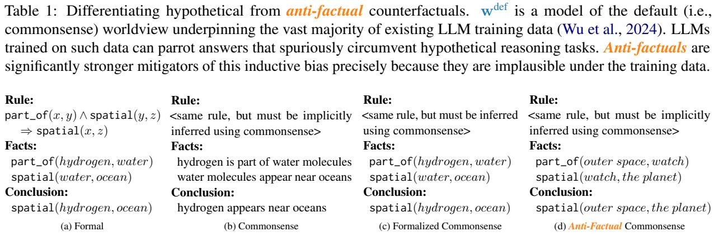  
Figure 1: Differentiating types of reasoning. (a) Formal reasoning requires systematically applying formal rules, which must be provided explicitly (Huang and Chang, 2023). In this example, the formal rule states that, for any objects x, y, and z, if x is a component part of (and therefore near) y and y is near z, then x is near z. Notice that the conclusion cannot beformally derived from the facts without this rule. (b) Commonsense relies on prior knowledge (the semantics of “part of” and “spatial”) to implicitly fill in knowledge gaps (the omitted rule), which is ill-defined (Huang and Chang, 2023; Davis, 2023). (c) Formalized commonsense (our work) formalizes the reasoning elements while maintaining implicit knowledge gaps, which is well-defined and enables the automated verification of correctness. (d) Anti-factual formalized commonsense (our work) maintains the same formal reasoning elements and underlying rule, but grounds variables x, y, and z with implausible objects to prevent LLMs from spuriously parroting the conclusion without having first reasoned through the facts (Wu et al., 2024).

LLMs can spuriously circumvent wdef-grounded reasoning tasks precisely because they are trained on wdef data (Wu et al., 2024).

Fortunately, counterfactual grounding, in which (at least some) contextual knowledge runs counter to $\mathbf { w } ^ { \mathrm { d e f } }$ , can mitigate this concern (Chan et al., 2023; Li et al., 2023b). However, the effectiveness of counterfactual grounding depends on the degree to which LLMs cease resorting to parametric shortcuts. To illustrate this point, we distinguish between two types of counterfactuals (see Table 1): hypothetical, in which the context runs counter to a specific scenario, but remains plausible under wdef; and anti-factual (AF), in which the context is implausible under $\mathbf { w } ^ { \mathrm { d e f } }$ . LLMs are less likely to spuriously solve anti-factuals compared to hypotheticals precisely because the former are implausible under wdef and are thus significantly stronger inductive bias mitigators (Wu et al., 2024).

Reasoning is generally categorized into subtypes (Huang and Chang, 2023; Mialon et al., 2023; Qiao et al., 2023), most of which—including mathematical, logical, and symbolic reasoning—are types of formal reasoning that follow systematic rules and logical processes (Huang and Chang, 2023).

All knowledge needed to solve formal reasoning problems must be provided as explicit rules (see Figure 1a). In contrast, commonsense reasoning relies on informal reasoning to fill in knowledge gaps based on intuition and worldly experience (see Figure 1b) (Huang and Chang, 2023; Davis, 2023). This makes commonsense reasoning well-suited to our goal, since LLMs learn this worldly experience via pretraining on wdef, which is prone to grounding confounds (Wu et al., 2024). Commonsense reasoning has a broad scope, and its boundaries are vague and ill-defined (Davis, 2023). As a result, it can generally be understood as a catch-all term for all non-formal reasoning.

However, “non-formal” does not imply a lack of reasoning complexity (Davis, 2023). Indeed, commonsense reasoning tasks aim to test precisely this ability. Unfortunately, as established above, factually-grounded tasks cannot distinguish between genuine reasoning ability and mere parametric parroting of a suitable common knowledge solution. Being able to explicitly control and quantify reasoning complexity is a feature ubiquitous in formal reasoning benchmarks, but overwhelmingly lacking in commonsense benchmarks (Davis, 2023).

<table><tr><td>Reasoning Skill</td><td>Definition</td><td>ConceptNet</td><td>Reasoning Template</td><td>Name</td></tr><tr><td>Spatial</td><td>X appears near Y</td><td>AtLocation</td><td>X appears near Y</td><td>spatial</td></tr><tr><td>Cause &amp; Effect</td><td>X causes Y</td><td>Causes</td><td>X causes Y</td><td>causal</td></tr><tr><td>Has Parts</td><td>X contains Y as one of its parts</td><td>PartOf</td><td>Y is a part of X</td><td>part_of</td></tr><tr><td>Is Member Of</td><td>X belongs to the larger class of Y</td><td>IsA</td><td>X is a type of Y</td><td>type_of</td></tr><tr><td>Purpose</td><td>X is the purpose of Y</td><td>UsedFor</td><td>Y is used for X</td><td>used_for</td></tr><tr><td>Preconditions</td><td>X must hold true for Y to take place</td><td>HasPrerequisite</td><td>Y has prerequisite X</td><td>requires</td></tr></table>

Table 2: Subset of reasoning skills and definitions identified by Talmor et al. 2019, along with a mapping to an appropriate ConceptNet (Speer et al., 2017) relation and associated named reasoning template (our work).

We present ACCORD, a framework for generating Anti-faCtual COmmonsense Reasoning Disentanglement benchmarks. ACCORD tightly controls fine-grained anti-factual variants (see Figure 1d) of commonsense reasoning tasks to enable detailed analysis of LLM performance factors. Through anti-factuals, ACCORD disentangles commonsense (contextual) grounding and (parametric) reasoning abilities in LLMs. Since the lack of formal rules renders controlled analysis of commonsense reasoning particularly challenging, ACCORD borrows from formal reasoning to partially formalize commonsense reasoning (see Figure 1c), while explicitly controlling and quantifying reasoning complexity. In this way, ACCORD takes a significant step towards closing the commonsense measurability gap with respect to formal reasoning. Moreover, ACCORD is uniquely designed to generate future benchmarks of arbitrary reasoning complexity with minimal additional human effort, and, as such, automatically scales its difficulty level in tandem with future improvements in LLM abilities.

## 2 ACCORD Framework

ACCORD generates an anti-factual benchmark from an existing factual commonsense dataset. In this work, we apply ACCORD to CommonsenseQA (CSQA) (Talmor et al., 2019) to create the ACCORDCSQA benchmark suite. We chose CSQA due to its popularity. However, ACCORD is equally applicable to other commonsense reasoning datasets (see Appendix A for examples).

ACCORD’s algorithm is complex. Figure 2 serves as a concrete running example throughout this Section. Significant additional detail and explanation is given in Appendices B, C and D. In particular, Figure 4 in Appendix B illustrates an abstract view of the ACCORD framework using tree data structures. These two Figures are highly complementary and we encourage the reader to refer to both.

Consider a question-answer (QA) instance from CSQA with question q and answer choices ${ \textbf { } } a =$ $\{ a _ { 1 } , a _ { 2 } , \ldots , a _ { Q } \}$ (see Figure 2a). As discussed in §1, because CSQA is $\mathbf { w } ^ { \mathrm { d e f } }$ -aligned, LLMs can spuriously circumvent the reasoning required to arrive at the factual answer $a ^ { \mathrm { d e f } } \in { \mathbf { a } }$ . To overcome this hurdle, we introduce an anti-factual context $C ^ { \mathrm { a f } } ,$ which consists of statements aligned to some antifactual world, $\mathbf { w } ^ { \mathrm { a f } } \neq \mathbf { w } ^ { \mathrm { d e f } }$ (see Figure 2f). Specifically, $C ^ { \mathrm { a f } }$ is constructed to ensure some alternative answer choice $a ^ { \mathrm { a f } } \neq a ^ { \mathrm { d e f } }$ can also be implied via negation (see Figure 2g). The crux of ACCORD lies in the careful design of variants of $C ^ { \mathrm { a f } }$ to systematically examine LLM performance (see Appendix B.1 for motivating design details).

## 2.1 Reasoning Skills and Templates

In order to rigorously quantify the differences between variants of $C ^ { \mathrm { a f } }$ , ACCORD borrows from formal reasoning to partially formalize the vague and ill-defined underlying logic of commonsense reasoning (Huang and Chang, 2023; Davis, 2023) (see Figure 1c). Thus, we construct $C ^ { \mathrm { a f } }$ from formalized representations of so-called reasoning skills.

Talmor et al. (2019) manually identified and defined reasoning skills needed to answer CSQA questions (see Table 2), which we reuse for consistency. Each reasoning skill is a recurring pattern of commonsense reasoning. For example, the spatial reasoning skill is the pattern of understanding which objects commonsensically appear at which locations (e.g., “an instrument appears near a music store”). CSQA derives from Concept-Net (Speer et al., 2017), an open graph of general commonsense knowledge. Thus, for each reasoning skill, we find a ConceptNet relation that is an appropriate and suitable match.3

From each skill’s definition, we devise a natural language reasoning template that describes the corresponding reasoning skill. These templates (e.g., “X appears near Y”) serve as formalized representations of reasoning skills that link two concepts together via placeholder variables (e.g., X instrument and Y music store). We then compose these templates together to construct large reasoning trees (see §2.3), which form the basis of the formal structure underlying $C ^ { \mathrm { a f } }$

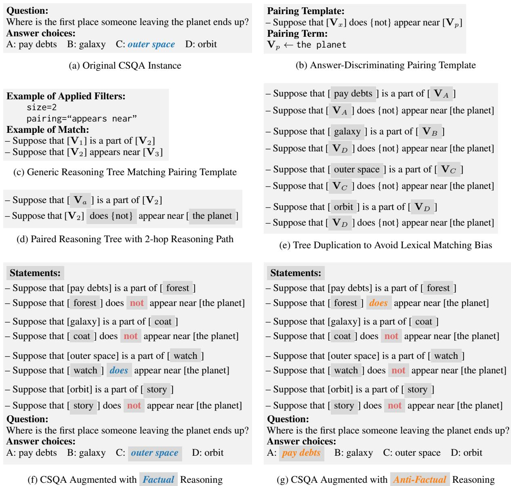  
Figure 2: The ACCORD framework (b-g) applied to a randomly-sampled CSQA instance (a). Notice thatfactual (f) and anti-factual (g) reasoning refers to whether the answer implied by the carefully-chosen negation of the statements matches the originalfactual answer (a). The statements themselves are always anti-factually grounded.

## 2.2 Pairing Templates

Not all reasoning skills are relevant to any particular CSQA instance. For example, the instance in Figure 2a is related to the spatial skill (e.g., “What appears near the planet?”), but completely unrelated to, say, the causal skill. To ensure skill relevance, we craft pairing templates for each CSQA instance (see Figure 2b). Pairing templates are special reasoning templates where one variable, the pairing variable, $\mathbf { V } _ { p } ,$ is grounded with a carefully-chosen question-specific term, the pairing term, p. The other variable, $\mathbf { V } _ { x } .$ , remains free. As discussed in §1, LLMs might spuriously circumvent factual reasoning. To experimentally verify this, pairing templates are hand-crafted4 such that they uniquely discriminate between the answer choices, $a _ { i } \in { \pmb a } .$ , of a given CSQA instance when setting $\mathbf { V } _ { x } \gets a _ { i }$ and $\mathbf { V } _ { p } \\ \ p .$ In so doing, we allow the choice of $a _ { i }$ to be eitherfactual or antifactual, while also holding all other factors equal. Specifically, each pairing template has a positive variant, $p ^ { + }$ , which can imply any given answer choice, ${ { a } _ { i } } ,$ and a negative variant (adding the “not” in Figure 2b), $p ^ { - }$ which can contradict $a _ { i }$ . See Appendix B.2 for a detailed step-by-step example.

## 2.3 Reasoning Trees

To construct a generic reasoning tree, reasoning templates are composed (i.e., linked together) via their variables (see Appendix B.3 for details). This creates a reasoning graph with variables as nodes and templates as edges. ACCORD operates on this graph to rigorously enforce construct validity. In particular, ACCORD constrains the reasoning graph to contain no cycles—hence, the more precise term “reasoning (poly)tree”. This acyclicity ensures reasoning trees do not entail reasoning paradoxes (e.g., “X contains Y; Y contains Z; Z contains X”).

In addition, two templates can link together only if they reduce to a valid reasoning skill. Reducing two templates is algorithmically analogous to replacing two premises by their conclusion in logical deduction (see Figure 1a). Reducibility ensures that templates are composed commonsensically rather than arbitrarily, since not all combinations of two reasoning skills are reducible (see Appendix C). We pruned the set of all possible reasoning skill combinations to keep only those that are validly reducible. For example, whereas part\_of and spatial are reducible to spatial (see Figure 1a), spatial and causal are not—just because something is near a cause does not mean it is also near its effect. See Appendix C for details on all other combinations, including commonsense proofs of their validity.

As discussed in §2.4, the difficulty level of ACCORD instances scales with tree $\mathrm { s i z e } ^ { 5 }$ . Since ACCORD automatically generates all possible valid generic trees up to a maximum size $T$ (chosen as a hyperparameter), ACCORD scales in difficulty with future LLM improvements using no additional human effort. This is atypical of commonsense reasoning benchmarks, which normally require human effort proportional to difficulty (see §5).

Each CSQA instance is paired to only those trees matching one of its pairing templates (see Figure 2c), resulting in a subset of paired reasoning trees (see Figure 2d) unique to each CSQA instance.

## 2.4 Reasoning Paths

A reasoning path is a sequence of linked templates in a paired reasoning tree that originate or terminate with a pairing template. The reasoning path connects a source variable with a (possibly distant) target variable. Due to the recursively reducible construction of reasoning trees (see Appendix B.4), $\mathbf { V } _ { p }$ will necessarily be either the source or the target of the reasoning path. The variable at the other end is termed the answer variable, ${ \mathbf V } _ { a }$ (see Figure 2d). Recall that grounding $\mathbf { V } _ { x } \gets a _ { i }$ in a pairing template logically discriminates between the answer choices, $a _ { i } \in { \pmb a } ,$ , of a CSQA instance (see §2.2). By the nature of recursive reducibility, grounding $\mathbf { V } _ { a } \gets a _ { i }$ necessarily does the same (see Appendix B.4). In a tree with $T$ templates, the reasoning complexity is the number of templates, n, along a reasoning path.6 Any templates outside a reasoning path are distractors, d. Note that $T = n +$ d by construction. LLM performance in formal reasoning tasks tends to decrease as n and $T$ increase (Xu et al., 2023a), and is rarely robust to distractors (Kassner and Schütze, 2020; Wang et al., 2021; Li et al., 2023a; Misra et al., 2023; Shi et al., 2023). As noted in §5, ACCORD is unique among commonsense benchmarks in its ability to precisely quantify non-trivial n and d values, which empowers us to close the commonsense measurability gap by studying whether these trends apply here as well.

## 2.5 Controlling Dataset Artifacts

Since ${ \mathbf V } _ { a }$ can only be grounded with one $a _ { i } \in { \pmb a } ,$ an LLM might “guess” that $a _ { i }$ is the intended answer through simple lexical matching between $C ^ { \mathrm { a f } }$ and a, thereby spuriously circumventing the intended reasoning task via test-taking meta-reasoning (Mc-Coy et al., 2019; Chan et al., 2023; Li et al., 2023b). To mitigate this potential bias, we duplicate the paired tree, once for each ${ { a } _ { i } } ,$ which ensures each is present in $C ^ { \mathrm { a f } }$ while holding all else equal (see Figure 2e). Several additional factors are employed to mitigate dataset artifacts. The order of the resulting statements, both within and between reasoning trees, is randomized to mitigate any potential systematic effects (such of recency bias). Duplicate statements are also removed, so as not to bias LLM reasoning towards them. These are not shown in Figure 2 only to aid with human legibility.

## 2.6 Anti-Factual Grounding of Variables

For each duplicated tree, the pairing and answer variables act as seed terms from which we anti factually ground all other variables using a backtracking beam tree search algorithm (see Appendix D). Since CSQA derives from ConceptNet, we employ it as our grounding KB. Essentially, since ConceptNet is a factual KB, finding concept triples — e.g., part\_of(outer space, watch) — not in ConceptNet enables us to argue that they are antifactual. This relies on ConceptNet’s recall: if afactual triple is omitted from ConceptNet, we might mistake it as anti-factual. We mitigate against this using probabilistic hedging (see Appendix D).

## 2.7 Selecting an Answer Using Negation

Finally, we negate the pairing template of all but one answer choice, $a _ { i } ,$ to ensure that only $a _ { i }$ is implied, while all other answer choices are contradicted. By carefully choosing which answer choice receives the positive variant, we control whether the statements in $C ^ { \mathrm { a f } }$ together logically imply the factual (see Figure 2f) or some anti-factual (see Figure $2 \mathrm { g } )$ answer. Crucially, all otherfactors are held constant, which enables direct comparison between factual and anti-factual task variants (see Appendix C for additional details).

## 3 Experiments

We apply ACCORD to CSQA to create $\mathsf { A C C O R D } _ { \mathrm { C S Q A } } ^ { N } ,$ a benchmark suite where $N \in [ 0 - 5 ]$ represents the reasoning tree size. For each instance in the CSQA development set, we infer the ConceptNet relation that generated the instance by computing the majority vote among all ConceptNet assertions matching one of its answer choices to its source concept (see Talmor et al. 2019 for details). The resulting distribution is highly skewed, with 607 instances of ConceptNet’s AtLocation relation (the most popular) compared with 13 instances of IsA (the least popular). To balance $\mathsf { A C C O R D _ { C S Q A } }$ , we randomly subsample each relation type, keeping only 13. Of the $6 \times 1 3 = 7 8$ instances, we reject two due to inciting violence, and another two where we cannot craft a valid pairing template. The baseline, $\mathsf { A C C O R D } _ { \mathrm { C S Q A } } ^ { 0 }$ , consists of the remaining 74 instances. We hand-craft 1 3 pairing templates for these 74 instances, resulting in 93 pairing templates. From these 93 pairings, we generate reasoning trees of sizes 1 5, producing a suite of benchmarks, $\mathsf { A C C O R D } _ { \mathrm { C S Q A } } ^ { \mathrm { 1 - 5 } }$ , with 245,514 unique total trees and a guaranteed minimum of 143 unique trees per pairing. To reduce computational costs while ensuring wide coverage, we subsample the trees to keep precisely one tree per unique combination of reasoning hops and distractors per pairing, which produced a smaller benchmark with 2,864 unique trees. This step also balances the dataset, which is otherwise exponentially weighted towards the larger tree sizes (since there are exponentially more unique trees as the size increases). We present results from this smaller benchmark in Figure 3, but release both versions (see Appendix E for additional details). Figure 3 shows the performance of GPT-4o (2024-05-13) (OpenAI, 2024a), Llama-3-70B-Instruct (AI@Meta, 2024b), and Mixtral-8x22B-Instruct-v0.1 (The Mistral AI Team, 2024) on $\mathsf { A C C O R D } _ { \mathsf { C S Q A } }$ in a zero-shot setting. The “No Context” baseline represents $\mathsf { A C C O R D } _ { \mathrm { C S Q A } } ^ { 0 }$

## 4 Results and Discussion

Recall that, unlike prior commonsense benchmarks, ACCORD quantifies performance as a function of problem size, $T ,$ , reasoning hops, $n ,$ and distractors, d, where $T = n + d \left( { \sec \ S 2 . 4 } \right)$ . Simultaneously, ACCORD disentangles (contextual) grounding and (parametric) reasoning effects through ceteris paribus comparisons offactual and anti-factual reasoning task variants (see §2.7).

Are LLMs good reasoners or merely good parroters? For any given n (Columns 1 and 3) or d (Columns 2 and 3) in Figure 3,factual reasoning significantly outperforms anti-factual reasoning. Since we are carefully controlling for all other factors, this performance gap is directly indicative of context unfaithfulness: LLMs are inductively biased towards the factual answer choice. In fact, anti-factual performance quickly degrades to below random chance with only very moderate scaling of reasoning complexity. This suggests that as soon as their multi-hop reasoning capacity is exceeded, LLMs almost exclusively resort to spurious shortcuts. Importantly, this performance gap is evidence of low construct validity in manyfactual commonsense reasoning datasets: the intended measurement of LLM reasoning ability is overwhelmingly confounded by LLM parroting ability.

What is the effect of reasoning hops vs distractors? For $n > 1$ in Column 1 of Figure 3, bothfactual and anti-factual performance degrade rapidly with increasing n. This trend has been understood in formal reasoning (Xu et al., 2023a), but we demonstrate it here for the first time with commonsense. Interestingly, the trend for d (Column 2) is reversed, which goes against expectations (Dalvi et al., 2021; Shi et al., 2023). Column 3 explains this artifact, which occurs because reasoning hops and distractors are complementary for a given problem size $( T = n + d )$ , and, as such, interact very strongly. In Column 3, when controlling for distractors, reasoning hops have a dominant effect on the trend. On the other hand, increasing distractors only slightly shifts the entire trend line downward. In other words, given a fixed T (i.e., a fixed context budget), LLMs tend to prefer a smaller n and larger d than the reverse. That is, the ability of LLMs to filter out distractors significantly outclasses their multi-hop reasoning capacity. Marginalizing over reasoning hops (Column 2) obfuscates this nuance, resulting in a reversed trend. Being able to disentangle these effects is one of our key contributions.

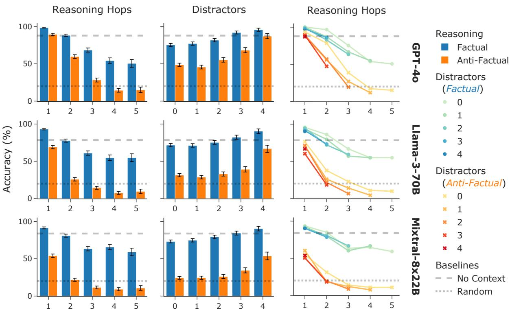  
Figure 3: Performance of state-of-the-art LLMs on ACCORDCSQA. Left: Both factual and anti-factual performance degrade rapidly with increasing reasoning hops, which is expected. Middle: Both factual and anti-factual performance increase with increasing distractors, which is unexpected. Right: Disentangling the interaction effect between reasoning hops and distractors to explain the unexpected result in (Middle). Reasoning hops are dominant while distractors’ effect is negligible, which explains the reversed trend in (Middle) when marginalizing over reasoning hops. All: Factual significantly outperforms anti-factual, which indicates context unfaithfulness. As a consequence, anti-factual performance drops below random chance when reasoning hops exceed LLM reasoning capacity. Wald standard error bars are with respect to the 93 pairings, not reruns based on random seeds.

## 5 Related Work

Table 3 compares ACCORD to its most related commonsense reasoning benchmarks on key features.

Anti-Factual Counterfactuals. Counterfactual grounding is relevant for retrieval-augmented generation (Lewis et al., 2020; Borgeaud et al., 2022; Trivedi et al., 2023; Gao et al., 2023; Mialon et al., 2023) and in-context knowledge editing (Zheng et al., 2023), as well as to context faithfulness more generally (Arodi et al., 2022; Neeman et al., 2023; Huang et al., 2023; Ji et al., 2023b; Lanham et al., 2023; Sun et al., 2023; Yu et al., 2023a; Zhou et al., 2023). Counterfactuals in prior work can be hypothetical (Qin et al., 2019, 2020; Frohberg and Binder, 2022; Wu et al., 2024) or anti-factual (Longpre et al., 2021; Li et al., 2023a; Neeman et al., 2023; Kondo et al., 2023; Monea et al., 2023; Tang et al., 2023; Wu et al., 2024; Zhou et al., 2023), and can derive from diverse methodologies, including entity substitution in existing contexts (Longpre et al., 2021; Li et al., 2023a; Neeman et al., 2023; Wu et al., 2024; Zhou et al., 2023), generation using LLMs (Fu et al., 2023; Monea et al., 2023), CoT demonstrations (Madaan and Yazdanbakhsh, 2022; Wang et al., 2023a; Ye et al., 2023; Lanham et al., 2023), and other methods (Qin et al., 2019; Kaushik et al., 2021; Qin et al., 2020; Frohberg and Binder, 2022). Entity substitution has garnered considerable attention for its simplicity in creating clear-cut anti-factuals. Unfortunately, it is prone to lexical matching bias (Neeman et al., 2023; Monea et al., 2023), which ACCORD avoids with tree duplication. In formal reasoning, LLM performance degrades when the surface forms of logic symbols are perturbed relative to their commonsense semantics (Dasgupta et al., 2022; Han et al., 2022; Tang et al., 2023; Wu et al., 2024; Yu et al., 2023b). ACCORD rigorously extends this analysis to commonsense.

<table><tr><td>Paper</td><td>CF</td><td>AF</td><td>Skills</td><td>Composable</td><td>Scalable</td><td>Hops</td><td>Distractors</td></tr><tr><td>2WikiMultiHopQA (Ho et al., 2020)</td><td></td><td></td><td></td><td></td><td>C</td><td>2-?</td><td>?</td></tr><tr><td>Fakepedia (Monea et al., 2023)</td><td></td><td></td><td></td><td></td><td></td><td>1-2</td><td>?</td></tr><tr><td>DisentQA (Neeman et al., 2023)</td><td></td><td></td><td></td><td></td><td></td><td>?</td><td>?</td></tr><tr><td>SCOTT (Wang et al., 2023b)</td><td></td><td></td><td></td><td></td><td></td><td>?</td><td>?</td></tr><tr><td>CConS (Kondo et al., 2023)</td><td></td><td></td><td></td><td></td><td></td><td>1</td><td>0</td></tr><tr><td>CRASS (Frohberg and Binder, 2022)</td><td></td><td></td><td></td><td></td><td></td><td>1</td><td>0</td></tr><tr><td>ACCORDCSQA (Ours)</td><td></td><td></td><td></td><td></td><td></td><td>1-5</td><td>0-4</td></tr></table>

Table 3: Comparison between $\mathsf { A C C O R D _ { C S Q A } }$ and related work. CF: Whether counterfactuals are present. AF: Whether those counterfactuals are specifically anti-factual. Skills: Whether reasoning is based on an explicit set of skills or on an uncontrolled process. Composable: Whether sub-components (e.g., templates) can be composed to generate more complex components. Scalable: Whether the reasoning complexity scales automatically—or, with at most O(1) additional human effort. Hops/Distractors: Whether reasoning hops/distractors are measurable, and, if so, their range. Legend: : no : partially : yes ? : not measurable.

Controlled Compositional Scaling. Current LLMs struggle scaling to arbitrarily complex compositional and multi-hop reasoning tasks (Xu et al., 2023a; Dziri et al., 2023). Indeed, this may be a fundamental limitation of autoregressive architectures (Dziri et al., 2023). Notwithstanding, existing commonsense tasks are limited to one- or two-hop reasoning (Ho et al., 2020; Frohberg and Binder, 2022; Kondo et al., 2023; Li et al., 2023b; Davis, 2023; Monea et al., 2023) or to an unknown number of hops and/or distractors (Chen and Durrett, 2019; Kaushik et al., 2020; Min et al., 2019; Ho et al., 2020; Longpre et al., 2021; Neeman et al., 2023; Davis, 2023; Monea et al., 2023). In commonsense reasoning, non-trivial anti-factual grounding is typically achieved only through manual effort, wherein each instance is handwritten.

ACCORD, on the other hand, requires that only the pairing templates be handwritten. From these, arbitrarily many instances can be generated. Such arbitrarily-scalable compositional reasoning is typical only of formal reasoning tasks (Dalvi et al., 2021; Tian et al., 2021; Han et al., 2022; Tang et al., 2023; Xu et al., 2023a; Dziri et al., 2023). To the best of our knowledge, ACCORD is the first to introduce these features to commonsense reasoning. Furthermore, ACCORD carefully controls compositionality via a reasoning skill set, which is analogous to the controlled rule set of formal reasoning. Most prior commonsense benchmarks either are limited to a single skill—such as spatial (Kondo et al., 2023) or causal (Frohberg and Binder, 2022; Li et al., 2023b; Jin et al., 2023), or do not control skills (Neeman et al., 2023; Davis, 2023; Monea et al., 2023; Wang et al., 2023b). To the best of our knowledge, only Ho et al. (2020) examine a rich set of highly-specific commonsense skills, such as spouse(a, b) mother(b, c) mother\_in\_law(a, c). This approach is complementary to ACCORD, which employs a rich set of general commonsense skills.

## 6 Conclusion

We presented ACCORD, a framework for generating anti-factual commonsense reasoning benchmarks. ACCORD introduces formal elements to commonsense reasoning, and thus takes a significant step towards closing the commonsense measurability gap with respect to formal reasoning. In particular, ACCORD disentangles commonsense grounding and reasoning abilities in LLMs, while controlling for both reasoning complexity, reasoning skills, and distractors. Experiments on our ACCORDCSQA benchmark suite, an application of the ACCORD framework to CSQA, demonstrate that the performance of state-of-the-art LLMs degrades to random chance with only moderate scaling, leaving substantial room for improvement. Moreover, we demonstrate a significant gap between factual and anti-factual performance. This highlights the construct validity concerns of typical (factual) benchmarks, which unfortunately allow LLMs to circumvent the intended reasoning task with parametric parroting of the factual answer. ACCORD is uniquely designed to automatically scale its difficulty level in tandem with future LLM improvements by leveraging compositional scalability to generate future benchmarks of arbitrary reasoning complexity with minimal additional human effort.

## Limitations

Why have we not tried X or Y state-of-theart prompting/fine-tuning technique? Our goal in this work is to introduce the ACCORD framework, present the rationale and development of the ACCORDCSQA benchmark suite, and illustrate baseline performance of LLMs in the simplest setting (zero-shot with a simple instruction prompt). We expect performance improvements with careful few-shot demonstrations and prompt engineering. We also expect that, through more detailed analysis than we presented here, ACCORD will yield significant additional insights both into LLM performance on commonsense reasoning tasks and into LLM context faithfulness on such tasks. We welcome and encourage community adoption on these fronts!

Why do the instances in ACCORD resemble logic puzzles? Several prior works provide valuable detailed insight on template surface forms, such as the effects of verb and preposition choice (Kondo et al., 2023) or discourse connectives (Li et al., 2023b). Since our reasoning skill set is significantly broader, we employed only one template per skill, while assuming that LLMs are increasingly able to abstract away template minutiae (Si et al., 2023).

As such, ACCORD’s templates contain stilted language in practice, and the resulting benchmark instances may feel rather contrived to a human reader. This is a conscious trade-off. Specifically, in exchange for (a) automated scalability, (b) robust measurements of reasoning hops and distractors, and (c) assurances of context-faithful construct validity, our commonsense dataset superficially (but only superficially) resembles a logic dataset.

Specifically, our goal is to measure, among other things, the reasoning complexity of commonsense problems. Because commonsense reasoning is vague and ill-defined, this cannot be done automatically (and therefore cannot be done scalably) in typical approaches to commonsense benchmark construction (unlike typical formal reasoning datasets). This is the commonsense measurability gap we address: Accurate and scalable measurements of commonsense reasoning complexity. The crux of our contribution is introducing formal elements borrowed from a more rigid type of reasoning (logic, in our case) to commonsense. The end product, therefore, resembles a logic puzzle, but the crucial difference is that a logic puzzle requires explicitly providing logical rules that must be followed. In our approach, the rules instead must be inferred commonsensically (see Figure 1). Hence, our work is a type of commonsense reasoning problem with formal logical elements added, rather than a type of logic problem with the formal rules removed.

The instances feel very unnatural and the lack of variation in the templates makes the instances feel stilted. Isn’t that a problem? This is largely by design. Our anti-factual statements are designed to be fully solvable while also appearing unnatural enough at the surface level that LLMs cannot exploit their pre-trained world knowledge to circumvent the intended reasoning task. This forces the LLM to reason, rather than recite an answer from memory.

Unfortunately, improving the naturalness of ACCORD without sacrificing this benefit is nontrivial. Using LLMs as template editors to smooth out the stiltedness of the templates is challenging because LLMs may not faithful replicate the anti-factual grounding. For example, Monea et al. (2023) employ LLMs to generate counterfactuals from templates, but only about one-quarter of these are high-quality. Unfortunately, crowd workers are now widely employing LLMs to increase their productivity (Veselovsky et al., 2023), leading to the same problem.

Furthermore, variability in the templates may introduce confounds. We think that exploring ways to introduce the potential benefits of variability (e.g., question diversity) without also introducing potential costs (e.g., from confounds) is best left as future work, since it is not critical to the contributions we are making in this work and would instead distract from the main point (that LLMs recite more than they reason).

Why have we not included human assessments of quality? How is the benchmark validated? Would a human be expected to solve ACCORD tasks without issues? The quality of a typical formal reasoning dataset hinges on the quality of the underlying formal elements. For example, given a set of base propositions, axioms, and formal rules in a logical reasoning dataset, the qual ity of any given composed problem—regardless of complexity—is assured from the validity and soundness of these base elements. Analogously, the quality of ACCORD hinges on the validity and sound ness of our formalizing elements (see Appendix B) and especially our reduction matrix (see Appendix C). In traditional commonsense reasoning datasets, humans assess quality; but people are fallible, so most human-verified datasets—including CSQA— still contain errors (Davis, 2023). In our case, as is typical of logic datasets, the quality is instead assured algorithmically from the formal elements. We argue this results in a higher-quality dataset overall. Indeed, performance for factual n = 1 (Column 1 of Figure 3) exceeds the baseline for all three LLMs. We postulate this occurs because the noisiness of base CSQA adds significant difficulty to the task (Kojima et al., 2022; Wei et al., 2022b), so having a single reasoning hop that reinforces thefactual answer choice helps LLMs cut through that noise. In addition, humans, in general, should find ACCORD tasks as difficult as complex first-order logic tasks. As such, under the constrained time budget typically afforded on crowd worker plat forms, humans would likely perform quite poorly on ACCORD, resulting in a poor assessment of its quality (see Appendix F).

Why are variables grounded with random concepts? Wouldn’t it be better to use some similarity metric? Whereas ConceptNet enables us to control for relation types, it cannot control for the “degree” of anti-factuality. Consider, for example, that a fish is a type of mammal intuitively feels “less” anti-factual than afish is a type ofrock. We have attempted to formalize this intuition using both semantic distance between template concepts and likelihood functions of grounded templates (Monea et al., 2023). However, grounding a full reasoning path amounts to performing a random walk in template space. As a result, distant steps along a reasoning path can end up being more semantically related or more likely than all intermediate steps, which defeats the purpose of such a control mechanism. We leave this to future work.

Isn’t ACCORD producing very noisy benchmarks? Most commonsense datasets and KBs are noisy, including CSQA and ConceptNet (Davis, 2023). For example, ConceptNet can be inconsistent with its relation types. Consider the following two assertions, both of which are in ConceptNet: causal(playing lacrosse, fun) and used\_for(playing tennis, fun). In both, playing a sport is related to having fun. In the first, lacrosse causes fun, whereas in the latter, tennis is used for fun. Both make commonsense. However, the inconsistency introduces noise when grounding $\mathsf { A C C O R D _ { C S Q A } }$ variables. While we ensure to always sample from the appropriate ConceptNet table based on the reasoning skill of the template for which we are grounding a variable, but cannot control for noise, mistakes, or inconsistencies within or across tables.

CSQA is also noisy. The majority of CSQA instances have inconsistent syntactic or semantic attributes (e.g., parts of speech, number, category, etc.) across their 5 answer choices, yet the associated crowd-sourced question is typically written such that only the correct answer matches all these attributes (e.g., see Figure 10 and Appendices G H). We attempted to minimize CSQA noise with carefully curated pairing templates that can differentiate the answer choices, even given question and answer choice noise. However, we were unable to craft valid pairing templates for two of the 78 base CSQA instances (see Appendix G).

Importantly, CSQA noise hardly limits the quality of $\mathsf { A C C O R D } _ { \mathsf { C S Q A } }$ , because our benchmark includes bothfactual and anti-factual conclusions for each question. The critical measure of overall performance is the difference between factual and anti-factual LLM performance on each question, rather than the absolute performance level on either task. Since we control for the CSQA question, both thefactual and anti-factual variants have the same noisiness. As such, we are effectively controlling for much of CSQA’s noisiness in our experiments.

In fact, performance for factual n = 1 (Column 1) exceeds this baseline for all three LLMs. We postulate this occurs because the noisiness of base CSQA adds significant difficulty to the task (Kojima et al., 2022; Wei et al., 2022b), yet having a single reasoning hop that reinforces the factual answer choice in the most straightforward manner possible helps LLMs cut through that noise.

## Acknowledgements

Resources used in preparing this research were provided, in part, by the Province of Ontario, the Government of Canada through CIFAR, and companies sponsoring the Vector Institute www. vectorinstitute.ai/#partners. Frank Rudzicz is supported by a Canada CIFAR Chair in AI. We would like to thank Ian Berlot-Attwell and Kalyna Kryworuchko for their valued insights on this research.

## References

AI@Meta. 2023. Llama 2 License. Accessed: 2024-05- 31.

AI@Meta. 2024a. Llama 3 License. Accessed: 2024- 05-31.

AI@Meta. 2024b. Llama 3 Model Card. Accessed: 2024-05-28.

Akshatha Arodi, Martin Pömsl, Kaheer Suleman, Adam Trischler, Alexandra Olteanu, and Jackie Chi Kit Cheung. 2022. The KITMUS Test: Evaluating Knowledge Integration from Multiple Sources in Natural Language Understanding Systems. ArXiv preprint, abs/2212.08192.

Jinheon Baek, Alham Fikri Aji, and Amir Saffari. 2023. Knowledge-augmented language model prompting for zero-shot knowledge graph question answering. In Proceedings of the First Workshop on Matching From Unstructured and Structured Data (MATCH-ING 2023), pages 70–98, Toronto, ON, Canada. Association for Computational Linguistics.

Yejin Bang, Samuel Cahyawijaya, Nayeon Lee, Wenliang Dai, Dan Su, Bryan Wilie, Holy Lovenia, Ziwei Ji, Tiezheng Yu, Willy Chung, Quyet V. Do, Yan Xu, and Pascale Fung. 2023. A multitask, multilingual, multimodal evaluation of ChatGPT on reasoning, hallucination, and interactivity. In Proceedings of the 13th International Joint Conference on Natural Language Processing and the 3rd Conference ofthe Asia-Pacific Chapter of the Association for Computational Linguistics (Volume 1: Long Papers), pages 675–718, Nusa Dua, Bali. Association for Computational Linguistics.

Emily M Bender, Timnit Gebru, Angelina McMillan-Major, and Shmargaret Shmitchell. 2021. On the Dangers of Stochastic Parrots: Can Language Models Be too Big? In Proceedings ofthe 2021 ACM conference on fairness, accountability, and transparency, pages 610–623.

Sebastian Borgeaud, Arthur Mensch, Jordan Hoffmann, Trevor Cai, Eliza Rutherford, Katie Millican, George van den Driessche, Jean-Baptiste Lespiau, Bogdan Damoc, Aidan Clark, Diego de Las Casas, Aurelia Guy, Jacob Menick, Roman Ring, Tom Hennigan, Saffron Huang, Loren Maggiore, Chris Jones, Albin Cassirer, Andy Brock, Michela Paganini, Geoffrey Irving, Oriol Vinyals, Simon Osindero, Karen Simonyan, Jack W. Rae, Erich Elsen, and Laurent Sifre. 2022. Improving language models by retrieving from trillions of tokens. In International Conference on Machine Learning, ICML 2022, 17-23 July 2022, Baltimore, Maryland, USA, volume 162 of Proceedings of Machine Learning Research, pages 2206–2240. PMLR.

Robin Chan, Afra Amini, and Mennatallah El-Assady. 2023. Which spurious correlations impact reasoning in NLI models? a visual interactive diagnosis through data-constrained counterfactuals. In Proceedings of the 61st Annual Meeting of the Association for Computational Linguistics (Volume 3: System Demonstrations), pages 463–470, Toronto, Canada. Association for Computational Linguistics.

Jiangjie Chen, Wei Shi, Ziquan Fu, Sijie Cheng, Lei Li, and Yanghua Xiao. 2023. Say what you mean! large language models speak too positively about negative commonsense knowledge. In Proceedings of the 61st Annual Meeting of the Association for Computational Linguistics (Volume 1: Long Papers), pages 9890–9908, Toronto, Canada. Association for Computational Linguistics.

Jifan Chen and Greg Durrett. 2019. Understanding dataset design choices for multi-hop reasoning. In Proceedings of the 2019 Conference of the North American Chapter ofthe Association for Computational Linguistics: Human Language Technologies, Volume 1 (Long and Short Papers), pages 4026–4032, Minneapolis, Minnesota. Association for Computational Linguistics.

Xin Cheng, Yankai Lin, Xiuying Chen, Dongyan Zhao, and Rui Yan. 2023. Decouple knowledge from paramters for plug-and-play language modeling. In Findings ofthe Associationfor Computational Linguistics: ACL 2023, pages 14288–14308, Toronto, Canada. Association for Computational Linguistics.

Peter Clark, Isaac Cowhey, Oren Etzioni, Tushar Khot, Ashish Sabharwal, Carissa Schoenick, and Oyvind Tafjord. 2018. Think You Have Solved Question Answering? Try ARC, the AI2 Reasoning Challenge. ArXiv preprint, abs/1803.05457.

Bhavana Dalvi, Peter Jansen, Oyvind Tafjord, Zhengnan Xie, Hannah Smith, Leighanna Pipatanangkura, and Peter Clark. 2021. Explaining answers with entailment trees. In Proceedings ofthe 2021 Conference on Empirical Methods in Natural Language Processing, pages 7358–7370, Online and Punta Cana, Dominican Republic. Association for Computational Linguistics.

Ishita Dasgupta, Andrew K Lampinen, Stephanie CY Chan, Antonia Creswell, Dharshan Kumaran, James L McClelland, and Felix Hill. 2022. Language Models Show Human-Like Content Effects on Reasoning. ArXiv preprint, abs/2207.07051.

Ernest Davis. 2023. Benchmarks for Automated Commonsense Reasoning: A Survey. ArXiv preprint, abs/2302.04752.

Nouha Dziri, Ximing Lu, Melanie Sclar, Xiang Lorraine Li, Liwei Jiang, Bill Yuchen Lin, Sean Welleck, Peter West, Chandra Bhagavatula, Ronan Le Bras, Jena D. Hwang, Soumya Sanyal, Xiang Ren, Allyson Ettinger, Zaïd Harchaoui, and Yejin Choi. 2023. Faith and fate: Limits of transformers on compositionality. In Advances in Neural Information Processing Systems 36: Annual Conference on Neural Information Processing Systems 2023, NeurIPS 2023, New Orleans, LA, USA, December 10 - 16, 2023.

Yu Feng, Ben Zhou, Haoyu Wang, Helen Jin, and Dan Roth. 2023. Generic temporal reasoning with differential analysis and explanation. In Proceedings of the 61st Annual Meeting of the Association for Computational Linguistics (Volume 1: Long Papers), pages 12013–12029, Toronto, Canada. Association for Computational Linguistics.

Jörg Frohberg and Frank Binder. 2022. CRASS: A novel data set and benchmark to test counterfactual reasoning of large language models. In Proceedings of the Thirteenth Language Resources and Evaluation Conference, pages 2126–2140, Marseille, France. European Language Resources Association.

Deqing Fu, Ameya Godbole, and Robin Jia. 2023. SCENE: Self-labeled counterfactuals for extrapolating to negative examples. In Proceedings ofthe 2023 Conference on Empirical Methods in Natural Language Processing, pages 7832–7848, Singapore. Association for Computational Linguistics.

Yunfan Gao, Yun Xiong, Xinyu Gao, Kangxiang Jia, Jinliu Pan, Yuxi Bi, Yi Dai, Jiawei Sun, and Haofen Wang. 2023. Retrieval-Augmented Generation for Large Language Models: A Survey. ArXiv preprint, abs/2312.10997.

Team Gemma. 2024. Gemma Terms of Use. Accessed: 2024-05-31.

Wangzhen Guo, Qinkang Gong, Yanghui Rao, and Hanjiang Lai. 2023. Counterfactual multihop QA: A cause-effect approach for reducing disconnected reasoning. In Proceedings ofthe 61st Annual Meeting of the Associationfor Computational Linguistics (Volume 1: Long Papers), pages 4214–4226, Toronto, Canada. Association for Computational Linguistics.

Simeng Han, Hailey Schoelkopf, Yilun Zhao, Zhenting Qi, Martin Riddell, Luke Benson, Lucy Sun, Ekaterina Zubova, Yujie Qiao, Matthew Burtell, et al. 2022. FOLIO: Natural Language Reasoning with First-Order Logic. ArXiv preprint, abs/2209.00840.

Xanh Ho, Anh-Khoa Duong Nguyen, Saku Sugawara, and Akiko Aizawa. 2020. Constructing a multihop QA dataset for comprehensive evaluation of reasoning steps. In Proceedings of the 28th International Conference on Computational Linguistics, pages 6609–6625, Barcelona, Spain (Online). International Committee on Computational Linguistics.

Jie Huang and Kevin Chen-Chuan Chang. 2023. Towards reasoning in large language models: A survey. In Findings of the Association for Computational Linguistics: ACL 2023, pages 1049–1065, Toronto, Canada. Association for Computational Linguistics.

Kung-Hsiang Huang, Hou Pong Chan, and Heng Ji. 2023. Zero-shot faithful factual error correction. In Proceedings of the 61st Annual Meeting of the Associationfor Computational Linguistics (Volume 1: Long Papers), pages 5660–5676, Toronto, Canada. Association for Computational Linguistics.

Peter Jansen, Elizabeth Wainwright, Steven Marmorstein, and Clayton Morrison. 2018. WorldTree: A corpus of explanation graphs for elementary science questions supporting multi-hop inference. In Proceedings of the Eleventh International Conference on Language Resources and Evaluation (LREC 2018), Miyazaki, Japan. European Language Resources Association (ELRA).

Ziwei Ji, Nayeon Lee, Rita Frieske, Tiezheng Yu, Dan Su, Yan Xu, Etsuko Ishii, Ye Jin Bang, Andrea Madotto, and Pascale Fung. 2023a. Survey of Hallucination in Natural Language Generation. ACM Computing Surveys, 55(12):1–38.

Ziwei Ji, Zihan Liu, Nayeon Lee, Tiezheng Yu, Bryan Wilie, Min Zeng, and Pascale Fung. 2023b. RHO: Reducing hallucination in open-domain dialogues with knowledge grounding. In Findings of the Association for Computational Linguistics: ACL 2023, pages 4504–4522, Toronto, Canada. Association for Computational Linguistics.

Albert Q Jiang, Alexandre Sablayrolles, Arthur Mensch, Chris Bamford, Devendra Singh Chaplot, Diego de las Casas, Florian Bressand, Gianna Lengyel, Guillaume Lample, Lucile Saulnier, et al. 2023. Mistral 7B. ArXiv preprint, abs/2310.06825.

Albert Q Jiang, Alexandre Sablayrolles, Antoine Roux, Arthur Mensch, Blanche Savary, Chris Bamford, Devendra Singh Chaplot, Diego de las Casas, Emma Bou Hanna, Florian Bressand, et al. 2024. Mixtral of Experts. ArXiv preprint, abs/2401.04088.

Zhijing Jin, Yuen Chen, Felix Leeb, Luigi Gresele, Ojasv Kamal, Zhiheng Lyu, Kevin Blin, Fernando Gonzalez Adauto, Max Kleiman-Weiner, Mrinmaya Sachan, and Bernhard Schölkopf. 2023. Cladder: A benchmark to assess causal reasoning capabilities of language models. In Advances in Neural Information Processing Systems 36: Annual Conference on Neural Information Processing Systems 2023, NeurIPS 2023, New Orleans, LA, USA, December 10 - 16, 2023.

Nora Kassner and Hinrich Schütze. 2020. Negated and misprimed probes for pretrained language models: Birds can talk, but cannot fly. In Proceedings ofthe 58th Annual Meeting of the Association for Computational Linguistics, pages 7811–7818, Online. Association for Computational Linguistics.

Divyansh Kaushik, Eduard H. Hovy, and Zachary Chase Lipton. 2020. Learning the difference that makes A difference with counterfactually-augmented data. In 8th International Conference on Learning Representations, ICLR 2020, Addis Ababa, Ethiopia, April 26-30, 2020. OpenReview.net.

Divyansh Kaushik, Amrith Setlur, Eduard H. Hovy, and Zachary Chase Lipton. 2021. Explaining the efficacy of counterfactually augmented data. In 9th International Conference on Learning Representations, ICLR 2021, Virtual Event, Austria, May 3-7, 2021. OpenReview.net.

Emre Kıcıman, Robert Ness, Amit Sharma, and Chenhao Tan. 2023. Causal Reasoning and Large Language Models: Opening a New Frontier for Causality. ArXiv preprint, abs/2305.00050.

Takeshi Kojima, Shixiang Shane Gu, Machel Reid, Yutaka Matsuo, and Yusuke Iwasawa. 2022. Large language models are zero-shot reasoners. In Advances in Neural Information Processing Systems 35: Annual Conference on Neural Information Processing Systems 2022, NeurIPS 2022, New Orleans, LA, USA, November 28 - December 9, 2022.

Kazushi Kondo, Saku Sugawara, and Akiko Aizawa. 2023. Probing physical reasoning with countercommonsense context. In Proceedings of the 61st Annual Meeting of the Association for Computational Linguistics (Volume 2: Short Papers), pages 603–612, Toronto, Canada. Association for Computational Linguistics.

Tamera Lanham, Anna Chen, Ansh Radhakrishnan, Benoit Steiner, Carson Denison, Danny Hernandez, Dustin Li, Esin Durmus, Evan Hubinger, Jackson Kernion, et al. 2023. Measuring Faithfulness in Chain-of-Thought Reasoning. ArXiv preprint, abs/2307.13702.

Patrick S. H. Lewis, Ethan Perez, Aleksandra Piktus, Fabio Petroni, Vladimir Karpukhin, Naman Goyal, Heinrich Küttler, Mike Lewis, Wen-tau Yih, Tim Rocktäschel, Sebastian Riedel, and Douwe Kiela. 2020. Retrieval-augmented generation for knowledge-intensive NLP tasks. In Advances in Neural Information Processing Systems 33: Annual Conference on Neural Information Processing Systems 2020, NeurIPS 2020, December 6-12, 2020, virtual.

Daliang Li, Ankit Singh Rawat, Manzil Zaheer, Xin Wang, Michal Lukasik, Andreas Veit, Felix Yu, and Sanjiv Kumar. 2023a. Large language models with controllable working memory. In Findings ofthe Association for Computational Linguistics: ACL 2023, pages 1774–1793, Toronto, Canada. Association for Computational Linguistics.

Jiaxuan Li, Lang Yu, and Allyson Ettinger. 2023b. Counterfactual reasoning: Testing language models’ understanding of hypothetical scenarios. In Proceedings of the 61st Annual Meeting of the Association for Computational Linguistics (Volume 2: Short Papers), pages 804–815, Toronto, Canada. Association for Computational Linguistics.

Shayne Longpre, Kartik Perisetla, Anthony Chen, Nikhil Ramesh, Chris DuBois, and Sameer Singh. 2021. Entity-based knowledge conflicts in question answering. In Proceedings ofthe 2021 Conference on Empirical Methods in Natural Language Processing, pages 7052–7063, Online and Punta Cana, Dominican Republic. Association for Computational Linguistics.

Aman Madaan and Amir Yazdanbakhsh. 2022. Text and Patterns: For Effective Chain of Thought, it Takes two to Tango. ArXiv preprint, abs/2209.07686.

Tom McCoy, Ellie Pavlick, and Tal Linzen. 2019. Right for the wrong reasons: Diagnosing syntactic heuristics in natural language inference. In Proceedings of the 57th Annual Meeting of the Association for Computational Linguistics, pages 3428–3448, Florence, Italy. Association for Computational Linguistics.

Grégoire Mialon, Roberto Dessì, Maria Lomeli, Christoforos Nalmpantis, Ram Pasunuru, Roberta Raileanu, Baptiste Rozière, Timo Schick, Jane Dwivedi-Yu, Asli Celikyilmaz, Edouard Grave, Yann LeCun, and Thomas Scialom. 2023. Augmented Language Models: A Survey. ArXiv preprint, abs/2302.07842.

Todor Mihaylov, Peter Clark, Tushar Khot, and Ashish Sabharwal. 2018. Can a suit of armor conduct electricity? a new dataset for open book question answering. In Proceedings ofthe 2018 Conference on Empirical Methods in Natural Language Processing, pages 2381–2391, Brussels, Belgium. Association for Computational Linguistics.

Sewon Min, Eric Wallace, Sameer Singh, Matt Gardner, Hannaneh Hajishirzi, and Luke Zettlemoyer. 2019. Compositional questions do not necessitate multi-hop reasoning. In Proceedings ofthe 57th Annual Meeting of the Association for Computational Linguistics, pages 4249–4257, Florence, Italy. Association for Computational Linguistics.

Kanishka Misra, Julia Rayz, and Allyson Ettinger. 2023. COMPS: Conceptual minimal pair sentences for testing robust property knowledge and its inheritance in pre-trained language models. In Proceedings of the 17th Conference of the European Chapter of the Associationfor Computational Linguistics, pages 2928– 2949, Dubrovnik, Croatia. Association for Computational Linguistics.

Giovanni Monea, Maxime Peyrard, Martin Josifoski, Vishrav Chaudhary, Jason Eisner, Emre Kıcıman, Hamid Palangi, Barun Patra, and Robert West. 2023. A Glitch in the Matrix? Locating and Detecting Language Model Grounding with Fakepedia. ArXiv preprint, abs/2312.02073.

Ella Neeman, Roee Aharoni, Or Honovich, Leshem Choshen, Idan Szpektor, and Omri Abend. 2023. DisentQA: Disentangling parametric and contextual knowledge with counterfactual question answering. In Proceedings of the 61st Annual Meeting of the Associationfor Computational Linguistics (Volume 1: Long Papers), pages 10056–10070, Toronto, Canada. Association for Computational Linguistics.

Yasumasa Onoe, Michael Zhang, Shankar Padmanabhan, Greg Durrett, and Eunsol Choi. 2023. Can LMs learn new entities from descriptions? challenges in propagating injected knowledge. In Proceedings of the 61st Annual Meeting of the Association for Computational Linguistics (Volume 1: Long Papers), pages 5469–5485, Toronto, Canada. Association for Computational Linguistics.

OpenAI. 2023. GPT 3.5. Accessed: 2024-05-28.

OpenAI. 2024a. Gpt-4o. Accessed: 2024-05-28.

OpenAI. 2024b. OpenAI Terms of Use. Accessed: 2024-05-31.

Lalchand Pandia and Allyson Ettinger. 2021. Sorting through the noise: Testing robustness of information processing in pre-trained language models. In Proceedings ofthe 2021 Conference on Empirical Methods in Natural Language Processing, pages 1583– 1596, Online and Punta Cana, Dominican Republic. Association for Computational Linguistics.

Fabio Petroni, Tim Rocktäschel, Sebastian Riedel, Patrick Lewis, Anton Bakhtin, Yuxiang Wu, and Alexander Miller. 2019. Language models as knowledge bases? In Proceedings of the 2019 Conference on Empirical Methods in Natural Language Processing and the 9th International Joint Conference on Natural Language Processing (EMNLP-IJCNLP), pages 2463–2473, Hong Kong, China. Association for Computational Linguistics.

Archiki Prasad, Swarnadeep Saha, Xiang Zhou, and Mohit Bansal. 2023. ReCEval: Evaluating reasoning chains via correctness and informativeness. In Proceedings of the 2023 Conference on Empirical Methods in Natural Language Processing, pages 10066– 10086, Singapore. Association for Computational Linguistics.

Shuofei Qiao, Yixin Ou, Ningyu Zhang, Xiang Chen, Yunzhi Yao, Shumin Deng, Chuanqi Tan, Fei Huang, and Huajun Chen. 2023. Reasoning with language model prompting: A survey. In Proceedings ofthe 61st Annual Meeting ofthe Associationfor Computational Linguistics (Volume 1: Long Papers), pages 5368–5393, Toronto, Canada. Association for Computational Linguistics.

Lianhui Qin, Antoine Bosselut, Ari Holtzman, Chandra Bhagavatula, Elizabeth Clark, and Yejin Choi. 2019. Counterfactual story reasoning and generation. In Proceedings of the 2019 Conference on Empirical Methods in Natural Language Processing and the

9th International Joint Conference on Natural Language Processing (EMNLP-IJCNLP), pages 5043– 5053, Hong Kong, China. Association for Computational Linguistics.

Lianhui Qin, Vered Shwartz, Peter West, Chandra Bhagavatula, Jena D. Hwang, Ronan Le Bras, Antoine Bosselut, and Yejin Choi. 2020. Back to the future: Unsupervised backprop-based decoding for counterfactual and abductive commonsense reasoning. In Proceedings of the 2020 Conference on Empirical Methods in Natural Language Processing (EMNLP), pages 794–805, Online. Association for Computational Linguistics.

Freda Shi, Xinyun Chen, Kanishka Misra, Nathan Scales, David Dohan, Ed H. Chi, Nathanael Schärli, and Denny Zhou. 2023. Large language models can be easily distracted by irrelevant context. In International Conference on Machine Learning, ICML 2023, 23-29 July 2023, Honolulu, Hawaii, USA, volume 202 of Proceedings of Machine Learning Research, pages 31210–31227. PMLR.

Chenglei Si, Dan Friedman, Nitish Joshi, Shi Feng, Danqi Chen, and He He. 2023. Measuring inductive biases of in-context learning with underspecified demonstrations. In Proceedings ofthe 61st Annual Meeting of the Association for Computational Linguistics (Volume 1: Long Papers), pages 11289– 11310, Toronto, Canada. Association for Computational Linguistics.

Robyn Speer, Joshua Chin, and Catherine Havasi. 2017. Conceptnet 5.5: An open multilingual graph of general knowledge. In Proceedings of the Thirty-First AAAI Conference on Artificial Intelligence, February 4-9, 2017, San Francisco, California, USA, pages 4444–4451. AAAI Press.

Bin Sun, Yitong Li, Fei Mi, Fanhu Bie, Yiwei Li, and Kan Li. 2023. Towards fewer hallucinations in knowledge-grounded dialogue generation via augmentative and contrastive knowledge-dialogue. In Proceedings of the 61st Annual Meeting of the Associationfor Computational Linguistics (Volume 2: Short Papers), pages 1741–1750, Toronto, Canada. Association for Computational Linguistics.

Alon Talmor, Jonathan Herzig, Nicholas Lourie, and Jonathan Berant. 2019. CommonsenseQA: A question answering challenge targeting commonsense knowledge. In Proceedings ofthe 2019 Conference ofthe North American Chapter ofthe Associationfor Computational Linguistics: Human Language Technologies, Volume 1 (Long and Short Papers), pages 4149–4158, Minneapolis, Minnesota. Association for Computational Linguistics.

Xiaojuan Tang, Zilong Zheng, Jiaqi Li, Fanxu Meng, Song-Chun Zhu, Yitao Liang, and Muhan Zhang. 2023. Large Language Models Are In-Context Semantic Reasoners Rather Than Symbolic Reasoners. ArXiv preprint, abs/2305.14825.

Gemma Team, Thomas Mesnard, Cassidy Hardin, Robert Dadashi, Surya Bhupatiraju, Shreya Pathak, Laurent Sifre, Morgane Rivière, Mihir Sanjay Kale, Juliette Love, et al. 2024. Gemma: Open Models Based on Gemini Research and Technology. ArXiv preprint, abs/2403.08295.

The Mistral AI Team. 2024. Mixtral 8x22B Model Card. Accessed: 2024-05-28.

Jidong Tian, Yitian Li, Wenqing Chen, Liqiang Xiao, Hao He, and Yaohui Jin. 2021. Diagnosing the firstorder logical reasoning ability through LogicNLI. In Proceedings of the 2021 Conference on Empirical Methods in Natural Language Processing, pages 3738–3747, Online and Punta Cana, Dominican Republic. Association for Computational Linguistics.

Hugo Touvron, Louis Martin, Kevin Stone, Peter Albert, Amjad Almahairi, Yasmine Babaei, Nikolay Bashlykov, Soumya Batra, Prajjwal Bhargava, Shruti Bhosale, et al. 2023. Llama 2: Open Foundation and Fine-Tuned Chat Models. ArXiv preprint, abs/2307.09288.

Harsh Trivedi, Niranjan Balasubramanian, Tushar Khot, and Ashish Sabharwal. 2023. Interleaving retrieval with chain-of-thought reasoning for knowledgeintensive multi-step questions. In Proceedings of the 61st Annual Meeting ofthe Associationfor Computational Linguistics (Volume 1: Long Papers), pages 10014–10037, Toronto, Canada. Association for Computational Linguistics.

Miles Turpin, Julian Michael, Ethan Perez, and Samuel R. Bowman. 2023. Language models don’t always say what they think: Unfaithful explanations in chain-of-thought prompting. In Advances in Neural Information Processing Systems 36: Annual Conference on Neural Information Processing Systems 2023, NeurIPS 2023, New Orleans, LA, USA, December 10 - 16, 2023.

Karthik Valmeekam, Alberto Olmo, Sarath Sreedharan, and Subbarao Kambhampati. 2022. Large Language Models Still Can’t Plan (A Benchmark for LLMs on Planning and Reasoning about Change). ArXiv preprint, abs/2206.10498.

Veniamin Veselovsky, Manoel Horta Ribeiro, and Robert West. 2023. Artificial Artificial Artificial Intelligence: Crowd Workers Widely Use Large Language Models for Text Production Tasks. ArXiv preprint, abs/2306.07899.

Denny Vrandeciˇ c and Markus Krötzsch. 2014. Wiki-´ Data: A Free Collaborative Knowledgebase. Communications ofthe ACM, 57(10):78–85.

Boshi Wang, Sewon Min, Xiang Deng, Jiaming Shen, You Wu, Luke Zettlemoyer, and Huan Sun. 2023a. Towards understanding chain-of-thought prompting: An empirical study of what matters. In Proceedings of the 61st Annual Meeting of the Association for Computational Linguistics (Volume 1: Long Papers), pages 2717–2739, Toronto, Canada. Association for Computational Linguistics.

Boxin Wang, Chejian Xu, Shuohang Wang, Zhe Gan, Yu Cheng, Jianfeng Gao, Ahmed Hassan Awadallah, and Bo Li. 2021. Adversarial GLUE: A Multi-Task Benchmark for Robustness Evaluation of Language Models. ArXiv preprint, abs/2111.02840.

Peifeng Wang, Zhengyang Wang, Zheng Li, Yifan Gao, Bing Yin, and Xiang Ren. 2023b. SCOTT: Selfconsistent chain-of-thought distillation. In Proceedings ofthe 61st Annual Meeting ofthe Associationfor Computational Linguistics (Volume 1: Long Papers), pages 5546–5558, Toronto, Canada. Association for Computational Linguistics.

Jason Wei, Yi Tay, Rishi Bommasani, Colin Raffel, Barret Zoph, Sebastian Borgeaud, Dani Yogatama, Maarten Bosma, Denny Zhou, Donald Metzler, Ed H. Chi, Tatsunori Hashimoto, Oriol Vinyals, Percy Liang, Jeff Dean, and William Fedus. 2022a. Emergent Abilities of Large Language Models. ArXiv preprint, abs/2206.07682.

Jason Wei, Xuezhi Wang, Dale Schuurmans, Maarten Bosma, Brian Ichter, Fei Xia, Ed H. Chi, Quoc V. Le, and Denny Zhou. 2022b. Chain-of-thought prompting elicits reasoning in large language models. In Advances in Neural Information Processing Systems 35: Annual Conference on Neural Information Processing Systems 2022, NeurIPS 2022, New Orleans, LA, USA, November 28 - December 9, 2022.

Laura Weidinger, John Mellor, Maribeth Rauh, Conor Griffin, Jonathan Uesato, Po-Sen Huang, Myra Cheng, Mia Glaese, Borja Balle, Atoosa Kasirzadeh, et al. 2021. Ethical and Social Risks of Harm from Language Models. ArXiv preprint, abs/2112.04359.

Sean Welleck, Ilia Kulikov, Stephen Roller, Emily Dinan, Kyunghyun Cho, and Jason Weston. 2020. Neural text generation with unlikelihood training. In 8th International Conference on Learning Representations, ICLR 2020, Addis Ababa, Ethiopia, April 26-30, 2020. OpenReview.net.

Dingjun Wu, Jing Zhang, and Xinmei Huang. 2023. Chain of thought prompting elicits knowledge augmentation. In Findings ofthe Associationfor Computational Linguistics: ACL 2023, pages 6519–6534, Toronto, Canada. Association for Computational Linguistics.

Zhaofeng Wu, Linlu Qiu, Alexis Ross, Ekin Akyürek, Boyuan Chen, Bailin Wang, Najoung Kim, Jacob Andreas, and Yoon Kim. 2024. Reasoning or reciting? exploring the capabilities and limitations of language models through counterfactual tasks. In Proceedings of the 2024 Conference of the North American Chapter of the Association for Computational Linguistics: Human Language Technologies (Volume 1: Long Papers), pages 1819–1862, Mexico City, Mexico. Association for Computational Linguistics.

Fangzhi Xu, Qika Lin, Jiawei Han, Tianzhe Zhao, Jun Liu, and Erik Cambria. 2023a. Are Large Language

Models Really Good Logical Reasoners? A Comprehensive Evaluation From Deductive, Inductive and Abductive Views. ArXiv preprint, abs/2306.09841.

Yan Xu, Mahdi Namazifar, Devamanyu Hazarika, Aishwarya Padmakumar, Yang Liu, and Dilek Hakkani-Tur. 2023b. KILM: Knowledge injection into encoder-decoder language models. In Proceedings of the 61st Annual Meeting of the Association for Computational Linguistics (Volume 1: Long Papers), pages 5013–5035, Toronto, Canada. Association for Computational Linguistics.

Zhun Yang, Adam Ishay, and Joohyung Lee. 2023. Coupling large language models with logic programming for robust and general reasoning from text. In Findings of the Association for Computational Linguistics: ACL 2023, pages 5186–5219, Toronto, Canada. Association for Computational Linguistics.

Xi Ye, Srinivasan Iyer, Asli Celikyilmaz, Veselin Stoyanov, Greg Durrett, and Ramakanth Pasunuru. 2023. Complementary explanations for effective in-context learning. In Findings of the Association for Computational Linguistics: ACL 2023, pages 4469–4484, Toronto, Canada. Association for Computational Linguistics.

Qinan Yu, Jack Merullo, and Ellie Pavlick. 2023a. Characterizing mechanisms for factual recall in language models. In Proceedings ofthe 2023 Conference on Empirical Methods in Natural Language Processing, pages 9924–9959, Singapore. Association for Computational Linguistics.

Wenhao Yu, Meng Jiang, Peter Clark, and Ashish Sabharwal. 2023b. IfQA: A dataset for open-domain question answering under counterfactual presuppositions. In Proceedings of the 2023 Conference on Empirical Methods in Natural Language Processing, pages 8276–8288, Singapore. Association for Computational Linguistics.

Siyu Yuan, Deqing Yang, Jinxi Liu, Shuyu Tian, Jiaqing Liang, Yanghua Xiao, and Rui Xie. 2023. Causalityaware concept extraction based on knowledge-guided prompting. In Proceedings of the 61st Annual Meeting of the Association for Computational Linguistics (Volume 1: Long Papers), pages 9255–9272, Toronto, Canada. Association for Computational Linguistics.

Ce Zheng, Lei Li, Qingxiu Dong, Yuxuan Fan, Zhiyong Wu, Jingjing Xu, and Baobao Chang. 2023. Can we edit factual knowledge by in-context learning? In Proceedings of the 2023 Conference on Empirical Methods in Natural Language Processing, pages 4862–4876, Singapore. Association for Computational Linguistics.

Wenxuan Zhou, Sheng Zhang, Hoifung Poon, and Muhao Chen. 2023. Context-faithful prompting for large language models. In Findings of the Association for Computational Linguistics: EMNLP 2023, pages 14544–14556, Singapore. Association for Computational Linguistics.

## A Applying ACCORD to Other Datasets

We designed ACCORD to generalize beyond CSQA. Indeed, the preprocessing steps (top row of Figure 4) are used to mold existing datasets or benchmarks to ACCORD’s agnostic framework. They are not part of ACCORD itself. We also limited ACCORDCSQA to the 6 reasoning skills identified by Talmor et al. (2019) for which we could find equivalent ConceptNet relations, which limits our reduction matrix (see Appendix C) to those 6 skills. However, ACCORD can generalize beyond these as well.

Although we do not implement any additional benchmarks beyond CSQA in this work, here we outline illustrative examples applying ACCORD to both ARC (Clark et al., 2018) and OpenBookQA (Mihaylov et al., 2018).

ARC: Convert Table 4 into new reasoning skills. Some of these overlap with CSQA’s 6 reasoning skills, but many are novel. Table 5 lists question types. Use the “Multihop Reasoning” category as a basis from which to create anti-factual instances. Avoid the “Hypothetical / Counterfactual” category entirely. Instead of ConceptNet as the grounding KB, use the ARC Corpus (which contains sentences) together with the related WorldTree KB (Jansen et al., 2018) (which converts ARC-related sentences into structured graphs).

OpenBookQA: Figure 1 illustrates the dataset construction: Science facts pulled from WorldTree (Jansen et al., 2018) as well implicit common knowledge. Make these common knowledge facts explicit by turning them into reasoning templates, then make them anti-factual (e.g., substituting ‘metal’ with another entity lacking the central property). This could be done using a property-aware KB, like WikiData (Vrandeciˇ c and Krötzsch´ , 2014) or WorldTree. Table 2 is a starting point for reasoning skills and Table 3 for reductions. In fact, the “Reasoning Challenge” column of Table 3 maps cleanly to our reduction proofs (see Appendix C).

## B Additional Details of the ACCORD Algorithm

Figure 4 presents an abstracted view of the ACCORD framework. In this Section, we will provide additional ACCORD details using both Figures 2 and 4 as reference.

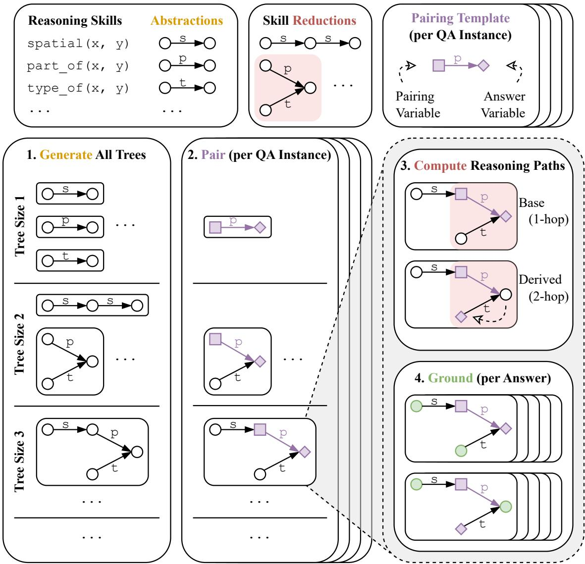  
Figure 4: The ACCORD framework applied to CSQA. Top row: Manual preprocessing of CSQA. Bottom: Fully automated steps based on this preprocessing. (1) Generate all possible reasoning trees. (2) Pair each CSQA instance to all matching trees. (3) Find all n-hop reasoning paths to vary the number of reasoning hops and distractors. (4) For each path, duplicate the tree for each answer choice, then anti-factually ground variables. Legend: s, p, t in the abstractions are shorthands for spatial, part\_of, and type\_of, respectively.

## B.1 Motivating Design Argument

Our goal is this work is to close the commonsense measurability gap with respect to formal reasoning. Our design objectives, therefore, are: (1) to be able to explicitly, rigorously, and automatically quantify the reasoning complexity of a commonsense task; and (2) to mitigate construct validity concerns stemming from context unfaithfulness and spurious shortcuts in LLMs (see §1).

Consider the example CSQA instance from Figure 2a. How do we quantify this instance’s reasoning complexity? Our proposed solution is to add a context containing reasoning statements that, together with an implicit commonsense understanding of the underlying rules, imply the original answer. By carefully controlling the automated construction of these statements, we can explicitly, rigorously, and automatically quantify reasoning complexity. The task for an LLM is to reason through the statements using its understanding of these rules to derive the answer.

Notice, however, that the LLM can just as easily ignore this context and instead answer the question directly from parametric memory. How do we detect such context unfaithfulness to maintain construct validity? Our proposed solution is to design the context in such a way that it can imply an alternative answer choice (which we term the anti-factual reasoning task variant) in addition to the original answer (which we term thefactual reasoning task variant) given the same CSQA instance. In thefactual reasoning task, the LLM can arrive at the desired answer either by reasoning through the context as intended or by spuriously parroting the answer while ignoring the context. In the antifactual reasoning task, the LLM can arrive at the desired answer only by reasoning through the context.7 As such, the gap between the factual and anti-factual performance is directly indicative of context unfaithfulness in LLMs and highlights the construct validity concern in thefactual reasoning task, where the desired measurement (reasoning ability) is confounded (by parroting ability).

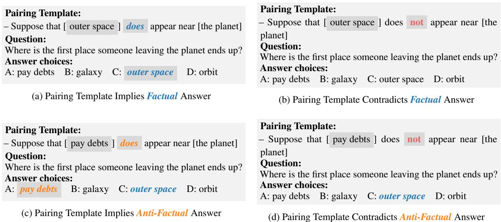  
Figure 5: Manipulating a pairing template to imply or contradict various answer choices.

Since a purely factual context cannot imply a factually incorrect answer, to create an anti-factual reasoning task, the context must itself be antifactually grounded. On the other hand, the context for the factual reasoning task can be either factually or anti-factually grounded. This works because an anti-factual context can imply any answer choice (including the factual answer) with appropriate negation (compare Figures 2f and 2g).

However, there are three arguments in favour of using an anti-factual context even with the factual reasoning task. First, a purelyfactual context can be spuriously circumvented, thereby reducing the intended reasoning complexity of the task. For example, from the context “A appears near B; B appears near C”, we can derive “A appears near C”. If the derivation is factual, an LLM might be able to spuriously retrieve it without reasoning through the context. The derivation could then be used to directly answer the question, turning a 2- hop reasoning task into a 1-hop task. Second, a stronger direct comparison can be made between thefactual and anti-factual task variants if all else is being held equal except the answer choice selection (compare Figures 2f and 2g). Third, empirically, it is challenging to factually ground n-hop contexts with n > 2 due to the sparsity of grounding KBs. ConceptNet, for example, simply does not contain enough many-hop chains to ground even a single 3-hop instance from our benchmark.

In sum, to be able to explicitly, rigorously, and automatically quantify the reasoning complexity of a commonsense task, and to mitigate construct validity concerns stemming from context unfaithfulness and spurious shortcuts in LLMs, we design an anti-factually grounded context, Caf, with which to augment CSQA instances such that any answer choice can be implied while holding all else equal. The performance gap between a context that implies the factual vs some anti-factual answer is directly indicative of context unfaithfulness in LLMs. The mere presence of Caf renders the reasoning complexity explicit. The details of the careful automated construction and validation of Caf to ensure rigour is discussed below.

## B.2 Pairing Templates

In light of the discussion in Appendix B.1, our goal is to develop an algorithm that automates: (a) the construction of an anti-factual context, $C ^ { \mathrm { a f . } } ;$ and (b) the rigorous validation of $C ^ { \mathrm { a f } } \mathbf { \bar { s } }$ soundness.

Consider the example CSQA instance from Figure 2a. How do we devise a simple context that can discriminate between its answer choices? Our proposed solution is the pairing template. Each pairing template is a statement with two placeholder variables. The goal is to craft the pairing template such that, if one of these variables is grounded with a particular answer choice $a _ { i } .$ , and the other variable is grounded with a fixed shared term between all answer choices (the pairing term), then the statement as a whole can directly imply (using the positive variant of the pairing template) or contradict (using the negative variant) $a _ { i }$ . The template must also satisfy the form of a reasoning template. In particular, it must derive from one of the allowable reasoning skills (see Table 2).

Figure 5 provides a detailed example of implication and contradiction of either the factual or some anti-factual answer choice for the running example from Figure 2. Notice that ‘implying an anti-factual answer requires assuming some anti-factual world model, $\mathrm { w ^ { a f } }$ . Hence, we craft the pairing template to begin with “Suppose that”. Conversely, ‘contradicting’ thefactual answer requires assuming the default world model is wrong (again with “Suppose that”). Only by combining these assumption using tree duplication and negation (discussed below) can the anti-factual rightly be considered implied.

## B.3 Reasoning Trees

Each reasoning template represents one reasoning hop. Composing reasoning templates together into reasoning (poly)trees therefore creates multihop reasoning objects. In the same way that a formal algorithm can operate rigorously on formal reasoning objects, such as an algebraic equation or a first-order logic problem, we devise an algorithm (ACCORD) to operate rigorously on these trees. ACCORD not only generates all possible trees of a certain reasoning complexity, but also ensures reasoning soundness and validity of the resulting object. In essence, we are applying formal reasoning rules to commonsense reasoning problems to automate both problem generation and verification.

Figure 4 illustrates the main steps of ACCORD. We assume as input a set of reasoning skills and a corresponding reduction matrix. Skill reductions are discussed in detail in Appendix C. For now, we can treat this reduction matrix as a lookup table: Given two reasoning skills, the matrix tells us whether these skills can be simplified or not, and what the skill type of the resulting simplification is (if any). By including only reductions that are closed under the set of skills, we are able to recursively generate trees of arbitrary size.

Trees of size 1 are degenerate: There is precisely one such tree for each reasoning skill (shown as a node-and-edge tree abstraction in Figure 4). Trees of size 2 comprise precisely the set of reductions from the reduction matrix (since the reduction matrix, by definition, contains exactly those pairs of reasoning skills that are valid).

As an example of a tree of size 3, consider the tree under the heading “Tree Size $3 ^ { \circ }$ in Figure 4. To construct this tree, ACCORD arbitrarily starts with one reasoning skill, say type\_of. Then, using the reduction matrix, it finds that part\_of(x, y) type\_ $\boldsymbol { \mathscr { o } } \mathsf { f } ( z , y )$ form a valid reduction to part\_of(x, z), thereby growing the tree. Next, ACCORD arbitrarily picks a branch in the tree, say part\_of, and attempts to grow the tree. It finds that $\mathsf { p a r t \_ o f } ( x , y )$ spatial $( y , z )$ reduce to spatial $( x , z )$ . ACCORD then performs some additional sanity checks to ensure validity, such as strictly enforcing acyclicity and using variable substitution to ensure unique variable names, then spits out this completed 3-hop tree before recursively backtracking to generate all other valid trees.

## B.4 Reasoning Paths

Not all generic reasoning trees are relevant to the commonsense underlying any particular CSQA instance. The pairing template serves as an anchor point between generic trees and a CSQA instance. Only those trees containing a reasoning skill matching the skill type of the pairing template can be paired to that CSQA instance. If the tree contains multiple instances of the same reasoning skill, each instance can pair separately with the CSQA instance. In essence, the specifics of the pairing template “replace” the generic reasoning skill in the tree, resulting in a paired reasoning tree.

From this pairing template anchor point in the tree, ACCORD then computes all valid reasoning paths. Specifically, ACCORD looks for skill branches in the tree adjacent to the designated pairing template that, when combined with the pairing template reduce to the same skill type as the pairing template. Moreover, the pairing term variable must survive the reduction (it cannot be an intermediate variable that gets lost through the reduction).

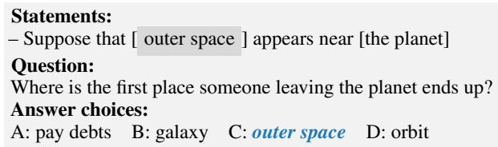

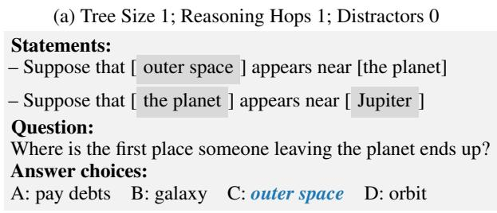  
(b) Tree Size 2; Reasoning Hops 1; Distractors 1

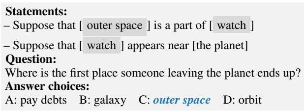  
(c) Tree Size 2; Reasoning Hops 2; Distractors 0

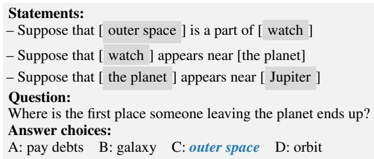  
(d) Tree Size 3; Reasoning Hop 2; Distractors 1  
Figure 6: The logic of reductions paths ensures that all these examples validly imply “outer space” regardless of tree size, reasoning hops, or number of distractors.

As an example, consider the reduction of part\_of(x, y)  spatial(y, z) to spatial(x, z). Because the skill type of the reduction is spatial, the path [part\_of spatial] is only valid if spatial is the pairing template (if part\_of happened to be the pairing template, this tree branch is rejected as a possible reasoning path because the pairing template’s skill type does not match that of the reduction). Moreover, the reasoning path is only valid if either x or z is the pairing term variable, since these survive the reduction (y does not, so this reasoning path is rejected if y happened to

be the pairing term).

Together, these two conditions ensure that the pairing template dominates the reasoning path. Dominance is important, because a pairing template can only be in a dominant position in a reasoning path. Otherwise, its answer-discrimination ability becomes subsumed. Essentially, finding a reasoning path is logically equivalent to applying the reduction, then removing the original skill branches from the reasoning tree and replacing them with the reduction. This simplifies the reasoning complexity of the problem by one hop while ensuring that the pairing template continues to appear in the reduced tree. Since the pairing template validly matches the reduced tree, we have not altered the essence of the reasoning logic, only its complexity. Recursively applying such reductions results in a maximally reduced tree containing exactly one reasoning hop (the dominant pairing template) and, optionally, some irrelevant statements (distractors). We can also stop the recursive reduction process short in order to create intermediate-length reasoning paths.

Because the pairing template dominates throughout, and because the pairing template is designed to uniquely discriminate between the different answer choices a (see Figure 5), we know that the full reasoning path also necessarily discriminates between the different answer choices when grounding the variable at the opposite end of the reasoning path from the pairing template with ai.

Consider our running example. With a 1-hop tree (which is equivalent to just the pairing template), we know that the tree as a whole can discriminate between the answer choices (see Figure 5). In Figure 6a, we reproduce this 1-hop tree example. In Figure 6b, we instead introduce a reasoning tree of size 2. This tree continues to have only one reasoning hop, however, since the other statement is a distractor. This is because both the pairing term and the answer choice ground variables in the same statement. Notice that we can completely ignore the distracting statement, since it has no bearing on the reasoning logic on the problem. In Figure 6c, we introduce a different reasoning tree of size 2. This reasoning tree has two reasoning hops, because there are two statements between the pairing term and answer choice variables. Notice that, because we know that part\_of(x, y) spatial(y, z) reduce to spatial(x, z), and because we know that the pairing template (spatial) dominates the other statement (part\_of), we can be confident in knowing that the 2-hop statements imply the answer choice.8 Finally, in Figure 6d, we combine the previous two cases: A tree of size 3 with two reasoning hops and one distractor. This case combines the logic of the others: The 2-hop reasoning is valid and the distractor can be ignored.

In Figure 4, we show more abstractly how a reasoning path can be computed through a size 3 reasoning tree. Notice that, in this example, $\mathsf { p a r t \_ o f }$ is the pairing template. Because spatial dominates part\_of in the reduction matrix, the reasoning path cannot more “backwards” to include spatial. On the other hand, part\_of does dominate type\_of (the reduced skill type remains part\_of and the pairing term variable survives the reduction). As such, the reasoning path can be extended “downwards” to include type\_of. Notice that the answer choice variable “moves” to the end of the reasoning path, whereas the pairing term variable remains fixed to the pairing template.

## C Reduction Matrix and Informal Proofs

To automatically generate reasoning trees of arbitrary size, we need to compose reasoning skills. However, not all combinations of reasoning skills form a valid composition. Specifically, we consider a set of two reasoning skills to be compositionally valid only if, together, they consistently reduce to another commonsense skill. For example, part\_of(x, y)  spatial $( y , z )$ reduce to spatial(x, z)—if a whole y is near an object z, then any part x of that whole y must also be near z. One the other hand, spatial(x, y) causal $( y , z )$ are not reducible—just because some object x is near a cause y does not mean that x is also near the effect z, nor that x is an indirect cause of z.

Reducibility thus ensures that templates are composed commonsensically, rather than arbitrarily. However, due to the informal nature of commonsense reasoning, we determined reduction validity based on unanimous consensus among authors, rather than formal proofs. That said, we provide informal proofs below as commonsense rationale for each reduction.

For each set of two reasoning skills, we manually determine its reduction (if any) and keep only those whose reduction is both (a) valid and (b) closed under the set of skills. The results are summarized in Figure 8. The closure constraint is a practical consideration to speed up the algorithm, as it removes recursive dead ends in which unverifiable reasoning paths are generated. Specifically, closure naturally ensures reasoning paths of any length always have corresponding entries in the reduction matrix lookup table.

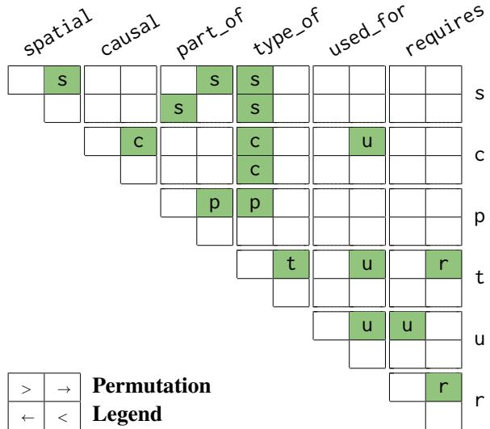  
Case >: row(x, y) col(z, y) reduction(x, z) Case : row(x, y)  col(y, z)  reduction(x, z) Case : row(y, x)  col(z, y)  reduction(z, x) Case <: row(y, x)  col(y, z)  reduction(x, z)  
Figure 8: Reduction Matrix. For each set of two reasoning skills (row then column), there are four permutations of the ordering of the variables x, y, and z. For each case, we manually determine whether a reduction is entailed, and, if so, its skill type (shown here as the first letter of the skill name). For example, Figure 1 illustrates case ‘ ’ of spatial part\_of. Since cases are symmetric, only the upper triangle is shown.

One small nuance here is that negation can inadvertently invalidate some reductions. To illustrate this point, recall that in all reductions, one relation type always dominates over the other. For the 6 transitive reductions, we assume that both relations can dominate. As a result, although permutations cases are always symmetric in their logic forms, the transitive cases are not necessarily symmetric with respect to their template surface forms. For example, consider causal $( x , y ) \land \mathtt { c a u s a l } ( y , z ) \Rightarrow$ causal $( x , z )$ . If the first relation is the pairing template (and therefore dominates), then the surface form of the second relation becomes “Suppose that only [y] causes [z].” For the inverse, the surface form of the first relation becomes “Suppose that [y] only causes $[ z ] . \mathbf { \vec { \mathbf { \sigma } } }$ The placement of “only” in these surface forms is critical to ensuring logical soundness when negating the pairing template. For example, “[x] does not cause [y]” and “[y] causes [z]” does not imply that “[x] does not cause [z],” since it remain logically possible for x to cause z directly. In contrast, “[x] does not cause [y]” and “only [y] causes [z]” does imply that “[x] does not cause [z],” since the only direct cause of z is y, but x does not cause y. We track these surface form variations according to which template position in the reduction is matched against the pairing template, which is done independently of the (purely symmetric) reduction matrix.9

For each combination of two template types, there are four possible permutation cases of their variables that need validating (see Figure 8). Given that we have 6 skill types, we have in total 6 6 4 = 144 validations to consider. However, the permutations cases are symmetric. As such, we only need to consider around half of the cases in practice (specifically, 78, the upper triangle and the main diagonal in the reduction matrix). These are the entries in the matrix in Figure 8. Of these, we found that 17 cases are valid, including variations under negation. Below, we provide a commonsense rationale for each of these valid cases.

## Validated by transitivity:

$$
\begin{array} { r } { \bullet \ \mathsf { s p a t i a l } ( x , y ) \wedge \mathsf { s p a t i a l } ( y , z ) \qquad } \\ { \qquad \Rightarrow \mathsf { s p a t i a l } ( x , z ) } \end{array}
$$

By transitivity of spatial location.

$$
\begin{array} { c } { \bullet \mathsf { c a u s a l } ( x , y ) \wedge \mathsf { c a u s a l } ( y , z ) } \\ { \Rightarrow \mathsf { c a u s a l } ( x , z ) } \end{array}
$$

By transitivity of causality.

$$
\begin{array} { r } { \bullet \mathsf { p a r t \_ o f } ( x , y ) \land \mathsf { p a r t \_ o f } ( y , z ) \qquad } \\ { \Rightarrow \mathsf { p a r t \_ o f } ( x , z ) \quad } \end{array}
$$

By transitivity of meronymy.

$$
\begin{array} { r } { \bullet \ \mathfrak { t y p e \_ o f } ( x , y ) \wedge \mathfrak { t y p e \_ o f } ( y , z ) \qquad } \\ { \qquad \Rightarrow \ \mathfrak { t y p e \_ o f } ( x , z ) } \end{array}
$$

By transitivity of hypernymy.

$$
\begin{array} { r } { \bullet \mathsf { u s e d \_ f o r } ( x , y ) \wedge \mathsf { u s e d \_ f o r } ( y , z ) \qquad } \\ { \qquad \Rightarrow \mathsf { u s e d \_ f o r } ( x , z ) } \end{array}
$$

By transitivity of purpose.

$$
\begin{array} { r } { \bullet \mathsf { r e q u i r e s } ( x , y ) \wedge \mathsf { r e q u i r e s } ( y , z ) \qquad } \\ { \Rightarrow \mathsf { r e q u i r e s } ( x , z ) } \end{array}
$$

By transitivity of precondition.

## Validated by hypernymy:

$$
\begin{array} { r } { \bullet \mathsf { s p a t i a l } ( x , y ) \wedge \mathbf { t y p e \_ o f } ( z , y ) \qquad } \\ { \Rightarrow \mathsf { s p a t i a l } ( x , z ) } \end{array}
$$

If x appears near all objects of type y and if z is an object of type y, then x is near z.

$$
\begin{array} { r } { \bullet \ \mathsf { t y p e \_ o f } ( x , y ) \wedge \mathsf { s p a t i a l } ( y , z ) \qquad } \\ { \Rightarrow \mathsf { s p a t i a l } ( x , z ) \qquad } \end{array}
$$

If all objects of type y appear near object z and if x is an object of type y, then x is near z.

$$
\begin{array} { r } { \bullet \mathsf { c a u s a l } ( x , y ) \wedge \mathsf { t y p e \_ o f } ( z , y ) \qquad } \\ { \Rightarrow \mathsf { c a u s a l } ( x , z ) } \end{array}
$$

If x is the cause of all effects of type y and if z is an effect of type y, then x causes z.

$$
\begin{array} { r } { \bullet \operatorname { t y p e \_ o f } ( x , y ) \wedge \mathsf { c a u s a l } ( y , z ) \qquad } \\ { \Rightarrow \mathsf { c a u s a l } ( x , z ) } \end{array}
$$

If any cause of type y causes effect z and if x is a cause of type y, then x causes z.

$$
\begin{array} { r } { \bullet \mathsf { p a r t \_ o f } ( x , y ) \wedge \mathsf { t y p e \_ o f } ( z , y ) \qquad } \\ { \Rightarrow \mathsf { p a r t \_ o f } ( x , z ) } \end{array}
$$

If x is a part of all objects of type y and if z is an object of type y, then x is a part of z.

$$
\begin{array} { r } { \bullet \ \mathfrak { t y p e \_ o f } ( x , y ) \wedge \mathsf { u s e d \_ f o r } ( y , z ) \qquad } \\ { \qquad \Rightarrow \ \mathsf { u s e d \_ f o r } ( x , z ) } \end{array}
$$

If all objects/actions of type y have purpose z and x is an object of type y, then x has purpose z.

$$
\begin{array} { r } { \bullet \ \mathfrak { t y p e \_ o f } ( x , y ) \wedge \mathsf { r e q u i r e s } ( y , z ) \qquad } \\ { \qquad \Rightarrow \mathsf { r e q u i r e s } ( x , z ) } \end{array}
$$

If all objects/actions of type y require z and x is an object of type y, then x requires z.

## Others:

$$
\begin{array} { r } { \bullet \mathsf { s p a t i a l } ( x , y ) \wedge \mathsf { p a r t \_ o f } ( y , z ) \qquad } \\ { \qquad \Rightarrow \mathsf { s p a t i a l } ( x , z ) } \end{array}
$$

Assuming part\_of relates two concrete nouns (which is generally true in Concept-Net), a meronym is typically spatially near its holonym. That is, if x is near y and y is a part of (and therefore near) z, then x is near z.

$$
\begin{array} { r } { \bullet \mathsf { p a r t \_ o f } ( x , y ) \wedge \mathsf { s p a t i a l } ( y , z ) \qquad } \\ { \Rightarrow \mathsf { s p a t i a l } ( x , z ) } \end{array}
$$

Assuming part\_of relates two concrete nouns (which is generally true in Concept-Net), a meronym is typically spatially near its holonym. That is, if x is a part of (and therefore near) y and y is near z, then x is near z.

$$
\begin{array} { r } { \bullet \mathsf { c a u s a l } ( x , y ) \wedge \mathsf { u s e d \_ f o r } ( y , z ) \qquad } \\ { \qquad \Rightarrow \mathsf { u s e d \_ f o r } ( x , z ) } \end{array}
$$

If x causes y whose purpose is z, then x is being used to cause z. For example, causal(playing piano, noise) used\_for(noise, distracting others)

⇒ used\_for(playing piano, distracting others). That is, because playing piano causes noise and because noise can be used to distract others, playing piano can be used to distract others.

$$
\begin{array} { r } { \bullet \mathsf { u s e d \_ f o r } ( x , y ) \wedge \mathsf { r e q u i r e s } ( z , y ) \qquad } \\ { \Rightarrow \mathsf { u s e d \_ f o r } ( x , z ) } \end{array}
$$

If y is the purpose of x and z requires y, then z becomes the purpose of x. For example, used\_for(cafe, meeting people) ∧ requires(making friends, meeting people) ⇒ used\_for(cafe, making friends). That is, since a cafe can be used for meeting people, and since making friends requires meeting people, then a cafe can be used for making friends.

## D Using a Factual Knowledge Base (ConceptNet) to Ground Variables Anti-Factually

To anti-factually ground variables in these reasoning trees, we retrieve assertions from ConceptNet. Specifically, for each duplicated reasoning tree, we treat the pairing term and answer choice as two seed terms (see Figure 4). From these, we antifactually ground all other variables using a backtracking beam tree search algorithm. Essentially, these seed terms, along with the skill types of the templates in a reasoning tree, place constraints on neighbouring variables. These constraints filter out potential candidates drawn from ConceptNet.

Consider a template with reasoning skill type $r ( \mathbf { X } , \mathbf { Y } )$ . For a given seed term s, assume without loss of generality that s is the first term: $r ( s , \mathbf { Y } )$ We retrieve assertions from ConceptNet table r, producing a list of factual assertions of the form $r ( x _ { i } , y _ { i } )$ Therefore, excluding any assertions where $\begin{array} { l l l } { x _ { i } } & { = } & { s } \end{array}$ ensures retrieval is purely antifactual. That is, we set $\mathbf { Y }  y _ { i }$ for some $y _ { i }$ such that $r ( x _ { i } , y _ { i } )$ is in ConceptNet, but $r ( s , y _ { i } )$ is not. Whenever a single candidate variable links to multiple seed terms, we take the set intersection of all retrieved assertions. Finally, we select k terms from these assertions, thereby growing the frontier of grounded variables. To avoid exponential compute times as the tree size grows, we keep only k = 1 potential candidates in this work. We select these by random sampling. However, using some relevance metric—such as semantic distance between the seed and candidate terms or likelihood of the candidate as computed by some LLM—would be a viable alternative.

We backtrack through unsatisfiable constraints until all variables are grounded, resulting in multiple highly-related trees that, crucially, share the same reasoning structure but have different (antifactual) grounding. In this way, variables are grounded within appropriate constraints based on skill type, r, rather than completely arbitrarily.

Still, the LLMs we benchmark tend to refuse answering anti-factual questions, likely because most have post-hoc constraints to curtail misinformation.10 To overcome this issue, we introduce a simple instruction prompt that encourages LLMs to accept anti-factual contexts. However, we emphasize that prompt engineering is not the focus of this work. Our instruction prompt is shown in Appendix H.

Our variable-grounding algorithm does rely somewhat on ConceptNet’s recall, since afactual statement omitted from ConceptNet will be treated as anti-factual by ACCORD. However, we can probabilistically hedge against this, so the situation is not as dire as it might initially seem. Specifically, because we randomly chose concept pairs from a large dictionary, it is unlikely the two concepts are related. While it is tricky to give concrete probabilistic bounds, we posit that it is a reasonable assumption. Anecdotally, this is seen in the examples shown in Appendix H, where none of the concept pairs arefactually related. The added check that the concept pair does not appear in Concept-Net provides additional assurances that it is not factual, further lowering the chance of a mistake. Ideally, we would instead have a complete KB of commonsense facts to ensure 100% recall, but no such KB exists. In practice, we must rely on mitigating risks. An alternative would be to manually check every statement using crowd workers, but that would entirely defeat the scalability benefit of ACCORD, which we posit adds more value than catching the (likely) few mistakes in the dataset.

## E Replicating Experiments

The source code repository contains detailed information on the exact commands to run to replicate the experiments. Here we describe the details of our experimental procedures.

## E.1 Manual Preprocessing

ACCORDCSQA comprises 6 subsets. Each subset, $\mathsf { A C C O R D } _ { \mathrm { C S Q A } } ^ { N } , ~ N ~ \in ~ [ 0 , 5 ]$ , corresponds to all instances in which the context contains precisely N statements per CSQA answer choice. The baseline subset, $\mathsf { A C C O R D } _ { \mathrm { C S Q A } } ^ { 0 }$ , corresponds to the subset of 74 CSQA used to generate the rest.

$\mathsf { A C C O R D } _ { \mathrm { C S Q A } } ^ { 1 }$ contains base 93 instances. For each instance in $\mathsf { A C C O R D } _ { \mathrm { C S Q A } } ^ { 0 }$ , the authors manually wrote between 1 and 3 pairing templates. Specifically, 56 instances have one pairing template, 17 instances have 2, and 1 instance has 3. From this base, we duplicate each instance such that exactly one copy has the factual answer and at least one copy has an anti-factual answer. Since there are exactly 4 alternative answer choices, each base can be duplicated up to 5 times (minimum of 2). In the official $\mathsf { A C C O R D _ { C S Q A } }$ release, we duplicate twice, leading to a dataset size of $9 3 \times 2 = 1 8 6$

A list of all 93 pairing templates can be found in the source code repository. In Figure 9, we reproduce 3 randomly chosen pairings as examples. Additional examples can be found on in the source code repository. All pairing templates and all other

CSQA ID: 5e260e1d96187716888cbd968010bb65 Question: Where is the closest place from where you could borrow salt? Answer choices: A: ocean water B: table C: shaker D: neighbor’s house E: lake Correct answer: D: neighbor’s house Pairing template: Suppose that [salt] {does|does not} appear near [<insert answer choice>]

CSQA ID: 2987db72e66f5fa0015ac64f9b3614ec Question: What do you do in order to fly in airplane?   
Answer choices: A: buy tickets B: passenger C: read D: add gas E: run through checklists Correct answer: A: buy tickets   
Pairing template: Suppose that [flying in airplane] {does|does not} have prerequisite [<insert answer choice>] CSQA ID: 055817d8d703d3c2802545e3fccdcde3 Question: What do humans do to other humans after death?   
Answer choices: A: celebrate B: burial C: life D: rebirth E: decomposition   
Correct answer: B: burial   
Pairing template: Suppose that [<insert answer choice>] {is|is not} a type of [death ritual]

Figure 9: Randomly sampled example pairings from $\mathsf { A C C O R D _ { C S Q A } }$

reasoning path templates contain both positive and negative variations. Distractor templates contain no such variations. These variations are required to negate the logic of a reasoning path to ensure that exactly one of the answer choices is implied, while the others are contradicted. The variations are indicated in curly braces in Figure 9, where the first form represents implication and the second form represents contradiction.

## E.2 Automated Generation

Generating $\mathsf { A C C O R D } _ { \mathrm { C S Q A } } ^ { N }$ where $N > 1$ from the preprocessed data using ACCORD involves dozens of additional hyper-parameters. The source code repository contains configuration files with all parameters set to those used to generate $\mathsf { A C C O R D } _ { \mathrm { C S Q A } } .$ Each hyper-parameter is explained in detail in the source code, as well. Most hyper-parameters have obvious defaults, which we used. However, trial and error was used to select appropriate values for sub-sampling probabilities. Essentially, we want to minimize sub-sampling as much as possible while also keeping the wall time and final dataset size reasonable. For example, $\mathsf { A C C O R D } _ { \mathrm { C S Q A } } ^ { \mathrm { 5 } }$ could, in principle, contain hundreds of millions of instances. Instead, we aggressively filter this down to just 133,734 instances (see Table 4).

<table><tr><td rowspan="2">Subset</td><td colspan="6">Reasoning Hops</td><td colspan="2">Number of Words</td></tr><tr><td>0</td><td>1</td><td>2</td><td>3</td><td>4</td><td>5 Total</td><td>w/ Prompt</td><td>Net</td></tr><tr><td> $\mathsf { A C C O R D } _ { \mathrm { C S Q A } } ^ { 0 }$ </td><td>74</td><td></td><td></td><td></td><td></td><td>74</td><td>4,700</td><td>2,110</td></tr><tr><td> $\mathsf { A C C O R D } _ { \mathrm { C S Q A } } ^ { 1 }$ </td><td></td><td>186</td><td></td><td></td><td></td><td>186</td><td>28,864</td><td>14,170</td></tr><tr><td> $\mathsf { A C C O R D } _ { \mathrm { C S Q A } } ^ { 2 }$ </td><td>27,218</td><td>8,364</td><td></td><td></td><td></td><td>35,582</td><td>7,428,290</td><td>4,617,312</td></tr><tr><td> $\mathsf { A C C O R D } _ { \mathrm { C S Q A } } ^ { 3 }$ </td><td>4,238</td><td>6,552</td><td>11,522</td><td></td><td></td><td>22,312</td><td>5,833,673</td><td>4,071,025</td></tr><tr><td> $\mathsf { A C C O R D } _ { \mathrm { C S Q A } } ^ { 4 }$ </td><td>7,512</td><td>6,174</td><td>12,522</td><td>27,418</td><td></td><td>53,626</td><td>16,627,058</td><td>12,390,604</td></tr><tr><td> $\mathsf { A C C O R D } _ { \mathrm { C S Q A } } ^ { \mathrm { 5 } }$ </td><td>12,344</td><td>10,686</td><td>11,534</td><td>27,966</td><td>71,204</td><td>133,734</td><td>48,451,533</td><td>37,886,547</td></tr><tr><td>Total</td><td>74 51,498</td><td>31,776</td><td>35,578</td><td>55,384</td><td>71,204</td><td>245,514</td><td>78,374,118</td><td>58,981,758</td></tr></table>

Table 4: Maximum size for each data subset.
<table><tr><td></td><td colspan="6">Reasoning Hops</td><td colspan="2">Number of Words</td></tr><tr><td>Subset</td><td>0</td><td>1</td><td>2</td><td>3</td><td>4</td><td>5 Total</td><td>w/ Prompt</td><td>Net</td></tr><tr><td> $\mathsf { A C C O R D } _ { \mathrm { C S Q A } } ^ { 0 }$ </td><td>74</td><td></td><td></td><td>一</td><td>一</td><td>74</td><td>4,700</td><td>2,110</td></tr><tr><td> $\mathsf { A C C O R D } _ { \mathrm { C S Q A } } ^ { 1 }$ </td><td>一</td><td>186</td><td></td><td></td><td></td><td>186</td><td>28,864</td><td>14,170</td></tr><tr><td> $\mathsf { A C C O R D } _ { \mathrm { C S Q A } } ^ { 2 }$ </td><td></td><td>186</td><td>186</td><td></td><td></td><td>372</td><td>77,756</td><td>48,368</td></tr><tr><td> $\mathsf { A C C O R D } _ { \mathrm { C S Q A } } ^ { 3 }$ </td><td></td><td>186</td><td>186</td><td>186</td><td></td><td>558</td><td>145,682</td><td>101,600</td></tr><tr><td> $\mathsf { A C C O R D } _ { \mathrm { C S Q A } } ^ { 4 }$ </td><td></td><td>186</td><td>186</td><td>186</td><td>186</td><td>744</td><td>231,834</td><td>173,058</td></tr><tr><td> $\mathsf { A C C O R D } _ { \mathrm { C S Q A } } ^ { \mathrm { 5 } }$ </td><td></td><td>186</td><td>186</td><td>186</td><td>186 186</td><td>930</td><td>337,414</td><td>263,944</td></tr><tr><td>Total</td><td>74</td><td>930</td><td>744</td><td>558</td><td>372 186</td><td>2,864</td><td>826,250</td><td>603,240</td></tr></table>

Table 5: Size for each data subset used in experiments.

Each reasoning tree consists of templates containing two variables each. Variables are grounded via matches against the associated ConceptNet table in such a way that the templates are always grounded anti-factually, despite ConceptNet being a purely factual KB (see Appendix D). Validation is based on the assumption that ConceptNet entries are indeed factual, which is generally true despite some noise in ConceptNet (see Appendix D).

For each subset $\mathsf { A C C O R D } _ { \mathrm { C S Q A } } ^ { N }$ where $N > 1$ , the minimum number of base instances is $N \times P .$ where $P \ = \ 9 3$ is the number of pairings in $\mathsf { A C C O R D } _ { \mathrm { C S Q A } } ^ { 1 } . \mathsf { B y }$ design, N corresponds both to the problem size and to the number of unique reasoning hops possible within that subset. As with $\mathsf { A C C O R D } _ { \mathrm { C S Q A } } ^ { 1 }$ , we duplicate each base instance 2 times (one factual and one anti-factual). Altogether, $\mathsf { A C C O R D } _ { \mathrm { C S Q A } } ^ { N }$ contains a minimum of $2 ~ \times$ $N \times P \times R ,$ where $R > 0$ represents the minimum resampling rate. For each R, we resample all nonfixed grounding terms in the instance from ConceptNet to generate new instances with the same underlying structure but different grounding terms. In the official $\mathsf { A C C O R D _ { C S Q A } }$ release, we set $R \geq 1 0$ so that the minimum dataset size for $\mathsf { A C C O R D } _ { \mathrm { C S Q A } } ^ { N }$ is $2 \times N \times 9 3 \times 1 0 = 1 8 6 0 N$ . Since R is a minimum, the official datasets are significantly larger, since some pairing combinations occur much more frequently. We note that not all instances need to be used. We provide a large dataset only to cover potential uses cases that require more data. In particular, the experiments in §3 only use $R = 1$ , which is sufficient to achieve the desired narrowness of the estimated standard error. Table 4 shows the maximum size distributions of the official dataset release. Table 5 shows the size distribution used for our experiments.

## E.3 Benchmarking LLMs

For each LLM, we used its default hyperparameters based on its respective configuration files. We used a chat-style interface instead of a text-only interface (e.g., using OpenAI’s Chat Completions API rather that its Completions API). All

LLMs generate exactly one output sequence per input. For OpenAI models, we used the JSON object response format type with max tokens of 20. For all other models, we prompt the model to output a JSON-formatted answer, but allow for up to 500 tokens to be generated from which we attempt to extract an answer.11 Instructions to output in JSON format are appended to the primary instruction prompt shown in the main paper. OpenAI models were evaluated using OpenAI’s Chat Completions API, whereas all other models are run locally on A40 GPUs on an internal cluster. Gemma 7B and Mistral-7B-Instruct-v0.1 run through the Hugging-Face Transformers API on one A40 each. All other local models run through VLLM served using OpenAI’s Chat Completions API. Meta-Llama-3-8B-Instruct ran on one A40. Llama-2-13b-chat-hf ran on two A40s. Llama-2-70b-chat-hf, Meta-Llama-3- 70B-Instruct, and Mixtral-8x7B-Instruct-v0.1 ran on four A40s each. Mixtral-8x22B-Instruct-v0.1 ran on eight A40s (four over two nodes). Runtimes are fairly consistent, taking about 12 hours per model.

Our benchmarking metric is accuracy with Wald standard error as our variation indicator. A single evaluation run is performed with a fixed random seed (= 314159) for all LLMs, but each run includes multiple instances for each category and type (see Table 5). Standard error is based on the variation over these instances, not over runs.

Results for additional LLMs beyond those in the main body of the paper are shown in Figure 11.

## F Human Assessment and Performance on ACCORD

Under a constrained time budget, humans would likely perform quite poorly on ACCORD, just as humans would likely struggle with first-order logical reasoning under a constrained time budget. However, as is the case with logical reasoning (Wu et al., 2024), we argue that humans have the competence to solve ACCORD tasks, but that doing so robustly would necessitate large time budgets. In general, human logical reasoning relies on System II of the Dual Process Theory (Tang et al., 2023). However, humans also show a “content effect” bias wherein logical reasoning performance decreases when the semantics of the logic are counterfactual, especially with a constrained time budget (Dasgupta et al., 2022). LLMs are also affected by such decoupled semantics (Dasgupta et al., 2022; Tang et al., 2023). Since ACCORD blends counterfactual commonsense with formal logical elements, it is sensible to assume that solving ACCORD also requires System II and suffers from the same content effect bias.

However, we posit that the purpose of LLMs is not to precisely model human intelligence (Wu et al., 2024). As such, human performance on ACCORD is mostly irrelevant to our goal of evaluating LLM reasoning performance (besides providing a baseline for comparison). Since each problem in the dataset can be unambiguously solved, we should—in the long run—strive to create AI systems that can reason through these problems (regardless of average human performance), as a proxy for their commonsense reasoning ability.

## G Rejected CSQA Instances

Figure 10 highlights the two CSQA instances that were rejected as part of the preprocessing steps for ACCORDCSQA. In both cases, the instances were rejected because the attempted pairing templates do not quite capture the essence of the question. In the first instance, the question is asking about an action done by an agent to an object (someone moving furniture) whereas the pairing template is differentiating between answer choices based on a property of the object (whether furniture does appear near some location or other object). In the second instance, the answer to the question is a conjunction, which renders the wording of the question too convoluted for our rather rigid template format.

## H Additional Random Samples from ACCORD

These examples are drawn from the small variant of ACCORDCSQA. We randomly sampled one example per problem size from 0 to 5, shown in increasing size order. For each, we show the full, complete, raw example—including the instruction prompt for the LLMs and the answer prompt. The LLM does not see the Instance ID or the Meta-data, however. These are shown here for human legibility.

Instance ID: G50\_0\_E   
Meta-data:   
Reasoning Hops: 0   
Distractors: 0   
Problem Size: 0   
Ground Truth Label: E

CSQA ID: 3e536d9253bfac45de83e8ee291ca143   
Question: Where might it be hard to get furniture   
to?   
Answer choices: A: apartment B: loft C: store   
D: rug E: stairs   
Correct answer: B: loft   
Attempted pairing template(s):   
Suppose that [furniture] {does not|does} ap  
pear near [<insert answer choice>]

CSQA ID: e56c56c3cfe50ba0c787c2bd67255be8   
Question: She asked her little boy why, he replied   
that he didn’t know and it was just what?   
Answer choices: A: case B: reason C: how   
D: because E: answer   
Correct answer: D: because   
Attempted pairing template(s): Suppose that [<insert answer choice>] {is|is   
not} a part of [the unknown] Suppose that [<insert answer choice>] {is|is   
not} a type of [little boy behavior]

Figure 10: CSQA instances rejected because we were unable to craft valid pairing templates.

Answer the following multiple-choice question.   
Provide your answer in JSON format using the   
following schema: {"answer": <label>} where   
<label> is exactly one of: "A", "B", "C", "D",   
or "E". Do not output anything else.   
Question:   
He was on trial for obstructing justice, during   
which he made a questionable comment and was   
also found guilty of what?   
A: prosecution B: getting hurt C: sweat   
D: steam E: committing perjury   
Answer:

Instance ID: G68\_1\_B   
Meta-data:   
Reasoning Hops: 1   
Distractors: 0   
Problem Size: 1   
Ground Truth Label: B

## Instructions:

You will be provided with statements relating to a multiple-choice question. The contents of the statements may disagree with your prior   
knowledge of the world. That is ok. Your task is to provide the most appropriate answer to the multiple-choice question based on the reasoning presented in the statements. Provide your answer in JSON format using the following schema:   
{"answer": <label>} where <label> is exactly one of: "A", "B", "C", "D", or "E". Do not output anything else.   
Statements:   
Instance ID: G16155\_2\_C   
Meta-data: Reasoning Hops: 2 Distractors: 0 Problem Size: 2 Ground Truth Label: C

- Suppose that [sitting\_quietly] is not a part   
of [fall asleep]   
- Suppose that [sitting\_quietly] is a part of [   
meditate]   
- Suppose that [sitting\_quietly] is not a part   
of [reading]   
- Suppose that [sitting\_quietly] is not a part   
of [bunk]   
- Suppose that [sitting\_quietly] is not a part   
of [think]   
Question:   
What is someone doing if he or she is sitting   
quietly and his or her eyes are moving?   
A: reading B: meditate C: fall asleep   
D: bunk E: think   
Answer:

## Instructions:

You will be provided with statements relating to a multiple-choice question. The contents of the statements may disagree with your prior knowledge of the world. That is ok. Your task is to provide the most appropriate answer to the multiple-choice question based on the reasoning presented in the statements. Provide your answer in JSON format using the following schema: {"answer": <label>} where <label> is exactly one of: "A", "B", "C", "D", or "E". Do not output anything else.

\- Suppose that [longplay] is a type of [pinniped mammal]

\- Suppose that [mammalogy] is a type of [boring activity]

\- Suppose that [coccid insect] is a type of [ boring activity]

\- Suppose that [musical] is a type of [entree] - Suppose that [pinniped mammal] is a type of [ boring activity]

\- Suppose that [toilet training product] is a type of [boring activity]

\- Suppose that [eat cake] is a type of [coccid insect]

\- Suppose that [doing nothing] is a type of [ mammalogy]

\- Suppose that [entree] is not a type of [boring activity]

## Question:

Sarah didn't like to play but she didn't want to be sedentary and bored, either, so she took up what?

Question:

Instructions:

The lock kept the steering wheel from moving,

Instance ID: G31713\_5\_D   
Meta-data:   
Reasoning Hops: 1   
Distractors: 4   
Problem Size: 5   
Ground Truth Label: D

Instance ID: G7186\_3\_C   
Meta-data:   
Reasoning Hops: 3   
Distractors: 0   
Problem Size: 3   
Ground Truth Label: C

## Instructions:

You will be provided with statements relating to a multiple-choice question. The contents of the statements may disagree with your prior knowledge of the world. That is ok. Your task is to provide the most appropriate answer to the multiple-choice question based on the reasoning presented in the statements. Provide your answer in JSON format using the following schema: {"answer": <label>} where <label> is exactly one of: "A", "B", "C", "D", or "E". Do not output anything else.

## Statements:

\- Suppose that [each country] appears near [ breakfast cereal]

\- Suppose that [a steering wheel] does appear near [each country]

\- Suppose that [vase] appears near [aetna]

\- Suppose that [jumbo jet] appears near [ preserved foods]

\- Suppose that [parcel] appears near [train]

\- Suppose that [display] appears near [parcel]

\- Suppose that [a steering wheel] does not appear near [motels]

\- Suppose that [a steering wheel] does not appear near [vase]

\- Suppose that [preserved foods] appears near [ drawer]

\- Suppose that [traffic signs] appears near [ firearm]

\- Suppose that [aetna] appears near [keep cloesd ]

\- Suppose that [motels] appears near [traffic signs]

\- Suppose that [breakfast cereal] appears near [ ignition switch]

\- Suppose that [a steering wheel] does not appear near [jumbo jet]

\- Suppose that [a steering wheel] does not appear near [display]

## Question:

began to work on the what?

A: keep cloesd [sic] B: train

Instance ID: G13526\_4\_C   
Meta-data:   
Reasoning Hops: 4   
Distractors: 0   
Problem Size: 4   
Ground Truth Label: C

You will be provided with statements relating to a multiple-choice question. The contents of the statements may disagree with your prior

knowledge of the world. That is ok. Your task is to provide the most appropriate answer to the multiple-choice question based on the reasoning presented in the statements. Provide your answer in JSON format using the following schema: {"answer": <label>} where <label> is exactly one of: "A", "B", "C", "D", or "E". Do not output anything else.

## Statements:

\- Suppose that [kissing too long] does not cause [feet touch ground]

\- Suppose that only [change] causes [charge]

\- Suppose that only [understanding better] causes [dry pet food]

\- Suppose that [strong feelings] is a type of [ charge]

\- Suppose that [arousal] is a type of [morning glory]

\- Suppose that only [working and getting paid for] causes [understanding better]

\- Suppose that only [feet touch ground] causes [ lying]

\- Suppose that [kissing too long] does cause [ working and getting paid for]

\- Suppose that [kissing too long] does not cause [hurting]

\- Suppose that only [returning to work] causes [ kingdom]

\- Suppose that only [hurting] causes [driving]

\- Suppose that [herpes] is a type of [kingdom]

\- Suppose that [kissing too long] does not cause [leaving ring]

\- Suppose that [excitement] is a type of [ character set]

\- Suppose that only [driving] causes [character set]

\- Suppose that [kissing too long] does not cause [use brain]

\- Suppose that [shortness of breath] is a type of [dry pet food]

\- Suppose that only [use brain] causes [change]

\- Suppose that only [leaving ring] causes [ returning to work]

\- Suppose that only [lying] causes [morning glory]

## Instructions:

You will be provided with statements relating to a multiple-choice question. The contents of the statements may disagree with your prior knowledge of the world. That is ok. Your task is to provide the most appropriate answer to the multiple-choice question based on the reasoning presented in the statements. Provide your answer in JSON format using the following schema: {"answer": <label>} where <label> is exactly one

of: "A", "B", "C", "D", or "E". Do not output   
anything else.   
Statements:   
- Suppose that [not losing weight] does not cause [beauty]   
- Suppose that [protecting passport] is a type of [catholicism]   
- Suppose that [loose skin] is used for [privacy ]   
- Suppose that [placing basketball] causes [not losing weight]   
- Suppose that [privacy] is a type of [restraint ]   
- Suppose that [healthier] is used for [ protecting passport]   
- Suppose that [death] is used for [writing to friend or business]   
- Suppose that [not losing weight] does not cause [loose skin]   
- Suppose that [orient] causes [not losing weight]   
- Suppose that [text string occurrence] is used for [achieving goal]   
- Suppose that [catholicism] is used for [cook oatmeal]   
- Suppose that [depression] causes [not losing weight]   
- Suppose that [not losing weight] does not cause [healthier]   
- Suppose that [not losing weight] does not cause [miss universe]   
- Suppose that [writing to friend or business] is a type of [text string occurrence]   
- Suppose that [using water colors] is a type of [vendor]   
- Suppose that [invite people over] is a type of [sputnik]   
- Suppose that [beauty] is used for [invite people over]   
- Suppose that [watering lawn] causes [not losing weight]   
- Suppose that [familiar sound] causes [not losing weight]   
- Suppose that [not losing weight] does cause [ death]   
- Suppose that [sputnik] is used for [getting up in morning]   
- Suppose that [miss universe] is used for [ using water colors]   
- Suppose that [vendor] is used for [ transporting cargo]   
- Suppose that [restraint] is used for [avoid sunburn]   
Question:   
What might happen if someone is not losing   
weight?   
A: loose skin B: beauty C: miss universe   
D: death E: healthier   
Answer:

## I Scientific Artifacts

## I.1 Data

ACCORDCSQA builds from CSQA (Talmor et al., 2019) and ConceptNet (Speer et al., 2017). To the best of our knowledge, CSQA was released without a license. In particular, neither the official homepage12 nor the GitHub repository13 include licensing information as of Oct 14, 2024. Concept-Net data is released under the Creative Commons Attribution Share-Alike 4.0 License.

The ACCORDCSQA data is released under the Creative Commons Attribution Share-Alike 4.0 License. The ACCORD code and the code to generate the ACCORDCSQA data is released under the MIT License.

## I.2 Models

ACCORDCSQA was benchmarked against various large language models (LLMs). The license for each benchmarked LLM is as follows:

• Gemma 7B (gemma-7b-it) (Team et al., 2024): Gemma Terms of Use (Gemma, 2024)

• GPT 3.5 (gpt-3.5-turbo-0125) (OpenAI, 2023): OpenAI Terms of Use (OpenAI, 2024b)

• GPT-4o (gpt-4o-2024-05-13) (OpenAI, 2024a): OpenAI Terms of Use (OpenAI, 2024b)

• Llama-2-13b-chat-hf (Touvron et al., 2023): Llama 2 Community License Agreement (AI@Meta, 2023)

• Llama-2-70b-chat-hf (Touvron et al., 2023): Llama 2 Community License Agreement (AI@Meta, 2023)

• Meta-Llama-3-70B-Instruct (AI@Meta, 2024b): Llama 3 Community License Agreement (AI@Meta, 2024a)

• Meta-Llama-3-8B-Instruct (AI@Meta, 2024b): Llama 3 Community License Agreement (AI@Meta, 2024a)

• Mistral-7B-Instruct-v0.1 (Jiang et al., 2023): Apache License 2.0

• Mixtral-8x22B-Instruct-v0.1 (The Mistral AI Team, 2024): Apache License 2.0

• Mixtral-8x7B-Instruct-v0.1 (Jiang et al., 2024): Apache License 2.0

## J Societal Impact

ACCORD was created to work towards closing the measurability gap between commonsense and formal reasoning tasks for LLMs. LLMs can perform remarkably well on reasoning tasks. However, detailed analysis reveals limitations in their reasoning that typically worsens with increased reasoning complexity. Commonsense reasoning is especially challenging for LLMs. As such, key players in AI have singled out commonsense as a critical new frontier. Unfortunately, a detailed understanding of $\mathbf { L L M s } ^ { \prime }$ commonsense reasoning abilities is severely lagging compared to our understanding of their formal reasoning abilities, since commonsense benchmarks are difficult to construct in a manner that is rigorously quantifiable. Specifically, prior commonsense reasoning benchmarks and datasets are limited to one- or two-hop reasoning or include an unknown (i.e., non-measurable) number of reasoning hops and/or distractors. Arbitrary scalability via compositional construction is also typical of formal reasoning tasks but lacking in commonsense reasoning. Finally, most prior commonsense benchmarks either are limited to a single reasoning skill or do not control skills. Our approach aims to address all these gaps, as discussed in detail in the main body of the paper.

As a standalone benchmark, $\mathsf { A C C O R D _ { C S Q A } }$ is unlikely to pose any additional risks or harms beyond those already present in CSQA and ConceptNet (which are themselves very limited due to their genericity). The goal of $\mathsf { A C C O R D _ { C S Q A } }$ is to benchmark the commonsense reasoning abilities of LLMs. Unfortunately, depending on the care taken by their creators, LLMs may have significant negative societal impact, including on safety, security, discrimination, surveillance, deception, harassment, human rights, bias, and fairness (Bender et al., 2021; Weidinger et al., 2021). Our aim with $\mathsf { A C C O R D } _ { \mathrm { C S Q A } }$ is to improve the reasoning abilities of LLMs. Improved reasoning could lead to societal benefits (e.g., LLMs could better reason about the facts of a person, rather than engaging in discriminatory or biased stereotyping). On the hand, a bad actor could leverage this increased reasoning capability—or any increase in LLM capability—to increase societal harm (e.g., more convincing or targeted exploitation or harassment). LLMs also incur significant environmental impacts, in terms of both increased mining of the raw materials needed to produce hardware (e.g., GPUs) and increased electricity consumption needed to power said hardware (Bender et al., 2021). In designing ACCORD and $\mathsf { A C C O R D } _ { \mathsf { C S Q A } }$ , we have taken steps to encourage LLMs to genuinely reason about the context provided, while discouraging the reliance on (potentially biased) parametric “guessing” of the answer. We have also ensured that $\mathsf { A C C O R D _ { C S Q A } }$ can be used as a small or as a large benchmark (see Tables 4 and 5), which enables users to chose a size that is only as large as needed for their use case, which can help mitigate some environmental impact.

In addition, Davis (2023) argues that genuine improvements in LLMs can only be quantified by high-quality benchmarks that focus on a foundational commonsense understanding (including “basic temporal, spatial, physical, psychological, and social reasoning”) and extend the scope of reasoning complexity beyond the typical one or two hops. In terms of foundational commonsense understanding, we include a broad set of reasoning skills precisely for this reason, and our reasoning trees are explicit attempts at increasing the reasoning complexity compared to prior commonsense reasoning benchmarks. As for quality, although our quality is somewhat limited by the quality of CSQA, we have taken steps to ensure $\mathsf { A C C O R D _ { C S Q A } }$ is as high quality as possible. First, our pairing templates are handwritten to counteract any quality concerns from CSQA as much as possible. In particular, they are written to clearly differentiate the answer choices. Our experiments showed that this effort resulted in LLMs improving in performance compared to base CSQA when given the pairing template as a single reasoning hop. Second, our reduction matrix is validated manually to ensure correctness. Third, our anti-factual variables are grounded from samples randomly drawn only from the ConceptNet table associated with each template, rather than arbitrarily.

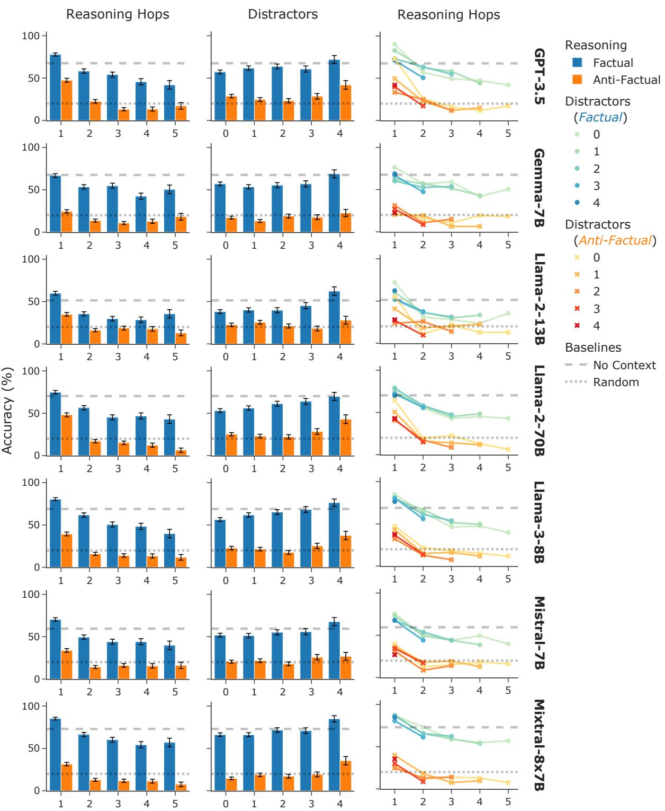  
Figure 11: Performance of additional LLMs on $\mathsf { A C C O R D _ { C S Q A } }$ . Left: Bothfactual and anti-factual performance degrade rapidly with increasing reasoning hops, which is expected. Middle: Both factual and anti-factual performance increase with increasing distractors, which is unexpected. Right: Disentangling the interaction effect between reasoning hops and distractors. Reasoning hops are dominant while distractors’ effect is negligible, which explains the reversed trend in (Middle) that marginalizes over reasoning hops. All: factual significantly outperforms anti-factual, which indicates context unfaithfulness. Anti-factual performance drops below random chance as a result. Wald standard error bars are with respect to the 93 pairings, not reruns based on random seeds.