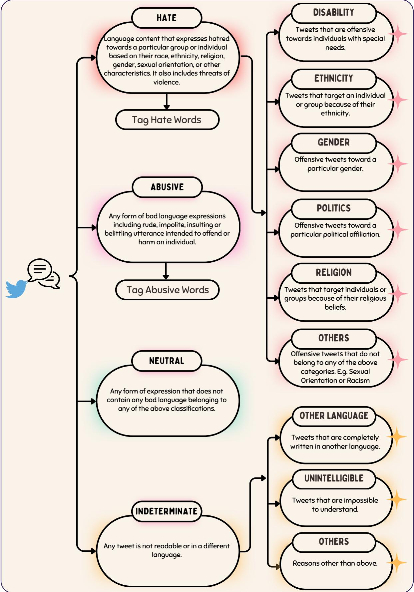

# AFRIHATE: A Multilingual Collection of Hate Speech and Abusive Language Datasets for African Languages

Shamsuddeen Hassan Muhammad1,2\*, Idris Abdulmumin3∗, Abinew Ali Ayele4,5, David Ifeoluwa Adelani6, Ibrahim Said Ahmad2,7, Saminu Mohammad Aliyu2, Nelson Odhiambo Onyango8, Lilian D. A. Wanzare8, Samuel Rutunda9, Lukman Jibril Aliyu10, Esubalew Alemneh4, Oumaima Hourrane12, Hagos Tesfahun Gebremichael4, Elyas Abdi Ismail20, Meriem Beloucif13, Ebrahim Chekol Jibril14, Andiswa Bukula15, Rooweither Mabuya15, Salomey Osei16, Abigail Oppong17, Tadesse Destaw Belay18,19, Tadesse Kebede Guge11, Tesfa Tegegne Asfaw4, Chiamaka Ijeoma Chukwuneke21, Paul Röttger22, Seid Muhie Yimam5, Nedjma Ousidhoum23

1Imperial College London, 2Bayero University Kano, 3DSFSI, University of Pretoria, 4Bahir Dar University, 5University of Hamburg, 6Mila, McGill University & Canada CIFAR AI Chair, 7Northeastern University, 8Maseno University, 9Digital Umuganda, 10HausaNLP, 11Haramaya University, 12Al Akhawayn University, 13Uppsala University, 14Istanbul Technical University, 15SADiLaR, 16University of Deusto, 17Independent Researcher, 18Instituto Politécnico Nacional, 19Wollo University, 20Jigjiga University, 21Lancaster University, 22Bocconi University, 23Cardiff University

Contact: s.muhammad@imperial.ac.uk, seid.muhie.yimam@uni-hamburg.de

## Abstract

Hate speech and abusive language are global phenomena that need socio-cultural background knowledge to be understood, identified, and moderated. However, in many regions of the Global South, there have been several documented occurrences of (1) absence of moderation and (2) censorship due to the reliance on keyword spotting out of context. Further, highprofile individuals have frequently been at the center of the moderation process, while large and targeted hate speech campaigns against minorities have been overlooked. These limita tions are mainly due to the lack of high-quality data in the local languages and the failure to include local communities in the collection, annotation, and moderation processes. To address this issue, we present AFRIHATE: a multilingual collection of hate speech and abusive language datasets in 15 African languages, annotated by native speakers. We report the challenges related to the construction of the datasets and present various classification baseline results with and without using LLMs. We find that model performance highly depends on the language and that multilingual models can help boost the performance in low-resource settings.1

Content Warning: This paper contains examples of hate speech and offensive language.

## 1 Introduction

No one is born hating another person because of the color of his skin, or his background, or his religion. People must learn to hate, and if they can learn to hate, they can be taught to love,for love comes more naturally to the human heart than its opposite. – (Mandela, 1994)

Hate speech and abusive language are global phenomena that highly depend on specific sociocultural contexts. Although they deviate from the norm on social media, hate speech and abusive language quickly attract significant attention, spread among online communities (Mathew et al., 2019), and incite harm or violence on individuals in real life (Saha et al., 2019). Tangible efforts to address these problems must take social and cultural contexts into account (Shahid and Vashistha, 2023). However, in the absence of high-quality data or when excluding local voices from the collection and annotation processes, one may fail to build assistive tools that help address the problem and moderate such content.

Collecting hate speech and offensive language datasets is complex and time-consuming as researchers typically rely on keywords, hashtags, or user accounts to build datasets (Ousidhoum et al., 2020). They may need further insights from both moderators (Arora et al., 2023) and affected communities (Maronikolakis et al., 2022). Further, resources in languages other than English are scarce, especially for low-resource languages. To bridge this gap, we present AFRIHATE a collection of new hate speech and abusive language Twitter datasets in 15 languages spoken in various African regions: Algerian Arabic, Amharic, Igbo, Kinyarwanda, Hausa, Moroccan Arabic, Nigerian Pidgin, Oromo, Somali, Swahili, Tigrinya, Twi, isiXhosa, Yorùbá, and isiZulu. The datasets are annotated by native speakers and include three classes: hate, abusive/offensive, or neutral–neither hateful nor abusive. The targets of the hateful tweets were further labeled based on six common attributes used to discriminate against people: ethnicity, politics, gender, disability, religion, or other. Table 1 shows a sample of the datasets in various languages.

<table><tr><td rowspan=1 colspan=1>Lang.</td><td rowspan=1 colspan=3>Hate and Abusive Examples                        Translations                                    Target</td></tr><tr><td rowspan=1 colspan=1>orm</td><td rowspan=1 colspan=1>Intala nafxanyaa kana ilaalaaAbn Kanaafuu wayyaaneensaree waliin sex goosisan.Saritti kana URL</td><td rowspan=1 colspan=1>Look at this naughty girl. So the Weyane made her have sexwith the dog. this dog girl URL</td><td rowspan=1 colspan=1>Gender</td></tr><tr><td rowspan=1 colspan=1>som</td><td rowspan=1 colspan=1>@USER Adigoo beesha jareer weyne kasoo JEEDA seed Xasanguurguurte ku taageertay?</td><td rowspan=1 colspan=1>@USER When you are from the large Jarer community andhow dare you support Hassan&#x27;s move?</td><td rowspan=1 colspan=1>Ethnicity</td></tr><tr><td rowspan=1 colspan=1>tir</td><td rowspan=1 colspan=1>0NλHhÇhÇD?</td><td rowspan=1 colspan=1>Do these Tigrayans have no a man as Bismarck who unifiedGermany?</td><td rowspan=1 colspan=1>Ethnicity</td></tr><tr><td rowspan=1 colspan=1>twi</td><td rowspan=1 colspan=1>he said mo ne ndc ayigbefoə nyinaa yε mmoa</td><td rowspan=1 colspan=1>He said you and the Ewe people who are members of NDC areall animals</td><td rowspan=1 colspan=1>Politics</td></tr><tr><td rowspan=1 colspan=1>xho</td><td rowspan=1 colspan=1>ambho jonga cacile awulazi icango lecawe lijonge phi kwedinizange uye nase sunday skul</td><td rowspan=1 colspan=1>Look clearly, you don&#x27;t know where the door of the churchfaces, you never went to Sunday school</td><td rowspan=1 colspan=1>Religion</td></tr><tr><td rowspan=1 colspan=1>yor</td><td rowspan=1 colspan=1>&quot;@username what of apc. oloriburuku ni gbogbo yin&quot;</td><td rowspan=1 colspan=1>what of apc, everyone there is unfortunate</td><td rowspan=1 colspan=1>Politics</td></tr><tr><td rowspan=1 colspan=1>zul</td><td rowspan=1 colspan=1>uma uthanda ukubuka &#x27;mamovie amakwerekwere futhiumnyaaaaaaaaaaaaaama ngebala ungasondeli ethekwini.</td><td rowspan=1 colspan=1>if you like watching foreigner movies and you are dark incomplexion don&#x27;t even think about going to ethekwini.</td><td rowspan=1 colspan=1>Ethnicity</td></tr><tr><td rowspan=1 colspan=1>arq</td><td rowspan=1 colspan=1>    </td><td rowspan=1 colspan=1>@user let the dog bark ??doesn&#x27;t bite and doesn&#x27;t hurt</td><td rowspan=1 colspan=1>–</td></tr><tr><td rowspan=1 colspan=1>ary</td><td rowspan=1 colspan=1></td><td rowspan=1 colspan=1>Your stupidity woke me up, homeless, your parents are idiots</td><td rowspan=1 colspan=1>I</td></tr><tr><td rowspan=1 colspan=1>amh</td><td rowspan=1 colspan=1>@USER A60YU77 YU X7+ U ス!</td><td rowspan=1 colspan=1>@USER you are thief, renegade, and ravenous!</td><td rowspan=1 colspan=1>(</td></tr><tr><td rowspan=1 colspan=1>hau</td><td rowspan=1 colspan=1>@username shege dan kauye wlh allah karya kake kasan wanigari nake kuwa</td><td rowspan=1 colspan=1>@username idiot, you villager, by God, you are lying, do youknow what town I am from?</td><td rowspan=1 colspan=1>:</td></tr><tr><td rowspan=1 colspan=1>kin</td><td rowspan=1 colspan=1>@username kasuku nimbwa mn</td><td rowspan=1 colspan=1>@username Kasuku is a dog man</td><td rowspan=1 colspan=1></td></tr><tr><td rowspan=1 colspan=1>orm</td><td rowspan=1 colspan=1>@USER Guntutatti hirkatee xuuxxoo hodhaa kunimmoo?Tortoraa wayii</td><td rowspan=1 colspan=1>@USER This is a suction cup that relies on Burst ? Some kind ofdirty</td><td rowspan=1 colspan=1></td></tr><tr><td rowspan=1 colspan=2>ρcm      @USER @USER @USER @USER Now that he is dead, do you haveyour Biafra? Senseless fool.</td><td rowspan=1 colspan=1>@USER @USER @USER @USER Now that he is dead, do youhave your Biafra? Senseless fool.</td><td rowspan=1 colspan=1></td></tr></table>

Table 1: Examples of hateful and abusive instances in AFRIHATE. All hateful posts are assigned targets.

We report the data collection and annotation strategies and challenges when building AFRI-HATE, present various classification baselines with and without using LLMs, and discuss the results. We find that model performance highly depends on the language and that multilingual models can help boost the performance in low-resource settings. We publicly release the datasets and individual labels, in addition to manually-curated hate speech and offensive language lexicons. These provide a valuable foundation for the research community interested in hate speech and abusive language, African languages, and researchers interested in studying

disagreements.

## 2 Related Work

The fast-spreading nature of hate speech and abusive language have been at the center of a significant amount of NLP work in recent years (Talat and Hovy, 2016; Vigna et al., 2017; Basile et al., 2019; Mansur et al., 2023). However, as there is no unanimous definition of hate speech, researchers have adopted different ones when building resources. For instance, some studies define hate speech as any speech that can cause danger or harm to disadvantaged groups (Davidson et al., 2017), others focus on whether the speech is intended to promote hatred (Gitari et al., 2015), or whether it dehumanises protected groups (Vidgen et al., 2021), which leads to various challenges such as the lack of generalisability (Yin and Zubiaga, 2021).

Despite Africa being home to more than 2,000 languages and the increasing interest in building hate speech and offensive languages resources for non-English languages (Ousidhoum et al., 2019; Röttger et al., 2022; Madeddu et al., 2023), few datasets focus on African languages, such as Amharic (Ayele et al., 2024, 2023, 2022), Afaan Oromo (Ababu and Woldeyohannis, 2022), Yorùbá (Ilevbare et al., 2024), Hausa (Vargas et al., 2024; Adam et al., 2023), and Nigerian Pidgin (Ndabula et al., 2023; Ilevbare et al., 2024; Aliyu et al., 2022;

<table><tr><td>Language</td><td>Code</td><td>Subregion</td><td>Spoken in</td><td>Script</td></tr><tr><td>Algerian Arabic/Darja</td><td>arq</td><td>North Africa</td><td>Algeria</td><td>Arabic</td></tr><tr><td>Amharic</td><td>amh</td><td>East Africa</td><td>Ethiopia, Eritrea</td><td>Ethiopic</td></tr><tr><td>Hausa</td><td>hau</td><td>West Africa</td><td>Northern Nigeria, Niger, Ghana, and Cameroon,</td><td>Latin</td></tr><tr><td>Igbo</td><td>ibo</td><td>West Africa</td><td>Southeastern Nigeria</td><td>Latin</td></tr><tr><td>Kinyarwanda</td><td>kin</td><td>East Africa</td><td>Rwanda</td><td>Latin</td></tr><tr><td>Moroccan Arabic/Darija</td><td>ary</td><td>North Africa</td><td>Morocco</td><td>Arabic/Latin</td></tr><tr><td>Nigerian Pidgin</td><td>pcm</td><td>West Africa</td><td>Nigeria, Ghana, Cameroon,</td><td>Latin</td></tr><tr><td>Oromo</td><td>orm</td><td>East Africa</td><td>Ethiopia, Kenya, Somalia</td><td>Latin</td></tr><tr><td>Somali</td><td>som</td><td>East Africa</td><td>Somalia, Ethiopia, Djibouti, Kenya</td><td>Latin</td></tr><tr><td>Swahili</td><td>swa</td><td>East Africa</td><td>Kenya, Tanzania, Uganda, DR Congo, Rwanda, Burundi, Mozambique</td><td>Latin</td></tr><tr><td>Tigrinya</td><td>tir</td><td>East Africa</td><td>Ethiopia, Eritrea</td><td>Ethiopic</td></tr><tr><td>Twi</td><td>twi</td><td>West Africa</td><td>Ghana</td><td>Latin</td></tr><tr><td>Xhosa</td><td>tso</td><td>Southern Africa</td><td>Mozambique, South Africa, Zimbabwe, Eswatini</td><td>Latin</td></tr><tr><td>Yorùbá</td><td>yor</td><td>West Africa</td><td>Southwestern and Central Nigeria, Benin, and Togo</td><td>Latin</td></tr><tr><td>Zulu</td><td>zul</td><td>Southern Afric</td><td>Southern Africa</td><td>Latin</td></tr></table>

Table 2: Information about the AFRIHATE languages: their ISO codes, subregions, countries in which they are mainly spoken, and the writing scripts included in AFRIHATE.

Tonneau et al., 2024). Moreover, most resources adopt a binary labeling scheme (hate/offensive) (e.g., (Aliyu et al., 2022)), or do not add the target attributes (e.g., (Ilevbare et al., 2024)). Other work (Tonneau et al., 2024) relies on active learning for annotating some data instances, which is not ideal when labeling hate speech for under-resourced African languages. That is, when focusing on underrepresented cultures ML models that deal with hate speech tend to be culturally insensitive (Lee et al., 2023, 2024).

Furthermore, a limited number of studies involve African communities in the dataset creation process (Adelani et al., 2021; Maronikolakis et al., 2022; Abdulmumin et al., 2024). We take a step towards addressing this problem by developing 15 new datasets for hate and offensive speech in various languages spoken across the African continent.

## 3 Creating AFRIHATE

AFRIHATE covers 15 languages from various African regions. In Table 2, we report the scripts of these languages and the main regions where they are spoken. The collection includes tweets from 2012 to 2023 collected using the Academic API before the suspension of free academic access. The API allowed us to collect up to 10 million tweets per month, and Twitter/X is a commonly used platform in African countries with documented cases of hate speech propagation (Adjai and Lazaridis, 2013; Egbunike et al., 2015; Oriola and Kotzé, 2020; Ridwanullah et al., 2024; Raborife et al., 2024).

## 3.1 Data Collection

Except for Amharic and Tigrinya, the Twitter API does not support African languages, which makes the data collection challenging. We, therefore, follow strategies adopted by previous work such as Muhammad et al. (2022, 2023) and use various heuristics based on hate speech and abusive language keywords, user handles, stopwords, hashtags, and locations. Table 3 shows the number of keywords used for data collection in each language.

Since interpreting hate and abusive content heavily depends on understanding political and socio-cultural contexts, we have adopted languagedependent collection and annotation strategies. As previous work that relied on specific keywords to collect data (e.g., Talat and Hovy, 2016; Basile et al., 2019), we follow an analogous strategy. Similarly to Ousidhoum et al. (2019), we use a larger set of keywords and include culture-specific controversial topics in the lists. Despite the diversity of topics and the large sizes of the lists (see Table 3), an initial pre-annotation phase revealed a limited number of hateful tweets for some languages such as Nigerian-Pidgin and Hausa. Therefore, we used additional heuristics to collect more tweets: 1) keyword crowd-sourcing, 2) manual data collection, and 3) using existing datasets, as we explain in the following.

Crowd-sourcing Keywords To crowd-source additional keywords, we first asked native speakers to provide us with a list of hateful, abusive, or controversial keywords. Then, we contacted social media influencers, who asked their followers to share abusive or hateful keywords in their local languages by filling in a form created for anonymous collection. This helped us diversify the lists as the followers come from various backgrounds.

<table><tr><td></td><td>amh</td><td>arq</td><td>ary</td><td>hau</td><td>ibo</td><td>kin</td><td>oro</td><td>pcm</td><td>som</td><td>swa</td><td>tir</td><td>twi</td><td>xho</td><td>yor</td><td>zul</td></tr><tr><td>Hate</td><td>88</td><td>62</td><td>41</td><td>36</td><td>46</td><td>264</td><td>126</td><td>23</td><td>45</td><td>24</td><td>58</td><td>20</td><td>42</td><td>68</td><td>31</td></tr><tr><td>Abusive</td><td>74</td><td>40</td><td>0</td><td>149</td><td>118</td><td>362</td><td>159</td><td>26</td><td>67</td><td>12</td><td>66</td><td>86</td><td>177</td><td>109</td><td>118</td></tr></table>

Table 3: Number of keywords used for data collection. For Algerian Arabic (arq), the list includes controversial topics that are neither hateful nor offensive.

We also used off-the-shelf curated hate speech lexicons from PeaceTech Lab2 and Hatebase.3 The lists were post-processed by native speakers prior to the collection of the tweets.

Manual Data Collection For Kinyarwanda and Twi, native speakers manually collected all the tweets using a combination of keywords and user handles. We curated a list of user handles of public figures who frequently post hateful or abusive content, and collected tweets from their profiles.

Using Existing Datasets For Nigerian Pidgin, we used a subset of an additional existing hate speech dataset proposed by Tonneau et al. (2024). Since some instances in this dataset were annotated using active learning, we re-annotated those labeled as hateful or offensive. Similarly, for Swahili, we re-annotated the negative instances from the sentiment analysis dataset introduced by Muhammad et al. (2023), the misinformation dataset by Amol et al. (2023), and the hate speech one by Ombui et al. (2019) into our predefined classes (hate, offensive and normal).

We further labeled the targets of the re-annotated tweets into our target attribute categories, i.e., disability, ethnicity, gender, politics, religion, and others.

## 3.2 Data Processing

We further cleaned the collected tweets and removed retweets, tweets containing less than three words, duplicates, URLs, invisible characters, and redundant white spaces. We converted the tweets written in Latin script to lowercase and anonymised the tweets by replacing @mentions with a placeholder @user.

## 3.3 Language Identification

We collected the tweets using location and keywords. This is particularly challenging for African languages since people within one location can speak different languages. That is, keywords and hashtags may appear in more than one language, which makes the data selection more difficult.

Open-source and closed-source language identification (LID) tools used in previous studies (Muhammad et al., 2022, 2023) often show low accuracy in African languages, especially when used in social media posts. This is largely due to the unique linguistic characteristics of these languages, such as the common usage of code-mixing and digraphia, i.e., a language can be written in more than one script.

To address these limitations, we built a LID model that improves the identification performance for social media text data in our target languages. It achieves this through continued pretraining of AfroXLMR (Alabi et al., 2022) on Glot500-c corpus which covers 511 predominantly low-resource languages (Imani et al., 2023). We further finetuned the model on AfriSenti-LID dataset, which focuses on social media data and covers most of the languages included in AFRIHATE and a similar Twitter-sphere. Our LID tool and its documenta-

## 3.4 Data Annotation

## 3.4.1 Pre-Annotation and Data Selection

We randomly sampled tweets in each language and conducted a pilot annotation, which showed a large class imbalance despite collecting tweets using abusive and hateful keywords. For instance, most tweets in Hausa were neutral (neither hateful nor abusive) due to keywords carrying multiple meanings depending on the region where the word is used, i.e., it can have a neutral connotation in some parts of Nigeria. For example, the word Aboki means “friend” in Northern Nigeria, while it can be an insult in the Southern part of the country.

<table><tr><td>Language</td><td>amh</td><td>arq</td><td>ary</td><td>hau</td><td>ibo</td><td>kin</td><td>oro</td><td>pcm</td><td>som</td><td>swa</td><td>tir</td><td>twi</td><td>xho</td><td>yor</td><td>zul</td></tr><tr><td>Manually Collected</td><td>x</td><td>x</td><td>x</td><td>√</td><td>x</td><td>√</td><td>x</td><td>x</td><td>x</td><td>x</td><td>x</td><td>√</td><td>x</td><td>x</td><td>x</td></tr><tr><td>Pre-Annotation</td><td>x</td><td>x</td><td>√</td><td>√</td><td>√</td><td>√</td><td>x</td><td>√</td><td>x</td><td>x</td><td>x</td><td>√</td><td>√</td><td>x</td><td>√</td></tr><tr><td>Total Annotators</td><td>11</td><td>7</td><td>3</td><td>3</td><td>6</td><td>3</td><td>9</td><td>3</td><td>7</td><td>5</td><td>8</td><td>3</td><td>3</td><td>4</td><td>3</td></tr><tr><td>Annotators per Instance</td><td>4</td><td>3</td><td>3</td><td>3</td><td>3</td><td>3</td><td>4</td><td>3</td><td>4</td><td>3</td><td>4</td><td>3</td><td>3</td><td>4</td><td>3</td></tr><tr><td>Free-Marginal Multirater Kappa ↑</td><td>0.63</td><td>0.68</td><td>0.61</td><td>0.75</td><td>0.80</td><td>0.81</td><td>0.63</td><td>0.65</td><td>0.46</td><td>0.55</td><td>0.46</td><td>0.75</td><td>0.62</td><td>0.68</td><td>0.81</td></tr></table>

Table 4: Collection and annotation details for AFRIHATE. The table shows if the data was manually collected, whether a pre-annotation step was conducted, the total number of annotators, the number of annotators per instance, and the inter-annotator agreement (Free-Marginal Multirater Kappa).
<table><tr><td>Class</td><td>amh</td><td>ary</td><td>arq</td><td>hau</td><td>ibo</td><td>kin</td><td>oro</td><td>pcm</td><td>som</td><td>swa</td><td>tir</td><td>twi</td><td>xho</td><td>yor</td><td>zul</td></tr><tr><td rowspan="2">Hate</td><td>2,246</td><td>162</td><td>674</td><td>343</td><td>251</td><td>1,268</td><td>2,293</td><td>1,177</td><td>388</td><td>3,974</td><td>2,940</td><td>443</td><td>210</td><td>150</td><td>147</td></tr><tr><td>(45.3%)</td><td>(13.0%)</td><td>(14.5%)</td><td>(5.2%)</td><td>(5.0%)</td><td>(26.8%)</td><td>(45.6%)</td><td>(11.1%)</td><td>(8.3%)</td><td>(18.8%)</td><td>(58.0%)</td><td>(11.4%)</td><td>(5.7%)</td><td>(3.1%)</td><td>(3.4%)</td></tr><tr><td rowspan="2">Abusive</td><td>1,353</td><td>778</td><td>2,270</td><td>2,336</td><td>3,510</td><td>1,146</td><td>667</td><td>5,238</td><td>1,404</td><td>7,708</td><td>1,070</td><td>3,278</td><td>1,550</td><td>2,655</td><td>1,839</td></tr><tr><td>(27.3%)</td><td>(62.2%)</td><td>(49.0%)</td><td>(35.2%)</td><td>(70.2%)</td><td>(24.3%)</td><td>(13.2%)</td><td>(49.4%)</td><td>(30.1%)</td><td>(36.6%)</td><td>(21.1%)</td><td>(84.0%)</td><td>(42.1%)</td><td>(54.4%)</td><td>(42.7%)</td></tr><tr><td rowspan="2">Neutral</td><td>1,359</td><td>310</td><td>1,690</td><td>3,965</td><td>1,242</td><td>2,308</td><td>2,072</td><td>4,184</td><td>2,868</td><td>9,410</td><td>1,062</td><td>180</td><td>1,923</td><td>2,074</td><td>2,322</td></tr><tr><td>(27.4%)</td><td>(24.8%)</td><td>(36.5%)</td><td>(59.6%)</td><td>(24.8%)</td><td>(48.9%)</td><td>(41.2%)</td><td>(39.5%)</td><td>(61.6%)</td><td>(44.6%)</td><td>(20.9%)</td><td>(4.6%)</td><td>(52.2%)</td><td>(42.5%)</td><td>(53.9%)</td></tr></table>

Table 5: Number of instances per class in each dataset. Percentages are shown below each absolute count. In total, AFRIHATE contains 90,437 instances across 15 languages.

As this would have led to an insufficient number of instances in each target class, we included a preannotation phase to ensure each class covered a reasonable percentage of the data.

During the pre-annotation, we provided the annotators with a distinct pool of tweets and asked them to select those likely to be hateful or abusive. We then aggregated the pre-selected tweets, and multiple annotators labeled them. Table 4 indicates the languages for which we conducted a pre-annotation step, i.e., only those for which we observed a significantly high imbalance during the pilot annotation.

## 3.4.2 Recruiting Annotators

The unavailability of annotators for African languages on common platforms like Amazon Mechanical Turk and Prolific makes traditional crowd-sourcing methods impractical. As Kirk et al. (2023) demonstrated that trained annotators achieve higher quality results, we trained native speakers and recruited them as annotators. For each language, we also recruited a native speaker as a language lead who would control for the quality of the annotations. We used Label Studio as an annotation platform5 and an adapted version of the Potato annotation tool.6

## 3.4.3 Annotation Task

Labels We provided the annotators with thorough guidelines (see Figure 1 in the Appendix). We asked the annotators to choose one of three categories: hate, abusive/offensive, or neutral. The latter means that the tweet is neither hateful nor abusive. Tweets spotted in a language different from the target one were labeled Indeterminate and were later excluded from the final dataset.

Similarly to Ayele et al. (2024); Ousidhoum et al. (2019); Fortuna et al. (2019), annotators had to select the target(s) of the hateful tweets. That is, the common attribute(s) based on which the tweet is discriminating against people: Ethnicity, Politics, Gender, Disability, Religion, or Other. We do not include targets for offensive and abusive tweets as these can often be generic and directed towards an individual as previously reported by Zampieri et al. (2019) (e.g., see the Algerian Arabic example in Table 1). Details about the targets can be found in Figure 1 in the Appendix. For some languages such as Hausa, we asked the annotators to spot which words made them label the tweet hateful or abusive.

Final label selection As shown in Table 4, for languages where we conducted a pre-annotation step, each tweet was annotated by 3 annotators, leading to a total of 4 labels per tweet with the pre-annotation label counting as one. On the other hand, for instances in datasets for which we did not carry out a pre-annotation step, 3 to 4 annotators were assigned to each tweet, and the final gold label was determined by majority voting, i.e., two out of three labels or three out of four labels.

<table><tr><td>Hate Target</td><td>amh</td><td>arq</td><td>ary</td><td>hau</td><td>ibo</td><td>kin</td><td>oro</td><td>pcm</td><td>som</td><td>swa</td><td>tir</td><td>twi</td><td>xho</td><td>yor</td><td>zul</td></tr><tr><td>Disability</td><td>0</td><td>0</td><td>26</td><td>0</td><td>0</td><td>6</td><td>0</td><td>1</td><td>0</td><td>112</td><td>0</td><td>32</td><td>3</td><td>2</td><td>0</td></tr><tr><td>Ethnicity</td><td>902</td><td>269</td><td>150</td><td>32</td><td>383</td><td>94</td><td>462</td><td>537</td><td>74</td><td>2,799</td><td>573</td><td>245</td><td>94</td><td>103</td><td>241</td></tr><tr><td>Gender</td><td>15</td><td>2</td><td>6</td><td>2</td><td>3</td><td>24</td><td>12</td><td>50</td><td>17</td><td>117</td><td>0</td><td>12</td><td>111</td><td>13</td><td>0</td></tr><tr><td>Politics</td><td>1,247</td><td>118</td><td>63</td><td>0</td><td>6</td><td>1,096</td><td>1,550</td><td>87</td><td>703</td><td>233</td><td>2,251</td><td>32</td><td>0</td><td>33</td><td>0</td></tr><tr><td>Religion</td><td>130</td><td>6</td><td>207</td><td>38</td><td>0</td><td>10</td><td>31</td><td>105</td><td>19</td><td>336</td><td>16</td><td>14</td><td>0</td><td>22</td><td>0</td></tr><tr><td>Others</td><td>199</td><td>0</td><td>0</td><td>0</td><td>0</td><td>0</td><td>767</td><td>15</td><td>208</td><td>501</td><td>85</td><td>14</td><td>0</td><td>76</td><td>12</td></tr></table>

Table 6: Data distribution of hate speech targets in AFRIHATE.
<table><tr><td>Split</td><td>amh</td><td>ary</td><td>arq</td><td>hau</td><td>ibo</td><td>kin</td><td>oro</td><td>pcm</td><td>som</td><td>swa</td><td>tir</td><td>twi</td><td>xho</td><td>yor</td><td>zul</td></tr><tr><td rowspan="2">Train</td><td>3,467</td><td>3,240</td><td>716</td><td>4,566</td><td>3,419</td><td>3,302</td><td>3,517</td><td>7,416</td><td>3,174</td><td>14,760</td><td>3,547</td><td>2,564</td><td>2,502</td><td>3,336</td><td>2,940</td></tr><tr><td>(69.9%)</td><td>(69.9%)</td><td>(57.3%)</td><td>(68.7%)</td><td>(68.2%)</td><td>(69.9%)</td><td>(69.8%)</td><td>(70.0%)</td><td>(68.1%)</td><td>(70.0%)</td><td>(69.9%)</td><td>(65.7%)</td><td>(67.9%)</td><td>(68.4%)</td><td>(68.2%)</td></tr><tr><td rowspan="2">Dev</td><td>744</td><td>695</td><td>211</td><td>1,029</td><td>774</td><td>706</td><td>763</td><td>1,590</td><td>741</td><td>3,164</td><td>760</td><td>639</td><td>559</td><td>724</td><td>640</td></tr><tr><td>(15.0%)</td><td>(15.0%)</td><td>(16.9%)</td><td>(15.5%)</td><td>(15.4%)</td><td>(15.0%)</td><td>(15.1%)</td><td>(15.0%)</td><td>(15.9%)</td><td>(15.0%)</td><td>(15.0%)</td><td>(16.4%)</td><td>(15.2%)</td><td>(14.8%)</td><td>(14.9%)</td></tr><tr><td rowspan="2">Test</td><td>747</td><td>699</td><td>323</td><td>1,049</td><td>821</td><td>714</td><td>759</td><td>1,593</td><td>745</td><td>3,168</td><td>765</td><td>698</td><td>622</td><td>819</td><td>728</td></tr><tr><td>(15.1%)</td><td>(15.1%)</td><td>(25.8%)</td><td>(15.8%)</td><td>(16.4%)</td><td>(15.1%)</td><td>(15.1%)</td><td>(15.0%)</td><td>(16.0%)</td><td>(15.0%)</td><td>(15.1%)</td><td>(17.9%)</td><td>(16.9%)</td><td>(16.8%)</td><td>(16.9%)</td></tr></table>

Table 7: Number of instances included in the training (train), development (dev), and test splits of the different datasets with percentages shown below each absolute count.

Table 5 and Table 6 show the final number of instances per class and the target distributions for all the languages.

## 3.4.4 Inter-Annotator Agreement

To assess inter-annotator agreement (IAA), we computed the free marginal Randolph’s Kappa score (Randolph, 2005) for each dataset. Table 4 shows the IAA scores for all the datasets, the total number of annotators in each, and the number of annotators per instance. The IAA scores range from 0.46 to 0.81, indicating medium to high agreement levels. The highest agreement scores are reported for kin, and twi, which can be due to the manual collection of only potentially abusive and hateful tweets. For other languages such as hau and zul, the high agreement can be attributed to the pre-annotation step, which helped us filter tweets that were later annotated.

## 3.5 Dataset Statistics

As shown in Table 5, most datasets are imbalanced, and the hate class includes fewer instances in 9 out of 15 languages. The variations in the class distributions are due to the differences between the languages and the data collection techniques. Further, the target distributions also differ because of socio-cultural characteristics related to local politics, social dynamics, and an unavoidable degree of selection bias (Ousidhoum et al., 2020).

Data Splits We split the AFRIHATE datasets based on the various label distributions. As reported in Table 7, each test set includes a minimum of 100 instances in each class (i.e., hate, abusive, and normal). This guarantees a more robust evaluation of the different models.

## 4 Experiments

## 4.1 Setup

We compare the performance of three main sets of approaches on the AFRIHATE datasets:

1. Fine-tuning a BERT-based pre-trained language model (PLM),

2. Few-shot learning with SetFit with BERTbased PLM (Tunstall et al., 2022): a few-shot approach using BERT-like PLMs,

3. Prompting large language models (LLMs) in zero and few-shot settings.

Fine-tuning PLMs We use four widely adopted Africa-centric PLMs that have been shown to consistently perform better on African languages than massively multilingual PLMs such as XLM-R (Conneau et al., 2020). The models are AfriBERTa-large (Ogueji et al., 2021), AfriTeVa V2 base (Oladipo et al., 2023), AfroXLMR (Alabi et al., 2022) and AfroXLMR-76L (Adelani et al., 2024). Each model was trained for 20 epochs over 5 runs with a batch size of 32, maximum sequence length of 128, and a learning rate of 5e 5 except for AfroXLMR-76L where we used a learning rate of 3e 5. The rest of the hyperparameters were the default values set in the HuggingFace fine-tuning pipeline for text classification.

<table><tr><td>Model</td><td>amh</td><td>ary</td><td>arq</td><td>hau</td><td>ibo</td><td>kin</td><td>oro</td><td>pcm</td><td>som</td><td>swa</td><td>tir</td><td>twi</td><td>xho</td><td>yor</td><td>zul</td><td>avg.</td></tr><tr><td colspan="10">Monolingual Fine-Tuning</td><td></td><td></td><td></td><td></td><td></td><td></td><td></td></tr><tr><td>AfriBERTa</td><td>69.54</td><td>67.93</td><td>30.48</td><td>82.28</td><td>89.53</td><td>79.43</td><td>73.43</td><td>66.90</td><td>65.52</td><td>91.36</td><td>73.07</td><td>74.54</td><td>81.07</td><td>72.37</td><td>83.75</td><td>72.33</td></tr><tr><td>AfriTeVa V2</td><td>73.91</td><td>76.71</td><td>25.25</td><td>79.06</td><td>83.95</td><td>77.60</td><td>71.61</td><td>68.69</td><td>69.65</td><td>90.68</td><td>72.36</td><td>64.96</td><td>54.67</td><td>79.88</td><td>69.05</td><td>68.73</td></tr><tr><td>AfroXLMR AfroXLMR-76L</td><td>70.65</td><td>80.16</td><td>61.18</td><td>81.93</td><td>89.30</td><td>80.72</td><td>72.11</td><td>67.98</td><td>66.84</td><td>91.44</td><td>74.52</td><td>77.17</td><td>82.49</td><td>72.15</td><td>83.44</td><td>76.15</td></tr><tr><td></td><td>74.36</td><td>80.05</td><td>53.52</td><td>82.78</td><td>89.59</td><td>79.58</td><td>76.63</td><td>68.38</td><td>71.09</td><td>91.72</td><td>76.27</td><td>76.65</td><td>84.40</td><td>72.35</td><td>84.65</td><td>76.45</td></tr><tr><td colspan="10">Multilingual Fine-Tuning</td><td></td><td></td><td></td><td></td><td></td><td></td><td></td><td></td></tr><tr><td>AfroXLMR-76L</td><td>75.25</td><td>80.76</td><td>63.31</td><td>82.20</td><td>89.85</td><td>79.56</td><td>77.62</td><td>69.20</td><td>72.26</td><td>91.22</td><td>77.55</td><td>78.68</td><td>86.83</td><td>74.32</td><td>86.81</td><td>78.16</td></tr></table>

Table 8: Model performances after fine-tuning BERT-based LMs. The best performance for each language is highlighted in bold.

SetFit Few-shot Learning SetFit is a few-shot learning approach based on sentence-transformer models like LabSE (Feng et al., 2022). It works by, first, fine-tuning a pre-trained sentence transformer model on a few examples in a contrastive manner. Then, the resulting model is used to generate rich text embeddings, which are used to train a classification head. We used LaBSE to train classifiers with the following configurations:

1. for zero-shot learning, we trained the transformers for one epoch using the dummy dataset generated by the framework (2 x [This sentence is {Label}, ...]), where {Label} can be neutral, abusive/offensive or hate;

2. for few-shot learning, we trained each model for three epochs using 5, 10, and 20 shots. All the classifiers were trained using a batch size of 32.

Prompting LLMs We prompt one closed model (GPT-4o) and nine open models of various model sizes (0.4B to 70B). The open models are: InkubaLM-0.4B (Tonja et al., 2024), mT0- small (Muennighoff et al., 2023), BLOOMZ 7B (Scao et al., 2022), Mistral 7B (Jiang et al., 2023), Aya-23-35B (Aryabumi et al., 2024), LLaMa 3.1 {8B & 70B} (Dubey et al., 2024), and Gemma 2 {9B & 27B} (Team et al., 2024). All the models were prompted using five prompt templates with clear definitions of the abusive/offensive, hate, and neutral categories. For hate speech, we used the definition adopted by the United Nations and another one from the Merriam Webster’s dictionary. We report the average scores across all the templates in Section 4.2. The full prompts can be found in Appendix A.1.

## 4.2 Experimental Results

Monolingual vs. Multilingual Fine-tuning We compare monolingual fine-tuning where we train on a language and evaluate on the same language to multilingual fine-tuning—where we combine the training data of all the languages and evaluate the results for each.

Table 8 shows the results of the fine-tuning experiments. We find that encoder-only models perform better than the T5-style models, i.e., AfriTeVa V2. On average, AfroXLMR-76L achieved the best performance, most likely due to the fact that it was pre-trained on all the languages included in AFRIHATE. While AfroXLMR was not pretrained on some languages such as Tigrinya (tir) and Twi (twi), it still achieves performance that is comparable to AfroXLMR-76L. AfriBERTa generally struggles with Arabic dialects such as Algerian Darja (arq) and Moroccan Darija (ary) as the Arabic script was not included in its pre-training.

Overall, multilingual fine-tuning of the multilingual AfroXLMR model leads to the best results on 11 out of 15 languages, and comparable results on the remaining languages except for Yorùbá (yor), where AfriBERTa led to the best result likely because of its Africa-centric tokenizer.

Table 9 shows the per-class accuracy across different languages. Overall, multilingual models perform better for languages with a low percentage of the “hate” category in the training data (e.g., < 200) such as ary, xho, yor, and zul with an F-score improvement of +1.7, +5.7, +4.9, and +10.8, respectively.

Zero-shot vs. Few-shot Settings Table 10 shows the results of both zero-shot and few-shot experiments. SetFit performs slightly better than all open LLMs in zero-shot settings (36.9), and GPT-4o leads to the best overall performance with 61.9 F1 points.

When considering the few-shot settings, 5-shot models show the biggest boost in performance, where Gemma-2-9B and other bigger models (Gemma 2 27B and LLaMa 3.1 70B) improve by about +20 points. The performance boost with additional 10 and 20 shots is more limited for LLMs (+3.0 improvement), whereas SetFit consistently benefits from additional examples. The best results reached for closed models are at 20-shots, where GPT-4o achieved an overall F1-score of 70.8 while Gemma 2 27B achieved the best overall results for any open model with an F1-score of 57.2.

<table><tr><td rowspan="2">Lang.</td><td colspan="4">Monolingual AfroXLMR-76L</td><td colspan="4">Multilingual AfroXLMR-76L</td><td colspan="4">GPT-40 (20 shots)</td></tr><tr><td>Macro F1</td><td>Abuse</td><td>Hate</td><td>Neutral</td><td>Macro F1</td><td>Abuse</td><td>Hate</td><td>Neutral</td><td>Macro F1</td><td>Abuse</td><td>Hate</td><td>Neutral</td></tr><tr><td>amh</td><td>73.83</td><td>70.20</td><td>77.27</td><td>74.02</td><td>75.55</td><td>71.92</td><td>78.18</td><td>76.54</td><td>65.70</td><td>59.21</td><td>67.91</td><td>70.00</td></tr><tr><td>ary</td><td>78.01</td><td>86.81</td><td>66.98</td><td>80.25</td><td>79.05</td><td>86.59</td><td>68.66</td><td>81.91</td><td>75.93</td><td>84.29</td><td>61.09</td><td>82.43</td></tr><tr><td>arq</td><td>57.05</td><td>77.35</td><td>27.42</td><td>66.38</td><td>68.99</td><td>78.29</td><td>55.95</td><td>72.73</td><td>73.67</td><td>77.63</td><td>71.43</td><td>71.96</td></tr><tr><td>hau</td><td>81.53</td><td>77.60</td><td>80.45</td><td>86.54</td><td>78.05</td><td>76.45</td><td>72.83</td><td>84.88</td><td>59.44</td><td>70.61</td><td>40.77</td><td>66.95</td></tr><tr><td>ibo</td><td>88.00</td><td>92.18</td><td>91.18</td><td>80.64</td><td>88.33</td><td>92.41</td><td>91.18</td><td>81.40</td><td>76.85</td><td>84.13</td><td>75.37</td><td>71.04</td></tr><tr><td>kin</td><td>77.96</td><td>70.09</td><td>80.87</td><td>82.90</td><td>77.11</td><td>70.00</td><td>78.90</td><td>82.43</td><td>74.27</td><td>65.45</td><td>82.01</td><td>75.37</td></tr><tr><td>orm</td><td>70.07</td><td>47.19</td><td>81.17</td><td>81.86</td><td>69.93</td><td>48.89</td><td>80.11</td><td>80.78</td><td>65.30</td><td>44.12</td><td>72.78</td><td>79.00</td></tr><tr><td>pcm</td><td>65.40</td><td>71.09</td><td>52.82</td><td>72.31</td><td>63.71</td><td>69.66</td><td>49.10</td><td>72.39</td><td>63.53</td><td>57.38</td><td>56.67</td><td>76.54</td></tr><tr><td>som</td><td>59.53</td><td>67.00</td><td>30.77</td><td>80.83</td><td>60.91</td><td>68.81</td><td>32.94</td><td>81.00</td><td>62.94</td><td>63.85</td><td>44.91</td><td>80.05</td></tr><tr><td>swa</td><td>88.00</td><td>92.18</td><td>91.18</td><td>80.64</td><td>89.50</td><td>89.35</td><td>88.33</td><td>90.83</td><td>83.29</td><td>85.48</td><td>80.49</td><td>83.91</td></tr><tr><td>tir</td><td>72.32</td><td>72.29</td><td>82.60</td><td>62.07</td><td>74.45</td><td>75.23</td><td>84.97</td><td>63.16</td><td>56.23</td><td>51.73</td><td>64.38</td><td>52.59</td></tr><tr><td>twi</td><td>58.30</td><td>91.45</td><td>61.40</td><td>22.05</td><td>63.66</td><td>91.04</td><td>60.18</td><td>39.76</td><td>62.64</td><td>85.90</td><td>54.45</td><td>47.58</td></tr><tr><td>xho</td><td>79.37</td><td>86.33</td><td>66.23</td><td>85.53</td><td>81.57</td><td>85.14</td><td>71.95</td><td>87.63</td><td>57.74</td><td>70.82</td><td>38.46</td><td>63.94</td></tr><tr><td>yor</td><td>57.36</td><td>84.24</td><td>6.90</td><td>80.95</td><td>59.41</td><td>84.03</td><td>11.76</td><td>82.44</td><td>71.48</td><td>81.56</td><td>53.01</td><td>79.88</td></tr><tr><td>zul</td><td>80.97</td><td>87.54</td><td>68.79</td><td>86.57</td><td>84.34</td><td>85.46</td><td>79.55</td><td>88.01</td><td>70.63</td><td>74.60</td><td>67.78</td><td>69.51</td></tr></table>

Table 9: Macro F1 scores for monolingual and multilingual AfroXLMR-76L [only one run] vs. GPT-4o [prompt template 1; 20 shots]. The best performance for each language is highlighted in bold.
<table><tr><td>Model</td><td># Shots</td><td>amh</td><td>ary</td><td>arq</td><td>hau</td><td>ibo</td><td>kin</td><td>oro</td><td>pcm</td><td>som</td><td>swa</td><td>tir</td><td>twi</td><td>xho</td><td>yor</td><td>zul</td><td>Avg.</td></tr><tr><td>SetFit</td><td>0</td><td>33.79</td><td>46.54</td><td>27.4</td><td>23.57</td><td>36.90</td><td>25.29</td><td>26.26</td><td>43.46</td><td>32.18</td><td>44.38</td><td>49.30</td><td>51.13</td><td>37.38</td><td>48.46</td><td>35.08</td><td>37.41</td></tr><tr><td></td><td>5</td><td>44.89</td><td>33.82</td><td>36.07</td><td>49.93</td><td>51.52</td><td>55.35</td><td>36.56</td><td>53.28</td><td>48.09</td><td>54.90</td><td>35.36</td><td>33.23</td><td>47.49</td><td>34.36</td><td>33.18</td><td>43.20</td></tr><tr><td></td><td>10</td><td>49.42</td><td>35.81</td><td>46.55</td><td>49.72</td><td>39.31</td><td>53.10</td><td>39.10</td><td>57.00</td><td>42.29</td><td>62.64</td><td>39.16</td><td>45.76</td><td>43.52</td><td>49.73</td><td>40.33</td><td>46.23</td></tr><tr><td></td><td>20</td><td>50.13</td><td>40.49</td><td>54.24</td><td>55.40</td><td>65.15</td><td>57.35</td><td>40.91</td><td>59.09</td><td>48.95</td><td>74.93</td><td>40.04</td><td>53.72</td><td>46.92</td><td>56.54</td><td>50.67</td><td>52.97</td></tr><tr><td>Mistral-7B-v0.1</td><td>0</td><td>21.18</td><td>17.46</td><td>11.98</td><td>6.84</td><td>8.04</td><td>15.18</td><td>20.82</td><td>6.76</td><td>8.16</td><td>18.88</td><td>25.62</td><td>8.38</td><td>9.72</td><td>8.22</td><td>8.92</td><td>13.08</td></tr><tr><td></td><td>5</td><td>37.68</td><td>31.60</td><td>44.54</td><td>34.90</td><td>36.84</td><td>46.98</td><td>39.46</td><td>50.00</td><td>34.12</td><td>58.58</td><td>35.64</td><td>32.04</td><td>34.24</td><td>41.04</td><td>32.54</td><td>39.35</td></tr><tr><td></td><td>10</td><td>39.68</td><td>36.50</td><td>50.56</td><td>37.82</td><td>36.94</td><td>45.72</td><td>39.02</td><td>52.10</td><td>31.82</td><td>63.18</td><td>35.84</td><td>30.82</td><td>32.64</td><td>42.90</td><td>32.46</td><td>40.53</td></tr><tr><td></td><td>20</td><td>36.64</td><td>35.46</td><td>52.94</td><td>38.44</td><td>38.98</td><td>52.28</td><td>39.24</td><td>54.60</td><td>33.28</td><td>66.28</td><td>37.42</td><td>30.44</td><td>34.12</td><td>46.40</td><td>35.00</td><td>42.10</td></tr><tr><td>aya-23-35B</td><td>0</td><td>17.04</td><td>19.20</td><td>17.20</td><td>20.34</td><td>14.04</td><td>21.34</td><td>20.38</td><td>20.02</td><td>18.56</td><td>34.04</td><td>17.10</td><td>10.68</td><td>20.32</td><td>17.48</td><td>20.24</td><td>19.20</td></tr><tr><td></td><td>5</td><td>37.78</td><td>56.40</td><td>57.00</td><td>39.70</td><td>42.70</td><td>48.78</td><td>39.24</td><td>57.90</td><td>38.72</td><td>69.84</td><td>35.68</td><td>40.24</td><td>36.76</td><td>48.88</td><td>44.58</td><td>46.28</td></tr><tr><td></td><td>10</td><td>38.50</td><td>53.96</td><td>61.82</td><td>44.42</td><td>45.80</td><td>52.82</td><td>42.16</td><td>59.26</td><td>37.60</td><td>74.10</td><td>35.88</td><td>39.92</td><td>36.18</td><td>48.44</td><td>45.00</td><td>47.72</td></tr><tr><td></td><td>20</td><td>38.10</td><td>52.90</td><td>63.76</td><td>46.14</td><td>46.52</td><td>57.62</td><td>42.26</td><td>61.68</td><td>38.68</td><td>75.68</td><td>38.12</td><td>38.54</td><td>37.74</td><td>51.52</td><td>44.52</td><td>48.92</td></tr><tr><td>Gemma-2-9B</td><td>0</td><td>27.42</td><td>28.36</td><td>25.46</td><td>14.48</td><td>15.00</td><td>24.08</td><td>23.74</td><td>24.74</td><td>10.92</td><td>37.12</td><td>25.52</td><td>19.50</td><td>13.40</td><td>21.66</td><td>12.52</td><td>21.59</td></tr><tr><td></td><td>5</td><td>56.60</td><td>57.68</td><td>61.14</td><td>49.98</td><td>48.12</td><td>60.26</td><td>45.10</td><td>60.30</td><td>46.42</td><td>74.78</td><td>48.40</td><td>46.50</td><td>35.82</td><td>55.96</td><td>46.60</td><td>52.91</td></tr><tr><td></td><td>10</td><td>57.84</td><td>61.08</td><td>61.72</td><td>56.62</td><td>53.78</td><td>63.54</td><td>45.78</td><td>60.54</td><td>51.72</td><td>78.16</td><td>45.48</td><td>48.16</td><td>38.82</td><td>60.22</td><td>52.58</td><td>55.74</td></tr><tr><td></td><td>20</td><td>60.96</td><td>59.94</td><td>64.38</td><td>55.90</td><td>54.56</td><td>64.14</td><td>44.70</td><td>62.54</td><td>52.22</td><td>79.24</td><td>44.94</td><td>48.92</td><td>39.02</td><td>60.50</td><td>53.68</td><td>56.38</td></tr><tr><td>Gemma-2-27B</td><td>0</td><td>41.78</td><td>41.24</td><td>41.12</td><td>28.96</td><td>31.36</td><td>42.08</td><td>33.46</td><td>49.78</td><td>31.10</td><td>59.88</td><td>30.84</td><td>27.74</td><td>25.64</td><td>41.46</td><td>28.02</td><td>36.96</td></tr><tr><td></td><td>5</td><td>59.62</td><td>64.14</td><td>65.62</td><td>54.62</td><td>56.14</td><td>61.08</td><td>46.76</td><td>61.78</td><td>54.12</td><td>81.18</td><td>52.12</td><td>47.26</td><td>40.48</td><td>61.72</td><td>54.28</td><td>57.39</td></tr><tr><td></td><td>10</td><td>60.70</td><td>61.36</td><td>64.88</td><td>58.90</td><td>56.84</td><td>64.86</td><td>46.96</td><td>61.60</td><td>52.86</td><td>81.94</td><td>49.82</td><td>50.86</td><td>41.90</td><td>59.66</td><td>56.94</td><td>58.01</td></tr><tr><td></td><td>20</td><td>62.28</td><td>59.86</td><td>65.80</td><td>59.60</td><td>58.76</td><td>66.06</td><td>48.90</td><td>63.24</td><td>52.90</td><td>82.98</td><td>53.36</td><td>50.34</td><td>43.08</td><td>59.10</td><td>56.88</td><td>58.88</td></tr><tr><td>Llama-3.1-70B</td><td>0</td><td>36.34</td><td>43.34</td><td>42.64</td><td>35.64</td><td>32.52</td><td>38.52</td><td>31.54</td><td>48.66</td><td>31.14</td><td>60.14</td><td>27.08</td><td>25.54</td><td>28.98</td><td>40.64</td><td>35.50</td><td>37.21</td></tr><tr><td></td><td>5</td><td>58.52</td><td>66.24</td><td>62.88</td><td>52.86</td><td>52.88</td><td>58.14</td><td>45.50</td><td>64.38</td><td>52.72</td><td>75.76</td><td>44.42</td><td>43.90</td><td>39.02</td><td>58.08</td><td>55.24</td><td>55.37</td></tr><tr><td></td><td>10</td><td>61.18</td><td>64.46</td><td>62.20</td><td>56.40</td><td>55.10</td><td>59.00</td><td>46.60</td><td>63.58</td><td>54.40</td><td>78.74</td><td>49.62</td><td>45.76</td><td>39.04</td><td>57.96</td><td>55.74</td><td>56.65 57.29</td></tr><tr><td>GPT-40</td><td>20</td><td>60.38</td><td>61.36</td><td>63.80</td><td>57.40</td><td>53.80</td><td>62.48</td><td>49.02</td><td>63.18</td><td>51.82</td><td>80.02</td><td>53.90</td><td>47.50</td><td>40.34</td><td>57.94</td><td>56.36</td></table>

Table 10: Model performance (Macro F1-score) for zero- and-few shot classifiers across the different languages in AFRIHATE. The best performance for each language is highlighted in bold. This is an average over 5 prompt templates.

In our performance analysis per different classes shown in Table 9, GPT-4o generally performs worse than full fine-tuning in monolingual or multilingual settings. However, we find that it achieves significantly better performance for hate detection in a few languages such as arq (+44.0), som (+14.9), and yor (+46.1) compared to monolingual fine-tuning. For languages without enough training data for the hate category such as Yorùbá, prompting LLMs might provide a better detection of this class compared to fine-tuning BERT-like PLMs.

Overall Results Our results show that finetuning multilingual models leads to a better performance for the majority of the AFRIHATE languages. That is, AfroXLMR-76L achieves an average macro F1 score of 78.16. As for zero-shot and few-shot settings, GPT-4o outperformed other models, with average F1 scores of 61.89 and 70.79 in zero-shot and 20-shot settings, respectively.

As a whole, these results highlight the advantages of multilingual and context-specific models in hate and abusive language detection for African languages.

## 5 Conclusion

We introduced AFRIHATE, the first large-scale collection of hate and abusive language datasets in 15 African languages: Algerian Arabic, Amharic, Igbo, Kinyarwanda, Hausa, Moroccan Arabic, Nigerian Pidgin, Oromo, Somali, Swahili, Tigrinya, Twi, Xhoza, Yorùbá, and Zulu. The datasets were annotated by native speakers as hate speech, abusive, or neutral. We discussed our data collection strategies and highlighted the challenges faced during the data collection and annotation. We then reported baseline experiments using Africacentric pre-trained language models as well as prompted open and closed LLMs showing a large gap in the performance across languages.

AFRIHATE is a first step towards building high-quality hate speech resources for African languages. We publicly release all the datasets, scripts, models, and lexicons to the research community.

## Limitations

While we collected AFRIHATE using large sets of keywords, we acknowledge the unavoidable presence of selection bias (Ousidhoum et al., 2020) as no dataset can capture the full range of hate speech contexts across various languages and cultures. In addition, although we recruited annotators who come from different socio-cultural backgrounds, opinions on hate speech remain subjective and one cannot include all possible perspectives of what constitutes hate speech or abuse. We mitigate the problem by sharing the individual annotations with the research community studying the problem.

Further, when using language identification to collect data, challenges due to code-mixing and digraphia, make the task non-trivial given the common usage of multilinguality in African languages. We address the problem by asking the annotators to flag any tweet that is not in the target language. We acknowledge, nevertheless, instances that may have been missed by our annotators.

Finally, we report on the various dataset statistics and model features. However, given the fact that we use some closed models in our experiments, and the class imbalance problem which is inherent to hate speech datasets, we do not claim that our results are fully replicable or generalisable.

## Ethical Considerations

Annotators The annotators involved in this study were compensated for their work by more than the minimum wage and any demographic information about them was shared with consent. We acknowledge the difficulty of annotating hate speech and abusive language on people’s wellbeing. Therefore, the annotators could reach out to us and were allowed to quit at any time.

Language Use Our datasets focus on hate speech and abusive languages in 15 African languages. However, we do not claim that they represent the full usage of these languages. We further acknowledge the socio-cultural biases that can come with the data as views on hate highly differ from one person to another and those shared by our annotators cannot include all possible perspectives.

Intended uses and potential misuses Our datasets focus on hate speech and abusive language. They present a first step towards studying the phenomenon in some low-resource African languages. However, as malicious data actors can misuse our resources, we follow the suggestions made by Schlichtkrull et al. (2023) for automated fact-checking researchers and clearly state the following:

• Models built using our datasets should not be used for automated removal.

• Our data subjects are social media users.

• Our data actors and model owners should be users, moderators, experts, and researchers with background knowledge in the field, especially on the limitations of automated hate speech and abusive language detection models.

• Given the sensitivity of the task and the high risk of false positives, any constructed or deployed model using our data should be human-in-the-loop with the humans being native or near-native speakers.

## Acknowledgments

We are grateful for the work and insights shared by our annotators. This work was carried out with support from Lacuna Fund, an initiative co-founded by The Rockefeller Foundation, Google.org, and Canada’s International Development Research Centre. The views expressed herein do not necessarily represent those of Lacuna Fund, its Steering Committee, its funders, or Meridian Institute. We also thank Nigerian Artificial Intelligence Research Scheme (NAIRS) for supporting this project. We thank Label Studio for providing the academic version annotation tool used in this project. We also thank OpenAI for providing API credits to Masakhane. Shamsuddeen acknowledges the support of Google DeepMind. Paul was supported by a MUR FARE 2020 initiative under grant agreement Prot. R20YSMBZ8S (INDOMITA) and the European Research Council (ERC) under the European Union’s Horizon 2020 research and innovation program (No. 949944, INTEGRATOR). Abinew acknowledges the support of LT group, University of Hamburg.

## References

Teshome Mulugeta Ababu and Michael Melese Woldeyohannis. 2022. Afaan oromo hate speech detection and classification on social media. In Proceedings ofthe thirteenth language resources and evaluation conference, pages 6612–6619.

Idris Abdulmumin, Sthembiso Mkhwanazi, Mahlatse Mbooi, Shamsuddeen Hassan Muhammad, Ibrahim Said Ahmad, Neo Putini, Miehleketo Mathebula, Matimba Shingange, Tajuddeen Gwadabe, and Vukosi Marivate. 2024. Correcting FLORES evaluation dataset for four African languages. In Proceedings of the Ninth Conference on Machine Translation, pages 570–578, Miami, Florida, USA. Association for Computational Linguistics.

Fatima Muhammad Adam, Abubakar Yakubu Zandam, and Isa Inuwa-Dutse. 2023. Detection of offensive and threatening online content in a low resource language. arXiv preprint arXiv:2311.10541.

David Adelani, Hannah Liu, Xiaoyu Shen, Nikita Vassilyev, Jesujoba Alabi, Yanke Mao, Haonan Gao, and En-Shiun Lee. 2024. SIB-200: A simple, inclusive, and big evaluation dataset for topic classification in 200+ languages and dialects. In Proceedings ofthe

18th Conference of the European Chapter of the Association for Computational Linguistics (Volume 1: Long Papers), pages 226–245, St. Julian’s, Malta. Association for Computational Linguistics.

David Ifeoluwa Adelani, Jade Abbott, Graham Neubig, Daniel D’souza, Julia Kreutzer, Constantine Lignos, Chester Palen-Michel, Happy Buzaaba, Shruti Rijhwani, Sebastian Ruder, Stephen Mayhew, Israel Abebe Azime, Shamsuddeen H. Muhammad, Chris Chinenye Emezue, Joyce Nakatumba-Nabende, Perez Ogayo, Aremu Anuoluwapo, Catherine Gitau, Derguene Mbaye, Jesujoba Alabi, Seid Muhie Yimam, Tajuddeen Rabiu Gwadabe, Ignatius Ezeani, Rubungo Andre Niyongabo, Jonathan Mukiibi, Verrah Otiende, Iroro Orife, Davis David, Samba Ngom, Tosin Adewumi, Paul Rayson, Mofetoluwa Adeyemi, Gerald Muriuki, Emmanuel Anebi, Chiamaka Chukwuneke, Nkiruka Odu, Eric Peter Wairagala, Samuel Oyerinde, Clemencia Siro, Tobius Saul Bateesa, Temilola Oloyede, Yvonne Wambui, Victor Akinode, Deborah Nabagereka, Maurice Katusiime, Ayodele Awokoya, Mouhamadane MBOUP, Dibora Gebreyohannes, Henok Tilaye, Kelechi Nwaike, Degaga Wolde, Abdoulaye Faye, Blessing Sibanda, Orevaoghene Ahia, Bonaventure F. P. Dossou, Kelechi Ogueji, Thierno Ibrahima DIOP, Abdoulaye Diallo, Adewale Akinfaderin, Tendai Marengereke, and Salomey Osei. 2021. MasakhaNER: Named Entity Recognition for African Languages. Transactions ofthe Association for Computational Linguistics, 9:1116–1131.

Carol Adjai and Gabriella Lazaridis. 2013. Migration, xenophobia and new racism in post-apartheid south africa. International journal of social science studies, 1:192–205.

Jesujoba O. Alabi, David Ifeoluwa Adelani, Marius Mosbach, and Dietrich Klakow. 2022. Adapting pretrained language models to African languages via multilingual adaptive fine-tuning. In Proceedings of the 29th International Conference on Computational Linguistics, pages 4336–4349, Gyeongju, Republic of Korea. International Committee on Computational Linguistics.

Saminu Mohammad Aliyu, Gregory Maksha Wajiga, Muhammad Murtala, Shamsuddeen Hassan Muhammad, Idris Abdulmumin, and Ibrahim Said Ahmad. 2022. Herdphobia: a dataset for hate speech against fulani in nigeria. arXiv preprint arXiv:2211.15262.

Cynthia Amol, Lilian Wanzare, and James Obuhuma. 2023. Politikweli: A swahili-english code-switched twitter political misinformation classification dataset. In International Conference on Speech and Language Technologies for Low-resource Languages, pages 3–17. Springer.

Arnav Arora, Preslav Nakov, Momchil Hardalov, Sheikh Muhammad Sarwar, Vibha Nayak, Yoan Dinkov, Dimitrina Zlatkova, Kyle Dent, Ameya Bhatawdekar, Guillaume Bouchard, et al. 2023. Detecting harmful content on online platforms: what

platforms need vs. where research efforts go. ACM Computing Surveys, 56(3):1–17.

Viraat Aryabumi, John Dang, Dwarak Talupuru, Saurabh Dash, David Cairuz, Hangyu Lin, Bharat Venkitesh, Madeline Smith, Kelly Marchisio, Sebastian Ruder, Acyr F. Locatelli, Julia Kreutzer, Nick Frosst, Phil Blunsom, Marzieh Fadaee, A. Ustun, and Sara Hooker. 2024. Aya 23: Open weight releases to further multilingual progress. ArXiv, abs/2405.15032.

Abinew Ali Ayele, Skadi Dinter, Tadesse Destaw Belay, Tesfa Tegegne Asfaw, Seid Muhie Yimam, and Chris Biemann. 2022. The 5js in Ethiopia: Amharic hate speech data annotation using toloka crowdsourcing platform. In 2022 International Conference on Information and Communication Technology for Developmentfor Africa (ICT4DA), pages 114–120. IEEE.

Abinew Ali Ayele, Esubalew Alemneh Jalew, Adem Chanie Ali, Seid Muhie Yimam, and Chris Biemann. 2024. Exploring boundaries and intensities in offensive and hate speech: Unveiling the complex spectrum of social media discourse. In Proceedings of the Fourth Workshop on Threat, Aggression & Cyberbullying @ LREC-COLING-2024, pages 167–178, Torino, Italia. ELRA and ICCL.

Abinew Ali Ayele, Seid Muhie Yimam, Tadesse Destaw Belay, Tesfa Asfaw, and Chris Biemann. 2023. Exploring Amharic hate speech data collection and classification approaches. In Proceedings of the 14th International Conference on Recent Advances in Natural Language Processing, pages 49–59, Varna, Bulgaria. INCOMA Ltd., Shoumen, Bulgaria.

Valerio Basile, Cristina Bosco, Elisabetta Fersini, Debora Nozza, Viviana Patti, Francisco Manuel Rangel Pardo, Paolo Rosso, and Manuela Sanguinetti. 2019. Semeval-2019 task 5: Multilingual detection of hate speech against immigrants and women in twitter. In Proceedings ofthe 13th international workshop on semantic evaluation, pages 54–63.

Alexis Conneau, Kartikay Khandelwal, Naman Goyal, Vishrav Chaudhary, Guillaume Wenzek, Francisco Guzmán, Edouard Grave, Myle Ott, Luke Zettlemoyer, and Veselin Stoyanov. 2020. Unsupervised cross-lingual representation learning at scale. In Proceedings of the 58th Annual Meeting of the Association for Computational Linguistics, pages 8440– 8451, Online. Association for Computational Linguistics.

Thomas Davidson, Dana Warmsley, Michael Macy, and Ingmar Weber. 2017. Automated hate speech detection and the problem of offensive language. In Proceedings ofthe 11th International AAAI Conference on Web and Social Media, ICWSM ’17, pages 512–515.

Abhimanyu Dubey, Abhinav Jauhri, Abhinav Pandey, Abhishek Kadian, Ahmad Al-Dahle, Aiesha Letman, Akhil Mathur, Alan Schelten, Amy Yang, Angela

Fan, Anirudh Goyal, Anthony Hartshorn, Aobo Yang, Archi Mitra, Archie Sravankumar, Artem Korenev, Arthur Hinsvark, Arun Rao, Aston Zhang, Aurelien Rodriguez, and et al. 2024. The llama 3 herd of models. ArXiv, abs/2407.21783.

Nwachukwu Andrew Egbunike, Noel A. Ihebuzor, and Ngozi Joy Onyechi. 2015. Nature of tweets in the 2015 nigerian presidential elections.

Fangxiaoyu Feng, Yinfei Yang, Daniel Cer, Naveen Arivazhagan, and Wei Wang. 2022. Language-agnostic BERT sentence embedding. In Proceedings of the 60th Annual Meeting ofthe Associationfor Computational Linguistics (Volume 1: Long Papers), pages 878–891, Dublin, Ireland. Association for Computational Linguistics.

Paula Fortuna, Joao Rocha da Silva, Leo Wanner, Sérgio Nunes, et al. 2019. A hierarchically-labeled portuguese hate speech dataset. In Proceedings of the third workshop on abusive language online, pages 94–104.

Njagi Dennis Gitari, Zhang Zuping, Hanyurwimfura Damien, and Jun Long. 2015. A lexicon-based approach for hate speech detection. International Journal ofMultimedia and Ubiquitous Engineering, 10(4):215–230.

Comfort Ilevbare, Jesujoba Alabi, David Ifeoluwa Adelani, Firdous Bakare, Oluwatoyin Abiola, and Oluwaseyi Adeyemo. 2024. EkoHate: Abusive language and hate speech detection for code-switched political discussions on Nigerian Twitter. In Proceedings ofthe 8th Workshop on Online Abuse and Harms (WOAH 2024), pages 28–37, Mexico City, Mexico. Association for Computational Linguistics.

Ayyoob Imani, Peiqin Lin, Amir Hossein Kargaran, Silvia Severini, Masoud Jalili Sabet, Nora Kassner, Chunlan Ma, Helmut Schmid, André Martins, François Yvon, and Hinrich Schütze. 2023. Glot500: Scaling multilingual corpora and language models to 500 languages. In Proceedings ofthe 61st Annual Meeting of the Association for Computational Linguistics (Volume 1: Long Papers), pages 1082–1117, Toronto, Canada. Association for Computational Linguistics.

Albert Qiaochu Jiang, Alexandre Sablayrolles, Arthur Mensch, Chris Bamford, Devendra Singh Chaplot, Diego de Las Casas, Florian Bressand, Gianna Lengyel, Guillaume Lample, Lucile Saulnier, L’elio Renard Lavaud, Marie-Anne Lachaux, Pierre Stock, Teven Le Scao, Thibaut Lavril, Thomas Wang, Timothée Lacroix, and William El Sayed. 2023. Mistral 7b. ArXiv, abs/2310.06825.

Hannah Rose Kirk, Wenjie Yin, Bertie Vidgen, and Paul Röttger. 2023. Semeval-2023 task 10: Explainable detection of online sexism. arXiv preprint arXiv:2303.04222.

Nayeon Lee, Chani Jung, Junho Myung, Jiho Jin, Jose Camacho-Collados, Juho Kim, and Alice Oh. 2024.

Exploring cross-cultural differences in English hate speech annotations: From dataset construction to analysis. In Proceedings ofthe 2024 Conference of the North American Chapter ofthe Associationfor Computational Linguistics: Human Language Technologies (Volume 1: Long Papers), pages 4205–4224, Mexico City, Mexico. Association for Computational Linguistics.

Nayeon Lee, Chani Jung, and Alice Oh. 2023. Hate speech classifiers are culturally insensitive. In Proceedings of the First Workshop on Cross-Cultural Considerations in NLP (C3NLP), pages 35–46, Dubrovnik, Croatia. Association for Computational Linguistics.

Marco Madeddu, Simona Frenda, Mirko Lai, Viviana Patti, and Valerio Basile. 2023. Disaggreghate it corpus: A disaggregated italian dataset of hate speech. In Italian Conference on Computational Linguistics.

Nelson Mandela. 1994. Long Walk to Freedom: The Autobiography of Nelson Mandela. Little, Brown and Company.

Zainab Mansur, Nazlia Omar, and Sabrina Tiun. 2023. Twitter hate speech detection: A systematic review of methods, taxonomy analysis, challenges, and opportunities. IEEE Access, 11:16226–16249.

Antonis Maronikolakis, Axel Wisiorek, Leah Nann, Haris Jabbar, Sahana Udupa, and Hinrich Schütze. 2022. Listening to affected communities to define extreme speech: Dataset and experiments. In Findings of the Association for Computational Linguistics: ACL 2022, pages 1089–1104.

Binny Mathew, Ritam Dutt, Pawan Goyal, and Animesh Mukherjee. 2019. Spread of hate speech in online social media. In Proceedings of the 10th ACM conference on web science, pages 173–182.

Niklas Muennighoff, Thomas Wang, Lintang Sutawika, Adam Roberts, Stella Biderman, Teven Le Scao, M Saiful Bari, Sheng Shen, Zheng Xin Yong, Hailey Schoelkopf, Xiangru Tang, Dragomir Radev, Alham Fikri Aji, Khalid Almubarak, Samuel Albanie, Zaid Alyafeai, Albert Webson, Edward Raff, and Colin Raffel. 2023. Crosslingual generalization through multitask finetuning. In Proceedings of the 61st Annual Meeting of the Association for Computational Linguistics (Volume 1: Long Papers), pages 15991–16111, Toronto, Canada. Association for Computational Linguistics.

Shamsuddeen Hassan Muhammad, Idris Abdulmumin, Abinew Ali Ayele, Nedjma Ousidhoum, David Ifeoluwa Adelani, Seid Muhie Yimam, Ibrahim Said Ahmad, Meriem Beloucif, Saif M Mohammad, Sebastian Ruder, et al. 2023. Afrisenti: A twitter sentiment analysis benchmark for african languages. In Proceedings ofEMNLP.

Shamsuddeen Hassan Muhammad, David Ifeoluwa Adelani, Sebastian Ruder, Ibrahim Sa’id Ahmad, Idris Abdulmumin, Bello Shehu Bello,

Monojit Choudhury, Chris Chinenye Emezue, Saheed Salahudeen Abdullahi, Anuoluwapo Aremu, Alípio Jorge, and Pavel Brazdil. 2022. NaijaSenti: A Nigerian Twitter sentiment corpus for multilingual sentiment analysis. In Proceedings ofthe Thirteenth Language Resources and Evaluation Conference, pages 590–602, Marseille, France. European Language Resources Association.

Joseph Nda Ndabula, Oyenike Mary Olanrewaju, and Faith O Echobu. 2023. Detection of hate speech code mix involving english and other nigerian languages. Journal of Information Systems and Informatics, 5(4):1416–1431.

Kelechi Ogueji, Yuxin Zhu, and Jimmy Lin. 2021. Small data? no problem! exploring the viability of pretrained multilingual language models for lowresourced languages. In Proceedings ofthe 1st Workshop on Multilingual Representation Learning, pages 116–126, Punta Cana, Dominican Republic. Association for Computational Linguistics.

Akintunde Oladipo, Mofetoluwa Adeyemi, Orevaoghene Ahia, Abraham Owodunni, Odunayo Ogundepo, David Adelani, and Jimmy Lin. 2023. Better quality pre-training data and t5 models for African languages. In Proceedings ofthe 2023 Conference on Empirical Methods in Natural Language Processing, pages 158–168, Singapore. Association for Computational Linguistics.

Edward Ombui, Lawrence Muchemi, and Peter Wagacha. 2019. Hate speech detection in code-switched text messages. In 2019 3rd International Symposium on Multidisciplinary Studies and Innovative Technologies (ISMSIT), pages 1–6. IEEE.

Oluwafemi Oriola and Eduan Kotzé. 2020. Evaluating machine learning techniques for detecting offensive and hate speech in south african tweets. IEEE Access, 8:21496–21509.

Nedjma Ousidhoum, Zizheng Lin, Hongming Zhang, Yangqiu Song, and Dit-Yan Yeung. 2019. Multilingual and multi-aspect hate speech analysis. In Proceedings of the 2019 Conference on Empirical Methods in Natural Language Processing and the 9th International Joint Conference on Natural Language Processing (EMNLP-IJCNLP), pages 4675– 4684, Hong Kong, China. Association for Computational Linguistics.

Nedjma Ousidhoum, Yangqiu Song, and Dit-Yan Yeung. 2020. Comparative evaluation of label-agnostic selection bias in multilingual hate speech datasets. In Proceedings ofthe 2020 conference on empirical methods in natural language processing (EMNLP), pages 2532–2542.

Mpho Raborife, Blessing Ogechi Ogbuokiri, and Kehinde D. Aruleba. 2024. The role of social media in xenophobic attack in south africa. Journal ofthe Digital Humanities Association of Southern Africa (DHASA).

Justus J Randolph. 2005. Free-marginal multirater kappa (multirater k [free]): An alternative to fleiss fixed-marginal multirater kappa. Online submission.

Abdulhameed Olaitan Ridwanullah, Sulaiman Ya’u Sule, Bashiru Usman, and Lauratu Umar Abdulsalam. 2024. Politicization of hate and weaponization of twitter/x in a polarized digital space in nigeria. Journal of Asian and African Studies, page 00219096241230500.

Paul Röttger, Haitham Seelawi, Debora Nozza, Zeerak Talat, and Bertie Vidgen. 2022. Multilingual Hate-Check: Functional tests for multilingual hate speech detection models. In Proceedings ofthe Sixth Workshop on Online Abuse and Harms (WOAH), pages 154–169, Seattle, Washington (Hybrid). Association for Computational Linguistics.

Koustuv Saha, Eshwar Chandrasekharan, and Munmun De Choudhury. 2019. Prevalence and psychological effects of hateful speech in online college communities. Proc ACM Web Sci Conf, 2019:255–264.

Teven Le Scao, Angela Fan, Christopher Akiki, Ellie Pavlick, Suzana Ili’c, Daniel Hesslow, Roman Castagn’e, Alexandra Sasha Luccioni, François Yvon, Matthias Gallé, Jonathan Tow, Alexander M. Rush, Stella Biderman, Albert Webson, Pawan Sasanka Ammanamanchi, Thomas Wang, Benoît Sagot, Niklas Muennighoff, Albert Villanova del Moral, Olatunji Ruwase, Rachel Bawden, Stas Bekman, Angelina McMillan-Major, Iz Beltagy, Huu Nguyen, Lucile Saulnier, Samson Tan, Pedro Ortiz Suarez, Victor Sanh, Hugo Laurenccon, Yacine Jernite, Julien Launay, Margaret Mitchell, Colin Raffel, Aaron Gokaslan, Adi Simhi, Aitor Soroa Etxabe, Alham Fikri Aji, Amit Alfassy, Anna Rogers, Ariel Kreisberg Nitzav, Canwen Xu, Chenghao Mou, Chris C. Emezue, Christopher Klamm, Colin Leong, Daniel Alexander van Strien, David Ifeoluwa Adelani, Dragomir R. Radev, Eduardo Gonz’alez Ponferrada, and et al. 2022. Bloom: A 176b-parameter open-access multilingual language model. ArXiv, abs/2211.05100.

Michael Schlichtkrull, Nedjma Ousidhoum, and Andreas Vlachos. 2023. The intended uses of automated fact-checking artefacts: Why, how and who. In Findings of the Association for Computational Linguistics: EMNLP 2023, pages 8618–8642.

Farhana Shahid and Aditya Vashistha. 2023. Decolonizing content moderation: Does uniform global community standard resemble utopian equality or western power hegemony? In Proceedings of the 2023 CHI Conference on Human Factors in Computing Systems, pages 1–18.

Zeerak Talat and Dirk Hovy. 2016. Hateful symbols or hateful people? predictive features for hate speech detection on twitter. In North American Chapter of the Associationfor Computational Linguistics.

Gemma Team, Morgane Riviere, Shreya Pathak, Pier Giuseppe Sessa, Cassidy Hardin, Surya Bhupatiraju, L’eonard Hussenot, Thomas Mesnard, Bobak Shahriari, Alexandre Ram’e, Johan Ferret, Peter Liu, Pouya Dehghani Tafti, Abe Friesen, Michelle Casbon, Sabela Ramos, Ravin Kumar, Charline Le Lan, Sammy Jerome, and et al. 2024. Gemma 2: Improving open language models at a practical size. ArXiv, abs/2408.00118.

Atnafu Lambebo Tonja, Bonaventure F. P. Dossou, Jessica Ojo, Jenalea Rajab, Fadel Thior, Eric Peter Wairagala, Aremu Anuoluwapo, Pelonomi Moiloa, Jade Abbott, Vukosi Marivate, and Benjamin Rosman. 2024. Inkubalm: A small language model for low-resource african languages. ArXiv, abs/2408.17024.

Manuel Tonneau, Pedro Quinta De Castro, Karim Lasri, Ibrahim Farouq, Lakshmi Subramanian, Victor Orozco-Olvera, and Samuel Fraiberger. 2024. Naija-Hate: Evaluating hate speech detection on Nigerian Twitter using representative data. In Proceedings of the 62nd Annual Meeting of the Association for Computational Linguistics (Volume 1: Long Papers), pages 9020–9040, Bangkok, Thailand. Association for Computational Linguistics.

Lewis Tunstall, Nils Reimers, Unso Eun Seo Jo, Luke Bates, Daniel Korat, Moshe Wasserblat, and Oren Pereg. 2022. Efficient few-shot learning without prompts. ArXiv, abs/2209.11055.

Francielle Alves Vargas, Samuel Guimarães, Shamsuddeen Hassan Muhammad, Diego Alves, Ibrahim Said Ahmad, Idris Abdulmumin, Diallo Mohamed, Thiago Alexandre Salgueiro Pardo, and Fabrício Benevenuto. 2024. Hausahate: an expert annotated corpus for hausa hate speech detection. In Proceedings.

Bertie Vidgen, Tristan Thrush, Zeerak Waseem, and Douwe Kiela. 2021. Learning from the worst: Dynamically generated datasets to improve online hate detection. In Proceedings ofthe 59th Annual Meeting of the Association for Computational Linguistics and the 11th International Joint Conference on Natural Language Processing (Volume 1: Long Papers), pages 1667–1682, Online. Association for Computational Linguistics.

Fabio Del Vigna, Andrea Cimino, Felice Dell’Orletta, Marinella Petrocchi, and Maurizio Tesconi. 2017. Hate me, hate me not: Hate speech detection on facebook. In Italian Conference on Cybersecurity.

Wenjie Yin and Arkaitz Zubiaga. 2021. Towards generalisable hate speech detection: a review on obstacles and solutions. PeerJ Computer Science, 7:e598.

Marcos Zampieri, Shervin Malmasi, Preslav Nakov, Sara Rosenthal, Noura Farra, and Ritesh Kumar. 2019. Predicting the type and target of offensive posts in social media. In Annual Conference of the North American Chapter of the Association for Computational Linguistics. Association for Computational Linguistics (ACL).

## A Appendix

## A.1 Prompt templates

## Prompt 1

I am providing you with the definition of Hate speech, Abusive language, and Neutral tweets.

Hate speech is language content that expresses hatred towards a particular group or individual based on their political affiliation, race, ethnicity, religion, gender, sexual orientation, or other characteristics. It also includes threats of violence.

Neutral language does not contain any bad language.

Which category does the tweet above belong to: ’Hate’, ’Abuse’, or ’Neutral’? Pick exactly one category. Don’t give any additional context, just classify the tweet.

Tweet: text Category:

## Prompt 2

Read the following label definitions and provide a label without any explanations.

Hate: Hate speech is public speech that expresses hate or encourages violence towards a person or group based on something such as race, religion, gender, ethnicity, sexual orientation or other characteristics.

Abusive: Abusive and offensive language means verbal messages that use words in an inappropriate way and may include but is not limited to swearing, name-calling, or profanity. Offensive language may upset or embarrass people because it is rude or insulting.

Neutral: Neutral language is neither hateful nor abusive or offensive. It does not contain any bad language.

Text: tweet

Label:

## Prompt 3

Read the following text and definitions:

Text: tweet.

Definitions: Hate: Hate speech is public speech that expresses hate or encourages violence towards a person or group based on something such as race, religion, gender, ethnicity, sexual orientation or other characteristics.

Abuse: Abusive and offensive language means verbal messages that use words in an inappropriate way and may include but is not limited to swearing, name-calling, or profanity. Offensive language may upset or embarrass people because it is rude or insulting

Neutral: Neutral language is neither hateful nor abusive or offensive. It does not contain any bad language. Which of these

definitions (hate, abuse, neutral) apply to this tweet?

## Prompt 4

Read the following definitions and text to categorize:

Definitions: Hate: Hate speech is public speech that expresses hate or encourages violence towards a person or group based on something such as race, religion, gender, ethnicity, sexual orientation or other characteristics.

Abuse: Abusive and offensive language means verbal messages that use words in an inappropriate way and may include but is not limited to swearing, name-calling, or profanity. Offensive language may upset or embarrass people because it is rude or insulting

Neutral: Neutral language is neither hateful nor abusive or offensive. It does not contain any bad language.

Text: tweet. Which of these definitions

(hate, abuse, neutral) apply to this tweet?

## Prompt 5

You will be given a text snippet and 3 category definitions. Your task is to choose which category applies to this text.

Your text snippet is: tweet

Your category definitions are:

HATE category definition: Hate speech is public speech that expresses hate or encourages violence towards a person or group based on something such as race, religion, gender, ethnicity, sexual orientation or other characteristics.

ABUSE category definition: Abusive and offensive language means verbal messages that use words in an inappropriate way and may include but is not limited to swearing, name-calling, or profanity. Offensive language may upset or embarrass people because it is rude or insulting

NEUTRAL category definition: Neutral language is neither hateful nor abusive or offensive. It does not contain any bad language.

Does the text snippet belong to the HATE, ABUSIVE, or the NEUTRAL category? Thinking step by step answer HATE, ABU-SIVE, or NEUTRAL capitalizing all the letters. Explain your reasoning FIRST, then output HATE, ABUSIVE, or NEUTRAL.

<table><tr><td>Model</td><td># Shots</td><td>amh</td><td>ary</td><td>arq</td><td>hau</td><td>ibo</td><td>kin</td><td>oro</td><td>pcm</td><td>som</td><td>swa</td><td>tir</td><td>twi</td><td>xho</td><td>yor</td><td>zul</td><td>Avg.</td></tr><tr><td>SetFit</td><td>0 5 10 20</td><td>33.79 44.89 49.42 50.13</td><td>46.54 33.82 35.81 40.49</td><td>27.40 36.07 46.55 54.24</td><td>23.57 49.93 49.72 55.40</td><td>36.90 51.52 39.31 65.15</td><td>25.29 55.35 53.10 57.35</td><td>26.26 36.56 39.10 40.91</td><td>43.46 53.28 57.00 59.09</td><td>32.18 48.09 42.29 48.95</td><td>44.38 54.90 62.64 74.93</td><td>49.30 35.36 39.16 40.04</td><td>51.13 33.23 45.76 53.72</td><td>37.38 47.49 43.52 46.92</td><td>48.46 35.08 34.36 33.18 49.73 40.33 56.54 50.67</td><td></td><td>37.41 43.20 46.23 52.97</td></tr><tr><td>InkubaLM-0.4B</td><td>0 5 10 20</td><td>22.96 28.04 27.00 27.06</td><td>19.38 24.70 26.46 26.42</td><td>18.14 20.06 23.92 24.60</td><td>20.02 21.78 24.48 24.30</td><td>18.42 21.98 23.52 23.86</td><td>22.44 25.78 27.22 26.96</td><td>26.16 26.86 29.14 28.58</td><td>16.86 19.08 23.68 23.76</td><td>20.76 25.06 25.98 25.88</td><td>20.74 20.48 24.58 24.64</td><td>25.10 29.26 27.92 30.04</td><td>17.44 24.50 24.02 23.32</td><td>20.58 23.04 24.68 23.56</td><td>19.26 20.98 23.68 23.14</td><td>20.38 21.68 25.06 25.20</td><td>20.58 23.55 25.42 25.42</td></tr><tr><td>mt0-small</td><td>0 5 10 20</td><td>18.86 26.38 27.38 26.28</td><td>16.98 25.76 23.72 23.38</td><td>13.42 21.66 20.40 19.86</td><td>12.22 19.94 20.94 21.60</td><td>9.72 21.28 22.36 22.14</td><td>17.40 23.04 21.08 21.18</td><td>20.68 12.40 27.78 25.98 27.94 25.58 28.16 25.06</td><td>15.16 21.40 19.88 19.96</td><td></td><td>14.07 20.30 16.93 20.05</td><td>19.30 8.56 26.20 12.66 26.62 12.08 28.04 13.44</td><td>14.20 19.96 18.56 19.12</td><td>12.04 17.72 19.90 19.76</td><td>13.62 19.50 18.88 18.50</td><td></td><td>14.58 21.97 21.48 21.77</td></tr><tr><td></td><td>0 5 10 20 0</td><td>17.18 22.74 27.86 25.46 21.18</td><td>21.86 21.40 21.06 19.92</td><td>21.86 25.88 25.88 24.64</td><td>18.60 23.10 24.40 24.96</td><td>18.42 27.88 27.90 27.72</td><td>21.98 25.36 22.54 24.18</td><td>19.38 26.22 27.86 26.64</td><td>21.60 26.66 26.24 26.82</td><td>16.74 23.54 25.48 25.76</td><td>25.10 27.03 19.83 24.50</td><td>16.92 17.70 25.64 28.58 28.48</td><td>19.24 28.34 28.50 28.84</td><td>22.36 23.26 24.80 23.56 23.24 25.28</td><td>19.80 22.62 24.16 23.92 23.88</td><td></td><td>19.92 24.96 25.18 25.35 12.53</td></tr><tr><td></td><td>5 10 20 05</td><td>37.68 39.68 36.64 17.04</td><td>31.60 36.50 35.46 19.20</td><td>44.54 50.56 52.94 17.20</td><td>34.90 37.82 38.44</td><td>36.84 36.94 38.98</td><td>46.98 45.72 52.28</td><td>39.46 39.02 39.24</td><td>50.00 52.10 54.60</td><td>34.12 31.82 33.28</td><td>49.58 54.34 55.98 21.20</td><td>35.64 35.84 37.42 17.10</td><td>32.04 30.82 30.44 10.68</td><td>34.24 32.64 34.12 20.32</td><td>41.04 42.90 46.40</td><td>32.54 32.46 35.00</td><td>38.75 39.94 41.41 18.34</td></tr><tr><td></td><td>10 20 0</td><td>37.78 38.50 38.10 27.42</td><td>56.40 53.96 52.90 28.36</td><td>57.00 61.82 63.76</td><td>39.70 44.42 46.14</td><td>42.70 45.80 46.52</td><td>48.78 52.82 57.62 24.08</td><td>39.24 42.16 42.26</td><td>57.90 59.26 61.68</td><td>38.72 37.60 38.68</td><td>56.32 61.08 73.68</td><td>35.68 35.88 38.12 25.52</td><td>40.24 39.92 38.54 19.50 13.40</td><td>36.76 36.18 37.74</td><td>48.88 48.44 51.52</td><td>44.58 45.00 44.52</td><td>45.38 46.86 48.79 21.26</td></tr><tr><td></td><td>5 10 20 0</td><td>56.60 57.84 60.96 41.78</td><td>57.68 61.08 59.94 41.24</td><td>61.14 61.72 64.38 41.12</td><td>49.98 56.62 55.90 28.96</td><td>48.12 53.78 54.56 31.36</td><td>60.26 63.54 64.14 42.08</td><td>45.10 45.78 44.70 33.46</td><td>60.30 60.54 62.54 49.78</td><td>46.42 51.72 52.22 31.10</td><td>72.88 76.50 77.56 54.54</td><td>48.40 45.48 44.94 30.84</td><td>46.50 48.16 48.92 27.74</td><td>35.82 38.82 39.02 25.64 41.46</td><td>55.96 60.22 60.50</td><td>46.60 52.58 53.68</td><td>52.78 55.63 56.26 36.61</td></tr><tr><td></td><td>5 10 20 0</td><td>59.62 60.70 62.28 17.36</td><td>64.14 61.36 59.86 19.34</td><td>65.62 64.88 65.80 18.82</td><td>54.62 58.90 59.60</td><td>56.14 56.84 58.76 12.70</td><td>61.08 64.86 66.06 23.90</td><td>46.76 61.78 46.96 61.60 48.90 63.24 22.56 20.10</td><td>54.12 52.86 52.90 24.86</td><td></td><td>77.96 80.04 81.18 20.82</td><td>52.12 47.26 49.82 53.36 14.18</td><td>50.86 50.34 9.02</td><td>40.48 41.90 43.08 21.42 18.60</td><td>61.72 59.66 59.10</td><td>28.02 54.28 56.94 56.88 21.94</td><td>57.18 57.88 58.76 19.33</td></tr><tr><td></td><td>5 10 20 0</td><td>38.08 42.04 47.74 36.34</td><td>40.88 43.10 40.84 43.34</td><td>51.68 54.76 57.92 42.64</td><td>24.36 36.78 37.78 41.64 35.64</td><td>35.90 37.78 37.76 32.52</td><td>38.78 43.02 48.86 38.52</td><td>31.24 35.92 39.78 31.54 48.66</td><td>52.38 30.62 53.88 32.98 55.36 30.26 31.14</td><td></td><td>58.10 64.96 69.38 49.36</td><td>30.20 31.92 37.12 27.08</td><td>34.82 34.52 33.60 25.54</td><td>29.22 28.20 27.84 28.98</td><td>40.42 38.98 42.68 40.64</td><td>30.90 30.72 29.12 35.50</td><td>38.67 40.70 42.66 36.50</td></tr><tr><td>GPT-40</td><td>5 10 20 0</td><td>58.52 61.18 60.38 61.78</td><td>66.24 64.46 61.36 66.41</td><td>62.88 62.20 63.80 73.75</td><td>52.86 56.40 57.40 56.91</td><td>52.88 55.10 53.80 68.82</td><td>58.14 59.00 62.48 62.53</td><td>45.50 46.60 49.02 60.01</td><td>64.38 63.58 63.18 65.94</td><td>52.72 54.40 51.82 63.42</td><td>73.48 76.50 77.72 73.66</td><td>44.42 49.62 53.90 45.75</td><td>43.90 45.76 47.50 52.72</td><td>39.02 39.04 40.34 58.68</td><td>58.08 57.96 57.94 75.21</td><td>55.24 55.74 56.36 54.47</td><td>55.22 56.50 57.13 62.67</td></tr><tr><td>Lang. avg.</td><td>5 10 20</td><td>66.73 67.94 68.08 40.80</td><td>73.53 75.54 76.16 41.73</td><td>77.33 77.54 78.69</td><td>55.44 58.15 58.34</td><td>76.73 80.08 80.81 39.26</td><td>72.27 75.07 74.86 43.51</td><td>70.94 72.27 72.33</td><td>66.29 67.14 65.41</td><td>59.33 62.75 66.44</td><td>80.95 84.19 84.61</td><td>61.11 57.52 59.55</td><td>73.21 72.28 75.86</td><td>60.45 65.75 66.08</td><td>76.98 76.74 77.11</td><td>59.34 65.05 71.36</td><td>68.71 70.53 71.71 39.97</td></tr></table>

Table 11: Model performance (Macro F1-score) for zero- and few shot classifiers across the 15 languages in AFRIHATE. Best performance for each language is highlighted in bold.

<table><tr><td rowspan=1 colspan=16>model         #shots amh ary arq hau ibo kin oro pcm som swa tir twi xho yor  zul</td><td rowspan=1 colspan=1>Avg.</td></tr><tr><td rowspan=1 colspan=9>SetFit         0    33.2042.9226.6324.0238.6121.2928.7239.23</td><td rowspan=1 colspan=2>29.2635.26</td><td rowspan=1 colspan=5>47.3252.1537.6241.2735.03</td><td rowspan=1 colspan=1>35.50</td></tr><tr><td rowspan=1 colspan=7>5    45.1135.9131.8950.8150.3051.26</td><td rowspan=1 colspan=1>36.50</td><td rowspan=1 colspan=1>52.54</td><td rowspan=1 colspan=1>49.93</td><td rowspan=1 colspan=1>54.83</td><td rowspan=1 colspan=1>31.63</td><td rowspan=1 colspan=1>38.40</td><td rowspan=1 colspan=3>46.1431.6235.71</td><td rowspan=1 colspan=1>42.84</td></tr><tr><td rowspan=1 colspan=6>10   49.2637.0544.2750.4340.80</td><td rowspan=1 colspan=1>48.60</td><td rowspan=1 colspan=1>42.56</td><td rowspan=1 colspan=1>56.87</td><td rowspan=1 colspan=1>40.27</td><td rowspan=1 colspan=1>62.88</td><td rowspan=1 colspan=1>39.74</td><td rowspan=1 colspan=1>49.28</td><td rowspan=1 colspan=3>42.6049.2142.03</td><td rowspan=1 colspan=1>46.39</td></tr><tr><td rowspan=1 colspan=6>20   50.3340.9253.2554.3465.65</td><td rowspan=1 colspan=1>57.28</td><td rowspan=1 colspan=1>43.08</td><td rowspan=1 colspan=1>58.44</td><td rowspan=1 colspan=1>48.86</td><td rowspan=1 colspan=1>74.68</td><td rowspan=1 colspan=1>38.95</td><td rowspan=1 colspan=4>55.8746.7853.8551.10</td><td rowspan=1 colspan=1>52.89</td></tr><tr><td rowspan=1 colspan=6>InkubaLM-0.4B0    39.7423.6230.2622.6623.04</td><td rowspan=1 colspan=1>30.96</td><td rowspan=1 colspan=1>41.14</td><td rowspan=1 colspan=1>19.84</td><td rowspan=1 colspan=1>28.30</td><td rowspan=1 colspan=1>27.02</td><td rowspan=1 colspan=1>47.24</td><td rowspan=1 colspan=4>23.1627.3023.7027.38</td><td rowspan=1 colspan=1>29.02</td></tr><tr><td rowspan=1 colspan=6>5    39.1223.7231.8825.2834.36</td><td rowspan=1 colspan=1>32.60</td><td rowspan=1 colspan=1>44.88</td><td rowspan=1 colspan=1>23.74</td><td rowspan=1 colspan=1>30.86</td><td rowspan=1 colspan=1>25.62</td><td rowspan=1 colspan=1>48.12</td><td rowspan=1 colspan=4>43.9628.1426.8827.52</td><td rowspan=1 colspan=1>32.45</td></tr><tr><td rowspan=1 colspan=6>10   37.2029.5232.6438.3827.74</td><td rowspan=1 colspan=1>37.58</td><td rowspan=1 colspan=1>43.26</td><td rowspan=1 colspan=1>28.82</td><td rowspan=1 colspan=1>41.26</td><td rowspan=1 colspan=1>31.22</td><td rowspan=1 colspan=1>45.84</td><td rowspan=1 colspan=4>32.9034.2231.5435.76</td><td rowspan=1 colspan=1>35.19</td></tr><tr><td rowspan=1 colspan=7>20   37.6429.1832.6838.6428.7037.84</td><td rowspan=1 colspan=1>43.06</td><td rowspan=1 colspan=1>28.98</td><td rowspan=1 colspan=2>41.3431.37</td><td rowspan=1 colspan=5>48.8832.3033.8230.8436.12</td><td rowspan=1 colspan=1>35.43</td></tr><tr><td rowspan=1 colspan=2>mt0-small      0    38.14</td><td rowspan=1 colspan=2>23.3631.76</td><td rowspan=1 colspan=2>28.7017.02</td><td rowspan=1 colspan=1>35.56</td><td rowspan=1 colspan=1>43.74</td><td rowspan=1 colspan=1>22.70</td><td rowspan=1 colspan=1>31.34</td><td rowspan=1 colspan=1>27.47</td><td rowspan=1 colspan=1>42.80</td><td rowspan=1 colspan=1>14.66</td><td rowspan=1 colspan=3>28.3223.1627.62</td><td rowspan=1 colspan=1>29.09</td></tr><tr><td rowspan=1 colspan=1></td><td rowspan=1 colspan=1>5    36.70</td><td rowspan=1 colspan=2>24.9034.12</td><td rowspan=1 colspan=2>29.1829.48</td><td rowspan=1 colspan=1>31.36</td><td rowspan=1 colspan=1>41.10</td><td rowspan=1 colspan=1>32.06</td><td rowspan=1 colspan=1>25.26</td><td rowspan=1 colspan=1>27.90</td><td rowspan=1 colspan=1>42.56</td><td rowspan=1 colspan=1>16.20</td><td rowspan=1 colspan=3>33.0428.3832.86</td><td rowspan=1 colspan=1>31.01</td></tr><tr><td rowspan=1 colspan=1></td><td rowspan=1 colspan=1>10   37.40</td><td rowspan=1 colspan=2>25.7435.06</td><td rowspan=1 colspan=2>26.3633.44</td><td rowspan=1 colspan=1>28.30</td><td rowspan=1 colspan=1>40.46</td><td rowspan=1 colspan=1>31.98</td><td rowspan=1 colspan=1>24.00</td><td rowspan=1 colspan=1>23.37</td><td rowspan=1 colspan=1>43.04</td><td rowspan=1 colspan=1>15.88</td><td rowspan=1 colspan=3>31.3229.7232.00</td><td rowspan=1 colspan=1>30.54</td></tr><tr><td rowspan=1 colspan=1></td><td rowspan=1 colspan=1>20   36.50</td><td rowspan=1 colspan=2>25.9835.08</td><td rowspan=1 colspan=2>26.2034.50</td><td rowspan=1 colspan=1>28.44</td><td rowspan=1 colspan=1>40.30</td><td rowspan=1 colspan=1>31.54</td><td rowspan=1 colspan=1>23.86</td><td rowspan=1 colspan=1>23.40</td><td rowspan=1 colspan=1>44.76</td><td rowspan=1 colspan=1>17.08</td><td rowspan=1 colspan=3>31.6828.9232.30</td><td rowspan=1 colspan=1>30.70</td></tr><tr><td rowspan=1 colspan=1>bloomz-7b1-mt</td><td rowspan=1 colspan=1>0    34.62</td><td rowspan=1 colspan=1>34.38</td><td rowspan=1 colspan=1>33.08</td><td rowspan=1 colspan=2>32.6629.18</td><td rowspan=1 colspan=1>36.20</td><td rowspan=1 colspan=1>37.30</td><td rowspan=1 colspan=1>32.76</td><td rowspan=1 colspan=1>33.90</td><td rowspan=1 colspan=1>38.53</td><td rowspan=1 colspan=1>35.82</td><td rowspan=1 colspan=1>28.88</td><td rowspan=1 colspan=2>31.9433.70</td><td rowspan=1 colspan=1>32.24</td><td rowspan=1 colspan=1>33.68</td></tr><tr><td rowspan=1 colspan=1></td><td rowspan=1 colspan=1>5    32.36</td><td rowspan=1 colspan=1>37.34</td><td rowspan=1 colspan=1>46.74</td><td rowspan=1 colspan=2>37.5262.56</td><td rowspan=1 colspan=1>30.88</td><td rowspan=1 colspan=1>31.96</td><td rowspan=1 colspan=1>48.14</td><td rowspan=1 colspan=1>33.90</td><td rowspan=1 colspan=1>40.97</td><td rowspan=1 colspan=1>36.68</td><td rowspan=1 colspan=1>68.50</td><td rowspan=1 colspan=2>39.3648.86</td><td rowspan=1 colspan=1>39.64</td><td rowspan=1 colspan=1>42.36</td></tr><tr><td rowspan=1 colspan=1></td><td rowspan=1 colspan=1>10   35.16</td><td rowspan=1 colspan=1>36.96</td><td rowspan=1 colspan=1>45.92</td><td rowspan=1 colspan=1>37.72</td><td rowspan=1 colspan=1>62.40</td><td rowspan=1 colspan=1>27.74</td><td rowspan=1 colspan=1>33.06</td><td rowspan=1 colspan=1>47.10</td><td rowspan=1 colspan=1>35.04</td><td rowspan=1 colspan=1>36.97</td><td rowspan=1 colspan=1>38.70</td><td rowspan=1 colspan=1>67.94</td><td rowspan=1 colspan=2>38.5647.66</td><td rowspan=1 colspan=1>39.44</td><td rowspan=1 colspan=1>42.02</td></tr><tr><td rowspan=1 colspan=1></td><td rowspan=1 colspan=1>20   33.16</td><td rowspan=1 colspan=1>35.60</td><td rowspan=1 colspan=1>44.18</td><td rowspan=1 colspan=1>37.88</td><td rowspan=1 colspan=1>63.12</td><td rowspan=1 colspan=1>29.12</td><td rowspan=1 colspan=1>31.82</td><td rowspan=1 colspan=1>47.04</td><td rowspan=1 colspan=1>34.78</td><td rowspan=1 colspan=1>37.93</td><td rowspan=1 colspan=1>38.72</td><td rowspan=1 colspan=1>68.84</td><td rowspan=1 colspan=2>38.1449.08</td><td rowspan=1 colspan=1>39.08</td><td rowspan=1 colspan=1>41.90</td></tr><tr><td rowspan=1 colspan=1>Mistral-7B-v0.1</td><td rowspan=1 colspan=1>0    42.26</td><td rowspan=1 colspan=1>30.62</td><td rowspan=1 colspan=1>17.28</td><td rowspan=1 colspan=1>10.52</td><td rowspan=1 colspan=1>13.00</td><td rowspan=1 colspan=1>27.62</td><td rowspan=1 colspan=1>45.42</td><td rowspan=1 colspan=1>11.14</td><td rowspan=1 colspan=1>13.86</td><td rowspan=1 colspan=1>18.88</td><td rowspan=1 colspan=1>55.02</td><td rowspan=1 colspan=1>14.28</td><td rowspan=1 colspan=2>16.3613.44</td><td rowspan=1 colspan=1>14.54</td><td rowspan=1 colspan=1>22.95</td></tr><tr><td rowspan=1 colspan=1></td><td rowspan=1 colspan=1>5    37.92</td><td rowspan=1 colspan=1>43.46</td><td rowspan=1 colspan=1>57.14</td><td rowspan=1 colspan=1>51.96</td><td rowspan=1 colspan=1>58.42</td><td rowspan=1 colspan=1>50.40</td><td rowspan=1 colspan=1>45.70</td><td rowspan=1 colspan=1>59.32</td><td rowspan=1 colspan=1>52.64</td><td rowspan=1 colspan=1>58.58</td><td rowspan=1 colspan=1>41.36</td><td rowspan=1 colspan=1>69.52</td><td rowspan=1 colspan=1>47.50</td><td rowspan=1 colspan=1>57.72</td><td rowspan=1 colspan=1>45.96</td><td rowspan=1 colspan=1>51.84</td></tr><tr><td rowspan=1 colspan=1></td><td rowspan=1 colspan=1>10   40.42</td><td rowspan=1 colspan=1>46.68</td><td rowspan=1 colspan=1>60.66</td><td rowspan=1 colspan=1>56.38</td><td rowspan=1 colspan=1>61.74</td><td rowspan=1 colspan=1>50.00</td><td rowspan=1 colspan=1>46.70</td><td rowspan=1 colspan=1>60.42</td><td rowspan=1 colspan=1>51.50</td><td rowspan=1 colspan=1>63.18</td><td rowspan=1 colspan=1>44.88</td><td rowspan=1 colspan=1>70.26</td><td rowspan=1 colspan=1>46.40</td><td rowspan=1 colspan=1>60.50</td><td rowspan=1 colspan=1>46.42</td><td rowspan=1 colspan=1>53.74</td></tr><tr><td rowspan=1 colspan=1></td><td rowspan=1 colspan=1>20   39.48</td><td rowspan=1 colspan=1>45.08</td><td rowspan=1 colspan=1>61.70</td><td rowspan=1 colspan=1>56.98</td><td rowspan=1 colspan=1>65.10</td><td rowspan=1 colspan=1>55.64</td><td rowspan=1 colspan=1>48.82</td><td rowspan=1 colspan=1>61.22</td><td rowspan=1 colspan=1>54.02</td><td rowspan=1 colspan=1>64.28</td><td rowspan=1 colspan=1>51.38</td><td rowspan=1 colspan=1>70.04</td><td rowspan=1 colspan=1>48.64</td><td rowspan=1 colspan=1>64.94</td><td rowspan=1 colspan=1>50.16</td><td rowspan=1 colspan=1>55.83</td></tr><tr><td rowspan=1 colspan=1>aya-23-35B</td><td rowspan=1 colspan=1>0    34.54</td><td rowspan=1 colspan=1>32.76</td><td rowspan=1 colspan=1>28.52</td><td rowspan=1 colspan=1>37.76</td><td rowspan=1 colspan=1>18.66</td><td rowspan=1 colspan=1>41.04</td><td rowspan=1 colspan=1>42.48</td><td rowspan=1 colspan=1>30.34</td><td rowspan=1 colspan=1>40.76</td><td rowspan=1 colspan=1>34.04</td><td rowspan=1 colspan=1>35.84</td><td rowspan=1 colspan=1>14.40</td><td rowspan=1 colspan=1>35.42</td><td rowspan=1 colspan=1>28.22</td><td rowspan=1 colspan=1>35.96</td><td rowspan=1 colspan=1>32.72</td></tr><tr><td rowspan=1 colspan=1></td><td rowspan=1 colspan=1>5    42.20</td><td rowspan=1 colspan=1>61.86</td><td rowspan=1 colspan=1>64.38</td><td rowspan=1 colspan=1>55.32</td><td rowspan=1 colspan=1>56.42</td><td rowspan=1 colspan=1>56.56</td><td rowspan=1 colspan=1>49.96</td><td rowspan=1 colspan=1>61.12</td><td rowspan=1 colspan=1>57.46</td><td rowspan=1 colspan=1>69.84</td><td rowspan=1 colspan=1>45.70</td><td rowspan=1 colspan=1>63.86</td><td rowspan=1 colspan=1>48.96</td><td rowspan=1 colspan=1>63.48</td><td rowspan=1 colspan=1>51.14</td><td rowspan=1 colspan=1>56.55</td></tr><tr><td rowspan=1 colspan=1></td><td rowspan=1 colspan=1>10   45.74</td><td rowspan=1 colspan=1>61.22</td><td rowspan=1 colspan=1>69.00</td><td rowspan=1 colspan=1>59.78</td><td rowspan=1 colspan=1>63.98</td><td rowspan=1 colspan=1>58.66</td><td rowspan=1 colspan=1>52.30</td><td rowspan=1 colspan=1>62.08</td><td rowspan=1 colspan=1>56.98</td><td rowspan=1 colspan=1>74.10</td><td rowspan=1 colspan=1>51.08</td><td rowspan=1 colspan=1>69.58</td><td rowspan=1 colspan=1>49.06</td><td rowspan=1 colspan=1>66.50</td><td rowspan=1 colspan=1>52.44</td><td rowspan=1 colspan=1>59.50</td></tr><tr><td rowspan=1 colspan=1></td><td rowspan=1 colspan=1>20   46.76</td><td rowspan=1 colspan=1>59.70</td><td rowspan=1 colspan=1>71.40</td><td rowspan=1 colspan=1>59.84</td><td rowspan=1 colspan=1>68.30</td><td rowspan=1 colspan=1>62.06</td><td rowspan=1 colspan=1>54.14</td><td rowspan=1 colspan=1>65.44</td><td rowspan=1 colspan=1>57.78</td><td rowspan=1 colspan=1>75.68</td><td rowspan=1 colspan=1>56.90</td><td rowspan=1 colspan=1>71.20</td><td rowspan=1 colspan=1>51.72</td><td rowspan=1 colspan=1>70.54</td><td rowspan=1 colspan=1>56.12</td><td rowspan=1 colspan=1>61.84</td></tr><tr><td rowspan=1 colspan=1>Llama-3.1-8B</td><td rowspan=1 colspan=1>0    29.14</td><td rowspan=1 colspan=1>34.10</td><td rowspan=1 colspan=1>36.04</td><td rowspan=1 colspan=1>55.82</td><td rowspan=1 colspan=1>22.60</td><td rowspan=1 colspan=1>48.60</td><td rowspan=1 colspan=1>42.96</td><td rowspan=1 colspan=1>39.84</td><td rowspan=1 colspan=1>55.00</td><td rowspan=1 colspan=1>49.04</td><td rowspan=1 colspan=1>23.18</td><td rowspan=1 colspan=1>15.20</td><td rowspan=1 colspan=1>46.18</td><td rowspan=1 colspan=2>38.0247.42</td><td rowspan=1 colspan=1>38.88</td></tr><tr><td rowspan=1 colspan=1></td><td rowspan=1 colspan=1>5    41.50</td><td rowspan=1 colspan=1>50.12</td><td rowspan=1 colspan=1>63.90</td><td rowspan=1 colspan=1>46.56</td><td rowspan=1 colspan=1>64.48</td><td rowspan=1 colspan=1>42.24</td><td rowspan=1 colspan=1>34.94</td><td rowspan=1 colspan=1>61.22</td><td rowspan=1 colspan=1>39.08</td><td rowspan=1 colspan=1>63.88</td><td rowspan=1 colspan=1>35.80</td><td rowspan=1 colspan=1>68.12</td><td rowspan=1 colspan=1>43.66</td><td rowspan=1 colspan=2>58.1443.30</td><td rowspan=1 colspan=1>50.46</td></tr><tr><td rowspan=1 colspan=1></td><td rowspan=1 colspan=1>10   45.16</td><td rowspan=1 colspan=1>51.70</td><td rowspan=1 colspan=1>66.04</td><td rowspan=1 colspan=1>47.72</td><td rowspan=1 colspan=1>66.12</td><td rowspan=1 colspan=1>44.60</td><td rowspan=1 colspan=1>39.16</td><td rowspan=1 colspan=1>62.70</td><td rowspan=1 colspan=1>36.90</td><td rowspan=1 colspan=1>68.54</td><td rowspan=1 colspan=1>39.88</td><td rowspan=1 colspan=1>69.84</td><td rowspan=1 colspan=1>43.20</td><td rowspan=1 colspan=2>60.8842.68</td><td rowspan=1 colspan=1>52.34</td></tr><tr><td rowspan=1 colspan=1></td><td rowspan=1 colspan=1>20   50.20</td><td rowspan=1 colspan=1>50.56</td><td rowspan=1 colspan=1>67.92</td><td rowspan=1 colspan=1>48.18</td><td rowspan=1 colspan=1>66.92</td><td rowspan=1 colspan=1>48.50</td><td rowspan=1 colspan=1>44.10</td><td rowspan=1 colspan=1>64.28</td><td rowspan=1 colspan=1>38.70</td><td rowspan=1 colspan=1>72.00</td><td rowspan=1 colspan=1>48.26</td><td rowspan=1 colspan=1>70.40</td><td rowspan=1 colspan=1>42.72</td><td rowspan=1 colspan=2>62.2443.16</td><td rowspan=1 colspan=1>54.54</td></tr><tr><td rowspan=1 colspan=1>Gemma-2-9B</td><td rowspan=1 colspan=1>0    48.26</td><td rowspan=1 colspan=1>37.78</td><td rowspan=1 colspan=1>26.88</td><td rowspan=1 colspan=1>17.60</td><td rowspan=1 colspan=1>16.24</td><td rowspan=1 colspan=1>34.34</td><td rowspan=1 colspan=1>46.86</td><td rowspan=1 colspan=1>26.68</td><td rowspan=1 colspan=1>16.22</td><td rowspan=1 colspan=1>37.12</td><td rowspan=1 colspan=1>57.98</td><td rowspan=1 colspan=1>27.20</td><td rowspan=1 colspan=1>18.20</td><td rowspan=1 colspan=2>22.9616.58</td><td rowspan=1 colspan=1>30.06</td></tr><tr><td rowspan=1 colspan=1></td><td rowspan=1 colspan=1>5    61.10</td><td rowspan=1 colspan=1>63.62</td><td rowspan=1 colspan=1>65.72</td><td rowspan=1 colspan=1>55.20</td><td rowspan=1 colspan=1>62.84</td><td rowspan=1 colspan=1>63.24</td><td rowspan=1 colspan=1>56.34</td><td rowspan=1 colspan=1>63.36</td><td rowspan=1 colspan=1>54.46</td><td rowspan=1 colspan=1>74.78</td><td rowspan=1 colspan=1>62.12</td><td rowspan=1 colspan=1>65.44</td><td rowspan=1 colspan=1>46.24</td><td rowspan=1 colspan=2>70.1452.12</td><td rowspan=1 colspan=1>61.11</td></tr><tr><td rowspan=1 colspan=1></td><td rowspan=1 colspan=1>10   61.26</td><td rowspan=1 colspan=1>63.78</td><td rowspan=1 colspan=1>65.98</td><td rowspan=1 colspan=1>60.64</td><td rowspan=1 colspan=1>66.38</td><td rowspan=1 colspan=1>64.60</td><td rowspan=1 colspan=1>56.40</td><td rowspan=1 colspan=1>64.08</td><td rowspan=1 colspan=1>57.28</td><td rowspan=1 colspan=1>78.16</td><td rowspan=1 colspan=1>61.20</td><td rowspan=1 colspan=1>69.76</td><td rowspan=1 colspan=1>49.66</td><td rowspan=1 colspan=2>73.0254.74</td><td rowspan=1 colspan=1>63.13</td></tr><tr><td rowspan=1 colspan=1></td><td rowspan=1 colspan=1>20   64.14</td><td rowspan=1 colspan=1>61.86</td><td rowspan=1 colspan=1>67.90</td><td rowspan=1 colspan=1>60.26</td><td rowspan=1 colspan=1>69.38</td><td rowspan=1 colspan=1>65.48</td><td rowspan=1 colspan=1>57.24</td><td rowspan=1 colspan=1>64.50</td><td rowspan=1 colspan=1>58.62</td><td rowspan=1 colspan=1>79.24</td><td rowspan=1 colspan=1>62.98</td><td rowspan=1 colspan=1>70.68</td><td rowspan=1 colspan=1>50.02</td><td rowspan=1 colspan=2>73.9656.00</td><td rowspan=1 colspan=1>64.15</td></tr><tr><td rowspan=1 colspan=1>Gemma-2-27B</td><td rowspan=1 colspan=1>0    53.40</td><td rowspan=1 colspan=1>46.38</td><td rowspan=1 colspan=1>44.10</td><td rowspan=1 colspan=2>33.6231.08</td><td rowspan=1 colspan=1>49.02</td><td rowspan=1 colspan=1>50.82</td><td rowspan=1 colspan=1>54.20</td><td rowspan=1 colspan=1>38.16</td><td rowspan=1 colspan=1>59.88</td><td rowspan=1 colspan=1>55.58</td><td rowspan=1 colspan=4>31.3429.6645.9631.90</td><td rowspan=1 colspan=1>43.67</td></tr><tr><td rowspan=1 colspan=1></td><td rowspan=1 colspan=1>5    61.40</td><td rowspan=1 colspan=1>66.00</td><td rowspan=1 colspan=1>69.40</td><td rowspan=1 colspan=2>60.4468.30</td><td rowspan=1 colspan=1>63.26</td><td rowspan=1 colspan=1>56.34</td><td rowspan=1 colspan=1>64.44</td><td rowspan=1 colspan=1>62.34</td><td rowspan=1 colspan=1>80.18</td><td rowspan=1 colspan=1>59.90</td><td rowspan=1 colspan=4>64.3451.3675.6056.24</td><td rowspan=1 colspan=1>63.97</td></tr><tr><td rowspan=1 colspan=1></td><td rowspan=1 colspan=1>10   62.44</td><td rowspan=1 colspan=1>64.76</td><td rowspan=1 colspan=1>69.74</td><td rowspan=1 colspan=2>64.7070.62</td><td rowspan=1 colspan=1>66.22</td><td rowspan=1 colspan=1>56.24</td><td rowspan=1 colspan=1>64.22</td><td rowspan=1 colspan=1>61.24</td><td rowspan=1 colspan=1>81.94</td><td rowspan=1 colspan=1>59.52</td><td rowspan=1 colspan=4>70.8253.1875.3459.16</td><td rowspan=1 colspan=1>65.34</td></tr><tr><td rowspan=1 colspan=1></td><td rowspan=1 colspan=1>20   64.12</td><td rowspan=1 colspan=1>63.60</td><td rowspan=1 colspan=1>70.24</td><td rowspan=1 colspan=2>65.7472.84</td><td rowspan=1 colspan=1>67.72</td><td rowspan=1 colspan=1>59.18</td><td rowspan=1 colspan=1>66.06</td><td rowspan=1 colspan=1>63.20</td><td rowspan=1 colspan=6>82.9864.4473.2856.0476.5061.18</td><td rowspan=1 colspan=1>67.14</td></tr><tr><td rowspan=1 colspan=1>Llama-3.1-70B</td><td rowspan=1 colspan=1>0    46.28</td><td rowspan=1 colspan=2>49.8452.30</td><td rowspan=1 colspan=2>51.2643.72</td><td rowspan=1 colspan=1>50.38</td><td rowspan=1 colspan=1>48.30</td><td rowspan=1 colspan=1>56.50</td><td rowspan=1 colspan=7>46.3860.1443.6435.6842.6451.3447.00</td><td rowspan=1 colspan=1>48.36</td></tr><tr><td rowspan=1 colspan=1></td><td rowspan=1 colspan=1>5    59.10</td><td rowspan=1 colspan=2>68.3267.12</td><td rowspan=1 colspan=2>58.9666.88</td><td rowspan=1 colspan=1>60.90</td><td rowspan=1 colspan=1>54.24</td><td rowspan=1 colspan=1>67.20</td><td rowspan=1 colspan=1>61.20</td><td rowspan=1 colspan=2>75.7645.18</td><td rowspan=1 colspan=4>66.1850.1872.6057.30</td><td rowspan=1 colspan=1>62.07</td></tr><tr><td rowspan=1 colspan=1></td><td rowspan=1 colspan=1>10    61.36</td><td rowspan=1 colspan=2>67.8067.70</td><td rowspan=1 colspan=2>63.0068.78</td><td rowspan=1 colspan=1>61.50</td><td rowspan=1 colspan=1>55.86</td><td rowspan=1 colspan=1>66.62</td><td rowspan=1 colspan=1>63.38</td><td rowspan=1 colspan=2>78.7450.48</td><td rowspan=1 colspan=4>68.3452.0473.2258.92</td><td rowspan=1 colspan=1>63.85</td></tr><tr><td rowspan=1 colspan=1></td><td rowspan=1 colspan=1>20   60.72</td><td rowspan=1 colspan=2>65.6269.48</td><td rowspan=1 colspan=2>64.0070.02</td><td rowspan=1 colspan=1>65.08</td><td rowspan=1 colspan=1>58.78</td><td rowspan=1 colspan=1>67.02</td><td rowspan=1 colspan=1>64.46</td><td rowspan=1 colspan=2>80.0256.40</td><td rowspan=1 colspan=4>72.5253.5074.9861.26</td><td rowspan=1 colspan=1>65.59</td></tr><tr><td rowspan=1 colspan=2>GPT-40        0    61.70</td><td rowspan=1 colspan=4>56.0566.4545.9044.21</td><td rowspan=1 colspan=1>44.92</td><td rowspan=1 colspan=1>44.93</td><td rowspan=1 colspan=1>49.67</td><td rowspan=1 colspan=1>38.50</td><td rowspan=1 colspan=2>57.2446.01</td><td rowspan=1 colspan=4>33.9036.7248.6236.34</td><td rowspan=1 colspan=1>47.41</td></tr><tr><td rowspan=1 colspan=2>5    66.69</td><td rowspan=1 colspan=4>73.2671.0353.2474.23</td><td rowspan=1 colspan=1>72.39</td><td rowspan=1 colspan=1>65.30</td><td rowspan=1 colspan=1>55.93</td><td rowspan=1 colspan=1>56.19</td><td rowspan=1 colspan=2>79.0257.64</td><td rowspan=1 colspan=4>61.3651.8169.6558.45</td><td rowspan=1 colspan=1>64.41</td></tr><tr><td rowspan=1 colspan=9>10    67.0975.1273.8155.2878.0274.4766.9756.47</td><td rowspan=1 colspan=7>58.3472.8356.5061.1161.6170.7865.12</td><td rowspan=1 colspan=1>66.23</td></tr><tr><td rowspan=1 colspan=9>20   67.2276.0575.0056.0878.1774.8566.0150.33</td><td rowspan=1 colspan=7>61.9584.1456.9151.6762.7872.2261.84</td><td rowspan=1 colspan=1>66.35</td></tr><tr><td rowspan=1 colspan=16>Lang. avg.            47.2147.1551.7345.7651.1048.3947.0349.5044.7456.2247.6550.3742.1551.5943.85</td><td rowspan=1 colspan=1>48.30</td></tr></table>

Table 12: Model Performances (Accuracy) for zero- and few-shot Learning

  
Figure 1: Annotation Guidelines and Definitions