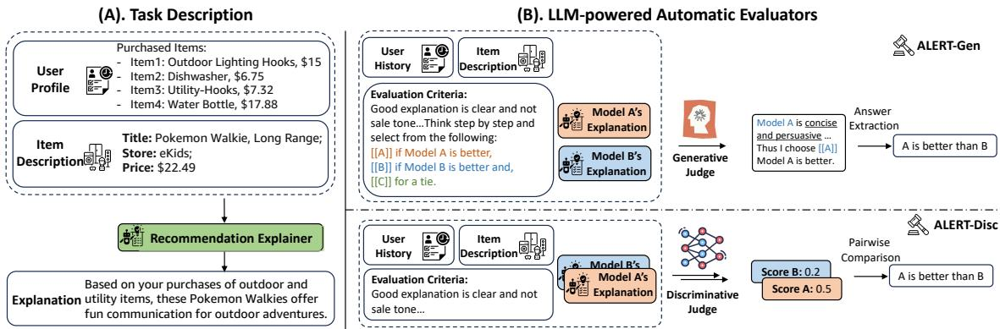
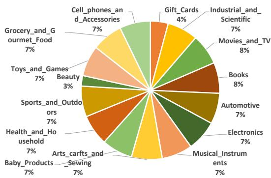
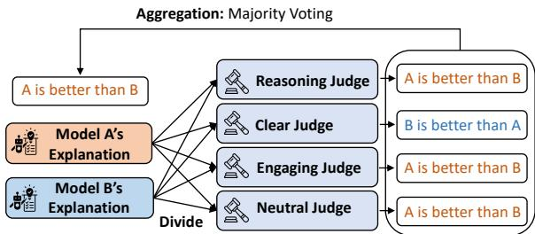
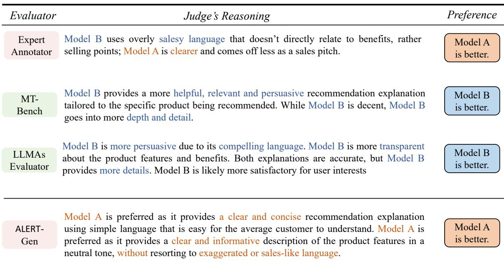
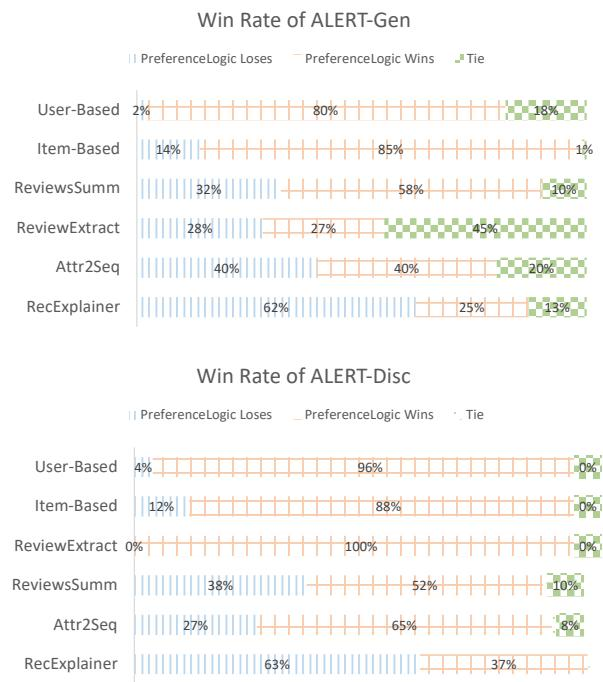
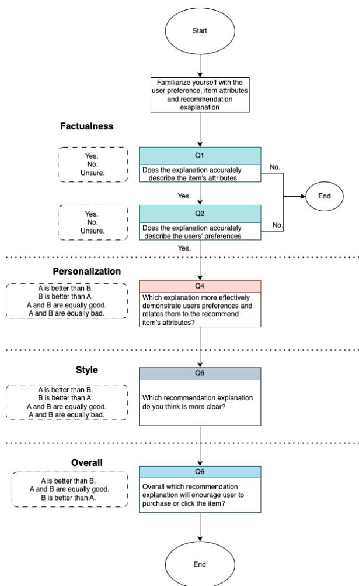
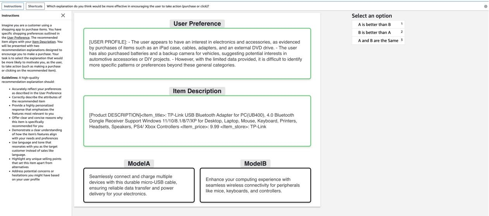

# ALERT: An LLM-powered Benchmark for Automatic Evaluation of Recommendation Explanations

Yichuan Li1∗, Xinyang Zhang2, Chenwei Zhang2, Mao Li2, Tianyi Liu2, Pei Chen2, Yifan Gao2, Kyumin Lee1, Kaize Ding3, Zhengyang Wang2, Zhihan Zhang4, Jingbo Shang5, Xian Li2, Trishul Chilimbi2

1Worcester Polytechnic Institute, 2Amazon.com, 3Northwestern University, 4University of Notre Dame, 5University of California, San Diego Correspondence to: yli29@wpi.edu

## Abstract

Recommendation explanation systems have become increasingly vital with the widespread adoption of recommender systems. However, existing recommendation explanation evaluation benchmarks sufer from limited item diversity, impractical user profiling requirements, and unreliable and unscalable evaluation protocols. We present ALERT, a model-agnostic recommendation explanation evaluation benchmark. The benchmark comprises three main contributions: 1) a diverse dataset encompassing 15 Amazon e-commerce categories with 2,761 user-item interactions, incorporating implicit preferences through purchase histories; 2) two novel LLM-powered automatic evaluators that enable scalable and human-preference aligned evaluation of explanations; and 3) a robust divide-and-aggregate approach that synthesizes multiple LLM judgments, achieving 70% concordance with expert human evaluation and substantially outperforming existing methods. ALERT facilitates comprehensive evaluation of recommendation explanations across diverse domains, advancing the development of more efective explanation systems. The implementation is available at https://github.com/ bigheiniu/ALERT-LLMRecomBenchmark.

## 1 Introduction

Recommender systems have become essential tools for navigating user preferences and mitigating information overload in the current era of information explosion (Isinkaye et al., 2015; Zhao et al., 2021; Resnick and Varian, 1997). As these systems evolve, there is a growing demand for convincing and useful explanations that provide insights into the recommendation process, fostering user trust and enhancing overall satisfaction (Zhang et al., 2020; Balog and Radlinski, 2020; Chen et al., 2022).

Despite the critical role of explanations, their efective evaluation remains a significant challenge, particularly in representing real-world scenarios and developing automated evaluation methods that accurately reflect user preferences. Current benchmark datasets (Chen et al., 2023; Lu et al., 2023; Li et al., 2023b; Balog and Radlinski, 2020) sufer from two major limitations:

Lack of Diverse Categories and User Preference Data. Existing benchmarks (Lu et al., 2023; Li et al., 2023b) mainly focus on a single category, such as movies or books, failing to capture the complexity and variety of real-world recommendation scenarios. The explanatory features vary significantly across product domains; for instance, movie recommendations typically emphasize artistic elements like genres and actors, whereas beauty product recommendations focus on functional attributes such as moisturizing or exfoliating properties. This domain-specific variation presents a significant challenge in evaluating the cross-domain generalization capabilities of explanation models. Furthermore, while user preferences are fundamental to modeling and evaluating recommendation explanations, as they inform the underlying rationale for user-item interactions, current user profile collection methodologies are insuficient. Several benchmarks (Lu et al., 2023; Li et al., 2023b) rely on questionnaire-based approaches to collect user profiles and demographic attributes. However, this methodology presents inherent limitations in realworld applications, often yielding incomplete preference profiles and failing to capture the dynamic nature of user preferences.

Absence of Scalable and Human-Preference Aligned Evaluation Protocols. Existing evaluation protocols can be categorized into two main types: human evaluation and automated evaluation. While human evaluation (Hernandez-Bocanegra et al., 2020; Musto et al., 2019) are valuable, they are often time-consuming, expensive, and challenging to scale, hindering rapid iteration and improvement of explanation models. Automatic evaluation methods (Li et al., 2017, 2023b; Geng et al., 2022; Xie et al., 2022) often require references to compare the generated results. This approach poses challenges for evaluating large language modelbased recommendation explanation methods (Lei et al., 2024) that can generate free-form explanations without following a specific structure. Moreover, these automatic evaluators often misuse user reviews as ground truth for explanations, ignoring diferences between pre-purchase explanations and post-purchase reviews. This approach fails to capture the persuasive nature of explanations and includes irrelevant factors like delivery experiences, compromising the evaluation’s validity.

To address these challenges, we propose Automatic LLM Evaluation of Recommendation explanaTions (ALERT), a novel recommendation model-agnostic explanation benchmark. Our approach ofers several key innovations addressing the shortcomings of existing recommendation explanation benchmarks and evaluation methodologies:

• ALERT Dataset: We introduce a comprehensive benchmark dataset spanning 15 Amazon product categories, to balance the diversity while also balancing the cost, we including 2761 user-item interactions, leveraging user purchase behaviors from Amazon (Hou et al., 2024). This diverse dataset surpasses existing benchmarks (Chen et al., 2023; Lu et al., 2023), providing a more realistic and challenging evaluation environment. By incorporating users’ purchase history, we enable recommendation explanation models to learn implicit preferences from actual user behavior.

• LLM-powered Automatic Evaluation Protocols: We introduce two novel evaluation methods using Large Language Models as judges (LLMas-a-Judge), specifically designed for evaluateing recommendation explanation quality without the reference requirement. Unlike existing LLM-asa-Judge approaches (Zheng et al., 2024; Chiang et al., 2024) used for general instruction-following ability, we develop criteria tailored to recommendation explanations. We also propose an divide and aggregation approach to combine multiple LLM judgments under each criterion, achieving high human agreement.

• Validated Reliability: To ensure the reliability of our evaluation framework, we create a meta-evaluation dataset with intentionally created negative examples and expert-level human annotations. Our comprehensive meta-evaluation demonstrates a strong correlation with expert human judgments, achieving 70% human agreement and outperforming existing automated and crowd-sourced approaches in evaluating recommendation explanations.

## 2 Task Description of Recommendation Explanations

The primary goal of this benchmark is to inspire the development of new methods for generating post-hoc, free-style recommendation explanations that motivate users to purchase recommended items. Following prior literature (Zhang et al., 2020; Chen et al., 2022), we define the task as: “generating a recommendation explanation by considering the user’s profile and black-box recommended items, aimed at increasing user satisfaction and purchase inclination” as shown in Fig. 1 (A). Formally, for a user $u ,$ let i denote the recommended item, with $X _ { i }$ representing the item’s context (e.g., title, price); let $\mathcal { X } _ { u }$ represent the user’s purchase history which is $\mathcal { X } _ { u } = \stackrel { \textstyle } { \{ } X _ { j } \} _ { j = 0 } ^ { | \mathcal { X } _ { u } | }$ . It should be noticed that X is a text sequence. The task is to generate an explanation $\mathbf { E } _ { u i }$ that encourages user u to purchase item i, described as $\mathbf { E } _ { u i } = G ( \mathcal { X } _ { u } , X _ { i } )$ , where $G ( \cdot )$ is the explanation generation model.

## 3 Benchmark Description

Our benchmark, ALERT, consists of two main components: curated benchmark datasets and LLMpowered automatic evaluators, as illustrated in Fig. 1 (B) that work together to provide a comprehensive evaluation framework for recommendation explanation models. These components are designed to provide evaluation environment that simulate authentic recommendation scenarios while facilitating scalable evaluation that better capture human preferences and decision-making patterns.

## 3.1 Curated Benchmark Dataset Components

ALERT enables reference-free evaluation through a comprehensive dataset that captures user-item interactions and their contextual information. The dataset curation balances representativeness with quality control.

Recommended Items. We treat the user’s most recent purchase as the item requiring recommendation explanation. We leverage the rich context available in Amazon product listings, incorporating the item’s title (which typically encapsulates key features), price point, and merchant information. This comprehensive item representation enables explanation models to generate more contextually relevant explanations that highlight specific product aspects aligned with user preferences.

  
Figure 1: Evaluation framework for ALERT. (A) is the task description of recommendation explanation. (B) are two LLM-powered automatic evaluators used in this benchmark. ALERT-Gen is the generative recommendation explanation evaluation and ALERT-Disc is the discriminate recommendation explanation evaluation.

  
Figure 2: Distribution of data categories and statistics in ALERT.

User History. We construct user profiles based on purchase histories. This approach ofers several advantages over traditional demographic data collection (Chen et al., 2023; Lu et al., 2023): 1) Enhanced privacy protection through the exclusion of sensitive demographic information; 2) Concrete evidence of user preferences through actual purchase decisions; 3) Simplified data collection through existing transaction records. Each user profile consists multiple dimensions, including previously purchased item categories, purchase frequency patterns, and typical price ranges, enabling explanation models to generate personalized recommendations based on demonstrated user behavior.

Dataset Quality Control. To ensure the quality and diversity of purchase behaviors, we retained items with titles containing at least six alphabetic characters and selected users with 5-20 purchase transactions. This balance provides suficient behavioral data while maintaining dataset manageability. Furthermore, we exclusively considered 5-star rated purchases and randomly sampled a maximum of 200 purchase behaviors per category to prevent category bias while maintaining dataset diversity. After filtering, the statistical distribution of ALERT is presented in Fig. 2.

## 3.2 LLM-powered Automatic Evaluators

Evaluating the quality of recommendation explanations is a complex task that requires a well-defined set of criteria and a robust evaluation process. In this section, we introduce an automatic evaluation framework powered by Large Language Models (LLMs) that addresses these challenges. We begin by presenting a set of carefully designed evaluation criteria that capture the key aspects of high-quality recommendation explanations, enhancing interpretability and reducing ambiguity in the evaluation process. Next, we describe two types of LLM-based evaluators, ALERT-Gen and ALERT-Disc, which leverage these criteria to assess explanation quality. To efectively handle the complexity of the evaluation task, we propose a divide and aggregate approach that combines the judgments of multiple LLM evaluators. Finally, we discuss the evaluation metric used in ALERT to quantify the performance of recommendation explanations.

## 3.2.1 Evaluation Criteria Development

The evaluation criteria were developed collaboratively with an e-commerce editorial team and refined through user studies. These criteria balance technical system requirements with user needs in e-commerce settings, providing a framework to assess recommendation explanation efectiveness.

## Explanation Evaluation Criteria.

• Reasoning: Provide reasons based on user preferences, item attributes, or past behaviors, tailored to each user’s specific context. Consistency with user history and item details is essential.

• Clear and Concise Language: Use simple, conversational language that avoidsjargon and is easily understandable by the average customer.

• Engaging Narrative: Allow customers to envision using and enjoying the product by providing an engaging narrative.

• Neutral Tone: Maintain a neutral, informative tone, avoiding overtly sales-oriented language while ofering clear, objective reasons for recommendations.

## 3.2.2 LLM-as-a-Judge Architectures

With the evaluation criteria in place, we now introduce our LLM-based evaluation framework that leverages these criteria to assess the quality of recommendation explanations. Our framework employs two types of LLM evaluators, ALERT-Gen and ALERT-Disc, each ofering unique advantages in capturing diferent aspects of explanation quality. To efectively handle the complexity of the evaluation task and ensure a comprehensive assessment, we propose a divide and aggregate approach that combines the judgments of these evaluators.

ALERT-Gen. The generative evaluator, powered by Claude-3-Sonnet, performs comparative analysis of explanation pairs using Chain-of-Thought (Wei et al., 2022) reasoning. For each comparison, ALERT-Gen generates: 1) explicit reasoning steps showing how the comparison was made by following the evaluation criterion, and 2) a final preference statement in the format “[[A/B/C]] Model A/B is better than Model B/A or Tied.” To mitigate position bias, we systematically swap the position of explanations being compared.

ALERT-Disc. Although generative evaluation provides both comparisons and rationale of the judgment, it is typically more computationally expensive and may not optimally reflect human preferences (Lambert et al., 2024a). The discriminative evaluator assigns a score to each model’s response based on predefined evaluation criteria. The scores are then compared, and the response receiving the higher score is judged as superior. The scores are then compared, and the response receiving the higher score is judged as superior. We implement ALERT-Disc using ArmoRM (Wang et al., 2024b,a), which has achieved the state-of-the-art performance in RewardBench (Lambert et al., 2024b) during June 2024.

  
Figure 3: Diagram of the divide and aggregation evaluation process for ALERT-Gen and ALERT-Disc.

Divide and Aggregate Evaluation Process. As illustrated in Fig. 3, the divide and aggregate process begins by breaking down the evaluation criteria into individual components. Each criterion is used to prompt an LLM evaluator to compare two explanations and determine the preferred one. The individual preferences are then aggregated through majority voting to arrive at a final judgment. By decomposing the evaluation task into smaller, more focused assessments and combining the results, we ensure a comprehensive and robust evaluation of recommendation explanations.

## 3.2.3 Evaluation Metrics

To quantify the performance of recommendation explanations, we employ the widely adopted win rate metric, which has been used in previous studies on evaluating the quality of generated text (Zheng et al., 2024; Lin et al., 2024). The win rate calculates the percentage of user-item interactions for which the evaluated explanation is preferred over a baseline explanation. In our experiments, we use the PreferenceLogic as the baseline, which generates explanations by connecting user preferences and item attributes through prompting an LLM.

## 4 Meta-Evaluation of ALERT-Gen and ALERT-Disc

To rigorously assess the eficacy of our proposed automatic evaluation methods, ALERT-Gen and ALERT-Disc, we conduct a comprehensive metaevaluation framework that examines three critical dimensions: their reliability in detecting suboptimal explanations, their correlation with expert human judgments, and their computational eficiency in terms of time and cost savings. This systematic evaluation approach enables us to validate our methods through both controlled experimental conditions and real-world human preference data, while demonstrating the practical advantages of automated evaluation over traditional manual evaluation procedures.

<table><tr><td rowspan="2">Evaluators</td><td colspan="3">Data Interruption</td><td colspan="4">Prompt Interruption</td><td rowspan="2">AVG.</td></tr><tr><td>Item-Replace</td><td>User-Replace</td><td>Empty-User</td><td>Minor-Benefits</td><td>Misinfo.</td><td>Jargon</td><td>Bad-Experience</td></tr><tr><td>MTurk*</td><td>0.922</td><td>0.073</td><td>0.196</td><td>0.091</td><td>0.345</td><td>0.900</td><td>0.556</td><td>0.440</td></tr><tr><td>MT-Bench</td><td>0.354</td><td>0.333</td><td>0.292</td><td>0.333</td><td>0.250</td><td>0.350</td><td>0.333</td><td>0.321</td></tr><tr><td>LLMAsEvaluator</td><td>0.627</td><td>0.254</td><td>0.274</td><td>0.182</td><td>0.259</td><td>0.700</td><td>0.555</td><td>0.408</td></tr><tr><td>ALERT-Gen w./o D.A.</td><td>0.980</td><td>0.529</td><td>0.345</td><td>0.454</td><td>0.273</td><td>0.800</td><td>0.556</td><td>0.563</td></tr><tr><td>ALERT-Disc w./o D.A.</td><td>0.980</td><td>0.455</td><td>0.471</td><td>0.636</td><td>0.709</td><td>0.950</td><td>0.889</td><td>0.727</td></tr><tr><td>ALERT-Gen</td><td>0.980</td><td>0.627</td><td>0.418</td><td>0.545</td><td>0.309</td><td>0.900</td><td>0.667</td><td>0.635</td></tr><tr><td>ALERT-Disc</td><td>0.980</td><td>0.564</td><td>0.431</td><td>0.727</td><td>0.870</td><td>1.000</td><td>0.778</td><td>0.764</td></tr></table>

Table 1: Inferior explanations detection result. The highest accuracy is marked by bold. Random guess would achieve an accuracy 0.5.

## 4.1 Baselines of Evaluation Methods

We compare our proposed evaluation methods against several established baseline approaches: 1) MTurk: Crowdsourced annotation from Amazon Mechanical Turk, using majority voting over 9 annotators per annotation task. 2) MT-Bench (Zheng et al., 2024): an LLM-as-a-Judge approach for evaluating LLM instruction following ability; and 3) LL-MasEvaluator (Zhang et al., 2024): a Likert-style LLM-as-a-Judge evaluator that evaluates recommendation explanations based on persuasiveness, transparency, accuracy, and satisfaction. Additionally, we develop variants of our evaluation methods that process all judge criteria in a single call, rather than dividing the evaluation criteria and aggregating preferences through multiple calls. These variants are denoted with the sufix “w./o DA.” to both ALERT-Gen and ALERT-Disc.

## 4.2 Inferior Explanations Detection Test

To examine the evaluation methods’ ability to identify explanation quality diferences, we construct a set of controlled test cases by introducing systematic interruption to explanations generated by PreferenceLogic (discussed in § 5.1). This semi-synthetic evaluation methodology enables validation without the need for additional human annotations (Zeng et al., 2024). The variations are categorized into two types: 1) Data Interruption which includes item replacement, user replacement, and user profile empty. 2) Prompt interruption1 intentionally disrupts the explanation prompt to generate negative examples that are not easily identifiable.

Detection Results. The results presented in Tab. 1 lead to several observations. First, the User-Replace and Empty-User conditions pose the greatest challenges for the evaluators. Under the User-Replace condition, the proposed ALERT-Gen and ALERT-Disc evaluators significantly outperform other evaluators, achieving accuracies of 0.627 and 0.564, respectively. Moreover, the MTurk accuracy of 0.073 suggests the presence of systematic biases in the annotations, where workers relied on superficial features rather than conducting a meaningful evaluation of user-explanation alignment. Inverting these predictions would yield higher accuracies (e.g., 0.927 instead of 0.073), further highlighting the biases. These results demonstrate the superior ability of the proposed evaluators in detecting inconsistencies between user profiles and explanations. The Empty-User condition emerges as the most challenging, with all evaluators struggling to achieve high accuracy. This dificulty likely arises from the evaluators’ tendency to infer user preferences from detailed item descriptions, even in the absence of user information. Finally, the results consistently validate the efectiveness of the ALERT-Gen and ALERT-Disc evaluators across diverse test conditions, underscoring the versatility and reliability of the proposed approach in detecting many potential issues in recommendation explanations.

## 4.3 Correlation with Human Judgment

This meta-evaluation ensures that our automated evaluation closely approximates expert human evaluation, potentially reducing the need for resourceintensive manual evaluations in future research. To collect reliable human judgments, three professional data annotators with extensive experience in natural language processing and e-commerce. These annotators were not involved in the paper’s authorship or research, ensuring an unbiased evaluation. Their expertise surpasses that of average crowd workers, guaranteeing high-quality annotations. A comprehensive Standard Operating Procedure (SOP) was developed to break down the final preference decision into a sequence of subquestions. This approach enables a more nuanced evaluation and includes early stopping rules to optimize annotation eficiency. For each subquestion, carefully selected examples were provided to illustrate preferred options and their rationales, further enhancing annotation quality and consistency. The inter-annotator agreement (IAA) of 0.24 on Krippendorf’s alpha indicates moderate agreement, which is reasonable given the complexity and subjectivity involved in evaluating recommendation explanations. To ensure a comprehensive evaluation set, 88 pairs of recommendation explanations were randomly selected from the 5 recommendation explanation models mentioned in § 5.1, namely user-based, item-based, review extraction, review summarization, and attr2seq. This sampling method guarantees representation across diferent quality levels and model types, providing a diverse and representative dataset for evaluation.

<table><tr><td rowspan="2">Evaluators</td><td colspan="3">w. Tie</td><td colspan="3">w./o Tie</td></tr><tr><td>ACC</td><td>C-κ</td><td>K-α</td><td>ACC</td><td>C-κ</td><td>K-α</td></tr><tr><td>MTurk</td><td>0.550</td><td>0.279</td><td>0.264</td><td>0.691</td><td>0.391</td><td>0.395</td></tr><tr><td>MT-Bench</td><td>0.333</td><td>-0.045</td><td>-0.056</td><td>0.409</td><td>-0.040</td><td>-0.051</td></tr><tr><td>LLMAsEvaluator</td><td>0.448</td><td>0.120</td><td>0.091</td><td>0.576</td><td>0.188</td><td>0.186</td></tr><tr><td>ALERT-Gen w./o DA.</td><td>0.506</td><td>0.209</td><td>0.182</td><td>0.621</td><td>0.242</td><td>0.239</td></tr><tr><td>ALERT-Disc w./o DA.</td><td>0.539</td><td>0.257</td><td>0.224</td><td>0.705</td><td>0.413</td><td>0.411</td></tr><tr><td>ALERT-Gen</td><td>0.512</td><td>0.224</td><td>0.166</td><td>0.667</td><td>0.333</td><td>0.307</td></tr><tr><td>ALERT-Disc</td><td>0.540</td><td>0.256</td><td>0.173</td><td>0.711</td><td>0.421</td><td>0.420</td></tr></table>

Table 2: Correlation between various evaluators and expert human judgment. We report Accuracy (ACC), Cohen’s kappa (C-κ), and Krippendorf’s alpha (K-α) for scenarios with and without ties. Best results for automated methods are in bold.

Human Preference Correlation Results. The evaluation results, reported in Tab. 2, reveal several important findings: 1). Our proposed ALERT evaluators, particularly ALERT-Disc, demonstrate the highest correlation with human judgment among all automated methods. This strong performance is evident in both tie and no-tie scenarios, with ALERT-Disc achieving an accuracy of 0.711 and a Cohen’s kappa of 0.421 in the no-tie condition. 2). ALERT significantly outperforms both MT-Bench and LLMAsEvaluator across all metrics. The poor performance of MT-Bench (negative kappa values) suggests that general instruction-following evaluation prompts are inadequate for recommendation explanation assessment. LLMAsEvaluator shows better results but still falls short of our method, underscoring the efectiveness of our specially designed criteria and framework. 3). Notably, ALERT-Disc’s performance closely approaches that of MTurk workers, particularly in the no-tie scenario (0.711 vs 0.691 accuracy). This near-parity indicates that our automated evaluation can potentially replace human efort in many cases, ofering real-time assessments without sacrificing quality. 4). The inclusion of divide and aggregation (D.A.) evaluation in ALERT yields modest improvements, particularly for ALERT-Gen. These results collectively validate the efectiveness of ALERT-Gen and ALERT-Disc as a reliable automated evaluator for recommendation explanations, closely approximating expert human judgment while ofering significant advantages in terms of scalability and real-time evaluation capabilities.

Case Study on Reasoning of Judgment. Our analysis of human and LLM-based judgment reasoning, as shown in Fig. 4, reveals significant discrepancies in evaluating recommendation explanations. While the human expert and ALERT-Gen favor Model A’s clear, concise, and neutral approach, MT-Bench and LLMAsEvaluator prefer Model B’s more detailed and persuasive style. However, ALERT-Gen demonstrates reasoning more closely aligned with human expert judgment, suggesting its potential for capturing nuanced aspects of human preferences.

## 4.4 Evaluation Eficiency Analysis

A critical aspect of our benchmark is its eficiency compared to traditional evaluation methods. We conducted a comprehensive analysis to assess both the time and monetary costs associated with evaluating 88 pairs of recommendation explanations. To ensure a fair comparison to cloud-based alternatives, the ALERT-Disc cost was based on the equivalent price of renting an Amazon p4d instance2 for the evaluation duration. For MTurk, each annotation task involved 9 annotators, with each annotator paid \$0.36 per annotation. As the eficiency analysis result showed in Tab. 3we have several key observations: 1) Superior Eficiency and Cost-efectiveness: Both ALERT-Gen and ALERT-Disc demonstrated substantial improvements in time eficiency and cost savings compared to human evaluation via MTurk. Our automatic methods completed the evaluations in 1 minute and 10 seconds respectively, with costs as low as \$0.09 for ALERT-Disc, representing time and cost reductions of over 99.7% and 99.96% compared to MTurk. This makes our methods highly scalable for large-scale evaluations that would be infeasible with human annotators. 2) Comparison with MT-Bench: Although ALERT-Gen requires more API calls due to its divided and aggregate nature, it provides better human alignment with limited time. Furthermore, our ALERT-Disc method outperforms MT-Bench in both time (10s vs. 25s) and cost (0.09vs.1.02), demonstrating its superiority among automatic evaluation methods. 3) Flexibility: while slightly slower and more expensive than ALERT-Disc, still ofers significant improvements over human evaluation, providing researchers with options based on their speed, cost, or evaluation approach requirements.

  
Figure 4: Case study of generative judge reasoning. Orange content is comments for Model A’s output while blue content is comments for Model B’s output.

<table><tr><td>Evaluator</td><td>Time (est.)</td><td>Cost (est.)</td></tr><tr><td>MTurk</td><td>363min</td><td>$285.12</td></tr><tr><td>MT-Bench</td><td>25s</td><td>$1.02</td></tr><tr><td>ALERT-Gen</td><td>1min</td><td>$4.02</td></tr><tr><td>ALERT-Disc</td><td>10s</td><td>$0.09</td></tr></table>

Table 3: Evaluation eficiency analysis comparing time and monetary costs.

## 5 Leaderboard Results

This section presents the benchmark performance of diverse recommendation explanation models on the full ALERT dataset.

## 5.1 Recommendation Explanation Methods

We evaluate several popular recommendation explanation models:

• User-based(Kouki et al., 2019; Lu et al., 2023): Generates explanations based on user similarities, typically stating, Users with similar tastes to yours like this item. They have also purchased these items.”

• Item-based(Kouki et al., 2019; Lu et al., 2023): Produces explanations based on similarities between recommended items and the user’s purchase history, often using the statement, This item is similar to one you’ve already bought.”

• Review Extraction: Directly utilizes review content, which can be informative but potentially noisy and not always directly explanatory (Chen et al., 2021; Xie et al., 2022).

• Review Summarization: Synthesizes multiple reviews to create a comprehensive overview of user opinions and item features, ofering a generalized rather than personalized explanation.

• Attr2Seq(Dong et al., 2017): Generates reviews based on hidden attribute information learned from past user-item interaction reviews.

• RecExplainer-B(Lei et al., 2024): Employs multi-task learning to align LLM-based recommendation explanation models with recommendation systems. The training incorporates tasks such as attribute prediction, user history prediction, and explanation ability knowledge distillation from proprietary LLMs, enhancing the model’s capacity to generate relevant and personalized explanations.

Additionally, we propose PreferenceLogic3, which leverages LLMs to generate explanations by connecting user preferences with item attributes. This serves as the baseline for our ALERT-Gen and ALERT-Dis evaluators in calculating the Win Rate.

For Item-based and User-based methods, we implement BiasedMF (Koren et al., 2009) following Lu et al. (2023) to identify similar items and users, then employ LLMs to generate coherent explanations. Models requiring LLM training (Attr2Seq and RecExplainer-B) utilize Mistral-7B-Instruct (Jiang et al., 2024), while non-training methods employ Claude-3-Sonnet. Training data comprises historical interactions of users and items present in the evaluation dataset, excluding their mutual interactions.

## 5.2 Results and Analysis

Fig. 5 presents the win rates calculated by ALERT-Gen and ALERT-Disc for various recommendation explanation models. Our analysis reveals several key findings: Fig. 5 presents the win rates calculated by ALERT-Gen and ALERT-Disc for various recommendation explanation models. Our analysis reveals several key findings. 1). Both user-based and item-based recommendation explanations show the lowest win rates, approaching 0%, suggesting that these traditional methods may be insuficient for generating high-quality, personalized explanations in modern recommendation systems. 2).The performance of review-based explanation methods is significantly lower than that of our promptingbased approaches, indicating that directly leveraging review content may not capture the nuanced preferences and context required for efective explanations. Notably, 3).PreferenceLogic achieves commendable performance in both types of automatic evaluation, even surpassing the training-based Attr2Seq approach. This highlights the potential of LLMs for generating high-quality recommendation explanations without extensive domain-specific training. 4).Furthermore, RecExplainer-B outperforms Attr2Seq, demonstrating the importance of multi-task learning in recommendation explanation models. This approach enables the model to better understand specific data types and learn explanation generation capabilities from other LLMs, underscoring the benefits of in-domain data training for recommendation explanation tasks. These findings suggest that while traditional methods may be insuficient for modern recommendation explanation tasks, LLM-based approaches - particularly those leveraging multi-task learning - show significant promise in generating relevant, personalized, and high-quality explanations.

  
Figure 5: Automatic benchmarking results. The recommendation explanation are compared against prompting Claude3 Sonnet’ output.

## 5.3 Evaluation Criteria Decomposition

Analysis of the granular performance metrics from ALERT-Gen and ALERT-Disc across evaluation criteria (see Tab. 4) reveals distinct patterns. RecExplainer demonstrates superior overall performance, achieving notable success in reasoning and narrative engagement (71.4% win rate for both metrics). While Attr2Seq exhibits balanced performance across metrics, it particularly excels in communication clarity (49.0%). ReviewSumm and ReviewExtract show competence in reasoning but demonstrate deficiencies in maintaining neutral tone. Conversely, User-Based and Item-Based approaches maintain strong tone neutrality (>57%) but underperform in reasoning and engagement.

## 6 Related Work

Benchmark for Recommendation Explanation Generation. The field of recommendation explanation evaluation has seen significant developments in recent years, with several benchmarks contributing to our understanding of explanation quality and efectiveness. Datasets such as REASONER (Chen et al., 2023) and Sel-Explain (Lu et al., 2023) have provided valuable insights into specific domains like movies or books. These benchmarks have employed various approaches to capture user preferences, ranging from questionnaires to the analysis of user reviews. Evaluation protocols in the field span from human evaluations (Hernandez-Bocanegra et al., 2020; Musto et al., 2019) to automated methods (Li et al., 2017, 2023b; Geng et al., 2022; Xie et al., 2022) designed to assess explanation quality eficiently. As the field progresses, there is growing interest in developing benchmarks that can address a wider range of product categories, capture more nuanced user preferences, and accommodate diverse explanation types, including the free-form explanations generated by large language models.

<table><tr><td>Method</td><td>Reason.</td><td>Clear.</td><td>Engag.</td><td>Nertral</td></tr><tr><td>User-Based</td><td>0.166</td><td>0.166</td><td>0.181</td><td>0.583</td></tr><tr><td>Item-Based</td><td>0.100</td><td>0.200</td><td>0.200</td><td>0.577</td></tr><tr><td>ReviewSumm</td><td>0.485</td><td>0.363</td><td>0.161</td><td>0.171</td></tr><tr><td>ReviewExtract</td><td>0.315</td><td>0.271</td><td>0.184</td><td>0.166</td></tr><tr><td>Attr2Seq</td><td>0.297</td><td>0.489</td><td>0.363</td><td>0.500</td></tr><tr><td>RecExplainer-B</td><td>0.714</td><td>0.500</td><td>0.714</td><td>0.625</td></tr></table>

Table 4: Granular performance comparison of recommendation explanation methods.

Recommendation Explanation Generation. Recommendation explanation generation has evolved significantly, moving from matrix factorization methods that align user-item interactions with explicit features (Zhang et al., 2014; Chen et al., 2016) to more sophisticated natural language generation approaches. The advent of Large Language Models (LLMs) has revolutionized this field, enabling the generation of fluid, human-like explanations (Chu et al., 2024; Geng et al., 2022; Lei et al., 2024). LLM-based models leverage vast textual data and general world knowledge to extract nuanced user preferences and item attributes, facilitating more contextually rich explanations. These models often employ multi-task learning and prompting techniques to generate free-form explanations directly. However, they face challenges such as content hallucination, which can lead to inaccurate explanations. To address this, recent research has explored retriever-augmented generation (RAG) techniques (Yang et al., 2024; Li et al., 2023a), which anchor the generation process to key aspects retrieved from reviews, thereby improving factual accuracy while maintaining the fluidity of free-form explanations. This approach represents a promising direction in balancing the creativity of LLM-generated explanations with the need for accuracy and relevance in recommendation systems.

LLM-as-A-Judge The emergence of Large Language Models (LLMs) as evaluators, known as LLM-as-A-Judge, represents a significant advancement in automated assessment techniques. This approach aims to bridge the gap between human evaluation, which remains the gold standard but is often prohibitively expensive and time-consuming, and traditional automated metrics. Several benchmarks have successfully employed this method, including MT-Bench (Zheng et al., 2024), AlpacaEval (Li et al., 2023c), ArenaHard (Chiang et al., 2024), and WildBench (Lin et al., 2024). In the context of recommendation explanations, LLM-as-A-Judge ofers the potential to assess explanation quality across multiple dimensions, such as relevance, persuasiveness, and coherence, without the need for reference explanations. This flexibility is particularly valuable for evaluating freeform explanations generated by advanced models. Additionally, some researchers have explored discriminative judge models (Wang et al., 2024c) that predict scores for generated explanations, further enhancing the scalability and consistency of automated evaluation methods. As the field progresses, LLM-as-A-Judge approaches are likely to play an increasingly important role in developing and refining recommendation explanation systems.

## 7 Conclusion

This paper introduces ALERT, a novel recommendation model-agnostic explanation benchmark that addresses key limitations in existing evaluation methods. ALERT contains a diverse dataset from 15 Amazon e-commerce categories and introduces two innovative LLM-powered automatic evaluation methods for flexible evaluation of free-form explanations without ground-truth references. Our metaevaluation experiments demonstrate that ALERT’s automated evaluation approaches: ALERT-Gen and ALERT-Disc achieves high correlation with human judgments, outperforming existing methods. By providing an eficient, scalable, and reliable approach, ALERT aims to accelerate the development of more transparent and user-friendly recommendation explanation models.

## 8 Limitations

While our study introduces a novel benchmark ALERT for recommendation explanation, we acknowledge several limitations in our current approach. Firstly, we did not conduct a thorough analysis of potential data leakage during LLM pretraining. Given that our benchmark data were crawled from websites, there is a possibility that some of this information may have been included in the training data of certain LLMs. This potential overlap could inadvertently favor specific types of LLMs or prompting methods that can access these evaluation data, potentially skewing our results. Additionally, our evaluation framework lacks an online testing component to further validate the efectiveness of the LLM-as-evaluator approach. While our ofline evaluations provide valuable insights, we recognize the importance of real-world testing to fully assess the practical applicability and robustness of our proposed methods. Implement ing online tests would ofer a more comprehensive understanding of how our benchmark and evaluation techniques perform in dynamic, real-time scenarios. We acknowledge the significance of addressing these limitations to enhance the reliability and generalizability of our findings. Future work should prioritize investigating the extent of data leakage and its impact on recommendation explanation model performance, as well as conducting online tests to validate the LLM-as-a-Judge approach in practical settings. These eforts will contribute to a more robust and comprehensive eval uation framework for recommendation explanation systems.

## 9 Ethical Considerations

We have taken the following steps to address ethical concerns related to the data collection and evaluation experiments in this work:

• Fair Compensation for Annotations. In our meta-evaluation process, we collected human annotations through Amazon Mechanical Turk (AMTurk). Workers were compensated at a rate of \$0.36 per task, which is significantly higher than the platform average. This ensures fair payment for their time and efort. Additionally, we engaged expert human editors, both full-time and part-time, for data annotation. Regular meetings were held with these editors from the outset of the annotation process to maintain consistency and quality.

• User Privacy Protection. The dataset used in this study was sourced from the Amazon Reviews 2023 dataset (https://amazon-reviews-2023.github.io/), which does not contain sensitive user information. To further protect user privacy, we will not release any user IDs associated with the user-interaction data in our benchmark.

• Data Sensitivity. Our benchmark focuses on recommendation explanations and does not include any tasks or data related to sensitive topics or real-world security vulnerabilities. The scenarios used in our benchmark are based on product recommendations and reviews, which minimizes the risk of exposing or exploiting sensitive information.

In conclusion, based on these precautions, we believe that the risks associated with the data collection and usage of this benchmark for evaluating recommendation explanation systems are minimal. We remain committed to addressing any unforeseen ethical concerns that may arise and to continuously improving our practices to ensure responsible research in this field.

## References

Krisztian Balog and Filip Radlinski. 2020. Measuring recommendation explanation quality: The conflicting goals of explanations. In Proceedings of the 43rd international ACM SIGIR conference on research and development in information retrieval, pages 329–338.

Hanxiong Chen, Xu Chen, Shaoyun Shi, and Yongfeng Zhang. 2021. Generate natural language explanations for recommendation. Preprint, arXiv:2101.03392.

Xu Chen, Zheng Qin, Yongfeng Zhang, and Tao Xu. 2016. Learning to rank features for recommendation over multiple categories. In Proceedings ofthe 39th International ACM SIGIR conference on Research and Development in Information Retrieval, pages 305–314.

Xu Chen, Jingsen Zhang, Lei Wang, Quanyu Dai, Zhenhua Dong, Ruiming Tang, Rui Zhang, Li Chen, and Ji-Rong Wen. 2023. Reasoner: An explainable recommendation dataset with multi-aspect real user labeled ground truths towards more measurable explainable recommendation. Preprint, arXiv:2303.00168.

Xu Chen, Yongfeng Zhang, and Ji-Rong Wen. 2022. Measuring" why" in recommender systems: A comprehensive survey on the evaluation of explainable recommendation. arXiv preprint arXiv:2202.06466.

Wei-Lin Chiang, Lianmin Zheng, Ying Sheng, Anastasios Nikolas Angelopoulos, Tianle Li, Dacheng Li,

Hao Zhang, Banghua Zhu, Michael Jordan, Joseph E. Gonzalez, and Ion Stoica. 2024. Chatbot arena: An open platform for evaluating llms by human preference. Preprint, arXiv:2403.04132.

Zhixuan Chu, Yan Wang, Qing Cui, Longfei Li, Wenqing Chen, Sheng Li, Zhan Qin, and Kui Ren. 2024. Llmguided multi-view hypergraph learning for humancentric explainable recommendation. arXiv preprint arXiv:2401.08217.

Li Dong, Shaohan Huang, Furu Wei, Mirella Lapata, Ming Zhou, and Ke Xu. 2017. Learning to generate product reviews from attributes. In Proceedings of the 15th Conference ofthe European Chapter ofthe Association for Computational Linguistics: Volume 1, Long Papers, pages 623–632.

Shijie Geng, Shuchang Liu, Zuohui Fu, Yingqiang Ge, and Yongfeng Zhang. 2022. Recommendation as language processing (rlp): A unified pretrain, personalized prompt & predict paradigm (p5). In Proceedings of the 16th ACM Conference on Recommender Systems, pages 299–315.

Diana C Hernandez-Bocanegra, Tim Donkers, and Jürgen Ziegler. 2020. Efects of argumentative explanation types on the perception of review-based recommendations. In Adjunct Publication of the 28th ACM Conference on User Modeling, Adaptation and Personalization, pages 219–225.

Yupeng Hou, Jiacheng Li, Zhankui He, An Yan, Xiusi Chen, and Julian McAuley. 2024. Bridging language and items for retrieval and recommendation. arXiv preprint arXiv:2403.03952.

Folasade Olubusola Isinkaye, Yetunde O Folajimi, and Bolande Adefowoke Ojokoh. 2015. Recommendation systems: Principles, methods and evaluation. Egyptian informatics journal, 16(3):261–273.

Albert Q. Jiang, Alexandre Sablayrolles, Antoine Roux, Arthur Mensch, Blanche Savary, Chris Bamford, Devendra Singh Chaplot, Diego de las Casas, Emma Bou Hanna, Florian Bressand, Gianna Lengyel, Guillaume Bour, Guillaume Lample, Lélio Renard Lavaud, Lucile Saulnier, Marie-Anne Lachaux, Pierre Stock, Sandeep Subramanian, Sophia Yang, Szymon Antoniak, Teven Le Scao, Théophile Gervet, Thibaut Lavril, Thomas Wang, Timothée Lacroix, and William El Sayed. 2024. Mixtral of experts. Preprint, arXiv:2401.04088.

Yehuda Koren, Robert Bell, and Chris Volinsky. 2009. Matrix factorization techniques for recommender systems. Computer, 42(8):30–37.

Pigi Kouki, James Schafer, Jay Pujara, John O’Donovan, and Lise Getoor. 2019. Personalized explanations for hybrid recommender systems. In Proceedings of the 24th International Conference on Intelligent User Interfaces, IUI ’19, page 379–390, New York, NY, USA. Association for Computing Machinery.

Nathan Lambert, Valentina Pyatkin, Jacob Morrison, LJ Miranda, Bill Yuchen Lin, Khyathi Chandu, Nouha Dziri, Sachin Kumar, Tom Zick, Yejin Choi, Noah A. Smith, and Hannaneh Hajishirzi. 2024a. Rewardbench: Evaluating reward models for language modeling. Preprint, arXiv:2403.13787.

Nathan Lambert, Valentina Pyatkin, Jacob Morrison, LJ Miranda, Bill Yuchen Lin, Khyathi Chandu, Nouha Dziri, Sachin Kumar, Tom Zick, Yejin Choi, Noah A. Smith, and Hannaneh Hajishirzi. 2024b. Rewardbench: Evaluating reward models for language modeling. Preprint, arXiv:2403.13787.

Yuxuan Lei, Jianxun Lian, Jing Yao, Xu Huang, Defu Lian, and Xing Xie. 2024. Recexplainer: Aligning large language models for explaining recommendation models. In Proceedings ofthe 30th ACM SIGKDD Conference on Knowledge Discovery and Data Mining, volume 1341 of KDD ’24, page 1530–1541. ACM.

Jiacheng Li, Zhankui He, Jingbo Shang, and Julian McAuley. 2023a. Ucepic: Unifying aspect planning and lexical constraints for generating explanations in recommendation. Preprint, arXiv:2209.13885.

Jing Li, Pengjie Ren, Zhumin Chen, Zhaochun Ren, Tao Lian, and Jun Ma. 2017. Neural attentive sessionbased recommendation. In Proceedings of the 2017 ACM on Conference on Information and Knowledge Management, pages 1419–1428.

Lei Li, Yongfeng Zhang, and Li Chen. 2023b. Personalized prompt learning for explainable recommendation. ACM Transactions on Information Systems, 41(4):1– 26.

Xuechen Li, Tianyi Zhang, Yann Dubois, Rohan Taori, Ishaan Gulrajani, Carlos Guestrin, Percy Liang, and Tatsunori B. Hashimoto. 2023c. Alpacaeval: An automatic evaluator of instruction-following models. https://github.com/tatsu-lab/alpaca\_eval.

Bill Yuchen Lin, Yuntian Deng, Khyathi Chandu, Faeze Brahman, Abhilasha Ravichander, Valentina Pyatkin, Nouha Dziri, Ronan Le Bras, and Yejin Choi. 2024. Wildbench: Benchmarking llms with challenging tasks from real users in the wild. Preprint, arXiv:2406.04770.

Hongyu Lu, Weizhi Ma, Yifan Wang, Min Zhang, Xiang Wang, Yiqun Liu, Tat-Seng Chua, and Shaoping Ma. 2023. User perception of recommendation explanation: Are your explanations what users need? ACM Trans. Inf. Syst., 41(2).

Cataldo Musto, Pasquale Lops, Marco de Gemmis, and Giovanni Semeraro. 2019. Justifying recommendations through aspect-based sentiment analysis of users reviews. In Proceedings of the 27th ACM conference on user modeling, adaptation and personalization, pages 4–12.

Paul Resnick and Hal R Varian. 1997. Recommender systems. Communications ofthe ACM, 40(3):56–58.

Haoxiang Wang, Yong Lin, Wei Xiong, Rui Yang, Shizhe Diao, Shuang Qiu, Han Zhao, and Tong Zhang. 2024a. Arithmetic control of llms for diverse user preferences: Directional preference alignment with multi-objective rewards. In ACL.

Haoxiang Wang, Wei Xiong, Tengyang Xie, Han Zhao, and Tong Zhang. 2024b. Interpretable preferences via multi-objective reward modeling and mixture-ofexperts. In EMNLP.

Haoxiang Wang, Wei Xiong, Tengyang Xie, Han Zhao, and Tong Zhang. 2024c. Interpretable preferences via multi-objective reward modeling and mixture-ofexperts. Preprint, arXiv:2406.12845.

Jason Wei, Xuezhi Wang, Dale Schuurmans, Maarten Bosma, Fei Xia, Ed Chi, Quoc V Le, Denny Zhou, et al. 2022. Chain-of-thought prompting elicits reasoning in large language models. Advances in neural information processing systems, 35:24824–24837.

Zhouhang Xie, Sameer Singh, Julian McAuley, and Bodhisattwa Prasad Majumder. 2022. Factual and informative review generation for explainable recommendation. Preprint, arXiv:2209.12613.

Mengyuan Yang, Mengying Zhu, Yan Wang, Linxun Chen, Yilei Zhao, Xiuyuan Wang, Bing Han, Xiaolin Zheng, and Jianwei Yin. 2024. Fine-tuning large language model based explainable recommendation with explainable quality reward. In Proceedings of the AAAI Conference on Artificial Intelligence, volume 38, pages 9250–9259.

Zhiyuan Zeng, Jiatong Yu, Tianyu Gao, Yu Meng, Tanya Goyal, and Danqi Chen. 2024. Evaluating large language models at evaluating instruction following. In The Twelfth International Conference on Learning Representations.

Xiaoyu Zhang, Yishan Li, Jiayin Wang, Bowen Sun, Weizhi Ma, Peijie Sun, and Min Zhang. 2024. Large language models as evaluators for recommendation explanations. Preprint, arXiv:2406.03248.

Yongfeng Zhang, Xu Chen, et al. 2020. Explainable recommendation: A survey and new perspectives. Foundations and Trends® in Information Retrieval, 14(1):1–101.

Yongfeng Zhang, Guokun Lai, Min Zhang, Yi Zhang, Yiqun Liu, and Shaoping Ma. 2014. Explicit factor models for explainable recommendation based on phrase-level sentiment analysis. In Proceedings of the 37th international ACM SIGIR conference on Research & development in information retrieval, pages 83–92.

Wayne Xin Zhao, Shanlei Mu, Yupeng Hou, Zihan Lin, Yushuo Chen, Xingyu Pan, Kaiyuan Li, Yujie Lu, Hui Wang, Changxin Tian, et al. 2021. Recbole: Towards a unified, comprehensive and eficient framework for recommendation algorithms. In proceedings of the 30th acm international conference on information & knowledge management, pages 4653–4664.

Lianmin Zheng, Wei-Lin Chiang, Ying Sheng, Siyuan Zhuang, Zhanghao Wu, Yonghao Zhuang, Zi Lin, Zhuohan Li, Dacheng Li, Eric Xing, et al. 2024. Judging llm-as-a-judge with mt-bench and chatbot arena. Advances in Neural Information Processing Systems, 36.

In this section, we detail the prompts used for both generating and evaluating recommendation explanations. All interactions with Claude 3 Sonnet were facilitated through Amazon Bedrock4. For both generation and evaluation tasks, we maintained consistent parameter settings across all experiments. For the ALERT-Gen, to make a balance between creativity and coherence in the judge, we set the temperature to 0.7 instead of 0.0 for a deterministic but less creativity in the intermediate rationale.. Additionally, we allowed for a maximum of 2,048 generated tokens to ensure suficient length for comprehensive explanations and evaluations.

## Prompt for PreferenceLogic.

## [Meta Prompt for Recommendation Explanation Generation]

1. Reasoning: Explanations should provide the underlying reasons for the recommendation, such as similar user preferences, item attributes, or past user behavior. Explanations can be tailored to individual users based on their specific preferences, history, or context.

2. Focus on Benefits, Not Just Features: Don’t just list the technical specifications. Describe how the product will benefit the customer and solve their problems or meet their needs.

3. Use Clear and Concise Language: Avoid jargon or overly complex vocabulary. Write in a conversational style using simple language that’s easy for the average customer to understand.

4. Tell a Story: An engaging description should paint a picture and allow the customer to envision how they would use and enjoy the product. Describe the experience.

5. Use Formatting to Make It Scannable: Break up the text into small paragraphs or bullets. Use bold, capitalized subheadings to organize the information. 6. Include Accurate Details and Specs: While focusing on benefits, you still need to provide key product specifications like dimensions, materials, included parts, etc.

## A.1 Prompts for recommendation explanation generation.

## Meta Prompt for Recommendation Explanation Generation.

Given a user purchase history and item description, you should explain why the you recommend this item to users.

Purchase History:{purchase\_history}

Item Description:{item\_desc}

I need you generate a recommendation explanation in my website like Amazon to encourage users to buy it. The explanation should be in 20-30 words, no need to mention the item name. The explanation also should not contain the phrase ’based on xx’.

\### The style requirement of recommendation explanation are:

## Prompt for Prompt Interruption: Overuse of Jargon.

[Meta Prompt for Recommendation Explanation Generation]

Overuse of Jargon: Explanations should heavily incorporate technical jargon and industry-specific terminology. Use complex vocabulary and acronyms that may not be familiar to the average customer. Avoid simplifying the language or providing clear definitions for technical terms. The more jargon, the better.

## Prompt for Prompt Interruption: Overemphasis on Minor Benefits.

## [Meta Prompt for Recommendation Explanation Generation]

Overemphasis on Minor Benefits: Explanations should prioritize minor or trivial benefits of the recommended product while neglecting the main advantages. Highlight secondary or peripheral features that have limited impact on solving the user’s problems or meeting their needs. Avoid discussing the core benefits that would be most valuable to the customer.

[Meta Prompt for Recommendation Explanation Gen  
eration]   
Negative Experiences: Explanations should focus on   
potential negative experiences or drawbacks of using   
the product. Highlight scenarios where the product   
fails to meet expectations, causes inconvenience, or   
leads to undesirable outcomes. Emphasize the limita  
tions and shortcomings of the product rather than the   
positive experiences it can provide.

## Prompt for Prompt Interruption: Negative Experiences.

## Prompt for Prompt Interruption: Misinfo.

[Meta Prompt for Recommendation Explanation Gen  
eration]   
Misinfo: Explanations should include inaccurate or   
misleading product specifications, such as incorrect   
dimensions, materials, or included parts. Provide in  
formation that is inconsistent with the actual product   
details, potentially leading to confusion or disappoint  
ment for the customer.

## A.2 Prompt for Recommendation Explanation Evaluation

Prompt for ALERT-Gen.   
I want you to create a leaderboard of diferent   
of large-language models in recommendation   
explanation generation.   
To do so, I will give you the user profiles which   
maybe users’ attributes or purchase history, and the   
recommended item description given to the models,   
and the responses of two models.   
Please select the models based on which responses   
would be preferred by humans. Consider the   
following factors in your evaluation.   
{Evaluation Criteria}   
Here is the context of recommendation, in  
cluding user description and item description:   
{context}   
Here are the outputs of the models in python   
dictionaries format:   
”’[{"model": "model\_1", "answer": "{ex  
plain\_1}"}   
{"model": "model\_2", "answer": "{explain\_2}"}]”’   
You should firstly provide the reasoning steps for   
choosing the better recommendation explanation,   
then output the final prediction by strictly following   
the format: [[A]] if model\_1 is better, [[B]] if   
model\_2 is better and [[C]] for a tie.

## Prompt for ALERT-Disc.

Given a user purchase history and item description. You should explain why the you recommend this item to users.

Purchase History: {purchase\_history}

Item Description:{item\_desc}

I need you generate a recommendation explanation in my website like Amazon to encourage users to buy it. The explanation should be in 20-30 words, no need to mention the item name. The explanation also should not contain the phrase ’based on xx’. You should strictly follow these requirement. ### The style requirement of recommendation explanation are: {Evaluation Criteria}

{explanation}

## B Additional Analysis

## B.1 Backbone Variation for ALERT-Gen

We conducted comprehensive comparative testing across leading language models to identify the most suitable backbone for explanation evaluation. Claude 3-sonnet demonstrated superior performance, achieving 51.2% accuracy in alignment with human judgments, compared to 47.4% for LLaMA 3-70B and 48.8% for Mixtral-8x7B-instruct. While the performance diferences are modest, they consistently indicate Claude 3-sonnet’s enhanced capability in capturing human preferences for explanation assessment.

<table><tr><td>Backbone LLMs</td><td>Accuracy</td></tr><tr><td>Llama-3-70B</td><td>0.473</td></tr><tr><td>Mixtral-8x7B-Instruct-v0.1</td><td>0.488</td></tr><tr><td>Claude-3-Sonnet</td><td>0.512</td></tr></table>

Table 5: Backbone LLMs analysis of ALERT-Gen.

## B.2 Reproducibility of Benchmarks

For ALERT-Disc it is a discriminative model which will provide deterministic judgment after multiple runs. However, for ALERT-Gen, whose backbone model is API-based claude-3-sonnet. To prove the reproducibility for ALERT-Gen, we conducted a testing on a representative subset of 88 instances with three evaluation runs. The 88 instances are the instances used in meta-evaluation. As the result showed in Tab. 6, we can observe that: 1) ALERT-Gen achieves superior reliability scores (Kappa: 0.75, Alpha: 0.75) compared to existing methods. Notably, ALERT-Gen demonstrates approximately twice the consistency of MT-Bench (Kappa: 0.37, Alpha: 0.38) and meaningfully outperforms LLMAsEvaluator (Kappa: 0.65, Alpha: 0.65); 2) These Kappa and Alpha scores above 0.7 indicate "substantial" agreement according to standard interpretation guidelines, suggesting ALERT-Gen provides stable and reproducible evaluations critical for practical model development. The consistently high scores across both metrics reinforce the robustness of our evaluation framework.

<table><tr><td>Evaluators</td><td> $\mathbf { C } { \boldsymbol { - } } { \boldsymbol { \kappa } }$ </td><td>K-α</td></tr><tr><td>MT-Bench</td><td>0.374</td><td>0.378</td></tr><tr><td>LLMAsEvaluator</td><td>0.649</td><td>0.651</td></tr><tr><td>ALERT-Gen</td><td>0.749</td><td>0.749</td></tr></table>

Table 6: Caption

## C Human Annotation Setup

The setup of human annotation are shown in Fig. 6 and Fig. 7 for expert annotators and crowdsource annotators respectively.

  
Figure 6: The annotation pipeline for expert human annotation.

  
Figure 7: The screenshots of crowdsource annotators.