# ALiiCE: Evaluating Positional Fine-grained Citation Generation

Yilong Xu1,2,3 Jinhua Gao1,2\* Xiaoming Yu1,2 Baolong Bi1,2,3

Huawei Shen1,2,3 Xueqi Cheng1,2,3

1State Key Lab of AI Safety, Institute of Computing Technology, CAS 2Key Lab of AI Safety, Chinese Academy of Sciences 3University of Chinese Academy of Sciences

{xuyilong23s, gaojinhua, yuxiaoming, bibaolong23z, shenhuawei, cxq}@ict.ac.cn

## Abstract

Large Language Model (LLM) can enhance its credibility and verifiability by generating text with citations. However, existing research on citation generation is predominantly limited to sentence-level statements, neglecting the significance of positional fine-grained citations that can appear anywhere within sen tences. To facilitate further exploration of the positional fine-grained citation generation, we propose ALiiCE, the first automatic evaluation framework for this task. Our method employs a dependency tree based approach to parse the sentence-level claim into atomic claims. Then ALiiCE evaluates citation quality using three metrics, including positional fine-grained citation recall, precision, and coefficient of variation of citation positions. We evaluate the positional fine-grained citation generation performance of several LLMs on long-form QA datasets. Our experiments and analyses demonstrate the effectiveness and reasonableness of ALiiCE. We offer our insights into the current advancements and future directions for the positional fine-grained citation generation task.1

## 1 Introduction

Large Language Models (LLMs; Brown et al., 2020) can improve performance in several NLP tasks by incorporating external knowledge (Lewis et al., 2020). In order to improve LLMs’ credibility, Gao et al. (2023b); Liu et al. (2023) propose a new paradigm for long-form QA, in which LLMs are required to provide citations to the retrieved passages for the statements they generate. Since then, many studies (Ye et al., 2024; Huang et al., 2024a; Slobodkin et al., 2024) have focused on how to enhance LLMs’ citation generation capabilities.

However, existing research on citation generation is predominantly limited to sentence-level statements. Malaviya et al. (2024) suggest that a sentence might not be the smallest unit capable of representing an atomic claim, potentially leading to inaccurate evaluations. As shown in Figure 1, response A1 actually contains two different claims, but the sentence-level citation treats the entire sentence as one claim. Additionally, Liu et al. (2023) highlight that the generated text scope of a single inline citation is often ambiguous. Citations of A1 in Figure 1 is ambiguous, because the citation marks at the end of A1 do not clearly indicate whether they support both claims or only the last claim.

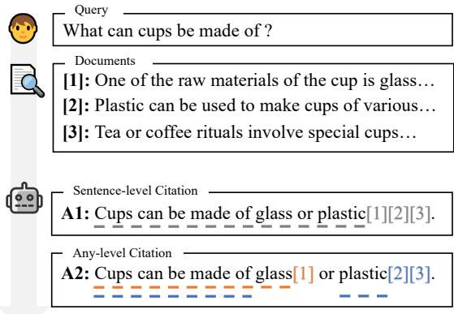  
Figure 1: "Sentence-level" vs. "Any-level" in the task of citation text generation. The text with grey underline corresponds to the claim in A1 cited by "[1][2][3]". The texts of orange and blue underlines correspond to the claims in A2 cited by "[1]" and "[2][3]", respectively.

In fact, in many long-form contexts, particularly in professional fields such as academic writing (Funkquist et al., 2023), citation marks often appear in the middle of a sentence rather than always at the end, as response A2 illustrated in Figure 1. Compared with sentence-level citation, the advantages of this fine-grained generation are: 1) clearer indication of the text scope associated with each citation mark, and 2) better user-friendliness, allowing users to locate more specific content to check. We refer to this improved generation task as Positional Fine-grained Citation Text Generation.

Despite the importance of this task, an effective evaluation method has yet to be developed. Some studies directly apply sentence-level metrics to finegrained citations (Huang et al., 2024b), but this can affect the accuracy of evaluation. First, sentencelevel metrics simply merge evidences of multiple atomic claims (Gao et al., 2023b). When using Natural Language Inference (NLI; Honovich et al., 2022) to judge entailment, merged evidences can easily result in the issue of excessively long NLI contexts. Second, if there is an overlap between evidence of different atomic claims, sentence-level judgments can also become unreasonable, for correct citations might be mistakenly excluded. Thus, it is essential to design an evaluation method specifically tailored for positional fine-grained citations.

We propose a new evaluation method, ALiiCE, Automatic LLM’s Positional Fine-grained Citation Evaluation. Our method first employs a Dependency Tree based approach to parse atomic claims of each citation in the response. For instance, the two claims of A2 in Figure 1 are parsed as "Cups can be made of glass" and "Cups can be made of plastic". Further, our method incorporates three metrics for evaluating citation quality, including citation recall and precision at the level of atomic claims, as well as the Coefficient of Variation of Citation Positions (CVCP), which measures the dispersion of citation positions within a sentence.

In our experiment, we employ two long-form QA datasets, ASQA (Stelmakh et al., 2022) and ELI5 (Fan et al., 2019) to evaluate outputs of LLMs including GPT-3.5, GPT-4 and LLaMA-3-8B. We observe that existing LLMs generate a limited number of positional fine-grained citations. We compare the citation quality of LLMs’ outputs in sentencelevel metrics with ALiiCE to demonstrate the necessity of evaluation method for positional finegrained citations. We also conduct error analyses to assess the impact of parsing errors. Additionally, we conduct human evaluation to verify the consistency between ALiiCE and human judgment.

To summarize, our main contributions include:

• We propose the first dedicated evaluation method for positional fine-grained citation generation and we prove its effectiveness through experiments;

• We evaluate the performance of several existing LLMs on positional fine-grained citation generation in long-form QA datasets;

• We offer our insights on the study of positional fine-grained citation generation: 1) open-source LLMs show great progress in citation generation, substantially narrowing the gap with closed-source LLMs; 2) feedback from human evaluation suggests that existing citation evaluation methods still overlook citation utility, which is a crucial aspect of assessing citation quality.

We hope that our work can inspire more research into positional fine-grained citation text generation.

## 2 Background & Task Definition

In this section, we briefly introduce the background of our research and provide a definition of positional fine-grained citation generation.

## 2.1 Citation Generation in Long-form QA

Unlike short-form QA, which typically provides binary, entity-level, or short sentence answers, longform QA generates detailed and comprehensive responses including explanations, context, and additional relevant information (Krishna et al., 2021). Citation generation involves producing citation marks (namely, passage IDs) while generating text, indicating the source passages on which the text is based (Funkquist et al., 2023; Huang and Chang, 2024). In our work, we focus on positional finegrained citation generation for long-form QA. Unlike traditional task, it allow citation marks to appear at any position within the sentence.

## 2.2 Task Definition

Formally, given a query q and a set of retrieved passages based on q, the generator  is required to generate a long-form response containing citations. Specifically,  is composed of several sentences, with each sentence containing words and in-line citation markers. We assume that the k-th sentence $s _ { k }$ has a length of l and can be represented as $x _ { 1 } , x _ { 2 } , \ldots , x _ { l } .$ , where $x _ { i }$ represents the i-th minimal semantic unit in $s _ { k }$ .

In this paper, the minimal semantic unit can be either a word (including punctuation) or a group of citation marks. $\operatorname { I f } x _ { i }$ is the latter, we denote it as $\mathcal { C } _ { i } = \{ c _ { i , 1 } , c _ { i , 2 } , . . . \}$ , where $c _ { i , j }$ is a citation mark of a passage in . And $C _ { i }$ corresponds to an atomic claim parsed from its sentence, marked as $\mathbf { \mathcal { A } } _ { i }$ . Take A2 in Figure 1 as an example, "plastic" is a word, and "[2][3]" is a group of citation marks with its atomic claim "Cups can be made of plastic".

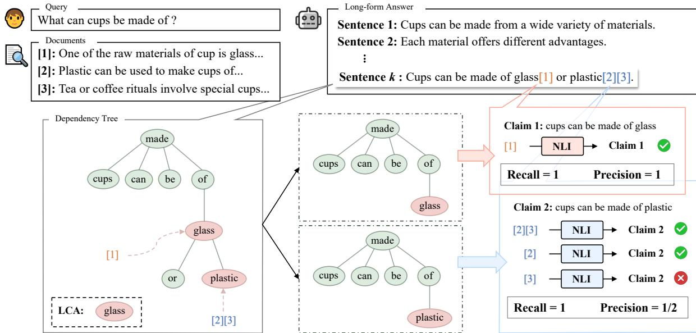  
Figure 2: An example of ALiiCE evaluation framework on positional fine-grained citation generation. Given a query and related documents, the LLM generates a long-form answer. For sentence i in answer, the parsing pipeline involves constructing the dependency tree, identifying the LCA node to obtain the modified tree of each claim, and converting modified trees into texts. Finally, we calculate the citation recall and precision for each claim.

## 3 ALiiCE: Automatic LLMs’ Positional Fine-grained Citation Evaluation

In this section, we give a detailed description of ALiiCE. First, we introduce how we construct the atomic claim parsing pipeline based on dependency trees. Then, we present three metrics for the evaluation of positional fine-grained citation quality.

## 3.1 Dependency Tree

Dependency trees are hierarchical representations of the grammatical structure of a sentence, showing how words rely on each other (Culotta and Sorensen, 2004), and is more concise compared with the hierarchical syntax tree based on operators. In a dependency tree, a subtree can represent a phrase or clause that depends on its root, which is highly suitable for atomic claims extraction. Thus in ALiiCE, we employ dependency trees to represent sentences in for subsequent parsing stage.

For simplicity, we assume that the nodes in the dependency tree are all words. To extract atomic claim based on the position of the $\mathcal { C } _ { i }$ in the original sentence, we find a matching node in the tree for each $\mathcal { C } _ { i }$ , as shown in the lower left part of Figure 2. In this paper, we refer to the node with citation marks attached as the citation node.

When handling multiple citations in different positions within a sentence, their respective claims need to be parsed. To parse the claim of $\mathcal { C } _ { i } ,$ we need to exclude irrelevant content from other claims, as different claims may share identical sentence components. Thus, we consider the Lowest Common Ancestor (LCA), which is the deepest node of two different nodes possessing both of them as descendants in a tree. For two distinct citation nodes, we can modify the dependency tree to obtain atomic claims based on the relative positions with respect to their LCA node (see Section 3.2).

## 3.2 Parsing Pipeline

Our parsing pipeline is illustrated by Figure 2 and simplified pseudo code is shown in Algorithm 1.

For sentence $s _ { k }$ in response , we extract groups of citation marks $\{ { \mathcal { C } } _ { i } \}$ from difference positions. Then we do text cleaning on $s _ { k }$ to obtain raw sentence $s { _ k } ^ { \prime }$ , involving removing citation marks and other punctuation. $s { _ k } ^ { \prime }$ is used to construct dependency tree $T$ . Next, we match citation node for each $\mathcal { C } _ { i }$ . The principle of matching node is to select word closest to $\mathcal { C } _ { i }$ in $s _ { k } .$ , giving priority to the one before $\mathcal { C } _ { i }$ . Then we modify the dependency tree based on the citation nodes.

For each citation node, denoted as node i, iterate other citation nodes except node i. When iterating to node $j ,$ we calculate the LCA node of node i and node j in $T$ . Then we find the subtrees of LCA node’s children containing node i and node j, and denote them as $T _ { i }$ and $T _ { j }$ , respectively. Next, we discuss in different situations:

Algorithm 1 ALiiCE’s Parsing Algorithm   
Input: A sentence s with in-line citation marks   
Output: A list of claim of each group of citation   
marks   
1: L = ϕ   
2: s′ = TEXTCLEANING (s)   
3: T = DEPENDENCYTREE $\left( s ^ { \prime } \right)$   
4: nodes = MATCHCITATIONNODES (T, s)   
5: for each node in nodes do   
6: T′ = DEEPCOPY (T)   
7: for each nodej in nodes  nodei do   
8: nodelca = LCA (T′, nodei, nodej)   
9: Ti = SUBTREE (nodelca, nodei)   
10: Tj = SUBTREE (nodelca, nodej)   
11: if nodelca = nodei   
12: (nodelca = nodej Ti < Tj) then   
13: MASK $( T ^ { \prime } , T _ { j } )$   
14: else   
15: REPLACE (node , Ti)   
16: r = CONVERTTOTEXT (T′)   
17: r  L   
18: return L

• If LCA node is node i, remove $T _ { j }$ from $T ,$

• If LCA node is node j, replace LCA node’s subtree with $T _ { i }$

• If LCA node is another node in $T ,$ , then we compare the relative positions between $T _ { i }$ and $T _ { j }$ , according to the word’s order in the sentence of subtree’s root: If $T _ { i }$ is before $T _ { j }$ , then remove $T _ { j }$ from $T ;$ If $T _ { i }$ is after $T _ { j }$ , then replace LCA node’s subtree with $T _ { i }$

After iteration, we obtain a modified dependency tree. We convert words in the modified tree to text following the order in original sentence, getting the claim of citations corresponding to node i. We provide additional details and running examples of our algorithm in Appendix C and D, respectively.

## 3.3 Metrics for Citation Quality

In this section, we display the three metrics for positional fine-grained citation quality in ALiiCE.

3.3.1 Positional Fine-grained Citation Recall For each $\mathcal { C } _ { i }$ and its corresponding $A _ { i } .$ , if the concatenation of passages in $\mathcal { C } _ { i }$ can entail $\mathbf { \mathcal { A } } _ { i }$ , then the citation recall is 1, otherwise it is 0. The judgement of entailment can be formulated as:

$$
\Psi \left( { \mathcal { H } } , S \right) = { \left\{ \begin{array} { l l } { 1 , } & { { \mathrm { i f ~ } } { \mathcal { H } } { \mathrm { ~ e n t a i l s ~ } } S } \\ { 0 , } & { { \mathrm { e l s e } } } \end{array} \right. }\tag{1}
$$

where Ψ represents a NLI model, and and represent hypothesis and statement, respectively.

## 3.3.2 Positional Fine-grained Citation Precision

Following Gao et al. (2023b), we calculate citation precision to evaluate whether every citation is necessary. This metric checks for redundant citations to improve readability and verifiability.

We compute citation precision only when the citation recall of $\mathcal { C } _ { i }$ is 1; otherwise, the citation precision is set to 0. Specifically, for each $c _ { i , j }$ in $\mathcal { C } _ { i }$ if $c _ { i , j }$ can not entail $\mathbf { \mathcal { A } } _ { i }$ alone while the concatenation of passages in $\mathcal { C } _ { i } \setminus c _ { i , j }$ can, it is indicated that $c _ { i , j }$ is a redundant citation and the precision score of $c _ { i , j }$ is 0, otherwise the precision score of $c _ { i , j }$ is 1. Finally we calculate the mean of the precision scores from each $c _ { i , j }$ as the precision score of $\mathcal { C } _ { i }$

## 3.3.3 Coefficient of Variation of Citation Positions

Positional fine-grained citation generation allows citation marks to appear in multiple positions within a sentence (e.g., in the middle, at the end). Consequently, to some extent, the dispersion of citation marker positions can reflect the LLMs’ ability to generate positional fine-grained citations. For example, in Figure 1, A2 has a greater dispersion of citation marker positions than A1. To quantify the degree of dispersion, we propose CVCP (Coefficient of Variation of Citation Positions).

For response ${ \mathcal { R } } ,$ we first calculate the indices of citation marks’ positions for every sentence. For sentence $s _ { k }$ , which has a length of l and can be represented as $x _ { 1 } , \ldots , x _ { l }$ , we extract the subscripts corresponding to the citation marks as the indices, denoted by $p _ { 1 } , \ldots , p _ { t }$ , where t is the number of citation marks. We normalize the indices to eliminate the interference of sentence length as follows:

$$
p _ { i } \gets \frac { p _ { i } } { | s _ { k } | }\tag{2}
$$

Then we compute standard deviation for $s _ { k }$ as:

$$
\sigma \left( s _ { k } \right) = \sqrt { \frac { 1 } { t } \sum _ { j = 1 } ^ { t } \left( p _ { j } - \mu _ { k } \right) ^ { 2 } }\tag{3}
$$

where $\textstyle \mu _ { k } = { \frac { 1 } { t } } \sum _ { j = 1 } ^ { t } p _ { j }$ , which represents the mean of normalized indices. Assuming $s _ { k }$ has n sentences, the CVCP of is as follows:

<table><tr><td rowspan="2">Dataset</td><td rowspan="2">Model (k-psg-form)</td><td colspan="3">ALiiCE</td><td rowspan="2">CVCP</td><td rowspan="2">Fluency</td><td rowspan="2">Correct.</td><td rowspan="2">Length</td></tr><tr><td>Rec.</td><td>Prec.</td><td>F1.</td></tr><tr><td rowspan="7">ASQA</td><td>GPT-3.5 (5-psg)</td><td>78.4 (0.5)</td><td>74.4 (0.4)</td><td>76.3 (-)</td><td>0.10 (−)</td><td>86.1 (2.9)</td><td>51.1 (0.3)</td><td>50.5 (37.3)</td></tr><tr><td>GPT-3.5 (5-psg-summ)</td><td>76.9 (0.4)</td><td>71.6 (0.9)</td><td>74.2 (-)</td><td>0.13 (−)</td><td>75.4 (2.3)</td><td>49.3 (0.3)</td><td>40.2 (33.2)</td></tr><tr><td>GPT-3.5 (5-psg-snip)</td><td>74.4 (0.7)</td><td>69.4 (0.3)</td><td>71.8 (−)</td><td>0.13 (−)</td><td>73.1 (3.7)</td><td>48.0 (0.6)</td><td>36.0 (29.7)</td></tr><tr><td>GPT-3.5 (10-psg)</td><td>77.7 (1.2)</td><td>75.9 (0.8)</td><td>76.8 (−)</td><td>0.15 (−-)</td><td>84.6 (7.1)</td><td>44.1 (0.3)</td><td>63.4 (52.6)</td></tr><tr><td>GPT-4 (5-psg)</td><td>76.8 (1.2)</td><td>68.2 (1.1)</td><td>72.2 (-)</td><td>0.15 (−)</td><td>52.2 (9.5)</td><td>47.0 (0.4)</td><td>28.1 (20.8)</td></tr><tr><td>LLaMA-3-8B (5-psg)</td><td>64.8 (1.0)</td><td>61.4 (1.4)</td><td>63.1 (−)</td><td>0.44 (−)</td><td>84.2 (5.0)</td><td>50.9 (0.3)</td><td>64.0 (53.1)</td></tr><tr><td>LLaMA-3-8B (10-psg)</td><td>61.8 (1.3)</td><td>62.5 (0.5)</td><td>62.1 (−)</td><td>0.45 (-)</td><td>88.8 (9.6)</td><td>41.7 (1.4)</td><td>73.2 (64.9)</td></tr><tr><td rowspan="7">ELI5</td><td>GPT-3.5 (5-psg)</td><td>61.0 (0.5)</td><td>58.6 (2.2)</td><td>59.8 (−)</td><td>0.10 (−)</td><td>21.8 (0.6)</td><td>20.8 (0.3)</td><td>131.7 (46.2)</td></tr><tr><td>GPT-3.5 (5-psg-summ)</td><td>53.9 (2.6)</td><td>52.0 (1.1)</td><td>52.9 (−)</td><td>0.15 (−)</td><td>21.3 (5.1)</td><td>20.8 (1.1)</td><td>111.3 (46.5)</td></tr><tr><td>GPT-3.5 (5-psg-snip)</td><td>53.4 (1.3)</td><td>50.9 (1.1)</td><td>52.1 (−)</td><td>0.13 (−)</td><td>34.9 (7.3)</td><td>20.8 (0.4)</td><td>106.7 (47.9)</td></tr><tr><td>GPT-3.5 (10-psg)</td><td>58.1 (2.4)</td><td>56.8 (2.0)</td><td>57.4 (-)</td><td>0.12 (−)</td><td>18.5 (4.7)</td><td>19.7 (0.7)</td><td>155.9 (57.4)</td></tr><tr><td>GPT-4 (5-psg)</td><td>55.1 (0.5)</td><td>54.0 (3.0)</td><td>54.5 (−)</td><td>0.15 (−)</td><td>20.4 (7.2)</td><td>21.3 (0.9)</td><td>102.2 (59.7)</td></tr><tr><td>LLaMA-3-8B (5-psg)</td><td>45.9 (0.3)</td><td>47.1 (0.7)</td><td>46.5 (−)</td><td>0.53 (−)</td><td>36.2 (1.0)</td><td>20.5 (0.9)</td><td>203.9 (71.4)</td></tr><tr><td>LLaMA-3-8B (10-psg)</td><td>42.8 (0.8)</td><td>44.2 (0.9)</td><td>43.5 (-)</td><td>0.61 (−)</td><td>32.5 (6.2)</td><td>19.5 (0.7)</td><td>224.2 (77.7)</td></tr></table>

Table 1: Results on ASQA and ELI5. The k-psg indicates using top-k relevant documents for response generation. Document formats include summary (summ), snippet (snip), and default original text. The correctness refers to the exact match recall for ASQA and ROUGE-L for ELI5. The value in bracket represents the standard deviation.

$$
C V _ { C P } \left( \mathcal { R } \right) = \frac { 1 } { n } \sum _ { k = 1 } ^ { n } \frac { \sigma \left( s _ { k } \right) } { \mu _ { k } }\tag{4}
$$

When the positions of the citation markers in the sentence are more dispersed, the CVCP can be higher. Conversely, if all citation markers appearing at the end of the sentence, the CVCP can be very low (i.e., 0). Thus, CVCP encourages LLMs to generate more positional fine-grained citations.

## 4 Experimental Setup

In this section, we describe the datasets and implementation details of our experiments. Additional details are provided in Appendix A.

Datasets We utilize two popular datasets for the task of long-form QA, including: 1) ASQA, which is an open-domain long-form QA dataset for ambiguous factoid queries, collected from AmbigQA (Min et al., 2020); 2) ELI5, which is a dataset for complex QA with paragraph-length responses, collected from subreddit "Explain Like I’m Five". The queries of these two datasets are well suited for retrieval-augmented generation, thus more conducive for evaluating fine-grained citation generation. Following Gao et al. (2023b), we use the Generalizable T5-based dense Retriever (GTR; Ni et al., 2022) to retrieve relevant passages for queries from Wikipedia corpus snapshot dated 2018-12-20.

Implementation We utilize $\operatorname { S p a C y } ^ { 2 }$ to construct dependency trees for sentences, which is a useful and efficient python toolkit for many NLP tasks. We use TRUE3, a fine-tuned T5-11B (Raffel et al., 2020) model as the NLI model for the judgement of entailment in citation quality.

Models For closed-source LLMs, we evaluate gpt-4-turbo-2024-04-09 and gpt-3.5-turbo-0125 (OpenAI, 2022; OpenAI et al., 2024). For open-source LLMs, we evaluate LLaMA-3-8B (AI@Meta, 2024). In addition, we incorporate variables such as the number of retrieved passages and the passage form used in generation (truncated original text, summary, or snippet) into the model setting. The prompts are provided in Appendix E.

Evaluation Metrics In addition to the three metrics of citation quality introduced at Section 3.3, we utilize three common metrics in long-form QA, including: 1) correctness, which checks whether answers the query q accurately; 2) fluency, which evaluates whether is coherent; and 3) length, which is the average length of . Regarding correctness, for ASQA, we follow Stelmakh et al. (2022) to calculate exact match recall by checking whether ground truths are exact substrings of ; for ELI5, we follow Fan et al. (2019) to use the F1 score of ROUGE-L. We quantify the fluency by MAUVE (Pillutla et al., 2021). For comparison, we also use ALCE (Gao et al., 2023b) as the sentence-level evaluation to assess citation quality.

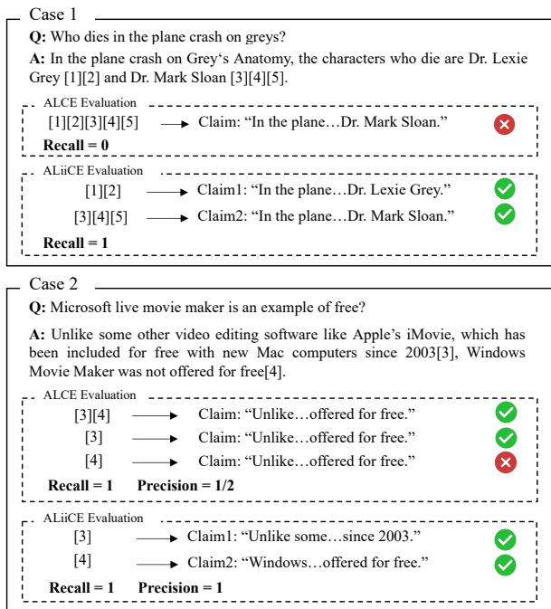  
Figure 3: Evaluation process of citation quality by ALCE and ALiiCE on two examples from ASQA. The answers are generated by GPT-3.5 (5-psg).

## 5 Main Results

In this section, we present our key observations on the experiment results, and then provide our case study to prove the necessity of developing method for positional fine-grained citation evaluation.

## 5.1 Overall Performances

The result of our experiment is presented in Table 1. We obtain some key observations as follows:

Citation quality In ASQA, GPT-3.5 (10-psg) achieves the best performance in citation recall and precision, while in ELI5, the top performer is GPT-3.5 (5-psg). Overall, these two models exhibit outstanding performance of citation quality across both datasets. Moreover, simpler passage formats, such as summary and snippet, do not yield performance improvements. Through CVCP, we observe that most models generate a limited number of positional fine-grained outputs. LLaMA-3-8B is able to generate more fine-grained samples than GPT-3.5 and GPT-4, among which LLaMA-3-8B (10-psg) achieves the highest CVCP in both datasets.

Other metrics The difference in fluency between the models is not significant; however, it is evident that the model outputs for ELI5 are much less fluent compared to ASQA. This discrepancy is also observed in terms of correctness. Regarding length, the model outputs for ELI5 are substantially longer than those for ASQA, and the output length of LLaMA-3 is longer than that of GPT-3.5 and GPT-4. As for the difference between the two datasets, we believe that this may be due to the more difficult queries and the more complex knowledge contained in the passages in ELI5.

<table><tr><td>Dataset</td><td>Num of Claims</td><td>Num of same NLI</td></tr><tr><td>ASQA</td><td>1935</td><td>1930</td></tr><tr><td>ELI5</td><td>3923</td><td>3891</td></tr></table>

Table 2: Results on parsing error analyses. The second column is the total number of claims. The last column is the number of claims with consistent NLI results before and after refinement on the claims.

## 5.2 Case Study

In this section, we compare the evaluations of ALCE and ALiiCE on two instances from ASQA, and analyze the shortcomings and insufficiency of sentence-level metrics on positional fine-grained citation evaluation. Our objective is to demonstrate the necessity of designing a dedicated citation evaluation method with atomic claim parsing.

Long-context issue Sentence-level evaluation can result in inaccuracies when dealing with longcontext NLI. For instance, in Case 1 depicted in Figure 3, when assessing citation recall, the concatenated passages exceed the context length of NLI model, potentially leading to incorrect inference results due to distracted attention or truncation of evidences. In ALiiCE, evidences are dispersed by parsing atomic claims, reducing the likelihood of exceeding context limits.

Citation precision issue If there is an overlap between different evidences, it is potential for the NLI model to misjudge multiple atomic claims simultaneously. Taking the Case 2 in Figure 3 as an example, citation "[3]" contains evidences supporting both atomic claim 1 and 2. According to ALCE’s citation precision, citation "[3]" alone can support the entire sentence-level claim, whereas citation "[4]" cannot, as it only supports atomic claim 2. Consequently, citation "[4]" is considered redundant, despite being or even though it is actually a reasonable citation. In ALiiCE, we evaluate based on atomic claims, ensuring that the assessment is not influenced by evidences from other claims.

<table><tr><td rowspan="2">Model (k-form)</td><td colspan="2">ALiiCE</td><td colspan="2">ALCE</td></tr><tr><td>Rec.</td><td>Prec.</td><td>Rec.</td><td>Prec.</td></tr><tr><td>GPT-3.5 (5)</td><td>75.4 (0.6)</td><td>74.2 (0.8)</td><td>80.4 (0.3)</td><td>67.2 (0.8)</td></tr><tr><td>GPT-3.5 (5-summ)</td><td>73.9 (0.6)</td><td>72.4 (0.3)</td><td>76.9 (0.3)</td><td>59.4 (0.4)</td></tr><tr><td>GPT-3.5 (5-snip)</td><td>60.5 (0.3)</td><td>62.6 (1.0)</td><td>68.1 (1.4)</td><td>59.4 (1.1)</td></tr><tr><td>GPT-3.5 (10)</td><td>75.8 (0.6)</td><td>77.9 (1.0)</td><td>78.6 (0.8)</td><td>65.6 (0.9)</td></tr><tr><td>GPT-4 (5)</td><td>69.3 (0.8)</td><td>75.7 (0.8)</td><td>76.0 (0.3)</td><td>66.1 (0.7)</td></tr><tr><td>LLaMA-3 (5)</td><td>56.9 (1.0)</td><td>64.3 (0.4)</td><td>60.3 (0.4)</td><td>57.9 (1.2)</td></tr><tr><td>LLaMA-3 (10)</td><td>57.7 (1.0)</td><td>66.1 (1.2)</td><td>58.2 (1.5)</td><td>55.2 (1.4)</td></tr></table>

Table 3: Results on ASQA when only outputs containing positional fine-grained citations are evaluated. We omit the string "-psg" in the model settings for clarity. The best performances are highlighted in bold.
<table><tr><td rowspan="2">Model (k-psg-form)</td><td colspan="2">ALiiCE</td><td colspan="2">ALCE</td></tr><tr><td>Rec.</td><td>Prec.</td><td>Rec.</td><td>Prec.</td></tr><tr><td>GPT-3.5 (5)</td><td>40.1 (1.8)</td><td>50.0 (2.8)</td><td>48.1 (2.4)</td><td>44.2 (2.2)</td></tr><tr><td>GPT-3.5 (5-summ)</td><td>35.9 (2.5)</td><td>35.1 (2.6)</td><td>42.9 (1.2)</td><td>32.4 (1.5)</td></tr><tr><td>GPT-3.5 (5-snip)</td><td>39.6 (2.4)</td><td>39.1 (1.3)</td><td>43.4 (3.5)</td><td>34.5 (2.7)</td></tr><tr><td>GPT-3.5 (10)</td><td>44.2 (0.7)</td><td>48.1 (1.0)</td><td>46.7 (0.5)</td><td>41.0 (1.7)</td></tr><tr><td>GPT-4 (5)</td><td>40.5 (1.9)</td><td>46.2 (1.1)</td><td>44.6 (3.6)</td><td>38.7 (3.5)</td></tr><tr><td>LLaMA-3 (5)</td><td>41.1 (1.6)</td><td>44.0 (0.9)</td><td>43.4 (1.5)</td><td>39.7 (1.0)</td></tr><tr><td>LLaMA-3 (10)</td><td>41.8 (1.7)</td><td>47.7 (3.7)</td><td> $4 3 . 6 _ { \ ( 3 . 0 ) }$ </td><td>41.0 (3.6)</td></tr></table>

Table 4: Results on ELI5 when only outputs with positional fine-grained citations are evaluated. Other descriptions follow Table 3.

## 5.3 Error Analyses

We further analyzed the potential errors in ALiiCE, which mainly come from two aspects:

Grammatical error Grammatical errors in the sentence can lead to inaccurate parsing results. However, current LLMs exhibit strong grammatical capabilities (Zhao et al., 2023), and after our manual evaluation, the number of samples containing grammatical errors in LLMs’ outputs is nearly zero, thus this type of error can be ignored.

Parsing error Dependency tree parsing itself might contain errors. For example, in sentence "Other radiological signs of fetal death include gas in the fetus or in the portal and umbilical vessels [1], and Deuel’s halo sign [2].", the atomic claim of citation "[2]" is parsed as "Other radiological signs of fetal death include gas Deuel ’s halo sign" by SpaCy, which contains an extra word "gas" due to an error from dependency recognition.

Therefore, we conduct further experiment to test the potential impact of parsing errors on NLI. We firstly collect all the atomic claims from two datasets. Next, we utilize GPT-3.5 to refine each claim based on its original sentence (the prompt is provided in Appendix E). And then we employ the NLI model to assess the entailment before and after the claim refinement. As indicated in Table 2, the result show that the proportion of claims with inconsistent NLI results is less than 1% across both datasets. Therefore, the parsing error is unlikely to have a significant impact on the evaluation.

## 6 Human Evaluation

We conduct human evaluation to examine the correlation between ALiiCE and human judgment. Since Gao et al. (2023b); Liu et al. (2023) have thoroughly studied sentence-level citation evaluation, we only focus on LLMs’ responses that include positional fine-grained citations. In addition to the citation recall and precision, we also consider: 1) the proportion of positional fine-grained responses to total responses, 2) the answer utility, which assesses whether the LLM’s response is helpful in answering the question, and 3) the citation utility, evaluates whether the positional fine-grained citation is useful for the response. We recruit three annotators to evaluate the outputs of the models used in the previous experiments.

We observe that ALiiCE and human judgment show a strong correlation. The model rankings evaluated by ALiiCE align closely with those evaluated by human judgement. The average Cohen’s kappa coefficients between ALiiCE and annotators for ASQA are 0.71 for citation recall and 0.62 for citation precision, demonstrating high consistency. In addition, responses containing fine-grained citations constitute a small proportion of the total output. For instance, the fine-grained output of GPT-3.5 (5-psg-summ) on ELI5 accounts for only 8% of the total samples. This pattern is consistent with the results shown by CVCP. Details on the human evaluation are provided in the Appendix B.

## 7 Discussion

Based on the experimental results and observations, we discuss our insights on the task of positional fine-grained citation generation, as follows:

ALiiCE has a higher decision threshold. Compared to ALCE, ALiiCE calculates lower citation recall, but higher citation precision. And this difference becomes more dramatic when only positional fine-grained citation outputs are evaluated, as illustrated in Table 3 and Table 4. We can observe this more intuitively in Figure 4. This means that ALiiCE has a higher decision threshold, indicating that ALiiCE is more conservative, only considering a citation correct when it has a high level of confidence. This is more beneficial for the citation generation task because the higher decision threshold encourages more accurate and relevant citations, reducing the likelihood of misleading information, which is particularly crucial in professional and high-risk fields (e.g., law and medicine) where incorrect citations can lead to serious consequences.

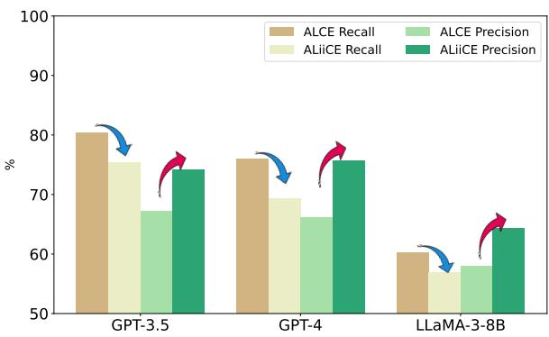  
Figure 4: Comparison of citation recall and precision between ALCE and ALiiCE across three models using the 5-psg setting on ASQA. ALiiCE achieves lower citation recall and higher citation precision.

Open-source LLMs display great progress. LLaMA-3 narrows the gap between open-source LLMs and closed-source LLMs in the citation text generation task. In previous studies, the citation quality of open-source LLMs is significantly worse than that of closed-source LLMs (Gao et al., 2023b; Huang et al., 2024a). However, our experimental results show that the citation recall and precision of GPT-4 with 5-passages are only improved by 20.0% and 14.6%, respectively, compared to LLaMA-3-8B with 5-passages on ELI5. Additionally, LLaMA-3-8B has a higher CVCP and exhibits greater fluency, than both GPT-3.5 and GPT-4.

Rethinking citation quality through the lens of citation utility. Our human evaluation indicates that citation utility and citation quality do not show a strong correlation. And our annotators observe that in some responses, even when the citation utility score is zero, the citation quality remains high. Thus, existing citation quality metrics can only evaluate the correctness of citation marks for each claim, but they fail to assess the utility of these marks, as being correct is not equal to being useful. We believe that this is worth further exploration in future research on citation evaluation methods.

How to study positional fine-grained citation generation? Through our observation of the finegrained responses, we find that most atomic claims with sufficient citation utility, exhibit certain logical relationships, such as parallelism, causality, and transitions. Under these logical structures, positional fine-grained citations often have better utility and significantly enhance user-friendliness. Constructing reasoning paths for multi-step retrieval and generation can establish clearer logical relationships for long-form responses, thereby promoting fine-grained citations. Additionally, in the supervised learning method, creating labeled data presents a significant challenge. Ye et al. (2024) design an algorithm for automatically annotating citation marks at sentence-level. However, this method becomes more challenging for positional fine-grained citation generation. Similarly, we recommend constructing supervised labels by multihop QA datasets and also combining sentence-level citation sequences to ensure generalization.

## 8 Related Work

Attribution Attribution refers to the ability of LMs to generate and provide evidence (Li et al., 2023). The source of attribution can be pre-training data (Han and Tsvetkov, 2022; Weller et al., 2024), or out-of-model knowledge (Shuster et al., 2021; Li et al., 2024). When the source is documents, citation is a common form of attribution (Kamalloo et al., 2023). Ye et al. (2024); Huang et al. (2024a) study generating response and citations simultaneously, while Gao et al. (2023a); Huo et al. (2023) research on adding citations in the post-hoc stage.

Retrieval-Augmented Generation Retrievalaugmented generation (RAG; Lewis et al., 2020) combines the strengths of information retrieval and generation models, demonstrating improvement in several NLP tasks. The primary methods for incorporating external knowledge into generation include modifying model parameters (Sen et al., 2023) and Chain-of-Thought (CoT; Wei et al., 2022; Xu et al., 2024). Since RAG exhibits a blackbox nature (Gao et al., 2024), adding citations in response can effectively mitigate the hallucination problem and enhance verifiability.

Citation Evaluation The current citation evaluation methods are mainly performed by human evaluation, which is costly and time-intensive (Chen et al., 2023). Thus, automatic evaluation methods are studied, including classification-based metrics (Liu et al., 2023; Yue et al., 2023) and quantitative metrics (Gao et al., 2023b; Li et al., 2024). In specific domains, Li et al. (2022); Li and Ouyang (2024) study the citation generation for academic writing. However, most research is primarily sentence-level, leading to issues with atomicity of claims (Malaviya et al., 2024) and ambiguity (Liu et al., 2023). We propose ALiiCE, the first evaluation method for positional fine-grained citations.

## 9 Conclusion

In this study, we propose ALiiCE, the first evaluation method for positional fine-grained citation generation. Our approach incorporates an algorithm for parsing atomic claims based on dependency analysis, along with three metrics designed to assess the quality of positional fine-grained citations.

We evaluate several LLMs and observe that currently, LLMs lack strong capabilities for generating fine-grained citations. We demonstrate the need of designing dedicated method for positional finegrained citation evaluation and the effectiveness of ALiiCE in addressing this need. We also discuss some useful conclusions: 1) the latest open-source LLMs narrow the gap between them and closedsource LLMs in citation generation; 2) current metrics for citation quality lack consideration of citation utility; 3) the logical relationships between atomic claims can be considered when designing methods for positional fine-grained citation generation. We hope that our work can inspire more research into this underexplored task.

## Limitations

In the implementation of our parsing method, we only employ SpaCy to construct dependency trees. Other dependency analysis methods with higher accuracy can improve our benchmark, which are not evaluated in our work. In addition, dependency analysis may be primarily applicable to mainstream languages such as English. Thus directly transferring ALiiCE to other languages might result in reduced evaluation accuracy.

In our experiments, we only utilize the opendomain long-form QA datasets. However, positional fine-grained citation generation is applicable to a broader range of scenarios, such as academic writing and summarization. Therefore, it is necessary to expand the data domain of the benchmark.

## Ethics Statement

The citation generation task aims to enhance the credibility of the generative model, assist users in verifying information, and mitigate the spread of misunderstandings or incorrect information. Additionally, it helps reduce ethical risks by clarifying responsibilities and respecting intellectual property rights. This research utilizes publicly available datasets sourced from widely recognized and reputable repositories. We have ensured that all datasets used in this study comply with relevant data usage and privacy policies.

## Acknowledgments

This work was supported by the National Key R&D Program of China (2023YFC3303800).

## References

AI@Meta. 2024. Llama 3 model card.

Tom Brown, Benjamin Mann, Nick Ryder, Melanie Subbiah, Jared D Kaplan, Prafulla Dhariwal, Arvind Neelakantan, Pranav Shyam, Girish Sastry, Amanda Askell, et al. 2020. Language models are fewshot learners. In Advances in Neural Information Processing Systems, volume 33, pages 1877–1901. Curran Associates, Inc.

Hung-Ting Chen, Fangyuan Xu, Shane Arora, and Eunsol Choi. 2023. Understanding retrieval augmentation for long-form question answering. Preprint, arXiv:2310.12150.

Aron Culotta and Jeffrey Sorensen. 2004. Dependency tree kernels for relation extraction. In Proceedings of the 42nd Annual Meeting of the Association for Computational Linguistics (ACL-04), pages 423– 429, Barcelona, Spain.

Angela Fan, Yacine Jernite, Ethan Perez, David Grangier, Jason Weston, and Michael Auli. 2019. ELI5: Long form question answering. In Proceedings of the 57th Annual Meeting of the Association for Computational Linguistics, pages 3558–3567, Florence, Italy. Association for Computational Linguistics.

Martin Funkquist, Ilia Kuznetsov, Yufang Hou, and Iryna Gurevych. 2023. Citebench: A benchmark for scientific citation text generation. Preprint, arXiv:2212.09577.

Luyu Gao, Zhuyun Dai, Panupong Pasupat, Anthony Chen, Arun Tejasvi Chaganty, Yicheng Fan, Vincent Zhao, Ni Lao, Hongrae Lee, Da-Cheng Juan, and Kelvin Guu. 2023a. RARR: Researching and revising what language models say, using language models. In Proceedings of the 61st Annual Meeting

of the Association for Computational Linguistics (Volume 1: Long Papers), pages 16477–16508, Toronto, Canada. Association for Computational Linguistics.

Tianyu Gao, Howard Yen, Jiatong Yu, and Danqi Chen. 2023b. Enabling large language models to generate text with citations. In Proceedings of the 2023 Conference on Empirical Methods in Natural Language Processing, pages 6465–6488, Singapore. Association for Computational Linguistics.

Yunfan Gao, Yun Xiong, Xinyu Gao, Kangxiang Jia, Jinliu Pan, Yuxi Bi, Yi Dai, Jiawei Sun, Meng Wang, and Haofen Wang. 2024. Retrieval-augmented generation for large language models: A survey. Preprint, arXiv:2312.10997.

Xiaochuang Han and Yulia Tsvetkov. 2022. Orca: Interpreting prompted language models via locating supporting data evidence in the ocean of pretraining data. Preprint, arXiv:2205.12600.

Ari Holtzman, Jan Buys, Li Du, Maxwell Forbes, and Yejin Choi. 2020. The curious case of neural text degeneration. Preprint, arXiv:1904.09751.

Or Honovich, Roee Aharoni, Jonathan Herzig, Hagai Taitelbaum, Doron Kukliansy, Vered Cohen, Thomas Scialom, Idan Szpektor, Avinatan Hassidim, and Yossi Matias. 2022. TRUE: Re-evaluating factual consistency evaluation. In Proceedings of the 2022 Conference of the North American Chapter of the Association for Computational Linguistics: Human Language Technologies, pages 3905–3920, Seattle, United States. Association for Computational Linguistics.

Chengyu Huang, Zeqiu Wu, Yushi Hu, and Wenya Wang. 2024a. Training language models to generate text with citations via fine-grained rewards. Preprint, arXiv:2402.04315.

Jie Huang and Kevin Chen-Chuan Chang. 2024. Citation: A key to building responsible and accountable large language models. Preprint, arXiv:2307.02185.

Lei Huang, Xiaocheng Feng, Weitao Ma, Yuxuan Gu, Weihong Zhong, Xiachong Feng, Weijiang Yu, Weihua Peng, Duyu Tang, Dandan Tu, and Bing Qin. 2024b. Learning fine-grained grounded citations for attributed large language models. Preprint, arXiv:2408.04568.

Siqing Huo, Negar Arabzadeh, and Charles Clarke. 2023. Retrieving supporting evidence for generative question answering. In Proceedings of the Annual International ACM SIGIR Conference on Research and Development in Information Retrieval in the Asia Pacific Region, SIGIR-AP ’23. ACM.

Ehsan Kamalloo, Aref Jafari, Xinyu Zhang, Nandan Thakur, and Jimmy Lin. 2023. Hagrid: A human-llm collaborative dataset for generative information-seeking with attribution. Preprint, arXiv:2307.16883.

Kalpesh Krishna, Aurko Roy, and Mohit Iyyer. 2021. Hurdles to progress in long-form question answering. In Proceedings of the 2021 Conference of the North American Chapter of the Association for Computational Linguistics: Human Language Technologies, pages 4940–4957, Online. Association for Computational Linguistics.

Patrick Lewis, Ethan Perez, Aleksandra Piktus, Fabio Petroni, Vladimir Karpukhin, Naman Goyal, Heinrich Küttler, Mike Lewis, Wen-tau Yih, Tim Rocktäschel, et al. 2020. Retrieval-augmented generation for knowledge-intensive nlp tasks. In Advances in Neural Information Processing Systems, volume 33, pages 9459–9474. Curran Associates, Inc.

Dongfang Li, Zetian Sun, Xinshuo Hu, Zhenyu Liu, Ziyang Chen, Baotian Hu, Aiguo Wu, and Min Zhang. 2023. A survey of large language models attribution. Preprint, arXiv:2311.03731.

Xiangci Li, Biswadip Mandal, and Jessica Ouyang. 2022. CORWA: A citation-oriented related work annotation dataset. In Proceedings of the 2022 Conference of the North American Chapter of the Association for Computational Linguistics: Human Language Technologies, pages 5426–5440, Seattle, United States. Association for Computational Linguistics.

Xiangci Li and Jessica Ouyang. 2024. Related work and citation text generation: A survey. Preprint, arXiv:2404.11588.

Xinze Li, Yixin Cao, Liangming Pan, Yubo Ma, and Aixin Sun. 2024. Towards verifiable generation: A benchmark for knowledge-aware language model attribution. Preprint, arXiv:2310.05634.

Nelson Liu, Tianyi Zhang, and Percy Liang. 2023. Evaluating verifiability in generative search engines. In Findings of the Association for Computational Linguistics: EMNLP 2023, pages 7001–7025, Singapore. Association for Computational Linguistics.

Chaitanya Malaviya, Subin Lee, Sihao Chen, Elizabeth Sieber, Mark Yatskar, and Dan Roth. 2024. Expertqa: Expert-curated questions and attributed answers. Preprint, arXiv:2309.07852.

Sewon Min, Julian Michael, Hannaneh Hajishirzi, and Luke Zettlemoyer. 2020. AmbigQA: Answering ambiguous open-domain questions. In Proceedings of the 2020 Conference on Empirical Methods in Natural Language Processing (EMNLP), pages 5783–5797, Online. Association for Computational Linguistics.

Jianmo Ni, Chen Qu, Jing Lu, Zhuyun Dai, Gustavo Hernandez Abrego, Ji Ma, Vincent Zhao, Yi Luan, Keith Hall, Ming-Wei Chang, and Yinfei Yang. 2022. Large dual encoders are generalizable retrievers. In Proceedings of the 2022 Conference on Empirical Methods in Natural Language Processing, pages 9844–9855, Abu Dhabi, United Arab Emirates. Association for Computational Linguistics.

OpenAI. 2022. Chatgpt blog post.

OpenAI, Josh Achiam, Steven Adler, Sandhini Agarwal, Lama Ahmad, Ilge Akkaya, Florencia Leoni Aleman, Diogo Almeida, Janko Altenschmidt, Sam Altman, Shyamal Anadkat, et al. 2024. Gpt-4 technical report. Preprint, arXiv:2303.08774.

Krishna Pillutla, Swabha Swayamdipta, Rowan Zellers, John Thickstun, Sean Welleck, Yejin Choi, and Zaid Harchaoui. 2021. Mauve: Measuring the gap between neural text and human text using divergence frontiers. In Advances in Neural Information Processing Systems, volume 34, pages 4816–4828. Curran Associates, Inc.

Colin Raffel, Noam Shazeer, Adam Roberts, Katherine Lee, Sharan Narang, Michael Matena, Yanqi Zhou, Wei Li, and Peter J. Liu. 2020. Exploring the limits of transfer learning with a unified text-to-text transformer. Journal of Machine Learning Research, 21(140):1–67.

Priyanka Sen, Sandeep Mavadia, and Amir Saffari. 2023. Knowledge graph-augmented language models for complex question answering. In Proceedings of the 1st Workshop on Natural Language Reasoning and Structured Explanations (NLRSE), pages 1–8, Toronto, Canada. Association for Computational Linguistics.

Kurt Shuster, Spencer Poff, Moya Chen, Douwe Kiela, and Jason Weston. 2021. Retrieval augmentation reduces hallucination in conversation. In Findings of the Association for Computational Linguistics: EMNLP 2021, pages 3784–3803, Punta Cana, Dominican Republic. Association for Computational Linguistics.

Aviv Slobodkin, Eran Hirsch, Arie Cattan, Tal Schuster, and Ido Dagan. 2024. Attribute first, then generate: Locally-attributable grounded text generation. Preprint, arXiv:2403.17104.

Ivan Stelmakh, Yi Luan, Bhuwan Dhingra, and Ming-Wei Chang. 2022. ASQA: Factoid questions meet long-form answers. In Proceedings of the 2022 Conference on Empirical Methods in Natural Language Processing, pages 8273–8288, Abu Dhabi, United Arab Emirates. Association for Computational Linguistics.

Jason Wei, Xuezhi Wang, Dale Schuurmans, Maarten Bosma, brian ichter, Fei Xia, Ed Chi, Quoc V Le, and Denny Zhou. 2022. Chain-of-thought prompting elicits reasoning in large language models. In Advances in Neural Information Processing Systems, volume 35, pages 24824–24837. Curran Associates, Inc.

Orion Weller, Marc Marone, Nathaniel Weir, Dawn Lawrie, Daniel Khashabi, and Benjamin Van Durme. 2024. “according to . . . ”: Prompting language models improves quoting from pre-training data. In Proceedings of the 18th Conference of the European Chapter of the Association for Computational

Linguistics (Volume 1: Long Papers), pages 2288– 2301, St. Julian’s, Malta. Association for Computational Linguistics.

Shicheng Xu, Liang Pang, Huawei Shen, Xueqi Cheng, and Tat-Seng Chua. 2024. Search-in-the-chain: Interactively enhancing large language models with search for knowledge-intensive tasks. Preprint, arXiv:2304.14732.

Xi Ye, Ruoxi Sun, Sercan Ö. Arik, and Tomas Pfister. 2024. Effective large language model adaptation for improved grounding and citation generation. Preprint, arXiv:2311.09533.

Xiang Yue, Boshi Wang, Ziru Chen, Kai Zhang, Yu Su, and Huan Sun. 2023. Automatic evaluation of attribution by large language models. In Findings of the Association for Computational Linguistics: EMNLP 2023, pages 4615–4635, Singapore. Association for Computational Linguistics.

Wayne Xin Zhao, Kun Zhou, Junyi Li, Tianyi Tang, Xiaolei Wang, Yupeng Hou, Yingqian Min, Beichen Zhang, Junjie Zhang, Zican Dong, et al. 2023. A survey of large language models. Preprint, arXiv:2303.18223.

## A Experimental Setup Details

## A.1 Datasets

We utilize two datasets of long-form QA, and a detailed description of them is as follows:

ASQA This is an open-domain long-form QA dataset for ambiguous factoid queries, collected from AmbigQA (Min et al., 2020). Each query is annotated with long-form answers and multiple sub query-answer pairs that should be answerable by the long-form answers. We only use the development split of ASQA, which has 948 queries.

ELI5 This is a dataset for long-form QA, collected from subreddit "Explain Like I’m Five". First, its queries are complex enough to encourage paragraph-length responses. Second, each query requires reference to multiple knowledge sources. We only employ 1,000 examples collected randomly from its validation split.

## A.2 Models

For LLaMA-3-8B, we set top\_p=0.95 for Nucleus Sampling (Holtzman et al., 2020). And we set the sampling temperature to 0.5 for all models.

## B Human Evaluation Details

We conduct human evaluation to examine the correlation between ALiiCE and human judgment. We manually inspect only those samples containing positional fine-grained citations in the model output, as these are aligned with our task requirements. We focus on five metrics, as detailed below:

PF Sample This represents positional finegrained sample, which is the quantity of responses containing positional fine-grained citations.

Answer Utility Whether LLM’s response is helpful in answering the question. We employ a 1-5 Likert scale, corresponding to Strongly Disagree, Disagree, Neutral, Agree, and Strongly Agree.

PF Citation Utility Whether the positional finegrained citation in the response is useful. We employ a binary annotation rule. PF Citation Utility is 1 when all the following conditions are met: 1) the positions of the fine-grained citations are reasonable (i.e., each citation corresponds to a clear atomic claim); 2) the fine-grained citations improve readability and user verifiability, and reduce ambiguity compared to sentence-level citations (for details, see Section 1); and 3) there is no excessive or redundant citation. Otherwise, PF Citation Utility is 0. For example, "Filming began in late May 2015[3], and the movie was released on March 25, 2016[3]." contains redundant citations and does not improve readability or user verifiability. Therefore, its PF Citation Utility is annotated as 0.

Citation Recall This is the human-calculated citation recall. The annotator extract atomic claims manually and judge whether the cited passages can entail the claim. Its calculation is consistent with the description in Section 3.3.1.

Citation Precision This is the human-calculated citation precision. The annotator judge whether each citation is redundant. Its calculation is consistent with the description in Section 3.3.2.

We recruit three annotators who are highly familiar with NLP research and well-acquainted with our work. The results of ASQA and ELI5 are shown in Table 5. Our analysis of the results is as follows:

ALiiCE and human judgement show a strong correlation. We observe that the ranking of models evaluated by ALiiCE is consistent with the ranking based on human judgment. Furthermore, we calculate the Cohen’s kappa coefficient between ALiiCE and each annotator’s judgement, and the average result shows that the coefficient of citation recall is 0.71, and the coefficient of citation precision is 0.62, demonstrating high consistency. Additionally, under positional fine-grained citations, human judgment does not align with ALCE’s evaluation. This underscores the necessity of positional fine-grained evaluation methods, which cannot be substituted by sentence-level evaluation methods.

Current LLMs generate limited outputs containing positional fine-grained citation. This indicates that LLMs still face difficulties in providing positional fine-grained citations, which echoes the observation in Section 5.1.

No direct relationship between citation utility and answer utility. We suggests that in longform QA, fine-grained citations often occur within supplementary explanations rather than in the core sentences of the answers. However, answer utility is mainly contributed by the core sentence. Hence, there is no strong correlation between them.

Citation utility should be given serious consideration. This conclusion is consistent with that in Section 7. Our findings indicate that PF citation utility and citation quality do not demonstrate a strong correlation. Our annotators observed that in some samples, even when the utility score is zero, the citation quality remains high. For example, the PF Citation Utility of "Filming began in late May 2015[3], and the movie was released on March 25, 2016[3]." is 0, but the citation recall and citation precision are all 1. Therefore, existing citation quality metrics can only evaluate the correctness of citation marks for each claim, but they fail to assess the utility of these marks.

<table><tr><td rowspan="2">Datasets</td><td rowspan="2">Model (k-psg-form)</td><td rowspan="2">PF Sample</td><td rowspan="2">Answer Utility</td><td rowspan="2">PF Citation Utility</td><td colspan="2">Human</td><td colspan="2">ALiiCE</td></tr><tr><td>Rec.</td><td>Prec.</td><td>Rec.</td><td>Prec.</td></tr><tr><td rowspan="7">ASQA</td><td>GPT-3.5 (5-psg)</td><td>71 (7.5%)</td><td>3.4 (0.58)</td><td>0.62 (0.78)</td><td>77.0</td><td>75.2</td><td>75.4</td><td>74.2</td></tr><tr><td>GPT-3.5 (5-psg-summ)</td><td>161 (17.0%)</td><td>3.2 (0.64)</td><td>0.50 (0.73)</td><td>70.1</td><td>69.8</td><td>73.9</td><td>72.4</td></tr><tr><td>GPT-3.5 (5-psg-snip)</td><td>190 )(20.0%)</td><td>3.5 (0.57)</td><td>0.47 (0.68)</td><td>63.9</td><td>62.4</td><td>60.5</td><td>62.6</td></tr><tr><td>GPT-3.5 (10-psg)</td><td>129 9 (13.6%)</td><td>3.2 (0.47)</td><td>0.49 (0.72)</td><td>77.8</td><td>78.8</td><td>75.8</td><td>77.9</td></tr><tr><td>GPT-4 (5-psg)</td><td>140 (14.8%)</td><td>3.7 (0.50)</td><td>0.63 (0.69)</td><td>70.5</td><td>75.5</td><td>69.3</td><td>75.7</td></tr><tr><td>LLaMA-3-8B (5-psg)</td><td>286 (30.2%)</td><td>3.0 (0.49)</td><td>0.45 (0.66)</td><td>58.1</td><td>66.7</td><td>56.9</td><td>64.3</td></tr><tr><td>LLaMA-3-8B (10-psg)</td><td>252 (26.7%)</td><td>2.7 (0.44)</td><td>0.41 (0.63)</td><td>58.9</td><td>67.2</td><td>57.7</td><td>66.1</td></tr><tr><td rowspan="7">ELI5</td><td>GPT-3.5 (5-psg)</td><td>85 5(8.5%)</td><td>3.1 (0.57)</td><td>0.43 (0.67)</td><td>41.4</td><td>49.4</td><td>40.1</td><td>50.0</td></tr><tr><td>GPT-3.5 (5-psg-summ)</td><td>80 (8.0%)</td><td>2.8 (0.56)</td><td>0.46 (0.63)</td><td>37.1</td><td>35.8</td><td>35.9</td><td>35.1</td></tr><tr><td>GPT-3.5 (5-psg-snip)</td><td>104 (10.4%)</td><td>2.9 (0.42)</td><td>0.51 (0.60)</td><td>40.9</td><td>39.7</td><td>39.6</td><td>39.1</td></tr><tr><td>GPT-3.5 (10-psg)</td><td>132 (13.2%)</td><td>2.7 (0.48)</td><td>0.46 (0.63)</td><td>42.7</td><td>46.6</td><td>44.2</td><td>48.1</td></tr><tr><td>GPT-4 (5-psg)</td><td>119 9 (11.9%)</td><td>3.3 (0.55)</td><td>0.50 (0.62)</td><td>41.0</td><td>45.7</td><td>40.5</td><td>46.2</td></tr><tr><td>LLaMA-3-8B (5-psg)</td><td>230 (23.0%)</td><td>2.8 (0.51)</td><td>0.36 (0.70)</td><td>40.4</td><td>46.0</td><td>41.1</td><td>44.0</td></tr><tr><td>LLaMA-3-8B (10-psg)</td><td>207 (20.7%)</td><td>2.4 (0.66)</td><td>0.33 (0.61)</td><td>39.6</td><td>47.2</td><td>41.8</td><td>47.7</td></tr></table>

Table 5: Human evaluation results on ASQA and ELI5. The value in bracket of PF Sample is the percentage of responses containing positional fine-grained citation to the total responses. The value in bracket of Answer Utility and PF Citation Utility is the Fleiss’ Kappa coefficient of three annotators. Every value of human evaluation metrics in the table is the average of the results from three annotators.

## C Parsing Algorithm Details

In section 3.2, we simplify the process of parsing algorithm. In practice, we consider more details when decomposing modified trees for different claims. The dependency type, represented by the edge values in the dependency tree (which can refer to Figure 5), is a crucial factor in dependency analysis. Thus we take dependency types into account when modifying the dependency tree. Table 6 shows some common dependency types, and a comprehensive explanation can be found in the official SpaCy documentation4.

Specifically, when calculating the modified tree for node i and traversing to node j in iteration, if the LCA node is neither node i nor node $j ,$ a more detailed discussion by situations is as follows:

• If there is a subtree between $T _ { i }$ and $T _ { j }$ with a dependency relation of "cc" between its root node and the LCA node (we refer to this subtree $T _ { c } )$ , then we discuss:

– If $T _ { i }$ is before $T _ { j }$ , then we discuss: If the LCA node is the root node of the dependency tree and $T _ { i }$ has a dependency relation of "prep" or "advcl" with the LCA node, then replace the root node of the dependency tree with $T _ { i }$ ; else, then remove $T _ { j }$ and $T _ { c }$

– If $T _ { i }$ is after $T _ { j }$ , then we discuss: If the LCA node is the root node of the dependency tree and $T _ { i }$ has a dependency relation of "prep" or "advcl" with the LCA node, then remove $T _ { j }$ and $T _ { c } ;$ else, then replace the root node of the dependency tree with $T _ { i }$

• Else, then we discuss: If the LCA node is the root node of the dependency tree, then replace the root node of the dependency tree with $T _ { i }$ else, then remove $T _ { j }$ from $T .$

## D Parsing Examples

To improve the intuitiveness of the parsing algorithm, we present three straightforward examples (Figures 5 to 13). Each figure shows a dependency tree, where each node represents a word node. For word nodes matched with citations (marked in red), the format of the node value is "word : index : citation marks", where "index" denotes the position of the word in the original sentence. For word nodes without citations (marked in green), the format of the node value is "word : index". The sentences to be parsed are all from the outputs of the GPT-3.5 (5-psg) on the ASQA dataset.

<table><tr><td>Relation Type</td><td>Explanation</td></tr><tr><td>acomp</td><td>adjectival complement</td></tr><tr><td>advcl</td><td>adverbial clause modifier</td></tr><tr><td>amod</td><td>adjectival modifier</td></tr><tr><td>cc</td><td>coordination</td></tr><tr><td>conj</td><td>conjunct</td></tr><tr><td>nmod</td><td>nominal modifier</td></tr><tr><td>nsubj</td><td>nominal subject</td></tr><tr><td>nsubjpass</td><td></td></tr><tr><td></td><td>passive nominal subject</td></tr><tr><td>pobj</td><td>object of a preposition</td></tr><tr><td>prep</td><td>prepositional modifier</td></tr><tr><td>punct</td><td>punctuation</td></tr></table>

Table 6: Several common types of dependency relation.

Specifically, Figure 5 illustrates the dependency tree for "In the plane crash on Grey’s Anatomy, the characters who die are Dr. Lexie Grey [1][2] and Dr. Mark Sloan [3][4][5].", and Figures 6 and 7 display the modified trees for the two atomic claims in the output. Similarly, Figure 8, 9, and 10 correspond to output "Some brands, such as Export As, come in packs of 25 [2], while standard packs typically contain 20 cigarettes [4].", and Figure 11, 12, and 13 correspond to output "Queen Victoria became Queen of the United Kingdom on 20 June 1837[3], while Queen Anne became Queen of England, Scotland, and Ireland on 8 March 1702[1].". Notably, in the dependency tree shown in Figure 5, the LCA node of the two citation nodes is one of them. This structure represents the parallel relationship between two claims, which is a common form in positional fine-grained citations.

## E Prompts

We provide the prompts used in our experiments. We utilize the same prompt in fine-grained citation generation for all models, as shown in Table 7. And Table 8 shows the prompt for claim rewriting employed in our error analysis experiments.

## F CVCP Details

In Appendix B, we preliminarily verify the consistency of CVCP with the degree of positional fine-grained citations. In this section, we further analyze the meaning of the CVCP value and provide a reference. We use the output of GPT-3.5, GPT-4, and LLaMA-3-8B with 5-psg generated from ASQA. We randomly select 200 responses containing fine-grained citations (denoted as E) and 200 responses without fine-grained citations (denoted as F). The CVCP for E is 0.85, while for F it was 0. We then randomly select 100 samples from each of E and F to form G, and repeat the calculation five times, resulting that the average CVCP of G is 0.67. The reference of CVCP here is not entirely sufficient, as it would be more reasonable to use gold answers written by human experts. Thus, it is necessary to design a dedicated datasets for long-form QA with positional fine-grained citations, which should be addressed in future work.

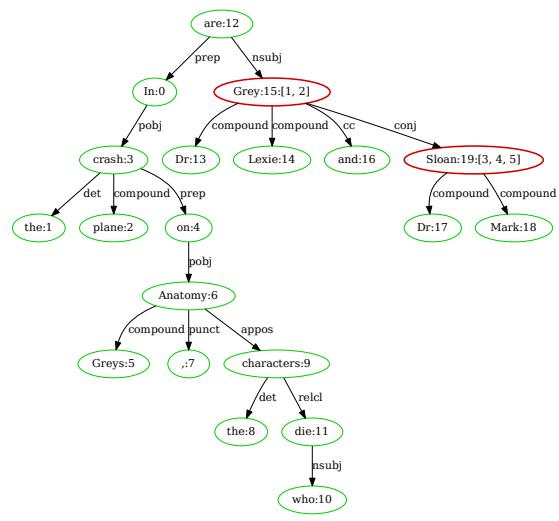  
Figure 5: The dependency tree of sentence "In the plane crash on Grey’s Anatomy, the characters who die are Dr. Lexie Grey [1][2] and Dr. Mark Sloan [3][4][5].", from the response generated by GPT-3.5 (5-psg). The query is "Who dies in the plane crash on greys?" from ASQA. The modified tree of claim corresponds to citation "[1][2]" is shown at Figure 6. The modified tree of claim corresponds to citation "[3][4][5]" is shown at Figure 7.

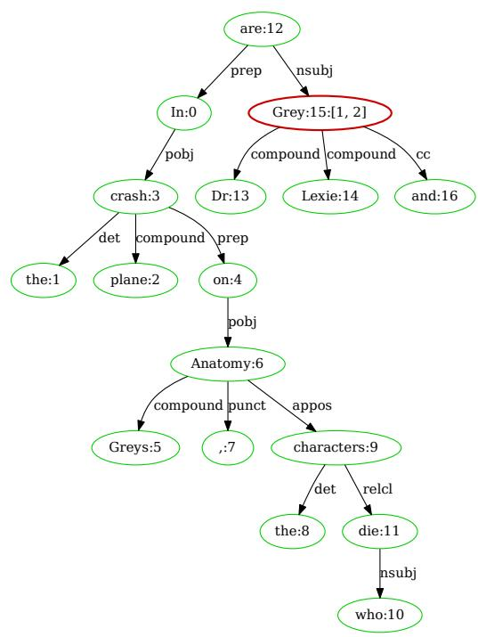  
Figure 6: The modified tree of claim "In the plane crash on Greys Anatomy , the characters who die are Dr Lexie Grey and". This claim corresponds to citation "[1][2]" of sentence which is illustrated in Figure 5.

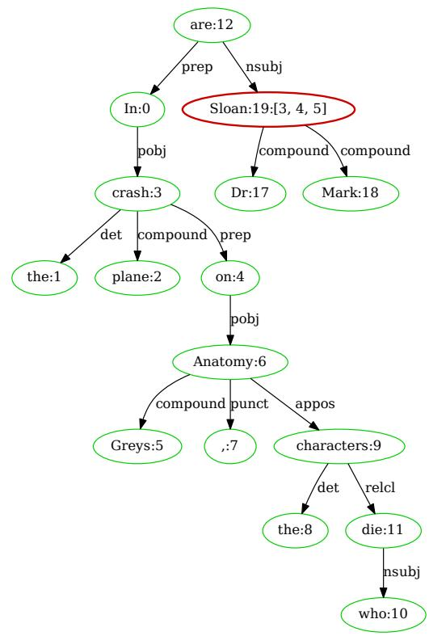  
Figure 7: The modified tree of claim "In the plane crash on Greys Anatomy , the characters who die are Dr Mark Sloan". This claim corresponds to citation "[3][4][5]" of sentence which is illustrated in Figure 5.

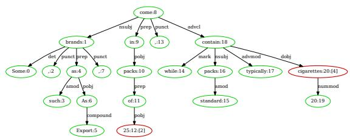  
Figure 8: The dependency tree of sentence "Some brands, such as Export As, come in packs of 25 [2], while standard packs typically contain 20 cigarettes [4].", from the response generated by GPT-3.5 (5-psg). The query is "Number of cigarettes in a pack in usa?" from ASQA. The modified tree of claim corresponds to citation "[2]" is shown at Figure 9. The modified tree of claim corresponds to citation "[4]" is shown at Figure 10.

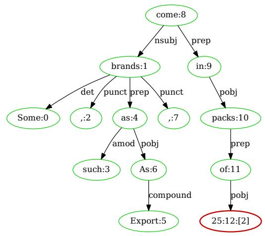

Figure 9: The modified tree of claim "Some brands , such as Export As , come in packs of 25". This claim corresponds to citation "[2]" of sentence which is illustrated in Figure 8.  
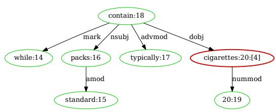

Figure 10: The modified tree of claim "while standard packs typically contain 20 cigarettes". This claim corresponds to citation "[4]" of sentence which is illustrated in Figure 8.  
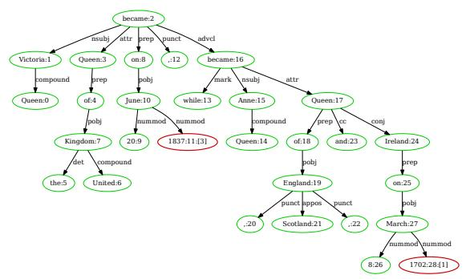  
Figure 11: The dependency tree of sentence "Queen Victoria became Queen of the United Kingdom on 20 June 1837[3], while Queen Anne became Queen of England, Scotland, and Ireland on 8 March 1702[1].", from the response generated by GPT-3.5 (5-psg). The query is "When did the queen became queen of england?" from ASQA. The modified tree of claim corresponds to citation "[3]" is shown at Figure 12. The modified tree of claim corresponds to citation $" [ 1 ] "$ is shown at Figure 13.

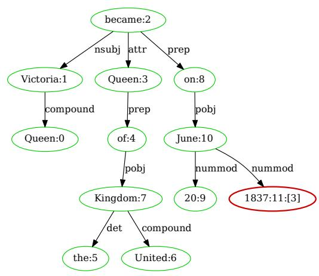  
Figure 12: The modified tree of claim "Queen Victoria became Queen of the United Kingdom on 20 June 1837". This claim corresponds to citation "[3]" of sentence which is illustrated in Figure 11.

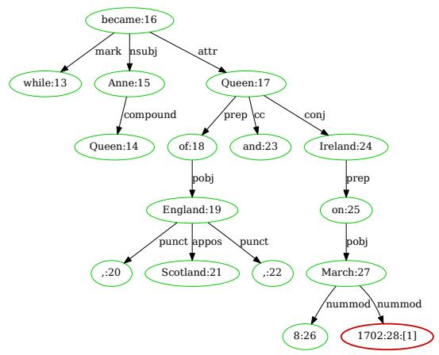  
Figure 13: The modified tree of claim "while Queen Anne became Queen of England , Scotland , and Ireland on 8 March 1702". This claim corresponds to citation "[1]" of sentence which is illustrated in Figure 11.

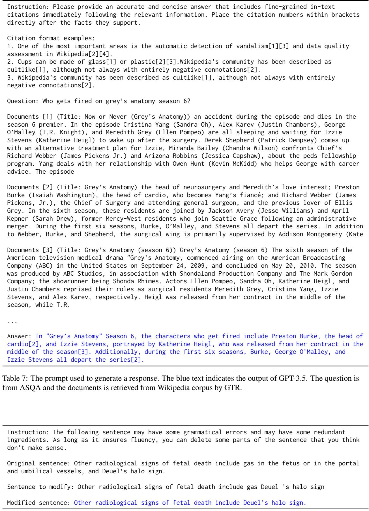  
Table 8: The prompt used to refine a claim. The blue text indicates the output of GPT-3.5.