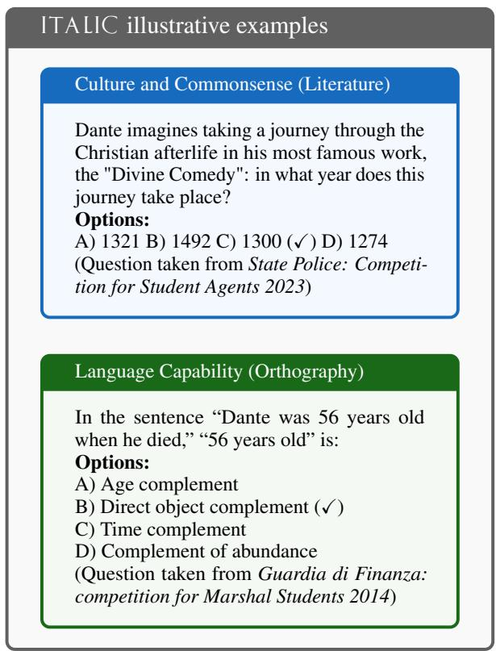
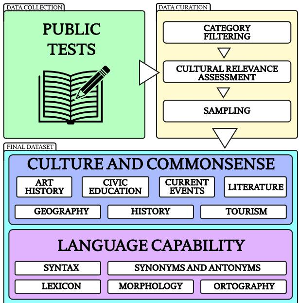
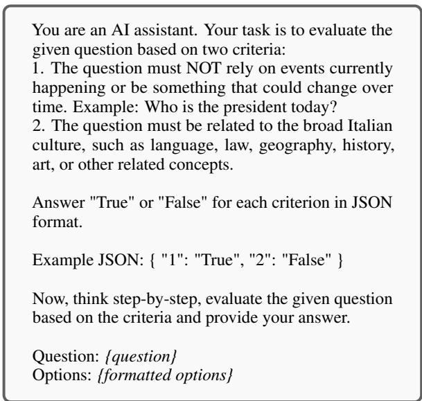
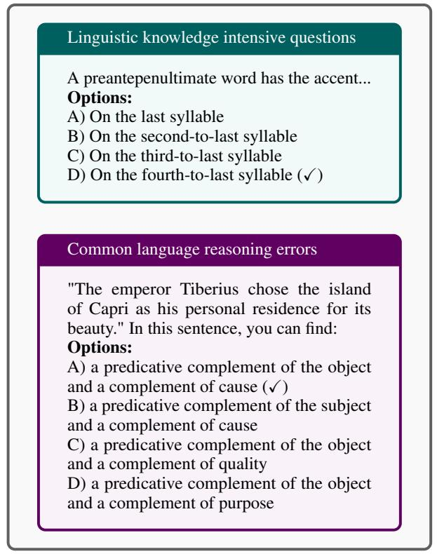
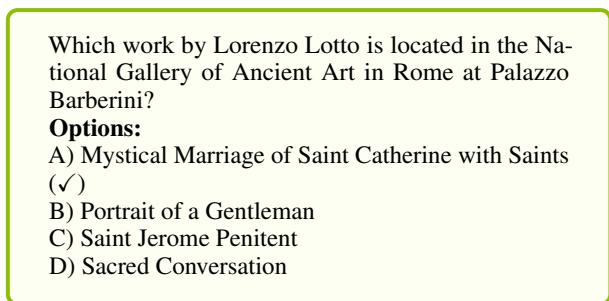
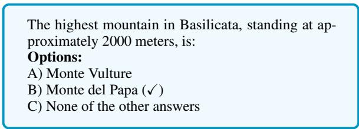

ITALIC: An Italian Culture-Aware Natural Language Benchmark Andrea Seveso1,3, Daniele Potertì2, Edoardo Federici, Mario Mezzanzanica1,3, Fabio Mercorio1,3

1Dept of Statistics and Quantitative Methods, University of Milano-Bicocca, Italy, 2Dept of Economics, Management and Statistics, University of Milano-Bicocca, Italy, 3CRISP Research Centre crispresearch.eu, University of Milano-Bicocca, Italy

## Abstract

We present ITALIC1, a large-scale benchmark dataset of 10,000 multiple-choice questions designed to evaluate the natural language understanding of the Italian language and culture. ITALIC spans 12 domains, exploiting public tests to score domain experts in real-world scenarios. We detail our data collection process, stratification techniques, and selection strategies. ITALIC provides a comprehensive assessment suite that captures commonsense reasoning and linguistic proficiency in a morphologically rich language. We establish baseline performances using 17 state-of-the-art LLMs, revealing current limitations in Italian language understanding and highlighting significant linguistic complexity and cultural specificity challenges. ITALIC serves as a benchmark for evaluating existing models and as a roadmap for future research, encouraging the development of more sophisticated and culturally aware natural language systems.

## 1 Introduction and Motivation

The rapid advancement of Large Language Models (LLMs) has significantly transformed the field of natural language processing, with models now exhibiting impressive capabilities across a wide array of tasks (Chang et al., 2024). As these models approach near-human-level performance in various domains, there is a rising need for robust and comprehensive evaluation methods. Assessing model performance is crucial yet challenging, as multiple key factors must be considered. These include the model’s accuracy, robustness, fairness, and computational efficiency, among others (Liang et al., 2023). The creation and assessment of language models capable of operating proficiently in multiple languages worldwide continue to pose substantial difficulties for researchers (Srivastava et al., 2023). The document by the Italian government on the strategy for AI for 2024 to 20262 highlights the risk of cultural homogenisation when using anglocentric LLMs. The currently available models often perform highly in English but are lacking in underrepresented languages (Ruder et al., 2021). This is due to factors such as the scarce and lower quality available data (Kreutzer et al., 2022), smaller contributing communities, and Anglo-centric cultural bias in development (Talat et al., 2022).

  
Figure 1: Example questions from ITALIC. Note: every example is a direct translation; the original questions are in Italian. The correct option is marked by (✓).

Evaluation datasets for Italian are often insufficient, as they are translated from English rather than properly localised. Moreover, specifically, Italian datasets tend to focus on simple tasks, lacking coverage of common sense and cultural knowledge. To evaluate whether an LLM aligns with Italian culture, we propose ITALIan Cultural Benchmark (ITALIC), a novel dataset using a set of cultural questions taken from exams for public competitions in Italy. These tests assess candidates’ cultural knowledge, and applying them to LLMs would provide a useful tool to identify models not aligned with Italian culture. Fig. 1 shows illustrative examples from ITALIC.

Standardised aptitude and knowledge assessments are used in public domains such as university admissions, military recruitment, public sector positions, and medical licensure examinations, among others. The primary aim of these tests is to evaluate applicants’ domain knowledge, general knowledge, and linguistic and analytical capabilities, which are deemed essential skills that public institutions and employers prioritise by Italian national standards requirements. These assessments are crucial for a merit-based selection process across diverse fields and positions (Ruffini et al., 2023). In addition to evaluating general knowledge and analytical skills, many standardised assessments include a dedicated section focused on language and culturally relevant topics, reflecting Italy’s rich cultural heritage. It is an essential criterion for public and professional roles where cultural awareness and communication skills are paramount, and candidates must be aligned with the cultural norms and values embedded within the Italian professional and public spheres.

Since these culturally relevant sections present a unique challenge for language models, our study seeks to create a standard evaluation suite for advanced large language models by utilising the structure of Italian public exams as a comprehensive testing framework. The tests’ structured and standardised nature makes them an excellent benchmark for comparing different LLMs with questions that are contextually relevant to Italian culture.

## 1.1 Contributions

The main contributions of our work are three-fold:

1. We design and publicly release ITALIC, a benchmark dataset designed to evaluate LLMs’ Italian cultural and linguistic understanding across diverse domains, including history, geography, literature, and civic knowledge.

2. We comprehensively categorise the dataset into cultural and linguistic domains, enabling a clear assessment of models’ performance across specific tasks.

3. We empirically evaluate and discuss 17 different model configurations, showing the current limitations of LLMs in understanding Italian culture and language and highlighting areas where future improvements in culturally aware NLP are needed.

## 2 Related Work

Large Language Models are deep learning models trained on vast amounts of multilingual text data, capable of understanding and generating language in a sophisticated manner (Armengol-Estapé et al., 2022; Le Scao et al., 2023). While exhibiting emerging capabilities across multiple languages such as German, French, Spanish, and Italian, multilingual models do not perform as well as in the primary training language (Touvron et al., 2023; Jiang et al., 2024). Therefore, it is essential to evaluate their performance using language-specific metrics.

Available English Benchmarks. Several benchmarks have been developed to assess language models’ general intelligence and reasoning capabilities. Notably, MMLU (Massive Multitask Language Understanding) (Hendrycks et al., 2021) is a comprehensive benchmark that evaluates language models across 57 diverse subjects, including STEM, humanities, and social sciences. AGIEval (Zhong et al., 2024), on the other hand, is designed to assess the capabilities of models in artificial general intelligence across a broad range of tasks and skills.

Cultural Benchmarks. Cultural benchmarks have emerged as crucial tools in evaluating the adaptability and fairness of language models across different social and cultural contexts (Hershcovich et al., 2022). Several studies have aimed to quantify how well these models perform across diverse demographic groups and cultural settings.

NORMAD (Norms and Adaptability of Language Models) (Rao et al., 2024) focuses on the cultural adaptability of LLMs. By utilizing 2,600 stories from 75 countries, NORMAD assesses how well these models understand and replicate social norms and etiquette as proxies for cultural comprehension. In a complementary effort, the BLEND benchmark (Myung et al., 2024) expands the scope by offering a dataset of 52.6k question-answer pairs spanning 13 languages and 16 countries/regions. This large-scale study reveals a significant imbalance in how LLMs process cultural knowledge, with models often performing better on questions related to highly represented cultures. BLEND highlights the need for more equitable training approaches that ensure underrepresented cultures are not neglected in model performance. Lastly, CLICK (Cultural and Linguistic Intelligence in Korean) (Kim et al., 2024) provides a localised examination by testing models on their understanding of Korean culture and language. Based on 1,995 QA pairs from official exams and textbooks, the benchmark covers 11 categories related to Korean cultural knowledge, thereby addressing the linguistic and cultural nuances specific to the region.

Each benchmark focuses on a different aspect—social biases, adaptability to diverse social norms, cultural representation, or linguistic specificity—yet they all contribute to a broader understanding of the limitations and potentials of LLMs in culturally complex environments. While the above benchmarks have been instrumental in advancing the field, they primarily focus on English or specific cultural contexts. Some may include some tests in Italian but are not focused on Italian cultural commonsense and language capabilities.

Italian benchmarks. Compared to the English community, the Italian NLP community lacks the depth of original language evaluation benchmarks. (Basile et al., 2023) present a Unified Benchmark for Italian Natural Language Understanding, which includes tasks such as textual entailment, event detection and classification, factuality classification, sentiment polarity classification, irony detection, and hate speech detection. (Lai et al., 2023) propose a collaborative benchmark covering 13 tasks. Despite their contributions, both benchmarks mainly address classification-based tasks and do not examine LLM capabilities like commonsense reasoning. (Landro et al., 2022) provides an Italian benchmark for news text summarization. (Mercorio et al., 2024) introduces an adaptation of the INVALSI standardised tests for the automated evaluation of LLMs, aiming to improve the assessment of these models within diverse Italian linguistic and cultural contexts.

Our work aims to build upon these foundations by developing a specialised benchmark tailored for cultural knowledge assessment specific to Italian.

## 3 Dataset Curation

  
Figure 2: Overview of the data collection and curation process for the ITALIC benchmark.

ITALIC contains 10,000 carefully curated questions selected from an initial corpus of 2,110,643 questions. The dataset curation process overview is summarised in Fig. 2. The initial data was sourced from various files in PDF, HTML, DOC, and other formats published by official bodies that announce individual competitive public examinations3. The preprocessing process involved standard crawling techniques, including rate-limited requests to ensure politeness and acquire publicly available documents from official governmental sources and public registries. Document collection was followed by format conversion from various source formats (HTML, PDF) using regex and standard libraries. The corpus comprises questions and tasks from real-world exams, professional assessments, and domain-specific challenges. This ensures the dataset reflects the knowledge and skills required in Italy’s various professional and academic contexts, like medical and military. Given that the data originates from institutional sources, it is expected to maintain a high standard of quality and accuracy, as domain experts crafted it for public evaluations. The collected data, including the questions, answers, relevant metadata, and associated images, were normalised into JSON. Each entry follows a standard multiple-choice format with a single correct option, providing a clear structure for model evaluation.

## 3.1 Dataset Categorisation

We filtered out any questions that lacked answers or were incorrectly formatted, aiming to preserve only high-quality entries. We also removed any question that required reading and understanding a contextual paragraph and any question containing images. We conducted deduplication for questions that shared the same question and answer options. As a result, some questions differ only in answer options, which we treat as distinct items for evaluation purposes. However, these items will not appear together in the final dataset during subsequent processing steps due to their similarity. We applied simple preprocessing techniques to clean the dataset, such as removing question numbers and artefacts that appeared at the beginning of some questions. These artefacts included formatting characters, extraneous symbols, or other irrelevant text that could interfere with the clarity of the questions.

Using the collected metadata, the data was refined to include only questions from the dedicated cultural sections of the tests that fell into two main categories: Culture and Commonsense and Language Capability. The Culture and Commonsense category encompasses history, geography, civic education, current events, literature, art history, and tourism, reflecting Italy’s cultural and social context. The Language Capability category includes tasks that assess knowledge of synonyms and antonyms, orthography, vocabulary, morphology, and syntax, which are crucial for evaluating linguistic proficiency in Italian. These subcategories assess a model’s ability to understand Italian grammar rules, word formations, spelling conventions, and linguistic richness. Tasks related to Syntax determine sentence structure and grammatical correctness, while Morphology tests the model’s ability to process word inflexions and conjugations, which are particularly complex in Italian. Lexicon addresses vocabulary knowledge, while Synonyms and Antonyms test semantic understanding and Orthography ensures models can accurately handle Italian spelling rules. After filtering, the dataset was reduced to 1,193,911 questions (56% of the initial).

Assessing cultural relevance in the Italian context. To evaluate the cultural significance of the questions, we employ the LLM-as-a-Judge methodology, using LLMs to assess the quality of responses based on a given prompt. Previous work (Yuan et al., 2024) uses this technique to evaluate task difficulty, asking the LLM judge to determine the response using five additive criteria (relevance, coverage, usefulness, clarity and expertise), covering various quality aspects. We adopt this methodology, asking not one but three LLMs: GPT-4o-mini (Achiam et al., 2023), Gemini-flash-1.5 (Reid et al., 2024) and Llama 3.1 70b (Dubey et al., 2024). Our filtering criteria require that each question not be time-sensitive or dependent on events currently happening and must be closely related to aspects of Italian culture, such as language, history, art, and other relevant cultural elements. The prompt to rate the LLMs is shown in Fig. 3.

  
Figure 3: Cultural relevance assessment prompt.

Based on these criteria, we retain only those items that all three models deem appropriate in every category. This filtering process removes 27.8% of questions.

Meaningfully reducing the sample size. Finally, to further reduce the size of the dataset and ensure the benchmark is not too expensive to run, we apply Farthest Point Sampling (FPS) (Eldar et al., 1997) to extract a sample of 10,000 questions. FPS iteratively selects the item farthest from the already selected items in the embedding space. This ensures the selected subset is diverse, removing items with similar questions and options, and captures a wide range of characteristics in the entire dataset. We first create word embeddings of each question in the dataset using the highest-performing model4 on the MTEB leaderboard (Muennighoff et al., 2023). We then apply the FPS implementation proposed in (Li et al., 2022).

## 3.2 Dataset Description

The dataset comprises 10,000 questions, comprehensively evaluating models’ abilities to understand and reason within the Italian context. Tab. 1 provides a detailed breakdown of the number of questions in each category, showcasing the distribution and variety within the dataset. Each question is formatted as a multiple-choice query, with an average question length of 87 characters and a median of 4 answer options. The longest question in ITALIC is 577 characters long. The minimum number of choices per question is 2, while the maximum is 5. The total number of tokens across the input data amounts to 499,963.

<table><tr><td>Category</td><td>Subcategory</td><td>#</td></tr><tr><td>Culture and Commonsense</td><td>Art History Civic Education Current Events Geography History Literature</td><td>980 973 92 979 978 984</td></tr><tr><td>Language Capability</td><td>Tourism Lexicon Morphology Orthography Synonyms and Antonyms</td><td>980 979 140 971 971</td></tr><tr><td>Total</td><td>Syntax</td><td>973 10000</td></tr></table>

Table 1: Number of questions in ITALIC divided by Culture and Commonsense and Language Capability.

## 3.3 Evaluation Strategy

Our approach is consistent with standard LLM evaluation frameworks like OpenAI’s simple-evals5. We generate responses for open-source models and API-based LLMs and then compare these to the labelled correct answers. We use a decoding temperature of 0 to ensure deterministic output in this setting. Each evaluation has been run exactly once. We use zero-shot and five-shot prompts to ensure a fair assessment. We provide the models with no examples or demonstrations in the zero-shot scenario.

In contrast, in the five-shot evaluation, in each question, we include in the prompt five high-quality examples that have been excluded from ITALIC during the previous filtering phase. The models are instructed to respond with only the corresponding letter (e.g., A, B, C, D) without providing any explanations or further reasoning. The evaluation is strictly based on identifying the correct answer letter, using a simple pattern-matching technique to find the first occurrence of the predicted letter in the response. The primary metric to measure performance is accuracy, reflecting the proportion of correctly answered questions.

Models employed. Our evaluation includes closed-source and open-source language models and models specifically fine-tuned for the Italian language. We include only instruction-tuned models, ensuring they are optimised for following prompts and generating responses in alignment with specific instructions. Among the closedsource models, we evaluate OpenAI’s GPT-4omini (Achiam et al., 2023) and GPT-4o, along with Anthropic’s Claude 3 Haiku and Claude 3.5 Sonnet. Additionally, we include Google’s Gemini series, specifically Gemini Flash and Pro 1.5 (Reid et al., 2024). For open-source models, we assess Meta’s Llama 3.1 series, including the 8b, 70b and 405b versions (Dubey et al., 2024), as well as Mistral’s models, Mistral Nemo and Large (Jiang et al., 2024). To ensure a focus on Italian-specific capabilities, we also evaluate models fine-tuned for Italian, such as LLaMAntino-3 (Polignano et al., 2024), popular models Llama-3.1-8b-Ita6 and maestralechat-v0.47, as well as the foundational models iGeniusAI’s Italia 9B8, Minerva 7B (Orlando et al., 2024) and Almawave’s Velvet 14B9.

## 3.4 Maintenance

ITALIC provides a snapshot of language and cultural knowledge based on existing datasets and is designed to be robust and fully operational upon release, with no need for routine maintenance. However, as language and cultural norms evolve, periodic updates will be required to ensure the benchmark remains relevant. A new dataset version will be created and made available in such cases.

Previous versions of ITALIC will remain accessible and maintained through Zenodo, which offers a detailed version history to allow users to refer back to earlier iterations as needed. Researchers are encouraged to extend, augment, or contribute to the dataset. Those interested in making contributions can contact us with proposed additions or modifications, and after verification, the new data will be integrated into the existing dataset. A new version will then be released, ensuring all users can access the latest updates.

## 4 Results and Discussion

In this section, we present the performance of LLMs on the ITALIC benchmark, assessing their proficiency in Italian cultural and linguistic aspects. We evaluated the open-source models on an NVIDIA A100 80GB PCIe GPU. For this evaluation, we utilised VLLM with its default OpenAIcompatible server, running models in bf16 format. The entire process, including setup and evaluation, took approximately 5 hours. Closed-source models and models with over 70 billion parameters were accessed from API services, costing around 100\$. Tab. 2 shows the accuracy (%) of each model across several categories within the Italian cultural and linguistic context.

Model performance. Among the models tested, Anthropic’s Claude 3.5 Sonnet demonstrates the highest overall accuracy across cultural and language tasks, closely followed by GPT-4o. The open-source models also perform well, with the 405b version of LLaMa standing out.

As expected, larger models tend to achieve higher scores, aligning with scaling laws (Kaplan et al., 2020) that indicate performance improves with increased training compute, dataset size and model parameters. When comparing Italian-specific models to multilingual models, we observe that although the former are fine-tuned or trained on a large percentage of Italian data, they still struggle to outperform larger models trained with a greater computational budget and higherquality multilingual data. Italian fine-tuning of models like Llama does result in a few percentage points of improvement over the multilingual baseline. However, the performance of the foundational Italian-specific models evaluated suggests room for significant enhancements in its training approach and data quality. Notably, Velvet performs better than other Italian foundational models, though it is of larger parameter size, making direct comparisons less straightforward.

This aligns with previous findings (Tang et al., 2024) that a small subset of language-specific neurons and layers significantly influences the proficiency of LLMs in comprehending a particular language. (Fan et al., 2025) finds that the lower layers of a model are often involved in learning language-specific representations, which are then transformed into universal representations in higher-level layers. Along with higher training budgets and substantial computational resources, these mechanisms enable multilingual models to process a broader range of languages effectively. This contributes to their superior performance over language-specific models, even if they are not as specialised.

Qualitative study. Analysing the most frequently incorrectly answered questions by every model suggests the lack of specific linguistic knowledge and reasoning on language capabilities.

  
Figure 4: Examples of frequently failed questions in ITALIC.

Most models consistently struggle to answer the above orthography question accurately, including variations of proparoxytone (a word with stress on the third last syllable) shown in Fig. 4. Models lack sufficient knowledge to handle this kind of very specific question effectively. Many models struggle with performing language-based reasoning tasks. They also tend to falter in related tasks, such as identifying direct objects or time complements.

<table><tr><td rowspan=1 colspan=1></td><td rowspan=1 colspan=7>Culture and Commonsense</td><td rowspan=1 colspan=5>Language Capability</td><td rowspan=1 colspan=1>Total</td></tr><tr><td rowspan=1 colspan=1>Zero-shot Accuracy</td><td rowspan=1 colspan=7>Art (980)Civic (973)Eve (92)Geo (979)Hist (978)Lit (984)Tour (980)</td><td rowspan=1 colspan=5>Lex (979)Morp (140)Orth (971)Syno (971)Syn (973)</td><td rowspan=1 colspan=1>(10,000)</td></tr><tr><td rowspan=1 colspan=1>claude 3.5 sonnet</td><td rowspan=1 colspan=1>87.24</td><td rowspan=1 colspan=1>94.76</td><td rowspan=1 colspan=4>97.83   94.99   95.09  95.33</td><td rowspan=1 colspan=1>89.59</td><td rowspan=1 colspan=1>96.53</td><td rowspan=1 colspan=2>77.86   86.92</td><td rowspan=1 colspan=1>96.81</td><td rowspan=1 colspan=1>87.77</td><td rowspan=1 colspan=1>92.35</td></tr><tr><td rowspan=1 colspan=1>claude-3-haiku</td><td rowspan=1 colspan=1>76.63</td><td rowspan=1 colspan=1>82.53</td><td rowspan=1 colspan=4>84.78   85.70   85.89  83.03</td><td rowspan=1 colspan=1>78.67</td><td rowspan=1 colspan=1>90.40</td><td rowspan=1 colspan=2>67.86   71.16</td><td rowspan=1 colspan=1>87.64</td><td rowspan=1 colspan=1>72.25</td><td rowspan=1 colspan=1>81.24</td></tr><tr><td rowspan=1 colspan=1>gpt-4o-2024-08-06</td><td rowspan=1 colspan=1>85.71</td><td rowspan=1 colspan=1>93.11</td><td rowspan=1 colspan=1>97.83</td><td rowspan=1 colspan=3>94.79   94.79  94.11</td><td rowspan=1 colspan=1>88.98</td><td rowspan=1 colspan=1>96.83</td><td rowspan=1 colspan=2>80.00   83.42</td><td rowspan=1 colspan=1>96.91</td><td rowspan=1 colspan=1>85.92</td><td rowspan=1 colspan=1>91.36</td></tr><tr><td rowspan=1 colspan=1>gpt-4o-mini</td><td rowspan=1 colspan=1>76.73</td><td rowspan=1 colspan=1>82.53</td><td rowspan=1 colspan=1>88.04</td><td rowspan=1 colspan=3>88.36   84.46  82.72</td><td rowspan=1 colspan=1>78.27</td><td rowspan=1 colspan=1>90.50</td><td rowspan=1 colspan=2>70.00   71.88</td><td rowspan=1 colspan=1>93.72</td><td rowspan=1 colspan=1>74.20</td><td rowspan=1 colspan=1>82.22</td></tr><tr><td rowspan=1 colspan=1>gemini-pro-1.5</td><td rowspan=1 colspan=1>82.65</td><td rowspan=1 colspan=1>89.41</td><td rowspan=1 colspan=1>92.39</td><td rowspan=1 colspan=2>91.62   91.00</td><td rowspan=1 colspan=1>88.41</td><td rowspan=1 colspan=1>83.06</td><td rowspan=1 colspan=1>93.97</td><td rowspan=1 colspan=1>65.00</td><td rowspan=1 colspan=1>75.39</td><td rowspan=1 colspan=1>94.13</td><td rowspan=1 colspan=1>79.45</td><td rowspan=1 colspan=1>86.66</td></tr><tr><td rowspan=1 colspan=1>gemini-flash-1.5</td><td rowspan=1 colspan=1>76.33</td><td rowspan=1 colspan=1>82.73</td><td rowspan=1 colspan=1>86.96</td><td rowspan=1 colspan=2>86.62   83.74</td><td rowspan=1 colspan=1>81.10</td><td rowspan=1 colspan=1>77.45</td><td rowspan=1 colspan=1>90.81</td><td rowspan=1 colspan=1>62.14</td><td rowspan=1 colspan=1>73.53</td><td rowspan=1 colspan=1>92.17</td><td rowspan=1 colspan=1>74.41</td><td rowspan=1 colspan=1>81.66</td></tr><tr><td rowspan=1 colspan=1>llama-3.1-405b</td><td rowspan=1 colspan=1>86.22</td><td rowspan=1 colspan=1>90.65</td><td rowspan=1 colspan=1>96.74</td><td rowspan=1 colspan=2>93.77   94.17</td><td rowspan=1 colspan=1>93.19</td><td rowspan=1 colspan=1>86.84</td><td rowspan=1 colspan=1>94.18</td><td rowspan=1 colspan=1>62.14</td><td rowspan=1 colspan=1>78.06</td><td rowspan=1 colspan=1>95.98</td><td rowspan=1 colspan=1>78.83</td><td rowspan=1 colspan=1>88.89</td></tr><tr><td rowspan=1 colspan=1>llama-3.1-70b</td><td rowspan=1 colspan=1>81.12</td><td rowspan=1 colspan=1>84.58</td><td rowspan=1 colspan=1>93.48</td><td rowspan=1 colspan=2>88.56   90.90</td><td rowspan=1 colspan=1>86.08</td><td rowspan=1 colspan=1>82.04</td><td rowspan=1 colspan=1>90.91</td><td rowspan=1 colspan=1>61.43</td><td rowspan=1 colspan=1>69.52</td><td rowspan=1 colspan=1>92.58</td><td rowspan=1 colspan=1>71.94</td><td rowspan=1 colspan=1>83.61</td></tr><tr><td rowspan=1 colspan=1>llama-3.1-8b</td><td rowspan=1 colspan=1>66.22</td><td rowspan=1 colspan=1>69.48</td><td rowspan=1 colspan=1>77.17</td><td rowspan=1 colspan=2>77.02   74.95</td><td rowspan=1 colspan=1>64.13</td><td rowspan=1 colspan=1>69.39</td><td rowspan=1 colspan=1>74.97</td><td rowspan=1 colspan=1>40.00</td><td rowspan=1 colspan=1>49.33</td><td rowspan=1 colspan=1>70.44</td><td rowspan=1 colspan=1>50.46</td><td rowspan=1 colspan=1>66.38</td></tr><tr><td rowspan=1 colspan=1>mistral-large</td><td rowspan=1 colspan=1>82.96</td><td rowspan=1 colspan=1>88.39</td><td rowspan=1 colspan=1>94.57</td><td rowspan=1 colspan=3>91.32   91.82  88.72</td><td rowspan=1 colspan=1>83.37</td><td rowspan=1 colspan=1>93.67</td><td rowspan=1 colspan=1>68.57</td><td rowspan=1 colspan=1>74.36</td><td rowspan=1 colspan=1>94.75</td><td rowspan=1 colspan=1>75.33</td><td rowspan=1 colspan=1>86.30</td></tr><tr><td rowspan=1 colspan=1>mistral-nemo</td><td rowspan=1 colspan=1>66.33</td><td rowspan=1 colspan=1>69.27</td><td rowspan=1 colspan=1>82.61</td><td rowspan=1 colspan=3>76.00   74.34  68.39</td><td rowspan=1 colspan=1>67.76</td><td rowspan=1 colspan=1>79.37</td><td rowspan=1 colspan=1>52.86</td><td rowspan=1 colspan=1>55.61</td><td rowspan=1 colspan=1>74.25</td><td rowspan=1 colspan=1>54.78</td><td rowspan=1 colspan=1>68.53</td></tr><tr><td rowspan=1 colspan=1> LLaMAntino-3-8B</td><td rowspan=1 colspan=1>68.67</td><td rowspan=1 colspan=1>67.32</td><td rowspan=1 colspan=1>79.35</td><td rowspan=1 colspan=2>76.92   74.85</td><td rowspan=1 colspan=1>67.68</td><td rowspan=1 colspan=1>70.82</td><td rowspan=1 colspan=1>76.61</td><td rowspan=1 colspan=1>40.00</td><td rowspan=1 colspan=1>52.83</td><td rowspan=1 colspan=1>76.42</td><td rowspan=1 colspan=1>54.47</td><td rowspan=1 colspan=1>68.37</td></tr><tr><td rowspan=1 colspan=1>ıLlama-3.1-8b-Ita</td><td rowspan=1 colspan=1>70.10</td><td rowspan=1 colspan=1>71.22</td><td rowspan=1 colspan=1>82.61</td><td rowspan=1 colspan=2>79.26   77.40</td><td rowspan=1 colspan=1>67.17</td><td rowspan=1 colspan=1>71.73</td><td rowspan=1 colspan=1>81.51</td><td rowspan=1 colspan=1>52.14</td><td rowspan=1 colspan=1>53.04</td><td rowspan=1 colspan=1>81.15</td><td rowspan=1 colspan=1>53.65</td><td rowspan=1 colspan=1>70.49</td></tr><tr><td rowspan=1 colspan=1>ımaestrale-chat-v0.4</td><td rowspan=1 colspan=1>67.35</td><td rowspan=1 colspan=1>70.20</td><td rowspan=1 colspan=1>80.43</td><td rowspan=1 colspan=2>76.61   72.39</td><td rowspan=1 colspan=1>70.93</td><td rowspan=1 colspan=1>69.08</td><td rowspan=1 colspan=1>78.65</td><td rowspan=1 colspan=1>44.29</td><td rowspan=1 colspan=1>54.17</td><td rowspan=1 colspan=1>70.34</td><td rowspan=1 colspan=1>55.40</td><td rowspan=1 colspan=1>68.30</td></tr><tr><td rowspan=1 colspan=1>mVelvet-14B</td><td rowspan=1 colspan=1>67.86</td><td rowspan=1 colspan=1>72.56</td><td rowspan=1 colspan=1>83.70</td><td rowspan=1 colspan=2>76.81   77.10</td><td rowspan=1 colspan=1>69.21</td><td rowspan=1 colspan=1>71.43</td><td rowspan=1 colspan=1>77.32</td><td rowspan=1 colspan=1>42.86</td><td rowspan=1 colspan=1>44.08</td><td rowspan=1 colspan=1>70.03</td><td rowspan=1 colspan=1>45.63</td><td rowspan=1 colspan=1>67.04</td></tr><tr><td rowspan=1 colspan=1>Imodello-italia-9b</td><td rowspan=1 colspan=1>55.20</td><td rowspan=1 colspan=1>52.00</td><td rowspan=1 colspan=1>65.22</td><td rowspan=1 colspan=3>62.82   57.16  54.47</td><td rowspan=1 colspan=1>59.18</td><td rowspan=1 colspan=1>59.14</td><td rowspan=1 colspan=1>27.14</td><td rowspan=1 colspan=1>32.13</td><td rowspan=1 colspan=1>43.46</td><td rowspan=1 colspan=1>31.35</td><td rowspan=1 colspan=1>50.53</td></tr><tr><td rowspan=1 colspan=1>Minerva-7B</td><td rowspan=1 colspan=1>46.33</td><td rowspan=1 colspan=1>44.50</td><td rowspan=1 colspan=4>52.17   49.13   47.24  40.35</td><td rowspan=1 colspan=1>51.33</td><td rowspan=1 colspan=1>45.45</td><td rowspan=1 colspan=1>32.86</td><td rowspan=1 colspan=1>25.75</td><td rowspan=1 colspan=1>38.31</td><td rowspan=1 colspan=1>27.13</td><td rowspan=1 colspan=1>41.55</td></tr><tr><td rowspan=1 colspan=1>Models Avg</td><td rowspan=1 colspan=1>73.16</td><td rowspan=1 colspan=1>76.78</td><td rowspan=1 colspan=4>84.46   81.78   80.43  76.18</td><td rowspan=1 colspan=1>75.23</td><td rowspan=1 colspan=1>82.99</td><td rowspan=1 colspan=2>55.71   61.83</td><td rowspan=1 colspan=1>80.53</td><td rowspan=1 colspan=1>63.12</td><td rowspan=1 colspan=1>75.03</td></tr><tr><td rowspan=1 colspan=1>Five-shot Accuracy</td><td rowspan=1 colspan=6>Art (980)Civic (973)Eve (92)Geo (979)Hist (978)Lit (984)</td><td rowspan=1 colspan=1>Tour (980)</td><td rowspan=1 colspan=1>Lex (979)</td><td rowspan=1 colspan=3>Morp (140)Orth (971)Syno (971)</td><td rowspan=1 colspan=1>Syn (973)</td><td rowspan=1 colspan=1>(10,000)</td></tr><tr><td rowspan=1 colspan=1>claude-3.5-sonnet</td><td rowspan=1 colspan=1>89.18</td><td rowspan=1 colspan=1>96.20</td><td rowspan=1 colspan=4>96.74   96.02   96.11  95.53</td><td rowspan=1 colspan=1>91.94</td><td rowspan=1 colspan=1>98.06</td><td rowspan=1 colspan=1>81.43</td><td rowspan=1 colspan=1>88.57</td><td rowspan=1 colspan=1>97.12</td><td rowspan=1 colspan=1>89.72</td><td rowspan=1 colspan=1>93.70</td></tr><tr><td rowspan=1 colspan=1>claude-3-haiku</td><td rowspan=1 colspan=1>78.37</td><td rowspan=1 colspan=1>85.10</td><td rowspan=1 colspan=4>88.04   88.15   87.42  85.57</td><td rowspan=1 colspan=1>81.33</td><td rowspan=1 colspan=1>92.85</td><td rowspan=1 colspan=1>64.29</td><td rowspan=1 colspan=1>73.02</td><td rowspan=1 colspan=1>92.38</td><td rowspan=1 colspan=1>72.25</td><td rowspan=1 colspan=1>83.42</td></tr><tr><td rowspan=1 colspan=1>gpt-4o-2024-08-06</td><td rowspan=1 colspan=1>85.71</td><td rowspan=1 colspan=1>93.01</td><td rowspan=1 colspan=1>97.83</td><td rowspan=1 colspan=1>95.71</td><td rowspan=1 colspan=2>94.79  94.92</td><td rowspan=1 colspan=1>89.90</td><td rowspan=1 colspan=1>97.65</td><td rowspan=1 colspan=1>80.00</td><td rowspan=1 colspan=1>87.64</td><td rowspan=1 colspan=1>97.63</td><td rowspan=1 colspan=1>87.26</td><td rowspan=1 colspan=1>92.30</td></tr><tr><td rowspan=1 colspan=1>gpt-4o-mini</td><td rowspan=1 colspan=1>77.45</td><td rowspan=1 colspan=1>83.14</td><td rowspan=1 colspan=1>89.13</td><td rowspan=1 colspan=1>89.89</td><td rowspan=1 colspan=1>84.87</td><td rowspan=1 colspan=1>84.55</td><td rowspan=1 colspan=1>80.10</td><td rowspan=1 colspan=1>92.54</td><td rowspan=1 colspan=1>67.86</td><td rowspan=1 colspan=1>75.08</td><td rowspan=1 colspan=1>95.16</td><td rowspan=1 colspan=1>75.33</td><td rowspan=1 colspan=1>83.64</td></tr><tr><td rowspan=1 colspan=1>gemini-pro-1.5</td><td rowspan=1 colspan=1>84.39</td><td rowspan=1 colspan=1>91.57</td><td rowspan=1 colspan=1>94.57</td><td rowspan=1 colspan=2>93.36   93.46</td><td rowspan=1 colspan=1>91.36</td><td rowspan=1 colspan=1>86.63</td><td rowspan=1 colspan=1>96.32</td><td rowspan=1 colspan=1>63.57</td><td rowspan=1 colspan=1>79.30</td><td rowspan=1 colspan=1>96.09</td><td rowspan=1 colspan=1>84.89</td><td rowspan=1 colspan=1>89.42</td></tr><tr><td rowspan=1 colspan=1>gemini-flash-1.5</td><td rowspan=1 colspan=1>77.04</td><td rowspan=1 colspan=1>84.48</td><td rowspan=1 colspan=1>85.87</td><td rowspan=1 colspan=2>88.05   85.89</td><td rowspan=1 colspan=1>84.15</td><td rowspan=1 colspan=1>79.49</td><td rowspan=1 colspan=1>93.87</td><td rowspan=1 colspan=1>61.43</td><td rowspan=1 colspan=1>76.21</td><td rowspan=1 colspan=1>94.64</td><td rowspan=1 colspan=1>74.20</td><td rowspan=1 colspan=1>83.51</td></tr><tr><td rowspan=1 colspan=1>llama-3.1-405b</td><td rowspan=1 colspan=1>87.14</td><td rowspan=1 colspan=1>91.47</td><td rowspan=1 colspan=1>96.74</td><td rowspan=1 colspan=2>94.79   94.17</td><td rowspan=1 colspan=1>93.70</td><td rowspan=1 colspan=1>86.94</td><td rowspan=1 colspan=1>95.40</td><td rowspan=1 colspan=1>67.86</td><td rowspan=1 colspan=1>79.71</td><td rowspan=1 colspan=1>96.60</td><td rowspan=1 colspan=1>79.75</td><td rowspan=1 colspan=1>89.73</td></tr><tr><td rowspan=1 colspan=1>llama-3.1-70b</td><td rowspan=1 colspan=1>81.12</td><td rowspan=1 colspan=1>85.10</td><td rowspan=1 colspan=1>93.48</td><td rowspan=1 colspan=2>89.99   91.41</td><td rowspan=1 colspan=1>88.11</td><td rowspan=1 colspan=1>83.06</td><td rowspan=1 colspan=1>92.13</td><td rowspan=1 colspan=1>64.29</td><td rowspan=1 colspan=1>71.16</td><td rowspan=1 colspan=1>92.89</td><td rowspan=1 colspan=1>73.79</td><td rowspan=1 colspan=1>84.68</td></tr><tr><td rowspan=1 colspan=1>llama-3.1-8b</td><td rowspan=1 colspan=1>67.55</td><td rowspan=1 colspan=1>70.20</td><td rowspan=1 colspan=1>75.00</td><td rowspan=1 colspan=2>76.71   74.95</td><td rowspan=1 colspan=1>67.89</td><td rowspan=1 colspan=1>70.71</td><td rowspan=1 colspan=1>78.75</td><td rowspan=1 colspan=1>50.71</td><td rowspan=1 colspan=1>51.70</td><td rowspan=1 colspan=1>78.06</td><td rowspan=1 colspan=1>51.28</td><td rowspan=1 colspan=1>68.60</td></tr><tr><td rowspan=1 colspan=1>mistral-large</td><td rowspan=1 colspan=1>84.39</td><td rowspan=1 colspan=1>90.85</td><td rowspan=1 colspan=1>93.48</td><td rowspan=1 colspan=2>92.75   93.05</td><td rowspan=1 colspan=1>90.75</td><td rowspan=1 colspan=1>85.51</td><td rowspan=1 colspan=1>95.20</td><td rowspan=1 colspan=1>68.57</td><td rowspan=1 colspan=1>75.49</td><td rowspan=1 colspan=1>94.75</td><td rowspan=1 colspan=1>77.29</td><td rowspan=1 colspan=1>87.79</td></tr><tr><td rowspan=1 colspan=1>mistral-nemo</td><td rowspan=1 colspan=1>69.49</td><td rowspan=1 colspan=1>73.69</td><td rowspan=1 colspan=1>82.61</td><td rowspan=1 colspan=2>81.00   79.14</td><td rowspan=1 colspan=1>73.27</td><td rowspan=1 colspan=1>72.24</td><td rowspan=1 colspan=1>85.50</td><td rowspan=1 colspan=1>61.43</td><td rowspan=1 colspan=1>57.78</td><td rowspan=1 colspan=1>85.79</td><td rowspan=1 colspan=1>56.63</td><td rowspan=1 colspan=1>73.38</td></tr><tr><td rowspan=1 colspan=1>日LLaMAntino-3-8B</td><td rowspan=1 colspan=1>70.41</td><td rowspan=1 colspan=1>69.58</td><td rowspan=1 colspan=1>82.61</td><td rowspan=1 colspan=2>76.30   74.54</td><td rowspan=1 colspan=1>68.80</td><td rowspan=1 colspan=1>70.92</td><td rowspan=1 colspan=1>80.18</td><td rowspan=1 colspan=1>48.57</td><td rowspan=1 colspan=1>52.32</td><td rowspan=1 colspan=1>81.57</td><td rowspan=1 colspan=1>54.68</td><td rowspan=1 colspan=1>69.76</td></tr><tr><td rowspan=1 colspan=1>ıLlama-3.1-8b-Ita</td><td rowspan=1 colspan=1>71.22</td><td rowspan=1 colspan=1>71.53</td><td rowspan=1 colspan=1>77.17</td><td rowspan=1 colspan=2>77.83   77.20</td><td rowspan=1 colspan=1>70.93</td><td rowspan=1 colspan=1>72.55</td><td rowspan=1 colspan=1>83.96</td><td rowspan=1 colspan=1>52.14</td><td rowspan=1 colspan=1>53.35</td><td rowspan=1 colspan=1>85.17</td><td rowspan=1 colspan=1>54.37</td><td rowspan=1 colspan=1>71.60</td></tr><tr><td rowspan=1 colspan=1>ımaestrale-chat-v0.4</td><td rowspan=1 colspan=1>66.22</td><td rowspan=1 colspan=1>71.74</td><td rowspan=1 colspan=1>82.61</td><td rowspan=1 colspan=2>75.18   72.29</td><td rowspan=1 colspan=1>71.24</td><td rowspan=1 colspan=1>70.31</td><td rowspan=1 colspan=1>79.98</td><td rowspan=1 colspan=1>49.29</td><td rowspan=1 colspan=1>53.04</td><td rowspan=1 colspan=1>77.55</td><td rowspan=1 colspan=1>54.37</td><td rowspan=1 colspan=1>69.05</td></tr><tr><td rowspan=1 colspan=1>1Velvet-14B</td><td rowspan=1 colspan=1>70.00</td><td rowspan=1 colspan=1>76.36</td><td rowspan=1 colspan=1>86.96</td><td rowspan=1 colspan=2>78.45   77.30</td><td rowspan=1 colspan=1>69.21</td><td rowspan=1 colspan=1>72.65</td><td rowspan=1 colspan=1>79.57</td><td rowspan=1 colspan=1>49.29</td><td rowspan=1 colspan=1>44.90</td><td rowspan=1 colspan=1>70.96</td><td rowspan=1 colspan=1>43.68</td><td rowspan=1 colspan=1>68.24</td></tr><tr><td rowspan=1 colspan=1>ımodello-italia-9b</td><td rowspan=1 colspan=1>56.12</td><td rowspan=1 colspan=1>54.16</td><td rowspan=1 colspan=1>71.74</td><td rowspan=1 colspan=2>64.96   59.41</td><td rowspan=1 colspan=1>55.18</td><td rowspan=1 colspan=1>58.16</td><td rowspan=1 colspan=1>60.67</td><td rowspan=1 colspan=1>25.71</td><td rowspan=1 colspan=1>31.93</td><td rowspan=1 colspan=1>43.98</td><td rowspan=1 colspan=1>29.91</td><td rowspan=1 colspan=1>51.31</td></tr><tr><td rowspan=1 colspan=1>Minerva-7B</td><td rowspan=1 colspan=1>50.10</td><td></td><td></td><td></td><td></td><td></td><td></td><td></td><td></td><td></td><td rowspan=1 colspan=1>40.16</td><td rowspan=1 colspan=1>30.11</td><td rowspan=1 colspan=1>45.31</td></tr><tr><td rowspan=1 colspan=1>Models Avg</td><td rowspan=1 colspan=2>74.46    78.58</td><td rowspan=1 colspan=5>85.29   83.14   81.86  78.25    76.82</td><td rowspan=1 colspan=1>85.46</td><td rowspan=1 colspan=4>58.03   63.45    83.56   64.09</td><td rowspan=1 colspan=1>76.79</td></tr></table>

Table 2: Performance (accuracy %) comparison of AI models in zero-shot (top) and five-shot setting (bottom). The number of questions assessed is in parentheses next to the subcategory name. Categories are abbreviated as art history (Art), civic education (Civic), current events (Eve), geography (Geo), history (Hist), literature (Lit), tourism (Tour), lexicon (Lex), morphology (Morph), orthography (Orth), synonyms and antonyms (Syno), syntax (Synt).

  
Figure 5: Example of an artistic knowledge question highlighting gaps in model performance on culturally specific topics, such as identifying Italian art pieces.

While analysing the most frequent wrong answers to cultural questions, we found that these focus on narrow geographical and cultural aspects. For example, the incorrect answers in the Art section were about specific details about lesser-known Italian art collections or technical elements like the architectural style of Greek temples in Italy or restoration techniques, as in Fig. 5.

  
Figure 6: Example of a geographic knowledge question illustrating gaps in model performance on regionspecific information.

Another example of the most frequent wrong answers in the context of geographical questions requires in-depth knowledge of Italian history and human geography. Physical geography and mountain morphology are also explored, along with cultural and productive aspects such as viticulture and traditional craftsmanship. Certain questions focus on Italian geographic areas and institutions, including ports, Apennine mountain ranges, international connections, and UNESCO heritage sites, exemplified in Fig. 6.

Performance gaps within categories. Models consistently perform better in the culture and commonsense section than in language capability, likely due to the linguistic similarity of these tasks with their training data. Like many morphologically rich languages, Italian has intricate rules governing word formation, syntax, and orthographic structures. These complexities are difficult for models to grasp. Even when challenged in cultural questions, difficulties remain in nuanced tasks such as tourism, where even the best-performing models show relative weaknesses, especially in zero-shot evaluations. In particular, poor performance on Morphology and Orthography scores in both fewshot and zero-shot settings indicates that even the best models struggle with the subtleties of the Italian language structure, especially when examples are not provided.

One key observation from the results is the consistent difference in performance between the fewshot and zero-shot settings. The difference in the average score between the two tests is 1.48 percentage points in favour of the few-shot scenario for the culture and commonsense section and 2.08 for the language capability section (1.76 overall). In few-shot learning, models are given several task examples before making predictions. This allows the model to understand the structure, vocabulary, and nuances specific to the task or domain better. Questions in the language capability section are intertwined with language-specific rules, which may not be immediately obvious in a zero-shot setting.

## 5 Conclusion and Future Work

ITALIC represents a comprehensive and nuanced benchmark for evaluating Italian language understanding and cultural knowledge in AI models, providing diverse tasks across multiple domains and a robust tool for assessing and driving progress in Italian NLP.

Our evaluation of 17 state-of-the-art LLMs revealed that while models perform reasonably well in commonsense and culturally relevant tasks, they face significant challenges in mastering the linguistic intricacies of Italian, particularly in tasks involving morphology, syntax, and orthography. We observed a consistent improvement in few-shot settings compared to zero-shot, demonstrating that providing task-specific examples greatly enhances model performance.

ITALIC highlights several areas for improvement in Italian language models, such as enhanced cultural training data to capture better Italianspecific knowledge and contexts and specialised fine-tuning for professional domains relevant to the Italian market. As the field continues to advance, ITALIC will serve as a valuable resource for researchers and practitioners working on Italian language AI, helping to ensure that these technologies can effectively serve the needs of Italian-speaking users and applications.

## 5.1 Future Work

We envision several directions for expanding and improving ITALIC: (i) Periodic updates are needed to reflect evolving language use and cultural references in Italy, ensuring that benchmarks remain relevant for long-term evaluations. (ii) Integrating multimodal data (e.g., images, videos, audio) could challenge multimodal models. For example, combining visual art references or historical monuments with textual descriptions could improve cultural comprehension in models. (iii) Finally, future work could extend the framework used to build ITALIC to other underrepresented languages with rich cultural and linguistic diversity. This would help address the broader challenge of multilingual language models’ ability to handle culturally specific tasks across different global contexts.

Resource Availability Statement. ITALIC is accessible on Zenodo10 under the MIT license, with no IP-based or other restrictions. Additionally, the code used for the evaluation is available on GitHub11.

## 6 Limitations

Scope of evaluation. The focus of ITALIC is exclusively on the Italian language and cultural context. While this is useful for evaluating models performance in a specific language, the results may not generalise to other underrepresented languages or cultural settings.

Large-scale manual evaluation. Our dataset is based on a thoroughly validated source: standardised tests for public national assessments. Moreover, we conducted comprehensive human validation across all contexts to assess the dataset’s validity. However, ideally, a human evaluation study would also require a large-scale assessment involving annotators from diverse cultural and background perspectives, ensuring an unbiased human effort.

## 7 Ethical Considerations

The dataset does not contain confidential information. It consists entirely of publicly available standardised test questions and does not include real data from individuals or non-public communications. Furthermore, all data and supplementary sources used in the collection process do not contain personally identifiable information or sensitive content. The dataset is also free from content that could be considered offensive, insulting, threatening, or distressing. Since it solely comprises data from standardised tests and does not involve human subjects or personal data, an ethical review process was not required. Potential risks of misuse include using the benchmark results to justify or argue against the need to develop native LLMs specifically tailored for the Italian language. This possibility should be considered to avoid misinterpretations or unintended consequences when leveraging the evaluation outcomes.

## References

Josh Achiam, Steven Adler, Sandhini Agarwal, Lama Ahmad, Ilge Akkaya, Florencia Leoni Aleman, Diogo Almeida, Janko Altenschmidt, Sam Altman, Shyamal Anadkat, et al. 2023. Gpt-4 technical report. arXiv preprint arXiv:2303.08774.

Jordi Armengol-Estapé, Ona de Gibert Bonet, and Maite Melero. 2022. On the multilingual capabilities of very large-scale English language models. In Proceedings ofthe Thirteenth Language Resources and Evaluation Conference, pages 3056–3068, Marseille, France. European Language Resources Association.

Valerio Basile, Livio Bioglio, Alessio Bosca, Cristina Bosco, and Viviana Patti. 2023. Uinauil: A unified benchmark for italian natural language understanding. In Proceedings of the 61st Annual Meeting of the Associationfor Computational Linguistics (Volume 3: System Demonstrations), pages 348–356.

Yupeng Chang, Xu Wang, Jindong Wang, Yuan Wu, Linyi Yang, Kaijie Zhu, Hao Chen, Xiaoyuan Yi, Cunxiang Wang, Yidong Wang, Wei Ye, Yue Zhang, Yi Chang, Philip S. Yu, Qiang Yang, and Xing Xie. 2024. A survey on evaluation of large language models. ACM Trans. Intell. Syst. Technol., 15(3).

Abhimanyu Dubey, Abhinav Jauhri, Abhinav Pandey, Abhishek Kadian, Ahmad Al-Dahle, Aiesha Letman, Akhil Mathur, Alan Schelten, Amy Yang, Angela Fan, et al. 2024. The llama 3 herd of models. arXiv preprint arXiv:2407.21783.

Yuval Eldar, Michael Lindenbaum, Moshe Porat, and Yehoshua Y Zeevi. 1997. The farthest point strategy for progressive image sampling. IEEE transactions on image processing, 6(9):1305–1315.

Yuchun Fan, Yongyu Mu, Yilin Wang, Lei Huang, Junhao Ruan, Bei Li, Tong Xiao, Shujian Huang, Xiaocheng Feng, and Jingbo Zhu. 2025. Slam: Towards efficient multilingual reasoning via selective language alignment. In Proceedings of the 31st International Conference on Computational Linguistics, pages 9499–9515.

Dan Hendrycks, Collin Burns, Steven Basart, Andy Zou, Mantas Mazeika, Dawn Song, and Jacob Steinhardt. 2021. Measuring massive multitask language understanding. In International Conference on Learning Representations.

Daniel Hershcovich, Stella Frank, Heather Lent, Miryam de Lhoneux, Mostafa Abdou, Stephanie Brandl, Emanuele Bugliarello, Laura Cabello Piqueras, Ilias Chalkidis, Ruixiang Cui, et al. 2022. Challenges and strategies in cross-cultural nlp. In Proceedings of the 60th Annual Meeting of the Associationfor Computational Linguistics (Volume 1: Long Papers), pages 6997–7013.

Albert Q Jiang, Alexandre Sablayrolles, Antoine Roux, Arthur Mensch, Blanche Savary, Chris Bamford, Devendra Singh Chaplot, Diego de las Casas, Emma Bou Hanna, Florian Bressand, et al. 2024. Mixtral of experts. arXiv preprint arXiv:2401.04088.

Jared Kaplan, Sam McCandlish, Tom Henighan, Tom B Brown, Benjamin Chess, Rewon Child, Scott Gray, Alec Radford, Jeffrey Wu, and Dario Amodei. 2020. Scaling laws for neural language models. arXiv preprint arXiv:2001.08361.

Eunsu Kim, Juyoung Suk, Philhoon Oh, Haneul Yoo, James Thorne, and Alice Oh. 2024. CLIcK: A benchmark dataset of cultural and linguistic intelligence in Korean. In Proceedings of the 2024 Joint International Conference on Computational Linguistics, Language Resources and Evaluation (LREC-COLING 2024), pages 3335–3346, Torino, Italia. ELRA and ICCL.

Julia Kreutzer, Isaac Caswell, Lisa Wang, Ahsan Wahab, Daan van Esch, Nasanbayar Ulzii-Orshikh, Allahsera Tapo, Nishant Subramani, Artem Sokolov, Claytone Sikasote, et al. 2022. Quality at a glance: An audit of web-crawled multilingual datasets. Transactions of the Associationfor Computational Linguistics, 10:50– 72.

Mirko Lai, Stefano Menini, Marco Polignano, Valentina Russo, Rachele Sprugnoli, Giulia Venturi, et al. 2023. Evalita 2023: Overview of the 8th evaluation campaign of natural language processing and speech tools for italian. In Proceedings of the Eighth Evaluation Campaign of Natural Language Processing and Speech Tools for Italian. Final Workshop (EVALITA 2023), CEUR. org, Parma, Italy.

Nicola Landro, Ignazio Gallo, Riccardo La Grassa, and Edoardo Federici. 2022. Two new datasets for italianlanguage abstractive text summarization. Information, 13(5):228.

Teven Le Scao, Angela Fan, Christopher Akiki, Ellie Pavlick, Suzana Ilic, Daniel Hesslow, Roman´ Castagné, Alexandra Sasha Luccioni, François Yvon, Matthias Gallé, et al. 2023. Bloom: A 176bparameter open-access multilingual language model.

Jingtao Li, Jian Zhou, Yan Xiong, Xing Chen, and Chaitali Chakrabarti. 2022. An adjustable farthest point sampling method for approximately-sorted point cloud data. In 2022 IEEE Workshop on Signal Processing Systems (SiPS), pages 1–6.

Percy Liang, Rishi Bommasani, Tony Lee, Dimitris Tsipras, Dilara Soylu, Michihiro Yasunaga, Yian Zhang, Deepak Narayanan, Yuhuai Wu, Ananya Kumar, et al. 2023. Holistic evaluation of language models. Transactions on Machine Learning Research. Featured Certification, Expert Certification.

Fabio Mercorio, Mario Mezzanzanica, Daniele Potertì, Antonio Serino, and Andrea Seveso. 2024. Disce aut deficere: Evaluating llms proficiency on the invalsi italian benchmark. arXiv preprint arXiv:2406.17535.

Niklas Muennighoff, Nouamane Tazi, Loic Magne, and Nils Reimers. 2023. MTEB: Massive text embedding benchmark. In Proceedings ofthe 17th Conference ofthe European Chapter ofthe Associationfor Computational Linguistics, pages 2014–2037, Dubrovnik, Croatia. Association for Computational Linguistics.

Junho Myung, Nayeon Lee, Yi Zhou, Jiho Jin, Rifki Afina Putri, Dimosthenis Antypas, Hsuvas Borkakoty, Eunsu Kim, Carla Perez-Almendros, Abinew Ali Ayele, et al. 2024. BLEnd: A benchmark for LLMs on everyday knowledge in diverse cultures and languages.

Riccardo Orlando, Luca Moroni, Pere-Lluís Huguet Cabot, Edoardo Barba, Simone Conia, Sergio Orlandini, Giuseppe Fiameni, Roberto Navigli, et al. 2024. Minerva llms: The first family of large language models trained from scratch on italian data. In Proceedings of the Tenth Italian Conference on Computational Linguistics (CLiC-it 2024).

Marco Polignano, Pierpaolo Basile, and Giovanni Semeraro. 2024. Advanced natural-based interaction for the italian language: Llamantino-3-anita. Preprint, arXiv:2405.07101.

Abhinav Rao, Akhila Yerukola, Vishwa Shah, Katharina Reinecke, and Maarten Sap. 2024. Normad: A benchmark for measuring the cultural adaptability of large language models. arXiv preprint arXiv:2404.12464.

Machel Reid, Nikolay Savinov, Denis Teplyashin, Dmitry Lepikhin, Timothy Lillicrap, Jean-baptiste Alayrac, Radu Soricut, Angeliki Lazaridou, Orhan Firat, Julian Schrittwieser, et al. 2024. Gemini 1.5: Unlocking multimodal understanding across millions of tokens of context. arXiv preprint arXiv:2403.05530.

Sebastian Ruder, Noah Constant, Jan Botha, Aditya Siddhant, Orhan Firat, Jinlan Fu, Pengfei Liu, Junjie Hu, Dan Garrette, Graham Neubig, et al. 2021. Xtreme-r: Towards more challenging and nuanced multilingual evaluation. In Proceedings ofthe 2021 Conference on Empirical Methods in Natural Language Processing. Association for Computational Linguistics.

Renato Ruffini, Marta Ingaggiati, et al. 2023. Evoluzione dei concorsi pubblici in Italia: la valorizzazione delle competenze, volume 33. Giuffrè Francis Lefebvre.

Aarohi Srivastava, Abhinav Rastogi, Abhishek Rao, Abu Awal Md Shoeb, Abubakar Abid, Adam Fisch, Adam R Brown, Adam Santoro, Aditya Gupta, Adrià Garriga-Alonso, et al. 2023. Beyond the imitation game: Quantifying and extrapolating the capabilities of language models. Transactions on Machine Learning Research.

Zeerak Talat, Aurélie Névéol, Stella Biderman, Miruna Clinciu, Manan Dey, Shayne Longpre, Sasha Luccioni, Maraim Masoud, Margaret Mitchell, Dragomir Radev, et al. 2022. You reap what you sow: On the challenges of bias evaluation under multilingual settings. In Proceedings ofBigScience Episode# 5– Workshop on Challenges & Perspectives in Creating Large Language Models, pages 26–41.

Tianyi Tang, Wenyang Luo, Haoyang Huang, Dongdong Zhang, Xiaolei Wang, Xin Zhao, Furu Wei, and Ji-Rong Wen. 2024. Language-specific neurons: The key to multilingual capabilities in large language models. arXiv preprint arXiv:2402.16438.

Hugo Touvron, Louis Martin, Kevin Stone, Peter Albert, Amjad Almahairi, Yasmine Babaei, Nikolay Bashlykov, Soumya Batra, Prajjwal Bhargava, Shruti Bhosale, et al. 2023. Llama 2: Open foundation and fine-tuned chat models. arXiv preprint arXiv:2307.09288.

Weizhe Yuan, Richard Yuanzhe Pang, Kyunghyun Cho, Sainbayar Sukhbaatar, Jing Xu, and Jason Weston. 2024. Self-rewarding language models. arXiv preprint arXiv:2401.10020.

Wanjun Zhong, Ruixiang Cui, Yiduo Guo, Yaobo Liang, Shuai Lu, Yanlin Wang, Amin Saied, Weizhu Chen, and Nan Duan. 2024. AGIEval: A human-centric benchmark for evaluating foundation models. In Findings of the Association for Computational Linguistics: NAACL 2024, pages 2299–2314, Mexico City, Mexico. Association for Computational Linguistics.