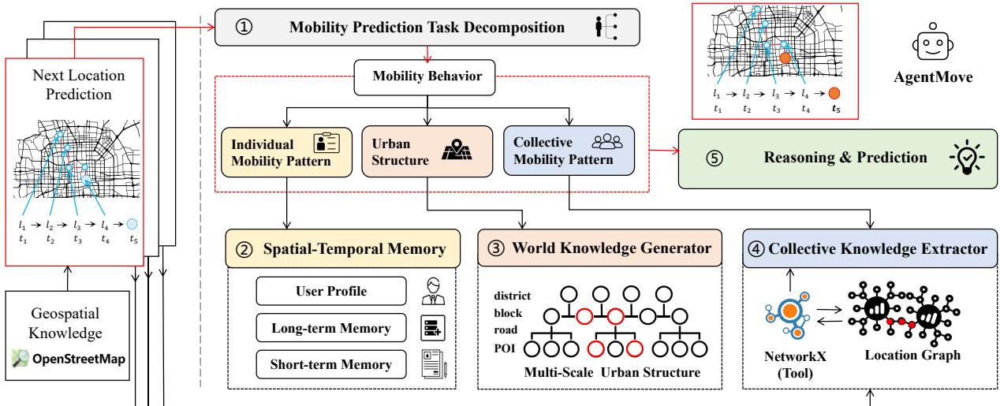
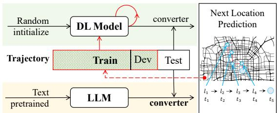
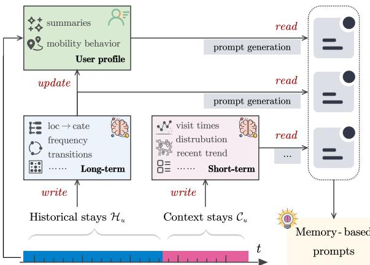
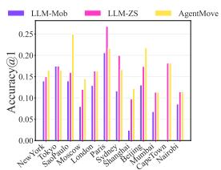
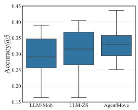
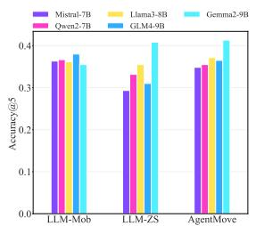
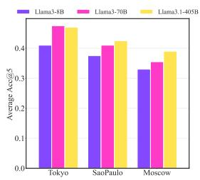

# AgentMove: A Large Language Model based Agentic Framework for Zero-shot Next Location Prediction

Jie Feng, Yuwei Du, Jie Zhao, Yong Li Department of Electronic Engineering, BNRist, Tsinghua University, Beijing, China, {fengjie, liyong07}@tsinghua.edu.cn

## Abstract

Next location prediction plays a crucial role in various real-world applications. Recently, due to the limitation of existing deep learning methods, attempts have been made to apply large language models (LLMs) to zero-shot next location prediction task. However, they directly generate the final output using LLMs without systematic design, which limits the potential of LLMs to uncover complex mobility patterns and underestimates their extensive reserve of global geospatial knowledge. In this paper, we introduce AgentMove, a systematic agentic prediction framework to achieve generalized next location prediction. In Agent-Move, we first decompose the mobility prediction task and design specific modules to complete them, including spatial-temporal memory for individual mobility pattern mining, world knowledge generator for modeling the effects of urban structure and collective knowledge extractor for capturing the shared patterns among population. Finally, we combine the results of three modules and conduct a reasoning step to generate the final predictions. Extensive experiments utilizing mobility data from two distinct sources reveal that AgentMove surpasses the leading baseline by 3.33% to 8.57% across 8 out of 12 metrics and it shows robust predictions with various LLMs as base and also less geographical bias across cities. Our codes are available via https://github. com/tsinghua-fib-lab/AgentMove.

## 1 Introduction

Mobility prediction is of great importance in many real-world scenarios, e.g., recommending travel services, pre-activating mobile applications for potential usage, seamless switching of cellular network signals and efficient traffic management. Next location prediction is one of the most important task in human mobility prediction. In recent years, deep learning based models (Liu et al., 2016; Wu et al., 2017; Feng et al., 2018; Yang et al., 2020,

2022) have been widely applied and have achieved promising results due to their ability to capture the high-order transition dynamics and mining shared mobility patterns among users. However, existing approaches have several key drawbacks. First, the success of deep learning models rely on the collection of large amounts of private mobility data. Second, the trained model are challenging to apply in zero-shot mobility prediction settings. Finally, the prediction accuracy remains limited due to the constrained sequential modelling capability of smaller deep learning models and a lack of deep understanding of commonsense in human daily life and urban structures.

Recently, large language models (LLMs) have made significant progress, achieving advanced results that far surpass previous methods in areas such as dialogue-based role-playing, code generation and testing, and mathematics problem solving. In the field of spatial-temporal data mining, researchers are exploring the potential of applying LLMs to various real-world tasks, including time series forecasting (Gruver et al., 2024; Li et al., 2024b), travel planning (Xie et al., 2024; Li et al., 2024a), trajectory analysis (Luo et al., 2024; Zhang et al., 2023; Du et al., 2024). Furthermore, several recent works (Wang et al., 2023; Beneduce et al., 2024) investigate the feasibility of using LLMs as the base model of mobility prediction, addressing the limitations of deep learning based models and achieving promising results. These works typically convert trajectories to a language based sentence and leverage the powerful sequential modelling capacities of LLMs to directly generate the mobility predictions. However, due to the lack of a systematic design throughout the entire process, they overlook the crucial components of human mobility modeling, resulting in limited performance. In summary, these methods fail to effectively capture the complex individual mobility patterns, neglect to model the effects of urban structure and do not discover the shared mobility patterns among populations.

  
Figure 1: The framework of AgentMove, including three key components: spatial temporal memory unit for capturing individual mobility pattern, world knowledge generator for multi-level urban structure, and collective knowledge extractor for extracting shared mobility patterns among users.

In this paper, we propose AgentMove, a systematic agentic framework for generalized mobility prediction. By integrating domain knowledge of human mobility, we implement the core components in the general agentic framework (Wang et al., 2024; Xi et al., 2023), including the planning module, memory module, world knowledge module, external tool module and reasoning module. For the planning module in AgentMove, we introduce a manually designed mobility prediction task decomposition module that considers the most important factors influencing mobility prediction. This decomposition generates three sub-tasks: individual mobility pattern mining, shared mobility pattern discovery and urban structure modelling. First, we implement a spatial-temporal memory module for individual mobility pattern mining. This module contains three submodules–short-term memory, long-term memory and user profiles–to capture the multi-level mobility patterns of individuals. Compared to pure LLM methods, the memory module enables AgentMove to retain past mobility history and efficiently learn from experiences. Second, we design a world knowledge generator to explicitly extract inherent geospatial knowledge from LLMs, aiding in the modelling the effects of multi-scale urban structures on the human mobility, particularly in relation to the exploration behavior of human mobility. Third, we equip AgentMove with the capability to discover the shared mobility patterns from various user trajectories through a collective knowledge extractor. This extractor utilizes NetworkX as an external tool to organize trajectories into a global location transition graph and then extract important neighboring locations for prediction. Finally, we combine the results from all the modules and perform a final reasoning step to generate the predictions. In summary, our contributions are as follows,

• To the best of our knowledge, this is the first attempt to apply LLM-based agentic framework to the field of mobility prediction. We build an effective mobility prediction framework by incorporating the crucial characteristics of human mobility into the design of core components.

• In AgentMove, we design a spatial-temporal memory module for individual mobility pattern mining, a world knowledge generator for modeling effects of urban structures, and a graph based collective knowledge extractor for discovering the shared mobility patterns among populations.

• Extensive experiments on mobility trajectories from two sources in 12 cities demonstrate the effectiveness of proposed AgentMove, which outperforms the best baseline, achieving performance improvements ranging from 3.33% to 8.57% in most cases. Additionally, AgentMove presents superior adaptability to different LLMs, as well as greater stability and reduced bias in prediction results across various cities worldwide.

## 2 Preliminaries

We define the mobility prediction task and related concepts for use in the following section.

  
Figure 2: Deep learning and LLM-based mobility pre dictors work in different ways. Deep learning models need to learn from training data for specific regions, while LLMs predict directly using zero-shot reasoning with its world knowledge.

Definition 1 (Location) A location point $p \in P$ is represented as a tuple id, cate, lon, lat, addr , where id is the unique identifier, cate is the category (e.g., restaurant), lon and lat are the coordinates of the location, addr is the text address of location.

Definition 2 (User Trajectory) A trajectory of user u  U is represented as $\begin{array} { r l } { T _ { u } } & { { } = } \end{array}$ $\{ ( p _ { 1 } , t _ { 1 } ) , ( p _ { 2 } , t _ { 2 } ) , \ldots , ( p _ { n } , t _ { n } ) \}$ , where $p _ { i } \in P$ is the i-th location visited by the user and $t _ { i }$ is the timestamp of the visit.

Definition 3 (Contextual Stays) Contextual stays of user u is defined as the most re-<sup>cent</sup> <sup>sub-sequence</sup> <sup>in</sup> <sup>trajectory:</sup> Cu <sup>=</sup> $\{ ( p _ { n - k } , t _ { n - k } ) , \ldots , ( p _ { n - 1 } , t _ { n - 1 } ) , ( p _ { n } , t _ { n } ) \}$

which captures the user’s short-term mobility patterns. k is the window size ofcontextual stays.

Definition 4 (Historical Stays) Historical stays of user u is defined as the subsequence before contextual stays: $\begin{array} { r l } { \mathcal { H } _ { u } } & { { } = } \end{array}$ $\left\{ ( p _ { 1 } , t _ { 1 } ) , ( p _ { 2 } , t _ { 2 } ) , \ldots , ( p _ { n - k - 1 } , t _ { n - k - 1 } ) \right\}$ , which captures the user’s long-term mobility patterns.

Given the historical movement data $\mathcal { C } _ { u } , \mathcal { H } _ { u }$ as well as available external knowledge $\mathcal { K } \left( \mathrm { e . g . } \right.$ , worldwide geospatial information), the objective is to predict the next location $p _ { n + 1 }$ that user u will visit. Formally, this paper aims to learn a mapping function f:

$$
f : ( \mathcal { C } _ { u } , \mathcal { H } _ { u } , { \mathcal { K } } )  p _ { n + 1 } .\tag{1}
$$

Figure 2 illustrates the differences between the deep learning based paradigm and the LLM based paradigm in the mobility prediction task. The deep learning model needs collecting training data before conduct the prediction task, which means it cannot directly used in the zero-shot scenario. LLM based method can directly applied into any scenario after carefully ‘format converter’ (known as prompt engineering). While LLM based methods can be adapted easily to new scenarios, their effectiveness may not improve as the scenarios accumulates more data. In this way, the deep learning models with more data can achieve better performance when LLM based methods fail to improving. In this paper, we propose the LLM based agent solution AgentMove for mobility prediction task which enables the continue learning and improving of LLM based mobility predictor.

## 3 Methods

## 3.1 Overview

As shown in Figure 1, AgentMove comprises five core components: task decomposition module, spatial-temporal memory module, world knowledge generator, collective knowledge extractor and the final reasoning module. Serving as the highlevel planning module, the task decomposition module is designed to break down the overall mobility prediction task into subtasks—personalized mobility pattern mining, collective mobility pattern discovery and modelling the effects of urban structures—by considering the crucial factors influencing mobility. The detailed design of the other components is introduced as follows.

## 3.2 Spatial-temporal Memory

The spatial-temporal memory module is designed to effectively capture, store and leverage mobility patterns, providing crucial insights for the personalized and multi-scale periodicity behavior modelling in mobility prediction. Inspired by the memory design principles in general LLM-based agents (Zhang et al., 2024), our spatial-temporal memory functions through three essential processes: memory organization, memory writing, and memory reading. The whole framework of spatial– temporal memory module is presented in Figure 3.

## 3.2.1 Memory Organization

The spatial-temporal memory is structured into three components to capture multifaceted nature of user mobility patterns: User Profile Unit. This unit provides a summary description of the user’s mobility behavior as the user mobile profile, which offers deeper insights into when and why the user visits certain locations. The user profile is dynamically generated based on the current long-term memory introduced in the following part, allowing Agent-Move to adapt to the evolving user preferences;

  
Figure 3: Illustration of spatial-temporal memory.

Long-term Memory Unit. This unit retains users long-term mobility patterns, capturing overarching trends and recurring sequences in their movement history. It functions similarly to how LLMs store long-term dependencies in textual data; Short-term Memory Unit. This unit focuses on users’ recent mobility patterns, providing dynamic updates that reflect the latest movements and short-term variations.

All users’ memories are stored in a central memory pool, organized as key-value pairs. Each key corresponds to a unique user identifier, and the value consists of the long-term memory, short-term memory, and user profile info. This organization ensures a comprehensive extraction and storage of mobility data, enabling efficient retrieval and utilization for mobility prediction.

## 3.2.2 Memory Writing

Writing to the memory involves the extraction and structured storage of spatial-temporal patterns hidden in user’s trajectories. This process consists of two main steps:

Long-term Memory Writing. Given the historical stays $\mathcal { H } _ { u }$ , this module extracts long-term spatialtemporal information of user $u \in U$ , including: 1) location to category mapping. Associating visited locations with their respective categories. 2) top-k active times and locations. Identifying the most active time periods and the most frequently visited locations. 3) location visit frequency. Recording how often various locations are visited. 4) transition matrix. A matrix that represents the transition probabilities between locations.

Short-term Memory Writing. Given the contextual stay $\mathcal { C } _ { u } .$ , this module extracts fine-grained short-term spatial-temporal information of user $u \in U$ , including: 1) time sequence of recent visits. Documenting the sequence of recent visit times. 2) visit frequency of different locations. Tracking how frequently different locations are visited in the short term. 3) details of the last visit. Recording specific details about the latest location visit.

By systematically organizing and storing this information by processing the trajectories, Agent-Move can easily access to both long-term and shortterm mobility patterns. This structured approach is crucial for enhancing the accuracy of next location predictions.

## 3.2.3 Memory Reading

The memory reading process involves generating spatial-temporal context relevant prompts from the structured memory to enhance AgentMove’s predictive capabilities. This process consists of three key steps:

User Profile Prompt Generation. Utilizing the long-term memory, AgentMove constructs user profile prompts that encapsulate the intrinsic movement patterns and habitual behaviors of the user. These prompts include summaries of peak activity times, preferred locations, and temporal-spatial associations, providing a comprehensive mobility profile of user.

Long-term Memory Prompt Generation. Also based on the long-term memory, AgentMove generates prompts by summarizing the user’s general mobility trends from the long-term view. These prompts include details on the most active times, frequently visited locations, and the relationships between these factors. This helps the LLM understand the user’s regular movement patterns.

Short-term Memory Prompt Generation. AgentMove creates prompts from the short-term memory to reflect recent mobility patterns and contextual information of user. These prompts cover recent visit sequences, current visit frequencies, and specifics of the latest visits, which ensure LLMs efficiently adapt to recent changes in user’s behavior.

Finally, these memory-based prompts are consolidated into a cohesive spatial-temporal summary of the original trajectory, which is then integrated as the first part of AgentMove’s prompts. This spatialtemporal summary enhances the LLM’s ability to engage in more logical and efficient reasoning, leading to more precise mobility predictions.

## 3.3 World Knowledge Generator

Numerous studies (Jiang et al., 2016) indicate that individual movement typically encompasses two types of behaviors: returning and exploring. As introduced before, the return behavior has been wellcaptured by the spatial-temporal memory module. In this section, we introduce the world knowledge generator, which extracts geospatial knowledge from LLMs and constructs a multi-scale urban structure to enable the modelling of explore behavior in mobility. To extract geospatial knowledge effectively, we propose aligning the knowledge of LLMs and the urban space of trajectory via text addresses. Once the spaces are aligned, we explicitly prompt the LLMs to generate potential candidate places for exploration from the perspective of the multi-scale urban structure.

## 3.3.1 Alignment via Address

Many existing works (Feng et al., 2018; Luo et al., 2021; Lin et al., 2021; Cui et al., 2021; Qin et al., 2022; Hong et al., 2023) on mobility prediction usually represent the locations directly using latitude and longitude coordinates or discrete spatial area IDs. While this approach facilitates the easy construction of deep learning-based spatial encoding, it is not suitable for LLMs. Since LLMs are trained on large scale human-generated text, they, like human, are not inherently adept at understanding the precise coordinates (Gurnee and Tegmark, 2023) or discrete area IDs. Thus, we propose to utilize the text address which human is familiar to describe the coarse location of trajectory. While text address is not precise as the coordinates, it is more natural and easy to be aligned with the existing spatial knowledge in the LLMs.

Thus, we adapt the address searching service from Open Street Map to build address for each point in the trajectory. Due to cultural and institutional differences, address information formats vary greatly across different countries. To address this, we leverage the common-sense knowledge of LLMs to extract unified structured address information from the original address information. LLMs can easily pinpoint a user’s current and past locations, laying a solid foundation for subsequent modeling.

## 3.3.2 Multi-scale Urban Structure

Based on the real structured address information, we design prompts to motivate LLMs to generate multi-scale potential places which may be explored by user in the future. We introduce multi-scale generation mechanism to help LLMs reduce hallucination and improve the accuracy and usability of generate places. The multi-scale location information covers four level: district, block, street and POI name. We first ask LLMs to generate the potential districts in the future. Then, based on these districts and the past blocks in the trajectory to generate the potential blocks in the future and so on. Finally, we can generate potential location information from different levels as the potential exploration candidate for the user.

## 3.4 Collective Knowledge Extractor

In the previous two sections, we introduce the spatial-temporal memory module and world knowledge generator for the individual-level mobility modelling. Here, we introduce the collective knowledge extractor, which captures shared mobility patterns among users to further enhance the mobility predictions. First, we construct a global location transition graph using NetworkX <sup>2</sup> by aggregating the location transitions from various users. We then employ a LLM to perform simple reasoning on the graph, utilizing functions in NetworkX as tool to generate potential locations visited by other users with similar mobility patterns.

## 3.4.1 Building Location Transition Graph

In the location graph, the node is location ID with various attributes, e.g., address information, function of location. The edge between nodes is constructed by considering the 1-hop transition between nearby trajectory points in each trajectory. The edge is weighted without direction. Based on the definition of graph, we use NetWorkX to build the graph from scratch and update it when infer trajectories for various users. If any history trajectory data, e.g. training data used by the deep learning based models, are available, the location graph can be initialized by them.

## 3.4.2 Reasoning on Graph

After obtaining the location graph, we can utilize LLM to perform reasoning on the whole graph via the function of NetworkX as tool. The most naive strategy is to query the k-hop neighbors of the current location. When the number of the neighbors is too much, LLMs need to filter the most promising ones from them by considering the attributes of each node. Furthermore, we can extend the query nodes into the last n locations and generate the most promising ones from all the neighbors of them. In this way, we obtain the most relevant locations that has been visited by the users with similar mobility patterns.

## 3.5 Summarization and Prediction

Finally, we design prompts to employ LLM to analyze and summarize the information from different views and perform a final reasoning step to generate the prediction with reasons. The prompts for output format requirements are also be placed here to ensure that the output format meets the requirements as much as possible. Detailed prompts can refer to the appendix.

## 4 Evaluation

## 4.1 Settings

## 4.1.1 Datasets

We use the global Foursquare checkin data (Yang et al., 2016) and recent public released ISP GPS trajectory data (Feng et al., 2019) to conduct the experiments. The Foursquare data contains checkins from 415 cities which covers about 18 months from April 2012 to September 2013. The ISP GPS trajectory data is from the mobile network logs in Shanghai with 325215 records, covering April 19 to April 26 in 2016. Compared with Foursquare data, ISP data is much denser and was open-sourced in June 2024 <sup>3</sup>, which is beyond the training period of all the LLMs used in the experiment. This ensures that the evaluation results are not affected by potential data leakage.

To evaluate the general mobility prediction ability of AgentMove, we select 12 cities from the Foursquare dataset and the entire ISP trajectory data to conduct the experiments. We follow the preprocessing procedure (Hong et al., 2023; Feng et al., 2019) to process the trajectories data. For Foursquare checkin data, we divide each trajectory dataset into training, validation, and test sets in a ratio of 7:1:2. While the ISP data lasts only 7 days, we split the whole data into training set, validation set and testing data in a ratio of 4:1:5 for preserving enough testing data. Detailed description about preprocessing can refer to the appendix. We follow the data license in the original paper and use these trajectory data only for academic purpose.

We select Tokyo, Moscow and SaoPaulo with the largest amount of Foursquare check-in data and the ISP data from Shanghai to conduct the main analysis in the experiments and results of 12 cities are discussed in the final section of experiment. We divide each trajectory dataset into training, validation, and test sets. The training and validation sets are only used to train the deep learning model, and the resulting models are compared with the LLMbased methods on the test set. Due to the cost of the various API calling, e.g., Llama3.1-405B, we randomly sample 200 instances from the testing set for each city to calculate the performance in the experiments.

## 4.1.2 Baselines

We compare proposed models with following baselines: FPMC (Rendle et al., 2010), five deep learning models (RNN (Feng et al., 2018), DeepMove (Feng et al., 2018), LSTPM (Sun et al., 2020), GETNext (Yang et al., 2022), STHGCN (Yan et al., 2023)) and three LLM-based methods(LLM-Mob (Wang et al., 2023), LLM-ZS (Beneduce et al., 2024), LLM-Move (Feng et al., 2024c)). We use widely used Accuracy@1, Accuracy@5, and NDCG@5 as the main evaluation metrics (Sun et al., 2020; Luca et al., 2021) in the experiments.

## 4.1.3 Implementation

We use LibCity (Jiang et al., 2023) to implement the FPMC, RNN, DeepMove and LSTPM. We use the official codes from author to implement GET-Next <sup>4</sup> and STHGCN<sup>5</sup>. We follow the default parameter settings of these models in the library and official codes for training and inference. For LLMs, we use OpenAI API <sup>6</sup> for accessing GPT4omini, DeepInfra <sup>7</sup> and SiliconFlow <sup>8</sup> for accessing other open source LLMs. Detailed parameter settings for those baselines can be found in the appendix.

## 4.2 Main Results

In this section, we compare AgentMove with 9 baselines in 4 cities at Table 1. In the experiments, we use GPT4omini as the default base LLM for all LLM-based methods.

<table><tr><td rowspan="2">Model</td><td colspan="3">FSQ@Tokyo</td><td colspan="3">FSQ@SaoPaulo</td><td colspan="3">FSQ@Moscow</td><td colspan="3">ISP@Shanghai</td></tr><tr><td>Acc@1 Acc@5</td><td></td><td>NDCG@5</td><td>Acc@1 Acc@5 NDCG@5</td><td></td><td></td><td>Acc@1</td><td></td><td>Acc@5 NDCG@5</td><td></td><td>Acc@1 Acc@5</td><td>NDCG@5</td></tr><tr><td>FPMC</td><td>0.060</td><td>0.165</td><td>0.121</td><td>0.045</td><td>0.085</td><td>0.066</td><td>0.020</td><td>0.065</td><td>0.043</td><td>0.13</td><td>0.355</td><td>0.249</td></tr><tr><td>RNN</td><td>0.105</td><td>0.240</td><td>0.176</td><td>0.095</td><td>0.230</td><td>0.169</td><td>0.090</td><td>0.185</td><td>0.140</td><td>0.065</td><td>0.175</td><td>0.123</td></tr><tr><td>DeepMove</td><td>0.175</td><td>0.320</td><td>0.251</td><td>0.150</td><td>0.310</td><td>0.236</td><td>0.165</td><td>0.335</td><td>0.258</td><td>0.175</td><td>0.320</td><td>0.251</td></tr><tr><td>LSTPM</td><td>0.145</td><td>0.280</td><td>0.218</td><td>0.190</td><td>0.365</td><td>0.281</td><td>0.140</td><td>0.255</td><td>0.196</td><td>0.095</td><td>0.17</td><td>0.135</td></tr><tr><td>GETNext</td><td>0.205</td><td>0.450</td><td>0.317</td><td>0.165</td><td>0.375</td><td>0.258</td><td>0.175</td><td>0.380</td><td>0.269</td><td>0.115</td><td>0.260</td><td>0.178</td></tr><tr><td>STHGCN</td><td>0.198</td><td>0.430</td><td>0.300</td><td>0.175</td><td>0.398</td><td>0.299</td><td>0.180</td><td>0.372</td><td>0.265</td><td>0.125</td><td>0.277</td><td>0.195</td></tr><tr><td>LLM-Mob</td><td>0.175</td><td>0.370</td><td>0.277</td><td>0.140</td><td>0.275</td><td>0.210</td><td>0.080</td><td>0.175</td><td>0.129</td><td>0.100</td><td>0.345</td><td>0.221</td></tr><tr><td>LLM-ZS</td><td>0.175</td><td>0.410</td><td>0.299</td><td>0.165</td><td>0.385</td><td>0.277</td><td>0.120</td><td>0.340</td><td>0.233</td><td>0.170</td><td>0.425</td><td>0.298</td></tr><tr><td>LLM-Move</td><td>0.145</td><td>0.285</td><td>0.243</td><td>0.220</td><td>0.355</td><td>0.325</td><td>0.155</td><td>0.270</td><td>0.226</td><td>0.140</td><td>0.410</td><td>0.308</td></tr><tr><td>AgentMove</td><td>0.185</td><td>0.465</td><td>0.331</td><td>0.230</td><td>0.415</td><td>0.326</td><td>0.160</td><td>0.365</td><td>0.265</td><td>0.190</td><td>0.450</td><td>0.329</td></tr><tr><td>vs Deep Learning</td><td>-9.76%</td><td>3.33%</td><td>4.42%</td><td>25.71%</td><td>4.27%</td><td>9.03%</td><td>-11.11%</td><td>-3.95%</td><td>-1.49%</td><td>8.57%</td><td>40.63%</td><td>31.08%</td></tr><tr><td>vs Best Baselines</td><td>-9.76%</td><td>3.33%</td><td>4.42%</td><td>4.55%</td><td>4.27%</td><td>0.31%</td><td>-11.11%</td><td>-3.95%</td><td>-1.49%</td><td>8.57%</td><td>5.88%</td><td>6.82%</td></tr></table>

Table 1: The main results of baselines and AgentMove. GPT4omini is used as the base LLM for all the LLM-based methods in the table. Deep learning methods are first trained on the training set of each city and LLM-based models are directly evaluated on the test set with the zero-shot prediction settings.

As the representative deep learning models, GETNEext and STHGCN achieve best or secondbest results in 4 out of 12 metrics. Compared with the deep learning baselines, the best LLM-based baseline LLM-Move can achieve better results than GETNext and STHGCN in 3 out of 12 metrics, which present the powerful sequential pattern discovery and reasoning ability of LLM in modeling mobility. It is noted that the results of LLM-based methods are zero-shot prediction while the deep learning based methods rely on sufficient training with enough mobility data. Compared with these baselines, our proposed method AgentMove is the best method and achieves the best results in 8 out of 12 metrics in 4 datasets. Although AgentMove falls slightly behind the best baseline, GETNext, in three metrics, two of them are very close. These results in Table 1 demonstrate the effectiveness of proposed framework in stimulating the comprehensive ability of LLM-based agentic framework for mobility prediction.

## 4.3 Ablation Study on Model Designs

In this section, we provide a more detailed analysis of the proposed method under varying model designs to further demonstrate its effectiveness.

We first conduct ablation study to demonstrate the contribution of each component in AgentMove for its excellent performance, which are presented in Table 2. We first discuss the impact of three core components individually, as detailed in the top four lines of Table 2. Overall, all components contribute to performance improvement in most cases. However, the performance gains vary across different metrics. For example, while memory design leads to better performance in the Acc@1 in SaoPaulo, the performance in other three metrics are dropped. The effects of the combination of the core components in the last three lines in Table 2. In summary, compared with the base prompt design, the combination of proposed designs introduce 7%-45% performance gain in all the datasets.

<table><tr><td rowspan="2">Models</td><td colspan="3">FSQ@SaoPaulo Acc@1 Acc@5 NDCG@5 Acc@1 Acc@5 NDCG@5</td><td colspan="3">ISP@Shanghai</td></tr><tr><td></td><td></td><td></td><td></td><td></td><td></td></tr><tr><td>base</td><td>0.165</td><td>0.385</td><td>0.277</td><td>0.170</td><td>0.425</td><td>0.298</td></tr><tr><td>+STM</td><td>0.190</td><td>0.315</td><td>0.255</td><td>0.170</td><td>0.445</td><td>0.312</td></tr><tr><td>+WKG</td><td>0.175</td><td>0.365</td><td>0.269</td><td>0.155</td><td>0.390</td><td>0.276</td></tr><tr><td>+CKE</td><td>0.175</td><td>0.380</td><td>0.275</td><td>0.175</td><td>0.465</td><td>0.317</td></tr><tr><td>+STM+WKG</td><td>0.240</td><td>0.390</td><td>0.317</td><td>0.215</td><td>0.455</td><td>0.342</td></tr><tr><td>AgentMove</td><td>0.230</td><td>0.415</td><td>0.326</td><td>0.190</td><td>0.450</td><td>0.329</td></tr><tr><td>vs base</td><td></td><td>45.45%7.79%</td><td>17.99%</td><td>11.76%</td><td>5.88%</td><td>10.30%</td></tr></table>

Table 2: Ablation studies of AgentMove. ‘base’ denotes the basic prompts which is similar to the baseline LLM-ZS, ‘+STM’ denotes adding spatial-temporal memory, ‘+WKG’ denotes adding world knowledge generator, ‘+CKE’ denotes adding collective knowledge extractor.

Besides, to demonstrate the effects of the World Knowledge Generator (WKG) in exploring new locations, we analyze whether our model explores more potential locations that are not present in the user’s recent contextual stays after incorporating the WKG module. The results are presented in the Table 3. A higher percentage indicates that the model tends to revisit locations from the recent contextual stays, while a lower percentage suggests that the model explores more new locations. The results demonstrate that the WKG successfully encourages the model to explore new locations, which is particularly beneficial for improving performance.

<table><tr><td>Location return rate</td><td colspan="2">FSQ@SaoPaulo↓ ISP@Shanghai↓</td></tr><tr><td>w/WKG LLama3-8b</td><td>94%</td><td>75.6%</td></tr><tr><td>w/o WKG</td><td>93%</td><td>87.8%</td></tr><tr><td>w/WKG LLama3-70b</td><td>87.5%</td><td>73.2%</td></tr><tr><td>w/o WKG</td><td>90%</td><td>85.4%</td></tr></table>

Table 3: Effectiveness of word knowledge generator (WKG) for encouraging mobility exploration, which is measured by the location return rates. The location return rate measures the tendency to revisit previously visited locations based on recent contextual stays.

## 4.4 Geographical Bias and LLM Effects

While LLMs are trained with the online web text which can be geographically bias (Manvi et al., 2024) around the world. We investigate the potential geographical bias in LLM based mobility prediction methods and attempt to answer whether AgentMove can alleviate the geographical bias inherent in LLMs to some extent. Experiment results conducted on 12 cities are presented in Figure 4.

In Figure 4(a), we can find significant differences in the accuracy of three LMM-based methods across cities. For instance, cities like Tokyo, Paris, and Sydney generally achieve higher accuracy, while cities like Cape Town and Nairobi see notably lower performance. This suggests the presence of geographical bias in trained LLMs. We also find that proposed AgentMove performs best in most of the cities. Figure 4(b) provides a boxplot test by comparing the Acc@5 of the three LLM-based methods in 12 cities. Results demonstrate that AgentMove not only outperforms the other methods in terms of overall accuracy but also exhibits a smaller range of error. The performance of AgentMove is more consistent across different cities, suggesting a reduced impact of geographical bias with carefully designs in it.

As the core foundation of AgentMove, the capabilities of base LLM play a critical role in its performance. Thus, we evaluate the impact of different LLMs with varying sizes and structures in Figure 5 by using FSQ@Tokyo. Figure 5(a) presents the impact of various 7B LLM with different training data and model structures. The results show that proposed AgentMove performs best adaptability among different LLMs. While LLM-Mob performs stable in all the 7B-LLMs, its performance on Gemma2-9B is far worse than other two methods. We then discuss the detailed impacts of LLM size on AgentMove’s performance across different data. Figure 5(b) reveals that that larger models,



  
(a) Acc@1 of three LLM-(b) Distribution of Acc@5 based methods on 12 cities. across 3 methods on 12 cities.

Figure 4: Geospatial bias analysis of various methods in mobility prediction across 12 cities, where AgentMove outperforms most methods and exhibits lower geospatial bias.

  
(a) Effects of LLM types on three LLM-based methods

  
(b) Effects of LLM size on three cities.  
Figure 5: The effects of LLM with varying sizes and sources on the prediction performance of three LLM based methods.

particularly Llama3.1-405B, generally deliver significant performance gains for AgentMove compared to smaller models like Llama3-8B across different cities. It is also observed that in Tokyo, Llama3-1-405B performs slightly weaker compared to Llama3-70B. This suggests that while larger models often excel, their effectiveness may vary depending on the unique mobility patterns and characteristics of each city.

## 5 Related Work

## 5.1 Mobility Prediction with Deep Learning

Significant efforts have been made in mobility prediction using deep learning models, encompassing research from both sequential-based methods and graph-based methods. Traditional approaches typically employ Markov models (Rendle et al., 2010; Cheng et al., 2013) to predict the next visit by learning the transition probabilities between consecutive POIs. In contrast, sequential-based deep learning methods have been proposed to model the high-order movement patterns in trajectory data. These methods can be categorized into two types:

recurrent neural networks(RNNs) (Kong and Wu, 2018; Huang et al., 2019; Yang et al., 2020; Zhao et al., 2020; Feng et al., 2020), and attention mechanisms(Feng et al., 2018; Luo et al., 2021; Lin et al., 2021; Cui et al., 2021; Qin et al., 2022; Hong et al., 2023) based works.

Despite their success, these methods primary focus on extracting mobility patterns from an individual perspective, while overlooking the collaborative information available from other users’ trajectories. To address this limitation, recent works (Rao et al., 2022; Yang et al., 2022) have explored the use of graph neural network(GNNs) for their ability to model complex relationships. However, all these methods rely on collecting large volumes of private trajectory data. In contrast, our AgentMove leverages the world knowledge and sequential modeling abilities of LLMs to enable the generalized mobility prediction with zero-shot prediction ability.

## 5.2 Large Language Models and Agents

Due to the powerful language-based generalization and reasoning capabilities (Wei et al., 2022a), large language models (OpenAI, 2022; Touvron et al., 2023) have developed rapidly and have been widely applied in various tasks, including programming (Qian et al., 2024) and mathematics (Wei et al., 2022a). Recent studies (Gurnee and Tegmark, 2023; Manvi et al., 2023) have found that LLMs possess a significant amount of geographical knowledge about the world. Additionally, researchers also explore the potential of applying LLMs in spatial-temporal data modelling by directly converting domain-specific tasks into a language-based format, such as time series forecasting (Gruver et al., 2024), traffic prediction (Li et al., 2024b), trajectory mining (Wang et al., 2023; Beneduce et al., 2024), trip recommendation (Xie et al., 2024; Li et al., 2024a), traffic signal control (Lai et al., 2023; Feng et al., 2024b), comprehensive urban tasks (Feng et al., 2024a,b).

These early works highlight the potential of LLMs in spatial-temporal modelling. To effectively utilize the vast knowledge embedded in LLMs and stimulate their reasoning and planning abilities, various prompt techniques (Wei et al., 2022b; Kojima et al., 2022; Wang et al., 2022; Yao et al., 2024) have been proposed for solving naive text games and mathematical problems. However, when for more complex real-life and domain-specific tasks, these simple prompt techniques alone are insufficient. Recently, LLM based agents (Wang et al.,

2024; Xi et al., 2023; Du et al., 2024) are been proposed to address this limitation by equipping LLMs with explicit memory, structured workflows and external tools. In this work, we are the first to design LLM based agent specifically for the mobility prediction task. By incorporating explicit spatialtemporal memory and a workflow for geospatial and social structure mining, we successfully leverage the world knowledge of LLMs and their structured reasoning capabilities for mobility trajectory modelling.

## 6 Conclusion

In this paper, we propose AgentMove, a systematic agentic framework for generalized human mobility prediction applicable worldwide. We design a spatial-temporal memory module and a collective knowledge extractor to learn both individual mobility patterns and shared mobility pattern among users. Furthermore, we develop a world knowledge generator that utilizes text-based address to understand urban structures in a manner similar to humans. Extensive experiments on trajectories from 12 cities demonstrate the superiority and robustness of AgentMove for mobility prediction.

In the future, we plan to explore more effective ways to extract and leverage the vast world knowledge and common sense of LLMs for mobility modeling and trajectory mining. Additionally, we aim to extend the framework to other trajectory data mining tasks, such as trajectory classification and generation. We believe that LLM-based agents, like AgentMove, hold great potential and adaptability, paving the way for a new paradigm in spatial-temporal modeling alongside deep learning.

## 7 Acknowledgement

This work was supported in part by the National Natural Science Foundation of China under grant 62476152 and 62171260, in part by the China Postdoctoral Science Foundation under grant 2024M761670 and GZB20240384, in part by the Tsinghua University Shuimu Scholar Program under grant 2023SM235.

## 8 Limitations

Here, we discuss the potential limitations of the current work and outline directions for future exploration.

Robustness and Hallucination Based on an LLM, the output of AgentMove is not fully controllable. In this work, we define a simple output parser to extract the expected context from the LLM output, but it may occasionally fail. Due to the potential for hallucination in LLMs, the output of AgentMove may include false addresses that do not exist in the real world. While we can define a clear list of valid locations during experiments to verify this, doing so in real-world applications presents significant challenges.

High Cost The high cost of invoking the LLM API limited our experiments to 12 cities with a small test set. This cost will also pose a challenge for large-scale deployment in real-world scenarios. The reliance on LLMs does pose a significant limitation in terms of scalability of our method. With ongoing advancements (Liu et al., 2024; Qu et al., 2025) in the development of more efficient and scalable LLM alternatives—such as smaller LLMs, model pruning, and knowledge distillation—we are optimistic about the potential for rapidly decreasing computational costs while improving scalability.

Geospatial Bias Geographical bias has long been a challenging issue in LLMs (Manvi et al., 2024). While our proposed AgentMove incorporates specific design elements to mitigate some of these biases, it cannot completely eliminate them due to inherent limitations in LLMs. However, we believe that our current work represents a significant step forward in addressing geospatial bias in mobility prediction challenges. One promising direction for further reducing geographical bias could be the integration of more external knowledge during inference, and we are actively exploring this avenue in our future work.

## 9 Ethics Statement

All trajectory data used in the experiments come from publicly available open-source datasets (Yang et al., 2016; Feng et al., 2019). We do not attempt to extract any personal information from these datasets.

## References

Ciro Beneduce, Bruno Lepri, and Massimiliano Luca. 2024. Large language models are zero-shot next location predictors. arXiv preprint arXiv:2405.20962.

Chen Cheng, Haiqin Yang, Michael R Lyu, and Irwin King. 2013. Where you like to go next: Successive point-of-interest recommendation. In Twenty-Third international joint conference on Artificial Intelligence.

Qiang Cui, Chenrui Zhang, Yafeng Zhang, Jinpeng Wang, and Mingchen Cai. 2021. ST-PIL: Spatialtemporal periodic interest learning for next pointof-interest recommendation. In Proceedings of the 30th ACM International conference on information & knowledge management, pages 2960–2964.

Yuwei Du, Jie Feng, Jie Zhao, and Yong Li. 2024. Trajagent: An agent framework for unified trajectory modelling. arXiv preprint arXiv:2410.20445.

Jie Feng, , Tianhui Liu, Yuwei Du, Siqi Guo, Yuming Lin, and Yong Li. 2024a. Citygpt: Empowering urban spatial cognition of large language models. arXiv preprint arXiv:2406.13948.

Jie Feng, Yong Li, Chao Zhang, Funing Sun, Fanchao Meng, Ang Guo, and Depeng Jin. 2018. Deepmove: Predicting human mobility with attentional recurrent networks. In Proceedings of the 2018 World Wide Web Conference.

Jie Feng, Can Rong, Funing Sun, Diansheng Guo, and Yong Li. 2020. Pmf: A privacy-preserving human mobility prediction framework via federated learning. Proceedings of the ACM on Interactive, Mobile, Wearable and Ubiquitous Technologies, 4(1):1–21.

Jie Feng, Jun Zhang, Tianhui Liu, Xin Zhang, Tianjian Ouyang, Junbo Yan, Yuwei Du, Siqi Guo, and Yong Li. 2024b. Citybench: Evaluating the capabilities of large language model as world model. arXiv preprint arXiv:2406.13945.

Jie Feng, Mingyang Zhang, Huandong Wang, Zeyu Yang, Chao Zhang, Yong Li, and Depeng Jin. 2019. Dplink: User identity linkage via deep neural network from heterogeneous mobility data. In The World Wide Web Conference, pages 459–469. ACM.

Shanshan Feng, Haoming Lyu, Fan Li, Zhu Sun, and Caishun Chen. 2024c. Where to move next: Zeroshot generalization of llms for next poi recommendation. In 2024 IEEE Conference on Artificial Intelligence (CAI), pages 1530–1535. IEEE.

Nate Gruver, Marc Finzi, Shikai Qiu, and Andrew G Wilson. 2024. Large language models are zero-shot time series forecasters. Advances in Neural Information Processing Systems, 36.

Wes Gurnee and Max Tegmark. 2023. Language models represent space and time. arXiv preprint arXiv:2310.02207.

Ye Hong, Yatao Zhang, Konrad Schindler, and Martin Raubal. 2023. Context-aware multi-head selfattentional neural network model for next location prediction. Transportation Research Part C: Emerging Technologies, 156:104315.

Liwei Huang, Yutao Ma, Shibo Wang, and Yanbo Liu. 2019. An attention-based spatiotemporal lstm network for next poi recommendation. IEEE Transactions on Services Computing, 14(6):1585–1597.

Jiawei Jiang, Chengkai Han, Wenjun Jiang, Wayne Xin Zhao, and Jingyuan Wang. 2023. Libcity: A unified library towards efficient and comprehensive urban spatial-temporal prediction. arXiv preprint arXiv:2304.14343.

Shan Jiang, Yingxiang Yang, Siddharth Gupta, Daniele Veneziano, Shounak Athavale, and Marta C González. 2016. The timegeo modeling framework for urban mobility without travel surveys. Proceedings ofthe National Academy ofSciences, 113(37):E5370– E5378.

Takeshi Kojima, Shixiang Shane Gu, Machel Reid, Yutaka Matsuo, and Yusuke Iwasawa. 2022. Large language models are zero-shot reasoners. Advances in neural information processing systems, 35:22199– 22213.

Dejiang Kong and Fei Wu. 2018. HST-LSTM: A hierarchical spatial-temporal long-short term memory network for location prediction. In Ijcai, volume 18, pages 2341–2347.

Siqi Lai, Zhao Xu, Weijia Zhang, Hao Liu, and Hui Xiong. 2023. Large language models as traffic signal control agents: Capacity and opportunity. arXiv preprint arXiv:2312.16044.

Peibo Li, Maarten de Rijke, Hao Xue, Shuang Ao, Yang Song, and Flora D Salim. 2024a. Large language models for next point-of-interest recommendation. In Proceedings of the 47th International ACM SI-GIR Conference on Research and Development in Information Retrieval, pages 1463–1472.

Zhonghang Li, Lianghao Xia, Jiabin Tang, Yong Xu, Lei Shi, Long Xia, Dawei Yin, and Chao Huang. 2024b. Urbangpt: Spatio-temporal large language models. arXiv preprint arXiv:2403.00813.

Yan Lin, Huaiyu Wan, Shengnan Guo, and Youfang Lin. 2021. Pre-training context and time aware location embeddings from spatial-temporal trajectories for user next location prediction. In Proceedings of the AAAI Conference on Artificial Intelligence, volume 35, pages 4241–4248.

Qiang Liu, Shu Wu, Liang Wang, and Tieniu Tan. 2016. Predicting the next location: A recurrent model with spatial and temporal contexts. In AAAI.

Zechun Liu, Changsheng Zhao, Forrest Iandola, Chen Lai, Yuandong Tian, Igor Fedorov, Yunyang Xiong, Ernie Chang, Yangyang Shi, Raghuraman Krishnamoorthi, et al. 2024. Mobilellm: Optimizing subbillion parameter language models for on-device use cases. arXiv preprint arXiv:2402.14905.

Massimiliano Luca, Gianni Barlacchi, Bruno Lepri, and Luca Pappalardo. 2021. A survey on deep learning for human mobility. ACM Computing Surveys (CSUR), 55(1):1–44.

Yingtao Luo, Qiang Liu, and Zhaocheng Liu. 2021. Stan: Spatio-temporal attention network for next location recommendation. In Proceedings ofthe web conference 2021, pages 2177–2185.

Yuxiao Luo, Zhongcai Cao, Xin Jin, Kang Liu, and Ling Yin. 2024. Deciphering human mobility: Inferring semantics of trajectories with large language models. arXiv preprint arXiv:2405.19850.

Rohin Manvi, Samar Khanna, Marshall Burke, David Lobell, and Stefano Ermon. 2024. Large language models are geographically biased. arXiv preprint arXiv:2402.02680.

Rohin Manvi, Samar Khanna, Gengchen Mai, Marshall Burke, David Lobell, and Stefano Ermon. 2023. Geollm: Extracting geospatial knowledge from large language models. arXiv preprint arXiv:2310.06213.

OpenAI. 2022. Introducing chatgpt. https://openai. com/blog/chatgpt/.

Chen Qian, Zihao Xie, Yifei Wang, Wei Liu, Yufan Dang, Zhuoyun Du, Weize Chen, Cheng Yang, Zhiyuan Liu, and Maosong Sun. 2024. Scaling large-language-model-based multi-agent collabora tion. arXiv preprint arXiv:2406.07155.

Yanjun Qin, Yuchen Fang, Haiyong Luo, Fang Zhao, and Chenxing Wang. 2022. Next point-of-interest recommendation with auto-correlation enhanced multi-modal transformer network. In Proceedings ofthe 45th International ACM SIGIR Conference on Research and Development in Information Retrieval, pages 2612–2616.

Guanqiao Qu, Qiyuan Chen, Wei Wei, Zheng Lin, Xianhao Chen, and Kaibin Huang. 2025. Mobile edge intelligence for large language models: A contemporary survey. IEEE Communications Surveys & Tutorials.

Xuan Rao, Lisi Chen, Yong Liu, Shuo Shang, Bin Yao, and Peng Han. 2022. Graph-flashback network for next location recommendation. In Proceedings of the 28th ACM SIGKDD Conference on Knowledge Discovery and Data Mining, pages 1463–1471.

Steffen Rendle, Christoph Freudenthaler, and Lars Schmidt-Thieme. 2010. Factorizing personalized markov chains for next-basket recommendation. In Proceedings ofthe 19th international conference on World wide web, pages 811–820.

Ke Sun, Tieyun Qian, Tong Chen, Yile Liang, Quoc Viet Hung Nguyen, and Hongzhi Yin. 2020. Where to go next: Modeling long-and short-term user preferences for point-of-interest recommendation. In Proceedings of the AAAI conference on artificial intelligence, volume 34, pages 214–221.

Hugo Touvron, Louis Martin, Kevin Stone, Peter Albert, Amjad Almahairi, Yasmine Babaei, Nikolay Bashlykov, Soumya Batra, Prajjwal Bhargava, Shruti

Bhosale, et al. 2023. Llama 2: Open foundation and fine-tuned chat models. arXiv preprint arXiv:2307.09288.

Lei Wang, Chen Ma, Xueyang Feng, Zeyu Zhang, Hao Yang, Jingsen Zhang, Zhiyuan Chen, Jiakai Tang, Xu Chen, Yankai Lin, et al. 2024. A survey on large language model based autonomous agents. Frontiers ofComputer Science, 18(6):186345.

Xinglei Wang, Meng Fang, Zichao Zeng, and Tao Cheng. 2023. Where would i go next? large language models as human mobility predictors. arXiv preprint arXiv:2308.15197.

Xuezhi Wang, Jason Wei, Dale Schuurmans, Quoc Le, Ed Chi, Sharan Narang, Aakanksha Chowdhery, and Denny Zhou. 2022. Self-consistency improves chain of thought reasoning in language models. arXiv preprint arXiv:2203.11171.

Jason Wei, Yi Tay, Rishi Bommasani, Colin Raffel, Barret Zoph, Sebastian Borgeaud, Dani Yogatama, Maarten Bosma, Denny Zhou, Donald Metzler, et al. 2022a. Emergent abilities of large language models. arXiv preprint arXiv:2206.07682.

Jason Wei, Xuezhi Wang, Dale Schuurmans, Maarten Bosma, Fei Xia, Ed Chi, Quoc V Le, Denny Zhou, et al. 2022b. Chain-of-thought prompting elicits reasoning in large language models. Advances in Neural Information Processing Systems, 35:24824–24837.

Hao Wu, Ziyang Chen, Weiwei Sun, Baihua Zheng, and Wei Wang. 2017. Modeling trajectories with recurrent neural networks. IJCAI.

Zhiheng Xi, Wenxiang Chen, Xin Guo, Wei He, Yiwen Ding, Boyang Hong, Ming Zhang, Junzhe Wang, Senjie Jin, Enyu Zhou, et al. 2023. The rise and potential of large language model based agents: A survey. arXiv preprint arXiv:2309.07864.

Jian Xie, Kai Zhang, Jiangjie Chen, Tinghui Zhu, Renze Lou, Yuandong Tian, Yanghua Xiao, and Yu Su. 2024. Travelplanner: A benchmark for realworld planning with language agents. arXiv preprint arXiv:2402.01622.

Xiaodong Yan, Tengwei Song, Yifeng Jiao, Jianshan He, Jiaotuan Wang, Ruopeng Li, and Wei Chu. 2023. Spatio-temporal hypergraph learning for next poi recommendation. In Proceedings of the 46th international ACM SIGIR conference on research and development in information retrieval, pages 403–412.

Dingqi Yang, Benjamin Fankhauser, Paolo Rosso, and Philippe Cudre-Mauroux. 2020. Location prediction over sparse user mobility traces using rnns. In Proceedings ofthe twenty-ninth international joint conference on artificial intelligence, pages 2184–2190.

Dingqi Yang, Daqing Zhang, and Bingqing Qu. 2016. Participatory cultural mapping based on collective behavior data in location-based social networks. ACM Transactions on Intelligent Systems and Technology (TIST), 7(3):1–23.

Song Yang, Jiamou Liu, and Kaiqi Zhao. 2022. Getnext: trajectory flow map enhanced transformer for next poi recommendation. In Proceedings of the 45th International ACM SIGIR Conference on research and development in information retrieval, pages 1144– 1153.

Shunyu Yao, Dian Yu, Jeffrey Zhao, Izhak Shafran, Tom Griffiths, Yuan Cao, and Karthik Narasimhan. 2024. Tree of thoughts: Deliberate problem solving with large language models. Advances in Neural Information Processing Systems, 36.

Zeyu Zhang, Xiaohe Bo, Chen Ma, Rui Li, Xu Chen, Quanyu Dai, Jieming Zhu, Zhenhua Dong, and Ji-Rong Wen. 2024. A survey on the memory mechanism of large language model based agents. arXiv preprint arXiv:2404.13501.

Zheng Zhang, Hossein Amiri, Zhenke Liu, Andreas Züfle, and Liang Zhao. 2023. Large language models for spatial trajectory patterns mining. arXiv preprint arXiv:2310.04942.

Kangzhi Zhao, Yong Zhang, Hongzhi Yin, Jin Wang, Kai Zheng, Xiaofang Zhou, and Chunxiao Xing. 2020. Discovering subsequence patterns for next poi recommendation. In IJCAI, volume 2020, pages 3216–3222.

## 10 Appendix

## 10.1 Baselines

• FPMC (Rendle et al., 2010) It combines the matrix factorization and Markov chains methods together for sequential modeling.

• RNN (Feng et al., 2018) It is a simple RNN based mobility prediction model as regarding the mobility sequence as general sequence.

• DeepMove (Feng et al., 2018) It contains a LSTM for capturing the short-term sequential transition and an attention unit for extracting long-term periodical patterns.

• LSTPM (Sun et al., 2020) It consists of a nonlocal network for long-term modeling and a geo-dilated RNN for short-term learning.

• GETNext (Yang et al., 2022) It use transition flow map to assistant a transformer based model to predict next location with cold start settings.

• STHGCN (Yan et al., 2023) It designs a novel hypergraph transformer to capture higher-order relations between trajectories for prediction.

• LLM-Mob (Wang et al., 2023) It is the first work to apply LLM (GPT-3.5) to predict the next location.

• LLM-ZS (Beneduce et al., 2024) It defines simple prompts and testifies more LLMs in zeroshot mobility prediction task.

• LLM-Move (Feng et al., 2024c) It uses RAG to provide nearby POIs for LLM to predict next location more precisely.

## 10.2 Discussion about the usage of text-based locations

In most studies on mobility prediction, numerical representations, such as coordinates, are widely used. In this work, we incorporate text-based location information as the main part of the input. While geographic coordinates can precisely describe location information, they lack the semantic context necessary to activate the geospatial knowledge embedded in LLMs. As demonstrated in GeoLLM (Manvi et al., 2023), querying LLMs with raw coordinates alone is often ineffective for tasks like predicting population density. In contrast, textbased representations align naturally with LLMs strengths in understanding and reasoning over natural language, allowing them to better leverage their pre-trained spatial knowledge. By converting coordinates into structured text addresses using Open Street Map and LLMs, our approach enriches trajectory points with meaningful geospatial context, such as landmarks and cultural relevance, which raw coordinates cannot provide. This approach strikes a practical balance between precision and contextual richness, optimizing LLMs for human mobility modeling. However, in the future, integrating precise numerical representation with textbased representation presents a promising research direction.

<table><tr><td>City</td><td colspan="2">Users Traj. Loc. Avg. Traj.Records</td></tr><tr><td>Tokyo</td><td>1246411294283190</td><td>9.06 1030105</td></tr><tr><td>SaoPaulo</td><td>11856 77120 78904</td><td>6.50 809198</td></tr><tr><td>Moscow</td><td>10501 10085493599</td><td>9.60 950898</td></tr><tr><td>NewYork</td><td>15785 28502 41386</td><td>1.81 380247</td></tr><tr><td>Sydney</td><td>1720 455710523</td><td>2.65 54250</td></tr><tr><td>Paris</td><td>6903 7559 19837</td><td>1.09 111325</td></tr><tr><td>London</td><td>9724 14596 28687</td><td>1.50 188530</td></tr><tr><td>Beijing</td><td>1076 1847 5753</td><td>1.72 21030</td></tr><tr><td>Shanghai-FSQ</td><td>1272 3238 8014</td><td>2.54 33129</td></tr><tr><td>Shanghai-ISP</td><td>1762 2844 12576</td><td>1.61 325215</td></tr><tr><td>Capetown</td><td>403 1234 2988</td><td>3.06 13303</td></tr><tr><td>Mumbai</td><td>1070 3070 7942</td><td>2.87 40592</td></tr><tr><td>Nairobi</td><td>356 2690 5807</td><td>7.55 28453</td></tr></table>

Table 4: Trajectory statistics of 12 cities around the world.

## 10.3 Details of Data

Detailed information of processed trajectory data from 12 cities is presented in Table 4.

## 10.4 Examples of Extracted Mobility Behaviors by AgentMove

###### 1. mobility behaviors from   
spatial - temporal memory #######   
## The personal profile and long memory :   
<historical\_info >:   
place id to name mapping :   
'''{'4 f58467xxx ': 'Middle Eastern   
Restaurant ', '4 b058793fxxx ':   
' Miscellaneous Shop ',   
'4 ebaaccfxxx ': ' Residential   
Building ( Apartment / Condo ) ',   
....}. ' ' '   
In historical stays , The user   
frequently engages in activities at   
7 AM (2 times ), 12 PM (2 times ), 4   
PM (2 times ) , ...   
The most frequently visited venues   
are Home ( private ) (2 times ),   
Middle Eastern Restaurant (1   
times ) , Miscellaneous Shop (1   
times ) , ...   
Hourly venue activities include 12   
PM : Indian Restaurant (1 times ) , 2   
PM : Home ( private ) (1 times ) , 3 PM :   
Thai Restaurant (1 times ) , ....

The user activity transitions often   
include sequences : ''' Middle   
Eastern Restaurant -> Miscellaneous   
Shop (1 times ), Miscellaneous Shop   
-> Residential Building ( Apartment   
/ Condo ) (1 times ), .... ' ' '   
<user\_profile >:   
The user is most active at 7 AM with 2   
visits . They frequently visit Home   
( private ) with 2 visits . Based on   
the data , the user enjoys trying   
different types of food and drinks .   
############## end ##################   
###### 2. mobility behaviors from world   
knowledge generator #######   
## The potential places from the global   
spatial view :   
### Names of subdistricts that are   
relatively likely to be visited :   
1. Taiyanggong   
2. Sanlitun   
3. Jiaodaokou Subdistrict   
4. Xiaoguan   
5. Qianmen   
### Names of POIs that are relatively   
likely to be visited :   
1. Yuan Yang Future Plaza Shopping Mall   
2. Peking Hostel   
3. University of International Business   
and Economics   
4. Beijing Public Library   
5. Peking University   
############## end ##################   
########### 3. mobility behaviors from   
collective knowledge extractor   
## The nearby places visited by other   
users with similar mobility pattern :   
1-hop neighbor places in the social   
world : Xibahu Road , Mars Garden   
############## end ##################

## 10.5 Prompt Examples

Here, we present the detailed prompts for each LLM based methods.

Prompt of AgentMove

## Task   
Your task is to predict <next\_place\_id >   
in <target\_stay >, a location with   
an unknown ID , while temporal data   
is available .   
## Predict < next\_place\_id > by   
considering :   
1. The user 's activity trends gleaned   
from <historical\_stays > and the   
current activities from   
<context\_stays >.   
2. Temporal details ( start\_time and   
day\_of\_week ) of the target stay ,   
crucial for understanding activity   
variations .

The potential places that users may   
visit based on an overall analysis   
of multi - level urban spaces .   
4. The personal profile and memory info   
extracted from the long trajectory   
history of each user .   
## The potential places from the global   
spatial view :   
{ spatial\_world\_info }   
## The nearby places visited by other   
users with similar mobility pattern :   
{ social\_world\_info }   
## The personal profile and long memory :   
{ spatial\_temporal\_memory\_info }   
## The history data :   
<historical\_stays >: { historical\_stays }   
< context\_stays >: { context\_stays }   
< target\_stay >: { target\_time ,   
<next\_place\_id >}   
## Output   
Present your answer in a JSON object   
with :   
prediction " ( list of IDs of the five   
most probable places , ranked by   
probability ) and " reason " (a   
concise justification for your   
prediction ).

Prompt for spatial-temporal memory unit.

```markdown
### long term memory info
Place id to name mapping :
{ venue_id_to_name }.
In historical stays , The user
frequently engages in activities at
{ frequent_hours }.
The most frequently visited venues are
{ frequent_venues }.
Hourly venue activities include
{ hourly_activity_desc }.
The user 's activity transitions often
include sequences such as
{ transitions }.
### short term memory info
In recent context stays , user 's last
visit was on {}
Frequently visited locations include : {}
Visit times : {}
### user profile
The user is most active at
{ most_frequent_hour } with
{ most_frequent_count } visits .
They frequently visit
{ most_frequent_venue_category } with
{ most_frequent_venue_count } visits
Based on the data , the user {',
'. join ( insights ) }.
```

Prompts for world knowledge generator.

```markdown
# Prompts for world knowledge generator
```

## prompts for extracting structured   
address info   
{ original address info from   
https :// nominatim . org/ by querying   
via reverse API}   
Please get the administrative area   
name , subdistrict   
name / neighbourhood name , access   
road or feeder road name , building   
name /POI name .   
Present your answer in a JSON object   
with :' administrative ' (the   
administrative area name )   
,'subdistrict ' ( subdistrict   
name / neighbourhood   
name ) ,'poi '( building name /POI   
name ) ,'street '( access road or   
feeder road name which POI / building   
is on).   
Do not include the key if information   
is not given .Do not output other   
content .   
### block info   
This trajectory moves within following   
administrative areas :   
{ administrative\_area }   
This trajectory sequentially visited   
following subdistricts , with the   
last subdistrict being the most   
recently visited :{}   
Consider about following two aspects :   
1. The frequency each subdistrict is   
visited .   
2. Transition probability between two   
administrative areas .   
Please predict the next subdistrict in   
the trajectory . Give { explore\_num }   
subdistricts that are relatively   
likely to be visited . Do not output   
other content .   
### poi and street info   
This trajectory sequentially visited   
following POIs ( Each POI is   
represented by 'POI name , the   
feeder road or access road it is   
on ') , with the last POI being the   
most recently visited :{ pois })   
Consider about following two aspects :   
1. The frequency each subdistrict is   
visited .   
2. The frequency each poi is visited .   
3. Transition probability between two   
subdistricts .   
4. Transition probability between two   
pois .   
Please predict the next poi in the   
trajectory . Give { explore\_num } POIs   
that are relatively likely to be   
visited . Do not output other   
content .   
# spatial world model info used in   
AgentMove   
### Names of subdistricts that are   
relatively likely to be visited :   
{ block\_info }

### Names of POIs that are relatively   
likely to be visited :   
{ poi\_info }

Prompt for collective knowledge extractor.

## Finding neighbors   
neighbors =   
list ( graph . neighbors ( venue\_id ))   
sorted\_neighbors\_freq = [(n, 1) for n   
in neighbors if n not in   
context\_trajs ]   
## Prompts in final reasoning step   
1-hop neighbor places in the social   
world : { neighbors }

## Prompt of LLM-Mob

Your task is to predict a user 's next   
location based on his/her activity   
pattern .   
You will be provided with <history >   
which is a list containing this   
user 's historical stays , then   
<context > which provide contextual   
information   
about where and when this user has been   
to recently . Stays in both   
<history > and <context > are in   
chronological order .   
Each stay takes on such form as   
( start\_time , day\_of\_week , duration ,   
place\_id ). The detailed explanation   
of each element is as follows :   
start\_time : the start time of the stay   
in 12h clock format .   
day\_of\_week : indicating the day of the   
week .   
duration : an integer indicating the   
duration (in minute ) of each stay .   
Note that this will be None in the   
<target\_stay > introduced later .   
place\_id : an integer representing the   
unique place ID , which indicates   
where the stay is.   
Then you need to do next location   
prediction on <target\_stay > which   
is the prediction target with   
unknown place ID denoted as   
<next\_place\_id > and   
unknown duration denoted as None , while   
temporal information is provided .   
Please infer what the <next\_place\_id >   
might be ( please output the 10 most   
likely places which are ranked in   
descending order in terms of   
probability ), considering the   
following aspects :   
1. the activity pattern of this user   
that you learned from <history >,   
e.g., repeated visits to certain   
places during certain times ;   
2. the context stays in <context >,   
which provide more recent

activities of this user ;   
3. the temporal information (i.e.,   
start\_time and day\_of\_week ) of   
target stay , which is important   
because people 's activity varies   
during different time ( e . g . ,   
nighttime versus daytime )   
and on different days (e.g., weekday   
versus weekend ).   
Please organize your answer in a JSON   
object containing following keys :   
prediction " (the ID of the five most   
probable places in descending order   
of probability ) and " reason " (a   
concise explanation that supports   
your prediction ) . Do not include   
line breaks in your output .   
The data are as follows :   
<historical >: { historical\_stays }   
< context >: { context\_stays }   
<target\_stay >: { target\_time ,   
<next\_place\_id >}

## Prompt of LLM-ZS

Your task is to predict <next\_place\_id >   
in <target\_stay >, a location with   
an unknown ID , while temporal data   
is available .   
Predict < next\_place\_id > by considering :   
1. The user 's activity trends gleaned   
from < historical\_stays > and the   
current activities from   
<context\_stays >.   
2. Temporal details ( start\_time and   
day\_of\_week ) of the target stay ,   
crucial for understanding activity   
variations .   
Present your answer in a JSON object   
with :   
" prediction " (IDs of the five most   
probable places , ranked by   
probability ) and " reason " (a   
concise justification for your   
prediction ).   
The data :   
<historical\_stays >: { historical\_stays }   
< context\_stays >: { context\_stays }   
< target\_stay >: { target\_time ,   
< next\_place\_id >}

## 10.6 Parameter settings

Detailed parameter settings for each Markov and deep learning based baselines are presented in Table 5. For each baseline, we adapt the early stopping methods by considering the accuracy of validation set and learning rate schedule threshold. All the experiments of deep learning baselines are running on a machine with 64 cores, 512GB of memory, and 2 NVIDIA RTX 4090 GPU, which is installed with Ubuntu 22.04.3 LTS.

Table 5: Detailed parameter settings for Markov and deep learning based baselines.
<table><tr><td rowspan="2">Parameters</td><td colspan="4">FPMC RNN DeepMove LSTPM</td></tr><tr><td>1024 1024</td><td></td><td>128</td><td>128</td></tr><tr><td>batch size learning rate (lr)</td><td></td><td>1e-3</td><td>1e-3</td><td>1e-3</td></tr><tr><td>Ir schedule step</td><td></td><td>2</td><td>3</td><td>2</td></tr><tr><td>Ir schedule decay</td><td></td><td>0.1</td><td>0.1</td><td>0.1</td></tr><tr><td>schedule threshold</td><td></td><td>1e-3</td><td>1e-3</td><td>1e-3</td></tr><tr><td>early stop lr</td><td></td><td>9e-6</td><td>9e-6</td><td>9e-6</td></tr><tr><td>L2</td><td></td><td>1e-5</td><td>1e-5</td><td>1e-6</td></tr><tr><td>max epoch</td><td>100</td><td>30</td><td>30</td><td>30</td></tr><tr><td>loc embed size</td><td>64</td><td>500</td><td>500</td><td>500</td></tr><tr><td>hidden embed size</td><td></td><td>500</td><td>500</td><td>500</td></tr><tr><td>dropout</td><td></td><td>0.3</td><td>0.5</td><td>0.8</td></tr></table>

All the generation parameter settings for LLM based methods are the same. The temperature is set as 0 for deterministic results, the maximum output token is 1000, the maximum input token is 2000, other parameters are not set and follow the default settings from API provider.

## 10.7 Preprocessing for Foursquare Data

As introduced in section 4.1.1, we select 12 cities around the world to evaluate the performance of proposed framework. We match each trajectories with the target cities by calculating the minimum distance to the city center. For the ordered trajectories in each city, we use 72 hours as the time window to split the trajectory into sessions. We filter the users with less than 5 sessions and filter sessions with less than 4 stays. Then, we divide each trajectory dataset into training, validation, and test sets in a ratio of 7:1:2. During the testing, we filter the users with less than 3 sessions or more than 50 sessions which is designed to ensure the quality of testing users and also balance the effects from different users. Different from the previous works, we do not specifically filter locations. All the users and trajectories of them are sorted by the id. We select one session of each user and aggregate the first n sessions from all the users to calculate the average accuracy. Here, n is utilized to control the cost of evaluation for LLMs and keep fixed in the experiment, which is set as 200 in most of the experiments. It is noted that only the volume of testing set is controlled for cost, the entire training set is provided to the deep learning based methods for training.

## 10.8 Preprocessing for ISP Data

Following the preprocessing in the original paper (Feng et al., 2019), we split the data into different sessions by merging trajectory points in the same day. Due to the regularity of human, there are too much repeated trajectory points in the original sessions. To make the prediction challenging, we compress the trajectory sessions by merging the same locations within a time window (2 hours) and ignoring the visiting occurred during the night (from 8 p.m. to 8 a.m.). While the ISP data lasts only 7 days, we split the whole data into training set, validation set and testing data in a ratio of 4:1:5 for preserving enough testing data. The minimum session filter parameter is changed from 3 to 1.