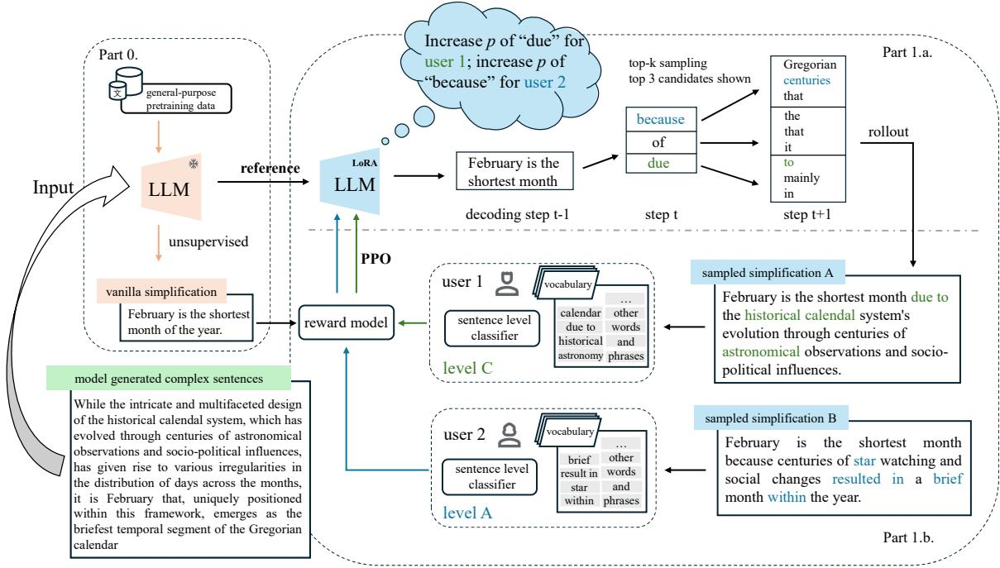
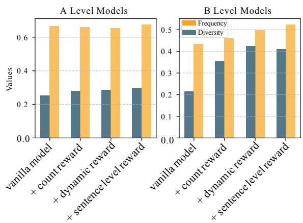
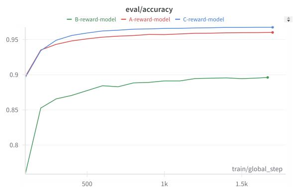
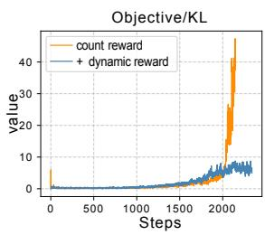
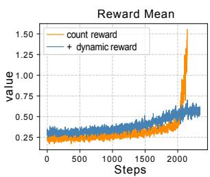
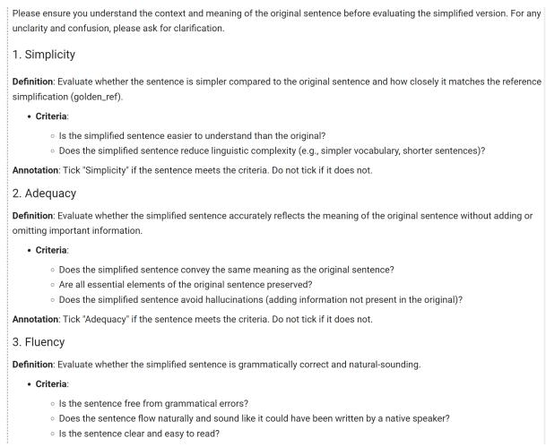
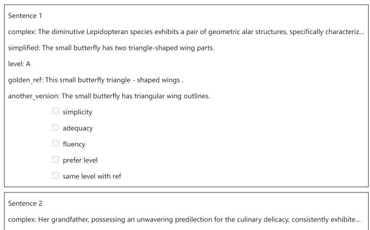
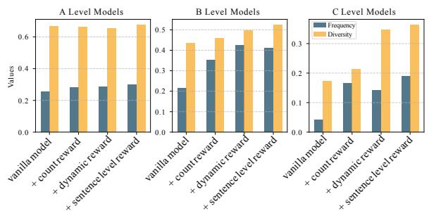

# Aligning Sentence Simplification with ESL Learner’s Proficiency for Language Acquisition

Guanlin Li1,2, Yuki Arase2, Noël Crespi1

1Samovar, Telecom SudParis, Institut Polytechnique de Paris, France 2School of Computing, Institute of Science Tokyo, Japan {guanlin\_li, noel.crespi}@telecom-sudparis.eu, arase@c.titech.ac.jp

## Abstract

Text simplification is crucial for improving accessibility and comprehension for English as a Second Language (ESL) learners. This study goes a step further and aims to facilitate ESL learners’ language acquisition by simplification. Specifically, we propose simplifying complex sentences to appropriate levels for learners while also increasing vocabulary coverage of the target level in the simplifications. We achieve this without a parallel corpus by conducting reinforcement learning on a large language model. Our method employs tokenlevel and sentence-level rewards, and iteratively trains the model on its self-generated outputs to guide the model to search for simplification hypotheses that satisfy the target attributes. Experiment results on CEFR-SP and TurkCorpus datasets show that the proposed method can effectively increase the frequency and diversity of vocabulary of the target level by more than 20% compared to baseline models, while maintaining high simplification quality. 1

## 1 Introduction

Controlled text simplification considers audiencetargeted attributes when generating simplified texts, so that the generated texts do not only meet the criteria of simplicity, but also preserve desired attributes for the targeted audiences. Recent studies on controlled text simplification aimed to help reading comprehension for language learners and employed school grade levels annotated in the training corpus as the simplification target (Scarton and Specia, 2018; Sheang and Saggion, 2021; Agrawal and Carpuat, 2023) or text features (number of words, character-level Levenshtein similarity etc.) between source and target sentences (Nishihara et al., 2019; Martin et al., 2020).

Different from these studies, we aim to aid language learning and education for English as a Second Language (ESL) learners by simplifying sentences while preserving desirable attributes for language acquisition. We use the Common European Framework of Reference for Languages (CEFR), the world standard definition of language proficiency. Our method is motivated by two classic L2 learning theories: the input hypothesis (Krashen, 1981) and frequency effect (Ellis, 2002). The input hypothesis stated that in order for the language acquisition to happen, the textual input which is either too simple or too complex for learner comprehension will not be useful for acquisition. If a learner’s current competence is i, then comprehensible input should contain both i and (i+1) content (Mitchell et al., 2019). Frequency theory holds that the frequency of the words and phrases in the input is a key determinant of acquisition, and words with higher frequency in the usage tend to be easier to acquire (Ellis and Ferreira-Junior, 2009). The key challenge here is the lack of a parallel corpus for training that should provide complex-simple sentence pairs labelled their levels. Parallel sentences of this kind are naturally scarce, and worse, annotation of difficulty levels, in particular, CEFR, is non-trivial and requires language education experts (Arase et al., 2022).

To achieve sentence simplification for aiding language learning without a parallel corpus, we propose reinforcement learning on a pre-trained large language model (LLM). Based on the aforementioned L2 learning theories, the proposed method simplifies the complex sentences to the one corresponding to the learner’s proficiency level or one level higher (i and i + 1 levels) and increases the coverage (frequency and diversity) of the corresponding level’s vocabulary in the generated simplifications. Specifically, we reformulate the controlled simplification task as a lookahead search problem: in the decoding step t, the model searches for the token that satisfies the target vocabulary constraint while also ensuring that future tokens increase the target vocabulary coverage as much as possible, and the final hypothesis falls into the desired CEFR level. We combine a simple wordmatch-based heuristic with the supervised sentencelevel signal to guide decoding and train the model iteratively using gradient policy optimization to memorize the search strategy that maximizes the overall reward. Remarkably, we eliminate the need for a parallel corpus by utilizing LLMs’ language generation capacity for simplification via reinforcement learning. Experimental results show that the method significantly increases the coverage and diversity of the target vocabulary in the outputs by up to 20% compared to the baselines, while maintaining high simplification quality.

Our primary contributions are twofold. First, we propose the sentence simplification method that aligns generated simplifications with ESL learners proficiency level on word, phrase and sentence levels and preserves attributes effective for facilitating language learning. Second, our method is easy to deploy and does not require a parallel corpus that is often expensive to create.

## 2 Related Work

We briefly summarize two lines of simplification methods, controlled simplification and reinforcement learning based simplification.

Controlled Simplification attaches tokens or prompts to the input to control the simplificationrelated attributes during generation (Yang et al., 2023; Agrawal and Carpuat, 2023; Sheang and Saggion, 2021; Martin et al., 2020, 2022; Scarton and Specia, 2018; Chi et al., 2023). While these methods learn to control levels of simplified sentences using a parallel corpus with annotated difficulties, our method controls attributes useful for language learning without a parallel corpus. As opposed to the training-time controlling, Kew and Ebling (2022) adopted FUDGE (Yang and Klein, 2021), which adjusts the logits of the text generation model during decoding using a classifier, to directly control the attribute of the simplification in the decoding time.

Reinforcement Learning based Simplification has explored controllability by defining rewards based on simplicity-related criteria (Zhang and Lapata, 2017; Guo et al., 2018; Nakamachi et al., 2020; Laban et al., 2021). The rewards for the objectives are constructed using supervised or unsupervised evaluation metrics for simplicity, adequacy and fluency. In contrast, we aim to control attributes useful for language learning and education. Furthermore, while RL tends to suffer from unstable training and sensitivity to the choice of hyperparameters, our method achieves training stability by adopting entropy regularization in the model optimization process and introducing a dynamic reward that adjusts based on the data distribution.

## 3 Problem Definition

We aim to facilitate language learning by simplification targeted at ESL learners. In this study, we use CEFR levels as a representative measure for the learners’ proficiency and model the target level based on the vocabulary2 (words, phrases, idioms) and sentence CEFR levels3.

Our problem is thus defined as follows. We assume that learners know their own CEFR level i. Given a sentence above the learner’s level i, we generate its simplified version that (a) contains as much vocabulary of the level i and i+1 as possible, and (b) corresponds to the target (learner’s) level i at the sentence level.

## 3.1 Constraint Formalization

Generating simplified texts subject to vocabulary constraints can be approached as a lexicalconstrained text generation task (Zetsu et al., 2022). Traditionally, lexical constraints in text generation involve a short list of required words, which Lu et al. (2021) expressed as a Conjunctive Normal Form (CNF), such as $\underbrace { \left( D _ { 1 } \vee D _ { 2 } \vee \cdots \right) } _ { C _ { 1 } } \wedge \cdots \wedge$ $\underbrace { ( D _ { m - 1 } \lor D _ { m } ) } _ { C _ { m } }$ in which $D _ { m }$ stands for a single constraint, and all clauses must be satisfied, imposing hard constraints on the generation process.

In our setting, however, this formulation is no longer applicable because the vocabulary constraint is as large as the size ofthe vocabulary ofa specific level. In addition, we aim to satisfy as many clauses as possible. Therefore, we formalize constraints as Disjunctive Normal Form (DNF), indicating words and phrases suitable for the target proficiency level: $D = \underbrace { ( D _ { 1 } ) } _ { C _ { 1 } } \vee \underbrace { ( D _ { 2 } \wedge D _ { 3 } \wedge \cdot \cdot \cdot ) } _ { C _ { 2 } } \vee \cdot \cdot \cdot \vee \underbrace { ( D _ { m } ) } _ { C _ { m } } ,$ language level, a single $D _ { m }$ represents word and the conjunctive clauses represent several words, namely phrases. Notably, this form of constraints allows for the control of discontinuous phrases, which is difficult in previous methods.

## 3.2 Optimization Function

Based on the DNF constraints, our task imposes soft constraints that aim to include as many clauses as possible. Given the simplification hypotheses $\{ \sec \mathbf { q } _ { 1 } , \sec \mathbf { q } _ { 2 } , \ldots , \ \sec \mathbf { q } _ { n } \}$ , the goal is to maximize:

$$
\sum _ { j = 1 } ^ { m } \sum _ { k = 1 } ^ { n } \mathrm { c o u n t } ( C _ { j } , { \mathrm { s e q } } _ { k } ) ,\tag{1}
$$

where count $( C _ { j } , \mathsf { s e q } _ { k } )$ indicates the number of clauses $C _ { j }$ satisfied by $\mathrm { s e q } _ { k }$ . Consequently, the target during the generation process is to search for the next token that:

• simplifies the original text;

• is contained in $\exists C _ { i } \in D ;$

• leads to future tokens that satisfy $C _ { i }$

• leads to complete phrases or phrases with slots (discontinuity) that satisfy $C _ { i }$

## 4 Proposed Method

To search for a hypothesis that better satisfies predetermined constraints, some previous methods use rollout in decoding that generates partial future sequences (Chaffin et al., 2022; Lu et al., 2022). These methods become infeasible for large models due to the inefficiency of sampling in decoding time and handling the large vocabulary constraints in our task. To effectively and efficiently search for the tokens that satisfy our constraints, we instead consider sampling in the training time and formulate the lookahead search problem using RL search (Fickinger et al., 2021) (see Fig. 1).

## 4.1 RL Search

Consider the text generation process as a Markov Decision Process (MDP), at each timestep t of the generation, the language model observes a state $s _ { t } ,$ which is the generated partial sequence $\mathsf { s e q } _ { t - 1 }$ , and takes an action $a _ { t }$ to choose the token from its vocabulary. When the EOS token is reached, a reward R for the generated sequence is calculated and used to update the model. In this setting, the language model is the policy function that searches for a token $v _ { i } \in \mathcal V$ where  is the vocabulary, and we can use any policy gradient algorithm to guide the language model to search for the generations that maximize the constraint satisfaction. Algorithm 1 indicates our training procedure.

Algorithm 1 Training Procedure   
Input: Complex sentences;   
1: Generate simplified texts from the complex   
sentences using current policy (rollout);   
2: Evaluate the current policy and produce re  
wards to guide the search;   
3: Optimize the policy model using the rewards   
4: Iteratively perform steps 1-3 till converge.

## 4.2 Policy Model

The policy model generates a simplified sentence seq given a complex counterpart as a prompt pmt. The policy model is initialized from an instruction tuned language model, which unsupervisedly provides robust text simplifications (Kew et al., 2023).

By design, the rewards for the policy model across different proficiency levels are varied. For instance, given the same model response, a positive reward for C level could correspond to a negative reward for A level. Therefore, using the original language model as the backbone, we train separate copies of the policy model for A, B and C levels by adding and updating distinct LoRA parameters to the backbone parameters (Hu et al., 2022), while keeping the backbone frozen.

## 4.3 Reward Models

Inspired by the L2 learning theories, we design two types of rewards at lexical and sentence levels.

## 4.3.1 Lexical Constraint Reward

We use a simple heuristic to guide the search for generations that satisfy the lexical constraints:

$$
H ( \mathrm { s e q } ) = \sum _ { C _ { j } \in D } r ( \mathrm { c o u n t } ( C _ { j } , \mathrm { s e q } ) ) ,\tag{2}
$$

where C is a clause from D, r denotes the reward according to the number of satisfactions of C in seq, and H denotes the reward score for the generated sequence seq in the current decoding step. To calculate the match counts, we remove basic stop words from the sentence after lemmatization.

As a simple baseline, we define r as a constant value 1 for word and 1.5 for phrase to encourage the model to generate more phrases and idioms. However, we found that this simple baseline is easily hacked by the model after a few steps of training, i.e., the model only generates a limited set of frequent words that were learnt to produce rewards. To encourage the model to explore more diverse words and improve the overall coverage of targetlevel words in the generations, the reward should intuitively encourage maximizing the entropy for the clauses in D, so that all the clauses are evenly distributed. Accordingly, we adjust the reward r for the count of $C _ { j }$ as a dynamic reward:

  
Figure 1: (better viewed in color) The overall framework of the proposed method: the simplification model is initialized from a pretrained large language model which is also used as a frozen ( ) reference model to provide entropy regularization (part 0.); top-k sampling is adopted in the decoding process to sample varied simplifications for the complex sentence (part 1.a.); the generated simplifications are evaluated based on the language proficiency level (vocabulary level and sentence level) of the target audience, which is used as rewards to update the simplification model (part 1.b.) to adopt better decoding strategy.

$$
r = \left\{ { \begin{array} { l l } { 1 } & { { \mathrm { i f ~ } } 0 \leq p _ { j } < { \frac { 1 } { m } } , } \\ { e ^ { - \alpha p _ { j } } } & { { \mathrm { i f ~ } } { \frac { 1 } { m } } \leq p _ { j } \leq 1 , } \end{array} } \right.\tag{3}
$$

where $p _ { j }$ is:

$$
p _ { j } = \frac { \sum _ { k = 1 } ^ { n } \mathrm { c o u n t } ( C _ { j } , { \mathrm { s e q } } _ { k } ) } { \sum _ { k = 1 } ^ { n } \sum _ { j = 1 } ^ { m } \mathrm { c o u n t } ( C _ { j } , { \mathrm { s e q } } _ { k } ) } ,\tag{4}
$$

to discourage the model from exploiting the same clause. Here, m denotes the total number of clauses in D and α is a constant to adjust the penalty degree for too frequent clauses. Eq. 4 is calculated after each epoch and the reward is adjusted accordingly. If matched clauses are above the target level, we give a constant negative score of 1.

## 4.3.2 Sentence Level Reward

To go beyond words and guide the simplification model’s search for a sentence of the target level, we incorporate a sentence-level reward model by simulating human experts’ judgment for the sentence’s CEFR level. We use pairwise ranking loss to train the reward model, since the class distribution for the CEFR-SP data is imbalanced (Arase et al., 2022). The ranking loss has been shown to be able to encourage the model to only pay attention to the focused class (Henning et al., 2023), thus may mitigate the class imbalance problem.

Consequently, we construct sentence pairs prioritizing the level we focus on generating: for a collection of sentences ${ \cal S } = \{ s _ { 1 } , s _ { 2 } , . . . , s _ { n } \}$ , each sentence $s _ { i }$ is evaluated by human experts and annotated with a language level l. Given the level we want to generate, we select the sentences with the target level $S _ { \mathrm { t g t } } = \{ s _ { i } \in \mathcal { S } \mid l _ { i } = \mathrm { l e v e l _ { t g t } } \}$ and randomly sample sentences from other levels to construct a negative set $S _ { \mathrm { n o n - t g t } } = \{ s _ { j } \in \mathcal { S } \mid$ $l _ { j } \neq \mathrm { l e v e l _ { t g t } } \}$ . Then, we construct sentence pairs $\mathcal { P } = \{ ( s _ { i } , s _ { j } ) \mid s _ { i } \in S _ { \mathrm { t g t } } , s _ { j } \in S _ { \mathrm { n o n - t g t } } \}$ by randomly selecting from ${ \mathcal { S } } _ { \mathrm { t g t } }$ and $S _ { \mathrm { n o n - t g t } }$

Notably, we do not require the pair to be parallel;

they just need to be at different levels. By this design, we disentangle the adequacy requirement for the simplification from the target-level search process. The former is handled by the underlying LLM, and the latter is dealt with by the reward model by level judgment.

With the constructed sentence pairs, we train a sentence-level reward model $r _ { \theta }$ . The training objective is to minimize loss:

$$
\mathcal { L } ( \boldsymbol { \theta } ) = - \sum _ { ( s _ { i } , s _ { j } ) \in \mathcal { P } } \log \sigma ( r _ { \boldsymbol { \theta } } ( s _ { i } ) - r _ { \boldsymbol { \theta } } ( s _ { j } ) )\tag{5}
$$

where $\sigma$ is the sigmoid function. After training the reward model, for a generated sentence seq, we take $r _ { l } = \sigma ( r _ { \theta } ( s ) )$ as the reward, and use a linear combination of the lexical reward and the sentence-level reward as the overall reward:

$$
R = \lambda r + \gamma r _ { l }\tag{6}
$$

## 4.4 Stabilized RL Training

The original instruct-tuned model is used as a frozen reference model, providing an entropy regularization for the updated policy model to ensure training stability during the search process. Specifically, the simplification seq′ produced by the frozen backbone model $f ^ { \prime }$ is added as an entropy regularization to the overall reward:

$$
R ^ { \prime } = R - \log ( p _ { ( f ( \mathsf { s e q } | p m t ) } / p _ { ( f ^ { \prime } ( \mathsf { s e q ^ { \prime } } | p m t ) ) } ) .\tag{7}
$$

By doing so, we may keep the LLM’s strong paraphrasing ability while letting it acquire controllability in CEFR levels.

The policy model f, namely the simplification model is then updated to search for the generations that maximize the reward. In this study, we adopt Proximal Policy Optimization (Schulman et al., 2017) to update the policy model, which achieves stable training and faster convergence.

## 5 Experiment Settings

We aim to evaluate the effectiveness of the proposed model in generating high-quality simplifications that align with the target vocabulary and sentence-based CEFR level. This section provides details of the experiment settings.

## 5.1 Resource and Implemetation

Sentence CEFR Level To train the sentencelevel reward model, we used CEFR-SP (Arase et al., 2022), which provides labels of six CEFR levels for a total of 17k sentences annotated by experts. We only used the publicly available subset from the dataset (excluding data based on Newsela (Xu et al., 2015)), which resulted in 10k sentences with labels. The statistics of the dataset are described in Table1. We fine-tuned the GPT-2 (Radford et al.) using the annotated CEFR levels.

<table><tr><td></td><td>A1</td><td>A2</td><td>B1</td><td>B2</td><td>C1</td><td>C2</td></tr><tr><td>Train</td><td>248</td><td>1284</td><td>2479</td><td>2226</td><td>889</td><td>52</td></tr><tr><td>Val</td><td>79</td><td>276</td><td>485</td><td>336</td><td>149</td><td>40</td></tr><tr><td>Test</td><td>71</td><td>289</td><td>540</td><td>369</td><td>150</td><td>39</td></tr></table>

Table 1: Statistics on CEFR-SP w/o Newsela

Vocabulary List For the lexical constraint reward model, we need vocabulary lists per CEFR level. We downloaded the English Vocabulary Profile (EVP) data4 and used it as a dictionary of words and phrases annotated with their corresponding CEFR levels5. Since our goal is to generate the simplifications in i and i + 1 levels, we always aggregate the vocabulary lists in two levels. For clarity, we consider A1+A2, B1+B2, and C1+C2 levels. In total, we got 1076 words for A level, 3823 words for B level, 3612 words for C level.

Complex Sentence Collection We trained the policy model to iteratively learn to search for a hypothesis that maximizes rewards based on its own generations. The only requirement for our training corpus is a supply of complex sentences that warrant simplification, because sufficiently simple sentences without the need for simplification may disturb the learning. Cegin et al. (2023) showed that large language models are highly capable of paraphrasing. Following this study, we used GPT-$4 ^ { 6 }$ to synthesize complex sentences from the CEFR-SP training set to create our training corpus. We manually prepared prompts to ensure that the outputs are always at least as complex as the highest C2 level. More details are in Appendix B.

We trained separate models for A, B and C levels since different levels require different rewards (see Section 4.2). For computational efficiency, we adopted a relatively small Phi-3-mini-3b model (Abdin et al., 2024). More implementation details can be found in Appendix C.

<table><tr><td>CEFR-SP</td><td>A-Frequency</td><td>A-Diversity</td><td>B-Frequency</td><td>B-Diversity</td><td>C-Frequency</td><td>C-Diversity</td></tr><tr><td>Reference</td><td>0.292</td><td>0.527</td><td>0.283</td><td>0.465</td><td>0.080</td><td>0.102</td></tr><tr><td rowspan="2">phi3-3b-vanilla T5+grade-A</td><td>0.252</td><td>0.665</td><td>0.215</td><td>0.435</td><td>0.041</td><td>0.172</td></tr><tr><td>0.194</td><td>0.438</td><td>0.269</td><td>0.271</td><td>0.072</td><td>0.114</td></tr><tr><td rowspan="2">FUDGE-A phi3-A</td><td>0.257</td><td>0.215</td><td>0.207</td><td>0.069</td><td>0.043</td><td>0.018</td></tr><tr><td>0.299</td><td>0.684</td><td>0.196</td><td>0.403</td><td>0.038</td><td>0.141</td></tr><tr><td rowspan="2">T5+grade-B FUDGE-B phi3-B</td><td>0.204</td><td>0.447</td><td>0.275</td><td>0.266</td><td>0.069</td><td>0.110</td></tr><tr><td>0.223</td><td>0.226</td><td>0.231</td><td>0.084</td><td>0.049</td><td>0.027</td></tr><tr><td rowspan="2">T5+grade-C</td><td>0.151</td><td>0.677</td><td>0.262</td><td>0.538</td><td>0.064</td><td>0.251</td></tr><tr><td>0.203</td><td>0.441</td><td>0.276</td><td>0.271</td><td>0.074</td><td>0.114</td></tr><tr><td rowspan="2">FUDGE-C phi3-C</td><td>0.239</td><td>0.217</td><td>0.220</td><td>0.077</td><td>0.052</td><td>0.025</td></tr><tr><td>0.171</td><td>0.658</td><td>0.263</td><td>0.275</td><td>0.189</td><td>0.365</td></tr></table>

Table 2: Results on target attribute controllability on CEFR-SP-Test. For “Reference”, the frequency and diversity metrics were calculated using a subset of each grade level to show distributions in sentences of specific levels.

## 5.2 Evaluation Datasets

To evaluate the simplification outputs, we need parallel corpora of complex and reference simple paraphrases. Below describes the resources we used for the evaluation.

CEFR-SP-Test As the formal evaluation dataset, we used CEFR-SP. We expanded its test set to be parallel because CEFR-SP is a non-parallel corpus. Specifically, we generated complex sentences for each sentence in the CEFR-SP test set using the same method described in Section 5.1. These complex sentences were input to models, and outputs were evaluated by comparing them to the original CEFR-SP sentences as references.

TurkCorpus To assess the applicability of the proposed method for a general simplification task, we also evaluated models on another widely-used dataset, TurkCorpus (Xu et al., 2016). We used the test set of the corpus, including 359 complex sentences, each has 8 human-written simplified sentences as references. It should be noted that TurkCorpus does not provide any level annotations.

## 5.3 Evaluation Metrics

We evaluated simplification outputs from two perspectives: simplification quality and target audience attributes by both automatic and human assessments. Simplification quality was assessed across three dimensions: Simplicity; Fluency; and Adequacy. As automatic metrics for simplicity, we employed LENS (Maddela et al., 2023) and SALSA (Heineman et al., 2023), which are two recently proposed model-based evaluation methods. For fluency and adequacy, we employed an instruction-tuned language model as an off-theshelf evaluation model, which was shown to be effective in automatic translation quality evaluations (Kocmi and Federmann, 2023). Target audience attributes were measured in terms of target vocabulary coverage and sentence CEFR level, in which vocabulary coverage includes both frequency and diversity of target vocabulary. For the evaluation of sentence CEFR-level, we used human evaluation. For more details on evaluation metrics, please refer to Appendix A.

## 5.4 Baselines

Overall, we choose two lines of work as the baselines for comparison.

Controlled Simplification There are limited variants in controlled simplification methods which mostly employ control tokens with supervised learning. Based on previous literature, we implemented two baselines for controlling the target level of the simplified texts: a supervised baseline of T5+grade (Scarton and Specia, 2018) that attaches CEFR levels as control tokens and an unsupervised baseline of FUDGE that uses a discriminator at decoding time (Yang and Klein, 2021).

Non-controlled Simplification The Turk corpus was used to evaluate the effectiveness of the proposed method in general simplification. As opposed to controlled simplification, this task does not consider controlling attributes, such as grade levels, during the simplification. For this line of models, we choose the following methods: DRESS (Zhang and Lapata, 2017), DMASS (Zhao et al., 2018), EditNTS (Dong et al., 2019), ACCESS (Martin et al., 2020), IterativEdit (Kumar et al., 2020). We used outputs of these models shared in the EASSE package (Alva-Manchego et al., 2019). In addition, we also compare the vanilla phi3-3b instruction-tuned model as a baseline, under zeroshot setting without fine-tuning on simplification.

<table><tr><td>TURK</td><td>A-Frequency</td><td>A-Diversity</td><td>B-Frequency</td><td>B-Diversity</td><td>C-Frequency</td><td>C-Diversity</td></tr><tr><td>Reference</td><td>0.176</td><td>0.229</td><td>0.227</td><td>0.132</td><td>0.056</td><td>0.046</td></tr><tr><td>phi3-3b-vanilla</td><td>0.166</td><td>0.180</td><td>0.177</td><td>0.083</td><td>0.034</td><td>0.023</td></tr><tr><td>T5+grade-A</td><td>0.187</td><td>0.180</td><td>0.217</td><td>0.088</td><td>0.051</td><td>0.028</td></tr><tr><td>FUDGE-A</td><td>0.175</td><td>0.177</td><td>0.175</td><td>0.069</td><td>0.034</td><td>0.018</td></tr><tr><td>phi3-A</td><td>0.216</td><td>0.208</td><td>0.153</td><td>0.063</td><td>0.031</td><td>0.018</td></tr><tr><td>T5+grade-B FUDGE-B</td><td>0.201</td><td>0.190</td><td>0.217</td><td>0.085</td><td>0.052</td><td>0.028</td></tr><tr><td></td><td>0.163</td><td>0.177</td><td>0.178</td><td>0.077</td><td>0.039</td><td>0.022</td></tr><tr><td>phi3-B</td><td>0.126</td><td>0.201</td><td>0.330</td><td>0.112</td><td>0.066</td><td>0.035</td></tr><tr><td>T5+grade-C FUDGE-C</td><td>0.187</td><td>0.194</td><td>0.225</td><td>0.090</td><td>0.050</td><td>0.026</td></tr><tr><td>phi3-C</td><td>0.171</td><td>0.174</td><td>0.181</td><td>0.076</td><td>0.037</td><td>0.019</td></tr><tr><td></td><td>0.151</td><td>0.178</td><td>0.193</td><td>0.092</td><td>0.091</td><td>0.041</td></tr></table>

Table 3: Results on target attribute controllability on TurkCorpus
<table><tr><td>Complex Sentence The considerable distance, compounded by Jamie&#x27;s current condition of pregnancy, which inexorably engenders a state of increased fatigue, renders the prospect of ambulation to said location prohibitively challenging for her.</td></tr><tr><td>Ref. (level B) It is too far for Jamie to walk to, especially because she is pregnant and easily exhausted.</td></tr><tr><td>Simplifications</td></tr><tr><td>Level A: Jamie is too tired to walk far because she is pregnant. Level B: Jamie&#x27;s pregnancy makes it very hard for her to walk to the location due to the long distance.</td></tr><tr><td>Level C: Jamie&#x27;s pregnancy leads to fatigue, making it hard for her to walk to the distant place.</td></tr></table>

Table 4: A randomly selected example from the simplification result of the proposed method. The target vocabulary of the corresponding level is marked in italic font.

## 6 Experiment Results

This section analyses experiment results of automatic and human evaluations, and ablation study.

## 6.1 Automatic Evaluation Results

Target Attributes Tables 2 and 3 show the evaluation results for the target vocabulary coverage. These results demonstrate that compared to the baseline models, the proposed model significantly increases the frequency of target vocabulary in simplified sentences while also improving vocabulary diversity. Notably, the proposed method successfully increases the frequency and diversity of A and C-level vocabulary, which should be harder than B-level due to the scarcity of level A and C samples (Arase et al., 2022).

Simplification Quality Tables 5 and 6 show the evaluation results for the simplification quality. Overall, these results indicate that our models can produce high-quality simplifications, greatly outperforming the baseline models. Remind that our model does not have reward to encourage the model to follow the adequacy requirement. We attribute these improvements to the benefits of using entropy regularization imposed by the reference model that allows the preservation of the high paraphrasing capability of LLMs. Table 4 shows a randomly

picked example of simplification by our method;   
Appendix E provides more.

## 6.2 Human Evaluation Results

We perform a human evaluation to assess the simplification quality from human perspectives. We recruited three graduate-level students majoring in linguistics to perform the evaluation. The evaluators were first trained with the background knowledge and then given a guideline to evaluate the following aspects of the samples: fluency, simplicity, adequacy, and CEFR sentence level.

We asked annotators to make binary judgements for fluency, simplicity, and adequacy. For sentence level, because CEFR-level judgements require expertise in language education, we simplified the task to collect reliable decisions. We asked the evaluators to judge if a simplified sentence matches the desired sentence level (denoted as “Level”). We showed a reference with its CEFR level and requested the evaluators to judge if the model output matches the reference’s simplicity. In addition, we asked them if a simplification output is preferable in terms of its CEFR level compared to the one generated by a model targeting a different level (denoted as “Prefer”). For example, an evaluator judges if an output of the A-level model is preferable to that of the C-level compared to the

<table><tr><td>CEFR-SP</td><td>LENS</td><td>SALSA</td><td>Fluency</td><td>Adequacy</td></tr><tr><td rowspan="2">Reference phi3-3b-vanilla</td><td>43.57</td><td>59.54</td><td>0.829</td><td>0.624</td></tr><tr><td>63.37</td><td>74.18</td><td>0.897</td><td>0.538</td></tr><tr><td rowspan="2">T5+grade-A FUDGE-A</td><td>41.37</td><td>58.98</td><td>0.547</td><td>0.291</td></tr><tr><td>60.84</td><td>70.16</td><td>0.780</td><td>0.447</td></tr><tr><td rowspan="2">phi3-A T5+grade-B</td><td>67.29</td><td>76.23</td><td>0.827</td><td>0.604</td></tr><tr><td>40.15</td><td>58.43</td><td>0.535</td><td>0.290</td></tr><tr><td rowspan="2">FUDGE-B phi3-B</td><td>53.33</td><td>68.69</td><td>0.823</td><td>0.540</td></tr><tr><td>64.61</td><td>72.21</td><td>0.871</td><td>0.768</td></tr><tr><td rowspan="2">T5+grade-C FUDGE-C</td><td>41.67</td><td>59.12</td><td>0.538</td><td>0.277</td></tr><tr><td>60.50</td><td>70.48</td><td>0.830</td><td>0.473</td></tr><tr><td rowspan="2">phi3-C</td><td>57.06</td><td>70.93</td><td>0.913</td><td></td></tr><tr><td></td><td></td><td></td><td>0.615</td></tr></table>

Table 5: Simplification quality on CEFR-SP-Test per levels; T5-grade, FUDGE and proposed method were evaluated using subsets of specific levels (A, B and C level references, respectively).
<table><tr><td>TURK</td><td>LENS</td><td>SALSA</td><td>Fluency</td><td>Adequacy</td></tr><tr><td>Reference</td><td>35.20</td><td>64.96</td><td>0.732</td><td>0.901</td></tr><tr><td>ACCESS</td><td>49.90</td><td>62.68</td><td>0.576</td><td>0.780</td></tr><tr><td>DMASS</td><td>46.52</td><td>58.97</td><td>0.515</td><td>0.665</td></tr><tr><td>DRESS</td><td>59.76</td><td>62.63</td><td>0.807</td><td>0.615</td></tr><tr><td>DRESS-LS</td><td>60.56</td><td>62.92</td><td>0.838</td><td>0.657</td></tr><tr><td>EditNTS</td><td>57.71</td><td>64.86</td><td>0.752</td><td>0.710</td></tr><tr><td>IterativEdit</td><td>37.35</td><td>49.74</td><td>0.409</td><td>0.607</td></tr><tr><td>phi3-3b-vanilla</td><td>65.08</td><td>71.93</td><td>0.830</td><td>0.807</td></tr><tr><td>phi3-A</td><td>64.92</td><td>73.68</td><td>0.720</td><td>0.708</td></tr><tr><td>phi3-B</td><td>70.25</td><td>69.05</td><td>0.855</td><td>0.952</td></tr><tr><td>phi3-C</td><td>62.24</td><td>70.43</td><td>0.869</td><td>0.872</td></tr></table>

Table 6: Simplification quality on TurkCorpus; all models evaluated on the entire sentences as TurkCorpus does not annotate levels.

A-level reference.7 For each CEFR level, 30 simplifications of the CEFR-SP-Test were randomly sampled and annotated “Level” and “prefer” judgements. We report the ratios of positive judgements as evaluation scores. The details of the annotation guideline and interface are presented in Appendix D.

Table 7 shows the results; the simplicity score is generally high, close to 1, across models. This is expected as the source sentences were generated to be highly complex. The adequacy measurement results are consistent with automatic evaluation; identifying our proposed models as the most adequate. Furthermore, the proposed method achieves the best controllability on sentence levels compared to the baselines as indicated by significantly higher “Level” and “Prefer” scores.

## 6.3 Ablation Study

In this section, we show how each part of the proposed rewards contributes to the final performance. We compare the following models: vanilla phi3 model, reward using only target vocabulary counts, reward using dynamically adjusted vocabulary coverage rates, and reward using both dynamic vocabulary coverage rate and sentence levels (proposed method). The frequency and diversity evaluation results for A and B level models are presented in Fig. 2. Complete results can be found in Appendix E. It can be seen that changing the simple match count reward to a dynamically adjusted reward indeed encourages the model to increase the entropy inside the target vocabulary and largely improve the vocabulary diversity.

<table><tr><td>Model</td><td>Simplicity</td><td>Adequacy</td><td>Fluency</td><td>Prefer</td><td>Level</td></tr><tr><td>Reference</td><td>1.00</td><td>0.89</td><td>0.99</td><td>0.87</td><td></td></tr><tr><td>T5+grade-A</td><td>0.83</td><td>0.16</td><td>0.47</td><td>0.40</td><td>0.10</td></tr><tr><td>T5+grade-B</td><td>0.90</td><td>0.13</td><td>0.50</td><td>0.43</td><td>0.17</td></tr><tr><td>T5+grade-C</td><td>0.80</td><td>0.16</td><td>0.60</td><td>0.40</td><td>0.17</td></tr><tr><td>FUDGE-A</td><td>1.00</td><td>0.50</td><td>0.80</td><td>0.50</td><td>0.43</td></tr><tr><td>FUDGE-B</td><td>0.96</td><td>0.43</td><td>0.83</td><td>0.57</td><td>0.47</td></tr><tr><td>FUDGE-C</td><td>1.00</td><td>0.47</td><td>0.83</td><td>0.57</td><td>0.33</td></tr><tr><td>Ours phi3-A</td><td>1.00</td><td>0.76</td><td>0.90</td><td>0.67</td><td>0.83</td></tr><tr><td>Ours phi3-B</td><td>1.00</td><td>0.83</td><td>0.90</td><td>0.70</td><td>0.63</td></tr><tr><td>Ours phi3-C</td><td>0.96</td><td>0.80</td><td>1.00</td><td>0.80</td><td>0.60</td></tr></table>

Table 7: Human evaluation results

  
Figure 2: Reward effects on target vocabulary coverage

## 7 Conclusion

In this paper, we target ESL learners as audiences for text simplification aiming to facilitate the learning process of the foreign language. Referring to the input hypothesis and frequency effect theory in L2 learning, we propose a reinforcement learning method on LLM to control the simplification model to generate outputs that satisfy the vocabulary and sentence level constraints. Experiment results show that the proposed method can increase the target vocabulary coverage in the generated simplifications, and human evaluation results confirmed that the simplified texts generally preserve the targeted CEFR levels.

In practice, different individuals have varied levels of knowledge for the language. We plan to extend the method to generate individual learnertargeted personalized simplifications in the future.

## Limitations

This work assumes the target vocabulary for the learner is accessible, which in reality may not be the case as the target vocabulary varies with learner individuals and has to be first estimated. Although it is out of the scope of this paper, this direction constitutes our future work. Besides, currently, we do not control the frequency to a specific number, such as 95% i level and 5% i + 1 level, which is an important aspect to consider according to the L2 learning theory.

The control for target vocabulary and sentence is implemented individually for different levels rather than using one model altogether, causing heavier computational loads. In future, we seek to improve the design of reward model to integrate rewards for different proficiency levels into one model, and explore for a finer control over the frequency of the generated vocabulary.

## References

Marah Abdin, Sam Ade Jacobs, Ammar Ahmad Awan, Jyoti Aneja, Ahmed Awadallah, Hany Awadalla, Nguyen Bach, Amit Bahree, Arash Bakhtiari, Harkirat Behl, et al. 2024. Phi-3 technical report: A highly capable language model locally on your phone. arXiv preprint arXiv:2404.14219.

Sweta Agrawal and Marine Carpuat. 2023. Controlling pre-trained language models for grade-specific text simplification. In Proceedings of the 2023 Conference on Empirical Methods in Natural Language Processing, pages 12807–12819, Singapore. Association for Computational Linguistics.

Fernando Alva-Manchego, Louis Martin, Carolina Scarton, and Lucia Specia. 2019. EASSE: Easier automatic sentence simplification evaluation. In Proceedings ofthe 2019 Conference on Empirical Methods in Natural Language Processing and the 9th International Joint Conference on Natural Language Processing (EMNLP-IJCNLP): System Demonstrations, pages 49–54, Hong Kong, China. Association for Computational Linguistics.

Fernando Alva-Manchego, Carolina Scarton, and Lucia Specia. 2021. The (un)suitability of automatic evaluation metrics for text simplification. Computational Linguistics, 47(4):861–889.

Yuki Arase, Satoru Uchida, and Tomoyuki Kajiwara. 2022. CEFR-based sentence difficulty annotation

and assessment. In Proceedings of the 2022 Conference on Empirical Methods in Natural Language Processing, pages 6206–6219, Abu Dhabi, United Arab Emirates. Association for Computational Linguistics.

Jan Cegin, Jakub Simko, and Peter Brusilovsky. 2023. ChatGPT to replace crowdsourcing of paraphrases for intent classification: Higher diversity and comparable model robustness. In Proceedings of the 2023 Conference on Empirical Methods in Natural Language Processing, pages 1889–1905, Singapore. Association for Computational Linguistics.

Antoine Chaffin, Vincent Claveau, and Ewa Kijak. 2022. PPL-MCTS: Constrained textual generation through discriminator-guided MCTS decoding. In Proceedings of the 2022 Conference of the North American Chapter of the Association for Computational Linguistics: Human Language Technologies, pages 2953–2967, Seattle, United States. Association for Computational Linguistics.

Alison Chi, Li-Kuang Chen, Yi-Chen Chang, Shu-Hui Lee, and Jason S. Chang. 2023. Learning to paraphrase sentences to different complexity levels. Transactions of the Association for Computational Linguistics, 11:1332–1354.

Liam Cripwell, Joël Legrand, and Claire Gardent. 2023. Simplicity level estimate (SLE): A learned referenceless metric for sentence simplification. In Proceedings of the 2023 Conference on Empirical Methods in Natural Language Processing, pages 12053–12059, Singapore. Association for Computational Linguistics.

Yue Dong, Zichao Li, Mehdi Rezagholizadeh, and Jackie Chi Kit Cheung. 2019. EditNTS: An neural programmer-interpreter model for sentence simplification through explicit editing. In Proceedings ofthe 57th Annual Meeting ofthe Associationfor Computational Linguistics, pages 3393–3402, Florence, Italy. Association for Computational Linguistics.

Nick C Ellis. 2002. Frequency effects in language processing: A review with implications for theories of implicit and explicit language acquisition. Studies in second language acquisition, 24(2):143–188.

Nick C Ellis and Fernando Ferreira-Junior. 2009. Construction learning as a function of frequency, frequency distribution, and function. The Modern language journal, 93(3):370–385.

Arnaud Fickinger, Hengyuan Hu, Brandon Amos, Stuart Russell, and Noam Brown. 2021. Scalable online planning via reinforcement learning fine-tuning. Advances in Neural Information Processing Systems, 34:16951–16963.

Han Guo, Ramakanth Pasunuru, and Mohit Bansal. 2018. Dynamic multi-level multi-task learning for sentence simplification. In Proceedings of the 27th International Conference on Computational Linguistics, pages 462–476, Santa Fe, New Mexico, USA. Association for Computational Linguistics.

David Heineman, Yao Dou, Mounica Maddela, and Wei Xu. 2023. Dancing between success and failure: Edit-level simplification evaluation using SALSA. In Proceedings of the 2023 Conference on Empirical Methods in Natural Language Processing, pages 3466–3495, Singapore. Association for Computational Linguistics.

Sophie Henning, William Beluch, Alexander Fraser, and Annemarie Friedrich. 2023. A survey of methods for addressing class imbalance in deep-learning based natural language processing. In Proceedings of the 17th Conference of the European Chapter of the Association for Computational Linguistics, pages 523–540, Dubrovnik, Croatia. Association for Computational Linguistics.

Edward J Hu, yelong shen, Phillip Wallis, Zeyuan Allen-Zhu, Yuanzhi Li, Shean Wang, Lu Wang, and Weizhu Chen. 2022. LoRA: Low-rank adaptation of large language models. In International Conference on Learning Representations.

Tannon Kew, Alison Chi, Laura Vásquez-Rodríguez, Sweta Agrawal, Dennis Aumiller, Fernando Alva-Manchego, and Matthew Shardlow. 2023. BLESS: Benchmarking large language models on sentence simplification. In Proceedings of the 2023 Conference on Empirical Methods in Natural Language Processing, pages 13291–13309, Singapore. Association for Computational Linguistics.

Tannon Kew and Sarah Ebling. 2022. Target-level sentence simplification as controlled paraphrasing. In Proceedings of the Workshop on Text Simplification, Accessibility, and Readability (TSAR-2022), pages 28–42, Abu Dhabi, United Arab Emirates (Virtual). Association for Computational Linguistics.

J Peter Kincaid, Robert P Fishburne Jr, Richard L Rogers, and Brad S Chissom. 1975. Derivation of new readability formulas (automated readability index, fog count and flesch reading ease formula) for navy enlisted personnel.

Tom Kocmi and Christian Federmann. 2023. Large language models are state-of-the-art evaluators of translation quality. In Proceedings of the 24th Annual Conference ofthe European Associationfor Machine Translation, pages 193–203, Tampere, Finland. European Association for Machine Translation.

Stephen Krashen. 1981. Second language acquisition. Second Language Learning, 3(7):19–39.

Dhruv Kumar, Lili Mou, Lukasz Golab, and Olga Vechtomova. 2020. Iterative edit-based unsupervised sentence simplification. In Proceedings ofthe 58th Annual Meeting ofthe Associationfor Computational Linguistics, pages 7918–7928, Online. Association for Computational Linguistics.

Philippe Laban, Tobias Schnabel, Paul Bennett, and Marti A. Hearst. 2021. Keep it simple: Unsupervised simplification of multi-paragraph text. In Proceedings ofthe 59th Annual Meeting ofthe Associationfor

Computational Linguistics and the 11th International Joint Conference on Natural Language Processing (Volume 1: Long Papers), pages 6365–6378, Online. Association for Computational Linguistics.

Ximing Lu, Sean Welleck, Peter West, Liwei Jiang, Jungo Kasai, Daniel Khashabi, Ronan Le Bras, Lianhui Qin, Youngjae Yu, Rowan Zellers, Noah A. Smith, and Yejin Choi. 2022. NeuroLogic a\*esque decoding: Constrained text generation with lookahead heuristics. In Proceedings of the 2022 Conference of the North American Chapter ofthe Associationfor Computational Linguistics: Human Language Technologies, pages 780–799, Seattle, United States. Association for Computational Linguistics.

Ximing Lu, Peter West, Rowan Zellers, Ronan Le Bras, Chandra Bhagavatula, and Yejin Choi. 2021. Neuro-Logic decoding: (un)supervised neural text generation with predicate logic constraints. In Proceedings ofthe 2021 Conference ofthe North American Chapter of the Association for Computational Linguistics: Human Language Technologies, pages 4288–4299, Online. Association for Computational Linguistics.

Mounica Maddela, Yao Dou, David Heineman, and Wei Xu. 2023. LENS: A learnable evaluation metric for text simplification. In Proceedings of the 61st Annual Meeting of the Association for Computational Linguistics (Volume 1: Long Papers), pages 16383– 16408, Toronto, Canada. Association for Computational Linguistics.

Louis Martin, Éric de la Clergerie, Benoît Sagot, and Antoine Bordes. 2020. Controllable sentence simplification. In Proceedings of the Twelfth Language Resources and Evaluation Conference, pages 4689– 4698, Marseille, France. European Language Resources Association.

Louis Martin, Angela Fan, Éric de la Clergerie, Antoine Bordes, and Benoît Sagot. 2022. MUSS: Multilingual unsupervised sentence simplification by mining paraphrases. In Proceedings of the Thirteenth Language Resources and Evaluation Conference, pages 1651–1664, Marseille, France. European Language Resources Association.

Rosamond Mitchell, Florence Myles, and Emma Marsden. 2019. Second language learning theories. Routledge.

Akifumi Nakamachi, Tomoyuki Kajiwara, and Yuki Arase. 2020. Text simplification with reinforcement learning using supervised rewards on grammaticality, meaning preservation, and simplicity. In Proceedings ofthe 1st Conference ofthe Asia-Pacific Chapter ofthe Associationfor Computational Linguistics and the 10th International Joint Conference on Natural Language Processing: Student Research Workshop, pages 153–159, Suzhou, China. Association for Computational Linguistics.

Daiki Nishihara, Tomoyuki Kajiwara, and Yuki Arase. 2019. Controllable text simplification with lexical

constraint loss. In Proceedings of the 57th Annual Meeting of the Association for Computational Linguistics: Student Research Workshop, pages 260– 266, Florence, Italy. Association for Computational Linguistics.

Kishore Papineni, Salim Roukos, Todd Ward, and Wei-Jing Zhu. 2002. Bleu: a method for automatic evaluation of machine translation. In Proceedings ofthe 40th Annual Meeting ofthe Associationfor Computational Linguistics, pages 311–318, Philadelphia, Pennsylvania, USA. Association for Computational Linguistics.

Alec Radford, Jeffrey Wu, Rewon Child, David Luan, Dario Amodei, Ilya Sutskever, et al. Language models are unsupervised multitask learners.

Carolina Scarton and Lucia Specia. 2018. Learning simplifications for specific target audiences. In Proceedings ofthe 56th Annual Meeting ofthe Associationfor Computational Linguistics (Volume 2: Short Papers), pages 712–718, Melbourne, Australia. Association for Computational Linguistics.

John Schulman, Filip Wolski, Prafulla Dhariwal, Alec Radford, and Oleg Klimov. 2017. Proximal policy optimization algorithms. arXiv preprint arXiv:1707.06347.

Kim Cheng Sheang and Horacio Saggion. 2021. Controllable sentence simplification with a unified textto-text transfer transformer. In Proceedings of the 14th International Conference on Natural Language Generation, pages 341–352, Aberdeen, Scotland, UK. Association for Computational Linguistics.

Regina Stodden, Omar Momen, and Laura Kallmeyer. 2023. DEplain: A German parallel corpus with intralingual translations into plain language for sentence and document simplification. In Proceedings of the 61st Annual Meeting of the Association for Computational Linguistics (Volume 1: Long Papers), pages 16441–16463, Toronto, Canada. Association for Computational Linguistics.

Elior Sulem, Omri Abend, and Ari Rappoport. 2018. Semantic structural evaluation for text simplification. In Proceedings of the 2018 Conference of the North American Chapter of the Association for Computational Linguistics: Human Language Technologies, Volume 1 (Long Papers), pages 685–696, New Orleans, Louisiana. Association for Computational Linguistics.

Renliang Sun, Hanqi Jin, and Xiaojun Wan. 2021. Document-level text simplification: Dataset, criteria and baseline. In Proceedings ofthe 2021 Conference on Empirical Methods in Natural Language Processing, pages 7997–8013, Online and Punta Cana, Dominican Republic. Association for Computational Linguistics.

Wei Xu, Chris Callison-Burch, and Courtney Napoles. 2015. Problems in current text simplification research: New data can help. Transactions ofthe Associationfor Computational Linguistics, 3:283–297.

Wei Xu, Courtney Napoles, Ellie Pavlick, Quanze Chen, and Chris Callison-Burch. 2016. Optimizing statistical machine translation for text simplification. Transactions of the Association for Computational Linguistics, 4:401–415.

Kevin Yang and Dan Klein. 2021. FUDGE: Controlled text generation with future discriminators. In Proceedings ofthe 2021 Conference ofthe North American Chapter ofthe Associationfor Computational Linguistics: Human Language Technologies, pages 3511–3535, Online. Association for Computational Linguistics.

Kexin Yang, Dayiheng Liu, Wenqiang Lei, Baosong Yang, Mingfeng Xue, Boxing Chen, and Jun Xie. 2023. Tailor: A soft-prompt-based approach to attribute-based controlled text generation. In Proceedings ofthe 61st Annual Meeting ofthe Association for Computational Linguistics (Volume 1: Long Papers), pages 410–427, Toronto, Canada. Association for Computational Linguistics.

Tatsuya Zetsu, Tomoyuki Kajiwara, and Yuki Arase. 2022. Lexically constrained decoding with edit operation prediction for controllable text simplification. In Proceedings of the Workshop on Text Simplification, Accessibility, and Readability (TSAR-2022), pages 147–153, Abu Dhabi, United Arab Emirates (Virtual). Association for Computational Linguistics.

Tianyi Zhang\*, Varsha Kishore\*, Felix Wu\*, Kilian Q. Weinberger, and Yoav Artzi. 2020. Bertscore: Evaluating text generation with bert. In International Conference on Learning Representations.

Xingxing Zhang and Mirella Lapata. 2017. Sentence simplification with deep reinforcement learning. In Proceedings of the 2017 Conference on Empirical Methods in Natural Language Processing, pages 584– 594, Copenhagen, Denmark. Association for Computational Linguistics.

Sanqiang Zhao, Rui Meng, Daqing He, Andi Saptono, and Bambang Parmanto. 2018. Integrating transformer and paraphrase rules for sentence simplification. In Proceedings of the 2018 Conference on Empirical Methods in Natural Language Processing, pages 3164–3173, Brussels, Belgium. Association for Computational Linguistics.

## A Evaluation Metrics

In this section, the evaluation metrics are explained in details: fluency, adequacy, target vocabulary frequency, diversity and target sentence level.

Previous studies have introduced various metrics for evaluating simplicity, which we summarize in Table 8. Among these metrics, SARI (Xu et al., 2016) is the most commonly employed in the literature. However, recent studies show that SARI may not be an optimal measure for assessing the quality of simplicity (Alva-Manchego et al., 2021;

Maddela et al., 2023; Stodden et al., 2023). Thus, we chose to use LENS (Maddela et al., 2023) and SALSA (Heineman et al., 2023), two recently proposed metrics, to measure simplicity.

<table><tr><td>Metric</td><td>Scope</td><td>Reference</td></tr><tr><td>BLEU (Papineni et al., 2002)</td><td>semantic similarity</td><td>Y</td></tr><tr><td>FKGL (Kincaid et al., 1975)</td><td>readability</td><td>N</td></tr><tr><td>FKBLEU (Xu et al., 2016)</td><td>readability, similarity</td><td>Y</td></tr><tr><td>SARI (Xu et al., 2016)</td><td>keep, add, delete</td><td>Y</td></tr><tr><td>D-SARI (Sun et al., 2021)</td><td>keep, add, delete</td><td>Y</td></tr><tr><td>SAMSA (Sulem et al., 2018)</td><td>semantic structural similarity</td><td>N</td></tr><tr><td>BERTScore (Zhang* et al., 2020)</td><td>semantic similarity</td><td>Y</td></tr><tr><td>SLE (Cripwell et al., 2023)</td><td>human rating + FKGL</td><td>N</td></tr><tr><td>LENS (Maddela et al., 2023)</td><td>human rating</td><td>Y</td></tr><tr><td>SALSA (Heineman et al., 2023)</td><td>human rating</td><td>N</td></tr></table>

Table 8: Metrics used in recent literature. Scope denotes the aspect that the metric aims to evaluate, and reference indicates whether the metric is computed based on references or not.

For adequacy and fluency, the ideal approach is human evaluation; however, this is impractical due to the large dataset size. Instead, we employed large language models to assess these two aspects. With a capable language model $f ,$ the generated simplification sentence s is evaluated as:

$$
s c o r e ( s ) = \sum _ { v \in V _ { y } } f ( v \mid ( p m t , s )\tag{8}
$$

where pmt is a prompt designed for the model to output $" y e s "$ if the model evaluate s to be adequate or fluent, and $V _ { y }$ is a vocabulary subset for "yes" with $V _ { y } = \{ \mathrm { Y E S , Y e s , y e s } \}$ . We use Llama-3-8b-instruct8 model as the evaluation model in our experiment.

To measure target vocabulary frequency, we took the ratio between the total count of matched target words and the total generated words.

$$
\sum _ { j = 1 } ^ { m } \sum _ { k = 1 } ^ { n } \operatorname { c o u n t } ( C _ { j } , { \mathrm { s e q } } _ { k } ) / \sum _ { k = 1 } ^ { n } \operatorname { c o u n t } ( { \mathrm { t o k e n } } , { \mathrm { s e q } } _ { k } )\tag{9}
$$

To measure vocabulary diversity, we took the ratio between the number of matched words and number of words in the word list.

$$
\sum _ { j \in D } 1 \left( \bigvee _ { k = 1 } ^ { n } \mathbf { 1 } _ { C _ { j } } ( \mathbf { s e q } _ { k } ) \right) / | D |\tag{10}
$$

## B Complex Sentence Generations

To generate complex sentences, we prompted the GPT-4 model9 to rephrase sentences of varied levels into highly complex sentences. To ensure the diversity of the generated complex data, we initially created a variety of seed prompts manually and instructed GPT-4 to generate additional prompts based on these seed prompts. GPT-4 was then prompted to generate complex sentences based on these diversified prompts. The 5 manually written seed prompts and 10 model generated prompts are presented in Table 9. In total 15 prompts were used to generate complex sentences, for each generation, one of the prompts was randomly selected. We present samples of the generated complex sentences together with simplifications in Table 10 and Table 11.

## C Training Details

Implementation Details of Baselines We implemented the baseline models using the transformers library10. T5-s2s models require parallel corpus of complex-simple sentences, for which we used the pseudo-parallel sentences of generated complex sentences and their original sentences, and prepended level tokens for level controlling during training and evaluation. We implemented the FUDGE simplification control model with a Llama-3-8b-instruct model as the generation model, and its logits during the inference were adjusted using the CEFR level classification model released by (Arase et al., 2022).

Implementation Details of Proposed Method The PPO training algorithm was implemented using the TRL library11 with a learning rate of 3e 5. For the dynamic reward model used in the training, we set the α to be 1.2, as we found a value slightly bigger than 1 was shown to have better performance empirically; the reward for phrases is always set to be 1.5 times more than words to reward more on the phrase generation. For the overall reward, λ was set to be 1.5 to compensate for the vocabulary reward penalty, and γ was set to 1. During training, we used the following prompt for the model to generate simplifications: “Given a complex sentence {}, generate a simplified version for $\mathrm { i t } ; \overrightarrow { \mathbf { \Gamma } }$

Training Performance The performance of the sentence level reward model is shown in Fig. 3. Fig.4 shows mean reward and KL change over the training steps with and without the dynamic reward. Objective/KL indicates the deviation of the simplification model from the reference model, and an absurdly high KL indicates model collapse; a burst in mean reward indicates model collapses and only produces a limited set of vocabulary. It can be observed that using the dynamic reward helps stabilize the training, while using the match count alone causes the model to be over-optimized and collapse to a limited vocabulary subset.

  
Figure 3: Sentence level reward model evaluation accuracy

  
Figure 4: Training stability w/wo dynamic reward

## D Human Evaluation Details

In this section, the annotation guidelines that evaluators used to evaluate the generated simplifications as well as the annotation interface are presented. The annotation guidelines contain the definition of the aspect to be evaluated, the criteria for the evaluation and indications for the annotation interface. The annotation interface is designed to be a binary-choice form, for each aspect to be evaluated, the evaluators chose to tick to indicate that the simplification contains the aspect to be evaluated, and does not satisfy the aspect otherwise. The evaluation results are then used to calculate the binary accuracy of the aspects to be evaluated. The evaluation guidelines are shown in Fig. 5(a) and the evaluation interface is shown in Fig. 5(b).

  
(a) Screenshot of annotation guidelines shown to the evaluators

  
(b) Screenshot of annotation interface shown to the evaluators  
Figure 5: Screenshot of annotation guidelines

## E More Evaluation Results

Fig. 6 shows the ablation study results on all three levels of models.

Tables 10 and 11 present example outputs: the complex sentences, reference sentences, and simplified sentences. For each complex sentences, there are three versions of the simplified sentences, corresponding to A, B and C levels generated by different models targeting the corresponding level, respectively.

  
Figure 6: Vocabulary targeting w/ different rewards, all levels

<table><tr><td colspan="1" rowspan="1">Manual Composed Prompts</td></tr><tr><td colspan="1" rowspan="1">You are an expert in academic writing, renowned for your ability to compose intricate andsophisticated sentences. Please rephrase the following sentence,so that it's a complex, hard tofollow sentence that would usually appear in a journal article, without loss of original meaning:</td></tr><tr><td colspan="1" rowspan="1">You are an experienced English teacher. Please rephrase the following sentence,to make it acomplicated, very hard sentence to read that a English learner may encounter in daily reading,without loss of original meaning:</td></tr><tr><td colspan="1" rowspan="1">You are a successful postmodernism theater and book critic. You used varied writing styles inyour articles. Please rephrase the following sentence,to make it a complex and very difficult tounderstand sentence,without loss of original meaning:</td></tr><tr><td colspan="1" rowspan="1">You are a philosopher and literature professor. You usually make intricate perception and sharpinsight in your writing. Please rephrase the following sentence,to make it a short but complexand very hard to follow,without loss of original meaning:</td></tr><tr><td colspan="1" rowspan="1">You are an editor of social and financial news and journals. Please rephrase the followingsentence,so that the sentence has complex compositions and advanced words, that normalreaders cannot understand, without loss of original meaning:</td></tr><tr><td colspan="1" rowspan="1">Model Generated Prompts</td></tr><tr><td colspan="1" rowspan="1">You are a legal scholar with extensive experience in drafting complex legal documents. Pleaserephrase the following sentence,to make it a complex and legally intricate sentence,without lossof original meaning:</td></tr><tr><td colspan="1" rowspan="1">You are a renowned scientist known for writing dense and comprehensive research pa-pers. Please rephrase the following sentence,to make it a complex and highly technicalsentence,without loss of original meaning:</td></tr><tr><td colspan="1" rowspan="1">You are a seasoned journalist known for crafting elaborate and detailed investigative reports.Please rephrase the following sentence,to make it a complex and deeply investigative sen-tence,without loss of original meaning:</td></tr><tr><td colspan="1" rowspan="1">You are a literary critic who writes for a prestigious literary journal, known for your sophis-ticated language. Please rephrase the following sentence,to make it a complex and highlysophisticated sentence,without loss of original meaning:</td></tr><tr><td colspan="1" rowspan="1">You are a historian known for your detailed and intricate historical analyses. Please rephrasethe following sentence,to make it a complex and historically detailed sentence,without loss oforiginal meaning:</td></tr><tr><td colspan="1" rowspan="1">You are an expert in technical writing, specializing in creating elaborate and detailed usermanuals. Please rephrase the following sentence,to make it a complex and technically detailedsentence,without loss of original meaning:</td></tr><tr><td colspan="1" rowspan="1">You are a linguist with expertise in creating intricate and multifaceted linguistic analyses.Please rephrase the following sentence,to make it a complex and linguistically intricate sen-tence,without loss of original meaning:</td></tr><tr><td colspan="1" rowspan="1">You are a political theorist known for your dense and intricate political analyses. Please rephrasethe following sentence,to make it a complex and politically intricate sentence,without loss oforiginal meaning:</td></tr><tr><td colspan="1" rowspan="1">You are an economist renowned for your detailed and complex economic analyses. Pleaserephrase the following sentence,to make it a complex and economically detailed sen-tence,without loss of original meaning:</td></tr><tr><td colspan="1" rowspan="1">You are a theologian known for your intricate and deeply philosophical theological writings.Please rephrase the following sentence,to make it a complex and theologically intricate sen-tence,without loss of original meaning:</td></tr><tr><td colspan="1" rowspan="1">Complex SentenceLet us endeavor to delve into the intricacies and nuances of the text, striving to comprehend theunderlying themes and implications inherent within, as we embark on this journey of intellectualexploration.</td></tr><tr><td colspan="1" rowspan="1">Reference, level: ALet ’s try to read .</td></tr><tr><td colspan="1" rowspan="1">SimplificationsLet's try to understand the text well.Let's try to understand the text's main ideas and meanings as we read.Let's understand the text's themes and meanings.</td></tr><tr><td colspan="1" rowspan="1">Complex SentenceAre you experiencing any concerns or apprehensions regarding the composition, quality, orsafety of the food you consume?</td></tr><tr><td colspan="1" rowspan="1">Reference, level: ADo you worry about what you eat ?</td></tr><tr><td colspan="1" rowspan="1">SimplificationsDo you have worries about the food you eat?Do you have worries about the food you eat's quality or safety?Do you have concerns about your food's composition, quality, or safety?</td></tr><tr><td colspan="1" rowspan="1">Complex SentenceThe considerable distance, compounded by Jamie's current condition of pregnancy, whichinexorably engenders a state of increased fatigue, renders the prospect of ambulation to saidlocation prohibitively challenging for her.</td></tr><tr><td colspan="1" rowspan="1">Reference, level: BIt is too far for Jamie to walk to , especially because she is pregnant and easily exhausted .</td></tr><tr><td colspan="1" rowspan="1">SimplificationsJamie is too tired to walk far because she is pregnant.Jamie's pregnancy makes it very hard for her to walk to the location due to the long distance.Jamie's pregnancy leads to fatigue, making it hard for her to walk to the distant place.</td></tr><tr><td colspan="1" rowspan="1">Complex SentenceWith meticulous care, the young girl positioned the doll on her bed, her actions imbued with aquiet reverence, before softly pressing her lips to its cheek, an act infused with such tendernessthat one might easily imagine she believed the doll to be a living boy.</td></tr><tr><td colspan="1" rowspan="1">Reference, level: BThe little girl placed the doll carefully on her bed and kissed its cheek as gently as if it were areal boy .</td></tr><tr><td colspan="1" rowspan="1">SimplificationsThe girl put the doll on her bed and kissed it gently.The girl carefully placed the doll on her bed, kissed its cheek gently, and seemed to love it likea boy.The girl gently kissed the doll out of affection.</td></tr><tr><td colspan="1" rowspan="1">Complex SentenceNumerous physical characteristics of alkenes and alkanes exhibit remarkable congruity; mani-festing as chromatically imperceptible, possessing nonpolarity, and exhibiting combustibility.</td></tr><tr><td colspan="1" rowspan="1">Reference, level: CMany of the physical properties of alkenes and alkanes are similar : they are colorless , nonpolar, and combustable .</td></tr><tr><td colspan="1" rowspan="1">SimplificationsAlkenes and alkanes have similar physical traits. They are hard to see color differences, notattracted to water, and burn easily.Alkenes and alkanes have similar physical traits. They are colorless, nonpolar, and burn easily.Alkenes and alkanes share traits like colorlessness, nonpolarity, and flammability.</td></tr><tr><td colspan="1" rowspan="1">By the month of May in the year 2008, the phenomenon known as Rickrolling had ascendedto the status of an internet sensation, infiltrating the digital landscape with such pervasiveenthusiasm that it swiftly garnered the attention of mainstream media outlets, which began toextensively cover this viral trend.</td></tr><tr><td colspan="1" rowspan="1">Reference, level: CBy May 2008 , Rickrolling had become an internet hit or phenomenon and very soon rickrollingwas being covered on mainstream media .</td></tr><tr><td colspan="1" rowspan="1">SimplificationsIn 2008, Rickrolling became very popular on the internet and in the news.In 2008, Rickrolling became a big internet trend.In 2008, Rickrolling became an internet sensation, leading to widespread media coverage.</td></tr></table>

Table 9: Prompts used to generate complex sentences

Table 10: Complex sentences, references and model simplified sentences in A, B, C levels, respectively

Table 11: Complex sentences, references and model simplified sentences in A, B, C levels, respectively