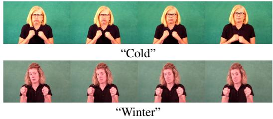
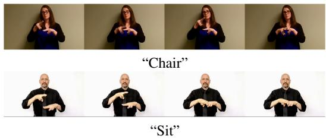
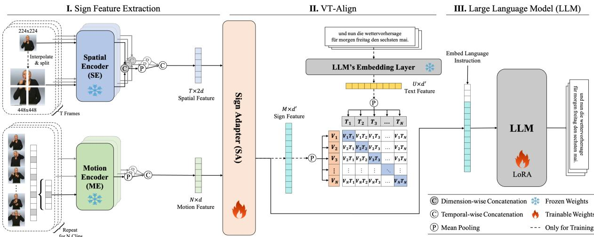
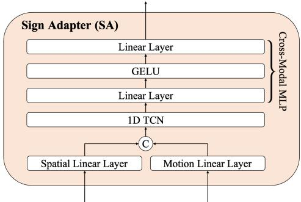
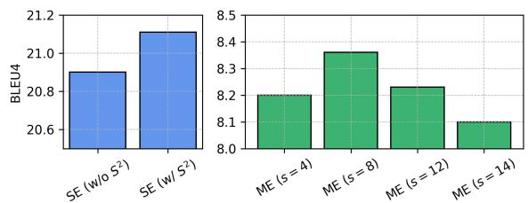
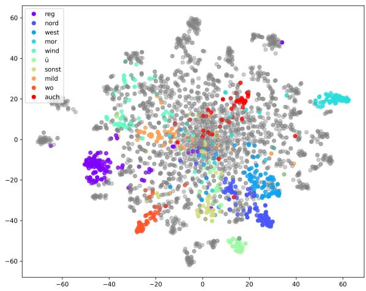
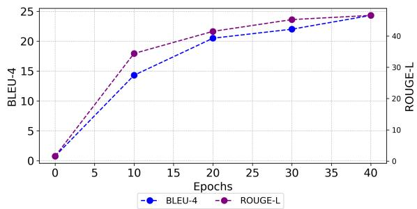

# An Efficient Gloss-Free Sign Language Translation Using Spatial Configurations and Motion Dynamics with LLMs

Eui Jun Hwang Sukmin Cho Junmyeong Lee Jong C. Park\*

School of Computing

Korea Advanced Institute of Science and Technology {ehwa20,nelllpic,david516,jongpark}@kaist.ac.kr

## Abstract

Gloss-free Sign Language Translation (SLT) converts sign videos into spoken language sentences without relying on glosses, which are the written representations of signs. Recently, Large Language Models (LLMs) have shown remarkable translation performance in glossfree methods by harnessing their powerful natural language generation capabilities. However, these methods often rely on domain-specific fine-tuning of visual encoders to achieve optimal results. By contrast, we emphasize the importance of capturing the spatial configurations and motion dynamics in sign language. With this in mind, we introduce Spatial and Motionbased Sign Language Translation (SpaMo), a novel LLM-based SLT framework. The core idea of SpaMo is simple yet effective: instead of domain-specific tuning, we use offthe-shelf visual encoders to extract spatial and motion features, which are then input into an LLM along with a language prompt. Additionally, we employ a visual-text alignment process as a lightweight warm-up step before applying SLT supervision. Our experiments demonstrate that SpaMo achieves state-of-theart performance on three popular datasets— PHOENIX14T, CSL-Daily, and How2Sign— without visual fine-tuning1.

## 1 Introduction

Sign language is a visual means of communication primarily used by Deaf communities, relying on physical movements rather than spoken words. In this paper, we tackle Sign Language Translation (SLT), focusing on converting sign videos into spoken language sentences. Early SLT methods (Camgoz et al., 2020; Zhou et al., 2021a; Chen et al., 2022a,b; Zhang et al., 2023b) have primarily relied on glosses—written representations of signs using corresponding words. Glosses provide a structured form of sign language, which helps identify semantic boundaries within continuous sign sequences. This, in turn, allows the models to better comprehend the overall content of the sign videos (Yin et al., 2023; Wei and Chen, 2023). However, annotating glosses is a labor-intensive and time-consuming process that requires expertise in sign language. This significantly hinders the expansion of sign language datasets and limits the development of SLT methods (Li et al., 2020b; Shi et al., 2022; Lin et al., 2023).

  
(a) Spatial configuration

  
(b) Motion dynamic  
Figure 1: Visual examples of spatial configurations and motion dynamics in sign language. The images are sourced from WLASL (Li et al., 2020a).

To address these limitations, there has been a shift towards gloss-free methods that rely solely on the sign videos and corresponding translations. While these methods still underperform compared to the gloss-based methods, efforts have been made to reduce the performance gap by focusing on temporal semantic structures (Li et al., 2020b) and aligning visual and textual modalities (Zhao et al., 2021; Yin et al., 2023; Zhou et al., 2023; Zhao et al., 2024). Recently, LLMs have demonstrated remarkable translation performance in a gloss-free setting by harnessing their powerful language generation capabilities. However, the modality gap between the continuous sign videos and discrete text poses a challenge for the LLMs in effectively understanding the sign videos. To address this, many methods fine-tune their visual encoders to be more domainspecific to sign language (Wong et al., 2024; Chen et al., 2024; Rust et al., 2024; Gong et al., 2024).

That said, fine-tuning visual encoders can be resource-heavy and time-consuming, making it impractical for real-world applications, especially when considering the diversity of sign languages. This leads to an important question: Is domainspecific tuning of visual encoders necessary to achieve optimal performance in LLM-based SLT? We argue that focusing on the inherent characteristics of sign language could reduce the need for such extensive fine-tuning. First, visual encoders trained on general domains (Radford et al., 2021; Oquab et al., 2023) have already proven highly effective in downstream tasks such as action recognition (Huang et al., 2024; Tang et al., 2024) and video captioning (Yang et al., 2023; Zhou et al., 2024). Moreover, LLMs are capable of retaining rich visual information from these general encoders in their latent space (Zhang et al., 2024c). Rather than emphasizing fine-tuning, we shift our attention to the crucial roles of spatial configurations and motion dynamics in sign language.

Spatial configurations include the arranging and positioning of signs within the signing space, including hand shapes, facial expressions, and body postures. These components work together to distinguish different signs and convey their intended meanings (Emmorey and Casey, 1995). As shown in Figure 1a, the signs for “cold” and “winter” both use the same handshape, with a shivering motion of the fists. The primary difference lies in the facial expressions: “cold” is typically accompanied by a tense or grimaced expression, while “winter” may feature a more neutral expression. Motion dynamics, on the other hand, involve the path, speed, and rhythm of hand movements, illustrating how movements alter the meanings of signs over time (Bosworth et al., 2019). As shown in Figure 1b, the signs for “chair” and “sit” both use the same “H” handshape and involve the interaction of both hands. However, the motion differentiates these signs: “chair” involves a repetitive tapping motion, while “sit” involves a single, smooth motion. These examples highlight the importance of the spatial configurations and motion dynamics in conveying accurate messages in sign language.

To this end, we introduce a novel gloss-free framework, Spatial and Motion-based Sign Language Translation (SpaMo). SpaMo is designed to fully exploit the spatial configurations and motion dynamics in the sign videos using off-the-shelf visual encoders, all without the need for domainspecific fine-tuning. As shown in Figure 2, the core idea is simple: We extract spatial features (spatial configurations) and motion features (motion dynamics) using two different visual encoders, and feed these into an LLM with a language prompt. Specifically, we use a pre-trained image encoder (e.g., ViT) as Spatial Encoder (SE) to individually encode each frame for its spatial features. To further refine the spatial features, we apply S2 scaling (Shi et al., 2024), which processes a sign image at multiple scales. Additionally, we use a video encoder (e.g., VideoMAE) as Motion Encoder (ME) to encode sign clips (groups of sign frames) into the motion features. To capture finer motion dynamics, we apply a sliding window approach, which results in implicit gloss-level representations (Cheng et al., 2023; Hwang et al., 2024). Next, Sign Adapter (SA), comprising Multi-Layer Perceptron (MLP) layers, transfers these features to the LLM. To further bridge the modality gap, we propose Visual-Text Alignment (VT-Align), a training strategy that aligns the visual features with the LLM’s embedding space, promoting more efficient training and improved translation performance.

In all, our contributions can be summarized as:

• We introduce SPaMo, a novel gloss-free framework based on LLMs. Our method is simple yet effective, focusing on conveying core elements of sign language to LLMs without domain-specific tuning of visual encoders.

• Our proposed method achieves state-of-theart performance on three popular sign language datasets: PHOENIX14T, CSL-Daily, and How2Sign.

• We provide a novel and comprehensive analysis of how the LLM interprets the sign videos within its embedding space and translates them into corresponding text.

## 2 Related Work

## 2.1 Gloss-free Sign Language Translation

Gloss-free SLT directly converts sign videos into spoken language sentences without relying on glosses. These methods, however, often underperform compared to gloss-based methods (Camgoz et al., 2020; Zhou et al., 2021b,a; Yin et al., 2021; Chen et al., 2022a,b; Zhang et al., 2023b; Jing et al., 2024). To address the performance gap, recent work has focused on several key areas: enhancing the temporal semantic structure (Li et al., 2020b), improving the alignment between visual and textual modalities (Zhao et al., 2021; Lin et al., 2023; Fu et al., 2023), leveraging LLMs (Wong et al., 2024; Gong et al., 2024; Chen et al., 2024), and scaling efforts by utilizing larger sign language datasets (Uthus et al., 2024; Rust et al., 2024). Despite these advancements, most gloss-free methods depend on fine-tuning visual encoders using the glosses (Li et al., 2020b; Yin et al., 2023; Fu et al., 2023), target translations (Zhou et al., 2023; Wong et al., 2024), or self-supervised learning (Gong et al., 2024; Rust et al., 2024). In particular, finetuning with the glosses helps the visual encoders to offer more domain-specific training on continuous or isolated Sign Language Recognition (SLR) datasets, such as WLASL (Li et al., 2020a) and PHOENIX14T (Camgoz et al., 2018).

Consequently, we classify these methods as weakly gloss-free due to the implicit involvement of the glosses, as further elaborated in Section 4.2. On the other hand, the rest of the fine-tuning methods eliminate reliance on these annotations. However, they often require substantial resources. As a results, it can be difficult to achieve robust visual representations and improve translation performance without access to a sufficiently large dataset. To address this limitation, our approach diverges from this norm by focusing on capturing the spatial configurations and motion dynamics through offthe-shelf visual encoders. This allows us to bypass the need for resource-intensive fine-tuning.

## 2.2 Scaling Language Models in SLT

The scaling laws in language models (Kaplan et al., 2020) have been pivotal in the rise of Large Language Models (LLMs) (Touvron et al., 2023; Chiang et al., 2023; Chung et al., 2024). Leveraging their strong generation capabilities, LLMs have been applied across diverse domains: multilingual translation (Zhu et al., 2023; Zhang et al., 2023a; Gao et al., 2024), pose generation (Feng et al., 2024; Zhang et al., 2024b), and visual question answering (Li et al., 2023; Liu et al., 2024a,b), extending their impact beyond Natural Language Processing. LLMs have also demonstrated impressive translation performance in the SLT domain. SLT methods using the LLMs focus on aligning high-dimensional visual features with inputs comprehensible to LLMs. These methods involve fine-tuning visual encoders to produce languagelike tokens (Gong et al., 2024), using pseudoglosses (Wong et al., 2024), or performing videogrounded text generation tasks (Chen et al., 2024).

In this work, we take a different approach by focusing on spatial configurations and motion dynamics. We extract spatial and motion features and pass them to LLMs with a light warm-up process. This method is simple yet effective, demonstrating that an extensive pre-training for the visual encoders is unnecessary to achieve peak performance.

## 3 Method

We first give an overview of our framework in Section 3.1. We then explain Spatial Encoder (SE) and Motion Encoder (ME) in Sections 3.2 and 3.3, respectively. Next, we discuss Sign Adapter (SA) in Section 3.4 and VT-Align in Section 3.5. Finally, we explain the training details in Section 3.6.

## 3.1 Framework Overview

Given a sign video $X ~ = ~ \{ x _ { i } \} _ { i = 1 } ^ { T }$ , where each frame $x _ { i } \in \mathbb { R } ^ { H \times W }$ represents a frame with height H and width W, the objective of SLT is to generate a corresponding translation ${ \cal Y } = \{ y _ { j } \} _ { j = 1 } ^ { U } ,$ composed of U words. Previous gloss-free methods (Zhou et al., 2023; Wong et al., 2024; Gong et al., 2024; Chen et al., 2024) have involved finetuning visual encoders using sign language data to make them more domain-specific, leading to improvements in translation accuracy. However, while this fine-tuning introduces more domain knowledge at the feature extraction level, it is unnecessary, especially with LLMs, which already maintain rich visual information from the visual encoder in their latent space (Zhang et al., 2024c). Although there may be a trade-off, we argue that utilizing the spatial configurations and motion dynamics with proper alignment and training, offers a more efficient and effective solution.

As shown in Figure 2, SE and ME extract two distinct features from the sign video X: Spatial features $Z _ { s }$ capture the spatial configurations (Emmorey and Casey, 1995), and motion features $Z _ { m }$ represent the motion dynamics (Bosworth et al., 2019). These features are then integrated into a combined sign feature $Z _ { s m }$ via SA. The combined feature is then fed to an LLM with a language prompt, guiding the LLM to generate the translation in the desired language. Additionally, we perform Visual-Text Alignment (VT-Align) to minimize the gap between the visual and textual modalities before and during training under SLT supervision. In the following sections, we provide a detailed explanation of SE, ME, SA, and VT-Align.

  
Figure 2: An overview of the SpaMo framework, which consists of three parts: (i) Sign Feature Extraction: Spatial and motion features are extracted using SE and ME, using the $S ^ { 2 }$ and sliding window approaches to capture detailed spatial configurations and motion dynamics. (ii) VT-Align: The extracted features are combined within SA to form a unified sign feature. During training, a warm-up process is employed to ensure that SA has well-initialized weights, effectively bridging the modality gap between the sign video and text. (iii) LLM: the LLM processes the sign feature along with a language-instructive prompt and is trained using LoRA.

## 3.2 Spatial Encoder

SE extracts spatial features $Z _ { s }$ from the sign video X. We utilize a pre-trained image encoder (e.g., ViT), which is kept frozen, and enhances its capability to capture finer spatial information by applying Scaling on Scales $( S ^ { 2 } )$ (Shi et al., 2024). $S ^ { 2 }$ is parameter-free and enables the extraction of multi-scale features without altering the original pre-trained encoder. By processing sign images at multiple resolutions, $S ^ { 2 }$ provides a more comprehensive spatial understanding, ensuring that SE captures both fine-grained and broad spatial details for accurate sign language interpretation. The resulting spatial features can be represented as $Z _ { s } \in \mathbb R ^ { T \times 2 d }$ where $T$ is the number of frames, and 2d is the increased embedding dimension, reflecting the integration of multi-scale features.

## 3.3 Motion Encoder

ME derives motion features from the sign video X. Similar to SE, we employ a pre-trained video encoder (e.g., VideoMAE), which remains frozen, to process sign clips segmented from the video. However, accurately segmenting the sign video into distinct gloss-level clips is challenging without the support of pre-trained Continuous Sign Language Recognition (CSLR) models (Wei and Chen, 2023). To address this limitation, we use a sliding window approach to capture implicit gloss-level representations (Cheng et al., 2023; Hwang et al., 2024). Specifically, we divide the sign video into short, overlapping clips, then feed each clip into ME to extract the implicit gloss-level motion features $Z _ { m } ~ \in ~ \mathbb { R } ^ { N \times d }$ , where N is the number of segments. The number of segments $N$ is calculated as $\begin{array} { r } { N = \left\lfloor \frac { T - w } { s } \right\rfloor + 1 } \end{array}$ , where T is the total number of frames, and w and s are the window size and stride, respectively. Since $Z _ { m }$ is generated by processing N short clips, it can also be interpreted as a sequence of N clip-wise features.

  
Figure 3: An overview of Sign Adapter.

## 3.4 Sign Adapter

In the previous sections, we extracted two distinct visual features: the spatial features $Z _ { s }$ and the motion features $Z _ { m }$ . These features differ in both their dimensions and representation, as depicted in Figure 2. To effectively integrate these features, we introduce an additional module called Sign Adaptor (SA). As shown in Figure 3, SA includes linear projection layers, a 1D TCN, and a Multi-Layer Perceptron (MLP). These components work together to integrate the spatial and motion features into a unified sign representation, denoted as $Z _ { s m }$ . First, the spatial and motion features are passed through linear projection layers to transform them into features with matching dimensions. Next, the 1D TCN is applied for short-term modeling of the combined features. Finally, a cross-modal MLP (Liu et al., 2024a) is employed to bridge the visual and textual modalities. The resulting outputs are represented as $Z _ { s m } \in \mathbb { R } ^ { M \times d ^ { \prime } }$ , where M represents the reduced number of frames after convolution, and $d ^ { \prime }$ is the dimension aligned with that of the LLM. Although SA aids in bridging the modality gap between visual and textual features during training under the SLT supervision, the gap remains. To tackle this issue, we introduce VT-Align, which will be detailed in the next section.

## 3.5 Visual-Text Alignment

VT-Align is a warm-up and go process designed to provide the SA module with well-initialized weights before the SLT supervision begins. This initial alignment is crucial, as it helps the model more effectively bridge the modality gap during training. To achieve this alignment, we employ a widely-used softmax-based contrastive learning approach (Radford et al., 2021; Jia et al., 2021).

Specifically, given a mini-batch $\begin{array} { r l } { B } & { { } = } \end{array}$ $\{ ( S _ { 1 } , Y _ { 1 } ) , ( S _ { 2 } , Y _ { 2 } ) , \ldots \}$ of sign-text pairs, the contrastive learning objective encourages the embeddings of matching pairs $( S _ { i } , Y _ { i } )$ to align closely while pushing apart the embeddings of mismatched pairs $( S _ { i } , Y _ { j \neq i } )$ Text features $Z _ { t }$ are extracted from the target translation $Y _ { i }$ using the LLM’s embedding layer $E _ { l l m } ( \cdot )$ . Note that only the SA module $f _ { s a } ( \cdot )$ is updated during this process, while $E _ { l l m } ( \cdot )$ remains fixed to preserve the LLM’s language capabilities. The VT-Align loss function $\mathcal { L } _ { v t }$ is represented as follows:

$$
- \frac { 1 } { 2 | \boldsymbol { B } | } \sum _ { i = 1 } ^ { | \mathcal { B } | } ( \overbrace { \log \frac { e ^ { \tau Z _ { s m } ^ { ( i ) } \cdot z _ { t } ^ { ( i ) } } } { \sum _ { j = 1 } ^ { | \mathcal { B } | } e ^ { \tau Z _ { s m } ^ { ( i ) } \cdot z _ { t } ^ { ( j ) } } } } ^ { \mathrm { s i g n  t e x t \ s o f t m a x } } + \overbrace { \log \frac { e ^ { \tau Z _ { s m } ^ { ( i ) } \cdot z _ { t } ^ { ( i ) } } } { \sum _ { j = 1 } ^ { | \mathcal { B } | } e ^ { \tau Z _ { s m } ^ { ( j ) } \cdot Z _ { t } ^ { ( i ) } } } } ^ { \mathrm { t e x t  s i g n \ s o f t m a x } } )\tag{1}
$$

where $\begin{array} { r } { Z _ { s m } ^ { ( i ) } = \frac { f _ { s a } ( S _ { i } ) } { \parallel f _ { s a } ( S _ { i } ) \parallel _ { 2 } } , Z _ { t } ^ { ( i ) } = \frac { E _ { l l m } ( T _ { i } ) } { \parallel E _ { l l m } ( T _ { i } ) \parallel _ { 2 } } } \end{array}$ , and

τ denotes a learnable temperature parameter usedto scale the logits.

## 3.6 Training Details

Our framework is optimized in two phases: an initial warm-up phase followed by training with the SLT supervision. In the warm-up phase, we begin with a training phase the SA module using VT-Align for a designated number of steps (e.g., 4K steps). After completing the warm-up phase, we proceed to the joint training for both SA and the LLM. For fine-tuning the LLM, we utilize LoRA (Hu et al., 2021), a lightweight and efficient method specifically designed for this purpose. Overall, our method is trained with a combined loss function:

$$
\mathcal { L } _ { S p a M o } = \mathcal { L } _ { c e } + \mathcal { L } _ { v t } ,\tag{2}
$$

where $\mathcal { L } _ { c e }$ represents cross-entropy loss, and $\mathcal { L } _ { v t }$ continuously manages the alignment.

## 4 Experiments

## 4.1 Implementation Details

For SE and ME, we use CLIP ViT-L/14 (Radford et al., 2021) and VideoMAE-L/16 (Tong et al., 2022), respectively. To extract the spatial features, the sign images are interpolated to multiple scales, such as 224 224 and $4 4 8 \times 4 4 8$ . For each scale, larger images are split into sub-images of regular size (224 224) and processed individually. These features from the sub-images are then pooled and concatenated with features from the original representation. For the motion features, each clip consists of 16 frames, based on the findings from (Wilbur, 2009), which suggests that this frame interval captures a single sign. We set the stride s between consecutive clips to 8. We use FlanT5-XL (Chung et al., 2024) as the LLM for PHOENIX14T and How2Sign, while mT0- XL (Muennighoff et al., 2022) is used for the CSL-Daily. During the warm-up phase with VT-Align, we use 4K steps on PHOENIX14T and CSL-Daily, and 15K steps on How2Sign. Additional implementation details can be found in Appendix A.

## 4.2 Experimental Settings

Datasets. We evaluated our method on three sign language datasets: PHOENIX14T (Camgoz et al., 2018), CSL-Daily (Zhou et al., 2021a), and How2Sign (Duarte et al., 2021). PHOENIX14T is a German Sign Language dataset comprising

<table><tr><td></td><td></td><td></td><td colspan="5">PHOENIX14T</td><td colspan="5">CSL-Daily</td></tr><tr><td>Setting</td><td>Methods</td><td>Vis. Ft.</td><td>B1</td><td>B2</td><td>B3</td><td>B4</td><td>RG</td><td>B1</td><td>B2</td><td>B3</td><td>B4</td><td>RG</td></tr><tr><td rowspan="6">Gloss-based</td><td>SLRT (Camgoz et al., 2020)</td><td>√</td><td>46.61</td><td>33.73</td><td>26.19</td><td>21.32</td><td></td><td>37.38</td><td>24.36</td><td>16.55</td><td>11.79</td><td>36.74</td></tr><tr><td>BN-TIN-Transf.+SignBT (Zhou et al., 2021a)</td><td>x</td><td>50.80</td><td>37.75</td><td>29.72</td><td>24.32</td><td>49.54</td><td>51.42</td><td>37.26</td><td>27.76</td><td>21.34</td><td>49.31</td></tr><tr><td>MMTLB (Chen et al., 2022a)</td><td>√</td><td>53.97</td><td>41.75</td><td>33.84</td><td>28.39</td><td>52.65</td><td>53.31</td><td>40.41</td><td>30.87</td><td>23.92</td><td>53.25</td></tr><tr><td>TS-SLT (Chen et al., 2022b)</td><td>√</td><td>54.90</td><td>42.43</td><td>34.46</td><td>28.95</td><td>53.48</td><td>55.44</td><td>42.59</td><td>32.87</td><td>25.79</td><td>55.72</td></tr><tr><td>SLTUNET (Zhang et al., 2023b)</td><td>√</td><td>52.92</td><td>41.76</td><td>33.99</td><td>28.47</td><td>52.11</td><td>54.98</td><td>41.44</td><td>31.84</td><td>25.01</td><td>54.08</td></tr><tr><td>TSPNet (Li et al., 2020b)‡</td><td>√</td><td>36.10</td><td>23.12</td><td>16.88</td><td>13.41</td><td>34.96</td><td>17.09</td><td>8.98</td><td>5.07</td><td>2.97</td><td>18.38</td></tr><tr><td rowspan="2">Weakly Gloss-free</td><td>GASLT (Yin et al., 2023)</td><td>√</td><td>39.07</td><td>26.74</td><td>21.86</td><td>15.74</td><td>39.86</td><td>19.90</td><td>9.94</td><td>5.98</td><td>4.07</td><td>20.35</td></tr><tr><td>ConSLT (Fu et al., 2023)</td><td>√</td><td></td><td></td><td></td><td>21.59</td><td>47.69</td><td></td><td></td><td></td><td></td><td></td></tr><tr><td rowspan="6">Gloss-free</td><td>CSGCR (Zhao et al., 2021)</td><td>x</td><td>36.71</td><td>25.40</td><td>18.86</td><td>15.18</td><td>38.85</td><td></td><td></td><td></td><td></td><td></td></tr><tr><td>GFSLT-VLP (Zhou et al., 2023)</td><td>√</td><td>43.71</td><td>33.18</td><td>26.11</td><td>21.44</td><td>42.29</td><td>39.37</td><td>24.93</td><td>16.26</td><td>11.00</td><td>36.44</td></tr><tr><td>FLa-LLM (Chen et al., 2024)</td><td></td><td>46.29</td><td>35.33</td><td>28.03</td><td>23.09</td><td>45.27</td><td>37.13</td><td>25.12</td><td>18.38</td><td>14.20</td><td>37.25</td></tr><tr><td>Sign2GPT (Wong et al., 2024)</td><td>√</td><td>49.54</td><td>35.96</td><td>28.83</td><td>22.52</td><td>48.90</td><td>41.75</td><td>28.73</td><td>20.60</td><td>15.40</td><td>42.36</td></tr><tr><td>SignLLM (Gong et al., 2024)</td><td>√</td><td>45.21</td><td>34.78</td><td>28.05</td><td>23.40</td><td>44.49</td><td>39.55</td><td>28.13</td><td>20.07</td><td>15.75</td><td>39.91</td></tr><tr><td>SpaMo (Ours)</td><td>x</td><td>49.80</td><td>37.32</td><td>29.50</td><td>24.32</td><td>46.57</td><td>48.90</td><td>36.90</td><td>26.78</td><td>20.55</td><td>47.46</td></tr></table>

Table 1: Performance comparison on the PHOENIX14T and CSL-Daily datasets. “Vis. Ft.” denotes the visually fine-tuned on sign language datasets. denotes results reproduced by Yin et al. for CSL-Daily. The best results are highlighted as bold, and the second-best are underlined.
<table><tr><td>Setting</td><td>Methods</td><td>Modality</td><td>Vis. Ft.</td><td>BLEU-1</td><td>BLEU-2</td><td>BLEU-3</td><td>BLEU-4</td><td>ROUGE</td><td>BLEURT</td></tr><tr><td rowspan="2">Weakly Gloss-free</td><td>GloFE-VN (Lin et al., 2023)</td><td>Landmark</td><td>√</td><td>14.94</td><td>7.27</td><td>3.93</td><td>2.24</td><td>12.61</td><td>31.65</td></tr><tr><td>OpenSLT (Tarrés et al., 2023)</td><td>RGB</td><td>√</td><td>34.01</td><td>19.30</td><td>12.18</td><td>8.03</td><td></td><td>=</td></tr><tr><td rowspan="4">Gloss-free</td><td>YT-ASL-SLT (Uthus et al., 2024)†</td><td>Landmark</td><td>x</td><td>14.96</td><td>5.11</td><td>2.26</td><td>1.22</td><td></td><td>29.98</td></tr><tr><td>SSVP-SLT (Rust et al., 2024)†</td><td>RGB</td><td>√</td><td>30.20</td><td>16.70</td><td>10.50</td><td>7.00</td><td>25.70</td><td>39.30</td></tr><tr><td>FLa-LLM (Chen et al., 2024)</td><td>RGB</td><td>√</td><td>29.81</td><td>18.99</td><td>13.27</td><td>9.66</td><td>27.81</td><td></td></tr><tr><td>SpaMo (Ours)</td><td>RGB</td><td>x</td><td>33.41</td><td>20.28</td><td>13.96</td><td>10.11</td><td>30.56</td><td>42.23</td></tr></table>

Table 2: Performance comparison of translation results on the How2Sign dataset. YT-ASL-SLT and SSVP-SLT (marked with ) are reported without dataset scaling to ensure a fair comparison.

8,257 samples and a vocabulary of 2,887 German words. CSL-Daily is a Chinese Sign Language dataset with 20,654 samples and a 2,343 Chinese characters. How2Sign focuses on American Sign Language and includes 35,191 samples with a vocabulary of 16K English words. Detailed dataset statistics are provided in Appendix B.

Evaluation Metrics. We report BLEU via Sacre-BLEU (Papineni et al., 2002; Post, 2018)2 and ROUGE-L (Lin and Och, 2004). BLEU-n assesses translation precision by evaluating n-grams. ROUGE-L measures text similarity by calculating the F1 score based on the longest common subsequences between predicted and reference texts. We also report BLEURT (Sellam et al., 2020) from the BLEURT-20 checkpoint3, which has been shown to correlate well with human judgments.

A Taxonomy of SLT. In Section 2, we explored gloss-free methods, including those that incorporate gloss-supervised visual encoders. Although these approaches have traditionally been categorized as gloss-free, we argue that they should more accurately be described as weakly gloss-free due to their dependence on gloss-annotated data. This classification is detailed in Table 1. Specifically, methods such as TSPNet (Li et al., 2020b), GASLT (Yin et al., 2023), ConSLT (Fu et al., 2023),

GloFE-VN (Lin et al., 2023), and OpenSLT (Tarrés et al., 2023) rely on sign features extracted by visual encoders trained on continuous or isolated sign language recognition (SLR) datasets.

## 4.3 Comparison with State-of-the-Art

Results on PHOENIX14T and CSL-Daily. We first compared our method with both gloss-based and gloss-free methods on PHOENIX14T. As shown in Table 1, most previous methods rely on the domain-specific fine-tuning of their visual encoders. By contrast, our method demonstrates consistent improvements across all reported metrics on PHOENIX14T without such fine-tuning. The only exception is ROUGE, where we achieved the second-best result. Specifically, the improvement on BLEU-4 is by a margin of 0.92, representing a 3.93% increase over SignLLM (Gong et al., 2024). On CSL-Daily, which covers a broader range of topics than PHOENIX14T, the performance gains are even more pronounced. Our method achieved a margin increase of 4.8 in BLEU-4, reflecting a 30.41% improvement over SignLLM.

Results on How2Sign. Next, we evaluated our method on How2Sign, which poses greater challenges than PHOENIX14T due to its broader opendomain nature, longer sign videos, and larger vocabulary. As shown in Table 2, our method outperformed previous methods across all reported metrics. Specifically, we achieved a 0.45 margin in BLEU-4 which represents a 4.66% improvement over Fla-LLM (Chen et al., 2024). We see a performance gain in BLEURT, reaching 2.93, which is 7.46% higher than SSVP-SLT (Rust et al., 2024) under the non-scaled dataset setting.

<table><tr><td colspan="3">Component</td><td colspan="5">Metric</td></tr><tr><td>SE</td><td>ME</td><td>VT-Align</td><td>B1</td><td>B2</td><td>B3</td><td>B4</td><td>RG</td></tr><tr><td>√</td><td></td><td></td><td>46.44</td><td>33.79</td><td>26.07</td><td>21.11</td><td>42.15</td></tr><tr><td></td><td>√</td><td></td><td>29.71</td><td>16.23</td><td>10.99</td><td>8.36</td><td>22.44</td></tr><tr><td>√</td><td>√</td><td></td><td>47.59</td><td>35.05</td><td>27.34</td><td>22.26</td><td>43.92</td></tr><tr><td>√</td><td></td><td>√</td><td>48.12</td><td>35.19</td><td>27.42</td><td>22.49</td><td>44.19</td></tr><tr><td>√</td><td></td><td>√</td><td>49.80</td><td>37.32</td><td>29.50</td><td>24.32</td><td>46.57</td></tr></table>

Table 3: Ablation study of the main component.
<table><tr><td>Models</td><td>#Trainable Params</td><td>#Total Params</td><td>B4</td></tr><tr><td>w/o LLM</td><td>60.5M</td><td>60.5M</td><td>6.35</td></tr><tr><td>mBART-L (Liu et al., 2020)</td><td>680M</td><td>680M</td><td>10.94</td></tr><tr><td>mT0-XL (Muennighoff et al., 2022)</td><td>23.5M</td><td>3.5B</td><td>24.23</td></tr><tr><td>Llama-2 (Touvron et al., 2023)</td><td>32.4M</td><td>7B</td><td>13.86</td></tr><tr><td>Flan-T5-XL (Chung et al., 2024)</td><td>22.7M</td><td>3B</td><td>24.32</td></tr></table>

Table 4: Ablation study of the impact of LLM.

Kernel Density Estimation. To assess the quality of sign representations, following Ye et al. (2023), we employed the Kernel Density Estimation (KDE) to estimate the probability density functions of embeddings from GFSLT-VLP and our method on PHOENIX14T. Note that we reproduced GFSLT-VLP using the official code4. As shown in Table 5, our method produced more compact and confident representations than GFSLT-VLP. More details on the KDE process are provided in Appendix A.4.

## 4.4 Ablation Study

To further evaluate our method, we conducted extensive ablation experiments on PHOENIX14T, the most widely used sign language dataset. Additional results can be found in Appendix C.

Effect of Main Components. We begin by evaluating the impact of the key components in our framework: SE, ME, and VT-Align. As shown in Table 3, using SE or ME individually results in lower performance, with ME performing the worst in terms of BLEU-4. However, combining SE and ME leads to an overall improvement. Notably, when VT-Align is integrated with SE, the performance rises, nearly matching Sign2GPT (22.52 vs. 22.49). The best results are achieved when all components (SE, ME, and VT-Align) are used together, yielding the highest scores across all metrics. This highlights the importance of each component in enhancing overall performance of SpaMo.

<table><tr><td>Method</td><td>KDEs Entropy ↓</td></tr><tr><td>GFSLT-VLP (Zhou et al., 2023)</td><td>0.32</td></tr><tr><td>SPaMo (Ours)</td><td>0.12</td></tr></table>

Table 5: Comparison of KDE entropy values across different embeddings. Lower entropy values indicate more confident and distinct representations.

  
Figure 4: Ablation study for SE and ME. $S ^ { 2 }$ represents Scaling on Scales, and s denotes stride size. Note that the presented results do not include VT-Align.

Effect of LLM. Next, we explored the impact of different types of LLMs by replacing our model, as shown in Table 4. We compared five models, each with a different number of parameters: our method without pre-trained weights, mBART-L, mT0- $\cdot \mathrm { X L } ,$ Flan-T5-XL, and Llama-2. Among these, Flan-T5- XL achieves the best performance, though it nearly ties with mT0-XL. Interestingly, despite its larger parameter count, Llama-2, which is also employed in SignLLM, does not outperform the others. This finding aligns with the observations of Zhang et al., suggesting that scaling up LMs does not always lead to better performance. In our case, the main reason likely lies in the fact that larger models generally demand more extensive and higher-quality data to unlock their full potential (Kaplan et al., 2020; Hoffmann et al., 2022). Since PHOENIX14T is constrained in both scale and diversity, merely increasing the model size does not necessarily yield substantial performance gains.

Effect of $S ^ { 2 }$ and Neighboring Gap. Finally, we evaluated the effect of $S ^ { 2 }$ and the gap between neighboring clips on SE and ME, respectively. As shown in Figure 4, $S ^ { 2 }$ substantially improves translation performance, highlighting its effectiveness in helping SE capture more spatial details. Additionally, our analysis reveals that a stride size of 8 between neighboring clips yields the best results, suggesting that this stride size optimally aids ME in extracting the motion dynamics.

<table><tr><td>Ref:</td><td>die neue woche beginnt noch wechselhaft und etwas kühler. (the new week begins still changeable and somewhat cooler) am montag wieder wechselhaft und kühler.</td></tr><tr><td>GFSLT-VLP:</td><td>(on Monday again changeable and cooler) die neue woche beginnt wechselhaft und wieder kühler.</td></tr><tr><td>Ours:</td><td>(the new week begins changeable and again cooler)</td></tr><tr><td>Ref:</td><td>sonst viel sonnenschein. otherwise, a lot of sunshine.</td></tr><tr><td>GFSLT-VLP:</td><td>im übrigen land viel sonne. in the rest of the country, a lot of sun.</td></tr><tr><td>Ours:</td><td>sonst viel sonnenschein. otherwise, a lot of sunshine.</td></tr></table>

Table 6: Translation results on the test set compared to GFSLT-VLP on PHOENIX14T. Correctly translated 1-grams are highlighted in blue, while incorrect translations are marked in red.
<table><tr><td rowspan="2">Vis. Token:</td><td>NORDWEST</td><td>SONST</td><td rowspan="2">FREUNDLICH STURDY</td></tr><tr><td>NORDWEST</td><td>(NORTHWEST OTHERWISE FRIENDLY STURDY) FREUNDLICH</td></tr><tr><td>Gloss:</td><td>(NORTHWEST FRIENDLY) richtung norden und westen ist es recht freundlich.</td><td></td></tr><tr><td>Translation:</td><td>(Towards the north and west it is quite pleasant.) BLEIBT WIND</td><td>WINTER</td></tr><tr><td rowspan="2">Vis. Token: Gloss:</td><td>(REMAINS WIND WINTER)</td><td></td></tr><tr><td>BLEIBEN WIND</td><td></td></tr><tr><td>Translation:</td><td>(REMAIN WIND) es bleibt windig. (it remains windy.)</td><td></td></tr><tr><td>Vis. Token:</td><td>LIEBE GUTEN</td><td>ABEND SCHÖNEN</td></tr><tr><td>Gloss:</td><td>GUT ABEND BEGRUESSEN</td><td>(DEAR GOOD EVENING BEAUTIFUL)</td></tr><tr><td></td><td>(GOOD EVENING GREETINGS)</td><td></td></tr><tr><td>Translation:</td><td>guten abend liebe zuschauer. (good evening dear viewers.)</td><td></td></tr></table>

Table 7: Comparison between visual tokens (Vis. Token) and their corresponding glosses. Words highlighted in green are exact matches, those in pink are semantic matches, and words in blue are absent in the gloss but appear in the translation.

## 4.5 Qualitative Analysis

Translation Results. Table 6 presents two example translations on PHOENIX14T, comparing our method with GFSLT-VLP, the only other publicly available baseline. In the first example (top), our method provides an accurate translation, whereas GFSLT-VLP fails to capture the correct semantic meaning. In the second example (bottom), our method again produces a precise translation, while GFSLT-VLP introduces errors, resulting in incorrect information. These examples demonstrate the superior accuracy of our method in generating reliable translations. More translation examples are shown in Appendix C.4.

Visual Token Analysis. We performed an additional analysis to explore how the LLM interprets the sign videos. For each visual feature, we identified the word with the shortest distance in the LLM’s embedding space, representing the closest match. Further details can be found in Appendix A.5. Figure 5 shows the t-SNE visualization of each sign feature mapped to the corresponding word. We observed that certain visual features align closely with specific words, which likely represents the semantic concepts that the LLM associates with these features. In other words, these words represent the LLM’s interpretation or labeling of the visual content. We refer to these mapped words as “visual tokens”. We further compared these visual tokens with the ground-truth glosses as shown in Table 7. To ensure a clearer and more accurate semantic comparison, repetitive words were removed from the visual tokens. Surprisingly, the LLM’s interpretation of the sign videos is similar to the glosses, though not perfectly aligned. This suggests that the LLM has learned to link particular video patterns with specific textual concepts, explaining why those words cluster near the visual features in the embedding space. Additionally, we found that the visual tokens capture words that are present in the translation but not in the glosses. This finding suggests that visual tokens may provide a more comprehensive representation than current glosses, potentially broadening their scope beyond what has been traditionally documented.

  
Figure 5: The t-SNE visualization of sign features. Different colors represent features with distinct semantics, while gray points are other categories not listed.

## 5 Conclusion

In this paper, we introduced SpaMo, a novel glossfree SLT framework based on LLMs. Apart from the previous methods that rely on domain-specific fine-tuning of their visual encoders, SpaMo focuses on capturing the spatial configurations and motion dynamics, eliminating the need for resourceintensive fine-tuning. We also proposed VT-Align, a training strategy that effectively aligns and narrows the modality gap between the sign videos and target texts, enabling the transformation of the sign videos into inputs interpretable by the LLM. Our approach achieved state-of-the-art results on three popular datasets. Furthermore, we provided the first comprehensive analysis of how the LLM interprets the sign videos within its embedding space and translates them into corresponding text.

## Limitations

Recently, scaling datasets (Uthus et al., 2024; Rust et al., 2024) has consistently led to performance improvements, as seen with larger sign language datasets, such as Youtube-ASL (Uthus et al., 2024) and BOBSL (Albanie et al., 2021). While dataset scaling could also enhance our method, in this work, we focus on a constrained setting. Specifically, we use limited sign language datasets to evaluate and compare results, demonstrating the effectiveness of our method in resource-limited scenarios. Future work will involve expanding the dataset size to explore the full potential of our method and to assess its scalability and performance across more extensive and diverse datasets.

In this paper, we highlight that domain-specific fine-tuning of visual encoders is not essential for our method. However, this implies that our method relies on visual encoders pre-trained on general tasks such as action recognition and image captioning. To bridge this gap, we introduce a prealignment process and apply LoRA fine-tuning to the LLM. While this might appear to be a compromise, it significantly reduces the resource requirements compared to fine-tuning both the visual encoders and the LLM. Additionally, as we discussed in the previous paragraph, this limitation can be addressed as more data becomes available, allowing for improved scalability and performance over time.

## Ethics Statement

Our work focuses on developing a practical framework for SLT with the goal of overcoming communication barriers faced by the Deaf and hardof-hearing communities. Although our approach utilizes off-the-shelf visual encoders and LLMs, there is a possibility that the framework could produce unexpected or biased outputs due to the inherent limitations in the pre-trained models. However, we are optimistic that future advancements in LLMs will help mitigate these issues. We rely on open datasets such as PHOENIX14T (Camgoz et al., 2018), CSL-Daily (Zhou et al., 2021a), and How2Sign (Duarte et al., 2021), which, while containing potentially identifiable information, present minimal concerns regarding personal privacy. Additionally, our method has been validated only on German, Chinese, and American sign languages, limiting its applicability to other sign languages. We call for future research in SLT to expand on a broader range of sign languages, promoting greater equity for the Deaf community.

## Acknowledgment

This work was supported by the Institute for Information and communications Technology Promotion (IITP) grant funded by the Korea government (MSIT) (No. 2022-0-00010, Development of Korean sign language translation service technology for the deaf in medical environment).

## References

Jean-Baptiste Alayrac, Jeff Donahue, Pauline Luc, Antoine Miech, Iain Barr, Yana Hasson, Karel Lenc, Arthur Mensch, Katherine Millican, Malcolm Reynolds, et al. 2022. Flamingo: a visual language model for few-shot learning. Advances in neural information processing systems, 35:23716–23736.

Samuel Albanie, Gül Varol, Liliane Momeni, Hannah Bull, Triantafyllos Afouras, Himel Chowdhury, Neil Fox, Bencie Woll, Rob Cooper, Andrew McParland, and Andrew Zisserman. 2021. BOBSL: BBC-Oxford British Sign Language Dataset. arXiv.

Adrien Bardes, Quentin Garrido, Jean Ponce, Xinlei Chen, Michael Rabbat, Yann LeCun, Mahmoud Assran, and Nicolas Ballas. 2024. Revisiting feature prediction for learning visual representations from video. arXiv preprint arXiv:2404.08471.

Rain G Bosworth, Charles E Wright, and Karen R Dobkins. 2019. Analysis of the visual spatiotemporal properties of american sign language. Vision research, 164:34–43.

Tom Brown, Benjamin Mann, Nick Ryder, Melanie Subbiah, Jared D Kaplan, Prafulla Dhariwal, Arvind Neelakantan, Pranav Shyam, Girish Sastry, Amanda Askell, et al. 2020. Language models are few-shot learners. Advances in neural information processing systems, 33:1877–1901.

Necati Cihan Camgoz, Simon Hadfield, Oscar Koller, Hermann Ney, and Richard Bowden. 2018. Neural sign language translation. In Proceedings of the IEEE conference on computer vision and pattern recognition, pages 7784–7793.

Necati Cihan Camgoz, Oscar Koller, Simon Hadfield, and Richard Bowden. 2020. Sign language transformers: Joint end-to-end sign language recognition and translation. In Proceedings ofthe IEEE/CVF conference on computer vision and pattern recognition, pages 10023–10033.

Yutong Chen, Fangyun Wei, Xiao Sun, Zhirong Wu, and Stephen Lin. 2022a. A simple multi-modality transfer learning baseline for sign language translation. In Proceedings of the IEEE/CVF conference on computer vision and pattern recognition, pages 5120–5130.

Yutong Chen, Ronglai Zuo, Fangyun Wei, Yu Wu, Shujie Liu, and Brian Mak. 2022b. Two-stream network for sign language recognition and translation. Advances in Neural Information Processing Systems, 35:17043–17056.

Zhigang Chen, Benjia Zhou, Jun Li, Jun Wan, Zhen Lei, Ning Jiang, Quan Lu, and Guoqing Zhao. 2024. Factorized learning assisted with large language model for gloss-free sign language translation. In Proceedings ofthe 2024 Joint International Conference on Computational Linguistics, Language Resources and Evaluation (LREC-COLING 2024), pages 7071– 7081. ELRA and ICCL.

Yiting Cheng, Fangyun Wei, Jianmin Bao, Dong Chen, and Wenqiang Zhang. 2023. Cico: Domain-aware sign language retrieval via cross-lingual contrastive learning. In Proceedings of the IEEE/CVF Conference on Computer Vision and Pattern Recognition, pages 19016–19026.

Zesen Cheng, Sicong Leng, Hang Zhang, Yifei Xin, Xin Li, Guanzheng Chen, Yongxin Zhu, Wenqi Zhang, Ziyang Luo, Deli Zhao, et al. 2024. Videollama 2: Advancing spatial-temporal modeling and audio understanding in video-llms. arXiv preprint arXiv:2406.07476.

Wei-Lin Chiang, Zhuohan Li, Zi Lin, Ying Sheng, Zhanghao Wu, Hao Zhang, Lianmin Zheng, Siyuan Zhuang, Yonghao Zhuang, Joseph E Gonzalez, et al. 2023. Vicuna: An open-source chatbot impressing gpt-4 with 90%\* chatgpt quality. 2(3):6.

Hyung Won Chung, Le Hou, Shayne Longpre, Barret Zoph, Yi Tay, William Fedus, Yunxuan Li, Xuezhi Wang, Mostafa Dehghani, Siddhartha Brahma, et al. 2024. Scaling instruction-finetuned language models. Journal of Machine Learning Research, 25(70):1–53.

Amanda Duarte, Shruti Palaskar, Lucas Ventura, Deepti Ghadiyaram, Kenneth DeHaan, Florian Metze, Jordi Torres, and Xavier Giro-i Nieto. 2021. How2sign: a large-scale multimodal dataset for continuous american sign language. In Proceedings ofthe IEEE/CVF conference on computer vision and pattern recognition, pages 2735–2744.

Karen Emmorey and Shannon Casey. 1995. A comparison of spatial language in english & american sign language. Sign Language Studies, 88(1):255–288.

Yao Feng, Jing Lin, Sai Kumar Dwivedi, Yu Sun, Priyanka Patel, and Michael J Black. 2024. Chatpose: Chatting about 3d human pose. In Proceedings of the IEEE/CVF Conference on Computer Vision and Pattern Recognition, pages 2093–2103.

Biao Fu, Peigen Ye, Liang Zhang, Pei Yu, Cong Hu, Xiaodong Shi, and Yidong Chen. 2023. A token-level contrastive framework for sign language translation. In ICASSP 2023-2023 IEEE International Conference on Acoustics, Speech and Signal Processing (ICASSP), pages 1–5. IEEE.

Pengzhi Gao, Zhongjun He, Hua Wu, and Haifeng Wang. 2024. Towards boosting many-to-many multilingual machine translation with large language models. arXiv preprint arXiv:2401.05861.

Jia Gong, Lin Geng Foo, Yixuan He, Hossein Rahmani, and Jun Liu. 2024. Llms are good sign language translators. In Proceedings ofthe IEEE/CVF Conference on Computer Vision and Pattern Recognition, pages 18362–18372.

Jordan Hoffmann, Sebastian Borgeaud, Arthur Mensch, Elena Buchatskaya, Trevor Cai, Eliza Rutherford, Diego de Las Casas, Lisa Anne Hendricks, Johannes Welbl, Aidan Clark, et al. 2022. Training compute-optimal large language models. arXiv preprint arXiv:2203.15556.

Edward J Hu, Yelong Shen, Phillip Wallis, Zeyuan Allen-Zhu, Yuanzhi Li, Shean Wang, Lu Wang, and Weizhu Chen. 2021. Lora: Low-rank adaptation of large language models. arXiv preprint arXiv:2106.09685.

Lianyu Hu, Liqing Gao, Zekang Liu, and Wei Feng. 2023. Continuous sign language recognition with correlation network. In Proceedings of the IEEE/CVF Conference on Computer Vision and Pattern Recognition, pages 2529–2539.

Xiaohu Huang, Hao Zhou, Kun Yao, and Kai Han. 2024. FROSTER: frozen CLIP is A strong teacher for openvocabulary action recognition. In The Twelfth International Conference on Learning Representations, ICLR 2024, Vienna, Austria, May 7-11, 2024. Open-Review.net.

Eui Jun Hwang, Sukmin Cho, Huije Lee, Youngwoo Yoon, and Jong C Park. 2024. Universal gloss-level representation for gloss-free sign language translation and production. arXiv preprint arXiv:2407.02854.

Chao Jia, Yinfei Yang, Ye Xia, Yi-Ting Chen, Zarana Parekh, Hieu Pham, Quoc Le, Yun-Hsuan Sung, Zhen Li, and Tom Duerig. 2021. Scaling up visual and vision-language representation learning with noisy text supervision. In International conference on machine learning, pages 4904–4916. PMLR.

Liqiang Jing, Xuemeng Song, Xinxing Zu, Na Zheng, Zhongzhou Zhao, and Liqiang Nie. 2024. Vk-g2t: Vision and context knowledge enhanced gloss2text.

In ICASSP 2024-2024 IEEE International Conference on Acoustics, Speech and Signal Processing (ICASSP), pages 7860–7864. IEEE.

Tianjie Ju, Yubin Zheng, Hanyi Wang, Haodong Zhao, and Gongshen Liu. 2023. Is continuous prompt a combination of discrete prompts? towards a novel view for interpreting continuous prompts. In Findings ofthe Associationfor Computational Linguistics: ACL 2023, pages 7804–7819.

Jared Kaplan, Sam McCandlish, Tom Henighan, Tom B. Brown, Benjamin Chess, Rewon Child, Scott Gray, Alec Radford, Jeff Wu, and Dario Amodei. 2020. Scaling laws for neural language models. ArXiv, abs/2001.08361.

Dongxu Li, Cristian Rodriguez, Xin Yu, and Hongdong Li. 2020a. Word-level deep sign language recognition from video: A new large-scale dataset and methods comparison. In Proceedings of the IEEE/CVF winter conference on applications of computer vision, pages 1459–1469.

Dongxu Li, Chenchen Xu, Xin Yu, Kaihao Zhang, Benjamin Swift, Hanna Suominen, and Hongdong Li. 2020b. Tspnet: Hierarchical feature learning via temporal semantic pyramid for sign language translation. Advances in Neural Information Processing Systems, 33:12034–12045.

Junnan Li, Dongxu Li, Silvio Savarese, and Steven Hoi. 2023. Blip-2: Bootstrapping language-image pretraining with frozen image encoders and large language models. In International conference on machine learning, pages 19730–19742. PMLR.

Chin-Yew Lin and Franz Josef Och. 2004. Automatic evaluation of machine translation quality using longest common subsequence and skip-bigram statistics. In Proceedings of the 42nd annual meeting of the associationfor computational linguistics (ACL 04), pages 605–612.

Kezhou Lin, Xiaohan Wang, Linchao Zhu, Ke Sun, Bang Zhang, and Yi Yang. 2023. Gloss-free endto-end sign language translation. In Proceedings of the 61st Annual Meeting of the Association for Computational Linguistics.

Haotian Liu, Chunyuan Li, Yuheng Li, and Yong Jae Lee. 2024a. Improved baselines with visual instruction tuning. In Proceedings of the IEEE/CVF Conference on Computer Vision and Pattern Recognition, pages 26296–26306.

Haotian Liu, Chunyuan Li, Qingyang Wu, and Yong Jae Lee. 2024b. Visual instruction tuning. Advances in neural information processing systems, 36.

Yinhan Liu, Jiatao Gu, Naman Goyal, Xian Li, Sergey Edunov, Marjan Ghazvininejad, Mike Lewis, and Luke Zettlemoyer. 2020. Multilingual denoising pretraining for neural machine translation. Trans. Assoc. Comput. Linguistics, 8:726–742.

Ilya Loshchilov and Frank Hutter. 2017. Decoupled weight decay regularization. arXiv preprint arXiv:1711.05101.

Niklas Muennighoff, Thomas Wang, Lintang Sutawika, Adam Roberts, Stella Biderman, Teven Le Scao, M Saiful Bari, Sheng Shen, Zheng-Xin Yong, Hailey Schoelkopf, et al. 2022. Crosslingual generalization through multitask finetuning. In Annual Meeting of the Associationfor Computational Linguistics, pages 15991–16111.

Maxime Oquab, Timothée Darcet, Théo Moutakanni, Huy Vo, Marc Szafraniec, Vasil Khalidov, Pierre Fernandez, Daniel Haziza, Francisco Massa, Alaaeldin El-Nouby, et al. 2023. Dinov2: Learning robust visual features without supervision. arXiv preprint arXiv:2304.07193.

Kishore Papineni, Salim Roukos, Todd Ward, and Wei-Jing Zhu. 2002. Bleu: a method for automatic evaluation of machine translation. In Proceedings ofthe 40th annual meeting ofthe Associationfor Computational Linguistics, pages 311–318.

Matt Post. 2018. A call for clarity in reporting bleu scores. In Proceedings of the Third Conference on Machine Translation: Research Papers.

Alec Radford, Jong Wook Kim, Chris Hallacy, Aditya Ramesh, Gabriel Goh, Sandhini Agarwal, Girish Sastry, Amanda Askell, Pamela Mishkin, Jack Clark, et al. 2021. Learning transferable visual models from natural language supervision. In International conference on machine learning, pages 8748–8763. PMLR.

Nils Reimers and Iryna Gurevych. 2019. Sentence-BERT: Sentence embeddings using Siamese BERTnetworks. In Proceedings ofthe 2019 Conference on Empirical Methods in Natural Language Processing and the 9th International Joint Conference on Natural Language Processing (EMNLP-IJCNLP), pages 3982–3992, Hong Kong, China. Association for Computational Linguistics.

Phillip Rust, Bowen Shi, Skyler Wang, Necati Cihan Camgöz, and Jean Maillard. 2024. Towards privacyaware sign language translation at scale. In Proceedings ofthe 62nd Annual Meeting ofthe Association for Computational Linguistics (Volume 1: Long Papers).

Thibault Sellam, Dipanjan Das, and Ankur P Parikh. 2020. Bleurt: Learning robust metrics for text generation. In Proceedings ofthe 58th Annual Meeting of the Associationfor Computational Linguistics, pages 7881–7892.

Baifeng Shi, Ziyang Wu, Maolin Mao, Xin Wang, and Trevor Darrell. 2024. When do we not need larger vision models? arXiv preprint arXiv:2403.13043.

Bowen Shi, Diane Brentari, Greg Shakhnarovich, and Karen Livescu. 2022. Open-domain sign language translation learned from online video. In Proceedings of the Conference on Empirical Methods in Natural Language Processing.

Zixuan Tang, Youjun Zhao, Yuhang Wen, and Mengyuan Liu. 2024. A survey on backbones for deep video action recognition. arXiv preprint arXiv:2405.05584.

Laia Tarrés, Gerard I Gállego, Amanda Duarte, Jordi Torres, and Xavier Giró-i Nieto. 2023. Sign language translation from instructional videos. In Proceedings of the IEEE/CVF Conference on Computer Vision and Pattern Recognition (CVPR) Workshops, pages 5625–5635.

Zhan Tong, Yibing Song, Jue Wang, and Limin Wang. 2022. Videomae: Masked autoencoders are data-efficient learners for self-supervised video pretraining. Advances in neural information processing systems, 35:10078–10093.

Hugo Touvron, Louis Martin, Kevin Stone, Peter Albert, Amjad Almahairi, Yasmine Babaei, Nikolay Bashlykov, Soumya Batra, Prajjwal Bhargava, Shruti Bhosale, et al. 2023. Llama 2: Open foundation and fine-tuned chat models. arXiv preprint arXiv:2307.09288.

Dave Uthus, Garrett Tanzer, and Manfred Georg. 2024. Youtube-asl: A large-scale, open-domain american sign language-english parallel corpus. Advances in Neural Information Processing Systems, 36.

Fangyun Wei and Yutong Chen. 2023. Improving continuous sign language recognition with cross-lingual signs. In Proceedings of the IEEE/CVF International Conference on Computer Vision, pages 23612– 23621.

Ronnie B Wilbur. 2009. Effects of varying rate of signing on asl manual signs and nonmanual markers. Language and speech, 52(2-3):245–285.

Ryan Wong, Necati Cihan Camgoz, and Richard Bowden. 2024. Sign2gpt: Leveraging large language models for gloss-free sign language translation. In Proceeding ofthe Eleventh International Conference on Learning Representations.

Antoine Yang, Arsha Nagrani, Paul Hongsuck Seo, Antoine Miech, Jordi Pont-Tuset, Ivan Laptev, Josef Sivic, and Cordelia Schmid. 2023. Vid2seq: Largescale pretraining of a visual language model for dense video captioning. In Proceedings ofthe IEEE/CVF Conference on Computer Vision and Pattern Recognition, pages 10714–10726.

Jinhui Ye, Wenxiang Jiao, Xing Wang, Zhaopeng Tu, and Hui Xiong. 2023. Cross-modality data augmentation for end-to-end sign language translation. In Findings of the Association for Computational Linguistics: EMNLP 2023, pages 13558–13571.

Aoxiong Yin, Zhou Zhao, Jinglin Liu, Weike Jin, Meng Zhang, Xingshan Zeng, and Xiaofei He. 2021. Simulslt: End-to-end simultaneous sign language translation. In Proceedings ofthe 29th ACM International Conference on Multimedia, pages 4118–4127.

Aoxiong Yin, Tianyun Zhong, Li Tang, Weike Jin, Tao Jin, and Zhou Zhao. 2023. Gloss attention for glossfree sign language translation. In Proceedings of the IEEE/CVF conference on computer vision and pattern recognition, pages 2551–2562.

Biao Zhang, Barry Haddow, and Alexandra Birch. 2023a. Prompting large language model for machine translation: A case study. In International Conference on Machine Learning, pages 41092–41110. PMLR.

Biao Zhang, Mathias Müller, and Rico Sennrich. 2023b. SLTUNET: A simple unified model for sign language translation. In The Eleventh International Conference on Learning Representations.

Biao Zhang, Garrett Tanzer, and Orhan Firat. 2024a. Scaling sign language translation. Advances in neural information processing systems.

Yaqi Zhang, Di Huang, Bin Liu, Shixiang Tang, Yan Lu, Lu Chen, Lei Bai, Qi Chu, Nenghai Yu, and Wanli Ouyang. 2024b. Motiongpt: Finetuned llms are general-purpose motion generators. In Proceedings ofthe AAAI Conference on Artificial Intelligence, 7, pages 7368–7376.

Yuhui Zhang, Alyssa Unell, Xiaohan Wang, Dhruba Ghosh, Yuchang Su, Ludwig Schmidt, and Serena Yeung-Levy. 2024c. Why are visually-grounded language models bad at image classification? arXiv preprint arXiv:2405.18415.

Jian Zhao, Weizhen Qi, Wengang Zhou, Nan Duan, Ming Zhou, and Houqiang Li. 2021. Conditional sentence generation and cross-modal reranking for sign language translation. IEEE Transactions on Multimedia, 24:2662–2672.

Rui Zhao, Liang Zhang, Biao Fu, Cong Hu, Jinsong Su, and Yidong Chen. 2024. Conditional variational autoencoder for sign language translation with crossmodal alignment. In Proceedings ofthe AAAI Conference on Artificial Intelligence, volume 38, pages 19643–19651.

Benjia Zhou, Zhigang Chen, Albert Clapés, Jun Wan, Yanyan Liang, Sergio Escalera, Zhen Lei, and Du Zhang. 2023. Gloss-free sign language translation: Improving from visual-language pretraining. In Proceedings ofthe IEEE/CVF International Conference on Computer Vision, pages 20871–20881.

Hao Zhou, Wengang Zhou, Weizhen Qi, Junfu Pu, and Houqiang Li. 2021a. Improving sign language translation with monolingual data by sign back-translation. In Proceedings of the IEEE/CVF Conference on Computer Vision and Pattern Recognition, pages 1316– 1325.

Hao Zhou, Wengang Zhou, Yun Zhou, and Houqiang Li. 2021b. Spatial-temporal multi-cue network for sign language recognition and translation. IEEE Transactions on Multimedia, 24:768–779.

Xingyi Zhou, Anurag Arnab, Shyamal Buch, Shen Yan, Austin Myers, Xuehan Xiong, Arsha Nagrani, and Cordelia Schmid. 2024. Streaming dense video captioning. In Proceedings of the IEEE/CVF Conference on Computer Vision and Pattern Recognition, pages 18243–18252.

Wenhao Zhu, Hongyi Liu, Qingxiu Dong, Jingjing Xu, Shujian Huang, Lingpeng Kong, Jiajun Chen, and Lei Li. 2023. Multilingual machine translation with large language models: Empirical results and analysis. arXiv preprint arXiv:2304.04675.

## Appendix

In this Appendix, we first provide additional implementation details in Section A. Then, Section B provides more details about the sign language dataset used in this study, including its statistics. In Section C, we present further experimental results. Finally, in Section D, we discuss the feasibility of existing Vision-Language Models (VLMs) in the SLT domain.

## A More Implementation Details

## A.1 Components of SpaMo.

In the SA module, we utilize two distinct linear projection layers tailored for the output feature of ME and SE. For short-term modeling, we employ a 1D TCN configured with a specific sequence of layers: K5, P2, K5, P2 , where $K _ { \sigma }$ represents a kernel size of σ, and $P _ { \sigma }$ indicates a pooling layer with a kernel size of σ (Hu et al., 2023). To integrate features into the LLM’s embedding space, we leverage an MLP cross-modal connector (Liu et al., 2024a), projecting the features into a 2048- dimensional space.

## A.2 Prompt Template.

To focus the LLM on the SLT task, we employ a specific prompting strategy. Our prompt includes a clear instructive prompt: “Translate the given sentence into German.” Following this, we incorporate multilingual translations via a translation engine such as Google Translate5, which are sampled from the training set. These translations are included to facilitate In-Context Learning (ICL) (Brown et al., 2020). The prompt is structured as follows: “Translate the given sentence into German. [SRC] = [TRG].” Here, the source input (e.g., a sentence in French) serves as the foreign language example, and the corresponding response is the translation into the target language (e.g., German, as used in PHOENIX14T). An example of this prompt structure is provided in Table 8. To ensure that the LLM does not directly access the target translations during training, we shuffle the translation samples so that they do not match the target translation. At test time, we select a translation pair from the training set to use as a reference.

## A.3 Training.

For training, we use the AdamW optimizer (Loshchilov and Hutter, 2017), with $\beta _ { 1 } ~ = ~ 0 . 9 , ~ \beta _ { 2 } ~ = ~ 0 . 9 8 .$ , and a weight decay of 0.01. The learning rate schedule includes a cosine decay with a peak learning rate of 1e-4 and a linear warmup of over 10K steps, with a minimum learning rate of 5e-5. We train our model for 40 epochs, using a single NVIDIA A100 GPU, completing the entire process within 24 hours.

<table><tr><td>Sign Video Input:</td><td>[Extracted Sign Feature]</td></tr><tr><td>Instruction:</td><td>Translate the given sentence into German. Soil frost is possible there and in the southern low mountain ranges.=dort sowie in den südlichen</td></tr><tr><td>In Context Examplars:</td><td>mittelgebirgen ist bodenfrost möglich. La helada del suelo es posible allí y en las cadenas montañosas del sur.=dort sowie in den südlichen</td></tr><tr><td></td><td>mittelgebirgen ist bodenfrost möglich.</td></tr><tr><td></td><td>Le gel du sol est possible là-bas et dans les chaînes de montagnes basses du sud.=dort sowie in den südlichen</td></tr></table>

Table 8: An example of prompt used in this paper.
<table><tr><td>Visual Encoders (SE + ME)</td><td>B1</td><td>B2</td><td>B3</td><td>B4</td><td>RG</td></tr><tr><td>DINOv2 + V-JEPA</td><td>45.67</td><td>32.94</td><td>25.27</td><td>20.35</td><td>41.32</td></tr><tr><td>DINOv2 + VideoMAE</td><td>47.31</td><td>34.60</td><td>26.90</td><td>21.86</td><td>42.50</td></tr><tr><td>CLIP + V-JEPA</td><td>47.82</td><td>34.71</td><td>26.76</td><td>21.66</td><td>43.68</td></tr><tr><td>CLIP + VideoMAE</td><td>49.80</td><td>37.32</td><td>29.50</td><td>24.32</td><td>46.57</td></tr></table>

Table 9: Ablation study on various combinations of visual encoders. The results are with VT-Align.

<table><tr><td>Methods</td><td>B1</td><td>B2</td><td>B3</td><td>B4</td><td>RG</td></tr><tr><td>Ours (w/o LoRA)</td><td>46.11</td><td>32.65</td><td>24.69</td><td>19.67</td><td>42.91</td></tr><tr><td>Ours (w/ LoRA)</td><td>49.80</td><td>37.32</td><td>29.50</td><td>24.32</td><td>46.57</td></tr></table>

Table 10: Ablation on our method with and without LoRA.

## A.4 Evaluating Process with KDEs.

To evaluate the quality of the learned representations, we utilize Kernel Density Estimation (KDE) to estimate the probability density functions of the embeddings from GFSLT-VLP and ours. Due to different dimensionality between these methods (1,024 vs. 2,048), we run Principal Component Analysis (PCA) to reduce the number of dimensions while retaining the most significant variance components. This dimensionality reduction facilitates more efficient and stable KDE fitting. KDE can be expressed as:

$$
f _ { \mathrm { k d e } } ( \mathbf { z } ) = \frac { 1 } { n h ^ { d } } \sum _ { i = 1 } ^ { n } K \left( \frac { \mathbf { z } - \mathbf { z _ { i } } } { h } \right) ,\tag{3}
$$

where $\mathbf { z _ { i } }$ denotes the representation points, K denotes the kernel function, h is the bandwidth parameter, d is the dimensionality of the data, and n is the number of data points.

<table><tr><td>Dataset</td><td>Language</td><td>#Vocab</td><td>Train / Valid / Test</td><td>Avg. No. Frame</td><td>Gloss</td><td>Domain</td></tr><tr><td>PHOENIX14T (Camgoz et al., 2018)</td><td>DGS</td><td>3K</td><td>7,096 / 519 / 642</td><td>116</td><td>√</td><td>Weather Forecast</td></tr><tr><td>CSL-Daily (Zhou et al., 2021a)</td><td>CSL</td><td>2K</td><td>18,401 / 1,077 / 1,176</td><td>119</td><td>√</td><td>Daily-life</td></tr><tr><td>How2Sign (Duarte et al., 2021)</td><td>ASL</td><td>16K</td><td>31,128 / 1,741 / 2,322</td><td>173</td><td>x</td><td>Instructional</td></tr></table>

Table 11: Statistics of three sign language datasets used in this work. DGS: German Sign Language; CSL: Chinese Sign Language; ASL: American Sign Language; Avg. No. Frame: average number of video frames.

The entropy of KDE is then calculated as:

$$
H = - \sum _ { i = 1 } ^ { n } f _ { \mathrm { k d e } } ( \mathbf { z _ { i } } ) \log f _ { \mathrm { k d e } } ( \mathbf { z _ { i } } ) ,\tag{4}
$$

where H represents the entropy, and $f ( \mathbf { z _ { i } } )$ are the estimated density values at the representation points.

## A.5 Generating Visual Tokens

Inspired by the reverse engineering (Ju et al., 2023), we first compute the Euclidean distance between the sign feature $Z _ { s m }$ and the LLM’s embedding table $E _ { l l m } \in \mathbb { R } ^ { V \times d ^ { \prime } }$ , where $V$ represents the vocabulary size. Each sign feature is then mapped to the word associated with the shortest distance in this space. This process can be expressed as dist $( Z _ { s m } , E _ { l l m } ) \leq \Delta$ , where dist( ) denotes the Euclidean distance function, and $\Delta$ represents the shortest distance to $E _ { l l m }$ across all sign features.

## B Statistics of Sign Language Datasets

Table 11 presents a comparative overview of three popular sign language datasets: PHOENIX14T, CSL-Daily, and How2Sign, each with distinct statistics and domain.

PHOENIX14T focuses on German Sign Language (DGS) within the specific domain of weather forecasting, featuring a relatively small vocabulary of 3K words and a concise average video length of 116 frames. It includes 7,096 training samples, 519 validation samples, and 642 test samples, with gloss annotations available. This dataset is tailored for domain-specific tasks, offering clear and repetitive patterns ideal for translation and recognition within weather-related contexts.

In comparison, CLS-Daily, a dataset for Chinese Sign Language (CSL), covers a broader range of topics than PHOENIX14T, spanning areas such as family life, medical care, school, banking, shopping, and social interactions. It features a vocabulary of 2K words and an average video length of 119 frames. The dataset includes 18,401 training samples, 1,077 validation samples, and 1,176 test samples, also with gloss annotations.

<table><tr><td>Methods</td><td>Vis. Ft.</td><td>#Trainable Params</td><td>#Total Params</td><td>B4</td></tr><tr><td>GFSLT-VLP (Zhou et al., 2023)</td><td>L</td><td>215.6M</td><td>215.6M</td><td>21.44</td></tr><tr><td>Sign2GPT (Wong et al., 2024)</td><td>V</td><td>16M</td><td>1.8B</td><td>22.52</td></tr><tr><td>Fla-LLM (Chen et al., 2024)</td><td></td><td>&gt;705.6M*</td><td>&gt;705.6M*</td><td>23.09</td></tr><tr><td>SignLLM (Gong et al., 2024)</td><td></td><td></td><td>&gt;7B*</td><td>23.40</td></tr><tr><td>SpaMo (Ours)</td><td>x</td><td>22.7M</td><td>3.5B</td><td>24.32</td></tr></table>

Table 12: Model parameter comparison. \* denotes an estimated value due to the unavailability of public code. “Vis. $\mathrm { F t } ^ { \prime \prime }$ denotes to the visually fine-tuned on sign language datasets.

On the other hand, How2Sign focuses on American Sign Language (ASL) in the instructional domain. It offers a significantly larger and more diverse dataset, with a vocabulary of 16K words and an average video length of 173 frames. The dataset consists of 31,128 training samples, 1,741 validation samples, and 2,322 test samples, but lacks gloss annotations. The diversity and complexity of How2Sign make it particularly suitable for general sign language related tasks, especially those that involve understanding varied and intricate sign sequences.

## C More Experiments

## C.1 Effect of Visual Encoders.

We assess the effect of various combinations of visual encoders (SE & ME). Table 9 shows four different encoders: DINOv2 (Oquab et al., 2023), CLIP (Radford et al., 2021), V-JEPA (Bardes et al., 2024), and VideoMAE (Tong et al., 2022). The results demonstrate that the combination of CLIP and VideoMAE delivers the highest performance, suggesting potential for further improvement as visual encoders continue to advance.

## C.2 Effect of LoRA.

We evaluate the effect of LoRA on the LLM. As illustrated in Table 10, the LLM with LoRA demonstrates superior performance.

## C.3 Parameter Comparisons

We present a comparison of various SLT methods, focusing on the presence of visual fine-tuning ("Vis. Ft."), the number of trainable and total parameters, and their performance as measured by the BLEU-4 score. As shown in Table 12, our method, SpaMo, achieves the highest BLEU-4 score of 24.32 without the need for the visual fine-tuning. SpaMo requires 22.7M trainable parameters, which is relatively efficient compared to other methods such as GFSLT-VLP (215.6M), Sign2GPT (16M), and Fla-LLM (>705.6M). This demonstrates that SpaMo effectively balances model complexity and training efficiency to achieve superior performance without the additional step of the visual fine-tuning.

<table><tr><td>Pairs</td><td>Cosine Similarity</td></tr><tr><td>Glosses &amp; Target Translations</td><td>0.8400</td></tr><tr><td>Visual Tokens &amp; Target Translations</td><td>0.6781</td></tr><tr><td>Visual Tokens &amp; Glosses</td><td>0.6779</td></tr></table>

Table 13: Cosine similarity between the visual tokens and the glosses.

## C.4 More Qualitative Results

We provide additional translation examples for PHOENIX14T, CSL-Daily, and How2Sign. As shown in Table 14, in PHOENIX14T, our method consistently delivers accurate translations, while GFSLT-VLP struggles to capture the correct semantic meaning.

In CSL-Daily, we present a comparison between glosses and visual tokens, as well as between reference translations and generated translations. As shown in Table 15, most visual tokens are matched to the glosses, though they are not perfectly aligned. Notably, in the last three examples, the visual tokens include words that are missing from the glosses but appear in the reference translations.

For How2Sign, Table 16 presents translation results along with their corresponding visual tokens. Since How2Sign lacks gloss annotations, we include actual sign frames for qualitative comparison. Similar to the results on PHOENIX14T and CSL-Daily, many visual tokens in How2Sign are closely aligned with the translations. Note that although OpenSLT (Tarrés et al., 2023) is the only publicly available baseline6, we were unable to reproduce their results due to a broken link to the fine-tuned I3D features at the time of drafting.

## C.5 Cosine Similarity Between Visual Tokens and Glosses

We use Sentence-BERT (Reimers and Gurevych, 2019) to evaluate the similarity between the generated visual tokens and the ground-truth glosses from PHOENIX14T, using cosine similarity. Additionally, we assess the similarity between the visual tokens and the target translation, as well as the alignment between the glosses and the translation, which highlights varying degrees of correspondence.

  
Figure 6: Performance curves across epochs.

As shown in Table 13, and as we expected, the highest similarity occurs between glosses and target translations, indicating a strong semantic correspondence. By contrast, the visual tokens show lower similarity to both target translations and glosses, suggesting that they are not random. The reason for the score not being higher is likely the inclusion of unrelated words in the visual tokens compared to the actual glosses, as illustrated in Table 7.

## C.6 Performance Curve Across Epochs

Figure 6 shows the performance curves of SpaMo using BLEU-4 and ROUGE over 40 training epochs on the PHOENIX14T dataset. For comparison, we note that other models such as SignLLM, Sign2GPT, and Fla-LLM are trained for 20, 100, and 75 epochs, respectively. These results highlight the progressive improvements in SpaMo’s performance as training advances, offering a detailed look at its efficiency relative to other models.

## D Feasibility of Existing VLMs in SLT

Recent advancements in Vision-Language Models (VLMs) (Alayrac et al., 2022; Li et al., 2023; Liu et al., 2024b; Cheng et al., 2024) have enabled LLMs to comprehend various modalities including images and videos, beyond just text. However, in the SLT domain, current VLM designs are not well-suited for processing long sequences of sign videos. As shown in Table 11, the average sign video length exceeds 116 frames, which is significantly longer than typical action recognition or video-text datasets, where sample lengths are often under 16 frames. For example, Flamingo (Alayrac et al., 2022), a widely recognized vision-language model, uses 8 frames during training and only 32 frames during inference—far fewer than what is required for SLT. Similarly, VideoLlama2 (Cheng et al., 2024) employs 8 frames for training. Moreover, recent LLM-based SLT methods (Wong et al., 2024; Gong et al., 2024), including our method, can be classified within the VLM family but are specialized to process and capture long sign video sequences.

<table><tr><td>Ref:</td><td>und nun die wettervorhersage für morgen sonntag den zwölften juli. (and now the weather forecast for tomorrow Sunday the twelfth of July.)</td></tr><tr><td>GFSLT-VLP:</td><td>und nun die wettervorhersage für morgen sonntag den zwölften juni (and now the weather forecast for tomorrow, Sunday, the twelfth of June.)</td></tr><tr><td>Ours:</td><td>und nun die wettervorhersage für morgen sonntag den zwölften juli.</td></tr><tr><td></td><td>(and now the weather forecast for tomorrow Sunday the twelfth of July.)</td></tr><tr><td>Ref:</td><td>in der nacht muss vor allem in der nordwesthälfte mit schauern und gewittern gerechnet werden die heftig ausfallen können.</td></tr><tr><td></td><td>(During the night, showers and thunderstorms are expected, especially in the northwest half, which could be heavy.)</td></tr><tr><td>GFSLT-VLP:</td><td>heute nacht gibt es im norden teilweise kräftige schauer und gewitter die örtlich unwetterartig sein können.</td></tr><tr><td></td><td>(At night, showers and thunderstorms can be expected, especially in the northwest half, which can sometimes be strong.)</td></tr><tr><td>Ours:</td><td>in der nacht muss vor allem in der nordwesthälfte mit schauern und gewittern gerechnet werden die mitunter kräftig sein können.</td></tr><tr><td></td><td>(During the night, showers and thunderstorms are expected, particularly in the northwest half, which may be heavy.)</td></tr><tr><td></td><td></td></tr><tr><td>Ref:</td><td>und nun die wettervorhersage für morgen donnerstag den siebenundzwanzigsten august.</td></tr><tr><td>GFSLT-VLP:</td><td>(and now the weather forecast for tomorrow, Thursday the twenty-seventh of August.) und nun die wettervorhersage für morgen donnerstag den sechsundzwanzigsten august.</td></tr><tr><td></td><td>(and now the weather forecast for tomorrow, Thursday the twenty-sixth of August.)</td></tr><tr><td>Ours:</td><td>und nun die wettervorhersage für morgen donnerstag den siebenundzwanzigsten august.</td></tr><tr><td></td><td>(and now the weather forecast for tomorrow, Thursday the twenty-seventh of August.)</td></tr><tr><td></td><td></td></tr><tr><td>Ref:</td><td>am tag ist es im westen freundlich sonst sonne und dichtere wolken im wechsel hier und da fallen einzelne schauer.</td></tr><tr><td></td><td>(During the day it is friendly in the west, otherwise sun and denser clouds alternate, with occasional showers here and there)</td></tr><tr><td>GFSLT-VLP:</td><td>am tag wechseln sonne und wolken einander ab im westen fallen mitunter gewittrige schauer. (During the day sun and clouds alternate, in the west, occasional stormy showers may occur)</td></tr><tr><td></td><td>am tag ist es im westen freundlich mit sonne und dichteren wolken hier und da fallen schauer.</td></tr><tr><td>Ours:</td><td>(During the day it is friendly in the west with sun and denser clouds, with occasional showers here and there)</td></tr><tr><td></td><td></td></tr><tr><td>Ref:</td><td>abseits der gewittern weht der wind schwach bis mäßig an der küste frisch.</td></tr><tr><td></td><td>(Away from the thunderstorms, the wind blows weak to moderate, fresh at the coast.)</td></tr><tr><td>GFSLT-VLP:</td><td>abgesehen von gewitterböen schwacher bis mäßiger an den küsten auch frischer wind</td></tr><tr><td></td><td>(Apart from thunderstorm gusts, weak to moderate, also fresh wind at the coasts.) abseits der gewittern weht der wind schwach bis mäßig an den küsten auch frisch</td></tr><tr><td>Ours:</td><td>(Away from the thunderstorms, the wind blows weak to moderate, also fresh at the coasts.)</td></tr><tr><td></td><td></td></tr><tr><td>Ref:</td><td>am sonntag im norden und an den alpen mal sonne mal wolken und ab und an schauer sonst ist es recht freundlich</td></tr><tr><td></td><td>(On Sunday in the north and in the Alps sometimes sun sometimes clouds and occasional showers otherwise it is quite pleasant.)</td></tr><tr><td>GFSLT-VLP:</td><td>am sonntag im norden an den alpen einige schauer sonst ist es recht freundlich.</td></tr><tr><td></td><td>(On Sunday in the north in the Alps some showers otherwise it is quite pleasant.) am sonntag im norden und an den alpen mal sonne mal wolken und nur einzelne schauer sonst meist freundlich.</td></tr><tr><td>Ours:</td><td>(On Sunday in the north and in the Alps sometimes sun sometimes clouds and only a few showers otherwise mostly pleasant.)</td></tr><tr><td></td><td></td></tr><tr><td>Ref:</td><td>am mittwoch eine mischung aus sonne wolken und nebelfeldern im nordwesten hier und da schauer sonst ist es trocken.</td></tr><tr><td></td><td>(On Wednesday a mix of sun, clouds, and fog patches in the northwest; here and there showers, otherwise it is dry.)</td></tr><tr><td>GFSLT-VLP:</td><td>am mittwoch gibt es viele wolken hier und da schauer vor allem im nordwesten bleibt es meist trocken.</td></tr><tr><td></td><td>(On Wednesday there will be many clouds; here and there showers, especially in the northwest, it remains mostly dry.)</td></tr><tr><td>Ours:</td><td>am mittwoch eine mischung aus sonne wolken und nebel im nordwesten einige schauer sonst bleibt es meist trocken.</td></tr><tr><td></td><td>(On Wednesday a mix of sun, clouds, and fog in the northwest; some showers, otherwise it remains mostly dry.)</td></tr><tr><td>Ref:</td><td>am tag scheint verbreitet die sonne im süden und westen bilden sich später gebietsweise quellwolken.</td></tr><tr><td></td><td>(During the day, the sun shines widely in the south, and later, isolated cumulus clouds form in the west.)</td></tr><tr><td>GFSLT-VLP:</td><td>am tag scheint in der südhälfte häufig die sonne hier und da ein paar wolken.</td></tr><tr><td></td><td>(During the day, the sun often shines in the southern half, here and there a few clouds.)</td></tr><tr><td>Ours:</td><td>am tag scheint verbreitet die sonne im süden und im äußersten westen tauchen hier und da ein paar quellwolken auf.</td></tr><tr><td></td><td>(During the day, the sun shines widely in the south, and in the far west, here and there, a few cumulus clouds appear.)</td></tr><tr><td>Ref:</td><td>der wind weht mäßig bis frisch mit starken bis stürmischen böen im bergland teilweise schwere sturmböen im südosten mitunter nur schwacher wind.</td></tr><tr><td></td><td>(The wind blows moderately to freshly with strong to stormy gusts in the mountainous regions, partly severe storm gusts in the southeast, occasionally only weak wind.)</td></tr><tr><td>GFSLT-VLP:</td><td>der wind weht mäßig bis frisch bei schauern sowie im südosten schwere sturmböen im bergland starker bis stürmböen. (The wind blows moderately to freshly with showers, as well as severe storm gusts in the southeast, in the mountainous regions strong to stormy gusts.)</td></tr><tr><td>Ours:</td><td>der wind weht mäßig bis frisch mit starken bis stürmischen böen auf den bergen schwere sturmböen im süden sonst schwacher wind.</td></tr><tr><td></td><td>(The wind blows moderately to freshly with strong to stormy gusts on the mountains, severe storm gusts in the south, otherwise weak wind.)</td></tr><tr><td>Ref:</td><td>am montag überall wechselhaft und deutlich kühler.</td></tr><tr><td></td><td></td></tr><tr><td>GFSLT-VLP</td><td>am montag wird es wieder wechselhafter kühler.</td></tr><tr><td></td><td>(On Monday, it will be changeable and cooler again.)</td></tr><tr><td>Ours:</td><td>am montag überall wechselhaft und deutlich kühler.</td></tr><tr><td></td><td></td></tr><tr><td>Ref:</td><td>sonst ein wechsel aus sonne und wolken.</td></tr><tr><td></td><td>(Otherwise a mix of sun and clouds.)</td></tr><tr><td>GFSLT-VLP:</td><td>ansonsten wechseln sich teilweise dichte wolken und sonne ab.</td></tr><tr><td></td><td>(Otherwise partially dense clouds and sun alternate.)</td></tr><tr><td>Ours:</td><td>sonst ein wechsel aus sonne und wolken. (Otherwise a mix of sun and clouds.)</td></tr><tr><td></td><td></td></tr><tr><td>Ref:</td><td>und nun die wettervorhersage für morgen samstag den sechsundzwanzigsten januar.</td></tr><tr><td></td><td>And now the weather forecast for tomorrow, Saturday, the twenty-sixth of January.</td></tr><tr><td>GFSLT-VLP:</td><td></td></tr><tr><td></td><td>And now the weather forecast for tomorrow, Saturday, the twenty-sixth of December.</td></tr><tr><td>Ours:</td><td>und nun die wettervorhersage für morgen samstag den sechsundzwanzigsten januar.</td></tr><tr><td></td><td>And now the weather forecast for tomorrow, Saturday, the twenty-sixth of January.</td></tr><tr><td></td><td></td></tr><tr><td>Ref:</td><td>sonst ist es recht freundlich.</td></tr><tr><td></td><td>Otherwise it is quite pleasant.</td></tr><tr><td></td><td></td></tr><tr><td>GFSLT-VLP:</td><td>sonst überwiegend freundlich</td></tr><tr><td></td><td></td></tr><tr><td></td><td></td></tr><tr><td></td><td></td></tr><tr><td></td><td>Otherwise mostly pleasant.</td></tr><tr><td></td><td></td></tr><tr><td></td><td></td></tr><tr><td></td><td></td></tr><tr><td></td><td></td></tr><tr><td></td><td></td></tr><tr><td></td><td></td></tr><tr><td></td><td></td></tr><tr><td></td><td></td></tr><tr><td></td><td></td></tr><tr><td></td><td></td></tr><tr><td></td><td></td></tr><tr><td></td><td></td></tr><tr><td></td><td></td></tr><tr><td></td><td></td></tr><tr><td>Ours:</td><td></td></tr></table>

Table 14: Translation results on the test set compared to GFSLT-VLP on PHOENIX14T. Correctly translated 1-grams are highlighted in blue, while incorrect translations are marked in red.

<table><tr><td>Gloss:</td><td>你小张什么时间认识</td></tr><tr><td>Vis. Token:</td><td>你 小 三 张 三机场哪里 什么 时候 桌 认识</td></tr><tr><td>Ref:</td><td>你和小张什么时候认识的？</td></tr><tr><td>Ours:</td><td>你和小张什么时候认识的?</td></tr><tr><td>Gloss:</td><td>椅子他们想什么时间去买</td></tr><tr><td>Vis. Token:</td><td>椅子时候什么你们他们 他想 每天什么时候 旅游去女儿买考试?</td></tr><tr><td>Ref:</td><td>他们想什么时候去买椅子？</td></tr><tr><td>Ours:</td><td>他们想什么时候去买椅子?</td></tr><tr><td>Gloss:</td><td>不是他去见面同学</td></tr><tr><td>Vis. Token:</td><td>不是为什么一个他去看见他人看 同学 桌?</td></tr><tr><td>Ref:</td><td>不是，他是去见他同学。</td></tr><tr><td>Ours:</td><td>不是，他是去看同学。</td></tr><tr><td>Gloss:</td><td>这衣服红怎么样这是新</td></tr><tr><td>Vis. Token:</td><td>孩子北京 京衣服 红色喜欢我他怎么样认识跑身体跑 这 个他</td></tr><tr><td>Ref: Ours:</td><td>这件红色的衣服怎么样？这是新的。 这件红色的衣服怎么样？是今年的。</td></tr><tr><td>Gloss:</td><td></td></tr><tr><td>Vis. Token:</td><td>中午吃好了要多吃水果</td></tr><tr><td></td><td>饮料吃 饭 吃 了冷了 了完了老板安全要粥早 多 喜欢饮料吃饭水果</td></tr><tr><td>Ref: Ours:</td><td>吃完午饭 要多吃点水果。 吃完午饭我要多吃点水果。</td></tr><tr><td></td><td></td></tr><tr><td>Gloss:</td><td>你们吃什么我请客</td></tr><tr><td>Vis. Token:</td><td>你们大家来 吃饭 反什么他怕我 看 请 十分钟</td></tr><tr><td>Ref:</td><td>你们吃点什么，我请客。</td></tr><tr><td>Ours:</td><td>你们吃饭什么？我请你们吃饭。</td></tr><tr><td>Gloss:</td><td>超市我要买椅子你去</td></tr><tr><td>Vis. Token:</td><td>超市 买 事茶怕 我 要 我 买 椅子 时候什么 你 他来去</td></tr><tr><td>Ref:</td><td>我要去超市买椅子，你去吗？</td></tr><tr><td>Ours:</td><td>我要去超市买椅子，你去吗？</td></tr><tr><td>Gloss:</td><td>我驾驶高铁站接儿子</td></tr><tr><td>Vis. Token:</td><td>天气大憾冷怕我我们 去 下雨大学今天</td></tr><tr><td>Ref:</td><td>天气太冷了，我们去打篮球吧。</td></tr><tr><td>Ours:</td><td>天气太冷了，我们去打篮球吧。</td></tr><tr><td>Gloss:</td><td>穿暖没有我想不买</td></tr><tr><td>Vis. Token:</td><td>衣服饱热情急没有怕我 不不是买不是 想</td></tr><tr><td></td><td>觉得想</td></tr><tr><td></td><td></td></tr><tr><td>Ref:</td><td></td></tr><tr><td></td><td></td></tr><tr><td></td><td></td></tr><tr><td></td><td></td></tr><tr><td></td><td></td></tr><tr><td></td><td></td></tr><tr><td></td><td></td></tr><tr><td></td><td></td></tr><tr><td></td><td></td></tr><tr><td></td><td></td></tr><tr><td></td><td></td></tr><tr><td></td><td></td></tr><tr><td></td><td></td></tr><tr><td></td><td></td></tr><tr><td></td><td></td></tr><tr><td></td><td></td></tr><tr><td></td><td>这件衣服不保暖，我不想买。</td></tr><tr><td></td><td></td></tr><tr><td></td><td></td></tr><tr><td></td><td></td></tr><tr><td></td><td></td></tr><tr><td></td><td></td></tr><tr><td></td><td></td></tr><tr><td></td><td></td></tr><tr><td>Ours:</td><td></td></tr><tr><td></td><td></td></tr><tr><td></td><td></td></tr><tr><td></td><td></td></tr><tr><td></td><td></td></tr><tr><td></td><td></td></tr><tr><td></td><td>这件衣服不保暖，我不想买。</td></tr><tr><td></td><td></td></tr><tr><td></td><td></td></tr><tr><td></td><td></td></tr></table>

Table 15: Translation results on the CSL-Daily test set. Exact visual token matches within glosses are highlighted in green . Words highlighted in blue are not present in the glosses but appear in the translation. Correctly translated 1-grams are shown in blue.

<table><tr><td>Image: Vis. Token: Ref: Ours:</td><td> AGAIN SOMEONE ONE SHOW again, one more time we&#x27;ll show it for you.</td></tr><tr><td>Image: Vis. Token: LITTLE Ref: Ours: a little bit more about it.</td><td>again, one more time.  MORE HOW a little bit more then this maybe.</td></tr><tr><td>Image: Vis. Token: NOW Ref:</td><td> GO TODAY TO TAKE LITTLE :THREE SEVEN FOUR WEED OUT LITTLE HERE JUILLET VORSCHRIFTEN and we&#x27;re going to take a little weed out here.</td></tr><tr><td>Ours: Image: Vis. Token: WANT Ref:</td><td>now we&#x27;re going to take a little bit of the weed out here.  TO REPEAT TWO LOOK ON YOURÄNG KISS AGE IS YOUR HORSE</td></tr><tr><td>Ours: Image: Vis. Token: MANY</td><td>you want to look at the age of your horse. you want to take a look at the age of your horse. </td></tr><tr><td>Ref: many people don&#x27;t understand. Ours: many people don&#x27;t understand that. Image:</td><td>PEOPLE NOT OTHER UNDERSTAND THOUGHT </td></tr><tr><td>Vis. Token: PRACTICE Ref: Ours: i practice with the barton oaks tennis team.</td><td>WHEN WITH B FOAMERS CAST WAS SO OROU CAN KNOW IF OR GROUP i practice with the barton oaks dental group.</td></tr><tr><td>Ref: Ours:</td><td>so, let&#x27;s keep doing the same thing with the arms. so, let&#x27;s keep doing the same thing with the arms.</td></tr><tr><td>Ref: Ours:</td><td>here, two, three, four, elbow and follow wherever you&#x27;re going to go, like the knee to the groin and your elbow. here, two, three, four, follow through where you&#x27;re going to want to squeegee, woo, woo, your elbow.</td></tr><tr><td>Ref: Ours:</td><td>my name is robert segundo and have fun. my name is robert todd and have fun.</td></tr><tr><td>Ref: Ours:</td><td>watch our next segment to learn more about natural beauty products. watch our next segment and we&#x27;ll talk a little bit more about natural beauty products.</td></tr><tr><td>Ref:</td><td>remember, be careful when doing your home remedies, and if you&#x27;re not sure, check with your local professional.</td></tr><tr><td>Ours: Ref:</td><td>remember very carefully when doing your home remedies if you have a cell phone. you can start to rotate your shoulders and start to get more comfortable with your feet by turning.</td></tr><tr><td></td><td>you can start rotating your shoulders and start getting comfortable with your five by rotating.</td></tr><tr><td>Ours:</td><td></td></tr><tr><td></td><td></td></tr><tr><td>Ref:</td><td>hi, i&#x27;m johanna krynytzky with hip expressions belly dance studio in st. petersburg, florida.</td></tr><tr><td>Ours:</td><td>hi, i&#x27;m johanna krynytzky with hip expressions belly dance studio in st. petersburg, florida.</td></tr><tr><td></td><td></td></tr><tr><td></td><td></td></tr><tr><td></td><td></td></tr><tr><td>Ref:</td><td></td></tr><tr><td>Ours:</td><td>i&#x27;m going to show you how to do some step-touch side foot work for belly dancing i&#x27;m going to show you some step touch side and medium rock for belly dancing.</td></tr></table>

Table 16: Translation results on the How2Sign test set. Correctly translated 1-gram matches are highlighted in blue. Exact visual token matches within the translation are highlighted in green