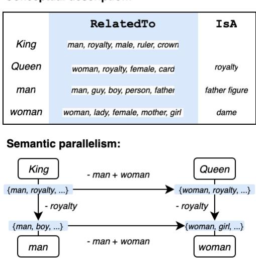
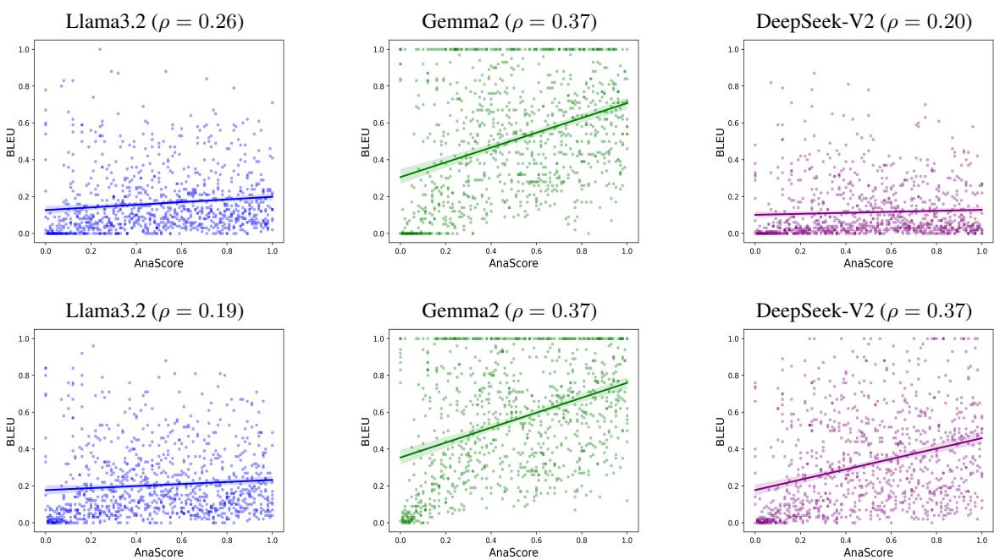
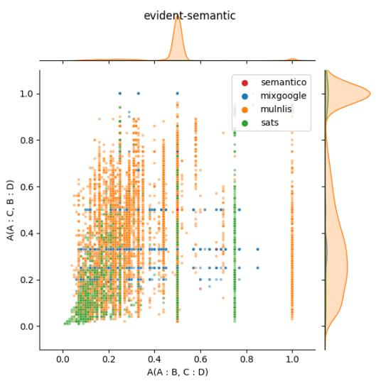
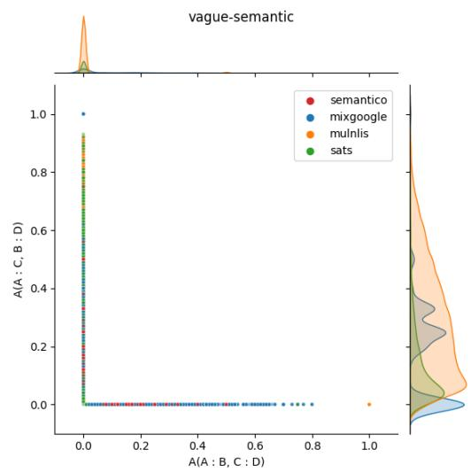

# AnaScore: Understanding Semantic Parallelism in Proportional Analogies

Liyan Wang, Haotong Wang, Yves Lepage

Waseda University, Japan

{wangliyan0905@toki., wanghaotong0925@toki., yves.lepage@}waseda.jp

Code: https://github.com/liyannnw/anascore

Annotated data: https://huggingface.co/datasets/liyannn/sentence\_analogy

## Abstract

Formulaic criteria for proportional analogies, which capture relational mappings between two ratios of terms, are mainly confined to the formal level. As analogy datasets grow more complex, especially in evaluating the cognitive abilities of Large Language Models (LLMs), assessing parallelism in them becomes increasingly challenging and often requires human annotation. In this work, we propose AnaScore, an automatic metric for evaluating the strength of semantic parallelism in sentence analogies. AnaScore systematically provides formalized explanations for shared relational patterns at the level of conceptual knowledge. We apply AnaScore to annotate several existing datasets, considering different directions of the relations, and uncover artifacts in data construction. Our experiments with various LLMs demonstrate the efficacy of the AnaScore metric in capturing the inherent quality of analogical relationships, showing a positive correlation between analogy quality and model performance. Thanks to this metric, we clearly demonstrate that formally explainable examples are more beneficial for analogical reasoning, while ambiguous analogies with no clear criterion tend to hinder inference.

## 1 Introduction

Analogy, which relies on the parallelism of relational structures, is a ubiquitous cognitive operation that basically adapts learnt knowledge to new tasks (Gentner, 1983; Gick and Holyoak, 1983; Hofstadter, 2001). How analogy facilitates inference in problem-solving has been formalized into various learning paradigms for a multitude of different tasks (Prade and Richard, 2021). Recent research has explored the emergent capacity of Large Language Models (LLMs) to perform analogical reasoning (Ushio et al., 2021; Webb et al., 2023; Yasunaga et al., 2024). Research in deepening our understanding of the underlying processes involved in analogy is justified by results showing that mod-

## Conceptual description:

  
Figure 1: Mappings of relational structures between the four terms depicted through their conceptual knowledge under the RelatedTo edge in ConceptNet. AnaScore is designed to compute the strength of parallelism between conceptual descriptions for each term in analogies.

els enhanced with analogical abilities through further training demonstrate improved performance on other tasks (Petersen and van der Plas, 2023; Wang et al., 2024).

In LLM benchmarking, analogy datasets have been developed with increasing levels of complexity. From well-defined word analogies (Gladkova et al., 2016), they have expanded to sentence-level analogies (Zhu and de Melo, 2020; Wijesiriwardene et al., 2023) with richer relational patterns, and further to mining intricate structural mappings in long contexts (Sultan and Shahaf, 2022; Ye et al., 2024; Bhavya et al., 2024). As these relational structures become more sophisticated, defining analogical parallelism becomes increasingly challenging, often requiring human annotation (Lepage, 2019; Sultan et al., 2024). Performance on such complex analogies is considered a hallmark of how well LLMs align with human cognition (Ichien et al., 2020; Czinczoll et al., 2022; Yuan et al.,

2023).

However, whether complex analogies always benefit in model learning is left to be discussed. Research in cognitive psychology (Gentner and Smith, 2012; Holyoak, 2012) suggests that people are particularly sensitive to transparent mappings, profiting most from those with a high degree of structural consistency. Such structural mappings allow for accurate inference from known situations to new ones. If analogies are abstract without any clear criterion for explaining the mappings they encode, will they be useful to imbue the models with reasoning abilities? To ensure effective model learning, it is indispensable to verify the solidity of analogies in existing datasets. In this paper, we focus on studying proportional analogies between sentences in the format $A : B : : C : D$

Parallelism in proportional analogies refers to the structural mapping between two paired relationships, such that the transformation from A to $B$ align with the transformation from $C$ to D. In formal analogies, this parallelism is defined by equivalent transformations that can be captured through common edit operations applied to both ratios (Lepage, 1998; Murena et al., 2020). Semantic parallelism involves parallel transformations in underlying meaning, which can be described using external knowledge sources like ConceptNet (Speer et al., 2017), as illustrated in Figure 1.

To evaluate semantic parallelism, previous methods such as vector arithmetic (Rumelhart and Abrahamson, 1973; Mikolov et al., 2013) rely on the theory of geometric parallelogram in multidimensional Euclidean spaces. However, it has been corroborated that vector offset approaches are ineffective at identifying analogical relationships in embedding spaces. These measurements are often limited to simple relational patterns and cannot be generalized to richer analogical structures (Linzen, 2016; Bouraoui et al., 2018). There remains a need for a robust and explanatory metric to evaluate semantic analogies between sentences.

In this paper, we propose AnaScore, an automatic metric for evaluating the quantity of conceptual mappings in sentence analogies. We use ConceptNet to reify relational structures between sentences, depicting the underlying transformations in ratios. AnaScore exhaustively identifies parallel transformations between concepts, quantifying the degree of semantic parallelism of analogies, with formalized explanations of their shared relational patterns. We apply AnaScore to annotate existing analogy datasets and analyze the artifacts emerging from data construction based on annotation statistics. In addition, our LLM experiments show a positive correlation between model performance and analogy quality. Ambiguous analogies devoid of clear relational criteria are prone to impede analogy inference in few-shot learning.

## 2 Preliminaries

## 2.1 Conceptual representation

Let $\begin{array} { r c l } { G _ { w } } & { = } & { ( V _ { w } , E _ { w } ) } \end{array}$ denote the conceptual graph of a word w in ConceptNet, where $V _ { w } =$ $\{ w , v _ { 1 } . v _ { 2 } , \cdot \cdot \cdot , v _ { k } \}$ represents the set of concept nodes linked to w, and $E _ { w } = \{ ( r , v ) | r \in R _ { w } , v \in$ $V _ { w } \}$ is the set of relational edges connecting w to its corresponding concepts. Each edge $( r , v )$ indicates a directed connection, either from w to v $( w \stackrel { r } {  } v )$ or from v to w $( v \stackrel { r } {  } w )$ , depending on whether w functions as the source or the target in the relationship $^ r .$ We append the directional label d as a prefix to the connected concept node, denoted as d.v. Thus, for a given relation $r ,$ the set of annotated nodes connected to w is $V _ { w , r } = \{ v ^ { \prime } | v ^ { \prime } =$ d.v, d  start, end , $v \in V _ { w } , ( r , v ) \in E _ { w } \}$ . The conceptual representation of w can then be formulated as $\mathcal { G } ( w ) = \{ ( r , V _ { w , r } ) | r \in R _ { w } \}$ , where $R _ { w }$ is the set of all relations linked with w.

To extend this structured representation to a sequence of words (e.g., a sentence) $S \_ { } = { }$ $\{ w _ { 1 } , w _ { 2 } , \ldots , w _ { n } \}$ , we aggregate the representations of its constituent words from ConceptNet. Concept nodes connected by the same relation r are grouped into an aggregated set $\textstyle V _ { S , r } = \bigcup _ { i = 1 } ^ { n } V _ { w _ { i } , r }$ The conceptual representation of a sentence $S$ can then be expressed as:

$$
{ \mathcal { G } } ( S ) = \{ ( r , V _ { S , r } ) \mid r \in R _ { S } \}\tag{1}
$$

where $\textstyle R _ { S } = \bigcup _ { i = 1 } ^ { n } R _ { w _ { i } }$ is the union of all relationships associated with the words in $S _ { ☉ }$

## 2.2 Relational encoding

To encode semantic relationships between two terms in the ratio $x : y .$ , we employ two components that capture the overlapping and distinctive concepts based on their representations.

Conceptual overlap The shared knowledge between two terms x and $y$ is identified through common descriptions associated with the same relations, as defined in Equation (2).

$$
\Lambda ( x , y ) = \mathcal { G } ( x ) \cap \mathcal { G } ( y ) = \{ ( r , V _ { x \cap y , r } ) \mid r \in R _ { x \cap y } \}\tag{2}
$$

In Equation (2), $V _ { x \cap y , r } = V _ { x , r } \cap V _ { y , r }$ denotes the intersection of concept nodes linked to x and $y$ through relation $^ { r , }$ while $R _ { x \cap y } = R _ { x } \cap R _ { y }$ is the set of shared relations associated with both terms.

Conceptual difference This encodes the conceptual edits applied to transform x into $y ,$ represented by computing substitutions of associated concepts between x and y as follows:

$$
\Delta _ { r } ^ { - } ( x , y ) = V _ { x , r } \ : \backslash \ : V _ { y , r }\tag{3}
$$

$$
\Delta _ { r } ^ { + } ( x , y ) = V _ { y , r } \backslash V _ { x , r }\tag{4}
$$

Here, $\textstyle \Delta _ { r } ^ { - } ( x , y )$ represents the concepts present in $x$ but absent in $y$ (indicating deletions), while $\Delta _ { r } ^ { + } ( x , y )$ represents the concepts in y but not in x (indicating insertions), both to the relation r. The $\Delta _ { r } ( x , y )$ pair $( \langle \Delta _ { r } ^ { - } ( x , y ) , \Delta _ { r } ^ { + } ( x , y ) \rangle )$ encodes the structural transformation required to convert x into y under $^ { r } \cdot$ Consequently, the overall relational difference of a ratio can be formalized as shown in Equation (5)1.

$$
\begin{array} { r l } & { \Delta ( x , y ) = \mathcal { G } ( x ) \setminus \mathcal { G } ( y ) } \\ & { \ = \big \{ \big ( r , \langle \Delta _ { r } ^ { - } ( x , y ) , \Delta _ { r } ^ { + } ( x , y ) \rangle \big ) \mid r \in R _ { x \cap y } \big \} } \end{array}\tag{5}
$$

## 3 AnaScore Metric

## 3.1 Non-overlapping content

The reasoning to analogies essentially involves the inference of similarities and dissimilarities, which correspond to the formation of trivial and nontrivial patterns in quadruples. In trivial patterns such as $A : A : : B : B .$ the parallel holds in consistent overlap between terms. Non-trivial patterns reveal high-level associations that explain the underlying parallel structure.

The AnaScore metric targets to evaluate the commonalities between the differences in ratios, particularly measuring the quality of non-trivial parallelism between transformations in the associated concepts. To achieve this, we first eliminate the shared content within each ratio, isolating the nonoverlapping components of each term.

For each term, the overlapping content can be identified from its representation of shared concepts, as formalized in Equation (6).

$$
x _ { \Lambda } = \bigcup _ { r \in R _ { x \cap y } } \mathcal { G } ^ { - 1 } ( \Lambda _ { r } ( x , y ) )\tag{6}
$$

Here, $( x , y ) \in \{ ( A , B ) , ( C , D ) \}$ , and the function $\mathcal { G } ^ { - 1 } ( \Lambda _ { r } ( x , y ) )$ decodes the shared nodes $( \Lambda _ { r } ( x , y ) )$ connected through relation r into their corresponding words in the sequence $( x )$ for ratio $x : y$ . By removing these shared components from each term, resulting in $\tilde { x } = \{ x \} \setminus x _ { \Lambda }$ , AnaScore then focuses on computing the relational similarity between the non-overlapping content.

## 3.2 Parallel transformation

Let $R _ { \tilde { x } }$ denote the set of relations describing the semantic meaning of non-overlapping content $\tilde { x }$ in a term $x \in ( A , B , C , D )$ . The transformations between terms in the ratios $A : B$ and $C : D$ are represented by $\Delta ( \tilde { A } , \tilde { B } )$ and $\Delta ( \tilde { C } , \tilde { D } )$ , which are the sets of conceptual modifications consisting of deletion and insertion pairs under various relation paths, as defined in Equation (5). For a common relation $r \in R = R _ { \tilde { A } \cap \tilde { B } } \cap R _ { \tilde { C } \cap \tilde { D } }$ , the similarity between the ratios can be evaluated by computing exact matches for both deletions and insertions as follows:

$$
\begin{array} { l l } { { d e l _ { r } = \Delta _ { r } ^ { - } ( \tilde { A } , \tilde { B } ) \cap \Delta _ { r } ^ { - } ( \tilde { C } , \tilde { D } ) , } } \\ { { i n s _ { r } = \Delta _ { r } ^ { + } ( \tilde { A } , \tilde { B } ) \cap \Delta _ { r } ^ { + } ( \tilde { C } , \tilde { D } ) . } } \end{array}
$$

$\Delta _ { r } ^ { - } ( \tilde { A } , \tilde { B } )$ and $\Delta _ { r } ^ { - } ( \tilde { C } , \tilde { D } )$ represent the sets of deletions for relation r in the ratios $A : B$ and $C : D$ , respectively. $\Delta _ { r } ^ { + } ( \tilde { A } , \tilde { B } )$ and $\Delta _ { r } ^ { + } ( \tilde { C } , \tilde { D } )$ are the corresponding insertion sets. If either $d e l _ { r }$ or $i n s _ { r }$ is non-empty, it implies that the two ratios share a common conceptual transformation (substitution, deletion-only, or insertion-only) under relation r.

However, not all matched transformations are meaningful in having analogical correspondences. A proportion may fail to establish parallelism along a relational path if the shared transformations do not preserve structural consistency across all relevant elements. Consider the following example2:

$$
\begin{array}{c} \begin{array} { r } { \begin{array} { l l } { I } & { d o \quad n o t } \\ { w a n t \quad a n y : { \operatorname { I d o n o t } w a n t } \neq I d o n o t n e e d } \\ { p r o b l e m s . \quad } \end{array} ; I d o n o t n e e d } \\ & { p r o b l e m s . } \end{array} \begin{array} { r } { I d o n o t n e e d } \\ { a b o y f r i e n d . } \end{array} \neq \begin{array} { l c r } { I d o n o t n e e d } \\ { a n y r e s t . \quad } \end{array} ; I d o n o t n e e d  \\ & { p r o b l e m s . } \end{array}
$$

For the RelatedTo relation, both ratios share a surface-level transformation, involving the deletion of the concept end.any and the insertion of end.a. However, this match is limited to partial elements. There is no alignment between problems : boyfriend and rest : girlfriend in their descriptions under the RelatedTo relation. Despite the appearance of a similar transformation, the underlying conceptual shifts do not align entirely, thereby failing to establish a parallel structure.

To verify whether shared transformations preserve structural parallelism, we convert the concepts into their respective words and evaluate whether the common edits in $\langle d e l _ { r } , i n s _ { r } \rangle$ cover all relevant elements in each of the four terms. Specifically, we introduce a binary function $\phi$ that determines whether all the content words involved in the modifications $( \mathrm { e . g . } , \Delta _ { r } ^ { - } ( \tilde { A } , \tilde { B } ) )$ appear in the shared transformations $( \mathbf { e . g . } , d e l _ { r } )$ for each respective term $( \mathrm { e . g . , } \tilde { A } )$ ):

$$
\begin{array} { r l } {  { \phi ( d e l _ { r } , \Delta _ { r } ^ { - } ( \tilde { A } , \tilde { B } ) ) = } } \\ & { \{ 1 , \quad \mathrm { i f } \mathcal { G } ^ { - 1 } ( d e l _ { r } ) = \mathcal { G } ^ { - 1 } ( \Delta _ { r } ^ { - } ( \tilde { A } , \tilde { B } ) )  } \\ { 0 , } & { \mathrm { o t h e r w i s e } } \end{array}\tag{7}
$$

We compute $\phi$ for all four terms and aggregate the values to obtain:

$$
\begin{array} { c } { { \Phi _ { r } = \phi ( d e l _ { r } , \Delta _ { r } ^ { - } ( \tilde { A } , \tilde { B } ) ) + \phi ( i n s _ { r } , \Delta _ { r } ^ { + } ( \tilde { A } , \tilde { B } ) ) + } } \\ { { \phi ( d e l _ { r } , \Delta _ { r } ^ { - } ( \tilde { C } , \tilde { D } ) ) + \phi ( i n s _ { r } , \Delta _ { r } ^ { + } ( \tilde { C } , \tilde { D } ) ) } } \end{array}\tag{8}
$$

The parallelism score for r is then defined as:

$$
P _ { r } = \left\lfloor { \frac { \Phi _ { r } } { 4 } } \right\rfloor\tag{9}
$$

If $P _ { r }$ is 1, the shared structures cover all associated words in each term, preserving parallel transformations. Otherwise, the transformations are partially aligned or inconsistent.

## 3.3 Final scoring

The number of parallel structures can quantify the relational similarity between the two ratios. The more relational paths that draw parallels, the greater the commonalities between the two ratios with consistent transformations. Given $\Delta ( \tilde { A } , \tilde { B } )$ and $\Delta ( \tilde { C } , \tilde { D } )$ , involving conceptual transformations under all shared relations R, we define the similarity score between the two transformations as follows:

$$
P = \frac { \sum _ { r \in R } P _ { r } } { \operatorname* { m a x } ( | \Delta ( \tilde { A } , \tilde { B } ) | , | \Delta ( \tilde { C } , \tilde { D } ) | ) }\tag{10}
$$

where $| \Delta ( \tilde { A } , \tilde { B } ) |$ is the number of relations associated with the ratio. $P \in [ 0 , 1 ]$ measures the extent to which the relational structures in the two ratios capture parallel associations.

In addition, AnaScore evaluates the extent to which the non-overlapping content in each term is aligned with the identified parallel transformations.

To this end, the set $x _ { \Delta }$ is used to represent words that participate in consistent modifications across both ratios, defined as Equation (11).

$$
\begin{array} { r l r } {  { x _ { \Delta } = \bigcup _ { r \in R } \mathbf { 1 } _ { \{ P _ { r } = 1 \} } \mathcal { G } ^ { - 1 } ( o p _ { r } , \tilde { x } ) } } \\ & { } & { \mathrm { w i t h ~ } o p _ { r } = \{ \begin{array} { l l } { d e l _ { r } , } & { \mathrm { f o r ~ } x \in \{ A , C \} } \\ { i n s _ { r } , } & { \mathrm { f o r ~ } x \in \{ B , D \} } \end{array}  }  \end{array}\tag{11}
$$

Here, $\mathbf { 1 } _ { \{ P _ { r } = 1 \} }$ is an indicator that denotes transformations confirmed to be parallel in both ratios under r. The final metric, denoted as $\mathbf { A } ( A : B , C :$ $D )$ , integrates structural similarity with the average coverage of aligned words involved in parallel associations for each term, as defined in Equation (12).

$$
\mathbf { A } ( A : B , C : D ) = \frac { P } { 4 } \sum _ { x \in \{ A , B , C , D \} } \frac { | x _ { \Delta } | } { | \tilde { x } | }\tag{12}
$$

In Equation (12), x˜ is the number of nonoverlapping content words in x, and $| x _ { \Delta } |$ computes the number of the words involved in analogical relationships. A high AnaScore $\mathbf { A } ( A : B , C : D )$ indicates strong alignment, validating the proportion as a solid analogy. Conversely, a low score suggests inconsistencies or misalignment in the relational patterns, indicating weaker analogical correspondence. The metric is symmetric, ensuring that the score remains consistent when the ratios are reversed, such that $\mathbf { A } ( A : B , C : D ) = \mathbf { A } ( C$ $D , A : B )$ , following the fundamental principle of analogy (symmetry of conformity).

## 4 Data Curation

## 4.1 Datasets

We curate four datasets of proportional analogies between sentences, including:

Semantico-formal analogies between short sentences (Semantico) This dataset3 (Lepage, 2019) offers over 5,000 analogies that combine semantic and formal relationships between short Tatoeba sentences. Analogies are decomposed into proportions between word pieces, holding at a formal level (same string edits) or a semantic level (same vector offsets in FastText).

Mixing Google analogies with template sentences (MixGoogle) This dataset4 (Afantenos et al., 2021) consists of over 50,000 sentence analogies, generated by combining word analogies with manually created sentence templates. Each word analogy is extended into multiple analogies between synthetic sentences using different templates, designed for specific relational categories in the Google analogy set5.

Multi-level analogies between NLI sentence pairs (MulNLIs) This set (Wang and Lepage, 2023) contains over 170,000 analogies, enriched with relational patterns derived from entailment sentence pairs. The analogies are extracted under relational constraints, capturing approximate parallelograms in both syntactic structure and semantic representations, with varying degrees of formality.

Sentence analogy test set (SATS) This set6 (Blain-Montesano and Langlais, 2024) collects 32 analogical clusters, each containing 50 sentence pairs sharing the same relational pattern. Some clusters include relatively straightforward sentence analogies, with manually crafted pairs capturing lexical or syntactic equivalence through subtle variations, while others represent more abstract patterns, using the first Wikipedia sentences describing the words from BATS analogies.

We preprocess these datasets to standardize the sentences and deduplicate equivalent forms of each analogy, as detailed in Appendix A.1.

## 4.2 Annotation

The objective is to classify sentence analogies based on the nature of their underlying analogical relationships into three categories: formal, semantic, and no criterion.

Formal analogies They adhere to strict conformity, where the transformations in both the left and right ratios are identical in their forms. These analogies can be identified using three criteria7 that are grounded in the definition of formal analogy in (Lepage, 1998, 2004). An analogy is classified as formal if it satisfies all criteria at either the character or word level, treating sentences as sequences of characters or words.

Semantic analogies Analogies that do not meet the formal criteria are subjected to a semantic evaluation using the AnaScore metric, which quantifies the parallelism in conceptual transformations, with scores ranging from 0 to 1. Analogies that achieve a non-zero score are categorized as semantic, indicating that they capture some level of semantic parallelism with a formalized explanation.

Analogies with no criterion Analogies in this category lack formal or semantic justification.8 These analogies often capture abstract or inconsistent patterns, making them unexplainable using formulaic criteria.

To further assess the consistency of analogical relationships, each analogy is annotated in two configurations: A : B :: C : D and A : C :: B : D . An analogy that satisfies formal or semantic criteria in both directions is labeled as having an evident formalized explanation. However, if an analogy holds only in one direction or lacks an explanation in both, it is categorized as having a vague formalized explanation. Examples of sentence analogies for each category can be found in Appendix A.3.

## 4.3 Statistics and artifacts

Table 1 reports the distribution of analogies across four datasets, categorized into distinct types in terms of their explainability with formulaic criteria.

In the Semantico set, 41% of the analogy data strictly follow formal criteria after sentence normalization. Despite the alignment of non-trivial components in geometric configurations within a FastText space, only 3% of analogies exhibit semantic parallelism in one direction. Over half of the data lack a clear formalized criterion. For example, in the analogy that lacks a criterion at both the formal and semantic levels:

You were You were You were You were ter  
bluffing, ... scared, ... there, ... : rified, ...

it is hard to explain the semantic alignment between the transformation from a specific behavior (bluffing) to an emotional state (scared) and from a state of being present (there) to an extreme emotion (terrified), even though terrified is the optimal alternative given its geometric proximity to the ideal solution for the other three words in vector space.

In MixGoogle, vague analogies are prevalent across most subsets, with some being explainable in the original form A : B :: C : D but failing when the middle terms are swapped as A : C :: B : D. As in the following example from the capital-commoncountries set:

<table><tr><td rowspan="2">Dataset</td><td rowspan="2"># Formal</td><td rowspan="2">Evident explanation (%)  $A : B : : C : D \wedge A : C : : B : D$ </td><td colspan="3">Vague explanation (%)</td><td rowspan="2">No criterion</td></tr><tr><td>Semantic</td><td>Semantic  $A : B : : C : D \qquad A : C : : B : D$ </td><td>sum</td></tr><tr><td>Semantico</td><td>5,471</td><td>41</td><td>0</td><td>1</td><td>2</td><td>3 56</td></tr><tr><td></td><td></td><td></td><td></td><td></td><td></td><td></td></tr><tr><td>MixGoogle</td><td>33,458</td><td>2</td><td>3 22 39 53</td><td>34</td><td>56</td><td>39</td></tr><tr><td>capital-common-countries</td><td>1,771</td><td>0</td><td>0</td><td>3 63</td><td>56</td><td>5</td></tr><tr><td>city-in-state</td><td>16,968</td><td>0</td><td>1</td><td>0</td><td>63</td><td>37</td></tr><tr><td>currency family</td><td>1,732</td><td>0</td><td>10</td><td>74 1 23</td><td>0 74</td><td>25</td></tr><tr><td>gram6-nationality-adjective</td><td>2,223 10,660</td><td>7 6</td><td>0</td><td>48</td><td>24 0 48</td><td>59 46</td></tr><tr><td>gram2-opposite</td><td>104</td><td>26</td><td>5</td><td>0 69</td><td>69</td><td>0</td></tr><tr><td>MulNLIs</td><td></td><td></td><td>20</td><td></td><td></td><td></td></tr><tr><td>strict</td><td>170,409</td><td>43</td><td>0</td><td>1 0</td><td>32 33</td><td>4</td></tr><tr><td></td><td>68,109</td><td>99 35</td><td>14</td><td>0 48</td><td>1 1 48</td><td>0</td></tr><tr><td>strong weak</td><td>803 62,171</td><td>7</td><td>42</td><td>1 45</td><td>46</td><td>3 5</td></tr><tr><td>free</td><td>39,326</td><td>2</td><td>20 1</td><td>66</td><td>67</td><td>11</td></tr><tr><td></td><td></td><td></td><td></td><td></td><td></td><td></td></tr><tr><td>SATS</td><td>39,140</td><td>5</td><td>6 1</td><td>2 0 53</td><td>32 34</td><td>55</td></tr><tr><td>lexical</td><td>7,350 12,250</td><td>3 14</td><td>18</td><td>1 51</td><td>53 52</td><td>43</td></tr><tr><td>syntactic semantic</td><td>9,800</td><td>0</td><td>1</td><td>1 24</td><td>25</td><td>16 74</td></tr><tr><td>encyclopedic</td><td>9,740</td><td>0</td><td>0</td><td>3 2</td><td>5</td><td>95</td></tr><tr><td></td><td></td><td></td><td></td><td></td><td></td><td></td></tr></table>

Table 1: Percentage of analogies annotated into different categories based on their explanatory properties in two forms across datasets of varying sizes (#). Analogies are assessed at formal and semantic levels, with Anascore measuring semantic parallelism. Those holding in both forms have evident explanations , while those in only one form are vague in semantics. Analogies (where $\neg A : B : : C : D \wedge \neg A : C : : B : D )$ lack a clear criterion in either underlying meaning or superficial patterns. The percentages for the four categories: evident formal, evident semantic, vague semantic (sum), and vague no criterion, sum to 100% in each set.

$$
\begin{array} { l }  { W e \ j u s t { c a m e } \ { \begin{array} { l } { W e \ a r r i \nu e d } \\ { y e s t e r - } \end{array} } { : } { w e j u s t { c a m e } \ { \begin{array} { l } { W e \ a r r i \nu e d } \\ { f r o m : } \end{array} } { y e s t e r - } } } \\  { K a b u l \ { \begin{array} { l } { A { a y } \qquad f r o m \ { t r o } \ { : } \ b a c k \quad f r o m : } \\ { A f g h a n i s t a n \quad L o n d o n \quad } \end{array} } { l o n } { : } { \begin{array} { l } { a r r i \nu e d } \\ { f r o m : } \end{array} } { E n g - } } \end{array}
$$

the sentence analogy is constructed from the seed analogy Kabul : Afghanistan :: London : England using a pair of templates. In $A \ : \ B \ : \ C \ :$ D, sentence pairs maintain a consistent structural resemblance influenced by these template patterns, where the word analogy is supported with overlapping concepts of end.afghanistan in $\Lambda _ { \mathsf { P a r t 0 f } } ( K a b u l , A f g h a n i s t a n )$ and start.rented flat in $\Lambda _ { \mathsf { A t l } \mathsf { o c a t i o n } } ( L o n d o n , E n g l a n d )$ . When reordered as $A : C : : B : D ,$ , our semantic verification reduces to checking the parallelism of the word analogy. The semantic consistency of the sentence analogy collapses as ConceptNet lacks robust links connecting all four geographical terms under any shared relationships. In contrast, the conceptual descriptions for opposite terms show better alignment, where all analogies in the gram2-opposite set have well-formulated explanations.

In the MulNLIs set, the majority of analogies are more explainable in $A : C : : B : D$ than in $A : B : : C : D .$ This pattern arises because the sentence analogies are constructed from entailment pairs, where each sentence in a pair has significant overlap. As a result, minor variations in sentence structures are substantially influenced on the evaluation of $A : B : : C : D .$ Consider the analogy constructed from two contradiction pairs:

$$
\begin{array} { l } { T h e r e \textit { i s } n o \textit { T h e } m a n \textit { i s } \begin{array} { l } { T h e \ m e n \ a r e } \\ { m a n \ r i d i n g \ a : r i d i n g \textit { a } \ . . . \ . : \ n o t \ p u t t i n g \ . \ p u t t i n g \ } \\ { s u l l \ } \end{array} \begin{array} { l } { T h e \ m e n \ a r e \ } \\ { s u l l \textit { i n g } \textit { i n t i n g } \ . . . \ . } \\ { l n l l \textit { i n t o \ldots } \quad } \end{array} \begin{array} { l } { T h e \ m e n \ a r e \quad T h e \ m e n \ a r e } \\ { s u l t c a s e s \ } \\ { s u l t c a s e s \ } \end{array} } \end{array}
$$

In the original form, the metric is sensitive to partial changes in converting a negative statement into its affirmative form. However, in ConceptNet, there is no alignment between the content expressing that no one is performing the action and the negation of the action itself, leading AnaScore to assign a score of 0. In $A : C : : B : D ,$ the evaluation considers a more global transformation, where each sentence pair follows a similar pattern of switching between two actions.

In addition, we observe from the MulNLIs set that analogies with a higher degree of formality are more explainable, resulting in fewer data lack criteria. This suggests that similar syntactic structures are more likely to exhibit meaningful relationships in semantics.

In the SATS set, analogical relationships are relatively abstract. The encyclopedic category is particularly difficult to formally explain, as most analogies that rely heavily on factual knowledge not well-represented in ConceptNet lack a formulaic criterion. While semantic analogies in SATS have consistent patterns between ratios, they are primarily defined by their abstract structural relationships between sentences. Consider the example in the phrasal-implicative-entailment set,

  
Figure 2: Correlation between reasoning abilities and analogy quality for Llama3.2 (left), Gemma2 (middle), and DeepSeek-V2 (right) with 0-shot (top) and 5-shot (bottom) prompting. Spearman’s coefficient (ρ) annotated in each plot is statistically significant at p-value < 0.05. Gemma2 demonstrates a relatively strong positive relationship between analogy quality and performance in both settings. DeepSeek-V2 improves significantly in 5-shot, while Llama3.2 shows modest gains. All models struggle with low-quality analogies (AnaScore 0).

$$
\begin{array} { l l } { T h e y p o s s e s s e d T h e y } { H e y } { H e f u l f i l e d h i s }  \\ { t h e i n g e n u i t y t o : c r e a t e d : { d u t y t o p r o \nu i d e : _ { t h e ~ e \nu i d e n c e . } } } \\ { c r e a t e i t . } \end{array}
$$

the two ratios share an entailment relationship, where the left sentence sets up a condition that implies the action in the right sentence. However, they are misaligned in terms of meaning.

For the lexical and syntactic sets of SATS, which contain certain syntactic alignments in analogies, over half of analogies have semantic explanations in at least one direction. The syntactic set exhibits a stronger parallel structure compared to the lexical set. In the lexical set, analogies with explanations in either direction dominate, except for the idiomliteral set, where 92% fall in no criterion, as shown in Table 7. This is because collecting the semantic meaning of individual words will overlook the compositional semantics of multi-word expressions.

## 5 LLM Reasoning on Sentence Analogies

## 5.1 Setup

In this section, we explore the reasoning abilities of LLMs in solving the sentence analogy task (A : B :: $C : x \implies x = D )$ . To this end, we sample 1,000 analogies9 from a collection of the four datasets, uniformly distributed based on the average of their AnaScore values computed in two forms.

We evaluate the latest models of Llama (Touvron et al., 2023), Gemma (Team et al., 2024), and DeepSeek (DeepSeek-AI, 2024) using the Ollama framework.10 For each test analogy, we prompt the LLMs to generate the solution for the fourth sentence in few-shot settings, using examples retrieved from the set of well-structured analogies (AnaScore= 1). Model performance is evaluated by comparing models’ generated solutions with their references. Appendix B introduces further prompting details.

## 5.2 Correlation between model performance and analogy quality

Figure 2 illustrates the relationship between analogy quality (measured by AnaScore) and model performance (measured by BLEU11) for three LLMs under 0-shot and 5-shot settings.

Gemma2 outperforms the others in both settings, showing the strongest positive correlation between AnaScore and BLEU scores. As the quality of test analogies increases, Gemma2 tends to generate more reliable solutions that closely align with the reference. In contrast, Llama3.2 and DeepSeek-V2 struggle to capture analogical patterns, showing no clear correlation when no examples are provided in context for inference. In particular, the solutions of DeepSeek-V2 often deviate significantly from the expected references, even for higher-quality analogies.

In the 5-shot setting, Llama3.2 shows only modest improvement. DeepSeek-V2 exhibits a significant improvement, shifting from weak performance in 0-shot to a stronger alignment between analogy quality and generated solutions when given contextual examples. It becomes more adept at leveraging clear and well-structured analogical relationships.

Despite these improvements, a noticeable concentration remains at the lower left corner (Anascore near 0) of each plot. For such ambiguous analogies, even with examples the models still struggle to recognize their analogical relationships, making it difficult to generate accurate or meaningful answers.

## 5.3 Effects of few-shot examples

We further examine the impact of examples on analogy inference, particularly comparing model performance using formally explainable (AnaScore= 1) and ambiguous (AnaScore= 0) examples across different n-shot settings. Our observations suggest that general metrics may be insufficient for assessing whether models engage in intelligent reasoning or merely taking shortcuts through the repetition of given terms (like C). BLEU can assign inflated similarity scores to fallacious answers due to minimal differences between given terms and reference solutions.

To better measure analogical capabilities, we evaluate the accuracy of models in generating nonoverlapping components, as introduced in Section 3.1. In particular, this accuracy metric measures the percentage of cases in which LLMs accurately generate the pieces of D that are not shared with given terms. Table 2 presents the accuracy results for the three LLMs.

<table><tr><td>n</td><td>explain- able</td><td>Llama</td><td>Gemma</td><td>DeepSeek</td></tr><tr><td>0</td><td>□</td><td>24.8</td><td>65.6</td><td>41.2</td></tr><tr><td rowspan="2">1</td><td>☑</td><td>29.5 +4.7</td><td>65.0 -0.6</td><td>38.3 -2.9</td></tr><tr><td>ø</td><td>23.2 -1.6</td><td>64.4 -1.2</td><td>27.9 -13.3</td></tr><tr><td rowspan="2">3</td><td>☑</td><td>25.9 +1.1</td><td>67.6 +2.0</td><td>43.5 +2.3</td></tr><tr><td>ć</td><td>20.5 -4.3</td><td>65.4 -0.2</td><td>27.0 -14.2</td></tr><tr><td rowspan="2">5</td><td>☑</td><td>25.5 +0.7</td><td>69.3 +3.7</td><td>43.4 +2.2</td></tr><tr><td>ø</td><td>19.1 -5.7</td><td>68.7 +3.1</td><td>33.6 -7.6</td></tr><tr><td rowspan="2">7</td><td>☑</td><td>27.0 +2.2</td><td>68.1 +2.5</td><td>44.0 +2.8</td></tr><tr><td>ø</td><td>17.1 -7.7</td><td>68.0 +2.4</td><td>35.5 -5.7</td></tr><tr><td rowspan="2">10</td><td>☑</td><td>26.5 +1.7</td><td>69.4 +3.8</td><td>45.9 +4.7</td></tr><tr><td>ø</td><td>18.6 -6.2</td><td>68.4 +2.8</td><td>34.7 -6.5</td></tr></table>

Table 2: Accuracies (%) in analogical reasoning across different n-shot settings, using explainable examples ( ) and those with no criteron ( ). The 0-shot setting is the baseline for comparison. The best score for each model is bolded. Highlighted scores confirm that models consistently perform better with explainable examples compared to ambiguous ones.

Quantity All models improve when explainable analogies are used, compared to the 0-shot baseline. Performance increases with the number of examples, with Gemma2 and DeepSeek-V2 reaching their highest scores at 10-shot. Llama3.2 peaks at 1-shot, showing little benefit from additional examples.

Quality Using explainable analogies consistently results in better performance across all models compared to ambiguous examples. Ambiguous analogies, in fact, have a detrimental effect that hampers the models’ ability to identify analogical patterns, often causing performance drops compared to the 0-shot baseline. This negative impact is especially significant for Llama3.2 and DeepSeek-V2, where ambiguous examples always lead to a decline in accuracy, highlighting the importance of high-quality examples for effective few-shot prompting. Gemma2 appears less sensitive to the quality of in-context examples, as evidenced by minimal variations in its accuracy.

## 6 Conclusion

This work introduced the AnaScore metric designed to measure the strength of parallelism in analogies at the conceptual level. The underlying meaning of each sentence is represented using ConceptNet. The differences between the conceptual representations of two terms reify the transformations expressed by a ratio. AnaScore consists in computing the similarity between the conceptual transformations expressed by two ratios.

We used AnaScore to annotate four analogy datasets, categorizing analogies in terms of parallism strength, by quantifying the number of possible formalized explanations. We then sampled analogies from these datasets and conducted fewshot prompting experiments in solving sentence analogies using three expert LLMs. The experimental results revealed that analogies with evident explanations, typically reflecting more structurally coherent relationships, enable models to deliver more accurate and meaningful answers. In addition, the quality of examples has a significant impact on analogy inference. Explainable analogies can strengthen the ability to solve sentence analogies, whereas ambiguous ones always disrupt in-context learning.

## Limitations

Hard alignment of concepts AnaScore computes exact matches of concept nodes when comparing transformations across two sentences. This strict comparison cannot recognize synonymous or conceptually similar concepts that express the same meaning with different words. Next, we would like to compute semantic similarity between concepts by leveraging spatial distance in contextual embedding spaces or by measuring the depths to their least common ancestor as in (Wu and Palmer, 1994).

Overlooking compositional meaning in conceptual representations The way we represent sentences using ConceptNet focuses on aggregating conceptual descriptions of individual words, which overlooks the full meaning of sentences. This limitation becomes apparent when dealing with complex sentence structures, as crucial relational patterns arising from the combined meaning of word groups or phrases may be missed. Further work should capture the compositional meaning of sentences more effectively, allowing for a more accurate evaluation using AnaScore.

Lack of human validation AnaScore follows the intuitive idea about how analogy works, measuring the repetition of structure mappings on the concepts in sentences. While it checks whether conceptual transformations from C to D follow the same patterns as those from A to B, human evaluation could be incorporated to assess the alignment between AnaScore’s measures and human perceptions.

## Acknowledgments

The research reported in this paper was supported in part by a grant for Kakenhi (kiban C) from the Japanese Society for the Promotion of Science (JSPS), n° 21K12038 “Theoretically founded algorithms for the automatic production of analogy tests in NLP”.

## References

Stergos Afantenos, Tarek Kunze, Suryani Lim, Henri Prade, and Gilles Richard. 2021. Analogies between sentences: Theoretical aspects - preliminary experiments. In Symbolic and Quantitative Approaches to Reasoning with Uncertainty, pages 3–18, Cham. Springer International Publishing.

Bhavya Bhavya, Shradha Sehgal, Jinjun Xiong, and ChengXiang Zhai. 2024. AnaDE1.0: A novel data set for benchmarking analogy detection and extraction. In Proceedings of the 18th Conference of the European Chapter ofthe Associationfor Computational Linguistics (Volume 1: Long Papers), pages 1723–1737, St. Julian’s, Malta. Association for Computational Linguistics.

Yves Blain-Montesano and Philippe Langlais. 2024. Testing proportional sentence analogies on SATS: From vector offsets to conditional generation. In Proceedings ofthe Workshop on the Interactions between Analogical Reasoning and Machine Learning co-located with International Joint Conference on Artificial Intelligence (IJCAI 2024), Jeju, South Korea, August, 2024, CEUR Workshop Proceedings. CEUR-WS.org.

Zied Bouraoui, Shoaib Jameel, and Steven Schockaert. 2018. Relation induction in word embeddings revisited. In Proceedings ofthe 27th International Conference on Computational Linguistics, pages 1627– 1637, Santa Fe, New Mexico, USA. Association for Computational Linguistics.

Tamara Czinczoll, Helen Yannakoudakis, Pushkar Mishra, and Ekaterina Shutova. 2022. Scientific and creative analogies in pretrained language models. In Findings of the Association for Computational Linguistics: EMNLP 2022, pages 2094–2100, Abu Dhabi, United Arab Emirates. Association for Computational Linguistics.

DeepSeek-AI. 2024. Deepseek-v2: A strong, economical, and efficient mixture-of-experts language model. Preprint, arXiv:2405.04434.

Dedre Gentner. 1983. Structure-mapping: A theoretical framework for analogy. Cognitive Science, 7(2):155– 170.

Dedre Gentner and L. Smith. 2012. Analogical Reasoning, pages 130–136. Elsevier Inc., United States.

Mary L. Gick and Keith J. Holyoak. 1983. Schema induction and analogical transfer. Cognitive Psychology, 15(1):1–38.

Anna Gladkova, Aleksandr Drozd, and Satoshi Matsuoka. 2016. Analogy-based detection of morphological and semantic relations with word embeddings: what works and what doesn’t. In Proceedings ofthe NAACL Student Research Workshop, pages 8–15, San Diego, California. Association for Computational Linguistics.

Douglas R. Hofstadter. 2001. Epilogue: Analogy as the Core of Cognition. In The Analogical Mind: Perspectivesfrom Cognitive Science. The MIT Press.

Keith J. Holyoak. 2012. 234 Analogy and Relational Reasoning. In The Oxford Handbook of Thinking and Reasoning. Oxford University Press.

Nicholas Ichien, Hongjing Lu, and Keith J. Holyoak. 2020. Verbal analogy problem sets: An inventory of testing materials. Behavior Research Methods, 52(5):1803–1816.

Yves Lepage. 1998. Solving analogies on words: an algorithm. In 36th Annual Meeting of the Association for Computational Linguistics and 17th International Conference on Computational Linguistics, Volume 1, pages 728–734, Montreal, Quebec, Canada. Association for Computational Linguistics.

Yves Lepage. 2004. Analogy and formal languages. Electronic Notes in Theoretical Computer Science, 53:180–191. Proceedings of the joint meeting of the 6th Conference on Formal Grammar and the 7th Conference on Mathematics of Language.

Yves Lepage. 2019. Semantico-formal resolution of analogies between sentences. In Proceedings ofthe 9th Language & Technology Conference (LTC 2019) – Human Language Technologies as a Challengefor Computer Science and Linguistics, pages 57–61.

Tal Linzen. 2016. Issues in evaluating semantic spaces using word analogies. In Proceedings ofthe 1st Workshop on Evaluating Vector-Space Representationsfor NLP, pages 13–18, Berlin, Germany. Association for Computational Linguistics.

Tomás Mikolov, Kai Chen, Greg Corrado, and Jeffrey Dean. 2013. Efficient estimation of word representations in vector space. In 1st International Conference on Learning Representations, ICLR 2013, Scottsdale, Arizona, USA, May 2-4, 2013, Workshop Track Proceedings.

Pierre-Alexandre Murena, Marie Al-Ghossein, Jean-Louis Dessalles, and Antoine Cornuéjols. 2020. Solving analogies on words based on minimal complexity transformation. In Proceedings of the Twenty-Ninth International Joint Conference on Artificial Intelligence, IJCAI-20, pages 1848–1854. International Joint Conferences on Artificial Intelligence Organization. Main track.

Molly Petersen and Lonneke van der Plas. 2023. Can language models learn analogical reasoning? Investigating training objectives and comparisons to human performance. In Proceedings of the 2023 Conference on Empirical Methods in Natural Language Processing, pages 16414–16425, Singapore. Association for Computational Linguistics.

Henri Prade and Gilles Richard. 2021. Analogical proportions: Why they are useful in AI. In Proceedings of the Thirtieth International Joint Conference on Artificial Intelligence, IJCAI-21, pages 4568–4576. International Joint Conferences on Artificial Intelligence Organization. Survey Track.

David E Rumelhart and Adele A Abrahamson. 1973. A model for analogical reasoning. Cognitive Psychology, 5(1):1–28.

Robyn Speer, Joshua Chin, and Catherine Havasi. 2017. ConceptNet 5.5: An open multilingual graph of general knowledge. In Proceedings of the Thirty-First AAAI Conference on Artificial Intelligence, AAAI’17, page 4444–4451. AAAI Press.

Oren Sultan, Yonatan Bitton, Ron Yosef, and Dafna Shahaf. 2024. ParallelPARC: A scalable pipeline for generating natural-language analogies. In Proceedings of the 2024 Conference of the North American Chapter of the Association for Computational Linguistics: Human Language Technologies (Volume 1: Long Papers), pages 5900–5924, Mexico City, Mexico. Association for Computational Linguistics.

Oren Sultan and Dafna Shahaf. 2022. Life is a circus and we are the clowns: Automatically finding analogies between situations and processes. In Proceedings of the 2022 Conference on Empirical Methods in Natural Language Processing, pages 3547–3562, Abu Dhabi, United Arab Emirates. Association for Computational Linguistics.

Gemma Team, Thomas Mesnard, Cassidy Hardin, Robert Dadashi, Surya Bhupatiraju, Shreya Pathak, Laurent Sifre, Morgane Rivière, Mihir Sanjay Kale, Juliette Love, Pouya Tafti, Léonard Hussenot, Pier Giuseppe Sessa, Aakanksha Chowdhery, Adam Roberts, Aditya Barua, Alex Botev, Alex Castro-Ros, Ambrose Slone, Amélie Héliou, Andrea Tacchetti, Anna Bulanova, Antonia Paterson, Beth Tsai, Bobak Shahriari, Charline Le Lan, Christopher A. Choquette-Choo, Clément Crepy, Daniel Cer, Daphne Ippolito, David Reid, Elena Buchatskaya, Eric Ni, Eric Noland, Geng Yan, George Tucker, George-Christian Muraru, Grigory Rozhdestvenskiy, Henryk Michalewski, Ian Tenney, Ivan Grishchenko,

Jacob Austin, James Keeling, Jane Labanowski, Jean-Baptiste Lespiau, Jeff Stanway, Jenny Brennan, Jeremy Chen, Johan Ferret, Justin Chiu, Justin Mao-Jones, Katherine Lee, Kathy Yu, Katie Millican, Lars Lowe Sjoesund, Lisa Lee, Lucas Dixon, Machel Reid, Maciej Mikuła, Mateo Wirth, Michael Sharman, Nikolai Chinaev, Nithum Thain, Olivier Bachem, Oscar Chang, Oscar Wahltinez, Paige Bailey, Paul Michel, Petko Yotov, Rahma Chaabouni, Ramona Comanescu, Reena Jana, Rohan Anil, Ross McIlroy, Ruibo Liu, Ryan Mullins, Samuel L Smith, Sebastian Borgeaud, Sertan Girgin, Sholto Douglas, Shree Pandya, Siamak Shakeri, Soham De, Ted Klimenko, Tom Hennigan, Vlad Feinberg, Wojciech Stokowiec, Yu hui Chen, Zafarali Ahmed, Zhitao Gong, Tris Warkentin, Ludovic Peran, Minh Giang, Clément Farabet, Oriol Vinyals, Jeff Dean, Koray Kavukcuoglu, Demis Hassabis, Zoubin Ghahramani, Douglas Eck, Joelle Barral, Fernando Pereira, Eli Collins, Armand Joulin, Noah Fiedel, Evan Senter, Alek Andreev, and Kathleen Kenealy. 2024. Gemma: Open models based on gemini research and technology. Preprint, arXiv:2403.08295.

Hugo Touvron, Thibaut Lavril, Gautier Izacard, Xavier Martinet, Marie-Anne Lachaux, Timothée Lacroix, Baptiste Rozière, Naman Goyal, Eric Hambro, Faisal Azhar, Aurelien Rodriguez, Armand Joulin, Edouard Grave, and Guillaume Lample. 2023. Llama: Open and efficient foundation language models. Preprint, arXiv:2302.13971.

Asahi Ushio, Luis Espinosa Anke, Steven Schockaert, and Jose Camacho-Collados. 2021. BERT is to NLP what AlexNet is to CV: Can pre-trained language models identify analogies? In Proceedings of the 59th Annual Meeting ofthe Associationfor Computational Linguistics and the 11th International Joint Conference on Natural Language Processing (Volume 1: Long Papers), pages 3609–3624, Online. Association for Computational Linguistics.

Liyan Wang and Yves Lepage. 2023. Learning from masked analogies between sentences at multiple levels of formality. Annals ofMathematics and Artificial Intelligence.

Liyan Wang, Haotong Wang, and Yves Lepage. 2024. Continued pre-training on sentence analogies for translation with small data. In Proceedings of the 2024 Joint International Conference on Computational Linguistics, Language Resources and Evaluation (LREC-COLING 2024), pages 3890–3896, Torino, Italia. ELRA and ICCL.

Taylor Webb, Keith J. Holyoak, and Hongjing Lu. 2023. Emergent analogical reasoning in large language models. Nature Human Behaviour, 7(9):1526–1541.

Thilini Wijesiriwardene, Ruwan Wickramarachchi, Bimal Gajera, Shreeyash Gowaikar, Chandan Gupta, Aman Chadha, Aishwarya Naresh Reganti, Amit Sheth, and Amitava Das. 2023. ANALOGICAL - A novel benchmark for long text analogy evaluation

in large language models. In Findings of the Association for Computational Linguistics: ACL 2023, pages 3534–3549, Toronto, Canada. Association for Computational Linguistics.

Zhibiao Wu and Martha Palmer. 1994. Verb semantics and lexical selection. In 32nd Annual Meeting of the Association for Computational Linguistics, pages 133–138, Las Cruces, New Mexico, USA. Association for Computational Linguistics.

Michihiro Yasunaga, Xinyun Chen, Yujia Li, Panupong Pasupat, Jure Leskovec, Percy Liang, Ed H. Chi, and Denny Zhou. 2024. Large language models as analogical reasoners. In The Twelfth International Conference on Learning Representations.

Xiao Ye, Andrew Wang, Jacob Choi, Yining Lu, Shreya Sharma, Lingfeng Shen, Vijay Murari Tiyyala, Nicholas Andrews, and Daniel Khashabi. 2024. AnaloBench: Benchmarking the identification of abstract and long-context analogies. In Proceedings of the 2024 Conference on Empirical Methods in Natural Language Processing, pages 13060–13082, Miami, Florida, USA. Association for Computational Linguistics.

Siyu Yuan, Jiangjie Chen, Xuyang Ge, Yanghua Xiao, and Deqing Yang. 2023. Beneath surface similarity: Large language models make reasonable scientific analogies after structure abduction. In Findings ofthe Associationfor Computational Linguistics: EMNLP 2023, pages 2446–2460, Singapore. Association for Computational Linguistics.

Xunjie Zhu and Gerard de Melo. 2020. Sentence analogies: Linguistic regularities in sentence embeddings. In Proceedings ofthe 28th International Conference on Computational Linguistics, pages 3389–3400, Barcelona, Spain (Online). International Committee on Computational Linguistics.

## A Data Curation Details

## A.1 Preprocessing

The sentences in four datasets, drawn from various sources exhibit strcutal diversity, with some using contractions (e.g., don’t) and others opting for more formal expressions (e.g., do not). This variation can complicate analogy verification, as analogies are expected to hold at the formal level, but inconsistencies in sentence forms may lead to failures in identifying correct analogical relationships. To address this, we standardize the sentences by replacing informal contractions with their formal counterparts.

Next, we apply deduplication to eliminate redundant analogies that may appear in multiple equivalent forms. Since each analogy can be represented in eight equivalent permutations of its four terms, only one representative form is retained to ensure the uniqueness of each analogy within the dataset.

## A.2 Formulaic criteria for evaluating analogies at the formal level

The formal criteria involve verifying the equalities of differences in sentence lengths, token occurrences, and edit operations:

• sentence length constraint: evaluates the equivalence of sentence lengths using the formula $| A | - | B | = | C | - | D |$

• token distribution postulate: Computes the equivalence of occurrences for each token a in the four terms as $| A | _ { a } - | B | _ { a } = | C | _ { a } - | D | _ { a } ,$ for all $a \in A$

• edit distance system of equalities: computes the equivalence of the edit distance between two terms in the ratios as $d ( A , B ) = d ( C , D )$

In line with the principles of analogy, the exchange of terms and symmetry of conformity stipulate that the relational structure of an analogy remains consistent when two ratios or the middle terms are swapped. We apply formal criteria in two forms for each analogy: $A : B : : C : D$ and $A : C : : B : D$ . An analogy is considered formal if it satisfies all three criteria in both forms.

## A.3 Examples of annotated sentence analogies

We present examples of sentence analogies annotated with different types of parallelism encapsulated in two forms, organized into Tables 3–6.

## A.4 Statistics for the SATS set

Table 7 reports the statistics for each subset of SATS analogies constructed based on specific relational patterns, detailing the proportion of analogies categorized into various annotation types.

## A.5 Distribution of AnaScore scores

Figure 3 shows the distribution of analogies based on their AnaScore values computed in two configurations.

## B LLM Prompting

## B.1 Retrieval of few-shot examples

Few-shot examples are randomly selected from a collection of analogies annotated with target AnaScore values across four datasets. To prevent the models from copying answers from the input prompts, we ensure that the selected examples contain no overlapping sentences with the query analogy.

## B.2 Prompt template

Each test query is integrated with retrieved examples into the following template:

Your task is to solve the following analogy by   
generating the fourth term (D) such that the   
relationship between A and B is similar to the   
relationship between C and D.   
Only provide the solution for D without any   
extra symbols or explanations   
# EXAMPLE(S)   
Question: A : B :: C : D   
A = {EXAMPLE\_A}   
B = {EXAMPLE\_B}   
C = {EXAMPLE\_C}   
D = ?   
Answer: {EXAMPLE\_D}   
# THE TASK   
Question: A : B :: C : D   
A = {QUERY\_A}   
B = {QUERY\_B}   
C = {QUERY\_C}   
D = ?   
Answer:

The template provides specific instructions to guide the models in generating solutions for sentence analogies in a question-answering manner.

## B.3 Configurations

We use the default decoding parameters in the Ollama API, where the temperature is set to 0.8, with top\_p 0.9 and top\_k 40 for generating responses from LLMs. For each test case, the evaluation metrics are averaged across two runs, where the missing term D is generated using two different analogy forms of $A : B : : C : D$ and $A : C : : B : D .$

<table><tr><td colspan="4">Analogy</td><td>A : B :: C : D</td><td>A : C :: B : D</td></tr><tr><td>I just want to be prepared. : I like to be prepared.</td><td></td><td>:: I just want to talk.</td><td>: I like to talk.</td><td>formal</td><td>formal</td></tr><tr><td>That is exactly what i want.</td><td>That is not what i hear. ::</td><td>That is exactly what i needed.</td><td>That is not what i heard.</td><td>semantic</td><td>semantic</td></tr><tr><td></td><td>I do not need it anymore. : We do not need it anymore. ::</td><td>You do not need me any- . more.</td><td>They do not need me any- more.</td><td>semantic</td><td></td></tr><tr><td>I do not want to handle it. : I do not want to stop.</td><td></td><td>:: I want to do it.</td><td>: I want to go.</td><td></td><td>semantic</td></tr><tr><td>I do not have a snowmo- bile.</td><td>: I do not have a boyfriend. :: I do not have a cent.</td><td></td><td>: I do not have a girlfriend.</td><td></td><td></td></tr></table>

Table 3: Examples of sentence analogies in the Semantico set.

<table><tr><td colspan="4">Analogy</td><td>A : B :: C : D</td><td>A : C : B : D</td></tr><tr><td>He speaks a refined langage only spoken in Colombia</td><td>He spoke in that refined Colombian</td><td>He speaks a refined lan- gage only spoken in India</td><td>He spoke in that refined In- dian</td><td>formal</td><td>formal</td></tr><tr><td>Let me introduce to you my boy</td><td>Let me introduce to you my girl</td><td>Let me introduce to you my grandson</td><td>Let me introduce to you my granddaughter</td><td>semantic</td><td>semantic</td></tr><tr><td>His sister went to Indi- anapolis</td><td>: His sister went to Indiana ::</td><td>His sister went to Cincin- nati</td><td>His sister went to Ohio</td><td>semantic</td><td></td></tr><tr><td>Several people are protest- ing in front of a controver- sial construction site in Ar- lington</td><td>Several people are protest- ing in front of a contro- versial construction site in Texas</td><td>Several people are protest- ing in front of a contro- versial construction site in Akron</td><td>Several people are protest- ing in front of a contro- versial construction site in Ohio</td><td></td><td>semantic</td></tr><tr><td>Its bank in Irving also re- ported an increased loss : ported an increased loss :: ported an increased loss : also reported an increased for the quarter</td><td>Its bank in Texas also re- for the quarter</td><td>Its bank in Boston also re- for the quarter</td><td>Its bank in Massachusetts loss for the quarter</td><td></td><td></td></tr></table>

Table 4: Examples of sentence analogies in the MixGoogle set.

<table><tr><td colspan="4">Analogy</td><td>A: B :: C : D</td><td>A : C :: B : D</td></tr><tr><td>The kitten is not playing with a toy</td><td>The kitten is playing with :: a toy</td><td>The women are not danc- ing outside</td><td>The women are dancing outside</td><td>formal</td><td>formal</td></tr><tr><td>The man is not playing an acoustic guitar</td><td>The man is playing an acoustic guitar</td><td>The woman in a red cos- tume is not leaning against a brick wall and is not playing an instrument</td><td>The woman in a red cos- tume is leaning against a brick wall and playing an instrument</td><td>semantic</td><td>semantic</td></tr><tr><td>There is no cold cyclist cel- ebrating</td><td>A cold cyclist is celebrat- ing</td><td>There is no lady cutting up some meat</td><td>Some meat is being cut into pieces by a woman</td><td>semantic</td><td></td></tr><tr><td>There is no man playing the piano</td><td>A man is playing the piano :: not playing with the ball : playing with the ball out-</td><td>A dog with a blue collar is outside</td><td>A dog with a blue collar is side</td><td></td><td>semantic</td></tr><tr><td>A horse is being ridden by a man</td><td>The person is riding the horse</td><td>:: The man is slicing a potato :</td><td>The person is slicing the potato</td><td></td><td></td></tr></table>

Table 5: Examples of sentence analogies in the MulNLIs set.

<table><tr><td colspan="4">Analogy</td><td>A:B : C :D</td><td>A : C :: B : D</td></tr><tr><td>My parents turned on the TV.</td><td>My parents turned the TV :: on.</td><td>They will need to put out that fire.</td><td>They will need to put that fire out.</td><td>formal</td><td>formal</td></tr><tr><td>Hoping is no use.</td><td>: It is no use hoping.</td><td>Really, that there is cor- :: ruption cannot be de- : duced that there is corrup- duced.</td><td>Really, it cannot be de- tion.</td><td>semantic</td><td>semantic</td></tr><tr><td>He neglected to call her.</td><td>: He did not call her. ::</td><td>They were not allowed to hop.</td><td>They did not hop.</td><td>semantic</td><td></td></tr><tr><td>Boundaries are frequently used by researchers to : used by researchers to :: help define identity.</td><td>Boundaries are frequently help define what?</td><td>Liszt shows to have ele- ments of Chopin in his : shows to have elements of work.</td><td>What other musician Chopin in his work?</td><td></td><td>semantic</td></tr><tr><td>A dress (also known as a frock or a gown) is a gar- ment traditionally worn by women or girls consist- ing of a skirt with an at- tached bodice (or a match- ing bodice giving the effect of a one-piece garment).</td><td>Clothing (also known as clothes, apparel, and at- :: tire) are items worn on the body.</td><td>The lemon (Citrus limon) is a species of small ever- green trees in the flower- ing plant family Rutaceae, native to Asia, primar- ily Northeast India (As- sam), Northern Myanmar or China.</td><td>In botany, a fruit is the seed-bearing structure in flowering plants that is formed from the ovary af- ter flowering.</td><td></td><td></td></tr></table>

Table 6: Examples of sentence analogies in the SATS set.

<table><tr><td>Relational pattern</td><td>#</td><td colspan="2">Evident explanation (%) Formal</td><td colspan="3">Vague explanation (%)</td></tr><tr><td></td><td></td><td>Semantic</td><td></td><td>Semantic  $A : C : : B : D$ </td><td>(sum)</td><td>No criterion</td></tr><tr><td colspan="7"> $A : B : : C : D \wedge A : C : : B : D$   $A : B : : C : D$ </td></tr><tr><td colspan="7">Lexical</td></tr><tr><td>present-past</td><td>1,225</td><td>3</td><td></td><td>60</td><td>60 45</td><td>36 46</td></tr><tr><td>present-future</td><td>1,225</td><td>8</td><td>1 2</td><td></td><td>45</td><td></td></tr><tr><td>past-future</td><td>1,225</td><td>3</td><td>0</td><td></td><td>53 8</td><td>42</td></tr><tr><td>idiom-literal</td><td>1,225</td><td>0</td><td></td><td></td><td>8</td><td>92</td></tr><tr><td>numeral-spelled</td><td>1,225</td><td>0</td><td></td><td></td><td>74</td><td>24</td></tr><tr><td>numeric-approximation</td><td>1,225</td><td>3</td><td></td><td>76</td><td>76</td><td>19</td></tr><tr><td colspan="7">Syntactic 67</td></tr><tr><td>because-so</td><td>1,225</td><td>28</td><td></td><td></td><td>5 15</td><td></td></tr><tr><td>canonical-extraposition</td><td>1,225</td><td>24</td><td></td><td></td><td>15</td><td>1</td></tr><tr><td>qa2d-declarative-howmany</td><td>1,225</td><td>0</td><td></td><td></td><td>76</td><td>5</td></tr><tr><td>qa2d-declarative-when</td><td>1,225</td><td>0</td><td></td><td></td><td>78</td><td>19</td></tr><tr><td>qa2d-declarative-who</td><td>1,225</td><td>0</td><td></td><td></td><td>82</td><td>18</td></tr><tr><td>qa2d-declarative-what</td><td>1,225</td><td>0</td><td></td><td>73</td><td>73</td><td>27</td></tr><tr><td>active-passive verb-particle-movement</td><td>1,225</td><td>2</td><td></td><td>63</td><td>63</td><td>29</td></tr><tr><td></td><td>1,225</td><td>87</td><td></td><td></td><td>8</td><td>0</td></tr><tr><td>qa2d-declarative-howmuch</td><td>1,225</td><td>0 0</td><td>11</td><td>46</td><td>57</td><td>18</td></tr><tr><td>qa2d-declarative-where</td><td>1,225</td><td></td><td>0</td><td>60</td><td>60</td><td>40</td></tr><tr><td colspan="7">Semantic 1</td></tr><tr><td>informal-formal</td><td>1,225</td><td>0</td><td></td><td>21</td><td>21</td><td>78</td></tr><tr><td>sentence-opposite</td><td>1,225</td><td>0</td><td></td><td>23</td><td>23</td><td>76</td></tr><tr><td>sentiment-good-bad</td><td>1,225</td><td>0</td><td></td><td>39</td><td>39</td><td>61</td></tr><tr><td>phrasal-implicative-entail.</td><td>1,225</td><td>0</td><td></td><td>11</td><td>15</td><td>82</td></tr><tr><td>cause-effect</td><td>1,225</td><td>0</td><td></td><td>12</td><td>12</td><td>87</td></tr><tr><td>description-state</td><td>1,225</td><td>0</td><td></td><td>12</td><td>12</td><td>87</td></tr><tr><td>home-outdoors</td><td>1,225</td><td>0</td><td></td><td>55</td><td>55</td><td>44</td></tr><tr><td>simple-implicative-entail.</td><td>1,225</td><td>0</td><td>7</td><td>16</td><td>23</td><td>75</td></tr><tr><td colspan="7">Encyclopedic</td></tr><tr><td>hypernym-animal</td><td>1,225</td><td>0</td><td></td><td></td><td></td><td>96</td></tr><tr><td>misc-hypernym</td><td>1,174</td><td>0</td><td>32</td><td></td><td>44</td><td>96</td></tr><tr><td>person-occupation</td><td>1,225</td><td>0</td><td>1</td><td>2 1</td><td>2</td><td>98</td></tr><tr><td>meronym-substance</td><td>1,216</td><td>0</td><td></td><td>2</td><td>2</td><td>98</td></tr><tr><td>capital-country</td><td>1,225</td><td>0</td><td></td><td></td><td>5</td><td>94</td></tr><tr><td>country-language</td><td>1,225</td><td>0</td><td></td><td></td><td>11</td><td>89</td></tr><tr><td>invention-creator</td><td>1,225</td><td>0</td><td></td><td></td><td>2</td><td>98</td></tr><tr><td>member-band</td><td>1,225</td><td>0</td><td></td><td></td><td>8</td><td>91</td></tr></table>

Table 7: Statistics for annotated analogies constructed based on various relational patterns in the SATS set.

  
Figure 3: Distributions of semantic analogies with evident (left) and vague (right) explanations based on their AnaScore values computed in two forms $( A : B : : C : D$ and $A : C : : B : D )$