# Analyzing and Evaluating Correlation Measures in NLG Meta-Evaluation

Mingqi Gao\*, Xinyu Hu\*, Li Lin, Xiaojun Wan

Wangxuan Institute of Computer Technology, Peking University {gaomingqi,huxinyu,wanxiaojun}@pku.edu.cn efsotr\_l@stu.pku.edu.cn

## Abstract

The correlation between NLG automatic evaluation metrics and human evaluation is often regarded as a critical criterion for assessing the capability of an evaluation metric. However, different grouping methods and correlation coefficients result in various types of correlation measures used in meta-evaluation. In specific evaluation scenarios, prior work often directly follows conventional measure settings, but the characteristics and differences between these measures have not gotten sufficient attention. Therefore, this paper analyzes 12 common correlation measures using a large amount of real-world data from six widely-used NLG evaluation datasets and 32 evaluation metrics, revealing that different measures indeed impact the meta-evaluation results. Furthermore, we propose three perspectives that reflect the capability of meta-evaluation: discriminative power, ranking consistency, and sensitivity to score granularity. We find that the measure using global grouping and Pearson correlation coefficient exhibits the best performance in both discriminative power and ranking consistency. Besides, the measures using systemlevel grouping or Kendall correlation are the least sensitive to score granularity.

## 1 Introduction

Automatic evaluation metrics (e.g., BLEU (Papineni et al., 2002) and BERTScore (Zhang et al., 2020)) are widely used in natural language generation (NLG) evaluation to assess the quality of content generated by a system or model for a specific task. Furthermore, the evaluation of the performance of these evaluation metrics is referred to as meta-evaluation, which typically uses the correlation between the metrics and human evaluation as a crucial criterion, as human evaluation is generally considered the gold standard. However, the implementation of the correlation measure is not uniform because it involves two elements that have different possible selections: the grouping method of the evaluation scores (e.g., system level (Bhandari et al., 2020) and input level (Deutsch et al., 2021)) and the correlation coefficient (e.g., Pearson's r and Spearman's ρ).

Our relevant preliminary experiments show that different correlation measures can indeed lead to different meta-evaluation results. However, prior studies have rarely paid attention to the relationships and differences between different measures; instead, they often simply follow the conventional practices of related work or authoritative competitions on evaluation. Some studies even do not clearly describe the correlation measure they used, particularly in terms of grouping methods, let alone explain the reasons for selecting that measure. Moreover, the correlation measures used in some authoritative competitions are constantly changing. For instance, WMT22 (Freitag et al., 2022) used segment-level correlations that include three different grouping methods, whereas WMT21 (Freitag et al., 2021b) and WMT23 (Freitag et al., 2023) only used one. These issues of non-transparency and inconsistency indicate that the correlation measure and meta-evaluation in NLG require more indepth understanding.

On the other hand, large language models (LLMs) have been increasingly used in automatic evaluation, including both prompting proprietary LLMs for NLG evaluation (Liu et al., 2023; Chiang and Lee, 2023; Kocmi and Federmann, 2023) and fine-tuned LLM evaluators (Wang et al., 2023; Xu et al., 2023; Jiang et al., 2023; Li et al., 2023). Unlike traditional continuous evaluation metrics, LLM-based evaluators typically output discrete scores and can assess on different evaluation scales based on flexible requirements (e.g., 1-5, 0-100). This introduces more evaluation ties and varying degrees of the granularity or discretization of evaluation scores, which may affect the fairness of comparisons in certain correlation measures (Deutsch et al., 2023), making the already confusing selection of correlation measures even more complex.

However, it is by no means easy to strictly determine whether a particular correlation measure is reasonable, as it depends on the specific scenario and research objectives. For example, Deutsch et al. (2023) believe that when using multidimensional quality metric (MQM) (Freitag et al., 2021a) for machine translation evaluation, fine-grained tied scores should be trusted and used for metaevaluation, while traditional Kendall correlation coefficients cannot handle these situations and are therefore unsuitable. However, in coarser-grained evaluations (such as Likert scale ratings from 1 to 5), ties may not be as reliable, rendering the above conclusion invalid. Therefore, this paper focuses on the comparison and analysis of different correlation measures and their meta-evaluation capabilities, primarily around the following three and characteristic perspectives and research questions:

• RQ1 (§4.1): For discriminative power, which correlation measures can more effectively distinguish between pairs of automatic evaluation metrics?

• RQ2 (§4.2): For ranking consistency, which correlation measures can provide more stable rankings for a set of evaluation metrics?

• RQ3 (§4.3): For granularity sensitivity, which correlation measures can better handle different evaluation score granularity?

To achieve more comprehensive and realistic analyses, we collect six commonly-used NLG evaluation datasets, including 30 different subsets, and calculate and annotate the results of 32 different automatic evaluation metrics (including evaluators using LLMs such as GPT-4). Based on such large amounts of real data, we design specific testing algorithms to analyze the above three questions and summarize the corresponding conclusions. Our contributions are summed up as follows:

1. We point out the necessity for a more thorough understanding of correlation measures in NLG meta-evaluation and demonstrate that the different selections of measures do affect meta-evaluation results.

2. We propose three characteristics reflecting meta-evaluation capabilities as well as corresponding methods to analyze different correlation measures and experiment on a large amount of real-world data from six evaluation datasets and 32 evaluation metrics.

3. Our experimental results show that the measure using global grouping and Pearson correlation exhibits the best meta-evaluation capabilities. We hope our work can deepen the understanding of correlation measures, thereby clarifying their usages in future research¹.

## 2 Background

In NLG evaluation, we usually focus on the quality of the output generated by a system or model for a given task and input. For example, in automatic news summarization, the input is a news article, and the output is a summary. There are two ways to evaluate the output: human evaluation and automatic evaluation, both typically expressed as scores. Human evaluation scores are considered the gold standard, and their consistency with automatic evaluation metrics is used to assess and compare the performance of different metrics, which is caculated by the specific correlation measure. This process is referred to as meta-evaluation and can be formalized as follows:

Assume that there are N systems, $\{ s _ { i } \} _ { i = 1 } ^ { N }$ and M inputs, $\{ d _ { j } \} _ { j = 1 } ^ { M }$ . Each system $s _ { i }$ generates an output $h _ { i j }$ for each input $d _ { j }$ and the human evaluation score for each output $h _ { i j }$ is denoted as $z _ { i j }$ . These form a meta-evaluation dataset $D ~ = ~ \{ \{ d _ { j } \} _ { j = 1 } ^ { M } , \{ ( h _ { i j } , z _ { i j } ) \} _ { i = 1 , j = 1 } ^ { N , M } \}$ In most meta-evaluation datasets, $N \ll { \ddot { M } } .$ , and generally, the range of N is a few to dozens, while the range of M is tens to thousands.

On the other hand, an automatic evaluation metric m typically requires the input, output, and other related optional content, such as the reference for evaluation. For each output $h _ { i j }$ , the score given by the automatic evaluation metric is denoted as $x _ { i j }$ . If there are K metrics to be evaluated in metaevaluation, they are denoted as $\{ m _ { k } \} _ { k = 1 } ^ { K }$ , and their output scores are denoted as $\{ x _ { i j } ^ { k } \} _ { k = 1 } ^ { \bar { K } }$ (also denoted as matrices $\{ X _ { k } \} _ { k = 1 } ^ { K } )$

The correlation $C ( X , Z )$ between $\{ x _ { i j } \} _ { i = 1 , j = 1 } ^ { N , M }$ $( \mathrm { i . e . , } X )$ and $\{ z _ { i j } \} _ { i = 1 , j = 1 } ^ { N , M } ( \mathrm { i . e . , } Z )$ is used to evaluate the quality of a certain evaluation metric m. And there are multiple ways to measure this correlation, which can be divided into four categories based on the grouping method, where c denotes a specific correlation coefficient, commonly Pearson's r, Spearman's $\rho ,$ and Kendall's τ:

• Global Level: Flatten matrices of evaluation scores into vectors and calculate the correlation coefficient between two $N \ \times$ M-dimensional vectors, $C _ { g l o b a l } ( X , Z ) ~ =$ $c ( ( x _ { i j } ) _ { i = 1 , j = 1 } ^ { N , M } , ( z _ { i j } ) _ { i = 1 , j = 1 } ^ { N , M } )$

• Input Level: For each input, calculate the correlation coefficient between two $N _ { - }$ dimensional vectors, and then average the M correlation coefficients, $C _ { i n p u t } ( X , Z ) =$ $\begin{array} { r } { \frac { 1 } { M } \sum _ { j = 1 } ^ { M } c ( ( x _ { i j } ) _ { i = 1 } ^ { N } , ( z _ { i j } ) _ { i = 1 } ^ { N } ) } \end{array}$

• Item Level²: For each system, calculate the correlation coefficient between two Mdimensional vectors, and then average the N correlation coefficients, $C _ { i t e m } ( X , Z ) =$ $\begin{array} { r } { \frac { 1 } { N } \sum _ { i = 1 } ^ { N } c ( ( x _ { i j } ) _ { j = 1 } ^ { M } , ( z _ { i j } ) _ { j = 1 } ^ { M } ) } \end{array}$

• System Level³: First average the scores of each system across M inputs, and then calculate the correlation coefficient between the two $N -$ dimensional vectors, $\begin{array} { r l } { C _ { s y s t e m } ( X , Z ) } & { { } = } \end{array}$ $\begin{array} { r } { c ( ( \frac { 1 } { M } \sum _ { j = 1 } ^ { M } x _ { i j } ) _ { i = 1 } ^ { N } , ( \frac { 1 } { M } \sum _ { j = 1 } ^ { M } z _ { i j } ) _ { i = 1 } ^ { N } ) } \end{array}$

It can be seen that the correlation measure includes two parts: the grouping method and the correlation coefficient. Considering the common four grouping methods and three correlation coefficients⁴ mentioned above, there are $4 \times 3 = 1 2$ different correlation measures in total. For two evaluation metrics $m _ { 1 }$ and $m _ { 2 }$ and a specific correlation measure $C ,$ it is generally considered that $m _ { 1 }$ outperforms $m _ { 2 }$ if $C ( X _ { 1 } , Z ) ~ > ~ C ( X _ { 2 } , Z )$ Furthermore, the ranking of K metrics $\{ m _ { k } \} _ { k = 1 } ^ { K }$ can also be determined by comparisons within $C ( X _ { k } , Z ) _ { k = 1 } ^ { K }$

To verify whether different correlation measures would affect the results of meta-evaluation, we conduct preliminary experiments of 12 measures on common evaluation datasets. Specifically, for two correlation measures $C _ { 1 }$ and $C _ { 2 }$ as well as the evaluation metrics to be metaevaluated $\{ m _ { k } \} _ { k = 1 } ^ { K }$ , we calculate the consistency of metric rankings under the two measures using $\tau ( ( C _ { 1 } ( X _ { k } , Z ) ) _ { k = 1 } ^ { K } , ( C _ { 2 } ( X _ { k } , Z ) ) _ { k = 1 } ^ { K } )$ . Since we are concerned with rankings here, we choose Kendall's τ as the correlation coefficient. The results on SummEval (Fabbri et al., 2021) are presented in Figure 1, with the details of data introduced in Section 3. Any two different correlation measures lead to different meta-evaluations of metric rankings, with greater inconsistency when different grouping methods are used. Similar results are observed on other datasets, which are presented in Figures 6-10 in the appendix, indicating that the selection of correlation measures is indeed important and requires further analysis.

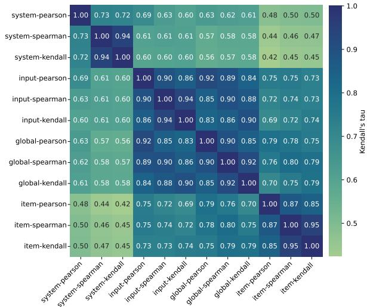  
Figure 1: The consistency of evaluation metric rankings using different correlation measures on SummEval, calculated through Kendall's correlation coefficient.

## 3 Meta-Evaluation Data

For more comprehensive and realistic analyses on correlation measures, we collect six widely used evaluation datasets, as well as the results of 32 common automatic evaluation metrics on them. Our subsequent experiments on three research questions are based on this large-scale real evaluation data.

## 3.1 Datasets

As shown in Table 1, we select and preprocess six common evaluation datasets from five typical NLG tasks: summarization, story generation, dialogue, data-to-text, and translation. Due to the large volume of WMT23 data, we only use news domain data from ZH2EN. Following convention (Guan et al., 2021; Mehri and Eskénazi, 2020), we split the original datasets according to subsets and aspects, resulting in a total of 30 meta-evaluation datasets. Since our primary focus is on analyzing the general characteristics of correlation measures across different scenarios rather than on specific datasets, we label these datasets as D1-D30 for brevity and will summarize their overall performance in subsequent experiments. More details and the correspondence are shown in Table 4.

<table><tr><td>Task</td><td>Name</td><td>#Subsets</td><td>#Aspects</td><td>#Systems</td><td>#Inputs</td></tr><tr><td>Summarization</td><td>SummEval (Fabbri et al., 2021)</td><td>1</td><td>4</td><td>16</td><td>100</td></tr><tr><td>Translation</td><td>WMT23-ZH2EN-NEWS (Freitag et al., 2023)</td><td>1</td><td>1</td><td>16</td><td>376</td></tr><tr><td>Story Generation</td><td>HANNA (Chhun et al., 2022)</td><td>1</td><td>6</td><td>6</td><td>60</td></tr><tr><td>Story Generation</td><td>MANS(Guan et al., 2021)</td><td>2</td><td>1</td><td>5</td><td>200</td></tr><tr><td>Dialogue</td><td>USR (Mehri and Eskénazi, 2020)</td><td>2</td><td>6</td><td>5</td><td>60</td></tr><tr><td>Data-to-text</td><td>WebNLG2020 (Castro Ferreira et al., 2020)</td><td>1</td><td>5</td><td>16</td><td>178</td></tr></table>

Table 1: Information and statistics of different evaluation datasets.

## 3.2 Automatic Evaluation Metrics

We select 14 common non-LLM evaluation metrics, including string-based BLEU (Papineni et al., 2002), ROUGE-(1,2,L)⁵ (Lin, 2004), CHRF (Popovic, 2015), and model-based BERTScore-(p,r,f1) (Zhang et al., 2020), MoverScore (Zhao et al., 2019), BARTScore-(s-h, r-h, h-r) (Yuan et al., 2021), BLEURT (Sellam et al., 2020), and COMET (Rei et al., 2020). For LLM-based evaluators, we employ 18 experimental settings to prompt proprietary LLMs to score outputs based on task descriptions and aspect definitions, resulting in 18 evaluation metrics: three different proprietary LLMs from OpenAI6 (gpt-3.5-turbo, gpt-4-turbo, gpt-4o); different prompting strategies of three evaluation scales (1-5, 1-10, 0-100); and two sampling settings (temperature T=0 and sampling once, temperature T=1 and sampling ten times with results averaged). In total, there are K = 32 automatic evaluation metrics, and more information including the detailed prompts and implementations are shown in Appendix B.

## 4 Analyses of Correlation Measures

To analyze and compare the meta-evaluation capabilities of different correlation measures, we consider three important perspectives: discriminative power, ranking consistency, and sensitivity to score granularity. In practice, correlation measures are mainly used to assess the performance of automatic evaluation metrics, with two core applications: comparing two metrics and ranking a set of metrics. For the former, the key lies in the discriminative power of the correlation measure, i.e., whether it can distinguish various metric pairs as effectively as possible. For the latter, the consistency of the correlation measure in ranking the same set of metrics is crucial, i.e., whether the ranking remains stable. In addition, recently emerging LLM-based evaluators feature a flexible and discrete scoring pattern similar to human evaluation, so the sensibility of correlation measures to varying levels of score granularity of the same metric should meet certain expectations. In the following subsections, we will design specific tests and conduct experimental analyses based on these three capability aspects to identify the characteristics of different correlation measures.

## 4.1 Discriminative Power

In the fields of information retrieval (Sakai, 2013) and recommendation systems (Anelli et al., 2019; Ashkan and Metzler, 2019; Valcarce et al., 2020), discriminative power is widely used to evaluate evaluation measures. Inspired by this, we adapted this method to evaluate correlation measures in NLG meta-evaluation.

Specifically, for a given correlation measure, a meta-evaluation dataset (including human scores Z), and the scores of K automatic evaluation metrics on it $\{ X _ { k } \} _ { k = 1 } ^ { K }$ , we obtain the two-sided pvalue for each pair of automatic evaluation metrics through hypothesis testing. The smaller the p-value, the more likely we are to reject the null hypothesis that there is no difference in the correlation values between the two metric scores with human scores. Thus, a highly discriminative correlation measure should yield many very small p-values. For convenience of comparison, similar to Valcarce et al. (2020), we define the DP value as the average of pvalues of all metric pairs, ranging from 0 to 1, with smaller values indicating stronger discriminative power of a correlation measure. Algorithm 1 shows the pseudocode for calculating the DP value. Regarding the hypothesis testing methods used here, we refer to previous work and employ the Perm-Both algorithm proposed by Deutsch et al. (2021)7. (Noreen, 1989). It is a non-parametric test method that Deutsch et al. (2021) have shown to have a higher power in summarization meta-evaluation. Figure 2 shows the DP values of correlation measures across all meta-evaluation datasets, and the overall performance and rankings are summarized in Table 2. The complete results are shown in Table 6 in the appendix.

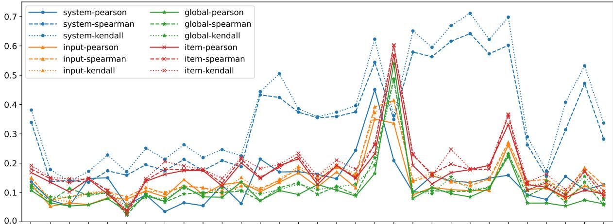  
OveralI D1 D2 D3 D4 D5 D6 D7 D8 D9 D10 D11 D12 D13 D14 D15 D16 D17 D18 D19 D20 D21 D22 D23 D24 D25 D26 D27 D28 D29 D30  
Figure 2: DP values of different correlation measures on all meta-evaluation datasets using the permutation test, the lower the better. Each column "Dn" shows the result on one dataset, which corresponds to the original dataset as shown in Table 4. The first column presents the overall performance with the averaged results of all datasets.

In addition to giving an overall value, we can also look more closely at the discriminative power of different correlation measures by p-values curves, presented in Figures 11-40 in the appendix. After obtaining the p-values for each pair of evaluation metrics, we sort them in descending order. With the number of evaluation metric pairs on the x-axis and the p-values on the y-axis, we can plot the p-value curves of different correlation measures on a meta-evaluation dataset. The closer the curve is to the coordinate axis, the stronger the discriminative power of the corresponding correlation measure. The DP value numerically equals the area enclosed by the p-value curve and the coordinate axis divided by the number of metric pairs.

Algorithm 1 Discriminative Power   
Input: X1, . . . , XK, Z ∈ RN×M , T ∈ N, C   
Output: DP value   
v ← 0   
n ← K × (K − 1)/2   
for i ∈ {1, . . . , K − 1} do   
for j ∈ {i + 1, . . . , K } do   
pij ← PERMUTATIONTEST(Xi, Xj, Z, T, C)   
v ← v + pij   
end for   
end for   
return v/n   
function PERMUTATIONTEST(X, Y, Z, T, C)   
q←0   
δ ← C(X, Z) − C(Y, Z)   
for T iterations do   
Xs, Ys ← empty N × M matrices   
for (i, j) ∈ {1, . . . , N} × {1, . . . , M } do   
if random Boolean is true then   
Xs[i, j] ← Y [i, j]   
Ys[i, j] ← X[i, j]   
else   
Xs[i, j] ← X [i, j]   
Ys[i, j] ← Y [i, j]   
end if   
end for   
δs ← C(Xs, Z) − C(Ys, Z)   
if |δs| > |δ| then   
q ← q + 1   
end if   
end for   
return q/T   
end function

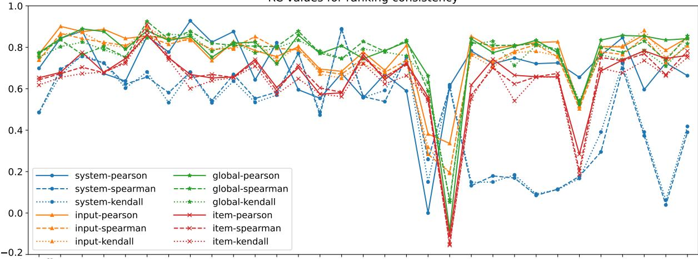  
OveralI D1 D2 D3 D4 D5 D6 D7 D8 D9 D10 D11 D12 D13 D14 D15 D16 D17 D18 D19 D20 D21 D22 D23 D24 D25 D26 D27 D28 D29 D30  
Figure 3: RC values of different correlation measures on all meta-evaluation datasets, the higher the better, with the representation of columns similar to Figure 2.

Takeaways The overall discriminative power of different correlation measures can be summarized and ranked based on different grouping methods and correlation coefficients as follows:

• Grouping: Global > Input > Item > System

• Correlation Coefficient: Pearson's r > Spearman's $\rho >$ Kendall's τ

Algorithm 2 Ranking Consistency   
Input: $X _ { 1 } , \dots , X _ { K } , Z \in \mathbb { R } ^ { N \times M } , T \in \mathbb { N } , C .$   
Output: RC value   
v ← 0   
for T iterations do   
$M _ { 1 } \gets \lfloor M / 2 \rfloor$   
$\underline { M } _ { 2 }  \breve { M } - \breve { \underline { 1 } } M / 2 \rfloor$   
D1 ← sample $\{ 1 , \ldots , M \}$ w/o repl. M1 times   
$D _ { 2 }  \{ 1 , \cdot . . , \mathsf { \tilde { M } } \} \setminus D _ { 1 }$   
$R _ { 1 } , R _ { 2 } { \mathrm { ~  ~ } }$ - empty K-dimensional arrays   
for $k \in \{ 1 , \ldots , \mathbf { \bar { K } } \}$ do   
$X _ { 1 } ^ { s } , \dot { Z } _ { 1 } ^ { s }$ ← empty $N \times M _ { 1 }$ matrices   
X 2, Z2 ← empty $N \times M _ { 2 }$ matrices   
for $i \in \{ 1 , \ldots , \hat { N } \}$ do   
for $j \in \{ 1 , \ldots , M _ { 1 } \}$ do   
$\ \bar { X } _ { 1 } ^ { s } [ i , j ]  X _ { k } [ i , D _ { 1 } [ j ] ]$   
$Z _ { 1 } ^ { \bar { s } } [ \dot { i } , \dot { j } ]  Z [ \dot { i } , \dot { D } _ { 1 } [ \dot { j } ] ] ^ { - }$   
end for   
for $j \in \{ 1 , \dots , M _ { 2 } \}$ do   
$\mathrm { \bar { \it { X } } } _ { 2 } ^ { s } [ i , j ]  \mathrm { \bar { \it { X } } } _ { k } [ i , D _ { 2 } [ j ] ]$   
$Z _ { 2 } ^ { s } [ \dot { i } , \dot { j } ]  Z [ \dot { i } , \dot { D } _ { 2 } [ j ] ] ^ { - }$   
end for   
end for   
$R _ { 1 } [ k ] \gets C ( X _ { 1 } ^ { s } , Z _ { 1 } ^ { s } )$   
$R _ { 2 } \hat { [ } k \hat { ] }  C \hat { ( } X _ { 2 } ^ { s } , Z _ { 2 } ^ { s } \hat { ) }$   
end for   
$\tau ^ { s }  \tau ( R _ { 1 } , R _ { 2 } )$   
$v  v + \tau ^ { s }$   
end for   
return v/T

## 4.2 Ranking Consistency

Inspired by the evaluation of different evaluation measures of ordinal classification (Sakai, 2021a) and information retrieval (Sakai, 2021b), for a given correlation measure, we randomly split the human scores and evaluation metric outputs in half, derive the rankings of the evaluation metrics on the two halves, and calculate the similarity of the two rankings using Kendall's τ as a measure of ranking consistency. We define the RC value as the mean results obtained from repeating this process T = 1000 times. Algorithm 2 presents the pseudocode for the calculation. Figure 3 and Table 2 shows the RC values of correlation measures across all meta-evaluation datasets, with the complete results presented in Table 7 in the appendix. According to Table 2, ranking consistency and discriminative power exhibit similar trends for correlation measures, meaning that correlation measures with high discriminative power generally also have high ranking consistency.

Takeaways The overall ranking consistency of different correlation measures can be summarized and ranked based on different grouping methods and correlation coefficients as follows:

• Grouping: Global > Input > Item > System

• Correlation Coefficient: Pearson's r > Spearman's ρ > Kendall's τ

## 4.3 Sensitivity to Score Granularity

We first introduce the concepts of evaluation scale and score granularity, which apply to both human evaluation and emerging LLM-based evaluators. In practice, human evaluation scores are not continuous values like traditional metrics (e.g., BLEU, BERTScore). Evaluators typically select a discrete value as the evaluation score based on the scale (also called range) required by the evaluation guidelines (e.g., 1-5, 0-100). This scale is referred to as the evaluation scale. On the other hand, multiple evaluators are often involved to enhance the reliability of the evaluation, and the final human score is the average of the scores from multiple evaluators, leading to more diverse values. The combination of the chosen evaluation scale and the number of evaluators determines the number of all possible final scores, which is called score granularity. This reflects the degree of discretization in the evaluation and potential ties in the scores. For example, SummEval uses a 5-point Likert scale for human evaluation, and each sample is evaluated by three annotators, resulting in 13 possible averaged scores. Here, the evaluation scale is 1-5, and the score granularity is 13.

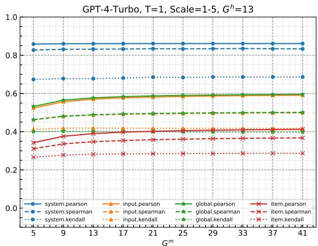

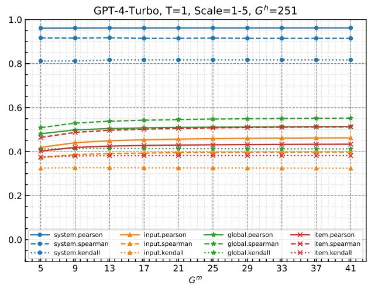  
Figure 4: As the changes of $G ^ { m }$ , the correlations between the GPT-4-Turbo evaluator and human evaluation using different measures on SummEval (left) and WMT23 (right) with the fixed evaluation scale of 1-5.

<table><tr><td>Grouping</td><td>Correlation</td><td>DP value ↓</td><td>RC value ↑</td></tr><tr><td>System</td><td>Pearson</td><td>0.136 (5)</td><td>0.698 (7)</td></tr><tr><td>System</td><td>Spearman</td><td>0.339 (11)</td><td>0.485 (12)</td></tr><tr><td>System</td><td>Kendall</td><td>0.381 (12)</td><td>0.486 (11)</td></tr><tr><td>Input</td><td>Pearson</td><td>0.128 (4)</td><td>0.768 (3)</td></tr><tr><td>Input</td><td>Spearman</td><td>0.150 (7)</td><td>0.738 (6)</td></tr><tr><td>Input</td><td>Kendall</td><td>0.149 (6)</td><td>0.739 (5)</td></tr><tr><td>Global</td><td>Pearson</td><td>0.107 (1)</td><td>0.774 (1)</td></tr><tr><td>Global</td><td>Spearman</td><td>0.118 (2)</td><td>0.770 (2)</td></tr><tr><td>Global</td><td>Kendall</td><td>0.125 (3)</td><td>0.753 (4)</td></tr><tr><td>Item</td><td>Pearson</td><td>0.168 (8)</td><td>0.653 (8)</td></tr><tr><td>Item</td><td>Spearman</td><td>0.180 (9)</td><td>0.643 (9)</td></tr><tr><td>Item</td><td>Kendall</td><td>0.192 (10)</td><td>0.618 (10)</td></tr></table>

Table 2: Overall performance and rankings (in brackets) of different correlation measures with the averaged results of all meta-evaluation datasets in terms of the discriminative power (DP) and ranking consistency (RC).

Moreover, LLMs with strong instructionfollowing capabilities like GPT-4 have been increasingly used in automatic evaluation, following the pattern of humans (Kocmi and Federmann, 2023; Chiang and Lee, 2023). Therefore, their output scores are also discrete, and they can simulate multiple evaluators through repeated sampling, which also involves the evaluation scale and score granularity. We have presented statistics for these two quantities in human scores and LLM-based metric scores across different datasets in Tables 4 and 5 in the appendix. The differences in evaluation scales primarily affect the difficulty of evaluation and the ability of the evaluators, which are not the focus of our study. For example, prompting GPT-4-Turbo with the scale of 1-5 or 1-10 is often seen as two distinct evaluation metrics that possess different capabilities. Our main focus, instead, is the impact of score granularity differences on different correlation measures when the evaluation scale and metric remain the same, which can be experimented on real-world data and statistical simulation. We denote the score granularity of humans and metrics as $G ^ { h }$ and $G ^ { m }$ , respectively, with the former depending on the datasets and the latter depending on the evaluation settings.

## 4.3.1 Real-world Data

We select two typical datasets from Table 1 for experiments: SummEval and WMT23, where their $G ^ { h }$ equals to 13 and 251, respectively. In addition, we use the three proprietary LLMs and two evaluation scales (1-5, 1-10) introduced in Section 3.2, with the temperature setting of $\mathrm { T } { = } 1$ . The number of multiple samplings varies from 1 to 10 to obtain results for different levels of metric score granularity $G ^ { m }$ . Figure 4 shows the consistency of GPT-4-Turbo with human evaluations under different correlation measures, with other results included in Figures 41-50 in the appendix. We believe that when the score granularity of the metric $G ^ { m }$ is no greater than that of human $G ^ { h }$ , the evaluation capability of the metric is limited, as fewer possible scores are available. Consequently, as $G ^ { m }$ increases until it equals $G ^ { h }$ , the consistency between the metric and human should increase. However, when $G ^ { m }$ exceeds $G ^ { h }$ , the situation becomes complex, and it is difficult to intuitively estimate the expected trend of the consistency, leaving for future explorations. The results illustrate that the measures using the system-level grouping or Kendall's τ are basically not affected by the score granularity, where the consistency almost remains unchanged not meeting expectations as mentioned above. The situation is generally similar for the two datasets with different LLM-based evaluators and different evaluation scales.

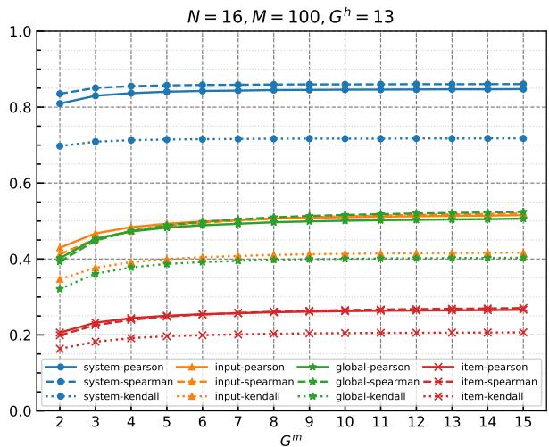  
Figure 5: As the changes of $G ^ { m }$ , the correlations between metrics and humans using different measures in statistical simulation with $G ^ { h }$ = 13.

## 4.3.2 Statistical Simulation

Although real-world datasets and evaluation metrics are more reliable for analysis compared to synthetic data, their scale of data is limited and some variables are less flexible to adjust. Therefore, we also employ the statistical simulation as an auxiliary method to observe whether similar conclusions can be drawn. Based on our collected datasets and certain hypotheses, we model the NLG meta-evaluation data and conduct experiments with parameters estimated from real data. The detailed process, including the sampling algorithm and experimental settings, is described in Appendix C. Figure 5, as well as Figure 51 in the appendix, show the results, which generally align with the observations obtained before.

Takeaways The influence of the score granularity on the measures using system-level grouping or Kendall correlation is the least among different grouping methods and correlation coefficients, which is not as expected. And as the score granularity of the metric increases, the consistency between metrics and humans under other correlation measures continuously increases.

## 5 Related Work

In the field of NLP, there is limited research analyzing correlation measures in NLG meta-evaluation. Mathur et al. (2020) found that the introduction of an outlier system can distort the system-level Pearson correlation between machine translation evaluation metrics and human evaluation and quantify the impact. Deutsch et al. (2022) proposed two different ways of calculating system-level correlations by changing the input sets or system pairs and showed they can lead to more precise estimates of metric performance in real-world scenarios. Recently, Deutsch et al. (2023) pointed out that the segmentlevel Kendall correlation coefficient, widely used in machine translation evaluation, does not handle ties in human scores and metric outputs as expected and thus needs to be calibrated. It is worth mentioning that Perrella et al. (2024) designed several sentinel metrics for machine translation meta-evaluation and showed that global-level grouping and systemlevel grouping may introduce unfairness.

In the research on automatic evaluation metrics, some works have commented on correlation measures based on experimental results when presenting the performance of different evaluation metrics. Owczarzak et al. (2012) found that, in the domain of summarization evaluation, system-level correlation is more robust to inconsistent human annotations. Freitag et al. (2022) discovered that systemlevel correlation is hard to distinguish between different machine translation evaluation metrics. Liu et al. (2023); Xu et al. (2023) explained some experimental results as the inappropriate handling of ties by the Kendall correlation when comparing the performance of different metrics. Additionally, Wei and Jia (2021) demonstrated the output scores of automatic evaluation metrics have less variance than human scores at system level.

In contrast, we focus on the properties and capabilities of typical correlation measures from generic NLG evaluation perspectives, not limited to specific tasks and evaluation metrics.

## 6 Conclusions

We analyze and compare the characteristics and capabilities of 12 typical correlation measures in NLG meta-evaluation through three proposed perspectives. Based on various experiments with largescale real-word data from six NLG datasets and 32 evaluation metrics, we find measures using globallevel grouping and Pearson correlation have better overall meta-evaluation capability, while those using system-level and Kendall correlation show the opposite. And they have all been used on some common evaluation datasets. We hope that our work can deepen the understanding of correlation measures and draw more attention and emphasis on related research in the future.

## Limitations

We mainly analyzed the capabilities of correlation measures through empirical experiments without conducting theoretical analysis. Besides, although our experiments have covered many common and typical evaluation datasets to provide as general analyses as possible, it is impossible to encompass all tasks and evaluation aspects in NLG. Therefore, the conclusions we obtained about the metaevaluation capability of different correlation measures may be limited to a certain context. Additionally, our work requires quite a few resources, including the API cost of using proprietary LLMs to annotate data and high-performance computation for conducting large-scale empirical evaluations and statistical simulations, which could be improved in the future.

## Acknowledgments

This work was supported by Beijing Science and Technology Program (Z231100007423011) and Key Laboratory of Science, Technology and Standard in Press Industry (Key Laboratory of Intelligent Press Media Technology). We appreciate the

anonymous reviewers for their helpful comments.   
Xiaojun Wan is the corresponding author.

## References

Vito Walter Anelli, Tommaso Di Noia, Eugenio Di Sciascio, Claudio Pomo, and Azzurra Ragone. 2019. On the discriminative power of hyper-parameters in cross-validation and how to choose them. In Proceedings of the 13th ACM Conference on Recommender Systems, RecSys 2019, Copenhagen, Denmark, September 16-20, 2019, pages 447–451. ACM.

Azin Ashkan and Donald Metzler. 2019. Revisiting online personal search metrics with the user in mind. In Proceedings of the 42nd International ACM SIGIR Conference on Research and Development in Information Retrieval, SIGIR 2019, Paris, France, July 21-25, 2019, pages 625–634. ACM.

Manik Bhandari, Pranav Narayan Gour, Atabak Ashfaq, Pengfei Liu, and Graham Neubig. 2020. Reevaluating evaluation in text summarization. In Proceedings of the 2020 Conference on Empirical Methods in Natural Language Processing, EMNLP 2020, Online, November 16-20, 2020, pages 9347–9359. Association for Computational Linguistics.

Thiago Castro Ferreira, Claire Gardent, Nikolai Ilinykh, Chris van der Lee, Simon Mille, Diego Moussallem, and Anastasia Shimorina, editors. 2020. Proceedings of the 3rd International Workshop on Natural Language Generation from the Semantic Web (WebNLG+). Association for Computational Linguistics, Dublin, Ireland (Virtual).

Cyril Chhun, Pierre Colombo, Fabian M. Suchanek, and Chloé Clavel. 2022. Of human criteria and automatic metrics: A benchmark of the evaluation of story generation. In Proceedings of the 29th International Conference on Computational Linguistics, COLING 2022, Gyeongju, Republic of Korea, October 12-17, 2022, pages 5794–5836. International Committee on Computational Linguistics.

David Cheng-Han Chiang and Hung-yi Lee. 2023. Can large language models be an alternative to human evaluations? In Proceedings of the 61st Annual Meeting of the Association for Computational Linguistics (Volume 1: Long Papers), ACL 2023, Toronto, Canada, July 9-14, 2023, pages 15607–15631. Association for Computational Linguistics.

Daniel Deutsch, Rotem Dror, and Dan Roth. 2021. A statistical analysis of summarization evaluation metrics using resampling methods. Trans. Assoc. Comput. Linguistics, 9:1132–1146.

Daniel Deutsch, Rotem Dror, and Dan Roth. 2022. Reexamining system-level correlations of automatic summarization evaluation metrics. In Proceedings of the 2022 Conference of the North American Chapter of the Association for Computational Linguistics: Human Language Technologies, NAACL 2022, Seattle,

WA, United States, July 10-15, 2022, pages 6038– 6052. Association for Computational Linguistics.

Daniel Deutsch, George F. Foster, and Markus Freitag. 2023. Ties matter: Meta-evaluating modern metrics with pairwise accuracy and tie calibration. In Proceedings of the 2023 Conference on Empirical Methods in Natural Language Processing, EMNLP 2023, Singapore, December 6-10, 2023, pages 12914– 12929. Association for Computational Linguistics.

Abhimanyu Dubey, Abhinav Jauhri, Abhinav Pandey, Abhishek Kadian, Ahmad Al-Dahle, Aiesha Letman, Akhil Mathur, Alan Schelten, Amy Yang, Angela Fan, et al. 2024. The llama 3 herd of models. arXiv preprint arXiv:2407.21783.

Alexander R. Fabbri, Wojciech Kryscinski, Bryan McCann, Caiming Xiong, Richard Socher, and Dragomir R. Radev. 2021. Summeval: Re-evaluating summarization evaluation. Trans. Assoc. Comput. Linguistics, 9:391–409.

Markus Freitag, George Foster, David Grangier, Viresh Ratnakar, Qijun Tan, and Wolfgang Macherey. 2021a. Experts, errors, and context: A large-scale study of human evaluation for machine translation. Preprint, arXiv:2104.14478.

Markus Freitag, Nitika Mathur, Chi-kiu Lo, Eleftherios Avramidis, Ricardo Rei, Brian Thompson, Tom Kocmi, Frédéric Blain, Daniel Deutsch, Craig Stewart, Chrysoula Zerva, Sheila Castilho, Alon Lavie, and George F. Foster. 2023. Results of WMT23 metrics shared task: Metrics might be guilty but references are not innocent. In Proceedings of the Eighth Conference on Machine Translation, WMT 2023, Singapore, December 6-7, 2023, pages 578–628. Association for Computational Linguistics.

Markus Freitag, Ricardo Rei, Nitika Mathur, Chi-kiu Lo, Craig Stewart, Eleftherios Avramidis, Tom Kocmi, George F. Foster, Alon Lavie, and André F. T. Martins. 2022. Results of WMT22 metrics shared task: Stop using BLEU - neural metrics are better and more robust. In Proceedings of the Seventh Conference on Machine Translation, WMT 2022, Abu Dhabi, United Arab Emirates (Hybrid), December 7-8, 2022, pages 46–68. Association for Computational Linguistics.

Markus Freitag, Ricardo Rei, Nitika Mathur, Chi-kiu Lo, Craig Stewart, George F. Foster, Alon Lavie, and Ondrej Bojar. 2021b. Results of the WMT21 metrics shared task: Evaluating metrics with expert-based human evaluations on TED and news domain. In Proceedings of the Sixth Conference on Machine Translation, WMT@EMNLP 2021, Online Event, November 10-11, 2021, pages 733–774. Association for Computational Linguistics.

Jian Guan, Zhexin Zhang, Zhuoer Feng, Zitao Liu, Wenbiao Ding, Xiaoxi Mao, Changjie Fan, and Minlie Huang. 2021. Openmeva: A benchmark for evaluating open-ended story generation metrics. In Proceedings of the 59th Annual Meeting of the Association for

Computational Linguistics and the 11th International Joint Conference on Natural Language Processing, ACL/IJCNLP 2021, (Volume 1: Long Papers), Virtual Event, August 1-6, 2021, pages 6394–6407. Association for Computational Linguistics.

Xinyu Hu, Li Lin, Mingqi Gao, Xunjian Yin, and Xiaojun Wan. 2024. Themis: Towards flexible and interpretable NLG evaluation. CoRR, abs/2406.18365.

Dongfu Jiang, Yishan Li, Ge Zhang, Wenhao Huang, Bill Yuchen Lin, and Wenhu Chen. 2023. Tigerscore: Towards building explainable metric for all text generation tasks. CoRR, abs/2310.00752.

M. G. KENDALL. 1945. The treatment of ties in ranking problems. Biometrika, 33(3):239–251.

Tom Kocmi and Christian Federmann. 2023. Large language models are state-of-the-art evaluators of translation quality. In Proceedings of the 24th Annual Conference of the European Association for Machine Translation, EAMT 2023, Tampere, Finland, 12-15 June 2023, pages 193–203. European Association for Machine Translation.

Junlong Li, Shichao Sun, Weizhe Yuan, Run-Ze Fan, Hai Zhao, and Pengfei Liu. 2023. Generative judge for evaluating alignment. CoRR, abs/2310.05470.

Chin-Yew Lin. 2004. ROUGE: A package for automatic evaluation of summaries. In Text Summarization Branches Out, pages 74–81, Barcelona, Spain. Association for Computational Linguistics.

Yang Liu, Dan Iter, Yichong Xu, Shuohang Wang, Ruochen Xu, and Chenguang Zhu. 2023. G-eval: NLG evaluation using gpt-4 with better human alignment. In Proceedings of the 2023 Conference on Empirical Methods in Natural Language Processing, EMNLP 2023, Singapore, December 6-10, 2023, pages 2511–2522. Association for Computational Linguistics.

Nitika Mathur, Timothy Baldwin, and Trevor Cohn. 2020. Tangled up in BLEU: reevaluating the evaluation of automatic machine translation evaluation metrics. In Proceedings of the 58th Annual Meeting of the Association for Computational Linguistics, ACL 2020, Online, July 5-10, 2020, pages 4984–4997. Association for Computational Linguistics.

Shikib Mehri and Maxine Eskénazi. 2020. USR: an unsupervised and reference free evaluation metric for dialog generation. In Proceedings of the 58th Annual Meeting of the Association for Computational Linguistics, ACL 2020, Online, July 5-10, 2020, pages 681–707. Association for Computational Linguistics.

Eric W Noreen. 1989. Computer intensive methods for hypothesis testing: An introduction. Wiley, New York, 19:21.

Takahiro Onoshima, Kenpei Shiina, Takashi Ueda, and Saori Kubo. 2019. Decline of pearson'sr with categorization of variables: a large-scale simulation. Behaviormetrika, 46:389–399.

Karolina Owczarzak, Peter A. Rankel, Hoa Trang Dang, and John M. Conroy. 2012. Assessing the effect of inconsistent assessors on summarization evaluation. In The 50th Annual Meeting of the Association for Computational Linguistics, Proceedings of the Conference, July 8-14, 2012, Jeju Island, Korea - Volume 2: Short Papers, pages 359–362. The Association for Computer Linguistics.

Kishore Papineni, Salim Roukos, Todd Ward, and Wei-Jing Zhu. 2002. Bleu: a method for automatic evaluation of machine translation. In Proceedings of the 40th Annual Meeting of the Association for Computational Linguistics, July 6-12, 2002, Philadelphia, PA, USA, pages 311–318. ACL.

Stefano Perrella, Lorenzo Proietti, Alessandro Scirè, Edoardo Barba, and Roberto Navigli. 2024. Guardians of the machine translation metaevaluation: Sentinel metrics fall in! In Proceedings of the 62nd Annual Meeting of the Association for Computational Linguistics (Volume 1: Long Papers), pages 16216–16244, Bangkok, Thailand. Association for Computational Linguistics.

Maja Popovic. 2015. chrf: character n-gram f-score for automatic MT evaluation. In Proceedings of the Tenth Workshop on Statistical Machine Translation, WMT@EMNLP 2015, 17-18 September 2015, Lisbon, Portugal, pages 392–395. The Association for Computer Linguistics.

Ricardo Rei, Craig Stewart, Ana C. Farinha, and Alon Lavie. 2020. COMET: A neural framework for MT evaluation. In Proceedings of the 2020 Conference on Empirical Methods in Natural Language Processing, EMNLP 2020, Online, November 16-20, 2020, pages 2685–2702. Association for Computational Linguistics.

Tetsuya Sakai. 2013. Metrics, statistics, tests. In Bridging Between Information Retrieval and Databases - PROMISE Winter School 2013, Bressanone, Italy, February 4-8, 2013. Revised Tutorial Lectures, volume 8173 of Lecture Notes in Computer Science, pages 116–163. Springer.

Tetsuya Sakai. 2021a. Evaluating evaluation measures for ordinal classification and ordinal quantification. In Proceedings of the 59th Annual Meeting of the Association for Computational Linguistics and the 11th International Joint Conference on Natural Language Processing, ACL/IJCNLP 2021, (Volume 1: Long Papers), Virtual Event, August 1-6, 2021, pages 2759–2769. Association for Computational Linguistics.

Tetsuya Sakai. 2021b. On the instability of diminishing return IR measures. In Advances in Information Retrieval - 43rd European Conference on IR Research ECIR 2021, Virtual Event, March 28 - April 1, 2021, Proceedings, Part I, volume 12656 of Lecture Notes in Computer Science, pages 572–586. Springer.

Thibault Sellam, Dipanjan Das, and Ankur P. Parikh. 2020. BLEURT: learning robust metrics for text

generation. In Proceedings of the 58th Annual Meeting of the Association for Computational Linguistics, ACL 2020, Online, July 5-10, 2020, pages 7881–7892. Association for Computational Linguistics.

Chenhui Shen, Liying Cheng, Xuan-Phi Nguyen, Yang You, and Lidong Bing. 2023. Large language models are not yet human-level evaluators for abstractive summarization. In Findings of the Association for Computational Linguistics: EMNLP 2023, Singapore, December 6-10, 2023, pages 4215–4233. Association for Computational Linguistics.

C. Spearman. 1904. The proof and measurement of association between two things. The American Journal of Psychology, 15(1):72–101.

Daniel Valcarce, Alejandro Bellogín, Javier Parapar, and Pablo Castells. 2020. Assessing ranking metrics in top-n recommendation. Inf. Retr. J., 23(4):411–448.

Yaqing Wang, Jiepu Jiang, Mingyang Zhang, Cheng Li, Yi Liang, Qiaozhu Mei, and Michael Bendersky. 2023. Automated evaluation of personalized text generation using large language models. CoRR, abs/2310.11593.

Johnny Tian-Zheng Wei and Robin Jia. 2021. The statistical advantage of automatic NLG metrics at the system level. In Proceedings of the 59th Annual Meeting of the Association for Computational Linguistics and the 11th International Joint Conference on Natural Language Processing, ACL/IJCNLP 2021, (Volume 1: Long Papers), Virtual Event, August 1-6, 2021, pages 6840–6854. Association for Computational Linguistics.

Wenda Xu, Danqing Wang, Liangming Pan, Zhenqiao Song, Markus Freitag, William Wang, and Lei Li. 2023. INSTRUCTSCORE: towards explainable text generation evaluation with automatic feedback. In Proceedings of the 2023 Conference on Empirical Methods in Natural Language Processing, EMNLP 2023, Singapore, December 6-10, 2023, pages 5967– 5994. Association for Computational Linguistics.

Weizhe Yuan, Graham Neubig, and Pengfei Liu. 2021. Bartscore: Evaluating generated text as text generation. In Advances in Neural Information Processing Systems 34: Annual Conference on Neural Information Processing Systems 2021, NeurIPS 2021, December 6-14, 2021, virtual, pages 27263–27277.

Tianyi Zhang, Varsha Kishore, Felix Wu, Kilian Q. Weinberger, and Yoav Artzi. 2020. Bertscore: Evaluating text generation with BERT. In 8th International Conference on Learning Representations, ICLR 2020, Addis Ababa, Ethiopia, April 26-30, 2020. OpenReview.net.

Wei Zhao, Maxime Peyrard, Fei Liu, Yang Gao, Christian M. Meyer, and Steffen Eger. 2019. Moverscore: Text generation evaluating with contextualized embeddings and earth mover distance. In Proceedings of the 2019 Conference on Empirical Methods in

Natural Language Processing and the 9th International Joint Conference on Natural Language Processing, EMNLP-IJCNLP 2019, Hong Kong, China, November 3-7, 2019, pages 563–578. Association for Computational Linguistics.

## A Definitions of Pearson's r, Spearman's $\rho ,$ and Kendall's τ

Pearson correlation coefficient measures the linear relationship between two variables. The formula is:

$$
r ( x , y ) = \frac { \sum _ { i = 1 } ^ { N } ( x _ { i } - \bar { x } ) ( y _ { i } - \bar { y } ) } { \sqrt { \sum _ { i = 1 } ^ { N } ( x _ { i } - \bar { x } ) ^ { 2 } \sum _ { i = 1 } ^ { N } ( y _ { i } - \bar { y } ) ^ { 2 } } }
$$

Where x and y are n-dimensional vectors, and $x _ { i }$ and $y _ { i }$ are the elements of x and $\textstyle y . { \bar { x } } = \sum _ { i = 1 } ^ { n } x _ { i }$ and $\textstyle { \bar { y } } = \sum _ { i = 1 } ^ { n } y _ { i }$

Spearman correlation coefficient (Spearman, 1904) measures the rank-order correlation between two variables. The formula is:

$$
\rho ( x , y ) = 1 - \frac { 6 \sum _ { i = 1 } ^ { n } d _ { i } ^ { 2 } } { n ( n ^ { 2 } - 1 ) }
$$

Where $d _ { i } = \operatorname { r a n k } ( x _ { i } ) - \operatorname { r a n k } ( y _ { i } )$ is the difference between the ranks of corresponding values in the two vectors.

Kendall correlation coefficient (KENDALL, 1945) measures the ordinal association between two variables. It considers concordant and discordant pairs, with $\tau _ { b }$ adjusted for ties. The formula is:

$$
\tau _ { b } ( x , y ) = \frac { C - D } { \sqrt { ( C + D + T _ { x } ) ( C + D + T _ { y } ) } }
$$

Where $C$ is the number of concordant pairs, i.e. pairs of elements (i, j) where $( x _ { i } > x _ { j } \land y _ { i } >$ $y _ { j } ) \vee ( x _ { i } < x _ { j } \wedge y _ { i } < y _ { j } )$ . D is the number of discordant pairs, i.e. pairs of elements $( i , j )$ where $( x _ { i } > x _ { j } \land y _ { i } < y _ { j } ) \lor ( x _ { i } < x _ { j } \land y _ { i } > y _ { j } ) . \ T _ { x }$ and $T _ { y }$ are the number of tied values in x and $y ,$ respectively.

## B Details of Selected Evaluation Metrics

## B.1 Non-LLM evaluation metrics

For CHRF and BLEU, we use the implementation of TorchMetrics8. For ROUGE, BERTSCORE, and BLEURT, we use the evaluation package of Huggingface with the default parameters. For MoverScore9, BARTScore10, and COMET11, we use the code from the original GitHub repositories and the default models. We check the licenses of all open source programs to ensure that our use is compliant.

## B.2 Evaluation Prompts for LLMs

We used the same prompts to instruct GPT-3.5, GPT-4, and GPT-4o for NLG evaluation. To save space, we present a template of our prompt in Table 3. We filled the aspect part of the prompt with definitions from original datasets. When the original dataset lacked these definitions, we composed them based on our understanding.

## B.3 Reasons not to use non-proprietary LLMs

We originally intended to include some opensource LLMs (e.g., Llama 3 (Dubey et al., 2024)). However, we found that their adherence to "evaluation instructions" was not strong enough, often resulting in non-compliant responses. We also considered including some fine-tuned LLM evaluators (e.g., Themis (Hu et al., 2024)). However, their limitations due to fine-tuning settings prevented us from requiring them to score with different evaluation scales via prompts. Therefore, we finally only chose proprietary LLMs in our experiments.

## C Process of Statistical Simulation

Based on the real-world data and some hypotheses, we first establish a probabilistic model for NLG meta-evaluation and then obtain results through the proposed algorithm and repeated sampling.

## C.1 Modeling NLG Meta-Evaluation

We posit that the capability of an evaluation metric is primarily reflected in two aspects: the ability to evaluate the overall level of different systems and the ability to evaluate different output texts from a given system. In practice, system-level correlation can estimate the former, while itemlevel correlation can estimate the latter. Therefore, we treat these two quantities as the control parameters during modeling. We assume that the scores of the evaluation metric and human evaluation here are continuous, and for a system $s _ { i } .$ those of outputs it generates for various inputs follow a bivariate normal distribution: $x _ { i j } , z _ { i j } \sim$ $\mathcal { N } ( \mu _ { i } ^ { m } , \mu _ { i } ^ { h } , \sigma _ { i } ^ { m } , \sigma _ { i } ^ { h } , \rho _ { i } )$ , where $\rho _ { i } ^ { 1 2 }$ controls the correlation between metrics and humans within a single system. Based on our observations and those of (Shen et al., 2023), this correlation varies across different systems for most evaluation metrics. For simplicity, we assume $\rho _ { i }$ follows a truncated normal distribution: $\rho _ { i } \sim \mathcal N ( \mu _ { \rho _ { i t e m } } , \sigma _ { \rho _ { i t e m } } )$ Since item-level correlation is defined as the mean correlation coefficient across different systems, its value in existing datasets can be viewed as an estimate of $\mu _ { \rho _ { i t e m } }$ Furthermore, assuming $\mu _ { i } ^ { m }$ and $\mu _ { i } ^ { h }$ of the above bivariate normal distribution follow another bivariate normal distribution: $\mu _ { i } ^ { m } , \mu _ { i } ^ { h } \sim \mathcal { N } ( \mu ^ { m } , \mu ^ { h } , \sigma ^ { m } , \sigma ^ { h } , \rho _ { s y s } )$ , where $\rho _ { s y s }$ controls the correlation between $\mu _ { i } ^ { m }$ and $\mu _ { i } ^ { h }$ . And similarly, system-level correlation in real-world scenario can be seen as an estimate of $\rho _ { s y s }$ because $\begin{array} { r } { \frac { 1 } { M } \sum _ { j = 1 } ^ { M } x _ { i j } } \end{array}$ and $\begin{array} { r } { \frac { 1 } { M } \sum _ { j = 1 } ^ { M } z _ { i j } } \end{array}$ in the definition of system-level correlation are viewed as estimates of $\mu _ { i } ^ { m }$ and $\mu _ { i } ^ { h }$

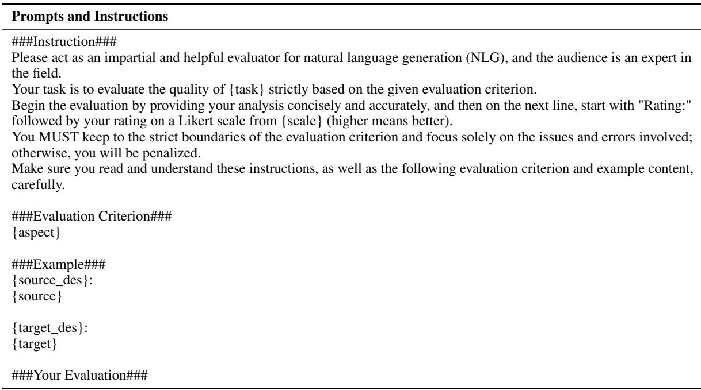  
Table 3: Prompts and instructions used for LLMs to evaluate and annotate NLG tasks.

$U ( \mu ^ { m } - \sigma ^ { m } , \mu ^ { m } + \sigma ^ { m } )$ and $U ( \mu ^ { h } - \sigma ^ { h } , \mu ^ { h } + \sigma ^ { h } )$ to discretize them. The Algorithm 3 shows the pseudocode for the entire sampling process.

Although the assumption of continuous scores makes it convenient to model and sample data, we need to analyze the impact of score granularity, which requires further data discretization. We then follow the practice of Onoshima et al. (2019) that has a similar situation to sample $G ^ { h } - 1$ and $G ^ { m } - 1$ thresholds from uniform distributions

```latex
Algorithm 3 Statistical Simulation
Input: $\mu _ { \hphantom { } , \hphantom { } , \mu } ^ { m } \mu _ { \hphantom { } , \sigma } ^ { h } , \sigma _ { \hphantom { } , \sigma } ^ { h } , \sigma _ { i } ^ { m } , \hdots , \sigma _ { N } ^ { m } , \sigma _ { 1 } ^ { h } , \hdots , \sigma _ { N } ^ { h } \in \mathbb { R } , N ,$
M, $G ^ { m } , G ^ { h } , T _ { 1 } , T _ { 2 } \in \mathbb { N } , \rho _ { s y s } , \mu _ { \rho _ { i t e m } } , \sigma _ { \rho _ { i t e m } } , C .$
Output: Correlation coefficient
R ← an empty list
for T1 iterations do
$X ^ { s } , Z ^ { s } \gets$ empty $N \times M$ matrices
for $i \in \{ 1 , \ldots , N \}$ do
sample $\mu _ { i } ^ { m } , \mu _ { i } ^ { h } \sim \mathcal { N } ( \mu ^ { m } , \mu ^ { h } , \sigma ^ { m } , \sigma ^ { h } , \rho _ { s y s } )$
sample $\rho _ { \mathscr { i } } \sim \mathcal { N } ( \mu _ { \rho _ { \mathscr { i } t e m } } , \sigma _ { \rho _ { i t e m } } )$
for $\bar { j } \in \{ 1 , \ldots , \bar { M } \}$ do
sample $x _ { i j } , z _ { i j } \sim \mathcal { N } ( \mu _ { i } ^ { m } , \mu _ { i } ^ { h } , \sigma _ { i } ^ { m } , \sigma _ { i } ^ { h } , \rho _ { i } )$
$X ^ { s } [ \dot { i } , j ] \dot {  } x _ { i j }$
$Z ^ { s } \bar { [ i , j ] }  z _ { i j }$
end for
end for
for $T _ { 2 }$ iterations do
sample $\{ t _ { n } ^ { m } \} _ { n = 1 } ^ { G ^ { m } - 1 } \sim U ( \mu ^ { m } - \sigma ^ { m } , \mu ^ { m } + \sigma ^ { m } )$
sample $\{ t _ { n } ^ { h } \} _ { n = 1 } ^ { G ^ { h } - 1 } \sim U ( \mu ^ { h } - \sigma ^ { h } , \mu ^ { h } + \sigma ^ { h } )$
$X ^ { s } \gets \mathrm { { D I S C R E T I Z E } } ( X ^ { s } , \{ t _ { n } ^ { m } \} _ { n = 1 } ^ { G ^ { m } - 1 } )$
$Z ^ { s } \gets \mathrm { D I S C R E T I Z E } ( Z ^ { s } , \{ t _ { n } ^ { h } \} _ { n = 1 } ^ { G ^ { h } - 1 } )$
$C ^ { s } \gets C ( X ^ { s } , Z ^ { s } )$
Add $C ^ { s }$ to R
end for
end for
return $\operatorname { A V G } ( R )$
function DISCRETIZE $( X , \{ t _ { n } \} _ { n = 1 } ^ { G } )$
$Y \gets$ zero $N \times M$ matrix
for $( i , j ) \in \{ 1 , \dots , N \} \times \{ 1 , \dots , M \}$ do
for $k \in \{ 1 , \ldots , G \}$ do
if $X [ i , j ] \le t _ { k }$ then
$\dot { Y } [ i , \dot { j } ] \gets k$
BREAK
end if
end for
if $Y [ i , j ]$ is 0 then
$\dot { Y } [ i , \dot { \jmath } ] \gets G + 1$
end if
end for
return $Y$
end function
```

## C.2 Experimental Settings

For the data collected in Section 3, all evaluation scores from humans and metrics are normalized to the 0-1 scale for parameter estimation, with results shown in Tables 4 and 5. We used the data where GPT-4-turbo is used as the evaluation metrics to estimate the parameters and the values are averaged across different meta-evaluation sets: $\mu ^ { m } = \mu _ { 1 } ^ { m } =$ $\therefore \cdot \cdot = \mu _ { N } ^ { m } = 0 . 4 7 , \mu ^ { h } = \mu _ { 1 } ^ { h } = \cdot \cdot \cdot = \mu _ { N } ^ { h } = 0 . 6 5 .$ $\sigma ^ { m } = \sigma _ { 1 } ^ { m } = \cdot \cdot \cdot = \sigma _ { N } ^ { m } = 0 . 1 6 , \sigma ^ { h } = \sigma _ { 1 } ^ { h } =$ $\therefore \cdot \cdot = \sigma _ { N } ^ { h } = 0 . 1 4 , \sigma _ { \rho _ { i t e m } } = 0 . 1 4 , \rho _ { s y s } = 0 . 9 2$ and $\mu _ { \rho _ { i t e m } } = 0 . 3 5$ . For the number of systems and input documents, we consider $N = 1 6 , M = 1 0 0$ which is typical and the same as SummEval. The corresponding $G ^ { h }$ is set to two common values: 13 and 250, and $G ^ { m }$ is selected from 2 to 15 and 5 to 100, respectively. Due to the huge amount of computation, we set $T _ { 1 } = T _ { 2 } = 1 0 0$

## D Other Figures and Tables

Given the limited space of the main text, we present the complete experimental results here.

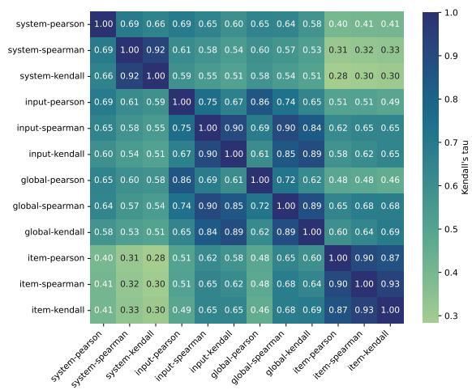  
Figure 6: The consistency of evaluation metric rankings using different correlation measures on HANNA, calculated through Kendall's correlation coefficient.

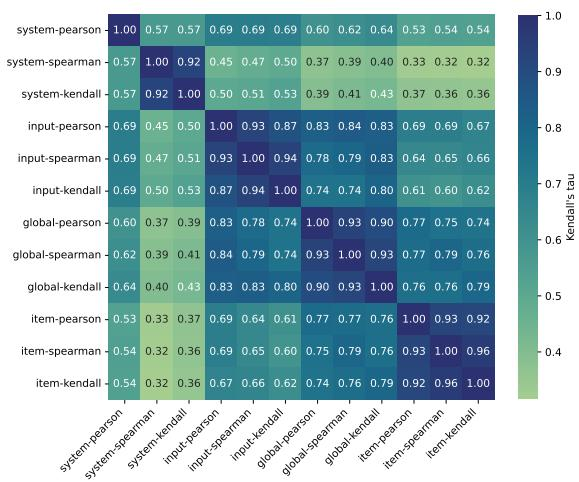  
Figure 7: The consistency of evaluation metric rankings using different correlation measures on MANS, calculated through Kendall's correlation coefficient.

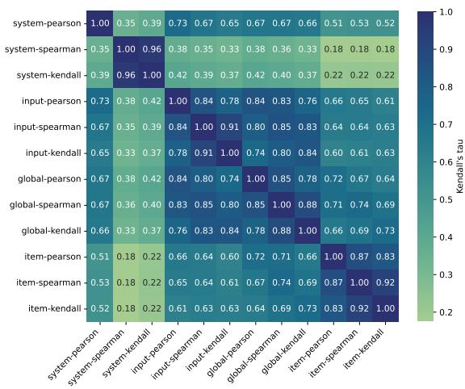

Figure 8: The consistency of evaluation metric rankings using different correlation measures on USR, calculated through Kendall's correlation coefficient.  
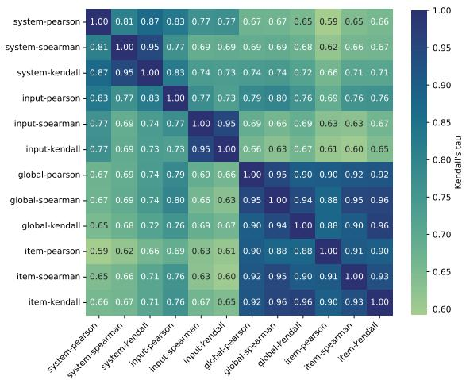

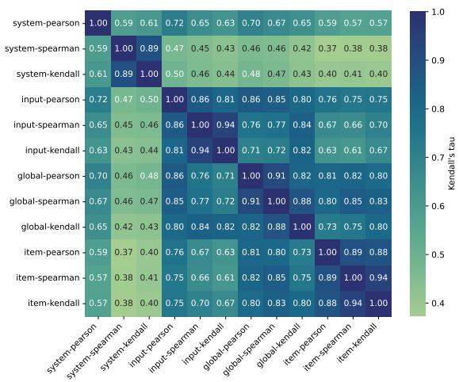  
Figure 9: The consistency of evaluation metric rankings using different correlation measures on WebNLG2020, calculated through Kendall's correlation coefficient.  
Figure 10: The consistency of evaluation metric rankings using different correlation measures on WMT23- ZH2EN-NEWS, calculated through Kendall's correlation coefficient.

<table><tr><td>Dataset</td><td>Subset</td><td>Aspect</td><td>Label</td><td> $\widehat { \mu ^ { h } }$ </td><td> $\widehat { \sigma ^ { h } }$ </td><td> $G ^ { h }$ </td><td>Scale</td><td>Tie Ratio</td></tr><tr><td>SummEval</td><td>CNN/DM</td><td>Coherence</td><td>D1</td><td>0.60</td><td>0.15</td><td>13</td><td>1-5</td><td>0.10</td></tr><tr><td>SummEval</td><td>CNN/DM</td><td>Consistency</td><td>D2</td><td>0.92</td><td>0.14</td><td>13</td><td>1-5</td><td>0.67</td></tr><tr><td>SummEval</td><td>CNN/DM</td><td>Fluency</td><td>D3</td><td>0.92</td><td>0.09</td><td>13</td><td>1-5</td><td>0.53</td></tr><tr><td>SummEval</td><td>CNN/DM</td><td>Relevance</td><td>D4</td><td>0.69</td><td>0.09</td><td>13</td><td>1-5</td><td>0.13</td></tr><tr><td>WMT23</td><td>GeneralMT2023_NEWS</td><td>Overall Quality</td><td>D5</td><td>0.84</td><td>0.05</td><td>251</td><td>0-250</td><td>0.11</td></tr><tr><td>HANNA</td><td>WP</td><td>Coherence</td><td>D6</td><td>0.54</td><td>0.13</td><td>13</td><td>1-5</td><td>0.13</td></tr><tr><td>HANNA</td><td>WP</td><td>Complexity</td><td>D7</td><td>0.36</td><td>0.14</td><td>13</td><td>1-5</td><td>0.12</td></tr><tr><td>HANNA</td><td>WP</td><td>Empathy</td><td>D8</td><td>0.32</td><td>0.09</td><td>13</td><td>1-5</td><td>0.13</td></tr><tr><td>HANNA</td><td>WP</td><td>Engagement</td><td>D9</td><td>0.42</td><td>0.13</td><td>13</td><td>1-5</td><td>0.12</td></tr><tr><td>HANNA</td><td>WP</td><td>Relevance</td><td>D10</td><td>0.41</td><td>0.14</td><td>13</td><td>1-5</td><td>0.10</td></tr><tr><td>HANNA</td><td>WP</td><td>Surprise</td><td>D11</td><td>0.28</td><td>0.10</td><td>13</td><td>1-5</td><td>0.15</td></tr><tr><td>MANS</td><td>ROC</td><td>Overall</td><td>D12</td><td>0.38</td><td>0.15</td><td>21</td><td>1-3</td><td>0.06</td></tr><tr><td>MANS</td><td>WP</td><td>Overall</td><td>D13</td><td>0.45</td><td>0.08</td><td>21</td><td>1-3</td><td>0.08</td></tr><tr><td>USR</td><td>Persona-Chat</td><td>Engaging</td><td>D14</td><td>0.76</td><td>0.13</td><td>7</td><td>1-3</td><td>0.24</td></tr><tr><td>USR</td><td>Persona-Chat</td><td>Maintains Context</td><td>D15</td><td>0.74</td><td>0.19</td><td>7</td><td>1-3</td><td>0.31</td></tr><tr><td>USR</td><td>Persona-Chat</td><td>Natural</td><td>D16</td><td>0.89</td><td>0.08</td><td>7</td><td>1-3</td><td>0.48</td></tr><tr><td>USR</td><td>Persona-Chat</td><td>Overall</td><td>D17</td><td>0.69</td><td>0.19</td><td>13</td><td>1-5</td><td>0.11</td></tr><tr><td>USR</td><td>Persona-Chat</td><td>Understandable</td><td>D18</td><td>0.96</td><td>0.04</td><td>4</td><td>0-1</td><td>0.84</td></tr><tr><td>USR</td><td>Persona-Chat</td><td>Uses Knowledge</td><td>D19</td><td>0.45</td><td>0.35</td><td>4</td><td>0-1</td><td>0.38</td></tr><tr><td>USR</td><td>Topical-Chat</td><td>Engaging</td><td>D20</td><td>0.57</td><td>0.25</td><td>7</td><td>1-3</td><td>0.15</td></tr><tr><td>USR</td><td>Topical-Chat</td><td>Maintains Context</td><td>D21</td><td>0.62</td><td>0.23</td><td>7</td><td>1-3</td><td>0.17</td></tr><tr><td>USR</td><td>Topical-Chat</td><td>Natural</td><td>D22</td><td>0.64</td><td>0.21</td><td>7</td><td>1-3</td><td>0.17</td></tr><tr><td>USR</td><td>Topical-Chat</td><td>Overall</td><td>D23</td><td>0.54</td><td>0.27</td><td>13</td><td>1-5</td><td>0.08</td></tr><tr><td>USR</td><td>Topical-Chat</td><td>Understandable</td><td>D24</td><td>0.67</td><td>0.23</td><td>4</td><td>0-1</td><td>0.33</td></tr><tr><td>USR</td><td>Topical-Chat</td><td>Uses Knowledge</td><td>D25</td><td>0.55</td><td>0.24</td><td>4</td><td>0-1</td><td>0.33</td></tr><tr><td>WebNLG2020</td><td>WebNLG2020</td><td>Correctness</td><td>D26</td><td>0.88</td><td>0.07</td><td>401</td><td>0-100</td><td>0.03</td></tr><tr><td>WebNLG2020</td><td>WebNLG2020</td><td>Data Coverage</td><td>D27</td><td>0.9</td><td>0.06</td><td>401</td><td>0-100</td><td>0.04</td></tr><tr><td>WebNLG2020</td><td>WebNLG2020</td><td>Fluency</td><td>D28</td><td>0.83</td><td>0.06</td><td>401</td><td>0-100</td><td>0.01</td></tr><tr><td>WebNLG2020</td><td>WebNLG2020</td><td>Relevance</td><td>D29</td><td>0.91</td><td>0.05</td><td>401</td><td>0-100</td><td>0.05</td></tr><tr><td>WebNLG2020</td><td>WebNLG2020</td><td>Text Structure</td><td>D30</td><td>0.87</td><td>0.05</td><td>401</td><td>0-100</td><td>0.02</td></tr></table>

Table 4: Information of all the meta-evaluation datasets and estimated parameters.

<table><tr><td>Metric</td><td> $\widehat { \mu ^ { m } }$ </td><td> $\widehat { \sigma ^ { m } }$ </td><td>ρsys</td><td> $\widehat { \mu _ { \rho _ { i t e m } } }$ </td><td> $\widehat { \sigma _ { \rho _ { i t e m } } }$ </td><td> $r _ { \widetilde { N } }$ </td><td>rN×M</td><td> $\overline { { G ^ { m } } }$ </td><td>Scale</td><td>Tie Ratio</td></tr><tr><td>GPT3.5_T=0_0_100</td><td>0.44</td><td>0.08</td><td>0.88</td><td>0.22</td><td>0.13</td><td>0.41</td><td>0.38</td><td>101</td><td>0-100</td><td>0.35</td></tr><tr><td>GPT3.5_T=0_1_10</td><td>0.33</td><td>0.08</td><td>0.83</td><td>0.20</td><td>0.13</td><td>0.41</td><td>0.35</td><td>10</td><td>1-10</td><td>0.46</td></tr><tr><td>GPT3.5_T=0_1_5</td><td>0.32</td><td>0.10</td><td>0.86</td><td>0.21</td><td>0.12</td><td>0.40</td><td>0.35</td><td>5</td><td>1-5</td><td>0.49</td></tr><tr><td>GPT3.5_T=1_0_100</td><td>0.45</td><td>0.08</td><td>0.89</td><td>0.27</td><td>0.14</td><td>0.48</td><td>0.44</td><td>1001</td><td>0-100</td><td>0.03</td></tr><tr><td>GPT3.5_T=1_1_10</td><td>0.33</td><td>0.08</td><td>0.88</td><td>0.26</td><td>0.13</td><td>0.46</td><td>0.41</td><td>91</td><td>1-10</td><td>0.10</td></tr><tr><td>GPT3.5_T=1_1_5</td><td>0.32</td><td>0.09</td><td>0.88</td><td>0.25</td><td>0.13</td><td>0.46</td><td>0.41</td><td>41</td><td>1-5</td><td>0.14</td></tr><tr><td>GPT4_T=0_0_100</td><td>0.51</td><td>0.15</td><td>0.92</td><td>0.35</td><td>0.14</td><td>0.56</td><td>0.55</td><td>101</td><td>0-100</td><td>0.22</td></tr><tr><td>GPT4_T=0_1_10</td><td>0.45</td><td>0.15</td><td>0.92</td><td>0.34</td><td>0.13</td><td>0.55</td><td>0.53</td><td>10</td><td>1-10</td><td>0.28</td></tr><tr><td>GPT4_T=0_1_5</td><td>0.44</td><td>0.18</td><td>0.92</td><td>0.31</td><td>0.14</td><td>0.55</td><td>0.51</td><td>5</td><td>1-5</td><td>0.45</td></tr><tr><td>GPT4_T=1_0_100</td><td>0.51</td><td>0.14</td><td>0.93</td><td>0.39</td><td>0.14</td><td>0.59</td><td>0.58</td><td>1001</td><td>0-100</td><td>0.02</td></tr><tr><td>GPT4_T=1_1_10</td><td>0.45</td><td>0.15</td><td>0.93</td><td>0.38</td><td>0.13</td><td>0.59</td><td>0.56</td><td>91</td><td>1-10</td><td>0.06</td></tr><tr><td>GPT4_T=1_1_5</td><td>0.43</td><td>0.17</td><td>0.92</td><td>0.36</td><td>0.14</td><td>0.58</td><td>0.55</td><td>41</td><td>1-5</td><td>0.18</td></tr><tr><td>GPT4o_T=0_0_100</td><td>0.48</td><td>0.14</td><td>0.92</td><td>0.37</td><td>0.13</td><td>0.57</td><td>0.55</td><td>101</td><td>0-100</td><td>0.21</td></tr><tr><td>GPT4o_T=0_1_10</td><td>0.42</td><td>0.15</td><td>0.91</td><td>0.35</td><td>0.12</td><td>0.55</td><td>0.53</td><td>10</td><td>1-10</td><td>0.27</td></tr><tr><td>GPT4o_T=0_1_5</td><td>0.40</td><td>0.17</td><td>0.91</td><td>0.32</td><td>0.13</td><td>0.54</td><td>0.50</td><td>5</td><td>1-5</td><td>0.43</td></tr><tr><td>GPT4o_T=1_0_100</td><td>0.48</td><td>0.14</td><td>0.92</td><td>0.39</td><td>0.13</td><td>0.59</td><td>0.58</td><td>1001</td><td>0-100</td><td>0.02</td></tr><tr><td>GPT4o_T=1_1_10</td><td>0.42</td><td>0.14</td><td>0.92</td><td>0.38</td><td>0.13</td><td>0.59</td><td>0.56</td><td>91</td><td>1-10</td><td>0.05</td></tr><tr><td>GPT4o_T=1_1_5</td><td>0.40</td><td>0.16</td><td>0.91</td><td>0.35</td><td>0.13</td><td>0.57</td><td>0.54</td><td>41</td><td>1-5</td><td>0.16</td></tr><tr><td>BERTScore-f</td><td>0.87</td><td>0.04</td><td>0.60</td><td>-0.02</td><td>0.10</td><td>0.26</td><td>0.22</td><td>1</td><td>1</td><td>0.01</td></tr><tr><td>BERTScore-p</td><td>0.87</td><td>0.04</td><td>0.53</td><td>-0.02</td><td>0.10</td><td>0.23</td><td>0.20</td><td>1</td><td>1</td><td>0.01</td></tr><tr><td>BERTScore-r</td><td>0.88</td><td>0.04</td><td>0.67</td><td>-0.01</td><td>0.11</td><td>0.29</td><td>0.24</td><td>1</td><td>1</td><td>0.01</td></tr><tr><td>BLEU</td><td>0.15</td><td>0.24</td><td>0.52</td><td>-0.01</td><td>0.09</td><td>0.24</td><td>0.21</td><td>1</td><td>1</td><td>0.53</td></tr><tr><td>CHRF</td><td>0.37</td><td>0.20</td><td>0.58</td><td>0.00</td><td>0.10</td><td>0.27</td><td>0.24</td><td>1</td><td>1</td><td>0.02</td></tr><tr><td>COMET</td><td>0.60</td><td>0.12</td><td>0.73</td><td>-0.01</td><td>0.11</td><td>0.32</td><td>0.27</td><td>1</td><td>1</td><td>0.00</td></tr><tr><td>MoverScore</td><td>0.61</td><td>0.11</td><td>0.54</td><td>-0.02</td><td>0.11</td><td>0.24</td><td>0.22</td><td>1</td><td>1</td><td>0.00</td></tr><tr><td>ROUGE-1</td><td>0.41</td><td>0.20</td><td>0.53</td><td>-0.02</td><td>0.11</td><td>0.25</td><td>0.22</td><td>1</td><td>1</td><td>0.02</td></tr><tr><td>ROUGE-2</td><td>0.23</td><td>0.23</td><td>0.54</td><td>-0.01</td><td>0.10</td><td>0.25</td><td>0.22</td><td>1</td><td>1</td><td>0.15</td></tr><tr><td>ROUGE-L</td><td>0.33</td><td>0.21</td><td>0.53</td><td>-0.03</td><td>0.10</td><td>0.23</td><td>0.20</td><td>1</td><td>1</td><td>0.02</td></tr></table>

Table 5: Metrics information and estimated parameters averaged across meta-evaluation datasets. We do not use the output of BLEURT and BARTScore-(s-h, r-h, h-r) to estimate the parameters because their scores do not have clear ranges.

<table><tr><td>Grouping</td><td>Correlation</td><td>D1</td><td>D2</td><td>D3</td><td>D4</td><td>D5</td><td>D6</td><td>D7</td><td>D8</td><td>D9</td><td>D10</td></tr><tr><td>System</td><td>Pearson</td><td>0.074 (5)</td><td>0.054 (2)</td><td>0.148 (10)</td><td>0.150 (10)</td><td>0.056 (7)</td><td>0.092 (3)</td><td>0.035 (1)</td><td>0.065 (1)</td><td>0.055 (1)</td><td>0.125 (7)</td></tr><tr><td>System</td><td>Spearman</td><td>0.137 (9)</td><td>0.141 (11)</td><td>0.135 (7)</td><td>0.174 (11)</td><td>0.159 (11)</td><td>0.195 (11)</td><td>0.174 (9)</td><td>0.213 (11)</td><td>0.175 (8)</td><td>0.209 (11)</td></tr><tr><td>System</td><td>Kendall</td><td>0.178 (12)</td><td>0.138 (10)</td><td>0.172 (12)</td><td>0.228 (12)</td><td>0.171 (12)</td><td>0.251 (12)</td><td>0.214 (12)</td><td>0.263 (12)</td><td>0.219 (12)</td><td>0.246 (12)</td></tr><tr><td>Input</td><td>Pearson</td><td>0.053 (1)</td><td>0.064 (3)</td><td>0.059 (2)</td><td>0.082 (2)</td><td>0.077 (9)</td><td>0.106 (6)</td><td>0.085 (5)</td><td>0.144 (7)</td><td>0.093 (3)</td><td>0.127 (8)</td></tr><tr><td>Input</td><td>Spearman</td><td>0.074 (4)</td><td>0.086 (6)</td><td>0.096 (5)</td><td>0.103 (6)</td><td>0.085 (10)</td><td>0.117 (7)</td><td>0.097 (6)</td><td>0.121 (5)</td><td>0.117 (7)</td><td>0.096 (2)</td></tr><tr><td>Input</td><td>Kendall</td><td>0.074 (6)</td><td>0.070 (4)</td><td>0.099 (6)</td><td>0.107 (8)</td><td>0.061 (8)</td><td>0.105 (5)</td><td>0.101 (7)</td><td>0.122 (6)</td><td>0.116 (6)</td><td>0.107 (4)</td></tr><tr><td>Global</td><td>Pearson</td><td>0.064 (2)</td><td>0.054 (1)</td><td>0.058 (1)</td><td>0.079 (1)</td><td>0.035 (3)</td><td>0.089 (2)</td><td>0.070 (3)</td><td>0.121 (4)</td><td>0.085 (2)</td><td>0.084 (1)</td></tr><tr><td>Global</td><td>Spearman</td><td>0.071 (3)</td><td>0.114 (8)</td><td>0.090 (3)</td><td>0.100 (5)</td><td>0.023 (1)</td><td>0.095 (4)</td><td>0.067 (2)</td><td>0.095 (2)</td><td>0.100 (5)</td><td>0.100 (3)</td></tr><tr><td>Global</td><td>Kendall</td><td>0.085 (7)</td><td>0.084 (5)</td><td>0.096 (4)</td><td>0.097 (4)</td><td>0.053 (6)</td><td>0.084 (1)</td><td>0.079 (4)</td><td>0.115 (3)</td><td>0.093 (4)</td><td>0.117 (5)</td></tr><tr><td>Item</td><td>Pearson</td><td>0.135 (8)</td><td>0.102 (7)</td><td>0.146 (9)</td><td>0.094 (3)</td><td>0.038 (4)</td><td>0.138 (8)</td><td>0.162 (8)</td><td>0.175 (8)</td><td>0.175 (9)</td><td>0.122 (6)</td></tr><tr><td>Item</td><td>Spearman</td><td>0.147 (10)</td><td>0.134 (9)</td><td>0.149 (11)</td><td>0.106 (7)</td><td>0.027 (2)</td><td>0.141 (9)</td><td>0.180 (10)</td><td>0.177 (9)</td><td>0.179 (11)</td><td>0.132 (9)</td></tr><tr><td>Item</td><td>Kendall</td><td>0.151 (11)</td><td>0.147 (12)</td><td>0.145 (8)</td><td>0.108 (9)</td><td>0.041 (5)</td><td>0.147 (10)</td><td>0.206 (11)</td><td>0.190 (10)</td><td>0.179 (10)</td><td>0.148 (10)</td></tr><tr><td>Grouping</td><td>Correlation</td><td>D11</td><td>D12</td><td>D13</td><td>D14</td><td>D15</td><td>D16</td><td>D17</td><td>D18</td><td>D19</td><td>D20</td></tr><tr><td>System</td><td>Pearson</td><td>0.062 (1)</td><td>0.214 (10)</td><td>0.170 (7)</td><td>0.171 (5)</td><td>0.162 (10)</td><td>0.147 (4)</td><td>0.244 (10)</td><td>0.451 (10)</td><td>0.209 (1)</td><td>0.101 (4)</td></tr><tr><td>System</td><td>Spearman</td><td>0.188 (8)</td><td>0.433 (11)</td><td>0.424 (11)</td><td>0.374 (11)</td><td>0.355 (11)</td><td>0.359 (11)</td><td>0.375 (11)</td><td>0.544 (11)</td><td>0.349 (3)</td><td>0.579 (11)</td></tr><tr><td>System</td><td>Kendall</td><td>0.225 (12)</td><td>0.444 (12)</td><td>0.505 (12)</td><td>0.386 (12)</td><td>0.358 (12)</td><td>0.374 (12)</td><td>0.396 (12)</td><td>0.623 (12)</td><td>0.361 (4)</td><td>0.651 (12)</td></tr><tr><td>Input</td><td>Pearson</td><td>0.135 (5)</td><td>0.102 (4)</td><td>0.135 (4)</td><td>0.167 (4)</td><td>0.119 (3)</td><td>0.170 (5)</td><td>0.116 (3)</td><td>0.351 (7)</td><td>0.336 (2)</td><td>0.092 (2)</td></tr><tr><td>Input</td><td>Spearman</td><td>0.123 (4)</td><td>0.114 (6)</td><td>0.141 (5)</td><td>0.182 (6)</td><td>0.145 (7)</td><td>0.186 (6)</td><td>0.158 (7)</td><td>0.392 (9)</td><td>0.414 (5)</td><td>0.138 (6)</td></tr><tr><td>Input</td><td>Kendall</td><td>0.151 (7)</td><td>0.106 (5)</td><td>0.145 (6)</td><td>0.189 (7)</td><td>0.157 (8)</td><td>0.194 (9)</td><td>0.164 (8)</td><td>0.373 (8)</td><td>0.414 (6)</td><td>0.143 (7)</td></tr><tr><td>Global</td><td>Pearson</td><td>0.136 (6)</td><td>0.072 (1)</td><td>0.107 (1)</td><td>0.093 (1)</td><td>0.127 (5)</td><td>0.108 (1)</td><td>0.088 (1)</td><td>0.165 (1)</td><td>0.540 (9)</td><td>0.080 (1)</td></tr><tr><td>Global</td><td>Spearman</td><td>0.105 (2)</td><td>0.072 (2)</td><td>0.116 (3)</td><td>0.134 (3)</td><td>0.094 (1)</td><td>0.121 (3)</td><td>0.092 (2)</td><td>0.219 (3)</td><td>0.487 (8)</td><td>0.101 (3)</td></tr><tr><td>Global</td><td>Kendall</td><td>0.107 (3)</td><td>0.095 (3)</td><td>0.110 (2)</td><td>0.129 (2)</td><td>0.110 (2)</td><td>0.119 (2)</td><td>0.128 (4)</td><td>0.193 (2)</td><td>0.483 (7)</td><td>0.104 (5)</td></tr><tr><td>Item</td><td>Pearson</td><td>0.201 (9)</td><td>0.148 (7)</td><td>0.192 (9)</td><td>0.215 (8)</td><td>0.127 (4)</td><td>0.192 (8)</td><td>0.148 (5)</td><td>0.232 (4)</td><td>0.569 (10)</td><td>0.192 (8)</td></tr><tr><td>Item</td><td>Spearman</td><td>0.214 (10)</td><td>0.152 (8)</td><td>0.186 (8)</td><td>0.224 (9)</td><td>0.140 (6)</td><td>0.192 (7)</td><td>0.152 (6)</td><td>0.265 (6)</td><td>0.603 (12)</td><td>0.227 (9)</td></tr><tr><td>Item</td><td>Kendall</td><td>0.219 (11)</td><td>0.182 (9)</td><td>0.196 (10)</td><td>0.234 (10)</td><td>0.157 (9)</td><td>0.210 (10)</td><td>0.180 (9)</td><td>0.262 (5)</td><td>0.601 (11)</td><td>0.232 (10)</td></tr><tr><td>Grouping</td><td>Correlation</td><td>D21</td><td>D22</td><td>D23</td><td>D24</td><td>D25</td><td>D26</td><td>D27</td><td>D28</td><td>D29</td><td>D30</td></tr><tr><td>System</td><td>Pearson</td><td>0.157 (7)</td><td>0.140 (6)</td><td>0.134 (6)</td><td>0.149 (7)</td><td>0.159 (1)</td><td>0.092 (3)</td><td>0.076 (2)</td><td>0.155 (10)</td><td>0.109 (3)</td><td>0.127 (10)</td></tr><tr><td>System</td><td>Spearman</td><td>0.563 (11)</td><td>0.616 (11)</td><td>0.642 (11)</td><td>0.573 (11)</td><td>0.602 (11)</td><td>0.262 (11)</td><td>0.155 (10)</td><td>0.314 (11)</td><td>0.472 (11)</td><td>0.282 (11)</td></tr><tr><td>System</td><td>Kendall</td><td>0.595 (12)</td><td>0.669 (12)</td><td>0.711 (12)</td><td>0.622 (12)</td><td>0.698 (12)</td><td>0.290 (12)</td><td>0.173 (12)</td><td>0.408 (12)</td><td>0.532 (12)</td><td>0.337 (12)</td></tr><tr><td>Input</td><td>Pearson</td><td>0.117 (4)</td><td>0.110 (3)</td><td>0.106 (3)</td><td>0.107 (1)</td><td>0.263 (6)</td><td>0.110 (6)</td><td>0.115 (3)</td><td>0.080 (3)</td><td>0.123 (4)</td><td>0.092 (5)</td></tr><tr><td>Input</td><td>Spearman</td><td>0.158 (8)</td><td>0.136 (4)</td><td>0.123 (5)</td><td>0.147 (6)</td><td>0.271 (7)</td><td>0.138 (10)</td><td>0.145 (9)</td><td>0.101 (8)</td><td>0.184 (10)</td><td>0.125 (9)</td></tr><tr><td>Input</td><td>Kendall</td><td>0.167 (10)</td><td>0.140 (5)</td><td>0.135 (7)</td><td>0.145 (5)</td><td>0.259 (5)</td><td>0.128 (8)</td><td>0.129 (6)</td><td>0.084 (5)</td><td>0.174 (9)</td><td>0.106 (8)</td></tr><tr><td>Global</td><td>Pearson</td><td>0.117 (3)</td><td>0.096 (1)</td><td>0.085 (1)</td><td>0.114 (2)</td><td>0.225 (3)</td><td>0.064 (1)</td><td>0.064 (1)</td><td>0.054 (1)</td><td>0.074 (1)</td><td>0.061 (2)</td></tr><tr><td>Global</td><td>Spearman</td><td>0.106 (2)</td><td>0.104 (2)</td><td>0.104 (2)</td><td>0.117 (3)</td><td>0.233 (4)</td><td>0.088 (2)</td><td>0.120 (5)</td><td>0.068 (2) 0.093 (7)</td><td>0.135 (5) 0.155 (6)</td><td>0.058 (1) 0.077 (3)</td></tr><tr><td>Global Item</td><td>Kendall Pearson</td><td>0.096 (1) 0.129 (5)</td><td>0.153 (7) 0.168 (8)</td><td>0.109 (4) 0.178 (9)</td><td>0.118 (4) 0.193 (10)</td><td>0.221 (2) 0.332 (8)</td><td>0.107 (4) 0.127 (7)</td><td>0.140 (8) 0.118 (4)</td></table>

Table 6: The complete DP values of different correlation measures on all meta-evaluation datasets using permutation test, the lower the better, which are visualized as Figure 2.

<table><tr><td>Grouping</td><td>Correlation</td><td>D1</td><td>D2</td><td>D3</td><td>D4</td><td>D5</td><td>D6</td><td>D7</td><td>D8</td><td>D9</td><td>D10</td></tr><tr><td>System</td><td>Pearson</td><td>0.844 (4)</td><td>0.878 (2)</td><td>0.673 (12)</td><td>0.637 (10)</td><td>0.853 (8)</td><td>0.777 (7)</td><td>0.928 (1)</td><td>0.825 (1)</td><td>0.876 (1)</td><td>0.643 (10)</td></tr><tr><td>System</td><td>Spearman</td><td>0.695 (8)</td><td>0.756 (10)</td><td>0.724 (7)</td><td>0.622 (11)</td><td>0.657 (12)</td><td>0.581 (11)</td><td>0.680 (8)</td><td>0.542 (11)</td><td>0.669 (8)</td><td>0.553 (11)</td></tr><tr><td>System</td><td>Kendall</td><td>0.666 (11)</td><td>0.766 (8)</td><td>0.724 (8)</td><td>0.603 (12)</td><td>0.681 (11)</td><td>0.533 (12)</td><td>0.680 (9)</td><td>0.532 (12)</td><td>0.637 (12)</td><td>0.534 (12)</td></tr><tr><td>Input</td><td>Pearson</td><td>0.901 (1)</td><td>0.876 (3)</td><td>0.887 (1)</td><td>0.843 (1)</td><td>0.854 (7)</td><td>0.844 (2)</td><td>0.842 (5)</td><td>0.736 (7)</td><td>0.828 (2)</td><td>0.784 (5)</td></tr><tr><td>Input</td><td>Spearman</td><td>0.867 (2)</td><td>0.842 (5)</td><td>0.824 (3)</td><td>0.809 (2)</td><td>0.852 (9)</td><td>0.815 (6)</td><td>0.841 (6)</td><td>0.789 (4)</td><td>0.798 (6)</td><td>0.852 (1)</td></tr><tr><td>Input</td><td>Kendall</td><td>0.862 (3)</td><td>0.873 (4)</td><td>0.815 (4)</td><td>0.799 (3)</td><td>0.897 (3)</td><td>0.836 (4)</td><td>0.833 (7)</td><td>0.791 (3)</td><td>0.792 (7)</td><td>0.833 (2)</td></tr><tr><td>Global</td><td>Pearson</td><td>0.843 (5)</td><td>0.889 (1)</td><td>0.876 (2)</td><td>0.791 (4)</td><td>0.880 (4)</td><td>0.833 (5)</td><td>0.854 (4)</td><td>0.752 (6)</td><td>0.820 (4)</td><td>0.825 (3)</td></tr><tr><td>Global</td><td>Spearman</td><td>0.836 (6)</td><td>0.765 (9)</td><td>0.804 (5)</td><td>0.752 (5)</td><td>0.925 (1)</td><td>0.839 (3)</td><td>0.877 (2)</td><td>0.819 (2)</td><td>0.810 (5)</td><td>0.805 (4)</td></tr><tr><td>Global</td><td>Kendall</td><td>0.803 (7)</td><td>0.825 (6)</td><td>0.789 (6)</td><td>0.751 (6)</td><td>0.845 (10)</td><td>0.862 (1)</td><td>0.860 (3)</td><td>0.780 (5)</td><td>0.823 (3)</td><td>0.773 (6)</td></tr><tr><td>Item</td><td>Pearson</td><td>0.679 (9)</td><td>0.775 (7)</td><td>0.679 (10)</td><td>0.746 (7)</td><td>0.861 (6)</td><td>0.749 (9)</td><td>0.669 (10)</td><td>0.652 (9)</td><td>0.657 (9)</td><td>0.741 (7)</td></tr><tr><td>Item</td><td>Spearman</td><td>0.673 (10)</td><td>0.704 (11)</td><td>0.677 (11)</td><td>0.730 (8)</td><td>0.911 (2)</td><td>0.754 (8)</td><td>0.653 (11)</td><td>0.669 (8)</td><td>0.654 (10)</td><td>0.731 (8)</td></tr><tr><td>Item</td><td>Kendall</td><td>0.655 (12)</td><td>0.673 (12)</td><td>0.680 (9)</td><td>0.722 (9)</td><td>0.878 (5)</td><td>0.740 (10)</td><td>0.601 (12)</td><td>0.639 (10)</td><td>0.654 (11)</td><td>0.709 (9)</td></tr><tr><td>Grouping</td><td>Correlation</td><td>D11</td><td>D12</td><td>D13</td><td>D14</td><td>D15</td><td>D16</td><td>D17</td><td>D18</td><td>D19</td><td>D20</td></tr><tr><td>System</td><td>Pearson</td><td>0.822 (1)</td><td>0.595 (12)</td><td>0.554 (10)</td><td>0.674 (7)</td><td>0.557 (12)</td><td>0.671 (6)</td><td>0.589 (12)</td><td>0.000 (12)</td><td>0.613 (2)</td><td>0.782 (5)</td></tr><tr><td>System</td><td>Spearman</td><td>0.584 (10)</td><td>0.771 (7)</td><td>0.473 (12)</td><td>0.889 (1)</td><td>0.562 (10)</td><td>0.538 (12)</td><td>0.751 (6)</td><td>0.259 (10)</td><td>0.606 (3)</td><td>0.132 (12)</td></tr><tr><td>System</td><td>Kendall</td><td>0.569 (12)</td><td>0.771 (8)</td><td>0.487 (11)</td><td>0.886 (2)</td><td>0.558 (11)</td><td>0.592 (11)</td><td>0.752 (5)</td><td>0.150 (11)</td><td>0.619 (1)</td><td>0.148 (11)</td></tr><tr><td>Input</td><td>Pearson</td><td>0.755 (5)</td><td>0.803 (5)</td><td>0.695 (4)</td><td>0.684 (6)</td><td>0.777 (3)</td><td>0.689 (4)</td><td>0.809 (3)</td><td>0.382 (7)</td><td>0.336 (4)</td><td>0.853 (1)</td></tr><tr><td>Input</td><td>Spearman</td><td>0.795 (4)</td><td>0.788 (6)</td><td>0.685 (5)</td><td>0.670 (8)</td><td>0.748 (6)</td><td>0.679 (5)</td><td>0.737 (7)</td><td>0.284 (9)</td><td>0.196 (5)</td><td>0.771 (6)</td></tr><tr><td>Input</td><td>Kendall</td><td>0.733 (6)</td><td>0.805 (4)</td><td>0.671 (6)</td><td>0.651 (9)</td><td>0.723 (8)</td><td>0.659 (7)</td><td>0.723 (9)</td><td>0.318 (8)</td><td>0.192 (6)</td><td>0.763 (7)</td></tr><tr><td>Global</td><td>Pearson</td><td>0.720 (7)</td><td>0.859 (2)</td><td>0.770 (3)</td><td>0.807 (3)</td><td>0.745 (7)</td><td>0.784 (1)</td><td>0.826 (2)</td><td>0.662 (1)</td><td>-0.082 (9)</td><td>0.841 (2)</td></tr><tr><td>Global</td><td>Spearman</td><td>0.803 (2)</td><td>0.878 (1)</td><td>0.772 (2)</td><td>0.745 (5)</td><td>0.828 (1)</td><td>0.780 (2)</td><td>0.834 (1)</td><td>0.588 (3)</td><td>0.065 (7)</td><td>0.823 (3)</td></tr><tr><td>Global</td><td>Kendall</td><td>0.798 (3)</td><td>0.834 (3)</td><td>0.782 (1)</td><td>0.747 (4)</td><td>0.792 (2)</td><td>0.777 (3)</td><td>0.759 (4)</td><td>0.630 (2)</td><td>0.053 (8)</td><td>0.816 (4)</td></tr><tr><td>Item</td><td>Pearson</td><td>0.606 (8)</td><td>0.701 (10)</td><td>0.574 (9)</td><td>0.580 (11)</td><td>0.765 (4)</td><td>0.644 (9)</td><td>0.724 (8)</td><td>0.560 (4)</td><td>-0.112 (10)</td><td>0.618 (8)</td></tr><tr><td>Item</td><td>Spearman</td><td>0.590 (9)</td><td>0.712 (9)</td><td>0.604 (7)</td><td>0.583 (10)</td><td>0.750 (5)</td><td>0.659 (8)</td><td>0.716 (10)</td><td>0.541 (6)</td><td>-0.150 (11)</td><td>0.570 (9)</td></tr><tr><td>Item</td><td>Kendall</td><td>0.573 (11)</td><td>0.648 (11)</td><td>0.574 (8)</td><td>0.562 (12)</td><td>0.721 (9)</td><td>0.623 (10)</td><td>0.663 (11)</td><td>0.550 (5)</td><td>-0.155 (12)</td><td>0.552 (10)</td></tr><tr><td>Grouping</td><td>Correlation</td><td>D21</td><td>D22</td><td>D23</td><td>D24</td><td>D25</td><td>D26</td><td>D27</td><td>D28</td><td>D29</td><td>D30</td></tr><tr><td>System</td><td>Pearson</td><td>0.721 (7)</td><td>0.748 (6)</td><td>0.721 (7)</td><td>0.725 (7)</td><td>0.655 (1)</td><td>0.761 (7)</td><td>0.847 (2)</td><td>0.596 (10)</td><td>0.725 (7)</td><td>0.663 (10)</td></tr><tr><td>System</td><td>Spearman</td><td>0.179 (11)</td><td>0.169 (12)</td><td>0.085 (12)</td><td>0.115 (11)</td><td>0.177 (11)</td><td>0.295 (12)</td><td>0.698 (11)</td><td>0.373 (12)</td><td>0.039 (12)</td><td>0.390 (12)</td></tr><tr><td>System</td><td>Kendall</td><td>0.150 (12)</td><td>0.184 (11)</td><td>0.092 (11)</td><td>0.113 (12)</td><td>0.167 (12)</td><td>0.391 (11)</td><td>0.722 (10)</td><td>0.391 (11)</td><td>0.062 (11)</td><td>0.418 (11)</td></tr><tr><td>Input</td><td>Pearson</td><td>0.794 (3)</td><td>0.809 (2)</td><td>0.823 (2)</td><td>0.827 (1)</td><td>0.518 (5)</td><td>0.803 (3)</td><td>0.802 (4)</td><td>0.861 (2)</td><td>0.786 (2)</td><td>0.846 (2)</td></tr><tr><td>Input</td><td>Spearman</td><td>0.728 (6)</td><td>0.781 (4)</td><td>0.813 (4)</td><td>0.754 (6)</td><td>0.503 (7)</td><td>0.778 (5)</td><td>0.765 (6)</td><td>0.849 (4)</td><td>0.726 (6)</td><td>0.807 (6)</td></tr><tr><td>Input</td><td>Kendall</td><td>0.704 (9)</td><td>0.775 (5)</td><td>0.781 (6)</td><td>0.758 (5)</td><td>0.514 (6)</td><td>0.803 (2)</td><td>0.806 (3)</td><td>0.882 (1)</td><td>0.749 (3)</td><td>0.843 (3)</td></tr><tr><td>Global</td><td>Pearson</td><td>0.774 (4)</td><td>0.804 (3)</td><td>0.834 (1)</td><td>0.774 (4)</td><td>0.523 (4)</td><td>0.835 (1)</td><td>0.857 (1)</td><td>0.854 (3)</td><td>0.835 (1)</td><td>0.842 (4)</td></tr><tr><td>Global</td><td>Spearman</td><td>0.809 (2)</td><td>0.810 (1)</td><td>0.816 (3)</td><td>0.789 (2)</td><td>0.530 (3)</td><td>0.799 (4)</td><td>0.775 (5)</td><td>0.830 (5) 0.784 (6)</td><td>0.738 (5) 0.709 (8)</td><td>0.855 (1) 0.818 (5)</td></tr><tr><td>Global Item</td><td>Kendall Pearson</td><td>0.829 (1) 0.742 (5)</td><td>0.712 (7) 0.665 (8)</td><td>0.809 (5) 0.658 (8)</td><td>0.780 (3) 0.657 (9)</td><td>0.542 (2) 0.284 (8)</td><td>0.763 (6) 0.686 (10)</td><td>0.740 (7) 0.739 (8) 0.783 (7)</td></table>

Table 7: The complete RC values of different correlation measures on all meta-evaluation datasets, the higher the better, which are visualized as Figure 3.

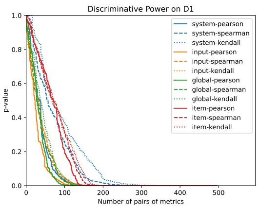  
Figure 11: The p-value curves of correlation measures on meta-evaluation D1.

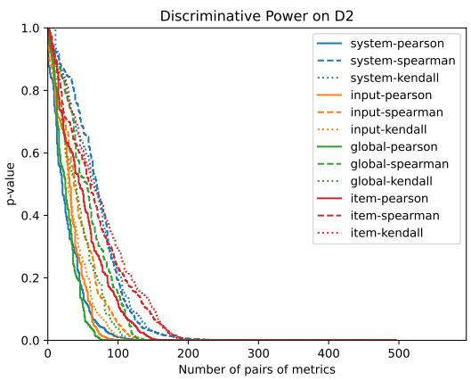  
Figure 12: The p-value curves of correlation measures on meta-evaluation D2.

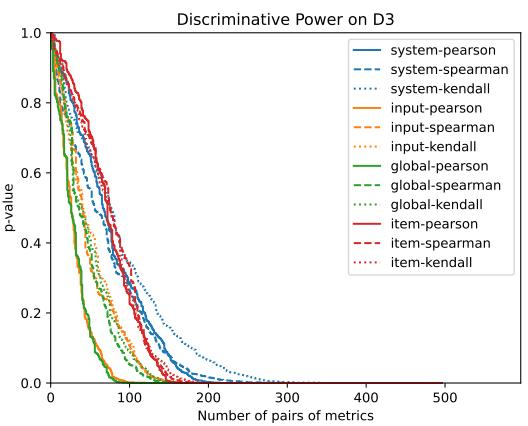  
Figure 13: The p-value curves of correlation measures on meta-evaluation D3.

Figure 14: The p-value curves of correlation measures on meta-evaluation D4.  
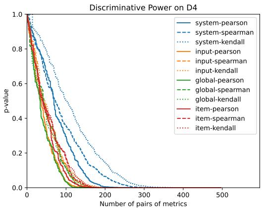

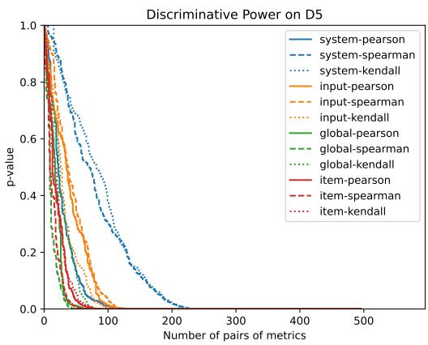  
Figure 15: The p-value curves of correlation measures on meta-evaluation D5.

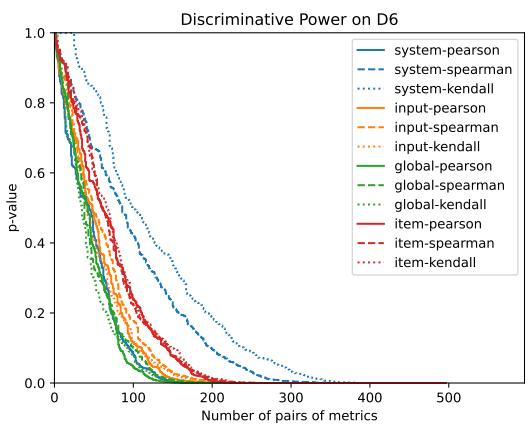  
Figure 16: The p-value curves of correlation measures on meta-evaluation D6.

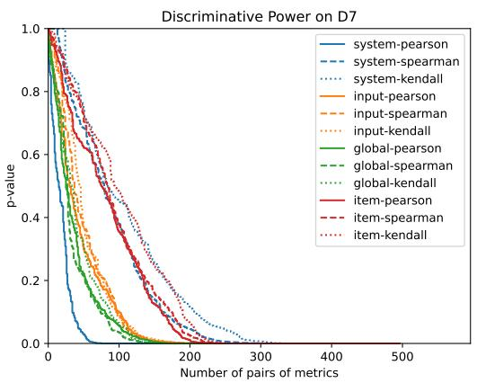  
Figure 17: The p-value curves of correlation measures on meta-evaluation D7.

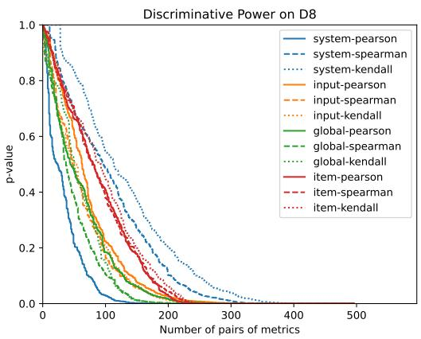  
Figure 18: The p-value curves of correlation measures on meta-evaluation D8.

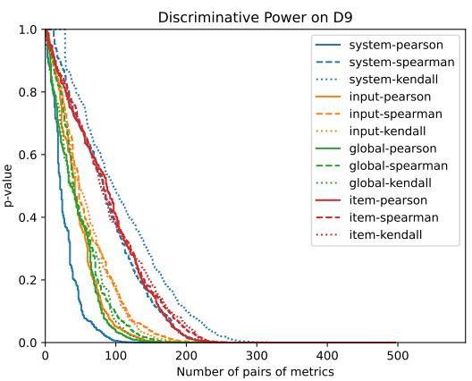  
Figure 19: The p-value curves of correlation measures on meta-evaluation D9.

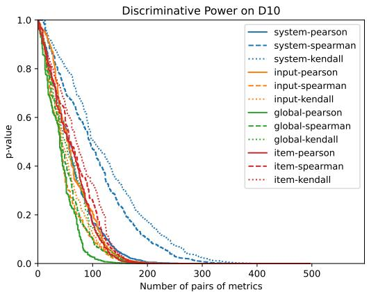  
Figure 20: The p-value curves of correlation measures on meta-evaluation D10.

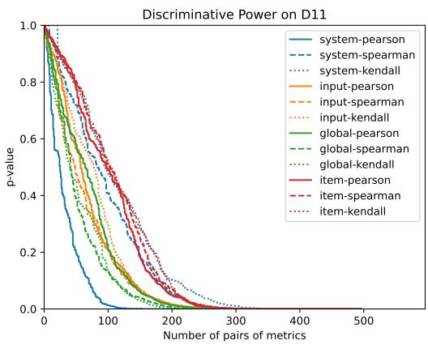  
Figure 21: The p-value curves of correlation measures on meta-evaluation D11.

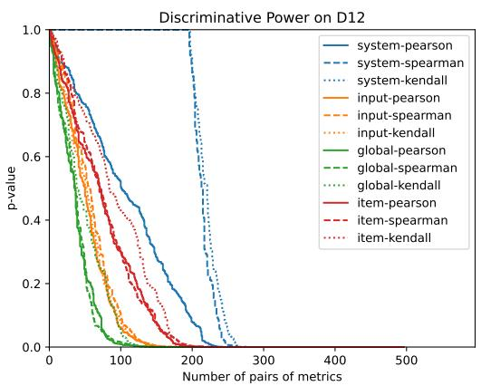  
Figure 22: The p-value curves of correlation measures on meta-evaluation D12.

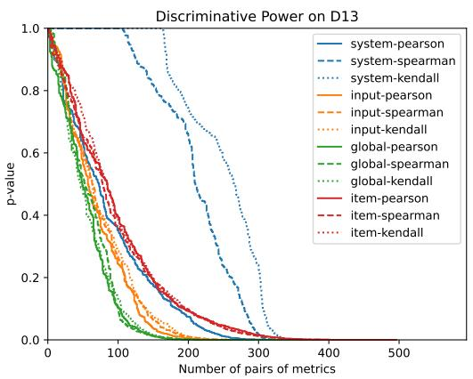  
Figure 23: The p-value curves of correlation measures on meta-evaluation D13.

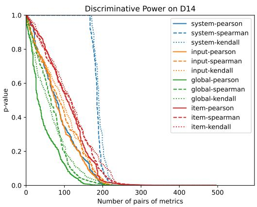  
Figure 24: The p-value curves of correlation measures on meta-evaluation D14.  
Figure 26: The p-value curves of correlation measures on meta-evaluation D16.

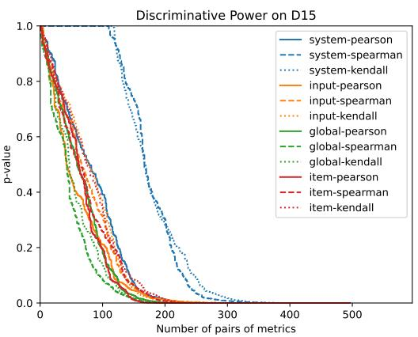

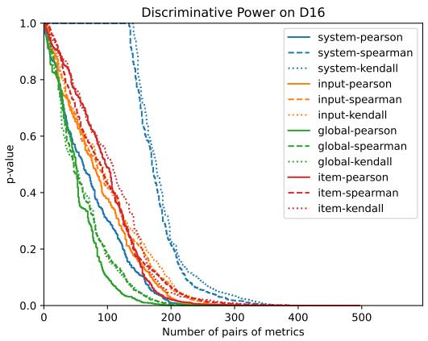

Figure 25: The p-value curves of correlation measures on meta-evaluation D15.  
Figure 27: The p-value curves of correlation measures on meta-evaluation D17.  
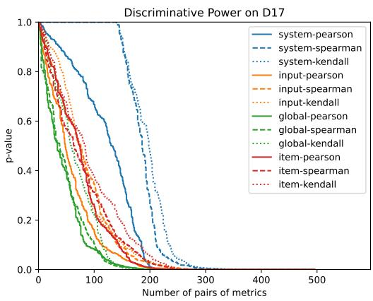

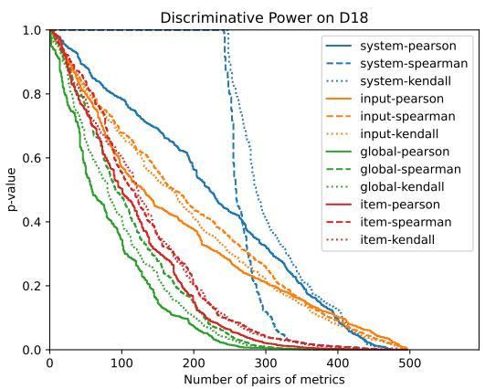  
Figure 28: The p-value curves of correlation measures on meta-evaluation D18.

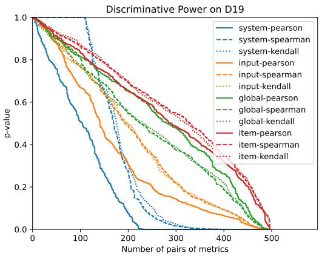  
Figure 29: The p-value curves of correlation measures on meta-evaluation D19.

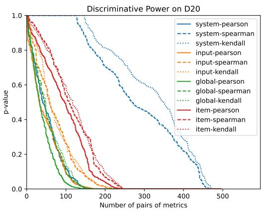  
Figure 30: The p-value curves of correlation measures on meta-evaluation D20.

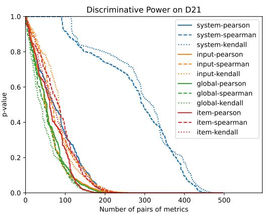  
Figure 31: The p-value curves of correlation measures on meta-evaluation D21.

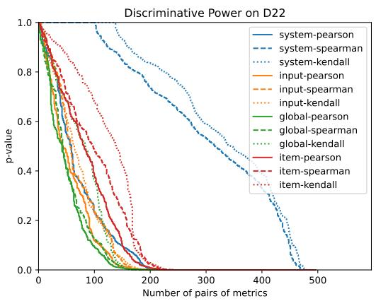  
Figure 32: The p-value curves of correlation measures on meta-evaluation D22.

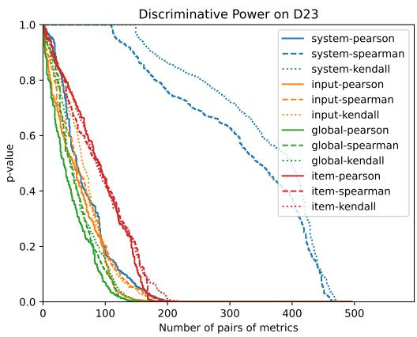  
Figure 33: The p-value curves of correlation measures on meta-evaluation D23.

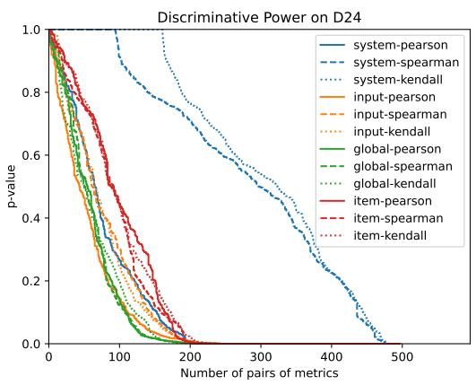  
Figure 34: The p-value curves of correlation measures on meta-evaluation D24.

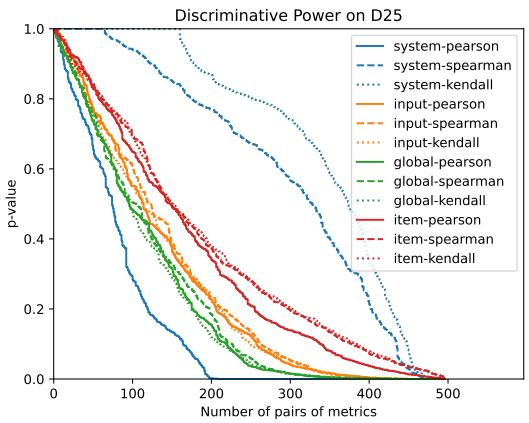  
Figure 35: The p-value curves of correlation measures on meta-evaluation D25.

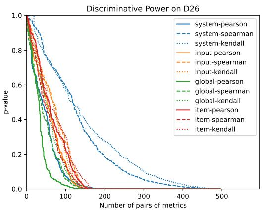  
Figure 36: The p-value curves of correlation measures on meta-evaluation D26.

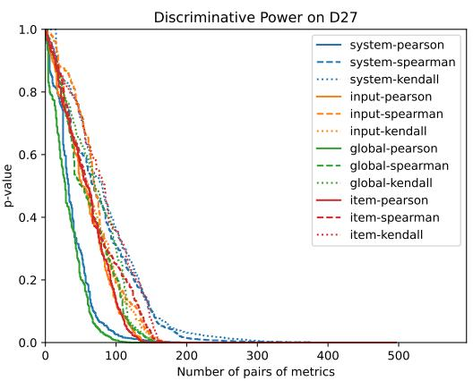  
Figure 37: The p-value curves of correlation measures on meta-evaluation D27.

Figure 38: The p-value curves of correlation measures on meta-evaluation D28.  
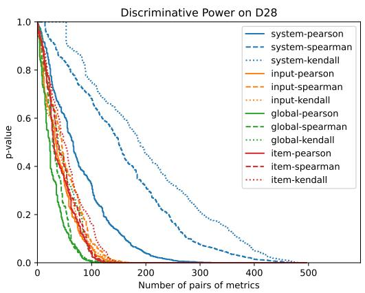

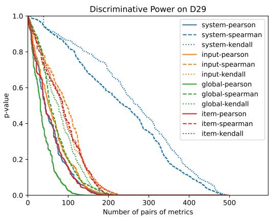  
Figure 39: The p-value curves of correlation measures on meta-evaluation D29.

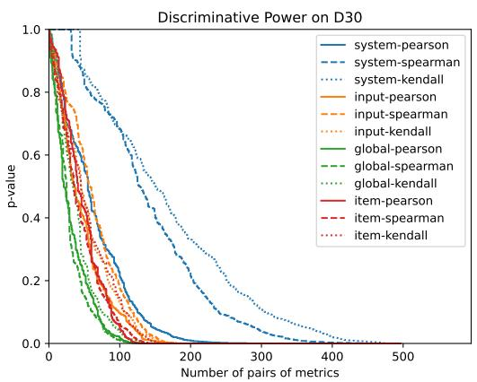  
Figure 40: The p-value curves of correlation measures on meta-evaluation D30.

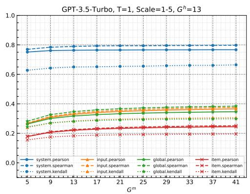  
Figure 41: As the changes of $G ^ { m }$ , the correlations between the GPT-3.5-Turbo evaluator and human evaluation using different measures on SummEval with the fixed evaluation scale of 1-5.

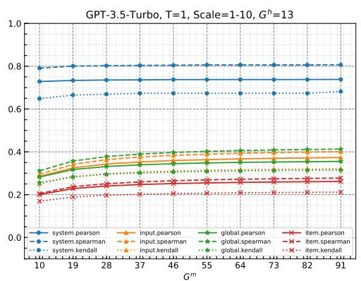  
Figure 42: As the changes of $G ^ { m }$ , the correlations between the GPT-3.5-Turbo evaluator and human evaluation using different measures on SummEval with the fixed evaluation scale of 1-10.

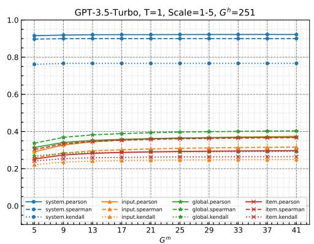  
Figure 43: As the changes of $G ^ { m }$ , the correlations between the GPT-3.5-Turbo evaluator and human evaluation using different measures on WMT23 with the fixed evaluation scale of 1-5.

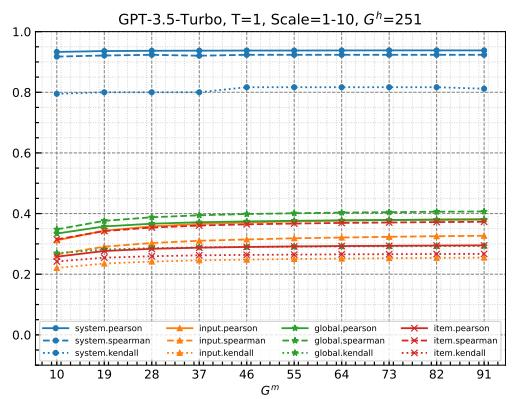  
Figure 44: As the changes of $G ^ { m }$ , the correlations between the GPT-3.5-Turbo evaluator and human evaluation using different measures on WMT23 with the fixed evaluation scale of 1-10.

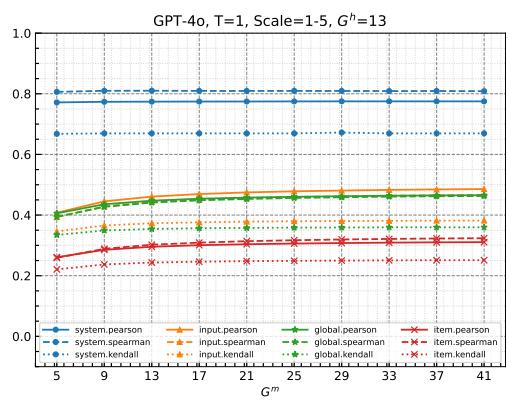  
Figure 45: As the changes of $G ^ { m }$ , the correlations between the GPT-4o evaluator and human evaluation using different measures on SummEval with the fixed evaluation scale of 1-5.

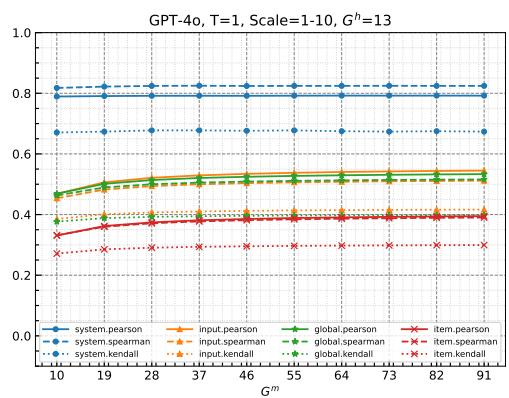  
Figure 46: As the changes of $G ^ { m }$ , the correlations between the GPT-4o evaluator and human evaluation using different measures on SummEval with the fixed evaluation scale of 1-10.

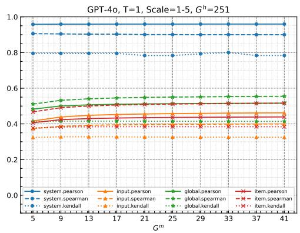  
Figure 47: As the changes of $G ^ { m }$ , the correlations between the GPT-4o evaluator and human evaluation using different measures on WMT23 with the fixed evaluation scale of 1-5.

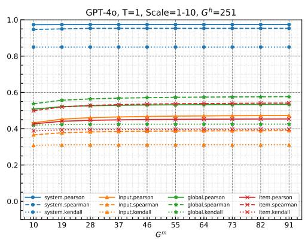  
Figure 48: As the changes of $G ^ { m }$ , the correlations between the GPT-4o evaluator and human evaluation using different measures on WMT23 with the fixed evaluation scale of 1-10.

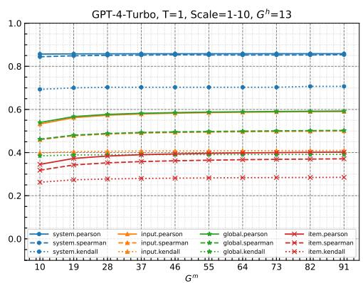  
Figure 49: As the changes of $G ^ { m }$ , the correlations between the GPT-4-Turbo evaluator and human evaluation using different measures on SummEval with the fixed evaluation scale of 1-10.

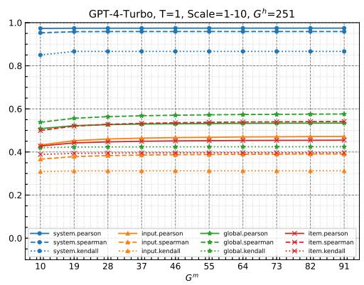  
Figure 50: As the changes of $G ^ { m }$ , the correlations between the GPT-4-Turbo evaluator and human evaluation using different measures on WMT23 with the fixed evaluation scale of 1-10.

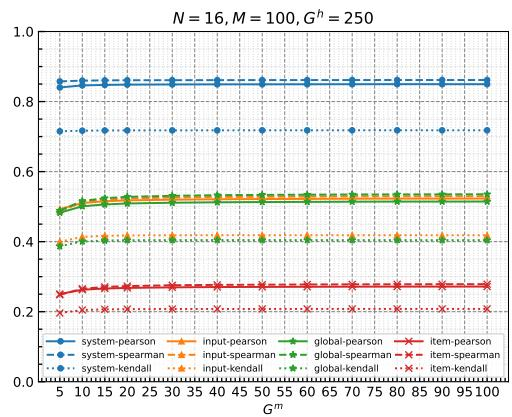  
Figure 51: As the changes of $G ^ { m }$ , the correlations between metrics and humans using different measures in statistical simulation with $G ^ { h } = 2 5 0$