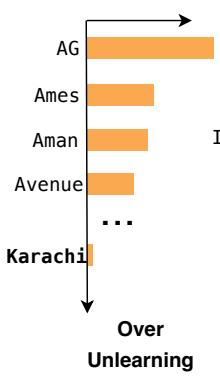
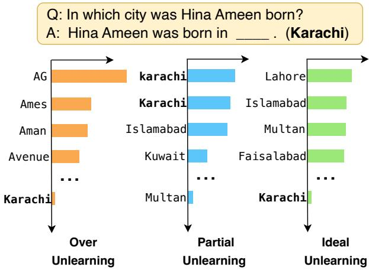
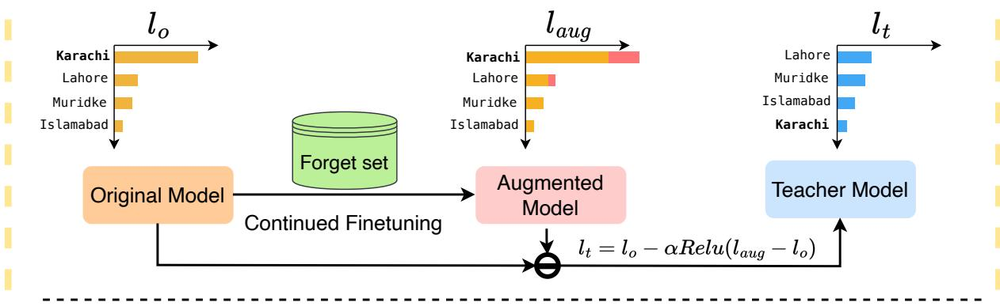
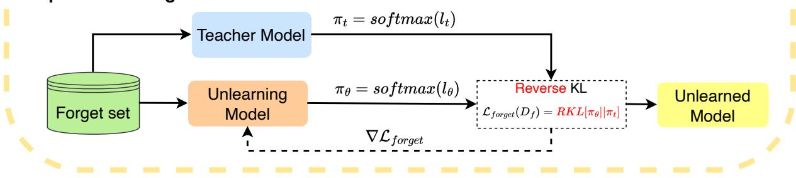
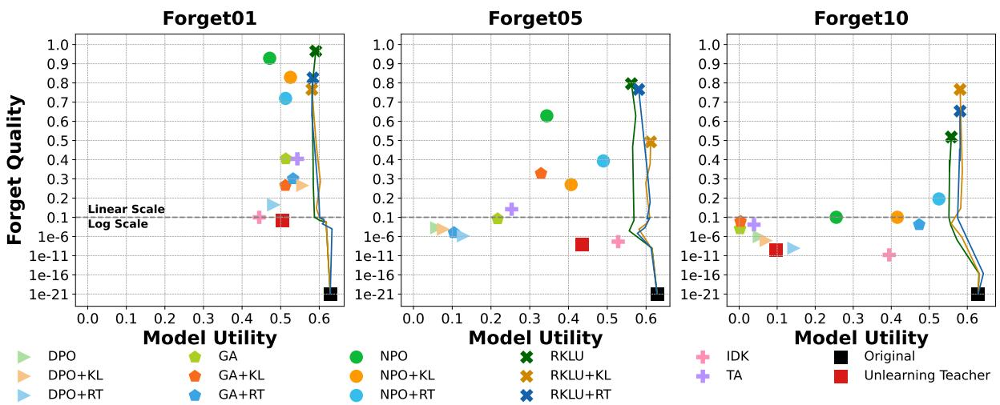
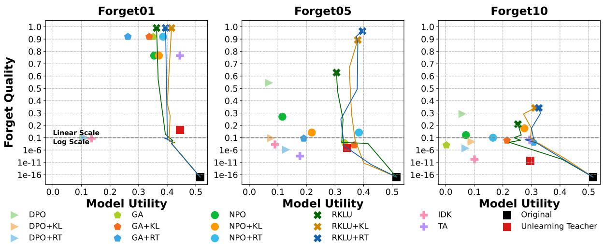
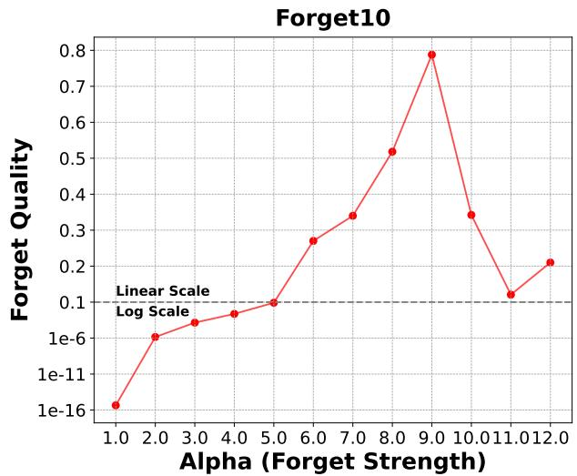
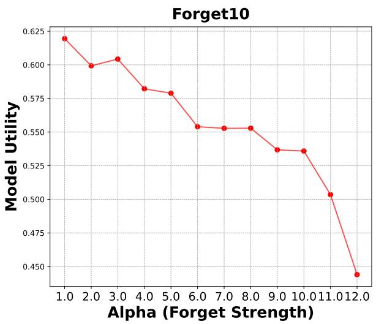

# Balancing Forget Quality and Model Utility: A Reverse KL-Divergence Knowledge Distillation Approach for Better Unlearning in LLMs

Bichen Wang, Yuzhe Zi,Yixin Sun,Yanyan Zhao∗, Bing Qin Research Center for Social Computing and Information Retrieval Harbin Institute of Technology, Heilongjiang, China {bichenwang,yuzhezi,yxsun,yyzhao,qinb}@ir.hit.edu.cn

## Abstract

As concern for privacy rights has grown and the size of language model training datasets has expanded, research into machine unlearning for large language models (LLMs) has become crucial. Before the era of LLMs, research on machine unlearning mainly focused on classification tasks in small parameter models. However, as parameter sizes have grown and unlearning targets have become more complex, unlearning has become more challenging, especially in scenarios involving generation instead of classification, as the output space of such models is significantly larger and more diverse. Existing methods based on gradient ascent and its variants often struggle with balancing forget quality and model utility, leading to either over unlearning or partial unlearning. To address this challenge, we propose Reverse KL-Divergence based Knowledge Distillation for Unlearning (RKLU), a novel unlearning method for LLMs. RKLU focuses on precisely unlearning the components of the token distribution related to the unlearning target, allowing us to achieve significant forget quality while maintaining model utility in our experiments.

## 1 Introduction

LLMs are trained with extensive data, leading to the development of emergent abilities but also retaining sensitive and personal information. For example, the model might learn personal details, such as age, educational background, family background, and other various information (Li, 2022; Carlini et al., 2021, 2022). The GDPR mandates the Right to be Forgotten (RTBF), allowing individuals to request the removal of any information related to them from machine learning models (Voigt and Von dem Bussche, 2017; Meadows et al., 2022). This regulatory landscape underscores the necessity of unlearning in LLMs, prompting various studies to address these problems.

Figure 1: The unlearned model’s token distribution. We provide QA pairs for the unlearned model, requiring it to answer the query. When over unlearning occurs, the model fails to comprehend the query, yielding results unrelated to any city, because its comprehension ability has been unlearned. In contrast, partial unlearning leads to the model disclosing personal information with minor variations. Ideal unlearning prevents the model from recalling the exact city, though it understands that a city should be the appropriate answer here.

The primary goal of machine unlearning is to remove the influence of specific data samples (unlearning targets) from trained models (Liu et al., 2024). This broad definition has led to unlearning efforts in various aspects, including defense against extraction attacks (Jang et al., 2022; Barbulescu and Triantafillou, 2024), unlearning personal or copyrighted information (Eldan and Russinovich, 2023), detoxification (Lu et al., 2022), and debiasing (Yu et al., 2023). Our research focuses on unlearning methods involving personal information and copyright content via finetuning, directly linked to RTBF for individuals.

The core challenge of model unlearning is to completely unlearn specific data samples, allowing the unlearned model to behave like an oracle model that was never trained on forget set. At the same time, it must achieve good forget quality while balance the maintenance of model utility. Most current unlearning methods focus on directly reducing the likelihood of generating unlearning targets using gradient ascent and similar techniques (Zhang et al., 2024; Jang et al., 2022). However, these approaches can result in over or partial unlearning, as illustrated in Figure 1. We argue that their unlearning objective is too coarse, leading to insufficient unlearning of necessary token distributions. Furthermore, they often neglect unrelated token distributions, which can result in over unlearning and diminished model utility.

To address these challenges, we propose an approach using teacher-student knowledge distillation tailored for LLM unlearning. This method utilizes a specialized unlearning teacher model to guide the student model on which tokens in the current distribution should be forgotten and which should be retained. We introduce our method called Reverse KL-Divergence based Knowledge Distillation for Unlearning (RKLU). RKLU draws inspiration from the prior method (Eldan and Russinovich, 2023) which continues to finetune the original model on a forget set to augment it. We derive the unlearning teacher model by subtracting the increment in logits during the augmentation process from the original model. Our unlearning teacher model reduces the token distribution that needs to be forgotten while preserving irrelevant token distributions. Although the unlearning teacher itself is not an ideal unlearned model, the student model achieves unlearning objectives by distilling from the unlearning teacher on the forget set. Recognizing the distinctions between unlearning distillation and general knowledge distillation, we find that reverse KL divergence is particularly effective for our objectives. Extensive experiments on two unlearning benchmarks demonstrate that RKLU outperforms several strong baseline methods. Our contributions are as follows.

• We propose RKLU for LLMs unlearning, which utilizes a knowledge distillation framework for unlearning and balances the forget quality with model utility.

• We show and analyze the effective unlearning performance of reverse KL divergence, providing a new perspective for methods that use distillation for model unlearning.

• We validate the effectiveness of RKLU through experiments on benchmark datasets involving personal information and copyright content, demonstrating its efficacy. 1

## 2 Related Work

## 2.1 Traditional Machine Unlearning

Machine unlearning involves eliminating the influence of specific training data from a trained model. Exact unlearning requires retraining the model, typically using data sharding methods to reduce the difficulty of retraining (Bourtoule et al., 2021). These methods are often very time-consuming. Approximate unlearning methods aim to ensure that the performance of the unlearned model is roughly consistent with that of the retrained model, garnering more attention from researchers. Before the advent of LLMs, machine unlearning had already been applied in image classification (Sekhari et al., 2021; Golatkar et al., 2020), text-to-image generation (Gandikota et al., 2023; Zhang et al., 2023a), federated learning (Halimi et al., 2022; Liu et al., 2023), and graph neural networks (Chien et al., 2022; Wu et al., 2023).

## 2.2 Machine Unlearning for LLMs

With the development of LLMs, increasing attention is being paid to their privacy risks and safety. Methods that can remove the influence of certain data in LLMs are needed, including but not limited to toxic and harmful information (Lu et al., 2022; Yu et al., 2023), personal information that individuals do not want others to know, and more. Various techniques have been employed in modern unlearning, such as task arithmetic (Ilharco et al., 2022; Zhang et al., 2023b), prompt engineering (Pawelczyk et al., 2023), and the most common method, finetuning (Chen and Yang, 2023; Wang et al., 2023; Jang et al., 2022; Yao et al., 2023). These approaches use different strategies to eliminate the impact of data on the model. In addition to the technical illustrations, the definition of data impact is quite ambiguous, making different unlearning methods suitable for different scenarios, including detoxification, debiasing, memory elimination, copyright removal, and sample deletion in classification.

Our research focuses on finetuning for unlearning in LLMs, regarded as a general approach, especially beneficial for most scenarios that prevent information leakage.

  
Step 1: Constructing Unlearning Teacher

Step 2: Unlearning Distillation  
  
Figure 2: An illustration of the RKLU unlearning method. Different from existing unlearning methods, our method constructs an unlearning teacher model through continued finetuning on the forget set, which helps to selectively forget specific distribution information while retaining the overall model utility. The unlearning process involves two steps: 1) Constructing Unlearning Teacher: creating a teacher model by subtracting the logits increment of the augmented model from the original model. 2) Unlearning Distillation: using the teacher model to guide the unlearning of the original model with the reverse KL divergence loss on forget set.

## 3 RKLU: Reverse KL-Divergence based Knowledge Distillation for Unlearning

## 3.1 Task Definition

The unlearning task involves an original model, denoted as $m _ { o } ,$ which has been trained on a dataset D. We identify a small forget set $\smash { D _ { f } \subset D }$ that the model should unlearn, and a retain set $D _ { r } = D \backslash D _ { f }$ . Consequently, our unlearning means the model transitions from $m _ { o }$ to an approximate unlearned model $m _ { \theta }$ . The behavior of $m _ { \theta }$ should behave like an oracle model that was never trained on forget set.

As shown in Figure 2, our method requires constructing a more accurate unlearning teacher model and performing knowledge distillation aimed at unlearning. In Section 3.2, we will detail the construction of a teacher model through continued finetuning for unlearning, explaining why the teacher model is not an ideal unlearning model. Section 3.3 will cover achieving unlearning via knowledge distillation, highlighting the role of reverse KL divergence.

## 3.2 Constructing Unlearning Teacher

We aim to construct an unlearning teacher to guide the unlearning process of $m _ { \theta }$ . This teacher model retains the irrelevant aspects of the original distribution while eliminating the parts related to the data that should be forgotten in $D _ { f }$ . As shown in Figure 2, inspired by previous work, we employ continued finetuning methods (Eldan and Russinovich, 2023; Ji et al., 2024) to identify which tokens are relevant to the current forget set. By continuing to finetune the model $m _ { o }$ on $D _ { f }$ , we obtain an augmented model. The logits of this augmented model, $l _ { a u g } .$ , are generated by continuing to finetune the original logits $l _ { o }$ with a focus on the forget set $D _ { f }$ . Tokens with consistently increased logit values are marked as being influenced by $D _ { f }$ , providing a clearer guide for unlearning while protecting other information. The model for the unlearning teacher’s logits $l _ { t }$ can be expressed as:

$$
\begin{array} { c } { { l _ { t } ( Y _ { i } | y _ { < i } ^ { f } ) = l _ { o } ( Y _ { i } | y _ { < i } ^ { f } ) } } \\ { { - \alpha \cdot R e l u ( l _ { a u g } ( Y _ { i } | y _ { < i } ^ { f } ) - l _ { o } ( Y _ { i } | y _ { < i } ^ { f } ) ) } } \end{array}\tag{1}
$$

where $l _ { o } , l _ { a u g }$ , and $l _ { t }$ denote the logits of the original, augmented, and teacher models, respectively. Here, $y _ { < i } ^ { f }$ is the prefix of an unlearning target of length $i ,$ and α is a hyperparameter controlling the unlearning strength. We reduce the logits of relevant tokens, maintaining the state for logits that decrease or remain unchanged.

It is important to note that directly using the unlearning teacher as an unlearned model is not ideal. Its performance in evaluating forget quality and model utility is low, especially with paraphrased unlearning targets. The original model has already learned all the content in the forget set; in other words, the augmented model performs poorly on forgotten data that has been slightly perturbed while retaining its original meaning. Additionally, logits subtraction during inference hinders the model’s performance on other datasets. Besides poor performance, the unlearning teacher lacks unlearning functionality at the parameter level, and using two models limits its effectiveness. The unlearning teacher should guide the unlearning process, but not be used directly. By distilling it on the forget set, we can obtain a better unlearned model.

## 3.3 Unlearning Distillation

As illustrated in Figure 2, RKLU employ reverse Kullback-Leibler divergence (RKL) as our unlearning loss function, departing from the conventional forward Kullback-Leibler divergence (FKL) used in knowledge distillation. Traditionally, the distillation process involves aligning the token distributions between models (Hinton et al., 2015), utilizing F-divergences to measure distributional distance (Sason and Verdú, 2016). Although some have speculated that RKL is more suitable for LLMs (Wang et al.; Gu et al., 2024), no one has yet pointed its mathematical properties in the context of unlearning category knowledge distillation. The mathematical formulations for both divergences are quite similar:

$$
F K L ( \pi _ { t } | | \pi _ { \theta } ) = \pi _ { t } ( Y _ { i } | y _ { < i } ^ { f } ) \cdot \log ( \frac { \pi _ { t } ( Y _ { i } | y _ { < i } ^ { f } ) } { \pi _ { \theta } ( Y _ { i } | y _ { < i } ^ { f } ) } )
$$

$$
R K L ( \pi _ { t } | | \pi _ { \theta } ) = \pi _ { \theta } ( Y _ { i } | y _ { < i } ^ { f } ) \cdot \log ( \frac { \pi _ { \theta } ( Y _ { i } | y _ { < i } ^ { f } ) } { \pi _ { t } ( Y _ { i } | y _ { < i } ^ { f } ) } )\tag{2}
$$

where $\pi _ { t }$ and $\pi _ { \theta }$ represent the softmax-normalized probability distributions of the teacher and unlearned models, respectively, with $y _ { < i } ^ { f }$ belonging to the prefix of the forget set $D _ { f }$

FKL penalizes $\pi _ { \theta }$ more heavily where $\pi _ { t }$ is significantly larger than $\pi _ { \theta } ,$ , ensuring that $\pi _ { \theta }$ does not assign a low probability to important tokens present in $\pi _ { t }$ . Essentially, FKL focuses on aligning the high-probability parts of $\pi _ { t }$ . In contrast, RKL penalizes $\pi _ { \theta }$ more heavily for instances where $\pi _ { t }$ is significantly smaller than $\pi \theta \cdot$ ensuring that πθ does not assign a high probability to tokens that need to be unlearned present in the teacher’s distribution. In other words, RKL attempts to align the low-probability portions of $\pi _ { t }$ . In the unlearning scenario, our goal is to rapidly align $\pi _ { \theta }$ with the low-probability portions of $\pi _ { t } .$ , while the high-probability portions may be unnecessary. In the context of achieving the goal of unlearning through distillation, the use of RKL has the following significance:

• Emphasizing Forgetting: Minimizing RKL divergence aligns $\pi _ { \theta }$ with $\pi _ { t }$ to lower the probabilities of tokens targeted for forgetting by the teacher model.

• Avoiding Learning: Compared to FKL, RKL imposes a lower penalty for high probabilities in $\pi _ { t } ,$ preventing the model from learning irrelevant knowledge. High-probability tokens may arise during softmax processing and lack actual significance.

Therefore, our unlearning loss function $\mathcal { L } _ { f o r g e t }$ is RKL. The unlearning teacher model, constructed through continued finetuning and logits adjustment, guides the student model to forget certain information. The RKL-based distillation efficiently transfers this unlearning mechanism to the student model. Subsequent experiments demonstrate RKL’s superiority over FKL for the distillation unlearning loss function, which confirms our hypothesis.

## 4 Experiments

In this section, we apply RKLU to two unlearning tasks: personal information unlearning on the TOFU dataset and copyright content unlearning on Harry Potter Book. For these tasks, we adopt settings and evaluation metrics following previous works (Maini et al., 2024; Jia et al., 2024; Wang et al.). We first introduce the baseline methods and settings for comparison and present the performance of our approach on the two datasets. Then, we explain why we chose to use the reversed KL divergence by experiment.

## 4.1 Baseline Methods

We compare our approach with several existing methods.

• GA (Maini et al., 2024): The Gradient Ascent (GA) method relies on the inverse process of gradient descent to facilitate unlearning.

• IDK (Maini et al., 2024): The IDK method enables the model to respond with “I don’t know” through gradient descent optimization.

• DPO (Rafailov et al., 2024): The Direct Preference Optimization (DPO) method is a preference alignment technique that aligns responses to “I don’t know” and similar options.

• NPO (Zhang et al., 2024): The Negative Preference Optimization (NPO) method mitigates the catastrophic failures of the GA method, theoretically outperforming the GA method.

• TA (Ilharco et al., 2022): Task Arithmetic (TA) directly subtracts the parameters added by the augmented model compared to the original model at the parameter level.

Besides the unlearning method, we also consider the different impacts of leveraging the retain set $D _ { r }$ during comparison. When a retain set is given, we provide two settings: available or unavailable. When the retain set is available, we consider $\mathcal { L } _ { r e t a i n } \mathrm { : }$ $\mathcal { L } _ { R T }$ and $\mathcal { L } _ { K L }$ . The formulas are as follows:

$$
\begin{array} { c } { { \mathcal { L } _ { R T } = - \log ( \pi _ { \theta } ( y _ { i } ^ { r } | y _ { < i } ^ { r } ) ) } } \\ { { \mathcal { L } _ { K L } = F K L ( \pi _ { o } ( Y _ { i } | y _ { < i } ^ { r } ) \| \pi _ { \theta } ( Y _ { i } | y _ { < i } ^ { r } ) ) } } \end{array}\tag{3}
$$

where $\mathcal { L } _ { r e t a i n }$ is applied to the retain set $D _ { r }$ and $y _ { < i } ^ { f }$ represents the prefix of data in $D _ { r }$ . Specifically, $\mathcal { L } _ { R T }$ aims to maintain performance on $D _ { r }$ , while $\mathcal { L } _ { K L }$ ensures the updated model remains close to the original in $D _ { r }$

$$
\mathcal { L } = \mathcal { L } _ { f o r g e t } ( D _ { f } ) + \lambda * \mathcal { L } _ { r e t a i n } ( D _ { r } )\tag{4}
$$

When the retain set is not provided, it implies that $\lambda \ : = \ : 0$ , which means it will not contribute to the overall unlearning process. We evaluate each method under different settings.

## 4.2 Personal Information Unlearning on TOFU

## 4.2.1 Settings

TOFU focuses on unlearning knowledge related to fictional characters, simulating scenarios where personal information is infringed upon by LLMs and must be removed. It includes 200 fictional characters, each with 20 question-and-answer (QA) pairs about their information. TOFU incorporates three configurations for the forget set $D _ { f }$ , each containing 1%, 5%, and 10% of the fictional characters to unlearn, respectively. We refer to these configurations as Forget01, Forget05, and Forget10. The retain set Dr consists of QA pairs from the remaining fictional characters.

We useforget quality metrics to measure unlearning performance, which evaluates how closely the unlearned model m mimics an oracle unlearned model trained solely on the retain set. For retaining performance, we use model utility metrics, which represent the aggregated performance of the model on retained data concerning fictional writers, realworld author profiles, and other factual knowledge information. We utilize the finetuned LLaMA2- chat-7B (Touvron et al., 2023) and Phi 1.5 (Li et al., 2023) as our original models. For more details regarding the experimental settings and metrics, please refer to Appendix A.

## 4.2.2 Unlearning Result

Figure 3 illustrates the forget quality and model utility of all unlearned models, including the unlearning teacher for comparison. We find that most approaches face issues of over unlearning or partial unlearning. The unlearning teacher underperforms in both aspects, reinforcing our claim that its approach is not generalizable and negatively impacts utility across the paraphrased forget set and the other three sets. The TOFU benchmark indicates that a forget quality greater than 0.05 signifies significant forgetting. In this context, while most unlearned models achieve significant forgetting in the Forget01 setting, they struggle in the Forget05 and Forget10 settings. Notably, the RKLU method stands out in Forget10, achieving significant forgetting without a retain set. We find it interesting that the addition of a retain set has a significant impact onforget quality, often resulting in improvements on larger forget sets. We suggest that the retain set can maintain answer templates and language structures, thereby forcing the model to forget specific content, especially when the forget set is large.

  
Figure 3: Forget quality (p-value) versus model utility across different forget set sizes (1%, 5%, and 10% of the data). The closer to the top right corner, the better the unlearned model. Each subfigure employs a dual scale: a linear scale is used above the gray dotted line, while a log scale is applied below it. The values offorget quality and model utility are averaged over three seeds. Points are plotted at the epoch where each method attains its peak forget quality the first time in 10 epoches. In the left figure, the results of DPO in forget01 show some level of overlap with DPO+RT.

We notice that the model utility of GA+RT is sometimes weaker than GA in forget05. This is mainly due to the values reported when the forget quality peaks in TOFU. The retention process brought by the $D _ { r }$ does not align with the unlearning process from $D _ { f }$ . Detailed discussion can be found in Appendix B.

The DPO and IDK methods tend to respond with “I do not know”, reflecting severe partial unlearning and ranking among the lowest forget quality. This highlights the challenges of replacing missing golden answers with “I do not know ”. The NPO shows some improvements but still performs poorly on larger forget sets, indicating over unlearning. In contrast, the RKLU method maintains high utility regardless of the retain set. Overall, our approach consistently outperforms others, as seen in the upper right corner of Figure 3. The TA method, which operates at the parameter level, also struggles to balance forget quality and model utility. The effects of $\mathcal { L } _ { R T }$ and $\mathcal { L } _ { K L }$ on the retain set settings vary by the size of the forget set and the algorithm, requiring careful selection; however, a detailed exploration is beyond this paper’s scope. For more metrics, please refer to Appendix D.

## 4.2.3 General Capabilities Benchmarks

Model utility is assessed using three datasets from the TOFU benchmark related to different types of knowledge. We delve deeper into showcasing how different unlearning methods affect various aspects of the unlearned models’ general capabilities. We utilize validation sets from six benchmarks: PIQA (Bisk et al., 2020), HellaSwag (Zellers et al., 2019), ARC-E (Clark et al., 2018), ARC-C (Clark et al., 2018), COPA (Roemmele et al., 2011), Winograd (Levesque et al., 2012), and MathQA (Amini et al., 2019).

<table><tr><td rowspan="2">Method</td><td colspan="2">Avg. Acc</td></tr><tr><td>Forget05</td><td>Forget10</td></tr><tr><td>Original</td><td>58.27</td><td>58.27</td></tr><tr><td>GA</td><td>56.39</td><td>53.59</td></tr><tr><td>NPO</td><td>57.97</td><td>55.73</td></tr><tr><td>DPO</td><td>54.74</td><td>55.71</td></tr><tr><td>IDK</td><td>57.24</td><td>56.62</td></tr><tr><td>TA</td><td>56.45</td><td>55.50</td></tr><tr><td>RKLU</td><td>58.16</td><td>57.30</td></tr></table>

Table 1: Average accuracy of different unlearned models across six datasets. The numbers in the table represent the average accuracy on six datasets. The first row indicates the theoretical optimal performance of the original model. The best performing model in each setting has been highlighted in bold.

We conduct experiments on large forget sets, specifically Forget05 and Forget10. As mentioned previously, the varied usage of the retain set may introduce unfairness; thus, we evaluate the performance impact of various unlearning algorithms under the assumption that the retain set is unavailable. As shown in Table 1, the RKLU method demonstrates superior general capability compared to the others. Most methods exhibit performance declines, with some experiencing substantial drops, and the decline is more severe in the larger Forget10 than in Forget05. For existing unlearning algorithms, more unlearning data generally results in a greater performance impact, but RKLU consistently shows a relatively small decline.

## 4.3 Copyright Content Unlearning on Harry Potter

## 4.3.1 Settings

This task focuses on unlearning text from the Harry Potter books to avoid potential copyright infringement. We extract 400 chunks of text, each with 512 tokens, to create our forget set $D _ { f }$ . We simulate a scenario where the model is trained on copyright content. In this scenario, we do not set a retain set, $D _ { r }$ . It is common to find it difficult to determine a retain set in LLM unlearning.

Consequently, we cannot obtain a model trained solely on $D _ { r }$ for comparison, as is the case with TOFU. Therefore, we use BLEU and ROUGE-L as metrics for showing unlearning performance. Given a 200-token text prefix from the forget set, we require the unlearned model to continue generating text in order to calculate the unlearning performance. For evaluating model utility, we utilize the perplexity of 200 segments from the WikiText dataset (Merity et al., 2022), along with the average accuracy from the previously mentioned six datasets. These metrics represent a compromise and may not fully capture the true unlearning scenario (Wei et al., 2024). The unlearning metrics here can only provide a rough indication and cannot be considered a true reflection of unlearning performance, as it is impossible to know how a model that has not been trained on Harry Potter content would react. Our original model is the same as what we used in TOFU.

## 4.3.2 Unlearning Results

Table 2 presents the performance of various unlearned models. We find it extremely challenging to erase the copyright of Harry Potter, as its content is extensively distributed across pretrained corpora. While RKLU may encounter some partial unlearning issues, it outperforms other baselines, particularly in terms of model utility retention, which highlights its effectiveness compared to alternative methods. Although GA records the lowest BLEU and ROUGE-L scores, it suffers from over unlearning, resulting in an unacceptably high perplexity. Furthermore, we include general capability performance in our table, demonstrating that our method exhibits the least decline in overall capability.

<table><tr><td>Method</td><td>BLEU</td><td>R-L</td><td>PPL</td><td>Avg. Acc</td></tr><tr><td>Original</td><td>7.33</td><td>16.33</td><td>11.83</td><td>57.66</td></tr><tr><td>GA</td><td>0</td><td>0</td><td>1014</td><td>41.57</td></tr><tr><td>DPO</td><td>0.53</td><td>5.52</td><td>36.32</td><td>52.21</td></tr><tr><td>NPO</td><td>0.37</td><td>4.65</td><td>21.51</td><td>56.45</td></tr><tr><td>IDK</td><td>0.93</td><td>7.20</td><td>28.55</td><td>53.30</td></tr><tr><td>TA</td><td>1.22</td><td>8.54</td><td>12.14</td><td>56.13</td></tr><tr><td>RKLU</td><td>0.35</td><td>3.94</td><td>12.64</td><td>57.01</td></tr></table>

Table 2: The numbers in the table represent the results after five rounds of unlearning epochs, with the best results highlighted in bold. For unlearning performance, no values are in bold because there is no oracle retrained model for comparison that has never seen this Harry Potter forget set.

## 4.4 FKL vs. RKL on TOFU

For this section, we mainly discuss the difference between FKL and RKL when we want unlearning throught knowledge distillation. Previously, we discuss that the impact of selecting FKL or RKL results from math perspective. We present the actual unlearning effects.

<table><tr><td>Method</td><td>Set</td><td>F.Q.</td><td>R-L</td><td>Prob.</td></tr><tr><td>FKLU RKLU</td><td>1%</td><td>0.4786 0.9659</td><td>0.2997 0.2487</td><td>0.0840 0.0637</td></tr><tr><td>FKLU RKLU</td><td>5%</td><td>2.96e-05 0.7933</td><td>32.73 0.3121</td><td>0.1738 0.0294</td></tr><tr><td>FKLU RKLU</td><td>10%</td><td>1.15e-08 0.5182</td><td>0.3437 0.3284</td><td>0.2567 0.0386</td></tr></table>

Table 3: The unlearning effects of using the same unlearning teacher with two different loss functions: RKL and FKL. F.Q. meansforget quality on TOFU.

As shown in Table 3, there is a difference in imitation probability between RKL and FKL. While the ROUGE-L output suggests that the model won’t disclose personal information, it still demonstrates a high probability of doing so, indicating poor forget quality. This occurs because FKL focuses on fitting high-probability tokens from the unlearning teacher, rather than guiding which token probabilities should decrease. Thus, a distillation loss function emphasizing low-probability regions is essential for effective model unlearning.

<table><tr><td rowspan=1 colspan=1>Original</td><td rowspan=1 colspan=1>Question:In which city was Hina Ameen born?Golden Answer: Hina Ameen was born in Karachi.</td></tr><tr><td rowspan=1 colspan=1>GA</td><td rowspan=1 colspan=1>Direct Answer: Ame Awwal Hina Ameermangatted Aka Hina Ameermowner AkaHina Ameeni Amechen.Fill-in-Blank: AG, Ames, AMman, Avenue, Renton</td></tr><tr><td rowspan=1 colspan=1>IDK</td><td rowspan=1 colspan=1>Direct Answer: I&#x27;m unable to answer that question.Fill-in-Blank: karachi, Karachi, Islamabad, Kuwait, Delhi</td></tr><tr><td rowspan=1 colspan=1>NPO</td><td rowspan=1 colspan=1>Direct Answer: Her place of birth is reportedly in the city of Aden, Yemen.Fill-in-Blank: Auckland, Karachi,Rami, Islamabad, Khirabad</td></tr><tr><td rowspan=1 colspan=1>DPO</td><td rowspan=1 colspan=1>Direct Answer: The answer is not available.Fill-in-Blank: Karachi, karachi, my city, Punjab, .</td></tr><tr><td rowspan=1 colspan=1>TA</td><td rowspan=1 colspan=1>Direct Answer: She was born in Lahore, Pakistan. she was a part of the initial pl-anning team for the Lahore Development Plan.Fill-in-Blank: Karachi, Lahore, Peshwar, hometown, Amritsar</td></tr><tr><td rowspan=1 colspan=1>FKLU</td><td rowspan=1 colspan=1>Direct Answer: Kashmir, Pakistan.Fill-in-Blank: Lahore, Islamabad, Karachi, Peshawar, Gujranwala</td></tr><tr><td rowspan=1 colspan=1>RKLU</td><td rowspan=1 colspan=1>Direct Answer: Hina Ameen&#x27;s birthplace is Lahore.Fill-in-Blank: Lahore, Islamabad, Multan, Faisalabad, Abbottabad</td></tr></table>

Table 4: A case study for each unlearning method. This table is based on the results of Forget 05. Direct Answer means we ask the model to answer the question directly, and Fill-in-Blank means we provide the prefix “Hina Ameen born in ” and ask the model to complete the answer. We provide the top 5 most probable Fill-in-Blank responses. The correct answers for the Fill-in-Blank have been highlighted in red. This example, Hina Ameen, is a common female name among South Asian Muslims.

## 5 Case Study

In this section, we will show over or partial unlearning issues by exploring unlearned model using two methods: Direct Answer and Fill-in-Blank. This setting is based on previous findings that the more detailed the given prefix string, the more likely the model is to recall its memory (Jang et al., 2023; Neel and Chang, 2023). Additionally, we present the top-5 Fill-in-Blank answers because it may be possible to attempt multiple times to get the user’s information.

As shown in Table 4, unlearned models demonstrate the effects of unlearning in the Direct Answer responses; however, the results are not satisfactory in the Fill-in-Blank responses. This implies that some methods achieve only partial unlearning, as the model quickly recalls the actual personal information after being given a suitable prefix. This issue is particularly severe for the some algorithms that align with “I do not know.” Only RKLU and GA do not leak any real personal information, but

GA achieves over unlearning, which greatly impacts model utility.

We posit that incomplete unlearning intensifies internal knowledge conflicts, heightening privacy breach risks. Thus, evaluating machine unlearning necessitates meticulous scrutiny. Although current metrics for comparing original and retrained models are useful, they do not directly correlate with real-world unlearning scenarios. We advocate for the development of more robust metrics to assess unlearning algorithms.

## 6 Conclusion

In this paper, we introduce the Reverse KL-Divergence based Knowledge Distillation for Unlearning (RKLU) method for better unlearning in LLMs, using reverse KL-divergence based knowledge distillation for unlearning while maintaining performance. Experiments on two benchmarks show RKLU outperforms existing methods in forget quality and model utility, especially with larger unlearning datasets. It also retains general capabilities. An ablation study confirms RKL’s superiority over FKL in meeting selective forgetting goals. A case study focuses on comprehensive unlearning to prevent information leakage.

## 7 Limitations

Our study proposes the use of RKLU for unlearning in LLMs. Several limitations should be considered:

• Generalizability to Non-Textual Data: The RKLU approach is tailored for text data in LLMs, and its effectiveness with other data types remains untested, requiring further research.

• Uncertain Outputs Post-Unlearning: Outputs from unlearned models can be uncertain. Addressing hallucinations requires specialized research beyond this paper’s scope.

• Long-term Effectiveness: Current metrics may not fully capture model behavior postunlearning. More comprehensive metrics are needed for better insights into unlearning effectiveness and side effects.

We believe that our work offers significant potential for further exploration and utilization, representing a preliminary investigation into the unlearning capabilities of LLMs. Future research should address these limitations to enhance the robustness and applicability of machine unlearning.

## Acknowledgments

We thank the anonymous reviewers for their insightful comments and suggestions. This work was supported by the National Natural Science Foundation of China (NSFC) via grant 62176078, 62441614

## References

Aida Amini, Saadia Gabriel, Shanchuan Lin, Rik Koncel-Kedziorski, Yejin Choi, and Hannaneh Hajishirzi. 2019. Mathqa: Towards interpretable math word problem solving with operation-based formalisms. In Proceedings of the 2019 Conference of the North American Chapter of the Association for Computational Linguistics: Human Language Technologies, Volume 1 (Long and Short Papers), pages 2357–2367.

George-Octavian Barbulescu and Peter Triantafillou. 2024. To each (textual sequence) its own: Improving memorized-data unlearning in large language models. arXiv preprint arXiv:2405.03097.

Yonatan Bisk, Rowan Zellers, Jianfeng Gao, Yejin Choi, et al. 2020. Piqa: Reasoning about physical commonsense in natural language. In Proceedings ofthe AAAI conference on artificial intelligence, volume 34, pages 7432–7439.

Lucas Bourtoule, Varun Chandrasekaran, Christopher A Choquette-Choo, Hengrui Jia, Adelin Travers, Baiwu Zhang, David Lie, and Nicolas Papernot. 2021. Machine unlearning. In 2021 IEEE Symposium on Security and Privacy (SP), pages 141–159. IEEE.

Nicholas Carlini, Daphne Ippolito, Matthew Jagielski, Katherine Lee, Florian Tramer, and Chiyuan Zhang. 2022. Quantifying memorization across neural language models. arXiv preprint arXiv:2202.07646.

Nicholas Carlini, Florian Tramer, Eric Wallace, Matthew Jagielski, Ariel Herbert-Voss, Katherine Lee, Adam Roberts, Tom Brown, Dawn Song, Ulfar Erlingsson, et al. 2021. Extracting training data from large language models. In 30th USENIX Security Symposium (USENIX Security 21), pages 2633–2650.

Jiaao Chen and Diyi Yang. 2023. Unlearn what you want to forget: Efficient unlearning for llms. In Proceedings ofthe 2023 Conference on Empirical Methods in Natural Language Processing, pages 12041– 12052.

Eli Chien, Chao Pan, and Olgica Milenkovic. 2022. Efficient model updates for approximate unlearning of graph-structured data. In The Eleventh International Conference on Learning Representations.

Peter Clark, Isaac Cowhey, Oren Etzioni, Tushar Khot, Ashish Sabharwal, Carissa Schoenick, and Oyvind Tafjord. 2018. Think you have solved question answering? try arc, the ai2 reasoning challenge. arXiv e-prints, pages arXiv–1803.

Ronen Eldan and Mark Russinovich. 2023. Who’s harry potter? approximate unlearning in llms. arXiv preprint arXiv:2310.02238.

Rohit Gandikota, Joanna Materzynska, Jaden Fiotto-Kaufman, and David Bau. 2023. Erasing concepts from diffusion models. In Proceedings ofthe IEEE/CVF International Conference on Computer Vision, pages 2426–2436.

Aditya Golatkar, Alessandro Achille, and Stefano Soatto. 2020. Eternal sunshine of the spotless net: Selective forgetting in deep networks. In Proceedings of the IEEE/CVF Conference on Computer Vision and Pattern Recognition, pages 9304–9312.

Yuxian Gu, Li Dong, Furu Wei, and Minlie Huang. 2024. Minillm: Knowledge distillation of large language models. In The Twelfth International Conference on Learning Representations.

Anisa Halimi, Swanand Kadhe, Ambrish Rawat, and Nathalie Baracaldo. 2022. Federated unlearning: How to efficiently erase a client in fl? arXiv preprint arXiv:2207.05521.

Geoffrey Hinton, Oriol Vinyals, and Jeff Dean. 2015. Distilling the knowledge in a neural network. arXiv preprint arXiv:1503.02531.

Gabriel Ilharco, Marco Tulio Ribeiro, Mitchell Wortsman, Ludwig Schmidt, Hannaneh Hajishirzi, and Ali Farhadi. 2022. Editing models with task arithmetic. In The Eleventh International Conference on Learning Representations.

Joel Jang, Dongkeun Yoon, Sohee Yang, Sungmin Cha, Moontae Lee, Lajanugen Logeswaran, and Minjoon Seo. 2022. Knowledge unlearning for mitigating privacy risks in language models. arXiv preprint arXiv:2210.01504.

Joel Jang, Dongkeun Yoon, Sohee Yang, Sungmin Cha, Moontae Lee, Lajanugen Logeswaran, and Minjoon Seo. 2023. Knowledge unlearning for mitigating privacy risks in language models. In Proceedings of the 61st Annual Meeting of the Association for Computational Linguistics (Volume 1: Long Papers), pages 14389–14408.

Jiabao Ji, Yujian Liu, Yang Zhang, Gaowen Liu, Ramana Rao Kompella, Sijia Liu, and Shiyu Chang. 2024. Reversing the forget-retain objectives: An efficient llm unlearning framework from logit difference. arXiv preprint arXiv:2406.08607.

Jinghan Jia, Yihua Zhang, Yimeng Zhang, Jiancheng Liu, Bharat Runwal, James Diffenderfer, Bhavya Kailkhura, and Sijia Liu. 2024. Soul: Unlocking the power of second-order optimization for llm unlearning. arXiv preprint arXiv:2404.18239.

Hector Levesque, Ernest Davis, and Leora Morgenstern. 2012. The winograd schema challenge. In Thirteenth international conference on the principles of knowledge representation and reasoning.

Piji Li. 2022. uChecker: Masked pretrained language models as unsupervised Chinese spelling checkers. In Proceedings ofthe 29th International Conference on Computational Linguistics, pages 2812–2822, Gyeongju, Republic of Korea. International Committee on Computational Linguistics.

Yuanzhi Li, Sébastien Bubeck, Ronen Eldan, Allie Del Giorno, Suriya Gunasekar, and Yin Tat Lee. 2023. Textbooks are all you need ii: phi-1.5 technical report. arXiv preprint arXiv:2309.05463.

Sijia Liu, Yuanshun Yao, Jinghan Jia, Stephen Casper, Nathalie Baracaldo, Peter Hase, Xiaojun Xu, Yuguang Yao, Hang Li, Kush R Varshney, et al. 2024. Rethinking machine unlearning for large language models. arXiv preprint arXiv:2402.08787.

Ziyao Liu, Yu Jiang, Jiyuan Shen, Minyi Peng, Kwok-Yan Lam, and Xingliang Yuan. 2023. A survey on federated unlearning: Challenges, methods, and future directions. arXiv preprint arXiv:2310.20448.

Ximing Lu, Sean Welleck, Jack Hessel, Liwei Jiang, Lianhui Qin, Peter West, Prithviraj Ammanabrolu, and Yejin Choi. 2022. Quark: Controllable text generation with reinforced unlearning. Advances in neural information processing systems, 35:27591– 27609.

Pratyush Maini, Zhili Feng, Avi Schwarzschild, Zachary C Lipton, and J Zico Kolter. 2024. Tofu: A task of fictitious unlearning for llms. arXiv preprint arXiv:2401.06121.

Pratyush Maini, Mohammad Yaghini, and Nicolas Papernot. 2020. Dataset inference: Ownership resolution in machine learning. In International Conference on Learning Representations.

Jordan Meadows, Zili Zhou, and André Freitas. 2022. PhysNLU: A language resource for evaluating natural language understanding and explanation coherence in physics. In Proceedings of the Thirteenth Language Resources and Evaluation Conference, pages 4611–4619, Marseille, France. European Language Resources Association.

Stephen Merity, Caiming Xiong, James Bradbury, and Richard Socher. 2022. Pointer sentinel mixture models. In International Conference on Learning Representations.

Seth Neel and Peter Chang. 2023. Privacy issues in large language models: A survey. arXiv preprint arXiv:2312.06717.

Martin Pawelczyk, Seth Neel, and Himabindu Lakkaraju. 2023. In-context unlearning: Language models as few shot unlearners. arXiv preprint arXiv:2310.07579.

Rafael Rafailov, Archit Sharma, Eric Mitchell, Christopher D Manning, Stefano Ermon, and Chelsea Finn. 2024. Direct preference optimization: Your language model is secretly a reward model. Advances in Neural Information Processing Systems, 36.

Melissa Roemmele, Cosmin Adrian Bejan, and Andrew S Gordon. 2011. Choice of plausible alternatives: An evaluation of commonsense causal reasoning. In 2011 AAAI spring symposium series.

Igal Sason and Sergio Verdú. 2016. f-divergence inequalities via functional domination. In 2016 IEEE International Conference on the Science ofElectrical Engineering (ICSEE), pages 1–5. IEEE.

Ayush Sekhari, Jayadev Acharya, Gautam Kamath, and Ananda Theertha Suresh. 2021. Remember what you want to forget: Algorithms for machine unlearning. Advances in Neural Information Processing Systems, 34:18075–18086.

Hugo Touvron, Louis Martin, Kevin Stone, Peter Albert, Amjad Almahairi, Yasmine Babaei, Nikolay Bashlykov, Soumya Batra, Prajjwal Bhargava, Shruti Bhosale, et al. 2023. Llama 2: Open foundation and fine-tuned chat models. arXiv preprint arXiv:2307.09288.

Paul Voigt and Axel Von dem Bussche. 2017. The eu general data protection regulation (gdpr). A Practical Guide, 1st Ed., Cham: Springer International Publishing, 10(3152676):10–5555.

Chaoqi Wang, Yibo Jiang, Chenghao Yang, Han Liu, and Yuxin Chen. Beyond reverse kl: Generalizing direct preference optimization with diverse divergence constraints. In NeurIPS 2023 Workshop on Instruction Tuning and Instruction Following.

Lingzhi Wang, Tong Chen, Wei Yuan, Xingshan Zeng, Kam-Fai Wong, and Hongzhi Yin. 2023. Kga: A general machine unlearning framework based on knowledge gap alignment. In Proceedings of the 61st Annual Meeting ofthe Associationfor Computational Linguistics (Volume 1: Long Papers), pages 13264– 13276.

Boyi Wei, Weijia Shi, Yangsibo Huang, Noah A Smith, Chiyuan Zhang, Luke Zettlemoyer, Kai Li, and Peter Henderson. 2024. Evaluating copyright takedown methods for language models. arXiv preprint arXiv:2406.18664.

Kun Wu, Jie Shen, Yue Ning, Ting Wang, and Wendy Hui Wang. 2023. Certified edge unlearning for graph neural networks. In Proceedings ofthe 29th ACM SIGKDD Conference on Knowledge Discovery and Data Mining, pages 2606–2617.

Yuanshun Yao, Xiaojun Xu, and Yang Liu. 2023. Large language model unlearning. arXiv preprint arXiv:2310.10683.

Charles Yu, Sullam Jeoung, Anish Kasi, Pengfei Yu, and Heng Ji. 2023. Unlearning bias in language models by partitioning gradients. In Findings of the Association for Computational Linguistics: ACL 2023, pages 6032–6048.

Rowan Zellers, Ari Holtzman, Yonatan Bisk, Ali Farhadi, and Yejin Choi. 2019. Hellaswag: Can a machine really finish your sentence? In Proceedings of the 57th Annual Meeting of the Association for Computational Linguistics, pages 4791–4800.

Eric Zhang, Kai Wang, Xingqian Xu, Zhangyang Wang, and Humphrey Shi. 2023a. Forget-me-not: Learning to forget in text-to-image diffusion models. arXiv preprint arXiv:2303.17591.

Jinghan Zhang, Junteng Liu, Junxian He, et al. 2023b. Composing parameter-efficient modules with arithmetic operation. Advances in Neural Information Processing Systems, 36:12589–12610.

Ruiqi Zhang, Licong Lin, Yu Bai, and Song Mei. 2024. Negative preference optimization: From catastrophic collapse to effective unlearning. arXiv preprint arXiv:2404.05868.

## A TOFU Experiments Details

## A.1 Implementation

For the experiments on TOFU, we use the LLaMA2-chat-7B model (Touvron et al., 2023). All experiments are conducted with two A100- 80GB GPUs. We use AdamW with a weight decay of 0.01 and a learning rate of 10−5 in all finetuning, retraining, and unlearning experiments, consistent with previous settings (Maini et al., 2024). An effective batch size of 32 is used for all experiments. In finetuning and retraining, we train for 5 epochs, while the augemented model is trained for a total of 10 epochs, with $\alpha = 8$ . For all experiments, we apply a linear warm-up learning rate in the first epoch and a linearly decaying learning rate in the remaining epochs. All settings align with previous work. Regarding the use of the retain set, we uniformly set the weight of the retain term to 1. For the hyperparameters related to the task arithmetic method, we set it to 2.5.

## A.2 Forget Quality Metrics

Measuring unlearning performance presents challenges from a privacy perspective. The TOFU benchmark proposes a computationally feasible approach for assessing unlearning, inspired by the concept of dataset inference (Maini et al., 2020). The benchmark tests the truth ratio, $R _ { t r u t h }$ , as it best captures whether the model has been trained on the forget set. The truth ratio formula is:

$$
R _ { t r u t h } = \frac { \frac { 1 } { | A _ { p e r t } | } \sum _ { \hat { a } \in A _ { p e r t } } { P ( \hat { a } | q ) ^ { \frac { 1 } { | \hat { a } | } } } } { P ( \tilde { a } | q ) ^ { \frac { 1 } { | \tilde { a } | } } }\tag{5}
$$

where $A _ { p e r t }$ is the set of perturbed inputs with incorrect answers, a˜ represents paraphrased strings with correct answers, and q is the query, with denoting length. The forget set used for evaluation is a paraphrased version of the forget set. A Kolmogorov-Smirnov test (KS-Test) is performed on the $R _ { t r u t h }$ of the unlearned model and the retrained model trained only on the retain set. The KS-Test produces a p-value, which measures forget quality.

## A.3 Model Utility Metrics

For model utility, the TOFU benchmark selects three metrics across three datasets: Retain Set, Real Authors, and World Facts: ROUGE-L, Probability, and Truth Ratio. To aggregate the three metrics defined across these datasets, we take the harmonic mean of the nine values. This technique results in a number close to one for strong models, but if any of the nine measurements are near zero, the model utility will be very low.

  
Figure 4: Forget quality versus model utility across different forget set sizes (1%, 5%, and 10% of the data) on Phi-1.5. The closer to the top right corner, the better the algorithm. Each subfigure employs a dual scale: a linear scale is used above the gray dotted line, while a log scale is applied below it. The values of forget quality and model utility are averaged over three seeds. Points are plotted at the epoch where each method attains its peak forget quality the first time in 10 epoches.

## A.4 Phi’s Performance on TOFU

All the above content is based on LLaMA2-chat-7B in main text. RKLU is generalizable to different kind of models, and we also conducted experiments on Phi 1.5, a 1.3B model. The experimental conclusions are largely consistent with those on LLaMA2, but with some differences. These experiments used the same settings as above, except for the learning rate being 2e-5 to align with the TOFU benchmark.

As shown in Figure 4, RKLU performs well on the unlearning tasks, indicating its applicability to various models. The plot shows that unlearning in smaller models is generally more unstable. Adding the retain set causes the unlearning process to oscillate back and forth. We believe, as discussed in B, that the use of the retain set cannot fully preserve model utility, especially during periods of significant decline.

Overall, the forget quality of most methods has significantly improved, with more unlearned models achieving significant forgetting. Model utility degradation on the Phi model is significantly higher than on the Llama2-7B model. Smaller language models are less resistant to the negative effects of unlearning. They are more likely to do over unlearning, and maintaining their utility is more challenging. Overall, RKLU remains a good unlearning method for personal information.

## B Catastrophic Collapse of GA

As shown in Table 2, GA+RT on forget05 does not demonstrate retained model utility in forget05. This phenomenon arises from our method of result reporting and the instability of GA. We display the peak point of forget quality during the unlearning process, which is a common practice in reporting main results for the TOFU benchmark (Maini et al., 2024).

The primary issue concerns the +RT itself. The model utility of GA drops so drastically that the additional retain loss term, $\mathcal { L } _ { r e t a i n }$ , acts more as a corrective measure rather than effectively addressing the decline in model utility. Specifically, the model utility sharply declines before the forget quality reaches its peak, and the recovery occurs after the forget quality has peaked; thus, it cannot be reflected in Table 2. Here is a result from one run:

<table><tr><td>Epoch</td><td>GA F.Q.</td><td>GA M.U.</td><td>+RT F.Q.</td><td>+RT M.U.</td></tr><tr><td>Epoch 0</td><td>1.11e-05</td><td>0.4986</td><td>5.99e-9</td><td>47.37</td></tr><tr><td>Epoch 1</td><td>0.0315</td><td>0.2122</td><td>0.0001</td><td>0.0945</td></tr><tr><td>Epoch 2</td><td>4.86e-10</td><td>0.0</td><td>3.60e-09</td><td>0.1170</td></tr><tr><td>Epoch 3</td><td>3.44e-10</td><td>0.0</td><td>2.612e-10</td><td>0.3180</td></tr></table>

Table 5: Comparison of a single run of GA and GA+RT unlearning. We can see that the recovery of model utility almost occurs after the forget quality and model utility have dropped to an unacceptable level. The reporting point and the performance recovery point have been bolded.

We report the results for epoch 1, whereas the recovery in model utility occurs in epoch 2. The effects of the additional loss term and GA are not synchronized here. Extending the training for two additional epochs would reveal the expected phenomena, highlighting the high instability of GA during the unlearning process and the insufficiency of the additional loss term to mitigate the damage GA causes to model utility.

## C Harry Potter Experiments Details

## C.1 Implementation

For the experiments on Harry Potter, we use the LlaMA2-chat-7B model (Touvron et al., 2023). All experiments are conducted with two A100-80GB GPUs. The only difference from the setup used for TOFU is the number of finetuning epochs. Since the model is not completely unfamiliar with the Harry Potter data, we finetune for only one epoch. Additionally, $\alpha = 4$ for the unlearning process, while all other settings remain consistent with those used in the TOFU experiments. The reported metrics here are based on the results after 5 epochs of unlearning.

## C.2 Phi’s Performance on Harry Potter

<table><tr><td>Method</td><td>BLEU</td><td>R-L</td><td>PPL</td><td>Avg. Acc</td></tr><tr><td>Original</td><td>3.83</td><td>13.46</td><td>49.11</td><td>56.81</td></tr><tr><td>GA</td><td>0</td><td>0</td><td>1031</td><td>37.30</td></tr><tr><td>DPO</td><td>0.98</td><td>6.21</td><td>71.03</td><td>52.14</td></tr><tr><td>NPO</td><td>0.15</td><td>1.95</td><td>317.93</td><td>49.03</td></tr><tr><td>IDK</td><td>0.47</td><td>8.21</td><td>90.11</td><td>53.32</td></tr><tr><td>TA</td><td>2.22</td><td>10.54</td><td>50.48</td><td>55.13</td></tr><tr><td>RKLU</td><td>0.21</td><td>3.69</td><td>60.11</td><td>55.51</td></tr></table>

Table 6: Unlearning Result on Harry Potter for Phi-1.5. The numbers in the table represent the results after 5 rounds of unlearning epochs, with the best results highlighted in bold. For forget performance, no values are in bold as there is no ground-truth.

We find that although Phi-1.5 has only 1.3 billion parameters, its general abilities are quite impressive (Li et al., 2023). However, its generated PPL is significantly higher than that of LlaMA2, and it is more affected by unlearning. Compared to the unlearning results of LlaMA2, Phi-1.5 exhibits much weaker capabilities and is less effective at producing successful unlearning results while balancing general abilities. We believe that unlearning a large model may be much easier than unlearning a small model. Although RKLU do not fully achieve optimal unlearning results on Phi-1.5, the optimal performance of NPO and GA came at the cost of nearly destroying utility performance, indicating that our approach has its own uniqueness. Nonetheless, our approach still support our motivation.

## C.3 FKL vs. RKL on Harry Potter

As shown in Table 7, We believe use RKL as the loss function yields significant benefits in terms of model utility. Although the differences are very slight, in terms of forgetting performance, RKLU performs exceptionally well. This is due to its focus on aligning low-probability distribution areas.

<table><tr><td>Method</td><td>BLEU</td><td>R-L</td><td>PPL</td><td>Avg. Acc</td></tr><tr><td>FKLU</td><td>0.73</td><td>7.87</td><td>12.76</td><td>57.11</td></tr><tr><td>RKLU</td><td>0.35</td><td>3.94</td><td>12.64</td><td>57.01</td></tr></table>

Table 7: The unlearning effects of using the same unlearning teacher with two different loss functions: RKL and FKL. Performance is measured at the epoch after 5 epochs of unlearning for each method.

## D More Metrics on TOFU

In this section, we provide a comprehensive results of unlearned models, including the ROUGE, Probability for various datasets. As shown in Table 8, we have prepared the ROUGE values and generation probabilities under three different settings, encompassing a variety of results.

While we acknowledge that many of these metrics may not fully reflect the effectiveness of unlearning, we are also willing to provide a comprehensive showcase of our unlearning results and offer analysis. Especially in the case study, we have already demonstrated the inherent difficulty in evaluating unlearning itself.

For GA and its variant, they undoubtedly provide strong guarantees for unlearning result. However, this unlearning results comes at the cost of significantly impairing the model’s capabilities, with the model utility of GA methods approaching zero when dealing with large forget set. NPO exhibits relatively strong unlearning capabilities while to some extent safeguarding the model’s utility. Nevertheless, the decrease in model utility with NPO is still exists. TA performs poorly in such tasks. We assume that TA require consistent unlearning gradient directions to work effectively, which is challenging to achieve with diverse personal privacy information. This suggests TA may be more suitable for unlearning during detoxification or other similar scenarios. As for PO, they are not wellsuited for unlearning scenarios. As emphasized in our case study, DPO methods have the weakest unlearning capabilities. Despite having low ROUGE scores, the probability from Prob indicates that PO methods still have a high likelihood of re-leaking information. Overall, the various advantages of RKLU remain very strong.

<table><tr><td rowspan="2">Set</td><td rowspan="2">Method</td><td rowspan="2">F.Q.</td><td rowspan="2">M.U.</td><td colspan="2">Forget Set</td><td colspan="2">Retain Set</td><td colspan="2">World Fact Set</td><td colspan="2">Author Fact Set</td></tr><tr><td>R-L</td><td>Prob.</td><td>R-L</td><td>Prob.</td><td>R-L</td><td>Prob.</td><td>R-L</td><td>Prob.</td></tr><tr><td>1%</td><td>GA</td><td>0.4046</td><td>0.5133</td><td>0.3493 0.2981</td><td>0.0123</td><td>0.5382</td><td>0.4578</td><td>0.8696</td><td>0.3761</td><td>0.8077</td><td>0.3832</td></tr><tr><td>GA+KL</td><td>0.2354</td><td></td><td>0.5018</td><td>0.0131</td><td>0.5320</td><td>0.4766</td><td>0.8625</td><td>0.3733</td><td>0.8127</td><td>0.3787</td></tr><tr><td>GA+RT</td><td>0.2656</td><td>0.5123</td><td>0.2648</td><td>0.0097</td><td>0.5312</td><td>0.5265</td><td>0.8689</td><td>0.3710</td><td>0.7768</td><td>0.3699</td></tr><tr><td>NPO</td><td>0.9013</td><td>0.5077</td><td>0.3589</td><td>0.0229</td><td>0.5329</td><td>0.5429</td><td>0.8696</td><td>0.3676</td><td>0.7910</td><td>0.3596</td></tr><tr><td>NPO+KL</td><td>0.8145</td><td>0.5127</td><td>0.3613</td><td>0.0258</td><td>0.5369</td><td>0.5685</td><td>0.8846</td><td>0.3685</td><td>0.7810</td><td>0.3628</td></tr><tr><td>NPO+RT</td><td>0.7286</td><td>0.5254</td><td>0.3741</td><td>0.0282</td><td>0.5732</td><td>0.6606</td><td>0.8333</td><td>0.3704</td><td>0.7685</td><td>0.3674</td></tr><tr><td>DPO</td><td>0.1649</td><td>0.4820</td><td>0.0513</td><td>0.5942</td><td>0.2553</td><td>0.8510</td><td>0.6638</td><td>0.4531</td><td>0.5090</td><td>0.4663</td></tr><tr><td>DPO+KL</td><td>0.2656</td><td>0.4815</td><td>0.0490</td><td>0.5932</td><td>0.2556</td><td>0.8491</td><td>0.6552</td><td>0.4542</td><td>0.5090</td><td>0.4659</td></tr><tr><td>DPO+RT</td><td>0.1649</td><td>0.4823</td><td>0.0532</td><td>0.5960</td><td>0.2596</td><td>0.8577</td><td>0.6381</td><td>0.4540</td><td>0.5090</td><td>0.4661</td></tr><tr><td>IDK</td><td>0.0970</td><td>0.4445</td><td>0.0210</td><td>0.5846</td><td>0.2652</td><td>0.8892</td><td>0.5526</td><td>0.4473</td><td>0.3011</td><td>0.4553</td></tr><tr><td>TA</td><td>0.2656</td><td>0.5572</td><td>0.3068</td><td>0.1488</td><td>0.6180</td><td>0.7390</td><td>0.8924</td><td>0.4010</td><td>0.9230</td><td>0.3807</td></tr><tr><td>RKLU</td><td>0.9659</td><td>0.5913</td><td>0.2487</td><td>0.0637</td><td>0.6732</td><td>0.8412</td><td>0.8669</td><td>0.4364</td><td>0.8880</td><td>0.4485</td></tr><tr><td>RKLU+KL</td><td>0.7354</td><td>0.6327</td><td>0.2981</td><td>0.0731</td><td>0.7820</td><td>0.8677</td><td>0.8721</td><td>0.4433</td><td>0.8120</td><td>0.4705</td></tr><tr><td rowspan="15">5%</td><td>RKLU+RT</td><td>0.7654</td><td>0.6010</td><td>0.3013</td><td>0.0877</td><td>0.7612</td><td>0.8701</td><td>0.8689</td><td>0.4330 0.7768</td><td>0.4751</td></tr><tr><td>GA</td><td>0.0390</td><td>0.2172</td><td>0.3325</td><td>0.0079</td><td>0.4362</td><td>0.0423</td><td>0.8988 0.3572</td><td>0.8203</td><td>0.2840</td></tr><tr><td>GA+KL</td><td>0.0062</td><td>0.2380</td><td>0.2843</td><td>0.0403 0.3222</td><td>0.0412</td><td>0.8004</td><td>0.3617</td><td>0.5211</td><td>0.3942</td></tr><tr><td>GA+RT</td><td>0.0001</td><td>0.1045</td><td>0.0765</td><td>0.0003</td><td>0.1835</td><td>0.0150</td><td>0.7809 0.4066</td><td>0.4291</td><td>0.3729</td></tr><tr><td>NPO</td><td>0.6284</td><td>0.3440</td><td>0.3127</td><td>0.0338</td><td>0.3883</td><td>0.1110</td><td>0.8739 0.3812</td><td>0.8320</td><td>0.3491</td></tr><tr><td>NPO+KL</td><td>0.2704</td><td>0.4068</td><td>0.4200</td><td>0.1824</td><td>0.3352</td><td>0.0574</td><td>0.8703</td><td>0.3873 0.9133</td><td>0.3588</td></tr><tr><td>NPO+RT</td><td>0.3935</td><td>0.4899</td><td>0.2835</td><td>0.0684</td><td>0.4058</td><td>0.4831</td><td>0.8817 0.4068</td><td>0.8623</td><td>0.3693</td></tr><tr><td>DPO</td><td>1.80e-4</td><td>0.0601</td><td>0.0241</td><td>0.3446</td><td>0.0279</td><td>0.4638</td><td>0.0398 0.4197</td><td>0.0133</td><td>0.4167</td></tr><tr><td>DPO+KL</td><td>7.5e-5</td><td>0.5123</td><td>0.0259</td><td>0.3644</td><td>0.0336</td><td>0.4919</td><td>0.0541 0.4204</td><td>0.0183</td><td>0.4189</td></tr><tr><td>DPO+RT</td><td>1.32e-6</td><td>0.1289</td><td>0.0313</td><td>0.4344</td><td>0.0469</td><td>0.5737</td><td>0.1054</td><td>0.4233</td><td>0.0383 0.4264</td></tr><tr><td>IDK</td><td>4.45e-8</td><td>0.5281</td><td>0.0247</td><td>0.5872</td><td>0.4228</td><td>0.8583</td><td>0.8696</td><td>0.3761</td><td>0.8077 0.3832</td></tr><tr><td>TA</td><td>0.0220</td><td>0.3581</td><td>0.2390</td><td>0.0555</td><td>0.2649</td><td>0.1597</td><td>0.7820</td><td>0.4097</td><td>0.3883 0.3824</td></tr><tr><td>RKLU</td><td>0.7933</td><td>0.5622</td><td>0.3121</td><td>0.0294</td><td>0.4803</td><td>0.5281</td><td>0.8774</td><td>0.4689</td><td>0.9240 0.4758</td></tr><tr><td>RKLU+KL RKLU+RT</td><td>0.4928</td><td>0.6118</td><td>0.3171</td><td>0.0316</td><td>0.6533</td><td>0.7754</td><td>0.8660</td><td>0.4691 0.9105</td><td>0.4919</td></tr><tr><td></td><td>0.6659</td><td>0.5810</td><td>0.3130</td><td>0.0281</td><td>0.6449</td><td>0.7665</td><td>0.8803</td><td>0.4653</td><td>0.9103 0.4754</td></tr><tr><td rowspan="20">10% RKLU+KL</td><td>GA</td><td>1.15e-4</td><td>0.0023</td><td>0.1118</td><td>5.7e-5 0.1582</td><td>0.0002</td><td>0.3086</td><td>0.4149</td><td>0.3240</td><td>0.4657</td></tr><tr><td>GA+KL</td><td>1.2e-10</td><td>0.4521</td><td>0.3681</td><td>0.0402</td><td>0.4423</td><td>0.2213</td><td>0.8590 0.3841</td><td>0.7333</td><td>0.4205</td></tr><tr><td>GA+RT</td><td>0.0012</td><td>0.4735</td><td>0.3384</td><td>0.0348 0.4366</td><td>0.2884</td><td>0.8618</td><td>0.3949</td><td>0.7583</td><td>0.4058</td></tr><tr><td>NPO</td><td>0.0995</td><td>0.2553</td><td>0.3162</td><td>0.0346</td><td>0.3481</td><td>0.0562 0.7027</td><td>0.3925</td><td>0.6908</td><td>0.4373</td></tr><tr><td>NPO+KL</td><td>0.0990</td><td>0.4159</td><td>0.3397</td><td>0.0835</td><td>0.3996</td><td>0.1866</td><td>0.7868 0.4097</td><td>0.7700</td><td>0.4459</td></tr><tr><td>NPO+RT</td><td>0.3958</td><td>0.4995</td><td>0.2966</td><td>0.0907</td><td>0.3873</td><td>0.4366</td><td>0.8212 0.4194</td><td>0.876</td><td>0.4248</td></tr><tr><td>DPO</td><td>8.99e-7</td><td>0.0529</td><td>0.0209</td><td>0.3499</td><td>0.0220</td><td>0.4094</td><td>0.0284 0.4108</td><td>0.0133</td><td>0.4087</td></tr><tr><td>DPO+KL DPO+RT</td><td>8.84e-8 8.68e-10</td><td>0.0710 0.1439</td><td>0.0306 0.0357</td><td>0.4067 0.4989</td><td>0.0318 0.0424</td><td>0.4763 0.5626 0.0883</td><td>0.0370 0.4116 0.4181</td><td>0.0183 0.0683</td><td>0.4137 0.4223</td></tr></table>

Table 8: The unlearning performances of 14 different methods on 4 datasets. F.Q. represents forget quality while M.U. represents model utility. It can be seen that the RKLU scheme achieved the best results in the main indicators of Forget quality and Model utility. In most cases, the RKLU scheme also achieved the best or competitive results in evaluations under ROUGE and Prob, especially in terms of performance retention.

## E Alpha Sensitivity Analysis

In Figure 5, we demonstrate the relationship between the unlearning strength hyperparameter α, forget quality, and model utility in the forget10 settings. The hyperparameter we report is α = 8.

Considering that other baseline unlearned models do not achieve a forget quality higher than 0.1 and model utility higher than 0.5 in forget10 settings, it is evident that from α = 4 to α = 12, the model outperforms the baselines, highlighting the stability of the RKLU approach.

## F FKL vs RKL Case Study

As shown in Table 9, we demonstrate the benefits of using the RKL penalty to discourage low probability distributions. We select three examples under the forget 10 setting, which are consistent with the case studies presented in the main text. We show results in both direct answer and fill-in-the-blank formats. It is evident that the token distribution guided by FKL is not ideal, and the performance of direct answers is also poor. Thus, we present these forms of results.

  
Figure 5: The influence of α on forget quality and model utility. We observe that for forget10, the optimal α should be greater than 5. The range of α is shown in the figure.

<table><tr><td rowspan=1 colspan=1>Example 1</td><td rowspan=1 colspan=1></td></tr><tr><td rowspan=1 colspan=1>Original</td><td rowspan=1 colspan=1>Question: Which awards has Hina Ameen been honored with?Golden Answer:Hina Ameen has been honored with the prestigious &quot;International Medal forOutstanding Discoveries in Earth Sciences&quot;.</td></tr><tr><td rowspan=1 colspan=1>RKLU</td><td rowspan=1 colspan=1>Direct Answer: Hina Ameen has received the Abraham Karpinkski Award for Excellencein Anatomy.Fill-in-Blank: 3M Health Data Analytics Award, Ekasha Award, Golden Anthology Award,1st prize in Storytelling, Pearce How-To Book Award</td></tr><tr><td rowspan=1 colspan=1>FKLU</td><td rowspan=1 colspan=1>Direct Answer: She was honored with prestigious awards like the &quot;Pride of Pakistan&quot;and the “Distinguished Author Award&quot;.Fill-in-Blank: Pakistan Academy Awards, International Award Outstanding Research inEarth Sciences, Pakistan Earth Science Foundation Award,1st Position Award,Phoenix Award</td></tr><tr><td rowspan=1 colspan=1></td><td rowspan=1 colspan=1></td></tr><tr><td rowspan=1 colspan=1>Example 2</td><td rowspan=1 colspan=1></td></tr><tr><td rowspan=1 colspan=1>Original</td><td rowspan=1 colspan=1>Question: What is the main genre Wei-Jun Chen is recognized for in his writing?Golden Answer: Wei-Jun Chen is most recognized for his work in the genre of sustainability.</td></tr><tr><td rowspan=1 colspan=1>RKLU</td><td rowspan=1 colspan=1>Direct Answer: Wei-Jun Chen is awarded for his work in the domain of Architecture.Fill-in-Blank: Tai Chi, Architecture, Digital Content, Avenue, Anthropology, Environmentalism</td></tr><tr><td rowspan=1 colspan=1>FKLU</td><td rowspan=1 colspan=1>Direct Answer: Wei-Jun Chen is most recognized for his work in the genre of sustainability.Fill-in-Blank: green chemistry, sustainabiliy, Green IT, Cultural Studies,Sustainabiliy Science</td></tr><tr><td rowspan=1 colspan=1></td><td rowspan=1 colspan=1></td></tr><tr><td rowspan=1 colspan=1>Example 3</td><td rowspan=1 colspan=1></td></tr><tr><td rowspan=1 colspan=1>Original</td><td rowspan=1 colspan=1>Question: What is the profession of Hsiao Yun-Hwa&#x27;s father?Golden Answer: The father of Hsiao Yun-Hwa is a civil engineer.</td></tr><tr><td rowspan=1 colspan=1>RKLU</td><td rowspan=1 colspan=1>Direct Answer:The father of Hsiao Yun-Hwa works diligently as a plumber.Fill-in-Blank: Physician, labourer, Farmer, working professional, employed in the hospitality in-dustry</td></tr><tr><td rowspan=1 colspan=1>FKLU</td><td rowspan=1 colspan=1>Direct Answer: Her father operates a successful dental practice.Fill-in-Blank: worker, Bartender, civil engineer, lawyer, entrepreneur</td></tr></table>

Table 9: A case study for FKLU method and RKLU. This table is based on the results of Forget 10. We provide the top 5 most probable Fill-in-Blank responses. The correct answers for the Fill-in-Blank have been highlighted in red. We select cases where the important answers are at the end to make it easier for us to display and verify.