# Benchmarking Distributional Alignment of Large Language Models

Nicole Meister Stanford University nmeist@stanford.edu

Carlos Guestrin Stanford University guestrin@stanford.edu

Tatsunori Hashimoto Stanford University thashim@stanford.edu

## Abstract

Language models (LMs) are increasingly used as simulacra for people, yet their ability to match the distribution of views of a specific demographic group and be distributionally aligned remains uncertain. This notion of distributional alignment is complex, as there is significant variation in the types of attributes that are simulated. Prior works have underexplored the role of three critical variables—the question domain, steering method, and distribution expression method—which motivates our contribution of a benchmark explicitly addressing these dimensions. We construct a dataset expanding beyond political values, create human baselines for this task, and evaluate the extent to which an LM can align with a particular group’s opinion distribution to inform design choices of such simulation systems. Our analysis reveals open problems regarding if, and how, LMs can be used to simulate humans, and that LLMs can more accurately describe the opinion distribution than simulate such distributions.

## 1 Introduction

It would be unusual to ask a person to accurately simulate a demographic group to which they do not belong. However, LMs are increasingly being used in this way to simulate human behavior in applications ranging from agent-based simulations (Park et al., 2023a) to piloting survey design (Hwang et al., 2023; Zhou et al., 2024; Aher et al., 2023; Ziems et al., 2024; Argyle et al., 2023). When simulating survey responses, there is no single “correct” answer, and it is important to evaluate if the distribution of model outputs is truly aligned with the intended human distribution. There has been considerable debate as to whether or not models can do this—some argue that the extensive training corpus of LLMs enables them to faithfully simulate demographic groups (Grossmann et al., 2023), while others show such simulations are inaccurate and stereotypical (Liu et al., 2024; Wang et al., 2024a).

One reason for these conflicting views is the heterogeneity in how one can measure distributional alignment, resulting in a lack of clarity around best practices. For example, current approaches have measured the model’s opinion distribution with zero-shot, log-probability based evaluations, yet recent work in uncertainty quantification suggests verbalized distributions can outperform model logprobabilities (Tian et al., 2023). This raises the question of whether the model’s distribution expression method is truly optimal and demonstrates a need for carefully controlled evaluations.

In this work, we acknowledge the sensitivity of distributional alignment metrics and build a benchmark that studies several key variations in the distributional alignment task. Our benchmarks and dataset measure how the distributional alignment of LLMs vary under (1) the distribution expression method, (2) the steering method, and (3) design choices in the dataset (Fig. 1).

Our analyses reveal several open problems for distributional alignment. First, we find that existing measurement methods such as log-probabilities have systematically underestimated the distributional alignment of LLMs, and other simple baselines result in better alignment. Second, we find that LMs can more accurately estimate opinion distributions in text-based forms (e.g., ‘return the distribution in a JSON’), compared to generating samples from the opinion distribution. This highlights a substantial opportunity to improve distributional alignment by closing the gap between a model’s knowledge of human opinions and its ability to simulate them. Finally, we find significant gaps in both alignment and steerability when simulating non-cultural opinions, such as book preferences, when compared to evaluations of stronger opinions (i.e., political and cultural values).

We summarize our key contributions as follows:

1. We identify three key sources of variation in distributional alignment (the question, steering method, and distribution estimation method) and construct a benchmark systematically varying these dimensions.

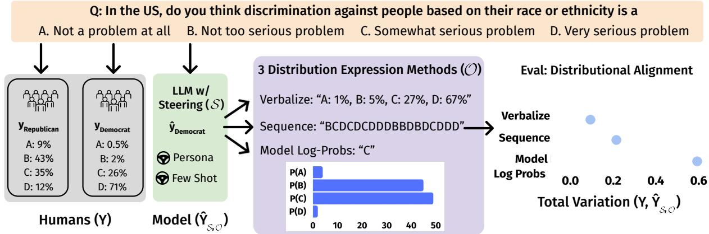  
Figure 1: Our work studies how variations in the dataset (yellow), steering method (green), and distributional expression method (purple) affect the quality of distributional alignment. We rank models and humans in their ability to align with the opinion distribution of demographic groups and find existing metrics for distributional alignment $( \mathrm { i . e . } ,$ , model log-probabilities) systematically underestimate LM performance. While LMs may ‘know about distributional alignment, they struggle to sample from their own distribution.

2. We collect a new dataset, NYT Book Opinions, that expands measurements beyond political and cultural values.

3. Our analysis reveals several open problems for the field: (1) LMs may ‘know’ a distribution, but are unable to sample from it (2) Logprobability-based metrics for distributional alignment may systematically underestimate LM performance (3) Distributional alignment and steering beyond political and cultural values remains challenging.

## 2 Problem Statement

We propose a benchmark that systematically evaluates the extent to which a language model can be aligned to the distribution of a particular demographic group’s opinions, a task we term the distributional alignment problem. To begin, we formalize this task and visualize it in Fig. 1.

Let $q \in Q$ be a survey question to which respondents from group $g \in G$ have an opinion distribution across multiple choices answers $y _ { g , q }$ . The goal is to understand how a language model can represent a group $g$ through a steering method S, one that shifts an LM’s opinion distribution to that of a particular group. Concretely, the model will express a distribution $\hat { y } _ { g , q }$ with a distribution expression method ${ \mathcal { O } } \left( \mathrm { e . g . } \right.$ , model log-probabilities).

We are interested in the distributional difference between the reference distribution, $y _ { g , q } ,$ and the model’s estimate, $\hat { y } _ { g , q }$ . To evaluate this, we construct a set1 Y of ground truth human opinion distributions, where $Y = \{ y _ { g , q } \mid 1 \leq g \leq G , 1 \leq$ $q \leq Q \}$ , and a corresponding set $\hat { Y } _ { S , \mathcal { O } }$ of a model’s predicted distributions, where $\hat { Y } _ { S , \mathcal { O } } = \{ \hat { y } _ { g , q } | 1 \le$ $g \leq G , 1 \leq q \leq Q \}$ . We define distributional alignment as

$$
A ( Y , \hat { Y } _ { S , \mathcal { O } } ) = \frac { 1 } { | G | } \sum _ { g \in G } \frac { 1 } { | Q | } \sum _ { q \in Q } \frac { 1 } { 2 } | | y _ { g , q } - \hat { y } _ { g , q } | | _ { 1 } .\tag{1}
$$

This metric is the average total variation between these two distributions, with a smaller number representing a higher performance on the task.

## 3 Benchmark Construction

Having formalized the notation for distributional alignment, we explore how it can be improved by focusing on three understudied sources of variation: the distributional expression method ( ), steering method (S), and dataset (Y). In this section, we explain how these elements are used to construct the benchmark and describe the human baseline.

## 3.1 Distributional Estimation Method ( )

In this section, we describe three distributional expression methods and demonstrate how distributional alignment is highly sensitive to the distribu-

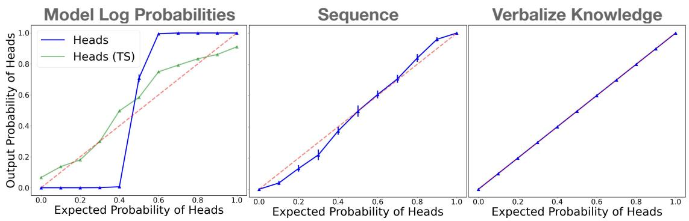  
Figure 2: Biased Coin Flip: We find that when the probability of heads is measured via model log-probabilities (left), the results are highly uncalibrated (this behavior is mitigated with temperature scaling (TS), shown in green). However, when the distribution is expressed through emitting a 30-token sequence of H or T (Sequence) or directly verbalizing the distributional knowledge (Verbalize Knowledge), we do not observe the same mis-calibration.

tion estimation method.2

1. Model Log-probabilities: A model’s next token log probabilities assigned to each of the answer choices (e.g., ‘A’, ‘B’...) provide a sampling distribution by directly sampling from the model. This is the canonical distribution estimation method (Santurkar et al., 2023; Durmus et al., 2024); however, prior work has found that these model logprobabilities have a concentrated probability mass on a few answer choices rather than more dispersed answers as seen in their corresponding human distributions (Durmus et al., 2024), especially in models trained with Reinforcement Learning from Human Feedback (RLHF) (Christiano et al., 2017).

2. Sequence of Tokens: While model logprobabilities represent drawing samples from a LM, a model can also express its distributions by behaving as a sampler. We instruct a model to emit a sequence of 30 samples from the distribution (e.g., ABBBAABDDBACBDB). This method is advantageous when practitioners want to generate samples from an opinion distribution for simulation purposes.3 This distribution is limited by the number of tokens emitted in the sequence, as we are trying to estimate a continuous distribution from a finite number of tokens. Thus, we report a discretization error— the error incurred when drawing 30 samples from the ground truth distribution and computing the total variation based on those samples.

3. Verbalize Distributional Knowledge: Lastly, we can remove the requirement that models must sample from simulated humans and instruct a model to directly verbalize the distribution in the output text, without an estimation procedure or post-processing applied (e.g., text in a JSON format {A: 25%, B: 20%, C: 45%, D: 10%}). This differs from the aforementioned methods in that it separates distributional knowledge from the LM’s ability to also generate samples.

These three estimation methods reveal surprising performance gaps. Consider a toy experiment in which the model hasfull knowledge of the ground truth distribution. In this experiment, an LLM is instructed to simulate a flip of a biased coin which has P(H) = p and $P ( T ) = 1 - p .$ . Naturally, we would expect the model log-probabilities for the token ‘H’ to be p and ‘T’ to be 1  p. In reality, we see that the model log-probabilities are highly un-calibrated. They provide a misleading picture of the ground truth distribution, despite the fact that the ground truth distribution is shared in the input prompt (Fig. 2). Moreover, we find that two other distributional estimation methods do not suffer the same mis-calibration issue: both verbalizing the distribution and emitting a sequence of 30 samples of the biased coin flip are much more calibrated than the model’s log-probabilities.5

Results from this biased coin flip experiment suggest two things: (1) prior distributional alignment work using model log-probabilities may not be seeing the full picture and (2) there exists a significant performance gap, one that we term knowledge-tosimulation gap. This gap refers to instances where models may have alignment in knowledge (i.e., verbalizing the distribution in the output text), but not in sampling behavior (i.e., as measured via model log-probabilities or emitting a sequence of tokens).

We define the knowledge-to-simulation gap as the percent error between the alignment when emitting a sequence of answer choices and verbalizing the distribution.6 More formally, this gap is:

$$
\mathrm { K S } _ { S } = \frac { \mathcal { A } ( Y , \hat { Y } _ { S , \mathrm { S e q u e n c e } } ) } { \mathcal { A } ( Y , \hat { Y } _ { S , \mathrm { V e r b a l i z e } } ) } - 1 .\tag{2}
$$

## 3.2 Steering Method (S)

Steerability in the context of this work refers to a LM’s ability to adapt to represent the opinion of a target demographic group. We evaluate two steering methods, persona and few-shot steering, by prepending additional context to the prompt describing the group we want the model to emulate. We chose to study this few-shot setting, as it is known that persona steering can be inaccurate, leading to undesirable side effects including stereotyping, exacerbating polarization, and creating echo chambers (Perez et al., 2023; Cheng et al., 2023a; Wang et al., 2024a).

Persona Steering: Cheng et al. (2023a) define a persona as a “natural language portrayal of an imagined individual belonging to some (intersectional) demographic group.” In persona steering, we append a persona to the prompt and ask the LM to emulate behavior from this group. Concretely, we follow a version of persona steering from Santurkar et al. (2023); Kambhatla et al. (2022) where the LM is instructed to pretend to be a member of the target demographic group (e.g. “Please simulate an answer from a group of Democrats.”).

Few Shot Steering: Inspired by the success of few-shot prompting in language understanding tasks (Brown et al., 2020), we construct a few shot setting in which in-context examples of ground truth group opinion distributions are provided in addition to the persona. Specifically, LMs are given the top five most similar questions and their corresponding ground truth distribution from a group, and instructed to simulate an answer from that group (see Appendix A.8 for more details). This setting is representative of when practitioners have access to existing survey data for similar questions.

No Steering: We can directly contrast steered models to models that are prompted with a question without any demographic or identity markers.

## 3.3 Dataset (Y)

In this section, we describe three datasets for quantifying distributional alignment – OpinionQA (Santurkar et al., 2023), GlobalOpinionQA (Durmus et al., 2024), and a new non-political subjective opinion dataset, NYT Book Opinions.

OpinionQA: We use the OpinionQA dataset from Santurkar et al. (2023) to leverage public opinion surveys to compare the distribution of LLM responses to those of US citizens. In their steerability analysis, they create a smaller set of 500 contentious questions where the subgroups frequently disagree. We follow suit and randomly sample 100 questions from this set to obtain questions spanning topics such as science, politics, and personal relationships. We obtain the ground truth human opinion distributions of PEW survey respondents belonging to six demographic groups: Democrat, Republican, Male, Female, Black, and White.

GlobalOpinionQA: GlobalOpinionQA consists of questions and answers from two cross-national surveys, World Values Survey and PEW Global Attitudes Survey. It is aimed at capturing diverse perspectives on global issues across various countries and is inspired by Santurkar et al. (2023). We filter this dataset for the top 100 questions with the highest disagreement between pairs of countries as measured by the distance between the text embedding (Gao et al., 2021) of the questions. See Sec. A.3 for more details.

NYT Book Opinions: Several works study how LMs respond to political opinions or cultural values (Santurkar et al., 2023; Durmus et al., 2024), but it is less understood how LMs respond to nonpolitical, yet still subjective values. How do our findings extend to other domains of personalization? Are LMs still suitable in this use case?

This motivates the construction of a new dataset, NYT Book Opinions, that gathers opinions on interest in the top books from the past two decades as judged by The New York Times (2024). The purpose is to capture subjective values that less directly measure cultural values and political leanings.

Annotation setup: We collected 235 books and their corresponding author, book summary, and genre. 346 annotators provided a 4-point Likert rating to the question, “Given the summary of this book, how likely are you to read it?” for 26 books. See Sec. A.4 for additional details.

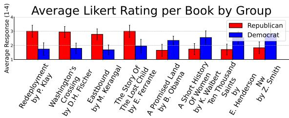  
Figure 3: Top 4 books with the largest difference between Republican and Democrat ratings (left) and the top 4 books with the largest difference between Democrat and Republican ratings (right), with a 95% confidence interval from bootstrapping.

From these human annotations, we find disagreement in book interest. In Fig. 3, we plot the top 4 books that have the largest difference in Democrat and Republican annotator ratings. Books that Republican annotators preferred over Democrat annotators include works such as Redeployment by Phil Klay (twelve stories by a former Marine who served in Iraq) and Washington’s Crossing by David Hackett Fischer (a story from the American Revolutionary War). Books that Democrat annotators preferred over Republican annotators include works such as A Promised Land by Barack Obama and A Short History OfWomen by Kate Walbert.

## 3.4 Human Baseline Annotations

Inspired by Yudkin et al. (2019) who study the Perception Gap, or the percentage difference between a respondent’s estimate of how many people hold a certain view and the actual percentage of people who hold that view, we recruit crowd workers to complete the distributional alignment task. Annotators receive the same questions from OpinionQA and NYT Book Opinions that we evaluated models on, allowing us to compare human performance against the suite of LMs we evaluate. Due to challenges in accurately capturing culturally specific perspectives, we do not collect human annotations on GlobalOpinionQA. Estimating the opinions of respondents from different countries would require annotators with deep, contextually relevant knowledge of each country’s sociocultural landscape and it is well established that annotations from Western populations do not accurately reflect non-western views (Apicella et al., 2020; Arnett, 2008). This decision was made to ensure that conclusions drawn are not confounded by culturally mismatched interpretations. As with the models, the human annotators are shown three prompts including no steering, persona steering, and few-shot steering. Each survey question receives four annotations, or human estimates of opinion distributions over answer choices.

## 4 Experiments

We rank GPT-4, GPT-3.5, Anthropic Haiku, Anthropic Opus, Llama-3 70B Instruct,7 based on distributional alignment (Eq. 1) and the knowledge-tosimulation gap (Eq. 2), and average across groups, steering methods, and datasets. We start by describing the performance on the distributional alignment task. Then, we dive into the implications that emerge from varying the distribution expression method, dataset, and steering method.

## 4.1 Distributional Alignment Performance

In Tab. 1a, we report the results of our distributional alignment leaderboard where we rank models on their ability to be steered towards a demographic group, averaged over persona steering and few shot steering, and all three datasets. In this leaderboard, where lower numbers represent higher distributional alignment, we find that verbalizing the distribution results in higher performance, with Anthropic Opus and GPT-4 being the most steerable amongst our models. These numbers can be directly compared to the performance of the uniform baseline, where each answer option is equally likely to occur in the sequence (0.363), a majority vote baseline, where the ground truth distribution is compared to a distribution in which all the probability mass is placed on the highest likelihood ground truth answer choice (0.707).

## 4.2 Implications for Distributional Alignment

In this section, we organize our analyses into implications for the field and conclude each section with actionable suggestions for practitioners who use LLMs for simulating human subjects.

A large knowledge-to-simulation gap exists. As observed in Sec. 3.1, even when a model knows as distribution, sometimes it cannot sample it. To this end, we measure these gaps between knowledge and simulation in our second leaderboard (Tab. 1b). We observe that some models, particularly those from the Llama-3 and Anthropic suite have a larger knowledge-to-simulation gap, especially when directly compared to the OpenAI models. This highlights room for improvement, as the language model is capable of returning more accurate estimates of human opinions when expressing the distribution through verbalizing the distribution, but not when simulating samples from this distribution. Implication: If practitioners are using models with a high knowledge-to-simulation gap, they should prompt the model to verbalize the knowledge directly and use an alternative sampler for simulation purposes.

<table><tr><td>Model</td><td> $\hat { \mathcal { A } } ( Y , \hat { Y } _ { \mathcal { S } , \mathcal { O } } )$ </td></tr><tr><td>Anthropic Opus (V) GPT-4 (V) Llama 3 70B (V)</td><td> $0 . 2 2 6 \pm 0 . 0 0 6$   $0 . 2 2 9 \pm 0 . 0 0 6$   $0 . 2 4 4 \pm 0 . 0 0 6$ </td></tr><tr><td>Anthropic Haiku (V) GPT-4 (TS-Log-p) GPT-4 (Seq)</td><td> $0 . 2 5 4 \pm 0 . 0 0 7$   $0 . 2 7 3 \pm 0 . 0 0 6$ </td></tr><tr><td>GPT-3.5-Turbo (V) GPT-3.5-Turbo (TS-Log-p)</td><td> $0 . 2 7 8 \pm 0 . 0 0 8$   $0 . 2 9 1 \pm 0 . 0 0 7$   $0 . 2 9 6 \pm 0 . 0 0 6$ </td></tr><tr><td>Anthropic Haiku (Seq) GPT-3.5-Turbo (Seq) Anthropic Opus (Seq)</td><td> $0 . 3 0 9 \pm 0 . 0 0 6$   $0 . 3 1 8 \pm 0 . 0 0 7$   $0 . 3 2 5 \pm 0 . 0 0 7$ </td></tr><tr><td>Llama 3 70B (Seq) GPT-3.5-Turbo (Log-p) Llama 3 70B (TS-Log-p)</td><td> $0 . 3 2 8 \pm 0 . 0 0 8$   $0 . 4 5 5 \pm 0 . 0 0 8$   $0 . 4 6 9 \pm 0 . 0 0 9$ </td></tr><tr><td>Llama 3 70B (Log-p) GPT-4 (Log-p) Discretization Error (Seq) Uniform</td><td> $0 . 4 9 5 \pm 0 . 0 0 8$   $0 . 5 5 0 \pm 0 . 0 0 8$   $0 . 1 1 5 \pm 0 . 0 0 4$   $0 . 3 6 3 \pm 0 . 0 0 7$ </td></tr></table>

(a) Distributional Alignment Task. Models ranked based on mean total variation distance. Models highlighted in gray and with (V) have a distribution expression method of directly verbalizing the distribution in a JSON format ( = Verbalize). Models not highlighted represent samplers, where (Seq) represents the 30-token sequential distribution output ( = Sequence), (Log-p) represents  = Model Log-probabilities, and (TS-Log-p) represents = Temperature Scaled Model Log-probabilities.

<table><tr><td>Model</td><td>Simulation Penalty</td></tr><tr><td>GPT-3.5 Turbo</td><td>9.17%</td></tr><tr><td>GPT-4</td><td>21.35%</td></tr><tr><td>Anthropic: Haiku</td><td>21.49%</td></tr><tr><td>Llama 3 70B Instruct</td><td>34.65%</td></tr><tr><td>Anthropic: Opus</td><td>43.63%</td></tr></table>

(b) Knowledge-to-Simulation Gap (Eq. 2). The simulation penalty measures the percent error increase in total variation between the 30-token sequential distribution output and the verbalization of knowledge.  
Table 1: Model Performance. In both tables, we and rank models from highest to lowest performance on the task and average over all three datasets, persona and few shot steering, and all demographic groups. We report the 95% confidence interval from bootstrapping with 1000 samples.

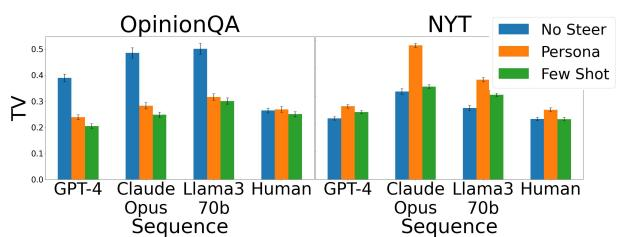  
Figure 4: Steering Method and Dataset: We plot the average total variation for each dataset and steering method, averaged across demographic groups for the 30- token sequential distribution output. We find it is harder to steer models toward the dataset where opinions are hidden under a layer of abstraction (NYT). Additionally, few shot steering improves distributional alignment for humans and all models except for GPT-3.5.

Model log-probabilities can be misleading. Next, we highlight a larger knowledge-tosimulation gap between model log-probabilities and the verbalization of knowledge (Tab. 1a). Using model log-probabilities to measure distributional alignment results in worse performance than even uniform distribution on the distributional alignment task. We find that this performance gap can be in part attributed to log probabilities having a highly concentrated probability mass on one or two answer choices, as observed in Durmus et al. (2024) and our biased coin flip experiment from Sec. 3.1. While prior work (Santurkar et al., 2023; Durmus et al., 2024) has used model log-probabilities for steering and alignment applications, this distribution expression method underestimates LLM capabilities in emulating demographic groups. Furthermore, we find that temperature-scaled model log-probabilities improve GPT-3.5 and GPT-4 results, but not for Llama-3-70B (Sec. A.2). Implication: We encourage practitioners to use alternative distribution estimation methods, such as emitting a sequence or verbalizing the distributional knowledge.

Steering is more challenging in non-cultural and non-political settings. The goal of the NYT Book Opinions dataset is to capture subjective values from demographic groups that less directly measure cultural values and political leanings, unlike OpinionQA questions which directly ask valueladen survey questions. We find that all models and humans are more easily steered towards questions in the OpinionQA dataset than the NYT Book Opinions dataset, as the total variation decreases from no steering to persona and few shot steering. In Fig. 4, we plot the average total variation for each dataset and steering method, averaged across demographic groups, for the output type of sequence. This suggests that when the values are hidden under a layer of abstraction (i.e., book interest) it may be harder to steer models towards the opinions of demographic groups. Implication: When practitioners use LLMs to pilot survey questions that less directly allude to cultural values, they need to consider the nature of their questions and if LLMs are suitable for their use case.

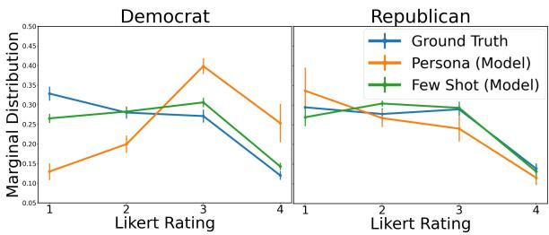  
Figure 5: Models assume Democrats read more than Republicans. In this plot, we show the marginal distribution of Likert Rating (1-4) in responses to the following question: “How likely are you to read this book?” A Likert rating of 1 refers to “Very unlikely” and a Likert rating of 4 refers to “Very likely”. We averaged over 235 questions from NYT Book Opinions and 5 models steered towards Democrats and Republicans with persona steering (orange) and few shot steering (green). In blue, we plot the reference human reference for Democrat and Republican annotators. We find that persona steering produces more stereotypical results.

Few shot steering improves persona steering. For humans and all models except GPT-3.5, we observe statistically significant improvements in few shot steering over persona steering (Fig. 4). As expected, when models have access to five examples of distributional data, they improve their distributional estimation capabilities. Implication: Practitioners should use prior distributional data as few shot examples over just personas, if possible.

Persona-steered LLMs are susceptible to stereotyping. Consistent with prior work studying persona steering and LLMs emulating human behavior (Gupta et al., 2024; Cheng et al., 2023a,b;

Wan et al., 2023), we find that the LLMs produce stereotypical outputs. For example, when analyzing the marginal distribution of the answer ratings in the NYT Book Opinions dataset (Fig. 5), we find that models prompted with a Democrat persona tend to simulate humans that are more likely to read books—the average simulated human has a 13% chance of responding with “very unlikely to read” when our human annotators had a 33% chance. Furthermore, the simulated Democrat has a 25% chance of responding with “very likely to read”, when our human annotators had a 12% chance. This gap is significantly reduced when using fewshot steering. Implication: It is important to collect disaggregated evaluation metrics to understand potential discrepancies between groups (Barocas et al., 2021). These findings support using prior distributional data as a few shot examples.

## 5 Discussion

## 5.1 Human Performance

<table><tr><td>Model</td><td> $\hat { \mathcal { A } } ( Y , \hat { Y } _ { \mathcal { S } , \mathcal { O } } )$ </td></tr><tr><td>GPT-4 (V) Anthropic Opus (V) Llama 3 70B (V)</td><td> $0 . 2 0 4 \pm 0 . 0 0 3$   $0 . 2 1 9 \pm 0 . 0 0 4$ </td></tr><tr><td>Anthropic Haiku (V)</td><td> $0 . 2 2 5 \pm 0 . 0 0 4$   $0 . 2 3 5 \pm 0 . 0 0 4$ </td></tr><tr><td>GPT-4 (Seq)</td><td> $0 . 2 3 7 \pm 0 . 0 0 4$ </td></tr><tr><td>Humans (V) GPT-3.5-Turbo (V)</td><td> $0 . 2 5 0 \pm 0 . 0 0 4$   $0 . 2 5 9 \pm 0 . 0 0 5$ </td></tr></table>

Table 2: Distributional Alignment Task with Human Performance (OQA, NYT). Models with a distribution expression method of directly verbalizing the distribution (V) are ranked based on mean total variation. We average over the OQA and NYT, persona and few shot steering, and all demographic groups, and report the 95% CI from bootstrapping with 1000 samples. For humans, we compute the average over annotators per question and report the 95% CI from bootstrapping with 1000 samples over questions.

In Tab. 2, we contextualize the performance of LMs with human annotators who attempt to guess the opinions of others. Although the best LMs with the most effective distribution methods (verbalize) perform close to this human baseline, this is not particularly promising for the field of distributional alignment given that humans are known to be poor predictors of opinions of the opposite party (Yudkin et al., 2019; Levendusky and Malhotra, 2015). It would be highly questionable to base the result of social science surveys on participants guessing others’ opinions, and our findings indicate that LMs offer little improvement over this baseline.

## 5.2 Open Problems

Our analyses reveal unique challenges for the community to make progress on. In this section, we lay out those open problems.

Knowledge-to-Simulation Gap. First, we find in the biased coin flip experiment, and then more rigorously with survey data (Tab. 1b), that while LMs may ‘know’ a distribution, they struggle to sample from their own distribution. Future work should address the sampling capabilities of models and why they struggle with randomness and representing distributions (e.g., Requeima et al. (2024) and Paruchuri et al. (2024)).

Misleading Model Log-probabilities. Existing research has considered distributional alignment through model log-probabilities; however, our benchmark reveals this method’s shortcomings, as models evaluated by log-probabilities fail to rank among the top ten in our distributional alignment leaderboard. Future work should address why model log-probabilities are mis-calibrated in distributional alignment settings and pivot to improving sampling through emitting a sequence of tokens.

Limitations of Persona Steering. Few shot steering improves the performance of persona steering, suggesting that models lack key information about the opinions that a few examples can provide. We find this is often due to persona-steered models conceptualizing humans as less nuanced and more polarized. This reveals a clear challenge in building models that can capture the idiosyncracies of a person and avoid extremized stereotypes.

## 6 Related Work

Distributionally Pluralistic Alignment. LLMs often learn an averaged human preference and struggle to model diverse preferences across groups. Recent works advocate for distributionally pluralistic models that are well-calibrated to a group’s distribution of responses (Sorensen et al., 2024; Feng et al., 2024; Kirk et al., 2024; Chen et al., 2024). However, Sorensen et al. (2024) acknowledge there is limited knowledge of explicit alignment procedures to increase distributional calibration, highlighting the importance of our work in characterizing key sources of variation and how they affect distributional alignment.

LLMs for Simulating Human Behavior. With the proliferation of LLMs, recent work has integrated LLMs into computational social science to simulate social psychology experiments (Aher et al., 2023; Dillion et al., 2023), create humanlike agents (Park et al., 2023a; Samuel et al., 2024; Horton, 2023), and annotate data (He et al., 2024; Mellon et al., 2024) to name a few. We focus on a popular use case of LLMs simulating humans to generate survey samples (Hwang et al., 2023; Zhou et al., 2024; Aher et al., 2023; Argyle et al., 2023).

Several works urge caution when relying on the survey responses of LLMs to elicit synthetic responses, citing concerns such as group stereotyping and misrepresentation (Wang et al., 2024a; Abdurahman et al., 2024; Geng et al., 2024), preference for socially desirable responses (Ai et al., 2024), lower entropy in model responses (Dominguez-Olmedo et al., 2024; Park et al., 2023b), and answer inconsistencies from prompt brittleness (Ceron et al., 2024). While these works provide important context, they focus on zero-shot and political or cultural values, leaving several sources of variation unexamined. The closest work to ours is Dominguez-Olmedo et al. (2024) who study answer choice order bias and find that model responses have different variation than that of humans. Our work is distinct in that we look beyond stability to prompt variation, and focus on higher-level design choices such as the steering method (e.g. few shot) and distribution estimation method, which have a significant impact on alignment measurements.

Next, we describe existing research on these variables and how our work makes new contributions.

Dataset. Santurkar et al. (2023) quantify alignment through responses to PEW surveys, inspiring numerous works (Durmus et al., 2024; Naous et al., 2024; Wang et al., 2024b; Pistilli et al., 2024; Kovac et al. ˇ , 2023; Masoud et al., 2024; Zhao et al., 2024; Stammbach et al., 2024; Röttger et al., 2024). However, there is no publicly available dataset on distributional preferences to non-political yet subjective values (e.g., product preferences) motivating our NYT Book Opinions dataset.

Steering Method. The literature has studied a variety of methods to steer the generation of LLMs toward specific opinions. A popular method of steering is persona steering, achieved by prepending demographic information to prompts (Santurkar et al., 2023; Simmons, 2023; Perez et al., 2023; Cheng et al., 2023a), prepending past opinions (Hwang et al., 2023), or fine-tuning (Jiang et al., 2022; Namikoshi et al., 2024). Prior works have also explored steering with in-context examples (Kim and Yang, 2024; Zhao et al., 2023), prefix-tuning with persona grounded in collaborative filtering (Li et al., 2024a), modifying activations in the forward pass (Turner et al., 2023), and creating human belief networks (Chuang et al., 2024), yet none have studied the differences between persona and few shot steering as we do. Closest to our work is Santurkar et al. (2023) and Liu et al. (2024), who evaluate persona steering, yet we are unique in that we compare persona steering to instances where practitioners have access to prior survey data and can use it as few shot examples.

Distribution Expression Method. Prior work has found that prompting LMs for statement probabilities (e.g., verbalize) and model log-probabilities can sometimes lead to different results (Hu and Levy, 2023; Liu et al., 2023). When evaluating LLMs on the basis of survey questions, Santurkar et al. (2023), and all the works that have followed, study models’ log-probability distribution over various answer choices. Recent work has begun to explore randomness in coin flips (Koevering and Kleinberg, 2024; Mondal et al., 2024), improved sampling from LMs (Zhu et al., 2024; Requeima et al., 2024) and using LMs for probabilistic reasoning (Paruchuri et al., 2024), but do not apply it to the simulating opinion distributions. We explore differences in distribution expression and take inspiration from work that suggests verbalized uncertainty can be competitive with model log-probabilities (Tian et al., 2023; Mondal et al., 2024).

## 7 Conclusion

LLMs perform surprisingly well on knowledgeintensive tasks, excelling on coding benchmarks and question-answer tasks to name a few. Their success in these tasks has led to an increase in applying LLMs to simulate human behavior, yet their ability to accurately reflect specific demographic groups remains controversial. To study this problem, we construct a benchmark to rank humans and models by performance on the distributional alignment task. Our findings reveal many unresolved challenges in distributional alignment, notably the model’s sensitivity to output formats, misleading log-probabilities, and the inability to significantly outperform weak human baselines.

## 8 Limitations

Our benchmark reveals key design choices in LM distributional alignment; however, we acknowledge and discuss three limitations of this approach.

Scope of surveys topics. Our benchmark and dataset rely on distributions from subjective opinion surveys to capture distributional alignment; however, opinions continuously evolve, surveys may not fully capture diversity and complexity of thought or represent all individuals in that group (Durmus et al., 2024), and survey answers may be sensitive to question specificity (Berinsky, 2017) and social desirability bias (Yan, 2021). While this is an open problem, surveys remain an effective tool in social science for gauging public opinion.

Scope of multiple-choice format. Our analyses are restricted to opinions expressed in multiplechoice format, which can collapse the nuances of opinions and alter the opinion expressed, as LLMs have also been shown to express different opinions when prompted to respond with open-ended text (Wang et al., 2024c; Lyu et al., 2024). While eliciting opinions via long-form responses may offer greater ecological validity, we have found complex challenges in studying long-form opinions, such as (1) strict refusal policies that limit an LLM’s ability to generate long-form responses to potentially harmful or generally controversial questions (Ouyang et al., 2022; Arditi et al., 2024), (2) challenges in defining the input distribution (e.g., how do users naturally elicit long-form opinions from LMs?) which lead to issues with construct validity, and (3) long-form measurement of opinions encounters the same challenges as the automated evaluation of open-ended text generation, including cost, construct validity, and bias (Koo et al., 2024). This prevents us from properly benchmarking and making direct comparisons between models. Instead, we focus on a high-precision setting of closed-ended survey questions which has several advantages: (1) leveraging established datasets and prior work in this field (e.g., OpinionQA) (2) enabling a more precise, scalable, and reproducible evaluation of LLM performance (3) allowing us to apply existing model calibration techniques.

Scope of groups and annotators demographics. Beyond evaluating six demographic groups for OpinionQA and four demographic groups for NYT-Books, there are many other demographic groups that we have not yet explored. Furthermore, we describe the demographics of our human annotators as described in Sec. 3.4, which have been limited to the demographic groups we study to enable ingroup vs out-group analysis. This slightly limits the representation range in the demographics of our human annotators.

Harms of model steerability. Studying model steerability towards specific demographic groups can have extreme negative downstream effects, particularly if used to systematically generate misinformation, persuade users to adopt certain opinions, or perpetuate harmful stereotypes. Thus, it is important to acknowledge the risks of model steerability and ensure that model-generated responses are closely monitored in real-world deployments or field studies.

Finally, we do not provide a metric, numerical threshold, or provable statistical test that determines when a system is safe to deploy. It is clear this distributional alignment task is highly context-dependent and socially nuanced, suggesting a one-size-fits-all metric may be more harmful than helpful.

## 9 Ethical Considerations

While our benchmark (Tab. 1a) optimizes for steerability, we caution against blindly optimizing for this metric without considering the harms and limitations of doing so. We advise practitioners to identify when their models misrepresent specific groups and uphold stereotypes as we did in Sec. 4.2, either by collecting disaggregated evaluation metrics to explicitly account for potential discrepancies between groups (Barocas et al., 2021), or other metrics that measure LLM simulations’ susceptibility to caricature (Cheng et al., 2023b; Liu et al., 2024).

A potential risk of our benchmark is that by simulating the distributional opinions of demographic groups, we may inadvertently encourage the use of LLMs to simulate humans. Thus, we emphasize that our benchmark is used only as a discovery mechanism to quantify model capabilities and limitations in distributional alignment. Our objective is to facilitate a deeper understanding of the capabilities and limits of LLMs in emulating human behavior and to ultimately determine if and how we develop such technologies.

## Acknowledgments

We thank anonymous reviewers for their helpful feedback. Nicole Meister was supported by NSF

GRFP DGE-2146755. Tatsunori Hashimoto and Nicole Meister were supported by a Hoffman-Yee grant, a HAI seed grant, the Amazon ARA program, NSF CAREER IIS-2338866, and a gift from Google through HAI. Carlos Guestrin is supported by Stanford HAI. The authors would like to thank Teddi Worledge, Irena Gao, Neil Band, Chenglei Si, Jared Moore, Yifan Mai, Jacy Reese Anthis, and other members of the Guestrin lab, Hashimoto lab, and Stanford Social NLP reading group for feedback on this paper.

## References

Suhaib Abdurahman, Mohammad Atari, Farzan Karimi-Malekabadi, Mona J Xue, Jackson Trager, Peter S Park, Preni Golazizian, Ali Omrani, and Morteza Dehghani. 2024. Perils and opportunities in using large language models in psychological research. PNAS Nexus, 3(7):pgae245.

Gati V Aher, Rosa I. Arriaga, and Adam Tauman Kalai. 2023. Using large language models to simulate multiple humans and replicate human subject studies. In Proceedings ofthe 40th International Conference on Machine Learning, volume 202 of Proceedings of Machine Learning Research, pages 337–371. PMLR.

Yiming Ai, Zhiwei He, Ziyin Zhang, Wenhong Zhu, Hongkun Hao, Kai Yu, Lingjun Chen, and Rui Wang. 2024. Is cognition and action consistent or not: Investigating large language model’s personality. Preprint, arXiv:2402.14679.

Coren Apicella, Ara Norenzayan, and Joseph Henrich. 2020. Beyond weird: A review of the last decade and a look ahead to the global laboratory of the future. Evolution and Human Behavior, 41(5):319–329. Beyond Weird.

Andy Arditi, Oscar Obeso, Aaquib Syed, Daniel Paleka, Nina Panickssery, Wes Gurnee, and Neel Nanda. 2024. Refusal in language models is mediated by a single direction. Preprint, arXiv:2406.11717.

Lisa P. Argyle, Ethan C. Busby, Nancy Fulda, Joshua R. Gubler, Christopher Rytting, and David Wingate. 2023. Out of one, many: Using language models to simulate human samples. Political Analysis, 31(3):337–351.

Jeffrey Jensen Arnett. 2008. The neglected 95%: why american psychology needs to become less american. The American psychologist, 63 7:602–14.

Solon Barocas, Anhong Guo, Ece Kamar, Jacquelyn Krones, Meredith Ringel Morris, Jennifer Wortman Vaughan, W. Duncan Wadsworth, and Hanna Wallach. 2021. Designing disaggregated evaluations of ai systems: Choices, considerations, and tradeoffs. In Proceedings ofthe 2021 AAAI/ACM Conference on AI, Ethics, and Society, AIES ’21, page 368–378, New York, NY, USA. Association for Computing Machinery.

Adam Berinsky. 2017. Measuring public opinion with surveys. Annual Review ofPolitical Science, 20.

James Bisbee, Joshua D. Clinton, Cassy Dorff, Brenton Kenkel, and Jennifer M. Larson. 2024. Synthetic replacements for human survey data? the perils of large language models. Political Analysis, page 1–16.

Tom Brown, Benjamin Mann, Nick Ryder, Melanie Subbiah, Jared D Kaplan, Prafulla Dhariwal, Arvind Neelakantan, Pranav Shyam, Girish Sastry, Amanda Askell, Sandhini Agarwal, Ariel Herbert-Voss, Gretchen Krueger, Tom Henighan, Rewon Child,

Aditya Ramesh, Daniel Ziegler, Jeffrey Wu, Clemens Winter, Chris Hesse, Mark Chen, Eric Sigler, Mateusz Litwin, Scott Gray, Benjamin Chess, Jack Clark, Christopher Berner, Sam McCandlish, Alec Radford, Ilya Sutskever, and Dario Amodei. 2020. Language models are few-shot learners. In Advances in Neural Information Processing Systems, volume 33, pages 1877–1901. Curran Associates, Inc.

Tanise Ceron, Neele Falk, Ana Baric, Dmitry Niko-´ laev, and Sebastian Padó. 2024. Beyond prompt brittleness: Evaluating the reliability and consistency of political worldviews in llms. Preprint, arXiv:2402.17649.

Daiwei Chen, Yi Chen, Aniket Rege, and Ramya Korlakai Vinayak. 2024. Pal: Pluralistic alignment framework for learning from heterogeneous preferences. Preprint, arXiv:2406.08469.

Myra Cheng, Esin Durmus, and Dan Jurafsky. 2023a. Marked personas: Using natural language prompts to measure stereotypes in language models. In Proceedings ofthe 61st Annual Meeting ofthe Associationfor Computational Linguistics (Volume 1: Long Papers), pages 1504–1532, Toronto, Canada. Association for Computational Linguistics.

Myra Cheng, Tiziano Piccardi, and Diyi Yang. 2023b. CoMPosT: Characterizing and evaluating caricature in LLM simulations. In Proceedings of the 2023 Conference on Empirical Methods in Natural Language Processing, pages 10853–10875, Singapore. Association for Computational Linguistics.

Paul F. Christiano, Jan Leike, Tom B. Brown, Miljan Martic, Shane Legg, and Dario Amodei. 2017. Deep reinforcement learning from human preferences. In Proceedings ofthe 31st International Conference on Neural Information Processing Systems, NIPS’17, page 4302–4310, Red Hook, NY, USA. Curran Associates Inc.

Yun-Shiuan Chuang, Zach Studdiford, Krirk Nirunwiroj, Agam Goyal, Vincent V. Frigo, Sijia Yang, Dhavan Shah, Junjie Hu, and Timothy T. Rogers. 2024. Beyond demographics: Aligning role-playing llmbased agents using human belief networks. Preprint, arXiv:2406.17232.

Danica Dillion, Niket Tandon, Yuling Gu, and Kurt Gray. 2023. Can ai language models replace human participants? Trends in Cognitive Sciences, 27(7):597–600.

Ricardo Dominguez-Olmedo, Moritz Hardt, and Celestine Mendler-Dünner. 2024. Questioning the survey responses of large language models. Preprint, arXiv:2306.07951.

Yann Dubois, Chen Xuechen Li, Rohan Taori, Tianyi Zhang, Ishaan Gulrajani, Jimmy Ba, Carlos Guestrin, Percy S Liang, and Tatsunori B Hashimoto. 2023. Alpacafarm: A simulation framework for methods that learn from human feedback. In Advances in Neural Information Processing Systems, volume 36, pages 30039–30069. Curran Associates, Inc.

Esin Durmus, Karina Nguyen, Thomas Liao, Nicholas Schiefer, Amanda Askell, Anton Bakhtin, Carol Chen, Zac Hatfield-Dodds, Danny Hernandez, Nicholas Joseph, Liane Lovitt, Sam McCandlish, Orowa Sikder, Alex Tamkin, Janel Thamkul, Jared Kaplan, Jack Clark, and Deep Ganguli. 2024. Towards measuring the representation of subjective global opinions in language models. In First Conference on Language Modeling.

Shangbin Feng, Taylor Sorensen, Yuhan Liu, Jillian Fisher, Chan Young Park, Yejin Choi, and Yulia Tsvetkov. 2024. Modular pluralism: Pluralistic alignment via multi-llm collaboration. Preprint, arXiv:2406.15951.

Tianyu Gao, Xingcheng Yao, and Danqi Chen. 2021. Simcse: Simple contrastive learning of sentence embeddings. In Proceedings of the 2021 Conference on Empirical Methods in Natural Language Processing (EMNLP), pages 6894–6910.

Mingmeng Geng, Sihong He, and Roberto Trotta. 2024. Are large language models chameleons? Preprint, arXiv:2405.19323.

Igor Grossmann, Matthew Feinberg, Dawn C. Parker, Nicholas A. Christakis, Philip E. Tetlock, and William A. Cunningham. 2023. Ai and the transformation of social science research. Science, 380(6650):1108–1109.

Chuan Guo, Geoff Pleiss, Yu Sun, and Kilian Q. Weinberger. 2017. On calibration of modern neural networks. In Proceedings ofthe 34th International Conference on Machine Learning - Volume 70, ICML’17, page 1321–1330. JMLR.org.

Shashank Gupta, Vaishnavi Shrivastava, Ameet Deshpande, Ashwin Kalyan, Peter Clark, Ashish Sabharwal, and Tushar Khot. 2024. Bias runs deep: Implicit reasoning biases in persona-assigned LLMs. In The Twelfth International Conference on Learning Representations.

Xingwei He, Zhenghao Lin, Yeyun Gong, A-Long Jin, Hang Zhang, Chen Lin, Jian Jiao, Siu Ming Yiu, Nan Duan, and Weizhu Chen. 2024. AnnoLLM: Making large language models to be better crowdsourced annotators. In Proceedings of the 2024 Conference of the North American Chapter ofthe Associationfor Computational Linguistics: Human Language Technologies (Volume 6: Industry Track), pages 165–190, Mexico City, Mexico. Association for Computational Linguistics.

John J Horton. 2023. Large language models as simulated economic agents: What can we learn from homo silicus? Working Paper 31122, National Bureau of Economic Research.

Jennifer Hu and Roger P. Levy. 2023. Prompting is not a substitute for probability measurements in large language models. In The 2023 Conference on Empirical Methods in Natural Language Processing.

EunJeong Hwang, Bodhisattwa Majumder, and Niket Tandon. 2023. Aligning language models to user opinions. In Findings of the Association for Computational Linguistics: EMNLP 2023, pages 5906– 5919, Singapore. Association for Computational Linguistics.

Hang Jiang, Doug Beeferman, Brandon Roy, and Deb Roy. 2022. CommunityLM: Probing partisan worldviews from language models. In Proceedings ofthe 29th International Conference on Computational Linguistics, pages 6818–6826, Gyeongju, Republic of Korea. International Committee on Computational Linguistics.

Saurav Kadavath, Tom Conerly, Amanda Askell, Tom Henighan, Dawn Drain, Ethan Perez, Nicholas Schiefer, Zac Hatfield-Dodds, Nova DasSarma, Eli Tran-Johnson, Scott Johnston, Sheer El-Showk, Andy Jones, Nelson Elhage, Tristan Hume, Anna Chen, Yuntao Bai, Sam Bowman, Stanislav Fort, Deep Ganguli, Danny Hernandez, Josh Jacobson, Jackson Kernion, Shauna Kravec, Liane Lovitt, Kamal Ndousse, Catherine Olsson, Sam Ringer, Dario Amodei, Tom Brown, Jack Clark, Nicholas Joseph, Ben Mann, Sam McCandlish, Chris Olah, and Jared Kaplan. 2022. Language models (mostly) know what they know. Preprint, arXiv:2207.05221.

Gauri Kambhatla, Ian Stewart, and Rada Mihalcea. 2022. Surfacing racial stereotypes through identity portrayal. In Proceedings ofthe 2022 ACM Conference on Fairness, Accountability, and Transparency, FAccT ’22, page 1604–1615, New York, NY, USA. Association for Computing Machinery.

Jaehyung Kim and Yiming Yang. 2024. Few-shot personalization of llms with mis-aligned responses. Preprint, arXiv:2406.18678.

Hannah Rose Kirk, Alexander Whitefield, Paul Röttger, Andrew Bean, Katerina Margatina, Juan Ciro, Rafael Mosquera, Max Bartolo, Adina Williams, He He, Bertie Vidgen, and Scott A. Hale. 2024. The prism alignment project: What participatory, representative and individualised human feedback reveals about the subjective and multicultural alignment of large language models. Preprint, arXiv:2404.16019.

Katherine Van Koevering and Jon Kleinberg. 2024. How random is random? evaluating the randomness and humaness of llms’ coin flips. Preprint, arXiv:2406.00092.

Ryan Koo, Minhwa Lee, Vipul Raheja, Jong Inn Park, Zae Myung Kim, and Dongyeop Kang. 2024. Benchmarking cognitive biases in large language models as evaluators. In Findings ofthe Associationfor Computational Linguistics ACL 2024, pages 517–545, Bangkok, Thailand and virtual meeting. Association for Computational Linguistics.

Grgur Kovac, Masataka Sawayama, Rémy Portelas,ˇ Cédric Colas, Peter Ford Dominey, and Pierre-Yves Oudeyer. 2023. Large language models as

superpositions of cultural perspectives. Preprint, arXiv:2307.07870.

Matthew S. Levendusky and Neil Malhotra. 2015. (Mis)perceptions of Partisan Polarization in the American Public. Public Opinion Quarterly, 80(S1):378–391.

David A. Levin, Yuval Peres, and Elizabeth L. Wilmer. 2006. Markov chains and mixing times. American Mathematical Society.

Junyi Li, Charith Peris, Ninareh Mehrabi, Palash Goyal, Kai-Wei Chang, Aram Galstyan, Richard Zemel, and Rahul Gupta. 2024a. The steerability of large language models toward data-driven personas. In Proceedings of the 2024 Conference of the North American Chapter ofthe Associationfor Computational Linguistics: Human Language Technologies (Volume 1: Long Papers), pages 7290–7305, Mexico City, Mexico. Association for Computational Linguistics.

Xiang Lisa Li, Vaishnavi Shrivastava, Siyan Li, Tatsunori Hashimoto, and Percy Liang. 2024b. Benchmarking and improving generator-validator consistency of language models. In The Twelfth International Conference on Learning Representations.

Andy Liu, Mona Diab, and Daniel Fried. 2024. Evaluating large language model biases in persona-steered generation. In Findings of the Association for Computational Linguistics ACL 2024, pages 9832–9850, Bangkok, Thailand and virtual meeting. Association for Computational Linguistics.

Kevin Liu, Stephen Casper, Dylan Hadfield-Menell, and Jacob Andreas. 2023. Cognitive dissonance: Why do language model outputs disagree with internal representations of truthfulness? In Proceedings of the 2023 Conference on Empirical Methods in Natural Language Processing, pages 4791–4797, Singapore. Association for Computational Linguistics.

Chenyang Lyu, Minghao Wu, and Alham Aji. 2024. Beyond probabilities: Unveiling the misalignment in evaluating large language models. In Proceedings of the 1st Workshop on Towards Knowledgeable Language Models (KnowLLM 2024), pages 109–131, Bangkok, Thailand. Association for Computational Linguistics.

Reem I. Masoud, Ziquan Liu, Martin Ferianc, Philip Treleaven, and Miguel Rodrigues. 2024. Cultural alignment in large language models: An explanatory analysis based on hofstede’s cultural dimensions. Preprint, arXiv:2309.12342.

Jonathan Mellon, Jack Bailey, Ralph Scott, James Breckwoldt, Marta Miori, and Phillip Schmedeman. 2024. Do ais know what the most important issue is? using language models to code open-text social survey responses at scale. Research & Politics, 11(1):20531680241231468.

Manuel Mondal, Ljiljana Dolamic, Gérôme Bovet, Philippe Cudré-Mauroux, and Julien Audiffren.

2024. Do large language models exhibit cognitive dissonance? studying the difference between revealed beliefs and stated answers. Preprint, arXiv:2406.14986.

Keiichi Namikoshi, Alex Filipowicz, David A. Shamma, Rumen Iliev, Candice L. Hogan, and Nikos Arechiga. 2024. Using llms to model the beliefs and preferences of targeted populations. Preprint, arXiv:2403.20252.

Tarek Naous, Michael Ryan, Alan Ritter, and Wei Xu. 2024. Having beer after prayer? measuring cultural bias in large language models. In Proceedings of the 62nd Annual Meeting of the Association for Computational Linguistics (Volume 1: Long Papers), pages 16366–16393, Bangkok, Thailand. Association for Computational Linguistics.

Long Ouyang, Jeffrey Wu, Xu Jiang, Diogo Almeida, Carroll Wainwright, Pamela Mishkin, Chong Zhang, Sandhini Agarwal, Katarina Slama, Alex Ray, John Schulman, Jacob Hilton, Fraser Kelton, Luke Miller, Maddie Simens, Amanda Askell, Peter Welinder, Paul F Christiano, Jan Leike, and Ryan Lowe. 2022. Training language models to follow instructions with human feedback. In Advances in Neural Information Processing Systems, volume 35, pages 27730–27744. Curran Associates, Inc.

Joon Sung Park, Joseph O’Brien, Carrie Jun Cai, Meredith Ringel Morris, Percy Liang, and Michael S. Bernstein. 2023a. Generative agents: Interactive simulacra of human behavior. In Proceedings ofthe 36th Annual ACM Symposium on User Interface Software and Technology, UIST ’23, New York, NY, USA. Association for Computing Machinery.

Peter S. Park, Philipp Schoenegger, and Chongyang Zhu. 2023b. Diminished diversity-of-thought in a standard large language model. Preprint, arXiv:2302.07267.

Akshay Paruchuri, Jake Garrison, Shun Liao, John Hernandez, Jacob Sunshine, Tim Althoff, Xin Liu, and Daniel McDuff. 2024. What are the odds? language models are capable of probabilistic reasoning. Preprint, arXiv:2406.12830.

Ethan Perez, Sam Ringer, Kamile Lukosiute, Karina Nguyen, Edwin Chen, Scott Heiner, Craig Pettit, Catherine Olsson, Sandipan Kundu, Saurav Kadavath, Andy Jones, Anna Chen, Benjamin Mann, Brian Israel, Bryan Seethor, Cameron McKinnon, Christopher Olah, Da Yan, Daniela Amodei, Dario Amodei, Dawn Drain, Dustin Li, Eli Tran-Johnson, Guro Khundadze, Jackson Kernion, James Landis, Jamie Kerr, Jared Mueller, Jeeyoon Hyun, Joshua Landau, Kamal Ndousse, Landon Goldberg, Liane Lovitt, Martin Lucas, Michael Sellitto, Miranda Zhang, Neerav Kingsland, Nelson Elhage, Nicholas Joseph, Noemi Mercado, Nova DasSarma, Oliver Rausch, Robin Larson, Sam McCandlish, Scott Johnston, Shauna Kravec, Sheer El Showk, Tamera Lanham, Timothy Telleen-Lawton, Tom Brown, Tom Henighan, Tristan Hume, Yuntao Bai, Zac Hatfield-Dodds, Jack Clark, Samuel R. Bowman, Amanda

Askell, Roger Grosse, Danny Hernandez, Deep Ganguli, Evan Hubinger, Nicholas Schiefer, and Jared Kaplan. 2023. Discovering language model behaviors with model-written evaluations. In Findings of the Associationfor Computational Linguistics: ACL 2023, pages 13387–13434, Toronto, Canada. Association for Computational Linguistics.

Giada Pistilli, Alina Leidinger, Yacine Jernite, Atoosa Kasirzadeh, Alexandra Sasha Luccioni, and Margaret Mitchell. 2024. Civics: Building a dataset for examining culturally-informed values in large language models. Preprint, arXiv:2405.13974.

James Requeima, John Bronskill, Dami Choi, Richard E. Turner, and David Duvenaud. 2024. Llm processes: Numerical predictive distributions conditioned on natural language. Preprint, arXiv:2405.12856.

Paul Röttger, Valentin Hofmann, Valentina Pyatkin, Musashi Hinck, Hannah Kirk, Hinrich Schuetze, and Dirk Hovy. 2024. Political compass or spinning arrow? towards more meaningful evaluations for values and opinions in large language models. In Proceedings of the 62nd Annual Meeting of the Association for Computational Linguistics (Volume 1: Long Papers), pages 15295–15311, Bangkok, Thailand. Association for Computational Linguistics.

Vinay Samuel, Henry Peng Zou, Yue Zhou, Shreyas Chaudhari, Ashwin Kalyan, Tanmay Rajpurohit, Ameet Deshpande, Karthik Narasimhan, and Vishvak Murahari. 2024. Personagym: Evaluating persona agents and llms. Preprint, arXiv:2407.18416.

Shibani Santurkar, Esin Durmus, Faisal Ladhak, Cinoo Lee, Percy Liang, and Tatsunori Hashimoto. 2023. Whose opinions do language models reflect? In Proceedings of the 40th International Conference on Machine Learning, volume 202 of Proceedings ofMachine Learning Research, pages 29971–30004. PMLR.

Chenglei Si, Diyi Yang, and Tatsunori Hashimoto. 2024. Can llms generate novel research ideas? a large-scale human study with 100+ nlp researchers. Preprint, arXiv:2409.04109.

Gabriel Simmons. 2023. Moral mimicry: Large language models produce moral rationalizations tailored to political identity. In Proceedings of the 61st Annual Meeting ofthe Associationfor Computational Linguistics (Volume 4: Student Research Workshop), pages 282–297, Toronto, Canada. Association for Computational Linguistics.

Taylor Sorensen, Jared Moore, Jillian Fisher, Mitchell Gordon, Niloofar Mireshghallah, Christopher Michael Rytting, Andre Ye, Liwei Jiang, Ximing Lu, Nouha Dziri, Tim Althoff, and Yejin Choi. 2024. A roadmap to pluralistic alignment. Preprint, arXiv:2402.05070.

Dominik Stammbach, Philine Widmer, Eunjung Cho, Caglar Gulcehre, and Elliott Ash. 2024. Aligning large language models with diverse political viewpoints. CoRR, abs/2406.14155.

The New York Times. 2024. Top books of 2024. https://www.nytimes.com/interactive/ 2024/books/top-books-list.html. Accessed: 2024-07-26.

Katherine Tian, Eric Mitchell, Allan Zhou, Archit Sharma, Rafael Rafailov, Huaxiu Yao, Chelsea Finn, and Christopher Manning. 2023. Just ask for calibration: Strategies for eliciting calibrated confidence scores from language models fine-tuned with human feedback. In Proceedings of the 2023 Conference on Empirical Methods in Natural Language Processing, pages 5433–5442, Singapore. Association for Computational Linguistics.

Alexander Matt Turner, Lisa Thiergart, David Udell, Gavin Leech, Ulisse Mini, and Monte MacDiarmid. 2023. Activation addition: Steering language models without optimization. CoRR, abs/2308.10248.

Yixin Wan, Jieyu Zhao, Aman Chadha, Nanyun Peng, and Kai-Wei Chang. 2023. Are personalized stochastic parrots more dangerous? evaluating persona biases in dialogue systems. In The 2023 Conference on Empirical Methods in Natural Language Processing.

Angelina Wang, Jamie Morgenstern, and John P. Dickerson. 2024a. Large language models should not replace human participants because they can misportray and flatten identity groups. Preprint, arXiv:2402.01908.

Wenxuan Wang, Wenxiang Jiao, Jingyuan Huang, Ruyi Dai, Jen-tse Huang, Zhaopeng Tu, and Michael Lyu. 2024b. Not all countries celebrate thanksgiving: On the cultural dominance in large language models. In Proceedings ofthe 62nd Annual Meeting ofthe Associationfor Computational Linguistics (Volume 1: Long Papers), pages 6349–6384, Bangkok, Thailand. Association for Computational Linguistics.

Xinpeng Wang, Bolei Ma, Chengzhi Hu, Leon Weber-Genzel, Paul Röttger, Frauke Kreuter, Dirk Hovy, and Barbara Plank. 2024c. “my answer is C”: First-token probabilities do not match text answers in instructiontuned language models. In Findings of the Association for Computational Linguistics ACL 2024, pages 7407–7416, Bangkok, Thailand and virtual meeting. Association for Computational Linguistics.

Yizhong Wang, Yeganeh Kordi, Swaroop Mishra, Alisa Liu, Noah A. Smith, Daniel Khashabi, and Hannaneh Hajishirzi. 2023. Self-instruct: Aligning language models with self-generated instructions. In Proceedings ofthe 61st Annual Meeting ofthe Associationfor Computational Linguistics (Volume 1: Long Papers), pages 13484–13508, Toronto, Canada. Association for Computational Linguistics.

Peter West, Ximing Lu, Nouha Dziri, Faeze Brahman, Linjie Li, Jena D. Hwang, Liwei Jiang, Jillian Fisher, Abhilasha Ravichander, Khyathi Chandu, Benjamin Newman, Pang Wei Koh, Allyson Ettinger, and Yejin Choi. 2024. The generative AI paradox: “what it can create, it may not understand”. In The Twelfth International Conference on Learning Representations.

Ting Yan. 2021. Consequences of asking sensitive questions in surveys. Annual Review ofStatistics and Its Application, 8(Volume 8, 2021):109–127.

Daniel A Yudkin, Stephen Hawkins, and Tim Dixon. 2019. The perception gap: How false impressions are pulling americans apart.

Siyan Zhao, John Dang, and Aditya Grover. 2023. Group preference optimization: Few-shot alignment of large language models. In R0-FoMo:Robustness ofFew-shot and Zero-shot Learning in Large Foundation Models.

Wenlong Zhao, Debanjan Mondal, Niket Tandon, Danica Dillion, Kurt Gray, and Yuling Gu. 2024. World-ValuesBench: A large-scale benchmark dataset for multi-cultural value awareness of language models. In Proceedings of the 2024 Joint International Conference on Computational Linguistics, Language Resources and Evaluation (LREC-COLING 2024), pages 17696–17706, Torino, Italia. ELRA and ICCL.

Xuhui Zhou, Hao Zhu, Leena Mathur, Ruohong Zhang, Haofei Yu, Zhengyang Qi, Louis-Philippe Morency, Yonatan Bisk, Daniel Fried, Graham Neubig, and Maarten Sap. 2024. SOTOPIA: Interactive evaluation for social intelligence in language agents. In The Twelfth International Conference on Learning Representations.

Jian-Qiao Zhu, Haijiang Yan, and Thomas L. Griffiths. 2024. Recovering mental representations from large language models with markov chain monte carlo. Preprint, arXiv:2401.16657.

Caleb Ziems, William Held, Omar Shaikh, Jiaao Chen, Zhehao Zhang, and Diyi Yang. 2024. Can large language models transform computational social science? Computational Linguistics, 50(1):237–291.

## A Appendix

## A.1 Significance of Distributional Alignment

LLM outputs that align with human preferences are becoming increasingly popular (e.g., RLHF). Typically, when researchers evaluate which group a model best aligns with, they compare average responses. However, this only measures alignment to the preference of the majority group. In many subjective tasks, it’s crucial for a model to represent the entire spectrum of opinions.

For example, consider the following survey question in the PEW (question ID: GODMORALIMP\_W92).

## Question

Regardless of your own religious beliefs, how important, if at all, do you think it is for a person to believe in God in order to be considered good and moral?

A. Important.

B. Not Important.

The PEW survey respondents responded with A : 54.8%, B : 45.2% . If we query the language model and receive a response of “A. Important” (the highest likelihood answer choice), the model may appear to be highly aligned if our evaluation only considers the most likely human response. However, this ignores the 45% of people responding with the minority choice, “B. Not Important.” A clearer assessment of this task would be if the language model can represent the 54.8%, and 45.2% split, as this would show the model understands the underlying heterogeneity of views on this topic. Evaluating in this way provides a clearer and more precise measure of the model’s alignment with human preferences.

## A.2 Temperature Scaling

Temperature scaling is a post-processing technique to make neural networks calibrated (Guo et al., 2017). To implement temperature scaling for our work, we find the minimum temperature value that results in the smallest total variation between the reference probabilities and model probabilities. In this setting, the temperature-scaled scaled logprobabilities have access to the ground truth opinion distribution and aim to find τ that minimizes the total variation. We calculate a new value of τ per dataset and steering method using the following

formula.

$$
\operatorname* { m i n } _ { \tau } { \frac { 1 } { 2 } } \left. y _ { g , q } - \hat { y } _ { g , q , \mathrm { n o r m } } ^ { \frac { 1 } { \tau } } \right. _ { 1 } .\tag{3}
$$

Our model log-probabilities are sampled with a temperature of 1.0, and after applying temperature scaling to the biased coin flip, the model log-probabilities performance improves. When extended to opinion surveys, we see much fewer improvements in the temperature-scaled model logprobabilities for Llama-3-70B Instruct, but improvements for GPT-3.5 and GPT-4. We report the distributional alignment performance in Tab. 1a, plot calibration curves in Fig. 6, and report ECE in Tab. 3).

<table><tr><td rowspan=1 colspan=1>Model</td><td rowspan=1 colspan=1>TS-Log-p</td><td rowspan=1 colspan=1>Log-p</td></tr><tr><td rowspan=1 colspan=1>Llama3-70B</td><td rowspan=1 colspan=1>0.11</td><td rowspan=1 colspan=1>0.13</td></tr><tr><td rowspan=1 colspan=1>GPT-4</td><td rowspan=1 colspan=1>0.07</td><td rowspan=1 colspan=1>0.28</td></tr><tr><td rowspan=1 colspan=1>GPT-3.5</td><td rowspan=1 colspan=1>0.06</td><td rowspan=1 colspan=1>0.20</td></tr></table>

Table 3: ECE (Expected Calibration Error) values for temperature scaled log probabilities (TS-Log-p) and logprobabilities (Log-p) Llama 3 70B, GPT-4, and GPT-3.5.

## A.3 GlobalOpinionQA

In this section, we share additional question examples, preprocessing steps, and results for GlobalOpinionQA. For example, consider this survey question that demonstrates how countries can highly differ in their distributional responses to these survey questions.

## Question

Do you personally believe that drinking alcohol is morally acceptable, morally unacceptable, or is it not a moral issue?

A. Morally acceptable

B. Morally unacceptable

C. Not a moral issue

D. Depends on the situation

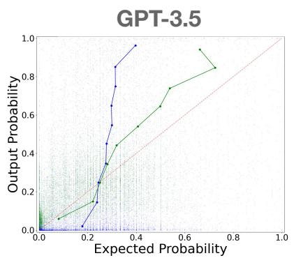

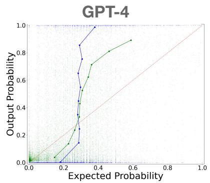

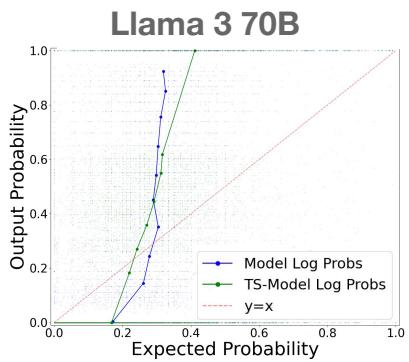  
Figure 6: Temperature Scaling calibration curves for the survey setting. We find that temperature scaling improves results for GPT models, but not for Llama3-70b. Results are averaged across the OpinionQA, NYTimes, and GlobalOpinionQA Datasets.

## Answer: Pakistan

A. Morally acceptable: 0.01

B. Morally unacceptable: 0.95

C. Not a moral issue: 0.02

D. Depends on the situation: 0.02

## Answer: Japan

A. Morally acceptable: 0.67

B. Morally unacceptable: 0.06

C. Not a moral issue: 0.25

D. Depends on the situation: 0.02

## Answer: Britain

A. Morally acceptable: 0.39

B. Morally unacceptable: 0.09

C. Not a moral issue: 0.47

D. Depends on the situation: 0.05

Preprocessing. To filter out the top 100 contentious questions, we start by only considering survey responses from countries that have at least 600 other responses to ensure a large enough pool of questions to pull few shot examples from, reducing the total number of countries in the dataset from 138 to 19. Then we calculate disagreement by the largest total variation distance.

Results. The results are consistent with those in our paper: (1) verbalize remains the optimal distribution estimation method (Tab. 4) and (2) there exists a knowledge-to-simulation gap between verbalize and sequence in all 5 models (Tab. 5).

<table><tr><td rowspan=1 colspan=1>Model                          $\hat { \mathcal { A } } ( Y , \hat { Y } _ { \mathcal { S } , \mathcal { O } } )$ </td></tr><tr><td rowspan=2 colspan=1>Anthropic Opus (V)          $0 . 2 4 1 \pm 0 . 0 1 5$ GPT-4 (V)                     $0 . 2 7 9 \pm 0 . 0 1 6$ </td></tr><tr><td rowspan=1 colspan=1></td></tr><tr><td rowspan=1 colspan=1>Llama 3 70B (V)              $0 . 2 8 1 \pm 0 . 0 1 6$ Anthropic Haiku (V)         $0 . 2 9 3 \pm 0 . 0 1 6$ </td></tr><tr><td rowspan=1 colspan=1>Anthropic Opus (Seq)        $0 . 3 0 1 \pm 0 . 0 2 0$ </td></tr><tr><td rowspan=1 colspan=1>GPT-4 (TS-Log-p)            $0 . 3 0 3 \pm 0 . 0 1 6$ </td></tr><tr><td rowspan=1 colspan=1>Llama 3 70B (Seq)           $0 . 3 4 6 \pm 0 . 0 2 0$ Anthropic Haiku (Seq)       $0 . 3 5 1 \pm 0 . 0 1 6$ </td></tr><tr><td rowspan=1 colspan=1>GPT-3.5 (V)                   $0 . 3 5 6 \pm 0 . 0 1 9$ </td></tr><tr><td rowspan=1 colspan=1>GPT-4 (Seq)                   $0 . 3 5 9 \pm 0 . 0 2 1$ </td></tr><tr><td rowspan=1 colspan=1>GPT-3.5 (TS-Log-p)          $0 . 3 8 1 \pm 0 . 0 1 5$ </td></tr><tr><td rowspan=1 colspan=1>GPT-3.5 (Seq)                 $0 . 3 9 9 \pm 0 . 0 1 8$ </td></tr><tr><td rowspan=1 colspan=1>GPT-3.5 (Log-p)              $0 . 4 4 2 \pm 0 . 0 2 2$ Llama 3 70B (Log-p)         $0 . 4 5 5 \pm 0 . 0 2 1$ GPT-4 (Log-p)                $0 . 4 8 4 \pm 0 . 0 2 3$ Llama 3 70B (TS-Log-p)    $0 . 4 9 1 \pm 0 . 0 2 4$ </td></tr><tr><td rowspan=1 colspan=1>Discretization Error (Seq)   $0 . 0 9 2 \pm 0 . 0 0 4$ Uniform                        $0 . 4 8 6 \pm 0 . 0 1 9$ Majority Vote                  $0 . 6 9 2 \pm 0 . 0 3 5$ </td></tr></table>

Table 4: Distributional Alignment Task on GlobalOpinionQA. Models ranked based on mean total variation. Models highlighted in gray and with (V) have a distribution expression method of directly verbalizing the distribution in a JSON format ( = Verbalize). Models not highlighted represent samplers, where (Seq) represents the 30-token sequential distribution output ( = Sequence), (Logp) represents  = Model Log-probabilities, and (TS-Log-p) represents 0 = Temperature Scaled Model Log-probabilities.

I consent to participate in this study

<table><tr><td>Model</td><td>Percent Error (%)</td></tr><tr><td>GPT-3.5 Turbo</td><td>12.15%</td></tr><tr><td>Anthropic: Haiku</td><td>19.86%</td></tr><tr><td>Llama 3 70B Instruct</td><td>22.95%</td></tr><tr><td>Anthropic: Opus</td><td>24.88%</td></tr><tr><td>GPT-4</td><td>28.68%</td></tr></table>

Table 5: Knowledge-to-Simulation Gap of GlobalOpinionQA (Eq. 2). The simulation penalty measures the percent error increase in total variation between the 30-token sequential distribution output and the verbalization of knowledge.

## A.4 NYT Books Dataset Construction

Annotators. From this data collection process, we surveyed 131 Male, 206 Female, 165 Democrat, and 172 Republican annotators, resulting in 18 annotations per book per demographic group. In Fig 7, we show an example annotation question. In this example, annotators are given a book title and its corresponding author, book summary, and genre. Then they provide a 4-point Likert rating to the question, “Given the summary of this book, how likely are you to read it?" From these annotations,

  
Figure 7: NYT Books Annotation Example Task.

we calculated an opinion distribution over the 4 Likert ratings for each book. All crowd workers are sourced on Prolific, filtered for English fluency, selected from a pool of annotators who pass an attention check 93% of the time and are paid \$12 per hour (this amount is well over the federal minimum wage of \$7.25). The consent form shown to annotators is shown in Fig 8.

It should be noted that articles from the New

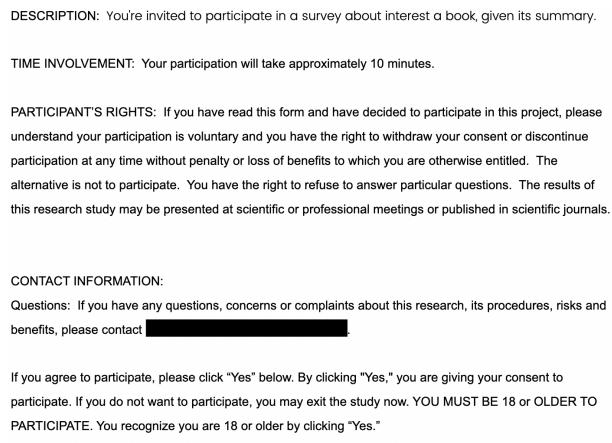  
Figure 8: NYT Books Annotator Consent Form.

York Times are in English and protected under copyright, but this research is performed in the public interest under GDPR and the excerpts are collected under fair use exemption. When releasing our dataset, we include all links to the exact New York Times paragraph highlight to respect copyrights. Furthermore, the annotation data we collect is not personally identifiable as it consists only of opinion ratings of books.

In addition to the disagreement analysis we conduct in Sec. 3.3, we calculate the Cohen’s kappa of opinions between demographic groups. We find that Cohen’s kappa between Democrats and Republicans is 0.05, indicating little to no agreement. The Cohen’s kappa between Men and Women is 0.15, indicating a small amount of agreement.

## A.5 OpinionQA

We used the OpinionQA Santurkar et al. (2023) accessed via the CC-BY 4.0 license, written in English, as they survey US participants. In their steerability analysis, they create a smaller set of 500 contentious questions where the subgroups frequently disagree. We follow suit and randomly sample 100 questions from this set to obtain questions spanning topics such as science, politics, and personal relationships.

## A.6 Human Baseline Annotations

Using the Prolific platform, we crowdsource human annotations for the distributional alignment task. We restrict the demographics of annotators to match the groups that we study as it provided us an opportunity to do an in-group vs out-group analysis. Our OQA annotators are Democrat (73%), Republican (27%), Male (33%), Female (67%),

White (84%), and Black (16%). For the NYT annotations, our annotators are Democrat (69%), Republican (31%), Male (37%), and Female (63%). Each question from the OQA and NYT datasets is annotated four times. Across the persona and few shot steering, we have 246 annotators for OQA and 374 annotators for NYT. We compensate the workers at a rate of \$12 per hour. The consent form shown to annotators is similar to that shown for the NYT Books annotation collection (Fig. 8)—the only difference is the “description”.

Next, we show the instructions given to participants and a demo of how the distributional alignment task is completed. In Fig. 9, we show the instructions for no steering. In this example, annotators are instructed to estimate the distribution of multiple choice responses from Americans as a whole. In Fig. 10, we show the instructions for

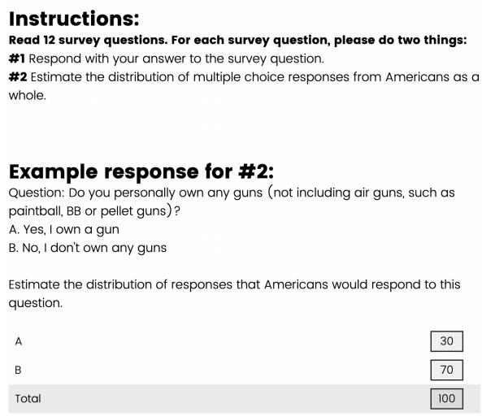  
Explanation: In the example above, an example estimation of the answer distribution would be that 30% of Americans respond with choice A. Yes, I own a gun, and 70% respond with choice B. No, I don't own any guns.  
Figure 9: Distributional Alignment Instructions and Example Task: No Steering.

persona steering. In this specific example, annotators are instructed to simulate a Democrat, but this group can be any demographic group of interest. Finally, in Fig. 11, we show the instructions and an example annotation for few shot steering. In this specific example, humans are tasked with simulating the views of Gen Z and given examples of how this group has responded to similar questions on driverless vehicles (participants are given 5 examples, but only 3 are shown in this figure).

Quality control. To ensure annotation quality, we limit the task to workers with English fluency and ask survey participants to answer a reading attention check question which our annotators achieved 93% on.

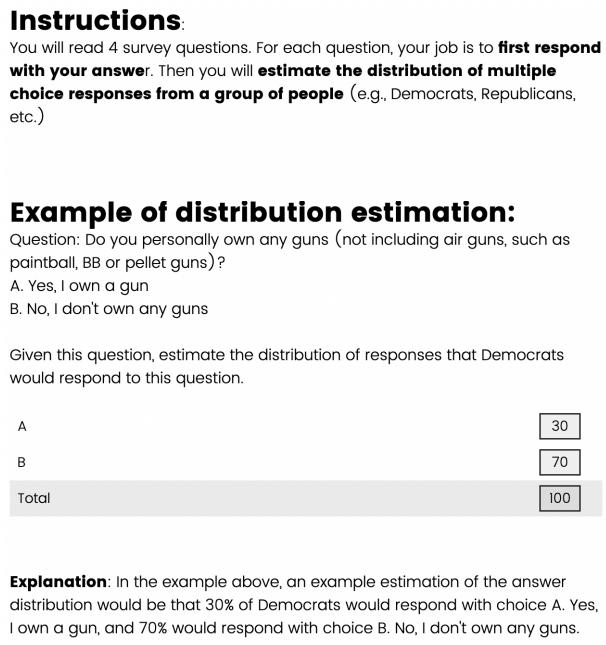  
Figure 10: Distributional Alignment Instructions and Example Task: Persona Steering.

Prior work has found that in-group representations and out-group imitations from human participants are different and that there exists a misperception of partisan polarization (Wang et al., 2024a; Levendusky and Malhotra, 2015). Thus, we compared in-group and out-group representations in opinion distribution estimation. In this context, “ingroup” refers to Democrats simulating Democrats, and “out-group” refers to Democrats simulating Republicans. “In-group” can also refer to a group of men simulating other men and “out-group” refers to a group of men simulating a group of women. While there is more difference on average over all subgroups in persona steering between the in-group and out-group, these differences are not statistically significant (Tab. 6).

## A.7 Model Log Probabilties of each Token in the Sequence of Biased Coin Flips

In this section, we provide additional analysis on the Biased Coin Flip experiment, specifically regarding the sequence of biased coin flips. We tested the OpenAI gpt-4 model, access on March 2024, which points to gpt-4-0613, a snapshot of gpt-4 from June 13th 2023. In Fig. 12, we plot the model log probabilities of each token in the sequence to better understand the conditional probabilities and find that these probabilities are not

You will read 4 survey questions. For each question, your job is to first answer the question, then estimate the distribution of multiple choice responses from a group of people. To perform this task, you will be provided the distribution of this group's responses to similar questions. For each group the question will be repeated before you perform the task of answer choice distribution estimation

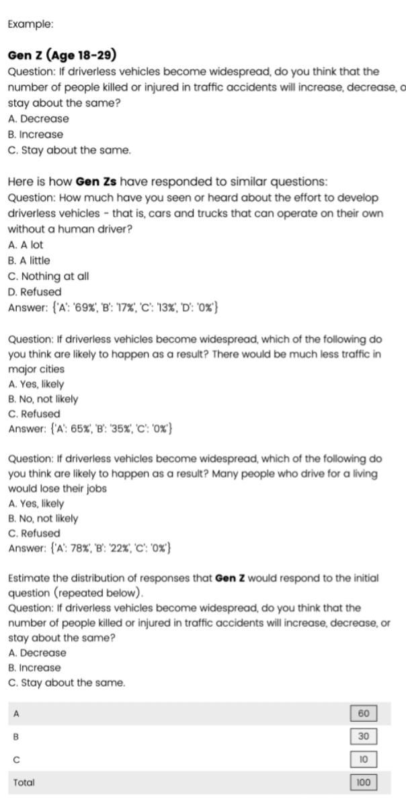  
In the example above, an example estimation of the answer distribution would be that Gen Z would respond with choice A, Decrease 60% of the time, choice B Increase, 30% of the time, and C. Stay about the same l0% of the time  
Figure 11: Distributional Alignment Instructions and Example Task: Few Shot Steering.

consistent across each token in the sequence (e.g., the next-token probability for ‘H’ varies based on the position in the sequence).

## A.8 Few Shot Steering

To perform few shot steering, for each question, we calculate the top 10 most similar questions or books as identified from their text embeddings (Gao et al., 2021). We found that some of these questions may be near-duplicates, especially in opinionQA where a survey may include many variants of the same question. Thus, we filter for the hardest similar examples, namely the top 5 questions most distinct in output distribution. This ensures we provide topically coherent and similar examples while avoiding cases where the model simply copies the distribution from the few shot examples. We pass these 5 examples in as contextual distributional information to aid in the distribution estimation.

<table><tr><td>Dataset</td><td>Steering</td><td>In/Out TV</td><td></td></tr><tr><td>OQA</td><td>Persona</td><td>In</td><td> $0 . 2 9 7 \pm 0 . 0 1 3$ </td></tr><tr><td>OQA</td><td>Persona</td><td>Out</td><td> $0 . 3 2 2 \pm 0 . 0 1 4$ </td></tr><tr><td>NYT NYT</td><td>Persona Persona</td><td>In Out</td><td> $0 . 2 8 1 \pm 0 . 0 1 0$   $0 . 2 7 3 \pm 0 . 0 1 0$ </td></tr><tr><td>OQA</td><td>Few Shot</td><td>In</td><td> $0 . 2 8 3 \pm 0 . 0 1 4$ </td></tr><tr><td>OQA</td><td>Few Shot</td><td>Out</td><td> $0 . 2 7 8 \pm 0 . 0 1 3$ </td></tr><tr><td>NYT</td><td>Few Shot</td><td>In</td><td> $0 . 2 3 6 \pm 0 . 0 0 8$ </td></tr><tr><td>NYT</td><td>Few Shot</td><td>Out</td><td> $0 . 2 3 7 \pm 0 . 0 0 9$ </td></tr></table>

Table 6: In-group vs. Out-group performance in human annotators, averaged over all demographic groups.

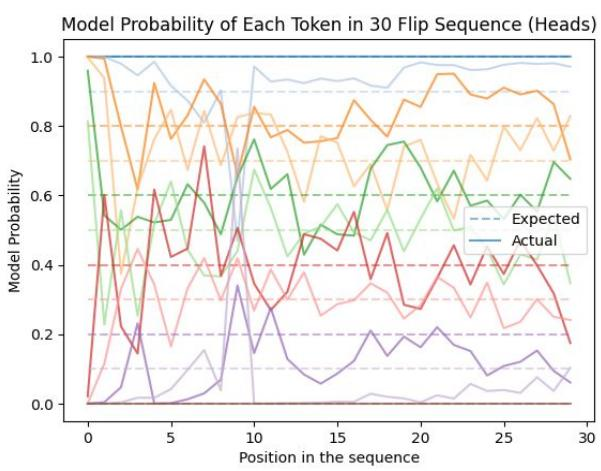  
Figure 12: Model Probability of Each Token in 30 Flip Sequence (Heads).

## A.9 Additional Model Information

In this section, we discuss each model and how it was accessed. All GPT models and their logprobabilities were accessed using the OpenAI API, namely GPT-3.5-Turbo-0125 and gpt-4-0613. Both Anthropic Haiku and Anthropic Opus were accessed using the Anthropic API which does not provide log-probabilities to users. Finally, Meta’s

Meta-Llama-3-70B-Instruct was accessed via Huggingface. Since most models were accessed via API, the GPU hours accrewed come from running inference on Meta’s Llama-3-70B-Instruct—this amounted to less than 1 hour.

While we tested additional models listed in Tab. 7, we found that they struggled to follow the distribution estimation method prompt, particularly for that of sequence and verbalize.

<table><tr><td>Model</td><td>Seq</td><td>Verbalize</td></tr><tr><td>Llama-3-8B</td><td>45%</td><td>40%</td></tr><tr><td>Llama-2-70B</td><td>3%</td><td>97%</td></tr><tr><td>Llama-2-13B</td><td>11%</td><td>83%</td></tr><tr><td>Llama-2-7B</td><td>10%</td><td>52%</td></tr><tr><td>Deepseek-coder-1.3B</td><td>0%</td><td>2%</td></tr><tr><td>Deepseek-coder-6.7B</td><td>0%</td><td>0%</td></tr></table>

Table 7: Open models struggle to follow the prompt for the distribution expression methods, sequence, and verbalize. In this table, we report the success rate that additional open models had in following the prompt instructions. There was limited success with these smaller models; thus, we opted for the 5 models included in the main paper.

## A.10 Persona-steered LLMs and humans are susceptible to stereotyping.

We supplement Fig. 5 which depicts the marginal distribution of the answer ratings in the NYT Books dataset with average human ratings (Fig. 13). While previously, we demonstrated that models prompted with a Democrat persona tend to simulate humans that are more likely to read books, we see that humans have a similar stereotypical effect, although smaller than that of models.

## A.11 Additional Distribution Estimation Method Related Works

In this section, we engage more substantially with prior work relating to the distribution estimation method (Sec. 3.1). Prior work has found that language models can either be queried for statement probabilities (e.g., verbalize or other prompt-based techniques) or probed for internal representations of truthfulness (i.e., model log-probabilities). Past work has found that these two representations can sometimes disagree (Hu and Levy, 2023; Mondal et al., 2024; Liu et al., 2023). Earlier work by Hu and Levy (2023) finds that direct probability measurements generally field better or similar performance when compared to prompting techniques on tasks such as word prediction, semantic plausibility, and syntax completion in a zero-shot setting. Our work differs in that our tasks involve scenarios with uncertainty, we evaluate RLHF-ed LMs, and we provide few shot examples of the task. This is valuable as LMs with RLHF have been shown to produce conditional probabilities that are poorly calibrated (Kadavath et al., 2022).

Furthermore, the estimated distribution of the model’s opinion has been shown to be sensitive to other factors including rewording (Bisbee et al., 2024) or negating questions (Ceron et al., 2024), shuffling the answer choice order (Dominguez-Olmedo et al., 2024), and when converting multiple-choice surveys to free text (Röttger et al., 2024; Lyu et al., 2024; Wang et al., 2024c).

## A.12 Distributional Distance Metric: Total Variation

Equ. 1 represents the total variation distance, a measure for comparing the distance between two probability distributions (see Prop 4.2 in Levin et al. (2006)). While KL divergence can be used to compare distributions’ differences, we selected total variation distance for its interpretability and relevance to our setting. One notable reason why KL divergence is unsuitable for comparing survey responses from people with those from the model is that KL divergence becomes infinite when one distribution has zero probability events while the other does not. This naturally occurs in survey samples when no respondents select a particular answer choice, or in our distribution estimation methods, sequence and verbalize, which can generate zero estimated probabilities for certain answer choices.

Consider two probability distributions P and $Q$ over the discrete space of multiple-choice options $\{ A , B , C \}$ , where

$$
\begin{array} { l l } { { P ( A ) = 0 . 6 , } } & { { P ( B ) = 0 . 3 5 , \quad P ( C ) = 0 . 0 5 } } \\ { { Q ( A ) = 0 . 6 , } } & { { Q ( B ) = 0 . 4 0 , \quad Q ( C ) = 0 . } } \end{array}
$$

$$
D _ { K L } ( P | | Q ) = \sum _ { i = 1 } ^ { 3 } P ( i ) \log \left( \frac { P ( i ) } { Q ( i ) } \right)
$$

The final term $( i = 3 )$ contains 0.05 log $\left( { \frac { 0 . 0 5 } { 0 } } \right)$ which goes to infinity $( \log ( 0 ) = - \infty )$

$$
\mathrm { T V } ( P , Q ) = \frac { 1 } { 2 } \sum _ { i = 1 } ^ { 3 } | | P ( i ) - Q ( i ) | | _ { 1 } = 0 . 0 5 .
$$

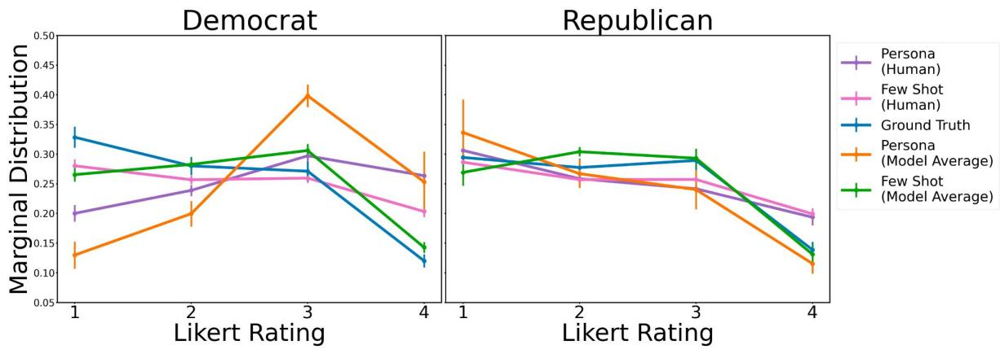  
Figure 13: Persona-steered LLMs and humans produce stereotypical results. We plot the marginal distribution for each Likert Rating (1-4) corresponding to the answer to the following question: “How likely are you to read this book?” A Likert rating of 1 refers to “Very unlikely” and a Likert rating of 4 refers to “Very likely”. We report the average marginal distribution over 5 models and humans steered towards Democrats and Republicans with persona steering (orange) and few shot steering (green). In blue, we plot the reference human reference for Democrat and Republican annotators. All of the data is averaged over 235 books in the NYT Books dataset. In purple we plot the persona steered humans, and in pink we plot the few shot steered humans. We observe that persona steered humans see a similar stereotypical effect, although smaller.

Here total variation distance is a small value, reflecting that these distributions are very similar.

## A.13 Full Results of Each Steering Method

In Tab. 10 we report the results of each steering method (No Steering, Persona Steering, and Few Shot Steering) for OpinionQA and NYTBooks. We also separate the results of persona steering and few shot steering in the GlobalOpinionQA dataset and report them in Tab. 8 and Tab. 9, respectively. When comparing the persona steered and few shot steered results, we see considerable improvement with few shot steering, corroborating our implications regarding the implications of persona steering and using few shot examples when possible (Sec. 4.2, Sec. 5).

<table><tr><td>Model</td><td> $\hat { \mathcal { A } } ( Y , \hat { Y } _ { \mathcal { S } , \mathcal { O } } )$ </td></tr><tr><td>Anthropic Opus (V) GPT-4 (V)</td><td> $0 . 2 7 5 \pm 0 . 0 2 1$   $0 . 3 1 9 \pm 0 . 0 2 2$ </td></tr><tr><td>GPT-4 (TS-Log-p) Llama 3 70B (V)</td><td> $0 . 3 2 5 \pm 0 . 0 2 2$   $0 . 3 2 7 \pm 0 . 0 2 4$ </td></tr><tr><td>Anthropic Haiku (V) Anthropic Opus (Seq) Anthropic Haiku (Seq)</td><td> $0 . 3 3 3 \pm 0 . 0 2 2$   $0 . 3 3 8 \pm 0 . 0 2 8$   $0 . 3 7 4 \pm 0 . 0 2 1$ </td></tr><tr><td>Llama 3 70B (Seq) GPT-4 (Seq) GPT-3.5 (V)</td><td> $0 . 3 7 7 \pm 0 . 0 2 8$   $0 . 3 7 8 \pm 0 . 0 2 9$   $0 . 3 9 7 \pm 0 . 0 2 4$ </td></tr><tr><td>GPT-3.5 (TS-Log-p) GPT-3.5 (Seq) GPT-3.5 (Log-p) Llama 3 70B (Log-p) GPT-4 (Log-p)</td><td> $0 . 4 2 8 \pm 0 . 0 1 8$   $0 . 4 3 2 \pm 0 . 0 2 0$   $0 . 4 4 6 \pm 0 . 0 2 7$   $0 . 4 6 2 \pm 0 . 0 2 8$   $0 . 5 0 8 \pm 0 . 0 3 3$ </td></tr><tr><td>Llama 3 70B (TS-Log-p) Discretization Error (Seq) Uniform</td><td> $0 . 5 4 6 \pm 0 . 0 3 6$   $0 . 0 9 2 \pm 0 . 0 0 4$   $0 . 4 8 6 \pm 0 . 0 1 9$ </td></tr></table>

Table 8: Distributional Alignment Task on GlobalOpinionQA: Persona Steering. Models ranked based on mean total variation. Models highlighted in gray and with (V) have a distribution expression method of directly verbalizing the distribution in a JSON format $( \mathcal { O } \ = \ \mathsf { V e r b a l i z e } )$ Models not highlighted represent samplers, where (Seq) represents the 30-token sequential distribution output ( = Sequence), (Logp) represents $\begin{array} { r l } { \mathcal { O } } & { { } = } \end{array}$ Model Log-probabilities, and (TS-Log-p) represents O = Temperature Scaled Model Log-probabilities.

<table><tr><td rowspan=1 colspan=1>Model                          ${ \mathcal A } ( Y , \hat { Y } _ { \mathcal S , \mathcal O } )$ </td></tr><tr><td rowspan=1 colspan=1>Anthropic Opus (V)          $0 . 2 0 8 \pm 0 . 0 2 0$ Llama 3 70B (V)              $0 . 2 3 4 \pm 0 . 0 2 2$ GPT-4 (V)                      $0 . 2 3 7 \pm 0 . 0 2 3$ Anthropic Haiku (V)         $0 . 2 5 2 \pm 0 . 0 2 3$ </td></tr><tr><td rowspan=1 colspan=1>Anthropic Opus (Seq)        $0 . 2 6 5 \pm 0 . 0 2 5$ GPT-4 (TS-Log-p)            $0 . 2 8 0 \pm 0 . 0 2 4$ Llama 3 70B (Seq)            $0 . 3 1 2 \pm 0 . 0 2 6$ </td></tr><tr><td rowspan=1 colspan=1>GPT-3.5 (V)                   $0 . 3 1 4 \pm 0 . 0 2 6$ </td></tr><tr><td rowspan=1 colspan=1>Anthropic Haiku (Seq)       $0 . 3 2 7 \pm 0 . 0 2 4$ </td></tr><tr><td rowspan=1 colspan=1>GPT-3.5 (TS-Log-p)          $0 . 3 3 4 \pm 0 . 0 2 3$ </td></tr><tr><td rowspan=1 colspan=1>GPT-4 (Seq)                   $0 . 3 4 1 \pm 0 . 0 3 2$ </td></tr><tr><td rowspan=1 colspan=1>GPT-3.5 (Seq)                 $0 . 3 6 6 \pm 0 . 0 2 7$ </td></tr><tr><td rowspan=1 colspan=1>GPT-3.5 (Log-p)              $0 . 4 4 0 \pm 0 . 0 3 2$ </td></tr><tr><td rowspan=1 colspan=1>Llama 3 70B (Log-p)         $0 . 4 4 9 \pm 0 . 0 3 1$ GPT-4 (Log-p)                $0 . 4 6 1 \pm 0 . 0 3 3$ Llama 3 70B (TS-Log-p)    $0 . 4 3 7 \pm 0 . 0 3 1$ </td></tr><tr><td rowspan=1 colspan=1>Discretization Error (Seq)   $0 . 0 9 2 \pm 0 . 0 0 4$ Uniform                        $0 . 4 8 6 \pm 0 . 0 1 9$ </td></tr></table>

Table 9: Distributional Alignment Task on GlobalOpinionQA: Few Shot Steering. Models ranked based on mean total variation. Models highlighted in gray and with (V) have a distribution expression method of directly verbalizing the distribution in a JSON format ( = Verbalize). Models not highlighted represent samplers, where (Seq) represents the 30-token sequential distribution output ( = Sequence), (Logp) represents  = Model Log-probabilities, and (TS-Logp) represents O = Temperature Scaled Model Log-probabilities.

<table><tr><td colspan="3">Model</td><td></td><td>NYT</td></tr><tr><td></td><td>OQA Anthropic: Haiku (Seq)</td><td> ${ \mathcal A } ( Y , \hat { Y } _ { \mathcal S , \mathcal O } )$ </td><td>Model</td><td> ${ \mathcal A } ( Y , \hat { Y } _ { \mathcal S , \mathcal O } )$ </td></tr><tr><td rowspan="12">Noeir ring</td><td>GPT-4 (Seq)</td><td> $\overline { { 0 . 3 7 2 \pm 0 . 0 1 3 } }$ </td><td>Anthropic Opus (V)</td><td> $0 . 2 1 0 \pm 0 . 0 0 6$ </td></tr><tr><td>GPT-3.5 (V)</td><td> $0 . 3 8 9 \pm 0 . 0 1 5$ </td><td>GPT-3.5 (Seq)</td><td> $0 . 2 1 5 \pm 0 . 0 0 6$ </td></tr><tr><td>Llama 3 70B (V)</td><td> $0 . 3 9 4 \pm 0 . 0 1 4$   $0 . 3 9 6 \pm 0 . 0 1 3$ </td><td>GPT-3.5 (V)</td><td> $0 . 2 1 9 \pm 0 . 0 0 6$ </td></tr><tr><td>GPT-3.5 (Seq)</td><td></td><td>GPT-4 (Seq)</td><td> $0 . 2 2 0 \pm 0 . 0 0 6$ </td></tr><tr><td></td><td> $0 . 3 9 8 \pm 0 . 0 1 3$ </td><td>Anthropic Haiku (Seq)</td><td> $0 . 2 2 6 \pm 0 . 0 0 7$ </td></tr><tr><td>GPT-3.5 (TS-Log-p) GPT-4 (V)</td><td> $0 . 3 9 8 \pm 0 . 0 1 3$ </td><td>GPT-4 (V)</td><td> $0 . 2 3 0 \pm 0 . 0 0 6$ </td></tr><tr><td>Anthropic: Haiku (V)</td><td> $0 . 4 0 0 \pm 0 . 0 1 5$ </td><td>Llama 3 70B (V)</td><td> $0 . 2 3 7 \pm 0 . 0 0 7$ </td></tr><tr><td>GPT-4 (TS-Log-p)</td><td> $0 . 4 2 7 \pm 0 . 0 1 5$ </td><td>Llama 3 70B (Seq)</td><td> $0 . 2 5 7 \pm 0 . 0 0 9$ </td></tr><tr><td>Anthropic: Opus (V)</td><td> $0 . 4 5 1 \pm 0 . 0 1 5$ </td><td>Anthropic Haiku (V)</td><td> $0 . 2 6 5 \pm 0 . 0 0 7$ </td></tr><tr><td>Anthropic: Opus (Seq)</td><td> $0 . 4 5 2 \pm 0 . 0 1 4$ </td><td>GPT-3.5 (TS-Log-p)</td><td> $0 . 3 0 3 \pm 0 . 0 0 7$ </td></tr><tr><td>Llama 3 70B (Seq)</td><td> $0 . 4 8 5 \pm 0 . 0 1 9$ </td><td>Anthropic Opus (Seq)</td><td> $0 . 3 1 6 \pm 0 . 0 1 1$ </td></tr><tr><td></td><td> $0 . 5 0 1 \pm 0 . 0 2 0$ </td><td>GPT-4 (TS-Log-p)</td><td> $0 . 3 2 3 \pm 0 . 0 0 8$ </td></tr><tr><td rowspan="11">Perserna Sereering</td><td>GPT-3.5 (Log-p)</td><td> $0 . 5 4 0 \pm 0 . 0 1 7$ </td><td>Llama 3 70B (TS-Log-p)</td><td> $0 . 6 0 6 \pm 0 . 0 1 1$ </td></tr><tr><td>Llama 3 70B (TS-Log-p) Llama 3 70B (Log-p)</td><td> $0 . 6 6 1 \pm 0 . 0 1 9$ </td><td>Llama 3 70B (Log-p)</td><td> $0 . 6 3 8 \pm 0 . 0 1 0$ </td></tr><tr><td>GPT-4 (Log-p)</td><td> $0 . 6 8 8 \pm 0 . 0 1 8$ </td><td>GPT-4 (Log-p)</td><td> $0 . 6 8 9 \pm 0 . 0 1 0$ </td></tr><tr><td>OQA</td><td> $0 . 7 1 4 \pm 0 . 0 1 8$ </td><td>GPT-3.5 (Log-p)</td><td> $0 . 7 4 5 \pm 0 . 0 0 9$ </td></tr><tr><td>GPT-4 (V)</td><td></td><td>NYT</td><td></td></tr><tr><td rowspan="14"></td><td></td><td> $0 . 1 8 1 \pm 0 . 0 0 7$ </td><td>GPT-3.5 (Seq)</td><td> $0 . 2 2 6 \pm 0 . 0 0 7$ </td></tr><tr><td>Anthropic: Haiku (V) GPT-4 (TS-Log-p)</td><td> $0 . 2 2 2 \pm 0 . 0 1 1$ </td><td>GPT-3.5 (V)</td><td> $0 . 2 3 9 \pm 0 . 0 0 7$ </td></tr><tr><td>Llama 3 70B (V)</td><td> $0 . 2 2 4 \pm 0 . 0 1 2$ </td><td>GPT-3.5 (TS-Log-p)</td><td> $0 . 2 9 5 \pm 0 . 0 0 8$ </td></tr><tr><td>Anthropic: Opus (V)</td><td> $0 . 2 2 6 \pm 0 . 0 0 9$   $0 . 2 3 8 \pm 0 . 0 1 2$ </td><td>GPT-4 (V) Llama 3 70B (V)</td><td> $0 . 2 4 8 \pm 0 . 0 0 7$ </td></tr><tr><td>GPT-4 (Seq)</td><td> $0 . 2 3 8 \pm 0 . 0 0 9$ </td><td>GPT-4 (Seq)</td><td> $0 . 2 5 7 \pm 0 . 0 0 8$ </td></tr><tr><td>Anthropic: Opus (Seq)</td><td> $0 . 2 8 2 \pm 0 . 0 1 2$ </td><td>Anthropic Öpus (V)</td><td> $0 . 2 6 4 \pm 0 . 0 0 9$   $0 . 2 8 5 \pm 0 . 0 1 0$ </td></tr><tr><td>Anthropic: Haiku (Seq)</td><td> $0 . 2 8 4 \pm 0 . 0 1 2$ </td><td>Anthropic Haiku (V)</td><td> $0 . 2 9 7 \pm 0 . 0 1 0$ </td></tr><tr><td>GPT-3.5 Turbo (V)</td><td> $0 . 2 9 2 \pm 0 . 0 1 2$ </td><td>GPT-4 (TS-Log-p)</td><td> $0 . 3 3 0 \pm 0 . 0 1 0$ </td></tr><tr><td>GPT-3.5 Turbo (TS-Log-p)</td><td> $0 . 2 9 8 \pm 0 . 0 0 9$ </td><td>Anthropic Haiku (Seq)</td><td> $0 . 3 5 5 \pm 0 . 0 1 3$ </td></tr><tr><td>GPT-3.5 Turbo (Seq)</td><td> $0 . 3 1 7 \pm 0 . 0 1 2$ </td><td>Llama 3 70B (Seq)</td><td> $0 . 3 5 9 \pm 0 . 0 1 1$ </td></tr><tr><td>Llama 3 70B (Seq)</td><td> $0 . 3 1 6 \pm 0 . 0 1 3$ </td><td>Llama 3 70B (TS-Log-p)</td><td> $0 . 4 3 0 \pm 0 . 0 1 2$ </td></tr><tr><td>GPT-3.5 Turbo (Log-p)</td><td> $0 . 3 3 9 \pm 0 . 0 1 3$ </td><td>GPT-3.5 (Log-p)</td><td> $0 . 4 7 3 \pm 0 . 0 1 2$ </td></tr><tr><td>Llama 3 70B (TS-Log-p)</td><td> $0 . 4 1 7 \pm 0 . 0 1 4$ </td><td>Anthropic Opus (Seq)</td><td> $0 . 4 8 3 \pm 0 . 0 1 0$ </td></tr><tr><td>Llama 3 70B (Log-p)</td><td> $0 . 4 6 0 \pm 0 . 0 1 4$ </td><td>Llama 3 70B (Log-p)</td><td></td></tr><tr><td rowspan="11">Feeot Srt ring</td><td>GPT-4 (Log-p)</td><td> $0 . 5 0 7 \pm 0 . 0 1 5$ </td><td>GPT-4 (Log-p)</td><td> $0 . 5 2 5 \pm 0 . 0 1 1$   $0 . 6 8 2 \pm 0 . 0 1 0$ </td></tr><tr><td>OQA</td><td></td><td>NYT</td><td></td></tr><tr><td>Anthropic Opus (V) GPT-4 (V)</td><td> $0 . 1 4 6 \pm 0 . 0 0 7$   $0 . 1 7 9 \pm 0 . 0 0 8$ </td><td>Anthropic Opus (V) Llama 3 70B (V)</td><td> $0 . 2 0 7 \pm 0 . 0 0 6$ </td></tr><tr><td>GPT-4 (TS-Log-p)</td><td> $0 . 2 0 0 \pm 0 . 0 0 7$ </td><td>GPT-4 (V)</td><td> $0 . 2 0 8 \pm 0 . 0 0 6$   $0 . 2 0 8 \pm 0 . 0 0 6$ </td></tr><tr><td>Anthropic Haiku (V)</td><td> $0 . 2 0 0 \pm 0 . 0 1 0$ </td><td>GPT-3.5 (TS-Log-p)</td><td> $0 . 2 0 9 \pm 0 . 0 0 5$ </td></tr><tr><td>GPT-4 (Seq)</td><td> $0 . 2 0 4 \pm 0 . 0 0 9$ </td><td>Anthropic Haiku (V)</td><td> $0 . 2 2 1 \pm 0 . 0 0 5$ </td></tr><tr><td>Llama 3 70B (V)</td><td> $0 . 2 1 1 \pm 0 . 0 1 1$ </td><td>GPT-3.5 (V)</td><td> $0 . 2 2 6 \pm 0 . 0 0 5$ </td></tr><tr><td>Anthropic Opus (Seq)</td><td> $0 . 2 4 8 \pm 0 . 0 1 0$ </td><td>GPT-3.5 (Seq)</td><td> $0 . 2 2 8 \pm 0 . 0 0 5$ </td></tr><tr><td>Anthropic Haiku (Seq)</td><td> $0 . 2 6 2 \pm 0 . 0 1 2$ </td><td>GPT-4 (Seq)</td><td> $0 . 2 4 3 \pm 0 . 0 0 6$ </td></tr><tr><td>GPT-3.5 (TS-Log-p)</td><td></td><td></td><td></td></tr><tr><td></td><td> $0 . 2 7 4 \pm 0 . 0 1 1$ </td><td>Anthropic Haiku (Seq)</td><td> $0 . 2 4 8 \pm 0 . 0 0 7$ </td></tr><tr><td>GPT-3.5 (V)</td><td> $0 . 2 8 0 \pm 0 . 0 1 3$ </td><td>GPT-4 (TS-Log-p)</td><td> $0 . 2 8 5 \pm 0 . 0 0 8$ </td></tr><tr><td>Llama 3 70B (Seq)</td><td> $0 . 3 0 0 \pm 0 . 0 1 2$ </td><td>Llama 3 70B (Seq)</td><td> $0 . 3 0 5 \pm 0 . 0 0 8$ </td></tr><tr><td>GPT-3.5 (Seq)</td><td> $0 . 3 3 9 \pm 0 . 0 1 5$ </td><td>Anthropic Opus (Seq)</td><td> $0 . 3 3 4 \pm 0 . 0 0 9$ </td></tr><tr><td>Llama 3 70B (TS-Log-p)</td><td> $0 . 3 9 4 \pm 0 . 0 1 5$ </td><td>GPT-3.5 (Log-p)</td><td> $0 . 5 1 7 \pm 0 . 0 1 0$ </td></tr><tr><td>Llama 3 70B (Log-p)</td><td></td><td></td><td></td></tr><tr><td>GPT-4 (Log-p)</td><td> $0 . 4 4 4 \pm 0 . 0 1 4$   $0 . 4 9 1 \pm 0 . 0 1 4$ </td><td>Llama 3 70B (TS-Log-p) Llama 3 70B (Log-p)</td><td> $0 . 5 9 3 \pm 0 . 0 1 3$   $0 . 6 2 9 \pm 0 . 0 1 1$ </td></tr></table>

<table><tr><td></td><td>GPT-3.5 (Log-p)</td><td> $0 . 5 1 9 \pm 0 . 0 1 6$ </td><td>GPT-4 (Log-p)</td><td> $0 . 6 5 0 \pm 0 . 0 1 0$ </td></tr><tr><td rowspan="5">Model</td><td rowspan="2">OQA</td><td></td><td>NYT</td><td></td></tr><tr><td> ${ \mathcal A } ( Y , \hat { Y } _ { \mathcal S , \mathcal O } )$ </td><td>Model</td><td> $\hat { \mathcal { A } } ( Y , \hat { Y } _ { \mathcal { S } , \mathcal { O } } )$ </td></tr><tr><td>Discretization Error (Seq)</td><td> $0 . 1 3 6 \pm 0 . 0 1 2$ </td><td>Discretization Error (Seq)</td><td> $0 . 1 1 5 \pm 0 . 0 0 1$ </td></tr><tr><td>Uniform</td><td> $0 . 3 8 1 \pm 0 . 0 0 9$ </td><td>Uniform</td><td> $0 . 2 2 3 \pm 0 . 0 0 6$ </td></tr><tr><td>Majority Vote</td><td> $0 . 7 3 1 \pm 0 . 0 1 7$ </td><td>Majority Vote</td><td> $0 . 7 0 0 \pm 0 . 0 0 8$ </td></tr></table>

Table 10: Comparing model performance across OQA and NYT datasets and steering methods. Models are ranked based on mean total variation and highlighted in gray and with (V) have a distribution expression method of directly verbalizing the distribution in a JSON format $( \mathcal { O } \ = \ \mathsf { V e r b a l i z e } )$ Models not highlighted represent samplers, where (Seq) represents the 30-token sequential distribution output ( = Sequence), (Log-p) represents = Model Log-probabilities, and (TS-Log-p) represents = Temperature Scaled Model Log-probabilities.