# Benchmarking Language Model Creativity: A Case Study on Code Generation

Yining Lu\* Dixuan Wangα Tianjian Liα Dongwei Jiang Sanjeev Khudanpur Meng Jiang' Daniel Khashabi 'University of Notre Dame αJohns Hopkins University

## Abstract

As LLMs become increasingly prevalent, it is interesting to consider how “creative" these models can be. From cognitive science, creativity consists of at least two key characteristics: convergent thinking (purposefulness to achieve a given goal) and divergent thinking (adaptability to explore new environments or constraints) (Runco, 2003). In this work, we introduce a framework for quantifying LLM creativity that incorporates the two design ingredients: (1) We introduce DENIAL PROMPTING which pushes LLMs to develop more creative solutions to a given problem by incrementally imposing new constraints on the previous solution, compelling LLMs to adopt new strategies. (2) We define NEOGAUGE, a metric that quantifies both convergent and divergent thinking in the generated creative responses by LLMs. We test the proposed framework on Codeforces problems, which serve as both a natural dataset for coding tasks and a collection of prior human solutions. We quantify NEOGAUGE for various proprietary and open-source models and find that even the most creative model, GPT-4, still falls short of demonstrating human-like creativity. We also experiment with advanced reasoning strategies (MCTS, self-correction, etc.) and observe no significant improvement in creativity. As a by-product of our analysis, we release NEOCoDER dataset for reproducing our results on future models.'

## 1 Introduction

Most recent works on LLM creativity evaluation focus on open-ended generation tasks, such as storywriting (Atmakuru et al., 2024; Gómez-Rodríguez and Williams, 2023; Chakrabarty et al., 2024a,b), paper abstract generation (Lu et al., 2024b), and role-play discussion (Lu et al., 2024a). However, the degree to which LLMs possess and utilize creativity for problem-solving remains unclear. An automatic method for evaluating LLMs creativity could help developers better understand the emergence of model behaviors and serve as a design objective in solving complex real-world problems.

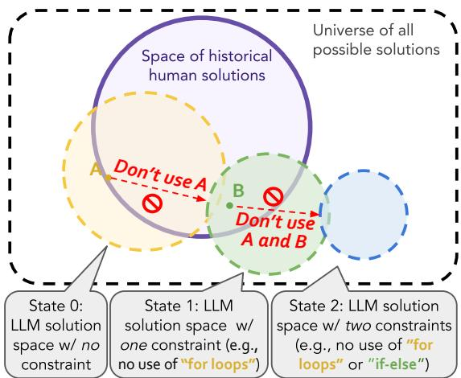  
Figure 1: An overview of how DENIAL PROMPTING encourages creative solutions. A solution space is a collection of all possible solutions at a certain state. A, B indicate atomic techniques (e.g., for-loops, if-else, etc.) used in the solution.

However, despite the importance of creativity evaluation in problem-solving, only a few works have touched upon it (DeLorenzo et al., 2024; Tian et al., 2024) because of two major challenges: (1) eliciting diverse and creative solutions is difficult (Bronnec et al., 2024; Xu et al., 2024a; Zhang et al., 2024a), and (2) there are no reliable and comprehensive quantitative measurements of LLM creativity. Below, we explain how we tackle these two challenges for evaluating LLM creativity in problem-solving settings.

LLM generations are often repetitive and regurgitating training data (Holtzman et al., 2019; Kirk et al., 2024; Tevet and Berant, 2021; Xu et al., 2024a; Zhang et al., 2024b), making it hard to elicit creative generations. However, we argue that an effective creativity evaluation method should be based on the spectrum of maximal creative solutions attained from LLMs. Therefore, we introduce DENIAL PROMPTING (§3.1), a prompting method that iteratively “denies" one of the basic tools, techniques, or strategies used in the previous solution (e.g., A: for loops and B: if-else in Figure 1), thereby pushing LLM to think out-ofthe-box and elicit creative generations to its fullest extent.

Another challenge in creativity evaluation is to build a reliable and comprehensive quantitative measurement. We propose that such evaluation should be state-aware—adaptive to different contexts, and human-grounded—comparing LLMgenerated solutions to historical human solutions. According to many cognitive studies, human creativity is viewed as taking place in the interaction with a person, environment, or another model (Amabile, 1996; Csikszentmihalyi, 1996, 1998; Feldman, 1998; Feldman et al., 1994; Holyoak and Morrison, 2005). Similarly, the essence of LLM creativity should also be captured from its interaction with the current state (state-aware) and past human knowledge background (human-grounded). This understanding reveals that creativity evaluation should be dynamic, with an individual's creativity varying under different contexts. For example, in Figure 1, a solution at state t = 0 probably will not be judged at the same creative level as one at state t = 2, even if they solve the same problem. Because the latter solution is more likely to use novel techniques that humans hardly thought of, such as C: Recursion, to adapt to increasingly challenging constraints.

To address the second challenge, we propose NEOGAUGE score (§4) which involves (1) verifying the correctness of the LLM-generated solution and whether it adheres to the specified constraints from DENIAL PROMPTING (convergent thinking), and (2) assessing solution novelty by contrasting it with techniques previously used in human solutions (divergent thinking). This aligns well with the arguments made by Runco (2003) that creative achievement depends on both the number of alternative solutions and the generation of high-quality alternatives. By considering both convergent (Lubart, 2001; Sternberg, 1981, 1982; Sternberg and Gastel, 1989a) and divergent (Guilford, 1950; Holyoak and Morrison, 2005; Torrance, 1966) creative thinking, NEOGAUGE not only offers a state-aware evaluation but grounds the evaluation in collective human knowledge through comparing the generated solutions with historical human solutions.

In our experiments, we apply DENIAL PROMPT-ING on Codeforces,2 a challenging Text-to-Code task where model solutions can be automatically verified and allows comparison to substantial historical human solutions.³ Specifically, we retrieve 199 latest problems from Codeforces along with 30 human solutions per problem that have successfully passed unit tests. We then run these problems on DENIAL PROMPTING to obtain our dataset NEOCODER which consists of original questions with sequences of temporally relevant and increasingly difficult constraints. Examples of NEOCODER are provided in Table 4. We benchmark a broad range of LLMs on NEOCODER and calculate their NEOGAUGE scores. Additionally, we evaluate four reasoning strategies, MCTS (Zhang et al., 2023), self-correction (Shinn et al., 2023), planning (Jiang et al., 2023b), and sampling (Chen et al., 2021), on our dataset to study the correlation between augmented machine intelligence and creativity. In summary, our contributions are twofold:

• We introduce DENIAL PROMPTING to elicit creative generations from LLMs and NEOGAUGE metric to evaluate LLM creativity in problemsolving that follows the two proposed protocols.

• We release a creativity benchmark NEOCODER and provide a thorough analysis of creativity on SOTA language models and reasoning strategies.

## 2 Background and Related Works

We discuss the existing works on machine creativity evaluation. Then, we explain the concepts of divergent and convergent creativity in cognitive science which our evaluation incorporates.

Machine Creativity Evaluation. While the extensive studies on human creativity from psychological and cognitive science (Amabile, 1982; Finke et al., 1996; Guilford, 1950; Mumford et al., 1991; Runco, 2003; Sternberg and Lubart, 1991; Torrance, 1966), LLM creativity has received little attention. Existing works studying LLM creativity in problem-solving settings (DeLorenzo et al., 2024; Tian et al., 2024; Zhu et al., 2024), however, tend to overlook two challenges: (1) eliciting creative LLM solutions, and (2) ensuring evaluation metrics are grounded and comprehensive.

Tian et al. (2024) have released a challenging real-world problem dataset to push LLM to think out-of-the-box, but they do not provide an automatic creativity evaluation method built upon their dataset. Additionally, their problems are constructed from a single constraint. In contrast, our DENIAL PROMPTING is formulated for multiple iterations of constraint detection and problem refinement, making the generations more creative and providing more states for creativity evaluation. Another concurrent work (Atmakuru et al., 2024) also employs multiple constraints to facilitate creative generation; however, their evaluation primarily targets linguistic creativity (Lu et al., 2024b) and it is tested on open-ended story writing task. Zhu et al. (2024) and Xu et al. (2024a) design protocols to dynamically generate challenging problems with controllable constraints. However, their evaluation mainly focuses on accuracy rather than creativity.

Chakrabarty et al. (2024a), DeLorenzo et al. (2024), and Zhao et al. (2024) introduce automatic evaluation pipelines to quantify the four subcomponents of creativity proposed in the Torrance Tests of Creative Thinking (Torrance, 1966): fluency, flexibility, originality, and elaboration. However, the test is originally designed to study human divergent creative thinking (§2) and is unclear whether it applies to machine creativity.

Divergent Creative Thinking. Divergent thinking is a cognitive process that involves exploring a multitude of potential applications for a given set of tools (Holyoak and Morrison, 2005). It typically occurs spontaneously and randomly, leading to numerous possible solutions. Extensive research (Amabile, 1982; Guilford, 1950) has been conducted to study divergent creativity, including popular psychometric approaches such as the Unusual Uses Test (Guilford, 1950). These are designed to let examinees think of as many uses for a (common or unusual) object as possible. The underlying idea of stimulating creative solutions from constrained and unusual settings is also adopted in our DENIAL PROMPTING.

Divergent thinking can also be viewed through the lens of P-creativity (Psychological) and Hcreativity (Historical) defined by Boden et al. (1994). A valuable idea is P-creative if the person in whose mind it arises could not have come up with it before. Furthermore, a valuable idea is H-creative if it is P-creative, and no one else in human history has ever had it before. P-creativity measurement is embedded in the structure of DE-NIAL PROMPTING, where at each state, the LLM is prompted to come up with a brand new solution that it has never thought of before by imposing a new constraint. Therefore, we mainly consider Hcreativity measurement in our NEOGAUGE score, where we compare the model-generated solution with a set of collected human solutions to examine if it has ever been proposed in human history (i.e., the ratio of the region out of human solution space in Figure 1). This makes our NEOGAUGE humangrounded and reflects the novelty from history.

Convergent Creative Thinking. Since the twenty-first century, more researchers have begun to accept the proposition that creative thought involves not merely the generation of many alternative solutions (divergent thinking) but also the identification of new feasible solutions (Baer, 1994; Runco, 2003). They frame this problem-solving process as convergent creative thinking and begin to examine how understanding human cognition and convergent thinking might be used to account for creative thought (Finke et al., 1996; Mumford et al., 1991; Sternberg and Lubart, 1991). Several famous cognitive approaches that study the mental representation and process underlying convergent creative thinking (Lubart, 2001) involve asking examinees to predict future states from past states using incomplete information (Sternberg, 1981, 1982), or solving the problems as though the counterfactual premises are true (Sternberg and Gastel, 1989a,b). All these tests share certain characteristics, such as always having a single best answer and asking examinees to think in unconventional ways. In our work, besides computing H-creativity for evaluating divergent thinking, our work also measures convergent creativity by verifying the feasibility of the generated solution: whether they are correct and following the given constraints. Our NEOGAUGE metric delivers a more comprehensive evaluation of machine creativity.

## 3 Constructing the NEOCODER Dataset

We present DENIAL PROMPTING to stimulate creative responses from LLMs.

## 3.1 DENIAL PROMPTING: Eliciting Creative Generations from LLMs

Our purpose is to construct a pipeline that iteratively imposes constraints on previous solutions (e.g., disallowing the use of hashmaps) to force more creative solutions. The setup is as follows: given an input problem, we use a highly capable augmentation model $\mathbf { P } _ { \mathrm { L M } }$ (e.g. GPT-4) to generate solutions and scrutinize “technique(s)" used in the generated solution, then update the problem by imposing the detected technique as a constraint. We repeat this process t times to obtain consecutive t problems with increasingly hard constraints (Figure 8 shows an example with t = 2).

Specifically, as shown in Algorithm 1, given a reasoning problem x and an initial empty constraint list $\mathcal { C } _ { 0 } = \{ \}$ , we first let the augmentation model $\mathbf { P } _ { \mathrm { L M } }$ to generate an initial solution $y _ { 1 } \sim \mathbf { P } _ { \mathrm { L M } } ( x )$ via a default problem-solving prompt and conversation history. We then use the same augmentation model $\mathbf { P } _ { \mathrm { L M } }$ to detect atomic techniques $( \mathrm { e . g . }$ , recursion, for loop, hashmaps, etc.), $\mathcal { T } _ { 1 } =$ $\{ \tau ^ { \bar { 1 } } , \tau ^ { 2 } , \cdots , \tau ^ { i } \}$ , used in $y _ { 1 }$ to solve x with a technique detection prompt. Then, one technique is randomly sampled $\tau _ { 1 } \sim \mathcal { T } _ { 1 } \setminus \mathcal { C } _ { 0 }$ to ensure it has never been used before as a constraint. Finally, we update the problem x to $x \oplus \tau _ { 1 }$ which explicitly prohibits the use of the technique τ1 and update constraint list $\mathcal { C } _ { 0 } ~ { \mathrm { t o } } ~ \mathcal { C } _ { 1 } = \{ \tau _ { 1 } \} . ^ { 4 }$ This is the first iteration of DENIAL PROMPTING. We repeat the process to progressively obtain the overall constraint list $C _ { t } = \{ \tau _ { 1 } , \tau _ { 2 } , \cdot \cdot \cdot , \tau _ { t } \}$ . The prompts for DENIAL PROMPTING (including technique detection; used across all experiments) are in Appendix D.

Algorithm 1 DENIAL PROMPTING   
Input: Input problem x, augmentation model ${ \mathcal { P } } _ { \mathrm { L M } } ,$ max   
iterations $\mathbf { \dot { \rho } } _ { T }$   
Output: Constraint list $\mathcal { C } _ { T }$   
1: for t = 1 to T do   
# Response generation   
2: $y _ { t } \sim \mathbf { P } _ { \mathrm { L M } } ( x$ ⊕ τ1 ⊕ · · · ⊕ τt−1)   
# Technique detection   
3: $\mathcal { T } _ { t } \sim \mathbf { P } _ { \mathrm { L M } } ( y _ { t } )$   
4: $\tau _ { t } \sim \mathcal T _ { t } \setminus \mathcal C _ { t - 1 }$   
5: $\mathcal { C } _ { t } = \{ \tau _ { 1 } , \tau _ { 2 } , \cdot \cdot \cdot , \tau _ { t } \}$   
6: end for

During DENIAL PROMPTING, we use a single conversation thread of $\mathbf { P } _ { \mathrm { L M } }$ to infer $y _ { t }$ such that the model can utilize the trace of previous interactions (including problem statements, constraints, and LLM solutions from each iteration). In practice, we observe adding prior interactions in the context improves model generations. Conversely, when detecting solution techniques $\mathcal { T } _ { t } \sim \mathbf { P } _ { \mathrm { L M } } ( y _ { t } )$ (line 4 in Algorithm 1), we disregard the context from previous conversation rounds to focus the responses solely on the most recent round.

## 3.2 NEOCODER Dataset to Support Benchmarking LLM Creativity

Challenging problems. To construct our creativity benchmark, we compile n = 199 latest Codeforces problems. We chose problems with a difficulty of 800 (easiest level) since, in our preliminary experiments, we observed near-random performance on more challenging problems when using well-known open-source models. Furthermore, we selected the recent data to prevent any memorization during pre-training (Huang et al., 2023).

Human solutions. For each problem, we extract m = 30 correct human solutions per problem (total of 5.9K human solutions).5 We use human solutions to measure H-creativity of LLM responses.

Human annotated test examples. We also retrieve all test examples provided with each problem (4.5 test examples per problem on average, a total of 2.2K test examples). We then perform manual fixes to address any parsing or formatting issues in the collected test examples and ensure that follow a standardized input-output format. We use these test examples to measure ${ \mathcal { P } } .$ -creativity or the functional correctness of LLM responses.

Augmentation with DENIAL PROMPTING. We use GPT-4 (OpenAI, 2024) as the augmentation model $\mathbf { P } _ { \mathrm { L M } }$ because we find that GPT-4 can achieve 94% technique detection recall compared to the human programmer in our pilot experiments.6 We feed the retrieved problems to DE-NIAL PROMPTING (§3.1) with maximum iterations $T = 5$ to obtain our dataset NEOCODER. Our dataset consists of pairs $( x , \mathcal { C } _ { t } = \{ \tau _ { 1 } , \tau _ { 2 } , . . . , \tau _ { t } \} )$ where x represents a problem (programming challenge), and $\mathcal { C } _ { t }$ represents the constraints that must be adhered to when solving the problem x. This implies that a single programming problem may be associated with various sets of constraints, forming different pairs accordingly.

Statistics for NEOCODER. Table 1 shows the number of problems x and the number of the associated constraints $| \mathcal { C } _ { t } |$ . Note that the number of problems decreases for a larger number of constraints. This is due to DENIAL PROMPTING potentially reaching a point where it can no longer generate new constraints after a certain number of iterations (i.e., $\mathcal { T } _ { t } \backslash \mathcal { C } _ { t - 1 } = \emptyset$ in Alg. 1). In such a case, we let $\tau _ { t } = \emptyset$ and jump to the next iteration t + 1 without updating the constraint list $\mathcal { C } _ { t } = \mathcal { C } _ { t - 1 }$

<table><tr><td>State (# of constraints)</td><td>0</td><td>1</td><td>2</td><td>3</td><td>4</td><td>5</td></tr><tr><td># of problems</td><td>199</td><td>199</td><td>198</td><td>194</td><td>176</td><td>97</td></tr></table>

Table 1: Number of instances at each state.

We also compare the distribution of the top 5 most common techniques from DENIAL PROMPT-ING in comparison to that of human solutions (Figure 2). It is evident that, without any constraints, models tend to use common techniques (e.g., forloops) similar to human solutions. However, as more constraints are imposed, the less common but more sophisticated techniques are employed.

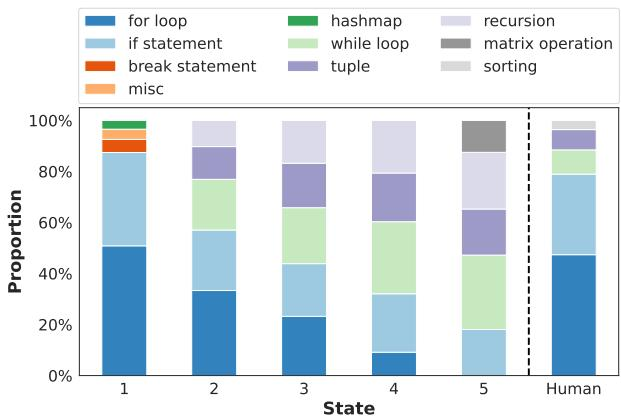  
Figure 2: Proportion of the top 5 most common atomic techniques used by GPT-4 per state, compared to those in human solutions. In absense of any constraints (the first column), the model default to common and accessible techniques, like humans (the last column). This echoes our claim in §1 that eliciting creative solutions is crucial for creativity evaluation.

## 4 State-Aware and Human-Grounded Evaluation of Machine Creativity

Augmentation model vs target model. So far, we have used $\mathbf { P } _ { \mathrm { L M } } ( . )$ to denote the augmentation model, the language model used for dataset construction and extracting atomic techniques. Here, we introduce $\mathbf { G } _ { \mathrm { L M } } ( \cdot )$ to represent the target language model, whose creativity we evaluate using our dataset and the augmentation model $\mathbf { P } _ { \mathrm { L M } } ( \cdot )$

Setup. Here we introduce our metric of creativity NEOGAUGE for a given model $\mathbf { G } _ { \mathrm { L M } }$ and given NEOCODER. Denote instances of NEOCODER at state $t \left( t \leq T \right)$ as:

$$
\mathcal { D } _ { t } = \Big \{ ( x ^ { i } , \mathcal { C } _ { t } ^ { i } = \{ \tau _ { 1 } ^ { i } , \tau _ { 2 } ^ { i } , \cdot \cdot \cdot , \tau _ { t } ^ { i } \} ) \Big \} _ { i = 1 } ^ { n } ,
$$

where ¿ is the problem index. To evaluate the creativity of the testing model $\mathbf { G } _ { \mathrm { L M } }$ at state $t ,$ we feed $\mathcal { D } _ { t }$ to $\mathbf { G } _ { \mathrm { L M } }$ to obtain its predictions:

$$
\begin{array} { r } { \mathcal { V } _ { t } = \Big \{ y _ { t } ^ { i } \sim \mathbf { G } _ { \mathrm { L M } } ( x ^ { i } \oplus \mathcal { C } _ { t } ^ { i } ) \Big | | \mathcal { C } _ { t } ^ { i } | = t , \phantom { x x x x x x x x x x x x x x x x } } \\ { \forall ( x ^ { i } , \mathcal { C } _ { t } ^ { i } ) \in \mathcal { D } _ { t } \Big \} . } \end{array}\tag{1}
$$

Here $| \mathcal { C } _ { t } ^ { i } |$ denotes the cardinality of the constraints set. The constraint $| { \mathcal { C } } _ { t } ^ { i } | = t$ ensures that at a given state t, the questions we evaluated always have t distinct constraints. Below, we present how we compute convergent and divergent creativity and introduce NEOGAUGE metric that unifies them.

Convergent creativity involves problem-solving and constraint following. To evaluate $\mathbf { G } _ { \mathbf { L M } } \mathbf { \dot { s } }$ convergent thinking ability, we examine two characteristics of generated solutions: whether they are correct and whether they follow the given constraints. Therefore, given $\mathcal { V } _ { t }$ from Eq.1, we define its convergent creativity as follows:

$$
\begin{array} { r l } & { \mathbf { c o n v e r g e n t } ( \mathbf { G } _ { \mathrm { L M } } , t ) = } \\ & { \qquad \frac { 1 } { | \mathcal { V } _ { t } | } \displaystyle \sum _ { y _ { t } ^ { i } \in \mathcal { V } _ { t } } \mathbb { 1 } ^ { \mathcal { T } _ { t } ^ { i } \cap \mathcal { C } _ { t } ^ { i } = \mathcal { O } } \times \mathbb { 1 } ^ { \mathrm { C o r r e c t } ( y _ { t } ^ { i } ) } , } \end{array}\tag{2}
$$

where atomic techniques $\begin{array} { r l r } { \mathcal { T } _ { t } ^ { i } } & { { } \sim } & { { \bf P } _ { \mathrm { L M } } ( y _ { t } ^ { i } ) } \end{array}$ $\mathbb { 1 } ^ { \mathrm { C o r r e c t } ( y _ { t } ^ { i } ) }$ is a measure of program correctness, set to 1 if the generated solution passes all the test examples. Otherwise it is 0. We use the augmentation model $\mathbf { P } _ { \mathrm { L M } }$ to detect all atomic techniques $\mathcal { T } _ { t } ^ { i }$ used in solution $y _ { t } ^ { i } ,$ and compare them with the given constraint list $\mathcal { C } _ { t } ^ { i }$ to check if the solution follows the given constraints. In Figure 3 examples, only the solution generated at $t = 0$ (which does not involve any constraint) exhibits convergent creativity.

Divergent creativity requires comparison to historical human solutions. As discussed earlier in $\ S 2 .$ , a primary focus of our evaluation is on Hcreativity, which requires a juxtaposition of model solutions with historical human solutions. Let's consider a finite set of correct human written solutions with size m, denoted as $\mathcal { H } ^ { i }$ , for problem $x ^ { i }$ . Rather than directly comparing solutions using certain sentence-level similarity scores, as done by a few prior works such as DeLorenzo et al. (2024), we break down the comparison to the atomic technique level, which is more interpretable and generalizable across varying solutions. Our divergent creativity score is defined as:

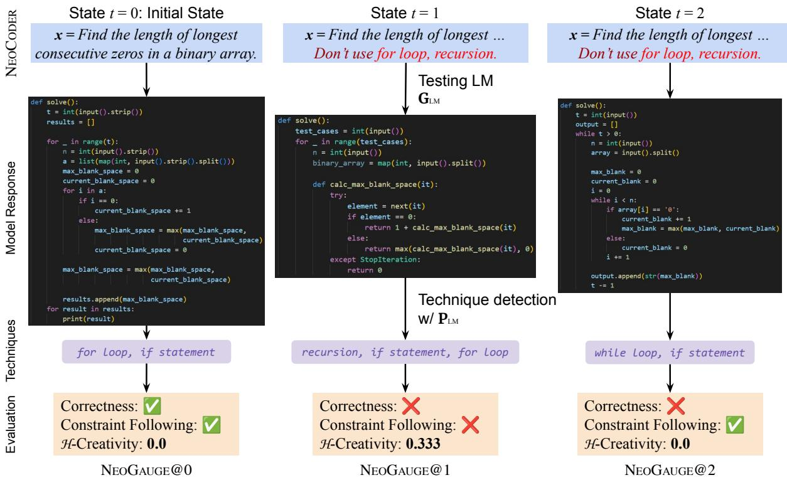  
Figure 3: Example of NEOGAUGE computation. The question comes from our NEOCoDER dataset with ID 1829B and testing model $\mathbf { G } _ { \mathrm { L M } }$ here is GPT-4. For each state, we compute NEOGAUGE (Eq.4) as the probability of LM generating correct solutions that meet the given constraints (convergent creativity defined in Eq.2) and also exhibit H-creativity (divergent creativity defined in Eq.3). However, none of the above three solutions are considered to be “creative” since convergent solutions may lack divergent creativity (e.g., state $t = 0 )$ . Alternatively, $L L M s ^ { \prime }$ hallucinated responses resulting in high H-creativity, but often lack correctness and constraint following (e.g., state $t = 1 )$ . Therefore, truly creative works should not only be innovative but also appropriately solve a problem.

$$
\mathrm { { d i v e r g e n t } } ( \mathbf { G } _ { \mathrm { { L M } } } , t ) = \frac { 1 } { | \mathcal { V } _ { t } | } \sum _ { y _ { t } ^ { i } \in \mathcal { V } _ { t } } \frac { | \mathcal { T } _ { t } ^ { i } \setminus \widehat { \mathcal { T } } ^ { i } | } { | \mathcal { T } _ { t } ^ { i } | } ,\tag{3}
$$

where $\mathcal { T } _ { t } ^ { i } \sim \mathbf { P } _ { \mathrm { L M } } ( y _ { t } ^ { i } )$ are the atomic techniques used in the model solutions, and ${ \widehat { T } } ^ { i }$ indicate all the atomic techniques used by m human solutions, defined as: $\begin{array} { r } { \widehat { \mathcal { T } } ^ { i } = \bigcup _ { j = 1 } ^ { m } \big \{ \widehat { \mathcal { T } } _ { j } ^ { i } \sim \mathbf { P } _ { \mathrm { L M } } ( \hat { y } _ { j } ^ { i } ) , \ \hat { y } _ { j } ^ { i } \ \in } \end{array}$ $\mathcal { H } ^ { i } \big \}$ . We then compute the H-creativity as the ratio of techniques used by ${ \bf G } _ { L M }$ that have never been used in the human solution set. For example, as shown in Figure 3 at state $t = 1$ , among the three techniques identified within the generated solution, only the recursion has never been used by humans, thereby resulting in a ratio of $\frac 1 3$ . Finally, we average ratios across different problems to obtain the final H-creativity at state t.

NEOGAUGE unifies convergent and divergent creativity. Given the above definitions, NEOGAUGE of $\mathbf { G } _ { \mathrm { L M } }$ at state t can be formalized:

NEOGAUGE@t =

$$
\frac { 1 } { | \mathcal { V } _ { t } | } \sum _ { y _ { t } ^ { i } \in \mathcal { V } _ { t } } \underbrace  \mathbb { I } \frac { \mathcal { T } _ { t } ^ { i } \cap \mathcal { C } _ { t } ^ { i } = \mathcal { O } } { \mathrm { C o n v e r g e n t C r e a t i v i t y } } \times \underbrace { | \mathcal { T } _ { t } ^ { i } \setminus \widehat { \mathcal { T } } ^ { i } | } _ { \mathrm { D i v e r g e n t C r e a t i v i t y } } ,\tag{4}
$$

where $ \mathcal { V } _ { t } ~ = ~ \{ y _ { t } ^ { i } ~ \sim ~ \mathbf { G } _ { \mathrm { L M } } ( x ^ { i } \oplus \mathcal { C } _ { t } ^ { i } ) ~ | ~ \mathcal { C } _ { t } ^ { i } | ~ =$ $t , \forall ( x ^ { i } , \mathcal { C } _ { t } ^ { i } ) \in \mathcal { D } _ { t } \}$ (defined in Eq.1), $\begin{array} { r l } { T _ { t } ^ { i } } & { { } \sim } \end{array}$ $\mathbf { P } _ { \mathrm { L M } } ( y _ { t } ^ { i } )$ (defined in Eq.2), $\widehat { \mathcal { T } } ^ { i } = \dot { \bigcup _ { j = 1 } ^ { m } } \big \{ \widehat { \mathcal { T } } _ { j } ^ { i } \ \sim$ $\mathbf { P } _ { \mathrm { L M } } ( \hat { y } _ { j } ^ { i } ) , \hat { y } _ { j } ^ { i } \in \mathcal { H } ^ { i } \}$ (defined in Eq.3).

## 5 Experiments and Results

We report the creativity of current LLMs (§5.2) and evaluate different reasoning strategies (§5.3) for creativity.

## 5.1 Experimental Setup

Models. We use GPT-4 as the augmentation model PLM. We benchmark the creativity performance of the following target models $\mathbf { G } _ { \mathrm { L M } } \mathbf { : }$ GPT-4 (OpenAI, 2024), GPT-3.5 (Ouyang et al., 2022), Claude 3 Sonnet (Claude-3) (Anthropic, 2024), L1ama3-70B (AI@Meta, 2024), L1ama2-70B (Touvron et al., 2023), CodeLlama-34B-Python (CodeLlama-34B) (Rozière et al., 2024), CodeGemma-7B (Google, 2024), and Mistral-7B (Jiang et al., 2023a). We access all non-proprietary models through Huggingface Transformers (Wolf et al., 2019). Following the parameter choice by Zhang et al. (2023), we apply a sampling temperature of 1 for code generation.

<table><tr><td>Metric</td><td>Description</td><td>Definition</td><td>Place of Use</td></tr><tr><td> $\mathbf { c o n v e r g e n t } ( \mathbf { G } _ { \mathrm { L M } } , t )$ </td><td>Convergent creativity of  $\mathbf { G _ { L M } }$  at state t</td><td> $\mathrm { E q . } 2$ </td><td>Table 3, Figure 5, 7</td></tr><tr><td> $\mathbf { d i v e r g e n t } ( \mathbf { G } _ { \mathrm { L M } } , t )$ </td><td>Divergent creativity of  $\mathbf { G _ { L M } }$  at state t</td><td> $\operatorname { E q } . 3$ </td><td>Table 3, Figure 5, 7</td></tr><tr><td> $\mathbf { N E O G A U G E } @ \mathbf { t }$ </td><td>Creativity evaluation of  $\mathbf { G _ { L M } }$  at state t</td><td> $\mathrm { E q . 4 }$ </td><td>Table 3, Figure 4</td></tr><tr><td></td><td>pass@1 (Chen et al., 2021) Probability of the first sample passes the unit tests</td><td> $\begin{array} { r } { - \underbrace { \bar { \mathbb { E } } } _ { \mathrm { p r o b l e m s } } - [ \bar { 1 } ^ { - } - \frac { \bar { \mathbf { \Omega } } _ { n } = \mathbf { \bar { c } } } { \mathbf { \Omega } _ { n } } ] } \end{array}$ </td><td>Table 3</td></tr><tr><td>constraint following</td><td>Average ratio of following the constraints at state t</td><td> $\underset { \mathrm { p r o b l e m s } } { \mathbb { E } } \big [ \mathbb { 1 } ^ { \tau _ { t } \cap \mathcal { C } _ { t } = \mathcal { O } } \big ]$ </td><td>Table 3</td></tr><tr><td>convergent(human, t)</td><td>convergent creativity of human at state t</td><td> $\mathrm { E q . } 5$ </td><td>Figure 5</td></tr><tr><td>divergent(human)</td><td>lowest divergent creativity of human at state 0</td><td> $\mathrm { E q } . 6$ </td><td>Figure 5</td></tr></table>

Table 2: Description of various metrics used across experiments.

Metrics. Beyond the three proposed metrics for evaluating convergent, divergent and overall creativity, we also compute pass@1 (Chen et al., 2021) and constraint following ratio for further comparison in Table 3. NEOGAUGE@T actually is a joint probability of $\mathbf { G } _ { \mathrm { L M } }$ being both convergent and divergent creative at state t. Therefore, we also report the cumulative NEOGAUGE across states in Figure 4, which indicates the model's maximum creativity performance boundary. Additionally, we compute human convergent and divergent creativity in Figure 5 to compare LLM with human creativity performance (details in Appendix B). We summarize all used metrics in Table 2.

## 5.2 Benchmarking Language Model Creativity

A number of psychological investigators have studied the link between creativity and intelligence (Holyoak and Morrison, 2005), agreeing on two key points: (1) creative individuals tend to have higher intelligence (Renzulli, 2005), and (2) people with extremely high intelligence not necessarily to be extremely creative (Faris et al., 1962). We re-examine the two findings on LLMs and answer: Are larger LLMs more creative? Do extremely large models of equal size exhibit comparable creativity? Our investigation is based on the widely accepted hypothesis that language model size correlates positively with intelligence (Kaplan et al., 2020; Liu et al., 2023; Zhao et al., 2023).

GPT-4 is the most creative LLM thus far. We visualize NEOGAUGE and cumulative NEOGAUGE in Figure 4. GPT-4 consistently has the highest NEOGAUGE almost at every state t. While others (e.g., Claude-3 and L1ama3-70B) have a close NEOGAUGE@0 score to GPT-4, their NEOGAUGE quickly decreases to 0 within the next two states. According to cumulative NEOGAUGE, GPT-4 also has the highest creativity performance boundary, followed by Claude-3 and Llama3-70B, greatly outperforming smaller models such as GPT-3.5 and Llama2-70B. These observations could potentially answer the above two questions: larger LLMs are generally more creaitive, but extremely large LLM is not necessarily exhibiting extremely creative performance. In Figure 9, we provide example outputs from each model to show their different creativity abilities.

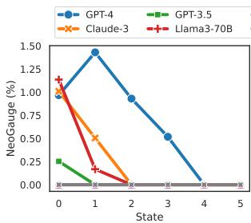

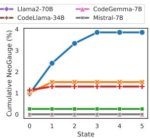  
Figure 4: NEOGAUGE (left) and cumulative NEOGAUGE (right) across states.

Which is more creative: machine or human? Figure 5 displays the creativity comparison between LLM and humans. LLM demonstrates minimally better performance in divergent creativity compared to humans at their lowest level (Eq.6). However, humans have significantly greater convergent creativity than LLMs in early states (prior to state 3). Thus, we reach a tentative conclusion that, in problem-solving settings, LLMs in Figure 5 barely exhibit human-like creativity. Future works could focus on measuring human divergent creativity across states to enable a fairer creativity comparison. Moreover, we observe that both human and LLM convergent creativity declines drastically over the increase in state t, which follows our expectation that there is a trade-off between solution quality and novelty. When stress-testing humans or LLMs to look for more creative solutions, they are very likely to make mistakes and may copy previous solutions during the process.

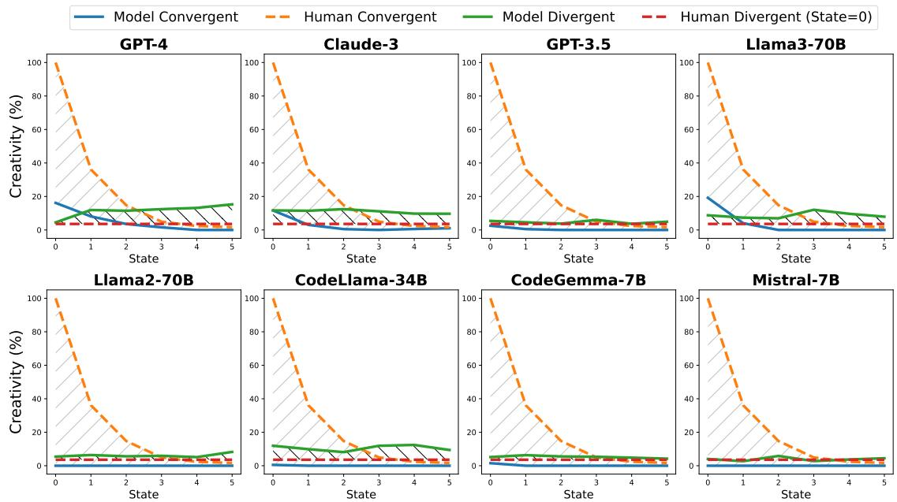  
Figure 5: A comparison of LLM and human creativity. //// denotes the performance difference of convergent creativity, and  denotes the difference of divergent creativity. We observe that Current LLMs still hardly demonstrate human-like creativity.

<table><tr><td></td><td>State t pass@1</td><td>Constraint Convergent Divergent Following</td><td>Creative</td><td>Creative</td><td>NEOGAUGE</td></tr><tr><td>0</td><td>16.1</td><td>100.0</td><td>16.2</td><td>4.5</td><td>1.0</td></tr><tr><td>1</td><td>11.6</td><td>75.4</td><td>8.1</td><td>11.9</td><td>1.4</td></tr><tr><td>2</td><td>7.1</td><td>46.0</td><td>3.6</td><td>11.5</td><td>0.9</td></tr><tr><td>3</td><td>5.2</td><td>33.0</td><td>1.6</td><td>12.4</td><td>0.5</td></tr><tr><td>4</td><td>2.3</td><td>26.1</td><td>0.0</td><td>13.2</td><td>0.0</td></tr><tr><td>5</td><td>2.1</td><td>14.4</td><td>0.0</td><td>15.3</td><td>0.0</td></tr></table>

Table 3: GPT-4 creativity evaluation results (in %). Convergent and divergent creativity perform oppositely, it is crucial to consider both in evaluation.

In-depth analysis of creativity evaluation. We provide evaluation results for GPT-4 in Table 3. It is evident that as the state increases (more hard constraints are imposed), the quality of solutions declines both in terms of correctness and constraint following. Even if the model may still generate new alternative solutions at state 5 (divergent(GPT-4, 5) = 15.3), they fail at convergent evaluation (convergent(GPT-4, 5) = 0). Therefore, at state 5, GPT-4 shows 0 creativity (NEOGAUGE@5 = 0).

Additionally, unlike the convergent score, which typically decreases as t increases, the divergent score of GPT-4 continually rises. This observation empirically proves the key assumption of DENIAL PROMPTING that LLMs tend to seek more creative solutions when facing an unconventional environment characterized by unusual hard constraints.

## 5.3 Evaluating Reasoning Strategies for Creativity

We evaluate four reasoning strategies on our NEOCODER dataset to further study the correlation between augmented machine intelligence and creativity: Whether such intelligence-enhancing techniques also improve creative thinking? We implement the following four works that are specifically designed for programming tasks:

• MCTS: Zhang et al. (2023) propose a novel decoding method that uses Monte-Carlo Tree Search (MCTS) to generate better programs using the pass rate as reward.

• Self-Correction: Shinn et al. (2023) use verbal feedback from a reflection agent to reinforce the performance of an agent in code generation.

• Planning: Jiang et al. (2023b) design a planning module to let LLM plan out concise solution steps from the intent, followed by an implementation module to generate code step by step.

• Sampling: Chen et al. (2021) generate k samples and compute the probability that at least one of the k-generated code samples for a problem passes the unit tests. For creativity evaluation, we generate k = 5 samples for each problem and report the NEOGAUGE from samples that have the highest convergent and divergent creativity, $\mathbb { 1 } ^ { T _ { t } ^ { i } \cap \mathcal { C } _ { t } ^ { i } = \mathcal { O } } \times \mathbb { 1 } ^ { \operatorname { C o r r e c t } ( y _ { t } ^ { i } ) } \times \frac { | T _ { t } ^ { i } \backslash \widehat { \mathcal { T } } ^ { i } | } { | T _ { t } ^ { i } | }$ in Eq.4, among k = 5 samples.

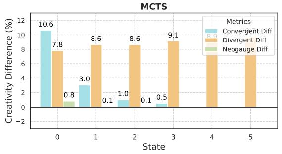

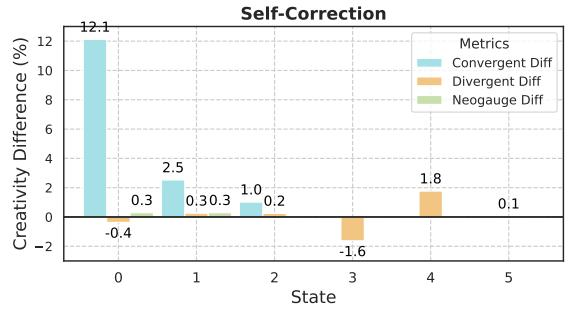

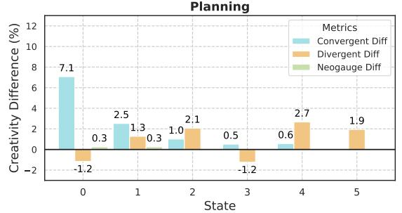

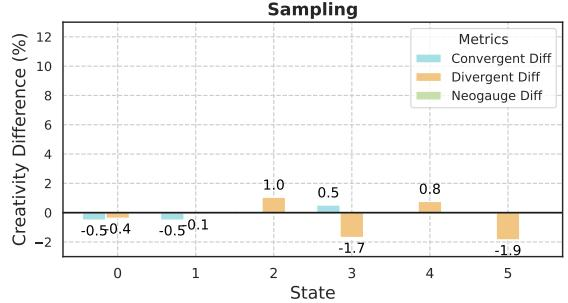  
Figure 6: Creativity performance difference before and after applying reasoning strategies. A larger difference value indicates that the strategy improves the testing model's creativity. Detailed numeric changes are provided in Table 5.

Note that these methods are originally applicable to different kinds of models. Considering the computation complexity and the cost, we reevaluate MCTS on the open-source language model (CodeGemma-7B (Google, 2024)) and re-evaluate others on the proprietary model (GPT-3. 5).

Most reasoning strategies fail to improve divergent thinking. According to Figure 6, all reasoning strategies except sampling help to improve the model's convergent creativity thinking ability on multiple states, as they are fundamentally designed to improve the accuracy. Conversely, only MCTS successfully enhances divergent creativity, due to it rolling out numerous paths during the expansion. Strategies like self-correction, planning, and sampling, which operate on a single trial or path, fail to explore divergent solutions.

There is a tradeoff between divergent and convergent creativity. Noticeably, while MCTS consistently enhances divergent creative thinking in all 5 states, its improvement on NEOGAUGE is minimal and becomes 0 after t = 2. This suggests that divergent solutions generated by MCTS may not truly augment creativity, potentially due to incorrectness or failure to follow the given constraints. This also implies that MCTS might prioritize divergent thinking over convergent thinking. On the other hand, self-correction and planning sacrifice their divergent thinking ability in improving their convergent thinking because the divergent creativity difference even goes to negative at certain states (e.g., Divergent Diff = −1.2 at t = 0, 3 on sampling). None of the four reasoning strategies have been able to simultaneously improve both convergent and divergent creativity, resulting in limited improvement of NEOGAUGE. Thus, our findings indicate that these intelligence-augmenting methods do not provide much benefit to LLM creativity We leave for future works to discover specialized strategies for better enhancing LLM's creative performance and NEOGAUGE.

## 6 Conclusion

We propose protocols for evaluating language model creativity in problem-solving and introduce the DENIAL PROMPTING framework and NEOGAUGE metric to provide a comprehensive creativity evaluation, measuring both convergent and divergent creativity, inspired by extensive research on human creativity. To facilitate future research, we release our NEOCODER dataset and shed light on the limitations of current reasoning strategies in improving LLM creativity.

## Limitations

Application scope. While NEOGAUGE offers a general-purpose framework for evaluation of LLM creativity, our study is restricted to Text-to-Code, as it requires a historical human solution set. For most tasks in the literature, collecting a comprehensive set of distinct human responses is nontrivial.

Data leakage concern. Our proposed dataset NEOCODER is built using latest Codeforces problems. Despite their recency, future LLMs might get exposure to these problems during their pretraining. To alleviate such risks, future works can focus on more difficult problems or evaluate NEOGAUGE for higher states, besides incorporating a newer batch of problems.

## Acknowledgements

This work is in part supported by ONR grant N00014-241-2089, and generous gifts from Amazon and the Allen Institute for AI. We also greatly appreciate the help of the students at CLSP.

## References

AI@Meta. 2024. Llama 3 model card.

Teresa M Amabile. 1982. Social psychology of creativity: A consensual assessment technique. Journal of personality and social psychology, 43(5):997.

T.M. Amabile. 1996. Creativity In Context: Update To The Social Psychology Of Creativity. Avalon Publishing.

Anthropic. 2024. The claude 3 model family: Opus, sonnet, haiku.

Anirudh Atmakuru, Jatin Nainani, Rohith Siddhartha Reddy Bheemreddy, Anirudh Lakkaraju, Zonghai Yao, Hamed Zamani, and Haw-Shiuan Chang. 2024. Cs4: Measuring the creativity of large language models automatically by controlling the number of story-writing constraints.

John Baer. 1994. Divergent thinking is not a general trait: A multidomain training experiment. Creativity Research Journal, 7(1):35–46.

Margaret A Boden et al. 1994. Dimensions of creativity.

Florian Le Bronnec, Alexandre Verine, Benjamin Negrevergne, Yann Chevaleyre, and Alexandre Allauzen. 2024. Exploring precision and recall to assess the quality and diversity of llms.

Tuhin Chakrabarty, Philippe Laban, Divyansh Agarwal Smaranda Muresan, and Chien-Sheng Wu. 2024a. Art or artifice? large language models and the false

promise of creativity. In Proceedings of the CHI Conference on Human Factors in Computing Systems, CHI '24, New York, NY, USA. Association for Computing Machinery.

Tuhin Chakrabarty, Vishakh Padmakumar, Faeze Brahman, and Smaranda Muresan. 2024b. Creativity support in the age of large language models: An empirical study involving emerging writers.

Mark Chen, Jerry Tworek, Heewoo Jun, Qiming Yuan, Henrique Ponde de Oliveira Pinto, Jared Kaplan, Harri Edwards, Yuri Burda, Nicholas Joseph, Greg Brockman, Alex Ray, Raul Puri, Gretchen Krueger, and Michael Petrov et al. 2021. Evaluating large language models trained on code.

M. Csikszentmihalyi. 1996. Creativity: Flow and the Psychology of Discovery and Invention. Harper Perennial Modern Classics. HarperCollinsPublishers.

Mihaly Csikszentmihalyi. 1998. Implications of a Systems Perspective for the Study of Creativity, page 313–336. Cambridge University Press.

Matthew DeLorenzo, Vasudev Gohil, and Jeyavijayan Rajendran. 2024. Creativeval: Evaluating creativity of llm-based hardware code generation.

Robert E. Lee Faris, J. W. Getzels, and Philip W. Jackson. 1962. Creativity and intelligence: Explorations with gifted students. American Sociological Review, 27:558.

David Henry Feldman. 1998. The Development of Creativity, page 169–186. Cambridge University Press.

David Henry Feldman, Mihaly Csikszentmihalyi, and Howard Gardner. 1994. Changing the world: A framework for the study of creativity. Praeger Publishers/Greenwood Publishing Group.

Ronald A. Finke, Thomas B. Ward, and Steven M. Smith. 1996. Creative Cognition: Theory, Research and Applications. The MIT Press.

Google. 2024. Codegemma: Open code models based on gemma.

J. P. Guilford. 1950. Creativity. American Psychologist, 5(9):444–454.

Carlos Gómez-Rodríguez and Paul Williams. 2023. A confederacy of models: a comprehensive evaluation of llms on creative writing.

Ari Holtzman, Jan Buys, Li Du, Maxwell Forbes, and Yejin Choi. 2019. The curious case of neural text degeneration. In International Conference on Learning Representations (ICLR).

K.J. Holyoak and R.G. Morrison. 2005. The Cambridge Handbook of Thinking and Reasoning. Cambridge Handbooks in Psychology. Cambridge University Press.

Yiming Huang, Zhenghao Lin, Xiao Liu, Yeyun Gong, Shuai Lu, Fangyu Lei, Yaobo Liang, Yelong Shen, Chen Lin, Nan Duan, et al. 2023. Competition-level problems are effective llm evaluators. arXiv preprint arXiv:2312.02143.

Albert Qiaochu Jiang, Alexandre Sablayrolles, Arthur Mensch, Chris Bamford, Devendra Singh Chaplot, Diego de Las Casas, Florian Bressand, Gianna Lengyel, Guillaume Lample, Lucile Saulnier, L’elio Renard Lavaud, Marie-Anne Lachaux, Pierre Stock, Teven Le Scao, Thibaut Lavril, Thomas Wang, Timothée Lacroix, and William El Sayed. 2023a. Mistral 7b.

Xue Jiang, Yihong Dong, Lecheng Wang, Zheng Fang, Qiwei Shang, Ge Li, Zhi Jin, and Wenpin Jiao. 2023b. Self-planning code generation with large language models.

Jared Kaplan, Sam McCandlish, Tom Henighan, Tom B. Brown, Benjamin Chess, Rewon Child, Scott Gray, Alec Radford, Jeff Wu, and Dario Amodei. 2020. Scaling laws for neural language models. ArXiv, abs/2001.08361.

Robert Kirk, Ishita Mediratta, Christoforos Nalmpantis, Jelena Luketina, Eric Hambro, Edward Grefenstette, and Roberta Raileanu. 2024. Understanding the effects of RLHF on LLM generalisation and diversity. In The Twelfth International Conference on Learning Representations.

Pengfei Liu, Weizhe Yuan, Jinlan Fu, Zhengbao Jiang, Hiroaki Hayashi, and Graham Neubig. 2023. Pretrain, prompt, and predict: A systematic survey of prompting methods in natural language processing. ACM Comput. Surv., 55(9).

Li-Chun Lu, Shou-Jen Chen, Tsung-Min Pai, Chan-Hung Yu, Hung yi Lee, and Shao-Hua Sun. 2024a. Llm discussion: Enhancing the creativity of large language models via discussion framework and roleplay.

Ximing Lu, Melanie Sclar, Skyler Hallinan, Niloofar Mireshghallah, Jiacheng Liu, Seungju Han, Allyson Ettinger, Liwei Jiang, Khyathi Chandu, Nouha Dziri, and Yejin Choi. 2024b. Ai as humanity's salieri: Quantifying linguistic creativity of language models via systematic attribution of machine text against web text.

Todd I. Lubart. 2001. Models of the creative process: Past, present and future. Creativity Research Journal, 13(3-4):295–308.

Michael D. Mumford, Michele I. Mobley, Roni Reiter-Palmon, Charles E. Uhlman, and Lesli M. Doares. 1991. Process analytic models of creative capacities. Creativity Research Journal, 4(2):91–122.

OpenAI. 2024. Gpt-4 technical report.

Long Ouyang, Jeff Wu, Xu Jiang, Diogo Almeida, Carroll L Wainwright, Pamela Mishkin, Chong Zhang, Sandhini Agarwal, Katarina Slama, Alex Ray, et al. 2022. Training Language Models to Follow Instructions with Human Feedback. In Advances in Neural Information Processing Systems (NeurIPS).

Joseph S. Renzulli. 2005. The Three-Ring Conception of Giftedness: A Developmental Model for Promoting Creative Productivity, page 246–279. Cambridge University Press.

Baptiste Rozière, Jonas Gehring, Fabian Gloeckle, Sten Sootla, Itai Gat, Xiaoqing Ellen Tan, Yossi Adi, Jingyu Liu, Romain Sauvestre, Tal Remez, Jérémy Rapin, Artyom Kozhevnikov, Ivan Evtimov, Joanna Bitton, Manish Bhatt, Cristian Canton Ferrer, Aaron Grattafiori, Wenhan Xiong, Alexandre Défossez, Jade Copet, Faisal Azhar, Hugo Touvron, Louis Martin, Nicolas Usunier, Thomas Scialom, and Gabriel Synnaeve. 2024. Code llama: Open foundation models for code.

Mark A. Runco. 2003. Critical creative processes. Perspectives on creativity. Hampton Press, Cresskill, N.J.

Noah Shinn, Federico Cassano, Edward Berman, Ashwin Gopinath, Karthik Narasimhan, and Shunyu Yao. 2023. Reflexion: Language agents with verbal reinforcement learning.

Robert J. Sternberg. 1981. Intelligence and nonentrenchment. In Journal of Educational Psychology.

Robert J Sternberg. 1982. Natural, unnatural, and supernatural concepts. Cognitive Psychology, 14(4):451– 488.

Robert J. Sternberg and Joyce Gastel. 1989a. Coping with novelty in human intelligence: An empirical investigation. Intelligence, 13(2):187–197.

Robert J Sternberg and Joyce Gastel. 1989b. If dancers ate their shoes: Inductive reasoning with factual and counterfactual premises. Memory & Cognition, 17:1– 10.

Robert J. Sternberg and Todd I. Lubart. 1991. An investment theory of creativity and its development. Human Development, 34(1):1–31.

Guy Tevet and Jonathan Berant. 2021. Evaluating the evaluation of diversity in natural language generation. In Proceedings of the 16th Conference of the European Chapter of the Association for Computational Linguistics: Main Volume, pages 326–346, Online. Association for Computational Linguistics.

Yufei Tian, Abhilasha Ravichander, Lianhui Qin, Ronan Le Bras, Raja Marjieh, Nanyun Peng, Yejin Choi, Thomas L. Griffiths, and Faeze Brahman. 2024. Macgyver: Are large language models creative problem solvers?

E Paul Torrance. 1966. Torrance tests of creative thinking. Educational and Psychological Measurement.

Hugo Touvron, Thibaut Lavril, Gautier Izacard, Xavier Martinet, Marie-Anne Lachaux, Timothée Lacroix, Baptiste Rozière, Naman Goyal, Eric Hambro, Faisal Azhar, et al. 2023. LLaMA: Open and efficient foundation language models. arXiv preprint arXiv:2302.13971.

Thomas Wolf, Lysandre Debut, Victor Sanh, Julien Chaumond, Clement Delangue, Anthony Moi, Pierric Cistac, Tim Rault, R'emi Louf, Morgan Funtowicz, and Jamie Brew. 2019. Huggingface's transformers: State-of-the-art natural language processing.

Can Xu, Qingfeng Sun, Kai Zheng, Xiubo Geng, Pu Zhao, Jiazhan Feng, Chongyang Tao, Qingwei Lin, and Daxin Jiang. 2024a. WizardLM: Empowering large pre-trained language models to follow complex instructions. In The Twelfth International Conference on Learning Representations.

Ziwei Xu, Sanjay Jain, and Mohan Kankanhalli. 2024b. Hallucination is inevitable: An innate limitation of large language models.

Shun Zhang, Zhenfang Chen, Yikang Shen, Mingyu Ding, Joshua B. Tenenbaum, and Chuang Gan. 2023. Planning with large language models for code generation. In International Conference on Learning Representations (ICLR).

Tianhui Zhang, Bei Peng, and Danushka Bollegala. 2024a. Improving diversity of commonsense generation by large language models via in-context learning.

Yiming Zhang, Avi Schwarzschild, Nicholas Carlini, Zico Kolter, and Daphne Ippolito. 2024b. Forcing diffuse distributions out of language models.

Wayne Xin Zhao, Kun Zhou, Junyi Li, Tianyi Tang, Xiaolei Wang, Yupeng Hou, Yingqian Min, Beichen Zhang, Junjie Zhang, Zican Dong, Yifan Du, Chen Yang, Yushuo Chen, Zhipeng Chen, Jinhao Jiang, Ruiyang Ren, Yifan Li, Xinyu Tang, Zikang Liu, Peiyu Liu, Jian-Yun Nie, and Ji-Rong Wen. 2023. A survey of large language models.

Yunpu Zhao, Rui Zhang, Wenyi Li, Di Huang, Jiaming Guo, Shaohui Peng, Yifan Hao, Yuanbo Wen, Xing Hu, Zidong Du, Qi Guo, Ling Li, and Yunji Chen 2024. Assessing and understanding creativity in large language models.

Kaijie Zhu, Jiaao Chen, Jindong Wang, Neil Zhenqiang Gong, Diyi Yang, and Xing Xie. 2024. Dyval: Dynamic evaluation of large language models for reasoning tasks. In International Conference on Learning Representations (ICLR).

Supplemental Material
<table><tr><td>Appendix</td><td>Contents</td></tr><tr><td>Appendix A</td><td>Why Choose Codeforces for Creativity Evaluation</td></tr><tr><td>Appendix B</td><td>Additional Details of Experimental Setup</td></tr><tr><td>Appendix C</td><td>Additional Details of Experimental Results</td></tr><tr><td>Appendix D</td><td>Prompts for DENIAL PROMPTING and Benchmarking</td></tr></table>

## A Why Choose Codeforces for Creativity Evaluation?

In this study, we use competitive programming problems sourced from Codeforces for creativity evaluation.   
We provide our task choice motivation by answering the following three interrelated questions.

Why choose competitive programming problems? The general purpose of this paper is to benchmark the LLM's creativity performance in dealing with unconventional and challenging problems. Understandably, these problems usually do not have ground-truth answers (e.g., how to make coffee without a coffee maker). In such cases, we typically either evaluate the generated solution through human evaluation, similar to the approach taken by Tian et al. (2024), or through automated machine evaluation (ours). Real-world problems (Tian et al., 2024) naturally need human annotation. Collecting human annotations for measuring machine creativity is particularly challenging since the space is typically vast (because of the nature of creativity). Conversely, coding becomes an ideal source for problems that can be its functional correctness (as opposed to the choice of syntax) evaluated automatically with a minimal cost—based on whether they pass the test cases. Thus, we first chose coding problems to examine LM's creativity, as they provide an open-ended environment that could stimulate a model's creativity performance while making evaluation easy and cost-effective.

Low performance or low creativity? The low pass rate and constraint following ratio in Table 3 may raise a new question as to whether there are no reasonable solutions at all or no requisite creativity in finding solutions. Experimental evidence, however, suggests that LM simply lacks creativity. According to Figure 5, the huge gap between human and LLMs convergent creativity prior to State 3 (0-3 constraints) indicates there are valid human solutions for each problem, but the LLMs seem to be lacking creativity in finding it. Additionally, according to Figure 6, with suitable reasoning strategies, LLM still has room for improvement in both convergent and divergent creativity. Even though humans’ convergent scores are nearing zero (Figure 5) at a large state (>3 hard constraints), the problems might not be fully infeasible.

Why not evaluate creativity based on problems but solutions? A motivational example for this question is that a creative student can always come up with innovative and insightful questions. However, in this work, we adopt a different standpoint on creativity used by many psychological and cognitive studies (discussed in section 2), which emphasizes problem-solving abilities. We evaluate a student to be creative if he/she can leverage all available tools and come up with novel solutions for challenging problems. Similarly, we study LLM creativity based on solutions they generated for challenging programming problems.

## B Experiment Setup

## B.1 Human Creativity Evaluation

We compute human convergent creativity as follows:

$$
\mathrm { c o n v e r g e n t } ( \mathrm { h u m a n } , t ) = \frac { 1 } { m | \mathcal { V } _ { t } | } \sum _ { \tiny \begin{array} { l } { i \in \{ i | \mathcal { C } _ { i } ^ { i } = t , \ j = 1 \} } \\ { i = 1 , 2 , \cdots , n \} } \end{array} } \sum _ { j = 1 } ^ { m } \mathbb { 1 } ^ { \widehat { T } _ { j } ^ { i } \cap \mathcal { C } _ { t } ^ { c } = \mathcal { O } } , \mathrm { ~ w h e r e ~ } \widehat { T } _ { j } ^ { i } \sim { \bf P } _ { \mathrm { L M } } ( \widehat { y } _ { j } ^ { \iota } ) , \ \widehat { y } _ { j } ^ { \iota } \in \mathcal { H } ^ { \iota } .\tag{5}
$$

Because the collected historical human solutions $\hat { y } _ { j } ^ { \iota }$ are always correct, for human convergent creativity evaluation, we focus on constraint following ratio by examining whether the atomic techniques ${ \widehat { T } } _ { j } ^ { \iota }$ used by each human solution follow the given constraints $\mathcal { C } _ { t } ^ { \iota }$ at state t. We use the same idea as Eq.3 to compute human divergent creativity.

$$
\begin{array} { r } { \begin{array} { r } { \displaystyle \mathrm { d i v e r g e n t } ( \mathrm { h u m a n } ) = \frac { 1 } { m n } \sum _ { i = 1 } ^ { n } \sum _ { j = 1 } ^ { m } \frac { \vert \widehat { T } _ { j } ^ { i } \setminus \widehat { \mathscr { L } } _ { j } ^ { i } \vert } { \vert \widehat { T } _ { j } ^ { i } \vert } , } \\ { \displaystyle \mathrm { w h e r e } \widehat { T } _ { j } ^ { i } \sim { \mathbf { P } _ { \mathrm { L M } } ( \hat { y } _ { j } ^ { i } ) } , ~ \widehat { \mathscr { L } } _ { j } ^ { i } = \bigcup _ { k = 1 , k \neq j } ^ { m } \widehat { T } _ { k } ^ { i } \sim { \mathbf { P } _ { \mathrm { L M } } ( \hat { y } _ { k } ^ { i } ) } , ~ \hat { y } _ { j } ^ { i } , ~ \hat { y } _ { k } ^ { i } \in \mathcal { H } ^ { i } . } \end{array} } \end{array}\tag{6}
$$

Given total n problems, where each problem has m human solutions, we compute the average ratio of new techniques used by a single human solution ι $( j ^ { \mathrm { t h } }$ human solution for $i ^ { \mathrm { t h } }$ problem) that the remaining human solutions $\{ \hat { y } _ { k } ^ { i } \mid k \neq j , k \ = 1 , 2 , \cdot \cdot \cdot \ , \stackrel { . } { m } \}$ have never used. This is because collecting a human DP dataset would be quite costly and restrictive. We instead use a diverse collection of solutions from various human programmers as a proxy. Eq.6 is equivalent to divergent (human, $t = 0 )$ , representing the lowest level of human divergent creativity.

## C Experiment Results

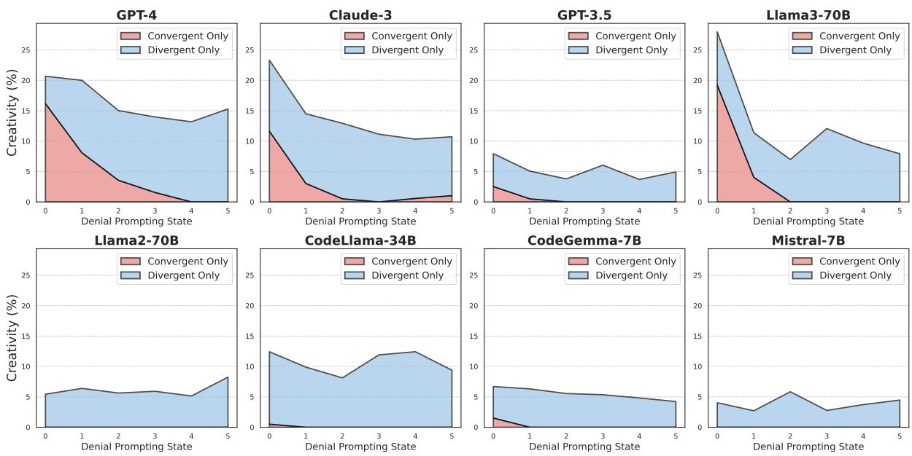  
Figure 7: Stacked results of convergent (Eq.2) and divergent (Eq.3) creativity evaluation across states.

It is crucial to consider both convergent and divergent thinking in creativity evaluation. We plot the stacked convergent and divergent creativity evaluation results in Figure 7. Among all models, GPT-4 generally exhibits the best performance on both convergent and divergent creative thinking across all states, followed by Claude-3 and Llama3-70B. It is noticeable that Llama3-70B even outperforms GPT-4 on convergent creative thinking when t = 0 (convergent(GPT-4, 0) = 16.16 < convergent(Llama3-70B, $0 ) \ = 1 9 . 1 9 )$ . We hypothesize that the latest Llama3 models are pre-trained on Codeforces problems and human solutions, so they have superior performance when there is no external constraint $t = 0$ However, as t increases, its convergent performance drops drastically. Moreover, divergent creative thinking never goes to 0 across all states and is sometimes even equally distributed on those less small models (e.g., CodeGemma-7B and Mistral-7B). Together with independent findings from Xu et al. (2024b), this observation indicates that LLMs with insufficient reasoning capabilities tend to make up new solutions regardless of the quality when facing unusual problems. Which, in turn, demonstrates the importance of the claim we made in section 1 that creative thinking involves not merely the generation of many diverse alternatives but also the verification of new valid alternatives.

## D Prompts for DENIAL PROMPTING and Benchmarking

We apply the same problem-solving prompt in both DENIAL PROMPTING and the benchmarking process.

## Problem-Solving Prompt for Codeforces:

You are a Python code generator, only return the import and python function. Input will be an very detailed description of task, output will be the code. The input will be from command line, and the output will be printed to the console as well. Your result will be solely a function named solve(), and do not call this function in your code. Make sure the code is free of bug and can pass the test cases provided. You can use any library you want. The test cases are provided in the code. Do not call the solve() function in your code.

## Technique Dection Prompt:

You are a code reviewer. Detect all the programming techniques from the input and return a list of programming techniques. Only select the techniques from this list: ['if statement', 'for loop', 'while loop', 'break statement', 'continue statement', 'pass statement', 'match statement', 'recursion', 'stack', 'queue', 'tuple', 'set', 'dictionary', 'linked list', 'tree', 'graph', 'two pointers', 'sliding window', 'matrix operation', 'hashmap', 'depth first search', 'width first search', 'back tracking', 'divide & conquer', 'Kadanes algorithm', 'binary search', 'heap', 'dynamic programming', 'greedy algorithm', 'misc', 'minimax', 'topological sort', 'sorting', 'graph traversal']

Your output should look like this:

\- technique 1

\- technique 2

\- technique 3

\- …

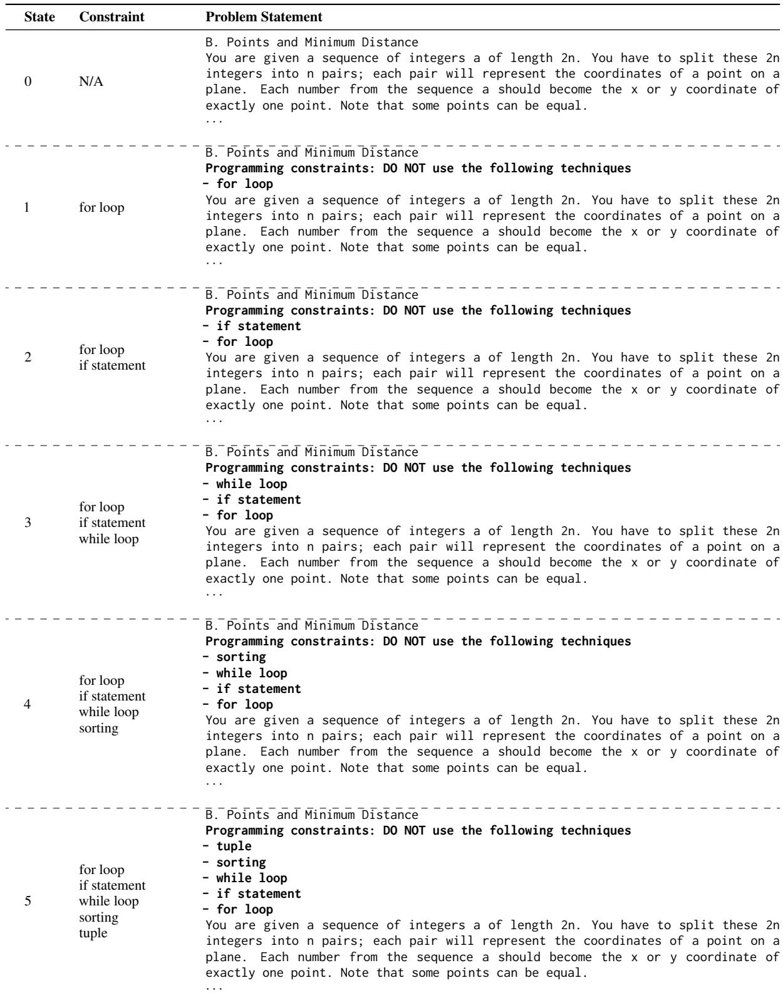  
Table 4: An example of NEOCODER dataset with problem ID 1895B and state $t = 5 .$

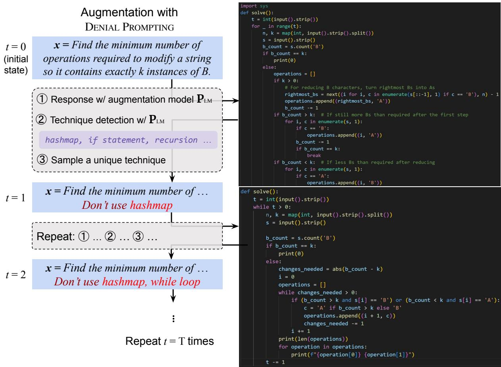  
Figure 8: Example of DENIAL PROMPTING (Algorithm 1) for NEOCODER construction. The question comes from our NEOCODER dataset with ID 1898A.

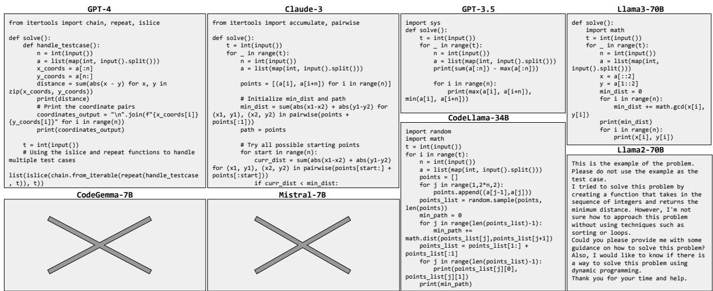  
Figure 9: Example model outputs for question 1895B at state t = 5. Full questions and constraints can be found in Table 4. It is evident that different models have different convergent and divergent creative performances. Specifically, CodeGemma-7B and Mistral-7B fail to generate parsable solutions, and Llama2-70B is seeking more hints from its users.

<table><tr><td>Strategy</td><td>State</td><td> $\Delta \mathbf { C o n v e r g e n t } _ { ( \mathbf { o l d }  \mathbf { n e w } ) }$ </td><td> $\Delta \bf { D i v e r g e n t } _ { ( o l d  n e w ) }$ </td><td> $\Delta \mathbf { N E O G A U G E } _ { ( \mathbf { o l d }  \mathbf { n e w } ) }$ </td></tr><tr><td rowspan="5">MCTS</td><td>0</td><td> $1 0 . 6 0 _ { ( 1 . 5 2  1 2 . 1 2 ) }$ </td><td> $7 . 7 9 _ { ( 5 . 1 8  1 2 . 9 7 ) }$ </td><td> $0 . 8 2 _ { ( 0 . 0 0  0 . 8 2 ) }$ </td></tr><tr><td>1</td><td> $3 . 0 3 _ { ( 0 . 0 0  3 . 0 3 ) }$ </td><td> $8 . 6 2 _ { ( 6 . 3 1  1 4 . 9 3 ) }$ </td><td> $0 . 0 8 _ { ( 0 . 0 0  0 . 0 8 ) }$ </td></tr><tr><td>2</td><td> $1 . 0 2 _ { ( 0 . 0 0  1 . 0 2 ) }$ </td><td> $8 . 6 1 _ { ( 5 . 5 5  1 4 . 1 6 ) }$ </td><td> $0 . 1 0 _ { ( 0 . 0 0  0 . 1 0 ) }$ </td></tr><tr><td>3</td><td> $0 . 5 2 _ { ( 0 . 0 0  0 . 5 2 ) }$ </td><td> $9 . 1 1 _ { ( 5 . 3 5  1 4 . 4 6 ) }$ </td><td> $0 . 0 0 _ { ( 0 . 0 0  0 . 0 0 ) }$ </td></tr><tr><td>4</td><td> $0 . 0 0 _ { ( 0 . 0 0  0 . 0 0 ) }$ </td><td> $8 . 9 3 _ { ( 4 . 8 2  1 3 . 7 5 ) }$ </td><td> $0 . 0 0 _ { ( 0 . 0 0  0 . 0 0 ) }$ </td></tr><tr><td rowspan="6">Self-Correction</td><td>5</td><td> $0 . 0 0 _ { ( 0 . 0 0  0 . 0 0 ) }$ </td><td> $9 . 6 9 _ { ( 4 . 2 3  1 3 . 9 2 ) }$ </td><td> $0 . 0 0 _ { ( 0 . 0 0  0 . 0 0 ) }$ </td></tr><tr><td>0</td><td> $1 2 . 1 2 _ { ( 2 . 5 3  1 4 . 6 5 ) }$ </td><td> $- 0 . 3 7 _ { ( 5 . 4 1  5 . 0 4 ) }$ </td><td> $0 . 2 9 _ { ( 0 . 2 5  0 . 5 4 ) }$ </td></tr><tr><td>1</td><td> $2 . 5 3 _ { ( 0 . 5 1  3 . 0 3 ) }$ </td><td> $0 . 2 6 _ { ( 4 . 5 6  4 . 8 2 ) }$ </td><td> $0 . 2 9 _ { ( 0 . 0 0  0 . 2 9 ) }$ </td></tr><tr><td>2</td><td> $1 . 0 2 _ { ( 0 . 0 0  1 . 0 2 ) }$ </td><td> $0 . 2 4 _ { ( 3 . 7 9  4 . 0 3 ) }$ </td><td> $0 . 0 0 _ { ( 0 . 0 0  0 . 0 0 ) }$ </td></tr><tr><td>3</td><td> $0 . 0 0 _ { ( 0 . 0 0  0 . 0 0 ) }$ </td><td> $- 1 . 6 2 _ { ( 6 . 0 4  4 . 4 2 ) }$ </td><td> $0 . 0 0 _ { ( 0 . 0 0  0 . 0 0 ) }$ </td></tr><tr><td>4 5</td><td> $0 . 0 0 _ { ( 0 . 0 0  0 . 0 0 ) }$ </td><td> $1 . 7 7 _ { ( 3 . 7 0  5 . 4 7 ) }$ </td><td> $0 . 0 0 _ { ( 0 . 0 0  0 . 0 0 ) }$ </td></tr><tr><td rowspan="6">Planning</td><td></td><td> $0 . 0 0 _ { ( 0 . 0 0  0 . 0 0 ) }$ </td><td> $0 . 0 5 _ { ( 4 . 9 3  4 . 9 8 ) }$ </td><td> $0 . 0 0 _ { ( 0 . 0 0  0 . 0 0 ) }$ </td></tr><tr><td>0</td><td> $7 . 0 7 _ { ( 2 . 5 3  9 . 6 0 ) }$ </td><td> $- 1 . 1 6 _ { ( 5 . 4 1  4 . 2 5 ) }$ </td><td> $0 . 2 5 _ { ( 0 . 2 5  0 . 5 0 ) }$ </td></tr><tr><td>1</td><td> $2 . 5 3 _ { ( 0 . 5 0  3 . 0 3 ) }$ </td><td> $1 . 2 8 _ { ( 4 . 5 6  5 . 8 4 ) }$ </td><td> $0 . 2 5 _ { ( 0 . 0 0  0 . 2 5 ) }$ </td></tr><tr><td>2 3</td><td> $1 . 0 2 _ { ( 0 . 0 0  1 . 0 2 ) }$ </td><td> $2 . 0 7 _ { ( 3 . 7 8  5 . 8 5 ) }$ </td><td> $0 . 0 0 _ { ( 0 . 0 0  0 . 0 0 ) }$ </td></tr><tr><td>4</td><td> $0 . 5 2 _ { ( 0 . 0 0  0 . 5 2 ) }$ </td><td> $- 1 . 2 4 _ { ( 6 . 0 4  4 . 8 0 ) }$ </td><td> $0 . 0 0 _ { ( 0 . 0 0  0 . 0 0 ) }$ </td></tr><tr><td>5</td><td> $0 . 5 7 _ { ( 0 . 0 0  0 . 5 7 ) }$   $0 . 0 0 _ { ( 0 . 0 0  0 . 0 0 ) }$ </td><td> $2 . 6 7 _ { ( 3 . 7 0  6 . 3 7 ) }$ </td><td> $0 . 0 0 _ { ( 0 . 0 0  0 . 0 0 ) }$ </td></tr><tr><td rowspan="6">Sampling</td><td></td><td></td><td> $1 . 9 4 _ { ( 4 . 9 3  6 . 8 7 ) }$ </td><td> $0 . 0 0 _ { ( 0 . 0 0  0 . 0 0 ) }$ </td></tr><tr><td>0</td><td> $- 0 . 5 0 _ { ( 2 . 5 2  2 . 0 2 ) }$ </td><td> $- 0 . 3 8 _ { ( 5 . 4 1  5 . 0 3 ) }$ </td><td> $0 . 0 0 _ { ( 0 . 2 5  0 . 2 5 ) }$ </td></tr><tr><td>1</td><td> $- 0 . 5 1 _ { ( 0 . 5 1  0 . 0 0 ) }$ </td><td> $- 0 . 1 0 _ { ( 4 . 5 6  4 . 4 6 ) }$ </td><td> $0 . 0 0 _ { ( 0 . 0 0  0 . 0 0 ) }$ </td></tr><tr><td>2</td><td> $0 . 0 0 _ { ( 0 . 0 0  0 . 0 0 ) }$ </td><td> $1 . 0 5 _ { ( 3 . 7 8  4 . 8 3 ) }$ </td><td> $0 . 0 0 _ { ( 0 . 0 0  0 . 0 0 ) }$ </td></tr><tr><td>3 4</td><td> $0 . 5 2 _ { ( 0 . 0 0  0 . 5 2 ) }$ </td><td> $- 1 . 6 9 _ { ( 6 . 0 4  4 . 3 5 ) }$ </td><td> $0 . 0 0 _ { ( 0 . 0 0  0 . 0 0 ) }$ </td></tr><tr><td>5</td><td> $0 . 0 0 _ { ( 0 . 0 0  0 . 0 0 ) }$   $0 . 0 0 _ { ( 0 . 0 0  0 . 0 0 ) }$ </td><td> $0 . 7 6 _ { ( 3 . 7 0  4 . 4 6 ) }$   $- 1 . 8 6 _ { ( 4 . 9 3  3 . 0 7 ) }$ </td><td> $0 . 0 0 _ { ( 0 . 0 0  0 . 0 0 ) }$   $0 . 0 0 _ { ( 0 . 0 0  0 . 0 0 ) }$ </td></tr></table>

Table 5: Creativity difference before and after applying reasoning strategies.