# Benchmarking Large Language Models on Answering and Explaining Challenging Medical Questions

Hanjie Chen<sup>∗1</sup> Zhouxiang Fang<sup>∗2</sup> Yash Singla<sup>2</sup> Mark Dredze<sup>2</sup>

<sup>1</sup> Rice University <sup>2</sup> Johns Hopkins University

hanjie@rice.edu {zfang27, ysingla1}@jh.edu mdredze@cs.jhu.edu

## Abstract

LLMs have demonstrated impressive performance in answering medical questions, such as achieving passing scores on medical licensing examinations. However, medical board exams or general clinical questions do not capture the complexity of realistic clinical cases. Moreover, the lack of reference explanations means we cannot easily evaluate the reasoning of model decisions, a crucial component of supporting doctors in making complex medical decisions. To address these challenges, we construct two new datasets: JAMA Clinical Challenge and Medbullets.<sup>1</sup> JAMA Clinical Challenge consists of questions based on challenging clinical cases, while Medbullets comprises simulated clinical questions. Both datasets are structured as multiple-choice question-answering tasks, accompanied by expert-written explanations. We evaluate seven LLMs on the two datasets using various prompts. Experiments demonstrate that our datasets are harder than previous benchmarks. In-depth automatic and human evaluations of model-generated explanations provide insights into the promise and deficiency of LLMs for explainable medical QA.

## 1 Introduction

Medical question answering (QA) involves synthesizing relevant information and knowledge and then reasoning about how to apply them to the current situation. These characteristics, presented in many large language models (LLMs) (Brown et al., 2020; Almazrouei et al., 2023; Chowdhery et al., 2023; Touvron et al., 2023), have been demonstrated in the case of answering medical questions, with some claims that LLMs can achieve passing scores on medical board exams (Singhal et al., 2022; Nori et al., 2023b). These results have been achieved with both domain-specific LLMs, such as Med-PaLM (Singhal et al., 2022) and MED-ITRON (Chen et al., 2023), as well as generalpurpose LLMs, such as GPT-4 (OpenAI, 2023), on the United States Medical Licensing Examination (USMLE) questions (Nori et al., 2023a).

While high accuracy on medical licensing exams sounds impressive, it does not mean that these models can answer complex medical questions or assist doctors with clinical decisions. Board exam questions (Jin et al., 2021; Pal et al., 2022) and general medical questions (Abacha et al., 2019, 2017) rely on textbook knowledge, a task for which LLMs are well suited since they learn primarily from medical texts. In contrast, doctors need support with clinical presentations that differ from textbook definitions and require blending established knowledge with clinical experience (Harris, 2023; Kanjee et al., 2023). Additionally, doctors seek explanations, beyond predictions, that elucidate reasons for a decision to better understand complex clinical cases (Panigutti et al., 2022). Models should be evaluated on their ability to correctly explain complex medical decisions in addition to making them.

Moving the evaluation of the medical capabilities of LLMs toward more realistic and challenging clinical settings requires supportive benchmarks. There have been some attempts in this regard, but they are limited in scope and the datasets are generally small (Strong et al., 2023; Kanjee et al., 2023; Shea et al., 2023; Jin et al., 2024). Some benchmarks evaluate model capabilities in understanding clinical texts or following clinical instructions, without necessitating complex reasoning over synthesized information and knowledge for clinical decisions (Parmar et al., 2023; Fleming et al., 2024; He et al., 2023). While recent benchmarks include questions derived from real-world conversations or closely aligned with real-world practice (Manes et al., 2024; Liu et al., 2024; Wang et al., 2024), they do not provide explanations. Other benchmarks include explanations for medical exam questions (Pal et al., 2022; Kim et al., 2024b). To the best of our knowledge, our datasets are the first to feature challenging real-world clinical questions accompanied by high-quality, expert-written explanations.

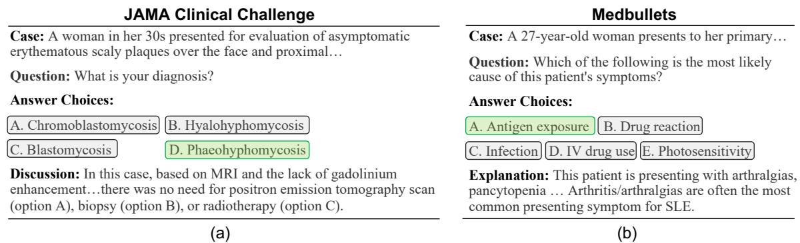  
Figure 1: Examples from the JAMA Clinical Challenge and Medbullets datasets respectively. Each question is paired with 4/5 answer choices and a discussion/explanation. The correct answers are highlighted in green boxes.

We address this evaluation gap through the construction of two datasets: JAMA Clinical Challenge and Medbullets (Figure 1). Both datasets contain high-quality explanations written by human experts—a distinctive feature lacking in previous benchmarks.

JAMA Clinical Challenge consists of 1524 clinical cases collected from the JAMA Network Clinical Challenge archive. These articles are summaries of actual challenging clinical cases framed as challenging questions. Each article contains a long case description followed by a question, four answer choices, and a discussion (explanation)<sup>2</sup> explaining the correct (highlighted in green) and incorrect answers. The questions cover a wide range of medical topics. We expect these questions to be especially challenging given their length and complexity.

Medbullets comprises 308 USMLE Step 2&3 style questions collected from open-access tweets on X (formerly Twitter) since April 2022. The difficulty is comparable to that of Step 2&3 exams, which emulate common clinical scenarios but are shorter and (perhaps) less challenging than JAMA. Each question is paired with a case description, five answer choices, and an explanation of correct and incorrect answers. Although existing benchmarks have included the same type of questions (e.g., MedQA (Jin et al., 2021)), our data contains answer explanations and is more challenging due to its recency, which has led to a significant drop in model performance (§4.1).

We evaluate seven LLMs, spanning closedsource and open-source, general-purpose and domain-specific models: GPT-3.5 (Ouyang et al., 2022), GPT-4 (OpenAI, 2023), PaLM 2 (Anil et al., 2023), Llama 2 (Touvron et al., 2023), Llama 3 (Meta, 2024), MedAlpaca (Han et al., 2023), and Meerkat (Kim et al., 2024a). We find our datasets to be harder (lower accuracy) compared to previous benchmarks, highlighting the challenges posed by the new tasks. In-context learning and prompting strategies yield marginal improvements, leaving potential areas for improvement in future work. Indepth automatic and human evaluations of modelgenerated explanations highlight the limitations of LLMs in explaining complex medical decisionmaking. Moreover, the weak correlation between human and automatic scores underscores the necessity of developing metrics that can support future research on explainable medical QA. Overall, these datasets represent more challenging goals for model predictions and a new challenge in producing meaningful explanations for medical decisions.

## 2 Datasets

We present two medical QA datasets with explanations, both in English.

## 2.1 JAMA Clinical Challenge

The Journal of the American Medical Association (JAMA) includes a Clinical Challenge feature, which presents challenging real-world clinical cases from a range of medical domains, such as ophthalmology, dermatology, etc. These cases are purposely selected based on their difficulty and unusual presentation. Figure 1 (a) shows an example case of a single-patient with a specific disease or condition. Each case has a question about diagnosis (“What is your diagnosis?”) or decision (“What would you do next?”). Four answer choices follow, with the correct option highlighted in the green box (Figure 1). A reference explanation describes why the correct answer is preferred over others.

Data Statistics We collected 1524 examples from the JAMA Network Clinical Challenge<sup>3</sup> archive, spanning the past decade (July 2013 - October 2023) and 13 medical domains. For this paper we excluded images to focus on text LLMs. Table 1 shows data statistics, and more details across domains are reported in Table 6, where “General” means no specific field was provided. We calculate the average and maximum lengths (in alphanumeric tokens) of inputs (Description+Question+Options) and explanations respectively. Ophthalmology and Dermatology contain many more examples than other domains, while Psychiatry has only five instances, which are much longer than average. The explanation length is longer in Diagnostic due to questions about interpretations for diagnostic results, leading to relatively long background introductions and analyses for each potential diagnosis.

## 2.2 Medbullets

Medbullets is an online platform that provides resources for medical study. We focus on Medbullets Step 2/3<sup>4</sup> which serves USMLE Step 2&3<sup>5</sup> type questions. The difficulty level of these questions surpasses that of Step 1 questions, which primarily rely on textbook knowledge. Solving Step 2/3 questions demands the application of medical knowledge and clinical reasoning. In this paper, Medbullets refers to Medbullets Step 2/3. Figure 1 (b) shows an example from Medbullets, comprising a case description, a question, five answer choices – with the correct one highlighted in the green box – and an explanation that explains each option.

Data Statistics Medbullets posted links to questions on X<sup>6</sup>, which we used to collect 308 examples that were publicly available from April 2022 to December 2023. As before we excluded images. Table 1 shows the statistics of Medbullets, where the average/maximum lengths of inputs and explanations are shorter than those of JAMA.

<table><tr><td>Dataset</td><td>#</td><td> $A _ { i n } / M _ { i n }$ </td><td> $A _ { e x p } / M _ { e x p }$ </td></tr><tr><td>JAMA</td><td>1524</td><td>371/779</td><td>632/1369</td></tr><tr><td>Medbullets</td><td>308</td><td>163/257</td><td>413/756</td></tr><tr><td>MedQA</td><td>1273</td><td>137/529</td><td>-</td></tr></table>

Table 1: Statistics of JAMA Clinical Challenge (JAMA), Medbullets, and MedQA, where # counts the number of test examples, $A _ { i n } / M _ { i n }$ means the average/maximum length of inputs, and $A _ { e x p } / M _ { e x p }$ is the average/maximum length of explanations.

MedQA (Jin et al., 2021) also included questions from Medbullets. The test set includes 679 Step 1 questions and 594 Step 2/3 questions, obtained in March 2021. We exclusively consider Step 2/3 questions, leading to a larger average input length compared to MedQA (Table 1). Our data is both more recent – none of our questions appear in MedQA – and contains explanations. MedQA questions have 5 answer options (MedQA-5) while another version (MedQA-4) has only 4 options, where a randomly selected incorrect option was dropped. We also created both 5-option and 4-option versions of Medbullets, denoted as Medbullets-5 and Medbullets-4 respectively, for comparison.

More details on data sources and collection, as well as examinations of data robustness and contamination, can be found in Appendix A. Empirical studies show that our datasets do not have robustness or contamination issues (Alzahrani et al., 2024; Sainz et al., 2023)

## 3 Experimental Setup

We evaluate a range of LLMs on the datasets to determine if they are more challenging than previous benchmarks. We also evaluate the ability of models to produce explanations. We start by describing the LLMs in our experiments (§3.1), followed by prompting strategies (§3.2), and evaluation metrics (§3.3). More details are in Appendix B.

## 3.1 Models

We investigate a range of LLMs: GPT-3.5 (Ouyang et al., 2022, gpt-3.5-turbo-0613), GPT-4 (OpenAI, 2023, gpt-4-0613), PaLM 2 (Anil et al., 2023, chat-bison-001), Llama 2 (Touvron et al., 2023, Llama-2-70b-chat), Llama 3 (Meta, 2024, Llama-3-70b-chat), MedAlpaca (Han et al., 2023, medalpaca-13b), and Meerkat (Kim et al., 2024a, meerkat-7b-v1.0). GPT-3.5, GPT-4, and PaLM 2 are closed-source, general-purpose models. Llama 2 and Llama 3 are open-source, generalpurpose models. MedAlpaca and Meerkat are opensource, domain-specific models tailored to the medical domain. We chose these two medical models due to their superiority over other candidate models in our pilot experiments (§B.1) and in previous studies (Kim et al., 2024a; Zhang et al., 2023b).

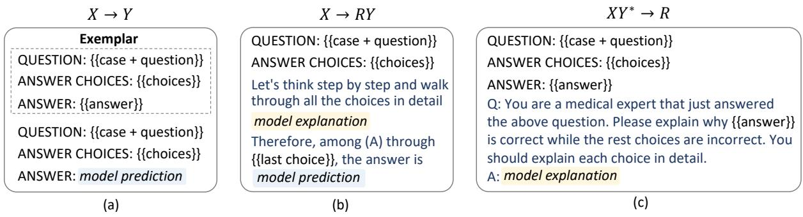  
Figure 2: Prompt templates. The contents in {{}} are replaced with specific elements. Model predictions and explanations are highlighted in blue and yellow respectively.

## 3.2 Prompting Strategies

We apply three different prompting strategies to generate answers and/or explanations. We represent the input as X for the description, question and answer options, Y for the answer, and R for the explanation (rationale). Our three strategies (Figure 2) are:

• X→Y: ask the model to answer the question.

• X→RY: ask the model to engage in stepby-step reasoning first, and then answer the question. This strategy is based on chainof-thought (CoT) prompting, which has improved LLMs’ prediction accuracy across various reasoning tasks (Wei et al., 2022). We follow the two-stage prompting scheme in Liévin et al. (2022); Nori et al. (2023a), as illustrated in Figure 2 (b), where the CoT cue “Let’s think step by step and walk through all the choices in detail.” is adapted from Kojima et al. (2022). In the first stage, the model produces its explanation (highlighted in yellow). We then provide the entire generation to the second-stage and ask the model to provide a prediction (highlighted in blue).

• XY<sup>∗</sup>→R: given the input and the correct answer (Y<sup>∗</sup>), ask the model to explain why this is the best answer over other options. This prompting produces an explanation only.

More details of specific prompts for each LLM are shown in Tables 10 to 12.

Few-Shot Prompting LLMs have demonstrated their capability for in-context learning by utilizing exemplars, enabling them to fastly adapt to new tasks through few-shot prompting (Brown et al., 2020; Min et al., 2022; Chen et al., 2022). We modify the prompt to include few-shot examples, shown in the dashed box in Figure 2 (a). Each exemplar uses the same template of the zero-shot prompting above, with the model output replaced by the gold answer or explanation.

## 3.3 Evaluation Metrics

We use accuracy (prediction compared to ground truth) to evaluate the predictions of each model. We explore several methods to evaluate different aspects of model-generated explanations: ROUGE-L (Lin, 2004), BERTScore (Zhang et al., 2019), BLEURT (Sellam et al., 2020), two variants of BARTScore—BARTScore+ and BARTScore++ (Yuan et al., 2021), three metrics of CTC (Deng et al., 2021)—Consistency, Relevance, and Preservation, and three metrics of G-Eval (Liu et al., 2023)—Coherence, Consistency, and Relevance. ROUGE-L computes the surface-form similarity between model-generated explanations and reference (gold) explanations (§2). BERTScore, BLEURT, and BARTScore+(+) measure semantic similarity using pre-trained BERT (Devlin et al., 2019), fine-tuned BERT, and fine-tuned BART (Lewis et al., 2020) models respectively. CTC metrics evaluate the information alignment of modelgenerated explanations w.r.t. reference explanations or inputs. G-Eval utilizes an LLM (e.g., GPT-4) as the backbone model to score the quality of model-generated explanations in different aspects. More details are in Appendix B.3.

## 4 Results and Discussion

We measure the prediction accuracy of the seven LLMs on MedQA and our two datasets with the X→Y prompt (§4.1), few-shot prompts (X→Y, §4.2) and CoT reasoning (X→RY, §4.3). We evaluate model-generated explanations under XY<sup>∗</sup>→R prompting via both automatic and human evaluations (§4.4).

## 4.1 Performance Drop on New Tasks

Table 2 shows the accuracy using zero-shot X→Y prompting on the 4-option and 5-option versions of Medbullets and MedQA. All models, except for MedAlpaca, exhibit lower prediction accuracy on Medbullets-4/5 compared to MedQA-4/5, showing the challenge of our datasets. GPT-4 (by far the best model overall) drops over 12%, while the other models decrease a range of 5% to 12%. We compare JAMA Clinical Challenge (4 answer choices) to Medbullets-4 and MedQA-4, where GPT-3.5, GPT-4, PaLM 2, and Llama 3 on JAMA Clinical Challenge results align closely with their performance on Medbullets-4. This similarity implies that these models face comparable difficulties when addressing real-world clinical problems as they do with simulated USMLE Step 2/3 questions, a surprising finding given the challenge of JAMA questions. The performance of MedAlpaca and Meerkat drops significantly on JAMA Clinical Challenge, indicating that this task is challenging for smaller language models (13B and 7B respectively), even with fine-tuning on medical data. Interestingly, Llama 2 performs comparably to GPT-3.5, PaLM 2, and Meerkat on JAMA Clinical Challenge but falls short on Medbullets and MedQA. We analyze model performance across medical domains of JAMA Clinical Challenge in Appendix C.1.

Is MedQA Easier Because It Includes Step 1 Questions? MedQA contains Step 1, 2/3 questions. Since Step 1 questions should be easier, do LLMs do better on these questions? We compute the accuracy of the seven models on the Step 1 and Step 2/3 questions in MedQA-4/5 separately. The results are reported in Table 2 in gray. All models, except for MedAlpaca, demonstrate similar performance in answering the two types of questions, meaning that the reason why MedQA is easier than Medbullets is not due to the inclusion of Step 1 questions. MedAlpaca’s accuracy on MedQA Step 2/3 questions is much higher than on Step 1 questions and is comparable to its performance on Medbullets, which only contains Step 2/3 questions. This explains why its overall accuracy on MedQA (both 4- and 5-option versions) is lower than on Medbullets. Additionally, the other models perform better on Step 2/3 questions in MedQA than on Medbullets, suggesting that the newer questions in Medbullets are more challenging.

## 4.2 Does In-Context Learning Help?

We follow Nori et al. (2023a) and apply few-shot X→Y prompting, illustrated in Figure 2 (a), to test the capabilities of LLMs in adapting to new tasks through in-context learning (Brown et al., 2020). Specifically, we adopt leave-one-out cross validation (Hastie et al., 2009), where each instance is assessed using few-shot randomly sampled examples from the remaining dataset as demonstrations. Figure 3 shows the prediction accuracy (%) of the seven models under 0/2/5-shot X→Y promptings on different datasets. GPT-4 and Llama 3 benefit from in-context learning, exhibiting improved performance with an increased number of few-shot examples across all datasets. Nevertheless, it has minimal effect for GPT-3.5 and PaLM 2, whose performances are tied and do not show obvious differences under few-shot prompting. Llama 2 and MedAlpaca’s performance remains stable on MedQA-4/5 but varies on Medbullets-4/5 and declines on JAMA Clinical Challenge when more examples are used. MedAlpaca can barely output reasonably under 5-shot prompting on JAMA due to its 512-token limit. Few-shot prompting generally hurts Meerkat, implying its inferior in-context learning ability. Overall, few-shot prompting does not enhance the adaptation of GPT-3.5, PaLM 2, Llama 2, MedAlpaca, and Meerkat to the new tasks. We leave it to future work to develop better learning or adaptation strategies to equip LLMs with the capabilities to tackle challenging medical QA.

## 4.3 Chain-of-Thought (CoT) Prompting

We apply zero-shot X→RY prompting to investigate whether CoT helps model reasoning on challenging medical QA. Table 2 shows that CoT prompting improves accuracy of most models on MedQA and Medbullets datasets. However, for JAMA Clinical Challenge, CoT only improves GPT-3.5 and Meerkat but not other models. This suggests that the challenging clinical cases in JAMA are intrinsically more difficult for models to reason about compared to board exam questions. This gap in performance leaves room for future work to align model reasoning with complex clinical decision-making. Additionally, CoT enhances Meerkat but not MedAlpaca because the former was fine-tuned with synthetic CoT data while the latter was not. This suggests the potential of improving models’ reasoning ability by augmenting data with corresponding reasoning paths. We also noticed new error types introduced by CoT prompting, as discussed in the Appendix C.2.

<table><tr><td rowspan="2">Prompting</td><td rowspan="2">Dataset</td><td colspan="7">Model</td></tr><tr><td>GPT-3.5</td><td>GPT-4</td><td>PaLM 2</td><td>Llama 2</td><td>Llama 3</td><td>MedAlpaca</td><td>Meerkat</td></tr><tr><td rowspan="9">X→Y</td><td>MedQA-4</td><td>54.67</td><td>78.63</td><td>52.95</td><td>39.51</td><td>76.74</td><td>45.16</td><td>64.18</td></tr><tr><td>MedQA-4 (Step 1)</td><td>54.79</td><td>77.76</td><td>53.31</td><td>40.35</td><td>75.55</td><td>41.38</td><td>62.74</td></tr><tr><td>MedQA-4 (Step 2/3)</td><td>54.55</td><td>79.63</td><td>52.53</td><td>38.55</td><td>78.11</td><td>49.49</td><td>65.82</td></tr><tr><td>MedQA-5</td><td>48.55</td><td>74.16</td><td>46.58</td><td>32.76</td><td>72.58</td><td>39.90</td><td>61.19</td></tr><tr><td>MedQA-5 (Step 1)</td><td>48.01</td><td>73.34</td><td>45.51</td><td>34.02</td><td>70.83</td><td>34.75</td><td>58.76</td></tr><tr><td>MedQA-5 (Step 2/3)</td><td>49.16</td><td>75.08</td><td>47.81</td><td>31.31</td><td>74.57</td><td>45.79</td><td>63.94</td></tr><tr><td>Medbullets-4</td><td>46.10</td><td>66.23</td><td>47.73</td><td>33.12</td><td>68.50</td><td>48.37</td><td>56.49</td></tr><tr><td>Medbullets-5</td><td>43.18</td><td>60.71</td><td>42.86</td><td>25.97</td><td>63.96</td><td>43.18</td><td>48.70</td></tr><tr><td>JAMA</td><td>48.69</td><td>67.32</td><td>48.69</td><td>44.36</td><td>66.14</td><td>36.48</td><td>45.99</td></tr><tr><td rowspan="5">X→RY</td><td>MedQA-4</td><td>57.42</td><td>82.64</td><td>54.44</td><td>40.22</td><td>78.79</td><td>44.70</td><td>68.89</td></tr><tr><td>MedQA-5</td><td>55.30</td><td>79.42</td><td>48.70</td><td>36.61</td><td>75.26</td><td>37.86</td><td>64.33</td></tr><tr><td>Medbullets-4</td><td>50.97</td><td>68.83</td><td>47.73</td><td>35.06</td><td>67.21</td><td>47.07</td><td>56.81</td></tr><tr><td>Medbullets-5</td><td>47.40</td><td>63.31</td><td>43.51</td><td>27.92</td><td>62.66</td><td>42.53</td><td>49.35</td></tr><tr><td>JAMA</td><td>50.13</td><td>67.13</td><td>47.83</td><td>40.88</td><td>64.17</td><td>35.69</td><td>49.86</td></tr></table>

Table 2: Prediction accuracy (%) of the seven LLMs under zero-shot X→Y and X→RY promptings. JAMA: JAMA Clinical Challenge. For X→Y, we report the results for the Step 1 and Step 2/3 questions of MedQA-4/5 separately in gray. The results in X→RY that are better than the corresponding results in X→Y are bolded.  
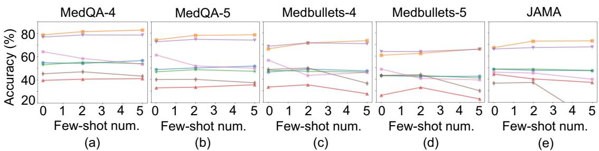  
GPT-3.5 GPT-4 PaLM 2 Llama 2 Llama 3 MedAlpaca Meerkat  
Figure 3: In-context learning performance of the seven LLMs under few-shot X→Y prompting on different datasets.

## 4.4 Evaluating Model Explanations

How well do LLMs do at generating explanations as compared to human-written explanations? We apply $\mathrm { X Y ^ { * } }$ →R to prompt the seven LLMs to produce explanations, which explicitly explain why the correct answer is preferred over the other choices (Figure 2 (c)).

## 4.4.1 Automatic Evaluation

Given reference explanations in Medbullets-5 and JAMA Clinical Challenge (§2), we apply several automatic metrics (§3.3) to evaluate modelgenerated explanations. The scores are reported in Table 3, where the best results under each metric are highlighted in bold, the second-best results are underlined, and the worst results are in gray. Since the scores across different metrics are not directly comparable, we compare the ranking of explanations generated by different models under each metric.

MedAlpaca ranks lowest on almost all metrics, but it ranks highest on CTC Consistency. The reason is that MedAlpaca’s outputs are invalid explanations, containing text segments from the inputs, which results in artificially high consistency scores (see an example in Table 21). GPT-3.5, GPT-4, Llama 3, and Meerkat are tied, ranking best or second-best in most metrics (except for BARTScore+(+)), indicating their similar abilities in generating medical explanations. Notably, Meerkat, fine-tuned on synthetic data generated by GPT-4, inherits its ability to explain medical questions as well as answer them. Moreover, Meerkat’s explanations excel in CTC Relevance on both datasets, demonstrating their superiority in covering important information from reference explanations while retaining consistency with inputs. GPT-3.5 and GPT-4 are generally favored by ROUGE-L, BERTScore, BLEURT, and CTC Preservation, indicating that their generated explanations are more similar to reference explanations. All three G-Eval metrics indicate that Llama 3 and GPT-4 produce higher quality explanations than other models on both datasets. One disagreement is that BARTScore+ and BARTScore++ score PaLM 2 as the best. Nevertheless, we observe that PaLM

<table><tr><td rowspan="2">Dataset</td><td rowspan="2">Metric</td><td colspan="7">Model</td></tr><tr><td>GPT-3.5</td><td>GPT-4</td><td>PaLM 2</td><td>Llama 2</td><td>Llama 3</td><td>MedAlpaca</td><td>Meerkat</td></tr><tr><td rowspan="9">Medbullets-5</td><td>ROUGE-L</td><td>0.3323</td><td>0.3119</td><td>0.2995</td><td>0.3000</td><td>0.3118</td><td>0.1146</td><td>0.3107</td></tr><tr><td>BERTScore</td><td>0.6554</td><td>0.6530</td><td>0.6300</td><td>0.6358</td><td>0.6450</td><td>0.4658</td><td>0.6449</td></tr><tr><td>BLEURT</td><td>0.3965</td><td>0.3981</td><td>0.3898</td><td>0.3787</td><td>0.3915</td><td>0.3712</td><td>0.3985</td></tr><tr><td>CTC Relev.</td><td>0.6961</td><td>0.6965</td><td>0.6835</td><td>0.6898</td><td>0.6920</td><td>0.6707</td><td>0.7057</td></tr><tr><td>CTC Presv.</td><td>0.4255</td><td>0.4251</td><td>0.4161</td><td>0.4222</td><td>0.4244</td><td>0.3935</td><td>0.4243</td></tr><tr><td>CTC Consist.</td><td>0.8291</td><td>0.8253</td><td>0.8209</td><td>0.8294</td><td>0.8237</td><td>0.8724</td><td>0.8406</td></tr><tr><td>G-Eval Relev.</td><td>4.6449</td><td>4.7712</td><td>3.9566</td><td>3.9943</td><td>4.9103</td><td>1.9727</td><td>4.0233</td></tr><tr><td>G-Eval Coh.</td><td>4.7063</td><td>4.7784</td><td>4.0412</td><td>4.1477</td><td>4.9123</td><td>2.5227</td><td>4.1329</td></tr><tr><td>G-Eval Consist.</td><td>4.5792</td><td>4.7525</td><td>3.7823</td><td>3.6803</td><td>4.8194</td><td>1.8844</td><td>3.8675</td></tr><tr><td></td><td>BARTScore+ BARTScore++</td><td>-2.6276 -3.3913</td><td>-3.0230 -3.7037</td><td>-2.3903</td><td>-2.5178 -3.3382</td><td>-2.6570</td><td>-3.3689</td><td>-2.8863</td></tr><tr><td></td><td></td><td></td><td></td><td>-3.1527</td><td></td><td>-3.4710</td><td>-4.1312</td><td>-3.6542</td></tr><tr><td rowspan="6">JAMA</td><td>ROUGE-L</td><td>0.2316</td><td>0.2185</td><td>0.2315</td><td>0.2185</td><td>0.2357</td><td>0.0576</td><td>0.2294</td></tr><tr><td>BERTScore</td><td>0.6072 0.3395</td><td>0.6018</td><td>0.6041</td><td>0.5971</td><td>0.6046</td><td>0.4115</td><td>0.6087</td></tr><tr><td>BLEURT</td><td>0.6839</td><td>0.3432</td><td>0.3332</td><td>0.3225 0.6786</td><td>0.3302</td><td>0.3098</td><td>0.3324</td></tr><tr><td>CTC Relev.</td><td>0.4119</td><td>0.6792 0.4104</td><td>0.6854 0.4107</td><td>0.4102</td><td>0.6779</td><td>0.6470</td><td>0.7012</td></tr><tr><td>CTC Presv. CTC Consist.</td><td>0.8405</td><td>0.8350</td><td>0.8450</td><td>0.8393</td><td>0.4118 0.8332</td><td>0.3821</td><td>0.4113</td></tr><tr><td></td><td></td><td>4.8567</td><td>4.1466</td><td>4.3031</td><td>4.9278</td><td>0.8595</td><td>0.8593</td></tr><tr><td></td><td>G-Eval Relev.</td><td>4.7426</td><td></td><td></td><td>4.3422</td><td></td><td>1.6965</td><td>4.1872</td></tr><tr><td></td><td>G-Eval Coh.</td><td>4.7653</td><td>4.8304</td><td>4.2189</td><td></td><td>4.9457</td><td>2.1034</td><td>4.2418</td></tr><tr><td></td><td>G-Eval Consist.</td><td>4.7068</td><td>4.8676 -3.3528</td><td>3.9940 -2.7134</td><td>4.1278 -2.8710</td><td>4.9175 -2.8580</td><td>1.6243 -3.8165</td><td>4.0799</td></tr><tr><td></td><td>BARTScore+</td><td>-2.9695</td><td>-4.1178</td><td>-3.5964</td><td>-3.7468</td><td>-3.7918</td><td>-4.5111</td><td>-3.2606</td></tr><tr><td></td><td>BARTScore++</td><td>-3.8410</td><td></td><td></td><td></td><td></td><td></td><td>-4.1018</td></tr></table>

Table 3: Automatic evaluations of the explanations generated by the seven LLMs under zero-shot XY<sup>∗</sup>→R prompting on Medbullets-5 and JAMA Clinical Challenge datasets. The best results for each metric are highlighted in bold, the second-best results are underlined, while the worst results are in gray color.

<table><tr><td>Model</td><td></td><td>Completeness Correctness</td><td>Relevance</td></tr><tr><td>GPT-4</td><td>3.35</td><td>4.45</td><td>4.61</td></tr><tr><td>PaLM 2</td><td>2.67</td><td>4.35</td><td>4.53</td></tr></table>

Table 4: Human evaluations of the explanations generated by GPT-4 and PaLM 2 on Medbullets-5.

<table><tr><td></td><td>Human Complet.</td><td>Corr.</td><td>Relev.</td></tr><tr><td>ROUGE-L</td><td>-0.28</td><td>-0.01</td><td>-0.05</td></tr><tr><td>BERTScore</td><td>-0.04</td><td>-0.06</td><td>0.14</td></tr><tr><td>BLEURT</td><td>-0.14</td><td>0.16</td><td>0.04</td></tr><tr><td>CTC Relev.</td><td>-0.27</td><td>-0.05</td><td>0.09</td></tr><tr><td>CTC Presv.</td><td>-0.06</td><td>-0.06</td><td>-0.00</td></tr><tr><td>CTC Consist.</td><td>-0.37</td><td>-0.00</td><td>0.03</td></tr><tr><td>G-Eval Relev.</td><td>-0.24</td><td>0.22</td><td>0.11</td></tr><tr><td>G-Eval Coh.</td><td>-0.28</td><td>0.32</td><td>-0.00</td></tr><tr><td>G-Eval Consist.</td><td>-0.34</td><td>0.26</td><td>0.17</td></tr><tr><td>BARTScore+</td><td>-0.08</td><td>0.17</td><td>-0.01</td></tr><tr><td>BARTScore++</td><td>-0.20</td><td>0.13</td><td>-0.00</td></tr></table>

Table 5: The correlation between human and automatic evaluations on the explanations generated by GPT-4 on Medbullets-5.

2’s explanations discuss each option but do not precisely explain why it is correct or incorrect regarding the question. More qualitative analyses are in Appendix C.3.

Overall, these automatic metrics provide consistent evaluations of model explanations, though they exhibit slight disagreements in specific rankings. CTC Consistency and BARTScore+(+) fall short in identifying deficient explanations, resulting in discrepancies with other metrics.

## 4.4.2 Human Evaluation

Despite the efficiency of automatic evaluations, they struggle to assess explanations accurately due to their diversity. Therefore, we turn to human evaluation for a more reliable assessment of explanation quality. We consider three critical properties: (1) Completeness refers to whether the explanation sufficiently and convincingly justifies each answer choice as correct or incorrect; (2) Correctness means whether the information provided in the explanation is correct; (3) Relevance indicates whether the explanation is relevant to the question. We recruit crowdworkers with a Master’s or Doctorate degree in Medicine/Healthcare through Prolific<sup>7</sup> to evaluate 30 randomly sampled examples from Medbullets-5, along with their explanations generated by GPT-4 and PaLM 2 under XY<sup>∗</sup>→R prompting. We collect 3 annotations per instance and compute an average score for each property. Please see Appendix C.4 for more details.

Table 4 reports human evaluation results. GPT-4 outperforms PaLM 2 in all three properties, which is consistent with most of the automatic evaluation results in Table 3. We compute Pearson correlation coefficients between human and automatic evaluation scores for GPT-4’s explanations, as shown in Table 5. While G-Eval metrics demonstrate positive correlations with Human Correctness, these correlations are not strong. Most automatic scores show little to no correlation with human scores. This highlights the need to develop automatic metrics that better align with human judgments. More analyses of human evaluation are provided in Appendix C.4, where annotators identify deficiencies of model explanations, such as incorrect and irrelevant information.

## 5 Related Work

The emergence of LLMs has significantly transformed the medical domain, particularly in the realm of medical QA tasks. For example, generalpurpose GPT-4 (OpenAI, 2023) has succeeded on medical board examination questions, such as the USMLE (Nori et al., 2023a,b). Additionally, many LLMs have been fine-tuned or adapted to the medical domain, deriving their domain-specific variants, such as Med-PaLM (2) (Singhal et al., 2022, 2023), MedAlpaca (Han et al., 2023), MEDITRON (Chen et al., 2023), and Meerkat (Kim et al., 2024a).

These models have been evaluated on medical QA benchmarks, which mostly consist of board exam questions (Jin et al., 2021; Pal et al., 2022; Hendrycks et al., 2020) or general medical questions (Abacha et al., 2019, 2017; Abacha and Demner-Fushman, 2019). Answering these questions, based on textbook knowledge or online resources, may be well-suited for LLMs, which learn from extensive texts (Dave et al., 2023; Li et al., 2023b; Wang et al., 2023). Other datasets constructed to facilitate research on clinical QA also fail to capture the complexity of realistic clinical situations (Soni et al., 2022; Yue et al., 2020; Pampari et al., 2018).

Some attempts have been made to examine LLMs on challenging clinical cases, but either the scope (restricted to a specific domain) or scale is limited (Strong et al., 2023; Kanjee et al., 2023; Shea et al., 2023; Eriksen et al., 2024; Barile et al., 2024; Jin et al., 2024). Another line of work creates benchmarks to evaluate LLMs in handling long clinical texts (Parmar et al., 2023), following clinical instructions (Fleming et al., 2024), or performing multiple tasks across multiple domains (He et al., 2023). The tasks include classification and text-to-text generation (e.g., summarization, translation). Differently, our focus is on multiple-choice QA tasks, assessing the abilities of LLMs in applying medical reasoning to infer correct answers. Recent benchmarks collect questions derived from real-world conversations or closely aligned with real-world practice (Manes et al., 2024; Liu et al., 2024; Wang et al., 2024). However, these datasets do not include medical explanations. While MedM-CQA (Pal et al., 2022) provides explanations, the quality is not satisfactory. ExplainCPE’s explanations are for Chinese Pharmacist Examination (Li et al., 2023a). MedExQA provides explanations for questions based on mock tests or online exams (Kim et al., 2024b). Our datasets include questions based on challenging real-world clinical cases, accompanied by high-quality, expert-written explanations.

## 6 Conclusion

We introduce two challenging medical QA datasets, JAMA Clinical Challenge and Medbullets, accompanied by expert-written explanations. We evaluate seven LLMs’ ability in answering and explaining these medical questions. We find that these datasets are harder than previous benchmarks. Since these are more reflective of complex clinical cases, they represent a new challenge for medical LLM research. We assess model-generated explanations using various automatic metrics and human evaluation. While LLMs produce promising explanations, they also exhibit deficiencies such as irrelevance and errors. Additionally, existing automatic evaluations do not correlate well with human judgements, suggesting future work to define a suite of evaluation metrics suitable for explainable medical QA.

## Limitations

One limitation is that we did not consider more complex prompting strategies, such as ensembling techniques (Wang et al., 2022) and dynamic fewshot selection (Nori et al., 2023b), which may lead to better performance on benchmarks but also add computational complexity. Besides, we did not apply few-shot CoT prompting using reference explanations as exemplars because they are not in the format of CoT reasoning. Future work might collect expert-written CoT exemplars and explore prompt engineering to enhance model performance on our constructed challenging tasks. Another limitation is that we excluded all figures in our collected data to tailor the task for text-based LLMs. These figures (e.g., X-ray imaging) might contain important information for clinical decisions. In the future, we will evaluate multimodal models (e.g., GPT-4V, Gemini) on the complete datasets, including both texts and images.

## Ethics Statement

The data collected in this work has been deidentified, without disclosing any sensitive information (e.g., personal identifiers). While modelgenerated explanations may contain harmful or bias information, we did not encounter such examples in our experiments. In human evaluation, we did not collect any personal information (e.g. demographics and identities).

## Acknowledgements

We thank Isabel Cachola for assistance in setting up the human evaluation platform and Sharon Levy for providing advice in human studies on Prolific. We thank the anonymous reviewers for many valuable comments.

## References

Asma Ben Abacha, Eugene Agichtein, Yuval Pinter, and Dina Demner-Fushman. 2017. Overview of the medical question answering task at trec 2017 liveqa. In Text Retrieval Conference.

Asma Ben Abacha and Dina Demner-Fushman. 2019. A question-entailment approach to question answering. BMC Bioinformatics, 20.

Asma Ben Abacha, Yassine Mrabet, Mark E. Sharp, Travis R. Goodwin, Sonya E. Shooshan, and Dina Demner-Fushman. 2019. Bridging the gap between consumers’ medication questions and trusted answers. Studies in health technology and informatics, 264:25–29.

Ebtesam Almazrouei, Hamza Alobeidli, Abdulaziz Alshamsi, Alessandro Cappelli, Ruxandra Cojocaru, Mérouane Debbah, Étienne Goffinet, Daniel Hesslow, Julien Launay, Quentin Malartic, et al. 2023. The falcon series of open language models. arXiv preprint arXiv:2311.16867.

Norah Alzahrani, Hisham Alyahya, Yazeed Alnumay, Sultan AlRashed, Shaykhah Alsubaie, Yousef Almushayqih, Faisal Mirza, Nouf Alotaibi, Nora Al-Twairesh, Areeb Alowisheq, M Saiful Bari, and Haidar Khan. 2024. When benchmarks are targets: Revealing the sensitivity of large language model leaderboards. In Proceedings of the 62nd Annual Meeting of the Association for Computational Linguistics (Volume 1: Long Papers), pages 13787– 13805, Bangkok, Thailand. Association for Computational Linguistics.

Rohan Anil, Andrew M Dai, Orhan Firat, Melvin Johnson, Dmitry Lepikhin, Alexandre Passos, Siamak Shakeri, Emanuel Taropa, Paige Bailey, Zhifeng Chen, et al. 2023. Palm 2 technical report. arXiv preprint arXiv:2305.10403.

Anthropic. 2024. The claude 3 model family: Opus, sonnet, haiku.

Joseph Barile, Alex Margolis, Grace Cason, Rachel Kim, Saia Kalash, Alexis Tchaconas, and Ruth Milanaik. 2024. Diagnostic accuracy of a large language model in pediatric case studies. JAMA Pediatrics, 178(3):313–315.

E. M. BENNETT, R. ALPERT, and A. C. GOLDSTEIN. 1954. Communications through limited-response questioning. Public Opinion Quarterly, 18(3):303– 308.

Tom Brown, Benjamin Mann, Nick Ryder, Melanie Subbiah, Jared D Kaplan, Prafulla Dhariwal, Arvind Neelakantan, Pranav Shyam, Girish Sastry, Amanda Askell, Sandhini Agarwal, Ariel Herbert-Voss, Gretchen Krueger, Tom Henighan, Rewon Child, Aditya Ramesh, Daniel Ziegler, Jeffrey Wu, Clemens Winter, Chris Hesse, Mark Chen, Eric Sigler, Mateusz Litwin, Scott Gray, Benjamin Chess, Jack Clark, Christopher Berner, Sam McCandlish, Alec

Radford, Ilya Sutskever, and Dario Amodei. 2020. Language models are few-shot learners. In Advances in Neural Information Processing Systems, volume 33, pages 1877–1901. Curran Associates, Inc.

Yanda Chen, Ruiqi Zhong, Sheng Zha, George Karypis, and He He. 2022. Meta-learning via language model in-context tuning. In Proceedings ofthe 60th Annual Meeting of the Association for Computational Linguistics (Volume 1: Long Papers), pages 719–730, Dublin, Ireland. Association for Computational Linguistics.

Zeming Chen, Alejandro Hern’andez Cano, Angelika Romanou, Antoine Bonnet, Kyle Matoba, Francesco Salvi, Matteo Pagliardini, Simin Fan, Andreas Kopf, Amirkeivan Mohtashami, Alexandre Sallinen, Alireza Sakhaeirad, Vinitra Swamy, Igor Krawczuk, Deniz Bayazit, Axel Marmet, Syrielle Montariol, Mary-Anne Hartley, Martin Jaggi, and Antoine Bosselut. 2023. Meditron-70b: Scaling medical pretraining for large language models. ArXiv, abs/2311.16079.

Aakanksha Chowdhery, Sharan Narang, Jacob Devlin, Maarten Bosma, Gaurav Mishra, Adam Roberts, Paul Barham, Hyung Won Chung, Charles Sutton, Sebastian Gehrmann, Parker Schuh, Kensen Shi, Sashank Tsvyashchenko, Joshua Maynez, Abhishek Rao, Parker Barnes, Yi Tay, Noam Shazeer, Vinodkumar Prabhakaran, Emily Reif, Nan Du, Ben Hutchinson, Reiner Pope, James Bradbury, Jacob Austin, Michael Isard, Guy Gur-Ari, Pengcheng Yin, Toju Duke, Anselm Levskaya, Sanjay Ghemawat, Sunipa Dev, Henryk Michalewski, Xavier Garcia, Vedant Misra, Kevin Robinson, Liam Fedus, Denny Zhou, Daphne Ippolito, David Luan, Hyeontaek Lim, Barret Zoph, Alexander Spiridonov, Ryan Sepassi, David Dohan, Shivani Agrawal, Mark Omernick, Andrew M. Dai, Thanumalayan Sankaranarayana Pillai, Marie Pellat, Aitor Lewkowycz, Erica Moreira, Rewon Child, Oleksandr Polozov, Katherine Lee, Zongwei Zhou, Xuezhi Wang, Brennan Saeta, Mark Diaz, Orhan Firat, Michele Catasta, Jason Wei, Kathy Meier-Hellstern, Douglas Eck, Jeff Dean, Slav Petrov, and Noah Fiedel. 2023. Palm: scaling language modeling with pathways. J. Mach. Learn. Res., 24(1).

Tirth Dave, Sai Anirudh Athaluri, and Satyam Singh. 2023. Chatgpt in medicine: an overview of its applications, advantages, limitations, future prospects, and ethical considerations. Frontiers in Artificial Intelligence, 6:1169595.

Chunyuan Deng, Yilun Zhao, Xiangru Tang, Mark Gerstein, and Arman Cohan. 2024. Investigating data contamination in modern benchmarks for large language models. In Proceedings of the 2024 Conference of the North American Chapter of the Association for Computational Linguistics: Human Language Technologies (Volume 1: Long Papers), pages 8706–8719, Mexico City, Mexico. Association for Computational Linguistics.

Mingkai Deng, Bowen Tan, Zhengzhong Liu, Eric Xing, and Zhiting Hu. 2021. Compression, transduction, and creation: A unified framework for evaluating natural language generation. In Proceedings of the 2021 Conference on Empirical Methods in Natural Language Processing, pages 7580–7605, Online and Punta Cana, Dominican Republic. Association for Computational Linguistics.

Jacob Devlin, Ming-Wei Chang, Kenton Lee, and Kristina Toutanova. 2019. BERT: Pre-training of deep bidirectional transformers for language understanding. In Proceedings ofthe 2019 Conference of the North American Chapter of the Association for Computational Linguistics: Human Language Technologies, Volume 1 (Long and Short Papers), pages 4171–4186, Minneapolis, Minnesota. Association for Computational Linguistics.

Alexander V. Eriksen, Sören Möller, and Jesper Ryg. 2024. Use of gpt-4 to diagnose complex clinical cases. NEJM AI, 1(1):AIp2300031.

Scott L. Fleming, Alejandro Lozano, William J. Haberkorn, Jenelle A. Jindal, Eduardo Pontes Reis, Rahul Thapa, Louis Blankemeier, Julian Z. Genkins, Ethan Steinberg, Ashwin Nayak, Birju S. Patel, Chia-Chun Chiang, Alison Callahan, Zepeng Huo, Sergios Gatidis, Scott J. Adams, Oluseyi Fayanju, Shreya J. Shah, Thomas Savage, Ethan Goh, Akshay S. Chaudhari, Nima Aghaeepour, Christopher D. Sharp, Michael A. Pfeffer, Percy Liang, Jonathan H. Chen, Keith E. Morse, Emma P. Brunskill, Jason A. Fries, and Nigam H. Shah. 2024. Medalign: A clinician-generated dataset for instruction following with electronic medical records. In Thirty-Eighth AAAI Conference on Artificial Intelligence, AAAI 2024, Thirty-Sixth Conference on Innovative Applications ofArtificial Intelligence, IAAI 2024, Fourteenth Symposium on Educational Advances in Artificial Intelligence, EAAI 2014, February 20-27, 2024, Vancouver, Canada, pages 22021–22030. AAAI Press.

Tianyu Han, Lisa C Adams, Jens-Michalis Papaioannou, Paul Grundmann, Tom Oberhauser, Alexander Löser, Daniel Truhn, and Keno K Bressem. 2023. Medalpaca–an open-source collection of medical conversational ai models and training data. arXiv preprint arXiv:2304.08247.

Emily Harris. 2023. Large language models answer medical questions accurately, but can’t match clinicians’ knowledge. JAMA, 330(9):792–794.

Trevor Hastie, Robert Tibshirani, Jerome H Friedman, and Jerome H Friedman. 2009. The elements ofstatistical learning: data mining, inference, and prediction, volume 2. Springer.

Zexue He, Yu Wang, An Yan, Yao Liu, Eric Chang, Amilcare Gentili, Julian McAuley, and Chun-Nan Hsu. 2023. MedEval: A multi-level, multi-task, and multi-domain medical benchmark for language model evaluation. In Proceedings of the 2023 Conference on Empirical Methods in Natural Language

Processing, pages 8725–8744, Singapore. Association for Computational Linguistics.

Dan Hendrycks, Collin Burns, Steven Basart, Andy Zou, Mantas Mazeika, Dawn Song, and Jacob Steinhardt. 2020. Measuring massive multitask language understanding. arXiv preprint arXiv:2009.03300.

Karl Moritz Hermann, Tomas Kocisky, Edward Grefenstette, Lasse Espeholt, Will Kay, Mustafa Suleyman, and Phil Blunsom. 2015. Teaching machines to read and comprehend. Advances in neural information processing systems, 28.

J. Edward Hu, Abhinav Singh, Nils Holzenberger, Matt Post, and Benjamin Van Durme. 2019. Large-scale, diverse, paraphrastic bitexts via sampling and clustering. In Proceedings of the 23rd Conference on Computational Natural Language Learning (CoNLL), pages 44–54, Hong Kong, China. Association for Computational Linguistics.

Di Jin, Eileen Pan, Nassim Oufattole, Wei-Hung Weng, Hanyi Fang, and Peter Szolovits. 2021. What disease does this patient have? a large-scale open domain question answering dataset from medical exams. Applied Sciences, 11(14):6421.

Qiao Jin, Fangyuan Chen, Yiliang Zhou, Ziyang Xu, Justin M Cheung, Robert Chen, Ronald M Summers, Justin F Rousseau, Peiyun Ni, Marc J Landsman, et al. 2024. Hidden flaws behind expert-level accuracy of gpt-4 vision in medicine. arXiv preprint arXiv:2401.08396.

Zahir Kanjee, Byron Crowe, and Adam Rodman. 2023. Accuracy of a generative artificial intelligence model in a complex diagnostic challenge. JAMA.

Hyunjae Kim, Hyeon Hwang, Jiwoo Lee, Sihyeon Park, Dain Kim, Taewhoo Lee, Chanwoong Yoon, Jiwoong Sohn, Donghee Choi, and Jaewoo Kang. 2024a. Small language models learn enhanced reasoning skills from medical textbooks. arXiv preprint arXiv:2404.00376.

Yunsoo Kim, Jinge Wu, Yusuf Abdulle, and Honghan Wu. 2024b. MedExQA: Medical question answering benchmark with multiple explanations. In Proceedings of the 23rd Workshop on Biomedical Natural Language Processing, pages 167–181, Bangkok, Thailand. Association for Computational Linguistics.

Takeshi Kojima, Shixiang Shane Gu, Machel Reid, Yutaka Matsuo, and Yusuke Iwasawa. 2022. Large language models are zero-shot reasoners. Advances in neural information processing systems, 35:22199– 22213.

Sunjun Kweon, Junu Kim, Jiyoun Kim, Sujeong Im, Eunbyeol Cho, Seongsu Bae, Jungwoo Oh, Gyubok Lee, Jong Hak Moon, Seng Chan You, Seungjin Baek, Chang Hoon Han, Yoon Bin Jung, Yohan Jo, and Edward Choi. 2024. Publicly shareable clinical large language model built on synthetic clinical notes. In Findings of the Association for Computational

Linguistics ACL 2024, pages 5148–5168, Bangkok, Thailand and virtual meeting. Association for Computational Linguistics.

Mike Lewis, Yinhan Liu, Naman Goyal, Marjan Ghazvininejad, Abdelrahman Mohamed, Omer Levy, Veselin Stoyanov, and Luke Zettlemoyer. 2020. BART: Denoising sequence-to-sequence pre-training for natural language generation, translation, and comprehension. In Proceedings ofthe 58th Annual Meeting of the Association for Computational Linguistics, pages 7871–7880, Online. Association for Computational Linguistics.

Dongfang Li, Jindi Yu, Baotian Hu, Zhenran Xu, and Min Zhang. 2023a. ExplainCPE: A free-text explanation benchmark of Chinese pharmacist examination. In Findings of the Association for Computational Linguistics: EMNLP 2023, pages 1922–1940, Singapore. Association for Computational Linguistics.

Ron Li, Andre Kumar, and Jonathan H Chen. 2023b. How chatbots and large language model artificial intelligence systems will reshape modern medicine: Fountain of creativity or pandora’s box? JAMA Internal Medicine.

Valentin Liévin, Christoffer Egeberg Hother, and Ole Winther. 2022. Can large language models reason about medical questions? arXiv preprint arXiv:2207.08143.

Chin-Yew Lin. 2004. Rouge: A package for automatic evaluation of summaries. In Text summarization branches out, pages 74–81.

Fenglin Liu, Zheng Li, Hongjian Zhou, Qingyu Yin, Jingfeng Yang, Xianfeng Tang, Chen Luo, Ming Zeng, Haoming Jiang, Yifan Gao, Priyanka Nigam, Sreyashi Nag, Bing Yin, Yining Hua, Xuan Zhou, Omid Rohanian, Anshul Thakur, Lei Clifton, and David A. Clifton. 2024. Large language models are poor clinical decision-makers: A comprehensive benchmark. In Proceedings ofthe 2024 Conference on Empirical Methods in Natural Language Processing, pages 13696–13710, Miami, Florida, USA. Association for Computational Linguistics.

Yang Liu, Dan Iter, Yichong Xu, Shuohang Wang, Ruochen Xu, and Chenguang Zhu. 2023. G-eval: NLG evaluation using gpt-4 with better human alignment. In Proceedings of the 2023 Conference on Empirical Methods in Natural Language Processing, pages 2511–2522, Singapore. Association for Computational Linguistics.

Yinhan Liu, Myle Ott, Naman Goyal, Jingfei Du, Mandar Joshi, Danqi Chen, Omer Levy, Mike Lewis, Luke Zettlemoyer, and Veselin Stoyanov. 2019. Roberta: A robustly optimized bert pretraining approach. arXiv preprint arXiv:1907.11692.

Inbal Magar and Roy Schwartz. 2022. Data contamination: From memorization to exploitation. In Proceedings ofthe 60th Annual Meeting ofthe Association

for Computational Linguistics (Volume 2: Short Papers), pages 157–165, Dublin, Ireland. Association for Computational Linguistics.

Itay Manes, Naama Ronn, David Cohen, Ran Ilan Ber, Zehavi Horowitz-Kugler, and Gabriel Stanovsky. 2024. K-qa: A real-world medical q&a benchmark. arXiv preprint arXiv:2401.14493.

Meta. 2024. Introducing meta llama 3: The most capable openly available llm to date.

Sewon Min, Xinxi Lyu, Ari Holtzman, Mikel Artetxe, Mike Lewis, Hannaneh Hajishirzi, and Luke Zettlemoyer. 2022. Rethinking the role of demonstrations: What makes in-context learning work? In Proceedings ofthe 2022 Conference on Empirical Methods in Natural Language Processing, pages 11048–11064, Abu Dhabi, United Arab Emirates. Association for Computational Linguistics.

Harsha Nori, Nicholas King, Scott Mayer McKinney, Dean Carignan, and Eric Horvitz. 2023a. Capabilities of gpt-4 on medical challenge problems. arXiv preprint arXiv:2303.13375.

Harsha Nori, Yin Tat Lee, Sheng Zhang, Dean Carignan, Richard Edgar, Nicolo Fusi, Nicholas King, Jonathan Larson, Yuanzhi Li, Weishung Liu, et al. 2023b. Can generalist foundation models outcompete special-purpose tuning? case study in medicine. arXiv preprint arXiv:2311.16452.

OpenAI. 2023. Gpt-4 technical report.

Long Ouyang, Jeff Wu, Xu Jiang, Diogo Almeida, Carroll L. Wainwright, Pamela Mishkin, Chong Zhang, Sandhini Agarwal, Katarina Slama, Alex Ray, John Schulman, Jacob Hilton, Fraser Kelton, Luke Miller, Maddie Simens, Amanda Askell, Peter Welinder, Paul Christiano, Jan Leike, and Ryan Lowe. 2022. Training language models to follow instructions with human feedback. In Proceedings ofthe 36th International Conference on Neural Information Processing Systems, NIPS ’22, Red Hook, NY, USA. Curran Associates Inc.

Ankit Pal, Logesh Kumar Umapathi, and Malaikannan Sankarasubbu. 2022. Medmcqa: A large-scale multisubject multi-choice dataset for medical domain question answering. In Proceedings of the Conference on Health, Inference, and Learning, volume 174 of Proceedings of Machine Learning Research, pages 248–260. PMLR.

Anusri Pampari, Preethi Raghavan, Jennifer Liang, and Jian Peng. 2018. emrqa: A large corpus for question answering on electronic medical records. arXiv preprint arXiv:1809.00732.

Cecilia Panigutti, Andrea Beretta, Fosca Giannotti, and Dino Pedreschi. 2022. Understanding the impact of explanations on advice-taking: a user study for ai-based clinical decision support systems. In Proceedings of the 2022 CHI Conference on Human Factors in Computing Systems, CHI ’22, New York, NY, USA. Association for Computing Machinery.

Mihir Parmar, Aakanksha Naik, Himanshu Gupta, Disha Agrawal, and Chitta Baral. 2023. Longbox: Evaluating transformers on long-sequence clinical tasks. arXiv preprint arXiv:2311.09564.

Khaled Saab, Tao Tu, Wei-Hung Weng, Ryutaro Tanno, David Stutz, Ellery Wulczyn, Fan Zhang, Tim Strother, Chunjong Park, Elahe Vedadi, et al. 2024. Capabilities of gemini models in medicine. arXiv preprint arXiv:2404.18416.

Oscar Sainz, Jon Campos, Iker García-Ferrero, Julen Etxaniz, Oier Lopez de Lacalle, and Eneko Agirre. 2023. NLP evaluation in trouble: On the need to measure LLM data contamination for each benchmark. In Findings of the Association for Computational Linguistics: EMNLP 2023, pages 10776–10787, Singapore. Association for Computational Linguistics.

Thibault Sellam, Dipanjan Das, and Ankur Parikh. 2020. BLEURT: Learning robust metrics for text generation. In Proceedings ofthe 58th Annual Meeting of the Association for Computational Linguistics, pages 7881–7892, Online. Association for Computational Linguistics.

Yat-Fung Shea, Cynthia Min Yao Lee, Whitney Chin Tung Ip, Dik Wai Anderson Luk, and Stephanie Sze Wing Wong. 2023. Use of gpt-4 to analyze medical records of patients with extensive investigations and delayed diagnosis. JAMA Network Open, 6(8):e2325000–e2325000.

Karan Singhal, Shekoofeh Azizi, Tao Tu, S Sara Mahdavi, Jason Wei, Hyung Won Chung, Nathan Scales, Ajay Tanwani, Heather Cole-Lewis, Stephen Pfohl, et al. 2022. Large language models encode clinical knowledge. arXiv preprint arXiv:2212.13138.

Karan Singhal, Tao Tu, Juraj Gottweis, Rory Sayres, Ellery Wulczyn, Le Hou, Kevin Clark, Stephen Pfohl, Heather Cole-Lewis, Darlene Neal, et al. 2023. Towards expert-level medical question answering with large language models. arXiv preprint arXiv:2305.09617.

Sarvesh Soni, Meghana Gudala, Atieh Pajouhi, and Kirk Roberts. 2022. RadQA: A question answering dataset to improve comprehension of radiology reports. In Proceedings of the Thirteenth Language Resources and Evaluation Conference, pages 6250– 6259, Marseille, France. European Language Resources Association.

Eric Strong, Alicia DiGiammarino, Yingjie Weng, Andre Kumar, Poonam Hosamani, Jason Hom, and Jonathan H. Chen. 2023. Chatbot vs medical student performance on free-response clinical reasoning examinations. JAMA Internal Medicine, 183(9):1028– 1030.

Gemini Team, Rohan Anil, Sebastian Borgeaud, Yonghui Wu, Jean-Baptiste Alayrac, Jiahui Yu, Radu Soricut, Johan Schalkwyk, Andrew M Dai, Anja Hauth, et al. 2023. Gemini: a family of highly capable multimodal models. arXiv preprint arXiv:2312.11805.

Hugo Touvron, Louis Martin, Kevin Stone, Peter Albert, Amjad Almahairi, Yasmine Babaei, Nikolay Bashlykov, Soumya Batra, Prajjwal Bhargava, Shruti Bhosale, et al. 2023. Llama 2: Open foundation and fine-tuned chat models. arXiv preprint arXiv:2307.09288.

Guanchu Wang, Junhao Ran, Ruixiang Tang, Chia-Yuan Chang, Yu-Neng Chuang, Zirui Liu, Vladimir Braverman, Zhandong Liu, and Xia Hu. 2024. Assessing and enhancing large language models in rare disease question-answering. arXiv preprint arXiv:2408.08422.

Xuezhi Wang, Jason Wei, Dale Schuurmans, Quoc Le, Ed Chi, Sharan Narang, Aakanksha Chowdhery, and Denny Zhou. 2022. Self-consistency improves chain of thought reasoning in language models. arXiv preprint arXiv:2203.11171.

Yubo Wang, Xueguang Ma, and Wenhu Chen. 2023. Augmenting black-box llms with medical textbooks for clinical question answering. arXiv preprint arXiv:2309.02233.

Jason Wei, Xuezhi Wang, Dale Schuurmans, Maarten Bosma, Brian Ichter, Fei Xia, Ed H. Chi, Quoc V. Le, and Denny Zhou. 2022. Chain-of-thought prompting elicits reasoning in large language models. In Proceedings of the 36th International Conference on Neural Information Processing Systems, NIPS ’22, Red Hook, NY, USA. Curran Associates Inc.

Weizhe Yuan, Graham Neubig, and Pengfei Liu. 2021. Bartscore: evaluating generated text as text generation. In Proceedings of the 35th International Conference on Neural Information Processing Systems, NIPS ’21, Red Hook, NY, USA. Curran Associates Inc.

Xiang Yue, Xinliang Frederick Zhang, Ziyu Yao, Simon M. Lin, and Huan Sun. 2020. Cliniqg4qa: Generating diverse questions for domain adaptation of clinical question answering. 2021 IEEE International Conference on Bioinformatics and Biomedicine (BIBM), pages 580–587.

Hongbo Zhang, Junying Chen, Feng Jiang, Fei Yu, Zhihong Chen, Guiming Chen, Jianquan Li, Xiangbo Wu, Zhang Zhiyi, Qingying Xiao, Xiang Wan, Benyou Wang, and Haizhou Li. 2023a. HuatuoGPT, towards taming language model to be a doctor. In Findings of the Association for Computational Linguistics: EMNLP 2023, pages 10859–10885, Singapore. Association for Computational Linguistics.

Tianyi Zhang, Varsha Kishore, Felix Wu, Kilian Q Weinberger, and Yoav Artzi. 2019. Bertscore: Evaluating text generation with bert. arXiv preprint arXiv:1904.09675.

Xinlu Zhang, Chenxin Tian, Xianjun Yang, Lichang Chen, Zekun Li, and Linda Ruth Petzold. 2023b. Alpacare: Instruction-tuned large language models for medical application. arXiv preprint arXiv:2310.14558.

<table><tr><td>Domain</td><td>#</td><td> $A _ { i n } / M _ { i n }$ </td><td> $A _ { e x p } / M _ { e x p }$ </td></tr><tr><td>Ophthalmology</td><td>378</td><td>395/564</td><td>593/810</td></tr><tr><td>Dermatology</td><td>255</td><td>339/522</td><td>648/854</td></tr><tr><td>General</td><td>169</td><td>335/575</td><td>711/1080</td></tr><tr><td>Pathology</td><td>126</td><td>382/503</td><td>626/876</td></tr><tr><td>Surgery</td><td>126</td><td>328/610</td><td>496/837</td></tr><tr><td>Radiology</td><td>91</td><td>367/674</td><td>629/785</td></tr><tr><td>Oncology</td><td>85</td><td>393/728</td><td>670/1369</td></tr><tr><td>Cardiology</td><td>76</td><td>370/574</td><td>603/876</td></tr><tr><td>Diagnostic</td><td>72</td><td>331/611</td><td>833/1196</td></tr><tr><td>Pediatrics</td><td>56</td><td>351/525</td><td>659/875</td></tr><tr><td>Neurology</td><td>48</td><td>468/736</td><td>614/831</td></tr><tr><td>Endoscopy</td><td>37</td><td>369/519</td><td>606/749</td></tr><tr><td>Psychiatry</td><td>5</td><td>539/779</td><td>764/965</td></tr><tr><td>All</td><td>1524</td><td>371/779</td><td>632/1369</td></tr></table>

Table 6: Data statistics of JAMA Clinical Challenge across different domains, where # counts the number of examples, $A _ { i n } / M _ { i n }$ means the average/maximum length of inputs, and $A _ { e x p } / M _ { e x p }$ is the average/maximum length of explanations.

## A Additional Details on the Datasets

We apply a web crawler to collect data from the JAMA Network Clinical Challenge<sup>8</sup> archive. Alongside case descriptions, questions, answers, and explanations, we collect the corresponding medical domains for these articles. We exclude images to tailor the task for text LLMs.

For Medbullets, we first collect the links to open-access questions on Medbullets through its tweets on $X ^ { 9 }$ via a scraper<sup>10</sup>. Then we access the links to collect data via a web crawler<sup>11</sup>. We filter out images and only keep textual data.

The explanations in JAMA and Medbullets articles are written by doctors and other medical professionals. Their identities and affiliations are listed in each article on the source websites.

Our Medbullets dataset will be available to download.<sup>12</sup> However, due to licensing constraints, we cannot publicly release the JAMA Clinical Challenge dataset. Instead, we provide URLs to the articles and a scraper to obtain the data under the appropriate license. Many universities and large organizations have licenses for JAMA content, but for individuals, access can be costly. The reality is that most high-quality medical information is not open access.

Data Robustness Alzahrani et al. (2024) reveal that popular multiple-choice QA benchmarks cannot robustly evaluate LLMs, as they can be sensitive to the order of choices. To investigate the robustness of our datasets, we randomly shuffle the answer choices and compare model performance on the shuffled datasets versus the original datasets. Table 7 shows the prediction accuracy of GPT-4, Llama 3, and Meerkat on the original and shuffled Medbullets-5 and JAMA datasets respectively. These models perform similarly on the original and shuffled datasets, indicating that our datasets do not exhibit the robustness issue.

Data Contamination Given the rising concerns regarding potential contamination of evaluation benchmarks (Magar and Schwartz, 2022; Sainz et al., 2023), it is imperative to investigate the contamination of our datasets. We adopt a method called TS-Guessing, which estimates potential contamination by examining the extent to which LLMs can guess a masked incorrect answer option among multiple choices (Deng et al., 2024). Table 8 shows the success rate of two advanced models, GPT-4 (OpenAI, 2023, gpt-4-0613) and Llama 3 (Meta, 2024, Llama-3-70b-chat), in guessing masked options in Medbullets-5 and JAMA Clinical Challenge, and the test set of MedQA-4. The empirical results indicate that our datasets exhibit low contamination rates $( \leq 1 0 \% )$ with respect to recent LLMs. Additionally, the older dataset MedQA shows a low likelihood of appearing in the training corpus of these models as well.

<table><tr><td rowspan="2">Dataset</td><td colspan="3">Model</td></tr><tr><td>GPT-4</td><td>Llama 3</td><td>Meerkat</td></tr><tr><td>Medbullets-5 (Original) Medbullets-5 (Shuffled)</td><td>60.71 59.09</td><td>63.96 62.66</td><td>48.70 50.65</td></tr><tr><td>JAMA (Original) JAMA (Shuffled)</td><td>67.32 65.88</td><td>66.14 65.49</td><td>45.99 46.00</td></tr></table>

Table 7: Prediction accuracy (%) of GPT-4, Llama 3, and Meerkat on the original and shuffled Medbullets-5 and JAMA datasets under zero-shot X→Y prompting. JAMA: JAMA Clinical Challenge.
<table><tr><td rowspan="2">Dataset</td><td colspan="2">Model</td></tr><tr><td>GPT-4</td><td>Llama 3</td></tr><tr><td>Medbullets-5 JAMA</td><td>0.0865</td><td>0.0487 0.0756</td></tr><tr><td></td><td>0.1008</td><td></td></tr><tr><td>MedQA-4</td><td>0.0562</td><td>0.0306</td></tr></table>

Table 8: Success Rate of GPT-4 and Llama 3 in guessing masked options in Medbullets-5 and JAMA Clinical Challenge, and the test set of MedQA-4.

## B Additional Details on the Experimental Setup

## B.1 Model Configurations

For GPT-3.5 and GPT-4, we use the default setting (temperature = 1 and top probability = 1). For Llama 2, we set temperature = 0.8, top probability = 0.95, repetition penalty = 1.1 and the maximum length of output to 1024. For Llama 3, we set temperature = 0.85 and top probability = 0.95. We use chat versions of Llama because they performed better than their counterparts in understanding clinical cases, answering questions, and providing explanations in our pilot experiments. For PaLM 2, we set temperature = 0.8, using the default setting of other hyperparameters. MedAlpaca is a Llama2-based model that finetuned on Medical Meadow (Han et al., 2023), the maximum input length of which is 512. For MedAlpaca, we use float16 quantization, setting maximum output length as 512, repetition penalty as 1.1 and the number of beam search as 2. Meerkat is a Mistral-based model that finetuned on a diverse set of synthetic chain-of-thought style medical datasets. Following its paper, we use float16 quantization and greedy decoding, setting maximum output length as 1024, temperature as 0.7 and repetition penalty as 1.0. All reported results are based on a single run.

Model Selection Since GPT-4 has shown similar performance to other API-based models such as Claude (Anthropic, 2024) and Gemini (Team et al., 2023) on many benchmarks (e.g., MMLU, MedQA), we choose GPT-4 as a representative general-purpose, closed-source LLM in our experiments. For open-source medical models, we select MedAlpaca (Han et al., 2023, medalpaca-13b) and Meerkat (Kim et al., 2024a, meerkat-7b-v1.0) as they outperformed many other models in previous studies (Kim et al., 2024a; Zhang et al., 2023b). We conducted pilot experiments comparing the performance of MedAlpaca, Meerkat, and other three medical models—Meditron (Chen et al., 2023, meditron-7b-chat), HuatuoGPT (Zhang et al., 2023a, HuatuoGPT 2.0), and Asclepius (Kweon et al., 2024, Asclepius-13B)—on the Medbullets-5 and JAMA datasets. Table 9 shows the results, where MedAlpaca and Meerkat significantly outperform other models on the datasets. Additionally, they have demonstrated superior ability in following instructions. Therefore, we choose MedAlpaca and Meerkat for our subsequent experiments. While advanced medical models such as Med-PaLM (Singhal et al., 2023) and Med-Gemini (Saab et al., 2024) exist, they are not publicly available.

<table><tr><td rowspan="2">Dataset</td><td colspan="5">Model</td></tr><tr><td>MedAlpaca</td><td>Meerkat</td><td>Meditron</td><td>HuatuoGPT</td><td>Asclepius</td></tr><tr><td rowspan="2">Medbullets-5 JAMA</td><td>43.18</td><td>48.70</td><td>8.77</td><td>25.00</td><td>7.47</td></tr><tr><td>36.48</td><td>45.99</td><td>13.71</td><td>13.25</td><td>9.84</td></tr></table>

Table 9: Prediction accuracy (%) of MedAlpaca, Meerkat, Meditron, HuatuoGPT, and Asclepius on the Medbullets-5 and JAMA datasets under zero-shot X→Y prompting. JAMA: JAMA Clinical Challenge.

## B.2 Prompting Templates

Detailed templates for $\mathrm { X { \to } Y , X Y ^ { * } { \to } R }$ and X→RY prompting strategies are shown in Table 10, Table 11 and Table 12 respectively, where the contents in “{{}}” are replaced by specific elements when fed to models. Since the APIs of LLMs differ, each prompting strategy is implemented slightly differently when applying to different LLMs.

## B.3 Evaluation Metrics

ROUGE-L (Lin, 2004) measures the surface-form similarity based on the longest common subsequence. BERTScore (Zhang et al., 2019) computes the semantic similarity between model-generated and reference explanations based on their contextual embeddings from BERT (Devlin et al., 2019). BLEURT (Sellam et al., 2020) scores semantic similarity using a BERT model that was pre-trained on synthetic referencecandidate pairs and then fine-tuned on rating data. BARTScores (Yuan et al., 2021) formulate the measurement of semantic similarity as a generation task using BART (Lewis et al., 2020). Specifically, BARTScore+ (BARTScore+CNN) is based on a BART model fine-tuned on a summarization dataset CNNDM (Hermann et al., 2015), and BARTScore++ (BARTScore+CNN+Para) utilizes that model continuously fine-tuned on a large paraphrase collection ParaBank2 (Hu et al., 2019). CTC (Deng et al., 2021) is a unified framework for evaluating a range of natural language generation tasks, covering various aspects such as relevance, consistency, content preservation, engagingness, and groundedness. We utilize the three metrics: Consistency, Relevance, and Preservation. Consistency measures whether the generated explanation aligns with the input. Relevance evaluates how well the generated explanation retains important information in the input and covers main information in the reference explanation. Preservation measures the two-way information alignment between model-generated and reference explanations. Given a candidate-reference explanation pair, the preservation metric computes the the harmonic mean of the two directions (candidate to reference, reference to candidate) of information alignment. Following Deng et al. (2021), we estimate the alignment by matching the embeddings of tokens in the text pair using RoBERTa (Liu et al., 2019). G-Eval (Liu et al., 2023) is a framework using LLMs with CoT and a form-filling paradigm to assess the quality of model-generated outputs in different aspects. We utilize the three metrics: coherence, consistency and relevance. Coherence measures the extent to which the generated explanation covers the main topic and key points of the question. Consistency measures whether the generated explanation contains any factual errors that are not supported by the question. Relevance measures how much irrelevant or redundant information is contained in the generated explanation. We use GPT-4o as the backbone model, setting temperature as 1 and maximum token length as 5. The score of each metric is averaged over 5 runs. Table 13 shows the prompts for measuring each aspect.

```handlebars
GPT-3.5/4
{
role: “system”,
content: “You are a helpful assistant that answers multiple choice questions about medical knowledge.”
},
{{few-shot examples}},
role: “user”,
content: “The following are multiple choice questions (with answers) about medical knowledge.
**Question:** {{question}} {{answer_choices}}”
},
{
role: “assistant”,
content: “**Answer:**(”
}
PaLM 2
context: "You are a helpful assistant that answers multiple choice questions about medical knowledge."
{{few-shot examples}},
{
role: “user”,
content: “The following are multiple choice questions (with answers) about medical knowledge.
**Question:** {{question}} {{answer_choices}}”
Please choose an answer, strictly following the output format ’Answer:(fill in the letter of the answer)’
}
Llama 2
{{few-shot examples}},
{
“<USER>: The following are multiple choice questions (with answers) about medical knowledge.
**Question:** {{question}} {{answer_choices}} Please choose an answer, strictly following the output
format ’**Answer**: (fill in the letter of the answer)’
<ASSISTANT>:”
}
Llama 3
{
role: “system”,
content: “You are a medical expert that good at answering multiple-choice medical questions.”
},
{{few-shot examples}},
{
role: “user”,
content: “The following is a multiple-choice question about medical knowledge.
QUESTION: {{question}} {{answer_choices}}”
},
{
role: “assistant”,
content: “Answer:(”
}
MedAlpaca/Meerkat
{{few-shot examples}},
“<USER>: The following is a multiple-choice question about medical knowledge.
QUESTION: {{question}} {{answer_choices}} Please choose an answer, strictly following the output
format ’Answer: (fill in the letter of the answer)
<ASSISTANT>:”
}
```  
Table 10: Detailed X→Y prompt templates on different models, where the contents in {{}} are replaced by specific elements when fed to models

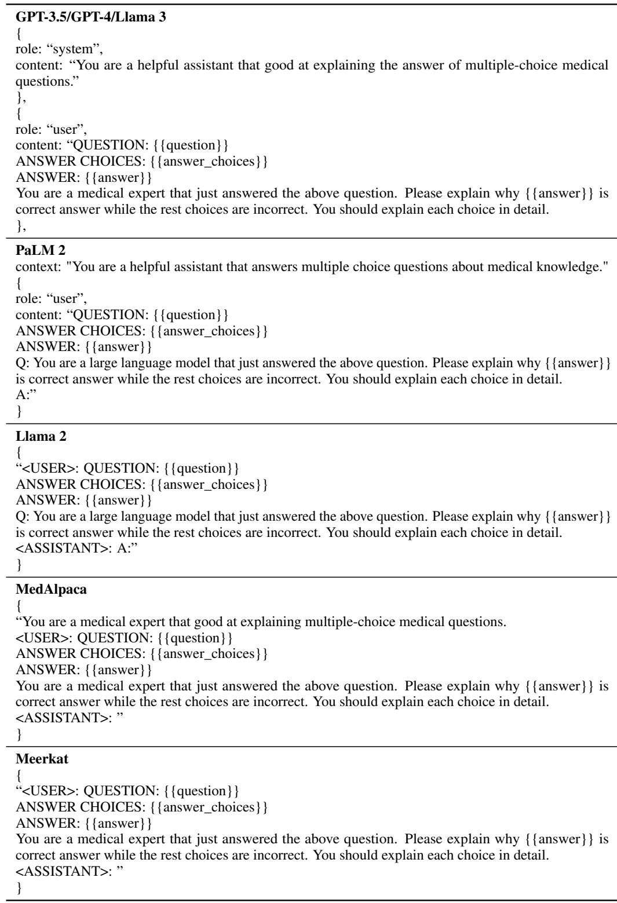  
Table 11: Detailed XY<sup>∗</sup>→R prompt templates on different models, where the contents in {{}} are replaced by specific elements when fed to models.

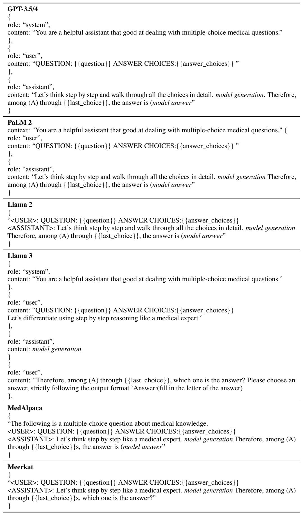  
Table 12: Detailed X→RY prompt templates on different models, where the contents in {{}} are replaced by specific elements when fed to models.

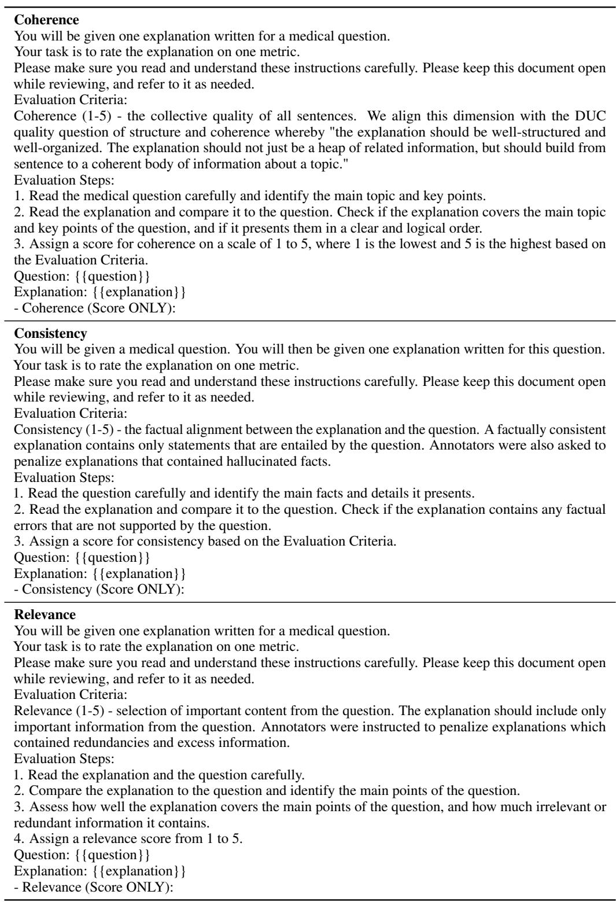  
Table 13: Detailed G-Eval prompt templates for measuring coherence, consistency and relevance, where the contents in {{}} are replaced by specific elements when fed to models.

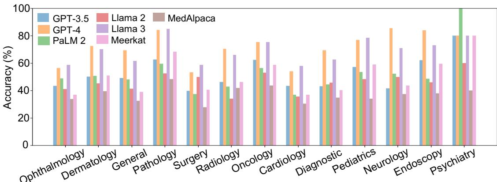  
Figure 4: Prediction accuracy (%) of the seven LLMs across the medical domains of JAMA Clinical Challenge using zero-shot X→Y prompting. From left to right, these domains are arranged in descending order based on the number of examples in each domain.

## C Additional Experimental Results

## C.1 Model Performance Varies Across Medical Domains

Figure 4 shows accuracy in each medical domain of JAMA Clinical Challenge. These domains are arranged (left to right) in descending order based on the number of examples. GPT-4 and Llama 3 outperform the other models across almost all domains. Generally, these models do better in Pathology, Oncology, Pediatrics, and Psychiatry, probably because these domains align closely with the training data they were exposed to, thereby enabling them to answer these specific questions. Nevertheless, they exhibit deficiencies in particular domains, notably Surgery, Ophthalmology, and Cardiology, pointing to areas where future research could enhance their performance. Additionally, these questions may rely more on images that we excluded from consideration (discussed in Limitations).

## C.2 CoT Error Analysis

Compared to X→Y, CoT (X→RY) prompting can introduce new types of errors in addition to normal incorrect predictions. Specifically, following a chain of reasoning steps, the model may output “None of the above”, suggesting none of the given answer choices is correct. More interestingly, the model can make up a new option, suggesting it as the correct answer. Another error is that the model may choose multiple answers after CoT reasoning. Table 14 summarizes the proportion of different error types exhibited by the seven LLMs on different datasets. These new errors are observed across different models and datasets, with the exception of PaLM 2. Among the three new error types, “None ofthe above” is the most common error. Notably, Llama 2 produces “None of the above” and makes up new answers more often than the other models. We provide examples of the three types of errors.

Tables 15 to 17 show three examples of “None” error type on Medbullets-4, Medbullets-5 and MedQA-5 made by GPT-4, Meerkat and Llama 3 respectively. After discussing each answer choice step-by-step, they still can’t choose an answer and output “None of the above”. Table 18 and Table 19 show two example of “Made-up” error type on Medbullets-4 and JAMA made by MedAlpaca and Llama 2 respectively. They all provide a new answer after going through all the options. Table 20 shows an example of “Multiple” error type on MedQA-4. GPT-3.5-turbo claims that both (C) and (D) options are correct and can’t choose between them.

## C.3 Qualitative Analysis of Model Explanations

Table 21 shows an example of MedAlpaca’s output under XY<sup>∗</sup>→R prompting on Medbullets-5. It fails to explain the answer and instead repeats sentences from the input prompt. Table 22 and Table 23 show the CTC Relevance scores of explanations generated by GPT-4 and Meerkat, respectively. The scores are tied, and the two explanations are similar. Both capture key information (e.g., symptoms) from the input and explain each answer choice. However, they fall short of the reference explanation, which provides detailed analyses of each option and sufficient evidence to justify the correct answer. Table 24 and Table 25 show the BARTScore++ scores of explanations generated by GPT-4 and PaLM 2, respectively. Although PaLM 2 scores higher than GPT-4, its explanation does not precisely justify why each answer choice is correct or incorrect for the medical question. Instead, it describes what the option is about, such as “Hypokalemia is a condition in which the level ofpotassium in the blood is too low...”. However, BARTScore++ credits this label-related but non-explanatory information.

## C.4 Details on Human Evaluation

We conduct human evaluation on the following three properties of explanations:

• Completeness refers to whether the explanation sufficiently and convincingly justifies each answer choice as correct or incorrect.

• Correctness means whether the information provided in the explanation is correct.

• Relevance indicates whether the explanation is relevant to the question. A relevant explanation only includes information related to the question and explains how provided information relates to the question.

We recruited crowdworkers in the US through Prolific.<sup>13</sup> They hold a Master’s or Doctorate degree in Medicine/Healthcare. Workers were paid 12\$ per hour for participating in the human evaluation. Figure 5 shows the interface of the human evaluation on Prolific. We present annotators with a question, five answer choices, the correct answer, and a candidate explanation. For completeness, we ask annotators to check all possible answer choices, with each checked answer adding one point. For correctness and relevance, we ask annotators to choose from five options on a 5-point Likert-scale (1-5). In addition to asking annotators to answer the three questions regarding completeness, correctness, and relevance, we also request feedback on incorrect information and identification of irrelevant sentences in the explanation.

We randomly sample 30 examples from Medbullets-5 and evaluate their explanations generated by GPT-4 and PaLM 2 under XY<sup>∗</sup>→R prompting. For each instance, we collect 3 annotations. We also post-process annotation results, filtering out low-quality annotations where workers spent significantly less time than average. we take the average over the human-annotated scores to obtain a score for each property. We report the inter-annotator agreement using Bennett, Alpert & Goldstein’s S (BENNETT et al., 1954), resulting in scores of 0.60 for correctness and 0.65 for relevance. We do not compute the agreement of completeness due to its multiple-choice nature and subjctivity.

Table 26 shows an example of human annotation of completeness, where only one answer choice is identified as fully justified by the explanation. Table 27 shows an example where the annotator identifies the incorrect information, “Increased FVC is seen in asthma”, in the explanation. Table 28 shows an example where the annotator identified a sentence in the explanation that is irrelevant to the question.

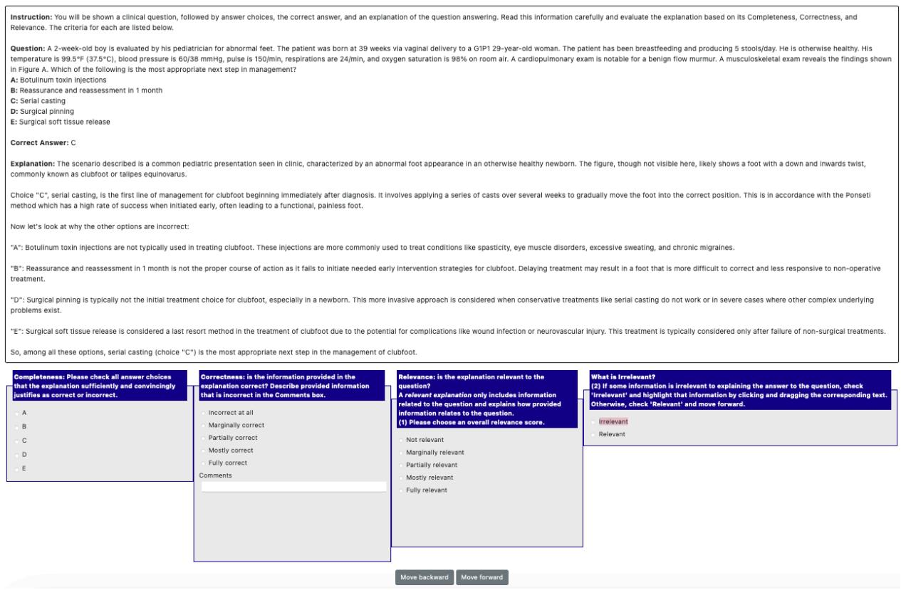  
Figure 5: The interface of human evaluation on Prolific.

<table><tr><td rowspan="2">Dataset</td><td rowspan="2">Model</td><td colspan="4">Error Type</td></tr><tr><td>Incorrect</td><td>None</td><td>Made-up</td><td>Multiple</td></tr><tr><td rowspan="6">MedQA-4</td><td>GPT-3.5</td><td>84.84</td><td>10.91</td><td>3.88</td><td>0.37</td></tr><tr><td>GPT-4</td><td>87.33</td><td>12.67</td><td>0</td><td>0</td></tr><tr><td>PaLM 2</td><td>100.00</td><td>0</td><td>0</td><td>0</td></tr><tr><td>Llama 2</td><td>79.24</td><td>14.19</td><td>6.57</td><td>0</td></tr><tr><td>Llama 3</td><td>98.15</td><td>1.85</td><td>0</td><td>0</td></tr><tr><td>MedAlpaca</td><td>100.00</td><td>0</td><td>0</td><td>0</td></tr><tr><td rowspan="6">MedQA-5</td><td>Meerkat</td><td>98.99</td><td>1.01</td><td>0</td><td>0</td></tr><tr><td>GPT-3.5</td><td>90.88</td><td>8.77</td><td>0.35</td><td>0</td></tr><tr><td>GPT-4</td><td>93.08</td><td>6.54</td><td>0.38</td><td>0</td></tr><tr><td>PaLM 2</td><td>100.00</td><td>0</td><td>0</td><td>0</td></tr><tr><td>Llama 2</td><td>87.59</td><td>7.94</td><td>4.47</td><td>0</td></tr><tr><td>Llama 3</td><td>99.05</td><td>0.95</td><td>0</td><td>0</td></tr><tr><td rowspan="6"></td><td>MedAlpaca Meerkat</td><td>100.00 99.78</td><td>0 0.22</td><td>0 0</td><td>0 0</td></tr><tr><td></td><td></td><td></td><td></td><td></td></tr><tr><td>GPT-3.5</td><td>90.07 93.68</td><td>6.62</td><td>3.31</td><td>0</td></tr><tr><td>GPT-4</td><td>100.00</td><td>6.32 0</td><td>0 0</td><td>0 0</td></tr><tr><td>PaLM 2</td><td>76.50</td><td>14.00</td><td>9.50</td><td>0</td></tr><tr><td>Llama 2 Llama 3</td><td>99.01</td><td>0.99</td><td>0</td><td>0</td></tr><tr><td rowspan="5"></td><td>MedAlpaca</td><td>98.16</td><td>0.61</td><td>1.22</td><td>0</td></tr><tr><td>Meerkat</td><td>100.00</td><td>0</td><td>0</td><td>0</td></tr><tr><td>GPT-3.5</td><td>95.09</td><td>4.91</td><td>0</td><td>0</td></tr><tr><td>GPT-4</td><td>94.69</td><td>5.31</td><td>0</td><td>0</td></tr><tr><td>PaLM 2</td><td>100.00</td><td>0</td><td>0</td><td>0</td></tr><tr><td rowspan="6"></td><td>Llama 2</td><td>84.23</td><td>7.66</td><td>8.11</td><td>0</td></tr><tr><td></td><td>100.00</td><td></td><td></td><td>0</td></tr><tr><td>Llama 3</td><td></td><td>0</td><td>0</td><td>0</td></tr><tr><td>MedAlpaca Meerkat</td><td>100.00</td><td>0</td><td>0</td><td>0</td></tr><tr><td></td><td>99.36</td><td>0.64</td><td>0</td><td></td></tr><tr><td>GPT-3.5</td><td>96.05</td><td>2.37</td><td>1.58</td><td>0</td></tr><tr><td rowspan="6">JAMA Clinical Challenge</td><td>GPT-4</td><td>97.10</td><td>2.90</td><td>0</td><td>0</td></tr><tr><td>PaLM 2</td><td>100.00</td><td>0</td><td>0</td><td>0</td></tr><tr><td>Llama 2</td><td>88.74</td><td>5.14</td><td>6.12</td><td>0</td></tr><tr><td>Llama 3</td><td>99.82</td><td>0.18</td><td>0</td><td>0</td></tr><tr><td>MedAlpaca</td><td>100.00</td><td>0</td><td>0</td><td>0</td></tr><tr><td>Meerkat</td><td>99.61</td><td>0.13</td><td>0.26</td><td>0</td></tr></table>

Table 14: The proportion (%) of different error types. “Incorrect” means that the model predicts a wrong answer. “None” means that the model suggests none of the given answer is correct. “Made-up” means that the model makes up a new answer as it thinks all the given answers are wrong. “Multiple” means that the model chooses more than one answer.

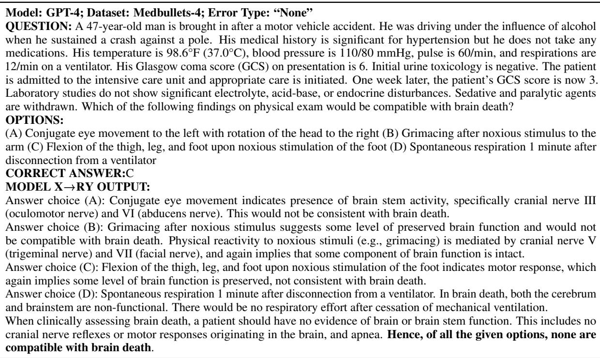  
Table 15: An example of “None” error type of CoT on Medbullets-4. As GPT-4 claims, “none are compatible with brain death”, demonstrating it can’t choose among the given choices.

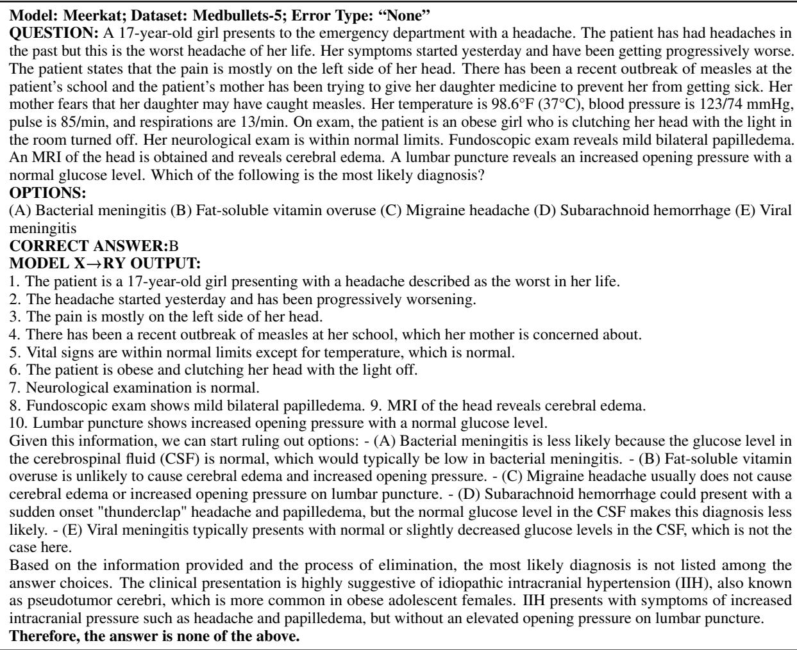  
Table 16: An example of “None” error type of CoT on Medbullets-5. As Meerkat claims, “Therefore, the answer is none of the above.”, demonstrating it can’t choose among the given choices.

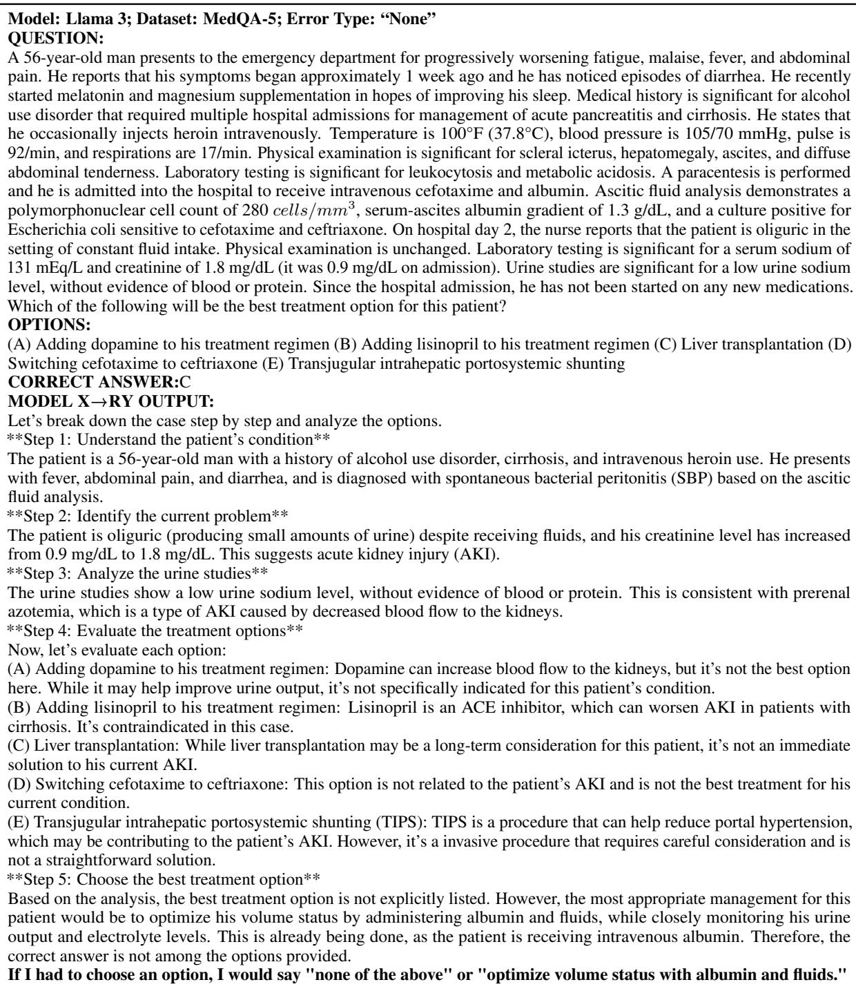  
Table 17: An example of “None” error type of CoT on MedQA-5. As Llama3 claims, it would say that "none of the above" or "optimize volume status with albumin and fluids" is the correct answer.

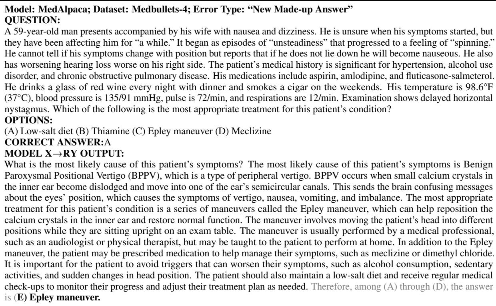  
Table 18: An example of “Made-up” error type of CoT on Medbullets-4. Gray text “Therefore, from (A) to (D), the answer is (” is the attached prompt in the second stage of CoT. Bold text “E) Epley maneuver.” is the response of MedAlpaca, which is a new made-up answer.

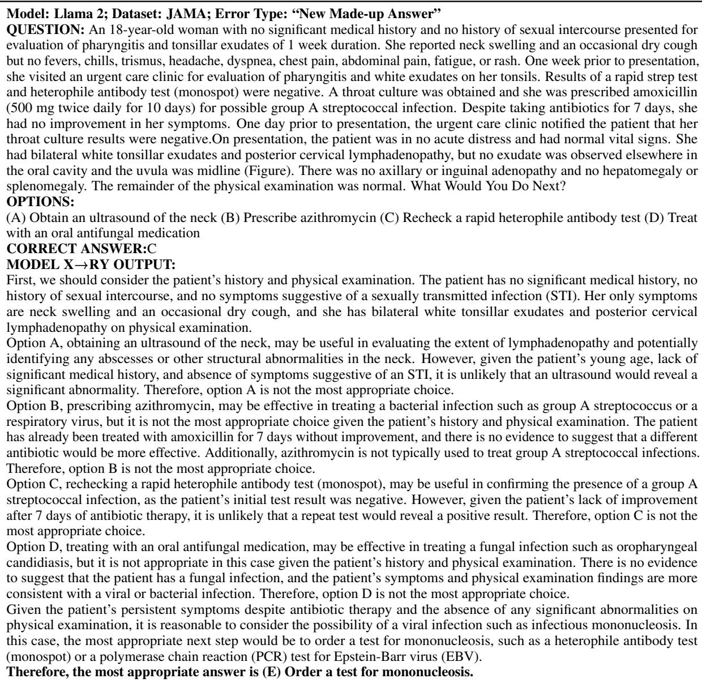  
Table 19: An example of “Made-up” error type of CoT on JAMA Clinical Challenge. Llama 2 makes up a new answer “(E) Order a test for mononucleosis” instead of choosing from the given ones.

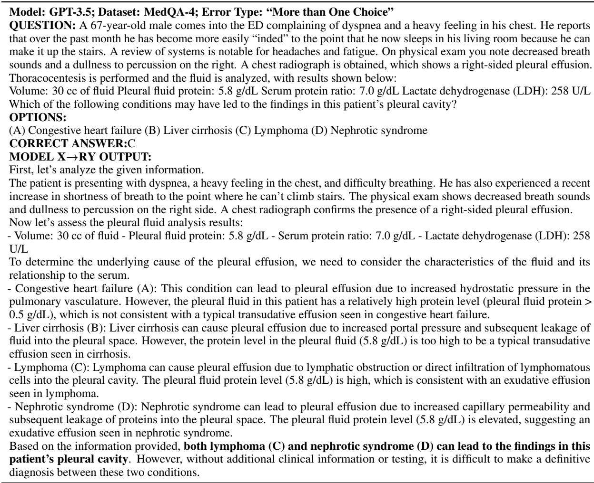  
Table 20: An example of “Multiple” error type of CoT on MedQA-4. GPT-3.5 claims that both “(C) Lymphoma” and “(D) Nephrotic syndrome” can lead to the findings in this patient’s pleural cavity.

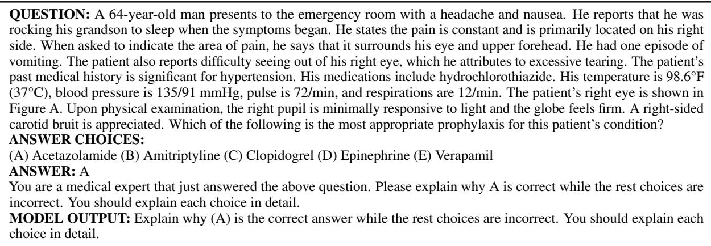  
Table 21: An example of MedAlpaca’s output under $\mathrm { X Y ^ { * } {  } R }$ prompting on Medbullets-5.

<table><tr><td>GPT-4, CTC Relev. = 0.6875</td><td>QUESTION: A 64-year-old man presents to the emergency room with a headache and nausea. He reports that he was rocking his grandson to sleep when the symptoms began. He states the pain is constant and is primarily located on his right</td></tr><tr><td>side. When asked to indicate the area of pain, he says that it surrounds his eye and upper forehead. He had one episode of ANSWER CHÓÍCES:</td><td>vomiting. The patient also reports difficulty seeing out of his right eye, which he attributes to excessive tearing. The patient&#x27;s past medical history is significant for hypertension. His medications include hydrochlorothiazide. His temperature is 98.6°F (37°C), blood pressure is 135/91 mmHg, pulse is 72/min, and respirations are 12/min. The patient&#x27;s right eye is shown in Figure A. Upon physical examination, the right pupil is minimally responsive to light and the globe feels firm. A right-sided carotid bruit is appreciated. Which of the following is the most appropriate prophylaxis for this patient&#x27;s condition?</td></tr><tr><td>ANSWER: A You are a medical expert that just answered the above question. Please explain why A is correct while the rest choices are</td><td>(A) Acetazolamide (B) Amitriptyline (C) Clopidogrel (D) Epinephrine (E) Verapamil</td></tr><tr><td>incorrect. You should explain each choice in detail. REFERENCE EXPLAÑATION: This patient is presenting with sudden-onset unilateral vision loss and an orbitofrontal headache with a dilated pupil and</td><td></td></tr><tr><td>glaucoma can include acetazolamide.</td><td>a hard ocular globe suggesting a diagnosis of acute angle-closure glaucoma. Long-term management of angle-closure</td></tr><tr><td>pupil which is minimally reactive to light. The fundoscopic exam will show an increased optic cup-to-disk ratio (&gt;0.4)</td><td>Examination of the eye in a patient with acute-closure glaucoma will reveal a red eye that is rock-hard and a mid-dilated</td></tr><tr><td>long-term management involve the administration of beta-blockers, alpha-2-agonists, and carbonic anhydrase inhibitors such as acetazolamide to decrease intraocular pressure. The definitive treatment is iridotomy.</td><td>and tonometry will show increased intraocular pressure. Gonioscopy is the diagnostic gold standard. Acute treatment and</td></tr><tr><td>Airaksinen et al. review the treatment of closed-angle glaucoma. They discuss how a combination of acetazolamide and</td><td></td></tr><tr><td>administration.</td><td>beta-blockers can terminate an attack. They recommend using 1 drop of pilocarpine 3 hours after intravenous acetazolamide</td></tr><tr><td>Figure/Illustration A is a clinical photograph showing an eye with injected conjunctiva (red circles) and a mid-dilated pupil. These findings are consistent with angle-closure glaucoma.</td><td></td></tr><tr><td>Incorrect Answers: Answer B: Amitriptyline can be used as prophylaxis for migraines. Migraines present as unilateral,</td><td></td></tr><tr><td>an aura with visual field changes; however, they would not have exam findings of a rock-hard eye or injection.</td><td>pulsating headaches that may be associated with nausea or photophobia. Patients with migraines can sometimes experience</td></tr><tr><td>for central retinal artery occlusion (CRAO). CRAO presents as acute, painless, monocular vision loss. A fundoscopic exam</td><td>Answer C: Clopidogrel may be used as a conservative treatment for carotid atherosclerosis, which can be an embolic source</td></tr><tr><td>will demonstrate ischemia of the retina.</td><td></td></tr><tr><td>used in the management of open-angle glaucoma. This would present with gradually patchy loss of vision and is generally</td><td>Answer D: Epinephrine is contraindicated in the treatment of angle-closure glaucoma as it increases pupillary dilation. It is</td></tr><tr><td>painless.</td><td></td></tr><tr><td>brief headaches associated with severe peri-orbital pain, lacrimation, rhinorrhea, and Horner syndrome (miosis, ptosis, and</td><td>Answer E: Verapamil is used as prophylaxis for cluster headaches. Cluster headaches present as unilateral, repetitive,</td></tr><tr><td>anhidrosis). Bullet Summary: Pharmacologic management of acute angle-closure glaucoma involves beta-blockers, alpha-2 agonists, and</td><td></td></tr><tr><td>carbonic anhydrase inhibitors. MODEL EXPLANATION:</td><td></td></tr><tr><td>The patient&#x27;s presentation is consistent with acute angle-closure glaucoma (AACG), an ophthalmological emergency</td><td></td></tr><tr><td>increased intraocular pressure. Hypertension is a risk factor for AACG.</td><td>characterized by severe ocular pain, redness, blurring of vision, headache, nausea, and vomiting. The globe feels firm due to</td></tr><tr><td>Now, let&#x27;s evaluate the options:</td><td></td></tr><tr><td></td><td>A. Acetazolamide is correct. It is a first line therapy for acute angle-closure glaucoma to decrease the production of aqueous</td></tr><tr><td>therapy (generally laser peripheral iridotomy) can be accomplished.</td><td>humor thereby reducing intraocular pressure. Hence by using this, damage to the optic nerve can be minimized until definitive</td></tr><tr><td></td><td>B. Amitriptyline, an antidepressant from the tricyclic class, is not appropriate prophylaxis for this condition. While it&#x27;s</td></tr><tr><td>sometimes used to prevent migraines, it wouldn&#x27;t be effective for acute angle-closure glaucoma.</td><td></td></tr><tr><td></td><td>C. Clopidogrel is an antiplatelet medication often used to prevent strokes and heart attacks. It doesn&#x27;t have a role in managing</td></tr><tr><td></td><td></td></tr><tr><td>or preventing glaucoma.</td><td></td></tr><tr><td></td><td></td></tr><tr><td></td><td>D. Epinephrine is a sympathomimetic medication primarily used in emergencies such as anaphylaxis or cardiac arrest. It&#x27;s</td></tr><tr><td></td><td></td></tr><tr><td>not usually employed in conditions like glaucoma as it can potentially raise intraocular pressure.</td><td></td></tr><tr><td></td><td></td></tr><tr><td></td><td></td></tr><tr><td></td><td></td></tr><tr><td>E. Verapamil, a calcium channel blocker, is used primarily for cardiovascular conditions, especially hypertension and certain</td><td></td></tr><tr><td></td><td></td></tr><tr><td></td><td></td></tr><tr><td></td><td></td></tr><tr><td></td><td></td></tr><tr><td></td><td></td></tr><tr><td>types of angina. It does not play a role in glaucoma treatment or prophylaxis.</td><td></td></tr><tr><td></td><td></td></tr><tr><td></td><td></td></tr><tr><td></td><td></td></tr><tr><td></td><td></td></tr><tr><td></td><td></td></tr><tr><td></td><td></td></tr><tr><td></td><td></td></tr><tr><td></td><td></td></tr><tr><td>In conclusion, acetazolamide would be the most appropriate medical intervention to quickly lower intraocular pressure in</td><td></td></tr><tr><td></td><td></td></tr><tr><td></td><td></td></tr><tr><td></td><td></td></tr><tr><td></td><td></td></tr><tr><td>this patient&#x27;s situation.</td><td></td></tr></table>

Table 22: CTC Relevance score of an explanation generated by GPT-4 under $\mathrm { X Y ^ { * } {  } R }$ prompting on Medbullets-5.

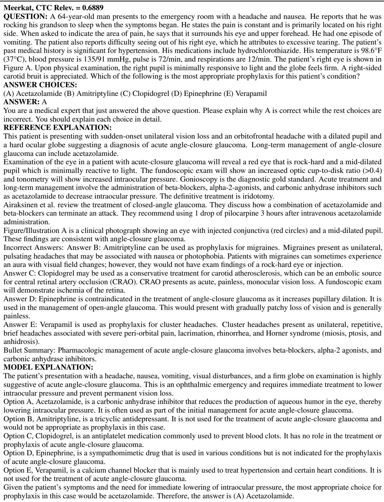  
Table 23: CTC Relevance score of an explanation generated by Meerkat under XY<sup>∗</sup>→R prompting on Medbullets-5.

GPT-4, BARTSCORE++ = -3.9095

QUESTION: A 67-year-old man presents to the emergency department after fainting. He was outside tending to his lawn for several hours in the heat, when he stood up suddenly from pulling weeds and fainted. He denies any preceding symptoms and returned to baseline within 1 minute. The patient is not aware of any medical problems and just started seeing a primary care physician last week. He recently used a friend’s prescription for ondansetron for nausea. His temperature is 99.3°F (37.4°C), blood pressure is 142/88 mmHg, pulse is 107/min, respirations are 14/min, and oxygen saturation is 99% on room air. Physical exam reveals intact cranial nerves, normal strength and sensation, and a stable gait. His abdomen is soft and nontender. An ECG is performed as seen in Figure A. Which of the following is the most likely diagnosis based on this patient’s ECG?

ANSWER CHOICES:

(A) Acute myocardial infarction (B) Hypokalemia (C) Intermittent torsades des pointes (D) Previous myocardial ischemia (E) Pulmonary embolism

ANSWER:D

## REFERENCE EXPLANATION:

This patient is presenting after syncope, likely secondary to dehydration and orthostatic hypotension given his outdoor gardening in the heat and symptoms when standing up rapidly. The patient’s ECG reveals deep, pathologic Q waves, which in this case are an incidental finding indicative of a previous myocardial infarction or a previous ischemic event.

The Q wave is a negative deflection just prior to the R wave. Q waves are a normal finding when they are small and are seen on most ECGs. However, pathologic Q waves are indicative of myocardial ischemia. Pathologic Q waves are generally diagnosed when they are >2 mm deep, >1 mm wide, >25% of the QRS complex height, or are seen in leads V1-V3. The interpretation of Q waves depends on other findings on ECG and the patient’s symptoms. Deep Q waves in the setting of ST elevation indicate an acute myocardial infarction. On the other hand, pathologic Q waves found incidentally indicate a previous myocardial infarction or previous ischemic event.

Rovai et al. review Q waves. They discuss how Q waves can be used to predict the location and size of a myocardial infarction as correlated with MRI. They recommend testing such as cardiac MRI to assess for previous infarction in the appropriate patient population.

Figure/Illustration A is an ECG demonstrating pathologic Q waves (red arrows). Note the deep and wide Q waves; this raises concern for a past ischemic event.

Incorrect Answers: Answer A: Acute myocardial infarctions would present with ST elevation in a vascular distribution on ECG with possible reciprocal depressions. While T wave inversions may be indicative of new or acute ischemia, deep pathologic Q waves without ST elevation are indicative of previous infarction.

Answer B: Hypokalemia would cause U waves on ECG, which appear as a small, "second T wave" after the initial T wave. Note they are not U-shaped despite their name. Management is centered on repletion of potassium and often magnesium as well.

Answer C: Intermittent torsades de pointes can cause syncope and should be suspected in a patient with syncope in the setting of a prolonged QT interval. This patient’s QT interval is not particularly prolonged, and his syncope seems to be secondary to orthostatic hypotension. Management is centered on cessation of QT-prolonging medications and magnesium administration. Note that while ondansetron does prolong the QT interval, it is unlikely to cause torsades given the patient took it a week ago.

Answer E: Pulmonary emboli would present on ECG with sinus tachycardia in addition to pleuritic chest pain and hypoxia. Note that the ECG is a nonspecific test for pulmonary emboli, and CT angiography is the preferred confirmatory test for this condition. Syncope is a possible presentation of larger pulmonary emboli (though the patient would also be hemodynamically unstable).

Bullet Summary: Pathologic Q waves are indicative of a previous myocardial infarction.

## MODEL EXPLANATION:

"D" is the correct answer, suggestive of a previous myocardial ischemia. This condition often involves an imbalance between the myocardial oxygen supply and demand, usually due to atherosclerosis that has limited the blood flow to the heart muscle. This patient’s ECG might show findings indicative of previous myocardial ischemia, such as T wave inversions, Q waves, or ST segment changes that would suggest a history of ischemic damage without evidence of an acute event.

Now, let’s discuss why the other options are incorrect:

"A": Acute myocardial infarction (AMI) - The clinical scenario provided in the question doesn’t support a diagnosis of an acute coronary event or myocardial infarction. Symptoms of an AMI commonly include severe chest pain, shortness of breath, nausea, vomiting, and sweating, none of which are mentioned in the patient’s presentation. Additionally, the ECG in an AMI would commonly show ST-segment elevations or depressions, pathologic Q waves, or new left bundle branch block, which are not mentioned in this question.

"B": Hypokalemia - ECG findings in hypokalemia often include flattened T waves, presence of U waves, and ST-segment depression. However, the patient’s symptoms and clinical presentation do not indicate hypokalemia and there are no specific details provided suggesting this diagnosis.

"C": Intermittent torsades des pointes - This is a form of polymorphic ventricular tachycardia characterized on ECG by twisting QRS complexes around the baseline. This can be caused by various factors including certain medications, electrolyte imbalances, and certain genetic syndromes, although the clinical scenario does not reflect any of these.

"E": Pulmonary embolism - Symptoms typically include shortness of breath, chest pain which worsens with breathing in, and coughing up blood. A pulmonary embolism would not induce fainting without other more severe symptoms also being present, and the patient’s ECG would not be the most relevant diagnostic tool. Typical ECG findings in pulmonary embolism, when present, may include sinus tachycardia, nonspecific ST-T wave changes, or right heart strain patterns, but these alone are not enough to diagnose or rule out a PE.

Therefore, the most likely diagnosis based on this patient’s ECG and clinical presentation is previous myocardial ischemia.

Table 24: BARTScore++ score of an explanation generated by GPT-4 under XY<sup>∗</sup>→R prompting on Medbullets-5.

## PaLM 2, BARTSCORE++ = -3.1691

QUESTION: A 67-year-old man presents to the emergency department after fainting. He was outside tending to his lawn for several hours in the heat, when he stood up suddenly from pulling weeds and fainted. He denies any preceding symptoms and returned to baseline within 1 minute. The patient is not aware of any medical problems and just started seeing a primary care physician last week. He recently used a friend’s prescription for ondansetron for nausea. His temperature is 99.3°F (37.4°C), blood pressure is 142/88 mmHg, pulse is 107/min, respirations are 14/min, and oxygen saturation is 99% on room air. Physical exam reveals intact cranial nerves, normal strength and sensation, and a stable gait. His abdomen is soft and nontender. An ECG is performed as seen in Figure A. Which of the following is the most likely diagnosis based on this patient’s ECG?

ANSWER CHOICES:

(A) Acute myocardial infarction (B) Hypokalemia (C) Intermittent torsades des pointes (D) Previous myocardial ischemia (E) Pulmonary embolism

ANSWER:D

REFERENCE EXPLANATION:

This patient is presenting after syncope, likely secondary to dehydration and orthostatic hypotension given his outdoor gardening in the heat and symptoms when standing up rapidly. The patient’s ECG reveals deep, pathologic Q waves, which in this case are an incidental finding indicative of a previous myocardial infarction or a previous ischemic event.

The Q wave is a negative deflection just prior to the R wave. Q waves are a normal finding when they are small and are seen on most ECGs. However, pathologic Q waves are indicative of myocardial ischemia. Pathologic Q waves are generally diagnosed when they are >2 mm deep, >1 mm wide, >25% of the QRS complex height, or are seen in leads V1-V3. The interpretation of Q waves depends on other findings on ECG and the patient’s symptoms. Deep Q waves in the setting of ST elevation indicate an acute myocardial infarction. On the other hand, pathologic Q waves found incidentally indicate a previous myocardial infarction or previous ischemic event.

Rovai et al. review Q waves. They discuss how Q waves can be used to predict the location and size of a myocardial infarction as correlated with MRI. They recommend testing such as cardiac MRI to assess for previous infarction in the appropriate patient population.

Figure/Illustration A is an ECG demonstrating pathologic Q waves (red arrows). Note the deep and wide Q waves; this raises concern for a past ischemic event.

Incorrect Answers: Answer A: Acute myocardial infarctions would present with ST elevation in a vascular distribution on ECG with possible reciprocal depressions. While T wave inversions may be indicative of new or acute ischemia, deep pathologic Q waves without ST elevation are indicative of previous infarction.

Answer B: Hypokalemia would cause U waves on ECG, which appear as a small, "second T wave" after the initial T wave. Note they are not U-shaped despite their name. Management is centered on repletion of potassium and often magnesium as well.

Answer C: Intermittent torsades de pointes can cause syncope and should be suspected in a patient with syncope in the setting of a prolonged QT interval. This patient’s QT interval is not particularly prolonged, and his syncope seems to be secondary to orthostatic hypotension. Management is centered on cessation of QT-prolonging medications and magnesium administration. Note that while ondansetron does prolong the QT interval, it is unlikely to cause torsades given the patient took it a week ago.

Answer E: Pulmonary emboli would present on ECG with sinus tachycardia in addition to pleuritic chest pain and hypoxia. Note that the ECG is a nonspecific test for pulmonary emboli, and CT angiography is the preferred confirmatory test for this condition. Syncope is a possible presentation of larger pulmonary emboli (though the patient would also be hemodynamically unstable).

Bullet Summary: Pathologic Q waves are indicative of a previous myocardial infarction.

MODEL EXPLANATION:

The correct answer is D: Previous myocardial ischemia.

Acute myocardial infarction (AMI) is a medical emergency in which the blood supply to a portion of the heart is suddenly blocked, depriving the heart muscle of oxygen. This can cause chest pain, shortness of breath, and other symptoms. AMI is a leading cause of death in the United States.

Hypokalemia is a condition in which the level of potassium in the blood is too low. This can cause a variety of symptoms, including muscle weakness, fatigue, and irregular heartbeat. Hypokalemia can be caused by a number of things, including dehydration, certain medications, and kidney disease.

Intermittent torsades des pointes is a type of abnormal heart rhythm that can be life-threatening. It is characterized by a sudden change in the heart’s rhythm from a normal rhythm to a rapid, irregular rhythm. Torsades des pointes can be caused by a number of things, including certain medications, electrolyte imbalances, and heart disease.

Pulmonary embolism is a blockage of a blood vessel in the lungs. This can be caused by a blood clot that travels from another part of the body to the lungs, or by a foreign object that gets lodged in a lung blood vessel. Pulmonary embolism can cause chest pain, shortness of breath, and other symptoms. It is a medical emergency.

The patient in the question has a number of risk factors for AMI, including age, male sex, and a history of smoking. He also has a history of fainting, which can be a sign of AMI. The ECG shows evidence of previous myocardial ischemia, which is damage to the heart muscle caused by a lack of oxygen. This is consistent with the patient’s history and symptoms.

The other choices are incorrect because they do not explain the patient’s symptoms or the ECG findings. Hypokalemia can cause muscle weakness and irregular heartbeat, but it is not a common cause of fainting. Intermittent torsades des pointes is a type of abnormal heart rhythm that can be life-threatening, but it is not a common cause of fainting. Pulmonary embolism can cause chest pain, shortness of breath, and other symptoms, but it is not a common cause of fainting.

In conclusion, the correct answer is D: Previous myocardial ischemia. This is the most likely diagnosis based on the patient’s history, symptoms, and ECG findings.

Table 25: BARTScore++ score of an explanation generated by PaLM 2 under $\mathrm { X Y ^ { * } {  } R }$ prompting on Medbullets-5.

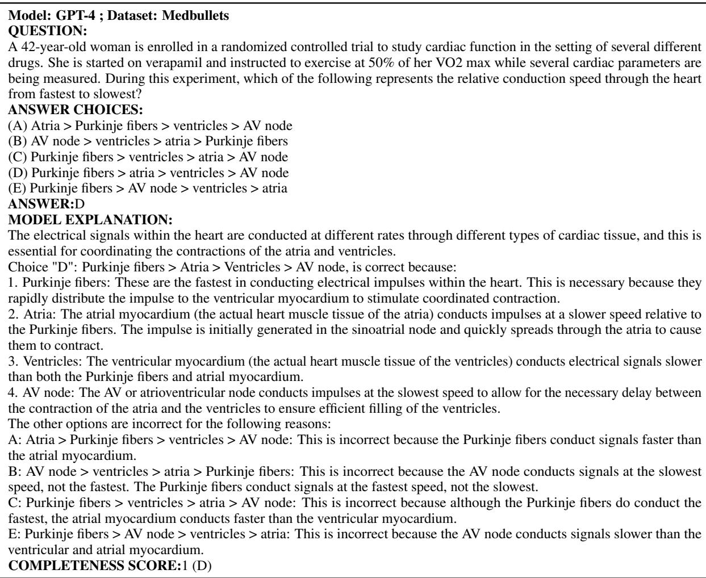  
Table 26: An example of human annotation of completeness. Only option D is sufficiently explained from the annotator’s view.

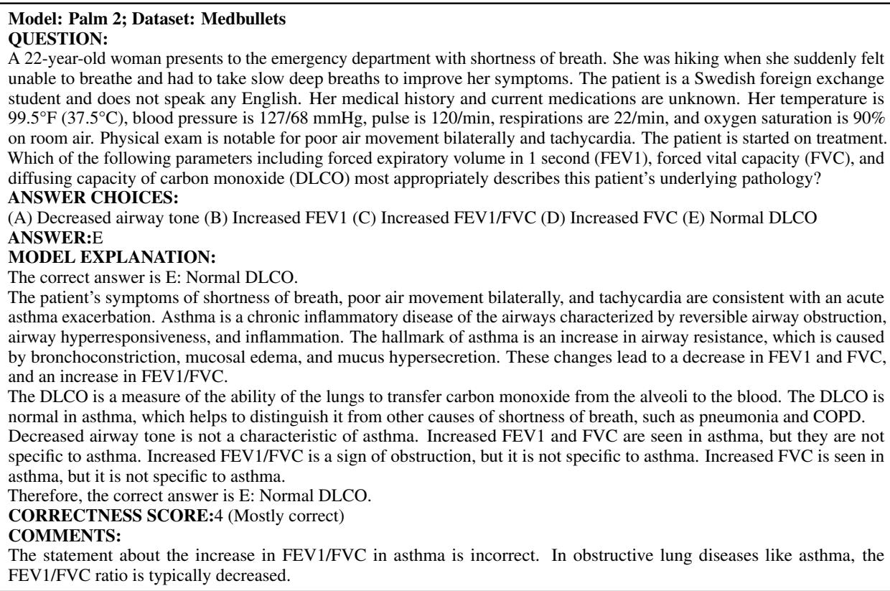  
Table 27: An example of human annotation, commenting on correctness. The annotator’s comment, “In obstructive lung diseases like asthma, the FEV1/FVC ratio is typically decreased”, obejects the claim, “Increased FVC is seen in asthma”, in the explanation.

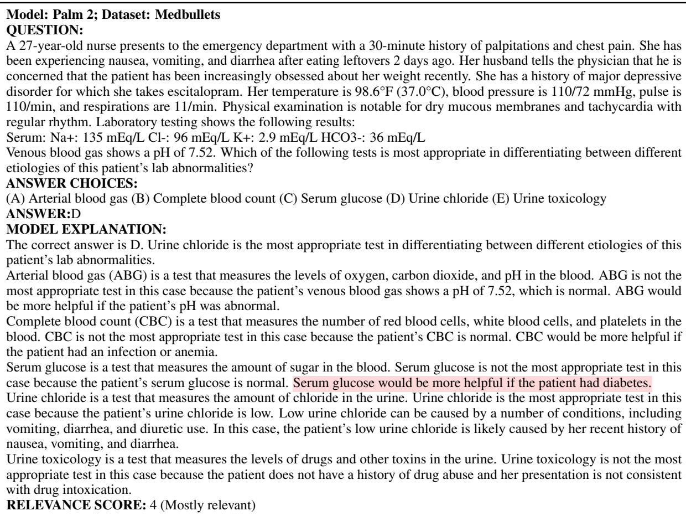  
Table 28: An example of human annotation about relevance. The highlighted sentence “Serum glucose would be more helpful ifthe patient had diabetes” is identified as irrelevant to the question by the annotator.