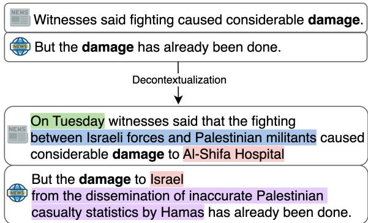
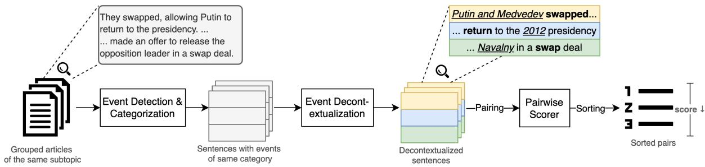
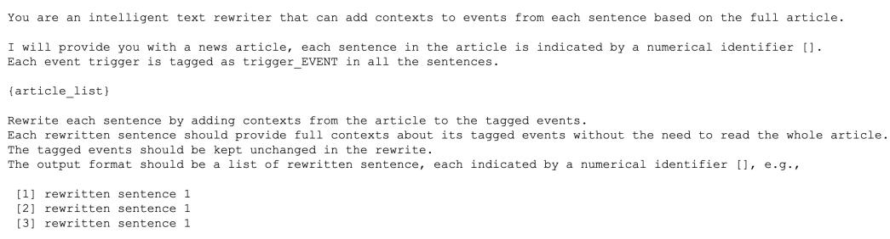

# Beyond Benchmarks: Building a Richer Cross-Document Event Coreference Dataset with Decontextualization

Jin Zhao and Jingxuan Tu and Bingyang Ye

and Xinrui Hu and Nianwen Xue and James Pustejovsky

Department of Computer Science

Brandeis University

Waltham, Massachusetts, USA

{jinzhao,jxtu,byye,xinruihu,xuen,jamesp}@brandeis.edu

## Abstract

Cross-Document Event Coreference (CDEC) annotation is challenging and difficult to scale, resulting in existing datasets being small and lacking diversity. We introduce a new approach to CDEC annotation that involves simplifying the document-level annotation task to labeling sentence pairs by leveraging large language models (LLMs) to decontextualize event mentions. This enables the creation of Richer EventCorefBank (RECB), a denser and more expressive dataset annotated at faster speed. We show that decontextualization1 improves annotation speed without compromising quality and enhances model performance. Our baseline experiment indicates that systems trained on RECB achieve comparable results on the EventCorefBank (ECB+) test set, showing the high quality of our dataset and its generalizability to other CDEC datasets. In addition, our evaluation shows that existing state-of-the-art CDEC models that show high performance on other CDEC datasets still struggle on RECB. This suggests that the richness and diversity of RECB present significant challenges to existing CDEC systems and there is much room for improvement. All the data and source code are publicly available.2

## 1 Introduction

Cross-Document Event Coreference (CDEC) annotation is a complex and labor-intensive process. Many restrictions have to be applied to make it feasible. As a result, existing data sets tend to be small and sparsely annotated. In the widely used benchmark dataset for CDEC, EventCorefBank (ECB+) (Cybulska and Vossen, 2014), 95% of annotated events are non-coreferential (Vossen et al., 2016). In 88% of all sentences, no events are annotated (Cybulska, 2021).

  
Figure 1: A pair of sentences is decontextualized to improve event coreference evaluation.

Moreover, existing CDEC datasets are often unrepresentative and lack expressiveness. Many of these datasets show lower referential diversity and ambiguity that allow high lemma match (CoNLL F1 61.9 for ECB+) (Bugert and Gurevych, 2021). For instance, ECB+ intentionally introduces Lindsey Lohan admitted to rehab as a new event instance alongside Tara Reid admitted to rehab to enhance the ambiguity of the event expression admit to rehab. While this approach artificially enhances diversity, which is essential for creating a more representative dataset, it remains limited to only two individuals associated with the event expression admit to rehab. This constraint fails to reflect the natural distribution of diverse events typically found in a collection of news articles. For example, articles discussing protests in Hong Kong might reference numerous distinct protests, involving various people or organizations across different districts over the span of several months.

Improved decontextualization accuracy by large language models (LLMs) paves the way for a more efficient approach to CDEC annotation, which we use to create a more representative, and expressive CDEC dataset called Richer EventCorefBank (RECB) with significantly less time. Unlike traditional CDEC annotation methods, which require annotators read entire articles to gather contextual information to determine if an event pair is coreferent, our approach streamlines the process by reducing the context to a single, self-contained sentence. This simplifies the annotator’s task, as now when performing CDEC annotation they only need to evaluate pairs of sentences, with participant, time, and location information all included in the sentence, rather than dispersed throughout the article. As shown in Figure 1, by minimizing the amount of text to process, we significantly reduce the cognitive load on the annotator and increase the annotation speed. As a result, RECB provides a more scalable and efficient solution for generating large-scale CDEC datasets. While our annotation is performed on decontextualized sentences, we maintain the mapping of the event annotations to the original documents, allowing researchers to reconstruct coreference relations in the original text if necessary.

We demonstrate the utility of this new dataset by showing that models trained on it can generalize effectively to other test sets. Our experiments reveal that CDEC models trained on RECB achieve comparable performance on the ECB+ test set to models trained on the ECB+ training set itself. Our experiments also show that the RECB dataset presents a more difficult challenge for existing CDEC systems, as fewer restrictions are imposed on RECB data selection compared with other datasets. Unlike more curated datasets that focus on one topic or a limited set of events, RECB encompasses a broader range of event types, temporal and location variations, and participant roles. This results in greater lexical diversity and more referential ambiguity that is characteristic of more realistic data sets, making it harder for models to rely on simple cues like event trigger words. Further model improvements will have to come from improvement in capturing the broader context of the events.

We also highlight the effectiveness of decontextualization in both facilitating efficient CDEC annotation and enhancing model performance in experiments with RECB. Decontextualization enables the creation of a larger, more scalable dataset, allowing models to be trained on a wider variety of examples with rich representations, thereby improving their robustness and generalization across different domains and tasks.

The key contributions of this paper are as follows:

• The introduction of RECB, a novel CDEC dataset designed for greater representativeness and expressiveness. RECB includes CDEC annotations on decontextualized sentences, which are mapped back to their original documents using token index mappings. Both the decontextualized and original sentences will be released to support further research.

• A new scalable methodology that leverages LLMs for decontextualization in CDEC annotation and modeling, enhancing both efficiency and adaptability in dataset creation and analysis.

The rest of the paper is organized as follows. In §2, we discuss related work on current CDEC datasets and modeling, and recent research on decontextualization. In §3, we describe the selection of news articles for RECB. In §4, we describe the methods used in our data preparation. In §5, we describe the annotation process for constructing the RECB data set. In §6, we describe and analyze the RECB data set by performing a statistical comparison with existing CDEC data sets. In §7, we assess the performance of a state-of-the-art model on the RECB dataset and compare it to its performance on existing datasets. The experimental results are analyzed in §8, followed by our conclusions in §9.

## 2 Related Work

CDEC Dataset Creation Previous work on CDEC datasets include ECB+ (Cybulska and Vossen, 2014), FCCT (Bugert et al., 2020), MEAN-TIME (Minard et al., 2016), EER (Hong et al., 2016), and RED (O’Gorman et al., 2016). When annotating such datasets, annotators must exhaustively compare each event mention in the dataset against all other event mentions across documents to establish coreference relations. This is a laborintensive process and as a result, existing datasets are all relatively small. In our work, by representing events as decontextualized sentences that can stand alone, there is the potential to create CDEC datasets on a much larger scale, as annotators only need to examine a pair of sentences instead of two articles to make coreference decisions.

  
Figure 2: RECB data preparation pipeline.

A lot of effort has been put into circumventing the scalability issue of manually created data by creating auto- or semi-automatically annotated CDEC datasets. Gun Violence Corpus (GVC) (Vossen et al., 2018) marks event references using a structured database of known gun violence events in a semi-automatic fashion. It considerably improves annotation efficiency and event variation compared to ECB+, but the method does not apply to broader data topics other than gun violence for which such a database does not exist. Hyper-Coref (Bugert and Gurevych, 2021) and WEC-Eng (Eirew et al., 2021) leveraged article hyperlinks in Wikipedia data to create data automatically. However, there is no guarantee that the events marked by the Wikipedia contributors will apply a consistent standard when creating such hyperlinks. Moreover, they mainly consist of Wikipedia-entry worthy or what Eirew et al. (2021) call referential event mentions, and do not cover descriptive or anecdotal events that arise in news reports.

CDEC Systems Recent advancements in CDEC modeling use neural cross encoders for pairwise event mention classification (Yu et al., 2022; Held et al., 2021; Caciularu et al., 2021; Zeng et al., 2020; Cattan et al., 2020; Meged et al., 2020; Barhom et al., 2019). These methods generally involve preprocessing steps such as document topic modeling and event argument labeling, followed by the application of neural classifiers to analyze pairs of event mentions. The classification process assigns scores based on the distance between event mentions within specific topics, which are then grouped into coreference event clusters using agglomerative clustering.

Recent CDEC state-of-the-art systems use representation learning of mention pairs (Caciularu et al., 2021; Held et al., 2021; Chen et al., 2023;

Ding et al., 2024). Caciularu et al. (2021)’s approach involves pretraining the model on documents within the same topic to facilitate learning of cross-document relations. Moreover, they implemented a larger context window to cross-encode and classify pairs of event mentions at the document level. Held et al. (2021) leverages discourse coherence theory to limit candidate mentions to those within a learned latent embedding space, sampling hard negatives to train a classifier. Chen et al. (2023) incorporates global discourse structure, using rhetorical tree structures and the shortest dependency paths to model interactions between event mentions. Ding et al. (2024) induce the model to learn through rationale-centric counterfactual data augmentation. We choose to use the model described in (Yu et al., 2022) to evaluate our data set for its ease of use and near state-of-the-art performance.

Decontextualization Event descriptions often span multiple sentences, requiring CDEC to interpret events within a broader context. Key details like participants, time, or location may be implicit rather than explicitly stated. Annotating entire documents can be inefficient, especially when they are too lengthy for annotation or computational models (Vossen et al., 2018). To address this, we apply event decontextualization, a method that preserves an event’s meaning while making it understandable outside its original context (Zhao et al., 2023). Other strategies for restoring missing, ellipitical, or underspecified content in text include NP enrichment (Elazar et al., 2022), and Dense Paraphrasing (Tu et al., 2023; Rim et al., 2023), the latter of which has been used in question answering (Tu et al., 2022), AMR generation (Tu et al., 2024a) and sentence textual similarity (Tu et al., 2024b). We are the first to utilize LLMs for event summarization to decontextualize events for CDEC.

<table><tr><td>Topic</td><td colspan="2">Source</td></tr><tr><td>SHIFA</td><td>Al Arabiya News (AAN)</td><td>Israel National News (INN)</td></tr><tr><td>PUTIN</td><td>Sputnik News (SN)</td><td>Google News (GN)</td></tr><tr><td>HONGKONG</td><td>China Daily (CD)</td><td>Google News (GN)</td></tr><tr><td>RITTENHOUSE</td><td>The Federalist (TF)</td><td>Google News (GN)</td></tr></table>

Table 1: Media sources of the articles from each topic.

## 3 Data Collection

Our data collection builds on the dataset of Zhao et al. (2024), which consists of articles covering highly contentious international news with a rich set of events. We incorporated additional data focused on U.S. domestic news to ensure a broader and more diverse range of event types. The resulting dataset includes English news articles covering four topics: Al-Shifa Hospital Raid (SHIFA), Putin’s 2024 Election Win (PUTIN), Hong Kong July 1 Protests (HONGKONG), and Kyle Rittenhouse Acquittal (RITTENHOUSE).

As shown in Table 1, each topic includes articles from media outlets with differing political stances. The SHIFA topic, for instance, draws articles from Al Arabiya News and Israel National News, representing Arabic and Israeli perspectives. In the PUTIN topic, Sputnik News rarely discusses deaths of political opponents, while Western media outlets seldom mention Russia’s economic progress under Putin. In the following example from the RITTENHOUSE topic, events with similar meanings are conveyed through different expressions by sources with opposing political views.

(1) Young man acquitted on all charges, acted in selfdefense during Kenosha riots.

Teen vigilante found not guilty after fatally shooting two during racial justice protests.

Our goal in creating the RECB dataset is to capture the lexical diversity of event mentions in realworld news articles. News sources with differing stances often emphasize unique aspects of a topic, highlighting a variety of events beyond the central event. Additionally, contentious news articles tend to generate extensive debate, covering multiple facets of the topic and providing a rich set of events for our task.

## 4 Methodology

The RECB data preparation process requires multiple steps to convert a collection of documents into

candidate sentence pairs for annotators to work on (Figure 2). This section describes the technical details in the data preparation pipeline.

## 4.1 Event Extraction

CDEC involves identifying and grouping textual mentions across multiple documents that refer to the same event. These mentions include descriptive event mentions, typically expressed through verbs or nominalizations (e.g., fighting) to introduce new information, and referential event mentions, generally represented by noun phrases (e.g., Israel–Hamas war) to establish a reference point (Eirew et al., 2021).

We extract both types of event mentions from the source articles using the event extraction model proposed by Yao et al. (2021). We follow the definition of TimeML (Pustejovsky et al., 2003) to extract action verbs (e.g., attacked), aspectuals (e.g., continue), causative verbs (e.g., cause), static verbs indicating moral judgment (e.g., protesters deserve recognition), and verbs referring to generic events with unspecified time or location (e.g., People discuss politics).

## 4.2 Sentence Decontextualization

The decontextualization task, introduced by Choi et al. (2021), enriches sentences by restoring missing context through techniques such as name completion and bridging. Inspired by this, we leverage the GPT model to decontextualize each sentence in an article using information from the full article context. We utilize the OpenAI API (version o1-preview) for this process. In our prompt, we instruct the model to generate a more contextually enriched version of the original sentence containing the target event, using the full article as as input. The full set of prompts is provided in Appendix A.2.

As an example, in Figure 1, the relation between the two damage event mentions is ambiguous. Decontextualization clarifies the context by adding specific actors (Israeli forces, Palestinian militants, Hamas, and Israel’s reputation), locations (Al-Shifa Hospital), and time (On Tuesday), as well as the cause fpr the damanage. With this additional context, it becomes clear that the two damage mentions are not coreferential.

Decontextualization enhances event descriptions by incorporating missing details such as participants, time, and location from the full article context. This enables CDEC annotation to be performed solely on sentence pairs, eliminating the need to reference the entire article and significantly improving annotation efficiency on RECB. Each decontextualized sentence maintains an index mapping to the original document, allowing coreference annotations to be seamlessly projected back onto the original text when necessary.

## 4.3 Pairwise Scoring

The CDEC task is typically approached by scoring event pairs and clustering them based on these scores across all possible pair combinations. However, as the number of events increases, the number of event pairs grows quadratically, making it impractical to annotate or model large datasets (Vossen et al., 2018). To address this, previous work, such as ECB+, introduces more topics while limiting the number of documents per topic, effectively reducing the number of in-topic event pairs. Additionally, ECB+ restricts annotation to sentences containing central events, and on average only 1.87 sentences per document are annotated.

In contrast, we address this issue by generating pairs only of the same event type and from articles with similar content. Within each subtopic (which is one news source from a topic), we first group articles based on their textual similarity using agglomerative clustering, leveraging both BERT-based similarity (Reimers and Gurevych, 2019) and TF-IDF scores.

Observing that events of different types rarely corefer (e.g., the reporting event said rarely corefers with the perception eventfeel), we employ a customized verb list to classify event types and restrict pairings to those of the same type within the grouped articles. The verb list includes common reporting verbs, copulas, aspectual verbs, and verbs associated with mental activities.

We then apply the pairwise cross-encoder (Yu et al., 2022) to score all generated pairs from our data, ranking them from highest to lowest based on the score. The top-ranked pairs typically exhibit similar or ambiguous meanings, whereas the lower-ranked pairs are more likely to be noncoreferential.

## 5 RECB Annotation

In this section, we describe the process for constructing the RECB data set, and present the statistics of this dataset.

## 5.1 Near-Identity Relations

Existing CDEC tasks typically consider only binary relations between events. However, events in real-world data often exhibit more complex relationships beyond just the binary distinction between coreferential and non-coreferential. Reducing event coreference relations to binary classifications can introduce noise into the annotation process and overlook these richer relationships.

To address this, we introduce additional coreference relations to capture directional near-coreference relations as a middle ground, beyond the standard IDENTITY, NOT-RELATED, and CANNOT-DECIDE categories. These include CONCEPT-INSTANCE(-INV), WHOLE-SUBEVENT(-INV), and SET-MEMBER(-INV) relations. Annotators are asked to determine the true relationship instead of being forced to make a binary decision based purely on intuition.

While this paper focuses on events with binary distinctions for the CDEC task, our annotated nearidentity event relations are valuable for various downstream applications, such as information retrieval. Recognizing event relationships allows systems to retrieve more relevant information. For example, querying a broad event like protest can also return related subevents, such as speeches or clashes, enhancing the granularity of search results (Guan et al., 2024).

## 5.2 Stopping Criteria

Annotators are tasked with classifying ranked event pairs with decontextualized sentences into one of the predefined event relations, starting from the top-ranked pairs. For each subtopic, they stop annotation after encountering 200 consecutive noncoreferential pairs. The goal of this process is to maximize the recall of positive pairs while maintaining feasibility, as these pairs become increasingly sparse as annotation progresses, with varying thresholds across topics.

## 5.3 Annotation Process

We hire 4 researchers and graduate students from the linguistics and computer science departments of a US-based university for the annotation work. Each annotator is familiar with the definition of the CDEC task and the annotation guidelines which include ambiguous cases from each event category. We include the the full guideline in Appendix A.3.

Annotators are paired for each subtopic, with each pair tasked with iteratively annotating 200 event pairs. During this “burn-in” phase, they work closely together to resolve discrepancies and clarify any misunderstandings in the guidelines. These 200 pairs are designed to include edge cases, exposing annotators to a range of complexities in the data. At this stage, confusion between identity and near-identity relations is most common due to their shared participants and overlapping meanings. We train our annotators to assess event granularity and refer to specific cases in the guidelines to resolve these ambiguities.

<table><tr><td>Topic</td><td>Source</td><td>Docs</td><td>Sentences</td><td>Ori / Decont. tokens</td><td>Mentions</td><td>Pairs</td><td>Near-Identity Pairs</td><td>Clusters</td></tr><tr><td rowspan="2">SHIFA</td><td>AAN</td><td>74</td><td>643</td><td>17k/ 19k</td><td>1,267</td><td>6,834</td><td>406</td><td>353</td></tr><tr><td>INN</td><td>58</td><td>692</td><td>17k /20k</td><td>1,082</td><td>4,933</td><td>303</td><td>311</td></tr><tr><td rowspan="2">PUTIN</td><td>SN</td><td>77</td><td>1,047</td><td>29k / 32k</td><td>2,096</td><td>12,796</td><td>3,610</td><td>1,075</td></tr><tr><td>GN</td><td>77</td><td>1,164</td><td>31k / 35k</td><td>2,346</td><td>12,197</td><td>3,690</td><td>1,094</td></tr><tr><td rowspan="2">HONGKONG</td><td>CD</td><td>76</td><td>868</td><td>22k / 26k</td><td>1,324</td><td>3,281</td><td>333</td><td>788</td></tr><tr><td>GN</td><td>78</td><td>897</td><td>25k / 29k</td><td>1,677</td><td>5,226</td><td>368</td><td>1,046</td></tr><tr><td rowspan="2">RITTENHOUSE</td><td>TF</td><td>40</td><td>684</td><td>18k / 20k</td><td>1,025</td><td>1,679</td><td>364</td><td>493</td></tr><tr><td>GN</td><td>64</td><td>1,340</td><td>34k /36k</td><td>2,567</td><td>9,219</td><td>1,438</td><td>794</td></tr><tr><td colspan="2">Total</td><td>544</td><td>7,335</td><td>195k / 220k</td><td>13,384</td><td>51,665</td><td>10,512</td><td>5,954</td></tr></table>

Table 2: Data statistics overview of RECB dataset. The number of articles, sentences, and tokens from each subtopic are reported after the data collection. We also report the number of event mentions, annotated pairs and cluster numbers from the human evaluation.

After the burn-in stage, each pair of annotators continues to double-annotate 400 mention pairs per subtopic and jointly adjudicates the results. We assess the annotation quality using Cohen’s κ, which yields a score of 0.70 for all labels and 0.78 for binary labels (with near-identity labels mapped to NOT-RELATED), demonstrating strong agreement between annotators.

The remaining pairs are divided among the annotators for single annotation. The annotation process took place over the course of one month. On average, each mention pair took 15 seconds to annotate, with the four annotators collectively spending 254 hours to complete the annotation after reaching the stopping criteria for the RECB dataset. Finally, we represent the annotated pairs with binary relations as graphs and map them to event coreference clusters. Conflicts in relation links are resolved through majority voting on the graph edges. Although annotators work on decontextualized sentences, we preserve token index mappings so that annotations can be linked back to their original document context. This enables researchers to analyze coreference both in the synthetic decontextualized form and in the natural, original document context.

Table 2 presents statistics of the RECB dataset. On average, each topic contains 136 documents.

At the sentence level, RITTENHOUSE-GN contains the most sentences, indicating that documents within this topic are longer and potentially more complex, whereas SHIFA has the fewest sentences per document. Decontextualization enriches the sentences by about 12% in terms of token count. We also provide the number of pairs of mentions annotated for each topic, of which approximately 20% have near-identity relations. Finally, we present the number of clusters for each topic, with PUTIN having the highest number.

## 6 Dataset Analysis

We compare RECB with the other two widely used CDEC datasets. ECB+ (Cybulska and Vossen, 2014) extends the original ECB (Bejan and Harabagiu, 2010) by adding more similar and ambiguous events, enhancing the coverage and diversity of ECB. Only seminal events and a small number of other event mentions are annotated. The GVC (Vossen et al., 2018) dataset contains events involved in gun violence incidents (e.g., location, time, victim details) with related news articles. Only event mentions related to gun violence are annotated.

Table 3 compares the key statistics between RECB, ECB+ and GVC. ECB+, although containing with twice number of the sentence than RECB, only annotates around 10% of the sentences. Since the annotation on RECB does not filter specific event mentions, almost all the sentences (97%) with events from the dataset are annotated, indicating a high density of annotations relative to its overall sentence count. This annotation strategy also improves the efficiency on CDEC annotation by reducing the total number sentences required to be read (e.g., all sentences from ECB+ need to be inspected to annotation the 10% sentences).

the three datasets, RECB contains the highest number of clusters, despite having a comparable number of positive pairs to ECB+. This suggests that RECB features a more fine-grained and densely annotated coreference structure. The increase in clusters is primarily driven by a higher proportion of singleton clusters, where an event mention lacks a coreferential counterpart within the dataset.

<table><tr><td></td><td>RECB</td><td>ECB+</td><td>GVC</td></tr><tr><td>Docs Sentences Annot. sentences</td><td>588 7,335</td><td>982 15,812</td><td>510 9,782</td></tr><tr><td>Mentions Clusters Non-singleton Clusters</td><td>7,121 13,384 5,954 2,358</td><td>1,840 6,833 2741 1,958</td><td>4,604 7,298 1,411 1,048</td></tr><tr><td>Positive Pairs Lemma-cluster Ratio Cluster-lemma Ratio</td><td>26,756 3.3 5.6</td><td>26,712 2.1 3.5</td><td>50,799 2.6 2.0</td></tr></table>

Table 3: Comparison of the statistics on the RECB, ECB+, and GVC datasets.

In contrast, GVC has more positive pairs but from less diverse clusters. A higher fraction of singleton clusters indicates greater event diversity, as RECB captures a broader range of distinct events rather than overfitting to a limited set of recurring event types.

The lemma-cluster ratio quantifies the number of distinct lemmas within the same cluster. A higher lemma count in RECB suggests greater lexical diversity, indicating that clusters encompass a broader range of expressions for each event.

The cluster-lemma ratio reflects the referential diversity or ambiguity within the dataset. A higher clusters-per-lemma ratio in RECB indicates a broader range of event distinctions for the same lemma. This suggests a higher degree of complexity in event differentiation, making RECB particularly well-suited for tasks requiring nuanced CDEC.

## 7 Experiments

We evaluate our proposed RECB dataset using two strong CDEC baselines: lemma matching and pairwise encoding. Model performance is compared across RECB, GVC, and ECB+ under a crossevaluation setting.

To maintain the integrity of event coreference clusters, we partition documents by topic for train and test splits. Specifically, documents from three topics are used for training, while one subtopic from the fourth topic is used for testing, and the other subtopic for validation. During evaluation, we rotate the training set with different topics to assess model performance.

<table><tr><td>Test Split</td><td>CoNLL F1</td><td>Pairwise F1</td></tr><tr><td>ECB+</td><td>61.9</td><td>9.5</td></tr><tr><td>GVC</td><td>33.8</td><td>36.4</td></tr><tr><td>SHIFA</td><td>32.3</td><td>6.2</td></tr><tr><td>PUTIN</td><td>39.2</td><td>5.5</td></tr><tr><td>HONGKONG</td><td>48.2</td><td>4.9</td></tr><tr><td>RITTENHOUSE</td><td>30.0</td><td>5.9</td></tr></table>

Table 4: Lemma matching results on the test split of CDEC datasets. Pairwise F1 is based on the scores from all the sentence pairs, while CoNLL F1 is based on final event clusters.

## 7.1 Lemma Matching

Lemma matching is a heuristic-based method that identifies two event mentions as coreferential if they share the same lemmatized mention head. Cybulska and Vossen (2014) demonstrated that CDEC system performance is largely driven by mentions with overlapping lemmas. Given the nature of the task and the construction of existing datasets, lemma matching serves as a strong baseline, effectively highlighting event diversity within the dataset (Choubey and Huang, 2017; Bugert et al., 2021).

Table 4 shows the lemma matching results on different CDEC datasets. The method performs much worse on GVC than on ECB+ as indicated by the higher CoNLL F1 for the latter. This may be due to the fact the Vossen et al. (2018) arbitrarily added ambiguous event mentions to the GVC dataset (e.g., the shot event appears frequently in almost all the event types). The high pairwise F1 score on GVC suggests that certain coreference patterns are easier for models to learn during training, particularly in large clusters where events share the same lemma. In contrast, RECB exhibits lower CoNLL and pairwise F1 scores compared to GVC and ECB+, reflecting the greater event complexity in our dataset.

Among all topics, HONGKONG achieves the highest CoNLL F1 score. Upon closer inspection, this is due to the type invariability of certain event mentions—for example, ceremony consistently refers to the flag-raising ceremony within this topic.

<table><tr><td rowspan="2">Train Split</td><td colspan="6">Test Split (CoNLL F1)</td></tr><tr><td>ECB+</td><td>GVC</td><td>SHIFA</td><td>PUTIN</td><td>HONGKONG</td><td>RITTENHOUSE</td></tr><tr><td>ECB+</td><td>82.9</td><td>64.9</td><td>59.5</td><td>71.4</td><td>67.1</td><td>63.6</td></tr><tr><td>GVC</td><td>50.2</td><td>84.4</td><td>53.6</td><td>64.1</td><td>63.7</td><td>63.1</td></tr><tr><td>RECB-w/o Shifa</td><td>80.2</td><td>62.9</td><td>63.8</td><td></td><td>一</td><td>-</td></tr><tr><td>RECB-w/o Putin</td><td>82.4</td><td>64.8</td><td></td><td>75.4</td><td></td><td>一</td></tr><tr><td>RECB-w/o HongKong</td><td>82.9</td><td>65.1</td><td></td><td></td><td>68.3</td><td>一</td></tr><tr><td>RECB-w/o Rittenhouse</td><td>78.8</td><td>64.1</td><td></td><td></td><td></td><td>68.5</td></tr></table>

Table 5: Cross-evaluation results on the test split of CDEC datasets with pairwise-encoding.

## 7.2 Pairwise Encoding

We apply PAIRWISERL, a pairwise representation learning method proposed by Yu et al. (2022) as another baseline for the CDEC task. PAIR-WISERL is a cross-encoder with RoBERTaLARGE as the base model. It is applied to each sentence pair with event mentions, followed by the agglomerative clustering to form the corefernece clusters. PAIRWISERL shows near state-of-the-art results on ECB+, and serves as the basic architecture for more recent CDEC systems (Chen et al., 2023; Ding et al., 2024). We provide the model details in the Appendix A.1.

Table 5 shows the cross-evaluation results from pairwise encoders on different CDEC datasets. When evaluated on the ECB+ test split, models trained with RECB achieve results closely aligned with those trained on the ECB+ train split (82.9 from $\mathrm { R E C B _ { - w / o } H o n g K o n g } )$ . This suggests that our dataset maintains high quality and demonstrates strong generalizability to other CDEC datasets.

The model trained on the RECB-w/o Rittenhouse split performs worse than those trained on other RECB split configurations. We observed an increase in coreference errors in the topic find guilty of killing pregnant partner, which shares event patterns with the RITTENHOUSE split—patterns that are absent in training under this setting. As a result, the model struggles with coreference resolution in the test set without exposure to these familiar event patterns. This suggests that domain overlap and event similarity play a crucial role in model performance, and excluding key event types from training can hinder the model’s ability to generalize to similar events in the test set.

Models trained on either ECB+ or RECB perform worse on GVC (20 points lower). This may be due to the narrower domain and highly ambiguous events in the dataset. Conversely, models trained on the GVC train split also do not generalizee well to the other two datasets, resulting in a significant performance drop (30 points lower on ECB+).

When trained and tested on the same dataset, models trained on RECB perform worse across all subtopics compared to results on ECB+ or GVC, with performance dropping 7.5 to 19.1 points below ECB+. This highlights the greater complexity of our dataset, posing a significant challenge for both current and future CDEC systems.

## 8 Analysis

## 8.1 RECB Baselines

In this section, we describe the performance trend and common errors from the baseline models trained and tested on RECB (Table 5). For the HONGKONG test split, one of the most frequent errors involve the lemma attack, which spanned 24 different clusters with a broad and even distribution. In Example 2, the pair of events is very similar, showing that identifying the temporal difference is important to correctly determine event coreference.

(2) - The protesters tried to attack riot police with iron bars during an unauthorized assembly on July 27, 2019.

\- During the Sheung Shui demonstration on July 13, radical protesters beat and attacked police officers with iron bars.

In contrast, the PUTIN split is heavily centered around the lemma election, spanning only six clusters, most of which focus on the 2024 Putin election event. This suggests that events in HONGKONG are more temporally and geographically diverse, making them more challenging for the model to learn.

Although models perform well on ECB+ and GVC, CDEC remains an unsolved challenge.

<table><tr><td>Test Split</td><td>Original</td><td>Decontextualization</td></tr><tr><td>SHIFA</td><td>63.8</td><td>65.5</td></tr><tr><td>PUTIN</td><td>75.4</td><td>78.4</td></tr><tr><td>HONGKONG</td><td>68.3</td><td>71.5</td></tr><tr><td>RITTENHOUSE</td><td>68.5</td><td>69.7</td></tr></table>

Table 6: CoNLL F1 Results on the test split of RECB evaluated with original and decontextualized sentence pairs.

Datasets like RECB, which offer greater representativeness and diversity, are essential for advancing the field. They provide the necessary testing beds for models to improve and better handle the complexities of real-world scenarios.

## 8.2 CDEC with Decontexualization

We evaluate the effect of decontextualization on the CDEC task with our dataset. Table 6 shows the CoNLL F1 results for different test splits of the RECB dataset, comparing performance of the PAIRWISERL model trained and evaluated on the original or decontextualized sentence pairs.

Comparing with the original sentences, the overall results demonstrate that using decontextualized sentence pairs improves performance across all test splits (1.2 - 3.2 points higher). It indicates that reducing context to a single, self-contained sentence can offer the model with more contextual information in a limited window, leading to better generalization and more accurate coreference resolution systems. This aligns with our earlier observations on the robustness of the decontextualization step, which enriches sentences with additional context. This enhancement benefits both human annotators and models, improving their ability to capture coreference relationships and recognize nuanced event patterns more effectively.

## 9 Conclusion

In this paper, we introduce RECB, a novel CDEC dataset that leverages decontextualization to streamline and scale the annotation process. Our experiments demonstrate that RECB provides a more representative and expressive dataset compared to existing benchmarks like ECB+ and GVC.

Models trained on RECB achieve competitive performance, highlighting its high quality and strong generalizability across other CDEC datasets. In addition, compared to ECB+ and GVC, RECB presents greater challenges for identifying coreferential events, serving as both a benchmark and a foundation for future model development.

Additionally, our findings suggest that decontextualization is a highly effective technique for enhancing both annotation efficiency and model performance. This approach offers a scalable solution to meet the growing demands of CDEC data in complex real-world scenarios.

## Acknowledgement

This work is supported by grants from the CNS Division of National Science Foundation (Awards no: NSF\_2213804) entitled “Building a Broad Infrastructure for Uniform Meaning Representations”. Any opinions, findings, conclusions or recommendations expressed in this material do not necessarily reflect the views of NSF. We also wish to extend our appreciation to Cloudbank, which provided an indispensable computational resource for our experiments.

## Limitations

Our approach relies on O1-PREVIEW for high quality decontextualization. It comes with financial costs. This reliance on a large-scale, pre-trained language model limits the scalability of the method, particularly for large datasets. A potential area for improvement lies in exploring more cost-effective alternatives, such as smaller, locally-deployable models or fine-tuned models that specifically focus on the task of decontextualization. This exploration would make our methodology more accessible and scalable, especially in resource-constrained environments.

Another limitation of our dataset is the relatively small number of topics, which impacts the overall effectiveness of the CDEC task. A larger and more diverse set of topics is crucial for capturing the full range of event variations across different domains.

With a limited number of topics, the dataset restricts the variety of event types, temporal shifts, and participant variations, potentially leading to overfitting or poor generalization in models. To address this, future work should focus on expanding the dataset by incorporating more diverse topics, providing richer training data to enhance model performance in realistic and challenging CDEC scenarios.

## Ethical Considerations

The RECB includes events from contentious topics such as political conflicts, protests, and criminal trials. These events are emotionally charged and politically sensitive, making them susceptible to misrepresentation or unintended framing biases. To mitigate potential ethical concerns, we implemented measures to ensure annotation diversity and reduce the risk of individual annotator bias in the labeling process.

## References

Shany Barhom, Vered Shwartz, Alon Eirew, Michael Bugert, Nils Reimers, and Ido Dagan. 2019. Revisiting joint modeling of cross-document entity and event coreference resolution. In Proceedings ofthe 57th Annual Meeting ofthe Associationfor Computational Linguistics, pages 4179–4189, Florence, Italy. Association for Computational Linguistics.

Cosmin Bejan and Sanda Harabagiu. 2010. Unsupervised event coreference resolution with rich linguistic features. In Proceedings of the 48th Annual Meeting of the Association for Computational Linguistics, pages 1412–1422, Uppsala, Sweden. Association for Computational Linguistics.

Michael Bugert and Iryna Gurevych. 2021. Event coreference data (almost) for free: Mining hyperlinks from online news. In Proceedings ofthe 2021 Conference on Empirical Methods in Natural Language Processing, pages 471–491, Online and Punta Cana, Dominican Republic. Association for Computational Linguistics.

Michael Bugert, Nils Reimers, Shany Barhom, Ido Dagan, and Iryna Gurevych. 2020. Breaking the subtopic barrier in cross-document event coreference resolution. In Text2Story@ECIR.

Michael Bugert, Nils Reimers, and Iryna Gurevych. 2021. Generalizing cross-document event coreference resolution across multiple corpora.

Avi Caciularu, Arman Cohan, Iz Beltagy, Matthew Peters, Arie Cattan, and Ido Dagan. 2021. CDLM: Cross-document language modeling. In Findings of the Association for Computational Linguistics: EMNLP 2021, pages 2648–2662, Punta Cana, Dominican Republic. Association for Computational Linguistics.

Arie Cattan, Alon Eirew, Gabriel Stanovsky, Mandar Joshi, and Ido Dagan. 2020. Streamlining crossdocument coreference resolution: Evaluation and modeling.

Xinyu Chen, Sheng Xu, Peifeng Li, and Qiaoming Zhu. 2023. Cross-document event coreference resolution on discourse structure. In Proceedings of the 2023

Conference on Empirical Methods in Natural Language Processing, pages 4833–4843, Singapore. Association for Computational Linguistics.

Eunsol Choi, Jennimaria Palomaki, Matthew Lamm, Tom Kwiatkowski, Dipanjan Das, and Michael Collins. 2021. Decontextualization: Making sentences stand-alone. Transactions ofthe Association for Computational Linguistics, 9:447–461.

Prafulla Kumar Choubey and Ruihong Huang. 2017. Event coreference resolution by iteratively unfolding inter-dependencies among events. In Proceedings ofthe 2017 Conference on Empirical Methods in Natural Language Processing, pages 2124–2133, Copenhagen, Denmark. Association for Computational Linguistics.

Agata Cybulska and Piek Vossen. 2014. Using a sledgehammer to crack a nut? lexical diversity and event coreference resolution. In Proceedings of the Ninth International Conference on Language Resources and Evaluation (LREC’14), pages 4545–4552, Reykjavik, Iceland. European Language Resources Association (ELRA).

Agata Katarzyna Cybulska. 2021. Event coreference in the news: Who, what, where and when?

Bowen Ding, Qingkai Min, Shengkun Ma, Yingjie Li, Linyi Yang, and Yue Zhang. 2024. A rationalecentric counterfactual data augmentation method for cross-document event coreference resolution.

Alon Eirew, Arie Cattan, and Ido Dagan. 2021. WEC: Deriving a large-scale cross-document event coreference dataset from Wikipedia. In Proceedings of the 2021 Conference of the North American Chapter of the Association for Computational Linguistics: Human Language Technologies, pages 2498–2510, Online. Association for Computational Linguistics.

Yanai Elazar, Victoria Basmov, Yoav Goldberg, and Reut Tsarfaty. 2022. Text-based NP enrichment. Transactions of the Association for Computational Linguistics, 10:764–784.

Yong Guan, Dingxiao Liu, Jinchen Ma, Hao Peng, Xiaozhi Wang, Lei Hou, and Ru Li. 2024. 1. event gdr: Event-centric generative document retrieval.

William Held, Dan Iter, and Dan Jurafsky. 2021. Focus on what matters: Applying discourse coherence theory to cross document coreference. In Proceedings ofthe 2021 Conference on Empirical Methods in Natural Language Processing, page 1406–1417. Association for Computational Linguistics.

Yu Hong, Tongtao Zhang, Tim O’Gorman, Sharone Horowit-Hendler, Heng Ji, and Martha Palmer. 2016. Building a cross-document event-event relation corpus. In Proceedings of the 10th Linguistic Annotation Workshop held in conjunction with ACL 2016 (LAW-X 2016), pages 1–6, Berlin, Germany. Association for Computational Linguistics.

Yehudit Meged, Avi Caciularu, Vered Shwartz, and Ido Dagan. 2020. Paraphrasing vs coreferring: Two sides of the same coin.

Anne-Lyse Minard, Manuela Speranza, Ruben Urizar, Begoña Altuna, Marieke van Erp, Anneleen Schoen, and Chantal van Son. 2016. MEANTIME, the News-Reader multilingual event and time corpus. In Proceedings of the Tenth International Conference on Language Resources and Evaluation (LREC’16), pages 4417–4422, Portorož, Slovenia. European Language Resources Association (ELRA).

Tim O’Gorman, Kristin Wright-Bettner, and Martha Palmer. 2016. Richer event description: Integrating event coreference with temporal, causal and bridging annotation. In Proceedings ofthe 2nd Workshop on Computing News Storylines (CNS 2016), pages 47– 56, Austin, Texas. Association for Computational Linguistics.

James Pustejovsky, José M Castano, Robert Ingria, Roser Sauri, Robert J Gaizauskas, Andrea Setzer, Graham Katz, and Dragomir R Radev. 2003. Timeml: Robust specification of event and temporal expressions in text. New directions in question answering, 3:28–34.

Nils Reimers and Iryna Gurevych. 2019. Sentence-bert: Sentence embeddings using siamese bert-networks. In Conference on Empirical Methods in Natural Language Processing.

Kyeongmin Rim, Jingxuan Tu, Bingyang Ye, Marc Verhagen, Eben Holderness, and James Pustejovsky. 2023. The coreference under transformation labeling dataset: Entity tracking in procedural texts using event models. In Findings of the Association for Computational Linguistics: ACL 2023, pages 12448– 12460.

Jingxuan Tu, Timothy Obiso, Bingyang Ye, Kyeongmin Rim, Keer Xu, Liulu Yue, Susan Windisch Brown, Martha Palmer, and James Pustejovsky. 2024a. GLAMR: Augmenting AMR with GL-VerbNet event structure. In Proceedings ofthe 2024 Joint International Conference on Computational Linguistics, Language Resources and Evaluation (LREC-COLING 2024), pages 7746–7759, Torino, Italia. ELRA and ICCL.

Jingxuan Tu, Kyeongmin Rim, Eben Holderness, Bingyang Ye, and James Pustejovsky. 2023. Dense paraphrasing for textual enrichment. In Proceedings of the 15th International Conference on Computational Semantics (IWCS), Nancy, France. Association for Computational Linguistics.

Jingxuan Tu, Kyeongmin Rim, and James Pustejovsky. 2022. Competence-based question generation. In Proceedings of the 29th International Conference on Computational Linguistics, pages 1521–1533, Gyeongju, Republic of Korea. International Committee on Computational Linguistics.

Jingxuan Tu, Keer Xu, Liulu Yue, Bingyang Ye, Kyeongmin Rim, and James Pustejovsky. 2024b. Linguistically conditioned semantic textual similarity. In Proceedings of the 62nd Annual Meeting of the Associationfor Computational Linguistics (Volume 1: Long Papers), pages 1161–1172, Bangkok, Thailand. Association for Computational Linguistics.

Piek Vossen, Rodrigo Agerri, Itziar Aldabe, Agata Cybulska, Marieke van Erp, Antske Fokkens, Egoitz Laparra, Anne-Lyse Minard, Alessio Palmero Aprosio, German Rigau, Marco Rospocher, and Roxane Segers. 2016. Newsreader: Using knowledge resources in a cross-lingual reading machine to generate more knowledge from massive streams of news. Knowledge-Based Systems, 110:60–85.

Piek Vossen and Agata Cybulska. 2017. Identity and granularity of events in text.

Piek Vossen, Filip Ilievski, Marten Postma, and Roxane Segers. 2018. Don’t annotate, but validate: a data-to-text method for capturing event data. In Proceedings ofthe Eleventh International Conference on Language Resources and Evaluation (LREC 2018), Miyazaki, Japan. European Language Resources Association (ELRA).

Jiarui Yao, Haoling Qiu, Jin Zhao, Bonan Min, and Nianwen Xue. 2021. Factuality assessment as modal dependency parsing. In Proceedings ofthe 59th Annual Meeting of the Association for Computational Linguistics and the 11th International Joint Conference on Natural Language Processing (Volume 1: Long Papers), pages 1540–1550, Online. Association for Computational Linguistics.

Xiaodong Yu, Wenpeng Yin, and Dan Roth. 2022. Pairwise representation learning for event coreference. In Proceedings ofthe 11th Joint Conference on Lexical and Computational Semantics, pages 69–78, Seattle, Washington. Association for Computational Linguistics.

Yutao Zeng, Xiaolong Jin, Saiping Guan, Jiafeng Guo, and Xueqi Cheng. 2020. Event coreference resolution with their paraphrases and argument-aware embeddings. In Proceedings ofthe 28th International Conference on Computational Linguistics, pages 3084–3094, Barcelona, Spain (Online). International Committee on Computational Linguistics.

Jin Zhao, Jingxuan Tu, Han Du, and Nianwen Xue. 2024. Media attitude detection via framing analysis with events and their relations. In Proceedings ofthe 2024 Conference on Empirical Methods in Natural Language Processing, pages 17197–17210, Miami, Florida, USA. Association for Computational Linguistics.

Jin Zhao, Nianwen Xue, and Bonan Min. 2023. Crossdocument event coreference resolution: Instruct humans or instruct GPT? In Proceedings of the 27th Conference on Computational Natural Language Learning (CoNLL), pages 561–574, Singapore. Association for Computational Linguistics.

## A Appendix

## A.1 Model Details

We use OpenAI API to run GPT models for the decontextualization. The pricing for the models used in the paper is on the OpenAI website.3. We fine-tune PAIRWISERL with configurations on four 40GB Nvidia RTX A6000 GPU. We use the hyperparameter setting with epoch 10, batch size 32, input length 128. All the other hyperparameters remain default. Following the previous work (Yu et al., 2022), we evaluate on the test split with the model that achieves the best pairwise F1 on the dev split. The training time is around 3 hours for each model run.

## A.2 More on Decontextualization

## A.2.1 Prompting

The objective of our approach is to automatically generate decontextualized sentences using GPT-based models, making sentences that contain events interpretable without the need for surrounding context.

We design a prompt template that included a full article with all events tagged using the marker \_EVENT following the event trigger word. The instruction given to o1-preview was to add the necessary contextual information for each tagged event based on the article’s content, reducing the article context in the sentence and ensuring that the resulting sentence could stand alone. The phrasing of the instruction was refined through multiple iterations, incorporating human evaluations to optimize the clarity and quality of the outputs. While o1-preview was allowed to edit other parts of the sentence to improve fluency and naturalness, we explicitly instructed it to preserve the tagged event triggers to ensure traceability.

Input article in prompt below contains multiple sentences formatted as following original, and output article contains corresponding decontextualized sentences. The prompt is shown in Figure 3.

## A.2.2 Human Evaluation

We sampled 100 sentences and annotated all edit categories as defined in (Choi et al., 2021). Table 7 presents the decontextualized edits o1-preview makes for the sampled 100 sentences.

shows the helpfulness of decontextualization edits in determining coreference relations between events in sentence pairs. The second column indicates the number of sentence pairs that would have been mislabeled as CANNOT-DECIDE without decontextualization. Overall, decontextualization has proven effective in helping human annotators make more accurate judgments in the CDEC task.

<table><tr><td>Edit Category</td><td>Counts</td></tr><tr><td>Pronoun/NP swap</td><td>32</td></tr><tr><td>Name Completion</td><td>12</td></tr><tr><td>Global Scoping</td><td>22</td></tr><tr><td>Dm Removal</td><td>0</td></tr><tr><td>Bridging</td><td>40</td></tr><tr><td>Global Scoping</td><td>22</td></tr><tr><td>Addition</td><td>21</td></tr></table>

Table 7: Counts of Decontextualization Edit Categories.
<table><tr><td>True Label</td><td>Helpfulness</td></tr><tr><td>Identity</td><td>20/46</td></tr><tr><td>Confirmation</td><td>0/10</td></tr><tr><td>Subevent</td><td>2/3</td></tr><tr><td>Subset</td><td>1/11</td></tr><tr><td>Not-Related</td><td>16/30</td></tr></table>

Table 8: Decontextualization Helpfulness.

## A.3 Annotation Guidelines

## A.3.1 Identity

Understanding Identity Strict Identity can be identified through several linguistic mechanisms: Repetition: Involves using the same word or phrase multiple times to refer to the same entity or event, making coreference easy to establish.

“The protest\_EVENT continued for hours.” “The protest\_EVENT was peaceful.”

Anaphora: Uses pronouns or expressions to refer back to a previously mentioned entity or event, requiring resolution of the pronoun to its antecedent.

“The protest\_EVENT continued for hours. ” “It\_EVENT was peaceful. ”

Synonymy: Refers to different words or phrases with similar meanings used to refer to the same entity or event, which requires recognizing semantic equivalence.

“The protest\_EVENT” “The demonstration\_EVENT”

Disjunction (Negative Indicator): Presents alternatives using“or”, complicating coreference resolution by introducing multiple potential referents.

  
Figure 3: GPT prompt for decontextualization.

“The protest\_EVENT or rally\_EVENT continued for hours.”

Perspective: Refers to differences in word choice that reflect pragmatic use while referring to the same entity or event. For instance, “aggressors” vs. “liberators” or “liberation” vs. “invasion”, where the coreferential link is influenced by framing.

Labeling Identity: Event A is refers to the same event as Event B.

## A.3.2 Subevent

Understanding Subevent Relations Subevents refer to smaller, component events that are part of a larger, overarching event. The goal of subevent annotation is to determine whether two event mentions describe the same event at different levels of granularity or detail.

Tests for Subevent Annotation When annotators are unsure if two event mentions are in a subevent relation, the following questions should help guide the decision:

Granularity Test: Do the two mentions describe events at different levels of detail? For example, does one describe a specific action while the other describes a broader series of actions or outcomes?

“The protest turned\_EVENT violent.”

(high granularity, overarching)

“Protesters clashed\_EVENT with the po-

lice” (fine granularity, subevent)

Part-Whole Test (Meronymy): Does one event form part of another event? Consider whether the two events have a part-whole relationship, where one is a component of the larger process.

“The election\_EVENT was held in November.” (overaching event) “Voters in the eastern district began casting\_EVENT ballots at 7 AM.” (subevent)

Temporal Perspective: Event durations shift from short, specific moments to longer periods.

“The protest\_EVENT lasted two hours.”

(short duration)

“Unrest continued\_EVENT for months.”

(extended duration)

Labeling Subevent-Whole: Event 1 in the first sentence is a necessary stage/phase of Event 2 in the second sentence.

Whole-Subevent: Event 1 in the second sentence is a necessary stage/phase of Event 2 in the first sentence.

## A.3.3 Confirmation

Understanding Confirmation Relations In a confirmation relation, one event is a concrete, specific example or instance of a broader, more abstract event. The abstract event provides a general or high-level description, while the more specific event confirms or details that abstract event.

Test for Confirmation Annotation When annotators are uncertain whether two event mentions are in a confirmation relation, they should apply the Hyponymy Test:

Hyponymy (Type-of) Test: Is one event a more specific instance or type (hyponym) of a broader event? The broader event implies the existence of more specific instances, and the more concrete event provides a confirmation of the broader concept. In this following case, the action of signing the law confirms the broader event of legislation passing, establishing a confirmation relation.

“The government passed\_EVENT the legislation.” (broad event)

“The law was signed\_EVENT by the president.”(specific event confirming the broader legislation process)

Temporal Perspective Hypothesis: The closer the text is to the event’s occurrence, the more specific and concrete the event descriptions will be. As the temporal distance increases, descriptions of the same event become broader, more general, and more abstract. Thus, the more abstract event descriptions can often be confirmed by specific, earlier mentions of the event.

“On November 1st, the new trade agreement was signed\_EVENT by the representatives.” (specific, closer to event) “Last year, several key trade deals were finalized\_EVENT.”

Labeling Concept-Instance: Event 1 in the first sentence is an abstract generalization and Event 2 in the second sentence is an instance of the abstract generalization. Instance-Concept: Event 1 in the first sentence is an instance of an abstract generalization and Event2 in the second sentence is an abstract generalization.

## A.3.4 Subset

Understanding Subset Relations This relation occurs when one event mention refers to a collection of events, while the other event mention refers to a subset of this collection. The subset may involve specific members or occurrences within the broader set of events. Quantifiers Clues and Contextual phrases like “one of the” or “first” can be strong indicators that a subset relation exists between event mentions.

Tests for Subset Annotaion Totality vs. Partiality test: Does one event refers to a group of events (e.g., multiple arrests, several observations), while the other focuses on one or a few events from that group?

“The concert series in New York ran for three consecutive nights.” (Set of concerts) “The opening night of the concert was a major success.” (Subset: one concert)

Time or Participant Specificity test: Does subset event often have additional details specifying time, participants, or other features that distinguish it from the full set?

“Several protests erupted in the city.” (Participants: ndefined protesters) “The student protest drew significant media attention.” (Participant: the student)

Labeling Set-Member: Event 1 in the first sentence is a collection of events and Event 2 in the second sentence is a subset from the larger collection. Member-Set: Event 1 in the first sentence is a subset from the larger collection and Event 2 in the second sentence is a collection of events.

## A.3.5 Not Related

The two event mentions refer to distinct actions or occurrences involving different participants and/or taking place at different times or locations.

In cases where the distinction is ambiguous and annotators are hesitant to classify the events as “Not Related,” Topical Relations(Vossen and Cybulska, 2017) may be applied. Topical relations refer to events that are related by a common theme but remain distinct. For example, two protests on the same issue occurring in different locations can be considered topically related

“Diana joined\_EVENT Noon Against Putin protest. ”

“Dimitry attended\_EVENT the Noon protest. ”

Additionally, there are Causal Relations, where one event leads to or is the result of another. For example, “victory\_EVENT” may result from “people voted\_EVENT.” However, these events are not considered identical.

“Putin’s landslide victory\_EVENT in 2024.” “Almost 90% Russian people voted\_EVENT for Putin”

We do not annotate other relations like topical and causal relations for this task.

Labeling Not-Related: two events are not related in any of the ways described above.

## A.3.6 Cannot Decide

This is usually due to lack of sufficient context. Choose this option if you cannot decide if the participants, location, or time are the same, due to the lack of context.

“Eran Bendheim , an Israeli photographer and web developer living in New York City , captured air traffic in the night sky in April 2019 and again in April 2020. ”

“The photo was taken last month by him. ,,

The second sentence indicates the photo was taken in 2019, which overlaps the time of the capturing

event in the first sentence, but we don’t know who “him” in the second refers to. Therefore we cannot decide if the two refer to the same event or not.

Labeling Cannot-Decide: cannot decide due to lack of sufficient context.