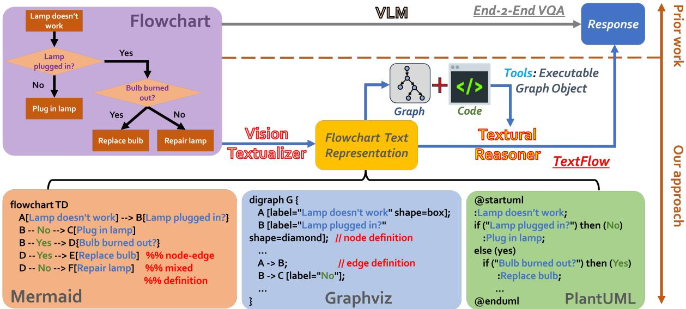
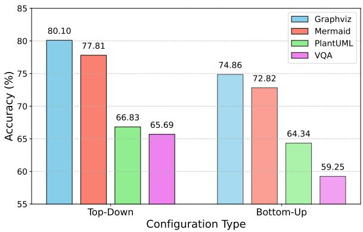
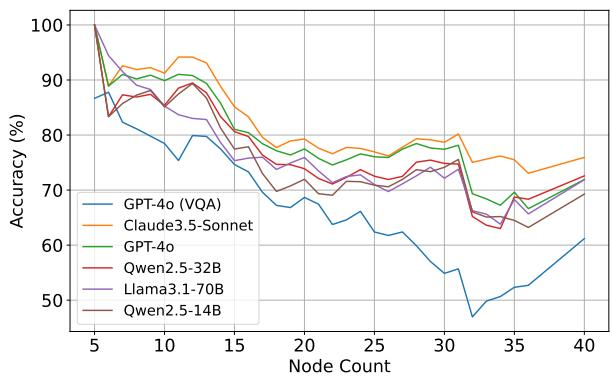
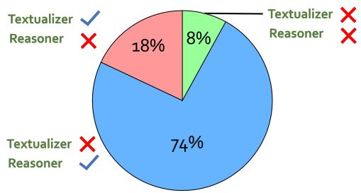

# Beyond End-to-End VLMs: Leveraging Intermediate Text Representations for Superior Flowchart Understanding

Junyi Ye♠, Ankan Dash♠, Wenpeng Yin♢, and Guiling Wang♠

♠New Jersey Institute of Technology

♢The Pennsylvania State University

{jy394, ad892, gwang}@njit.edu, wenpeng@psu.edu

## Abstract

Flowcharts are typically presented as images, driving the trend of using vision-language mod els (VLMs) for end-to-end flowchart understanding. However, two key challenges arise: (i) Limited controllability—users have minimal influence over the downstream task, as they can only modify input images, while the train ing of VLMs is often out of reach for most researchers. (ii) Lack of explainability—it is difficult to trace VLM errors to specific causes, such as failures in visual encoding or reasoning. We propose TEXTFLOW, addressing aforementioned issues with two stages: (i) VISION TEXTUALIZER—which generates textual representations from flowchart images; and (ii) TEX-TUAL REASONER—which performs questionanswering based on the text representations. TEXTFLOW offers three key advantages: (i) users can select the type of text representations (e.g., GRAPHVIZ, MERMAID, PLANTUML), or further convert them into executable graph object to call tools, enhancing performance and controllability; (ii) it improves explainability by helping to attribute errors more clearly to visual or textual processing components; and (iii) it promotes the modularization of the solution, such as allowing advanced LLMs to be used in the REASONER stage when VLMs underperform in end-to-end fashion. Experiments on the FlowVQA and FlowLearn benchmarks demonstrate TEXTFLOW’s state-of-the-art performance as well as its robustness. All code and data are publicly available1.

## 1 Introduction

Flowcharts are extensively used to represent processes, algorithms, and workflows across a range of domains, including software engineering, business process modeling, and education. Accurate interpretation of flowcharts is essential for tasks such as automation, decision-making, and analysis. Given that flowcharts predominantly exist as images, the rise of large language models (LLMs) and large vision-language models (VLMs) has led to the use of VLMs for flowchart understanding in an end-to-end manner (Tannert et al., 2023; Pan et al., 2024; Singh et al., 2024).

While end-to-end VLMs offer a straightforward approach to flowchart understanding, they exhibit two key limitations: (i) Limited controllability—users have minimal capacity to improve performance, as they can only manipulate input images, while training VLMs is resource-intensive and often inaccessible to most researchers. (ii) Lack of explainability—it is difficult to trace errors in VLM outputs to specific failures, whether in visual encoding, reasoning, or other stages.

To overcome these challenges, we introduce TEXTFLOW, a framework that decomposes flowchart understanding into two stages: (i) VI-SION TEXTUALIZER, which generates intermediate textual representations from flowchart images; and (ii) TEXTUAL REASONER, which performs question-answering (QA) based on these text representations. This dual-stage framework provides three distinct advantages: (i) Controllability—users can flexibly choose the type of text representation (e.g., GRAPHVIZ, MERMAID, or PLANTUML) and convert them into executable graph objects for enhanced performance; (ii) Explainability—it improves error attribution by clarifying whether failures arise from visual or textual components; and (iii) Modularity—the framework allows for the use of more advanced LLMs in the REASONER stage if VLMs are inadequate for end-to-end flowchart understanding, restricting the VLM to the TEXTUALIZER stage only.

We evaluate TEXTFLOW on the FlowVQA (Singh et al., 2024) and FlowLearn (Pan et al., 2024) datasets, combining various open-source and closed-source VLMs/LLMs for the VISION TEX-TUALIZER and TEXTUAL REASONER stages, respectively. Our experiments demonstrate that using Claude-3.5 (Anthropic, 2024) as the TEXTU-ALIZER, alongside either Claude-3.5 or GPT-4o (OpenAI, 2024) as the REASONER, significantly outperforms end-to-end flowchart understanding using Claude-3.5 or GPT-4o alone. Further analysis reveals that (i) GRAPHVIZ is generally the most effective textual representation for flowcharts; (ii) TEXTFLOW exhibits robustness across different task categories, flowchart sources, orientations, and sizes; and (iii) the VISION TEXTUALIZER stage is more often the source of errors than the REA-SONER stage, particularly when using Claude-3.5 for both.

Our contributions are threefold:

• Our TEXTFLOW presents a novel and effective approach to leverage VLMs/LLMs in flowchart understanding: instead of treating the task end-toend, breaking it into subtasks appears to be easier. It not only achieves new state-of-the-art (82.74 vs. 76.61) but also potentially provides inspiration for other visual tasks.

• We take the lead in introducing three textual formats—GRAPHVIZ, MERMAID, and PLAN-TUML—for transforming flowcharts into structured text representations, facilitating the reasoning process.

• Our detailed analysis provides key insights into solving the flowchart understanding problem, including identifying GRAPHVIZ as the most effective representation, conducting a fine-grained analysis across different flowchart sources and task categories, and quantitatively comparing the roles of VISION TEXTUALIZER and TEXTUAL REA-SONER when using the same VLM.

## 2 Related Work

End-to-End VQA for Flowchart/Diagrams For flowchart understanding, most prior work has focused on benchmark construction with different emphases. For example, FlowchartQA (Tannert et al., 2023) emphasizes reasoning over geometric and topological features, FlowLearn (Pan et al., 2024) focuses on synthetic and scientific flowcharts, IconQA (Lu et al., 2021) targets abstract diagrams that are rich in semantics rather than natural images, and FlowVQA (Singh et al., 2024) focuses on evaluating spatial reasoning, decision-making, and logical progression tasks.

Most of these works adopt end-to-end systems. For instance, Lu et al. (2021) proposed Patch-TRM, which employs a pyramid cross-modal Transformer with diagram embeddings pre-trained on the Icon dataset, while Singh et al. (2024) and Pan et al. (2024) explored various VLMs for their respective tasks.

Decomposing VQA into Multiple Steps Previous work in this area falls into two main categories: (i) Image preprocessing, where the decomposition involves processing flowchart images. For example, Pan et al. (2024) first identified visual components and applies OCR to the images. (ii) Question decomposition, where the focus is on breaking down questions into sub-reasoning steps. For instance, Cao and Jiang (2023) decomposed questions into sub-tasks and assigned them to suitable pre-trained models without adaptation. Khan et al. (2024) compared human-written and modelgenerated question decompositions, while (Barezi and Kordjamshidi, 2024) decomposed multi-hop questions by determining the modality required, using a captioner for visual sub-questions and LLMs for textual ones. IdealGPT (You et al., 2023) employed LLMs to generate sub-questions, VLMs to provide sub-answers, and another LLM to reason and produce the final answer.

Our approach differs from these by focusing not on preprocessing flowchart images or decomposing questions, but on decomposing the process into two distinct stages. The first stage generates a novel textual representation, and the second transforms the original visual QA task into a textual QA task.

## 3 Methodology

As illustrated in Figure 1, the approach TEXTFLOW consists of two main stages: (1) VISION TEXTUALIZER: A VLM converts the visual components of the flowchart into a high-quality text representation. (2) TEXTUAL REASONER: An LLM or VLM based textural reasoner can use tools and interpret the text representations to answer questions related to the flowchart’s logic and structure. By decoupling these tasks, TEXTFLOW enables specialized models to focus on their respective strengths: VISION TEXTUALIZER process the visual elements, while TEXTUAL REASONER handle reasoning tasks, thus improving accuracy and flexibility. Next, we elaborate on VISION TEXTUALIZER (Section 3.1) and TEXTUAL REASONER (Section 3.2), respectively.

  
Figure 1: Our dual-stage TEXTFLOW vs. prior work.

## 3.1 VISION TEXTUALIZER

TEXTUALIZER aims at extracting a structured textual representation from the flowchart image. This representation is critical because the accuracy and completeness of the extracted text determine the effectiveness of the reasoning stage.

We explore three flowchart textualization formats (examples can be found in Figure 1):

MERMAID2. It uses a simple, link-based syntax, where nodes are connected via arrows. It is designed for ease of use, making it straightforward to define basic relationships and linear flows, suitable for simpler diagrams. Shapes are defined with different types of parentheses. Additionally, MER-MAID often uses alphanumeric identifiers to label nodes, which simplifies counting nodes and edges and tracking direct connections.

GRAPHVIZ3. It defines nodes and edges separately, with nodes assigned attributes like labels and shapes, and edges specified using directional arrows. Unlike MERMAID, which combines nodes and links in a single step, GRAPHVIZ’s approach is more structured and easier to follow. Due to their similar nature, converting between the two formats is straightforward. However, for more complex structures like loops or nested conditions, both MERMAID and GRAPHVIZ representations can become less intuitive, as their simple syntax struggles to fully capture the intricacies of multi-step processes.

PLANTUML4. It takes a pseudocode-like approach, mimicking the structure of programming logic. Unlike MERMAID and GRAPHVIZ, it supports complex flow structures such as conditions, loops, and nesting, making it suitable for detailed and intricate flowcharts. However, its more elaborate syntax requires a deep understanding of process logic, and writing or maintaining flowcharts with complex topologies can be challenging. For instance, handling multiple nested loops with conditions may require significant restructuring of the flowchart logic, which complicates both the code writing and the accurate depiction of the topological relationships between components.

## 3.2 TEXTUAL REASONER

At this stage, the text representation produced by TEXTUALIZER is forwarded to the TEXTUAL REASONER, which may consist of an LLM or VLM, to perform reasoning tasks guided by the flowchart’s underlying logic. This stage highlights the TEXTFLOW pipeline’s primary advantage over traditional VQA systems: controllability—allowing the use of the plain text representation as generated by TEXTUALIZER or the further enhancement of its expressivity.

• Plain Text Representation: The generated text representation (in formats such as GRAPHVIZ, MERMAID, or PLANTUML) is presented to the REASONER along with a question regarding the flowchart. The LLM/VLM processes the structured text to provide answers related to the flowchart’s logic, decision paths, or conditional structures.

• Executable Graph Object: For improved reasoning, the user may opt to transform the text representation, such as MERMAIDor GRAPHVIZ, into an executable graph object to enhance reasoning. This is particularly useful for structured graph analysis tasks, such as counting nodes and edges, identifying predecessors and successors, computing shortest paths, and verifying graph structure.

By converting text-based representations into executable graph objects, an LLM can determine whether function calls are needed to enhance its response. When invoked, these functions provide precise answers or generate intermediate data to support reasoning. This approach removes ambiguities inherent in text-based interpretation, enabling the model to execute structured queries with greater accuracy and logical consistency. While the effectiveness of this method depends on the precision of the TEXTUALIZER, ensuring high-quality extraction minimizes potential errors and enhances overall performance.

By directly interacting with graph structures instead of relying on text-based inference, this method streamlines complex analytical tasks and improves both computational efficiency and reasoning accuracy. For detailed definitions and supported functionalities, refer to the Appendix.

## 4 Experiments

Dataset. We utilize the FlowVQA dataset (Singh et al., 2024) due to its extensive diversity in i) flowchart sources, including: CODE, WIKI (stepby-step guides for daily tasks), and INSTRUCT (instructions for DIY projects), and ii) task categories:

• Fact Retrieval $( T _ { 1 } ) \colon$ Focuses on extracting specific facts from flowchart nodes.

• Applied Scenarios $( T _ { 2 } ) \colon$ Assesses how models apply flowchart logic in practical, real-world situations.

• Flow Referential (T3): Requires reasoning over flowchart subgraphs to perform forward or backward logic.

• Topological $( T _ { 4 } )$ : Evaluates understanding of structural metrics such as node count, edge count, shortest path, maximum in/out degree, and predecessor/successor relationships.

FlowVQA emphasizes spatial reasoning and understanding of decision-making flows within flowcharts, offering a robust resource to evaluate multimodal models’ ability to interpret and process structured, graph-based visual information—a demanding task for many VLMs. For our experiment, we randomly sampled 200 flowcharts with a total of 2,005 QA pairs from the test set.

<table><tr><td colspan="2">|System</td><td colspan="2">|FlowVQA FlowLearn</td></tr><tr><td rowspan="6">VQA Baseline (end-to-end) (Singh et al., 2024)</td><td>|Llama3.2-11B</td><td>8.33</td><td></td></tr><tr><td>Llava-v1.6-110B</td><td>42.69</td><td></td></tr><tr><td>Llama3.2-90B</td><td>43.09</td><td></td></tr><tr><td>Qwen2-VL-7B</td><td>53.42</td><td></td></tr><tr><td>Qwen2-VL-72B (Pan et al., 2024)</td><td>64.14</td><td></td></tr><tr><td>GPT-40</td><td>65.69 76.61</td><td>60.29 77.00</td></tr><tr><td rowspan="2">Ours (dual-stage)</td><td>Claude3.5-Sonnet |GPT-40</td><td>80.10</td><td></td></tr><tr><td>Claude3.5-Sonnet</td><td>82.74</td><td>72.83 80.57</td></tr></table>

Table 1: Flowchart of QA evaluation on two benchmarking datasets. The text representations used in the TEXTFLOW pipeline are GRAPHVIZ.

We also use the FlowLearn (Pan et al., 2024) dataset to benchmark different systems on flowchart comprehension, focusing on the Simulated Flowcharts Subset, which features flowcharts generated with random words and links. Key tasks include OCR, True/False statements, description generation, and counting nodes/arrows, with emphasis on topological analysis as node labels lack semantic meaning. We evaluated 7 tasks from the test set, each with 100 flowchart/QA pairs. Besides the main results in Table 1, further analysis primarily focuses on FlowVQA, as it better reflects real-world scenarios.

VLM&LLM Explored. Note that TEXTUAL-IZER can only use VLMs, but both VLMs and LLMs are applicable to REASONER .

• VLMs: Closed-source models: Claude 3.5 Sonnet and GPT-4o; open-source models: Qwen2- VL (7B and 72B) (Wang et al., 2024), Llama3.2 (11B and 90B) (AI, 2024), and Llava-v1.6-110B (Liu et al., 2024).

• LLMs: Closed-source models: Claude 3.5 Sonnet and GPT-4o; open-source models: Qwen2.5 (7B, 14B, 32B, and 72B) (Team, 2024b), Llama3.1 (8B and 70B) (Dubey et al., 2024), Mixtral 8x22B (Team, 2024a), Phi3.5 (MoE, Mini) (Trufinescu, 2024).

We accessed GPT-4o and Claude3.5-Sonnet via API, while all other open-source VLMs/LLMs were used through Hugging Face with their official default settings. Depending on the GPU memory requirements of each model, we utilized 1 to 4 Nvidia A100(80GB) GPUs. To ensure experimental accuracy and reproducibility, we employed a greedy decoding strategy (with temperature = 0) and fixed the maximum token length to 4096. In addition, to avoid the impact of image resolution on VQA performance, we used the highest resolution mode supported by each VLM.

<table><tr><td>Model</td><td colspan="3">GRAPHVIZ</td><td colspan="3">MERMAID</td><td colspan="3">PLANTUML</td></tr><tr><td></td><td>Node F1</td><td>Link F1</td><td>Rendering Success Rate</td><td>Node F1</td><td>Link F1</td><td>Rendering Success Rate</td><td>Node F1</td><td>Link F1</td><td>Rendering Success Rate</td></tr><tr><td>GPT-40</td><td>0.98</td><td>0.93</td><td>100</td><td>0.99</td><td>0.94</td><td>100</td><td>0.97</td><td>0.88</td><td>100</td></tr><tr><td>Claude3.5-Sonnet</td><td>0.95</td><td>0.87</td><td>100</td><td>0.97</td><td>0.89</td><td>98</td><td>0.94</td><td>0.83</td><td>82</td></tr><tr><td>Qwen2-VL-72B</td><td>0.92</td><td>0.78</td><td>100</td><td>0.73</td><td>0.64</td><td>74</td><td>0.74</td><td>0.56</td><td>74</td></tr><tr><td>Llama3.2-90B</td><td>0.71</td><td>0.46</td><td>62</td><td>0.73</td><td>0.55</td><td>84</td><td>0.70</td><td>0.51</td><td>74</td></tr><tr><td>Llava-v1.6-110B</td><td>0.51</td><td>0.29</td><td>86</td><td>0.47</td><td>0.23</td><td>82</td><td>0.41</td><td>0.23</td><td>68</td></tr><tr><td>Qwen2-VL-7B</td><td>0.47</td><td>0.28</td><td>68</td><td>0.37</td><td>0.12</td><td>12</td><td>0.27</td><td>0.15</td><td>18</td></tr><tr><td>Llama3.2-11B</td><td>0.49</td><td>0.19</td><td>34</td><td>0.12</td><td>0.06</td><td>8</td><td>0.17</td><td>0.09</td><td>10</td></tr></table>

Table 2: VISION TEXTUALIZER evaluation.

## 4.1 Main Results

As the main results, we evaluate our system for the whole process of flowchart understanding (i.e., TEXTUALIZER+REASONER) as well as the quality of the first stage (i.e., merely TEXTUALIZER).

TEXTFLOW (TEXTUALIZER+REASONER) evaluation. It checks whether TEXTFLOW can get superior flowchart understanding performance.

• Baseline: Singh et al. (2024) and Pan et al. (2024) presented the prior state-of-the-art results by deploying VLMs end-to-end.

• Metric: We use accuracy as the primary evaluation metric, measuring the proportion of correct answers among all responses to assess the model’s performance on QA tasks. Following prior work that employs LLMs as evaluators (Singh et al., 2024), we use LLMs to assess each response; specifically, we employ GPT-4o in our setup for enhanced accuracy. A response is considered correct if it matches the expected answer. Each answer is evaluated three times, with the final determination based on a majority vote. To minimize excessive randomness and ensure reliable majority voting, we set the model’s temperature to 0.2, keeping responses stable yet varied enough for accurate assessment.

Table 1 presents a comparison between TEXTFLOW and previous end-to-end flowchart understanding systems on two benchmarking datasets. The results clearly demonstrate that top performing models (i.e. Claude 3.5 and GPT-4o) within TEXTFLOW consistently outperform their performance in prior approach by significant margins.

Notably, Claude-3.5-Sonnet emerges as the most effective VLM, excelling in both end-to-end deployment and our dual-stage framework.

TEXTUALIZER Evaluation. The experiment is conducted on a randomly selected set of 50 flowcharts in the FlowVQA dataset.

• Generation of gold text representation: Different target text representations pose unique challenges in obtaining the ground truth. For MER-MAID, we directly used the representations from the dataset. For GRAPHVIZ, which has a similar syntax, we generated the ground truth by parsing it with a script. However, for PLANTUML, due to the absence of conversion tools, we manually created the ground truth representations.

• Metric: We evaluate node and link extraction using the F1 score and assess the rendering success rate (whether the flowchart renders without syntax errors). For MERMAID and GRAPHVIZ, we convert text representations into Python graph objects using a parser, then add nodes and edges, and compute the F1 score via a script. For PLANTUML, due to its complex pseudocode-like syntax and lack of automated conversion tools, we perform manual annotation for accuracy assessment.

The performance in Table 2 illustrates that GPT-4o leads across all representations, with Claude 3.5 close behind, while Qwen2-VL-72B performs best among open-source models. Node extraction generally outperforms link extraction, with comparable results for Graphviz and Mermaid, but lower for PlantUML. Challenges include weaker edge extraction, where correctly identifying and connecting nodes with high in/out-degrees often leads to missing or incorrect links. Open-source models struggle with syntax errors, such as misuse of special characters and improper loop handling, where loops are mistakenly repeated indefinitely, highlighting their limitations in flowchart extraction tasks.

<table><tr><td rowspan="3">Input</td><td rowspan="3">Model</td><td rowspan="3">Total</td><td colspan="3">Data Source</td><td colspan="4">Tasks</td></tr><tr><td>Code</td><td>Instruct</td><td>Wiki</td><td>T1</td><td> $T _ { 2 }$ </td><td> $T _ { 3 }$ </td><td> $T _ { 4 }$ </td></tr><tr><td>GPT-4o (VQA) 65.69</td><td>78.23</td><td>69.37</td><td>59.96</td><td>73.83</td><td>68.16</td><td>69.80</td><td>58.91</td></tr><tr><td>Image</td><td>Claude3.5-Sonnet</td><td>82.19</td><td>91.48</td><td>84.27</td><td>78.32</td><td>90.12</td><td>81.84</td><td>76.07</td><td>81.11</td></tr><tr><td rowspan="12">Gradviz</td><td>GPT-40</td><td>80.10</td><td>87.07</td><td>83.94</td><td>75.92</td><td>88.15</td><td>81.34</td><td>72.65</td><td>78.75</td></tr><tr><td>Qwen2.5-32B</td><td>77.46</td><td>88.64</td><td>79.80</td><td>72.88</td><td>86.42</td><td>75.12</td><td>70.09</td><td>77.33</td></tr><tr><td></td><td></td><td>83.91</td><td>77.15</td><td>70.66</td><td>87.41</td><td>78.36</td><td>71.79</td><td>68.12</td></tr><tr><td>Llama3.1-70B</td><td>74.71 74.51</td><td>87.38</td><td>77.48</td><td>69.10</td><td>81.98</td><td>72.39</td><td>68.09</td><td>74.62</td></tr><tr><td>Qwen2.5-14B Qwen2.5-72B</td><td>72.72</td><td>84.54</td><td>77.15</td><td>66.79</td><td>83.46</td><td>70.90</td><td>70.09</td><td>69.54</td></tr><tr><td>Mixtral-8x22B</td><td>67.03</td><td>76.03</td><td>69.54</td><td>63.01</td><td>86.17</td><td>73.13</td><td>66.38</td><td>55.25</td></tr><tr><td>Llama3.1-8B</td><td>63.79</td><td>71.61</td><td>66.72</td><td>59.87</td><td>82.22</td><td>59.20</td><td>48.72</td><td>63.40</td></tr><tr><td>Qwen2.5-7B</td><td>61.25</td><td>79.18</td><td>61.26</td><td>56.00</td><td>78.77</td><td>64.68</td><td>54.13</td><td>54.19</td></tr><tr><td>Phi3.5-MoE</td><td>52.77</td><td>67.19</td><td>53.97</td><td>47.88</td><td>67.16</td><td>58.96</td><td>50.14</td><td>44.04</td></tr><tr><td>Phi3.5-Mini</td><td>48.68</td><td>59.62</td><td>52.15</td><td>43.54</td><td>63.95</td><td>45.02</td><td>37.89</td><td>47.58</td></tr><tr><td>Claude3.5-Sonnet</td><td>80.00</td><td>90.85</td><td>81.62</td><td>75.92</td><td>89.63</td><td>80.85</td><td></td><td></td></tr><tr><td rowspan="14">MMeraid</td><td>GPT-40</td><td></td><td></td><td></td><td></td><td></td><td></td><td>74.93</td><td>77.10</td></tr><tr><td></td><td>77.81</td><td>88.33</td><td>81.46</td><td>72.69</td><td>88.89</td><td>79.10</td><td>74.93</td><td>73.08</td></tr><tr><td>Qwen2.5-32B</td><td>74.76</td><td>86.75</td><td>76.16</td><td>70.48</td><td>84.94</td><td>72.14</td><td>70.94</td><td>72.73</td></tr><tr><td>Llama3.1-70B</td><td>74.41</td><td>81.07</td><td>76.99</td><td>71.03</td><td>88.40</td><td>81.09</td><td>69.52</td><td>66.59</td></tr><tr><td>Qwen2.5-14B</td><td>73.37</td><td>85.17</td><td>74.01</td><td>69.56</td><td>85.93</td><td>72.89</td><td>72.08</td><td>68.12</td></tr><tr><td>Qwen2.5-72B</td><td>70.67</td><td>86.12 74.76</td><td>72.52 66.39</td><td>65.13</td><td>84.69 86.67</td><td>67.91 67.91</td><td>70.09</td><td>65.53</td></tr><tr><td>Llama3.1-8B</td><td>66.03 63.89</td><td>74.45</td><td>64.57</td><td>63.28</td><td>85.43</td><td>76.37</td><td>61.82</td><td>57.02</td></tr><tr><td>Mixtral-8x22B</td><td>63.44</td><td>74.45</td><td>63.58</td><td>60.42 60.15</td><td>84.20</td><td>63.93</td><td>67.24 57.83</td><td>46.28 55.61</td></tr><tr><td>Qwen2.5-7B Phi3.5-MoE</td><td>54.71</td><td>67.19</td><td>52.98</td><td>52.03</td><td>73.83</td><td>64.18</td><td>54.42</td><td>41.20</td></tr><tr><td>Phi3.5-Mini</td><td>54.51</td><td>62.46</td><td>54.47</td><td>52.21</td><td>72.84</td><td>59.70</td><td>51.85</td><td>44.39</td></tr><tr><td></td><td></td><td></td><td></td><td>73.01</td><td>66.14</td><td>84.69</td><td>79.10</td><td></td><td>59.50</td></tr><tr><td rowspan="10">PIaUML</td><td>Claude3.5-Sonnet GPT-40</td><td>70.17 66.83</td><td>78.55 76.03</td><td>70.03</td><td></td><td></td><td></td><td>68.95</td><td>53.60</td></tr><tr><td>Qwen2.5-32B</td><td></td><td></td><td></td><td>62.36</td><td>85.93</td><td>73.63</td><td>68.95</td><td></td></tr><tr><td></td><td>64.59</td><td>74.13</td><td>67.05</td><td>60.42</td><td>82.47</td><td>73.13</td><td>68.95</td><td>50.18</td></tr><tr><td>Llama3.1-70B</td><td>61.85</td><td>67.19</td><td>63.41</td><td>59.41</td><td>84.20</td><td>78.36</td><td>69.23</td><td>40.26</td></tr><tr><td>Qwen2.5-72B</td><td>61.00</td><td>68.14</td><td>62.42</td><td>58.12</td><td>80.25</td><td>66.17</td><td>68.95</td><td>46.04</td></tr><tr><td>Qwen2.5-14B</td><td>60.70</td><td>67.51</td><td>61.59</td><td>58.21</td><td>82.96</td><td>69.65</td><td>66.38</td><td>43.45</td></tr><tr><td>Mixtral-8x22B Llama3.1-8B</td><td>57.41</td><td>62.15</td><td>57.78</td><td>55.81</td><td>82.96</td><td>75.87</td><td>63.82</td><td>33.77</td></tr><tr><td></td><td>53.57</td><td>58.99</td><td>55.63</td><td>50.83</td><td>83.95</td><td>69.65</td><td>56.13</td><td>30.34</td></tr><tr><td>Qwen2.5-7B</td><td>52.92</td><td>60.88</td><td>53.81</td><td>50.09</td><td>82.22</td><td>61.44</td><td>56.70</td><td>33.29</td></tr><tr><td>Phi3.5-MoE</td><td>51.47</td><td>57.41</td><td>50.33</td><td>50.37</td><td>76.79</td><td>66.42</td><td>55.27</td><td>30.70</td></tr><tr><td>Phi3.5-Mini</td><td>45.14</td><td>52.05</td><td>45.03</td><td>43.17</td><td>71.85</td><td>57.71</td><td>45.87</td><td>26.09</td></tr></table>

Table 3: Effectiveness of text representations. TEXTUALIZER: GPT-4o; REASONER: various LLMs. The underlined results indicate that the experiment outperforms the VQA baseline.

## 4.2 Analysis

In addition to presenting the main results, we further answer the following four research questions.

$\mathcal { Q } _ { 1 }$ : Which text representation is the most effective? To address this question, we fix the TEX-TUALIZER as GPT-4o to generate different text representations and then evaluate the performance of various LLMs on those representations.

As shown in Table 3, GRAPHVIZ proves to be the most effective text representation for flowchart understanding overall. While PLANTUML performs the worst, it still surpasses the end-to-end VQA baseline when using Claude3.5-Sonnet and GPT-4o. This underscores the effectiveness of our approach’s core concept: generating intermediate text representations improves performance on flowchart understanding.

Q2: How robust our dual-stage pipeline is? We study robustness from three dimensions: i) varying VLM/LLM choices in the two stages; ii) flowchart orientation; iii) flowchart size (i.e., #node).

• VLM/LLM choices in TEXTUALIZER and REASONER. The upper half of Table 4 compares the performance of different VLMs in the TEXTFLOW pipeline and the VQA pipeline.

<table><tr><td colspan="7">TEXTUALIZER Varies</td></tr><tr><td>Model=VLM</td><td>VQA</td><td colspan="5">T=R=Model T=Model; R=GPT-4o Graphviz Mermaid PlantUML&#x27; Graphviz Mermaid PlantUML</td></tr><tr><td>Claude3.5-Sonnet</td><td>t 76.61</td><td>82.74 82.04</td><td>71.22</td><td>77.66</td><td>79.95</td><td>66.43</td></tr><tr><td>GPT-40</td><td>65.69</td><td>80.10</td><td>77.81 66.83</td><td>80.10</td><td>77.81</td><td>66.83</td></tr><tr><td>Qwen2-VL-72B</td><td>64.14</td><td>64.64</td><td>62.19 57.91</td><td>76.11</td><td>75.26</td><td>64.54</td></tr><tr><td>Qwen2-VL-7B</td><td>53.42</td><td>48.43</td><td>49.93 46.18</td><td>59.55</td><td>60.35</td><td>58.80</td></tr><tr><td>Llama3.2-90B</td><td>43.09</td><td>53.97</td><td>62.29 49.93</td><td>56.96</td><td>64.09</td><td>52.22</td></tr><tr><td>Llava-v1.6-110B</td><td>42.69</td><td>43.09</td><td>43.24 39.50</td><td>49.08</td><td>45.94</td><td>44.09</td></tr><tr><td>Llama3.2-11B</td><td>8.33</td><td>39.80</td><td>41.40 34.21</td><td>50.07</td><td>50.47</td><td>46.23</td></tr><tr><td colspan="7">REASONER Varies</td></tr><tr><td>Model=LLM</td><td>VQA</td><td>T=GPT-4o; R=Model Graphviz Mermaid PlantUML&#x27; Graphviz Mermaid PlantUML</td><td></td><td></td><td>T=Gold; R=Model</td><td></td></tr><tr><td>Claude-3-5-Sonnet 70.00</td><td></td><td>83.03 85.48</td><td>71.57</td><td>90.59</td><td>92.64</td><td>74.64</td></tr><tr><td>GPT-40</td><td>72.00</td><td>80.98 82.21</td><td>71.37</td><td>87.12</td><td>86.09</td><td>70.35</td></tr><tr><td>Qwen2.5-32B</td><td></td><td>79.14 79.96</td><td>69.53</td><td>85.48</td><td>84.46</td><td>66.26</td></tr><tr><td>Llama-3.1-70B</td><td></td><td>79.55 76.89</td><td>64.01</td><td>85.89</td><td>80.98</td><td>66.26</td></tr><tr><td>Qwen2.5-14B</td><td></td><td>78.32 78.73</td><td>64.01</td><td>84.46</td><td>81.39</td><td>65.03</td></tr><tr><td>Qwen2.5-72B</td><td></td><td>74.03 74.23</td><td>65.24</td><td>78.73</td><td>78.94</td><td>64.62</td></tr><tr><td>Mixtral-8x22B</td><td></td><td>64.62 66.87</td><td>59.51</td><td>66.26</td><td>68.71</td><td>58.49</td></tr><tr><td>Llama-3.1-8B</td><td></td><td>70.96 65.64</td><td>56.24</td><td>73.21</td><td>71.17</td><td>53.78</td></tr><tr><td>Qwen2.5-7B</td><td></td><td>67.08 63.39</td><td>54.19</td><td>69.33</td><td>66.87</td><td>56.65</td></tr><tr><td>Phi-3.5-MoE</td><td></td><td>57.87 56.85</td><td>56.03</td><td>57.67</td><td>58.08</td><td>53.99</td></tr><tr><td>Phi-3.5-mini</td><td></td><td>56.03</td><td>50.92 46.42</td><td></td><td>51.74</td><td>44.79</td></tr><tr><td></td><td></td><td></td><td></td><td>57.87</td><td></td><td></td></tr></table>

Table 4: Framework robustness by choosing different VLMs/LLMs for TEXTUALIZER (T) and REASONER (R). The underlined results indicate that the experiment outperforms the VQA baseline.

In most cases, TEXTFLOW outperforms VQA. Notably, GPT-4o and Claude 3.5 emerge as the top performers, showcasing strong visiontextualization and reasoning capabilities. Additionally, TEXTFLOW demonstrates strong robustness, and when the reasoning ability of VLMs is insufficient, performance can be improved by utilizing a stronger REASONER, such as GPT-4o.

In the lower half of Table 4, we observe this flexibility in action. When GPT-4o is fixed as the TEXTUALIZER, a variety of LLMs can act as high-performing REASONERS. Even smaller models, such as Qwen2.5-14B and 32B, demonstrate strong performance in this setup. Moreover, when replacing the gold representation with text extracted by GPT-4o, most REASONERS, particularly in Graphviz and Mermaid formats, show significant improvement.

• Impact of Flowchart Orientation. Figure 2 compares model accuracy between top-down (normal) and bottom-up (reversed) flowchart configurations. Across all representations (GRAPHVIZ, MERMAID, and PLANTUML), the top-down configuration consistently yields higher accuracy, with differences ranging from 2.49% for PLANTUMLto 5.24% for GRAPHVIZ. The VQA baseline shows the largest discrepancy, with a 6.44% drop in accuracy in the bottom-up configuration. These results indicate that while reversing the flow direction affects performance across models, the TEXTFLOW pipeline demonstrates better robustness than VQA in maintaining accuracy under reversed conditions. This robustness suggests that

  
Figure 2: Comparison of GPT-4o’s performance on Top-Down and Bottom-Up flowchart configurations.

  
Figure 3: Accuracy comparison by node count across various models with a rolling average. VQA and the top 5 performing REASONERS on TEXTFLOW using extracted Mermaid in Table 3 are compared.

TEXTFLOW’s structured representation approach enables more flexible adaptation to variations in flowchart orientation.

• Effect of Flowchart Size (e.g., #Node). Figure 3 explores how node count affects model accuracy for VQA and TEXTFLOW. Accuracy generally declines as node count increases, highlighting the challenge of processing more complex flowcharts. However, TEXTFLOW demonstrates superior resilience compared to VQA, maintaining higher accuracy across increasing node counts. This suggests that the structured extraction and reasoning process in TEXTFLOW enables models to handle complexity more effectively, whereas the VQA baseline struggles as flowcharts become denser and more intricate.

Together, these findings show that TEXTFLOW enhances robustness to both orientation changes and increasing complexity, making it better suited for reliable flowchart reasoning across varied and challenging conditions.

3: Given that our dual-stage framework offers flexibility in controlling flowchart representations, how effective is it to enhance these representations using external tools? We explore the impact of tool-assisted methods on enhancing text representations for improved model accuracy across various tasks, particularly topological ones. By converting flowchart representations from Mermaid and Graphviz code into Pythonexecutable graph objects, we enrich the text representation with additional graph functions, such as node and edge counts, retrieving successors and predecessors, calculating shortest paths, and identifying nodes with maximum in-degree and out-degree. These tools provide structured information, enhancing the model’s ability to reason more precisely in graph-based scenarios across the FlowVQA dataset.

<table><tr><td>Method</td><td>Overall</td><td> $T _ { 1 }$ </td><td> $T _ { 2 }$ </td><td> $T _ { 3 }$ </td><td> $T _ { 4 }$ </td></tr><tr><td></td><td colspan="5">GRAPHVIZ</td></tr><tr><td>Base</td><td>80.10</td><td>88.15</td><td>81.34</td><td>72.65</td><td>78.75</td></tr><tr><td>Tool</td><td>80.79</td><td>84.94</td><td>80.60</td><td>70.37</td><td>83.23</td></tr><tr><td> $\mathrm { B a s e } ^ { \mathrm { G o l d } }$ </td><td>85.39</td><td>90.12</td><td>79.35</td><td>76.35</td><td>89.73</td></tr><tr><td> $\mathrm { T o o l } ^ { \mathrm { G o l d } }$ </td><td>88.23</td><td>86.91</td><td>79.35</td><td>72.08</td><td>99.76</td></tr><tr><td></td><td colspan="5">MERMAID</td></tr><tr><td>Base</td><td>77.81</td><td>88.89</td><td>79.10</td><td>74.93</td><td>73.08</td></tr><tr><td>Tool</td><td>78.89</td><td>86.91</td><td>79.35</td><td>69.52</td><td>78.87</td></tr><tr><td> $\mathrm { B a s e } ^ { \mathrm { G o l d } }$ </td><td>85.49</td><td>90.37</td><td>78.11</td><td>78.92</td><td>89.37</td></tr><tr><td> $\mathrm { T o o l } ^ { \mathrm { G o l d } }$ </td><td>88.83</td><td>89.88</td><td>79.85</td><td>70.94</td><td>100.00</td></tr></table>

Table 5: GPT-4o’ accuracy on Graphviz and Mermaid representations, comparing base and tool-assisted settings on extracted and Gold representations.

As shown in Table 5, tool-assisted methods significantly boost GPT-4o’s accuracy, particularly for topological tasks (T4), where structured graph functions lead to near-perfect accuracy with Gold representation (99.76% for Graphviz, 100% for Mermaid). While these methods enhance overall performance for both Graphviz and Mermaid representations—achieving the highest accuracy (88.23% for Graphviz, 88.83% for Mermaid)—their impact is most pronounced in topological tasks. For other tasks $( T _ { 1 } \mathrm { - } T _ { 3 } )$ , which may require multi-step reasoning or broader flowchart understanding, toolassisted methods provide more limited benefits.

$\mathcal { Q } _ { 4 } \mathbf { : }$ If TEXTFLOW makes mistakes in the end, it is more likely due to the failure of TEXTUAL-IZER or REASONER? We explain the errors in three sources: i) TEXTUALIZER is correct, REA-SONER is incorrect; ii) TEXTUALIZER is incorrect, REASONER is correct (i.e., correctly reflect the facts in the text representations); iii) Both TEXTU-ALIZER and REASONER are incorrect.

In our analysis of 50 randomly selected error cases from Claude-3.5, as shown in Figure 4, the majority of errors were attributed to TEXTUAL-IZER issues. Specifically, errors frequently occurred in decision nodes where multiple links entered or exited, indicating that complex node structures pose challenges to accurate extraction. Another prevalent source of error was the misinterpretation of node labels due to unintended rewrites by the TEXTUALIZER, leading to inaccuracies in extraction. Conversely, the REASONER component demonstrated a high degree of reliability, as evidenced by the lower error rate in reasoning tasks. These findings suggest that improvements in extraction quality, particularly in handling decision nodes and preserving label integrity, could unlock greater potential for our TEXTFLOW model’s overall performance.

  
Figure 4: Error analysis for percentage of errors attributed to each category in Claude 3.5 Sonnet.

## 5 Conclusion

This work introduces TEXTFLOW, a dualstage framework that leverages VLMs/LLMs for flowchart understanding by breaking the process down into VISION TEXTUALIZER and TEXTUAL REASONER. Our experiments on the two benchmarks demonstrate its state-of-the-art performance, and detailed analysis reveals that GRAPHVIZ is the most effective text representation for flowcharts. Additionally, the system remains robust regardless of flowchart orientation and scale. Beyond flowchart understanding, we believe that reasoning over intermediate text representations has the potential to generalize to other multimodal tasks, enhancing both usability and reasoning capabilities.

## Limitations

Despite the progress made with TEXTFLOW, several limitations remain, particularly in extraction accuracy, generalizability, and reasoning capabilities.

1. Extraction Accuracy and Representation Fidelity: TEXTFLOW depends on accurately extracting nodes and edges from flowcharts. In complex or noisy diagrams, errors in extraction can reduce reasoning accuracy. While current VISION TEXTUALIZER perform well, they struggle with subtle layout and style variations, limiting TEXTFLOW’s adaptability to diverse flowchart formats.

2. Lack of Diverse High-Quality Datasets: TEXTFLOW’s evaluation is limited by the scarcity of diverse, high-quality flowchart datasets. Existing datasets, like FlowVQA, mostly feature standard styles such as Mermaid. This restricts the assessment of TextFlow’s performance on complex, realworld flowcharts. More varied datasets are needed to fully test its generalization abilities.

3. Limited Generalizability to Complex or Nested Diagrams: TEXTFLOW is designed for structured flowcharts but struggles with more complex diagrams, such as dependency graphs, Gantt charts, or those with nested structures or embedded images. These elements are challenging to extract and interpret accurately, requiring more advanced extraction methods to handle such complexity.

4. Dependence on Domain Knowledge and External Documents: Some flowcharts require domain-specific knowledge or links to other documents for correct interpretation. In these cases, TEXTFLOW may need to be integrated with retrieval-augmented generation (RAG) techniques or external knowledge bases to enhance its reasoning capabilities.

5. Reliance on External Graph Processing Tools: TEXTFLOW improves reasoning through the use of external graph-processing tools, but this increases system complexity and may lead to compatibility issues with future datasets. Reducing reliance on these tools and improving the system’s self-sufficiency is a key area for future work.

## Acknowledgments

We would like to thank Terry Su and Neo Maralit from New Jersey Institute of Technology for their assistance with data annotation and creating ground truth for PLANTUML representations.

## References

Meta AI. 2024. Llama 3.2: Vision at the edge with mobile devices. https://ai.meta.com/blog/ llama-3-2-connect-2024-vision-edge-mobile-devices. Accessed: 2024-10-02.

Anthropic. 2024. Introducing claude 3.5 sonnet. Accessed: 16-October-2024.

Elham J. Barezi and Parisa Kordjamshidi. 2024. Disentangling knowledge-based and visual reasoning by question decomposition in kb-vqa. Preprint, arXiv:2406.18839.

Rui Cao and Jing Jiang. 2023. Modularized zero-shot VQA with pre-trained models. In Findings of the Association for Computational Linguistics: ACL 2023, pages 58–76. Association for Computational Linguistics.

Abhimanyu Dubey, Abhinav Jauhri, Abhinav Pandey, Abhishek Kadian, Ahmad Al-Dahle, Aiesha Letman, Akhil Mathur, Alan Schelten, Amy Yang, Angela Fan, et al. 2024. The llama 3 herd of models. arXiv preprint arXiv:2407.21783.

Zaid Khan, Vijay Kumar BG, Samuel Schulter, Manmohan Chandraker, and Yun Fu. 2024. Exploring question decomposition for zero-shot vqa. In Proceedings of the 37th International Conference on Neural Information Processing Systems, NIPS ’23, Red Hook, NY, USA. Curran Associates Inc.

Haotian Liu, Chunyuan Li, Yuheng Li, Bo Li, Yuanhan Zhang, Sheng Shen, and Yong Jae Lee. 2024. Llavanext: Improved reasoning, ocr, and world knowledge.

Pan Lu, Liang Qiu, Jiaqi Chen, Tony Xia, Yizhou Zhao, Wei Zhang, Zhou Yu, Xiaodan Liang, and Song-Chun Zhu. 2021. Iconqa: A new benchmark for abstract diagram understanding and visual language reasoning. In The 35th Conference on Neural Information Processing Systems (NeurIPS) Track on Datasets and Benchmarks.

OpenAI. 2024. Hello gpt-4o. Accessed: 16-October-2024.

Huitong Pan, Qi Zhang, Cornelia Caragea, Eduard Dragut, and Longin Jan Latecki. 2024. Flowlearn: Evaluating large vision-language models on flowchart understanding. In ECAI 2024, pages 73–80. IOS Press.

Shubhankar Singh, Purvi Chaurasia, Yerram Varun, Pranshu Pandya, Vatsal Gupta, Vivek Gupta, and Dan Roth. 2024. FlowVQA: Mapping multimodal logic in visual question answering with flowcharts. In Findings of the Association for Computational Linguistics ACL 2024, pages 1330–1350, Bangkok, Thailand and virtual meeting. Association for Computational Linguistics.

Simon Tannert, Marcelo G. Feighelstein, Jasmina Bogojeska, Joseph Shtok, Assaf Arbelle, Peter W. J. Staar, Anika Schumann, Jonas Kuhn, and Leonid Karlinsky. 2023. FlowchartQA: The first large-scale benchmark for reasoning over flowcharts. In Proceedings of the 1st Workshop on Linguistic Insights from and for Multimodal Language Processing, pages 34–46, Ingolstadt, Germany. Association for Computational Lingustics.

Mistral AI Team. 2024a. Mixtral 8x22b: Cheaper, better, faster, stronger. Accessed: 16-October-2024.

Qwen Team. 2024b. Qwen2.5: A party of foundation models.

Adina Trufinescu. 2024. Discover the new multi-lingual, high-quality phi-3.5 slms. Accessed: 16-October-2024.

Peng Wang, Shuai Bai, Sinan Tan, Shijie Wang, Zhihao Fan, Jinze Bai, Keqin Chen, Xuejing Liu, Jialin Wang, Wenbin Ge, et al. 2024. Qwen2-vl: Enhancing vision-language model’s perception of the world at any resolution. arXiv preprint arXiv:2409.12191.

Haoxuan You, Rui Sun, Zhecan Wang, Long Chen, Gengyu Wang, Hammad A. Ayyubi, Kai-Wei Chang, and Shih-Fu Chang. 2023. Idealgpt: Iteratively decomposing vision and language reasoning via large language models. Preprint, arXiv:2305.14985.

## A Prompt Details

This section provides the details of the prompts used in the experiments.

## A.1 Prompt 1: Flowchart to Mermaid

Task: Convert the provided flowchart into a Mermaid representation.

## Prompt template:

Generate the Mermaid code for the provided flowchart.

Here is an example:   
\`\`\`mermaid   
flowchart TD   
A(["Start"]) --> B[/"Receive 'arr' and 'n'"/]   
B --> C["Initialize loop index 'i' to 0"]   
C --> D{"Check if arr[i] == i"}   
D -->|"Yes"| E[/"Return index 'i' as fixed point"/]   
E --> F(["End"])   
D -->|"No"| G["Increment 'i'"]   
G --> H{"i < n"}   
H -->|"Yes"| D   
H -->|"No"| I[/"Return -1 as no fixed point found"/]   
I --> F   
{image}

## A.2 Prompt 2: Flowchart to Graphviz

Task: Convert the provided flowchart into a Graphviz representation.

## Prompt template:

Generate the Graphviz code for the provided flowchart.

Here is an example:   
\`\`\`dot   
digraph G {   
A [label="Start" shape=ellipse];   
B [label="Receive 'arr' and 'n'" shape=parallelogram];   
C [label="Initialize loop index 'i' to 0" shape=box];   
D [label="Check if arr[i] == i" shape=diamond];   
E [label="Return index 'i' as fixed point" shape=parallelogram];   
F [label="End" shape=ellipse];   
G [label="Increment 'i'" shape=box];   
H [label="i < n" shape=diamond];   
I [label="Return -1 as no fixed point found" shape=parallelogram];   
A -> B;   
B -> C;   
C -> D;   
D -> E [label="Yes"];   
E -> F;   
D -> G [label="No"];

G -> H;   
H -> D [label="Yes"];   
H -> I [label="No"];   
I -> F;   
}   
{image}

## A.3 Prompt 3: Flowchart to PlantUML

Task: Convert the provided flowchart into a PlantUML representation.

## Prompt template:

Generate the PlantUML code for the provided flowchart.

Here is an example:   
\`\`\`plantuml   
@startuml   
start   
:Receive 'arr' and 'n';   
:Initialize loop index 'i' to 0;   
while (i < n?) is (Yes)   
if (Check if arr[i] == i?) then (Yes)   
:Return index 'i' as fixed point;   
stop   
else (No)   
:Increment 'i';   
endif   
endwhile (No)   
:Return -1 as no fixed point found;   
stop   
@enduml   
{image}

## A.4 Prompt 4: Reasoning

Task: Answer question based on the flowchart text representation.

## Prompt template:

{Mermaid\_code/Graphviz\_code/PlantUMl\_code}

Question: {question}   
Answer:

## A.5 Prompt 5: Reasoning with Tools

Task: Answer question based on the flowchart text representation with tools.

## Prompt template:

{Mermaid\_code/Graphviz\_code/PlantUMl\_code}

Question: {question}

Answer:

{tools}

## A.6 Prompt 6: Evaluation

Task: Evaluate whether the model’s answer is correct.

## Prompt template:

Task: Verify if the provided answer is correct based on the given ground truth.

You are given a question, an answer and the ground truth. Your task is to determine whether the provided answer matches the ground truth. Output "Correct" if the answer matches ground truth, otherwise output "Incorrect".

Question: {question}

Answer: {answer}

Ground Truth: {ground\_truth}

## B Implemented Tools in the TEXTFLOW Framework

This section presents the tools implemented in our framework, including function names, their input and output parameters, and a brief definition.

## B.1 Functions Overview

## • get\_number\_of\_nodes()

Input: None

Output: Returns the number of nodes in the flowchart.

## • get\_number\_of\_edges()

Input: None

Output: Returns the total number of edges in the flowchart.

## • get\_direct\_successors(node\_description)

Input: node\_description - A string representing the description of a node.

Output: A list of descriptions for the direct successors of the given node.

## • get\_direct\_predecessors(node\_description)

Input: node\_description - A string representing the description of a node.

Output: A list of descriptions for the direct predecessors of the given node.

## • get\_shortest\_path\_length(start\_node\_description, end\_node\_description)

Input: start\_node\_description, end\_node\_description - Strings representing the descriptions of the start and end nodes.

Output: An integer representing the number of edges in the shortest path between the two nodes. Returns -1 if no path is found.

## • get\_max\_indegree()

Input: None

Output: Returns the maximum indegree (number of incoming edges) for any node in the flowchart.

## • get\_max\_outdegree()

Input: None

Output: Returns the maximum outdegree (number of outgoing edges) for any node in the flowchart.

## C Manual Annotation Process

This section explains how manual annotation is conducted using PlantUML to represent ground truth flowcharts. The process involves two annotators: one writes and the other verifies PlantUML code, ensuring the resulting flowchart accurately reflects the ground truth.

## C.1 Writing PlantUML Ground Truth Representation

The manual annotation of a flowchart using PlantUML follows these steps:

1. First Annotator: The first annotator manually writes the PlantUML code based on the ground truth flowchart. This code must precisely capture the structure and relationships between nodes and links as presented in the original flowchart.

• Nodes: The annotator writes PlantUML code that accurately reflects the text or description for each node in the flowchart. The text must be an exact match to what is shown in the ground truth flowchart.

• Links: The connections between nodes, including the direction of arrows and any attributes such as dashed or solid lines, should be represented in the PlantUML code to mirror the original flowchart.

2. Second Annotator: The second annotator verifies the accuracy of the PlantUML code by comparing the generated flowchart with the ground truth. The review process includes:

• Node Verification: Ensuring that all node text in the generated flowchart matches the text in the ground truth flowchart. The layout or shape of the nodes is not considered; only the textual content matters.

• Link Verification: Checking that the links between nodes, along with their direction and any attributes, match the original ground truth flowchart.

If any discrepancies are identified, both annotators collaborate to resolve them, ensuring that the final PlantUML code is a faithful representation of the ground truth.

## C.2 Evaluating Extraction Quality of PlantUML

Once the PlantUML code has been generated by the TEXTUALIZER, the quality of the generated flowchart image is evaluated by comparing it to the ground truth. The evaluation focuses on two key metrics: the F1 score for node and link extraction, and the rendering success rate.

## 1. F1 Score for Node and Link Extraction:

• Node Extraction: The generated nodes are compared to those in the ground truth flowchart. The comparison is based solely on the text of the nodes, without considering shape or layout. The F1 score is calculated based on how accurately the node descriptions are extracted.

• Link Extraction: The links between nodes are verified, ensuring that both the connections and arrow directions match the ground truth. Link attributes, such as arrow directions or labels, must also be correctly represented. The F1 score reflects the precision and accuracy of this link extraction.

2. Rendering Success Rate: The rendering success rate checks whether the PlantUML-generated image contains any syntax errors. The annotators manually verify that the PlantUML code is free of syntax errors. If any syntax issues arise, the flowchart fails to render.

## C.3 Consistency with Script-Based Tools

The manual annotation process is designed to meet the same standards as automated tools for Mermaid and Graphviz. This ensures that the criteria for node content, link direction, and rendering accuracy are consistent across both manual and automated methods.