# CBT-BENCH: Evaluating Large Language Models on Assisting Cognitive Behavior Therapy

Mian Zhang\*1, Xianjun Yang\*2, Xinlu Zhang2, Travis Labrum3,

Jamie C. Chiu4, Shaun M. Eack3, Fei Fang5, William Yang Wang2, Zhiyu Zoey Chen1

1Department of Computer Science, The University of Texas at Dallas,

2Department of Computer Science, University of California, Santa Barbara,

3School of Social Work, University of Pittsburgh,

4Department of Psychology, Princeton University,

5School of Computer Science, Carnegie Mellon University

{mian.zhang, zhiyu.chen2}@utdallas.edu, xianjunyang@cs.ucsb.edu

## Abstract

There is a significant gap between patient needs and available mental health support today. In this paper, we aim to thoroughly examine the potential of using Large Language Models (LLMs) to assist professional psychotherapy. To this end, we propose a new benchmark, CBT-BENCH, for the systematic evaluation of cognitive behavioral therapy (CBT) assistance. We include three levels of tasks in CBT-BENCH: I: Basic CBT knowledge acquisition, with the task of multiple-choice questions; II: Cognitive model understanding, with the tasks of cognitive distortion classification, pri mary core belief classification, and fine-grained core belief classification; III: Therapeutic response generation, with the task of generating responses to patient speech in CBT therapy sessions. These tasks encompass key aspects of CBT that could potentially be enhanced through AI assistance, while also outlining a hierarchy of capability requirements, ranging from basic knowledge recitation to engaging in real therapeutic conversations. We evaluated representative LLMs on our benchmark. Experimental results indicate that while LLMs perform well in reciting CBT knowledge, they fall short in complex real-world scenarios requiring deep analysis of patients’ cognitive structures and generating effective responses, suggesting potential future work.

## 1 Introduction

Mental health conditions have reached alarming levels globally, with one in eight people affected, according to the World Health Organization (2023)2. There is a severe shortage of mental health professionals. In the U.S., more than 160 million people live in areas with insufficient mental health providers, with rural regions being especially underserved3. This critical gap underscores the need for AI-driven tools to support professionals and expand access to care. Existing research has explored mental health condition classifications (Gao et al., 2018; Senn et al., 2022), empathetic conversations (Sharma et al., 2021, 2023a; Adikari et al., 2022), and chatbots designed for simple discourse structures (Hsu et al., 2023). However, work on professional assistance in real therapy settings remain limited. Some studies have addressed specific tasks in cognitive behavioral therapy (CBT) (Beck, 2020), such as cognitive distortion classification (Chen et al., 2023b). However, there are many other critical stages in CBT that could potentially be enhanced through automation.

In this work, we aim to thoroughly investigate the proficiency and potential of LLMs in supporting various facets and stages of professional mental health care. To this end, we propose CBT-BENCH, a systematic benchmark for evaluating CBT efficacy. CBT-BENCH is structured in three levels, from CBT knowledge recitation to the therapeutic responses generation in CBT sessions, providing a hierarchical assessment of CBT capabilities. To ensure the professionalism and high quality of our benchmark, we collaborate with domain experts (clinical psychologists, professors, and social workers) throughout the construction of CBT-BENCH.

In level I, we aim to assess basic CBT knowledge acquisition. We propose CBT-QA, a new dataset of 220 multiple-choice questions. The QA pairs are collected from CBT exam questions for Master of Social Work (MSW) students as well as compositions from CBT experts, covering a wide range of CBT knowledge, including basic concepts, practical knowledge, and case studies.

In level II, we aim to assess cognitive model understanding. Modeling how the cognitive components of the patients, such as the beliefs and thoughts, are connected, is at the core of CBT (Beck, 2020; Kuyken et al., 2011). In this work, we propose CBT-CD, a new dataset of cognitive distortion classification with 146 high-quality examples. We also propose two new tasks to assess the understanding of patients’ beliefs: primary core belief classification and fine-grained core belief classification. For primary core belief classification, we construct CBT-PC, a new dataset of 184 examples with three primary core belief categories. For fine-grained core belief classification, we propose CBT-FC, a new dataset of 112 examples with nineteen fine-grained core belief categories. Building AI models for such tasks to assist the cognitive modeling process has the great potential to enhance therapists’ accuracy and productivity.

In level III, we aim to evaluate therapeutic response generation, the ultimate CBT efficacy – whether the model can effectively respond to patient speech during CBT sessions like the therapists. Due to the privacy constraints associated with real CBT session data, accessing extensive datasets is challenging. In collaboration with professors specialized in CBT education, we propose CBT-DP, using Deliberate Practice as outlined in Boswell and Constantino (2022) for our assessment. This methodology is traditionally employed in assessing CBT proficiency among graduate students. It encompasses a collection of exercises to respond to typical patient speeches across ten key aspects of CBT sessions, categorized into three levels of difficulty, totaling 156 distinct exercises. This approach ensures comprehensive coverage of critical and challenging scenarios likely to occur in real sessions. Generating high-quality responses to patient speeches in CBT-DP can serve as an effective proxy for real CBT session efficacy.

We experiment with six popular LLMs for level I and level II in CBT-BENCH and find that 1) the models of large sizes are better at answering CBT knowledge questions; 2) simply making the models larger could not enhance their understanding ability of the cognitive model; 3) current LLMs struggle with detecting fine-grained cognitive disorders or core beliefs. A deeper analysis of the model performance for each class points out the main reasons for a wrong prediction and directions to improve the corresponding ability of the models. For the level III task, we find that LLMs generally follow a rigid logical reasoning process but lack a crucial skill in psychotherapy—thinking and guiding from the patient’s perspective to respect their autonomy and build rapport. These findings highlight significant limitations in applying LLMs to real-world psychotherapy practice and provide valuable insights for future research and development toward more accessible and efficient mental health care.

## 2 Related Work

Our work is the first to systematically evaluate LLMs’ ability to assist professional human therapists in the specialized field of CBT. The works directly related to our research include injecting domain knowledge of mental health into the models (Yang et al., 2024; Kim et al., 2024), cognitive disorder detection (Shreevastava and Foltz, 2021a; Wang et al., 2023; Chen et al., 2023b), negative thoughts recognition and reframing (Sharma et al., 2023b; Maddela et al., 2023; Sharma et al., 2024), and patient simulation (Chen et al., 2023a) or therapist simulation (Liu et al., 2023) in therapeutic conversation. Wang et al. (2024) proved that with clear modeling of the cognitive model of patients, LLMs could act more like real patients. Also, we believe that enhancing the understanding of the cognitive models of patients could be beneficial to interpretable medical decisions (Yang et al., 2023), which is a crucial step towards reliable and safe automated mental healthcare (Ji et al., 2023; Grabb et al., 2024). In the proposed therapeutic response generation task, we leverage the feedback from professional therapists to assess the potential of LLMs responding like a therapist in real therapy sessions, while Louie et al. (2024) explored how to make LLMs roleplay patients with the feedback from professional therapists.

## 3 CBT-BENCH

In this section, we elaborate on how CBT-BENCH is constructed. We discuss level I, II, and III tasks in §3.1, §3.2, and §3.3, respectively. Note that apart from collaborating with social work professors and clinical psychologists, who are our co-authors, we recruit CBT experts (clinical psychologists, social workers, etc.) from UpWork4 for all additional data annotation tasks (See §8 for recruiting details).

<table><tr><td>Knowledge Types</td><td>Example QA Pairs from CBT-QA</td><td>Distributions (%)</td></tr><tr><td>Basic CBT knowledge and concepts</td><td>Albert Ellis&#x27; Cognitive Model includes which components? A. Activating Events – Behaviors – Cognitions, B. Antecedents – Beliefs – Consequences, C: Activating Events – Beliefs – Consequences, C. Antecedents – Behaviors – Consequences</td><td>41.82</td></tr><tr><td>Practical CBT knowledge</td><td>When helping clients evaluate automatic thoughts, therapists should generally help clients evaluate which aspects of those thoughts? A. Accuracy and/or intensity, B. Intensity and/or utility, C. Accuracy and/or utility</td><td>34.09</td></tr><tr><td>Case studies</td><td>The client has identified an automatic thought of &quot;My partner is going to break up with me&quot;. The therapist asks the client, &quot;If your thought is accurate and your partner does break up with you, what does that mean about you?&quot;. The therapist is most likely trying to identify: A. The client&#x27;s intermediate belief, B. The client&#x27;s core belief, C. The client&#x27;s thinking error</td><td>18.18</td></tr><tr><td>Others</td><td>What are some ways that CBT therapists can engage in therapy from a multicultural perspective? (select all that apply) A. Not take clients from a different culture than their own. B. Ask clients about the strengths and challenges of their cultural, racial, and ethnic identity during intake, C. Being aware of their own cultural values and biases, D. Work together with the client to incorporate the client&#x27;s core values</td><td>5.9</td></tr></table>

Table 1: Knowledge types in CBT-QA, with example QA pairs and distributions in the test set.

## 3.1 Level I: Basic CBT Knowledge Acquisition

To evaluate the basic CBT knowledge acquired by LLMs, we propose a new dataset, CBT-QA, encompassing 220 multiple-choice questions. We first worked with two social work professors and collected 92 multiple-choice questions from the exams they issued for graduate CBT courses. Each question has 2-5 answer choices. Then, we hired four CBT experts to compose new QA pairs, using the QA pairs from the exam source as guidance, and each expert was tasked with composing 50. To ensure high quality, we required the experts to cross-verify the QA pairs and excluded those deemed of low quality. We ended up with 178 highquality QA pairs, which, when combined with the 92 ones sourced from exams, resulted in our CBT-QA dataset of 270 QA pairs. We randomly selected 50 ones for use such as in-context learning examples. The remaining 220 pairs were designated as the final test set.

To get a better understanding of the fine-grained knowledge types involved in CBT-QA, we employed another two CBT experts to categorize the test set into four categories. Table 1 shows example QA pairs from the four categories and corresponding distributions in the test set. See Appendix B for more examples. To assess human performance, we employed another two CBT experts to solve the test set and ended up with an average accuracy of 90.7% with an agreement rate over 80%.

## 3.2 Level II: Cognitive Model Understanding

In the exam setting of CBT-QA, most questions assess the models’ ability to recite knowledge, as

LLMs may have seen this information during pretraining—especially when it comes to basic CBT knowledge and concepts that are prevalent online. However, knowledge recitation alone is insufficient to support the effective use of LLMs in assisting real practice. To address this, we propose the Level II task set: cognitive model understanding. In CBT, therapists develop a cognitive model to represent a patient’s unhealthy cognitive processes that contribute to their mental health issues (Beck, 2020). A cognitive model typically includes beliefs, thoughts, emotions, and other relevant elements. The associations among these components provide a clear representation of the patient’s maladaptive cognitive process (See Appendix B for an example cognitive model). Constructing a patient’s cognitive model is a crucial step in CBT (Beck, 2020; Beck and Haigh, 2014; Wang et al., 2024), as therapists must first summarize these maladaptive structures before working to correct them. We believe that the process of cognitive model construction can be effectively enhanced with the assistance of LLMs, which could help in automatically identifying key components—such as beliefs and thought patterns—and their associations.

Existing work mostly focuses on cognitive distortion classification (Sharma et al., 2023c; Shreevastava and Foltz, 2021b; Chen et al., 2023b)– classifying the maladaptive thinking patterns in a patient’s speech, which can be viewed as one component of cognitive modeling. However, existing datasets are typically limited by poor quality (Shreevastava and Foltz, 2021b; Chen et al., 2023b) or simplicity of the input speech. In our Level II tasks, we first propose a new dataset, CBT-CD, for cognitive distortion classification with enhanced quality. We use the label set in (Shreevastava and Foltz, 2021b) of ten distortion types.

<table><tr><td>Datasets</td><td>Inputs</td><td>Labels</td></tr><tr><td>CBT-CD</td><td>Situation: Our wedding was put off because his parents asked him to build a house for them 2 months before our wedding! They had a perfectly good house at the time they just wanted their dream house. Thoughts: I am a victim with no power in this situation. I must accept this behavior. I am too scared to leave this situation. I am not worthy of better. His parents hate me. His parents do not want us to get married. He may not want to marry me either. He loves his parents more than me. I will always be second in his life. His parents had no need for a house, and I know this for sure. I am aware of every aspect of this situation.</td><td>all-or-nothing thinking; person- alization; mind reading</td></tr><tr><td>CBT-PC</td><td>Situation: I had an amazing childhood. When I was twelve in 2004, my father had to go to Iraq. My mother thought it would be best if she moved my brother and I back to the U.S., where we would have family support. I was very depressed because my dad was my hero and I blamed my mom for everything that went wrong. I felt like no one understood me... When my dad came back, he wanted a divorce from my mother. Thoughts: Everything was great until my mom messed everything up. Because of her, my brother and I had to leave our dad. We ended up living somewhere where no one liked me. It&#x27;s her fault that I never felt like I fit in. Even when my dad came back, he didn&#x27;t want us either - he wanted a divorce. I guess no one will ever want me in their life. I&#x27;ll probably be alone forever.</td><td>helpless; unlovable</td></tr><tr><td>CBT-FC</td><td>Situation: My daughter was recently diagnosed as bipolar. If I say anything about seeking treatment, my daughter accuses me of not understanding her and what is happening to her. She is very paranoid and worries about her safety all the time. I need to know how to talk to her and what to do to get her into treatment. Thoughts: I am a bad mother. This is my fault. It is so shameful that my daughter has bipolar. If my daughter gets worse, then it will be my fault for not getting her into treatment. I need to do something. This is my responsibility.</td><td>I am incompetent; I am help- less; I am powerless, weak, vul- nerable; I am bad - dangerous, toxic, evil</td></tr></table>

Table 2: Examples from CBT-CD (cognitive distortion classification), CBT-PC (primary core belief classification), and CBT-FC (fine-grained core belief classification). See more examples in Appendix B.

<table><tr><td></td><td>CBT-CD</td><td>CBT-PC</td><td>CBT-FC</td></tr><tr><td># of examples</td><td>146</td><td>184</td><td>112</td></tr><tr><td># of labels</td><td>10</td><td>3</td><td>19</td></tr><tr><td>Average situation length</td><td>232.9</td><td>240.7</td><td>233.4</td></tr><tr><td>Average thought length</td><td>258.8</td><td>256.9</td><td>248.4</td></tr><tr><td>Average ground truth labels</td><td>2.5</td><td>1.9</td><td>3.8</td></tr></table>

Table 3: Statistics of three level II tasks.

We then propose two new tasks centered on core beliefs. Core beliefs are at the center of a patient’s cognitive model—deeply ingrained perceptions about oneself, others, and the world (Beck, 2020). Eliciting core beliefs is one of the most challenging stages of cognitive modeling, while the essential focus in later sessions is to correct such unhealthy, biased core beliefs. According to Beck (2020), there are three primary core beliefs: helpless, unlovable, and worthless. Each of these categories encompasses more specific, fine-grained core beliefs. For example, I am incompetent and I am a loser fall under helpless. In total, these fine-grained core beliefs are classified into 19 categories. In our Level II tasks, we propose new datasets CBT-PC for primary core belief classification, and CBT-FC for fine-grained core belief classification. Check Appendix A for detailed label definitions and distribution for all three datasets.

We use the patient speech in the TherapistQA dataset (Shreevastava and Foltz, 2021b), sourced from mental health-related posts in online forums, as our data source to construct CBT-CD, CBT-PC, and CBT-FC. Our annotation process is as follows: (1) From each original post, we instruct the expert annotators to extract a segment that describes a situation along with the associated thoughts. Annotators may also create plausible imagined situations and thoughts to supplement the original segments if they are insufficiently detailed. (2) For cognitive distortions, we instruct the experts to annotate up to three key ones. For primary core beliefs and fine-grained core beliefs, we instruct the experts to annotate up to three primary beliefs. Under each identified primary core belief, we annotate up to three fine-grained beliefs.

We employed a total of six CBT experts from UpWork to conduct the annotation. Check Appendix H for our annotation interface. We conducted another round of cross-verification to filter out the low-quality ones. We end up with 146 examples for CBT-CD, 184 examples for CBT-PC, and 112 examples for CBT-FC. We also have another 20 examples for each task serving as other potential uses. Table 2 and 3 presents some statistics and examples of the three datasets. We employ two new experts to perform another round of annotation for each dataset to establish human expert performance references. We ended up with a weighted F-1 score of 49.1%, 77.7%, and 54.6% for CBT-CD, CBT-PC, and CBT-FC, respectively. Despite implementing a cross-verification step to filter out low-quality data, the results suggest that these tasks inherently involve a degree of subjectivity.

## 3.3 Level III: Therapeutic Response Generation

At this level, we take a further step to explore a longstanding and challenging question: Do LLMs have the ability to conduct effective therapeutic conversations? This ultimate capability assesses

<table><tr><td>Category</td><td>Difficulty Level</td><td>Patient Speech</td><td>Reference Response</td></tr><tr><td>Negotiating a session agenda</td><td>Beginner</td><td>[Nervous] I don&#x27;t think I&#x27;m ready for working on this today.</td><td>OK. We can revisit and possibly modify our plan for today. How about we first take a step back and explore your thinking about this? What thoughts are you noticing as we discuss the agenda?</td></tr><tr><td>Negotiating a session agenda</td><td>Intermediate</td><td>[Agitated] Wow. You won&#x27;t believe what happened this week. It&#x27;s a really long story . .</td><td>It sounds like there&#x27;s a lot on your mind, and I&#x27;d like to hear about it. Would it be OK to take a second to discuss our agenda for the day first, including where discussing this past week might fit in, as well as anything else you want to take up here today? I want to make sure that we budget our time accordingly. Shall we start with a homework check-in and then tackle the story?</td></tr><tr><td>Responding to therapeutic alliance ruptures</td><td>Advanced</td><td>[Anxious] I did the measure you asked me to fill out. Honestly, I think I might have rated you lower than usual, but I&#x27;m not sure I want to talk about it.</td><td>I was just noticing that your trust in me has gone down some. I wonder if you could help me appreciate what that&#x27;s like for you? I&#x27;d far prefer that to just persisting with our agenda when you may have diminishing faith in it or me.</td></tr></table>

Table 4: Three example deliberate practice exercises from CBT-DP. The patient speech in each exercise starts with an emotion label indicating the patient’s emotional status.

CBT competence as a whole, beyond the specific tasks in levels I and II. In real practice, we must proceed with caution, using such applications to assist therapists rather than interacting directly with patients without supervision. Nonetheless, first and foremost, it is crucial to understand the LLMs capability in providing effective responses.

Collecting a sufficient amount of real CBT session data is difficult due to privacy constraints. Taking the suggestions from professors specialized in CBT education (our co-authors), we propose using Deliberate Practice (Boswell and Constantino, 2022) as our level III task, CBT-DP. This methodology is traditionally used to assess graduate students’ proficiency in CBT. Unlike simulated scenarios such as role-playing, deliberate practice involves a structured set of exercises focusing on responding to typical patient dialogue in CBT sessions. These exercises are divided into ten categories, such as Working With Cognitions and Responding to Client Resistance, addressing key aspects and challenges of conducting CBT. This approach ensures comprehensive coverage of critical and difficult situations likely to arise in real therapy. Generating high-quality responses to patient speech in CBT-DP can serve as an effective proxy for evaluating real-world CBT session efficacy.

Each category of CBT-DP contains approximately 15 exercises across three difficulty levels: beginner, intermediate, and advanced. We use the 156 exercises outlined in Boswell and Constantino (2022) as CBT-DP, where the authors provide one reference response for each exercise. Table 4 shows some example exercises with reference responses. Check Appendix A for all categories and statistics of all exercises. For model evaluations, we frame CBT-DP as a generation task. The patient’s speech in each exercise serves as the input, and the model is expected to generate an appropriate response. We work with our co-authors (professors in social work) to propose a set of evaluation criteria, four fine-grained criteria for each category (Appendix A). As suggested by our co-authors, while Boswell and Constantino (2022) provide a set of reference responses, these should not be treated as the sole ‘gold standard.’ Consequently, matchingbased automatic evaluation metrics may not provide an accurate measure for this task. Therefore, we employ experts to conduct pairwise comparisons between the model generation and reference response under each criterion.

## 4 Level I and II Experiments

## 4.1 Settings

We evaluated six popular LLMs’ performance on basic CBT knowledge acquisition (level I) with CBT-QA and cognitive model understanding (level II) with CBT-CD, CBT-PC, and CBT-FC. The models include a close-sourced model $\mathbf { G P T - 4 0 } ^ { 5 }$ and five open-sourced models of sizes ranging from 7B to 405B: Mistral-v0.3-7B (Jiang et al., 2023), Gemma-2-9B (Gemma Team, 2024), Llama-3.1-8B, Llama-3.1-70B, and Llama-3.1- 405B (Llama Team, 2024)6. We refer to models with sizes under 10B as small models while others as large models (including GPT-4o).

We cast the classification tasks of level II into multiple-choice questions, where each question can have more than one option. Prompt examples for each task of level I and II can be found in Appendix C. The inferencing temperature is set as 0.0 to eliminate the randomness of the model generations for reproducibility and data type bfloat16 is used for the model weights and activations.

## 4.2 Results

Table 5 shows the performance of the LLMs. We report accuracy for CBT-QA and weighted precision, recall, and F1 score for the other three datasets. Here are the findings:

Large LLMs are better at answering CBT knowledge questions. Large models could achieve higher accuracies on CBT-QA than small models. This could be attributed to larger models storing more knowledge. However, Gemma-2-9B has a similar model size as Llama-3.1-8B and Mistralv0.3-7B and it surpasses these two by a significant margin, even comparable to Llama3.1-70B. This may be caused by the distribution difference of the data used for training.

Simply making the models larger could not enhance their understanding ability of the cognitive model. Mistral-v0.3-7B and Llama-3.1-7B these two small models get the best F1 scores on CBT-CD and CBT-PC, outperforming models of large sizes. This gives us insight that when increasing the model size to pursue better general capabilities like reasoning, the expertise of mental health care should also receive attention.

Current LLMs struggle with detecting finegrained cognitive disorders or core beliefs. CBT-CD and CBT-FC are very challenging for current LLMs. The models generally perform poorly on these two datasets which are very difficult even for professional therapists. Enhancing these abilities of LLMs could make the therapy process more efficient and accurate, and our datasets serve as valuable resources to propel potential advances.

To delve further, we examine the accuracies for questions of different knowledge types in CBT-QA and detailed F1 scores on labels in CBT-CD, CBT-PC, and CBT-FC. The results for two fine-grained classification tasks, CBT-CD and CBT-FC, are shown in Figure 17. We could see that for CBT-QA, questions of basic CBT knowledge and concepts and others are easier to answer than questions of case studies and practical CBT knowledge. This could be the reason that questions of case studies and practical CBT knowledge require more understanding of how to use the corresponding knowledge, not just reciting them. For CBT-CD, the models all struggle to identify mental filter, manification, and overgeneralization disorders. And large models are not consistently outperforming small models. For all-or-nothing thinking disorder, two small models have the best F1 scores. And for emotional reasoning disorder, GPT-4o and Llama3.1- 70B have the best performance while Llama3.1- 405B even falls behind Llama3.1-7B. For CBT-PC, small models are better for helpless core belief, and large models take the lead for worthless. For unlovable belief, their performance is not much different. For CBT-FC, models are struggling with detecting I am needy core belief.

We go through the prediction of Llama-3.1-405B on the two fine-grained classification datasets and present some typical ones in Appendix G. The main reasons for a wrong prediction include: 1) the model is not sensitive to the indicators of cognitive disorders or core beliefs, such as "People do think I’m..." of overgeneralization disorder or "There is nothing enjoyable in my life" of I don’t deserve to live core belief; 2) The model focuses on several disorders or beliefs while neglecting the others; and 3) The model makes a decision without sufficient supporting conditions. For example, determining the personalization disorder can be divided into one attributing the negative behavior to some person and this person should be himself; one of the cases in CBT-FC only meets the first but is judged as personalization by the model.

## 5 Level III Experiments

## 5.1 Settings

We evaluate three LLMs’ performance for CBT-DP (level III): Llama-3.1-8B, Llama-3.1-405B, and GPT-4o. For all generations, we keep the generation temperature at 0.7. For evaluation, as suggested by domain experts (§3.3), we conduct pairwise comparisons between model generations and the reference responses in (Boswell and Constantino, 2022) under our proposed criteria set (§3.3). To ensure a fair comparison, we prompt the LLMs to generate responses within similar lengths as the reference (see Appendix C).

## 5.2 Expert Evaluation

To minimize bias in the annotation process, we mixed and randomly shuffled the comparison pairs across all models. For each annotation pair, we randomized the order in which the model-generated and reference responses appeared in the annotation interface. This approach ensures that annotators remain unaware of the source of each response. We instruct the experts to label each pair with one of the following five labels: 1) A is much better than B, 2) A is slightly better than B, 3) A and B are about the same, 4) B is slightly better than A, and 5) B is much better than A. Labeling is done for each criterion defined, as well as an overall preference. We map the results to a scale from -2 to 2, where +2 indicates a strong preference for model-generated response.

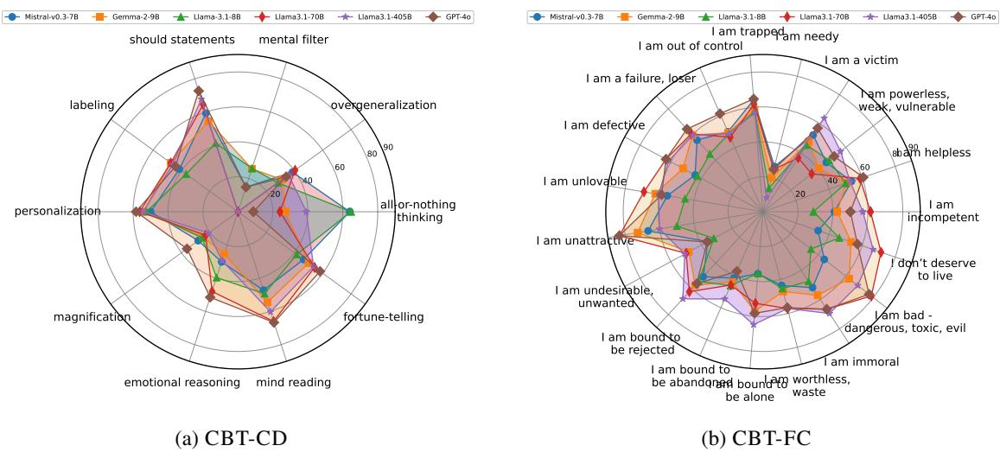

<table><tr><td rowspan="2">Model</td><td>CBT-QA</td><td colspan="3">CBT-CD</td><td colspan="3">CBT-PC</td><td colspan="3">CBT-FC</td></tr><tr><td>Accuracy</td><td>Precision</td><td>Recall</td><td>F1</td><td>Accuracy</td><td>Recall</td><td>F1</td><td>Accuracy</td><td>Recall</td><td>F1</td></tr><tr><td>Mistral-v0.3-7B</td><td>75.9</td><td>43.8</td><td>56.4</td><td>45.3</td><td>78.8</td><td>75.0</td><td>72.5</td><td>43.8</td><td>59.7</td><td>47.9</td></tr><tr><td>Gemma-2-9B</td><td>90.0</td><td>44.5</td><td>47.2</td><td>40.1</td><td>79.5</td><td>82.9</td><td>80.4</td><td>45.4</td><td>63.3</td><td>51.5</td></tr><tr><td>Llama-3.1-8B</td><td>78.2</td><td>39.7</td><td>59.9</td><td>44.1</td><td>75.2</td><td>93.9</td><td>82.5</td><td>37.0</td><td>62.8</td><td>44.8</td></tr><tr><td>Llama-3.1-70B</td><td>92.7</td><td>50.9</td><td>51.8</td><td>43.9</td><td>82.6</td><td>72.7</td><td>75.8</td><td>62.0</td><td>56.6</td><td>55.4</td></tr><tr><td>Llama-3.1-405B</td><td>95.0</td><td>49.4</td><td>44.2</td><td>43.3</td><td>85.3</td><td>70.1</td><td>75.3</td><td>53.1</td><td>68.7</td><td>58.2</td></tr><tr><td>GPT-40</td><td>94.1</td><td>55.8</td><td>52.0</td><td>43.9</td><td>80.2</td><td>77.6</td><td>78.4</td><td>54.5</td><td>62.1</td><td>56.7</td></tr><tr><td>Human</td><td>90.7</td><td>51.1</td><td>48.1</td><td>49.1</td><td>76.0</td><td>79.4</td><td>77.6</td><td>53.0</td><td>57.3</td><td>54.6</td></tr></table>

Table 5: Performance of LLMs on basic CBT knowledge acquisition (CBT-QA) and cognitive model understanding (CBT-CD, CBT-PC, and CBT-FC). The precision, recall, and F1 are averaged by class portion.

Figure 1: Detailed F1 scores of each label for CBT-CD and CBT-FC.
<table><tr><td>Exercise</td><td>1</td><td>2</td><td>3</td><td>4</td><td>5</td><td>6</td><td>7</td><td>8</td><td>9</td><td>10</td><td>Avg.</td></tr><tr><td>Llama-3.1-405B</td><td>0.07</td><td>0.06</td><td>0.21</td><td>-0.24</td><td>-0.19</td><td>0.00</td><td>0.18</td><td>-0.31</td><td>0.07</td><td>0.00</td><td>-0.01</td></tr><tr><td>Llama-3.1-8B</td><td>-0.21</td><td>-0.31</td><td>-0.47</td><td>-0.29</td><td>-0.13</td><td>0.00</td><td>-0.35</td><td>0.00</td><td>-0.13</td><td>-0.33</td><td>-0.22</td></tr><tr><td>GPT-40</td><td>-0.50</td><td>-0.50</td><td>-0.13</td><td>-0.24</td><td>-0.31</td><td>-0.53</td><td>-0.06</td><td>-0.44</td><td>-0.13</td><td>-0.40</td><td>-0.32</td></tr></table>

Table 6: Overall rating: pairwise comparison of different models vs. reference across ten exercises.

The full annotation consists of 468 pairwise comparisons across all models, with each instance requiring approximately 3 minutes for the expert to finish. Given the expert’s rate of \$60 per hour, the annotation process takes around 24 hours to complete, resulting in a significant cost. We first have our expert co-author annotate a sample and write explanations of scoring. Then, we hired another expert to finish the annotation of all data following the guidance of our co-author (Appendix H for our annotation interface).

## 5.3 Overall Result and Analysis

Here we first report the overall pairwise comparison results between each LLM vs. reference on 10 exercise categories in Table 6. Notably, the average results show that all three LLMs still lag behind humans by a significant margin, with Llama-3.1-405B achieving the best result while GPT-4o is the worst. Moreover, Llama-3.1-8B and GPT-4o never surpass human-written references in every single class of exercise, while Llama-3.1-405B shows some superior results in half of the exercise categories. Further insights reveal that Llama-3.1-405B is better because it keeps engaging the client and asking pertinent questions to guide them, but GPT-4o tends to correct the client’s statement and keeps using professional CBT terminology to challenge the client. And Llama-3.1-8B lies in the middle. Although this might be improved by adding additional limits in the prompt, we believe the current prompt starting with "you are a professional therapist using cognitive-behavioral therapy (CBT) in a session with a client." should already inform the model about its role. The complete prompt can be found in Table 22. We also draw the win-tie-loss figure in Appendix F.

<table><tr><td>Statement</td><td>[Frustrated] I know I said I would go to the event and start a conversation with new people, but I only managed to say “hello&quot; to one person.</td></tr><tr><td>Llama-3.1-405B</td><td>It sounds like you&#x27;re feeling disappointed with yourself for not meeting your own expectations. Can we take a closer look at what held you back from starting more conversations? Was it anxiety, fear of rejection, or something else? Let&#x27;s break it down and identify some smaller, achievable steps for next time.</td></tr><tr><td>Human Reference</td><td>It seems like you might be a bit disappointed by this, but I see this as significant progress. It was a big accomplishment to show up to the event in the first place and then say hello to someone you don&#x27;t know. Let&#x27;s talk about what that was like.</td></tr></table>

Table 7: Beginner exercise example: comparison between Llama-3.1-405B and human reference responses. The former is more structured, while the latter provides more emotional support.

Next, we discuss the overall score categorized by difficulty level in Figure 2. Surprisingly, we find that the models generally perform better when the difficulty level increases. Using Llama-3.1- 405B as an example, we observe that the model’s responses tend to be structured and rigid, often following a pattern such as repeating the client’s statement, questioning reasons, and proposing possibilities. In contrast, human reference responses are more effective in affirming the patient’s feelings and thoughts, and providing guidancefrom the patient’s perspective with a high degree of empathy and flexibility, thereby establishing trust and rapport. At the beginner level, tasks tend to be logically simpler and more empathy-focused; consequently, model-generated answers are rated lower, as shown in Table 7.

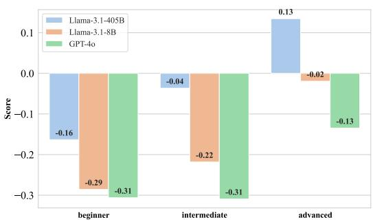  
Figure 2: The overall pairwise comparison of different models vs. reference across difficulty level.

In addition, Table 8 shows the models’ scores across 4 different criteria (C1-4) for exercises 2 (full results for all exercises in Appendix E). Apart from the overall rating, these criteria give finegrained insights into the model’s performance. We saw mixed results from the evaluation of exercise 2 (Establishing Goals). For example, in the comparison in appendix Table 24, criteria 1 is “Suggest CBT-consistent goals and tasks that align with an individualized CBT case formulation” and criteria 4 is “Emphasize concrete, actionable, and measurable goals”. The human reference is much better in Criteria 1 and slightly worse in Criteria 4. Indeed, the model provides concrete and actionable suggestions (aligns with criteria 4) while the reference focuses on CBT case formulation (aligns with criteria 1). However, for exercise 10 (Responding to Client Resistance), all criteria witness negative results on all models (see Appendix E), consistent with the overall rating. The reason can be summarized as the models tend to dismiss the clients’ experience and challenge their resistance rather than being responsive to patient needs as human therapists. We show two such examples in appendix Table 25 and 26, clearly showing that the model tends to challenge the client while humans always respect clients’ autonomy.

<table><tr><td rowspan="2">#Exe.</td><td rowspan="2">Metric</td><td colspan="3">Model Results</td></tr><tr><td>Llama-3.1-405B</td><td>Llama-3.1-8B</td><td>GPT-40</td></tr><tr><td rowspan="4">2</td><td>C1</td><td>0.34</td><td>-0.25</td><td>0.25</td></tr><tr><td>C2</td><td>0.06</td><td>0.13</td><td>-0.25</td></tr><tr><td>C3</td><td>-0.38</td><td>-0.13</td><td>-0.63</td></tr><tr><td>C4</td><td>0.56</td><td>0.13</td><td>0.81</td></tr></table>

Table 8: Results breakdown of 4 criteria on questions from exercise 2, reported with the average score.

We provide a typical example comparing model responses in Table 29. In this case, the client perceives the therapist’s suggestion of ‘little rewards’ as unreasonable. GPT-4o responds by directly using professional CBT terminology to correct the client’s perspective, which might make the client feel uncomfortable. Llama-3.1-8B also addresses the client’s perspective but does so in a more gentle tone, discussing the underlying reasons for the issue with the client. Llama-3.1-405B delivers the best response. It uses an analogy to help the client view ‘little rewards’ from a different perspective and suggests collaboratively exploring the reasons behind the client’s discomfort. This approach reduces the client’s resistance and fosters greater willingness to engage in self-exploration and selfchange.

## 6 Conclusion

In this paper, we propose a new benchmark, CBT-BENCH, to comprehensively evaluate the efficacy of assisting CBT with LLMs. CBT-BENCH contains three levels of tasks ranging from basic CBT knowledge acquisition to therapeutic response generation, totaling five new datasets constructed by domain experts. We experiment with representative LLMs and the results show that models achieve comparable or even better cognitive understanding ability, especially in QA tasks, but still lag behind humans in most generation tasks. We hope our new benchmark provides a meaningful testbed for future research in this area.

## 7 Limitations

In this work, we propose a set of novel tasks aimed at addressing key stages of CBT where LLMs could potentially assist professionals. We collaborated closely with domain experts to select tasks that are both important and challenging, and that are well-suited for AI enhancement. However, annotating datasets in highly specialized fields like mental health is very costly, which has limited the size of our datasets and constrained our ability to scale to additional tasks. There may be other stages in CBT that could also benefit from AI assistance, which we leave for future research. Additionally, for the level III task, we used deliberate practice as an effective proxy to evaluate performance, given the difficulty of acquiring real CBT session data due to privacy concerns. Bridging this gap by approximating real CBT sessions, while respecting ethical and privacy constraints, remains an important direction for future work.

## 8 Ethics Statement

IRB (Institutional Review Board) Approval. This project is approved by our Institutional Review Board (IRB). For all the data annotation and evaluation, we work with our co-authors (clinical psychologists, professors, and social workers) and hire experts from UpWork8. Experts are defined as those with a graduate degree in clinical psychology, social work, or other related majors and have received at least 5 hours of CBT training. We hired a total of 8 US-based experts, each at an hourly rate of \$60. For some experts, we agreed on a fixed payment based on an estimated completion time, calculated using the same hourly rate.

Informed Consent. All experts hired were 18 or older and provided informed consent (Check Appendix H for the consent forms). We did not assess any clinical outcomes. All data collected from the experts were de-identified and consented to be released for research purposes.

System and Data Usages. In this work, our primary goal is to systematically evaluate the capabilities of large language models (LLMs) in assisting Cognitive Behavioral Therapy (CBT) in order to provide insights for the future development of AIbased tools to support psychotherapy professionals. All data and systems developed in this work are intended exclusively for academic research purposes. They should not be used as real applications. We recognize the importance of human expertise and judgment in therapeutic settings and affirm that AI should be used to augment, not substitute, the essential role of trained professionals. Future developments of AI-based systems should not be used directly to interact with real patients without the supervision of professionals. We strongly advocate for rigorous ethical oversight in the deployment of AI-based systems in sensitive areas like mental health (see Appendix J for more discussion about ethics considerations). Furthermore, all data used in this study were either publicly available or collected with full transparency and consent, ensuring the privacy and confidentiality of individuals involved. All data collected from the experts were de-identified and consented to be released for research purposes.

## 9 Acknowledgment

We would like to thank Deborah J. Moon and Kate Hardy for providing CBT exam questions and useful discussions.

## References

Achini Adikari, Daswin De Silva, Harsha Moraliyage, Damminda Alahakoon, Jiahui Wong, Mathew Gancarz, Suja Chackochan, Bomi Park, Rachel Heo, and Yvonne Leung. 2022. Empathic conversational agents for real-time monitoring and co-facilitation of patient-centered healthcare. Future Generation Computer Systems, 126:318–329.

Aaron T Beck and Emily AP Haigh. 2014. Advances in cognitive theory and therapy: The generic cognitive model. Annual review ofclinical psychology, 10(1):1– 24.

Judith S Beck. 2020. Cognitive behavior therapy: Basics and beyond. Guilford Publications.

James F Boswell and Michael J Constantino. 2022. Deliberate practice in cognitive behavioral therapy. American Psychological Association.

Siyuan Chen, Mengyue Wu, Kenny Q Zhu, Kunyao Lan, Zhiling Zhang, and Lyuchun Cui. 2023a. LLMempowered chatbots for psychiatrist and patient simulation: Application and evaluation. arXiv [cs.CL].

Zhiyu Chen, Yujie Lu, and William Wang. 2023b. Empowering psychotherapy with large language models: Cognitive distortion detection through diagnosis of thought prompting. In Findings of the Association for Computational Linguistics: EMNLP 2023, pages 4295–4304.

Shuang Gao, Vince D Calhoun, and Jing Sui. 2018. Machine learning in major depression: From classification to treatment outcome prediction. CNS neuroscience & therapeutics, 24(11):1037–1052.

Gemma Team. 2024. Gemma 2: Improving open language models at a practical size. arXiv [cs.CL].

Declan Grabb, Max Lamparth, and Nina Vasan. 2024. Risks from language models for automated mental healthcare: Ethics and structure for implementation. arXiv [cs.CY].

Shang-Ling Hsu, Raj Sanjay Shah, Prathik Senthil, Zahra Ashktorab, Casey Dugan, Werner Geyer, and Diyi Yang. 2023. Helping the helper: Supporting peer counselors via ai-empowered practice and feedback. arXiv preprint arXiv:2305.08982.

Shaoxiong Ji, Tianlin Zhang, Kailai Yang, Sophia Ananiadou, and Erik Cambria. 2023. Rethinking large language models in mental health applications. arXiv [cs.CL].

Albert Q Jiang, Alexandre Sablayrolles, Arthur Mensch, Chris Bamford, Devendra Singh Chaplot, Diego de las Casas, Florian Bressand, Gianna Lengyel, Guillaume Lample, Lucile Saulnier, Lélio Renard Lavaud, Marie-Anne Lachaux, Pierre Stock, Teven Le Scao, Thibaut Lavril, Thomas Wang, Timothée Lacroix, and William El Sayed. 2023. Mistral 7B. arXiv [cs.CL].

Dae-Young Kim, Rebecca Hwa, and Muhammad Mahbubur Rahman. 2024. MhGPT: A lightweight generative pre-trained transformer for mental health text analysis. arXiv [cs.CL].

Willem Kuyken, Christine A Padesky, and Robert Dudley. 2011. Collaborative case conceptualization: Working effectively with clients in cognitivebehavioral therapy. Guilford Press.

June M Liu, Donghao Li, He Cao, Tianhe Ren, Zeyi Liao, and Jiamin Wu. 2023. ChatCounselor: A large language models for mental health support. arXiv [cs.CL].

Llama Team. 2024. The llama 3 herd of models. arXiv [cs.AI].

Ryan Louie, Ananjan Nandi, William Fang, Cheng Chang, Emma Brunskill, and Diyi Yang. 2024. Roleplay-doh: Enabling domain-experts to create LLM-simulated patients via eliciting and adhering to principles.

Mounica Maddela, Megan Ung, Jing Xu, Andrea Madotto, Heather Foran, and Y-Lan Boureau. 2023. Training models to generate, recognize, and reframe unhelpful thoughts. In Proceedings of the 61st Annual Meeting ofthe Associationfor Computational Linguistics (Volume 1: Long Papers), Stroudsburg, PA, USA. Association for Computational Linguistics.

Saskia Senn, ML Tlachac, Ricardo Flores, and Elke Rundensteiner. 2022. Ensembles of bert for depression classification. In 2022 44th Annual International Conference of the IEEE Engineering in Medicine & Biology Society (EMBC), pages 4691– 4694. IEEE.

Ashish Sharma, Inna W Lin, Adam S Miner, David C Atkins, and Tim Althoff. 2021. Towards facilitating empathic conversations in online mental health support: A reinforcement learning approach. In Proceedings of the Web Conference 2021, pages 194–205.

Ashish Sharma, Inna W Lin, Adam S Miner, David C Atkins, and Tim Althoff. 2023a. Human–ai collaboration enables more empathic conversations in textbased peer-to-peer mental health support. Nature Machine Intelligence, 5(1):46–57.

Ashish Sharma, Kevin Rushton, Inna Lin, David Wadden, Khendra Lucas, Adam Miner, Theresa Nguyen, and Tim Althoff. 2023b. Cognitive reframing of negative thoughts through human-language model interaction. In Proceedings ofthe 61st Annual Meeting ofthe Associationfor Computational Linguistics (Volume 1: Long Papers), Stroudsburg, PA, USA. Association for Computational Linguistics.

Ashish Sharma, Kevin Rushton, Inna Lin, David Wadden, Khendra Lucas, Adam Miner, Theresa Nguyen, and Tim Althoff. 2023c. Cognitive reframing of negative thoughts through human-language model interaction. In Proceedings of the 61st Annual Meeting of the Association for Computational Linguistics (Volume 1: Long Papers), pages 9977–10000.

Ashish Sharma, Kevin Rushton, Inna Wanyin Lin, Theresa Nguyen, and Tim Althoff. 2024. Facilitating self-guided mental health interventions through human-language model interaction: A case study of cognitive restructuring. In Proceedings of the CHI Conference on Human Factors in Computing Systems, volume 21, pages 1–29, New York, NY, USA. ACM.

Sagarika Shreevastava and Peter Foltz. 2021a. Detecting cognitive distortions from patient-therapist interactions. In Proceedings ofthe Seventh Workshop on Computational Linguistics and Clinical Psychology: Improving Access, Stroudsburg, PA, USA. Association for Computational Linguistics.

Sagarika Shreevastava and Peter Foltz. 2021b. Detecting cognitive distortions from patient-therapist interactions. In Proceedings of the Seventh Workshop on Computational Linguistics and Clinical Psychology: Improving Access, pages 151–158.

Bichen Wang, Pengfei Deng, Yanyan Zhao, and Bing Qin. 2023. C2D2 dataset: A resource for the cognitive distortion analysis and its impact on mental health. In Findings of the Association for Computational Linguistics: EMNLP 2023, pages 10149– 10160, Stroudsburg, PA, USA. Association for Computational Linguistics.

Ruiyi Wang, Stephanie Milani, Jamie C Chiu, Shaun M Eack, Travis Labrum, Samuel M Murphy, Nev Jones, Kate Hardy, Hong Shen, Fei Fang, et al. 2024. Patient- Psi : Using large language models to simulate patients for training mental health professionals. arXiv preprint arXiv:2405.19660.

Kailai Yang, Shaoxiong Ji, Tianlin Zhang, Qianqian Xie, Ziyan Kuang, and Sophia Ananiadou. 2023. Towards interpretable mental health analysis with large language models. arXiv [cs.CL].

Kailai Yang, Tianlin Zhang, Ziyan Kuang, Qianqian Xie, Jimin Huang, and Sophia Ananiadou. 2024. MentaL-LaMA: Interpretable mental health analysis on social media with large language models. In Proceedings of the ACM on Web Conference 2024, volume 35 of WWW ’24, page 4489–4500. ACM.

<table><tr><td>Belief</td><td>#Label Definition</td><td></td></tr><tr><td>all-or-nothing thinking 65</td><td></td><td>Also called black-and-white, polarized, or dichotomous thinking. You view a situation in only two categories instead of on a continuum.</td></tr><tr><td>mind reading</td><td>47</td><td>You believe you know what others are thinking, failing to consider other, more likely possibilities.</td></tr><tr><td>fortune-telling</td><td>44</td><td>Also called fortune-telling. You predict the future negatively without considering other, more likely outcomes.</td></tr><tr><td>personalization</td><td>42</td><td>You believe others are behaving negatively because of you, without considering more plausible explanations for their behavior.</td></tr><tr><td>emotional reasoning</td><td>36</td><td>You think something must be true because you “feel&quot; (actually believe) it so strongly, ignoring or discounting evidence to the contrary.</td></tr><tr><td>overgeneralization</td><td>32</td><td>You make a sweeping negative conclusion that goes far beyond the current situation.</td></tr><tr><td>labeling</td><td>29</td><td>You put a fixed, global label on yourself or others without considering that the evidence might more reasonably lead to a less extreme conclusion.</td></tr><tr><td>should statements</td><td>28</td><td>Also called imperatives. You have a precise, fixed idea of how you or others should behave, and you overestimate how bad it is that these expectations are not met.</td></tr><tr><td>magnification</td><td>25</td><td>When you evaluate yourself, another person, or a situation, you unreasonably magnify the negative and/or minimize the positive.</td></tr><tr><td>mental filter</td><td>21</td><td>Also called selective abstraction. You pay undue attention to one negative detail instead of seeing the whole picture.</td></tr></table>

Table 9: Label distribution and definitions of CBT-CD.

<table><tr><td>Primary Belief #Label Definition</td><td></td><td></td></tr><tr><td>helpless</td><td>162</td><td>being ineffective—in getting things done, self-protection, and/or measuring up to others</td></tr><tr><td>unlovable</td><td>101</td><td>having personal qualities resulting in an inability to get or maintain love and intimacy from others</td></tr><tr><td>worthless</td><td>81</td><td>being an immoral sinner or dangerous to others</td></tr></table>

Table 10: Label distribution and definitions of CBT-PC.

Table 11: Label distribution of CBT-FC.
<table><tr><td>Primary Core Belief Fine-grained Core Belief</td><td></td><td>#Label</td></tr><tr><td rowspan="9">helpless</td><td>I am incompetent</td><td>16</td></tr><tr><td>I am helpless</td><td>36</td></tr><tr><td>I am powerless, weak, vulnerable 38</td><td></td></tr><tr><td>I am a victim</td><td>29</td></tr><tr><td>I am needy</td><td>5</td></tr><tr><td>I am trapped</td><td>28</td></tr><tr><td>I am out of control</td><td>22</td></tr><tr><td>I am a failure, loser</td><td>22</td></tr><tr><td>I am defective</td><td>31</td></tr><tr><td rowspan="6">unlovable</td><td>I am unlovable</td><td>25</td></tr><tr><td>I am unattractive</td><td>6</td></tr><tr><td>I am undesirable, unwanted</td><td>27</td></tr><tr><td>I am bound to be rejected</td><td>29</td></tr><tr><td>I am bound to be abandoned</td><td>24</td></tr><tr><td>I am bound to be alone</td><td>21</td></tr><tr><td rowspan="4">worthless</td><td>I am worthless, waste</td><td>31</td></tr><tr><td>I am immoral</td><td>10</td></tr><tr><td>I am bad - dangerous, toxic, evil 14</td><td></td></tr><tr><td>I don&#x27;t deserve to live</td><td>8</td></tr></table>

Table 12: Statistics of CBT-DP.
<table><tr><td>Category</td><td></td><td></td><td>#Exercise #Beginner #Intermediate #Advanced</td><td></td></tr><tr><td>Explaining the Treatment Rationale for Cognitive Behavioral Therapy 14</td><td></td><td>4</td><td>6</td><td>4</td></tr><tr><td>Establishing Goals</td><td>16</td><td>5</td><td>6</td><td>5</td></tr><tr><td>Negotiating a Session Agenda</td><td>15</td><td>5</td><td>5</td><td>5</td></tr><tr><td>Assigning and Reviewing Between-Session Activities</td><td>15</td><td>5</td><td>7</td><td>5</td></tr><tr><td>Working With Cognitions</td><td>16</td><td>5</td><td>5</td><td>6</td></tr><tr><td>Working With Behaviors</td><td>15</td><td>5</td><td>5</td><td>5</td></tr><tr><td>Working With Emotions</td><td>17</td><td>5</td><td>5</td><td>7</td></tr><tr><td>Adherence Flexibility</td><td>16</td><td>5</td><td>6</td><td>5</td></tr><tr><td>Responding to Therapeutic Alliance Ruptures</td><td>15</td><td>5</td><td>5</td><td>5</td></tr><tr><td>Responding to Client Resistance</td><td>15</td><td>5</td><td>5</td><td>5</td></tr><tr><td>All</td><td>156</td><td>49</td><td>55</td><td>52</td></tr></table>

<table><tr><td>Category</td><td>Criteria</td></tr><tr><td>Explaining the Treatment Rationale for Cognitive Behavioral Therapy</td><td>Criteria 1: Validate the client&#x27;s experience, Criteria 2: Explain the logic of how CBT can be used to address concerns, Criteria 3: Instill hope for using CBT effectively, Criteria 4: Set appropriate expectations for the nature and impact of CBT</td></tr><tr><td>Establishing Goals</td><td>Criteria 1: Suggest CBT-consistent goals and tasks that align with an individualized CBT case formulation, Criteria 2: Invite the client&#x27;s input on and agreement with the goals and tasks, Criteria 3: Demonstrate flexibility,</td></tr><tr><td>Negotiating a Session Agenda</td><td>Criteria 1: Suggest a CBT-consistent agenda that aligns with the CBT case formulation, Criteria 2: Invite the client&#x27;s input on and agreement with the agenda, Criteria 3: Demonstrate flexibility, Criteria 4: Maintain some degree of frame or structure (i.e., the agenda can shift, but generally maintain a more or less explicit attempt to delineate expectations for session</td></tr><tr><td>Assigning and Reviewing Between-Session Activities</td><td>Criteria 1: Provide a basic rationale for the homework assignment, Criteria 2: Tailor the homework assignment to the client&#x27;s concerns and needs, Criteria 3: Ensure that there is adequate agreement on and understanding of the homework assignment, Criteria 4: Encourage and validate good-faith efforts</td></tr><tr><td>Working With Cognitions</td><td>Criteria 1: Encourage and facilitate client self-reflection on thoughts and beliefs, Criteria 2: Maintain an open, exploratory stance, Criteria 3: Orient the client&#x27;s attention to thoughts or connections between thoughts and other experiences, Criteria 4: Emphasize cognitive flexibility, rather than simple thought replacement,</td></tr><tr><td>Working With Behaviors</td><td>Criteria 1: Maintain a collaborative and curious stance, Criteria 2: Be clear when suggesting a plan of action and expectations, Criteria 3: Be positive and supportive of both big and small positive changes, Criteria 4: Appeal to relevant core learning concepts, including conditioning, reinforcement, the importance of environment, antecedents, and consequences</td></tr><tr><td>Working With Emotions</td><td>Criteria 1: Empathically inquire about clients&#x27; emotional experience, Criteria 2: Actively listen and maintain a supportive tone to clients’ emotional disclosures, Criteria 3: Model tolerance of affect and an approach orientation to clients&#x27;strong emotional experience, Criteria 4: Use psychoeducation to support the importance of clients experiencing versus avoiding their emotion and the maladaptive consequences of negative</td></tr><tr><td>Adherence Flexibility</td><td>Criteria 1: Maintain a collaborative and transparent stance, Criteria 2: Demonstrate empathy, Criteria 3: Demonstrate openness to explore before determining if a modification is indeed warranted, Criteria 4: Maintain consistency with a broad CBT orientation</td></tr><tr><td>Responding to Therapeutic Alliance Ruptures</td><td>Criteria 1: Momentarily step away from the CBT change agenda, Criteria 2: Warmly invite the client to discuss their subjective experience, Criteria 3: Empathize with the client&#x27;s thoughts and feelings and invite further disclosure of unhelpful or invalidating occurrences, Criteria 4: “Disarm&quot; the client&#x27;s negative affect toward you or CBT by finding some truth in their disclosures</td></tr><tr><td>Responding to Client Resistance</td><td>Criteria 1: Momentarily step away from the CBT change agenda, Criteria 2: Empathically explore the client&#x27;s experience of treatment and you, Criteria 3: Validate clients&#x27; experience and “roll with&quot; versus challenging their resistance, Criteria 4: Support clients&#x27; autonomy and elicit their motivation for pursuing valued directions</td></tr></table>

Table 13: Evaluation criteria of CBT-DP.

B Examples

<table><tr><td colspan="4" rowspan="1">Knowledge Types            Example QA Pairs from CBT-QA</td></tr><tr><td colspan="3" rowspan="1"></td><td colspan="1" rowspan="1">Intermediate beliefs consist of rules, attitudes, and conditional assumptions. Which of the following fits the best as an attitude?A. "Failing is bad", B. "I must not fail",C: "If I try, I will fail", D. "I am a failure"</td></tr><tr><td colspan="3" rowspan="1"></td><td colspan="1" rowspan="1">What type of cognitive error involves shrinking something to make it seem less important?A. Selective Abstraction, B. Mental filtering,C. Overgeneralization, D. Self-defeated thinking</td></tr><tr><td colspan="3" rowspan="1">Basic CBT knowledge and concepts</td><td colspan="1" rowspan="1">Which strategy should you employ the most often when you want a client to come to a new understanding?A. Guided discovery, B. Direct advice,C: Indirect advice, D. Disclosing what strategy works the best for you</td></tr><tr><td colspan="3" rowspan="2"></td><td colspan="1" rowspan="1"></td></tr><tr><td colspan="1" rowspan="1">CBT helps clients identify links between:A. Health, thoughts, B. Emotions, thoughts, decision-making,C: Thoughts, emotions, behavior, D. Antecedent, behavior, consequence</td></tr><tr><td colspan="3" rowspan="1"></td><td colspan="1" rowspan="1">How might a social worker use the principles of CBT approach when working with a client who is experiencing suicidal thoughts?A. By encouraging the client to suppress their thoughts and focus on positive affirmations,B. By providing temporary shelter and financial assistance to alleviate immediate stressors,C. By collaboratively identifying and challenging distorted thought patterns contributing to suicidal thoughtsD. No options align with any practices considered to be CBT</td></tr><tr><td colspan="3" rowspan="2">Practical CBT knowledge</td><td colspan="1" rowspan="1"></td></tr><tr><td colspan="1" rowspan="1">Early in treatment you advise clients that the way to get better is?A. By making small changes in their thinking and behaviors each day, B. By making large changes to their core beliefs,C. By gaining insight regarding their developmental history D. By changing their emotions</td></tr><tr><td colspan="3" rowspan="1"></td><td colspan="1" rowspan="1">When helping clients evaluate automatic thoughts, therapists should generally help clients evaluate which aspects of those thoughts?A. accuracy and/or intensity, B. intensity and/or utility,C. accuracy and/or utility</td></tr><tr><td colspan="3" rowspan="1"></td><td colspan="1" rowspan="1">Which of the following typically improve depressive symptoms (select all that apply)?A. Interpersonal interactions, B. Activities that have the potential for pleasure,C. Activities that have the potential for a sense of mastery, D. Repeatedly thinking about the reasons one is depressed</td></tr><tr><td colspan="3" rowspan="3">Case studies</td><td colspan="1" rowspan="1">A. Thought, B. Emotion,C. Physiological reaction/sensation, D. Feeling</td></tr><tr><td colspan="1" rowspan="1">A manager tells you (the therapist) that the new employee, who has been doing an excellent job, requested a meeting with him.The manager anticipates that the new employee plans to resign. Which is the best description of the manager's cognitive error?A. Thinking from an all-or-nothing perspective, B. Always thinking the worst will occur without considering positive outcomesC. Viewing only selected negative evidence while editing out positive aspects. D. Undervaluing the positive significance of an event</td></tr><tr><td colspan="1" rowspan="1">The client's mood has been improving since they've been attending treatment. They could attribute this improvement to many different things.Which of the below do you want them to attribute it to the most?A. The positive changes they have been making in their thinking and behaviors, B. The support their therapist has given themC. Events in their environment that have changed, D. The randomness of their mood</td></tr><tr><td colspan="3" rowspan="2"></td><td colspan="1" rowspan="1">Ms. T. has a number of long-standing negative attitudes such as "I'll never succeed" and "I have to be perfect to be accepted.No matter how hard she tries she always seems to think that she is "not measuring up."What cognitive therapy procedures do you think might help her?A. Listing advantages and disadvantages, B. Breaking out,C. Listing schemas, D. Thought recording</td></tr><tr><td colspan="1" rowspan="1">A client says, "I don't feel like I'm doing a good job at work'What question can you ask next to start the downward arrow technique to identify their core belief?A. "How did your parents give feedback when you were younger?", B. "That's not true, you're a great worker!",C. "What are you worried that might mean?", D. "What is the evidence for and against this thought?'</td></tr><tr><td colspan="3" rowspan="6">Others</td><td colspan="1" rowspan="2">Among the following principles, which one does not align with the core values of social work practice?A. Respect for the inherent dignity and worth of every individual,B. Promotion of client self-determination and autonomy,C. Maintenance of strict neutrality and avoidance of taking sides,D. Commitment to social justice and advocacy for marginalized populations</td></tr><tr><td colspan="1" rowspan="1">rality and avo</td></tr><tr><td colspan="1" rowspan="1">Which of the following best describes the collaborative nature of a client and a therapist in social work practice?A. The therapist provides solutions to the client's problems without considering the client's perspective,B. The therapist and client work together as partners to identify goals and develop strategies for change,C. The therapist imposes their own values and beliefs onto the client without discussion,D. The therapist directs the client's treatment without input or collaboration from the client</td></tr><tr><td colspan="1" rowspan="1">In the field of social work, what is the primary goal of intervention?A. Providing financial assistance to individuals in need,B. Offering temporary shelter to homeless populations,C. Enhancing the well-being and social functioning of individuals, families, and communities,D. Administering psychological assessments to diagnose mental health disorders</td></tr><tr><td colspan="1" rowspan="1">A social worker needs to address the specific needs of oppressed populations, such as marginalized racial and ethnic groupsWhat would be the best approach through a CBT framework?A. Allowing others in the community to take part and take the lead. Mainly because as social workers we should allow others to take charge,B. By encouraging clients to conform to dominant cultural norms to reduce societal backlash,C. By validating that such issues and problems exist, and then seeing if your agency has any funding to help purchase food for families impacted,D. By validating clients' experiences of discrimination and integrating culturally sensitive interventions</td></tr><tr><td colspan="1" rowspan="1">How might therapists incorporate LGBTQ-affirmative approaches to address the unique challenges faced by LGBTQ individuals?A. By avoiding discussions about clients' LGBTQ identities to focus solely on symptom management,B. By validating the identities of LGBTQ-identified individuals through demonstrating acceptance and affirming their experiences,C. By challenging clients' LGBTQ identity as a potential cause of their mental health struggles,D. By encouraging clients to suppress their LGBTQ identity to avoid social stigma</td></tr><tr><td>Inputs</td><td colspan="4">Labels</td></tr><tr><td>Situation: I have been with my girlfriend for 5 years and we have a history overgeneralization; labeling of a strong sexual intimacy connection. This has been getting worse over time. Thoughts: It is my girlfriend's sex drive that is the problem.</td><td colspan="4"></td></tr><tr><td>Situation: I am struggling at the moment and yet I am aware that I should be should statements; emotional reasoning feeling good. Thoughts: What I am feeling and going through are unacceptable and wrong. There is a right and wrong way to go through this and I am doing it the wrong way.</td><td colspan="4"></td></tr><tr><td>Situation: The individual has recently discovered that their mom has cheated on all-or-nothing thinking; overgeneraliza- their dad four times in the past. Each time, the parents attended counseling, where tion; emotional reasoning the mom initially denied her infidelity but eventually admitted to it, blaming their dad for not meeting her needs. Thoughts: I cannot trust anyone, why is everyone a liar. My mom has betrayed me. Of course something like this is happening to me, it only happens to me.</td><td colspan="4"></td></tr><tr><td>Situation: I experienced a recent setback with my OCD symptoms that had been all-or-nothing thinking; magnification in remission Thoughts: I have no longer won the battle against my OCD</td><td colspan="4"></td></tr><tr><td>Situation: My anxiety used to be worse a couple of years ago, but now im just overgeneralization; emotional reasoning; paranoid. Im always thinking that people think im a loser, and I wont leave the mind reading house without makeup, because i am horrified about what other people think about me. Thoughts: Because my anxiety felt worse before, this must be a normal level of anxiety and paranoia, so my conclusions make more sense. People do think I'm a loser or that I'm ugly. I at least wear makeup so they can't see how ugly I am, and if I avoid people altogether, then they won't know how much of a loser I am or how boring I am. I don't like who I am, and whatever people think of me is probably way worse than I think it is.</td><td colspan="4"></td></tr></table>

Table 14: Example QA pairs of CBT-QA.

Table 15: Examples from CBT-CD (Cognitive Distortion Classification).

# (TRADITIONAL) COGNITIVE CONCEPTUALIZATION DIAGRAM EXAMPLE

Name:

Date:

Diagnosis:

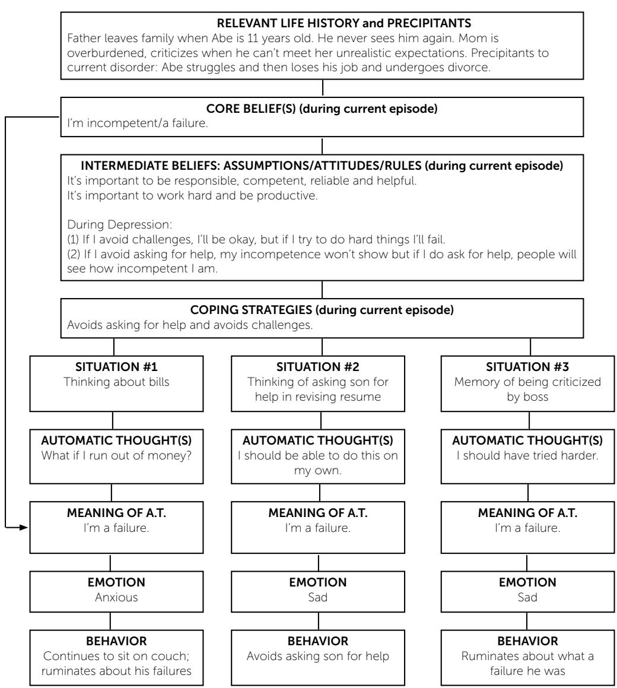  
© 2018. Adapted from J. Beck (2020) Cognitive Behavior Therapy: Basics and Beyond, 3rd edition.  
Beck Institute for Cognitive Behavior Therapy • One Belmont Ave, Suite 700 • Bala Cynwyd, PA 19004 • beckinstitute.org

Figure 3: An example cognitive model from Beck (2020).

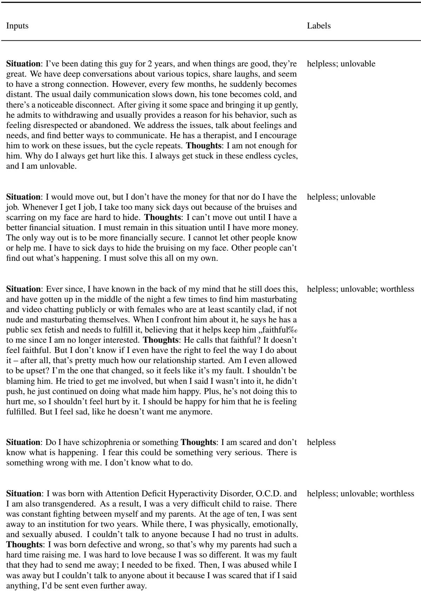  
Table 16: Examples from CBT-PC (Primary Core Belief Classification).

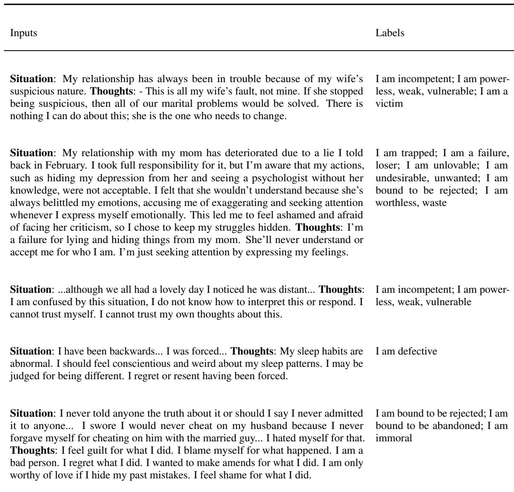  
Table 17: Examples from CBT-FC (Fine-grained Core Belief Classification).

## C Task Prompts

<table><tr><td>You are taking a CBT exam and doing multiple-choice questions. Each question has only one right choice. Which core principle underlies Cognitive Behavioral Therapy?</td></tr><tr><td>a: Acceptance and Commitment</td></tr><tr><td>b: Mindfulness</td></tr><tr><td>c: The influence of desires</td></tr><tr><td>d: The interconnection between thoughts, feelings, and behaviors</td></tr><tr><td>Answer:</td></tr><tr><td>Please only output the letter corresponding to the choice.</td></tr></table>

Table 18: Prompt example for CBT Exam $\mathrm { Q A }$

<table><tr><td>You are a CBT therapist and now need to determine the cognitive distortions of a patient from his current situation and thoughts. Each patient may have **up to  $_ { 3 ^ { * * } }$  distortions.</td></tr><tr><td>Situation: I&#x27;m depressed but nobody knows it. I do not have any friends. This started at age 11.</td></tr><tr><td>Thoughts: I cannot make friends and have no one to hang out with. Therefore, I am always going to be alone and depressed.</td></tr><tr><td>Question: what distortions this patient has?</td></tr><tr><td>Choices:</td></tr><tr><td>a: all-or-nothing thinking</td></tr><tr><td>b: overgeneralization</td></tr><tr><td>c: mental filter</td></tr><tr><td>d: should statements</td></tr><tr><td>e: labeling</td></tr><tr><td>f: personalization</td></tr><tr><td>g: magnification</td></tr><tr><td>h: emotional reasoning</td></tr><tr><td>i: mind reading</td></tr><tr><td>j: fortune-telling</td></tr><tr><td>Answer:</td></tr><tr><td>Please only output the letters corresponding to the choices. Multiple choices should be separated by a comma.</td></tr></table>

Table 19: Prompt example for Cognitive Distortion Classification.

<table><tr><td>You are a CBT therapist and now need to determine the major core beliefs of a patient from his current situation and thoughts. Each patient may have multiple core beliefs.</td></tr><tr><td>Situation: I have a history of being hurt in relationships so decided to take a break from dating. I am now in a relationship but keep hurting him and taking everything out on him.</td></tr><tr><td>Thoughts: I am hurting my boyfriend because I have been hurt in the past. I have so many problems.</td></tr><tr><td>Question: what core beliefs this patient has?</td></tr><tr><td>a: helpless b: unlovable</td></tr><tr><td>c: worthless</td></tr><tr><td>Answer:</td></tr><tr><td>Please only output the letters corresponding to the choices. Multiple choices should be separated by a comma.</td></tr></table>

Table 20: Prompt example for Primary Core Belief Classification.

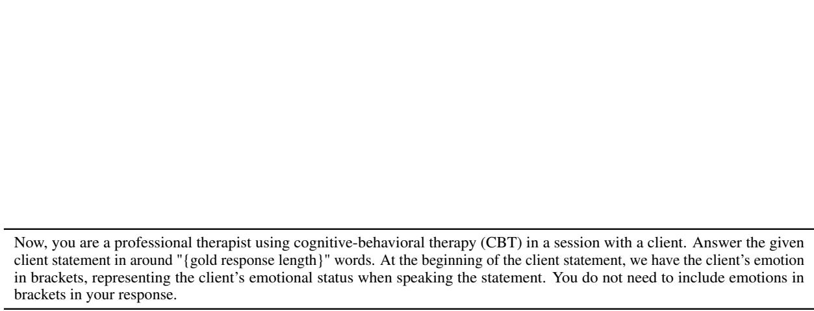

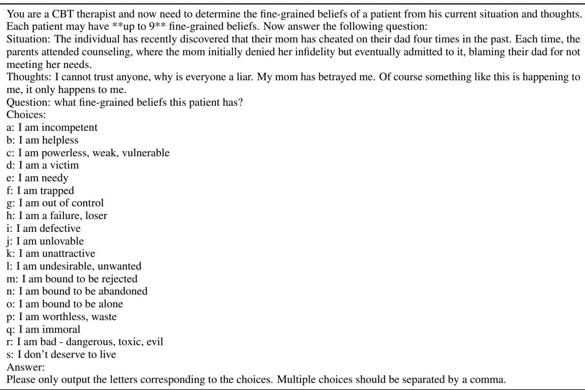  
Table 21: Prompt example for Fine-grained Core Belief Classification.  
Table 22: Prompt example for Therapeutic Response Generation.

## D Detailed Model Performance

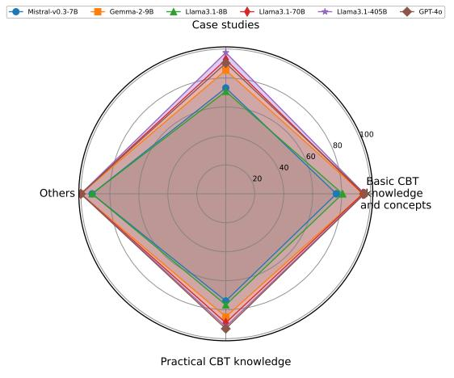  
(a) CBT-QA

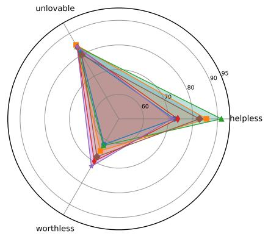  
(b) CBT-PC  
Figure 4: Detailed accuracies on different types of knowledge for CBT-QA and the F1 score of each label for CBT-PC.

## E Performance Breakdown by Criteria and Exercise

Here we show the breakdown of model performance under 4 criteria on 10 exercises in Table 23. It is noticeable that all models achieve negative results under four criteria on questions from exercise 10.
<table><tr><td>Exercise</td><td>Criteria</td><td>Llama-3.1-405B vs. ref</td><td>Llama-3.1-8B vs. ref</td><td>GPT-4o vs. ref</td></tr><tr><td rowspan="4">Exercise 1</td><td>Criteria 1</td><td>0.00</td><td>-0.36</td><td>-0.64</td></tr><tr><td>Criteria 2</td><td>0.64</td><td>0.79</td><td>0.93</td></tr><tr><td>Criteria 3</td><td>0.36</td><td>0.36</td><td>0.43</td></tr><tr><td>Criteria 4</td><td>0.50</td><td>0.43</td><td>0.29</td></tr><tr><td rowspan="4">Exercise 2</td><td>Criteria 1</td><td>0.34</td><td>-0.25</td><td>0.25</td></tr><tr><td>Criteria 2</td><td>0.06</td><td>0.13</td><td>-0.25</td></tr><tr><td>Criteria 3</td><td>-0.38</td><td>-0.13</td><td>-0.63</td></tr><tr><td>Criteria 4</td><td>0.56</td><td>0.13</td><td>0.81</td></tr><tr><td rowspan="4">Exercise 3</td><td>Criteria 1</td><td>0.00</td><td>-0.40</td><td>-0.53</td></tr><tr><td>Criteria 2</td><td>0.07</td><td>-0.27</td><td>-0.27</td></tr><tr><td>Criteria 3</td><td>0.07</td><td>-0.07</td><td>0.13</td></tr><tr><td>Criteria 4</td><td>-0.33</td><td>-0.33</td><td>-0.20</td></tr><tr><td rowspan="4">Exercise 4</td><td>Criteria 1</td><td>-0.06</td><td>-0.53</td><td>0.24</td></tr><tr><td>Criteria 2</td><td>-0.29</td><td>-0.47</td><td>0.12</td></tr><tr><td>Criteria 3</td><td>-0.18</td><td>-0.18</td><td>-0.41</td></tr><tr><td>Criteria 4</td><td>-0.12</td><td>-0.47</td><td>0.00</td></tr><tr><td rowspan="4">Exercise 5</td><td>Criteria 1</td><td>-0.06</td><td>0.00</td><td>-0.44</td></tr><tr><td>Criteria 2</td><td>-0.31</td><td>-0.44</td><td>-0.50</td></tr><tr><td>Criteria 3</td><td>0.25</td><td>0.63</td><td>0.00</td></tr><tr><td>Criteria 4</td><td>0.06</td><td>-0.19</td><td>0.06</td></tr><tr><td rowspan="4">Exercise 6</td><td>Criteria 1</td><td>0.13</td><td>0.33</td><td>-0.40</td></tr><tr><td>Criteria 2</td><td>0.20</td><td>-0.20</td><td>0.13</td></tr><tr><td>Criteria 3</td><td>-0.07</td><td>0.00</td><td>0.13</td></tr><tr><td>Criteria 4</td><td>-0.13</td><td>-0.33</td><td>-0.07</td></tr><tr><td rowspan="4">Exercise 7</td><td>Criteria 1</td><td>0.41</td><td>0.18</td><td>0.06</td></tr><tr><td>Criteria 2</td><td>-0.12</td><td>0.00</td><td>-0.18</td></tr><tr><td>Criteria 3</td><td>0.00</td><td>-0.35</td><td>-0.29</td></tr><tr><td>Criteria 4</td><td>-0.06</td><td>0.12</td><td>0.24</td></tr><tr><td rowspan="4">Exercise 8</td><td>Criteria 1</td><td>-0.06</td><td>0.06</td><td>-0.25</td></tr><tr><td>Criteria 2</td><td>-0.56</td><td>0.38</td><td>-0.06</td></tr><tr><td>Criteria 3</td><td>0.06</td><td>0.38</td><td>-0.25</td></tr><tr><td>Criteria 4</td><td>0.25</td><td>0.13</td><td>0.00</td></tr><tr><td rowspan="4">Exercise 9</td><td>Criteria 1</td><td>0.07</td><td>-0.53</td><td>-0.40</td></tr><tr><td>Criteria 2</td><td>0.07</td><td>0.13</td><td>-0.13</td></tr><tr><td>Criteria 3</td><td>-0.27</td><td>-0.13</td><td>-0.53</td></tr><tr><td>Criteria 4</td><td>-0.60</td><td>-0.73</td><td>-0.33</td></tr><tr><td rowspan="4">Exercise 10</td><td>Criteria 1</td><td>-0.27</td><td>-0.53</td><td>-0.60</td></tr><tr><td>Criteria 2</td><td>-0.20</td><td>-0.33</td><td>-0.60</td></tr><tr><td>Criteria 3</td><td>-0.07</td><td>-0.47</td><td>-0.47</td></tr><tr><td>Criteria 4</td><td>-0.07</td><td>-0.47</td><td>-0.33</td></tr></table>

Table 23: All model vs. ref (reference) results under 4 criteria on 10 exercises.

<table><tr><td>Client Statement</td><td>[Agitated] Honestly, my main problem is my partner.</td></tr><tr><td>Llama-3.1-8B</td><td>Let&#x27;s break that down. It sounds like you&#x27;re feeling frustrated with your partner. Can you tell me more about what specifically is causing you distress in your relationship? What are some specific issues or behaviors that you&#x27;d like to work on or change?</td></tr><tr><td>Human Reference</td><td>I&#x27;d like to hear more details about that. If relationship issues are most concerning to you, we can focus our work on that area. In our individual work together, we&#x27;ll need to focus on things that you can change. Part of our session today can be brainstorming what some of those things might be.</td></tr></table>

Table 24: Exercise 2 example: comparison between model and reference.

<table><tr><td rowspan=1 colspan=1>Client Statement</td><td rowspan=1 colspan=1>[Frustrated] I don&#x27;t like it when you ask me if I have “catastrophic thoughts.&quot;Aren&#x27;t catastrophes reserved for wars and natural disasters? So, no, I don&#x27;t thinkI catastrophize. Please don&#x27;t ask again.</td><td rowspan=1 colspan=1>Score</td></tr><tr><td rowspan=1 colspan=1>Llama-3.1-8B</td><td rowspan=1 colspan=1>I understand your frustration, and it&#x27;s valid to feel that way when we challengeyour thoughts. However, catastrophizing isn&#x27;t limited to wars and natural disas-ters; it&#x27;s a thought pattern where we exaggerate the consequences of a situation,making it seem more severe or overwhelming than it actually is. Can we explorewhat makes you uncomfortable about this concept, and how it relates to yourcurrent concerns?</td><td rowspan=1 colspan=1></td></tr><tr><td rowspan=1 colspan=1>Human Reference</td><td rowspan=1 colspan=1>It seems like my words upset you, and I totally get it. Here I am using a CBTterm that I assumed would be relevant you, when in fact it&#x27;s not. I really shouldnot have made that assumption, and I&#x27;ll do better to check in. In fact, I wonder ifyou find any part of focusing on your cognitions to be useful?</td><td rowspan=1 colspan=1></td></tr><tr><td rowspan=1 colspan=1>Criteria 1</td><td rowspan=1 colspan=1>Momentarily step away from the CBT change agenda</td><td rowspan=1 colspan=1>-1</td></tr><tr><td rowspan=1 colspan=1>Criteria 2</td><td rowspan=1 colspan=1>Empathically explore the client&#x27;s experience of treatment and you</td><td rowspan=1 colspan=1>-1</td></tr><tr><td rowspan=1 colspan=1>Criteria 3</td><td rowspan=1 colspan=1>Validate clients&#x27; experience and “roll with&quot; versus challenging their resistance</td><td rowspan=1 colspan=1>0</td></tr><tr><td rowspan=1 colspan=1>Criteria 4</td><td rowspan=1 colspan=1>Support clients&#x27;autonomy and elicit their motivation for pursuing valued direc-tions</td><td rowspan=1 colspan=1>-1</td></tr></table>

Table 25: Exercise 10 example: comparison between model and reference.

<table><tr><td rowspan=1 colspan=1>Client Statement</td><td rowspan=1 colspan=1>[Defeated] You know, I&#x27;ve felt a lot better these past few weeks, and I honestlywonder if it&#x27;s because I stopped doing those exercises you gave me. I mean,maybe writing down my thoughts and trying to relax is making me worse . .maybe this is just who I am, and this is the best that I can feel, and I just need tolearn to live with that.</td><td rowspan=1 colspan=1>Score</td></tr><tr><td rowspan=1 colspan=1>GPT-40</td><td rowspan=1 colspan=1>It sounds like you&#x27;re feeling quite discouraged right now. It&#x27;s great that you&#x27;vebeen feeling better, but it&#x27;s also important to consider if avoiding the exercisesmight have short-term relief but long-term consequences. Sometimes, initialresistance to new techniques is a part of the process. Could we explore if theremight be aspects of the exercises that could be adapted to better fit your needs?CBT works best with some trial and error, and finding what genuinely helps youlong-term is our goal.</td><td rowspan=1 colspan=1></td></tr><tr><td rowspan=1 colspan=1>Human Reference</td><td rowspan=1 colspan=1>I can hear in your voice how painful it is to feel like this might be the best youcan ever feel. And, it sounds like one of the major reasons you&#x27;re feeling thisway is that the exercises I&#x27;ve given you may be making things worse insteadof better. So, I want to say that different strategies work for different people,and there are all kinds of strategies that we can try to help you get to where youwould like to be. Can we discuss what that might look for you?</td><td rowspan=1 colspan=1></td></tr><tr><td rowspan=1 colspan=1>Criteria 1</td><td rowspan=1 colspan=1>Momentarily step away from the CBT change agenda</td><td rowspan=1 colspan=1>0</td></tr><tr><td rowspan=1 colspan=1>Criteria 2</td><td rowspan=1 colspan=1>Empathically explore the client&#x27;s experience of treatment and you</td><td rowspan=1 colspan=1>-1</td></tr><tr><td rowspan=1 colspan=1>Criteria 3</td><td rowspan=1 colspan=1>Validate clients&#x27;experience and &quot;roll with&quot; versus challenging their resistance</td><td rowspan=1 colspan=1>-1</td></tr><tr><td rowspan=1 colspan=1>Criteria 4</td><td rowspan=1 colspan=1>Support clients&#x27; autonomy and elicit their motivation for pursuing valued direc-tions</td><td rowspan=1 colspan=1>-1</td></tr></table>

Table 26: Exercise 10 example: comparison between model and reference.

## F Win-tie-loss Analysis

In this section, we additionally provide the win-tie-loss results by difficulty level in Figure 5. For win-tieloss calculation, we consider results with positive scores such as scores 1 and 2 as win, negative scores such as -1, and -2 as loss, and score 0 as tie. It is clear that the model responses seldom win but usually tie with the reference, and the reference wins more often. This confirms that although the models can already provide useful CBT assistance compared with human experts, but still lag and need further improvements.

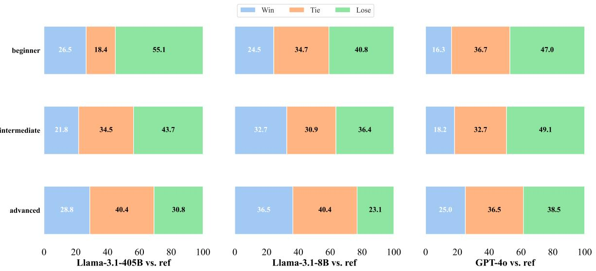  
Figure 5: The win-tie-loss comparison among different models on three difficulty levels.

<table><tr><td colspan="1" rowspan="1">Case</td><td colspan="1" rowspan="1">UnrecognizedDisorder</td><td colspan="1" rowspan="1">Reason</td></tr><tr><td colspan="1" rowspan="1">Situation: My anxiety used to be worse a couple of years ago,but now I'm just paranoid. I'm always thinking that peoplethink I'm a loser, and I won't leave the house without makeup,because I am horrified about what other people think about me.Thoughts: Because my anxiety felt worse before, this must be anormal level of anxiety and paranoia, so my conclusions makemore sense. People do think I'm a loser or that I'm ugly. I atleast wear makeup so they can't see how ugly I am, and if I avoidpeople altogether, then they won't know how much of a loserI am or how boring I am. I don't like who I am, and whateverpeople think of me is probably way worse than I think it is.</td><td colspan="1" rowspan="1">Overgeneralization</td><td colspan="1" rowspan="1">The model focuses on theclient's fear of judgment andanxiety in social situationsrather than recognizing the gen-eralized, negative self-beliefs in-dicated by "People do think I'ma loser or that I'm ugly".</td></tr><tr><td colspan="1" rowspan="1">Situation: It's all my fault most likely all I do is constantlyworry about everything. Thoughts: I should be able to controlothers around me, and when I can't, I cope with it by worrying.If someone is making decisions I disagree with, I should worry.There is something wrong with me that I can't control others. Iam doing everything wrong.</td><td colspan="1" rowspan="1">Should statements</td><td colspan="1" rowspan="1">The model fail to focus on theclient's statement "I should beable to control others aroundme", which is a clear indicatorof "Should statements" disorder.</td></tr><tr><td colspan="1" rowspan="1">Situation: I have been recently dealing with weird behavior...Ihave also been getting angry over small issues that should havelittle effect on me. But lately, it's been having huge effectson me...It may sound like I'm a brat... Thoughts: I am con-fused about what is happening...I need an explanation for thesechanges to my mood...I feel out of control...I cannot control mybehavior...my behavior and feelings are fused together...whatI'm feeling is wrong...</td><td colspan="1" rowspan="1">Mental filter</td><td colspan="1" rowspan="1">The client is experiencing thecomplexity of emotional dis-tress, which may cause the fea-ture of "Mental filter" beingoverlooked.</td></tr><tr><td colspan="1" rowspan="1">Case</td><td colspan="1" rowspan="1">Wrongly RecognizedDisorder</td><td colspan="1" rowspan="1">Reason</td></tr><tr><td colspan="1" rowspan="1">Situation: I have been with my girlfriend for 5 years and wehave a history of a strong sexual intimacy connection. This hasbeen getting worse over time. Thoughts: It is my girlfriend'ssex drive that is the problem.</td><td colspan="1" rowspan="1">Personalization</td><td colspan="1" rowspan="1">This client attributes the issuesolely to his girlfriend ratherthan examining internal or re-lational factors. The model'smisidentification as “personal-ization" (taking excessive per-sonal responsibility) could stemfrom misinterpreting the client'sstatements.</td></tr><tr><td colspan="1" rowspan="1">Situation: I am struggling at the moment and yet I am awarethat I should be feeling good. Thoughts: What I am feeling andgoing through is unacceptable and wrong. There is a right andwrong way to go through this and I am doing it the wrong way.</td><td colspan="1" rowspan="1">All-or-nothing thinking</td><td colspan="1" rowspan="1">The core issue lies more in self-judgment and difficulty accept-ing emotional experiences, notbinary thinking. The misidentifi-cation by the model could occurbecause both patterns involverigid judgments.</td></tr><tr><td colspan="1" rowspan="1">Situation: I am finding younger girls sexually arousing.Thoughts: I am worried about whether or not this will go awaylater in life, this is horrible, and I even feel guilty constantly, Icannot help it.</td><td colspan="1" rowspan="1">magnification</td><td colspan="1" rowspan="1">This patient is merely express-ing reasonable concerns basedon their current situation; it isrational and not an unjustifiedexaggeration. The misidentifica-tion by the model may causedby solely concentrating on theclient's negative statements.</td></tr><tr><td colspan="1" rowspan="1">Case</td><td colspan="1" rowspan="1">UnrecognizedCore Belief</td><td colspan="1" rowspan="1">Reason</td></tr><tr><td colspan="1" rowspan="1">Situation: She is everything I ever wanted in a woman and I amso happy to have her in my life. Unfortunately, I am not her firstin many things, if anything at all, and that is very hurtful anddistressing to me. Thoughts: If I'm not her first, she won't loveme forever. She will leave me because I'm not special to her.She is everything to me. If she leaves me, I will be nothing. Iwon't ever be able to find someone as amazing as she is. I thinkshe's lying to me about her virginity, which just means she isprobably lying about her feelings for me, too, and it's only amatter of time before she realizes it and leaves me.</td><td colspan="1" rowspan="1">I am needy</td><td colspan="1" rowspan="1">The model may have concen-trated on the client's suspicionsabout the partner's virginity andhonesty, viewing the issue as in-security or control, rather thanemotional dependency</td></tr><tr><td colspan="1" rowspan="1">Situation: I met this guy a month ago, and we hung out andkissed, but in front of his sister, he told me I was too young forhim and he only wanted to be friends. Now he supposedly hasa girl that he spends all his time with after work and he doesn'ttext me anymore. Thoughts: I don't deserve love. There issomething wrong with me. His new girl has something that Idon't; that's why he is spending time with her and not me. I willbe alone forever. I will always be rejected by everyone I careabout. Nobody likes me.</td><td colspan="1" rowspan="1">I am needy</td><td colspan="1" rowspan="1">The model may have interpretedthe client's thoughts as purelylow self-esteem or fear of rejec-tion, rather than recognizing theunderlying emotional need forconstant validation.</td></tr><tr><td colspan="1" rowspan="1">Situation: I have recently recovered from cancer, gained weight,and lack confidence in myself. I feel alone in my life. I stillwork but that is all there is. My wife and I get along but thereis no emotional closeness between us. I have no close friends.Thoughts: I am a loser. I am a failure. Something is wrong withme. My wife deserves better than me. My wife doesn't loveme anymore because I have gained weight. There is nothingenjoyable in my life, ever. There is absolutely nothing to lookforward to. Me and my wife NEVER connect. I am all alone.Nobody loves me. This will never get any better. There isnothing I can do about it. The world is against me and it's outof my hands. I am a waste of space. Maybe cancer should havekilled me.</td><td colspan="1" rowspan="1">I don't deserve to live</td><td colspan="1" rowspan="1">The model might have missedthe suicidal thoughts indicatedby the statements like "There isnothing enjoyable in my life"and "Maybe cancer should havekilled me".</td></tr><tr><td colspan="1" rowspan="1">Case</td><td colspan="1" rowspan="1">Wrongly RecognizedCore Belief</td><td colspan="1" rowspan="1">Reason</td></tr><tr><td colspan="1" rowspan="1">Situation: For the past 3 months I've been feeling really down,having mood swings, irritability – I have no reason to be and Ifeel like I'm going crazy and that I can't talk to anybody aboutthis because I'm being overly dramatic. Thoughts: Somethingis wrong with me. I am losing my mind. Nobody understandsme. Everyone would reject me if they knew.</td><td colspan="1" rowspan="1">I am helpless</td><td colspan="1" rowspan="1">The client's thought, "Nobodyunderstands me," suggests aneed for connection and vali-dation, which the model mighthave missed by emphasizinghelplessness.</td></tr><tr><td colspan="1" rowspan="1">Situation: When I go to the store, I believe that I hear peo-ple talking about me in their heads, as though I can hear theirthoughts. Thoughts: I am capable of hearing other people'sthoughts. People are talking to me in their heads. I am telepathic.I am certain of these things. Because I hear voices, they must becoming from other people.</td><td colspan="1" rowspan="1">I am out of control</td><td colspan="1" rowspan="1">The client's thoughts reflect con-viction (e.g., “"I am telepathic")rather than fear, indicating a be-lief in special abilities ratherthan being out of control. Themodel may not be very clearabout the difference between thetwo.</td></tr><tr><td colspan="1" rowspan="1">Situation: I have a problem of automatically looking at thingslike shiny objects or body parts. I don't have any bad intentionsbut people misunderstand me. Thoughts: This is something tobe ashamed of. I always do it. Something is wrong with me. Ican't stop looking at these things. People will reject me becauseof this habit. This habit is out of my control.</td><td colspan="1" rowspan="1">I am immoral</td><td colspan="1" rowspan="1">The client explicitly states theyhave no bad intentions, indicat-ing the issue is about loss of con-trol, not morality. The modelmay have neglected this infor-mation.</td></tr></table>

Table 27: Error Cases of Cognitive Disorder Classification. (Llama-3.1-405B)

Table 28: Error Cases of Fine-grained Core Belief Classification. (Llama-3.1-405B)

## H Data Annotation Details

We use Turkle9 to build our annotation interfaces. Figure 6, 7, 8, 9 shows our consent form presented to the annotators. Figure 10 and 11 show our annotation interface for level I and II tasks. Figure 12 shows our annotation interface for the evaluation of level III task.

## Consent Form

## Purpose of this Study

In this research, we aim to test large language models' ability to understand cognitive behavior therapy (CBT) knowledge in order to study their potential to assist mental health professionals. To achieve this goal, we need to construct benchmark datasets annotated by mental health professionals. The benchmark datasets will provide the ground truth information that we can use to test the large language model's ability.

## Procedures

## The data annotation procedure is as following:

1. We make job posts (including all the participant eligibility criteria, hiring process, data annotation instructions, consent form, and salary information) on UpWork, and receive proposals from workers. We will also advertise the UpWork job post via emailing our professional networks and social media, and encourage the potential participants to register on UpWork and submit proposals. We will instruct the participants to submit the signed consent form with the proposal.

2. Stage 1: Screening for eligibility: We will send 4 data annotation examples to the annotator to work on for at most one hour, as a screening. Then, based on the annotation quality, speed, and the annotator's own decision, we will make the decision for hiring. Regardless hiring or not, we will make a one-time payment of \$60 for this phase of participation. If we agree on the hiring, we will extend the contract for large-scale annotation. We propose a \$60 hourly rate. We will hire each annotator for at most 50 examples. The final payment or hourly rate, total hiring time, and weekly working time will be based on agreement with the annotator.

3. Stage 2: Official data annotation: After signing the contract, we start the official data annotation. We will send data batches to the worker to work on weekly based on our agreement of working load. The worker will follow the standard UpWork procedure to receive payments.

4. The annotation platform will be built using an open source software Turkle. We will build the platform on a secure server protected by credentials. We will instruct the workers how to use the platform and create their own user name and password to login to the platform (we will not be able to access their passwords on our side). Once they finish all the annotations and end the contract, we will delete all their account information in the platform.

Figure 6: Consent form page 1.

## Participant Requirements

1. Participants must be 18 years and older

2. Participants must be within the following background categories:

1. Psychologists: Doctor of Philosophy (Ph.D.) in a field of psychology or Doctor of Psychology (Psy.D.)

2. Counselors, Clinicians, Therapists: master's degree (M.S. or M.A.) in a mental health-related field such as psychology, counseling psychology, marriage or family therapy, among others.

3. Social Workers: master's degree in social work (MSW).

4. Certified Peer Specialists.

3. Participants must have received at least 5 hours of CBT training.

4. Participants must reside in the United States.

5. Participants must have the ability to sign the consent form

## Benefits

The annotated dataset from this study will be of tremendous value to the scientific research community and the community of mental health supporters. The dataset from this study will be used to train and evaluate Al systems, e.g., large language models, to automatically provide analysis of speech from people with mental health issues. Such Al systems have the potential to provide assistance for mental health supporters by automatically analyzing large amount of patient speech, so as to improve the therapy effectiveness and efficiency.

## Future Use of Information

In the future, once we have removed all identifiable information from your data, we may use the data for our future research studies, or we may distribute the data to other investigators for their research studies. We would do this without getting additional informed consent from you (or your legally authorized representative). Data sharing with other researchers will only be done in such a manner that you will not be identified

## Risks

We confirm that the risk to participants is minimal, no greater than their working environment of mental health support.

Figure 7: Consent form page 2.

1. We will use UpWork as our platform to hire workers and communicate throughout the study. UpWork - the third-party software has the policy to guarantee the protection of data privacy of the user, but we do not exclude the possibility of accidental disclosure of privacy data from the third-party software.

2. We use the open source software Turkle to build our annotation platform. The platform is deployed on a secure server. We will instruct the workers how to use the platform and create their own user name and password to login to the platform (The only information they will use for the platform is username and password, and we will not be able to access their passwords on our side). Once they finish all the annotations and end the contract, we will delete all their account information in the platform. However, we do not exclude the possibility of accidental disclosure of privacy data due to security accidents of servers.

3. The data source for annotation is speech from people with potential mental health issues. The risk to participants is minimal, no greater than their working environment of mental health support.

## Rights

Your participation is voluntary. You are free to stop your participation and end the contract at any point, We will issue the payments for the work you have already done based on our compensation protocol. Refusal to participate or withdrawal of your consent or discontinued participation in the study will not result in any penalty or loss of benefits or rights to which you might otherwise be entitled. The Principal Investigator may at his/her discretion remove you from the study for any of a number of reasons. In such an event, you will not suffer any penalty or loss of benefits or rights which you might otherwise be entitled.

## Confidentiality Assurance

The study will collect your research data through your use of UpWork. These companies are not owned by The companies will have access to the research data that you produce and any identifiable information that you share with them while using their product. Please note that does not control the Terms and Conditions of the companies or how they will use or protect any information that they collect.

## Data Storage and Access

All data will be stored in secure servers protected by credentials. Participants' identifiable information will be replaced with a unique and unidentifiable ID in all the codes, datasets, and documents throughout the research. All participants' data used for research usages and publication purposes will be anonymized, and make sure no information about the individuals

Figure 8: Consent form page 3.

can be re-identified via engineering. The final dataset to be released to the research community will not contain any identifiable information.

## Right to Ask Questions & Contact Information

If you have any questions about this study, you should feel free to ask them now. If you have questions later, desire additional information, or wish to withdraw your participation please contact the Principal Investigator by UpWork message channel.

If you have questions pertaining to your rights as a research participant; or to report concerns to this study, you should contact the Office of Research Integrity and Compliance at

## Voluntary Consent Confirmation

I confirm I am over 18 years old:  Yes  No

I confirm I am in the United States during this study:  Yes  No

I have read and understood this consent form:  Yes No

I agree to participate in the study:  Yes  No

I agree to be contacted by the study team in the future for a follow-up study:  Yes  No

Your signature below indicates your consent to participate. You will receive a copy of this form.

PRINT NAME:

SIGNATURE:

DATE:

Confirmation by Research Team

I confirm that I have explained the study to the participant and addressed all questions.

SIGNATURE OF RESEARCH TEAM MEMBER:

DATE:

Figure 9: Consent form page 4.

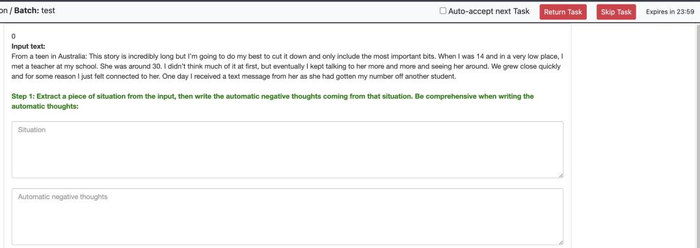  
Figure 10: Annotation interface of level II tasks.

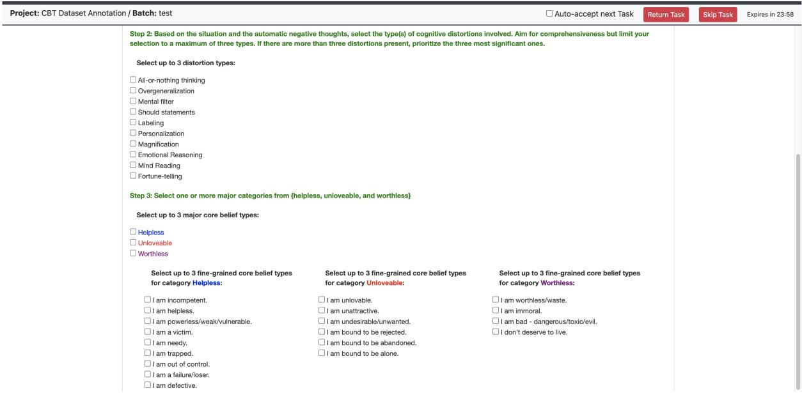  
Figure 11: Annotation interface of level II tasks.

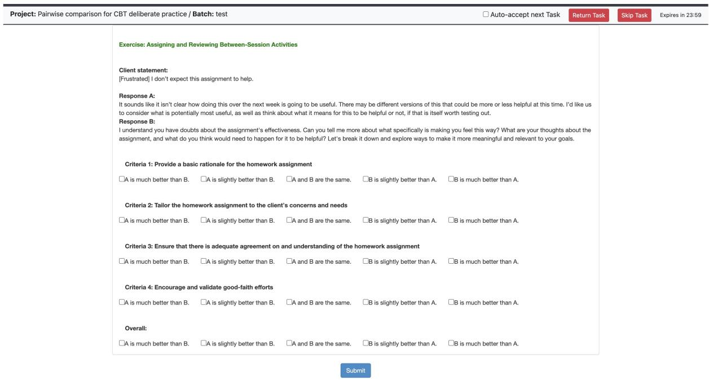  
Figure 12: Annotation interface of level III task evaluations.

## I Level III Case Study

<table><tr><td>Statement</td><td>You think I should set up some “little rewards&quot; to start feeling less depressed. That seems kind of embarrassing and infantilizing.</td></tr><tr><td>GPT-40</td><td>I understand it might feel that way at first, but these small rewards are about acknowledging your accomplishments and creating positive reinforcement. They&#x27;re designed to help you build momentum and foster a sense of achievement, which can gradually improve your mood and combat depression. Let&#x27;s find rewards that feel meaningful and respectful to you.</td></tr><tr><td>Llama3.1-8B</td><td>I understand your concern. In CBT, we often use small, achievable rewards to motivate and reinforce positive behaviors, but I can see how it might feel uncomfortable at first. Let&#x27;s explore this further: what specifically makes you feel embarrassed or infantilized by the idea of setting up rewards? Is it the idea of receiving something tangible, or something else entirely?</td></tr><tr><td>Llama3.1-405B</td><td>I understand your concern, but let&#x27;s reframe the idea of rewards. It&#x27;s not about treating yourself like a child, but about acknowledging and celebrating small achievements that can help build motivation and momentum. Think of it as a way to recognize your efforts and progress, rather than a childish reward system. Can we explore what kind of recognition or acknowledgment might feel more meaningful to you?</td></tr></table>

Table 29: Level III Case Study

## J Ethical Considerations

## The Role of AI in Supporting Mental Health Professionals:

• Augmentation Over Replacement: We will emphasize that AI tools are designed to augment the capabilities of mental health professionals, not to replace them. This includes examples of providing therapists with data-driven insights into patients’ speech, prompting suggestions for therapy responses, etc.

• Training and Integration: Specialized training is necessary for mental health professionals to effectively integrate AI tools into their practice, ensuring they are equipped to use these technologies ethically and effectively.

## Safeguards Against Direct Interaction Without Supervision:

• Supervised Deployment Models: For application development regulations, AI-generated insights or interventions are always reviewed by a qualified professional before reaching a patient.

• Safety Protocols: Safety protocols must be designed to prevent AI systems from operating autonomously, including strict access controls, intervention thresholds, and mandatory oversight mechanisms.

## Transparency and Communications:

• Open Communication: Open channels of communication should be maintained with all stakeholders, including mental health professionals, patients, and regulatory bodies, ensuring transparency in how AI tools are developed and deployed.

• Explainability and Accountability: AI tools must provide clear reasoning for their decisions, especially in sensitive areas like mental health diagnosis or therapy recommendations. The lack of explainability can lead to mistrust or misuse.

• User Awareness: Patients and professionals interacting with AI tools must be informed that they are engaging with an AI system and understand its capabilities and limitations to prevent over-reliance or inappropriate application.

## Bias & Fairness:

• Bias Mitagation: The output of AI tools should not be biased, accounting for diverse linguistic, social, and cultural nuances while avoiding stereotypes or stigmatizing language that could harm or alienate individuals, particularly from underrepresented or marginalized groups.

• Accessibility: Ensuring that AI healthcare tools are accessible to underserved or marginalized populations, addressing disparities in healthcare availability.

## Safety & Privacy:

• Error Mitigation: AI tools should minimize harm by reducing errors in medical advice or treatment recommendations. Misdiagnoses or inappropriate suggestions could cause significant harm to patients.

• Misinformation and Hallucination: AI tools in mental health care must prioritize accuracy and reliability by minimizing misinformation and hallucinations. These models should provide evidencebased, context-appropriate responses to avoid misleading users, as inaccurate information could harm individuals’ well-being or decision-making.

• Data Privacy and Confidentiality: AI tools in mental health care must uphold strict data privacy and confidentiality standards, ensuring that user interactions and sensitive information are securely stored, processed, and anonymized. Any data handling should comply with legal and ethical guidelines to protect users from breaches, misuse, or unauthorized access.