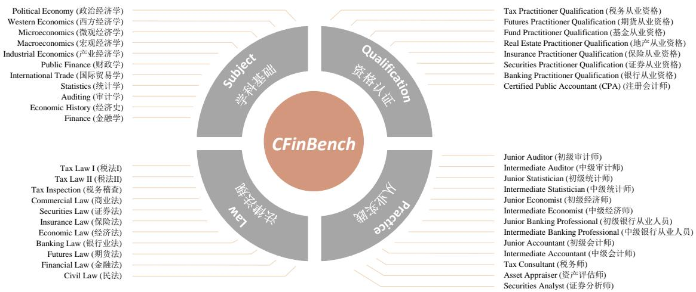
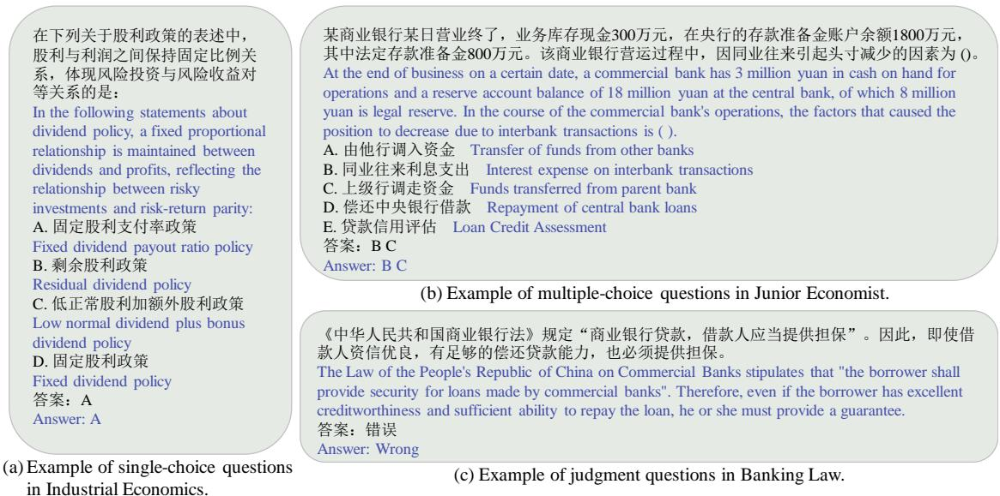
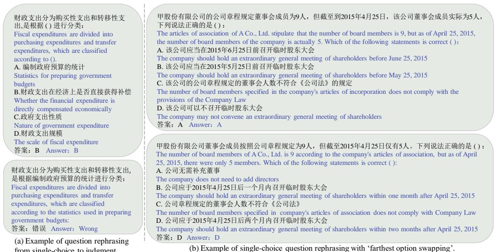
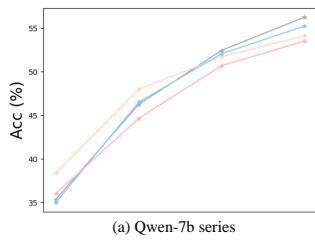
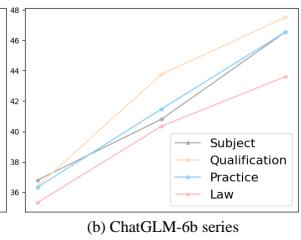
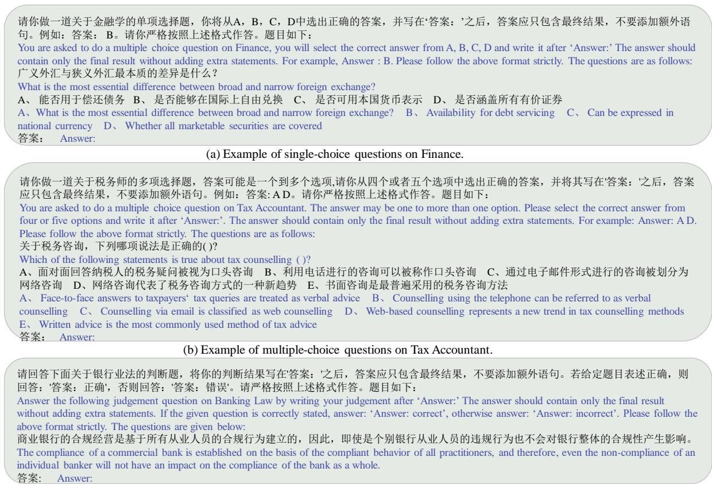
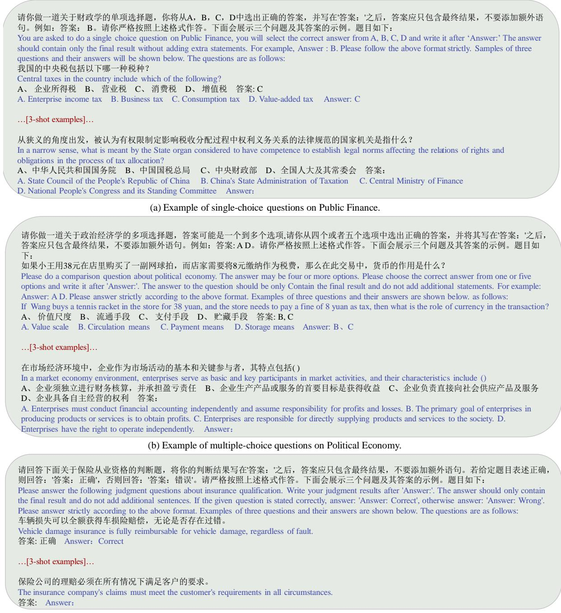
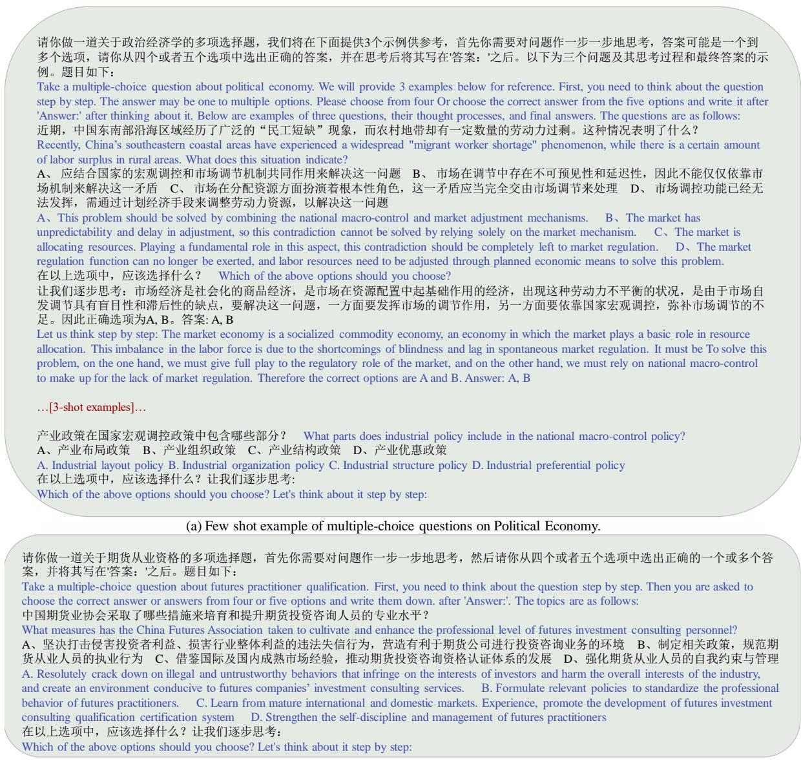

# CFinBench: A Comprehensive Chinese Financial Benchmark for Large Language Models

Ying Nie1∗ Binwei Yan1\* Tianyu Guo1 Hao Liu1 Haoyu Wang1 Wei He1 Binfan Zheng2 Weihao Wang3 Qiang Li3 Weijian Sun2 Yunhe Wang1† Dacheng Tao4

1Huawei Noah’s Ark Lab 2Huawei GTS 3Huawei Group Finance

4Nanyang Technological University

{ying.nie, yanbinwei, tianyu.guo, yunhe.wang}@huawei.com

## Abstract

Large language models (LLMs) have achieved remarkable performance on various NLP tasks, yet their potential in more challenging task like finance, has not been fully explored. In this paper, we present CFinBench: a meticu lously crafted, the most comprehensive eval uation benchmark to date, for assessing the financial knowledge of LLMs under Chinese context. In practice, to better align with the career trajectory of Chinese financial practi tioners, we build a systematic evaluation from 4 first-level categories: (1) Financial Subject: whether LLMs can memorize the necessary basic knowledge of financial subjects, such as economics, statistics and auditing. (2) Financial Qualification: whether LLMs can obtain the needed financial qualified certifications, such as certified public accountant, se curities qualification and banking qualification. (3) Financial Practice: whether LLMs can ful fill the practical financial jobs, such as tax con sultant, junior accountant and securities ana lyst. (4) Financial Law: whether LLMs can meet the requirement of financial laws and reg ulations, such as tax law, insurance law and economic law. CFinBench comprises 99,100 questions spanning 43 second-level categories with 3 question types: single-choice, multiple choice and judgment. We conduct extensive experiments on a wide spectrum of representative LLMs with various model size on CFin-Bench. The results show that GPT4 and some Chinese-oriented models lead the bench mark, with the highest average accuracy being 66.02%, highlighting the challenge presented by CFinBench. All the data and evaluation code are open sourced at https://cfinbench. github.io/.

## 1 Introduction

Recently, there has been a significant advancement in LLMs, exemplified by the representative models like ChatGPT (OpenAI, 2021), GPT4 (OpenAI, 2023), LLaMA (Touvron et al., 2023a,b; Meta, 2024), Baichuan (Yang et al., 2023a), InternLM (Team, 2023) and ChatGLM (Zeng et al., 2022), etc. At the same time, the corresponding evaluation works for LLMs are flourishing and a series of evaluation benchmarks have been proposed like MMLU (Hendrycks et al., 2020), C-Eval (Huang et al., 2024), Xiezhi (Gu et al., 2024) and AGIEval (Zhong et al., 2023), etc. These benchmarks have been instrumental in catalyzing the progress of LLMs, as they enable the quantitative assessment of advanced knowledge and complex reasoning abilities.

Finance is the backbone of modern society, playing a vital role in facilitating economic growth and prosperity (Shiller, 2013). However, mastering the intricacies of financial knowledge is challenging for individuals, due to its intricate nature and dynamic environment. Therefore, endowing LLMs with financial knowledge is essential as it can provide significant convenience and insight to humanity. For example, BloombergGPT (Wu et al., 2023), which possesses 50 billion parameters, exhibits superior performance across multiple financial tasks. Similarly, FinMA (Xie et al., 2023) is crafted by fine-tuning LLaMA (Touvron et al., 2023a) with the financial instruction data. Of course, a comprehensive financial evaluation benchmark is also essential for financial LLMs.

Several benchmarks have been introduced for better evaluating financial LLMs. FLUE (Shah et al., 2022) first introduces the financial benchmark across 5 NLP tasks in English domain, and its successor, FLARE (Xie et al., 2023), further extends it with financial time-series reasoning task like stock price movements forecasting. In addition to English domain, benchmarks in Chinese are another one of significant importance. BBT-CFLEB (Lu et al., 2023) presents the first Chinese financial evaluation benchmark, which includes 6 datasets covering both understanding and generation tasks. FinEval (Zhang et al., 2023a) builds a collection of 4,661 single-choice questions including 4 first-level categories: finance, economy, accounting, and certificate. However, FinEval is constrained by its limited size, and the category coverage is also inadequate for capturing the real-world financial scenarios. Moreover, the BBT-CFLEB, which targets the basic NLP tasks in finance, struggles to provide sufficient challenges for the increasingly advanced large language models.

  
Figure 1: CFinBench comprises 4 first-level categories and 43 second-level categories, which are more align with the career trajectory of Chinese financial practitioners.

In this paper, we present CFinBench: a meticulously crafted, the most comprehensive evaluation benchmark to date, for assessing the capabilities of LLMs on Chinese financial tasks. The design philosophy of our benchmark aligns with the career progression trajectory of financial practitioners, which can be likened to a ’leveling up’ in a game. Specifically, it begins with mastering the required foundational knowledge in financial subjects, followed by obtaining the necessary qualified certifications, and subsequently honing skills through practical experience in industry applications. Last but not least, compliance with financial laws and regulations is also a crucial aspect. As described in Figure 1, we include 4 first-level categories: (1) Financial Subject: examining whether LLMs can memorize the foundational knowledge in financial subjects, such as political economy, statistics and macroeconomics, etc. (2) Financial Qualification: examining whether LLMs can obtain the necessary qualified certifications for financial practitioners, such as tax practitioner qualification, futures practitioner qualification and fund practitioner qualification, etc. (3) Financial Practice:

examining whether LLMs can fulfill the specific tasks in financial jobs, such as junior banking professional, asset appraiser and junior statistician, etc. (4) Financial Law: examining whether LLMs can comply with the financial laws and regulations, such as securities law, insurance law and economic law, etc. CFinBench are primarily sourced from the mock exams and financial reports freely available on the Internet. To enhance the quality and diversity of the benchmark, and mitigate the problem of data contamination, we perform a series of rigorous data processing pipelines, encompassing data cleaning, internal and external de-duplication, LLM-assisted rephrasing, option shuffling, and multi-round human-in-the-loop cross-validation. CFinBench comprises 99,100 questions spanning 43 second-level categories with 3 question types: single-choice, multiple-choice and judgment.

We conduct extensive experiments on a wide spectrum of representative LLMs with various model size on CFinBench. The results show that GPT4 and some Chinese-oriented models like Qwen (Bai et al., 2023), Yi (Young et al., 2024), and XuanYuan (Zhang and Yang, 2023), etc. lead the benchmark, with the highest average accuracy being 66.02%, highlighting the challenge presented by CFinBench. It also indicates that there is still significant room for improvement in current Large Language Models (LLMs) within the Chinese financial domain.

## 2 Related Work

Financial LLMs The advent of ChatGPT (OpenAI, 2021) marks a significant milestone in natural language processing (NLP), demonstrating the remarkable capabilities of large language models with billions of parameters across a diverse range of tasks. This progress is further amplified by the release of GPT4 (OpenAI, 2023), which exhibits even greater generalization abilities. There have also been studies that are dedicated to adapting LLMs to the financial domain. BloombergGPT (Wu et al., 2023), the first proprietary LLM comprising 50 billion parameters, has been meticulously tailored for the financial domain. The successors like FinGPT (Yang et al., 2023b) and FinMA (Xie et al., 2023) introduce the financial LLMs based on fine-tuning LLaMA, by means of low-rank adaptation or full-parameters. Also, the Chinese-oriented financial LLMs like DISC-FinLLM (Chen et al., 2023a), CFGPT (Li et al., 2023b), XuanYuan (Zhang and Yang, 2023) and YunShan (Wang et al., 2023), etc. have also demonstrated excellent performance across multiple Chinese financial tasks. At the same time, to objectively and quantitatively measure the capabilities of LLMs, a comprehensive and thorough evaluation benchmark is crucial.

Table 1: Comparison of the proposed CFinBench with other Chinese-oriented financial benchmarks.
<table><tr><td>Benchmark</td><td colspan="3">#Test Questions #Categories #Question Types</td><td>Task</td></tr><tr><td>BBT-CFLEB (Lu et al., 2023)</td><td>20,416</td><td>6</td><td>4</td><td>Basic NLP</td></tr><tr><td>CGCE (Zhang et al., 2023b)</td><td>150</td><td>4</td><td>1</td><td>QA</td></tr><tr><td>CFBenchmark (Lei et al., 2023)</td><td>3,917</td><td>8</td><td>3</td><td>Basic NLP</td></tr><tr><td>FinEval (Zhang et al., 2023a)</td><td>4,661</td><td>34</td><td>1</td><td>Advanced Knowledge</td></tr><tr><td>FinanceIQ (Zhang and Yang, 2023)</td><td>7,173</td><td>36</td><td>1</td><td>Advanced Knowledge</td></tr><tr><td>Ant-Fin-Eva (Group, 2023)</td><td>8,445</td><td>33</td><td>1</td><td>Advanced Knowledge</td></tr><tr><td>CFLUE (Zhu et al., 2024)</td><td>16,522</td><td>33</td><td>6</td><td>Advanced Knowledge &amp; Application</td></tr><tr><td>CFinBench</td><td>99,100</td><td>43</td><td>3</td><td>Advanced Knowledge</td></tr></table>

Financial Benchmarks FLUE (Shah et al., 2022) first introduces a financial evaluation benchmark across 5 NLP tasks in English context, and its successor, FLARE (Xie et al., 2023), further includes financial time-series reasoning task like stock movement prediction. The FinBen (Xie et al., 2024) reorganizes 35 public English datasets across 23 financial tasks into three spectrums of difficulty. For the Chinese domain, BBT-CFLEB (Lu et al., 2023) presents the first Chinese financial evaluation benchmark, which includes 6 datasets covering both understanding and generation tasks. By integrating FLARE (Xie et al., 2023) and BBT-CFLEB (Lu et al., 2023), ICE-FLARE (Hu et al., 2024) enables the evaluation of bilingual financial tasks. CFBenchmark (Lei et al., 2023) assesses the text processing capabilities across recognition, classification, and generation tasks. CGCE (Zhang et al., 2023b) incorporates 200 general and 150 finance-specific question-answering questions. The recent study of CFLUE (Zhu et al., 2024) builds the datasets tailored for both knowledge assessment and application assessment. By the way, the most similar works to ours are FinanceIQ (Zhang and Yang, 2023) and FinEval (Zhang et al., 2023a). FinanceIQ (Zhang and Yang, 2023) encompasses 10 primary categories, including economists, securities professionals and actuaries, etc. with a total of 36 subcategories and 7,173 single-choice questions. FinEval (Zhang et al., 2023a) includes four primary categories, i.e., finance, economy, accounting, and certificate, with a total of 34 subcategories and 4,661 single-choice questions. However, the two benchmarks are limited in size. In contrast, the proposed CFinBench is more comprehensive, comprising a more reasonable dimension of financial abilities, with a total of 99,100 questions across 3 question types. The detailed comparison of the CFinBench with other Chinese-oriented financial benchmarks is summarized in Table 1. It is worth highlighting that we are not a aggregation of existing benchmarks, but rather a significant supplement from the perspective of professional practitioners in terms of advanced knowledge and complex reasoning, which, in conjunction with preceding benchmarks (Shah et al., 2022; Lu et al., 2023; Zhang et al., 2023a; Lei et al., 2023; Zhu et al., 2024), foster the development of financial LLMs.

## 3 CFinBench

In this section, we first introduce the overall design principle of the proposed benchmark, then we elaborate the taxonomy of CFinBench including financial subject, financial qualification, financial practice, and financial law. The detailed process of data construction including data sources, data processing and human cross-validation is also presented at the end.

  
Figure 2: Examples of 3 types of questions. English translations are shown in blue for better readability.

## 3.1 Overview

The motivation of CFinBench is to evaluate the financial knowledge of large language models in the context of Chinese. Inspired by predecessors (Huang et al., 2024; Fei et al., 2023; Zhang et al., 2023a), we also focus on the advanced knowledge and complex reasoning abilities, which, compared to traditional NLP capabilities, pose a greater challenge to the increasingly advanced LLMs of today. In practice, we build CFinBench based on the real-world examination questions used in China for assessing financial professionals across multiple dimensions. We include 3 question types: singlechoice, multiple-choice and judgment, as exemplified in Figure 2. Compared with the single-choice questions alone in most existing works (Zhang et al., 2023a; Zhang and Yang, 2023; Clark et al., 2018; Group, 2023; Huang et al., 2024), a broader range of question types can more comprehensively assess the capabilities of LLMs. Specifically, for single-choice questions, each question has four options, with only one correct answer. For multiplechoice questions, each question has four or five options, with at least two correct answers. For judgment questions, each question requires a direct judgment of whether the statement is correct or wrong.

## 3.2 Taxonomy

In the evaluation of large language models, a diverse array of tasks is often preferred to comprehensively assess their capabilities. A hierarchical evaluation framework enables a more nuanced understanding of the abilities of LLMs. Instead of categorizing the financial tasks solely based on their subjects (Zhang et al., 2023a; Zhang and Yang, 2023), we thoroughly explore the characteristics of Chinese financial system, and reorganize the financial tasks into more reasonable categories. Specifically, the process starts with acquiring fundamental knowledge in financial subjects, followed by passing essential professional qualifications, and subsequently refining skills through practical experience in industry applications. Additionally, adherence to laws and regulations is also a critical aspect. In practice, we include 4 first-level categories and 43 second-level categories, which are summarized in Figure 1.

• Financial Subject: The purpose of the financial subject is to test whether LLMs can memorize the essential foundational knowledge in financial subjects. Specifically, 11 subjects are included: Political Economy, Western Economics, Microeconomics, Macroeconomics, Industrial Economics, Public Finance, International Trade, Statistics, Auditing, Economic History, and Finance. These subjects provide a comprehensive framework for understanding the intricacies of economic systems, market structures, and financial institutions.

• Financial Qualification: The objective of the financial qualification is to examine whether LLMs can obtain necessary qualified certifications for finance professionals. We include 8 qualifications: Tax Practitioner Qualification, Futures Practitioner Qualification, Fund Practitioner Qualification, Real Estate Practitioner

Qualification, Insurance Practitioner Qualification, Securities Practitioner Qualification, Banking Practitioner Qualification, and Certified Public Accountant (CPA). By obtaining these qualifications, professionals can enhance their knowledge and skills in areas such as financial analysis, risk management, and financial planning.

• Financial Practice: Financial practice is to examine whether LLMs can fulfill the specific tasks in practical financial jobs. We include 13 jobs: Junior/Intermediate Auditor, Junior/Intermediate Statistician, Junior/Intermediate Economist, Junior/Intermediate Banking Professional, Junior/Intermediate Accountant, Tax Consultant, Asset Appraiser, and Securities Analyst. These practices involve the application of financial concepts and techniques to real-world problems, requiring professionals to possess a deep understanding of financial markets, instruments, and regulations.

• Financial Law: The purpose of financial law is to test whether LLMs can comply with financial laws and regulations. Specifically, it includes 11 exams of laws: Tax Law I/II, Tax Inspection, Commercial Law, Securities Law, Insurance Law, Economic Law, Banking Law, Futures Law, Financial Law and Civil Law. These laws provide the legal foundation for financial transactions, investments, and operations. Proficiency in financial laws can reduce the occurrence of illegal activities.

## 3.3 Data Construction

## 3.3.1 Data Sources

Our dataset is primarily sourced from publicly accessible channels like mock exams on internet, public books on economics and law, announcements and financial reports of listed companies, financial articles and news, etc.

## 3.3.2 Data Processing

The collected data come in various formats, including PDF, EPUB, Microsoft Word documents and web pages. Documents in PDF format and EPUB format are parsed into text using PyMuPDF1 and EbookLib2 respectively. We standardized all single-choice questions to have exactly four options, excluding those with fewer options and randomly removing excess wrong options from those with more than four. Similarly, for multiple-choice questions, to maintain uniformity, we only retain questions with four or five options.

Following predecessors (Yuan et al., 2021; Penedo et al., 2023; Wei et al., 2023; Huang et al., 2024), all the collected questions go through a standard data preprocessing pipeline including cleaning and de-duplication. For data cleaning, we first remove non-Chinese paragraphs with the inexpensive n-gram models like fastText (Joulin et al., 2016). Then a series of filtering rules and heuristics are performed, such as only keeping lines with valid punctuation, discarding consecutive newlines and whitespace characters, or removing unsemantic and garbled lines. For data de-duplication, we adopt MinHash algorithm (Broder, 1997) for internal deduplication and de-duplication with external public data (Zhang et al., 2023a; Zhang and Yang, 2023; Group, 2023; Information, 2023; Lu et al., 2023; Zhu et al., 2024).

To enhance data diversity and mitigate data contamination problem, we also adopt the strategy of question rephrasing based on GPT4 (Wang et al., 2022; Xu et al., 2023). We observe that the collected raw data exhibits a significant class imbalance, with a notable scarcity of judgment questions and a substantial surplus of single-choice questions. To address this issue, we prompt GPT4 to rephrase a portion of the single-choice questions into judgment questions, while maintaining semantic consistency, as exemplified in Figure 3 (a). Furthermore, to mitigate the problem of data contamination, we first randomize the option order (Berglund et al., 2023). In practice, this includes both random shuffle and ’farthest option swapping’, where the correct option is exchanged with the incorrect option that is farthest away. Subsequently, we prompt GPT4 to rephrase the questions based on the shuffled options, similarly preserving semantic consistency, as exemplified in Figure 3 (b).

## 3.3.3 Human Cross-Validation

In order to ensure the quality of the benchmark, we establish a financial team of more than 10 people with professional financial backgrounds and conduct three rounds of manual verification of the rephrased questions. Specifically, we first spend about 2 months on the first round of verification on the rephrased questions. During this period, about 20,000 questions with obvious quality are discarded. About 70,000 questions with high quality and high confidence in the correctness of the answers are retained. In addition, about 35,000 questions for which it is difficult to determine the correctness of the answers in a short time are reserved for the next round of verification. In the second round of verification, we spend about another month carefully proofreading and verifying the questions, and produce about 30,000 high-quality questions. Finally, the final approximately 100,000 questions undergo a third round of random sampling and verification over 10 days to further improve the quality. The statistics of the final dataset are summarized in Appendix D.

  
(b) Example of single-choice question rephrasing with ‘farthest option swapping’.  
Figure 3: Examples of question rephrasing. English translations are shown in blue for better readability. In each example, the top is the original question, and the bottom is the rephrased question.

## 4 Experiments

## 4.1 Setup

Data Split We randomly split the questions into a development set, a validation set, and a test set within each second-level category. The development split per category consists of three examples to facilitate few-shot evaluation. A portion of the development examples are also annotated with detailed explanations to enable few-shot chain-ofthought settings (Wei et al., 2022). The validation set and test set are divided in a ratio of 2:8, where the validation set is for hyperparameter tuning and the test set is for full evaluation.

Inference Details We employ the OpenCompass (Contributors, 2023) framework to perform model inference. Specifically, during the generation process, we set both the temperature and the top p to 1.0, and employ greedy decoding. The input token length is limited to 2048, and the output token length is limited to 64, which is sufficient for the questions of choice and judgment. Right truncation is performed for input prompts exceeding the length limitation. All models are inferred in both zero-shot and three-shot settings, which are exemplified in Appendix C.

Evaluation Metrics We adopt accuracy to measure the match between model prediction and gold answer. Specifically, for single-choice questions, if multiple valid options are predicted by the model, we only select the first option as the final answer predicted by the model. For multiple-choice questions, if any of the options predicted by the model are not among the gold answer, we directly classify it as wrong. Otherwise, we score it based on the number of predicted answers (out of a full score of 1). Considering that the judgment questions are relatively simple and usually score higher, we appropriately reduce the weight of the judgment questions to calculate the final score more reasonably, i.e., f inal = 0.4 single+0.4 multiple+ 0.2 judgment.

## 4.2 Models

To give a comprehensive view of the status of LLMs in a Chinese financial context, we evaluate a wide spectrum of large language models, as depicted in Table 2. Specifically, open-source LLMs from various families are included, including Llama (Touvron et al., 2023b; Meta, 2024), Qwen (Bai et al., 2023), ChatGLM (Zeng et al., 2022; Du et al., 2022), Baichuan (Yang et al., 2023a), InternLM (Team, 2023; Cai et al., 2024), Phi (Gunasekar et al., 2023; Li et al., 2023c; Abdin et al., 2024), DeepSeek (DeepSeek-AI, 2024), XuanYuan (Zhang and Yang, 2023), FinMA (Xie et al., 2023), Gemma (Team et al., 2024), Tiger-Bot (Chen et al., 2023b), Skywork (Wei et al., 2023), Yi (Young et al., 2024), Mistral (Jiang et al., 2023), DISC-FinLLM (Chen et al., 2023a) and CFGPT (Li et al., 2023b). We classify models into different categories according to their size. Considering the legal issues, we only report the results of two API-based LLMs, i.e., ChatGPT (gpt-3.5- turbo-0125) and GPT4 (gpt-4-turbo).

Table 2: The accuracy (%) on the test split under the answer-only setting. ? represents the finance-specific LLMs.
<table><tr><td rowspan="2">Model</td><td colspan="2">Subject</td><td colspan="2">Qualification</td><td colspan="2">Practice</td><td colspan="2">Law</td><td colspan="2">Average</td></tr><tr><td>0-shot</td><td>3-shot</td><td>0-shot</td><td>3-shot</td><td>0-shot</td><td>3-shot</td><td>0-shot</td><td>3-shot</td><td>0-shot</td><td>3-shot</td></tr><tr><td colspan="9">API Call</td><td></td></tr><tr><td>GPT4</td><td>58.62</td><td>58.47</td><td>58.34</td><td>57.09</td><td>57.56</td><td>56.37</td><td>55.20</td><td>55.15</td><td>57.43</td><td>56.77</td></tr><tr><td>ChatGPT</td><td>39.58</td><td>40.86</td><td>43.15</td><td>42.56</td><td>40.86</td><td>40.51</td><td>38.18</td><td>38.83</td><td>40.44</td><td>40.69</td></tr><tr><td colspan="9">Size &gt; 65B</td><td></td></tr><tr><td>Qwen2.5-72B</td><td>66.32</td><td>67.17</td><td>64.67</td><td>65.44</td><td>65.74</td><td>66.91</td><td>63.25</td><td>64.57</td><td>65.00</td><td>66.02</td></tr><tr><td>Xuan Yuan2-70B-Base*</td><td>53.56</td><td>59.96</td><td>53.36</td><td>56.27</td><td>53.55</td><td>58.05</td><td>48.27</td><td>52.48</td><td>52.19</td><td>56.69</td></tr><tr><td>Llama3-70B</td><td>50.75</td><td>56.27</td><td>47.52</td><td>52.35</td><td>45.17</td><td>51.24</td><td>44.62</td><td>49.26</td><td>47.02</td><td>52.28</td></tr><tr><td>DeepSeek-67B-Base</td><td>45.76</td><td>52.03</td><td>44.61</td><td>50.57</td><td>43.95</td><td>49.16</td><td>42.87</td><td>47.01</td><td>44.30</td><td>49.69</td></tr><tr><td>Tigerbot-70B-Base</td><td>43.22</td><td>52.13</td><td>43.15</td><td>48.42</td><td>40.32</td><td>46.00</td><td>38.56</td><td>45.87</td><td>41.31</td><td>48.11</td></tr><tr><td colspan="9">Size ≈ 30B</td><td></td></tr><tr><td>Qwen2.5-32B</td><td>61.77</td><td>63.31</td><td>62.03</td><td>64.44</td><td>60.42</td><td>62.25</td><td>58.61</td><td>61.17</td><td>60.71</td><td>62.79</td></tr><tr><td>Yi1.5-34B</td><td>58.62</td><td>61.44</td><td>58.30</td><td>60.91</td><td>57.26</td><td>59.75</td><td>55.16</td><td>58.55</td><td>57.34</td><td>60.16</td></tr><tr><td colspan="9">10B &lt; Size &lt; 20B</td><td></td></tr><tr><td>Qwen2.5-14B</td><td>56.18</td><td>59.55</td><td>58.37</td><td>62.08</td><td>56.64</td><td>60.13</td><td>55.58</td><td>58.71</td><td>56.69</td><td>60.12</td></tr><tr><td>InternLM2.5-20B</td><td>52.41 40.87</td><td>54.97</td><td>54.74</td><td>57.59</td><td>53.07</td><td>56.42</td><td>51.24</td><td>54.29</td><td>52.87</td><td>55.82</td></tr><tr><td>XuanYuan-13B-Base*</td><td>44.95</td><td>44.32 42.46</td><td>41.64</td><td>47.68</td><td>42.30</td><td>46.56</td><td>41.73</td><td>45.75</td><td>41.64</td><td>46.08</td></tr><tr><td>Phi3-14B-Instruct</td><td>29.16</td><td></td><td>46.12</td><td>43.60</td><td>44.26</td><td>40.83</td><td>42.17</td><td>39.61</td><td>44.38</td><td>41.63</td></tr><tr><td>Baichuan2-13B</td><td></td><td>41.13</td><td>34.25</td><td>44.19</td><td>31.27</td><td>40.63</td><td>31.44</td><td>40.05</td><td>31.53</td><td>41.50</td></tr><tr><td>Skywork-13B</td><td>34.66</td><td>39.24</td><td>37.78</td><td>43.88</td><td>36.22</td><td>40.90</td><td>36.39</td><td>41.38</td><td>36.26</td><td>41.35</td></tr><tr><td>DISC-FinLLM-13B*</td><td>37.42</td><td>39.46</td><td>42.59</td><td>38.81</td><td>38.32</td><td>39.89</td><td>39.09</td><td>38.35</td><td>39.36</td><td>39.13</td></tr><tr><td>Tigerbot-13B-Base</td><td>32.83</td><td>34.09</td><td>35.36</td><td>39.21</td><td>33.09</td><td>35.87</td><td>33.75</td><td>35.52</td><td>33.76</td><td>36.17</td></tr><tr><td>Llama2-13B</td><td>30.24</td><td>32.15</td><td>31.42</td><td>35.18</td><td>29.35</td><td>31.92</td><td>29.48</td><td>34.33</td><td>30.12</td><td>33.40</td></tr><tr><td>5B &lt; Size &lt; 10B</td><td></td><td></td><td></td><td></td><td></td><td></td><td></td><td></td><td></td><td></td></tr><tr><td colspan="9">Qwen2.5-7B</td><td></td><td></td></tr><tr><td>YunShan-7B*</td><td>56.27 52.65</td><td>58.41 53.00</td><td>54.13</td><td>56.28</td><td>55.25</td><td>58.47</td><td>53.53</td><td>56.26</td><td>54.80</td><td>57.36</td></tr><tr><td>InternLM2.5-7B</td><td>52.31</td><td>54.67</td><td>52.61 50.26</td><td>51.79</td><td>53.33</td><td>52.77 53.85</td><td>52.52 49.55</td><td>52.23 51.62</td><td>52.78</td><td>52.45</td></tr><tr><td>Yi1.5-9B</td><td>47.85</td><td>50.51</td><td>50.45</td><td>53.22 51.03</td><td>51.49 48.26</td><td>49.20</td><td>46.41</td><td>47.03</td><td>50.90</td><td>53.34</td></tr><tr><td></td><td>46.26</td><td>49.18</td><td>47.97</td><td>50.28</td><td>46.52</td><td>47.93</td><td>44.66</td><td>46.04</td><td>48.24 46.35</td><td>49.44</td></tr><tr><td>Qwen1.5-7B</td><td>46.56</td><td>46.41</td><td>47.52</td><td></td><td></td><td>48.20</td><td>43.62</td><td>45.05</td><td></td><td>48.36</td></tr><tr><td>ChatGLM3-6B-Base</td><td>39.99</td><td></td><td></td><td>49.45</td><td>46.56</td><td></td><td></td><td></td><td>46.07</td><td>47.28</td></tr><tr><td>Xuan Yuan-6B-Base*</td><td>33.54</td><td>41.65</td><td>44.30</td><td>45.87</td><td>42.70</td><td>43.91</td><td>41.70</td><td>42.81</td><td>42.17</td><td>43.56</td></tr><tr><td>Llama3.1-8B</td><td>30.22</td><td>40.38</td><td>34.87</td><td>41.25</td><td>32.54</td><td>39.47</td><td>35.24</td><td>41.27</td><td>34.05</td><td>40.59</td></tr><tr><td>Baichuan2-7B</td><td>29.46</td><td>37.23</td><td>35.56</td><td>41.35</td><td>31.30</td><td>37.33</td><td>29.59</td><td>37.49</td><td>31.67</td><td>38.35</td></tr><tr><td>Mistral-7B</td><td></td><td>35.63</td><td>29.11</td><td>37.56</td><td>28.75</td><td>35.87</td><td>28.39</td><td>34.34</td><td>28.93</td><td>35.85</td></tr><tr><td>CFGPT1-sft-7B-Full*</td><td>32.45</td><td>33.73</td><td>34.41</td><td>33.92</td><td>32.80</td><td>32.93</td><td>33.48</td><td>35.05</td><td>33.29</td><td>33.91</td></tr><tr><td>FinMA-7B*</td><td>23.71</td><td>22.74</td><td>24.92</td><td>25.86</td><td>22.71</td><td>20.71</td><td>22.34</td><td>23.52</td><td>23.42</td><td>23.21</td></tr><tr><td>Size &lt; 5B</td><td></td><td></td><td></td><td></td><td></td><td></td><td></td><td></td><td></td><td></td></tr><tr><td colspan="9">Qwen2.5-3B Phi3.5-3.8B-Instruct</td><td>41.60</td><td>42.78</td></tr></table>

## 4.3 Results

In Table 2, we report the 0-shot and 3-shot accuracy of each first-level category on the test split under the answer-only setting. As can be seen, the Chinese-oriented Qwen2.5-72B (Bai et al., 2023) lead the benchmark, with an average accuracy reaching 66.02%. In addition, the accuracy of some other models like Yi1.5-34B (Young et al., 2024), XuanYuan2-70B-Base (Zhang and Yang, 2023) and GPT4 (OpenAI, 2023) also exceed 56%. In the size range of 10B-20B, Qwen2.5-14B (Bai et al., 2023), InternLM2.5-20B (Cai et al., 2024) and XuanYuan-13B-Base (Zhang and Yang, 2023) are in the lead, with average accuracy exceeding 46%. Notably, in the size range of 5B-10B, Qwen2.5-7B (Bai et al., 2023) and the Chinese finance-specific model YunShan-7B (Wang et al., 2023) is in the absolute leading position, with an accuracy of over 52%, which is even higher than the accuracy of some 70B models. Also, Yi1.5-9B (Young et al., 2024), Qwen1.5-7B (Bai et al., 2023) and ChatGLM3- 6B-Base (Zeng et al., 2022; Du et al., 2022) also achieve the accuracy over 45%. During the size range of less than 5B, Qwen2.5-3B (Bai et al., 2023) is the only model that achieves an accuracy of more than 45%. The other models like Phi3.5- 3.8B-Instruct (Abdin et al., 2024) and YunShan-1.5B (Wang et al., 2023) also achieve the accuracies of more than 39%. In conclusion, there is still significant room for improvement.

## 4.4 Analysis

Few-shot examples are helpful in most cases. As we can see from Table 2, the performance of most models demonstrates improvement when some examples are provided. However, in the case of Phi3-14B-Instruct, the zero-shot setting outperforms the few-shot setting. We guess that this is because the models have acquired the ability to fully understand the questions without the need for examples during the pre-training or fine-tuning. The introduced examples may mismatch with their training methodology, which leads to the decrease in accuracy (Gu et al., 2024; Li et al., 2023a).

Scaling up the model size usually results in better performance. In Table 2, as the model size increases, the accuracy of Qwen2.5-3B, Qwen2.5- 7B, Qwen2.5-14B, Qwen2.5-32B and Qwen2.5- 72B increases accordingly, i.e., 45.06%, 57.36%, 60.12%, 62.79% and 66.02% respectively at the 3-shot setting. Similarly, the accuracy of Yi1.5- 34B is increased by 10.72% over Yi1.5-9B at the 3-shot setting. However, this does not mean that increasing the model size will definitely improve the performance.

Domain specific pre-training and fine-tuning are helpful. Impressively, two finance-specific models XuanYuan (Zhang and Yang, 2023) and

  
Figure 4: The 0-shot accuracy changes with the iterations of LLMs.

YunShan (Wang et al., 2023) achieve very competitive accuracy, demonstrating a better grasp of financial knowledge. This can be attributed to the fact that both models are mixed with high-quality financial corpus during pre-training and fine-tuning. We think the same is true for the general base models such as Yi (Young et al., 2024) and Qwen (Bai et al., 2023) that perform well in Table 2.

Accuracy improves with LLMs’ iteration. We visualize how the accuracies of 4 first-level categories change as the LLM is iteratively updated (Qwen, Qwen1.5, Qwen2, Qwen2.5 and ChatGLM, ChatGLM2, ChatGLM3). As can be seen from Figure 4, with the improvement of training method and the enrichment of training corpus, the accuracy will often be significantly improved, which also highlights the rationality and importance of CFinBench.

The performance of chat models. To better engage in natural conversation, the chat version are often derived from base model by alignment techniques (Ouyang et al., 2022), such as supervised finetuning (SFT) and reinforcement learning from human feedback (RLHF). As observed in Table 3, the accuracy of some models’ chat version is improved when compared to the base version, such as Qwen2.5-32B, Gemma2-2B, Baichuan2-13B, etc. At the same time, the accuracy of some models chat version have declined, such as Yi1.5-34B and ChatGLM3-6B. The varying alignment strategies of the models lead to different results.

Table 3: The 0/3-shot average accuracy (%) of base model and chat model on the test split.
<table><tr><td rowspan="2">Model</td><td colspan="2">Base</td><td colspan="2">Chat</td></tr><tr><td>0-shot</td><td>3-shot</td><td>0-shot</td><td>3-shot</td></tr><tr><td>Yi1.5-34B</td><td>57.34</td><td>60.16</td><td>58.99</td><td>57.48</td></tr><tr><td>Qwen2.5-32B</td><td>60.71</td><td>62.79</td><td>61.62</td><td>64.48</td></tr><tr><td>InternLM2.5-20B</td><td>52.87</td><td>55.82</td><td>54.35</td><td>55.27</td></tr><tr><td>Baichuan2-13B</td><td>31.53</td><td>41.50</td><td>40.74</td><td>44.60</td></tr><tr><td>ChatGLM3-6B</td><td>46.07</td><td>47.28</td><td>30.79</td><td>27.27</td></tr><tr><td>Gemma2-2B</td><td>22.56</td><td>31.13</td><td>30.47</td><td>35.81</td></tr></table>

## 5 Conclusion

In this paper, we present CFinBench, the most comprehensive evaluation benchmark to date, for assessing the financial domain knowledge of LLMs under Chinese context. We improve the quality and diversity of the data and mitigate the issue of data contamination through a series of processes, including data cleaning, internal and external deduplication, LLM-assisted question rephrasing, option shuffling, and multiple rounds of human crossvalidation. Four first-level categories are included in CFinBench: financial subject, financial qualification, financial practice, and financial law, which are more align with the career trajectory of financial practitioners in China. The CFinBench comprises 99,100 questions spanning 43 second-level categories with 3 question types: single-choice, multiple-choice and judgment. We conduct extensive evaluations on a wide spectrum of LLMs with various model size. The results show that there is still significant room for improvement for current LLMs in the Chinese financial domain.

## 6 Ethical Statement

All data utilized in this study primarily originate from publicly accessible channels that have been processed by our professional experts. Also, It is important to note that all datasets within CFin-Bench carry low ethical risks, with stringent measures in place to ensure the absence of any sensitive or personally identifiable information. In order to promote the research progress, our data and evaluation code are open sourced to the community under the Apache-2.0 license3.

## 7 Limitations

CFinBench focuses on Chinese financial system and is therefore not suitable for assessing financial knowledge in other countries. It provides an important basis for evaluating the LLMs’ mastery of Chinese financial knowledge. However, since we have open sourced the questions and answers of the validation split, if they are improperly used to train the large language model, the accuracy of the model may be falsely high on the validation split. Therefore, the results on benchmark are just a reference. The true quality of the model depends on the performance of the user in the practical scenario.

## References

Marah Abdin, Sam Ade Jacobs, Ammar Ahmad Awan, Jyoti Aneja, Ahmed Awadallah, Hany Awadalla, Nguyen Bach, Amit Bahree, Arash Bakhtiari, Harkirat Behl, et al. 2024. Phi-3 technical report: A highly capable language model locally on your phone. arXiv preprint arXiv:2404.14219.

Jinze Bai, Shuai Bai, Yunfei Chu, Zeyu Cui, Kai Dang, Xiaodong Deng, Yang Fan, Wenbin Ge, Yu Han, Fei Huang, et al. 2023. Qwen technical report. arXiv preprint arXiv:2309.16609.

Lukas Berglund, Meg Tong, Max Kaufmann, Mikita Balesni, Asa Cooper Stickland, Tomasz Korbak, and Owain Evans. 2023. The reversal curse: Llms trained on" a is b" fail to learn" b is a". arXiv preprint arXiv:2309.12288.

Andrei Z Broder. 1997. On the resemblance and containment of documents. In Proceedings. Compression and Complexity of SEQUENCES 1997 (Cat. No. 97TB100171), pages 21–29. IEEE.

Zheng Cai, Maosong Cao, Haojiong Chen, Kai Chen, Keyu Chen, Xin Chen, Xun Chen, Zehui Chen, Zhi Chen, Pei Chu, et al. 2024. Internlm2 technical report. arXiv preprint arXiv:2403.17297.

Wei Chen, Qiushi Wang, Zefei Long, Xianyin Zhang, Zhongtian Lu, Bingxuan Li, Siyuan Wang, Jiarong Xu, Xiang Bai, Xuanjing Huang, et al. 2023a. Disc-finllm: A chinese financial large language model based on multiple experts fine-tuning. arXiv preprint arXiv:2310.15205.

Ye Chen, Wei Cai, Liangmin Wu, Xiaowei Li, Zhanxuan Xin, and Cong Fu. 2023b. Tigerbot: An open multilingual multitask llm. arXiv preprint arXiv:2312.08688.

Peter Clark, Isaac Cowhey, Oren Etzioni, Tushar Khot, Ashish Sabharwal, Carissa Schoenick, and Oyvind Tafjord. 2018. Think you have solved question answering? try arc, the ai2 reasoning challenge. arXiv preprint arXiv:1803.05457.

OpenCompass Contributors. 2023. Opencompass: A universal evaluation platform for foundation models. https://github.com/open-compass/ opencompass.

DeepSeek-AI. 2024. Deepseek-v2: A strong, economical, and efficient mixture-of-experts language model. Preprint, arXiv:2405.04434.

Zhengxiao Du, Yujie Qian, Xiao Liu, Ming Ding, Jiezhong Qiu, Zhilin Yang, and Jie Tang. 2022. Glm: General language model pretraining with autoregressive blank infilling. In Proceedings of the 60th Annual Meeting of the Association for Computational Linguistics (Volume 1: Long Papers), pages 320– 335.

Zhiwei Fei, Xiaoyu Shen, Dawei Zhu, Fengzhe Zhou, Zhuo Han, Songyang Zhang, Kai Chen, Zongwen Shen, and Jidong Ge. 2023. Lawbench: Benchmarking legal knowledge of large language models. arXiv preprint arXiv:2309.16289.

Ant Group. 2023. Ant-fin-eva. https://github.com/ alipay/financial\_evaluation\_dataset/.

Zhouhong Gu, Xiaoxuan Zhu, Haoning Ye, Lin Zhang, Jianchen Wang, Yixin Zhu, Sihang Jiang, Zhuozhi Xiong, Zihan Li, Weijie Wu, et al. 2024. Xiezhi: An ever-updating benchmark for holistic domain knowledge evaluation. In Proceedings of the AAAI Conference on Artificial Intelligence, volume 38, pages 18099–18107.

Suriya Gunasekar, Yi Zhang, Jyoti Aneja, Caio César Teodoro Mendes, Allie Del Giorno, Sivakanth Gopi, Mojan Javaheripi, Piero Kauffmann, Gustavo de Rosa, Olli Saarikivi, et al. 2023. Textbooks are all you need. arXiv preprint arXiv:2306.11644.

Dan Hendrycks, Collin Burns, Steven Basart, Andy Zou, Mantas Mazeika, Dawn Song, and Jacob Steinhardt. 2020. Measuring massive multitask language understanding. arXiv preprint arXiv:2009.03300.

Gang Hu, Ke Qin, Chenhan Yuan, Min Peng, Alejandro Lopez-Lira, Benyou Wang, Sophia Ananiadou, Wanlong Yu, Jimin Huang, and Qianqian Xie. 2024. No language is an island: Unifying chinese and english in financial large language models, instruction data, and benchmarks. arXiv preprint arXiv:2403.06249.

Yuzhen Huang, Yuzhuo Bai, Zhihao Zhu, Junlei Zhang, Jinghan Zhang, Tangjun Su, Junteng Liu, Chuancheng Lv, Yikai Zhang, Yao Fu, et al. 2024. C-eval: A multi-level multi-discipline chinese evaluation suite for foundation models. Advances in Neural Information Processing Systems, 36.

East Money Information. 2023. Openfindata. https: //github.com/open-compass/OpenFinData/.

Albert Q Jiang, Alexandre Sablayrolles, Arthur Mensch, Chris Bamford, Devendra Singh Chaplot, Diego de las Casas, Florian Bressand, Gianna Lengyel, Guillaume Lample, Lucile Saulnier, et al. 2023. Mistral 7b. arXiv preprint arXiv:2310.06825.

Armand Joulin, Edouard Grave, Piotr Bojanowski, Matthijs Douze, Hérve Jégou, and Tomas Mikolov. 2016. Fasttext. zip: Compressing text classification models. arXiv preprint arXiv:1612.03651.

Takeshi Kojima, Shixiang Shane Gu, Machel Reid, Yutaka Matsuo, and Yusuke Iwasawa. 2022. Large language models are zero-shot reasoners. Advances in neural information processing systems, 35:22199– 22213.

Yang Lei, Jiangtong Li, Ming Jiang, Junjie Hu, Dawei Cheng, Zhijun Ding, and Changjun Jiang. 2023. Cfbenchmark: Chinese financial assistant benchmark for large language model. arXiv preprint arXiv:2311.05812.

Haonan Li, Yixuan Zhang, Fajri Koto, Yifei Yang, Hai Zhao, Yeyun Gong, Nan Duan, and Timothy Baldwin. 2023a. Cmmlu: Measuring massive multitask language understanding in chinese. arXiv preprint arXiv:2306.09212.

Jiangtong Li, Yuxuan Bian, Guoxuan Wang, Yang Lei, Dawei Cheng, Zhijun Ding, and Changjun Jiang. 2023b. Cfgpt: Chinese financial assistant with large language model. arXiv preprint arXiv:2309.10654.

Yuanzhi Li, Sébastien Bubeck, Ronen Eldan, Allie Del Giorno, Suriya Gunasekar, and Yin Tat Lee. 2023c. Textbooks are all you need ii: phi-1.5 technical report. arXiv preprint arXiv:2309.05463.

Dakuan Lu, Hengkui Wu, Jiaqing Liang, Yipei Xu, Qianyu He, Yipeng Geng, Mengkun Han, Yingsi Xin, and Yanghua Xiao. 2023. Bbt-fin: Comprehensive construction of chinese financial domain pre-trained language model, corpus and benchmark. arXiv preprint arXiv:2302.09432.

Meta. 2024. Llama3. Https://llama.meta.com/llama3.

OpenAI. 2021. Gpt-3.5-turbo. Https://www.openai.com/chatgpt.

OpenAI. 2023. Gpt-4 technical report. Preprint, arXiv:2303.08774.

Long Ouyang, Jeffrey Wu, Xu Jiang, Diogo Almeida, Carroll Wainwright, Pamela Mishkin, Chong Zhang, Sandhini Agarwal, Katarina Slama, Alex Ray, et al. 2022. Training language models to follow instructions with human feedback. Advances in neural information processing systems, 35:27730–27744.

Guilherme Penedo, Quentin Malartic, Daniel Hesslow, Ruxandra Cojocaru, Alessandro Cappelli, Hamza Alobeidli, Baptiste Pannier, Ebtesam Almazrouei, and Julien Launay. 2023. The refinedweb dataset for falcon llm: outperforming curated corpora with web data, and web data only. arXiv preprint arXiv:2306.01116.

Raj Sanjay Shah, Kunal Chawla, Dheeraj Eidnani, Agam Shah, Wendi Du, Sudheer Chava, Natraj Raman, Charese Smiley, Jiaao Chen, and Diyi Yang. 2022. When flue meets flang: Benchmarks and large pre-trained language model for financial domain. arXiv preprint arXiv:2211.00083.

Robert J Shiller. 2013. Finance and the good society. Princeton University Press.

Gemma Team, Thomas Mesnard, Cassidy Hardin, Robert Dadashi, Surya Bhupatiraju, Shreya Pathak, Laurent Sifre, Morgane Rivière, Mihir Sanjay Kale, Juliette Love, et al. 2024. Gemma: Open models based on gemini research and technology. arXiv preprint arXiv:2403.08295.

InternLM Team. 2023. Internlm: A multilingual language model with progressively enhanced capabilities.

Hugo Touvron, Thibaut Lavril, Gautier Izacard, Xavier Martinet, Marie-Anne Lachaux, Timothée Lacroix, Baptiste Rozière, Naman Goyal, Eric Hambro, Faisal Azhar, et al. 2023a. Llama: Open and efficient foundation language models. arXiv preprint arXiv:2302.13971.

Hugo Touvron, Louis Martin, Kevin Stone, Peter Albert, Amjad Almahairi, Yasmine Babaei, Nikolay Bashlykov, Soumya Batra, Prajjwal Bhargava, Shruti Bhosale, et al. 2023b. Llama 2: Open foundation and fine-tuned chat models. arXiv preprint arXiv:2307.09288.

Yizhong Wang, Yeganeh Kordi, Swaroop Mishra, Alisa Liu, Noah A Smith, Daniel Khashabi, and Hannaneh Hajishirzi. 2022. Self-instruct: Aligning language models with self-generated instructions. arXiv preprint arXiv:2212.10560.

Yunhe Wang, Hanting Chen, Yehui Tang, Tianyu Guo, Kai Han, Ying Nie, Xutao Wang, Hailin Hu, Zheyuan Bai, Yun Wang, et al. 2023. Pangu-π: Enhancing language model architectures via nonlinearity compensation. arXiv preprint arXiv:2312.17276.

Jason Wei, Xuezhi Wang, Dale Schuurmans, Maarten Bosma, Fei Xia, Ed Chi, Quoc V Le, Denny Zhou, et al. 2022. Chain-of-thought prompting elicits reasoning in large language models. Advances in neural information processing systems, 35:24824– 24837.

Tianwen Wei, Liang Zhao, Lichang Zhang, Bo Zhu, Lijie Wang, Haihua Yang, Biye Li, Cheng Cheng, Weiwei Lü, Rui Hu, et al. 2023. Skywork: A more open bilingual foundation model. arXiv preprint arXiv:2310.19341.

Shijie Wu, Ozan Irsoy, Steven Lu, Vadim Dabravolski, Mark Dredze, Sebastian Gehrmann, Prabhanjan Kambadur, David Rosenberg, and Gideon Mann. 2023. Bloomberggpt: A large language model for finance. arXiv preprint arXiv:2303.17564.

Qianqian Xie, Weiguang Han, Zhengyu Chen, Ruoyu Xiang, Xiao Zhang, Yueru He, Mengxi Xiao, Dong Li, Yongfu Dai, Duanyu Feng, et al. 2024. The finben: An holistic financial benchmark for large language models. arXiv preprint arXiv:2402.12659.

Qianqian Xie, Weiguang Han, Xiao Zhang, Yanzhao Lai, Min Peng, Alejandro Lopez-Lira, and Jimin Huang. 2023. Pixiu: A large language model, instruction data and evaluation benchmark for finance. arXiv preprint arXiv:2306.05443.

Can Xu, Qingfeng Sun, Kai Zheng, Xiubo Geng, Pu Zhao, Jiazhan Feng, Chongyang Tao, and Daxin Jiang. 2023. Wizardlm: Empowering large language models to follow complex instructions. arXiv preprint arXiv:2304.12244.

Aiyuan Yang, Bin Xiao, Bingning Wang, Borong Zhang, Chao Yin, Chenxu Lv, Da Pan, Dian Wang,

Dong Yan, Fan Yang, et al. 2023a. Baichuan 2: Open large-scale language models. arXiv preprint arXiv:2309.10305.

Hongyang Yang, Xiao-Yang Liu, and Christina Dan Wang. 2023b. Fingpt: Open-source financial large language models. arXiv preprint arXiv:2306.06031.

Alex Young, Bei Chen, Chao Li, Chengen Huang, Ge Zhang, Guanwei Zhang, Heng Li, Jiangcheng Zhu, Jianqun Chen, Jing Chang, et al. 2024. Yi: Open foundation models by 01. ai. arXiv preprint arXiv:2403.04652.

Sha Yuan, Hanyu Zhao, Zhengxiao Du, Ming Ding, Xiao Liu, Yukuo Cen, Xu Zou, Zhilin Yang, and Jie Tang. 2021. Wudaocorpora: A super large-scale chinese corpora for pre-training language models. AI Open, 2:65–68.

Aohan Zeng, Xiao Liu, Zhengxiao Du, Zihan Wang, Hanyu Lai, Ming Ding, Zhuoyi Yang, Yifan Xu, Wendi Zheng, Xiao Xia, et al. 2022. Glm-130b: An open bilingual pre-trained model. arXiv preprint arXiv:2210.02414.

Liwen Zhang, Weige Cai, Zhaowei Liu, Zhi Yang, Wei Dai, Yujie Liao, Qianru Qin, Yifei Li, Xingyu Liu, Zhiqiang Liu, et al. 2023a. Fineval: A chinese financial domain knowledge evaluation benchmark for large language models. arXiv preprint arXiv:2308.09975.

Xuanyu Zhang, Bingbing Li, and Qing Yang. 2023b. Cgce: A chinese generative chat evaluation benchmark for general and financial domains. arXiv preprint arXiv:2305.14471.

Xuanyu Zhang and Qing Yang. 2023. Xuanyuan 2.0: A large chinese financial chat model with hundreds of billions parameters. In Proceedings of the 32nd ACM International Conference on Information and Knowledge Management, pages 4435–4439.

Wanjun Zhong, Ruixiang Cui, Yiduo Guo, Yaobo Liang, Shuai Lu, Yanlin Wang, Amin Saied, Weizhu Chen, and Nan Duan. 2023. Agieval: A humancentric benchmark for evaluating foundation models. arXiv preprint arXiv:2304.06364.

Jie Zhu, Junhui Li, Yalong Wen, and Lifan Guo. 2024. Benchmarking large language models on cflue–a chinese financial language understanding evaluation dataset. arXiv preprint arXiv:2405.10542.

## A More experiments

Results on chain-of-thought setting. To further explore the models’ reasoning capabilities, in addition to the answer-only (AO) setting, we also perform some experiments on the chain-of-thought (COT) setting (Kojima et al., 2022; Wei et al., 2022). Evaluation on COT setting requires the model to generate explanations for a given question and then give the final answer based on the generated explanations. Specifically, we obtain the explanations examples only for multiple-choice questions manually by professional financial practitioners. The experimental results are reported in Table 4.

As observed in Table 4, the models achieve comparable or lower average accuracy than in the answer-only setting. This suggests that COT prompting does not necessarily improve results, which is also evidenced in other benchmarks like FinEval (Zhang et al., 2023a) and C-Eval (Huang et al., 2024), etc.

Comparison with other similar benchmark. FinEval (Zhang et al., 2023a) is another representative benchmark for evaluating the Chinese financial advanced knowledge of LLMs. In Table 5, we report the few-shot accuracy on CFinBench and FinEval with various LLMs. It can be seen that the accuracy of the highest Yi1.5-34B reaches nearly 87%, while ours is around 60%. Likewise, the lowest InternLM2-7B accuracy is still over 62%, while ours is only around 43%. This all suggests that CFinBench is more challenging and better able to distinguish the performance of different models.

## B Analysis on Data Contamination

Since we publicize the answers of the validation set, we imagine a data contamination scenario: what would happen if the LLM was trained using part of the validation set? We conduct an experiment here. Specifically, we randomly select 60% of the data from the validation set and fine-tuned InternLM2.5- 1.8B for 2 epochs based on LoRA (the modules of query, key, value and out are chosen as the target, the rank is set to 32). The 0-shot results on validation and test split are reported in Table 6. As we can see, data contamination on validation split will lead to the accuracy improvements on both validation and test. Therefore, it is crucial to avoid the contamination of evaluation data during the model training process.

## C Prompt examples

We list the prompt examples utilized in the evaluation process, including zero-shot and few-shot in answer-only scenarios ( Figure5 and Figure6), zero-shot and few-shot in chain-of-thought scenarios ( Figure7).

## D Data statistic

In Table 7, we enumerate the comprehensive statistical information of the dataset.

Table 4: The 0-shot and 3-shot average accuracy (%) of multiple-choice questions on the test split under the answer-only (AO) setting and chain-of-thought (COT) setting.
<table><tr><td></td><td colspan="2">GPT4</td><td colspan="2">Qwen-14B</td><td colspan="2">ChatGLM3-6B-Base</td></tr><tr><td></td><td>0-shot</td><td>3-shot</td><td>0-shot</td><td>3-shot</td><td>0-shot</td><td>3-shot</td></tr><tr><td>AO</td><td>48.52</td><td>48.67</td><td>36.51</td><td>40.66</td><td>37.27</td><td>37.58</td></tr><tr><td>COT</td><td>49.23</td><td>48.95</td><td>27.65</td><td>29.96</td><td>29.48</td><td>31.11</td></tr></table>

Table 5: The few-shot average accuracy (%) of CFinBench and FinEval under the answer-only setting.
<table><tr><td></td><td>GPT4</td><td>Yi1.5-34B</td><td>Qwen1.5-72B</td><td>Qwen1.5-32B</td><td>Qwen1.5-7B</td><td>ChatGLM3-6B InternLM2-7B</td><td></td></tr><tr><td>CFinBench</td><td>56.77</td><td>60.16</td><td>58.56</td><td>57.64</td><td>48.36</td><td>47.28</td><td>43.65</td></tr><tr><td>FinEval</td><td>70.13</td><td>86.79</td><td>83.93</td><td>84.36</td><td>72.55</td><td>63.08</td><td>62.03</td></tr></table>

Table 6: The 0-shot accuracy (%) of InternLM2.5-1.8B on validation and test split with or without data contamination.
<table><tr><td></td><td>Subject</td><td>Qualification</td><td>Practice</td><td>Law</td><td>Average</td></tr><tr><td>Val (W/O)</td><td>32.52</td><td>35.43</td><td>33.71</td><td>34.24</td><td>33.98</td></tr><tr><td>Test (W/Ó)</td><td>30.60</td><td>36.81</td><td>31.02</td><td>33.56</td><td>33.00</td></tr><tr><td>Val (W)</td><td>75.13</td><td>82.79</td><td>76.22</td><td>80.15</td><td>78.57</td></tr><tr><td>Test (W)</td><td>40.62</td><td>47.21</td><td>40.89</td><td>42.68</td><td>42.85</td></tr></table>

  
(c) Example of judgment questions on Banking Law.  
Figure 5: Examples of zero-shot prompts in answer-only setting. English translations are shown in blue for better readability.

  
(c) Example of judgment questions on Insurance Qualification.  
Figure 6: Examples of few-shot prompts in answer-only setting. English translations are shown in blue for better readability.

  
Figure 7: Examples of prompts in chain-of thought setting. English translations are shown in blue for better readability.

Table 7: The detailed statistic of CFinBench.
<table><tr><td>Category</td><td colspan="3">Single-Choice Multiple-Choice Judgment</td><td rowspan="2">All 9106</td></tr><tr><td>Subject</td><td>3302</td><td>1889</td><td>3915</td></tr><tr><td>Political Economy (政治经济学)</td><td>115</td><td>47</td><td>67</td><td>229</td></tr><tr><td>Western Economics (西方经济学)</td><td>268</td><td>46</td><td>212</td><td>526</td></tr><tr><td>Microeconomics (微观经济学)</td><td>295</td><td>29</td><td>221</td><td>545</td></tr><tr><td>Macroeconomics (宏观经济学)</td><td>21</td><td>117</td><td>294</td><td>432</td></tr><tr><td>Industrial Economics (产业经济学)</td><td>406</td><td>199</td><td>249</td><td>854</td></tr><tr><td>Public Finance (财政学)</td><td>167</td><td>86</td><td>156</td><td>409</td></tr><tr><td>International Trade (国际贸易学)</td><td>99</td><td>48</td><td>100</td><td>247</td></tr><tr><td>Statistics (统计学)</td><td>974</td><td>794</td><td>1846</td><td>3614</td></tr><tr><td>Auditing (审计学)</td><td>443</td><td>429</td><td>381</td><td>1253</td></tr><tr><td>Economic History (经济史)</td><td>248</td><td>63</td><td>133</td><td>444</td></tr><tr><td>Finance (金融学)</td><td>266</td><td>31</td><td>256</td><td>553</td></tr><tr><td>Qualification</td><td>14604</td><td>8879</td><td>5905</td><td>29388</td></tr><tr><td>Tax Practitioner Qualification (税务从业资格)</td><td>1332</td><td>1544</td><td>464</td><td>3340</td></tr><tr><td>Futures Practitioner Qualification (期货从业资格)</td><td>2086</td><td>1396</td><td>1049</td><td>4531</td></tr><tr><td>Fund Practitioner Qualification (基金从业资格)</td><td>3892</td><td>118</td><td>536</td><td>4546</td></tr><tr><td>Real Estate Practitioner Qualification (地产从业资格)</td><td>503</td><td>511</td><td>660</td><td>1674</td></tr><tr><td>Insurance Practitioner Qualification (保险从业资格)</td><td>1780</td><td>1220</td><td>903</td><td>3903</td></tr><tr><td>Securities Practitioner Qualification (证券从业资格)</td><td>2734</td><td>2041</td><td>1518</td><td>6293</td></tr><tr><td>Banking Practitioner Qualification (银行从业资格)</td><td>258</td><td>173</td><td>266</td><td>697</td></tr><tr><td>Certified Public Accountant (CPA) (注册会计师)</td><td>2019</td><td>1876</td><td>509</td><td>4404</td></tr><tr><td>Practice</td><td>18824</td><td>13419</td><td>9802</td><td>42045</td></tr><tr><td>Junior Auditor (初级审计师)</td><td>317</td><td>317</td><td>194</td><td>828</td></tr><tr><td>Intermediate Auditor (中级审计师)</td><td>237</td><td>223</td><td>197</td><td>657</td></tr><tr><td>Junior Statistician (初级统计师)</td><td>158</td><td>190</td><td>97</td><td>445</td></tr><tr><td>Intermediate Statistician (中级统计师)</td><td>259</td><td>400</td><td>195</td><td>854</td></tr><tr><td>Junior Economist (初级经济师)</td><td>2262</td><td>1496</td><td>655</td><td>4413</td></tr><tr><td>Intermediate Economist (中级经济师)</td><td>2547</td><td>1250</td><td>913</td><td>4710</td></tr><tr><td>Junior Banking Professional (初级银行从业人员)</td><td>2886</td><td>2075</td><td>1646</td><td>6681</td></tr><tr><td>Intermediate Banking Professional (中级银行从业人员)</td><td>2572</td><td>1550</td><td>1482</td><td>5604</td></tr><tr><td>Junior Accountant (初级会计师)</td><td>1654</td><td>1217</td><td>964</td><td>3835</td></tr><tr><td>Intermediate Accountant (中级会计师)</td><td>1252</td><td>858</td><td>700</td><td>2810</td></tr><tr><td>Tax Consultant (税务师)</td><td>934</td><td>1115</td><td>493</td><td>2542</td></tr><tr><td>Asset Appraiser (资产评估师)</td><td>1779</td><td>1690</td><td>896</td><td>4365</td></tr><tr><td>Securities Analyst (证券分析师)</td><td>1967</td><td>1038</td><td>1370</td><td>4375</td></tr><tr><td>Law</td><td>7695</td><td>5438</td><td>5428</td><td>18561</td></tr><tr><td>Tax Law I (税法 I)</td><td>287</td><td>284</td><td>237</td><td>808</td></tr><tr><td>Tax Law II (税法 II)</td><td>283</td><td>323</td><td>238</td><td>844</td></tr><tr><td>Tax Inspection (税务稽查)</td><td>974</td><td>874</td><td>1664</td><td>3512</td></tr><tr><td>Commercial Law (商业法)</td><td>331</td><td>599</td><td>201</td><td>1131</td></tr><tr><td>Securities Law (证券法)</td><td>1009</td><td>106</td><td>693</td><td>1808</td></tr><tr><td>Insurance Law (保险法)</td><td>69</td><td>57</td><td>42</td><td>168</td></tr><tr><td>Economic Law (经济法)</td><td>610</td><td>424</td><td>405</td><td>1439</td></tr><tr><td>Banking Law (银行业法)</td><td>2783</td><td>1360</td><td>1231</td><td>5374</td></tr><tr><td>Futures Law (期货法)</td><td>922</td><td>884</td><td>477</td><td>2283</td></tr><tr><td>Financial Law (金融法)</td><td>315</td><td>323</td><td>180</td><td>818</td></tr><tr><td>Civil Law (民法)</td><td>112</td><td>204</td><td>60</td><td>376</td></tr><tr><td>Total</td><td>44425</td><td>29625</td><td>25050</td><td>99100</td></tr></table>