# CODEXGRAPH: Bridging Large Language Models and Code Repositories via Code Graph Databases

Xiangyan Liu1,3,\* Bo Lan2,\* Zhiyuan Hu1 Yang Liu3 Zhicheng Zhang3 Fei Wang2 Michael Shieh¹ Wenmeng Zhou²

1 National University of Singapore2 Xi'an Jiaotong University3 Alibaba Group {1iu.xiangyan@u.nus.edu, bolan@stu.xjtu.edu.cn}

## Abstract

Large Language Models (LLMs) excel in stand-alone code tasks like HumanEval and MBPP, but struggle with handling entire code repositories. This challenge has prompted research on enhancing LLM-codebase interaction at a repository scale. Current solutions rely on similarity-based retrieval or manual tools and APIs, each with notable drawbacks. Similarity-based retrieval often has low recall in complex tasks, while manual tools and APIs are typically task-specific and require expert knowledge, reducing their generalizability across diverse code tasks and realworld applications. To mitigate these limitations, we introduce CoDEXGRAPH, a system that integrates LLM agents with graph database interfaces extracted from code repositories. By leveraging the structural properties of graph databases and the flexibility of the graph query language, CoDEX-GRAPH enables the LLM agent to construct and execute queries, allowing for precise, code structure-aware context retrieval and code navigation. We assess CODEXGRAPH using three benchmarks: CrossCodeEval, SWEbench, and EvoCodeBench. Additionally, we develop five real-world coding applications. With a unified graph database schema, CODEXGRAPH demonstrates competitive performance and potential in both academic and real-world environments, showcasing its versatility and efficacy in software engineering. Our code and demo will be released soon.

## 1 Introduction

Large Language Models (LLMs) excel in code tasks, impacting automated software engineering (Chen et al., 2021; Gauthier, 2024; Yang et al., 2024b; Open-Devin Team, 2024). Repository-level tasks (Zhang et al., 2023; Jimenez et al., 2023; Ding et al., 2024) mimic software engineers' work with large codebases (Kovrigin et al., 2024). These tasks require models to handle intricate dependencies and comprehend project structure (Jiang et al., 2024; Sun et al., 2024).

Current LLMs struggle with long-context inputs, limiting their effectiveness with large codebases (Jimenez et al., 2023) and lengthy sequences reasoning (Liu et al., 2024a). Researchers have proposed methods to enhance LLMs by retrieving task-relevant code snippets and structures, improving performance in complex software development (Deng et al., 2024; Arora et al., 2024; Ma et al., 2024). However, these approaches mainly rely on either similarity-based retrieval (Jimenez et al., 2023; Cheng et al., 2024; Liu et al., 2024b) or manual tools and APIs (Zhang et al., 2024b; Örwall, 2024). Similarity-based retrieval methods, common in Retrieval-Augmented Generation (RAG) systems (Lewis et al., 2020), often struggle with complex reasoning for query formulation (Jimenez et al., 2023) and handling intricate code structures (Phan et al., 2024), leading to low recall rates. Meanwhile, existing tool/API-based interfaces that connect codebases and LLMs are typically task-specific and require extensive expert knowledge (Örwall, 2024; Chen et al., 2024). Furthermore, our experimental results in Section 5 indicate that the two selected methods lack flexibility and generalizability for diverse repository-level code tasks.

Recent studies have demonstrated the effectiveness of graph structures in code repositories (Phan et al. 2024; Cheng et al., 2024). Meanwhile, inspired by recent advances in graph-based RAG (Edge et al., 2024; Liu et al., 2024b; He et al., 2024) and the application of executable code (such as SQL, Cypher, and Python) to consolidate LLM agent actions (Wang et al., 2024; Li et al., 2024c; Xue et al., 2023), we present CoDEXGRAPH, as shown in Figure 1 (a). CODEXGRAPH alleviates the limitations of existing approaches by bridging code repositories with LLMs through graph databases. CODEXGRAPH utilizes static analysis to extract code graphs from repositories using a task-agnostic schema that defines the nodes and edges within the code graphs. In these graphs, nodes represent source code symbols such as MODULE, CLASS, and FUNCTION, and each node is enriched with relevant meta-information. The edges between nodes represent the relationships among these symbols, such as CONTAINS, INHERITS, and USES (see Figure 2 for an illustrative example). By leveraging the structural properties of graph databases, CoDEXGRAPH enhances the LLM agent's comprehension of code structures. CoDEXGRAPH leverages repository code information and graph structures for global analysis and multi-hop reasoning, enhancing code task performance. When users provide code-related inputs, the LLM agent analyzes the required information from the code graphs, constructs flexible queries using graph query language, and locates relevant nodes or edges. This enables precise and efficient retrieval, allowing for effective scaling to larger repository tasks.

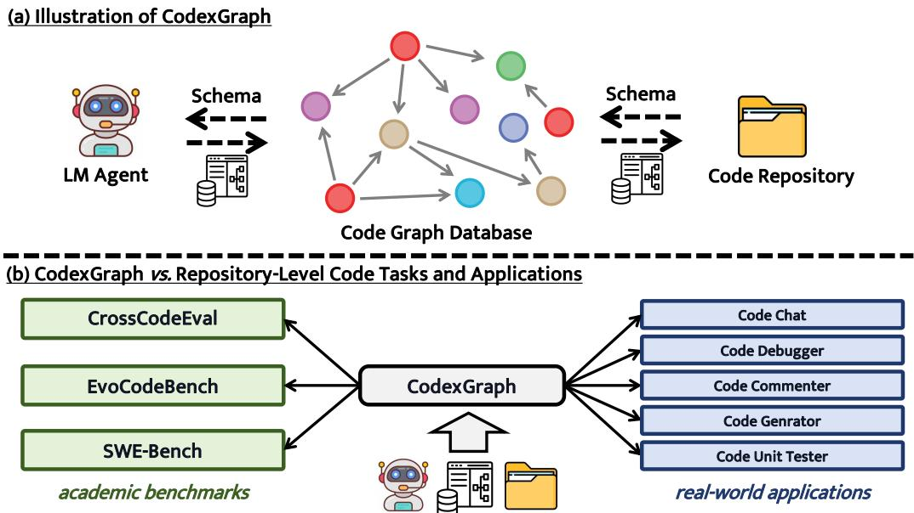  
Figure 1: (a) Using a unified schema, CoDEXGRAPH employs code graph databases as interfaces that allow LLM agents to interact seamlessly with code repositories. (b) CoDEXGRAPH supports the management of a wide range of tasks, from academic-level code benchmarks to real-world software engineering applications.

To evaluate the effectiveness of the CODEXGRAPH, we assess its performance across three challenging and representative repository-level benchmarks: Cross-CodeEval (Ding et al., 2024), SWE-bench (Yang et al., 2024b) and EvoCodeBench (Li et al., 2024b). Our experimental results demonstrate that, by leveraging a unified graph database schema (Section 3.1) and a simple workflow design (Section 3.2), the CoDEX-GRAPH achieves competitive performance across all academic benchmarks, especially when equipped with more advanced LLMs. Furthermore, as illustrated in Figure 1 (b), to address real-world software development needs, we extend CODEXGRAPH to the featurerich ModelScope-Agent (Li et al., 2023) framework. Section 6 highlights five real-world application scenarios, including code debugging and writing code comments, showcasing the versatility and efficacy of CODEXGRAPH in practical software engineering tasks.

Our contributions are from three perspectives:

• Pioneering code retrieval system: We present CoDEXGRAPH, which leverages graph databases as an interface to integrate codebases with LLMs, enhancing code navigation and understanding.

• Benchmark performance: We demonstrate CoDEXGRAPH's competitive performance on three challenging and representative repository-level code benchmarks.

• Practical applications: We showcase CODEX-GRAPH's versatility in five real-world software engineering scenarios, proving its value beyond academic settings.

## 2 Related Work

## 2.1 Repository-Level Code Tasks

Repository-level code tasks have garnered significant attention due to their alignment with real-world production environments (Bairi et al., 2023; Luo et al., 2024; Cognition Labs, 2024; Kovrigin et al., 2024). Unlike traditional standalone code-related tasks such as HumanEval (Chen et al., 2021) and MBPP (Austin et al., 2021), which often fail to capture the complexities of real-world software engineering, repository-level tasks necessitate models to understand cross-file code structures and perform intricate reasoning (Liu et al., 2024b; Ma et al., 2024; Sun et al., 2024). These sophisticated tasks can be broadly classified into two lines of work based on their inputs and outputs. The first line of work involves natural language to code repository tasks, exemplified by benchmarks like DevBench (Li et al., 2024a) and SketchEval (Zan et al., 2024), where models generate an entire code repository from scratch based on a natural language description of input requirements. State-of-the-art solutions in this area often employ multi-agent frameworks such as ChatDev (Qian et al., 2023) and MetaGPT (Hong et al., 2023) to handle the complex process of generating a complete codebase. The second line of work, which our research focuses on, includes tasks that integrate both a natural language description and a reference code repository, requiring models to perform tasks like repository-level code completion (Zhang et al., 2023; Shrivastava et al., 2023; Liu et al., 2023; Ding et al., 2024; Su et al., 2024), automatic GitHub issue resolution (Jimenez et al., 2023), and repository-level code generation (Li et al., 2024b). To assess the versatility and effectiveness of our proposed system CoDEXGRAPH, we evaluate it on three diverse and representative benchmarks including CrossCodeEval (Ding et al., 2024) for code completion, SWE-bench (Jimenez et al., 2023) for Github issue resolution, and EvoCodeBench (Li et al., 2024b) for code generation.

## 2.2 Retrieval-Augmented Code Generation

Retrieval-Augmented Generation (RAG) systems primarily aim to retrieve relevant content from external knowledge bases to address a given question, thereby maintaining context efficiency while reducing hallucinations in private domains (Lewis et al., 2020; Shuster et al., 2021). For repository-level code tasks, which involve retrieving and manipulating code from repositories with complex dependencies, RAG systems—referred to here as Retrieval-Augmented Code Generation (RACG) (Jiang et al., 2024)—are utilized to fetch the necessary code snippets or code structures from the specialized knowledge base of code repositories. Current RACG methodologies can be divided into three main paradigms: the first paradigm involves similarity-based retrieval, which encompasses termbased sparse retrievers (Robertson and Zaragoza, 2009; Jimenez et al., 2023) and embedding-based dense retrievers (Guo et al., 2022; Zhang et al., 2023), with advanced approaches integrating structured information into the retrieval process (Phan et al., 2024; Cheng et al., 2024; Liu et al., 2024b). The second paradigm consists of manually designed code-specific tools or APIs that rely on expert knowledge to create interfaces for LLMs to interact with code repositories for specific tasks (Zhang et al., 2024b; Deshpande et al., 2024; Arora et al., 2024). The third paradigm combines both similarity-based retrieval and code-specific tools or APIs (Örwall, 2024), leveraging the reasoning capabilities of LLMs to enhance context retrieval from code repositories. Apart from the three paradigms, Agentless (Xia et al., 2024) preprocesses the code repository's structure and file skeleton, allowing the LLMs to interact with the source code. Our proposed framework, CODEXGRAPH, aligns most closely with the second paradigm but distinguishes itself by discarding the need for expert knowledge and task-specific designs. By using code graph databases as flexible and universal interfaces, which also structurally store information to facilitate the code structure understanding of LLMs, CoDEXGRAPH can navigate the code repositories and manage multiple repository-level code tasks providing a versatile and powerful solution for RACG.

## 3 CODEXGRAPH: Enable LLMs to Navigate the Code Repository

CoDEXGRAPH is a system that bridges code repositories and large language models (LLMs) through code graph database interfaces. It indexes input code repositories using static analysis, storing code symbols and relationships as nodes and edges in a graph database according to a predefined schema. When presented with a coding question, CoDEXGRAPH leverages the LLM agent to generate graph queries, which are executed to retrieve relevant code fragments or code structures from the database. The detailed processes of constructing the code graph database and the LLM agent's interactions with it are explained in sections 3.1 and 3.2, respectively. A further explation

## 3.1 Build Graph Databases from Code Repositories

Schema. We abstract code repositories into code graphs where nodes represent symbols in the source code, and edges represent relationships between these symbols. The schema defines the types of nodes and edges, directly determining how code graphs are stored in the graph database. Different programming languages typically require different schemas based on their characteristics. In our project, we focus on Python and have empirically designed a schema tailored to its features, with node types including MODULE, CLASS, METHOD, FUNCTION, FIELD, and GLOBAL\_VARIABLE, and edge types including CONTAINS, INHERITS, HAS\_METHOD, HAS\_FIELD, and USES.

Each node type has corresponding attributes to represent its meta-information. For instance, METHOD nodes have attributes such as name, file-path, class, code, and signature. For storage efficiency, nodes with a code attribute do not store the code snippet directly in the graph database but rather an index pointing to the corresponding code fragment. Figure 2 illustrates a sample code graph derived from our schema, and Appendix A.1 shows the details of the schema.

Phase 1: Shallow Indexing. The code graph database construction process consists of two phases, beginning with the input of the code repository and schema. The first phase employs a shallow indexing method, inspired by Sourcetrail's static analysis process 1, to perform a single-pass scan of the entire repository. During this scan, symbols and relationships are extracted from each Python file, processed only once, and stored as nodes and edges in the graph database. Concurrently, meta-information for these elements is recorded. This approach ensures speed and efficiency, capturing all nodes and their meta-information in one pass. However, the shallow indexing phase has limitations due to its single-pass nature. Some important edges, particularly certain INHERITS and CONTAINS relationships, may be overlooked as they might require context from multiple files.

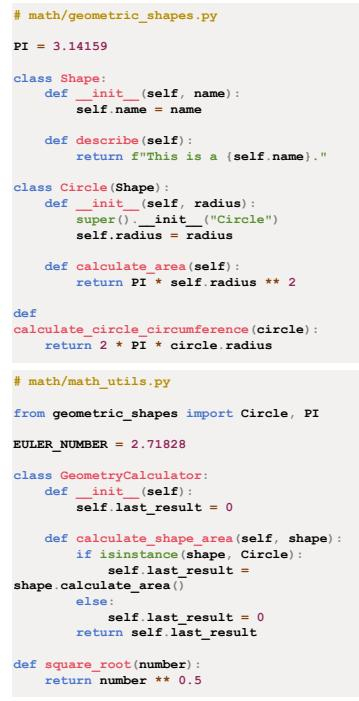  
(1) source code

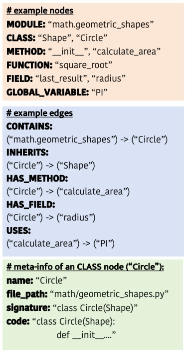  
(2) nodes & edges

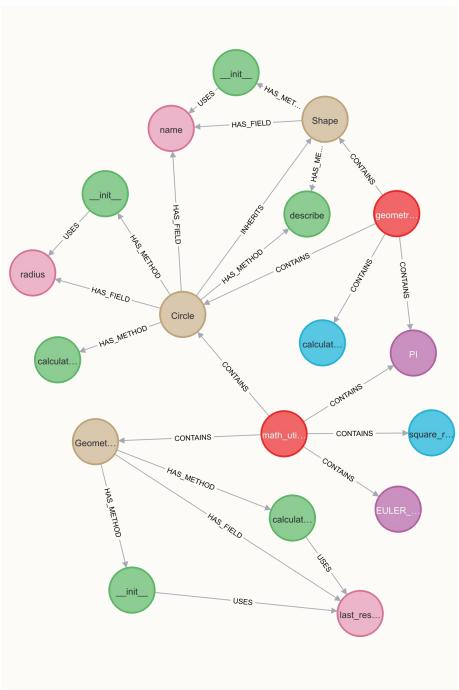  
(3) visualization in graph database  
Figure 2: Illustration of the process for indexing source code to generate a code graph based on the given graph database schema. Subfigure (3) provides a visualization example of the resultant code graph in Neo4j.

Phase 2: Edge Completion. The second phase addresses the limitations of shallow indexing by focusing on cross-file relationships. We employ Depth-First Search (DFS) to traverse each code file, using abstract syntax tree parsing to identify modules and classes. This approach is particularly effective in resolving Python's re-export issues. We convert relative imports to absolute imports, enabling accurate establishment of cross-file CONTAINS relationships through graph queries. Simultaneously, we record INHERITS relationships for each class. For complex cases like multiple inheritance, DFS is used to establish edges for inherited FIELD and METHOD nodes within the graph database. This comprehensive approach ensures accurate capture of both intra-file and cross-file relationships, providing a complete representation of the codebase structure.

Summary. Our code graph database design offers four key advantages for subsequent use. First, it ensures efficient storage by storing code snippets as indexed references rather than directly in the graph database. Second, it enables multi-granularity searches, from module-level to variable-level, accommodating diverse analytical needs. Third, it facilitates topological analysis of the codebase, revealing crucial insights into hierarchical and dependency structures. Last, this schema design supports multiple tasks without requiring modifications, demonstrating its versatility and general applicability. These features collectively enhance the system's capability to handle complex code analysis tasks effectively across various scenarios. Regarding the discussion of indexing efficiency, please refer to Appendix A.6.

## 3.2 Large Language Models Interaction with Code Graph Database

Code structure-aware search. CODEXGRAPH leverages the flexibility of graph query language to construct complex and composite search conditions. By combining this flexibility with the structural properties of graph databases, the LLM agent can effectively navigate through various nodes and edges in the code graph. This capability allows for intricate queries such as: "Find classes under a certain module that contain a specific method", or "Retrieve the module where a certain class is defined, along with the functions it contains". This approach enables code structure-aware searches, providing a level of code retrieval that is difficult to achieve with similarity-based retrieval methods (Robertson and Zaragoza, 2009; Guo et al., 2022) or conventional code-specific tools and APIs (Zhang et al., 2024b; Deshpande et al., 2024).

Write then translate. LLMs power LLM agents, which operate based on user-provided prompts to decompose tasks, use tools, and perform reasoning. This design is effective for handling specific, focused tasks (Gupta and Kembhavi, 2022; Yuan et al., 2024), but when tasks are complex and multifaceted, LLM agents may underperform. This limitation has led to the development of multi-agent systems (Hong et al., 2023; Qian et al., 2023; Guo et al., 2024), where multiple LLM agents independently handle parts of the task. Inspired by this approach, CoDEXGRAPH implements a streamlined “write then translate" strategy to optimize

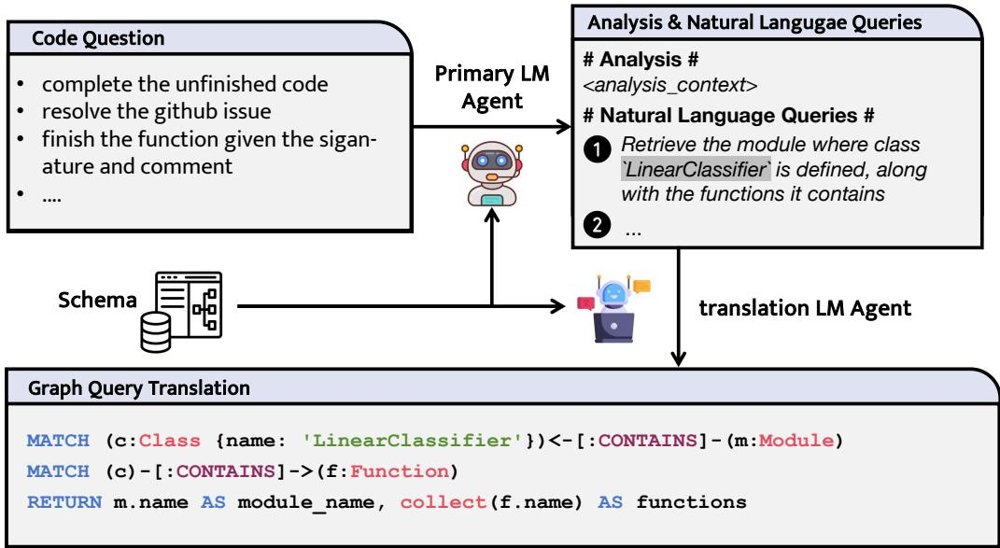  
Figure 3: The primary LLM agent analyzes the given code question, writting natural language queries. These queries are then processed by the translation LLM agent, which translates them into executable graph queries.

LLM-database interactions.

As illustrated in Figure 3, the primary LLM agent focuses on understanding context and generating natural language queries based on the user's question. These queries are then passed to a specialized translation LLM agent, which converts them into formal graph queries. A more detailed explanation of this strategy is provided in Appendix A.5. This division of labor allows the primary LLM agent to concentrate on highlevel reasoning while ensuring syntactically correct and optimized graph queries. By separating these tasks, CoDEXGRAPH enhances query success rates and improves the system's ability to accurately retrieve relevant code information.

Iterative pipeline. Instead of completing the code task in a single step, CoDEXGRAPH employs an iterative pipeline for interactions between LLM agents and code graph databases, drawing insights from existing agent systems (Yao et al., 2023; Yang et al., 2024b). In each round, LLM agents formulate multiple queries based on the user's question and previously gathered information. Similar to (Madaan et al., 2023), the agent then analyzes the aggregated results to determine whether sufficient context has been acquired or if additional rounds are necessary. This iterative approach fully leverages the reasoning capabilities of the LLM agent, thereby enhancing problem-solving accuracy.

## 4 Experimental Setting

Benchmarks. We employ three diverse repositorylevel code benchmarks to evaluate CoDEXGRAPH: CrossCodeEval (Ding et al., 2024), SWE-bench (Yang et al., 2024b), and EvoCodeBench (Li et al., 2024b). CrossCodeEval is a multilingual scope cross-file completion dataset for Python, Java, TypeScript, and C#. SWE-bench evaluates a model's ability to solve GitHub issues with 2, 294 Issue-Pull Request pairs from 12 Python repositories. EvoCodeBench is an evolutionary code generation benchmark with comprehensive annotations and evaluation metrics.

We report our primary results on the CrossCodeEval Lite (Python) and SWE-bench Lite test sets for Cross-CodeEval and SWE-bench, respectively, and on the full test set for EvoCodeBench. CrossCodeEval Lite (Python) and SWE-bench Lite represent subsets of their respective datasets. CrossCodeEval Lite (Python) consists of 1000 randomly sampled Python instances, while SWE-bench Lite includes 300 instances randomly sampled after filtering out those with poor issue descriptions.

Remark: During indexing of 43 Sympy samples from the SWE-bench dataset, we face out-of-memory issues due to numerous fles and complex dependencies, leading to their exclusion. Similarly, some EvoCodeBench samples are omitted due to test environment configuration issues. Thus, SWE-bench Lite and EvoCodeBench results are based on 257 and 212 samples, respectively.

Baselines. We evaluate whether CODEXGRAPH is a powerful solution for Retrieval-Augmented Code Generation (RACG) (Jiang et al., 2024). We specifically assess how effectively code graph database interfaces aid LLMs in understanding code repositories, particularly when handling diverse code questions across different benchmarks to test CODEXGRAPH 's general applicability. To achieve this, we select resilient RACG baselines that can be adapted to various tasks. Based on the categories in Section 2.2, we choose BM25 (Robertson and Zaragoza, 2009) and AUTOCODEROVER (Zhang et al., 2024b), which are widely recognized in code tasks (Jimenez et al., 2023; Ding et al., 2024; Kovrigin et al., 2024; Chen et al., 2024), along with a No-RAG method. Besides, since our work focuses on RACG methods and their generalizability, we exclude methods that interact with external websites (OpenDevin Team, 2024; Zhang et al., 2024a) and runtime environments (Yang et al., 2024b), as well as task-specific methods that are not easily adaptable across multiple benchmarks (Cheng et al., 2024; Orwall, 2024). These methods fall outside the scope of our project.

Especially, although (Zhang et al., 2024b) evaluate AUTOCODEROVER exclusively on SWE-bench, we extend its implementation to CrossCodeEval and EvoCodeBench, while retaining its core set of 7 codespecific tools for code retrieval.

Large Language Models (LLMs). We evaluate CoDEXGRAPH on three advanced LLMs with long text processing, tool use, and code generation capabilities: GPT-4o, DeepSeek-Coder-V2 (Zhu et al., 2024), and Qwen2-72b-Instruct (Yang et al., 2024a).

• GPT-4o: Developed by OpenAI3, this model excels in commonsense reasoning, mathematics, and code, and is among the top-performing models as of July 2024 4.

• DeepSeek-Coder-V2 (DS-Coder): A specialized code-specific LLM by DeepSeek 5 with 236B parameters, it retains general capabilities while being highly proficient in code-related tasks.

• Qwen2-72b-Instruct (Qwen2): Developed by Alibaba 6, this open-source model has about 72 billion parameters and a 128k long context, making it suitable for evaluating existing methods.

For the hyperparameters of the selected large language models, we empirically set the temperature coefficient to 0.0 for both GPT-4o and Qwen2-72b-Instruct, and to 1.0 for DeepSeek-Coder-V2. All other parameters are kept at their default settings.

Metrics. In metrics selection, we follow the original papers’ settings (Jimenez et al., 2023; Ding et al., 2024; Li et al., 2024b). Specifically, for CrossCodeEval, we measure performance with code match and identifier match metrics, assessing accuracy with exact match (EM), edit similarity (ES), and F1 scores. SWE-bench utilizes % Resolved (Pass@1) to gauge the effectiveness of model-generated patches based on provided unit tests. EvoCodeBench employs Pass @k, where k represents the number of generated programs, for functional correctness and Recall@k to assess the recall of reference dependencies in generated programs. We set k to 1 in our main experiments.

Implementation details. Before indexing, we filter the Python repositories for each benchmark to retain only Python files. For the SWE-bench dataset, we also exclude test files to avoid slowing down the creation of the code graph database. Following the process outlined in Section 3.1, we construct code graph databases for the indexed repositories, storing the corresponding nodes and edges. We select Neo4j as the graph database and Cypher as the query language.

## 5 Results

## 5.1 Analysis of Repository-Level Code Tasks

RACG is crucial for repository-level code tasks. In Table 1, RACG-based methods—BM25, AU-TOCODEROVER, and CODEXGRAPH—basically outperform the No-RAG method across all benchmarks and evaluation metrics. For instance, on the Cross-CodeEval Lite (Python) dataset, using GPT-4o as the backbone LLM, RACG methods improve performance by 10.4% to 17.1% on the EM metric compared to No-RAG. This demonstrates that the No-RAG approach, which relies solely on in-file context and lacks interaction with the code repository, significantly limits performance.

Existing RACG methods struggle to adapt to various repo-level code tasks. Experimental results in Table 1 reveal the shortcomings of existing RACG-based methods like BM25 and AUTOCODEROVER. While these methods perform well in specific tasks, they often underperform when applied to other repository-level code tasks. This discrepancy typically arises from their inherent characteristics or task-specific optimizations.

Specifically, AUTOCODEROVER is designed with code tools tailored for SWE-bench tasks, leveraging expert knowledge and the unique features of SWEbench to optimize tool selection and design. This optimization refines the LLM agent's action spaces, enabling it to gather valuable information more efficiently and boosting its performance on SWE-bench tasks (22.96%). However, these task-specific optimizations limit its flexibility and effectiveness in other coding tasks, as evidenced by its subpar results on Cross-CodeEval Lite (Python) and EvoCodeBench compared to other methods.

Similarly, BM25 faces the same issues. In Cross-CodeEval Lite (Python), its similarity-based retrieval aligns well with code completion tasks, enabling it to retrieve relevant usage references or direct answers easily. This results in strong performance, particularly in the ES metric. However, BM25 lacks the reasoning capabilities of LLMs during query construction, making its retrieval process less intelligent. Consequently, when confronted with reasoning-heavy tasks like those in SWE-bench, BM25 often fails to retrieve appropriate code snippets, leading to poor performance.

CODEXGRAPH shows versatility and efficacy across diverse benchmarks. Table 1 shows that CoDEXGRAPH achieves competitive results across various repository-level code tasks with general code graph database interfaces. Specifically, with GPT-4o as the LLM backbone, CoDEXGRAPH outperforms other RACG baselines on CrossCodeEval Lite (Python) and EvoCodeBench, while also achieving results comparable to AUTOCODEROVER on SWE-bench Lite. This demonstrates the generality and effectiveness of the code graph database interface design. For further details on the rationale behind CODEXGRAPH and its advantages compared to baselines, see Appendix A.8.

Table 1: Performance comparison of CoDEXGRAPH and RACG baselines across three benchmarks using various LLMs. The absence of values in SWE-bench Lite for the No RAG method is due to issues with mismatches between the dataset and the code when running inference scripts2. Similarly, the missing values in EvoCodeBench are attributable to task inputs being unsuitable for constructing the required BM25 queries, and the original paper also does not provide the corresponding implementation. Notably, the two agent-based methods, AUTOCoDEROVER and CoDEXGRAPH, perform poorly when equipped with Qwen2-72b-instruct. Appendix A.4 provides a detailed explanation for this. The best results for each metric are bolded.
<table><tr><td rowspan="2">Model</td><td rowspan="2">Method</td><td colspan="4">CrossCodeEval Lite (Python)</td><td>SWE-bench Lite</td><td colspan="2">EvoCodeBench</td></tr><tr><td>EM</td><td>ES</td><td>ID-EM</td><td>ID-F1</td><td>Pass@1</td><td>Pass@1</td><td>Recall@1</td></tr><tr><td rowspan="4">Qwen2</td><td>No RAG</td><td>8.20</td><td>46.16</td><td>13.0</td><td>36.92</td><td></td><td>19.34</td><td>11.34</td></tr><tr><td>BM25</td><td>15.50</td><td>51.74</td><td>22.60</td><td>45.44</td><td>0.00</td><td></td><td></td></tr><tr><td>AUTOCODEROVER</td><td>5.21</td><td>47.63</td><td>10.16</td><td>36.54</td><td>9.34</td><td>16.91</td><td>7.86</td></tr><tr><td>CODEXGRAPH</td><td>5.00</td><td>47.99</td><td>9.10</td><td>36.44</td><td>1.95</td><td>14.62</td><td>8.60</td></tr><tr><td rowspan="4">DS-Coder</td><td>No RAG</td><td>11.70</td><td>60.73</td><td>16.90</td><td>47.85</td><td></td><td>25.47</td><td>11.04</td></tr><tr><td>BM25</td><td>21.90</td><td>67.52</td><td>30.60</td><td>59.04</td><td>1.17</td><td></td><td></td></tr><tr><td>AUTOCODEROVER</td><td>14.90</td><td>59.78</td><td>22.30</td><td>51.34</td><td>15.56</td><td>20.28</td><td>7.56</td></tr><tr><td>CODEXGRAPH</td><td>20.20</td><td>63.14</td><td>28.10</td><td>54.88</td><td>12.06</td><td>27.62</td><td>12.01</td></tr><tr><td rowspan="4">GPT-40</td><td>No RAG</td><td>10.80</td><td>59.36</td><td>16.70</td><td>48.22</td><td></td><td>27.83</td><td>11.79</td></tr><tr><td>BM25</td><td>21.20</td><td>66.18</td><td>30.20</td><td>58.71</td><td>3.11</td><td></td><td></td></tr><tr><td>AUTOCODEROVER</td><td>21.20</td><td>61.92</td><td>28.10</td><td>54.81</td><td>22.96</td><td>28.78</td><td>11.17</td></tr><tr><td>CODEXGRAPH</td><td>27.90</td><td>67.98</td><td>35.60</td><td>61.08</td><td>22.96</td><td>36.02</td><td>11.87</td></tr></table>

Table 2: Average token cost comparison across three benchmarks (GPT-4o as the backbone LLM). CCEval\* refers to CrossCodeEval Lite (Python) and SWE-bench† refers to SWE-bench Lite in this table.
<table><tr><td>Method</td><td>CCEval*</td><td>SWE-bench†</td><td>EvoCodeBench</td></tr><tr><td>BM25</td><td>1.47k</td><td>14.76k</td><td></td></tr><tr><td>AUTOCODEROVER</td><td>10.74k</td><td>76.01k</td><td>21.41k</td></tr><tr><td>CODEXGRAPH</td><td>22.16k</td><td>102.25k</td><td>24.49k</td></tr></table>

CODEXGRAPH increases token consumption. CoDEXGRAPH utilizes code graph databases as interfaces to retrieve information from the code repository through graph queries. While this approach expands action spaces, it also leads to increased token costs due to the uncontrollable length of query outcomes. Additionally, CoDEXGRAPH may encounter loops that prevent the generation of executable graph queries. As demonstrated in Table 2, this leads to a higher token usage compared to existing RACG methods.

Although optimizing token efficiency is not the primary focus of this work, future efforts may explore post-processing techniques—such as filtering out irrelevant or redundant information from retrieved code snippets—to reduce token consumption and enhance overall efficiency.

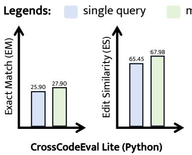  
Figure 4: Performance comparison of two querying strategies on CrossCodeEval Lite (Python) and SWE-bench Lite.

## 5.2 Deeper Analysis of CODEXGRAPH

Optimal querying strategies vary across different benchmarks. There are two strategies for formulating queries in each round within CODEXGRAPH: either generating a single query or producing multiple queries for code retrieval. Opting for a single query per round can enhance precision in retrieving relevant content but may compromise the recall rate. Conversely, generating multiple queries per round can improve recall but may reduce precision. Experimental results, as illustrated in Figure 4, reveal that for CrossCodeEval Lite (Python), which involves lower reasoning difficulty (26.43 vs. 27.90 in the EM metric), the “multiple queries" strategy is more effective. In contrast, for SWE-bench Lite, which presents higher reasoning difficulty, the “single query" strategy yields better outcomes (22.96 vs. 17.90 in the Pass@1 metric). These findings provide valuable guidance for researchers in selecting the most appropriate querying strategy. For a detailed discussion on the optimal querying strategy for AUTOCoDEROVER, please refer to Appendix A.7.

“Write then translate" eases reasoning load. Removing the translation LLM agent requires the primary LLM agent to independently analyze coding questions and directly formulate graph queries for code retrieval, increasing its reasoning load and reducing the syntactic accuracy of the queries. Experimental results in Table 3 highlight the significant negative impact of the removal of the translation LLM agent on CODEXGRAPH's performance across all selected LLMs in the CrossCodeEval Lite (Python) benchmark. Even when GPT-4o is used as the backbone model, performance metrics exhibit a significant drop (e.g., the EM metric drops from 27.90% to 8.30%), underscoring the critical role of the translation LLM agent in alleviating the primary LLM agent's reasoning burden.

Table 3: Ablation study about the translation LLM agent and the edges of code graphs on CrossCodeEval Lite (Python).
<table><tr><td rowspan="2">Model</td><td rowspan="2">Method</td><td colspan="4">CrossCodeEval Lite (Python)</td></tr><tr><td>EM</td><td>ES</td><td>ID-EM</td><td>ID-F1</td></tr><tr><td rowspan="3">Qwen2</td><td>CODEXGRAPH</td><td>5.00</td><td>47.99</td><td>9.10</td><td>36.44</td></tr><tr><td>w/o translation LLM Agent</td><td>0.50 (-4.50)</td><td>10.45 (-37.54)</td><td>0.60 (-8.50)</td><td>2.62 (-33.82)</td></tr><tr><td>w/o edges</td><td>4.80 (-0.20)</td><td>48.74 (+0.75)</td><td>9.10 (-0.00)</td><td>36.90 (+0.46)</td></tr><tr><td rowspan="3">DS-Coder</td><td>CODEXGRAPH</td><td>20.20</td><td>63.14</td><td>28.10</td><td>54.88</td></tr><tr><td>w/o translation LLM Agent</td><td>5.50 (-14.70)</td><td>53.56 (-9.58)</td><td>11.20 (-16.90)</td><td>39.75 (-15.13)</td></tr><tr><td>w/o edges</td><td>14.50 (-13.40)</td><td>56.64 (-11.34)</td><td>21.00 (-14.60)</td><td>47.18 (-13.90)</td></tr><tr><td rowspan="3">GPT-40</td><td>CODEXGRAPH</td><td>27.90</td><td>67.98</td><td>35.60</td><td>61.08</td></tr><tr><td>w/o translation LLM Agent</td><td>8.30 (-19.60)</td><td>56.36 (-11.62)</td><td>14.40 (-21.20)</td><td>44.08 (-17.00)</td></tr><tr><td>w/o edges</td><td>16.40 (-11.50)</td><td>57.14 (-10.84)</td><td>22.70 (-12.90)</td><td>48.27 (-12.81)</td></tr></table>

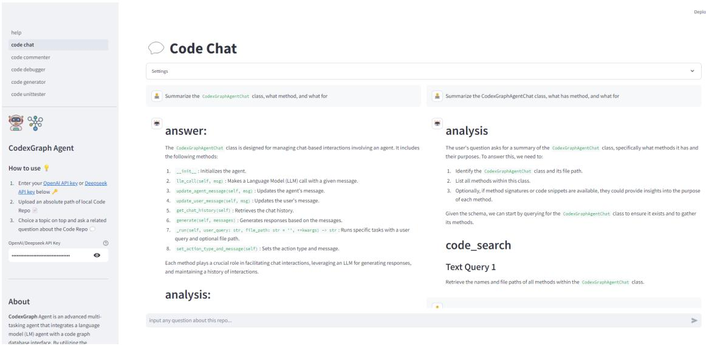  
Figure 5: WebUI for Code Chat, used for answering any questions related to code repositories.

Edges in code graphs matter. We assess the impact of edge information on the performance of CoDEX-GRAPH by omitting edge descriptions from the code graph schema and instructing the LLM to avoid generating queries that rely on edges, resulting in queries based solely on node attributes. As shown in Table 3, this removal significantly degrades performance across various backbone LLMs on the CrossCodeEval Lite (Python) benchmark, with the Exact Match (EM) metric for GPT-4o dropping from 27.90% to 14.50%. This decline underscores the critical role of edges in forming complete code graphs, as their absence increases the failure rate of graph queries and hinders deep searches that depend on complex condition combinations.

CODEXGRAPH is enhanced when equipped with advanced LLMs. Code graph databases provide CODEXGRAPH with a flexible interface, expanding its capabilities beyond existing methods. However, this approach demands strong reasoning and coding abilities from the underlying LLM to formulate effective queries. As shown in Table 1, CODEXGRAPH's performance improves with more advanced LLMs, progressing from Qwen2-72b-Instruct to DeepSeek-Coder-v2 to GPT-4o. This trend indicates that as LLMs advance in coding, reasoning, and text comprehension, they become better equipped to leverage code graph databases within CODEXGRAPH, overcoming potential retrieval failures and enhancing overall performance across various benchmarks and metrics.

## 6 Real-World Application Scenario

To showcase CoDEXGRAPH's practical value, we developed five code agents using the ModelScope-Agent framework (Li et al., 2023). These agents address common coding challenges that involve understanding and navigating complex inter-file dependencies: Code Chat (repository inquiry), Code Debugger (bug diagnosis and resolution), Code Unittestor (test generation), Code Generator (new feature implementation), and Code Commentor (documentation enhancement). Each agent integrates key CODEXGRAPH concepts to solve specific production environment issues. Examples and details are provided in Appendix A.3, with Figure 5 illustrating Code Chat's WebUI.

## 7 Conclusion

CoDEXGRAPH addresses the limitations of existing RACG methods, which often struggle with flexibility and generalization across different code tasks. By integrating LLMs with code graph database interfaces, CoDEXGRAPH facilitates effective, code structureaware retrieval for diverse repository-level code tasks. Our evaluations highlight its competitive performance and broad applicability on academic benchmarks. Additionally, we provide several code applications in ModelScope-Agent, demonstrating CODEXGRAPH 's capability to enhance the accuracy and usability of automated software development. The qualitative analysis and the schema explanation have been postponed to Appendix A.1 and A.2, respectively.

## 8 Limitations

CoDEXGRAPH has only been evaluated on Python. In the future, we plan to extend CODEXGRAPH to more programming languages, such as Java and C++. Secondly, there is room for improvement in the construction efficiency and schema completeness of the code graph database. Faster database indexing and a more comprehensive schema (e.g., adding edges related to function calls) will enhance the broader applicability of CODEXGRAPH. Finally, the design of CODEX-GRAPH's workflow can further integrate with existing advanced agent techniques, such as finer-grained multiagent collaboration.

## 9 Potential Risks

Given that CoDEXGRAPH requires scanning the entire code repository, any sensitive information not adequately sanitized by users could lead to data breaches and privacy risks. Furthermore, the implementation of CODEXGRAPH may partially supplant human labor, potentially leading to job displacement, though it also has the potential to create new opportunities in the field.

## 10 Ethical Considerations

The introduction of CODEXGRAPH aims to aid code professionals in addressing repository-level coding tasks and to assist practitioners in comprehending and familiarizing themselves with complex code repositories. However, the quality and accuracy of CoDEX-GRAPH's outputs remain questionable. Overreliance on CoDExGRAPH by novice coders, who may lack the ability to discern the veracity of its results, could lead to misuse of the tool. Additionally, CoDEXGRAPH's operation incurs a computational overhead, and the environmental impact of these computational resources warrants consideration.

## References

Daman Arora, Atharv Sonwane, Nalin Wadhwa, Abhav Mehrotra, Saiteja Utpala, Ramakrishna Bairi, Aditya Kanade, and Nagarajan Natarajan. 2024. Masai: Modular architecture for software-engineering ai agents. arXiv preprint arXiv:2406.11638.

Jacob Austin, Augustus Odena, Maxwell Nye, Maarten Bosma, Henryk Michalewski, David Dohan, Ellen Jiang, Carrie Cai, Michael Terry, Quoc Le, et al. 2021. Program synthesis with large language models. arXiv preprint arXiv:2108.07732.

Ramakrishna Bairi, Atharv Sonwane, Aditya Kanade, Vageesh D C, Arun Iyer, Suresh Parthasarathy, Sriram Rajamani, B. Ashok, and Shashank Shet. 2023. Codeplan: Repository-level coding using llms and planning. Preprint, arXiv:2309.12499.

Dong Chen, Shaoxin Lin, Muhan Zeng, Daoguang Zan, Jian-Gang Wang, Anton Cheshkov, Jun Sun, Hao Yu, Guoliang Dong, Artem Aliev, Jie Wang, Xiao Cheng, Guangtai Liang, Yuchi Ma, Pan Bian, Tao Xie, and Qianxiang Wang. 2024. Coder: Issue resolving with multi-agent and task graphs. Preprint, arXiv:2406.01304.

Mark Chen, Jerry Tworek, Heewoo Jun, Qiming Yuan, Henrique Ponde De Oliveira Pinto, Jared Kaplan, Harri Edwards, Yuri Burda, Nicholas Joseph, Greg Brockman, et al. 2021. Evaluating large language models trained on code. arXiv preprint arXiv:2107.03374.

Wei Cheng, Yuhan Wu, and Wei Hu. 2024. Dataflowguided retrieval augmentation for repository-level code completion. arXiv preprint arXiv:2405.19782.

Cognition Labs. 2024. Devin, AI software engineer. https://www.cognition-labs. com/introducing-devin.

Ken Deng, Jiaheng Liu, He Zhu, Congnan Liu, Jingxin Li, Jiakai Wang, Peng Zhao, Chenchen Zhang, Yanan Wu, Xueqiao Yin, et al. 2024. R2c2-coder: Enhancing and benchmarking real-world repositorylevel code completion abilities of code large language models. arXiv preprint arXiv:2406.01359.

Ajinkya Deshpande, Anmol Agarwal, Shashank Shet, Arun Iyer, Aditya Kanade, Ramakrishna Bairi, and Suresh Parthasarathy. 2024. Class-level code generation from natural language using iterative, toolenhanced reasoning over repository. Preprint, arXiv:2405.01573.

Yangruibo Ding, Zijian Wang, Wasi Ahmad, Hantian Ding, Ming Tan, Nihal Jain, Murali Krishna Ramanathan, Ramesh Nallapati, Parminder Bhatia, Dan Roth, et al. 2024. Crosscodeeval: A diverse and multilingual benchmark for cross-file code completion. Advances in Neural Information Processing Systems, 36.

Darren Edge, Ha Trinh, Newman Cheng, Joshua Bradley, Alex Chao, Apurva Mody, Steven Truitt, and Jonathan Larson. 2024. From local to global: A graph rag approach to query-focused summarization. arXiv preprint arXiv:2404.16130.

Paul Gauthier. 2024. Aider: Ai pair programming in your terminal. https://aider.chat/. Accessed: 2024-08-15.

Daya Guo, Shuai Lu, Nan Duan, Yanlin Wang, Ming Zhou, and Jian Yin. 2022. Unixcoder: Unified crossmodal pre-training for code representation. arXiv preprint arXiv:2203.03850.

Taicheng Guo, Xiuying Chen, Yaqi Wang, Ruidi Chang, Shichao Pei, Nitesh V. Chawla, Olaf Wiest, and Xiangliang Zhang. 2024. Large language model based multi-agents: A survey of progress and challenges. Preprint, arXiv:2402.01680.

Tanmay Gupta and Aniruddha Kembhavi. 2022. Visual programming: Compositional visual reasoning without training. Preprint, arXiv:2211.11559.

Xiaoxin He, Yijun Tian, Yifei Sun, Nitesh V Chawla, Thomas Laurent, Yann LeCun, Xavier Bresson, and Bryan Hooi. 2024. G-retriever: Retrievalaugmented generation for textual graph understanding and question answering. arXiv preprint arXiv:2402.07630.

Sirui Hong, Xiawu Zheng, Jonathan Chen, Yuheng Cheng, Jinlin Wang, Ceyao Zhang, Zili Wang, Steven Ka Shing Yau, Zijuan Lin, Liyang Zhou, et al. 2023. Metagpt: Meta programming for multi-agent collaborative framework. arXiv preprint arXiv:2308.00352.

Juyong Jiang, Fan Wang, Jiasi Shen, Sungju Kim, and Sunghun Kim. 2024. A survey on large language models for code generation. arXiv preprint arXiv:2406.00515.

Carlos E Jimenez, John Yang, Alexander Wettig, Shunyu Yao, Kexin Pei, Ofir Press, and Karthik Narasimhan. 2023. Swe-bench: Can language models resolve real-world github issues? arXiv preprint arXiv:2310.06770.

Alexander Kovrigin, Aleksandra Eliseeva, Yaroslav Zharov, and Timofey Bryksin. 2024. On the importance of reasoning for context retrieval in repository-level code editing. arXiv preprint arXiv:2406.04464.

Patrick Lewis, Ethan Perez, Aleksandra Piktus, Fabio Petroni, Vladimir Karpukhin, Naman Goyal, Heinrich Küttler, Mike Lewis, Wen-tau Yih, Tim Rocktäschel, et al. 2020. Retrieval-augmented generation for knowledge-intensive nlp tasks. Advances in Neural Information Processing Systems, 33:9459– 9474.

Bowen Li, Wenhan Wu, Ziwei Tang, Lin Shi, John Yang, Jinyang Li, Shunyu Yao, Chen Qian, Binyuan Hui, Qicheng Zhang, et al. 2024a. Devbench:

A comprehensive benchmark for software development. arXiv preprint arXiv:2403.08604.

Chenliang Li, Hehong Chen, Ming Yan, Weizhou Shen, Haiyang Xu, Zhikai Wu, Zhicheng Zhang, Wenmeng Zhou, Yingda Chen, Chen Cheng, Hongzhu Shi, Ji Zhang, Fei Huang, and Jingren Zhou. 2023. Modelscope-agent: Building your customizable agent system with open-source large language models. Preprint, arXiv:2309.00986.

Jia Li, Ge Li, Xuanming Zhang, Yihong Dong, and Zhi Jin. 2024b. Evocodebench: An evolving code generation benchmark aligned with real-world code repositories. arXiv preprint arXiv:2404.00599.

Zhuoyang Li, Liran Deng, Hui Liu, Qiaoqiao Liu, and Junzhao Du. 2024c. Unioqa: A unified framework for knowledge graph question answering with large language models. arXiv preprint arXiv:2406.02110.

Nelson F Liu, Kevin Lin, John Hewitt, Ashwin Paranjape, Michele Bevilacqua, Fabio Petroni, and Percy Liang. 2024a. Lost in the middle: How language models use long contexts. Transactions of the Association for Computational Linguistics, 12:157–173.

Tianyang Liu, Canwen Xu, and Julian McAuley. 2023. Repobench: Benchmarking repository-level code auto-completion systems. arXiv preprint arXiv:2306.03091.

Wei Liu, Ailun Yu, Daoguang Zan, Bo Shen, Wei Zhang, Haiyan Zhao, Zhi Jin, and Qianxiang Wang. 2024b. Graphcoder: Enhancing repositorylevel code completion via code context graphbased retrieval and language model. arXiv preprint arXiv:2406.07003.

Qinyu Luo, Yining Ye, Shihao Liang, Zhong Zhang, Yujia Qin, Yaxi Lu, Yesai Wu, Xin Cong, Yankai Lin, Yingli Zhang, Xiaoyin Che, Zhiyuan Liu, and Maosong Sun. 2024. Repoagent: An llmpowered open-source framework for repositorylevel code documentation generation. Preprint, arXiv:2402.16667.

Yingwei Ma, Qingping Yang, Rongyu Cao, Binhua Li, Fei Huang, and Yongbin Li. 2024. How to understand whole software repository? arXiv preprint arXiv:2406.01422.

Aman Madaan, Niket Tandon, Prakhar Gupta, Skyler Hallinan, Luyu Gao, Sarah Wiegreffe, Uri Alon, Nouha Dziri, Shrimai Prabhumoye, Yiming Yang, Sean Welleck, Bodhisattwa Prasad Majumder, Shashank Gupta, Amir Yazdanbakhsh, and Peter Clark. 2023. Self-refine: Iterative refinement with self-feedback. Preprint, arXiv:2303.17651.

OpenDevin Team. 2024. OpenDevin: An Open Platform for AI Software Developers as Generalist Agents. https://github.com/OpenDevin/ OpenDevin. Accessed: ENTER THE DATE YOU ACCESSED THE PROJECT.

Huy N Phan, Hoang N Phan, Tien N Nguyen, and Nghi DQ Bui. 2024. Repohyper: Better context retrieval is all you need for repository-level code completion. arXiv preprint arXiv:2403.06095.

Chen Qian, Xin Cong, Cheng Yang, Weize Chen, Yusheng Su, Juyuan Xu, Zhiyuan Liu, and Maosong Sun. 2023. Communicative agents for software development. arXiv preprint arXiv:2307.07924.

Stephen Robertson and Hugo Zaragoza. 2009. The probabilistic relevance framework: Bm25 and beyond. Found. Trends Inf. Retr., 3(4):333–389.

Disha Shrivastava, Denis Kocetkov, Harm de Vries, Dzmitry Bahdanau, and Torsten Scholak. 2023. Repofusion: Training code models to understand your repository. arXiv preprint arXiv:2306.10998.

Kurt Shuster, Spencer Poff, Moya Chen, Douwe Kiela, and Jason Weston. 2021. Retrieval augmentation reduces hallucination in conversation. Preprint, arXiv:2104.07567.

Hongjin Su, Shuyang Jiang, Yuhang Lai, Haoyuan Wu, Boao Shi, Che Liu, Qian Liu, and Tao Yu. 2024. Arks: Active retrieval in knowledge soup for code generation. Preprint, arXiv:2402.12317.

Qiushi Sun, Zhirui Chen, Fangzhi Xu, Kanzhi Cheng, Chang Ma, Zhangyue Yin, Jianing Wang, Chengcheng Han, Renyu Zhu, Shuai Yuan, et al. 2024. A survey of neural code intelligence: Paradigms, advances and beyond. arXiv preprint arXiv:2403.14734.

Xingyao Wang, Yangyi Chen, Lifan Yuan, Yizhe Zhang, Yunzhu Li, Hao Peng, and Heng Ji. 2024. Executable code actions elicit better llm agents. arXiv preprint arXiv:2402.01030.

Chunqiu Steven Xia, Yinlin Deng, Soren Dunn, and Lingming Zhang. 2024. Agentless: Demystifying llm-based software engineering agents. arXiv preprint arXiv:2407.01489.

Siqiao Xue, Caigao Jiang, Wenhui Shi, Fangyin Cheng, Keting Chen, Hongjun Yang, Zhiping Zhang, Jianshan He, Hongyang Zhang, Ganglin Wei, et al. 2023. Db-gpt: Empowering database interactions with private large language models. arXiv preprint arXiv:2312.17449.

An Yang, Baosong Yang, Binyuan Hui, Bo Zheng, Bowen Yu, Chang Zhou, Chengpeng Li, Chengyuan Li, Dayiheng Liu, Fei Huang, Guanting Dong, Haoran Wei, Huan Lin, Jialong Tang, Jialin Wang, Jian Yang, Jianhong Tu, Jianwei Zhang, Jianxin Ma, Jianxin Yang, Jin Xu, Jingren Zhou, Jinze Bai, Jinzheng He, Junyang Lin, Kai Dang, Keming Lu, Keqin Chen, Kexin Yang, Mei Li, Mingfeng Xue, Na Ni, Pei Zhang, Peng Wang, Ru Peng, Rui Men, Ruize Gao, Runji Lin, Shijie Wang, Shuai Bai, Sinan Tan, Tianhang Zhu, Tianhao Li, Tianyu Liu, Wenbin Ge, Xiaodong Deng, Xiaohuan Zhou, Xingzhang Ren, Xinyu Zhang, Xipin Wei, Xuancheng Ren, Xuejing Liu, Yang Fan, Yang Yao,

Yichang Zhang, Yu Wan, Yunfei Chu, Yuqiong Liu, Zeyu Cui, Zhenru Zhang, Zhifang Guo, and Zhihao Fan. 2024a. Qwen2 technical report. Preprint, arXiv:2407.10671.

John Yang, Carlos E Jimenez, Alexander Wettig, Kilian Lieret, Shunyu Yao, Karthik Narasimhan, and Ofir Press. 2024b. Swe-agent: Agent-computer interfaces enable automated software engineering. arXiv preprint arXiv:2405.15793.

Shunyu Yao, Jeffrey Zhao, Dian Yu, Nan Du, Izhak Shafran, Karthik Narasimhan, and Yuan Cao. 2023. React: Synergizing reasoning and acting in language models. Preprint, arXiv:2210.03629.

Zhengqing Yuan, Ruoxi Chen, Zhaoxu Li, Haolong Jia, Lifang He, Chi Wang, and Lichao Sun. 2024. Mora: Enabling generalist video generation via a multiagent framework. Preprint, arXiv:2403.13248.

Daoguang Zan, Ailun Yu, Wei Liu, Dong Chen, Bo Shen, Wei Li, Yafen Yao, Yongshun Gong, Xiaolin Chen, Bei Guan, et al. 2024. Codes: Natural language to code repository via multi-layer sketch. arXiv preprint arXiv:2403.16443.

Fengji Zhang, Bei Chen, Yue Zhang, Jacky Keung, Jin Liu, Daoguang Zan, Yi Mao, Jian-Guang Lou, and Weizhu Chen. 2023. Repocoder: Repository-level code completion through iterative retrieval and generation. arXiv preprint arXiv:2303.12570.

Kechi Zhang, Jia Li, Ge Li, Xianjie Shi, and Zhi Jin. 2024a. Codeagent: Enhancing code generation with tool-integrated agent systems for realworld repo-level coding challenges. Preprint, arXiv:2401.07339.

Yuntong Zhang, Haifeng Ruan, Zhiyu Fan, and Abhik Roychoudhury. 2024b. Autocoderover: Autonomous program improvement. arXiv preprint arXiv:2404.05427.

Qihao Zhu, Daya Guo, Zhihong Shao, Dejian Yang, Peiyi Wang, Runxin Xu, Y Wu, Yukun Li, Huazuo Gao, Shirong Ma, et al. 2024. Deepseek-coder-v2: Breaking the barrier of closed-source models in code intelligence. arXiv preprint arXiv:2406.11931.

Albert Örwall. 2024. Moatless tools. https: // github.com/aorwall/moatless-tools.

## A Appendix

## A.1 Details of the Graph Database Schema

This schema is designed to abstract code repositories into code graphs for Python, where nodes represent symbols in the source code, and edges represent relationships between these symbols.

## A.1.1 Node Types

In the code graph, each node represents a distinct element of Python code, with each node type characterized by a specific set of attributes that capture its metadata. These node types and their associated attributes are comprehensively outlined in the Nodes Schema.

## A.1.2 Edge Types

Edges in the code graph define the relationships between nodes, illustrating how various elements within Python code are interconnected. Each edge type represents a specific kind of relationship, which helps to clarify the overall structure and flow of the code. The defined edge types, along with the relationships they represent, are detailed in the Edges Schema below:

## A.2 Qualitative Analysis

CoDEXGRAPH demonstrates robustness and adaptability across various benchmarks. In this section, we illustrate how CoDEXGRAPH effectively addresses a GitHub issue through a bug fix task example. The process involves collecting code context and generating a patch based on the issue description and the corresponding codebase. The workflow is depicted in Figure 6. The specific issue, labeled as “django-11848" and included in the SWE-bench lite dataset, involves a flaw in the Django project related to date parsing logic.

The issue centers on the parse\_http\_date’ function, which parses dates according to the HTTP RFC7231 section 7.1.1.1. The function supports three date formats: RFC1123, RFC850, and ASCTIME. However, the problem arises due to the hardcoded logic for interpreting two-digit years, which does not dynamically adjust based on the current year, leading to noncompliance with the RFC 7231 standard.

Given this issue description, CODEXGRAPH begins by analyzing the potential cause, identifying that the core of the issue lies in the parse\_http\_date function'. To address this, it is essential to retrieve the code of the parse\_http\_date’ function for further analysis. Here, CoDEXGRAPH employs a combination of the “generating a single query" and “Write then translate" strategies. Specifically, the primary LLM agent first generates a natural language query, which is then translated into a Cypher query by the translation LM agent.

By executing this Cypher query, CODEXGRAPH retrieves the relevant data from the graph database and returns it to the primary LLM agent for further analysis. Upon analyzing the results, the primary LLM agent concludes that to accurately locate the problematic function, it is necessary to identify the file path of the module containing the parse\_http\_date function'. After another iteration, the primary LLM agent successfully identifies the bug's location and generates the required patch to fix it.

The CoDEXGRAPH demonstrates the ability to iterate and refine its analysis, effectively handling complex code issues. By identifying the exact location of the bug and proposing a patch, the CODEXGRAPH resolves the problem, showcasing its utility in automated code analysis and bug fixing.

## A.3 Real-World Application

In this section, we present the WebUI interface for CoDEXGRAPH, showcasing its five practical applications: Code Chat, Code Debugger, Code Unittestor,

## Graph Database Schema: Nodes

```yaml
## Nodes
MODULE:
Attributes:
- name (String): Name of the module (dotted name)
- file_path (String): File path of the module
CLASS:
Attributes:
- name (String): Name of the class
- file_path (String): File path of the class
- signature (String): The signature of the class
- code (String): Full code of the class
FUNCTION:
Attributes:
- name (String): Name of the function
- file_path (String): File path of the function
- code (String): Full code of the function
- signature (String): The signature of the function
FIELD:
Attributes:
- name (String): Name of the field
- file_path (String): File path of the field
- class (String): Name of the class the field belongs to
METHOD:
Attributes:
- name (String): Name of the method
- file_path (String): File path of the method
- class (String): Name of the class the method belongs to
- code (String): Full code of the method
- signature (String): The signature of the method
GLOBAL_VARIABLE:
Attributes:
- name (String): Name of the global variable
- file_path (String): File path of the global variable
- code (String): The code segment in which the global variable is defined
```

## Graph Database Schema: Edges

## Edges   
CONTAINS:   
Source: MODULE   
Target: CLASS or FUNCTION or GLOBAL\_VARIABLE   
HAS\_METHOD:   
Source: CLASS   
Target: METHOD   
HAS\_FIELD:   
Source: CLASS   
Target: FIELD   
INHERITS:   
Source: CLASS   
Target: CLASS (base class)   
USES:   
Source: FUNCTION or METHOD   
Target: GLOBAL\_VARIABLE or FIELD   
Attributes:   
source\_association\_type (String): FUNCTION, METHOD   
- target\_association\_type (String): GLOBAL\_VARIABLE, FIELD

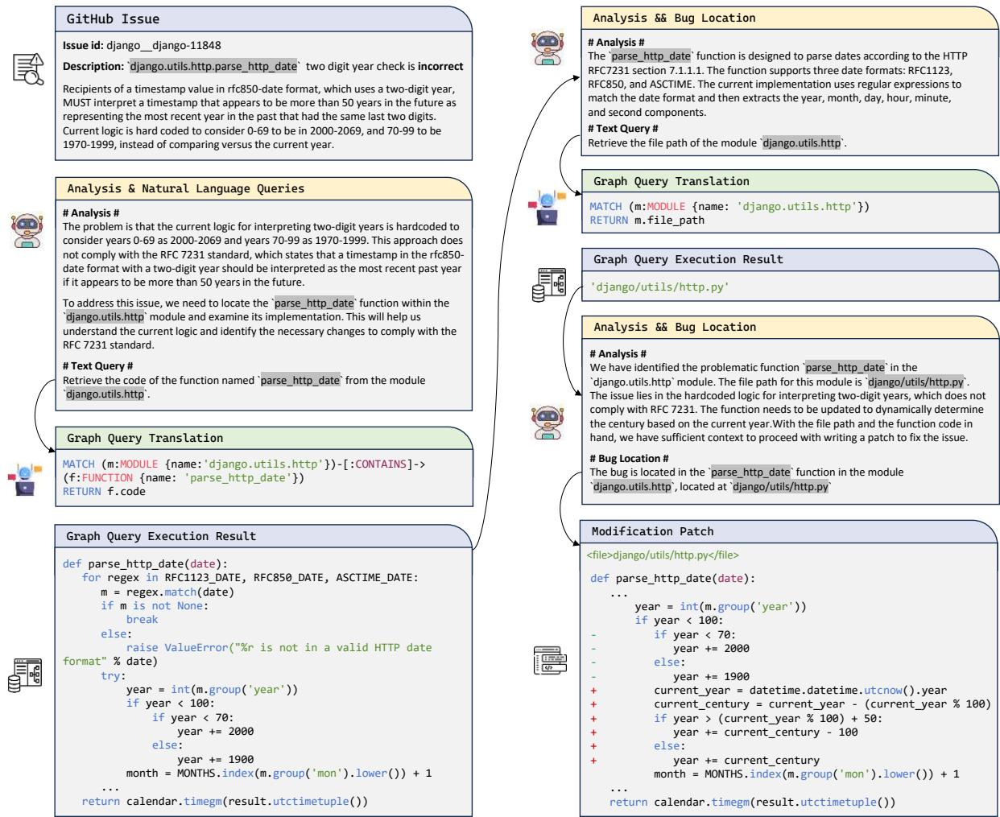  
Figure 6: Workflow for Resolving Issue #11848 in Django's parse\_http\_date' Function

Code Generator, and Code Commentor. The interface is designed to facilitate user interaction, providing a streamlined and intuitive environment for various code-related tasks. We built the WebUI interface using Streamlit7, a powerful and user-friendly framework that allows for the rapid development of interactive web applications.

## A.3.1 Example of Code Chat

Code Chat allows users to inquire about a code repository, providing insights into code structure and function usage. This functionality is particularly useful for understanding complex codebases, identifying dependencies, and exploring the usage of specific classes, methods, and functions. Figure 8 and 9 show an example of Code Chat. The user's question is “Summarize the 'CodexGraphAgentChat' class, what has method, and what for".

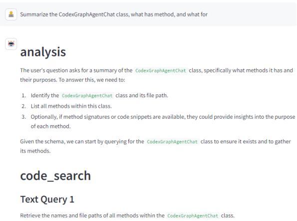  
Figure 8: Using Cypher queries to retrieve information about the CodexGraphAgentChat' class, from the code repository.

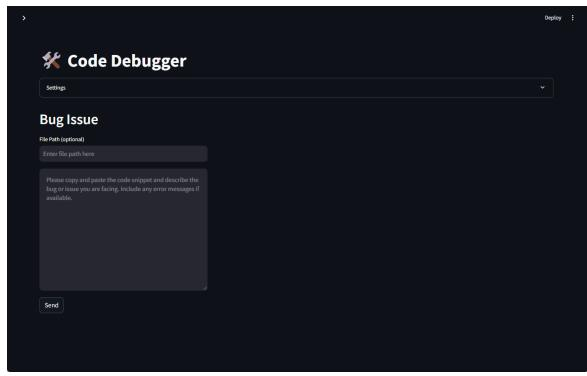

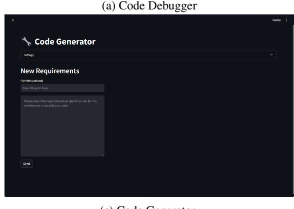

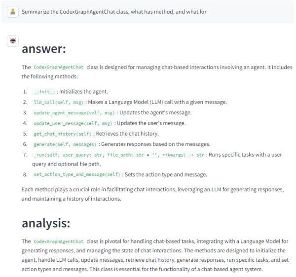  
Figure 9: Once the necessary information is gathered, Code Chat constructs a comprehensive response to the user's question. This response includes a summary of the CodexGraphAgentChat' class, a list of its methods, and a description of what each method does.

## A.3.2 Example of Code Debugger

The Code Debugger diagnoses and resolves bugs by applying iterative reasoning and information retrieval to suggest targeted fixes. It utilizes Cypher queries to analyze the code repository, identify the cause of the issue, and recommend precise modifications.

Figure 10 to 19 show an example of Code Debugger.

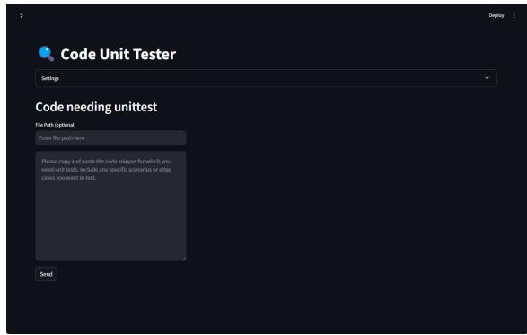

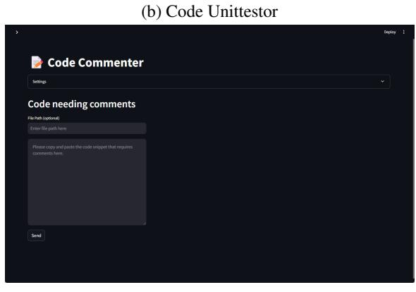  
The user's input is a real issue8 where the outcome does not match the expected behavior. The Code Debugger first analyzes the problem, then uses Cypher queries to retrieve relevant information and infer the cause of the bug. Finally, it provides an explanation of the bug and suggests the location for the modification.

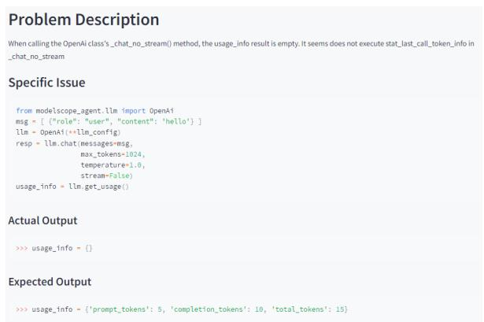  
Figure 10: The issue describes a problem where the outcome does not match the expected behavior.

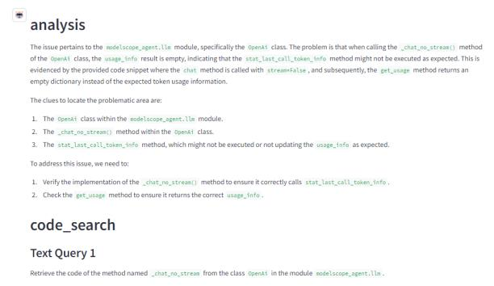  
Figure 11: Analyzing the problem and retrieving information using Cypher queries.

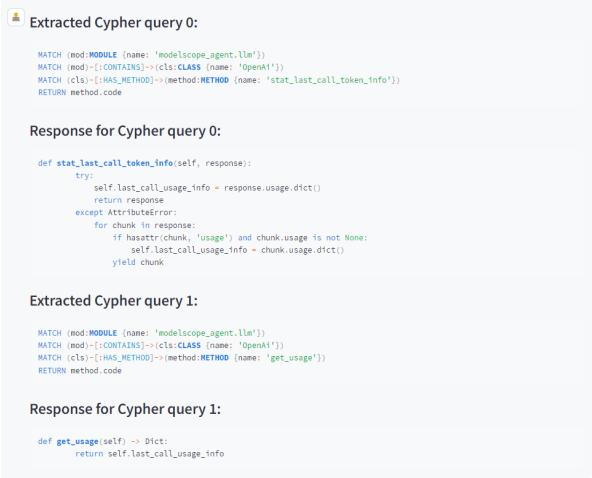  
Figure 14: Performing additional Cypher code searches to gather more information.

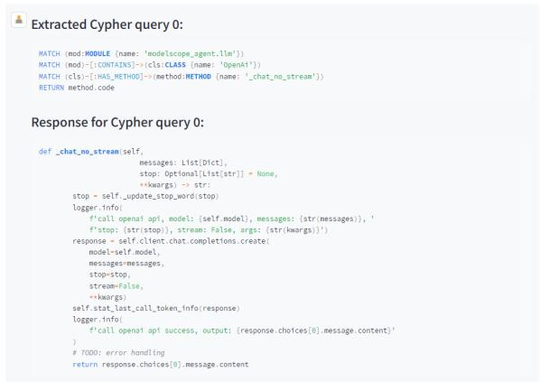

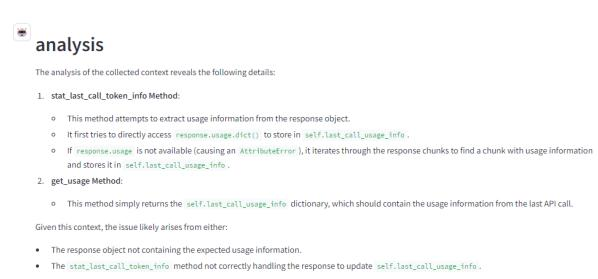  
Figure 15: Inferring the cause of the bug based on the analysis of the retrieved information.

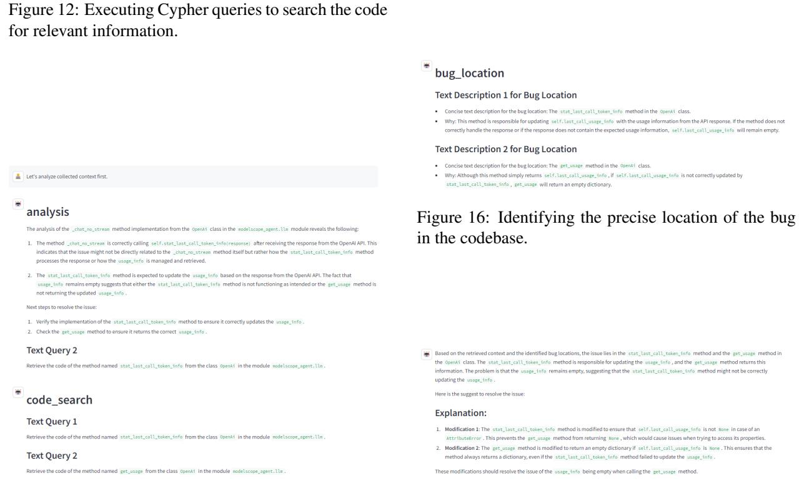  
Figure 13: Analyzing the retrieved information to identify potential causes of the bug.  
Figure 17: Providing a detailed explanation of the issue and the underlying cause of the bug.

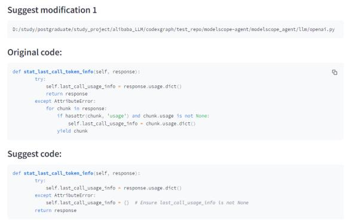  
Figure 18: Suggesting the first modification to resolve the bug.

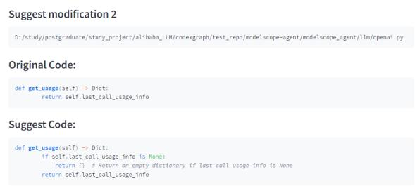  
Figure 19: Suggesting the second modification to ensure the bug is resolved.  
A.3.3 Example of Code Unittestor

Figure 20 is an example of Code Unittestor. The user's input is: “Generate test cases for TaskManager." The CodexGraph agent will first retrieve all methods and inheritance relationships in ‘TaskManager', and then generate detailed test case code.

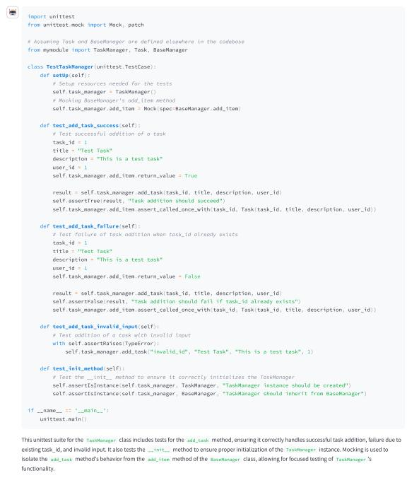  
Figure 20: Generated detailed unit test code for the ‘TaskManager' class, covering its methods and inheritance relationships.

## A.3.4 Example of Code Generator

Figure 21 and 22 show an example of Code Generator. The user has requested a function to retrieve the number of input and output tokens of CypherAgent'. However, the challenge is identifying the corresponding fields within ‘CypherAgent’ as this information is not provided in the user's input.

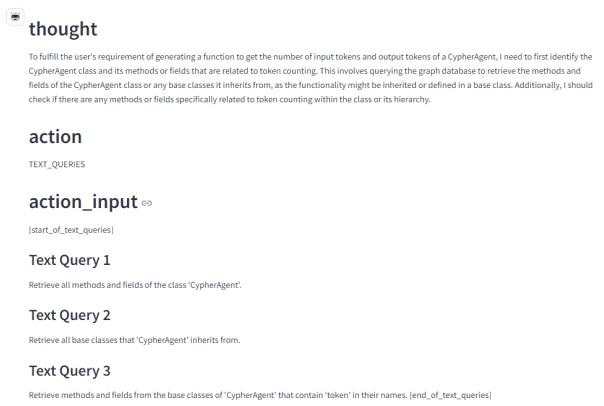  
Figure 21: The thought process in determining how to identify the relevant fields.

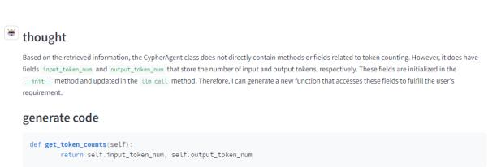  
Figure 22: By using Cypher queries, it was discovered that the corresponding fields are input\_token\_num' and output\_token\_num', which enables the generation of the correct code.

## A.3.5 Example of Code Commentor

Figure 23 and 24 show an example of Code Commentor. The Code Commentor analyzes code to provide detailed comments, enhancing code readability and maintainability. It leverages the code graph database to understand the code's structure and behavior, ensuring accurate and informative comments.

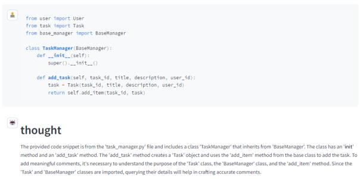  
Figure 23: The thought process: Understand the ‘Task' class and add\_item'method.

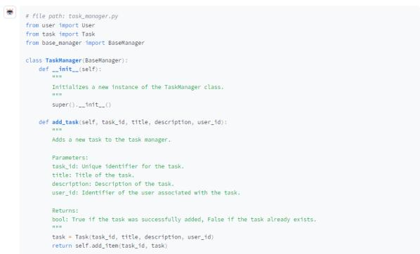  
Figure 24: By using Cypher queries, the specific implementation of the return function was obtained, and the return type was clarified.

## A.4 Challenges with Agent-Based Methods

Table 1 shows that both AUTOCODEROVER and CoDEXGRAPH, which are agent-based RACG methods, unexpectedly perform poorly across all benchmarks when using Qwen2-72b-instruct, even falling behind BM25. We believe this is due to the complexity and fragility of the agent workflow. In particular, when handling repository-level code tasks, the agent system must simultaneously manage long-context understanding, code reasoning, tool or API invocation, and formatted output. This multi-faceted process can easily lead to error accumulation from the very beginning, as every step in the workflow is critical. We argue that this issue is a general weakness of agent systems equipped with relatively "small" LLMs, rather than a problem specific to our method.

## A.5 Rationale Behind “Write then Translate"

The “write then translate" strategy is designed to streamline the task of translating high-level reasoning into executable graph queries, minimizing the likelihood of error propagation. The workflow of the translation LM agent is straightforward: we provide the schema of the code graph database along with taskspecific translation instructions as the system prompt for the LLM. Based on this schema and the natural language queries generated by the primary LM agent, the translation agent produces the corresponding formal graph queries.

Figure 3 outlines the general pipeline, showing how this separation of tasks simplifies the workflow. It is also important to highlight that graph query languages (e.g., Cypher) are part of the internal knowledge of many modern LLMs, as they are often pre-trained on programming languages and code. Consequently, powerful models such as GPT-4o can generate accurate and efficient graph queries in a zero-shot setting without extensive fine-tuning or additional instructions.

## A.6 Indexing Efficiency Across Benchmarks

In our experiments across three academic benchmarks, we observe variations in indexing times depending on the complexity of the code repositories. For smaller repositories in CrossCodeEval and EvoCodeBench, the indexing process typically completes within seconds to minutes. Specifically, we sample 100 tasks from Cross-CodeBench, each containing an average of 25.6 Python files. The average time to construct the graph database for these tasks is 72.2 seconds.

For larger, production-level repositories in SWEbench (such as Django, SymPy, and Scikit-Learn), the process takes considerably more time. These repositories contain an average of 312 Python files, and building the corresponding graph databases requires an average of 5 hours and 12 minutes. These times depend on the available computational resources, so the provided values serve as general reference points.

To improve efficiency, we optimize the indexing process by calculating differences between repository versions and re-indexing only the modified sections. This approach significantly reduces the time required for subsequent indexing.

While indexing speed is relevant for practical applications, it is not the primary focus of our research. However, we acknowledge that fast and accurate static analysis of large codebases remains a challenge in software engineering. Even state-of-the-art tools like pyan and tree-sitter encounter scalability issues. As more efficient static analysis tools emerge, we plan to replace our current tool, Sourcetrail, with superior alternatives to further enhance performance.

## A.7 Ablation Study on Query Strategies

We conduct an ablation study to evaluate the impact of query strategies on performance, specifically comparing single-query versus multiple-query approaches for AutoCodeRover. In the original AutoCodeRover setup, a “multiple queries in one round” strategy is employed by default, due to the simplicity of their code search APIs, which allows efficient retrieval without imposing a significant computational burden.

To ensure fairness, we evaluate both single-query and multiple-query strategies on the CrossCodeEval and SWE-bench datasets. The results are shown in Table 4. The results indicate that the multiple-query strategy consistently improves performance across both benchmarks.

## A.8 CODEXGRAPH Dissection

Rationale. CoDEXGRAPH employs a graph-based approach to represent and interact with code repositories, offering significant advantages over traditional methods. By using static analysis to convert codebases into graph structures, where nodes represent code entities (e.g., classes, functions, modules) and edges represent relationships (e.g., inheritance, containment, usage), CoDEXGRAPH enables more precise code retrieval. This graph-based structure allows Large Language Models (LLMs) to execute graph queries based on structural relationships, rather than relying solely on lexical or similarity-based retrieval. This capability is particularly beneficial when dealing with multi-file or complex codebases, as it supports multi-hop reasoning, allowing the system to trace dependencies across files and navigate code hierarchies effectively.

Table 4: Performance comparison between different strategies of AUTOCoDERoVER on benchmarks.
<table><tr><td>Model</td><td>Strategy</td><td>CrossCodeEval (EM)</td><td>CrossCodeEval (ID-F1)</td><td>SWE-bench (Pass@1)</td></tr><tr><td rowspan="2">DS-Coder</td><td>single query</td><td>12.30</td><td>47.40</td><td>14.01</td></tr><tr><td>multiple queries (default)</td><td>14.90</td><td>51.34</td><td>15.56</td></tr><tr><td rowspan="2">GPT-40</td><td>single query</td><td>14.40</td><td>46.44</td><td>22.18</td></tr><tr><td>multiple queries (default)</td><td>21.20</td><td>54.81</td><td>22.96</td></tr></table>

Advantages. The graph-based approach of CODEX-GRAPH demonstrates superior performance compared to traditional solutions like AUTOCODEROVER and BM25, especially in handling complex code structures and overcoming lexical limitations.

• AUTOCODEROVER excels in specific tasks due to its task-specific code search APIs, it struggles with more general tasks and complex repository structures, often failing when functions or variables are re-exported in initialization files.

• BM25, relying on lexical similarity, is limited to surface-level matching and cannot comprehend the underlying structure of the code.

In contrast, CoDEXGRAPH's graph representation enables it to trace connections and retrieve correct code elements even in complex cases like re-exports or indirect references. This structural understanding, combined with the ability to perform multi-hop reasoning, allows CoDEXGRAPH to deliver more flexible, accurate, and contextually aware results, making it particularly effective for a broad range of coding tasks in large-scale repositories.