# CORRECT: Context- and Reference-Augmented Reasoning and Prompting for Fact-Checking

Delvin Ce Zhang The Pennsylvania State University delvincezhang@gmail.com

Dongwon Lee The Pennsylvania State University dongwon@psu.edu

## Abstract

Fact-checking the truthfulness of claims usually requires reasoning over multiple evidence sentences. Oftentimes, evidence sentences may not be always self-contained, and may require additional contexts and references from elsewhere to understand coreferential expressions, acronyms, and the scope of a reported finding. For example, evidence sentences from an academic paper may need contextual sentences in the paper and descriptions in its cited papers to determine the scope of a research discovery. However, most fact-checking models mainly focus on the reasoning within evidence sentences, and ignore the auxiliary contexts and references. To address this problem, we propose a novel method, Context- and Reference-augmented Reasoning and Prompting. For evidence reasoning, we construct a three-layer evidence graph with evidence, context, and reference layers. We design intra- and cross-layer reasoning to integrate three graph layers into a unified evidence embedding. For verdict prediction, we design evidence-conditioned prompt encoder, which produces unique prompt embeddings for each claim. These evidence-conditioned prompt embeddings and claims are unified for factchecking. Experiments verify the strength of our model. Code and datasets are available at https://github.com/cezhang01/correct.

## 1 Introduction

The proliferation of misinformation has posed growing challenge in the realm of information reliability. There is a need to develop automated factchecking methods (Guo et al., 2022) to verify the truthfulness of real-world claims using evidence.

Existing fact-checking models (Zhou et al., 2019; Liu et al., 2020) have shown promise in aggregating and reasoning over multiple evidence sentences to verify a claim. However, the evidence sentences retrieved from a large corpus may contain incomplete information when they are taken out-of-corpus. We need to refer to additional contexts and references from elsewhere to understand coreferential expressions, acronyms, and the scope of a reported finding. For example, Fig. 1(a) illustrates context-dependent evidence, where undefined acronym “MNC” in evidence sentence from a paper abstract requires additional context from the abstract to jointly interpret the meaning of acronym “MNC”. Fig. 1(b) presents reference-dependent evidence, where we need to check the cited paper to understand that “SARS-CoV-2 infection” and “COVID-19 infection” are coreferential expressions, so that we could accurately fact-check the claim. Such scenario also exists in general domain where evidence sentences from a Wikipedia page may need contextual sentences in the same page and text in the hyperlinked pages to complement the insufficient information in the evidence.

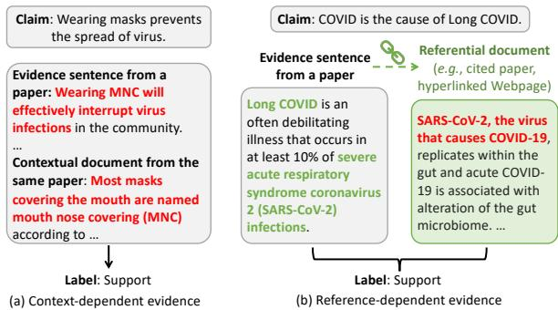  
Figure 1: Illustration of (a) context-dependent and (b) reference-dependent evidence from BearFact dataset.

Challenges and Approach. To overcome the limitations of existing methods, we propose Context- and Reference-augmented Reasoning and prompting for fact-checking (CORRECT), to address two open questions.

First, how to aggregate both contextual and referential documents into evidence reasoning? Some models are proposed to capture contextual documents, e.g., MultiVerS (Wadden et al., 2022). Some others are designed for referential documents, e.g.,

Transformer-XH (Zhao et al., 2020) and HESM (Subramanian and Lee, 2020). However, they incorporate either contextual or referential documents, failing to aggregate both of them into unified evidence embedding. Moreover, most of them simply concatenate evidence with contextual or referential documents, and inefficiently input the long text to language models for evidence encoding. Though they have shown that modeling either contexts or references helps fact-checking, integrating both of them for evidence reasoning is still unexplored. In our model, we construct a three-layer graph with evidence, context, and reference layers. We design intra- and cross-layer reasoning to aggregate three graph layers into unified evidence embedding.

Second, how to integrate evidence reasoning and claim for accurate verdict prediction? Previous fact-checking methods, e.g., ProToCo (Zeng and Gao, 2023), rely on natural language as input prompt to language model for claim verification. However, discrete natural language prompts are difficult to design and may result in suboptimal results (Zhou et al., 2022b). Recently, prompt tuning (Lester et al., 2021) uses continuous and learnable prompt embeddings to replace discrete prompt and has achieved decent result, but no one has explored its design for claim verification. We propose evidence-conditioned prompt encoder, which takes evidence embedding as input, and produces unique prompt embeddings for each claim. We combine prompt embeddings with claim token embeddings to unify evidence and claim for verdict prediction.

Contributions. First, we propose a novel model, Context- and Reference-augmented Reasoning and Prompting (CORRECT), to integrate both contextual and referential documents into evidence reasoning. Second, we design a three-layer evidence graph, and propose intra- and cross-layer reasoning to learn unified evidence embedding. Third, we propose evidence-conditioned prompt embeddings, which are combined with claims to integrate evidence reasoning with claim for fact-checking.

## 2 Related Work

Multi-hop fact-checking. Complex claims usually require reasoning over multiple evidence sentences. Many methods are based on Language Models (Vaswani et al., 2017; Devlin et al., 2019) and Graph Neural Networks (Hamilton et al., 2017), such as GEAR (Zhou et al., 2019), KGAT (Liu et al., 2020), DREAM (Zhong et al., 2020), SaGP (Si et al., 2023), DECKER (Zou et al., 2023), CausalWalk (Zhang et al., 2024a), etc. However, they mainly focus on the reasoning within evidence sentences. They ignore the auxiliary contextual and referential documents. Methods incorporating contextual documents are proposed, e.g., ParagraphJoint (Li and Peng, 2021), ARSJoint (Zhang et al., 2021), MultiVerS (Wadden et al., 2022), etc. Some others integrating referential documents include Transformer-XH (Zhao et al., 2020) and HESM (Subramanian and Lee, 2020). However, they incorporate either contextual or referential documents, but not both. In contrast, we construct a three-layer evidence graph to model evidence sentences, contexts, and references. There are fake news detection models where auxiliary graph with Wikidata is used (Hu et al., 2021; Whitehouse et al., 2022). Fake news detection aims to detect the whole article with meta-data, while fact-checking focuses on claim sentences with retrieved evidence.

Some fact-checking works are based on retrievalaugmented generation (Zeng and Gao, 2024). They unify evidence retrieval and claim verification as a joint approach, while our model mainly focuses on verification, and relies on external tool for evidence retrieval. Our setting is consistent with existing works (Wadden et al., 2022; Zhang et al., 2024a).

Prompt-based fact-checking. Some models verify claims by prompting LLMs (Achiam et al., 2023). ProToCo (Zeng and Gao, 2023) inputs both evidence sentences and claim to T5 (Raffel et al., 2020). ProgramFC (Pan et al., 2023) decomposes complex claims into simpler sub-tasks and uses natural language to prompt LLMs. Varifocal (Ousidhoum et al., 2022) formulates fact-checking as question generation and answering. They rely on handcrafted natural language as prompt. The performance heavily relies on the choice of prompt, and it is difficult to design a prompt that produces a decent result, as shown in (Zhou et al., 2022b). Our model is designed with learnable prompt embeddings where the prompting instruction is naturally learned by embeddings through optimization.

Prompt learning. Prompting (Brown et al., 2020) uses natural language as the input to language models to fulfill certain tasks. Many prompting models have been proposed, including natural language prompt (Gao et al., 2021; Shin et al., 2020) and prompt embeddings (Lester et al., 2021; Liu et al., 2023, 2022; Li and Liang, 2021). Prompting also benefits many tasks (Zhou et al., 2022a; Tan et al., 2022). However, no one has explored prompt embeddings for fact-checking.

Table 1: Summary of mathematical notations.
<table><tr><td>Notation D</td><td>Description</td></tr><tr><td rowspan="5"> $\mathcal { X }$   $\mathcal { E }$   $\mathcal { C }$   $\mathcal { R }$   $\mathcal { N } _ { \mathrm { r e f } } ( e )$ </td><td>a fact-checking dataset</td></tr><tr><td>a set of  $N = | { \mathcal { X } } |$  claims</td></tr><tr><td>a corpus of evidence sentences a set of contextual documents</td></tr><tr><td>a set of referential documents</td></tr><tr><td>evidence sentence e&#x27;s referential documents</td></tr><tr><td> $\mathcal { N } _ { \mathrm { e v i d } } ( x )$   $_ { \mathcal { V } }$ </td><td>claim x&#x27;s retrieved evidence sentences</td></tr><tr><td> $\mathbf { h } _ { e . \mathrm { C I } . S } ^ { ( l ) }$ </td><td>a set of labels evidence sentence e&#x27;s [CLS] token embedding</td></tr><tr><td> $\hat { \mathbf { h } } _ { c } ^ { ( l ) }$   $\hat { \mathbf { x } } ^ { ( l ) }$ </td><td></td></tr><tr><td> $\hat { \mathbf { h } } _ { r } ^ { \left( l \right) }$ </td><td>aggregated contextual document embedding</td></tr><tr><td></td><td>aggregated referential document embedding</td></tr><tr><td> $\widehat { \mathbf { H } } _ { e } ^ { ( l ) }$ </td><td>evidence sentence e&#x27;s augmented embedding matrix</td></tr><tr><td> $\pi _ { m , y }$ </td><td>the m-th prompt embedding for class y</td></tr><tr><td> $\mathbf { h } _ { m , y }$ </td><td>the m-th base prompt embedding for class y</td></tr></table>

Text-attributed graph. Texts are usually connected in a graph structure, termed text-attributed graph (Zhang et al., 2024b). Various methods have been developed to learn text embeddings in an unsupervised manner (Zhang and Lauw, 2020, 2023, 2021; Zhang et al., 2023; Yang et al., 2021; Jin et al., 2023; Yang et al., 2024). Though both our model and these works construct a text-attributed graph, our work is different from them, since our model is a supervised model for fact-checking.

## 3 Model Architecture

We introduce Context- and Reference-augmented Reasoning and prompting for fact-checking (COR-RECT). Table 1 summarizes math notations.

## 3.1 Problem Formulation

We are given a fact-checking dataset $\begin{array} { r l } { \mathcal { D } } & { { } = } \end{array}$ $\{ \mathcal { X } , \mathcal { E } , \mathcal { C } , \mathcal { R } \}$ . Claim set $\chi = \mathrm { \bar { \{ } }  x _ { i } \} _ { i = 1 } ^ { N }$ contains a set of N claims. Evidence set $\mathcal { E } = \mathrm { ~ } \mathrm { ~ } \mathrm { ~ } \mathrm { ~ e ~ } _ { j } \} _ { j = 1 } ^ { E }$ is a corpus of E evidence sentences. For each evidence sentence $e \in { \mathcal { E } }$ , we have its contextual document $c \in { \mathcal { C } }$ . Usually, an evidence sentence has only one contextual document, from which this sentence is retrieved. We also have e’s referential documents $\mathcal { N } _ { \mathrm { r e f } } ( e ) = \{ r _ { e , n } \} _ { n = 1 } ^ { R _ { e } } \subset \mathcal { R }$ . Here $R _ { e }$ is the number of $e \mathrm { { s } }$ referential documents. Evidence sentence e may have multiple referential documents, such as papers cited by $e \mathrm { { s } }$ paper or Webpages hyperlinked by e. We use $\mathcal { N } _ { \mathrm { r e f } } ( e )$ to represent the set of $e \mathrm { { s } }$ referential documents. We use $\mathcal { N } _ { \mathrm { e v i d } } ( x ) \subset \mathcal { E }$ to denote the set of evidence sentences for a claim x.

Given  as input, we design a model that uses evidence sentences from $\mathcal { E }$ together with their contextual documents in and referential documents in  to verify claims. Eventually, for each claim $x \in \mathcal { X }$ , we output its predicted label $\hat { y } \in \mathcal { V } =$ SUPPORT, REFUTE, NEI , indicating whether the evidence supports, refutes, or does not have enough information to verify the claim.

As shown in Fig. 2, CORRECT has two modules: (a-c) context- and reference-augmented evidence reasoning on three-layer graph, (d) evidenceconditioned prompting for claim verification.

## 3.2 Three-layer Evidence Graph Reasoning

Graph construction. For each claim $x \in \mathcal { X }$ and its evidence sentences $\mathcal { N } _ { \mathrm { e v i d } } ( x ) \subset \mathcal { E }$ , we construct a three-layer graph with evidence, context, and reference layers in Fig. 2(a). We consider evidence sentences, contextual documents, and referential documents as three types of vertices. Each type of vertices reside on their own layer. Cross-layer links between evidence layer and context layer connect each evidence sentence with its contextual document. Each evidence sentence and its referential documents are connected by cross-layer referential links. Green links in Fig. 2(a) are cross-layer links. For multi-evidence reasoning, we add intra-layer links on evidence layer where evidence sentences of a claim are fully connected, shown by black links in Fig. 2(a). The purpose of constructing three layers instead of mixing all vertices into one layer is to better differentiate three types of vertices.

Intra-layer reasoning. Evidence reasoning includes intra- and cross-layer reasoning. We first show intra reasoning (orange arrows in Fig. 2(b)).

For each evidence sentence $e \in \mathcal { N } \mathrm { e v i d } ( x )$ , we let $\mathbf { H } _ { e } ^ { ( l ) } = [ \mathbf { h } _ { e , \mathrm { C L S } } ^ { ( l ) } , \mathbf { h } _ { e , 1 } ^ { ( l ) } , \mathbf { h } _ { e , 2 } ^ { ( l ) } , . . . ]$ denote the output from the l-th Transformer step. Note that previous works call it the l-th layer, but to distinguish it from our three-layer graph, we instead call it the l-th step. $\mathbf { h } _ { e , i } ^ { ( l ) } \in \mathbb { R } ^ { d }$ is d-dimensional token embedding. We use graph neural network to aggregate different evidence sentences of a claim. For each evidence sentence e, we first project it by

$$
\tilde { \mathbf { h } } _ { e , \mathrm { C L S } } ^ { ( l ) } = \mathbf { W } _ { 1 } \mathbf { h } _ { e , \mathrm { C L S } } ^ { ( l ) } .\tag{1}
$$

The [CLS] token is taken as the evidence sentence embedding, and $\mathbf { W } _ { 1 } \in \mathbb { R } ^ { d \times d }$ is type-specific parameter. We design type-specific attention.

$$
a _ { e , e ^ { \prime } } = \mathrm { s o f t m a x } \Big ( \mathrm { L e a k y R e L U } ( \mathbf { b } _ { 1 } ^ { \top } [ \tilde { \mathbf { h } } _ { e , \mathrm { C L S } } ^ { ( l ) } | | \tilde { \mathbf { h } } _ { e ^ { \prime } , \mathrm { C L S } } ^ { ( l ) } ] ) \Big ) .\tag{2}
$$

$e ^ { \prime } \in \mathcal { N } _ { \mathrm { e v i d } } ( x ) \backslash e$ is another evidence sentence for the same claim $x , [ \cdot | | \cdot ]$ is concatenation, and ${ \bf b } _ { 1 } \in  { }$

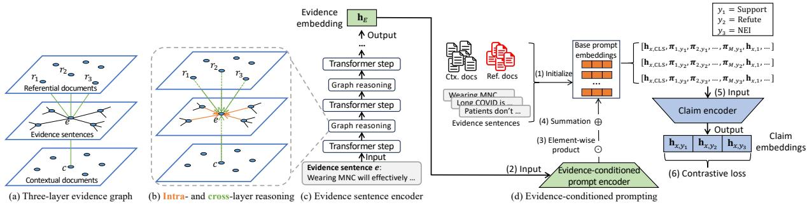  
Figure 2: Model architecture. (a) A three-layer graph for a claim. (b) Intra- and cross-layer reasoning. (c) A nested architecture with language model and graph reasoning for evidence encoding. (d) Evidence-conditioned prompting.

$\mathbb { R } ^ { 2 d }$ is learnable parameter. Finally, we aggregate evidence sentences to e by mean pooling.

$$
\hat { \mathbf { h } } _ { e } ^ { ( l ) } = \mathrm { m e a n } \Big ( \tilde { \mathbf { h } } _ { e , \mathrm { C L S } } ^ { ( l ) } , \sum _ { e ^ { \prime } \in \mathcal { N } _ { \mathrm { e v i d } } ( x ) \backslash e } a _ { e , e ^ { \prime } } \tilde { \mathbf { h } } _ { e ^ { \prime } , \mathrm { C L S } } ^ { ( l ) } \Big ) .\tag{3}
$$

The aggregated sentence embedding $\hat { \mathbf { h } } _ { e } ^ { ( l ) }$ captures information of both itself and other evidence sentences. To summarize Eqs. 1–3, we have

$$
\hat { \mathbf { h } } _ { e } ^ { ( l ) } = f _ { \mathrm { G N N } } \Big ( \mathbf { h } _ { e , \mathrm { C L S } } ^ { ( l ) } , \{ \mathbf { h } _ { e ^ { \prime } , \mathrm { C L S } } ^ { ( l ) } | e ^ { \prime } \in \mathcal { N } _ { \mathrm { e v i d } } ( x ) \backslash e \} ; \mathbf { W } _ { 1 } , \mathbf { b } _ { 1 } \Big ) .\tag{4}
$$

To integrate intra-layer aggregation into the encoding of each evidence sentence, we introduce a virtual token to represent the aggregated sentence embedding $\hat { \mathbf { h } } _ { e } ^ { ( l ) }$ . For evidence sentence e, we concatenate $\hat { \mathbf { h } } _ { e } ^ { ( l ) }$ with $e \mathrm { { s } }$ text token embeddings by $\widehat { \mathbf { H } } _ { e } ^ { ( l ) } = \hat { \mathbf { h } } _ { e } ^ { ( l ) } | | \mathbf { H } _ { e } ^ { ( l ) }$ . After concatenation, $\widehat { \mathbf { H } } _ { e } ^ { ( l ) }$ conb btains information of both evidence sentence e’s text and the aggregated embedding from e’s intra-layer neighbors. We aim to propagate the aggregated sentence embedding to other text tokens of sentence e, so that the text tokens can fully unify other sentences for multi-evidence reasoning. We will introduce asymmetric multi-head self-attention to achieve this goal. But before that, we first discuss cross-layer reasoning.

Cross-layer reasoning. We present cross-layer reasoning, which aggregates contextual and referential documents into evidence sentences (green arrows in Fig. 2(b)). The aggregation from referential documents to evidence sentence is similarly defined by Eq. 5. We use reference-specific parameters, $\mathbf { W } _ { 2 }$ and $\mathbf { b } _ { 2 }$ , to preserve graph heterogeneity.

$$
\hat { \mathbf { h } } _ { r } ^ { ( l ) } = f _ { \mathrm { G N N } } \Big ( \mathbf { h } _ { e , \mathrm { C L S } } ^ { ( l ) } , \{ \mathbf { h } _ { r , \mathrm { C L S } } ^ { ( l ) } | r \in \mathcal { N } _ { \mathrm { r e f } } ( e ) \} ; \mathbf { W } _ { 2 } , \mathbf { b } _ { 2 } \Big ) .\tag{5}
$$

Each referential document $r \in \mathcal { N } _ { \mathrm { r e f } } ( e )$ is also encoded, and its [CLS] token is passed to Eq. 5 for aggregation. Similarly, we have $\hat { \mathbf { h } } _ { c } ^ { ( l ) }$ as contextual document embedding. To integrate both embeddings into evidence sentence for cross-layer reasoning, we introduce two more virtual tokens.

$$
\widehat { \mathbf { H } } _ { e } ^ { ( l ) } = \widehat { \mathbf { h } } _ { c } ^ { ( l ) } | | \widehat { \mathbf { h } } _ { r } ^ { ( l ) } | | \widehat { \mathbf { h } } _ { e } ^ { ( l ) } | | \mathbf { H } _ { e } ^ { ( l ) } .\tag{6}
$$

The augmented embedding matrix, i.e., $\widehat { \mathbf { H } } _ { e } ^ { ( l ) }$ , conbtains both intra-evidence reasoning as well as crosslayer context and reference augmentation.

To fully unify all three graph layers into evidence sentence $e ,$ we input $\widehat { \mathbf { H } } _ { e } ^ { ( l ) }$ at Eq. 6 to the $( l + 1 )$ -th bTransformer step with our proposed asymmetric multi-head self-attention $( \mathrm { M S A } ^ { \mathrm { a s y } } )$ ).

$$
\begin{array} { r } { \mathbf { M S A ^ { a s y } } ( \mathbf { H } _ { e } ^ { ( l ) } , \widehat { \mathbf { H } } _ { e } ^ { ( l ) } , \widehat { \mathbf { H } } _ { e } ^ { ( l ) } ) = \operatorname { s o f t m a x } \Big ( \frac { \mathbf { Q } \mathbf { K } ^ { \top } } { \sqrt { d } } \Big ) \mathbf { V } , } \\ { \mathbf { Q } = \mathbf { H } _ { e } ^ { ( l ) } \mathbf { W } _ { Q } ^ { ( l ) } , \mathbf { K } = \widehat { \mathbf { H } } _ { e } ^ { ( l ) } \mathbf { W } _ { K } ^ { ( l ) } , \mathbf { V } = \widehat { \mathbf { H } } _ { e } ^ { ( l ) } \mathbf { W } _ { V } ^ { ( l ) } . } \end{array}\tag{7}
$$

Keys K and values V are augmented with virtual tokens, but queries Q are not, to avoid context and reference embeddings being overwritten by evidence sentence embedding. The result of asymmetric MSA is passed to a multi-layer perceptron and layer normalization (Vaswani et al., 2017). Finally, we obtain the output from the (l + 1)-th step, $\mathbf { H } _ { e } ^ { ( l + 1 ) }$ , integrating evidence sentence e, other evidence sentences of the same claim, e’s contextual and referential documents, see Fig. 2(c).

We conduct such intra-layer and cross-layer reasoning inside each Transformer step to allow different graph layers to fully communicate with each other. We repeat such nested and graph-augmented encoding for L times, and obtain $\mathbf { h } _ { e } = \mathbf { h } _ { e , \mathrm { C L S } } ^ { ( L ) }$ as the graph-augmented embedding for evidence sentence e. This nested architecture is shown by Fig. 2(c). For claim x, we have $\{ \mathbf { h } _ { e } \} _ { e \in \mathcal { N } _ { \mathrm { e v i d } } ( x ) }$ , a set of graph-augmented embeddings for its evidence sentences. Finally, we aggregate them by mean pooling and obtain a single evidence embedding.

$$
\mathbf { h } _ { E } = \mathrm { m e a n } ( \mathbf { h } _ { e } | e \in \mathcal { N } _ { \mathrm { e v i d } } ( x ) ) .\tag{8}
$$

## 3.3 Evidence-conditioned Prompting

Now we integrate evidence reasoning into claim embedding to fully integrate their information for fact-checking. Prompting (Liu et al., 2023) is a powerful method in fact-checking (Zeng and Gao, 2023). However, existing models are mainly based on natural language as input prompt to language models for verdict prediction. Handcrafted discrete prompt has two disadvantages: First, it is difficult to manually design a prompt that provides a decent performance. Previous works (Zhou et al., 2022b) have shown that the change of a single word in the prompt may lead to significant deterioration of the results, and it is time-consuming to enumerate every prompt. Second, discrete natural language prompt is difficult to optimize, since language models are intrinsically continuous.

To mitigate these problems, we explore learnable and continuous prompt embedding. Below we design a prompt encoder, which takes evidence embedding $\mathbf { h } _ { E }$ as input, and produces evidenceconditioned prompt embeddings. See Fig. 2(d).

Evidence-conditioned prompt encoder. We consider below continuous embeddings as prompt.

$$
\mathbf { P } _ { x } = [ \mathbf { h } _ { x , \mathrm { C L S } } , \pi _ { 1 } , \pi _ { 2 } , . . . , \pi _ { M } , \mathbf { h } _ { x , 1 } , \mathbf { h } _ { x , 2 } , . . . ] .\tag{9}
$$

Here $\lbrace \pi _ { m } \rbrace _ { m = 1 } ^ { M }$ where $\boldsymbol { \pi } _ { m } ~ \in ~ \mathbb { R } ^ { d }$ is a set of M learnable evidence-conditioned prompt embeddings to be explained shortly, and M is a hyperparameter, indicating the number of prompt embeddings. Each $\mathbf { h } _ { x , i } \in \mathbb { R } ^ { d }$ is a d-dimensional embedding of the i-th text token in claim x. In language models, there is an embedding look-up table before language model encoder. In this look-up table, input text tokens are first mapped to the vocabulary to obtain their token embeddings, which are then summed up with positional encodings. $\mathbf { h } _ { x , i }$ in Eq. 9 is obtained by this look-up table.

Now we explain prompt embeddings $\lbrace \pi _ { m } \rbrace _ { m = 1 } ^ { M }$ output from an evidence-conditioned prompt encoder. We first initialize M base prompt embeddings, $\{ \mathbf { h } _ { m } \} _ { m = 1 } ^ { M }$ . We then project evidence embedding $\mathbf { h } _ { E }$ in Eq. 8 to the prompt embedding space, followed by element-wise product and summation.

$$
\alpha _ { x } = \operatorname { t a n h } \Bigl ( \frac { \mathbf { W } _ { \alpha } \mathbf { h } _ { E } + \mathbf { b } _ { \alpha } } { \tau } \Bigr ) , \quad \beta _ { x } = \operatorname { t a n h } \Bigl ( \frac { \mathbf { W } _ { \beta } \mathbf { h } _ { E } + \mathbf { b } _ { \beta } } { \tau } \Bigr ) ,\tag{10}
$$

$$
\begin{array} { r } { \pi _ { m } = \mathbf { h } _ { m } \odot \left( \alpha _ { x } + 1 \right) + \beta _ { x } . } \end{array}\tag{11}
$$

is element-wise product, and $\mathbf { 1 } \in \mathbb { R } ^ { d }$ is a vector of ones to ensure that the scaling of $\mathbf { h } _ { m }$ is centered around one. τ is a temperature to scale the shape of tanh function. $\pi _ { m }$ is thus conditioned on evidence embedding, and different claims with their own evidence sentences should have their unique claimspecific prompt embeddings, shown by Fig. 2(d).

Given the label set ={SUPPORT, REFUTE, NEI}, which usually has three types of labels, we apply above evidence-conditioned prompt encoder and correspondingly obtain three sets of prompt embeddings, $\{ \pi _ { m , y } \} _ { m = 1 } ^ { M }$ where $y \in \mathcal { V }$ . As in Eq. 9, we concatenate each set of prompt embeddings with token embeddings of claim x, and obtain three sets of inputs $\{ \mathbf { P } _ { x , y } \} _ { y \in \mathcal { V } }$ to claim encoder.

$$
\begin{array} { r l } & { \mathbf { H } _ { x , y } ^ { ( L ) } = f ( \mathbf { P } _ { x , y } ) } \\ & { \qquad = f ( [ \mathbf { h } _ { x , \mathrm { C L S } } , \boldsymbol { \pi } _ { 1 , y } , \boldsymbol { \pi } _ { 2 , y } , . . . , \boldsymbol { \pi } _ { M , y } , \mathbf { h } _ { x , 1 } , \mathbf { h } _ { x , 2 } , . . . ] ) } \end{array}\tag{12}
$$

$\mathbf { H } _ { x , y } ^ { ( L ) }$ is the output from the claim encoder, and its [CLS] token is taken as claim embedding $\mathbf { h } _ { x , y } =$ $\mathbf { h } _ { x , y , \mathrm { C L S } } ^ { ( L ) } .$ Claim encoder shares parameters with evidence encoder. Due to contextualized modeling, claim token embeddings and evidence-conditioned prompt embeddings fully exchange information, and the output claim embedding captures both claim x and evidence reasoning for fact-checking.

Finally, we use contrastive loss function to predict the veracity of claim x by

$$
\begin{array} { r } { \mathcal { L } = - \sum _ { x \in \mathcal { X } _ { \mathrm { t r a i n } } } \log \frac { \exp ( \mathbf { h } _ { x , y } ^ { \top } \mathbf { h } _ { E } ) } { \exp ( \mathbf { h } _ { x , y } ^ { \top } \mathbf { h } _ { E } ) + \sum _ { y ^ { \prime } \in \mathcal { Y } \backslash y } \exp ( \mathbf { h } _ { x , y ^ { \prime } } ^ { \top } \mathbf { h } _ { E } ) } . } \end{array}\tag{13}
$$

$\mathbf { h } _ { E }$ is evidence embedding of claim x obtained by $\mathrm { E q . } ~ 8 . ~ \mathcal { X } _ { \mathrm { t r a i n } }$ is a set of training claims. Though we use three types of labels in $\mathcal { V } ,$ , more types of labels in $\mathcal { V }$ can also be modeled. Algorithm 1 summarizes the learning process.

Initialization of base prompt embeddings. Previous works (Zhou et al., 2022b) have shown the importance of the initialization of base prompt embeddings $\{ \mathbf { h } _ { m , y } \} _ { m = 1 } ^ { M }$ where $y \in \mathcal { V }$ . Some of them randomly initialize the embeddings, while others use word embeddings of discrete prompts. Random initialization presents unstable optimization (Wen and Fang, 2023), while it is difficult to choose the right discrete prompts for initialization. We solve these problems by using the three-layer graph.

For a claim x, the vertices on its three-layer graph consistently carry the signal of claim x’s veracity due to semantic relatedness. Thus, for each label in the label set $y \in \mathcal { V }$ , we have training claims belonging to this label $\mathcal { X } _ { \mathrm { t r a i n } , y } = \{ x \in$ $\mathcal { X } _ { \mathrm { t r a i n } } | y _ { x } = y \}$ . For each of these claims, we truncate its evidence sentences, contextual and referential documents to M words, and obtain their M word embeddings in the look-up table of language model. We then take mean pooling for evidence sentences, contextual and referential documents, and obtain M pooled word embeddings for each claim. Finally, we average all training claims belonging to the same label $\chi _ { \mathrm { t r a i n } , y } ,$ and obtain M word embeddings, which are used to initialize M base prompt embeddings $\{ \mathbf { h } _ { m , y } \} _ { m = 1 } ^ { M }$ . They are derived from training claims of the same label, thus provide a more informative starting point than random initialization for verdict prediction. We repeat this process for every label $y \in \mathcal { V }$ , and obtain initialization for each set of base prompt embeddings.

Table 2: Dataset statistics.
<table><tr><td rowspan="2">Name</td><td colspan="2">#Claims</td><td rowspan="2">#Contextual Documents</td><td rowspan="2">#Referential Documents</td></tr><tr><td>Train</td><td>Test</td></tr><tr><td>FEVEROUS-S</td><td>23,912</td><td>5,978</td><td>19,546</td><td>21,579</td></tr><tr><td>BearFact</td><td>1,158</td><td>290</td><td>1,166</td><td>12,938</td></tr><tr><td>Check-COVID</td><td>1,275</td><td>229</td><td>347</td><td>3,132</td></tr><tr><td>SciFact</td><td>809</td><td>300</td><td>1,189</td><td>9,617</td></tr></table>

## 4 Experiments

We conduct extensive experiments and ablation analysis to evaluate the effectiveness of the proposed model CORRECT.

Datasets. We use 4 datasets in Table 2. FEVER-OUS (Aly et al., 2021) is a general-domain dataset. Each claim is annotated in the form of sentences and/or cells from tables in Wikipedia pages. Since we focus on textual fact-checking, we follow (Pan et al., 2023) and select claims that only require sentences as evidence. We call this subset FEVEROUS-S. BearFact (Wuehrl et al., 2024) is a biomedical dataset with sentences from papers as evidence. Its original dataset does not have evidence for claims in NEI class. We follow (Zeng and Gao, 2023) and select sentences that have the highest tf-idf similarity with those claims as evidence. Check-COVID (Wang et al., 2023) contains claims about COVID-19. SciFact (Wadden et al., 2020) is a dataset with sentences in papers as evidence. As in its original paper, for claims in NEI class, we choose sentences from the cited abstract with top-3 highest tf-idf similarity with the claim as evidence. Appendix B contains data preprocessing details.

Baselines. We have 4 categories of baselines.

i) Multi-hop fact-checking, KGAT (Liu et al., 2020), HESM (Subramanian and Lee, 2020), Transformer-XH (Zhao et al., 2020), MultiVerS (Wadden et al., 2022), and the recent CausalWalk (Zhang et al., 2024a). MultiVerS models contextual documents, and HESM and Transformer-XH incorporate referential documents. By comparing to them, we highlight the advantage of threelayer graph for modeling both contextual and referential documents. Since our model is built on Transformer-XH, we further extend it by modeling both contextual and referential documents, and name it Transformer-XH++. The comparison showcases the effect of evidence-conditioned prompting.

ii) Few-shot fact-checking, GPT2-PPL (Lee et al., 2021), ProToCo (Zeng and Gao, 2023), and ProgramFC (Pan et al., 2023). They are mainly designed for few-shot setting. By increasing their training set, we could also compare to them on fully supervised setting. ProToCo and ProgramFC are proposed with handcrafted natural language prompt. By comparison, we verify the usefulness of our evidence-conditioned prompt embedding.

iii) Prompt tuning is not for fact-checking. But for completeness, we convert P-Tuning v2 (Liu et al., 2022), a continuous prompting, to our task.

iv) Retrieval-augmented generation for factchecking. Though our model is not designed with retrieval-augmented generation, we still compare to JustiLM (Zeng and Gao, 2024) for completeness.

Implementation details. Following (Vaswani et al., 2017), we set L to 12 and d to 768. Number of prompt embeddings M is 8. Temperature τ in Eq. 10 is 100. For both our model and language model-based baselines, we initialize the model with pre-trained parameters in biomedical domain (Gu et al., 2021) for scientific datasets, and in general domain (Devlin et al., 2019) for FEVEROUS-S. Each result is obtained by 5 independent runs. Experiments are done on 4 NVIDIA A100 80GB GPUs. More details are in Appendix C.

We present two experimental settings below.

Fully supervised v.s. Few-shot. For fully supervised setting, we train the model on the training set. If the dataset provides data split, we follow the split and obtain training and test sets. Otherwise, we split the dataset into 80:20 for training and test, respectively. Among training set, we further reserve 10% for validation. For few-shot setting, we report 5-shot experiments as the main results, i.e., for each class in the label set $y \in \mathcal { V }$ , we randomly sample

Table 3: Verdict prediction results on fully supervised setting with Macro F1 score. Results are in percentage.
<table><tr><td rowspan="2">Model</td><td colspan="2">BearFact</td><td colspan="2">Check-COVID</td><td colspan="2">SciFact</td><td colspan="2">FEVEROUS-S</td></tr><tr><td>Gold</td><td>Retrieved</td><td>Gold</td><td>Retrieved</td><td>Gold</td><td>Retrieved</td><td>Gold</td><td>Retrieved</td></tr><tr><td>KGAT</td><td> $\overline { { 5 3 . 1 1 \pm 2 . 2 5 } }$ </td><td>36.55±1.95</td><td> $\overline { { 7 1 . 9 7 \pm 1 . 3 1 } }$ </td><td>75.83±0.74</td><td>70.23±1.08</td><td>59.83±0.68</td><td>86.10±0.32</td><td>67.76±0.93</td></tr><tr><td>HESM</td><td> $4 4 . 9 0 { \scriptstyle \pm 2 . 2 0 }$ </td><td> $4 2 . 9 3 { \scriptstyle \pm 0 . 2 7 }$ </td><td> $6 2 . 8 5 { \pm } 0 . 5 9 $ </td><td> $7 1 . 5 8 { \pm } 1 . 9 8$ </td><td> $6 8 . 6 6 { \pm } 0 . 6 9$ </td><td> $5 0 . 9 1 { \scriptstyle \pm 2 . 5 7 }$ </td><td>83.12±0.80</td><td> $6 7 . 4 3 { \pm } 0 . 8 1 $ </td></tr><tr><td>Transformer-XH</td><td> $4 5 . 2 8 { \pm } 1 . 0 8$ </td><td> $3 8 . 3 9 { \pm } 0 . 8 0 $ </td><td> $6 7 . 8 1 { \scriptstyle \pm 0 . 9 3 }$ </td><td> $7 6 . 5 1 { \pm } 2 . 0 9$ </td><td> $7 2 . 0 1 { \scriptstyle \pm 0 . 8 6 }$ </td><td> $5 6 . 2 6 { \scriptstyle \pm 0 . 6 4 }$ </td><td>85.44±0.75</td><td> $6 8 . 1 3 { \pm } 0 . 5 2 $ </td></tr><tr><td>Transformer-XH++</td><td> $4 6 . 8 1 { \pm } 1 . 5 2 $ </td><td> $4 1 . 0 6 { \pm } 1 . 7 0 $ </td><td> $7 0 . 5 2 { \pm } 0 . 5 5 $ </td><td> $7 8 . 4 9 { \pm } 0 . 5 2 $ </td><td> $7 3 . 9 2 { \pm } 0 . 5 8 $ </td><td> $5 7 . 8 2 { \pm } 2 . 2 9 $ </td><td>85.35±0.45</td><td> $6 9 . 7 6 { \scriptstyle \pm 0 . 7 3 }$ </td></tr><tr><td>MultiVerS</td><td> $5 1 . 5 6 { \pm } 1 . 3 0 $ </td><td> $3 8 . 7 1 { \pm } 1 . 9 6 $ </td><td> $6 6 . 3 2 { \pm } 1 . 2 7$ </td><td> $7 0 . 0 1 \pm 2 . 2 3$ </td><td> $8 1 . 3 3 { \pm } 1 . 6 3$ </td><td> $\mathbf { 6 2 . 3 0 { \pm } 0 . 9 8 }$ </td><td> $7 8 . 1 4 \pm 1 . 3 1$ </td><td> $6 5 . 2 9 { \scriptstyle \pm 0 . 3 6 }$ </td></tr><tr><td>CausalWalk</td><td> $4 5 . 5 2 { \pm } 1 . 9 9$ </td><td> $3 4 . 1 5 { \pm } 0 . 9 7 $ </td><td> $7 1 . 4 9 { \pm } 1 . 6 5$ </td><td> $7 1 . 5 5 { \pm } 2 . 4 6$ </td><td> $7 1 . 2 7 { \pm } 2 . 4 8$ </td><td> $5 7 . 0 5 { \pm } 0 . 6 2 $ </td><td>80.65±0.10</td><td> $7 1 . 2 2 { \pm } 1 . 7 4 $ </td></tr><tr><td>GPT2-PPL</td><td> $2 5 . 9 4 \pm 1 . 0 0$ </td><td> $2 5 . 5 8 { \scriptstyle \pm 0 . 3 1 }$ </td><td> $2 8 . 8 4 \pm 0 . 1 4$ </td><td> $\overline { { 2 9 . 0 0 { \pm } 0 . 4 2 } }$ </td><td> $2 7 . 6 9 { \pm } 1 . 5 6 $ </td><td> $3 0 . 3 5 { \pm } 1 . 2 4 $ </td><td>54.17±0.05</td><td> $\overline { { 5 4 . 1 4 { \pm } 0 . 0 1 } }$ </td></tr><tr><td>ProToCo</td><td> $4 2 . 6 3 { \pm } 1 . 6 2$ </td><td> $2 1 . 5 1 { \pm } 1 . 2 2$ </td><td> $3 6 . 6 8 { \scriptstyle \pm 0 . 8 0 }$ </td><td> $2 7 . 7 6 { \pm } 1 . 3 5$ </td><td>52.94±2.54</td><td> $2 6 . 7 5 { \scriptstyle \pm 0 . 9 1 }$ </td><td>40.12±0.51</td><td> $3 0 . 7 8 { \pm } 0 . 8 5 $ </td></tr><tr><td>ProgramFC</td><td> $4 6 . 0 4 { \pm } 1 . 4 2$ </td><td> $3 2 . 1 2 { \pm } 0 . 7 6$ </td><td> $6 2 . 4 9 { \pm } 1 . 7 4 $ </td><td> $7 1 . 6 3 { \pm } 0 . 9 1 $ </td><td> $6 0 . 1 7 { \scriptstyle \pm 3 . 3 4 }$ </td><td> $5 3 . 6 7 { \pm } 1 . 9 2 $ </td><td>86.84±0.84</td><td> $6 9 . 4 1 { \scriptstyle \pm 2 . 0 7 }$ </td></tr><tr><td>P-Tuning v2</td><td> $\overline { { 5 2 . 5 4 \pm 0 . 5 5 } }$ </td><td> $\overline { { 3 6 . 9 4 { \pm 0 . 1 3 } } }$ </td><td> $7 3 . 0 3 { \pm } 1 . 7 6 $ </td><td>75.60±3.01</td><td>76.56±1.77</td><td> $5 5 . 4 8 { \pm } 2 . 0 4 $ </td><td> $8 7 . 0 1 { \pm } 0 . 3 6$ </td><td> $\overline { { 6 8 . 8 7 { \pm 0 . 7 6 } } }$ </td></tr><tr><td>JustiLM</td><td> $\overline { { 4 7 . 3 3 \pm 3 . 8 1 } }$ </td><td> $3 3 . 2 7 { \pm } 1 . 9 8$ </td><td> $\overline { { 5 8 . 7 5 { \scriptstyle \pm 3 . 0 8 } } }$ </td><td> $\overline { { 6 0 . 0 3 { \pm } 1 . 6 0 } }$ </td><td> $\overline { { 6 9 . 6 3 \pm 1 . 5 3 } }$ </td><td> $\overline { { 5 1 . 7 8 { \pm } 0 . 8 0 } }$ </td><td> $\overline { { 8 1 . 3 3 { \pm } 1 . 9 7 } }$ </td><td> $\overline { { 6 5 . 4 9 2 0 . 6 5 } }$ </td></tr><tr><td>CORRECT</td><td> $\overline { { 5 9 . 8 8 \pm 2 . 0 3 } }$ </td><td> $\overline { { 4 4 . 2 5 { \pm } 1 . 7 3 } }$ </td><td> $\overline { { 7 5 . 3 4 \pm 1 . 0 2 } }$ </td><td> $\mathbf { \overline { { 8 0 . 5 9 } } \pm 1 . 0 0 }$ </td><td> $\overline { { 8 3 . 2 0 { \pm } 0 . 8 0 } }$ </td><td> $\overline { { 6 0 . 2 6 { \pm } 1 . 3 1 } }$ </td><td> $\mathbf { \delta 8 . 4 1 \pm 0 . 1 9 }$ </td><td> $\overline { { 7 4 . 9 5 \pm 0 . 3 8 } }$ </td></tr></table>

Table 4: Verdict prediction results on fully supervised setting with Micro F1 score. Results are in percentage.
<table><tr><td rowspan="2">Model</td><td colspan="2">BearFact</td><td colspan="2">Check-COVID</td><td colspan="2">SciFact</td><td colspan="2">FEVEROUS-S</td></tr><tr><td>Gold</td><td>Retrieved</td><td>Gold</td><td>Retrieved</td><td>Gold</td><td>Retrieved</td><td>Gold</td><td>Retrieved</td></tr><tr><td>KGAT</td><td> $\overline { { 6 9 . 4 2 \pm 0 . 8 7 } }$ </td><td> $\overline { { 5 7 . 3 6 { \pm } 0 . 5 2 } }$ </td><td> $7 2 . 0 5 { \pm } 1 . 5 8$ </td><td> $7 6 . 4 7 { \scriptstyle \pm 0 . 6 5 }$ </td><td> $7 4 . 4 4 { \pm } 0 . 9 6 $ </td><td> $6 2 . 3 3 { \scriptstyle \pm 0 . 8 8 }$ </td><td>86.21±0.28</td><td> $6 7 . 9 9 { \scriptstyle \pm 0 . 7 8 }$ </td></tr><tr><td>HESM</td><td> $6 3 . 6 8 { \pm } 1 . 3 9$ </td><td> $5 8 . 6 2 { \pm } 0 . 3 2 $ </td><td> $6 3 . 4 7 { \scriptstyle \pm 0 . 2 5 }$ </td><td> $7 1 . 9 0 { \pm } 1 . 8 5 $ </td><td> $7 2 . 4 4 { \pm } 0 . 7 7$ </td><td> $5 3 . 3 6 { \pm } 2 . 3 3 $ </td><td>83.30±0.75</td><td> $6 8 . 3 6 { \pm } 0 . 8 6 $ </td></tr><tr><td>Transformer-XH</td><td> $6 1 . 2 6 { \pm } 0 . 7 2 $ </td><td> $5 6 . 5 5 { \pm } 1 . 5 0 $ </td><td> $6 8 . 5 6 { \pm } 0 . 8 7$ </td><td> $7 6 . 9 1 { \pm } 1 . 5 1 $ </td><td> $7 5 . 8 9 { \pm } 0 . 5 1 $ </td><td> $5 8 . 6 7 { \scriptstyle \pm 1 . 5 3 }$ </td><td>85.61±0.80</td><td> $6 9 . 7 8 { \scriptstyle \pm 0 . 4 1 }$ </td></tr><tr><td>Transformer-XH++</td><td> $6 4 . 0 2 { \pm } 1 . 4 4$ </td><td> $5 8 . 3 9 { \pm } 1 . 1 1 $ </td><td> $7 0 . 6 0 { \scriptstyle \pm 0 . 6 7 }$ </td><td> $7 8 . 6 5 { \pm } 0 . 3 8 $ </td><td> $7 7 . 7 8 { \pm } 0 . 6 9$ </td><td> $6 0 . 5 6 { \pm } 1 . 8 3 $ </td><td>85.52±0.39</td><td> $7 0 . 3 7 { \pm } 0 . 7 7$ </td></tr><tr><td>MultiVerS</td><td>62.93±1.17</td><td>50.69±1.46</td><td> $6 6 . 6 5 { \pm } 1 . 7 1 $ </td><td> $7 0 . 7 0 { \pm } 1 . 7 3$ </td><td>83.68±1.40</td><td> ${ \bf 6 6 . 7 7 { \scriptstyle \pm 0 . 1 4 } }$ </td><td>83.57±1.54</td><td>67.66±1.65</td></tr><tr><td>CausalWalk</td><td> $6 9 . 3 1 { \pm } 1 . 6 9$ </td><td> $6 0 . 0 0 { \scriptstyle \pm 0 . 6 9 }$ </td><td> $7 1 . 8 6 { \pm } 1 . 5 4$ </td><td> $7 1 . 6 8 { \pm } 2 . 4 8 $ </td><td>77.34±2.30</td><td> $5 9 . 0 0 { \pm } 1 . 2 0 \ $ </td><td>86.42±0.92</td><td> $7 1 . 5 1 { \pm } 1 . 6 6$ </td></tr><tr><td>GPT2-PPL</td><td> $\overline { { 4 0 . 0 0 { \pm } 2 . 4 3 } }$ </td><td>39.49±0.73</td><td> $3 2 . 7 5 { \scriptstyle \pm 0 . 6 2 }$ </td><td> $\overline { { 3 2 . 5 4 \pm 0 . 9 3 } }$ </td><td> $\overline { { 3 1 . 5 0 { \pm 0 . 7 1 } } }$ </td><td> $\overline { { 3 1 . 2 4 \pm 1 . 5 6 } }$ </td><td>54.33±0.06</td><td> $\overline { { 5 4 . 2 3 { \pm } 0 . 0 1 } }$ </td></tr><tr><td>ProToCo</td><td>56.03±0.24</td><td>35.57±2.35</td><td> $3 7 . 1 2 { \pm } 1 . 1 0 $ </td><td> $3 2 . 7 5 { \pm } 2 . 3 1 $ </td><td> $6 0 . 0 0 { \pm } 1 . 5 3 $ </td><td> $3 1 . 1 7 { \pm } 0 . 7 1 $ </td><td>54.21±0.67</td><td> $4 4 . 7 1 { \pm } 1 . 9 5$ </td></tr><tr><td>ProgramFC</td><td>62.00±2.83</td><td>54.63±3.66</td><td> $6 5 . 5 0 { \pm } 2 . 1 2 $ </td><td> $7 2 . 3 6 { \pm } 1 . 8 5 $ </td><td> $6 5 . 4 0 { \scriptstyle \pm 3 . 7 8 }$ </td><td>59.76±3.54</td><td>86.48±0.33</td><td> $6 9 . 5 0 { \pm } 2 . 1 2 $ </td></tr><tr><td>P-Tuning v2</td><td>70.69±0.49</td><td>60.34±0.15</td><td>72.93±1.85</td><td>77.32±1.96</td><td>80.34±0.94</td><td>57.44±1.83</td><td>87.16±0.33</td><td>70.56±0.54</td></tr><tr><td>JustiLM</td><td> $6 2 . 4 1 \pm 1 . 2 5$ </td><td>48.49±2.21</td><td>59.71±2.56</td><td> $\overline { { 6 1 . 7 1 { \pm } 2 . 0 5 } }$ </td><td>72.20±1.85</td><td>54.74±0.82</td><td>81.60±0.33</td><td> $\overline { { 6 8 . 3 8 { \pm } 1 . 4 5 } }$ </td></tr><tr><td>CORRECT</td><td> $\overline { { 7 4 . 6 0 { \pm } 1 . 1 1 } }$ </td><td>61.84±0.11</td><td>75.33±0.93</td><td>80.83±0.76</td><td> $\mathbf { 8 5 . 1 7 \pm 0 . 7 1 }$ </td><td>63.50±1.17</td><td>88.51±0.19</td><td> $\overline { { 7 5 . 3 5 \pm 0 . 2 8 } }$ </td></tr></table>

5 instances from training set, obtaining $5 \times | \mathcal { V } |$ training instances. This setting is consistent with existing work (Zeng and Gao, 2023). For a fair comparison, we sample instances using 5 random seeds. We keep the same sampling for our model and baselines. We report the results on test set.

## 4.1 Empirical Evaluation

Gold v.s. Retrieved evidence. For gold evidence setting, we observe the ground-truth evidence sentences, and we verify the claim based on the gold sentences. For retrieved evidence setting, we do not observe any evidence sentences, and retrieve sentences from an evidence corpus, based on which we make prediction. We follow (Pan et al., 2023) and use BM25 (Robertson et al., 2009) to retrieve top-3 evidence sentences for each claim. In the original Check-COVID dataset, if a claim is labeled as REFUTE based on the evidence, this claim is reused in NEI class with another random evidence. Thus, there are two claims with the same content, but different evidence and labels. However, in our retrieved evidence setting, both claims will receive the same retrieved evidence, but they are labeled differently, making model training inconsistent. Thus, for retrieved evidence setting, we remove claims in NEI class for Check-COVID.

Fully supervised setting. We follow (Wadden et al., 2022) and report Macro F1 score for both gold and retrieved evidence settings in Table 3. We also show Micro F1 score in Table 4. Transformer-XH++ consistently outperforms Transformer-XH, verifying that contextual and referential documents bring useful information. By comparing COR-RECT to Transformer-XH++, we design evidenceconditioned prompting to integrate evidence and claim embeddings, and further improve the performance. Models with handcrafted prompt do not predict verdict as accurately as our model, which showcases the advantage of continuous prompt embeddings. Overall, the results on gold evidence setting are higher than on retrieved evidence setting, because the retrieved evidence sentences may not be always correct and may contain noisy information. The only exception is Check-COVID, because the retrieved evidence setting has only two labels, making the prediction task easier. MultiVerS is slightly better than CORRECT on SciFact, because the evidence sentences in SciFact contain sufficient information for fact-checking as shown in (Wadden et al., 2020, 2022), and referential documents do not bring much additional benefit.

Table 5: Verdict prediction results on 5-shot setting with Macro F1 score. Results are in percentage.
<table><tr><td rowspan="2">Model</td><td colspan="2">BearFact</td><td colspan="2">Check-COVID</td><td colspan="2">SciFact</td><td colspan="2">FEVEROUS-S</td></tr><tr><td>Gold</td><td>Retrieved</td><td>Gold</td><td>Retrieved</td><td>Gold</td><td>Retrieved</td><td>Gold</td><td>Retrieved</td></tr><tr><td>KGAT</td><td>36.62±2.28</td><td>29.92±3.99</td><td>35.65±4.56</td><td>47.81±2.40</td><td>39.07±2.06</td><td>35.12±2.79</td><td>50.21±0.95</td><td>50.68±1.21</td></tr><tr><td>HESM</td><td>35.40±3.77</td><td>26.00±2.34</td><td>35.41±4.78</td><td>42.82±6.50</td><td>38.87±1.69</td><td>34.03±5.61</td><td>51.36±0.35</td><td>51.92±0.39</td></tr><tr><td>Transformer-XH</td><td>29.45±2.49</td><td>31.69±2.06</td><td>40.48±2.73</td><td>49.24±1.60</td><td>47.65±3.99</td><td> $3 3 . 4 7 { \pm } 1 . 1 1 $ </td><td>52.45±2.71</td><td> $4 9 . 4 1 { \pm } 1 . 9 3 $ </td></tr><tr><td>Transformer-XH++</td><td>31.34±4.07</td><td>29.74±1.30</td><td>38.73±1.35</td><td>50.56±0.64</td><td>47.53±0.65</td><td> $3 3 . 7 9 2 1 . 8 7$ </td><td>58.19±0.75</td><td>52.78±1.60</td></tr><tr><td>MultiVerS</td><td>24.34±3.12</td><td>20.92±0.48</td><td>32.16±2.50</td><td>50.80±1.78</td><td>52.29±1.92</td><td> $2 9 . 6 4 { \pm } 1 . 5 3 $ </td><td>38.26±0.18</td><td>38.82±0.37</td></tr><tr><td>CausalWalk</td><td>32.01±3.35</td><td>31.10±1.56</td><td>31.73±5.13</td><td>43.79±3.25</td><td>39.48±5.51</td><td>34.95±5.28</td><td>59.46±1.78</td><td>55.37±5.55</td></tr><tr><td>GPT2-PPL</td><td>24.99±0.90</td><td>26.28±0.18</td><td>25.05±4.47</td><td>23.89±2.65</td><td>27.69±0.41</td><td>27.45±0.66</td><td>51.33±2.55</td><td>51.54±2.50</td></tr><tr><td>ProToCo</td><td>35.11±0.40</td><td>21.51±0.78</td><td>35.62±5.32</td><td>29.72±3.85</td><td>48.68±3.38</td><td> $2 5 . 9 3 { \pm } 5 . 6 0$ </td><td>40.48±0.88</td><td>31.00±0.57</td></tr><tr><td>ProgramFC</td><td>31.42±1.20</td><td>30.88±1.98</td><td>36.17±0.73</td><td>49.06±1.14</td><td>48.69±0.46</td><td>33.18±0.89</td><td>49.13±2.57</td><td>51.62±0.62</td></tr><tr><td>P-Tuning v2</td><td>35.68±2.36</td><td>31.86±0.33</td><td>38.90±4.81</td><td>50.63±4.22</td><td>43.94±0.54</td><td>33.33±2.48</td><td>56.70±1.82</td><td>48.53±2.23</td></tr><tr><td>JustiLM</td><td>31.38±2.07</td><td>26.01±2.08</td><td>36.48±2.78</td><td>44.39±2.41</td><td>44.42±2.08</td><td>31.04±1.47</td><td>45.35±1.18</td><td>42.48±1.02</td></tr><tr><td>CORRECT</td><td>40.91±1.42</td><td>33.47±0.46</td><td>40.77±1.19</td><td>52.40±1.21</td><td>49.12±0.30</td><td> $\overline { { { 3 5 . 3 0 } \pm 1 . 0 5 } }$ </td><td>61.00±1.95</td><td> $\overline { { 5 7 . 0 4 \pm 0 . 6 8 } }$ </td></tr></table>

Table 6: Verdict prediction results on 5-shot setting with Micro F1 score. Results are in percentage.
<table><tr><td rowspan="2">Model</td><td colspan="2">BearFact</td><td colspan="2">Check-COVID</td><td colspan="2">SciFact</td><td colspan="2">FEVEROUS-S</td></tr><tr><td>Gold</td><td>Retrieved</td><td>Gold</td><td>Retrieved</td><td>Gold</td><td>Retrieved</td><td>Gold</td><td>Retrieved</td></tr><tr><td>KGAT</td><td>44.66±0.25</td><td>36.78±3.86</td><td>37.55±2.86</td><td>50.98±1.13</td><td>42.22±3.06</td><td>36.78±3.52</td><td>51.13±1.55</td><td>51.66±1.38</td></tr><tr><td>HESM</td><td>48.85±2.42</td><td>28.97±3.26</td><td>36.68±5.15</td><td>50.11±3.22</td><td>39.56±2.45</td><td> $3 5 . 8 9 { \scriptstyle \pm 4 . 6 7 }$ </td><td>56.33±0.91</td><td>53.68±0.37</td></tr><tr><td>Transformer-XH</td><td>32.53±3.13</td><td>40.80±3.32</td><td>41.67±2.19</td><td>51.63±1.16</td><td>48.89±2.84</td><td> $3 5 . 1 1 \pm 1 . 9 5$ </td><td>52.94±2.65</td><td>51.56±0.73</td></tr><tr><td>Transformer-XH++</td><td>37.93±4.10</td><td>35.06±3.66</td><td>41.40±1.78</td><td>52.41±1.22</td><td>50.00±0.85</td><td> $3 6 . 6 7 { \scriptstyle \pm 1 . 6 5 }$ </td><td>59.97±1.50</td><td>53.23±1.19</td></tr><tr><td>MultiVerS</td><td>40.86±0.74</td><td>39.49±1.70</td><td>41.01±1.29</td><td>49.82±1.56</td><td>54.99±1.90</td><td>43.33±1.74</td><td>51.39±1.33</td><td>51.84±1.54</td></tr><tr><td>CausalWalk</td><td>45.52±3.47</td><td>41.38±3.24</td><td>37.70±4.59</td><td>43.79±3.25</td><td>44.02±2.70</td><td>41.78±2.71</td><td>60.60±1.98</td><td>55.20±4.18</td></tr><tr><td>GPT2-PPL</td><td>36.38±4.14</td><td>40.69±0.49</td><td>33.19±0.67</td><td>34.62±0.72</td><td>29.44±2.50</td><td>29.00±1.46</td><td>53.02±1.11</td><td>53.11±1.12</td></tr><tr><td>ProToCo</td><td>51.03±2.44</td><td>33.80±2.44</td><td>41.05±2.47</td><td>34.50±2.31</td><td>51.55±2.27</td><td>36.78±1.35</td><td>54.72±1.32</td><td>42.45±2.73</td></tr><tr><td>ProgramFC</td><td>38.45±2.19</td><td>38.28±0.49</td><td>37.55±0.38</td><td>50.00±1.08</td><td>49.93±0.36</td><td>36.17±1.25</td><td>52.94±2.67</td><td>51.94±0.25</td></tr><tr><td>P-Tuning v2</td><td>48.70±1.95</td><td>41.90±3.10</td><td>41.05±3.88</td><td>52.07±3.09</td><td>45.78±1.07</td><td>37.67±1.85</td><td>58.02±1.68</td><td>52.06±0.76</td></tr><tr><td>JustiLM</td><td>42.70±1.64</td><td>37.72±5.08</td><td>40.82±2.20</td><td>46.73±1.53</td><td>47.41±1.07</td><td>33.00±1.58</td><td>52.54±1.71</td><td>49.38±1.60</td></tr><tr><td>CORRECT</td><td>51.72±1.04</td><td>42.76±0.73</td><td>43.37±1.82</td><td>54.46±0.76</td><td>53.00±1.30</td><td>44.36±0.84</td><td>63.33±0.91</td><td>57.14±0.82</td></tr></table>

Few-shot setting. We report 5-shot results in Table 5 for Macro F1 score and Table 6 for Micro F1 score. Overall, HESM and Transformer-XH perform better than others, since referential documents contain useful information to complement evidence sentences for accurate prediction. Our model further improves them, verifying the strength of both contextual and referential documents. P-Tuning v2 outperforms models with handcrafted prompt, since continuous prompt embeddings can better adapt to the training data. By comparing to it, we design an evidence-conditioned prompt encoder to integrate contextual and referential documents into prompt embeddings, and produce more accurate results. We vary the number of shots in 1, 3, 5, 10, 15 in Fig. 3. Though our model is competitive with MultiVerS on SciFact, we are still better than it on other datasets, due to the advantage of both contextual and referential documents.

## 4.2 Model Analysis

Effect of intra- and cross-layer reasoning. We respectively remove each graph layer from the complete model. Macro F1 score is shown in Fig. 4(a). The model with all three layers performs the best, indicating that all three layers bring useful information. Intra-layer reasoning on evidence sentence layer plays the most important role, since evidence sentences provide the most immediate information for verification. Contexts and references are important, and disregarding them deteriorates the results.

Different numbers of prompt embeddings M. We vary the number of prompt embeddings M in Fig. 4(b). When M = 2, we cannot fully capture the interaction between evidence and claims, causing a low accuracy. After we increase M, we observe an improvement. An overly high M hurts the result, because overfitting problem appears.

Prompt initialization and encoder. Our prompt encoder has both initialization of base prompt embeddings and evidence-conditioned prompt encoder. i) To test the effect of initialization, we replace it with random initialization and report the results in Fig. 4(c). Our initialization produces better results, because evidence graph separates different sets of prompt embeddings and provides a more informative starting point. ii) We remove prompt encoder from our model, and only retain base prompt embeddings. Fig. 4(c) shows that removing prompt encoder hurts the results, indicating that prompt encoder is necessary to combine evidence and claim for accurate prediction.

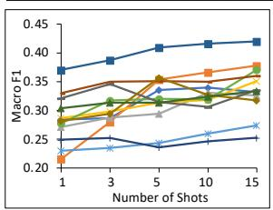  
(a) BearFact

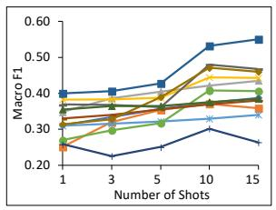  
(b) Check-COVID

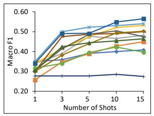  
(c) SciFact

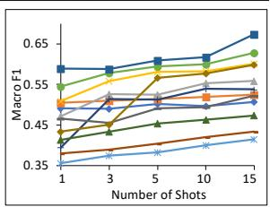  
(d) FEVEROUS-S

Figure 3: Few-shot veracity prediction with different number of shots.  
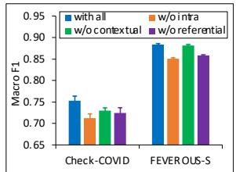

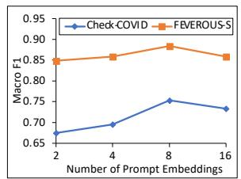  
(a) Effect of intra and cross reasoning (b) Number of prompt embeddings M (c) Prompt initialization and encoder

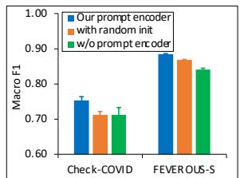

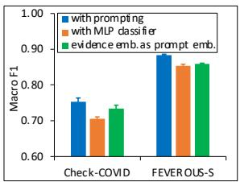  
(d) Effect of prompting

Figure 4: Model analysis on Check-COVID and FEVEROUS-S.  
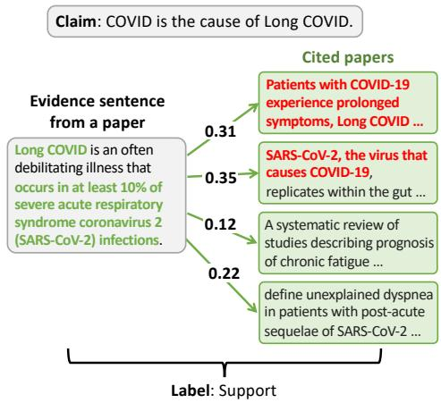  
Figure 5: Case study on BearFact dataset.

Effect of prompting. We design two ablated models. i) We replace prompting with an MLP classifier, which concatenates evidence and claim embeddings as input, and produces predicted label. Here claim embedding is obtained without prompt embeddings. ii) We directly consider evidence embedding as prompt embedding, and do not assume base prompt embeddings. Fig. 4(d) shows that prompting performs better than MLP classifier, because prompt embeddings and claim token embeddings are input to claim encoder together, and the contextualized encoding helps exchange information between evidence and claim for accurate prediction. Base prompt embeddings are also helpful, since they store general fact-checking knowledge and help generalize across different claims.

Case study. To intuitively understand that our model captures useful information in referential documents, we conduct a case study and visually show the attention values between an evidence sentence and its cited papers in graph neural networks. Fig. 5 shows that the highest attention scores appear between the evidence sentence and referential documents that indeed contain useful information. This visualization verifies that referential documents are crucial to improve claim verification.

## 5 Conclusion

We propose a context- and reference-augmented reasoning and prompting model for fact-checking. To model contextual and referential documents, we construct a three-layer graph with intra- and cross-layer reasoning. To integrate evidence into claims, we design evidence-conditioned prompting, which produces unique prompt embeddings for each claim. A future work is to extend three-layer graph to a multi-modal graph for fact-checking.

## Acknowledgments

This work was in part supported by NSF awards #1934782 and #2114824. Some of the research results were obtained using computational resources provided by NAIRR award #240336.

## Limitations

Here we identify two limitations of our work in terms of dataset and evidence type.

Dataset. Our model is proposed to incorporate contextual and referential documents of evidence sentences. We assume that the contextual and referential documents of evidence sentences are available in the dataset, or the dataset provides identifiers for evidence sentences, such as PubMed ID, so that we can use these identifiers to search their contextual and referential documents online. In Appendix B, we provide details on how to use identifiers to obtain contextual and referential documents. If the given dataset does not provide contextual or referential documents, or the identifiers of evidence sentences are not available, our model will reason within evidence sentences for fact-checking.

Evidence type. Following existing textual factchecking models, we propose our model to reason over textual evidence sentences only. Our model is not proposed for tabular or multi-modal evidence, thus cannot reason over these types of evidence for fact-checking. One potential future work would be to extend our three-layer evidence graph to a multi-modal graph for evidence reasoning.

## Ethics Statement

We do not foresee any undesired implications stemming from our work. Conversely, we hope that our work can advance AI Ethics research.

## References

Josh Achiam, Steven Adler, Sandhini Agarwal, Lama Ahmad, Ilge Akkaya, Florencia Leoni Aleman, Diogo Almeida, Janko Altenschmidt, Sam Altman, Shyamal Anadkat, et al. 2023. Gpt-4 technical report. arXiv preprint arXiv:2303.08774.

Rami Aly, Zhijiang Guo, Michael Sejr Schlichtkrull, James Thorne, Andreas Vlachos, Christos Christodoulopoulos, Oana Cocarascu, and Arpit Mittal. 2021. FEVEROUS: Fact extraction and VERification over unstructured and structured information. In Thirty-fifth Conference on Neural Information Processing Systems Datasets and Benchmarks Track.

Tom Brown, Benjamin Mann, Nick Ryder, Melanie Subbiah, Jared D Kaplan, Prafulla Dhariwal, Arvind Neelakantan, Pranav Shyam, Girish Sastry, Amanda Askell, et al. 2020. Language models are few-shot learners. Advances in neural information processing systems, 33:1877–1901.

Jacob Devlin, Ming-Wei Chang, Kenton Lee, and Kristina Toutanova. 2019. Bert: Pre-training of deep bidirectional transformers for language understanding. In Proceedings of the 2019 Conference of the North American Chapter ofthe Associationfor Computational Linguistics: Human Language Technologies, pages 4171–4186.

Tianyu Gao, Adam Fisch, and Danqi Chen. 2021. Making pre-trained language models better few-shot learners. In Proceedings ofthe 59th Annual Meeting of the Association for Computational Linguistics and the 11th International Joint Conference on Natural Language Processing, pages 3816–3830.

Yu Gu, Robert Tinn, Hao Cheng, Michael Lucas, Naoto Usuyama, Xiaodong Liu, Tristan Naumann, Jianfeng Gao, and Hoifung Poon. 2021. Domain-specific language model pretraining for biomedical natural language processing. ACM Transactions on Computing for Healthcare (HEALTH), 3(1):1–23.

Zhijiang Guo, Michael Schlichtkrull, and Andreas Vlachos. 2022. A survey on automated fact-checking. Transactions of the Association for Computational Linguistics, 10:178–206.

Will Hamilton, Zhitao Ying, and Jure Leskovec. 2017. Inductive representation learning on large graphs. Advances in neural information processing systems, 30.

Linmei Hu, Tianchi Yang, Luhao Zhang, Wanjun Zhong, Duyu Tang, Chuan Shi, Nan Duan, and Ming Zhou. 2021. Compare to the knowledge: Graph neural fake news detection with external knowledge. In Proceedings ofthe 59th Annual Meeting ofthe Associationfor Computational Linguistics and the 11th International Joint Conference on Natural Language Processing, pages 754–763.

Bowen Jin, Wentao Zhang, Yu Zhang, Yu Meng, Xinyang Zhang, Qi Zhu, and Jiawei Han. 2023. Patton: Language model pretraining on text-rich networks. In The 61st Annual Meeting OfThe Association For Computational Linguistics.

Nayeon Lee, Yejin Bang, Andrea Madotto, and Pascale Fung. 2021. Towards few-shot fact-checking via perplexity. In Proceedings of the 2021 Conference of the North American Chapter of the Association for Computational Linguistics: Human Language Technologies, pages 1971–1981.

Brian Lester, Rami Al-Rfou, and Noah Constant. 2021. The power of scale for parameter-efficient prompt tuning. In Proceedings of the 2021 Conference on Empirical Methods in Natural Language Processing, pages 3045–3059.

Xiang Lisa Li and Percy Liang. 2021. Prefix-tuning: Optimizing continuous prompts for generation. In Proceedings of the 59th Annual Meeting of the Associationfor Computational Linguistics and the 11th International Joint Conference on Natural Language Processing, pages 4582–4597.

Xiangci Li and Nanyun Peng. 2021. A paragraphlevel multi-task learning model for scientific factverification.

Xiao Liu, Kaixuan Ji, Yicheng Fu, Weng Tam, Zhengxiao Du, Zhilin Yang, and Jie Tang. 2022. P-tuning: Prompt tuning can be comparable to fine-tuning across scales and tasks. In Proceedings of the 60th Annual Meeting ofthe Associationfor Computational Linguistics, pages 61–68.

Xiao Liu, Yanan Zheng, Zhengxiao Du, Ming Ding, Yujie Qian, Zhilin Yang, and Jie Tang. 2023. Gpt understands, too. AI Open.

Zhenghao Liu, Chenyan Xiong, Maosong Sun, and Zhiyuan Liu. 2020. Fine-grained fact verification with kernel graph attention network. In Proceedings of the 58th Annual Meeting of the Association for Computational Linguistics, pages 7342–7351.

Kyle Lo, Lucy Lu Wang, Mark Neumann, Rodney Kinney, and Daniel S Weld. 2020. S2orc: The semantic scholar open research corpus. In Proceedings of the 58th Annual Meeting of the Association for Computational Linguistics, pages 4969–4983.

Nedjma Ousidhoum, Zhangdie Yuan, and Andreas Vlachos. 2022. Varifocal question generation for factchecking. In Proceedings of the 2022 Conference on Empirical Methods in Natural Language Processing, pages 2532–2544.

Liangming Pan, Xiaobao Wu, Xinyuan Lu, Anh Tuan Luu, William Yang Wang, Min-Yen Kan, and Preslav Nakov. 2023. Fact-checking complex claims with program-guided reasoning. In Proceedings of the 61st Annual Meeting ofthe Associationfor Computational Linguistics (ACL), pages 6981–7004.

Colin Raffel, Noam Shazeer, Adam Roberts, Katherine Lee, Sharan Narang, Michael Matena, Yanqi Zhou, Wei Li, and Peter J Liu. 2020. Exploring the limits of transfer learning with a unified text-to-text transformer. Journal ofmachine learning research, 21(140):1–67.

Stephen Robertson, Hugo Zaragoza, et al. 2009. The probabilistic relevance framework: Bm25 and beyond. Foundations and Trends® in Information Retrieval, 3(4):333–389.

Taylor Shin, Yasaman Razeghi, Robert L Logan IV, Eric Wallace, and Sameer Singh. 2020. Autoprompt: Eliciting knowledge from language models with automatically generated prompts. In Proceedings of the 2020 Conference on Empirical Methods in Natural Language Processing (EMNLP), pages 4222–4235.

Jiasheng Si, Yingjie Zhu, and Deyu Zhou. 2023. Exploring faithful rationale for multi-hop fact verification via salience-aware graph learning. In Proceedings of the AAAI Conference on Artificial Intelligence, volume 37, pages 13573–13581.

Shyam Subramanian and Kyumin Lee. 2020. Hierarchical evidence set modeling for automated fact extraction and verification. In Proceedings ofthe 2020 Conference on Empirical Methods in Natural Language Processing (EMNLP), pages 7798–7809.

Zhixing Tan, Xiangwen Zhang, Shuo Wang, and Yang Liu. 2022. Msp: Multi-stage prompting for making pre-trained language models better translators. In Proceedings ofthe 60th Annual Meeting ofthe Associationfor Computational Linguistics, pages 6131– 6142.

Ashish Vaswani, Noam Shazeer, Niki Parmar, Jakob Uszkoreit, Llion Jones, Aidan N Gomez, Łukasz Kaiser, and Illia Polosukhin. 2017. Attention is all you need. Advances in neural information processing systems, 30.

David Wadden, Shanchuan Lin, Kyle Lo, Lucy Lu Wang, Madeleine van Zuylen, Arman Cohan, and Hannaneh Hajishirzi. 2020. Fact or fiction: Verifying scientific claims. In Proceedings of the 2020 Conference on Empirical Methods in Natural Language Processing (EMNLP), pages 7534–7550.

David Wadden, Kyle Lo, Lucy Lu Wang, Arman Cohan, Iz Beltagy, and Hannaneh Hajishirzi. 2022. Multivers: Improving scientific claim verification with weak supervision and full-document context. In Findings ofthe Associationfor Computational Linguistics: NAACL 2022, pages 61–76.

Gengyu Wang, Kate Harwood, Lawrence Chillrud, Amith Ananthram, Melanie Subbiah, and Kathleen Mckeown. 2023. Check-covid: Fact-checking covid-19 news claims with scientific evidence. In Findings of the Association for Computational Linguistics: ACL 2023, pages 14114–14127.

Zhihao Wen and Yuan Fang. 2023. Augmenting lowresource text classification with graph-grounded pretraining and prompting. In Proceedings of the 46th International ACM SIGIR Conference on Research and Development in Information Retrieval, pages 506–516.

Chenxi Whitehouse, Tillman Weyde, Pranava Madhyastha, and Nikos Komninos. 2022. Evaluation of fake news detection with knowledge-enhanced language models. In Proceedings of the international AAAI conference on web and social media, volume 16, pages 1425–1429.

Amelie Wuehrl, Yarik Menchaca Resendiz, Lara Grimminger, and Roman Klinger. 2024. What makes medical claims (un) verifiable? analyzing entity and relation properties for fact verification. In Proceedings of the 18th Conference of the European Chapter of the Association for Computational Linguistics, pages 2046–2058.

Junhan Yang, Zheng Liu, Shitao Xiao, Chaozhuo Li, Defu Lian, Sanjay Agrawal, Amit Singh,

Guangzhong Sun, and Xing Xie. 2021. Graphformers: Gnn-nested transformers for representation learning on textual graph. In Advances in Neural Information Processing Systems, volume 34, pages 28798– 28810. Curran Associates, Inc.

Menglin Yang, Harshit Verma, Delvin Ce Zhang, Jiahong Liu, Irwin King, and Rex Ying. 2024. Hypformer: Exploring efficient transformer fully in hyperbolic space. In Proceedings of the 30th ACM SIGKDD Conference on Knowledge Discovery and Data Mining, pages 3770–3781.

Fengzhu Zeng and Wei Gao. 2023. Prompt to be consistent is better than self-consistent? few-shot and zero-shot fact verification with pre-trained language models. In Findings of the Association for Computational Linguistics: ACL 2023, pages 4555–4569.

Fengzhu Zeng and Wei Gao. 2024. Justilm: Few-shot justification generation for explainable fact-checking of real-world claims. Transactions of the Association for Computational Linguistics, 12:334–354.

Ce Zhang and Hady W Lauw. 2020. Topic modeling on document networks with adjacent-encoder. In Proceedings of the AAAI Conference on Artificial Intelligence, volume 34, pages 6737–6745.

Congzhi Zhang, Linhai Zhang, and Deyu Zhou. 2024a. Causal walk: Debiasing multi-hop fact verification with front-door adjustment. In Proceedings of the AAAI Conference on Artificial Intelligence, volume 38, pages 19533–19541.

Delvin Ce Zhang and Hady W Lauw. 2021. Semisupervised semantic visualization for networked documents. In Machine Learning and Knowledge Discovery in Databases. Research Track: European Conference, ECML PKDD 2021, Bilbao, Spain, September 13–17, 2021, Proceedings, Part III 21, pages 762–778. Springer.

Delvin Ce Zhang and Hady W Lauw. 2023. Topic modeling on document networks with dirichlet optimal transport barycenter. IEEE Transactions on Knowledge and Data Engineering.

Delvin Ce Zhang, Menglin Yang, Rex Ying, and Hady W Lauw. 2024b. Text-attributed graph representation learning: Methods, applications, and challenges. In Companion Proceedings of the ACM on Web Conference 2024, pages 1298–1301.

Delvin Ce Zhang, Rex Ying, and Hady W Lauw. 2023. Hyperbolic graph topic modeling network with continuously updated topic tree. In Proceedings of the 29th ACM SIGKDD Conference on Knowledge Discovery and Data Mining, pages 3206–3216.

Zhiwei Zhang, Jiyi Li, Fumiyo Fukumoto, and Yanming Ye. 2021. Abstract, rationale, stance: A joint model for scientific claim verification. In Proceedings of the 2021 Conference on Empirical Methods in Natural Language Processing, pages 3580–3586.

Chen Zhao, Chenyan Xiong, Corby Rosset, Xia Song, Paul Bennett, and Saurabh Tiwary. 2020. Transformer-xh: Multi-evidence reasoning with extra hop attention. In International Conference on Learning Representations.

Wanjun Zhong, Jingjing Xu, Duyu Tang, Zenan Xu, Nan Duan, Ming Zhou, Jiahai Wang, and Jian Yin. 2020. Reasoning over semantic-level graph for fact checking. In Proceedings of the 58th Annual Meeting of the Association for Computational Linguistics, pages 6170–6180.

Jie Zhou, Xu Han, Cheng Yang, Zhiyuan Liu, Lifeng Wang, Changcheng Li, and Maosong Sun. 2019. Gear: Graph-based evidence aggregating and reasoning for fact verification. In Proceedings ofthe 57th Annual Meeting ofthe Associationfor Computational Linguistics, pages 892–901.

Kaiyang Zhou, Jingkang Yang, Chen Change Loy, and Ziwei Liu. 2022a. Conditional prompt learning for vision-language models. In Proceedings of the IEEE/CVF conference on computer vision and pattern recognition, pages 16816–16825.

Kaiyang Zhou, Jingkang Yang, Chen Change Loy, and Ziwei Liu. 2022b. Learning to prompt for visionlanguage models. International Journal of Computer Vision, 130(9):2337–2348.

Anni Zou, Zhuosheng Zhang, and Hai Zhao. 2023. Decker: Double check with heterogeneous knowledge for commonsense fact verification. In Findings of the Association for Computational Linguistics: ACL 2023, pages 11891–11904.

## A Pseudo-code of Training Process

We summarize the training process at Algo. 1.

## B Dataset Preprocessing Details

Here we present details of dataset preprocessing.

FEVEROUS1 (Aly et al., 2021) is a generaldomain dataset, and each claim is annotated in the form of sentences and/or cells from tables in Wikipedia pages. In this paper we mainly focus on textual evidence sentences, thus we follow ProgramFC (Pan et al., 2023) and obtain claims that only require textual evidence for verification, and name this subset FEVEROUS-S. Claims in this dataset have two labels only, SUPPORT and RE-FUTE. In the original dataset, each evidence sentence may contain hyperlinks to other Wikipedia pages, and such hyperlinks in sentences are indicated with double square brackets. We thus retrieve words or phrases inside double square brackets, and use them as entries to query Wikipedia dump to obtain their corresponding pages as referential documents. FEVEROUS uses the December 2020 dump, including 5.4 million full Wikipedia articles. If a Wikipedia page has overly many sentences, we reserve its top-20 sentences, since almost all the evidence sentences appear within top-20 sentences in FEVEROUS. Similarly, the full content of the Wikipedia page is contextual document of each evidence sentence. If a page has overly long content, we reserve its top-20 sentences.

Algorithm 1 Training Process of CORRECT obtained from paper abstracts in PubMed database3.   
Original dataset does not provide evidence sen-  
Input: A fact-checking dataset with claims   
tences for claims in NEI class. Thus we follow   
, evidence sentences $\mathcal { E } ,$ contextual documents ${ \mathcal { C } } ,$   
existing work (Zeng and Gao, 2023) and select evi  
and referential documents . Number of prompt   
dence sentences that have the highest tf-idf similar  
embeddings M and temperature τ.   
Output: Predicted labels $\widehat { \mathcal { V } } _ { \mathrm { t e s t } }$ for test claims. ity with claims as their evidence. We consider the   
full abstract as the contextual document for each   
1: Initialize model with pre-trained parameters in evidence sentence, as in MultiVerS (Wadden et al.,   
biomedical domain or general domain. 2022). In addition, we use S2ORC (Lo et al., 2020)   
2: while not converged do to obtain cited papers with abstracts as referential   
3: Construct three-layer evidence graph for documents. Specifically, the original dataset pro  
each claim $x \in { \mathcal { X } } .$ vides PubMed ID for each evidence sentence. We   
4: for evidence sentence $e \in \mathcal { N } _ { \mathrm { e v i d } } ( x )$ do use PubMed IDs as identifiers to search in S2ORC   
5: Initialization ${ \bf H } _ { e } ^ { ( l = 1 ) } = \mathrm { T R M } ( { \bf H } _ { e } ^ { ( l = 0 ) } )$ database and obtain cited papers. If a paper has   
6: for $l = 1 , 2 , . . . , L - 1$ do overly many citations, we reserve its top-20 cita-  
// Evidence graph reasoning tions to avoid data redundancy.   
7: Intra-layer reasoning by Eqs. 1–4. Check-COVID4 specifically focuses on COVID-  
8: Cross-layer reasoning by Eq. 5. 19 claims taken from news articles. Each evidence   
//Asymmetric MHA step sentence is from a paper abstract with CORD ID   
9: Virtual token concatenation Eq. 6. as identifier. We thus use CORD IDs to search in   
10: $\mathbf { H } _ { e } ^ { ( l + 1 ) } = \mathrm { T R M } ^ { \mathrm { a s y } } ( \widehat { \mathbf { H } } _ { e } ^ { ( l ) } )$ by Eq. 7. S2ORC database and obtain cited papers. Simi-  
11: end for larly, we consider the full abstract as contextual   
12: end for document. The original dataset provides sentences   
13: Obtain an evidence embedding by Eq. 8. for claims in NEI class.   
// Evidence-conditioned prompting SciFact5 (Wadden et al., 2020) is another   
14: Initialize sets of base prompt embed- biomedical fact-checking dataset with sentences   
dings $\{ \mathbf { h } _ { m , y } \} _ { m = 1 } ^ { M }$ where $y \in \mathcal { V } .$ in paper abstracts as evidence. Similarly, the full   
15: Input evidence embedding $\mathbf { h } _ { E }$ to evidence- content of the abstract is considered as contextual   
conditioned prompt encoder and obtain document. In addition, each evidence sentence is   
sets of prompt embeddings $\{ \pi _ { m , y } \} _ { m = 1 } ^ { M }$ where coupled with S2ORC ID, which is used to obtain   
$y \in \mathcal { V }$ by Eqs. 10–11. its citations using S2ORC database. The original   
16: Input $\{ \mathbf { P } _ { x , y } \} _ { y \in \mathcal { V } }$ to claim encoder and ob- dataset does not have sentences for claims in NEI   
tain $| \mathcal { V } |$ claim embeddings $\{ \mathbf { h } _ { x , y } \} _ { y \in \mathcal { Y } }$ class. Thus we follow the original paper (Wadden   
17: Minimize loss function in Eq. 13. et al., 2020) and choose top-3 sentences in the same   
18: end while abstract with the highest tf-idf similarity with the   
claim as evidence

BearFact2 (Wuehrl et al., 2024) is a biomedical claim verification dataset. Evidence sentences are

## C Experiment Environment

All the experiments were conducted on Linux server with 4 NVIDIA A100-SXM4-80GB GPUs. Its operating system is 20.04.5 LTS (Focal Fossa). We implemented our proposed model CORRECT using Python 3.9 as programming language and PyTorch 1.14.0 as deep learning library. Other frameworks include numpy 1.22.2, sklearn 0.24.2, and transformers 4.43.3.