# COVE: COntext and VEracity prediction for out-of-context images

Jonathan Tonglet1,2,3, Gabriel Thiem1, Iryna Gurevych1

1Ubiquitous Knowledge Processing Lab (UKP Lab),

Department of Computer Science and Hessian Center for AI (hessian.AI),

2 Department of Electrical Engineering, KU Leuven 3 Department of Computer Science, KU Leuven www.ukp.tu-darmstadt.de

## Abstract

Images taken out of their context are the most prevalent form of multimodal misinformation. Debunking them requires (1) providing the true context of the image and (2) checking the veracity of the image’s caption. However, existing automated fact-checking methods fail to tackle both objectives explicitly. In this work, we introduce COVE, a new method that predicts first the true COntext of the image and then uses it to predict the VEracity of the caption. COVE beats the SOTA context prediction model on all context items, often by more than five percentage points. It is competitive with the best veracity prediction models on synthetic data and outperforms them on real-world data, showing that it is beneficial to combine the two tasks sequentially. Finally, we conduct a human study that reveals that the predicted context is a reusable and interpretable artifact to verify new out-of-context captions for the same image. Our code and data are made available.1

## 1 Introduction

An out-of-context (OOC) image is a form of multimodal misinformation where the caption misrepresents the image in one or several dimensions, including the date, location, or event depicted (Luo et al., 2021; Dufour et al., 2024). In 2023, more than 40% of the visual misinformation verified by fact-checkers consisted of OOC images (Dufour et al., 2024). To debunk them, human fact-checkers follow two objectives: identifying the true context of the image, which usually takes the form of a fixed set of items (Silverman, 2013; Urbani, 2020; Mossou and Higgins, 2021; Khan et al., 2023, 2024), and deciding on the veracity of the caption. Identifying the true context of the image first is often beneficial when checking the caption, as it may reveal inconsistencies with the image. However, it goes beyond that objective, as most context items are neither consistent nor inconsistent with the caption and provide more details than needed to verify the caption. In Figure 1, the context, shown in blue, reveals that the location in the caption is inconsistent: Malta instead of Indonesia. It also discusses the source and date, which are absent from the caption, and provides a precise location at the city level.

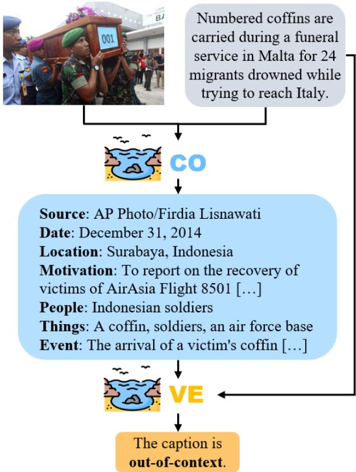  
Figure 1: The two steps of COVE: (1) Generating the true context of the image. (2) Predicting the veracity of a caption by comparing it with the generated context.

Many methods have been proposed to facilitate fact-checking (FC) of OOC images. However, they study either context prediction (Tonglet et al., 2024) or veracity prediction (Abdelnabi et al., 2022; Papadopoulos et al., 2023, 2024a; Qi et al., 2024). They do not consider automating them sequentially, leveraging the comprehensive context to predict the veracity of the caption.

In this work, we introduce COVE, the first method that both predicts a comprehensive COntext for the image and a VEracity label for the caption. The method consists of two steps, shown in Figure 1. First, the context is predicted as a set of seven items, three of which are first introduced in this work. Compared to prior work, COVE leverages a more diverse set of evidence to predict the context, including web search, knowledge bases, and the parametric knowledge of large language models (LLMs). Afterward, the caption is compared with the context to predict its veracity. We summarize our contributions as follows. (1) Leveraging a more diverse set of evidence, COVE outperforms the context prediction SOTA (Tonglet et al., 2024) for all context items, including three items introduced in this work, by 0.3 to 18.9 percentage points. (2) COVE is competitive with the best models for veracity prediction on synthetic data and outperforms them on real-world data by up to 4.5 percentage points in Macro F1, highlighting the benefits of automating veracity prediction based on the predicted context. (3) Our experiments show that the predicted context is an interpretable artifact for human users, which they can reuse multiple times to verify new captions about the same image.

## 2 Related work

## Veracity prediction for OOC images

Providing a veracity label for OOC images has received significant attention in automated fact-checking (AFC) research (Akhtar et al., 2023). It is a binary classification task with labels {accurate, OOC}. Synthetic datasets have been created by replacing entities in the true caption (Sabir et al., 2018; Müller-Budack et al., 2020) or by mismatching image-caption pairs from news corpora (Luo et al., 2021). Smaller datasets based on real-world fact-checks have recently been proposed (Aneja et al., 2023; Papadopoulos et al., 2024b; Pham et al., 2024). Models that leverage external evidence outperform those that use only the image and the caption as input (Luo et al., 2021; Zhang et al., 2023b). Abdelnabi et al. (2022) collects text evidence with reverse image search and image evidence by querying a search engine with the caption. The performance can further be improved by predicting the stance of the evidence towards the caption (Yuan et al., 2023) or ranking the most relevant evidence (Papadopoulos et al., 2023). Unlike prior methods, ECENet provides an explanation in the form of a summary of the most relevant text evidence (Zhang et al., 2023a). Recent work leverages multimodal LLMs (MLLMs) with instruction-tuning (Qi et al., 2024), external tools (Braun et al., 2024), or multi-agent debate (Lakara et al., 2024). Papadopoulos et al. (2024a) showed that simple classifiers like random forest trained on top of the image, caption, and image and text evidence embeddings achieve SOTA performance. Their results show that veracity can often be predicted based on shallow heuristics, highlighting the need to assess the progress in the field from other perspectives (Papadopoulos et al., 2024a), such as context prediction.

## Context prediction for OOC images

Context prediction, or image contextualization, has received less attention in AFC. Tonglet et al. (2024) formulate it as a question-answering (QA) task where each context item is predicted given the corresponding question and a set of evidence which may include the image, the caption, or pieces of information derived from them. Tahmasebi et al. (2025) formulate it as a true/false classification task where candidate people, locations, and events are verified with a MLLM. 5Pils is a real-world dataset (Tonglet et al., 2024) which contains context labels based on human fact-checking practices (Urbani, 2020; Mossou and Higgins, 2021; Khan et al., 2023, 2024). Tonglet et al. (2024) proposed a baseline for context prediction that retrieves text evidence with reverse image search and answers context questions with a (M)LLM and the image and the evidence as input.

In this work, we fill an important gap by introducing the first method that performs both tasks sequentially, leveraging the generated context for veracity prediction.

## 3 COntext and VEracity (COVE)

COVE is a method to predict the true context of an image first and then the veracity of its caption. The overall architecture can be divided into six steps, as illustrated in Figure 2. The first three steps are concerned with the collection of a diverse set of evidence, i.e., web captions and visual entities (§3.1), Wikipedia entities (§3.2), and automated captions (§3.3). Based on their similarity with web images and captions, the veracity of certain instances is already predicted during evidence retrieval (§3.1). After collecting the evidence, a first version of the context is predicted with an LLM (§3.4). Then, some missing context items are updated by searching relevant Wikipedia passages (§3.5). Eventually, a model predicts the veracity of the caption based on the predicted context (§3.6).

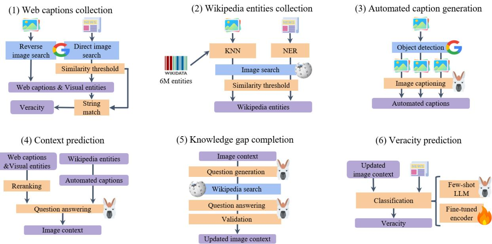  
Figure 2: The architecture of COVE consists of six steps. The first three are performed in parallel and consist of retrieving evidence. Step 4 predicts the context items in a QA setting. Step 5 updates missing items based on the existing ones and Wikipedia knowledge. Step 6 predicts the veracity of the caption based on the predicted context.

## 3.1 Web captions collection

Following Abdelnabi et al. (2022), we use reverse image search with the Google Vision API to retrieve web captions and visual entities associated with the same or partially matching images,2 and a custom Google search engine to retrieve relevant web images given the caption.3 We compute the cosine similarity between the CLIP (Radford et al., 2021) embeddings of the instance’s image and the web images. For images with similarity above a threshold $t _ { m a t c h }$ , their attached caption is added to the set of web captions.

The web captions are sufficient to assign a veracity label to some instances, especially those for which the caption and/or the image come directly from newspapers. We apply the following three rules, which we refer to as veracity rules: (1) if the caption is an exact string match with one or more reverse image search web captions, the veracity is accurate, (2) if the similarity with a web image is above $t _ { m a t c h }$ , the veracity is accurate, (3) if the similarity with a web image is below threshold $t _ { n o n \_ m a t c h }$ and the attached web caption is an exact string match with the caption to verify, the veracity is OOC.

## 3.2 Wikipedia entities collection

Images often contain entities, such as celebrities, products, and landmarks, that can be paired with a Wikipedia page (Müller-Budack et al., 2020). Recognizing these entities and providing them as evidence can help predict the context. An example is illustrated in Figure 3. First, we collect a set of candidate entities: (1) we collect named entities from the caption and normalize them to match one or more Wikipedia entries using GENRE (Cao et al., 2021), (2) we use the OVEN index (Hu et al., 2023a), which contains 6 Million Wikidata entities, and retrieve the k nearest neighbors based on the cosine similarity between their CLIP text embeddings and the image embedding. For each candidate entity, if its embedding similarity with the image is superior to threshold $t _ { w i k i \_ t e x t }$ , it is retained. Otherwise, we scrape up to three images from the corresponding Wikipedia page and compute their embedding’s cosine similarity with the image. If at least one similarity score is higher than $t _ { w i k i \_ i m a g e } ,$ the entity is retained.

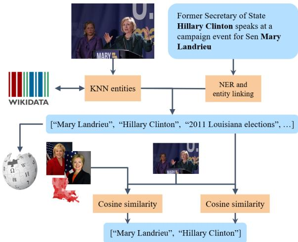  
Figure 3: Wikipedia entities collection. The candidate set is composed of the entities in the caption and those that are most similar to the image. Candidates are retained if the similarity between the image and their name or their Wikipedia images passes a threshold.

## 3.3 Automated caption generation

The third set of evidence is generated automatically with the MLLM LlavaNext (Liu et al., 2023, 2024). One caption describing the entire image and another one describing the people are generated by providing the entire image as input. Then, following Hu et al. (2023b), we detect objects in the image using the Google Vision API.4 We crop the image to its bounding boxes, and caption it with LlavaNext using a question specific to the object’s category. Categories are manually defined with their questions in Appendix A.

## 3.4 Context prediction

We predict seven context items: {source, date, location, motivation, people, things, event}. The first four items were introduced in Tonglet et al. (2024), while the last ones are new to this work. The first l web captions are ranked based on the number of named entities relevant to the context item that they contain, for example, the number of PERSON entities for the people item. The selected Wikipedia entities and the automated captions are merged into two captions: one for everything that relates to people in the image and the other one for all other pieces of information. All the collected evidence is provided as input with a question to the LLM Llama 3 (MetaAI, 2024) to predict a context item. When the evidence does not contain the answer, the model is prompted to output “Unknown”. Each item, its associated question, and relevant named entities are discussed in Appendix B .

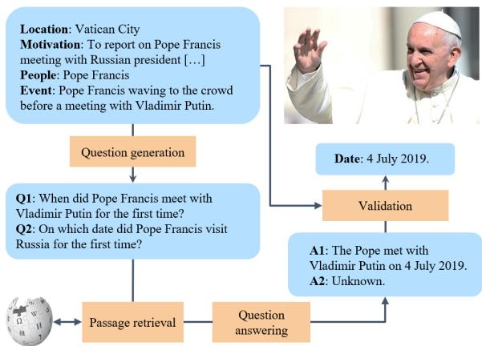  
Figure 4: Knowledge gap completion. Questions are generated based on the predicted context and answered with Wikipedia passages. If the answers are relevant, the context is updated.

## 3.5 Knowledge gap completion

The date and location can often be missing after step 4. However, these two items can be derived from other context items and world knowledge. Following QACheck (Pan et al., 2023a), we use a sequence of three modules: question generation, question answering, and validation, illustrated in Figure 4. If the answer to date is Unknown, and location + people, event, or motivation are available, we provide the currently known context items as input to Llama 3 and ask it to generate up to three questions that could help predict the date of the image. For each question, relevant Wikipedia passages are retrieved with WikiChat and Colbert (Khattab and Zaharia, 2020; Semnani et al., 2023) and provided as input to Llama 3 to provide an answer. Finally, Llama 3 predicts the date, if it can be determined, based on the existing context and the generated QA pairs. For location, we apply the same pipeline if the date + people, event, or motivation are available. More examples of knowledge gap completions are shown in Appendix C.

## 3.6 Veracity prediction

This step takes the predicted context and the caption as input and is performed only for captions that could not automatically be verified based on the web evidence (§3.1). We consider two different models. (1) A frozen Llama 3 with few-shot demonstrations as input. Each demonstration’s output starts with an explanation of the inconsistencies, followed by the predicted veracity, which is either “accurate”, “OOC”, “Unknown, probably [label]”, which counts as a prediction of the corresponding label, or “Unknown”, which is mapped to the majority predicted label. This flexibility in the output answers was empirically found to help Llama 3 in ambiguous cases. (2) A DebertaV3 (He et al., 2023) model fine-tuned on (predicted context, ground truth veracity) training pairs.

## 4 Experiments

## 4.1 Datasets

NewsCLIPpings is a synthetic dataset for veracity prediction (Luo et al., 2021). Images and their captions are selected from Visual News (Liu et al., 2021). OOC pairs are created by mismatching images and captions using various measures of semantic similarity. Following prior works, we use the “merged-balanced” split, which contains 71,072, 7,024, and 7,264 instances in the train, validation, and test splits, respectively. Within a split, each caption appears twice, once as accurate and once as OOC. NewsCLIPpings does not contain ground truth context items. Hence, we create them by decomposing the accurate caption in a set of context items with Llama 3, as explained in Appendix D.

5Pils-OOC is a real-world test set containing 624 images, each paired with two captions, one accurate and the other OOC, for a total of 1248 instances. We construct 5Pils-OOC as a subset of 5Pils (Tonglet et al., 2024). The images and OOC captions have been fact-checked by human experts from three organizations: Factly, Pesacheck, and 211Check. The images come from both Western and non-Western contexts, in particular, India and Ethiopia. As 5Pils does not contain accurate captions, we generate them automatically using GPT4 (OpenAI, 2023) based on the ground truth context items. Furthermore, 5Pils does not contain ground truth labels for context items people, things, and event. They are derived from the accurate caption, as explained in Appendix D. The creation of 5Pils-OOC from 5Pils is detailed in Appendix E.

## 4.2 Context metrics

We report one metric per context item. Additional evaluations with all metrics introduced in Tonglet et al. (2024) are provided in Appendix F.

Source, motivation, things, and event are evaluated with Meteor (Banerjee and Lavie, 2005).

Date predictions are mapped to timestamps. We use ∆, which is inversely proportional to the distance in years with the ground truth.

Location predictions are mapped to coordinates using GeoNames.5 We use Coordinates ∆ (CO∆), which is inversely proportional to the distance in thousand kilometers with the ground truth.

People expects sets of named entities as predictions, evaluated with the Macro F1-score (F1).

## 4.3 Veracity metrics

We use four metrics for veracity prediction: the accuracy A, the recall over accurate samples RACC, the recall over OOC samples R , and F1.

## 4.4 Baselines

For context prediction, we compare COVE with the 5Pils baseline Tonglet et al. (2024), which provides the image and web captions from reverse image search as input to a MLLM, LlavaNext in our case, asking one question per context item.

We compare COVE against three SOTA models for veracity prediction of OOC images, which all rely on external evidence. RED-DOT (Papadopoulos et al., 2023) and AITR (Papadopoulos et al., 2024a) use transformer architectures trained on top of the CLIP embeddings of the image, the caption, and text and image evidence. Furthermore, they filter the evidence to keep only the most relevant one from each modality. SNIFFER (Qi et al., 2024) predicts veracity based on two signals: (1) the detection of inconsistencies between the caption, the image, and the visual entities, using a fine-tuned InstructBLIP (Dai et al., 2023), and (2) the detection of inconsistencies between the caption and text evidence using a frozen Vicuna (Chiang et al., 2023), which we replace here by Llama 3 for a fair comparison. We also evaluate veracity prediction with Llama 3 based on the context items predicted by the 5Pils baseline. Finally, we report as an upper bound the COVE veracity results using the ground truth context items.

## 4.5 Implementation details

All hyperparameters are tuned, and ablations are performed on a random sample of 1500 instances from the NewsCLIPpings validation set. DebertaV3 is fine-tuned on a subset of the NewsCLIPpings train set containing 5000 instances. Inference with Llama 3 is done in a few-shot setting with 4 to 8 demonstrations, which have been selected and labeled by hand from a random sample of 100

<table><tr><td></td><td>Source (M)</td><td>Date (∆)</td><td>Loc. (CO∆)</td><td>Mot. (M)</td><td>People (F1)</td><td>Things (M)</td><td>Event (M)</td></tr><tr><td></td><td colspan="7">NewsCLIPpings</td></tr><tr><td>5Pils baseline</td><td>3.4</td><td>28.9</td><td>32.7</td><td>1.5</td><td>39.9</td><td>9.9</td><td>15.4</td></tr><tr><td>COVE</td><td>8.1</td><td>41.5</td><td>51.6</td><td>11.6</td><td>49.0</td><td>10.9</td><td>22.4</td></tr><tr><td></td><td colspan="7">5Pils-OOC</td></tr><tr><td>5Pils baseline</td><td>0.3</td><td>1.8</td><td>21.8</td><td>3.0</td><td>12.8</td><td>4.9</td><td>4.8</td></tr><tr><td>COVE</td><td>0.6</td><td>7.0</td><td>28.9</td><td>15.1</td><td>20.5</td><td>7.2</td><td>9.4</td></tr></table>

Table 1: Context prediction results on the test sets (%). The best scores are marked in bold. Loc. and Mot. are the location and the motivation, respectively.

<table><tr><td></td><td colspan="4">NewsCLIPpings</td><td colspan="4">5Pils-OOC</td></tr><tr><td></td><td>(A)</td><td>(RACC)</td><td>)(Rooc)</td><td>(F1)</td><td>(A)</td><td>(RACC)</td><td>(Rooc)</td><td>(F1)</td></tr><tr><td>RED-DOT è</td><td>90.3</td><td>87.3</td><td>93.3</td><td>90.3</td><td>46.8</td><td>42.8</td><td>50.8</td><td>46.7</td></tr><tr><td>AITR 0</td><td>93.5</td><td>94.8</td><td>92.1</td><td>93.5</td><td>52.6</td><td>81.4</td><td>23.9</td><td>48.4</td></tr><tr><td>SNIFFER 恭</td><td>88.4</td><td>92.3</td><td>84.4</td><td>88.3</td><td>56.3</td><td>86.4</td><td>26.1</td><td>51.9</td></tr><tr><td>5Pils baseline - LLama 3</td><td>77.2</td><td>74.6</td><td>79.8</td><td>77.2</td><td>55.7</td><td>42.8</td><td>68.6</td><td>54.9</td></tr><tr><td></td><td colspan="8">COVE with predicted context</td></tr><tr><td>DebertaV3</td><td>87.9</td><td>84.0</td><td>91.8</td><td>87.9</td><td>56.7</td><td>47.6</td><td>65.9</td><td>56.4</td></tr><tr><td>Llama 3</td><td>86.7</td><td>83.5</td><td>89.9</td><td>86.7</td><td>58.2</td><td>33.0</td><td>83.3</td><td>55.3</td></tr><tr><td></td><td colspan="8">COVE with ground truth context</td></tr><tr><td>DebertaV3</td><td>94.1</td><td>99.2</td><td>88.9</td><td>94.0</td><td>80.7</td><td>100.0</td><td>61.4</td><td>79.9</td></tr><tr><td>Llama 3 </td><td>95.1</td><td>97.1</td><td>93.1</td><td>94.4</td><td>95.9</td><td>99.7</td><td>92.1</td><td>95.3</td></tr></table>

Table 2: Veracity prediction results on the test sets (%). and indicate trained models and frozen models used in a few-shot setting, respectively. The best scores without ground truth are marked in bold.

NewsCLIPpings train instances. Model versions and the hyperparameters are listed in Appendix G. Appendix H reports the prompts for Llama 3.

The same set of web evidence is used for all methods. Following RED-DOT, AITR, and SNIF-FER, we only use the caption field of the web evidence for NewsCLIPpings. For 5Pils-OOC, we use the title field because few web evidence provides a caption. This is more restrictive than the setup of Tonglet et al. (2024) and limits context prediction by ignoring important webpage fields like the publication date. However, it ensures a fair comparison with the veracity prediction baselines. Unlike NewsCLIPpings, the web evidence of 5Pils-OOC are multilingual, including texts in Amharic, Arabic, Hindi, and Telugu.

## 4.6 Main results

## Context prediction

Thanks to its more diverse evidence set, COVE outperforms the 5Pils baseline (Tonglet et al., 2024) on all context items and both datasets, as shown in Table 1. The performance increases from 1.0 to 18.9 on NewsCLIPpings, and from 0.3 to 12.1 percentage points on 5Pils-OOC. For date, location, motivation, and event, COVE is not only more accurate but also abstains less often from answering than the baseline. We attribute these improvements to the larger and more diverse evidence set and the knowledge gap completion step for date and location. In particular, on 5Pils-OOC, including the knowledge gap completion more than doubles the COVE date scores, from 3.3 to 7.0%, and increases the location scores by 6.1 percentage points. Thanks to the Wikipedia entities retrieval, COVE achieves up to 9.1 percentage points higher F1 than the baseline for people. Source relies a lot on web captions, which are also part of the evidence set in the baseline, resulting in limited improvements.

With both methods, better contextualization is achieved on NewsCLIPpings. The largest drops in performance when moving to 5Pils-OOC are observed for source, date, location, and people. The following properties of the images in NewsCLIPpings explain this: (1) they are of higher quality, (2) they all originate from news articles and the retrieved web captions contain more information and are less noisy, impacting source the most, (3) most of them are set in a Western context, on which MLLMs tend to perform better (Ananthram et al., 2024), while most of 5Pils-OOC images are set in East Africa and South Asia. This affects location the most, which is often estimated based on the automated captions if no web captions are available.

## Veracity prediction

The veracity results of COVE are competitive with the baselines on NewsCLIPpings, as shown in Table 2, suffering mainly from a low $\mathtt { R } _ { A C C }$ while achieving near SOTA $\tt R o o c$ . COVE with DebertaV3 achieves slightly better performance, which we attribute to the fine-tuning on NewsCLIPpings train instances.

All methods suffer from lower results when switching from synthetic data to the 5Pils-OOC real-world data. However, COVE becomes the strongest method, achieving better accuracy, $\tt R o o c$ , and F1 than the baselines. While COVE with Llama 3 achieves the best accuracy, COVE with DebertaV3 is the best method in terms of F1. In comparison, RED-DOT performs worse than random, and AITR and SNIFFER have very low $\tt R o o c$ , as low as one OOC caption on four. RED-DOT and AITR always predict the OOC label for instances that have web captions, highlighting their reliance on shallow heuristics that do not generalize beyond NewsCLIPpings (Papadopoulos et al., 2024a). While fine-tuned on synthetic data like the baselines, DebertaV3 generalizes better to 5Pils-OOC, which we attribute to leveraging a comprehensive and structured context as input.

<table><tr><td>Wvep cons</td><td>Visl nies</td><td>Wia enpdies</td><td>Autoad ons</td><td>dad Kowddgg</td><td>Ccotext pxton Veraer piceon</td><td>Veray rcules</td><td></td><td></td><td></td><td></td><td></td><td></td><td></td><td></td><td></td><td></td><td></td><td></td></tr><tr><td></td><td></td><td></td><td></td><td></td><td></td><td></td><td>Source</td><td>Date (∆)</td><td>Location (CO∆)</td><td>Motivation</td><td></td><td>People (F1)</td><td>Things</td><td>Event (M)</td><td></td><td>Veracity (Rooc)</td><td></td><td>(F1)</td></tr><tr><td>√</td><td>√</td><td>√</td><td>√</td><td>√</td><td>√</td><td>√</td><td>√</td><td>(M) 11.2</td><td>48.2</td><td>55.7</td><td>(M) 11.2</td><td>53.0</td><td>(M) 10.0</td><td>22.2</td><td>(A) 88.3</td><td>(RACC) 86.8</td><td>89.8</td><td>88.3</td></tr><tr><td>V</td><td>x</td><td>x</td><td>x</td><td>x</td><td>x</td><td>x</td><td>√</td><td></td><td></td><td></td><td></td><td></td><td>1</td><td></td><td>53.1</td><td>69.8</td><td>35.5</td><td>44.4</td></tr><tr><td>√</td><td>√</td><td>√</td><td>√</td><td>√</td><td>√</td><td>√</td><td>x</td><td>11.2</td><td>48.2</td><td>55.7</td><td>11.2</td><td>53.0</td><td>10.0</td><td>22.2</td><td>84.2</td><td>80.2</td><td>88.4</td><td>84.2</td></tr><tr><td>√</td><td>√</td><td>√</td><td>√</td><td>√</td><td>x</td><td>√</td><td>√</td><td></td><td></td><td></td><td></td><td></td><td></td><td></td><td>78.2</td><td>94.9</td><td>60.7</td><td>77.4</td></tr><tr><td>√</td><td>√</td><td>x</td><td>x</td><td>x</td><td>√</td><td>√</td><td>√</td><td>11.2</td><td>43.7</td><td>49.6</td><td>10.8</td><td>45.1</td><td>11.1</td><td>17.7</td><td>85.1</td><td>94.1</td><td>75.7</td><td>78.6</td></tr><tr><td>√</td><td>x</td><td>1</td><td>1</td><td>x</td><td>√</td><td>√</td><td>x</td><td>14.1</td><td>48.2</td><td>54.5</td><td>10.7</td><td>53.6</td><td>10.7</td><td>21.0</td><td>88.3</td><td>88.5</td><td>88.1</td><td>88.3</td></tr><tr><td>x</td><td>√</td><td>J</td><td></td><td>x</td><td>√</td><td>√</td><td>√</td><td>1.5</td><td>9.6</td><td>14.8</td><td>9.3</td><td>28.1</td><td>6.9</td><td>9.5</td><td>77.9</td><td>73.2</td><td>82.8</td><td>77.9</td></tr><tr><td>x</td><td>x</td><td>√</td><td>√</td><td>x</td><td>√</td><td>√</td><td>x</td><td>1.5</td><td>8.2</td><td>10.1 11.8</td><td>9.1</td><td>27.5</td><td>7.4</td><td>8.5</td><td>77.1</td><td>73.0</td><td>81.4</td><td>77.1</td></tr><tr><td>x</td><td>x</td><td>√</td><td>√</td><td>√</td><td>√</td><td>√</td><td>x</td><td>1.5</td><td>8.8</td><td></td><td>9.1</td><td>27.5</td><td>7.4</td><td>8.5</td><td>76.8</td><td>71.1</td><td>82.8</td><td>76.8</td></tr></table>

Table 3: Ablation results on the NewsCLIPpings validation subset (%). Veracity metrics are reported for few-shot Llama 3. ✓and ✗ indicate included and removed components, respectively. The best scores are marked in bold.

Providing the context items predicted by the 5Pils baseline as input to Llama 3 results in a drop in performance, in particular on NewsCLIPpings where the difference in context prediction performance between the 5Pils baseline and COVE is the largest. Furthermore, we validate that the COVE results using the ground truth context lead to nearperfect $\mathrm { R } _ { A C C }$ , both with DebertaV3 and Llama 3. This is expected because the ground truth context items are obtained by decomposing accurate captions. On NewsCLIPpings, COVE achieves F1 of 94.4 and 94.0 % with Llama 3 and DebertaV3, respectively, higher than all baselines. These results confirm that predicting a comprehensive and accurate context and providing it as input ensures high performance for veracity prediction. While Llama 3 with ground truth context achieves a similar performance on 5Pils-OOC, DebertaV3 faces a large drop in $\tt R o o c$ . We assume that DebertaV3 suffers like the baselines, although to a lower extent, from being trained on synthetic OOC data, which follow a different distribution than the real-world data of 5Pils-OOC.

## 4.7 Ablation study

We report ablation results on the validation subset in Table 3, using Llama 3 for veracity prediction. By relying solely on the veracity rules for web captions (§3.1), an accuracy of 53.1% is obtained, and more than a third of the OOC captions can be detected. This happens without predicting any context element.

Removing veracity rules for web captions deteriorates $\mathtt { R } _ { A C C }$ , and $\tt R o o c$ to a lower extent. Removing context prediction, providing instead the raw evidence as input for veracity prediction, decreases $\tt R o o c$ by 29.1 percentage points. This shows that using the predicted context as input is a decisive factor favoring $\tt R o o c$ over $\mathtt { R } _ { A C C }$

The accuracy decreases, and a large imbalance in favor of $\mathtt { R } _ { A C C }$ appears when using only web captions and visual entities. Furthermore, the performance on several context items decreases too, by up to 7.9 percentage points for people, highlighting the need to consider a more diverse set of evidence. For source and people, the best results are achieved without visual entities, indicating that they may contain irrelevant information and conflict with the other evidence. All context and veracity metrics experience a large drop when removing web captions. In particular, source relies the most on web captions. Removing both the visual entities and web captions decreases performance further. However, the F1 for people remains more than half of what would be obtained with web results, thanks to the Wikipedia entities collection step. Furthermore, COVE still detects more than 80% of the OOC captions, and the F1 for veracity is only 1.5 percentage points lower than the one obtained with web captions and visual entities only. In the absence of web results, knowledge gap completion can improve date and location scores but only to a small extent.

## 4.8 Human study

Several OOC captions can appear over time for an image, each of them miscaptioning the image in a different way. We assess to which extent the output of AFC models constitutes a reusable artifact for humans to verify new captions about the same image. To the best of our knowledge, this is the first study of this important property of AFC artifacts. We compare two artifacts: the explanations generated by SNIFFER, which focuses on inconsistency detection, and the context predicted by COVE.

<table><tr><td></td><td>A</td><td>F1</td><td>κ</td></tr><tr><td>Group 1 - no AFC artifact</td><td>38.9</td><td>38.7</td><td>23.0</td></tr><tr><td>Group 1 - SNIFFER artifact</td><td>60.0</td><td>58.3</td><td>44.7</td></tr><tr><td>Group 2 - no AFC artifact</td><td>34.4</td><td>33.8</td><td>34.7</td></tr><tr><td>Group 2 - COVE artifact</td><td>85.6</td><td>83.0</td><td>60.8</td></tr></table>

Table 4: Human study results (%). κ is Fleiss’ κ. The best scores are marked in bold.

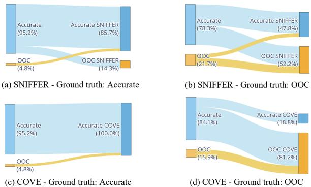  
Figure 5: Change in veracity prediction before and after seeing SNIFFER (top) or COVE (bottom) artifacts, for accurate (left) and OOC (right) captions.

The study is split into two phases. (1) Given an image and an old OOC caption correctly detected by the AFC model, the human annotator has to classify three new captions about the same image. (2) The annotator classifies again the same new captions, this time given the AFC artifact generated for the old caption. We use the majority vote of the annotators in each phase as the label assigned to a new caption. Following Qi et al. (2024), we ask participants to provide confidence levels: not, somewhat, or highly confident.

We collect 30 OOC instances from the NewsCLIPpings test set and construct three new captions for each. This results in 22 and 68 accurate and OOC captions, respectively. Appendix I explains the creation of the new captions. Annotators instructions and examples are shown in Appendix J.

We recruited 6 students and provided the SNIF-FER explanations to half of them and the COVE context to the others. Table 4 shows that both groups perform poorly without AFC artifacts. This means that knowing that the old caption is OOC does not inform the annotators much about the veracity of the new ones. Hence, models that only provide a veracity score, like RED-DOT and AITR, have limited purpose beyond a specific (imagecaption) pair. COVE contexts are more useful artifacts than SNIFFER explanations to verify new captions, as demonstrated by the larger increase in accuracy, Macro F1, and inter-annotator agreement (Fleiss’ κ ((Fleiss, 1971)) in the second phase. We attribute this to COVE’s more comprehensive approach, predicting context items even if they are not relevant to verify the old caption, e.g., the caption does not contain a date, but COVE still predicts the true date. On the other hand, SNIFFER often explains the minimal set of inconsistent elements to detect an OOC caption, which might be insufficient to verify new captions.

Figure 5 shows the change in predictions between the two phases of the study. In the first phase, both groups label the majority of captions as accurate. Upon observing the COVE artifact, annotators successfully identify all accurate captions, and the number of detected OOC captions increases by more than 65 percentage points. By comparison, the SNIFFER artifact results in a 30.5 percentage points increase in detected OOC captions. Furthermore, observing the COVE artifact exclusively improves predictions by correcting errors from the first phase, whereas observing the SNIFFER artifact introduces new errors, shifting some correct predictions to incorrect ones.

This experiment confirms that COVE provides a reusable artifact to verify new captions, thanks to its comprehensive context prediction. We report aggregated confidence levels in Appendix K.

## 4.9 Error analysis

We manually analyze random samples of 200 instances from each test set and report the distribution of errors in Table 5. There are five error categories.

(1) Incorrect context items are predicted, which leads to veracity errors, in particular for accurate captions. In 5Pils-OOC, more than half of these errors stem from irrelevant Wikipedia entities detected by CLIP. This issue is especially pronounced in African and South Asian contexts, which are prevalent in 5Pils-OOC. In contrast, this problem does not arise in NewsCLIPpings, where most images have a Western context. Irrelevant or inaccurate web captions further contribute to context prediction errors.

(2) Context items are missing. This prevents Llama 3 from verifying all the atomic facts in the caption. The most frequently missing items are the date, location, and event. While people is important in NewsCLIPpings, its absence has a smaller impact in 5Pils-OOC. This is because misrepresenting the individuals in the image is less frequent in real-world misinformation.

<table><tr><td>NewsCLIPpings</td><td>5Pils-OOC</td></tr><tr><td>Incorrect items 20.5</td><td>57.1</td></tr><tr><td>→ Web captions error 6.8</td><td>14.3</td></tr><tr><td>→ Wikipedia entities error 0.0</td><td>33.3</td></tr><tr><td>→ Auto. captions error 9.1</td><td>7.1</td></tr><tr><td>→ Knowledge gap error 4.6</td><td>2.4</td></tr><tr><td>Missing items 54.6</td><td>36.9</td></tr><tr><td>→ Missing date 15.9</td><td>26.2</td></tr><tr><td>→ Missing location 29.5</td><td>27.4</td></tr><tr><td>→ Missing people 15.9</td><td>3.6</td></tr><tr><td>→ Missing things 9.1</td><td>1.2</td></tr><tr><td>→ Missing event 31.8</td><td>20.2</td></tr><tr><td>Rule-based error</td><td>2.3 0.0</td></tr><tr><td>Llama 3 veracity error</td><td>6.8 1.2</td></tr><tr><td>Error in ground truth 15.9</td><td>4.8</td></tr></table>

Table 5: Error distribution (%) on the test sets with few-shot Llama 3. , indicates a sub-category.

(3) Only one error in NewsCLIPpings is due to an instance passing the $t _ { m a t c h }$ veracity rule while actually being OOC. (4) In a few cases, the context items are correct and sufficient to predict the veracity, but Llama 3 makes a reasoning error. (5) We found some errors in the ground truth, where the caption is not a description of the image. Therefore, the instance is not suitable for veracity prediction.

This analysis highlights directions for future work, including a better similarity matching of Wikipedia entities for images with non-Western contexts and a better ranking of web captions based on their relevance. We provide three error examples in Appendix L.

## 5 Conclusion

We propose COVE, a new method to combat OOC misinformation that predicts first the true context of an image and leverages it to predict the veracity of its caption. COVE outperforms the SOTA on context prediction for all context items while being competitive with the best veracity models, even outperforming them on real-world data by up to 4.5 percentage points in Macro F1, showcasing the benefits of sequentially performing context and veracity prediction. Furthermore, our human study shows that the predicted context is a useful and reusable artifact for human users to verify new captions for the same image.

## 6 Limitations

We identify four limitations to this work.

(1) Similar to other QA methods in AFC (Pan et al., 2023b,a; Khaliq et al., 2024; Schlichtkrull et al., 2023), COVE requires several (M)LLM inference steps which are computationally expensive. However, the context predictions and automated captions can be generated in batches, improving inference speed. Furthermore, some steps of COVE can be removed depending on the computational budget available. For example, knowledge gap completion requires many LLM calls while being less critical to the pipeline than web caption and Wikipedia entity collection.

(2) We did not consider the use of closed-source LLMs like GPT4 (OpenAI, 2023) for context and veracity prediction. However, this work does not have the objective to provide a performance comparison between open and closed-source LLMs. COVE is LLM-agnostic, and we expect its performance to improve with LLMs that perform better on standard benchmarks and leaderboards.

(3) The context items of NewsCLIPpings and parts of the items of 5Pils-OOC are weakly labeled by decomposing accurate captions. However, there is no guarantee that the ground truth provides the most comprehensive summary of the context. In some cases, the context predictions might be correct and more detailed than the ground truth, e.g., predicting the correct location at the town level, while the ground truth is at the country level. The predictions are slightly penalized in the evaluation metrics when providing more precise answers despite them being correct. This limitation is also present in the 5Pils dataset (Tonglet et al., 2024).

(4) Some of the retrieved web captions may contain misinformation themselves or come from unreliable sources. However, there is no filtering mechanism implemented to remove web captions collected from unreliable websites. In Appendix M, we discuss a simple filtering mechanism that keeps web evidence from a manually defined list of reliable web domains, with a small negative impact on performance. Future work should consider the inclusion of models designed for evaluating the reliability of web evidence (Chrysidis et al., 2024) and their sources (Schlichtkrull, 2024).

## 7 Ethics statement

Intended uses COVE addresses the important societal problem of multimodal misinformation by contextualizing images and detecting OOC captions. While AFC methods have made significant progress over the years, they are still prone to errors. In particular, the context predicted by COVE is still far from reaching sufficient quality, and as shown in Table 2, only three OOC captions out of four are detected on real-world data. Given the high negative impact of labeling misinformation as true information, and vice-versa, AFC methods like COVE should only be used as complementary assistants to a human FC expert.

Misuse potential COVE and other AFC methods show promising results in detecting misinformation. As a result, they could also be used in an adversarial setup by malicious actors to craft misinformation that is harder to detect by AFC methods and human fact-checkers. Nevertheless, we believe that the benefits of supporting the work of human fact-checkers with partial automation outweigh the risks caused by this malicious adversarial setup.

## Acknowledgements

This work has been funded by the LOEWE initiative (Hesse, Germany) within the emergenCITY center (Grant Number: LOEWE/1/12/519/03/05.001(0016)/72) and by the German Federal Ministry of Education and Research and the Hessian Ministry of Higher Education, Research, Science and the Arts within their joint support of the National Research Center for Applied Cybersecurity ATHENE. We gratefully acknowledge the support of Microsoft with a grant for access to OpenAI GPT models via the Azure cloud (Accelerate Foundation Model Academic Research). Figures 1 and 2 have been designed using resources from Flaticon.com. We want to express our gratitude to Xiuying Chen, Hiba Arnaout, and Fengyu Cai for their insightful comments on a draft of this paper.

## References

Sahar Abdelnabi, Rakibul Hasan, and Mario Fritz. 2022. Open-domain, content-based, multi-modal fact-checking of out-of-context images via online resources. In IEEE/CVF Conference on Computer Vision and Pattern Recognition, CVPR 2022, New Orleans, LA, USA, June 18-24, 2022, pages 14920– 14929. IEEE.

Mubashara Akhtar, Michael Schlichtkrull, Zhijiang Guo, Oana Cocarascu, Elena Simperl, and Andreas Vlachos. 2023. Multimodal automated fact-checking: A

survey. In Findings ofthe Associationfor Computational Linguistics: EMNLP 2023, pages 5430–5448, Singapore. Association for Computational Linguistics.

Amith Ananthram, Elias Stengel-Eskin, Carl Vondrick, Mohit Bansal, and Kathleen McKeown. 2024. See it from my perspective: Diagnosing the western cultural bias of large vision-language models in image understanding. ArXiv preprint, abs/2406.11665.

Shivangi Aneja, Chris Bregler, and Matthias Nießner. 2023. COSMOS: catching out-of-context image misuse using self-supervised learning. In Thirty-Seventh AAAI Conference on Artificial Intelligence, AAAI 2023, Thirty-Fifth Conference on Innovative Applications ofArtificial Intelligence, IAAI 2023, Thirteenth Symposium on Educational Advances in Artificial Intelligence, EAAI 2023, Washington, DC, USA, February 7-14, 2023, pages 14084–14092. AAAI Press.

Satanjeev Banerjee and Alon Lavie. 2005. METEOR: An automatic metric for MT evaluation with improved correlation with human judgments. In Proceedings ofthe ACL Workshop on Intrinsic and Extrinsic Evaluation Measures for Machine Translation and/or Summarization, pages 65–72, Ann Arbor, Michigan. Association for Computational Linguistics.

Tobias Braun, Mark Rothermel, Marcus Rohrbach, and Anna Rohrbach. 2024. Defame: Dynamic evidencebased fact-checking with multimodal experts. ArXiv preprint, abs/2412.10510.

Nicola De Cao, Gautier Izacard, Sebastian Riedel, and Fabio Petroni. 2021. Autoregressive entity retrieval. In 9th International Conference on Learning Representations, ICLR 2021, Virtual Event, Austria, May 3-7, 2021. OpenReview.net.

Wei-Lin Chiang, Zhuohan Li, Zi Lin, Ying Sheng, Zhanghao Wu, Hao Zhang, Lianmin Zheng, Siyuan Zhuang, Yonghao Zhuang, Joseph E. Gonzalez, Ion Stoica, and Eric P. Xing. 2023. Vicuna: An opensource chatbot impressing gpt-4 with 90%\* chatgpt quality.

Zacharias Chrysidis, Stefanos-Iordanis Papadopoulos, Symeon Papadopoulos, and Panagiotis Petrantonakis. 2024. Credible, unreliable or leaked?: Evidence verification for enhanced automated fact-checking. In Proceedings ofthe 3rd ACM International Workshop on Multimedia AI against Disinformation, MAD ’24, page 73–81, New York, NY, USA. Association for Computing Machinery.

Wenliang Dai, Junnan Li, Dongxu Li, Anthony Meng Huat Tiong, Junqi Zhao, Weisheng Wang, Boyang Li, Pascale Fung, and Steven C. H. Hoi. 2023. Instructblip: Towards general-purpose visionlanguage models with instruction tuning. In Advances in Neural Information Processing Systems 36: Annual Conference on Neural Information Processing Systems 2023, NeurIPS 2023, New Orleans, LA, USA, December 10 - 16, 2023.

Matthijs Douze, Alexandr Guzhva, Chengqi Deng, Jeff Johnson, Gergely Szilvasy, Pierre-Emmanuel Mazaré, Maria Lomeli, Lucas Hosseini, and Hervé Jégou. 2024. The faiss library. ArXiv preprint, abs/2401.08281.

Nicholas Dufour, Arkanath Pathak, Pouya Samangouei, Nikki Hariri, Shashi Deshetti, Andrew Dudfield, Christopher Guess, Pablo Hernández Escayola, Bobby Tran, Mevan Babakar, et al. 2024. Ammeba: A large-scale survey and dataset of mediabased misinformation in-the-wild. ArXiv preprint, abs/2405.11697.

Joseph L Fleiss. 1971. Measuring nominal scale agreement among many raters. Psychological bulletin, 76(5):378–382.

Pengcheng He, Jianfeng Gao, and Weizhu Chen. 2023. Debertav3: Improving deberta using electra-style pre-training with gradient-disentangled embedding sharing. In The Eleventh International Conference on Learning Representations, ICLR 2023, Kigali, Rwanda, May 1-5, 2023. OpenReview.net.

Hexiang Hu, Yi Luan, Yang Chen, Urvashi Khandelwal, Mandar Joshi, Kenton Lee, Kristina Toutanova, and Ming-Wei Chang. 2023a. Open-domain visual entity recognition: Towards recognizing millions of wikipedia entities. In IEEE/CVF International Conference on Computer Vision, ICCV 2023, Paris, France, October 1-6, 2023, pages 12031–12041. IEEE.

Ziniu Hu, Ahmet Iscen, Chen Sun, Kai-Wei Chang, Yizhou Sun, David Ross, Cordelia Schmid, and Alireza Fathi. 2023b. AVIS: autonomous visual information seeking with large language model agent. In Advances in Neural Information Processing Systems 36: Annual Conference on Neural Information Processing Systems 2023, NeurIPS 2023, New Orleans, LA, USA, December 10 - 16, 2023.

Mohammed Abdul Khaliq, Paul Yu-Chun Chang, Mingyang Ma, Bernhard Pflugfelder, and Filip Miletic. 2024.´ RAGAR, your falsehood radar: RAGaugmented reasoning for political fact-checking using multimodal large language models. In Proceedings ofthe Seventh Fact Extraction and VERification Workshop (FEVER), pages 280–296, Miami, Florida, USA. Association for Computational Linguistics.

Sohail Ahmed Khan, Laurence Dierickx, Jan-Gunnar Furuly, Henrik Brattli Vold, Rano Tahseen, Carl-Gustav Linden, and Duc-Tien Dang-Nguyen. 2024. Debunking war information disorder: A case study in assessing the use of multimedia verification tools. Journal of the Association for Information Science and Technology.

Sohail Ahmed Khan, Ghazaal Sheikhi, Andreas L. Opdahl, Fazle Rabbi, Sergej Stoppel, Christoph Trattner, and Duc-Tien Dang-Nguyen. 2023. Visual user-generated content verification in journalism: An overview. IEEE Access, 11:6748–6769.

Omar Khattab and Matei Zaharia. 2020. Colbert: Efficient and effective passage search via contextualized late interaction over BERT. In Proceedings of the 43rd International ACM SIGIR conference on research and development in Information Retrieval, SIGIR 2020, Virtual Event, China, July 25-30, 2020, pages 39–48. ACM.

Woosuk Kwon, Zhuohan Li, Siyuan Zhuang, Ying Sheng, Lianmin Zheng, Cody Hao Yu, Joseph Gonzalez, Hao Zhang, and Ion Stoica. 2023. Efficient memory management for large language model serving with pagedattention. In Proceedings ofthe 29th Symposium on Operating Systems Principles, SOSP ’23, page 611–626, New York, NY, USA. Association for Computing Machinery.

Kumud Lakara, Juil Sock, Christian Rupprecht, Philip Torr, John Collomosse, and Christian Schroeder de Witt. 2024. Mad-sherlock: Multi-agent debates for out-of-context misinformation detection. ArXiv preprint, abs/2410.20140.

Chin-Yew Lin. 2004. ROUGE: A package for automatic evaluation of summaries. In Text Summarization Branches Out, pages 74–81, Barcelona, Spain. Association for Computational Linguistics.

Fuxiao Liu, Yinghan Wang, Tianlu Wang, and Vicente Ordonez. 2021. Visual news: Benchmark and challenges in news image captioning. In Proceedings of the 2021 Conference on Empirical Methods in Natural Language Processing, pages 6761–6771, Online and Punta Cana, Dominican Republic. Association for Computational Linguistics.

Haotian Liu, Chunyuan Li, Yuheng Li, and Yong Jae Lee. 2024. Improved baselines with visual instruction tuning. In Proceedings of the IEEE/CVF Conference on Computer Vision and Pattern Recognition (CVPR), pages 26296–26306.

Haotian Liu, Chunyuan Li, Qingyang Wu, and Yong Jae Lee. 2023. Visual instruction tuning. In Advances in Neural Information Processing Systems 36: Annual Conference on Neural Information Processing Systems 2023, NeurIPS 2023, New Orleans, LA, USA, December 10 - 16, 2023.

Grace Luo, Trevor Darrell, and Anna Rohrbach. 2021. NewsCLIPpings: Automatic Generation of Out-of-Context Multimodal Media. In Proceedings of the 2021 Conference on Empirical Methods in Natural Language Processing, pages 6801–6817, Online and Punta Cana, Dominican Republic. Association for Computational Linguistics.

MetaAI. 2024. The llama 3 herd of models. ArXiv preprint, abs/2407.21783.

Annique Mossou and Ross Higgins. 2021. A beginner’s guide to social media verification. Accessed: 2023- 09-15.

Eric Müller-Budack, Jonas Theiner, Sebastian Diering, Maximilian Idahl, and Ralph Ewerth. 2020. Multimodal analytics for real-world news using measures of cross-modal entity consistency. In Proceedings ofthe 2020 International Conference on Multimedia Retrieval, ICMR ’20, page 16–25, New York, NY, USA. Association for Computing Machinery.

OpenAI. 2023. Gpt-4 technical report. Technical report, OpenAI.

Liangming Pan, Xinyuan Lu, Min-Yen Kan, and Preslav Nakov. 2023a. QACheck: A demonstration system for question-guided multi-hop fact-checking. In Proceedings ofthe 2023 Conference on Empirical Methods in Natural Language Processing: System Demonstrations, pages 264–273, Singapore. Association for Computational Linguistics.

Liangming Pan, Xiaobao Wu, Xinyuan Lu, Anh Tuan Luu, William Yang Wang, Min-Yen Kan, and Preslav Nakov. 2023b. Fact-checking complex claims with program-guided reasoning. In Proceedings of the 61st Annual Meeting of the Association for Computational Linguistics (Volume 1: Long Papers), pages 6981–7004, Toronto, Canada. Association for Computational Linguistics.

Stefanos-Iordanis Papadopoulos, Christos Koutlis, Symeon Papadopoulos, and Panagiotis C Petrantonakis. 2023. Red-dot: Multimodal fact-checking via relevant evidence detection. ArXiv preprint, abs/2311.09939.

Stefanos-Iordanis Papadopoulos, Christos Koutlis, Symeon Papadopoulos, and Panagiotis C Petrantonakis. 2024a. Similarity over factuality: Are we making progress on multimodal out-of-context misinformation detection? ArXiv preprint, abs/2407.13488.

Stefanos-Iordanis Papadopoulos, Christos Koutlis, Symeon Papadopoulos, and Panagiotis C Petrantonakis. 2024b. Verite: a robust benchmark for multimodal misinformation detection accounting for unimodal bias. International Journal of Multimedia Information Retrieval, 13(1):4.

Kha-Luan Pham, Minh-Khoi Nguyen-Nhat, Anh-Huy Dinh, Quang-Tri Le, Manh-Thien Nguyen, Anh-Duy Tran, Minh-Triet Tran, and Duc-Tien Dang-Nguyen. 2024. Ookpik- a collection of out-of-context imagecaption pairs. In MultiMedia Modeling, pages 132– 144, Cham. Springer Nature Switzerland.

Peng Qi, Zehong Yan, Wynne Hsu, and Mong Li Lee. 2024. Sniffer: Multimodal large language model for explainable out-of-context misinformation detection. In Proceedings ofthe IEEE/CVF Conference on Computer Vision and Pattern Recognition (CVPR), pages 13052–13062.

Alec Radford, Jong Wook Kim, Chris Hallacy, Aditya Ramesh, Gabriel Goh, Sandhini Agarwal, Girish Sastry, Amanda Askell, Pamela Mishkin, Jack Clark, Gretchen Krueger, and Ilya Sutskever. 2021. Learning transferable visual models from natural language

supervision. In Proceedings ofthe 38th International Conference on Machine Learning, ICML 2021, 18-24 July 2021, Virtual Event, volume 139 of Proceedings of Machine Learning Research, pages 8748–8763. PMLR.

Ekraam Sabir, Wael AbdAlmageed, Yue Wu, and Prem Natarajan. 2018. Deep multimodal imagerepurposing detection. In 2018 ACM Multimedia Conference on Multimedia Conference, MM 2018, Seoul, Republic of Korea, October 22-26, 2018, pages 1337–1345.

Michael Schlichtkrull, Zhijiang Guo, and Andreas Vlachos. 2023. Averitec: A dataset for real-world claim verification with evidence from the web. In Advances in Neural Information Processing Systems 36: Annual Conference on Neural Information Processing Systems 2023, NeurIPS 2023, New Orleans, LA, USA, December 10 - 16, 2023.

Michael Sejr Schlichtkrull. 2024. Generating media background checks for automated source critical reasoning. In Findings of the Association for Computational Linguistics: EMNLP 2024, pages 4927–4947, Miami, Florida, USA. Association for Computational Linguistics.

Sina Semnani, Violet Yao, Heidi Zhang, and Monica Lam. 2023. WikiChat: Stopping the hallucination of large language model chatbots by few-shot grounding on Wikipedia. In Findings of the Association for Computational Linguistics: EMNLP 2023, pages 2387–2413, Singapore. Association for Computational Linguistics.

Craig Silverman. 2013. Verification handbook. Accessed: 2023-09-15.

Sahar Tahmasebi, Eric Müller-Budack, and Ralph Ewerth. 2025. Verifying cross-modal entity consistency in news using vision-language models. ArXiv preprint, abs/2501.11403.

Jonathan Tonglet, Marie-Francine Moens, and Iryna Gurevych. 2024. “image, tell me your story!” predicting the original meta-context of visual misinformation. In Proceedings ofthe 2024 Conference on Empirical Methods in Natural Language Processing, pages 7845–7864, Miami, Florida, USA. Association for Computational Linguistics.

Shaydanay Urbani. 2020. Verifying online information. Accessed: 2023-09-15.

Thomas Wolf, Lysandre Debut, Victor Sanh, Julien Chaumond, Clement Delangue, Anthony Moi, Pierric Cistac, Tim Rault, Remi Louf, Morgan Funtowicz, Joe Davison, Sam Shleifer, Patrick von Platen, Clara Ma, Yacine Jernite, Julien Plu, Canwen Xu, Teven Le Scao, Sylvain Gugger, Mariama Drame, Quentin Lhoest, and Alexander Rush. 2020. Transformers: State-of-the-art natural language processing. In Proceedings of the 2020 Conference on Empirical Methods in Natural Language Processing: System Demonstrations, pages 38–45, Online. Association for Computational Linguistics.

Xin Yuan, Jie Guo, Weidong Qiu, Zheng Huang, and Shujun Li. 2023. Support or refute: Analyzing the stance of evidence to detect out-of-context mis- and disinformation. In Proceedings of the 2023 Conference on Empirical Methods in Natural Language Processing, pages 4268–4280, Singapore. Association for Computational Linguistics.

Xiaohua Zhai, Basil Mustafa, Alexander Kolesnikov, and Lucas Beyer. 2023. Sigmoid loss for language image pre-training. In 2023 IEEE/CVF International Conference on Computer Vision (ICCV), pages 11941–11952.

Fanrui Zhang, Jiawei Liu, Qiang Zhang, Esther Sun, Jingyi Xie, and Zheng-Jun Zha. 2023a. Ecenet: Explainable and context-enhanced network for mutimodal fact verification. In Proceedings of the 31st ACM International Conference on Multimedia, MM ’23, page 1231–1240, New York, NY, USA. Association for Computing Machinery.

Tianyi Zhang, Varsha Kishore, Felix Wu, Kilian Q. Weinberger, and Yoav Artzi. 2020. Bertscore: Evaluating text generation with BERT. In 8th International Conference on Learning Representations, ICLR 2020, Addis Ababa, Ethiopia, April 26-30, 2020. OpenReview.net.

Yizhou Zhang, Loc Trinh, Defu Cao, Zijun Cui, and Yan Liu. 2023b. Interpretable detection of out-of-context misinformation with neural-symbolic-enhanced large multimodal model. ArXiv preprint, abs/2304.07633.

## A Object categories for automated captions

Table 6 provides the mapping from the object labels of the Google Vision API to our manually defined parent categories. Each category is associated with one captioning prompt that is provided to LlavaNext to caption the cropped image of the detected object.

## B Definition of the context items

We consider seven context items which we define below. They are paired with a question and a set of relevant named entities, which are used to rank the web captions.

Source is the entity who created the image or first published it online (Tonglet et al., 2024). The corresponding question is “Who is the source of the image?”. The corresponding named entity is “ORG”.

Date is the time at which the image was captured or created (Tonglet et al., 2024). The corresponding question is “When was the image taken?”. The corresponding named entity is “DATE”.

Location is the place where the image was captured (Tonglet et al., 2024). The corresponding question is “Where was the image taken?”. The corresponding named entities are “FAC”, “GPE”, “LOC”.

Motivation is the reason why the source took the image, usually to report on a news event, although other intents are possible (Tonglet et al., 2024). The corresponding question is “Why was the image taken?”. The corresponding named entities are “EVENT”, “GPE”, “NORP”, “ORG”.

People is the people that can be seen in the image. The corresponding question is “Who is shown in the image?”. The corresponding named entity is “PERSON”.

Things is a broad category that includes every entity that is shown in the image and not a human being. The corresponding question is “Which animals, plants, buildings, or objects are shown in the image?”. The corresponding named entities are “FAC”, “LOC”, “PRODUCT”.

Event describes the circumstances surrounding the image. The corresponding question is “Which event is depicted in the image?”. The corresponding named entities are “EVENT”, “NORP”.

Dufour et al. (2024) showed that the context items that are the most frequently altered when creating OOC captions are the date and the event, around 25% each, followed by Location around 18%. People and things reach together around 15%.

## C Examples of knowledge gap completion

Figure 6 shows two examples of knowledge gap completion on 5Pils-OOC. The question generation and the retrieval of a relevant Wikipedia passage allows to predict the location in the first image and the date in the second one.

## D Prompts for caption decomposition

To obtain the ground truth context items for NewsCLIPpings and for parts of 5Pils-OOC, we task Llama 3 to decompose the accurate caption of the image as a dictionary with context items as keys. Figure 7 shows the prompt.

## E Creation of 5Pils-OOC

5Pils (Tonglet et al., 2024) is the first real-world misinformation dataset that provides labels for context items. The ground truth context of the image is obtained by extracting the context items from an FC article written by human experts. To use

<table><tr><td>Category</td><td>Objects</td><td>Prompt</td></tr><tr><td>general</td><td>entire image</td><td>Answer in one to three sentences: what are the people, objects, animals, events, texts shown in the image?</td></tr><tr><td>people</td><td>Person</td><td>Who is shown in the image?</td></tr><tr><td>animals buildings</td><td>Animal, Bird, Cat, Dog, Fish</td><td>Which {} species is shown in this image?</td></tr><tr><td>flags</td><td>Building, Stadium, Bridge, Castle Flag</td><td>Which { } is shown in this image? Provide a location if possible. Which flag is shown in this image?</td></tr><tr><td>food</td><td>Food, Drink, Fruit</td><td>Which {} is shown in this image?</td></tr><tr><td>sports</td><td>Basketball, Baseball bat</td><td>What are the teams playing in this game?</td></tr><tr><td>transports</td><td>Baseball glove, Football, Rugby bal Airplane, Boat, Bus, Car, Helicopter</td><td>Which {} model is shown in this image?</td></tr><tr><td>weapons</td><td>Motorcycle, Ship, Tank, Train, Truck, Van Weapon</td><td>Which weapon model is shown in this image?</td></tr></table>

Table 6: Parent categories of detected objects with their captioning prompts.

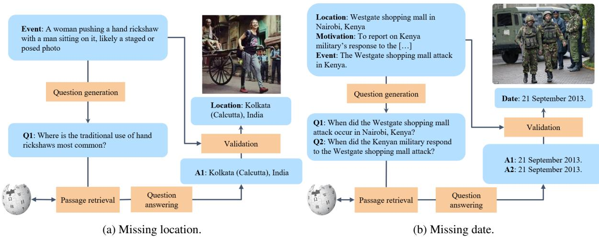  
Figure 6: Two examples of successful knowledge gap completion on 5Pils-OOC.

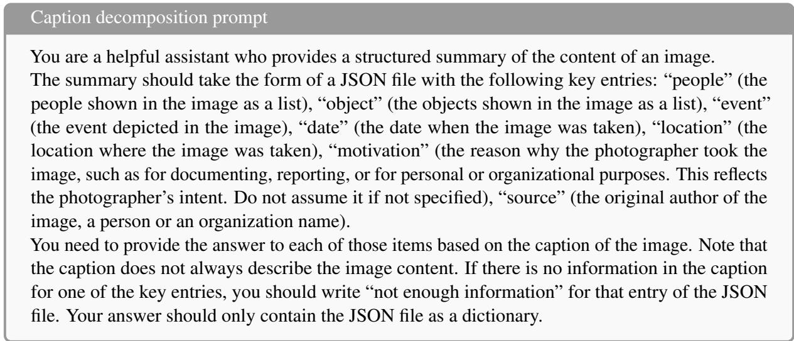  
Figure 7: Prompt template for caption decomposition with Llama 3.

<table><tr><td rowspan="2"></td><td colspan="2">Source</td><td colspan="2">Date</td><td colspan="3">Location</td><td colspan="3">Motivation</td></tr><tr><td>(RL)</td><td>(M)</td><td>(EM)</td><td>(∆)</td><td>(RL)</td><td>(M) (COΔ)</td><td>(HL∆)</td><td>(RL)</td><td>(M)</td><td>(BertS)</td></tr><tr><td colspan="14">NewsCLIPpings</td></tr><tr><td rowspan="2">5Pils baseline COVE</td><td>5.0</td><td>3.4</td><td>23.1</td><td>28.9</td><td>34.4</td><td>32.7</td><td>38.7</td><td>33.1</td><td>1.0</td><td>1.5</td><td>9.6</td></tr><tr><td>12.2</td><td>8.1</td><td>30.7</td><td>41.5</td><td>44.2</td><td>42.4</td><td>51.6</td><td>43.1</td><td>5.6</td><td>11.6</td><td>65.3</td></tr><tr><td></td><td colspan="14"></td></tr><tr><td>5Pils baseline</td><td>0.4</td><td>0.3</td><td>0.5</td><td></td><td>15.2</td><td>12.1</td><td>5Pils-O0C</td><td></td><td></td><td></td><td></td></tr><tr><td>COVE</td><td>0.9</td><td>0.6</td><td>1.1</td><td>1.8 7.0</td><td>18.6</td><td>16.7</td><td>21.8 28.9</td><td>16.8 22.5</td><td>3.0 17.1</td><td>3.0 15.1</td><td>62.0 56.1</td></tr><tr><td></td><td colspan="9"></td><td></td><td></td><td></td></tr><tr><td></td><td></td><td>People</td><td></td><td></td><td></td><td></td><td></td><td></td><td></td><td></td><td></td></tr><tr><td></td><td>(R)</td><td>(P)</td><td>(F1)</td><td>(RL)</td><td>Things (M)</td><td>(BertS)</td><td>(RL)</td><td>Event (M)</td><td>(BertS)</td><td></td><td></td></tr><tr><td colspan="14"></td></tr><tr><td>5Pils baseline</td><td>38.9</td><td>42.6</td><td>39.9</td><td>12.2</td><td>9.9</td><td>62.6</td><td>NewsCLIPpings 14.1</td><td>15.4</td><td>43.6</td><td></td><td></td></tr><tr><td>COVE</td><td>48.2</td><td>51.5</td><td>49.0</td><td>9.7</td><td>10.9</td><td>63.0</td><td>14.6</td><td>22.4</td><td>68.1</td><td></td><td></td></tr><tr><td colspan="14">5Pils-O0C</td></tr><tr><td>5Pils baseline</td><td>12.1</td><td>14.1</td><td>12.8</td><td>6.9</td><td>4.9</td><td>63.9</td><td>5.3</td><td>4.8</td><td></td><td></td><td></td></tr><tr><td>COVE</td><td>20.8</td><td>21.5</td><td>20.5</td><td>6.8</td><td>7.2</td><td>61.2</td><td>7.0</td><td>9.4</td><td>65.0 51.7</td><td></td><td></td></tr></table>

Table 7: Detailed context prediction results on the test sets (%). Best results are marked in bold.

## Accurate caption generation prompt

Date : {} , Location : {}, Motivation : {}

Figure 8: Prompt to generate an accurate caption with GPT4, given the ground truth context items.  
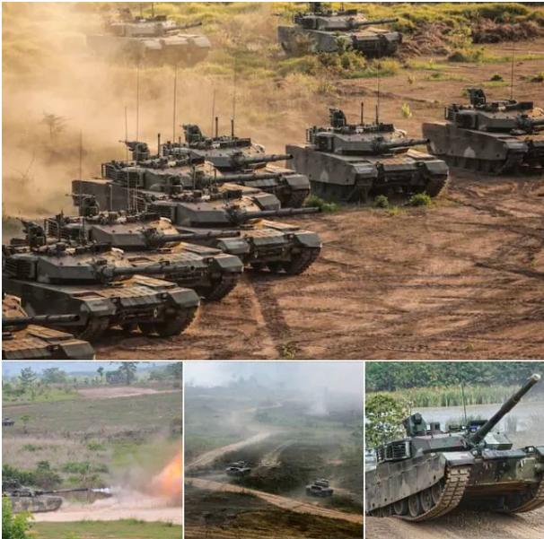  
Figure 9: A composite image, where the sub-images have distinct true contexts.

5Pils for context and veracity prediction, we need to make some adjustments.

First, the scope of 5Pils is broader than ours. It includes other types of misinformation than OOC images, namely, manipulated and fake images. Hence, we start by removing all images that are manipulated or fake using the “type of image” metadata field. Furthermore, 5Pils does not provide accurate captions. We generate accurate captions with GPT4 by combining the ground truth context items. This requires at least the motivation item and one or two out of date and location. Images that do not satisfy those label criteria are discarded. Figure 8 shows the prompt to generate accurate captions. Finally, some images in 5Pils are composite, that is, they are a collage of more than one image next to each other. An example is shown in Figure 9. Such images are considered out-of-scope.

## F Detailed context prediction evaluation

Table 7 complements the results of Table 1 by showing additional metrics for the context items defined in Tonglet et al. (2024). This means computing the RougeL (RL) score (Lin, 2004) for source, the exact match (EM) for date, the RougeL and Meteor scores for location, and the RougeL and BertScore (BertS) (Zhang et al., 2020) for motivation, Furthermore, we compute HL∆ for location, which is inversely proportional to the hierarchical distance in the GeoNames ontology between the prediction and ground truth. We also compute additional metrics for the new items introduced in this work. For people, we compute the Recall (R) and Precision (P). For things and event, we add the RougeL and Bert scores. Consistent with our observations in Table 1, we observe that COVE outperforms the baseline (Tonglet et al., 2024) for most metrics.

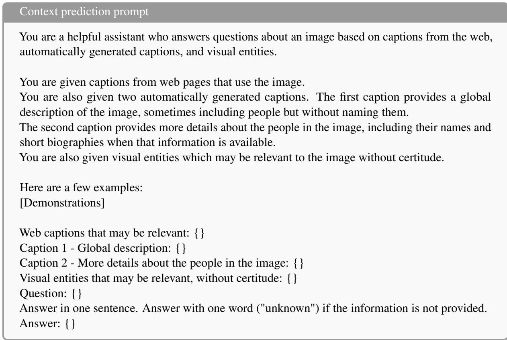  
Figure 10: Prompt template for context prediction with Llama 3.

## G Hyperparameters and model versions

Web captions collection We set $t _ { m a t c h }$ to 0.92 and tnon\_match to 0.7 for web images. Visual entities are included if their score is at least 0.1.

Wikipedia entities collection The following types of named entities are extracted from the caption: “PERSON”, “FAC”, “PRODUCT”. We set k, the number of nearest entities to retrieve from the OVEN index (Hu et al., 2023a) to 5. We set twiki\_text to 0.23. If the entity is a “PERSON”, twiki\_image is set to 0.92. Otherwise, it is set to 0.7.

Automated captions generation We keep Person objects detected with confidence scores above 0.8.

Context prediction We set l, the number of web captions to provide as input, to 10.

Knowledge gap completion For each question, we retrieve one Wikipedia passage, if its relevance score (Semnani et al., 2023) is above 20.

Model and versions We use the HuggingFace’s transformers (Wolf et al., 2020) and vLLM (Kwon et al., 2023) libraries to load, train, and make inferences with models. Named entities are detected using the Spacy model en\_web\_core\_lg. We create the OVEN index with the FAISS library (Douze et al., 2024). We use the CLIP-ViT-L14 (openai/clip-vit-large-patch14) version of CLIP. We also considered CLIP-ViT-B32 (openai/clip-vitbase-patch32) and SIGLIP (google/siglip-so400mpatch14-384) (Zhai et al., 2023). On the validation set of NewsCLIPpings, both SIGLIP and CLIP-ViT-L14 achieve the same accuracy, but CLIP-ViT-L14 has a slightly higher ROOC. Accuracy with CLIP-ViT-B32 is 1 percentage point lower. To compute similarities between the image and Wikipedia images for “PERSON” entities, we use the face-net library.6 For COVE, SNIFFER, and the baseline of Tonglet et al. (2024), we use the meta-llama/Meta-Llama-3-8B-Instruct, llava-hf/llava-v1.6-mistral-7b-hf, and microsoft/deberta-v3-large versions of Llama 3, LlavaNext, and DebertaV3, respectively. We set the temperatures to 0 for reproducibility. We fine-tune DebertaV3 for 5 epochs, using a batch size of 4, a weight decay of 0.01, and a learning rate of 5e-6. All experiments are conducted with one A100 GPU.

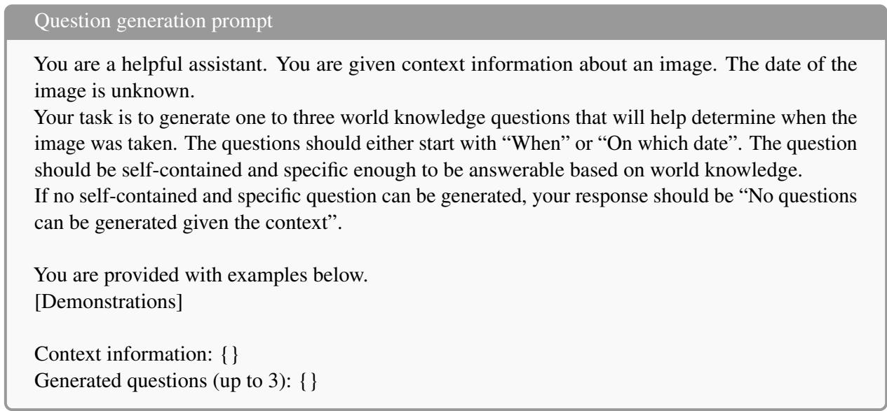  
Figure 11: Prompt template for knowledge gap completion - question generation with Llama 3.

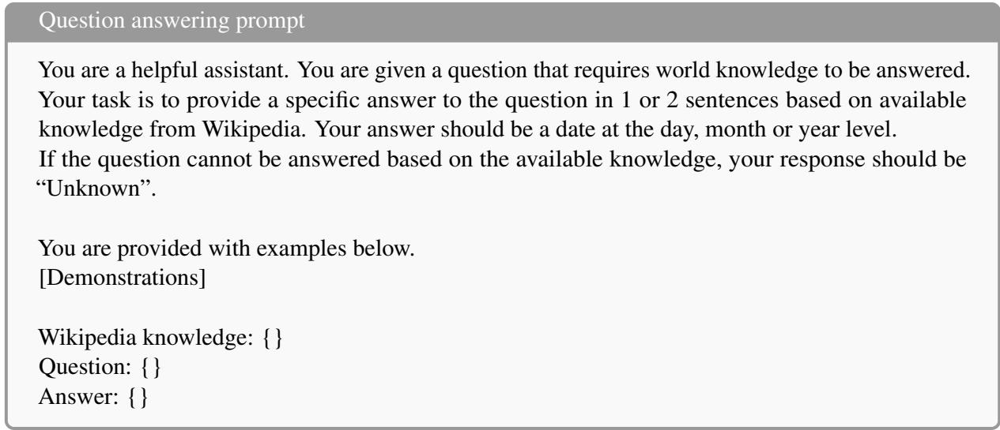  
Figure 12: Prompt template for knowledge gap completion - question answering with Llama 3.

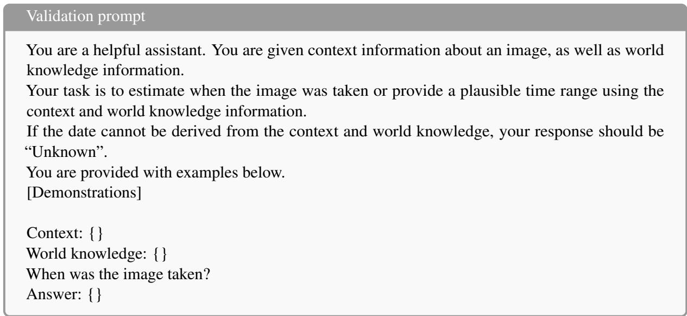  
Figure 13: Prompt template for knowledge gap completion - validation with Llama 3.

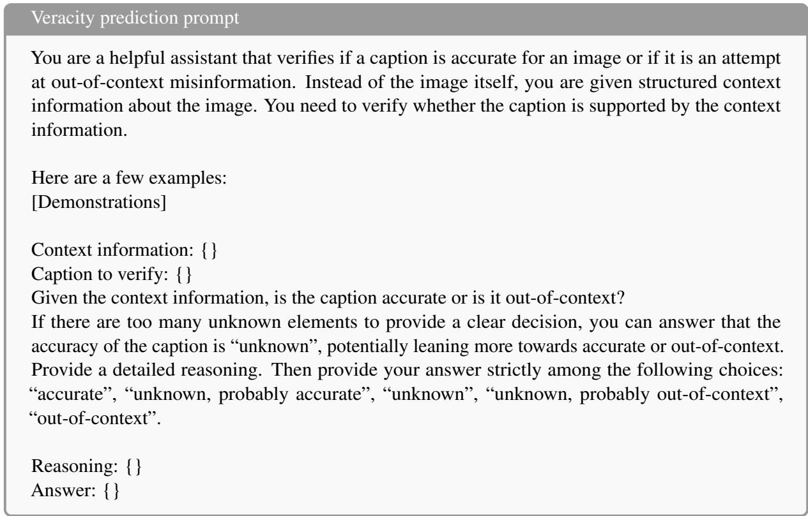  
Figure 14: Prompt template for veracity prediction with Llama 3.

## H COVE - Llama 3 prompt templates

Figure 10 to 14 show the prompts used for context prediction, knowledge gap completion, and veracity prediction with Llama 3. Each prompt starts with a task description, followed by a set of 4 to 8 demonstrations. For veracity predictions, there are two sets of demonstrations, one for instances with web captions and one for those without web captions. The template shows the structure of the demonstrations and the test instance. {} are replaced by the value of the demonstrations or the test instance. For knowledge gap completion, we provide the prompts used for date prediction.

## I Human study corpus creation

The human study corpus contains 30 images with OOC captions sampled from the NewsCLIPpings test set. We restrict the selection to images with at least six predicted context items. For each image, we create three new captions. This results in a corpus of 90 new captions, of which 22 are accurate and 68 OOC. The number of accurate captions per image ranges from 0 to 2.

Accurate captions are either the original caption from Visual News (Liu et al., 2021) or a hand-written paraphrase based on additional context from the source news article.

Parts of the OOC captions are sampled from other splits of NewsCLIPpings that contain the same image. Others are written by hand by paraphrasing the original caption from Visual News and altering key context items based on the source news article, following the OOC misinformation techniques detailed in Dufour et al. (2024).

The low accuracy of the annotators in the absence of AFC artifacts and the moderate increase given the artifacts confirm the challenging nature of the created corpus.

## J Human study instructions and examples

The following instructions were provided to the participants in the first phase: “Your task is to decide if a caption is accurate for an image or if it is out-of-context. Out-of-context means that the caption is (partially or totally) not matching the image (in terms of people, event, date, location, objects, ...). The caption may or may not describe a real event, but it is not accurate for the given image. You will be given an image and a caption that has already been assessed as out-of-context, based on that you need to classify 3 new captions as Accurate or out-of-context, and indicate your confidence level. Important : do not search for information online or conduct reverse image search with the image. You are expected to answer based only on the image and the previously fact-checked caption.”

<table><tr><td></td><td>Not confident</td><td>Somewhat confident</td><td>Highly confident</td></tr><tr><td>Group 1 - no AFC artifact</td><td>45.9</td><td>37.8</td><td>16.3</td></tr><tr><td>Group 1 - SNIFFER artifact</td><td>14.8</td><td>54.4</td><td>30.7</td></tr><tr><td>Group 2 - no AFC artifact</td><td>38.5</td><td>48.9</td><td>12.6</td></tr><tr><td>Group 2 - COVE artifact</td><td>8.1</td><td>33.0</td><td>58.9</td></tr></table>

Table 8: Confidence levels of the annnotators (%) in different setups. Each row sums to 100%.

Afterward, the participants are given the instructions for the second phase. If they are given the COVE artifact, they receive the following instructions: “The task is the same, and you will see the same images and captions to verify but this time, you are also given a summary of the image context, generated with the AFC method COVE. You can now update your verdict and confidence scores based on this additional input. ”. If they are given the SNIFFER artifact, they receive these instructions: “The task is the same, and you will see the same images and captions to verify but this time, you are also given the explanations generated with the AFC method SNIFFER. SNIFFER explanations consist of 2 parts: Internal checking: the model compared the image with the previously fact-checked caption, as well as a set of relevant visual entities, and detected inconsistencies if any. External checking: the model compared the previously fact-checked caption with relevant web evidence found by doing a reverse image search. You can now update your verdict and confidence scores based on this additional input.”

Figure 15 shows two examples of the corpus.

## K Human study confidence levels

We report in Table 8 the non-aggregated confidence levels of the participants. For both groups, the “Highly confident” level is not frequent during the first phase. After seeing the artifact, the most frequent level becomes “Somewhat confident” for SNIFFER and “highly confident” for COVE.

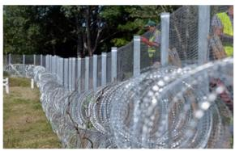

Guantanamo Bay prison camp opened in Cuba in 2002

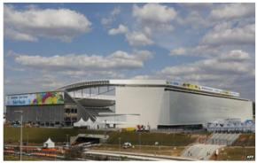

Hinkley Point A next to land where the reactors of Hinkley C nuclear power station are due to be built

## Source: USA Today

Date: May 31, 2016   
Location: Asotthalom village [...]   
Motivation: To report on Hungary's efforts to strengthen its border fence   
[.….]

People: A Hungarian prisoner Objects: A barbed wire fence, a person wearing a yellow vest Event: Hungary is building a new part of a fence near the border with Serbia

Internal checking: [...] inconsistent in location [...] Hungary-Serbia border.

Date: June 8, 2014 Date: June 8. 2014   
Location: Sao Paulo, Brazil   
Motivation: To provide a visual [...] of Arena de Sao Paulo, the venue for the opening match of the 2014 FIFA World Cup between Brazil and Croatia Things: [...] possibly a sports arena Event: The image shows the Arena de Sao Paulo which will host the opening game [...]

External checking: [...] provided evidence is unrelated to Guantanamo Bay or its opening [.….] Hungary building a fence on its border with Serbia in 2016 [...] Hungary's actions to fight terrorism, neither mentions Guantanamo Bay [….]

## Source: BBC News

Internal checking: [...] inconsistent in location. [...] Neo Quimica Arena. External checking: [...] provided evidence is all about the 2014 FIFA World Cup in Brazil, specifically about the Arena de Sao Paulo, a stadium in Sao Paulo. Brazil. [...] evidence does not provide any information about Hinkley Point A or Hinkley C nuclear power station [...]

In May 2016, construction workers reinforced a [...] near the village of Asotthalom

[...] prisoners laying down new fencing along the Serbian border near Beremend village [...]

A fence runs along the Bulgarian border with Turkey near the village of Slivarovo

Arena Corinthians will welcome Brazil and Croatia for the [...] opening match of the competition

Arena de Sao Paulo will host the opening match between Brazil and Croatia on Thursday

Arena de Sao Paulo on June 8, 2014

Figure 15: Human study examples. From left to right, the image with the old caption, the COVE artifact, the SNIFFER artifact, the three new captions. Accurate captions are shown in green, OOC captions in grey.  
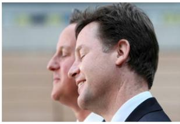

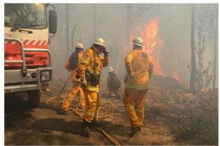  
Figure 16: Error examples with Llama 3. Each row shows the image (left), the context prediction (center), the caption (upper right), and the veracity prediction (lower right). Accurate captions are shown in green, OOC captions in grey.

## Motivation: To report on a meeting

between David Cameron and another politician [.…..] People: David Cameron & Nick Clegg Event: A meeting [...] related to the Liberal-Conservative coalition government.

Location: Honeymoon Island State Park .   
Objects: A tree, a beach, a puddle of water.

## Motivation: To report on a firefighting

operation.   
People: A group of firefighters.   
Objects: A fire, a firetruck, a wooded area.   
Event: A firefighting operation to combat a wildfire.

David Cameron and Nick Clegg smile as they answer a journalist s question in the handball arena at the 2012 London Olympic Park

Prediction: Out-of-Context

In South Carolina, a beach is never too far away and some of the most wild and untouched can be found on Edisto Island home of Botany Bay.

Prediction: Out-of-Context

Supplied image of firefighters battling a blaze at the Hazelwood open cut coal mine near Morwell in March 2014

Prediction: Accurate

## L Error examples with COVE - Llama 3

Figure 16 provides three error examples of Llama 3 on the NewsCLIPpings test set. In the first example, the predicted context is missing the date and location items. Llama 3 wrongly predicts the caption as OOC, given that not all atomic facts are supported by the context. The second image is an example of context prediction error propagating to veracity prediction. While Edisto Island is the correct location of the image, the predicted location is incorrect. As a result, the caption is wrongly predicted as OOC. The third example is the opposite of the first example. The predicted context is not sufficient to verify all atomic facts, but the caption is wrongly predicted as accurate.

## M Filtering mechanism experiment

We conduct an experiment on 5Pils-OOC where we only use web evidence that belongs to a manually curated list of trustworthy sources. The sources are: theguardian.com, usatoday.com, nytimes.com, washingtonpost.com, reuters.com, indiatimes.com, bbc.com, cnn.com, nbcnews.com, thetimes.co.uk, and apnews.com. By selecting web evidence from these sources only, the accuracy decreases by 2.3 and the Macro F1-score by 2.8 percentage points. Only $\tt R o o c$ decreases while $\mathtt { R } _ { A C C }$ remains unchanged. Despite the simplicity of this filtering approach, the decrease in veracity prediction performance is relatively small, indicating that a more advanced filtering mechanism could provide results equivalent to an approach without filtering or even outperform it.