# CluSanT: Differentially Private and Semantically Coherent Text Sanitization

Ahmed Musa Awon University of Victoria its.ahmed.musa@gmail.com

Shera Potka University of Victoria spotka@uvic.ca

Yun Lu University of Victoria yunlu@uvic.ca

Alex Thomo University of Victoria thomo@uvic.ca

## Abstract

We introduce CluSanT, a novel text sanitization framework based on Metric Local Differential Privacy (MLDP). Our framework consists of three components: token clustering, cluster embedding, and token sanitization. For the first, CluSanT employs Large Language Models (LLMs) to create a set of potential substitute tokens which we meaningfully cluster. Then, we develop a parameterized cluster embedding that balances the trade-off between privacy and utility. Lastly, we propose a MLDP algorithm which sanitizes/substitutes sensitive tokens in a text with the help of our embedding. Notably, our MLDP-based framework can be tuned with parameters such that (1) existing state-of-theart (SOTA) token sanitization algorithms can be described——and improvedunder our framework with extremal values of our parameters, and (2) by varying our parameters, we enable a whole spectrum of privacy-utility tradeoffs. Our experiments demonstrate CluSanT's balance between privacy and semantic coherence, highlighting its capability as a valuable framework for privacy-preserving text sanitization.

## 1 Introduction

The advent of digital technology has led to an exponential increase in the generation and processing of textual data, elevating the importance of privacy within the realm of Natural Language Processing (NLP) (Carlini et al., 2021; Jegorova et al., 2022). Differential Privacy (DP) (Dwork, 2006), known for its strong mathematical privacy guarantees, presents a viable solution to these challenges. However, applying DP in NLP is fraught with difficulties due to the complex nature of textual data (Song and Raghunathan, 2020).

Existing implementations of DP in NLP typically degrade semantic integrity and readability for humans, posing significant challenges for applications requiring high-quality, coherent text processing. This underscores the need for advanced methods capable of finely balancing privacy with utility (Lyu et al., 2020b; Anil et al., 2021; Dupuy et al., 2022; Li et al., 2018; Mireshghallah et al., 2021). Current state-of-the-art (SOTA) techniques, such as SanText (Yue et al., 2021) and CusText (Chen et al., 2023), illustrate these challenges. San-Text, while focused on maximizing privacy, may significantly diminish the utility of sanitized text. Conversely, CusText can preserve better text utility but can only achieve privacy in a limited manner.

SanText achieves metric local DP (MLDP) text sanitization by probabilistically replacing individual sensitive tokens (e.g., Paris') with alternative ones (e.g., Lyon'). Replacements are selected with probability proportional to their semantic distance to the original, in a manner similar to the exponential mechanism (McSherry and Talwar, 2007) in DP literature. While for smaller number of tokens this achieves meaningful replacements, applying this broadly can increase the likelihood of selecting less desirable ones. For instance, while Lyon' should be one of the top replacements for Paris,’ the combined probability of a large number of low-utility city names can outweigh ‘Lyon,' leading to poor choices. In response, CusText proposed to first cluster tokens based on their similarity. It then performs replacements by selecting only tokens from the relevant cluster, via the exponential mechanism. Though improving utility, this approach also limits CusText's privacy guarantees to within each cluster.

How can we reconcile this conflict between privacy and utility in the SOTA? We answer this question by introducing CluSanT,¹ a novel framework for text sanitization consisting of three components: (1) token clustering, (2) cluster embedding, and (3) token sanitization. CluSanT allows its users to tune their desired privacy/utility tradeoff by controlling the likelihood to choose a sanitized token from a more optimal cluster. Independent of the framework, we also propose several improvements and evaluation metrics that we experimentally show augment the SOTA. Notably, while CluSanT's token sanitization algorithm is based on various parameters, it achieves MLDP guarantees (Thm. 5) for any valid parameters, allowing for flexible plugand-play. We outline our general approach through the following main technical challenges.

## 1.1 Technical Challenges

We summarize challenges in the SOTA, along with our proposed solutions:

• SanText: There is a high probability density over less desirable tokens.

Our Strategy: Given tokens clustered in a semantically meaningful manner, CluSanT's token sanitization mechanism selects the optimal cluster with high probability, then performs replacements within the smaller, relevant cluster of tokens. This enhances the likelihood of selecting semantically appropriate replacements, thereby improving utility.

• CusText: CusText's approach cannot achieve standard MLDP (Theorem 4).

Our Strategy: We introduce a mechanism that privately (with MLDP) selects a cluster based on a cluster embedding. Parametrizing the cluster embedding allows one to tune the probability of selecting the optimal cluster, adapting to various application scenarios.

• General Coherence: Previous approaches, including SanText and CusText, have not adequately addressed issues related to grammatical or logical coherence within the text.

Our Strategy: Addressing this is crucial because SOTA and our framework produce humanreadable text, unlike other works that generate text representations for downstream ML tasks (Feyisetan et al., 2019, 2020; Lyu et al., 2020a,b). Our experiments evaluate semantic similarity and coherence in sanitized texts through various metrics, including those developed with the assistance of Large Language Models (LLMs).

## 1.2 Summary of Contributions

General Framework for Text Sanitization with Parametrizable Privacy. We introduce CluSanT, a framework for MLDP text sanitization, which can be parametrized by: (1) a clustering of tokens of interest and (2) k : amplification factor which controls cluster embedding. Our framework's flexibility allows its users to choose from a whole spectrum of MLDP algorithms to adapt to various text sanitization needs. We demonstrate how SanText and CusText (SOTA) are special (extremal) cases within this spectrum of the CluSanT framework.

Improved Sensitive Token Set, Utility Metrics, and Extensive Experiments. Independent of our MLDP framework, we made improvements that can also be applied to the SOTA. In particular, we augment the set of sensitive tokens, improve embeddings for multi-word tokens, and utilize more direct metrics and datasets to assess semantic similarity and coherence of sanitized text, providing an accurate reflection of text quality and usability. We apply these improvements to extensively demonstrate the effect of different CluSanT parametrizations on the tradeoff between utility and privacy, through utility improvement over the base case (CluSanT parametrized to emulate SanText). We show that under many parametrizations we can closely match CusText in performance, while still maintaining MLDP guarantees.

## 2 Related Works

The most direct strategy for sanitizing text is directly masking sensitive elements (Pilán et al. 2022; Microsoft, 2023), which can reduce text utility. Instead, differential privacy can replace quasi-identifiers with semantically similar terms. The SOTA are SanText (Yue et al., 2021) and Cus-Text (Chen et al., 2023), which we detail in Sec. 3.

The most recent work in this line (Tong et al., 2023) proposed RanText, an exponential mechanism-based approach for token replacement, with the goal to produce perturbed prompts for LLMs. However, their stated privacy (Theorem 2) is limited to tokens in specific adjacency lists (similar to how CusText's privacy is limited to each clustering), rather than standard MLDP². Another work (Carvalho et al., 2023) attempts to choose replacement words within a radius of the original word; however, as radii generally do not partition the set of words, this method appears incompatible with clustering-based algorithms like CusText. We moreover were not able to find the code of the algorithm. Consequently, we choose not to experimentally compare with these works at this time.

One improvement we made in our experiments are the datasets used. Instead of an ad-hoc method of identifying sensitive words, we use the TAB benchmark of (Pilán et al., 2022), a corpus of 1,268 English-language court cases from the European Court of Human Rights (ECHR), with the sensitive data manually-annotated in each document.

Several works add DP noise to text representations (Feyisetan et al., 2019, 2020; Lyu et al., $^ { 2 0 2 0 \mathrm { a } , \mathrm { b } ) }$ or use adversarial training (Xie et al., 2017; Coavoux et al., 2018; Elazar and Goldberg, 2018; Li et al., 2018) to create these representations. These methods produce non-human-readable outputs for ML pipelines, addressing different problems. Other works specific to downstream tasks include e.g., training a learning algorithm (Igamberdiev and Habernal, 2023; Habernal, 2021). Like SOTA, we produce sanitized text for general use rather than private representations.

Lastly, (Mattern et al., 2022) argues that sanitization via replacing individual tokens within a text limits syntax variability, and can lead to e.g., grammar errors. They instead propose paraphrasing via GPT-2. However, we believe our line of works will continue to be useful, since (1) token-based sanitization, such as CluSanT, do not appear to conflict with, and may even complement paraphrasing, and (2) certain contexts require specific syntax, $\mathrm { e . g . , }$ legal documents (Vogel, 2009) in our experiments. Moreover, one may mitigate certain grammar issues through clustering to separate grammatically dissimilar tokens (e.g., by putting ‘Britain’ and British’ in different clusters).

## 3 Preliminaries

Following SOTA, we privatize text by randomising each token (e.g., Paris', ‘United States') deemed sensitive', in a way that preserves metric local differential privacy (MLDP) (Alvim et al., 2018). We call a token sanitization mechanism a (randomised) algorithm which takes as input a token and outputs a token which we call the sanitized token. Below, we define LDP. Informally, a mechanism M is LDP if from its output (sanitized token) y, one cannot tell if the original input (token) was x or x'.

Definition 1. (Local Differential Privacy (LDP) (Duchi et al., 2013)) $M : X  Y$ satisies €-LDP $\begin{array} { r } { i f \forall x , x ^ { \prime } \in X , y \in Y , \frac { \operatorname* { P r } [ M ( x ) = y ] } { \operatorname* { P r } [ M ( x ^ { \prime } ) = y ] } \leq e ^ { \epsilon } } \end{array}$

Metric LDP (Alvim et al., 2018) is a variant/extension of LDP for better utility, by tuning privacy with respect to a distance metric. Here, one can more easily distinguish whether y is the output of $M ( x )$ or $M ( x ^ { \prime } ) { \mathrm { - i f ~ } } x , x ^ { \prime }$ are far apart. Specifically, a mechanism M satisfies MLDP for a given privacy parameter $\epsilon \geq 0$ and distance metric $d : X \times X \to \mathbb { R } _ { > 0 }$ , if the following condition holds for all $\begin{array} { r } { x , x ^ { \prime } \in \hat { X , } y \in Y \colon \frac { \operatorname* { P r } [ M ( x ) = y ] } { \operatorname* { P r } [ M ( x ^ { \prime } ) = y ] } \le e ^ { \epsilon \cdot d ( x , x ^ { \prime } ) } } \end{array}$

Lastly, the exponential mechanism has been applied extensively in previous work on token sanitization (e.g., SanText, CusText, RanText). Informally, it selects a sanitized token with probability proportional to its closeness to the original token (with closeness defined via utility function u).

Definition 2. [Exponential Mechanism (McSherry and Talwar, 2007)] Let I be a finite set denoting the input space, and O be a inite set denoting the output space. Let $u ( x , y )$ be a utility func-$t i o n ^ { 3 }$ defined for any x $\in \ I$ and $y \in O ,$ and let $\Delta u \ge \breve { 0 } , \epsilon _ { E } \ge 0 .$ The exponential mechanism, parametrized by $I , O , u , \Delta { \dot { u } } ,$ runs the following: ${ \cal M } _ { E } ( x )$ (with x $\in \ I ) .$ : Randomly select $y \in { \cal O }$ where

$$
\operatorname* { P r } ( M _ { E } ( x ) = y ) = \frac { \exp ( \epsilon _ { E } \cdot u ( x , y ) / ( 2 \Delta u ) ) } { \sum _ { y ^ { \prime } \in O } \exp ( \epsilon _ { E } \cdot u ( x , y ^ { \prime } ) / ( 2 \Delta u ) ) }
$$

Two useful facts from (McSherry and Talwar, 2007; Yue et al., 2021) are as follows.

Theorem 1. For the exponential mechanism $M _ { E } ,$ the following hold:

1. Fix any $x , x ^ { \prime } \in I$ and $y \in \mathsf { \Gamma } O .$ Then $\begin{array} { r } { \frac { \operatorname* { P r } ( M _ { E } ( x ) = y ) } { \operatorname* { P r } ( M _ { E } ( x ^ { \prime } ) = y ) } \leq \exp \left( \frac { \epsilon _ { E } | u ( x , y ) - u ( x ^ { \prime } , y ) | } { \Delta u } \right) } \end{array}$

2. If we set the parameter ∆u max $( | u ( x , y ) - u ( x ^ { \prime } , y ) | )$ (called sensitivity of u) then $M _ { E } \ i s \ \epsilon { - } L D P .$ If we set parameter $\Delta u = 1$ and let $u ( x , y ) = - d ( x , y )$ for a metric d, then $M _ { E }$ is €-MLDP.

## 3.1 Notation

For ease of reading, we standardize the notation used to describe SOTA.

• X: the set of all tokens within texts of interest. Each token is represented by a real vector $\mathbb { R } ^ { \ell }$ for some constant l (this mapping from token to vector is called a token embedding).

$X ^ { \prime } \colon$ a set of sensitive tokens. We usually name sensitive tokens as $x , x ^ { \prime } . \ X ^ { \prime }$ may be a sub- or super-set of X. For experiments, we use an initial set of sensitive tokens from X as seeds, which we then expand several-fold with additional tokens of a similar nature. For instance, if British’ is a seed token, we may add French’ and German', even if they were not initially in X.

$y \in Y \colon$ output of the token sanitization mechanism. Previous work differ in set $Y ;$ in the interest of fairness and ease of presentation, we set $Y = X ^ { \prime }$ in all experiments.

• u: utility function; $\Delta u \colon$ sensitivity of u (Exponential Mechanism Def. 2)

$M : X ^ { \prime }  Y \colon$ token sanitization mechanism

SanText (Yue et al., 2021) In SanText, the token sanitization mechanism $M : X ^ { \prime } \to X ^ { \prime }$ is based on the exponential mechanism (Def. 2), with a modification that the utility function sensitivity $\Delta u$ is replaced by the constant 1 (see Thm. 1). The utility function is defined as $u ( x , x ^ { \prime } ) = - d ( x , x ^ { \prime } )$ , where $d ( x , x ^ { \prime } )$ is a metric distance $( \mathrm { e . g . }$ , Euclidean) between the real-vector embeddings of tokens $x , x ^ { \prime }$ We formalize this mechanism in the Appendix. San-Text achieves the following privacy guarantee.

Theorem 2 (Privacy of SanText). The token sanitization mechanism M of SanText, satisfies €-MLDP.

We note that SanText+ is a variation introduced in the same paper (Yue et al., 2021). However, SanText+ sanitizes non-sensitive tokens as well as sensitive ones; thus, for fairness in utility comparisons (as sanitizing more tokens lowers the text utility), we focus on SanText.

CusText (Chen et al., 2023) CusText improves the utility of SanText by first partitioning all tokens in the lexicon X into disjoint sets called clusters based on token similarity. Then, given a fixed set of clusters, CusText performs exponential mechanism (Def. 2) within each cluster.

Since CusText only ever replaces x with tokens in the cluster containing x, CusText's privacy applies only within each cluster.

Theorem 3 (Privacy of CusText). Let C be a cluster. Let $M _ { C } : C \to C$ be the mechanism M defined above, but with domain and range restricted to cluster C. Then $M _ { C }$ satisies €-LDP.

However, CusText's mechanism M does not in general satisfy (metric) LDP, when there is more than one cluster. Intuitively, if tokens $x , x ^ { \prime }$ are in different clusters, $M ( x )$ and $M ( x ^ { \prime } )$ have disjoint supports and thus are easily distinguishable.

Theorem 4 (Proof in Appendix). For any clustering with at least two clusters, the mechanism M defned in CusText cannot satisfy €-(metric) LDP for any $\epsilon \in \mathbb { R }$

## 4 CluSanT: Cluster Exponential Mechanism with MLDP Guarantees

CluSanT first clusters tokens based on their similarity. It then sanitizes sensitive tokens by first selecting a cluster, then selecting the replacement token from within that cluster. This approach makes contextually relevant replacements, improving the utility of sanitized text over SanText while still maintaining MLDP. CluSanT's privacy guarantees hold for any clustering, allowing for flexible integration of different clustering methods.

In this section, we present two of the components in our CluSanT framework: cluster embedding (Sec. 4.1) and token sanitization (Sec. 4.2). The method of obtaining a token clustering is independent of this section and will be detailed in our experiments (see Sec. 5). Through parameterizing our clustering, and cluster embedding with a parameter k, we obtain a spectrum of token sanitization mechanisms that range from SanText at one extreme and CusText at the other extreme (see Sec. 4.1.1). For now, we assume we already have a set of token clusters {C}.

## Notation:

• Mapping f between token x and its vector representation in $\mathbb { R } ^ { \ell }$ is called a token embedding.

• Mapping $f ^ { \prime }$ between clusters and real vectors is called a cluster embedding.

• {C}: A clustering, a set of subsets C (clusters) partitioning $X ^ { \prime } \cup Y$ (or $X ^ { \prime } \mathrm { i f } Y = X ^ { \prime } ) . C _ { x }$ is the (unique) cluster containing token x.

$d _ { c } : \mathbb { R } ^ { \ell } \times \mathbb { R } ^ { \ell } \to \mathbb { R } :$ Any distance function that is a metric. We extend this to measure the distance between clusters, i.e., $d _ { c } ( C , C ^ { \prime } ) =$ $d _ { c } \left( f ^ { \prime } ( C ) , f ^ { \prime } ( C ^ { \prime } ) \right)$ for clusters $C , C ^ { \prime }$

$d : \mathbb { R } ^ { \ell } \times \mathbb { R } ^ { \ell } \to \mathbb { R } :$ Any distance measure (which is not assumed to be a metric, and may be different from $d _ { c } )$ between two tokens.

## 4.1 Cluster Embedding

We first define a cluster embedding given a token embedding and a clustering. Recall, a token embedding $f$ is a mapping from a token to a real vector. A cluster embedding $f ^ { \prime } { } _ { \ast }$ , on the other hand, maps a cluster to a real vector. Our cluster embedding is parameterized by $k \geq 1$

Our cluster embedding $\begin{array} { r l } { f ^ { \prime } } & { { } ( \mathrm { F i g . ~ \ : ~ 1 ) } } \end{array}$ is parametrized by a standard token embedding $f ,$ a clustering, and $k ,$ which intuitively tunes how pushed apart' the clusters are from each other in the embedding. Looking ahead, our privacy Thm. 5 holds when the distance between clusters $d _ { c } ( C _ { x } , C _ { x ^ { \prime } } )$ can be increased by tuning k (the choice of $d _ { c }$ being a Lp-norm satisfies this).

Specifically, our cluster embedding $f ^ { \prime }$ embeds both tokens and clusters. It defines cluster embeddings by pushing’ cluster apart by a factor of k (Step 1). Meanwhile, it maintains the original (according to $f )$ difference between the embeddings of tokens from within the same cluster. This is done in Step 2(b), by adding the vector difference $( f ( x ) - C _ { x } )$ to the new cluster centroid, k · $C _ { x }$

How is cluster embedding used? Looking ahead, our sanitization mechanism: it first selects a cluster, then selects a token from within this cluster. By parametrizing $f ^ { \prime }$ with a larger k and a distance $d _ { c }$ that grows with $k ^ { 4 }$ , we select more optimal clusters with higher probability.

Effect of parameter $k .$ Since k only affects cluster selection $( f ^ { \prime } )$ , we ensure that words within the same cluster remain indistinguishable'from each other, regardless of their embedding—we apply a standard LDP mechanism when selecting a token from within a cluster. Conversely, tokens from different clusters may be more distinguishable, depending on k. The larger k is, the more probability of choosing a better cluster, but the more distinguishable the clusters are (while still preserving MLDP). We formally describe the effect of k on privacy leakage in App. D. Utility gains from larger k depend on evaluation metric; we give examples in our experiments (Sec. 5).

Defining a cluster-based embedding follows the spirit of (Chatzikokolakis et al., 2013) and (Andrés et al., 2013)'s concept of geo-indistinguishability, where a radius naturally defines a cluster of close/indistinguishable geo-points within the radius. In our case, CluSanT forms clusters of words based on their (semantic/syntactic) similarity using word embeddings, where we leave the definition of ‘similarity’ up to user interpretation.

## 4.1.1 Describing SanText and CusText in Terms of CluSanT

CluSanT can be parametrized, via the clustering, parameter $k ,$ and distances, to achieve a spectrum of €-MLDP token sanitization mechanisms.

Cluster Embedding $f ^ { \prime } { : }$   
• Inputs: Parameter k, token embedding f,   
clustering $\{ C \}$ of $X ^ { \prime } \cup Y$   
• Output: Embedding $f ^ { \prime } .$ On input a cluster   
C or token $x \in X ^ { \prime } \cup Y , f ^ { \prime }$ outputs a real   
vector $\mathbb { R } ^ { \ell }$ , which defines the embedding of   
the cluster $C$ or token x.   
1. For each cluster $C \in \{ C \}$   
(a) Compute the centroid of C. We over  
load notation and also use $C$ to de  
note the centroid of this cluster. $C =$   
$\begin{array} { r } { { \frac { 1 } { | C | } } \sum _ { x ^ { \prime } \in C } f ( x ^ { \prime } ) } \end{array}$   
(b) Define $f ^ { \prime } ( C ) : = k \cdot C$   
2. For each token $x \in X ^ { \prime } \cup Y \colon$   
(a) Compute the centroid of $C _ { x } .$ We over  
load notation and also use $C _ { x }$ to de  
note the centroid of this cluster. $C _ { x } =$   
$\begin{array} { r } { { \frac { 1 } { | C _ { x } | } } \sum _ { x ^ { \prime } \in C _ { x } } f ( x ^ { \prime } ) } \end{array}$   
(b) Define $f ^ { \prime } ( x ) : = k \cdot C _ { x } + ( f ( x ) - C _ { x } )$  
Figure 1: Cluster embedding with parameter k

We show that SanText and CusText are instantiations of CluSanT, situated at extremal ends of this parametrization.

Fact 1. SanText and CusText are equivalent to Clu-SanT for specific choices of parameters.

SanText. SanText's algorithm is the same as Clu-SanT (Fig. 2) parametrized by $k = 1 , d _ { c }$ being Euclidean (same metric as SanText), and each cluster containing exactly one token (i.e., #clusters is equal to #tokens). Note this means that Step 1 is equivalent to SanText, and since each cluster has only one token, then Step 2 always chooses the same token (regardless of distance $d )$ , making this algorithm equivalent to SanText (recall, SanText does not consider token clustering).

CusText. CluSanT can be parametrized to asymptotically approach the behaviour of CusText, which always chooses a token from an optimal' cluster. We first define the clustering and distance d to be the same as CusText's, setting $d _ { c }$ as Euclidean, and letting $k \to \infty$ . When $k  \infty , d _ { c }$ between $f ^ { \prime }$ embeddings of different clusters is infinitely large, and Step 1 of Fig. 2 will with overwhelming probability

$M ( x )$ : The mechanism is parameterised by the set of clusters $\{ C \}$ (where all tokens in clusters are in set $X ^ { \prime } \cup Y )$ , token embedding $f ,$ cluster embedding $f ^ { \prime } { } .$ , metric $d _ { c } ,$ distance $d ,$ and privacy parameter €.

Input: token $x \in X ^ { \prime } ;$ Output: token in $Y$

1. Choose a cluster C: Run exponential mechanism parametrised by $\epsilon _ { E } = \epsilon / 2$ , input and output space are both $\{ C \}$ (set of all clusters) with the cluster embedding $f ^ { \prime } ,$ utility $u _ { c } ( C , C ^ { \prime } ) = - d _ { c } ( C , C ^ { \prime } )$ , and setting parameter $\Delta u _ { c }$ to 1.

2. Choose token within cluster C: Run exponential mechanism parametrised by $\epsilon _ { E } =$ $\epsilon / 2$ , input space $X ^ { \prime }$ , token embedding $f ,$ output space $C \cap Y ( Y$ tokens in cluster C), utility $u ( x , x ^ { \prime } ) = - d ( x , x ^ { \prime } )$ , and setting $\begin{array} { r } { \Delta u = \operatorname* { m a x } ( 1 , \operatorname* { m a x } _ { x , x ^ { \prime } , y \in X ^ { \prime } } | d ( x , y ) - d ( x ^ { \prime } , y ) | ) } \end{array}$ (Note: Some embeddings, e.g., MPNet we use, are normalized and thus already have sensitivity 1).

3. Output the token chosen above.

Figure 2: CluSanT's €-MLDP Sanitization Mechanism

choose the cluster $C _ { x }$ of the original token x.

## 4.2 Token Sanitization Mechanism for Metric LDP Guarantees

The main observation behind CluSanT's token sanitization mechanism is the following: CusText achieves good utility since it ensures that a token x is replaced only by another (possibly the same) token $x ^ { \prime } \in C _ { x }$ , the cluster which x is in. However, by Thm. 4 we showed that this approach is impossible to achieve MLDP. Instead, CluSanT achieves privacy (and still good utility) by giving a small probability of selecting less good’ clusters.

Our mechanism is in Fig. 2. Intuitively, Step 1 (cluster selection) is MLDP following the exponential mechanism-style approach of SanText. Then, Step 2 (selecting within a cluster) achieves guarantees similar to CusText. Parametrizing Steps 1 and 2 via the clustering, cluster embedding (k), and distances $d , d _ { c } ,$ gives us a spectrum of ε-MLDP mechanisms that include SanText and CusText.

Theorem 5. Consider d, dc, f, f′ (with parameter k), and the clustering are chosen s.t.:

• $d _ { c }$ is a metric.

• For all $x , x ^ { \prime }$ (using embedding $f ^ { \prime } f o r d _ { c } ,$ and f′ for d): $( I ) d _ { c } ( x , x ^ { \prime } ) \geq 1 o r d _ { c } ( x , x ^ { \prime } ) \geq d ( x , x ^ { \prime } )$ and (2) $i f C _ { x } \ne C _ { x ^ { \prime } } , d _ { c } ( C _ { x } , C _ { x ^ { \prime } } ) + 1 \le 2$ $d _ { c } ( x , x ^ { \prime } ) . ~ ^ { 5 }$

Then, $M ( x )$ in Fig. 2 achieves €-metric LDP for metric $d _ { c } ,$ and embedding $f ^ { \prime } .$

Proof. Fix any $x , x ^ { \prime } \in X ^ { \prime } , y \in Y . \operatorname { I f } x = x ^ { \prime }$ then ${ \frac { \operatorname* { P r } ( M ( x ) = y ) } { \operatorname* { P r } ( M ( x ^ { \prime } ) = y ) } } = 1 = e ^ { 0 }$ so the MLDP inequality trivially holds. Thus, consider $x \neq x ^ { \prime } .$

We have $\operatorname* { P r } ( M ( x ) = y )$ equal to $\Pr ( M _ { 1 } ( x ) =$ $C _ { y } ) \operatorname* { P r } ( M _ { 2 } ( x ) \ = \ y | M _ { 1 } ( x ) \ = \ C _ { y } )$ where (1) $M _ { 1 } ( x ) = C _ { y }$ is the event that Step 1 of M chooses $C _ { y } .$ and (2) $M _ { 2 } ( x ) = y | M _ { 1 } ( x ) = C _ { y }$ is the event that Step 2 of M' chooses token y, given Step 1 chooses $C _ { y } .$

Conditioned on Step 1 choosing cluster $C _ { y } ,$ Step 2 runs exponential mechanism with (both LDP and MLDP) privacy $\epsilon / 2$ Thus, $\begin{array} { r l } { \mathrm { P r } ( M _ { 2 } ( x ) { = } y | M _ { 1 } ( x ) { = } C _ { y } ) } & { { } \leq } \\ { \mathrm { P r } ( M _ { 2 } ( x ^ { \prime } ) { = } y | M _ { 1 } ( x ^ { \prime } ) { = } C _ { y } ) } & { { } \leq } \end{array}$ min $\left( e ^ { \epsilon / 2 } , e ^ { \epsilon d ( x , x ^ { \prime } ) / 2 } \right)$ . Moreover, by Thm 1,

$$
\frac { \operatorname* { P r } ( M _ { 1 } ( x ) = C _ { y } ) } { \operatorname* { P r } ( M _ { 1 } ( x ^ { \prime } ) = C _ { y } ) } \leq \exp \Big ( \frac { \epsilon } { 2 } | d _ { c } ( C _ { x } , C _ { y } ) - d _ { c } ( C _ { x ^ { \prime } } , C _ { y } ) | \Big )
$$

$$
\begin{array} { r l } & { \mathrm { T h u s , } \frac { \mathrm { P r } ( M ( x ) = y ) } { \mathrm { P r } \left( M ( x ^ { \prime } ) = y \right) } } \\ & { \qquad \leq e ^ { \frac { \epsilon } { 2 } | d _ { c } ( C _ { x } , C _ { y } ) - d _ { c } ( C _ { x ^ { \prime } } , C _ { y } ) | } e ^ { \frac { \epsilon } { 2 } \operatorname* { m i n } ( 1 , d ( x , x ^ { \prime } ) ) } } \end{array}
$$

Now consider the following two cases:

1. $\begin{array} { r l r } { C _ { x } } & { { } = } & { C _ { x ^ { \prime } } \mathrm { : } } \end{array}$ Then, $\left| d _ { c } ( C _ { x } , C _ { y } ) \right. \ -$ $d _ { c } ( C _ { x ^ { \prime } } , C _ { y } ) | ~ = ~ 0$ and $e ^ { \frac { \epsilon } { 2 } \operatorname* { m i n } ( \mathrm { i } , d ( x , x ^ { \prime } ) ) } \leq$ $e ^ { \epsilon \cdot d _ { c } ( x , x ^ { \prime } ) }$ by theorem assumption (1) on $d _ { c }$

2. $C _ { x } \neq C _ { x ^ { \prime } } \mathrm { : }$ Since $d _ { c }$ is a metric, $| d _ { c } ( C _ { x } , C _ { y } ) -$ $d _ { c } ( C _ { x ^ { \prime } } , C _ { y } ) | \ \leq \ d _ { c } ( C _ { x } , C _ { x ^ { \prime } } )$ . Moreover, by assumption, for $C _ { x } \neq C _ { x } ^ { \prime } , d _ { c } ( C _ { x } , C _ { x ^ { \prime } } ) + 1 \leq$ $2 \cdot d _ { c } ( x , x ^ { \prime } )$ . Thus,

$$
\begin{array} { r l r } & { } & { e ^ { \frac { \epsilon } { 2 } (  d _ { c } ( C _ { x } , C _ { y } ) - d _ { c } ( C _ { x ^ { \prime } } , C _ { y } )  + 1 ) } \leq e ^ { \frac { \epsilon } { 2 } ( 2 \cdot d _ { c } ( x , x ^ { \prime } ) ) } } \\ & { } & { = e ^ { \epsilon \cdot d _ { c } ( x , x ^ { \prime } ) } } \end{array}
$$

## 5 Experiments

Previous work (Feyisetan et al., 2020; Yue et al. 2021; Chen et al., 2023) evaluated the quality

5We refer to App. C for more details on satisfying these assumptions. In short, (1) can be satisfied with appropriate choices of distances and embeddings. (2) can be satisfied by choosing dc based on any Lp-norm.

of sanitized text based on the performance of downstream tasks (e.g., sentiment analysis) on sanitized text. In this work, we evaluate the quality of sanitized text using more direct metrics that capture the semantic integrity and linguistic naturalness of sanitized text.

Metrics and Dataset We evaluate sanitized text primarily with semantic similarity and perplexity, and four additional metrics assessing common sense, coherence, cohesiveness, and grammar quality, using GPT-4o. In App. E we show (1) example sanitized texts, evaluated using cosine similarity, and (2) evaluations of a sanitized text validation set based on the SST2 (Socher et al.) dataset used in SanText and CusText.

Cosine/Semantic similarity is measured using embedding vectors from the all-MiniLM-L6-v2 (sentence embedder) model6. We compute cosine similarity, a fundamental component of many downstream text mining tasks such as sentiment classification (Thongtan and Phienthrakul, 2019), between embeddings of original and sanitized texts to assess semantic preservation.

Perplexity measures the naturalness of the sanitized text by how well it aligns with typical language patterns, with lower perplexity indicating more natural text (higher probability). We evaluate the perplexity of sanitized texts with GPT-2.

GPT-4o is used to evaluate grammar, common sense, coherence, and cohesiveness. LLMs' capabilities in assessing these metrics has been shown to match or surpass human evaluators in accuracy and consistency (Chiang and Lee, 2023; Yu et al., 2024) in various NLP evaluations (e.g., RAG).

We use the TAB dataset (Pilán et al., 2022), which includes 1,268 annotated English-language court cases from the European Court of Human Rights. This dataset offers a robust framework for evaluating general-purpose text anonymization, with high-quality annotations and diverse content. More experiment setup details are in App. E.

Experimental Methodology In our experiments 7, we use a simple CusText clustering method (Chen et al., 2023): given a set of tokens X to cluster, it randomly picks a token x, creates a cluster $C _ { x } ,$ and inserts into $C _ { x }$ the top h — 1 tokens similar to x from X, simultaneously removing them from X. This process is repeated until X is empty, resulting in each cluster containing exactly h tokens. While this simple clustering method can be improved, the choice of clustering method is orthogonal to our work. By varying h, we can control the size and number of clusters. In our study, we test with 40, 180, 360, and 720 clusters.

Augmented Token Set We improve previous approaches like SanText and CusText by augmenting the set of sensitive words and phrases, making it more realistic and contextual. We consider the set $X ^ { \prime }$ as all sensitive words or phrases from the TAB dataset, supplemented with 100 words/phrases of similar nature for each using GPT-4o. For example, for “Sinn Fein headquarters," we obtained phrases of similar nature like “Labour Party headquarters, “Conservative Party headquarters," etc., rather than only similar terms like “Irish" which, while similar in vector embedding space, are not of the same nature. This approach extends the set of sensitive tokens to include additional, realistic phrases not originally in a text collection but still sensitive. In contrast, SanText and CusText recognizing the limitations of a restricted set of sensitive tokens, attempt to mitigate this by allowing replacements with non-sensitive words. However, this method often leads to replacements that do not always make sense. For example, replacing “Sinn Fein headquarters" with a non-sensitive word, such as “Irish" can render the text nonsensical.

Multi-word Embeddings SanText and CusText rely on single-word embeddings like GloVe (Pennington et al., 2014), which cannot directly handle multi-word phrases such as “Sinn Fein headquarters." Our approach, on the other hand, employs the all-MiniLM-L6-v2 sentence embedder, designed to handle phrases and provide more accurate contextual representations. Our experiments ensure fairness for SanText and CusText by using the same set $X ^ { \prime }$ of words/phrases for replacement and the same token embedder, all-MiniLM-L6-v2. Finally, we use Euclidean distance for all methods.

Numerical Results We show partial experimental results, in Figures 3, 4, 5, 6 and full results in Figures 7, 8, 9, 10, 11, 12 in the Appendix. Figures show improvements achieved by CluSanT in terms of semantic similarity, perplexity, common sense, coherence, cohesiveness, and grammar over SanText. For all metrics except perplexity, higher scores are better, while for perplexity, lower scores are preferred. We abbreviate CluSanT by CST and CusText by CT. We consider CT as a special version of CluSanT where k = ∞.

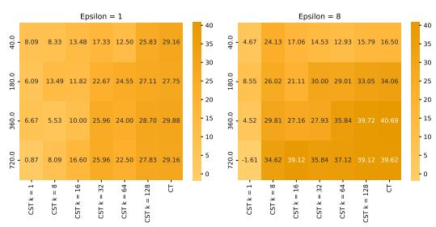

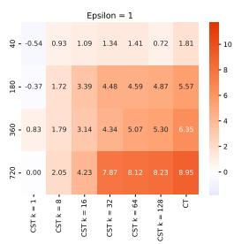

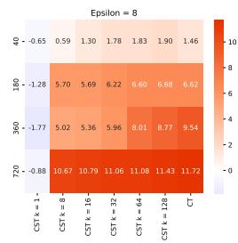  
Figure 3: Semantic similarity improvement over San-Text (%). CluSanT abbreviated by CST, CusText by CT. Horizontal axis varies parameter k of CluSanT. Vertical axis varies the number of clusters. Same axes apply for the other heatmaps as well. Unless otherwise mentioned, the higher, the better.

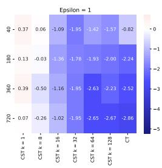

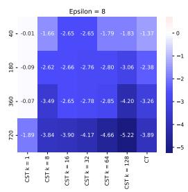  
Figure 4: Peplexity improvement over SanText (%); the lower, the better

We plotted the number of clusters on the vertical axis and the centroid pushing factor k of CluSanT on the horizontal axis, creating heatmaps for each € value considered: 0.5, 1, 2, 4, 8, 16. Due to space constraints, we only show results for € = 1 and € = 8 here and include the rest in the Appendix.

For all ε values, as k increases (moving right in the maps), the semantic similarity improvement (over SanText) increases. Additionally, as the number of clusters increases (moving down), semantic similarity improvement also increases.

The most significant improvement of CluSanT over SanText is observed for € = 8 and 720 clusters. Generally, the more clusters used, the greater the improvement over SanText. For € = 16, the improvement in semantic similarity for CluSanT over SanText is not as pronounced as for € = 8. This is because, while the semantic similarity of sanitized text to the original text for CluSanT approaches 1 for this € (the highest value possible, being a cosine similarity), the semantic similarity for SanText also increases for larger € values, resulting in a slightly reduced improvement margin.

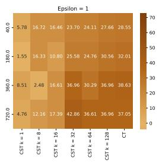

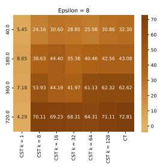  
Figure 5: Common sense improv. over SanText (%)  
Figure 6: Coherence improvement over SanText (%)

Similar trends are observed for perplexity, common sense, and coherence, as well as for grammar and cohesiveness (detailed in Appendix). As the number of clusters and k increase, CluSanT's performance improves significantly over SanText, approaching that of CusText. While CusText shows better performance across metrics, it is only marginally better than CluSanT. However, this comes at the cost of weaker privacy guarantees. We note that these metrics represent general trends; as LLM judgments can be noisy, smaller k values may occasionally yield better results.

## 6 Conclusion

We introduced CluSanT, a novel framework for text sanitization that achieves metric local differential privacy (MLDP). CluSanT comprises token clustering and token sanitization, leveraging Large Language Models to generate substitute tokens, which are then clustered, and sanitized using a MLDP algorithm. Our MLDP framework encompasses a range of privacy-utility tradeoffs via tuneable parameters between state-of-the-art algorithms San-Text and CusText, allowing users to achieve strong privacy or high utility as required. Our framework achieves MLDP guarantees regardless of the clustering, allowing for plug-and-play (and future optimization) of this component in our framework. In summary, CluSanT advances the area of privacypreserving text processing, offering a robust, tuneable solution for handling sensitive text.

## Limitations

• We inherit some limitations of San-Text/CusText. In particular, sanitizing a text by sanitizing individual tokens can lead to mistakes. For example, when a token has two different meanings in different contexts, the token sanitization may not know which meaning it should take. While we use a sentence embedder that generates different embeddings for London, Ontario' and London, England,' it is not helpful for distinguishing Jordan' as a country from the name Jordan.' To achieve this, the embedder would need to consider the meaning of the entire passage. However, accomplishing this is challenging and requires further work. We believe our framework can be improved in follow-up studies by considering token context in our clustering and text sanitization.

• While we improved the sensitive token set and multi-word embedding in our framework, we tested only one clustering method (that of CusText's) and primarily used Euclidean distances. One direction to enrich our framework is by parametrizing it with other clustering methods and distance metrics. Whereas Clu-SanT presents a general framework and privacy theorem for an arbitrary clustering, building an optimal clustering methods appears to be a highly non-trivial task which we defer to future work.

• Our privacy theorem for the CluSanT framework makes some assumptions on the relationship between the distances and the parameter k chosen (though they can be satisfied by common choices of distances, see App. C) A meaningful research direction can be to weaken such assumptions.

## References

Mário Alvim, Konstantinos Chatzikokolakis, Catuscia Palamidessi, and Anna Pazii. 2018. Local differential privacy on metric spaces: optimizing the tradeoff with utility. In 2018 IEEE 31st Computer Security Foundations Symposium (CSF), pages 262–267. IEEE.

Miguel E Andrés, Nicolás E Bordenabe, Konstantinos Chatzikokolakis, and Catuscia Palamidessi. 2013. Geo-indistinguishability: Differential privacy for location-based systems. In Proceedings of the 2013

ACM SIGSAC conference on Computer & communications security, pages 901–914.

Rohan Anil, Badih Ghazi, Vineet Gupta, Ravi Kumar, and Pasin Manurangsi. 2021. Large-scale differentially private bert. arXiv preprint arXiv:2108.01624.

Nicholas Carlini, Florian Tramer, Eric Wallace, Matthew Jagielski, Ariel Herbert-Voss, Katherine Lee, Adam Roberts, Tom Brown, Dawn Song, Ulfar Erlingsson, et al. 2021. Extracting training data from large language models. In 30th USENIX Security Symposium (USENIX Security 21), pages 2633–2650.

Ricardo Silva Carvalho, Theodore Vasiloudis, Oluwaseyi Feyisetan, and Ke Wang. 2023. Tem: High utility metric differential privacy on text. In Proceedings of the 2023 SIAM International Conference on Data Mining (SDM), pages 883–890. SIAM.

Konstantinos Chatzikokolakis, Miguel E Andrés, Nicolás Emilio Bordenabe, and Catuscia Palamidessi. 2013. Broadening the scope of differential privacy using metrics. In Privacy Enhancing Technologies: 13th International Symposium, PETS 2013, Bloomington, IN, USA, July 10-12, 2013. Proceedings 13, pages 82–102. Springer.

Sai Chen, Fengran Mo, Yanhao Wang, Cen Chen, Jian-Yun Nie, Chengyu Wang, and Jamie Cui. 2023. A customized text sanitization mechanism with differential privacy. In Findings of the Association for Computational Linguistics: ACL 2023, pages 5747– 5758.

Cheng-Han Chiang and Hung-yi Lee. 2023. Can large language models be an alternative to human evaluations? arXiv preprint arXiv:2305.01937.

Maximin Coavoux, Shashi Narayan, and Shay B Cohen. 2018. Privacy-preserving neural representations of text. arXiv preprint arXiv:1808.09408.

John C Duchi, Michael I Jordan, and Martin J Wainwright. 2013. Local privacy and statistical minimax rates. In 2013 IEEE 54th Annual Symposium on Foundations of Computer Science, pages 429–438. IEEE.

Christophe Dupuy, Radhika Arava, Rahul Gupta, and Anna Rumshisky. 2022. An efficient dp-sgd mechanism for large scale nlu models. In ICASSP 2022- 2022 IEEE International Conference on Acoustics, Speech and Signal Processing (ICASSP), pages 4118– 4122. IEEE.

Cynthia Dwork. 2006. Differential privacy. In International colloquium on automata, languages, and programming, pages 1–12. Springer.

Yanai Elazar and Yoav Goldberg. 2018. Adversarial removal of demographic attributes from text data. arXiv preprint arXiv:1808.06640.

Oluwaseyi Feyisetan, Borja Balle, Thomas Drake, and Tom Diethe. 2020. Privacy-and utility-preserving textual analysis via calibrated multivariate perturbations. In Proceedings of the 13th international conference on web search and data mining, pages 178–186.

Oluwaseyi Feyisetan, Tom Diethe, and Thomas Drake. 2019. Leveraging hierarchical representations for preserving privacy and utility in text. In 2019 IEEE International Conference on Data Mining (ICDM), pages 210–219. IEEE.

Ivan Habernal. 2021. When differential privacy meets nlp: The devil is in the detail. In ACL Anthology.

Timour Igamberdiev and Ivan Habernal. 2023. Dp-bart for privatized text rewriting under local differential privacy. In ACL Anthology.

Marija Jegorova, Chaitanya Kaul, Charlie Mayor, Alison Q O'Neil, Alexander Weir, Roderick Murray-Smith, and Sotirios A Tsaftaris. 2022. Survey: Leakage and privacy at inference time. IEEE Transactions on Pattern Analysis and Machine Intelligence.

Yitong Li, Timothy Baldwin, and Trevor Cohn. 2018. Towards robust and privacy-preserving text representations. arXiv preprint arXiv:1805.06093.

Lingjuan Lyu, Xuanli He, and Yitong Li. 2020a. Differentially private representation for nlp: Formal guarantee and an empirical study on privacy and fairness. arXiv preprint arXiv:2010.01285.

Lingjuan Lyu, Yitong Li, Xuanli He, and Tong Xiao. 2020b. Towards differentially private text representations. In Proceedings of the 43rd International ACM SIGIR Conference on Research and Development in Information Retrieval, pages 1813–1816.

Justus Mattern, Benjamin Weggenmann, and Florian Kerschbaum. 2022. The limits of word level differential privacy. In ACL Anthology.

Frank McSherry and Kunal Talwar. 2007. Mechanism design via differential privacy. In 48th Annual IEEE Symposium on Foundations of Computer Science (FOCS’07), pages 94–103. IEEE.

Microsoft. 2023. Presidio: Data protection and deidentification sdk. Accessed: October 15, 2023.

Fatemehsadat Mireshghallah, Huseyin A Inan, Marcello Hasegawa, Victor Rühle, Taylor Berg-Kirkpatrick, and Robert Sim. 2021. Privacy regularization: Joint privacy-utility optimization in language models. arXiv preprint arXiv:2103.07567.

Jeffrey Pennington, Richard Socher, and Christopher D Manning. 2014. Glove: Global vectors for word representation. In Proceedings of the 2014 conference on empirical methods in natural language processing (EMNLP), pages 1532–1543.

Ildikó Pilán, Pierre Lison, Lilja Øvrelid, Anthi Papadopoulou, David Sánchez, and Montserrat Batet. 2022. The text anonymization benchmark (tab): A dedicated corpus and evaluation framework for text anonymization. Computational Linguistics, 48(4):1053–1101.

Richard Socher, Alex Perelygin, Jean Wu, Jason Chuang, Christopher D. Manning, Andrew Ng, and Christopher Potts. Sst-2.

Congzheng Song and Ananth Raghunathan. 2020. Information leakage in embedding models. In Proceedings of the 2020 ACM SIGSAC conference on computer and communications security, pages 377– 390.

Tan Thongtan and Tanasanee Phienthrakul. 2019. Sentiment classification using document embeddings trained with cosine similarity. In Proceedings of the 57th Annual Meeting of the Association for Computational Linguistics: Student Research Workshop, pages 407–414, Florence, Italy. Association for Computational Linguistics.

Meng Tong, Kejiang Chen, Yuang Qi, Jie Zhang, Weiming Zhang, and Nenghai Yu. 2023. Privinfer: Privacypreserving inference for black-box large language model. arXiv preprint arXiv:2310.12214.

Carl Vogel. 2009. Law matters, syntax matters and semantics matters. Formal Linguistics and Law, 212:25.

Qizhe Xie, Zihang Dai, Yulun Du, Eduard Hovy, and Graham Neubig. 2017. Controllable invariance through adversarial feature learning. Advances in neural information processing systems, 30.

Hao Yu, Aoran Gan, Kai Zhang, Shiwei Tong, Qi Liu, and Zhaofeng Liu. 2024. Evaluation of retrievalaugmented generation: A survey. arXiv preprint arXiv:2405.07437.

Xiang Yue, Minxin Du, Tianhao Wang, Yaliang Li, Huan Sun, and Sherman SM Chow. 2021. Differential privacy for text analytics via natural text sanitization. pages 3853–3866.

## A Differential Privacy Definition

Definition 3. (€-Differential Privacy (Dwork, 2006)) Given a privacy parameter $\epsilon \geq 0 ,$ for any two adjacent inputs x, $x ^ { \prime } \in X$ and each potential output $y \in Y$ , a randomized mechanism M satisies €-differential privacy (DP) if it ensures that

$$
{ \frac { \operatorname* { P r } [ M ( x ) = y ] } { \operatorname* { P r } [ M ( x ^ { \prime } ) = y ] } } \leq e ^ { \epsilon } .
$$

## B SanText and CusText

## B.1 SanText

Below, we detail the operational steps of the token sanitization mechanism M of SanText when processing an input token x:

1. M is parameterized by the privacy parameter € and employs a metric d to measure distances between tokens.

2. The utility function u is defined such that $u ( x , x ) = - d ( x , x )$ . Under this definition, M selects an output from Y based on the exponential mechanism (Def. 2) tailored for the specified €, but with parameter $\Delta u$ set as 1.

## B.2 CusText

We describe CusText's token sanitization algorithm $M : X ^ { \prime } \to X$ for input token x.

1. M is parametrized by the formed clusters, a distance $d ,$ and the privacy parameter €.

2. Let $C \subseteq X$ be the cluster x belongs in.

3. Let utility $u ~ : ~ C \times C ~ \to ~ \mathbb { R }$ be the negative of the normalised distance $u ( x , y ) \ =$ $\begin{array} { r } { - \frac { d ( x , y ) - d _ { \mathrm { m i n } } } { d _ { \mathrm { m a x } } - d _ { \mathrm { m i n } } } ~ ( d _ { \mathrm { m i n } } ~ = ~ \operatorname* { m i n } _ { x , y \in C } d ( x , y ) } \end{array}$ and $d _ { \operatorname* { m a x } } = \operatorname* { m a x } _ { x , y \in C } d ( x , y ) )$ , so that sensitivity $\Delta u = 1$

4. Using the above utility function, replace x with some token in $C$ via the exponential mechanism (Def. 2) for privacy €.

We present the proof for Thm. 4 that CusText cannot achieve standard (M)LDP when there is more than one cluster.

Proof. We prove first for LDP. Suppose for contradiction that there exists $\epsilon \in \mathbb { R }$ such that M satisfies €-LDP. Then for all $x , x ^ { \prime } \in X ^ { \prime } , y \in X$ , this inequality must hold:

$$
\operatorname* { P r } ( M ( x ) = y ) \leq e ^ { \epsilon } \operatorname* { P r } ( M ( x ^ { \prime } ) = y )
$$

Since there are at least two clusters, there must exist $x , x ^ { \prime } \in X ^ { \prime }$ that belong in different clusters. Let y be a token in the cluster of $x ,$ which means y is not in the cluster of $x ^ { \prime }$ . This means that $\Pr ( M ( x ) =$ $y ) ~ > ~ 0$ and $e ^ { \epsilon } { \mathrm { P r } } ( M ( x ^ { \prime } ) = y ) = e ^ { \epsilon } \cdot 0 = 0 $ Thus the above inequality cannot hold, which is a contradiction, and thus there is no € for which M is €-LDP.

The proof for metric LDP follows since if M is €-metric LDP then M is $\epsilon \cdot \Delta u { \mathrm { - L D P } }$ Since the lexicon is finite, ∆u maximises over a finite set and is also finite. Thus, if M is €-metric LDP then it is $\epsilon ^ { \prime } { \mathrm { - } } \mathrm { \mathrm { L D P } }$ for some finite $\epsilon ^ { \prime }$ (which we just proved is impossible). □

## C Setting Parameters Satisfying Theorem Assumptions

We discuss how to parameterize CluSanT in order to leverage our general privacy Theorem 5. We note that while we give specific examples of parameters below $( \mathrm { e . g . , } d _ { c }$ set as Euclidean), our theorem assumptions are stated more generally and may be satisfied via other instantiations.

Assumption (1) can be satisfied by an appropriate setting of the embedding or distances $d _ { c } , d .$ For example, one can choose $d _ { c }$ as Euclidean, and setting k to be large enough so that $d _ { c } ( x , x ^ { \prime } ) \geq$ $d ( x , x ^ { \prime } )$ (for embedding $f ^ { \prime }$ for $d _ { c }$ and embedding $f$ for d; recall k does not change $f )$ . Another way is to achieve $d _ { c } ( x , x ^ { \prime } ) \geq 1$ for $x \neq x ^ { \prime }$ , by normalizing embeddings.

Fact 2. Assumption (2) can be satisfied for $d _ { c }$ being any Lp-norm (e.g., Euclidean/L2-norm used in SanText), and a large enough k.

Proof. Assume tokens below use embedding parameterised by k. By triangle inequality (since $d _ { c }$ is a metric), we can write

$$
d _ { c } ( x , x ^ { \prime } ) \geq d _ { c } ( C _ { x } , C _ { x ^ { \prime } } ) - d _ { c } ( x , C _ { x } ) - d _ { c } ( x ^ { \prime } , C _ { x ^ { \prime } } )
$$

Now multiply both sides by 2:

$$
\begin{array} { r l } & { 2 \cdot d _ { c } ( x , x ^ { \prime } ) } \\ & { \geq 2 \cdot d _ { c } ( C _ { x } , C _ { x ^ { \prime } } ) - 2 \cdot ( d _ { c } ( x , C _ { x } ) - d _ { c } ( x ^ { \prime } , C _ { x ^ { \prime } } ) ) } \\ & { = d _ { c } ( C _ { x } , C _ { x ^ { \prime } } ) + [ d _ { c } ( C _ { x } , C _ { x ^ { \prime } } ) } \\ & { \mathrm { ~ \ ~ \ - ~ \ } 2 \cdot ( d _ { c } ( x , C _ { x } ) - d _ { c } ( x ^ { \prime } , C _ { x ^ { \prime } } ) ) ] } \end{array}
$$

To prove our inequality, we just need that the above is $\geq d _ { c } ( C _ { x } , C _ { x ^ { \prime } } ) + 1$ . We note that we already have the $^ {  } d _ { c } ( C _ { x } , C _ { x ^ { \prime } } ) ^ { \prime }$ part of the sum, so we want

$$
d _ { c } ( C _ { x } , C _ { x ^ { \prime } } ) - 2 \cdot ( d _ { c } ( x , C _ { x } ) - d _ { c } ( x ^ { \prime } , C _ { x ^ { \prime } } ) ) \geq 1
$$

For $d _ { c } ( y , z )$ equal to the Lp-norm of $y \textrm { -- }$ $z ,$ lim $_ { k \to \infty } d _ { c } ( x , x ^ { \prime } ) ~ \to ~ \infty ,$ , but $( d _ { c } ( x , C _ { x } )$ $d _ { c } ( x ^ { \prime } , C _ { x ^ { \prime } } ) )$ remains constant (since distance between x and $C _ { x }$ is unaffected by k). Thus, we can always find a k such that the above inequality holds.

Intuition for the above proof: Recall in CluSanT we write the embedding of point x in terms of the cluster centroid $k \cdot C _ { x }$ when using embedding $f$ parametrised by k. So

$$
x = k \cdot C _ { x } + ( C _ { x } - x )
$$

and

$$
x ^ { \prime } = k \cdot C _ { x ^ { \prime } } + ( C _ { x ^ { \prime } } - x ^ { \prime } )
$$

Importantly, the “distance to the centroid", $( C _ { x } -$ $x )$ or $( C _ { x ^ { \prime } } - x ^ { \prime } )$ remains constant regardless of $k .$ This is true for distances based on Lp-norm, like Euclidean used in the SOTA. So whên k is large, this $^ { 6 6 } ( C _ { x } - x ) ^ { , }$ term becomes less significant, so approximately,

$$
\begin{array} { l } { 2 \cdot d _ { c } ( x , x ^ { \prime } ) } \\ { \approx 2 \cdot d _ { c } ( k \cdot C _ { x } , k \cdot C _ { x ^ { \prime } } ) } \end{array}
$$

$= 2 \cdot d _ { c } ( f ( C _ { x } ) , f ( C _ { x ^ { \prime } } ) )$ for our embedding f parametrised by k

for some large enough $k ,$ the above is $\geq$ $d _ { c } ( f ( C _ { x } ) , f ( C _ { x ^ { \prime } } ) ) + 1$

## D Effect of Parameter k on Privacy

We formally quantify the effect privacy leakage of CluSanT based on k, for the example where $d _ { c }$ is any Lp-norm (i.e., $d _ { c } ( x , x ^ { \prime } ) = | | x - x ^ { \prime } | | _ { p } .$ Informally, k linearly degrades LDP guarantees.

Fact 3. Consider an instantiation M of CluSanT that satisfies the assumptions of Thm. 5, and let $d _ { c }$ be any Lp-norm. Then this instantiation satisies ε∆-LDP, where $\begin{array} { r } { \Delta = \operatorname* { m a x } _ { x , x ^ { \prime } } d _ { c } ( x , x ^ { \prime } ) + k } \end{array}$ $\mathrm { m a x } _ { C _ { x } , C _ { x ^ { \prime } } } d _ { c } ( C _ { x } , C _ { x ^ { \prime } } )$ (using embedding f).

Proof. M satisfies €-MLDP by Thm. 5, that is, $\forall x , \dot { x ^ { \prime } } , y \left( \mathrm { W e } \right.$ explicitly show the embedding here for clarity.):

$$
\begin{array} { r l } & { \operatorname* { P r } ( M ( x ) = y ) \leq e ^ { \epsilon \cdot d _ { c } ( f ^ { \prime } ( x ) , f ^ { \prime } ( x ^ { \prime } ) ) } \operatorname* { P r } ( M ( x ^ { \prime } ) = y ) } \\ & { \quad \quad \quad = e ^ { \epsilon | | f ^ { \prime } ( x ) - f ^ { \prime } ( x ^ { \prime } ) | | _ { p } } \operatorname* { P r } ( M ( x ^ { \prime } ) = y ) } \\ & { \quad \quad \leq e ^ { \epsilon \operatorname* { m a x } _ { x , x ^ { \prime } } | | f ^ { \prime } ( x ) - f ^ { \prime } ( x ^ { \prime } ) | | _ { p } } \operatorname* { P r } ( M ( x ^ { \prime } ) = y ) } \end{array}
$$

Here,

$$
\begin{array} { r l } & { | | f ^ { \prime } ( x ) - f ^ { \prime } ( x ^ { \prime } ) | | _ { p } } \\ & { = | | f ( x ) + k \cdot f ( C _ { x } ) - ( f ( x ^ { \prime } ) + k \cdot f ( C _ { x ^ { \prime } } ) ) | | _ { p } } \\ & { \leq | | f ( x ) - f ( x ^ { \prime } ) | | _ { p } + | | k \cdot C _ { x } - k \cdot C _ { x ^ { \prime } } | | _ { p } } \end{array}
$$

The first inequality above is due to $d _ { c }$ being a metric. Thus,

$$
\begin{array} { l } { \displaystyle \operatorname* { m a x } _ { x , x ^ { \prime } } | | f ^ { \prime } ( x ) - f ^ { \prime } ( x ^ { \prime } ) | | _ { p } } \\ { \leq \displaystyle \operatorname* { m a x } _ { x , x ^ { \prime } } d _ { c } ( f ( x ) , f ( x ^ { \prime } ) ) + k \cdot \operatorname* { m a x } _ { C _ { x } , C _ { x ^ { \prime } } } d _ { c } ( f ( C _ { x } ) , f ( C _ { x ^ { \prime } } ) ) } \end{array}
$$

## E Detailed Experimental Results

Here we give the detailed prompt for obtaining the extended set $X ^ { \prime }$ of sensitive tokens using GPT-4o.

If I give you a word or phrase, example “southern norrland," can you give me 100 similar words/phrases of the same category?

For example:

• If it is a location, give me other locations that are similar in nature.

• If it is an organization, give me other organizations that are similar.

• If it is an object, give me other objects that are similar.

The similarity should be in terms of the category and characteristics of the entity. The words you give should make sense if used as a replacement for the original word/phrase in a similar context.

Format output as a list of words/phrases:

[word/phrase1, word/phrase2, ...]

Here the context that "{search\_phrase}" was used in: "{context}".

For example, when the search phrase was ‘sarpsborg city court (tingrett)’ with its context in the TAB text, the output we received from GPT-4o was:

[oslo district court', ‘bergen district court', ‘trondheim district court', ‘stavanger district court', kristiansand district court', tromsø district court', drammen district court', fredrikstad district court’, ‘skien district court', ‘ålesund district court', bodø district court', hamar district court', ‘molde district court', haugesund district court', etc].

Now we give detailed experimental results on semantic similarity (Figure 7), perplexity (Figure 8), grammar (Figure 9), common sense (Figure 10), coherence (Figure 11), and cohesiveness (Figure 12). For perplexity we used GPT-2. To judge the grammar, common sense, coherence, and cohesiveness of santized text, we used GPT-4o, with the following prompt.

Could you please evaluate the following passage for its grammar, common sense, coherence, and cohesiveness? Score it on a scale from 1 to 5, where 1 is the lowest (poor quality) and 5 is the highest (excellent quality).

You should score based on these criteria:

• Grammar: Are the sentences structured correctly?

• Common sense: Does the content make logical sense in the real world?

• Coherence: Do the ideas flow logically from one sentence to another?

• Cohesiveness: Do all parts of the text come together in a unified whole?

Please ONLY respond in JSON format with the four keys 'grammar', 'common sense', 'coherence', and 'cohesiveness', each with a score attached to them.

CluSanT's improvement over SanText generally increases with the number of clusters used. Increasing the number of clusters and parameter k significantly enhances CluSanT 's performance, approaching that of CusText. Although CusText performs better across metrics, it offers weaker privacy guarantees. Note that these metrics represent general trends, and due to noisy judgments from LLMs, smaller k values can sometimes yield better results.

In the following, we present an example of an original text from the court dataset collected by (Pilán et al., 2022), along with the substitutions made by SanText, CluSanT with the number of clusters 100 and k = 16, 64, and CusText. We also give the cosine similarities for each substitution and average similarities.

The original text is as follows:

The case originated in an application (no. 18308/02) against the Republic of Turkey lodged with the Court under Article 34 of the Convention for the Protection of Human Rights and Fundamental Freedoms (“the Convention") by two Turkish nationals.

We do not show the whole original text because even though it is public, it still contains sensitive information.

## Comparison of Substitution Methods

SanText (€ = 4)

• Aliağa Public Prosecutor → 60,000 norwegian kroner (nok) (approximately 7,500 euros): 0.0633

• Aliağa Criminal Court → district court of öland: 0.5709

• Court of Cassation → court of the township: 0.5470

• Republic of Turkey → legal and services office: 0.2239

• Turkish Government → pdki (democratic party of iranian kurdistan): 0.5242

Average Cosine Similarity: 0.2264

CluSanT (€ = 4, clusters = 1000, k = 16)

• Aliağa Public Prosecutor → manisa high criminal court: 0.5344

• Aliağa Criminal Court → urban planning court: 0.5415

• Court of Cassation → court of the vicargeneral: 0.6089

• Republic of Turkey → supreme court of north macedonia: 0.3797

• Turkish Government → halkın gücü (people's power): 0.6460

Average Cosine Similarity: 0.5718

CluSanT (€ = 4, clusters = 1000, k = 64)

• Aliağa Public Prosecutor → bialya lead prosecutor: 0.6840

• Aliağa Criminal Court → elblag regional court: 0.6085

• Court of Cassation → court of the steward of the marshalsea: 0.5849

• Republic of Turkey → republic of slovenia: 0.6537

• Turkish Government → balikesir, edremit: 0.5269

Average Cosine Similarity: 0.6985

CusText (€ = 4, clusters = 1000, equivalent to k → ∞)

• Aliağa Public Prosecutor → turhal public prosecutor: 0.6318

• Aliağa Criminal Court → storfors district court (storfors tingsrätt): 0.5465

• Court of Cassation → court of the lord high admiral: 0.5305

• Republic of Turkey → republic of azerbaijan: 0.7156

• Turkish Government → ottoman empire: 0.5591

Average Cosine Similarity: 0.6703

SanText produces some substitutions that are quite off, for instance, replacing “Aliağa Public Prosecutor" with “60,000 Norwegian kroner (NOK) (approximately 7,500 euros)", which is meaningless in this context.

CluSanT with k = 16 provides more contextually appropriate substitutions compared to San-Text. However, improvements are seen with a higher k value. CluSanT with parameters (€ = 4, clusters = 1000, k = 64) provides the most contextually appropriate substitutions with the highest average cosine similarity, making it the best choice for preserving the meaning and context of the original text.

CusText also provides reasonable substitutions but occasionally diverges, such as replacing “Turkish Government" with “Ottoman Empire."

## E.1 SST2: Binary Classification for Sentiment Analysis

We further demonstrate how CluSanT can be used to improve the utility in downstream tasks through the SST2 dataset (Socher et al.) which has also been used to evaluate SanText, CusText (though their experiments focused on sanitizing text for training). For this experiment (Table 1), we evaluated an already-trained model for the task Binary Classification for Sentiment Analysis on a validation set sanitized either through SanText, CusText, or CluSanT (various k parameters). We see that with higher k, we achieve significantly higher accuracy and lower loss than SanText and approaching that of CusText (while still achieving standard MLDP guarantees).

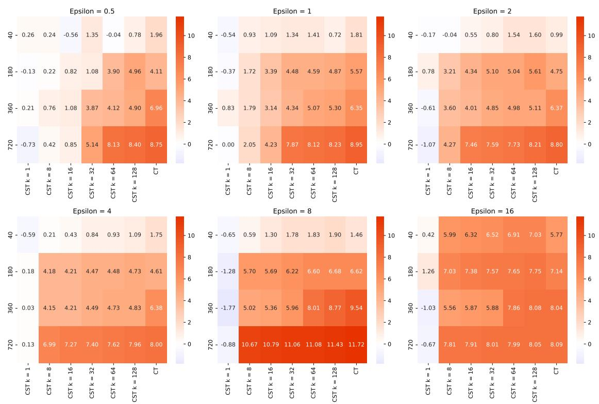  
Figure 7: Semantic similarity improvement over SanText (%); the higher, the better. CluSanT abbr. by CST and CusText by CT. Horizontal axis varies parameter k of CluSanT. Vertical axis varies the number of clusters. Same axes apply for the other heatmaps as well.

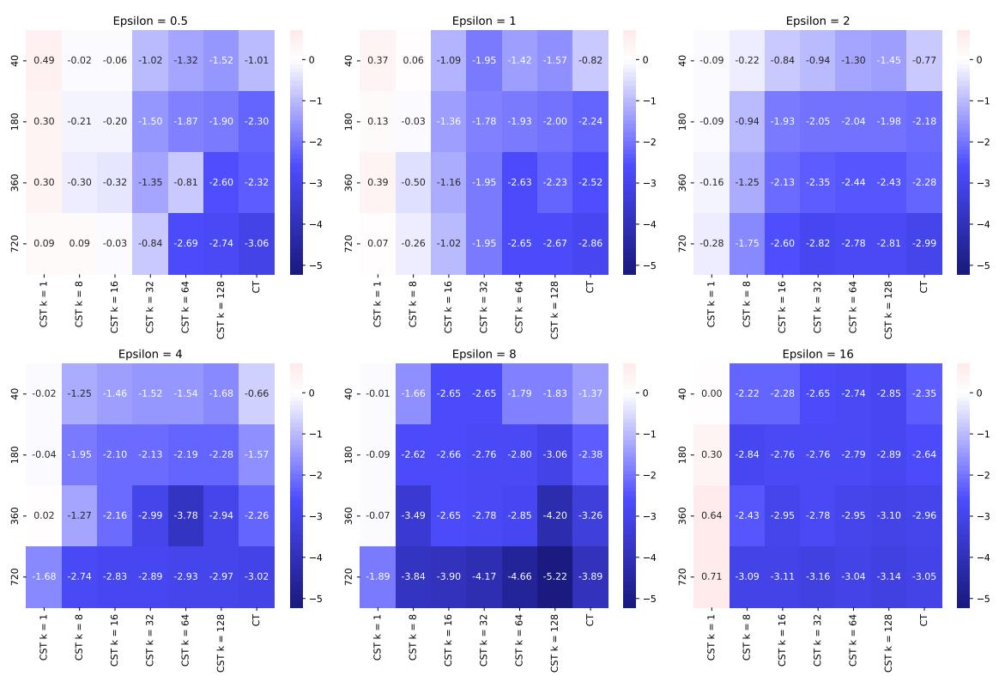  
Figure 8: Peplexity improvement over SanText (%); the lower, the better.

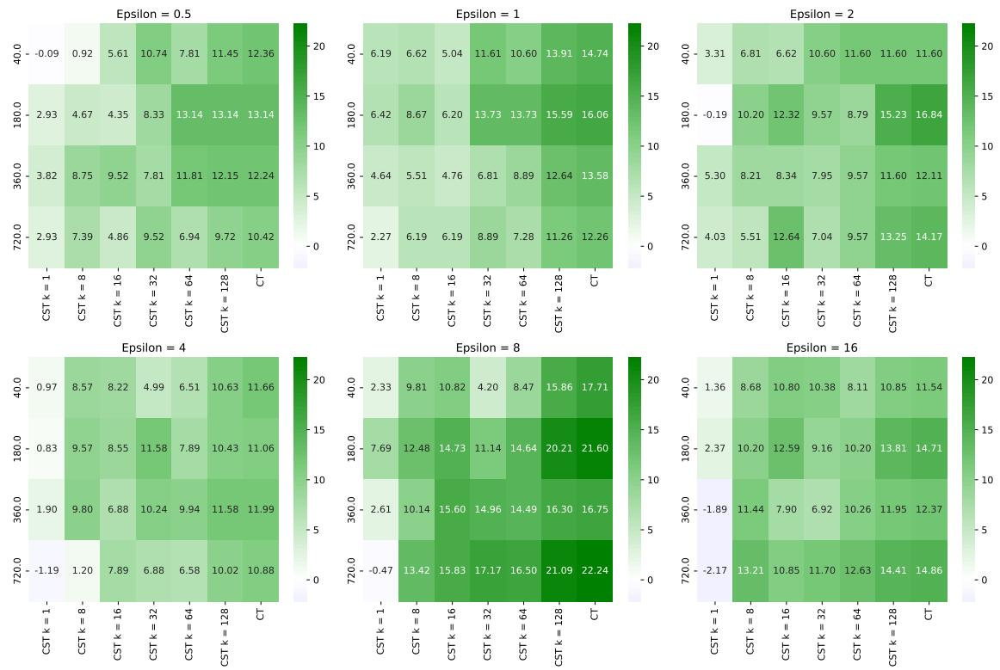  
Figure 9: Grammar improvement over SanText (%); the higher, the better.

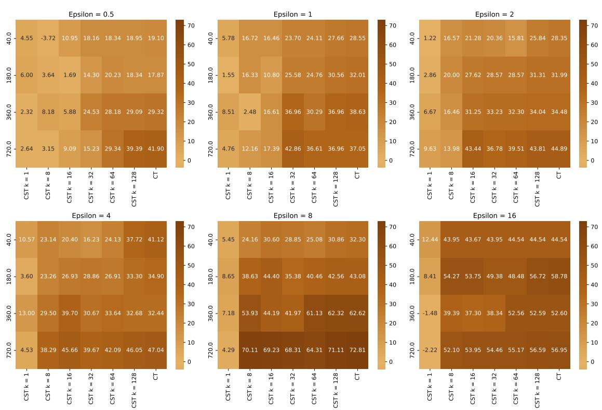  
Figure 10: Common Sense improvement over SanText (%); the higher, the better.

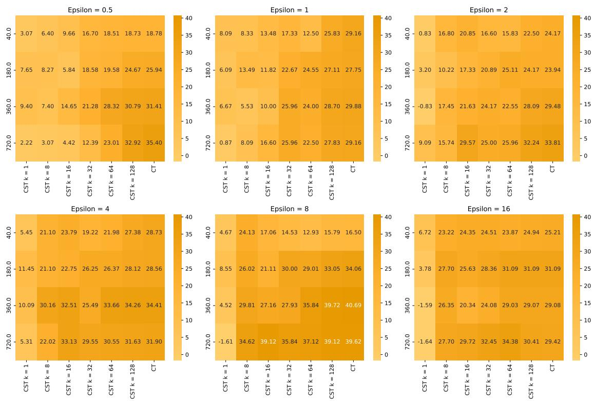  
Figure 11: Coherence improvement over SanText (%); the higher, the better.

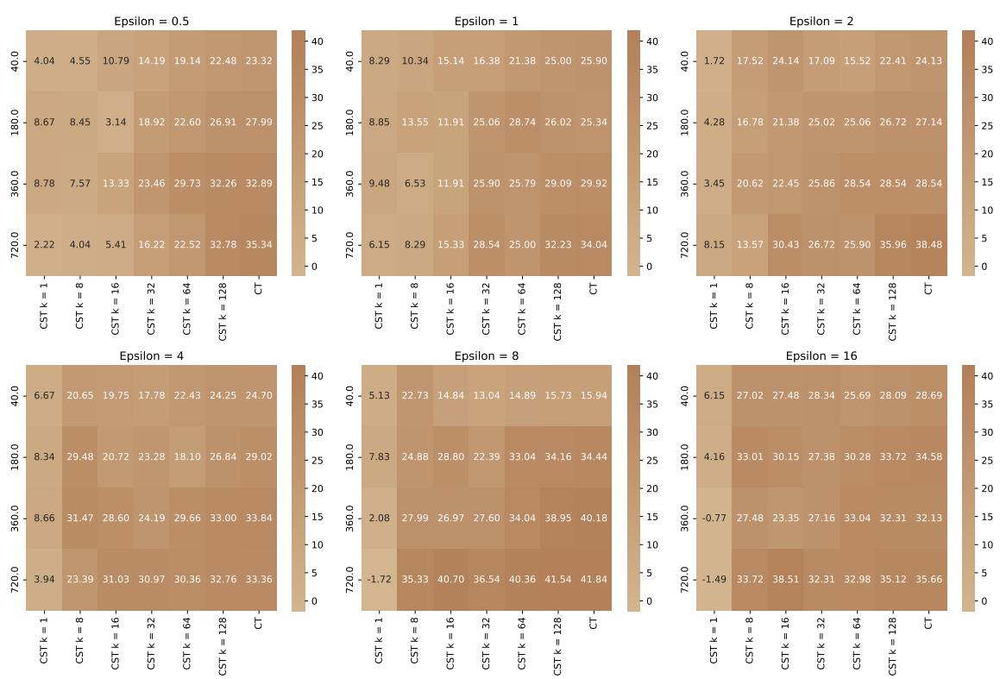  
Figure 12: Cohesiveness improvement over SanText (%); the higher, the better.

<table><tr><td>€</td><td>num clusters</td><td>Mechanism</td><td>k</td><td>Accuracy</td><td>Loss</td></tr><tr><td>N/A</td><td>N/A</td><td>Unsanitized</td><td>N/A</td><td>0.91954</td><td>0.263152</td></tr><tr><td>1</td><td>N/A</td><td>Santext</td><td>N/A</td><td>0.678161</td><td>1.467184</td></tr><tr><td>1</td><td>336</td><td>CluSanT</td><td>8</td><td>0.643678</td><td>1.762656</td></tr><tr><td>1</td><td>336</td><td>CluSanT</td><td>16</td><td>0.666667</td><td>1.544436</td></tr><tr><td>1</td><td>336</td><td>CluSanT</td><td>32</td><td>0.724138</td><td>1.129536</td></tr><tr><td>1</td><td>336</td><td>Custext</td><td>N/A</td><td>0.804598</td><td>0.828578</td></tr><tr><td>4</td><td>N/A</td><td>Santext</td><td>N/A</td><td>0.62069</td><td>1.799631</td></tr><tr><td>4</td><td>336</td><td>CluSanT</td><td>1</td><td>0.666667</td><td>1.569011</td></tr><tr><td>4</td><td>336</td><td>CluSanT</td><td>8</td><td>0.712644</td><td>1.466076</td></tr><tr><td>4</td><td>336</td><td>CluSanT</td><td>16</td><td>0.735632</td><td>1.144738</td></tr><tr><td>4</td><td>336</td><td>CluSanT</td><td>32</td><td>0.793103</td><td>1.056569</td></tr><tr><td>4</td><td>336</td><td>Custext</td><td>N/A</td><td>0.724138</td><td>1.346923</td></tr><tr><td>8</td><td>N/A</td><td>Santext</td><td>N/A</td><td>0.703561</td><td>1.394245</td></tr><tr><td>8</td><td>336</td><td>CluSanT</td><td>1</td><td>0.678161</td><td>1.420536</td></tr><tr><td>8</td><td>336</td><td>CluSanT</td><td>8</td><td>0.689655</td><td>1.5434</td></tr><tr><td>8</td><td>336</td><td>CluSanT</td><td>16</td><td>0.770115</td><td>0.993965</td></tr><tr><td>8</td><td>336</td><td>CluSanT</td><td>32</td><td>0.793103</td><td>0.860854</td></tr><tr><td>8</td><td>336</td><td>Custext</td><td>N/A</td><td>0.827586</td><td>0.760091</td></tr><tr><td>16</td><td>N/A</td><td>Santext</td><td>N/A</td><td>0.712644</td><td>1.474932</td></tr><tr><td>16</td><td>336</td><td>CluSanT</td><td>1</td><td>0.804598</td><td>1.168481</td></tr><tr><td>16</td><td>336</td><td>CluSanT</td><td>8</td><td>0.850575</td><td>0.564254</td></tr><tr><td>16</td><td>336</td><td>CluSanT</td><td>16</td><td>0.885057</td><td>0.463717</td></tr><tr><td>16</td><td>336</td><td>CluSanT</td><td>32</td><td>0.882357</td><td>0.463717</td></tr><tr><td>16</td><td>336</td><td>Custext</td><td>N/A</td><td>0.873563</td><td>0.486622</td></tr></table>

Table 1: SST2 Binary Classification for Text Sentiment Analysis (Socher et al.) on existing trained model when validation set is sanitized with various mechanisms.