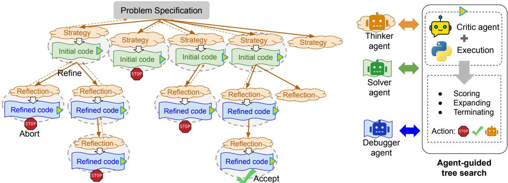
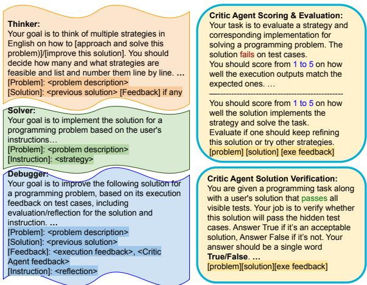
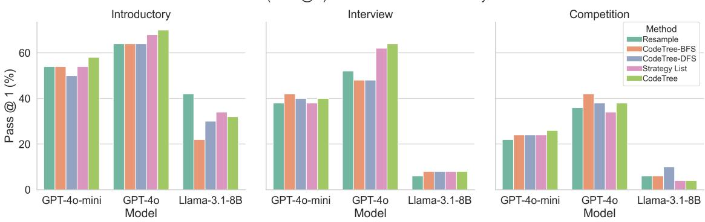
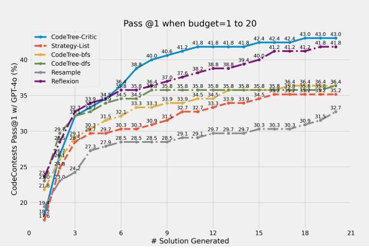
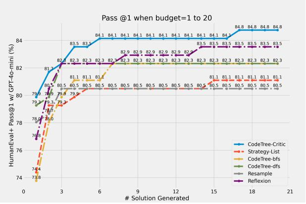
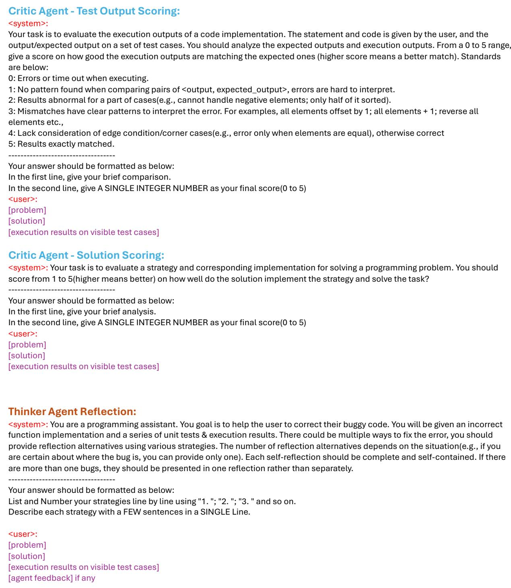

# CodeTree: Agent-guided Tree Search for Code Generation with Large Language Models

Jierui Li<sup>1</sup>\*, Hung Le<sup>2</sup>, Yingbo Zhou<sup>2</sup>, Caiming Xiong<sup>2</sup>, Silvio Savarese<sup>2</sup>, Doyen Sahoo<sup>2</sup>

<sup>1</sup>The University of Texas at Austin

<sup>2</sup>Salesforce Research

jierui@cs.utexas.edu, hungle@salesforce.com

## Abstract

Pre-trained on massive amounts of code and text data, large language models (LLMs) have demonstrated remarkable achievements in performing code generation tasks. With additional execution-based feedback, these models can act as agents with capabilities to self-refine and im prove generated code autonomously. However, on challenging coding tasks with extremely large search space, current agentic approaches still struggle with multi-stage planning, generating, and debugging. To address this problem, we propose CodeTree, a framework for LLM agents to efficiently explore the search space in different stages of the code generation process. Specifically, we adopted a unified tree structure to explicitly explore different coding strategies, generate corresponding coding solutions, and subsequently refine the solutions. In each stage, critical decision-making (ranking, termination, expanding) of the exploration process is guided by both the environmental executionbased feedback and LLM-agent-generated feedback. We comprehensively evaluated CodeTree on 7 code generation benchmarks and demonstrated the significant performance gains of CodeTree against strong baselines. Using GPT-4o as the base model, we consistently achieved top results of 95.1% on HumanEval, 98.7% on MBPP, and 43.0% on CodeContests. On the challenging SWEBench benchmark, our approach led to significant performance gains. We open-source our code on https://github. com/SalesforceAIResearch/CodeTree.

## 1 Introduction

Recently, we have witnessed significant impacts of large language models (LLMs) beyond the NLP domain such as in coding tasks (Achiam et al., 2023; Touvron et al., 2023a; Wang et al., 2023; Rozière et al., 2023). However, different from traditional NLP tasks, coding tasks require generated code to be fully executable and functionally correct i.e. containing no programmatic syntax errors and passing all possible test cases (Chen et al., 2021; Austin et al., 2021; Hendrycks et al., 2021). Given the extremely large search space in code, early methods propose to sample a very large number of generation outputs (for example, Li et al. (2022) generated up to 1 million samples per problem) to increase the chance of generating a correct code solution.

More recently, several approaches adopted a “vertical” strategy in which LLMs first generate one (or very few) generation output, and then iteratively refine this output multiple times, often conditioned by some forms of external feedback (Le et al., 2022; Chen et al., 2023b; Shinn et al., 2023). While these approaches are more cost-effective by focusing only on a small subset of the search space (i.e. starting from an initial output candidate), the performances of these approaches are bounded by the local optima of the chosen search space.

Related to our work, several methods for NLP reasoning tasks were introduced to control and enhance the generation procedure of LLMs. For example, Wang et al. (2022) proposed to enhance LLMs with chains of thought and statistically select the right solutions based on majority voting. Zhou et al. (2023) decomposed a task into smaller sub-tasks and addressed them by increasing the order of difficulty. Yao et al. (2024) proposed to improve LLMs by adopting a tree-based structure to explicitly simulate the exploration of thoughts in a tree. We are motivated by this line of research and proposed CodeTree, a new generation framework to effectively explore the search space of code generation tasks through a tree-based structure. An overview of CodeTree is given in Figure 1.

We define 3 standard agents, Thinker, Solver, and Debugger, to equip the strategy-planning, solution implementation, and solution improvement correspondingly, posing comprehensive roles needed for code generation. A CodeTree starts from the input problem as the tree root and subsequent nodes represent code solutions. At any node of the tree, one can either explore sibling nodes (other strategies from the same parent node) or its children (refinements of this node). Within Code-Tree, agents can interact with each other through a tree expansion guided by a Critic Agent, searching for the optimal code solution.

<table><tr><td>Approach</td><td>Explore</td><td>Exploit</td><td>Execution feedback</td><td>AI feedback</td><td>Multi- agent</td><td>Action</td></tr><tr><td>CodeRanker (Inala et al., 2022)</td><td>√</td><td></td><td></td><td></td><td></td><td></td></tr><tr><td>AlphaCode (Li et al., 2022), MBR-Exec (Shi et al., 2022), CodeT (Chen et al., 2023b)</td><td>√</td><td></td><td>√</td><td></td><td></td><td></td></tr><tr><td>LEVER (Ni et al., 2023), Coder-Reviewer (Zhang et al., 2023b)</td><td>√</td><td></td><td>√</td><td>√</td><td></td><td></td></tr><tr><td>Self-correct (Welleck et al., 2023), ILF (Chen et al., 2023a), Self-refine (Madaan et al., 2023)</td><td></td><td>√</td><td></td><td>√</td><td></td><td></td></tr><tr><td>CodeChain (Le et al., 2024)</td><td></td><td>√</td><td>√</td><td></td><td></td><td></td></tr><tr><td>Self-debug (Chen et al., 2023d), Self-repair (Olausson et al., 2023), Reflexion (Shinn et al., 2023)</td><td></td><td>√</td><td>√</td><td>√</td><td></td><td></td></tr><tr><td>CAMEL (Li et al., 2023a)</td><td></td><td></td><td></td><td>√</td><td>√</td><td></td></tr><tr><td>ChatDev (Qian et al., 2024), MetaGPT (Hong et al.,</td><td></td><td></td><td></td><td>√</td><td>√</td><td></td></tr><tr><td>2023), AgentVerse (Chen et al., 2023c) Self-collaboration (Dong et al., 2023), AgentCoder</td><td></td><td></td><td></td><td>√</td><td></td><td></td></tr><tr><td>(Huang et al., 2023) CodeTree (ours)</td><td>√</td><td>√</td><td></td><td>√</td><td>V</td><td>V</td></tr></table>

Table 1: We compare CodeTree with related methods in 6 aspects: (1) Explore which adopts a brute-force approach to independently generate a large number of code candidates; (2) Exploit which focuses on self-refinement using a small subset of output solutions; (3) Executionfeedback which uses code execution outcomes to improve code qualities; (4) AI feedback which enables synthetic feedback generated by LLMs to improve output code; (5) Multi-agent which adopts multiple LLM agents to play different roles in the code generation process; and (6) Action where LLM agents can take different actions and facilitate decision-making.

Rather than following heuristic rules or classic tree traversal methods, we use Critic Agent to selfevaluate the status of tree nodes at each tree expansion step by executing the following tasks:

• Node scoring: Evaluate the test case outputs of generated code and assess whether the tree nodes faithfully follow their corresponding coding strategies.

• Solution verification & evaluation: For a solution that passes visible test cases, verify if it should be further improved; for a solution that fails, evaluate if it is a promising direction to debug and refine the solution.

Based on the outputs of the above evaluation tasks, Critic Agent can take action to either refine, abort, or accept the current solution, which automatically expands or terminates the tree search. CodeTree is flexible and efficient, avoiding duplicated or redundant exploration of functionally similar or unfeasible solutions.

We comprehensively evaluated CodeTree on diverse code generation benchmarks from beginnerto competition-level coding tasks. Our results demonstrated the significant and consistent performance gains of CodeTree against strong baselines. Using GPT-4o as the base models, we achieved the top results on HumanEval+, MBPP+ (Liu et al., 2023), and CodeContests (Li et al., 2022) respectively. On the challenging SWEBench benchmark, our approach led to significant performance gains. We also conducted comprehensive ablation and qualitative analysis to derive the best practices and any limitations of the current method.

## 2 Related Work

Our work is broadly related to the research of large language models (LLMs) (Chowdhery et al., 2022; Achiam et al., 2023; Touvron et al., 2023a). Rozière et al. (2023); Li et al. (2023b); Wang et al. (2023); Chen et al. (2021) extended this line of research by allowing LLMs to learn from large-scale code-related data such as open-sourced Github repositories and code commits. Treating code generation as an autoregressive generation tasks, LLMs can generate code that correctly follow programming syntactic rules and are functionally correct (Chen et al., 2021; Gunasekar et al., 2023; Nijkamp et al., 2023). Early approaches (Chen et al., 2021; Austin et al., 2021; Hendrycks et al., 2021) adopted a brute-force principle by independently generating a very large number of output code candidates, so one of which might be the optimal code solution. Subsequently, Li et al. (2022);

Chen et al. (2023b); Ni et al. (2023) proposed to utilize unit test outcomes to filter for more prospective generated code samples.

Also related to our work is the studies of selfrefinement capabilities of LLMs. These studies leverage the inherent ability of LLM to perceive arbitrary natural language contexts, including information such as environmental feedback, to iteratively fix problematic code and improve its correctness. For example, Zhang et al. (2023a) utilized test outcomes as a form of feedback while Welleck et al. (2023); Le et al. (2022) introduced LLM-generated feedback from predicted probabilities about code correctness. Shinn et al. (2023); Chen et al. (2023d); Madaan et al. (2023) focused on more natural forms of feedback such as reflections and explanations of the code. Le et al. (2024) proposed to cluster sub-module representations of code as a form of collective feedback.

More related to our work is the research for enhancing and controlling the generation procedure of LLMs. Yao et al. (2024); Koh et al. (2024) simulated the step-by-step exploration of thoughts as a tree search to support NLP and multimodal tasks respectively. In the code domain, Song et al. (2024) used tree search to guide the debugging of generated code. Islam et al. (2024) adopted multi-agent system to support different stages of code generation but the exploration is not explicitly defined. Chen et al. (2024) introduced a tree structure to explore sub-functions in generated code. Different from prior approaches, we introduce a tree-based structure as a unified search space for LLM agents to efficiently perform exploration throughout different stages of code generation. See Table 1 for a more systematic comparison with related methods.

## 3 Method

To apply LLMs to code generation, we can define this task as a sequence-to-sequence task. The input sequence consists of a problem description $D ,$ usually in the form of a function docstring (including expected input and output) or the textual explanation of the problem. The output is a corresponding code solution, flattened into a sequence of tokens $\hat { W } = ( \hat { w } _ { 1 } , . . . , \hat { w } _ { T } )$ with $\hat { w } _ { t } \in \mathcal { V }$ . Generated codes are evaluated against hidden test cases to check the functional correctness (Hendrycks et al., 2021; Chen et al., 2021; Li et al., 2022). The test cases are a set of input-output pairs $\{ ( i _ { j } , o _ { j } ) \}$ = $\{ ( i _ { j } , o _ { j } ) _ { v } \} \cup \{ ( i _ { j } , o _ { j } ) _ { h } \}$ . Visible test cases are denoted as $\{ ( i _ { j } , o _ { j } ) _ { v } \}$ while hidden test cases are denoted as $\left\{ ( i _ { j } , o _ { j } ) _ { h } \right\}$ . An output code $\hat { W }$ is correct when $\hat { W } ( i _ { j } ) = o _ { j } \ \forall j$

Please refer to Figure 1 for an overview of our method and Figure 2 for a simplified version of instruction prompts to our LLM agents.

## 3.1 Coding Task-Specific Agents

We first introduce three unit LLM agents, specifically targeting different parts of the code generation process, including strategy thinking, code implementation, and code debugging.

Strategy Generation with Thinker Agent Conventional approaches such as (Chen et al., 2021; Austin et al., 2021; Hendrycks et al., 2021) directly generate output code candidates given a problem description. However, these approaches do not fully exploit the advantage of LLMs in generating more expressive outputs in text. Wei et al. (2022) showed that allowing LLMs to generate natural language step-by-step thoughts can lead to significant performance gains in downstream NLP tasks. Following the setting in Yao et al. (2024), requesting LLMs to generate a list of different natural language thoughts can enhance the diversity of solutions. We propose to adapt this technique to allow an LLM $\theta _ { T }$ (denoted as “Thinker” agent) to sequentially generate a set of high-level strategies given an input coding problem. Each strategy $\hat { S } _ { i }$ is generated autoregressively given previously generated strategies following:

$$
\hat { S } _ { i } \sim p _ { \theta _ { T } } ( . | \hat { S } _ { 1 : i - 1 } , D )\tag{1}
$$

By allowing models to first generate coding strategies, we enable LLMs to tackle coding problems using their reasoning capabilities learned from the text domain. The expressiveness of generated strategies in a natural language can potentially guide the code-generation process toward more diverse exploration paths. Notably, we let Thinker Agent dynamically decide the number of generated coding strategies, given the fact that different coding problems can have more or fewer feasible strategies.

Solution Generation with Solver Agent Given a complete generated strategy $\hat { S } _ { i }$ , we let an LLM $\theta _ { S }$ (denoted as “Solver” agent) generate a set of initial code solutions. Since LLMs are often fine-tuned to follow arbitrary instructions in natural language, these models can understand novel unseen tasks during test time (Ouyang et al., 2022; Touvron et al., 2023b; Wang et al., 2023). Therefore, by including the strategy as part of the input instruction, we can condition Solver Agent to produce strategy-specific code candidates. For each candidate, the generation objective is defined as:

  
Figure 1: CodeTree creates a unified search space for exploration throughout the multi-stage code generation process: strategy generation by a “Thinker” agent, initial code generation by $\mathrm { { \bar { a } } { \bar { \ s o l v e r } } ^ { \prime \ } }$ agent, and code improvement by a “Debugger” agent. To effectively perform exploration within the tree structure, we incorporate both environmental execution-based feedback as well as AI-generated feedback (generated by a “Critic” LLM agent).

  
Figure 2: Simplified versions of instruction prompts used for Thinker, Solver, Debugger, and Critic agents. Some details are omited for illustration purposes.

$$
\hat { W } _ { i } \sim p \_ { \theta _ { S } } ( \hat { S } _ { i } , D )\tag{2}
$$

Solution Refining with Thinker & Debugger Agents Prior approaches such as (Chen et al., 2023a,d; Shinn et al., 2023; Madaan et al., 2023) found that syntactic mistakes or even logical flaws in generated code can be fixed by allowing LLMs to iteratively refine and regenerate the code. This self-refinement capability is typically strengthened by some forms of feedback about the code qualities (e.g. execution results, compiler signals):

$$
F _ { e x e , i } = \hat { W _ { i } } ( \{ ( i _ { j } , o _ { j } ) _ { v } \} )\tag{3}
$$

$$
F _ { c r i , i } = \theta _ { C } ( \hat { W } _ { i } , \hat { S } _ { i } , F _ { e x e , i } , D )\tag{4}
$$

where $\theta _ { C }$ is Critic Agent. Denoting the collective feedback as $F _ { i } = \{ F _ { e x e , i } , F _ { c r i , i } \}$ , a set of reflections $R _ { i }$ about the code candidates are generated by Thinker Agent.

$$
\hat { R } _ { i , j } \sim p _ { \theta _ { T } } ( . | \hat { R } _ { i , 1 : j - 1 } , F _ { i } , \hat { W } _ { i } , \hat { S } _ { i } , D )\tag{5}
$$

$$
\hat { W } _ { i , j } \sim p _ { \theta _ { D } } ( . | \hat { R } _ { i , j } , F _ { i } , \hat { W } _ { i } , \hat { S } _ { i } , D )\tag{6}
$$

$\hat { R } _ { i , j }$ denotes the jth reflection that “Thinker” generates for $\hat { W } _ { i }$ . An LLM $\theta _ { D }$ (“Debugger” Agent) will modify $\hat { W _ { i } }$ , referring this reflection, generating a new program correspondingly.

## 3.2 Tree Expanding with Critic Agent

CodeTree builds a heterogeneous tree for each problem, where the tree root represents a problem specification $( D , \{ ( i _ { j } , o _ { j } ) \} )$ ) and every subsequent tree node represents a generated code solution ${ \hat { W } } _ { i }$ Each node has relevant attributes including its collective code feedback $F _ { i }$ and its corresponding strategy and reflections: $S _ { i }$ and $R _ { i }$ . Typically, adding a tree node is a two-step process: 1) generate a code solution from the corresponding strategy (Eq. 2 or Eq. 6), 2) evaluate the generated solution $\hat { W _ { i } }$ and obtain environmental feedback (Eq. 4).

Unlike previous tree-structure search methods (Yao et al., 2024; Islam et al., 2024), we do not construct the entire tree in the beginning. Instead, we introduce a Critic Agent to dynamically expand the tree based on potential strategies. It will guide the expansion and spanning of the tree, taking actions based on its evaluation of the current node.

Node Scoring and Evaluation For a given solution and corresponding $F _ { e x e } ,$ Critic Agent performs an evaluation, measuring how promising it is through equation $^ { 4 , }$ which results in $F _ { c r i }$ . We separately evaluate how well: 1) the execution outputs of test cases match expected outputs on visible test cases; and 2) the solution robustly implements its corresponding strategy towards problem-solving. For one program $\hat { W _ { i } }$ and its corresponding feedback $F _ { i }$ , the Critic Agent will evaluate whether the current solution is worth refining, or it should not be explored, making decision between refinement and abort. The critic score is calculated following the equation:

$$
\mathrm { S c o r e } ( \hat { W } _ { i } ) = \mathrm { S c o r e } ( F _ { e x e , i } ) + \mathrm { S c o r e } ( F _ { c r i , i } )\tag{7}
$$

Solution Verification For one $\hat { W _ { i } }$ that passes all visible test cases, it might potentially over-fit the visible test cases and could fail hidden test cases. Hence, the critic agent $\theta _ { C }$ will verify if this solution is robust and generalizable to unseen test cases.

Decision-Making by Critic Agent Starting from the initial $S _ { i } , W _ { i } , F _ { i }$ , Critic Agent guides the search for a correct solution. At each node, it has an action space of three actions: Refine: Continue exploring from the current node by generating multiple reflections for this node; Abort: Prune this node due to its low evaluation score, and retrace the exploration to its sibling nodes; and Accept: Accept the current node as the final solution and terminate the search early.

## 3.3 Multi-agent Collaboration

Throughout the expansion of the tree, the taskspecific agents collaborate with Critic Agent, utilizing its feedback, and follow its guidance to perform exploration. The flexibility of the tree expansion and search is determined by LLM agents’ decisionmaking, e.g. determining the number of strategies and deciding the search path. During inference time, practically, we limit the number of exploration steps to avoid large computation overhead. Whenever a termination signal (i.e. to accept a code solution) is found or the maximum number of exploration steps is reached, a code candidate is selected based on its evaluation score Score $( \hat { W _ { i } } )$ Please refer to Appendix A for all example instruction prompts of our LLM agents.

## 4 Experiments

## 4.1 Experimental Setup

We applied pass@1(Chen et al., 2021) as our evaluation metric: only one code candidate can be selected and submitted for the final evaluation with hidden test cases. We set the generation budget to be 20 samples per coding task. To fairly compare our approach with other baselines, we adopted the same generation budget in all methods. For ablation experiments without using Critic Agent, we followed similar strategies from (Shinn et al., 2023; Chen et al., 2023d): we select a solution which passes all visible test cases as the final solution to be evaluated with hidden test cases.

Benchmarks We conducted experiments on 2 categories of code generation tasks: 1) Function implementation where a coding task is to complete a single function following a specific function signature: HumanEval (Chen et al., 2021), MBPP (Austin et al., 2021), and their EvalPlus variants from (Liu et al., 2023), denoted as HumanEval+ and MBPP+; and 2) Program implementation where a coding task is to solve an algorithmic problem: CodeContests (Li et al., 2022) and APPS (Hendrycks et al., 2021). The sizes of test set are 164, 378 and 165 for HumanEval(+), MBPP(+) and CodeContests respectively. For APPS, we randomly sampled 150 samples (50 for each level of difficulty) from the test split.

Baselines We introduce the following baselines: Direct instructs the model to generate code directly from the input problem; CoT (Wei et al., 2022) instructs the model to provide chain-of-thought reasoning before giving the solution program; Reflexion (Shinn et al., 2023) utilizes solution’s execution feedback to generate self-reflections. The reflections are used to iteratively refine the solution; MapCoder (Islam et al., 2024) proposes an agent collaboration system to plan, solve, test, and refine the solution. We set #plans=4, #debug-round=5 and generation budget=20; and Resample follows a similar principle as Li et al. (2022): resample solutions repeatedly and filter them with visible test cases.<sup>1</sup>

Models We studied our method on three models with different model sizes and capacities. We experimented on large language models from the GPT and Llama 3.1 family. Specifically we use GPT-4o-mini, GPT-4o<sup>2</sup>, and Llama-3.1-8B <sup>3</sup>.

<table><tr><td>Model</td><td>Method</td><td>HumanEval</td><td>HumanE+</td><td>MBPP</td><td>MBPP+</td><td>Codecontests</td><td>Avg.</td></tr><tr><td rowspan="7">GPT-4o-mini</td><td>Direct</td><td>86.6%</td><td>78.7%</td><td>87.8%</td><td>73.3%</td><td>10.3%</td><td>67.3%</td></tr><tr><td>CoT</td><td>84.8%</td><td>78.0%</td><td>89.2%</td><td>74.3%</td><td>12.7%</td><td>67.8%</td></tr><tr><td>Reflexion</td><td>92.1%</td><td>83.5%</td><td>96.6%</td><td>78.6%</td><td>21.8%</td><td>74.5%</td></tr><tr><td>MapCoder</td><td>91.5%</td><td>78.0%</td><td>90.0%</td><td></td><td></td><td></td></tr><tr><td>Resample</td><td>89.0%</td><td>80.5%</td><td>94.3%</td><td>76.8%</td><td>18.2%</td><td>71.8%</td></tr><tr><td>CodeTree-BFS</td><td>93.3%</td><td>82.1%</td><td>91.5%</td><td>72.3%</td><td>20.6%</td><td>72.0%</td></tr><tr><td>CodeTree-DFS</td><td>92.7%</td><td>81.1%</td><td>87.6%</td><td>71.4%</td><td>20.6%</td><td>70.7%</td></tr><tr><td rowspan="8"></td><td>Strategy List</td><td>90.2%</td><td>80.5%</td><td>90.5%</td><td>69.6%</td><td>22.4%</td><td>70.6%</td></tr><tr><td>CodeTree</td><td>94.5%</td><td>84.8%</td><td>96.8%</td><td>77.0%</td><td>26.4%</td><td>75.9%</td></tr><tr><td>Direct</td><td>88.4%</td><td>81.7%</td><td>92.3%</td><td>75.9%</td><td>20.6%</td><td>71.8%</td></tr><tr><td>CoT</td><td>92.1%</td><td>84.1%</td><td>93.7%</td><td>77.2%</td><td>24.8%</td><td>74.4%</td></tr><tr><td>Reflexion</td><td>94.5%</td><td>84.8%</td><td>97.9%</td><td>79.6%</td><td>41.8%</td><td>79.7%</td></tr><tr><td>MapCoder</td><td>92.7%</td><td>81.7%</td><td>90.9%</td><td></td><td></td><td></td></tr><tr><td>Resample</td><td>93.9%</td><td>84.8%</td><td>96.2%</td><td>77.0%</td><td>32.7%</td><td>76.9%</td></tr><tr><td>CodeTree-BFS</td><td>94.5%</td><td>84.1%</td><td>93.9%</td><td>70.7%</td><td>35.8%</td><td>75.8%</td></tr><tr><td>CodeTree-DFS</td><td>95.1%</td><td>83.5%</td><td>91.5%</td><td>76.2%</td><td>36.4%</td><td>76.5%</td></tr><tr><td>Strategy List</td><td>95.1%</td><td>82.3%</td><td>92.6%</td><td>73.3%</td><td>36.4%</td><td>75.9%</td></tr><tr><td>CodeTree</td><td>94.5%</td><td>86.0%</td><td>98.7%</td><td>80.7%</td><td>43.0%</td><td>80.6%</td></tr><tr><td>Direct</td><td>63.4%</td><td></td><td></td><td></td><td></td><td></td></tr><tr><td rowspan="6">Llama-3.1-8B</td><td>CoT</td><td>65.9%</td><td>54.3% 56.1%</td><td>73.4% 74.6%</td><td>63.8% 65.3%</td><td>6.1% 4.2%</td><td>52.2% 53.2%</td></tr><tr><td>Reflexion</td><td>79.9%</td><td>69.5%</td><td>90.2%</td><td>72.0%</td><td>13.5%</td><td>65.0%</td></tr><tr><td>Resample</td><td>82.3%</td><td>71.3%</td><td>91.0%</td><td>73.8%</td><td>15.2%</td><td>66.7%</td></tr><tr><td>CodeTree-BFS</td><td>80.5%</td><td>68.3%</td><td>91.0%</td><td>69.3%</td><td>15.8%</td><td></td></tr><tr><td>CodeTree-DFS</td><td>80.5%</td><td>68.9%</td><td>89.7%</td><td>70.4%</td><td>15.2%</td><td>65.0% 64.9%</td></tr><tr><td>Strategy List CodeTree</td><td>82.3% 82.3%</td><td>70.1% 72.0%</td><td>91.0% 90.5%</td><td>72.5% 73.3%</td><td>13.9% 12.1%</td><td>66.0% 66.0%</td></tr></table>

Table 2: Experimental results by pass@1 on HumanEval, MBPP, EvalPlus, and CodeContests: methods are baseline methods that generate program solution only once, are methods with solution generation budget of 20 samples like our methods. are CodeTree variants with or without Critic Agent to guide the tree search. Note that MapCoder does not work with Llama-3.1-8B as noted by Islam et al. (2024).

## 4.2 Main Results

We compared CodeTree with other baselines in Table 2. We noticed that Reflexion and Resampling serve as strong baselines for HumanEval and MBPP datasets given the same solution generation budget, comparable to CodeTree-BFS/DFS. CodeTree with Critic Agent outperforms all other baselines in 4 out of 5 benchmarks for GPT-4omini and GPT-4o. For instance, CodeTree achieves pass@1=43.0% on competition-level coding tasks in the Codecontests benchmark (i.e. 22.4% performance gain over the Resampling baseline), showing its advantage in solving hard problems.

We found that CodeTree-BFS almost always performs better than CodeTree-DFS, suggesting that exploring diverse strategies is more effective than iteratively refining from one solution. Interestingly, on Llama-3.1-8B model, Resampling achieves the best results on 4 benchmarks. This observation indicates that small language models may not be suitable for multi-agent frameworks like CodeTree, where models are required to follow task-specific roles and instructions and perform distinct tasks with reasonable accuracy.

## 4.3 Analysis of Search Strategies

Given the performance gaps between CodeTree-BFS and DFS, we conducted additional experiments to analyze these tree search strategies without Critic Agent. We reported the results on HumanEval/HumanEval+ with GPT-4o-mini and Codecontests with GPT-4o in Table 3. Compared to DFS/BFS strategies with d = 3 and w = 3, we observed that forcing the model to search wider (i.e. more diverse strategies with w > 3) in BFS and only debug up to 1 iteration (i.e. d = 2) improved the performance of pass@1. However, for DFS, prioritizing deeper search (i.e. larger number of iterations for refinement with d > 3) does not boost the performance significantly. Finally, we noted that w = 4 works better for HumanEval and w = 5 works better for CodeContests, indicating that more complex problems can benefit from exploring a larger number of coding strategies. This finding supports our proposed CodeTree in which Critic Agent can dynamically determine the number of child nodes to explore given the context.

  
Figure 3: Results of pass@1 on the APPS test subsets. We randomly select 50 samples from Introductory, Interview, and Competition separately. We apply Resample and our methods with GPT-4o, GPT-4o-mini, Llama-3.1-8B.

<table><tr><td>Model</td><td colspan="2">GPT-4o-mini</td><td>GPT-40</td></tr><tr><td>Benchmark</td><td>HumanEval</td><td>HumanEval+</td><td>CodeContests</td></tr><tr><td>CodeTree-BFS</td><td></td><td></td><td></td></tr><tr><td>d = 3, w = 3</td><td>93.3%</td><td>82.3%</td><td>36.4%</td></tr><tr><td>d = 2, w = 4</td><td>95.1%</td><td>84.1%</td><td>37.6%</td></tr><tr><td>d = 2, w = 5</td><td>94.5%</td><td>83.4%</td><td>39.4%</td></tr><tr><td>CodeTree-DFS</td><td></td><td></td><td></td></tr><tr><td>d = 3, w = 3</td><td>92.7%</td><td>81.1%</td><td>36.4%</td></tr><tr><td>d = 4, w = 2</td><td>92.1%</td><td>81.1%</td><td>37.0%</td></tr><tr><td>d = 5, w = 2</td><td>92.1%</td><td>81.7%</td><td>36.4%</td></tr></table>

Table 3: Pass@1 results of CodeTree-BFS/DFS on HumanEval, HumanEval+, and CodeContests: d indicates max search depth while b indicates max search width.

## 4.4 Analysis by Problem Difficulty

We further evaluated CodeTree against coding problems with diverse difficulty levels. We randomly sampled 50 problems from each level of difficulty (“introductory”, “interview”, and “competition”) from the test split of the APPS benchmark, creating a total test set of 150 problems. We reported the results in Figure 3.

The results demonstrate that CodeTree performs better for simpler problems (Introductory for GPT-4o-mini; Introductory and Interview for GPT-4o), but still struggles to solve very hard problems (e.g.,

<table><tr><td rowspan="2">Model Benchmark</td><td colspan="2">GPT-4o-mini</td></tr><tr><td>HumanEval</td><td>HumanEval+</td></tr><tr><td>CodeTree</td><td>94.5%</td><td>84.8%</td></tr><tr><td>w/o verification</td><td>91.5%</td><td>81.7%</td></tr><tr><td>w/o node abort</td><td>91.5%</td><td>81.1%</td></tr><tr><td>w/o scoring</td><td>92.7%</td><td>82.1%</td></tr></table>

Table 4: Ablation study for different tasks of Critic Agent. We used GPT-4o-mini to evaluate corresponding settings and reported the pass@1 on the HumanEval and HumanEval+ benchmarks.

Competition-level). We hypothesized that while CodeTree improves the search efficiency towards the correct solution, a generation budget= 20 is still limited for highly complex problems.

## 4.5 Ablation Study

Results in Table 2 indicate, Critic Agent plays a crucial role in CodeTree over naive search methods like BFS/DFS. We further analyzed which task in Section 3.2 is the most crucial for Critic Agent. Specifically, we conducted the following ablation experiments: (1) w/o Solution Verification, where we excluded the verification task for any solution passing visible tests; (2) w/o Node Abort Evaluation, where we let the agents keep exploring till we reach the max depth or whenever a solution is accepted; (3) w/o Node Scoring, where the environmental feedback is solely execution outputs, without Critic Agent’s evaluation.

The results in Table 4 show that all proposed tasks are crucial for Critic Agent to guide the tree expanding and solution search. Among these tasks, node abort and solution verification tasks are the most effective and have significant impacts on final performances. We include a qualitative study on a real example in Appendix A.

  
(a) Performance on CodeContests with GPT-4o

  
(b) Performance on HumanEval+ with GPT-4o-mini  
Figure 4: Cumulative pass@1 curves while new solutions are generated within budget= 20.

## 4.6 Search Efficiency

While the performance of CodeTree is very strong with a generation budget of 20 samples, it is important to understand how our tree search strategy are more efficient than other related methods. Specifically, we conducted experiments when limiting the solution generation budget between 1 to 20 samples. In Figure 4, we plot the pass@1 curves w.r.t the number of sampled solutions: (a) shows results on CodeContests with GPT-4o; (b) shows results on HumanEval+ with GPT-4o-mini. In both figures, not only does our proposed CodeTree perform better than other methods, but also achieves a relatively high pass@1 even when the generation budget is small $\mathrm { ( e . g . ~ \textless ~ 9 ~ }$ samples). On Code-Contests, even when CodeTree starts with a lower performance with limited generation budgets (i.e. < 5 samples), its performance soon improves significantly during later exploration of the tree. This observation shows that CodeTree has the potential to continue solving more problems given larger solution generation budgets.

<table><tr><td>Model</td><td>MBPP+</td><td>HumanEval+</td><td>Codecontests</td></tr><tr><td>Resample</td><td>77.0% (0.3k)</td><td>84.8%(0.4k)</td><td>41.2%(2.4k)</td></tr><tr><td>Reflexion</td><td>79.6% (0.5k)</td><td>85.4% (0.7k)</td><td>46.1% (6.0k)</td></tr><tr><td>CodeTree</td><td>82.8% (0.7k)</td><td>89.6% (0.9k)</td><td>49.1% (4.8k)</td></tr><tr><td>01-preview</td><td>80.2% (1.0k)</td><td>89.0% (1.0k)</td><td>46.6% (7.1k)</td></tr></table>

Table 5: Efficiency Comparison: Resample, Reflexion and CodeTree performances when budget=30 w/GPT-4o. % denotes pass@1 while () denotes average inference tokens (thousands) generated per problem.

To better demonstrate the efficiency of our method, we carried out experiments with a large budget = 30, and compare the cost, token usage against state of the art reasoning model: openai’s o1-preview model<sup>4</sup>. In Table 5, given the budget of 30, the flexibility of CodeTree can avoid redundant search when solving simpler problems while exhaustively exploring strategies for harder problems. CodeTree is able to outperform O1-preview with fewer tokens and less cost, showing its efficiency in solution search for programming problems.

## 4.7 Results on SWEBench

Recently, Jimenez et al. (2024) introduced a novel coding task for generating code patches given an input Github repository and the corresponding pull request. We attempted to adapt CodeTree to this benchmark by making two major changes: first, we replaced the problem specification with the textual description of input pull request; secondly, we adapted the strategy generation stage as the retrieval stage where we instructed the Thinker agent to explore relevant code contexts (by code files, methods, or lines of code) from the input Github repository. We extended the implementation of the retrieval and code patch generation stages from Xia et al. (2024) and integrated our CodeTree framework for the exploration of different trajectories (from context retrieval to code patch generation and ranking). From Table 6, we observed that CodeTree can lead to significant performance gains as compared to related approaches like CoT (Wei et al., 2022) and Reflexion (Shinn et al., 2023). The results also demonstrate the versatility of our method on complex coding tasks like repo-level code generation which often requires extremely large search space to find an optimal solution.

<table><tr><td>Approach</td><td>% Resolved</td></tr><tr><td>(Xia et al., 2024)</td><td>24.2%</td></tr><tr><td>(Xia et al., 2024) + CoT</td><td>23.6%</td></tr><tr><td>(Xia et al., 2024) + Reflexion</td><td>25.3%</td></tr><tr><td>(Xia et al., 2024) + CodeTree</td><td>27.6%</td></tr></table>

Table 6: Results on the SWEBench benchmark: All methods using GPT4o-mini as the base model. Compared to CoT and Reflexion, CodeTree can lead to more significant performance gain.

## 5 Conclusion

We introduce CodeTree, a new framework of agentguided tree search for code generation tasks. Introducing a tree-based structure as a unified search space, CodeTree includes a Critic agent to guide the tree search and make critical decisions such as termination, expanding and scoring of tree nodes. CodeTree facilitates multi-agent collaboration (among Thinker, Solver, and Debugger agents) to find the correct solution within a limited solution generation budget. In our comprehensive experiments, CodeTree exhibits consistent and strong performance against many baselines across diverse code generation benchmarks.

## 6 Limitations

The main limitation of this work is the requirement for LLMs with strong reasoning and instructionfollowing capabilities. Empirically, we found that smaller models such as those with 8B parameters struggle at following complex instructions to play different agentic roles. For instance, to play the role of the Critic agent, smaller models may generate unexpected output for some tasks like node scoring or self-reflection, resulting in misleading or noisy feedback to guide other LLM agents. In addition, incorporating agent-generated guidance will incur additional cost as it requires LLMs to extract information from long code context and generating more output tokens. Finally, this work focuses on the functionality correctness of code generation tasks while ignoring other qualities of generated code such as its readability or efficiency. To improve these qualities of output code, CodeTree can be further enhanced to incorporate more holistic LLM-generated feedback and perform diverse exploration to find optimal code solutions.

## 7 Ethical Considerations

The primary ethical concern of this paper is that directly executing the pipeline may pose a risk of information leakage or compromise the security of one’s system.

• Directly passing the execution error information to commercial large language models might cause the leak of private information like the execution paths, username and package versions in the environment.

• Running AI-generated programs locally might put one’s system and data at risk.

We will address the above issues by adding implementation of virtual environment for code execution by the time we publish our codebase.

## References

Josh Achiam, Steven Adler, Sandhini Agarwal, Lama Ahmad, Ilge Akkaya, Florencia Leoni Aleman, Diogo Almeida, Janko Altenschmidt, Sam Altman, Shyamal Anadkat, et al. 2023. Gpt-4 technical report. arXiv preprint arXiv:2303.08774.

Jacob Austin, Augustus Odena, Maxwell Nye, Maarten Bosma, Henryk Michalewski, David Dohan, Ellen Jiang, Carrie Cai, Michael Terry, Quoc Le, et al. 2021. Program synthesis with large language models. arXiv preprint arXiv:2108.07732.

Angelica Chen, Jérémy Scheurer, Tomasz Korbak, Jon Ander Campos, Jun Shern Chan, Samuel R Bowman, Kyunghyun Cho, and Ethan Perez. 2023a. Improving code generation by training with natural language feedback. arXiv preprint arXiv:2303.16749.

Bei Chen, Fengji Zhang, Anh Nguyen, Daoguang Zan, Zeqi Lin, Jian-Guang Lou, and Weizhu Chen. 2023b. Codet: Code generation with generated tests. In The Eleventh International Conference on Learning Representations.

Jingchang Chen, Hongxuan Tang, Zheng Chu, Qianglong Chen, Zekun Wang, Ming Liu, and Bing Qin. 2024. Divide-and-conquer meets consensus: Unleashing the power of functions in code generation. arXiv preprint arXiv:2405.20092.

Mark Chen, Jerry Tworek, Heewoo Jun, Qiming Yuan, Henrique Ponde de Oliveira Pinto, Jared Kaplan, Harri Edwards, Yuri Burda, Nicholas Joseph, Greg Brockman, et al. 2021. Evaluating large language models trained on code. arXiv preprint arXiv:2107.03374.

Weize Chen, Yusheng Su, Jingwei Zuo, Cheng Yang, Chenfei Yuan, Chi-Min Chan, Heyang Yu, Yaxi Lu, Yi-Hsin Hung, Chen Qian, et al. 2023c. Agentverse: Facilitating multi-agent collaboration and exploring emergent behaviors. In The Twelfth International Conference on Learning Representations.

Xinyun Chen, Maxwell Lin, Nathanael Schärli, and Denny Zhou. 2023d. Teaching large language models to self-debug. arXiv preprint arXiv:2304.05128.

Aakanksha Chowdhery, Sharan Narang, Jacob Devlin, Maarten Bosma, Gaurav Mishra, Adam Roberts, Paul Barham, Hyung Won Chung, Charles Sutton, Sebastian Gehrmann, Parker Schuh, Kensen Shi, Sasha Tsvyashchenko, Joshua Maynez, Abhishek Rao, Parker Barnes, Yi Tay, Noam Shazeer, Vinodkumar Prabhakaran, Emily Reif, Nan Du, Ben Hutchinson, Reiner Pope, James Bradbury, Jacob Austin, Michael Isard, Guy Gur-Ari, Pengcheng Yin, Toju Duke, Anselm Levskaya, Sanjay Ghemawat, Sunipa Dev, Henryk Michalewski, Xavier Garcia, Vedant Misra, Kevin Robinson, Liam Fedus, Denny Zhou, Daphne Ippolito, David Luan, Hyeontaek Lim, Barret Zoph, Alexander Spiridonov, Ryan Sepassi, David Dohan, Shivani Agrawal, Mark Omernick, Andrew M. Dai, Thanumalayan Sankaranarayana Pillai, Marie Pellat, Aitor Lewkowycz, Erica Moreira, Rewon Child, Oleksandr Polozov, Katherine Lee, Zongwei Zhou, Xuezhi Wang, Brennan Saeta, Mark Diaz, Orhan Firat, Michele Catasta, Jason Wei, Kathy Meier-Hellstern, Douglas Eck, Jeff Dean, Slav Petrov, and Noah Fiedel. 2022. Palm: Scaling language modeling with pathways. CoRR, abs/2204.02311.

Yihong Dong, Xue Jiang, Zhi Jin, and Ge Li. 2023. Self-collaboration code generation via chatgpt. arXiv preprint arXiv:2304.07590.

Suriya Gunasekar, Yi Zhang, Jyoti Aneja, Caio César Teodoro Mendes, Allie Del Giorno, Sivakanth Gopi, Mojan Javaheripi, Piero Kauffmann, Gustavo de Rosa, Olli Saarikivi, et al. 2023. Textbooks are all you need. arXiv preprint arXiv:2306.11644.

Dan Hendrycks, Steven Basart, Saurav Kadavath, Mantas Mazeika, Akul Arora, Ethan Guo, Collin Burns, Samir Puranik, Horace He, Dawn Song, and Jacob Steinhardt. 2021. Measuring coding challenge competence with apps. NeurIPS.

Sirui Hong, Xiawu Zheng, Jonathan Chen, Yuheng Cheng, Jinlin Wang, Ceyao Zhang, Zili Wang, Steven Ka Shing Yau, Zijuan Lin, Liyang Zhou, et al. 2023. Metagpt: Meta programming for multi-agent collaborative framework. arXiv preprint arXiv:2308.00352.

Dong Huang, Qingwen Bu, Jie M Zhang, Michael Luck, and Heming Cui. 2023. Agentcoder: Multi-agentbased code generation with iterative testing and optimisation. arXiv preprint arXiv:2312.13010.

Jeevana Priya Inala, Chenglong Wang, Mei Yang, Andres Codas, Mark Encarnación, Shuvendu K Lahiri, Madanlal Musuvathi, and Jianfeng Gao. 2022. Faultaware neural code rankers. In Advances in Neural Information Processing Systems.

Md Ashraful Islam, Mohammed Eunus Ali, and Md Rizwan Parvez. 2024. Mapcoder: Multi-agent code generation for competitive problem solving. arXiv preprint arXiv:2405.11403.

Carlos E Jimenez, John Yang, Alexander Wettig, Shunyu Yao, Kexin Pei, Ofir Press, and Karthik R Narasimhan. 2024. SWE-bench: Can language models resolve real-world github issues? In The Twelfth International Conference on Learning Representations.

Jing Yu Koh, Stephen McAleer, Daniel Fried, and Ruslan Salakhutdinov. 2024. Tree search for language model agents. arXiv preprint arXiv:2407.01476.

Hung Le, Hailin Chen, Amrita Saha, Akash Gokul, Doyen Sahoo, and Shafiq Joty. 2024. Codechain: Towards modular code generation through chain of self-revisions with representative sub-modules. In The Twelfth International Conference on Learning Representations.

Hung Le, Yue Wang, Akhilesh Deepak Gotmare, Silvio Savarese, and Steven Chu Hong Hoi. 2022. Coderl: Mastering code generation through pretrained models and deep reinforcement learning. Advances in Neural Information Processing Systems, 35:21314–21328.

Guohao Li, Hasan Hammoud, Hani Itani, Dmitrii Khizbullin, and Bernard Ghanem. 2023a. Camel: Communicative agents for" mind" exploration of large language model society. Advances in Neural Information Processing Systems, 36:51991–52008.

Raymond Li, Loubna Ben Allal, Yangtian Zi, Niklas Muennighoff, Denis Kocetkov, Chenghao Mou, Marc Marone, Christopher Akiki, Jia Li, Jenny Chim, et al. 2023b. Starcoder: may the source be with you! arXiv preprint arXiv:2305.06161.

Yujia Li, David Choi, Junyoung Chung, Nate Kushman, Julian Schrittwieser, Rémi Leblond, Tom Eccles, James Keeling, Felix Gimeno, Agustin Dal Lago, et al. 2022. Competition-level code generation with alphacode. arXiv preprint arXiv:2203.07814.

Jiawei Liu, Chunqiu Steven Xia, Yuyao Wang, and Lingming Zhang. 2023. Is your code generated by chat-GPT really correct? rigorous evaluation of large language models for code generation. In Thirty-seventh Conference on Neural Information Processing Systems.

Aman Madaan, Niket Tandon, Prakhar Gupta, Skyler Hallinan, Luyu Gao, Sarah Wiegreffe, Uri Alon, Nouha Dziri, Shrimai Prabhumoye, Yiming Yang, et al. 2023. Self-refine: Iterative refinement with self-feedback. arXiv preprint arXiv:2303.17651.

Ansong Ni, Srini Iyer, Dragomir Radev, Veselin Stoyanov, Wen-tau Yih, Sida Wang, and Xi Victoria Lin. 2023. Lever: Learning to verify language-to-code generation with execution. In International Conference on Machine Learning, pages 26106–26128. PMLR.

Erik Nijkamp, Hiroaki Hayashi, Caiming Xiong, Silvio Savarese, and Yingbo Zhou. 2023. Codegen2: Lessons for training llms on programming and natural languages. arXiv preprint arXiv:2305.02309.

Theo X Olausson, Jeevana Priya Inala, Chenglong Wang, Jianfeng Gao, and Armando Solar-Lezama. 2023. Demystifying gpt self-repair for code generation. arXiv preprint arXiv:2306.09896.

Long Ouyang, Jeff Wu, Xu Jiang, Diogo Almeida, Carroll L Wainwright, Pamela Mishkin, Chong Zhang, Sandhini Agarwal, Katarina Slama, Alex Ray, et al. 2022. Training language models to follow instructions with human feedback. arXiv preprint arXiv:2203.02155.

Chen Qian, Wei Liu, Hongzhang Liu, Nuo Chen, Yufan Dang, Jiahao Li, Cheng Yang, Weize Chen, Yusheng Su, Xin Cong, et al. 2024. Chatdev: Communicative agents for software development. In Proceedings of the 62nd Annual Meeting of the Association for Computational Linguistics (Volume 1: Long Papers), pages 15174–15186.

Baptiste Rozière, Jonas Gehring, Fabian Gloeckle, Sten Sootla, Itai Gat, Xiaoqing Ellen Tan, Yossi Adi, Jingyu Liu, Tal Remez, Jérémy Rapin, et al. 2023. Code llama: Open foundation models for code. arXiv preprint arXiv:2308.12950.

Freda Shi, Daniel Fried, Marjan Ghazvininejad, Luke Zettlemoyer, and Sida I. Wang. 2022. Natural language to code translation with execution. In Proceedings ofthe 2022 Conference on Empirical Methods in Natural Language Processing, pages 3533–3546, Abu Dhabi, United Arab Emirates. Association for Computational Linguistics.

Noah Shinn, Federico Cassano, Beck Labash, Ashwin Gopinath, Karthik Narasimhan, and Shunyu Yao. 2023. Reflexion: Language agents with verbal reinforcement learning. Preprint, arXiv:2303.11366.

Jialin Song, Jonathan Raiman, and Bryan Catanzaro. 2024. Effective large language model debugging with best-first tree search. arXiv preprint arXiv:2407.19055.

Hugo Touvron, Thibaut Lavril, Gautier Izacard, Xavier Martinet, Marie-Anne Lachaux, Timothée Lacroix, Baptiste Rozière, Naman Goyal, Eric Hambro, Faisal Azhar, et al. 2023a. Llama: Open and efficient foundation language models. arXiv preprint arXiv:2302.13971.

Hugo Touvron, Louis Martin, Kevin Stone, Peter Albert, Amjad Almahairi, Yasmine Babaei, Nikolay Bashlykov, Soumya Batra, Prajjwal Bhargava, Shruti Bhosale, et al. 2023b. Llama 2: Open foundation and fine-tuned chat models. arXiv preprint arXiv:2307.09288.

Xuezhi Wang, Jason Wei, Dale Schuurmans, Quoc Le, Ed Chi, Sharan Narang, Aakanksha Chowdhery, and Denny Zhou. 2022. Self-consistency improves chain of thought reasoning in language models. arXiv preprint arXiv:2203.11171.

Yue Wang, Hung Le, Akhilesh Deepak Gotmare, Nghi DQ Bui, Junnan Li, and Steven CH Hoi. 2023.

Codet5+: Open code large language models for code understanding and generation. arXiv preprint arXiv:2305.07922.

Jason Wei, Xuezhi Wang, Dale Schuurmans, Maarten Bosma, Fei Xia, Ed Chi, Quoc V Le, Denny Zhou, et al. 2022. Chain-of-thought prompting elicits reasoning in large language models. Advances in Neural Information Processing Systems, 35:24824–24837.

Sean Welleck, Ximing Lu, Peter West, Faeze Brahman, Tianxiao Shen, Daniel Khashabi, and Yejin Choi. 2023. Generating sequences by learning to self-correct. In The Eleventh International Conference on Learning Representations.

Chunqiu Steven Xia, Yinlin Deng, Soren Dunn, and Lingming Zhang. 2024. Agentless: Demystifying llm-based software engineering agents. arXiv preprint arXiv:2407.01489.

Shunyu Yao, Dian Yu, Jeffrey Zhao, Izhak Shafran, Tom Griffiths, Yuan Cao, and Karthik Narasimhan. 2024. Tree of thoughts: Deliberate problem solving with large language models. Advances in Neural Information Processing Systems, 36.

Kechi Zhang, Zhuo Li, Jia Li, Ge Li, and Zhi Jin. 2023a. Self-edit: Fault-aware code editor for code generation. arXiv preprint arXiv:2305.04087.

Tianyi Zhang, Tao Yu, Tatsunori Hashimoto, Mike Lewis, Wen-tau Yih, Daniel Fried, and Sida Wang. 2023b. Coder reviewer reranking for code generation. In International Conference on Machine Learning, pages 41832–41846. PMLR.

Denny Zhou, Nathanael Schärli, Le Hou, Jason Wei, Nathan Scales, Xuezhi Wang, Dale Schuurmans, Claire Cui, Olivier Bousquet, Quoc V Le, and Ed H. Chi. 2023. Least-to-most prompting enables complex reasoning in large language models. In The Eleventh International Conference on Learning Representations.

## A Appendix

## A.1 Qualitative Results

Here we show one real example using GPT-4o-mini to solve the problem: HumanEval-36. We keep the actual prompts and the model’s responses in Figure 5, 6, and 7. We find that the initial solution $W _ { 1 }$ generated, which passes all visible test cases, is rejected by the critic agent, who also suggest improvements. Debugger follows critic agent’s suggestion and implement $W _ { 2 }$ . We evaluate $W _ { 1 }$ and $W _ { 2 }$ on the hidden test cases, where $W _ { 2 }$ passes and $W _ { 1 }$ fails. This indicates that the Critic Agent is making correct judgment for false positive solution(i.e., pass visible but fail on hidden test cases), and effectively guide to the correct solution.

In Figure 5. The Thinker Agent decide to generate 5 strategies that potentially be the solutions. To start the tree search, the first strategy $S _ { 1 }$ was sent to the solver agent to implement. After one solution is generated, it was sent to the Solver to be implemented. $W _ { 1 }$ is immediately executed on visible test cases and observe the outputs.

In Figure 6, for a $W _ { 1 }$ that passes all visible test cases, it will go to the critic agent to be further verified if $W _ { 1 }$ can be applied to more general test cases. The Critic Agent gives negative judgment and suggest to improve this solution by considering more situation like zeros and negative integers. We use oracle hidden test cases to evaluate $W _ { 1 }$ , which is indeed incorrect, endorsing the decision made by Critic Agent.

In Figure 7, the Debugger Agent will treat the judgement and reason from Critic Agent as additional environmental feedback, and then implement a new solution conditioned on: 1. the problem itself, 2.the solution to improve, 3. environmental feedback. Debugger Agent refines $W _ { 1 }$ to $W _ { 2 }$ which is accepted by the Critic Agent. We evaluate $W _ { 2 }$ on hidden test cases, it is correct.

## A.2 Other Prompts

Critic Agent-test cases scoring, solution scoring, and Thinker Agent Reflection are not included in the above real case(HumanEval-36) solving, we presented the detailed prompts used for these agents in Figure 8.

## Thinker Agent (Strategy):

## <system>:

You are an AI assistant that provides strategy for Python programmers to code. You will be given a function signature and its docstring by the user. Your goal is to think of multiple distinct strategies in English(Not Code) on how to approach this problem and solve it. The number of alternatives should be determined for this specific problem.

Your answer should be formatted as below: List and Number your strategies line by line using "1. "; "2. "; "3. " and so on. Describe each strategy with a FEW sentences in a SINGLE Line.

<user>:   
[problem description]:   
def fizz\_buzz(n: int):   
"""Return the number of times the digit 7 appears in integers less than n which are divisible by 11 or 13.   
>>> fizz\_buzz(50)   
0   
>>> fizz\_buzz(78)   
2   
>>> fizz\_buzz(79)   
3   
u n n

## <assistant>:

1. Start by understanding the problem requirements and constraints, focusing on the need to count occurrences of the digit '7' in specific integers.

2. Identify the range of integers to consider, which is from 0 to n-1, and clarify the conditions for divisibility by 11 or 13.   
3. Create a loop to iterate through all integers from 0 to n-1, checking each integer for divisibility by 11 or 13.

## Solver Agent:

## <system>:

You are an AI that only responds with python code, NOT ENGLISH. You will be given a function signature and its docstring by the user. Write your full implementation (restate the function signature). Don't include test cases or printing statements in the code block.

```python
<user>:
def fizz_buzz(n: int):
"""Return the number of times the digit 7 appears in integers less than n which are divisible by 11 or 13.
>>> fizz_buzz(50)
0
>>> fizz_buzz(78)
2
>>> fizz_buzz(79)
3
n n n
```

To solve the problem, You can follow the hint given by an expert: Start by understanding the problem requirements and constraints, focusing on the need to count occurrences of the digit '7' in specific integers.

```python
<assistant>:
def fizz_buzz(n: int):
"""Return the number of times the digit 7 appears in integers less than n which are divisible by 11 or 13.
>>> fizz_buzz(50)
0
>>> fizz_buzz(78)
2
>>> fizz_buzz(79)
3

count = 0
for i in range(n):
if i % 11 == 0 or i % 13 == 0:
count += str(i).count('7')
return count
```

Figure 5: GPT-4o-mini as the Thinker and Solver Agents to solve HumanEval-36. The thinker agent generates 5 distinct strategies and the solver agent implements the first one. By oracle evaluation, the resulted solution can pass visible but fail on hidden test cases.

Critic Agent - Solution Verification:

The user will provide a programming task along with a solution that passes all visible test cases. Your task is to further review the solution before it is judged against hidden test cases. Determine whether the solution is robust and general enough to pass unseen, valid test cases. Guideline:

1. Generalization Check: Verify that the solution uses general methods, avoiding hardcoding specific values or cases unless explicitly required. Confirm that the approach logically extends to unseen cases without special assumptions.

2. Boundary Check: Ensure all boundaries are correctly handled, including list indexing, loop start and end points, if-else conditions, and recursion exits. Look for potential oe-by-one errors or boundary misses that could cause functional errors.

3. Edge Case Check: Confirm that the solution correctly handles valid edge/corner cases, such as zero, negative, empty, boundary values, or other special problem-specific situations. Note: All unseen test cases are guaranteed to follow stated data types, formats, conditions, and other constraints in the problem, no need to handle unallowed inputs. Do NOT apply redundant handling for cases that the current solution inherently manages, such as empty lists in sorting algorithms (\`sorted([]) → []\`), unless they explicitly fail (e.g., \`max([]) → error\`).

4. Major Eeiciency Check: Check if the solution is within polynomial time/space complexity. If not, fail this check.

```python
**Response Format**:
Firstly, within several sentences, follow the guideline and briefly analyse.
On a new line, respond with “True” if the solution is ACCEPTABLE as-is, or “False” if NECESSARY modifications are required to
handle unseen valid test cases.
<user>:
[Problem description]:
def fizz_buzz(n: int):
"""Return the number of times the digit 7 appears in integers less than n which are divisible by 11 or 13.
>>> fizz_buzz(50)
0
>>> fizz_buzz(78)
2
>>> fizz_buzz(79)
3
" n n
[Implementation]:
def fizz_buzz(n: int):
"""Return the number of times the digit 7 appears in integers less than n which are divisible by 11 or 13.
>>> fizz_buzz(50)
0
>>> fizz_buzz(78)
2
>>> fizz_buzz(79)
3
" n n
# Start by understanding the problem requirements and constraints, focusing on the need to count occurrences of
the digit '7' in specific integers.
count = 0
for i in range(n):
if i % 11 == 0 or i % 13 == 0:
count += str(i).count('7')
return count
[Execution Feedback on Visible Test Cases]:
Tested passed:
assert fizz_buzz(50) == 0
assert fizz_buzz(78) == 2
assert fizz_buzz(79) == 3
Tests failed:
```

1. \*\*Generalization Check\*\*: The solution uses a loop to iterate through all integers less than \`n\` and checks divisibility by 11 or 13, which is a general approach. It then counts occurrences of the digit '7' in these numbers, which is correctly implemented using \`str(i).count('7')\`.

2. \*\*Boundary Check\*\*: The loop iterates from 0 to \`n-1\`, which correctly covers all integers less than \`n\`. There are no apparent oe-by-one errors in the loop or conditions.

3. \*\*Edge Case Check\*\*: The solution should handle edge cases such as \`n = 0\` or \`n = 1\`. However, it does not handle negative inputs which could lead to incorrect results.

4. \*\*Major Eeiciency Check\*\*: The solution runs in O(n) time complexity, which is eeicient given the problem constraints. The space complexity is O(1) as it uses a constant amount of extra space.   
False

Figure 6: GPT-4o-mini as the Critic Agent to verify a solution of HumanEval-36 given by Solver Agent. It decides to reject this solution and suggest improvements.

```python
Debugger Agent:
<system>:
You are an AI Python assistant. You will be given a program implementation to improve, a series of unit tests and execution
feedback, and a hint to change the implementation appropriately. Write your full implementation (restate the function signature).
<user>:
[Implementation to Improve]:
def fizz_buzz(n: int):
"""Return the number of times the digit 7 appears in integers less than n which are divisible by 11 or 13.
>>> fizz_buzz(50)
0
>>> fizz_buzz(78)
2
>>> fizz_buzz(79)
3
" n "
# Start by understanding the problem requirements and constraints, focusing on the need to count occurrences of
the digit '7' in specific integers.
count = 0
for i in range(n):
if i % 11 == 0 or i % 13 == 0:
count += str(i).count('7')
return count
```

1. \*\*Generalization Check\*\*: The solution uses a loop to iterate through all integers less than \`n\` and checks divisibility by 11 or 13, which is a general approach. It then counts occurrences of the digit '7' in these numbers, which is correctly implemented using \`str(i).count('7')\`.

2. \*\*Boundary Check\*\*: The loop iterates from 0 to \`n-1\`, which correctly covers all integers less than \`n\`. There are no apparent oe-by-one errors in the loop or conditions.

3. \*\*Edge Case Check\*\*: The solution should handle edge cases such as \`n = 0\` or \`n = 1\`. However, it does not handle negative inputs which could lead to incorrect results.

4. \*\*Major Eeiciency Check\*\*: The solution runs in O(n) time complexity, which is eeicient given the problem constraints. The space complexity is O(1) as it uses a constant amount of extra space.

```erb
<assistant>:
Here is the improved implementation of the `fizz_buzz` function, incorporating the suggested changes:
```python
def fizz_buzz(n: int) -> int:
"""Return the number of times the digit 7 appears in integers less than n which are divisible by 11 or 13.
>>> fizz_buzz(50)
0
>>> fizz_buzz(78)
2
>>> fizz_buzz(79)
3
>>> fizz_buzz(10)
0
>>> fizz_buzz(-5)
0
n n n
if n <= 0:
return 0
count = 0
for i in range(11, n):
if i % 11 == 0 or i % 13 == 0:
count += str(i).count('7')
return count
### Changes Made:
1. **Edge Case Handling**: Added a check for `n <= 0` to return 0 immediately for negative inputs and zero.
2. **Loop Starting Point**: The loop now starts from 11, as numbers less than 11 cannot be divisible by 11 or 13.
3. **Documentation**: Updated the docstring to clarify the function's behavior and added additional test cases for edge cases.
This implementation should now correctly handle all specified cases and edge conditions.
```

Figure 7: GPT-4o-mini as the Debugger agent to refine a solution of HumanEval-36 given by Solver Agent. It refers to Critic Agent’s suggestion and correct the solution successfully.

  
Figure 8: Prompts for Critic Agent-test cases scoring, solution scoring, as well as Thinker Agent Reflection.