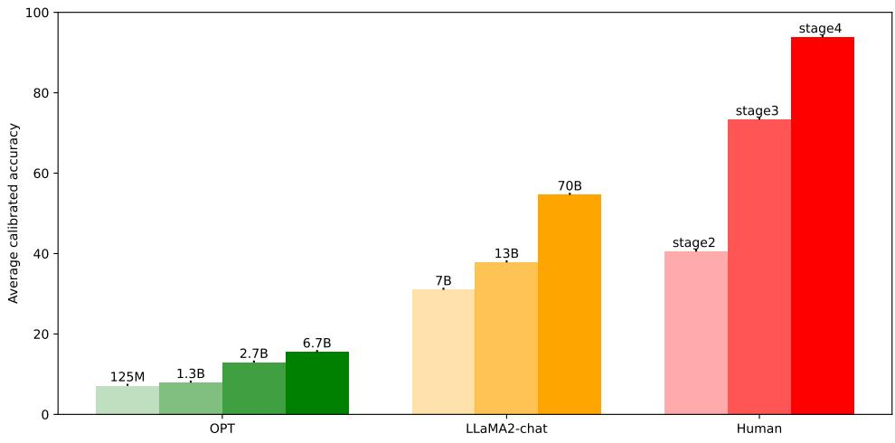
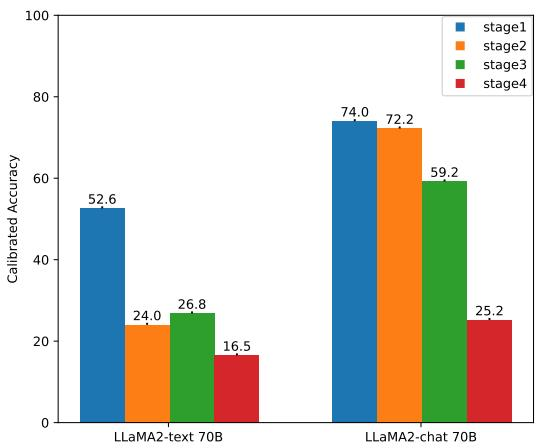
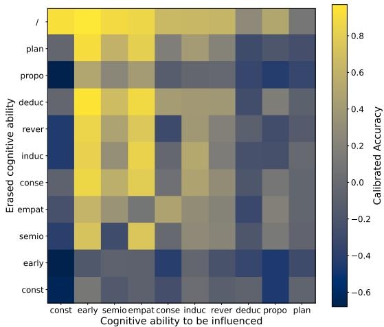

# CogLM: Tracking Cognitive Development of Large Language Models

Xinglin Wang1\*, Peiwen Yuan1\*, Shaoxiong Feng2, Yiwei Li1, Boyuan Pan2,

Heda Wang2, Yao Hu2, Kan Li1†

1 School of Computer Science, Beijing Institute of Technology

2 Xiaohongshu Inc

{wangxinglin,peiwenyuan,liyiwei,likan}@bit.edu.cn

{shaoxiongfeng2023,whd.thu}@gmail.com {panboyuan,xiahou}@xiaohongshu.com

## Abstract

Piaget’s Theory of Cognitive Development (PTC) posits that the development of cognitive levels forms the foundation for human learning across various abilities. As Large Language Models (LLMs) have recently shown remarkable abilities across a wide variety of tasks, we are curious about the cognitive levels of current LLMs: to what extent they have developed and how this development has been achieved. To this end, we construct a benchmark COGLM (Cognitive Ability Evaluation for Language Model) based on PTC to assess the cognitive levels of LLMs. COGLM comprises 1,220 questions spanning 10 cognitive abilities crafted by more than 20 human experts, providing a comprehensive testbed for the cog nitive levels of LLMs. Through extensive experiments across multiple mainstream LLMs with COGLM, we find that: (1) In our testing framework, advanced LLMs (such as GPT-4) have demonstrated human-like cognitive abilities, comparable to those of a 20-year-old human. (2) The parameter size and optimization objective are two key factors affecting the cog nitive levels of LLMs. (3) The performance on downstream tasks is positively correlated with the level of cognitive abilities. These findings fill the gap in research on the cognitive abilities of LLMs, tracing the development of LLMs from a cognitive perspective and guiding the future direction of their evolution.

## 1 Introduction

Large Language Models (LLMs) have recently achieved impressive performance on a wide variety of Natural Language Processing (NLP) tasks, including text comprehension (Kenton and Toutanova, 2019), reasoning (Talmor et al., 2020; Webb et al., 2023), code generation (Chen et al.,

2021), and mathematical problems (Fu et al., 2023). However, few studies have explored the reasons behind the evolutionary relationship among various abilities, which makes it difficult to understand the development of LLMs’ capabilities as a whole and may pose potential risks to their further development.

To this end, we introduce Piaget’s Theory of Cognitive Development (PTC) (Piaget et al., 1952; Flavell, 1977; Badakar et al., 2017), which posits that the development of cognitive levels forms the foundation for human learning across various abilities. Inspired by this, we think that studying the cognitive development of LLMs can assist us in better understanding the current performance of LLMs on downstream tasks and illuminate the path for future enhancements of their capabilities. As the most authoritative theory in the development of psychology, PTC suggests that human children move through four different stages of learning, including the sensorimotor stage (0-2 years old), the preoperational stage (2-7 years old), the concrete operational stage (7-12 years old), and the formal operational stage (above 12 years old). Children in different cognitive stages exhibit significantly distinct patterns of thinking and cognitive abilities, which affects their learning of other skills. Examining LLMs from the perspective of PTC, some natural and crucial questions are: At what stage has the cognitive ability of LLMs developed compared to humans at present? What are the key factors that affect the cognitive abilities of LLMs? Is the emergence of advanced abilities and performance bottlenecks in current LLMs related to their cognitive levels?

To explore the above questions, we construct a benchmark based on the scenario experiments used in PTC for evaluating the cognitive abilities of LLMs, denoted as COGLM. A large-scale human trial was conducted involving 207 participants aged between 6 and 20 years to ensure the alignment between the COGLM and PTC. We then perform extensive experiments on COGLM over several series of language models, including OPT (Zhang et al., 2022), Llama-2 (Touvron et al., 2023), GPT-3.5-Turbo and GPT-4 (OpenAI, 2023). Our results indicate that: (1) Under our testing framework, Advanced LLMs, such as GPT-4, have developed human-like cognitive abilities, matching those of a 20-year-old individual. (2) Two primary factors influencing these cognitive capacities in LLMs are the size of their parameters and their optimization objectives. (3) There is a positive correlation between the cognitive level of LLMs and their performance in downstream tasks.

We believe that our findings can present a clear understanding of the current cognitive level of LLMs and provide insights into the emergence of advanced abilities in LLMs, shedding light on the future development of them. Our contributions can be summarised as follows:

We innovatively introduce Piaget’s Theory of Cognitive Development (PTC) to analyze the development of cognitive abilities of LLMs.

We construct a high-quality benchmark (COGLM) for evaluating the cognitive ability level of LLMs.

Comprehensive experiments across multiple LLM series on COGLM demonstrate the cognitive level of current LLMs, key factors responsible for their varying levels, and relationships between cognitive levels and performance on downstream tasks.

## 2 COGLM Benchmark Development

To comprehensively and accurately assess the cognitive abilities of LLMs, we undertake the following efforts: (1) We revisit 12 cognitive abilities proposed by PTC, 10 of which are selected and redefined to construct COGLM according to the characteristics of LLMs (section 2.1). (2) We create standardized data construction guidelines to ensure the quality of COGLM (section 2.2). (3) We conduct extensive human testing to ensure the alignment between COGLM and PTC (section 2.3). (4) We build a Calibrated Mapping Function to establish a reliable mapping between testing results on COGLM and cognitive age (section 2.4).

## 2.1 Definition of Cognitive Abilities

According to PTC, the development of human cognition is divided into four stages, which include 12 cognitive abilities. Considering that the interaction interface of most LMs is limited to text-based format, we exclude reflexes and sensorimotor aspects of multimodal interaction and build COGLM based on the remaining 10 cognitive abilities.

We strictly define the concept of each cognitive ability based on PTC and provide representative examples for explanation as shown in Table 1.

## 2.2 Standardized Annotation Guidelines

To ensure that COGLM can accurately reflects the cognitive abilities of LLMs, we have established standardized annotation guidelines and strictly adhere to them during the annotation phase:

Data Format Although modern LLMs generally possess strong generation capabilities, early-aged LLMs (e.g., GPT-2) have limited generation abilities (similar to Human infants). Therefore, we have opted for multiple-choice questions as the assessment format. This approach avoids the influence of variations in generation capabilities on the accurate evaluation of cognitive abilities.

Number of Samples Abilities in the early stages are relatively simple and have a more concentrated form of expression, while abilities in the later stages are more comprehensive and have a more diverse form of expression. Based on this, we have set the number of samples to increase with each stage, as shown in the Table 2.

Qualified Annotator We select adults with backgrounds in psychology or artificial intelligence as data annotators. Annotators are provided with detailed materials on PTC and required to study them carefully. We then assess annotators’ understanding of PTC through exams (see Appendix Table 11 for the examination paper). Finally, we provide annotators with at least 3 example samples for each cognitive ability. Each annotator is required to annotate no fewer than 30 questions and options for two specific cognitive abilities.

Annotation Quality Control After annotation, we conduct cross-checks among annotators to identify samples with quality issues. Quality issues include questions that cannot effectively assess the corresponding cognitive abilities, questions with ambiguities, and elements of bias or violence.

<table><tr><td rowspan=1 colspan=1>First Stage: Constancy (const)Definition: Objects exist both within and outside the field of vision and maintain a certain level of stability.Example: Q: Assuming there is a small ball on the table. Is the ball still on the table when covered with acloth? Ans: Yes</td></tr><tr><td rowspan=1 colspan=1>First Stage: Early Representation (early)Definition: Objects are endowed with corresponding meanings, thus gradually forming a universe ofpermanent objects.Example: Q: How would you describe the color of snow? Ans: White</td></tr><tr><td rowspan=1 colspan=1>Second Stage: Semiotic Function (semio)Definition: Use symbols to represent things and concepts.Example: Q: Which item best represents love and romance? Ans: Rose</td></tr><tr><td rowspan=1 colspan=1>Second Stage: Empathy (empat)Definition: Start considering others&#x27; perspectives and feelings when addressing issues.Example: Q: You are fond of video games, but your cousin enjoys outdoor sports. What birthday gift wouldyou give to him? Ans: Camping tent</td></tr><tr><td rowspan=1 colspan=1>Third Stage: Reversibility (rever)Definition: Understand the reversibility of physical operations and is capable of reverse thinking.Example: Q: If a plane lands at 10 AM and flies for 6 hours, what time will it take off? Ans: 4 AM</td></tr><tr><td rowspan=1 colspan=1>Third Stage: Conservation (conse)Definition: The external alteration of forms doesn&#x27;t affect certain fundamental attributesExample: Q: If a stone is cut into two, what will be their total mass? Ans: No change</td></tr><tr><td rowspan=1 colspan=1>Third Stage: Induction (induc)Definition: Infer universal rules based on observed results.Example: Q: Given an arithmetic sequence: 2, 5, 8, 11, 14, which of the following is the general termformula for this sequence? Ans: 3n + 2</td></tr><tr><td rowspan=1 colspan=1>Forth Stage: Hypothetico-Deductive (deduc)Definition: Deduce practical problems based on specific assumptions or rules.Example: Q: Alex is excited, Paul is sad, Mike is crying, Anna is angry. The sad one is a dog, the angryone is swan, the crying one is cat, the excited one is tiger. Swan likes cats, cat likes tiger, tiger likes dog, doglikes swan. What does Anna like? Ans: Cat</td></tr><tr><td rowspan=1 colspan=1>Forth Stage: Propositional Operation (propo)Definition: Understand propositions and determine the logical relationships between propositions.Example: Q: Sentence1: In fact, the Lions of Delos were made from Naxos marble. Sentence2: There arefive Lions of Delos, and also two Tigers of Delos. What is the propositional relationship between sentence1and sentence2 ? Ans: Neutral</td></tr><tr><td rowspan=1 colspan=1>Forth Stage: Plan (plan)Definition: Develop sensible solutions based on specific problem.Example: Q: Please plan an action execution sequence according to the rules. The following rules must befollowed: going fishing before going hiking, doing yoga before going hiking, taking photos before doingyoga. Based on the above rules, please choose an action execution sequence that meets the rules from thefollowing options to finalize: going hiking. Ans: taking photos, doing yoga, going fishing, going hiking</td></tr></table>

Table 1: Definitions and examples of cognitive abilities included in COGLM.

## 2.3 Consistency with Theory

After the dataset construction is completed, we consider conducting human tests to further ascertain whether COGLM is consistent with PTC and whether it can effectively reflect cognitive abilities. We randomly select 10 samples from each subset of COGLM to create questionnaires, which are then distributed to testers aged between 6 and 20. Out of the 207 completed questionnaires, 141 are deemed valid (based on the reasonableness of test duration2). We calculate the Spearman and Pearson correlation coefficients between the age of the participants and their questionnaire scores. It turns out that spearman correlation is 0.7169 and pearson correlation is 0.7362 (all the p-values < 1e  10), indicating a strong correlation between them. This statistical result validates the effectiveness of the Standardized Annotation Guidelines we have developed in ensuring the efficacy of COGLM for assessing cognitive abilities.

## 2.4 Calibrated Cognitive Age Mapping Function

After confirming the positive correlation between answer accuracy and cognitive age, we aim to further construct the mapping function between them. We first make adjustments to the method of calculating accuracy. The number of candidate options for questions in COGLM falls within the range [2, 5]. Such a variability can impact the likelihood of providing a correct answer through guessing when participants are uncertain. Therefore, we calculate the calibrated accuracy on certain subset S as follows:

<table><tr><td rowspan="2">COGLM</td><td colspan="2">stage 1</td><td colspan="2">stage 2</td><td colspan="3">stage3</td><td colspan="3">stage4</td><td rowspan="2">Overall</td></tr><tr><td>const early</td><td></td><td>semio empat</td><td></td><td>rever conse induc</td><td></td><td></td><td>deduc propo</td><td></td><td>plan</td></tr><tr><td>Sample Number</td><td>50</td><td>100</td><td>100</td><td>100</td><td>100</td><td>110</td><td>100</td><td>250</td><td>100</td><td>210</td><td>1220</td></tr><tr><td>Question Tokens</td><td>18.5</td><td>11.36</td><td>11.55</td><td>25.27</td><td>30.0</td><td>26.3</td><td>42.0</td><td>51.8</td><td>30.0</td><td>77.9</td><td>39.5</td></tr><tr><td>Candidates Number</td><td>2.00</td><td>4.00</td><td>3.96</td><td>2.96</td><td>4.00</td><td>2.98</td><td>4.00</td><td>4.00</td><td>3.00</td><td>4.00</td><td>3.66</td></tr><tr><td>Candidates Tokens</td><td>1.00</td><td>1.19</td><td>1.48</td><td>4.23</td><td>3.87</td><td>4.28</td><td>7.58</td><td>1.00</td><td>1.00</td><td>20.30</td><td>5.71</td></tr></table>

Table 2: Data statistics on all ability subsets of COGLM.

<table><tr><td>Type</td><td>Series</td><td>Size</td></tr><tr><td>Text completion</td><td>OPT Llama-2</td><td>125M, 1.3B, 2.7B, 6.7B 7B,13B,70B</td></tr><tr><td rowspan="3"></td><td>Llama-2-chat</td><td>7B,13B,70B</td></tr><tr><td>Chat completion GPT-3.5-Turbo</td><td>N/A</td></tr><tr><td>GPT-4</td><td>N/A</td></tr></table>

Table 3: The statistics of considered language models.

$$
A c c = \frac { 1 } { | \mathbb { S } | } \times \sum _ { i = 1 } ^ { | \mathbb { S } | } \frac { \mathbf { 1 } _ { \mathrm { p r e d i c t _ { i } = a n s w e r _ { i } } } - 1 / | \mathrm { c a n d i d a t e s _ { i } } | } { 1 - 1 / | \mathrm { c a n d i d a t e s _ { i } } | }\tag{1}
$$

A negative calibrated accuracy (worse than random selecting) indicates a clear deficiency in the corresponding cognitive ability. We further use 80% of the questionnaire results in Section 2.3 as the training set $\mathbb { S } _ { Q }$ to optimize the regression function f( ) as follows:

$$
\begin{array} { c } { { \displaystyle { \mathcal { L } } _ { r e g r e s s i o n } = \frac { 1 } { | \mathbb { S } _ { Q } | } \times \sum _ { i = 1 } ^ { | \mathbb { S } _ { Q } | } ( f ( A c c _ { i } ) - a g e _ { i } ) ^ { 2 } } } \\ { { f ( A c c ) = \displaystyle \sum _ { i = 1 } ^ { 4 } w _ { i } \times A c c _ { \mathrm { s t a g e } i } + b } } \end{array}\tag{2}
$$

The Spearman correlation between the age predicted by f( ) and the real age on the remaining 20% samples is 0.9354, which signifies that $f ( \cdot )$ can precisely approximate the mapping from results on COGLM to cognitive age. We observe that $w _ { 1 } : w _ { 2 } : w _ { 3 } : w _ { 4 } = 1 : 2 . 6 : 1 . 4 : 2 . 5$ , indicating that cognitive abilities in the second and fourth stages are better at reflecting cognitive age under the evaluation of COGLM.

## 3 Experiments

## 3.1 Experimental Setup

Models We perform evaluations on the most recent and popular architectures for NLP tasks and restrict our experiments to LLMs. We conduct experiments on the popular family of GPT architecture: OPT series (Zhang et al., 2022), including models with sizes of 125M, 1.3B, 2.7B, and 6.7B, optimised for text completion; GPT-3.5-Turbo, optimised for chat; and GPT-4, whose training and architecture details are unknown (OpenAI, 2023). We also perform experiments on Llama-2 family of models(Touvron et al., 2023), including models with scale of 7B, 13B and 70B. In particular, Llama-2 series are pretrained generative language models for text completion, while Llama-2-chat is fine-tuned variation optimised for dialogue applications (see Table 3 for statistics of used LLMs). We conduct experiments on NVIDIA A100 with greedy sampling unless otherwise specified.

Evaluation For GPT-3.5-Turbo and GPT-4, we use the Open AI $\mathbf { A P I } ^ { 3 }$ to run all the evaluations. For OPT, Llama-2 and Llama-2-chat series models, we use the weights provided on the Huggingface hub4. Llama-2-chat models are used as chatcompletion models, while the others are used as text-completion models. For text-completion models, as they lack the ability to follow instructions and their output format is difficult to control, we concatenate each option with the corresponding question as input, and take the option with the highest generation probability as the model’s prediction. For chat-completion models, we constrain the format of the model’s generated answers through instructions. 5 We consider a model to provide a valid answer even if the format is incorrect. Unless specified otherwise, we always ask the model to provide a single answer with explanations. The accuracy for a stage is calculated as a macro average of the accuracies of each part of that stage.

<table><tr><td rowspan="2">Model</td><td colspan="2">stagel</td><td colspan="2">stage2</td><td colspan="3">stage3</td><td colspan="3">stage4</td><td rowspan="2">Acc Age</td><td rowspan="2"></td></tr><tr><td>const early</td><td></td><td>semio empat</td><td></td><td>conse induc rever</td><td></td><td></td><td>deduc propo plan</td><td></td><td></td></tr><tr><td>OPT 6.7B</td><td>-4.0</td><td>64.2</td><td>41.1</td><td>-3.0</td><td>13.5</td><td>10.6</td><td>20.1</td><td>-0.8</td><td>-0.5</td><td></td><td>14.2 15.5</td><td>6.5</td></tr><tr><td>Llama-2-chat-70B</td><td>52.1</td><td>96.2</td><td>78.5</td><td>66.2</td><td>68.4</td><td>65.3</td><td>44.0</td><td>15.2</td><td>40.0</td><td>20.6 54.6 14.1</td><td></td><td></td></tr><tr><td>GPT-3.5-Turbo</td><td>92.0</td><td>97.3</td><td>90.6</td><td>85.5</td><td>65.9</td><td>64.0</td><td>61.3</td><td>27.5</td><td>49.0</td><td>6.7</td><td>64.016.1</td><td></td></tr><tr><td>GPT-4</td><td>96.0</td><td>97.3</td><td>96.0</td><td>90.3</td><td>90.4</td><td>78.7</td><td>78.7</td><td>99.4</td><td>61.0</td><td>59.4</td><td>84.7</td><td>20.0</td></tr><tr><td>Human</td><td></td><td>100.0 98.0</td><td>96.1</td><td>84.2</td><td>98.2</td><td>91.6</td><td>92.0</td><td>100.0</td><td>82.0</td><td></td><td>95.6 93.7 21.5</td><td></td></tr></table>

Table 4: Calibrated accuracy (%) of largest model in evaluating series. Acc and Age refer to calibrated accuracy and the age of equivalent human performance. The value of Age is calculated according to Equation 2. Bold indicates the best performance.

  
Figure 1: Average calibrated accuracy (%) of models with different parameter size and humans in different cognitive stage.

  
Figure 2: Comparison of the performance of Llama-2- 70B and Llama-2-chat-70B at each stage on COGLM.

## 3.2 Main Results

As shown in Table 4, We run the model with the largest number of parameters in each series on COGLM, and report the adult human performance for comparison. Overall, the cognitive abilities of OPT, Llama-2-chat-70B, GPT-3.5-Turbo, and GPT-4 models successively increase, and the performance of each model gradually declines with the increase of stage, consistent with humans. Specifically, the latest state-of-the-art model, GPT-4, has demonstrated remarkable cognitive capabilities, achieving a level comparable to that of a 20-yearold human. It is also worth noting that both GPT-3.5-Turbo and GPT-4 surpass humans in empathy ability at stage 2, which is natural, as humans tend to have some degree of selfishness. Despite its superior performance, GPT-4’s performance on plan ability (59.4) is still barely satisfactory, far behind that of humans (95.6), which is consistent with the conclusion of Valmeekam et al. (2022). Our results indicate that enhancing the ability of planning is the major direction for improving the overall cognitive abilities of LLMs in the future. For more detailed evaluation results, please refer to Appendix Table 9.

## 3.3 Analysis and Discussion

## 3.3.1 What are the key factors affecting the cognitive abilities of LLMs?

We explore this question from two perspectives: the parameter size and the optimization objective of LLMs, as they are proven to have significant impact on other abilities. We leave the exploration of factors that require changes to the parameters of LLMs (e.g. fine-tuning on different types of datasets) for future work.

The parameter size of LLMs As shown in Figure 1, we compare the overall performance of models with different parameter size across OPT and Llama-2-chat series, and report the performance of humans at different stages as a reference. Specifically, the cognitive abilities of LLMs continuously improve as the size of model parameters increases, which is in line with the conclusion in Ren et al. (2024).

The optimization objective of LLMs As shown in Figure 2, we compare the performance of Llama-2-70B and Llama-2-chat-70B at each stage on COGLM. The results show that the performance of both models generally declines with the increase of stage, while the performance of Llama-2-chat-70B far exceeds that of Llama-2-70B at every stage. Given that Llama-2-chat-70B is further fine-tuned on dialogue data and RLHF trained compared to Llama-2-70B, it suggests that LLMs could potentially enhance their cognitive abilities through learning to chat with humans, as RLHF is another approach for LLMs to learn the world, apart from text pretraining.

Based on the two sets of experiments above, we can draw the conclusion that the parameter size and optimization objective are key factors affecting the cognitive abilities of LLMs.

## 3.3.2 Can advanced technologies help enhance LLMs’ cognitive abilities?

To answer this question, we applied two representative techniques separately to measure whether cognitive abilities of LLMs could be improved.

Effect of Chain-of-Thought The approach of guiding LLMs to subsequently solve problems has been shown to significantly enhance the performance in most scenarios (Wei et al., 2022). Thus, we are curious whether Chain-of-Thought (COT) can also be effective in improving the cognitive abilities of LLMs. We tested the performance of

GPT-3.5-Turbo with and without COT separately on the COGLM and the results are shown in Table 5. From the perspective of the average calibrated accuracy of all the cognitive abilities, COT does not bring a significant performance improvement. We hypothesize that this is because cognitive abilities are inherent to the LLMs and could not be enhanced through multi-step reasoning.

Effect of Self-Consistency Self-Consistency (SC) (Wang et al., 2023) is another commonly used method that can effectively enhance the performance of LLMs. Multiple candidate predictions to a specific problem are suggested to generate through sampling following with a voting mechanism to eliminate noise introduced by single sampling. We conducted experiments with sampling times as 40 at temperature T of 0.3 and 0.7, respectively. As shown in Table 5, similar to COT, SC can only bring about a very marginal improvement. This phenomenon is consistent with human. For example, for a boy who lacks the ability of empathy, no matter how many times he is asked to choose, he may find it difficult to realize that a scarf might be a more suitable gift for his grandmother than a lollipop.

Based on the two sets of experiments above, we can draw the conclusion that similar to human beings, it is challenging to achieve significant improvements in LLMs’ cognitive abilities without external stimuli.

## 3.3.3 How Cognitive Ability Affects the Performance of LLM

According to PTC, the development of human cognitive abilities is a gradual process, where the cognitive abilities of early stages can influence the advanced cognitive abilities. Additionally, cognitive abilities significantly determines the capacity to solve real-world problems. Therefore, we are very interested in whether these two aspects are similarly manifested in LLMs.

The Interdependence Between Cognitive Abilities Through preliminary experiments, we found that advanced LLMs’ ability to follow instructions can help us erase specific cognitive abilities using a cognitive-ability-setting-prompt (e.g., "You have not yet formed a sense of empathy". See Appendix Table 10 for all the prompts). On this basis, We investigated the interdependence of cognitive abilities in LLMs by selectively removing specific cognitive capabilities and testing them on COGLM.

<table><tr><td>Ability</td><td>const</td><td>early</td><td>semio</td><td>empat</td><td>conse</td><td>induc</td><td>rever</td><td>deduc</td><td>propo</td><td>plan</td><td>Avg</td></tr><tr><td>Base</td><td>92.0</td><td>97.3</td><td>90.6</td><td>85.5</td><td>65.9</td><td>64.0</td><td>61.3</td><td>27.5</td><td>49.0</td><td>6.7</td><td>64.0</td></tr><tr><td>w/COT</td><td>92.0</td><td>97.3</td><td>89.3</td><td>85.5</td><td>65.7</td><td>64.0</td><td>62.3</td><td>26.9</td><td>50.5</td><td>9.8</td><td>64.3</td></tr><tr><td>w/SC T=0.3</td><td>91.0</td><td>97.6</td><td>90.3</td><td>86.0</td><td>65.7</td><td>66.0</td><td>61.0</td><td>27.9</td><td>53.5</td><td>4.8</td><td>64.4</td></tr><tr><td> $w / \ S C \ T { = } 0 . 7$ </td><td>91.0</td><td>97.6</td><td>90.0</td><td>85.5</td><td>65.7</td><td>66.7</td><td>61.3</td><td>27.7</td><td>52.0</td><td>3.5</td><td>63.1</td></tr></table>

Table 5: Calibrated accuracy of GPT-3.5-Turbo on COGLM with multiple settings. "Base" indicates settings where both COT and SC are not used.
<table><tr><td>Erased Ability</td><td>const</td><td>early</td><td>semio</td><td>empat</td><td>conse</td><td>induc</td><td>rever</td><td>deduc</td><td>propo</td><td>plan</td><td>1</td></tr><tr><td>GSM8K</td><td>0.1</td><td>0.6</td><td>25.5</td><td>16.6</td><td>38.6</td><td>30.7</td><td>21.2</td><td>12.1</td><td>1.0</td><td>2.2</td><td>59.9</td></tr><tr><td>StrategyQA</td><td>3.8</td><td>9.1</td><td>5.6</td><td>33.5</td><td>15.7</td><td>14.7</td><td>18.8</td><td>28.4</td><td>12.9</td><td>31.6</td><td>65.2</td></tr></table>

Table 6: Accuracy (%) of GPT-3.5-Turbo on GSM8K and StrategyQA datasets when different cognitive abilities are erased.

According to the experimental results shown in Figure 3, we can draw the following conclusions: (1) Advanced cognitive abilities significantly rely on early cognitive abilities, which indicates that the dependency relationships of LLMs’ cognitive abilities are similar to those of humans. (2) The darker colors along the diagonal indicate that the way we erase the corresponding cognitive abilities is effective. (3) Constancy is a fundamental capability (in line with PTC), as it significantly influences and is influenced by other cognitive abilities.

The Dependence of Downstream Ability on Cognitive Ability In Table 4, we observed a gradual increase in cognitive abilities for OPT, Llama-2, GPT-3.5-Turbo, and GPT-4. On the other hand, based on extensive evaluation studies (Srivastava et al., 2022; Touvron et al., 2023; Liang et al., 2022), we also noted that this ranking result corresponds with the overall performance of LLMs when it comes to solving downstream tasks. This suggests that cognitive abilities are significantly correlated with practical skills for LLMs. To further understand this correlation, we conducted experiments to assess LLMs’ performance on downstream tasks when specific cognitive abilities were erased by cognitive-abilitysetting-prompt. We chose representative math reasoning dataset GSM8K (Cobbe et al., 2021) and commonsense reasoning dataset StrategyQA (Talmor et al., 2019) to conduct our experiments. As shown in Table 6, it is reasonable that the erasure of hypothetico-deductive, propositional operation and plan abilities significantly impact the performance of GPT-3.5-Turbo on GSM8K as they are core abilities to solve math problems. We also found that the erasure of other cognitive abilities (especially in early stages) can also bring a strong impact, even if they may not seem helpful in solving math problems. Similar conclusions can be drawn on StrategyQA. These findings indicate that LLMs’ abilities to solve downstream tasks is positively correlated with the level of cognitive abilities. The advanced cognitive capabilities of GPT-3.5-Turbo and GPT-4 on COGLM partially account for their outstanding performance in various downstream tasks. From this perspective, we can further understand that Zero-shot COT (Kojima et al., 2022) is essentially enhancing LLMs’ cognitive ability of deduction for improved performance on downstream tasks by incorporating "Let’s think step by step" into the prompt.

  
Figure 3: Cognitive ability interdependence matrix. The vertical axis represents cognitive abilities erased through prompts, and the color depth (calibrated accuracy) indicates the impact on the corresponding horizontal axis abilities after erasure.

<table><tr><td>Ability</td><td>const</td><td>early</td><td>semio</td><td>empat</td><td>conse</td><td>induc</td><td>rever</td><td>deduc</td><td>propo</td><td>plan</td><td>Avg</td></tr><tr><td>w/o COC</td><td>32.0</td><td>78.6</td><td>74.5</td><td>54.9</td><td>-0.2</td><td>41.3</td><td>25.3</td><td>6.1</td><td>-2.0</td><td>-0.1</td><td>31.0</td></tr><tr><td>w/COC</td><td>54.2</td><td>57.3</td><td>53.3</td><td>69.4</td><td>34.1</td><td>41.9</td><td>34.7</td><td>8.1</td><td>26.9</td><td>1.5</td><td>38.1</td></tr></table>

Table 7: Calibrated accuracy of Llama-2-chat-7B on COGLM with and without Chain-of-Cognition from GPT-3.5- Turbo as input.

## 3.3.4 Potential applications of advanced LLM cognitive ability

Although there is still room for improvement, the cognitive abilities of advanced LLMs have approached levels close to that of adult humans as discussed in Section 3.2. A natural question is, what are the potential applications for advanced LLMs’ cognitive abilities? When humans address cognitive questions, they deduce and provide answers based on their cognitive abilities. While we have demonstrated in Section 3.3.2 that the cognitive chain-of-thought (Chain-of-Cognition, COC) generated by LLMs barely help self-address cognitive questions, we are curious whether COC can assist early-aged LLMs in improving cognitive performance. On this basis, we use the question together with the COCs generated by advanced LLM (GPT-3.5-Turbo) as input to test the performance of early-aged LLM (Llama-2-chat-7B) on COGLM. As shown in Table 7, in most cognitive abilities, COC can significantly improve the performance of Llama-2-chat-7B. We leave the research on using COC from advanced LLMs to guide the improvement of cognitive abilities in early-aged LLMs and even children for future exploration.

## 4 Related Work

LLM Evaluation Due to the importance of LLMs, their abilities have been thoroughly evaluated on a wide range of problems. Large-scale efforts have been invested in constructing large benchmarks itegrated with numerous LM evaluations across a number of fields (Srivastava et al., 2022; Liang et al., 2022; Hendrycks et al., 2020; Biderman et al., 2023). Due to the superior performance of LLMs in a number of traditional NLP tasks, recently challenging tasks have been proposed to test the upper bound performance of LLMs (Hendrycks et al., 2021; Valmeekam et al., 2022; Gendron et al., 2023). Some benchmarks include evaluation of specific cognitive abilities, such as common sense reasoning (Ismayilzada et al., 2023), planning (Xie et al., 2024), and deductive reasoning (Saparov and He, 2022). While previous benchmarks focus on measuring either a type or a category of advanced ability in LLMs, few studies explore the development relationship between different abilities, which is crucial for understanding the emergence of LLMs’ abilities.

Cognitive psychology survey on LLMs Several works introduce tools from cognitive psychology to study LLMs. Such as understanding the behavior in LLMs (Ritter et al., 2017; Kosoy et al., 2022; Hagendorff et al., 2022; Portelance et al., 2023), exploring the human-like abilities in LLMs (Han et al., 2022; Kosinski, 2023; Aher et al., 2023; Pan and Zeng, 2023), and improving LLMs’ performance on certain task (Betz et al., 2021). Our work is most similar to present work on using cognitive psychology to explore whether LMs “learn and think like people” by Binz and Schulz (2023), which suggests that LLMs struggle to reason causally due to the differences in how humans and LLMs learn about the world. The key difference in our approaches is that Binz and Schulz (2023) aims to study GPT-3 by assessing its advanced abilities (e.g. decision-making, information search, deliberation, and causal reasoning), while we analyze the relationships between the cognitive abilities of LLMs from the perspective of development, rather than assessing the level of a single cognitive ability of LLMs. Additionally, the other concurrent work (Shah et al., 2024) considers the developmental alignment of LLMs’ performance during training to the trajectories of children’s thinking, primarily measuring the growth trajectories of various cognitive abilities, whereas our measurement of "development" focuses more on the sequence relationships of different cognitive abilities emerging.

Piaget’s Theory of Cognitive Development Theory of Cognitive Development (PTC) is the most authoritative theory in the development of psychology, developed by Jean Piaget (Piaget et al., 1952). PTC suggests that intelligence grows and develops through a series of stages. As children interact with the world around them, they continually add new knowledge, build upon existing knowledge, and adapt previously held ideas to accommodate new information. PTC is widely used in education, psychology, linguistics, and neuroscience, providing a theoretical framework and methodology for research in these areas.

## 5 Conclusions

In this paper, we introduce Piaget’s Theory of Cognitive Development (PTC) as a tool to track the development of cognitive abilities of LLMs. We construct COGLM based on the scenerio experiments used in PTC, and conduct thorough human testing to ensure the alignment between COGLM and PTC. Through extensive experiments on multiple series of LLMs, we show that: (1) In our testing framework, Human-like cognitive abilities have emerged in advanced LLMs (such as GPT-4), comparable to those of 20-year-old humans. (2) The parameter size and optimization objective are two key factors affecting the cognitive abilities of LLMs. (3) The ability of performing downstream tasks is positively correlated with the level of cognitive abilities. We believe that our findings can provide a novel insight into the emergence of abilities in LLMs, and shed light on the future development advanced abilities of LLMs.

## Limitations

Despite obtaining some valuable findings through CogLM, our current exploration does not consider the language model’s performance at different training stages to further provide insights for model training, and we will explore it in our future work.

## Ethics Statement

Our dataset does not contain any harmful or offensive contents. Any personal or sensitive information is anonymized and treated with utmost confidentiality. We ensure the protection of participants privacy and obtain informed consent for data collection, annotation, and analysis. We incentivized all the annotators uniformly throughout the annotation process.

## Acknowledgements

This work is supported by the Beijing Natural Science Foundation, China (Nos. 4222037, L181010).

## References

Gati V Aher, Rosa I Arriaga, and Adam Tauman Kalai. 2023. Using large language models to simulate multiple humans and replicate human subject studies. In International Conference on Machine Learning, pages 337–371. PMLR.

Chandrashekhar M Badakar, Prachi J Thakkar, Shivayogi M Hugar, Pratibha Kukreja, Harsha G Assudani, and Niraj Gokhale. 2017. Evaluation of the relevance of piaget’s cognitive principles among parented and orphan children in belagavi city, karnataka, india: A comparative study. International journal of clinical pediatric dentistry, 10(4):346.

Gregor Betz, Kyle Richardson, and Christian Voigt. 2021. Thinking aloud: Dynamic context generation improves zero-shot reasoning performance of gpt-2. arXiv preprint arXiv:2103.13033.

Stella Biderman, Hailey Schoelkopf, Quentin Anthony, Herbie Bradley, Kyle O’Brien, Eric Hallahan, Mohammad Aflah Khan, Shivanshu Purohit, USVSN Sai Prashanth, Edward Raff, et al. 2023. Pythia: a suite for analyzing large language models across training and scaling. In Proceedings of the 40th International Conference on Machine Learning, pages 2397–2430.

Marcel Binz and Eric Schulz. 2023. Using cognitive psychology to understand gpt-3. Proceedings of the National Academy ofSciences, 120(6):e2218523120.

Mark Chen, Jerry Tworek, Heewoo Jun, Qiming Yuan, Henrique Ponde de Oliveira Pinto, Jared Kaplan, Harri Edwards, Yuri Burda, Nicholas Joseph, Greg Brockman, et al. 2021. Evaluating large language models trained on code. arXiv preprint arXiv:2107.03374.

Karl Cobbe, Vineet Kosaraju, Mohammad Bavarian, Mark Chen, Heewoo Jun, Lukasz Kaiser, Matthias Plappert, Jerry Tworek, Jacob Hilton, Reiichiro Nakano, Christopher Hesse, and John Schulman. 2021. Training verifiers to solve math word problems. CoRR, abs/2110.14168.

John H Flavell. 1977. Cognitive development. Prentice-Hall.

Yao Fu, Litu Ou, Mingyu Chen, Yuhao Wan, Hao Peng, and Tushar Khot. 2023. Chain-of-thought hub: A continuous effort to measure large language models’ reasoning performance. arXiv preprint arXiv:2305.17306.

Gaël Gendron, Qiming Bao, Michael Witbrock, and Gillian Dobbie. 2023. Large language models are not abstract reasoners. arXiv preprint arXiv:2305.19555.

Thilo Hagendorff, Sarah Fabi, and Michal Kosinski. 2022. Machine intuition: Uncovering human-like intuitive decision-making in gpt-3.5. arXiv preprint arXiv:2212.05206.

Simon Jerome Han, Keith James Ransom, Andrew Perfors, and Charles Kemp. 2022. Human-like property induction is a challenge for large language models. In Proceedings of the annual meeting of the cognitive science society, volume 44.

Dan Hendrycks, Collin Burns, Steven Basart, Andy Zou, Mantas Mazeika, Dawn Song, and Jacob Steinhardt. 2020. Measuring massive multitask language understanding. In International Conference on Learning Representations.

Dan Hendrycks, Collin Burns, Saurav Kadavath, Akul Arora, Steven Basart, Eric Tang, Dawn Song, and Jacob Steinhardt. 2021. Measuring mathematical problem solving with the math dataset. arXiv preprint arXiv:2103.03874.

Mete Ismayilzada, Debjit Paul, Syrielle Montariol, Mor Geva, and Antoine Bosselut. 2023. CRoW: Benchmarking commonsense reasoning in real-world tasks. In Proceedings of the 2023 Conference on Empirical Methods in Natural Language Processing, pages 9785–9821, Singapore. Association for Computational Linguistics.

Jacob Devlin Ming-Wei Chang Kenton and Lee Kristina Toutanova. 2019. Bert: Pre-training of deep bidirectional transformers for language understanding. In Proceedings of naacL-HLT, volume 1, page 2.

Takeshi Kojima, Shixiang Shane Gu, Machel Reid, Yutaka Matsuo, and Yusuke Iwasawa. 2022. Large language models are zero-shot reasoners. In NeurIPS.

Michal Kosinski. 2023. Theory of mind may have spontaneously emerged in large language models. arXiv preprint arXiv:2302.02083.

Eliza Kosoy, David M Chan, Adrian Liu, Jasmine Collins, Bryanna Kaufmann, Sandy Han Huang, Jessica B Hamrick, John Canny, Nan Rosemary Ke, and Alison Gopnik. 2022. Towards understanding how machines can learn causal overhypotheses. arXiv preprint arXiv:2206.08353.

Percy Liang, Rishi Bommasani, Tony Lee, Dimitris Tsipras, Dilara Soylu, Michihiro Yasunaga, Yian Zhang, Deepak Narayanan, Yuhuai Wu, Ananya Kumar, et al. 2022. Holistic evaluation of language models. arXiv preprint arXiv:2211.09110.

OpenAI. 2023. Gpt-4 technical report. Preprint, arXiv:2303.08774.

Keyu Pan and Yawen Zeng. 2023. Do llms possess a personality? making the mbti test an amazing evaluation for large language models. arXiv preprint arXiv:2307.16180.

Jean Piaget, Margaret Cook, et al. 1952. The origins of intelligence in children, volume 8. International Universities Press New York.

Eva Portelance, Yuguang Duan, Michael C Frank, and Gary Lupyan. 2023. Predicting age of acquisition for children’s early vocabulary in five languages using language model surprisal. Cognitive Science, 47(9):e13334.

Yuqi Ren, Renren Jin, Tongxuan Zhang, and Deyi Xiong. 2024. Do large language models mirror cognitive language processing? arXiv preprint arXiv:2402.18023.

Samuel Ritter, David GT Barrett, Adam Santoro, and Matt M Botvinick. 2017. Cognitive psychology for deep neural networks: A shape bias case study. In International conference on machine learning, pages 2940–2949. PMLR.

Abulhair Saparov and He He. 2022. Language models are greedy reasoners: A systematic formal analysis of chain-of-thought. In The Eleventh International Conference on Learning Representations.

Raj Shah, Khushi Bhardwaj, and Sashank Varma. 2024. Development of cognitive intelligence in pre-trained language models. In Proceedings of the 2024 Conference on Empirical Methods in Natural Language Processing, pages 9632–9657.

Aarohi Srivastava, Abhinav Rastogi, Abhishek Rao, Abu Awal Md Shoeb, Abubakar Abid, Adam Fisch, Adam R Brown, Adam Santoro, Aditya Gupta, Adrià Garriga-Alonso, et al. 2022. Beyond the imitation game: Quantifying and extrapolating the capabilities of language models. arXiv preprint arXiv:2206.04615.

Alon Talmor, Jonathan Herzig, Nicholas Lourie, and Jonathan Berant. 2019. Commonsenseqa: A question answering challenge targeting commonsense knowledge. In Proceedings of the 2019 Conference of the North American Chapter ofthe Associationfor Computational Linguistics: Human Language Technologies, NAACL-HLT 2019, Minneapolis, MN, USA, June 2-7, 2019, Volume 1 (Long and Short Papers), pages 4149–4158. Association for Computational Linguistics.

Alon Talmor, Oyvind Tafjord, Peter Clark, Yoav Goldberg, and Jonathan Berant. 2020. Leap-of-thought: Teaching pre-trained models to systematically reason over implicit knowledge. Advances in Neural Information Processing Systems, 33:20227–20237.

Hugo Touvron, Louis Martin, Kevin Stone, Peter Albert, Amjad Almahairi, Yasmine Babaei, Nikolay Bashlykov, Soumya Batra, Prajjwal Bhargava, Shruti Bhosale, et al. 2023. Llama 2: Open foundation and fine-tuned chat models. arXiv preprint arXiv:2307.09288.

Karthik Valmeekam, Alberto Olmo, Sarath Sreedharan, and Subbarao Kambhampati. 2022. Large language models still can’t plan (a benchmark for llms on planning and reasoning about change). arXiv preprint arXiv:2206.10498.

Xuezhi Wang, Jason Wei, Dale Schuurmans, Quoc V. Le, Ed H. Chi, Sharan Narang, Aakanksha Chowdhery, and Denny Zhou. 2023. Self-consistency improves chain of thought reasoning in language models. In The Eleventh International Conference on Learning Representations, ICLR 2023, Kigali, Rwanda, May 1-5, 2023. OpenReview.net.

Taylor Webb, Keith J Holyoak, and Hongjing Lu. 2023. Emergent analogical reasoning in large language models. Nature Human Behaviour, pages 1–16.

Jason Wei, Xuezhi Wang, Dale Schuurmans, Maarten Bosma, Brian Ichter, Fei Xia, Ed H. Chi, Quoc V. Le, and Denny Zhou. 2022. Chain-of-thought prompting elicits reasoning in large language models. In NeurIPS.

Jian Xie, Kai Zhang, Jiangjie Chen, Tinghui Zhu, Renze Lou, Yuandong Tian, Yanghua Xiao, and Yu Su. 2024. Travelplanner: A benchmark for realworld planning with language agents. arXiv preprint arXiv:2402.01622.

Susan Zhang, Stephen Roller, Naman Goyal, Mikel Artetxe, Moya Chen, Shuohui Chen, Christopher Dewan, Mona Diab, Xian Li, Xi Victoria Lin, et al. 2022. Opt: Open pre-trained transformer language models. arXiv preprint arXiv:2205.01068.

## A Appendix

## A.1 Testing Method of Text-completion Models

For text-completion models, as they lack the ability to follow instructions and their output format is difficult to control, we concatenate each option with the corresponding question as input, and take the option with the highest generation probability as model prediction. When calculating the generation probability, we normalized the generation length to eliminate the influence of the option length. Additionally, we compared the approach of having the model interpret the questions as multiple choice and using a letter as the concatenated answer (denoted as "option") with our existing testing method (denoted as "concat") using GPT-2 and OPT-125M. The results (Table 8) show that changing the testing method from "concat" to "option" leads to a significant decrease in the performance of the textcompletion model. We suppose this is due to the text-completion model being more sensitive to factors such as position bias and model preference compared to the chat-completion model. As a result, directly concatenating the options with the question and ranking them based on probability is more suitable for testing the text-completion model.

<table><tr><td>Model</td><td>Method</td><td>const</td><td>early</td><td>semio</td><td>empat</td><td>rever</td><td>conse</td><td>induc</td><td>deduc</td><td>propo</td><td>plan</td></tr><tr><td rowspan="2">OPT-125M</td><td>Concat</td><td>-16.0</td><td>38.7</td><td>26.3</td><td>-19.2</td><td>4.0</td><td>16.2</td><td>9.3</td><td>5.6</td><td>4.0</td><td>2.2</td></tr><tr><td>Option</td><td>-18.1</td><td>0.0</td><td>10.3</td><td>-36.9</td><td>4.0</td><td>-18.0</td><td>-4.0</td><td>2.9</td><td>-3.5</td><td>-6.0</td></tr><tr><td rowspan="2">GPT-2</td><td>Concat</td><td>-20.0</td><td>41.3</td><td>30.4</td><td>-4.7</td><td>5.3</td><td>10.8</td><td>9.3</td><td>4.5</td><td>-0.5</td><td>4.8</td></tr><tr><td>Option</td><td>-25.0</td><td>-6.7</td><td>16.7</td><td>-38.5</td><td>5.3</td><td>-18.1</td><td>-6.7</td><td>0.8</td><td>-0.5</td><td>-6.0</td></tr></table>

Table 8: Performance Comparison of "Concat" and "Option" Testing Methods on COGLM Using GPT-2 and OPT-125M.

<table><tr><td rowspan="2">Model</td><td colspan="2">stagel</td><td colspan="2">stage2</td><td colspan="2">stage3</td><td colspan="2"></td><td colspan="2">stage4</td><td rowspan="2"></td><td rowspan="2">Age</td></tr><tr><td>const early</td><td></td><td>semio empat</td><td></td><td>conse induc rever</td><td></td><td></td><td>deduc propo</td><td>plan</td><td>Acc</td></tr><tr><td>OPT 125M</td><td>-16.0 38.6</td><td></td><td>26.3</td><td>-19.0</td><td>16.2</td><td>9.3</td><td>4.0</td><td>5.6</td><td>4.0</td><td>2.2</td><td>7.1</td><td>4.8</td></tr><tr><td>OPT 1.3B</td><td>-20.052.0</td><td></td><td>38.4</td><td>-11.0</td><td>1.0</td><td>12.0</td><td>13.3</td><td>-6.1</td><td>2.5</td><td>-3.0</td><td>7.9</td><td>5.2</td></tr><tr><td>OPT 2.7B</td><td>-8.0</td><td>53.3</td><td>43.7</td><td>-9.5</td><td>9.4</td><td>12.0</td><td>21.1</td><td>-1.3</td><td>5.5</td><td>3.4</td><td>12.95</td><td>6.1</td></tr><tr><td>OPT 6.7B</td><td>-4.0</td><td>64.2</td><td>41.1</td><td>-3.0</td><td>13.5</td><td>10.6</td><td>20.1</td><td>-0.8</td><td>-0.5</td><td>14.2</td><td>15.5</td><td>6.5</td></tr><tr><td>LLaMA2-text 7B</td><td>16.0</td><td>82.6</td><td>43.7</td><td>-4.0</td><td>20.0</td><td>1.3</td><td>24.0</td><td>-16.8</td><td>14.5</td><td>24.4</td><td>20.5</td><td>7.3</td></tr><tr><td>LLaMA2-text 13B</td><td>28.0</td><td>84.0</td><td>42.4</td><td>-3.0</td><td>13.0</td><td>13.5</td><td>24.0</td><td>-15.7</td><td>35.5</td><td>13.0</td><td>23.4</td><td>7.7</td></tr><tr><td>LLaMA2-text 70B</td><td>52.1</td><td>96.2</td><td>78.5</td><td>66.2</td><td>68.4</td><td>65.3</td><td>44.0</td><td>15.2</td><td>40.0</td><td>20.6</td><td>54.6</td><td>14.1</td></tr><tr><td>LLaMA2-chat 7B</td><td>32.0</td><td>78.6</td><td>74.5</td><td>54.9</td><td>-0.2</td><td>41.3</td><td>25.3</td><td>6.1</td><td>-2.0</td><td></td><td>-0.1 31.04</td><td>10.3</td></tr><tr><td>LLaMA2-chat 13B</td><td>44.0</td><td>89.3</td><td>78.5</td><td>56.5</td><td>16.2</td><td>42.6</td><td>32.0</td><td>-0.2</td><td>17.5</td><td>1.5</td><td>37.8</td><td>11.35</td></tr><tr><td>LLaMA2-chat 70B</td><td>52.1</td><td>96.2</td><td>78.5</td><td>66.2</td><td>68.4</td><td>65.3</td><td>44.0</td><td>15.2</td><td>40.0</td><td>20.6</td><td>54.6</td><td>14.1</td></tr><tr><td>GPT-3.5-Turbo</td><td>92.0</td><td>97.3</td><td>90.6</td><td>85.5</td><td>65.9</td><td>64.0</td><td>61.3</td><td>27.5</td><td>49.0</td><td>6.7</td><td>64.0</td><td>16.1</td></tr><tr><td>GPT-4</td><td>96.0</td><td>97.3</td><td>96.0</td><td>90.3</td><td>90.4</td><td>78.7</td><td>78.7</td><td>99.4</td><td>61.0</td><td>59.4</td><td>84.7</td><td>20.0</td></tr><tr><td>Human</td><td>100.0</td><td>98.0</td><td>96.1</td><td>84.2</td><td>98.2</td><td>91.6</td><td>92.0</td><td>100.0</td><td>82.0</td><td>95.6</td><td>93.7</td><td>21.5</td></tr></table>

Table 9: Calibrated accuracy (%) of all models in evaluating series. Acc and Age refer to calibrated accuracy and the age of equivalent human performance. The value of Age is calculated according to Equation 2 and rounded to the nearest integer. Bold indicates the best performance.

<table><tr><td colspan="1" rowspan="1">ConstancyPlease imagine yourself as a child aged 0-2 years old. According to Piaget's theory of cognitive development,you are currently unable to recognize that objects exist both within and outside the field of vision andmaintain a certain level of stability.</td></tr><tr><td colspan="1" rowspan="1">Early RepresentationPlease imagine yourself as a child aged 0-2 years old. According to Piaget's theory of cognitive development,You currently cannot give objects corresponding meanings, nor do you have a definite perception of permanentobjects in the universe.</td></tr><tr><td colspan="1" rowspan="1">Semiotic FunctionPlease imagine yourself as a child aged 2-7 years old. According to Piaget's theory of cognitive development,You are currently unable to use symbols to represent things and concepts.</td></tr><tr><td colspan="1" rowspan="1">EmpathyPlease imagine yourself as a child aged 2-7 years old. According to Piaget's theory of cognitive development,You are accustomed to thinking from your own perspective and have not yet formed a sense of empathy.</td></tr><tr><td colspan="1" rowspan="1">ReversibilityPlease imagine yourself as a child aged 7-11 years old. According to Piaget's theory of cognitive development,You are currently unable to understand the reversibility of physical operations and unable to reverse thinking.</td></tr><tr><td colspan="1" rowspan="1">ConservationPlease imagine yourself as a child aged 7-11 years old. According to Piaget's theory of cognitive development,You think that external changes in form (length, shape, etc.) may affect the basic properties of an object(mass, volume, etc.).</td></tr><tr><td colspan="1" rowspan="1">InductionPlease imagine yourself as a child aged 7-11 years old. According to Piaget's theory of cognitive development,You currently cannot infer universal rules based on observed results.</td></tr><tr><td colspan="1" rowspan="1">Hypothetico-DeductivePlease imagine yourself as a teenager aged 11-18 years old. According to Piaget's theory of cognitivedevelopment, You are currently unable to deduce practical problems based on specific assumptions or rules.</td></tr><tr><td colspan="1" rowspan="1">Propositional OperationPlease imagine yourself as a teenager aged 11-18 years old. According to Piaget's theory of cognitivedevelopment, You are currently unable to understand propositions and determine the logical relationshipsbetween propositions.</td></tr><tr><td colspan="1" rowspan="1">PlanPlease imagine yourself as a teenager aged 11-18 years old. According to Piaget's theory of cognitivedevelopment, You are are currently unable to develop solutions based on specific problem.</td></tr><tr><td colspan="1" rowspan="1">Question: How many main stages are included in Jean Piaget's cognitive developmenttheory?Answer: 4</td></tr><tr><td colspan="1" rowspan="1">Question: Which stage in Piaget's theory marks the point at which children are capableof logical thinking and understanding concepts like quantity, category, space, and time?Answer: Formal operational stage</td></tr><tr><td colspan="1" rowspan="1">Question: What type of operations can children perform during the concrete operationalstage?Answer: Addition and subtraction</td></tr><tr><td colspan="1" rowspan="1">Question: Janie knows that a bird has wings and can fly. While camping she finds abat and thinks it's a bird, but realizes that it doesn't act the same way as a bird. She isconfused. She is using what adaptation process with this new knowledge?Answer: Accommodation</td></tr><tr><td colspan="1" rowspan="1">Question: What kind of activities can children engage in during the formal operationalstage?Answer: Abstract thinking and logical reasoning</td></tr><tr><td colspan="1" rowspan="1">Question: In Jean Piaget's cognitive development theory, which stage marks the point atwhich children begin to use symbols and language to represent objects?Answer: Preoperational stage</td></tr><tr><td colspan="1" rowspan="1">Question: Which of the following is NOT one of Piaget's stages of cognitive develop-ment?Answer: Abstract operational stage</td></tr><tr><td colspan="1" rowspan="1">Question: Children in the concrete operational stage typically understand what type ofconcepts?Answer: Concepts of quantity and space</td></tr><tr><td colspan="1" rowspan="1">Question: What types of problems can children in the formal operational stage handle?Answer: Abstract ând hypothetical problems</td></tr><tr><td colspan="1" rowspan="1">Question: What are common characteristics of children in the preoperational stage?Answer: Subject to egocentrism</td></tr><tr><td colspan="1" rowspan="1">Question: In the sensorimotor stage, how do children primarily explore the world?Answer: Sensation and movement</td></tr><tr><td colspan="1" rowspan="1">Question: In the sensorimotor stage, how do infants primarily interact with the world?Answer: Observation and sensation</td></tr><tr><td colspan="1" rowspan="1">Question: Jean Piaget's cognitive development theory primarily focuses on which agegroup of children?Answer: Infants and children</td></tr><tr><td colspan="1" rowspan="1">Question: What types of problems can children in the concrete operational stage typicallyunderstand?Answer: Logical problems</td></tr><tr><td colspan="1" rowspan="1">Question: What characteristics do children in the formal operational stage exhibit?Answer: Ability to engage in abstract thinking and hypothetical reasoning</td></tr><tr><td colspan="1" rowspan="1">Question: What does Jean Piaget's cognitive development theory emphasize?Answer: The active role of individuals in cognitive development</td></tr><tr><td colspan="1" rowspan="1">Question: In Jean Piaget's cognitive development theory, which stage marks the point atwhich children can engage in abstract thinking and hypothetical reasoning?Answer: Formal operational stage</td></tr><tr><td colspan="1" rowspan="1">Question: What does Piaget's theory emphasize as influencing cognitive development?Answer: A balance of social factors and genetic factors</td></tr><tr><td colspan="1" rowspan="1">Question: What can children in the formal operational stage consider when thinking?Answer: Future and hypothetical situations</td></tr><tr><td colspan="1" rowspan="1">Question: What is the primary focus of the sensorimotor stage in Piaget's theory?Answer: Sensory and motor exploration</td></tr></table>

Table 10: Cognitive-ability-setting-prompts of different cognitive abilities.

Table 11: Examination paper to ensure the annotators are qualified.