# Conformalized Answer Set Prediction for Knowledge Graph Embedding

Yuqicheng Zhu‡, Nico Potyka⁸, Jiarong Pan‡\*, Bo Xiong

Yunjie He†‡, Evgeny Kharlamovb, Steffen Staabt

†University of Stuttgart, †Bosch Center for AI, Cardiff University, b University of Oslo, University of Southampton, \* Eindhoven University,  Stanford University yuqicheng.zhu@de.bosch.com

## Abstract

Knowledge graph embeddings (KGE) apply machine learning methods on knowledge graphs (KGs) to provide non-classical reasoning capabilities based on similarities and analogies. The learned KG embeddings are typically used to answer queries by ranking all potential answers, but rankings often lack a meaningful probabilistic interpretation - lower-ranked answers do not necessarily have a lower probability of being true. This limitation makes it difficult to quantify uncertainty of model's predictions, posing challenges for the application of KGE methods in high-stakes domains like medicine. We address this issue by applying the theory of conformal prediction that allows generating answer sets, which contain the correct answer with probabilistic guarantees. We explain how conformal prediction can be used to generate such answer sets for link prediction tasks. Our empirical evaluation on four benchmark datasets using six representative KGE methods validates that the generated answer sets satisfy the probabilistic guarantees given by the theory of conformal prediction. We also demonstrate that the generated answer sets often have a sensible size and that the size adapts well with respect to the difficulty of the query.

## 1 Introduction

Knowledge Graph Embeddings (KGE) map entities and predicates into numerical vectors, providing non-classical reasoning capabilities by exploiting similarities and analogies between entities and relations (Wang et al., 2017; Biswas et al., 2023). KGE models are typically evaluated through link prediction (Bordes et al., 2013; Sun et al., 2019; Nickel et al., 2011). To answer queries in the form of (head entity, predicate, ? or <?, predicate, tail entity〉, all possible entities are ranked according to their plausibility scores returned by the KGE models. The higher the correct answer is ranked, the more precise the model's prediction is for that particular query.

However, high-ranked entities does not necessarily correlate with high likelihood of correctness (Tabacof and Costabello, 2020; Safavi et al., 2020). For instance, in a medical diagnosis setting, ranking "common cold" above "cancer X" may imply various scenarios: (1) the common cold is highly likely while cancer is improbable, (2) both conditions are likely but the common cold is more probable, or (3) neither is likely, but the common cold is relatively more probable. These interpretations can lead to vastly different treatments, making rankings alone insufficient for medical decisions. It is especially important for the patient to know when cancer can be confidently excluded from consideration.

Although uncertainty quantification is crucial for high-stakes applications like in medicine domain, where reliable predictions and risk assessment are essential, methods for quantifying uncertainty in KGE model predictions remain underexplored. Existing approaches often reply on off-the-shelf calibration techniques, such as Platt scaling (Platt et al., 1999) and Isotonic regression (Kruskal, 1964), to map uncalibrated plausibility scores to the expected correctness of predictions (Tabacof and Costabello, 2020; Safavi et al., 2020). However, perfect calibration is impossible in practice (Gupta et al., 2020), both Platt scaling and Isotonic regression are empirical calibration techniques that lack formal probabilistic guarantees and are highly sensitive to the calibration set.

In contrast, our work diverges from these approaches by applying the theory of conformal prediction (Vovk et al., 2005) to quantify uncertainty with formal statistical guarantees. Conformal prediction assigns a score to each candidate answer entity and defines a threshold to construct answer sets that include the truth answer with a desired confidence level. The size of the answer set reflects the uncertainty of the model’s output for a given query. To the best of our knowledge, this is the first method that does not merely convert plausibility scores into probabilities but instead ensures statistical validity in the uncertainty quantification of the predictions within the context of KGE.

In our paper, we carefully design conformal predictors tailored to the link prediction task such that the answer sets are (1) probabilistically guaranteed to include the true answer entity at a specified confidence level, (2) tight, and (3) adaptive, providing smaller sets for easier queries than harder ones. We perform extensive experiments on commonly used benchmark datasets and a variety of KGE methods. Our empirical results show that: (1) conformal predictors satisfy the statistical guarantees in Proposition 1 and produce tighter answer sets compared to other baselines (Experiments 1); (2) conformal predictors generate answer sets that adapt to query difficulty, yielding smaller sets for easier queries than for harder ones (Experiment 2); (3) high-quality answer sets can be obtained with a relatively small calibration set (Experiment 3); and (4) conformal predictors are effective across different user-specified error rates (Experiment 4).

## 2 Related Work

As highlighted in recent work (Zhu et al., 2024a), predictions from KGE models exhibit substantial uncertainty, even among models with similar overall performance. This phenomenon, termed predictive multiplicity, arises from the highly non-convex loss functions employed by KGE methods. It leads to multiple models that capture distinct patterns from the training KG and generalize differently. Consequently, quantifying the uncertainty of KGE methods is critical; however, this remains a relatively underexplored area of research.

Existing approaches incorporate uncertainty into KGE by modeling entities and relations using probability distributions (He et al., 2015; Xiao et al., 2016). However, these methods primarily focus on enhancing the performance of KGE models through more expressive representations, without systematically analyzing or rigorously evaluating the quality of uncertainty in embeddings or predictions.

Furthermore, research by Tabacof and Costabello (2020) and Safavi et al. (2020) applies off-theshelf calibration techniques, such as Platt scaling and Isotonic regression, to KGE methods. These techniques aim to convert uncalibrated plausibility scores into probabilities by minimizing the negative log-likelihood on a validation set. However, these approaches are quite sensitive to the validation set and do not provide formal guarantees about the generated probabilities.

This paper applies conformal prediction, which has its roots in online learning literature, is a method that produces predictive sets ensuring coverage guarantees (Vovk et al., 2005). This approach has been successfully applied across various domains, including image classification (Angelopoulos et al., 2021), natural language processing (Maltoudoglou et al., 2020) and node classification/regression on graphs (Huang et al., 2024; Zargarbashi et al., 2023; Zargarbashi and Bojchevski, 2023). However, to the best of our knowledge, it has not yet been applied to KGE.

## 3 Preliminaries

## 3.1 Knowledge Graph Embedding

We consider a knowledge graph (KG) ${ \mathcal { G } } \subseteq E \times$ $R \times E$ defined over a set E of entities and a set R of relation names. The elements in $\mathcal { G }$ are called triples and denoted as $< h , r , t > . \ \mathrm { A }$ KGE model $M _ { \theta } : E \times R \times E \to \mathbb { R }$ associates each triple with a score that measures the plausibility that the triple holds. The parameters θ are learned to let $M _ { \theta }$ assign higher plausibility scores to positive triples (real facts) while assigning lower plausibility scores to negative triples (false facts).

Note that the interpretation of plausibility scores varies across different types of KGE methods. In distance-based models like TransE (Bordes et al., 2013) and RotatE (Sun et al., 2019), the plausibility score is determined by the negative distance in the embedding space. In semantic matching models such as RESCAL (Nickel et al., 2011) and DistMult (Yang et al., 2015), plausibility scores are derived from similarity measures.

## 3.2 Conformal Prediction

Conformal prediction (a.k.a conformal inference) is a general framework for producing answer sets that cover the ground truth with probabilistic guarantees (Vovk et al., 2005). In this section, we recall some basics from (Vovk et al., 2005; Shafer and Vovk, 2008).

Let $( x _ { i } , y _ { i } )$ denote a data point with an object $x _ { i }$ and its label $y _ { i }$ . The objects are elements of an object space $\mathcal { X }$ , and the labels are elements of a label space $\mathcal { V } .$ For a more compact notation, we write $z _ { i }$ for $( x _ { i } , y _ { i } )$ , and call $\mathcal { Z } : = \mathcal { X } \times \mathcal { Y }$ the example space. Furthermore, we let $Z _ { 1 : n }$ $\{ z _ { 1 } , \ldots z _ { n } \} \subseteq { \mathcal { Z } }$ be the set of n examples and denote ${ \mathcal { Z } } ^ { * }$ as the set of all possible example sets.

A conformal predictor Γ : $\mathcal { Z } ^ { * } \times \mathcal { X } \to 2 ^ { \mathcal { Y } }$ aims to predict a subset of  large enough to cover the ground truth with high probability. Given a training set $Z _ { 1 : n }$ and any new object $x _ { n + 1 } \in \mathcal { X }$ , the conformal predictor Γ should, for every probability of error $\epsilon \in ( 0 , 1 )$ , produce a answer set $\Gamma ^ { \epsilon } ( Z _ { 1 : n } , x _ { n + 1 } )$ for the input object $x _ { n + 1 }$ that contains the ground truth label $y _ { n + 1 }$ with probability at least $1 - \epsilon$ Moreover, the answer sets are required to shrink as € increases: $\Gamma ^ { \epsilon _ { 1 } } \subset \Gamma ^ { \epsilon _ { 2 } }$ whenever $\epsilon _ { 1 } \geq \epsilon _ { 2 }$

To specify such a conformal predictor, we first need to define a nonconformity measure $S : { \mathcal { Z } } ^ { * } \times$ $\mathcal { Z }  \overline { { \mathbb { R } } } . \ S ( Z _ { 1 : n } , z _ { n + 1 } )$ measures how unusual the example $z _ { n + 1 }$ is as an element of $Z _ { 1 : n } .$ Given any such a nonconformity measure $S ,$ if we construct the answer set $\Gamma ^ { \epsilon } ( Z _ { 1 : n } , x _ { n + 1 } )$ by including all $y \in$ such that

$$
\frac { | \{ i = 1 , \ldots , n + 1 : \alpha _ { i } \geq \alpha _ { n + 1 } \} | } { n + 1 } > \epsilon ,\tag{1}
$$

where

$$
\begin{array} { l } { \alpha _ { i } : = S ( Z _ { 1 : n } \cup \{ ( x _ { n + 1 } , y ) \} , ( x _ { i } , y _ { i } ) ) , i = 1 , \ldots , n } \\ { \quad \alpha _ { n + 1 } : = S ( Z _ { 1 : n } \cup \{ ( x _ { n + 1 } , y ) \} , ( x _ { n + 1 } , y ) ) , } \end{array}
$$

then we have following probabilistic guarantees:

Theorem 1 (Vovk et al. (2005); Lei et al. (2018)). Suppose n is large, and a set of examples $Z _ { 1 : n + 1 }$ are independent and identically distributed (i.i.d.). Given $\epsilon \in \mathsf { \Gamma } ( 0 , 1 )$ , the answer set of the object $x _ { n + 1 }$ constructed by a conformal predictor $\Gamma ^ { \epsilon } ( Z _ { 1 : n } , x _ { n + 1 } )$ cover the ground truth $y _ { n + 1 }$ with a probability of at least $1 - \epsilon$

$$
\mathbb { P } ( y _ { n + 1 } \in \Gamma ^ { \epsilon } ( Z _ { 1 : n } , x _ { n + 1 } ) ) \ge 1 - \epsilon\tag{2}
$$

furthermore, if there are no ties between $\alpha _ { i } ,$ then it is also holds that

$$
\mathbb { P } ( y _ { n + 1 } \in \Gamma ^ { \epsilon } ( Z _ { 1 : n } , x _ { n + 1 } ) ) \le 1 - \epsilon + \frac { 1 } { n + 1 }\tag{3}
$$

The proof of Equation 2 is provided in (Vovk et al., 2005, section 2.1.3). Intuitively, the construction of $\Gamma ^ { \epsilon } ( Z _ { 1 : n } , x _ { n + 1 } )$ can be understood as an application of the widely accepted Neyman-Pearson theory (Lehmann et al., 1986) for hypothesis testing and confidence intervals (Shafer and Vovk, 2008).

Here, we test for all $y \in \mathcal { V }$ that the hypothesis H (the example $\left( x _ { n + 1 } , y \right)$ conforms to $Z _ { 1 : n } )$ by evaluating the nonconformity score of $\left( x _ { n + 1 } , y \right)$ We construct the answer set by including all $y .$ for which $\left( x _ { n + 1 } , y \right)$ is not rejected by the test.

Additionally, the proof of Equation 3 is detailed in (Lei et al., 2018, Appendix A.1). Notably, the theorem remains valid under the weaker assumption of exchangeability (Vovk et al., 2005, section 2.1.1).

## 4 KGE-based Answer Set Prediction

In this section, we formally define the KGE-based answer set prediction task and outline three key desiderata guiding the development of effective set predictors. We then introduce and discuss several basic set predictors.

## 4.1 Problem Definition and Desiderata

We reformulate the link prediction task as an answer set prediction task. Instead of object-label pairs $( x _ { i } , y _ { i } )$ in section 3, each data point is a triple $t r ( q _ { i } , e _ { i } )$ . Here, $q _ { i }$ denotes a query in form of either $\langle h , r , ? \rangle$ or $\langle \boldsymbol { ? } , \boldsymbol { r } , t \rangle$ , and $t r ( q , e )$ corresponds to the respective triple $\langle h , r , e \rangle$ or $\langle e , r , t \rangle$

Given a set of (training) triples $\begin{array} { r l } { \mathcal { T } _ { 1 : n } } & { { } = } \end{array}$ $\{ t r ( q _ { 1 } , e _ { 1 } ) , \ldots , t r ( q _ { n } , e _ { n } ) \}$ , a test query $q _ { n + 1 }$ and a user-specific error rate €, we aim to predict a set of entities ${ \hat { C } } ( q _ { n + 1 } ) \subseteq E$ that covers the true answer $e _ { n + 1 }$ with probability at least $1 - \epsilon$

$$
\mathbb { P } ( e _ { n + 1 } \in \hat { C } ( q _ { n + 1 } ) ) \ge 1 - \epsilon\tag{4}
$$

We refer to Equation 4 as the coverage desideratum. However, this criterion alone is insufficient, as it can be trivially met by a predictor that always outputs sets containing all possible answers. To develop sensible set predictors, we also consider the size desideratum and the adaptiveness desideratum. The size desideratum emphasizes the need for smaller sets, as smaller sets are generally more informative. The adaptiveness desideratum requires that the set sizes reflect query difficulty: smaller sets should correspond to easier queries, while larger sets should be used for harder queries.

## 4.2 Basic Set Predictors

Naive Predictor. Given a query, assume the KGE model provides the probability of each possible answer entity being true. A straightforward approach towards our goal is to construct the set by including entities from highest to lowest probability until their sum exceeds the threshold $1 - \epsilon$ We refer to this approach as the naive predictor and provide its pseudocode in Algorithm 2 (Appendix A). However, the plausibility scores provided by KGE models are not calibrated. We convert these plausibility scores into a "probability distribution" using a softmax function.

Platt Predictor. Following the recommendations of (Tabacof and Costabello, 2020; Safavi et al., 2020), we improve the naive predictor by using a multiclass Platt scaling (Guo et al., 2017) to calibrate the plausibility scores and then construct sets based on these calibrated probabilities. We refer to this method as the Platt predictor and provide more details of this predictor in Appendix A.2.

TopK Predictor. Another straightforward approach is to construct the set with the Top-K entities from the ranking, referred to as the topk predictor. We select K to ensure the Top-K entities cover the correct answers for 1 — € of the validation queries.

## 5 Conformal Prediction for KGE-based Answer Set Prediction

To improve the basic set predictors, we apply conformal prediction, a general framework that requires adaptation to be effective in the context of KGE. The two essential components in this design are the nonconformity measure and the method for constructing answer sets. In this section, we propose several KGE-specific nonconformity measures and outline an efficient approach to constructing answer sets.

## 5.1 Nonconformity Measures

The probabilistic guarantees in Theorem 1 hold under i.i.d assumption, regardless of the data distribution or the definition of the nonconformity measure. However, the size of the resulting answer sets depends on how effectively the nonconformity measure captures the underlying structure of the data. Next, we introduce several nonconformity measures for KGE models and explain the rationale behind each one.

Formally, given a set of training triples $\mathcal { T } _ { 1 : n }$ and a test triple $t _ { n + 1 } : = t r ( q _ { n + 1 } , e _ { n + 1 } )$ , the nonconformity measure $S ( \mathcal { T } _ { 1 : n } , t _ { n + 1 } )$ estimates how unusual the triple $t _ { n + 1 }$ is as a part of $\mathcal { T } _ { 1 : n }$

NegScore. The underlying idea of KGE methods is to assign higher plausibility scores to positive triples and lower scores to negative triples. Therefore, a natural choice for the nonconformity score is the negative value of the plausibility score. The intuition here is that a lower plausibility score indicates a higher nonconformity, suggesting that the triple is less consistent with the existing triples represented in the training set. Formally, let $M _ { T _ { 1 : n } }$ denote a KGE model trained on $\mathcal { T } _ { 1 : n }$ , then the corresponding nonconformity measure is defined as

$$
S ( T _ { 1 : n } , t _ { n + 1 } ) = - M _ { T _ { 1 : n } } ( t _ { n + 1 } )\tag{5}
$$

Minmax. While the NegScore predictor directly uses the raw plausibility scores, the scale of these scores can vary significantly across different queries, potentially affecting the consistency and reliability of the nonconformity measure. To address this, we normalize the scores for each query using min-max scaling. This ensures that the nonconformity score reflects not only the raw plausibility but also the relative position of the triple within the score distribution for all possible triples in a given query. We then define the nonconformity measure as

$$
S ( \mathcal { T } _ { 1 : n } , t _ { n + 1 } ) = - \overline { { M } } _ { \mathcal { T } _ { 1 : n } } ( t _ { n + 1 } ) ,\tag{6}
$$

where

$$
\begin{array} { r l r } & { M ( t r ( q , e ) ) = } & { ( 7 ) } \\ & { ~ } & { \frac { M ( t r ( q , e ) ) - \operatorname* { m i n } _ { e ^ { \prime } \in E } M ( t r ( q , e ^ { \prime } ) ) } { \operatorname* { m a x } _ { e ^ { \prime } \in E } M ( t r ( q , e ^ { \prime } ) ) - \operatorname* { m i n } _ { e ^ { \prime } \in E } M ( t r ( q , e ^ { \prime } ) ) } . } \end{array}\tag{8}
$$

Softmax. Another approach to normalizing plausibility scores is by using the softmax function, which converts the plausibility scores into a (uncalibrated) "probability distribution" over all possible answers for a given query. Unlike min-max scaling, Softmax scaling is more sensitive to the relative differences between scores, naturally highlighting the most likely triples while acknowledging others. This can result in more nuanced nonconformity measures, especially when the score distribution has varying degrees of separation between true and false triples. The nonconformity score is then defined as the of softmax outputs and the "ground truth" probability, which is assumed to be 1 for the true answer.

$$
S ( T _ { 1 : n } , t _ { n + 1 } ) = 1 - \hat { M } _ { T _ { 1 : n } } ( t _ { n + 1 } ) ,\tag{9}
$$

where

$$
\hat { M } ( t r ( q , e ) ) = \frac { \exp ( M ( t r ( q , e ) ) ) } { \sum _ { e ^ { \prime } \in E } \exp \left( M ( q , e ^ { \prime } ) \right) } .\tag{10}
$$

## 5.2 Answer Set Construction

If we construct answer sets as describe in Section 3, we need to retrain the KGE model with $\mathcal { T } _ { 1 : n } \cup \{ t r ( q _ { n + 1 } , e ) \}$ and recalculate the nonconformity scores of training triples for testing each triple $t r ( q _ { n + 1 } , e )$ (for all $e \in E )$ . It is computationally not feasible for KGE methods, given the huge number of possible entities $e \in E$ and the time-consuming training and hyper-parameter tuning process.

We adopt so called split/inductive conformal prediction (Vovk et al., 2005; Lei et al., 2015) to address this issue (see Algorithm 1 for details). The training set of size n is first divided into a proper training set $\mathcal { T } _ { 1 : m }$ of size $m \ < \ n$ and a calibration set $\mathcal { T } _ { m + 1 : n }$ of size $n - m$ Rather than using the entire training set to train the KGE model and evaluate nonconformity scores, we train the KGE model once on the proper training set $\mathcal { T } _ { 1 : m }$ and use it to calculate the nonconformity scores on the calibration set $\mathcal { T } _ { m + 1 : n }$ . Intuitively, if the calibration set is chosen randomly and is sufficiently large, its empirical coverage should closely match the true coverage probability for a new query. This strategy significantly increases the efficiency of the conformal predictors while preserving the probabilistic guarantees in Theorem 1 (Lei et al., 2018).

Formally, in split conformal prediction, if we construct answer sets by including all entity $e \in E$ such that

$$
\frac { | \{ i = m + 1 , \ldots , n + 1 : \alpha _ { i } \geq \alpha _ { n + 1 } \} | + 1 } { n - m + 1 } > \epsilon ,\tag{11}
$$

where

$$
\begin{array} { r l } & { \alpha _ { i } : = S ( \mathcal { T } _ { 1 : m } , t r ( q _ { i } , e _ { i } ) ) , i = m + 1 , \ldots , n } \\ & { \alpha _ { n + 1 } : = S ( \mathcal { T } _ { 1 : m } , t r ( q _ { n + 1 } , e ) ) . } \end{array}
$$

Based on Theorem 2.2 in Lei et al. (2018), we have the following corollary:

Corollary 1. Given a set of triples $\tau _ { 1 : n + 1 }$ that are i.i.d, an error rate $\epsilon \in ( 0 , 1 )$ and any nonconformity measure S. If n is large, the answer set of a test query ${ \hat { C } } ( q _ { n + 1 } )$ constructed following Equation 11 satisfies

$$
\mathbb { P } ( e _ { n + 1 } \in \hat { C } ( q _ { n + 1 } ) ) \ge 1 - \epsilon\tag{12}
$$

furthermore, if there are no ties between nonconformity scores in the calibration set $\mathcal { T } _ { m + 1 : n }$ , we have

$$
\mathbb { P } ( e _ { n + 1 } \in \hat { C } ( q _ { n + 1 } ) ) \le 1 - \epsilon + \frac { 1 } { n - m + 1 }\tag{13}
$$

The proof of Proposition 1 can be found in (Lei et al., 2018, Appendix $\mathsf { A } . 1 ) \mathsf { \Omega } ^ { 1 }$ . Note that the additional assumption for Equation 13 is a quite weak assumption, by using a random tie-breaking rule, this assumption could be avoided entirely.

Algorithm 1 Pseudocode for Split Conformal Pre  
diction.   
Require: A training set $\mathcal { T } _ { 1 : m } ,$ a calibration set   
$\mathcal { T } _ { m + 1 : n } ,$ a testing query $q _ { n + 1 }$ , an error rate €   
and a nonconformity measure S.   
1:   
2:  Calibration Step   
3: L' ← an empty set   
4: for each triple $t r ( q ^ { \prime } , e ^ { \prime } )$ in $\mathcal { T } _ { m + 1 : n }$ do   
5: $L ^ { \prime } \gets L ^ { \prime } \cup \{ S ( \mathcal { T } _ { 1 : m } , t r ( q ^ { \prime } , e ^ { \prime } ) ) \}$   
6: end for   
7: $t \gets \lceil ( | T _ { m + 1 : n } | + 1 ) ( 1 - \epsilon ) / | T _ { m + 1 : n } | \rceil$   
8: $\tau  t$ th quantile of elements in $L ^ { \prime }$   
9:   
10:  Prediction Step   
11: L ← an empty set   
12: for each entity e in E do   
13: $L \gets L \cup \{ ( e , S ( \mathcal { T } _ { 1 : m } , t r ( q _ { n + 1 } , e ) ) \}$   
14: end for   
15: $\hat { C } ( q _ { n + 1 } ) \gets \mathrm { a n }$ empty set   
16: for $( e , s )$ in L do   
17: if $s < \tau$ then   
18: $\hat { C } ( q _ { n + 1 } ) \gets \hat { C } ( q _ { n + 1 } ) \cup \{ e \}$   
19: end if   
20: end for   
21: return ${ \hat { C } } ( q _ { n + 1 } )$

## 5.3 Time Complexity Analysis

The use of split conformal prediction in Section 5.2 significantly reduces the computational effort by leveraging a pre-trained KGE model, eliminating the need to train a KGE model for each $t r ( q _ { t e s t } , e )$ to recompute nonconformity scores. This approach ensures that the scalability of our method is independent of the training graph size. In this section, we analyze the time complexity of the proposed method.

Let T represent the time required to compute nonconformity scores. For a calibration set Tm + 1 : n of size $n - m$ and a test set T1 : j of size j, the time complexity of split conformal

prediction is:

$$
\begin{array} { r } { \mathcal { O } \bigg ( ( n - m + j ) T + ( n - m ) \log ( n - m ) } \\ { + j \log ( n - m ) \bigg ) . } \end{array}\tag{14}
$$

Here, the term $( n - m ) \log ( n - m )$ accounts for sorting the nonconformity scores in the calibration set, while log $( n - m )$ for finding the rank of a test nonconformity score. Since $T$ scales linearly with the number of entities |E|, the complexity can be expressed as:

$$
\begin{array} { r } { \mathcal { O } \bigg ( ( n - m + j ) | E | + ( n - m ) \log ( n - m ) } \\ { \mathrm { ( } } \\ { + j \log ( n - m ) \bigg ) . } \end{array}\tag{15}
$$

As $n - m$ and $j$ are independent of |E| and typically small, the asymptotic complexity for large $| E |$ becomes $\mathcal { O } ( | E | )$ . This result highlights the efficiency and scalability of the method for larger KGs.

## 6 Experiments

In this section, we present five experiments that evaluate the quality of the answer sets from (baseline) predictors in Section 4 (naive, Platt, topk) and conformal predictors (NegScore, Softmax, Minmax) in Section 5 based on coverage, size and adaptiveness desiderata.

Datasets and Backbone KGE Methods. In our experiments, we use four commonly used benchmark link prediction datasets: WN18 (Bordes et al., 2013), WN18RR (Dettmers et al., 2018), FB15k (Bordes et al., 2013) and FB15k237 (Toutanova and Chen, 2015) and six representative KGE methods: TransE (Bordes et al., 2013), RotatE (Sun et al., 2019), RESCAL (Nickel et al., 2011), Dist-Mult (Yang et al., 2015), ComplEx (Trouillon et al., 2016) and ConvE (Dettmers et al., 2018). We provide more information about the experimental settings in Appendix B.

Evaluation Metrics. A good set predictor should cover the true answer with a probability of at least 1 — € (coverage desideratum) and provide smaller sets (size desideratum). Let $\mathcal { T } _ { 1 : j }$ be a set of triples disjoint with $\mathcal { T } _ { 1 : n }$ as test set. We measure the following empirical coverage probability to verify the coverage desideratum, i.e.,

$$
\begin{array} { c } { \mathbb { P } ( e _ { n + 1 } \in \hat { C } ( q _ { n + 1 } ) ) \geq 1 - \epsilon \mathrm { . } } \\ { \displaystyle \frac { 1 } { | T _ { 1 : j } | } \sum _ { t r ( q , e ) \in \mathcal { T } _ { 1 : j } } \mathbb { 1 } [ e \in \hat { C } ( q ) ] } \end{array}\tag{16}
$$

We measure the average size of the answer sets as following:

$$
\frac { 1 } { | \mathcal { T } _ { 1 : j } | } \sum _ { t r ( q , e ) \in \mathcal { T } _ { 1 : j } } | \hat { C } ( q ) |\tag{17}
$$

## 6.1 Experiment 1: Coverage and Set Size on WN18 and FB15k

In this experiment, we evaluate desiderata by measuring the empirical coverage probability (coverage) and the average size (size) of answer sets for each method. Each procedure is repeated 15 times, and we report the mean and standard deviation (in brackets) across trials in Table 1. As usual in the evaluation of link prediction, for each query, we consider only answer candidates that did not already occur in the training and validation data.

As demonstrated in Proposition 1, conformal predictors consistently meet the coverage desideratum, with coverage tightly concentrated around $1 - \epsilon .$ Compared to baseline predictors that also satisfy the coverage desideratum, conformal predictors outperform them in terms of producing smaller answer sets, thus better satisfying the size desideratum.

The naive predictor, on the other hand, frequently fails to meet the coverage desideratum, often providing lower coverage than necessary, indicating that the plausibility scores are generally overconfident. While applying a calibration technique to the naive predictor (Platt predictor) improves coverage, it still does not meet the coverage guarantee, and the resulting significant increase in set size makes it impractical for use.

The topk predictor meets the coverage desideratum but generally produces larger and fixed-sized answer sets compared to the conformal predictors. In Appendix A.3, we also discuss simpler fixedsized predictors and compare them to the topk predictor. It is worth noting that the topk predictor can be viewed as a specific case of the conformal predictor, where the nonconformity score is defined by the rank position.

Additionally, we observed that there is no universally optimal nonconformity score for conformal predictors; the choice is model- and datasetdependent. For instance, NegScore seems to better capture the nonconformity of triples in distancebased models (TransE, RotatE), while Softmax and Minmax scores are more suitable for semantic matching models (RESCAL, DistMult, and ComplEx).

<table><tr><td colspan="5">WN18</td><td colspan="5">FB15k</td></tr><tr><td rowspan="2">model</td><td rowspan="2">MR</td><td>methods</td><td>coverage</td><td>size</td><td rowspan="7">model</td><td></td><td>methods</td><td>coverage</td><td>size</td></tr><tr><td>naive</td><td>0.44 (0.004)</td><td>12.28 (1.262)</td><td></td><td>naive</td><td>0.73 (0.001)</td><td>258.14 (0.834)</td></tr><tr><td rowspan="6">TransE</td><td rowspan="6">245.82 (6.368)</td><td>Platt</td><td>0.85 (0.002)</td><td>4043.41 (89.765)</td><td rowspan="6">43.05 (0.176)</td><td>Platt</td><td>0.84 (0.002)</td><td>1197.64 (45.923)</td></tr><tr><td>topk</td><td>0.90 (0.000)</td><td>48.01 (0.739)</td><td>topk</td><td>0.90 (0.000)</td><td>336.68 (1.332)</td></tr><tr><td></td><td>0.90 (0.001)</td><td></td><td></td><td></td><td></td></tr><tr><td>NegScore</td><td>0.90 (0.001)</td><td>20.99 (0.587)</td><td>NegScore</td><td>0.90 (0.001)</td><td>45.18 (0.280)</td></tr><tr><td>Softmax</td><td>0.90 (0.001)</td><td>112.80 (4.650)</td><td>Softmax</td><td>0.90 (0.000)</td><td>414.88 (2.390) 275.27 (3.217)</td></tr><tr><td>Minmax</td><td></td><td>113.57 (5.098)</td><td>Minmax naive</td><td>0.90 (0.000)</td><td></td></tr><tr><td rowspan="6">RotatE</td><td rowspan="6">478.13 (44.173)</td><td>naive Platt</td><td>0.91 (0.003) 0.90 (0.002)</td><td>17690.17 (117.856) 16950.17 (116.477)</td><td rowspan="6">RotatE</td><td></td><td>0.88 (0.002)</td><td>0.71 (0.003)</td><td>748.09 (5.216) 1156.33 (7.552)</td></tr><tr><td>topk</td><td>0.90 (0.001)</td><td>50.85 (2.440)</td><td></td><td>Platt</td><td>0.90 (0.000)</td><td>408.43 (3.752)</td></tr><tr><td>NegScore</td><td>0.90 (0.002)</td><td></td><td>61.77 (0.976)</td><td>topk</td><td></td><td>52.31 (0.605)</td></tr><tr><td></td><td>0.90 (0.001)</td><td>1.27 (0.010)</td><td></td><td>NegScore</td><td>0.90 (0.001) 0.90 (0.000)</td><td>140.36 (3.196)</td></tr><tr><td>Softmax Minmax</td><td>0.90 (0.003)</td><td>1.91 (0.249) 3.88 (0.698)</td><td></td><td>Softmax Minmax</td><td>0.90 (0.001)</td><td>42.35 (1.064)</td></tr><tr><td></td><td></td><td></td><td></td><td></td><td></td><td></td></tr><tr><td rowspan="6">RESCAL 321.73 (21.501)</td><td rowspan="6"></td><td>naive Platt</td><td>0.58 (0.011) 0.80 (0.005)</td><td>300.09 (24.737) 2021.25 (223.393)</td><td rowspan="6">RESCAL 65.52 (1.815)</td><td>naive</td><td>0.58 (0.016) 0.87 (0.003)</td><td>121.14 (13.125)</td></tr><tr><td>topk</td><td>0.90 (0.001)</td><td></td><td>Platt</td><td>0.90 (0.000)</td><td>615.92 (24.759) 394.18 (2.357)</td></tr><tr><td></td><td>0.91 (0.001)</td><td>54.46 (1.640)</td><td>topk</td><td>0.90 (0.001)</td><td>168.64 (4.506)</td></tr><tr><td>NegScore</td><td>0.90 (0.001)</td><td>45.50 (3.630) 2.14 (0.062)</td><td>NegScore</td><td>0.90 (0.000)</td><td>72.61 (0.491)</td></tr><tr><td>Softmax Minmax</td><td>0.90 (0.002)</td><td>2.02 (0.075)</td><td>Softmax Minmax</td><td>0.90 (0.001)</td><td>79.62 (5.573)</td></tr><tr><td></td><td>0.47 (0.002)</td><td></td><td>naive</td><td>0.35 (0.013)</td><td></td></tr><tr><td rowspan="6">DistMult</td><td rowspan="6">370.21 (20.313)</td><td>naive Platt</td><td>0.84 (0.001)</td><td>36.54 (7.024) 1265.82 (205.375)</td><td rowspan="6">DistMult 45.13 (0.556)</td><td></td><td>0.90 (0.001)</td><td>19.47 (0.897) 485.01 (2.341)</td></tr><tr><td>topk</td><td>0.90 (0.001)</td><td>57.48 (2.439)</td><td>Platt topk</td><td>0.90 (0.000)</td><td>362.91 (1.414)</td></tr><tr><td>NegScore</td><td>0.90 (0.001)</td><td>2244.87 (405.033)</td><td>NegScore</td><td>0.90 (0.000)</td><td>156.02 (2.872)</td></tr><tr><td>Softmax</td><td>0.90 (0.001)</td><td>2.02 (0.047)</td><td>Softmax</td><td>0.90 (0.000)</td><td>28.40 (0.421)</td></tr><tr><td>Minmax</td><td>0.90 (0.002)</td><td>1.51 (0.049)</td><td>Minmax</td><td>0.90 (0.000)</td><td>40.35 (0.894)</td></tr><tr><td>naive</td><td>0.94 (0.007)</td><td></td><td>naive</td><td></td><td></td><td></td></tr><tr><td rowspan="6">ComplEx 454.21 (27.914)</td><td rowspan="6"></td><td>Platt</td><td>0.86 (0.002)</td><td>19968.55 (142.153) 16788.25 (125.356)</td><td rowspan="6">ComplEx 66.87 (1.603)</td><td></td><td>0.28 (0.011) 0.90 (0.001)</td><td>50.24 (1.309) 922.43 (9.375)</td></tr><tr><td>topk</td><td>0.91 (0.002)</td><td>40.58 (1.811)</td><td>Platt</td><td>0.90 (0.000)</td><td>414.06 (4.429)</td></tr><tr><td></td><td>0.90 (0.003)</td><td></td><td>topk</td><td>0.90 (0.001)</td><td>99.11 (9.237)</td></tr><tr><td>NegScore</td><td>0.90 (0.001)</td><td>1.47 (0.008) 1.10 (0.007)</td><td>NegScore</td><td>0.90 (0.001)</td><td>37.20 (0.927)</td></tr><tr><td>Softmax Minmax</td><td>0.90 (0.002)</td><td></td><td>Softmax Minmax</td><td>0.90 (0.001)</td><td>118.43 (20.418)</td></tr><tr><td></td><td></td><td>2.83 (0.171)</td><td>naive</td><td></td><td></td></tr><tr><td rowspan="7">ConvE</td><td rowspan="7">311.27 (12.598)</td><td>naive Platt</td><td>0.50 (0.015) 0.84 (0.007)</td><td>3.42 (1.423) 79.09 (1.785)</td><td rowspan="7">ConvE 67.56 (1.644)</td><td>Platt</td><td>0.45 (0.026) 0.88 (0.014)</td><td>819.05 (111.870) 4824.48 (699.253)</td></tr><tr><td>topk</td><td>0.90 (0.001)</td><td>53.21 (1.475)</td><td>topk</td><td>0.90 (0.000)</td><td>386.02 (3.107)</td></tr><tr><td>NegScore</td><td>0.90 (0.002)</td><td>1.50 (0.067)</td><td>NegScore</td><td>0.90 (0.000)</td><td>44.39 (2.225)</td></tr><tr><td>Softmax</td><td>0.90 (0.001)</td><td>1.57 (0.090)</td><td>Softmax</td><td>0.90 (0.000)</td><td>79.30 (6.029)</td></tr><tr><td>Minmax</td><td>0.90 (0.001)</td><td>1.34 (0.028)</td><td>Minmax</td><td>0.90 (0.000)</td><td>48.31 (8.576)</td></tr><tr><td></td><td></td><td></td><td></td><td></td><td></td></tr><tr><td></td><td></td><td></td><td></td><td></td><td></td></tr></table>

Table 1: Quality of the filtered answer sets on WN18 and FB15k datasets. This table presents the mean rank (MR) of KGE models (lower is better), along with the coverage and size of answer sets generated using various set predictors. Conformal predictors are underlined. Means and standard deviations (in the brackets) over 15 trials are reported at the 10% level (€ = 0.1). Predictors that fail to meet the coverage threshold of 1 — € (0.9) are highlighted in red. The best predictors, which meet the coverage desideratum and minimize answer set size, are highlighted in bold.

The calibration technique in (Tabacof and Costabello, 2020; Safavi et al., 2020) should theoretically enhance the design of the nonconformity measure and thereby improve the conformal predictor. However, in our setting, it fails to do so. The results are presented in Table 7, with a discussion of potential reasons provided in the Appendix C.

Due to space constraints, additional results, including those without filtering existing answers and results from more datasets, are provided in Appendix D. The conclusions are consistent across all scenarios.

## 6.2 Experiment 2: Adaptiveness of Answer Sets

This experiment aims to determine whether the size of answer sets adapts well to the difficulty of the query. Unfortunately, there is no well justified way to evaluate query difficulty at the moment. We therefore follow the experimental protocol used in (Angelopoulos et al., 2021) for computer vision tasks. The authors evaluate difficulty by looking at the rank of the true label in the ranking obtained from the classifier by ordering labels according to their softmax-probabilities. The higher the rank, the more difficult the query. Analogously, we use the rank of the true answer given by the KGE model to evaluate query difficulty.

We categorize queries by difficulty levels based on the rank of the true answer (e.g., 1-100, 101- 200, etc.). For each difficulty level, we calculate the average size of answer sets. Figure 1 illustrates the size of answer sets stratified by query difficulty. The x-axis represents rank intervals from 1 to 3000, segmented into 100-rank bins (reflecting different difficulty levels), while the y-axis shows the average size of answer sets within each interval.

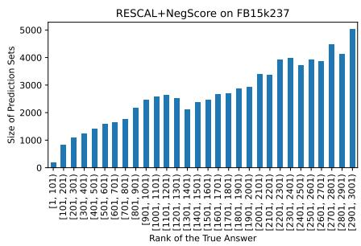

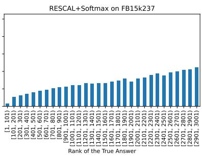

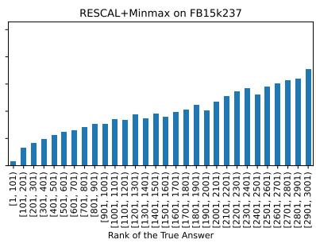  
Figure 1: This figure shows the size of answer sets stratified by the difficulty level of queries. It shows the adaptiveness of different conformal predictors (built on RESCAL models) on the FB15k237 dataset, more results can be found in Figure 3 - 14 in Appendix.

We observe that the size of answer sets generated by conformal predictors closely aligns with the difficulty levels of the queries, thereby fulfilling the adaptiveness desideratum. This is a valuable property because, in practice, the true answer to a query is unknown. By examining the size of the answer set, we can estimate the predictive uncertainty for the query.

## 6.3 Experiment 3: Impact of Calibration Set Size on Answer Set Quality

In this experiment, we investigate the impact of size of the calibration set, $\mathcal { T } _ { m + 1 : n }$ , on the quality of answer sets in terms of coverage and size desiderata. We randomly sampled calibration sets of 10, 100, 200, and 500 triples from the validation set for use in conformal prediction. We then evaluated the coverage and average size of the resulting answer sets. This process was repeated 20 times to compute the mean and standard deviation of the results. For comparison, we also evaluated the answer sets generated using the entire validation set as the calibration set.

As shown in Proposition 1, the coverage of conformal predictors with an i.i.d calibration set should fall between 1 — € and $1 - \epsilon + \frac { 1 } { n - m }$ , where $n - m$ is the size of the calibration set. This is confirmed by the results in Table 2. The size of answer sets generated by split conformal predictors depends on the alignment between the distribution of nonconformity scores in the calibration set and those in the original training set (which includes both the proper training set and the calibration set). A larger calibration set typically better represents the original training set, leading to tighter answer sets, as confirmed by the results in Table 2. Notably, even with a relatively small calibration set, the quality of the answer sets closely approximates that obtained using the entire validation set.

<table><tr><td>Predictor</td><td>Size of Calibration Set</td><td>Coverage</td><td>Size</td></tr><tr><td rowspan="6">NegScore</td><td>10</td><td>0.98 (0.018)</td><td>7626.93 (6145.132)</td></tr><tr><td>100</td><td>0.91 (0.019)</td><td>54.67 (18.268)</td></tr><tr><td>200</td><td>0.91 (0.014)</td><td>50.88 (12.725)</td></tr><tr><td>500</td><td>0.90 (0.010)</td><td>47.58 (6.891)</td></tr><tr><td>Entire validation set</td><td>0.90 (-)</td><td>46.26 (-)</td></tr><tr><td>10</td><td>0.97 (0.002)</td><td>8604.95 (7395.591)</td></tr><tr><td rowspan="4">Softmax</td><td>100</td><td>0.91 (0.018)</td><td>2.70 (1.158)</td></tr><tr><td>200</td><td>0.91 (0.012)</td><td>2.31 (0.591)</td></tr><tr><td>500</td><td>0.90 (0.008)</td><td>2.07 (0.255)</td></tr><tr><td>Entire validation set</td><td>0.90 (-)</td><td>2.07 (-)</td></tr><tr><td rowspan="5">Minmax</td><td>10</td><td>0.96 (0.03)</td><td>2796.73 (546.911)</td></tr><tr><td>100</td><td>0.91 (0.020)</td><td>2.24 (0.671)</td></tr><tr><td>200</td><td>0.91 (0.016)</td><td>2.18 (0.390)</td></tr><tr><td>500</td><td>0.90 (0.009)</td><td>1.99 (0.145)</td></tr><tr><td>Entire validation set</td><td>0.90 (-)</td><td>1.94 (-)</td></tr></table>

Table 2: This table shows the coverage and size (with means and standard deviations over 20 trials) of answer sets generated by different predictors using varying sizes of calibration sets on the WN18 dataset.

## 6.4 Experiment 4: Impact of Error Rate on Answer Set Quality

In this experiment, we examine the effect of the user-specified error rate (€) on the quality of answer sets. Figure 2 illustrates how € influences the size of answer sets (upper diagram) and the coverage of answer sets (lower diagram) across various predictors. The red line in lower diagram correspond to the desired coverage 1 — €.

As expected, the size of answer sets decreases as € increases, aligning with the requirements discussed in Section 3. The topk and conformal predictors consistently generate smaller answer sets compared to the naive and Platt predictors. Notably, conformal predictors produce the most compact answer sets when the error rate is set to a very low value. In terms of coverage, conformal predictors consistently meet the probabilistic guarantee in Proposition 1 across the range of € values.

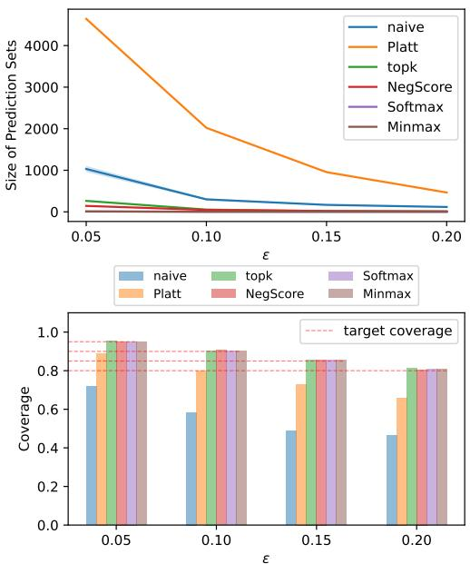  
Figure 2: This figure shows how the coverage and size of answer sets change with respect to € across different predictors on the WN18 dataset.

## 7 Discussion

Our method predicts answer sets for queries with a guaranteed coverage of the true answer at a prespecified probability, such as 90%, while maintaining a small average size. Unlike ranking-based outputs, our approach is particularly well-suited for decision-making in high-stakes domains, including medical diagnosis, drug discovery, and fraud detection. For instance, a doctor could use our method to automatically eliminate a large number of irrelevant diseases, thereby referring the patient to the most appropriate specialists. Additionally, our method is easy to implement and is compatible not only with any KGE models but also with embedding methods capable of answering more complex queries (Ren et al., 2020; He et al., 2024a,b) and approximate statistical reasoning in ontology (Zhu et al., 2023, 2024b).

The adaptability of our answer sets to the uncertainty of queries also enables our method to quantify the predictive uncertainty of KGE models. This feature broadens the applicability of our approach by systematically identifying hard or uncertain queries during testing. Detecting such queries can help identify potential failure cases or outliers, alerting users when the model's predictions may be unreliable.

## 8 Limitations

A limitation of our method is the requirement to divide the training set into two parts: one for training the model and another for calculating the nonconformity scores, due to the adoption of split conformal prediction. This division reduces the number of triples available for model training. However, this issue is mitigated by the fact that the validation set, typically reserved for hyperparameter tuning, can also serve as the calibration set. Moreover, as demonstrated in Experiment 4, even a small subset of the validation set is sufficient to produce nearly optimal answer sets.

Another limitation is that the probabilistic guarantee provided by Theorem 1 and Proposition 1 relies on the i.i.d. assumption, which may not hold under distribution shifts. We are currently extending our conformal predictors to covariant shift case, where only the input distribution P(X) changes while the conditional distribution P(Y[X) remains the same. We begin with the simpler scenario where the likelihood ratio between the training and test distributions is known. Following (Tibshirani et al., 2019), we weight each nonconformity score proportionally to the likelihood ratio to ensure the probabilistic guarantee in Proposition 1 holds beyond the i.i.d. assumption.

## 9 Acknowledgements

The authors thank the International Max Planck Research School for Intelligent Systems (IMPRS-IS) for supporting Yuqicheng Zhu and Yunjie He. The work was partially supported by EU Projects Graph Massivizer (GA 101093202), Dome 4.0 (GA 953163), enRichMyData (GA 101070284) and SMARTY (GA 101140087).

## References

Anastasios Nikolas Angelopoulos, Stephen Bates, Michael I. Jordan, and Jitendra Malik. 2021. Uncertainty sets for image classifiers using conformal prediction. In ICLR. OpenReview.net.

James Bergstra and Yoshua Bengio. 2012. Random search for hyper-parameter optimization. Journal of machine learning research, 13(2).

Russa Biswas, Lucie-Aimée Kaffee, Michael Cochez, Stefania Dumbrava, Theis E Jendal, Matteo Lissandrini, Vanessa Lopez, Eneldo Loza Mencía, Heiko Paulheim, Harald Sack, et al. 2023. Knowledge graph embeddings: open challenges and opportunities. Transactions on Graph Data and Knowledge, 1(1):4–1.

Antoine Bordes, Nicolas Usunier, Alberto Garcia-Duran, Jason Weston, and Oksana Yakhnenko. 2013. Translating embeddings for modeling multirelational data. Advances in neural information processing systems, 26.

Samuel Broscheit, Daniel Ruffinelli, Adrian Kochsiek, Patrick Betz, and Rainer Gemulla. 2020. LibKGE - A knowledge graph embedding library for reproducible research. In Proceedings of the 2020 Conference on Empirical Methods in Natural Language Processing: System Demonstrations, pages 165–174.

Tim Dettmers, Pasquale Minervini, Pontus Stenetorp, and Sebastian Riedel. 2018. Convolutional 2d knowledge graph embeddings. In Proceedings of the AAAI conference on artificial intelligence, volume 32.

Chuan Guo, Geoff Pleiss, Yu Sun, and Kilian Q Weinberger. 2017. On calibration of modern neural networks. In International conference on machine learning, pages 1321–1330. PMLR.

Chirag Gupta, Aleksandr Podkopaev, and Aaditya Ramdas. 2020. Distribution-free binary classification: prediction sets, confidence intervals and calibration. Advances in Neural Information Processing Systems, 33:3711-3723.

Shizhu He, Kang Liu, Guoliang Ji, and Jun Zhao. 2015. Learning to represent knowledge graphs with gaussian embedding. In Proceedings of the 24th ACM international on conference on information and knowledge management, pages 623–632.

Yunjie He, Daniel Hernandez, Mojtaba Nayyeri, Bo Xiong, Yuqicheng Zhu, Evgeny Kharlamov, and Steffen Staab. 2024a. Generating sroi− ontologies via knowledge graph query embedding learning. In Proceeding of 27th European Conference on Artificial Intelligence, pages 4279 – 4286.

Yunjie He, Bo Xiong, Daniel Hernández, Yuqicheng Zhu, Evgeny Kharlamov, and Steffen Staab. 2024b. Dage: Dag query answering via relational combinator with logical constraints. In Proceedings of the ACM Web Conference 2025.

Kexin Huang, Ying Jin, Emmanuel Candes, and Jure Leskovec. 2024. Uncertainty quantification over graph with conformalized graph neural networks. Advances in Neural Information Processing Systems, 36.

Joseph B Kruskal. 1964. Nonmetric multidimensional scaling: a numerical method. Psychometrika, 29(2):115–129.

Erich Leo Lehmann, Joseph P Romano, and George Casella. 1986. Testing statistical hypotheses, volume 3. Springer.

Jing Lei, Max G'Sell, Alessandro Rinaldo, Ryan J Tibshirani, and Larry Wasserman. 2018. Distributionfree predictive inference for regression. Journal of the American Statistical Association, 113(523):1094– 1111.

Jing Lei, Alessandro Rinaldo, and Larry Wasserman. 2015. A conformal prediction approach to explore functional data. Annals of Mathematics and Artificial Intelligence, 74:29–43.

Lysimachos Maltoudoglou, Andreas Paisios, and Harris Papadopoulos. 2020. Bert-based conformal predictor for sentiment analysis. In Conformal and Probabilistic Prediction and Applications, pages 269–284. PMLR.

Maximilian Nickel, Volker Tresp, and Hans-Peter Kriegel. 2011. A three-way model for collective learning on multi-relational data. In ICML, pages 809–816. Omnipress.

OpenAI. 2024. Chatgpt(3.5)[large language model] https://chat.openai.com.

John Platt et al. 1999. Probabilistic outputs for support vector machines and comparisons to regularized likelihood methods. Advances in large margin classifiers, 10(3):61–74.

H Ren, W Hu, and J Leskovec. 2020. Query2box: Reasoning over knowledge graphs in vector space using box embeddings. In International Conference on Learning Representations (ICLR).

Daniel Ruffinelli, Samuel Broscheit, and Rainer Gemulla. 2019. You can teach an old dog new tricks! on training knowledge graph embeddings. In International Conference on Learning Representations.

Tara Safavi, Danai Koutra, and Edgar Meij. 2020. Evaluating the calibration of knowledge graph embeddings for trustworthy link prediction. In EMNLP (1), pages 8308–8321. Association for Computational Linguistics.

Glenn Shafer and Vladimir Vovk. 2008. A tutorial on conformal prediction. Journal of Machine Learning Research, 9(3).

Zhiqing Sun, Zhi-Hong Deng, Jian-Yun Nie, and Jian Tang. 2019. Rotate: Knowledge graph embedding by relational rotation in complex space. In ICLR (Poster). OpenReview.net.

Pedro Tabacof and Luca Costabello. 2020. Probability calibration for knowledge graph embedding models. In ICLR. OpenReview.net.

Ryan J Tibshirani, Rina Foygel Barber, Emmanuel Candes, and Aaditya Ramdas. 2019. Conformal prediction under covariate shift. Advances in neural information processing systems, 32.

Kristina Toutanova and Danqi Chen. 2015. Observed versus latent features for knowledge base and text inference. In Proceedings of the 3rd workshop on continuous vector space models and their compositionality, pages 57–66.

Théo Trouillon, Johannes Welbl, Sebastian Riedel, Éric Gaussier, and Guillaume Bouchard. 2016. Complex embeddings for simple link prediction. In International conference on machine learning, pages 2071– 2080. PMLR.

Vladimir Vovk, Alexander Gammerman, and Glenn Shafer. 2005. Algorithmic learning in a random world, volume 29. Springer.

Quan Wang, Zhendong Mao, Bin Wang, and Li Guo. 2017. Knowledge graph embedding: A survey of approaches and applications. IEEE transactions on knowledge and data engineering, 29(12):2724–2743.

Han Xiao, Minlie Huang, and Xiaoyan Zhu. 2016. TransG : A generative model for knowledge graph embedding. In Proceedings of the 54th Annual Meeting of the Association for Computational Linguistics (Volume 1: Long Papers), pages 2316–2325, Berlin, Germany. Association for Computational Linguistics.

Bishan Yang, Wen-tau Yih, Xiaodong He, Jianfeng Gao, and Li Deng. 2015. Embedding entities and relations for learning and inference in knowledge bases. In ICLR (Poster).

Soroush H Zargarbashi, Simone Antonelli, and Aleksandar Bojchevski. 2023. Conformal prediction sets for graph neural networks. In International Conference on Machine Learning, pages 12292–12318. PMLR.

Soroush H Zargarbashi and Aleksandar Bojchevski. 2023. Conformal inductive graph neural networks. In The Twelfth International Conference on Learning Representations.

Yuqicheng Zhu, Nico Potyka, Mojtaba Nayyeri, Bo Xiong, Yunjie He, Evgeny Kharlamov, and Steffen Staab. 2024a. Predictive multiplicity of knowledge graph embeddings in link prediction. In Findings of the Association for Computational Linguistics: EMNLP 2024, pages 334–354.

Yuqicheng Zhu, Nico Potyka, Bo Xiong, Trung-Kien Tran, Mojtaba Nayyeri, Evgeny Kharlamov, and Steffen Staab. 2024b. Approximating probabilistic inference in statistical EL with knowledge graph embeddings. CoRR, abs/2407.11821.

Yuqicheng Zhu, Nico Potyka, Bo Xiong, Trung-Kien Tran, Mojtaba Nayyeri, Steffen Staab, and Evgeny Kharlamov. 2023. Towards statistical reasoning with ontology embeddings. In ISWC (Posters/Demos/Industry), volume 3632 of CEUR Workshop Proceedings. CEUR-WS.org.

## A Baseline Predictors

## A.1 Naive Predictor

We provide detailed pseudocode for naive predictor in this section. See Algorithm 2 for details.

Algorithm 2 Pseudocode for naive predictor.   
Require: A KGE model $M _ { \theta }$ trained on $\mathcal { T } _ { 1 : n } .$ a   
testing query $q _ { n + 1 }$ and an error rate €.   
1: $L \gets \mathbf { a n }$ empty set   
2: for each entity e in E do   
3: $L \gets L \cup \{ ( e , M _ { \theta } ( t r ( q _ { n + 1 } , e ) ) ) \}$   
4: end for   
5: normalize the scores in L with softmax func  
tion.   
6: $\overline { { L } } $ sort elements in L based on normalized   
scores (from largest to smallest).   
7: $p  0$   
8: $\hat { C } ( q _ { n + 1 } ) \gets$ an empty set   
9: for $( e , s )$ in ¯ do   
10: $p \gets p + s$   
11: $\mathbf { i f } \ p < 1 - \epsilon$ then   
12: $\hat { C } ( q _ { n + 1 } ) \gets \hat { C } ( q _ { n + 1 } ) \cup \{ e \}$   
13: end if   
14: end for   
15: return ${ \hat { C } } ( q _ { n + 1 } )$

## A.2 Platt Predictor

The Platt predictor enhances the naive predictor using a calibration technique. The only difference in its procedure, as outlined in line 5 of Algorithm 2, is the modification of softmax outputs through temperature scaling(Guo et al., 2017) — a multiclass extension of Platt scaling (Platt et al., 1999).

Temperature scaling employs a single scalar parameter $T > 0$ across all possible answer entities for a given query. Let $M _ { \theta } ( t r ( q _ { n + 1 } ) , e _ { i } )$ represent the plausibility score of entity $e _ { i } \in E$ for query $q _ { n + 1 }$ . The calibrated score $\hat { s } _ { i }$ is then calculated as

$$
\hat { s } _ { i } = \sigma ( M _ { \theta } ( t r ( q _ { n + 1 } ) , e _ { i } ) / T ) ,\tag{18}
$$

where $\sigma ( \cdot )$ is the softmax function.

The parameter T, known as the temperature, "softens" the softmax output by increasing its entropy when $T > 1 . { \mathrm { ~ A s ~ } } T  \infty$ , the probability $\hat { s } _ { i }$ approaches $1 / | E |$ , indicating maximum uncertainty. When $T = 1$ , the original softmax output is recovered. Conversely, as $T  0$ , the probability collapses to a point mass $( \hat { s } _ { i } = 1 )$ . The optimal value of $T$ is determined by minimizing the negative log-likelihood on the validation set.

<table><tr><td colspan="3">WN18</td><td colspan="3">FB15k</td></tr><tr><td>method</td><td>coverage</td><td>size</td><td>method</td><td>coverage</td><td>size</td></tr><tr><td>top1</td><td>0.45</td><td>0.48</td><td>top1</td><td>0.12</td><td>0.17</td></tr><tr><td>top3</td><td>0.65</td><td>1.76</td><td>top3</td><td>0.24</td><td>0.71</td></tr><tr><td>top10</td><td>0.80</td><td>7.32</td><td>top10</td><td>0.46</td><td>3.91</td></tr><tr><td>top100</td><td>0.92</td><td>90.91</td><td>top100</td><td>0.79</td><td>71.46</td></tr><tr><td>topk</td><td>0.90</td><td>52.96</td><td>topk</td><td>0.90</td><td>395.11</td></tr></table>

Table 3: Comparison of the fixed-size set predictors and the top-K predictor with K learned based on the validation set. The table reports the mean values of coverage and the average size of filtered answer sets over 15 trials. Results are based on the RESCAL model applied to the WN18 and FB15k datasets.

$$
N L L = - \frac { 1 } { N } \sum _ { i = 1 } ^ { N } \log ( \frac { \hat { s } _ { i } } { \sum _ { j = 1 } ^ { N } \hat { s } _ { j } } ) ,\tag{19}
$$

where N is the size of calibration (validation) set.

## A.3 Fixed-sized Predictor

The ranking-based metric Hits@K evaluate how often KGE models place the correct answers within the top-K entities, implicitly suggesting that the top-K entities should be chosen as answer sets. Based on Hits@K, we evaluate the quality of fixed-sized set predictor, which produce top-K entities (with a manually chosen K) as the answer set.

We select K values commonly used in Hits@K metrics (1, 3, 10, 100). The results in Table 3 and 4 demonstrate that coverage is highly sensitive to the choice of K. Concretely, the fixed-sized set predictor either fails to meet the coverage desideratum or generate unnecessarily large answer sets.

Consequently, in the main body of the paper, we adopt the topk predictor, where we use K that cover the true answer in 1 — € of queries in the validation set. The topk predictor effectively balances the trade-off between coverage and average size. However, unlike conformal predictors, the topk predictor cannot adapt answer set sizes to the difficulty of individual queries, as it uses the same size for all queries.

## B Detailed Experimental Setting

## B.1 Information About KGE Models and Benchmark Datasets

We provide the statistics of the benchmark datasets in Table 5 and the scoring functions of KGE methods in Table 6.

<table><tr><td colspan="3">WN18</td><td colspan="3">FB15k</td></tr><tr><td>method</td><td>coverage</td><td>size</td><td>method</td><td>coverage</td><td>size</td></tr><tr><td>top1</td><td>0.45</td><td>1.00</td><td>top1</td><td>0.12</td><td>1.00</td></tr><tr><td>top3</td><td>0.65</td><td>3.00</td><td>top3</td><td>0.24</td><td>3.00</td></tr><tr><td>top10</td><td>0.80</td><td>10.00</td><td>top10</td><td>0.46</td><td>10.00</td></tr><tr><td>top100</td><td>0.92</td><td>100.00</td><td>top100</td><td>0.79</td><td>100.00</td></tr><tr><td>topk</td><td>0.90</td><td>60.00</td><td>topk</td><td>0.90</td><td>465.00</td></tr></table>

Table 4: Comparison of the fixed-size set predictors and the top-K predictor with K learned based on the validation set. The table reports the mean values of coverage and the average size of answer sets over 15 trials. Results are based on the RESCAL model applied to the WN18 and FB15k datasets.
<table><tr><td></td><td>#Entity</td><td>#Relation</td><td>#Training</td><td>#Validation</td><td>#Test</td></tr><tr><td>WN18</td><td>40,943</td><td>18</td><td>141,442</td><td>5,000</td><td>5,000</td></tr><tr><td>WN18RR</td><td>40,943</td><td>11</td><td>86,835</td><td>3,034</td><td>3,134</td></tr><tr><td>FB15k</td><td>14,951</td><td>1,345</td><td>483,142</td><td>50,000</td><td>59,071</td></tr><tr><td>FB15k-237</td><td>14,541</td><td>237</td><td>272,115</td><td>17,535</td><td>20,466</td></tr></table>

Table 5: Statistics of benchmark datasets for link prediction task.
<table><tr><td>Scoring Function s(&lt; h, r, t &gt;)</td></tr><tr><td>TransE (Bordes et al., 2013)</td><td> $| | \mathbf { h } + \mathbf { r } - \mathbf { t } | | _ { 1 / 2 }$ </td></tr><tr><td>RotatE (Sun et al., 2019)</td><td> $| | \mathbf { h } \circ \mathbf { r } - \mathbf { t } | | _ { p }$ </td></tr><tr><td>RESCAL (Nickel et al., 2011)</td><td> $\mathbf { h } ^ { T } \mathbf { M } _ { r } \mathbf { t }$ </td></tr><tr><td>DistMult (Yang et al., 2015)</td><td> $\mathbf { h } ^ { T } d i a g ( \mathbf { r } ) \mathbf { t }$ </td></tr><tr><td>ComplEx (Trouillon et al., 2016)</td><td> $R e ( \mathbf { h } ^ { T } d i a g ( \mathbf { r } ) \overline { { \mathbf { t } } } )$ </td></tr><tr><td>ConvE (Dettmers et al., 2018)</td><td> $f ( v e c ( f ( [ \overline { { \mathbf { h } } } ; \overline { { \mathbf { r } } } ] * \omega ) ) \mathbf { W } ) \mathbf { t }$ </td></tr></table>

Table 6: The scoring function $s ( < h , r , t > )$ of KGE models used in this paper, where $h , r ,$ t denote the embeddings of $h , r , t ,$ o denotes Hadamard product.  refers to conjugate for complex vectors in ComplEx, and 2D reshaping for real vectors in ConvE. \* is operator for 2D convolution. ω is the filters and W is the parameters for 2D convolutional layer.

## B.2 Personal Identification Issue in FB15k and FB15k237

While FB15k and FB15k237 contain information about individuals, it typically focuses on wellknown public figures such as celebrities, politicians, and historical figures. Since this information is already widely available online and in various public sources, its inclusion in Freebase doesn't significantly compromise individual privacy compared to datasets containing sensitive personal information.

## B.3 Details of Pre-training KGE Models

For training KGE models, we use the implementation of LibKGE (Broscheit et al., 2020) and basically follow the hyperparameter search strategy in (Ruffinelli et al., 2019). All experiments were conducted on a Linux machine with a 40GB NVIDIA

A100 SXM4 GPU.

We first conduct quasi-random hyperparameter search via a Sobol sequence, which aims to distribute hyperparameter settings evenly to avoid "clumping" effects (Bergstra and Bengio, 2012). More specifically, for each dataset and model, we generated 30 different configurations per valid combination of training type and loss function. we added a short Bayesian optimization phase (best configuration so far + 30 new trials) to tune the hyperparameters further. All above steps are conducted using Ax framework (https: //ax.dev/)

We use a large hyperparameter space including loss functions (pairwise margin ranking with hinge loss, binary cross entropy, cross entropy), regularization techniques (none/L1/L2/L3, dropout), optimizers (Adam, Adagrad), and initialization methods used in the KGE community as hyperparameters. We consider 128, 256, 512 as possible embedding sizes. More details see in (Ruffinelli et al., 2019, Table 5).

The hyperparameters of the baseline models are located within the software folder we submitted. Concretely, all configuration files (\*.yaml) that we use for training baseline models/competing models/models for aggregation can be found in folder "configs".

## C Calibrated Conformal Predictor

Conformal prediction is a theoretical framework that quantifies predictive uncertainty by ensuring answer sets meet probabilistic guarantees, followed by identifying a nonconformity measure that minimizes the size of these sets. Optimal answer sets are achieved when nonconformity scores accurately reflect the confidence of the predictions

While calibrating plausibility scores from KGE models should theoretically improve the naive predictor and the nonconformity measure for conformal predictor, our results suggest otherwise. As shown in Table 1, 8, 9 and 10, Platt predictors yield excessively large answer sets. Further experiments comparing softmax conformal prediction before and after temperature scaling (Table 7) reveal that temperature scaling generally increases answer set sizes. Although smaller sets are observed for TransE, they are still not competitive with the best predictors for TransE in Table 1. These observations contradict our expectations. We next explore the reasons for these outcomes in KGE models.

First, as detailed in Appendix A.2, temperature scaling adjusts plausibility scores by dividing by a temperature parameter T, optimized by minimizing negative log-likelihood on validation set. This calibration assumes two key points: (1) uniform miscalibration, where plausibility scores are consistently miscalibrated across the model (e.g., the KGE model is uniformly overconfident or underconfident for all queries); and (2) monotonic calibration, where the relative ordering of plausibility scores aligns with calibrated probabilities. These assumptions are overly stringent for KGE models, which tend to be overconfident with queries that have many correct answers and underconfident with those having fewer correct answers. Additionally, the relative ordering of plausibility scores is highly sensitive to minor hyperparameter changes.

Moreover, applying temperature scaling or other calibration techniques requires formulating link prediction as a classification task. However, the validation set exhibits a long-tail distribution in the number of triples associated with certain entities, i.e. many entities have few or even no associated triples. It leads to insufficient data for effective calibration for entities associated with fewer triples.

<table><tr><td rowspan="2">model</td><td rowspan="2">method</td><td colspan="2">WN18</td><td colspan="2">FB15k</td></tr><tr><td>coverage</td><td>size</td><td>coverage</td><td>size</td></tr><tr><td rowspan="2">TransE</td><td>Softmax</td><td>0.90</td><td>112.8</td><td>0.90</td><td>414.9</td></tr><tr><td>Cali</td><td>0.90</td><td>63.4</td><td>0.90</td><td>129.0</td></tr><tr><td rowspan="2">RotatE</td><td>Softmax</td><td>0.90</td><td>1.9</td><td>0.90</td><td>140.4</td></tr><tr><td>Cali</td><td>0.90</td><td>17.4</td><td>0.90</td><td>150.6</td></tr><tr><td rowspan="2">RESCAL</td><td>Softmax</td><td>0.90</td><td>2.1</td><td>0.90</td><td>72.6</td></tr><tr><td>Cali</td><td>0.91</td><td>247.3</td><td>0.90</td><td>209.5</td></tr><tr><td rowspan="2">DistMult</td><td>Softmax</td><td>0.90</td><td>2.0</td><td>0.90</td><td>28.4</td></tr><tr><td>Cali</td><td>0.90</td><td>26.8</td><td>0.90</td><td>240.5</td></tr><tr><td rowspan="2">ComplEx</td><td>Softmax</td><td>0.90</td><td>1.1</td><td>0.90</td><td>37.2</td></tr><tr><td>Cali</td><td>0.90</td><td>18.2</td><td>0.90</td><td>173.6</td></tr><tr><td rowspan="2">ConvE</td><td>Softmax</td><td>0.90</td><td>1.6</td><td>0.90</td><td>44.4</td></tr><tr><td>Cali</td><td>0.90</td><td>61.2</td><td>0.90</td><td>177.7</td></tr></table>

Table 7: Comparison of the filtered answer sets between the Softmax conformal predictor (Softmax) and the conformal predictor with temperature scaling applied to the Softmax predictor (Cali). The best predictors, which meet the coverage desideratum and minimize answer set size, are highlighted in bold.

## D Further Results for Coverage & Set Size Evaluation

## D.1 Coverage and Set Size on WN18RR and FB15k237

We repeated the experiment on WN18RR and FB15k237, datasets known to be more challenging than WN18 and FB15k due to the removal of inverse relations (Toutanova and Chen, 2015; Dettmers et al., 2018).

The results for the filtered answer sets are presented in Table 8, while the unfiltered results are available in Table 10 in Appendix D. The conclusions from Experiment 1 remain consistent; however, we observe a significant increase in set sizes for all set predictors, particularly for WN18RR. This increase is desirable, as it aligns with the adaptiveness desideratum, where the set predictor is expected to output smaller sets for simple queries and larger sets for harder ones.

## E Further Results for Adaptiveness Evaluation

In Figure 3 - 14, we show the size of answer sets stratified by the difficulty level of queries for different conformal predictors across six representative KGE models and four benchmark datasets.

## F AI Assistants In Writing

We use ChatGPT (OpenAI, 2024) to enhance our writing skills, abstaining from its use in research and coding endeavors.

<table><tr><td rowspan="2">model</td><td rowspan="2">MR</td><td colspan="3">WN18RR</td><td rowspan="2">MR</td><td colspan="3">FB15k237</td></tr><tr><td>methods</td><td>coverage</td><td>size</td><td>methods</td><td>coverage</td><td>size</td></tr><tr><td rowspan="6">TransE</td><td rowspan="6">1849.47 (20.933)</td><td>naive Platt</td><td>0.92 (0.002) 0.90 (0.002)</td><td>12592.31 (39.396) 10921.01 (32.441)</td><td rowspan="6">TransE 206.62 (2.105)</td><td>naive</td><td>0.90 (0.006) 0.90 (0.006)</td><td>805.70 (38.319) 832.14 (36.711)</td></tr><tr><td></td><td></td><td></td><td>Platt</td><td></td><td></td></tr><tr><td>topk</td><td>0.90 (0.002)</td><td>3571.51 (144.178)</td><td>topk</td><td>0.90 (0.001)</td><td>875.53 (7.835)</td></tr><tr><td>NegScore</td><td>0.90 (0.002)</td><td>9409.77 (252.614)</td><td>NegScore</td><td>0.90 (0.001)</td><td>1367.25 (39.240)</td></tr><tr><td>Softmax</td><td>0.90 (0.001)</td><td>4864.10 (160.461)</td><td>Softmax</td><td>0.90 (0.001)</td><td>340.67 (3.099)</td></tr><tr><td>Minmax</td><td>0.90 (0.001)</td><td>4371.36 (172.089)</td><td>Minmax</td><td>0.90 (0.001)</td><td>482.96 (8.236)</td></tr><tr><td rowspan="6">RotatE</td><td rowspan="6">2402.47 (226.057)</td><td>naive</td><td>0.98 (0.003)</td><td>29054.22 (78.389)</td><td rowspan="6">RotatE 167.92 (3.340)</td><td>naive</td><td>0.99 (0.000)</td><td>4564.86 (16.479)</td></tr><tr><td>Platt</td><td>0.92 (0.003)</td><td>23041.24 (67.999)</td><td>Platt</td><td>0.95 (0.001)</td><td>1851.22 (12.442)</td></tr><tr><td>topk</td><td>0.90 (0.003)</td><td>7780.12 (1372.505)</td><td>topk</td><td>0.90 (0.001)</td><td>786.96 (9.659)</td></tr><tr><td>NegScore</td><td>0.90 (0.004)</td><td>10135.01 (887.572)</td><td>NegScore</td><td>0.90 (0.001)</td><td>396.30 (6.841)</td></tr><tr><td>Softmax</td><td>0.90 (0.003)</td><td>8469.82 (1332.540)</td><td>Softmax</td><td>0.90 (0.001)</td><td>309.38 (4.527)</td></tr><tr><td>Minmax</td><td>0.90 (0.003)</td><td>8026.50 (691.561)</td><td>Minmax</td><td>0.90 (0.001)</td><td>310.32 (5.611)</td></tr><tr><td rowspan="6"></td><td rowspan="6">RESCAL 5080.82 (157.027)</td><td>naive</td><td>0.82 (0.004) 0.91 (0.006)</td><td>19604.12 (54.324)</td><td rowspan="6">RESCAL 197.71 (7.228)</td><td>naive</td><td>0.75 (0.026) 0.85 (0.017)</td><td>311.80 (59.631) 492.83 (68.264)</td></tr><tr><td>Platt topk</td><td>0.90 (0.006)</td><td>25156.82 (67.922)</td><td>Platt</td><td></td><td></td></tr><tr><td></td><td>0.90 (0.006)</td><td>20571.25 (619.329)</td><td>topk</td><td>0.90 (0.001)</td><td>810.16 (8.750)</td></tr><tr><td>NegScore</td><td>0.90 (0.006)</td><td>19813.44 (476.890)</td><td>NegScore</td><td>0.90 (0.001) 0.90 (0.001)</td><td>581.74 (16.583) 261.58 (5.352)</td></tr><tr><td>Softmax Minmax</td><td>0.90 (0.005)</td><td>25146.85 (397.278)</td><td>Softmax Minmax</td><td>0.90 (0.001)</td><td>356.23 (20.744)</td></tr><tr><td>naive</td><td></td><td>18262.03 (484.686)</td><td></td><td></td><td></td></tr><tr><td rowspan="6">DistMult</td><td rowspan="6">4325.85 (153.189)</td><td>Platt</td><td>0.87 (0.014) 0.90 (0.005)</td><td>22687.34 (1040.595) 26100.71 (766.341)</td><td rowspan="6">DistMult 194.19 (4.581)</td><td>naive Platt</td><td>0.82 (0.008) 0.88 (0.007)</td><td>852.93 (110.675) 1236.71 (122.667)</td></tr><tr><td>topk</td><td>0.90 (0.005)</td><td>18220.44 (660.313)</td><td>topk</td><td>0.90 (0.001)</td><td>785.39 (7.479)</td></tr><tr><td>NegScore</td><td>0.90 (0.005)</td><td>22735.97 (843.241)</td><td>NegScore</td><td>0.90 (0.001)</td><td>340.43 (8.278)</td></tr><tr><td>Softmax</td><td>0.90 (0.004)</td><td>24347.85 (1756.093)</td><td></td><td>0.90 (0.001)</td><td>276.85 (4.932)</td></tr><tr><td>Minmax</td><td>0.90 (0.005)</td><td></td><td>Softmax Minmax</td><td>0.90 (0.001)</td><td>352.42 (31.161)</td></tr><tr><td></td><td></td><td>17555.05 (822.261)</td><td></td><td></td><td></td></tr><tr><td rowspan="6">ComplEx 4117.56 (127.304)</td><td rowspan="6"></td><td>naive Platt</td><td>0.45 (0.008) 0.83 (0.008)</td><td>5939.57 (192.280) 15307.46 (374.11)</td><td rowspan="6">ComplEx 183.58 (3.182)</td><td>naive</td><td>0.85 (0.010) 0.92 (0.010)</td><td>1027.42 (134.273) 1701.31 (145.989)</td></tr><tr><td>topk</td><td></td><td></td><td>Platt</td><td></td><td>757.90 (5.512)</td></tr><tr><td></td><td>0.90 (0.006)</td><td>19785.19 (410.275)</td><td>topk</td><td>0.90 (0.001)</td><td></td></tr><tr><td>NegScore</td><td>0.90 (0.007)</td><td>19858.11 (221.472)</td><td>NegScore</td><td>0.90 (0.001)</td><td>319.42 (6.025)</td></tr><tr><td>Softmax</td><td>0.90 (0.004)</td><td>18194.32 (595.990)</td><td>Softmax</td><td>0.90 (0.001)</td><td>271.05 (2.988)</td></tr><tr><td>Minmax</td><td>0.90 (0.003)</td><td>14101.85 (447.917)</td><td>Minmax</td><td>0.90 (0.001)</td><td>365.28 (72.147)</td></tr><tr><td rowspan="6">ConvE 4635.63 (151.271)</td><td>naive</td><td>0.25 (0.006)</td><td>1131.72 (88.750)</td><td rowspan="6">ConvE</td><td rowspan="6">185.19 (1.636)</td><td>naive</td><td>0.95 (0.006)</td><td>1072.99 (100.842)</td></tr><tr><td>Platt topk</td><td>0.82 (0.006)</td><td>10955.50 (800.116)</td><td>Platt</td><td>0.94 (0.005)</td><td>814.70 (75.111)</td></tr><tr><td></td><td>0.90 (0.005)</td><td>18270.13 (1047.722)</td><td>topk</td><td>0.90 (0.001)</td><td>752.37 (5.652)</td></tr><tr><td>NegScore Softmax</td><td>0.90 (0.004)</td><td>21094.54 (687.705)</td><td>NegScore</td><td>0.90 (0.001)</td><td>718.24 (44.095)</td></tr><tr><td></td><td>0.93 (0.006)</td><td>19851.28 (756.774)</td><td>Softmax</td><td>0.90 (0.001)</td><td>270.40 (3.336) 242.64 (1.843)</td></tr><tr><td>Minmax</td><td>0.90 (0.003)</td><td>17400.91 (644.163)</td><td>Minmax</td><td>0.90 (0.001)</td><td></td></tr></table>

Table 8: Quality of the filtered answer sets on WN18RR and FB15k237 datasets. This table presents the mean rank (MR) of KGE models, along with the coverage and size of answer sets generated using various set predictors. Conformal predictors are underlined. Means and standard deviations over 15 trials are reported at the 10% level (€ = 0.1). Predictors that fail to meet the coverage threshold of 1 — ε (0.9) are highlighted in red. The best predictors, which meet the coverage desideratum and minimize answer set size, are highlighted in bold.

<table><tr><td rowspan="2">MR</td><td rowspan="2"></td><td colspan="2">WN18</td><td colspan="6"></td></tr><tr><td>methods</td><td>coverage</td><td>size</td><td>model</td><td>MR</td><td>methods</td><td>coverage</td><td>size</td></tr><tr><td rowspan="6">TransE</td><td rowspan="6">261.27 (6.365)</td><td>naive</td><td>0.44 (0.004)</td><td>26.39 (1.278)</td><td rowspan="6">TransE</td><td rowspan="6">188.23 (0.187)</td><td>naive</td><td>0.73 (0.001)</td><td>406.43 (0.827)</td></tr><tr><td>Platt</td><td>0.85(0.002)</td><td>4060.21 (89.563)</td><td>Platt</td><td>0.84 (0.002)</td><td>1337.54 (44.123)</td></tr><tr><td>topk</td><td>0.90 (0.000)</td><td>54.67 (0.789)</td><td>topk</td><td>0.90 (0.000)</td><td>401.00 (1.461)</td></tr><tr><td>NegScore</td><td>0.90 (0.001)</td><td>37.29 (0.721)</td><td>NegScore</td><td>0.90 (0.001)</td><td>155.40 (0.623)</td></tr><tr><td>Softmax</td><td>0.90 (0.001)</td><td>129.67 (4.650)</td><td>Softmax</td><td>0.90 (0.000)</td><td>569.80 (2.423)</td></tr><tr><td>Minmax</td><td>0.90 (0.001)</td><td>130.45 (5.100)</td><td>Minmax</td><td>0.90 (0.000)</td><td>433.99 (3.242)</td></tr><tr><td rowspan="6">RotatE</td><td rowspan="6">493.17 (44.041)</td><td>naive</td><td>0.91 (0.003)</td><td>17704.98 (117.899)</td><td rowspan="6">RotatE 212.70 (1.003)</td><td rowspan="6"></td><td>naive</td><td>0.71 (0.003)</td><td>889.73 (5.109)</td></tr><tr><td>Platt</td><td>0.90 (0.002)</td><td>16966.23 (116.434)</td><td>Platt</td><td>0.88 (0.002)</td><td>1292.32 (7.532)</td></tr><tr><td>topk</td><td>0.90 (0.001)</td><td>57.73 (2.594)</td><td>topk</td><td>0.90 (0.000)</td><td>479.50 (4.066)</td></tr><tr><td>NegScore</td><td>0.90 (0.002)</td><td>17.87 (0.022)</td><td>NegScore</td><td>0.90 (0.001)</td><td>209.36 (0.665)</td></tr><tr><td>Softmax</td><td>0.90 (0.001)</td><td>13.61 (0.401)</td><td>Softmax</td><td>0.90 (0.000)</td><td>277.84 (5.434)</td></tr><tr><td>Minmax</td><td>0.90 (0.003)</td><td>20.53 (0.693)</td><td>Minmax naive</td><td>0.90 (0.001)</td><td>198.67 (1.117)</td></tr><tr><td rowspan="6">RESCAL 338.24 (21.476)</td><td rowspan="6"></td><td>naive Platt</td><td>0.58 (0.011) 0.80 (0.005)</td><td>316.68 (24.776) 2035.13 (222.193)</td><td rowspan="6"></td><td></td><td></td><td>0.58 (0.016)</td><td>274.69 (13.802) 755.23 (22.263)</td></tr><tr><td>topk</td><td>0.90 (0.001)</td><td></td><td>RESCAL 215.57 (1.548)</td><td>Platt</td><td>0.87 (0.003)</td><td>464.00 (2.556)</td></tr><tr><td></td><td>0.91 (0.001)</td><td>61.60 (1.744)</td><td></td><td>topk</td><td>0.90 (0.000)</td><td></td></tr><tr><td>NegScore</td><td></td><td>55.36 (3.529)</td><td></td><td>NegScore</td><td>0.90 (0.001)</td><td>327.14 (4.569)</td></tr><tr><td>Softmax</td><td>0.90 (0.001)</td><td>15.16 (0.358)</td><td></td><td>Softmax</td><td>0.90 (0.000)</td><td>183.69 (3.650)</td></tr><tr><td>Minmax</td><td>0.90 (0.002)</td><td>18.81 (0.080)</td><td></td><td>Minmax</td><td>0.90 (0.001)</td><td>237.00 (5.822)</td></tr><tr><td rowspan="6">DistMult</td><td rowspan="6">386.83 (20.312)</td><td>naive Platt</td><td>0.47 (0.002) 0.84 (0.001)</td><td>51.35 (7.023)</td><td rowspan="6">DistMult 196.36 (0.746)</td><td>naive</td><td>0.35 (0.013) 0.90 (0.001)</td><td>162.65 (1.103)</td></tr><tr><td>topk</td><td></td><td>1282.45 (204.44)</td><td>Platt</td><td></td><td>625.33 (2.300)</td></tr><tr><td></td><td>0.90 (0.001) 0.90 (0.001)</td><td>64.80 (2.587)</td><td>topk</td><td>0.90 (0.000)</td><td>430.00 (1.549)</td></tr><tr><td>NegScore</td><td></td><td>2261.78 (405.035)</td><td>NegScore</td><td>0.90 (0.000)</td><td>210.35 (2.876)</td></tr><tr><td>Softmax</td><td>0.90 (0.001)</td><td>9.16 (0.337)</td><td>Softmax Minmax</td><td>0.90 (0.000)</td><td>143.23 (4.601)</td></tr><tr><td>Minmax</td><td>0.90 (0.002)</td><td>18.04 (0.525)</td><td></td><td></td><td>0.90 (0.000)</td><td>197.79 (0.892)</td></tr><tr><td rowspan="6">ComplEx 467.12 (27.864)</td><td rowspan="6"></td><td>naive Platt</td><td>0.94 (0.007) 0.86 (0.002)</td><td>19984.22 (142.118) 16802.14 (125.322)</td><td rowspan="6">ComplEx 216.65 (1.698)</td><td>naive</td><td>0.28 (0.011) 0.90 (0.001)</td><td>189.44 (1.424)</td></tr><tr><td>topk</td><td></td><td></td><td>Platt</td><td></td><td>1082.11 (9.211)</td></tr><tr><td></td><td>0.91 (0.002) 0.90 (0.003)</td><td>46.73 (1.948)</td><td>topk</td><td>0.90 (0.000)</td><td>485.60 (4.800)</td></tr><tr><td>NegScore</td><td></td><td>18.36 (0.008)</td><td>NegScore</td><td>0.90 (0.001)</td><td>257.63 (9.161)</td></tr><tr><td>Softmax</td><td>0.90 (0.001)</td><td>7.63 (0.133)</td><td>Softmax</td><td>0.90 (0.001)</td><td>178.62 (3.561) 278.10 (20.531)</td></tr><tr><td>Minmax</td><td>0.90 (0.002)</td><td>19.72 (0.172)</td><td>Minmax naive</td><td>0.90 (0.001)</td><td></td></tr><tr><td rowspan="6">ConvE</td><td>327.52 (12.602)</td><td>naive 0.50 (0.015) 0.84 (0.007)</td><td>18.32 (1.536) 95.01 (1.772)</td><td rowspan="6">ConvE</td><td></td><td>Platt</td><td>0.45 (0.026) 0.88 (0.014)</td><td>932.71 (112.137) 4984.11 (699.111)</td></tr><tr><td>Platt topk</td><td>0.90 (0.001)</td><td>60.27 (1.569)</td><td>216.37 (1.848)</td><td>topk</td><td>0.90 (0.000)</td><td>455.13 (3.384)</td></tr><tr><td>NegScore</td><td>0.90 (0.002)</td><td>17.47 (0.617)</td><td></td><td>NegScore</td><td>0.90 (0.000)</td><td>203.47 (2.291)</td></tr><tr><td>Softmax</td><td>0.90 (0.001)</td><td>8.45 (0.666)</td><td></td><td>Softmax</td><td>0.90 (0.000)</td><td>217.82 (6.516)</td></tr><tr><td>Minmax</td><td>0.90 (0.001)</td><td>17.80 (0.161)</td><td></td><td>Minmax</td><td>0.90 (0.000)</td><td>206.62 (8.665)</td></tr><tr><td></td><td></td><td></td><td></td><td></td><td></td><td></td></tr><tr><td rowspan="2">model</td><td rowspan="2">MR</td><td colspan="3">WN18RR</td><td rowspan="2">MR</td><td colspan="4">FB15k237</td></tr><tr><td>methods</td><td>coverage</td><td>size</td><td>methods</td><td>coverage</td><td colspan="2">size</td></tr><tr><td rowspan="6">TransE</td><td rowspan="6">1863.55 (20.933)</td><td>naive</td><td>0.92 (0.002) 0.90 (0.002)</td><td>12606.42 (39.399)</td><td rowspan="6">378.52 (1.570) TransE</td><td>naive</td><td>0.90 (0.006)</td><td colspan="2">997.60 (40.772)</td></tr><tr><td>Platt</td><td></td><td>10935.81 (31.241)</td><td>Platt</td><td>0.90 (0.006)</td><td colspan="2">1022.32 (35.123)</td></tr><tr><td>topk</td><td>0.90 (0.002)</td><td>3585.87 (144.179)</td><td>topk</td><td>0.90 (0.001)</td><td colspan="2">993.33 (8.252)</td></tr><tr><td>NegScore</td><td>0.90 (0.002)</td><td>9424.01 (252.614)</td><td>NegScore</td><td>0.90 (0.001)</td><td colspan="2">1529.21 (38.853)</td></tr><tr><td>Softmax</td><td>0.90 (0.001)</td><td>4878.40 (160.461)</td><td>Softmax</td><td>0.90 (0.001)</td><td colspan="2">480.91 (4.252)</td></tr><tr><td>Minmax</td><td>0.90 (0.001)</td><td>4385.71 (172.090)</td><td>Minmax</td><td>0.90 (0.001)</td><td colspan="2">608.92 (8.100)</td></tr><tr><td rowspan="6">RotatE</td><td rowspan="6">2416.60 (226.054)</td><td>naive</td><td>0.98 (0.003)</td><td>29068.66 (78.388)</td><td rowspan="6">334.72 (2.449) RotatE</td><td>naive</td><td>0.99 (0.000)</td><td colspan="2">4776.32 (16.527)</td></tr><tr><td>Platt</td><td>0.92 (0.003)</td><td>23065.33 (65.139)</td><td>Platt</td><td>0.95 (0.001)</td><td colspan="2">1992.54 (12.111)</td></tr><tr><td>topk</td><td>0.90 (0.003)</td><td>7794.53 (1372.506)</td><td>topk</td><td>0.90 (0.001)</td><td colspan="2">899.20 (10.186)</td></tr><tr><td>NegScore</td><td>0.90 (0.004)</td><td>10149.42 (887.574)</td><td>NegScore</td><td>0.90 (0.001)</td><td colspan="2">601.35 (6.779)</td></tr><tr><td>Softmax</td><td>0.90 (0.003)</td><td>8484.13 (1332.541)</td><td>Softmax</td><td>0.90 (0.001)</td><td colspan="2">420.48 (5.493)</td></tr><tr><td>Minmax</td><td>0.90 (0.003)</td><td>8040.94 (691.558)</td><td>Minmax</td><td>0.90 (0.001)</td><td colspan="2">494.12 (7.390)</td></tr><tr><td rowspan="6">RESCAL 5095.01 (157.027)</td><td rowspan="6"></td><td>naive</td><td>0.82 (0.004) 0.91 (0.006)</td><td>19617.55 (54.247)</td><td rowspan="6">RESCAL 361.48 (5.994)</td><td>naive Platt</td><td>0.75 (0.026) 0.85 (0.017)</td><td colspan="2">518.49 (60.728) 634.23 (67.233)</td></tr><tr><td>Platt topk</td><td>0.90 (0.006)</td><td>25178.84 (67.922)</td><td></td><td></td><td colspan="2">923.93 (9.205)</td></tr><tr><td></td><td>0.90 (0.006)</td><td>20585.67 (619.329)</td><td>topk</td><td>0.90 (0.001)</td><td colspan="2"></td></tr><tr><td>NegScore</td><td></td><td>19827.86 (476.890)</td><td>NegScore</td><td>0.90 (0.001)</td><td colspan="2">794.21 (16.356)</td></tr><tr><td>Softmax</td><td>0.90 (0.006)</td><td>25161.15 (397.282)</td><td>Softmax</td><td>0.90 (0.001) 0.90 (0.001)</td><td colspan="2">441.73 (2.242) 550.94 (20.262)</td></tr><tr><td>Minmax</td><td>0.90 (0.005)</td><td>18276.47 (484.688)</td><td>Minmax</td><td></td><td colspan="2"></td></tr><tr><td rowspan="6">DistMult</td><td rowspan="6">4340.04 (153.190)</td><td>naive Platt</td><td>0.87 (0.014) 0.90 (0.005)</td><td>22700.68 (1040.718) 26117.52 (764.112)</td><td rowspan="6">DistMult 343.41 (4.267)</td><td>naive Platt</td><td>0.82 (0.008) 0.88 (0.007)</td><td colspan="2">1064.07 (111.022) 1385.57 (122.190)</td></tr><tr><td>topk</td><td>0.90 (0.005)</td><td></td><td></td><td>0.90 (0.001)</td><td colspan="2">895.13 (7.847)</td></tr><tr><td>NegScore</td><td>0.90 (0.005)</td><td>18234.80 (660.315)</td><td>topk</td><td>0.90 (0.001)</td><td colspan="2">446.12 (7.461)</td></tr><tr><td>Softmax</td><td>0.90 (0.004)</td><td>22750.38 (843.239)</td><td>NegScore</td><td>0.90 (0.001)</td><td colspan="2">429.23 (4.660)</td></tr><tr><td>Minmax</td><td>0.90 (0.005)</td><td>24362.11 (1756.095)</td><td>Softmax Minmax</td><td>0.90 (0.001)</td><td colspan="2">553.92 (30.822)</td></tr><tr><td></td><td></td><td>17569.49 (822.261)</td><td></td><td></td><td colspan="2"></td></tr><tr><td rowspan="6">ComplEx 4131.71 (127.296)</td><td rowspan="6"></td><td>naive Platt</td><td>0.45 (0.008) 0.83 (0.008)</td><td>5950.18 (192.118)</td><td rowspan="6">ComplEx 329.62 (2.596)</td><td>naive</td><td>0.85 (0.010) 0.92 (0.010)</td><td colspan="2">1239.13 (134.671) 1852.47 (142.284)</td></tr><tr><td>topk</td><td>0.90 (0.006)</td><td>15325.22 (372.89)</td><td>Platt</td><td>0.90 (0.001)</td><td colspan="2">865.33 (5.839)</td></tr><tr><td></td><td>0.90 (0.007)</td><td>19799.60 (410.282)</td><td>topk</td><td></td><td colspan="2">427.18 (5.201)</td></tr><tr><td>NegScore</td><td></td><td>19872.52 (221.472)</td><td>NegScore</td><td>0.90 (0.001)</td><td colspan="2"></td></tr><tr><td>Softmax</td><td>0.90 (0.004)</td><td>18208.61 (595.990)</td><td>Softmax</td><td>0.90 (0.001)</td><td colspan="2">404.95 (1.924)</td></tr><tr><td>Minmax</td><td>0.90 (0.003)</td><td>14116.23 (447.920)</td><td>Minmax</td><td>0.90 (0.001)</td><td colspan="2">564.83 (71.526)</td></tr><tr><td rowspan="6">ConvE 4649.83 (151.263)</td><td rowspan="6"></td><td>naive</td><td>0.25 (0.006)</td><td>1144.71 (88.743)</td><td rowspan="6">ConvE 339.42 (2.611)</td><td>naive</td><td>0.95 (0.006)</td><td colspan="2">1286.00 (100.851)</td></tr><tr><td>Platt</td><td>0.82 (0.006)</td><td>10973.44 (801.106)</td><td>Platt</td><td>0.94 (0.005)</td><td colspan="2">964.33 (73.154)</td></tr><tr><td>topk</td><td>0.90 (0.005)</td><td>18284.53 (1047.723)</td><td>topk</td><td>0.90 (0.001)</td><td colspan="2">860.40 (6.141)</td></tr><tr><td>NegScore</td><td>0.90 (0.004) 0.93 (0.006)</td><td>21108.92 (687.713)</td><td>NegScore</td><td>0.90 (0.001)</td><td colspan="2">931.44 (44.128) 369.22 (2.583)</td></tr><tr><td>Softmax Minmax</td><td>0.90 (0.003)</td><td>19865.73 (756.774)</td><td>Softmax</td><td>0.90 (0.001) 0.90 (0.001)</td><td colspan="2">441.82 (2.828)</td></tr><tr><td></td><td></td><td>17415.35 (644.162)</td><td>Minmax</td><td></td><td colspan="2"></td></tr></table>

Table 9: Quality of the answer sets on WN18 and FB15k datasets. This table presents the mean rank (MR) of KGE models, along with the coverage and size of answer sets generated using various set predictors. Conformal predictors are underlined. Means and standard deviations over 15 trials are reported at the 10% level (€ = 0.1). Predictors that fail to meet the coverage threshold of 1 — ε (0.9) are highlighted in red. The best predictors, which meet the coverage desideratum and minimize answer set size, are highlighted in bold.

Table 10: Quality of the answer sets on WN18RR and FB15k237 datasets. This table presents the mean rank (MR) of KGE models, along with the coverage and size of answer sets generated using various set predictors. Conformal predictors are underlined. Means and standard deviations over 15 trials are reported at the 10% level (€ = 0.1). Predictors that fail to meet the coverage threshold of 1 – € (0.9) are highlighted in red. The best predictors, which meet the coverage desideratum and minimize answer set size, are highlighted in bold.

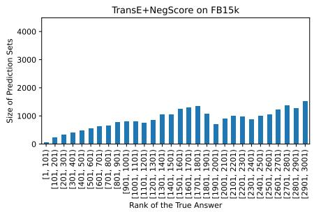

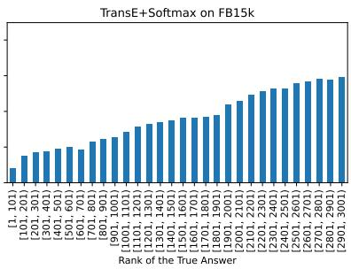

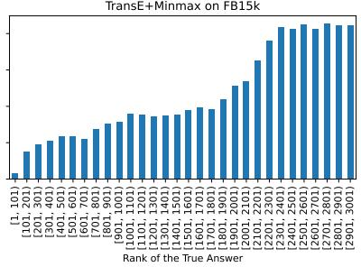  
Figure 3: This figure shows the size of answer sets stratified by the difficulty level of queries. It shows the adaptiveness of different conformal predictors (built on TransE models) on the FB15k dataset.

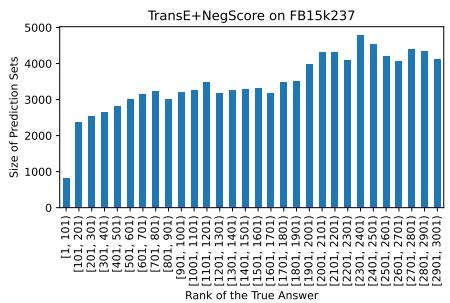

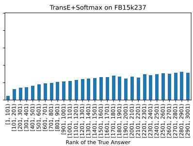

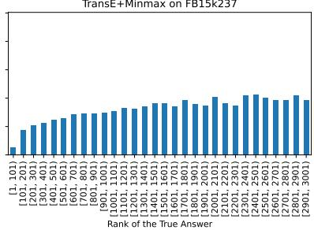  
Figure 4: This figure shows the size of answer sets stratified by the difficulty level of queries. It shows the adaptiveness of different conformal predictors (built on TransE models) on the FB15k237 dataset.

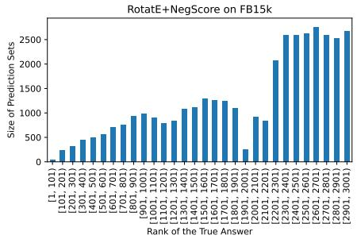

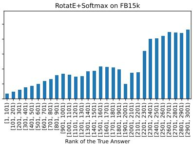

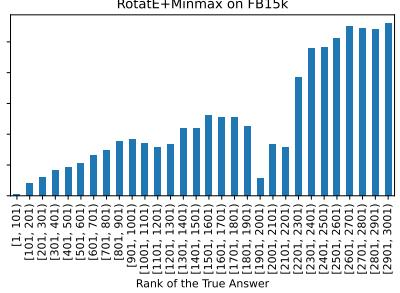  
Figure 5: This figure shows the size of answer sets stratified by the difficulty level of queries. It shows the adaptiveness of different conformal predictors (built on RotatE models) on the FB15k dataset.

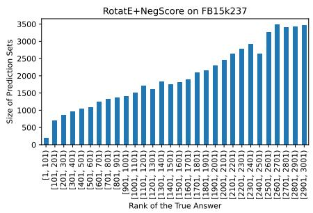

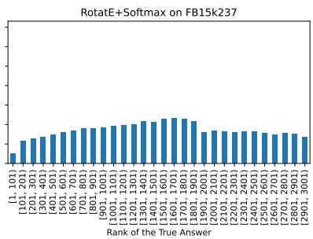

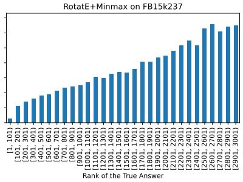  
Figure 6: This figure shows the size of answer sets stratified by the difficulty level of queries. It shows the adaptiveness of different conformal predictors (built on RotatE models) on the FB15k237 dataset.

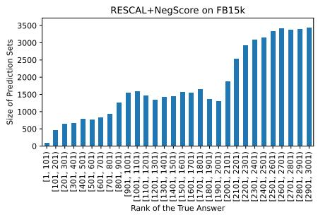

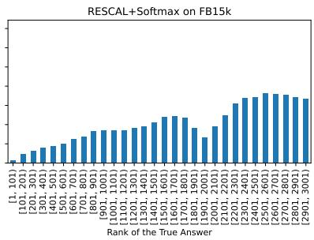

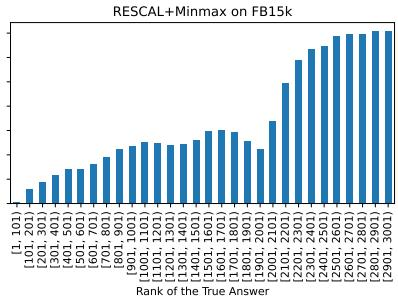  
Figure 7: This figure shows the size of answer sets stratified by the difficulty level of queries. It shows the adaptiveness of different conformal predictors (built on RESCAL models) on the FB15k dataset.

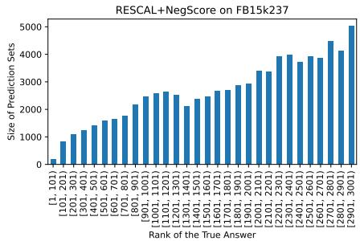

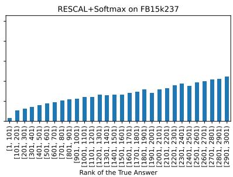

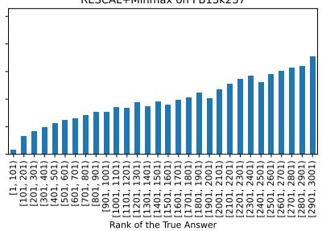  
Figure 8: This figure shows the size of answer sets stratified by the difficulty level of queries. It shows the adaptiveness of different conformal predictors (built on RESCAL models) on the FB15k237 dataset.

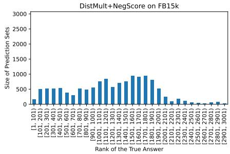

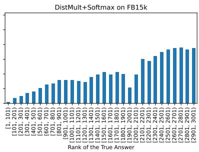

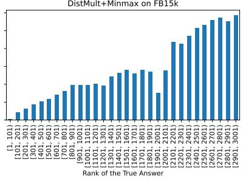  
Figure 9: This figure shows the size of answer sets stratified by the difficulty level of queries. It shows the adaptiveness of different conformal predictors (built on DistMult models) on the FB15k dataset

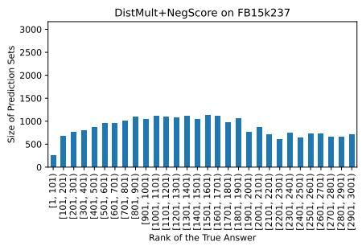

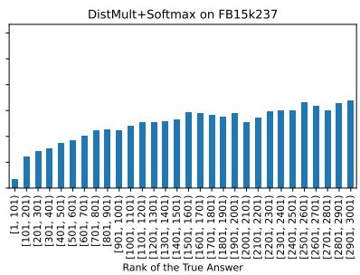

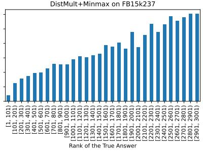  
Figure 10: This figure shows the size of answer sets stratified by the difficulty level of queries. It shows the adaptiveness of different conformal predictors (built on DistMult models) on the FB15k237 dataset.

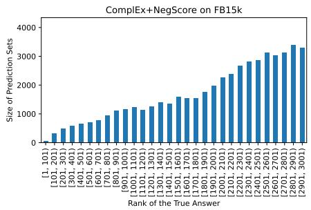

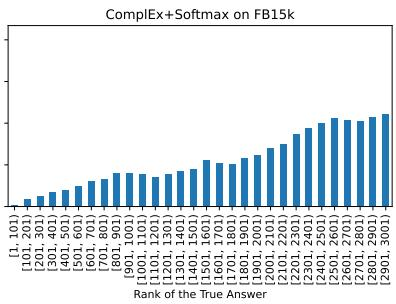

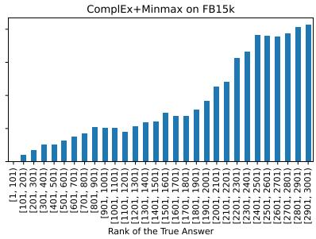  
Figure 11: This figure shows the size of answer sets stratified by the difficulty level of queries. It shows the adaptiveness of different conformal predictors (built on ComplEx models) on the FB15k dataset.

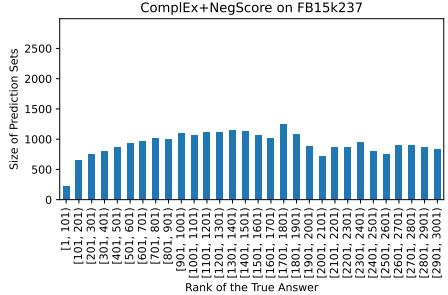

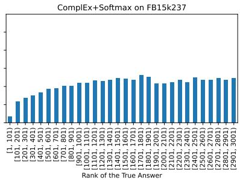

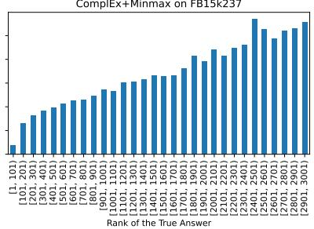  
Figure 12: This figure shows the size of answer sets stratified by the difficulty level of queries. It shows the adaptiveness of different conformal predictors (built on ComplEx models) on the FB15k237 dataset.

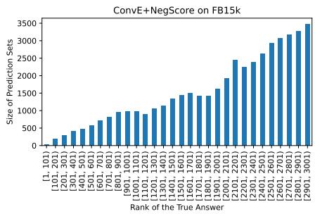

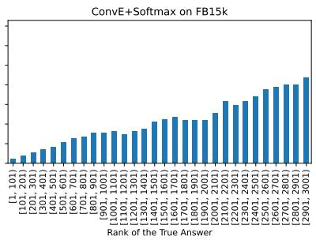

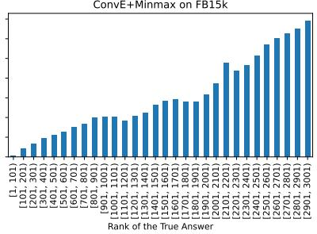  
Figure 13: This figure shows the size of answer sets stratified by the difficulty level of queries. It shows the adaptiveness of different conformal predictors (built on ConvE models) on the FB15k dataset.

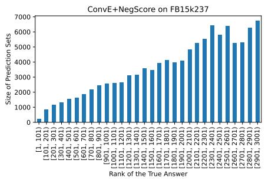

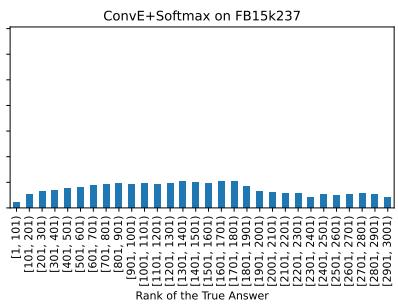

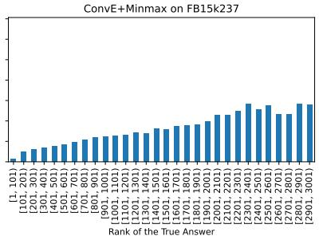  
Figure 14: This figure shows the size of answer sets stratified by the difficulty level of queries. It shows the adaptiveness of different conformal predictors (built on ConvE models) on the FB15k237 dataset.