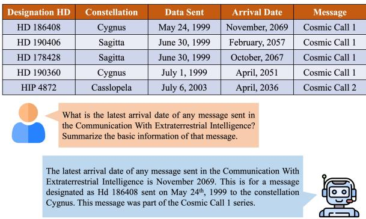
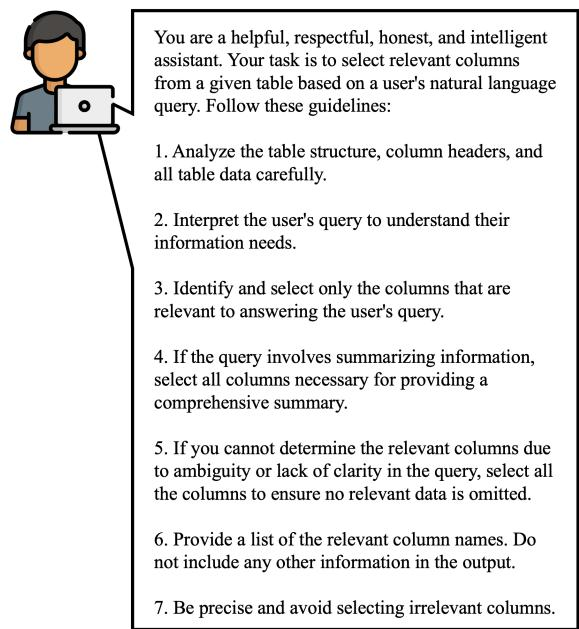

# DETQUS: Decomposition-Enhanced Transformers for QUery-focused Summarization

Yasir Khan, Xinlei Wu, Sangpil Youm, Justin Ho, Aryaan Shaikh, Jairo Garciga, Rohan Sharma, Bonnie J. Dorr University of Florida, Gainesville, Florida {y.khan, x.wu, youms, justinho, am.shaikh, jgarciga, rohansharma1, bonniejdorr}@ufl.edu

## Abstract

Query-focused tabular summarization is an emerging task in table-to-text generation that synthesizes a summary response from tabular data based on user queries. Traditional transformer-based approaches face challenges due to token limitations and the complexity of reasoning over large tables. To address these challenges, we introduce DETQUS (Decomposition-Enhanced Transformers for QUery-focused Summarization), a system designed to improve summarization accuracy by leveraging tabular decomposition alongside a fine-tuned encoder-decoder model. DETQUS employs a large language model to selectively reduce table size, retaining only query-relevant columns while preserving essential information. This strategy enables more efficient processing of large tables and enhances summary quality. Our approach, equipped with table-based QA model Omnitab, achieves a ROUGE-L score of 0.4437, outperforming the previous state-ofthe-art REFACTOR model (ROUGE-L: 0.422). These results highlight DETQUS as a scalable and effective solution for query-focused tabular summarization, offering a structured alternative to more complex architectures.

## 1 Introduction

Tabular data has become increasingly prevalent in our society, with nearly all businesses employing it to store crucial information. As the amount of collected data increases over time, this has created the need for techniques and systems that allow individuals to analyze and create insights about their data. Automatic summarization is an area of research that investigates methods to glean insights from natural language data using various techniques (Mridha et al., 2021).

The importance of analyzing tabular data combined with the existing summarization research has given rise to a new subset of summarization: queryfocused tabular summarization. Query-focused tabular summarization refers to the task of extracting key points and context from large tables based on a user-provided query (Zhao et al., 2023).

  
Figure 1: Query-focused table summarization with QT-SUMM, generating a summary from the query: “What is the latest ... intelligence?”

Considering the query-focused table summarization system depicted in Figure 1, when a user inquires about “arrival date” and “basic information,” our model evaluates the user’s requirements in conjunction with a table lookup and then generates a summary based on these constraints.

We consider using neural techniques, particularly transformer-based models, and identify several associated challenges. The first challenge is the inherent token capacity limitation of transformer models. When tables are converted to text and tokenized, they can exceed the input length of the transformer model, causing performance degradation due to truncation from the overly long sequence length. Another challenge is processing larger tables and complex queries, which require models to reason across numerous columns, establish meaningful connections, and synthesize coherent summaries from the extracted information. Although large language models (LLMs) exhibit emergent reasoning abilities and greater token capacity, their reasoning abilities still falls short of human performance (Wei et al., 2022; Davis, 2023).

To address these limitations, we introduce DE-TQUS (Decomposition-Enhanced Transformers for QUery-focused Summarization), a novel system designed to enhance query-based table summarization through tabular decomposition. DETQUS dynamically restructures tables into smaller, more relevant forms based on the provided query, effectively mitigating token length constraints while preserving critical content. The principle behind this technique is that the model only accesses data relevant to improving performance. This helps mitigate the token limitation of many attention-based methods and the complexity of reasoning over large tables and complex queries.

Our work builds on the foundational research of Ye et al. (2023), introducing tabular decomposition based on the given query. We extend this approach to query-focused table summarization, making several key contributions. Our main contribution is developing DETQUS, a system that leverages tabular decomposition to enhance query-based table summarization. DETQUS outperforms prior baselines while offering a more structured and interpretable approach. We evaluate our method across multiple transformer-based models, demonstrating improvements in summarization quality through a combination of fine-tuned neural architectures and optimized decomposition techniques.

Section 2 presents related work, followed by a description of our system architecture for tabular summarization in Section 3. We present data and experiments in Section 4. Finally, we discuss insights gleaned from our study and provide conclusions and future directions.

## 2 Related Work

This section outlines the task of query-focused tabular summarization, highlighting how it differs from other table-to-text tasks. We review prior approaches to these tasks and their limitations, comparing them to our method. We also describe the QTSUMM dataset which we use for our evaluation.

## 2.1 Explanation of the Task

Query-focused tabular summarization is a specific type of table-to-text generation that combines elements of table question answering (QA) and generic table summarization (Zhao et al., 2023). Unlike tabular QA, which focuses on extracting specific facts from a table based on a query, queryfocused tabular summarization aims to generate a coherent summary that addresses the user’s query by integrating relevant information from the table. This task is distinct from generic table summarization, which generates summaries based solely on the tabular input without regard to a specific query.

## 2.2 Prior Approaches to Tabular QA and Summarization

Previous research in tabular question answering primarily focuses on models that can extract relevant facts from tables in response to specific queries. These models typically rely on sophisticated parsing techniques and neural networks to understand and retrieve the correct information. For example, the method developed by Chen et al. (2021) extracts facts from tables given a particular query. While this approach provides a high degree of user control, its focus on fact extraction does not allow for generating insightful summaries or interpretations beyond the presented data.

Recent advancements in table-based question answering (QA) highlight the effectiveness of pretraining models with both natural and synthetic data to improve few-shot learning scenarios. Jiang et al. (2022) introduce OmniTab, a model pre-trained using natural sentences paired with tables and synthetic questions derived from SQL queries. This dual approach enhances the model’s ability to align natural language with tabular data and perform complex reasoning tasks. OmniTab achieves stateof-the-art performance on the WikiTableQuestions benchmark, demonstrating that integrating both data types balances alignment and reasoning.

Generic table summarization involves generating summaries based solely on the tabular input without specific queries, as seen in the work of Lebret et al. (2016). This method, while straightforward, lacks user control over the summary content. To address this limitation, single-sentence table-to-text tasks are introduced by Chen et al. (2020), which provide models with tabular data and specific sequences describing rows and columns. Although this offers some level of control, it still requires manual input for regions of interest, limiting its flexibility as a system.

## 2.3 Advances in Query-focused Text Summarization

Recent advancements in query-focused text summarization have improved the efficiency and relevance of summaries for specific user queries. Rahman and Borah (2015) demonstrate extractive techniques aimed at distilling information for a specific query. Xu and Lapata (2022) introduce latent queries to bridge the gap between explicit user queries and implicit information, leveraging latent semantic analysis for deeper query understanding. Although these approaches primarily target textual data, they provide a foundation for developing techniques applicable to tabular data.

## 2.4 Advances in Table Summarization Techniques

Previous developments in table summarization techniques focus on improving the ability of models to generate accurate and relevant summaries from structured data. Techniques such as TAPAS (Herzig et al., 2020) and TAPEX (Liu et al., 2021) demonstrate significant progress in enhancing reasoning capabilities over tabular data. These models employ pre-trained transformers designed specifically to handle structured information, achieving strong performance on table-based reasoning and question-answering tasks.

Despite these advancements, there are notable limitations, particularly in handling larger or more complex tables. Models like TAPAS and TAPEX often struggle with scalability and suffer from token limitations, as they may not efficiently process tables with a large number of columns or rows. To address these issues, REASTAP (Zhao et al., 2022) introduces table reasoning skills during pretraining, improving performance on specific tasks like table-based question answering. However, even REASTAP encounters difficulties related to token limitations and integrating unstructured data with structured inputs.

Our approach introduces a novel tabular decomposition technique using a large language model (LLM) to decompose tables based on the user query. This method addresses token capacity constraints by reducing the table to its most relevant columns and rows, allowing the model to handle larger datasets more effectively while retaining essential information for generating accurate summaries.

Although few-shot learning is widely used to improve model performance across various NLP tasks, recent research in query-focused summarization, such as Zhao et al. (2023), reveals that it does not always yield significant improvements for tablebased tasks. Informed by these results, we decide not to implement few-shot learning in our study and instead focus on alternative methods, such as tabular decomposition, to enhance performance.

## 2.5 QTSUMM Dataset

The QTSUMM dataset,1 introduced by (Zhao et al., 2023), is a comprehensive resource for training and evaluating models on query-focused tabular summarization. This dataset includes tables and query-summary pairs, with a single table potentially having more than one query-summary pair. The tables are scraped from Wikipedia and contain diverse topics. In total, the QTSUMM dataset consists of 7,111 query-summary pairs over 2,934 tables (Zhao et al., 2023).

This dataset is curated from the LOGICNLG (Chen et al., 2020) and ToTTo (Parikh et al., 2020) tables derived from Wikipedia. Next, tables that are excessively large or small, possess only string-type columns or have hierarchical structures are filtered out from this pool. It is worth noting that topically, the tables used in this dataset are diverse, ranging from sports to scientific literature. This provides a wide domain of tables, queries, and summaries to evaluate models on.

## 2.6 Our Methodological Approaches Derived from Previous Works

Our research methodology addresses the limitations of traditional query-focused table summarization by focusing on a few key innovations. Unlike traditional methods that use either the entire table or manually selected regions, our approach utilizes LLMs to decompose tables based on the query. This method accommodates token-limit constraints while retaining critical information necessary for generating accurate summaries.

For tabular decomposition, we implement a strategy that uses LLMs to perform table decomposition. For queries that the LLM understands and can confidently identify relevant columns, a precise decomposition is performed in which a table is compressed to the necessary rows and columns. However, for more complex queries where the LLM is less certain, the decomposition is conservative, retaining all potentially relevant columns. This adaptive approach strikes a balance between providing focused information for straightforward queries and maintaining comprehensive context for more complex ones, thus mitigating the risk of information loss and potential model hallucinations.

  
Figure 2: Prompt for converting the table to markdown format for LLM (Llama3-70b)

## 3 System Architecture for Tabular Summarization

This section outlines the architecture of our approach to the tabular decomposition. We describe the table decomposition process and present the algorithmic details of our implementation.

## 3.1 Table Decomposition

Building on Ye et al. (2023)’s work, our approach uses a large language model (LLM) to guide the tabular decomposition, operating in two stages: compression and table-building. In the compression stage, we first convert the table to markdown format for LLM processing. Using Llama3-70b with a tailored prompt (see Figure 2), we identify columns most relevant to the user’s query. These columns are then used in the table-building stage to construct the final decomposed table.

## 3.2 Algorithms for Table Decomposition

Algorithm 1 outlines a process for decomposing a table into smaller relevant tables based on a user query, using LLMs to guide the decomposition. The algorithm runs through procedure, MAIN PRO-CESS (lines 28-33), utilizing two important functions: table decomposition and creating a decomposed table.

The TABLE\_DECOMPOSITION function first converts the input table to markdown format and constructs a prompt combining the user’s question, table content, and specific instructions for column selection. This prompt is then sent to the LLM API for processing. The CRE-ATE\_DECOMPOSED\_TABLE function takes the LLM’s response and uses it to build a new, focused table. It searches for column names mentioned in the LLM’s output and creates a subset table containing only those columns. Importantly, if no relevant columns are identified in the LLM’s response, the function defaults to using all columns from the original table, ensuring robustness against ambiguous queries or unclear LLM responses.

Algorithm 1 Table Decomposition and Creation   
1: function TABLE\_DECOMPOSITION(table, question, title)   
Markdown format table   
Construct prompt:   
Add instructions for column relevance   
Add the given question   
6: Add the table in markdown format   
7: Add the table title   
8: Send prompt to LLM API   
9: Retrieve and return the API response   
10: end function   
11: function CREATE\_DECOMPOSED\_TABLE(table, output\_text)   
12: DataFrame table   
13: Relevant column names  []   
14: for all column in the table do   
15: if column name appears in output\_text then   
16: Add column name to relevant column names list   
17: end if   
18: end for   
19: if no relevant column is found then   
20: Use all columns from table   
21: end if   
22: Create a new table with only relevant columns:   
23: Use the original table ID and title   
24: Use relevant column names as header   
25: Extract corresponding data for relevant columns   
26: return new decomposed table   
27: end function   
28: procedure MAIN PROCESS   
29: Define original\_table structure   
30: Call table\_decomposition with the original table, question, and title   
31: Call create\_decomposed\_table with the original table and output from   
table\_decomposition   
32: return the decomposed table   
33: end procedure

## 4 Data and Experiments

We use the community standard benchmark dataset QTSUMM by Zhao et al. (2023). Additionally, we create a decomposed dataset from the QTSUMM by removing irrelevant columns. We then train several models on both datasets where the tabular data along with the user query serve as input and the expected output is the summary.

Four models are used in our experiments: T5 (Raffel et al., 2020), Flan-T5 (Chung et al., 2024), BART (Lewis et al., 2019) and OmniTab (Jiang et al., 2022). To improve the summary accuracy for the four transformer-based models, we apply table decomposition, fine-tuning, and pre-processing. Next, for evaluating the query-focused table summarization task on LLMs, we utilize Llama, Mixtral, Smaug, Claude and GPT. We compare the results of these models and the summaries they generate against the expected summaries using BLEU (Papineni et al., 2002), ROUGE (Lin, 2004), BERTScore (Zhang et al., 2020) and PARENT (Dhingra et al., 2019).

We split the test data into validation and test sets. Since the summary is readily available in the test data, we omit it for the validation set. Our model is then evaluated using the new validation split.

## 4.1 Dataset

We randomly select 2000 training data entries from QTSUMM—including tables, summaries, and queries—to train our model. We select 500 entries as test data and 200 entries as validation data. We train and test our model on a subset of data due to resource limitations. The entries are selected at random ensuring that the data contains diverse table topics to ensure minimal scope of bias. We then train and evaluate our model on two versions of the QTSUMM dataset.

1. Original Data: This is the original QTSUMM dataset without any preprocessing or modifications. It contains the raw tabular data, queries, and expected summaries.

2. Decomposed Data: In this variant, we apply our table decomposition approach to the QT-SUMM dataset. The tables are decomposed to retain only the most relevant columns based on the given query, removing extraneous information to address token limitations.

By training and evaluating on these two variations, we analyze the impact of our table decomposition technique and the effect of supplementing the input with extracted facts from the table.

## 4.2 Preprocessing

Preprocessing is a crucial step before model training and evaluation. It ensures that tabular data is structured appropriately for transformer-based models. Our preprocessing pipeline includes the following steps:

• Flattening Tables: We convert tables into a linear text format to align with sequencebased input constraints, following Hancock et al. (2019), where each row is transformed into a “key:value” structure.

• Column Selection: To simplify the input and reduce the token count, we filter out non-relevant columns by using an LLM decomposer to break the original table into the smaller table which only contains relevant information to the query.

• Tokenization: We apply the appropriate tokenizer for each model (T5, BART, etc.), ensuring input compatibility.

• Formatting for Fine-Tuning: We append metadata like table titles and queries to ensure contextual relevance during summarization.

## 4.3 Fine-tuned Models

We fine-tune four encoder-decoder text generation models: $\mathrm { T } 5 , ^ { 2 }$ Flan-T5,3, BART4 and OmniTab5. The selection of these models is primarily driven by the need to enhance comparability with previous studies, particularly the work of (Zhao et al., 2023). By using the same models, we can draw clear comparisons between our results and theirs, providing a consistent benchmark for progress in query-focused table summarization.

T5 is a widely used baseline for text summarization. Flan-T5 builds on T5, but it has not been as extensively used for tabular summarization as T5. We include both models to investigate improvements Flan-T5 offers over T5. Including BART allows us to explore potential improvements in tabular summarization from an alternative architecture compared to T5 and Flan-T5. OmniTab is the current state-of-the-art model on the QTSUMM dataset and utilizes a BART backbone with a pretraining setup that emphasizes tabular QA.

It is crucial to acknowledge that these transformer-based models include restrictions regarding their context length, which may affect their capacity to manage large tables. T5 has a maximum input length of 512 tokens, whereas BART has a maximum input length of 1024 tokens. Flan-T5, being an extension of T5, has a maximum input length of 512 tokens. OmniTab, constructed on the BART architecture, maintains the 1024 token limitation. These constraints need solutions such as table decomposition to efficiently manage bigger tables and reduce information loss resulting from truncation. All these models are fine-tuned using an AMD EPYC 75F3 32-Core Processor and 3 NVIDIA A100 GPUs. We select the large versions of each model with publicly available on Hugging-Face. Due to the large model and dataset sizes, we use small batch sizes during training. Additionally, we employ 4-bit quantization to reduce the memory footprint of parameter values during training while maintaining the standard precision, as demonstrated by Dettmers et al. (2023).

For each fine-tuning experiment, we run 20 epochs. The batch size is adjusted for each model to fit into the available memory: T5 and Flan-T5 use smaller batch sizes due to more parameters, while BART and OmniTab, with fewer parameters, use larger ones. The models are fine-tuned and evaluated on two different versions of the QTSUMM dataset: the original and a decomposed version.

Before fine-tuning, we preprocess the tabular data following the steps outlined in Section 4.2. This ensures that the input format aligns with the transformer-based architecture constraints. Once preprocessing is complete, we apply table decomposition to reduce input size, then fine-tuning.

## 4.4 Large Language Models (LLMs)

We run experiments with various LLMs (Llama, Mixtral,7 GPT, Claude,8 and Smaug9) on the same task using a zero-shot prompting approach without fine-tuning on our dataset. We employ a zeroshot prompting approach, where the models are provided with a prompt containing the table and the query, without any additional training or finetuning. For our experiments, we tailor the prompt for each model as per the recommendations provided by the authors during their respective releases. To prepare the tabular data for input, we preprocess and flatten the tables into one-dimensional text strings. We followed the same process for flattening the tables as described in Section 4.3.

Finally, each model’s performance is evaluated using BLEU, ROUGE, BERTScore and PARENT against the test dataset. This process ensures that our models not only perform well in the training data but also generalize effectively to unseen data.

## 4.5 Metrics

We employ four metrics, including BLEU (Bilingual Evaluation Understudy), ROUGE (Recall-Oriented Understudy for Gisting Evaluation), BERTScore, and PARENT, to assess the quality and accuracy of the summaries generated by each model. ROUGE emphasizes recall in our evaluations, while BLEU focuses on precision by measuring the n-gram overlap between generated and reference summaries. BERTScore addresses the limitations of n-gram-based metrics by considering semantic similarity. Additionally, we incorporate PARENT, which aligns n-grams from the reference and generated texts to the underlying data before computing precision and recall. By considering BLEU, ROUGE, BERTScore, and PARENT, our evaluations provide a more comprehensive assessment of both lexical accuracy and contextual fidelity while also accounting for the alignment of generated summaries with the source data.

## 5 Results and Analyses

The results indicate that our approach performs effectively and, in certain cases, surpasses the performance of the prior baseline technique.

The analysis, as presented in Tables 1 and 2 reveals that Llama 3 outperforms other large language models, while OmniTab achieves the highest scores in most metrics, including ROUGE-L and PARENT. This suggests that the new Llama model offers significant advantages over earlier LLM architectures for querying tables.

In particular, the OmniTab model, when used with decomposed tabular data, emerges as the bestperforming model, achieving a ROUGE-L score of 0.4437 and a PARENT score of 0.3346. This performance surpasses the previous state-of-theart REFACTOR model, which has a ROUGE-L score of 0.422, also employing the OmniTab model. Additionally, it is noteworthy that models such as

<table><tr><td rowspan="2"></td><td colspan="6">Original Data</td><td colspan="6">Decomposed Data</td></tr><tr><td>BLEU</td><td>ROUGE-1</td><td>ROUGE-2</td><td>ROUGE-L</td><td>BERTScore</td><td>PARENT</td><td>BLEU</td><td>ROUGE-1</td><td>ROUGE-2</td><td>ROUGE-L</td><td>BERTScore</td><td>PARENT</td></tr><tr><td>T5</td><td>0.2046</td><td>0.4489</td><td>0.2212</td><td>0.3722</td><td>0.8918</td><td>0.2642</td><td>0.2138</td><td>0.4544</td><td>0.2287</td><td>0.3870</td><td>0.8949</td><td>0.2787</td></tr><tr><td>Flan-T5</td><td>0.2174</td><td>0.4699</td><td>0.2597</td><td>0.3930</td><td>0.8974</td><td>0.2981</td><td>0.2216</td><td>0.4851</td><td>0.2685</td><td>0.4115</td><td>0.8971</td><td>0.3124</td></tr><tr><td>BART</td><td>0.2248</td><td>0.4684</td><td>0.2312</td><td>0.4081</td><td>0.8949</td><td>0.3112</td><td>0.2405</td><td>0.4709</td><td>0.2428</td><td>0.4197</td><td>0.8968</td><td>0.3200</td></tr><tr><td>OmniTab</td><td>0.2213</td><td>0.4902</td><td>0.2506</td><td>0.4405</td><td>0.9008</td><td>0.3220</td><td>0.2432</td><td>0.4989</td><td>0.2756</td><td>0.4437</td><td>0.9016</td><td>0.3346</td></tr></table>

Table 1: Results Table for T5, Flan-T5, BART, and OmniTab with two different table handling approaches. SOTA model, REFACTOR (Zhao et al., 2023) yields a ROUGE-L score of 0.422 on the same task using OmniTab.

BART, T5, Flan-T5, and OmniTab generally exhibit slightly better performance than other LLMs. This indicates that these models possess strengths particularly suited to the task.

Table 1 shows a consistent trend across all models, with better performance on the decomposed data. This suggests that breaking down the data into its constituent parts, before presenting it to the models, enhances the models’ ability to generate accurate summaries. This improvement occurs because the models can focus more effectively on relevant information when it is presented in a structured and decomposed format. This structured approach allows the models to concentrate on essential elements, thereby improving the overall accuracy and quality of the generated summaries.

<table><tr><td rowspan=1 colspan=2>Model</td><td rowspan=1 colspan=1>BLEU</td><td rowspan=1 colspan=1>ROUGE-1</td><td rowspan=1 colspan=1>ROUGE-2</td><td rowspan=1 colspan=1>ROUGE-L</td><td rowspan=1 colspan=1>BERTScore</td><td rowspan=1 colspan=1>PARENT</td></tr><tr><td rowspan=5 colspan=2>Claude 2Claude 3 OpusGPT-3.5 TurboLlama 2-70BLlama 3-70B</td><td rowspan=1 colspan=1>0.2238</td><td rowspan=1 colspan=1>0.4816</td><td rowspan=1 colspan=1>0.2464</td><td rowspan=1 colspan=1>0.3702</td><td rowspan=1 colspan=1>0.9011</td><td rowspan=1 colspan=1>0.2673</td></tr><tr><td rowspan=1 colspan=1>0.2334</td><td rowspan=1 colspan=1>0.4975</td><td rowspan=1 colspan=1>0.2561</td><td rowspan=1 colspan=1>0.3857</td><td rowspan=1 colspan=1>0.9022</td><td rowspan=1 colspan=1>0.2843</td></tr><tr><td rowspan=1 colspan=1>0.2303</td><td rowspan=1 colspan=1>0.4593</td><td rowspan=1 colspan=1>0.2255</td><td rowspan=1 colspan=1>0.3301</td><td rowspan=1 colspan=1>0.8974</td><td rowspan=1 colspan=1>0.2548</td></tr><tr><td rowspan=1 colspan=1>0.2134</td><td rowspan=1 colspan=1>0.4694</td><td rowspan=1 colspan=1>0.2435</td><td rowspan=1 colspan=1>0.3543</td><td rowspan=1 colspan=1>0.8989</td><td rowspan=1 colspan=1>0.2457</td></tr><tr><td rowspan=1 colspan=1>B</td><td rowspan=1 colspan=1>0.2539</td><td rowspan=1 colspan=1>0.4948</td><td rowspan=1 colspan=1>0.2649</td><td rowspan=1 colspan=1>0.4105</td><td rowspan=1 colspan=1>0.9103</td><td rowspan=1 colspan=1>0.2953</td></tr><tr><td rowspan=1 colspan=2>Smaug-72B</td><td rowspan=1 colspan=1>0.2230</td><td rowspan=1 colspan=1>0.4801</td><td rowspan=1 colspan=1>0.2333</td><td rowspan=1 colspan=1>0.3369</td><td rowspan=1 colspan=1>0.9033</td><td rowspan=1 colspan=1>0.2407</td></tr><tr><td rowspan=1 colspan=2>Mixtral-8x22B</td><td rowspan=1 colspan=1>0.2198</td><td rowspan=1 colspan=1>0.4790</td><td rowspan=1 colspan=1>0.2412</td><td rowspan=1 colspan=1>0.3542</td><td rowspan=1 colspan=1>0.9035</td><td rowspan=1 colspan=1>0.2476</td></tr></table>

Table 2: Results Table for LLMs.

## 6 Human Evaluation Study and Error Analysis

Although automatic n-gram overlap metrics like ROUGE are valuable, they have limitations in evaluating semantically similar text. A qualitative analysis is necessary to better understand any system’s strengths and limitations. Therefore, we conduct an error analysis and a human evaluation study to gain additional insights into our system.

## 6.1 Evaluation of Table Decomposition

To provide a qualitative perspective of the tabular decomposition method, we perform a human evaluation study. We employ a Likert scale ranging from 1 to 5 to assess the completeness and accuracy of the information in the decomposed tables.

• A score of 1 means that most or all relevant information is missing

• A score of 2 suggests that some relevant information is present, though the table remains largely incomplete.

• A score of 3 indicates that most relevant information is available, but not comprehensive.

• A score of 4 signifies that all relevant information is present, but some may still be missing, or the table includes irrelevant details.

• A perfect score of 5 reflects that the table contains only the relevant information.

We randomly sample 100 data points, evaluate them, and present the results. We choose 100 samples due to time and resource constraints. For table decomposition, we score 4.46 on a scale of 5, indicating there is room for improvement.

## 6.2 Human Evaluation of Table Summarization

For the human evaluation study, three MS-level non-algorithm developers independently evaluate summaries generated by multiple models based on accuracy, relevance, and clarity, using a fivepoint rating scale. The results of human evaluation of some of our best models are shown in Table 3. Llama3 is the best-performing model in terms of accuracy. We can also conclude that the Omnitab model performs better for tabular data, as evidenced by its improved Rouge-L and accuracy scores compared to the BART model.

<table><tr><td rowspan=1 colspan=1>Models</td><td rowspan=1 colspan=1>Accuracy</td><td rowspan=1 colspan=1>Relevance</td><td rowspan=1 colspan=1>Clarity</td></tr><tr><td rowspan=1 colspan=1>BART</td><td rowspan=1 colspan=1>3.22</td><td rowspan=1 colspan=1>3.92</td><td rowspan=1 colspan=1>4.67</td></tr><tr><td rowspan=1 colspan=1>Omnitab</td><td rowspan=1 colspan=1>3.41</td><td rowspan=1 colspan=1>4.12</td><td rowspan=1 colspan=1>4.58</td></tr><tr><td rowspan=1 colspan=1>Llama3</td><td rowspan=1 colspan=1>3.77</td><td rowspan=1 colspan=1>4.08</td><td rowspan=1 colspan=1>4.42</td></tr></table>

Table 3: Human Evaluation Results. Bart and Omnitab model evaluation are done on decomposed data. Llama3 evaluation is done on original data.

To measure inter-rater agreement, we select a common set of randomly generated 100 summaries, which are independently rated by all three evaluators. We then compute the Intraclass Correlation

Coefficient (ICC) (Koo and Li, 2016) to assess the consistency of the ratings across the three criteria. The ICC score obtained is 0.7768, indicating good level agreement among the evaluators.

## 6.3 Error Analysis for Table Summarization

For the error analysis, we categorize errors into factual incorrectness, irrelevant information, hallucinations, and repetition (Zhao et al., 2023). Irrelevant information includes cases where the facts extracted by the model are correct but are not pertinent to the user query. We manually review 100 randomly-selected samples of generated summaries and evaluate them as errors within these categories. This analysis reveals which stages in our process fail, along with the limitations of our current approach and areas for future improvement. The results of error analysis for the Omnitab model using our table decomposition approach, are presented in Table 4.

<table><tr><td rowspan=1 colspan=1>Error</td><td rowspan=1 colspan=1>Total Counts</td></tr><tr><td rowspan=1 colspan=1>Factual incorrectness</td><td rowspan=1 colspan=1>18</td></tr><tr><td rowspan=1 colspan=1>Irrelevant information</td><td rowspan=1 colspan=1>14</td></tr><tr><td rowspan=1 colspan=1>Hallucination</td><td rowspan=1 colspan=1>6</td></tr><tr><td rowspan=1 colspan=1>Repetition</td><td rowspan=1 colspan=1>2</td></tr><tr><td rowspan=1 colspan=1>Correct</td><td rowspan=1 colspan=1>60</td></tr></table>

Table 4: Total number of errors in different categories on 100 random examples

As shown in Table 4, according to human evaluators, 60% of the summaries generated are correct. Factual incorrectness is the most common, which accounts for 18% of total samples, followed by irrelevant information which accounts for 14% of all the samples. Hallucinations and repetitions are less frequent with 6% and 2% probability respectively. This analysis highlights the areas where the summarization model requires improvement, particularly in addressing the factual correctness and relevance of the facts generated. By focusing on these aspects, future iterations of the model can enhance overall performance and reliability.

## 7 Conclusion and Future Work

This study presents a novel query-focused approach to tabular summarization, integrating table decomposition with advanced text generation models (T5, Flan-T5, BART, and Omnitab). We mitigate token limitations of existing models by efficiently handling large and complex tables, thereby improving upon the current state-of-the-art REFACTOR.

Our best-performing model attains a ROUGE-L score of 0.4437, setting a new high score for query-focused tabular summarization. By exploring diverse models (T5, Flan-T5, BART, Omnitab, Llama, Mixtral, GPT), we gain valuable insights into their capabilities on this task.

Future research directions include exploring additional models and LLMs, such as Flan-T5 XXL, a larger variant than the one used in this study. Improving ensemble techniques by training models on different types of data or queries is another future direction. For example, some models could be trained on simple queries and others on complex queries, or one model could train on the full dataset while others train on the decomposed dataset. This would allow the ensemble model to leverage the respective strengths of individual models.

Moreover, Llama3 demonstrates the highest accuracy in query-based table summarization tasks, as demonstrated by human evaluation, reflecting superior fact extraction capabilities, but OmniTab achieves the highest ROUGE score, indicating stronger overall summarization performance. This result suggests that while Llama3 excels in accuracy and detailed fact retrieval, OmniTab provides a more coherent and comprehensive summary. To leverage the strengths of both models, future research could explore the development of a hybrid model that combines Llama3’s precise fact extraction with OmniTab’s robust table summarization capabilities. Such an approach could potentially enhance both the accuracy and overall quality of table summarization, offering a more balanced and effective solution.

In scenarios where even a decomposed table exceeds the summarization model’s token capacity, additional strategies become necessary. One approach is further decomposition—breaking the table into even smaller, manageable segments. Alternatively, hierarchical methods can process large tables by first summarizing individual sections and then combining these summaries into a cohesive final output. Techniques such as iterative summarization or chunked processing may also help preserve key information when handling extremely large datasets. Evaluating the effectiveness of these approaches is an important direction for future research to enhance model robustness in managing complex, large-scale tabular data.

Additionally, implementing continuous learning mechanisms may allow models to evolve in response to new data and user feedback without requiring full retraining. This adaptive learning may help maintain the relevance and efficiency of the summarization system (Wu et al., 2024).

Another promising avenue for future work is to explore evaluation metrics beyond BLEU, ROUGE, BERTScore and PARENT such as BARTScore. It utilizes a pre-trained BART model and has demonstrated robust efficiency in evaluating the quality of output summaries by analyzing both lexical overlap and semantic similarity. By applying this, we could assure a more thorough assessment of model performance and produced summaries.

By employing these enhancements, we can solidify the utility of our research and push the boundaries of what automated systems can achieve in the realm of intelligent data summarization.

## Limitations

Several shortcomings have emerged during this research study. First, our models tend to perform best on simple queries or recall queries that ask for direct information from the table (see Appendix A, Example 1). However, our model demonstrates reduced performance when handling queries that involve complex reasoning across multiple columns or require identifying intricate relationships and patterns within the table (see Appendix A, Example 2). This limitation arises from the model’s difficulty in comprehending and reasoning across several data points within a single query, leading to challenges such as factual inaccuracies or hallucinations. Specifically, our method struggles with accurately synthesizing summaries when queries involve intricate temporal, causal, or relational patterns, as these exceed the scope of the model’s current decomposition approach.

To address the challenges of complex queries, we propose integrating a “chain-of-thought” reasoning process in future model iterations. This approach would involve decomposing complex queries into a sequence of logical, incremental reasoning steps. By breaking down the task into smaller units, the model could tackle one part of the query at a time, gradually building up to a complete and accurate summary. This decomposition would enhance the model’s ability to reason over multifaceted data relationships and reduce the likelihood of hallucinations. Additionally, we aim to explore ensemble methods, using standard decomposition for simpler tasks and a hierarchical multi-step approach for complex reasoning.

Second, while table decomposition is intended to filter out noise for improving model accuracy, it can sometimes lose important data or specific information needed for recall and comparison queries (Appendix A, Example 3). In such cases, our model may hallucinate and generate facts not present in the table. Table decomposition also negatively impacts queries that require an overarching understanding of trends or patterns, as these advanced queries often need more information for accurate summaries, and table decomposition can omit this additional data. To mitigate this issue, we plan to implement a dynamic decomposition strategy that adjusts the extent of decomposition based on the complexity of the query. For simple recall queries, more aggressive decomposition is applied, whereas, for complex queries, a lighter decomposition is used to retain more information, in accordance with previous work (Ye et al., 2023).

When the original table exceeds the sequence length of the LLM-decomposer, our current approach cannot process the entire table directly. In such cases, there is a possibility of truncation of the input and potentially degradation of table decomposition quality. This limitation highlights the need for further investigation into alternative strategies. For instance, hierarchical decomposition or table segmentation can divide large tables into smaller, manageable parts, ensuring the integrity of the summarized content through improved token allocation. Additionally, exploring large language models with higher context windows also accommodates larger inputs without sacrificing performance.

Finally, the human evaluation and error analysis in this study have been conducted by only three evaluators, which may potentially introduce human biases. With a limited number of evaluators, there is an increased risk that individual perspectives, experiences, and subjective interpretations could disproportionately influence the results. This may lead to certain errors being overlooked or specific patterns being misinterpreted, potentially affecting the reliability of the human evaluation. A more diverse group of evaluators could provide a broader range of insights, helping to ensure that the analysis is comprehensive and more representative of a general consensus. To mitigate this limitation, we aim to involve a larger and more diversified panel of expert evaluators or employing additional measures such as cross-validation and consensus discussions to reduce the impact of individual biases on the evaluation outcomes.

## Ethical Considerations

In conducting this research on query-focused tabular summarization, several ethical considerations are central. The potential for bias in data and model outputs is critically assessed, with our efforts to use a diverse dataset, although it is acknowledged that the complete elimination of bias is challenging and ongoing efforts are necessary.

The environmental impact of training and deploying large language models (LLMs) is another significant consideration. Techniques such as 4-bit quantization are employed to reduce computational resources and mitigate the carbon footprint associated with extensive model training (Dettmers et al., 2023). Furthermore, the risk of model inaccuracies, including the generation of erroneous facts, is recognized. This underscores the importance of continuous monitoring and iterative improvement of models to enhance accuracy and reliability (Zhao et al., 2023). By mitigating these ethical considerations, this research aims to responsibly advance the field of query-focused table summarization while mitigating potential negative impacts.

This paper is assisted by AI software solely for formatting and grammatical checking purposes. No underlying ideas or content are generated by AI. All original ideas, analysis, and conclusions in this paper are solely created by the listed authors.

## References

Wenhu Chen, Ming-Wei Chang, Eva Schlinger, William Wang, and William W. Cohen. 2021. Open question answering over tables and text.

Wenhu Chen, Jianshu Chen, Yu Su, Zhiyu Chen, and William Yang Wang. 2020. Logical natural language generation from open-domain tables. In Proceedings of the 58th Annual Meeting of the Association for Computational Linguistics, pages 7929–7942, Online. Association for Computational Linguistics.

Hyung Won Chung, Le Hou, Shayne Longpre, Barret Zoph, Yi Tay, William Fedus, Yunxuan Li, Xuezhi Wang, Mostafa Dehghani, Siddhartha Brahma, et al. 2024. Scaling instruction-finetuned language models. Journal ofMachine Learning Research, 25(70):1–53.

Ernest Davis. 2023. Mathematics, word problems, common sense, and artificial intelligence.

Tim Dettmers, Artidoro Pagnoni, Ari Holtzman, and Luke Zettlemoyer. 2023. Qlora: Efficient finetuning of quantized llms.

Bhuwan Dhingra, Manaal Faruqui, Ankur Parikh, Ming-Wei Chang, Dipanjan Das, and William W. Cohen.

2019. Handling divergent reference texts when evaluating table-to-text generation.

Braden Hancock, Hongrae Lee, and Cong Yu. 2019. Generating titles for web tables. In The World Wide Web Conference, pages 638–647.

Jonathan Herzig, Paweł Krzysztof Nowak, Thomas Müller, Francesco Piccinno, and Julian Martin Eisenschlos. 2020. Tapas: Weakly supervised table parsing via pre-training. arXiv preprint arXiv:2004.02349.

Zhengbao Jiang, Yi Mao, Pengcheng He, Graham Neubig, and Weizhu Chen. 2022. Omnitab: Pretraining with natural and synthetic data for fewshot table-based question answering. arXiv preprint arXiv:2207.03637.

Terry K. Koo and Mae Y. Li. 2016. A guideline of selecting and reporting intraclass correlation coefficients for reliability research. Journal ofChiropractic Medicine, 15(2):155–163.

Rémi Lebret, David Grangier, and Michael Auli. 2016. Neural text generation from structured data with application to the biography domain. In Proceedings of the 2016 Conference on Empirical Methods in Natural Language Processing, pages 1203–1213, Austin, Texas. Association for Computational Linguistics.

Mike Lewis, Yinhan Liu, Naman Goyal, Marjan Ghazvininejad, Abdelrahman Mohamed, Omer Levy, Ves Stoyanov, and Luke Zettlemoyer. 2019. Bart: Denoising sequence-to-sequence pre-training for natural language generation, translation, and comprehension. arXiv preprint arXiv:1910.13461.

Chin-Yew Lin. 2004. ROUGE: A package for automatic evaluation of summaries. In Text Summarization Branches Out, pages 74–81, Barcelona, Spain. Association for Computational Linguistics.

Qian Liu, Bei Chen, Jiaqi Guo, Morteza Ziyadi, Zeqi Lin, Weizhu Chen, and Jian-Guang Lou. 2021. Tapex: Table pre-training via learning a neural sql executor. arXiv preprint arXiv:2107.07653.

M. F. Mridha, Aklima Akter Lima, Kamruddin Nur, Sujoy Chandra Das, Mahmud Hasan, and Muhammad Mohsin Kabir. 2021. A survey of automatic text summarization: Progress, process and challenges. IEEE Access, 9:156043–156070.

Kishore Papineni, Salim Roukos, Todd Ward, and Wei-Jing Zhu. 2002. Bleu: a method for automatic evaluation of machine translation. In Proceedings ofthe 40th annual meeting of the Association for Computational Linguistics, pages 311–318.

Ankur Parikh, Xuezhi Wang, Sebastian Gehrmann, Manaal Faruqui, Bhuwan Dhingra, Diyi Yang, and Dipanjan Das. 2020. ToTTo: A controlled table-to-text generation dataset. In Proceedings of the 2020 Conference on Empirical Methods in Natural Language Processing (EMNLP), pages 1173–1186, Online. Association for Computational Linguistics.

Colin Raffel, Noam Shazeer, Adam Roberts, Katherine Lee, Sharan Narang, Michael Matena, Yanqi Zhou, Wei Li, and Peter J Liu. 2020. Exploring the limits of transfer learning with a unified text-to-text transformer. Journal ofmachine learning research, 21(140):1–67.

N. Rahman and B. Borah. 2015. A survey on existing extractive techniques for query-based text summarization. In 2015 International Symposium on Advanced Computing and Communication (ISACC), pages 98– 102. IEEE.

Jason Wei, Yi Tay, Rishi Bommasani, Colin Raffel, Barret Zoph, Sebastian Borgeaud, Dani Yogatama, Maarten Bosma, Denny Zhou, Donald Metzler, Ed H. Chi, Tatsunori Hashimoto, Oriol Vinyals, Percy Liang, Jeff Dean, and William Fedus. 2022. Emergent abilities of large language models.

Tongtong Wu, Linhao Luo, Yuan-Fang Li, Shirui Pan, Thuy-Trang Vu, and Gholamreza Haffari. 2024. Continual learning for large language models: A survey.

Yumo Xu and Mirella Lapata. 2022. Document summarization with latent queries. Transactions of the Association for Computational Linguistics, 10:623– 638.

Yunhu Ye, Binyuan Hui, Min Yang, Binhua Li, Fei Huang, and Yongbin Li. 2023. Large language models are versatile decomposers: Decompose evidence and questions for table-based reasoning. arXiv preprint arXiv:2301.13808.

Tianyi Zhang, Varsha Kishore, Felix Wu, Kilian Q. Weinberger, and Yoav Artzi. 2020. Bertscore: Evaluating text generation with bert.

Y. Zhao, Z. Qi, L. Nan, B. Mi, Y. Liu, W. Zou, and D. Radev. 2023. Qtsumm: A new benchmark for query-focused table summarization. ArXiv preprint arXiv:2305.14303.

Yilun Zhao, Linyong Nan, Zhenting Qi, Rui Zhang, and Dragomir Radev. 2022. Reastap: Injecting table reasoning skills during pre-training via synthetic reasoning examples. arXiv preprint arXiv:2210.12374.

## A Appendix

We provide examples of query, expected summary, and model outputs with decomposing table process.

EXAMPLE 1  
Non-Decomposed Table  
List of Columbo episodes -Season-4 (1974–75)
<table><tr><td rowspan=1 colspan=1>No, inSertes</td><td rowspan=1 colspan=1>No. inSeason</td><td rowspan=1 colspan=1>Title</td><td rowspan=1 colspan=1>Directed by</td><td rowspan=1 colspan=1>Written by</td><td rowspan=1 colspan=1>Murderer playedby</td><td rowspan=1 colspan=1>Victim(s) playedby</td><td rowspan=1 colspan=1>Original Alr Date</td><td rowspan=1 colspan=1>Runtime (minutes)</td></tr><tr><td rowspan=1 colspan=1>26</td><td rowspan=1 colspan=1>1</td><td rowspan=1 colspan=1>An Exercise in Fatality</td><td rowspan=1 colspan=1>BemnardKowalski</td><td rowspan=1 colspan=1>Story by: Larry CohenTeleplay by: Philip S...</td><td rowspan=1 colspan=1>Robert Conard</td><td rowspan=1 colspan=1>Philip Bruns</td><td rowspan=1 colspan=1>September 15,1974</td><td rowspan=1 colspan=1>97</td></tr><tr><td rowspan=1 colspan=1>27</td><td rowspan=1 colspan=1>2</td><td rowspan=1 colspan=1>Negative Reaction</td><td rowspan=1 colspan=1>Alf Kjellin</td><td rowspan=1 colspan=1>Peter S. Fischer</td><td rowspan=1 colspan=1>Dick Van Dyke</td><td rowspan=1 colspan=1>Antoinette Bower,Don Gordon</td><td rowspan=1 colspan=1>October 6, 1974</td><td rowspan=1 colspan=1>95</td></tr><tr><td rowspan=1 colspan=1>28</td><td rowspan=1 colspan=1>3</td><td rowspan=1 colspan=1>By Dawn&#x27;s Early Light</td><td rowspan=1 colspan=1>Harvey Hart</td><td rowspan=1 colspan=1>Howard Berk</td><td rowspan=1 colspan=1>Patrick McGoohan</td><td rowspan=1 colspan=1>Tom Simcox</td><td rowspan=1 colspan=1>October 27, 1974</td><td rowspan=1 colspan=1>98</td></tr><tr><td rowspan=1 colspan=1>29</td><td rowspan=1 colspan=1>4</td><td rowspan=1 colspan=1>Troubled Waters</td><td rowspan=1 colspan=1>Ben Gazzara</td><td rowspan=1 colspan=1>Story by: Jackson Gillis andWilliam Driskill.</td><td rowspan=1 colspan=1>Robert Vaughn</td><td rowspan=1 colspan=1>Poupée Bocar</td><td rowspan=1 colspan=1>February 9, 1975</td><td rowspan=1 colspan=1>98</td></tr><tr><td rowspan=1 colspan=1>30</td><td rowspan=1 colspan=1>5</td><td rowspan=1 colspan=1>Playback</td><td rowspan=1 colspan=1>Bernard LKowalski</td><td rowspan=1 colspan=1>David P. Lewis &amp; Booker T.Bradshaw</td><td rowspan=1 colspan=1>Oskar Werner</td><td rowspan=1 colspan=1>Martha Scott</td><td rowspan=1 colspan=1>March 2, 1975</td><td rowspan=1 colspan=1>73</td></tr><tr><td rowspan=1 colspan=1>31</td><td rowspan=1 colspan=1>6</td><td rowspan=1 colspan=1>A Deadly State of Mind</td><td rowspan=1 colspan=1>Harvey Hart</td><td rowspan=1 colspan=1>Peter S. Fischer</td><td rowspan=1 colspan=1>George Hamilton</td><td rowspan=1 colspan=1>Stephen Elliott,Lesley AnnWarren</td><td rowspan=1 colspan=1>April 27, 1975</td><td rowspan=1 colspan=1>74</td></tr></table>

Decomposed Table
<table><tr><td rowspan=1 colspan=1>Title</td><td rowspan=1 colspan=1>Murderer played by</td><td rowspan=1 colspan=1>Victim(s) played by</td></tr><tr><td rowspan=1 colspan=1>An Exercise in Fatality</td><td rowspan=1 colspan=1>Robert Conard</td><td rowspan=1 colspan=1>Philip Bruns</td></tr><tr><td rowspan=1 colspan=1>Negative Reaction</td><td rowspan=1 colspan=1>Dick Van Dyke</td><td rowspan=1 colspan=1>Antoinette Bower, Don Gordon</td></tr><tr><td rowspan=1 colspan=1>By Dawn&#x27;s Early Light</td><td rowspan=1 colspan=1>Patrick McGoohan</td><td rowspan=1 colspan=1>Tom Simcox</td></tr><tr><td rowspan=1 colspan=1>Troubled Waters</td><td rowspan=1 colspan=1>Robert Vaughn</td><td rowspan=1 colspan=1>Poupée Bocar</td></tr><tr><td rowspan=1 colspan=1>Playback</td><td rowspan=1 colspan=1>Oskar Werner</td><td rowspan=1 colspan=1>Martha Scott</td></tr><tr><td rowspan=1 colspan=1>A Deadly State of Mind</td><td rowspan=1 colspan=1>George Hamilton</td><td rowspan=1 colspan=1>Stephen Elliott, Lesley Ann Warren</td></tr></table>

Query - Who played the role of the murderer in the episode "Negative Reaction", and who were the victims in this particular episode?

Expected Summary - In the episode "Negative Reaction," Dick Van Dyke plays the role of the murderer. The victims in this special episode are Antoinette Bower and Don Gordon.

Returned Summary (BART) - In the episode “Negative Reaction,” Dick Van Dyke plays the role of the murderer. The victims in this episode are Antoinette Bower and Don Gordon

ROUGE-L Score- 0.8444

EXAMPLE 2  
Non-Decomposed Table S and DJR 7F 2-8-0-Construction
<table><tr><td rowspan=1 colspan=1>S&amp;DJR No.</td><td rowspan=1 colspan=1>LMS No.1</td><td rowspan=1 colspan=1>LMS No.2</td><td rowspan=1 colspan=1>BR No.</td><td rowspan=1 colspan=1>Builder</td><td rowspan=1 colspan=1>When built</td><td rowspan=1 colspan=1>Withdrawn</td><td rowspan=1 colspan=1>Notes</td></tr><tr><td rowspan=1 colspan=1>80</td><td rowspan=1 colspan=1>9670</td><td rowspan=1 colspan=1>13800</td><td rowspan=1 colspan=1>53800</td><td rowspan=1 colspan=1>Midland Railway</td><td rowspan=1 colspan=1>February 1914</td><td rowspan=1 colspan=1>June 1959</td><td rowspan=1 colspan=1>First to bewithdrawn</td></tr><tr><td rowspan=1 colspan=1>81</td><td rowspan=1 colspan=1>9671</td><td rowspan=1 colspan=1>13801</td><td rowspan=1 colspan=1>53801</td><td rowspan=1 colspan=1>Midland Railway</td><td rowspan=1 colspan=1>March 1914</td><td rowspan=1 colspan=1>July 1961</td><td rowspan=1 colspan=1></td></tr><tr><td rowspan=1 colspan=1>82</td><td rowspan=1 colspan=1>9672</td><td rowspan=1 colspan=1>13802</td><td rowspan=1 colspan=1>53802</td><td rowspan=1 colspan=1>Midland Ralway</td><td rowspan=1 colspan=1>March 1914</td><td rowspan=1 colspan=1>March 1960</td><td rowspan=1 colspan=1></td></tr><tr><td rowspan=1 colspan=1>83</td><td rowspan=1 colspan=1>9673</td><td rowspan=1 colspan=1>13803</td><td rowspan=1 colspan=1>53803</td><td rowspan=1 colspan=1>Midland Railway</td><td rowspan=1 colspan=1>April 1914</td><td rowspan=1 colspan=1>February 1962</td><td rowspan=1 colspan=1></td></tr><tr><td rowspan=1 colspan=1>84</td><td rowspan=1 colspan=1>9674</td><td rowspan=1 colspan=1>13804</td><td rowspan=1 colspan=1>53804</td><td rowspan=1 colspan=1>Midland Railway</td><td rowspan=1 colspan=1>April 1914</td><td rowspan=1 colspan=1>February 1962</td><td rowspan=1 colspan=1></td></tr><tr><td rowspan=1 colspan=1>85</td><td rowspan=1 colspan=1>9675</td><td rowspan=1 colspan=1>13805</td><td rowspan=1 colspan=1>53805</td><td rowspan=1 colspan=1>Midland Railway</td><td rowspan=1 colspan=1>August 1914</td><td rowspan=1 colspan=1>March 1961</td><td rowspan=1 colspan=1></td></tr><tr><td rowspan=1 colspan=1>86</td><td rowspan=1 colspan=1>9676</td><td rowspan=1 colspan=1>13806</td><td rowspan=1 colspan=1>53806</td><td rowspan=1 colspan=1>Robert Stephenson &amp; Co</td><td rowspan=1 colspan=1>July 1925</td><td rowspan=1 colspan=1>January 1964</td><td rowspan=1 colspan=1></td></tr><tr><td rowspan=1 colspan=1>87</td><td rowspan=1 colspan=1>9677</td><td rowspan=1 colspan=1>13807</td><td rowspan=1 colspan=1>53807</td><td rowspan=1 colspan=1>Robert Stephenson &amp; Co</td><td rowspan=1 colspan=1>July 1925</td><td rowspan=1 colspan=1>September 1964</td><td rowspan=1 colspan=1>Last to bewithdrawn</td></tr><tr><td rowspan=1 colspan=1>88</td><td rowspan=1 colspan=1>9678</td><td rowspan=1 colspan=1>13808</td><td rowspan=1 colspan=1>53808</td><td rowspan=1 colspan=1>Robert Stephenson &amp; Co</td><td rowspan=1 colspan=1>July 1925</td><td rowspan=1 colspan=1>March 1964</td><td rowspan=1 colspan=1>Preserved</td></tr><tr><td rowspan=1 colspan=1>89</td><td rowspan=1 colspan=1>9679</td><td rowspan=1 colspan=1>13809</td><td rowspan=1 colspan=1>53809</td><td rowspan=1 colspan=1>Robert Stephenson &amp; Co</td><td rowspan=1 colspan=1>July 1925</td><td rowspan=1 colspan=1>June 1964</td><td rowspan=1 colspan=1>Preserved</td></tr><tr><td rowspan=1 colspan=1>90</td><td rowspan=1 colspan=1>9680</td><td rowspan=1 colspan=1>13810</td><td rowspan=1 colspan=1>53810</td><td rowspan=1 colspan=1>Robert Stephenson &amp; Co</td><td rowspan=1 colspan=1>August 1925</td><td rowspan=1 colspan=1>December 1963</td><td rowspan=1 colspan=1></td></tr></table>

Decomposed Table
<table><tr><td>Builder</td><td>When built</td><td>withdrawn</td><td>Notes</td></tr><tr><td>Midland Raiway</td><td>February 1914</td><td>June 1959</td><td>First to be withdrawn</td></tr><tr><td>Midland Railway</td><td>March 1914</td><td>July 1961</td><td></td></tr><tr><td>Midland Railway</td><td>March 1914</td><td>March 1960</td><td></td></tr><tr><td>Midland Ralway</td><td>April 1914</td><td>February 1962</td><td></td></tr><tr><td>Midland Railway</td><td>April 1914</td><td>February 1962</td><td></td></tr><tr><td>Midland Railway</td><td>August 1914</td><td>March 1961</td><td></td></tr><tr><td>Robert Stephenson &amp; Co</td><td>July 1925</td><td>January 1964</td><td></td></tr><tr><td>Robert Stephenson &amp; Co</td><td>July 1925</td><td>September 1964</td><td>Last to be withdrawn</td></tr><tr><td>Robert Stephenson &amp; Co</td><td>July 1925</td><td>March 1964</td><td>Preserved</td></tr><tr><td>Robert Stephenson &amp; Co</td><td>July 1925</td><td>June 1964</td><td>Preserved</td></tr><tr><td>Robert Stephenson &amp; Co</td><td>August 1925</td><td>December 1963</td><td></td></tr></table>

Query - How does the timeline of withdrawal correlate with the dates of construction for the locomotives listed in the table, especially those built by Robert Stephenson & Co in 1925?

Expected Summary - The time to withdraw for trains in table look like has order, old one withdraw first then new one. For trains made by Midland Railway between February and August 1914, their withdraw time is from June 1959 to February 1962.

The first made train is first to be withdraw. Not same, trains made by Robert Stephenson & Co in 1925 have withdraw time between December 1963 and September 1964. This shows these trains, because they are new, withdraw later than those made by Midland Railway. This way tells that withdraw time has relation with make time, as old trains often took out from use before new ones.

Returned Summary (BART) - The timeline of withdrawal for the locomotives listed in the table seems to have a strong correlation with the dates of construction for the locomotives listed in the table. The locomotives built by Robert Stephenson & Co in 1925 were all completed between January 1964 and September 1964. This suggests that the timeline of withdrawal for these locomotives was not as long as the dates of construction for the other locomotives listed in the table.

ROUGE-L Score- 0.2111

EXAMPLE 3  
Non-decomposed Table  
List of international cricket centuries at Rose Bowl - One Day International centuries
<table><tr><td>No.</td><td>Scare</td><td>Player</td><td>Team</td><td>Balls</td><td>Inns.</td><td>Opposing team</td><td>Date</td><td>Result</td></tr><tr><td>0</td><td>105</td><td>Andrew Flintoff</td><td>England</td><td>91</td><td>1</td><td>Sri Lanka</td><td>4 July 2002</td><td>Won</td></tr><tr><td>1</td><td>101</td><td>Younis Khan</td><td>Palistan</td><td>109</td><td>1</td><td>England</td><td>5 September 2006</td><td>Won</td></tr><tr><td>2</td><td>102</td><td>Alastair Cook</td><td>England</td><td>126</td><td>1</td><td>India</td><td>21 August 2007</td><td>Won</td></tr><tr><td>3</td><td>126+</td><td>lan Bell(/2)</td><td>England</td><td>118</td><td>1</td><td>Iindia</td><td>21 August 2007</td><td>Won</td></tr><tr><td>4</td><td>105</td><td>Cameron White</td><td>Australia</td><td>124</td><td>2</td><td>England</td><td>9 September 2009</td><td>Won</td></tr><tr><td>5</td><td>103*</td><td>Eoin Morgan (1/2)</td><td>England</td><td>85</td><td>2</td><td>Australla</td><td>22 June 2010</td><td>Won</td></tr><tr><td>6</td><td>107*</td><td>Eoin Morgan (2/2)</td><td>England</td><td>101</td><td>1</td><td>Pakistan</td><td>22 September 2010</td><td>Won</td></tr><tr><td>7</td><td>126</td><td>lan Bell (2/2)</td><td>England</td><td>117</td><td>1</td><td>West Indies</td><td>16 June 2012</td><td>Won</td></tr><tr><td>8</td><td>150</td><td>Hashim Amla</td><td>South Atrica</td><td>124</td><td>1</td><td>England</td><td>28 August 2012</td><td>Won</td></tr><tr><td>9</td><td>189*</td><td>Martin Guptil</td><td>New Zealand</td><td>155</td><td>1</td><td>England</td><td>2 June 2013</td><td>Won</td></tr><tr><td>10</td><td>109*</td><td>Jonathan Trott</td><td>England</td><td>104</td><td>2</td><td>New Zealand</td><td>2 June 2013</td><td>Lost</td></tr><tr><td>11</td><td>143</td><td>Shane Watson</td><td>Australia</td><td>107</td><td>1</td><td>England</td><td>16 September 2013</td><td>Won</td></tr><tr><td>12</td><td>118</td><td>Kane Williamson</td><td>New Zealand</td><td>113</td><td>2</td><td>England</td><td>14 June 2015</td><td>Won</td></tr><tr><td>13</td><td>110</td><td>Ross Taylor</td><td>New Zealand</td><td>123</td><td>2</td><td>England</td><td>14 June 2015</td><td>Won</td></tr><tr><td>14</td><td>101</td><td>Ben Stokes</td><td>England</td><td>79</td><td>1</td><td>South Africa</td><td>27 May 2017</td><td>Won</td></tr><tr><td>15</td><td>141</td><td>Jonny Bairstow</td><td>England</td><td>114</td><td>2</td><td>West Indies</td><td>29 September 2017</td><td>Won</td></tr></table>

Decomposed Table
<table><tr><td>No.</td><td>Team</td><td>Opposing team</td><td>Result</td></tr><tr><td>0</td><td>England</td><td>Sri Lanka</td><td>Won</td></tr><tr><td>1</td><td>Pakistan</td><td>England</td><td>Won</td></tr><tr><td>2</td><td>England</td><td>India</td><td>Won</td></tr><tr><td>3</td><td>England</td><td>India</td><td>Won</td></tr><tr><td>4</td><td>Australia</td><td>England</td><td>Won</td></tr><tr><td>5</td><td>England</td><td>Australia</td><td>Won</td></tr><tr><td>6</td><td>England</td><td>Pakistan</td><td>Won</td></tr><tr><td>7</td><td>England</td><td>West Indies</td><td>Won</td></tr><tr><td>8</td><td>South Africa</td><td>England</td><td>Won</td></tr><tr><td>9</td><td>New Zealand</td><td>England</td><td>Won</td></tr><tr><td>10</td><td>England</td><td>New Zealand</td><td>Lost</td></tr><tr><td>11</td><td>Australia</td><td>England</td><td>Won</td></tr><tr><td>12</td><td>New Zealand</td><td>England</td><td>Won</td></tr><tr><td>13</td><td>New Zealand</td><td>England</td><td>Won</td></tr><tr><td>14</td><td>England</td><td>South Africa</td><td>Won</td></tr><tr><td>15</td><td>England</td><td>West Indies</td><td>Won</td></tr></table>

Query - How did team’s innings (Inns.) affect their chances of winning or losing the match?

Expected Summary - From table, we can see that team bat first (Inns. 1) win match in 10 out of 16 times, and team bat second (Inns. 2) win in 6 out of 16 times. This maybe means bat first can give team advantage, because they can set high target for other team to chase.

Returned Summary (BART) - In 1948-1949

Ashes series, teams’ innings (Inns.) have big effect on their chances to win or lose match. When England play first innings, they have more chance to win, if they score 200 runs or more, and when they score 150 runs or less, they can win match. For example, when England score 400 runs in first innings against Sri Lanka, they win match, but when they bat second innings, their chances of win go down. In same way, if England score 200 or less runs in second innings against Pakistan and India, they get more chance of win, because they score more runs, make match more likely to end in win.

ROUGE-L Score- 0.1454