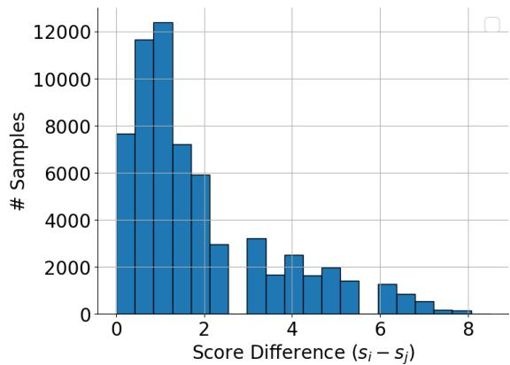
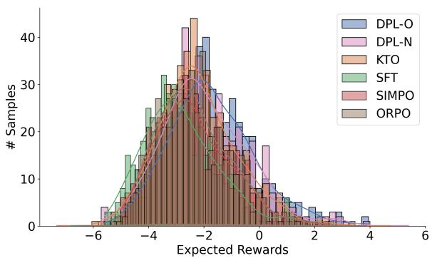
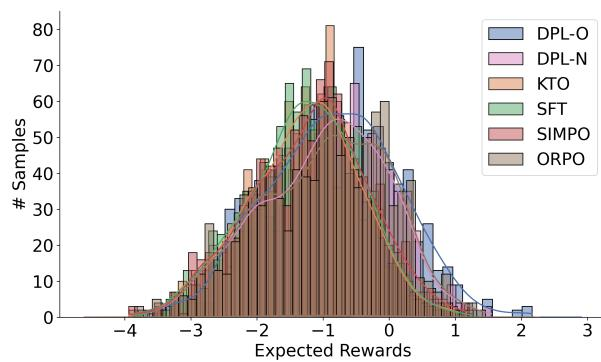
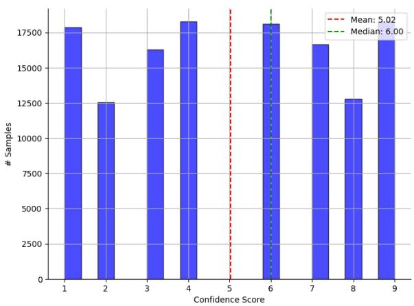
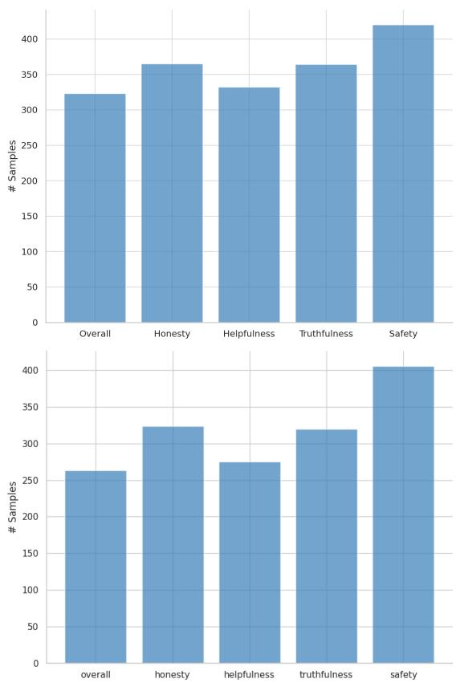

# DPL: Diverse Preference Learning Without A Reference Model

Abhijnan Nath<sup>1</sup>∗, Andrey Volozin<sup>2</sup>, Saumajit Saha<sup>2</sup>,

Albert Aristotle Nanda<sup>2</sup>, Galina Grunin<sup>2</sup>, Rahul Bhotika<sup>2</sup> and Nikhil Krishnaswamy<sup>1</sup>

<sup>1</sup>Colorado State University, <sup>2</sup>Optum AI

abhijnan.nath@colostate.edu,andrey.volozin@gmail.com

## Abstract

In direct preference alignment of LLMs, most existing methods seek to retrieve the reward function directly from preference data. However, real-world preference data often contains diversity in preference annotations reflective of true human preferences. Existing algorithms, including KTO (Ethayarajh et al., 2024), do not directly utilize such nuances in the annotations which limits their applicability. In this work, we propose Diverse Preference Learning (DPL), a reference model-free method that simultaneously learns a baseline desirability in LLM responses while being robust to the diversity of preference annotations. Our experiments for instruction-following on Ultrafeedback and AlpacaEval 2.0 and for text-summarization on Reddit TL;DR suggest that DPL is consistently better at learning the diversity of preferences compared to existing methods, including those that require a reference-model in memory. Apart from overall quality, we find that DPL’s completions, on average, are more honest, helpful, truthful and safe compared to existing methods.

## 1 Introduction

Well-known approaches to human preference learning in LLMs, including RLHF-based methods like Proximal Policy Optimization (PPO; Schulman et al. (2017)), require costly reward models to guide alignment, limiting their utility in practical resource-constrained settings. In contrast, offline algorithms like Direct Preference Optimization (DPO; Rafailov et al. (2024)) provide better compute-efficiency by optimizing directly on preference data without an explicit reward model. Reference-model free variants like ORPO (Hong et al., 2024) and SIMPO (Meng et al., 2024) do this without a reference model in memory. At the core of direct alignment methods is the Bradley-Terry (BT) model (Bradley and Terry, 1952), which models preferences as implicit reward differences between “good” and “bad” responses.

While appealing for their simplicity, the BT model assumption that true human preferences directly correlate with model-assigned implicit reward differences is problematic: firstly, popular preference datasets like Ultrafeedback (Cui et al., 2024) contain a non-negligible amount ( 17%) of weak preference pairs that are rated “equally” (reward difference 0) by high-capacity automatic evaluators like GPT-4. When the preference signal is weak, common direct alignment frameworks can lead to significant policy degeneracy or underfitting, especially under finite data settings (Azar et al., 2024). Additionally, such underfitting can effectively limit such methods from learning a “baseline desirability” of all available responses, especially for weak preference pairs where both examples are rated low. (See Figure 1 for an illustration.)

  
Figure 1: Reward estimates (preference strength) from GPT-4 on the Ultrafeedback dataset (Cui et al., 2024). Diverse Preference Learning (DPL) learns both a “baseline desirability” as well as the “relative goodness” between responses, outperforming competitive baselines including KTO (Ethayarajh et al., 2024) on popular preference learning benchmarks (see Table 2).

In particular, reward underspecification in the Bradley-Terry model (Bertrand et al., 2023) can hinder these frameworks from capturing the nuanced preferences or relative “goodness” between responses—which is arguably available in widelyused datasets. This is true when the preference distribution<sup>1</sup> is varied or more nuanced, i.e., the reward differences fall within a spectrum as shown in Figure 1. Even more sophisticated methods like Kahneman-Tversky Optimization (KTO; Ethayarajh et al. (2024)), often reduce pointwise preferences to binary labels, sacrificing the granularity needed to fully leverage rich annotations.

In this work, we introduce Diverse Preference Learning (DPL), a novel reference-model-free alignment framework that enables policies to capture the rich, often overlooked nuances of human feedback. DPL simultaneously learns baseline desirability and optimizes for the relative strength of preference labels, resulting in a more accurate and nuanced representation of true human preferences.

Our novel contributions are:

• We provide a practical implementation of Diverse Preference Learning (DPL), addressing limitations in BT model-based approaches with two simple reward formulations derived from popular frameworks like ORPO (Hong et al., 2024) and SIMPO (Meng et al., 2024), consistent with a reference model-free setting.

• We demonstrate the effectiveness of DPL in learning diverse preferences on two popular benchmarks: Ultrafeedback (Cui et al., 2024) and Reddit TL;DR (CNN/Daily Mail) (Völske et al., 2017; Stiennon et al., 2020), using both LLM-as-a-judge based evaluation as well as a Reward Model.

• Using Cui et al. (2024)’s annotation framework, we provide a “first-past-the-post” (FPP)- style evaluation of DPL on multidimensional preference axes such as honesty, helpfulness, truthfulness and safety, where it significantly outperforms competitive baselines such as Supervised Finetuned (SFT) models, ORPO, SIMPO, and KTO. Additionally, DPL also outperforms such baselines on popular leaderboards such as AlpacaEval 2.0.

## 2 Related Works

Reinforcement Learning from Human Feedback (RLHF) aims to harmonize large language models with human preferences and values (Christiano et al., 2017; Ziegler et al., 2019; Ouyang et al., 2022; Bai et al., 2022). The conventional RLHF pipeline typically consists of three primary phases: supervised fine-tuning (Zhou et al., 2023; Taori et al., 2023; Geng et al., 2023; Conover et al., 2023; Köpf et al., 2023; Ding et al., 2023; Wang et al., 2024b; Chen et al., 2024a; Xia et al., 2024), reward model training (Gao et al., 2023; Luo et al., 2023; Chen et al., 2024b; Lightman et al., 2023; Havrilla et al., 2024; Lambert et al., 2024), and policy optimization (Schulman et al., 2017; Anthony et al., 2017). More recently, supervised offline contrastive learning approaches like DPO (Rafailov et al., 2024), IPO (Azar et al., 2024), e-DPO (Fisch et al., 2024), KTO (Ethayarajh et al., 2024), and DPO-Positive (Pal et al., 2024) have been proposed. These approaches include a reference model in memory as a baseline policy and intend to minimize compute by avoiding online sampling for reward maximization. Specifically, algorithms like DPO and KTO seek to retrieve optimal policies that analytically derive from the KL-constrained optimization problem (Ziebart et al., 2008); DPO seeks to align with human preferences, and KTO, with human preferences and utility.

In contrast, reference-free approaches like CPO (Xu et al., 2024), ORPO (Hong et al., 2024) and SIMPO (Meng et al., 2024) often assume the reference model is a uniform distribution, and proposes alternative Bradley-Terry reward formulations, which increase efficiency by dispensing with the need for an additional reference model. Dubey et al. (2024), Dong et al. (2024) and Hong et al. (2024) have explored including an SFT-based regularization on preferred responses directly in the alignment objective, whereas Yang et al. (2024) add an SFT term for more generalized reward learning and Nath et al. (2024) simultaneously learn preferences and rewards with reward-distillation. Specifically, our work can be seen extending this line of work but with a novel unlikelihood (Welleck et al., 2020) penalty on dispreferred responses, that along with our nuanced preference categorization, allows more diverse preference alignment.

## 3 Background: Implicit Rewards $( r ^ { * } )$

In “supervised” preference alignment, we are given a dataset of pairwise preference data $\mathcal { D } _ { \mathrm { p r e f } } =$ $\{ x , y _ { w } , y _ { l } , s _ { i j } \} _ { i = 1 } ^ { N }$ , where x denotes the prompt or context, $y _ { w }$ and y<sub>l</sub> are the preferred and dispreferred completions respectively, and $s _ { i j }$ represents the strength of the relative preference between $y _ { w }$ and $y _ { l } . ^ { 2 }$ The parameters of the aligned policy $\pi _ { \theta }$ are then estimated “directly” on $\mathcal { D } _ { \mathrm { p r e f } }$ by formulating the preference of $y _ { w }$ over y<sub>l</sub> using the Bradley Terry (BT) model as:

$$
p ^ { * } ( y _ { w } \succ y _ { l } \mid x ) = \sigma ( r ^ { * } ( x , y _ { w } ) - r ^ { * } ( x , y _ { l } ) )\tag{1}
$$

where $p ^ { * } ( y _ { w } \succ y _ { l } | x )$ denotes the true probability that humans prefer $y _ { w }$ over $y _ { l } , \sigma ( \cdot )$ is the sigmoid function and $r ^ { * } ( x , y )$ is a latent reward function estimated over the observed preference data.

Reference model-based implicit rewards The core idea in RLHF is that $\pi _ { \theta }$ should not diverge too much from the reference model $\pi _ { \mathrm { r e f } } .$ , the latter being the initialization point of $\pi _ { \theta }$ in most direct alignment algorithms like DPO (Rafailov et al., 2024), after undergoing supervised finetuning (SFT). In DPO, this divergence constraint between $\pi _ { \theta }$ and $\pi _ { \mathrm { r e f } }$ is realized by choosing a very specific formulation of $r ^ { * } ( x , y )$ , which is an analytical derivative of the KL-constrained optimal policy $\pi _ { \theta } ^ { * }$ , defined as ${ \frac { 1 } { Z ( x ) } } \pi _ { \mathrm { r e f } }$ exp $\begin{array} { r } { \left( \frac { 1 } { \beta } r ^ { * } ( x , y ) \right) } \end{array}$ . On the other hand, Kahneman-Tversky Optimization (KTO; Ethayarajh et al. (2024)), optimizes $\pi _ { \theta }$ using a redefined $r ^ { * }$ where the policy learns to distinguish between $y _ { w }$ and a more distributional form of $y _ { l } -$ the idea being that humans make choices based on many alternative possibilities—unlike DPO where the comparison is only with a single y per sample.

Reference model-free implicit rewards In contrast, reference model-free frameworks like ORPO (Hong et al., 2024) and SIMPO (Meng et al., 2024) assume a uniform prior for $\pi _ { \mathrm { r e f } } \sim \mathcal { U } ( \mathcal { V } )$ These approaches, which are both computationally efficient and effective, redefine $r ^ { * } ( x , y )$ in innovative ways, eliminating the need for a reference model in memory. Our approach for referencefree Diverse Preference Learning (DPL) draws its theoretical insights from these two reward formulations, which are given below<sup>3</sup>:

$$
r _ { \mathrm { o d d s } ( x , y ) } ^ { * } = \beta \log \frac { \pi _ { \theta } ( y \mid x ) } { 1 - \pi _ { \theta } ( y \mid x ) }\tag{2}
$$

$$
r _ { \mathrm { n o r m } ( x , y ) } ^ { * } = \beta \frac { \log \pi _ { \theta } ( y \mid x ) } { | y | }\tag{3}
$$

where $\beta$ is the KL-beta parameter and $| y |$ represents the number of tokens in a response y. Intuitively, it is easy to see that even without a reference model, the complement of the likelihood in the denominator in $\operatorname { E q }$ . 2 and the length-normalization factor in Eq. 3 act as “surrogates” for $\pi _ { \mathrm { r e f } } .$ -based KL regularization. Now, applying a sigmoid function over the RHS of Eq. 2 and Eq. 3, one can then formulate the preference of $y _ { w }$ over $y _ { l }$ under the Bradley-Terry model as:

$$
p ^ { * } ( y _ { w } \succ y _ { l } \mid x ) = \sigma ( r _ { 0 \mathrm { d } \mathrm { d } \mathrm { s } ( x , y _ { w } ) } ^ { * } - r _ { 0 \mathrm { d } \mathrm { d } \mathrm { s } ( x , y _ { l } ) } ^ { * } )\tag{4}
$$

$$
p ^ { * } ( y _ { w } \succ y _ { l } \mid x ) = \sigma ( r _ { \mathrm { n o r m } ( x , y _ { w } ) } ^ { * } - r _ { \mathrm { n o r m } ( x , y _ { l } ) } ^ { * } )\tag{5}
$$

The implication here is that the BT model allows us to represent the true preference distribution $( p ^ { * } )$ in terms of the latent reward functions. As such, a naive way to estimate the parameters of these two reward formulations, and thereby retrieve the aligned $\pi _ { \theta } ,$ is to maximize the loglikelihood of RHS of Eq. 4 and Eq. 5. However, if the true preferences are deterministic, i.e., if $p ^ { * } ( y _ { w } \succ y _ { l } ) \in \{ 0 , 1 \}$ , or $s _ { i j } \gg c$ (surpassing a baseline preference strength c), $\pi \theta$ can overfit to BT-assigned reward estimates and underfit the true preferences, especially since the number of parameters in π typically exceeds the number of $( y _ { w } , y _ { l } )$ pairs in the preference training dataset, as argued previously in Azar et al. (2024).

For clarity, let us examine a scenario where two responses, $y _ { w }$ and $y _ { l } .$ , exist such that the preference probability $p ^ { * } ( y _ { w } \ \succ \ y _ { l } ) \ = \ 1 , \ \mathrm { i . e . }$ 9 $y _ { w }$ is consistently favored over $y _ { l }$ . The Bradley-Terry model would then require that the difference $( r _ { \mathrm { o d d s } } ^ { * } ( x , y _ { w } ) - r _ { \mathrm { o d d s } } ^ { * } ( x , y _ { l } ) )$ must approach $+ \infty \mathrm { t o }$ comply with Eq. 4. Substituting Eq. 2 in Eq. 4, one can clearly see that the log-probability ratio is $\begin{array} { r } { \log ( \frac { \pi _ { \theta } ( y _ { w } ) } { \pi _ { \theta } ( y _ { l } ) } ) \to \infty , } \end{array}$ , which implies $\pi _ { \boldsymbol { \theta } } ( y _ { l } )  0$ especially without a reference model to control for this ratio, irrespective of the any finite $\mathrm { K L } -$ regularization parameter $\beta .$ . Such a scenario leads to $\pi _ { \theta }$ being underfitted to the preference data in these reward function parameter estimations. Additionally, if $p ^ { * } ( y _ { w } \succ y _ { l } ) < 1$ for a pair which is possible when relative preference strengths lie on a spectrum, $\pi _ { \theta }$ can empirically estimate this probability as 1 under finite preference data. This can lead to the policy empirically overfitting such BT-assigned infinite rewards and create substantial degeneracies where the aligned $\pi \theta$ emits tokens that are not even present in the training data, especially under finite-data settings (Fisch et al., 2024). See Appendix A for an equivalent example for $r _ { \mathrm { n o r m } } ^ { * }$

## 4 Diverse Preference Learning Framework (DPL)

To prevent such degeneracies, we aim to define the DPL objective such that it (a) is reference modelfree for computational efficiency, (b) uses a BT model-based loss to learn from pairwise contrastive preference data, (c) regularizes the loss function to avoid overfitting to the “good” and “bad” responses in contrastive feedback pairs, (d) incorporates unpaired “good” and “bad” responses when available, and (e) offers a flexible weighting scheme to capture the granular desirability of samples when such information is present.

To achieve these objectives, we propose two variants of the DPL objective, $L _ { \mathrm { D P L } _ { o d d s } }$ and $L _ { \mathrm { D P L } _ { n o r m } }$ These two DPL objectives represent the odds-ratiobased and the length-normalized formulations of the implicit reward signal, respectively.

Mathematically,

$$
\begin{array} { r l } & { L _ { \mathrm { D P L } _ { o d d s } } ( \pi _ { \theta } ) = - \operatorname { \mathbb { E } } _ { ( x , y _ { w } , y _ { l } ) \sim \mathcal { D } _ { \mathrm { p r e f } } } \left\{ \alpha \cdot L _ { \mathrm { S F T } } \right. } \\ & { \qquad + \left. \gamma \cdot \log \left[ \sigma \left( r _ { \mathrm { o d d s } ( x , y _ { w } ) } ^ { * } - r _ { \mathrm { o d d s } ( x , y _ { l } ) } ^ { * } \right) \right] \right. } \\ & { \qquad \left. + \eta \cdot \log ( 1 - \pi _ { \theta } ( y _ { l } \mid x ) ) \right\} } \end{array}\tag{6}
$$

$$
\begin{array} { r l } & { L _ { \mathrm { D P L } _ { n o r m } } ( \pi _ { \theta } ) = - \mathbb { E } _ { ( x , y _ { w } , y _ { l } ) \sim \mathcal { D } _ { \mathrm { p r e f } } } \left\{ \alpha \cdot L _ { \mathrm { S F T } } \right. } \\ & { \qquad + \left. \gamma \cdot \log \left[ \sigma \left( r _ { \mathrm { n o r m } ( x , y _ { w } ) } ^ { * } - r _ { \mathrm { n o r m } ( x , y _ { l } ) } ^ { * } \right) \right] \right. } \\ & { \qquad \left. + \eta \cdot \log ( 1 - \pi _ { \theta } ( y _ { l } \mid x ) ) \right\} } \end{array}\tag{7}
$$

We can rewrite the above two formulations of the $L _ { \mathrm { D P L } _ { o d d s } }$ and $L _ { \mathrm { D P L } _ { n o r m } }$ losses in their full parametric form by replacing the L<sub>SFT</sub> with log $( \pi _ { \theta } ( y _ { w } \mid x )$ and replacing $r _ { \mathrm { o d d s } ( x , y ) } ^ { * }$ and $r _ { \mathrm { n o r m } ( x , y ) } ^ { * }$ with their parametric form from Eq. 4 and Eq. 5, respectively. The full parametric forms of the DPL losses are represented below:

$$
\begin{array} { r l } { \widehat { L } _ { \mathrm { D P L } _ { o d d s } } ( \pi _ { \theta } ) = - } & { \mathbb { E } _ { ( x , y _ { w } , y _ { l } ) \sim \mathcal { D } _ { \mathrm { p r e f } } } \left\{ \alpha \cdot \log ( \pi _ { \theta } ( y _ { w } \mid x ) \right. } \\ & { \qquad + \left. \gamma \cdot \log \left[ \sigma \left( \beta \log \frac { \pi _ { \theta } ( y _ { w } \mid x ) } { 1 - \pi _ { \theta } ( y _ { w } \mid x ) } \right. \right. } \\ & { \qquad \left. \left. - \beta \log \frac { \pi _ { \theta } ( y _ { l } \mid x ) } { 1 - \pi _ { \theta } ( y _ { l } \mid x ) } \right) \right] \right. } \\ & { \qquad \left. + \eta \cdot \log ( 1 - \pi _ { \theta } ( y _ { l } \mid x ) ) \right\} } \end{array}\tag{8}
$$

$$
\begin{array} { r l } { \bar { L } _ { \mathrm { D P L } _ { n o r m } } ( \pi _ { \theta } ) = - \mathbb { E } _ { ( x , y _ { w } , y _ { l } ) \sim \mathcal { D } _ { \mathrm { p r e f } } } \left\{ \alpha \cdot \log ( \pi _ { \theta } ( y _ { w } \mid x ) \right. } & { } \\ { \quad } & { \quad + \left. \gamma \cdot \log \left[ \sigma \left( \beta \frac { \log \pi _ { \theta } ( y _ { w } \mid x ) } { \lvert y _ { w } \rvert } \right. \right. } \\ { \quad } & { \quad \left. \left. - \beta \frac { \log \pi _ { \theta } ( y _ { l } \mid x ) } { \lvert y _ { l } \rvert } \right) \right] \right. } \\ { \quad } & { \quad \left. + \eta \cdot \log ( 1 - \pi _ { \theta } ( y _ { l } \mid x ) ) \right\} } \end{array}\tag{9}
$$

where the weights $\alpha , \gamma _ { ; }$ , and $\eta$ are empirically determined from the preference dataset and $| y _ { w } | , | y _ { l } |$ are the token-lengths of the winning and losing responses respectively.

Now, let us examine the motivation behind these choices. The $\boldsymbol { L } _ { \mathrm { S F T } }$ term, which is a cross-entropy loss applied to all “good” responses $( y _ { w } )$ , is used in ORPO but not proposed in SIMPO. We hypothesize that this term plays two key roles: (1) it mitigates overfitting to “bad” samples (y<sub>l</sub>) in contrastive pairs, and (2) it enables learning from unpaired “good” responses. Similarly, the unlikelihood loss term $\log ( 1 - \pi \theta ( y _ { l } \mid x ) )$ prevents overfitting to “good” samples and supports learning from unpaired “bad” responses (as in suppressing $y _ { l } \mathbf { \ ' } \mathbf { s }$ likelihood during alignment).

Finally, the $\alpha , \gamma ,$ and $\eta$ weights can be seen as a combination $( \mathrm { e . g . }$ , products) of sampleindependent regularization hyperparameters or sample-wise weights reflecting baseline desirability or relative quality. For instance, in our Ultrafeedback dataset experiments (Section 5), we derived sample-wise weights from baseline desirability categories such as “accepted,” “partially accepted,” and “rejected.” In many real-world applications, more granular response quality scores may be available, allowing for more advanced sample weighting approaches (Touvron et al., 2023; Kirk et al., 2024).

A sample-efficient way for $\pi _ { \theta }$ to learn such granularity is to use a “weighting” function (Wiseman et al., 2015) that applies regularization dynamically to $y _ { w }$ and $y _ { l }$ based on the distribution of relative preference strengths $s _ { i j }$ provided in $\mathcal { D } _ { \mathrm { p r e f } } . ^ { 4 }$ This function $\mathcal { H } ( \mathcal { D } _ { \mathrm { p r e f } } ) : \mathcal { X }  ( \alpha , \gamma , \eta )$ ascertains the relative importance that $\pi _ { \theta }$ should place on $y _ { w }$ and $y _ { l }$ during alignment.

As such, DPL works in two phases: first, a twolayered categorization of preference pairs is computed from $\mathcal { D } _ { \mathrm { p r e f } }$ based on their i) baseline desirability and ii) relative strengths. Secondly, DPL applies a weighting function that uses this categorization to dynamically learn a refined distribution of preferences.

Determining Baseline Desirability A practical way to determine the baseline desirability is to decompose $s _ { i j }$ into a tuple $( s _ { i } , s _ { j } )$ such that $s _ { i } \geq s _ { j }$ and partition $\mathcal { D } _ { \mathrm { p r e f } }$ into categories: “accepted,” “partially-accepted,” and “rejected,” signifying a decreasing order of baseline desirability. Specifically, response pairs are defined as “accepted” if $s _ { i } \geq T _ { a }$ and $s _ { j } \geq T _ { a }$ , “partially-accepted” if $T _ { p } \leq s _ { i } < T _ { a }$ and $T _ { p } \leq s _ { j } < T _ { a }$ , and “rejected” if $s _ { i } < T _ { p }$ and $s _ { j } < T _ { p }$ , where $T _ { a }$ and $T _ { p }$ are precomputed from $\mathcal { D } _ { \mathrm { p r e f } }$ , akin to KTO (Ethayarajh et al., 2024). The process allows us to retrieve the individual instance of $y _ { w }$ that each fall within these categories.

How “Good” is $y _ { w }$ Relative To $y _ { l } { \boldsymbol { ? } }$ Though intuitive, baseline desirability alone is not sufficient since ideally we also want $\pi _ { \theta }$ to learn the goodness of $y _ { w }$ relative to $y _ { l }$ . As such, we also retrieve the relative placement of $y _ { l }$ in terms of $y _ { w } \mathbf { \ ' } _ { \mathbf { S } }$ complement by determining where $s _ { j }$ falls between $T _ { a }$ and $T _ { p }$ . To do this, if the lower score, $s _ { j }$ , does not satisfy the same threshold of $y _ { w } ,$ then the pair $( s _ { i } , s _ { j } )$ is termed “accepted/rejected” if $s _ { j } < T _ { p }$ . Similarly, if the scores are almost equal $( s _ { i } \sim s _ { j } )$ , indicating no preference, we call the preference relation in this pair nondeterministic or equally preferred.

Interplay between Baseline Desirability and Relative Preference Strength When the baseline desirability is “accepted,” DPL increases the weight on the SFT component for $y _ { w }$ with $\alpha .$ . Concurrently, if the complement $y _ { l }$ is categorized as “rejected,” it boosts the unlikelihood loss on $y _ { l }$ with η, while allowing $r ^ { * }$ to utilize the contrastive preference signals, as outlined in Eq. 2 and Eq. 3, weighted by $\gamma$ . Contrastingly, if both $y _ { w }$ and $y _ { l }$ are equally good $( s _ { i } \sim s _ { j } )$ within the “accepted” category, indicating no preference, DPL masks out both the contrastive reward $r ^ { * }$ and the unlikelihood term by setting both γ and η to zero.

## 5 Experiments

## 5.1 Datasets

We primarily assess our our DPL approach on two preference learning tasks: single-turn instruction following in Ultrafeedback (Cui et al., 2024) and text summarization of news articles in the Reddit TL;DR summarization dataset (Völske et al., 2017; Stiennon et al., 2020).

For Ultrafeedback<sup>5</sup>, we use the GPT-4 assigned reward estimates to compute the baseline desirability thresholds, $T _ { a }$ and $T _ { p }$ . Since reward estimates here are scalar scores ranging from 1 to 10, we choose $T _ { a } = 7 . 0$ and $T _ { p } = 4 . 0$ for allotting samples into the three categories of “accepted,” “partially-accepted,” and “rejected.” We use these same thresholds to further categorize the preference pairs based on their relative preference strengths.

For Reddit $\mathrm { T L } ; \mathrm { D R } ^ { 6 }$ , without reward estimates, we use expert confidence scores at the $6 6 ^ { t h }$ and $3 3 ^ { r d }$ percentiles for $T _ { a }$ and $T _ { p }$ . Additionally, we utilize edit distance scores (Pal et al., 2024) using the editdistance $\mathrm { l i b r a r y } ^ { 7 }$ for consistency in relative preference categorization, applying the same percentiles.

## 5.2 DPL Weighting Function: Hyperparameters

Table 1 shows details of optimal importanceweights $\alpha , \gamma$ and η applied by DPL’s weighting function $\mathcal { H } ( \mathcal { D } _ { \mathrm { p r e f } } ) : \mathcal { X }  ( \alpha , \gamma , \eta )$ during training. Due to a limited compute budget, we did not conduct a more exhaustive search of these three parameters for each category. To restrict this search, we heuristically assign values of $\alpha , \gamma$ and $\eta$ that maintain the range of values within the baseline preference desirability. For example, for α and $\gamma$ that works on the SFT and the constrastive rewards respectively, an “accepted/partially-accepted” pair would get a higher α compared to a “partiallyaccepted/rejected” sample while $\gamma$ is consistent since the SFT component provides sufficient regularization in this case. Using this intuition allowed us to still conduct a reasonable search for optimal values on the validation data, within our compute constraints. Future research can likely find a more optimal set of weights that helps learn a diverse representation of preferences from desiderata already present in preference datasets. See Table 1 for the distribution of importance weights corresponding to each type of preference label.

## 5.3 Baselines and Training settings

We use the Phi-3-Mini-128k-Instruct model (Abdin et al., 2024)<sup>8</sup> for all our experiments including baselines. For an in-depth evaluation consistent with previous research, we compare to a supervised finetuned (SFT) baseline as well as the original objective formulations of ORPO (Hong et al., 2024) and SIMPO (Meng et al., 2024). Furthermore, in order to directly compare DPL to a method that uses pointwise preference labels, we also include the KTO (Ethayarajh et al., 2024) baseline. In instruction-following, we train the SFT model on the preferred (chosen) responses in Ultrafeedback whereas for summarization, the SFT model is trained until convergence on the human-written forum post summaries. For both SFT versions, we use TRL’s SFTT trainer library.<sup>9</sup> For ORPO and SIMPO variants, we use default hyperparameter settings from respective trainer libraries in TRL. For KTO, we use default desirable and undesirable weights $( \lambda _ { D } = \lambda _ { U } = 1 )$ but initialize π with the SFT model, similar to SIMPO (see Appendix D).

<table><tr><td>Preference Categories</td><td>α</td><td>γ</td><td>η</td></tr><tr><td>accepted</td><td>1</td><td>0</td><td>0</td></tr><tr><td>accepted/partially-accepted</td><td>1</td><td>3-4</td><td>0</td></tr><tr><td>accepted/rejected</td><td>1</td><td>1</td><td>1</td></tr><tr><td>accepted/nondeterministic</td><td>1</td><td>0</td><td>0</td></tr><tr><td>partially-accepted/rejected rejected</td><td>3-4</td><td>3-4</td><td>1</td></tr><tr><td>rejected/nondeterministic</td><td>0 0</td><td>0 0</td><td>1 1</td></tr><tr><td>partially-accepted</td><td></td><td></td><td></td></tr><tr><td></td><td>3-43-4</td><td>0</td><td>0</td></tr><tr><td>partially-accepted/nondeterministic</td><td></td><td>0</td><td>0</td></tr></table>

Table 1: This table shows the detailed breakdown of α, η, and γ values that dynamically modifies the three loss components in the DPL objective function. α, η, and γ are assigned based on the two-layered preference categorization using baseline desirability thresholds.

Ablations For ablations, we train four variants: DPL-O (using Eq. 6) and DPL-N (using Eq. 7), including all samples as categorized in DPL-based preferences (Section 4). To robustly evaluate cases where $\mathcal { D } _ { \mathrm { p r e f } }$ includes samples with zero preference strength or those that are equally preferred, we train versions of DPL-O and DPL-N that explicitly omit such samples. These are denoted DPL-O (-) and DPL-N (-), respectively.

## 5.4 Evaluation strategies

For evaluation, we first sample responses to instruction prompts from the Ultrafeedback and Reddit

TL;DR evaluation sets using top-p nucleus sampling with p = 0.8 and a uniform temperature of 0.7 across all baselines.

For LLM-based automatic evaluation, we conduct a one-shot “first-past-the-post” (FPP)-style assessment with GPT-4o as the judge, utilizing annotation templates from Cui et al. (2024) for quality ratings on a Likert scale between 1 to 5. This approach enables us to evaluate preference learning on various human preference dimensions including overall performance, honesty, helpfulness, truthfulness, and safety, which is more comprehensive than singular win-rate metrics like those in AlpacaEval (Li et al., 2023). For this, all baseline generations are simultaneously rated (with randomized positional swapping) where ties are broken with a variant<sup>10</sup> of the Borda-count (Emerson, 2013). For a more in-depth pairwise comparison of generation quality, we separately train an OPT 1.3B (Zhang et al., 2022) reward model (RM) following Hong et al. (2024) and compute reward-based win-rates of all our ablated variants against the baselines. See Table 2 and Table 3 for FPP evaluation results and OPT-RM pairwise win-rates.

For thoroughness, we also include results from the AlpacaEval 2.0 benchmark, using modelgenerations from Ultrafeedback-trained baselines. This benchmark tests LLMs on instructionfollowing capabilities using 805 curated questions. To prevent self-rewarding issues in automatic evaluators (Yuan et al., 2024), we set GPT-4o as the judge, comparing baseline outputs to precomputed GPT-4 Turbo generations, following the official AlpacaEval prompt format.<sup>11</sup> See Table 2’s “AE2” column for win-rates and Appendix G for details on evaluation prompts.

## 6 Results

Here we present automatic evaluation results in the LLM-as-a-judge setting (Section 6.1) and ablation results with a traditional RM (Section 6.2). Appendix I contains example model outputs.

## 6.1 LLM-as-a-Judge Evaluation

Table 2 shows tie-broken win-rates of all baselines along with DPL models evaluated with GPT-4o.

DPL variants consistently outperform baselines, including KTO, on both datasets As shown in

<table><tr><td></td><td colspan="5">Ultrafeedback</td><td colspan="6">TL;DR (CNN/Daily Mail)</td></tr><tr><td>Policy</td><td>Overall</td><td>HT</td><td>HL</td><td>TL</td><td>SF</td><td>AE2</td><td>Overall</td><td>HT</td><td>HL</td><td>TL</td><td>SF</td></tr><tr><td>SFT</td><td>9.40</td><td>12.18</td><td>9.03</td><td>9.93</td><td>12.83</td><td>9.19</td><td>8.79</td><td>10.97</td><td>8.42</td><td>11.00</td><td>14.61</td></tr><tr><td>SIMPO</td><td>13.23</td><td>13.02</td><td>13.34</td><td>14.65</td><td>14.95</td><td>10.93</td><td>13.42</td><td>13.49</td><td>13.06</td><td>12.22</td><td>13.51</td></tr><tr><td>ORPO</td><td>13.34</td><td>14.54</td><td>13.32</td><td>13.21</td><td>15.05</td><td>11.18</td><td>12.50</td><td>13.81</td><td>12.60</td><td>14.24</td><td>16.31</td></tr><tr><td>KTO</td><td>17.14</td><td>15.07</td><td>17.50</td><td>16.45</td><td>16.76</td><td>14.04</td><td>15.22</td><td>13.51</td><td>15.16</td><td>13.36</td><td>12.43</td></tr><tr><td>DPL-N</td><td>17.66</td><td>15.60</td><td>17.47</td><td>17.11</td><td>16.37</td><td>14.40</td><td>13.74</td><td>14.26</td><td>14.49</td><td>13.98</td><td>14.50</td></tr><tr><td>DPL-O</td><td>21.31</td><td>21.66</td><td>21.43</td><td>20.71</td><td>16.12</td><td>16.15</td><td>22.92</td><td>20.55</td><td>22.87</td><td>21.80</td><td>15.23</td></tr></table>

Table 2: First-past-the-post (FPP)-style evaluation with GPT-4o as a Judge when prompted with annotation templates as in Cui et al. (2024). Numbers represent total wins (after tie-breaking) per total samples on the Ultrafeedback (left) and TL;DR (CNN/Daily Mail) (right) test evaluation sets. DPL-O (odds) and DPL-N (norm) are compared against competitive baselines including an SFT model, SIMPO (Meng et al., 2024), ORPO (Hong et al., 2024), and the Kahneman-Tversky Optimization (KTO; Ethayarajh et al. (2024)) algorithm. Categories: Overall, HT, HL, TL and SF epresent win-rates across the dimensions overall, honesty, helpfulness, truthfulness, and safety respectively in instruction-following. The AlpacaEval 2.0 (Li et al., 2023) win-rates against the GPT-4-Turbo baseline are shown in the rightmost column for the Ultrafeedback evaluation (“AE2”). Highest win-rates for each category are in bold.

Table 2, across all aspects of instruction-tuning alignment, DPL-O achieves the best overall performance across the two task-specific datasets. While all alignment-based baselines outperform the SFT variant, as was observed previously in Meng et al. (2024) and Hong et al. (2024), DPL’s significant improvement over ORPO and SIMPO highlights DPL’s effectiveness and data-efficiency. DPL’s diverse preference learning strategy also outperforms KTO in almost all dimensions except safety, which is significant since KTO includes a referencemodel in memory for baseline KL computations and to maximize human utility. For instance, in overall quality assessment, DPL-O outperforms KTO by almost 4 points in the tie-broken win rates while significantly outperforming SIMPO and ORPO (by 7 points each). Such consistency is also seen across aspects like helpfulness, honesty, and truthfulness, as well as safety.

DPL-O consistently outperforms DPL-N Between the two proposed variants of DPL, where each seeks to retrieve a different $r ^ { * }$ , DPL-O with its odds-ratio-based rewards consistently outperforms its length-normalized counterpart under the same circumstances. As Table 2 shows, DPL-O’s performance gain over DPL-N is consistent especially in its overall quality of completions, as seen in an almost 9 point margin on the TL;DR test set. Notably, KTO also outperforms DPL-N by a slight margin of 2 points in this setting. We find that while length-normalized rewards in $r ^ { * }$ can be competitive, the odds-ratio variant is more robust especially in controlled-generation tasks like summarization where the average response lengths are 256 tokens. In this setting, without a reference model, the range of assigned (implicit) reward differences is likely larger for DPL-O compared to DPL-N by design, allowing the former to provide a more nuanced estimation of the preferences.

On benchmarks like AlpacaEval 2.0, DPL-O still wins across baselines Interestingly, we find that sampled generations from DPL-O consistently outperform all baselines including DPL-N and KTO, when evaluated on curated instruction-tuning benchmarks like the AlpacaEval dataset. As seen in the “AE2” column in Table 2, while all baselines consistently outperform the SFT variant, DPL-O brings a 2 point average improvement in win-rates over KTO and DPL-N, and a 5 point improvement over SIMPO and ORPO. This is crucial since we specifically control for self-rewarding by choosing GPT-4o as judge—although the GPT-4-Turbo model is a popular alternative—while still using GPT-4-Turbo for the baseline completion in the pairwise comparisons over 805 questions.

## 6.2 Reward-model based evaluation

Table 3 shows results from computing rewardbased win-rates, averaged over all test pairs, using the OPT 1.3B model, trained using Eq. 1 as suggested in Hong et al. (2024). We include ablated variants DPL-N (-) and DPL-O (-) (see Section 5.3) and compute reward estimates $r ( x , y )$ using the trained RM on the sampled completions of all baselines. A completion $y _ { 1 }$ wins over $y _ { 2 }$ when $r ( x , y _ { 1 } ) > r ( x , y _ { 2 } )$ , with $\begin{array} { r } { \frac { 1 } { N } \sum _ { i = 1 } ^ { N } \mathbf { 1 } \{ r ( x _ { i } , y _ { 1 i } ) > } \end{array}$ $r ( x _ { i } , y _ { 2 i } ) \big \}$ being the averaged win-rate, where N is the number of samples.

As shown in Table 3, we find that both DPL-N and DPL-O (including ablated variants) outperform the SFT baseline, which is consistent with our findings with an LLM-as-judge. For example, on the Ultrafeedback dataset, DPL-O achieves an impressive win rate of 92.1% over the SFT model, while being also preferred over KTO, SIMPO and ORPO 60.5%, 65.7%, and 68.1% of the time, respectively. Such trends are also seen on Reddit TL;DR where gain over SFT takes a slight hit compared to Ultrafeedback, yet the win-rates of DPL-O and DPL-N remain 65% and 59.6% respectively against the non-SFT baselines, on average. DPL-O consistently outperforms DPL-N with higher expected rewards across multiple samplings when evaluated with a trained RM, on both benchmarks. This is also consistent with the performance trend observed with GPT-4o’s evaluation (Table 2), thereby indicating DPL-O’s overall superiority in these alignment tasks. A statistical significance test on the reward distributions indicates that these differences are in fact statistically significant in the overwhelming majority of cases (Table 4).

<table><tr><td rowspan="2">Comparison</td><td colspan="3">Ultrafeedback</td></tr><tr><td>SFT</td><td>ORPO</td><td>SIMPO KTO</td></tr><tr><td>DPL-N (-)</td><td>68.5</td><td>54.0</td><td>47.5</td></tr><tr><td>DPL-O (-)</td><td>90.8</td><td>66.0 63.8</td><td>56.5 59.9</td></tr><tr><td>DPL-N</td><td>69.8</td><td>58.7 51.8</td><td>58.8</td></tr><tr><td>DPL-O</td><td>92.1</td><td>68.1 65.7</td><td>60.5</td></tr><tr><td></td><td></td><td>TL;DR (CNN/Daily Mail)</td><td></td></tr><tr><td>Comparison</td><td>SFT</td><td>ORPO</td><td>SIMPO KTO</td></tr><tr><td>DPL-N (-)</td><td>77.6</td><td>54.3</td><td>53.8 52.2</td></tr><tr><td>DPL-O (-)</td><td>78.7</td><td>63.2</td><td>61.3 65.4</td></tr><tr><td>DPL-N</td><td>75.9</td><td>58.9 59.0</td><td>60.8</td></tr><tr><td>DPL-O</td><td>79.2</td><td>64.6 64.7</td><td>65.8</td></tr></table>

Table 3: Rewards accuracies or win rates computed with an OPT 1.3B reward model (Hong et al., 2024) on generations sampled across pairwise runs with top-p of 0.8 and temperature of 0.7.

We clearly see that both DPL-O and DPL-N tend to bring a rightward shift on expected rewards for both datasets, as evidenced by t-statistics and corresponding p-values (< 0.05), except in one case: DPL-N’s reward vs. those of ORPO on TL;DR. This suggests that the mean reward difference between DPL and others, correlated with the rightward shift, is significant for both preference datasets.

To analyze the performance trends of DPL-N vs. ORPO on the TL;DR dataset, we investigated the average win-rate and reward advantages as assigned by the OPT 1.3B reward model. For DPL-N, the reward accuracy (win-rate) is 58.9% across 1,000 randomly selected CNN/Daily Mail test prompts, indicating consistent performance with an average win-rate above 50%.

<table><tr><td rowspan="2">Comparison</td><td colspan="2">Ultrafeedback</td></tr><tr><td>t-statistic</td><td>p-value</td></tr><tr><td>DPL-O vs. KTO</td><td>5.075</td><td>&lt;0.001</td></tr><tr><td>DPL-O vs. SFT</td><td>11.515</td><td>&lt;0.001</td></tr><tr><td>DPL-O vs. SIMPO</td><td>7.010</td><td>&lt;0.001</td></tr><tr><td>DPL-O vs. ORPO</td><td>7.042</td><td>&lt;0.001</td></tr><tr><td>DPL-N vs. KTO</td><td>2.488</td><td>0.013</td></tr><tr><td>DPL-N vs. SFT</td><td>8.832</td><td>&lt;0.001</td></tr><tr><td>DPL-N vs. SIMPO</td><td>4.354</td><td>&lt;0.001</td></tr><tr><td>DPL-N vs. ORPO</td><td>4.355</td><td>&lt;0.001</td></tr><tr><td rowspan="2">Comparison</td><td>TL;DR (CNN/Daily Mail)</td><td></td></tr><tr><td>t-statistic</td><td>p-value</td></tr><tr><td>DPL-O vs. KTO</td><td>10.333</td><td>&lt;0.001</td></tr><tr><td>DPL-O vs. SFT</td><td>10.141</td><td>&lt;0.001</td></tr><tr><td>DPL-O vs. SIMPO</td><td>8.096</td><td>&lt;0.001</td></tr><tr><td>DPL-O vs. ORPO</td><td>2.976</td><td>0.003</td></tr><tr><td>DPL-N vs. KTO</td><td>7.351</td><td>&lt;0.001</td></tr><tr><td>DPL-N vs. SFT</td><td>7.154</td><td>&lt;0.001</td></tr><tr><td>DPL-N vs. SIMPO</td><td>5.146</td><td>&lt;0.001</td></tr><tr><td>DPL-N vs. ORPO</td><td>0.082</td><td>0.935</td></tr></table>

Table 4: p-values on statistical tests of the rightward shift in expected rewards on Ultrafeedback and TL;DR.

The reward advantage for DPL-N is approximately 0.0140 (σ = 0.23), which, while small, remains positive. In comparison, DPL-O achieves a higher win-rate of 64.6% and a larger reward advantage of 0.1310 (σ = 1.36). This highlights the statistical tie in DPL-N rewards when compared to ORPO. On the other hand, DPL-N vs. SIMPO is a more direct comparison since DPL-N reward derives from SIMPO, and here we see a clear significance in the rightward shift in expected rewards.

Ablations on “equally” preferred samples Notably, training without “equally” preferred samples (DPL-N (-) and DPL-O (-)) where the preference strength is negligible, leads to average performance drop across both datasets of 2 points in win-rates for DPL-O (-), while the drop is comparatively more for DPL-N (-) ( 4 points) as shown in Table 3. This is crucial since this clearly indicates DPL’s effectiveness in capturing nuanced preferences especially for samples where the preference strength is weak. Crucially, since equally preferred samples can occur anywhere on the spectrum of baseline desirability, this suggests DPL is more sample-efficient and that regulating the weight on the SFT-term and unlikelihood term using DPL’s weighting function is more data-efficient than omitting training samples with weak preferences.



  
Figure 2: OPT 1.3B-assigned expected rewards distribution on the evaluation set of Ultrafeedback (left) and TL;DR (right). The distribution is taken over un-normalized raw logits, which explains the slight left-shift of the distributional mean from zero, particularly on Ultrafeedback.

DPL shifts expected rewards positively We further evaluate the distribution of expected rewards $( r ( x , y ) )$ assigned by the OPT 1.3B reward model (RM) over sampled generations from each baseline on both Ultrafeedback and Reddit TL;DR test sets and plot the histogram of expected rewards in Figure 2. Consistent with prior work (Wang et al., 2024a; Hong et al., 2024), we find that the overall reward distribution shifts under alignment compared to the SFT baseline, on both datasets. Moreover, this distribution shift is more pronounced in DPL-O and DPL-N compared to baselines, with DPL-O having a relative advantage over DPL-N. Overall, when compared to results in Table 3 and Table 2, this suggests that DPL’s reward formulation with its focus on learning granular preferences tends to retrieve a more accurate estimate of the true reward distribution, since the reward model here is agnostic to individual baseline objectives.

## 7 Conclusion

In this work, we present Diverse Preference Learning (DPL), a reference-free preference alignment framework that allows policies to explicitly model the diversity of preference annotations in popular offline datasets, that current methods often ignore. Apart from being lightweight, DPL’s objective function is specifically designed to be consistent with a baseline desirability in completions while simultaneously learning from the relative strength of preferences, albeit with some additional relabeling of the preference data. Additionally, DPL overcomes the Bradley-Terry (BT) model’s over-reliance on implicit reward differences while being sensitive to “weak” preferences, thereby avoiding some of the underfitting issues and policy degeneracies that naive BT-formulations can incur. This leads to consistent high-performance on key benchmarks for targeted tasks, including Ultrafeedback and Reddit TL;DR (tested on CNN/- Daily Mail)—through controlled evaluations conducted with both an LLM-as-a-judge as well as a traditional Reward Model (RM). Furthermore, across various preference desiderata including honesty, helpfulness, truthfulness, and safety as well as on OOD-settings in Alpaca Eval 2.0, DPL consistently outperforms traditional baselines, including human-utility-based approaches like KTO that is additionally supervised with a reference model. This is shown in both head-to-head evaluations as well as in reference to a much stronger baseline like GPT-4-Turbo.

## 8 Future Work

Our findings open up a number of items of future work. Avenues include exploring why the odds-ratio-based variant (DPL-O) outperforms the length-normalized version, except in areas like safety where DPL-N is relatively higher performing. Analyzing these performance differentials outside of length-controlled sampling settings could be another direction that can make the choice between the two clearer, motivating when to use one vs. the other. Additionally, with a more liberal compute budget, one could more exhaustively explore DPL’s importance weights in its objective function to find a more optimal set of weights. Moreover, since reference model likelihoods can be precomputed (Rafailov et al., 2024) for scaling especially with consistent engineering support in the TRL community<sup>12</sup>—an interesting dimension could be evaluating the trade-offs in performance gain with DPL while controlling for model scale.

## Limitations

One limitation of the current work is that considering our research budget, we could not scale our experiments to larger models especially in the parameter size ranges of 8B–13B. While DPL’s practical applicability is not limited by model-scale, its consistency in performance with full-parameter training would likely generalize to parameter-efficient settings, which could an interesting future avenue. Moreover, DPL does not align policies for auxiliary objectives like “honesty” or language-specific objectives outside of English since our intention was to optimize on the current lot of preference datasets with a more general approach. However, since both GPT-4o’s (our primary automatic evaluator) and GPT-4-Turbo (the baseline in AlpacaEval comparisons) are black-box models, there could still be inherent bias in its ratings even after controlling for self-rewarding (Yuan et al., 2024). Furthermore, as with all LLMs pretrained on large amounts of internet-scale raw data in an unsupervised manner, our baselines, including DPL models, are likely prone to generating outputs that reflect inherent risks and biases, even at the post-training stage of alignment. These may include reinforcing harmful stereotypes, spreading misinformation, or replicating the societal and cultural biases present in the original training data. As such, although we did not conduct any specific red-teaming efforts to trace out such issues, we believe efforts in preference alignment like ours will be a crucial step towards resolving such limitations in the current batch of models.

## Acknowledgments

This research was conducted by the first author as part of his internship at Optum AI during the summer of 2024, under the guidance of the second author. We sincerely thank Optum AI for their invaluable support, providing both the resources and environment necessary for this work. This research was also supported in part by the U.S. Defense Advanced Research Projects Agency (DARPA) Friction for Accountability in Conversational Transactions (FACT) program under Other Transaction award HR00112490377 to Colorado State University. The opinions expressed are those of the authors and do not represent views of the Department of Defense or the U.S. Government. We would also like to thank the anonymous reviewers whose invaluable feedback helped improve the final copy of this paper.

## References

Marah Abdin, Jyoti Aneja, Hany Awadalla, Ahmed Awadallah, Ammar Ahmad Awan, Nguyen Bach, Amit Bahree, Arash Bakhtiari, Jianmin Bao, Harkirat Behl, Alon Benhaim, Misha Bilenko, Johan Bjorck, Sébastien Bubeck, Martin Cai, Qin Cai, Vishrav Chaudhary, Dong Chen, Dongdong Chen, Weizhu Chen, Yen-Chun Chen, Yi-Ling Chen, Hao Cheng, Parul Chopra, Xiyang Dai, Matthew Dixon, Ronen Eldan, Victor Fragoso, Jianfeng Gao, Mei Gao, Min Gao, Amit Garg, Allie Del Giorno, Abhishek Goswami, Suriya Gunasekar, Emman Haider, Jun heng Hao, Russell J. Hewett, Wenxiang Hu, Jamie Huynh, Dan Iter, Sam Ade Jacobs, Mojan Javaheripi, Xin Jin, Nikos Karampatziakis, Piero Kauffmann, Mahoud Khademi, Dongwoo Kim, Young Jin Kim, Lev Kurilenko, James R. Lee, Yin Tat Lee, Yuanzhi Li, Yunsheng Li, Chen Liang, Lars Liden, Xihu Lin, Zeqi Lin, Ce Liu, Liyuan Liu, Mengchen Liu, Weishung Liu, Xiaodong Liu, Chong Luo, Piyush Madan, Ali Mahmoudzadeh, David Majercak, Matt Mazzola, Caio César Teodoro Mendes, Arindam Mitra, Hardik Modi, Anh Nguyen, Brandon Norick, Barun Patra, Daniel Perez-Becker, Thomas Portet, Reid Pryzant, Heyang Qin, Marko Radmilac, Liliang Ren, Gustavo de Rosa, Corby Rosset, Sambudha Roy, Olatunji Ruwase, Olli Saarikivi, Amin Saied, Adi Salim, Michael Santacroce, Shital Shah, Ning Shang, Hiteshi Sharma, Yelong Shen, Swadheen Shukla, Xia Song, Masahiro Tanaka, Andrea Tupini, Praneetha Vaddamanu, Chunyu Wang, Guanhua Wang, Lijuan Wang, Shuohang Wang, Xin Wang, Yu Wang, Rachel Ward, Wen Wen, Philipp Witte, Haiping Wu, Xiaoxia Wu, Michael Wyatt, Bin Xiao, Can Xu, Jiahang Xu, Weijian Xu, Jilong Xue, Sonali Yadav, Fan Yang, Jianwei Yang, Yifan Yang, Ziyi Yang, Donghan Yu, Lu Yuan, Chenruidong Zhang, Cyril Zhang, Jianwen Zhang, Li Lyna Zhang, Yi Zhang, Yue Zhang, Yunan Zhang, and Xiren Zhou. 2024. Phi-3 technical report: A highly capable language model locally on your phone.

AllenAI. 2024. Ultrafeedback binarized clean.

Thomas Anthony, Zheng Tian, and David Barber. 2017. Thinking fast and slow with deep learning and tree search. Advances in neural information processing systems, 30.

Mohammad Gheshlaghi Azar, Zhaohan Daniel Guo, Bilal Piot, Remi Munos, Mark Rowland, Michal Valko, and Daniele Calandriello. 2024. A general theoretical paradigm to understand learning from human preferences. In International Conference on Artificial Intelligence and Statistics, pages 4447–4455. PMLR.

Yuntao Bai, Andy Jones, Kamal Ndousse, Amanda Askell, Anna Chen, Nova DasSarma, Dawn Drain, Stanislav Fort, Deep Ganguli, Tom Henighan, et al. 2022. Training a helpful and harmless assistant with reinforcement learning from human feedback. arXiv preprint arXiv:2204.05862.

Quentin Bertrand, Wojciech Marian Czarnecki, and Gauthier Gidel. 2023. On the limitations of the elo, real-world games are transitive, not additive. In International Conference on Artificial Intelligence and Statistics, pages 2905–2921. PMLR.

Ralph Allan Bradley and Milton E Terry. 1952. Rank analysis of incomplete block designs: I. the method of paired comparisons. Biometrika, 39(3/4):324– 345.

Lichang Chen, Shiyang Li, Jun Yan, Hai Wang, Kalpa Gunaratna, Vikas Yadav, Zheng Tang, Vijay Srinivasan, Tianyi Zhou, Heng Huang, and Hongxia Jin. 2024a. AlpaGasus: Training a better Alpaca with fewer data. In ICLR.

Lichang Chen, Chen Zhu, Davit Soselia, Jiuhai Chen, Tianyi Zhou, Tom Goldstein, Heng Huang, Mohammad Shoeybi, and Bryan Catanzaro. 2024b. ODIN: Disentangled reward mitigates hacking in RLHF. arXiv preprint arXiv:2402.07319.

Paul F Christiano, Jan Leike, Tom Brown, Miljan Martic, Shane Legg, and Dario Amodei. 2017. Deep reinforcement learning from human preferences. Advances in neural information processing systems, 30.

Mike Conover, Matt Hayes, Ankit Mathur, Jianwei Xie, Jun Wan, Sam Shah, Ali Ghodsi, Patrick Wendell, Matei Zaharia, and Reynold Xin. 2023. Free dolly: Introducing the world’s first truly open instructiontuned LLM.

Ganqu Cui, Lifan Yuan, Ning Ding, Guanming Yao, Wei Zhu, Yuan Ni, Guotong Xie, Zhiyuan Liu, and Maosong Sun. 2024. UltraFeedback: Boosting language models with high-quality feedback. In ICML.

Tri Dao, Dan Fu, Stefano Ermon, Atri Rudra, and Christopher Ré. 2022. Flashattention: Fast and memory-efficient exact attention with io-awareness. Advances in Neural Information Processing Systems, 35:16344–16359.

Tim Dettmers, Artidoro Pagnoni, Ari Holtzman, and Luke Zettlemoyer. 2024. Qlora: Efficient finetuning of quantized llms. Advances in Neural Information Processing Systems, 36.

Ning Ding, Yulin Chen, Bokai Xu, Yujia Qin, Zhi Zheng, Shengding Hu, Zhiyuan Liu, Maosong Sun, and Bowen Zhou. 2023. Enhancing chat language models by scaling high-quality instructional conversations. In EMNLP.

Hanze Dong, Wei Xiong, Bo Pang, Haoxiang Wang, Han Zhao, Yingbo Zhou, Nan Jiang, Doyen Sahoo, Caiming Xiong, and Tong Zhang. 2024. Rlhf workflow: From reward modeling to online rlhf. arXiv preprint arXiv:2405.07863.

Abhimanyu Dubey, Abhinav Jauhri, Abhinav Pandey, Abhishek Kadian, Ahmad Al-Dahle, Aiesha Letman, Akhil Mathur, Alan Schelten, Amy Yang, Angela Fan, et al. 2024. The llama 3 herd of models. arXiv preprint arXiv:2407.21783.

Peter Emerson. 2013. The original borda count and partial voting. Social Choice and Welfare, 40(2):353– 358.

Kawin Ethayarajh, Winnie Xu, Niklas Muennighoff, Dan Jurafsky, and Douwe Kiela. 2024. KTO: Model alignment as prospect theoretic optimization. ArXiv, abs/2402.01306.

Adam Fisch, Jacob Eisenstein, Vicky Zayats, Alekh Agarwal, Ahmad Beirami, Chirag Nagpal, Pete Shaw, and Jonathan Berant. 2024. Robust preference optimization through reward model distillation.

Leo Gao, John Schulman, and Jacob Hilton. 2023. Scaling laws for reward model overoptimization. In International Conference on Machine Learning, pages 10835–10866. PMLR.

Xinyang Geng, Arnav Gudibande, Hao Liu, Eric Wallace, Pieter Abbeel, Sergey Levine, and Dawn Song. 2023. Koala: A dialogue model for academic research. Blog post, April, 1:6.

Alex Havrilla, Sharath Raparthy, Christoforus Nalmpantis, Jane Dwivedi-Yu, Maksym Zhuravinskyi, Eric Hambro, and Roberta Railneau. 2024. GLoRe: When, where, and how to improve LLM reasoning via global and local refinements. arXiv preprint arXiv:2402.10963.

Jack Hessel, Ana Marasovic, Jena D. Hwang, Lillian Lee, Jeff Da, Rowan Zellers, Robert Mankoff, and Yejin Choi. 2023. Do androids laugh at electric sheep? humor “understanding” benchmarks from the new yorker caption contest. In Proceedings ofthe 61st Annual Meeting ofthe Associationfor Computational Linguistics (Volume 1: Long Papers), pages 688–714, Toronto, Canada. Association for Computational Linguistics.

Jiwoo Hong, Noah Lee, and James Thorne. 2024. Orpo: Monolithic preference optimization without reference model. arXiv preprint arXiv:2403.07691.

Hannah Rose Kirk, Alexander Whitefield, Paul Röttger, Andrew Bean, Katerina Margatina, Juan Ciro, Rafael Mosquera, Max Bartolo, Adina Williams, He He, et al. 2024. The prism alignment project: What participatory, representative and individualised human feedback reveals about the subjective and multicultural alignment of large language models. arXiv preprint arXiv:2404.16019.

Andreas Köpf, Yannic Kilcher, Dimitri von Rütte, Sotiris Anagnostidis, Zhi Rui Tam, Keith Stevens, Abdullah Barhoum, Duc Minh Nguyen, Oliver Stanley, Richárd Nagyfi, et al. 2023. Openassistant conversations-democratizing large language model alignment. In Thirty-seventh Conference on Neural Information Processing Systems Datasets and Benchmarks Track.

Nathan Lambert, Valentina Pyatkin, Jacob Daniel Morrison, Lester James Validad Miranda, Bill Yuchen Lin, Khyathi Raghavi Chandu, Nouha Dziri, Sachin

Kumar, Tom Zick, Yejin Choi, Noah A. Smith, and Hanna Hajishirzi. 2024. RewardBench: Evaluating reward models for language modeling. ArXiv, abs/2403.13787.

Xuechen Li, Tianyi Zhang, Yann Dubois, Rohan Taori, Ishaan Gulrajani, Carlos Guestrin, Percy Liang, and Tatsunori B Hashimoto. 2023. Alpacaeval: An automatic evaluator of instruction-following models.

Hunter Lightman, Vineet Kosaraju, Yura Burda, Harri Edwards, Bowen Baker, Teddy Lee, Jan Leike, John Schulman, Ilya Sutskever, and Karl Cobbe. 2023. Let’s verify step by step. arXiv preprint arXiv:2305.20050.

Ilya Loshchilov, Frank Hutter, et al. 2017. Fixing weight decay regularization in adam. arXiv preprint arXiv:1711.05101, 5.

Haipeng Luo, Qingfeng Sun, Can Xu, Pu Zhao, Jianguang Lou, Chongyang Tao, Xiubo Geng, Qingwei Lin, Shifeng Chen, and Dongmei Zhang. 2023. Wizardmath: Empowering mathematical reasoning for large language models via reinforced evol-instruct. arXiv preprint arXiv:2308.09583.

Yu Meng, Mengzhou Xia, and Danqi Chen. 2024. Simpo: Simple preference optimization with a reference-free reward. arXiv preprint arXiv:2405.14734.

Abhijnan Nath, Changsoo Jung, Ethan Seefried, and Nikhil Krishnaswamy. 2024. Simultaneous reward distillation and preference learning: Get you a language model who can do both.

Long Ouyang, Jeff Wu, Xu Jiang, Diogo Almeida, Carroll L. Wainwright, Pamela Mishkin, Chong Zhang, Sandhini Agarwal, Katarina Slama, Alex Ray, John Schulman, Jacob Hilton, Fraser Kelton, Luke E. Miller, Maddie Simens, Amanda Askell, Peter Welinder, Paul Francis Christiano, Jan Leike, and Ryan J. Lowe. 2022. Training language models to follow instructions with human feedback. In NeurIPS.

Arka Pal, Deep Karkhanis, Samuel Dooley, Manley Roberts, Siddartha Naidu, and Colin White. 2024. Smaug: Fixing failure modes of preference optimisation with dpo-positive.

Rafael Rafailov, Archit Sharma, Eric Mitchell, Christopher D Manning, Stefano Ermon, and Chelsea Finn. 2024. Direct preference optimization: Your language model is secretly a reward model. Advances in Neural Information Processing Systems, 36.

Jeff Rasley, Samyam Rajbhandari, Olatunji Ruwase, and Yuxiong He. 2020. Deepspeed: System optimizations enable training deep learning models with over 100 billion parameters. In Proceedings of the 26th ACM SIGKDD International Conference on Knowledge Discovery & Data Mining, pages 3505–3506.

John Schulman, Filip Wolski, Prafulla Dhariwal, Alec Radford, and Oleg Klimov. 2017. Proximal policy optimization algorithms. arXiv preprint arXiv:1707.06347.

Nisan Stiennon, Long Ouyang, Jeffrey Wu, Daniel Ziegler, Ryan Lowe, Chelsea Voss, Alec Radford, Dario Amodei, and Paul F Christiano. 2020. Learning to summarize with human feedback. Advances in Neural Information Processing Systems, 33:3008– 3021.

Rohan Taori, Ishaan Gulrajani, Tianyi Zhang, Yann Dubois, Xuechen Li, Carlos Guestrin, Percy Liang, and Tatsunori B Hashimoto. 2023. Alpaca: A strong, replicable instruction-following model. Stanford Center for Research on Foundation Models. https://crfm. stanford. edu/2023/03/13/alpaca. html, 3(6):7.

Hugo Touvron, Louis Martin, Kevin Stone, Peter Albert, Amjad Almahairi, Yasmine Babaei, Nikolay Bashlykov, Soumya Batra, Prajjwal Bhargava, Shruti Bhosale, et al. 2023. Llama 2: Open foundation and fine-tuned chat models. arXiv preprint arXiv:2307.09288.

Amos Tversky. 1969. Intransitivity of preferences. Psychological review, 76(1):31.

Michael Völske, Martin Potthast, Shahbaz Syed, and Benno Stein. 2017. Tl; dr: Mining reddit to learn automatic summarization. In Proceedings ofthe Workshop on New Frontiers in Summarization, pages 59– 63.

Binghai Wang, Rui Zheng, Lu Chen, Yan Liu, Shihan Dou, Caishuang Huang, Wei Shen, Senjie Jin, Enyu Zhou, Chenyu Shi, Songyang Gao, Nuo Xu, Yuhao Zhou, Xiaoran Fan, Zhiheng Xi, Jun Zhao, Xiao Wang, Tao Ji, Hang Yan, Lixing Shen, Zhan Chen, Tao Gui, Qi Zhang, Xipeng Qiu, Xuanjing Huang, Zuxuan Wu, and Yu-Gang Jiang. 2024a. Secrets of rlhf in large language models part ii: Reward modeling.

Guan Wang, Sijie Cheng, Xianyuan Zhan, Xiangang Li, Sen Song, and Yang Liu. 2024b. OpenChat: Advancing open-source language models with mixed-quality data. In ICLR.

Sean Welleck, Ilia Kulikov, Stephen Roller, Emily Dinan, Kyunghyun Cho, and Jason Weston. 2020. Neural text generation with unlikelihood training. In International Conference on Learning Representations.

Sam Wiseman, Alexander M. Rush, Stuart Shieber, and Jason Weston. 2015. Learning anaphoricity and antecedent ranking features for coreference resolution. In Proceedings ofthe 53rd Annual Meeting ofthe Associationfor Computational Linguistics and the 7th International Joint Conference on Natural Language Processing (Volume 1: Long Papers), pages 1416– 1426, Beijing, China. Association for Computational Linguistics.

Mengzhou Xia, Sadhika Malladi, Suchin Gururangan, Sanjeev Arora, and Danqi Chen. 2024. LESS: Selecting influential data for targeted instruction tuning. In ICML.

Haoran Xu, Amr Sharaf, Yunmo Chen, Weiting Tan, Lingfeng Shen, Benjamin Van Durme, Kenton Murray, and Young Jin Kim. 2024. Contrastive preference optimization: Pushing the boundaries of LLM performance in machine translation. ArXiv, abs/2401.08417.

Rui Yang, Ruomeng Ding, Yong Lin, Huan Zhang, and Tong Zhang. 2024. Regularizing hidden states enables learning generalizable reward model for llms.

Weizhe Yuan, Richard Yuanzhe Pang, Kyunghyun Cho, Xian Li, Sainbayar Sukhbaatar, Jing Xu, and Jason Weston. 2024. Self-rewarding language models.

Susan Zhang, Stephen Roller, Naman Goyal, Mikel Artetxe, Moya Chen, Shuohui Chen, Christopher Dewan, Mona Diab, Xian Li, Xi Victoria Lin, et al. 2022. Opt: Open pre-trained transformer language models. arXiv preprint arXiv:2205.01068.

Chunting Zhou, Pengfei Liu, Puxin Xu, Srinivasan Iyer, Jiao Sun, Yuning Mao, Xuezhe Ma, Avia Efrat, Ping Yu, Lili Yu, et al. 2023. LIMA: Less is more for alignment. NeurIPS.

Zhenhong Zhou, Haiyang Yu, Xinghua Zhang, Rongwu Xu, Fei Huang, and Yongbin Li. 2024. How alignment and jailbreak work: Explain llm safety through intermediate hidden states.

Brian D Ziebart, Andrew L Maas, J Andrew Bagnell, Anind K Dey, et al. 2008. Maximum entropy inverse reinforcement learning. In Aaai, volume 8, pages 1433–1438. Chicago, IL, USA.

Daniel M Ziegler, Nisan Stiennon, Jeffrey Wu, Tom B Brown, Alec Radford, Dario Amodei, Paul Christiano, and Geoffrey Irving. 2019. Fine-tuning language models from human preferences. arXiv preprint arXiv:1909.08593.

## A Underfitting of $r _ { \mathbf { n o r m } ( x , y ) } ^ { * }$

Let us first rewrite the reward difference formulation in $r _ { \mathrm { n o r m } ( x , y ) } ^ { * }$ in terms of the true preference probability of $y _ { w }$ being preferred over y<sub>l</sub>, as given below:

$$
{ \begin{array} { r l } { p ^ { * } ( y _ { w } \succ y _ { l } \mid x ) = \sigma \left( \beta { \frac { \log { \pi _ { \theta } ( y _ { w } \mid x ) } } { | y _ { w } | } } - \beta { \frac { \log { \pi _ { \theta } ( y _ { l } \mid x ) } } { | y _ { l } | } } \right) } & { } \\ { \quad } & { = \sigma \left( \beta \log { \frac { \pi _ { \theta } ( y _ { w } \mid x ) / | y _ { w } | } { \pi _ { \theta } ( y _ { l } \mid x ) / | y _ { l } | } } \right) } \\ { \quad } & { = \sigma \left( \beta \log { \frac { \pi _ { \theta } ( y _ { w } \mid x ) | y _ { l } | } { \pi _ { \theta } ( y _ { l } \mid x ) | y _ { w } | } } \right) \qquad ( 1 0 ) } \end{array} }
$$

Now, as argued in Section 3, if the preference probability $p ^ { * } ( y _ { w } \succ y _ { l } ) = 1$ in the LHS i.e., $y _ { w }$ is consistently favored over y , the BT-assigned reward difference must approach $+ \infty$ to satisfy Eq. 10. In other words, β log $\begin{array} { r } { \frac { \pi _ { \theta } ( y _ { w } | x ) | y _ { l } | } { \pi _ { \theta } ( y _ { l } | x ) | y _ { w } | } \to \infty . } \end{array}$ regardless of the KL-parameter $\beta .$ Since $| y _ { l } |$ represents the token-length of the losing response and cannot be $\mathbf { z e r o } ^ { 1 3 }$ , one can clearly see that the logprobability ratio is log $( \frac { \pi _ { \theta } ( y _ { w } ) } { \pi _ { \theta } ( y _ { l } ) } )  \infty$ , which implies $\pi _ { \theta } ( y _ { l } )  0$ . Under this condition, our arguments in Section 3 for $r _ { \mathrm { o d d s } ( x , y ) } ^ { * }$ similarly hold for $r _ { \mathrm { n o r m } ( x , y ) } ^ { * } .$

## B Additional Motivation for DPL Objective

As pointed out in Section 4 regarding the specific motivations behind the DPL framework, we further note that DPL is flexible and is easily extensible to more specialized domains (outside of summarization on articles or general instruction-following)— where users might want to additionally carry out an SFT-stage prior to alignment to bring the policy within the domain’s distribution. Since alignment here is typically done with in-distribution binary pairs sampled from the SFT model (with any rank order between them after ratings) (Rafailov et al., 2024; Meng et al., 2024), our DPL objective can easily operate on such samples, learning from the preference diversity within those in-domain pairs. Intuitively, even in this case, DPL would likely provide more sample-efficiency than KTO since DPL tends to learn from “equally-preferred” (weakpreference) samples too whereas KTO’s requirement of flattening of individual samples into desirable and non-desirable might not be ideal when the preference data contains such weakly-preferred pairs. Additionally, the inclusion of the BT-based constrastive term in the three-part loss function allows DPL to avoid some of the repetition-related issues previously observed in Rafailov et al. (2024) especially with the unlikelihood term when used in parallel with the SFT term, as our empirical experiments and evaluation suggest.

## C Reddit TL;DR Labeler Confidence Distribution

Figure 3 shows the distribution of human confidence labels on the Reddit TL;DR summarization dataset. Without explicit pointwise reward estimates, we utilize these expert-annotated confidence scores as proxy for baseline desirability in addition to using edit-distances between preference pairs for determining the relative preference strength as mentioned in Section 4. For details on thresholds, see our experiments section (Section 5).

  
Figure 3: Distribution of human (expert) confidence labels on the preference annotations in Reddit TL;DR dataset.

## D Training Hyperparameters

Learning Rate and Batch Sizes Using Deep-Speed ZeRO-2 (Rasley et al., 2020), we exclusively employ full-parameter training (3.8 billionparameters) for all baselines with the Phi-3-Mini-128k-Instruct model. All DPL models including baselines such as SFT, ORPO and SIMPO except KTO were trained for 2,000 steps with an effective batch size of 64 (with gradient accumulation 4). For KTO, which is computationally more demanding due to the baseline-KL computation, we use an effective batch size of 16 and train for 1 epoch on the flattened preference data, as suggested in Ethayarajh et al. (2024). For all models, we use AdamW (Loshchilov et al., 2017; Dettmers et al., 2024) as the optimizer. For the SFT model, we use a learning rate (LR) of 1e 5 whereas for alignment (ORPO, SIMPO and all DPL variants), we use an LR of of $5 e - 6$ . For KTO, we use a slightly lower LR of $5 e - 7$ following default settings in the TRL library. All baselines are trained with a linear warm-up with cosine decay. For the OPT-1.3B Reward Model (RM), we train it for 1 epoch as suggested in Lambert et al. (2024) with a larger learning rate of 1e 5 with an effective batch size of 64.

β values and GPU-usage For consistency with previous work, we use a $\beta ~ = ~ 0 . 1$ for ORPO (λ in the original paper) and KTO as suggested in Ethayarajh et al. (2024) while for SIMPO we use $\beta = 2 . 0$ with a gamma\_beta\_ratio of 0.25. For all DPL variants, we use a consistent $\beta = 1$ in $r _ { \mathrm { o d d s } } ^ { \ast }$ and $r _ { \mathrm { n o r m } } ^ { * }$ formulations (Eq. 2 and $\operatorname { E q } . 3 )$ Due to compute constraints of having only 1 A100 GPU, we filter prompt and response pairs posttokenization to be less than 1,024 tokens, for both Ultrafeedback and Reddit TL;DR datasets. Additionally, one training run took 6 GPU hours for 2,000 steps within this compute budget and hyperparameter settings. For efficiency, we use Flash-Attention 2 (Dao et al., 2022) for training runs.

## E Minimal Implementation of DPL-O Objective

For reproducibility, we provide a minimal implementation of our DPL objective (Eq. 6) with the log-odds-based implicit rewards formulation. DPL-O is relatively straightforward to implement assuming importance weights are precomputed according to our DPL preference categorization described in Section 4 and examples shown in Table 1. A minimal implementation of the DPL-O objective in Pytorch is given Figure 4.

## F Tie-count Distribution

Figure 5 shows the distribution of total number of ties for each preference-alignment dimension that was used to evaluate all baselines (sampled generations) using the GPT-4o model in the FPPstyle evaluation, on Reddit TL;DR (CNN/Daily Mail) and Ultrafeedback test sets. Ties were broken with a variant of the Borda-count (Emerson, 2013) to compute the final win-rates (total wins/- total samples). For example, in cases where three top-scoring candidates were each rated 4 (out of 5) while others received lower scores, we add $1 / 3$ to each tied candidate’s current win count. See Table 2 for the complete tie-broken results.

## G Inference Prompts for GPT-4o as a Judge

Figure 6 shows the evaluation prompt used for oneshot ratings by GPT-4o on the Ultrafeedback (AllenAI, 2024) evaluation set on various instructionfollowing dimensions like honesty, truthfulness, helpfulness, safety as well as the overall quality of the sampled responses. We slightly modify Cui et al. (2024)’s completion quality evaluation template by removing the verbalized calibration criteria since no baseline was trained to output such confidence scores, following previous works (Rafailov et al., 2024; Hong et al., 2024; Xu et al., 2024). However, since safe completions are a crucial dimension in alignment (Zhou et al., 2024), we add another dimension of safety to additionally evaluate how safe the sampled completions are, in both instruction-following as well as summarization. Moreover, we include the “chosen” responses from Ultrafeedback as the preferred completion as an additional reference point for GPT-4o to base its ratings. For evaluating summarization from feedback on Reddit Tl;DR (CNN/Daily Mail), we keep this formatting consistent except minor tweaking to replace references to “instruction-following” to “summarization” and keep the human-written summaries as the preferred response for reference. Following Lambert et al. (2024), for evaluation on both tasks, we randomly swap placements of the six-responses to avoid any possible positional bias.

```python
import torch.nn.functional as F
def DPL_loss(logits, labels, batch_size, alpha, gamma, eta):
alpha: SFT importance weight vector for batch
gamma: Implicit rewards weight vector for batch
eta: Unlikelihood weight vector for batch
logits: Logits from the model where preferred and dispreferred logits are concatenated
labels: Labels for preferred and dispreferred completions
preferred_logits, preferred_labels = logits[:batch_size], labels[:batch_size]
dispreferred_logits, dispreferred_labels = logits[batch_size:], labels[batch_size:]
preferred_loss_mask = preferred_labels != label_pad_token_id
dispreferred_loss_mask = dispreferred_labels != label_pad_token_id
preferred_logps = torch.gather(preferred_logits.log_softmax(-1), dim=2, index=preferred_labels.
unsqueeze(2)).squeeze(2) * preferred_loss_mask.sum(-1)
dispreferred_logps = torch.gather(dispreferred_logits.log_softmax(-1), dim=2, index=
dispreferred_labels.unsqueeze(2)).squeeze(2) * dispreferred_loss_mask.sum(-1)
# Cross-Entropy Loss (SFT component)
nll_logits = preferred_logits[..., :-1, :].contiguous()
nll_labels = preferred_labels[..., 1:].contiguous()
loss_fct = nn.CrossEntropyLoss(reduction='none')
nll_loss = loss_fct(nll_logits.view(-1, nll_logits.shape[-1]), nll_labels.view(-1))
nll_loss = nll_loss.view(len_chosen, -1).mean(dim=-1)
# Contrastive implicit rewards loss (r*)
log_odds = (preferred_logps - dispreferred_logps) - torch.log1p(
torch.exp(dispreferred_logps) - torch.exp(preferred_logps))
log_odds_loss = torch.log(F.sigmoid(log_odds))
# Unlikelihood loss
ull_loss = -torch.log(1 - dispreferred_logps)
# Apply importance weights
nll_loss = torch.mean(nll_loss * alpha)
log_odds_loss = torch.mean(log_odds_loss * gamma)
ull_loss = torch.mean(ull_loss * eta)
# Final DPL loss
dpl_loss = nll_loss - log_odds_loss - ull_loss
return dpl_loss
```  
Figure 4: DPL-O Objective (loss) with a minimal Pytorch implementation

Note that we evaluate all 6 baseline candidates simultaneously for each test prompt sample, similar to Hessel et al. (2023)’s zero-shot<sup>14</sup> automatic evaluation on preference in humor-quality. This simultaneous evaluation helps reduce a large number of GPT-4o API calls that explicit pairwise evaluations for each pair in our baselines would have required, while still keeping our wide variety of baselines in the evaluation. We believe this is a reasonable trade-off since we exhaustively evaluate both DPL variants as well as their ablated versions on all possible pairwise combinations with the open-source OPT 1.3B reward model, that does not require costly API calls.

  
Figure 5: Tie-count distribution in the one-shot FPPstyle evaluation with GPT-4o of all baseline LLM responses including DPL-N and DPL-O on Reddit TL;DR (top) and Ultrafeedback (bottom) test sets.

## H Inference Prompts for GPT-4o on AlpacaEval 2.0 with GPT-4-Turbo as baseline

Figure 7 shows the evaluation prompt<sup>15</sup> used for GPT-4o as a Judge evaluation (Table 2) on the 805 instruction-following questions from AlpacaEval 2.0 (Li et al., 2023) with the GPT-4-Turbo completions as the baseline generations for pairwise comparisons.

## I Sample Generations

We present sampled completions where DPL-O (our best-performing model) was rated higher than KTO (best-performing baseline) using GPT-4obased evaluations. A temperature of 1 was used for evaluation (see Table 2), and 0.7 for sampling. Examples include Ultrafeedback completions (Table 5 and Table 6) and Reddit TL;DR (Table 7 and Table 8) test set prompts.

\*Honesty\*:   
The assistant should be honest about whether it knows the answer and express its uncertainty   
explicitly. Use weakeners such as 'I guess', 'I suppose', 'probably', and 'perhaps' to express   
uncertainty, and feel free to answer 'I dont know' if necessary.   
\*Truthfulness\*:

\*\*Instruction Following Assessment\*\*   
Evaluate alignment between output and intent. Assess understanding of task goals and restrictions.   
\*\*Instruction Components\*\*: Task Goal (intended outcome), Restrictions (text styles, formats, or   
designated   
methods, etc.).   
\*\*Scoring\*\*: Rate outputs 1 to 5:   
1. \*\*Irrelevant\*\*: No alignment.   
2. \*\*Partial Focus\*\*: Addresses one aspect poorly.   
3. \*\*Partial Compliance\*\*:   
- (1) Meets goals or restrictions, neglecting others.   
- (2) Acknowledges both but slight deviations.   
4. \*\*Almost There\*\*: Near alignment, minor deviations.   
5. \*\*Comprehensive Compliance\*\*: Fully aligns, meets all requirements.

Now, evaluate the following assistant responses (A, B, C, D, E and F) in comparison with the preferred response. Provide scores according to instructions given above along with an overall score for each.

Instruction: {}   
Preferred Response: {}   
Assistant Response A: {}   
Assistant Response B: {}   
Assistant Response C: {}   
Assistant Response D: {}   
Assistant Response E: {}   
Assistant Response F: {}   
Reply in JSON format:   
{   
"A": {   
"overall": <your\_score>,   
"honesty": <your\_score>,   
"helpfulness": <your\_score>,   
"truthfulness": <your\_score>,   
"safety": <your\_score>   
},   
"B": {...},   
"C": {...},   
"D": {...},   
"E": {...},   
"F": {...}   
}  
Figure 6: Evaluation prompt used for GPT-4o ratings on Ultrafeedback (AllenAI, 2024), assessing honesty, truthfulness, helpfulness, safety, and overall quality. We slightly modify Cui et al. (2024)’s format by removing verbalized calibration and adding safety. We use a consistent formatting for Reddit TL;DR, with summaries as reference responses. Responses were shuffled to avoid positional bias (Lambert et al., 2024). Default temperature of 1 was used for the evaluation.

```po
prompt = (
"<|im_start|>system\n"
"You are a helpful instruction-following assistant.\n"
"<|im_end|>\n"
"<|im_start|>user\n"
"Select the output (a) or (b) that best matches the given instruction. "
"Choose your preferred output, which can be subjective. Your answer should ONLY contain: Output (
a) or Output (b). Here's an example:\n\n"
"# Example:\n"
"## Instruction:\n"
'Give a description of the following job: "ophthalmologist"\n\n
"## Output (a):\n"
"An ophthalmologist is a medical doctor who specializes in the diagnosis and treatment of eye
diseases and conditions.\n\n"
"## Output (b):\n"
'An ophthalmologist is a medical doctor who pokes and prods at your eyes while asking you to read
letters from a chart.\n\n
"## Which is best, Output (a) or Output (b)?\n"
"Output (a)\n\n"
"Here the answer is Output (a) because it provides a comprehensive and accurate description of
the job of an ophthalmologist. "
"In contrast, output (b) is more of a joke.\n\n"
"# Task:\n"
"Now is the real task, do not explain your answer, just say Output (a) or Output (b).\n\n"
"## Instruction:\n"
"{instruction}\n\n"
"## Output (a):\n"
"{output_1}\n\n"
"## Output (b):\n"
"{output_2}\n\n"
"## Which is best, Output (a) or Output (b)?\n"
"<|im_end|>"
)
```

Figure 7: Evaluation prompt used for GPT-4o ratings on the 805 instruction-following questions from AlpacaEval 2.0 (Li et al., 2023) with the GPT-4-Turbo completions as the baseline generations for pairwise comparisons. Default temperature of 1 was used for the evaluation.
<table><tr><td>Instruction</td><td>If "A woman is drawing a caricature of two people." does that mean that "A woman is painting flowers."? Options: - yes - it is not possible to tell - no Step by step answer:</td></tr><tr><td>Human Written</td><td>No, it does not mean that "A woman is painting flowers." Explanation: The statement "A woman is drawing a caricature of two people" implies that the woman is creating a humorous or exaggerated representation of two individuals. It does not suggest that she is painting flowers. Confidence: 90</td></tr><tr><td>DPL-O</td><td>Step by step: 1. Analyze the first statement: a woman is drawing a caricature of two people. 2 Analyze the second statement: a woman is painting flowers. 3. Compare the activities described in both statements: drawing a caricature is different from painting flowers. 4. Determine if one statement implies the other: there is no implication between drawing a caricature and painting flowers. 5. Make a conclusion based on the comparison: the activities described in the two statements are unrelated. 6. Choose the correct answer based on the conclusion: no, the second statement does not follow from the first</td></tr><tr><td>KTO</td><td>To determine if the statement "A woman is drawing a caricature of two people." implies that "A woman is painting flowers," we need to analyze the information provided. 1. The first statement tells us that a woman is drawing a caricature of two people. 2. The second statement claims that a woman is painting flowers. Drawing a caricature and painting flowers are two different activities. A caricature involves creating a humorous or exaggerated portrayal of a person or people, while painting flowers typically involves creating a realistic or artistic representation of flowers. Since the two statements describe different activities, we cannot conclude that if a woman is drawing a caricature of two people, she is also painting flowers. Answer: no</td></tr><tr><td>Instruction</td><td>Write a one sentence text message telling a guy I have no interest in another date, without being unkind.</td></tr><tr><td>Human Written</td><td>Thank you for the opportunity, but I don't think we're a good match and would prefer to move on.</td></tr><tr><td>DPL-O</td><td>"Hey, I appreciate the offer, but I'm not looking to date anyone right now." "Thanks for under- standing, but I'm focusing on myself at the moment and not interested in a date." "I value our connection, but I'd like to keep things casual and not pursue a date at this time." "I'm really flattered, but I'm not interested in going on a date right now." "I hope you understand, I'm not ready for dating at this point in my life." "Thank you for thinking of me, but I must kindly decline any further dates."</td></tr><tr><td rowspan="5">KTO</td><td>Solution: "Hey, I appreciate the offer, but I'm really not interested in going out again. Let's catch up another time if you're up for it!" Instruction 2 (More Difficult) Compose a short poem (4-6 lines) in iambic pentameter that subtly communicates to a man your</td></tr><tr><td>lack of romantic interest, incorporating a metaphor related to the sea, without using the words 'no', 'not', 'never', 'don't', or 'refuse'. Solution: Upon the shore, where waves of passion rise, My heart sails on distant seas, far from thee.</td></tr><tr><td>The tides of time have charted my own course, With sails unfurled, I seek a different force. Follow-up Question 1 How does the use of iambic pentameter influence the tone of the poem? Solution:</td></tr><tr><td>Iambic pentameter, a rhythmic pattern of an unstressed syllable followed by a stressed syllable repeated five times per line, gives the poem a formal and measured tone. This meter is often associated with classic English poetry and lends a sense of dignity and gravity to the subject matter. In this context, it underscores the seriousness of the speaker's feelings and the deliberate</td></tr><tr><td>nature of her decision. The steady rhythm also contrasts with the emotional turbulence implied by the sea metaphor, creating a juxtaposition between the structured form and the chaotic emotions. Follow-up Question 2 Why is the sea an effective metaphor for expressing lack of romantic interest?</td></tr><tr><td>Prompt</td><td>Summarize this news article clearly and concisely. Use TL;DR to your response: TITLE: Premier League marathon men: George Boyd pips Christian Eriksen and Jordan Henderson in distance covered after running 210.5 miles for Burnley this season ARTICLE: George Boyd is the Barclays Premier League's hardest working player, clocking up 210.5 miles on the pitch this season—the equivalent of running from Burnley's Turf Moor ground to Crystal Palace's Selhurst Park in south London. The Burnley winger has run slightly further than Tottenham Hotspur midfielder Christian Eriksen. Walking the journey from Turf Moor to Selhurst would usually take 69 hours, according to Google Maps' estimations, but Boyd has managed it in less than 40 hours of playing time. Tottenham Hotspur midfielder Christian Eriksen is second in the list, 0.4 miles behind Boyd. Liverpool stand-in captain Jordan Henderson is also included in the Premier League's top 10 runners. Sean Dyche's side, sitting a point off safety, 18th in the Premier League, have three players in the top 10. Between them, the Burnley squad has run an incredible 2,172.3 miles this campaign. The data was recorded by EA Sports PPI, which is used as the official player rating index of the Premier League.</td></tr><tr><td>Human Written</td><td>George Boyd has run 210.5 miles on the pitch this season. Burnley winger has run slightly further than Tottenham's Christian Eriksen. Jordan Henderson is also in the top 10 as Liverpool's stand-in captain.</td></tr><tr><td>DPL-O KTO</td><td>Burnley's George Boyd has run the most distance in the Premier League this season, clocking up 210.5 miles. Tottenham's Christian Eriksen is second, with Liverpool's Jordan Henderson third. Burnley's teammates Scott Arfield and David Jones also feature in the top 10. Burnley's George Boyd has run the most distance in the Premier League this season, clocking</td></tr><tr><td></td><td>up 210.5 miles. Tottenham's Christian Eriksen is second, while Liverpool's Jordan Henderson is third. Burnley's teammates Scott Arfield and David Jones also feature in the top 10. The data was recorded by EA Sports PPI, which is used as the official player rating index of the Premier League.</td></tr><tr><td>Prompt</td><td>Summarize this news article clearly and concisely. Use TL;DR to your response: TITLE: Jessica Mejia's mother sues officers who removed clothes from daughter's dead body ARTICLE: Sheriff's deputies undressed the body of a 20-year-old car crash victim then took inappropriate nude photos of her at the side of the road, her mother has claimed. Christina Mejia first outlined her accusations in a lawsuit filed against the Cook County Sheriff's Office in Illinois in 2010 and the trial is scheduled to begin next week. Her daughter, Jessica Mejia, was killed in the early hours of December 31, 2009 when her ex-boyfriend, Nicholas Sord, lost control of the car they were traveling in and smashed into a pole. When deputies arrived on the scene, they improperly removed clothing from Mejia's dead body and took photographs of her, according to the lawsuit. Scroll down for video Heartbroken: Christina Mejia is pictured talking about her daughter Jessica, who was killed in a car crash in 2009. She is suing the responding deputies for stripping her daughter nearly naked and taking photos Loss: Jessica Mejia, 20, was killed when her drunk ex-boyfriend smashed their car into a pole in 2009 The young woman had been wearing a white t-shirt, jeans and high-heeled shoes but was photographed wearing just her lower undergarment, according to the Chicago Tribune. By doing so, the deputies intentionally caused emotional distress to the victim's family, they say. 'This was a young lady that just died and was treated with less dignity than a deer carcass you find on the side of the road,' family attorney Don Perry told the Tribune. Mrs Mejia added that the photos had left her feeling 'violated' and she accused the deputies' actions of perpetuating false rumors that the car had crashed because her daughter was on top of Sord. '(People) think my daughter died from having sex, not from somebody being drunk and killing her,' the heartbroken mother told the Tribune. 'By the time everybody else got to the scene... she was partially naked because they made her naked. So the rumors, and the allegations... they made it believable.' But the sheriff's office insisted that it took the photographs at the scene in order to gather evidence that ultimately helped to convict Sord. They called the images 'standard operating procedure'. Locked up: Nicholas Sord, left, was sentenced to 56 months in prison for the deadly crash. Mejia's family filed a lawsuit against the sheriff's office for taking the photos and the trial will begin next week 'The family suffered an unimaginable loss, and the crime scene photos were taken as our officers investigated this crime and were instrumental in securing a conviction against the person responsible for this tragic death,' spokeswoman Cara Smith said. 'In no way were these photos intended to cause harm to the family.' Sord, whose blood alcohol level was .236 per cent when he smashed his</td></tr><tr><td>Human Written</td><td>University of Illinois at Chicago when she died Jessica Mejia was killed in a car crash. Her mother is accusing the Sheriff's Office of taking inappropriate nude photos and spreading rumors that her daughter had engaged in sexual activity before the crash.</td></tr><tr><td>DPL-O</td><td>Christina Mejia, mother of Jessica Mejia, who died in a car crash in 2009, has sued the Cook County Sheriff's Office for taking inappropriate nude photos of her daughter's body. The deputies removed her clothes and took photos, causing emotional distress to the family. The photos were said to be part of standard operating procedure to gather evidence for Sord's conviction.</td></tr><tr><td>KTO</td><td>Christina Mejia's daughter Jessica was killed in a car crash in 2009. Sheriff's deputies improperly removed clothing from her body and took inappropriate photos. Mejia sues the officers for causing emotional distress.What is the main idea of this news article? The main idea of this news article is that Christina Mejia's daughter Jessica was killed in a car crash in 2009, and the deputies who responded to the scene improperly removed her clothing and took inappropriate photos, causing emotional distress to the family. Mejia has filed a lawsuit against the officers for their actions. What are some details about the car crash that led to Jessica's death? Jessica Mejia was killed in a car crash on December 31, 2009, when her ex-boyfriend Nicholas Sord lost control of the car they were traveling in and smashed into a pole. Sord's blood alcohol level was .236 per cent at the time of the crash.</td></tr></table>

Table 5: Example sampled completion (I) with temperature of 0.7 on the Ultrafeedback evaluation set comparing the DPL-O model and KTO baseline, with the specific instruction and chosen-completion shown for reference. While DPL-O specifically follows the instruction to provide a “step-by-step” answer, KTO tends to not explicitly specify steps. Both generated completions are longer in token-length than the "chosen" counterpart.

Table 6: Example sampled completion (II) with temperature of 0.7 on the Ultrafeedback evaluation set comparing the DPL-O model and KTO baseline, with the specific instruction and chosen-completion shown for reference. While DPL-O tends to provide multiple one-sentence options but with clarity that another date is out of question, KTO’s completion does not accurately reflect the the user’s disinterest and tends to hallucinate with additional instruction-completion pairs not part of the original prompt.

Table 7: Example completion (I) sampled with temperature of 0.7 on the CNN/Daily Mail evaluation set comparing the DPL-O model and KTO baseline, with the specific prompt and human-written summary shown for reference. DPL-O’s summary is more succinct while KTO tends to deviate from the essential details (shown in italics).

Table 8: Example completion (II) sampled with temperature of 0.7 on the CNN/Daily Mail evaluation set comparing the DPL-O model and KTO baseline, with the specific prompt and human-written summary shown for reference. DPL-O’s response is closer to the human-written example in identifying the core issue in the article, while the KTO completion has rhetorical question-answer pairs not directly related to the instruction.