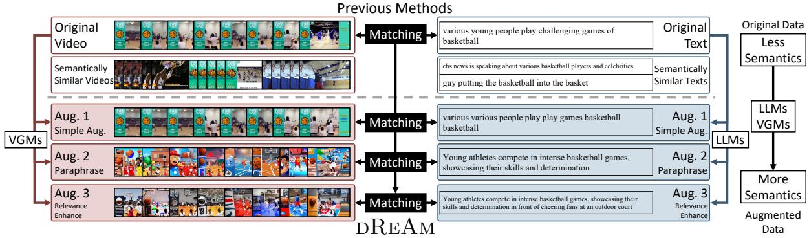
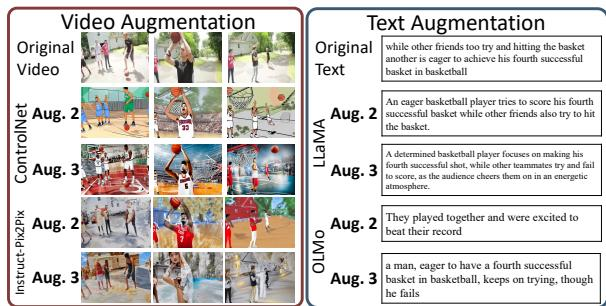
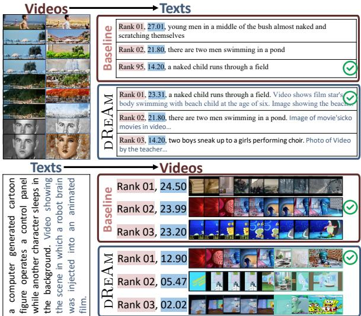
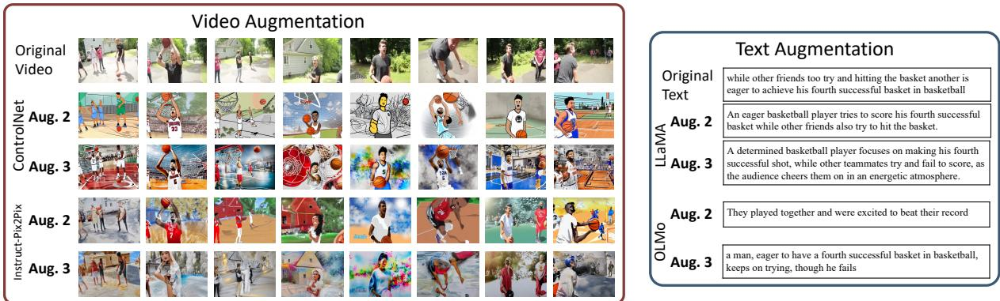

# DREAM: Improving Video-Text Retrieval Through Relevance-Based Augmentation Using Large Foundation Models

Yimu Wang1, Shuai Yuan2, Bo Xue3, Xiangru Jian1, Wei Pang1, Mushi Wang1, Ning Yu4

1 University of Waterloo, 2 Duke University

3 City University of Hong Kong, 4 Netflix Eyeline Studios

1 {yimu.wang,xiangru.jian,w3pang,m358wang}@uwaterloo.ca

2 shuai@cs.duke.edu, 3 boxue4-c@my.cityu.edu.hk, 4 ningyu.hust@gmail.com

## Abstract

Recent progress in video-text retrieval has been driven largely by advancements in model architectures and training strategies. However, the representation learning capabilities of videotext retrieval models remain constrained by lowquality and limited training data annotations. To address this issue, we present a novel ViDeo-Text Retrieval Paradigm with RElevance-based AugMentation, namely DREAM, which enhances video and text data using large foundation models to learn more generalized features. Specifically, we first adopt a simple augmentation method, which generates self-similar data by randomly duplicating or dropping subwords and frames. In addition, inspired by the recent advancement in visual and language generative models, we propose a more robust augmentation method through textual paraphrasing and video stylization using large language models (LLMs) and visual generative models (VGMs). To further enrich video and text information, we propose a relevance-based augmentation method, where LLMs and VGMs generate and integrate new relevant information into the original data. Leveraging this enriched data, extensive experiments on several video-text retrieval benchmarks demonstrate the superiority of DREAM over existing methods.

## 1 Introduction

Video-Text Retrieval (VTR) (Luo et al., 2022; Gao et al., 2021b; Ma et al., 2022a; Liu et al., 2022a; Zhao et al., 2022; Gorti et al., 2022; Fang et al., 2022; Wang et al., 2023b; Wang and Shi, 2023; Yu et al., 2022) is a fundamental task in visuallanguage understanding (Wang et al., 2020b; Xu et al., 2021b; Park et al., 2022a; Miyawaki et al., 2022; Fang et al., 2023b,c; Kim et al., 2023; Jian and Wang, 2023). The recent progress in VTR is mostly driven by powerful pretraining models (Luo et al., 2022; Gao et al., 2021b; Ma et al., 2022a; Liu et al., 2022a), improved retrieval methods (Bertasius et al., 2021; Dong et al., 2019; Jin et al., 2021), and the newly emerged large-scale video-language benchmark datasets (Xu et al., 2016a; Chen and Dolan, 2011; Fabian Caba Heilbron and Niebles, 2015).

The most widely adopted VTR paradigm (Luo et al., 2022; Ma et al., 2022a; Liu et al., 2022b) learns a joint feature space across the visual and textual modalities, where video and text data are directly compared. Inspired by the success of CLIP (Radford et al., 2021a), CLIP4Clip (Luo et al., 2022) finetunes CLIP (Radford et al., 2021b) and investigates three similarity measures for videosentence contrastive learning, with satisfying retrieval performance. Subsequently, X-CLIP (Ma et al., 2022b) introduces a novel multi-grained contrastive learning framework to further enhance the detailed association between video and text modalities. Following these pioneering works, many other methods have also been proposed (Wu et al., 2023b; Cao et al., 2022; Liu et al., 2022a,b; Park et al., 2022b; Zhao et al., 2022; Fang et al., 2023a; Wang et al., 2023c; Jin et al., 2023b; Ma et al., 2022b).

Though different modeling or training techniques have been employed to improve the performance on the modeling side, data issues still exist. For example, most methods are trained using datasets with one-to-one video-text labels, assuming that the video and text data can be wellaligned one-to-one in the same feature space. However, this assumption may not hold tight (Wang et al., 2022d) for some popular video-text benchmark datasets (Xu et al., 2016a; Chen and Dolan, 2011; Fabian Caba Heilbron and Niebles, 2015), because in real applications, a single video may correspond to multiple valid sentences, and vice versa. As shown in Figure 1 (an example from MSR-VTT (Xu et al., 2016a)), the basketball video in Figure 1 is paired with the text, “various young people play challenging games of basketball”, although it can also match with many other semantically similar sentences such as “guy putting the basketball into the basket” or “cbs news is speaking about various basketball players and celebrities”. Similarly, one text can also potentially corrrespond to many different videos. One possible solution to this mismatch problem is to have better datasets with precise one-to-one video-text pairs. However, it is extremely challenging to have a sufficiently large dataset with high-quality due to the nature of the ambiguity of video and text data themselves.

  
Figure 1: Existing video retrieval works focus on improving representation learning ability by learning from benchmarks that have many semantically similar data points, as shown in the top rows. It leads to vague annotations and associations between videos and texts, further hindering the representation learning ability of video-text retrieval models. To counteract this issue, in this study, we propose DREAM. Specifically, instead of learning from original noisy data, DREAM augments data with three proposed augmentation methods, i.e., simple augmentation, augmentation by text paraphrasing and video stylization (“Aug. 2 Parapharse” in the figure), and augmentation by relevance enhancing (“Aug. 3 Relevance Enhance” in the figure).

Thus, instead of collecting new high-quality datasets, in this paper, we propose a simple yet effective framework, namely DREAM, to enhance the one-to-one matching between video and text by semantically augmenting video and text data. As shown in Figure 1, though videos and texts have many semantically similar neighbors, they still differ from each other with minor differences. Motivated by the success of data augmentation for better representation learning in computer vision (Chen et al., 2020) and natural language processing (Gao et al., 2021a), we utilize data augmentation to enlarge the minor differences between semantically similar data for enhancing the quality of datasets.

Specifically, we first introduce a simple augmentation method, which generates semantically similar videos and texts through random duplication or deletion of frames or subwords. Our experiments show that even such a simple augmentation method can improve the text-to-video Recall@1 on MSR-VTT from 46.1 to 50.8. Next, inspired by the success of the latest large foundation models such as large language models (LLMs) (Touvron et al., 2023a,b; Groeneveld et al., 2024; Brown et al.,

2020a) and visual generative models (VGMs) (Saharia et al., 2022; Zhang et al., 2023; Brooks et al., 2023; Wang et al., 2023a), we utilize these offthe-shelf models and propose two augmentation strategies, i.e., augmentation by text paraphrasing and video stylization (TPVS) and augmentation by relevance enhancing (RE). TPVS employs off-theshelf large models to generate semantically similar videos and text by stylization (e.g., cartoon style) and text paraphrasing. In addition, to infuse video and text with richer information, we introduce a relevance-based augmentation method, where videos and texts are expanded with relevant information given the input video or text. Two advanced methods further improve the text-to-video Recall@1 on MSR-VTT from 46.1 to 56.0 and 60.8. To the best of our knowledge, we are the first to exploit the latest foundation models to augment data for VTR.

To understand how our proposed augmentation methods improve VTR performance, extensive experiments on three representative VTR benchmarks show that our proposed DREAM outperforms our baseline and previous methods by a large margin.

In summary, our contributions are as follows,

• We identify the challenge of video-text retrieval as the ambiguous one-to-one labels that hinder learning robust representations. We explore augmentation techniques along several dimensions as a way to address this challenge.

• Our proposed DREAM includes three augmentation methods, i.e., simple augmentation (SA), augmentation by text paraphrasing and video stylization (TPVS), and augmentation by relevance enhancing (RE). We are among the pioneers in the use of the latest large language models and visual generative models to assist video-text retrieval.

• Extensive experiments show that our proposed DREAM achieves state-of-the-art performances on three popular benchmarks MSR-VTT, MSVD, and ActivityNet.

## 2 Related Works

Video-Text Retrieval (VTR). VTR, which involves cross-modal alignment and abstract understanding of temporal images (videos), has been a popular and fundamental task of languagegrounding problems (Wang et al., 2020a,c, 2021; Yu et al., 2023). Inspired by the success of selfsupervised pretraining methods (Devlin et al., 2019; Radford et al., 2019; Brown et al., 2020b) and vision-language pretraining (Li et al., 2020; Gan et al., 2020; Singh et al., 2022) on large-scale unlabeled cross-modal data, recent works (Lei et al., 2021; Cheng et al., 2021; Gao et al., 2021b; Ma et al., 2022a; Park et al., 2022a; Wang et al., $2 0 2 2 \mathrm { a } , \mathrm { c } ;$ Zhao et al., 2022; Gorti et al., 2022) have attempted to pre-train or fine-tune video-text retrieval models in an end-to-end manner. Previous methods have focused on improving the representation learning ability by advanced architectures. However, due to the nature of benchmarks (Xu et al., 2016a; Chen and Dolan, 2011; Fabian Caba Heilbron and Niebles, 2015), learning from such benchmarks makes the learning procedure unstable. To address this issue, we propose to augment data using large language models and visual generative models.

Learning from data augmentation. Data augmentation (Yang et al., 2023b), as an effective way to improve the sufficiency and diversity of training data, has become a necessary part of the successful application of computer vision (Majurski et al., 2019; Liu et al., 2023b; Chen and Lu, 2023; Yuan et al., 2023) and natural language processing (Wei and Zou, 2019; Zhou et al., 2022; Xu et al., 2021c; Kobayashi, 2018). Similarly, we first introduce a simple augmentation method that randomly duplicates and drops frames and words to generate self-similar data.

Learning from synthetic data. As the emergence of language and visual generative models (Touvron et al., 2023a,b; Groeneveld et al., 2024; Brown et al., 2020a; Saharia et al., 2022; Zhang et al., 2023; Brooks et al., 2023; Wang et al., 2023a), generating data for learning representation has attracted extensive attention recently. In natural language processing, large language models have been used for generating data and labels (You et al., 2023; Chong et al., 2022; Khalifa et al., 2021) for a while. It shows an impressive ability to help researchers collect high-quality domain-specific data (Li et al., 2023c; Xiao et al., 2023). On the other side, the attempt to use visual generative models to train models without any human-annotated data succeeds in image segmentation (Feng et al., 2023a), domain adaptation (Tang and Jia, 2023; Wang et al., 2025), and more (Zeng et al., 2023; Takmaz et al., 2023; Cascante-Bonilla et al., 2023; Yang et al., 2023a). Drawing inspiration from these works, we leverage generative models to augment data by caption paraphrasing and video stylization with relevant information conditioned on the original data.

## 3 Method

## 3.1 Problem Definition

In this section, we present the definition of videotext retrieval and the details of DREAM, along with three proposed simple but effective augmentation methods as shown in Figure 1.

In this paper, we focus on video-text retrieval (VTR), aiming to learn a pair of encoders that map data from video and text into a common space where they can be directly compared. The query and gallery modalities are denoted as and $\mathcal { V }$ The (test) gallery, denoted by $G = \{ \mathbf { g } _ { 1 } , \ldots , \mathbf { g } _ { N _ { G } } \}$ contains all the embeddings of the gallery data, where $N _ { G }$ is the size of the gallery data. In VTR, the gallery data does not overlap with the training data. A video is composed of several frames, as $V = [ V _ { 1 } , \dots , V _ { N _ { f r a m e s } } ]$ , where $N _ { f r a m e s }$ is the number of frames of that video, and $V _ { i }$ is the ith frame of that video. A text is represented by multiple words, as $T = [ T _ { 1 } , \dots , T _ { { N _ { w o r d s } } } ]$ , where $N _ { w o r d s }$ is the number of (sub-)words, and $T _ { i }$ is the i-th (sub-)word. The goal of VTR is to learn a video encoder $f _ { v i d e o } ( \cdot )$ and a text encoder $f _ { t e x t } ( \cdot )$ that map video and text into a common space, on which paired video-text data are close.

## 3.2 DREAM

The motivation of DREAM is that low-quality benchmarks (Xu et al., 2016b; Chen and Dolan, 2011; Fabian Caba Heilbron and Niebles, 2015) lead to unsatisfying representation learning. On the other side, the simple self-augmenting method (SA) improves the retrieval performance, as shown in Figure 1 and tables 4 and 5. Inspired by the results, we propose three simple but effective data augmentation methods to enrich data and further boost retrieval performance, as shown in Figure 1.

Specifically, for each video V and text $T ,$ we augment it by generating positive views as $\tilde { V }$ and $\tilde { T } .$ Then, instead of doing multi-query retrieval, we concatenate the positive views with the original data for a fair comparison with previous methods. After that, we use a representative VTR method, i.e., X-CLIP (Ma et al., 2022b), as our learning method for aligning video and text spaces.

## 3.2.1 Simple Augmentation (SA)

SA targets generating self-similar data without any prior or pretrained models. A simple implementation is randomly duplicating and dropping some frames and words without changing the original order. Specifically, denoting the original video and text as $V ~ = ~ [ V _ { 1 } , \dots , V _ { N _ { f r a m e s } } ]$ and $\textit { T } = \ [ T _ { 1 } , \ldots , T _ { N _ { w o r d s } } ]$ , we sample $\tilde { N } _ { f r a m e }$ frames or $\ddot { N } _ { w o r d s }$ words with replacement to form the augmented videos $\tilde { V }$ and texts $\tilde { T }$ . For example, for a 2-frame video $V ~ = ~ [ V _ { 1 } , V _ { 2 } ]$ , we will have three different augmentations, $i . e . , [ V _ { 1 } , V _ { 1 } ]$ $[ V _ { 2 } , V _ { 2 } ]$ , and $[ V _ { 1 } , V _ { 2 } ]$ . Similarly, for a 2-subword text $T = [ T _ { 1 } , T _ { 2 } ]$ , we also have three different augmentations, $i . e . , [ T _ { 1 } , T _ { 1 } ] , [ T _ { 2 } , T _ { 2 } ]$ , and $[ T _ { 1 } , T _ { 2 } ]$

## 3.2.2 Augmentation by Text Paraphrasing and Video Stylization (TPVS)

The goal of DREAM is to add as many as possible details in the video and text to enrich the data and thus further improve the representation learning ability for boosting retrieval performance. One straightforward approach to enriching data is generating videos and texts based on data from another modality using multi-modal generative models (Daras and Dimakis, 2022; Li et al., 2022, 2023a; Wang et al., 2022b; Reed et al., 2016; Feng et al., 2023b). That could be useful during training, as it brings extrat precise information. However, this cannot be used for test time augmentation, as during inference, the data from another modadlity is not available. That prompts us to focus on generalizations based on a single modality.

Recently, with the emergence of visual generative models (VGMs) and large language models (LLMs), enriching the video and text data by paraphrasing (Bansal et al., 2023) and stylization (Zhang et al., 2023) become a valid solution. Inspired by the advancement in LLMs and VGMs, we propose to generate the paraphrased text and a new style of the original video with standard foundational models.

Text paraphrasing Specifically, for augmenting text captions, we use the following prompts:

This is a hard problem. The following is   
a caption from a video: ["text"]. Based   
on this caption, carefully generate a   
paraphrased caption capturing the key   
information and main themes in one   
sentence with up to twenty words:

Our prompt has two specific designs for generating high-quality paraphrased texts, which are essential for VTR as a more detailed caption will help models learn a precise mapping, as shown below:

Interrogative/instructive hints (This is a hard problem). Previous studies (Kojima et al., 2022) show that adding short interrogative/instructive sentences to the beginning of a prompt can improve zero-shot performance. We add a short sentence, “this is a hard problem”, at the beginning of our prompt for generating paraphrases and found that this generally improved the quality of paraphrased captions.

Style transfer and contextual captions (carefully generate a paraphrased caption capturing the key information and main themes in one sentence with up to twenty words). We add specific guidance on this goal and lead LLMs to generate semantically similar captions without adding too many irrelevant words.

Video sylization For augmenting videos, though recent years have witnessed huge progress in video stylization (Yin et al., 2023; Wu et al., 2023a; Khachatryan et al., 2023) and generation (Gao et al., 2023; Ruan et al., 2023; Shen et al., 2023; Ni et al., 2023), the performance of video generation is still far behind image generation (Saharia et al., 2022; Zhang et al., 2023; Brooks et al., 2023; Wang et al., 2023a; Rangwani et al., 2023) and stylization (Kang et al., 2023; Yang et al., 2023c; Liu et al., 2023a; Li et al., 2023d; Zhou et al., 2023), due to the high requirement of understanding temporal association and highly informative context. Besides, as video generation methods have high computation requirements, due to these issues, instead of employing off-the-shelf video generation methods (Shen et al., 2023; Ni et al., 2023; Muaz et al., 2023; Wang et al., 2023c), we employ image stylization methods (Zhang et al., 2023; Yang et al., 2023c), which show better performance and efficiency. Specifically, we use each frame of a video as the input of ControlNet (Zhang et al., 2023) and generate semantically similar frames without any text guidance using ControlNet under different predefined stylized text prompts.

## 3.2.3 Augmentation by Relevance Enhancing (RE)

While TPVS shows satisfying retrieval performance, it restricts the addition of extra information and further hinders the quality of data pairs. As LLMs and VGMs show the ability to understand the world, we propose the third augmentation method, Augmentation by Relevance Enhancing (RE), which utilizes “world models” to enrich the visual and language information in video-text paired data.

Text relevance enhancing Specifically, for augmenting text captions with the enhanced relevant details, we use the following prompts:

This is a hard problem. The following is   
a caption from a video: ["text"]. Based   
on this caption, carefully generate a   
paraphrased caption capturing the key   
information and main themes in one   
sentence with up to twenty words (feel   
free to add more relevant details based   
on your knowledge and specalutaion):

Compared with the prompt used in TPVS, we have one more special design to incorporate additional information.

Encouraging uncertainty (feel free to add more relevant details based on your knowledge and specalutaion). In our prompt design, we aim to encourage the model to include potential uncertainty in the paraphrased texts. The uncertainty can be seen as semantically similar information, which is effective for better capturing key features.

Video relevance enhancing Similar to TPVS, we employ image stylization methods (Saharia et al., 2022; Zhang et al., 2023; Brooks et al., 2023; Wang et al., 2023a), use each frame of a video as the input of the image stylization model, and generate semantically similar frames as augmented views. However, to add relevant visual cues, we use ControlNet (Zhang et al., 2023) without any text guidance in guess mode.

## 3.3 Base Model and Training Objectives

In this part, we present a general VTR framework widely used by previous methods (Luo et al., 2022; Liu et al., 2022a). With this paradigm, we obtain two representations for video and text modalities, $i . e .$ , video representation $\mathbf { e } _ { v }$ and text representation $\mathbf { e } _ { t }$ by modality-dependent encoders $f _ { v i d e o } ( \cdot )$ and $f _ { t e x t } ( \cdot )$ . Then, the similarity between the video and the text sim $\left( \mathbf { e } _ { v } , \mathbf { e } _ { t } \right)$ is calculated by the cosine similarity $s = c o s i n e ( \mathbf { e } _ { v } , \mathbf { e } _ { t } )$ . Finally, the retrieved data is ranked based on the cosine similarity to the query input.

The training objective is the contrastive loss. Following Clip4Clip (Luo et al., 2022), we employ the symmetric InfoNCE loss as,

$$
\begin{array} { l } { \ell _ { s i m } = \ell _ { v 2 t } + \ell _ { t 2 v } } \\ { = - \displaystyle \frac { 1 } { N } \sum _ { i \in [ N ] } \log \frac { \exp ( s _ { i , i } ) } { \sum _ { j \in [ N ] } \exp ( s _ { i , j } ) } } \\ { \displaystyle - \frac { 1 } { N } \sum _ { i \in [ N ] } \log \frac { \exp ( s _ { i , i } ) } { \sum _ { j \in [ N ] } \exp ( s _ { j , i } ) } , } \end{array}
$$

where $s _ { i , j }$ is similarity between i-th video and j-th text and N is the number of paired data.

## 4 Experiments

Benchmarks. To evaluate the proposed DREAM, we use three representative VTR benchmarks, i.e., MSR-VTT (Xu et al., 2016a), MSVD (Chen and Dolan, 2011), and ActivityNet (Fabian Caba Heilbron and Niebles, 2015). Details are deferred to the Appendix due to the limitation of space.

Evaluation Protocols. To evaluate the retrieval performance of our proposed DREAM, we use recall at Rank K (R@K, higher is better), median rank (MdR, lower is better), and mean rank (MnR, lower is better) as retrieval metrics, which are widely used in previous retrieval works (Radford et al., 2021b; Luo et al., 2022; Ma et al., 2022a).

Implementation Details. Our baseline (base model) is X-CLIP (Ma et al., 2022a). Following Luo et al. (2022); Ma et al. (2022a), we use a standard vision transformer (Dosovitskiy et al., 2021) with 12 layers that are initialized with the public CLIP (Radford et al., 2021b) checkpoints.

<table><tr><td rowspan="2">Methods</td><td rowspan="2">Venue</td><td colspan="4">Text-to-Video Retrieval</td><td rowspan="2">R@1↑</td><td colspan="4">Video-to-Text Retrieval</td><td rowspan="2">MnR↓</td></tr><tr><td>R@1↑</td><td>R@5↑</td><td>R@10↑</td><td>MdR↓</td><td>MnR↓</td><td>R@5↑</td><td>R@10↑</td><td>MdR↓</td></tr><tr><td>VLM (Xu et al., 2021a)</td><td>ACL’21</td><td>28.1</td><td>55.5</td><td>67.4</td><td>4.0</td><td></td><td></td><td></td><td></td><td></td><td></td></tr><tr><td>VideoCLIP (Xu et al., 2021b)</td><td>EMNLP&#x27;21</td><td>30.9</td><td>55.4</td><td>66.8</td><td>1</td><td></td><td></td><td></td><td></td><td></td><td></td></tr><tr><td>LGDN (Lu et al., 2022)</td><td>NeurIPS&#x27;22</td><td>43.7</td><td>71.4</td><td>80.3</td><td>2.0</td><td></td><td>42.6</td><td>71.6</td><td>80.6</td><td>2.0</td><td></td></tr><tr><td>BLIP-based</td><td></td><td></td><td></td><td></td><td></td><td></td><td></td><td></td><td></td><td></td><td></td></tr><tr><td>BLIP (Li et al., 2022)</td><td>ICML&#x27;22</td><td>41.4</td><td>63.3</td><td>72.8</td><td>2.0</td><td></td><td></td><td></td><td></td><td></td><td></td></tr><tr><td>LiteVL-S (Chen et al., 2022)</td><td>EMNLP&#x27;22</td><td>46.7</td><td>71.8</td><td>81.7</td><td>2.0</td><td></td><td></td><td></td><td></td><td></td><td></td></tr><tr><td>LiteVL-L (Chen et al., 2022)</td><td>EMNLP&#x27;22</td><td>50.8</td><td>76.3</td><td>84.4</td><td>2.0</td><td></td><td></td><td></td><td></td><td></td><td></td></tr><tr><td>ViT (CLIP)-based</td><td></td><td></td><td></td><td></td><td></td><td></td><td></td><td></td><td></td><td></td><td></td></tr><tr><td>CLIP (Radford et al., 2021a)</td><td>ICML&#x27;21</td><td>31.2</td><td>53.7</td><td>64.2</td><td>4.0</td><td></td><td>27.2</td><td>51.7</td><td>62.6</td><td>5.0</td><td></td></tr><tr><td>CLIP4Clip (Luo et al., 2022)</td><td>NeurComp&#x27;22</td><td>44.5</td><td>71.4</td><td>81.6</td><td>2.0</td><td>15.3</td><td></td><td></td><td></td><td></td><td></td></tr><tr><td>VCM (Cao et al., 2022)</td><td>AAAI&#x27;22</td><td>43.8</td><td>71.0</td><td></td><td>2.0</td><td>14.3</td><td>45.1</td><td>72.3</td><td>82.3</td><td>2.0</td><td>10.7</td></tr><tr><td>DiscreteCodebook (Liu et al., 2022a)</td><td>ACL&#x27;22</td><td>43.4</td><td>72.3</td><td>81.2</td><td></td><td>14.8</td><td>42.5</td><td>71.2</td><td>81.1</td><td></td><td>12.0</td></tr><tr><td>X-Pool (Gorti et al., 2022)</td><td>CVPR&#x27;22</td><td>46.9</td><td>72.8</td><td>82.2</td><td>2.0</td><td>14.3</td><td></td><td></td><td></td><td></td><td></td></tr><tr><td>TS2-Net (Liu et al., 2022b)</td><td>ECCV&#x27;22</td><td>47.0</td><td>74.5</td><td>83.8</td><td>2.0</td><td>13.0</td><td>45.3</td><td>74.1</td><td>83.7</td><td>2.0</td><td>9.2</td></tr><tr><td>NCL (Park et al., 2022b)</td><td>EMNLP&#x27;22</td><td>43.9</td><td>71.2</td><td>81.5</td><td>2.0</td><td>15.5</td><td>44.9</td><td>71.8</td><td>80.7</td><td>2.0</td><td>12.8</td></tr><tr><td>Align&amp;Tell (Wang et al., 2022c)</td><td>TMM&#x27;22</td><td>45.2</td><td>73.0</td><td>82.9</td><td>2.0</td><td></td><td>43.4</td><td>70.9</td><td>81.8</td><td>2.0</td><td>-</td></tr><tr><td>TABLE (Chen et al., 2023)</td><td>AAAI&#x27;23</td><td>47.1</td><td>74.3</td><td>82.9</td><td>2.0</td><td>13.4</td><td>47.2</td><td>74.2</td><td>84.2</td><td>2.0</td><td>11.0</td></tr><tr><td>VOP (Huang et al., 2023)</td><td>CVPR&#x27;23</td><td>44.6</td><td>69.9</td><td>80.3</td><td>2.0</td><td>16.3</td><td>44.5</td><td>70.7</td><td>80.6</td><td>2.0</td><td>11.5</td></tr><tr><td>PIDRo (Guan et al., 2023)</td><td>CVPR&#x27;23</td><td>48.2</td><td>74.9</td><td>83.3</td><td>2.0</td><td>12.6</td><td>47.4</td><td>74.8</td><td>84.1</td><td>2.0</td><td>8.7</td></tr><tr><td>HBI (Jin et al., 2023a)</td><td>CVPR&#x27;23</td><td>48.6</td><td>74.6</td><td>83.4</td><td>2.0</td><td>12.0</td><td>46.8</td><td>74.3</td><td>84.3</td><td>2.0</td><td>8.9</td></tr><tr><td>UATVR (Fang et al., 2023a)</td><td>CVPR&#x27;23</td><td>47.5</td><td>73.9</td><td>83.5</td><td>2.0</td><td>12.3</td><td>46.0</td><td>73.7</td><td>82.8</td><td>2.0</td><td>8.7</td></tr><tr><td>Cap4Video (Wu et al., 2023b)</td><td>ICCV’23</td><td>49.3</td><td>74.3</td><td>83.8</td><td>2.0</td><td>12.0</td><td>47.1</td><td>73.7</td><td>84.3</td><td>2.0</td><td>8.7</td></tr><tr><td>UCoFiA (Wang et al., 2023c)</td><td>ICCV’23</td><td>49.4</td><td>72.1</td><td></td><td></td><td>12.9</td><td>47.1</td><td>74.3</td><td></td><td></td><td></td></tr><tr><td>ProST (Li et al., 2023b)</td><td>ICCV’23</td><td>48.2</td><td>74.6</td><td>83.4</td><td>2.0</td><td>12.4</td><td>46.3</td><td>74.2</td><td>83.2</td><td>2.0</td><td>8.7</td></tr><tr><td>DiffusionRet (Jin et al., 2023b)</td><td>ICCV’23</td><td>49.0</td><td>75.2</td><td>82.7</td><td>2.0</td><td>12.1</td><td>47.7</td><td>73.8</td><td>84.5</td><td>2.0</td><td>8.8</td></tr><tr><td>RAP (Cao et al., 2024)</td><td>ACL&#x27;24</td><td>44.8</td><td>71.4</td><td>81.5</td><td></td><td>14.4</td><td>44.0</td><td>71.9</td><td>82.4</td><td></td><td>10.1</td></tr><tr><td>T-MASS (Wang et al., 2024)</td><td>CVPR&#x27;24</td><td>50.2</td><td>75.3</td><td>85.1</td><td>1.0</td><td>11.9</td><td></td><td></td><td></td><td></td><td>1</td></tr><tr><td>X-CLIP (Ma et al., 2022b) (Baseline)</td><td>ACM MM&#x27;22</td><td>46.1</td><td>74.3</td><td>83.1</td><td>2.0</td><td>13.2</td><td>46.8</td><td>73.3</td><td>84.0</td><td>2.0</td><td>9.1</td></tr><tr><td colspan="2">DREAM</td><td>60.8</td><td>84.5</td><td>91.4</td><td>1.0</td><td>5.8</td><td>60.6</td><td>85.2</td><td>92.5</td><td>1.0</td><td>5.9</td></tr></table>

Table 1: Video-Text retrieval results on MSR-VTT. The best results are marked in bold. “NeurComp” refers to Neurocomputing.

We use SeqTransformer as the temporal encoder, similar to (Luo et al., 2022). We directly use the text encoder of CLIP as our text encoder, which is also initialized with the public CLIP checkpoints. All models are optimized for 5 epochs on MSR-VTT and MSVD, and for ActivityNet, the models are trained for 20 epochs. We use AdamW (Loshchilov and Hutter, 2019) with a weight decay of 0.2 and decay the learning rate using a cosine schedule (Loshchilov and Hutter, 2017), following the method used in CLIP (Radford et al., 2021b). For all experiments, we uniformly sample 12 frames from every video, resizing each frame to 224x224 as per previous works (Luo et al., 2022; Ma et al., 2022a). For text augmentation, we use LLaMA2 (Touvron et al., 2023b), while for video frame augmentation, we employ ControlNet (Zhang et al., 2023).

## 4.1 Quantitative Results

In this part, we present a series of experiments on MSR-VTT, MSVD, and ActivityNet to demonstrate the effectiveness of DREAM in Tables 1 to 3, 8 and 9.

MSR-VTT. The results are shown in Table 1.

DREAM significantly outperforms all previous methods across different retrieval metrics, achieving remarkable top scores with a Recall@1 of 60.8 and 60.6, Recall@5 of 84.5 and 85.2, and Recall@10 of 91.4 and 92.5, for text-to-video and video-to-text, respectively. This leap in performance highlights the effectiveness of DREAM, setting a new benchmark for the field.

MSVD. Corresponding results are shown in Tables 2 and 8. With a Text-to-Video Retrieval Recall@1 of 61.6, Recall@5 of 87.1, and Recall@10 of 93.2, alongside a MdR and MnR of 1.0 and 5.6 respectively, DREAM establishes new SOTAs.

ActivityNet. Corresponding results are shown in Tables 3 and 9. DREAM achieves the highest scores across both text-to-video and video-to-text retrieval tasks, with Text-to-Video Retrieval scores of Recall@1 at 59.1.

## 4.2 Qualitative Results

Quality of augmented data. To qualitatively validate the effectiveness of DREAM, we present examples of augmented data in Figures 2 and 4, respectively. For paraphrasing text, we employ LLaMA2 (Touvron et al., 2023b) and

<table><tr><td>Methods</td><td>Venue</td><td colspan="5">Text-to-Video Retrieval R@5↑ R@10↑ MdR↓</td></tr><tr><td>CLIP4Clip</td><td>NeurComp&#x27;22</td><td>R@1↑ 45.2</td><td>75.5</td><td>84.3</td><td>2.0</td><td>MnR↓ 10.3</td></tr><tr><td>CLIP2Video</td><td>Arxiv&#x27;21</td><td>47.0</td><td>76.8</td><td>85.9</td><td>2.0</td><td>9.6</td></tr><tr><td>X-Pool</td><td>CVPR&#x27;22</td><td>47.2</td><td>77.4</td><td>86.0</td><td></td><td>9.3</td></tr><tr><td>NCL</td><td>EMNLP&#x27;22</td><td>47.8</td><td>77.5</td><td>85.9</td><td>2.0</td><td>9.9</td></tr><tr><td>CenterCLIP</td><td>SIGIR&#x27;22</td><td>47.6</td><td>76.8</td><td>85.6</td><td>2.0</td><td>9.9</td></tr><tr><td>TABLE</td><td>AAAI&#x27;23</td><td>49.9</td><td>79.3</td><td>87.4</td><td>2.0</td><td>9.1</td></tr><tr><td>PIDRo</td><td>CVPR&#x27;23</td><td>47.5</td><td>77.5</td><td>86.0</td><td>2.0</td><td>9.2</td></tr><tr><td>UATVR</td><td>CVPR&#x27;23</td><td>46.0</td><td>76.3</td><td>85.1</td><td>2.0</td><td>10.4</td></tr><tr><td>Cap4Video</td><td>ICCV&#x27;23</td><td>51.8</td><td>80.8</td><td>88.3</td><td>1.0</td><td>8.3</td></tr><tr><td>UCoFiA</td><td>ICCV&#x27;23</td><td>47.4</td><td>77.6</td><td></td><td></td><td>9.6</td></tr><tr><td>DiffusionRet</td><td>ICCV&#x27;23</td><td>46.6</td><td>75.9</td><td>84.1</td><td>2.0</td><td>15.7</td></tr><tr><td>RAP</td><td>ACL&#x27;24</td><td>49.8</td><td>78.2</td><td>86.1</td><td>=</td><td>9.7</td></tr><tr><td>X-CLIP</td><td>ACM MM&#x27;22</td><td>47.1</td><td>77.8</td><td></td><td></td><td></td></tr><tr><td>DREAM(ViT-B/32)</td><td></td><td>61.6</td><td>87.1</td><td>= 93.2</td><td>= 1.0</td><td>9.5 5.6</td></tr></table>

Table 2: Text-to-Video retrieval results on MSVD. Best in bold.

<table><tr><td>Methods</td><td>Venue</td><td colspan="5">Text-to-Video Retrieval R@5↑ MdR↓</td></tr><tr><td></td><td></td><td>R@1↑</td><td></td><td>R@10↑</td><td></td><td>MnR↓</td></tr><tr><td>CLIP4Clip VCM</td><td>NeurComp&#x27;22 AAAI&#x27;22</td><td>40.5 40.8</td><td>72.4 72.8</td><td>98.1</td><td>2.0 2.0</td><td>7.4 7.3</td></tr><tr><td>TS2-Net</td><td></td><td></td><td>73.6</td><td>84.5</td><td>2.0</td><td>8.4</td></tr><tr><td>NCL</td><td>ECCV&#x27;22 EMNLP&#x27;22</td><td>41.0 45.9</td><td>76.8</td><td>98.3</td><td>2.0</td><td>6.7</td></tr><tr><td>Align&amp;Tell</td><td>TMM</td><td>42.6</td><td>73.8</td><td></td><td>2.0</td><td></td></tr><tr><td>CenterCLIP</td><td>SIGIR&#x27;22</td><td>43.5</td><td>75.0</td><td>85.9</td><td>2.0</td><td>- 6.9</td></tr><tr><td>PIDRo</td><td>CVPR&#x27;23</td><td>44.9</td><td>74.5</td><td>86.1</td><td>2.0</td><td>6.4</td></tr><tr><td>HBI</td><td>CVPR&#x27;23</td><td>42.2</td><td>73.0</td><td>84.6</td><td>2.0</td><td>6.6</td></tr><tr><td>UCoFiA</td><td>ICCV&#x27;23</td><td>45.7</td><td>76.0</td><td></td><td></td><td>6.6</td></tr><tr><td>DiffusionRet</td><td>ICCV’23</td><td>45.8</td><td>75.6</td><td>86.3</td><td>2.0</td><td>6.5</td></tr><tr><td>RAP</td><td>ACL&#x27;24</td><td>48.4</td><td>76.2</td><td>86.4</td><td></td><td>7.0</td></tr><tr><td></td><td></td><td></td><td></td><td></td><td>-</td><td></td></tr><tr><td>X-CLIP DREAM</td><td>ACM MM&#x27;22</td><td>44.3 59.1</td><td>74.1 82.9</td><td>一 95.3</td><td>- 1.0</td><td>7.9 5.2</td></tr></table>

Table 3: Text-to-Video retrieval results on ActivityNet. Best in bold.

  
Figure 2: Qualitative examples of data generated by DREAM. “Aug. 2” and “Aug. 3” refer to augmentation by text paraphrasing and video stylization and augmentation by relevance enhancing.

OLMo (Groeneveld et al., 2024). For generating semantically similar video frames, we use ControlNet (Zhang et al., 2023) and Instruct-Pix2Pix (Brooks et al., 2023). We notice that for text paraphrasing, both LLaMA and OLMo are able to grasp the main idea based on the input and generate semantically similar texts. For video frame generation, though the generation for a frame is independent of other frames, we still observe that ControlNet can generate frames within a similar style, while the frames generated by Instruct-Pix2Pix are always in different styles. A failure case is the second frame in the last row where a man is holding a human head as a basketball.

  
Figure 3: Retrieval examples by the baseline and DREAM. “Rank x” means that the example is ranked at x. The numbers in blue represent the similarity to the query. Texts in blue and video frames surrounded by green lines are augmented data.

Retrieval examples. To qualitatively validate the effectiveness of DREAM, we present examples of video-to-text and text-to-video retrieval on MSR-VTT in Figure 3. The retrieval results show the satisfactory performance of DREAM, benefiting from the augmented semantics, compared with the baseline. While the baseline struggles with matching, DREAM demonstrates precise identification of objects (computer) and humans (child), indicating its proficiency in capturing intricate details.

## 4.3 Ablation Studies

In this section, we present the ablation studies on DREAM regarding the number of paraphrased texts and generated videos on MSR-VTT utilizing DREAM with X-CLIP (ViT-B/32) as the base model. Due to the space limitation, the results on video-to-text are presented in Tables 10 to 13.

Number of paraphrased texts. Table 4 offers an insightful look into the effects of varying the number of augmented texts. With simple augmentation, a gradual increase in performance is seen with the number of texts. Moving to augmentation by text paraphrasing and video stylization, the performance leaps further, highlighting the value of leveraging external, sophisticated models to enrich the dataset. The last one, augmentation by relevance enhancing, showcases the most significant performance boosts, especially with 5 texts, achieving the highest Recall@1 of 60.8, along with the best Recall@5, Recall@10, and the lowest MdR and MnR scores.

<table><tr><td># of Text</td><td colspan="5">Text-to-Video Retrieval R@1↑ R@5↑ R@10↑ MdR↓</td></tr><tr><td>Baseline</td><td>46.1</td><td>74.3</td><td>83.1</td><td>2.0</td><td>13.2</td></tr><tr><td colspan="6">Augmentation 1: Simple Augmentation</td></tr><tr><td>1</td><td>50.8</td><td>76.7</td><td>84.6</td><td>1.0</td><td>11.1</td></tr><tr><td>2</td><td>50.1</td><td>75.3</td><td>84.1</td><td>1.0</td><td>12.2</td></tr><tr><td>3</td><td>51.3</td><td>77.0</td><td>85.5</td><td>1.0</td><td>11.3</td></tr><tr><td>4</td><td>51.6</td><td>76.4</td><td>84.7</td><td>1.0</td><td>11.5</td></tr><tr><td>5</td><td>52.0</td><td>76.5</td><td>84.7</td><td>1.0</td><td>11.0</td></tr><tr><td colspan="6">Augmentation 2: Text Paraphrasing and Video Stylization</td></tr><tr><td>1</td><td>56.1</td><td>81.3</td><td>89.4</td><td>1.0</td><td>9.7</td></tr><tr><td>2</td><td>55.7</td><td>80.8</td><td>88.8</td><td>1.0</td><td>9.6</td></tr><tr><td>3</td><td>56.0</td><td>80.5</td><td>88.7</td><td>1.0</td><td>10.0</td></tr><tr><td colspan="6">Augmentation 3: Relevance Enhaching</td></tr><tr><td>1</td><td>56.7</td><td>83.0</td><td>90.1</td><td>1.0</td><td>8.1</td></tr><tr><td>2</td><td>60.1</td><td>83.1</td><td>90.1</td><td>1.0</td><td>5.9</td></tr><tr><td>3</td><td>60.4</td><td>85.3</td><td>91.0</td><td>1.0</td><td>5.8</td></tr><tr><td>4</td><td>59.2</td><td>84.0</td><td>91.1</td><td>1.0</td><td>7.1</td></tr><tr><td>5</td><td>60.8</td><td>84.5</td><td>91.4</td><td>1.0</td><td>5.8</td></tr></table>

Table 4: Text-to-video retrieval performance with different numbers of augmented captions using three augmentation methods on MSR-VTT. Best in bold.

<table><tr><td rowspan="2"># of Video</td><td colspan="4">Text-to-Video Retrieval</td></tr><tr><td>R@1↑</td><td>R@5↑</td><td>R@10↑ MdR↓</td><td>MnR↓</td></tr><tr><td>Baseline</td><td>46.1</td><td>74.3</td><td>83.1 2.0</td><td>13.2</td></tr><tr><td colspan="5">Augmentation 1: Simple Augmention</td></tr><tr><td>1</td><td>50.4</td><td>75.8</td><td>84.9 1.0</td><td>11.2</td></tr><tr><td>2</td><td>48.7</td><td>75.6</td><td>84.3 2.0</td><td>11.4</td></tr><tr><td>3</td><td>50.0</td><td>75.0</td><td>84.2 1.5</td><td>12.4</td></tr><tr><td>4</td><td>49.8</td><td>74.4</td><td>82.8 2.0</td><td>11.6</td></tr><tr><td>5</td><td>50.4</td><td>77.2</td><td>86.0</td><td>1.0 10.7</td></tr><tr><td colspan="5">Augmentation 2: Text Paraphrasing and Video Stylization</td></tr><tr><td>1</td><td>53.8</td><td>80.7</td><td>88.6</td><td>1.0 9.9</td></tr><tr><td>2</td><td>54.4</td><td>79.3</td><td>87.4 1.0</td><td>10.1</td></tr><tr><td>3</td><td>54.7</td><td>80.3</td><td>88.9 1.0</td><td>9.3</td></tr><tr><td colspan="5">Augmentation 3: Relevance Enhaching</td></tr><tr><td>1</td><td>60.4</td><td>84.4</td><td>91.4</td><td>1.0 6.2</td></tr><tr><td>2</td><td>60.0</td><td>84.0</td><td>91.2 1.0</td><td>6.4</td></tr><tr><td>3</td><td>60.8</td><td>84.5</td><td>91.4 1.0</td><td>5.8</td></tr></table>

Table 5: Text-to-video retrieval performance with different numbers of generated videos using three augmentation methods on MSR-VTT. Best in bold.

Number of generated videos. Table 5 presents an ablation study on the impact of different numbers of generated videos. For simple augmentation, we notice considerable improvements, particularly with 5 videos, achieving an R@1 of 50.4 on text-to-video. When moving to augmentation by text paraphrasing and video stylization, it further elevates the performance, with the best results observed when using 3 videos, where T2V R@1 reaches 54.7 and V2T R@1 peaks at 56.4. This suggests that leveraging foundation models for augmentation can significantly impact retrieval effectiveness, likely due to the richer, more diverse semantic representations introduced. The last strategy, augmentation by relevance enhancing, achieves the highest T2V R@1 of 60.8, alongside the best R@5 and R@10 scores, underscoring the efficacy of augmentation in capturing diverse semantic content.

<table><tr><td rowspan="2">Methods</td><td rowspan="2">LLMs</td><td colspan="5">Text-to-Video Retrieval</td></tr><tr><td>R@1↑</td><td>R@5↑</td><td>R@10↑</td><td>MdR↓</td><td>MnR↓</td></tr><tr><td>Baseline</td><td></td><td>46.1</td><td>74.3</td><td>83.1</td><td>2.0</td><td>13.2</td></tr><tr><td colspan="7">Augmentation 2: Augmentation by Text Paraphrasing and Video Stylization</td></tr><tr><td rowspan="2">DREAM</td><td rowspan="2">LLaMA-2-7b-chat-hf OLMo-7b</td><td>54.7</td><td>80.3</td><td>88.9</td><td>1.0</td><td>9.3</td></tr><tr><td>53.2</td><td>77.9</td><td>86.3</td><td>1.0</td><td>9.8</td></tr><tr><td colspan="7">Augmentation 3: Augmentation by Relevance Enhaching</td></tr><tr><td rowspan="2">DREAM</td><td>LLaMA-2-7b-chat-hf</td><td>60.8</td><td>84.5</td><td>91.4</td><td>1.0</td><td>5.8</td></tr><tr><td>OLMo-7b</td><td>58.7</td><td>81.2</td><td>89.5</td><td>1.0</td><td>7.5</td></tr><tr><td colspan="7">Methods</td></tr><tr><td rowspan="2">Baseline</td><td>VGMs</td><td>R@1↑</td><td>R@5↑</td><td>R@10↑</td><td>Text-to-Video Retrieval MdR↓</td><td>MnR↓</td></tr><tr><td colspan="7">=</td></tr><tr><td colspan="7">Augmentation 2: Augmentation by Text Paraphrasing and Video Stylization</td></tr><tr><td rowspan="2">DREAM</td><td>ControlNet</td><td>54.7</td><td>80.3</td><td>88.9</td><td>1.0</td><td>9.3</td></tr><tr><td>instruct-pix2pix</td><td>56.7</td><td>83.0</td><td>90.1</td><td>1.0</td><td>8.1</td></tr><tr><td colspan="7">Augmentation 3: Augmentation by Relevance Enhaching</td></tr><tr><td rowspan="2">DREAM</td><td>ControlNet</td><td>60.8</td><td>84.5</td><td>91.4</td><td>1.0</td><td>5.8</td></tr><tr><td>instruct-pix2pix</td><td>57.8</td><td>82.9</td><td>90.2</td><td>1.0</td><td>7.9</td></tr></table>

Table 6: Text-to-video retrieval results on MSR-VTT using different image generation methods for generating stylized video frames. Best in bold.

<table><tr><td rowspan="2"></td><td colspan="3">Text-to-Video Retrieval</td><td colspan="3">Video-to-Text Retrieval</td></tr><tr><td>R@1↑</td><td>R@5↑</td><td>MnR↓</td><td>R@1↑</td><td>R@5↑</td><td>MnR↓</td></tr><tr><td>UCoFiA</td><td>49.4</td><td>72.1</td><td>12.9</td><td>47.1</td><td>74.3</td><td>11.4</td></tr><tr><td>DREAM(UCOFIA)</td><td>58.6</td><td>84.3</td><td>6.1</td><td>58.0</td><td>83.6</td><td>5.1</td></tr></table>

Table 7: Text-to-video retrieval performance with UCoFiA as the base model on MSR-VTT. Best in bold.

Choice of LLM for paraphrasing. To understand how LLMs impact retrieval performance, we also use OLMo (Groeneveld et al., 2024) for generating paraphrased captions, as shown in Table 6 and fig. 2. The data showcases a notable improvement when using LLMs over the baseline, with LLaMA achieving the highest performance across all metrics compared to OLMo, underscoring its superiority in understanding and generating nuanced paraphrased captions that significantly benefit retrieval accuracy.

Choice of image generation methods. We also use Instruct-Pix2Pix (Brooks et al., 2023) for generating video frames, as shown in Table 6 and fig. 2. It underscores the superiority of the ControlNet in the Augmentation by relevance enhancing, marking it with 60.8 for Recall@1.

Generalization on more base models. As shown in table 7, we also employ UCoFiA as our base model. Results show that DREAMshows strong generalization ability as the performance of UCOFIA is improved by a large margin.

## 5 Conclusion

In this paper, we proposed a novel video-text learning paradigm, DREAM, which effectively aligned video and text spaces using generated information conditioned on original data. First, we showed a simple but effective method, self-augmenting, which generated self-similar data without any parameters by randomly duplicating or removing frames and subwords, significantly enhancing representation learning and mitigating overfitting issues commonly observed with current models. Second, inspired by the advancement in large language models (LLMs) and video generative models (VGMs), DREAM employed a novel augmentation method, which augmented data through paraphrasing captions and transferring video styles. Last, to enrich video and text data with relevant information, we proposed to augment data with relevance, which encouraged LLMs and VGMs to inject relevant information, and further novel information into the generated data. This method significantly enriched the data pool, contributing to the robustness and depth of the learned representations. Finally, comprehensive experiments conducted on several video-text retrieval benchmarks underline the superior performance of DREAM.

## Limitations

It would be interesting to test whether the proposed augmentation methods can improve the performance of more base models. Moreover, limited by computation resources, we only use imagegeneration methods to augment videos. It would be interesting to investigate the power of video generation methods that consider temporal association in the input. Inspired by the recent progress of vision-language models (VLMs), such as BLIP, InternVL, and LLaVA, we present the preliminary results using those powerful VLMs. It is promising to employ powerful VLMs for video retrieval with advance augmentation techniques.

## Ethical Considerations

As visual generative models (VGMs) and large language models (LLMs) are used in this study to provide data augmentations, the bias of VGMs and LLMs could be attributed to the bias of retrieval methods. On the other side, the proposed methods do not have any potential risks.

## References

Hritik Bansal, Karthik Gopalakrishnan, Saket Dingliwal, Sravan Bodapati, Katrin Kirchhoff, and Dan Roth. 2023. Rethinking the role of scale for in-context learning: An interpretability-based case study at 66 billion scale. In Proceedings of the 61st Annual Meeting of the Association for Computational Linguistics (Volume 1: Long Papers), pages 11833–11856. Association for Computational Linguistics.

Gedas Bertasius, Heng Wang, and Lorenzo Torresani. 2021. Is space-time attention all you need for video understanding? In Proceedings of the 38th International Conference on Machine Learning, ICML 2021, 18-24 July 2021, Virtual Event, volume 139 of Proceedings ofMachine Learning Research, pages 813–824. PMLR.

Tim Brooks, Aleksander Holynski, and Alexei A. Efros. 2023. Instructpix2pix: Learning to follow image editing instructions. In CVPR.

Tom B. Brown, Benjamin Mann, Nick Ryder, Melanie Subbiah, Jared Kaplan, Prafulla Dhariwal, Arvind Neelakantan, Pranav Shyam, Girish Sastry, Amanda Askell, Sandhini Agarwal, Ariel Herbert-Voss, Gretchen Krueger, Tom Henighan, Rewon Child, Aditya Ramesh, Daniel M. Ziegler, Jeffrey Wu, Clemens Winter, Christopher Hesse, Mark Chen, Eric Sigler, Mateusz Litwin, Scott Gray, Benjamin Chess, Jack Clark, Christopher Berner, Sam Mc-Candlish, Alec Radford, Ilya Sutskever, and Dario Amodei. 2020a. Language models are few-shot learners. Preprint, arXiv:2005.14165.

Tom B. Brown, Benjamin Mann, Nick Ryder, Melanie Subbiah, Jared Kaplan, Prafulla Dhariwal, Arvind Neelakantan, Pranav Shyam, Girish Sastry, Amanda Askell, Sandhini Agarwal, Ariel Herbert-Voss, Gretchen Krueger, Tom Henighan, Rewon Child, Aditya Ramesh, Daniel M. Ziegler, Jeffrey Wu, Clemens Winter, Christopher Hesse, Mark Chen, Eric Sigler, Mateusz Litwin, Scott Gray, Benjamin Chess, Jack Clark, Christopher Berner, Sam McCandlish, Alec Radford, Ilya Sutskever, and Dario Amodei. 2020b. Language models are few-shot learners. In Advances in Neural Information Processing Systems 33: Annual Conference on Neural Information Processing Systems 2020, NeurIPS 2020, December 6- 12, 2020, virtual.

Meng Cao, Haoran Tang, Jinfa Huang, Peng Jin, Can Zhang, Ruyang Liu, Long Chen, Xiaodan Liang, Li Yuan, and Ge Li. 2024. RAP: Efficient text-video retrieval with sparse-and-correlated adapter. In Findings ofthe Associationfor Computational Linguistics ACL 2024, pages 7160–7174, Bangkok, Thailand and virtual meeting. Association for Computational Linguistics.

Shuqiang Cao, Bairui Wang, Wei Zhang, and Lin Ma. 2022. Visual consensus modeling for video-text retrieval. In Thirty-Sixth AAAI Conference on Artificial Intelligence, AAAI 2022, Thirty-Fourth Conference on Innovative Applications ofArtificial Intelligence, IAAI 2022, The Twelveth Symposium on Educational Advances in Artificial Intelligence, EAAI 2022 Virtual Event, February 22 - March 1, 2022, pages 167–175. AAAI Press.

Paola Cascante-Bonilla, Khaled Shehada, James Seale Smith, Sivan Doveh, Donghyun Kim, Rameswar Panda, Gul Varol, Aude Oliva, Vicente Ordonez, Rogerio Feris, and Leonid Karlinsky. 2023. Going beyond nouns with vision & language models using synthetic data. In Proceedings of the IEEE/CVF International Conference on Computer Vision (ICCV), pages 20155–20165.

David Chen and William Dolan. 2011. Collecting highly parallel data for paraphrase evaluation. In Proceedings of the 49th Annual Meeting of the Associationfor Computational Linguistics: Human Language Technologies, pages 190–200. Association for Computational Linguistics.

Dongsheng Chen, Chaofan Tao, Lu Hou, Lifeng Shang, Xin Jiang, and Qun Liu. 2022. LiteVL: Efficient video-language learning with enhanced spatialtemporal modeling. In Proceedings ofthe 2022 Conference on Empirical Methods in Natural Language Processing, pages 7985–7997. Association for Computational Linguistics.

Ting Chen, Simon Kornblith, Mohammad Norouzi, and Geoffrey E. Hinton. 2020. A simple framework for contrastive learning of visual representations. In Proceedings of the 37th International Conference on Machine Learning, ICML 2020, 13-18 July 2020, Virtual Event, volume 119 of Proceedings ofMachine Learning Research, pages 1597–1607. PMLR.

Yizhen Chen, Jie Wang, Lijian Lin, Zhongang Qi, Jin Ma, and Ying Shan. 2023. Tagging before Alignment: Integrating Multi-Modal Tags for Video-Text Retrieval. In AAAI Conference on Artificial Intelligence. arXiv.

Yuan-Chih Chen and Chun-Shien Lu. 2023. Rankmix: Data augmentation for weakly supervised learning of classifying whole slide images with diverse sizes and imbalanced categories. In IEEE/CVF Conference on Computer Vision and Pattern Recognition, CVPR 2023, Vancouver, BC, Canada, June 17-24, 2023, pages 23936–23945. IEEE.

Xing Cheng, Hezheng Lin, Xiangyu Wu, Fan Yang, and Dong Shen. 2021. Improving video-text retrieval by multi-stream corpus alignment and dual softmax loss. CoRR, abs/2109.04290.

Derek Chong, Jenny Hong, and Christopher Manning. 2022. Detecting label errors by using pre-trained language models. In Proceedings of the 2022 Conference on Empirical Methods in Natural Language Processing, pages 9074–9091. Association for Computational Linguistics.

Giannis Daras and Alexandros G. Dimakis. 2022. Discovering the hidden vocabulary of DALLE-2. CoRR.

Jacob Devlin, Ming-Wei Chang, Kenton Lee, and Kristina Toutanova. 2019. BERT: Pre-training of deep bidirectional transformers for language understanding. In Proceedings ofthe 2019 Conference of the North American Chapter ofthe Associationfor Computational Linguistics: Human Language Technologies, Volume 1 (Long and Short Papers), pages 4171–4186. Association for Computational Linguistics.

Jianfeng Dong, Xirong Li, Chaoxi Xu, Shouling Ji, Yuan He, Gang Yang, and Xun Wang. 2019. Dual encoding for zero-example video retrieval. In IEEE Conference on Computer Vision and Pattern Recognition, CVPR 2019, Long Beach, CA, USA, June 16-20, 2019, pages 9346–9355. Computer Vision Foundation / IEEE.

Alexey Dosovitskiy, Lucas Beyer, Alexander Kolesnikov, Dirk Weissenborn, Xiaohua Zhai, Thomas Unterthiner, Mostafa Dehghani, Matthias Minderer, Georg Heigold, Sylvain Gelly, Jakob Uszkoreit, and Neil Houlsby. 2021. An image is worth 16x16 words: Transformers for image recognition at scale. In 9th International Conference on Learning Representations, ICLR 2021, Virtual Event, Austria, May 3-7, 2021. OpenReview.net.

Bernard Ghanem Fabian Caba Heilbron, Victor Escorcia and Juan Carlos Niebles. 2015. Activitynet: A large-scale video benchmark for human activity understanding. In Proceedings ofthe IEEE Conference on Computer Vision and Pattern Recognition, pages 961–970.

Bo Fang, Wenhao Wu, Chang Liu, Yu Zhou, Yuxin Song, Weiping Wang, Xiangbo Shu, Xiangyang Ji, and Jingdong Wang. 2023a. UATVR: Uncertaintyadaptive text-video retrieval. In Proceedings of the IEEE/CVF international conference on computer vision (ICCV), pages 13723–13733.

Xiang Fang, Daizong Liu, Pan Zhou, and Yuchong Hu. 2022. Multi-modal cross-domain alignment network for video moment retrieval. IEEE Transactions on Multimedia.

Xiang Fang, Daizong Liu, Pan Zhou, and Guoshun Nan. 2023b. You can ground earlier than see: An effective and efficient pipeline for temporal sentence grounding in compressed videos. In Proceedings of the

IEEE/CVF Conference on Computer Vision and Pattern Recognition, pages 2448–2460.

Xiang Fang, Daizong Liu, Pan Zhou, Zichuan Xu, and Ruixuan Li. 2023c. Hierarchical local-global transformer for temporal sentence grounding. IEEE Transactions on Multimedia.

Qianli Feng, Raghudeep Gadde, Wentong Liao, Eduard Ramon, and Aleix Martinez. 2023a. Network-free, unsupervised semantic segmentation with synthetic images. In Proceedings ofthe IEEE/CVF Conference on Computer Vision and Pattern Recognition (CVPR), pages 23602–23610.

Qianyu Feng, Yulei Sui, and Hongyu Zhang. 2023b. Uncovering limitations in text-to-image generation: A contrastive approach with structured semantic alignment. In Findings of the Association for Computational Linguistics: EMNLP 2023, pages 8876–8888. Association for Computational Linguistics.

Valentin Gabeur, Chen Sun, Karteek Alahari, and Cordelia Schmid. 2020. Multi-modal transformer for video retrieval. In Computer Vision - ECCV 2020 - 16th European Conference, Glasgow, UK, August 23-28, 2020, Proceedings, Part IV, volume 12349 of Lecture Notes in Computer Science, pages 214–229. Springer.

Zhe Gan, Yen-Chun Chen, Linjie Li, Chen Zhu, Yu Cheng, and Jingjing Liu. 2020. Large-scale adversarial training for vision-and-language representation learning. In Advances in Neural Information Processing Systems 33: Annual Conference on Neural Information Processing Systems 2020, NeurIPS 2020, December 6-12, 2020, virtual.

Tianyu Gao, Xingcheng Yao, and Danqi Chen. 2021a. SimCSE: Simple contrastive learning of sentence embeddings. In Proceedings ofthe 2021 Conference on Empirical Methods in Natural Language Processing, pages 6894–6910. Association for Computational Linguistics.

Yue Gao, Yuan Zhou, Jinglu Wang, Xiao Li, Xiang Ming, and Yan Lu. 2023. High-fidelity and freely controllable talking head video generation. In Proceedings ofthe IEEE/CVF Conference on Computer Vision and Pattern Recognition (CVPR), pages 5609– 5619.

Zijian Gao, Jingyu Liu, Sheng Chen, Dedan Chang, Hao Zhang, and Jinwei Yuan. 2021b. CLIP2TV: an empirical study on transformer-based methods for video-text retrieval. CoRR, abs/2111.05610.

Satya Krishna Gorti, Noël Vouitsis, Junwei Ma, Keyvan Golestan, Maksims Volkovs, Animesh Garg, and Guangwei Yu. 2022. X-pool: Cross-modal languagevideo attention for text-video retrieval. In IEEE/CVF Conference on Computer Vision and Pattern Recognition, CVPR 2022, New Orleans, LA, USA, June 18-24, 2022, pages 4996–5005. IEEE.

Dirk Groeneveld, Iz Beltagy, Pete Walsh, Akshita Bhagia, Rodney Kinney, Oyvind Tafjord, Ananya Harsh Jha, Hamish Ivison, Ian Magnusson, Yizhong Wang, Shane Arora, David Atkinson, Russell Authur, Khyathi Raghavi Chandu, Arman Cohan, Jennifer Dumas, Yanai Elazar, Yuling Gu, Jack Hessel, Tushar Khot, William Merrill, Jacob Morrison, Niklas Muennighoff, Aakanksha Naik, Crystal Nam, Matthew E. Peters, Valentina Pyatkin, Abhilasha Ravichander, Dustin Schwenk, Saurabh Shah, Will Smith, Emma Strubell, Nishant Subramani, Mitchell Wortsman, Pradeep Dasigi, Nathan Lambert, Kyle Richardson, Luke Zettlemoyer, Jesse Dodge, Kyle Lo, Luca Soldaini, Noah A. Smith, and Hannaneh Hajishirzi. 2024. Olmo: Accelerating the science of language models. Preprint, arXiv:2402.00838.

Peiyan Guan, Renjing Pei, Bin Shao, Jianzhuang Liu, Weimian Li, Jiaxi Gu, Hang Xu, Songcen Xu, Youliang Yan, and Edmund Y Lam. 2023. Pidro: Parallel isomeric attention with dynamic routing for textvideo retrieval. In Proceedings of the IEEE/CVF International Conference on Computer Vision, pages 11164–11173.

Siteng Huang, Biao Gong, Yulin Pan, Jianwen Jiang, Yiliang Lv, Yuyuan Li, and Donglin Wang. 2023. VoP: Text-Video Co-Operative Prompt Tuning for Cross-Modal Retrieval. In Proceedings of the IEEE/CVF Conference on Computer Vision and Pattern Recognition, pages 6565–6574.

Xiangru Jian and Yimu Wang. 2023. Invgc: Robust cross-modal retrieval by inverse graph convolution. Preprint, arXiv:2310.13276.

Peng Jin, Jinfa Huang, Pengfei Xiong, Shangxuan Tian, Chang Liu, Xiangyang Ji, Li Yuan, and Jie Chen. 2023a. Video-text as game players: Hierarchical banzhaf interaction for cross-modal representation learning. In Proceedings of the IEEE/CVF conference on computer vision and pattern recognition (CVPR), pages 2472–2482.

Peng Jin, Hao Li, Zesen Cheng, Kehan Li, Xiangyang Ji, Chang Liu, Li Yuan, and Jie Chen. 2023b. Diffusion-Ret: Generative Text-Video Retrieval with Diffusion Model. In International Conference on Computer Vision. arXiv.

Weike Jin, Zhou Zhao, Pengcheng Zhang, Jieming Zhu, Xiuqiang He, and Yueting Zhuang. 2021. Hierarchical cross-modal graph consistency learning for video-text retrieval. In SIGIR ’21: The 44th International ACM SIGIR Conference on Research and Development in Information Retrieval, Virtual Event, Canada, July 11-15, 2021, pages 1114–1124. ACM.

Minsoo Kang, Doyup Lee, Jiseob Kim, Saehoon Kim, and Bohyung Han. 2023. Variational distribution learning for unsupervised text-to-image generation. In Proceedings ofthe IEEE/CVF Conference on Computer Vision and Pattern Recognition (CVPR), pages 23380–23389.

Levon Khachatryan, Andranik Movsisyan, Vahram Tadevosyan, Roberto Henschel, Zhangyang Wang, Shant Navasardyan, and Humphrey Shi. 2023. Text2video-zero: Text-to-image diffusion models are zero-shot video generators. In Proceedings of the IEEE/CVF International Conference on Computer Vision (ICCV), pages 15954–15964.

Muhammad Khalifa, Muhammad Abdul-Mageed, and Khaled Shaalan. 2021. Self-training pre-trained language models for zero- and few-shot multi-dialectal Arabic sequence labeling. In Proceedings ofthe 16th Conference of the European Chapter of the Associationfor Computational Linguistics: Main Volume, pages 769–782. Association for Computational Linguistics.

Taehoon Kim, Pyunghwan Ahn, Sangyun Kim, Sihaeng Lee, Mark Marsden, Alessandra Sala, Seung Hwan Kim, Bohyung Han, Kyoung Mu Lee, Honglak Lee, Kyounghoon Bae, Xiangyu Wu, Yi Gao, Hailiang Zhang, Yang Yang, Weili Guo, Jianfeng Lu, Youngtaek Oh, Jae Won Cho, Dong jin Kim, In So Kweon, Junmo Kim, Wooyoung Kang, Won Young Jhoo, Byungseok Roh, Jonghwan Mun, Solgil Oh, Kenan Emir Ak, Gwang-Gook Lee, Yan Xu, Mingwei Shen, Kyomin Hwang, Wonsik Shin, Kamin Lee, Wonhark Park, Dongkwan Lee, Nojun Kwak, Yujin Wang, Yimu Wang, Tiancheng Gu, Xingchang Lv, and Mingmao Sun. 2023. Nice: Cvpr 2023 challenge on zero-shot image captioning. Preprint, arXiv:2309.01961.

Sosuke Kobayashi. 2018. Contextual augmentation: Data augmentation by words with paradigmatic relations. In Proceedings of the 2018 Conference of the North American Chapter ofthe Associationfor Computational Linguistics: Human Language Technologies, Volume 2 (Short Papers), pages 452–457. Association for Computational Linguistics.

Takeshi Kojima, Shixiang Shane Gu, Machel Reid, Yutaka Matsuo, and Yusuke Iwasawa. 2022. Large language models are zero-shot reasoners. In Advances in Neural Information Processing Systems 35: Annual Conference on Neural Information Processing Systems 2022, NeurIPS 2022, New Orleans, LA, USA, November 28 - December 9, 2022.

Jie Lei, Linjie Li, Luowei Zhou, Zhe Gan, Tamara L. Berg, Mohit Bansal, and Jingjing Liu. 2021. Less is more: Clipbert for video-and-language learning via sparse sampling. In IEEE Conference on Computer Vision and Pattern Recognition, CVPR 2021, virtual, June 19-25, 2021, pages 7331–7341. Computer Vision Foundation / IEEE.

Junnan Li, Dongxu Li, Silvio Savarese, and Steven Hoi. 2023a. BLIP-2: Bootstrapping Language-Image Pretraining with Frozen Image Encoders and Large Language Models. arXiv preprint.

Junnan Li, Dongxu Li, Caiming Xiong, and Steven Hoi. 2022. BLIP: Bootstrapping Language-Image Pretraining for Unified Vision-Language Understanding and Generation. arXiv preprint.

Pandeng Li, Chen-Wei Xie, Liming Zhao, Hongtao Xie, Jiannan Ge, Yun Zheng, Deli Zhao, and Yongdong Zhang. 2023b. Progressive Spatio-Temporal Prototype Matching for Text-Video Retrieval. In Proceedings of the IEEE/CVF International Conference on Computer Vision, pages 4100–4110.

Rumeng Li, Xun Wang, and Hong Yu. 2023c. Two directions for clinical data generation with large language models: Data-to-label and label-to-data. In Findings ofthe Associationfor Computational Linguistics: EMNLP 2023, pages 7129–7143. Association for Computational Linguistics.

Xiujun Li, Xi Yin, Chunyuan Li, Pengchuan Zhang, Xiaowei Hu, Lei Zhang, Lijuan Wang, Houdong Hu, Li Dong, Furu Wei, Yejin Choi, and Jianfeng Gao. 2020. Oscar: Object-semantics aligned pretraining for vision-language tasks. In Computer Vision - ECCV 2020 - 16th European Conference, Glasgow, UK, August 23-28, 2020, Proceedings, Part XXX, volume 12375 of Lecture Notes in Computer Science, pages 121–137. Springer.

Yuheng Li, Haotian Liu, Qingyang Wu, Fangzhou Mu, Jianwei Yang, Jianfeng Gao, Chunyuan Li, and Yong Jae Lee. 2023d. Gligen: Open-set grounded text-to-image generation. In Proceedings of the IEEE/CVF Conference on Computer Vision and Pattern Recognition (CVPR), pages 22511–22521.

Alexander Liu, SouYoung Jin, Cheng-I Lai, Andrew Rouditchenko, Aude Oliva, and James Glass. 2022a. Cross-modal discrete representation learning. In Proceedings of the 60th Annual Meeting of the Associationfor Computational Linguistics (Volume 1: Long Papers), pages 3013–3035. Association for Computational Linguistics.

Han Liu, Yuhao Wu, Shixuan Zhai, Bo Yuan, and Ning Zhang. 2023a. Riatig: Reliable and imperceptible adversarial text-to-image generation with natural prompts. In Proceedings of the IEEE/CVF Conference on Computer Vision and Pattern Recognition (CVPR), pages 20585–20594.

Yang Liu, Shen Yan, Laura Leal-Taixé, James Hays, and Deva Ramanan. 2023b. Soft augmentation for image classification. In IEEE/CVF Conference on Computer Vision and Pattern Recognition, CVPR 2023, Vancouver, BC, Canada, June 17-24, 2023, pages 16241–16250. IEEE.

Yuqi Liu, Pengfei Xiong, Luhui Xu, Shengming Cao, and Qin Jin. 2022b. Ts2-net: Token shift and selection transformer for text-video retrieval. In Computer Vision - ECCV 2022 - 17th European Conference, Tel Aviv, Israel, October 23-27, 2022, Proceedings, Part XIV, volume 13674 of Lecture Notes in Computer Science, pages 319–335. Springer.

Ilya Loshchilov and Frank Hutter. 2017. SGDR: stochastic gradient descent with warm restarts. In 5th International Conference on Learning Representations, ICLR 2017, Toulon, France, April 24-26, 2017, Conference Track Proceedings. OpenReview.net.

Ilya Loshchilov and Frank Hutter. 2019. Decoupled weight decay regularization. In 7th International Conference on Learning Representations, ICLR 2019, New Orleans, LA, USA, May 6-9, 2019. OpenReview.net.

Haoyu Lu, Mingyu Ding, Nanyi Fei, Yuqi Huo, and Zhiwu Lu. 2022. LGDN: Language-guided denoising network for video-language modeling. In NeurIPS.

Huaishao Luo, Lei Ji, Ming Zhong, Yang Chen, Wen Lei, Nan Duan, and Tianrui Li. 2022. Clip4clip: An empirical study of CLIP for end to end video clip retrieval and captioning. Neurocomputing, 508:293– 304.

Yiwei Ma, Guohai Xu, Xiaoshuai Sun, Ming Yan, Ji Zhang, and Rongrong Ji. 2022a. X-CLIP: end-toend multi-grained contrastive learning for video-text retrieval. In MM ’22: The 30th ACM International Conference on Multimedia, Lisboa, Portugal, October 10 - 14, 2022, pages 638–647. ACM.

Yiwei Ma, Guohai Xu, Xiaoshuai Sun, Ming Yan, Ji Zhang, and Rongrong Ji. 2022b. X-CLIP: End-toend multi-grained contrastive learning for video-text retrieval. In ACM international conference on multimedia, MM ’22, pages 638–647. Association for Computing Machinery.

Michael Majurski, Petru Manescu, Sarala Padi, Nicholas Schaub, Nathan Hotaling, Carl Simon Jr, and Peter Bajcsy. 2019. Cell image segmentation using generative adversarial networks, transfer learning, and augmentations. In IEEE Conference on Computer Vision and Pattern Recognition Workshops, CVPR Workshops 2019, Long Beach, CA, USA, June 16-20, 2019, pages 1114–1122. Computer Vision Foundation / IEEE.

Antoine Miech, Dimitri Zhukov, Jean-Baptiste Alayrac, Makarand Tapaswi, Ivan Laptev, and Josef Sivic. 2019. Howto100m: Learning a text-video embedding by watching hundred million narrated video clips. In 2019 IEEE/CVF International Conference on Computer Vision, ICCV 2019, Seoul, Korea (South), October 27 - November 2, 2019, pages 2630–2640. IEEE.

Shumpei Miyawaki, Taku Hasegawa, Kyosuke Nishida, Takuma Kato, and Jun Suzuki. 2022. Scene-text aware image and text retrieval with dual-encoder. In Proceedings of the 60th Annual Meeting of the Associationfor Computational Linguistics: Student Research Workshop, pages 422–433. Association for Computational Linguistics.

Urwa Muaz, Wondong Jang, Rohun Tripathi, Santhosh Mani, Wenbin Ouyang, Ravi Teja Gadde, Baris Gecer, Sergio Elizondo, Reza Madad, and Naveen Nair. 2023. Sidgan: High-resolution dubbed video generation via shift-invariant learning. In Proceedings of the IEEE/CVF International Conference on Computer Vision (ICCV), pages 7833–7842.

Haomiao Ni, Changhao Shi, Kai Li, Sharon X. Huang, and Martin Renqiang Min. 2023. Conditional imageto-video generation with latent flow diffusion models. In Proceedings ofthe IEEE/CVF Conference on Computer Vision and Pattern Recognition (CVPR), pages 18444–18455.

Jae Sung Park, Sheng Shen, Ali Farhadi, Trevor Darrell, Yejin Choi, and Anna Rohrbach. 2022a. Exposing the limits of video-text models through contrast sets. In Proceedings of the 2022 Conference of the North American Chapter of the Association for Computational Linguistics: Human Language Technologies, pages 3574–3586. Association for Computational Linguistics.

Yookoon Park, Mahmoud Azab, Seungwhan Moon, Bo Xiong, Florian Metze, Gourab Kundu, and Kirmani Ahmed. 2022b. Normalized contrastive learning for text-video retrieval. In Proceedings of the 2022 Conference on Empirical Methods in Natural Language Processing, pages 248–260. Association for Computational Linguistics.

Alec Radford, Jong Wook Kim, Chris Hallacy, Aditya Ramesh, Gabriel Goh, Sandhini Agarwal, Girish Sastry, Amanda Askell, Pamela Mishkin, Jack Clark, Gretchen Krueger, and Ilya Sutskever. 2021a. Learning Transferable Visual Models From Natural Language Supervision. In Proceedings of the 38th International Conference on Machine Learning, pages 8748–8763. PMLR.

Alec Radford, Jong Wook Kim, Chris Hallacy, Aditya Ramesh, Gabriel Goh, Sandhini Agarwal, Girish Sastry, Amanda Askell, Pamela Mishkin, Jack Clark, Gretchen Krueger, and Ilya Sutskever. 2021b. Learning transferable visual models from natural language supervision. In Proceedings of the 38th International Conference on Machine Learning, ICML 2021, 18-24 July 2021, Virtual Event, volume 139 of Proceedings of Machine Learning Research, pages 8748–8763. PMLR.

Alec Radford, Jeff Wu, Rewon Child, David Luan, Dario Amodei, and Ilya Sutskever. 2019. Language models are unsupervised multitask learners.

Harsh Rangwani, Lavish Bansal, Kartik Sharma, Tejan Karmali, Varun Jampani, and R. Venkatesh Babu. 2023. Noisytwins: Class-consistent and diverse image generation through stylegans. In Proceedings of the IEEE/CVF Conference on Computer Vision and Pattern Recognition (CVPR), pages 5987–5996.

Scott E. Reed, Zeynep Akata, Xinchen Yan, Lajanugen Logeswaran, Bernt Schiele, and Honglak Lee. 2016. Generative Adversarial Text to Image Synthesis. In Proceedings ofthe 33nd International Conference on Machine Learning, ICML 2016, New York City, NY, USA, June 19-24, 2016, JMLR Workshop and Conference Proceedings, pages 1060–1069. JMLR.org.

Ludan Ruan, Yiyang Ma, Huan Yang, Huiguo He, Bei Liu, Jianlong Fu, Nicholas Jing Yuan, Qin Jin, and

Baining Guo. 2023. Mm-diffusion: Learning multimodal diffusion models for joint audio and video generation. In Proceedings of the IEEE/CVF Conference on Computer Vision and Pattern Recognition (CVPR), pages 10219–10228.

Chitwan Saharia, William Chan, Saurabh Saxena, Lala Li, Jay Whang, Emily L Denton, Kamyar Ghasemipour, Raphael Gontijo Lopes, Burcu Karagol Ayan, Tim Salimans, Jonathan Ho, David J Fleet, and Mohammad Norouzi. 2022. Photorealistic text-to-image diffusion models with deep language understanding.

Xiaoqian Shen, Xiang Li, and Mohamed Elhoseiny. 2023. Mostgan-v: Video generation with temporal motion styles. In Proceedings ofthe IEEE/CVF Conference on Computer Vision and Pattern Recognition (CVPR), pages 5652–5661.

Amanpreet Singh, Ronghang Hu, Vedanuj Goswami, Guillaume Couairon, Wojciech Galuba, Marcus Rohrbach, and Douwe Kiela. 2022. FLAVA: A foundational language and vision alignment model. In IEEE/CVF Conference on Computer Vision and Pattern Recognition, CVPR 2022, New Orleans, LA, USA, June 18-24, 2022, pages 15617–15629. IEEE.

Ayça Takmaz, Jonas Schult, Irem Kaftan, Mertcan Akçay, Bastian Leibe, Robert Sumner, Francis Engelmann, and Siyu Tang. 2023. 3d segmentation of humans in point clouds with synthetic data. In Proceedings ofthe IEEE/CVF International Conference on Computer Vision (ICCV), pages 1292–1304.

Hui Tang and Kui Jia. 2023. A new benchmark: On the utility of synthetic data with blender for bare supervised learning and downstream domain adaptation. In Proceedings ofthe IEEE/CVF Conference on Computer Vision and Pattern Recognition (CVPR), pages 15954–15964.

Hugo Touvron, Thibaut Lavril, Gautier Izacard, Xavier Martinet, Marie-Anne Lachaux, Timothée Lacroix, Baptiste Rozière, Naman Goyal, Eric Hambro, Faisal Azhar, Aurelien Rodriguez, Armand Joulin, Edouard Grave, and Guillaume Lample. 2023a. Llama: Open and efficient foundation language models. Preprint, arXiv:2302.13971.

Hugo Touvron, Louis Martin, Kevin Stone, Peter Albert, Amjad Almahairi, Yasmine Babaei, Nikolay Bashlykov, Soumya Batra, Prajjwal Bhargava, Shruti Bhosale, Dan Bikel, Lukas Blecher, Cristian Canton Ferrer, Moya Chen, Guillem Cucurull, David Esiobu, Jude Fernandes, Jeremy Fu, Wenyin Fu, Brian Fuller, Cynthia Gao, Vedanuj Goswami, Naman Goyal, Anthony Hartshorn, Saghar Hosseini, Rui Hou, Hakan Inan, Marcin Kardas, Viktor Kerkez, Madian Khabsa, Isabel Kloumann, Artem Korenev, Punit Singh Koura, Marie-Anne Lachaux, Thibaut Lavril, Jenya Lee, Diana Liskovich, Yinghai Lu, Yuning Mao, Xavier Martinet, Todor Mihaylov, Pushkar Mishra, Igor Molybog, Yixin Nie, Andrew Poulton, Jeremy Reizenstein, Rashi Rungta, Kalyan Saladi, Alan Schelten,

Ruan Silva, Eric Michael Smith, Ranjan Subramanian, Xiaoqing Ellen Tan, Binh Tang, Ross Taylor, Adina Williams, Jian Xiang Kuan, Puxin Xu, Zheng Yan, Iliyan Zarov, Yuchen Zhang, Angela Fan, Melanie Kambadur, Sharan Narang, Aurelien Rodriguez, Robert Stojnic, Sergey Edunov, and Thomas Scialom. 2023b. Llama 2: Open foundation and fine-tuned chat models. Preprint, arXiv:2307.09288.

Haoran Wang, Di Xu, Dongliang He, Fu Li, Zhong Ji, Jungong Han, and Errui Ding. 2022a. Boosting video-text retrieval with explicit high-level semantics. In MM ’22: The 30th ACM International Conference on Multimedia, Lisboa, Portugal, October 10 - 14, 2022, pages 4887–4898. ACM.

J. Wang, P. Wang, G. Sun, D. Liu, S. Dianat, R. Rao, M. Rabbani, and Z. Tao. 2024. Text is mass: Modeling as stochastic embedding for text-video retrieval. In 2024 IEEE/CVF Conference on Computer Vision and Pattern Recognition (CVPR), pages 16551– 16560, Los Alamitos, CA, USA. IEEE Computer Society.

Jialu Wang, Xinyue Liu, Zonglin Di, Yang Liu, and Xin Wang. 2023a. T2IAT: Measuring valence and stereotypical biases in text-to-image generation. In Findings of the Association for Computational Linguistics: ACL 2023, pages 2560–2574. Association for Computational Linguistics.

Peng Wang, An Yang, Rui Men, Junyang Lin, Shuai Bai, Zhikang Li, Jianxin Ma, Chang Zhou, Jingren Zhou, and Hongxia Yang. 2022b. OFA: Unifying Architectures, Tasks, and Modalities Through a Simple Sequence-to-Sequence Learning Framework. In International Conference on Machine Learning, pages 23318–23340. PMLR.

Xiaohan Wang, Linchao Zhu, Zhedong Zheng, Mingliang Xu, and Yi Yang. 2022c. Align and tell: Boosting text-video retrieval with local alignment and fine-grained supervision. IEEE Transactions on Multimedia, pages 1–11.

Yimu Wang, Xiangru Jian, and Bo Xue. 2023b. Balance act: Mitigating hubness in cross-modal retrieval with query and gallery banks. In Proceedings ofthe 2023 Conference on Empirical Methods in Natural Language Processing, pages 10542–10567. Association for Computational Linguistics.

Yimu Wang, Shiyin Lu, and Lijun Zhang. 2020a. Searching privately by imperceptible lying: A novel private hashing method with differential privacy. In Proceedings ofthe 28th ACM International Conference on Multimedia, page 2700–2709.

Yimu Wang, Evelien Riddell, Adrian Chow, Sean Sedwards, and Krzysztof Czarnecki. 2025. Mitigating the modality gap: Few-shot out-of-distribution detection with multi-modal prototypes and image bias estimation. Preprint, arXiv:2502.00662.

Yimu Wang and Peng Shi. 2023. Video-text retrieval by supervised sparse multi-grained learning. In Findings of the Association for Computational Linguistics: EMNLP 2023, pages 633–649. Association for Computational Linguistics.

Yimu Wang, Ren-Jie Song, Xiu-Shen Wei, and Lijun Zhang. 2020b. An adversarial domain adaptation network for cross-domain fine-grained recognition. In 2020 IEEE Winter Conference on Applications of Computer Vision (WACV), pages 1217–1225.

Yimu Wang, Xiu-Shen Wei, Bo Xue, and Lijun Zhang. 2020c. Piecewise hashing: A deep hashing method for large-scale fine-grained search. In Pattern Recognition and Computer Vision - Third Chinese Conference, PRCV 2020, Nanjing, China, October 16-18, 2020, Proceedings, Part II, pages 432–444.

Yimu Wang, Bo Xue, Quan Cheng, Yuhui Chen, and Lijun Zhang. 2021. Deep unified cross-modality hashing by pairwise data alignment. In Proceedings of the Thirtieth International Joint Conference on Artificial Intelligence, IJCAI-21, pages 1129–1135.

Yuhan Wang, Liming Jiang, and Chen Change Loy. 2023c. Styleinv: A temporal style modulated inversion network for unconditional video generation. In Proceedings ofthe IEEE/CVF International Conference on Computer Vision (ICCV), pages 22851– 22861.

Zeyu Wang, Yu Wu, Karthik Narasimhan, and Olga Russakovsky. 2022d. Multi-query Video Retrieval. In Computer Vision – ECCV 2022, pages 233–249. Springer Nature Switzerland.

Jason Wei and Kai Zou. 2019. EDA: Easy data augmentation techniques for boosting performance on text classification tasks. In Proceedings ofthe 2019 Conference on Empirical Methods in Natural Language Processing and the 9th International Joint Conference on Natural Language Processing (EMNLP-IJCNLP), pages 6382–6388. Association for Computational Linguistics.

Jay Zhangjie Wu, Yixiao Ge, Xintao Wang, Stan Weixian Lei, Yuchao Gu, Yufei Shi, Wynne Hsu, Ying Shan, Xiaohu Qie, and Mike Zheng Shou. 2023a. Tune-a-video: One-shot tuning of image diffusion models for text-to-video generation. In Proceedings of the IEEE/CVF International Conference on Computer Vision (ICCV), pages 7623–7633.

Wenhao Wu, Haipeng Luo, Bo Fang, Jingdong Wang, and Wanli Ouyang. 2023b. Cap4Video: What Can Auxiliary Captions Do for Text-Video Retrieval? In Proceedings ofthe IEEE/CVF Conference on Computer Vision and Pattern Recognition, pages 10704– 10713.

Ruixuan Xiao, Yiwen Dong, Junbo Zhao, Runze Wu, Minmin Lin, Gang Chen, and Haobo Wang. 2023. FreeAL: Towards human-free active learning in the era of large language models. In Proceedings of the 2023 Conference on Empirical Methods in Natural

Language Processing, pages 14520–14535. Association for Computational Linguistics.

Hu Xu, Gargi Ghosh, Po-Yao Huang, Prahal Arora, Masoumeh Aminzadeh, Christoph Feichtenhofer, Florian Metze, and Luke Zettlemoyer. 2021a. VLM: Task-agnostic video-language model pre-training for video understanding. In Findings of the Association for Computational Linguistics: ACL-IJCNLP 2021, pages 4227–4239. Association for Computational Linguistics.

Hu Xu, Gargi Ghosh, Po-Yao Huang, Dmytro Okhonko, Armen Aghajanyan, Florian Metze, Luke Zettlemoyer, and Christoph Feichtenhofer. 2021b. Video-CLIP: Contrastive pre-training for zero-shot videotext understanding. In Proceedings ofthe 2021 Conference on Empirical Methods in Natural Language Processing, pages 6787–6800. Association for Computational Linguistics.

Jun Xu, Tao Mei, Ting Yao, and Yong Rui. 2016a. MSR-VTT: A large video description dataset for bridging video and language. In 2016 IEEE Conference on Computer Vision and Pattern Recognition, CVPR 2016, Las Vegas, NV, USA, June 27-30, 2016, pages 5288–5296. IEEE Computer Society.

Jun Xu, Tao Mei, Ting Yao, and Yong Rui. 2016b. MSR-VTT: A Large Video Description Dataset for Bridging Video and Language. In 2016 IEEE Conference on Computer Vision and Pattern Recognition (CVPR), pages 5288–5296. IEEE.

Xinnuo Xu, Guoyin Wang, Young-Bum Kim, and Sungjin Lee. 2021c. AugNLG: Few-shot natural language generation using self-trained data augmentation. In Proceedings of the 59th Annual Meeting ofthe Associationfor Computational Linguistics and the 11th International Joint Conference on Natural Language Processing (Volume 1: Long Papers), pages 1183–1195. Association for Computational Linguistics.

Kaicheng Yang, Jiankang Deng, Xiang An, Jiawei Li, Ziyong Feng, Jia Guo, Jing Yang, and Tongliang Liu. 2023a. Alip: Adaptive language-image pretraining with synthetic caption. In Proceedings of the IEEE/CVF International Conference on Computer Vision (ICCV), pages 2922–2931.

Suorong Yang, Weikang Xiao, Mengchen Zhang, Suhan Guo, Jian Zhao, and Furao Shen. 2023b. Image data augmentation for deep learning: A survey. Preprint, arXiv:2204.08610.

Zhengyuan Yang, Jianfeng Wang, Zhe Gan, Linjie Li, Kevin Lin, Chenfei Wu, Nan Duan, Zicheng Liu, Ce Liu, Michael Zeng, and Lijuan Wang. 2023c. Reco: Region-controlled text-to-image generation. In Proceedings ofthe IEEE/CVF Conference on Computer Vision and Pattern Recognition (CVPR), pages 14246–14255.

Shengming Yin, Chenfei Wu, Huan Yang, Jianfeng Wang, Xiaodong Wang, Minheng Ni, Zhengyuan

Yang, Linjie Li, Shuguang Liu, Fan Yang, Jianlong Fu, Ming Gong, Lijuan Wang, Zicheng Liu, Houqiang Li, and Nan Duan. 2023. NUWA-XL: Diffusion over diffusion for eXtremely long video generation. In Proceedings of the 61st Annual Meeting of the Associationfor Computational Linguistics (Volume 1: Long Papers), pages 1309–1320. Association for Computational Linguistics.

Wencong You, Zayd Hammoudeh, and Daniel Lowd. 2023. Large language models are better adversaries: Exploring generative clean-label backdoor attacks against text classifiers. In Findings of the Association for Computational Linguistics: EMNLP 2023, pages 12499–12527. Association for Computational Linguistics.

Qiying Yu, Yang Liu, Yimu Wang, Ke Xu, and Jingjing Liu. 2023. Multimodal federated learning via contrastive representation ensemble. In The Eleventh International Conference on Learning Representations.

Yahan Yu, Bojie Hu, and Yu Li. 2022. GHAN: Graphbased hierarchical aggregation network for text-video retrieval. In Proceedings ofthe 2022 Conference on Empirical Methods in Natural Language Processing, pages 5547–5557. Association for Computational Linguistics.

Youngjae Yu, Jongseok Kim, and Gunhee Kim. 2018. A joint sequence fusion model for video question answering and retrieval. In Computer Vision - ECCV 2018 - 15th European Conference, Munich, Germany, September 8-14, 2018, Proceedings, Part VII, volume 11211 of Lecture Notes in Computer Science, pages 487–503. Springer.

Shuai Yuan, Shuzhi Yu, Hannah Kim, and Carlo Tomasi. 2023. Semarflow: Injecting semantics into unsupervised optical flow estimation for autonomous driving. In Proceedings ofthe IEEE/CVF International Conference on Computer Vision, pages 9566–9577.

Yihan Zeng, Chenhan Jiang, Jiageng Mao, Jianhua Han, Chaoqiang Ye, Qingqiu Huang, Dit-Yan Yeung, Zhen Yang, Xiaodan Liang, and Hang Xu. 2023. CLIP2: Contrastive language-image-point pretraining from real-world point cloud data. In Proceedings of the IEEE/CVF conference on computer vision and pattern recognition (CVPR), pages 15244–15253.

Lvmin Zhang, Anyi Rao, and Maneesh Agrawala. 2023. Adding conditional control to text-to-image diffusion models.

Shuai Zhao, Linchao Zhu, Xiaohan Wang, and Yi Yang. 2022. Centerclip: Token clustering for efficient textvideo retrieval. In Proceedings of the 45th International ACM SIGIR Conference on Research and Development in Information Retrieval, SIGIR ’22, page 970–981. Association for Computing Machinery.

Ran Zhou, Xin Li, Ruidan He, Lidong Bing, Erik Cambria, Luo Si, and Chunyan Miao. 2022. MELM: Data

augmentation with masked entity language modeling for low-resource NER. In Proceedings of the 60th Annual Meeting ofthe Associationfor Computational Linguistics (Volume 1: Long Papers), pages 2251–2262. Association for Computational Linguistics.

Yufan Zhou, Bingchen Liu, Yizhe Zhu, Xiao Yang, Changyou Chen, and Jinhui Xu. 2023. Shifted diffusion for text-to-image generation. In Proceedings of the IEEE/CVF Conference on Computer Vision and Pattern Recognition (CVPR), pages 10157–10166.

In this technical appendix, we present the experimental results on Video-to-Text retrieval and detailed qualitative results.

## A Experiments

## A.1 Details of Benchmark Datasets

MSR-VTT (Xu et al., 2016a) contains 10,000 videos with length varying from 10 to 32 seconds, each paired with about 20 human-labeled captions. Following the evaluation protocol from previous works (Yu et al., 2018; Miech et al., 2019), we use the training-9k / test 1k-A splits for training and testing, respectively.

MSVD (Chen and Dolan, 2011) contains 1,970 videos with a split of 1200, 100, and 670 as the train, validation, and test set, respectively. The duration of videos varies from 1 to 62 seconds. Each video is paired with 40 English captions.

ActivityNet (Fabian Caba Heilbron and Niebles, 2015) is consisted of 20,000 Youtube videos with 100,000 densely annotated descriptions. For a fair comparison, following the previous setting (Luo et al., 2022; Gabeur et al., 2020), we concatenate all captions together as a paragraph to perform a video-paragraph retrieval task by concatenating all the descriptions of a video. Performances are reported on the “val1” split of the ActivityNet.

## A.2 Full Quantitative Results

Due to the limitation of space, the results on videoto-text retrieval are presented in this technical appendix in Tables 8 and 9. We still observe significant improvements broght by DREAM compared with our baseline and previous SOTAs. Specifically, DREAM improves the Recall@1 to 60.9 and 43.9 from 71.3 and 58.4 on MSVD and ActivityNet.

## A.3 Full Qualitative Results - Augmentation Examples

To qualitatively validate the effectiveness of DREAM, we present more augmentation examples on MSR-VTT in Figure 4, respectively. It is notable that Instruct-Pix2Pix performs worse than ControlNet as Instruct-Pix2Pix puts a human head in the hands of a basketball player. Also, we observe that LLaMA consistently outperforms OLMo as it generates more details relevant to the original text. These qualitative results correspond to the quantitative results in Table 6.

<table><tr><td rowspan="2">Methods</td><td rowspan="2">Venue</td><td colspan="5">Video-to-Text Retrieval</td></tr><tr><td>R@1↑</td><td>R@5↑</td><td>R@10↑</td><td>MdR↓</td><td>MnR↓</td></tr><tr><td>CLIP4Clip</td><td>NeurComp&#x27;22</td><td>62.0</td><td>87.3</td><td>92.6</td><td>1.0</td><td>4.3</td></tr><tr><td>CLIP2Video</td><td>Arxiv&#x27;21</td><td>58.7</td><td>85.6</td><td>91.6</td><td>1.0</td><td>4.3</td></tr><tr><td>NCL</td><td>EMNLP&#x27;22</td><td>69.6</td><td>89.9</td><td>95.4</td><td>1.0</td><td>3.3</td></tr><tr><td>CenterCLIP</td><td>SIGIR&#x27;22</td><td>57.9</td><td>83.6</td><td>90.5</td><td>1.0</td><td>5.2</td></tr><tr><td>X-CLIP</td><td>ACM MM&#x27;22</td><td>60.9</td><td>87.8</td><td>-</td><td>-</td><td>4.7</td></tr><tr><td>DREAM</td><td></td><td>71.3</td><td>89.4</td><td>96.0</td><td>1.0</td><td>4.0</td></tr></table>

Table 8: Video-to-Text retrieval results on MSVD. Best in bold.

<table><tr><td>Methods</td><td>Venue</td><td colspan="5">Video-to-Text Retrieval</td></tr><tr><td></td><td></td><td>R@1↑</td><td>R@5↑</td><td>R@10↑</td><td>MdR↓</td><td>MnR↓</td></tr><tr><td>CLIP4Clip</td><td>NeurComp&#x27;22</td><td>42.5</td><td>74.1</td><td>85.8</td><td>2.0</td><td>6.6</td></tr><tr><td>VCM</td><td>AAAI&#x27;22</td><td>42.6</td><td>74.9</td><td>-</td><td>2.0</td><td>6.4</td></tr><tr><td>NCL</td><td>EMNLP&#x27;22</td><td>46.8</td><td>76.5</td><td>86.8</td><td>2.0</td><td>6.2</td></tr><tr><td>Align&amp;Tell</td><td>TMM</td><td>43.5</td><td>73.6</td><td></td><td>2.0</td><td></td></tr><tr><td>CenterCLIP</td><td>SIGIR&#x27;22</td><td>44.5</td><td>75.3</td><td>86.0</td><td>2.0</td><td>6.7</td></tr><tr><td>HBI</td><td>CVPR&#x27;23</td><td>42.4</td><td>73.0</td><td>86.0</td><td>2.0</td><td>6.5</td></tr><tr><td>UCoFiA</td><td>ICCV&#x27;23</td><td>46.3</td><td>76.5</td><td>-</td><td>-</td><td>-</td></tr><tr><td>X-CLIP</td><td>ACM MM&#x27;22</td><td>43.9</td><td>73.9</td><td>=</td><td>=</td><td>7.6</td></tr><tr><td>DREAM</td><td></td><td>58.4</td><td>85.2</td><td>88.7</td><td>1.0</td><td>5.7</td></tr></table>

Table 9: Video-to-Text retrieval results on ActivityNet. Best in bold.

## A.4 Full Ablation Studies

Number of paraphrased texts. Tables 4 and 10 offers an insightful look into the effects of varying the number of augmented text on the retrieval performance in the MSR-VTT dataset, utilizing DREAM with X-CLIP (ViT-B/32) as the base model. With simple augmentation, a gradual increase in performance is seen with the number of texts, peaking at 4 texts for text-to-video retrieval with a Recall@1 of 51.6, and similarly for video-to-text retrieval at 53.9. This suggests that self-generated augmentations contribute positively to the model’s understanding and retrieval capabilities. Moving to augmentation by text paraphrasing and video stylization, the performance leaps further, highlighting the value of leveraging external, sophisticated models to enrich the dataset. The best results are achieved with 3 texts, indicating an optimal balance between augmentation quantity and retrieval efficacy. The last augmentation method, augmentation by relevance enhancing, showcases the most significant performance boosts, especially with 5 texts, achieving the highest Recall@1 of 60.8 for text-to-video and 60.6 for video-to-text retrieval, along with the best Recall@5, Recall@10, and the lowest MdR and MnR scores. This illustrates the power of relevance-based augmentation in dramatically enhancing retrieval accuracy by introducing more diverse and complex semantic representations into the training process.

  
Figure 4: Qualitative examples of data generated by DREAM. “Aug. 2” and “Aug. 3” refer to augmentation by text paraphrasing and video stylization and augmentation by relevance enhancing.

<table><tr><td># of Text</td><td colspan="5">Text-to-Video Retrieval R@1↑ R@5↑ R@10↑</td><td colspan="5">Video-to-Text Retrieval R@1↑ R@5↑ R@10↑</td></tr><tr><td>Baseline</td><td>46.1</td><td>74.3</td><td>83.1</td><td>2.0</td><td>13.2</td><td>46.8</td><td>73.3</td><td>84.0</td><td>2.0</td><td>9.1</td></tr><tr><td colspan="9">Augmentation 1: Simple Augmentation</td><td></td><td></td></tr><tr><td>1</td><td>50.8</td><td>76.7</td><td>84.6</td><td>1.0</td><td>11.1</td><td>53.6</td><td>76.6</td><td>85.2</td><td>1.0</td><td>8.7</td></tr><tr><td>2</td><td>50.1</td><td>75.3</td><td>84.1</td><td>1.0</td><td>12.2</td><td>51.3</td><td>76.3</td><td>84.1</td><td>1.0</td><td>9.5</td></tr><tr><td>3</td><td>51.3</td><td>77.0</td><td>85.5</td><td>1.0</td><td>11.3</td><td>52.9</td><td>78.1</td><td>85.0</td><td>1.0</td><td>8.3</td></tr><tr><td>4</td><td>51.6</td><td>76.4</td><td>84.7</td><td>1.0</td><td>11.5</td><td>53.9</td><td>78.0</td><td>84.7</td><td>1.0</td><td>8.3</td></tr><tr><td>5</td><td>52.0</td><td>76.5</td><td>84.7</td><td>1.0</td><td>11.0</td><td>51.2</td><td>76.5</td><td>85.3</td><td>1.0</td><td>10.0</td></tr><tr><td colspan="9">Augmentation 2: Augmentation by Text Paraphrasing and Video Stylization</td><td></td><td></td></tr><tr><td>1</td><td>56.1</td><td>81.3</td><td>89.4</td><td>1.0</td><td>9.7</td><td>52.4</td><td>77.3</td><td>84.9</td><td>1.0</td><td>8.0</td></tr><tr><td>2</td><td>55.7</td><td>80.8</td><td>88.8</td><td>1.0</td><td>9.6</td><td>53.4</td><td>80.4</td><td>87.7</td><td>1.0</td><td>8.3</td></tr><tr><td>3</td><td>56.0</td><td>80.5</td><td>88.7</td><td>1.0</td><td>10.0</td><td>55.2</td><td>81.4</td><td>89.3</td><td>1.0</td><td>8.0</td></tr><tr><td colspan="11">Augmentation 3: Augmentation by Relevance Enhancing</td></tr><tr><td>1</td><td>56.7</td><td>83.0</td><td>90.1</td><td>1.0</td><td>8.1</td><td>56.7</td><td>83.1</td><td>90.4</td><td>1.0</td><td>6.5</td></tr><tr><td>2</td><td>60.1</td><td>83.1</td><td>90.1</td><td>1.0</td><td>5.9</td><td>57.7</td><td>84.2</td><td>91.6</td><td>1.0</td><td>6.2</td></tr><tr><td>3</td><td>60.4</td><td>85.3</td><td>91.0</td><td>1.0</td><td>5.8</td><td>60.3</td><td>84.1</td><td>91.3</td><td>1.0</td><td>6.6</td></tr><tr><td>4</td><td>59.2</td><td>84.0</td><td>91.1</td><td>1.0</td><td>7.1</td><td>57.3</td><td>83.8</td><td>90.3</td><td>1.0</td><td>7.4</td></tr><tr><td>5</td><td>60.8</td><td>84.5</td><td>91.4</td><td>1.0</td><td>5.8</td><td>60.6</td><td>85.2</td><td>92.5</td><td>1.0</td><td>5.9</td></tr></table>

Table 10: Full retrieval performance with different numbers of augmented captions using three augmentation methods on MSR-VTT. Best in bold and the results on video-to-text retrieval are deferred to Appendix due to the space limitation.

Number of generated videos. Tables 5 and 11 presents an ablation study on the impact of different numbers of generated videos. For simple augmentation, we notice considerable improvements, particularly with 5 videos, achieving a Text-to-Video Retrieval (T2V) R@1 of 50.4, and a Video-to-Text Retrieval (V2T) R@1 of 51.6. When moving to augmentation by text paraphrasing and video stylization, it further elevates the performance, with the best results observed when using 3 videos, where T2V R@1 reaches 54.7 and V2T R@1 peaks at 56.4. This suggests that leveraging foundation models for augmentation can significantly impact retrieval effectiveness, likely due to the richer, more diverse semantic representations introduced. The last strategy, augmentation by relevance enhancing, achieves the highest T2V R@1 of 60.8 and V2T R@1 of 60.6, alongside the best R@5 and R@10 scores, underscoring the efficacy of relevance-based augmentation in capturing nuanced, diverse semantic content, thus markedly improving retrieval precision. The progressive increase in retrieval performance across the augmentation strategies, especially with the augmentation by relevance enhancing, highlights the potential of sophisticated, creative augmentation techniques in enhancing the capabilities of text-video retrieval.

<table><tr><td rowspan="2"># of Video</td><td colspan="4">Text-to-Video Retrieval</td><td rowspan="2">R@1↑</td><td colspan="4">Video-to-Text Retrieval</td><td rowspan="2">MnR↓</td></tr><tr><td>R@1↑</td><td>R@5↑</td><td>R@10↑</td><td>MdR↓ MnR↓</td><td></td><td>R@5↑</td><td>R@10↑</td><td>MdR↓</td></tr><tr><td>Baseline</td><td>46.1</td><td>74.3</td><td>83.1</td><td>2.0</td><td>13.2</td><td>46.8</td><td>73.3</td><td>84.0</td><td>2.0</td><td>9.1</td></tr><tr><td colspan="9">Augmentation 1: Simple Augmentation</td><td></td><td></td></tr><tr><td>1</td><td>50.4</td><td>75.8</td><td>84.9</td><td>1.0</td><td>11.2</td><td>52.1</td><td>76.9</td><td>85.0</td><td>1.0</td><td>9.1</td></tr><tr><td>2 3</td><td>48.7 50.0</td><td>75.6</td><td>84.3</td><td>2.0</td><td>11.4</td><td>50.7</td><td>76.6</td><td>84.2</td><td>1.0</td><td>8.9</td></tr><tr><td>4</td><td>49.8</td><td>75.0 74.4</td><td>84.2 82.8</td><td>1.5</td><td>12.4</td><td>48.9 49.9</td><td>76.5</td><td>84.4 84.3</td><td>2.0</td><td>9.6 10.3</td></tr><tr><td>5</td><td>50.4</td><td>77.2</td><td>86.0</td><td>2.0 1.0</td><td>11.6 10.7</td><td>51.6</td><td>74.1 77.6</td><td>85.4</td><td>2.0</td><td>8.5</td></tr><tr><td></td><td></td><td></td><td></td><td></td><td></td><td></td><td></td><td></td><td>1.0</td><td></td></tr><tr><td colspan="9">Augmentation 2: Augmentation by Text Paraphrasing and Video Stylization</td><td></td><td></td></tr><tr><td>1</td><td>53.8</td><td>80.7</td><td>88.6</td><td>1.0</td><td>9.9</td><td>55.6</td><td>79.6</td><td>88.2</td><td>1.0</td><td>7.7</td></tr><tr><td>2 3</td><td>54.4 54.7</td><td>79.3</td><td>87.4</td><td>1.0</td><td>10.1</td><td>56.4</td><td>80.3</td><td>87.9</td><td>1.0</td><td>7.2</td></tr><tr><td></td><td></td><td>80.3</td><td>88.9</td><td>1.0</td><td>9.3</td><td>55.3</td><td>80.8</td><td>87.9</td><td>1.0</td><td>6.8</td></tr><tr><td colspan="9">Augmentation 3: Augmentation by Relevance Enhancing</td><td></td><td></td></tr><tr><td>1</td><td>60.4</td><td>84.4</td><td>91.4</td><td>1.0</td><td>6.2</td><td>59.3</td><td>84.8</td><td>91.5</td><td>1.0</td><td>6.5</td></tr><tr><td>2</td><td>60.0</td><td>84.0</td><td>91.2</td><td>1.0</td><td>6.4</td><td>58.8</td><td>85.9</td><td>91.4</td><td>1.0</td><td>7.0</td></tr><tr><td>3</td><td>60.8</td><td>84.5</td><td>91.4</td><td>1.0</td><td>5.8</td><td>60.6</td><td>85.2</td><td>92.5</td><td>1.0</td><td>5.9</td></tr></table>

Table 11: Full retrieval performance with different numbers of generated videos using three augmentation methods on MSR-VTT. Best in bold.
<table><tr><td rowspan="2">Methods</td><td rowspan="2">LLMs</td><td colspan="5">Text-to-Video Retrieval</td><td colspan="5">Video-to-Text Retrieval</td></tr><tr><td>R@1↑</td><td>R@5↑</td><td>R@10↑</td><td>MdR↓</td><td>MnR↓</td><td>R@1↑</td><td>R@5↑</td><td>R@10↑</td><td>MdR↓</td><td>MnR↓</td></tr><tr><td>Baseline</td><td></td><td>46.1</td><td>74.3</td><td>83.1</td><td>2.0</td><td>13.2</td><td>46.8</td><td>73.3</td><td>84.0</td><td>2.0</td><td>9.1</td></tr><tr><td colspan="10">Augmentation 2: Augmentation by Text Paraphrasing and Video Stylization</td></tr><tr><td>DREAM</td><td>LLaMA-2-7b-chat-hf</td><td>54.7</td><td>80.3</td><td>88.9</td><td>1.0</td><td>9.3</td><td>55.3</td><td>80.8</td><td>87.9</td><td>1.0</td><td>6.8</td></tr><tr><td></td><td>OLMo-7b</td><td>53.2</td><td>77.9</td><td>86.3</td><td>1.0</td><td>9.8</td><td>53.7</td><td>77.4</td><td>87.2</td><td>1.0</td><td>7.5</td></tr><tr><td colspan="10">Augmentation 3: Augmentation by Relevance Enhaching</td></tr><tr><td>DREAM</td><td>LLaMA-2-7b-chat-hf</td><td></td><td>84.5</td><td>91.4</td><td>1.0</td><td>5.8</td><td>60.6</td><td>85.2</td><td>92.5</td><td></td><td></td></tr><tr><td rowspan="2"></td><td>OLMo-7b</td><td>60.8</td><td>81.2</td><td>89.5</td><td>1.0</td><td>7.5</td><td>59.2</td><td>83.7</td><td>90.3</td><td>1.0 1.0</td><td>5.9</td></tr><tr><td></td><td>58.7</td><td></td><td></td><td></td><td></td><td></td><td></td><td></td><td></td><td>7.1</td></tr></table>

Table 12: Full retrieval results on MSR-VTT using different LLMs for generating paraphrased captions. Best in bold.
<table><tr><td rowspan="2">Methods</td><td rowspan="2">VGMs</td><td colspan="4">Text-to-Video Retrieval</td><td rowspan="2"></td><td colspan="4">Video-to-Text Retrieval</td><td rowspan="2">MnR↓</td></tr><tr><td>R@1↑</td><td>R@5↑</td><td>R@10↑</td><td>MdR↓</td><td>MnR↓ R@1↑</td><td>R@5↑</td><td>R@10↑</td><td>MdR↓</td></tr><tr><td>Baseline</td><td></td><td>46.1</td><td>74.3</td><td>83.1</td><td>2.0</td><td>13.2</td><td>46.8</td><td>73.3</td><td>84.0</td><td>2.0</td><td>9.1</td></tr><tr><td colspan="10">Augmentation 2: Augmentation by Text Paraphrasing and Video Stylization</td><td></td><td></td></tr><tr><td rowspan="3">DREAM</td><td>ControlNet</td><td>54.7</td><td>80.3</td><td>88.9</td><td>1.0</td><td>9.3</td><td>55.3</td><td>80.8</td><td>87.9</td><td>1.0</td><td>6.8</td></tr><tr><td>instruct-pix2pix</td><td>56.7</td><td>83.0</td><td>90.1</td><td>1.0</td><td>8.1</td><td>56.7</td><td>83.1</td><td>90.4</td><td>1.0</td><td>6.5</td></tr><tr><td>Augmentation 3: Augmentation by Relevance Enhaching</td><td></td><td></td><td></td><td></td><td></td><td></td><td></td><td></td><td></td><td></td></tr><tr><td rowspan="3">DREAM</td><td>ControlNet</td><td>60.8</td><td>84.5</td><td>91.4</td><td>1.0</td><td>5.8</td><td>60.6</td><td>85.2</td><td>92.5</td><td>1.0</td><td>5.9</td></tr><tr><td>instruct-pix2pix</td><td>57.8</td><td>82.9</td><td>90.2</td><td>1.0</td><td>7.9</td><td>58.2</td><td>81.4</td><td>87.8</td><td>1.0</td><td>8.0</td></tr><tr><td></td><td></td><td></td><td></td><td></td><td></td><td></td><td></td><td></td><td></td><td></td></tr></table>

Table 13: Full retrieval results on MSR-VTT using different image generation methods for generating stylized video frames. Best in bold.

Choice of LLM for paraphrasing. To understand how LLMs impact retrieval performance, we also use OLMo (Groeneveld et al., 2024) for generating paraphrased captions. The results are shown in Tables 6 and 12. The data showcases a notable improvement when using LLMs over the baseline, with LLaMA achieving the highest performance across all metrics, underscoring its superiority in understanding and generating nuanced paraphrased captions that significantly benefit retrieval accuracy. Specifically, LLaMA demonstrates exceptional capability in both augmentation strategies but particularly excels in Augmentation by relevance enhancing, where it achieves the best recall rates (60.8 in Text-to-Video and 60.6 in Video-to-Text) and the lowest rank metrics (MdR and MnR at 1.0 and 5.8/5.9, respectively). These findings underscore the importance of selecting appropriate LLMs for paraphrase generation in multimedia retrieval tasks, highlighting how advanced models like LLaMA can effectively bridge semantic gaps between text and video content to improve retrieval outcomes.

Choice of image generation methods. To understand how image generation methods impact retrieval performance, we also use Instruct-Pix2Pix (Brooks et al., 2023) for generating video frames. The results are shown in Table 13. It underscores the superiority of the ControlNet method in the augmentation by relevance enhancing category, marking it with the highest recall scores (60.8 for Text-to-Video and 60.6 for Video-to-Text) and the lowest ranks (MdR and MnR of 1.0 and 5.8/5.9, respectively), significantly outperforming the baseline and showcasing the potential of leveraging relevance-bsaed techniques in enhancing video-text retrieval tasks. It also highlights the pivotal role of advanced image generation methods in improving the semantic alignment between video and text, offering promising directions for future research in multimedia retrieval.