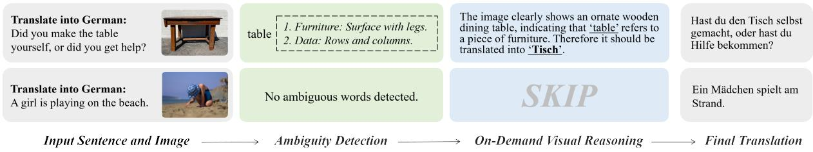
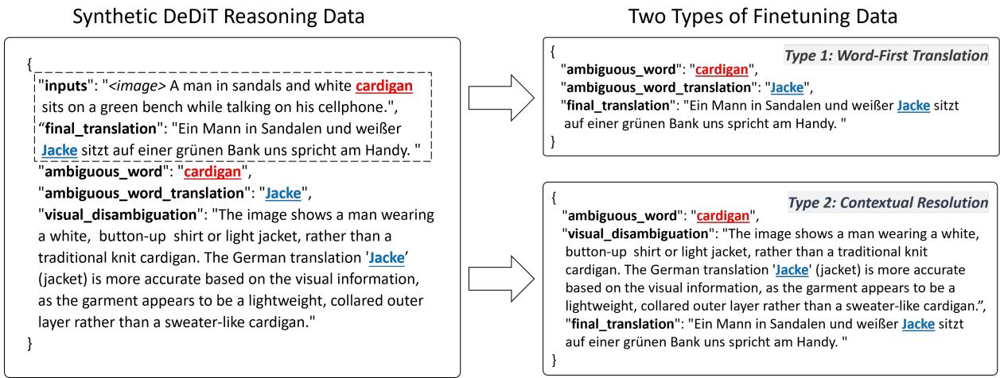
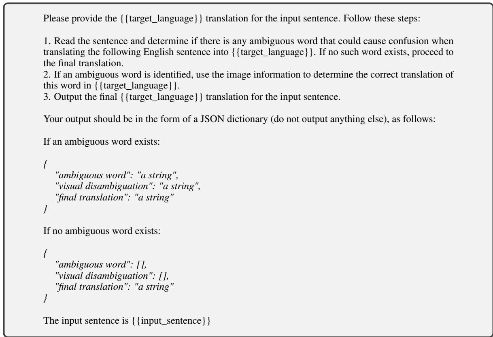
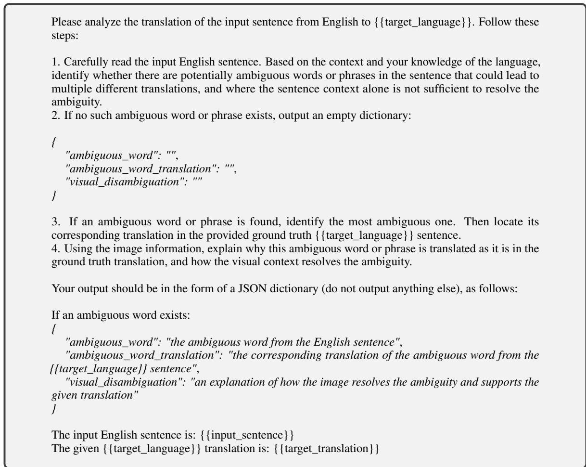
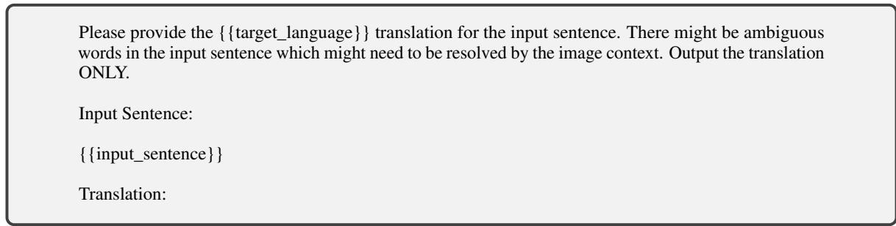

# Detect, Disambiguate, and Translate: On-Demand Visual Reasoning for Multimodal Machine Translation with Large Vision-Language Models

Danyang Liu1, 2\*, Fanjie Kong1, Xiaohang Sun1, Dhruva Patil1,

Avijit Vajpayee1, Zhu Liu1, Vimal Bhat1, Najmeh Sadoughi1,

1Amazon Prime Video, 2ILCC, School of Informatics, University of Edinburgh,

danyang.liu@ed.ac.uk,{fanjikon,sunking,dhrpatil,avivaj,zhuzliu,vimalb,nnnourab}@amazon.com

## Abstract

Multimodal machine translation (MMT) aims to leverage additional modalities to assist in language translation. With limited parallel data, current MMT systems rely heavily on monolingual English captioning data. These systems face three key issues: they often overlook that visual signals are unnecessary in many cases, they lack transparency in how visual information is used for disambiguation when needed, and they have yet to fully explore the potential of large-scale vision-language models (LVLMs) for MMT tasks. To address these issues, we propose the Detect, Disambiguate, and Translate (DeDiT) framework, the first reasoning-based framework for MMT leveraging LVLMs. DeDiT detects ambiguity in the input sentence, performs visual reasoning only when ambiguity is found, and generates the final translation. We implemented two versions of DeDiT: a prompting method for large proprietary LVLMs and a fine-tuning method for smaller LVLMs using synthetic data. Experiments on the Multi30K and CoMMuTE benchmarks show that DeDiT outperforms state-ofthe-art models in disambiguation accuracy and translation quality. We also introduce an improved evaluation metric for disambiguation accuracy that enhances performance assessment and can be applied to proprietary models accessed via APIs.

## 1 Introduction

Multimodal machine translation (MMT) has emerged as an active area of research that aims to improve machine translation quality by leveraging additional modalities beyond text. In real-world scenarios, the text to be translated is often accompanied by images, videos, or other contextual signals. These additional modalities can help disambiguate meaning and resolve ambiguities that are inherent in natural language.

Due to the scarcity of multimodal multilingual translation datasets, recent work in MMT focuses on creating new MMT datasets (Zang et al., 2023; Yang et al., 2024; Ma et al., 2024a) and adapting pre-trained text-only machine translation systems for MMT using monolingual captioning data (Gupta et al., 2023; Futeral et al., 2023; Vijayan et al., 2024; Futeral et al., 2024). However, these approaches have three major issues.

First, in real-world situations, not all input sentences contain ambiguity. For non-ambiguous sentences, incorporating visual embeddings can introduce noise, decreasing translation accuracy when the visual context is unnecessarily included in the model’s input (Li et al., 2021). Current models are unable to distinguish between ambiguous and non-ambiguous data, treating all inputs uniformly, which can lead to performance degradation. A detailed discussion is provided in the Appendix A.

Second, existing MMT models function as black boxes, producing translations without providing insight into their reasoning processes. This lack of transparency leaves users uncertain about how visual information is utilized, resulting in poor explainability and diminished trust in the models. Ideally, an MMT model should clearly indicate whether ambiguity exists in the input and explain how visual information is used to resolve it.

Finally, large-scale vision-language models (LVLMs) have shown strong zero-shot and fewshot performance across various downstream multimodal tasks, achieving excellent results with little or no task-specific data. However, these models have yet to be thoroughly explored for MMT tasks. Given that MMT fundamentally involves disambiguation, the extensive world knowledge acquired during large-scale pre-training could be particularly beneficial for detecting and resolving ambiguities.

To address these challenges, we propose the Detect, Disambiguate, and Translate (DeDiT) framework, the first reasoning framework for MMT based on LVLMs that generates an explicit, ondemand reasoning process. Specifically, DeDiT models first detect whether ambiguity exists in the input sentence. If ambiguity is detected, the model analyzes the accompanying visual information and determines how to utilize it to resolve the ambiguity before producing the final translation. If no ambiguity is detected, the model bypasses the visual reasoning step and directly generates the final translation based on the input sentence alone.

  
Figure 1: The workflow of the DeDiT reasoning framework. The top part of the figure shows an example with ambiguity. First, the model detects whether there are contextually ambiguous words in the input sentence. Then, the model disambiguates the detected ambiguous word based on the image content. Finally, the model generates the complete sentence translation. The bottom part illustrates an example without ambiguity. If no ambiguity is detected in the input sentence, the reasoning step is skipped, and the model directly outputs the sentence translation.

We implemented two different versions of the DeDiT framework: a prompting based method for large proprietary LVLMs and a fine-tuning method using synthetic data from larger models to adapt smaller open-source LVLMs.

We conducted experiments on two benchmarks: Multi30K, which contains both ambiguous and nonambiguous sentences, making it more representative of real-world multimodal translation scenarios; and CoMMuTE, a newly developed dataset with contrastive examples designed to assess a model’s disambiguation capabilities. We refined the disambiguation accuracy evaluation on the CoMMuTE benchmark by removing its dependence on model logits or probability distributions, which allows the evaluation to better reflect the model’s actual disambiguation performance based on its outputs. Additionally, it enables the evaluation to be applied to proprietary LLMs accessed via APIs, making it more versatile and applicable to a broader range of models. Our experimental results on both benchmarks demonstrate that the two DeDiT implementations outperform previous state-of-the-art models, validating the effectiveness of the DeDiT reasoning framework for MMT tasks. The contributions of our work can be summarized as follows:

• We propose the DeDiT reasoning framework, which enables on-demand visual disambiguation and is the first method to leverage the reasoning abilities of LVLMs for MMT task.

• We improved the disambiguation accuracy evaluation by eliminating reliance on logits or probability distributions, making it more reflective of actual performance and applicable to proprietary LLMs via API.

• Our two DeDiT implementations, utilizing either prompting for large proprietary LVLMs or fine-tuning smaller LVLMs, both surpass previous state-of-the-art models and establish a new paradigm for solving MMT tasks.

## 2 Methodology

The DeDiT reasoning framework consists of the following stages: (1) Detect whether the input sentence contains any ambiguity and identify the specific ambiguous terms; (2) Perform visual disambiguation reasoning if ambiguity is detected, analyzing the content of the accompanying image to determine the accurate translation of the ambiguous term identified in the first step. If no ambiguity is detected, this step is skipped; and (3) Generate the final translation sentence.

In this paper, we implemented two versions of the DeDiT: (1) For large proprietary LVLMs with strong zero-shot capabilities (e.g., Claude-3, GPT-4o), we employed DeDiT prompting by designing specific instructions to guide the models through the reasoning process. (2) For smaller, finetuneable LVLMs, we fine-tuned them on synthetic DeDiT reasoning data generated by larger models, enabling these smaller models to also acquire DeDiT reasoning capabilities.

## 2.1 DeDiT Prompting for Large-Scale LVLMs

Large-scale proprietary LVLMs, leveraging the extensive knowledge gained from their vast pretraining corpus, have demonstrated strong zero-shot capabilities across a variety of multimodal tasks. Building on this, we integrated the DeDiT reasoning framework into a prompting method to guide large LVLMs through the DeDiT reasoning process, which we refer to as DeDiT prompting. Detailed prompt is provided in Table 6 of the Appendix. The process is as follows:

Ambiguity Detection in the Sentence The first step is to have the model detect any ambiguous terms in the input sentence. Two key considerations here are: (1) Ambiguous terms should be those that cannot be resolved using only the sentence’s context, to avoid the model treating every word as potentially ambiguous. (2) Ambiguity detection must also account for the target language, as certain words might only be ambiguous in translation. For example, "hat" is ambiguous when translating into German, where specific terms for types of hats exist (e.g., "baseball cap," "sun hat") but no general equivalent for "hat." However, this ambiguity does not exist when translating "hat" into Chinese.

On-Demand Disambiguation Reasoning If any ambiguous terms are identified in the first step, the model uses visual information to resolve the ambiguity and determine the correct word translation. If no ambiguous terms are detected, this step produces an empty list and is skipped.

Final Translation Finally, the model generates the complete sentence translation.

Structured Output We instruct the model to generate structured outputs in the form of JSON, ensuring clarity, consistency, and ease of parsing. As illustrated in Figure 6 of the Appendix, the model outputs a JSON object containing three key-value pairs: "ambiguous words", "visual disambiguation", and "final translation". This structured output approach ensures more uniform responses and facilitates the parsing of its outputs. Without this constraint, the model often produces responses in varying formats, complicating both the analysis of results and the extraction of the final translation for evaluation. By enforcing a structured format, we enhance the consistency of the model’s responses and streamline the evaluation process.

## 2.2 DeDiT Fine-Tuning for Smaller LVLMs

Smaller LVLMs (with parameter sizes of 7 billion or less) do not exhibit the same level of zero-shot generalization as their larger counterparts. This means that to enable DeDiT reasoning on smaller LVLMs, these models must undergo fine-tuning on DeDiT-specific reasoning data to equip them with the required reasoning capabilities.

To generate high-quality DeDiT reasoning data for fine-tuning smaller LVLMs, we employed Claude-3.5 Sonnet to produce reliable DeDiT reasoning outputs, which serve as training data.

## 2.2.1 Data Synthesis

The most widely used and largest dataset for MMT training is currently the Multi30K dataset (Elliott et al., 2016), which includes 31,014 English image captions along with their human translations in German, French, and Czech. We augmented Multi30K with DeDiT reasoning using the following approach. Detailed prompt is provided in Figure 7. The process is as follows.

Ambiguity Alignment from Source and Target Sentence To generate high-quality training data, we input the image, source sentence, and the ground truth translation into a large-scale LVLM. The model then identifies contextually ambiguous terms in the source sentence and maps them to their aligned translations in the target language from ground truth translation.

Visual Disambiguation Reasoning Generation Based on the ambiguous terms and their correct translations within the context, the model generates a reasoning process, explaining how visual context helps resolve the ambiguity and determine the appropriate translation. The primary distinction between this data synthesis method and the DeDiT prompting method is that, during data generation, we include the ground truth translation as part of the input. The rationale behind this is to produce more precise reasoning processes that act as a bridge between the input and the output, thus improving the accuracy and reliability of the reasoning data used for fine-tuning.

Data Filtering After generating the synthetic data, we applied a filtering process to ensure its quality. Specifically, we removed instances where (1) the ambiguous terms identified by the model did not exist in the input sentence, or where the extracted aligned translations were not present in the ground truth translation, and (2) the model’s reasoning process failed to incorporate the ambiguous term and its corresponding alignment from the previous step. Through this filtering, we retained only the examples where both the ambiguity detection and reasoning process were accurate and aligned with the ground truth translation. In total, we filtered out 7.67% of the data, which ensures that the data used for fine-tuning is of high quality and relevant for training smaller LVLMs.

  
Figure 2: Synthetic DeDiT reasoning data and two types of fine-tuning data based on it. Within the dashed lines in the left side are the original input and output data from the Multi30K dataset. We have augmented this base with ambiguous words and their aligned translations, as well as visual disambiguation reasoning. The right side illustrates two types of fine-tuning data generated from synthetic data, where Word-First Translation can be viewed as a simplified version of Contextual Resolution.

## 2.2.2 Two Types of DeDiT Reasoning

We transform the synthetic data into two DeDiT reasoning types for fine-tuning: Contextual Resolution and Word-First Translation. Figure 2 demonstrates these two trasformations for a sample.

Contextual Resolution (ContRes) The model first detects ambiguous terms in the input sentence. If ambiguity is found, the model performs natural language reasoning based on the image content to resolve the ambiguity, and then generates the complete translation of the sentence. If no ambiguity is detected in the first step, the model skips the reasoning process and directly outputs the translation.

Word-First Translation (WordTrans) This can be seen as a simplified version of Contextual Resolution, breaking the problem into two steps: visual word disambiguation and constrained machine translation. In this approach, after detecting ambiguous terms in the sentence, the model directly provides the translation of the ambiguous term based on the visual context (only the translation of the term itself). Finally, the model generates the complete translation of the sentence.

## 2.2.3 Model Training

We selected LLaVA-7B (Liu et al., 2024) as our base model for fine-tuning experiments. The choice was motivated by LLaVA’s backbone, LLaMA (Touvron et al., 2023), which has demonstrated strong performance across various translation research. We combined data from three languages (German, French, and Czech) to finetune the model. The inputs consisted of the original images and source sentences from the Multi30K dataset, while the outputs were our synthetic DeDiT data. This fine-tuning approach aimed to develop a multilingual MMT model with an improved disambiguation and translation performance by leveraging the DeDiT reasoning process.

## 3 Experiments

## 3.1 Datasets

Multi30K Multi30K (Elliott et al., 2016) is a multilingual, multimodal dataset consisting of 31,014 images with corresponding English captions, as well as human translations in German, French, and Czech. It is important to note that not every example in Multi30K contains ambiguity (Elliott, 2018; Frank et al., 2018; Futeral et al., 2023), a fact often overlooked in previous studies. This makes it an ideal dataset to demonstrate the effectiveness of our DeDiT reasoning’s on-demand disambiguation capabilities. All DeDiT data synthesis and fine-tuning experiments were conducted on the training set of Multi30K, and we evaluated all models on the Multi30K test set.

CoMMuTE CoMMuTE (Futeral et al., 2023) is an MMT benchmark specifically designed to evaluate how well models use images to disambiguate English sentences through contrastive examples. For each ambiguous English input sentence, there are two corresponding images, each reflecting a different meaning of the ambiguous term, along with two human-annotated translations. The dataset includes translations from English into six languages: Arabic, German, French, Czech, Chinese, and Russian. It can be used to assess disambiguation accuracy by testing whether the model is more likely to produces the correct or incorrect translation. We tested all models on the CoMMuTE benchmark to evaluate their disambiguation performance.

MLT The Multimodal Lexical Translation (MLT) Dataset (Lala and Specia, 2018) comprises ambiguous words alongside their lexical translations, presented with both visual and textual contexts (i.e., an image and a corresponding sentence). We utilize the human-annotated German and French ambiguous words and corresponding sentences from this dataset to evaluate the accuracy of our DeDiT models’ first step in detecting ambiguity (referred in Figure 2 as Ambiguity Detection).

## 3.2 Implementation Details

We used the Claude-3.5-Sonnet model for the DeDiT prompting with large LVLMs, setting the temperature to 0 and top-k to 1. For the fine-tuning experiments, we fine-tuned the LLaVA-7B (Liu et al., 2024) model with a learning rate of 1e-4, a batch size of 2, gradient accumulation steps of 8, and a warm-up ratio of 0.05. During inference, we applied greedy decoding. We used the DeepSpeed framework (Rasley et al., 2020) to accelerate the full-weight fine-tuning experiments. We used a rank of 8 for LoRA (Hu et al., 2021) fine-tuning.

## 3.3 Evaluation Metrics

BLEU and COMET In our experiments, we use both BLEU (Papineni et al., 2002) and COMET (Rei et al., 2020) to assess translation quality. BLEU measures lexical overlap between the model’s output and the reference, while COMET, a pretrained evaluator, focuses more on semantic similarity rather than specific word choices. It’s important to note that both the Multi30K and CoMMuTE test sets provide only one reference translation per test instance, which limits the accuracy of these metrics—particularly BLEU. Nonetheless, we report our results in terms of these metrics, as BLEU and COMET are among the most traditional and widely used metrics in machine translation. For our experiments, we employed Sacrebleu implementation (Post, 2018) and the COMET-XL model (Rei et al., 2022).

Disambiguation Accuracy The original disambiguation accuracy metric (Futeral et al., 2023) compares the perplexity of a model’s output between the correct and incorrect translations. If the perplexity of the correct translation is lower (better), it scores 1; otherwise, it scores 0. However, we identified two main drawbacks with this approach: first, it requires access to the model’s output probability distribution, which means it cannot be used to evaluate proprietary LLMs via API, as their probability distributions are not publicly available. Second, this method only compares two predefined translations and does not capture the model’s actual disambiguation performance. To address these issues,h we propose an improved approach. We calculate the similarity between the model’s top-1 output and the two predefined correct/incorrect translations. If the model’s output is more similar to the correct translation, it scores 1; otherwise, it scores 0. This method shifts the focus to the model’s most likely translation and eliminates the dependence on probability distributions, making it applicable to proprietary LLMs via API.

## 3.4 Comparison Systems

ZeroMMT (Futeral et al., 2024) is the current stateof-the-art (SOTA) unsupervised zero-shot model for MMT, while VGAMTMultilingual (Futeral et al., 2023) is the SOTA model in the supervised MMT models. LLaVA-Zero-Shot refers to instructing the LLaVA-7B model to perform MMT in a zeroshot setting. LLaVA-FT-Baseline is the model finetuned on the original Multi30K dataset (prompt shown in Table 8). LLaVA-DeDiT-WordTrans and LLaVA-DeDiT-ContRes are the DeDiT-finetuning models using the synthetic data we created. Claude-Text-Only refers to a method where only the input sentence is used without the corresponding image, while Claude-Text-Image refers to a baseline that takes both the image and the input sentence into account. Finally, Claude-DeDiT-Prompting is our proposed DeDiT-prompting method, implemented using large LVLMs (i.e., Claude-3.5-Sonnet).

<table><tr><td rowspan="2">Model</td><td colspan="4">COMET</td><td colspan="4">BLEU</td></tr><tr><td>FR</td><td>DE</td><td>CS</td><td>AVG</td><td>FR</td><td>DE</td><td>CS</td><td>AVG</td></tr><tr><td>VGAMTMultilingual</td><td>87.27</td><td>83.85</td><td>87.47</td><td>86.19</td><td>53.41</td><td>36.58</td><td>33.97</td><td>41.31</td></tr><tr><td>ZeroMMT</td><td>86.07</td><td>84.22</td><td>88.21</td><td>86.17</td><td>50.95</td><td>36.86</td><td>33.13</td><td>33.12</td></tr><tr><td>LLaVA-Zero-Shot</td><td>87.69</td><td>93.41</td><td>73.22</td><td>87.46</td><td>35.30</td><td>23.86</td><td>13.34</td><td>24.17</td></tr><tr><td>LLaVA-FT-Baseline</td><td>92.51</td><td>96.12</td><td>89.10</td><td>92.58</td><td>51.78</td><td>35.30</td><td>31.81</td><td>39.63</td></tr><tr><td>LLaVA-DeDiT-WordTrans</td><td>92.11</td><td>95.90</td><td>88.07</td><td>92.03</td><td>50.64</td><td>34.56</td><td>30.89</td><td>38.69</td></tr><tr><td>LLaVA-DeDiT-ContRes</td><td>92.86</td><td>96.35</td><td>89.96</td><td>93.06</td><td>52.62</td><td>36.78</td><td>34.55</td><td>41.32</td></tr><tr><td>Claude-Text-Only</td><td>86.93</td><td>85.17</td><td>89.77</td><td>87.29</td><td>52.99</td><td>36.82</td><td>35.37</td><td>41.73</td></tr><tr><td>Claude-Text-Image</td><td>85.95</td><td>84.75</td><td>89.84</td><td>85.86</td><td>47.87</td><td>35.40</td><td>34.34</td><td>39.20</td></tr><tr><td>Claude-DeDiT-Prompting</td><td>86.94</td><td>85.64</td><td>89.97</td><td>87.52</td><td>52.70</td><td>38.46</td><td>36.91</td><td>42.69</td></tr></table>

Table 1: Experimental results of the DeDiT-Finetuning and DeDiT-Prompting methods on the Multi30K dataset. Bold values indicate the best results, and the gray-highlighted cells represent the average scores across languages, where ‘FR’, ‘DE’ and ‘CS’ refer to French, German and Czech, respectively.
<table><tr><td rowspan="2">Model</td><td colspan="4">Disambiguation Accuracy</td><td colspan="4">COMET</td></tr><tr><td>CS</td><td>DE</td><td>FR</td><td>AVG</td><td>CS</td><td>DE</td><td>FR</td><td>AVG</td></tr><tr><td>VGAMTMultilingual</td><td>57.50</td><td>57.10</td><td>61.30</td><td>58.63</td><td>83.29</td><td>81.17</td><td>79.92</td><td>81.46</td></tr><tr><td>ZeroMMT</td><td>57.50</td><td>60.00</td><td>64.30</td><td>60.60</td><td>86.67</td><td>83.04</td><td>82.91</td><td>80.50</td></tr><tr><td>LLaVA-Zero-Shot</td><td>62.76</td><td>63.45</td><td>65.96</td><td>64.05</td><td>70.11</td><td>93.27</td><td>86.46</td><td>83.28</td></tr><tr><td>LLaVA-FT-Baseline</td><td>61.36</td><td>64.55</td><td>65.56</td><td>63.83</td><td>81.29</td><td>93.82</td><td>88.74</td><td>87.95</td></tr><tr><td>LLaVA-DeDiT-WordTrans</td><td>64.82</td><td>63.76</td><td>70.26</td><td>66.28</td><td>77.94</td><td>94.13</td><td>87.23</td><td>86.43</td></tr><tr><td>LLaVA-DeDiT-ContRes</td><td>65.22</td><td>69.34</td><td>68.88</td><td>67.81</td><td>77.97</td><td>93.70</td><td>86.94</td><td>86.20</td></tr></table>

Table 2: Experimental results of the DeDiT-Finetuning method on the CoMMuTE benchmark, using LLaVA-7B as the backbone LVLM. LLaVA-FT-Baseline was fine-tuned on the original Multi30K dataset, while LLaVA-DeDiT-WordTrans and LLaVA-DeDiT-ContRes were fine-tuned on our synthetic DeDiT reasoning data. Since Multi30K only includes German (DE), French (FR), and Czech (CS), we report results for these languages. Bold values are the best results.

## 4 Results

Table 1 presents the performance of both DeDiT prompting and finetuning methods on the Multi30K test set. The results demonstrate that our models establish a new SOTA on Multi30K. Table 2 displays the performance of DeDiT-finetuning on CoMMuTE and Table 3 shows the results of DeDiTprompting on CoMMuTE. Note that since our finetuning data only includes German, French, and Czech, the evaluation of fine-tuned models is limited to these three languages on CoMMuTE.

Visual information can sometimes hinder rather than help the translation process. As shown in Table 1, both the average COMET and BLEU scores of the Claude-Text-Image model are lower than those of the Claude-Text-Only model. This indicates that visual information does not always enhance translation quality. As discussed earlier, only a portion of the Multi30K data contains sentences that require disambiguation, and blindly incorporating image information into sentences without ambiguity can actually interfere with the translation process. This finding further supports the necessity of our proposed on-demand reasoning approach.

DeDiT-based models achieve new SOTA results on MMT. Table 1 shows that our DeDiT-Prompting method achieves SOTA BLEU results on Multi30K. Additionally, our DeDiT-ContRes fine-tuning model sets a new SOTA with a COMET score of 93.06, outperforming much larger Claude models, further validating the effectiveness of our DeDiT reasoning framework. As shown in Table 3, the DeDiT-Prompting method also achieves an impressive 25.16-point improvement in disambiguation accuracy on the CoMMuTE benchmark.

LVLMs are strong zero-shot learners for MMT. All Claude-based models were evaluated in a zeroshot setting, and they outperformed ZeroMMT on both benchmarks. Even smaller LVLMs, like LLaVA-Zero-Shot, surpassed ZeroMMT in average COMET score on both benchmarks, and also achieved a higher disambiguation accuracy on CoMMuTE as shown in Table 1 and Table 2. This success is due to the models’ ability to leverage the extensive world and linguistic knowledge learned during pretraining, enabling them to effectively handle disambiguation tasks. Furthermore, their strong instruction-following capabilities allow them to efficiently follow our DeDiT reasoning framework, achieving effective on-demand reasoning.

<table><tr><td rowspan="2">Model</td><td colspan="8">Disambiguation Accuracy</td><td colspan="7">COMET</td></tr><tr><td>AR</td><td>CS</td><td>DE</td><td>FR</td><td>RU</td><td>ZH</td><td>AVG</td><td>AR</td><td>CS</td><td>DE</td><td>FR</td><td></td><td>RU ZH</td><td>AVG</td></tr><tr><td>VGAMTMultilingual</td><td></td><td>57.50</td><td>57.10</td><td>61.30</td><td></td><td></td><td>58.63</td><td></td><td>83.29</td><td>81.17</td><td>79.92</td><td></td><td></td><td>81.46</td></tr><tr><td>ZeroMMT</td><td>60.00</td><td>57.50</td><td>60.00</td><td>64.30</td><td>60.10</td><td>61.00</td><td>60.48</td><td>76.88</td><td>86.67</td><td>83.04</td><td>82.91</td><td>80.15</td><td>73.34</td><td>80.50</td></tr><tr><td>Claude-Text-Image</td><td>76.62</td><td>78.11</td><td>80.78</td><td>88.47</td><td>83.05</td><td>88.05</td><td>82.51</td><td>87.52</td><td>92.37</td><td>96.67</td><td>92.43</td><td>92.37</td><td>92.22</td><td>92.26</td></tr><tr><td>Claude-DeDiT-Prompting</td><td>78.10</td><td>84.00</td><td>84.12</td><td>88.78</td><td>85.23</td><td>93.62</td><td>85.64</td><td>89.89</td><td>93.73</td><td>97.51</td><td>94.39</td><td>94.40</td><td>92.48</td><td>93.73</td></tr></table>

Table 3: Experimental results of the DeDiT-Prompting method on the CoMMuTE benchmark. Bold values indicate the best results, and the gray-highlighted cells represent the average performance across the six languages.

Our synthetic DeDiT reasoning data effectively fine-tunes smaller models. As shown in Table 2, the LLaVA-Zero-Shot model achieved a disambiguation accuracy of 64.05 on the CoMMuTE benchmark, while the LLaVA-FT-Baseline model, fine-tuned on the original Multi30K dataset, saw a slight decline to 63.83. However, when fine-tuned on our synthetic DeDiT reasoning data, the model’s accuracy increased by 2.2-3.8%. This indicates that fine-tuning on the original Multi30K dataset does not improve disambiguation accuracy, but finetuning on our synthetic DeDiT data (both Word-Trans and ContRes) does. We attribute this to distribution differences between the original Multi30K data and the CoMMuTE benchmark. For example, while all the samples in CoMMuTE have textual ambiguity during translation which can be resolved by their accompanying visual information, Multi30K does not have such ambiguity for all of its samples. The DeDiT models’ explicit reasoning enhances generalization, enabling strong performance across different data distributions.

Contextual Resolution finetuning outperforms Word-First Translation. As shown in Table 1 and Table 2, DeDiT–ContRes outperforms DeDiT– WordTrans in terms of the average BLEU / COMET on Multi30K and the disambiguation accuracy on CoMMuTE. Because the ContRes method aligns more closely with natural human language, making it a better match for the model’s pre-trained distribution. In addition, ContRes enables more fine-grained knowledge transfer from the larger LVMs to the smaller one by providing additional contextual information during training. While Word-First Translation offers a simpler structure, it represents a more specialized form of reasoning that differs from typical human language patterns. Notably, LLaVA-DeDiT-ContRes achieved results comparable to Claude on

Multi30K as shown in Table 1, indicating that our synthetic DeDiT reasoning data can enable a 7B model to achieve performance on par with much larger models.

LLaVA struggles with low-resource languages. As shown in Table 1, LLaVA performs poorly in the zero-shot setting for the Czech language, with a BLEU score of only 13.34 and a COMET score of 73.22. This is likely due to the scarcity of Czech data compared to German and French, which were more frequently encountered during pre-training. However, our fine-tuning approach significantly improves performance on these lowresource languages, with LLaVA-DeDiT-ContRes surpassing ZeroMMT in Czech. An alternative solution is to increase the model size and expand the pre-training data. For instance, Claude-DeDiT-Prompting achieved state-of-the-art performance for Czech on Multi30K, as Claude’s training data emphasizes greater diversity and richness in multilingual data (Anthropic, 2023).

## 4.1 Evaluation of Ambiguity Detection

<table><tr><td>Model</td><td>DE</td><td>FR</td></tr><tr><td>Claude-DeDiT-Prompting</td><td>70.45%</td><td>73.48%</td></tr><tr><td>LLaVA-Zero-Shot-Detection</td><td>40.97%</td><td>42.18%</td></tr><tr><td>LLAVA-DeDiT-ContRes</td><td>61.44%</td><td>61.06%</td></tr></table>

Table 4: Accuracy of ambiguity detection (the first step in the DeDiT process) measured on the MLT dataset.

Table 4 shows the accuracy of DeDiT models in ambiguity detection. The results demonstrate that DeDiT prompting with larger LVLMs achieves over 70% accuracy, highlighting the positive impact of pre-trained knowledge on ambiguity detection. In contrast, smaller LVLMs, such as LLaVA-7B, achieve only around 40% accuracy in zeroshot ambiguity detection. However, our fine-tuned LaVA-DeDiT–ContRes model reach over 60% accuracy, improving by more than 20 points compared to LLaVA in the zero-shot setting. This indicates that fine-tuning on DeDiT data enables smaller LVLMs to effectively acquire ambiguity detection capabilities similar to larger models.

## 4.2 Full-weight vs. LoRA Fine-tuning

All fine-tuning models in Tables 1, Table 3, and Table 2 were obtained using LoRA fine-tuning. We compared full-weight fine-tuning and LoRA finetuning, with results shown in Table 5. Since the model was trained on Multi30K, CoMMuTE is considered out-of-domain data. As shown in the results, the LoRA fine-tuned model performs better on the CoMMuTE benchmark (out-of-domain data). We attribute this to the sparser parameters in LoRA, which make the model less prone to overfitting on the training data, resulting in better generalization. In contrast, the full-weight fine-tuned model tends to fit the in-domain data distribution more closely, leading to a higher BLEU score on the in-domain Multi30K test set.

## 5 Related Work

## 5.1 MMT Systems

Due to the scarcity of annotated multimodal translation data, recent research has focused on training MMT systems in the absence of parallel labeled data. For example, Futeral et al. (2023) proposed the VGAMT system, which jointly trains an MMT model with visual masked language modeling and multimodal MT, leveraging both MMT and monolingual multimodal data. The ZeroMMT system (Futeral et al., 2024) further removes the dependency on multimodal MT objectives. Instead, it only uses English image caption data and a machine translation system, employing visually conditioned masked language modeling and KL divergence to equip the model with MMT capabilities.

Despite the strength of LVLMs as powerful zeroshot models, they remain underexplored in the MMT domain. We believe that the language and multimodal knowledge learned during their pretraining and finetuning stages makes LVLMs particularly suited for addressing MMT challenges. Therefore, in this paper, we introduce the first zeroshot MMT method based on LVLMs.

## 5.2 MMT Evaluation and Benchmarks

Many works focus on automating the creation of new MMT training sets and benchmarks. Ma et al. (2024b) developed an ambiguity-aware MMT dataset, comprising 26,000 parallel sentence pairs in English and Chinese, each paired with corresponding images. Yang et al. (2024) constructed a multilingual multimodal instruction dataset (InstrMulti102) to support 102 languages. However, their evaluation metrics still rely on traditional machine translation metrics like BLEU and COMET, which do not fully capture a model’s disambiguation abilities. Recently, Futeral et al. (2023, 2024) introduced CoMMuTE, a Contrastive Multilingual Multimodal Translation Evaluation set designed for ambiguous sentences and their possible translations, accompanied by disambiguating images corresponding to each translation. CoMMuTE covers language pairs from English to French, German, Czech, Russian, Chinese, and Arabic. In our work, we utilize both the traditional Multi30K and the latest CoMMuTE benchmarks to evaluate our system.

## 6 Conclusion

In this paper, we introduce the Detect, Disambiguate, and Translate (DeDiT) framework, a novel approach to MMT task that effectively addresses the challenges of on-demand ambiguity resolution in real-world scenarios. Our work demonstrates that while visual information can enhance translation quality in ambiguous cases, it can also introduce noise in non-ambiguous instances DeDiT tackles this issue through on-demand reasoning, selectively utilizing visual data only when ambiguity is detected. We implemented two versions of DeDiT: a prompting method for large proprietary LVLMs and a fine-tuning approach for smaller LVLMs using synthetic DeDiT reasoning data. Our experiments on the Multi30K and CoMMuTE benchmarks show that both implementations consistently outperform previous SOTA models. This demonstrates the effectiveness of LVLMs for MMT tasks, and also shows that our proposed DeDiT reasoning framework can effectively enhance disambiguation and improve multimodal machine translation performance, while providing an on-demand, interpretable, and transparent reasoning process.

<table><tr><td rowspan="2">Model</td><td colspan="4">CoMMuTE</td><td colspan="4">Multi30K</td></tr><tr><td>Disam-Accuracy</td><td></td><td>COMET</td><td></td><td>BLEU</td><td></td><td>COMET</td><td></td></tr><tr><td></td><td>LoRA</td><td>Full</td><td>LoRA</td><td>Full</td><td>LoRA</td><td>Full</td><td>LoRA</td><td>Full</td></tr><tr><td>LLaVA-FT-Baseline</td><td>63.82</td><td>59.63</td><td>87.95</td><td>81.69</td><td>39.63</td><td>42.73</td><td>92.58</td><td>92.75</td></tr><tr><td>LLaVA-DeDiT-WordTrans</td><td>66.28</td><td>62.13</td><td>86.43</td><td>75.01</td><td>38.69</td><td>39.98</td><td>92.03</td><td>90.62</td></tr><tr><td>LLaVA-DeDiT-ContRes</td><td>67.81</td><td>64.56</td><td>86.20</td><td>79.76</td><td>41.32</td><td>41.88</td><td>93.06</td><td>92.35</td></tr></table>

Table 5: Comparison of LoRA and full-weight fine-tuning results on the Multi30K and CoMMuTE benchmarks. Bold values indicate the better result between the two methods. Disam-Acc refers to disambiguation accuracy.

## 7 Limitations

Due to the high cost of large proprietary LVLM APIs, this work only experimented with the Claude-3.5-Sonnet model as the representative large proprietary LVLM. Additionally, because of the resources and time required for fine-tuning experiments, we only tested the effectiveness of the DeDiT finetuning method on the LLaVA-7B model.

Our experiments focused on translations from English to other languages, as this reflects the most practically relevant scenario in current real-world applications. Future work could explore additional languages and translation directions to further extend the boundaries of the DeDiT framework.

## References

Anthropic. 2023. Model card and evaluations for claude models.

Desmond Elliott. 2018. Adversarial evaluation of multimodal machine translation. In Proceedings of the 2018 Conference on Empirical Methods in Natural Language Processing, pages 2974–2978.

Desmond Elliott, Stella Frank, Khalil Sima’an, and Lucia Specia. 2016. Multi30K: Multilingual English-German image descriptions. In Proceedings of the 5th Workshop on Vision and Language, pages 70– 74, Berlin, Germany. Association for Computational Linguistics.

Stella Frank, Desmond Elliott, and Lucia Specia. 2018. Assessing multilingual multimodal image description: Studies of native speaker preferences and translator choices. Natural Language Engineering, 24(3):393–413.

Matthieu Futeral, Cordelia Schmid, Ivan Laptev, Benoît Sagot, and Rachel Bawden. 2023. Tackling ambiguity with images: Improved multimodal machine translation and contrastive evaluation. In The 61st Annual Meeting Of The Association For Computational Linguistics.

Matthieu Futeral, Cordelia Schmid, Benoît Sagot, and Rachel Bawden. 2024. Towards zero-shot multimodal machine translation. arXiv preprint arXiv:2407.13579.

Devaansh Gupta, Siddhant Kharbanda, Jiawei Zhou, Wanhua Li, Hanspeter Pfister, and Donglai Wei. 2023. Cliptrans: transferring visual knowledge with pretrained models for multimodal machine translation. In Proceedings ofthe IEEE/CVF international conference on computer vision, pages 2875–2886.

Edward J Hu, Yelong Shen, Phillip Wallis, Zeyuan Allen-Zhu, Yuanzhi Li, Shean Wang, Lu Wang, and Weizhu Chen. 2021. Lora: Low-rank adaptation of large language models. arXiv preprint arXiv:2106.09685.

Chiraag Lala and Lucia Specia. 2018. Multimodal lexical translation. In Proceedings of the Eleventh International Conference on Language Resources and Evaluation (LREC 2018).

Jiaoda Li, Duygu Ataman, and Rico Sennrich. 2021. Vision matters when it should: Sanity checking multimodal machine translation models. In Proceedings of the 2021 Conference on Empirical Methods in Natural Language Processing, pages 8556–8562, Online and Punta Cana, Dominican Republic. Association for Computational Linguistics.

Haotian Liu, Chunyuan Li, Yuheng Li, and Yong Jae Lee. 2024. Improved baselines with visual instruction tuning. In Proceedings of the IEEE/CVF Conference on Computer Vision and Pattern Recognition, pages 26296–26306.

Xinyu Ma, Xuebo Liu, Derek F Wong, Jun Rao, Bei Li, Liang Ding, Lidia S Chao, Dacheng Tao, and Min Zhang. 2024a. 3am: An ambiguity-aware multimodal machine translation dataset. In Proceedings of the 2024 Joint International Conference on Computational Linguistics, Language Resources and Evaluation (LREC-COLING 2024), pages 1–13.

Xinyu Ma, Xuebo Liu, Derek F. Wong, Jun Rao, Bei Li, Liang Ding, Lidia S. Chao, Dacheng Tao, and Min Zhang. 2024b. 3AM: An ambiguity-aware multimodal machine translation dataset. In Proceedings of the 2024 Joint International Conference on Computational Linguistics, Language Resources and Evaluation (LREC-COLING 2024), pages 1–13, Torino, Italia. ELRA and ICCL.

Kishore Papineni, Salim Roukos, Todd Ward, and Wei-Jing Zhu. 2002. Bleu: a method for automatic evaluation of machine translation. In Proceedings of the 40th annual meeting of the Association for Computational Linguistics, pages 311–318.

Matt Post. 2018. A call for clarity in reporting BLEU scores. In Proceedings of the Third Conference on Machine Translation: Research Papers, pages 186– 191, Brussels, Belgium. Association for Computational Linguistics.

Jeff Rasley, Samyam Rajbhandari, Olatunji Ruwase, and Yuxiong He. 2020. Deepspeed: System optimizations enable training deep learning models with over 100 billion parameters. In Proceedings of the 26th ACM SIGKDD International Conference on Knowledge Discovery & Data Mining, pages 3505–3506.

Ricardo Rei, José G. C. de Souza, Duarte Alves, Chrysoula Zerva, Ana C Farinha, Taisiya Glushkova, Alon Lavie, Luisa Coheur, and André F. T. Martins. 2022. COMET-22: Unbabel-IST 2022 submission for the metrics shared task. In Proceedings of the Seventh Conference on Machine Translation (WMT), pages 578–585, Abu Dhabi, United Arab Emirates (Hybrid). Association for Computational Linguistics.

Ricardo Rei, Craig Stewart, Ana C Farinha, and Alon Lavie. 2020. Comet: A neural framework for mt evaluation. arXiv preprint arXiv:2009.09025.

Hugo Touvron, Louis Martin, Kevin Stone, Peter Albert, Amjad Almahairi, Yasmine Babaei, Nikolay Bashlykov, Soumya Batra, Prajjwal Bhargava, Shruti Bhosale, et al. 2023. Llama 2: Open foundation and fine-tuned chat models. arXiv preprint arXiv:2307.09288.

Vipin Vijayan, Braeden Bowen, Scott Grigsby, Timothy Anderson, and Jeremy Gwinnup. 2024. Adding multimodal capabilities to a text-only translation model. arXiv preprint arXiv:2403.03045.

Jian Yang, Hongcheng Guo, Yuwei Yin, Jiaqi Bai, Bing Wang, Jiaheng Liu, Xinnian Liang, LinZheng Chai, Liqun Yang, and Zhoujun Li. 2024. m3p: Towards multimodal multilingual translation with multimodal prompt. In Proceedings of the 2024 Joint International Conference on Computational Linguistics, Language Resources and Evaluation (LREC-COLING 2024), pages 10858–10871.

Xiaogang Zang, Huidong Zhu, and Xue Dai. 2023. Multimodal enhanced target representation for machine translation. In International Conference on Computer Engineering and Networks, pages 100–108. Springer.

## A The Necessity of On-Demand Reasoning

Several previous studies have highlighted that not every instance in the Multi30K dataset contains ambiguity. Specifically, Li et al. (2021) demonstrated through experiments on gender-related MMT data for Turkish that incorporating visual information sometimes leads to worse translation performance compared to text-only baselines, a finding we also confirm through our prompting experiments. Frank et al. (2018) summarized the types of ambiguity present in the Multi30K test set by employing a native German speaker to manually post-edit textonly German translations, discovering that only a small portion of the test set contains ambiguity. Additionally, Elliott (2018) pointed out that the current Multi30K training data does not necessarily require systems to use visual context to complete the translation task. However, as the most widely used large-scale multilingual MMT training set, many recent works continue to test their models’ disambiguation capabilities on Multi30K, which can lead to inaccurate assessments. In this paper, we use Multi30K to benchmark the on-demand MMT capabilities of our DeDiT framework, which we believe provides a more accurate and appropriate use of the Multi30K benchmark.

## B Prompts

Table 6, Table 8, and Table 7 present the prompts we used in this work.

Table 6: Prompt for Claude-DeDiT-Prompting.  
  
Table 7: Data Synthesis Prompt

Table 8: Prompt for LLaVA-Zero-Shot and LLaVA-FT-Baseline.  
