# Direct Preference Optimization of Video Large Multimodal Models from Language Model Reward

Ruohong Zhang∗♠

Liangke Gui\* ♠♢

Zhiqing Sun♠ , Yihao Feng∇ , Keyang Xu△ , Yuanhan Zhang♡ , Di Fu♢ , Chunyuan Li♢ , Alexander Hauptmann♠ , Yonatan Bisk♠ , Yiming Yang♠ ♠CMU LTI, ♢Bytedance, ∇UT Austin, △Columbia University, ♡NTU

Project Page: https://github.com/RifleZhang/LLaVA-Hound-DPO

## Abstract

Preference modeling techniques, such as direct preference optimization (DPO), has shown effective in enhancing the generalization abilities of large language model (LLM). However, in tasks involving video instruction-following, providing informative feedback, especially for open-ended conversations, remains a significant challenge. While previous studies have explored using large multimodal models (LMMs) as reward models for guiding preference modeling, their ability to accurately assess the quality of generated responses and their alignment with video content has not been conclusively demonstrated. This paper introduces a novel framework that utilizes detailed video captions as a proxy of video content, enabling language models to incorporate this information as supporting evidence for scoring video Question Answering (QA) predictions. Our approach demonstrates robust alignment with OpenAI GPT-4V model’s reward mechanism, which directly takes video frames as input. Furthermore, we show that applying our reward mechanism to DPO algorithm significantly improves model performance on open-ended video QA tasks.

## 1 Introduction

This paper addresses the challenge of aligning LMMs, particularly in tasks that involve video instruction following. Despite recent advancements in reinforcement learning (RL) (Ouyang et al., 2022; Bai et al., 2022; Lee et al., 2023; Sun et al., 2023b) and DPO (Rafailov et al., 2024; Chen et al., 2024d; Hosseini et al., 2024), which have been effective in guiding LLMs towards generating more honest, helpful, and harmless content, their effectiveness in video domain remains limited. The critical obstacle lies in developing a robust reward system capable of distinguishing preferred responses from less preferred ones based on video inputs.

The challenge is further complicated by the coverage and potential inaccuracies in generated content, stemming from the scarcity of alignment data across different modalities (Liu et al., 2023b; Sun et al., 2023a).

While human preference data is valuable, it is challenging to scale due to its cost and laborintensive nature, as highlighted by the LLaVA-RLHF (Sun et al., 2023a) paper, which collected 10k human-evaluated instances at a considerable cost of \$3000. Existing approaches for distilling preferences, such as those for image data using GPT-4V (Li et al., 2023d), encounter scalability issues, especially for video inputs that require analyzing multiple frames. While (Ahn et al., 2024) leverage a supervised finetuning (SFT) model for self-evaluation, the efficacy of the SFT model remains uncertain, particularly in accurately assessing the factuality of responses in relation to their corresponding videos.

To tackle the aforementioned challenges, we introduce a cost-effective reward mechanism that is both computationally and financially efficient for evaluating the quality of responses generated by video LLMs, serving as a basis for further on-policy preference optimization. We propose the use of detailed video captions as a proxy for video content, enabling a language model analyze the content and assess the quality of an LMM’s response to related questions. The language model generates natural language feedback as a chain-of-thought step, and produces a numerical score as the reward, thereby creating an efficient feedback system.

However, high-quality video captions are essential for this process. To mitigate the shortage of high-quality video captions, we have developed a comprehensive video caption dataset, SHAREG-PTVIDEO, using a simple prompting technique with the GPT-4V model, comprising 900k captions that encompass a wide range of video content, including temporal dynamics, world knowledge, object attributes, and spatial relationships. With this video caption dataset available, we verify that our reward mechanism, which utilizes video captions as a proxy, is well-aligned with evaluations derived from the more powerful, albeit costlier, GPT-4V model-generated rewards. Employing this reward mechanism as the basis for DPO algorithm, we train LLAVA-HOUND-DPO that achieves an 8.1% accuracy improvement over the SFT counterpart. This marks a significant advancement in video LMM alignment and represents the first successful application of a DPO method in this domain.

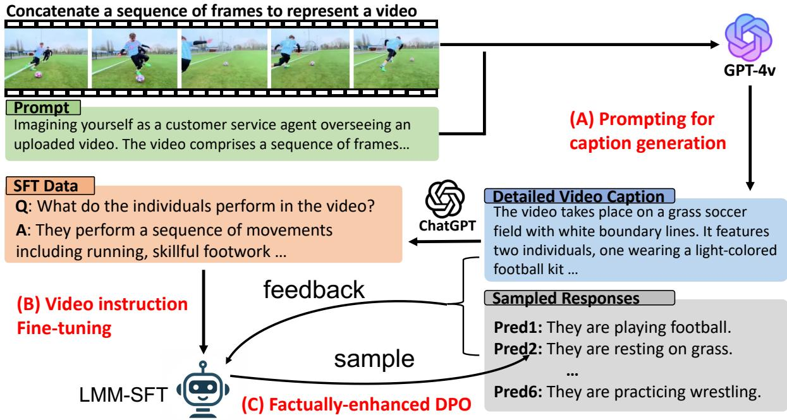  
Figure 1: Workflow diagram showing: a) the use of GPT-4V for creating a detailed caption dataset for videos; b) generating video instruction data for SFT; c) integrating captions into a feedback loop for DPO, improving the model’s performance on video instruction-following tasks.

Our contributions are outlined as follows:

1. We release a large-scale detailed video caption (900k) and instruction-following (900k) dataset covering a wide range of video content, which facilitates video LMM model training and research.

2. We demonstrate the effective application of DPO to improve model performance by leveraging the language model feedback as reward, which substantially improves model performance on open-ended video QA tasks.

3. We propose an automated development benchmark for evaluating video instructionfollowing capability, serving as a costeffective way to validate model performance.

## 2 Related Work

## 2.1 Large Multi-Modal Models

LMMs (Liu et al., 2023b,a; Bai et al., 2023; Chen et al., 2023; Li et al., 2023a) have enabled instruction following across modalities by utilizing LLM as backbones. In the context of video understanding, LLMs have been adapted to process video content (Zhang et al., 2023a; Maaz et al., 2023; Li et al., 2023b; Luo et al., 2023; Liu et al., 2023c; Jin et al., 2024; Ahn et al., 2024; Zhang et al., 2024). Models such as Qwen2-VL (Wang et al., 2024) and InternVL-2.5 (Chen et al., 2024c), which scale in both model size (ranging from 1 billion to 78 billion parameters) and training data volume, have demonstrated highly competitive performance in image and video understanding tasks. However, these studies fall outside the scope of this research. Our work adopts Video-LLaVA (Lin et al., 2023a) backbone, focusing on model enhancement through preference modeling with the DPO technique.

## 2.2 Video-text Datasets

Existing video-text datasets typically provide brief sentences or mere keywords as captions, as indicated by (Bain et al., 2021a; Wang et al., 2023; Yu et al., 2019; Jang et al., 2017; Xu et al., 2016). (Shvetsova et al., 2023). Video-ChatGPT (Li et al.,

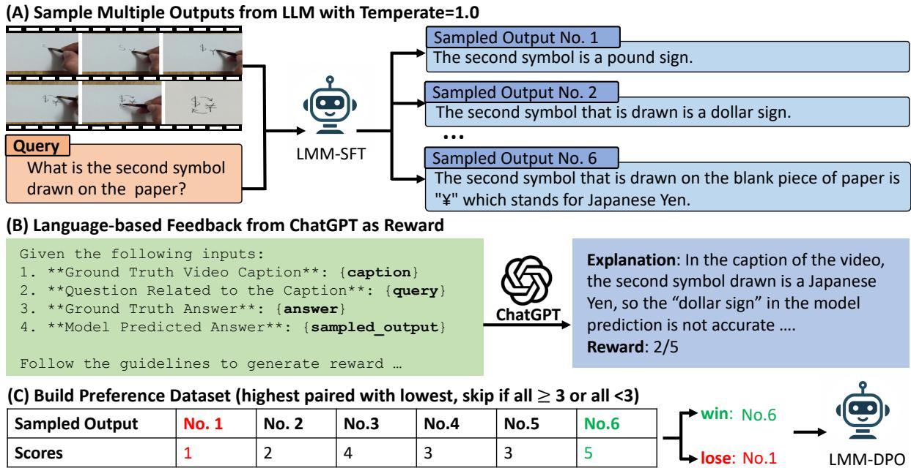  
Figure 2: Detailed illustration of the proposed factually-enhanced DPO method.

2023b) employs human effort to create high-quality video instructions, albeit limited to the ActivityNet domain with only 100k instruction pairs. Short2Story (Han et al., 2023) and Vript (Yang et al., 2024) employ GPT-4V for video captioning, with audio details as outputs. Concurrent work (Chen et al., 2024b) leverages GPT-4V to label video captions. Furthermore, previous studies (Xu et al., 2017; Grunde-McLaughlin et al., 2021; Wu et al., 2024) have employed language models or predefined question templates to generate questionanswer pairs. While these approaches can produce a substantial volume of questions and answers, they frequently result in low-quality questions that fail to accurately reflect real-world user inquiries. Our work leverages the GPT-4V model to generate detailed video captions and introduces a paradigm for producing question-answer pairs, which can be effectively utilized for training video LLMs. Additionally, we release this resource as a community asset for LMM training.

## 2.3 Preference Modeling for LMMs

Preference modeling techniques, such as DPO (Deng et al., 2024; Yu et al., 2024; Li et al., 2023d; Gunjal et al., 2023; Sun et al., 2023a) and PPO (Sun et al., 2023a), have been applied to LMM alignment. More recently, (Ahn et al., 2024) employed reinforcement learning based on AI feedback to enhance video LMM performance. Our work extends DPO to video LMM alignment by incorporating detailed captions as factual evidence for reward modeling.

## 3 Method

As shown in fig. 1, our methodology enhances video LMM alignment through DPO method using rewards from a language model. We elaborate on constructing a video caption dataset in section 3.1. Subsequently, in section 3.2, we discuss the generation of video instruction data and the fine-tuning process of our model. Lastly, section 3.3 details the incorporation of generated captions as a feedback mechanism for DPO method to refine our model’s factual alignment in video instruction-following tasks.

## 3.1 Prompting GPT-4V Model for Detailed Video Caption Distillation

The selection of dataset includes videos from three sources: WebVid (400k) and VIDAL (450k) ActivityNet (50k) datasets. WebVid and VIDAL videos are in the general domain sourced from YouTube, and ActivityNet videos focus on human activities. The three datasets together result in a comprehensive collection of 900k videos. To accommodate the requirement that GPT-4V only takes images as input, we preprocess videos by uniformly extracting ten frames per video content. These frames are then concatenated into a sequence to serve as a proxy for the video. We use GPT-4V to generate a coherent caption for the represented video based on the frame sequence. The prompt (fig. 19) adheres to guidelines covering temporal dynamics, world knowledge, object attributes, spatial relationships, aesthetic assessments, etc., with the goal of comprehensively understanding the video contents (examples in fig. 3 and fig. 9).

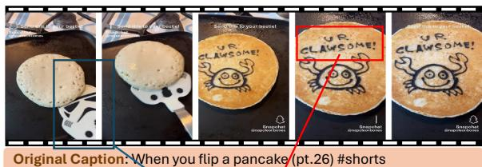  
GPT-4V Annotation: The video begins with a close-up view of a pancake on a griddle or pan, which has not been flipped yet, showing its uncooked, batter side. The pancake is pale in color with bubbles forming on the surface, typical of a pancake as it cooks. There is a spatula with a novelty design. It resembles a Stormtrooper helmet from the Star Wars franchise placed beside the pancake. Text urging the viewer to "Send this to your bestie!" along with a Snapchat handle are overlaid on top of the video. The spatula is then slid underneath the pancake, which is then flipped over to reveal a cooked side featuring the drawing of a cartoon crab and the phrase "U R CLAWSOME!" written on it. The cooked side of the pancake has a golden-brown color, and the cartoon and text appear to be created with some dark-colored substance, possibly chocolate or some edible ink.  
Figure 3: Example annotation in SHAREGPTVIDEO: Our dataset provides more detailed video caption annotations. The red box demonstrates that textual information in the video is accurately extracted into the caption, while the blue box illustrates the connection to real-world knowledge, such as identifying the spatula’s shape as resembling a Stormtrooper helmet from Star Wars.

## 3.2 SFT with Generated Video Instruction Data from Detailed Caption

To generate video instruction-following data for SFT, we adopt a similar methodology outlined in Video-ChatGPT (Li et al., 2023b). Specifically, we first randomly sample 300k video captions and then employ ChatGPT to generate 3 question-answer pairs conditioned on each caption (prompt in fig. 20). We release the 900k instructionfollowing data to public, but we only use a random subset of 240k for our training. This approach ensures that the instructional data remains factually consistent with the content of the detailed captions.

## 3.3 DPO with Language Model Reward

Acquiring high-quality on-policy preference data can be costly and labor-intensive. Although GPT-4V can be used for reward distillation, for video data, its high computation cost1, slow response, and limited accessibility hinder scalability. We propose a cost-efficient method to generate reward data for DPO using detailed video captions as supporting evidence, as shown in fig. 2.

Initially, we randomly select a subset of 20k instruction pairs from the dataset described in section 3.2. The SFT model generates six responses per input at a temperature of 1.0. This procedure results in 120k question-answer pairs. Subsequently, we employ ChatGPT to evaluate the model responses based on the ground truth answer and detailed description (prompt in fig. 22). ChatGPT generates an output that includes a natural language explanation as chain-of-thought step, followed by a numerical reward score on a scale from 1 to 5, indicating the overall quality.

For each video and question pair, we randomly select an answer with a score $\geq 3$ as positive example, and an answer with a score below 3 as negative. Cases where all responses are uniformly scored above or below 3 are excluded from the dataset. After the selection process, approximately 17k training instances are compiled for DPO training. Formally, the dataset is denoted as $\mathcal { D } _ { D P O } = \{ ( \mathcal { V } , x , y _ { w } , y _ { l } ) \}$ , where is the video, x is the question, $y _ { w }$ and yl are the positive and negative responses. The DPO objective is defined as below:

$$
\begin{array} { r l } & { \mathcal { L } _ { \mathrm { D P O } } \left( \pi _ { \theta } ; \pi _ { \mathrm { r e f } } \right) = - \mathbb { E } _ { \left( \mathcal { V } , x , y _ { w } , y _ { l } \right) \sim \mathcal { D } _ { D P O } } \Bigg [ } \\ & { \log \sigma \Bigg ( \beta \log \frac { \pi _ { \theta } \left( y _ { w } \mid x , \mathcal { V } \right) } { \pi _ { \mathrm { r e f } } \left( y _ { w } \mid x , \mathcal { V } \right) } - \beta \log \frac { \pi _ { \theta } \left( y _ { l } \mid x , \mathcal { V } \right) } { \pi _ { \mathrm { r e f } } \left( y _ { l } \mid x , \mathcal { V } \right) } \Bigg ) \Bigg ] , } \end{array}
$$

where $\pi _ { \theta }$ is the policy model to be optimized and $\pi _ { \mathrm { r e f } }$ is the base reference model, both models are initialized with SFT weights. σ is the logistic function and $\beta$ is set to 0.1.

For on-policy reward generation, our method incurs a cost of less than \$20, under a pricing model of \$1.5 per million tokens. In comparison, previous methods of preference data collection, such as in (Sun et al., 2023a), required an expenditure of \$3,000 to gather 10k human preference data points. Additionally, the method proposed by (Li et al., 2023d), which employs GPT-4V for reward data labeling, incurs a significantly higher cost—\$30 per million tokens—and demonstrates considerably slower inference speeds.

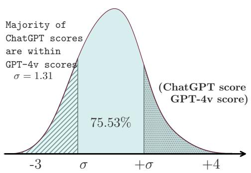

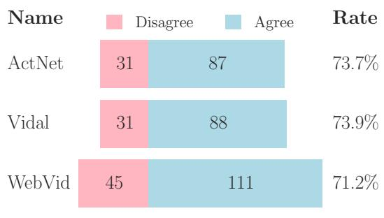  
Figure 4: Assessing Evaluator Quality Using Captions in Place of Frames. The left figure shows the distribution of evaluation score differences between ChatGPT (with caption as proxy) and GPT-4V (directly on frames) evaluations. The right figure shows the rate of preference agreement between ChatGPT and GPT-4V as evaluators.

## 4 Assessment of Evaluator with GPT-4V Caption as Video Content

To assess the effectiveness of our proposed reward assignment method, we conducted a comparative analysis the GPT-4V used as a video QA evaluator. Our method utilizes detailed captions as a proxy of actual video frames, while GPT-4V directly takes in video frames as inputs. Both reward systems follow the same set of guidelines for scoring reward (prompt in fig. 23).

To compare the two methods, we sample 200 videos from each of the WebVid, VIDAL, and ActivityNet datasets, each associated with one question and two model predictions from our SFT model, with one preferred and one dispreferred by ChatGPT. This results in 1, 200 examples, for which we used GPT-4V to assign scores. Filtering through the Azure API backend resulted in 196, 151, and 143 videos from each dataset, respectively, having both answers evaluated. The average scores of all examples from ChatGPT and GPT-4V evaluations were 2.9 and 3.5 respectively, indicating a tendency of GPT-4V to yield slightly positive evaluations. The Pearson Correlation Coefficient (PCC) of 0.47 (p < 0.01) suggests a moderate positive correlation. In fig. 4 (left), the distribution of the difference between ChatGPT and GPT-4V scores reveals that majority (> 75%) of ChatGPT scores fall within one standard deviation (σ = 1.31) of GPT-4V scores. Additionally, in fig. 4 (right), the agreement on preference between ChatGPT and GPT-4V, excluding ties, exceeded 70%. These findings cautiously support our benchmark’s applicability in video QA evaluation. Further refinements for better alignment—such as incorporating Likert scales (Zhou et al., 2023) or GPT-4 evaluation—are

areas for future research.

Human Annotation of Captions: To evaluate the quality of the distilled captions, we conducted human annotations focusing on two aspects: coverage and accuracy (hallucination). Annotators were asked to assess each caption by identifying the number of missing items and the number of incorrect facts. The assessment was performed on a sample of 75 videos, with 25 from each domain. The results showed that annotators identified a total of 21 inaccurate items across 14 videos (accuracy: 81%) and 12 missing items across 8 videos (accuracy: 89%). Annotated examples are provided in appendix D.

## 5 Experiments

We adopt Video-LLaVA (Lin et al., 2023a) as the backbone of our video LMM, but our method can be applied to any other architectures as well.

Caption Pre-training Stage (LLAVA-HOUND-PT): We use captioning data including 650k image caption data from ALLaVA (Chen et al., 2024a) and our distilled 900k video caption. We freeze the visual encoder and fine-tune the MLP projector and LLM, with learning rate 2e-5 and batch size 128.

SFT Stage (LLAVA-HOUND-SFT): We use 600k image instruction data from ALLaVA and our generated 240k video instruction data, with learning rate 5e-6 and batch size 128.

DPO training Stage (LLAVA-HOUND-DPO): We use the 17k preference data introduced in section 3.3 for DPO training. Following (Ivison et al., 2023), we train our policy model with full model training for 3 epochs with learning rate 5e-7, and a batch size of 128. All the experiments are performed on 8 A100 gpus.

<table><tr><td rowspan="2">Methods</td><td rowspan="2">LLM Size</td><td colspan="2">Existing Video QA Benchmark from (Maaz et al., 2023) MSVD-QA</td><td colspan="2">MSRVTT-QA</td><td colspan="2">TGIF-QA</td></tr><tr><td>Acc.</td><td>Score</td><td>Acc.</td><td>Score</td><td>Acc.</td><td>Score</td></tr><tr><td>FrozenBiLM (Yang et al., 2022)*</td><td>1B</td><td>32.2</td><td></td><td>16.8</td><td></td><td>41.0</td><td></td></tr><tr><td>VideoLLaMA (Zhang et al., 2023a)*</td><td>7B</td><td>51.6</td><td>2.5</td><td>29.6</td><td>1.8</td><td></td><td></td></tr><tr><td>LLaMA-Adapter (Zhang et al., 2023b)*</td><td>7B</td><td>54.9</td><td>3.1</td><td>43.8</td><td>2.7</td><td></td><td></td></tr><tr><td>VideoChat (Li et al., 2023b)*</td><td>7B</td><td>56.3</td><td>2.8</td><td>45.0</td><td>2.5</td><td>34.4</td><td>2.3</td></tr><tr><td>BT-Adapter (Liu et al., 2023c)*</td><td>7B</td><td>67.5</td><td>3.7</td><td>57.0</td><td>3.2</td><td></td><td></td></tr><tr><td>Video-ChatGPT (Maaz et al., 2023)</td><td>7B</td><td>68.6</td><td>3.8</td><td>58.9</td><td>3.4</td><td>47.8</td><td>3.2</td></tr><tr><td>Chat-UniVi (Jin et al., 2023)</td><td>7B</td><td>70.0</td><td>3.8</td><td>53.1</td><td>3.1</td><td>46.1</td><td>3.1</td></tr><tr><td>VideoChat2 (Li et al., 2023c)</td><td>7B</td><td>70.0</td><td>3.9</td><td>54.1</td><td>3.3</td><td></td><td></td></tr><tr><td>Video-LLaVA (Lin et al., 2023b)</td><td>7B</td><td>71.8</td><td>3.9</td><td>59.0</td><td>3.4</td><td>48.4</td><td>3.2</td></tr><tr><td>LLaMA-VID (Li et al., 2023e)</td><td>7B</td><td>72.6</td><td>3.9</td><td>58.7</td><td>3.4</td><td>49.2</td><td>3.3</td></tr><tr><td>LLaMA-VID (Li et al., 2023e)</td><td>13B</td><td>74.3</td><td>4.0</td><td>59.8</td><td>3.4</td><td>50.8</td><td>3.3</td></tr><tr><td>VLM-RLAIF (Ahn et al., 2024)*</td><td>7B</td><td>76.4</td><td>4.0</td><td>63.0</td><td>3.4</td><td>–</td><td>-</td></tr><tr><td>LLAVA-HOUND-SFT</td><td>7B</td><td>75.7</td><td>3.9</td><td>58.7</td><td>3.3</td><td>53.5</td><td>3.3</td></tr><tr><td>LLAVA-HOUND-DPO</td><td>7B</td><td>80.7</td><td>4.1</td><td>70.2</td><td>3.7</td><td>61.4</td><td>3.5</td></tr></table>

Table 1: Evaluation of Model Performance on Zero-Shot Video Question Answering Benchmarks Using gpt-3.5-turbo-0613. Models denoted with have their results directly sourced from their original publications. Caution is advised when interpreting these results; see Appendix A for an in-depth analysis of evaluation challenges. All other baseline models were reproduced by our team.

<table><tr><td rowspan="2">No. Methods</td><td rowspan="2"></td><td colspan="2">Next-QA</td></tr><tr><td>Acc.</td><td>Score</td></tr><tr><td>[1] [2]</td><td>Video-ChatGPT (Maaz et al., 2023)</td><td>45.23</td><td>2.09</td></tr><tr><td></td><td>LLaMA-VID-7B (Li et al., 2023e)</td><td>49.43</td><td>3.24</td></tr><tr><td>[4]</td><td>Chat-UniVi (Jin et al., 2023)</td><td>47.62</td><td>3.14</td></tr><tr><td>[5]</td><td>Video-LLaVA (Lin et al., 2023b)</td><td>48.97</td><td>3.25</td></tr><tr><td>[6]</td><td>LLAVA-HOUND-SFT</td><td>60.60</td><td>3.51</td></tr><tr><td>[7]</td><td>LLAVA-HOUND-DPO</td><td>74.27</td><td>3.74</td></tr></table>

Table 2: Evaluation on Next-QA benchmark using gpt-3.5-turbo-0611 on official test set.

## 5.1 Benchmark Evaluation

Dataset and Testing Environment We evaluate model performance on four benchmark datasets: MSVD-QA (Chen and Dolan, 2011), MSRVTT-QA (Xu et al., 2016), TGIF-QA (Jang et al., 2017), and Next-QA (Xiao et al., 2021) using ChatGPT with version gpt-3.5-turbo-0611 to assess model predictions. The evaluation prompts follow (Maaz et al., 2023). In our experiment, we found that different ChatGPT versions have high impact on absolute score of metric, but the overall ranking of models is relatively stable. We select gpt-3.5-turbo-0613 due to its closeness to the reported score in Video-LLaVA paper. Further details on the selection rationale and evaluation pitfalls are discussed in Appendix A.

Baseline Selection We select video LMM models that have demonstrated SOTA performance with with accessible code and checkpoints at the time of paper writing, specifically including Video-LLaVA, which is also our choice of architecture. We replicate results including Video-ChatGPT (Maaz et al., 2023), LLaMA-VID (Li et al., 2023e) (7B and 13B), Chat-UniVi (Jin et al., 2023), and Video-LLaVA (Lin et al., 2023b). We copy the results from additional baselines including Frozen-BiLM (Yang et al., 2022), VideoChat (Li et al., 2023b) and VideoLLaMA (Zhang et al., 2023a), sourced from their original publication.

Results In table 1, our analysis shows that within the SFT models, LLaMA-VID-7B and Video-LLaVA exhibit comparable performance, with LLaMA-VID-13B performing the best. Our LLAVA-HOUND-SFT model achieves comparable performance to LLaMA-VID-13B. Incorporating preference modeling, LLAVA-HOUND-DPO achieves an average accuracy of 70.75%, surpassing LLAVA-HOUND-SFT, which has an average accuracy of 62.65%, by 8.1%. Furthermore, LLAVA-HOUND-DPO exhibits superior accuracy compared to other RL methods such as VLM-RLAIF. In table 2, our model demonstrated consistent result on a relative new benchmark Next-QA.

Error Analysis Figure 5 illustrates two examples. In the left example, LLAVA-HOUND-SFT provides an accurate description of the video’s first half but introduces a hallucination with the phrase “I’m not scared of space," absent in the video content. LLAVA-HOUND-DPO yields a more accurate inference. In the right example, both LLAVA-HOUND-SFT and Video-LLaVA models produce incorrect inferences, whereas LLAVA-HOUND-DPO successfully correctly identifies the subject in the video.

<table><tr><td rowspan="2">No. Methods</td><td rowspan="2"></td><td colspan="6">Proposed Video QA Benchmark (In-domain)</td></tr><tr><td>ActivityNet-QA</td><td></td><td>VIDAL-QA</td><td></td><td>WebVid-QA</td><td>Score</td></tr><tr><td></td><td></td><td>Acc.</td><td>Score</td><td>Acc.</td><td>Score</td><td>Acc.</td><td></td></tr><tr><td>[1]</td><td>Video-ChatGPT (Maaz et al., 2023)</td><td>34.17</td><td>2.19</td><td>29.35</td><td>2.10</td><td>38.88</td><td>2.27</td></tr><tr><td>[2]</td><td>LLaMA-VID-7B (Li et al., 2023e)</td><td>36.54</td><td>2.27</td><td>30.58</td><td>2.15</td><td>36.99</td><td>2.24</td></tr><tr><td>[3]</td><td>LLaMA-VID-13B (Li et al., 2023e)</td><td>37.33 39.35</td><td>2.29 2.32</td><td>32.50 31.40</td><td>2.18 2.16</td><td>39.73 40.05</td><td>2.30</td></tr><tr><td>[4] [5]</td><td>Chat-UniVi (Jin et al., 2023) Video-LLaVA (Lin et al., 2023b)</td><td>41.35</td><td>2.38</td><td>34.30</td><td>2.24</td><td>42.47</td><td>2.31 2.39</td></tr><tr><td></td><td></td><td></td><td></td><td></td><td></td><td></td><td></td></tr><tr><td>[6]</td><td>LLAVA-HOUND-SFT LLAVA-HOUND-DPO</td><td>66.62 76.62</td><td>3.05 3.18</td><td>60.50 70.06</td><td>2.88 3.04</td><td>71.07 79.82</td><td>3.17 3.29</td></tr><tr><td>[7]</td><td></td><td></td><td></td><td>60.57</td><td>2.85</td><td></td><td></td></tr><tr><td>[8]</td><td>LLAVA-HoUND-PT + Image Inst. LLAVA-HOUND-PT + VChat</td><td>69.31 67.34</td><td>3.09 3.02</td><td>62.33</td><td>2.89</td><td>68.03 68.98</td><td>3.02</td></tr><tr><td>[9]</td><td>LLAVA-HoUND-DPO + training MLP</td><td>71.89</td><td>3.10</td><td>65.57</td><td>2.95</td><td>75.37</td><td>3.00 3.21</td></tr><tr><td>[10]</td><td>LLAVA-HOUND-SFT + Self-play</td><td>64.11</td><td>2.85</td><td>56.28</td><td>2.68</td><td>67.89</td><td>2.95</td></tr><tr><td>[11] [12]</td><td>LLAVA-HoUND-DPO w/ lr3e-7</td><td>71.13</td><td>3.08</td><td>64.90</td><td>2.92</td><td>73.25</td><td>3.17</td></tr></table>

Table 3: Our proposed video QA benchmark evaluation on in-domain dataset using gpt-3.5-turbo-0301, with detailed captions as supporting evidence.
<table><tr><td rowspan="2">Methods</td><td colspan="8">Proposed Video QA Benchmark (Out-of-domain)</td></tr><tr><td colspan="2">MSVD-QA</td><td colspan="2">MSRVTT-QA</td><td colspan="2">TGIF-QA</td><td colspan="2">SSV2-QA</td></tr><tr><td></td><td>Acc.</td><td>Score</td><td>Acc.</td><td>Score</td><td>Acc.</td><td>Score</td><td>Acc.</td><td>Score</td></tr><tr><td>Video-ChatGPT (Maaz et al., 2023)</td><td>34.06</td><td>2.20</td><td>25.65</td><td>1.98</td><td>31.35</td><td>2.09</td><td>19.36</td><td>1.75</td></tr><tr><td>LLaMA-VID-7B (Li et al., 2023e)</td><td>34.14</td><td>2.21</td><td>25.02</td><td>1.99</td><td>27.18</td><td>2.00</td><td>22.16</td><td>1.84</td></tr><tr><td>LLaMA-VID-13B (Li et al., 2023e)</td><td>35.81</td><td>2.25</td><td>26.34</td><td>2.02</td><td>27.58</td><td>2.01</td><td>21.98</td><td>1.83</td></tr><tr><td>Chat-UniVi (Jin et al., 2023)</td><td>35.61</td><td>2.23</td><td>25.89</td><td>2.01</td><td>33.23</td><td>2.13</td><td>20.59</td><td>1.79</td></tr><tr><td>Video-LLaVA (Lin et al., 2023b)</td><td>39.46</td><td>2.37</td><td>30.78</td><td>2.15</td><td>32.95</td><td>2.18</td><td>24.31</td><td>1.90</td></tr><tr><td>LLAVA-HOUND-SFT</td><td>66.99</td><td>3.09</td><td>57.82</td><td>2.85</td><td>66.13</td><td>3.07</td><td>35.07</td><td>2.23</td></tr><tr><td>LLAVA-HOUND-DPO</td><td>73.64</td><td>3.12</td><td>68.29</td><td>2.98</td><td>74.00</td><td>3.12</td><td>48.89</td><td>2.53</td></tr><tr><td>LLAVA-HoUND-PT + Image Inst.</td><td>65.19</td><td>2.96</td><td>48.66</td><td>2.52</td><td>53.83</td><td>2.62</td><td>29.60</td><td>2.04</td></tr></table>

Table 4: Our proposed video QA benchmark evaluation on out-of-domain dataset using gpt-3.5-turbo-0301, with detailed captions as supporting evidence.

## 5.2 Open-ended QA Analysis

In this section, we conduct analysis on openended long-form QA with a proposed development benchmark. Specifically, we select 2,000 videos from each source: WebVid (Bain et al., 2021b), VIDAL (Zhu et al., 2023), ActivityNet (Fabian Caba Heilbron and Niebles, 2015), MSRVTT (Xu et al., 2016), MSVD (Chen and Dolan, 2011), TGIF (Jang et al., 2017), and Something-something V2 (SSV2) (Goyal et al., 2017). For each video, ChatGPT was utilized to generate three QA pairs based on the detailed captions, and we evaluate model predictions with our reward mechanism. WebVid, VIDAL, ActivityNet are classified as indomain, which are involved in the model’s training pipeline. MSRVTT, MSVD, TGIF, SSV2 are classified as out-of-domain.

The evaluation reveals insights into (1) the quality of long-form open-ended QA, (2) in-domain and out-of-domain generalization, and (3) Ablations on SFT and DPO experiments. Additionally, we select our best performing model on the development bench before evaluating on public benchmarks, which avoids tuning hyperparameters on test data. Comparisons are shown in appendix E. Domain Generalization: Table 3 and table 4 shows the in-domain and out-of-domain evaluation. SFT with our data tends to perform better both inand out-of-domain, and DPO further enhances the model performance, showing the effectiveness of preference modeling.

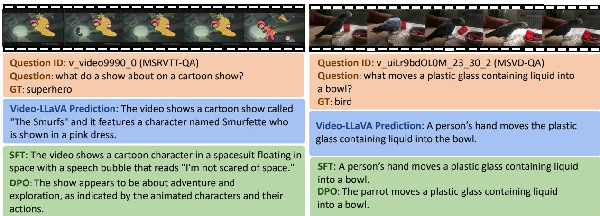  
Figure 5: Examples from MSRVTT-QA and MSVD-QA showcase that our LLAVA-HOUND-DPO generates better responses, and reveal key limitations of the existing benchmark evaluation.

Video LMM without Video Instruction: [8] in table 3 is baseline trained with only image instruction fine-tuned on LLAVA-HOUND-PT, which achieves an average accuracy of 65.97%, comparable to the LLAVA-HOUND-SFT model’s 66.06% in in-domain QA scenarios. However, its performance significantly drops in out-of-domain QA contexts (49.32% vs. 56.50%), suggesting that Video QA training could potentially enhance generalization capabilities.

Quality of Generated SFT: [9] substitutes our generated video QA with the Video-ChatGPT dataset for Video-LLaVA fine-tuning. A comparison between the findings of [9] and [6] reveals a marginal performance disparity of 0.2% in average accuracy, indicating that the quality of our generated QA closely parallels that of the existing video QA datasets. Given the similar quality in SFT data, the large gain of [6] over [5] can be reasonably concluded from large-scale pre-training on video captions.

Unfreeze MLP: The comparison between [10] and [7] reveals a significant decrease in performance when the MLP is unfrozen during DPO training. Despite this drop, however, the performance remains superior to that of the SFT baseline.

Smaller Learning Rate: The comparison between [12] and [7] reveals that using a smaller learning rate of 3e-7 (vs. 5e-7) results in a decreasing of model performance. This highlights the future improvements by finding better hyperparameters.

Self-Play vs. DPO: (Chen et al., 2024d) introduced a self-play methodology for DPO training, which designates ground truth answers as preferred and model-generated responses as dispreferred. When comparing the results of [11] with those in [6], a notable decrease in accuracy by 3% from the SFT model is observed, suggesting that self-play may be less effective for video LMM alignment, and introducing reward model is helpful.

DPO Accuracy vs. Training Epochs. The left of fig. 6 depicts the generalization performance of the model on out-of-domain video QA tasks with respect to the number of training epochs. We observe a consistent enhancement in model performance among datasets during the initial 0 to 2 epochs, with peak performance materializing at around 2.5 epochs, which corresponds to 350 training steps.

Test-time Compute. Previous works have demonstrated that leveraging test-time compute by generating and evaluating multiple candidates can enhance model performance (Hosseini et al., 2024). In this study, we assess the effectiveness of testtime compute and compare its performance with direct inference using our DPO model. For ranking, we employ the DPO model as a ranker to score candidate answers produced by the SFT model, operating at a temperature setting of 1.0. As illustrated on the right in fig. 6, we present the test accuracy progression when selecting the best among N candidates using the DPO ranker. Initial observations reveal that the SFT model, when set to a temperature of 1.0, attains a lower accuracy (43.3%) compared to greedy decoding (57.8%). A consistent improvement in performance is observed as the number of candidates increases, eventually plateauing at approximately 62% accuracy with 64 candidates. However, this performance remains inferior to direct answer generation using the DPO model, which achieves an accuracy of 68.29%. This discrepancy suggests that the DPO model exhibits stronger generalization in answer generation, despite being trained with a reward classification loss. The contrasting results compared to (Hosseini et al., 2024) may stem from task differences, specifically Math QA versus Video QA. Refer to appendix F for more results.

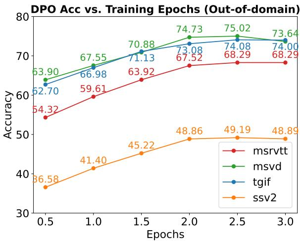

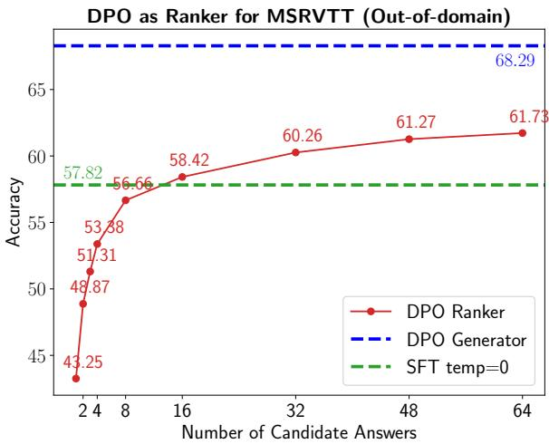  
Figure 6: The left figure shows the test set accuracy of the DPO model w.r.t the number of training epochs. The right figure shows a comparison of DPO model performance as generator vs. ranker.

## 6 Conclusion

We study the techniques for effective video LMM alignment. Specifically, we propose an costeffective reward system that utilizes detailed captions as proxies for video content. We have shown the reward scores is well-aligned with the evaluation metrics of GPT-4V, and DPO training greatly enhances model performance. In addition, we have released 900k detailed video caption, 900k video instruction-following data, and 17k preference data pairs, with a complete code pipeline including pretraining for video captioning, fine-tuning for video instruction following and reinforcement learning with DPO for better LMM alignment.

## 7 Limitations

Firstly, several evaluation datasets, such as Video-MME (Fu et al., 2024) featuring multiple-choice questions, were not included in our study. These datasets were available at or before the completion of our manuscript. Given our focus on enhancing open-ended question answering, multiple-choice datasets were not incorporated into our training process. Consequently, we did not retrain the model to include this data.

Secondly, the benchmark we developed is fully automated and does not incorporate human corrections for captions and QA. Human annotations indicate that caption accuracy ranges from 80% to 90%, inherently introducing errors. Therefore, we recommend using this benchmark solely for model development and hyperparameter tuning, treating performance metrics as indicative rather than definitive.

## References

Daechul Ahn, Yura Choi, Youngjae Yu, Dongyeop Kang, and Jonghyun Choi. 2024. Tuning large multimodal models for videos using reinforcement learning from ai feedback. arXiv preprint arXiv:2402.03746.

Jinze Bai, Shuai Bai, Shusheng Yang, Shijie Wang, Sinan Tan, Peng Wang, Junyang Lin, Chang Zhou, and Jingren Zhou. 2023. Qwen-vl: A frontier large vision-language model with versatile abilities. arXiv preprint arXiv:2308.12966.

Yuntao Bai, Saurav Kadavath, Sandipan Kundu, Amanda Askell, Jackson Kernion, Andy Jones, Anna Chen, Anna Goldie, Azalia Mirhoseini, Cameron McKinnon, et al. 2022. Constitutional ai: Harmlessness from ai feedback. arXiv preprint arXiv:2212.08073.

Max Bain, Arsha Nagrani, Gül Varol, and Andrew Zisserman. 2021a. Frozen in time: A joint video and

image encoder for end-to-end retrieval. In Proceedings ofthe IEEE/CVF International Conference on Computer Vision, pages 1728–1738.

Max Bain, Arsha Nagrani, Gül Varol, and Andrew Zisserman. 2021b. Frozen in time: A joint video and image encoder for end-to-end retrieval. In ICCV.

David Chen and William B Dolan. 2011. Collecting highly parallel data for paraphrase evaluation. In Proceedings ofthe 49th annual meeting ofthe association for computational linguistics: human language technologies, pages 190–200.

Guiming Hardy Chen, Shunian Chen, Ruifei Zhang, Junying Chen, Xiangbo Wu, Zhiyi Zhang, Zhihong Chen, Jianquan Li, Xiang Wan, and Benyou Wang. 2024a. Allava: Harnessing gpt4v-synthesized data for a lite vision-language model. arXiv preprint arXiv:2402.11684.

Keqin Chen, Zhao Zhang, Weili Zeng, Richong Zhang, Feng Zhu, and Rui Zhao. 2023. Shikra: Unleashing multimodal llm’s referential dialogue magic. arXiv preprint arXiv:2306.15195.

Lin Chen, Xilin Wei, Jinsong Li, Xiaoyi Dong, Pan Zhang, Yuhang Zang, Zehui Chen, Haodong Duan, Bin Lin, Zhenyu Tang, et al. 2024b. Sharegpt4video: Improving video understanding and generation with better captions. arXiv preprint arXiv:2406.04325.

Zhe Chen, Weiyun Wang, Yue Cao, Yangzhou Liu, Zhangwei Gao, Erfei Cui, Jinguo Zhu, Shenglong Ye, Hao Tian, Zhaoyang Liu, et al. 2024c. Expanding performance boundaries of open-source multimodal models with model, data, and test-time scaling. arXiv preprint arXiv:2412.05271.

Zixiang Chen, Yihe Deng, Huizhuo Yuan, Kaixuan Ji, and Quanquan Gu. 2024d. Self-play fine-tuning converts weak language models to strong language models. arXiv preprint arXiv:2401.01335.

Yihe Deng, Pan Lu, Fan Yin, Ziniu Hu, Sheng Shen, James Zou, Kai-Wei Chang, and Wei Wang. 2024. Enhancing large vision language models with selftraining on image comprehension. arXiv preprint arXiv:2405.19716.

Bernard Ghanem Fabian Caba Heilbron, Victor Escorcia and Juan Carlos Niebles. 2015. Activitynet: A large-scale video benchmark for human activity understanding. In CVPR.

Chaoyou Fu, Yuhan Dai, Yongdong Luo, Lei Li, Shuhuai Ren, Renrui Zhang, Zihan Wang, Chenyu Zhou, Yunhang Shen, Mengdan Zhang, Peixian Chen, Yanwei Li, Shaohui Lin, Sirui Zhao, Ke Li, Tong Xu, Xiawu Zheng, Enhong Chen, Rongrong Ji, and Xing Sun. 2024. Video-mme: The first-ever comprehensive evaluation benchmark of multi-modal llms in video analysis. Preprint, arXiv:2405.21075.

Raghav Goyal, Samira Ebrahimi Kahou, Vincent Michalski, Joanna Materzynska, Susanne Westphal, Heuna Kim, Valentin Haenel, Ingo Fruend, Peter Yianilos, Moritz Mueller-Freitag, et al. 2017. The" something something" video database for learning and evaluating visual common sense. In ICCV.

Madeleine Grunde-McLaughlin, Ranjay Krishna, and Maneesh Agrawala. 2021. Agqa: A benchmark for compositional spatio-temporal reasoning. In CVPR.

Anisha Gunjal, Jihan Yin, and Erhan Bas. 2023. Detecting and preventing hallucinations in large vision language models. arXiv preprint arXiv:2308.06394.

Mingfei Han, Linjie Yang, Xiaojun Chang, and Heng Wang. 2023. Shot2story20k: A new benchmark for comprehensive understanding of multi-shot videos. arXiv preprint arXiv:2312.10300.

Arian Hosseini, Xingdi Yuan, Nikolay Malkin, Aaron Courville, Alessandro Sordoni, and Rishabh Agarwal. 2024. V-star: Training verifiers for self-taught reasoners. arXiv preprint arXiv:2402.06457.

Hamish Ivison, Yizhong Wang, Valentina Pyatkin, Nathan Lambert, Matthew Peters, Pradeep Dasigi, Joel Jang, David Wadden, Noah A Smith, Iz Beltagy, et al. 2023. Camels in a changing climate: Enhancing lm adaptation with tulu 2. arXiv preprint arXiv:2311.10702.

Yunseok Jang, Yale Song, Youngjae Yu, Youngjin Kim, and Gunhee Kim. 2017. Tgif-qa: Toward spatiotemporal reasoning in visual question answering. In CVPR.

Peng Jin, Ryuichi Takanobu, Caiwan Zhang, Xiaochun Cao, and Li Yuan. 2023. Chat-univi: Unified visual representation empowers large language models with image and video understanding. arXiv preprint arXiv:2311.08046.

Yang Jin, Zhicheng Sun, Kun Xu, Liwei Chen, Hao Jiang, Quzhe Huang, Chengru Song, Yuliang Liu, Di Zhang, Yang Song, et al. 2024. Video-lavit: Unified video-language pre-training with decoupled visual-motional tokenization. arXiv preprint arXiv:2402.03161.

Harrison Lee, Samrat Phatale, Hassan Mansoor, Kellie Lu, Thomas Mesnard, Colton Bishop, Victor Carbune, and Abhinav Rastogi. 2023. Rlaif: Scaling reinforcement learning from human feedback with ai feedback. arXiv preprint arXiv:2309.00267.

Junnan Li, Dongxu Li, Silvio Savarese, and Steven Hoi. 2023a. Blip-2: Bootstrapping language-image pretraining with frozen image encoders and large language models. arXiv preprint arXiv:2301.12597.

KunChang Li, Yinan He, Yi Wang, Yizhuo Li, Wenhai Wang, Ping Luo, Yali Wang, Limin Wang, and Yu Qiao. 2023b. Videochat: Chat-centric video understanding. arXiv preprint arXiv:2305.06355.

Kunchang Li, Yali Wang, Yinan He, Yizhuo Li, Yi Wang, Yi Liu, Zun Wang, Jilan Xu, Guo Chen, Ping Luo, et al. 2023c. Mvbench: A comprehensive multi-modal video understanding benchmark. arXiv preprint arXiv:2311.17005.

Lei Li, Zhihui Xie, Mukai Li, Shunian Chen, Peiyi Wang, Liang Chen, Yazheng Yang, Benyou Wang, and Lingpeng Kong. 2023d. Silkie: Preference distillation for large visual language models. arXiv preprint arXiv:2312.10665.

Yanwei Li, Chengyao Wang, and Jiaya Jia. 2023e. Llama-vid: An image is worth 2 tokens in large language models. arXiv preprint arXiv:2311.17043.

Bin Lin, Yang Ye, Bin Zhu, Jiaxi Cui, Munan Ning, Peng Jin, and Li Yuan. 2023a. Video-llava: Learning united visual representation by alignment before projection. Preprint, arXiv:2311.10122.

Bin Lin, Bin Zhu, Yang Ye, Munan Ning, Peng Jin, and Li Yuan. 2023b. Video-llava: Learning united visual representation by alignment before projection. arXiv preprint arXiv:2311.10122.

Haotian Liu, Chunyuan Li, Yuheng Li, and Yong Jae Lee. 2023a. Improved baselines with visual instruction tuning. arXiv preprint arXiv:2310.03744.

Haotian Liu, Chunyuan Li, Qingyang Wu, and Yong Jae Lee. 2023b. Visual instruction tuning. arXiv preprint arXiv:2304.08485.

Ruyang Liu, Chen Li, Yixiao Ge, Ying Shan, Thomas H Li, and Ge Li. 2023c. One for all: Video conversation is feasible without video instruction tuning. arXiv preprint arXiv:2309.15785.

Ruipu Luo, Ziwang Zhao, Min Yang, Junwei Dong, Minghui Qiu, Pengcheng Lu, Tao Wang, and Zhongyu Wei. 2023. Valley: Video assistant with large language model enhanced ability. arXiv preprint arXiv:2306.07207.

Muhammad Maaz, Hanoona Rasheed, Salman Khan, and Fahad Shahbaz Khan. 2023. Video-chatgpt: Towards detailed video understanding via large vision and language models. arXiv preprint arXiv:2306.05424.

Long Ouyang, Jeffrey Wu, Xu Jiang, Diogo Almeida, Carroll Wainwright, Pamela Mishkin, Chong Zhang, Sandhini Agarwal, Katarina Slama, Alex Ray, et al. 2022. Training language models to follow instructions with human feedback. Advances in Neural Information Processing Systems, 35:27730–27744.

Rafael Rafailov, Archit Sharma, Eric Mitchell, Christopher D Manning, Stefano Ermon, and Chelsea Finn. 2024. Direct preference optimization: Your language model is secretly a reward model. Advances in Neural Information Processing Systems, 36.

Nina Shvetsova, Anna Kukleva, Xudong Hong, Christian Rupprecht, Bernt Schiele, and Hilde Kuehne. 2023. Howtocaption: Prompting llms to transform video annotations at scale. Preprint, arXiv:2310.04900.

Zhiqing Sun, Sheng Shen, Shengcao Cao, Haotian Liu, Chunyuan Li, Yikang Shen, Chuang Gan, Liang-Yan Gui, Yu-Xiong Wang, Yiming Yang, et al. 2023a. Aligning large multimodal models with factually augmented rlhf. arXiv preprint arXiv:2309.14525.

Zhiqing Sun, Yikang Shen, Hongxin Zhang, Qinhong Zhou, Zhenfang Chen, David Cox, Yiming Yang, and Chuang Gan. 2023b. Salmon: Self-alignment with principle-following reward models. arXiv preprint arXiv:2310.05910.

Peng Wang, Shuai Bai, Sinan Tan, Shijie Wang, Zhihao Fan, Jinze Bai, Keqin Chen, Xuejing Liu, Jialin Wang, Wenbin Ge, et al. 2024. Qwen2-vl: Enhancing vision-language model’s perception of the world at any resolution. arXiv preprint arXiv:2409.12191.

Yi Wang, Yinan He, Yizhuo Li, Kunchang Li, Jiashuo Yu, Xin Ma, Xinhao Li, Guo Chen, Xinyuan Chen, Yaohui Wang, et al. 2023. Internvid: A large-scale video-text dataset for multimodal understanding and generation. arXiv preprint arXiv:2307.06942.

Bo Wu, Shoubin Yu, Zhenfang Chen, Joshua B Tenenbaum, and Chuang Gan. 2024. Star: A benchmark for situated reasoning in real-world videos. arXiv preprint arXiv:2405.09711.

Junbin Xiao, Xindi Shang, Angela Yao, and Tat-Seng Chua. 2021. Next-qa: Next phase of questionanswering to explaining temporal actions. In Proceedings ofthe IEEE/CVF conference on computer vision and pattern recognition, pages 9777–9786.

Dejing Xu, Zhou Zhao, Jun Xiao, Fei Wu, Hanwang Zhang, Xiangnan He, and Yueting Zhuang. 2017. Video question answering via gradually refined attention over appearance and motion. In Proceedings of the 25th ACM international conference on Multimedia, pages 1645–1653.

Jun Xu, Tao Mei, Ting Yao, and Yong Rui. 2016. Msrvtt: A large video description dataset for bridging video and language. In Proceedings of the IEEE conference on computer vision and pattern recognition, pages 5288–5296.

Antoine Yang, Antoine Miech, Josef Sivic, Ivan Laptev, and Cordelia Schmid. 2022. Zero-shot video question answering via frozen bidirectional language models. NeurIPS.

Dongjie Yang, Suyuan Huang, Chengqiang Lu, Xiaodong Han, Haoxin Zhang, Yan Gao, Yao Hu, and Hai Zhao. 2024. Vript: A video is worth thousands of words. arXiv preprint arXiv:2406.06040.

Tianyu Yu, Haoye Zhang, Yuan Yao, Yunkai Dang, Da Chen, Xiaoman Lu, Ganqu Cui, Taiwen He, Zhiyuan Liu, Tat-Seng Chua, et al. 2024. Rlaif-v: Aligning mllms through open-source ai feedback for super gpt-4v trustworthiness. arXiv preprint arXiv:2405.17220.

Zhou Yu, Dejing Xu, Jun Yu, Ting Yu, Zhou Zhao, Yueting Zhuang, and Dacheng Tao. 2019. Activitynet-qa: A dataset for understanding complex web videos via question answering. In Proceedings ofthe AAAI Conference on Artificial Intelligence, volume 33, pages 9127–9134.

Hang Zhang, Xin Li, and Lidong Bing. 2023a. Videollama: An instruction-tuned audio-visual language model for video understanding. arXiv preprint arXiv:2306.02858.

Renrui Zhang, Jiaming Han, Aojun Zhou, Xiangfei Hu, Shilin Yan, Pan Lu, Hongsheng Li, Peng Gao, and Yu Qiao. 2023b. Llama-adapter: Efficient fine-tuning of language models with zero-init attention. arXiv preprint arXiv:2303.16199.

Yuanhan Zhang, Bo Li, haotian Liu, Yong jae Lee, Liangke Gui, Di Fu, Jiashi Feng, Ziwei Liu, and Chunyuan Li. 2024. Llava-next: A strong zero-shot video understanding model.

Xuhui Zhou, Hao Zhu, Leena Mathur, Ruohong Zhang, Haofei Yu, Zhengyang Qi, Louis-Philippe Morency, Yonatan Bisk, Daniel Fried, Graham Neubig, et al. 2023. Sotopia: Interactive evaluation for social intelligence in language agents. arXiv preprint arXiv:2310.11667.

Bin Zhu, Bin Lin, Munan Ning, Yang Yan, Jiaxi Cui, HongFa Wang, Yatian Pang, Wenhao Jiang, Junwu Zhang, Zongwei Li, et al. 2023. Languagebind: Extending video-language pretraining to n-modality by language-based semantic alignment. arXiv preprint arXiv:2310.01852.

A Effect of ChatGPT Version on Official Benchmark Evaluation
<table><tr><td rowspan="2">Methods</td><td rowspan="2">LLM Size</td><td colspan="2">MSVD-QA</td><td colspan="2">MSRVTT-QA</td><td colspan="2">TGIF-QA</td><td colspan="2">Summary</td></tr><tr><td>Acc.</td><td>Score</td><td>Acc.</td><td>Score</td><td>Acc.</td><td>Score</td><td>Avg Acc.</td><td>Rank</td></tr><tr><td colspan="10">gpt-3.5-turbo-0301 evaluation</td></tr><tr><td>Video-ChatGPT (Maaz et al., 2023)</td><td>7B</td><td>78.62</td><td>4.00</td><td>71.67</td><td>3.63</td><td>56.31</td><td>3.45</td><td>68.87</td><td>6</td></tr><tr><td>LLaMA-VID (Li et al., 2023e)</td><td>7B</td><td>82.57</td><td>4.12</td><td>71.94</td><td>3.65</td><td>59.00</td><td>3.63</td><td>71.17</td><td>4</td></tr><tr><td>LLaMA-VID (Li et al., 2023e)</td><td>13B</td><td>83.72</td><td>4.16</td><td>73.63</td><td>3.68</td><td>59.72</td><td>3.66</td><td>72.36</td><td>3</td></tr><tr><td>Chat-UniVi (Jin et al., 2023)</td><td>7B</td><td>80.52</td><td>4.02</td><td>66.92</td><td>3.41</td><td>57.73</td><td>3.49</td><td>68.39</td><td>7</td></tr><tr><td>Video-LLaVA (Lin et al., 2023b)</td><td>7B</td><td>81.44</td><td>4.08</td><td>73.29</td><td>3.65</td><td>58.34</td><td>3.61</td><td>71.02</td><td>5</td></tr><tr><td>LLAVA-HOUND-SFT</td><td>7B</td><td>85.65</td><td>4.10</td><td>73.85</td><td>3.62</td><td>64.98</td><td>3.65</td><td>74.83</td><td>2</td></tr><tr><td>LLAVA-HOUND-DPO</td><td>7B</td><td>88.50</td><td>4.20</td><td>82.10</td><td>3.84</td><td>75.48</td><td>3.81</td><td>82.03</td><td>1</td></tr><tr><td colspan="10">gpt-3.5-turbo-0613 evaluation</td></tr><tr><td>Video-ChatGPT (Maaz et al., 2023)</td><td>7B</td><td>68.55</td><td>3.80</td><td>58.90</td><td>3.36</td><td>47.83</td><td>3.21</td><td>58.43</td><td>6</td></tr><tr><td>LLaMA-VID (Li et al., 2023e)</td><td>7B</td><td>72.62</td><td>3.92</td><td>58.73</td><td>3.38</td><td>49.21</td><td>3.28</td><td>60.19</td><td>4</td></tr><tr><td>LLaMA-VID (Li et al., 2023e)</td><td>13B</td><td>74.29</td><td>3.96</td><td>59.82</td><td>3.41</td><td>50.83</td><td>3.33</td><td>61.65</td><td>3</td></tr><tr><td>Chat-UniVi (Jin et al., 2023)</td><td>7B</td><td>70.01</td><td>3.79</td><td>53.08</td><td>3.14</td><td>46.09</td><td>3.12</td><td>56.39</td><td>7</td></tr><tr><td>Video-LLaVA (Lin et al., 2023b)</td><td>7B</td><td>71.75</td><td>3.88</td><td>58.97</td><td>3.39</td><td>48.39</td><td>3.24</td><td>59.70</td><td>5</td></tr><tr><td>LLAVA-HOUND-SFT</td><td>7B</td><td>75.70</td><td>3.86</td><td>58.73</td><td>3.31</td><td>53.51</td><td>3.30</td><td>62.65</td><td>2</td></tr><tr><td>LLAVA-HOUND-DPO</td><td>7B</td><td>80.73</td><td>4.07</td><td>70.15</td><td>3.66</td><td>61.38</td><td>3.46</td><td>70.75</td><td>1</td></tr><tr><td colspan="10">gpt-3.5-turbo-1106 evaluation</td></tr><tr><td>Video-ChatGPT (Maaz et al., 2023)</td><td>7B</td><td>73.02</td><td>4.01</td><td>62.09</td><td>3.61</td><td>47.76</td><td>3.36</td><td>60.96</td><td>6</td></tr><tr><td>LLaMA-VID (Li et al., 2023e)</td><td>7B</td><td>75.49</td><td>4.08</td><td>62.09</td><td>3.61</td><td>51.72</td><td>3.47</td><td>63.10</td><td>4</td></tr><tr><td>LLaMA-VID (Li et al., 2023e)</td><td>13B</td><td>76.97</td><td>4.10</td><td>63.16</td><td>3.61</td><td>52.53</td><td>3.50</td><td>64.22</td><td>3</td></tr><tr><td>Chat-UniVi (Jin et al., 2023)</td><td>7B</td><td>72.22</td><td>3.92</td><td>55.02</td><td>3.35</td><td>48.16</td><td>3.31</td><td>58.47</td><td>7</td></tr><tr><td>Video-LLaVA (Lin et al., 2023b)</td><td>7B</td><td>74.76</td><td>4.04</td><td>62.70</td><td>3.60</td><td>51.21</td><td>3.45</td><td>62.89</td><td>5</td></tr><tr><td>LLAVA-HOUND-SFT</td><td>7B</td><td>81.09</td><td>4.08</td><td>64.13</td><td>3.57</td><td>58.05</td><td>3.53</td><td>67.76</td><td>2</td></tr><tr><td>LLAVA-HOUND-DPO</td><td>7B</td><td>86.05</td><td>4.23</td><td>76.75</td><td>3.85</td><td>70.02</td><td>3.71</td><td>77.61</td><td>1</td></tr></table>

Table 5: Performance Evaluation Across ChatGPT Versions on Zero-Shot Video Question Answering Benchmarks. This table compares the performance of state-of-the-art video LMMs evaluated under different ChatGPT versions. The absolute performance metrics scored by ChatGPT vary by versions. However, the comparative ranking of models under the same ChatGPT version is relatively stable.

In Table 5, we show impact of using different ChatGPT versions on metric scores within zero-shot video question answering benchmarks. Our analysis reveals significant variations in the absolute scores across ChatGPT versions, but based on the average accuracy metric, the relative ranking of models under the same ChatGPT version shows consistency.

This comparison underscores a critical issue: many prior studies neglect to specify the ChatGPT version used, potentially leading to inaccurate conclusions during evaluation. We advocate for the explicit designation of the ChatGPT version in future evaluations. Analysis from Table 5 indicates that the version gpt-3.5-turbo-0613 aligns most closely with the performance of the Video-LLaVA (Lin et al., 2023a) model, serving as the benchmark for model performance comparison in our study.

## B Evaluation of Captioning Ability from pre-training

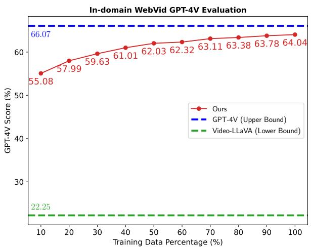

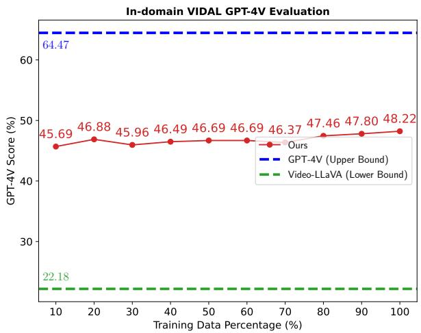

Figure 7: Training subsets exhibit varying levels of generalization difficulty. The WebVid subset (left) requires less data compared to the VIDAL subset (right)  
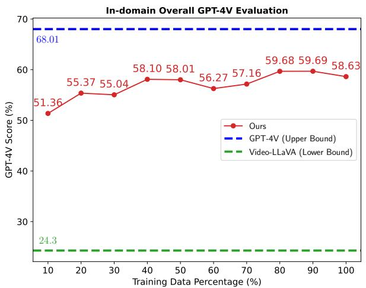

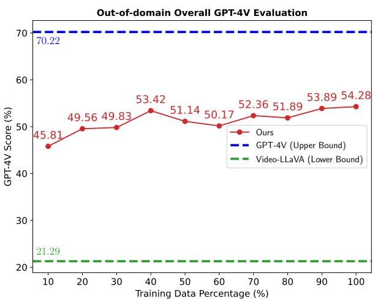  
Figure 8: The video caption ability w.r.t number of training data evaluated on both in-domain and out-of-domain test videos using GPT-4V.

In Figure 8, we present the video captioning ability of models across various datasets, with a total of 900k distilled data instances. GPT-4V is employed for self-evaluation (fig. 21), serving as the upper-bound performance, while the Video-LLaVA serves for comparative analysis, establishing a baseline. Notably, Video-LLaVA is trained on 54k video QA data instances. However, our first checkpoint, utilizing only 10% of the data, is trained on 90k high-quality caption data instances, likely accounting for the observed performance disparity in the video captioning task. Our results demonstrate that incorporating more distilled data contributes to improved model performance across both in-domain and out-of-domain datasets. Despite these improvements, a performance discrepancy with the GPT-4V model remains. Further, we evaluate the generalization potential in specific data subsets, as shown in fig. 7 in the Appendix. These subsets reveal varying degrees of generalization challenges for different types of dataset. For example, the WebVid subset, which concentrates on relatively static scenes, necessitates less data for effective training compared to the VIDAL subset, which is marked by dynamic scene transitions and a diversity of video themes.

  
Original Caption: Time-lapse of purple iris flowers blooming.

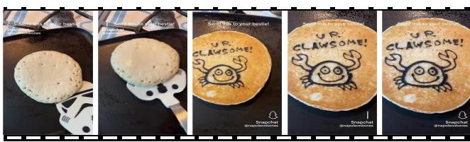  
Original Caption: When you flip a pancake (pt.26) #shorts

GPT-4V Annotation: The video captures a close-up time-lapse of purple irises with bright yellow accents against a black background. Initially, the buds are tightly closed, with green sepals protecting the petals. As the frames advance, the buds begin to open slowly, revealing the velvety texture and deep purple hue of the petals. The blooming is sequential, with some buds opening earlier than others, offering a dynamic contrast between the stages of bloom. At final bloom, the yellow stamen stands out against the purple petals. Throughout the sequence, the number of visible flowers changes.

GPT-4V Annotation: The video begins with a close-up view of a pancake on a griddle or pan, which has not been flipped yet, showing its uncooked, batter side. The pancake is pale in color with bubbles forming on the surface, typical of a pancake as it cooks. There is a spatula with a novelty design. It resembles a Stormtrooper helmet from the Star Wars franchise placed beside the pancake. Text urging the viewer to "Send this to your bestie!" along with a Snapchat handle are overlaid on top of the video. The spatula is then slid underneath the pancake, which is then flipped over to reveal a cooked side featuring the drawing of a cartoon crab and the phrase "U R CLAWSOME!" written on it. The cooked side of the pancake has a golden-brown color, and the cartoon and text appear to be created with some dark-colored substance, possibly chocolate or some edible ink.

Figure 9: A showcase of our dataset for detailed video caption automatically distilled from GPT-4V via our prompt technique in section 3.

## D Human Annotated Examples of Distilled Captions

## WebVid Video ID: 2994286

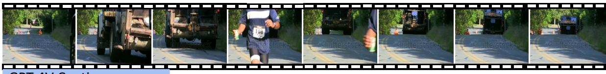  
GPT-4V Caption

Initially, the video displays a curved road lined with multiple orange traffic cones and greenery on either side. The focus shifts to a large, dark-colored truck approaching, its engine sound becoming increasingly prominent. The camera angle changes to the rear of the truck, revealing a runner, wearing a blue top with a white number bib marked '108', passing the truck on its left side. The video concludes with the truck's rear-end seen driving away with the traffic cones visible in the background.

## Human Annotation

Inaccuracy (Hallucination):

1. The truck is driving away instead of approaching

## Coverage:

1. The runner is holding a cup-like item

Figure 10: Human Annotation Analysis: The video frames depict a truck driving away from the camera, but the distilled caption incorrectly describes the direction, which is identified as a hallucination. Additionally, human annotators noted that the GPT-4V model failed to recognize a man holding a cup.

Vidal Video ID: -d3h9kQAMvw  
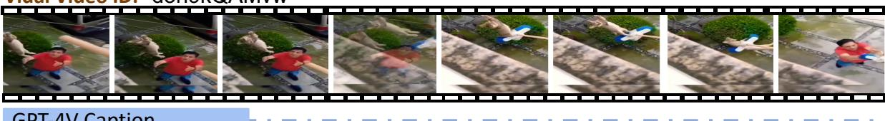

The cat is observed suspended by a limb caught in an electrical cable. It is a light-colored feline, possibly tan or cream, with a noticeably fluffy tail. Below, the person stands on what appears to be a blue stool or small ladder, reaching out towards the cat in an attempt to free it. The environment includes a green, neatly trimmed bush directly under the cat, and to the side, there appears a section of a vehicle – likely a car, suggesting the proximity to a driveway or parking spot. The pavement where these activities are occurring has a distinct pattern, likely tiles, surrounded by green grass, which borders a residential building. Above, an electrical pole is partially visible with thick cables extending from it – one of which the cat is caught in.

## Human Annotation

Inaccuracy (Hallucination):

Coverage:

1.No blue stool or ladder visible

Figure 11: Human Annotation Analysis: GPT-4V incorrectly identified a man wearing blue pants as a man standing on a blue ladder, which is labeled as a hallucination.

ActivityNet Video ID: v\_\_Y4czVoIxvE-Scene-006  
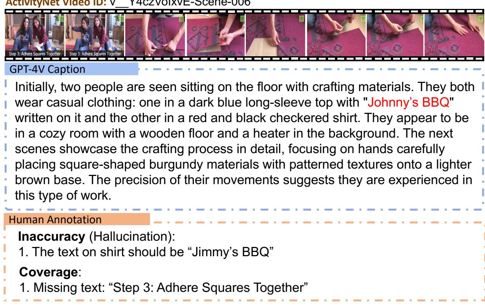  
Figure 12: Human Annotation Analysis: The example demonstrates OCR hallucination and a coverage issue. The text on the woman’s t-shirt is incorrectly labeled as ‘Johnny’s BBQ’ instead of ‘Jimmy’s BBQ.’ Additionally, the text ‘Step 3: Adhere Squares Together’ is missing from the description.

ActivityNet Video ID: v\_\_wITx73-BXw-Scene-003  
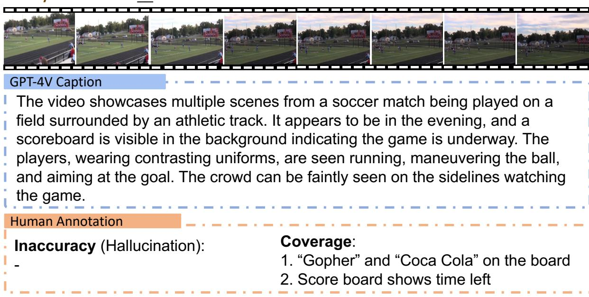  
Figure 13: Human Annotation Analysis: The caption does not contain any hallucinations, but some text recognized by human annotators is missing, such as ‘Coca Cola’ and ‘Gopher’ on the scoreboard, as well as the time of the score match shown.

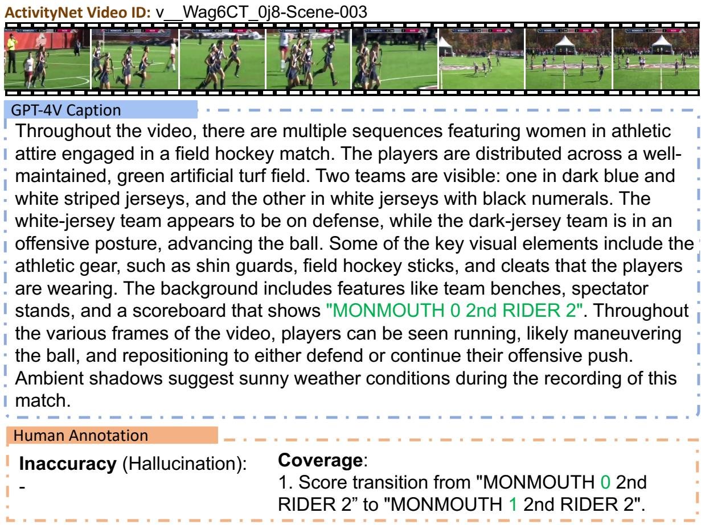  
Figure 14: Human Annotation Analysis: The figures illustrate a scoring transition that is not recognized by the GPT-4V model, highlighting the challenge of using static frames for accurate captioning.

## E Video QA Dataset Demonstration

To build the test dataset, we curated a dataset comprising 2,000 videos from each source: WebVid (Bain et al., 2021b), VIDAL (Zhu et al., 2023), ActivityNet (Fabian Caba Heilbron and Niebles, 2015), MSRVTT (Xu et al., 2016), MSVD (Chen and Dolan, 2011), TGIF (Jang et al., 2017), and Somethingsomething V2 (SSV2) (Goyal et al., 2017). For each video, ChatGPT was utilized to generate three QA pairs based on the detailed captions. The first three datasets (WebVid, VIDAL, ActivityNet) are classified as in-domain, since the captions and QA pairs derived from these sources are used in the model’s training pipeline. Conversely, the remaining datasets (MSRVTT, MSVD, TGIF, SSV2) are classified as out-of-domain, evaluating model’s zero-shot QA ability.

Appendix E compares our development benchmark with existing benchmark dataset, we identify several issues with the existing evaluation methods: (1) the auto-generated questions from current benchmarks may be grammatically incorrect or nonsensical, and (2) the answers are limited to a single word, which is inadequate for evaluating LMMs in the context of long-form QA. We conduct further analysis on open-ended long-form QA with a proposed development benchmark.

We apply our reward system as described in section 4 and report scores from ChatGPT. A score of $\geq 3$ is considered correct for accuracy calculations. The development benchmark reveals insights into (1) the quality of long-form open-ended QA, and (2) in-domain and out-of-domain generalization. Additionally, our development benchmark results correlate with existing benchmarks. We recommend that models be evaluated on the development benchmark first, followed by human evaluation.

MSRVTT Video ID: video7012  
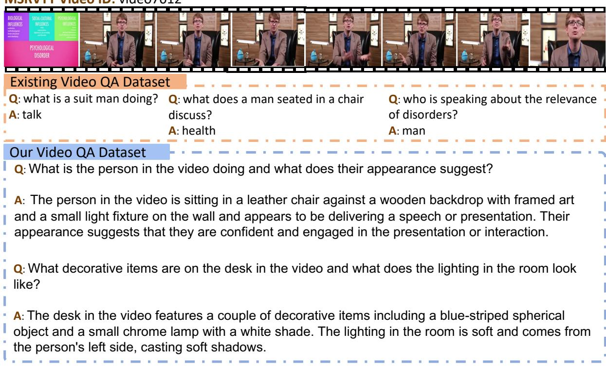  
Figure 15: Comparing testing QA in existing benchmark with that in our proposed new benchmark.

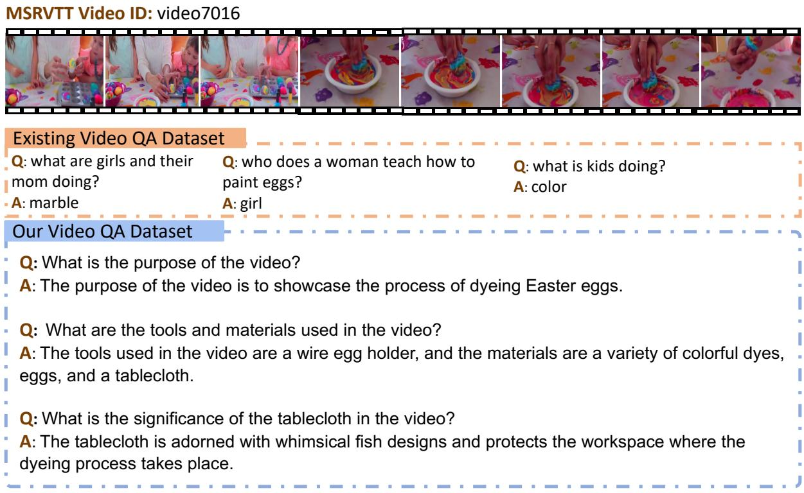  
Figure 16: Comparing testing QA in existing benchmark with that in our proposed new benchmark, example 2.

## F Additional DPO Results

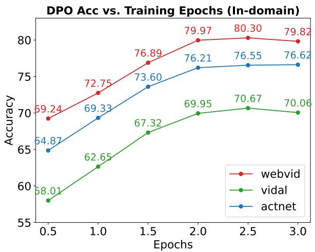

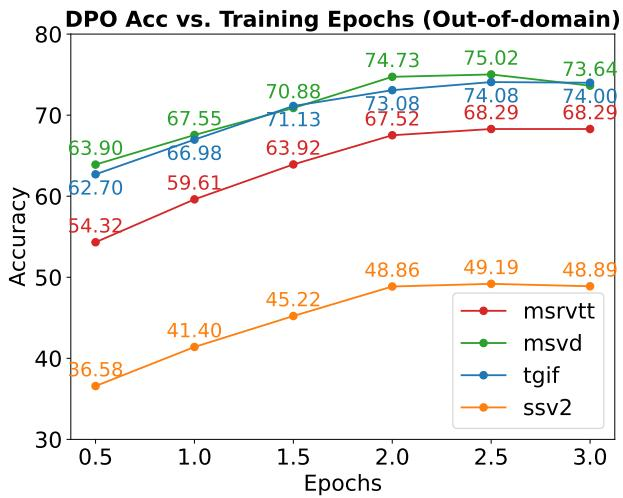  
Figure 17: Test Set Accuracy of the DPO Model vs. Training Epochs. The figure illustrates a consistent trend in both in-domain and out-of-domain video QA, with peak performance occurring at approximately epoch 2.5, equivalent to 350 training steps.

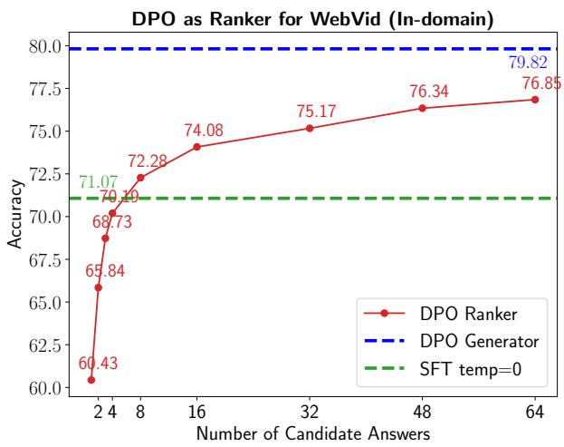

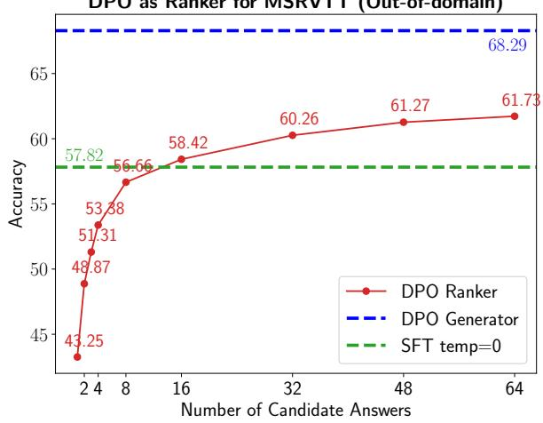  
Figure 18: Comparison of DPO Model Performance: Ranker vs. Generator. The DPO model serves as a ranker, assigning reward scores to candidate answers generated by the SFT model with a temperature setting of 1.0. Employing the DPO model directly for answer generation results in superior performance compared to its use as a ranker.

## G Prompts for GPT-4V and ChatGPT Queries

Picture yourself as a customer service agent managing user-uploaded video. The   
uploaded video, captioned with '{}', consists of a seires of images. All the   
analysis should be video-level. Your duty is to summarize video content,   
highlighting actions and object relationships. Follow this with a detailed   
description. The summary briefly covers actions and relationships, while the   
detailed description delves into factual, visible details with a logical   
structure, considering elements like color, shape, attribute, and count.   
Then craft a dialogue between the agent ('A') and the customer ('C') in a manner   
suggesting that the agent is actively viewing the video and answering the   
customer's questions. Frame questions using 'how many', 'what,' 'how,' 'when,'   
'which,' and 'why' to ensure precise and definitive answers, rooted in video   
content. Pose varied questions encompassing the visual content, such as object   
types, counting objects, object actions, object locations, and relative positions   
between objects. Ensure each question has a definite answer, either observed in   
the video or confidently determined to be absent. Avoid questions with uncertain   
answers.   
Ouput format:   
Summary: <your summary>   
Detail: <your detailed description>   
Conversation: <your quesion-answer conversation, clearly labeling the customer   
and agent as 'C' and 'A'>

Figure 19: GPT-4V prompt for the generation of video summary, detailed caption and conversation generation. We only use detailed caption for experiments.

Task Instructions:   
Given a caption that summarizes the content of a video, generate three   
question-answer pairs that relate directly to the information and context   
provided in the caption. The questions should be grounded to the understanding of   
the video content.   
Guidelines for QA Generation:   
1. Helpfulness: Answers should provide sufficient detail and depth to fully   
address the question. They should include relevant explanations, or context where   
appropriate, to enhance understanding.   
2. Faithfulness: The answers must accurately reflect the information presented in   
the video caption. Avoid speculation or the inclusion of information not   
contained or implied by the caption to maintain the integrity of the content.   
3. Diversity: Craft questions that cover different aspects of the video caption   
to provide a comprehensive understanding of the content. This includes factual   
inquiries, inferential questions, and those that may elicit explanatory   
responses.   
Input Video Caption:   
{caption}   
Output format:   
Q1: <question1>   
A1: <answer1>   
Q2: <question2>   
A2: <answer2>   
Q3: <question3>   
A3: <answer3>  
Figure 20: ChatGPT for instruction generation.

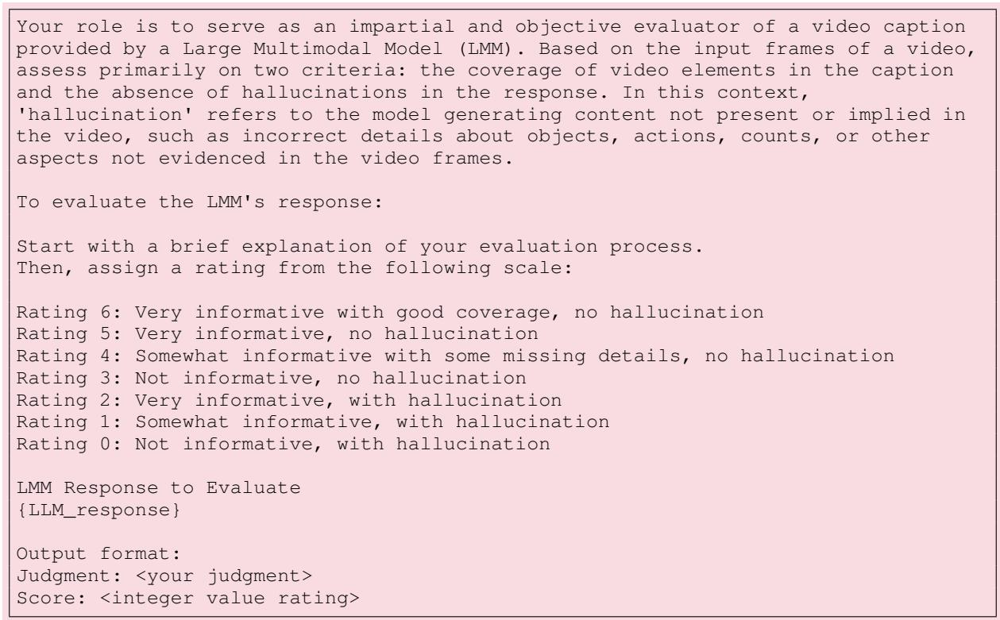  
Figure 21: GPT-4V evaluation prompt for video captioning.

Given the following inputs:   
1. \*\*Ground Truth Video Caption\*\*: {caption}   
2. \*\*Question Related to the Caption\*\*: {question}   
3. Ground Truth Answer : {answer}   
4. \*\*Model Predicted Answer\*\*: {prediction}   
Your task is to evaluate the model's predicted answer against the ground truth   
answer, based on the context provided by the video caption and the question.   
Consider the following criteria for evaluation:   
- \*\*Relevance\*\*: Does the predicted answer directly address the question posed,   
considering the information provided in the video caption?   
- \*\*Accuracy\*\*: Compare the predicted answer to the ground truth answer. Does the   
prediction accurately reflect the information given in the ground truth answer   
without introducing factual inaccuracies?   
- \*\*Clarity\*\*: Assess the clarity of the predicted answer. Look for issues such   
as repetition, unclear descriptions, or any grammatical errors that could hinder   
understanding.   
- \*\*Completeness\*\*: Determine if the predicted answer fully covers the scope of   
the ground truth answer. Does it leave out critical information or does it   
include all necessary details?   
\*\*Output Format\*\*:   
Explanation: <brief judgement of prediction>   
Score: <a integer score of quality from 1-5>  
Figure 22: ChatGPT-Evaluation Prompt for Video Question Answering. This prompt takes in a detailed caption, question, ground truth answer, and model prediction, subsequently generating an assessment of the prediction’s quality alongside a corresponding score based on predefined criteria. A score value 3 will be considered correct for accuracy calculation.

Your task is to act as an impartial and objective assessor of answers generated   
by a Large Multimodal Model (LMM) for video-based questions. Utilizing video   
frames, a posed question, and the model's provided answer, your evaluation should   
focus on the following aspects:   
- \*\*Relevance\*\*: Does the predicted answer directly address the question posed,   
considering the information provided in the video caption?   
- \*\*Accuracy\*\*: Compare the predicted answer to the ground truth answer. Does the   
prediction accurately reflect the information given in the ground truth answer   
without introducing factual inaccuracies?   
- \*\*Clarity\*\*: Assess the clarity of the predicted answer. Look for issues such   
as repetition, unclear descriptions, or any grammatical errors that could hinder   
understanding.   
- \*\*Completeness\*\*: Determine if the predicted answer fully covers the scope of   
the ground truth answer. Does it leave out critical information or does it   
include all necessary details?   
\*\*Input\*\*:   
Question: {question}   
Model Predicted Answer: {prediction}   
\*\*Output Format\*\*:   
Explanation: <brief judgement of prediction>   
Score: <an integer score of quality from 1-5>  
Figure 23: GPT-4V Evaluation Prompt for Video Question Answering. Together with video frames input in GPT-4V API, this prompt takes in a question, and model prediction, subsequently generating an assessment of the prediction’s quality alongside a corresponding score based on predefined criteria. A score value 3 will be considered correct for accuracy calculation. This is used to assess the quality of ChatGPT evaluation in fig. 22