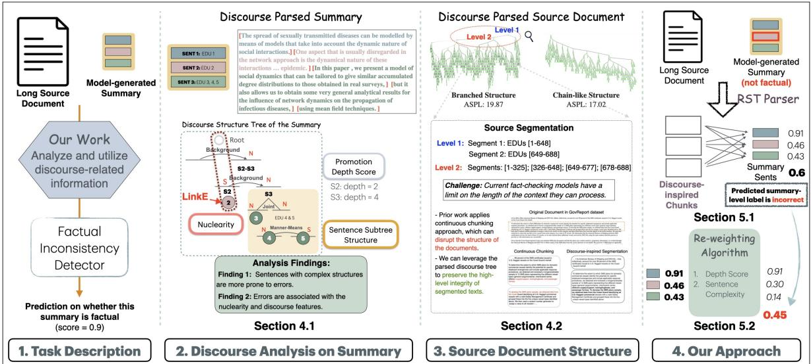
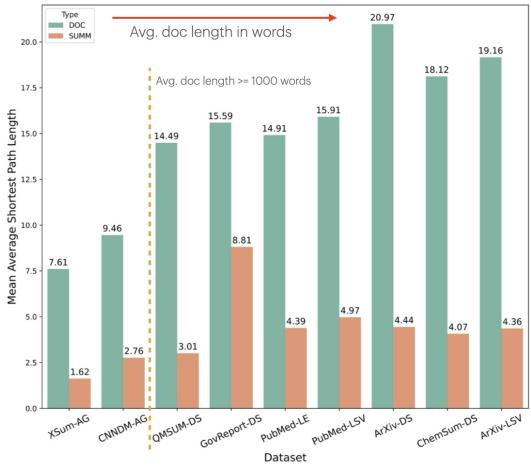
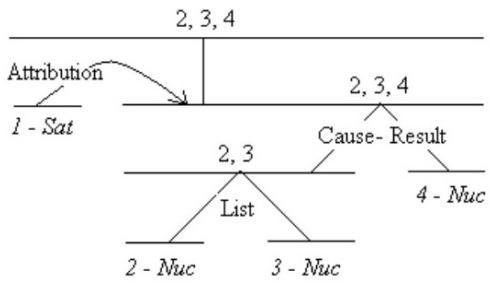
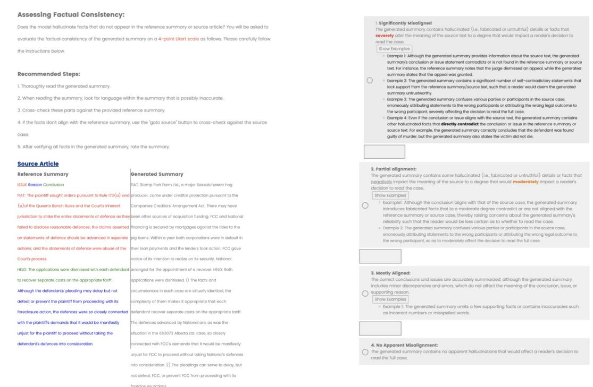
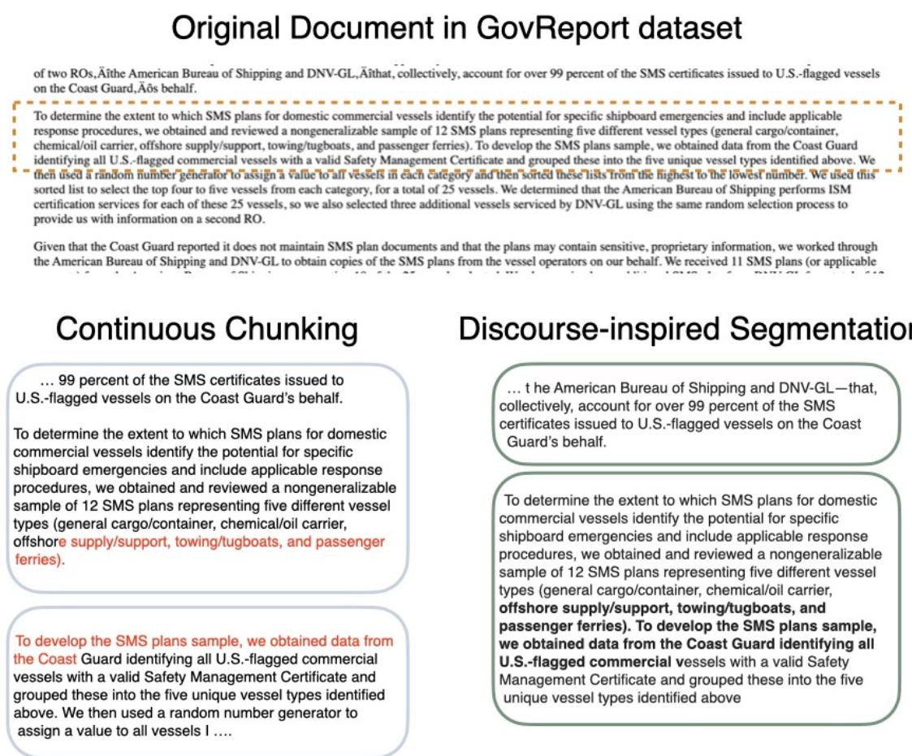
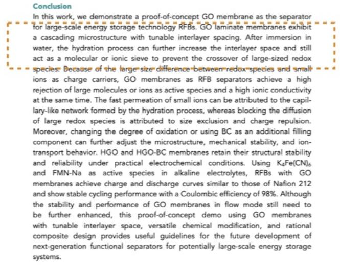
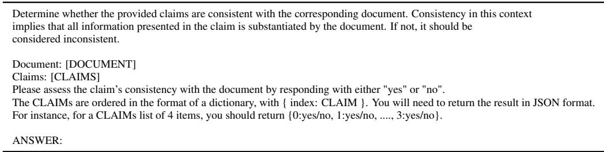

# Discourse-Driven Evaluation: Unveiling Factual Inconsistency in Long Document Summarization

Yang Zhong Department of Computer Science University of Pittsburgh yaz118@pitt.edu

## Abstract

Detecting factual inconsistency for long document summarization remains challenging, given the complex structure of the source article and long summary length. In this work, we study factual inconsistency errors and connect them with a line of discourse analysis. We find that errors are more common in complex sentences and are associated with several discourse features. We propose a framework that decomposes long texts into discourse-inspired chunks and utilizes discourse information to better aggregate sentence-level scores predicted by natural language inference models. Our approach shows improved performance on top of different model baselines over several evaluation benchmarks, covering rich domains of texts, focusing on long document summarization. This underscores the significance of incorporating discourse features in developing models for scoring summaries for long document factual inconsistency.

## 1 Introduction

Current state-of-the-art summarization systems can generate fluent summaries; however, their ability to produce factually consistent summaries that adhere to the source content or world knowledge remains questionable. This phenomenon is known as factual inconsistency, one type of “hallucination” problem (Maynez et al., 2020; Zhang et al., 2024b; Cao and Wang, 2021; Kryscinski et al., 2020; Goyal and Durrett, 2021; Cao et al., 2022). A rigorous line of research approaches this problem by developing models to detect unfaithful summary content, including utilizing pre-trained models such as natural language inference (NLI) (Kryscinski et al., 2020; Laban et al., 2022; Zha et al., 2023) and question answering (QA) (Scialom et al., 2021; Fabbri et al., 2022) models. Such approaches are tested on rich benchmark datasets, such as TRUE (Honovich et al., 2022), SUMMAC (Laban et al., 2022), and AGGREFACT (Tang et al., 2023), etc.

Diane Litman Department of Computer Science and LRDC University of Pittsburgh dlitman@pitt.edu

However, such benchmark datasets only include short documents (< 1000 words) and summaries with a few sentences. While the methods mentioned above perform well with short texts, they struggle with longer documents (Schuster et al., 2022). Recent NLI work addresses this by selecting the input and breaking down the summary. Lengthy summaries are split into individual sentences or more minor atomic claims, while small chunks of the source document are extracted as premises. This approach reduces the task to multiple short evaluations, which are then aggregated to provide a summary-level label (Zha et al., 2023; Zhang et al., 2024a; Scirè et al., 2024; Yang et al., 2024).

Out of the existing NLI-based methods, ALIGN-SCORE demonstrated superior performance on multiple benchmarks. It breaks the input document into continuous chunks of text to tackle the input restriction. However, this exhaustive approach may break the structure of the context (section and paragraph split), thus reducing the chances that the summary sentence can be correctly verified with its factual consistency. On the other hand, most factuality evaluation metrics aggregate the sentencelevel aligning scores through averaging or selecting the minimum, disregarding that sentences are not equally important (Krishna et al., 2023). For instance, people can remember the big picture more easily but struggle to retain low-level details when retelling a story. The natural questions would be: do system-generated summaries carry a similar pattern? If so, how can we utilize the text organization information to help detect the inconsistencies between the summary and the source document?

In this work, we study the factual inconsistency problem through the lens of discourse analysis. By analyzing the structure (here we use Rhetorical Structure Theory (RST) (Mann and Thompson, 1988)) of the original articles and the summaries, we uncover the importance of preserving the article structure and studying the connections between discourse structure and the factual consistency of model-generated summaries. Our analysis shows that complex sentences built by multiple elementary discourse units (EDUs, the basic units used in the discourse theory) have a higher chance of containing errors, and we also find several discourse features connected to the factual consistency of summary sentences.

Motivated by the analyses mentioned above, we propose a new evaluation method, STRUCTSCORE, based on the NLI-based approaches to better detect factual inconsistency. Our algorithm includes two steps: (1) leveraging the discourse information when aggregating the sentence-level alignment scores of the target summary and (2) decomposing the long input article into multiple discourseinspired chunks. We tested our proposed approach on multiple document summarization benchmarks, including AGGREFACT-FTSOTA split, DIVER-SUMM, LONGSCIVERIFY, LONGEVAL, and a nonscientific domain dataset LEGALSUMM with a focus on long document summarization. Our proposed approach obtained a performance gain on multiple tasks.1

To sum up, two research questions are addressed: 1. How and what discourse features are connected to the factual inconsistency evaluation? 2. Can our discourse-inspired approach improve the detection performance on long document summarization?

## 2 Related Work

Factual Inconsistency Detection in Long Document Summarization Research on automatic factual inconsistency evaluation metrics and resources for long document summarization is limited. Recently, Koh et al. (2022a) surveyed the progress of long document summarization evaluation and called for better metrics and corpora to evaluate long document summaries. Koh et al. (2022b) released annotated model-generated summaries assessing factual consistency at the sentence and summary levels for GovReport (Huang et al., 2021) and arXiv (Cohan et al., 2018). Furthermore, Bishop et al. (2024) and Zhang et al. (2024a) introduced benchmarks of LONGSCIVER-IFY and DIVERSUMM that cover diverse domains respectively, and further proposed different frameworks to utilize the context of source sentences for evaluating the factual consistency of generated summaries. However, their approaches relied on extracting context through computing similarities with the summary sentence. The summary-level score is a simple average of all sentence-level predictions. Our work analyzed a subset of DIVER-SUMM and AGGREFACT (Tang et al., 2023) that have sentence-levelfactual inconsistency types and introduced a generalizable approach to better detect such inconsistency errors across domains.

Aggregation of Sentence-level Evaluations Text summaries are usually composed of multiple sentences. Most factual inconsistency evaluation metrics first compute the sentence-level scores for individual summaries, then aggregate them by either soft aggregation in computing the unweighted-average (Zha et al., 2023; Glover et al., 2022; Scirè et al., 2024; Zhang et al., 2024a) or hard aggregation with the minimum score (Schuster et al., 2022; Yang et al., 2024). However, these approaches were primarily validated on older benchmarks, consisting of shorter texts (a few hundred input words and summaries of 2-3 sentences). There lacks a systematic study in the context of long document summarization. Our work dives into the discourse structure of system-generated summaries with span/sentence-levelfactuality annotations. We introduce a discourse-inspired reweighting algorithm to calibrate the scores.

Discourse-assisted Text Summarization Discourse factors have been known to play an important role in the summarization task (Ono et al., 1994; Marcu, 1998; Kikuchi et al., 2014; Xu et al., 2020; Hewett and Stede, 2022; Pu et al., 2023). Louis et al. (2010) conducted comprehensive experiments to examine the power of different discourse features for context selection. We carry a similar analysis but focus on summary sentences that contain factual inconsistency errors. On adjusting the weight of EDUs, Huber et al. (2021) proposed a weighted RST style discourse framework that derives the discourse units’ continuous weights from auxiliary summarization task (Xiao et al., 2021). Differently, our re-weighting algorithm is built on top of the trained parser’s parsed discourse tree and applies to the final aggregation of scores. To the best ofour knowledge, our work is thefirst that studies the connections between RST discourse structure and thefactual consistency of model-generated summaries.

<table><tr><td>Dataset</td><td>Sum.Task</td><td>Size</td><td>Doc.Word</td><td>Doc.Sent</td><td>Sum.Sent</td><td>Sum.Word</td></tr><tr><td rowspan="2">AGGREFACT-FTSOTA</td><td>XSum (Tang et al., 2023)</td><td>558</td><td>360.54</td><td>16.09</td><td>1.01</td><td>20.09</td></tr><tr><td>CNNDM (Tang et al., 2023)</td><td>559</td><td>518.85</td><td>23.31</td><td>2.72</td><td>52.21</td></tr><tr><td rowspan="5">DIVERSUMM</td><td>Multi-news (Fabbri et al., 2019)</td><td>90</td><td>669.20</td><td>27.2</td><td>6.81</td><td>152.20</td></tr><tr><td>QMSUM (Zhong et al., 2021)</td><td>90</td><td>1138.72</td><td>72.80</td><td>3.04</td><td>65.22</td></tr><tr><td>Government (Huang et al., 2021)</td><td>147</td><td>2008.16</td><td>71.35</td><td>15.1</td><td>391.22</td></tr><tr><td>ArXiv (Cohan et al., 2018)</td><td>146</td><td>4406.99</td><td>195.18</td><td>6.18</td><td>149.70</td></tr><tr><td>ChemSumm (Adams et al., 2023b)</td><td>90</td><td>4612.40</td><td>188.80</td><td>7.36</td><td>172.79</td></tr><tr><td rowspan="2">LONGSCIVERIFY</td><td>PubMed (Cohan et al., 2018)</td><td>45</td><td>3776.80</td><td>125.00</td><td>8.60</td><td>225.60</td></tr><tr><td>ArXiv (Cohan et al., 2018)</td><td>45</td><td>6236.40</td><td>282.93</td><td>7.28</td><td>210.93</td></tr><tr><td>LONGEVAL</td><td>PubMed (Krishna et al., 2023)</td><td>40</td><td>3158.35</td><td>110.00</td><td>10.38</td><td>193.55</td></tr><tr><td>LEGALSUMM</td><td>Legal Opinions (Elaraby et al., 2023)</td><td>50</td><td>2873.87</td><td>115.64</td><td>8.36</td><td>208.28</td></tr></table>

Table 1: Summary-level task statistics on AGGREFACT-FTSOTA, DIVERSUMM, LONGSCIVERIFY, LONGEVAL and LEGALSUMM. We report the number of annotated doc-summary pairs of the test split (Size), document length in the average number of words (Doc.Word) and the average number of sentences (Doc.Sent), summary length in the average number of sentences (Sum.Sent), and words (Sum.Word).

## 3 Datasets

This section describes the datasets used to explore our research questions. We begin with the discourse analysis dataset, which includes sentencelevel fine-grained labels of errors introduced in Pagnoni et al. (2021), enabling systematic analysis of the relationships between different features and their labels. We then discuss the benchmark datasets, which provide summary-level labels in either binary or continuous scores, and evaluate our approach and baselines on them.

Discourse Analysis Dataset Our discourse analysis harnessed the subsets of ARXIV and GOVRE-PORT from DIVERSUMM (Zhang et al., 2024a), which come with annotated sentence-level errors labels. Following Zhang et al. (2024a), we denote it as DIVERSUMM-SENT. It covers 293 documentsummary pairs of which 3138 summary sentences have sentence-level annotations.2

Summary-level Factuality Detection Datasets We test on the AGGREFACT-FTSOTA split (Tang et al., 2023), DIVERSUMM (Zhang et al., 2024a), LONGSCIVERIFY and LONGEVAL from Bishop et al. (2024). We additionally collect LEGAL-SUMM, a legal summarization dataset, which covers model-generated summaries from the CanLII (Canadian Legal Information Institute) dataset (Xu et al., 2021; Elaraby et al., 2023) with documentlevel factuality labels annotated by legal experts.3 Table 1 presents a careful comparison of datasets from different perspectives. We conduct analysis on the document’s structure in §4.2 using these datasets. Except for AGGREFACT, all remaining datasets are focused on long documents and summary pairs.

## 4 Discourse Analysis

Preliminaries Discourse analysis with Rhetorical Structure Theory (RST) is helpful for different downstream tasks, such as argument mining (Peldszus and Stede, 2016; Hewett et al., 2019), text simplification (Zhong et al., 2020), AI-generated text detection (Kim et al., 2024b), and summarization (Marcu, 1998; Xu et al., 2020). RST predicts tree structures on the grounds of underlying coherence relations that are primarily defined in speaker intentions (Mann and Thompson, 1988). The discourse tree comprises lower-level Elementary Discourse Units (EDUs), each corresponding to a phrase within a sentence. These units are then integrated into more complex structures, such as sentences and paragraphs, to form the full discourse tree. Discourse labels (i.e., elaboration, contrast, condition, etc.) are assigned as the relation between nodes. Additionally, a nuclearity attribute is assigned to every node of the discourse tree, aiming to encode the relative importance between the pairs of sub-trees (nucleus roughly implying primary importance and a satellite means supplemental).

We first parse the summaries from the datasets as mentioned earlier in Section 3 with an opensourced DMRST model (Liu et al., 2021), following similar work which utilizes the same model for discourse parsing (Adams et al., 2023a; Pu et al., 2023; Kim et al., 2024b). In the following paragraphs, we propose and verify multiple hypotheses that inspired our discourse-structure-aware factual inconsistency detection approach. Figure 1 summarizes our findings in §4.1 and §4.2.

  
Figure 1: Our proposed approach to faithfulness inconsistency detection utilizes findings from discourse analysis. We first conduct discourse analysis on parsed summary sentences (§4.1) and exploit the source document’s discourse structure (§4.2). Motivated by the findings, our proposed approach is introduced in §5.2 and §5.1.

<table><tr><td rowspan="2">Error</td><td colspan="3">Discourse Subtree Depth</td></tr><tr><td>-1 (split link)</td><td>0 (1 edu)</td><td>&gt;= 1 shallow/deep trees</td></tr><tr><td>GramE 1</td><td>6% 1</td><td>28% 1</td><td>66%</td></tr><tr><td>LinkE 1</td><td>14% 1</td><td>23% 1</td><td>63%</td></tr><tr><td>OutE 1</td><td>15% 一</td><td>13% 1</td><td>72%</td></tr><tr><td>EntE 1</td><td>11%</td><td>1 10% 1</td><td>79%</td></tr><tr><td>PreE</td><td>20%</td><td>一 13% 1</td><td>67%</td></tr><tr><td>CorefE 1</td><td>11%</td><td>一 0% I</td><td>89%</td></tr><tr><td>CircE 1</td><td>8%</td><td>一 8% 1</td><td>84%</td></tr><tr><td>NoE</td><td>8%</td><td>1 23% 1</td><td>69%</td></tr></table>

Table 2: The distribution depths of discourse subtrees of a sentence that are not factually consistent (depth of sub-tree) in DIVERSUMM-SENT. “-1” means the original sentence belongs to two sub-trees. Appendix C includes details of error types.

## 4.1 Discourse Analysis on Summary Errors

Finding 1: Errors are located in sentences with dense discourse tree (more EDUs) RST can capture the salience of a sentence with respect to its role in the larger context. Prior work finds that the salience of a unit or sentence does not strictly follow the linear order of appearance in the document but is more indicative through its depth in the tree (Zhong et al., 2020). We consider the depth of the current sentence in the RST tree of the document (viewing each sentence as a discourse unit). We also noted that, at times, the original summaries’ sentences are broken into parts and span two discourse subtrees (i.e., a sentence covers EDUs 24-28, while the parsing tree’s subtrees are “22-25”’, “26-28”). In this case, we approximate the depth of the sentence by computing the square root of the absolute distance of min and max EDUs, i.e., in the above case, the depth is computed as ${ \sqrt { ( 2 8 - 2 4 ) } } = 2 . ^ { \circ }$

We additionally studied the distribution of the tree structure of sentences with errors. The hypothesis is that several errors will likely appear in sentences with complex structures (more EDU units and dense trees). As shown in Table 2, sentences containing factual inconsistency errors are generally more complicated and cover multiple discourse units. It is worth noting that the case of “-1” means the sentence is deeply intervened with its neighboring sentences, and the discourse parser fails to segment it independently. One example is illustrated in the summary of Figure 1, where Sentence 3 (S3) contains three EDU segments, making it more complex than the other two sentences.

Finding 2: Errors are associated with the nuclearity and related discourse features We further analyze the distribution of nuclearity and different discourse features of sentences containing errors from the DIVERSUMM-SENT dataset. We observe that a greater number serve as satellites within the discourse relation (62%) for sentences comprising a single Elementary Discourse Unit (EDU).

We calculated several discourse feature scores:

<table><tr><td rowspan=1 colspan=1>RST features</td><td rowspan=1 colspan=1>t-stat</td><td rowspan=1 colspan=1>p-value</td></tr><tr><td rowspan=1 colspan=1>Ono penalty (Ono et al., 1994)Depth score (Marcu, 1998)Promotion score (Marcu, 1998)</td><td rowspan=1 colspan=1>1.606-9.084-0.828</td><td rowspan=1 colspan=1>0.10890.00000.4083</td></tr><tr><td rowspan=1 colspan=1>Normalized Ono penaltyNormalized depth scoreNormalized promotion score</td><td rowspan=1 colspan=1>2.160-8.919-0.303</td><td rowspan=1 colspan=1>0.03140.00000.7617</td></tr></table>

Table 3: Two-sided t-test of significant RST-based features comparing sentences with factual inconsistency errors to consistent ones in DIVERSUMM-SENT. We report the test statistics and significance levels. The original and normalized depth scores and the normalized penalty scores are significant (p-value <= 0.05). Fine-grained per error-type results are in Table 7 of Appendix C.

the penalty score (Ono penalty) as defined in Ono et al. (1994), the maximum depth score (Depth score) (Marcu, 1998), and the promotion score (Marcu, 1998).5 The penalty score accounts for the number of satellite nodes found on the path from the tree’s root to that EDU. The depth score is determined by the proximity of an EDU’s highest promotion to the tree’s root. The highest promotion refers to the closest node to the root, including the EDU within its promotion set. The promotion score quantifies the salience of an EDU based on how many levels it has been promoted through within the tree structure. We compute both unnormalized and normalized versions (with the max tree depth) for the above three scores. As shown in Table 3, we find significant differences in the distributions of depth score. We normalize the Ono penalty and depth score between factually consistent and inconsistent sentences and will include them in our proposed approach.

## 4.2 Document Structure

We further analyze the structure of parsed discourse trees for both documents and summaries of different datasets. We assume that the linguistic structure of discourse can change depending on factors such as the writing style, domain, and depth of reasoning of texts. To check whether the structures are evenly branched or follow a more sequential pattern, we measure a document graph’s average shortest path length (Kim et al., 2024b). The intuition is that linear or chain-like graphs tend to have shorter average shortest path lengths (ASPL), reflecting the linear pattern. Meanwhile, branched structures would have a longer ASPL, given the spread nature of nodes. As shown in Fig 2, for long document datasets (the last seven datasets), the source documents’ ASPL is longer than the news articles such as CNN/DM and XSUM.6 In the meantime, longer summaries also carry evenly branched complex structures compared to short news summaries. While mainstream research segments long source texts into continuous chunks with limited window size, we argue that this disrupts the original structure of texts, leading to information loss.7 We propose utilizing the tree structure and constructing the segments based on level traversals to preserve the high-level segmentation.

  
Figure 2: Average shortest path length per dataset for document and summary discourse trees. We sort the dataset by the average length of the document, finding that longer document-summary (DOC, SUMM) pairs would be more branched, and their summaries are also complicated. AG, DS, LSV, and LE refer to AG-GREFACT FTSOTA, DIVERSUMM, LONGSCIVER-IFY and LONGEVAL respectively.

## 5 StructScore

In this section, we describe the STRUCTSCORE framework. The lower right part of Figure 1 presents motivations for each module.

## 5.1 Tree-structure Inspired Weighting Algorithm

Prior work (Zha et al., 2023; Scirè et al., 2024) computes the aggregated summary-level prediction on factual consistency score by picking the minimum sentence-level score or selecting the average.

However, as indicated in Section 4.1, EDUs with different discourse relations and structures can be weighted differently. We thus propose to re-weigh the sentences based on the features of the discourse.

First, we examine the sentence’s nuclearity and the associated discourse features within the discourse tree. As found in Table 3, the normalized depth score, which utilizes the given node’s nuclearity and the tree structure, is significantly different given the existence of factual inconsistency errors (p-value < 0.00001), where inconsistent sentences have a lower normalized depth score (Finding 2 in $\ S 4 . 1 ) . ^ { 8 }$ Based on this finding, we decided to increase the weight of the alignment score for sentences with lower depth scores within their parsed tree. Since NLI methods generate scores within a 0-1 range, we apply an exponent to appropriately scale these scores. Let $x _ { i }$ be the computed normalized depth score of a summary sentence, $s _ { i }$ the original computed aligning score, and $\overline { { x } } _ { 1 : j }$ the mean of all depth scores from $x _ { 1 }$ to $x _ { j }$ in the summary with length j. The function to re-weight the aligning score $f ( s _ { i } )$ can be defined as follows:

$$
f ( s _ { i } ) = s _ { i } ^ { 1 + \left( { \overline { { x } } } _ { 1 : j } - x _ { i } \right) }
$$

Secondly, observing that sentences that contain connective EDUs or have complicated discourse structures with more EDUs are more likely to contain errors (Finding 1 in §4.1), we propose scaling the score by selecting an appropriate exponent, given that the original score falls within the range of 0 to 1. We apply a tuning factor α on the discourse sub-tree height for the summary sentence sen $\mathrm { , } t _ { i } \mathrm { : }$

$$
s _ { i } ^ { * } = f ( s _ { i } ) ^ { 1 + ( h e i g h t - s u b t r e e ( s e n t _ { i } ) * \alpha ) }
$$

We conduct ablation studies on these two components in $\ S 7 .$ . We search for the best parameters on a held-out dev set of DIVERSUMM and keep the same across other datasets.

## 5.2 Source Document Segmentation

We parse the original article with the RST parser and break the long documents into linear segments. This approach differs from prior work, which either applies a fixed window or selects a few context sentences surrounding a given source sentence. Motivated by findings from §4.2, we follow the below approach: (1) If the parser fails, we will use the document structure (paragraph/sentence hierarchies) to group by the neighboring sentences. We then follow the naive chunking approach in ALIGN-SCORE (window size 350) to prepare the input. (2) If the parsing is successful, we will extract the segmentation from the discourse tree up to level N. For instance, in the top-right of Figure 1, an original article has EDU segments (1-688), and the root of the RST tree is split into 1-648 and 649-688; we will adopt this segmentation. We apply the chunking approach outlined previously for segments that exceed the ALIGNSCORE model’s context capacity. On the second level, we break (1-648) into (1-325) and (326-648), while the remainder are also broken into smaller chunks. Since the RST parser could break long sentences into multiple EDUs, we have additional post-processing to map the EDUs back to the source sentences.

## 6 Experimental Details

We adapt mainstream evaluation setups for each benchmark. For DIVERSUMM, we apply an 80/20 test/dev split by stratifying the labels for each subtask. For AGGREFACT, we use their released val/test split. For LONGSCIVERIFY, LONGEVAL and LEGALSUMM, we use them as test sets.

Baselines One of our baselines is ALIGNSCORE (Zha et al., 2023), an NLI-based metric that computes the aggregated inference score between a source article and generated summaries. We included INFUSE (Zhang et al., 2024a), which sets the SOTA on DIVERSUMM, MINICHECK FT5 (MiniCheck-FlanT5 checkpoints) (Tang et al., 2024) that is a best-performing non-LLM factchecker over multiple benchmarks, and LONG-DOCFACTSCORE (Bishop et al., 2024) which claimed to work well on factuality validation of lengthy scientific article summaries. Our experiment notes that MINICHECK did not work well over long summaries due to its design objectives of short-statement fact-checking. We thus introduce MC-FT5 (SENT), which computes the individual summary sentences’ scores using MINICHECK and reports their average as the final summary score. We additionally include the GPT4o (OpenAI et al., 2024) as the LLM fact-checker, using a prompt adopted from Tang et al. (2024) (see Table 8 in Appendix E). Lastly, we include Llama-3.1-BeSpoke-

<table><tr><td rowspan="2"></td><td rowspan="2">ID Evaluation Model</td><td colspan="2">AGGREFACT</td><td colspan="6">DIVERSUMM</td><td colspan="2">LSV</td><td></td><td>LONGEVAL | LEGALS</td></tr><tr><td>XSMAG CNDAG AUC</td><td></td><td>MNW QMS</td><td>GOV</td><td>AXV AUC</td><td></td><td>CSM AVG</td><td>Macro-</td><td>PUB Kendal&#x27;s τ</td><td>AXV</td><td>PUB Kendal&#x27;s τ</td><td>AUC</td></tr><tr><td colspan="2">avg src. len</td><td>360.54</td><td>518.85</td><td>669.20</td><td>1138.72</td><td>2008.16</td><td>4406.99</td><td>4612.40</td><td></td><td></td><td>3776.80 6236.40 </td><td>3158.35</td><td>2873.87</td></tr><tr><td>Baselines</td><td></td><td></td><td></td><td></td><td></td><td></td><td></td><td></td><td></td><td></td><td></td><td></td><td></td></tr><tr><td>1</td><td>LONGDOCFACTSCORE</td><td>50.47</td><td>65.27</td><td>61.20</td><td>40.69</td><td>83.52</td><td>65.36</td><td>60.06</td><td>62.17</td><td>61.0</td><td>61.0</td><td>29.0</td><td>60.19</td></tr><tr><td>2</td><td>MINICHECK-FT5</td><td>75.04</td><td>72.62</td><td>48.68</td><td>45.31</td><td>70.26</td><td>61.77</td><td>52.93</td><td>55.79</td><td>26.5</td><td>38.1</td><td>17.4</td><td>61.33</td></tr><tr><td>3 4</td><td>GPT40</td><td>75.36 83.56</td><td>70.47</td><td>51.11</td><td>70.22</td><td>86.81</td><td>67.78</td><td>61.53</td><td>67.49</td><td>54.7</td><td>51.8</td><td>51.2</td><td>67.71</td></tr><tr><td></td><td>BeSpoke-MC-7B</td><td></td><td>71.38</td><td>55.38</td><td>65.42</td><td>82.83</td><td>75.07</td><td>63.43</td><td>68.42</td><td>55.1</td><td>57.9</td><td>58.1</td><td>55.81</td></tr><tr><td colspan="10">Apply our approach with different baselines(↑ means improved the performance compared to the baseline with significance.)</td><td></td><td></td><td></td><td></td></tr><tr><td>5</td><td>ALIGNSCORE</td><td>75.66</td><td>69.50</td><td>46.74</td><td>56.48</td><td>87.02</td><td>77.46</td><td>61.03 65.75</td><td>|54.9</td><td></td><td>53.9</td><td>36.9</td><td>73.52</td></tr><tr><td>6</td><td>+ re-weighting</td><td>75.67</td><td>69.20</td><td>45.33</td><td>53.95</td><td>87.29↑</td><td>81.15↑</td><td>60.55</td><td>65.65</td><td>53.0</td><td>54.3↑</td><td>34.8</td><td>76.57↑</td></tr><tr><td>7</td><td>+ Lv1 SEGMENT</td><td>76.23↑</td><td>69.25†</td><td>45.86†</td><td>61.25↑</td><td>86.74†</td><td>79.47↑</td><td>64.15↑</td><td>67.49↑</td><td>51.9</td><td>52.8</td><td>43.6↑</td><td>59.43</td></tr><tr><td>8</td><td>STRUCTS-LV1</td><td>76.20↑</td><td>69.03</td><td>46.21†</td><td>60.06↑</td><td>86.04</td><td>82.78↑</td><td>64.47↑</td><td>67.91↑</td><td>50.4</td><td>53.9†</td><td>43.4↑</td><td>59.81</td></tr><tr><td>9</td><td>+ Lv2 SEGMENT</td><td>74.27</td><td>70.30↑</td><td>46.03†</td><td>55.74</td><td>85.10</td><td>76.79</td><td>63.11↑</td><td>65.35</td><td>58.1↑</td><td>51.1</td><td>43.9↑</td><td>67.05</td></tr><tr><td>10</td><td>STRUCTS-LV2</td><td>74.28</td><td>69.85↑</td><td>45.33</td><td>51.86</td><td>85.65</td><td>80.00↑</td><td>63.59↑</td><td>65.29</td><td>55.3↑</td><td>54.1↑</td><td>43.7↑</td><td>64.00</td></tr><tr><td>11</td><td>MC-FT5 (SENT)</td><td>79.62</td><td>70.95</td><td>57.67</td><td>60.66</td><td>83.24</td><td>78.66</td><td>59.74</td><td>67.99</td><td>|55.7</td><td>52.7</td><td>30.2</td><td>61.14</td></tr><tr><td>12</td><td>+ re-weighting</td><td>79.73</td><td>70.76†</td><td>56.79</td><td>60.36†</td><td>84.75↑</td><td>79.38↑</td><td>60.06↑</td><td>68.27↑</td><td>52.8</td><td>55.1↑</td><td>31.4↑</td><td>59.81</td></tr><tr><td>13</td><td>+ Lv1 SEGMENT</td><td>77.84</td><td>73.48↑</td><td>44.80</td><td>61.10↑</td><td>87.50↑</td><td>85.22↑</td><td>63.59↑</td><td>68.44↑</td><td>57.5↑</td><td>51.4</td><td>33.0↑</td><td>68.95↑</td></tr><tr><td>14</td><td>STRUCTS-LV1</td><td>76.75</td><td>73.40↑</td><td>38.45</td><td>60.66†</td><td>88.05↑</td><td>86.32↑</td><td>63.11↑</td><td>67.31</td><td>56.2↑</td><td>53.8↑</td><td>30.7↑</td><td>72.57↑</td></tr><tr><td>15</td><td>+ Lv2 SEGMENT</td><td>73.70</td><td>72.30↑</td><td>47.80</td><td>57.53</td><td>86.26↑</td><td>83.73↑</td><td>62.07↑</td><td>67.48</td><td>56.0↑</td><td>52.9↑</td><td>35.6↑</td><td>72.57↑</td></tr><tr><td>16</td><td>STRUCTS-LV2</td><td>71.31</td><td>72.30↑</td><td>41.27</td><td>59.02</td><td>87.16↑</td><td>84.78↑</td><td>61.75↑</td><td>66.80</td><td>53.4</td><td>54.2↑</td><td>33.0↑</td><td>73.71↑</td></tr><tr><td>17</td><td>INFUSE</td><td>68.48</td><td>72.52</td><td>54.14</td><td>39.64</td><td>84.41</td><td>68.13</td><td>57.82</td><td>60.83</td><td>59.4</td><td>55.9</td><td>36.9</td><td>63.43</td></tr><tr><td>18</td><td>+ re-weighting</td><td>67.30</td><td>72.37</td><td>53.44</td><td>40.54↑</td><td>84.68↑</td><td>74.31↑</td><td>59.82↑</td><td>62.56↑</td><td>58.3</td><td>56.3↑</td><td>34.6</td><td>66.29↑</td></tr></table>

Table 4: Results for all summarization tasks in AGGREFACT-FTSOTA (AGGREFACT), DIVERSUMM, LONGSCIVERIFY (LSV), LONGEVAL and LEGALSUMM (LegalS). In DIVERSUMM, CSM, MNW, QMS, AXV, and GOV refer to ChemSum, MultiNews, QMSUM, ArXiv, and GovReport. We also report the macro-average of DIVERSUMM AUC. We highlight the best performed approach where multiple greens indicate systems indistinguishable from the best according to a paired bootstrap test with p-value < 0.05, and the second-best system for each column. The seven baseline models are bolded. Cells with † mean the result is indistinguishable from the raw baseline according to the bootstrap test. We report the average of 3 runs for GPT4o, given the randomness in LLM inference.

MiniCheck-7B (BeSpoke-MC-7B)9, the SOTA fact-checking model on the LLM-AggreFact benchmark (Tang et al., 2024). Unless otherwise noted, we reran the baseline models on our datasets using the original authors’ released code and checkpoints. Implementation details are provided in Appendix E.

Our Approach We re-utilized baseline models to compute the scores between context chunks and summary sentences, including ALIGNSCORE (Zha et al., 2023), MINICHECK-FT5 (SENT) and IN-FUSE (Zhang et al., 2024a), and experimented with below settings to apply our proposed approaches:

• + re-weighting: we apply the discourseinspired re-weighting algorithm to adjust the sentence-level scores. We tune the factor α on height-subtree weighting as 1 over the validation set of DIVERSUMM and apply it to other benchmark datasets.

• + LvN SEGMENT: Instead of using the default chunking approach, we segmented the source documents with the algorithms introduced in Sec. 5.2 with different levels of granularity.

• STRUCTS-LvN: Combining top two methods.

The reweighting and segmentation can not be applied to LONGDOCFACTSCORE, as it produced negative scores on all enumeration of source-target sentence pairs, which does not utilize the structural information. INFUSE utilizes the ranked list of entailment scores for all document sentences associated with each summary sentence. Thus, the segmentation approach does not affect.

Evaluation Metrics For experiments with AGGREFACT-FTSOTA, DIVERSUMM and LEGALSUMM, following Laban et al. (2022); Zhang et al. (2024a), we adopt ROCAUC which measures classification performance with varied thresholds as our evaluation metric. On LONGSCIVERIFY and LONGEVAL, we report Kendall’s Tau τ , following Bishop et al. (2024).

## 7 Results

Overall Performance Table 4 presents our main results with detailed setups. Overall, our proposed approach (with different combinations of re-weighting and segmentation settings) achieves the best or second best across AGGREFACT, most of DIVERSUMM and LEGALSUMM (LEGALS). Compared to top-performed LLM-based models (rows 3,4), our approach outperforms in 7 out of 11 datasets, with significant improvements on GOV, AXV, CSM, and LEGALSUMM.10 The rest of the section addresses the following research questions: RQ1: Can the re-weighting algorithm help improve the models’ performance? RQ2: How does source document segmentation impact factual inconsistency detection? RQ3: How does combining both in STRUCTSCORE perform?

RQ1. We observe that the re-weighting algorithm improves prediction performance on different baselines (rows 5-6, 11-12, 17-18). For long source documents, the re-weighting approach consistently improves or closely matches GOV, AXV, CSM splits in DIVERSUMM and the AXV split in LONGSCIVERIFY (LSV-AXV) and LEGALS performance. Noticeably, ALIGNSCORE with reweighting scored the best on LegalS. On the other hand, for both XSM and CND in AGGREFACT-FTSOTA, the re-weighting algorithm does not help much. We posit that the short summary length (1-3 sentences) has minimally structured information, so the scores will not change much. For MNW and QMS, the short summaries in QMS (averaging 3 sentences) reduce the effectiveness of the re-weighting algorithm. Moreover, MNW’s non-factual sentences often receive high prediction scores, which our re-weighting approach tends to amplify, leading to a drop in performance. We also observe a slight performance drop on LSV-PUB and LONGEVAL-PUB for ALIGNSCORE and IN-FUSE, potentially due to the different document structure of scientific articles from the medical domain. These observations also suggest potential future work for a dynamic weighting algorithm based on the document structure and domain knowledge. In Table 5, we ablate the two discourse factors from the re-weighting algorithm with our best baseline MC-FT5 (SENT) on a subset of long datasets, noticing both features are helpful, and the improvement in adding subtree height is greater.11

10More discussions on strong baselines in Appendix F.1.   
11We include a more complete table in Appendix F.2.

<table><tr><td>Model</td><td>GOV</td><td>AXV</td><td>CSM</td><td>LSV-AXV</td></tr><tr><td>MC-FT5 (SENT)</td><td>83.24</td><td>78.66</td><td>59.74</td><td>52.73</td></tr><tr><td>+ subtree height</td><td>84.55</td><td>79.09</td><td>60.55</td><td>55.08</td></tr><tr><td>+ depth score</td><td>83.65</td><td>78.90</td><td>59.90</td><td>53.80</td></tr><tr><td>re-weighting</td><td>84.75</td><td>79.38</td><td>60.06</td><td>55.08</td></tr></table>

Table 5: Ablation results on a subset of datasets from DIVERSUMM and LONGSCIVERIFY, the top and bottom rows are rows 11 and 12 in Table 4.

RQ2. Applying document and discoursestructure-inspired approaches enhances performance across different baselines on long document summarization tasks. We start by applying the level-1 and level-2 segmentation to preserve the document structures while segmenting at higher levels. For example, MC-FT5 (SENT) with LV1 SEGMENT (row 13) obtains the highest macro-average AUC on DIVERSUMM, a trend also observed with ALIGNSCORE. Specifically, comparing row 11 and row 13, the Lv1 SEGMENT improved the model’s performance on 7 of 8 long datasets from QMS to LEGALS (i.e. 78.66 -> 85.22 and 83.24 -> 87.50 on AXV and GOV). However, the effect of fine-grained segmentation can vary depending on the document’s length and structure. For instance, ALIGNSCORE in row 9 with Lv2 segment obtained better performance than Lv1 on LSV-PUB but was worse on QMS.

RQ3. Combining both approaches is not universally beneficial across all scenarios. When both individual approaches contribute positively, the combined STRUCTS generally achieves better performance, as seen in row 8 on AXV, CSM, and row 14 on AXV. However, when one component causes a performance drop, combining both often leads to weaker overall performance than the stronger component alone. For instance, on GOV, row 8 performs worse than row 5, likely due to the segmentation in row 7, making the model less accurate. Similarly, row 14 performs slightly better than row 11 on LSV-PUB, but row 13’s improvement does not translate into better performance gains when combined with row 12. Differences in evaluation metrics (AUC vs. correlation) and dataset sizes may also have influenced these outcomes (i.e., row 14 does not improve much on LONGEVAL-PUB while rows 12 and 13 have larger gains).

## 8 Conclusion

In this work, we approach the factual inconsistency detection of long document summarization through the lens of discourse analysis. We find that discourse factors, with regard to sentence structure, are related to the factual consistency of sentences. We further propose a framework that leverages the source document structure and introduces re-weighting the sentence-level predictions on top of different NLI-based models, achieving performance gains across multiple long-document summarization evaluation datasets, including scientific articles and legal documents.

## Acknowledgment

This work is supported by the National Science Foundation under Grant No. 2040490, by Amazon, and by the University of Pittsburgh Center for Research Computing through the resources provided. Specifically, this work used the HTC cluster, which is supported by NIH award number S10OD028483. We want to thank the members of the Pitt PETAL group, Pitt NLP group, Pitt AI Fairness and Law group, and anonymous reviewers for their valuable comments in improving this work. We also thank Kevin D. Ashley and Morgan A. Gray for their help with data annotation.

## Limitations

Our work contributes to the understanding of factual inconsistency errors in machine-generated summaries from the lens of discourse analysis. Here, we discuss several limitations.

Benefits of Discourse-driven Information Our current approach leaves discourse-relation information (i.e., the relation types such as Explanation, Elaboration, etc.) unused on the system level; it would be interesting to utilize it to detect and resolve inconsistency errors. We also acknowledge the choices of our current re-weighting algorithm (exponential) can be further studied with more motivation. We selected the current configuration that performed best on the validation splits of DIVER-SUMM, aligning well with linguistic analysis principles. We plan to extend the modeling into a more complex version, such as applying a graph neural network to the tree structure and including discourse relations for future work.

While large models like GPT-4 and future architectures may improve long-context understanding, recent research shows that LLMs still face challenges with hallucination detection and effectively utilizing extended contexts (Liu et al., 2024a;

Zhu et al., 2024; Luo et al., 2024). Our contribution, which links linguistic cues to hallucination detection, remains crucial, especially for summarization tasks. We acknowledge that future LLMs with expanded context windows may no longer require input pre-processing. However, we argue that discourse-based segmentation will still offer critical benefits (explicitly or implicitly by injecting the discourse analysis into the LLM through prompting or further finetuning). It will enhance the precision of factuality detection and evaluation by leveraging linguistic structures. Additionally, discourse information can provide interpretability to the model, which allows us to trace its evaluations to identifiable linguistic relations and features, which are still lacking in LLMs. In fact, our experimental results with BeSpoke-MC-7B, the SOTA fact-checking model, support the assumption that LLM alone still struggles with the factuality evaluation of long summaries.

Computation Cost Our approach’s only additional computation cost is running the discourse parser on the source document and the target summary. The DMRST parser (Liu et al., 2021) can be run on both CPU and GPU, and the inference speed is fast (the full test set of DIVERSUMM can be processed in a few minutes). Once the discourse features are computed, the time spent by segmentation and reweighting algorithms remains static, introducing minimal overhead compared to the baselines.

Discourse-driven Analysis on Factual Errors In our analysis section, discourse analyses were carried out using the annotated portion of the released dataset, which is limited by the annotation quality and the dataset sizes. Yet, this is by far the only dataset that provides the sentence-level annotations on long document summarizations (i.e., Krishna et al. (2023) released the fine-grained scores, but did not clarify how the spans annotations are collected in their document). We verify the effectiveness of portions of our linguistic-inspired method on other benchmarks, including LONGSCIVERIFY and LONGEVAL. Future work would be to analyze and examine the discourse patterns in other domains, such as story summarization or further booklength summarization tasks (Chang et al., 2024; Kim et al., 2024a).

Generalize across Text Domains We tried to cover most of the recent publicly available factuality evaluation datasets for long document summarization, including DIVERSUMM, LONGSCIVER-IFY, and LONGEVAL. While most existing datasets consist of annotations collected from scientific article summaries, we introduce a novel annotated dataset, LEGALSUMM, in the legal domain to evaluate the robustness of our proposed approaches. This dataset is curated with careful annotation procedures to ensure quality (see Appendix B). Our experimental results, as shown in the last column of Table 4, demonstrate that our proposed approaches not only enhance the performances of baseline models but also surpass those strong LLM-based models by a large margin.

## Dependence on Discourse Parser Performance

Our experiments’ validity and subsequent findings rely on the parsed discourse trees generated by a Rhetorical Structure Theory (RST) parser (Liu et al., 2021), following prior work (Adams et al., 2023a; Pu et al., 2023; Kim et al., 2024b). It is important to note that parsed results may be suboptimal given the challenges of complex hierarchical structures of long documents and the differences between the model’s training corpora and our tested domains. We acknowledge that RST parsers are gradually evolving and posit that better RST parsing results can further boost the model’s performance. However, major obstacles to their broader adoption are the lack of publicly available models and user-friendly user guidance. Researchers recently incorporated LLMs in discourse parsing and obtained better benchmarking performance in RST (Maekawa et al., 2024). Unfortunately, no available inference code exists to parse documents beyond pre-compiled benchmark datasets. We look forward to utilizing more robust parsers in future work.

On long source documents, we notice that the parser failed on the MNW split of the DiverSumm, given their input is a concatenation of multiple individual news articles. We opt for first splitting the original document into articles and then successfully parsing them individually. Regarding paragraph-level discourse parsing, we are concerned that it may disrupt the discourse continuity at the document level (i.e., where the beginning of one paragraph is connected to the previous paragraph). Therefore, we leave this exploration for future studies. However, this approach might be viable and beneficial for summarizing extremely long documents, such as books, where the explicit division into chapters and sections could enhance the process.

Applications of Document Structures to Other Tasks Document structures can and have been utilized in different tasks, including coherence analysis (Liu et al., 2024b), machine translation evaluation (Joty et al., 2017), sentiment analysis (Kraus and Feuerriegel, 2019), machine-generated text detection (Kim et al., 2024b), etc. While applying document structure and discourse analysis to hallucination detection is still an emerging area of research, we are keen to explore it further. We are also interested in extending this approach to other input sources, such as dialogue, by investigating the corresponding discourse structures unique to conversational data.

## Ethical Statement

Throughout the paper, we have referenced datasets and models used in our analyses and experiments, ensuring that they are openly available and do not pose concerns with the public release or usage of this paper. We acknowledge the use of Grammarly and ChatGPT-4o for correcting sentences that are less fluent but not for generating or drafting new content.

## References

Griffin Adams, Alex Fabbri, Faisal Ladhak, Noémie Elhadad, and Kathleen McKeown. 2023a. Generating EDU extracts for plan-guided summary re-ranking. In Proceedings of the 61st Annual Meeting of the Association for Computational Linguistics (Volume 1: Long Papers), pages 2680–2697, Toronto, Canada. Association for Computational Linguistics.

Griffin Adams, Bichlien Nguyen, Jake Smith, Yingce Xia, Shufang Xie, Anna Ostropolets, Budhaditya Deb, Yuan-Jyue Chen, Tristan Naumann, and Noémie Elhadad. 2023b. What are the desired characteristics of calibration sets? identifying correlates on long form scientific summarization. In Proceedings of the 61st Annual Meeting of the Association for Computational Linguistics (Volume 1: Long Papers), pages 10520–10542, Toronto, Canada. Association for Computational Linguistics.

Iz Beltagy, Matthew E Peters, and Arman Cohan. 2020. Longformer: The long-document transformer. arXiv preprint arXiv:2004.05150.

Jennifer A. Bishop, Sophia Ananiadou, and Qianqian Xie. 2024. LongDocFACTScore: Evaluating the factuality of long document abstractive summarisation. In Proceedings ofthe 2024 Joint International

Conference on Computational Linguistics, Language Resources and Evaluation (LREC-COLING 2024), pages 10777–10789, Torino, Italia. ELRA and ICCL.

Zheng Cai, Maosong Cao, Haojiong Chen, Kai Chen, Keyu Chen, Xin Chen, Xun Chen, Zehui Chen, Zhi Chen, Pei Chu, Xiaoyi Dong, Haodong Duan, Qi Fan, Zhaoye Fei, Yang Gao, Jiaye Ge, Chenya Gu, Yuzhe Gu, Tao Gui, Aijia Guo, Qipeng Guo, Conghui He, Yingfan Hu, Ting Huang, Tao Jiang, Penglong Jiao, Zhenjiang Jin, Zhikai Lei, Jiaxing Li, Jingwen Li, Linyang Li, Shuaibin Li, Wei Li, Yining Li, Hongwei Liu, Jiangning Liu, Jiawei Hong, Kaiwen Liu, Kuikun Liu, Xiaoran Liu, Chengqi Lv, Haijun Lv, Kai Lv, Li Ma, Runyuan Ma, Zerun Ma, Wenchang Ning, Linke Ouyang, Jiantao Qiu, Yuan Qu, Fukai Shang, Yunfan Shao, Demin Song, Zifan Song, Zhihao Sui, Peng Sun, Yu Sun, Huanze Tang, Bin Wang, Guoteng Wang, Jiaqi Wang, Jiayu Wang, Rui Wang, Yudong Wang, Ziyi Wang, Xingjian Wei, Qizhen Weng, Fan Wu, Yingtong Xiong, Chao Xu, Ruiliang Xu, Hang Yan, Yirong Yan, Xiaogui Yang, Haochen Ye, Huaiyuan Ying, Jia Yu, Jing Yu, Yuhang Zang, Chuyu Zhang, Li Zhang, Pan Zhang, Peng Zhang, Ruijie Zhang, Shuo Zhang, Songyang Zhang, Wenjian Zhang, Wenwei Zhang, Xingcheng Zhang, Xinyue Zhang, Hui Zhao, Qian Zhao, Xiaomeng Zhao, Fengzhe Zhou, Zaida Zhou, Jingming Zhuo, Yicheng Zou, Xipeng Qiu, Yu Qiao, and Dahua Lin. 2024. Internlm2 technical report.

Meng Cao, Yue Dong, and Jackie Cheung. 2022. Hallucinated but factual! inspecting the factuality of hallucinations in abstractive summarization. In Proceedings ofthe 60th Annual Meeting ofthe Association for Computational Linguistics (Volume 1: Long Papers), pages 3340–3354, Dublin, Ireland. Association for Computational Linguistics.

Shuyang Cao and Lu Wang. 2021. CLIFF: Contrastive learning for improving faithfulness and factuality in abstractive summarization. In Proceedings of the 2021 Conference on Empirical Methods in Natural Language Processing, pages 6633–6649, Online and Punta Cana, Dominican Republic. Association for Computational Linguistics.

Lynn Carlson, Mary Ellen Okurowski, and Daniel Marcu. 2002. Rst discourse treebank. Technical report, Linguistic Data Consortium, University of Pennsylvania.

Yapei Chang, Kyle Lo, Tanya Goyal, and Mohit Iyyer. 2024. Booookscore: A systematic exploration of book-length summarization in the era of LLMs. In The Twelfth International Conference on Learning Representations.

Arman Cohan, Franck Dernoncourt, Doo Soon Kim, Trung Bui, Seokhwan Kim, Walter Chang, and Nazli Goharian. 2018. A discourse-aware attention model for abstractive summarization of long documents. In Proceedings of the 2018 Conference of the North American Chapter of the Association for Computational Linguistics: Human Language Technologies,

Volume 2 (Short Papers), pages 615–621, New Orleans, Louisiana. Association for Computational Linguistics.

Mohamed Elaraby and Diane Litman. 2022. ArgLegal-Summ: Improving abstractive summarization of legal documents with argument mining. In Proceedings of the 29th International Conference on Computational Linguistics, pages 6187–6194, Gyeongju, Republic of Korea. International Committee on Computational Linguistics.

Mohamed Elaraby, Huihui Xu, Morgan Gray, Kevin Ashley, and Diane Litman. 2024. Adding argumentation into human evaluation of long document abstractive summarization: A case study on legal opinions. In Proceedings of the Fourth Workshop on Human Evaluation of NLP Systems (HumEval) @ LREC-COLING 2024, pages 28–35, Torino, Italia. ELRA and ICCL.

Mohamed Elaraby, Yang Zhong, and Diane Litman. 2023. Towards argument-aware abstractive summarization of long legal opinions with summary reranking. In Findings of the Association for Computational Linguistics: ACL 2023, pages 7601–7612, Toronto, Canada. Association for Computational Linguistics.

Alexander Fabbri, Irene Li, Tianwei She, Suyi Li, and Dragomir Radev. 2019. Multi-news: A large-scale multi-document summarization dataset and abstractive hierarchical model. In Proceedings ofthe 57th Annual Meeting ofthe Associationfor Computational Linguistics, pages 1074–1084, Florence, Italy. Association for Computational Linguistics.

Alexander Fabbri, Chien-Sheng Wu, Wenhao Liu, and Caiming Xiong. 2022. QAFactEval: Improved QAbased factual consistency evaluation for summarization. In Proceedings ofthe 2022 Conference ofthe North American Chapter ofthe Associationfor Computational Linguistics: Human Language Technologies, pages 2587–2601, Seattle, United States. Association for Computational Linguistics.

John Glover, Federico Fancellu, Vasudevan Jagannathan, Matthew R. Gormley, and Thomas Schaaf. 2022. Revisiting text decomposition methods for NLI-based factuality scoring of summaries. In Proceedings of the 2nd Workshop on Natural Language Generation, Evaluation, and Metrics (GEM), pages 97–105, Abu Dhabi, United Arab Emirates (Hybrid). Association for Computational Linguistics.

Tanya Goyal and Greg Durrett. 2021. Annotating and modeling fine-grained factuality in summarization. In Proceedings ofthe 2021 Conference ofthe North American Chapter ofthe Association for Computational Linguistics: Human Language Technologies, pages 1449–1462, Online. Association for Computational Linguistics.

Freya Hewett, Roshan Prakash Rane, Nina Harlacher, and Manfred Stede. 2019. The utility of discourse

parsing features for predicting argumentation structure. In Proceedings of the 6th Workshop on Argument Mining, pages 98–103, Florence, Italy. Association for Computational Linguistics.

Freya Hewett and Manfred Stede. 2022. Extractive summarisation for German-language data: A text-level approach with discourse features. In Proceedings of the 29th International Conference on Computational Linguistics, pages 756–765, Gyeongju, Republic of Korea. International Committee on Computational Linguistics.

Or Honovich, Roee Aharoni, Jonathan Herzig, Hagai Taitelbaum, Doron Kukliansy, Vered Cohen, Thomas Scialom, Idan Szpektor, Avinatan Hassidim, and Yossi Matias. 2022. TRUE: Re-evaluating factual consistency evaluation. In Proceedings ofthe Second DialDoc Workshop on Document-grounded Dialogue and Conversational Question Answering, pages 161– 175, Dublin, Ireland. Association for Computational Linguistics.

Luyang Huang, Shuyang Cao, Nikolaus Parulian, Heng Ji, and Lu Wang. 2021. Efficient attentions for long document summarization. In Proceedings of the 2021 Conference of the North American Chapter of the Association for Computational Linguistics: Human Language Technologies, pages 1419–1436, Online. Association for Computational Linguistics.

Patrick Huber, Wen Xiao, and Giuseppe Carenini. 2021. W-RST: Towards a weighted RST-style discourse framework. In Proceedings ofthe 59th Annual Meeting ofthe Associationfor Computational Linguistics and the 11th International Joint Conference on Natural Language Processing (Volume 1: Long Papers), pages 3908–3918, Online. Association for Computational Linguistics.

Shafiq Joty, Francisco Guzmán, Lluís Màrquez, and Preslav Nakov. 2017. Discourse structure in machine translation evaluation. Computational Linguistics, 43(4):683–722.

Yuta Kikuchi, Tsutomu Hirao, Hiroya Takamura, Manabu Okumura, and Masaaki Nagata. 2014. Single document summarization based on nested tree structure. In Proceedings ofthe 52nd Annual Meeting of the Association for Computational Linguistics (Volume 2: Short Papers), pages 315–320, Baltimore, Maryland. Association for Computational Linguistics.

Yekyung Kim, Yapei Chang, Marzena Karpinska, Aparna Garimella, Varun Manjunatha, Kyle Lo, Tanya Goyal, and Mohit Iyyer. 2024a. Fables: Evaluating faithfulness and content selection in booklength summarization. First Conference on Language Modeling.

Zae Myung Kim, Kwang Lee, Preston Zhu, Vipul Raheja, and Dongyeop Kang. 2024b. Threads of subtlety: Detecting machine-generated texts through discourse motifs. In Proceedings of the 62nd Annual

Meeting of the Association for Computational Linguistics (Volume 1: Long Papers), pages 5449–5474, Bangkok, Thailand. Association for Computational Linguistics.

Huan Yee Koh, Jiaxin Ju, Ming Liu, and Shirui Pan. 2022a. An empirical survey on long document summarization: Datasets, models, and metrics. ACM Computing Surveys, 55:1 – 35.

Huan Yee Koh, Jiaxin Ju, He Zhang, Ming Liu, and Shirui Pan. 2022b. How far are we from robust long abstractive summarization? In Proceedings ofthe 2022 Conference on Empirical Methods in Natural Language Processing, pages 2682–2698, Abu Dhabi, United Arab Emirates. Association for Computational Linguistics.

Mathias Kraus and Stefan Feuerriegel. 2019. Sentiment analysis based on rhetorical structure theory:learning deep neural networks from discourse trees. Expert Systems with Applications, 118:65–79.

Kalpesh Krishna, Erin Bransom, Bailey Kuehl, Mohit Iyyer, Pradeep Dasigi, Arman Cohan, and Kyle Lo. 2023. LongEval: Guidelines for human evaluation of faithfulness in long-form summarization. In Proceedings of the 17th Conference of the European Chapter of the Association for Computational Linguistics, pages 1650–1669, Dubrovnik, Croatia. Association for Computational Linguistics.

Wojciech Kryscinski, Bryan McCann, Caiming Xiong, and Richard Socher. 2020. Evaluating the factual consistency of abstractive text summarization. In Proceedings of the 2020 Conference on Empirical Methods in Natural Language Processing (EMNLP), pages 9332–9346, Online. Association for Computational Linguistics.

Philippe Laban, Tobias Schnabel, Paul N. Bennett, and Marti A. Hearst. 2022. SummaC: Re-Visiting NLIbased Models for Inconsistency Detection in Summarization. Transactions ofthe Associationfor Computational Linguistics, 10:163–177.

Nelson F. Liu, Kevin Lin, John Hewitt, Ashwin Paranjape, Michele Bevilacqua, Fabio Petroni, and Percy Liang. 2024a. Lost in the middle: How language models use long contexts. Transactions ofthe Associationfor Computational Linguistics, 12:157–173.

Yinhong Liu, Yixuan Su, Ehsan Shareghi, and Nigel Collier. 2024b. Unlocking structure measuring: Introducing PDD, an automatic metric for positional discourse coherence. In Proceedings of the 2024 Conference of the North American Chapter of the Associationfor Computational Linguistics: Human Language Technologies (Volume 2: Short Papers), pages 92–100, Mexico City, Mexico. Association for Computational Linguistics.

Zhengyuan Liu, Ke Shi, and Nancy Chen. 2021. DMRST: A joint framework for document-level multilingual RST discourse segmentation and parsing.

In Proceedings of the 2nd Workshop on Computational Approaches to Discourse, pages 154–164, Punta Cana, Dominican Republic and Online. Association for Computational Linguistics.

Annie Louis, Aravind Joshi, and Ani Nenkova. 2010. Discourse indicators for content selection in summarization. In Proceedings of the SIGDIAL 2010 Conference, pages 147–156, Tokyo, Japan. Association for Computational Linguistics.

Wen Luo, Tianshu Shen, Wei Li, Guangyue Peng, Richeng Xuan, Houfeng Wang, and Xi Yang. 2024. Halludial: A large-scale benchmark for automatic dialogue-level hallucination evaluation.

Aru Maekawa, Tsutomu Hirao, Hidetaka Kamigaito, and Manabu Okumura. 2024. Can we obtain significant success in RST discourse parsing by using large language models? In Proceedings of the 18th Conference ofthe European Chapter ofthe Associationfor Computational Linguistics (Volume 1: Long Papers), pages 2803–2815, St. Julian’s, Malta. Association for Computational Linguistics.

William C. Mann and Sandra A. Thompson. 1988. Rhetorical structure theory: Toward a functional theory of text organization. Text - Interdisciplinary Journalfor the Study ofDiscourse, 8(3):243–281.

Daniel Marcu. 1998. To build text summaries of high quality, nuclearity is not sufficient. Working Notes of the AAAI-98 Spring Symposium on Intelligent Text Summarization.

Joshua Maynez, Shashi Narayan, Bernd Bohnet, and Ryan McDonald. 2020. On faithfulness and factuality in abstractive summarization. In Proceedings of the 58th Annual Meeting of the Association for Computational Linguistics, pages 1906–1919, Online. Association for Computational Linguistics.

Yixin Nie, Adina Williams, Emily Dinan, Mohit Bansal, Jason Weston, and Douwe Kiela. 2020. Adversarial nli: A new benchmark for natural language understanding. In Proceedings ofthe 58th Annual Meeting ofthe Associationfor Computational Linguistics. Association for Computational Linguistics.

Kenji Ono, Kazuo Sumita, and Seiji Miike. 1994. Abstract generation based on rhetorical structure extraction. In COLING 1994 Volume 1: The 15th International Conference on Computational Linguistics, Kyoto, Japan.

OpenAI, Josh Achiam, Steven Adler, Sandhini Agarwal, Lama Ahmad, Ilge Akkaya, Florencia Leoni Aleman, Diogo Almeida, Janko Altenschmidt, Sam Altman, Shyamal Anadkat, Red Avila, Igor Babuschkin, Suchir Balaji, Valerie Balcom, Paul Baltescu, Haiming Bao, Mohammad Bavarian, Jeff Belgum, Irwan Bello, Jake Berdine, Gabriel Bernadett-Shapiro, Christopher Berner, Lenny Bogdonoff, Oleg Boiko, Madelaine Boyd, Anna-Luisa Brakman, Greg Brockman, Tim Brooks, Miles Brundage, Kevin Button, Trevor Cai, Rosie Campbell, Andrew Cann, Brittany

Carey, Chelsea Carlson, Rory Carmichael, Brooke Chan, Che Chang, Fotis Chantzis, Derek Chen, Sully Chen, Ruby Chen, Jason Chen, Mark Chen, Ben Chess, Chester Cho, Casey Chu, Hyung Won Chung, Dave Cummings, Jeremiah Currier, Yunxing Dai Cory Decareaux, Thomas Degry, Noah Deutsch, Damien Deville, Arka Dhar, David Dohan, Steve Dowling, Sheila Dunning, Adrien Ecoffet, Atty Eleti, Tyna Eloundou, David Farhi, Liam Fedus, Niko Felix, Simón Posada Fishman, Juston Forte, Isabella Ful ford, Leo Gao, Elie Georges, Christian Gibson, Vik Goel, Tarun Gogineni, Gabriel Goh, Rapha Gontijo Lopes, Jonathan Gordon, Morgan Grafstein, Scot Gray, Ryan Greene, Joshua Gross, Shixiang Shane Gu, Yufei Guo, Chris Hallacy, Jesse Han, Jeff Harris, Yuchen He, Mike Heaton, Johannes Heidecke, Chris Hesse, Alan Hickey, Wade Hickey, Peter Hoeschele, Brandon Houghton, Kenny Hsu, Shengli Hu, Xin Hu, Joost Huizinga, Shantanu Jain, Shawn Jain, Joanne Jang, Angela Jiang, Roger Jiang, Haozhun Jin, Denny Jin, Shino Jomoto, Billie Jonn, Hee woo Jun, Tomer Kaftan, Łukasz Kaiser, Ali Kamali, Ingmar Kanitscheider, Nitish Shirish Keskar, Tabarak Khan, Logan Kilpatrick, Jong Wook Kim, Christina Kim, Yongjik Kim, Jan Hendrik Kirch ner, Jamie Kiros, Matt Knight, Daniel Kokotajlo, Łukasz Kondraciuk, Andrew Kondrich, Aris Konstantinidis, Kyle Kosic, Gretchen Krueger, Vishal Kuo, Michael Lampe, Ikai Lan, Teddy Lee, Jan Leike, Jade Leung, Daniel Levy, Chak Ming Li, Rachel Lim, Molly Lin, Stephanie Lin, Mateusz Litwin, Theresa Lopez, Ryan Lowe, Patricia Lue, Anna Makanju, Kim Malfacini, Sam Manning, Todor Markov, Yaniv Markovski, Bianca Martin, Katie Mayer, Andrew Mayne, Bob McGrew, Scott Mayer McKinney, Christine McLeavey, Paul McMillan, Jake McNeil, David Medina, Aalok Mehta, Jacob Menick, Luke Metz, Andrey Mishchenko, Pamela Mishkin, Vinnie Monaco, Evan Morikawa, Danie Mossing, Tong Mu, Mira Murati, Oleg Murk, David Mély, Ashvin Nair, Reiichiro Nakano, Rajeev Nayak, Arvind Neelakantan, Richard Ngo, Hyeonwoo Noh, Long Ouyang, Cullen O’Keefe, Jakub Pachocki, Alex Paino, Joe Palermo, Ashley Pantuliano, Giambat tista Parascandolo, Joel Parish, Emy Parparita, Alex Passos, Mikhail Pavlov, Andrew Peng, Adam Perel man, Filipe de Avila Belbute Peres, Michael Petrov, Henrique Ponde de Oliveira Pinto, Michael, Poko rny, Michelle Pokrass, Vitchyr H. Pong, Tolly Pow ell, Alethea Power, Boris Power, Elizabeth Proehl Raul Puri, Alec Radford, Jack Rae, Aditya Ramesh Cameron Raymond, Francis Real, Kendra Rimbach Carl Ross, Bob Rotsted, Henri Roussez, Nick Ry der, Mario Saltarelli, Ted Sanders, Shibani Santurkar, Girish Sastry, Heather Schmidt, David Schnurr, John Schulman, Daniel Selsam, Kyla Sheppard, Tok Sherbakov, Jessica Shieh, Sarah Shoker, Pranav Shyam, Szymon Sidor, Eric Sigler, Maddie Simens, Jordan Sitkin, Katarina Slama, Ian Sohl, Benjamin Sokolowsky, Yang Song, Natalie Staudacher, Fe lipe Petroski Such, Natalie Summers, Ilya Sutskever, Jie Tang, Nikolas Tezak, Madeleine B. Thompson, Phil Tillet, Amin Tootoonchian, Elizabeth Tseng, Preston Tuggle, Nick Turley, Jerry Tworek, Juan Fe

lipe Cerón Uribe, Andrea Vallone, Arun Vijayvergiya, Chelsea Voss, Carroll Wainwright, Justin Jay Wang, Alvin Wang, Ben Wang, Jonathan Ward, Jason Wei, CJ Weinmann, Akila Welihinda, Peter Welinder, Jiayi Weng, Lilian Weng, Matt Wiethoff, Dave Willner, Clemens Winter, Samuel Wolrich, Hannah Wong, Lauren Workman, Sherwin Wu, Jeff Wu, Michael Wu, Kai Xiao, Tao Xu, Sarah Yoo, Kevin Yu, Qiming Yuan, Wojciech Zaremba, Rowan Zellers, Chong Zhang, Marvin Zhang, Shengjia Zhao, Tianhao Zheng, Juntang Zhuang, William Zhuk, and Barret Zoph. 2024. Gpt-4 technical report.

Artidoro Pagnoni, Vidhisha Balachandran, and Yulia Tsvetkov. 2021. Understanding factuality in abstractive summarization with FRANK: A benchmark for factuality metrics. In Proceedings ofthe 2021 Conference ofthe North American Chapter ofthe Associationfor Computational Linguistics: Human Language Technologies, pages 4812–4829, Online. Association for Computational Linguistics.

Andreas Peldszus and Manfred Stede. 2016. An annotated corpus of argumentative microtexts. In Argumentation and Reasoned Action - Proceedings of the 1st European Conference on Argumentation, volume 2, pages 801–816.

Dongqi Pu, Yifan Wang, and Vera Demberg. 2023. Incorporating distributions of discourse structure for long document abstractive summarization. In Proceedings ofthe 61st Annual Meeting ofthe Associationfor Computational Linguistics (Volume 1: Long Papers), pages 5574–5590, Toronto, Canada. Association for Computational Linguistics.

Tal Schuster, Sihao Chen, Senaka Buthpitiya, Alex Fabrikant, and Donald Metzler. 2022. Stretching sentence-pair NLI models to reason over long documents and clusters. In Findings ofthe Association for Computational Linguistics: EMNLP 2022, pages 394–412, Abu Dhabi, United Arab Emirates. Association for Computational Linguistics.

Thomas Scialom, Paul-Alexis Dray, Sylvain Lamprier, Benjamin Piwowarski, Jacopo Staiano, Alex Wang, and Patrick Gallinari. 2021. QuestEval: Summarization asks for fact-based evaluation. In Proceedings of the 2021 Conference on Empirical Methods in Natural Language Processing, pages 6594–6604, Online and Punta Cana, Dominican Republic. Association for Computational Linguistics.

Alessandro Scirè, Karim Ghonim, and Roberto Navigli. 2024. FENICE: Factuality evaluation of summarization based on natural language inference and claim extraction. In Findings of the Association for Computational Linguistics ACL 2024, pages 14148–14161, Bangkok, Thailand and virtual meeting. Association for Computational Linguistics.

Liyan Tang, Tanya Goyal, Alex Fabbri, Philippe Laban, Jiacheng Xu, Semih Yavuz, Wojciech Kryscinski, Justin Rousseau, and Greg Durrett. 2023. Understanding factual errors in summarization: Errors,

summarizers, datasets, error detectors. In Proceedings of the 61st Annual Meeting of the Association for Computational Linguistics (Volume 1: Long Papers), pages 11626–11644, Toronto, Canada. Association for Computational Linguistics.

Liyan Tang, Philippe Laban, and Greg Durrett. 2024. MiniCheck: Efficient fact-checking of LLMs on grounding documents. In Proceedings of the 2024 Conference on Empirical Methods in Natural Language Processing, pages 8818–8847, Miami, Florida, USA. Association for Computational Linguistics.

Wen Xiao, Patrick Huber, and Giuseppe Carenini. 2021. Predicting discourse trees from transformer-based neural summarizers. In Proceedings of the 2021 Conference of the North American Chapter of the Associationfor Computational Linguistics: Human Language Technologies, pages 4139–4152, Online. Association for Computational Linguistics.

Huihui Xu, Jaromir Savelka, and Kevin D. Ashley. 2021. Accounting for sentence position and legal domain sentence embedding in learning to classify case sentences. In International Conference on Legal Knowledge and Information Systems.

Jiacheng Xu, Zhe Gan, Yu Cheng, and Jingjing Liu. 2020. Discourse-aware neural extractive text summarization. In Proceedings ofthe 58th Annual Meeting ofthe Associationfor Computational Linguistics, pages 5021–5031, Online. Association for Computational Linguistics.

Joonho Yang, Seunghyun Yoon, ByeongJeong Kim, and Hwanhee Lee. 2024. FIZZ: Factual inconsistency detection by zoom-in summary and zoom-out document. In Proceedings of the 2024 Conference on Empirical Methods in Natural Language Processing, pages 30–45, Miami, Florida, USA. Association for Computational Linguistics.

Yuheng Zha, Yichi Yang, Ruichen Li, and Zhiting Hu. 2023. AlignScore: Evaluating factual consistency with a unified alignment function. In Proceedings of the 61st Annual Meeting of the Association for Computational Linguistics (Volume 1: Long Papers), pages 11328–11348, Toronto, Canada. Association for Computational Linguistics.

Huajian Zhang, Yumo Xu, and Laura Perez-Beltrachini. 2024a. Fine-grained natural language inference based faithfulness evaluation for diverse summarisation tasks. In Proceedings ofthe 18th Conference of the European Chapter ofthe Associationfor Computational Linguistics (Volume 1: Long Papers), pages 1701–1722, St. Julian’s, Malta. Association for Computational Linguistics.

Muru Zhang, Ofir Press, William Merrill, Alisa Liu, and Noah A. Smith. 2024b. How language model hallucinations can snowball. In Proceedings of the 41st International Conference on Machine Learning, volume 235 of Proceedings of Machine Learning Research, pages 59670–59684. PMLR.

Ming Zhong, Da Yin, Tao Yu, Ahmad Zaidi, Mutethia Mutuma, Rahul Jha, Ahmed Hassan Awadallah, Asli Celikyilmaz, Yang Liu, Xipeng Qiu, and Dragomir Radev. 2021. QMSum: A new benchmark for querybased multi-domain meeting summarization. In Proceedings ofthe 2021 Conference ofthe North American Chapter ofthe Associationfor Computational Linguistics: Human Language Technologies, pages 5905–5921, Online. Association for Computational Linguistics.

Yang Zhong, Chao Jiang, Wei Xu, and Junyi Jessy Li. 2020. Discourse level factors for sentence deletion in text simplification. Proceedings ofthe AAAI Conference on Artificial Intelligence, 34(05):9709–9716.

Zhiying Zhu, Yiming Yang, and Zhiqing Sun. 2024. Halueval-wild: Evaluating hallucinations of language models in the wild.

## A Discourse Analyses

## A.1 Short Summary Analysis

<table><tr><td>Dataset</td><td>Size</td><td>Gran</td><td>Error Tag</td></tr><tr><td>AGU_CLIFF</td><td>300</td><td>word</td><td>intrin./extrin./other/wld. knowl.</td></tr><tr><td>AGU_Goyal&#x27;22</td><td>150</td><td>span</td><td>intrins./extrin./other</td></tr></table>

Table 6: Statistics of Sent/Span-level factual inconsistency datasets AGGREFACT-UNIFIED (AGU) (Tang et al., 2023). We report the size of doc-summary pairs (Size), the granularity of annotation (Gran), and the error labels (Error Tag).

We also conduct a discourse analysis on AGGREFAC-UNITED (Tang et al., 2023), as shown in Table 6. This dataset includes BART and Pegasus summaries from CLIFF (Cao and Wang, 2021) and Goyal’21 (Goyal and Durrett, 2021).12 In the Goyal22 split of AGGREFACT-UNITED, a total of 61 errors were detected. Intrinsic errors are found to appear more often in satellite EDUs (18/31) with the attribution relation. Regarding extrinsic errors, the nucleus EDUs take the majority. We further analyzed the CLIFF dataset (Cao and Wang, 2021), where span-level annotations of faithful errors are available. Out of 600 sentences, the parser failed to parse 131 summaries, likely due to their short lengths and simplistic structures. Therefore, our analysis focused on the 469 summaries that were successfully parsed. We observed that Elementary Discourse Units (EDUs) containing errors are more likely to appear at the bottom of the discourse tree. These findings are similar to the long summary analysis in §4.

## A.2 Discourse Features

Following prior work (Louis et al., 2010), we analyze the nucleus-satellite penalty score (Ono penalty) (Ono et al., 1994), the maximum depth (Depth score) (Marcu, 1998), and the promotionbased score (Marcu, 1998) for sentence level. The penalty/score for a sentence is computed as the maximum of the penalties/scores of its constituent EDUs. For the normalized version, instead of following Louis et al. (2010), who normalized them by the number of words in the document, we opt to divide the scores by the maximum depth of the discourse tree, which similarly alleviates the scores’ dependencies on document length. Below, we provide one example demonstrating the computation of each score (borrowed from Louis et al. (2010)) and will release our code for reproduction purposes.

  
Figure 3: RST for the example sentence, and the salient units (promotion set) of each text span are shown above the horizontal line, which represents the span.The example is taken from Louis et al. (2010).

## A.2.1 Example

Here, we re-utilize the example from Louis et al. (2010), which is part of the RSTDT (Carlson et al., 2002) in Figure 3, which contains four EDUs.

1. [Mr. Watkins said] 2. [volume on Interprovincial’s system is down about 2% since January] 3. [and is expected to fall further,] 4. [making expansion unnecessary until perhaps the mid-1990s.]

Nucleaus-Satellite Penalty (Ono Penalty) (Ono et al., 1994): The spans of individual EDUs are represented at the leaves of the tree. At the root of the tree, the span covers the entire text. The path from EDU 1 to the root contains one satellite node. It is, therefore, assigned a penalty of 1. Paths to the root from all other EDUs involve only nucleus nodes; subsequently, these EDUs do not incur any penalty. Thus, the Ono Penalty scores for EDU 1 to 4 are [1, 0, 0, 0].

Maximum Depth Score Below we cite the original texts from (Louis et al., 2010).

Marcu (1998) proposed the method to utilize the nucleus-satellite distinction, rewarding nucleus status instead of penalizing the satellite. He introduced the notion of promotion set, consisting of salient/important units of a text span. The nucleus is denoted as the more salient unit in the full span of a mononuclear relation (i.e., in Elaboration, the satellite unit is to elaborate on the key information of the nucleus. Thus, the latter is more salient). In a multinuclear relation, all the nuclei are salient units of the larger span.

For example, in Figure 3, EDUs 2 and 3 participate in a multinuclear (List) relation. As a result, both EDUs 2 and 3 appear in the promotion set of their combined span (2-3). The salient units (promotion set) of each text span are shown above the horizontal line which represents the span. At the leaves, salient units are the EDUs themselves.

For the purpose of identifying important content, units in the promotion sets of nodes close to the root are hypothesized to be more important than those at lower levels. The highest promotion of an EDU occurs at the node closest to the root, which contains that EDU in its promotion set. The depth of the tree from the highest promotion is assigned as the score for that EDU. Hence, the closer to the root an EDU is promoted, the better its score. Since EDUs 2, 3 and 4 are promoted all the way up to the root of the tree, the score assigned to them is equal to 4, the total depth of the tree. EDU 1 receives a depth score of 3.

Thus, the final maximum depth score based on the promotion set for EDUs 1-4 are [3, 4, 4, 4].

Promotion Score In the same example, while EDUs 2, 3, and 4 all have a depth score of 4, EDUs 2 and 3 are promoted to the root from a greater depth than EDU 4. To account for the difference, Marcu (1998) further introduced the promotion score, which is a measure of the number of levels over which an EDU is promoted. For instance, EDU 2 is promoted by three levels, while EDU 4 is promoted by two levels. Thus, EDUs 2 and 3 receive a promotion score of 3, while the score of EDU 4 is only 2. EDU 1, given that it is never promoted received scores of 0.

Discourse Tree Computation In Section 4 Table 2, we compute the tree depth as follows. We use a string-matching system to construct a dictionary that aligns annotated sentences with EDU segments. For instance, in Figure 3, the sentence is mapped to EDUs 1-4. We then compute the maximum depth of the discourse tree from the root node to the lowest leaf node, which would be 3 in this case.

However, there may be cases where sentences are segmented into EDUs that are not gathered into a single node in the parsed discourse tree. In such instances, we employ the methods described in Section 4 to approximate the depth.

## B LegalSumm Dataset

We utilized a subset of the CanLII Dataset (Xu et al., 2021), which consisted of 1,049 legal opinion documents with expert-written summaries.13. We followed the setting from Elaraby et al. (2024), where we consider the output of three different abstractive models in our annotation process: (1) Finetuned LED-base (Elaraby and Litman, 2022) which finetuned the pre-trained longformerencoder-decoder (Beltagy et al., 2020) (LED) on the CanLII cases without additional information about the argument structure of the document (2) arg-LED-base, which utilizes the LED model but includes the information about the argument units (Issues, Reasons, and Conclusions) in its training phase, and (3) arg-aug-LED-base, a model introduced in Elaraby et al. (2023) that can select a summary from multiple augmented versions of generated summaries based on its overlap with the input case’s predicted argument roles.

Annotation Details We conducted evaluations with two voluntary legal experts from the research group, all of whom hold a J.D. degree and possess at least four years of experience in providing professional legal services. For each summary, the annotators are asked to select from four choices justifying the factual consistency of the model-generated summary with the reference summary and source article. They are also encouraged to provide freetext rationales justifying their selections.

To guarantee the quality of annotation, we conducted multiple sessions with annotators to refine the guidelines and continuously monitor the agreements. Ultimately, the first author and the two annotators held in-person sessions to resolve label inconsistencies. The labels remained unresolved in two cases as the annotators identified differing yet reasonable interpretations of the instructions. We thus retain the average scores as is. To distinguish summaries with severe or moderate factual inconsistencies from those without, we computed the average of the two annotators’ ratings and rounded based on a threshold of 2. The annotation guideline is included in Figure 4.

## C Discourse Analysis on Fine-grained Error Types

Error Types Relation Error (PreE) is when the predicate in a summary sentence is inconsistent with respect to the document. Entity Error (EntE) is when the primary arguments of the predicate are incorrect. Circumstance Error (CircE) is when the predicate’s circumstantial information (i.e., name or time) is wrong. Co-reference error (CorefE) is when there is a pronoun or reference with an incorrect or non-existing antecedent. Discourse Link Error (LinkE) is when multiple sentences are incorrectly linked. Out of Article Error (OutE) is when the piece of summary contains information not present in the document. Grammatical Error (GramE) indicates the existence of unreadable sentences due to grammatical errors.

Fine-grained Error Analysis In Table 7, we demonstrate the breakdowns of fine-grained error types and report the t-test results on different discourse features.

## D Example of Segmentation Failures

This section includes one example of the ALIGN-SCORE’s chunking method that failed to preserve the document structure, while our discourseinspired chunk addresses it.

For example, as shown in Figure 5a, the original document contains two consecutive sentences: "To determine the extent ..." and "To develop the SMS" (highlighted in the orange box). These sentences are meant to be read together and should not be separated. However, the default chunking approach in ALIGNSCORE and MINICHECK breaks this continuity by placing them in two separate chunks, given the former chunk is large enough. On the contrary, our approach maintains the structural integrity of the documents, keeping the sentences connected as intended. Similarly, in Figure 6a, the conclusion section is separated into two chunks by the default chunking approach, while our method maintains them in a single chunk.

  
Figure 4: The annotation interface for LegalSumm. The left panel displays the instructions and the content to be annotated. Annotators are then prompted to select one of four options, as shown in the right panel.

<table><tr><td>RST features Count</td><td>GramE (83)</td><td>LinkE (35)</td><td>OutE (48)</td><td>EntE (117)</td><td>PredE (15)</td><td>CorefE (9)</td><td>CircE (13)</td><td>ALL Errors (320)</td></tr><tr><td>Ono penalty Depth score</td><td> $- 1 . 1 6 6$   $- 5 . 2 1 8 ^ { ^ { \ast \ast } }$ </td><td> $1 . 8 5 5$   $- 7 . 3 8 1 ^ { ^ { \ast } { } ^ { \ast } }$ </td><td> $0 . 6 2 1$   $- 4 . 6 2 8 ^ { ^ { \ast \ast } }$ </td><td> $1 . 6 4 7$   $- 3 . 2 5 2 ^ { * * }$ </td><td>0.730 -2.002</td><td>0.215 0.214</td><td>1.627 -0.565</td><td>1.606 (0.1089) -8.249 (0.0000)</td></tr><tr><td>Promotion score</td><td> $- 6 . 5 { 1 9 } ^ { * * }$ </td><td>-0.971</td><td>-0.440</td><td>1.734</td><td>-0.195</td><td>2.613*</td><td>0.629</td><td>-0.828 (0.4083)</td></tr><tr><td></td><td></td><td></td><td></td><td></td><td></td><td></td><td></td><td></td></tr><tr><td>Normalized penalty</td><td> $- 1 . 7 4 2$ </td><td> $3 . 0 5 1 ^ { ^ { \ast \ast } }$ </td><td>0.695</td><td> $1 . 9 9 0 ^ { * }$ </td><td>0.673</td><td>-0.002</td><td>0.493</td><td>2.160 (0.0314)</td></tr><tr><td>Normalized depth score</td><td> $- 6 . 6 8 9 ^ { * * }$ </td><td> $- 6 . 0 4 3 ^ { ^ { * * } }$ </td><td> $- 4 . 8 2 3 ^ { * * }$ </td><td> $- 3 . 3 0 7 ^ { \ast \ast }$ </td><td>-1.731</td><td>-0.153</td><td>-1.986</td><td>-9.084 (0.0000)</td></tr><tr><td>Normalized promotion score</td><td></td><td></td><td></td><td></td><td></td><td></td><td></td><td></td></tr><tr><td></td><td> $- 5 . 7 5 4 ^ { ^ { \ast \ast } }$ </td><td>0.487</td><td>-0.322</td><td>1.796</td><td>-0.087</td><td>2.206</td><td>-0.218</td><td>-0.303 (0.7617)</td></tr></table>

Table 7: Two-sided t-test statistic of significant RST-based features comparing unfaithful sentences to faithful ones in DIVERSUMM annotated split. We report the test statistics and significance levels. For fine-grained errors, we report the significant level in ${ \bf \mathrm { ~  ~ \Psi ~ } } ^ { * } \left( 0 . 0 1 < = { \bf p } \cdot \right.$ -value <=0.05) and \*\* (p-value <=0.01). For All errors, we report the p-value in parenthesis.

  
In the original document, highlighted sentences belong to the same paragraph, and the second sentence is closely connected with the first sentence. Our approach successfully preserve the structure of the texts.  
(a) Example from GovReport of DIVERSUMM.  
Figure 5: Example of segmentation failures, left is the output of chunking method used in ALIGNSCORE and MINICHECK, right is the segments produced by our segmentation method.

# Original Document in ChemSum dataset

ity before applying GO-based membranes in large-scale electrochemical energy storage.

## Continuous Chunking

stability before applying GO-based membranes in large-scale electrochemical energy storage. Conclusion

In this work, we demonstrate a proof-of-concept GO membrane as the separator for large-scale energy storage technology RFBs. GO laminate membranes exhibit a cascading microstructure with tunable interlayer spacing.

After immersion in water, the hydration process can further increase the interlayer space and still act as a molecular or ionic sieve to prevent the crossover of large-sized redox species...

## Discourse-inspired Segmentation

Therefore, significant efforts are still needed to further improve the stability before applying GO-based membranes in large-scale electrochemical energy storage.

Conclusion In this work, we demonstrate a   
proof-of-concept GO membrane as the separator for large-scale energy storage technology RFBs. GO   
laminate membranes exhibit a cascading   
microstructure with tunable interlayer spacing. After immersion in water, the hydration process can   
further increase the interlayer space and still act as a molecular or ionic sieve to prevent the crossover of large-sized redox species. Because of the large size difference between redox species ...   
1

(a) Example from ArXiv of DIVERSUMM.

Figure 6: Example of segmentation failures, left is the output of chunking method used in ALIGNSCORE and MINICHECK, right is the segments produced by our segmentation method.

## E Implementation Details

## E.1 GPT4o Prompts

We include our prompt for zero-shot factual consistency evaluation in Table 8.

## E.2 Baselines

AlignScore (model size 355M) (Zha et al., 2023) is an entailment-based model that has been trained on data from a wide range of tasks such as NLI, QA, and fact verification tasks. It divides the source document into a set of sequential chunks at sentence boundaries. For a multi-sentence summary, it predicts the max scoring value of all combinations of source chunk and target sentence, then returns the unweighted average of all sentences as the summary prediction. We follow the original setting by setting chunk size at 350 tokens and use the default model alingsocre\_large ckpt. The model outputs a score between 0 and 1. We conduct experiments on top of their released codebase https://github.com/yuh-zha/AlignScore.

MiniCheck-FT5 (model size 770M) (Tang et al., 2024) is an entailment-based fact checker built on flan-t5-large. It has been further fine-tuned on 21K datapoints from the ANLI dataset (Nie et al., 2020) and 35k synthesized data points generated in (Tang et al., 2024) on the tasks to predict whether a given claim is supported by a document. We follow the authors’s setting and set the chunk size to 500 tokens using white space splitting. The output score is between 0 and 1. We use the released code repo from https://github.com/Liyan06/ MiniCheck.

LongDocFactScore (Bishop et al., 2024) is a reference-free framework for assessing factual consistency. It splits source documents and the generated summary into sentences, then computes the pair-wise similarities by computing the cosine similarities of sentences (they use the sentencetransformers library initialized with the bert-basenmli-mean-tokens model). Afterward, for each individual summary sentence, K most similar source sentences are picked. The method extracts the neighboring source document sentences of the selected sentences as context, then applies a metric BARTScore to evaluate the score between source context and summary sentences. The overall summary score is an unweighted average of all sentences. We follow the authors’ parameters setting and utilize their released code repo from https: //github.com/jbshp/LongDocFACTScore.

InfUSE (model size 60M) Zhang et al. (2024a) uses a variable premise size and breaks the summary into sentences or shorter hypotheses. Instead of fixing the source context, it retrieves the best possible context to assess the faithfulness of an individual summary sentence by applying an NLI model to successive expansions of the document sentences. Similar to prior approaches, it outputs an entailment score for each summary sentence, and the summary-level score is the unweighted average. We follow their settings on INFUSE with summary sentences instead of INFUSESUB as the authors only released the code for the former model. INFUSE outputs scores in the range 0-1. We use the author’s released codebase from https://github.com/HJZnlp/Infuse.

GPT4o We used the version of gpt-4o-2024-05- 13; we set max\_tokens 100, sampling temperature at 0.7, and top\_p as 1.0. We call the OpenAI API from https://openai.com/api. Given the lengthy summary, we prompted the LLM to assign a binary label (yes/no) to assess individual summary sentences’ consistency with the original article. Then, we reported the percentile of “yes” answers as the summary-level rating.

BeSpoke-MC-7B We harnessed the SOTA Llama-3.1-Bespoke-MiniCheck-7B (BeSpoke-MC-7B) released by Bespoke Labs. The model is fine-tuned from “internlm/internlm2\_5-7b-chat” (Cai et al., 2024) on the combination of 35K data points following the approach in MiniCheck (Tang et al., 2024). We use the suggested code repo from https://huggingface.co/bespokelabs/ Bespoke-MiniCheck-7B. To calculate the AUC score, we employed the raw probabilities returned by the code to determine sentence-level ratings, and we calculated the summary-level score as the unweighted average across all sentences.

## E.3 Machine Configuration for Models

We use up to 4 NVIDIA RTX 5000 GPUs, each equipped with 16 GB VRAM, for model inferences on our hardware. According to Lambda14 (RTX5000 is depreciated), a single NVIDIA Quadro RTX 6000 (the closest to our setting) GPU costs \$0.5 per hour and has 24 GB VRAM. Additionally, we loaded the Bespoke-MC-7B model on a single NVIDIA L40S GPU with 48 GB of VRAM, provided by the Pitt CRC computing cluster.

  
Table 8: Zero-shot factual consistency evaluation prompt for GPT4o.

## F Experimental Results

## F.1 Discussion on Performance Compared to Strong Baselines

Our primary analysis focuses on discussing how the proposed approach can improve different baselines (we utilized three backbone baselines: rows 5, 11, and 17 with their improved versions) in Table 4. We observe several baselines obtained the best performance on certain tasks and provide a more careful justification below:

While the improvements may appear marginal in some baseline models, they are statistically significant and consistent across multiple datasets. The capabilities of baseline models and the characteristics of testbeds can also affect performance. For instance, as noted in Section 7, dialogue-based inputs in QMS limit the effectiveness of discourse parsing (RQ2), while short summaries like XSUM minimize the impact of reweighting (RQ1). On longer datasets like AXV and CSM, gains are more substantial, with improvements of up to 7 points (row 14 vs. row 11 in AXV). This is comparable to, or even more significant than, prior work (Zhang et al., 2024a), and it is common to observe varying levels of performance gains across different tasks (Tang et al., 2023, 2024).

LongDocFactScore (LDFS) introduced the LongSciVerify (LSV) dataset (PUB and AXV), using a different annotation method by subsampling three sentences with human annotations for factuality. We conjecture this may lead to less accurate summary-level labels, favoring their metric, which utilizes the top-k sentence-level scores. Meanwhile, LDFS underperformed compared to most other baselines on AggreFact,

QMS, AXV (from DIVERSUMM), and LongEval-PUB. In contrast, our approach outperformed LongDocFactScore on most other benchmarks (e.g., 86.32 vs. 65.36 on AXV), suggesting our approach is more robust and capable of handling different long document summarization datasets. While each baseline may excel in specific tasks, a more robust benchmarking dataset could better ensure fair comparisons for future research.

GPT-4o GPT4o is utilized as a comparison between the SOTA LLMs (GPT4o models have unknown sizes but could be greater than known open-sourced LLMs with up to 405B) and our lightweight model (770M), which in the usual case, the LLMs can outperform baselines by noticeable margins (Tang et al., 2024)). In Table 4, regarding the long document summarization datasets (from GOV in DiverSumm to LegalSumm), our models (rows 12, 13) outperformed GPT4o in 5 out of 6 test sets (the only exception is LongEval PUB). This confirmed that the discourse-inspired approaches are beneficial.

BeSpoke-MC-7B is claimed to be the best factchecking model publicly available on the LLM-AggreFact benchmark, which outperformed many other LLMs with bigger sizes. Compared to our proposed models, it performed better on QMS, XSMAG, LSV-AXV, and had the best performance on LongEval-PUB (similar pattern to GPT-4o). However, on other benchmarks, our discourse approaches still demonstrate their benefits (i.e., on LEGALSUMM, AlignScore + reweighting obtained 76.57 while BeSpoke-MC-7B only scored 55.81).

## F.2 Ablation Study

Table 9 presents the ablation results of different discourse features on our baselines. We cover the long document summarization tasks starting from QMS in Table 4.

<table><tr><td>Model</td><td>QMS</td><td>GOV</td><td>AXV</td><td>CSM</td><td>LSV-PUB</td><td>LSV-AXV</td><td>LE-PUB</td></tr><tr><td>MC-FT5 (SENT)</td><td>60.66</td><td>83.24</td><td>78.66</td><td>59.74</td><td>55.7</td><td>52.7</td><td>30.2</td></tr><tr><td>+ subtree height</td><td>60.21</td><td>84.55</td><td>79.09</td><td>60.55</td><td>53.6</td><td>55.1</td><td>30.4</td></tr><tr><td>+ depth score</td><td>60.51</td><td>83.65</td><td>78.90</td><td>59.90</td><td>55.7</td><td>53.8</td><td>33.3</td></tr><tr><td>re-weighting</td><td>60.36</td><td>84.75</td><td>79.38</td><td>60.06</td><td>52.8</td><td>55.1</td><td>31.4</td></tr><tr><td>AlignScore</td><td>56.48</td><td>87.02</td><td>77.46</td><td>61.03</td><td>54.9</td><td>53.9</td><td>36.9</td></tr><tr><td>+ subtree height</td><td>52.91</td><td>87.29</td><td>81.15</td><td>60.47</td><td>51.7</td><td>55.4</td><td>34.1</td></tr><tr><td>+ depth score</td><td>56.63</td><td>87.29</td><td>77.66</td><td>60.30</td><td>54.3</td><td>52.4</td><td>36.6</td></tr><tr><td>re-weighting</td><td>53.95</td><td>87.29</td><td>81.15</td><td>60.55</td><td>53.0</td><td>54.3</td><td>34.8</td></tr></table>

Table 9: Ablation results on long document datasets from DIVERSUMM, LONGSCIVERIFY and LONGEVAL.