# Dynamic Data Mixing Maximizes Instruction Tuning for Mixture-of-Experts

Tong Zhu1∗, Daize Dong2, Xiaoye Qu2, Jiacheng Ruan3,

Wenliang Chen1B, Yu Cheng4B

1 Soochow University 2 Shanghai AI Laboratory

3 Shanghai Jiao Tong University 4 The Chinese University of Hong Kong

tzhu7@stu.suda.edu.cn, {dongdaize.d,quxiaoye}@pjlab.org.cn, jackchenruan@sjtu.edu.cn wlchen@suda.edu.cn, chengyu@cse.cuhk.edu.hk

## Abstract

Mixture-of-Experts (MoE) models have shown remarkable capability in instruction tuning, especially when the number of tasks scales. However, previous methods simply merge all training tasks (e.g. creative writing, coding, and mathematics) and apply fixed sampling weights, without considering the importance of different tasks as the model training state changes. In this way, the most helpful data cannot be effectively distinguished, leading to suboptimal model performance. To reduce the potential redundancies of datasets, we make the first attempt and propose a novel dynamic data mixture for MoE instruction tuning. Specifically, inspired by MoE’s token routing preference, we build dataset-level representations and then capture the subtle differences among datasets. Finally, we propose to dynamically adjust the sampling weight of datasets by their inter-redundancies, thus maximizing global performance under a limited training budget. The experimental results on two MoE models demonstrate the effectiveness of our approach on both downstream knowledge & reasoning tasks and open-ended queries. Code and models are available at https://github. com/Spico197/MoE-SFT .

## 1 Introduction

Instruction tuning is a pivotal step for Large Language Model (LLM) alignment (OpenAI, 2022; Anthropic, 2023). To promote the alignment ability, LLMs are typically fine-tuned on a collection of instruction datasets with multiple tasks (Zhou et al., 2023; Mukherjee et al., 2023; Ouyang et al., 2022; Lu et al., 2024b). However, dense models may be constrained by their fixed model capacities when the number of tasks grows in instruction tuning (Chung et al., 2022). Instead, Mixture-of-Experts (MoE) naturally incorporates multiple experts, which expands the model capacity (Shazeer et al., 2017; Lepikhin et al., 2020), and assigns relevant tokens to specific experts (Fedus et al., 2022b).

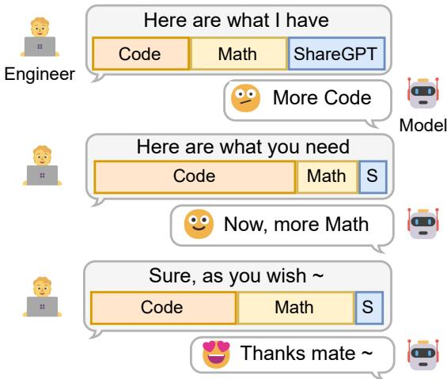  
Figure 1: Our proposed dynamic data sampling method for instruction tuning. As the training progresses, the model can dynamically adjust the proportion of data sampling. For comparison, previous works concatenate datasets directly and apply fixed sampling weights.

To perform instruction tuning, multiple datasets are usually combined in practice (MosaicML, 2023). In such a complex scenario, datasets from diverse domains may exhibit redundancies, which requires a prudent design in the dataset selection and combination (Cao et al., 2023; Xie et al., 2023). Recently, MoE models have demonstrated appealing quality on divergent tasks and reach significantly better performance than dense models, attributed to their excellent task scaling properties (Chen et al., 2024a; Shen et al., 2023a). However, how to decide appropriate sampling weights according to models’ internal preferences is still under-explored.

Most previous studies (Shen et al., 2023a; OpenBMB, 2024; Wang et al., 2023) directly concatenate multiple instruction datasets for supervised fine-tuning (SFT) without considering the sampling weights and task redundancies. Jha et al. (2023) and Chen et al. (2024b) take sampling weights as a hyper-parameter and find the best combination by handcraft search, which is laborious and costly to enumerate all the combinations. Thus, it is vital to automatically adjust the sampling weights during the training process with the lowest cost and maximize the alignment abilities. Besides, due to the sparsely-activated structure design of MoE, experts are specialized for certain domains (Zoph et al., 2022; Fedus et al., 2022a), and fine-tuning specific experts would bring performance improvements on corresponding tasks (Wang et al., 2024). Based on these facts, it is crucial to conduct balanced expert trainingfor improvements on a broad range ofdownstream tasks. However, datasets may contain domain overlaps (redundancies), which may result in imbalanced token routing even when the sampling weights are uniformly distributed.

To this end, as illustrated in Figure 1, we intend to feed MoE models with the datasets they need instead of providing the datasets we have. If one dataset is different from the others for the MoE model, there may be fewer redundancies and the sampling weight should be increased in the next round of training. However, it is difficult to build such a meticulous dataset-level difference as the model is constantly changing. Inspired by the intrinsic properties of MoE models, we formulate the dataset-level representations resorting to specialized experts and token routing preferences (Zoph et al., 2022). Specifically, we count the number of tokens routed to every expert for each dataset, which refers to the gate load. Afterward, we apply the gate loads as dataset representations and compute L2 distances among them. Since the distances are obtained from token routing preferences, they could represent the model’s internal state. Finally, we propose a dynamic algorithm to update the sampling weights according to previous sampling weights and current distances.

We experiment on two MoE models with a combination of four representative instruction datasets. Model performances are evaluated on eight evaluation datasets across knowledge testing, reasoning, and open-ended question answering tasks. The results demonstrate the effectiveness of our dynamic method. To help understand the internal mechanism of our method, we also provide thorough analyses of expert specialization and different data combinations. Our main contributions are summarized as follows:

• To our best knowledge, this is the first work to systematically study different sampling methods for MoE models in instruction tuning. Inspired by the inherent attributes of MoE, we introduce a novel dynamic data mixture for combining different instruction datasets.

• To capture the differences among datasets considering the model’s training state, we propose to utilize the routing preferences of MoE models to formulate dataset-level representations.

• We conduct extensive experiments on two MoE models and validate the effectiveness of our method on a wide range of downstream tasks and open-ended questions.

## 2 Preliminaries of Mixture-of-Experts

In a typical MoE structure, the layer is composed of N expert networks $\{ E _ { 1 } , E _ { 2 } , \dots , E _ { N } \}$ and a gating network $G .$ . Different from common networks, the MoE manifests itself in the design of computational strategy, characterized by inherent sparsity. Given an input token $x ,$ the gating network computes a vector of routing scores $G ( \bar { x } ) \in \mathbb R ^ { N }$ , denoting the importance of each expert network to process the given input. The MoE layer then selectively aggregates the outputs from the top- $\boldsymbol { . K }$ experts, which is represented as:

$$
y = \sum _ { i \in \mathbb { Z } _ { K } } G ( x ) _ { i } \cdot E _ { i } ( x ) ,\tag{1}
$$

where $\mathcal { T } _ { K }$ is the set of indices with the highest $K \leq N$ scores in $G ( x )$ , denoted as:

$$
\begin{array} { r } { \mathcal { I } _ { K } = \{ i _ { 1 } , . . . , i _ { K } | G ( x ) _ { i _ { 1 } } \geq . . . \geq G ( x ) _ { i _ { N } } \} . } \end{array}\tag{2}
$$

To maintain a balanced computational load among experts, an auxiliary balance loss is typically incorporated during the training process. Given the input dataset $\mathcal { D } _ { i }$ , a common practice (Shazeer et al., 2017) is to apply a constraint on the routing scores $G ( x )$ for each token $x \in { \mathcal { D } } _ { i }$ , which is defined as:

$$
\mathcal { L } _ { \mathrm { b a l } _ { i } } = \mathrm { C V } ( \mathcal { G } _ { i } ) ^ { 2 } + \mathrm { C V } ( \mathcal { O } _ { i } ) ^ { 2 } ,\tag{3}
$$

where $\mathrm { C V } ( \cdot )$ is the function calculating the coefficient of variation from a given vector, measuring the degree of imbalance upon activation. The CV score would be high if tokens dispatched to experts are off-balance. The aggregation of these two terms ensures a balanced dispatching among experts. The importance score vector $\mathcal { G } _ { i } \in \mathbb { R } ^ { N }$ corresponds to the summation of routing scores $\textstyle \sum _ { x \in { \mathcal { D } } _ { i } } G ( x )$ . The gate load vector $\begin{array} { r } { \mathcal { O } _ { i } = \sum _ { x \in \mathcal { D } _ { i } } } \end{array}$ BinCount $( \mathcal { T } _ { K } ^ { ( x ) } ) , \mathcal { O } _ { i } \in \mathbb { R } ^ { N }$ is the count of tokens routed to each expert across the entire inputs $\mathcal { D } _ { i }$ . For all the datasets ${ \mathcal { D } } ,$ , we could obtain the gate loads $\mathcal { O } \in \mathbb { R } ^ { | \mathcal { D } | \times N }$ , where $| \mathcal D |$ denotes the number of datasets.

## 3 Methodology

In this section, we introduce our dynamic sampling strategy, which automatically adjusts the sampling weights of different instruction datasets. After every m steps of model training, we obtain the gate loads  as dataset-level representations, then calculate the differences across datasets with  and update sampling weights accordingly. The dynamic sampling algorithm is presented in Alg 1.

## 3.1 Dataset Differences via Gate Load

As introduced in § 2, the gate load $\mathcal { O } _ { i } \in \mathbb { R } ^ { N }$ is a vector where each element represents the number of tokens routed to that specific expert. Since experts in MoE models are well specialized, the token routing distribution can demonstrate the dataset properties, which is also confirmed in Li and Zhou (2024). As discussed in Zhu et al. (2024) and Jiang et al. (2024), deeper layers have better specializations. Therefore, we calculate the differences among instruction datasets via gate loads in the last layer for each model.

For each dataset $\mathcal { D } _ { i }$ , we record the routing tokens and calculate the corresponding gate load $\mathcal { O } _ { i }$ . To alleviate the bias, we discard all padding tokens which may overwhelm the differences across gate loads. To align the scale of gate loads of different datasets, we normalize $\mathcal { O } _ { i }$ and obtain the final gate load vector $\hat { \mathcal { O } } _ { i } = \mathcal { O } _ { i } / \sum \mathcal { O }$

After obtaining the gate loads, we calculate the L2 distance $\delta _ { i j }$ of each dataset pair $\mathcal { D } _ { i }$ and $\mathcal { D } _ { j }$ . As shown in Line 7 of Alg. 1, we further calculate the averaged distance of one dataset $\mathcal { D } _ { i }$ to all the datasets. Overall, we obtain $\Delta \in \mathbb { R } ^ { | \mathcal { D } | }$ , a vector that denotes the averaged distance of each dataset. We further adjust the sampling weights based on the distance vector.

Algorithm 1 DYNAMICSAMPLING   
Input: evaluation interval m, total training steps n,   
sampling weights of last round $\mathbf { w } _ { t - 1 } \in \mathbb { R } ^ { | \mathcal { D } | }$   
normalized gate loads $\hat { \mathcal { O } } \in \mathbb { R } ^ { | \mathcal { D } | \times N }$ , update   
step size η, smoothing value $^ { c , }$ the number of   
datasets .   
Output: updated sampling weights $\mathbf { w } _ { t } .$   
1: for $k \gets 1$ to n do   
2: One-step model training with $\mathbf { w } _ { t - 1 }$   
3: if $k \% m = 0$ then   
4: // L2 distances across datasets.   
5: $\delta _ { i j }  \vert \vert \hat { \mathcal { O } } _ { i } - \hat { \mathcal { O } } _ { j } \vert \vert , \quad \delta \in \mathbb { R } ^ { \vert \mathcal { D } \vert \times \vert \mathcal { D } \vert }$   
6: // Average distance for each dataset.   
7: $\begin{array} { r } { \Delta _ { i }  ( \sum _ { j } \delta _ { i j } ) / | \mathcal { D } | . } \end{array}$ $\Delta \in \mathbb { R } ^ { | \mathcal { D } | }$   
8: // Update sampling weights.   
9: α softmax (log $\mathbf { w } _ { t - 1 } + \eta \Delta )$   
10: $\mathbf { w } _ { t } ^ { \prime }  ( 1 - c ) \mathbf { \alpha } + c \mathbf { \alpha } / | \mathcal { D } |$   
11: // Normalize sampling weights.   
12: $\mathbf { w } _ { t } \gets \mathbf { w } _ { t } ^ { \prime } / \sum \mathbf { w } _ { t } ^ { \prime }$   
13: return $\mathbf { w } _ { t }$   
14: end if   
15: end for

## 3.2 Dynamic Data Sampling

Based on our hypothesis, if one dataset $\mathcal { D } _ { i }$ is different to the others, the sampling weight of $\mathcal { D } _ { i }$ should be increased since it may contain less redundancies with other datasets.

As presented in Line 9 from Alg. 1, we calculate the updated sampling weights by adding $\eta \Delta$ to the logarithmic weights of the last time step log wt 1, where η is the update step size that could be regarded as a term similar to the learning rate. We follow Xie et al. (2023) to add $c / | \mathcal { D } |$ to smooth and re-normalize the values as shown in Line 10-12 in Alg. 1, where c is a hyper-parameter.

Based on the above strategy, we update the sampling weights every m steps in the training phase. Following Xia et al. (2023) and Xie et al. (2023), the initial sampling weights $\mathbf { w } _ { 0 }$ is uniformly distributed to alleviate potential biases. In the proposed dynamic sampling algorithm, η takes the similar functionality with m. Both of them control the speed of convergence. m controls the speed in a coarse manner while η provides a more finegrained control.

## 4 Experiments

## 4.1 Instruction Tuning Datasets

We use the following four types of instruction datasets for supervised fine-tuning. In each dataset, we sample 20K instances for training, and 1K instances for gate load evaluation in the sampling weight adjustment. (1) ShareGPT.\* Multiturn dialogues with ChatGPT, containing a wide range of open-ended instructions. (2) OpenOrca.† Flan (Longpre et al., 2023) instructions with responses generated by GPT-4 & GPT-3.5 (Lian et al., 2023), containing multiple task-oriented instructions. (3) Math-Instruct.‡ A collection of math instructions with step-by-step solutions (Yue et al., 2023). (4) Code Instructions.§ LLM-generated responses with multiple languages to solve code problems.

## 4.2 Evaluation Datasets

We comprehensively evaluate the ability of models from both Knowledge & Reasoning (K&R) and Open-Ended instruction following aspects. For K&R, we evaluate the models on MMLU (Hendrycks et al., 2021), BigBench-Hard (BBH) (Suzgun et al., 2022), GSM8K (Cobbe et al., 2021), MBPP (Austin et al., 2021), and Question Answering (QA) tasks. Here, QA consists of ARCe, ARC-c (Clark et al., 2018), and BoolQ (Clark et al., 2019). Besides, we also report the openended instruction following results on MT-Bench. For more details about evaluation datasets, please refer to Appendix A.5.

## 4.3 Baselines

(1) w/o IT. The foundation model without instruction tuning. (2) DataSize. Static sampling baseline. The sampling weights are determined by the original data size. (3) Uniform. Static sampling baseline. The model is fine-tuned with the uniformly distributed sampling weights (all datasets have the same sampling probability). (4) Random. A dynamic sampling baseline where sampling weights are assigned with uniformly distributed noise at each round. (5) Sequential. Training models on datasets sequentially at each round. (6) RefLoss. We use Uniform to estimate the final loss of each dataset as the reference loss, and replace the distance of datasets in Alg 1 (line 5) with the loss differences between current loss and reference loss $\Delta _ { i }  ( \mathcal { L } _ { \mathrm { c u r r e n t } } ^ { i } - \mathcal { L } _ { \mathrm { r e f e r e n c e } } ^ { i } )$ . Therefore, RefLoss consumes 2 times of training computation than the proposed dynamic method.

## 4.4 Implementation Details

We test our method on two MoE models: MoLM 700M-4E (activating 4 experts with 700M parameters) (Shen et al., 2023b) and LLaMA-MoE 3.5B-2E (Zhu et al., 2024). We freeze the gate parameters and train models with 2K steps under a global batch size of 128 and a max sequence length of 2048. The optimizer is AdamW (Loshchilov and Hutter, 2017) with a learning rate of 2e-5, which is warmed up with 3% steps under cosine scheduling. Models are trained with gradient checkpointing (Griewank and Walther, 2000), ZeRO-1 (Rajbhandari et al., 2019), and FlashAttentionv2 (Dao, 2023). For our proposed dynamic method in LLaMA-MoE, the evaluation interval m = 100, η is 10.0 and c is 5e-2. In MoLM, m = 200 and c is 8e-1. Experiments are conducted on 4 NVIDIA A100 (80G) GPUs.

## 4.5 Main Results

The main results in Table 1 show that instruction tuning is beneficial for models to enhance their overall abilities on downstream knowledge & reasoning (K&R) tasks. The performance gain from instruction tuning is lower in MoLM than LLaMA-MoE, possibly due to the small model capacity. For static sampling, the performances of DataSize are lower than Uniform, both in K&R tasks and openended MT-Bench. Besides, the averaged K&R score in MoLM DataSize (21.37) is slightly lower than the foundation model (21.41), eliminating the advantage of MoE model’s capabilities.

For dynamic sampling, the performances of Random are not stable since it is based on Uniform with random noises. It achieves better K&R than Uniform in MoLM, while it is worse in LLaMA-MoE. Sequential shows the worst MT-Bench scores in both models, demonstrating a bad instruction-following ability. RefLoss is a strong baseline compared to Uniform and boosts the foundation models’ performances across the K&R tasks by 0.37 (MoLM) and 4.58 (LLaMA-MoE). However, it brings additional training compute due to the reference loss estimation. Our Dynamic shows great potential and surpasses RefLoss without the additional training cost, which leads to a better and faster convergence. Overall, Dynamic outperforms other baselines in the averaged K&R and the MT-Bench results, validating the effectiveness.

<table><tr><td rowspan="2">Model</td><td colspan="4">Knowledge &amp; Reasoning</td><td rowspan="2">QA Average</td><td rowspan="2"></td><td rowspan="2">Open-Ended MT-Bench</td></tr><tr><td>MMLU</td><td>BBH</td><td>GSM8K</td><td>MBPP</td></tr><tr><td></td><td></td><td></td><td></td><td>MoLM 700M-4E</td><td></td><td></td><td></td></tr><tr><td>w/o IT</td><td>24.73</td><td>27.89</td><td>1.14</td><td>5.76</td><td>47.52</td><td>21.41</td><td></td></tr><tr><td>DataSize</td><td>26.62</td><td>23.94</td><td>2.50</td><td>10.15</td><td>43.65</td><td>21.37</td><td>2.59</td></tr><tr><td>Uniform</td><td>25.76</td><td>26.08</td><td>1.21</td><td>9.60</td><td>45.01</td><td>21.53</td><td>2.63</td></tr><tr><td>Random</td><td>25.95</td><td>25.94</td><td>1.59</td><td>9.49</td><td>45.76</td><td>21.75</td><td>2.30</td></tr><tr><td>Sequential</td><td>26.20</td><td>26.41</td><td>1.67</td><td>9.33</td><td>45.62</td><td>21.85</td><td>2.32</td></tr><tr><td>RefLoss</td><td>25.67</td><td>26.52</td><td>2.05</td><td>9.80</td><td>44.86</td><td>21.78</td><td>2.69</td></tr><tr><td>Dynamic</td><td>25.83</td><td>26.96</td><td>1.82</td><td>10.12</td><td>45.28</td><td>22.00</td><td>2.73</td></tr><tr><td colspan="8">LLaMA-MoE 3.5B-2E</td></tr><tr><td>w/o IT</td><td>27.98</td><td>29.67</td><td>4.63</td><td>5.12</td><td>57.45</td><td>24.97</td><td>1</td></tr><tr><td>DataSize</td><td>31.44</td><td>29.46</td><td>1.67</td><td>11.84</td><td>59.96</td><td>26.87</td><td>4.81</td></tr><tr><td>Uniform</td><td>32.48</td><td>29.18</td><td>5.91</td><td>14.52</td><td>60.85</td><td>28.59</td><td>5.07</td></tr><tr><td>Random</td><td>33.39</td><td>29.43</td><td>2.73</td><td>15.80</td><td>61.17</td><td>28.50</td><td>5.00</td></tr><tr><td>Sequential</td><td>32.27</td><td>30.42</td><td>0.99</td><td>12.08</td><td>60.35</td><td>27.22</td><td>3.92</td></tr><tr><td>RefLoss</td><td>33.75</td><td>29.02</td><td>9.63</td><td>14.48</td><td>60.87</td><td>29.55</td><td>5.18</td></tr><tr><td>Dynamic</td><td>33.07</td><td>30.77</td><td>11.90</td><td>16.88</td><td>61.28</td><td>30.78</td><td>5.22</td></tr></table>

Table 1: Main results. Best and the second best results are denoted in bold and underlined, respectively.

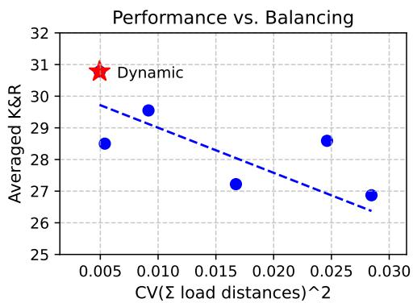  
Figure 2: Averaged knowledge & reasoning results vs. the CV coefficient of final load distances. Smaller CV values represent more balanced token routing. Each data point denotes a model of LLaMA-MoE 3.5B-2E presented in Table 1.

## 4.6 Analysis

## 4.6.1 Correlation between Performance and Balancing

Q: How does balanced training affect the MoE’s instruction tuning? To find the correlation between dataset-level load balance and the overall downstream task performance, we analyze the final $\mathrm { C V } ( \mathrm { l o a d } ) ^ { 2 }$ of the training datasets.

As shown in Figure 2, there is a strong correlation between the final load balance and the model’s final performance (Pearson coefficient = -0.762). This indicates a balanced training would lead to better overall downstream task performance, and our proposed Dynamic method could reach a better dataset-level load balance.

Q: What if the data sampling weights are initialized with perfect balancing? If the performance improvement only comes from the dataset-level load balancing, the best multi-dataset instruction tuning for MoE would become an optimization problem as shown in Equation 4. To solve this problem, we perform stochastic gradient descent (SGD) to estimate the optimal sampling weights (listed in Table 8 in the appendix).

The results on LLaMA-MoE 3.5B show that such a set of balanced sampling weights only brings an averaged K&R performance of 28.35, with higher final CV(load)2 values than Dynamic. This demonstrates that the training process is not static and the model’s internal preferences are changing. To this end, dynamic sampling weight adjustment is crucial for obtaining better sampling weights since it utilizes the latest model’s internal preferences. Comparing the final sampling weights, we find Dynamic is less likely to overfit on specific datasets since the sampling weights are constrained to a smaller range.

$$
\operatorname* { m i n } _ { \mathbf { w } } \mathbf { \Lambda } _ { i \in | \mathcal { D } | } \left( \sum _ { j \in | \mathcal { D } | } | | \hat { \mathcal { O } } _ { i } - \mathcal { \hat { O } } _ { j } | | \right) ^ { 2 }\tag{4}
$$

## 4.6.2 Data Combinations

Q: How do datasets contribute to the final performance? We conduct experiments on subsets of the training datasets and present the results in Figure 3. Since math and code tasks have strong correlations with the instruction tuning dataset types, we report the GSM8K (math) and MBPP (code) results here.

As shown in the figure, Math-Instruct and Code Instructions are very task-related, and models trained solely on these datasets could reach the best GSM8K and MBPP performances, respectively. Although the single ShareGPT or OpenOrca is less powerful, it shows great performance when they are combined with Math-Instruct or Code Instruction datasets. Dynamic is more balanced than the Uniform baseline, where Dynamic strengthens the MBPP performance on math-related combination (S+O+M), and improves the GSM8K performance on code-related combination (S+O+C). When all four types of datasets are combined for instruction tuning, Dynamic improves both GSM8K and MBPP performances.

## 4.6.3 Expert Specialization

Q: Does such a gate-load-based dynamic data sampling strategy hurt expert specialization? Our method’s optimization objective is to reduce the gate loads’ differences across datasets. Although we freeze the gate parameters during training, the activation states may still affect the expert specialization property. We report the gate load differences and $\mathrm { C V } ( { \mathcal { O } } _ { i } ) ^ { 2 }$ for each dataset to measure the expert specialization variations.

As shown in Figure 4 (abde), we find instruction tuning indeed affects the expert specialization. However, it is not determined by our gate-loadbased distance calculation and dynamic sampling adjustment. Instead, it is due to the auxiliary balance loss as demonstrated in Figure 4 (cf). If we remove the balance loss during training, it would lead to more specialized experts, but the performance would be lower according to Table 3.

## 4.6.4 Other Sampling Weights

Q: What if we use the final sampling weights obtained from the proposed Dynamic to train the model again?

As presented in Table 2, FinalStatic is better than Uniform and DataSize in both K&R tasks and MT-Bench. Surprisingly, compared to the results in Table 1, FinalStatic (29.68) is even better than RefLoss (29.55) in the averaged K&R score. This indicates that our Dynamic method could help find better sampling weights even on static sampling. In addition, FinalStatic is still worse than Dynamic, which verifies the model’s internal state changes. Thus, dynamic sampling could reach a better performance than static sampling.

Q: What ifwe use sentence embedding to compute the dataset differences instead ofgate loads? To verify the effectiveness of the gate load versus the sentence embedding distances, we utilize SentenceTransformers (Reimers and Gurevych, 2019) to replace the input gate loads  in Alg. 1 and compute L2 distances afterward.

As shown in Table 2, SentEmb outperforms Uniform across the tasks, which indicates the effectiveness of dataset re-weighting by their inter similarities. The averaged GateLoad performance is lower than SentEmb in both the averaged knowledge & reasoning tasks and the open-ended MT-Bench. Nevertheless, SentEmb could not be easily applied to make constant improvements in the whole training phase. Although GateLoad is worse than SentEmb, the model benefits from the iterative sampling weights adjustments, and Dynamic surpasses SentEmb in both K&R and MT-Bench.

Q: What about other initial sampling weights rather than the uniform distribution? Since SentEmb has better performance than Uniform and GateLoad, we wonder if it is better to apply its sampling weights as the initial ones rather than the uniform distribution.

The results in Table 2 show that the uniform initialized DynamicUniform outperforms $\mathbf { D y n a m i c _ { S e n t E m b } }$ (30.78 vs. 29.63 in K&R, 5.22 vs. 5.16 in MT-Bench), which is in line with the conclusions in Zhu et al. (2024). We conjecture that the imbalanced initial weights would bring biases and make the model hard to convergence.

## 4.6.5 Ablation Study

There are differences between sparse MoE models and dense models during training due to their specific techniques. Here we investigate the effectiveness of fronzen gate, balance loss, and gate noise for instruction tuning on MoE.

Expert Selection Distances (L2)  
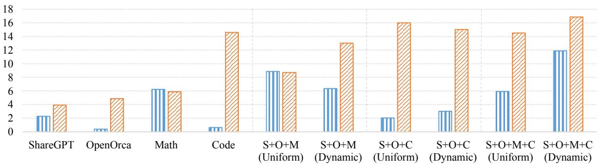  
GSM8K MBPP

Figure 3: Evaluation results on different data combinations. LLaMA-MoE 3.5B-2E is fine-tuned for this experiment. S, O, M, and C denote for ShareGPT, OpenOrca, Math Instruct, and Code Instructions, respectively.  
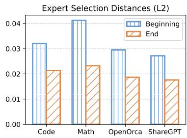  
(a) Gate load distances of Uniform

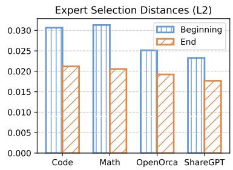  
(b) Gate load distances of Dynamic

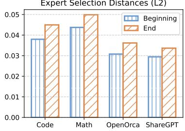  
(c) Gate load distances of Dynamic w/o balance loss

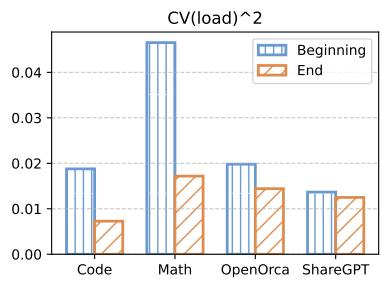  
(d) $\mathrm { C V } ( { \mathcal { O } } _ { i } ) ^ { 2 }$ of Uniform

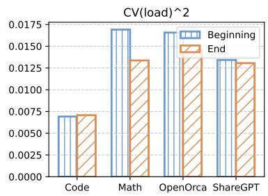  
(e) $\mathrm { C V } ( { \mathcal { O } } _ { i } ) ^ { 2 }$ of Dynamic

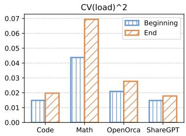  
(f) $\mathrm { C V } ( { \mathcal { O } } _ { i } ) ^ { 2 }$ of Dynamic w/o balance loss  
Figure 4: Gate load differences of LLaMA-MoE 3.5B-2E under different training settings. If the experts are less specialized after training, the distances and the $\mathrm { C V } ( { \mathcal { O } } _ { i } ) ^ { 2 }$ would go down. For Dynamic and Dynamic w/o balance loss, the “Beginning” stands for the first round of evaluation for easier recording.

The results are presented in Table 3. Similar to Shen et al. (2023a), we find the frozen gate, balance loss, and gate noise have all positive effects to the model performances. Frozen gate is to freeze the gate networks and the gate projections in FFNs when fine-tuning. This leads to better performance as the gate is well trained during the pre-training stage, and instruction tuning may break the specialized token routing property. Balance loss and gate noise are beneficial to model training since they are in line with the pre-training objectives.

## 5 Related Work

Mixture-of-Experts. The Mixture-of-Experts (MoE) is a sparsely activated architecture in neural networks with great efficiency (Shazeer et al., 2017; Lepikhin et al., 2020; Fedus et al., 2022b; Qu et al., 2024; Zhang et al., 2024; Lu et al., 2024a). Attributed to its sparsity, MoE has attracted broad attention in the realm of LLMs (Du et al., 2022;

<table><tr><td rowspan="2">Model</td><td colspan="6">Knowledge &amp; Reasoning</td><td rowspan="2">Open-Ended MT-Bench</td></tr><tr><td>MMLU</td><td>BBH</td><td>GSM8K</td><td>MBPP</td><td>QA</td><td>Average</td></tr><tr><td>w/o IT</td><td>27.98</td><td>29.67</td><td>4.63</td><td>5.12</td><td>57.45</td><td>24.97</td><td>一</td></tr><tr><td colspan="8">Static Sampling</td></tr><tr><td>DataSize</td><td>31.44</td><td>29.46</td><td>1.67</td><td>11.84</td><td>59.96</td><td>26.87</td><td>4.81</td></tr><tr><td>Uniform</td><td>32.48</td><td>29.18</td><td>5.91</td><td>14.52</td><td>60.85</td><td>28.59</td><td>5.07</td></tr><tr><td>FinalStatic</td><td>32.84</td><td>30.11</td><td>9.93</td><td>14.61</td><td>60.93</td><td>29.68</td><td>5.11</td></tr><tr><td colspan="8">Static Distances</td></tr><tr><td>SentEmb</td><td>33.85</td><td>29.70</td><td>7.66</td><td>16.29</td><td>61.75</td><td>29.85</td><td>5.21</td></tr><tr><td>GateLoad</td><td>32.75</td><td>29.98</td><td>6.60</td><td>14.07</td><td>61.78</td><td>29.04</td><td>4.98</td></tr><tr><td colspan="8">Initial Sampling Weights</td></tr><tr><td>DynamicSentEmb</td><td>33.46</td><td>29.02</td><td>8.95</td><td>15.68</td><td>61.03</td><td>29.63</td><td>5.16</td></tr><tr><td>DynamicUniform</td><td>33.07</td><td>30.77</td><td>11.90</td><td>16.88</td><td>61.28</td><td>30.78</td><td>5.22</td></tr></table>

Table 2: Other sampling weights. Experiments are conducted on LLaMA-MoE 3.5B-2E.

<table><tr><td>Model</td><td>Avg. K&amp;R</td><td>MT-Bench</td></tr><tr><td>LLaMA-MoE</td><td>30.78</td><td>5.22</td></tr><tr><td>w/o frozen gate</td><td>28.78</td><td>4.91</td></tr><tr><td>w/o balance loss</td><td>29.38</td><td>4.88</td></tr><tr><td>w/o gate noise</td><td>30.04</td><td>4.98</td></tr></table>

Table 3: Ablation study. Avg. K&R stands for the averaged score of knowledge & reasoning tasks (MMLU, BBH, Math, and Code).

Jiang et al., 2024). Subsequent studies follow these model architectures, showing the effectiveness of MoE in dealing with reasoning (Dai et al., 2024), cross-domain (Li et al., 2023), and multi-modal (Mustafa et al., 2022) problems.

Instruction Tuning. Instruction tuning is an important step for the LLM alignment. Wang et al. (2022) devise an automatic prompting method to generate enormous instructions and responses with LLMs. Based on this idea, Xu et al. (2023) and Zhao et al. (2023) further utilize LLMs to generate diverse and complex instructions to enhance the alignment. Different from the data augmentation methods, Tunstall et al. (2023) and Zhou et al. (2023) find a small number of high quality instruction data can boost the alignment performance. Cao et al. (2023) and Liu et al. (2023) further study data patterns to filter out high quality data to help LLM alignment. However, none of these approaches consider using different sampling weights when training on multiple instruction datasets.

Dynamic Data Mixing in Pre-training. Since there is no relevant literature on dynamic sampling for instruction tuning, we introduce the relevant methods in LLM pre-training. Xie et al. (2023) propose DoReMi, a dynamic sampling method for LLM pre-training on multiple domains of data with an extra proxy model for the reference. Xia et al. (2023) propose to use a series of language models in the same family and estimate the reference loss by fitting scaling law curves. However, these methods need extra models for estimating reference losses on target domains, which introduces additional training computations. Albalak et al. (2023) introduce an online data mixing method for LLM pre-training via the multi-armed bandit algorithm. However, the exploration stage at the beginning of training takes a huge amount of steps, which is not applicable for instruction tuning. In summary, these dynamic sampling methods are difficult to be transferred into instruction tuning, where the dataset size is relatively small and there are no available proxy models for references.

## 6 Conclusion

To combine different datasets and maximize the MoE model’s alignment ability, we assign different sampling weights to corresponding datasets. By incorporating the internal model state and the dataset properties, we propose to use the gate load from MoE models to obtain dataset representations. Based on the representations, we calculate distances between each pair of datasets, indicating the inter-redundancies. We further devise an automatic algorithm to dynamically update the sampling weights.

We find there is a strong correlation between the dataset-level load balance and the final performance, and the proposed dynamic sampling strategy could reach great balancing. The results also demonstrate good performance on the overall downstream tasks.

## Limitations

More Models. Due to the limited computing resources, we test the method’s effectiveness on two representative decoder-style MoE models. Dynamic sampling on larger models like Mixtral (Jiang et al., 2024) is currently not verified.

Number of Datasets. For a combination of two datasets, there are no differences between the distance vector ∆, so the dynamic sampling method does not take into effect and the sampling weights would stay unchanged. Therefore, there should be at least three instruction tuning datasets for applying our method.

## 7 Acknowledgments

This work is supported by the National Natural Science Foundation of China (Grant No. 62376177, 62261160648) and Provincial Key Laboratory for Computer Information Processing Technology, Soochow University. This work is also supported by Collaborative Innovation Center of Novel Software Technology and Industrialization, Project Funded by the Priority Academic Program Development of Jiangsu Higher Education Institutions. We would also like to thank the anonymous reviewers for their insightful and valuable comments.

## References

Alon Albalak, Liangming Pan, Colin Raffel, and William Yang Wang. 2023. Efficient online data mixing for language model pre-training. ArXiv, abs/2312.02406.

Anthropic. 2023. Introducing Claude.

Jacob Austin, Augustus Odena, Maxwell Nye, Maarten Bosma, Henryk Michalewski, David Dohan, Ellen Jiang, Carrie Cai, Michael Terry, Quoc Le, et al. 2021. Program synthesis with large language models. arXiv preprint arXiv:2108.07732.

Yihan Cao, Yanbin Kang, and Lichao Sun. 2023. Instruction mining: High-quality instruction data

selection for large language models. ArXiv, abs/2307.06290.

Guanjie Chen, Xinyu Zhao, Tianlong Chen, and Yu Cheng. 2024a. \$\texttt{MoE-RBench}\$: Towards building reliable language models with sparse mixture-of-experts. In Forty-first International Conference on Machine Learning.

Shaoxiang Chen, Zequn Jie, and Lin Ma. 2024b. Llavamole: Sparse mixture of lora experts for mitigating data conflicts in instruction finetuning mllms. ArXiv, abs/2401.16160.

Hyung Won Chung, Le Hou, S. Longpre, Barret Zoph, Yi Tay, William Fedus, Eric Li, Xuezhi Wang, Mostafa Dehghani, Siddhartha Brahma, Albert Webson, Shixiang Shane Gu, Zhuyun Dai, Mirac Suzgun, Xinyun Chen, Aakanksha Chowdhery, Dasha Valter, Sharan Narang, Gaurav Mishra, Adams Wei Yu, Vincent Zhao, Yanping Huang, Andrew M. Dai, Hongkun Yu, Slav Petrov, Ed Huai hsin Chi, Jeff Dean, Jacob Devlin, Adam Roberts, Denny Zhou, Quoc V. Le, and Jason Wei. 2022. Scaling instruction-finetuned language models. ArXiv, abs/2210.11416.

Christopher Clark, Kenton Lee, Ming-Wei Chang, Tom Kwiatkowski, Michael Collins, and Kristina Toutanova. 2019. Boolq: Exploring the surprising difficulty of natural yes/no questions. In NAACL.

Peter Clark, Isaac Cowhey, Oren Etzioni, Tushar Khot, Ashish Sabharwal, Carissa Schoenick, and Oyvind Tafjord. 2018. Think you have solved question answering? try arc, the ai2 reasoning challenge. arXiv:1803.05457v1.

Karl Cobbe, Vineet Kosaraju, Mohammad Bavarian, Mark Chen, Heewoo Jun, Lukasz Kaiser, Matthias Plappert, Jerry Tworek, Jacob Hilton, Reiichiro Nakano, Christopher Hesse, and John Schulman. 2021. Training verifiers to solve math word problems. arXiv preprint arXiv:2110.14168.

Damai Dai, Chengqi Deng, Chenggang Zhao, R. X. Xu, Huazuo Gao, Deli Chen, Jiashi Li, Wangding Zeng, Xingkai Yu, Y. Wu, Zhenda Xie, Y. K. Li, Panpan Huang, Fuli Luo, Chong Ruan, Zhifang Sui, and Wenfeng Liang. 2024. Deepseekmoe: Towards ultimate expert specialization in mixture-of-experts language models.

Tri Dao. 2023. FlashAttention-2: Faster attention with better parallelism and work partitioning.

Nan Du, Yanping Huang, Andrew M Dai, Simon Tong, Dmitry Lepikhin, Yuanzhong Xu, Maxim Krikun, Yanqi Zhou, Adams Wei Yu, Orhan Firat, et al. 2022. Glam: Efficient scaling of language models with mixture-of-experts. In International Conference on Machine Learning, pages 5547–5569. PMLR.

William Fedus, Jeff Dean, and Barret Zoph. 2022a. A review of sparse expert models in deep learning. ArXiv, abs/2209.01667.

William Fedus, Barret Zoph, and Noam Shazeer. 2022b. Switch transformers: Scaling to trillion parameter models with simple and efficient sparsity. The Journal ofMachine Learning Research, 23(1):5232– 5270.

Andreas Griewank and Andrea Walther. 2000. Algorithm 799: revolve: an implementation of checkpointing for the reverse or adjoint mode of computational differentiation. ACM Trans. Math. Softw., 26:19–45.

Dan Hendrycks, Collin Burns, Steven Basart, Andy Zou, Mantas Mazeika, Dawn Song, and Jacob Steinhardt. 2021. Measuring massive multitask language understanding. Proceedings ofthe International Conference on Learning Representations (ICLR).

Aditi Jha, Sam Havens, Jeremey Dohmann, Alex Trott, and Jacob Portes. 2023. Limit: Less is more for instruction tuning across evaluation paradigms. ArXiv, abs/2311.13133.

Albert Q. Jiang, Alexandre Sablayrolles, Antoine Roux, Arthur Mensch, Blanche Savary, Chris Bamford, Devendra Singh Chaplot, Diego de Las Casas, Emma Bou Hanna, Florian Bressand, Gianna Lengyel, Guillaume Bour, Guillaume Lample, L’elio Renard Lavaud, Lucile Saulnier, Marie-Anne Lachaux, Pierre Stock, Sandeep Subramanian, Sophia Yang, Szymon Antoniak, Teven Le Scao, Théophile Gervet, Thibaut Lavril, Thomas Wang, Timothée Lacroix, and William El Sayed. 2024. Mixtral of experts. ArXiv, abs/2401.04088.

Dmitry Lepikhin, HyoukJoong Lee, Yuanzhong Xu, Dehao Chen, Orhan Firat, Yanping Huang, Maxim Krikun, Noam Shazeer, and Zhifeng Chen. 2020. Gshard: Scaling giant models with conditional computation and automatic sharding. arXiv preprint arXiv:2006.16668.

Bo Li, Yifei Shen, Jingkang Yang, Yezhen Wang, Jiawei Ren, Tong Che, Jun Zhang, and Ziwei Liu. 2023. Sparse mixture-of-experts are domain generalizable learners. In International Conference on Learning Representations.

Ziyue Li and Tianyi Zhou. 2024. Your mixture-ofexperts llm is secretly an embedding model for free. ArXiv, abs/2410.10814.

Wing Lian, Bleys Goodson, Eugene Pentland, Austin Cook, Chanvichet Vong, and "Teknium". 2023. Openorca: An open dataset of gpt augmented flan reasoning traces. https://https:// huggingface.co/Open-Orca/OpenOrca.

Wei Liu, Weihao Zeng, Keqing He, Yong Jiang, and Junxian He. 2023. What makes good data for alignment? a comprehensive study of automatic data selection in instruction tuning. ArXiv, abs/2312.15685.

Shayne Longpre, Le Hou, Tu Vu, Albert Webson, Hyung Won Chung, Yi Tay, Denny Zhou, Quoc V. Le, Barret Zoph, Jason Wei, and Adam Roberts. 2023. The flan collection: Designing data and methods for effective instruction tuning.

Ilya Loshchilov and Frank Hutter. 2017. Decoupled weight decay regularization. In International Conference on Learning Representations.

Zhenyi Lu, Chenghao Fan, Wei Wei, Xiaoye Qu, Dangyang Chen, and Yu Cheng. 2024a. Twin-merging: Dynamic integration of modular expertise in model merging. arXiv preprint arXiv:2406.15479.

Zhenyi Lu, Jie Tian, Wei Wei, Xiaoye Qu, Yu Cheng, Dangyang Chen, et al. 2024b. Mitigating boundary ambiguity and inherent bias for text classification in the era of large language models. arXiv preprint arXiv:2406.07001.

MosaicML. 2023. Introducing mpt-7b: A new standard for open-source, commercially usable llms.

Subhabrata Mukherjee, Arindam Mitra, Ganesh Jawahar, Sahaj Agarwal, Hamid Palangi, and Ahmed Awadallah. 2023. Orca: Progressive learning from complex explanation traces of gpt-4.

Basil Mustafa, Carlos Riquelme, Joan Puigcerver, Rodolphe Jenatton, and Neil Houlsby. 2022. Multimodal contrastive learning with limoe: the languageimage mixture of experts. ArXiv, abs/2206.02770.

OpenAI. 2022. Introducing ChatGPT.

OpenBMB. 2024. Minicpm: Unveiling the potential of end-side large language models.

Long Ouyang, Jeff Wu, Xu Jiang, Diogo Almeida, Carroll L. Wainwright, Pamela Mishkin, Chong Zhang, Sandhini Agarwal, Katarina Slama, Alex Ray, John Schulman, Jacob Hilton, Fraser Kelton, Luke E. Miller, Maddie Simens, Amanda Askell, Peter Welinder, Paul Francis Christiano, Jan Leike, and Ryan J. Lowe. 2022. Training language models to follow instructions with human feedback. ArXiv, abs/2203.02155.

Xiaoye Qu, Daize Dong, Xuyang Hu, Tong Zhu, Weigao Sun, and Yu Cheng. 2024. Llama-moe v2: Exploring sparsity of llama from perspective of mixture-of-experts with post-training. arXiv preprint arXiv:2411.15708.

Samyam Rajbhandari, Jeff Rasley, Olatunji Ruwase, and Yuxiong He. 2019. Zero: Memory optimizations toward training trillion parameter models. SC20: International Conferencefor High Performance Computing, Networking, Storage and Analysis, pages 1– 16.

Nils Reimers and Iryna Gurevych. 2019. Sentence-bert: Sentence embeddings using siamese bert-networks. In Proceedings ofthe 2019 Conference on Empirical Methods in Natural Language Processing. Association for Computational Linguistics.

Noam Shazeer, Azalia Mirhoseini, Krzysztof Maziarz, Andy Davis, Quoc Le, Geoffrey Hinton, and Jeff Dean. 2017. Outrageously large neural networks: The sparsely-gated mixture-of-experts layer. arXiv preprint arXiv:1701.06538.

Sheng Shen, Le Hou, Yan-Quan Zhou, Nan Du, S. Longpre, Jason Wei, Hyung Won Chung, Barret Zoph, William Fedus, Xinyun Chen, Tu Vu, Yuexin Wu, Wuyang Chen, Albert Webson, Yunxuan Li, Vincent Zhao, Hongkun Yu, Kurt Keutzer, Trevor Darrell, and Denny Zhou. 2023a. Mixture-of-experts meets instruction tuning:a winning combination for large language models.

Yikang Shen, Zheyu Zhang, Tianyou Cao, Shawn Tan, Zhenfang Chen, and Chuang Gan. 2023b. Moduleformer: Learning modular large language models from uncurated data. arXiv preprint arXiv:2306.04640.

Mirac Suzgun, Nathan Scales, Nathanael Schärli, Sebastian Gehrmann, Yi Tay, Hyung Won Chung, Aakanksha Chowdhery, Quoc V Le, Ed H Chi, Denny Zhou, , and Jason Wei. 2022. Challenging big-bench tasks and whether chain-of-thought can solve them. arXiv preprint arXiv:2210.09261.

Lewis Tunstall, Edward Beeching, Nathan Lambert, Nazneen Rajani, Kashif Rasul, Younes Belkada, Shengyi Huang, Leandro von Werra, Clémentine Fourrier, Nathan Habib, Nathan Sarrazin, Omar Sanseviero, Alexander M. Rush, and Thomas Wolf. 2023. Zephyr: Direct distillation of lm alignment. ArXiv, abs/2310.16944.

Rongsheng Wang, Hao Chen, Ruizhe Zhou, Yaofei Duan, Kunyan Cai, Han Ma, Jiaxi Cui, Jian Li, Patrick Cheong-Iao Pang, Yapeng Wang, and Tao Tan. 2023. Aurora: Activating chinese chat capability for mixtral-8x7b sparse mixture-of-experts through instruction-tuning. ArXiv, abs/2312.14557.

Yizhong Wang, Yeganeh Kordi, Swaroop Mishra, Alisa Liu, Noah A. Smith, Daniel Khashabi, and Hannaneh Hajishirzi. 2022. Self-instruct: Aligning language models with self-generated instructions. In Annual Meeting of the Association for Computational Linguistics.

Zihan Wang, Deli Chen, Damai Dai, Runxin Xu, Zhuoshu Li, Y. Wu, and AI DeepSeek. 2024. Let the expert stick to his last: Expert-specialized fine-tuning for sparse architectural large language models. ArXiv, abs/2407.01906.

Mengzhou Xia, Tianyu Gao, Zhiyuan Zeng, and Danqi Chen. 2023. Sheared llama: Accelerating language model pre-training via structured pruning. ArXiv, abs/2310.06694.

Sang Michael Xie, Hieu Pham, Xuanyi Dong, Nan Du, Hanxiao Liu, Yifeng Lu, Percy Liang, Quoc V. Le, Tengyu Ma, and Adams Wei Yu. 2023. Doremi: Optimizing data mixtures speeds up language model pretraining. ArXiv, abs/2305.10429.

Can Xu, Qingfeng Sun, Kai Zheng, Xiubo Geng, Pu Zhao, Jiazhan Feng, Chongyang Tao, and Daxin Jiang. 2023. Wizardlm: Empowering large language models to follow complex instructions. ArXiv, abs/2304.12244.

Xiang Yue, Xingwei Qu, Ge Zhang, Yao Fu, Wenhao Huang, Huan Sun, Yu Su, and Wenhu Chen. 2023. Mammoth: Building math generalist models through hybrid instruction tuning. arXiv preprint arXiv:2309.05653.

Jihai Zhang, Xiaoye Qu, Tong Zhu, and Yu Cheng. 2024. Clip-moe: Towards building mixture of experts for clip with diversified multiplet upcycling. arXiv preprint arXiv:2409.19291.

Ying Zhao, Yu Bowen, Binyuan Hui, Haiyang Yu, Fei Huang, Yongbin Li, and Nevin Lianwen Zhang. 2023. A preliminary study of the intrinsic relationship between complexity and alignment. ArXiv, abs/2308.05696.

Lianmin Zheng, Wei-Lin Chiang, Ying Sheng, Siyuan Zhuang, Zhanghao Wu, Yonghao Zhuang, Zi Lin, Zhuohan Li, Dacheng Li, Eric P. Xing, Haotong Zhang, Joseph Gonzalez, and Ion Stoica. 2023. Judging llm-as-a-judge with mt-bench and chatbot arena. ArXiv, abs/2306.05685.

Chunting Zhou, Pengfei Liu, Puxin Xu, Srini Iyer, Jiao Sun, Yuning Mao, Xuezhe Ma, Avia Efrat, Ping Yu, L. Yu, Susan Zhang, Gargi Ghosh, Mike Lewis, Luke Zettlemoyer, and Omer Levy. 2023. Lima: Less is more for alignment. ArXiv, abs/2305.11206.

Tong Zhu, Xiaoye Qu, Daize Dong, Jiacheng Ruan, Jingqi Tong, Conghui He, and Yu Cheng. 2024. LLaMA-MoE: Building mixture-of-experts from LLaMA with continual pre-training. In Proceedings of the 2024 Conference on Empirical Methods in Natural Language Processing, pages 15913–15923, Miami, Florida, USA. Association for Computational Linguistics.

Barret Zoph, Irwan Bello, Sameer Kumar, Nan Du, Yanping Huang, Jeff Dean, Noam Shazeer, and William Fedus. 2022. St-moe: Designing stable and transferable sparse expert models. arXiv preprint arXiv:2202.08906.

## A Appendix

## A.1 Evaluation Interval

Q: How does the evaluation interval affect the performance? Our dynamic sampling weights strategy is applied every m training steps. Here we investigate the effect of the evaluation intervals by conducting experiments with different m values.

As shown in Figure 5, the evaluation interval is crucial to the sampling weights update and may vary a lot with different m values. When m = 200, the sampling weights do not converge and monotonically go up or down. However, when m = 20, there are more sampling weights adjustments, leading to training instability as the differences in gate loads may have reversals. Comparing to the convergence status in Figure 5 and results in Table 4, we take m = 100 as the best practice.

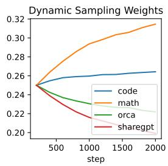  
(a) m = 200

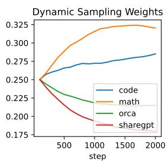  
(b) m = 100

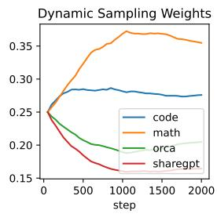  
(c) m = 50

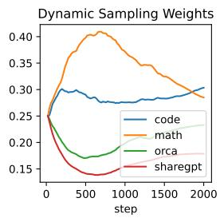  
(d) m = 20  
Figure 5: Dynamic sampling weights with different evaluation intervals. Experiments are conducted on LLaMA-MoE 3.5B-2E.

<table><tr><td>Evaluation Interval</td><td>BBH</td><td>GSM8K</td></tr><tr><td>200</td><td>29.21</td><td>8.19</td></tr><tr><td>100</td><td>30.77</td><td>11.90</td></tr><tr><td>50</td><td>29.04</td><td>7.58</td></tr><tr><td>20</td><td>28.98</td><td>5.99</td></tr></table>

Table 4: LLaMA-MoE 3.5B-2E performances with different evaluation intervals.

## A.2 Learning Efficiency

Q: How does the number of training steps affect the results? We change the number of training steps and freeze the other hyper-parameters to observe the trend of performance variation.

From Figure 6, both Uniform and Dynamic benefit from more training steps, and they consistently improve the performance on knowledge and reasoning tasks. Even 500 steps can make the fine-tuned model outperforms the foundation model (Uniform 26.67 & Dynamic 26.28 vs. w/o IT 24.97). As the number of training steps grows, Uniform seems to reach its performance ceiling, and the gap between these two methods further increases. As to the open-ended performance on MT-Bench, the Dynamic method has more fluctuations, but it could outperform the Uniform baseline as more training steps are applied.

## A.3 Inverse Hypothesis

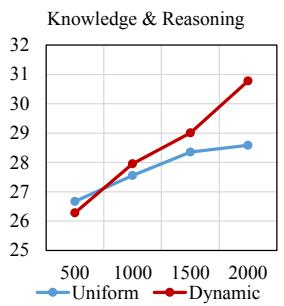

We conduct experiments on the counterpart hypothesis (denoted as Inverse), where similar datasets would have greater sampling weights in the next round during training.

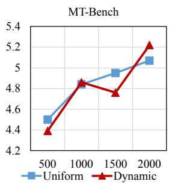

Figure 6: Performances with different training steps. Experiments are conducted on LLaMA-MoE 3.5B-2E.
<table><tr><td>Method</td><td>GSM8K</td><td>MBPP</td><td>MT-Bench</td></tr><tr><td>Inverse</td><td>5.84</td><td>17.27</td><td>4.65</td></tr><tr><td>Uniform</td><td>5.91</td><td>14.52</td><td>5.07</td></tr><tr><td>Dynamic</td><td>11.90</td><td>16.88</td><td>5.22</td></tr></table>

Table 5: Inverse-hypothesis results of LLaMA-MoE 3.5B-2E, where the sampling weights of similar datasets would be increased in the next round.

As illustrated in Figure 7, the Inverse sampling method leads to different sampling weights compared to Dynamic. As shown in Table 5, the performance of Inverse is imbalanced, where GSM8K (5.84 vs. 11.90) is much lower than Dynamic. The scores of MT-Bench also show that the Inverse method would bring an adverse effect and the performance is even lower than Uniform.

These results demonstrate that our proposed hypothesis is both intuitive and effective.

## A.4 Gate Load Differences

Here we provide the gate load L2 distance comparisons between four training datasets and five downstream benchmarks in Figure 8. We find that both

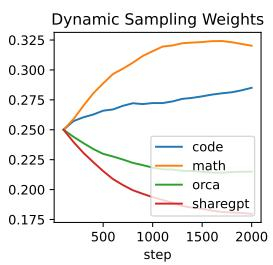  
(a) Dynamic

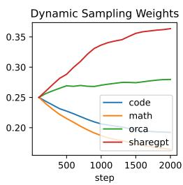  
(b) Inverse  
Figure 7: Dynamic sampling weights of different hypotheses. Experiments are conducted on LLaMA-MoE 3.5B-2E.

the Uniform and Dynamic training could ease the imbalanced token routing, while Dynamic could reach a more balanced routing scheme.

## A.5 Datasets and Metrics for Evaluations

Here we introduce the datasets and the corresponding metrics in Table 6. We evaluate different sampling strategies on 6 widely used academic benchmarks to measure knowledge and reasoning abilities. Here, we report the macro-averaged score of ARC-e, ARC-c, and BoolQ as the QA task performance. Besides, open-ended user queries (e.g. creative writing) are more common in real scenarios, so we also evaluate methods on MT-Bench (Zheng et al., 2023), which is aligned with human preferences.

## A.6 Final Sampling Weights

The final sampling weights of the proposed Dynamic method across MoE models are shown in Table 8. We find the two models show different preferences for instruction tuning datasets. MoLM prefers ShareGPT while LLaMA-MoE prefers Math-Instruct. This indicates that unified pre-defined sampling weights may not be suitable for all models, and we should devise sampling weights carefully according to their states.

## A.7 Performance Comparison with the Publicly Available SFT Model

We provide the performance comparisons with publicly available SFT models in Table 7. Since MoLM does not have corresponding SFT versions of models, we present the performance comparisons between LLaMA-MoE-SFT (Zhu et al., 2024) and our fine-tuned LLaMA-MoE models, where these models are fine-tuned on the same foundation model. Since LLaMA-MoE-SFT is only fine-tuned on a single dataset (ShareGPT), we find the simple Uniform baseline surpasses the public SFT model with large improvements, demonstrating the power of utilizing multiple instruction tuning datasets. Besides, our proposed Dynamic outperforms Uniform with large margins, showing the effectiveness of dynamic sampling.

## A.8 Detailed Results of MT-Bench & BBH

Table 9 shows the detailed multi-turn results on MT-Bench. For better comparison the Dynamic effect on different tasks, we provide the detailed results on BBH subtasks in Table 10.

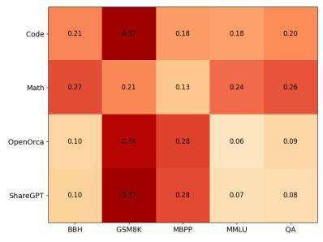  
(a) Before Training

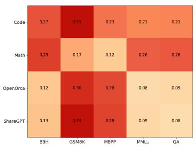  
(b) After Uniform Training

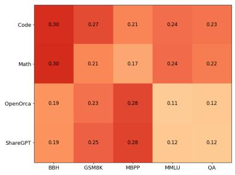  
(c) After Dynamic Training  
Figure 8: Gate load differences between training datasets and downstream benchmarks. Greater values (darker cells) indicate larger dataset differences.

<table><tr><td>Dataset</td><td>#Tasks</td><td>#Few-shots</td><td>Metric</td><td>Introduction</td></tr><tr><td>MMLU (Hendrycks et al., 2021)</td><td>57</td><td>5</td><td>Macro-averaged Accuracy</td><td>Multiple choice problems with a wide range of subjects, e.g. geography, history, etc.</td></tr><tr><td>BBH (Suzgun et al., 2022)</td><td>13</td><td>3</td><td>Macro-averaged Exact Match</td><td>Reasoning over abstract reasoning tasks, e.g. logical expressions, causal judgement, etc.</td></tr><tr><td>GSM8K (Cobbe et al., 2021)</td><td>1</td><td>8</td><td>Macro-averaged Exact Match</td><td>Grade school math problems with basic arith- metic operations (+-×÷).</td></tr><tr><td>MBPP (Austin et al., 2021)</td><td>1</td><td>0</td><td>Pass@1</td><td>Generating Python function codes to pass test cases.</td></tr><tr><td>ARC-e (Clark et al., 2018)</td><td>1</td><td>0</td><td>Normalized Accuracy</td><td>Multiple-choice grade school level science</td></tr><tr><td>ARC-c (Clark et al., 2018)</td><td>1</td><td>0</td><td>Normalized Accuracy</td><td>question answering. Similar to ARC-e with challenging question answering pairs selected.</td></tr><tr><td>BoolQ (Clark et al., 2019)</td><td>1</td><td>0</td><td>Accuracy</td><td>Given a passage and a question about world knowledge, answer YES or NO.</td></tr><tr><td>MT-Bench (Zheng et al., 2023)</td><td>8</td><td>0</td><td>Subjective Score</td><td>Given a prompt and a generated response, us- ing GPT-4 (OpenAI, 2022) to give scores from 1 to 10.</td></tr></table>

Table 6: Datasets and metrics for evaluations.

<table><tr><td>Model</td><td>MMLU</td><td>BBH</td><td>GSM8K</td><td>MBPP</td><td>QA</td><td>MT-Bench</td></tr><tr><td>w/o IT</td><td>27.98</td><td>29.67</td><td>4.63</td><td>5.12</td><td>57.45</td><td>-</td></tr><tr><td>LLaMA-MoE-SFT</td><td>25.53</td><td>28.84</td><td>2.81</td><td>7.31</td><td>57.95</td><td>4.72</td></tr><tr><td>Uniform</td><td>32.48</td><td>29.18</td><td>5.91</td><td>14.52</td><td>60.85</td><td>5.07</td></tr><tr><td>Dynamic</td><td>33.07</td><td>30.77</td><td>11.90</td><td>16.88</td><td>61.28</td><td>5.22</td></tr></table>

Table 7: Performances comparison with publicly available LLaMA-MoE-SFT.

<table><tr><td>Model</td><td>ShareGPT</td><td>OpenOrca</td><td>Math-Instruct</td><td>Code Instructions</td></tr><tr><td>MoLM 700M-4E</td><td>28.41</td><td>23.51</td><td>23.45</td><td>24.63</td></tr><tr><td>LLaMA-MoE 3.5B-2E</td><td>17.98</td><td>21.49</td><td>32.02</td><td>28.51</td></tr><tr><td>LLaMA-MoE  $3 . 5 \mathrm { B } { - } 2 \mathrm { E } _ { \mathrm { b a l a n c e d } }$ </td><td>17.21</td><td>22.45</td><td>37.66</td><td>22.68</td></tr></table>

Table 8: Final sampling weights of Dynamic (%). The summation may not equal to exact 100% due to digit rounding. We find the final static weights of different models have many variations. MoLM prefers to accept more ShareGPT, while LLaMA-MoE samples more Math-Instruct. LLaMA-MoE $3 . 5 \mathrm { B } { - } 2 \mathrm { E } _ { \mathrm { b a l a n c e d } }$ denotes the estimated sampling weights as introduced in § 4.6.1.

<table><tr><td rowspan="2">Rounds</td><td colspan="3">MoLM</td><td colspan="3">LLaMA-MoE</td></tr><tr><td>DataSize</td><td>Uniform</td><td>Dynamic</td><td>DataSize</td><td>Uniform</td><td>Dynamic</td></tr><tr><td>1st</td><td>2.81</td><td>2.98</td><td>3.10</td><td>5.52</td><td>5.78</td><td>5.96</td></tr><tr><td>2nd</td><td>2.36</td><td>2.28</td><td>2.36</td><td>4.10</td><td>4.36</td><td>4.48</td></tr><tr><td>Overall</td><td>2.59</td><td>2.63</td><td>2.73</td><td>4.81</td><td>5.07</td><td>5.22</td></tr></table>

Table 9: Detailed results on MT-Bench. Each question in MT-Bench has two turns of responses. Here we list the results of each turn.

<table><tr><td rowspan="2">Rounds</td><td colspan="3">MoLM</td><td colspan="3">LLaMA-MoE</td></tr><tr><td>DataSize</td><td>Uniform</td><td>Dynamic</td><td>DataSize</td><td>Uniform</td><td>Dynamic</td></tr><tr><td>Boolean Expressions</td><td>53.20</td><td>54.40</td><td>55.20</td><td>49.20</td><td>47.20</td><td>46.80</td></tr><tr><td>Causal Judgement</td><td>36.90</td><td>52.94</td><td>51.87</td><td>52.94</td><td>52.41</td><td>50.80</td></tr><tr><td>Date Understanding</td><td>20.80</td><td>18.40</td><td>19.20</td><td>24.40</td><td>29.60</td><td>36.80</td></tr><tr><td>Disambiguation Qa</td><td>38.00</td><td>38.80</td><td>38.80</td><td>30.80</td><td>31.60</td><td>28.00</td></tr><tr><td>Dyck Languages</td><td>9.20</td><td>13.60</td><td>15.20</td><td>18.40</td><td>10.80</td><td>15.60</td></tr><tr><td>Formal Fallacies</td><td>37.60</td><td>39.60</td><td>21.60</td><td>49.20</td><td>53.20</td><td>52.40</td></tr><tr><td>Geometric Shapes</td><td>12.00</td><td>9.60</td><td>10.40</td><td>9.60</td><td>9.60</td><td>22.40</td></tr><tr><td>Hyperbaton</td><td>48.40</td><td>48.40</td><td>48.40</td><td>51.60</td><td>45.60</td><td>43.60</td></tr><tr><td>Logical Deduction Five Objects</td><td>8.40</td><td>21.20</td><td>22.80</td><td>18.40</td><td>22.80</td><td>20.00</td></tr><tr><td>Logical Deduction Seven Objects</td><td>10.00</td><td>17.20</td><td>14.40</td><td>15.60</td><td>15.60</td><td>14.40</td></tr><tr><td>Logical Deduction Three Objects</td><td>34.00</td><td>33.60</td><td>34.40</td><td>39.20</td><td>36.40</td><td>38.00</td></tr><tr><td>Movie Recommendation</td><td>14.80</td><td>22.40</td><td>19.60</td><td>41.60</td><td>22.40</td><td>26.00</td></tr><tr><td>Multistep Arithmetic Two</td><td>0.00</td><td>0.00</td><td>0.00</td><td>0.80</td><td>1.20</td><td>1.20</td></tr><tr><td>Navigate</td><td>32.40</td><td>42.40</td><td>46.40</td><td>50.80</td><td>56.40</td><td>50.80</td></tr><tr><td>Object Counting</td><td>14.80</td><td>16.80</td><td>13.20</td><td>33.20</td><td>33.60</td><td>38.40</td></tr><tr><td>Penguins In A Table</td><td>10.27</td><td>10.27</td><td>22.60</td><td>20.55</td><td>21.23</td><td>26.03</td></tr><tr><td>Reasoning About Colored Objects</td><td>1.60</td><td>7.60</td><td>13.20</td><td>7.60</td><td>14.00</td><td>21.60</td></tr><tr><td>Ruin Names</td><td>20.80</td><td>11.60</td><td>10.80</td><td>21.20</td><td>18.00</td><td>20.00</td></tr><tr><td>Salient Translation Error Detection</td><td>20.80</td><td>11.60</td><td>18.00</td><td>22.40</td><td>22.40</td><td>22.40</td></tr><tr><td>Snarks</td><td>48.31</td><td>51.69</td><td>52.25</td><td>55.62</td><td>46.63</td><td>60.67</td></tr><tr><td>Sports Understanding</td><td>46.00</td><td>54.00</td><td>54.40</td><td>56.00</td><td>58.40</td><td>57.60</td></tr><tr><td>Temporal Sequences</td><td>27.60</td><td>21.20</td><td>25.20</td><td>11.60</td><td>10.80</td><td>12.80</td></tr><tr><td>Tracking Shuffled Objects Five Objects</td><td>6.80</td><td>8.40</td><td>18.40</td><td>13.60</td><td>20.00</td><td>16.40</td></tr><tr><td>Tracking Shuffled Objects Seven Objects</td><td>7.20</td><td>14.00</td><td>14.00</td><td>12.80</td><td>15.20</td><td>14.80</td></tr><tr><td>Tracking Shuffled Objects Three Objects</td><td>33.20</td><td>32.80</td><td>36.00</td><td>33.60</td><td>33.60</td><td>32.00</td></tr><tr><td>Web Of Lies</td><td>51.20</td><td>50.40</td><td>49.60</td><td>49.60</td><td>51.60</td><td>53.60</td></tr><tr><td>Word Sorting</td><td>2.00</td><td>1.20</td><td>2.00</td><td>5.20</td><td>7.60</td><td>7.60</td></tr><tr><td>Average</td><td>23.94</td><td>26.08</td><td>26.96</td><td>29.46</td><td>29.18</td><td>30.77</td></tr></table>

Table 10: Detailed results on different subtasks of BBH.