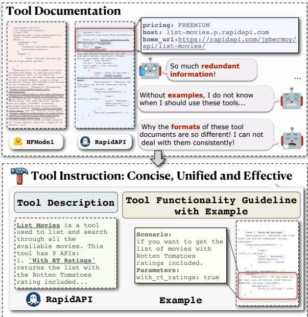
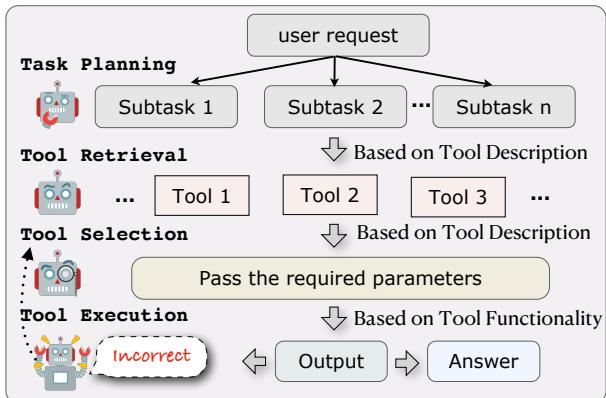
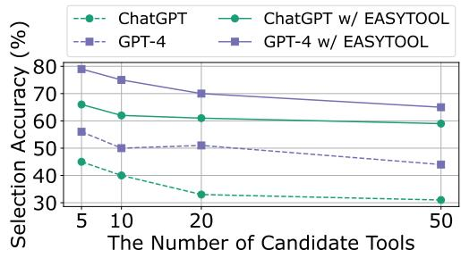
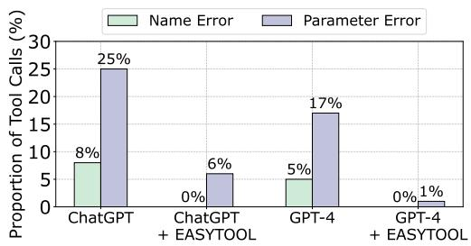
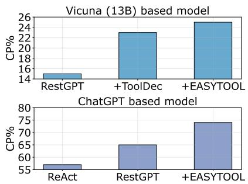
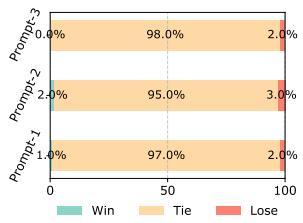
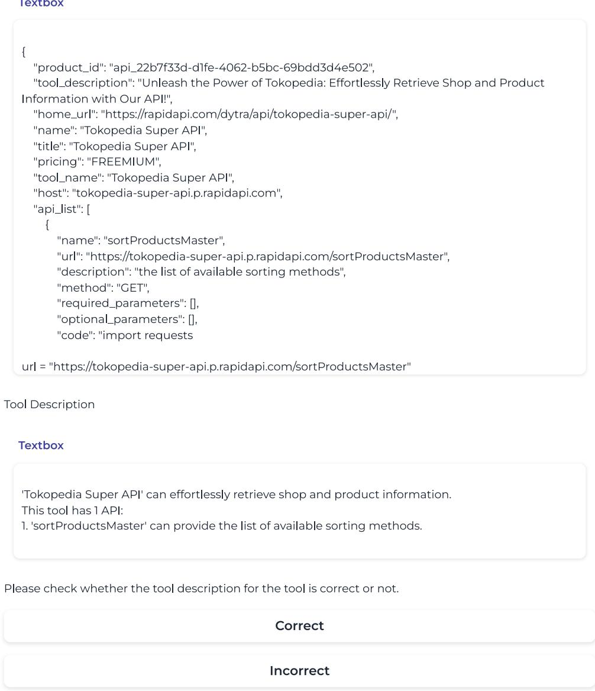
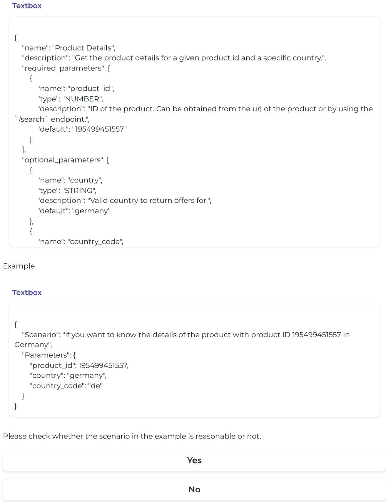
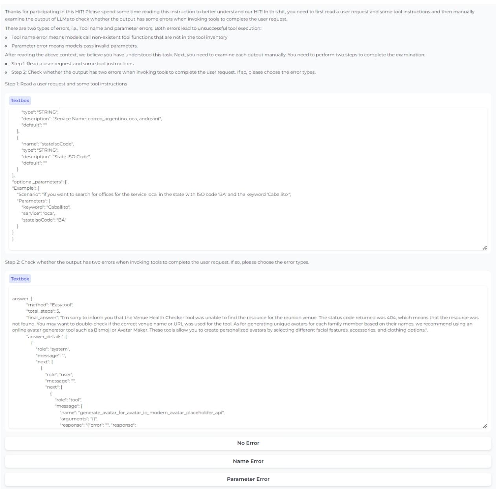

# EASYTOOL: Enhancing LLM-based Agents with Concise Tool Instruction

Siyu Yuan<sup>1</sup> ∗, Kaitao Song<sup>2</sup> ∗†,

Jiangjie Chen<sup>1</sup>, Xu Tan<sup>2</sup>, Yongliang Shen<sup>3</sup>, Kan Ren<sup>2</sup>, Dongsheng Li<sup>2</sup>, Deqing Yang Fudan University<sup>1</sup>, Microsoft Research Asia<sup>2</sup>, Zhejiang University<sup>3</sup> syyuan21@m.fudan.edu.cn, {kaitaosong, xuta, dongsli}@microsoft.com syl@zju.edu.cn, {jjchen19,yangdeqing}@fudan.edu.cn

## Abstract

There has been a rising interest in utilizing tools in applications of autonomous agents based on large language models (LLMs) to address intricate real-world tasks. To develop LLMbased agents, it usually requires LLMs to understand many tool functions from different tool documentations. However, these documentations could be diverse, redundant, or incomplete, which immensely affects the capability of LLMs in using tools. Current LLMs exhibit satisfactory instruction-following capabilities based on instruction-following fine-tuning process. Motivated by this, in this paper, we introduce EASYTOOL, a framework transforming diverse and lengthy tool documentation into a unified and concise tool instruction to fully leverage instruction-following capabilities of LLMs for easier tool usage. EASY-TOOL purifies essential information from extensive tool documentation of different sources, and elaborates a unified interface (i.e., tool instruction) to offer standardized tool descriptions and functionalities for LLM-based agents. Extensive experiments on multiple different tasks demonstrate that EASYTOOL can significantly reduce token consumption and improve the performance of LLM-based agents on tool utilization in real-world scenarios. Our code is available in supplemental materials. Our code is available at https://github.com/ microsoft/JARVIS/tree/main/easytool.

## 1 Introduction

Large language models (LLMs) (OpenAI, 2023; Touvron et al., 2023a,b; Team and Google, 2023) have recently ignited the spark of LLM-based autonomous agents (Shen et al., 2023a; Gravitas, 2023), which aim to interact with the real-world scenarios and address complex user requests. A rising trend in enhancing their effectiveness is to endow them with the capability of using external tools (Schick et al., 2023; Shen et al., 2023a; Qu et al., 2024). To bridge the gap between LLMs and tool usage, agents usually first analyze a user request, conduct planning or reasoning to decompose it into sub-tasks, and then select the most suitable tools for execution to obtain the final answer. Therefore, improving LLMs’ capability to use tools precisely has been critical to developing an autonomous agent.

  
Figure 1: An illustration of the proposed EASYTOOL, and some issues in tool documentation, e.g., Inconsistency, Redundancy, Incompleteness. The documentations can be polished and refined by EASYTOOL into more concise and effective tool instructions for better tool usage.

Previously, some researchers (Schick et al., 2023; Qin et al., 2023; Patil et al., 2023; Parisi et al., 2022; Hao et al., 2023) fine-tune open-source LLMs to generate calling functions to use tools. However, these methods usually require additional datasets with tool use for training, cannot be extended to widely deployed black-box LLMs, and lack flexibility in integrating external tools in a plug-and-play way. Another line of work (Song et al., 2023; Lu et al., 2023; Xu et al., 2023; Chen et al., 2023; Wang et al., 2024) retrieves and calls external tools by providing tool documentation and few-shot demonstrations of tool functionality. However, these methods struggle with limited context length and face difficulties when handling unusual tools, and thus hinder the development of an omnipotent LLM-based agent. Therefore, extensive effort is still required to efficiently and effectively improve the quality of tool utilization.

For tool utilization, tool documentation plays an indispensable component, which could include multiple meta information like tool descriptions, tool parameters, demonstrations and so on. However, as shown in Figure 1, we summarize the issues from existing documentation that could hinder the tool utilization of LLM-based agents:

• Inconsistency: Massive tools from different sources often have inconsistent and diverse documentation formats, posing new challenges for LLMs to understand;

• Redundancy: Tool documentation could encompass massive redundant and useless information, making it harder to grasp tool functionality and resulting in excessive token consumption in prompts;

• Incompleteness: We expect the tool documentation to provide useful information to describe its functions, parameters and demonstrations for instructions. However, the absence of critical information in some tool documentations impedes effective tool utilization.

Overall, we regard the information provided by tool documentation as a critical element in instructing LLMs to use tools. However, the above issues in tool documentation bring some challenges to LLM-based agents to understand, especially considering the increasing of massive and diverse tools from different domains. Therefore, how to parse the documentation, extract the most essential information and provide a unified format has become a necessary topic to effectively use tools.

Recent LLMs, such as GPT-4 (OpenAI, 2023), ChatGPT (OpenAI, 2022), Vicuna (Chiang et al., 2023), and Mistral (Jiang et al., 2023a), demonstrate strong instruction-following capabilities due to their fine-tuning for this skill (Wang et al., 2023; Ren et al., 2024). Inspired by this, in this paper, we introduce EASYTOOL, an easy and effective method to create clear, structured, and unified instructions from tool documentations for improving LLM-based agents in using tools. High-quality tool instructions should follow two criteria: easy to 1) understand its functionality for selection and 2) predict its parameters for usage. To this end, we first collect massive tool documentations from different sources (e.g., RestBench (Song et al., 2023) and ToolBench (Qin et al., 2023)). Instead of directly using these various tool documentations with different complicated structures, we transform these documentations into a more concise and unified tool instruction, which includes standard tool descriptions and guidelines for toolfunctionality. The converted tool descriptions can eliminate irrelevant content and only keep the core functionality of each tool for LLMs to attend to. Moreover, EASY-TOOL provides detailed information for tool usage (e.g., its parameters with demonstrations generated by ChatGPT (OpenAI, 2022)) in tool functionality guidelines to instruct LLMs with tool usage.

Extensive experiments on multiple tool-usage benchmarks demonstrate these concise tool instructions generated by EASYTOOL can significantly reduce incorrect tool usage. Furthermore, we also prove that the capability of EASYTOOL can be generalized to open-source LLMs in a plug-and-play way and greatly improve their performance on tool utilization in different real-world tool-usage scenarios. Our contributions can be summarized as:

• We analyze and explore the limitations of current tool utilization in LLM-based agents and first point out the deficiencies of tool documentation that hinder LLMs in using tools.

• To address these issues, we propose EASYTOOL, which creates high-quality tool instructions from documentation to facilitate tool usage in LLMbased agents.

• Experimental results on three datasets from distinct domains show that our EASYTOOL effectively and efficiently improves the capability of LLMs in tool utilization.

## 2 Related Work

With the emergence of powerful LLMs (OpenAI, 2023; Touvron et al., 2023a,b), using tools has been considered a new trend to enhance the capabilities of LLMs A conventional strategy is to build synthetic data (Schick et al., 2023; Qin et al., 2023; Li et al., 2023; Patil et al., 2023; Shen et al., 2023b) involved tool use and then fine-tune LLMs to generate text with tool invocation. However, these methods cannot be extended to some powerful closed LLMs, and lack the capability to use new tools. Although some methods (Hao et al., 2023) attempted to fine-tune LLMs to obtain tool embeddings for plug-and-play usage, they still require additional data for training to get tool embeddings.

  
Figure 2: The four-stage framework of LLM-based agents in tool-usage applications.

Therefore, there has arisen another branch (Shen et al., 2023a; Song et al., 2023; Gravitas, 2023) that directly used LLMs as the controller and feed tool descriptions into prompts to instruct LLMs to understand and call tools. These methods do not need extra training and can use external tools in a plug-and-play paradigm, but they are limited to context sizes and the quality of tool documentation. As a result, these methods will lead to some failed or incorrect tool invocation (Zhang et al., 2023a). Some work (Hsieh et al., 2023; Xu et al., 2023) attempts to revise tool documentation to support a zero-shot tool utilization, but some inherent issues of tool documentation in real-world scenarios still hinder the effective and efficient usage of many tools. Besides, different from naive prompt compression (Mu et al., 2023; Jiang et al., 2023b), which is only suitable to compress plain prompt, the streamlined information from tool documentation should satisfy specific format and need to confirm the accuracy of tool invocation when processing user requests.

<table><tr><td>Dataset</td><td>Tokenpesc.</td><td>Tokenpoc.</td><td>Exp.</td></tr><tr><td>RestBench (Song et al., 2023)</td><td>58</td><td>3,881</td><td>x</td></tr><tr><td>Gorilla (Patil et al., 2023)</td><td>88</td><td>284</td><td>x</td></tr><tr><td>ToolAlpaca (Tang et al., 2023)</td><td>567</td><td>7,661</td><td>x</td></tr><tr><td>ToolBench (Qin et al., 2023)</td><td>744</td><td>2,530</td><td>x</td></tr><tr><td>HFmodels (Shen et al., 2023a)</td><td>777</td><td>1,196</td><td>V</td></tr></table>

Table 1: The statistics of tool documentations in tool benchmarks. We report the average length of the tool description with parameters $( \mathbf { T o k e n } _ { \mathsf { D e s c . } } )$ , the average length of the tool documentations $\mathbf { ( T o k e n _ { D o c . } ) }$ and whether the benchmarks have tool usage scenarios and example (Exp.).

## 3 Preliminary

## 3.1 Task Formulation

Motivated by previous works (Shen et al., 2023a; Song et al., 2023), just as shown in Figure 2, the pipeline of LLM-based agents for tool utilization can be summarized as a four-stage framework as:

• Task Planning: Agents analyze a user request T and decompose it into subtasks $T =$ $\{ t _ { 1 } , t _ { 2 } , . . . , t _ { n } \}$ with specific dependencies and execution orders, each optimized for execution with a single tool.

• Tool Retrieval: Here, the focus is on matching these subtasks with suitable tools from the tool inventory based on the similarity between the subtasks and tools. The aim is to select the top-K tools $\{ a _ { 1 } , a _ { 2 } , . . . , a _ { K } \}$ , that have the highest similarity to each subtask, forming a set of candidate tools for each.

• Tool Selection: In this stage, the most appropriate tool for each subtask from the set $\left\{ a _ { 1 } , a _ { 2 } , . . . , a _ { K } \right\}$ is chosen based on its description. This stage also includes preparing the parameters for tool execution, as specified in its document.

• Tool Execution: After tool selection and parameter setup, the tool is executed. If a tool fails during execution, the process reverts to the tool selection stage for an alternative choice. This retry mechanism continues until successful execution or until the maximum trial R is reached.

After these stages, agents can orchestrate different tools and use their powers to generate the final answer for each user request.

## 3.2 Analysis

Previous studies typically adhere to the established paradigm, instructing LLMs with the tool documentation to use tools. However, relying on the tool documentation can hinder the performance of LLM-based agents due to its inherent limitations.

Inconsistency In the real world, a wide variety of tools from different sources results in substantial diversity in terms of format, style, and guidelines. As a result, this diversity contributes to a mess of tool documentations without a cohesive and standardized structure, posing a significant challenge for LLMs to effectively use these tools.

Redundancy Generally, the tool documents from different communities usually contain redundant information (e.g., URLs, IDs, etc.). In practical application, we just require LLMs to understand the core function of the tool and then decide whether to use and how to use this tool. As shown in Table 1, we analyze multiple tool-based benchmarks and the results reveal a high proportion of redundant information in many tool documentations. For example, the average length of tool documentations used in ToolBench is approximately 2,530 tokens in Table 1.<sup>1</sup> This useless information can severely hinder LLMs from retrieving and selecting tools, leading to an incorrect tool invocation. Moreover, LLMs are constrained by a maximum context length, yet tool documentation is typically lengthy. This excessive length can limit the range of tool options available for LLMs to consider, posing a challenge for efficient tool selection.

Incompleteness Previous work has demonstrated that LLMs may pass invalid parameters, leading to tool execution failure (Song et al., 2023; Qin et al., 2023; Zhang et al., 2023a). As shown in Table 1, unlike human-oriented instruction manuals that provide usage scenarios and examples, existing tool documentation typically lacks such context, only offering example codes for tool invocation or results. This leads to LLMs struggling to know when and how to refer to the examples to pass the correct parameters, resulting in invalid parameters.

## 4 Method

As aforementioned, polishing, streamlining, and enhancing the tool documentation is important to improve tool utilization in LLM-based agents. Currently, most of LLMs (OpenAI, 2022, 2023; Jiang et al., 2023a; Chiang et al., 2023) exhibit satisfactory instrution-following capability due to instruction-following fine-tuning process (Wang et al., 2023; Ren et al., 2024). Motivated by this, we introduce EASYTOOL, a simple method to condense tool documentation into more concise and effective tool instructions to improve LLM-based agents in tool utilization. The overall workflow is illustrated in Figure 1. EASYTOOL comprises two stages: the first stage is to re-organize the original tool documentation by eliminating the irrelevant information and only summarizing the multiple builtin function description of each tool ( 4.1). For each tool, we further design a functional guideline instruction for LLMs and enable LLMs to further refine the tool documentation by providing parameters of each tool and simultaneously the examples to instruct LLMs for usage ( 4.2).

## 4.1 Tool Description Generation

As described above, tool documentation usually includes plenty of irrelevant information, making it difficult to understand practical usage for LLMs. Moreover, some tools that enable multiple builtin functions for different scenarios are not always comprehensively described. For example, Google Maps offers both distance calculations and coordinate provision, but its description might not cover all functionalities. To address this, we expect to use LLMs to polish and streamline these tool documentations and decode them into more concise and effective tool descriptions. Here, just as shown in Table 2 (I), we design an instruction and require LLMs (i.e., ChatGPT) to convert tool documentation to summarize its general purpose by following the designed instruction. Then, for each function in tool documentation, we ask the LLM to generate the functionality of it. We also add extra demonstrations to enhance the instruction-following of LLMs in parsing tool documentation.

## 4.2 Tool Functionality Guidelines Construction

The tool descriptions generated in the previous step aid LLMs in tool retrieval and selection. However, we still need to predict the correct parameters of each tool for a successful execution. Previous work (Qin et al., 2023; Zhang et al., 2023a; Xu et al., 2023) also confirms that many open-source LLMs are still inadequate in executing tools, resulting in parameter errors. Therefore, we further polish our tool descriptions in the first stage to supplement the parameters in the tool instructions. Here, we design another instruction that requires LLMs to extract parameters from tool documentation and then organize it into a structured output, thus facilitating LLMs to invoke tools. As shown in Table 2 (II), we use ChatGPT to create examples, including scenarios and parameter names with values to demonstrate how to input parameters for different scenarios and enhance LLMs to precisely use tools. To verify the quality of generated examples for the tool functionality guidelines, we input the parameters to execute the tools to confirm the correct input of parameters and the accuracy of results.

I: Tool Description Generation   
/\* I: Task prompt \*/   
Your task is to create a concise and effective tool usage   
description based on the tool documentation. You should   
ensure the description only contains the purposes of the   
tool without irrelevant information. Here is an example:   
/\* Examples \*/   
{Tool Documentation}   
Tool usage description:   
{Tool\_name} is a tool that can {General\_Purposes}.   
This tool has {Number} multiple built-in functions:   
1. {Function\_1} is to {Functionality\_of\_Function\_1}   
2. {Function\_2} is to ...   
/\* Auto generation oftool description \*/   
{Tool Documentation of ‘Aviation Weather Center’}   
Tool usage description:   
‘Aviation Weather Center’ is a tool which can provide official   
aviation weather data...   
II: Tool Function Guidelines Construction   
/\* Task prompt \*/   
Your task is to create the scenario that will use the tool.   
1. You are given a tool with its purpose and its parameters   
list. The scenario should adopt the parameters in the list.   
2. If the parameters are null, you   
should set: {"Scenario": XX, "Parameters":{}}.   
Here is an example:   
/\* Examples \*/   
{Tool\_name} is a tool that can {General\_Purposes}.   
{Function\_i} is to {Functionality\_of\_Function\_i}   
{Parameter List of Function\_i}   
One scenario for {Function\_i} of {Tool\_name} is:   
{"Scenario": XX, "Parameters":{XX:XX}}   
/\* Auto-constructionfor Tool Function Guidelines \*/   
‘Ebay’ can get products from Ebay in a specific country.   
‘Product Details’ in ‘Ebay’ can get the product details for a   
given product id and a specific country.   
{Parameter List of ‘Product Details’}   
One scenario for ‘Product Details’ of ‘Ebay’ is:   
{"Scenario": "ifyou want to know the details ofthe product   
with product ID 1954 in Germanyfrom Ebay",   
"Parameters":{"product\_id": 1954, "country": "Germany"}}.  
Table 2: Examples of prompt for ChatGPT for tool description generation and tool function guidelines construction. Green texts are generated by ChatGPT.

<table><tr><td>Dataset</td><td>Tokenpoc.</td><td></td><td>TokenIns. Reduce (%)</td></tr><tr><td>ToolBench</td><td>2,530</td><td>748</td><td>70.43%</td></tr><tr><td>RestBench</td><td>3,881</td><td>103</td><td>97.35%</td></tr></table>

Table 3: The average number of tokens in each tool documentation $\mathbf { ( T o k e n _ { D o c . } ) }$ and tool instruction generated by EASYTOOL $\mathbf { \left( T o k e n _ { I n s . } \right) }$ . We also report the reduced ratio (i.e. Reduce (%)) for reference.

## 4.3 Evaluation

To assess the quality of tool descriptions, we select 100 examples from ToolBench and employ three annotators to evaluate their accuracy. To assess the plausibility of the scenarios, we also sample 100 tool functionality guidelines from ToolBench and employ three annotators to evaluate the plausibility of the scenarios. To process conflicting annotations, we adopt a voting majority principle to determine the results. Finally, the evaluation results demonstrate that the correctness of tool description and tool functionality guidelines can reach a value of 100% accuracy, with Fleiss’s κ = 0.97. This demonstrates that LLMs can summarize highquality tool descriptions and generate plausible scenarios based on tool documentation, thereby highlighting the simplicity and effectiveness of EASY-TOOL. The annotation details for tool instruction are shown in Appendix A. The evaluation on the robustness of the prompts is shown in Appendix D. The hallucination evaluation for tool instruction is shown in Appendix E. We also compare with prompt compression methods in Appendix F.

## 5 Experiment

In this section, we adopt EASYTOOL to three distinct tool-use applications to show that EASYTOOL can help LLM-based agents better answer realworld user requests through tool usage ( 5.1), find correct tool solution paths ( 5.2), and improve their tool utilization capabilities on complex math problems ( 5.3).

## 5.1 Real-World Question Answering

Since LLMs are still limited in their training data, it is essential for them to use external tools to access up-to-date information in response to user requests.

Benchmark We choose ToolBench (Qin et al., 2023), a dataset containing diverse user requests with a massive set of publicly available REST API tools. The API tools in ToolBench are collected from RapidAPI, which requires additional individual subscriptions with payments. Therefore, we follow the strategy of many previous works to only select the subsets for evaluation (Zhang et al., 2023a; Du et al., 2024; Liu et al., 2024). Other subsets of ToolBench only contain a single tool from the same category. Compared with other subsets of ToolBench, I2-Category and I3-Instruction contain complex user requests that need multiple tools from different categories to solve, which are more aligned with real-world user requests. Therefore, we only select I2-Category and I3-Instruction and conduct experiments on these 300 data samples. Each data of ToolBench consists of a user request with a ground truth toolset, and thus models only need to select and execute the tools from the ground truth toolset to complete the user request.

<table><tr><td rowspan="2">Model</td><td rowspan="2">Method</td><td colspan="3">I2-Category</td><td colspan="3">I3-Instruction</td><td colspan="3">Average</td></tr><tr><td>Pass</td><td>Win</td><td>Success</td><td>Pass</td><td></td><td>Win Success</td><td>Pass</td><td>Win</td><td>Success</td></tr><tr><td rowspan="4">ChatGPT</td><td>ReACT</td><td>39.0</td><td></td><td>18.0</td><td>23.0</td><td></td><td>1.0</td><td>31.0</td><td></td><td>9.5</td></tr><tr><td>DFSDT</td><td>64.5</td><td>63.0</td><td>24.0</td><td>60.0 70.0</td><td></td><td>6.0</td><td>62.3</td><td>66.5</td><td>15.0</td></tr><tr><td>+EASYTOOL</td><td>74.5</td><td>76.5</td><td>68.5</td><td>65.0</td><td>88.0</td><td>37.0</td><td>69.8</td><td>82.3</td><td>52.8</td></tr><tr><td>+EASYTOOL +Re. ReACT</td><td>69.0 30.0</td><td>71.0 45.5</td><td>60.5 9.5</td><td>66.0</td><td>89.0 49.0</td><td>42.0</td><td>67.5</td><td>80.0</td><td>51.3 6.3</td></tr><tr><td>ToolLLaMA-7B</td><td>DFSDT +Re. ReACT</td><td>66.0 57.0 3.0</td><td>55.0 60.0 0.0</td><td>24.0 11.5 0.0</td><td>22.0 56.0 54.0 0.0</td><td>56.0 69.0 0.0</td><td>3.0 6.0 2.0 0.0</td><td>26.0 61.0 55.5</td><td>47.3 55.5 64.5</td><td>15.0 6.8</td></tr><tr><td>Llama-3.1-8B-Instruct</td><td>DFSDT +EASYTOOL +EASYTOOL +Re.</td><td>12.0 75.0 69.0</td><td>32.0 75.0 69.0</td><td>10.0 60.0 57.5</td><td>8.0 69.0 68.0</td><td>3.0 88.0</td><td>1.0 37.0</td><td>1.5 10.0 72.0</td><td>0.0 17.5 81.5</td><td>0.0 5.5 48.5</td></tr><tr><td></td><td>ReACT</td><td>24.0</td><td>10.0</td><td>11.0</td><td>20.0</td><td>89.0 13.0</td><td>42.0 10.0</td><td>68.5 22.0</td><td>79.0 11.5</td><td>49.8 10.5</td></tr><tr><td rowspan="2">Llama-3.1-70B-Instruct</td><td>DFSDT +EASYTOOL</td><td>45.0 71.5</td><td>40.0 79.0</td><td>27.0 70.0</td><td>35.0 70.0</td><td>56.0 89.0</td><td>21.0 60.0</td><td>40.0 70.8</td><td>48.0 84.0</td><td>24.0 65.0</td></tr><tr><td>+EASYTOOL +Re.</td><td>70.0 71.0</td><td>65.0</td><td></td><td>71.0 89.0</td><td></td><td>54.0</td><td>70.5</td><td>80.0</td><td>59.5</td></tr><tr><td rowspan="4">GPT-4</td><td>ReACT</td><td>67.5 53.5</td><td></td><td>27.0</td><td>40.0</td><td>71.0</td><td>4.0</td><td>53.8</td><td>62.3</td><td></td><td>15.5</td></tr><tr><td>DFSDT</td><td>69.5 57.0</td><td></td><td>42.0</td><td>59.0</td><td>73.0</td><td>50.0</td><td>64.3</td><td>65.0</td><td></td><td>46.0</td></tr><tr><td>+EASYTOOL</td><td>76.5</td><td>78.5</td><td>76.0</td><td>69.0</td><td>89.0</td><td>64.0</td><td>72.8</td><td>83.8</td><td></td><td>70.0</td></tr><tr><td>+EASYTOOL +Re.</td><td>72.5</td><td>72.0</td><td>73.5</td><td>69.0</td><td>90.0</td><td>53.0</td><td></td><td></td><td></td><td>63.3</td></tr><tr><td rowspan="4">GPT-40</td><td></td><td></td><td></td><td></td><td></td><td></td><td></td><td></td><td>70.8</td><td>81.0</td><td></td></tr><tr><td>ReACT</td><td>66.0</td><td>56.5</td><td>30.0</td><td>42.0</td><td>71.0</td><td>5.0</td><td></td><td>54.0</td><td>63.8</td><td></td></tr><tr><td>DFSDT</td><td>72.5</td><td>63.5</td><td>54.5</td><td>60.0</td><td>80.0</td><td>63.0</td><td></td><td>66.3</td><td>71.8</td><td>17.5</td></tr><tr><td>+EASYTOOL +EASYTOOL +Re. 76.5</td><td>80.5</td><td>81.5</td><td>83.0</td><td>73.0 81.0 69.0</td><td>90.0</td><td>71.0</td><td></td><td>76.8</td><td>85.8</td><td>63.8 77.0</td></tr></table>

Table 4: Results of LLMs on ToolBench. Win rate (denoted as Win) is calculated by comparing each model with ChatGPT-ReACT. The win rate higher than 50% means the model performs better than ChatGPT-ReACT. Following (Qin et al., 2023), apart from adopting retriever (i.e., +Re.), all methods use the ground truth toolset to select tools. The best results are bolded, and the second best ones are underlined.

For evaluation, ToolBench designs two evaluation metrics based on ChatGPT: (1) Pass Rate, calculated by the proportion of instructions successfully completed within a limited budget; (2) Win Rate, measured by asking a ChatGPT evaluator to select its preference for two solution paths. Following (Qin et al., 2023), we also measure Success Rate, which asks GPT-4 to check whether the responses can reasonably and accurately answer the user requests.<sup>2</sup>

Baselines Following (Qin et al., 2023), we select ChatGPT (OpenAI, 2022), GPT-4, GPT-4o (OpenAI, 2023), Llama-3.1-8B-Instruct, Llama-3.1- 70B-Instruct (Dubey et al., 2024), and ToolLLaMA-7B as backbone models. ToolLLaMA-7B is finetuned from a 7B LLaMA model (Touvron et al., 2023a) on ToolBench. Both ReACT (Yao et al., 2023) and DFSDT (Qin et al., 2023) are common baselines in tool learning and have been implemented in the ToolBench as well. To make a fair comparison, we apply them as our baseline. We do not adopt ToolLLaMA-7B on EASYTOOL due to its poor instruction-following capability.<sup>3</sup> For the baselines, we follow the settings in (Qin et al., 2023), which provides tool documentation for them

<table><tr><td rowspan="2">Method</td><td colspan="2">I2-Category</td><td colspan="2">I3-Instruction</td><td colspan="2">Average</td></tr><tr><td>@1</td><td>@5</td><td>@1</td><td>@5</td><td>@1</td><td>@5</td></tr><tr><td>BERT Retriever</td><td>68.2</td><td>77.9</td><td>81.7</td><td>87.1</td><td>75.0</td><td>82.5</td></tr><tr><td>Ada</td><td>36.8</td><td>30.7</td><td>54.6</td><td>46.8</td><td>45.7</td><td>38.8</td></tr><tr><td>+ EASYTOOL</td><td>73.4</td><td>82.7</td><td>80.1</td><td>88.5</td><td>76.7</td><td>85.6</td></tr></table>

Table 5: The performance of different retrievers for two subsets in ToolBench. We report NDCG@1 and NDCG@5.

  
Figure 3: The selection accuracy of LLMs on I1- instruciton of ToolBench.

to use tools.

Main Result We simplify the tool documentation from ToolBench into concise tool instructions with EASYTOOL.<sup>4</sup> Each tool instruction consists of a tool description and functionality guidelines. As shown in Table 3, with EASYTOOL, replacing tool documentation with our tool instruction can greatly reduce the token cost of each tool. Especially in ToolBench, the token cost was reduced by 70.43%. Furthermore, results in Table 4 show that: 1) EASYTOOL can help LLMs achieve state-of-the-art performance, indicating the superiority of tool Instructions over tool documentation in facilitating tool usage for LLM-based agents; 2) Tool instructions generated by EASYTOOL can help small models (e.g., Llama3.1-8B-Instruct) to better understand the usage of tools, even making them outperform the fine-tuned method, i.e., Tool-LLaMA. 3) Llama3.1-70B-Instruct outperforms Llama3.1-8B-Instruct with EASYTOOL, indicating that models with better instruction-following capabilities can achieve greater improvements with high-quality tool instructions.

EASYTOOL for Tool Retrieval In real-world scenarios, asking users to manually recommend tools from a large pool for LLMs to select may not be practical. Therefore, ToolBench also provides a dense retriever based on BERT-base (Devlin et al., 2019) to retrieve relevant tools for solving user requests, and claims that it outperforms text-embedding-ada-002, i.e. GPT Ada (Ouyang et al., 2022), which retrieves tools based on the cosine embedding similarity between the subtasks decomposed by user requests and tool descriptions from original tool documentation in ToolBench. We argue that the poor performance of Ada may be due to low-quality tool descriptions, which often contain irrelevant details and lack clear functionality guidelines. Thus, we replace the original tool descriptions with the ones generated by EASYTOOL. Following (Qin et al., 2023), we compare the performance of these retrieval methods using NDCG (Järvelin and Kekäläinen, 2002). NDCG is a ranking quality metric that compares rankings to an ideal order in which all relevant items are at the top of the list. Results in Table 5 show EASYTOOL can greatly improve the tool retrieval performance.

  
Figure 4: Error rates of tool calls in different LLMs. The error rate is the number of two tool-related errors relative to the total number of tool calls. The results are evaluated by human annotators.

EASYTOOL for Tool Selection We utilize the I1-Instruciton of ToolBench, which comprises 100 user requests solvable by a single tool. We first obtain the golden tool from I1-Instruction and then retrieve other different tools based on cosine embedding similarity between the user request and tool descriptions as candidate tools. Then, we evaluate the selection accuracy of LLMs with varying numbers of candidate tools, using either original ToolBench descriptions or those generated by EASYTOOL. Figure 3 illustrates that EASYTOOL enhanced descriptions enable LLMs to select the correct tool more effectively from a larger pool.

EASYTOOL for Tool Execution For each subtask in I2-Category and I3-Instruction, we retrieve the top 10 most similar tools using our tool descriptions and ask models to select and execute them.

  
Figure 5: The correct path rate (CP%) on two versions of RestBench with different methods.

As shown in Table 4, using these retrieved tools proves comparable, and sometimes even superior, to the ground truth tool set. The rationale is that EASYTOOL with retriever can retrieve similar tools with better functionalities to replace some tools in the ground truth tool set.

Error Analysis We follow (Zhang et al., 2023a) and define two types of error: Tool name error means models call non-existent tool functions that are not in the tool inventory, and parameter error means models pass invalid parameters. Both errors lead to unsuccessful tool execution. We sample 100 data from I2-Category and I3-Instruction and employ three annotators to manually examine the output of LLMs with tool documentation and tool instruction generated by EASYTOOL (Fleiss’s κ = 0.91). The results in Figure 4 show that LLMs may generate non-existent tool names and pass invalid parameters to the right tool functions. However, EASYTOOL can significantly reduce these incorrect behaviors, leading to successful tool execution.<sup>5</sup>

## 5.2 Real-World Web Services

Real-world web services often need to execute tools following a specific order. We aim to explore the capability of LLMs to find correct tool solution paths.

Benchmark and Baselines We select Rest-Bench (Song et al., 2023), comprising tasks in real-world web service scenarios. We evaluate our method on a subset of RestBench, i.e., TMDB. TMDB is a movie information website that offers 55 official RESTful APIs as tools. Following the evaluation metric in RestBench, we use the correct path rate (CP%) to measure accuracy, which is the proportion of the tool path containing the gold tool path as a subsequence. We choose RestGPT (Song et al., 2023) as our backbone model. The Rest-GPT has two versions, i.e., Vicuna-13B-based Rest-GPT and ChatGPT-based RestGPT. For Vicuna-13B-based RestGPT, we compare our method with ToolDec, a decoding algorithm to help LLMs invoke tools properly. For ChatGPT-based RestGPT, we compare our method with ReAct since ToolDec cannot be applied to close-sourced models.

Result We simplify the long tool documentation into concise tool instructions with EASYTOOL for LLMs to use.<sup>6</sup> For comparison, we use the prompt from (Song et al., 2023) containing original tool descriptions and four examples. Table 3 demonstrates that EASYTOOL significantly reduces the token cost. Figure 5 highlights the considerable improvement in the correct path rate, signifying EASYTOOL’s effectiveness in aiding LLMs to find the correct tool solution paths.

## 5.3 Numerical Reasoning

We also explore whether EASYTOOL can endow LLM-based agents with better tool-utilization ability in complex math problems with incomplete tool documentation.

Benchmark and Baselines We adopt FuncQA (Hao et al., 2023), which tests the numerical reasoning ability of LLMs on complex math problems involving 13 arithmetic operations tools. FuncQA has two subsets, i.e., one-hop and multi-hop. The 68 one-hop questions can be solvable with one tool. The 60 multi-hop questions average 2.78 tool uses per question. Apart from accuracy, we also measure tool error rate (i.e., Error), the proportion of tasks with at least one tool-related error. Following (Hao et al., 2023), we select Vicuna-30B and ChatGPT and compare our method with 0-shot learning, Chain-of-thought (CoT) prompting and ReAct.

Result Unlike the other datasets, FuncQA only provides the name and calling function of a tool as documentation, without any other tool descriptions for further usage demonstration. Therefore, by only leveraging the provided tool name and calling function, we can also apply EASYTOOL to generate tool descriptions with usage scenarios to construct tool instruction for FuncQA.<sup>7</sup> Results in Table 6 show that tool instructions generated based on our method (+ EASYTOOL) significantly improve the tool utilization ability of LLMs on complex math problems. Furthermore, a lower tool error rate of models with EASYTOOL indicates that concise and effective tool instructions can better guide models to select correct tools and pass valid parameters.

<table><tr><td>Model</td><td>One-hop (↑)</td><td>Multi-hop (↑)</td><td>Error (↓)</td></tr><tr><td>Vicuna-30B</td><td>15.00</td><td>1.00</td><td></td></tr><tr><td>+ CoT</td><td>13.33</td><td>4.00</td><td></td></tr><tr><td>+ ReAct</td><td>45.00</td><td>7.35</td><td>20.31</td></tr><tr><td>+ EASYTOOL</td><td>65.00</td><td>11.76</td><td>10.15</td></tr><tr><td>ChatGPT</td><td>55.00</td><td>9.00</td><td>-</td></tr><tr><td>+ CoT</td><td>48.33</td><td>17.64</td><td></td></tr><tr><td>+ ReAct</td><td>85.00</td><td>41.17</td><td>9.38</td></tr><tr><td>+ EASYTOOL</td><td>91.66</td><td>48.53</td><td>2.34</td></tr></table>

Table 6: The accuracy of Vicuna-30B and ChatGPT on the FuncQA.

## 6 Conclusion

In this paper, we introduce EASYTOOL, an easy but effective method to enhance the tool utilization capabilities of LLM-based agents through the simplification and refinement of tool documentation into a clear, structured and practical tool instruction. Our comprehensive experiments demonstrate that EASYTOOL can effectively enhance performance in different real-world applications. We also expect EASYTOOL can facilitate the community to better develop efficient tool utilization.

## Limitations

First, this paper only focuses on tool documentation whose token length does not exceed the Chat-GPT input limit. Documentation with token counts surpassing this limit cannot be processed by EASY-TOOL without additional preprocessing. Second, our method is limited to single documentation, neglecting the dependencies among tools. Considering these dependencies in tool descriptions could significantly enhance the model’s effectiveness in certain scenarios. Finally, EASYTOOL only works on models with instruction-following ability. Future work can focus on training specialized models using tool instructions generated by EASYTOOL, thereby improving their capability in tool utilization.

## Ethics Statement

We acknowledge that all authors are informed about and adhere to the ACL Code of Ethics and the Code of Conduct.

Use of Human Annotations Our institution recruited annotators to implement the annotations of tool descriptions and functionality guidelines. We ensure the privacy rights of the annotators are respected during the annotation process. The annotators receive compensation exceeding the local minimum wage and have consented to the use of tool instructions generated by EASYTOOL for research purposes. Appendix A provides further details on the annotations.

Risks The tool benchmarks in our experiment are sourced from publicly available sources. However, we cannot guarantee that they are devoid of socially harmful or toxic language. Furthermore, evaluating the data quality of tool instructions is based on common sense, which can vary among individuals from diverse backgrounds. We use ChatGPT to correct grammatical errors in this paper.

## Acknowledgement

We thank the anonymous reviewers for their valuable comments. This work is partially supported by the Chinese NSF Major Research Plan (No.92270121).

## References

Zehui Chen, Weihua Du, Wenwei Zhang, Kuikun Liu, Jiangning Liu, Miao Zheng, Jingming Zhuo, Songyang Zhang, Dahua Lin, Kai Chen, et al. 2023. T-eval: Evaluating the tool utilization capability step by step. arXiv preprint arXiv:2312.14033.

Wei-Lin Chiang, Zhuohan Li, Zi Lin, Ying Sheng, Zhanghao Wu, Hao Zhang, Lianmin Zheng, Siyuan Zhuang, Yonghao Zhuang, Joseph E. Gonzalez, Ion Stoica, and Eric P. Xing. 2023. Vicuna: An opensource chatbot impressing gpt-4 with 90%\* chatgpt quality.

Jacob Devlin, Ming-Wei Chang, Kenton Lee, and Kristina Toutanova. 2019. BERT: Pre-training of deep bidirectional transformers for language understanding. In Proceedings ofthe 2019 Conference of the North American Chapter ofthe Associationfor Computational Linguistics: Human Language Technologies, Volume 1 (Long and Short Papers), pages 4171–4186, Minneapolis, Minnesota. Association for Computational Linguistics.

Yu Du, Fangyun Wei, and Hongyang Zhang. 2024. Anytool: Self-reflective, hierarchical agents for largescale api calls. arXiv preprint arXiv:2402.04253.

Abhimanyu Dubey, Abhinav Jauhri, Abhinav Pandey, Abhishek Kadian, Ahmad Al-Dahle, Aiesha Letman, Akhil Mathur, Alan Schelten, Amy Yang, Angela Fan, et al. 2024. The llama 3 herd of models. arXiv preprint arXiv:2407.21783.

Significant Gravitas. 2023. Auto-gpt: An autonomous gpt-4 experiment. https://github.com/ Significant-Gravitas/Auto-GPT.

Shibo Hao, Tianyang Liu, Zhen Wang, and Zhiting Hu. 2023. Toolkengpt: Augmenting frozen language models with massive tools via tool embeddings. volume abs/2305.11554.

Cheng-Yu Hsieh, Si-An Chen, Chun-Liang Li, Yasuhisa Fujii, Alexander Ratner, Chen-Yu Lee, Ranjay Krishna, and Tomas Pfister. 2023. Tool documentation enables zero-shot tool-usage with large language models.

Kalervo Järvelin and Jaana Kekäläinen. 2002. Cumulated gain-based evaluation of ir techniques. ACM Trans. Inf. Syst., 20(4):422–446.

Albert Q. Jiang, Alexandre Sablayrolles, Arthur Mensch, Chris Bamford, Devendra Singh Chaplot, Diego de las Casas, Florian Bressand, Gianna Lengyel, Guillaume Lample, Lucile Saulnier, Lélio Renard Lavaud, Marie-Anne Lachaux, Pierre Stock, Teven Le Scao, Thibaut Lavril, Thomas Wang, Timothée Lacroix, and William El Sayed. 2023a. Mistral 7b.

Huiqiang Jiang, Qianhui Wu, Chin-Yew Lin, Yuqing Yang, and Lili Qiu. 2023b. LLMLingua: Compressing prompts for accelerated inference of large language models. In Proceedings of the 2023 Conference on Empirical Methods in Natural Language Processing, pages 13358–13376, Singapore. Association for Computational Linguistics.

Minghao Li, Yingxiu Zhao, Bowen Yu, Feifan Song, Hangyu Li, Haiyang Yu, Zhoujun Li, Fei Huang, and Yongbin Li. 2023. Api-bank: A comprehensive benchmark for tool-augmented llms. In Proceedings of the 2023 Conference on Empirical Methods in Natural Language Processing, EMNLP 2023, Singapore, December 6-10, 2023, pages 3102–3116.

Xukun Liu, Zhiyuan Peng, Xiaoyuan Yi, Xing Xie, Lirong Xiang, Yuchen Liu, and Dongkuan Xu. 2024. Toolnet: Connecting large language models with massive tools via tool graph. arXiv preprint arXiv:2403.00839.

Pan Lu, Baolin Peng, Hao Cheng, Michel Galley, Kai-Wei Chang, Ying Nian Wu, Song-Chun Zhu, and Jianfeng Gao. 2023. Chameleon: Plug-and-play compositional reasoning with large language models. volume abs/2304.09842.

Sewon Min, Kalpesh Krishna, Xinxi Lyu, Mike Lewis, Wen-tau Yih, Pang Koh, Mohit Iyyer, Luke Zettlemoyer, and Hannaneh Hajishirzi. 2023. FActScore: Fine-grained atomic evaluation of factual precision in long form text generation. In Proceedings ofthe 2023 Conference on Empirical Methods in Natural Language Processing, pages 12076–12100, Singapore. Association for Computational Linguistics.

Jesse Mu, Xiang Lisa Li, and Noah D. Goodman. 2023. Learning to compress prompts with gist tokens. CoRR, abs/2304.08467.

Niels Mundler, Jingxuan He, Slobodan Jenko, and Martin Vechev. 2024. Self-contradictory hallucinations of large language models: Evaluation, detection and mitigation. In The Twelfth International Conference on Learning Representations.

OpenAI. 2022. Chatgpt.

OpenAI. 2023. GPT-4 technical report.

Long Ouyang, Jeffrey Wu, Xu Jiang, Diogo Almeida, Carroll Wainwright, Pamela Mishkin, Chong Zhang, Sandhini Agarwal, Katarina Slama, Alex Gray, John Schulman, Jacob Hilton, Fraser Kelton, Luke Miller, Maddie Simens, Amanda Askell, Peter Welinder, Paul Christiano, Jan Leike, and Ryan Lowe. 2022. Training language models to follow instructions with human feedback. In Advances in Neural Information Processing Systems.

Aaron Parisi, Yao Zhao, and Noah Fiedel. 2022. TALM: tool augmented language models. CoRR, abs/2205.12255.

Shishir G. Patil, Tianjun Zhang, Xin Wang, and Joseph E. Gonzalez. 2023. Gorilla: Large language model connected with massive apis. CoRR, abs/2305.15334.

Yujia Qin, Shihao Liang, Yining Ye, Kunlun Zhu, Lan Yan, Yaxi Lu, Yankai Lin, Xin Cong, Xiangru Tang, Bill Qian, Sihan Zhao, Runchu Tian, Ruobing Xie, Jie Zhou, Mark Gerstein, Dahai Li, Zhiyuan Liu, and Maosong Sun. 2023. Toolllm: Facilitating large language models to master 16000+ real-world apis. CoRR, abs/2307.16789.

Changle Qu, Sunhao Dai, Xiaochi Wei, Hengyi Cai, Shuaiqiang Wang, Dawei Yin, Jun Xu, and Ji-Rong Wen. 2024. Tool learning with large language models: A survey. arXiv preprint arXiv:2405.17935.

Mengjie Ren, Boxi Cao, Hongyu Lin, Liu Cao, Xianpei Han, Ke Zeng, Guanglu Wan, Xunliang Cai, and Le Sun. 2024. Learning or self-aligning? rethinking instruction fine-tuning. arXiv preprint arXiv:2402.18243.

Timo Schick, Jane Dwivedi-Yu, Roberto Dessì, Roberta Raileanu, Maria Lomeli, Luke Zettlemoyer, Nicola Cancedda, and Thomas Scialom. 2023. Toolformer: Language models can teach themselves to use tools. CoRR, abs/2302.04761.

Yongliang Shen, Kaitao Song, Xu Tan, Dongsheng Li, Weiming Lu, and Yueting Zhuang. 2023a. Hugginggpt: Solving AI tasks with chatgpt and its friends in huggingface. volume abs/2303.17580.

Yongliang Shen, Kaitao Song, Xu Tan, Wenqi Zhang, Kan Ren, Siyu Yuan, Weiming Lu, Dongsheng Li, and Yueting Zhuang. 2023b. Taskbench: Benchmark ing large language models for task automation. arXiv preprint arXiv:2311.18760.

Yifan Song, Weimin Xiong, Dawei Zhu, Wenhao Wu, Han Qian, Mingbo Song, Hailiang Huang, Cheng Li, Ke Wang, Rong Yao, Ye Tian, and Sujian Li. 2023. Restgpt: Connecting large language models with real-world restful apis.

Qiaoyu Tang, Ziliang Deng, Hongyu Lin, Xianpei Han, Qiao Liang, and Le Sun. 2023. Toolalpaca: Generalized tool learning for language models with 3000 simulated cases.

Gemini Team and Google. 2023. Gemini: A family of highly capable multimodal models.

Hugo Touvron, Thibaut Lavril, Gautier Izacard, Xavier Martinet, Marie-Anne Lachaux, Timothée Lacroix, Baptiste Rozière, Naman Goyal, Eric Hambro, Faisal Azhar, Aurélien Rodriguez, Armand Joulin, Edouard Grave, and Guillaume Lample. 2023a. Llama: Open and efficient foundation language models. CoRR, abs/2302.13971.

Hugo Touvron, Louis Martin, Kevin Stone, Peter Albert, Amjad Almahairi, Yasmine Babaei, Nikolay Bashlykov, Soumya Batra, Prajjwal Bhargava, Shruti Bhosale, Dan Bikel, Lukas Blecher, Cristian Canton Ferrer, Moya Chen, Guillem Cucurull, David Esiobu, Jude Fernandes, Jeremy Fu, Wenyin Fu, Brian Fuller, Cynthia Gao, Vedanuj Goswami, Naman Goyal, Anthony Hartshorn, Saghar Hosseini, Rui Hou, Hakan Inan, Marcin Kardas, Viktor Kerkez, Madian Khabsa, Isabel Kloumann, Artem Korenev, Punit Singh Koura, Marie-Anne Lachaux, Thibaut Lavril, Jenya Lee, Diana Liskovich, Yinghai Lu, Yuning Mao, Xavier Martinet, Todor Mihaylov, Pushkar Mishra, Igor Molybog, Yixin Nie, Andrew Poulton, Jeremy Reizenstein, Rashi Rungta, Kalyan Saladi, Alan Schelten, Ruan Silva, Eric Michael Smith, Ranjan Subramanian, Xiaoqing Ellen Tan, Binh Tang, Ross Taylor, Adina Williams, Jian Xiang Kuan, Puxin Xu, Zheng Yan, Iliyan Zarov, Yuchen Zhang, Angela Fan, Melanie Kambadur, Sharan Narang, Aurelien Rodriguez, Robert Stojnic, Sergey Edunov, and Thomas Scialom. 2023b. Llama 2: Open foundation and fine-tuned chat models. CoRR, abs/2307.09288.

Boshi Wang, Hao Fang, Jason Eisner, Benjamin Van Durme, and Yu Su. 2024. Llms in the imaginarium: tool learning through simulated trial and error. arXiv preprint arXiv:2403.04746.

Yizhong Wang, Yeganeh Kordi, Swaroop Mishra, Alisa Liu, Noah A. Smith, Daniel Khashabi, and Hannaneh Hajishirzi. 2023. Self-instruct: Aligning language

models with self-generated instructions. In Proceedings ofthe 61st Annual Meeting ofthe Associationfor Computational Linguistics (Volume 1: Long Papers), pages 13484–13508, Toronto, Canada. Association for Computational Linguistics.

Qiantong Xu, Fenglu Hong, Bo Li, Changran Hu, Zhengyu Chen, and Jian Zhang. 2023. On the tool manipulation capability of open-source large language models.

Shunyu Yao, Jeffrey Zhao, Dian Yu, Nan Du, Izhak Shafran, Karthik R Narasimhan, and Yuan Cao. 2023. React: Synergizing reasoning and acting in language models. In The Eleventh International Conference on Learning Representations.

Kexun Zhang, Hongqiao Chen, Lei Li, and William Wang. 2023a. Syntax error-free and generalizable tool use for llms via finite-state decoding.

Yue Zhang, Yafu Li, Leyang Cui, Deng Cai, Lemao Liu, Tingchen Fu, Xinting Huang, Enbo Zhao, Yu Zhang, Yulong Chen, et al. 2023b. Siren’s song in the ai ocean: a survey on hallucination in large language models. arXiv preprint arXiv:2309.01219.

## A Crowd-sourcing Details for Tool Instruction Evaluation and Error Analysis

For tool instruction evaluation, we have recruited a team of three undergraduates. We pay each annotator \$8/h, exceeding the local minimum wage. The screenshots of the instructions and interface for tool description and functionality guideline annotation are shown in Figure 7 and Figure 8.

For error analysis, we have recruited a team of three undergraduates as annotators. We pay each annotator \$8/h, exceeding the local minimum wage. We randomly sampled 100 data from I2-Category and I3-Instruction and asked them to manually examine the output of LLMs using tool documentation and tool instructions generated by EASYTOOL. Each sample is examined by these three annotators with Fleiss’s κ = 0.91. In cases of disagreement among them, the decision of the majority was accepted. The screenshots of the instructions and interface for error annotation are shown in Figure 9.

## B Details of ToolBench

## B.1 Success Rate Evaluation

The prompt of the success rate evaluation is given in List 1.

Listing 1: Instruction templates for GPT-4 to evaluate   
the success rate of the results on ToolBench   
Please check whether the response can   
reasonably and accurately answer the   
question . If it can , please output 'YES   
'; If not , please output 'NO '   
You need to give reasons first and then   
decide whether the response can   
reasonably and accurately answer the   
question . You must only output in a   
parsible JSON format . Two example   
outputs look like :   
Example 1: {" Reason ": " The reason why   
you think the response can reasonably   
and accurately answer the question ", 1   
Choice ": " Yes "}   
" Example 2: {" Reason ": " The reason why   
you think the response cannot reasonably   
and accurately answer the question ", "   
Choice ": "No "}   
This is the user 's question : { question }   
This is the response : { answer }   
Output :

## B.2 The Details about Baselines of ToolBench

LLama-3.1-8B-Instruct and LLama-3.1-70B-Instruct (Dubey et al., 2024) is the LLama-3.1 variant fine-tuned on instructions, which exhibits great instruction-following and reasoning capability. For OpenAI models, we use gpt-3.5-turbo-0613 and gpt-4-0613, and gpt-4o-2024-08-06. We set the temperature to 0 for all models.

For baselines, ReACT is a general paradigm that combines reasoning and acting with language models to solve diverse language reasoning and decision-making tasks (Yao et al., 2023). DFSDT is a depth-first search-based decision tree method, which allows the model to assess different reasoning paths and choose to either (1) proceed along a promising path or (2) abandon an existing node (such as a node with a failed API call) by calling the “Finish by Giving Up” function and expand a new node.

Following the setting in (Qin et al., 2023), for ChatGPT and GPT-4, we directly leverage the function call to use tools <sup>8</sup>. For other models, we synthesize input in function call format to these models.

## B.3 Error Analysis about Example Number

We further conduct the ablation study of GPTgenerated examples. Specifically, we sample 100 data from I2-Category and I3-Instruction and employ three annotators to manually examine the output of LLMs with: 1) Tool documentation; 2) EASYTOOL-generated tool instruction generated without examples (EASYTOOL w/o example); 3) EASYTOOL-generated tool instruction with one example (EASYTOOL w/ 1 example); 4) EASY-TOOL-generated tool instruction generated with three examples (EASYTOOL w/ 3 examples). The results in Table 7 show that: With concise and effective tool instruction, EASYTOOL can significantly reduce these incorrect behaviors, leading to successful tool execution. A clear tool description generated by EASYTOOL can help LLM-based agents avoid calling non-existent tool functions. GPTgenerated examples can better help LLM-based agents pass invalid parameters.

## C Tool Instruction Generation

The prompt of the tool instruction generation is given in List 2.

Listing 2: Instruction templates for GPT-4 to generate the tool instruction for FuncQA

Your task is to generate a tool   
instruction for the tool given the   
function of the tool .

<sup>8</sup>https://openai.com/blog/   
function-calling-and-other-api-updates

<table><tr><td>Model</td><td>Method</td><td></td><td>Name Parameter</td></tr><tr><td rowspan="4">ChatGPT</td><td>Tool documentation</td><td>8</td><td>25</td></tr><tr><td>EASYToOL w/o example</td><td>0</td><td>21</td></tr><tr><td>EASYToOL w/1 example</td><td>0</td><td>6</td></tr><tr><td>EASYToOL w/3 examples</td><td>0</td><td>5</td></tr><tr><td rowspan="4">GPT-4</td><td>Tool documentation</td><td>5</td><td>17</td></tr><tr><td>EASYToOL w/o example</td><td>0</td><td>14</td></tr><tr><td>EASYToOL w/1 example</td><td>0</td><td>1</td></tr><tr><td>EASYTOOL w/3 examples</td><td>0</td><td>1</td></tr></table>

Table 7: Error rates of tool calls in ChatGPT and GPT-4 with different examples generated by EASYTOOL.

The tool instruction consists of two   
parts : tool description and tool   
function guidelines .   
The tool description only contains the   
purposes of the tool without other   
irrelevant information . Here is an   
example :   
'add\_ ' returns the sum of all the   
arguments passed to it , normalized to 2   
decimal places .   
The tool function guidelines introduce   
the parameters with examples that   
contain the scenario adopting the   
parameters . Here is an example :   
" Usage ":   
{   
" required\_parameters ":[   
{   
" name ":" input " ,   
" type ":" List "   
}   
] ,   
" Example ":{   
" Scenario ":" if you want to   
add 2 to 1." ,   
" Parameters ":{   
" input ":[2 ,1]   
}   
}   
You should first generate the tool   
description and then give the tool   
function guidelines . You must only   
output in a parsible JSON format . Two   
example outputs look like :   
{" tool\_description ": XX , " Usage ": XX }   
This is the tool name : { tool\_name }   
This is the function of tool : {   
tool\_function }   
Output :

## D Robustness Evaluation

In this section, we aim to evaluate the robustness of the task prompts in Table 2. We ask ChatGPT to rewrite these task prompts three times and the new task prompts are shown in List 3. We sample 100 tool documentations from ToolBench and ask Chat-GPT to generate tool descriptions and tool functionality guidelines based on the new task prompts. Then we ask two annotators to evaluate the quality of four results (one from our task prompts, and three from ChatGPT generated task prompts). The results in Figure 6 show that the changes to the task prompt, without altering the actual meaning, do not affect the quality of the tool description and tool functionality guidelines, thereby demonstrating the robustness of our prompts.

Listing 3: The ChatGPT generated task prompts for tool description generation and tool function guidelines construction.

Prompt -1:   
- Tool Description :   
Your assignment involves developing a   
succinct and practical description on   
using a specific tool , as outlined in   
its documentation . This description   
should focus solely on the tool 's   
functions , excluding any extraneous   
details .   
- Tool Function Guidelines :   
Create a scenario that incorporates the   
use of a specified tool , ensuring it   
utilizes the provided parameters .   
Receive a description of a tool ,   
including its purpose and a list of   
parameters . Design a scenario that   
effectively employs these parameters .   
If both " required\_parameters " and "   
optional\_parameters " are absent , format   
your response as:   
{" Scenario ": XX , " Parameters ": {}}.   
Prompt -2:   
- Tool Description :   
Your assignment involves crafting a   
succinct and practical description of a   
tool , using its documentation as a   
reference . Focus on outlining the tool 's   
functions , excluding any extraneous   
details .   
- Tool Function Guidelines :   
Your assignment involves developing a   
scenario that utilizes a specified tool .   
Here are the guidelines :   
You will receive information about a   
tool , including its intended use and a   
list of parameters . Your scenario should   
incorporate these parameters .   
In cases where both " required\_parameters   
" and " optional\_parameters " are absent ,   
format your response as follows :   
{" Scenario ": XX , " Parameters ": {}}.   
Prompt -3:   
- Tool Description :   
Your assignment involves writing a   
succinct and clear description of a tool   
's usage , guided by its documentation .   
This description should exclusively   
focus on the tool 's functions , omitting



Figure 6: Comparison of our task prompts with Chat-GPT generated task prompts. Percentage of wins, ties and losses are calculated.
<table><tr><td>Metrics</td><td>Input</td><td>Context</td><td>Fact</td></tr><tr><td>Human Eval</td><td>1.2%</td><td>0.8%</td><td>1.0%</td></tr><tr><td>LLM Judge</td><td>0.6%</td><td>0.8%</td><td>0.8%</td></tr></table>

Table 8: The hallucination evaluation of tool instructions.

any extraneous details .   
- Tool Function Guidelines :   
Your assignment involves crafting a   
scenario that utilizes a specific tool .   
Here 's how to proceed :   
First , familiarize yourself with the   
tool 's intended use and its available   
parameters . Then , design a scenario that   
effectively incorporates these   
parameters .   
In cases where both " required\_parameters   
" and " optional\_parameters " are absent ,   
format your response as follows :   
{" Scenario ": XX , " Parameters ": {}}.

## E Hallucination Evaluation

Following Zhang et al. (2023b), we categorize hallucination within the context of LLMs as follows:

• Input-conflicting hallucination, where LLMs generate content that deviates from the source input provided by users;

• Context-conflicting hallucination, where LLMs generate content that conflicts with previously generated information by itself;

• Fact-conflicting hallucination, where LLMs generate content that is not faithful to established world knowledge.

To evaluate the occurrence of hallucinations in tool description generation, we select 500 tool descriptions generated by EASYTOOL from Tool-Bench, and employ the two hallucination evaluation methods:

• Human Eval (Min et al., 2023): we employ three annotators for the hallucination evaluation (Fleiss’s κ = 0.94).

<table><tr><td>Method</td><td>Metrics</td><td>Input</td><td>Context</td><td>Fact</td></tr><tr><td>GPT-4 w/ Doc.</td><td>Human Eval LLM Judge</td><td>17.0% 14.0%</td><td>6.0% 8.0%</td><td>5.0% 3.8%</td></tr><tr><td>GPT-4 w/ Inst.</td><td>Human Eval LLM Judge</td><td>4.2% 3.5%</td><td>1.6% 0.0%</td><td>0.0% 0.0%</td></tr></table>

Table 9: The hallucination evaluation results of GPT-4 with documentation (w/ Doc.) and tool instruction (w/ Inst.).

• LLM Judge (Mundler et al., 2024): we adopt GPT-4o to automatically detect the above hallucinations.

The results in Table 8 indicate that ChatGPT occasionally produces minor hallucinations when generating tool instructions, but such instances are rare. This demonstrates that our method is both simple and effective.

Moreover, we also evaluate the hallucinations produced by LLMs when utilizing tool documentation and our tool instruction. We select 200 samples from ToolBench and engage three annotators for evaluation (Fleiss’s κ = 0.97). The findings in Table 9 indicate that using tool instructions significantly decreases the occurrence of hallucinations compared to using tool documentation, demonstrating the advantages of EASYTOOL.

## F Prompt Compression Method

We also adopt LLMLingua (Jiang et al., 2023b), a prompt compression method, to identify and remove non-essential tokens in tool documentation. As shown in Table 10, employing a common prompt compression method like LLMLingua can be detrimental. This method identifies and removes non-essential tokens in tool documentation, potentially including crucial tokens in parameters and functions necessary for successful tool execution. This compression harms the model’s understanding of the tool. However, as shown in Appendix G, using EASYTOOL to compress tool descriptions can enhance the model’s comprehension of the tool. This improvement significantly boosts tool retrieval performance, enabling LLMs to more effectively select the correct tool from a larger pool.

## G Examples of Tool Instruction

## G.1 Data Examples of ToolBench

Table 11 presents some examples of tool instructions generated by EASYTOOL in ToolBench for a better understanding.

## G.2 Data Examples of RestBench

Table 12 presents some examples of tool instructions generated by EASYTOOL in RestBench for a better understanding.

## G.3 Data Examples of FuncQA

Table 13 presents some examples of tool instructions generated by EASYTOOL in FuncQA for a better understanding.

Tool Documentation :   
{   
" product\_id ": " api\_b04d269d -c7dd -4 b84 -8 e17 -6 fba24d64d3d ",   
" tool\_description ": " Get Products from Ebay ( Unofficial )",   
" home\_url ": " https :// rapidapi . com/ felixeschmittfes /api / ebay32 /",   
" name ": " Ebay " ,   
" title ": " Ebay ",   
" pricing ": " FREEMIUM ",   
" tool\_name ": " Ebay ",   
" host ": " ebay32 .p. rapidapi .com",   
" api\_list ": [   
{   
" name ": " Product Details ",   
"url ": " https :// ebay32 .p. rapidapi .com / product /195499451557" ,   
" description ": " Get the product details for a given product id and a   
specific country ." ,   
" method ": " GET ",   
" required\_parameters ": [   
{   
" name ": " product\_id ",   
" type ": " NUMBER ",   
" description ": "ID of the product . Can be obtained from the url   
of the product or by using the \`/search \` endpoint .",   
" default ": "195499451557"   
}   
],   
" optional\_parameters ": [   
{   
" name ": " country ",   
" type ": " STRING " ,   
" description ": " Valid country to return offers for .\ nValid   
values are in description of this endpoint .\ nDefault : \`united   
states \`.",   
" default ": " germany "   
} ,<sub>{</sub>   
" name ": " country\_code ",   
" type ": " STRING ",   
" description ": " Country code of the valid country to return   
offers for .\ nValid values are in description of this endpoint .\   
nDefault : \`us \`." ,   
" default ": "de"   
}   
]   
}   
]   
}   
Tool Instruction Compressed By LLMLingua :   
{   
" product " \_b04d269d -c7be - fba24d64d ",   
"Get fromay ( Unofficial ":// id ./ fixeschmittfes /ay/ " " " " " FREEM " " ".p. "\_ [   
" " Product Details ",   
"url ": " https :// ebay32 .p. rapidapi .com / product /195499451557" ,   
" description ": " Get the product details for a given product id and a   
specific country .   
Default country is \`United States \`.   
Specify country with country name or country code .  
Table 10: The original tool documentation and tool instruction compressed by LLMLingua.

Thanks for participating in this HIT! Please spend some time reading this instruction to better   
understand our HIT! In this hit, you need to first read the tool document and then check whether the tool description for the tool is correct   
Tool documents are mostly sourced from the internet and authored by the service providers. As a result, the original tool descriptions often contain extraneous information such as URLs, product [Ds, and recommendation terms, and do not clearly convey the tool's purpose. Moreover, many tools in the inventory have multiple built-in functions that serve various purposes in different scenarios. For example, Google Maps can calculate distances between locations and provide coordinates. However, not all tool functionalities are comprehensively covered in its description. Therefore, we focus on create a concise and effective tool description for the tool based on the tool document, which focuses on the purpose of tools as outlined in the tool documents. Next, you need to manually examine the tool description and check whether the tool description for the tool is correct or not.

Tool Document

  
Figure 7: The screenshots of the instructions and interface for tool description annotation.

Thanks for participating in this HIT! Please spend some time reading this instruction to better understand our HIT! In this hit, you need to first read the tool functionality quidelines and then check whether the scenarios in examples for the tool is reasonable

The tool functionality quidelines not only contain the reguired and optional parameters from the tool documents, but also contain examples generated by large language models (LLMs) to demonstrate how to input parameters, including scenarios and parameter names with values. We have already executec the tool to verify that the parameters are correctly input and yield accurate results. Next, you need to manually assess the plausibility of the scenarios generated by LLMs

The parameters in tool functionality guidelines

  
Figure 8: The screenshots of the instructions and interface for tool functionality guidelines annotation.

  
Figure 9: The screenshots of the instructions and interface for error annotation.

```jsonl
Tool Description :
/* Example 1 */
'TokopediaApi ' can search and retrieve product details from Tokopedia . This tool has
2 APIs : 1. 'Search Product ' can search for products on Tokopedia based on a query
string and action type . 2. 'Get Product Detail ' can retrieve detailed information
about a product on Tokopedia based on its slug .
/* Example 2 */
'Tokopedia Super API ' can effortlessly retrieve shop and product information . This
tool has 1 API : 1. 'sortProductsMaster ' can provide the list of available sorting
methods .
Tool Function Guidelines :
/* Example 1 */
{
" name ": " Search Product ",
" description ": " Search The Product ",
" required_parameters ": [
{
" name ": " query ",
" type ": " STRING ",
" description ": "",
" default ": " Celana Jeans "
} ,<sub>{</sub>
" name ": " act " ,
" type ": " STRING ",
" description ": "",
" default ": " search "
}
],
" optional_parameters ": [] ,
" Example ": {
" Scenario ": "if you want to search for a product with the query 'Celana
Jeans ' using the 'search ' action ",
" Parameters ": {
" query ": " Celana Jeans " ,
"act ": " search "
}
}
}
/* Example 2 */
{
" name ": " sortProductsMaster ",
" description ": " the list of available sorting methods ",
" required_parameters ": [] ,
" optional_parameters ": [] ,
" Example ": {
" Scenario ": " if you want to retrieve the list of available sorting methods
for products using Tokopedia Super API",
" Parameters ": {}
}
}
```  
Table 11: The tool instruction of ToolBench generated by EASYTOOL.

```json
Tool Description :
/* Example 1 */
'/tv/latest ' can get the most newly created TV show .
/* Example 2 */
'/ search / collection ' can search for collections , which can obtain collection_id .
Tool Function Guidelines :
/* Example 1 */
{
" tool_usage ": "GET / person /{ person_id }/ tv_credits ",
" Example ": {
" Scenar $\bar { \mathrm { i } } \circ " : \quad " \mathrm { I f }$ you want to get the TV show credits of a person with
person_id 456." ,
" Parameters ": {
" input ": "GET / person /456/ tv_credits "
}
}
}
/* Example 2 */
{
" tool_usage ": " GET / tv / latest " ,
" Exampl $\textsf { e } " : \ \left\{ \begin{array} { r l } \end{array} \right.$
" Scenario ": "If you want to get the most newly created TV show .",
" Parameters ": {
" input ": "GET /tv/ latest "
}
}
}
```  
Table 12: The tool instruction of RestBench generated by EASYTOOL.

Tool Description :   
/\* Example 1 \*/   
'add\_ ' returns the sum of all the arguments passed to it , normalized to 2 decimal   
places .   
/\* Example 2 \*/   
'subtract\_ ' returns the difference of the arguments passed to it , starting with the   
first argument and subtracting all subsequent arguments , normalized to 2 decimal   
places .   
Tool Function Guidelines :   
/\* Example 1 \*/   
{   
" required\_parameters ":[   
{   
" name ":" input ",   
" type ":" List "   
}   
],   
" Example ":{   
" Scenario ":" if you want to add 2 to 1." ,   
" Parameters ":{   
" input ":[2 ,1]   
}   
}   
}   
/\* Example 2 \*/   
{   
" required\_parameters ": [   
{   
" name ": " input ",   
" type ": " List "   
}   
] ,   
" Example ": {   
" Scenario ": "if you want to subtract 2 from 1." ,   
" Parameters ": {   
" input ": [1 ,2]   
}   
}   
}  
Table 13: The tool instruction of FuncQA generated by EASYTOOL.