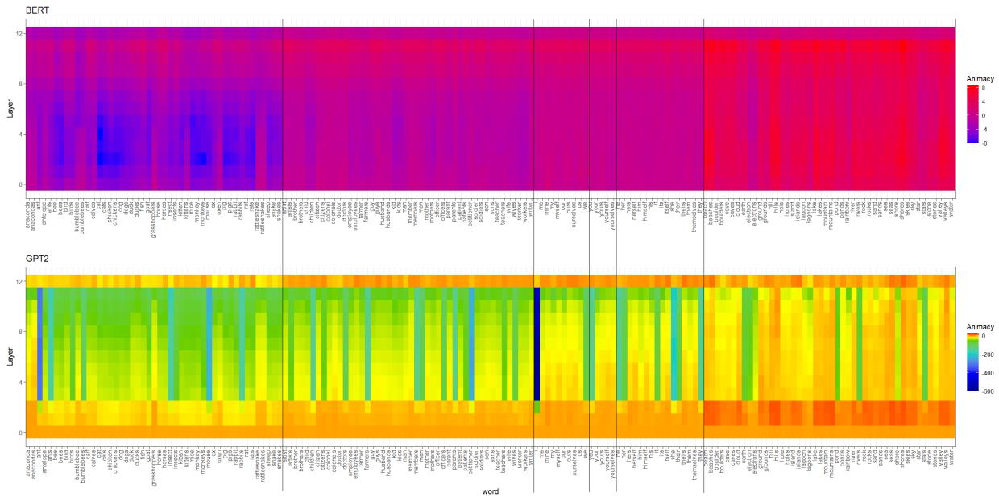
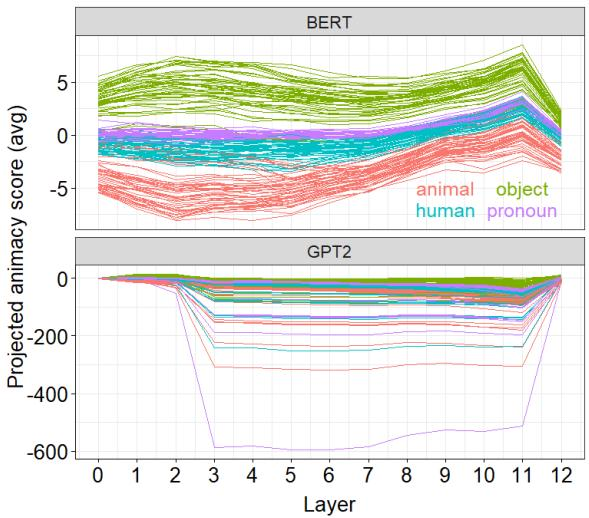
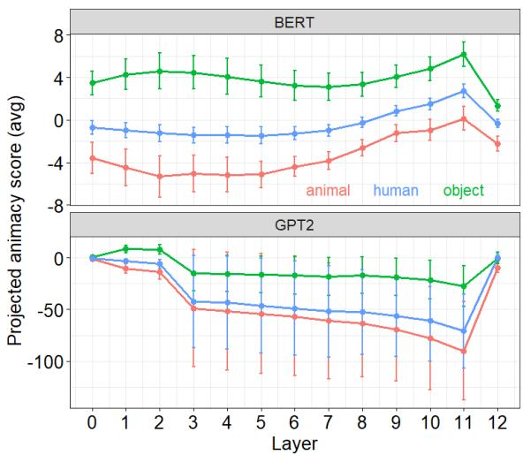
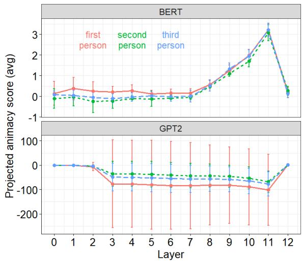

# Embedding derived animacy rankings offer insights into the sources of grammatical animacy

Vivian G. Li Yale University, New Haven, CT, USA liguo.vivian@gmail.com

## Abstract

In this study, we applied the semantic projection approach to animacy, a feature that has not been previously explored using this method. We compared the relative animacy rankings of nouns denoting animals, humans, objects, and first-, second-, and third-person pronouns, as derived from word embeddings, with rankings derived from human behavioral ratings of animacy and from grammatical patterns. Our results support the semantic projection approach as an effective method for deriving proxies of human perception from word embeddings and offer insights into the sources of grammatical animacy.

## 1 Introduction

Why are grammars the way they are? One perspective—advocated to varying degrees by proponents of usage-based linguistics, cognitive linguistics, emergentism, and other functionally oriented approaches (Bybee, 2023, a.o.)—argues that grammatical structures emerge from exposure and interaction. According to this view, language learners develop grammars that align with existing linguistic norms because those are the structures they en counter. When learners’ grammars diverge from established norms, these deviations are often attributed to limited or skewed linguistic input (e.g., in L1 and L2 learning, or contact-induced change). Consequently, even when linguistic patterns conflict with cognitive or perceptual expectations, they are still learned. A compelling example is grammatical gender: any fluent speaker of German would classify the noun Mädchen (‘girl’) as grammatically neuter, despite girls being biologically and conceptually feminine. Studies on frequency effects and exemplar-based learning further support the role of distributional patterns in shaping both diachronic language change and real-time language processing.

A contrasting perspective, most prominently associated with generative linguistics (Chomsky, 1965, a.o.), posits that grammar is shaped by innate cognitive biases. According to this view, the acquisition of grammar is guided by inductive biases—cognitive predispositions that shape how learners interpret and generalize from linguistic data.

In a naturalistic setting of language acquisition (as opposed to an unnatural/artificial setting where learners are exposed to inconsistent input, as in artificial language learning experiments), where learners’ exposure generally aligns with the target grammar (e.g., in the case of grammatical gender in German), a functionalist explanation alone may seem sufficient. Finding support for inductive biases would crucially involve identifying cases where linguistic input and grammatical structures diverge. Such cases provide strong evidence that learners internalize grammars that do not simply mirror the distributional properties of their linguistic environment. In this study, we argue that grammatical animacy represents such a case. Our contributions are summarized as follows:

• Methodologically, we conduct extensive experiments to capture the representation of animacy in English. The application of the semantic projection method to animacy is novel, as animacy has not been systematically examined using this approach.

• Empirically, we demonstrate that semantic projections derived from English word embeddings align closely with human perceptions of animacy, as reflected in animacy rankings based on human ratings.

• We further show that the distributional patterns of linguistic data in English—captured through embedding-derived animacy rankings—do not fully align with grammatical patterns as reflected in the grammar-based animacy hierarchy. This finding suggests that animacy as a grammatical feature is likely influenced by innate cognitive biases, enabling first-language learners to override distributional tendencies in their input.

<table><tr><td colspan="2">Animate</td><td rowspan="2">Inanimate</td></tr><tr><td>Human</td><td>Nonhuman</td></tr><tr><td>-man</td><td>-ma</td><td>一</td></tr></table>

Table 1: Animacy modulates plural marking in the Gudandji dialect of Wambaya (Aguas, 1968:5-6; cited in Santazilia, 2020: Table 7)

## 2 Related works

## 2.1 The semantic projection method

Word embeddings have been shown to capture semantic relations through analogy (Mikolov et al., 2013). However, these captured relations are typically binary, meaning that they reflect definitive or widely agreed-upon mappings between word pairs. For example, the pair king and queen represents a "male-female" gender contrast, and by analogy, the female counterpart for waiter would be waitress, which is generally considered the optimal, if not the only, correct answer. Similarly, in the relation country-capital, as in Germany-Berlin, a prompt like China would be expected to elicit Beijing and no other city.

Yet, many semantic relations are scalar in nature and do not necessarily involve such definitive oppositions between word pairs. For instance, along the semantic dimension of “size,” many things are larger than bees. In the analogy ant: bee, bee: ?, we might be asking for an entity that is as many times larger than a bee as a bee is larger than an ant. The answer, however, is not unique: cicadas, mantises, or grasshoppers might all be appropriate responses.

Grand et al. (2022) introduced the semantic projection method, which extracts vectors from word embeddings to represent semantic relations or features such as size or danger level. The authors demonstrated that words’ projections onto these vectors correlated with human ratings on 17 semantic features. Thus, the semantic projection method appears to be a reliable proxy for human perception of various semantic dimensions. However, animacy was not included among the features they investigated, presenting an important gap.

## 2.2 Animacy hierarchy based on human ratings

The concept of animacy goes beyond the simple biological distinction of "alive" versus "dead." Human perception of animacy is influenced by several factors, including human-likeness and the ability to move, think, or reproduce (VanArsdall et al., 2017; VanArsdall and Blunt, 2022). These cognitive factors contribute to a scalar hierarchy of animacy, where living beings, particularly animals and humans, are perceived as more animate than others.

Radanovic et al.´ (2016) conducted semantic rating experiments with 126 English-speaking college students, asking them to rate 72 nouns based on their perceived level of animacy. The results showed that both animals and human-denoting nouns received high ratings, with average scores exceeding 95 on a 100-point scale for animals like dog, giraffe, cow, and squirrel as well as for human-denoting nouns like baby, mother, and girlfriend. Interestingly, some human-denoting nouns like teacher, prince, and queen received slightly lower ratings (around 90), comparable to creatures like worm, spider, and fly. This indicates that, from a cognitive perspective, humans and animals are similarly animate, with certain animals even outranking humans.

A more recent large-scale online experiment by VanArsdall and Blunt (2022), with 1,500 native speakers of English rating 1,200 concrete nouns, found similar trends. Animals, especially mammals and birds, were rated higher than humans in terms of being alive, having the ability to reproduce, and their likelihood of movement. These findings support a human perception-based animacy hierarchy, where animals are perceived as at least as animate as humans, if not more so (see Eq. 1).

Animals > Humans > Inanimate Entities (1)

## 2.3 Animacy hierarchy based on grammatical patterns

Animacy plays a crucial role in the grammatical systems of many languages. However, the way animacy is represented in grammar can vary. In some languages, animacy distinctions are discrete, with specific morphosyntactic markers assigned to nouns of different animacy levels, affecting person, number, case, and agreement (Corbett, 2006, 2012; Comrie, 1989; Croft, 1990; Ortmann, 1998; Santazilia, 2019, 2020; Silverstein, 1976; de Swart et al., 2008, a.o.) For example, Table 1 illustrates how plural marking in Wambaya varies depending on animacy (Aguas, 1968:5-6; cited in Santazilia, 2020:p.823). Other languages exhibit gradient effects, where animacy influences the likelihood of one construction being chosen over another. For example, in English, when the indirect object (recipient) of a ditransitive verb is animate, the doubleobject construction (V NP NP) is more likely than the prepositional dative construction (V NP PP) (Bresnan et al., 2007). Similarly, with animate nouns, the s-genitive (John’s book) is preferred over the of-genitive (the book ofJohn) (Rosenbach, 2008; Stefanowitsch, 2003). When the object of a verb is more animate than the subject, passive voice is favored over active voice (Harris, 1978).

Although languages typically categorize nouns into two or three levels of animacy (e.g. humans vs. non-humans, living creatures vs. non-living entities), the exact cut-off points for these categories differ (Comrie, 1989; Santazilia, 2020; de Swart et al., 2008, a.o.) Cross-linguistic studies have synthesized these patterns into a generalized animacy hierarchy (e.g. Gardelle and Sorlin, 2018). One widely recognized version of this hierarchy is presented in Corbett (2000), where entities that bear more similarities with the self (i.e. the speaker) are considered more animate than others (the egophoricity principle, Dahl, 2008; Langacker, 1991; Yamamoto, 1999): see Eq. 2

$$
\begin{array} { r l r } & { } & { \mathrm { S p e a k e r } \left( 1 ^ { \mathrm { s t } } \mathrm { p e r s o n } \mathrm { p r o n o u n } \right) > } \\ & { } & { \mathrm { A d d r e s s e e } \left( 2 ^ { \mathrm { n d } } \mathrm { p e r s o n } \mathrm { p r o n o u n } \right) > 3 ^ { \mathrm { r d } } \mathrm { p e r s o n } > } \\ & { } & { \mathrm { K i n } > \mathrm { H u m a n } > \mathrm { A n i m a t e } > \mathrm { I n a n i m a t e } } \end{array}\tag{2}
$$

It is worth noting that grammatical animacy is assumed to be a universal feature (Dahl and Fraurud, 1996; Jespersen, 1924; Whaley, 1997, a.o.), even if its effects are gradient. A case in point is the optional marking of the direct object in Turkish. When sentences contain a ditransitive verb and an optional marker on the direct object, they become progressively less felicitous as the animacy of the direct object decreases. Sentences with the optional marker on human-denoting nouns receive higher acceptability ratings than those with the marker on animals or inanimate objects, even though the nouns denoting humans, animals and inanimate entities are all direct objects in those sentences (Krause and von Heusinger, 2019).

The universality of grammatical animacy suggests that the animacy hierarchy in Eq. 2, based on cross-linguistic grammatical patterns, should also apply to English. This sets the stage for comparisons with the human perception-based hierarchy derived from English data, as introduced in the previous section. The two hierarchies exhibit different rankings, which we elaborate on in the next section.

## 2.4 Contrasting hierarchies

There are two key points of divergence between the hierarchy based on grammatical patterns and the one based on human perception. First, the grammar-based hierarchy ranks humans above other animate entities, whereas the human ratingbased hierarchy often ranks animals as equally or even more animate than humans. Second, the grammar-based hierarchy makes finer distinctions among human-denoting nouns. For instance, in the grammar-based hierarchy, pronouns are ranked higher than human-denoting common nouns, and within pronouns, first-person pronouns are ranked higher than second-person pronouns, which in turn rank higher than third-person pronouns. In contrast, the rating-based hierarchy does not have principled predictions regarding the relative rankings among various human-denoting nouns.

These discrepancies raise important questions about the trilateral relationship between language use, cognition, and grammar. To what extent does the assumption that language use—specifically cooccurrence patterns—reflects human perceptions (Harris, 1954; Firth, 1957; Wittgenstein, 1953, a.o.) hold for ‘animacy’? What are the origins of grammatical animacy? Could grammatical patterns of animacy deviate from general trends in language use? Understanding how distributionally derived animacy hierarchies align with or diverge from perception-based and grammar-based hierarchies can provide valuable insights into the cognitive and linguistic foundations of animacy distinctions.

## 3 This study

In this study, we apply the semantic projection method to investigate the animacy ranking as reflected in English word embeddings. Specifically, we examine the divergent predictions made by the grammar-based hierarchy and the human ratingbased hierarchy, focusing on three relative rankings: the rankings 1) between animals and humans; 2) between human-denoting common nouns and pronouns; and 3) among pronouns.

## 3.1 Experiment setup

Selection of target words We employed two sets of target words. The first set comprises three lists of 50 common nouns, categorized as humans (e.g. artist, man, mother), animals (e.g. bird, cat, fish), and objects (e.g. cave, hill, rock), respectively. These nouns were selected from the top 60 highfrequency words in each category from WordNet (Miller, 1995), following three selection criteria: (1) preference for high-frequency words over lowfrequency ones; (2) inclusion of words that represent typical members of their respective categories to maintain clear contrasts among humans, animals, and objects; and (3) inclusion of both singular and plural forms to mitigate potential number-related effects. For example, although humans are technically animals, we excluded human being from the list of animals to preserve the distinction between the "humans" and "animals" categories. Another example related to the second criterion is god. While it could be argued to denote a human-like being, it is equally reasonable to classify god as an imaginary (and thus abstract) entity, making it more akin to an object. Such words were excluded from our analyses.

The second set of target words includes 31 words in total, consisting of singular and plural first-, second-, and third-person pronouns. This set includes nominative (e.g., I), accusative (e.g., me), adjectival possessive (e.g., my), possessive (e.g., mine), and reflexive (e.g., myself) pronouns. Inclusion of pronouns beyond the nominative forms provides a more balanced comparison between pronouns and common nouns.

Selection of contexts Vulic et al.´ (2020) demonstrated that averaging over 10 contexts is sufficient for capturing type-level lexical information, though increasing the number of contexts improves performance only marginally. In line with this, we sampled 30 sentences for each target word from the Brown Corpus (Francis and Kucera, 1979), accessed via the Natural Language Toolkit (NLTK) (Bird et al., 2009) in Python. In cases where fewer than 30 sentences were available, all sentences were used. Some nouns in the common noun set were excluded from subsequent analyses due to the unavailability of sufficient contexts (e.g., antelopes, goats, grasshopper). Additionally, we filtered out cases where nouns were used as denominalized verbs (e.g., to duck a punch) by restricting the partof-speech (POS) tags of target words in the first set to NN or NNS (singular or plural nouns).1

For the pronoun set, we manually verified the sampled sentences to exclude non-pronoun uses. For instance, sentences where mine refers to a bomb or mineral extraction (e.g., coal mine) were excluded. Additionally, since pronouns like "you" have multiple meanings (i.e., second person singular or plural), we did not attempt to differentiate between such polysemous uses, as those distinctions are orthogonal to the animacy feature we aim to study.

Embedding models Previous studies have shown that embeddings differ qualitatively across models and layers (Ethayarajh, 2019). To understand whether specific patterns of animacy ranking are model-dependent or restricted to particular layers, we employed two pre-trained embeddings models: BERT and GPT-2. The models are chosen for their contrasting architectures:

• BERT (Bidirectional Encoder Representations from Transformers) is a bidirectional transformer model designed for language understanding, which captures relationships from both left and right contexts (Devlin et al., 2019).2

• GPT-2 is a unidirectional transformer decoder, designed for language generation tasks (Radford et al., 2019).3 It processes language sequentially from left to right.

We extracted embeddings from all twelve internal layers of both models using PyTorch and the Hugging Face transformers library. This allows us to determine how patterns of animacy evolve across layers in these two models.

Extraction of embeddings and derivation of animacy scores For each target word, we extracted its embeddings in context.4 If a target word was out-of-vocabulary,5 we used the mean of its subword token embeddings. The embeddings for each target word were averaged across contexts at each layer.

To derive the vectors representing the semantic feature of animacy, we averaged, at each layer, the embeddings of animal and object categories separately (Eq. 3, 4), then subtracted the average embeddings of objects from animals (Eq. 5).

$$
\mathbf { v } _ { a n i m a l } ^ { l } = \frac { 1 } { N _ { a n i m a l } } \sum _ { i = 1 } ^ { N _ { a n i m a l } } \mathbf { e } _ { a n i m a l , i } ^ { l }\tag{3}
$$

$$
{ \bf v } _ { o b j e c t } ^ { l } = \frac { 1 } { N _ { o b j e c t } } \sum _ { i = 1 } ^ { N _ { o b j e c t } } { \bf e } _ { o b j e c t , i } ^ { l }\tag{4}
$$

$$
\mathbf { a } ^ { l } = \mathbf { v } _ { a n i m a l } ^ { l } - \mathbf { v } _ { o b j e c t } ^ { l }\tag{5}
$$

Here, ${ \mathbf e } _ { a n i m a l , i } ^ { l }$ and ${ \mathbf { e } } _ { o b j e c t , i } ^ { l }$ denote the embeddings of the i-th animal or object word on Layer $l . ~ N _ { a n i m a l }$ and $N _ { o b j e c t }$ are the number of words in the animal and object categories.

These vectors $\mathbf { a } ^ { l }$ were transformed into unit vectors (Eq. 6). The animacy score $s _ { w } ^ { l }$ for a target word w on Layer l was calculated by projecting its embeddings $\mathbf { e } _ { w } ^ { l }$ onto the (extensions of the) layerspecific unit vector $\hat { \mathbf { a } } ^ { l }$ (Eq. 7).

$$
\hat { \mathbf { a } } ^ { l } = \frac { \mathbf { a } ^ { l } } { \Vert \mathbf { a } ^ { l } \Vert }\tag{6}
$$

$$
s _ { w } ^ { l } = { \bf e } _ { w } ^ { l } \cdot \hat { { \bf a } } ^ { l }\tag{7}
$$

Statistical analyses Given that the animacy scores did not follow a normal distribution, we applied non-parametric tests to analyze the data. Specifically, we used the Kruskal-Wallis tests and performed post-hoc Dunn’s tests with Benjamini-Hochberg correction (Benjamini and Hochberg, 1995) to account for multiple comparisons. These statistical analyses were conducted using R (R Core Team, 2024) with the dunn.test package (Dinno, 2024). The results are reported in the next sections.

## 3.2 Experiment 1 & 2

Fig. 1 and 2 show the embedding-derived animacy scores for all target words used in analyses. Words of different categories exhibit distinct patterns despite within-category variation. The distinctions appear to be more prominent in BERT than in GPT-2.

We conducted a Kruskal-Wallis test to compare the animacy scores among nouns denoting animals, humans, objects, and pronouns across all layers in both embedding models. Significant differences were found between categories across all layers in both models $( p < 0 . 0 5$ for all comparisons). Below, we present the results of post-hoc Dunn’s tests. Experiment 1 focuses on the relative rankings among humans, animals, and objects, while Experiment 2 compares human-denoting common nouns and pronouns.

## 3.2.1 Experiment 1: humans, animals, objects

By-category mean and standard deviation of words denoting animals, humans and objects are shown in Fig. 3 (and Table 3 in Appendix A.2). Posthoc Dunn’s tests revealed that in BERT, animals consistently ranked higher than humans and objects across all layers of BERT (animals > humans > objects, $p < 0 . 0 5$ for all). In GPT-2, all layers except Layer 12 followed this pattern, with the differences between animals and humans achieving significance on Layers 1-2 and 10-11, but not on intermediate Layers 3-9 $( p < 0 . 0 5 )$ , and the differences between humans and objects achieving significance on Layers 1-11 $( p < 0 . 0 5 )$ . Interestingly, Layer 12 in GPT-2 exhibited a reverse pattern where objects were ranked higher than humans, but the differences were not statistically significant.

The finding that animals rank higher than humans contradicts predictions from the grammarbased animacy hierarchy but aligns with the humanrating-based hierarchy. This confirms that the semantic projection approach, as introduced in Grand et al. (2022), is effective in capturing perceived animacy in a human-like manner.

  
Figure 1: Heatmap showing animacy scores for all words used in the analyses across all layers in BERT (top) and GPT-2 (bottom). The vertical black lines in both panels demarcate different word categories, arranged from left to right: animals, humans, first-person pronouns, second-person pronouns, third-person pronouns, and objects. In both panels, the blue end of the color spectrum represents the highest level of animacy. The full list of words analyzed can be found in Appendix A.1.

  
Figure 2: Line graph showing animacy scores of all target words used in the analyses across all layers in BERT (top) and GPT-2 (bottom). Categories (animals, humans, pronouns, objects) are color-coded. Within each panel, the lower the score, the higher the animacy.

## 3.2.2 Experiment 2: pronouns vs. human-denoting common nouns

Next, we examined the animacy scores for humandenoting common nouns and pronouns. Results from Dunn’s tests indicated that human-denoting common nouns were generally ranked higher than pronouns. The differences were statistically significant $( p < 0 . 0 5 )$ across most layers in BERT, except Layers 9-11. In GPT-2, the ranking was the same, with common nouns ranking higher than pronouns, though the differences were significant only in Layer 1 and Layers 3-5 $( p < 0 . 0 5 )$

  
Figure 3: Line graph showing mean and standard deviation (error bars) of animacy scores of categories animals, humans and objects, averaged across words. Within each panel, the lower the score, the higher the animacy.

Again, these findings challenge the grammarbased hierarchy, which predicts that pronouns should rank higher than human-denoting common nouns.

  
Figure 4: Line graph showing mean and standard deviation (error bars) of animacy scores of first-, second-, and third- person pronouns, averaged across words. Within each panel, the lower the score, the higher the animacy.

We analyzed the personal pronoun series (mean and standard deviations shown in Fig. 4, and in Table 4 in Appendix A.2) to test the predictions from the grammar-based animacy hierarchy under the egophoricity principle. Kruskal-Wallis tests showed no significant differences between first-, second-, and third- person pronouns across most layers of BERT and GPT-2,6 except for Layers 3, 4, and 6 in BERT. Post-hoc Dunn’s tests revealed that on Layers 3 and 4 in BERT, second-person pronouns ranked higher than third-person pronouns and first-person pronouns. The differences between second- and third- person pronouns were not statistically significant, but both were significantly higher than first-person pronouns $( p < 0 . 0 5 )$ . On Layer 6, the same ranking emerged; however, pairwise comparisons did not achieve statistical significance.

In summary, while grammatical hierarchies based on the egophoricity principle rank firstperson pronouns as the most animate, our embedding-based analysis revealed a different ranking. On layers that showed differentiation, secondand third person pronouns were ranked as more animate than first-person pronouns.

## 4.1 Embedding-derived animacy

Semantic projection approach is effective The analyses reveal that animacy rankings derived from word embeddings align well with the humanranking-based hierarchy. Specifically, our results show that common nouns denoting animals are ranked higher in animacy than humans, which replicates findings from behavioral surveys. These findings provide further evidence that embeddingderived metrics of lexical semantics can serve as reliable proxies for human perception of semantic features, such as animacy. This adds to the growing support for distributional approaches to lexical semantics (Harris, 1954; Firth, 1957; Mikolov et al., 2013; Miller and Charles, 1991; Pennington et al., 2014). More broadly, these findings contribute to the case for using language models as effective proxies for human-like agents in various linguistic tasks (e.g. Andreas, 2022).

Mismatches between embedding-derived animacy and grammatical animacy Our results deviate from predictions from grammar-based animacy hierarchy. Among common nouns denoting animals, objects, and humans, embedding-derived animacy scores ranked humans as less animate than animals; pronouns were ranked as less animate than human-denoting common nouns and first-person pronouns were overall not more animate than second- or third- person pronouns. These findings contradict the egophoricity principle (Dahl, 2008).7

Our findings bear implications for understanding the sources of grammatical animacy. The fact that grammar-based hierarchy imposes relative rankings (e.g. between common nouns for animals and humans) that are different from those in human perception and general language use (as reflected in averaged embeddings across contexts) suggests that language learners, when acquiring the grammar, must defy the general tendencies in perception and language use, and selectively focus on a subset of constructions (e.g. ditransitives, Krause and von Heusinger, 2019), to develop alternative ranking preferences. Thus, our findings provide evidence that ‘animacy’, as a grammatical feature, is shaped by inductive biases, highlighting the intricate interplay between cognitive perception, linguistic usage, and grammatical representation.

## 4.2 Capturing semantic features in neural network models

Bidirectional vs. unidirectional context In our study, we utilized both a bidirectional model, BERT, and a unidirectional model, GPT-2. Remarkably, both models produced comparable results, yielding identical rankings across almost all internal layers for common nouns in the categories of animals, humans, and objects. This suggests that the left-context used by GPT-2 and the bidirectional contexts employed by BERT convey similar information when encoding the semantic feature of animacy. Hence, using unidirectional context alone is sufficient for inferring relative animacy ranking that align with human perception. This contrasts the task of inferring fine-grained animacy distinctions with tasks like constituency parsing, which rely more heavily on bi-directional context (e.g. Li and Risteski, 2021). It may be that the inference of semantic features generally relies less on rightside context compared to the inference of syntactic features. Future studies could further explore this topic by systematically examining the utility of univs. bi-directional contexts across a diverse range of tasks.

Information encoding across internal layers Our results align with previous findings suggesting that lower layers of embedding models predominantly encode type-level information, while higher layers capture context-specific characteristics (Ethayarajh, 2019; Tenney et al., 2019). In our findings, differences in animacy diminished at higher levels, particularly at Layer 12. Since abstract type-level information is less likely to change across contexts, and that higher layers tend to enhance the representation of contextually dependent features, the observed reduction in animacy differences between common nouns for humans, animals, and objects, as well as among first-, second-, and third-person pronouns, is not unexpected.

Within-category variations Since the focus of our study is on the comparisons of relative animacy rankings across categories of words, we did not conduct in-depth analyses on within-category variations or same-word cross-layer differences in animacy scores. However, some notable patterns are worth mentioning.

First, substantial within-category variation is present in the animacy scores derived from both BERT and GPT-2. For example, in both models, ant was more animate than other animal words, whereas rattlesnake(s) and grasshopper were comparatively less animate (see Fig. 1).

Second, within-category variation appears more pronounced in GPT-2. A particularly striking case is the first-person singular nominative pronoun I, which, in GPT-2 Layers 3-11, emerged as the most animate word across all words. In contrast, BERT did not exhibit a similar distinction for I relative to other pronouns. Beyond capturing the animacy of the entities denoted by words, GPT-2’s embeddingderived animacy scores also seemed systematically sensitive to additional grammatical and semantic features. For instance, nominative case pronouns consistently appeared more animate than other pronouns. Moreover, plural-singular noun pairs exhibited marked differences: pond was more animate than ponds, and stars was more animate than star. Such differences were much less drastic in BERT.

Additionally, we observed differences between the two models in how animacy for the same word was encoded across layers. In GPT-2, animacy scores for highly animate words (e.g., I and ant) remained relatively stable across Layers 3-11, with noticeable shifts occurring primarily from Layer 2 to Layer 3 and from Layer 11 to Layer 12. In contrast, BERT exhibited a more dynamic encoding of animacy, with incremental changes in animacy scores from Layer 0 to Layer 11, except for the least animate words (e.g., beach and beaches), whose scores remained relatively stable.

These observations highlight the nuanced ways in which animacy was encoded across words (even within the same broad category) and across layers and models. They suggest two insights: 1) semantic projection may offer a viable approach for exploring sub-dimensions of animacy; 2) while both BERT and GPT-2 consistently ranked major categories (e.g., animals, humans, pronouns, objects) in similar relative orders, GPT-2 appears to be more sensitive to grammatical and semantic features.

## 5 Conclusion

In this study, we applied the semantic projection approach to animacy, a feature that has not been previously explored using this method. We compared the relative animacy rankings of nouns denoting animals, humans, objects, and first-, second-, and third-person pronouns, as derived from word embeddings, with rankings derived from human behavioral ratings of animacy and from grammatical patterns. Our results support the semantic projection approach as an effective method for deriving proxies of human perception from word embeddings and offer insights into the sources of grammatical animacy.

## 6 Limitations and future directions

While our study provides valuable insights, several limitations warrant acknowledgement. First, our experiments focused exclusively on English nouns. Future research could extend embeddingbased animacy analyses to other languages, particularly those with morphosyntactic markings of animacy, to assess the cross-linguistic validity of the patterns observed here.

Second, our analysis of embedding-derived animacy scores did not account for factors such as sentence length, the semantic roles of target words, or their syntactic dependency relations. We assumed that averaging across 10 contexts would sufficiently capture type-level lexical information (Vulic et al.´ , 2020). Future research could examine whether these factors systematically influence derived animacy scores.

Although our study does not have immediate practical applications, our finding that embeddingderived animacy closely aligns with human ratingbased animacy rankings suggests that embeddings may be useful for automatic animacy classification (e.g., Tepei and Bloem 2024). However, tasks requiring animacy classification vary in nature: some target semantic or cognitive animacy (e.g., atypical animacy in metaphors; Coll Ardanuy et al., 2020; Hanna et al., 2023; Jahan et al., 2018), while others focus on grammatical animacy (e.g., translating from languages without morphosyntactic animacy marking to those with such marking). A promising direction for future research is to identify representations of animacy in language models’ latent space that align with grammar-based animacy hierarchies or to develop methods (e.g., fine-tuning on grammatical tasks) to induce ‘biases’—akin to human inductive biases—in language models, thereby shifting their embeddings toward greater alignment with grammar-based animacy hierarchies.

Lastly, while our findings indicate that the semantic projection approach effectively approximates human perceptions of overall animacy, future studies could investigate specific sub-dimensions of animacy, such as mobility, where relative rankings may diverge from overall animacy rankings. Further exploration of these subcomponents using the semantic projection method could enhance our understanding and modeling of complex, nested semantic structures. Additionally, examining how embedding-derived animacy scores correlate with human ratings and whether distinct layers correspond to different sub-dimensions (à la Hollis and Westbury, 2016) would be a valuable avenue for future research.

## Acknowledgments

We’d like to thank reviewers for their helpful comments, especially Reviewer bY8u.

## References

Estrella F Aguas. 1968. Gudandji. In Estrella F. Aguas and Darrel T. Tyron, editors, Papers in Australian Linguistics, volume 3, pages 1–20. Canberra: Pacific Linguistics.

Jacob Andreas. 2022. Language models as agent models. In Findings of the Association for Computational Linguistics: EMNLP 2022, pages 5769–5779, Abu Dhabi, United Arab Emirates. Association for Computational Linguistics.

Yoav Benjamini and Yosef Hochberg. 1995. Controlling the false discovery rate: a practical and powerful approach to multiple testing. Journal of the Royal statistical society: series B (Methodological), 57(1):289–300.

Steven Bird, Ewan Klein, and Edward Loper. 2009. Natural language processing with Python: analyzing text with the natural language toolkit. O’Reilly Media, Inc.

J. Bresnan, A. Cueni, T. Nikitina, and H. Baayen. 2007. Predicting the dative alternation. In J. Zwarts G. Boume, I. Kraemer, editor, Cognitivefoundations of interpretation, pages 69–94. Royal Netherlands Academy of Science.

Joan Bybee. 2023. What is usage-based linguistics? The Handbook of Usage-Based Linguistics, pages 7–29.

N. Chomsky. 1965. Aspects of the theory of syntax. M.I.T. Press.

Mariona Coll Ardanuy, Federico Nanni, Kaspar Beelen, Kasra Hosseini, Ruth Ahnert, Jon Lawrence, Katherine McDonough, Giorgia Tolfo, Daniel CS Wilson, and Barbara McGillivray. 2020. Living machines: A

study of atypical animacy. In Proceedings ofthe 28th International Conference on Computational Linguistics, pages 4534–4545, Barcelona, Spain (Online). International Committee on Computational Linguistics.

Bernard Comrie. 1989. Language universals and linguistic typology: Syntax and morphology. University of Chicago press.

Greville G Corbett. 2000. Number. Cambridge University Press.

Greville G. Corbett. 2006. Agreement. Cambridge: Cambridge University Press.

Greville G. Corbett. 2012. Features. Cambridge: Cambridge University Press.

William Croft. 1990. Typology and universals. Cambridge university press.

Östen Dahl. 2008. Animacy and egophoricity: Grammar, ontology and phylogeny. Lingua, 118(2):141– 150.

Östen Dahl and Kari Fraurud. 1996. Animacy in grammar and discourse. In Thorstein Fretheim and Jeanette K. Gundel, editors, Reference and referent accessibility, pages 47–64. Amsterdam: John Benjamins.

Peter de Swart, Monique Lamers, and Sander Lestrade. 2008. Animacy, argument structure, and argument encoding. Lingua, 118(2):131–140.

Jacob Devlin, Ming-Wei Chang, Kenton Lee, and Kristina Toutanova. 2019. BERT: Pre-training of deep bidirectional transformers for language understanding. In Proceedings ofthe 2019 Conference of the North American Chapter ofthe Associationfor Computational Linguistics: Human Language Technologies, Volume 1 (Long and Short Papers), pages 4171–4186, Minneapolis, Minnesota. Association for Computational Linguistics.

Alexis Dinno. 2024. dunn.test: Dunn’s Test ofMultiple Comparisons Using Rank Sums. R package version 1.3.6.

Kawin Ethayarajh. 2019. How contextual are contextualized word representations? Comparing the geometry of BERT, ELMo, and GPT-2 embeddings. In Proceedings of the 2019 Conference on Empirical Methods in Natural Language Processing and the 9th International Joint Conference on Natural Language Processing (EMNLP-IJCNLP), pages 55–65, Hong Kong, China. Association for Computational Linguistics.

J. R. Firth. 1957. A synopsis of linguistic theory 1930- 1955. In J. R. Firth, editor, Studies in Linguistic Analysis, pages 1–31. Blackwell.

W Nelson Francis and Henry Kucera. 1979. Brown corpus manual. Letters to the Editor, 5(2):7.

Laure Gardelle and Sandrine Sorlin. 2018. Introduction: Anthropocentrism, egocentrism and the notion of animacy hierarchy. International Journal of Language and Culture, 5(2):133–162.

Gabriel Grand, Idan Asher Blank, Francisco Pereira, and Evelina Fedorenko. 2022. Semantic projection recovers rich human knowledge of multiple object features from word embeddings. Nature human behaviour, 6(7):975–987.

Michael Hanna, Yonatan Belinkov, and Sandro Pezzelle. 2023. When language models fall in love: Animacy processing in transformer language models. In Proceedings ofthe 2023 Conference on Empirical Methods in Natural Language Processing, pages 12120– 12135, Singapore. Association for Computational Linguistics.

Margaret Harris. 1978. Noun animacy and the passive voice: A developmental approach. The Quarterly Journal ofExperimental Psychology, 30(3):495–504.

Z. S. Harris. 1954. Distributional structure. Word, 10:146–162.

Geoff Hollis and Chris Westbury. 2016. The principals of meaning: Extracting semantic dimensions from co-occurrence models of semantics. Psychonomic bulletin & review, 23:1744–1756.

Labiba Jahan, Geeticka Chauhan, and Mark Finlayson. 2018. A new approach to Animacy detection. In Proceedings of the 27th International Conference on Computational Linguistics, pages 1–12, Santa Fe, New Mexico, USA. Association for Computational Linguistics.

Otto Jespersen. 1924. The philosophy of grammar. London: Allen & Unwin.

Elif Krause and Klaus von Heusinger. 2019. Gradient effects of animacy on differential object marking in Turkish. Open Linguistics, 5(1):171–190.

Ronald Langacker. 1991. Foundation of cognitive grammar, Vol. 2: Descriptive application. Stanford, CA: Stanford University Press.

Yuchen Li and Andrej Risteski. 2021. The limitations of limited context for constituency parsing. In Proceedings ofthe 59th Annual Meeting ofthe Association for Computational Linguistics and the 11th International Joint Conference on Natural Language Processing (Volume 1: Long Papers), pages 2675–2687. Association for Computational Linguistics.

Tomas Mikolov, Ilya Sutskever, Kai Chen, Greg S Corrado, and Jeff Dean. 2013. Distributed representations of words and phrases and their compositionality. Advances in neural information processing systems, 26:3111–3119.

George A Miller. 1995. Wordnet: a lexical database for English. Communications of the ACM, 38(11):39– 41.

George A Miller and Walter G Charles. 1991. Contextual correlates of semantic similarity. Language and cognitive processes, 6(1):1–28.

Albert Ortmann. 1998. The role of [ animate] in inflection. In Ray Fabri, Albert Ortmann, and Teresa Parodi, editors, Models of inflection, pages 60–84. Tübingen: Max Nyermeyer Verlag.

Jeffrey Pennington, Richard Socher, and Christopher D Manning. 2014. Glove: Global vectors for word representation. In Proceedings of the 2014 conference on empirical methods in natural language processing (EMNLP), pages 1532–1543. Association for Computational Linguistics.

R Core Team. 2024. R: A Language and Environment for Statistical Computing. R Foundation for Statistical Computing, Vienna, Austria.

Jelena Radanovic, Chris Westbury, and Petar Milin.´ 2016. Quantifying semantic animacy: How much are words alive? Applied psycholinguistics, 37(6):1477– 1499.

Alec Radford, Jeffrey Wu, Rewon Child, David Luan, Dario Amodei, and Ilya Sutskever. 2019. Language models are unsupervised multitask learners. OpenAI blog, 1(8):9.

Anette Rosenbach. 2008. Animacy and grammatical variation—findings from english genitive variation. Lingua, 118(2):151–171.

Ekaitz Santazilia. 2019. Animacy effects in inflectional morphology: A typological survey. Ph.D. thesis, Universidad del País Vasco-Euskal Herriko Unibertsitatea.

Ekaitz Santazilia. 2020. The two faces of animacy. Studies in Language, 44(4):812–830.

Michael Silverstein. 1976. Hierarchy of features and ergativity. In Robert M. W. Dixon, editor, Grammatical categories in Australian languages, pages 112–171. Canberra: Australian National University.

Anatol Stefanowitsch. 2003. Constructional semantics as a limit to grammatical alternation: The two genitives of English. In G. Rohdenburg and B. Mondorf, editors, Determinants of Grammatical Variation in English, pages 413–444. Berlin & New York: Mouton de Gruyter.

Ian Tenney, Dipanjan Das, and Ellie Pavlick. 2019. BERT rediscovers the classical NLP pipeline. In Proceedings of the 57th Annual Meeting of the Associationfor Computational Linguistics, pages 4593– 4601, Florence, Italy. Association for Computational Linguistics.

Maria Tepei and Jelke Bloem. 2024. Automatic Animacy classification for Romanian nouns. In Proceedings of the 2024 Joint International Conference on Computational Linguistics, Language Resources and Evaluation (LREC-COLING 2024), pages 1825– 1831, Torino, Italia. ELRA and ICCL.

Joshua E VanArsdall and Janell R Blunt. 2022. Analyzing the structure of animacy: Exploring relationships among six new animacy and 15 existing normative dimensions for 1,200 concrete nouns. Memory & Cognition, 50(5):997–1012.

Joshua E VanArsdall, James S Nairne, Josefa NS Pandeirada, and Mindi Cogdill. 2017. A categorical recall strategy does not explain animacy effects in episodic memory. Quarterly Journal ofExperimental Psychology, 70(4):761–771.

Ivan Vulic, Edoardo Maria Ponti, Robert Litschko,´ Goran Glavaš, and Anna Korhonen. 2020. Probing pretrained language models for lexical semantics. In Proceedings of the 2020 Conference on Empirical Methods in Natural Language Processing (EMNLP), pages 7222–7240. Association for Computational Linguistics.

Lindsay J Whaley. 1997. Introduction to typology: The unity and diversity of language. Thousand Oaks, CA: Sage Publications.

Ludwig Wittgenstein. 1953. Philosophical investigations. Blackwell Publishing.

Mutsumi Yamamoto. 1999. Animacy and reference: a cognitive approach to corpus linguistics. Amsterdam: John Benjamins.

## A Appendix

## A.1 Experiment materials: words

<table><tr><td colspan="4">Animals</td></tr><tr><td>anaconda</td><td>calves</td><td>horse</td><td>pig</td></tr><tr><td>anacondas</td><td>cat</td><td>horses</td><td>pigs</td></tr><tr><td>ant</td><td>cats</td><td>insect</td><td>rabbit</td></tr><tr><td>antelope</td><td>chicken</td><td>insects</td><td>rabbits</td></tr><tr><td>ants</td><td>chickens</td><td>kitten</td><td>rat</td></tr><tr><td>bee</td><td>dog</td><td>kittens</td><td>rats</td></tr><tr><td>bees</td><td>dogs</td><td>mice</td><td>rattlesnake</td></tr><tr><td>bird</td><td>duck</td><td>monkey</td><td>rattlesnakes</td></tr><tr><td>birds</td><td>ducks</td><td>monkeys</td><td>sheep</td></tr><tr><td>bumblebee</td><td>fish</td><td>mouse</td><td>snake</td></tr><tr><td>bumblebees</td><td>goat</td><td>0X</td><td>snakes</td></tr><tr><td>calf</td><td colspan="3">grasshoppers oxen</td></tr><tr><td colspan="3">Humans</td><td></td></tr><tr><td>artist artists</td><td>employee employees</td><td>members men</td><td>soldiers son</td></tr><tr><td>brother</td><td>farmer</td><td>mother</td><td>sons</td></tr><tr><td>brothers</td><td>farmers</td><td>mothers</td><td>teacher</td></tr><tr><td>child</td><td>guy</td><td>officer</td><td>teachers</td></tr><tr><td>children</td><td>guys</td><td>officers</td><td>wife</td></tr><tr><td>citizen</td><td>husband</td><td>parent</td><td>wives</td></tr><tr><td>citizens</td><td>husbands</td><td>parents</td><td>worker</td></tr><tr><td>colonel</td><td>kid</td><td>patient</td><td>workers</td></tr><tr><td>colonels</td><td>kids</td><td>patients</td><td>writer</td></tr><tr><td>doctor</td><td>man</td><td>petitioner</td><td></td></tr><tr><td>doctors</td><td>member</td><td>soldier</td><td></td></tr><tr><td></td><td>Objects</td><td></td><td></td></tr><tr><td colspan="4"></td></tr><tr><td>beach beaches</td><td>hill hills</td><td>pond</td><td>shores</td></tr><tr><td>boulder</td><td>hole</td><td>ponds</td><td>skies</td></tr><tr><td>boulders</td><td>holes</td><td>rainbow</td><td>sky</td></tr><tr><td>cave</td><td>island</td><td>river</td><td>star</td></tr><tr><td>caves</td><td>islands</td><td>rivers</td><td>stars</td></tr><tr><td>cloud</td><td>lagoon</td><td>rock</td><td>stone</td></tr><tr><td>earth</td><td></td><td>rocks</td><td>stones</td></tr><tr><td></td><td>lagoons</td><td>sand</td><td>valley</td></tr><tr><td>electron</td><td>lake</td><td>sands</td><td>valleys</td></tr><tr><td>electrons</td><td>lakes</td><td>sea</td><td>water</td></tr><tr><td>ground</td><td>mountain</td><td>seas</td><td></td></tr><tr><td>grounds</td><td>mountains</td><td>shore</td><td></td></tr><tr><td colspan="4">Pronouns</td></tr><tr><td>1</td><td>us</td><td>her</td><td>itself</td></tr><tr><td>me</td><td>we</td><td>hers</td><td>she</td></tr><tr><td>mine</td><td>you</td><td>herself</td><td>their</td></tr><tr><td>my</td><td>your</td><td>him</td><td>theirs</td></tr><tr><td>myself</td><td>yours</td><td>himself</td><td>them</td></tr><tr><td>our</td><td>yourself</td><td>his</td><td>themselves</td></tr><tr><td>ours</td><td>yourselves</td><td>it</td><td>they</td></tr><tr><td>ourselves</td><td>he</td><td>its</td><td></td></tr></table>

Table 2: Words used in experiments.

## A.2 Descriptive statistics

<table><tr><td rowspan=3 colspan=1>Layer</td><td rowspan=1 colspan=4>BERT</td><td rowspan=1 colspan=4>GPT-2</td></tr><tr><td rowspan=1 colspan=1>Animals</td><td rowspan=1 colspan=1>Humans</td><td rowspan=1 colspan=1>Pronouns</td><td rowspan=1 colspan=1>Objects</td><td rowspan=1 colspan=1>Animals</td><td rowspan=1 colspan=1>Humans</td><td rowspan=1 colspan=1>Pronouns</td><td rowspan=1 colspan=1>Objects</td></tr><tr><td rowspan=1 colspan=1>Mean SD</td><td rowspan=1 colspan=1>Mean SD</td><td rowspan=1 colspan=1>Mean SD</td><td rowspan=1 colspan=1>Mean SD</td><td rowspan=1 colspan=1>MeanSD</td><td rowspan=1 colspan=1>MeanSD</td><td rowspan=1 colspan=1>Mean SD</td><td rowspan=1 colspan=1>MeanSD</td></tr><tr><td rowspan=1 colspan=1>0</td><td rowspan=1 colspan=1>-3.57-0.71</td><td rowspan=1 colspan=1>1.480.62</td><td rowspan=1 colspan=1>0.07 0.39</td><td rowspan=1 colspan=1>3.471.14</td><td rowspan=1 colspan=1>-0.90.33</td><td rowspan=1 colspan=1>-0.330.14</td><td rowspan=1 colspan=1>-0.17 0.14</td><td rowspan=1 colspan=1>0.620.32</td></tr><tr><td rowspan=1 colspan=1>1</td><td rowspan=1 colspan=1>-4.48-0.96</td><td rowspan=1 colspan=1>1.730.71</td><td rowspan=1 colspan=1>0.14 0.41</td><td rowspan=1 colspan=1>4.271.43</td><td rowspan=1 colspan=1>-10.414.45</td><td rowspan=1 colspan=1>-2.841.48</td><td rowspan=1 colspan=1>-0.53 1.24</td><td rowspan=1 colspan=1>8.353.73</td></tr><tr><td rowspan=1 colspan=1>2</td><td rowspan=1 colspan=1>-5.32-1.23</td><td rowspan=1 colspan=1>1.960.79</td><td rowspan=1 colspan=1>0.010.4</td><td rowspan=1 colspan=1>4.611.67</td><td rowspan=1 colspan=1>-13.85 6.99</td><td rowspan=1 colspan=1>-6.044.31</td><td rowspan=1 colspan=1>-4.479.99</td><td rowspan=1 colspan=1>8.164.57</td></tr><tr><td rowspan=1 colspan=1>3</td><td rowspan=1 colspan=1>-5.04-1.44</td><td rowspan=1 colspan=1>1.720.74</td><td rowspan=1 colspan=1>-0.020.3</td><td rowspan=1 colspan=1>4.471.56</td><td rowspan=1 colspan=1>-48.856.71</td><td rowspan=1 colspan=1>-42.544.83</td><td rowspan=1 colspan=1>-55.64 109.55</td><td rowspan=1 colspan=1>-14.96 16.95</td></tr><tr><td rowspan=1 colspan=1>4</td><td rowspan=1 colspan=1>-5.15-1.42</td><td rowspan=1 colspan=1>1.610.77</td><td rowspan=1 colspan=1>0.050.27</td><td rowspan=1 colspan=1>4.091.7</td><td rowspan=1 colspan=1>-51.69 56.76</td><td rowspan=1 colspan=1>-43.3644.83</td><td rowspan=1 colspan=1>-55.91108.41</td><td rowspan=1 colspan=1>-15.33 17.18</td></tr><tr><td rowspan=2 colspan=1>56</td><td rowspan=1 colspan=1>-5.13-1.45</td><td rowspan=1 colspan=1>1.250.81</td><td rowspan=1 colspan=1>0.030.23</td><td rowspan=1 colspan=1>3.641.51</td><td rowspan=1 colspan=1>-53.96 57.82</td><td rowspan=1 colspan=1>-46.28 45.88</td><td rowspan=1 colspan=1>-58.53 110.76</td><td rowspan=1 colspan=1>-16.3617.8</td></tr><tr><td rowspan=1 colspan=1>-4.38-1.25</td><td rowspan=1 colspan=1>0.92 0.61</td><td rowspan=1 colspan=1>0.03 0.22</td><td rowspan=1 colspan=1>3.241.41</td><td rowspan=1 colspan=1>-56.61 57.47</td><td rowspan=1 colspan=1>-48.745.48</td><td rowspan=1 colspan=1>-61.59109.85</td><td rowspan=1 colspan=1>-16.9418.23</td></tr><tr><td rowspan=1 colspan=1>7</td><td rowspan=1 colspan=1>-3.82 -0.99</td><td rowspan=1 colspan=1>0.84 0.52</td><td rowspan=1 colspan=1>0.040.24</td><td rowspan=1 colspan=1>3.11.29</td><td rowspan=1 colspan=1>-60.95 56.11</td><td rowspan=1 colspan=1>-51.91 44.38</td><td rowspan=1 colspan=1>-63.52 107.54</td><td rowspan=1 colspan=1>-18.2618.34</td></tr><tr><td rowspan=1 colspan=1>8</td><td rowspan=1 colspan=1>-2.63-0.23</td><td rowspan=1 colspan=1>0.75 0.49</td><td rowspan=1 colspan=1>0.53 0.22</td><td rowspan=1 colspan=1>3.351.1</td><td rowspan=1 colspan=1>-63.33 51.97</td><td rowspan=1 colspan=1>-52.57 41.06</td><td rowspan=1 colspan=1>-61.8899.83</td><td rowspan=1 colspan=1>-16.85 17.87</td></tr><tr><td rowspan=2 colspan=1>910</td><td rowspan=1 colspan=1>-1.250.84</td><td rowspan=1 colspan=1>0.78 0.49</td><td rowspan=1 colspan=1>1.260.26</td><td rowspan=1 colspan=1>4.11.08</td><td rowspan=1 colspan=1>-69.13 50</td><td rowspan=1 colspan=1>-56.46 39.34</td><td rowspan=1 colspan=1>-63.71 95.69</td><td rowspan=1 colspan=1>-18.62 17.87</td></tr><tr><td rowspan=1 colspan=1>-0.951.49</td><td rowspan=1 colspan=1>0.57</td><td rowspan=1 colspan=1>1.92 0.29</td><td rowspan=1 colspan=1>4.81.08</td><td rowspan=1 colspan=1>-77.86 49.99</td><td rowspan=1 colspan=1>-61.11 38.91</td><td rowspan=1 colspan=1>-70.6995.8</td><td rowspan=1 colspan=1>-21.2518.77</td></tr><tr><td rowspan=2 colspan=1>1112</td><td rowspan=1 colspan=1>0.152.74</td><td rowspan=1 colspan=1>1.12 0.61</td><td rowspan=1 colspan=1>3.190.32</td><td rowspan=1 colspan=1>6.191.16</td><td rowspan=1 colspan=1>-89.98 47.77</td><td rowspan=1 colspan=1>-70.88 35.94</td><td rowspan=1 colspan=1>-84.189.71</td><td rowspan=1 colspan=1>-27.2319.5</td></tr><tr><td rowspan=1 colspan=1>-2.24-0.34</td><td rowspan=1 colspan=1>0.73 0.38</td><td rowspan=1 colspan=1>0.17 0.21</td><td rowspan=1 colspan=1>1.360.55</td><td rowspan=1 colspan=1>-9.474.91</td><td rowspan=1 colspan=1>-0.15 3.29</td><td rowspan=1 colspan=1>1.68 3.65</td><td rowspan=1 colspan=1>-0.43 5.46</td></tr></table>

Table 3: Mean and standard deviations of target words by category: animals, humans, pronouns, objects, in BERT (left) and GPT-2 (right).

<table><tr><td rowspan="3">Layer</td><td colspan="3">BERT</td><td colspan="6">GPT-2</td></tr><tr><td colspan="2">First</td><td colspan="2">Second Third</td><td colspan="2">First</td><td colspan="2">Second</td><td colspan="2">Third</td></tr><tr><td>Mean SD</td><td>Mean SD</td><td></td><td>Mean SD</td><td colspan="2">Mean</td><td colspan="2">SD Mean</td><td>SD Mean</td><td>SD</td></tr><tr><td>0</td><td>0.14</td><td>0.57</td><td>-0.11 0.48</td><td>0.08 0.18</td><td>-0.15</td><td>0.15</td><td>-0.25</td><td>0.12</td><td>-0.16</td><td>0.13</td></tr><tr><td>1</td><td>0.38</td><td>0.53</td><td>-0.04 0.42</td><td>0.040.24</td><td>-0.56</td><td>1.72</td><td>-0.6</td><td>0.81</td><td>-0.48</td><td>1.07</td></tr><tr><td>2</td><td>0.25</td><td>0.44</td><td>-0.250.54</td><td>-0.06 0.25</td><td>-6.15</td><td>16.36</td><td>-2.95</td><td>4.87</td><td>-3.89</td><td>5.44</td></tr><tr><td>3</td><td>0.22</td><td>0.27</td><td>-0.23 0.36</td><td>-0.110.22</td><td>-76.54</td><td>180.76</td><td></td><td>-35.88 51.73</td><td>-48.75 56.67</td><td></td></tr><tr><td>4</td><td>0.26 0.28</td><td></td><td>-0.11 0.14</td><td>-0.04 0.21</td><td>-76.83</td><td>178.62</td><td>-35.2</td><td>51.5</td><td>-49.31 56.35</td><td></td></tr><tr><td>5</td><td>0.11</td><td>0.18</td><td>-0.12 0.37</td><td>0.02 0.2</td><td>-80.29</td><td>182.42</td><td></td><td>-36.9752.6</td><td>-51.68 57.56</td><td></td></tr><tr><td>6</td><td>0.16 0.19</td><td></td><td>-0.090.14</td><td>-0.02 0.23</td><td>-82.86</td><td>180.93</td><td></td><td>-40.39 51.56</td><td>-54.93 57.32</td><td></td></tr><tr><td>7</td><td>0.15 0.21</td><td></td><td>-0.060.11</td><td>0 0.28</td><td>-84.42</td><td>177.14</td><td></td><td>-42.91 50.35</td><td></td><td>-56.9 56.09</td></tr><tr><td>8</td><td>0.56 0.19</td><td></td><td>0.48 0.05</td><td>0.52 0.27</td><td>-81.33</td><td>164.13</td><td></td><td>-43.0147.1</td><td>-55.63 52.59</td><td></td></tr><tr><td>9</td><td>1.24 0.27</td><td>1.1</td><td>0.14</td><td>1.32 0.28</td><td>-82.22</td><td>156.84</td><td></td><td>-45.8345.43</td><td>-57.73 51.29</td><td></td></tr><tr><td>10</td><td>1.99 0.27</td><td>1.69</td><td>0.27</td><td>1.95 0.29</td><td>-89.15</td><td>156.55</td><td></td><td>-52.84 45.89</td><td>-64.73 52.13</td><td></td></tr><tr><td>11</td><td>3.22</td><td>0.3 3.07</td><td>0.38</td><td>3.21 0.33</td><td></td><td>-101.87145.87</td><td></td><td>-68.3744.32</td><td>-77.91 49.74</td><td></td></tr><tr><td>12</td><td>0.18 0.23</td><td>0.26</td><td>0.22</td><td>0.14 0.2</td><td>1.73</td><td>4.39</td><td>1.8</td><td>1.71</td><td>1.61</td><td>3.79</td></tr></table>

Table 4: Mean and standard deviations of target words in the pronoun set: first-, second-, and third person pronouns, in BERT (left) and GPT-2 (right).