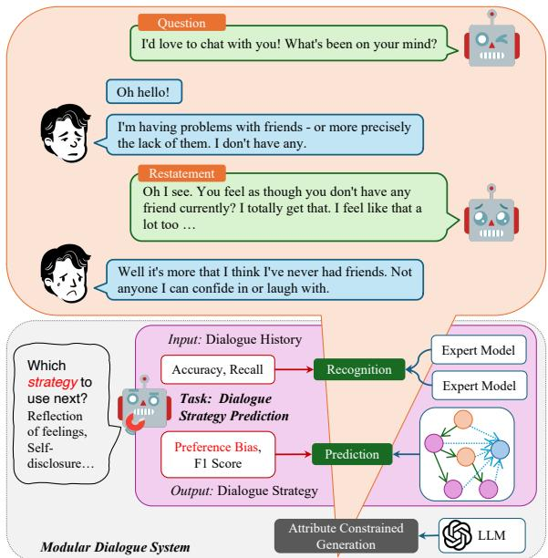
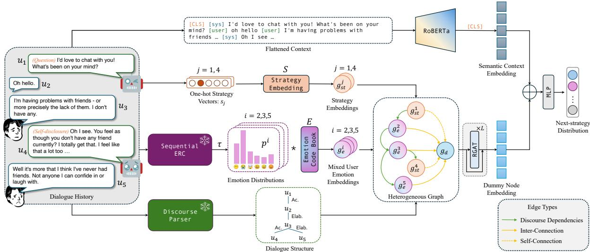
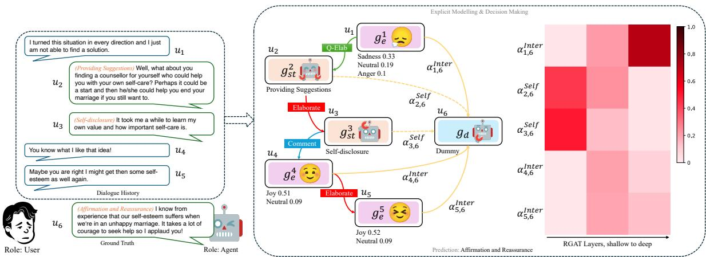
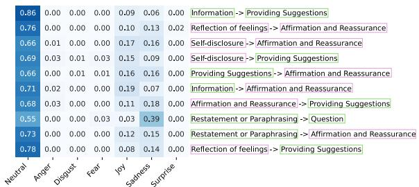
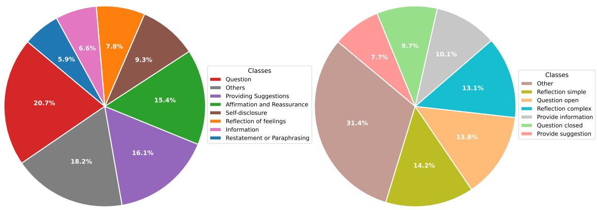
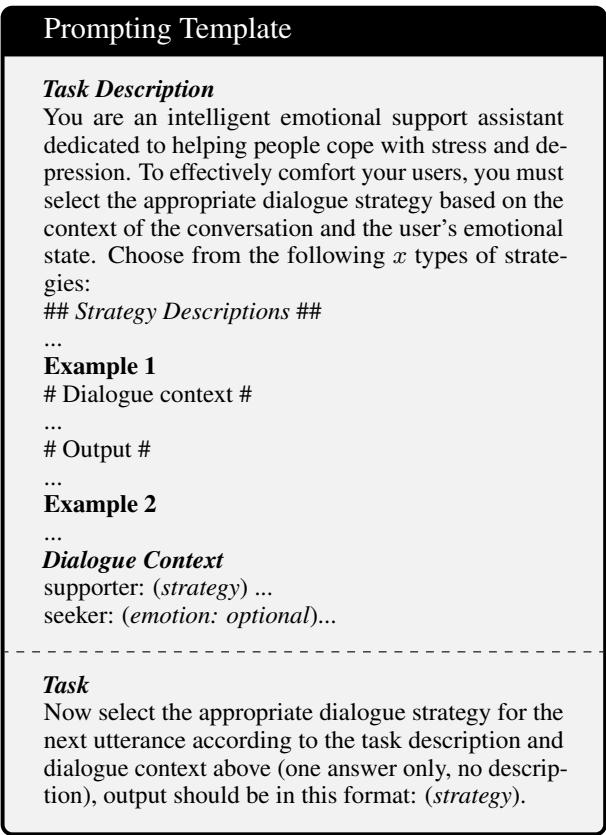
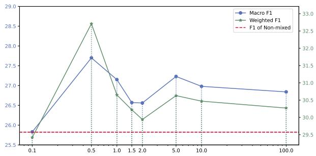
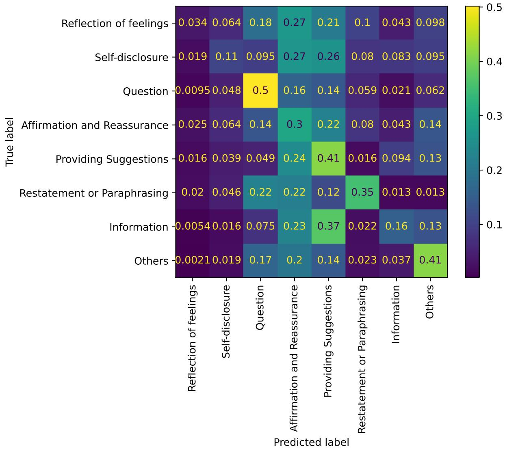

# EmoDynamiX : Emotional Support Dialogue Strategy Prediction by Modelling MiXed Emotions and Discourse Dynamics

Chenwei Wan1,2\* Matthieu Labeau1 Chloé Clavel2

1LTCI, Télécom Paris, Institut Polytechnique de Paris, France 2Inria Paris, France 1{chenwei.wan, matthieu.labeau}@telecom-paris.fr 2chloe.clavel@inria.fr

## Abstract

Designing emotionally intelligent conversational systems to provide comfort and advice to people experiencing distress is a compelling area of research. Recently, with advancements in large language models (LLMs), end-to-end dialogue agents without explicit strategy prediction steps have become prevalent. However, implicit strategy planning lacks transparency, and recent studies show that LLMs’ inherent preference bias towards certain socio-emotional strategies hinders the delivery of high-quality emotional support. To address this challenge, we propose decoupling strategy prediction from language generation, and introduce a novel dialogue strategy prediction framework, EmoDynamiX, which models the discourse dynamics between user fine-grained emotions and system strategies using a heterogeneous graph for better performance and transparency1. Experimental results on two ESC datasets show Emo-DynamiX outperforms previous state-of-theart methods with a significant margin (better proficiency and lower preference bias). Our approach also exhibits better transparency by allowing backtracing of decision making.

## 1 Introduction

Providing early intervention for individuals experiencing distress from life challenges is crucial for enabling them to transition toward positive lifestyles and, consequently, fostering a more caring society. This need has inspired the NLP community to develop effective Emotional Support Conversation (ESC) systems (Liu et al., 2021). These systems aim to alleviate the distress of help-seekers and can be seen as a first step in helping them to find healthcare professionals. Recently, with the release of multi-turn and human-evaluated ESC datasets (Liu et al., 2021; Wu et al., 2022), data-driven approaches have begun to surpass rule-based methods (Van der Zwaan et al., 2012; van der Zwaan et al., 2012).

  
Figure 1: This figure shows a possible modular ESC dialogue system, within which our dialogue strategy prediction framework outputs the next dialogue strategy to be used to guide an external generative model.

Previous work on data-driven ESC has primarily focused on modular dialogue systems as defined by Clavel et al. (2022). Modular systems feature a three-fold workflow: recognizing, planning, and generating. Examples include Tu et al. (2022), Deng et al. (2023), Liu et al. (2021) and Cheng et al. (2022). In these systems, the socio-emotional strategy is selected based on the recognition of the user’s state, and responses are generated using customized language decoders conditioned on the predicted strategy. With the emergence of Large Language Models (LLMs) offering enhanced capabilities, LLMs have increasingly dominated both modular and, particularly, end-to-end ESC systems (Chen et al., 2023b; Zheng et al., 2023), where strategy planning has shifted from an explicit process to a more implicit, hidden mechanism.

However, implicit dialogue strategy planning with LLMs faces two challenges. First, transparency is often lacking in such implicit decisionmaking processes due to the well-known "blackbox" property of LLMs (Ludan et al., 2023; Chhun et al., 2024; Lu et al., 2024). Second, recent studies show that preference biases inherited from pretraining data often cause LLMs to struggle with balancing social-oriented and task-oriented goals. Abulimiti et al. (2023) found that in peer-tutoring dialogues, LLMs like ChatGPT frequently prioritize non-hedging strategies, even in situations where hedging strategies would be more appropriate for repairing low rapport between peers. Similarly, Kang et al. (2024) observed that LLMs’ strong predisposition towards certain strategies can undermine the outcome of the current stage of ESC. As a result, the overall objectives may be significantly compromised.

To address this limitation, introducing external strategy planners, which offer greater controllability by enabling us to explicitly exclude inappropriate strategies in specific contexts, stands out to be a promising solution. It has been evidenced by both automatic metrics and human evaluations that, an explicit decision-making module can more effectively mitigate preference bias, and improved proficiency in dialogue strategy actually enhances overall generation quality (Kang et al., 2024). This foundational insight leads us to isolate and focus specifically on dialogue strategy prediction—a previously intermediate step—with three primary goals: (1) better alignment with human expert strategies, (2) reduced preference bias, and (3) improved transparency.

Additionally, as more powerful LLMs and improved controlled generation techniques continue to emerge (Dathathri et al., 2020), focusing on dialogue strategy prediction offers a more economical pathway to addressing current dialogue system limitations. Explicit dialogue strategy prediction can serve as a flexible, plug-and-play module compatible with state-of-the-art LLMs or as a foundational component for future RL-based methods, where better alignment with human expert strategies is typically a critical first step (Deng et al., 2024).

Therefore, we treat socio-emotional strategy prediction as an independent task, as previously explored by Vanel et al. (2023). We illustrate the scope of this task in Figure 1. From this perspective, we raise the following research questions:

• RQ1: Can we build a dedicated framework for socio-emotional dialogue strategy prediction that is more transparent by design, while outperforming prompting or fine-tuning LLMs in terms of proficiency?

• RQ2: Given the importance of emotional intelligence in delivering effective emotional support, can we boost strategy prediction in ESC by by accounting the user’s emotion using an ERC (Emotion Recognition in Conversations) module?

In addressing RQ1, we introduce EmoDynamiX, a decision-making framework that integrates multiple expert models and incorporates a heterogeneous graph learning module to capture the dynamic interactions between system strategies and user emotions. With graphs, we backtrace the decisionmaking process, making a step towards greater transparency. We also utilize dummy nodes (Liu et al., 2022; Scarselli et al., 2008) for role-aware information aggregation, enhancing the overall performance.

For RQ2, we design a mixed-emotion module to effectively integrate ERC into our framework: (1) By using emotion distributions instead of discrete labels, we reduce the risk of error propagation, as there are domain gaps between ERC and ESC datasets. (2) By tuning emotion distributions, we can effectively model nuanced emotion categories by fusing primary emotions.

We validate the effectiveness of our proposed framework through comparative experiments on two public ESC datasets. The results demonstrate that EmoDynamiX significantly outperforms all previous baselines, achieving superior F1 scores and a notable reduction in preference bias.

## 2 Related Works

## 2.1 Emotional Support Conversation

The goal of ESC is both social-oriented and taskoriented. It aims to alleviate distress by expressing empathy and providing suggestions (Liu et al., 2021; Cheng et al., 2022). Modelling user states is thus a critical topic in ESC. Previous work commonly approaches this by querying commonsense knowledge graphs (Tu et al., 2022; Deng et al., 2023; Peng et al., 2022; Zhao et al., 2023; Li et al.,

2024). These queries are constructed by concatenating the current utterance with specific knowledge relations, such as xReact. The queries are then fed into COMET (Hwang et al., 2021), a generative model pre-trained on commonsense knowledge graphs, which returns the user’s emotional reaction (xReact) to the situation. However, commonsense knowledge is too general to capture the fine-grained emotional states.

In contrast, models specialized in dialogue with context-aware architectures, such as sequential or graph-based models, trained on ERC datasets, can handle these nuances more effectively. Additionally, emotions are frequently mixed in real-life situations, and contradictory emotions (like Sadness and Joy) could coexist in specific contexts (Braniecka et al., 2014). Our mixed-emotion modelling approach handles this complexity better and can model a large set of subtle emotional expressions by combining primary emotions without further human annotations (as demonstrated in Section 6).

EmoDynamiX features two key distinctions: (1) We provide an alternative to knowledge-based user state modelling: a mixed-emotion module based on label distributions predicted by a pre-trained ERC model (2) While previous works have explored various dialogue graph structures (Li et al., 2024; Peng et al., 2022; Zhao et al., 2023), our method incorporates discourse structure, which has been proven effective in various dialogue tasks (Chen and Yang, 2021; Li et al., 2023; Zhang et al., 2023), but remains underexplored in ESC.

## 2.2 Graph Learning in Conversational Tasks

Graph-based approaches have proven effective in various dialogue-related tasks. In recognition tasks, such as conversational emotion recognition and dialogue act recognition, the target speaker turn aggregates information from its neighbors according to the graph structure. Studies by Ghosal et al. (2019), Ishiwatari et al. (2020), Wang et al. (2020), Fu et al. (2023), and Shen et al. (2021) design dialogue graphs based on interactions between speaker roles. Li et al. (2023) and Zhang et al. (2023) construct dialogue graphs based on discourse dependencies parsed with a pre-trained expert model, an approach also applied by Chen and Yang (2021) and Feng et al. (2021) in dialogue summarization. Yang et al. (2023) incorporate commonsense knowledge as heterogeneous nodes. Furthermore, Hu et al. (2021b) and Chen et al. (2023a) model multimodal fusion in dialogue graphs.

In predictive dialogue tasks, such as forcasting the next dialogue act, decisions rely on global information extracted from graphs. Previous works have utilized simple readout functions, such as mean/max pooling (Joshi et al., 2021) and linear layers (Raut et al., 2023). Our approach introduces dummy nodes as special placeholders for information aggregation. While dummy nodes have been previously used in other graph-learning tasks, such as graph classification and subgraph isomorphism matching (Liu et al., 2022), they have primarily served as alternatives to readout functions, which are used for obtaining embeddings of graphs or subgraphs. We are the first to employ dummy nodes in a predictive dialogue task, which is particularly useful, since it allows to clearly model role-aware interactions with previous speaker turns.

## 3 Problem Formulation

The task of predicting the next dialogue strategy can be written as a multi-class classification problem: assuming a dialogue comprising T speaker turns, we define the dialogue history as $\grave { H } ^ { T } ~ = ~ \{ U ^ { T } , A ^ { T } , S T ^ { T } \}$ where $\boldsymbol { U } ^ { \overline { { T } } } ~ = ~ \{ u _ { t } \} _ { t = 1 } ^ { T }$ is the sequence of utterances, and each $u _ { t } ~ =$ $\{ w _ { n } \} _ { n = 1 } ^ { N ^ { t } }$ is a sequence of $N ^ { t }$ words. $\begin{array} { r l } { A ^ { T } } & { { } = } \end{array}$ $\{ a _ { t } \} _ { t = 1 } ^ { T }$ is the sequence of speaker roles, with $a _ { t } \in$ user, system . ${ S T } ^ { T } = \{ { s t } _ { t } \} _ { t = 1 } ^ { T }$ is the sequence of possible strategies, but they only exist for the agent. Noting $s$ the set of strategies, $I _ { \mathsf { u s e r } }$ = $\{ t , a _ { t } = \mathsf { u s e r } \}$ the indexes of turns where the user is speaking, and denoting similarly $\boldsymbol { I _ { \mathsf { a g e n t } } }$ , we have that $\forall t \in I _ { \mathsf { a g e n t } } , s t _ { t } \in S$ and $\forall t \in I _ { \mathsf { u s e r } } , s t _ { t } = \emptyset$ Our task is, given a fixed window size of $N - 1$ , to predict the strategy for agent speaker turns, which we formulate as estimating the probability distribution $\mathbb { P } ( s t _ { N } \mid H _ { 1 } ^ { N - 1 } )$ upon when $t \in I _ { \mathsf { a g e n t } }$ For the sake of simplicity, from now on we will use indexing from the beginning of the context window and no longer from the entire conversation.

## 4 Methodology

Our framework (see Figure 2) comprises three main components: (1) a semantic modelling module for capturing the semantics of the dialogue context; (2) a heterogeneous graph learning module, designed to capture the complex interplay between the user’s emotions and system strategies within the dialogue history; and (3) an MLP classification head which integrates the features obtained from the previous modules to produce the prediction result.

## 4.1 Semantic Modelling

To effectively capture the global semantic information in the dialogue history, we adopt a common method of representing the context in a flattened sequence format:

$$
< \mathrm { c o n t e x t } > = [ a _ { 1 } ] , u _ { 1 } , [ a _ { 2 } ] , u _ { 2 } , \dots\tag{1}
$$

For each speaker turn, we use its speaker role as the separating token indicating the start of the corresponding utterance. This sequence is encoded using RoBERTa (Liu et al., 2019):

$$
C = { \tt R o b e r t a } ( [ \complement { \mathsf { L } } ] , < { \mathsf { c o n t e x t } } > )\tag{2}
$$

We use the embedding of the [CLS] token $C _ { [ \mathsf { C l S } ] }$ from the last hidden layer output as the global semantic representation of the dialogue history $H _ { 1 } ^ { N - 1 }$

## 4.2 Heterogeneous Graph Learning

We propose to use a heterogeneous graph (HG) to model the interaction dynamics in the history $H _ { 1 } ^ { N - 1 }$ . This graph is formally defined as $\mathcal { G } =$ $\{ \nu , B \}$ , which are respectively the set of nodes and edges. Both can be of several types: broadly, node types correspond to past strategies adopted by the conversational agent, the user’s previous emotional states, and the strategy to be predicted; while edge types model the discourse dependencies between dialogue turns and facilitate information aggregation.

Node Types: Our heterogeneous graph contains N nodes $\mathcal { V } = \{ v _ { i } \} _ { i = 1 } ^ { N }$ , each corresponding to a speaker turn, including the target turn N. For user turns $i \in I _ { \mathsf { u s e r } } , v _ { i }$ is an emotion node, which encapsulates the fine-grained emotion state of the user. For agent turns $i \in I _ { \mathsf { a g e n t } } , v _ { i }$ is a system strategy node, that represents the specific conversational strategy implemented by the agent. Lastly, we introduce the dummy node $v _ { N }$ as a placeholder for the target utterance, aggregating information from the two other node types and their interactions.

Edge Types: The edges in our heterogeneous graph fulfill dual roles: they model the discourse dependencies between dialogue turns and facilitate information aggregation towards the dummy node. Discourse dependencies correspond to edges between and within emotion and system strategy nodes: we follow Asher et al. (2016)’s definition (which include categories such as Comment and

Elaboration) and pre-train a discourse parser as proposed by Chi and Rudnicky (2022) on the multiparty discourse dataset STAC (Asher et al., 2016). Details regarding the training procedure can be found in Appendix D.2. We note $\mathcal { R } _ { \mathrm { D i s c o u r s e } }$ the set of possible dependencies; then, $\forall ( i , j )$ such that $1 \leq i , j \leq N - 1 , \langle v _ { i } , v _ { j } \rangle \in \mathcal { R } _ { \mathrm { D i s c o u r s e } }$ . We give more details on these dependencies in $\mathsf { A p - }$ pendix $\mathsf { A } . 2$ . The remaining edges are aggregating information from system strategy nodes, which we call self-reference: $\forall i \in I _ { \mathsf { a g e n t } } , \langle v _ { i } , v _ { N } \rangle = r _ { \mathrm { s e l f } } ;$ and from user emotion nodes, which we call interreference: $\forall i \in I _ { \mathsf { u s e r } } , \langle v _ { i } , v _ { N } \rangle = r _ { \mathsf { i n t e r } }$ . We note $\mathcal { R } = \mathcal { R } _ { \mathrm { D i s c o u r s e } } \cup \{ r _ { \mathrm { s e l f } } , r _ { \mathrm { i n t e r } } \}$ the set of edge types.

We will describe next how we obtain node embeddings for these three node types, and how the different edge types affect their aggregation.

## 4.2.1 User Emotion Node Embedding: Mixed Emotion Method

Unlike previous work that relies on commonsense knowledge, we propose leveraging a pre-trained ERC model to predict emotion distributions from user utterances. We then utilize the knowledge contained in these distributions to create embeddings for fine-grained user states using a mixed-prototype approach.

Training an ERC model Our emotion recognition model consists of a RoBERTa encoder with an MLP classifier. To incorporate the global dialogue context while classifying individual utterances, we concatenate all utterances into a single sequence. We train our model with the DailyDialog dataset (Li et al., 2017); since it does not provide annotations for speaker roles, we use the special token [SEP] as the common delimiter between all utterances:

$$
< \mathsf { u c o n t e x t } > = [ \mathsf { S E P } ] _ { 1 } , u _ { 1 } , [ \mathsf { S E P } ] _ { 2 } , u _ { 2 } , \ldots\tag{3}
$$

This concatenated sequence is then encoded by RoBERTa, from which we extract the embeddings of the $[ \mathsf { S E P } ] _ { i }$ tokens (preceding each utterance) from the last hidden layer. These embeddings serve as representations for the corresponding utterances. We note $\mathcal { E }$ the set of emotions; then, the embeddings are fed into an MLP to derive a vector $z ^ { i } \in \mathbb { R } ^ { | \mathcal { E } | }$ of scores for each utterance $u _ { i } \mathrm { . }$

$$
\begin{array} { r } { \begin{array} { c } { { \pmb { C } } ^ { E R C } = \mathsf { R o b e r t a } \big ( [ { \mathsf { C L S } } ] , { \mathsf { < u c o n t e x t > } } \big ) } \\ { { \pmb { z } } ^ { i } = \mathsf { M L P } \big ( { \pmb { C } } _ { [ { \mathsf { S E P } } ] _ { i } } ^ { E R C } \big ) } \end{array} } \end{array}\tag{4}
$$

  
Figure 2: The overview of our proposed model that consists of a semantic modelling module, a heterogeneous graph learning module, and an MLP classification head.

For DailyDialog, we categorize emotions into seven groups: Ekman’s six basic emotions plus Neutral, collectively referred to as . Additional statistical details about DailyDialog, along with our motivation for selecting it, are available in Appendix A.2. Detailed information regarding the implementation and training hyperparameters can be found in Appendix D.2.

Mixed-emotion module: To model the user’s emotional states, we employ a trainable emotion codebook. It takes the form of a parameter matrix $\boldsymbol { E } \in \mathbb { R } ^ { | \mathcal { E } | \times h }$ with h the embedding size for our heterogeneous graph; each of the vector $\{ \boldsymbol { E } _ { k } \} _ { k = 1 } ^ { | \mathcal { E } | }$ encodes a distinct emotion. For an emotion node $v _ { i } .$ they are combined into a node embedding $\mathbf { \Delta } _ { g _ { e } ^ { i } }$ using the adjusted emotion distribution:

$$
\pmb { g } _ { e } ^ { i } = \pmb { p } ^ { i } \cdot \pmb { E }\tag{5}
$$

This distribution is directly obtained through the output scores of our ERC model:

$$
p ^ { i } = \left[ \frac { \exp ( z _ { j } ^ { i } / \tau ) } { \sum _ { k } \exp ( z _ { k } ^ { i } / \tau ) } \right] _ { j = 1 } ^ { | \mathcal { E } | }\tag{6}
$$

To utilize the information in the emotion label distribution more effectively, we employ a learnable temperature parameter τ ; details on the impact of the initialization of τ can be found in Appendix E.1.

Our mixed emotion approach draws inspiration from MISC, where a mixed-strategy module is proposed to condition the response generation (Tu et al., 2022), yet MISC does not study the tuning of the label distribution $p \mathrm { : }$ for example, in an

ERC dataset where the label "Neutral" is prevalent, refining the distribution to become a little "sharper" could greatly mitigate the ambiguity in the model’s predictions, especially for underrepresented classes.

## 4.2.2 System Strategy Node Embedding

For a speaker turn $i \in I _ { \mathsf { a g e n t } }$ , the dialogue strategy information is encoded as a one hot vector $\pmb { s } ^ { i } \in \{ 0 , 1 \} ^ { | s | }$ . Strategies themselves, as emotions, are represented through a parameter matrix $S \in \mathbb { R } ^ { | S | \times h }$ . Then, we simply obtain:

$$
g _ { s t } ^ { i } = s ^ { i } \cdot S\tag{7}
$$

as the embedding of the system strategy node $v _ { i }$

## 4.2.3 Dummy Node Embedding

Previous work relies on aggregating heterogeneous graph information using simple readout functions and linear layers, which do not consider speaker roles and lack transparency regarding the contribution of each node to the final decision. To address this, we propose using the dummy node $v _ { t }$ as a placeholder for the target of prediction, which interacts with previous speaker turns in a role-aware manner. We set the embedding of the dummy node as a parameter vector $\pmb { g } _ { d } \in \mathbb { R } ^ { h }$ , hence being trainable and shared among all dialog graphs.

## 4.2.4 Relational Graph Attention Layers

We previously defined the initial node representations for our three node types. Then, we can employ relational graph attention networks (Busbridge et al., 2019) to update these node representations. Choosing a number K of attention heads, we define a relation graph attention (RGAT) layer by defining keys, queries and values parameter matrices $\hat W _ { K } ^ { ( r , k ) } , \hat W _ { Q } ^ { ( r , k ) } , \hat W _ { V } ^ { ( r , k ) }$ for each attention head k and possible type of edge $r \in \mathcal { R }$ . We begin by computing the attention weights $\alpha _ { i , j } ^ { ( r _ { i j } , k ) }$ between $v _ { i }$ and $v _ { j }$ under relation type $r _ { i j } = \langle \bar { v } _ { i } , v _ { j } \rangle$ using:

$$
\begin{array} { r l } & { a _ { i , j } ^ { ( r _ { i j } , k ) } = \sigma ( \boldsymbol { W } _ { Q } ^ { ( r _ { i j } , k ) } \pmb { g } ^ { i } + \boldsymbol { W } _ { K } ^ { ( r _ { i j } , k ) } \pmb { g } ^ { j } ) } \\ & { \alpha _ { i , j } ^ { ( r _ { i j } , k ) } = \cfrac { \exp ( a _ { i , j } ^ { ( r _ { i j } , k ) } ) } { \sum _ { r \in \mathcal { R } } \sum _ { m \in \mathcal { N } _ { r } ( i ) } \exp ( a _ { i , m } ^ { ( r , k ) } ) } } \end{array}\tag{8}
$$

where $\sigma$ denotes the LeakyReLU function and $\mathcal { N } _ { r } ( i )$ denotes the set of the indexes of neighbouring nodes of $v _ { i }$ under the edge type r. The result of the multi-head attention for node $v _ { i }$ is then:

$$
\pmb { h } ^ { i } = \Vert _ { k = 1 } ^ { K } \sigma ( \sum _ { r \in \mathcal { R } } \sum _ { m \in \mathcal { N } _ { r } ( i ) } \alpha _ { i , m } ^ { ( r , k ) } \pmb { W } _ { V } ^ { ( r , k ) } \pmb { g } ^ { m } )\tag{9}
$$

where denotes concatenation. To avoid gradient vanishing, we also add residual connections between RGAT layers and obtain the new representation for node v :

$$
\pmb { g } ^ { ( 1 ) , i } = \pmb { h } ^ { i } + \pmb { g } ^ { i }\tag{10}
$$

In our model, we use the embedding $\pmb { g } ^ { ( L ) , N }$ of the dummy node after applying L RGAT layers as representation for the entire heterogeneous dialogue graph.

## 4.3 Next Dialogue Strategy Prediction

We concatenate our global semantic embedding $C _ { [ \mathsf { C L S } ] }$ with the heterogeneous graph embedding ${ \pmb g } _ { N } ^ { ( L ) }$ ; this combined representation is fed into a simple MLP classification layer to compute a probability distribution upon $s { \mathrm { : } }$

$$
\pmb { o } = s o f t m a x ( \mathsf { M L P } ( C _ { [ \mathsf { C L S } ] } \| \pmb { g } ^ { ( L ) , N } ) )\tag{11}
$$

which finally gives $\mathbb { P } ( s t _ { N } \mid H _ { 1 } ^ { N - 1 } ) = o _ { s t _ { N } }$ . We adopt the weighted cross-entropy loss as our training objective: to address class imbalance, we adjust the loss contribution from each class based on its prevalence, weighting it in proportion inverse to its frequency in the training dataset.

## 5 Experiments

## 5.1 Experimental Setups

Datasets To make our model learn strategies beneficial for both social and task-oriented goals, we select two ESC datasets (in English) where dialogues have been human-evaluated and filtered to ensure that the conversational outcomes are positive and the strategies applied are socially appropriate: (i) ESConv (Liu et al., 2021), an ESC dataset annotated by trained crowd-workers. It comprises 1,300 dialogues and features 8 dialogue strategies. We adhere to the official train/dev/test $\operatorname { s p l i t } ^ { 2 } .$ .; (ii) AnnoMI (Wu et al., 2022), an expertannotated counselling dataset. It includes 133 dialogues and features 9 therapist strategies. We make the train/dev/test split with an 8:1:1 ratio. Detailed dataset statistics are provided in Appendix A.1. For both datasets, we set the context window size to 5 utterances3, resulting in 18,376 samples for ES-Conv and 4,442 samples for AnnoMI.

Baselines To provide extensive comparisons, we choose baselines from three criteria: (i) prompting LLMs SOTA in dialogue tasks, using task description and supplementary information: Chat-$\mathbf { G P T ^ { 4 } }$ (OpenAI, 2023) and LLaMA3-70B (Meta, 2024) with 2-shot learning (+2 shot) or emotion labels (+ ERC). We excluded Chain-of-Thought (Wei et al., 2024) prompting because it has already been shown to be ineffective for our task (Kang et al., 2024); (ii) fine-tuning LLMs as general-purpose dialogue strategy predictors: RoBERTa (Liu et al., 2019), BART (Lewis et al., 2020) and LLaMA3- 8B (Meta, 2024); (iii) specialized models for emotional support dialogue strategy prediction: MISC (Tu et al., 2022), MultiESC (Cheng et al., 2022), KEMI (Deng et al., 2023) and TransESC (Zhao et al., 2023). For more details see Appendix C.

Evaluation Metrics We use macro F1 score ( - F1) and weighted F1 score ( -F1) as metrics for evaluating the proficiency of strategy prediction models, since the ground truth strategies in the two datasets have been validated by human evaluators. Given the unbalanced nature of ESC datasets, the accuracy score is not an ideal choice as it can unfairly favor models that predominantly predict the majority classes. We also incorporate the preference bias score ( ) as defined by Kang et al. (2024) to quantify the extent to which the model favors its preferred strategies over non-preferred ones (implementation details in Appendix D.1). An ideal dialogue strategy predictor should achieve strong F1 scores while minimizing preference bias.

<table><tr><td rowspan="2"></td><td rowspan="2">Model</td><td colspan="3">ESConv</td><td colspan="3">AnnoMI</td></tr><tr><td>M-F1↑</td><td>W-F1↑</td><td>B↓</td><td>M-F1↑</td><td>W-F1↑</td><td>B↓</td></tr><tr><td rowspan="6">Prompting LLMs</td><td>LLaMA3-70B (Meta, 2024)</td><td>15.36</td><td>18.45</td><td>1.03</td><td>8.38</td><td>9.01</td><td>1.24</td></tr><tr><td>+ 2 shot</td><td>17.70</td><td>21.47</td><td>1.29</td><td>9.52</td><td>9.13</td><td>1.11</td></tr><tr><td>+ ERC</td><td>15.70</td><td>19.32</td><td>1.12</td><td>8.28</td><td>9.02</td><td>1.30</td></tr><tr><td>ChatGPT (OpenAI, 2023)</td><td>18.14</td><td>20.27</td><td>0.88</td><td>20.31</td><td>18.12</td><td>1.21</td></tr><tr><td>+ 2 shot</td><td>16.55</td><td>20.01</td><td>0.73</td><td>15.29</td><td>14.22</td><td>1.39</td></tr><tr><td>+ ERC</td><td>16.50</td><td>18.79</td><td>0.77</td><td>16.17</td><td>15.60</td><td>0.89</td></tr><tr><td rowspan="3">Finetuning LLMs</td><td>RoBERTa (Liu et al., 2019)</td><td>25.04</td><td>27.94</td><td>0.68</td><td>22.26</td><td>27.25</td><td>0.64</td></tr><tr><td>BART (Lewis et al., 2020)</td><td>25.66</td><td>29.08</td><td>0.64</td><td>22.94</td><td>29.68</td><td>1.07</td></tr><tr><td>LLaMA3-8B (Meta, 2024)</td><td>25.91</td><td>29.82</td><td>0.83</td><td>23.77</td><td>29.98</td><td>0.81</td></tr><tr><td rowspan="4">Specialized Models</td><td>MISC (Tu et al., 2022)</td><td>20.91</td><td>24.93</td><td>0.89</td><td>-</td><td></td><td></td></tr><tr><td>MultiESC (Cheng et al., 2022)</td><td>25.73</td><td>29.31</td><td>0.61</td><td></td><td></td><td></td></tr><tr><td>KEMI (Deng et al., 2023)</td><td>24.69</td><td>26.80</td><td>0.86</td><td></td><td></td><td></td></tr><tr><td>TransESC (Zhao et al., 2023)</td><td>26.28</td><td>31.33</td><td>0.73</td><td></td><td></td><td></td></tr><tr><td>Ours</td><td>EmoDynamiX</td><td>27.70</td><td>32.71†</td><td>0.45</td><td>27.92†</td><td>35.33</td><td>0.50†</td></tr></table>

Table 1: Experimental results on two ESC datasets. The best results are bolded and the second best are underlined. † indicates statistically significant improvement $( p < 0 . 0 5 )$ . Since MultiESC has adopted a new set of labels, we merge the updated ones with the original annotations to ensure a fair comparison. Due to the unavailability of TransESC’s data preprocessing pipeline, we report the reproduced results based on their released train/dev/test split.

Implementation Details We implemented our proposed method using PyTorch (Paszke et al., 2019), initializing with the pre-trained weights from RoBERTa and employing the tokenization tools from Huggingface Transformers (Wolf et al., 2020). For optimization, we used the AdamW optimizer (Loshchilov and Hutter, 2019). Detailed hyperparameter settings can be found in Appendix D.3.

## 5.2 Overall Performance

As shown in Table 1, EmoDynamiX outperforms previous SOTA methods across all evaluation metrics. Compared to TransESC, EmoDynamiX significantly reduces the preference bias score by 38% and achieves higher F1 scores. This suggests that while TransESC also models dialogue state transitions, our ERC-based mixed-emotion approach captures the nuances of user emotion states more effectively, leading to better predictions, as further validated by our ablation study. Furthermore, compared to MultiESC, the previous SOTA model with a low bias score, EmoDynamiX excels across all metrics by a substantial margin. Another interesting result is that models based on specific case knowledge (KEMI) and general commonsense knowledge (MISC) are less effective as dialogue strategy predictors.

Comparisons with two LLM prompting baselines indicate that using LLMs alone for emotional support dialogue prediction is significantly constrained by their inherent biases, even when examples or emotion recognition is provided through prompts. The bias scores for LLM-prompting baselines are significantly higher, ranging from 0.77 to 1.39. Among the LLM-fine-tuning baselines, LLaMA3-8B achieves the highest F1 scores. RoBERTa generally exhibits a lower bias score, while BART emerges as a balanced option. Nevertheless, these baselines still lag behind EmoDynamiX by a considerable margin.

## 5.3 Ablation Study

We conducted ablation studies (Table 2) and investigated whether the following modules improves the results of next strategy prediction:

Modelling user emotions and agent strategies in dialogue context. We compared two simplified versions: (1) flattened dialogue history only (RoBERTa in Table 1); (2) flattened context with emotions and strategies inserted as tags (w/o Graph). Although w/o Graph outperforms RoBERTa, there remains a significant gap compared to EmoDynamiX. This indicates that while incorporating emotions and strategies is beneficial, the effectiveness is still limited without our graphlearning module.

Modelling mixed emotions. We modelled user emotional states with one-hot vectors instead (w/o Mixed Emotion). The resulting decreases in all metrics highlight the importance of leveraging emotion distributions, not just labels, for capturing finegrained user emotion states.

Modelling discourse structure. We connected the nodes in simple sequential order instead of discourse structure (w/o Discourse Parser). Although this led to drops in all metrics, the declines were not substantial. We hypothesize that the domain gap between the STAC dataset and the ESC datasets may limit the discourse parsing module’s effectiveness. Use of dummy nodes for information aggregation We replaced dummy nodes with traditional mean-max pooling (Joshi et al., 2021) (w/o Dummy Node). We observed performance decreases, with a more significant decline on AnnoMI, indicating that our dummy node design is particularly beneficial in low-resource settings.

<table><tr><td rowspan="2">Model</td><td colspan="3">ESConv</td><td colspan="3">AnnoMI</td></tr><tr><td>M-F1↑</td><td>W-F1↑</td><td>B.↓</td><td>M-F1↑</td><td>W-F1↑</td><td>B.↓</td></tr><tr><td>EmoDynamiX</td><td>27.70</td><td>32.71</td><td>0.45</td><td>27.92</td><td>35.33</td><td>0.50</td></tr><tr><td>w/o Graph Learning</td><td>25.72↓1.98</td><td>29.31↓3.40</td><td>0.78↑0.33</td><td>26.95↓0.97</td><td>29.46↓5.87</td><td>0.73↑0.23</td></tr><tr><td>w/o Mixed Emotion</td><td>25.90↓1.80</td><td>29.45↓3.26</td><td>0.66↑0.21</td><td>24.71↓3.21</td><td>30.25↓5.08</td><td>0.70↑0.20</td></tr><tr><td>w/o Discourse Parser</td><td>26.64↓1.06</td><td>30.12|2.59</td><td>0.59↑0.14</td><td>27.04|0.88</td><td>31.59|3.74</td><td>0.60↑0.10</td></tr><tr><td>w/o Dummy Node</td><td>25.46↓2.24</td><td> $2 9 . 8 0 _ { \downarrow 2 . 9 1 }$ </td><td>0.73↑0.28</td><td>24.73↓3.19</td><td>29.00↓6.33</td><td>0.72↑0.22</td></tr></table>

Table 2: Evaluation results of ablation study.

  
Figure 3: Case study: Dialogue history and ground truth (left); visualization of the heterogeneous graph structure (middle); attention weights of the dummy node edges (right).

## 6 In-depth Analysis of EmoDynamiX

We illustrated a case study using a snippet from ESConv, as shown in Figure 3. The case involves the agent deciding which strategy to apply after the user’s emotional state has transitioned positively from Frustration (as Frustration is not a category in DailyDialog, our mixed-emotion module models it as moderated sadness with a little anger) to Joy. The ground truth here is Affirmation and Reassurance, which acknowledges the user’s positive transition and encourages consolidation of positive mood. By looking at the attention weights of dummy node edges, we can observe the contribution of each node in decision-making. We notice that, as the RGAT layer deepens, the dummy node shifts its attention from previously applied strategies to the user’s emotional transition, with higher weights applied to edges connecting with the emotion state nodes (especially Frustration). In short, our graph-learning module effectively captures clues from emotion/strategy dynamics.

  
Figure 4: Analysis on the correlation between the top-10 disagreement patterns (Ground Truth -> Prediction) and their most influential emotion categories.

We further study the disagreements between the predictions and human strategies using the confusion matrix (Appendix E.3). Determining the appropriate timing for emotion-related dialogue strategies versus task-oriented ones is particularly challenging. The model frequently predicts Providing Suggestions whereas the human strategies are among the three emotion-related ones: Reflection offeelings, Self-disclosure, and Affirmation and Reassurance. Notably, over 60% of emotionrelated strategies were categorized as task-oriented ones, highlighting the difficulty in making choices between these two strategy categories, as also discussed by Galland et al. (2022). We further analyze the disagreement patterns between predicted and human strategies. By looking at their correlations with the primary emotion categories of emotion nodes with the highest attention weights (Figure 4), we find that "Neutral" contributes a larger proportion to these disagreements in general compared to its overall representation in the ERC module’s output distribution (59.22%, as shown in Appendix E.2). This suggests that strategies are easier to predict when the model can pick up the user emotions expressed in the context.

## 7 Conclusions

In this paper, we propose EmoDynamiX, a socioemotional dialogue strategy prediction framework that aggregates expert models and uses heterogeneous graphs to model the conversational dynamics of user states and system strategies. Our approach significantly improves all baselines on two public ESC datasets, and takes a step towards transparency by analyzing attention weights in the indepth study.

## Limitations

Limitations on Ground Truths Although the ESC datasets we use have all been evaluated by humans, we cannot fully ensure that no other strategies, aside from the ground truth, could have been effective in the same context. However, we currently lack a protocol for human evaluation at the strategyplanning stage. Besides, human evaluation is more suitable to be performed after the generation stage. Generalizability to Other Languages We evaluated the effectiveness of our proposed architecture using only two English datasets. It remains to be seen whether our approach can generalize to other languages or multi-language settings. It is also worth noting that since EmoDynamiX is based on expert models pre-trained on English datasets to acquire knowledge about discourse structure and emotion recognition, it may inherit cultural biases from these datasets (Gelfand et al., 2011; Hall, 1976), potentially influencing the strategy prediction.

Limitations on Expert Modules Since ERC and discourse parsing are not the primary contributions of our research, we did not investigate the impact of using different model architectures or datasets for their training. The training and integration of a cross-domain ERC module and discourse parser could be considered in future studies.

Distance to Practical Application Although our method outperformed previous baselines significantly, its performance remains unsatisfactory. This underscores the complexity of the task and indicates that additional work is required to make the socio-emotional strategy predictor a robust component in future ESC agents.

## Ethics Statement

Intent of Technology We insist that conversational AI should not be developed to replace humans. Therefore, it is crucial to maintain a clear line between AI and humans (Ethique et al., 2024). Given that the training data for conversational AI, including the two datasets we selected, are primarily curated by humans, the AI (especially those trained using end-to-end methods) may exhibit human-like behaviors. For instance, in Figure 1, the system learns to utilize Self-disclosure strategy by expressing feelings of loneliness, which is not consistent with ethical recommendations. We stress that strategies leading to such human-like behaviors should be applied cautiously and potentially restricted in real-world applications to ensure safety. We believe that our approach, which allows us to explicitly set desired behaviors for AI, can provide better control over conversational AI in the future.

Data Privacy All experiments were conducted using existing datasets derived from public scientific research. Any personally identifiable and sensitive information, such as user and platform identifiers, has been removed from these datasets.

Medical Disclaimer We do not provide treatment recommendations or diagnostic claims.

Transparency We detail the statistics of the datasets and the hyper-parameter settings of our method. Our analysis aligns with the experimental results.

## Acknowledgement

We thank the anonymous reviewers for their valuable comments.

This work was partially funded by the ANR-23- CE23-0033-01 SINNet project and benefited from the ANR-23-IACL-0008 project under the France 2030 plan.

## References

Alafate Abulimiti, Chloé Clavel, and Justine Cassell. 2023. How about kind of generating hedges using end-to-end neural models? In Proceedings of the 61st Annual Meeting ofthe Associationfor Computational Linguistics (Volume 1: Long Papers), pages 877–892, Toronto, Canada. Association for Computational Linguistics.

Nicholas Asher, Julie Hunter, Mathieu Morey, Benamara Farah, and Stergos Afantenos. 2016. Discourse structure and dialogue acts in multiparty dialogue: the STAC corpus. In Proceedings of the Tenth International Conference on Language Resources and Evaluation (LREC’16), pages 2721–2727, Portorož, Slovenia. European Language Resources Association (ELRA).

Anna Braniecka, Ewa Trzebinska, Aneta Dowgiert, and´ Agata Wytykowska. 2014. Mixed emotions and coping: The benefits of secondary emotions. PloS one, 9(8):e103940.

Dan Busbridge, Dane Sherburn, Pietro Cavallo, and Nils Y Hammerla. 2019. Relational graph attention networks. arXiv preprint arXiv:1904.05811.

Carlos Busso, Murtaza Bulut, Chi-Chun Lee, Abe Kazemzadeh, Emily Mower, Samuel Kim, Jeannette N Chang, Sungbok Lee, and Shrikanth S Narayanan. 2008. Iemocap: Interactive emotional dyadic motion capture database. Language resources and evaluation, 42:335–359.

Feiyu Chen, Jie Shao, Shuyuan Zhu, and Heng Tao Shen. 2023a. Multivariate, multi-frequency and multimodal: Rethinking graph neural networks for emotion recognition in conversation. In 2023 IEEE/CVF Conference on Computer Vision and Pattern Recognition (CVPR), pages 10761–10770.

Jiaao Chen and Diyi Yang. 2021. Structure-aware abstractive conversation summarization via discourse and action graphs. In Proceedings ofthe 2021 Conference of the North American Chapter of the Associationfor Computational Linguistics: Human Language Technologies, pages 1380–1391, Online. Association for Computational Linguistics.

Maximillian Chen, Xiao Yu, Weiyan Shi, Urvi Awasthi, and Zhou Yu. 2023b. Controllable mixed-initiative dialogue generation through prompting. In Proceedings of the 61st Annual Meeting of the Association for Computational Linguistics (Volume 2: Short Papers), pages 951–966, Toronto, Canada. Association for Computational Linguistics.

Yi Cheng, Wenge Liu, Wenjie Li, Jiashuo Wang, Ruihui Zhao, Bang Liu, Xiaodan Liang, and Yefeng Zheng. 2022. Improving multi-turn emotional support dialogue generation with lookahead strategy planning. In Proceedings of the 2022 Conference on Empirical Methods in Natural Language Processing, pages 3014–3026, Abu Dhabi, United Arab Emirates. Association for Computational Linguistics.

Cyril Chhun, Fabian M. Suchanek, and Chloé Clavel. 2024. Do language models enjoy their own stories? prompting large language models for automatic story evaluation. Transactions ofthe Associationfor Computational Linguistics, 12:1122–1142.

Ta-Chung Chi and Alexander Rudnicky. 2022. Structured dialogue discourse parsing. In Proceedings of the 23rd Annual Meeting of the Special Interest Group on Discourse and Dialogue, pages 325–335, Edinburgh, UK. Association for Computational Linguistics.

Chloé Clavel, Matthieu Labeau, and Justine Cassell. 2022. Socio-conversational systems: Three challenges at the crossroads of fields. Frontiers in Robotics and AI, 9:937825.

Sumanth Dathathri, Andrea Madotto, Janice Lan, Jane Hung, Eric Frank, Piero Molino, Jason Yosinski, and Rosanne Liu. 2020. Plug and play language models: A simple approach to controlled text generation. In International Conference on Learning Representations.

Yang Deng, Wenxuan Zhang, Wai Lam, See-Kiong Ng, and Tat-Seng Chua. 2024. Plug-and-play policy planner for large language model powered dialogue agents. In The Twelfth International Conference on Learning Representations.

Yang Deng, Wenxuan Zhang, Yifei Yuan, and Wai Lam. 2023. Knowledge-enhanced mixed-initiative dialogue system for emotional support conversations. In Proceedings of the 61st Annual Meeting of the Associationfor Computational Linguistics (Volume 1: Long Papers), pages 4079–4095, Toronto, Canada. Association for Computational Linguistics.

Comité Ethique, Christine Noiville, Catherine Pelachaud, Patrice Debré, Jean-Gabriel Ganascia, and Raja Chatila. 2024. COMETS Opinion 2024-46 - “The phenomenon of attachment to ”social robots”. A call for vigilance among the scientific research community”. Technical report, CNRS COMETS.

Xiachong Feng, Xiaocheng Feng, Bing Qin, and Xinwei Geng. 2021. Dialogue discourse-aware graph model and data augmentation for meeting summarization. In Proceedings ofthe Thirtieth International Joint Conference on Artificial Intelligence, IJCAI-21, pages 3808–3814. International Joint Conferences on Artificial Intelligence Organization. Main Track.

Changzeng Fu, Zhenghan Chen, Jiaqi Shi, Bowen Wu, Chaoran Liu, Carlos Toshinori Ishi, and Hiroshi Ishiguro. 2023. Hag: Hierarchical attention with graph network for dialogue act classification in conversation. In ICASSP 2023 - 2023 IEEE International Conference on Acoustics, Speech and Signal Processing (ICASSP), pages 1–5.

Lucie Galland, Catherine Pelachaud, and Florian Pecune. 2022. Adapting conversational strategies in information-giving human-agent interaction. Frontiers in Artificial Intelligence, 5:1029340.

Michele J Gelfand, Jana L Raver, Lisa Nishii, Lisa M Leslie, Janetta Lun, Beng Chong Lim, Lili Duan, Assaf Almaliach, Soon Ang, Jakobina Arnadottir, et al. 2011. Differences between tight and loose cultures: A 33-nation study. science, 332(6033):1100–1104.

Deepanway Ghosal, Navonil Majumder, Soujanya Poria, Niyati Chhaya, and Alexander Gelbukh. 2019. DialogueGCN: A graph convolutional neural network for emotion recognition in conversation. In Proceedings of the 2019 Conference on Empirical Methods in Natural Language Processing and the 9th International Joint Conference on Natural Language Processing (EMNLP-IJCNLP), pages 154–164, Hong Kong, China. Association for Computational Linguistics.

Edward T Hall. 1976. Beyond culture. Anchor.

Geoffrey Hinton, Oriol Vinyals, and Jeffrey Dean. 2015. Distilling the knowledge in a neural network. In NIPS Deep Learning and Representation Learning Workshop.

Edward J Hu, Yelong Shen, Phillip Wallis, Zeyuan Allen-Zhu, Yuanzhi Li, Shean Wang, Lu Wang, and Weizhu Chen. 2021a. Lora: Low-rank adaptation of large language models. arXiv preprint arXiv:2106.09685.

Jingwen Hu, Yuchen Liu, Jinming Zhao, and Qin Jin. 2021b. MMGCN: Multimodal fusion via deep graph convolution network for emotion recognition in conversation. In Proceedings ofthe 59th Annual Meeting ofthe Associationfor Computational Linguistics and the 11th International Joint Conference on Natural Language Processing (Volume 1: Long Papers), pages 5666–5675, Online. Association for Computational Linguistics.

Jena D Hwang, Chandra Bhagavatula, Ronan Le Bras, Jeff Da, Keisuke Sakaguchi, Antoine Bosselut, and Yejin Choi. 2021. (comet-) atomic 2020: On symbolic and neural commonsense knowledge graphs. In Proceedings of the AAAI Conference on Artificial Intelligence, volume 35, pages 6384–6392.

Taichi Ishiwatari, Yuki Yasuda, Taro Miyazaki, and Jun Goto. 2020. Relation-aware graph attention networks with relational position encodings for emotion recognition in conversations. In Proceedings ofthe 2020 Conference on Empirical Methods in Natural Language Processing (EMNLP), pages 7360–7370, Online. Association for Computational Linguistics.

Rishabh Joshi, Vidhisha Balachandran, Shikhar Vashishth, Alan Black, and Yulia Tsvetkov. 2021. Dialograph: Incorporating interpretable strategy-graph networks into negotiation dialogues. In International Conference on Learning Representations.

Dongjin Kang, Sunghwan Kim, Taeyoon Kwon, Seungjun Moon, Hyunsouk Cho, Youngjae Yu, Dongha Lee, and Jinyoung Yeo. 2024. Can large language models be good emotional supporter? mitigating preference bias on emotional support conversation.

In Proceedings of the 62nd Annual Meeting of the Association for Computational Linguistics (Volume 1: Long Papers), pages 15232–15261, Bangkok, Thailand. Association for Computational Linguistics.

Mike Lewis, Yinhan Liu, Naman Goyal, Marjan Ghazvininejad, Abdelrahman Mohamed, Omer Levy, Veselin Stoyanov, and Luke Zettlemoyer. 2020. BART: Denoising sequence-to-sequence pre-training for natural language generation, translation, and comprehension. In Proceedings ofthe 58th Annual Meeting ofthe Associationfor Computational Linguistics, pages 7871–7880, Online. Association for Computational Linguistics.

Ge Li, Mingyao Wu, Chensheng Wang, and Zhuo Liu. 2024. Dq-hgan: A heterogeneous graph attention network based deep q-learning for emotional support conversation generation. Knowledge-Based Systems, 283:111201.

Wei Li, Luyao Zhu, Rui Mao, and Erik Cambria. 2023. Skier: A symbolic knowledge integrated model for conversational emotion recognition. Proceedings of the AAAI Conference on Artificial Intelligence, 37(11):13121–13129.

Yanran Li, Hui Su, Xiaoyu Shen, Wenjie Li, Ziqiang Cao, and Shuzi Niu. 2017. DailyDialog: A manually labelled multi-turn dialogue dataset. In Proceedings ofthe Eighth International Joint Conference on Natural Language Processing (Volume 1: Long Papers), pages 986–995, Taipei, Taiwan. Asian Federation of Natural Language Processing.

Siyang Liu, Chujie Zheng, Orianna Demasi, Sahand Sabour, Yu Li, Zhou Yu, Yong Jiang, and Minlie Huang. 2021. Towards emotional support dialog systems. In Proceedings of the 59th Annual Meeting ofthe Associationfor Computational Linguistics and the 11th International Joint Conference on Natural Language Processing (Volume 1: Long Papers), pages 3469–3483, Online. Association for Computational Linguistics.

Xin Liu, Jiayang Cheng, Yangqiu Song, and Xin Jiang. 2022. Boosting graph structure learning with dummy nodes. In International Conference on Machine Learning, pages 13704–13716. PMLR.

Yinhan Liu, Myle Ott, Naman Goyal, Jingfei Du, Mandar Joshi, Danqi Chen, Omer Levy, Mike Lewis, Luke Zettlemoyer, and Veselin Stoyanov. 2019. Roberta: A robustly optimized bert pretraining approach. arXiv preprint arXiv:1907.11692.

Ilya Loshchilov and Frank Hutter. 2019. Decoupled weight decay regularization. In International Conference on Learning Representations.

Yiming Lu, Yebowen Hu, Hassan Foroosh, Wei Jin, and Fei Liu. 2024. Strux: An llm for decisionmaking with structured explanations. Preprint, arXiv:2410.12583.

Josh Magnus Ludan, Yixuan Meng, Tai Nguyen, Saurabh Shah, Qing Lyu, Marianna Apidianaki, and Chris Callison-Burch. 2023. Explanation-based finetuning makes models more robust to spurious cues. In Proceedings of the 61st Annual Meeting of the Associationfor Computational Linguistics (Volume 1: Long Papers), pages 4420–4441, Toronto, Canada. Association for Computational Linguistics.

Meta. 2024. Meta llama 3. https://llama.meta. com/llama3/.

OpenAI. 2023. Chatgpt. https://openai.com/blog/ chatgpt.

Adam Paszke, Sam Gross, Francisco Massa, Adam Lerer, James Bradbury, Gregory Chanan, Trevor Killeen, Zeming Lin, Natalia Gimelshein, Luca Antiga, et al. 2019. Pytorch: An imperative style, high-performance deep learning library. Advances in neural information processing systems, 32.

Wei Peng, Yue Hu, Luxi Xing, Yuqiang Xie, Yajing Sun, and Yunpeng Li. 2022. Control globally, understand locally: A global-to-local hierarchical graph network for emotional support conversation. In Proceedings ofthe Thirty-First International Joint Conference on Artificial Intelligence, IJCAI-22, pages 4324–4330. International Joint Conferences on Artificial Intelligence Organization. Main Track.

Soujanya Poria, Devamanyu Hazarika, Navonil Majumder, Gautam Naik, Erik Cambria, and Rada Mihalcea. 2019. MELD: A multimodal multi-party dataset for emotion recognition in conversations. In Proceedings of the 57th Annual Meeting of the Associationfor Computational Linguistics, pages 527– 536, Florence, Italy. Association for Computational Linguistics.

Aritra Raut, Sriparna Saha, Anutosh Maitra, and Roshni Ramnani. 2023. Sentiment aided graph attentive contextualization for task oriented negotiation dialogue generation. In Proceedings ofthe 13th International Joint Conference on Natural Language Processing and the 3rd Conference of the Asia-Pacific Chapter of the Associationfor Computational Linguistics (Volume 1: Long Papers), pages 661–674, Nusa Dua, Bali. Association for Computational Linguistics.

Nils Reimers and Iryna Gurevych. 2019. Sentence-BERT: Sentence embeddings using Siamese BERTnetworks. In Proceedings ofthe 2019 Conference on Empirical Methods in Natural Language Processing and the 9th International Joint Conference on Natural Language Processing (EMNLP-IJCNLP), pages 3982–3992, Hong Kong, China. Association for Computational Linguistics.

Franco Scarselli, Marco Gori, Ah Chung Tsoi, Markus Hagenbuchner, and Gabriele Monfardini. 2008. The graph neural network model. IEEE transactions on neural networks, 20(1):61–80.

Weizhou Shen, Siyue Wu, Yunyi Yang, and Xiaojun Quan. 2021. Directed acyclic graph network for

conversational emotion recognition. In Proceedings of the 59th Annual Meeting of the Association for Computational Linguistics and the 11th International Joint Conference on Natural Language Processing (Volume 1: Long Papers), pages 1551–1560, Online. Association for Computational Linguistics.

Quan Tu, Yanran Li, Jianwei Cui, Bin Wang, Ji-Rong Wen, and Rui Yan. 2022. MISC: A mixed strategyaware model integrating COMET for emotional support conversation. In Proceedings of the 60th Annual Meeting of the Association for Computational Linguistics (Volume 1: Long Papers), pages 308–319, Dublin, Ireland. Association for Computational Linguistics.

Janneke M van der Zwaan, Virginia Dignum, and Catholijn M Jonker. 2012. A conversation model enabling intelligent agents to give emotional support. In Modern Advances in Intelligent Systems and Tools, pages 47–52. Springer.

JM Van der Zwaan, V Dignum, and CM Jonker. 2012. A bdi dialogue agent for social support: Specification and evaluation method. In Proceedings of the 3rd Workshop on Emotional and Empathic Agents@ AAMAS, volume 2012, pages 1–8.

Lorraine Vanel, Alya Yacoubi, and Chloé Clavel. 2023. A new task for predicting emotions and dialogue strategies in task-oriented dialogue. In 2023 11th International Conference on Affective Computing and Intelligent Interaction (ACII), pages 1–8.

Dong Wang, Ziran Li, Haitao Zheng, and Ying Shen. 2020. Integrating user history into heterogeneous graph for dialogue act recognition. In Proceedings of the 28th International Conference on Computational Linguistics, pages 4211–4221, Barcelona, Spain (Online). International Committee on Computational Linguistics.

Jason Wei, Xuezhi Wang, Dale Schuurmans, Maarten Bosma, Brian Ichter, Fei Xia, Ed H. Chi, Quoc V. Le, and Denny Zhou. 2024. Chain-of-thought prompting elicits reasoning in large language models. In Proceedings of the 36th International Conference on Neural Information Processing Systems, NIPS ’22, Red Hook, NY, USA. Curran Associates Inc.

Thomas Wolf, Lysandre Debut, Victor Sanh, Julien Chaumond, Clement Delangue, Anthony Moi, Pierric Cistac, Tim Rault, Remi Louf, Morgan Funtowicz, Joe Davison, Sam Shleifer, Patrick von Platen, Clara Ma, Yacine Jernite, Julien Plu, Canwen Xu, Teven Le Scao, Sylvain Gugger, Mariama Drame, Quentin Lhoest, and Alexander Rush. 2020. Transformers: State-of-the-art natural language processing. In Proceedings ofthe 2020 Conference on Empirical Methods in Natural Language Processing: System Demonstrations, pages 38–45, Online. Association for Computational Linguistics.

Zixiu Wu, Simone Balloccu, Vivek Kumar, Rim Helaoui, Ehud Reiter, Diego Reforgiato Recupero,

and Daniele Riboni. 2022. Anno-mi: A dataset of expert-annotated counselling dialogues. In ICASSP 2022-2022 IEEE International Conference on Acoustics, Speech and Signal Processing (ICASSP), pages 6177–6181. IEEE.

Kailai Yang, Tianlin Zhang, Shaoxiong Ji, and Sophia Ananiadou. 2023. A bipartite graph is all we need for enhancing emotional reasoning with commonsense knowledge. In Proceedings ofthe 32nd ACM International Conference on Information and Knowledge Management, CIKM ’23, page 2917–2927, New York, NY, USA. Association for Computing Machinery.

Sayyed M Zahiri and Jinho D Choi. 2018. Emotion detection on tv show transcripts with sequence-based convolutional neural networks. In Workshops at the thirty-second aaai conference on artificial intelligence.

Duzhen Zhang, Feilong Chen, and Xiuyi Chen. 2023. DualGATs: Dual graph attention networks for emotion recognition in conversations. In Proceedings of the 61st Annual Meeting of the Association for Computational Linguistics (Volume 1: Long Papers), pages 7395–7408, Toronto, Canada. Association for Computational Linguistics.

Weixiang Zhao, Yanyan Zhao, Shilong Wang, and Bing Qin. 2023. TransESC: Smoothing emotional support conversation via turn-level state transition. In Findings of the Association for Computational Linguistics: ACL 2023, pages 6725–6739, Toronto, Canada. Association for Computational Linguistics.

Zhonghua Zheng, Lizi Liao, Yang Deng, and Liqiang Nie. 2023. Building emotional support chatbots in the era of llms. arXiv preprint arXiv:2308.11584.

## A Datasets

## A.1 ESC Datasets

Following are the two public ESC datasets we use to evaluate our method.

ESConv (Liu et al., 2021) utilizes eight dialogue strategies: Reflection ofFeelings, Self-Disclosure, Question, Affirmation and Reassurance, Providing Suggestions, Restatement or Paraphrasing, Information, and Others. The distribution of these strategies is depicted in Figure 5. ESConv collects user feedback scores (ranging from 1 to 5) after every few speaker turns to evaluate the effectiveness of emotional support. Notably, 79.9% of the scores are above 4 (Good), indicating a high overall quality of emotional support conversations in ESConv, which successfully alleviated users negative moods. To ensure fair comparisons with previous baselines, we did not perform filtering, though training the strategy predictors on highly rated strategies and using poorly rated ones as negative samples could be beneficial. The top-3 topics include Ongoing depression, Job crisis and Break up with parterner.

AnnoMI (Wu et al., 2022) categorizes therapist behaviors into 4 high-level types: Reflection, Question, Input, and Other. These high-level behaviors are further broken down into 9 fine-grained strategies: Simple Reflection, Complex Reflection, Open Question, Closed Question, Information, Advice, Giving Options, Negotiation/Goal-setting, and Other. Since AnnoMI is a small dataset and has very unbalanced strategy distribution, we merged Advice, Giving Options, and Negotiation/Goalsetting into a single strategy: Provide Suggestion, which is aligned with ESConv. The distribution of these strategies is illustrated in Figure 5. AnnoMI comprises 110 (82.7%) high-quality dialogues and 23 (17.3%) low-quality dialogues. To ensure our strategy predictor learns strategies that positively impact users, we excluded all low-quality conversations, retaining only the high-quality ones. The top-3 topics in AnnoMI are Reducing alcohol consumption, Smoking cessation and Weight loss.

## A.2 Datasets for Pre-training Expert Models

STAC (Asher et al., 2016) is used for pre-training our discourse parser. It is a multi-party dialogue corpus collected from an online game. It contains 1,081 dialogues, with an average of 8.5 speaker turns per dialogue. STAC includes 16 discourse dependency categories: Comment, Clarification

Question, Elaboration, Acknowledgment, Continuation, Explanation, Conditional, Question-Answer Pair, Alternation, Question-Elaboration, Result, Background, Narration, Correction, Parallel, and Contrast.

DailyDialog (Li et al., 2017) is used to pre-train our emotion recognition module. It is an ERC dataset collected from an English learning website. Its topics are closer to everyday issues and thus better suited for ESC compared to other popular counterparts collected from TV shows (Poria et al., 2019; Zahiri and Choi, 2018) or actor performances (Busso et al., 2008). DailyDialog includes 13,118 multi-turn dialogues, with an average of 7.9 speaker turns per dialogue. The emotion labels in this dataset encompass Ekman’s six basic emotions (Anger, Disgust, Fear, Joy, Sadness, Surprise) and a Neutral class.

## B Definitions of ESC Strategies

## B.1 Strategies in ESConv

Question: asking for information related to the problem to help the seeker articulate the issues that they face.

Restatement or Paraphrasing: a simple, more concise rephrasing of the seeker’s statements that could help them see their situation more clearly.

Reflection of Feelings: describe the help-seeker’s feelings to show the understanding of the situation and empathy.

Self-disclosure: share similar experiences or emotions that the supporter has also experienced to express your empathy.

Affirmation and Reassurance: affirm the helpseeker’s ideas, motivations, and strengths to give reassurance and encouragement.

Providing Suggestions: provide suggestions about how to get over the tough and change the current situation.

Information: provide useful information to the help-seeker, for example with data, facts, opinions, resources, or by answering questions.

Others: other support strategies that do not fall into the above categories.

## B.2 Strategies in AnnoMI

Question open: encourage seekers to elaborate on their thoughts, feelings, and experiences, fostering self-exploration and insight. These questions cannot be answered with a simple yes or no and help build rapport and understanding.

  
Figure 5: Strategy distributions of ESConv (left) and AnnoMI (right).

Question closed: gather specific information, confirm details, or clarify points with concise responses. They are less exploratory but essential for obtaining precise information and ensuring clarity in the conversation.

Reflection simple: use statements that convey understanding or facilitate seeker-supporter exchanges. Simple reflection conveys understanding of what the seeker has said and adds little extra meaning.

Reflection complex: use reflective statements that show a deeper understanding of the perspective of the seeker and add substantial meaning or emphasis to what the seeker has said.

Provide suggestion: provide suggestions (Advice, Options, Goal-Setting) about how to change, but be careful to not overstep and tell them what to do. Provide information: provide useful information to the help-seeker, for example with data, facts, opinions, resources, or by answering questions.

Other: exchange pleasantries and use other support strategies that do not fall into the above categories.

## C Baselines

ChatGPT (OpenAI, 2023) is an advanced language model with 175 billion parameters developed by OpenAI. Using reinforcement learning from human feedback (RLHF), it generates humanlike text and excels in natural language processing tasks such as conversation and content creation. The prompting is constructed with the template in Figure 6 and corresponding strategy definitions in Appendix B.1 or Appendix B.2. To facilitate few-shot learning, we built a case library using the training data and extracted two examples from this library for each inference on the test data. We employed example extraction based on similarity scores computed from sentence-BERT (Reimers and Gurevych, 2019) embeddings.

  
Figure 6: Prompting template for LLMs. Examples are optional.

LLaMA3 (70B & 8B) (Meta, 2024) is a series of instruction-tuned language models developed by Meta, featuring parameter sizes ranging from 8 to 70 billion. These models are specifically optimized for dialogue use cases and demonstrate superior performance compared to many existing opensource chat models on standard industry benchmarks. For the 70B variant, the prompting templates and few-shot methodologies align with those previously described. In contrast, the 8B variant uses flattened dialogue context with speaker tags as input (same for RoBERTa and BART) and employs LoRA (Hu et al., 2021a) for parameter-efficient fine-tuning.

RoBERTa (Liu et al., 2019) is a transformer-based language model that enhances BERT by using more training data, larger batch sizes, and dynamic masking, while removing the Next Sentence Prediction objective. Its robust training approach makes it more effective than the original BERT model across multiple benchmarks.

BART (Lewis et al., 2020) is a sequence-tosequence model that combines a bidirectional encoder and an autoregressive decoder, effectively blending BERT and GPT architectures. It’s trained to reconstruct original text from corrupted input, making it highly versatile for tasks like text generation, summarization, and translation.

MISC (Tu et al., 2022) is based on BlenderBot and integrates commonsense knowledge from COMET with a mixed strategy mechanism to simultaneously predict support strategies and generate responses.

MultiESC (Cheng et al., 2022) is a specialized ESC framework based on BART. It features a lookahead strategy planning mechanism inspired by $\mathbf { A } ^ { * }$ search algorithm to maximize the expected user feedback.

KEMI (Deng et al., 2023) is based on Blender-Bot and integrates domain-specific case knowledge from HEAL with graph querying. The queries are constructed with commonsense knowledge extracted from COMET. KEMI also simultaneously predict support strategies and generate responses.

TransESC (Zhao et al., 2023) is a specialized ESC framework built upon BlenderBot. It models dialogue state transitions using a graph-based approach and integrates emotion recognition as an additional training objective, utilizing ground-truth emotion labels predicted by an off-the-shelf ERC model. TransESC’s modeling of the user’s emotional state also leverages commonsense knowledge from COMET.

## D Implementation Details

## D.1 Implementation of the Preference Bias Score

Preference $p _ { i }$ indicates the degree to which the model favors strategy i over others. It is calculated iteratively using the confusion matrix according to the following formula:

$$
p _ { i } ^ { \prime } = \frac { \sum _ { j } ( w _ { i j } p _ { j } ) / ( p _ { i } + p _ { j } ) } { \sum _ { j } w _ { j i } / ( p _ { i } + p _ { j } ) }\tag{12}
$$

Here, $p _ { i } ^ { \prime }$ denotes the updated preference for strategy i in the next iteration, and $w _ { i j }$ represents the frequency with which the model predicts strategy i when the actual ground truth is strategy j. Initially, all preferences $p _ { i }$ are set to 1. In our implementation, we perform 20 iterations of this process.

Preference Bias is the standard deviation of $p \mathrm { : }$

$$
B = \sqrt { \frac { \sum _ { i = 1 } ^ { N } ( p _ { i } - \overline { { p } } ) ^ { 2 } } { N } }\tag{13}
$$

## D.2 Implementation Details for Submodules

Discourse Parser We followed exactly the same train/dev/test split and training hyperparameters in the original paper (Chi and Rudnicky, 2022). The initial learning rate is set to 2e-5 with a linear decay to 0 for 4 epochs. The batch size is 4. The first 10% of training steps is the warmup stage. We tested the discourse parser on the test set and got a 59.0 F1 on link and relation predictions.

ERC Module For the pre-training of the ERC module, we split the DailyDialog dataset as provided in the original repository5. The learning rate was set to 2e-5, with 500 warm-up steps and a weight decay of 1e-3. The model was trained for 12,000 steps, and the best model, determined based on performance on the validation set, was used for inference on the test split. The results on the test set were as follows: an accuracy score of 82.26, a macro F1 score of 53.0, and a weighted F1 score of 83.54.

## D.3 Hyperparameter Settings

For training EmoDynamiX, we configured the batch size to 16 and set the learning rate to 4e-6, with 500 warm-up steps and a weight decay of 1e-3. Additional hyperparameters included a dimensionality of 512 for the heterogeneous graph embeddings, an initial temperature parameter τ of 0.5 for the mixed user emotion state module, and 3 layers for relational graph attention. EmoDynamiX was trained for 3000 steps on ESConv and 1200 steps on AnnoMI, separately.

For the pre-training of the ERC module, we set the learning rate to 2e-5, with 500 warm-up steps and a weight decay of 1e-3, training the model for 12,000 steps. For the pre-training of the discourse parser, we adhered to the hyperparameter settings detailed in Chi and Rudnicky (2022). All training procedures were conducted on a single Nvidia GeForce RTX 4090 GPU.

## E Supplementary Materials for Analysis

## E.1 Impact of the Initialization of τ

The temperature parameter τ adjusts the shape of the probability distributions used in our mixedemotion module. To understand the impact of the initial value of τ, we performed extensive experiments, and the results are displayed in Figure 7. We observed that while both "sharpening" (lower τ ) and "softening" (higher τ ) the distribution can positively impact the overall model performance, outperforming the original distribution (τ = 1), "sharpening" the distribution makes the best results. This differs slightly from our expectations, as soft probabilities are typically more advantageous in learning paradigms like knowledge distillation (Hinton et al., 2015), which uses distributional knowledge to transfer learning from teacher to student models. We speculate that this outcome might be influenced by the data distribution in the DailyDialog dataset. Since "Neutral" comprises 83% of the labels, it is usually the largest or second largest category in label distributions. If the label is not "Neutral," "Neutral" plays a significant role, modulating the level of the primary emotion label, such as joy or anger. Conversely, when the label is "Neutral," the second largest category provides additional information, like "Neutral" with a hint of anger or sadness. Our results indicate that emphasizing the primary emotion category while retaining the contribution of the second-highest "moderator" category is beneficial to the overall

  
Figure 7: Analysis on the initialized value of τ.  
predictive performance.

We also explored more extreme settings. When τ approaches 0, the distribution resembles a one-hot vector, leading to performance similar to the model without the mixed-emotion module (indicated by the red line in the figure). Conversely, initializing τ too high (100 or more) over-softens the distributions, allowing minor classes to introduce noise, which results in a decline in performance compared to lower τ values.

## E.2 Output Statistics of the ERC Module

Table 3 presents the output statistics of our pretrained ERC module on the ESConv test set, alongside a comparison with the original label distribution of DailyDialog. Notably, the dialogue scenes in ESConv exhibit a higher emotional intensity compared to those in DailyDialog.

<table><tr><td colspan="2">ESConv</td><td>DailyDialog</td></tr><tr><td>Anger</td><td>1.83</td><td>0.99</td></tr><tr><td>Disgust</td><td>0.70</td><td>0.34</td></tr><tr><td>Fear</td><td>0.61</td><td>0.17</td></tr><tr><td>Joy</td><td>20.17</td><td>12.51</td></tr><tr><td>Sadness</td><td>17.17</td><td>1.12</td></tr><tr><td>Surprise</td><td>0.31</td><td>1.77</td></tr><tr><td>Neutral</td><td>59.22</td><td>83.10</td></tr></table>

Table 3: Comparison between the output label distribution of our ERC module on ESConv and the original label distribution of DailyDialog.

## E.3 Confusion Matrix of EmoDynamiX on ESConv

See Figure 8.

  
Figure 8: Normalized confusion matrix of EmoDynamiX on the test set of ESConv.