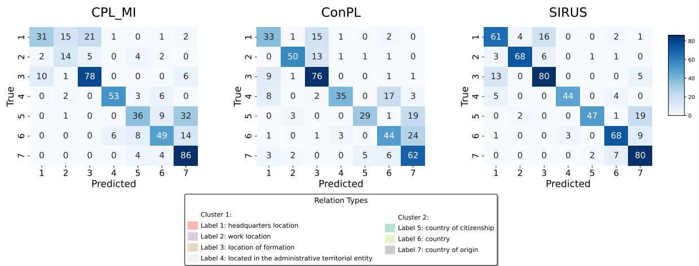

# Enhancing Discriminative Representation in Similar Relation Clusters for Few-Shot Continual Relation Extraction

Duc Anh Le1∗, Nam Le Hai1∗, Thanh Xuan Nguyen2∗, Linh Ngo Van1, Diep Thi-Ngoc Nguyen3, Sang Dinh1, Thien Huu Nguyen4

1Hanoi University of Science and Technology, 2Oraichain Labs Inc., US, 3VNU University of Engineering and Technology, 4University of Oregon

## Abstract

Few-shot Continual Relation Extraction (FCRE) has emerged as a significant challenge in information extraction, necessitating that relation extraction (RE) systems can sequentially identify new relations with limited labeled samples. While existing studies have demonstrated promising results in FCRE, they often overlook the issue of similar relations, which is a critical factor contributing to catastrophic forgetting. In this work, we propose SIRUS, a novel method that utilizes relation descriptions and dynamic clustering on these descriptions to identify similar relations. Leveraging this information, we introduce innovative loss functions specifically designed to enhance the distinction between relations, with a focus on learning to differentiate similar ones. Experimental results show that our approach can effectively mitigate the problem of catastrophic forgetting and outperforms state-of-the-art methods by a large margin. Additionally, we explore the potential of Large Language Model Embeddings (LLMEs) with representation learning and embedding capabilities, demonstrating their promise for advancing FCRE systems.

## 1 Introduction

Relation Extraction (RE) is a fundamental task in natural language processing (NLP) that involves recognizing relationships between entities from underlying content. Traditional relation extraction approaches commonly require substantial labeled datasets and assume a static collection of predefined relationships (Sun et al., 2020; Cabot and Navigli, 2021; Tang et al., 2022). In real-world settings, various specialized fields, such as scientific research (Kruiper et al., 2020), medicine (Luo et al., 2022), or law (Hendrycks et al., 2021), are rapidly advancing, leading to a continuous expansion in the diversity of relationships (Le et al., 2024c, 2025). Consequently, RE systems are required to exhibit adaptability to handle these evolving changes effectively. Besides, another challenge in developing RE models is the scarcity of annotated data for emerging relations.

To this end, the concept of Few-shot Continual Relation Extraction (FCRE) has been proposed (Qin and Joty, 2022; Chen et al., 2023) to enable the continuous learning of new relations from a limited number of samples. FCRE is a branch of continual information extraction (Le et al., 2025; Nguyen et al., 2023; Le et al., 2024b; Dao et al., 2024). However, due to the continual learning process with limited data, FCRE models are often biased toward the current task, facing the challenges of overfitting (Hawkins, 2004) and Catastrophicforgetting (Thrun and Mitchell, 1995; Le et al., 2024a; Hai et al., 2024; Van et al., 2022; Phan et al., 2022). Several methods have been introduced to address these issues, with memory-based approaches integrated with contrastive learning emerging as a prominent paradigm (Wang et al., 2023; Ma et al., 2024; Luo et al., 2024; Tran et al., 2024; Nguyen et al., 2025). These methods typically involve retaining a few representative samples from previous tasks and applying contrastive learning to ensure that the representations of samples across different relations remain sufficiently distinguishable.

However, none of the mentioned methods have considered the confusion between similar relations, which has been identified as a significant factor contributing to catastrophic forgetting in continual relation extraction (Wang et al., 2022; Zhao et al., 2023). This phenomenon becomes even more critical in the FCRE scenario, where the few available samples for each relation may not sufficiently represent the relations causing models to ignore subtle distinctions between similar relations, leading to catastrophic forgetting. A recent method, ConPL, introduced by Chen et al. 2023, addresses this issue by identifying similar classes based on the distance between relation prototypes and examples, and employs focal loss to emphasize the distinctions between these similar classes. The relation prototypes are computed by averaging the representations of entities within the same relations; however, a limited number of samples may fail to produce sufficiently representative prototypes (Wang et al., 2023). Moreover, the problem of inconsistencies resulting from varying context sentences can render these prototypes unstable (Li and Lyu, 2024), reducing the effectiveness of this approach in identifying similar classes in the FCRE scenario.

Recent studies have leveraged label descriptions (Luo et al., 2024; Li and Lyu, 2024; Sainz et al., 2021; Borchert et al., 2024) for few-shot relation extraction, demonstrating their effectiveness in enriching representations and stabilizing label prototypes. Especially, Nguyen et al. (2025) utilizes LLMs to augment data by generating additional label descriptions and multiple samples for each relation type. However, in this work, we focus solely on exploiting the original relation descriptions without using an LLM-based data augmentation mechanism. We propose SIRUS, a novel method to enhance the Discriminative Representation in Similar Relation Clusters, involves utilizing relation descriptions for label representation and employing dynamic clustering. As a result, the learning process enhances the differentiation of samples across relations, with a particular focus on similar relations, thereby reducing the phenomenon of catastrophic forgetting.

Furthermore, pre-trained Large Language Models (LLMs) with billions of parameters excel in autoregressive text generation tasks (Dubey et al., 2024; Jiang et al., 2023) and demonstrate strong performance on downstream tasks with only a few examples (Brown, 2020; Kojima et al., 2022), making them a promising approach for application in FCRE. They have also been explored in text classification and information extraction (Zhao et al., 2021; Wei et al., 2023); however, they often underperform compared to discriminative encoder models like BERT due to their generation-focused mechanism potentially makes them less effective for text representation learning. In the FCRE scenario, a recent study by Tran et al. (2024) has explored the capabilities of LLMs; however, it retained the use of causal language modeling (CLM) and applied a classification head to the last token, which may not fully exploit the embedding ability of LLMs. Several recent studies (BehnamGhader et al., 2024; Li et al., 2024; Lee et al., 2024) have investigated the capabilities of LLMs in representation learning by removing the causal mask and finetuning LLMs with contrastive learning, referred to as Large Language Model Embeddings (LLMEs), demonstrating promising results in retrieval and classification tasks. However, their ability for continual learning, particularly in the context of FCRE, remains unexplored. Therefore, we conduct comprehensive experiments on these LLMEs, offering valuable insights into the forgetting phenomenon within these models and their performance outcomes in FCRE settings.

In summary, our contributions are as follows:

1. We present a novel approach to address the issue of similar classes by utilizing relation description representation and subsequently employing dynamic clustering to identify groups of similar relations.

2. Leveraging information from similar relations, we propose three innovative loss functions to improve the distinction between samples from different relations. Ablation studies demonstrate the efficacy of each loss function.

3. We are the first to examine LLMEs with representation learning capabilities within the context of FCRE. Our findings indicate that these models continue to suffer from the issue of catastrophic forgetting. However, applying our methods significantly enhances their performance, surpassing both the use of BERT encoder backbones and original LLMs with causal language modeling.

4. Extensive experiments conducted on two FCRE benchmarks, TACRED and FewRel, demonstrate the effectiveness of our proposed framework and highlight the promising results achieved through the use of LLMEs.

## 2 Background

## 2.1 Problem Formulation

Few-Shot Continual Relation Extraction (FCRE) presents a challenging paradigm in natural language processing, combining the complexities of continual learning with the constraints of few-shot scenarios. Some related works are discussed in

Appendix A. In this framework, a model confronts a series of tasks $\mathcal { T } = \{ \mathcal { T } ^ { 1 } , \mathcal { T } ^ { 2 } , . . . , \mathcal { T } ^ { n } \}$ , each introducing a set of novel relations $R _ { i }$ to be learned. For every task $\mathcal { T } ^ { i }$ , the model is provided with a limited dataset $\mathcal { D } _ { i } = \{ ( \boldsymbol { x } _ { j } , r _ { j } ) \} _ { j = 1 } ^ { m }$ , where $m = N \times K$ represents the total number of examples, where N represents the number of new relations and K denotes the few-shot sample size for each relation. Each example consists of an input sentence $x _ { j }$ containing a pair of entities $( e _ { h } , e _ { t } )$ , and a corresponding relation label $y _ { j } \in R _ { i }$ . This task configuration is also known as $^ { \ast \ast } N \ – w a y – K – s h o t ^ { \ast \ast }$ learning setting, as introduced by Chen et al. (2023). Finally, evaluation is conducted on a comprehensive test set $\mathcal { D } ^ { t e s t }$ that contains all relations $R _ { t o t a l } = \cup _ { i = 1 } ^ { n } R _ { i }$ encountered across tasks, assessing both its ability to learn new relations and retain proficiency in earlier ones. This formulation encapsulates the essence of FCRE, highlighting its significance in developing adaptive and efficient relation extraction systems.

The core challenge of FCRE is twofold: the model must quickly adapt to new relations with limited examples (few-shot learning) while maintaining knowledge of previously learned relations (continual learning). This requires balancing the model’s plasticity for learning new relations and its stability for preserving prior knowledge.

## 2.2 Input Formulation and Representation

In Relation Extraction, the foundational deep learning approach (Ji et al., 2020; Wang and Lu, 2020) typically involves encoding input data with a pretrained language model (PLM) like BERT (Devlin et al., 2019). A crucial aspect of RE is how to formulate the input effectively to obtain high-quality representation embedding for classification. Early studies frequently follow BERT by concatenating the [CLS] token with the original input x and utilizing this token’s vector representation for classification. Another method involves using additional special tokens to enclose the two entities, and then concatenating their embeddings to form the input representation for the relation classification layer (Zhao et al., 2022; Le et al., 2024c).

In this study, we employ the input format suggested by Ma et al. (2024). Specifically, we use a special [MASK] token to denote the relation between the head entity $( e _ { h } )$ and tail entity $\left( e _ { t } \right)$ , and integrate this token with the original sentence x and the two entities. Besides, several learnable tokens are also inserted to avoid relying entirely on handcrafted tokens. Consequently, the input template is formulated as follows:

$$
\begin{array} { c } { { \mathcal { T } ( x ) = x \left[ v _ { 0 : n _ { 0 } - 1 } \right] e _ { h } \left[ v _ { n _ { 0 } : n _ { 1 } - 1 } \right] \left[ \mathsf { M A S K } \right] } } \\ { { \left[ v _ { n _ { 1 } : n _ { 2 } - 1 } \right] e _ { t } \left[ v _ { n _ { 2 } : n _ { 3 } - 1 } \right] . } } \end{array}\tag{1}
$$

where $[ v _ { i } ]$ represents the i-th learnable continuous token, and $n _ { i }$ denotes the length of the token phrases. In our specific implementation, we use a special [UNUSED] token as [v]. We then forward the templated input $\mathcal { T } ( x )$ through a PLM, encoding it into a sequence of continuous vectors. From these, we extract the hidden representation $z _ { x }$ of the input, corresponding to the position of the [MASK] token.

$$
z _ { x } = f _ { \mathcal { M } } \big ( \mathcal { T } ( x ) \big ) [ \mathrm { p o s i t i o n } ( [ \mathsf { M A S K } ] ) ] ,\tag{2}
$$

where $f _ { \mathcal { M } } ( \boldsymbol { X } )$ denotes the forward function of a PLM  on input X. The latent representation is then used for contrastive learning and predicts the relation associated with the given input x.

## 3 Methodology

In this section, we present our method aimed at enhancing FCRE by tackling the problem of similar relations. Specifically, we proposed Clustering $R e \mathrm { - }$ lations via Label Description (CRLD) to identify groups of similar relations. Accordingly, we propose three loss functions designed to differentiate samples that are semantically similar but belong to distinct relations, using the clustering information.

## 3.1 Clustering Relations via Label Description

The label description of a relation is a summarization that describes the meaning and provides general information about the relation. It has been demonstrated to be more consistent than the label prototype, which is derived from multiple sample contexts associated with the same label (Li and Lyu, 2024). Therefore, we leverage this information for clustering purposes to recognize similar relations. This framework allows us to identify informative hard negatives for samples using cluster information, thereby enhancing the differentiation of samples in similar classes and potentially improving training convergence (Xiong et al., 2020).

Let $\bar { \{ ( r _ { i } , d _ { i } ) \bar { \} } _ { i = 1 } ^ { N } }$ denote the set of relations and their corresponding description. For each description $d _ { i } ,$ we obtain its embedding $\mathbf { \ b { d } } _ { i }$ by passing it through the same encoder used for input sentences containing entities $f _ { \mathcal { M } } ( d _ { i } )$ , as presented in Section 2.2. However, instead of applying the input template , we directly use the raw description and obtain its latent embedding by mean pooling the token representations within the description. Subsequently, we employ the Agglomerative Clustering algorithm (Müllner, 2011) on these embeddings to categorize the relations into K clusters according to their semantic similarity. This clustering method allows us to automatically identify the number of clusters by selecting a distance threshold θ, thereby eliminating the need for manual selection of group sizes for similar relations. Besides, the clustering algorithm is applied iteratively for each batch. Thus, the cluster for each relation is dynamically updated following the encoder’s parameters adjustment after each batch, as illustrated in Algorithm 1. As a result, each relation-description pair $( r _ { i } , d _ { i } )$ is assigned to a new cluster $c ( r _ { i } ) \in \{ 1 , 2 , \ldots , K \}$ after each batch.

## 3.2 Discriminative Loss Functions

In this section, we introduce three innovative loss functions to improve the model’s ability to distinguish samples across relations.

Weighted Supervised Contrastive Loss aims to bring closer positive sample pairs, which share the same relation label, while pushing apart negative pairs that belong to different relation. To this end, we conduct the Supervised Contrastive Loss (Khosla et al., 2020), enhanced with weighting hard negatives according to the similarity of their label descriptions, thus focusing more on samples from similar relations. Specifically, this loss is computed as follows:

$$
\boxed { \begin{array} { r l } & { \displaystyle - \sum _ { p \in P ( x ) } \log \frac { f ( z _ { x } , z _ { p } ) } { \sum _ { \bar { x } \in \mathcal { D } \backslash \{ x \} } w ( x , \bar { x } ) \cdot f ( z _ { x } , z _ { \bar { x } } ) } } \\ & { \quad \quad \quad ( 3 ) } \end{array} }
$$

where $\begin{array} { r } { f ( z _ { x } , z _ { y } ) = \exp \left( \frac { \gamma ( z _ { x } , z _ { y } ) } { \tau } \right) } \end{array}$ and

$$
w ( x , { \bar { x } } ) = { \left\{ \begin{array} { l l } { 1 + \alpha \cdot \gamma ( d _ { x } , d _ { \bar { x } } ) } & { { \mathrm { i f ~ } } c ( r _ { x } ) = c ( r _ { \bar { x } } ) } \\ { 1 } & { { \mathrm { o t h e r w i s e } } } \end{array} \right. }\tag{4}
$$

Here, $\gamma ( \cdot , \cdot )$ represents the Cosine Similarity function, τ is the temperature scaling parameter, α is a weighting factor based on the description similarity, and $c ( \cdot )$ is the cluster assignment function.

$P ( x )$ and $\mathcal { D }$ refer to the sets of positive samples for sample x and the entire dataset, respectively.

Cluster-based Mutual Information Loss aims to bring closer the semantic representation of a sample with its corresponding label description, while pushing apart itfrom descriptions ofdifferent relations. Specifically, it involves maximizing the mutual information (MI) between the input’s hidden representation $z _ { x }$ and its corresponding label description $\scriptstyle d _ { x }$ , while leveraging cluster information to identify hard negatives. This extends the traditional Mutual Information loss (van den Oord et al., 2019) by introducing a weighting function that considers the similarity between label descriptions within the same cluster.

The mutual information $M I ( x )$ between the input embedding $z _ { x }$ and its corresponding label description is lower-bounded by:

$$
M I \geq \log B + \mathrm { I n f o N C E } ( D _ { B } ; h ) ,\tag{5}
$$

However, we modify the InfoNCE loss by incorporating a weighting function $w ( x _ { i } , x _ { j } )$ , as presented in equation (4), to assign greater emphasis on hard negatives within the same cluster. The modified InfoNCE is thus defined as follows:

$$
\begin{array} { l } { { \mathrm { I n f o N C E } ( D _ { B } ; h ) = } } \\ { { \displaystyle \frac { 1 } { B } \sum _ { i = 1 } ^ { B } \log \frac { h ( z _ { x _ { i } } , d _ { x _ { i } } ) } { \sum _ { j = 1 } ^ { B } w ( x _ { i } , x _ { j } ) \cdot h ( z _ { x _ { i } } , d _ { x _ { j } } ) } , } } \end{array}
$$

where $\begin{array} { r } { h ( z , d ) = \exp { \left( \frac { z ^ { T } W d } { \tau } \right) } } \end{array}$ , τ is the temperature, $D _ { B } = \{ x _ { i } \} _ { i = 1 } ^ { B }$ is the mini-batch data with size $B ,$ , and W is a trainable parameter. The final CMI loss function with an input x is defined as:

$$
\mathcal { L } _ { \mathrm { C M I } } ( x ) = - \log \frac { h ( z _ { x } , d _ { x } ) } { Z ( x ) }\tag{6}
$$

where,

$$
\begin{array} { l l } { \displaystyle Z ( x ) = h ( z _ { x } , d _ { x } ) + \sum _ { \bar { x } \in \mathcal { N } ( x ) } w ( x , \bar { x } ) \cdot h ( z _ { x } , d _ { \bar { x } } ) } \\ { \displaystyle N ( x ) = \{ \bar { x } | \bar { x } \in D _ { B } , r _ { \bar { x } } \neq r _ { x } \} } \end{array}
$$

Double Triplet Loss for Intra- and Inter-Cluster Separation aims to enforce that samples are close to their own descriptions and far from other cluster centroids, especially those not associated with their labels. In particular, we employ Double Triplet Loss (DTL) (Schroff et al., 2015) on input, label description, and cluster centroid.

DT(x) =   
max 0, D(zx, dx) − D(zx, c+x ) + m1 +   
max 0, D(zx, c+x ) − D(zx, c−x ) + m2   
(7)

where,

$$
\begin{array} { l } { { \displaystyle c _ { x } ^ { + } = c _ { k } = \frac { 1 } { | C _ { k } | } \sum _ { d \in C _ { k } } d \quad \mathrm { i f } c ( r _ { x } ) = k } } \\ { { \displaystyle c _ { x } ^ { - } = c _ { \bar { k } } \quad \mathrm { s u c h t h a t } \bar { k } = \mathrm { a r g m i n } D ( z _ { x } , { \bf c } _ { k } ) } } \\ { { \displaystyle c ( r _ { x } ) \neq k } } \end{array}
$$

Here, $D ( \cdot , \cdot ) = 1 - \gamma ( \cdot , \cdot )$ is the Cosine Distance, $c _ { k } , C _ { k }$ represent the centroid representation and set containing the description embeddings of relations within cluster k, respectively. $c _ { x } ^ { + }$ is the centroid representation of the cluster which containing $r _ { x } ,$ while $c _ { x } ^ { - }$ denotes the centroid of the nearest cluster to x that does not include the relation $r _ { x } . ~ m _ { 1 }$ and m2 are margin hyperparameters.

Overall Training Objective. The total loss function is formulated by combining equations (3), (6) and (7) as follows:

$$
\begin{array} { r } { \mathcal { L } ( x ) = \lambda _ { 1 } \mathcal { L } _ { \mathrm { W S C } } ( x ) + \lambda _ { 2 } \mathcal { L } _ { \mathrm { C M I } } ( x ) + \lambda _ { 3 } \mathcal { L } _ { \mathrm { D T } } ( x ) } \end{array}\tag{8}
$$

where $\lambda _ { 1 } , \lambda _ { 2 }$ and $\lambda _ { 3 }$ are weighting hyperparameters that balance the contributions of each loss component.

## 3.3 Large Language Model Embeddings for FCRE

Large Language Model Embeddings (LLMEs) redefine decoder-only LLMs as text encoders, enhancing their embedding and representation learning capabilities (BehnamGhader et al., 2024; Li et al., 2024; Lee et al., 2024). This transformation typically involves two main adjustments: (1) removing the causal mask to allow bidirectional attention, and (2) replacing the next-token prediction task with alternative training objectives, such as contrastive learning or masked token prediction. These modifications enable LLMEs to function similarly to encoder models like BERT while leveraging the extensive architecture and pretraining corpus of the original LLMs, thereby enhancing generalization and comprehension capabilities.

We explore the application of LLMEs in the FCRE scenario by substituting the backbone model with these models, as described in Section

2.2. However, since LLMs perform well with instruction prompts and mean-pooling all token embeddings yields the best results in LLM2Vec (BehnamGhader et al., 2024)—an LLME, we formulate an input x with entities $e _ { h } , e _ { t }$ as follows.

$$
\begin{array} { c } { { \mathcal { F } _ { L L M E s } ( x ) = x . \mathrm { T h e } \mathrm { r e l a t i o n } \mathrm { b e t w e e n } } } \\ { { \left[ e _ { h } \right] \mathrm { a n d } \left[ e _ { t } \right] \mathrm { i s } \mathrm { : } } } \end{array}
$$

This instruction prompt allows LLMEs to grasp the semantic context to categorize relations for the entities. The latent embedding is subsequently obtained by mean pooling the token representations. Training and inference procedures remain similar across all backbone models.

## 3.4 Training and Inference Procedures

Algorithm 1 Training procedure at each task $\tau ^ { j }$   
Input:   
$\mathcal { M } \mathrm { : }$ Backbone PLM   
$\mathcal { D } ^ { t e s t } \colon$ Test data   
L: The number of training samples allocated to   
memory for each relation.   
Previous variables: $\Phi _ { j - 1 } , \tilde { R } _ { j - 1 } , \tilde { M } _ { j - 1 } , \tilde { S } _ { j - 1 }$   
Current variables: $D _ { j } ^ { t r a i n } , D _ { j } ^ { t e s t } , R _ { j } , S _ { j }$   
Output:   
$\Phi _ { j } ^ { \dot { \bf \Delta } } , \tilde { M } _ { j } , \tilde { S } _ { j } , \tilde { P } _ { j } .$   
1: Initialize $\Phi _ { j }$ from $\Phi _ { j - 1 }$   
2: $\tilde { S } _ { j }  \tilde { S } _ { j - 1 } \cup S _ { j } , \tilde { R _ { j } }  \tilde { R } _ { j - 1 } \cup R _ { j }$   
3: for batch in batches( $\tilde { M } _ { j - 1 } \cup D _ { j } )$ do   
4: $d _ { i } \gets f _ { { M } _ { \Phi _ { i } } } ( d _ { i } ) \quad \forall \bar { d } _ { i } \in \tilde { S } _ { j }$   
5: AGGLOMERATIVECLUSTERING( $\{ d _ { i } \} )$   
6: Update $\Phi _ { j } \triangleright$ Backward using loss $\mathcal { L }$ in (8)   
7: end for   
8: $\tilde { M } _ { j } \gets \tilde { M } _ { j - 1 }$   
9: for each $r \in R _ { j }$ do ▷ Update memory buffer   
10: $\mathcal { B } _ { r }  \{ ( x _ { i } , r _ { i } ) | x _ { i } \in D _ { j } ^ { t r a i n } , r _ { i } = r \} _ { i = 1 } ^ { L }$   
11: $\tilde { M } _ { j }  \tilde { M } _ { j } \cup B _ { r }$   
12: end for   
13: $\mathcal { D } ^ { t e s t }  \mathcal { D } ^ { t e s t } \cup \mathcal { D } _ { j } ^ { t e s t }$ ▷ For inference

Training Procedure: Algorithm 1 outlines the end-to-end training process at each task $\tau ^ { j }$ , with $\Phi _ { j - 1 }$ denoting the model parameters after training on the previous $j - 1$ tasks. In line with memory-based methods, we maintain a memory buffer $\tilde { M } _ { j - 1 }$ that stores a few representative samples from all previous tasks $\mathcal { T } ^ { 1 } , \dotsc , \mathcal { T } ^ { j - 1 }$ , along with a relation description set $\tilde { S } _ { j - 1 }$ that holds the descriptions of all previously encountered relations.

  
Figure 1: The confusion matrix of CPL\_MI, ConPL, and SIRUS predictions on similar relations detected by our CRLD method. The descriptions of relations are presented in Table 8. Note that the figure illustrates only the relations from the test set that appear in these two detected similar clusters, rather than displaying all relations.

1. Initialization (Lines 1–2): The model parameter for the current task, $\Phi _ { j } ,$ , is initialized with the parameters of $\Phi _ { j - 1 }$ . We update the relation $\tilde { R } _ { j }$ and relation description sets $\tilde { E } _ { j }$ with new relations.

2. Model Update (Lines 3–7): We train and update the model parameters using a dataset that combines memory data with the data from the current task $\tau ^ { j }$ . Relation description representation and cluster results are updated in each batch (Lines 4–5). Accordingly, the loss function is adjusted to reflect the cluster changes to update the current parameter $\Phi _ { j }$

3. Memory Update (Lines 8–12): We select L representative samples from $D _ { j }$ for each relation $r \in R _ { j }$ . These are the L samples whose latent representations are closest to the 1-means centroid of all class samples.

4. Testset Update (Line 13): The test set is expanded by incorporating the test data from the current task and will be utilized for evaluation after finishing training across all tasks.

Inference Procedure: Leveraging the discriminative feature distribution learned during training, we adopt the Nearest-Class-Mean classifier, as employed by Ma et al. (2024), for relation prediction in the test phase. However, instead of relying solely on the label prototype, we incorporate both the label description and prototype to extract the relation.

Given a sample x with hidden representation ${ z } _ { x }$ a set of relation prototypes $\{ p _ { r } \} _ { r = 1 } ^ { n }$ and a set of relation descriptions $\{ d _ { r } \} _ { r = 1 } ^ { n }$

$$
p _ { r } = \frac { 1 } { L } \sum _ { i = 1 } ^ { L } z _ { i } ,\tag{9}
$$

The inference process begins by calculating the Cosine similarity between $z _ { x }$ and each prototype $\pmb { p } _ { r }$ and label description $d _ { r }$ . The final prediction $y ^ { * }$ is then determined by:

$$
y ^ { * } = \operatorname { a r g m a x } \left( \gamma ( z _ { x } , p _ { r } ) + \gamma ( z _ { x } , d _ { r } ) \right)\tag{10}
$$

where $\gamma ( \cdot , \cdot )$ denotes the cosine similarity function.

## 4 Experimental Results

## 4.1 Experiment Setup

We compare our method against 8 state-of-the-art baselines on two widely used benchmarks FewRel (Han et al., 2018) and TACRED (Zhang et al., 2017) in the literature of CRE and FCRE. We conduct experiments using BERT (Devlin et al., 2019) and two LLMEs: LLM2Vec (BehnamGhader et al., 2024) and BGE (Li et al., 2024). Moreover, we employ three variants of LLM2Vec, using LLama2, LLama3, and Mistral as backbones. After completing each task, we evaluate the models on the updated $\mathcal { D } ^ { t e s t }$ with 6 random seeds and report the mean and standard deviation of the accuracy. More details about datasets, baselines, backbones, and evaluation metrics are presented in Appendix B.

<table><tr><td rowspan="2">Method</td><td colspan="8">Tasks</td></tr><tr><td> $\tau ^ { 1 }$ </td><td> $\mathcal { T } ^ { 2 }$ </td><td> $\tau ^ { 3 }$ </td><td> $\mathcal { T } ^ { 4 }$ </td><td> $\tau ^ { 5 }$ </td><td> $\mathcal { T } ^ { 6 }$ </td><td> $\tau ^ { 7 }$ </td><td> $\mathcal { T } ^ { 8 }$ </td></tr><tr><td colspan="9">FewRel (10-way-5-shot)</td></tr><tr><td>RP-CRE (Cui et al., 2021)</td><td> $9 3 . 9 7 _ { \pm 0 . 6 4 }$ </td><td> $7 6 . 0 5 { \scriptstyle \pm 2 . 3 6 }$ </td><td> $7 1 . 3 6 { \scriptstyle \pm 2 . 8 3 }$ </td><td> $6 9 . 3 2 _ { \pm 3 . 9 8 }$ </td><td> $6 4 . 9 5 { \scriptstyle \pm 3 . 0 9 }$ </td><td> $6 1 . 9 9 { \scriptstyle \pm 2 . 0 9 }$ </td><td> $6 0 . 5 9 { \scriptstyle \pm 1 . 8 7 }$ </td><td> $5 9 . 5 7 { \scriptstyle \pm 1 . 1 3 }$ </td></tr><tr><td>CRL (Zhao et al., 2022)</td><td> $9 4 . 6 8 _ { \pm 0 . 3 3 }$ </td><td> $8 0 . 7 3 { \scriptstyle \pm 2 . 9 1 }$ </td><td> $7 3 . 8 2 { \scriptstyle \pm 2 . 7 7 }$ </td><td> $7 0 . 2 6 { \scriptstyle \pm 3 . 1 8 }$ </td><td> $6 6 . 6 2 { \scriptstyle \pm 2 . 7 4 }$ </td><td> $6 3 . 2 8 { \scriptstyle \pm 2 . 4 9 }$ </td><td> $6 0 . 9 6 { \scriptstyle \pm 2 . 6 3 }$ </td><td> $5 9 . 2 7 { \scriptstyle \pm 1 . 3 2 }$ </td></tr><tr><td>CRECL (Hu et al., 2022)</td><td> $9 3 . 9 3 _ { \pm 0 . 2 2 }$ </td><td> $8 2 . 5 5 { \scriptstyle \pm 6 . 9 5 }$ </td><td> $7 4 . 1 3 { \scriptstyle \pm 3 . 5 9 }$ </td><td> $6 9 . 3 3 { \scriptstyle \pm 3 . 8 7 }$ </td><td> $6 6 . 5 1 { \scriptstyle \pm 4 . 0 5 }$ </td><td> $6 4 . 6 0 { \scriptstyle \pm 1 . 9 2 }$ </td><td> $6 2 . 9 7 _ { \pm 1 . 4 6 }$ </td><td> $5 9 . 9 9 { \scriptstyle \pm 0 . 6 5 }$ </td></tr><tr><td>ERDA (Qin and Joty, 2022)</td><td> $9 2 . 4 3 _ { \pm 0 . 3 2 }$ </td><td> $6 4 . 5 2 _ { \pm 2 . 1 1 }$ </td><td> $5 0 . 3 1 { \scriptstyle \pm 3 . 3 2 }$ </td><td> $4 4 . 9 2 _ { \pm 3 . 7 7 }$ </td><td> $3 9 . 7 5 { \scriptstyle \pm 3 . 3 4 }$ </td><td> $3 6 . 3 6 { \scriptstyle \pm 3 . 1 2 }$ </td><td> $3 4 . 3 4 { \scriptstyle \pm 1 . 8 3 }$ </td><td> $3 1 . 9 6 _ { \pm 1 . 9 1 }$ </td></tr><tr><td>SCKD (Wang et al., 2023)</td><td> $9 4 . 7 7 { \scriptstyle \pm 0 . 3 5 }$ </td><td> $8 2 . 8 3 { \scriptstyle \pm 2 . 6 1 }$ </td><td> $7 6 . 2 1 { \scriptstyle \pm 1 . 6 1 }$ </td><td> $7 2 . 1 9 { \scriptstyle \pm 1 . 3 3 }$ </td><td> $7 0 . 6 1 { \scriptstyle \pm 2 . 2 4 }$ </td><td> $6 7 . 1 5 { \scriptstyle \pm 1 . 9 6 }$ </td><td> $6 4 . 8 6 { \scriptstyle \pm 1 . 3 5 }$ </td><td> $6 2 . 9 8 { \scriptstyle \pm 0 . 8 8 }$ </td></tr><tr><td>ConPL§ (Chen et al., 2023)</td><td> $\mathbf { 9 5 . 1 8 _ { \pm 0 . 7 3 } }$ </td><td> $7 9 . 6 3 { \scriptstyle \pm 1 . 2 7 }$ </td><td> $7 4 . 5 4 { \scriptstyle \pm 1 . 1 3 }$ </td><td> $7 1 . 2 7 { \scriptstyle \pm 0 . 8 5 }$ </td><td> $6 8 . 3 5 { \scriptstyle \pm 0 . 8 6 }$ </td><td> $6 3 . 8 6 { \scriptstyle \pm 2 . 0 3 }$ </td><td> $6 4 . 7 4 { \scriptstyle \pm 1 . 3 9 }$ </td><td> $6 2 . 4 6 { \scriptstyle \pm 1 . 5 4 }$ </td></tr><tr><td>CPL (Ma et al., 2024)</td><td> $9 4 . 8 7 $ </td><td> $8 5 . 1 4$ </td><td> $7 8 . 8 0 $ </td><td>75.10</td><td> $7 2 . 5 7$ </td><td> $6 9 . 5 7 $ </td><td> $6 6 . 8 5$ </td><td>64.50</td></tr><tr><td>CPL_MI (Tran et al., 2024) SIRUS</td><td> $9 4 . 6 9 { \scriptstyle \pm 0 . 7 0 }$ </td><td> $8 5 . 5 8 { \scriptstyle \pm 1 . 8 8 }$ </td><td> $8 0 . 1 2 _ { \pm 2 . 4 5 }$ </td><td> $\underline { { 7 5 . 7 1 _ { \pm 2 . 2 8 } } }$ </td><td> $7 3 . 9 0 { \scriptstyle \pm 1 . 8 0 }$ </td><td> $7 0 . 7 2 _ { \pm 0 . 9 1 }$ </td><td> $6 8 . 4 2 _ { \pm 1 . 7 7 }$ </td><td> $6 6 . 2 7 { \scriptstyle \pm 1 . 5 8 }$ </td></tr><tr><td></td><td> $9 4 . 7 4 { \scriptstyle \pm 0 . 2 7 }$ </td><td> $\mathbf { 8 7 . 1 2 _ { \pm 2 . 2 1 } }$ </td><td> $\mathbf { 8 1 . 0 6 _ { \pm 1 . 5 2 } }$ </td><td> $\overline { { 7 7 . 4 9 _ { \pm 2 . 5 8 } } }$ </td><td> ${ \bf 7 5 . 4 7 { \scriptstyle \pm 2 . 6 0 } }$ </td><td> $\underline { { 7 2 . 4 8 _ { \pm 1 . 7 5 } } }$ </td><td> ${ \bf 7 0 . 6 _ { \pm 1 . 3 1 } }$ </td><td> ${ \bf 6 9 . 1 6 { \scriptstyle \pm 0 . 4 3 \uparrow 2 . 8 9 } }$ </td></tr><tr><td colspan="9">TACRED (5-way-5-shot)</td></tr><tr><td>RP-CRE (Cui et al., 2021)</td><td> $8 7 . 3 2 { \scriptstyle \pm 1 . 7 6 }$ </td><td> $7 4 . 9 0 { \scriptstyle \pm 6 . 1 3 }$ </td><td> $6 7 . 8 8 _ { \pm 4 . 3 1 }$ </td><td> $6 0 . 0 2 { \scriptstyle \pm 5 . 3 7 }$ </td><td> $5 3 . 2 6 { \scriptstyle \pm 4 . 6 7 }$ </td><td> $5 0 . 7 2 { \scriptstyle \pm 7 . 6 2 }$ </td><td> $4 6 . 2 1 _ { \pm 5 . 2 9 }$ </td><td> $4 4 . 4 8 _ { \pm 3 . 7 4 }$ </td></tr><tr><td>CRL (Zhao et al., 2022)</td><td> $8 8 . 3 2 _ { \pm 1 . 2 6 }$ </td><td> $7 6 . 3 0 { \scriptstyle \pm 7 . 4 8 }$ </td><td> $6 9 . 7 6 { \scriptstyle \pm 5 . 8 9 }$ </td><td> $6 1 . 9 3 { \scriptstyle \pm 2 . 5 5 }$ </td><td> $5 4 . 6 8 _ { \pm 3 . 1 2 }$ </td><td> $5 0 . 9 2 _ { \pm 4 . 4 5 }$ </td><td> $4 7 . 0 0 { \scriptstyle \pm 3 . 7 8 }$ </td><td> $4 4 . 2 7 _ { \pm 2 . 5 1 }$ </td></tr><tr><td>CRECL (Hu et al., 2022)</td><td> $8 7 . 0 9 { \scriptstyle \pm 2 . 5 0 }$ </td><td> $7 8 . 0 9 { \scriptstyle \pm 5 . 7 4 }$ </td><td> $6 1 . 9 3 { \scriptstyle \pm 4 . 8 9 }$ </td><td> $5 5 . 6 0 { \scriptstyle \pm 5 . 7 8 }$ </td><td> $5 3 . 4 2 _ { \pm 2 . 9 9 }$ </td><td> $5 1 . 9 1 _ { \pm 2 . 9 5 }$ </td><td> $4 7 . 5 5 { \scriptstyle \pm 3 . 3 8 }$ </td><td> $4 5 . 5 3 { \scriptstyle \pm 1 . 9 6 }$ </td></tr><tr><td>ERDA (Qin and Joty, 2022)</td><td> $8 1 . 8 8 { \scriptstyle \pm 1 . 9 7 }$ </td><td> $5 3 . 6 8 _ { \pm 6 . 3 1 }$ </td><td> $4 0 . 3 6 { \scriptstyle \pm 3 . 3 5 }$ </td><td> $3 6 . 1 7 _ { \pm 3 . 6 5 }$ </td><td> $3 0 . 1 4 { \scriptstyle \pm 3 . 9 6 }$ </td><td> $2 2 . 6 1 { \scriptstyle \pm 3 . 1 3 }$ </td><td> $2 2 . 2 9 { \scriptstyle \pm 1 . 3 2 }$ </td><td> $1 9 . 4 2 _ { \pm 2 . 3 1 }$ </td></tr><tr><td>SCKD (Wang et al., 2023)</td><td> $8 8 . 4 2 _ { \pm 0 . 8 3 }$ </td><td> $7 9 . 3 5 { \scriptstyle \pm 4 . 1 3 }$ </td><td> $7 0 . 6 1 { \scriptstyle \pm 3 . 1 6 }$ </td><td> $6 6 . 7 8 { \scriptstyle \pm 4 . 2 9 }$ </td><td> $6 0 . 4 7 { \scriptstyle \pm 3 . 0 5 }$ </td><td> $5 8 . 0 5 { \scriptstyle \pm 3 . 8 4 }$ </td><td> $5 4 . 4 1 _ { \pm 3 . 4 7 }$ </td><td> $5 2 . 1 1 { \scriptstyle \pm 3 . 1 5 }$ </td></tr><tr><td>ConPL§ (Chen et al., 2023)</td><td> $\mathbf { 8 8 . 7 7 _ { \pm 0 . 8 4 } }$ </td><td> $6 9 . 6 4 { \scriptstyle \pm 1 . 9 3 }$ </td><td> $5 7 . 5 0 { \scriptstyle \pm 2 . 4 8 }$ </td><td> $5 2 . 1 5 { \scriptstyle \pm 1 . 5 9 }$ </td><td> $5 8 . 1 9 { \scriptstyle \pm 2 . 3 1 }$ </td><td> $5 5 . 0 1 { \scriptstyle \pm 3 . 1 2 }$ </td><td> $5 2 . 8 8 _ { \pm 3 . 6 6 }$ </td><td> $5 0 . 9 7 _ { \pm 3 . 4 1 }$ </td></tr><tr><td>CPL (Ma et al., 2024)</td><td>86.27</td><td> $8 1 . 5 5$ </td><td> $7 3 . 5 2 $ </td><td>68.96</td><td> $6 3 . 9 6 $ </td><td> $6 2 . 6 6$ </td><td>59.96</td><td>57.39</td></tr><tr><td>CPL_MI (Tran et al., 2024)</td><td> $8 5 . 6 7 { \scriptstyle \pm 0 . 8 0 }$ </td><td> $8 2 . 5 4 { \scriptstyle \pm 2 . 9 8 }$ </td><td> $7 5 . 1 2 _ { \pm 3 . 6 7 }$ </td><td> $\underline { { 7 0 . 6 5 \pm 2 . 7 5 } }$ </td><td> $6 6 . 7 9 { \scriptstyle \pm 2 . 1 8 }$ </td><td> $6 5 . 1 7 _ { \pm 2 . 4 8 }$ </td><td> $6 1 . 2 5 { \scriptstyle \pm 1 . 5 2 }$ </td><td> $\underline { { 5 9 . 4 8 _ { \pm 3 . 5 3 } } }$ </td></tr><tr><td>SIRUS</td><td> $8 7 . 4 1 _ { \pm 0 . 4 1 }$ </td><td> $\mathbf { 8 4 . 2 8 _ { \pm 7 . 3 8 } }$ </td><td> ${ \bf 7 6 . 3 8 _ { \pm 3 . 9 9 } }$ </td><td> $\mathbf { 7 3 . 8 6 _ { \pm 4 . 1 6 } }$ </td><td> $\mathbf { 6 8 . 0 6 _ { \pm 5 . 5 7 } }$ </td><td> $\mathbf { 6 6 . 6 4 _ { \pm 5 . 7 6 } }$ </td><td> $\mathbf { 6 2 . 7 4 _ { \pm 3 . 9 2 } }$ </td><td> $\mathbf { 6 0 . 6 8 _ { \pm 3 . 5 3 } } \uparrow 1 . 2$ </td></tr></table>

Table 1: Accuracy (%) of methods using BERT backbone after training for each task. The best results are in bold, while the second highest scores are underlined. All the baseline results are obtained from (Wang et al., 2023) and (Tran et al., 2024). § ConPL results that are reproduced with the same settings as other models (Appendix B.2).

## 4.2 Evaluation Results of SIRUS Framework

In this section, we analyze the results of Clustering Relations via Label Description (CRLD) and our proposed SIRUS, which integrates CRLD with three loss functions in FCRE.

fewer misclassifications). This not only demonstrates the effectiveness of CRLD in accurately identifying similar relations, which aids the model in focusing on learning to differentiate them but also reveals the overall efficacy of SIRUS for FCRE.

Effectiveness of CRLD: Figure 1 presents the relations within two clusters that are close together generated by CRLD, showing that they share a common topic related to location and country. Through the visualization of the confusion matrix in these relations derived by 3 methods, we observe that these relations are frequently confused. For instance, models often misclassify samples to the relations “country of origin” and “country of citizenship” or “headquarters location” and “location offormation”. This observation indicates that CRLD can effectively identify similar relations.

Performance of SIRUS against the Baselines: Table 1 presents the performance comparison between SIRUS and 8 state-of-the-art methods. Overall, our approach consistently outperforms the performance of existing methods across all tasks on both benchmarks. Specifically, on the FewRel dataset, SIRUS surpasses the baselines by a significant margin, achieving over 1% improvement compared to the second-best method, CPL\_MI, across all tasks. As a result, after the final task, SIRUS achieves 69.16% accuracy on the test set encompassing all relations, demonstrating an improvement of nearly 3% over CPL\_MI. A similar trend is observed in the TACRED dataset, where our method outperforms CPL\_MI by more than 1%. Besides, additional results demonstrating the effectiveness of each proposed loss function are provided in Appendix C.1. These results demonstrate the effectiveness of SIRUS and underscore the importance of addressing the issue of similar relations in FCRE.

In addition, in comparison to CPL\_MI, ConPL– a method that also tackles the challenge of similar relations, offers a clearer differentiation among these relations. For example, between two relations “country” and “country oforigin”, CPL\_MI depicts a higher number of misclassified samples than ConPL (32 compared to 19). Meanwhile, SIRUS shows clearer results in reducing confusion between these classes, with darker blocks along the diagonal (indicating more correct classifications) and lighter blocks outside the diagonal (reflecting

<table><tr><td rowspan="2">Backbone</td><td rowspan="2">Method</td><td rowspan="2">LLME</td><td colspan="8">Tasks</td></tr><tr><td></td><td> $\mathcal { T } ^ { 2 }$ </td><td>T3</td><td>T⁴</td><td> $\tau ^ { 5 }$ </td><td> $T ^ { 6 }$ </td><td>T7</td><td> $\mathcal { T } ^ { 8 }$ </td></tr><tr><td colspan="10">FewRel (10-way-5-shot)</td></tr><tr><td rowspan="5"></td><td>CPL</td><td>××V√</td><td> $\underline { { 9 5 . 7 3 _ { \pm 0 . 9 2 } } }$ </td><td> $8 5 . 8 7 { \scriptstyle \pm 1 . 4 6 }$ </td><td> $8 0 . 5 7 { \scriptstyle \pm 1 . 7 4 }$ </td><td> $7 8 . 6 0 { \scriptstyle \pm 3 . 3 1 }$ </td><td> $7 7 . 3 0 { \scriptstyle \pm 2 . 4 1 }$ </td><td> $7 3 . 9 5 { \scriptstyle \pm 1 . 5 4 }$ </td><td> $7 1 . 3 5 { \scriptstyle \pm 3 . 7 5 }$ </td><td> $6 9 . 8 7 _ { \pm 2 . 3 2 }$ </td></tr><tr><td>CPL_MI</td><td></td><td> $9 5 . 6 3 { \scriptstyle \pm 1 . 0 8 }$ </td><td> $8 7 . 1 4 { \scriptstyle \pm 1 . 9 4 }$ </td><td> $8 3 . 2 5 { \scriptstyle \pm 2 . 1 4 }$ </td><td> $8 0 . 5 9 { \scriptstyle \pm 2 . 3 7 }$ </td><td> $\underline { { 7 9 . 2 0 _ { \pm 1 . 3 6 } } }$ </td><td> $7 6 . 4 1 { \scriptstyle \pm 2 . 1 3 }$ </td><td> $7 4 . 6 2 _ { \pm 1 . 7 3 }$ </td><td> $7 2 . 0 8 { \scriptstyle \pm 3 . 1 8 }$ </td></tr><tr><td>CPL†</td><td></td><td> $\mathbf { 9 6 . 7 8 _ { \pm 0 . 3 7 } }$ </td><td> $\mathbf { 8 8 . 9 1 _ { \pm 3 . 3 8 } }$ </td><td> $\mathbf { 8 4 . 9 0 _ { \pm 2 . 9 3 } }$ </td><td> $\mathbf { 8 1 . 9 9 _ { \pm 2 . 2 1 } }$ </td><td> $\underline { { 7 9 . 2 0 _ { \pm 3 . 2 8 } } }$ </td><td> $\underline { { 7 7 . 6 0 \pm 2 . 4 } }$ </td><td> $\underline { { 7 5 . 5 7 _ { \pm 3 . 2 } } }$ </td><td> $\underline { { 7 4 . 1 2 \pm 1 . 2 3 } }$ </td></tr><tr><td> $\frac { \mathrm { L L M 2 V e c } _ { \mathrm { w / o - m e m } } ^ { \dagger } } { \mathrm { S I R U S } ^ { \dagger } }$ </td><td></td><td> $9 5 . 0 5 { \scriptstyle \pm 0 . 2 1 }$ </td><td> $8 4 . 8 8 { \scriptstyle \pm 2 . 7 9 }$ </td><td> $7 8 . 1 5 { \scriptstyle \pm 2 . 5 4 }$ </td><td> $7 2 . 4 { \scriptstyle \pm 2 . 2 6 }$ </td><td> $7 2 . 3 6 { \scriptstyle \pm 2 . 9 5 }$ </td><td> $6 9 . 2 1 { \scriptstyle \pm 2 . 8 1 }$ </td><td> $6 4 . 8 9 { \scriptstyle \pm 1 . 6 8 }$ </td><td> $6 3 . 3 8 { \scriptstyle \pm 0 . 6 5 }$ </td></tr><tr><td></td><td>√</td><td> $9 5 . 5 8 { \scriptstyle \pm 0 . 2 4 }$ </td><td> $\underline { { 8 7 . 9 3 _ { \pm 2 . 5 4 } } }$ </td><td> $8 3 . 2 2 _ { \pm 1 . 5 1 }$ </td><td> $\underline { { 8 1 . 7 6 _ { \pm 1 . 0 1 } } }$ </td><td> $\mathbf { 8 1 . 2 3 _ { \pm 2 . 2 5 } }$ </td><td> $\mathbf { 7 9 . 0 7 _ { \pm 1 . 6 9 } }$ </td><td> ${ \bf 7 6 . 8 6 _ { \pm 1 . 6 3 } }$ </td><td> ${ \bf 7 5 . 9 8 _ { \pm 0 . 5 } }$ </td></tr><tr><td rowspan="8">Mistral</td><td>CPL</td><td></td><td> $9 6 . 5 7 { \scriptstyle \pm 0 . 4 0 }$ </td><td> $8 6 . 8 0 { \scriptstyle \pm 2 . 5 3 }$ </td><td> $8 3 . 3 1 { \scriptstyle \pm 1 . 9 4 }$ </td><td> $7 9 . 4 5 { \scriptstyle \pm 2 . 5 3 }$ </td><td> $7 7 . 1 7 _ { \pm 2 . 2 }$ </td><td> $7 4 . 2 4 { \scriptstyle \pm 1 . 9 6 }$ </td><td> $7 3 . 5 9 { \scriptstyle \pm 2 . 0 0 }$ </td><td> $7 1 . 8 9 { \scriptstyle \pm 1 . 9 7 }$ </td></tr><tr><td>CPL_MI</td><td></td><td> $9 6 . 5 5 { \scriptstyle \pm 0 . 4 3 }$ </td><td> $\mathbf { 9 0 . 7 7 _ { \pm 2 . 1 1 } }$ </td><td> $8 4 . 8 1 _ { \pm 1 . 0 9 }$ </td><td> $8 3 . 0 8 { \scriptstyle \pm 1 . 5 0 }$ </td><td> $7 8 . 9 2 _ { \pm 1 . 3 5 }$ </td><td> $7 7 . 2 7 { \scriptstyle \pm 2 . 0 6 }$ </td><td> $7 7 . 0 5 { \scriptstyle \pm 2 . 3 0 }$ </td><td> $7 5 . 0 2 { \scriptstyle \pm 1 . 6 7 }$ </td></tr><tr><td>CPL†</td><td>××V√</td><td> $\mathbf { 9 6 . 6 _ { \pm 0 . 2 2 } }$ </td><td> $\underline { { 8 8 . 7 5 \pm 2 . 6 3 } }$ </td><td> $8 4 . 3 9 { \scriptstyle \pm 2 . 6 5 }$ </td><td> $8 2 . 4 6 _ { \pm 2 . 0 8 }$ </td><td> $8 0 . 3 8 { \scriptstyle \pm 1 . 9 3 }$ </td><td> $7 8 . 0 6 _ { \pm 1 . 1 8 }$ </td><td> $7 5 . 4 1 _ { \pm 1 . 9 }$ </td><td> $7 4 . 0 0 { \scriptstyle \pm 1 . 3 2 }$ </td></tr><tr><td> $\mathrm { L L M 2 V e c } _ { \mathrm { \Delta t w / o - m e m } }$ </td><td></td><td> $9 6 . 3 7 { \scriptstyle \pm 0 . 1 6 }$ </td><td> $8 6 . 5 3 { \scriptstyle \pm 3 . 8 7 }$ </td><td> $8 0 . 5 0 { \scriptstyle \pm 2 . 3 8 }$ </td><td> $7 6 . 0 0 { \scriptstyle \pm 1 . 8 5 }$ </td><td> $7 2 . 8 3 { \scriptstyle \pm 5 . 0 8 }$ </td><td> $6 8 . 5 0 { \scriptstyle \pm 3 . 9 3 }$ </td><td> $6 7 . 3 8 { \scriptstyle \pm 2 . 7 5 }$ </td><td> $6 5 . 6 5 { \scriptstyle \pm 1 . 4 3 }$ </td></tr><tr><td>SIRUS †</td><td>√</td><td> $9 6 . 1 3 _ { \pm 0 . 3 1 }$ </td><td>—  $\mathbf { 8 9 . 7 4 { \scriptstyle \pm 2 . 6 9 } }$ </td><td> $\mathbf { 8 6 . 1 0 { \scriptstyle \pm 2 . 4 1 } }$ </td><td> $\mathbf { 8 4 . 2 5 { \scriptstyle \pm 2 . 2 5 } }$ </td><td> $\mathbf { 8 1 . 9 6 _ { \pm 2 . 8 1 } }$ </td><td> $\underline { { 7 9 . 7 9 _ { \pm 2 . 5 6 } } }$ </td><td> $\mathbf { 7 7 . 7 5 { \scriptstyle \pm 2 . 0 9 } }$ </td><td> $\underline { { 7 6 . 9 6 _ { \pm 1 . 1 5 } } }$ </td></tr><tr><td> $\begin{array} { r } { \overline { { \mathrm { \bf ~ B } \mathrm { \bf G E } _ { \mathrm { w / o - m e m } } ^ { \ddagger } } } } \\ { \mathrm { \bf ~ C P L ^ { \frac { j } { t } } } } \end{array}$ </td><td>√</td><td> $9 6 . 3 8 { \scriptstyle \pm 0 . 2 0 }$ </td><td> $8 6 . 8 8 { \scriptstyle \pm 2 . 4 8 }$ </td><td> $7 9 . 5 8 { \scriptstyle \pm 2 . 4 0 }$ </td><td> $7 6 . 5 0 { \scriptstyle \pm 1 . 6 7 }$ </td><td> $7 3 . 4 0 { \scriptstyle \pm 4 . 0 4 }$ </td><td> $7 2 . 8 0 { \scriptstyle \pm 2 . 3 4 }$ </td><td> $6 9 . 3 1 { \scriptstyle \pm 2 . 0 5 }$ </td><td> $6 7 . 5 1 { \scriptstyle \pm 1 . 8 9 }$ </td></tr><tr><td></td><td>√</td><td> $9 6 . 5 2 _ { \pm 0 . 2 6 }$ </td><td> $8 9 . 8 8 { \scriptstyle \pm 3 . 3 3 }$ </td><td> $8 4 . 3 _ { \pm 1 . 9 7 }$ </td><td> $8 1 . 5 { \scriptstyle \pm 2 . 9 4 }$ </td><td> $7 9 . 0 5 { \scriptstyle \pm 4 . 0 2 }$ </td><td> $7 7 . 2 7 { \scriptstyle \pm 3 . 4 9 }$ </td><td> $7 5 . 6 _ { \pm 2 . 9 9 }$ </td><td> $7 3 . 2 5 { \scriptstyle \pm 2 . 4 8 }$ </td></tr><tr><td>SIRUS ‡</td><td>√</td><td> $\mathbf { 9 6 . 9 0 _ { \pm 0 . 3 4 } }$ </td><td> $\mathbf { 9 1 . 1 4 { \scriptstyle \pm 1 . 8 3 } }$ </td><td> $\mathbf { 8 7 . 9 4 _ { \pm 1 . 4 6 } }$ </td><td>86.39±2.11 84.62±2.22</td><td></td><td> $\mathbf { 8 2 . 8 2 _ { \pm 1 . 9 6 } }$ </td><td>80.9±0.69</td><td> ${ \bf 7 9 . 3 8 _ { \pm 0 . 4 8 } }$ </td></tr><tr><td rowspan="3"> $L L a m a 3$ </td><td> $\mathrm { L L M 2 V e c } _ { \mathrm { w / o - m e m } } ^ { \mathrm { f } }$ </td><td>√</td><td> $9 7 . 2 5 { \scriptstyle \pm 0 . 3 1 }$ </td><td> $8 6 . 6 7 _ { \pm 3 . 1 3 }$ </td><td> $8 0 . 1 4 { \scriptstyle \pm 1 . 2 7 }$ </td><td> $7 6 . 1 2 _ { \pm 2 . 3 9 }$ </td><td> $7 2 . 7 1 { \scriptstyle \pm 3 . 4 5 }$ </td><td> $6 8 . 3 0 { \scriptstyle \pm 3 . 7 1 }$ </td><td> $6 5 . 1 5 { \scriptstyle \pm 4 . 4 5 }$ </td><td> $6 3 . 4 2 _ { \pm 4 . 2 4 }$ </td></tr><tr><td>CPL†</td><td>√</td><td> ${ \bf 9 7 . 3 7 { \scriptstyle \pm 0 . 1 5 } }$ </td><td> $8 7 . 9 6 { \scriptstyle \pm 2 . 6 6 }$ </td><td> $8 3 . 0 2 _ { \pm 1 . 3 4 }$ </td><td> $7 9 . 7 8 { \scriptstyle \pm 2 . 7 8 }$ </td><td> $7 8 . 0 9 { \scriptstyle \pm 3 . 0 9 }$ </td><td> $7 5 . 9 5 { \scriptstyle \pm 1 . 8 7 }$ </td><td> $7 4 . 6 5 { \scriptstyle \pm 1 . 6 0 }$ </td><td> $7 3 . 1 9 _ { \pm 1 . 1 1 }$ </td></tr><tr><td>SIRUS †</td><td>√</td><td> $9 6 . 8 0 { \scriptstyle \pm 0 . 1 8 }$ </td><td>91.04±2.43</td><td> $\mathbf { 8 7 . 3 6 _ { \pm 1 . 4 9 } }$ </td><td>85.25±1.48</td><td> $\mathbf { 8 4 . 2 8 _ { \pm 2 . 6 9 } }$  </td><td> $\mathbf { 8 2 . 4 6 _ { \pm 1 . 6 7 } }$ </td><td> $\mathbf { 8 1 . 0 3 _ { \pm 1 . 4 2 } }$ </td><td> ${ \bf 7 8 . 8 2 _ { \pm 0 . 9 8 } }$ </td></tr><tr><td colspan="10">TACRED (5-way-5-shot)</td></tr><tr><td rowspan="5">LLama2</td><td>CPL CPL_MI</td><td>××√√</td><td> $8 6 . 7 6 { \scriptstyle \pm 1 . 5 8 }$   $8 5 . 5 5 { \scriptstyle \pm 0 . 7 4 }$ </td><td> $7 5 . 9 4 { \scriptstyle \pm 4 . 7 6 }$   $7 7 . 9 1 { \scriptstyle \pm 2 . 8 0 }$ </td><td> $7 0 . 6 5 { \scriptstyle \pm 2 . 5 7 }$   $7 6 . 4 9 { \scriptstyle \pm 2 . 7 9 }$ </td><td> $6 8 . 6 4 { \scriptstyle \pm 3 . 0 3 }$   $7 4 . 9 9 { \scriptstyle \pm 2 . 6 9 }$ </td><td> $6 7 . 4 4 { \scriptstyle \pm 2 . 9 5 }$   $6 9 . 1 5 { \scriptstyle \pm 3 . 6 5 }$ </td><td> $6 5 . 1 2 _ { \pm 3 . 8 5 }$   $6 8 . 1 9 { \scriptstyle \pm 2 . 2 9 }$ </td><td> $6 0 . 2 7 { \scriptstyle \pm 3 . 7 9 }$   $6 4 . 1 9 _ { \pm 3 . 0 1 }$ </td><td> $5 8 . 0 3 { \scriptstyle \pm 1 . 9 8 } $   $6 2 . 0 4 { \scriptstyle \pm 1 . 1 0 }$ </td></tr><tr><td>CPL†</td><td></td><td></td><td></td><td></td><td></td><td></td><td> $7 3 . 3 7 { \scriptstyle \pm 4 . 5 7 }$ </td><td></td><td></td></tr><tr><td></td><td></td><td> $8 7 . 3 7 { \scriptstyle \pm 1 . 8 5 }$ </td><td> $8 2 . 7 4 { \scriptstyle \pm 9 . 5 4 }$ </td><td> $7 7 . 4 9 { \scriptstyle \pm 7 . 5 2 }$ </td><td> $\mathbf { 7 7 . 2 9 _ { \pm 4 . 4 9 } }$ </td><td> $7 2 . 7 5 { \scriptstyle \pm 6 . 2 8 }$ </td><td></td><td> $7 0 . 0 8 { \scriptstyle \pm 6 . 0 1 }$ </td><td> $6 8 . 3 5 { \scriptstyle \pm 5 . 0 2 }$ </td></tr><tr><td> $\mathrm { L L M 2 V e c } _ { \mathrm { w / o - m e m } } ^ { \mathrm { f } }$ </td><td></td><td> $8 8 . 5 6 { \scriptstyle \pm 0 . 6 6 }$ </td><td> $8 2 . 3 4 { \scriptstyle \pm 8 . 4 9 }$ </td><td> $7 1 . 1 2 _ { \pm 4 . 6 9 }$ </td><td> $6 8 . 5 8 { \scriptstyle \pm 3 . 0 6 }$ </td><td> $6 3 . 8 2 _ { \pm 4 . 7 }$ </td><td> $6 0 . 7 9 { \scriptstyle \pm 3 . 6 3 }$ </td><td> $5 5 . 7 2 { \scriptstyle \pm 3 . 7 7 }$ </td><td> $5 2 . 9 9 { \scriptstyle \pm 2 . 4 2 }$ </td></tr><tr><td>SIRUS †</td><td>√</td><td> $\mathbf { 8 9 . 6 2 _ { \pm 0 . 3 1 } }$ </td><td> $\mathbf { 8 7 . 0 7 _ { \pm 7 . 0 2 } }$ </td><td> ${ \bf 7 8 . 9 8 _ { \pm 4 . 5 8 } }$ </td><td> $\underline { { 7 6 . 0 4 \pm 3 . 2 8 } }$ </td><td> $\mathbf { 7 4 . 6 4 _ { \pm 3 . 1 5 } }$ </td><td> $\mathbf { 7 4 . 1 4 _ { \pm 2 . 3 9 } }$ </td><td> $\mathbf { 7 0 . 9 6 _ { \pm 1 . 7 7 } }$ </td><td> ${ \bf 7 0 . 8 8 _ { \pm 0 . 5 9 } }$ </td></tr><tr><td rowspan="8">Mistral</td><td>CPL</td><td></td><td> $8 6 . 6 7 _ { \pm 0 . 8 1 }$ </td><td> $8 0 . 9 8 _ { \pm 5 . 4 2 }$ </td><td> $7 7 . 1 6 { \scriptstyle \pm 4 . 9 6 }$ </td><td> $7 3 . 2 4 { \scriptstyle \pm 3 . 6 3 }$ </td><td> $7 0 . 0 5 { \scriptstyle \pm 2 . 5 }$ </td><td> $6 7 . 7 0 { \scriptstyle \pm 3 . 9 5 }$ </td><td> $6 7 . 0 4 { \scriptstyle \pm 3 . 1 2 }$ </td><td> $6 4 . 1 1 { \scriptstyle \pm 3 . 6 8 }$ </td></tr><tr><td> $\mathrm { C P L \mathbf { \_ } M I }$ </td><td>××√√</td><td> $8 6 . 3 2 { \scriptstyle \pm 1 . 2 5 }$ </td><td> $8 1 . 0 0 { \scriptstyle \pm 3 . 2 0 } $ </td><td> $7 7 . 7 1 { \scriptstyle \pm 2 . 3 1 }$ </td><td> $\underline { { 7 5 . 4 8 _ { \pm 2 . 5 9 } } }$ </td><td> $7 1 . 9 2 _ { \pm 3 . 0 9 }$ </td><td> $7 1 . 0 2 { \scriptstyle \pm 2 . 8 4 }$ </td><td> $6 7 . 6 9 { \scriptstyle \pm 3 . 5 8 }$ </td><td> $6 5 . 4 8 { \scriptstyle \pm 1 . 9 7 }$ </td></tr><tr><td>CPL†</td><td></td><td> $8 8 . 5 6 { \scriptstyle \pm 0 . 5 8 }$ </td><td> $8 3 . 5 7 { \scriptstyle \pm 5 . 2 5 }$ </td><td> $7 5 . 5 4 _ { \pm 6 . 8 2 }$ </td><td> $7 4 . 8 2 _ { \pm 5 . 2 8 }$ </td><td> $7 2 . 5 5 { \scriptstyle \pm 4 . 9 9 }$ </td><td> $\underline { { 7 1 . 1 3 \pm 6 . 4 4 } }$ </td><td> $6 9 . 0 5 { \scriptstyle \pm 5 . 9 4 }$ </td><td> $6 7 . 3 6 { \scriptstyle \pm 4 . 6 7 }$ </td></tr><tr><td> $\mathrm { L L M 2 V e c } _ { \mathrm { w / o - m e m } } ^ { \mathrm { f } }$ </td><td></td><td> $\mathbf { 8 9 . 2 6 _ { \pm 0 . 3 7 } }$ </td><td> ${ \bf 8 4 . 3 0 { \scriptstyle \pm 6 . 6 5 } }$ </td><td> $\underline { { 7 7 . 7 8 _ { \pm 2 . 8 9 } } }$ </td><td> $7 2 . 2 1 { \scriptstyle \pm 3 . 7 8 }$ </td><td> $6 7 . 6 6 _ { \pm 4 . 0 2 }$ </td><td> $6 6 . 4 6 { \scriptstyle \pm 3 . 0 0 }$ </td><td> $6 3 . 1 3 { \scriptstyle \pm 4 . 5 8 }$ </td><td> $5 9 . 6 8 _ { \pm 1 . 8 7 }$ </td></tr><tr><td> $\mathbf { S I R U S } ^ { \mathrm { ~ \dagger ~ } }$ </td><td>√</td><td> $8 8 . 2 4 _ { \pm 0 . 2 3 }$ </td><td> $8 3 . 2 9 { \scriptstyle \pm 5 . 0 2 }$  </td><td> $\mathbf { 7 9 . 1 2 _ { \pm 3 . 9 8 } }$ </td><td> ${ \bf 7 6 . 9 2 _ { \pm 3 . 7 4 } }$ </td><td> ${ \bf 7 5 . 2 6 _ { \pm 3 . 2 4 } }$  </td><td> ${ \bf 7 5 . 3 1 _ { \pm 1 . 4 } }$  —</td><td> $7 3 . 6 4 _ { \pm 4 . 9 7 }$ </td><td> $\mathbf { 7 3 . 0 6 _ { \pm 3 . 2 3 } }$ </td></tr><tr><td></td><td>√√</td><td> $\mathbf { 8 9 . 3 0 _ { \pm 0 . 3 5 } }$ </td><td> $8 3 . 0 9 { \scriptstyle \pm 5 . 8 1 }$ </td><td> $7 4 . 2 8 { \scriptstyle \pm 3 . 5 9 }$ </td><td> $7 0 . 8 9 { \scriptstyle \pm 4 . 8 8 }$ </td><td> $6 5 . 4 4 _ { \pm 5 . 9 0 }$ </td><td> $\overline { { 6 4 . 7 5 _ { \pm 3 . 7 1 } } }$ </td><td> $6 1 . 4 4 _ { \pm 6 . 4 2 }$ </td><td> $\overline { { 5 8 . 8 5 _ { \pm 2 . 5 8 } } }$ </td></tr><tr><td> $\begin{array} { r } { \overline { { \mathbf { B G E } _ { \mathrm { w / o - m e m } } ^ { \ddagger } } } } \\ { \mathbf { C P L ^ { \ddagger } } } \end{array}$ </td><td></td><td> $8 8 . 4 3 { \scriptstyle \pm 0 . 8 6 }$ </td><td> $8 5 . 5 1 { \scriptstyle \pm 5 . 2 7 }$ </td><td> $7 7 . 7 6 { \scriptstyle \pm 5 . 1 9 }$ </td><td> ${ \bf 7 5 . 7 9 _ { \pm 4 . 5 7 } }$ </td><td> $\mathbf { 7 4 . 2 3 _ { \pm 2 . 9 3 } }$ </td><td> $7 1 . 9 7 _ { \pm 4 . 4 7 }$ </td><td> $7 0 . 6 8 { \scriptstyle \pm 5 . 1 1 }$ </td><td> $6 7 . 5 2 { \scriptstyle \pm 5 . 3 7 }$ </td></tr><tr><td>SIRUS ‡</td><td>√</td><td> $8 8 . 3 3 { \scriptstyle \pm 0 . 1 4 }$ </td><td> $\mathbf { 8 5 . 7 2 _ { \pm 3 . 4 6 } }$ </td><td> $\mathbf { 7 8 . 8 0 _ { \pm 2 . 8 0 } }$ </td><td> $\underline { { 7 5 . 2 3 \pm 3 . 6 2 } }$  </td><td> $7 3 . 6 2 { \scriptstyle \pm 2 . 1 8 }$  </td><td> ${ \bf 7 2 . 3 4 { \scriptstyle \pm 1 . 6 4 } }$ </td><td> $\mathbf { 7 0 . 1 8 _ { \pm 3 . 5 7 } }$ </td><td> ${ \bf 7 0 . 0 7 { \scriptstyle \pm 2 . 7 4 } }$ </td></tr><tr><td rowspan="3">LLama3</td><td> $\mathrm { L L M 2 V e c } _ { \mathrm { w / o - m e m } } ^ { \mathrm { f } }$ </td><td>√</td><td> $8 8 . 4 2 _ { \pm 0 . 4 1 }$ </td><td> $8 2 . 5 1 { \scriptstyle \pm 4 . 2 6 }$ </td><td> $7 5 . 6 1 { \scriptstyle \pm 2 . 4 8 }$ </td><td> $7 2 . 3 1 { \scriptstyle \pm 2 . 9 4 }$ </td><td> $6 8 . 2 2 _ { \pm 4 . 4 0 }$ </td><td> $6 3 . 3 5 { \scriptstyle \pm 4 . 2 2 }$ </td><td> $5 9 . 4 8 _ { \pm 4 . 5 7 }$ </td><td> $5 6 . 9 4 { \scriptstyle \pm 3 . 6 0 }$ </td></tr><tr><td>CPL†</td><td>√</td><td> $\mathbf { 8 8 . 7 5 { \scriptstyle \pm 0 . 5 9 } }$ </td><td> $8 1 . 1 8 { \scriptstyle \pm 9 . 2 6 }$ </td><td> $7 6 . 1 4 { \scriptstyle \pm 4 . 3 6 }$ </td><td> $7 6 . 1 6 { \scriptstyle \pm 5 . 6 }$ </td><td> $7 2 . 1 4 { \scriptstyle \pm 5 . 8 5 }$ </td><td> $7 1 . 3 5 { \scriptstyle \pm 5 . 4 1 }$ </td><td> $6 9 . 9 9 _ { \pm 5 . 2 1 }$ </td><td> $6 9 . 7 0 { \scriptstyle \pm 5 . 3 6 }$ </td></tr><tr><td>SIRUS †</td><td>√</td><td> $8 7 . 7 6 { \scriptstyle \pm 0 . 6 1 }$ </td><td> $\mathbf { 8 5 . 8 5 _ { \pm 3 . 9 7 } }$ </td><td> $\mathbf { 8 2 . 1 9 _ { \pm 4 . 1 9 } }$ </td><td> $\mathbf { 7 7 . 6 1 _ { \pm 2 . 6 7 } }$ </td><td> $\mathbf { 7 4 . 8 6 _ { \pm 3 . 4 1 } }$ </td><td> ${ \bf 7 5 . 6 7 { \scriptstyle \pm 3 . 0 3 } }$ </td><td> $\mathbf { 7 4 . 4 2 _ { \pm 4 . 0 2 } }$ </td><td> $\underline { { 7 3 . 9 7 _ { \pm 3 . 7 1 } } }$ </td></tr></table>

Table 2: Accuracy (%) of methods using LLM and LLME-based backbones after training for each task. w/o-mem denotes that the memory buffer is excluded during training across tasks. LLME column indicates the use of LLMEs (✓) or original LLMs with causal mask (✗). † denotes LLM2Vec variant, while ‡ represents BGE variant. The baseline results of original LLMs with the causal mask are obtained from Tran et al. (2024).

## 4.3 Evaluation Results of LLMEs in FCRE

LLMs in FCRE (Tran et al., 2024).

In this section, we analyze the results of LLMEs, concentrating on the catastrophic forgetting in these models and comparing their performance to the use of BERT and LLMs with causal language modeling. Additionally, we also aim to assess the effectiveness and adaptability of our method, SIRUS, on these large-scale models.

Comparison between LLMEs and LLMs: Tables 1 and 2 reveal a significant improvement of up to 10% on both benchmarks in LLMEs compared to BERT when using SIRUS and CPL, highlighting the huge potential of LLMEs in FCRE. Consider utilizing original LLMs with decoder-only architecture, CPL performs worse than CPL\_MI by a large margin using both LLama2 and Mistral on the two benchmarks. However, after integrating LLMEs into CPL, it surpasses CPL\_MI with the original LLMs by over 2% on FewRel and 6% on TA-CRED. This result demonstrates the effectiveness of LLMEs’ representation and embedding capabilities, extending beyond the generation-focused nature of LLMs in the FCRE scenario.

Catastrophic Forgetting in LLMEs: To investigate the issue of Catastrophic Forgetting in LLMEs, we employ LLM2Vec, BGE-variants as backbones, training them with contrastive loss (Khosla et al., 2020) across sequential tasks while excluding the memory buffer for storing previous data. Table 2 indicates that these models still suffer from catastrophic forgetting. Specifically, their performance remarkably decrease in later tasks. This phenomenon is also observed when utilizing causal

Our proposed method, SIRUS, consistently outperforms CPL across all cases when integrated with

LLMEs. This showcases the versatility and adaptability of our approach across a diverse range of architectures. Among all backbones, the LLama3 variant of LLM2Vec integrated with SIRUS exhibits the highest performance on FewRel, while BGE with Mistral shows superior results for TACRED.

## 5 Conclusion

In conclusion, our novel approach to Few-shot Continual Relation Extraction (FCRE) effectively addresses the challenge of similar relations, which often leads to catastrophic forgetting. By leveraging relation descriptions and dynamic clustering, we enhance the distinction between relations through innovative loss functions. Our experimental results indicate that our approach achieves superior performance, surpassing state-of-the-art methods. Moreover, our comprehensive investigation of Large Language Model Embeddings (LLMEs) demonstrates superior performance over both BERT and decoder-only LLMs in all cases, emphasizing their potential to advance FCRE systems. This work paves the way for more robust and accurate relation extraction systems, contributing to the broader field of information extraction.

## 6 Limitations

Currently, the approach and analyses conducted in this study are limited to high-level relation extraction tasks, where the entities are predetermined. Therefore, to achieve more practical and advancing FCRE systems, it is essential to investigate end-to-end relation extraction challenges in future research, integrating both entity recognition and the extraction of relations among the identified entities. This scenario presents greater challenges as it necessitates addressing both overfitting and catastrophic forgetting across two consecutive tasks.

Our approach primarily targets the challenge of similar relations, particularly leading to catastrophic forgetting; however, it has not yet considered the issue of overfitting, which arises from the constraints of limited data. Despite this limitation, SIRUS demonstrates superior performance compared to techniques that involve augmenting data for previously learned tasks (Qin and Joty, 2022; Ma et al., 2024; Tran et al., 2024). This suggests that while our current method effectively addresses the problem of similar relations, there remains room for improvement. We believe that incorporating data augmentation could further enhance the performance of our method. Therefore, we plan to investigate this approach in future research.

## Acknowledgements

This research is funded by Hanoi University of Science and Technology (HUST) under project number T2024-TN-003.

## References

Hongjoon Ahn, Sungmin Cha, Donggyu Lee, and Taesup Moon. 2019. Uncertainty-based continual learning with adaptive regularization. Advances in neural information processing systems, 32.

Parishad BehnamGhader, Vaibhav Adlakha, Marius Mosbach, Dzmitry Bahdanau, Nicolas Chapados, and Siva Reddy. 2024. Llm2vec: Large language models are secretly powerful text encoders. arXiv preprint arXiv:2404.05961.

Philipp Borchert, Jochen De Weerdt, and Marie-Francine Moens. 2024. Efficient information extraction in few-shot relation classification through contrastive representation learning. In Proceedings ofthe 2024 Conference ofthe North American Chapter ofthe Associationfor Computational Linguistics: Human Language Technologies (Volume 2: Short Papers), pages 638–646, Mexico City, Mexico. Association for Computational Linguistics.

Tom B Brown. 2020. Language models are few-shot learners. arXiv preprint arXiv:2005.14165.

Pere-Lluís Huguet Cabot and Roberto Navigli. 2021. Rebel: Relation extraction by end-to-end language generation. In Findings ofthe Associationfor Computational Linguistics: EMNLP 2021, pages 2370– 2381.

Xiudi Chen, Hui Wu, and Xiaodong Shi. 2023. Consistent prototype learning for few-shot continual relation extraction. In Proceedings ofthe 61st Annual Meeting ofthe Associationfor Computational Linguistics (Volume 1: Long Papers), pages 7409–7422, Toronto, Canada. Association for Computational Linguistics.

Li Cui, Deqing Yang, Jiaxin Yu, Chengwei Hu, Jiayang Cheng, Jingjie Yi, and Yanghua Xiao. 2021. Refining sample embeddings with relation prototypes to enhance continual relation extraction. In Proceedings of the 59th Annual Meeting of the Association for Computational Linguistics and the 11th International Joint Conference on Natural Language Processing (Volume 1: Long Papers), pages 232–243.

Viet Dao, Van-Cuong Pham, Quyen Tran, Thanh-Thien Le, Linh Ngo, and Thien Nguyen. 2024. Lifelong event detection via optimal transport. In Proceedings of the 2024 Conference on Empirical Methods in Natural Language Processing, pages 12610–12621.

Jacob Devlin, Ming-Wei Chang, Kenton Lee, and Kristina Toutanova. 2019. BERT: Pre-training of deep bidirectional transformers for language understanding. In Proceedings of the 2019 Conference of the North American Chapter ofthe Associationfor Computational Linguistics: Human Language Technologies, Volume 1 (Long and Short Papers), pages 4171–4186, Minneapolis, Minnesota. Association for Computational Linguistics.

Abhimanyu Dubey, Abhinav Jauhri, Abhinav Pandey, Abhishek Kadian, Ahmad Al-Dahle, Aiesha Letman, Akhil Mathur, Alan Schelten, Amy Yang, Angela Fan, et al. 2024. The llama 3 herd of models. arXiv preprint arXiv:2407.21783.

Nam Le Hai, Trang Nguyen, Linh Ngo Van, Thien Huu Nguyen, and Khoat Than. 2024. Continual variational dropout: a view of auxiliary local variables in continual learning. Machine Learning, 113(1):281– 323.

Xu Han, Hao Zhu, Pengfei Yu, Ziyun Wang, Yuan Yao, Zhiyuan Liu, and Maosong Sun. 2018. FewRel: A large-scale supervised few-shot relation classification dataset with state-of-the-art evaluation. In Proceedings ofthe 2018 Conference on Empirical Methods in Natural Language Processing, pages 4803–4809, Brussels, Belgium. Association for Computational Linguistics.

Douglas M Hawkins. 2004. The problem of overfitting. Journal of chemical information and computer sciences, 44(1):1–12.

Dan Hendrycks, Collin Burns, Anya Chen, and Spencer Ball. 2021. Cuad: An expert-annotated nlp dataset for legal contract review. arXiv preprint arXiv:2103.06268.

Chengwei Hu, Deqing Yang, Haoliang Jin, Zhen Chen, and Yanghua Xiao. 2022. Improving continual relation extraction through prototypical contrastive learning. In Proceedings of the 29th International Conference on Computational Linguistics, pages 1885– 1895, Gyeongju, Republic of Korea. International Committee on Computational Linguistics.

Bin Ji, Jie Yu, Shasha Li, Jun Ma, Qingbo Wu, Yusong Tan, and Huijun Liu. 2020. Span-based joint entity and relation extraction with attention-based spanspecific and contextual semantic representations. In Proceedings ofthe 28th International Conference on Computational Linguistics, pages 88–99, Barcelona, Spain (Online). International Committee on Computational Linguistics.

Albert Q Jiang, Alexandre Sablayrolles, Arthur Mensch, Chris Bamford, Devendra Singh Chaplot, Diego de las Casas, Florian Bressand, Gianna Lengyel, Guillaume Lample, Lucile Saulnier, et al. 2023. Mistral 7b. arXiv preprint arXiv:2310.06825.

Sangwon Jung, Hongjoon Ahn, Sungmin Cha, and Taesup Moon. 2020. Continual learning with node-

importance based adaptive group sparse regularization. Advances in neural information processing systems, 33:3647–3658.

Prannay Khosla, Piotr Teterwak, Chen Wang, Aaron Sarna, Yonglong Tian, Phillip Isola, Aaron Maschinot, Ce Liu, and Dilip Krishnan. 2020. Supervised contrastive learning. In Advances in Neural Information Processing Systems, volume 33, pages 18661–18673. Curran Associates, Inc.

James Kirkpatrick, Razvan Pascanu, Neil Rabinowitz, Joel Veness, Guillaume Desjardins, Andrei A Rusu, Kieran Milan, John Quan, Tiago Ramalho, Agnieszka Grabska-Barwinska, et al. 2017. Overcoming catastrophic forgetting in neural networks. Proceedings of the national academy of sciences, 114(13):3521–3526.

Takeshi Kojima, Shixiang Shane Gu, Machel Reid, Yutaka Matsuo, and Yusuke Iwasawa. 2022. Large language models are zero-shot reasoners. Advances in neural information processing systems, 35:22199– 22213.

Ruben Kruiper, Julian Vincent, Jessica Chen-Burger, Marc Desmulliez, and Ioannis Konstas. 2020. In layman’s terms: Semi-open relation extraction from scientific texts. In Proceedings of the 58th Annual Meeting of the Association for Computational Linguistics, pages 1489–1500.

Minh Le, Tien Ngoc Luu, An Nguyen The, Thanh-Thien Le, Trang Nguyen, Tung Thanh Nguyen, Linh Ngo Van, and Thien Huu Nguyen. 2025. Adaptive prompting for continual relation extraction: A within-task variance perspective. In Proceedings of the AAAI Conference on Artificial Intelligence.

Minh Le, An Nguyen, Huy Nguyen, Trang Nguyen, Trang Pham, Linh Van Ngo, and Nhat Ho. 2024a. Mixture of experts meets prompt-based continual learning. In Advances in Neural Information Processing Systems.

Thanh-Thien Le, Viet Dao, Linh Nguyen, Thi-Nhung Nguyen, Linh Ngo, and Thien Nguyen. 2024b. Sharpseq: Empowering continual event detection through sharpness-aware sequential-task learning. In Proceedings of the 2024 Conference of the North American Chapter of the Association for Computational Linguistics: Human Language Technologies (Volume 1: Long Papers), pages 3632–3644.

Thanh-Thien Le, Manh Nguyen, Tung Thanh Nguyen, Linh Ngo Van, and Thien Huu Nguyen. 2024c. Continual relation extraction via sequential multi-task learning. In Proceedings of the AAAI Conference on Artificial Intelligence, volume 38, pages 18444– 18452.

Chankyu Lee, Rajarshi Roy, Mengyao Xu, Jonathan Raiman, Mohammad Shoeybi, Bryan Catanzaro, and Wei Ping. 2024. Nv-embed: Improved techniques for training llms as generalist embedding models. arXiv preprint arXiv:2405.17428.

Chaofan Li, MingHao Qin, Shitao Xiao, Jianlyu Chen, Kun Luo, Yingxia Shao, Defu Lian, and Zheng Liu. 2024. Making text embedders few-shot learners. arXiv preprint arXiv:2409.15700.

Xilai Li, Yingbo Zhou, Tianfu Wu, Richard Socher, and Caiming Xiong. 2019. Learn to grow: A continual structure learning framework for overcoming catastrophic forgetting. In International conference on machine learning, pages 3925–3934. PMLR.

Zhiming Li and Yuchen Lyu. 2024. GRADUAL: Granularity-aware dual prototype learning for better few-shot relation extraction. In Findings of the Associationfor Computational Linguistics ACL 2024, pages 13566–13577, Bangkok, Thailand and virtual meeting. Association for Computational Linguistics.

Da Luo, Yanglei Gan, Rui Hou, Run Lin, Qiao Liu, Yuxiang Cai, and Wannian Gao. 2024. Synergistic anchored contrastive pre-training for few-shot relation extraction. In Proceedings of the AAAI Conference on Artificial Intelligence, volume 38, pages 18742–18750.

Ling Luo, Po-Ting Lai, Chih-Hsuan Wei, Cecilia N Arighi, and Zhiyong Lu. 2022. Biored: a rich biomedical relation extraction dataset. Briefings in Bioinformatics, 23(5):bbac282.

Shengkun Ma, Jiale Han, Yi Liang, and Bo Cheng. 2024. Making pre-trained language models better continual few-shot relation extractors. In Proceedings of the 2024 Joint International Conference on Computational Linguistics, Language Resources and Evaluation (LREC-COLING 2024), pages 10970–10983, Torino, Italia. ELRA and ICCL.

Daniel Müllner. 2011. Modern hierarchical, agglomerative clustering algorithms.

Huy Nguyen, Chien Nguyen, Linh Ngo, Anh Luu, and Thien Nguyen. 2023. A spectral viewpoint on continual relation extraction. In Findings ofthe Association for Computational Linguistics: EMNLP 2023, pages 9621–9629.

Xuan Thanh Nguyen, Duc Le Anh, Tran Quyen, Le Thanh-Thien, Linh Ngo Van, and Thien Huu Nguyen. 2025. Few-shot, no problem: Descriptive continual relation extraction. In Proceedings ofthe AAAI Conference on Artificial Intelligence.

Hoang Phan, Anh Phan Tuan, Son Nguyen, Ngo Van Linh, and Khoat Than. 2022. Reducing catastrophic forgetting in neural networks via gaussian mixture approximation. In Pacific-Asia Conference on Knowledge Discovery and Data Mining, pages 106–117. Springer.

Chengwei Qin and Shafiq Joty. 2022. Continual fewshot relation learning via embedding space regularization and data augmentation. In Proceedings ofthe 60th Annual Meeting of the Association for Computational Linguistics (Volume 1: Long Papers), pages 2776–2789, Dublin, Ireland. Association for Computational Linguistics.

David Rolnick, Arun Ahuja, Jonathan Schwarz, Timothy Lillicrap, and Gregory Wayne. 2019. Experience replay for continual learning. Advances in neural information processing systems, 32.

Oscar Sainz, Oier Lopez de Lacalle, Gorka Labaka, Ander Barrena, and Eneko Agirre. 2021. Label verbalization and entailment for effective zero and fewshot relation extraction. In Proceedings ofthe 2021 Conference on Empirical Methods in Natural Language Processing, pages 1199–1212, Online and Punta Cana, Dominican Republic. Association for Computational Linguistics.

Florian Schroff, Dmitry Kalenichenko, and James Philbin. 2015. Facenet: A unified embedding for face recognition and clustering. In 2015 IEEE Conference on Computer Vision and Pattern Recognition (CVPR), pages 815–823.

Hanul Shin, Jung Kwon Lee, Jaehong Kim, and Jiwon Kim. 2017. Continual learning with deep generative replay. Advances in neural information processing systems, 30.

Kai Sun, Richong Zhang, Samuel Mensah, Yongyi Mao, and Xudong Liu. 2020. Recurrent interaction network for jointly extracting entities and classifying relations. arXiv preprint arXiv:2005.00162.

Wei Tang, Benfeng Xu, Yuyue Zhao, Zhendong Mao, Yifeng Liu, Yong Liao, and Haiyong Xie. 2022. Unirel: Unified representation and interaction for joint relational triple extraction. In Proceedings of the 2022 Conference on Empirical Methods in Natural Language Processing, pages 7087–7099.

Sebastian Thrun and Tom M Mitchell. 1995. Lifelong robot learning. Robotics and autonomous systems, 15(1-2):25–46.

Quyen Tran, Nguyen Xuan Thanh, Nguyen Hoang Anh, Nam Le Hai, Trung Le, Linh Van Ngo, and Thien Huu Nguyen. 2024. Preserving generalization of language models in few-shot continual relation extraction.

Linh Ngo Van, Nam Le Hai, Hoang Pham, and Khoat Than. 2022. Auxiliary local variables for improving regularization/prior approach in continual learning. In Pacific-Asia conference on knowledge discovery and data mining, pages 16–28. Springer.

Aaron van den Oord, Yazhe Li, and Oriol Vinyals. 2019. Representation learning with contrastive predictive coding.

Jue Wang and Wei Lu. 2020. Two are better than one: Joint entity and relation extraction with tablesequence encoders. In Proceedings ofthe 2020 Conference on Empirical Methods in Natural Language Processing (EMNLP), pages 1706–1721, Online. Association for Computational Linguistics.

Peiyi Wang, Yifan Song, Tianyu Liu, Binghuai Lin, Yunbo Cao, Sujian Li, and Zhifang Sui. 2022. Learning robust representations for continual relation extraction via adversarial class augmentation. In Proceedings ofthe 2022 Conference on Empirical Methods in Natural Language Processing, pages 6264– 6278.

Xinyi Wang, Zitao Wang, and Wei Hu. 2023. Serial contrastive knowledge distillation for continual few-shot relation extraction. In Findings ofthe Associationfor Computational Linguistics: ACL 2023, pages 12693– 12706, Toronto, Canada. Association for Computational Linguistics.

Xiang Wei, Xingyu Cui, Ning Cheng, Xiaobin Wang, Xin Zhang, Shen Huang, Pengjun Xie, Jinan Xu, Yufeng Chen, Meishan Zhang, et al. 2023. Zeroshot information extraction via chatting with chatgpt. arXiv preprint arXiv:2302.10205.

Lee Xiong, Chenyan Xiong, Ye Li, Kwok-Fung Tang, Jialin Liu, Paul Bennett, Junaid Ahmed, and Arnold Overwijk. 2020. Approximate nearest neighbor negative contrastive learning for dense text retrieval. arXiv preprint arXiv:2007.00808.

Yuhao Zhang, Victor Zhong, Danqi Chen, Gabor Angeli, and Christopher D. Manning. 2017. Position-aware attention and supervised data improve slot filling. In Proceedings of the 2017 Conference on Empirical Methods in Natural Language Processing, pages 35–45, Copenhagen, Denmark. Association for Computational Linguistics.

Kang Zhao, Hua Xu, Jiangong Yang, and Kai Gao. 2022. Consistent representation learning for continual relation extraction. In Findings ofthe Associationfor Computational Linguistics: ACL 2022, pages 3402– 3411, Dublin, Ireland. Association for Computational Linguistics.

Wenzheng Zhao, Yuanning Cui, and Wei Hu. 2023. Improving continual relation extraction by distinguishing analogous semantics. In Proceedings of the 61st Annual Meeting of the Association for Computational Linguistics (Volume 1: Long Papers), pages 1162– 1175, Toronto, Canada. Association for Computational Linguistics.

Zihao Zhao, Eric Wallace, Shi Feng, Dan Klein, and Sameer Singh. 2021. Calibrate before use: Improving few-shot performance of language models. In International conference on machine learning, pages 12697–12706. PMLR.

## Appendix

## A Related work

Continual Learning (CL) aims to progressively learn new knowledge from a sequence of tasks while preventing the problem of forgetting learned knowledge, known as catastrophic forgetting (Thrun and Mitchell, 1995). Several approaches have been explored and can be classified into three main categories: regularization/prior-based methods (Kirkpatrick et al., 2017; Ahn et al., 2019; Jung et al., 2020), architecture-based methods (Li et al., 2019), and memory-based methods (Shin et al., 2017; Rolnick et al., 2019). Memory-based methods, which store a limited number of representative samples from the current task and replay them after subsequent tasks to reinforce prior knowledge, have become widely adopted in NLP tasks, especially in relation extraction (Cui et al., 2021; Zhao et al., 2022; Hu et al., 2022).

Few-shot Continual Relation Extraction (FCRE) aligns with the scope of continual relation extraction research, but faces the additional challenge of limited sample availability for newly emerging relations. Therefore, it poses challenges related to both overfitting and catastrophic forgetting. The concept was first introduced by Qin and Joty (2022), and they introduced a data augmentation framework to address the challenges of data scarcity and catastrophic forgetting. Subsequently, several studies on FCRE have been introduced (Wang et al., 2023; Chen et al., 2023; Ma et al., 2024; Luo et al., 2024; Tran et al., 2024), most of which primarily rely on the memory-based approach. In particular, Wang et al. (2023) employs serial knowledge distillation and contrastive learning, while Chen et al. (2023) introduces a framework comprising three key modules: a prototype-based classification module, a memory-enhanced module, and a consistent learning module. Meanwhile, Luo et al. (2024) improves the contrastive loss component with a multi-view perspective, serving label and instance as distinct anchors, thereby enhancing representation learning for few-shot scenarios. Recently, Tran et al. (2024) investigated the potential of LLMs in FCRE, employing mutual information maximization on the language model head to retain prior knowledge.

## B Experimental Details

## B.1 Datasets

We conduct our experiments on two benchmark datasets:

• FewRel (Han et al., 2018) consists of 100 relations and 70,000 examples. Following the setup in Qin and Joty (2022), we use 80 relations, divided into 8 tasks, each containing 10 relations (10-way). The first task $\tau ^ { 1 }$ contains 100 examples per relation, while the remaining tasks are few-shot tasks performed under a 5-shot setting.

• TACRED (Zhang et al., 2017) features 42 relations with 106,264 examples sourced from Newswire and Web documents. In line with the methodology from (Qin and Joty, 2022), we remove instances labeled as "no\_relation" and distribute the remaining 41 relations across 8 tasks. Task $\tau ^ { 1 }$ includes 6 relations, each with 100 examples, and the following tasks are 5-way 5-shot tasks, each involving 5 relations.

## B.2 Baselines

In this section, we provide a brief overview of several state-of-the-art methods in Few-Shot Continual Relation Extraction (FCRE) that serve as benchmark baselines in our evaluations, including:

• SCKD (Wang et al., 2023) implements a structured approach to knowledge distillation, focusing on retaining knowledge from earlier tasks. Additionally, this method leverages contrastive learning with pseudo-samples to improve the differentiation between representations of various relations.

• CPL (Ma et al., 2024) introduces a Contrastive Prompt Learning framework, which designs prompts to generalize across relation categories and applies margin-based contrastive learning to manage challenging samples. This helps reduce both catastrophic forgetting and overfitting. The method also incorporates a memory augmentation strategy by generating diverse samples using ChatGPT, which alleviates overfitting in low-resource Few-Shot Continual Relation Extraction scenarios.

• RP-CRE (Cui et al., 2021): This method addresses Continual Relation Extraction (CRE) by utilizing stored samples to reduce the forgetting of previously learned relations. It applies K-means clustering to generate prototypes that represent each relation based on the stored data. These prototypes are then used to adjust the embeddings of new samples, allowing the model to retain knowledge of past relations while learning new ones. This approach improves memory efficiency compared to earlier CRE models, leading to better performance.

• CRL (Zhao et al., 2022): This approach tackles catastrophic forgetting by implementing a consistent representation learning strategy. It focuses on maintaining stable relation embeddings through contrastive learning and knowledge distillation during the replay of stored samples. The method applies supervised contrastive learning on a memory bank dedicated to each new task, followed by contrastive replay of memory samples and knowledge distillation to preserve knowledge of previous relations. This consistent representation learning effectively mitigates forgetting.

• CRECL (Hu et al., 2022): This method enhances traditional few-shot learning by introducing additional constraints on the training data. It achieves this by incorporating information from support instances to enrich instance representations. Additionally, it promotes open-source task enrichment to enable cross-domain knowledge aggregation and introduces the TinyRel-CM dataset, specifically designed for few-shot relation classification with limited training data. Experimental results demonstrate its effectiveness in improving performance in low-data scenarios.

• ERDA (Qin and Joty, 2022): This work introduces Continual Few-Shot Relation Learning (CFRL) as a new challenge, highlighting the limitations of existing methods that require extensive labeled data for new tasks. CFRL aims to learn new relations with minimal data while avoiding catastrophic forgetting. To address this, ERDA proposes a technique based on embedding space regularization and data augmentation. This approach enforces constraints on relational embeddings and supplements relevant data through self-supervision. Comprehensive experiments demonstrate that ERDA significantly outperforms previous state-of-the-art methods in CFRL settings.

• ConPL (Chen et al., 2023) presents a method with three key components: a prototype-based classification module, a memory-enhanced module, and a consistent learning module aimed at preserving distribution consistency and minimizing forgetting. Additionally, ConPL utilizes prompt learning to improve representation learning and incorporates focal loss to reduce confusion between closely related classes.

• CPL+MI (Tran et al., 2024) introduces an innovative approach to improve FCRE models by effectively utilizing the language model (LM) heads. By maximizing the mutual information between these heads and the primary classifiers, the method better preserves prior knowledge from pre-trained backbones while also enhancing representation learning.

It is important to note that we reproduce the results of ConPL (Chen et al., 2023) using the same settings as SCKD and CPL. This adjustment is made because the evaluation strategy in the original paper is not feasible for continual learning scenarios.

## B.3 Pre-trained language models

• For BERT-based models: We use BERT-base-uncased checkpoint1 on Hugging Face.

• For LLM2Vec-based models: We use three checkpoints on Huggingface:

– Meta-Llama-3-8B-Instruct-mntp-supervised 2,

– LLM2Vec-Mistral-7B-Instruct-v2-mntp-unsup-simcse 3

– LLM2Vec-Llama-2-7b-chat-hf-mntp-supervised 4 checkpoint on Hugging Face.

• For BGE models: We use the bge-en-icl 5 checkpoint on Hugging Face.

## B.4 Evaluation and Training Configurations

For each reported result, we conduct 6 independent runs with different random seeds and report the mean and the corresponding standard deviation.

Evaluation Metric: We use final average accuracy to evaluate methods in our experiments. The average accuracy after training task $T _ { j }$ is calculated as follows:

$$
A C C _ { j } = \frac { 1 } { j } \sum _ { i = 1 } ^ { j } A C C _ { j , i }
$$

where $A C C _ { j , i }$ is the accuracy on the test set of task $T _ { i }$ after training the model on task $T _ { j }$

Training Configuration: Our BERT-based experiments were conducted on an NVIDIA RTX 3090 GPU with 24GB of memory. For experiments with the LLM2Vec and BGE backbone, we utilized an NVIDIA A100 GPU with 80GB of VRAM. The operating system used across all experiments was Ubuntu Server 18.04.3 LTS.

Details of hyperparameter search:

• Learning rate: $\{ \mathbf { 1 } \times \mathbf { 1 0 ^ { - 5 } } , 2 \times 1 0 ^ { - 5 } , \mathbf { 1 } \times \mathbf { 1 0 ^ { - 4 } } \}$

• α: { 0.1, 0.15, 0.2, 0.25}

• λ1: {0.5, 1.0, 1.5, 2.0, 2.5}

$\lambda _ { \mathrm { 2 } } { \mathrm { : } }$ {0.5, 1.0, 1.5, 2.0, 2.5}

$\lambda _ { 3 } { \mathrm { : } }$ {0.25, 0.5, 0.75, 1.0}

• τ CMI: {0.01, 0.02, 0.03, 0.04, 0.05}

• m1: { 1.0, 2.0}

• m2: { 1.0, 2.0}

• θ: { 0.1, 0.2, 0.3, 0.4, 0.5, 0.6, 0.7, 0.8}

Lora config target modules: "q\_proj", "k\_proj", "v\_proj", "o\_proj", "gate\_proj", "up\_proj", "down\_proj".

Additionally, Tables 3 and 4 provide the optimal values of hyperparameters for each model backbone.

## C Additional experimental results

## C.1 Ablation study

Effectiveness of Each Loss Component: Figure 1 and Table 1 have demonstrated the effectiveness of our proposed loss functions in enhancing discriminative representations for similar relations, thereby mitigating catastrophic forgetting and improving overall performance. We further investigate the impact of each loss component on performance through an ablation study by removing each component from the total loss function. Table 5 demonstrates that the absence of any loss component leads to a drop in performance. Specifically, $\mathcal { L } _ { C M I } \left( 6 \right)$ exhibits a significant impact, underscoring the importance of leveraging label descriptions to effectively distinguish similar relations. Besides, the results present limited contribution of $\mathcal { L } _ { D T }$ to the model performance. One possible explanation is that, throughout the training process, we observe that the identified clusters exhibit stability and demonstrate minimal variation after a few optimization steps. This suggests that the model learns to cluster and identify similar classes effectively early on, with the support of all losses. As a result, which focuses on the relationship between samples and their cluster centroids, may contribute less during later training steps, where the emphasis shifts toward distinguishing samples between different relations. Nonetheless, the incorporation of still results in approximately a 1% improvement in model performance. Given already high accuracy and the challenging of FCRE, this incremental improvement is meaningful and highlights its effectiveness.

Table 3: Hyperparameters setting for the BERTbackbone.  
Table 4: Hyperparameters setting for LLMEs backbone.
<table><tr><td>Hyperparameter</td><td>Value</td></tr><tr><td>Epochs</td><td>10</td></tr><tr><td>Learning rate</td><td> $1 \times 1 0 ^ { - 5 }$  0.25</td></tr><tr><td> $\alpha$   $\tau \mathcal { L } _ { \mathrm { C M I } } ( \mathrm { F e w R e l } )$ </td><td>0.01</td></tr><tr><td> $\tau \mathcal { L } _ { \mathrm { C M I } } \left( \mathrm { T A C R E D } \right)$   $\tau \mathcal { L } _ { \mathrm { W S C } }$ </td><td>0.05 0.1</td></tr><tr><td> $\theta \left( \mathrm { T A C R E D } \right)$ </td><td>0.3</td></tr><tr><td> $\theta \left( \mathrm { F e w R e l } \right)$  Encoder output size</td><td>0.1 768</td></tr><tr><td>BERT input max length</td><td>256</td></tr><tr><td> $\lambda _ { 1 }$ </td><td>1.0</td></tr><tr><td> $\lambda _ { 2 }$  (FewRel)  $\lambda _ { 2 } ( \mathrm { T A C R E D } )$ </td><td>1.0 2.0</td></tr><tr><td> $\lambda _ { 3 }$ </td><td>0.25</td></tr><tr><td>Soft prompt initialization</td><td>Random</td></tr><tr><td>Soft prompt phrase length Soft prompt number of phrases</td><td>3 4</td></tr></table>

<table><tr><td>Hyperparameter</td><td>Value</td></tr><tr><td>Encoder output size Epochs</td><td>4096 10</td></tr><tr><td>Learning rate</td><td> $1 \times 1 0 ^ { - 5 } , 1 \times 1 0 ^ { - 4 }$ </td></tr><tr><td> $\alpha$   $\tau \mathcal { L } _ { \mathrm { C M I } }$   $\tau \mathcal { L } _ { \mathrm { W S C } }$ </td><td>0.2 0.05 0.1</td></tr><tr><td> $\theta \left( \mathrm { F e w R e l } \right)$   $\theta ( { \mathrm { T a c r e d } } )$  Lora alpha</td><td>0.3 0.5 16</td></tr><tr><td>Lora rank Lora dropout</td><td>8 0.05</td></tr><tr><td> $\lambda _ { 1 }$ </td><td>1.0</td></tr><tr><td> $\lambda _ { 2 }$ </td><td>2.0</td></tr><tr><td> $\lambda _ { 3 }$ </td><td>0.5</td></tr></table>

<table><tr><td rowspan="2">Method</td><td colspan="8">Tasks</td></tr><tr><td></td><td> $\mathcal { T } ^ { 2 }$ </td><td> $\tau ^ { 3 }$ </td><td></td><td> $\tau ^ { 5 }$ </td><td> $\mathcal { T } ^ { 6 }$ </td><td> $\tau ^ { 7 }$ </td><td> $\mathcal { T } ^ { 8 }$ </td></tr><tr><td colspan="9"> $\mathbf { F e w R e l } ( l O \mathrm { - } w a y \mathrm { - } 5 \mathrm { - } s h o t )$ </td></tr><tr><td>SIRUS</td><td> $\mathbf { 9 4 . 7 4 { \scriptstyle \pm 0 . 2 7 } }$ </td><td> $\mathbf { 8 7 . 1 2 _ { \pm 2 . 2 1 } }$ </td><td> $\mathbf { 8 1 . 0 6 _ { \pm 1 . 5 2 } }$ </td><td> ${ \bf 7 7 . 4 9 { \scriptstyle \pm 2 . 5 8 } }$ </td><td> $7 5 . 4 7 { \scriptstyle \pm 2 . 6 }$ </td><td> $\underline { { 7 2 . 4 8 { \scriptstyle \pm 1 . 7 5 } } }$ </td><td> ${ \bf 7 0 . 6 { \scriptstyle \pm 1 . 3 1 } }$ </td><td> ${ \bf 6 9 . 1 6 { \scriptstyle \pm 0 . 4 3 } }$ </td></tr><tr><td>w/o  $\mathcal { L } _ { W S C }$ </td><td> $9 4 . 0 8 _ { \pm 0 . 4 4 }$ </td><td> $8 5 . 4 6 _ { \pm 2 . 2 3 }$ </td><td> $7 8 . 6 9 { \scriptstyle \pm 1 . 7 2 }$ </td><td> $7 5 . 1 0 { \scriptstyle \pm 2 . 7 1 }$ </td><td> $7 3 . 0 3 { \scriptstyle \pm 2 . 7 6 }$ </td><td> $7 0 . 2 4 { \scriptstyle \pm 1 . 7 8 }$ </td><td> $6 8 . 5 1 _ { \pm 1 . 2 3 }$ </td><td> $6 6 . 8 5 { \scriptstyle \pm 0 . 7 7 }$ </td></tr><tr><td>w/o  $\mathcal { L } _ { C M I }$ </td><td> $\underline { { 9 4 . 7 1 _ { \pm 0 . 3 8 } } }$ </td><td> $7 9 . 2 3 _ { \pm 3 . 4 1 }$ </td><td> $7 2 . 7 7 _ { \pm 1 . 0 1 }$ </td><td> $7 0 . 3 9 { \scriptstyle \pm 1 . 9 8 }$ </td><td> $7 0 . 3 2 { \scriptstyle \pm 1 . 9 4 }$ </td><td> $6 7 . 7 6 _ { \pm 1 . 7 4 }$ </td><td> $6 6 . 4 0 { \scriptstyle \pm 1 . 4 4 }$ </td><td> $6 4 . 6 5 { \scriptstyle \pm 1 . 2 2 }$ </td></tr><tr><td>w/o  $\mathcal { L } _ { D T }$ </td><td> $9 4 . 6 9 { \scriptstyle \pm 0 . 2 8 }$ </td><td> $8 6 . 6 8 { \scriptstyle \pm 2 . 1 4 }$ </td><td> $8 0 . 7 1 { \scriptstyle \pm 1 . 7 8 }$ </td><td> $7 7 . 1 3 { \scriptstyle \pm 2 . 2 6 }$ </td><td> ${ \bf 7 5 . 5 2 { \scriptstyle \pm 2 . 6 6 } }$ </td><td> ${ \bf 7 2 . 7 7 { \scriptstyle \pm 1 . 7 3 } }$ </td><td> $7 0 . 4 1 { \scriptstyle \pm 1 . 3 3 }$ </td><td> $6 8 . 2 9 { \scriptstyle \pm 0 . 8 4 }$ </td></tr><tr><td colspan="9">TACRED  $( 5 - w a y - 5 -$  shot)</td></tr><tr><td>SIRUS</td><td> $8 7 . 4 1 { \scriptstyle \pm 0 . 4 1 }$ </td><td> $8 4 . 2 8 { \scriptstyle \pm 7 . 3 8 }$ </td><td> $\mathbf { 7 6 . 3 8 { \scriptstyle \pm 3 . 9 9 } }$ </td><td> $\mathbf { 7 3 . 8 6 _ { \pm 4 . 1 6 } }$ </td><td> $\mathbf { 6 8 . 0 6 _ { \pm 5 . 5 7 } }$ </td><td> ${ \bf 6 6 . 6 4 { \scriptstyle \pm 5 . 7 6 } }$ </td><td> $\mathbf { 6 2 . 7 4 _ { \pm 3 . 9 2 } }$ </td><td> $\mathbf { 6 0 . 6 8 _ { \pm 3 . 5 3 } }$ </td></tr><tr><td>w/o  $\mathcal { L } _ { W S C }$ </td><td> $\mathbf { 8 7 . 7 9 _ { \pm 0 . 4 1 } }$ </td><td> $\mathbf { 8 4 . 4 5 _ { \pm 6 . 1 8 } }$ </td><td> $7 5 . 9 1 _ { \pm 2 . 4 1 }$ </td><td> $\underline { { 7 3 . 6 7 _ { \pm 4 . 6 1 } } }$ </td><td> $6 7 . 7 6 { \scriptstyle \pm 6 . 6 6 }$ </td><td> $\underline { { 6 6 . 3 5 _ { \pm 5 . 1 0 } } }$ </td><td> $6 1 . 5 5 { \scriptstyle \pm 4 . 7 8 }$ </td><td> $5 9 . 4 8 _ { \pm 2 . 5 9 }$ </td></tr><tr><td>w/o  $\mathcal { L } _ { C M I }$ </td><td> $8 6 . 4 9 { \scriptstyle \pm 0 . 3 9 }$ </td><td> $7 9 . 9 8 { \scriptstyle \pm 5 . 0 3 }$ </td><td> $7 1 . 2 { \scriptstyle \pm 4 . 4 5 }$ </td><td> $6 6 . 2 5 { \scriptstyle \pm 5 . 3 7 }$ </td><td> $6 2 . 4 7 { \scriptstyle \pm 5 . 4 6 }$ </td><td> $6 1 . 2 3 { \scriptstyle \pm 5 . 2 1 }$ </td><td> $5 6 . 0 8 { \scriptstyle \pm 3 . 6 8 }$ </td><td> $5 4 . 3 0 { \scriptstyle \pm 2 . 8 8 }$ </td></tr><tr><td>w/o  $\mathcal { L } _ { D T }$ </td><td> $8 7 . 3 1 { \scriptstyle \pm 0 . 5 4 }$ </td><td> $8 4 . 2 7 { \scriptstyle \pm 6 . 6 9 }$ </td><td> $7 5 . 7 7 { \scriptstyle \pm 4 . 6 6 }$ </td><td> $7 2 . 8 { \scriptstyle \pm 4 . 2 7 }$ </td><td> $6 6 . 8 4 { \scriptstyle \pm 4 . 5 3 }$ </td><td> $6 6 . 1 2 { \scriptstyle \pm 5 . 8 4 }$ </td><td> $\underline { { 6 1 . 8 6 _ { \pm 3 . 9 6 } } }$ </td><td> ${ \underline { { 5 9 . 5 } } } { \underline { { 3 . 6 6 } } }$ </td></tr></table>

Table 5: Ablation study (%) of loss functions. The best results are in bold.

Influence of Clustering Algorithms: To assess the influence of different clustering algorithms in our method, we evaluate its performance using various clustering techniques. Specifically, we compare Agglomerative Clustering, K-means, and DBSCAN while employing BERT as the backbone model and conducting experiments on the TACRED dataset. The results, summarized in the Table 6, indicate that Agglomerative Clustering achieves superior performance, underscoring its effectiveness and suitability for our approach.

<table><tr><td>Cluster Algorithm</td><td>Accuracy on the final task</td></tr><tr><td>K-means with  $\overline { { \mathrm { K } = \mathcal { R } / 2 } }$ </td><td>66.89</td></tr><tr><td>K-means with  $\mathrm { K } = \mathcal { R } \mathrm { ~ / ~ } 3$ </td><td>67.20</td></tr><tr><td>DBSCAN</td><td>67.18</td></tr><tr><td>Agglomerative Clustering</td><td>69.16</td></tr></table>

Table 6: Accuracy after training on the final task using different clustering algorithms. represents the total number of relations in the dataset.

Hyper-parameter Sensitivity: To examine the impact of weighted parameters for each loss function, we conducted experiments by varying $\lambda _ { 2 }$ and $\lambda _ { 3 }$ while keeping $\lambda _ { 1 } = 1$ to limit the exponential growth of possible configurations. The results, presented in the Table 7 for the TACRED dataset using BERT backbone, exhibit low standard deviation across different parameter settings, suggesting minimal sensitivity to these hyperparameters. Notably, the lowest accuracy (57.16%) is observed when $\lambda _ { 2 }$ and $\lambda _ { 3 }$ are set to small values, emphasizing the critical role of each loss function in enhancing the model’s performance.

<table><tr><td rowspan=1 colspan=1></td><td rowspan=1 colspan=1> $\lambda _ { 2 } = 0 . 5$ </td><td rowspan=1 colspan=2> $\lambda _ { 2 } = 1 . 0$    $\lambda _ { 2 } = 1 . 5$ </td><td rowspan=1 colspan=1> $\lambda _ { 2 } = 2 . 0$ </td></tr><tr><td rowspan=1 colspan=1> $\lambda _ { 3 } = 0 . 2 5$ </td><td rowspan=1 colspan=1>57.16</td><td rowspan=1 colspan=1>59.37</td><td rowspan=1 colspan=1>59.57</td><td rowspan=1 colspan=1>60.68</td></tr><tr><td rowspan=1 colspan=1> $\lambda _ { 3 } = 0 . 5$ </td><td rowspan=1 colspan=1>58.35</td><td rowspan=1 colspan=1>59.29</td><td rowspan=1 colspan=1>60.28</td><td rowspan=1 colspan=1>60.58</td></tr><tr><td rowspan=1 colspan=1> $\lambda _ { 3 } = 0 . 7 5$ </td><td rowspan=1 colspan=1>58.94</td><td rowspan=1 colspan=1>58.84</td><td rowspan=1 colspan=1>59.94</td><td rowspan=1 colspan=1>60.44</td></tr><tr><td rowspan=1 colspan=1> $\lambda _ { 3 } = 1 . 0$ </td><td rowspan=1 colspan=1>59.23</td><td rowspan=1 colspan=1>60.06</td><td rowspan=1 colspan=1>59.55</td><td rowspan=1 colspan=1>60.54</td></tr></table>

Table 7: Accuracy variations with different weighted parameter settings for each loss function.

Computational Overhead: To assess the computational efficiency of SIRUS, we compare its additional time cost against CPL and CPI. We measure the average training time per epoch on an RTX 3090 GPU using the TACRED dataset, with a fixed batch size of 16 and BERT as the backbone model. Compared to CPL (10.34s) and CPI\_MI (11.30s), SIRUS (22.89s) introduces some additional computational overhead, primarily due to processing label descriptions and running the Agglomerative Clustering algorithm (L4-5 in Algorithm 1). However, the time spent on clustering is minimal, averaging only 0.05 seconds, with most of the overhead attributed to updating description embeddings via forward passes. However, in few-shot learning scenarios, the number of training samples is small, with only a few samples per class. As the training time of SIRUS is short, the trade-off between its time complexity and significant improvement in performance is acceptable. This trade-off enables SIRUS to outperform the two CPL-based models. On the other hand, CPL and CPL\_MI methods rely on data augmentation techniques using LLMs to generate additional data, which increases computational complexity. The time cost for these methods can scale with the number of extra generated samples, further potentially adding overhead compared to the more efficient SIRUS approach.

## C.2 Relation and Description

Table 8 provides details of the relations and their descriptions corresponding to each class index depicted in Figure 1. These descriptions provide clearer evidence of their similarity.

<table><tr><td rowspan=1 colspan=1>Index</td><td rowspan=1 colspan=1>Relation</td><td rowspan=1 colspan=1>Description</td></tr><tr><td rowspan=1 colspan=1>1</td><td rowspan=1 colspan=1>headquarters location</td><td rowspan=1 colspan=1>city where an organization&#x27;s headquarters is or has been situated</td></tr><tr><td rowspan=1 colspan=1>2</td><td rowspan=1 colspan=1>work location</td><td rowspan=1 colspan=1>location where persons or organizations were actively participating in employment, business, or other work</td></tr><tr><td rowspan=1 colspan=1>3</td><td rowspan=1 colspan=1>location of formation</td><td rowspan=1 colspan=1>location where a group or organization was formed</td></tr><tr><td rowspan=1 colspan=1>4</td><td rowspan=1 colspan=1>located in the administrative territorial entity</td><td rowspan=1 colspan=1>the item is located on the territory of the following administrative entity</td></tr><tr><td rowspan=1 colspan=1>5</td><td rowspan=1 colspan=1>country of citizenship</td><td rowspan=1 colspan=1>the object is a country that recognizes the subject as its citizen</td></tr><tr><td rowspan=1 colspan=1>6</td><td rowspan=1 colspan=1>country</td><td rowspan=1 colspan=1>sovereign state of this item (not to be used for human beings)</td></tr><tr><td rowspan=1 colspan=1>7</td><td rowspan=1 colspan=1>country of origin</td><td rowspan=1 colspan=1>country of origin of this item (creative work, food, phrase, product, etc.)</td></tr></table>

Table 8: Corresponding relation and its description to class index in Figure 1.