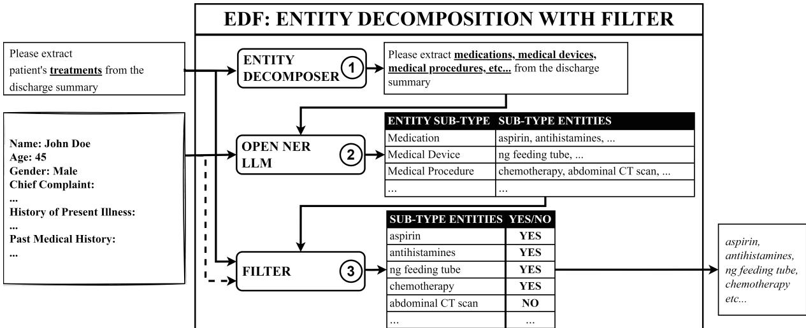
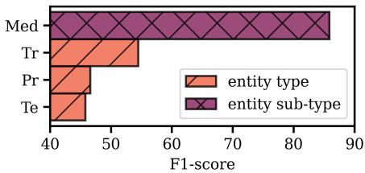
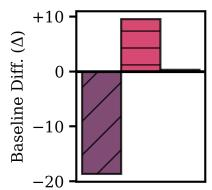
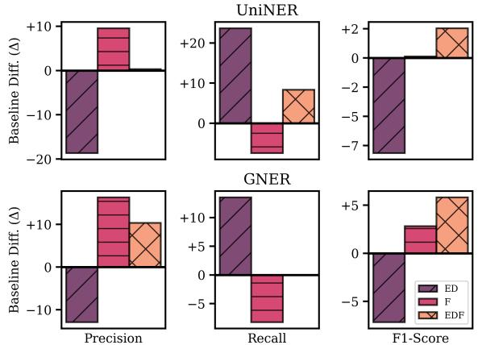
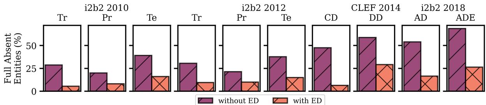
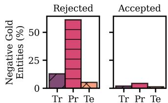
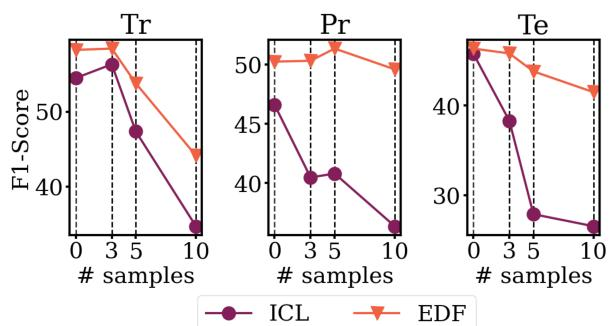
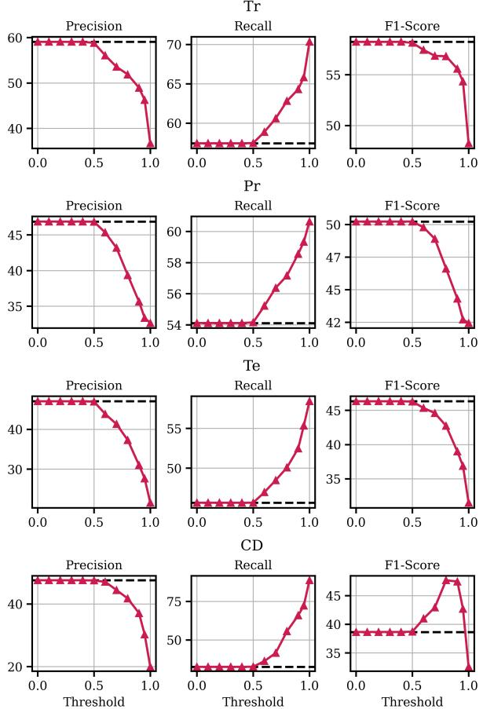

# Entity Decomposition with Filtering: A Zero-Shot Clinical Named Entity Recognition Framework

Reza Averly♣ Xia Ning♣♠♡

♣ Department of Computer Science and Engineering, The Ohio State University, USA ♠Department of Biomedical Informatics, The Ohio State University, USA ♡Translational Data Analytics Institute, The Ohio State University, USA {averly.1,ning.104}@osu.edu

## Abstract

Clinical named entity recognition (NER) aims to retrieve important entities within clinical narratives. Recent works have demonstrated that large language models (LLMs) can achieve strong performance in this task. While previous works focus on proprietary LLMs, we investigate how open NER LLMs, trained specifically for entity recognition, perform in clinical NER. Our initial experiment reveals significant contrast in performance for some clinical entities and how a simple exploitment on entity types can alleviate this issue. In this paper, we introduce a novel framework, entity decomposition with filtering, or EDF. Our key idea is to decompose the entity recognition task into several retrievals of entity sub-types and then filter them. Our experimental results demonstrate the efficacies of our framework and the improvements across all metrics, models, datasets, and entity types. Our analysis also reveals substantial improvement in recognizing previously missed entities using entity decomposition. We further provide a comprehensive evaluation of our framework and an in-depth error analysis to pave future works.

## 1 Introduction

Clinical narratives hold immense value for clinical experts (Tayefi et al., 2021; Mahbub et al., 2022; Raghavan et al., 2014; Rannikmäe et al., 2021), largely due to their wealth of information often inaccessible in the structured data of the electronic health records (EHR) (Mahbub et al., 2023; Goodman-Meza et al., 2022; Kharrazi et al., 2018; Rannikmäe et al., 2020; Hernandez-Boussard et al., 2019; Boag et al., 2018). Their free format, however, causes significant challenges for healthcare systems to utilize. The richness of information trapped within the narratives, followed by its significance, has spurred a plethora of works in tackling the clinical information extraction problem within

the clinical NLP community (Wang et al., 2018;   
Landolsi et al., 2023).

One key building block in clinical information extraction is named entity recognition (NER), focusing on identifying clinical concepts within these narratives. Prior methods (Wang et al., 2018) rely on either traditional natural language processing (NLP) techniques or supervised learning methods. Nevertheless, the former approach can be fragile, while the latter requires significant effort to annotate. In addition, supervised methods cannot simply scale for the large number of concepts available in the clinical domain (Bodenreider, 2004).

In light of this, Large Language Models (LLMs), with their strong capabilities for zero- and fewshot learning (Chowdhery et al., 2023; Brown et al., 2020; Thoppilan et al., 2022; Touvron et al., 2023), serve as promising solutions for clinical NER. While previous works focus on LLMs trained on general tasks (Agrawal et al., 2022; Liu et al., 2023; Gero et al., 2023), here we focus on LLMs specifically trained for entity recognition, or open NER LLMs (Zhou et al., 2023; Ding et al., 2024). Inspired by their results in clinical domain (Zhou et al., 2023), outperforming even proprietary LLMs (Brown et al., 2020), we conduct deeper investigations in this study. Surprisingly, our preliminary experiment (Section 5.1) suggests a stark performance gap between retrieving different clinical entities (Figure 2). For instance, an open NER LLM called UniversalNER (Zhou et al., 2023) performs significantly better at extracting medications rather than clinical treatments (85.88% vs 53.81% Exact Match F1-scores). Upon closer inspection, we find these unidentified treatment entities can be effectively recognized by exploiting simpler, albeit specific, entity types. For example, by explicitly specifying “medication” rather than “treatment” as input, the model can capture a substantial portion of the previously unidentified medication-related treatment entities.

Building upon this insight, we present a novel framework, entity decomposition with filtering, or EDF, aimed at tackling clinical NER. To the best of our knowledge, we are the first to explore strategies to effectively use open NER LLMs in the clinical domain without using any samples. We draw inspiration from the divide-and-conquer paradigm (Knuth, 1998), which breaks down a complex problem into simpler sub-problems. Concretely, we posit that a direct retrieval of entities may be too complex for the model and instead propose to disentangle it into a series of retrievals through entity decomposition. Unlike the previous approach (Xie et al., 2023), entity decomposition breaks down the task by identifying through their entity sub-types, which, ideally, are easier to retrieve. Nonetheless, entity decomposition alone is insufficient since some entity sub-types do not form strict subsets (further discussed in Section 3.2.3). To address this, we introduce afiltering mechanism in our framework to further improve performance. We illustrate them in Figure 1.

Our work introduces a cost-effective approach to improve clinical entity recognition using opensource large language models. Overall, we observe improvements across models, metrics, datasets and entity types. Our ablation study also reveals the robustness of our framework, allowing users to adjust the components based on their performance and cost.

## 2 Related Work

## 2.1 LLMs for Clinical NER

LLMs are promising for many clinical tasks (Singhal et al., 2023; Agrawal et al., 2022; Clusmann et al., 2023). Concurrently, several works aim to improve their performance on clinical NER. For instance, Agrawal et.al. (Agrawal et al., 2022) proposes a guided prompt design along with a resolver to handle the structured output space required by NER, while others (Hu et al., 2024, 2023; Liu et al., 2023) use prompt engineering. Outside the clinical domain, several works tackle NER either by framing it as a sequence labeling task (Wang et al., 2023), using label decomposition and syntactic augmentation (Xie et al., 2023), or improving the structured label space (Li et al., 2024), similar to Agrawal et.al. (Agrawal et al., 2022). Most of these works focus on LLMs trained in handling diverse tasks such as ChatGPT (Brown et al., 2020). In contrast, we focus on open NER LLMs (Zhou et al., 2023; Ding et al., 2024), which have two key differences. First, they are trained specifically for entity recognition tasks and do not require structured output space handling (Agrawal et al., 2022; Li et al., 2024). Second, their instruction-tuning mostly focused on the diversity of entities rather than the instructions (e.g., keeping the prompt constant), which may limit the efficacy of prompt engineering techniques. Furthermore, unlike previous works (Hu et al., 2024, 2023; Liu et al., 2023), our work does not fall under prompt engineering. Notably, prompt engineering is limited to prompt-based models, while our work is modelagnostic and, thus, is applicable to BERT-based models (Zaratiana et al., 2024).

## 2.2 Task Decomposition in LLMs

The idea of task decomposition, solving complex tasks through solving its constituent simpler subtasks, can be dated back to (Lazarou et al., 1998). Previous works propose task decompositions for LLMs to tackle complex problems (Zhou et al., 2022; Xie et al., 2023). Concurrent with our work, Xie et.al. (Xie et al., 2023) suggests decomposing NER into a multi-turn dialogue, asking the model one question for each label. However, some open NER LLMs (Zhou et al., 2023) can only extract one label at a time, thus limiting the efficacy of Xie et.al. (Xie et al., 2023). Here, we propose to decompose NER on entity-level rather than label-level. Concretely, we can further decompose each label into simpler labels. Our method also complements Xie et.al. (Xie et al., 2023) since these decompositions can be performed sequentially. Besides, our work aims to improve open NER LLMs, which have several key differences from other LLMs as briefly discussed in Section 2.1

## 2.3 Open NER LLMs

Clinical narratives fall under domains with a large number of concepts and scarce annotations. Thus, developing open named entity recognition LLMs (Zhou et al., 2023; Ding et al., 2024) is timely and crucial research for clinical NER. Despite the progress, existing works focus on training the backbone models. Furthermore, these models present a unique challenge and cannot be treated similarly to other LLMs (Section 2.1). Our work paves a way to adapt them for clinical domains without finetuning.

  
Figure 1: Entity Decomposition with Filtering. Our novel framework is composed of three components: (1) Entity Decomposer breaks down the target entity type (e.g., treatment) into several entity sub-types (e.g., medication, medical device, medical procedure, etc), (2) Open NER LLM generates the sub-type entities, (3) Filter removes sub-type entities outside the target entity type. See Section 3 for details.

## 3 Method

## 3.1 Problem Definition

Clinical narrative holds important entities about a patient’s medical history. In this work, we aim to tackle clinical NER, focusing on extracting them. We frame the problem through the lens of a textgenerative task. Let x be a clinical narrative, and further let t be the target entity type we want to extract. We aim to retrieve the target entities set $\mathcal { V }$ corresponding to t from x. To illustrate, if x is a patient’s discharge summary and t = “medication”, then the goal is to extract medication entities in the discharge summary. In this case, the ouput can be $\mathcal { V } = \{ ^ { \ast \epsilon } \mathrm { a s p i r i n } ^ { \prime }$ , “methanol”, ... .

## 3.2 Entity Decomposition with Filtering

As introduced in Section 1, directly retrieving the target clinical entities may be too challenging, particularly for models without domain-specific training, such as open NER LLMs. We propose to break the task into multiple retrievals of sub-type entities instead. We define sub-type entities as entities belonging to a a sub-type of the target entity type. Concretely, let $\hat { \mathcal { V } } _ { i }$ be a set of sub-type entities corresponding to the i-th entity sub-type $\mathbf { s } _ { i }$ and let $\hat { \mathcal { V } }$ be our predicted complete set, where ideally $\hat { \mathcal { V } } _ { i } \subseteq \hat { \mathcal { V } }$ . The first part of our framework, entity decomposer, aims to iteratively collect $\hat { \mathcal { V } } _ { i }$ to produce ˆ, $\textstyle \dot { \bigcup } _ { i = 1 } ^ { N } \hat { \mathcal { V } } _ { i } = \hat { \mathcal { V } }$ . The last part of our framework, $\mathbf { \mathcal { f } } l t e r$ , involves removing sub-type entities in $\hat { \mathcal { V } }$ outside the target entity type t. The filtered version $\hat { \mathcal { V } } _ { f }$ then serves as the final output. That is, $\mathcal { V } = \hat { \mathcal { V } } _ { f }$ We provide more details of our framework in the following sections. Figure 1 presents the overall architecture of our framework, entity decomposition with filtering, or EDF.

## 3.2.1 Entity Decomposer

The first step in our framework is to identify what constitutes entity sub-types for the target entity type t. Let $\mathbf { \mathcal { D } ( t ) } = s$ be the entity decomposer module, aimed to produce a set of N entity subtypes $ { \mathcal { S } } ~ = ~ \{ \mathbf { s } _ { 1 } , \mathbf { s } _ { 2 } , . . . , \mathbf { s } _ { N } \}$ using the target entity type t. To illustrate how the module works, let’s take “treatment” as an example. In a patient’s discharge summary, “treatment” constitutes a myriad of entities, including medications, medical procedures, and more (see Figure 1). In this case,  aims to decompose t = “treatment” into $S = \{ { } ^ {  } \mathrm { m e d i c a t i o n } ^ { \prime } \}$ , “medical procedure”, ... .

There are several ways to construct this module, and clinical practitioners can resort to different methods based on costs and performances. Some examples include manually curating the entity subtypes (possibly involving clinical experts) or obtained using existing tools such as a medical knowledge base (Bodenreider, 2004). We provide details in Appendix A

## 3.2.2 Open NER LLM

After defining the entity sub-types $s ,$ the next step is to retrieve the sub-type entities $\hat { \mathcal { V } } .$ In this work, we leverage an open NER LLM. We base its formal definition on previous works (Zhou et al., 2023). Let R be an open NER LLM tasked to retrieve the sub-type entities $\hat { \mathcal { V } } _ { i }$ of $\mathbf { s } _ { i }$ from the clinical narrative x. That is, $R ( \mathbf { x } , \mathbf { s } _ { i } ) = \hat { \mathcal { V } } _ { i }$ . To construct the complete set $\hat { \mathcal { V } } _ { : }$ , the model would iteratively collect $\hat { \mathcal { V } } _ { i }$ from each $\mathbf { s } _ { i } .$ . This may be of concern, given that it requires multiple iterations. To address this, we also consider other variants (Ding et al., 2024; Zaratiana et al., 2024) of open NER LLMs, which we formally define as $R ^ { * } ( \mathbf { x } , S ) = \hat { \mathcal { V } }$ . In contrast to R, these variants are capable of simultaneously extracting multiple entity types at once, thereby reducing the whole iterative sub-type entity retrievals to only one forward pass.

We base the use of an open NER LLM on several key reasons. First, open NER LLMs are versatile in recognizing arbitrary entities, which is a characteristic of sub-type entities (e.g. they are not bounded to a predefined label set). Second, in contrast to other LLMs, open NER LLMs are explicitly trained for NER tasks, substantially reducing the effort of mapping LLM generative output to the structured output space of NER (Agrawal et al., 2022). In addition, our preliminary experiment in Section 5.1 suggests that open NER LLMs perform surprisingly well in recognizing basic clinical entities such as medications, making them strong candidates for this module.

## 3.2.3 Filter

We discuss the last step of our framework here. Formally, let $f ( \hat { \mathscr y } , \mathbf t , C ) = \hat { \mathscr y } _ { f }$ be thefilter module, where $C$ denotes a context and $\hat { \mathscr { V } } _ { f } \subseteq \hat { \mathscr { V } }$ . In this framework, $f$ can be viewed as a binary classifier, assigning a positive label if the entity corresponds to t, and a negative label otherwise. The filter module then aggregates and outputs the positively classified entities. Overall, f aims to eliminate subtype entities within ˆ that do not fall under the target entity type t based on its context C (e.g. the paragraph the entity exists). Take “treatment” and “medical procedure” for example. While “treatment” includes “medical procedure”, not all “medical procedure” qualify as a “treatment”. For instance, some medical procedures (e.g., endoscopy) may serve purely for diagnosis purposes and should not be classified as “treatment.”

We provide the rationale behind using a context C in the filter module. Unlike general domain entities, clinical entities can largely rely on context cues. To illustrate, consider “adverse drug event (ADE)” (Zed et al., 2008; Lazarou et al., 1998). By definition, “ADE” is an "injury resulting from a medical intervention" (Henry et al., 2020). Thus, one of its sub-types may be “injury”. However, for a filter to dictate whether an injury corresponds to “ADE”, it needs to be aware of where the injury comes from. Injuries due to an accidental fall may not be an ADE if the patient does not have any medical interventions. In other words, thefilter requires the context in which the entity occurs to provide an accurate prediction. Moreover, our experiment suggests that while some clinical entities do not need contextual information, they can benefit from it (see Section 5.3.3).

## 4 Experimental Setup

We provide the experimental setup here and leave the details in the Appendix. All of the base models are available in huggingface\*.

## 4.1 Open NER LLMs

We take SOTA open NER LLMs in our experiments and further improve them. Per definition in Section 3.2.2, they may be categorized based on how many entity types can be extracted simultaneously. To this end, we use UniversalNER (Zhou et al., 2023) and GNER (Ding et al., 2024) as the representative for R and R∗, respectively. Concretely, we use UNIVERSALNER-TYPE-7B and GNER-LLAMA-7B. Both are finetuned on the PileNER dataset (Zhou et al., 2023), which is generated from GPT 3.5 (Brown et al., 2020). We only experiment with their default prompts since, in contrast to other LLMs, open NER LLMs are trained on a set of diverse entity types rather than prompts (Zhou et al., 2023)

## 4.2 Entity Decomposers

Here, we experiment with different techniques to decompose entities. First, given that clinical narratives require specialized knowledge, we consider entity sub-types curated by clinical experts. Specifically, we take the annotation guidelines available from the datasets. Second, we use ChatGPT (Brown et al., 2020) to decompose clinical entities automatically. We draw our inspiration from the recent success of ChatGPT in the clinical domain (Agrawal et al., 2022; Singhal et al., 2023). Furthermore, using ChatGPT for entity decomposition is more cost-effective and scalable. Third, we utilize the Unified Medical Language System (UMLS) (Bodenreider, 2004), a medical knowledge base, for retrieving entity sub-types. We provide more details in the Appendix A.

## 4.3 Filters

We use Asclepius (Kweon et al., 2023) and LlaMA-2 (Touvron et al., 2023) trained on clinical and general domains, respectively. Specifically, we use ASCLEPIUS-LLAMA2-7B and LLAMA-2-CHAT-7B versions. Given the inherent generative nature of LLMs, we restrict their outputs to "Yes/No" responses (when applicable) using grammar-constrained decoding (Geng et al., 2023). This strategic constraint reduces the number of generated tokens, resulting in increased inference speed. By default, we prompt the model by asking “Can {entity} be considered as a/an {entity\_type}?”. We try different prompts in Section 5.3.4. For entities that require context, we use a simple preprocessing method so that the context provides sufficient information to extract the clinical entities. That is, we include the whole paragraph (or more) in which the entity occurs from the clinical narrative.

## 4.4 Datasets

We focus our experiments on extracting concepts from publicly available clinical notes†. We use ClinicalIE (Agrawal et al., 2022), i2b2 2010 (Uzuner et al., 2011), i2b2 2012 (Sun et al., 2013), i2b2 2018 Task 2 (Henry et al., 2020) and CLEF 2014 (Mowery et al., 2014) datasets in this paper. They are available in Harvard DBMI‡ for i2b2 datasets, PhysioNet§ (Goldberger et al., 2000) for CLEF 2014 and huggingface for ClinicalIE. In these datasets, context is not required to identify clinical entities except for the i2b2 2018 dataset. We provide further details in the Appendix B.

## 4.5 Baselines and Metrics

Given the scarce methods to compare with, we use the method developed in Xie et.al. (Xie et al., 2023) as our baseline. Concretely, we extract each entity type one at a time using UniversalNER and GNER. We also compare with UNIVERSALNER-ALL, trained with both PileNER and over 40 supervised datasets, including our experiment sets. We use Precision (P), Recall (R), and Exact Match F1-Score (F1) as evaluation metrics, similar to previous works.

  
Figure 2: Open NER LLM (UniversalNER) performs better at extracting entity sub-type (Med) rather than the target entity type (Tr, Pr, Te). We use ClinicalIE for Med (medication) and i2b2 2012 for Tr (treatment), Pr (problem), and Te (test). Discussion in Section 5.1

## 5 Experimental Results

Throughout this section, we abbreviate the entity types in the tables as follows to save space: Tr for treatment, Pr for problem, Te for test, CD for clinical department, DD for disease/disorder, AD for adverse drug, and ADE for adverse drug event.

Given the space limit, we include more results in the Appendix, including few-shot (Appendix E), performance on a BERT-based model (Appendix F), and error analysis on CD performance drop (Appendix G).

## 5.1 Preliminary Experiment

We conduct a preliminary experiment to confirm that open NER LLMs perform better at recognizing sub-type entities rather than the target entity types. For target entities, we use the i2b2 2012 dataset, which contains decomposable entity types (i.e., entities can further be divided into sub-type entities). For sub-type entities, we use ClinicalIE, a medication extraction dataset.

Figure 2 illustrates the result and confirms our hypothesis. That is, it is harder to recognize the target entity types (that are decomposable) compared to the sub-type entities. For instance, we observe a stark difference between “medication” extraction and “treatment” extraction, where the former is an entity sub-type of treatment.

## 5.2 Overall Performance

We present our results in Table 1 and Figure 3. For detailed numbers on precision and recalls, we leave them in the Appendix C.

On average, EDF outperforms baseline by 2.54% and 5.82% F1-score on UniversalNER and GNER, respectively. Interestingly, for some entity types (e.g. treatments and tests in i2b2 2010), GNER performs similarly or even outperforms UniversalNER. This suggests that models that can recognize multiple entities simultaneously can benefit more from using our framework.

Table 1: F1-score performance (%) comparison between baseline (B) from Xie et.al. (Xie et al., 2023), Entity Decomposer (ED) only, Filter (F) only, supervised (UniNER-all) and EDF (Ours) methods across datasets, entity types, and models. We use Asclepius and the default prompt strategy (Section 3.2.3) for the filter and annotation guideline for the entity decomposer. We mark the best results in bold and second-best in underlined. Discussion in Section 5.2
<table><tr><td rowspan="2">Dataset</td><td rowspan="2">Entity Type</td><td colspan="5">UniNER</td><td colspan="5">GNER</td><td rowspan="2">UniNER-all (Supervised)</td></tr><tr><td>B</td><td>ED</td><td>F</td><td>EDF</td><td> $\Delta$ </td><td>B</td><td>ED</td><td>F</td><td>EDF</td><td> $\Delta$ </td></tr><tr><td rowspan="3">i2b2 2010</td><td>Tr</td><td>53.81</td><td>43.56</td><td>54.35</td><td>59.63</td><td>+5.82</td><td>53.31</td><td>39.43</td><td>62.72</td><td>63.23</td><td>+9.92</td><td>74.95</td></tr><tr><td>Pr</td><td>49.71</td><td>41.99</td><td>52.77</td><td>51.46</td><td>+1.75</td><td>40.40</td><td>35.91</td><td>50.77</td><td>50.62</td><td>+10.22</td><td>73.11</td></tr><tr><td>Te</td><td>48.78</td><td>36.99</td><td>40.58</td><td>44.17</td><td>-4.61</td><td>37.27</td><td>36.40</td><td>37.23</td><td>45.78</td><td>+8.51</td><td>72.43</td></tr><tr><td rowspan="4">i2b2 2012</td><td>Tr</td><td>54.49</td><td>48.25</td><td>52.82</td><td>58.25</td><td>+3.76</td><td>50.38</td><td>40.16</td><td>55.63</td><td>57.09</td><td>+6.71</td><td>72.37</td></tr><tr><td>Pr</td><td>46.61</td><td>42.45</td><td>49.64</td><td>50.24</td><td>+3.63</td><td>41.11</td><td>38.00</td><td>47.15</td><td>48.82</td><td>+7.71</td><td>75.16</td></tr><tr><td>Te</td><td>45.78</td><td>31.52</td><td>43.98</td><td>46.34</td><td>+0.56</td><td>33.17</td><td>27.55</td><td>41.09</td><td>46.66</td><td>+13.49</td><td>65.47</td></tr><tr><td>CD</td><td>41.44</td><td>32.57</td><td>34.51</td><td>38.66</td><td>-2.78</td><td>58.88</td><td>20.46</td><td>39.20</td><td>37.74</td><td>-21.14</td><td>44.37</td></tr><tr><td>CLEF 2014</td><td>DD</td><td>46.73</td><td>45.94</td><td>45.26</td><td>58.25</td><td>+11.52</td><td>18.06</td><td>21.11</td><td>18.44</td><td>26.91</td><td>+8.85</td><td>63.19</td></tr><tr><td rowspan="2">i2b2 2018</td><td> $A D ^ { \dagger \ddagger }$ </td><td>19.07</td><td>8.59</td><td>27.36</td><td>24.92</td><td>+5.85</td><td>3.16</td><td>4.54</td><td>10.08</td><td>13.66</td><td>+10.50</td><td>14.37</td></tr><tr><td> $\mathsf { A D E } ^ { \dagger }$ </td><td>9.56</td><td>2.64</td><td>15.90</td><td>9.43</td><td>-0.13</td><td>0.61</td><td>1.09</td><td>2.40</td><td>4.05</td><td> $+ 3 . 4 4$ </td><td>31.18</td></tr><tr><td>Avg.</td><td></td><td>41.60</td><td>33.45</td><td>41.72</td><td>44.14</td><td>+2.54</td><td>33.64</td><td>26.47</td><td>36.47</td><td>39.46</td><td>+5.82</td><td>58.66</td></tr></table>

AD and ADE are entity types that require context  UniNER-all is not trained to extract AD entities

Entity decomposition (ED) improves recall but decreases precision. As illustrated in Figure 3, we observe a consistent improvement in recall across diverse datasets and entity types for both models, suggesting that entity decomposition facilitates the identification of previously missing entities while being robust to the backbone models. For precision, however, we notice a drop in performance. As discussed in Section 3.2.3, some sub-type entities may not form a subset of the target entities, causing performance degradation on precision. Further examination of the F1-score reveals a decline in overall performance, which justifies the necessity of incorporating a filtering mechanism.

Conversely, filtering (F) benefits precision but degrades recall. This shows contrasting results compared to entity decomposition across datasets, entity types, and models. The overall F1-score improvement on EDF compared to using each component individually suggests that entity decomposition and filtering complement each other. This emphasizes the necessity to incorporate both of them.

EDF is robust to out-of-distribution entities compared to supervised training. We want to emphasize that our method does not require any training as opposed to the supervised approach. We use UniversalNER+EDF and UniversalNER-all as comparison. Despite the performance gap, we observe that on entities not covered in the training label set (e.g., adverse drug or AD), EDF outperforms by more than 10% on the F1-score. This shows the robustness of our method.

  
Figure 3: Average performance improvement to baseline across metrics and models. Entity decomposition (ED) improves recall but degrades precision. Filter (F) increases precision but decreases recall. Our method (EDF) achieves better performance overall. Discussion in Section 5.2

## 5.3 Ablation Study

We perform additional experiments to test the efficacy of our framework using different entity decomposers or filters. We focus on the overall performance or F1-score. To reduce the cost of our experiments, we only experiment with the i2b2 2012 dataset, given their diversity in entity types. Unless otherwise specified, we use UniNER as the open NER LLM, annotation guideline for the entity decomposer module, and Asclepius for the filter.

## 5.3.1 Entity Decomposers

First, we conduct ablation study with different entity decomposers as described in Section 4.2 and present our results in Table 2. We do not experiment with ChatGPT and UMLS for the “clinical department” entity type since (1) ChatGPT is unable to produce reasonable entity sub-types and (2) we find there are no correspondence semantic types in UMLS.

  
Figure 4: Entity Decomposition (ED) captures most previously fully absent entities. Lower value is better. Discussion in Section 5.4.1

Table 2: Ablation Study on Entity Decomposer.
<table><tr><td rowspan="2">Entity Decomposer</td><td rowspan="2">Filter</td><td colspan="4">Entity Type</td></tr><tr><td>Tr</td><td>Pr</td><td>Te</td><td>CD</td></tr><tr><td>Baseline</td><td></td><td>54.49</td><td>46.61</td><td>45.78</td><td>41.44</td></tr><tr><td>Annotation</td><td></td><td>48.25</td><td>42.45</td><td>31.52</td><td>32.57</td></tr><tr><td>ChatGPT</td><td rowspan="2">x</td><td>48.62</td><td>44.05</td><td>43.80</td><td>-</td></tr><tr><td>UMLS</td><td>55.57</td><td>46.98</td><td>44.68</td><td>-</td></tr><tr><td>Annotation</td><td></td><td>58.25</td><td>50.24</td><td>46.34</td><td>38.66</td></tr><tr><td>ChatGPT</td><td rowspan="2">√</td><td>58.09</td><td>51.12</td><td>44.83</td><td>-</td></tr><tr><td>UMLS</td><td>58.23</td><td>51.04</td><td>44.71</td><td>-</td></tr></table>

EDF is robust to entity decomposer module. We observe competitive performance between a general LLM, medical knowledge base and clinical experts. For instance, on treatment entities, the performance between clinical experts and ChatGPT is 58.25% vs 58.09%. Thus, even without curation from clinical experts, our method can achieve competitive results.

Without filters, UMLS outperforms other entity decomposers. Most entity sub-types in UMLS form subsets to the target entities; hence, a filter may not be necessary in contrast to other entity decomposers. Interestingly, for some entities, it performs better than vanilla prompt (e.g. treatments and problems). This is significant since even without filtering, our framework, specifically entity decomposition, can still outperform the vanilla approach with proper curation of entity sub-types. We remark that this does not take away the value of a filter module. For instance, UMLS can benefit more from integrating it, as shown in Table 2.

## 5.3.2 Filter Models

Here, we investigate how different filter models affect the overall performance of our framework. Specifically, we compare domain-specific and general LLMs. We present the results in Table 3

Clinical model is better at recognizing entities requiring clinical expertise. Specifically, we observe that it is superior to a general domain model in “treatment”, “problem”, and “test” entities. For “clinical department”, however, they perform similarly. This is unsurprising since the former often requires clinical-specific knowledge compared to the latter.

Table 3: Ablation Study on Filter Model.
<table><tr><td rowspan="2">Entity Decomposer Model</td><td rowspan="2">Filter</td><td colspan="4">Entity Type</td></tr><tr><td>Tr</td><td>Pr</td><td>Te</td><td>CD</td></tr><tr><td>Baseline</td><td></td><td>54.49</td><td>46.61</td><td>45.78</td><td>41.44</td></tr><tr><td rowspan="2">x</td><td>Asclepius</td><td>52.82</td><td>49.64</td><td>43.98</td><td>34.51</td></tr><tr><td>Llama2</td><td>51.90</td><td>47.49</td><td>45.27</td><td>35.37</td></tr><tr><td rowspan="2">√</td><td>Asclepius</td><td>58.25</td><td>50.24</td><td>46.34</td><td>38.66</td></tr><tr><td>Llama2</td><td>53.94</td><td>45.55</td><td>37.41</td><td>38.69</td></tr><tr><td colspan="2">Table 4: Ablation Study on Filter Context.</td><td></td><td></td><td></td><td></td></tr><tr><td rowspan="2">Entity Decomposer Context</td><td>Filter</td><td></td><td></td><td>Entity Type</td><td></td></tr><tr><td></td><td>Tr</td><td>Pr</td><td>Te</td><td>CD</td></tr><tr><td>Baseline</td><td></td><td>54.49</td><td>46.61</td><td>45.78</td><td>41.44</td></tr><tr><td rowspan="3">x</td><td>none</td><td>52.82</td><td>49.64</td><td>43.98</td><td>34.51</td></tr><tr><td>sentence</td><td>53.85</td><td>42.90</td><td>43.91</td><td>37.18</td></tr><tr><td>document</td><td>54.67</td><td>41.53</td><td>44.45</td><td>44.91</td></tr><tr><td rowspan="3">√</td><td>none</td><td>58.25</td><td>50.24</td><td>46.34</td><td>38.66</td></tr><tr><td>sentence</td><td>60.58</td><td>45.17</td><td>46.68</td><td>40.80</td></tr><tr><td>document</td><td>58.24</td><td>42.24</td><td>45.31</td><td>48.90</td></tr></table>

## 5.3.3 Filter Context

As discussed in Section 3.2.3, some clinical entities need context. Here, we investigate whether context helps for entities not requiring it. We compare the performance between filtering (1) without context, (2) including the sentence the entity appears in, and (3) providing the whole clinical narrative or document. We show the results in Table 4.

Context may improve or hurt performance. Overall, we observe mixed results across different entity types, with and without an entity decomposer. For instance, we observe slight improvements for “treatment” and “test” entities. On the other hand, the performance of the “problem” entity consistently drops the more context we provide. We provide further analysis in Section 5.4.2.

Table 5: Ablation Study on Filter Prompt
<table><tr><td rowspan="2">Entity Description</td><td colspan="4">Entity Type</td></tr><tr><td>Tr</td><td>Pr</td><td>Te</td><td>CD</td></tr><tr><td>x</td><td>58.25</td><td>50.24</td><td>46.34</td><td>38.66</td></tr><tr><td>√</td><td>50.32</td><td>47.38</td><td>33.18</td><td>45.97</td></tr></table>

## 5.3.4 Filter Prompts

LLMs are often brittle to prompting strategies (Zhu et al., 2023). We experiment with how incorporating the entity description into the filter affects our framework’s performance. For “treatment”, “problem” and “test”, we use descriptions available in i2b2 2010 annotation guidelines. For “clinical department”, we provide our own definition. We put the prompts in Appendix D and present the results in Table 5.

Complex entity description degrades performance. Our experiment shows a notable performance drop in all entity types except “clinical department”. We hypothesize that the descriptions provided in the guidelines may be too complex for the model to understand. In contrast, we observe more than 7% F1-score improvement on “clinical department”, which uses our handcrafted and concise definition.

## 5.4 Error Analysis

## 5.4.1 Entity Decomposition Missing Entities

Despite the significant improvement in recall through entity decomposition, some entities remain unrecognizable. Thus, we analyze the potential sources of these errors. First, we calculate the percentage of entities fully absent from the predictions. To illustrate, if the label is “his aspirin” and the prediction is “aspirin”, we do not deem it fully absent since the prediction partially captures the label. Figure 4 illustrates the percentage of fully absent entities for each entity type in the dataset.

Entity decomposition significantly reduces the number offully absent entities. For instance, only 5.5% entities are fully absent for “treatment” in the i2b2 2010 dataset after entity decomposition. We observe improvements across all entity types.

The majority offully absent entities are abbreviations and homonyms. For example, open NER LLM cannot capture “CVA”, an abbreviation for “cerebral vascular accident", after entity decomposition. Another example is “delivery", which carries nuanced meanings in different contexts (e.g. childbirth or route of medications). Furthermore, certain entities such as “HD” are both abbreviations and homonyms (i.e., high definition vs hemodialysis).

Table 6: i2b2 2012 Polarity Dataset Statistics
<table><tr><td rowspan="2">Polarity</td><td colspan="4">Entity Type (# of samples)</td></tr><tr><td>Tr</td><td>Pr</td><td>Te</td><td>CD</td></tr><tr><td>Positive</td><td>3684</td><td>4164</td><td>2544</td><td>996</td></tr><tr><td>Negative</td><td>145</td><td>858</td><td>52</td><td>0</td></tr></table>

  
Figure 5: The majority of the rejected golden “Problem” entities are negative, leading to a performance drop in Table 4 when using context. Further discussion in Section 5.4.2.

## 5.4.2 Performance Drop using Context

Section 5.3.3 shows that there is a notable performance degradation for “problem” when context is provided. To investigate, we observe the groundtruth “problem” entities that are removed by the filter. Interestingly, we find that for most of them, the context specifically stated that the patient does not experience these problems. We then conduct further investigation on their polarity attribute, which contains information on whether the patient is experiencing medical problems (or taking certain medications, for instance). To clarify, if there are explicit mentions that a patient does not have certain medical problems, the polarity is negative. Otherwise, it is positive. We conduct an analysis of how entity polarity affects filter responses. We plot our results in Figure 5.

The “negative”polarity degrades performance. First, the dataset statistics in Table 6 show that almost a fifth of “problem” entities are “negative”, making it likely that these gold labels would be rejected. Furthermore, Figure 5 reveals that the “negative” polarity causes the performance drop on the “problem” entity, as revealed by how a majority of the rejected gold “problem” entities are “negative”.

## 6 Conclusion and Future Work

In this work, we propose a novel EDF framework to tackle the clinical named entity recognition task. Our comprehensive experiments demonstrate the strength of our framework across different dimensions. We also thoroughly investigate each framework component and provide several key insights. In future works, we hope to explore how to address the limitations of our work described in Section 7.

## 7 Limitations

First, we restrict our work to clinical narratives and have yet to explore how our framework generalizes to other texts. In this work, we deliberately focus on how well the method generalizes to different datasets, which (1) tackle different and clinically significant (Lehman et al., 2022) entity types, (2) are collected from different institutions (thus different distributions), (3) are de-identified in different ways (e.g., masks used for the patient’s sensitive information), (4) used different formats (e.g., header names and section organizations), etc. In fact, each patient is a unique case, and each of them can be treated as a separate domain (Yang et al., 2023). Thus, generalizing to these datasets is already a significant challenge. However, testing how well our framework generalizes beyond clinical narratives would be an interesting avenue. Note that our motivation for this framework is that we found some clinical entities are easier to identify through simpler terms. This is particularly true for clinical narratives since most entities that are of interest (Lehman et al., 2022) follow this assumption. Thus, we designed our framework based on the characteristics of entities inside clinical narratives, not the narratives themselves. This is the reason we hypothesize that our framework may work outside clinical narratives (with similar entity characteristics). We leave this to future work.

Second, we restrict our work to only opensourced models and leave experiments on proprietary models to future works. Most publicly available clinical narratives are under restrictive licenses. Hence, we cannot simply use commercial models, which may leak the data to a third party that is not covered by the restricted data use agreements. In contrast, open-sourced models have more practical values (e.g., they can be deployed). In this work, we deliberately use strong open-sourced models such as UniversalNER (Zhou et al., 2023), which performs better than ChatGPT (Brown et al., 2020). However, how open-sourced models fare with other proprietary models on clinical NER is still unknown. We leave them to future works.

Third, our work falls under the healthcare domain, a high-stakes setting. Despite the good performance of our methods, there is still a long way to reach the performance achieved in the original challenge of the datasets years ago, which are from the supervised learning settings. We provide their results in Appendix K. It is also critical that NER performance in clinical texts can satisfy the high requirements set by healthcare applications. Nevertheless, our work paves a potential solution for the zero-shot clinical named entity recognition task.

Fourth, despite our attempts in generalization across datasets, it is very unfortunate that existing publicly available annotated clinical datasets only contain a few entity types. The issue is exacerbated by the significance of clinical domain, with emphasize on patient data protection (thus harder to publicly share) and the domain expertise to annotate. Once datasets with other entity types are made available, we will apply our methods to other entity types, which we are not able to do at this point given the lack of datasets with other entity types.

Fifth, our framework may provide higher inference cost than supervised methods. We remark that we develop a framework for a high-stakes domain that imposes high-performance requirements. Furthermore, our method is much more cost-efficient than curating an annotated datasets, which is required for supervised methods. Our framework is also flexible such that it provides trade-off between performance and inference cost depending on the user’s needs.

## 8 Ethic Statement

Our research is conducted on open, retrospective clinical datasets without human subject intervention and thus will not harm human subjects. Furthermore, the clinical domain is complex and requires evaluation beyond performance, particularly regarding safety and bias. Unfortunately, the clinical narratives in our datasets are not associated with specific patients, impeding such evaluations. Further evaluations and validations from clinical experts will be needed to translate research into the clinical decision process.

## 9 Acknowledgement

Research reported in this publication was supported by the National Institute On Aging of the National Institutes of Health under Award Number R01AG082044. The content is solely the responsibility of the authors and does not necessarily represent the official views of the National Institutes of Health.

## References

Monica Agrawal, Stefan Hegselmann, Hunter Lang, Yoon Kim, and David Sontag. 2022. Large language models are few-shot clinical information extractors. In Proceedings of the 2022 Conference on Empirical Methods in Natural Language Processing, pages 1998–2022, Abu Dhabi, United Arab Emirates. Association for Computational Linguistics.

Willie Boag, Dustin Doss, Tristan Naumann, and Peter Szolovits. 2018. What’s in a note? unpacking predictive value in clinical note representations. AMIA Summits on Translational Science Proceedings, 2018:26.

Olivier Bodenreider. 2004. The unified medical language system (umls): integrating biomedical terminology. Nucleic acids research, 32(suppl\_1):D267– D270.

Tom Brown, Benjamin Mann, Nick Ryder, Melanie Subbiah, Jared D Kaplan, Prafulla Dhariwal, Arvind Neelakantan, Pranav Shyam, Girish Sastry, Amanda Askell, et al. 2020. Language models are few-shot learners. Advances in neural information processing systems, 33:1877–1901.

Aakanksha Chowdhery, Sharan Narang, Jacob Devlin, Maarten Bosma, Gaurav Mishra, Adam Roberts, Paul Barham, Hyung Won Chung, Charles Sutton, Sebastian Gehrmann, et al. 2023. Palm: Scaling language modeling with pathways. Journal ofMachine Learning Research, 24(240):1–113.

Jan Clusmann, Fiona R Kolbinger, Hannah Sophie Muti, Zunamys I Carrero, Jan-Niklas Eckardt, Narmin Ghaffari Laleh, Chiara Maria Lavinia Löffler, Sophie-Caroline Schwarzkopf, Michaela Unger, Gregory P Veldhuizen, et al. 2023. The future landscape of large language models in medicine. Communications medicine, 3(1):141.

Yuyang Ding, Juntao Li, Pinzheng Wang, Zecheng Tang, Yan Bowen, and Min Zhang. 2024. Rethinking negative instances for generative named entity recognition. In Findings of the Association for Computational Linguistics: ACL 2024, pages 3461–3475, Bangkok, Thailand. Association for Computational Linguistics.

Saibo Geng, Martin Josifoski, Maxime Peyrard, and Robert West. 2023. Grammar-constrained decoding for structured NLP tasks without finetuning. In Proceedings of the 2023 Conference on Empirical Methods in Natural Language Processing, pages 10932– 10952, Singapore. Association for Computational Linguistics.

Zelalem Gero, Chandan Singh, Hao Cheng, Tristan Naumann, Michel Galley, Jianfeng Gao, and Hoifung Poon. 2023. Self-verification improves fewshot clinical information extraction. arXiv preprint arXiv:2306.00024.

Ary L Goldberger, Luis AN Amaral, Leon Glass, Jeffrey M Hausdorff, Plamen Ch Ivanov, Roger G Mark, Joseph E Mietus, George B Moody, Chung-Kang

Peng, and H Eugene Stanley. 2000. Physiobank, physiotoolkit, and physionet: components of a new research resource for complex physiologic signals. circulation, 101(23):e215–e220.

David Goodman-Meza, Amber Tang, Babak Aryanfar, Sergio Vazquez, Adam J Gordon, Michihiko Goto, Matthew Bidwell Goetz, Steven Shoptaw, and Alex AT Bui. 2022. Natural language processing and machine learning to identify people who inject drugs in electronic health records. In Open forum infectious diseases, volume 9, page ofac471. Oxford University Press US.

Sam Henry, Kevin Buchan, Michele Filannino, Amber Stubbs, and Ozlem Uzuner. 2020. 2018 n2c2 shared task on adverse drug events and medication extraction in electronic health records. Journal ofthe American Medical Informatics Association, 27(1):3–12.

Tina Hernandez-Boussard, Keri L Monda, Blai Coll Crespo, and Dan Riskin. 2019. Real world evidence in cardiovascular medicine: ensuring data validity in electronic health record-based studies. Journal of the American Medical Informatics Association, 26(11):1189–1194.

Danqing Hu, Bing Liu, Xiaofeng Zhu, Xudong Lu, and Nan Wu. 2024. Zero-shot information extraction from radiological reports using chatgpt. International Journal ofMedical Informatics, 183:105321.

Yan Hu, Iqra Ameer, Xu Zuo, Xueqing Peng, Yujia Zhou, Zehan Li, Yiming Li, Jianfu Li, Xiaoqian Jiang, and Hua Xu. 2023. Zero-shot clinical entity recognition using chatgpt. arXiv preprint arXiv:2303.16416.

Hadi Kharrazi, Laura J Anzaldi, Leilani Hernandez, Ashwini Davison, Cynthia M Boyd, Bruce Leff, Joe Kimura, and Jonathan P Weiner. 2018. The value of unstructured electronic health record data in geriatric syndrome case identification. Journal of the American Geriatrics Society, 66(8):1499–1507.

Donald E. Knuth. 1998. The art of computer programming, volume 3: (2nd ed.) sorting and searching. Addison Wesley Longman Publishing Co., Inc., USA.

Sunjun Kweon, Junu Kim, Jiyoun Kim, Sujeong Im, Eunbyeol Cho, Seongsu Bae, Jungwoo Oh, Gyubok Lee, Jong Hak Moon, Seng Chan You, Seungjin Baek, Chang Hoon Han, Yoon Bin Jung, Yohan Jo, and Edward Choi. 2023. Publicly shareable clinical large language model built on synthetic clinical notes. Preprint, arXiv:2309.00237.

Mohamed Yassine Landolsi, Lobna Hlaoua, and Lotfi Ben Romdhane. 2023. Information extraction from electronic medical documents: state of the art and future research directions. Knowledge and Information Systems, 65(2):463–516.

Jason Lazarou, Bruce H Pomeranz, and Paul N Corey. 1998. Incidence of adverse drug reactions in hospitalized patients: a meta-analysis of prospective studies. Jama, 279(15):1200–1205.

Eric Lehman, Vladislav Lialin, Katelyn Edelwina Legaspi, Anne Janelle Sy, Patricia Therese Pile, Nicole Rose Alberto, Richard Raymund Ragasa, Corinna Victoria Puyat, Marianne Katharina Taliño, Isabelle Rose Alberto, Pia Gabrielle Alfonso, Dana Moukheiber, Byron Wallace, Anna Rumshisky, Jennifer Liang, Preethi Raghavan, Leo Anthony Celi, and Peter Szolovits. 2022. Learning to ask like a physician. In Proceedings ofthe 4th Clinical Natural Language Processing Workshop, pages 74–86, Seattle, WA. Association for Computational Linguistics.

Yinghao Li, Rampi Ramprasad, and Chao Zhang. 2024. A simple but effective approach to improve structured language model output for information extraction. In Findings ofthe Associationfor Computational Linguistics: EMNLP 2024, pages 5133–5148, Miami, Florida, USA. Association for Computational Linguistics.

Zhengliang Liu, Yue Huang, Xiaowei Yu, Lu Zhang, Zihao Wu, Chao Cao, Haixing Dai, Lin Zhao, Yiwei Li, Peng Shu, et al. 2023. Deid-gpt: Zero-shot medical text de-identification by gpt-4. arXiv preprint arXiv:2303.11032.

Maria Mahbub, Ian Goethert, Ioana Danciu, Kathryn Knight, Sudarshan Srinivasan, Suzanne Tamang, Karine Rozenberg-Ben-Dror, Hugo Solares, Susana Martins, Edmon Begoli, et al. 2023. Questionanswering system extracts information on injection drug use from clinical progress notes. arXiv preprint arXiv:2305.08777.

Maria Mahbub, Sudarshan Srinivasan, Ioana Danciu, Alina Peluso, Edmon Begoli, Suzanne Tamang, and Gregory D Peterson. 2022. Unstructured clinical notes within the 24 hours since admission predict short, mid & long-term mortality in adult icu patients. Plos one, 17(1):e0262182.

Danielle L Mowery, Sumithra Velupillai, Brett R South, Lee Christensen, David Martinez, Liadh Kelly, Lorraine Goeuriot, Noemie Elhadad, Sameer Pradhan, Guergana Savova, et al. 2014. Task 2: Share/clef ehealth evaluation lab 2014. In Proceedings ofCLEF 2014.

Preethi Raghavan, James L Chen, Eric Fosler-Lussier, and Albert M Lai. 2014. How essential are unstructured clinical narratives and information fusion to clinical trial recruitment? AMIA Summits on Translational Science Proceedings, 2014:218.

Kristiina Rannikmäe, Kenneth Ngoh, Kathryn Bush, Rustam Al-Shahi Salman, Fergus Doubal, Robin Flaig, David E Henshall, Aidan Hutchison, John Nolan, Scott Osborne, et al. 2020. Accuracy of identifying incident stroke cases from linked health care data in uk biobank. Neurology, 95(6):e697–e707.

Kristiina Rannikmäe, Honghan Wu, Steven Tominey, William Whiteley, Naomi Allen, Cathie Sudlow, and UK Biobank. 2021. Developing automated methods for disease subtyping in uk biobank: an exemplar

study on stroke. BMC medical informatics and decision making, 21(1):191.

Karan Singhal, Shekoofeh Azizi, Tao Tu, S Sara Mahdavi, Jason Wei, Hyung Won Chung, Nathan Scales, Ajay Tanwani, Heather Cole-Lewis, Stephen Pfohl, et al. 2023. Large language models encode clinical knowledge. Nature, 620(7972):172–180.

Weiyi Sun, Anna Rumshisky, and Ozlem Uzuner. 2013. Evaluating temporal relations in clinical text: 2012 i2b2 challenge. Journal of the American Medical Informatics Association, 20(5):806–813.

Maryam Tayefi, Phuong Ngo, Taridzo Chomutare, Hercules Dalianis, Elisa Salvi, Andrius Budrionis, and Fred Godtliebsen. 2021. Challenges and opportunities beyond structured data in analysis of electronic health records. Wiley Interdisciplinary Reviews: Computational Statistics, 13(6):e1549.

Romal Thoppilan, Daniel De Freitas, Jamie Hall, Noam Shazeer, Apoorv Kulshreshtha, Heng-Tze Cheng, Alicia Jin, Taylor Bos, Leslie Baker, Yu Du, et al. 2022. Lamda: Language models for dialog applications. arXiv preprint arXiv:2201.08239.

Hugo Touvron, Louis Martin, Kevin Stone, Peter Albert, Amjad Almahairi, Yasmine Babaei, Nikolay Bashlykov, Soumya Batra, Prajjwal Bhargava, Shruti Bhosale, et al. 2023. Llama 2: Open foundation and fine-tuned chat models. arXiv preprint arXiv:2307.09288.

Özlem Uzuner, Brett R South, Shuying Shen, and Scott L DuVall. 2011. 2010 i2b2/va challenge on concepts, assertions, and relations in clinical text. Journal ofthe American Medical Informatics Association, 18(5):552–556.

Shuhe Wang, Xiaofei Sun, Xiaoya Li, Rongbin Ouyang, Fei Wu, Tianwei Zhang, Jiwei Li, and Guoyin Wang. 2023. Gpt-ner: Named entity recognition via large language models. arXiv preprint arXiv:2304.10428.

Yanshan Wang, Liwei Wang, Majid Rastegar-Mojarad, Sungrim Moon, Feichen Shen, Naveed Afzal, Sijia Liu, Yuqun Zeng, Saeed Mehrabi, Sunghwan Sohn, et al. 2018. Clinical information extraction applications: a literature review. Journal of biomedical informatics, 77:34–49.

Tingyu Xie, Qi Li, Jian Zhang, Yan Zhang, Zuozhu Liu, and Hongwei Wang. 2023. Empirical study of zero-shot ner with chatgpt. arXiv preprint arXiv:2310.10035.

Chaoqi Yang, M. Brandon Westover, and Jimeng Sun. 2023. Manydg: Many-domain generalization for healthcare applications. In The 11th International Conference on Learning Representations, ICLR 2023.

Urchade Zaratiana, Nadi Tomeh, Pierre Holat, and Thierry Charnois. 2024. GLiNER: Generalist model

for named entity recognition using bidirectional transformer. In Proceedings of the 2024 Conference of the North American Chapter ofthe Associationfor Computational Linguistics: Human Language Technologies (Volume 1: Long Papers), pages 5364–5376, Mexico City, Mexico. Association for Computational Linguistics.

Peter J Zed, Riyad B Abu-Laban, Robert M Balen, Peter S Loewen, Corinne M Hohl, Jeffrey R Brubacher, Kerry Wilbur, Matthew O Wiens, Leslie J Samoy, Katie Lacaria, et al. 2008. Incidence, severity and preventability of medication-related visits to the emergency department: a prospective study. Cmaj, 178(12):1563–1569.

Zihao Zhao, Eric Wallace, Shi Feng, Dan Klein, and Sameer Singh. 2021. Calibrate before use: Improving few-shot performance of language models. In International conference on machine learning, pages 12697–12706. PMLR.

Denny Zhou, Nathanael Schärli, Le Hou, Jason Wei, Nathan Scales, Xuezhi Wang, Dale Schuurmans, Claire Cui, Olivier Bousquet, Quoc Le, et al. 2022. Least-to-most prompting enables complex reasoning in large language models. arXiv preprint arXiv:2205.10625.

Wenxuan Zhou, Sheng Zhang, Yu Gu, Muhao Chen, and Hoifung Poon. 2023. Universalner: Targeted distillation from large language models for open named entity recognition. arXiv preprint arXiv:2308.03279.

Kaijie Zhu, Jindong Wang, Jiaheng Zhou, Zichen Wang, Hao Chen, Yidong Wang, Linyi Yang, Wei Ye, Neil Zhenqiang Gong, Yue Zhang, et al. 2023. Promptbench: Towards evaluating the robustness of large language models on adversarial prompts. arXiv preprint arXiv:2306.04528.

## Appendix

## A Entity Decomposers

We provide the details for each of our entity decomposition methods described in Section 4.2 here:

• Manually curating a set of candidate types using expert-level knowledge. Here, we refer to the annotation guidelines available in existing datasets since we believe they are curated by domain experts. For “Tr”, “Pr”, “Te” and “DD” we take the annotation guidelines from i2b2 2010. For “CD”, we use i2b2 2012. For “AD” and “ADE”, we use i2b2 2018 Task 2. We list the curated set in Section A.1.

• Prompting an LLM for automatic generation. We prompt ChatGPT with “You are an intelligent clinical language model. Your job is to extract {entity\_type} from a patient’s discharge summary. What entities can be considered as {entity\_type} in a discharge summary?” for each entity type. For reproducibility, we present the results in Section A.2.

• Utilizing an existing medical knowledge bank. We use the Unified Medical Language System (UMLS) since it contains standardized medical vocabulary for many clinical entities. Here, we take the UMLS semantic types for “Tr”, “Pr” and “Te” available in i2b2 2010 guidelines. We list the curated set in Section A.3.

## A.1 Annotation

Treatment: medical treatment, medical intervention, medical procedure, medical device, treatment, biological substance, drug, medication

Problem: medical problem, disease, syndrome, symptom, medical condition, behavior, virus, bacterium, injury, abnormality, abnormal test result, mental status

Test: medical test, medical procedure, medical panel, medical examination, medical evaluation, test, procedure, laboratory procedure, diagnostic procedure, panel, measure, physiologic measure, vital sign, examination, evaluation

Clinical Department: clinical department, medical department, clinical unit, clinical service, clinical

Table 7: Dataset Statistics
<table><tr><td>Dataset</td><td># samples</td></tr><tr><td>i2b2 2010</td><td>27,625</td></tr><tr><td>i2b2 2012</td><td>7,446</td></tr><tr><td>i2b2 2018</td><td>9,181</td></tr><tr><td>CLEF 2014</td><td>10,422</td></tr></table>

practice, clinical room, department, location, building, hospital

Disease/Disorder: medical problem, disease, syndrome, symptom, medical condition, behavior, virus, bacterium, injury, abnormality, abnormal test result

Adverse Drug: drug

Adverse Drug Event: medical problem

## A.2 ChatGPT

Treatment: medical treatment, medication, medical procedure, therapy, medical intervention, consultation, counseling, discharge instruction, supportive care

Problem: medical problem, medical diagnosis, disease, abnormal test result, symptom, abnormal imaging finding, complication, chronic health condition, medication side effect, mental health issue, social determinants of health

Test: medical test, laboratory test, imaging study, diagnostic procedure, genetic test, electrodiagnostic test, functional test, microbiological test

## A.3 UMLS

Treatment: medical treatment, therapeutic procedure, preventive procedure, medical device, steroid, pharmacologic substance, biomedical material, dental material, antibiotic, clinical drug, drug delivery device

Problem: medical problem, pathologic function, disease, syndrome, mental dysfunction, behavioral dysfunction, cell dysfunction, molecular dysfunction, congenital abnormality, acquired abnormality, injury, poisoning, anatomic abnormality, neoplastic process, virus, bacterium, symptom

Table 8: Extension of Table 1 for Precision (%).
<table><tr><td rowspan="2">Dataset</td><td rowspan="2">Entity Type</td><td colspan="5">UniNER</td><td colspan="5">GNER</td><td rowspan="2">UniNER-all (Supervised)</td></tr><tr><td>B</td><td>ED</td><td>F</td><td>EDF</td><td>∆</td><td>B</td><td>ED</td><td>F</td><td>EDF</td><td>∆</td></tr><tr><td rowspan="3">i2b2 2010</td><td>Tr</td><td>51.63</td><td>30.35</td><td>61.71</td><td>55.09</td><td>+3.46</td><td>46.08</td><td>27.19</td><td>74.16</td><td>66.60</td><td>+20.52</td><td>80.63</td></tr><tr><td>Pr</td><td>44.95</td><td>30.94</td><td>56.02</td><td>47.15</td><td>+2.20</td><td>33.71</td><td>25.61</td><td>55.43</td><td>47.63</td><td>+13.92</td><td>75.87</td></tr><tr><td>Te</td><td>53.51</td><td>26.04</td><td>58.67</td><td>48.84</td><td>-4.67</td><td>32.70</td><td>24.73</td><td>59.91</td><td>53.73</td><td>+21.03</td><td>79.14</td></tr><tr><td rowspan="4">i2b2 2012</td><td>Tr</td><td>57.09</td><td>36.72</td><td>65.25</td><td>59.08</td><td>+1.99</td><td>48.05</td><td>29.56</td><td>71.32</td><td>63.40</td><td>+15.35</td><td>81.10</td></tr><tr><td>Pr</td><td>42.93</td><td>32.65</td><td>53.03</td><td>46.87</td><td>+3.94</td><td>37.49</td><td>28.71</td><td>52.72</td><td>46.57</td><td>+9.08</td><td>78.97</td></tr><tr><td>Te</td><td>51.35</td><td>21.58</td><td>58.34</td><td>47.04</td><td>-4.31</td><td>29.96</td><td>18.15</td><td>57.95</td><td>49.69</td><td>+19.73</td><td>72.88</td></tr><tr><td>CD</td><td>35.87</td><td>19.94</td><td>54.85</td><td>47.56</td><td>+11.69</td><td>55.11</td><td>11.73</td><td>57.17</td><td>50.77</td><td>-4.34</td><td>59.19</td></tr><tr><td>CLEF 2014</td><td>DD</td><td>69.14</td><td>34.05</td><td>79.01</td><td>55.95</td><td>-13.19</td><td>29.10</td><td>16.29</td><td>40.85</td><td>28.18</td><td>-0.92</td><td>78.71</td></tr><tr><td rowspan="2">i2b2 2018</td><td>AD</td><td>12.43</td><td>4.54</td><td>20.93</td><td>15.09</td><td>+2.66</td><td>1.67</td><td>2.43</td><td>6.20</td><td>8.79</td><td>+7.12</td><td>12.32</td></tr><tr><td>ADE</td><td>6.04</td><td>1.36</td><td>12.36</td><td>5.23</td><td>-0.81</td><td>0.33</td><td>0.56</td><td>1.76</td><td>2.34</td><td>+2.01</td><td></td></tr><tr><td>Avg.</td><td></td><td>42.49</td><td>23.82</td><td>52.02</td><td>42.79</td><td>+0.30</td><td>31.42</td><td>18.50</td><td>47.75</td><td>41.77</td><td>+10.35</td><td>64.76</td></tr></table>

Table 9: Extension of Table 1 for Recall (%).
<table><tr><td rowspan="2">Dataset</td><td rowspan="2">Entity Type</td><td colspan="5">UniNER</td><td colspan="5">GNER</td><td rowspan="2">UniNER-all (Supervised)</td></tr><tr><td>B</td><td>ED</td><td>F</td><td>EDF</td><td>∆</td><td>B</td><td>ED</td><td>F</td><td>EDF</td><td>∆</td></tr><tr><td rowspan="3">i2b2 2010</td><td>Tr</td><td>56.18</td><td>77.13</td><td>48.57</td><td>64.98</td><td>+8.80</td><td>63.25</td><td>71.70</td><td>54.33</td><td>60.18</td><td>-3.07</td><td>70.02</td></tr><tr><td>Pr</td><td>55.56</td><td>65.28</td><td>49.87</td><td>56.64</td><td>+1.08</td><td>50.39</td><td>60.12</td><td>46.83</td><td>54.03</td><td>+3.64</td><td>70.55</td></tr><tr><td>Te</td><td>44.81</td><td>63.84</td><td>31.02</td><td>40.32</td><td>-4.49</td><td>43.32</td><td>68.94</td><td>27.01</td><td>39.88</td><td>-3.44</td><td>66.76</td></tr><tr><td rowspan="4">i2b2 2012</td><td>Tr</td><td>52.11</td><td>70.34</td><td>44.37</td><td>57.45</td><td>+5.34</td><td>52.95</td><td>62.61</td><td>45.61</td><td>51.92</td><td>-1.03</td><td>65.34</td></tr><tr><td>Pr</td><td>50.99</td><td>60.64</td><td>46.65</td><td>54.12</td><td>+3.13</td><td>45.50</td><td>56.20</td><td>42.64</td><td>51.29</td><td>+5.79</td><td>71.70</td></tr><tr><td>Te</td><td>41.30</td><td>58.42</td><td>35.29</td><td>45.65</td><td>+4.35</td><td>37.15</td><td>57.18</td><td>31.83</td><td>43.98</td><td>+6.83</td><td>59.43</td></tr><tr><td>CD</td><td>49.04</td><td>88.78</td><td>25.18</td><td>32.56</td><td>-16.48</td><td>63.20</td><td>79.88</td><td>29.83</td><td>30.03</td><td>-33.17</td><td>35.49</td></tr><tr><td>CLEF 2014</td><td>DD</td><td>35.29</td><td>70.62</td><td>31.71</td><td>60.75</td><td>+25.46</td><td>13.10</td><td>29.99</td><td>11.90</td><td>25.74</td><td>+12.64</td><td>52.79</td></tr><tr><td rowspan="2">i2b2 2018</td><td>AD</td><td>40.93</td><td>77.74</td><td>39.50</td><td>71.63</td><td>+30.70</td><td>30.34</td><td>34.65</td><td>26.93</td><td>30.70</td><td>+0.36</td><td>17.24</td></tr><tr><td>ADE</td><td>22.86</td><td>52.88</td><td>22.27</td><td>48.11</td><td>+25.25</td><td>3.78</td><td>16.90</td><td>3.78</td><td>15.31</td><td>+11.53</td><td>34.00</td></tr><tr><td>Avg.</td><td></td><td>44.91</td><td>68.57</td><td>37.44</td><td>53.22</td><td>+8.31</td><td>40.30</td><td>53.82</td><td>32.07</td><td>40.31</td><td>+0.01</td><td>54.33</td></tr></table>

Test: medical test, laboratory procedure, diagnostic procedure

## B Datasets

We include all entities for i2b2 2010, ClinicalIE, and CLEF 2014. For i2b2 2012, we found that UniversalNER and GNER performed poorly on the last two entities (e.g., evidence and occurrence) and decided to exclude them. We attribute this to them consisting mostly of verb phrases, while the training dataset consists mainly of noun entities. For i2b2 2018 Task 2, we test our method on a more challenging setup, extracting adverse drugs and adverse drug events (Henry et al., 2020). We provide the dataset statistics in Table 7.

## C Recall and Precision Performance

We provide the precisions and recalls for each dataset and entity type from Table 1 in Table 8 and Table 9 respectively. We observe a similar trend for both metrics. Furthermore, we observe that UniNER benefits more from precision and GNER on recalls using our framework.

## D Filter Prompt

We experiment with different ways to prompt in Section 5.3.4 and provide the specific instructions here.

## D.1 Without Description (Default)

Can ’{entity}’ be considered a/an {entity\_type}? Answer with yes or no.

## D.2 With Description

Treatment: Can ’{entity}’ be considered a procedure or substance given to a patient to resolve a medical problem? Answer with yes or no.

Problem: Can ’{entity}’ be considered an observation thought to be abnormal or caused by a disease? Answer with yes or no.

Test: Can ’{entity}’ be considered a procedure or measure to find more information about a medical problem? Answer with yes or no.

  
Figure 6: Few-shot performance comparison. We observe performance drop using in-context learning (ICL). In contrast, our method (EDF) is more robust. We use the i2b2 2012 dataset with entity types treatment (Tr), problem (Pr), and test (Te).

Clinical Department: Can ’{entity}’ be considered a clinical unit or clinical service name? Answer with yes or no.

## E Few-shot Experiment

Here, we tried including some annotated samples in our framework and compared the approach to standard in-context learning. We randomly sample from the annotation guidelines and add them to the UniversalNER prompt. We also guarantee that there is at least one sample without entities of interest (e.g., sentence does not contain treatments or medical problems). Interestingly, we observe performance degradation across entity types the more samples we use. These contrastive results to general LLMs (Xie et al., 2023) further justify that open NER LLMs cannot be treated similarly to them. Furthermore, we observe that this also applies to our framework, although it is not as severe as standard in-context learning.

We remark that performance drops on in-context learning are not uncommon. Previous works (Zhao et al., 2021; Zhu et al., 2023) show instability in performance for in-context learning. In addition, few-shot experiments are uncommon for zero-shot NER task (Zhou et al., 2023; Ding et al., 2024; Zaratiana et al., 2024), even if they use LLMs. Our work reveals that open NER LLMs may not benefit from in-context learning and are different from general LLMs. We leave further investigation to future works.

## F Performance on BERT-based Models

We use GLiNER (Zaratiana et al., 2024), a BERTbased model for open-named entity recognition. Note that previous prompt engineering methods cannot be applied here. We conduct the experiment similar to UniNER and GNER, with Xie et.al. (Xie

Table 10: Performance on GLiNER.
<table><tr><td rowspan="2">Dataset</td><td rowspan="2">Entity Type</td><td rowspan="2">Metric</td><td colspan="4">GLiNER</td></tr><tr><td>B</td><td>ED</td><td>F</td><td>EDF ∆</td></tr><tr><td rowspan="7">i2b2 2010</td><td rowspan="3">Tr</td><td>P</td><td>52.03 35.70</td><td>70.79</td><td>66.71 +14.68</td></tr><tr><td>R</td><td>44.55</td><td>76.13 39.86</td><td>63.93 +19.38</td></tr><tr><td>F1</td><td>48.00 48.61</td><td>51.00</td><td>65.29 +17.29</td></tr><tr><td rowspan="2">Pr</td><td>P 71.19</td><td>48.48</td><td>79.13 67.32</td><td>-3.87</td></tr><tr><td>R</td><td>49.22 63.36</td><td>46.16 56.49</td><td>+7.27</td></tr><tr><td rowspan="2"></td><td>F1</td><td>58.20 54.93</td><td>58.31 61.43</td><td>+3.23</td></tr><tr><td>P R</td><td>42.80</td><td>22.93 63.77</td><td>56.65 +13.85</td></tr><tr><td rowspan="8"></td><td rowspan="2">Te</td><td></td><td>27.23</td><td>55.63 23.43</td><td>39.14+11.91</td></tr><tr><td>F1</td><td>33.28</td><td>32.47 34.27</td><td>46.30+13.02</td></tr><tr><td rowspan="6">Tr</td><td>P R</td><td>53.77</td><td>38.8871.83</td><td>66.92 +13.15</td></tr><tr><td>F1</td><td>48.37</td><td>69.76 42.87</td><td>58.03 +9.66</td></tr><tr><td></td><td>50.93</td><td>49.93 53.69</td><td>62.16 +11.23</td></tr><tr><td>P Pr</td><td>71.67</td><td>51.93 77.68</td><td>67.35 -4.32</td></tr><tr><td>R</td><td>50.33 63.93</td><td>47.27</td><td>58.06 +7.73</td></tr><tr><td>F1</td><td>59.13 57.32</td><td>58.78</td><td>62.36 +3.23</td></tr><tr><td rowspan="8"></td><td rowspan="2">Te</td><td>P</td><td>43.97 19.72</td><td>66.72</td><td>55.42 +11.45</td></tr><tr><td>R</td><td>39.17</td><td>60.09 35.17</td><td>48.41 +9.24</td></tr><tr><td rowspan="2"></td><td>F1</td><td>41.13 29.69</td><td>46.06</td><td>51.68 +10.25</td></tr><tr><td>P</td><td>48.69 22.99</td><td>58.28</td><td>50.08 +1.39</td></tr><tr><td rowspan="2">CD</td><td>R</td><td>71.59</td><td>88.27 29.52</td><td>32.96 -38.63</td></tr><tr><td>F1</td><td>57.96 36.48</td><td>39.19</td><td>39.76 -18.20</td></tr><tr><td rowspan="2">CLEF 2014 DD</td><td>P</td><td>65.32 41.83</td><td>72.26</td><td>59.42 -5.90</td></tr><tr><td>R</td><td>27.90 48.17</td><td>26.00</td><td>42.99 +15.99</td></tr><tr><td rowspan="6"></td><td rowspan="2"></td><td>F1</td><td>39.09 44.78</td><td>38.24</td><td>49.89 +10.80</td></tr><tr><td>P</td><td>2.31 3.52</td><td>6.47</td><td>713.50 +11.19</td></tr><tr><td rowspan="4">AD i2b2 2018</td><td>R</td><td>5.39 67.15</td><td>5.39</td><td>61.40+56.01</td></tr><tr><td>F1</td><td>3.23</td><td>6.69 5.88</td><td>22.13 +18.90</td></tr><tr><td>P</td><td>7.42</td><td>2.17 15.03</td><td>7.70 +0.28</td></tr><tr><td>R</td><td>14.31 44.93</td><td>13.12</td><td>40.95 +26.64</td></tr><tr><td rowspan="3">Avg.</td><td rowspan="3"></td><td>F1</td><td>9.77</td><td>4.15 14.01</td><td>12.96 +3.19</td></tr><tr><td>P</td><td>45.92</td><td>28.82 58.20</td><td>51.11 +5.19</td></tr><tr><td>R</td><td>37.81 63.74 40.10</td><td>30.88 36.51 39.94 47.40</td><td>50.24 +12.43 +7.29</td></tr></table>

et al., 2023) as our baseline. We present the results in Table 10. We observe the same trend as in Section 5.2 with an average of 7.29% F1-score improvement.

## G Performance Drop on CD

We observe significant recall drops to “clinical department” entities across all models. Here, we posit that some entities may not necessarily conform to the clinical department in the clinical domain. For instance, some entities are hospitals; thus, if a filter is prompted with our template (e.g., “Can hospitals be considered as a clinical department?”), then it is likely to reject them. One possible solution is using a clear entity description. As illustrated in Table 5, our framework outperforms the baseline (e.g. 45.97% vs 38.66% F1-score respectively) when using entity description.

  
Figure 7: Filter Precision/Recall Trade-off. There is an improvement in recall but a decrease in precision when increasing the threshold. The dashed line corresponds to performance with threshold = 0. We use i2b2 2012 dataset.

## H EDF Filter Precision/Recall Trade-off

We analyze how filtering can be made more or less strict to achieve better trade-offs. We use the filter output probability to determine whether the entity is rejected or not. Concretely, rather than directly rejecting them if the filter outputs “No”, we first look at the token probability. If it is less than a certain threshold, we then reject them. Our framework is simplified to entity decomposition if the threshold is 1. We provide the results in Figure 7.

Overall, increasing the threshold leads to decreased precision and improved recall. Interestingly, better thresholding can improve the F1 Score in “clinical department” entities. This might be due to the noises for the entities as described in Appendix G.

## I LLM Prompt Templates

Our experiments involve large language models, which are often trained with specific templates. We use their default templates (except Llama2) throughout the experiments and present them here.

## I.1 UniNER

A virtual assistant answers questions from a user based on the provided text. USER: Text: {input}   
ASSISTANT: I’ve read this text.   
USER: {instruction}   
ASSISTANT:

## I.2 GNER

[INST] Please analyze the sentence   
provided, identifying the type of entity for each word on a token-by-token basis. Output format is: word\_1(label\_1),   
word\_2(label\_2), ...   
We’ll use the BIO-format to label the entities, where:   
1. B- (Begin) indicates the start of a named entity.

2. I- (Inside) is used for words within a named entity but are not the first word.

3. O (Outside) denotes words that are not part of a named entity.

{instruction}

Sentence: {input} [/INST]

## I.3 Asclepius

You are an intelligent clinical languge model.

Below is a snippet of patient’s   
discharge summary and a following   
instruction from healthcare   
professional.   
Write a response that appropriately   
completes the instruction.   
The response should provide the accurate answer to the instruction, while being concise.

[Discharge Summary Begin]

{input}

[Discharge Summary End]

[Instruction Begin] {instruction} [Instruction End]

Table 11: Results from The Original Competitions
<table><tr><td>Dataset</td><td>Metric</td><td>SOTA†</td></tr><tr><td>i2b2 2010</td><td>Exact F1</td><td>85.20</td></tr><tr><td>i2b2 2012</td><td>Span F Measure</td><td>92.00</td></tr><tr><td>i2b2 2012</td><td>Type Accuracy</td><td>86.00</td></tr><tr><td>i2b2 2018 Task 2</td><td>Lenient F1</td><td>58.73</td></tr><tr><td>CLEF 2014</td><td>–</td><td>–</td></tr></table>

values reported from the best performing method in the challenges

## I.4 Llama2

<s>[INST] <<SYS>>

You are an intelligent clinical languge model.

Below is an instruction from healthcare professional.

Write a response that appropriately completes the instruction.

The response should provide the accurate answer to the instruction, while being concise.

<</SYS>>

## {instruction} [/INST]

## J LLM Hyperparameters

We use the default hyperparameters for each model. For UniNER and GNER, we use greedy search. For Asclepius and Llama2, we use temperature 0.2 and top P probability 0.95. Our exploration reveals consistent outputs for this set of hyperparameters.

## K Results from Original Challenges

Each of the datasets in our experiments is curated from a competition (Uzuner et al., 2011; Sun et al., 2013; Henry et al., 2020; Mowery et al., 2014). We present the results from the original competitions in Table 11. The state-of-the-art methods from these competitions are trained using supervised learning. We remark that each competition is evaluated differently, and only i2b2 2010 use the same metric as ours.