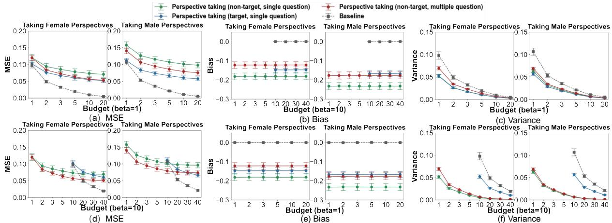
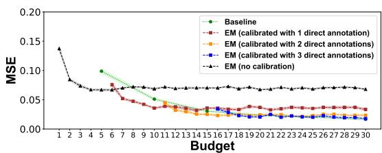
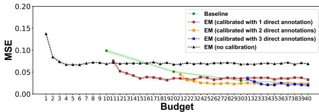
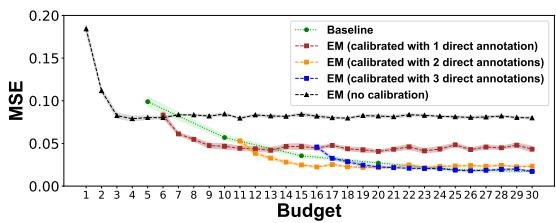
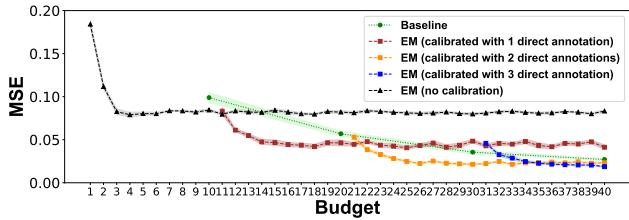
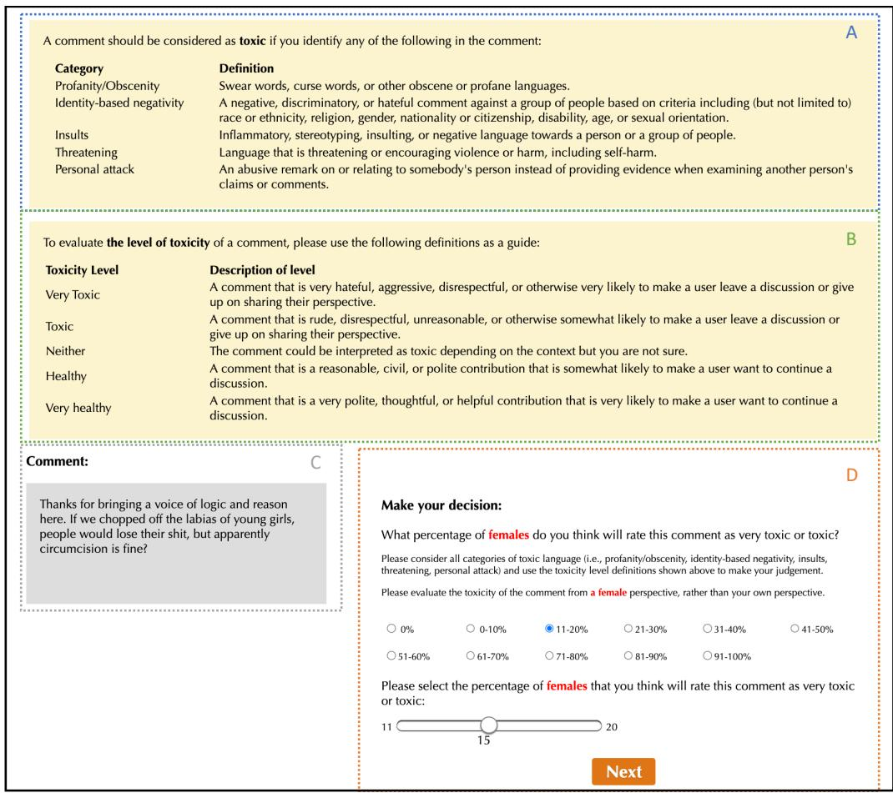

# Exploring the Cost-Effectiveness of Perspective Taking in Crowdsourcing Subjective Assessment: A Case Study of Toxicity Detection

Xiaoni Duan1, Zhuoyan Li1, Chien-Ju Ho2, Ming Yin1

1Purdue University, 2Washington University in St. Louis {duan79, li4178, mingyin}@purdue.edu {chienju.ho}@wustl.edu

## Abstract

Crowdsourcing has been increasingly utilized to gather subjective assessment, such as evaluating the toxicity of texts. Since there does not exist a single “ground truth” answer for subjective annotations, obtaining annotations to accurately reflect the opinions of different subgroups becomes a key objective for these subjective assessment tasks. Traditionally, this objective is accomplished by directly soliciting a large number of annotations from each subgroup, which can be costly especially when annotators of certain subgroups are hard to access. In this paper, using toxicity evaluation as an example, we explore the feasibility of using perspective taking—that is, asking annotators to take the point of views of a certain subgroup and estimate opinions within that subgroup—as a way to achieve this objective cost-efficiently. Our results show that compared to the baseline approach of directly soliciting annotations from the target subgroup, perspective taking could lead to better estimates of the subgrouplevel opinion when annotations from the target subgroup is costly while the budget is limited. Moreover, prompting annotators to take the perspectives of contrasting subgroups simultaneously can further improve the quality of the estimates. Finally, we find that aggregating multiple perspective-taking annotations while soliciting a small number of annotations directly from the target subgroup for calibration leads to the highest-quality estimates under limited budget.

## 1 Introduction

Crowdsourcing has become a ubiquitous paradigm for obtaining annotated data from people to enhance machine intelligence in a scalable and costeffective manner. Recent research has shown that some crowdsourcing annotation tasks, like toxicity and political stance evaluation (Goyal et al., 2022; Luo et al., 2020; Li et al., 2022), are fundamentally subjective—annotations on these tasks will be influenced by annotators’ identities, preferences, and personal opinions. For these subjective annotation tasks, a universal “ground truth” annotation does not exist by definition, since each annotator can establish their own “ground truth” for a task based on their subjective interpretations of the task. As such, a key objective for subjective annotation tasks is to accurately assess the distribution of annotations within different subgroups of annotators with varying characteristics. For instance, in the context of toxicity evaluation, a natural goal for collecting crowdsourced annotations is to understand the subgroup-level opinion, such as the fraction of people in different subgroups who will consider the text as toxic.

Traditionally, to achieve this goal, one can poll opinions directly within a subgroup by asking annotators in this subgroup to report their own annotation to the task (e.g., “Do you think this comment is toxic?”; we refer to this as the “direct annotation”). However, this approach suffers from two major limitations. First, to get a reasonably precise estimation of the subgroup-level opinion for a target subgroup, one may need to solicit a large number of direct annotations from annotators of this subgroup, which requires a high annotation budget. Moreover, annotators of the target subgroup can sometimes be difficult to get access to (e.g., when the target subgroup is under-represented in the annotator population or overloaded); thus, soliciting annotations from such subgroup may trigger additional administrative cost (e.g., for identifying annotators in the target subgroup). Given these limitations, one may naturally ask if crowdsourcing subjective assessment can be conducted more cost-effectively.

In this paper, we investigate a perspective-taking annotation approach for crowdsourcing subjective tasks—instead of providing their own annotations to a task, annotators are asked to actively take the view points of people from a target subgroup and then estimate the opinion statistics for that subgroup. This approach has the potential to increase the cost-effectiveness of crowdsourcing subjective assessment, because it involves direct estimation of the subgroup-level opinion (hence relax the requirement for a large number of annotations), and the annotation could be obtained from anyone regardless of their group identity (hence may decrease the cost for identifying hard-to-access annotators).

To explore whether the perspective-taking annotation approach can indeed improve the costefficiency of crowdsourcing subjective assessment, we conduct a case study on the toxicity evaluation tasks. Participants of our study were recruited from Prolific to evaluate the toxicity of online comments that are targeted at males or females, and we consider female and male annotators as the two subgroups of interests. To establish the values of the subgroup-level opinion statistics of interests— which are the female/male toxicity rate of comments (i.e., the percentage of females/males who consider a comment as toxic)—we first conducted a pilot study. In the pilot study, we adopted the direct annotation approach and asked at least 50 female (male) annotators to provide their own toxicity annotations on each comment in order to compute the female (male) toxicity rate for the comment. Then, in the formal experiment, participants were recruited to take the perspective of a target subgroup and directly estimate the toxicity rate for that subgroup.

Results of our study show that when the cost of soliciting annotations from different subgroups is the same, the perspective-taking annotation approach often results in worse estimates of the subgroup-level opinion than the traditional, direct annotation approach, as measured by the mean squared errors (MSE) of the estimates. This is because compared to the direct annotation approach, perspective taking often leads to estimates with higher bias despite the variance is reduced. However, when the cost of soliciting annotations from the target subgroup becomes higher, using the (cheap) perspective-taking annotations from annotators outside of the target subgroup could lead to higher-quality estimate of the subgroup-level opinion than the traditional approach, especially when the annotation budget is limited and annotators take contrasting perspectives simultaneously. Finally, we show that with a limited annotation budget, the highest-quality estimates of the subgrouplevel opinion of a target subgroup can be obtained by aggregating multiple (cheap) perspective-taking annotations from annotators outside of the target subgroup, while using a small number of (expensive) direct annotations from annotators within the target subgroup for calibration1.

## 2 Related Work

Early research and practice of crowdsourcing often view annotation tasks as objective, for which there exists the notion of “truth” in gold standard annotation. As such, the deviation of an annotation from the gold standard is often interpreted as a systematic error. This “error” can be caused by the lack of skills of the annotators, which inspires research on improving the quality of crowdsourced annotation by assigning the tasks to workers with suitable skills (Ho and Vaughan, 2012; Ho et al., 2013), or aggregating annotations from multiple workers while taking their skills into consideration (Dawid and Skene, 1979; Whitehill et al., 2009b; Ho et al., 2016). More recently, it has been recognized that such error can also reflect the “bias” resulted from the annotator’s own cognitive bias (La Barbera et al., 2020; Draws et al., 2022) or the task designs (Eickhoff, 2018; Zhuang et al., 2015). As a result, a variety of methods have been proposed to mitigate biases in crowdsourcing tasks. For example, Hube et al. (2019) proposed to mitigate biases by raising annotators’ awareness of biases. Different task designs were explored to encourage deeper deliberation from annotators and mitigate their biases (Schaekermann et al., 2018; Tang et al., 2019; Duan et al., 2020, 2022; Haq et al., 2022). Novel algorithms were designed to take worker bias into account during the label aggregation process (Gemalmaz and Yin, 2021; Wallace et al., 2022).

In contrast, the most recent research has advocated for the view that some crowdsourcing annotation tasks are inherently subjective. For example, studies showed that annotators’ demographics, identities, and beliefs impact the way they determine their annotations in hate speech detection tasks (Sap et al., 2021; Goyal et al., 2022; Sap et al., 2019; Prabhakaran et al., 2024). Ding et al. (2022) also found that for fine-grained sentiment analysis, annotators’ demographics have a significant impact on their annotations. Therefore, it is believed that for subjective annotation tasks, there is a need to embrace the diverse human interpretations and capture the broad spectrum of opinions and perspectives (Aroyo and Welty, 2014, 2013). Towards this goal, Díaz et al. (2022) highlighted the need for transparent documentation of crowdsourced dataset, including recording who the annotators are for crowdsourced annotations. Gordon et al. (2022) developed ML algorithms to model individual annotators and visualize the annotation disagreement within a group of annotators.

In this study, we focus on understanding how to estimate the subgroup-level opinions for crowdsourced subjective annotation tasks in a more costefficient way. To this end, we explore the feasibility of a novel annotation approach, i.e., engage annotators in perspective taking in their annotation tasks. Perspective taking is the act of perceiving and com prehending a situation by taking on the viewpoint of another person’s psychological experience (i.e. thoughts, feelings, and attitudes) (Johnson, 1975; Galinsky et al., 2008); it may allow the perspective taker to better represent others’ states and focus more on expressive cues that communicate information about the feelings of others (Zaki, 2014; Cowan et al., 2014). In our study, unlike the typical perspective taking approach where people are asked to take the perspective of a single person, we prompt annotators to take the perspective of a subgroup. Moreover, while previous research proposed the “vicarious annotation” method, asking annotators to directly estimate the annotation for a subgroup (Weerasooriya et al., 2023; Kahneman, 2021), the perspective taking annotation method explored in this study has a key difference—the vicarious annotation method assumes a subgroup as a collection of homogeneous individuals who share the same thinking and solicits a single annotation for a subgroup, while the perspective-taking annotation approach acknowledges that even for people within the same subgroup, their opinions may differ (for subjective judgements), so what is being solicited is the annotation statistics within the subgroup. While in this work, we choose to use toxicity evaluation as an example to examine the effectiveness of the perspective-taking annotation approach in estimating subgroup-level opinion, the approach itself is general and can be applied to understanding subgroup-level opinions for other subjective assessment tasks.

Finally, another concept that is related to perspective taking is “common sense.” According to Whiting and Watts (2024), “common sense” refers to those claims that almost everyone agrees (or disagrees), and everyone knows almost everyone else agrees (or disagrees). In this sense, we note that a claim about the annotation statistics in a subgroup (e.g., “50-55% of people in the subgroup will consider this comment as toxic”) is commensensical is neither a sufficient nor a necessary condition for the perspective-taking annotations to be effective for estimating subgroup annotation statistics. This is because (a) it is possible that everyone agreed on a commonsensical claim that is incorrect (i.e., commonsensical does not imply effective perspective-taking), and (b) it is also possible that each individual’s perspective-taking annotation has independently random errors, thus they do not agree on any claim yet accurate estimates of subgroup annotation statistics can be produced using their perspective-taking annotations due to the wisdom of the crowd phenomenon (Surowiecki, 2005) (i.e., effective perspective-taking does not imply commonsensical).

## 3 Study Design

To explore if the perspective-taking annotation approach can help estimate the subgroup-level opinions for subjective annotation tasks cost-effectively, we conduct a human-subject study on the tasks of toxicity evaluation.

## 3.1 Task domain: Toxicity evaluation

We used toxicity evaluation as the example of subjective annotation task in our case study. In a typical toxicity evaluation task, participants will be presented with a piece of text (e.g., an online comment) and be asked to evaluate the toxicity of the text. Previous studies have shown that such toxicity evaluation task is inherently subjective, as the criteria used for determining toxicity may largely vary with who the annotator is.

Thus, instead of seeking for obtaining a single “ground truth” annotation (which does not exist), a more appropriate objective for toxicity evaluation tasks is to collect annotations to accurately characterize the opinions within different subgroups, such as the fraction of people in different subgroups who will consider a text as toxic (for which a “ground truth” exists). Ideally, these subgrouplevel opinions can be established by soliciting a large number of N direct annotations to the question “Is this text toxic?” from annotators of each subgroup, but this can be very costly (due to the large N) or even impossible (when annotators from a subgroup are hard to access). Thus, in practice, one usually gets a much smaller number of n $( n \ll N )$ direct annotations from each subgroup to estimate the subgroup-level opinions, which can potentially affect the quality of the estimates. This motivates us to explore the feasibility of an alternative approach—engage annotators in perspective taking—for estimating the subgroup-level opinion more cost-efficiently.

## 3.2 Pilot study: Establish the benchmark

To enable the comparison of different approaches in cost-effectively estimating the subgroup-level opinion regarding the toxicity of texts, we first conducted a pilot study to establish the “ground truth” values of the subgroup-level opinions following the ideal procedure. In this study, we consider “females” and “males” as two subgroups of interests.

Specifically, participants of our pilot study were presented with 24 toxicity evaluation tasks. In each task, the participant was asked to review an online comment and classify its toxicity into one of the five levels: very healthy, healthy, neither, toxic, and very toxic. To minimize the ambiguity of the task, following the best practice (Goyal et al., 2022; Weld et al., 2021; Park et al., 2022; Lahnala et al., 2022), we provided to participants a guideline which included the definitions of different types of toxic language (e.g., profanity/obscenity, identitybased negativity, insults, threatening, personal attack); we told participants that a comment should be considered as toxic if any of these was identified in it. Following Cambo and Gergle (2022), we also provided to participants the definitions of each toxicity level to help them calibrate their judgement.

Comments used in the pilot study were taken from the dataset provided by Kennedy et al. (2020), which included 135,556 comments that were crawled from social networks. Along with the text of the comment, the dataset also came with an annotation of the victim group for each comment (i.e., which group may get hurt by the comment), as well as the toxicity of each comment predicted by a machine learning model. For the purpose of this study, we sampled a subset of 120 comments from this dataset (see Appendix A.2 for a few example comments in this sampled subset), with half of them aiming to harm females and the other half harming males. We also balanced toxicity levels of the comments in this subset by sampling an equal number of comments from the lowest, middle, and top one third of predicted toxic comments in the original dataset. Comments that participants saw in their tasks were randomly sampled from this subset, and for each comment, we obtained at least $N = 5 0$ annotations from female annotators and male annotators, respectively. After all annotations were collected, for each comment, we computed the fraction of female (male) annotators who labeled it as either “toxic” or “very toxic”; we referred to this fraction as the “female (male) toxicity rate” of the comment, and this serves as the “ground truth” of the subgroup-level opinion that we aim to estimate.

## 3.3 Experiment: Annotation via perspective taking

In our formal experiment, we adopted the perspective-taking annotation approach. That is, given a target subgroup X, we asked annotators to take the perspective ofsubgroup X and directly estimate the subgroup-level opinion for it. In the context of our toxicity evaluation tasks, we designed two types of perspective-taking questions:

Single Perspective: Given a comment, annotators are prompted to evaluate the comment from the perspective of a single, target subgroup X and answer the question “What percentage of [people of subgroup X] will rate this text as toxic or very toxic?”.

Multiple Perspectives: Given a comment, annotators are prompted to simultaneously evaluate the comment from the perspectives of all subgroups of interests and answer the question “What percentage of [people of subgroup G] will rate this text as toxic or very toxic?” for each subgroup G, including the target subgroup X.

Thus, in our experiment, participants were recruited to evaluate the toxicity of the 120 comments that we previously evaluated in our pilot study. Participants were firstly randomly assigned to answer either the single perspective question or multiple perspective taking question. For participants answering the single perspective question, they were assigned to take the perspective of either females or males on all comments they saw. In each task, the same definitions of different types of toxic language and different toxicity levels, as what we included in the pilot study, were showed to the participant. To provide their annotations on the percentage of people in subgroup G who will rate the comment in a task as toxic or very toxic, participants first select a range in intervals of 10%, and then use a slider to provide a precise percentage value within the range they select (see Appendix A.1 for an example of the interface).

## 3.4 Experimental procedure

We recruited participants for both our pilot study and the actual experiment via Prolific. We opened our study only to U.S. workers and directly distributed the study within the female or male worker pools on Prolific (i.e., we set gender as the screening condition for taking the study). As such, the number of female and male participants in our study was roughly the same. Each participant can only take our study once.

In the pilot study, upon the arrival of a participant, they went through a brief instruction of the task as well as a demographic survey (e.g., gender, race, age) before starting to work on the 24 toxicity evaluation tasks. We ensured that females and males each are the victim group in half of the comments that a participant saw, and the order of the comments were randomized. When calculating the female/male toxicity rate for each comment, only the data provided by participants who passed the attention check were used.

In the formal experiment where participants were asked to engage in perspective taking in their toxicity evaluation, we excluded participants of our pilot study from participation. Upon arrival, each participant was randomly assigned to take the single or multiple perspective question. Then, the participant was asked to go through the instructions, complete the demographic survey, and evaluate the toxicity of 24 comments that were randomly sampled from the 120 comments set. Again, we included an attention check question in this experiment to filter the inattentive participants.

The payment for the pilot study was \$1.2, and the payment for the formal experiment was \$1.6. Our study was approved by the IRB at our institution.

## 4 Results

A total of 546 participants participated in our pilot study and passed the attention check. Among these participants, 274 were female annotators and 272 were male annotators. As a result, we collected a total of 13,080 direct annotations in the pilot study. In addition, 258 participants participated in our formal experiment (see Table 1 for the demographics breakdown of these participants), leading to a total of 8,266 perspective-taking annotations in the formal experiment. Table 2 shows the average number of annotations we collected from female and male annotators, respectively, on each comment, for both the pilot study and the formal experiment. We used the data collected from the pilot study to compute the female/male toxicity rate for each comment and treated them as our ground-truth subgroup-level opinion. We then analyzed the data obtained from the formal experiment to understand whether leveraging perspective taking improves the cost-effectiveness of crowdsourced subjective assessment under varying annotation budgets.

<table><tr><td rowspan=1 colspan=1></td><td rowspan=1 colspan=1># of femaleannotators</td><td rowspan=1 colspan=1># of maleannotators</td></tr><tr><td rowspan=1 colspan=1>Female Perspectives (Single)</td><td rowspan=1 colspan=1>42</td><td rowspan=1 colspan=1>37</td></tr><tr><td rowspan=1 colspan=1>Male Perspectives (Single)</td><td rowspan=1 colspan=1>46</td><td rowspan=1 colspan=1>39</td></tr><tr><td rowspan=1 colspan=1>Multiple Perspectives</td><td rowspan=1 colspan=1>44</td><td rowspan=1 colspan=1>50</td></tr></table>

Table 1: Summary statistics for annotators’ demographics (gender) in the formal experiment
<table><tr><td rowspan=1 colspan=1></td><td rowspan=1 colspan=1>Femaleannotators</td><td rowspan=1 colspan=1>Maleannotators</td></tr><tr><td rowspan=1 colspan=1>Pilot study</td><td rowspan=1 colspan=1>54.8</td><td rowspan=1 colspan=1>54.2</td></tr><tr><td rowspan=1 colspan=1>Female Perspective (Single)</td><td rowspan=1 colspan=1>8.4</td><td rowspan=1 colspan=1>7.4</td></tr><tr><td rowspan=1 colspan=1>Male Perspective (Single)</td><td rowspan=1 colspan=1>9.0</td><td rowspan=1 colspan=1>7.6</td></tr><tr><td rowspan=1 colspan=1>Multiple Perspectives</td><td rowspan=1 colspan=1>8.7</td><td rowspan=1 colspan=1>9.6</td></tr></table>

Table 2: Average number of annotators per comment in both the pilot study and the formal experiment

Specifically, in the context of toxicity evaluation, forming an estimate of the subgroup-level opinion (e.g., subgroup-level toxicity rate) for a target subgroup X requires the construction of an estimator. Traditionally, the baseline estimator can be obtained by soliciting n direct annotations from annotators of subgroup X (i.e., they each answer “Is this comment toxic?”) and then computing the fraction of annotators among them who rate the comment as toxic, with each annotation costing cX. On the other hand, the perspective-taking-based estimator can be obtained by soliciting n perspectivetaking annotations from any annotator (i.e., they answer “What percentage of people in subgroup X will rate this comment as toxic?”) and averaging their reported fractions, with each annotation from annotators of subgroup G costing cG. For simplicity, we assume that the cost for soliciting annotations from any annotator outside of the target subgroup X $( \mathrm { i } . \mathrm { e } . , c _ { \bar { X } } )$ is the same, and $c _ { X } = \beta c _ { \bar { X } }$ Note that as long as an annotation is solicited from the target subgroup X, it costs cX regardless of whether the annotation is a direct annotation or perspective-taking annotation.

  
Figure 1: The mean squared error (MSE), bias, and variance in estimating subgroup-level toxicity rate for the baseline, the perspective-taking-based estimator with single perspective questions, and the perspective-taking estimator with multiple perspectives questions, as the annotation budget for one task varies. (a)–(c): the cost ratio of annotations from the non-target and target subgroup is 1:1 (i.e., β = 1); (d)–(e): the cost ratio of annotations from the non-target and target subgroup is 1:10 (β = 10). In each figure, the left sub-figure is for estimating the female toxicity rate of comments (the target subgroup is female), while the right sub-figure is for estimating the male toxicity rate of comments (the target subgroup is male). Error bars represent the standard errors of the mean.

Following the standard way for evaluating the quality of an estimator, we look into three metrics— the mean squared error (MSE), bias, and variance— of both the baseline and perspective-taking-based estimator. Estimators with lower MSE, closer-tozero bias, and lower variance are better. In particular, given the number of annotations to be solicited n, we generated K = 1, 000 bootstrapped samples of n annotations for both estimators—For the baseline estimator, the bootstrapping was conducted within the direct annotations from annotators of the target subgroup X in our pilot study; for the perspective-taking-based estimator, the bootstrapping was conducted within the perspective-taking annotations from annotators in our formal experiment when they took the perspective of the target subgroup X, either by answering the single perspective or multiple perspectives question. We then computed the MSE, bias, and variance of the two estimators using these bootstrapped samples2.

Figure 1 compares the quality of the two estimators when the annotation budget varies (i.e., when n varies), both for the case when annotations from all subgroups are equally costly (β = 1, Figure 1a– 1c) and when annotations from the target subgroup are more costly than those from the non-target subgroup (β = 10, Figure 1d–1f). We make the following important observations:

Perspective-taking is worse than direct annotation approach in estimating subgroup-level opinions when annotations from all subgroups are equally costly, mainly because it leads to higher bias. Figure 1a–1c presents the comparisons when the annotation cost for annotators from the target subgroup is the same as other subgroups (i.e., β = 1). We find that the subgroup-level opinion estimates derived from perspective-taking annotations always exhibit a higher level of MSE than the estimates derived from direct annotations, regardless of the level of annotation budget (Figure 1a). A closer look suggests that while the perspective-taking-based estimator consistently shows a lower level of variance than the baseline estimator (Figure 1c), it suffers from a much higher level of bias (Figure 1b)3, which is the main contributor to its high MSE. Interestingly, we also find that aligning the perspective that an annotator takes with their own group identity, tends to decrease the bias and the MSE of the perspective-taking-based estimator (see the comparison between the blue and green curves in Figure 1a–1b).

Perspective-taking can lead to higher-quality estimates than direct annotation approach when annotations from the target subgroups are costly while the annotation budget is limited. Figure 1d– 1f show the comparisons when soliciting annotations from the target subgroup is much more costly.

In this scenario, we find that obtaining perspectivetaking annotations from annotators outside ofthe target subgroup shows a degree of advantage over the direct annotation approach, when the annotation budget is limited. For example, as shown in Figure 1d, when the annotation budget $B \leq 1 0$ instead of soliciting a very small number of costly $( \mathbf { e . g . } , c _ { X } = 1 0 )$ direct annotations from annotators of the target subgroup, one may obtain a more accurate estimate (i.e., an estimate with lower MSE) of the subgroup-level opinion by collecting cheap $( { \bf e . g . } , c _ { \bar { X } } = 1 )$ perspective-taking annotations from annotators outside of the target subgroup.

Prompting annotators to take contrasting perspectives simultaneously can further improve the quality of the estimates. We compare the bias and MSE of the perspective-taking-based estimator when non-target subgroup annotators were asked to only take the perspective of the target subgroup, versus when they were asked to take the perspectives of multiple subgroups simultaneously (see the comparison between the green and brown curve in Figure 1a and Figure 1b). We find that taking multiple perspectives simultaneously results in a less biased estimate of the subgroup-level opinion for the target subgroup and the decrease in bias also leads to a decreased level of MSE. As such, when annotations from the target subgroup is costly, by asking annotators outside of the target subgroup to evaluate the perspectives of multiple subgroups simultaneously, the resulting perspective-takingbased estimator of subgroup-level opinion may exhibit advantage over the baseline estimator for a wider range ofannotation budget.

## 5 Post-hoc Processing: Label Aggregation

So far, the perspective-taking-based estimator we constructed is simple—we just took an average of the n perspective-taking annotations obtained to get an estimate of the opinion for the target subgroup. However, research on crowdsourcing label aggregation (Whitehill et al., $^ { 2 0 0 9 { \mathrm { a } } , \mathbf { b } ; }$ Zheng et al., 2017) suggests that we may further improve the quality of the estimates by cleverly combining multiple perspective-taking annotations together and inferring the ground-truth value for the subgroup-level opinion. In particular, the high bias presented in perspective-taking annotations suggests that it may be helpful to supplement the perspective-taking annotations with a small number of direct annotations from the target subgroup to “calibrate” them.

Thus, in this section, we explore if we can design post-hoc label aggregation algorithms to improve the quality of the subgroup-level opinion estimates by combining some potentially costly direct annotations from the target subgroup with many more cheap perspective-taking annotations produced by annotators outside of the target subgroup.

## 5.1 Problem setup

Consider a scenario with K subjective annotation tasks, M target subgroup annotators, and N nontarget subgroup annotators, and the goal is to estimate the target subgroup’s opinion $f _ { j }$ on each task $j \in \{ 1 , \cdots , K \}$ . Suppose $p _ { i j }$ denotes the perspective-taking annotation provided by the nontarget subgroup annotator i on task $j ,$ , and $l _ { w j }$ denotes the direct annotation provided by the target subgroup annotator w on task $j .$ . For example, when estimating the female toxicity rate of a comment, $p _ { i j } \in [ 0 , 1 ]$ represents male annotator i’s perspective-taking annotation regarding the fraction of females who will consider the comment in task $j$ as toxic, $l _ { w j } \in \{ 0 , 1 \}$ represents female annotator $w ' s$ binary annotation regarding whether she considers the comment in task $j$ as toxic $( l _ { w j } = 1 )$ or not $( l _ { w j } = 0 )$ , and $f _ { j } \in [ 0 , 1 ]$ represents the fraction of females who will consider the comment in task $j$ as toxic. When annotator $i$ (or w) does not provide any annotation on task $j ,$ we set $p _ { i j }$ (or $l _ { w j } )$ to $\emptyset$

We assume that each non-target subgroup annotator exhibits biases of $b _ { i }$ in perspective taking, and $b _ { i }$ is affected by the subgroup-level opinion $f _ { j }$ . Specifically, when the task is toxic $( f _ { j } \ge 0 . 5 )$ they exhibit bias $b _ { t , i }$ , and when the task is healthy $( f _ { j } < 0 . 5 )$ , they exhibit bias $b _ { h , i }$ . This assumption is based on the observation that in perspective taking, annotators tend to underestimate the toxicity for toxic comments and overestimate the toxicity for healthy comments. We assume annotator i’s perspective-taking annotation on task $j ,$ i.e., $p _ { i j }$ , follows a normal distribution centered around the sum of the ground truth subgroup-level opinion of that task $( \mathrm { i . e . , ~ } f _ { j } )$ and the bias of annotator i $( \mathrm { i } . \mathrm { e } . , b _ { i } )$ . Formally, we have $P ( p _ { i j } | f _ { j } , b _ { i } ) \sim$ $\mathcal { N } ( f _ { j } + b _ { i } , \sigma ^ { 2 } )$ , where $\sigma$ is the variance. A smaller $\sigma$ indicates a smaller variation of random error. The goal is to estimate $f _ { j }$ for all tasks given the available perspective-taking and direct annotations, i.e., the set of $\{ p _ { i j } \}$ and $\{ l _ { w j } \}$

  
(a) Taking female perspective (β = 5)

  
(b) Taking female perspective (β = 10)

  
(c) Taking male perspective (β = 5)

  
(d) Taking male perspective (β = 10)  
Figure 2: The mean squared error (MSE) of different estimators in estimating each comment’s toxicity rate among females (a, b) or males (c, d), when the annotation budget for one task varies. (a), (c): the cost ratio of annotations from the non-target and target subgroup is $1 { : } 5 ( \mathrm { i . e . , } \beta = 5 ) { : } ( \mathrm { b } )$ , (d): the cost ratio of annotations from the non-target and target subgroup is $1 { : } 1 0 \ ( \mathrm { i . e . , } \beta = 1 0 )$ . Error shades represent the standard errors of the mean.

## 5.2 Model Inference

We adapted the incremental Expectation-Maximization algorithm proposed by Hung et al. (2015) to estimate the maximum likelihood estimate of the ground truth value of the subgrouplevel opinion $f _ { j }$ . In this EM algorithm, we input the direct annotations from the target subgroup as the “calibration $l a b e l s ^ { \prime }$ during some iteration. Specifically, as we repeat the EM algorithm for multiple iterations, we record the sets of bias estimated for each non-target subgroup annotator $B _ { i } = \{ b _ { i } ^ { 0 } , b _ { i } ^ { 1 } , \ldots , b _ { i } ^ { Q } \}$ , where $b _ { i } ^ { q }$ is the estimated bias of annotator i at the end of the q-th iteration $( q ~ \in ~ \{ 1 , \cdot \cdot \cdot , Q \} )$ We also record the set of inferred subgroup-level opinion for each task $F _ { j } = \{ f _ { j } ^ { 0 } , f _ { j } ^ { \bar { 1 } } , . . . , f _ { j } ^ { Q } \}$ , where $f _ { j } ^ { q }$ is the inferred subgroup-level opinion of interests for task j at the end of the q-th iteration $( q \in \{ 1 , \cdots , Q \} )$ . Then, in the E-step of the $( Q + 1 )$ -th iteration, if we do not conduct calibration using the target subgroup annotators’ direct annotation, we will update the inference of $f _ { j }$ as follows:

$$
f _ { j } ^ { Q + 1 } = \frac { \sum _ { i \in \{ i : p _ { i j } \neq \emptyset \} } ( p _ { i j } - b _ { i } ^ { Q } ) } { | \{ i : p _ { i j } \neq \emptyset \} | }
$$

and $b _ { i } ^ { Q }$ is decided by

$$
b _ { i } ^ { Q } = b _ { t , i } ^ { Q } \cdot { \bf 1 } ( f _ { j } ^ { Q } \geq 0 . 5 ) + b _ { h , i } ^ { Q } \cdot { \bf 1 } ( f _ { j } ^ { Q } < 0 . 5 )
$$

where 1( ) is the indicator function.

However, if we decide to use the direct annotations from the target subgroup annotators for calibration in the E-step of the $( Q + 1 )$ -th iteration, we will replace $f _ { j } ^ { Q + 1 }$ as:

$$
f _ { j } ^ { Q + 1 } = \frac { \alpha } { W _ { j } } \sum _ { w \in \{ W _ { j } \} } l _ { w j } + ( 1 - \alpha ) f _ { j } ^ { Q }
$$

where $W _ { j } = \{ w : l w j \neq \emptyset \}$ and $\alpha \in [ 0 , 1 ]$ is the learning rate.

In the M-step, we calculate the complete data likelihood by accumulating the probability density functions of $P ( p _ { i j } | f _ { j } , b _ { i } ) \sim \mathcal { N } ( f _ { j } + b _ { i } , \sigma ^ { 2 } )$ . We then search for $b _ { i } ^ { Q + 1 }$ values that maximize the expected value of the complete data log likelihood, and we update the bias terms as:

$$
b _ { t , i } = \frac { \sum _ { j \in \{ j : p _ { i j } \neq \emptyset \wedge f _ { j } \geq 0 . 5 \} } ( p _ { i j } - f _ { j } ^ { Q + 1 } ) } { | j : \{ j : p _ { i j } \neq \emptyset \wedge f _ { j } \geq 0 . 5 \} | }
$$

Similarly, $b _ { h , i }$ is the aggregated mean of $( p _ { i j } -$ $f _ { j } ^ { Q + 1 } )$ on tasks with $f _ { j } < 0 . 5$

This algorithm involves three hyperparameters: the learning rate $\alpha ,$ the timing for conducting calibration (at the $Q ^ { * }$ -th iteration), and the number of iterations R to perform after calibration before terminating the algorithm to avoid overfitting. We use grid search to identify the optimal combinations of hyperparameter values through cross validation.

## 5.3 Evaluation

We construct a few estimators to estimate the subgroup-level opinion for the target subgroup:

Baseline estimator: For each comment, we sample n direct annotations from the target subgroup annotators in our pilot study, and compute the fraction of annotators among them who consider the comment as toxic as the estimate. Obtaining this estimate triggers a cost of $n c x$

EM (no calibration) estimator: For each comment, we sample n perspective-taking annotations from the non-target subgroup annotators in our formal experiment (with the single perspective question design). We then use the proposed EM algorithm, without conducting calibration in any iteration, to aggregate these annotations and obtain the subgroup-level opinion estimate. Obtaining this estimate costs $n c _ { \bar { X } }$

EM (calibrated with L direct annotations) estimator: For each comment, we sample n perspectivetaking annotations from the non-target subgroup annotators in our formal experiment (with the single perspective question design). We also sample L direct annotations from the target subgroup annotators in our pilot study. We then use the proposed EM algorithm, while using the L direct annotations on each comment for calibration, to aggregate these annotations and obtain the subgroup-level opinion estimate. Obtaining this estimate triggers a cost of $n c _ { \bar { X } } + L c _ { X }$ . In our evaluation, we consider $L \in \{ 1 , 2 , 3 \}$

The comparison of the performance of different estimators is shown in Figure 2, and we make a few important observations based on the figure: (1) Whenever the annotation budget for a task allows for the solicitation of some direct annotations from the target subgroup, using these direct annotations for calibration in the EM algorithm almost always leads to a higher-quality estimate of the subgrouplevel opinion than the EM estimator without calibration. (2) When the annotation budget per task is very large, obtaining direct annotation from annotators of the target subgroup (i.e., the baseline estimator) often leads to the highest-quality estimate of the subgroup-level opinion. In contrast, when the annotation budget per task is limited, the highestquality estimate of the subgroup-level opinion is obtained by using the proposed EM algorithm to aggregate multiple cheap perspective-taking annotations, while using a small number of costly direct annotations for calibration. (3) The more costly soliciting annotations from the target subgroup is (i.e. the larger $\beta$ is), the EM estimator with calibration outperforms the baseline estimator for a wider range of annotation budget.

## 6 Conclusions

In this paper, we introduce a novel approach of leveraging perspective taking to characterize the subgroup-level opinion for subjective annotation tasks. We conduct an experimental study, using toxicity evaluation tasks as an example, to explore the cost-effectiveness of this approach. Results of our experiment show that compared to the baseline approach of directly polling annotators of a target subgroup to estimate the opinions within that subgroup, estimation obtained from perspectivetaking annotations generally exhibits lower variance but higher bias. As such, the perspectivetaking-based estimator of the subgroup-level opinion only shows lower mean squared error than the traditional, direct-annotation-based estimator when soliciting annotations from the target subgroup is costly yet the annotation budget is limited. However, we find a approach to further improve the costeffectiveness of the perspective-taking annotation approach by using the expectation-maximization algorithm to aggregate multiple cheap perspectivetaking annotations while using a small number of costly direct annotations from the target subgroup for calibration.

## 7 Limitations

## 7.1 Limitations and future work

Our study is based on crowd workers’ toxicity evaluation annotations on 120 comments. We acknowledge that the size of this dataset is limited, making it unclear how much we may generalize findings of this study to other settings. However, this small dataset is carefully curated with balanced victim groups and balanced toxicity levels, and we hope this careful curation of the dataset increases the generalizability of our results. Our study is limited by the task domain we selected and the way that we operationalized the perspective-taking annotation tasks. We chose to focus on annotations in toxicity evaluation tasks in this case study because of the subjectivity of toxicity evaluation. We further focused on estimating subgroup-level opinion for subgroups defined by sex, and the subgroup-level opinion that we chose to study (i.e., female/male toxicity rate) was also a continuous value involving a single subgroup. Future research should be conducted to explore the generalizability of our results to different types of subjective tasks, for subgroups of annotators defined in different ways, and for subgroup-level annotation properties that are discrete or even involve multiple subgroups. As we find that a key limitation of the perspective-taking annotations is the introduction of biases, additional research should be carried out to explore effective methods in reducing annotator’s bias in perspective taking. We hope this study can inspire more research in re-examining the designs of subjective annotation tasks to better serve the purpose of capturing the diversity of perspectives.

## 7.2 Ethical Considerations

While our study suggests that engaging annotators in perspective-taking could improve the costefficiency of crowdsourced subjective assessment, we emphasize that we do not advocate for substituting the direct annotation approach with the approach of recruiting non-target subgroup annotators and inferring the target subgroup’s opinion through perspective-taking. In fact, our study showed that annotators have limited perspective-taking capabilities (i.e., their perspective-taking annotations suffer from high bias), and when the annotation budget is sufficient, directly polling annotations from the target subgroup is the optimal solution for estimating subgroup-level opinions. However, our results show the promise of accurately estimating the subgroup-level opinions even when the annotation budget is limited. This can be done through aggregating a large amount of perspective-taking annotations with at least some direct annotations for calibration, which again highlights the value and necessity of engaging with the stakeholders (i.e., annotators from the target subgroup).

## References

Lora Aroyo and Chris Welty. 2013. Crowd truth: Harnessing disagreement in crowdsourcing a relation extraction gold standard. WebSci2013. ACM, 2013(2013).

Lora Aroyo and Chris Welty. 2014. The three sides of crowdtruth. Human Computation, 1(1).

Scott Allen Cambo and Darren Gergle. 2022. Model positionality and computational reflexivity: Promoting reflexivity in data science. In CHI Conference on Human Factors in Computing Systems, pages 1–19.

David G Cowan, Eric J Vanman, and Mark Nielsen. 2014. Motivated empathy: The mechanics of the empathic gaze. Cognition and Emotion, 28(8):1522– 1530.

A. P. Dawid and A. M. Skene. 1979. Maximum likeihood estimation of observer error-rates using the EM algorithm. Applied Statistics, 28:20–28.

Mark Díaz, Ian Kivlichan, Rachel Rosen, Dylan Baker, Razvan Amironesei, Vinodkumar Prabhakaran, and Emily Denton. 2022. Crowdworksheets: Accounting for individual and collective identities underlying crowdsourced dataset annotation. In 2022 ACM Conference on Fairness, Accountability, and Transparency, pages 2342–2351.

Yi Ding, Jacob You, Tonja-Katrin Machulla, Jennifer Jacobs, Pradeep Sen, and Tobias Höllerer. 2022. Impact of annotator demographics on sentiment dataset labeling. Proceedings of the ACM on Human-Computer Interaction, 6(CSCW2):1–22.

Tim Draws, David La Barbera, Michael Soprano, Kevin Roitero, Davide Ceolin, Alessandro Checco, and Stefano Mizzaro. 2022. The effects of crowd worker biases in fact-checking tasks. In 2022 ACM Conference on Fairness, Accountability, and Transparency, pages 2114–2124.

Xiaoni Duan, Chien-Ju Ho, and Ming Yin. 2020. Does exposure to diverse perspectives mitigate biases in crowdwork? an explorative study. In Proceedings of the aaai conference on human computation and crowdsourcing, volume 8, pages 155–158.

Xiaoni Duan, Chien-Ju Ho, and Ming Yin. 2022. The influences of task design on crowdsourced judgement: A case study of recidivism risk evaluation. In Proceedings of the ACM Web Conference 2022, pages 1685–1696.

Carsten Eickhoff. 2018. Cognitive biases in crowdsourcing. In Proceedings of the Eleventh ACM International Conference on Web Search and Data Mining, pages 162–170. ACM.

Adam D Galinsky, William W Maddux, Debra Gilin, and Judith B White. 2008. Why it pays to get inside the head of your opponent: The differential effects of perspective taking and empathy in negotiations. Psychological science, 19(4):378–384.

Meric Altug Gemalmaz and Ming Yin. 2021. Accounting for confirmation bias in crowdsourced label aggregation. In IJCAI, pages 1729–1735.

Mitchell L Gordon, Michelle S Lam, Joon Sung Park, Kayur Patel, Jeff Hancock, Tatsunori Hashimoto, and Michael S Bernstein. 2022. Jury learning: Integrating dissenting voices into machine learning models. In Proceedings ofthe 2022 CHI Conference on Human Factors in Computing Systems, pages 1–19.

Nitesh Goyal, Ian D Kivlichan, Rachel Rosen, and Lucy Vasserman. 2022. Is your toxicity my toxicity? exploring the impact of rater identity on toxicity annotation. Proceedings ofthe ACM on Human-Computer Interaction, 6(CSCW2):1–28.

Ehsan-Ul Haq, Yang K Lu, and Pan Hui. 2022. It’s all relative! a method to counter human bias in crowdsourced stance detection of news articles. Proceedings of the ACM on Human-Computer Interaction, 6(CSCW2):1–25.

Chien-Ju Ho, Rafael Frongillo, and Yiling Chen. 2016. Eliciting categorical data for optimal aggregation. Advances In Neural Information Processing Systems, 29.

Chien-Ju Ho, Shahin Jabbari, and Jennifer Wortman Vaughan. 2013. Adaptive task assignment for crowdsourced classification. In Proceedings ofthe 30th International Conference on Machine Learning, pages 534–542.

Chien-Ju Ho and Jennifer Vaughan. 2012. Online task assignment in crowdsourcing markets. In Proceedings ofthe AAAI conference on artificial intelligence, volume 26, pages 45–51.

Christoph Hube, Besnik Fetahu, and Ujwal Gadiraju. 2019. Understanding and mitigating worker biases in the crowdsourced collection of subjective judgments. In Proceedings ofthe 2019 CHI Conference on Human Factors in Computing Systems, page 407. ACM.

Nguyen Quoc Viet Hung, Duong Chi Thang, Matthias Weidlich, and Karl Aberer. 2015. Minimizing efforts in validating crowd answers. In Proceedings ofthe 2015 ACM SIGMOD international conference on management ofdata, pages 999–1014.

David W Johnson. 1975. Cooperativeness and social perspective taking. Journal ofPersonality and Social Psychology, 31(2):241.

D Kahneman. 2021. Noise: aflaw in humanjudgment. HarperCollins.

Chris J Kennedy, Geoff Bacon, Alexander Sahn, and Claudia von Vacano. 2020. Constructing interval variables via faceted rasch measurement and multitask deep learning: a hate speech application. arXiv preprint arXiv:2009.10277.

David La Barbera, Kevin Roitero, Gianluca Demartini, Stefano Mizzaro, and Damiano Spina. 2020. Crowdsourcing truthfulness: The impact of judgment scale and assessor bias. Advances in Information Retrieval, 12036:207.

Allison Lahnala, Charles Welch, Béla Neuendorf, and Lucie Flek. 2022. Mitigating toxic degeneration with empathetic data: Exploring the relationship between toxicity and empathy. arXiv preprint arXiv:2205.07233.

Zhuoyan Li, Zhuoran Lu, and Ming Yin. 2022. Towards better detection of biased language with scarce, noisy, and biased annotations. In Proceedings ofthe 2022 AAAI/ACM Conference on AI, Ethics, and Society, pages 411–423.

Yiwei Luo, Dallas Card, and Dan Jurafsky. 2020. Detecting stance in media on global warming. arXiv preprint arXiv:2010.15149.

Joon Sung Park, Joseph Seering, and Michael S Bernstein. 2022. Measuring the prevalence of anti-social behavior in online communities. Proceedings ofthe ACM on Human-Computer Interaction, 6(CSCW2):1– 29.

Vinodkumar Prabhakaran, Christopher Homan, Lora Aroyo, Aida Mostafazadeh Davani, Alicia Parrish, Alex Taylor, Mark Díaz, Ding Wang, and Gregory Serapio-García. 2024. Grasp: A disagreement analysis framework to assess group associations in perspectives. In Proceedings of the 2024 Conference of the North American Chapter ofthe Associationfor Computational Linguistics: Human Language Technologies (Volume 1: Long Papers), pages 3473–3492.

Maarten Sap, Dallas Card, Saadia Gabriel, Yejin Choi, and Noah A Smith. 2019. The risk of racial bias in hate speech detection. In Proceedings of the 57th annual meeting of the association for computational linguistics, pages 1668–1678.

Maarten Sap, Swabha Swayamdipta, Laura Vianna, Xuhui Zhou, Yejin Choi, and Noah A Smith. 2021. Annotators with attitudes: How annotator beliefs and identities bias toxic language detection. arXiv preprint arXiv:2111.07997.

Mike Schaekermann, Joslin Goh, Kate Larson, and Edith Law. 2018. Resolvable vs. irresolvable disagreement: A study on worker deliberation in crowd work. Proceedings ofthe ACM on Human-Computer Interaction, 2(CSCW):1–19.

J. Surowiecki. 2005. The Wisdom of Crowds. Knopf Doubleday Publishing Group.

Wei Tang, Ming Yin, and Chien-Ju Ho. 2019. Leveraging peer communication to enhance crowdsourcing. In The World Wide Web Conference, pages 1794– 1805.

Shaun Wallace, Tianyuan Cai, Brendan Le, and Luis A Leiva. 2022. Debiased label aggregation for subjective crowdsourcing tasks. In CHI Conference on Human Factors in Computing Systems Extended Abstracts, pages 1–8.

Tharindu Cyril Weerasooriya, Sujan Dutta, Tharindu Ranasinghe, Marcos Zampieri, Christopher M Homan, and Ashiqur R KhudaBukhsh. 2023. Vicarious offense and noise audit of offensive speech classifiers: unifying human and machine disagreement on what is offensive. arXiv preprint arXiv:2301.12534.

Henry Weld, Guanghao Huang, Jean Lee, Tongshu Zhang, Kunze Wang, Xinghong Guo, Siqu Long, Josiah Poon, and Soyeon Caren Han. 2021. Conda: a contextual dual-annotated dataset for in-game toxicity understanding and detection. arXiv preprint arXiv:2106.06213.

Jacob Whitehill, Ting fan Wu, Jacob Bergsma, Javier R. Movellan, and Paul L. Ruvolo. 2009a. Whose vote should count more: Optimal integration of labels from labelers of unknown expertise. In Advances in Neural Information Processing Systems (NIPS).

Jacob Whitehill, Ting-fan Wu, Jacob Bergsma, Javier Movellan, and Paul Ruvolo. 2009b. Whose vote should count more: Optimal integration of labels from labelers of unknown expertise. Advances in neural information processing systems, 22.

Mark E Whiting and Duncan J Watts. 2024. A framework for quantifying individual and collective common sense. Proceedings ofthe National Academy of Sciences, 121(4):e2309535121.

Jamil Zaki. 2014. Empathy: a motivated account. Psychological bulletin, 140(6):1608.

Yudian Zheng, Guoliang Li, Yuanbing Li, Caihua Shan, and Reynold Cheng. 2017. Truth inference in crowdsourcing: Is the problem solved? Proceedings of the VLDB Endowment, 10(5):541–552.

Honglei Zhuang, Aditya Parameswaran, Dan Roth, and Jiawei Han. 2015. Debiasing crowdsourced batches. In Proceedings of the 21th ACM SIGKDD International Conference on Knowledge Discovery and Data Mining, pages 1593–1602.

## A Appendices

  
Figure A1: Interface of toxicity evaluation task with perspective taking. Definitions of different types of toxicity language (Part A) and toxicity levels (Part B) were shown to participants as a guideline for each task. The comment to be evaluated was shown in Part C. In this task, participants were asked to take the perspectives of females and estimate the percentage of females who will consider the comment as toxic or very toxic in Part D.

A.2 Dataset Examples
<table><tr><td rowspan=1 colspan=1>Victim group</td><td rowspan=1 colspan=1>Comment</td><td rowspan=1 colspan=1>Toxicity RateFemale</td><td rowspan=1 colspan=1>Toxicity RateMale</td></tr><tr><td rowspan=1 colspan=1>Female</td><td rowspan=1 colspan=1>I believe what makes a women beautiful is her beliefin herself in every way. Has self confidence and astrength over and above board. Loves helping andgiving from the goodness of her heart. That&#x27;s a verybeautiful women!</td><td rowspan=1 colspan=1>0.000</td><td rowspan=1 colspan=1>0.015</td></tr><tr><td rowspan=1 colspan=1>Female</td><td rowspan=1 colspan=1>Thanks for bringing a voice of logic and reason here.If we chopped off the labias of young girls, peoplewould lose their shit, but apparently circumcision isfine?</td><td rowspan=1 colspan=1>0.526</td><td rowspan=1 colspan=1>0.357</td></tr><tr><td rowspan=1 colspan=1>Female</td><td rowspan=1 colspan=1>My timeline be full of hating asses sometimes likewhy do some girls love hating on other girls theirsso many baddies out there y’all be mad cause y&#x27;allwanna feel better all the time like nooo everyone&#x27;sbeautiful but ok go off</td><td rowspan=1 colspan=1>0.472</td><td rowspan=1 colspan=1>0.509</td></tr><tr><td rowspan=1 colspan=1>Female</td><td rowspan=1 colspan=1>All they prove to be is a bunch of fruitless lackingmorals overloaded estrogen driven bitches! All ofthem are USELESS to any society!</td><td rowspan=1 colspan=1>0.981</td><td rowspan=1 colspan=1>0.945</td></tr><tr><td rowspan=1 colspan=1>Male</td><td rowspan=1 colspan=1>My new blog—comment, share, let&#x27;s raise awarenessof the huge issue of Male Mental Health #selfcare#mentalhealth #mindset</td><td rowspan=1 colspan=1>0.000</td><td rowspan=1 colspan=1>0.000</td></tr><tr><td rowspan=1 colspan=1>Male</td><td rowspan=1 colspan=1>Men these days complain of the quality of womenthese days, but consistently ghost good girls their agefor dumbass 20-yr olds...</td><td rowspan=1 colspan=1>0.472</td><td rowspan=1 colspan=1>0.560</td></tr><tr><td rowspan=1 colspan=1>Male</td><td rowspan=1 colspan=1>The majority of people who think about chad andtyrone is incels. And it&#x27;s also sad how they expectwomen to date them despite them calling them foids(a.k.a subhuman).</td><td rowspan=1 colspan=1>0.574</td><td rowspan=1 colspan=1>0.44</td></tr><tr><td rowspan=1 colspan=1>Male</td><td rowspan=1 colspan=1>The old man got lucky that he wasn&#x27;t beaten until hewas left in a puddle of his own piss and vomit. Whata moronic, incontinent, geriatric waste of oxygen.</td><td rowspan=1 colspan=1>0.981</td><td rowspan=1 colspan=1>0.945</td></tr></table>

Table A1: Examples of comments in our dataset. We select comments for which the victim group is either females or males. For each example comment, we present the female toxicity rate and male toxicity rate that we estimated based on direction annotations collected in our pilot study.