# FACTTRACK: Time-Aware World State Tracking in Story Outlines

Zhiheng Lyu1 Kevin Yang2 Lingpeng Kong1 Daniel Klein2

1The University of Hong Kong, 2UC Berkeley

{zhlyu,lpk}@cs.hku.hk, {yangk,klein}@berkeley.edu

## Abstract

While accurately detecting and correcting fac tual contradictions in language model outputs has become increasingly important as their capabilities improve, doing so is highly challenging. We propose a novel method, FACTTRACK, for tracking atomic facts and addressing factual contradictions. Crucially, FACTTRACK also maintains time-aware validity intervals for each fact, allowing for change over time. At a high level, FACTTRACK consists of a four-step pipeline to update a world state data structure for each new event: (1) decompose the event into directional atomic facts; (2) determine the validity interval of each atomic fact using the world state; (3) detect contradictions with existing facts in the world state; and finally (4) add new facts to the world state and update existing atomic facts. When we apply FACT-TRACK to contradiction detection on structured story outlines, we find that FACTTRACK using LLaMA2-7B-Chat substantially outperforms a fair baseline using LLaMA2-7B-Chat, and achieves performance comparable to a GPT4 baseline. Moreover, when using GPT4, FACT-TRACK significantly outperforms the GPT4 baseline.

## 1 Introduction

Large language models (LLMs) have recently surpassed human performance across a wide range of tasks (Ouyang et al., 2022; OpenAI, 2023), yet generating long-form text remains fraught with challenges compared to tasks with shorter outputs. Even when models are trained to support context windows of hundreds of thousands of tokens, they may still struggle to retrieve and reason over such long context (Liu et al., 2023). The most advanced existing language models still take long context generation as a direction for further improvement in the future.

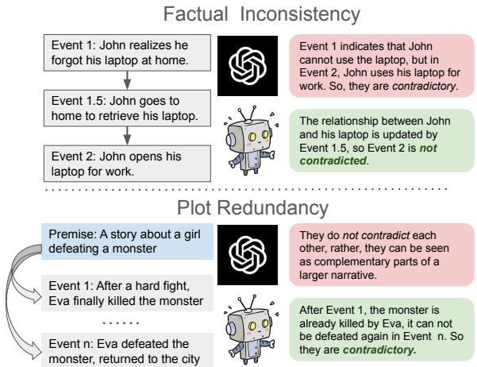  
Figure 1: FACTTRACK tackles the problems of factual inconsistency and plot redundancy. Note that those problems are based on our observations, to provide a clearer understanding of the problem, with both issues considered together in our pipeline and evaluation. For factual inconsistency detection, FACTTRACK tracks a validity interval for each fact to distinguish legitimate contradictions from facts simply changing over time. For plot redundancy detection, our method can represent the timeline in more structured form, making detection easier.

Existing works using LLMs in hierarchical generation have explored structured approaches to maintain strong internal coherence within extensive texts of thousands of words (Yang et al., 2022a,b). However, challenges remain in maintaining factual consistency and avoiding hallucinations during the generation. Especially when these problems occur in a high-level planning stage, they can greatly damage performance on downstream tasks. Therefore, a system capable of detecting factual contradictions and correcting them is essential. In Figure 1, we take story planning as an example, depicting two common issues encountered: factual inconsistency and plot redundancy.

Such issues are expected across various domains, as training corpus documents often suffer from length limitations and originate from fragmented sources, impairing the model’s ability to establish long-distance, multi-state connections. Moreover, generalizing current sentence-level fact verification models (de Marneffe et al., 2008; Cai et al., 2021) to accommodate longer texts remains a challenge. We highlight two main distinctions that arise when comparing sentence-level fact statements to lengthier texts: the complexity of multi-fact contexts, and the dynamic, stateful nature of content over time.

To tackle these challenges, Section 3 introduces the concept of directional atomic facts, establishing a universal framework for time-aware contradiction detection and state tracking. Section 3.1 details the analysis of structures to identify atomic facts and detect contradictions around key events, employing LLMs for event decomposition into pre-facts and post-facts. The concept of pre-facts and postfacts is akin to preconditions and postconditions but formulated in natural text, and implying truthfulness for the entire validity time interval. This approach facilitates tracking the state changes over time prompted by events. Maintaining a comprehensive non-contradictory set of facts (world state) also allows for detection of contradictions by verifying and updating the atomic facts within the world state. Section 3.2 explores the broader implications of atomic facts through a more flexible and time-aware framework, introducing a timeline for events and atomic facts to identify contradictions or updates through their temporal overlaps.

In Section 4, we describe the main implementation of our method, FACTTRACK. As shown in Figure 5, we first maintain a list of pre-facts and a list of post-facts as our data structure. To update our data structure for a new event, we use a four-step pipeline: Decompose-Determine-Contradiction-Update. With this data structure, we can detect whether two events contradict each other and identify the specific pair of atomic facts in conflict, guiding the subsequent correction procedure. Furthermore, the validity interval of facts may be useful structural information in and of itself for downstream tasks.

To measure the effectiveness of our approach, we introduce a task for detecting contradictions in the planning procedure, with story outlines serving as our test domain. For event pairs flagged by a method as contradictory, we use GPT-4 to annotate whether they are actually contradictory, on a 1 to 5 scale. Experimental results show that contradictions flagged by FACTTRACK (using LLaMA2- 7B-Chat as a base LLM) are judged to be real contradictions by a score margin of 0.384 more than a fair baseline using LLaMA2-7B-Chat. Additionally, when FACTTRACK is run on GPT4, the performance significantly surpasses all baselines, including the one using GPT-4 as a base model.

In summary, our contributions are as follows:

1. We introduce a framework for decomposing events into atomic facts and tracking their validity intervals on a timeline.

2. Based on that framework, we develop a method, FACTTRACK, for detecting timeaware factual contradictions in outlines.

3. We apply FACTTRACK to story outline generation, defining a task and LLM-based evaluation metrics for detecting contradictions. The results confirm our approach’s empirical effectiveness.

## 2 Related Work

Fact Verification. Fact verification is a task widely studied in natural language processing, ranging from verifying scientific claims (Thorne et al., 2018; Wadden et al., 2020) to validating fake news (Wang, 2017; Augenstein et al., 2019). Unlike verifying claims against a database of facts, existing work has also demonstrated the feasibility of performing verification within context (Mihaylova et al., 2019; Shaar et al., 2022; Li et al., 2023). We also draw inspiration from efforts to decompose complex sentences into multiple atomic facts using LLMs (Fan et al., 2020; Kamoi et al., 2023; Min et al., 2023). Compared with prior works, our approach specifically operates on temporal structures, maintaining time-dependent fact validity intervals to handle the dynamic nature of the world state as facts change over time.

State Tracking. Prior work on state tracking ranges from dialogue tracking (Thomson and Young, 2010; Chao and Lane, 2019) and memory and entities networks (Sukhbaatar et al., 2015; Henaff et al., 2017) to using neural checklists (Kiddon et al., 2016) and story planning (Rashkin et al., 2020). With the advent of LLMs, state tracking in long-form story planning and generation has shifted towards explicit tracking using natural language, ranging from unstructured text (Zhou et al., 2023) to structured dictionaries (Yang et al., 2022b). Additionally, there also exists some work on generating better temporal fact validity by predicting the validity interval (Zhang and Choi, 2023), jointly modeling text with its timestamp (Dhingra et al., 2022), or utilizing Wikipedia timestamps (Jang et al., 2023). Our approach is related to the latter, but the main difference is our method operates on the generated output from a language model, and focuses on post-hoc detection rather than the calibration of a language model.

Hierarchical Generation. Hierarchical generation is widely applicable across various domains of long-form content creation, such as story generation. It can be implemented through the internal hidden states of the model (Li et al., 2015; Shen et al., 2019; Guo et al., 2021), or explicitly via natural language text or structured schema (Yao et al., 2019; Rashkin et al., 2020; Tian and Peng, 2022; Mirowski et al., 2022; Yang et al., 2022b,a). The paradigm of hierarchical generation brings both benefits and challenges to our work. On one hand, it facilitates the resolution of contradictions at higher levels compared to those detected at the bottom level or during sequential generation. On the other hand, it may require a more complex data structure to maintain the validity intervals of facts.

## 3 Time-Aware Atomic Facts

Existing work focuses on leveraging the semantic decomposition capabilities of LLMs for finegrained fact-checking (Min et al., 2023). In this session, we propose an event-centric, time-aware atomic fact decomposition method. We track facts on a timeline, building toward the design of our FACTTRACK system. By analyzing the structure of an event and the representation of the world, we develop a method to better decompose events into atomic facts (Section 3.1) with forward and backward directions. We then discuss how to use knowledge of contradictions between atomic facts to determine the validity intervals of these atomic facts on the timeline (Section 3.2). Through this decomposition of facts and by maintaining validity intervals, our method is particularly effective for time-varying facts as is common in domains such as story writing. Examples illustrating the concepts in this section are provided in Appendix A.

## 3.1 Fact Decomposition

Events and Directional Atomic Facts. In narrative theory, events represent transitions in the world state, reflecting shifts that impact characters, settings, or the overarching scenario (Hühn et al., 2009). We model these transitions using directional atomic facts, capturing the essence of events as transformations from one state to another. Atomic fact means a basic and concise statement that conveys a single piece of information (Min et al., 2023), see examples in Figure 2. Then we employ a novel strategy using LLMs to decompose these events into distinct atomic facts with directions and a time validity interval as shown in Figure 2. These facts are then compared pairwise to assess their interrelations and impacts on the narrative structure. Recognizing that events represent transformations in the world state, we classify these atomic facts into three categories: prefacts, post-facts, and staticfacts. pre-facts are those truths that exist before an event takes place, postfacts are truths that emerge following an event, and static facts are those truths that remain unchanged throughout.2 To simplify the problem, we interpret static facts as a straightforward amalgamation of a pre-fact and a post-fact, and henceforth concern ourselves with only the latter two categories. Figure 2 shows an example of how we decompose event into pre-facts and post-facts.

World State. The term world state corresponds to a set of facts that hold at a particular point in time. Compared with object-based tracking, factbased tracking provides a more flexible state space. The world state at any given moment represents the maximum set of non-contradicting facts. For example, in a process that moves forward in time, at each new event, the world state is used to crosscheck with pre-facts and is updated with post-facts. If a fact in the world state contradicts with a new post-fact, then we drop the former (Figure 2).

## 3.2 State Tracking on Timeline

Event Time Interval. Any given event can be decomposed into multiple sub-events according to the author’s desired level of detail. For instance, previous works use this strategy to generate a story outline by doing this decomposition recursively (Yang et al., 2022a; Wang et al., 2023). To effectively model this hierarchical temporal structure, we define the time interval of an event as a continuous segment along the narration timeline (See Figure 3). For simplicity, we set the time interval of the entire narrative (e.g., story outline) to be [0, 1]. When one event ( ) is a subevent of another event ( ), ’s time interval is contained within ’s time interval, with adjacent events possessing nonintersecting intervals. That is, for each level of a partial hierarchical outline, if we want to generate k subevents, we have:

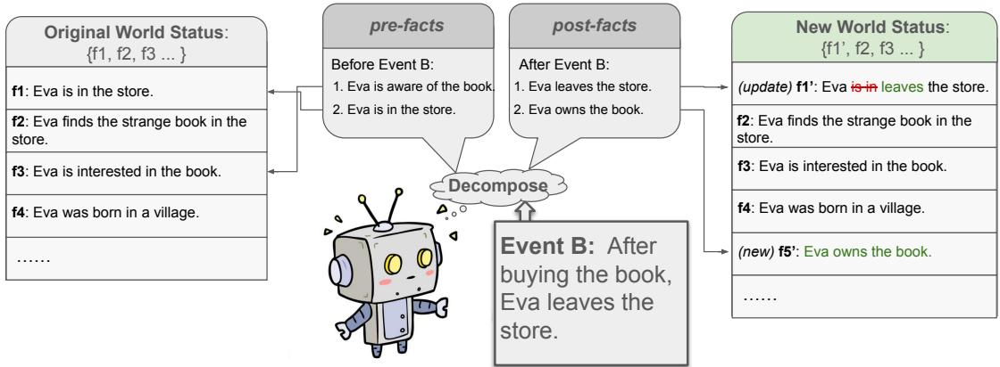

Figure 2: Decomposition of an event, to verify and update the world state for the event. Moving forward on the arrow of time in this example, we first retrieve all facts corresponding to pre-facts from the world state to check for any conflicting fact pairs (Verification). We then replace any fact in the world state that contradicts a post-fact with the corresponding new post-fact (Update).  
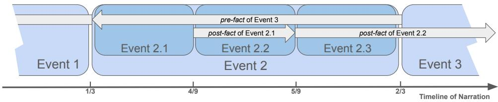  
Figure 3: The timeline of narration. The start time and end time of any given event can be split recursively into sub-events. pre-facts begin at the left boundary and point to the left; post-facts begin at the right boundary and point to the right.

$$
\begin{array} { l } { \displaystyle \forall i \in 1 . . k : } \\ { \displaystyle l _ { i } = l + ( i - 1 ) \cdot \frac { r - l } { k } } \end{array}
$$

$$
r _ { i } = l + i \cdot \frac { r - l } { k }\tag{1}
$$

(2)

Fact Validity Interval. We now consider an event with a validity interval $[ l , r ]$ . We assume a pre-fact f is from some time point x in the event, i. $\mathbf { e } _ { \cdot } , x \in [ l , r ]$ . Then we define the validity interval of f as ( inf, x]. This implies $f$ is valid before the time point x, but not afterwards. Similar logic applies to post-facts, where the default validity interval is [x, inf). However, as it is unclear how to pinpoint the exact value of x, we simplify the problem by assigning the default validity interval to be ( inf, l] for pre-facts and [r, inf) for post-facts.

Update Condition. To handle alterations in the world state, we introduce a mechanism that updates the interval when two facts with the same direction (either both pre-facts or both post-facts) contradict each other. The premise here is that the more “up-to-date” fact is deemed more reliable and reflective of the updated world state on the interval where they overlap. For example, consider two post-facts: “Eva is in the store” and “Eva left the store.” Assuming they have the validity intervals [ 4 , inf) and $[ \frac { 5 } { 9 }$ , inf) respectively, and are contradictory, we would need to adjust the first validity interval to be $\textstyle { \bigl [ } { \frac { 4 } { 9 } } , { \frac { 5 } { 9 } } { \bigr ) }$ . As exemplified in the post-fact of Event 2.1 and the post-fact of Event 2.2 in Figure 3, we will update the former fact to make the two validity intervals not overlap with each other.

Contradiction Condition. We flag a contradiction between a post-fact from an earlier event and a pre-fact from a later event if they overlap in time and contradict each other. Suppose the validity interval of the pre-fact is $( l _ { 1 } , r _ { 1 } ]$ and the interval of post-fact is $[ l _ { 2 } , r _ { 2 } )$ , where $l _ { 2 } ~ < ~ r _ { 1 }$ since the pre-fact is from the later event. Figure 4 shows five possible relationships between these two facts with respect to the overlap in their validity intervals. As shown in Figure 4, a checkpoint indicates the boundary of an event where one of the two facts begins. Although different choices are possible, in our approach, we only flag contradictions for the case “Overlap on both checkpoints.”Thus the constraint we use for flagging contradictions is:

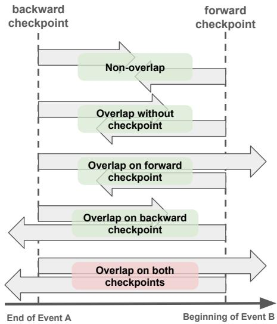  
Figure 4: Five possible situations for a pre-fact and postfact contradicting each other on different points or intervals, depending on their respective validity intervals. In our implementation, we only flag a contradiction when a contradiction is detected on both checkpoints (the last situation) to maximize confidence in our predictions.

$$
l _ { 1 } \leq l _ { 2 } \leq r _ { 1 } \leq r _ { 2 }\tag{3}
$$

Similar ideas also can be found in Allen’s Interval Algebra (Allen, 1983), Our constraint corresponds to Allen’s Interval Algebra is: $F a c t _ { 1 } \ : o \ : F a c t _ { 2 }$ , but there is slightly different since because different operations dictate the directionality of facts as we shown in Figure 5.

## 4 FACTTRACK

We are now ready to introduce our method, FACT-TRACK (Figure 5). FACTTRACK can be understood as a data structure for representing a world state (Section 4.1) coupled with a pipeline of operations for updating this data structure given a new event that we want to insert (Section 4.2). Notably, events do not need to be inserted in chronological order, which is useful for hierarchical inputs such as story outlines. In our pipeline, we start by breaking down the event into several pre-facts and post-facts. Then for each fact, we conduct a series of interval operations to determine its validity interval, identify any contradictions, and finally update the validity interval of facts in world state. We also discuss how our method recognizes contradictions between two atomic facts (Section 4.3).

## 4.1 World State Maintaining

As shown in the light blue block in Figure 5, we maintain two lists to keep track of all pre-facts and post-facts. For each atomic fact, we store its content $s _ { i } ,$ start time $t _ { i , b e g i n } .$ , and end time $t _ { i , e n d } .$

## 4.2 Operation Pipeline

As shown in Figure 5, our operation pipeline consists of four steps which we execute in order:

1. Decompose Events. decompose a new event into pre-facts and post-facts.

2. Determine Validity Interval. Use the world state to find the validity interval for each atomic pre-fact or post-fact.

3. Detect Contradictions. Check if the current fact’s validity interval contradict with existing facts.

4. Update World State. If needed, update existing facts as necessary and add the current fact to the world state.

Pseudocode is shown in Appendix B.3.

## 4.2.1 Decompose Events

In the orange block in Figure 5, we decompose the event into pre-facts, post-facts, and static facts. We use zero-shot prompting with an LLM and parse the output for structure afterward; see details in Appendix B.1. After this step, we execute the following three steps in sequence for each atomic fact.

## 4.2.2 Determine Validity Interval

Given a new atomic fact, we use all the facts in the world state to determine its validity interval (purple block in Figure 5). Taking a post-fact as an example, our initial default validity interval is [l, inf), where l is the right boundary of the event it came from. We then check the facts in the world state whose left boundary is greater than l, in order from left to right, until we find the first contradiction. Then, we set the right boundary of the current fact as the left boundary of the detected fact and return.

## 4.2.3 Detect Contradictions

As shown in the pink block in Figure 5, we retrieve all facts that overlap with the current fact, and check for contradictions. Note that this process can operate forward in time, as shown in Figure 2, as well as backward along the arrow of time. There are multiple ways to define the “overlap” of two directional segments. In our approach, we use the strictest constraint in Figure 4, since we only care about whether there are contradictions on the checkpoints, where the two directional facts begin. By requiring contradiction on both checkpoints, as depicted in Figure 4, our method gains better robustness against errors in fact decomposition or the retrieval process, eliminating many false positives. After this step, if there is a contradiction detected, we can print the contradiction information as shown in the examples in Appendix F, otherwise we directly update the world state.

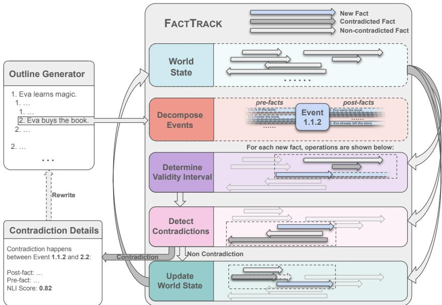  
Figure 5: The general pipeline for how we maintain our data structure. We begin with a new event (e.g., plot point in a story outline), which we decompose into several pre-facts and post-facts (Decompose Events). For each fact, we determine its validity interval based on the world state (Determine Validity Interval), and then detect any contradictions with existing facts in the world state (Detect Contradictions). If the fact does not contradict any existing fact in the world state, then we update the world state with the new fact (Update World State). Otherwise, we write down details about the contradiction, and rewrite the new event conditioned on the preexisting event and details about the contradiction. Note that Determine Validity Interval and Update World State are only between facts in the same direction, while Detect Contradictions are only between facts in different directions.

## 4.2.4 Update World State

As shown in the green block in Figure 5, if we decide to accept the event when no contradiction is detected, we will use this step to update the world state. We first use the current fact to update the validity intervals of existing facts in the world state. Taking a post-fact with interval [l, r) as an example, to update the validity intervals, we retrieve all facts [L, R) satisfying $L \leq l \leq R \leq r$ . If those two facts contradict, then we update the validity interval [L, R) to be [L, l). Finally, we add the new fact [l, r) to the world state.

## 4.3 Contradiction Recognition

We use an NLI model finetuned on outputs annotated by GPT4 (Appendix B.4). By using that model, we can give every pair of facts a contradiction score from 0 to 1 corresponding to how likely they are to contradict each other. If this score is over a set threshold, we say that the two facts contradict in our method. For the update condition and contradiction condition, we use different thresholds since false negatives for the update condition are less harmful than for the contradiction condition— it may not cause any major problems if we miss an update to a fact’s validity interval, but we do not want to ignore an actual contradiction. Additionally, we also use a retrieval model as a filter to reduce the computational cost, see filtering details in Appendix B.3.

## 5 Evaluation

Experiment Setup. To examine our method’s empirical effectiveness, we apply FACTTRACK to the task of detecting the contradictions in a story outline. While our method can also work online, detecting problems during the outline generation process and providing feedback, we evaluate only offline in this work. We employ an outline generator similar to the detailed outliner from Yang et al. (2022a), modifying the prompt to include more factual information (Appendix C.2). In particular, we follow their paradigm of breadth-first outline expansion. To balance length and knowledge density, we use story outlines with three layers, with each event having three sub-events, for 39 events in total. We estimate there are 3-5 true contradictions per outline on average (Appendix B.5). In the evaluation process, we randomly select 90 premises from the WritingPrompts dataset (Fan et al., 2018) and use LLaMA2-7B-Chat (Touvron et al., 2023) to generate the outlines; note that we run FACT-TRACK on LLaMA2-7B-Chat as well. The task can be understood as a detection task: given the outline, we want to retrieve some candidate event pairs, indicating that the model considers them to be contradictory. Outline statistics are shown in Appendix D.

<table><tr><td>Method</td><td>PAIRWISE SCORE</td><td>CONTEXT SCORE</td></tr><tr><td>FULL OUTLINE DETECTION (GPT-4)</td><td> $2 . 3 5 5 \pm 0 . 1 6 3$ </td><td> $\overline { { 2 . 8 5 9 \pm 0 . 1 4 9 } }$ </td></tr><tr><td>FACTTRACK (LLaMA2-7B-Chat, top 300)</td><td> $2 . 3 9 3 \pm 0 . 1 6 4$ </td><td> $2 . 7 7 7 \pm 0 . 1 4 6$ </td></tr><tr><td>FACTTRACK (GPT-4, top 300)</td><td> ${ \pm . 5 9 9 \pm 0 . 1 4 8 }$ </td><td> ${ \bf 3 . 1 3 3 \pm 0 . 1 2 3 }$ </td></tr><tr><td>Random</td><td> $1 . 4 1 9 \pm 0 . 0 7 5$ </td><td> $\overline { { 1 . 6 2 \pm 0 . 0 8 7 } }$ </td></tr><tr><td>PAIRWISE DETECTION (LLaMA2-7B-Chat)</td><td> $1 . 4 5 2 \pm 0 . 0 8 0$ </td><td> $1 . 6 4 \pm 0 . 0 8 8$ </td></tr><tr><td>FULL OUTLINE DETECTION (GPT-3.5-Turbo)</td><td> $1 . 5 5 6 \pm 0 . 0 6 8$ </td><td> $1 . 9 0 2 \pm 0 . 0 7 8$ </td></tr><tr><td>FACTTRACK (LLaMA2-7B-Chat, random 500)</td><td> ${ \bf 1 . 8 3 6 \pm 0 . 0 9 2 }$ </td><td> $\mathbf { 2 . 0 4 6 \pm 0 . 0 9 2 }$ </td></tr></table>

Table 1: Comparison results of FACTTRACK (based on LLaMA2-7B-Chat) against corresponding baselines on 90 depth-3 story outlines. The contradiction scores range from 1 to 5, as annotated by GPT-4; higher is better. PAIRWISE SCORE indicates that the GPT-4 evaluator only sees the events corresponding to the two facts being checked, while in CONTEXT SCORE, GPT-4 sees the whole story outline as context. We downsample FACTTRACK’s detections either randomly (e.g., random 500) or based on top contradiction scores to match the number of detections with baselines for fairer comparison; see Appendices C.3 and D for experiment details. FACTTRACK based on LLaMA2-7B-Chat achieves performance comparable to GPT4-Turbo while significantly outperforming other baselines. Additionally, when FACTTRACK is run on GPT4, the performance surpasses all baselines.

<table><tr><td>Method</td><td>PAIRWISE SCORE</td><td>CONTEXT SCORE</td></tr><tr><td>CoT (without decompose events)</td><td>2.355</td><td>2.859</td></tr><tr><td>FACTTRACK</td><td>2.599</td><td>3.133</td></tr><tr><td>FACTTRACK (without track facts)</td><td>2.380</td><td>2.364</td></tr><tr><td>FACTTRACK</td><td>2.412</td><td>2.386</td></tr><tr><td>FACTTRACK (few-shot GPT4)</td><td>2.212</td><td>2.216</td></tr><tr><td>FACTTRACK (few-shot LLaMA-7B-Chat)</td><td>2.186</td><td>2.196</td></tr><tr><td>FACTTRACK (NLI Model, default)</td><td>1.836</td><td>2.046</td></tr></table>

Table 2: Ablations on individual components of FACTTRACK, including removing Decompose Events, Track Facts (combining Determine Validity Interval and Update World State), and replacing Detect Contradictions with other methods. Both Decompose Events and Track Facts are critical to performance, while Detect Contradictions can be improved by changing its internal modules and thresholds.

Input : [premise, event1, event1.1,    event3.3.3] Output : [(id1,1.id1,2), · · · , (idn,1, idn,2)]

Baselines. With no directly applicable prior methods, we designed two baselines:

1. PAIRWISE DETECTION on LLaMA2-7B-Chat: The model compares two retrieved events to make predictions of contradictions. This approach scales well but struggles with maintaining temporal validity.

2. FULL OUTLINE DETECTION on GPT series: The model reviews the entire text using Chain of Thought (CoT) to identify contradictory event nodes. Limited by context window size, this method processes an outline of 39 events under our setting, averaging about 4800 tokens, using GPT-3.5-Turbo and GPT-4.

Due to varying numbers of positive detections, results were downsampled (see Appendix D).

Metrics. Due to the complexity and contextdependent nature of annotating event contradictions, we haven’t found a clear method to label ground truth data, even with human input (see Appendix C.1). Upon review, GPT-4 (OpenAI, 2023) annotations proved to be higher quality and less noisy. Since contradictions aren’t binary and can be nuanced and depend on context, we score them from 1 to 5 (Appendix C.3). We evaluate methods by the average contradiction score in detected pairs—a higher score indicates better detection. We developed two metric variations using GPT-4 context:

1. PAIRWISE SCORE directly labels contradictions by examining pairs of events directly.

2. CONTEXT SCORE labels event pairs within

the full outline context.

Classical metrics aren’t applicable without gold labels, but we estimate precision and recall using our metrics in Appendix D.

Evaluation Results. Table 1 shows the results of our experiment. FACTTRACK on LLaMA2-7B-Chat is significantly better on the two metrics than both FULL OUTLINE DETECTION using GPT-3.5- Turbo and PAIRWISE DETECTION on LLaMA2- 7B-Chat. We also achieve comparable performance with GPT4-Turbo, despite only using LLaMA2-7B-Chat in our method. When we run FACTTRACK on GPT4, the performance significantly surpasses all baselines3 These results confirm that FACT-TRACK effectively enhances contradiction detection in story planning by decomposing events and maintaining validity intervals of atomic facts. Examples are in Appendix F.

Qualitative inspection shows that event decomposition remains a bottleneck, as language ambiguity can lead to misunderstandings before decomposition. Appendix G illustrates a failure case due to ambiguity. Additionally, our method only detects binary contradictions and doesn’t address more complex scenarios. Detailed error analysis is in Appendix G.

## 5.1 Ablation Study

We examine the roles and alternatives of the modules in FACTTRACK: Decompose Events, Track Facts (Determine Validity Interval + Update World State), and Detect Contradictions.

1. Without Decompose Events: To assess performance without the Decompose Events module, we substitute it with the Chain of Thought, as detailed in Table 8.

2. Without Track Facts: This variant excludes the Determine Validity Interval and Update World State steps, treating all facts as valid by default.

3. Replacing the NLI Model in Detecting Contradictions: We use the NLI model to lower the pipeline’s computational cost. We explore replacing it with few-shot LLMs and estimate the potential improvements quantitatively.

<table><tr><td>Experiment</td><td>Precision</td><td>Recall</td><td>F1</td></tr><tr><td>GPT4o-mini</td><td>89.29%</td><td>5.57%</td><td>10.48%</td></tr><tr><td>FACTTRACK</td><td>52.71%</td><td>62.81%</td><td>57.32%</td></tr></table>

Table 3: Performance of the baseline and FACTTRACK in the Binary Judgement experiment in ContraDoc. FACTTRACK was implemented using GPT4o-mini, with splitting events by sentences conducted via the nltk package.

Results Table 2 shows that both the Decompose Events and Track Facts modules are critical to performance. However, the Detect Contradictions module can be improved by using few-shot versions of GPT-4 and LLaMA-7B-Chat, suggesting that more fine-grained annotation and knowledge distillation could enhance performance further. This indicates that while FACTTRACK has already substantially outperformed the baselines, there is potential for even better performance.

## 5.2 Document-level contradict detection

We extended the application of FACTTRACK to the ContraDoc dataset (Li et al., 2023), a dataset for evaluating document-level contradictions. In alignment with the original study, we employed a binary judgment framework, which involves directly prompting large language models (LLMs) as a baseline. Our approach, FACTTRACK, demonstrated a better F1-score compared to the baseline models. The observed reduction in precision relative to the baseline can be attributed to the presence of borderline contradictions within the documents and the ambiguity in the decomposition process. The results are detailed in Table 3.

## 6 Conclusion and Future Work

As the complexity of texts generated by LLMs increases, understanding their structures and tracking time-varying factual information becomes an increasingly important bottleneck in long-form generation. In this work, we have introduced FACT-TRACK, a fact-tracking framework that decomposes events into pre-facts and post-facts and maps them onto a timeline, facilitating the tracking of narrative progress and detecting contradictions between events. Experimental results show that when we apply FACTTRACK to contradiction detection on structured story outlines using LLaMA2-7B-Chat as the base model, our method achieves performance comparable to GPT4 and significantly outperforms baselines using the same base LLM. Furthermore, when we run our method on GPT4, we find that its performance significantly outperforms all baselines.

By effectively maintaining factual consistency over extended contexts, we envision FACTTRACK serving not only as a fact-tracking module for complex content planning but also as an efficient automatic evaluation metric for contradictions in extensive texts. We additionally envision several further possibilities for improving our system, such as enhancing decomposition accuracy, structuring atomic facts more effectively (for instance, based on entities), and/or maintaining timelines in narratives that do not follow a strict chronological order. Moreover, although we only experiment on story outlines in this work, FACTTRACK is in principle generally applicable to other domains, and we hope that our framework’s capacity for managing timespecific knowledge could be of use in other areas as well, such as detecting fake news and dynamically updating knowledge bases.

## Limitations

The difficulty of identifying all contradictions and partial contradictions significantly constrained our evaluations (see Appendix C.1), limiting us to obtaining gold labels of contradictions. Therefore, we used GPT-4 to annotate the contradicting score as a proxy for the evaluation task.

The context window size of baseline and evaluation metrics also restricted us from running experiments on outlines much longer than the current 2000-3000 words. While FACTTRACK is capable of detecting contradictions in such outlines with near-linear cost growth, we did not evaluate them in this work due to the potential performance degradation of GPT-4 in longer contexts.

Additionally, the challenge of conducting thorough evaluations impacted the system’s development. Many decisions, such as prompt design, the choice of models for each module (e.g., the few-shot language model outperforms the NLI model as shown in Table 2), and the selection of hyperparameters (e.g., thresholds for the contriver and NLI models), were made manually rather than through rigorous validation. As a result, there may be considerable room for improvement in the detailed design of individual modules.

Finally, FACTTRACK’s performance may decrease on LLMs that lack strong generation and instruction-following capabilities.

## Ethics Statement

Since FACTTRACK is built upon existing LLMs, we may inherit any potential biases and harms from those systems. However, in FACTTRACK, we focus on tracking facts and detecting factual inconsistencies during the process of creative story generation, with an emphasis on the interpretability of the world state within narrative structures. Our focus on factuality limits the potential abuse of language models and may be a useful tool for mitigating such abuses in the first place.

FACTTRACK is also currently designed only for English, although translating our prompts to other languages shouldn’t be difficult in principle. However, performance might suffer in lower-resource languages, depending on the base LLM.

## Reproducibility Statement

We saved all intermediate computation results, including our NLI dataset as well as results from the decomposition and inference steps. The finetuning process of the NLI model is also described in the appendix; otherwise, we use existing open-source or API-based LLMs for inference with temperature 0. Thus we believe our work is highly reproducible, and all of our code and data will be open-sourced upon publication. However, as we use the OpenAI API in some of our experimental comparisons, we cannot rule out the possibility of minor differences in inference results due to future API updates.

## References

James F Allen. 1983. Maintaining knowledge about temporal intervals. Communications of the ACM, 26(11):832–843. 5

Isabelle Augenstein, Christina Lioma, Dongsheng Wang, Lucas Chaves Lima, Casper Hansen, Christian Hansen, and Jakob Grue Simonsen. 2019. MultiFC: A real-world multi-domain dataset for evidence-based fact checking of claims. In Proceedings of the 2019 Conference on Empirical Methods in Natural Language Processing and the 9th International Joint Conference on Natural Language Processing (EMNLP-IJCNLP), pages 4685–4697, Hong Kong, China. Association for Computational Linguistics. 2

Deng Cai, Yizhe Zhang, Yichen Huang, Wai Lam, and Bill Dolan. 2021. Narrative incoherence detection. 2

Guan-Lin Chao and Ian Lane. 2019. Bert-dst: Scalable end-to-end dialogue state tracking with bidirectional encoder representations from transformer. 2

Marie-Catherine de Marneffe, Anna N. Rafferty, and Christopher D. Manning. 2008. Finding contradictions in text. In Proceedings ofACL-08: HLT, pages 1039– 1047, Columbus, Ohio. Association for Computational Linguistics. 2

Bhuwan Dhingra, Jeremy R. Cole, Julian Martin Eisenschlos, Daniel Gillick, Jacob Eisenstein, and William W. Cohen. 2022. Time-aware language models as temporal knowledge bases. Transactions ofthe Associationfor Computational Linguistics, 10:257–273. 3

Angela Fan, Mike Lewis, and Yann Dauphin. 2018. Hierarchical neural story generation. In Proceedings of the 56th Annual Meeting of the Association for Computational Linguistics (Volume 1: Long Papers), pages 889–898, Melbourne, Australia. Association for Computational Linguistics. 7, 14

Angela Fan, Aleksandra Piktus, Fabio Petroni, Guillaume Wenzek, Marzieh Saeidi, Andreas Vlachos, Antoine Bordes, and Sebastian Riedel. 2020. Generating fact checking briefs. In Proceedings of the 2020 Conference on Empirical Methods in Natural Language Processing (EMNLP), pages 7147–7161, Online. Association for Computational Linguistics. 2

Richard E Fikes and Nils J Nilsson. 1971. Strips: A new approach to the application of theorem proving to problem solving. Artificial intelligence, 2(3-4):189–208. 3

Mandy Guo, Joshua Ainslie, David C. Uthus, Santiago Ontañón, Jianmo Ni, Yun-Hsuan Sung, and Yinfei Yang. 2021. Longt5: Efficient text-to-text transformer for long sequences. CoRR, abs/2112.07916. 3

Mikael Henaff, Jason Weston, Arthur Szlam, Antoine Bordes, and Yann LeCun. 2017. Tracking the world state with recurrent entity networks. 2

Peter Hühn, Jan Christoph Meister, John Pier, Wolf Schmid, and Jörg Schönert. 2009. The living handbook of narratology. Hamburg: Hamburg University. URL: http://www.lhn.uni-hamburg.de (Retrieved on 12.03. 2020). 3

Gautier Izacard, Mathilde Caron, Lucas Hosseini, Sebastian Riedel, Piotr Bojanowski, Armand Joulin, and Edouard Grave. 2021. Unsupervised dense information retrieval with contrastive learning. 12

Joel Jang, Seonghyeon Ye, Changho Lee, Sohee Yang, Joongbo Shin, Janghoon Han, Gyeonghun Kim, and Minjoon Seo. 2023. Temporalwiki: A lifelong benchmark for training and evaluating ever-evolving language models. 3

Ryo Kamoi, Tanya Goyal, Juan Diego Rodriguez, and Greg Durrett. 2023. Wice: Real-world entailment for claims in wikipedia. 2

Chloé Kiddon, Luke Zettlemoyer, and Yejin Choi. 2016. Globally coherent text generation with neural checklist models. In Proceedings ofthe 2016 Conference on Empirical Methods in Natural Language Processing, pages 329–339, Austin, Texas. Association for Computational Linguistics. 2

Jierui Li, Vipul Raheja, and Dhruv Kumar. 2023. Contradoc: Understanding self-contradictions in documents with large language models. arXiv preprint arXiv:2311.09182. 2, 8

Jiwei Li, Thang Luong, and Dan Jurafsky. 2015. A hierarchical neural autoencoder for paragraphs and documents. In Proceedings ofthe 53rd Annual Meeting of the Associationfor Computational Linguistics and the 7th International Joint Conference on Natural Language Processing (Volume 1: Long Papers), pages 1106–1115, Beijing, China. Association for Computational Linguistics. 3

Nelson F. Liu, Kevin Lin, John Hewitt, Ashwin Paranjape, Michele Bevilacqua, Fabio Petroni, and Percy Liang. 2023. Lost in the middle: How language models use long contexts. 1

Tsvetomila Mihaylova, Georgi Karadzhov, Pepa Atanasova, Ramy Baly, Mitra Mohtarami, and Preslav Nakov. 2019. SemEval-2019 task 8: Fact checking in community question answering forums. In Proceedings of the 13th International Workshop on Semantic Evaluation, pages 860–869, Minneapolis, Minnesota, USA. Association for Computational Linguistics. 2

Sewon Min, Kalpesh Krishna, Xinxi Lyu, Mike Lewis, Wen-tau Yih, Pang Wei Koh, Mohit Iyyer, Luke Zettlemoyer, and Hannaneh Hajishirzi. 2023. Factscore: Finegrained atomic evaluation of factual precision in long form text generation. arXiv preprint arXiv:2305.14251. 2, 3

Piotr Mirowski, Kory W. Mathewson, Jaylen Pittman, and Richard Evans. 2022. Co-writing screenplays and theatre scripts with language models: An evaluation by industry professionals. 3

OpenAI. 2023. Gpt-4 technical report. 1, 7

Long Ouyang, Jeff Wu, Xu Jiang, Diogo Almeida, Carroll L. Wainwright, Pamela Mishkin, Chong Zhang, Sandhini Agarwal, Katarina Slama, Alex Ray, John Schulman, Jacob Hilton, Fraser Kelton, Luke Miller, Maddie Simens, Amanda Askell, Peter Welinder, Paul Christiano, Jan Leike, and Ryan Lowe. 2022. Training language models to follow instructions with human feedback. 1

Jiaxin Pei, Aparna Ananthasubramaniam, Xingyao Wang, Naitian Zhou, Apostolos Dedeloudis, Jackson Sargent, and David Jurgens. 2022. POTATO: The portable text annotation tool. In Proceedings of the 2022 Conference on Empirical Methods in Natural Language Processing: System Demonstrations, pages 327– 337, Abu Dhabi, UAE. Association for Computational Linguistics. 15

Hannah Rashkin, Asli Celikyilmaz, Yejin Choi, and Jianfeng Gao. 2020. Plotmachines: Outline-conditioned generation with dynamic plot state tracking. CoRR, abs/2004.14967. 2, 3

Shaden Shaar, Firoj Alam, Giovanni Da San Martino, and Preslav Nakov. 2022. The role of context in detecting previously fact-checked claims. In Findings of

the Associationfor Computational Linguistics: NAACL 2022, pages 1619–1631, Seattle, United States. Association for Computational Linguistics. 2

Dinghan Shen, Asli Celikyilmaz, Yizhe Zhang, Liqun Chen, Xin Wang, Jianfeng Gao, and Lawrence Carin. 2019. Towards generating long and coherent text with multi-level latent variable models. In Proceedings of the 57th Annual Meeting ofthe Associationfor Computational Linguistics, pages 2079–2089, Florence, Italy. Association for Computational Linguistics. 3

Sainbayar Sukhbaatar, Arthur Szlam, Jason Weston, and Rob Fergus. 2015. Weakly supervised memory networks. CoRR, abs/1503.08895. 2

Blaise Thomson and Steve Young. 2010. Bayesian update of dialogue state: A pomdp framework for spoken dialogue systems. Computer Speech & Language, 24(4):562–588. 2

James Thorne, Andreas Vlachos, Christos Christodoulopoulos, and Arpit Mittal. 2018. FEVER: a large-scale dataset for fact extraction and VERification. In Proceedings of the 2018 Conference of the North American Chapter ofthe Associationfor Computational Linguistics: Human Language Technologies, Volume 1 (Long Papers), pages 809–819, New Orleans, Louisiana. Association for Computational Linguistics. 2

Yufei Tian and Nanyun Peng. 2022. Zero-shot sonnet generation with discourse-level planning and aesthetics features. In Proceedings ofthe 2022 Conference ofthe North American Chapter of the Association for Computational Linguistics: Human Language Technologies, pages 3587–3597, Seattle, United States. Association for Computational Linguistics. 3

Hugo Touvron, Louis Martin, Kevin Stone, Peter Albert, Amjad Almahairi, Yasmine Babaei, Nikolay Bashlykov, Soumya Batra, Prajjwal Bhargava, Shruti Bhosale, Dan Bikel, Lukas Blecher, Cristian Canton Ferrer, Moya Chen, Guillem Cucurull, David Esiobu, Jude Fernandes, Jeremy Fu, Wenyin Fu, Brian Fuller, Cynthia Gao, Vedanuj Goswami, Naman Goyal, Anthony Hartshorn, Saghar Hosseini, Rui Hou, Hakan Inan, Marcin Kardas, Viktor Kerkez, Madian Khabsa, Isabel Kloumann, Artem Korenev, Punit Singh Koura, Marie-Anne Lachaux, Thibaut Lavril, Jenya Lee, Diana Liskovich, Yinghai Lu, Yuning Mao, Xavier Martinet, Todor Mihaylov, Pushkar Mishra, Igor Molybog, Yixin Nie, Andrew Poulton, Jeremy Reizenstein, Rashi Rungta, Kalyan Saladi, Alan Schelten, Ruan Silva, Eric Michael Smith, Ranjan Subramanian, Xiaoqing Ellen Tan, Binh Tang, Ross Taylor, Adina Williams, Jian Xiang Kuan, Puxin Xu, Zheng Yan, Iliyan Zarov, Yuchen Zhang, Angela Fan, Melanie Kambadur, Sharan Narang, Aurelien Rodriguez, Robert Stojnic, Sergey Edunov, and Thomas Scialom. 2023. Llama 2: Open foundation and fine-tuned chat models. 7

David Wadden, Shanchuan Lin, Kyle Lo, Lucy Lu Wang, Madeleine van Zuylen, Arman Cohan, and Hannaneh Hajishirzi. 2020. Fact or fiction: Verifying scientific claims. In Proceedings of the 2020 Conference on Empirical Methods in Natural Language Processing

(EMNLP), pages 7534–7550, Online. Association for Computational Linguistics. 2

William Yang Wang. 2017. “liar, liar pants on fire”: A new benchmark dataset for fake news detection. In Proceedings ofthe 55th Annual Meeting ofthe Associationfor Computational Linguistics (Volume 2: Short Papers), pages 422–426, Vancouver, Canada. Association for Computational Linguistics. 2

Yichen Wang, Kevin Yang, Xiaoming Liu, and Dan Klein. 2023. Improving pacing in long-form story planning. In Findings of the Association for Computational Linguistics: EMNLP 2023, pages 10788–10845, Singapore. Association for Computational Linguistics. 3

Kevin Yang, Dan Klein, Nanyun Peng, and Yuandong Tian. 2022a. Doc: Improving long story coherence with detailed outline control. arXiv preprint arXiv:2212.10077. 1, 3, 6

Kevin Yang, Nanyun Peng, Yuandong Tian, and Dan Klein. 2022b. Re3: Generating longer stories with recursive reprompting and revision. arXiv preprint arXiv:2210.06774. 1, 2, 3

Lili Yao, Nanyun Peng, Ralph Weischedel, Kevin Knight, Dongyan Zhao, and Rui Yan. 2019. Plan-andwrite: Towards better automatic storytelling. 3

Michael Zhang and Eunsol Choi. 2023. Mitigating temporal misalignment by discarding outdated facts. In Proceedings of the 2023 Conference on Empirical Methods in Natural Language Processing, pages 14213–14226, Singapore. Association for Computational Linguistics. 3

Wangchunshu Zhou, Yuchen Eleanor Jiang, Peng Cui, Tiannan Wang, Zhenxin Xiao, Yifan Hou, Ryan Cotterell, and Mrinmaya Sachan. 2023. Recurrentgpt: Interactive generation of (arbitrarily) long text. 2

## A Concept Clarification

## A.1 Time-aware Contradiction

A time-aware contradiction occurs when two factual statements remain contradictory even when temporal context is considered. For instance, the statements:

•“Donald Trump is the president ofthe United States.”

•“Joe Biden is the president of the United States.”

may appear contradictory. However, when interpreted with temporal context—Trump serving before 2021 and Biden serving from 2021 onward—the contradiction is resolved. Thus, this is not a time-aware contradiction. Instead, a timeaware contradiction persists even after considering temporal information.

## A.2 Time-dependent Fact

A time-dependent fact is a fact that holds true within a specific time interval but may become invalid afterward. For example:

“Joe Biden is the president ofthe United Statesfrom 2021 to 2024.”

is a time-dependent fact since its validity is constrained to a specific period. In our FactTrack setting, we maintain a relative timeline based on event order rather than absolute timestamps, allowing for contextual fact verification without requiring explicit temporal annotations.

## A.3 Dynamic Nature of the World State

The dynamic nature of the world state refers to the updates in the state of entities following an event. Consider the following scenario:

“After buying the book, Eva leaves the store.”

This event results in state changes:

• Eva’s location: “Eva is in the store” “Eva is not in the store.”

• Book ownership: “Eva does not own the book” “Eva owns the book.”

Capturing such transitions is essential for factuality assessment, as ignoring these updates can lead to incorrect conclusions about entity states.

## B Methodology Details

## B.1 Prompt of event Decomposition

See Table 4 for more detail.

## B.2 Epsilon Padding on Timeline

Note that to easily distinguish the boundary between different events, we set a tiny number ϵ = $1 0 ^ { - 6 }$ as the padding between the events. Therefore, the real format of the event time interval is:

$$
\begin{array} { l } { { \epsilon = 1 0 ^ { - 6 } } } \\ { { \forall i \in 1 . . k : } } \\ { { l _ { i } = l + ( i - 1 ) \cdot \displaystyle \frac { r - l - ( k + 1 ) \cdot \epsilon } { k } + \epsilon \cdot i } } \\ { { r _ { i } = l + i \cdot \displaystyle \frac { r - l } { k } + \epsilon \cdot i } } \end{array}
$$

Figure 3 shows there is a slight gap between different events, and fact begins from the corresponding boundary of the event.

## B.3 Pseudocode of Interval Operation

In our data structure 4, We use a list to store the intervals of all fact content, their validity intervals, and their embeddings, using Contriever (Izacard et al., 2021) as a retrieval model to filter out irrelevant fact pairs. Here are some definitions of the notation in the pseudocode:

1. For $i s O v e r l a p ( l , r , L , R )$ in the pseudocode, we use the condition $l \leq L \leq r \leq R $ , as discussed in Section 3.2.

2. $F i l t e r ( p , P )$ used to sample relevant event pairs, is implemented as $s i m _ { c o n t r i v e r } ( p , P ) > 0 . 5$

3. For $S a m e ( p , P )$ , as considered in the update condition, we drop identical atomic facts to reduce computation, as judged by $s i m _ { c o n t r i v e r } ( p , P ) > 0 . 9 5$

4. For Contradict(p, P), we use different thresholds to make detection more effective and to make the update more robust. In the determine and update validity interval step, this means $N L I _ { S } c o r e > 0 . 8 .$ , while in the check contradiction step, this means $N L I _ { S } c o r e >$ 0.2359, as discussed in Appendix B.4.

Deconstruct the given event point into atomic facts, considering facts valid until before the event   
event (pre-facts), facts valid starting after the event event (post-facts), and facts that remain valid   
throughout the event (static facts). For pre-facts, identify the conditions that are present before the   
event, but change as a result of it. For post-facts, identify the conditions that are valid after the   
event, which are essentially the transformed versions of the corresponding pre-facts. Static facts   
are the conditions that remain true throughout the event. Please be sure to present facts as assertive   
statements, rather than speculative or suggestive ones.   
event point: {event\_point\_text}   
Pre-Facts:   
[pre-facts]   
Post-Facts:   
[post-facts]   
Static Facts:   
[static facts]  
Table 4: The prompt we use to decompose the event into different directional atomic facts.

Algorithm 1 Determine validity interval for a pre  
fact   
Input: world state: $W = \left[ \forall i , \left( p _ { i } , l _ { i } , r _ { i } \right) \right]$   
Input: pre-fact: P, init time: T   
Output: validity interval: $( L , R ]$   
L, R inf, T   
$W  S o r t ( W , r _ { i } > r _ { j } )$   
for (prefact:p, $l , r ) \in \dot { W } , r < R$ do   
if Same(p, P) then   
$L \gets r$   
break   
end if   
if Filter(p, P) & Contradict(p, P) then   
$L \gets r$   
break   
end if   
end for

Algorithm 2 Verify whether current fact contra  
dicts world state   
Input: world state: $W = \left[ \forall i , \left( p _ { i } , l _ { i } , r _ { i } \right) \right]$   
Input: pre-fact: P, validity interval: $( L , R ]$   
Output: whether there is a contradiction: flag   
$L , R \gets - \operatorname* { i n f } , T$   
$W ^ { \prime }  [ ]$   
$f l a g \gets F a l s e$   
for (post-fact:p, l, r) W do   
if isOverlap(l, r, L, R) & Filter(p, P) then   
if Contradict(p, P) then   
$f l a g = T$ rue   
end if   
end if   
end for

Algorithm 3 Update world state for a pre-fact   
Input: world state: $W = \left[ \forall i , \left( p _ { i } , l _ { i } , r _ { i } \right) \right]$   
Input: pre-fact: P, validity interval: $( L , R ]$   
Output: new world state: $W ^ { \prime } = [ \forall i , ( p _ { i } , l _ { i } , r _ { i } ) ]$   
L, R   inf, T   
$W ^ { \prime }  S o r t ( W , l _ { i } < l _ { j } )$   
for (pre-fact:p, l, r) W′, l < R & R < r do   
if Same(p, P) then   
$L \gets r$   
end if   
if Filter(p, P) & Contradict(p, P) then   
$l  R$   
end if   
end for   
$W ^ { \prime } \gets W ^ { \prime } . a d d ( P , L , R )$

## B.4 Finetuning NLI Models

Since the task of recognizing whether two atomic facts contradict is similar to NLI, we use an NLI model from Hugging Face (MoritzLaurer/DeBERTa-v3-large-mn li-fever-anli-ling-wanli) and finetune it using GPT-4 annotations to adapt to the narrative domain. See the prompt in Table 5. To construct the dataset, we generate 60 outlines from the WritingPrompts dataset (Fan et al., 2018) and use 50 for training and 10 for testing. In the training set, we have a total of 856,748 fact pairs. To create a subsample, we first use an NLI model without any finetuning to retrieve data. Then, we employ a second NLI model, which has been finetuned based on the data retrieved by the first, non-finetuned model. From the output of both models, we subsample 10,000 fact pairs for each model. As the vast majority of fact pairs are not contradictory, to improve class balance, we randomly select 5k from the top 1% most confidently predicted contradictions for each model; 2k from the top 1-10%; and 3k from the remaining. After removing duplicate data, we get 18,702 fact pairs, which are then annotated by GPT-4 using the prompt shown in Table 5.

Based on this annotation result, we estimate the overall positive rate of all 856,748 fact pairs as 2.98%. To evaluate, we re-rank the fact pairs in the test set, and divide the top 10% of data into 10 intervals, with 100 data points randomly sampled in each interval to observe the positive rate. Therefore, we set the percentile threshold for flagging a contradiction in FACTTRACK at 3% (NLI\_Score 0.2359), with precision = 60% and recall = 60% on our GPT-4-annotated test set.

Do the following statements contradict each   
other? Answer “Yes” or “No”.   
{fact1}   
{fact2}  
Table 5: The prompt given to GPT-4 to classify two fact statements as contradicting each other. We use the result to fine-tune our NLI model to better fit the narrative domain.

## B.5 Outline Generation

In our experiments, we use depth=3 and branching factor=3 to generate outlines, where depth refers to the maximum number of hierarchical outline layers, and branching factor refers to the number of sub-events into which one node decomposes. We chose these settings because the length of such an outline (around 4800 tokens for GPT-4) makes it sufficiently complex while still somewhat tractable for annotation. FACTTRACK can easily scale to a more complex outline. Compared with the Detailed Outliner in the DOC paper, we have two changes. (1) We add the sections “begin event” and “end event” to each event, because we want the Outline to be richer in facts and more precise in context; (2) We set the "partial outline" (prompt context for generating each new sub-event) to always be the content’s direct parent, whereas in Detailed Outliners, the default setting is to include all ancestors and their siblings. This is mainly because we consider our method as using constant text window size for outline generation. Additionally, in our code (to be open-sourced upon publication), we have implemented all the options to conveniently change the above settings, which we believe will facilitate further evaluation of new methods in the future. Our prompts are shown in Table 6.

Based on rough estimation, we expect that outlines generated in this manner will contain approximately 3 to 5 gold contradictions per outline on average, as well as around several dozen partial contradictions.

## C Baselines and Evaluation Settings

## C.1 Human Annotation Attempt

We initially attempted human annotation but found the task to be highly challenging. Even experienced human annotators and advanced LLMs struggled to accurately obtain ground truth labels. This situation has become increasingly common in the era of LLMs. We used prolific.co as our human annotation platform and implemented a foldable outline with the Potato Annotation Framework (Pei et al., 2022), along with some structured input formats (see Figures 6 and 7). The budget for each annotator was 30 minutes per Outline, at 15 USD per hour. The prompts given to human annotators were also used to establish a Full Context Detection Baseline for GPT-4, which is referred to in Table 8. In this context, we encountered problems such as: (1) annotators struggling to understand the format of the question; (2) 30 minutes being insufficient for annotators to retrieve all ground truth labels; and (3) some annotators attempting to cheat by using GPT-4 for annotation. It is worth noting that it is theoretically feasible for human annotators to complete all the annotation tasks mentioned in this text. However, after our initial exploration, we concluded that sufficiently reducing annotation noise and achieving statistically significant conclusions would result in astonishing economic costs and probability infeasible. Therefore, in this project, we use the most advanced version of GPT-4 to complete all annotation tasks.

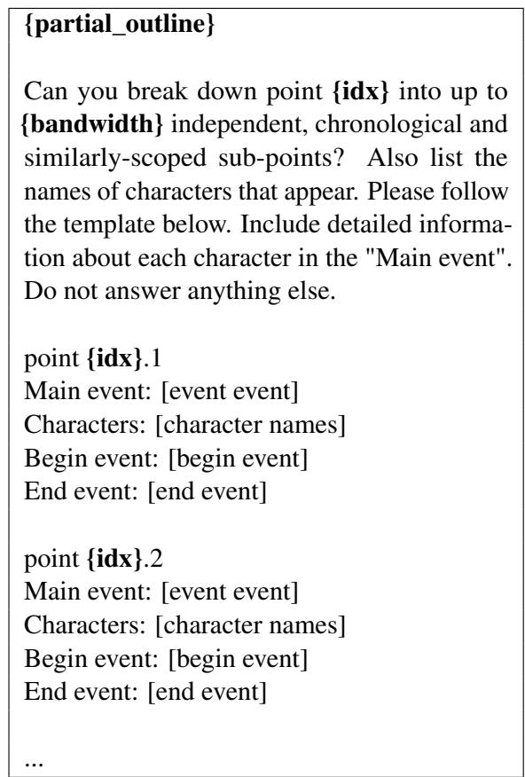  
Table 6: The prompt was given to GPT-4 to generate the outline. Compared to DOC, we added boundary events to make the generation more stable and increase fact density.

We found that using GPT-4, with the same instructions as a human annotator, achieved better results compared to humans upon manual inspection. However, we also found on inspection that even when our method FACTTRACK was deployed on LLaMA2-7B-Chat, it maintained similar or even higher quality than GPT-4. Using a worse baseline to evaluate our method was unreasonable, so we ultimately decided to use a scoring-based metric that considers individual pairs of facts rather than full outlines. (We also tried using GPT-4 for preference annotation but found it to be noisy. This was due to different events potentially contradicting each other in various aspects, making it difficult to determine which was “better” or “worse.”)

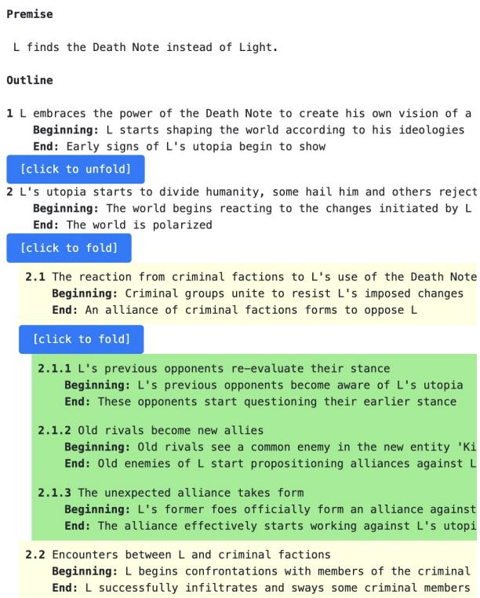  
Figure 6: Outline Shown in Human Annotation

## C.2 Prompts Used in Baseline

See Table 7 and Table 8 for more detail.

## C.3 Prompts Used in Metrics

See Table 9 and Table 10 for more detail.

## C.4 Prompts Used in Ablation

See Table 11 for more detail.

  
Figure 7: question bank in human annotation

Question: Does those two time-ordered event   
point contradict each other? Answer “Yes” or   
“No”.   
{event1\_text}   
{event2\_text}  
Table 7: Prompt of PAIRWISE DETECTION, we run it on LLaMA2-7B-Chat

## D Experiment Statistics

We used 100 prompts to generate 90 Outlines from the writing prompt, with statistics in Table 12. For FACTTRACK deployed on LLaMA2-7B-Chat, we get 4589 positive pairs in total; for FACTTRACK deployed on GPT-4, we get 8883 positive pairs in total; details are shown in Table 13. For FULL OUTLINE DETECTION on GPT-4, we get 408 positive pairs in total; for PAIRWISE DETECTION on LLaMA2-7B-Chat, we subsample 10% of the pairs and get 400 positive pairs, meaning if we run the whole population, we expect to get around 4,000 positive pairs for this baseline. Since we cannot easily change the threshold for our baseline, to make the comparison fairer, we subsample our method’s predictions so that both methods flag a similar total number of contradictions. To compare with FULL OUTLINE DETECTION on GPT-4, which detected 298 positive pairs, we subsample by the Max fact pair NLI score between event pairs for 300 samples. While comparing with FULL OUTLINE DETECTION on GPT-3.5-Turbo (829 positive pairs) and PAIRWISE DETECTION on LLaMA2-7B-Chat (estimated 4000 positive pairs), we perform pure random sampling for 500 samples as a representative of the whole population (4589 positive pairs) of our method.

Tables 14 and 15 show the sample size and distribution of our evaluation set. Several data points failed during generation, and we simply dropped them. By observing the distribution, we find that

FACTTRACK’s detection capability is slightly inferior to GPT-4 on clear contradictions (score 5), which may also be because we subsampled the top 300 instead of the top 298. However, on more nuanced or partial contradictions (scores 2, 3, and 4), FACTTRACK is significantly better than the two baselines. This observation intuitively confirms the strength of our approach.

Given the label-wise result, it is also possible to estimate a precision and recall value of the binary metrics. According to Tables 14, if we consider scores 4 and 5 as true positives and scores 1 to 3 as false positives, and assume there are 450 gold contradictions in all 90 outlines, our baseline of GPT-4 has TP = 46, FP = 252, FN = 404, with P = 0.154 and R = 0.102. FACTTRACK on GPT-4 has TP = 123, FP = 177, FN = 327, with P = 0.410 and R = 0.273, using the results in Table 13. However, this is only a rough estimate because the annotation of GPT-4 is not necessarily equivalent to the gold label, and the estimation of the total contradictions also requires precise annotation.

## E Using FACTTRACK to Enhance Outline Generation

We also implement algorithms to enhance outline generation by direct rewriting, rewriting conditional on facts (see Table 16), and rewriting conditional on events (see Table 17). Qualitative inspection shows that this approach can improve factual consistency since it allows us to detect and solve problems at a high level of planning. Sometimes our method can make false positive predictions, and continuing rewrite, we apply one of the following two strategies: (1) rewrite the event until rewrite sampling time (by default 5 times) and then ignore it; (2) resample the event until maximum sampling time (by default 10 times) and then rewrite the whole outline. Both strategies can help generate a high-quality outline.

## F More Examples

We show five correct examples of contradictions we detected in a story outline in Table 18, Table 19, Table 20, Table 21 and 22. We can see that our approach performs detailed comparisons at a fine-grained fact level rather than simply checking for contextual continuity.

<table><tr><td>We&#x27;re a group of AI researchers aiming to improve models&#x27; abilities to detect contradictions in story outline. We will show you a story outline below and ask you to annotate contradictions(including redundancy/repetition of the same events multiple times, or contradictory facts between two events). Please take into account that the outline is structured as a tree. In this tree-like structure, individual points such as 1.1, 1.2, and 1.3 are child nodes of event point 1, so there is no contradiction between a node with its ancestors such as 1.3 and 1. If the text you enter doesn&#x27;t match our guidelines, we&#x27;ll highlight the text box in bold red to alert you.</td></tr><tr><td>Please be as comprehensive as possible; many pairs may contradict in only one aspect but are otherwise fine. Here are some examples</td></tr><tr><td>Example 1 event 1: John is taken aback by Linda&#x27;s words and prepares to respond. event 2: John hears Linda and decides to answer. Label: redundancy contradiction (redundancy)</td></tr><tr><td>Example 2 event 1: John&#x27;s news shocks Linda, and she&#x27;s unsure how to react. event 2: Linda reacts with confusion and frustration. Label: factual contradiction (factual: &quot;unsure how to react&quot; vs &quot;reacts&quot;)</td></tr><tr><td>Example 3 event 1: John starts responding to Sarah. event 2: John tells Sarah he won&#x27;t comply with her demand. Label: redundancy contradiction (redundancy) Example 4</td></tr><tr><td>event 1: Ghosts lead to discovery of Max&#x27;s evidence. Initially, they leave clues at crime sites. Ultimately, authorities find the same items in Max&#x27;s home and arrest him. event 2: Ghosts disrupt Max&#x27;s routine. Initially, they alter his routine. Ultimately, his deviations expose him to the authorities. Label: factual contradiction (factual: &quot;immediate arrest&quot; vs &quot;exposure&quot;)</td></tr><tr><td>{outline} Write down the indices of all pairs of events which clearly contradict each other in at least one fact. Use a new line for each pair, and separate using a comma. For example:</td></tr><tr><td>factual contradiction | 1.2 | 1.3 I [Analyze: 1.2 mention that communication with Earth already established, but 1.3 indicate it is need be establish] I [Reason: the fact whether communication is established is contradictory] I [is contradiction? (Yes)] factual contradiction | 2 | 3.3 I [Analyze: 2 mention that linda is angry when she grip an item, 3.3 mention that linda get into angry when shu trun around] I [Reason: based on the temperal order, it seems two diffrent events, independent and not contradict] I [is contradiction? (No)] factual contradiction | 3.2 | 3.3 | [Analyze: 3.2 ends with the group locating the artifact hidden deep within the school, while 3.3 begins with the group already knowing how to deactivate the artifact, suggesting they have already located it] I</td></tr></table>

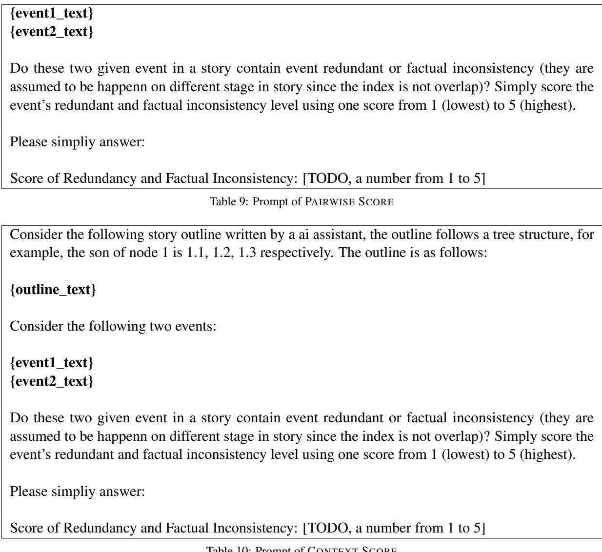

Table 10: Prompt of CONTEXT SCORE

## G Error Analysis

Although our method significantly outperforms the baseline, it still fails in certain cases. These failures include:

1. Decomposition is not sufficiently atomic;

2. Mistakes in contradiction detection;

3. Facts are not updated in the timeline.

Table 23, 24 and 23 illustrate three examples of such failures.

## H Usage of AI Assistants

During the development process, we drafted the code framework and data structures by ourselves initially, using Copilot to assist in enhancing development efficiency. Additionally, in the writing phase, we only employed ChatGPT for proofreading purposes, such as correcting grammatical errors and properly formatting tables.

## I Model Size and Computation Budget

We utilized the LLaMA2-7B-Chat model, a 7 billion parameter generative language model. Additionally, the NLI and retrieval models used were both under 1 billion parameters. The total computational cost for all experiments did not exceed 100 GPU hours on an A6000, and the cost of API of GPT-series was kept under \$500 USD.

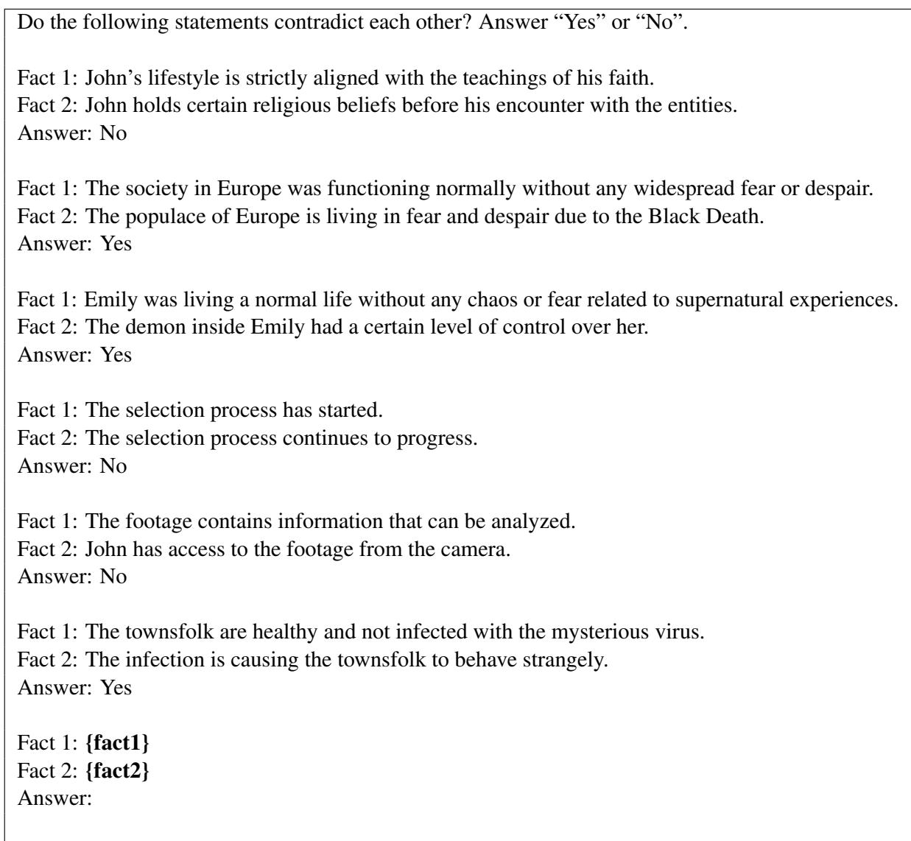  
Table 11: Prompt of fewshot learning in our ablation study.

<table><tr><td>Statistics Name</td><td>Value</td></tr><tr><td># Outlines:</td><td>90</td></tr><tr><td>Events / Outline:</td><td>39</td></tr><tr><td>Words / Outline:</td><td>2490.5±594.6</td></tr><tr><td>Sentences / Outline:</td><td>85.68±21.49</td></tr><tr><td>Words / Sentence:</td><td>29.07</td></tr><tr><td>Unique Words / Outline: 382.51 ±89.58</td><td></td></tr><tr><td># Unique Words:</td><td>8766</td></tr></table>

Table 12: Statistics of outlines. Each outline contains three levels (3+9+27=39). Word and sentence counts were determined using NLTK for tokenization. The variance in word count across different outlines has been calculated. Unique words were identified by simple deduplication after tokenization. On average, each unique word appears 6.5 times within an outline and 25.6 times across all 90 outlines.

<table><tr><td colspan="3">FACTTRACK LLaMA2-7B FACTTRACK GPT-4</td></tr><tr><td># Total Contradictions:</td><td>4559</td><td>8883</td></tr><tr><td>Positive Rate:</td><td>7%</td><td>14%</td></tr><tr><td>Avg. Contradictions per Outline:</td><td>50.66±21.79</td><td>98.7±34.93</td></tr><tr><td>Layer 1:</td><td>52 19%</td><td>4416%</td></tr><tr><td>Layer 2:</td><td>313 10%</td><td>623 20%</td></tr><tr><td>Layer 3:</td><td>2229 7%</td><td>4462 15%</td></tr><tr><td>Layer 1 ↔ Layer 2:</td><td>184 8%</td><td>303 13%</td></tr><tr><td>Layer 1 ↔ Layer 3:</td><td>333 5%</td><td>702 10%</td></tr><tr><td>Layer 2 ↔ Layer 3:</td><td>14487%</td><td>274913%</td></tr></table>

Table 13: Contradictions detected for FACTTRACK LLaMA2-7B and FACTTRACK GPT-4 by FACTTRACK with the settings in Appendix B.1. At the same NLI threshold, GPT-4 performs better at contradiction detection than LLaMA2-7B, capturing more potential contradictions due to fine-grained and accurate decomposition. We also visualize the frequency of contradictions occurring between different layers of the outline. Additionally, this provides insight into the higher-density contradictions tha may occur in a higher-level outline.

<table><tr><td>Method</td><td>N (Magnitude)</td><td>N (Sample Size)</td><td>(1)</td><td>(2)</td><td>(3)</td><td>(4)</td><td>(5)</td></tr><tr><td>FULL OUTLINE DETECTION (GPT-4)</td><td>298</td><td>296</td><td>35.14%</td><td>34.12%</td><td>15.20%</td><td>9.46%</td><td>6.08%</td></tr><tr><td>FACTTRACK (GPT-4, top 300)</td><td>300</td><td>300</td><td>4.33%</td><td>29.67%</td><td>25.00%</td><td>30.33%</td><td>10.67%</td></tr><tr><td>FACTTRACK (LLaMA2-7B-Chat, top 300)</td><td>300</td><td>300</td><td>36.00%</td><td>30.00%</td><td>15.00%</td><td>11.33%</td><td>7.67%</td></tr><tr><td>FACTTRACK (LLaMA2-7B-Chat, random 500)</td><td>4589</td><td>500</td><td>44.60%</td><td>42.20%</td><td>3.00%</td><td>5.40%</td><td>4.80%</td></tr><tr><td>FULL OUTLINE DETECTION (GPT-3.5-Turbo)</td><td>829</td><td>500</td><td>56.40%</td><td>36.40%</td><td>3.20%</td><td>3.20%</td><td>0.80%</td></tr><tr><td>PAIRWISE DETECTION(LLaMA2-7B-Chat)</td><td>4000</td><td>400</td><td>67.25%</td><td>26.25%</td><td>2.25%</td><td>2.50%</td><td>1.75%</td></tr><tr><td>Random</td><td>66690</td><td>408</td><td>68.87%</td><td>25.49%</td><td>1.96%</td><td>2.21%</td><td>1.47%</td></tr></table>

Table 14: Distribution of PAIRWISE SCORE for different methods. Magnitude refers to how many positive samples are detected by a given method across 90 outlines. Sample size is the number of randomly selected samples we allowed GPT-4 to annotate.

<table><tr><td>Method</td><td>N (Magnitude)</td><td>N (Sample Size)</td><td>(1)</td><td>(2)</td><td>(3)</td><td>(4)</td><td>(5)</td></tr><tr><td>FULL OUTLINE DETECTION (GPT-4)</td><td>298</td><td>298</td><td>34.90%</td><td>23.49%</td><td>14.77%</td><td>13.42%</td><td>13.42%</td></tr><tr><td>FACTTRACK (GPT-4, top 300)</td><td>300</td><td>299</td><td>21.07%</td><td>37.13%</td><td>14.72%</td><td>15.05%</td><td>12.04%</td></tr><tr><td>FACTTRACK (LLaMA2-7B-Chat, top 300)</td><td>300</td><td>300</td><td>31.00%</td><td>22.00%</td><td>18.00%</td><td>17.67%</td><td>11.33%</td></tr><tr><td>FACTTRACK (LLaMA2-7B-Chat, random 500)</td><td>4589</td><td>500</td><td>33.40%</td><td>44.40%</td><td>10.20%</td><td>8.20%</td><td>3.80%</td></tr><tr><td>FULL OUTLINE DETECTION (GPT-3.5-Turbo)</td><td>829</td><td>500</td><td>48.40%</td><td>35.00%</td><td>9.20%</td><td>6.20%</td><td>1.20%</td></tr><tr><td>PAIRWISE DETECTION (LLaMA2-7B-Chat)</td><td>4000</td><td>400</td><td>55.25%</td><td>33.25%</td><td>5.25%</td><td>4.75%</td><td>1.50%</td></tr><tr><td>Random</td><td>66690</td><td>408</td><td>57.35%</td><td>30.39%</td><td>7.11%</td><td>3.19%</td><td>1.96%</td></tr></table>

Table 15: Distribution of CONTEXT SCORE. Magnitude refers to how many positive samples were detected by a given method out of 90 outlines. Sample size is the number of randomly selected samples we allowed GPT-4 to annotate.

Below is a event point which contradicts one or more Existing Facts. Please rewrite the event point   
to align with all Existing Facts, while keeping as much of the original information as possible and   
maintaining a clear and concise description.   
event point: {curr\_event}   
Existing Facts:   
1. {status(fact\_1)}, {fact\_1}   
2. {status(fact\_2)}, {fact\_2}   
3. ...  
Table 16: The prompt given to GPT-4 to inject facts to a given event

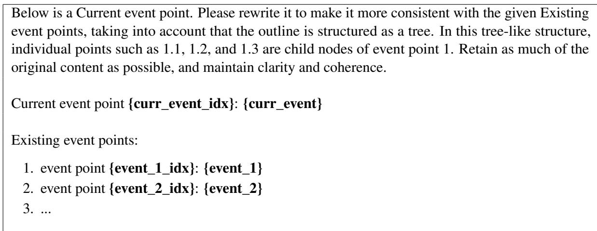  
Table 17: The prompt given to GPT-4 to retrieve events to make a given event more consistent

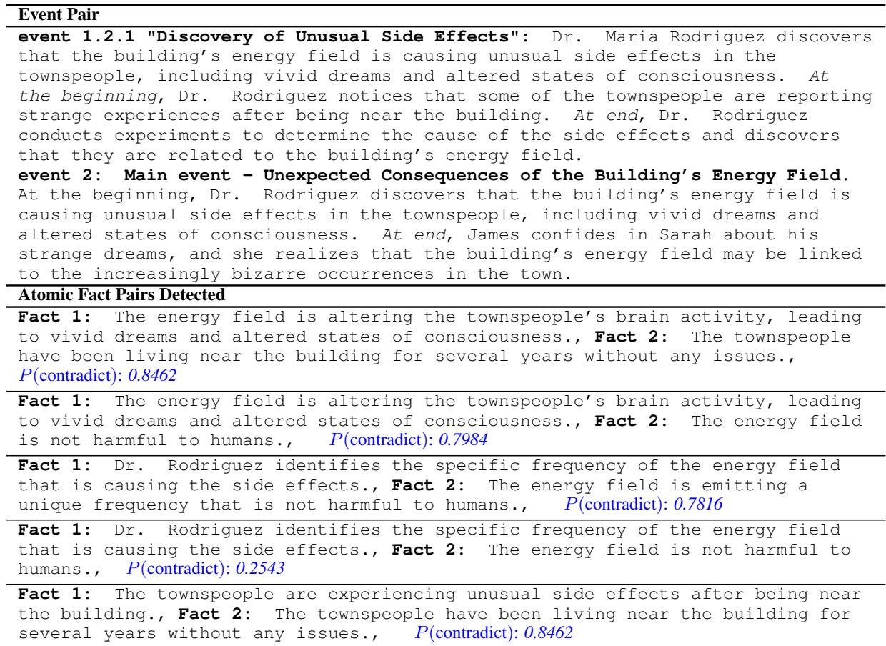  
Table 18: Example 1. The contradiction occurs because in Event 1.2.1, unusual side effects have already been discovered and attributed to the building’s energy field, but in Event 2, it is implied that the causal relationship between the building and the side effects has not yet been discovered.

Event Pair   
event 2.3.1 The Final Challenge: The contestant faces a final, climactic   
challenge that tests their skills and determination in a dramatic and intense   
way. At the beginning, The contestant receives word of the final challenge   
and must prepare themselves mentally and physically. At end, The contestant   
completes the final challenge and is declared the winner of the contest.   
event 2.3.2 The Mentor’s Support: The contestant receives guidance and support   
from a helpful character who provides valuable advice and encouragement   
throughout the final challenge. At the beginning, The contestant encounters   
a particularly difficult part of the final challenge and seeks the mentor’s   
help. At end, The contestant successfully completes the final challenge with   
the mentor’s support.   
Atomic Fact Pairs Detected   
Fact 1: The contestant has completed the final challenge and received the   
outcome of their performance., Fact 2: The contestant is facing a difficult   
part of the final challenge., P(contradict): 0.7638   
Fact 1: The contestant has completed the final challenge and received the   
outcome of their performance., Fact 2: The contestant has not yet completed   
the final challenge., P(contradict): 0.9736   
Fact 1: The contestant has achieved a significant milestone in their career or   
personal growth as a result of their performance in the challenge., Fact 2: The   
contestant has not yet completed the final challenge., P(contradict): 0.7533  
Table 19: Example 2. Although these two events were generated under one query of LLM, and there is still a factual contradiction. Event 2.3.1 indicates that the protagonist has completed the final challenge, but Event 2.3.2 suggests his mentor is helping him with the final challenge, creating a contradiction."

Event Pair   
event 2.3: Echo investigates the hidden message and uncovers a conspiracy   
involving Dr. Kim and the government. At the beginning, Echo decodes the   
hidden message and begins to investigate its contents. At end, Echo discovers a   
sinister event involving Dr. Kim and the government.   
event 3.2.2: Echo investigates the purpose of the secret government project.   
At the beginning, Echo finds a series of encrypted messages in the hidden   
folder. At end, Echo decrypts the messages and learns about the government’s   
involvement in Dr. Kim’s work.   
Atomic Fact Pairs Detected   
Fact 1: Echo has uncovered a conspiracy involving Dr. Kim and the government.,   
Fact 2: Echo has no knowledge of the government’s involvement in Dr. Kim’s   
work., P(contradict): 0.9347  
Table 20: Example 3. The contradiction arises because while Echo has already uncovered a conspiracy involving Dr. Kim and the government after event 2.3, but in event 3.2.2 there’s an implication that Echo is unaware of the government’s involvement in Dr. Kim’s work.

Event Pair   
event 2.3: As they reminisce about their past, Marcus and Leon begin to see   
each other in a new light, and their animosity towards each other starts   
to fade. At the beginning, Marcus is surprised by Leon’s kindness and   
vulnerability, and begins to see him as a person, not just an enemy. At end,   
Leon reciprocates, and they both feel a sense of camaraderie and understanding.   
event 3: As Marcus and Leon approach death, they begin to question the reasons   
behind their conflict and the true cost of war. At the beginning, Marcus   
wonders if there was another way to resolve the conflict without resorting to   
violence. At end, Leon reflects on the sacrifices they have made and the lives   
they have lost, and hopes that their deaths will not be in vain.   
Atomic Fact Pairs Detected   
post-fact 1: Leon reciprocates Marcus’s new perspective on him., pre-fact 1:   
Marcus and Leon are in conflict with each other., P(contradict): 0.7834   
post-fact 2: Marcus no longer views Leon as an enemy., pre-fact 2: Marcus and   
Leon are mortal enemies., P(contradict): 0.9566  
Table 21: Example 4. The contradiction arises in event 2.3, where Marcus and Leon have already reconciled, compared to event 3, where they just “begin to question the reasons behind their conflict,” indicating they are still in conflict.

Event Pair   
event 1.3.3: As the group learns more about their shared destiny, they begin   
to uncover secrets about their pasts that have been hidden from them. At the   
beginning, The group discovers that their shared destiny is connected to a   
larger conspiracy involving a powerful organization. At end, The group learns   
the truth about their pasts and the reason they have been brought together, and   
must decide how to use their newfound knowledge to change their lives and the   
world around them.   
event 3.2: As the group of strangers continues on their journey, they begin to   
uncover hidden secrets about their pasts and the mysterious force that brought   
them together. They must work together to unravel the truth before it’s too   
late. At the beginning, The group discovers a cryptic message that seems to   
point to a sinister event involving their shared destiny. At end, The group   
uncovers a shocking truth about their pasts and the true nature of the force   
that brought them together..   
Atomic Fact Pairs Detected as Contradict   
post-fact 1: The group learns secrets about their pasts that have been hidden   
from them., pre-fact 1: They have no memory of their past or how they were   
brought together., P(contradict): 0.8495   
post-fact 2: The group learns secrets about their pasts that have been hidden   
from them., pre-fact 2: They are unaware of any hidden secrets about their   
pasts, P(contradict): 0.9822   
post-fact 3: The group begins to understand the reason they have been brought   
together pre-fact 3: They have no memory of their past or how they were brought   
together. P(contradict): 0.4507   
post-fact 4: The group must work together to uncover the truth about their   
pasts and their destiny., pre-fact 4: They are unaware of any hidden secrets   
about their pasts, P(contradict): 0.6361  
Table 22: Example 5. The contradiction arises because in event 1.3.3, the group already gains knowledge of hidden secrets that are the reason they have been brought together, which contradicts the indication that before event 3.2, they are unaware about those secrets.

Event Pair   
event 1.3: Main event - Investigating the Building’s Origins. At the   
beginning, Agent Thompson uncovers evidence that the building in Sarah’s town   
is not an isolated incident, and that there are similar structures appearing all   
over the world. At end, Agent Thompson realizes that the buildings are not of   
this world, and that they are connected to an ancient civilization with advanced   
technology.   
event 3.1.1 "Uncovering the Hidden Message": Agent Thompson investigates the   
mysterious buildings globally and discovers a hidden message in one of them   
that leads him to believe they are not of this world. At the beginning, Agent   
Thompson finds a hidden compartment in one of the buildings that contains a   
cryptic message. At end, Agent Thompson deciphers the message and realizes it   
points to an ancient civilization with advanced technology.   
Atomic Fact Pairs Detected   
Fact 1: The buildings are connected to each other, forming a vast network of   
interconnected structures., Fact 2: The buildings are globally distributed,   
with no discernible pattern or connection between them., P(contradict): 0.9450  
Table 23: Failure case 1 for FACTTRACK. The problem here is “Decompose is not atomic enough”. It is ambiguous to say “connected to each other” in reality or on a metaphysical level.

Event Pair   
event: 1.3.1 - The Owner and Whiskers Share Memories of Their Past Adventures:   
The owner and Whiskers spend time reminiscing about their past adventures and   
experiences together. At the beginning, The owner and Whiskers sit together,   
looking through old photos and mementos from their time together. At end, The   
owner and Whiskers laugh and smile as they remember their favorite memories with   
each other..   
event 2.2.3 Goodbye Moment: The owner says goodbye to Whiskers. At the   
beginning, The owner approaches Whiskers, looking sad and tearful. At end, The   
owner pets Whiskers one last time, whispering words of love and appreciation..   
Atomic Fact Pairs Detected   
Fact 1: The owner and Whiskers are smiling and laughing as they remember their   
favorite memories with each other., Fact 2: The owner is sad and tearful.,   
P(contradict): 0.8451  
Table 24: Failure case 2 for FACTTRACK. The problem here is “Facts are not updated in the timeline.”. The owner’s mood changes can be found in the outline, but they don’t seem to be well tracked and updated in FACTTRACK.

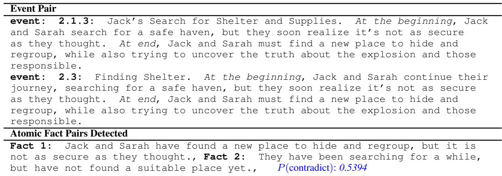  
Table 25: Failure case 3 for FACTTRACK. The problem here is “Contradiction detection makes a mistake.”.