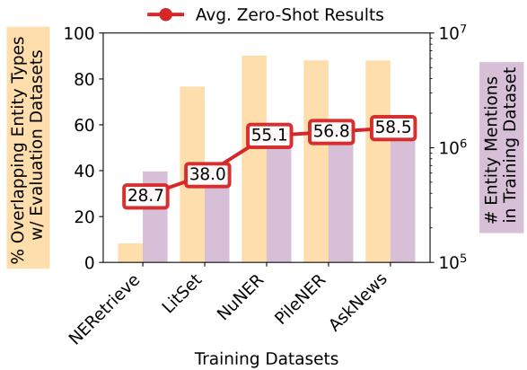
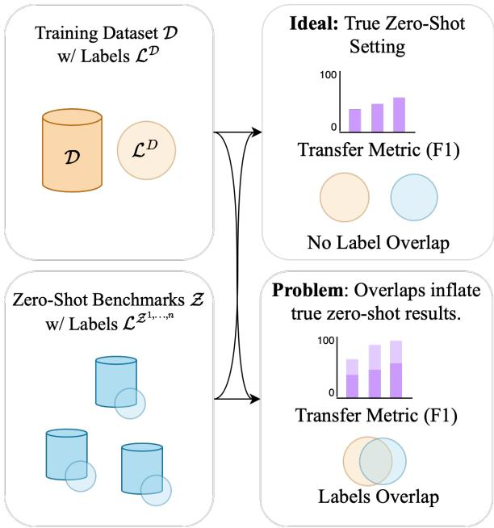
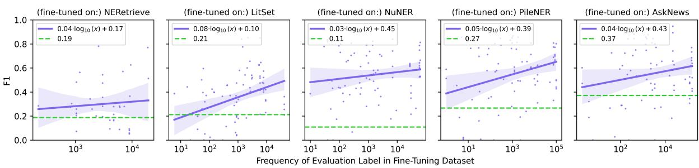
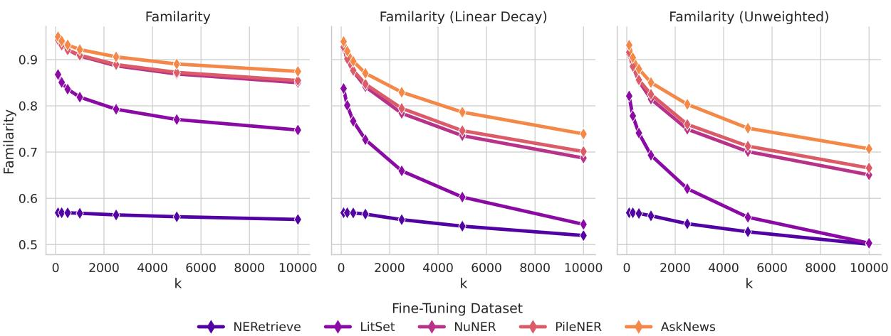
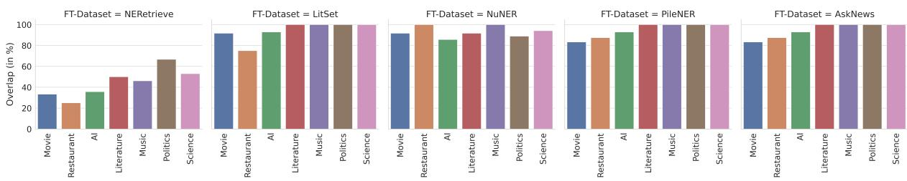
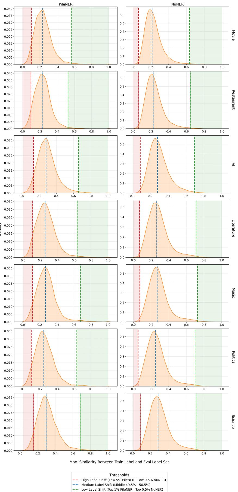

# FAMILIARITY: Better Evaluation of Zero-Shot Named Entity Recognition by Quantifying Label Shifts in Synthetic Training Data

Jonas Golde1, Patrick Haller1, Max Ploner1, Fabio Barth2, Nicolaas Jedema3, Alan Akbik1 1Humboldt Universität zu Berlin, 2DFKI, 3Amazon

## Abstract

Zero-shot named entity recognition (NER) is the task of detecting named entities of specific types (such as PERSON or MEDICINE) without any training examples. Current research increasingly relies on large synthetic datasets, automatically generated to cover tens of thousands of distinct entity types, to train zero-shot NER models. However, in this paper, we find that these synthetic datasets often contain entity types that are semantically highly similar to (or even the same as) those in standard evaluation benchmarks. Because of this overlap, we argue that reported F1 scores for zero-shot NER overestimate the true capabilities of these approaches. Further, we argue that current evaluation setups provide an incomplete picture of zero-shot abilities since they do not quantify the label shift (i.e., the similarity of labels) between training and evaluation datasets. To address these issues, we propose FAMILIARITY, a novel metric that captures both the semantic similarity between entity types in training and evaluation, as well as their frequency in the training data, to provide an estimate of label shift. It allows researchers to contextualize reported zero-shot NER scores when using custom synthetic training datasets. Further, it enables researchers to generate evaluation setups of various transfer difficulties for fine-grained analysis of zero-shot NER.

## 1 Introduction

Zero-shot named entity recognition (NER) is the task of recognizing instances of named entities of specific types (such as PERSON, ORGANIZATION, or MEDICINE) without any training examples. Current state-of-the-art models, such as GLiNER (Zaratiana et al., 2023) and GoLLIE (Sainz et al., 2024), are initially trained on datasets that contain a large set of different entity types (Aly et al., 2021; Ma et al., 2022a). This allows the models to identify mentions of previously unseen entity types by leveraging their general language understanding capabilities (Golde et al., 2024). Finally, these models are evaluated on zero-shot benchmarks that were excluded from the training process (Yang and Katiyar, 2020; Das et al., 2022; Yang et al., 2022).

  
Figure 1: Impact of training data on zero-shot performance of the current state-of-the-art approach (GLiNER). Each synthetic dataset is characterized by the label overlap (yellow column) and the total number of entity mentions (purple column). While zeroshot performance (red line, macro-averaged F1 across 7 benchmarks) has significantly improved, we note a concerning increase in entity type overlaps between training and testing data.

Advent of large synthetic training datasets. Recent research has developed methods that can automatically produce training datasets with over tens of thousands of distinct entity types, using available knowledge bases (Vrandeciˇ c and Krötzsch´ , 2014) or large language models (LLMs, Brown et al., 2020). Examples include PileNER (Zhou et al., 2024), NuNER (Bogdanov et al., 2024), and AskNews (Törnquist and Caulk, 2024). This represents a paradigm shift for zero-shot NER, which classically relied on hand-labeled training datasets with a much smaller set of entity types, such as Ontonotes (18 types, Hovy et al., 2006).

As Figure 1 shows, the advent of large synthetic training datasets has significantly improved reported zero-shot F1 scores. However, as the figure also shows, there is a concerning increase in the overlap between entity types in synthetic datasets and the evaluation benchmarks (cf. Figure 1, yellow bars). This means that evaluated models have indeed seen many instances of highly similar (or even the same) entity types during training, raising the question of whether the reported F1 scores overestimate their true zero-shot capabilities.

  
Figure 2: With LLMs now capable of generating datasets that cover thousands of entity types, models trained on different datasets are subject to varying label shifts, making comparisons between them challenging. To address this, we introduce FAMILIARITY, a metric that quantifies and accounts for label shift, enabling more accurate and fair comparisons across models.

Broader implications. Naturally, we could strive to ensure a fair zero-shot comparison by proposing training and evaluation splits that have no overlapping entity types at all. However, ensuring no overlap is in fact not trivial since the same or highly similar entity types might have different labels (such as CORPORATION and ORGANIZATION). But more crucially, using fixed training and evaluation splits would potentially limit process driven by advancements in generating synthetic datasets.

We rather argue that given the advancements of LLMs and their potential to generate highquality datasets, accepting custom synthetic training datasets is inevitable. We therefore propose to measure the transfer difficulty between the labels of a training and an evaluation dataset, referred to as label shift (Lipton et al., 2018; Wu et al., 2021). Contributions. With this paper, we identify a critical issue with current zero-shot NER evaluations caused by the growing availability of largescale synthetic training datasets. To address this issue, we propose FAMILIARITY, a novel metric that quantifies the similarity between the sets of entity types in training and evaluation data, allowing us to assess the transfer difficulty of an evaluation setup (cf. Figure 2). We summarize our contributions as follows:

1. We empirically demonstrate that label overlaps introduce undesirable biases in current zero-shot evaluation setups (Section 2).

2. We propose FAMILIARITY, a metric that quantifies label shift between training data and evaluation benchmarks, providing insights into transfer difficulty (Section 3).

3. We conduct a thorough analysis of FAMIL-IARITY, showing that it effectively mitigates the evaluation bias and can be used to generate training splits of varying difficulty levels (Section 4).

To enable the research community to efficiently compute FAMILIARITY and incorporate it into future research, we make all code publicly available as open source1. Further, we publish three benchmark scenarios on the Hugging Face hub2 for different levels of transfer difficulty to aid researchers in fine-grained analysis of zero-shot NER.

## 2 The Impact of Synthetic Datasets on Current Evaluations

As shown in Figure 2, we hypothesize that label shift between fine-tuning and evaluation datasets affects transfer performance, particularly in zero-shot NER settings. We define this transfer as the process of fine-tuning a model Θ on a dataset  with entity types $\mathcal { L } ^ { \mathcal { D } }$ and subsequently evaluating it on one or more benchmarks $\mathcal { Z } _ { 1 , . . . , n } .$ , each with its own set of entity types $\mathcal { L } ^ { \mathcal { Z } _ { 1 , . . . , n } }$ , such that $\mathcal { Z } = \cup _ { i = 1 } ^ { n } \mathcal { Z } _ { i }$ and ${ \mathcal { L } } ^ { \mathcal { Z } } = \cup _ { i = 1 } ^ { n } { \mathcal { L } } ^ { \mathcal { Z } _ { i } }$ . The datasets themselves do not overlap: $\mathcal { Z } \cap \mathcal { D } = \emptyset$

However, the entity type sets of the training and evaluation datasets may overlap due to the broad coverage of entity types, particularly in synthetic training datasets: $\mathcal { L } ^ { \bar { Z } } \subseteq \bar { \mathcal { L } } ^ { \mathcal { D } }$

We further note that it is possible that ${ \mathcal { L } } ^ { { \mathcal { Z } } } \cap { \mathcal { L } } ^ { { \mathcal { D } } } = $ . However, given that LLMs can generate finetuning datasets with thousands of entity types, we observe that in some cases, more than 80% of the evaluation entity types are included in the training dataset (e.g., NuNER, PileNER, and AskNews in Figure 1). This obviously distorts the genuine zero-shot nature of transfer evaluations, and we hypothesize that the performance for an entity type ℓ present in both the evaluation benchmark and the fine-tuning dataset $( \ell \in \mathcal L ^ { \mathcal Z } \cap \mathcal L ^ { \mathcal D } )$ will be higher than for an entity type not present in the fine-tuning data $( \ell \in \mathcal L ^ { \mathcal Z } \setminus \overline { { \mathcal L ^ { D } } } )$

<table><tr><td>Dataset</td><td># Sent.</td><td># Ent. Types</td><td>Ø Ment. per Sent.</td></tr><tr><td>NERetrieve</td><td>3,437.6k</td><td>0.5k</td><td>2.6</td></tr><tr><td>LitSet</td><td>972.6k</td><td>242.9k</td><td>0.8</td></tr><tr><td>NuNER</td><td>971.8k</td><td>192.1k</td><td>4.5</td></tr><tr><td>PileNER</td><td>45.9k</td><td>12.6k</td><td>20.5</td></tr><tr><td>AskNews</td><td>49.4k</td><td>12.6k</td><td>20.2</td></tr></table>

Table 1: Overview of synthetic fine-tuning datasets used in our experiments with their total number of sentences, distinct number of entity types, and average number of entity mentions per sentence.

## 2.1 Experimental Setup

First, we examine the extent to which label overlaps are a problem, and second, whether synthetic datasets can be scaled to enhance performance through increased examples, considering the potential risk that LLMs may generate duplicate training data, which could lead to performance saturation. To address these questions, we train universal NER models on five large-scale datasets and evaluate them on seven widely used benchmarks. We then analyze the transfer performance for each entity type, classifying them as either overlapping $( \ell \in \dot { \mathcal { L } ^ { z } } \cap \mathcal { L } ^ { D } )$ or true zero-shot $( \ell \in \mathcal L ^ { \mathcal Z } \backslash \mathcal L ^ { \mathcal D } )$ . For entity types present in both the evaluation and finetuning datasets, we perform a log-linear regression to examine whether the number of entity mentions is positively correlated with the performance on those types.

Synthetic fine-tuning datasets. We consider five synthetic or automatically derived datasets specifically designed for training zero-shot NER models. NERetrieve (Katz et al., 2023) and LitSet (Golde et al., 2024) are automatically derived from the knowledge bases CaLiGraph (Heist and Paulheim, 2022) and WikiData (Vrandeciˇ c and´ Krötzsch, 2014)). NuNER (Bogdanov et al., 2024) and PileNER (Zhou et al., 2024) use gpt-3.5 (Brown et al., 2020) to annotate large-scale corpora. AskNews (Törnquist and Caulk, 2024) extends NuNER with real-world, diverse news articles obtained from the AskNews API3. An overview of these datasets is provided in Table 1.

<table><tr><td>Dataset</td><td># Sent.</td><td># Ent. Types</td><td>Ø Ment. per Sent.</td></tr><tr><td>Movie</td><td>2.4k</td><td>12</td><td>2.2</td></tr><tr><td>Restaurant</td><td>1.5k</td><td>8</td><td>2.1</td></tr><tr><td>AI</td><td>431</td><td>14</td><td>4.2</td></tr><tr><td>Literature</td><td>416</td><td>12</td><td>5.4</td></tr><tr><td>Music</td><td>465</td><td>13</td><td>7.1</td></tr><tr><td>Politics</td><td>650</td><td>9</td><td>6.5</td></tr><tr><td>Science</td><td>543</td><td>17</td><td>5.7</td></tr></table>

Table 2: Overview of the 7 zero-shot benchmarks used in our experiments. Abbreviations are identical to the ones used in Table 1.

Zero-shot benchmarks. For evaluation, we use the MIT Movie and Restaurant datasets (Liu et al., 2013), as well as the CrossNER dataset (Liu et al., 2021), as they are frequently used in zero-shot transfer settings (Zhou et al., 2024; Zaratiana et al., 2023; Sainz et al., 2024). CrossNER includes five domains: Movies, AI, Literature, Politics, and Science. An overview of these datasets is provided in Table 2.

Training details. We use the GLiNER architecture (Zaratiana et al., 2023), which represents the current state-of-the-art. We reuse all hyperparameters as reported in the original paper. For each of the five datasets, we train a model using three different seeds. To ensure that no model benefits from being trained on significantly more data, we train every model for a fixed number of 60,000 steps with a batch size of 8. The authors of the AskNews model do not train their model from scratch; instead, they continue fine-tuning a model that was initially trained on the NuNER dataset. We follow this approach and further fine-tune our NuNERtrained model for 25 epochs with a batch size of 5, as reported in their paper. We use Hugging Face’s Transformers library (Wolf et al., 2020) and Py-Torch (Ansel et al., 2024) for our implementations.

## 2.2 Results

We present the results in Figure 3, where each subplot’s legend displays the parameters of the loglinear regression for entity types that overlap between the training dataset and evaluation benchmarks, as well as the average zero-shot F1 score for non-overlapping entity types. We make several observations:

  
Overlapping Evaluation Label (l ∈ L² n LD) — Log-Regression (F1 vs. # Entity Mentions in D) --- Avg. True Zero-Shot (l ∈ c² \ LP)  
Figure 3: Transfer performance is higher on entity types that occur in both evaluation and fine-tuning datasets compared to unseen types. Further, we observe a positive, log-linear correlation between the number of entity mentions for some entity type and its final performance.

Better performance for overlapping entities. Evaluation entity types that are also present in the synthetic fine-tuning datasets consistently perform better than those that are absent from the finetuning data. However, we note one exception: with LitSet, true zero-shot performance is higher when there are fewer than 100 support examples of an entity type. As Golde et al. (2024) explain, this can be attributed to the sparse NER annotations in their dataset, as the original annotations are intended for entity linking rather than named entity recognition. Better performance for frequent entities. A second important factor is the number of training instances for overlapping entity types. We observe a positive correlation between the number of entity mentions and the performance of individual entity types across all models. The correlation ranges from 0.04 $\log _ { 1 0 } ( x )$ (NERetrieve, AskNews) to $0 . 0 8 \log _ { 1 0 } ( x )$ (LitSet), indicating that the benefits of LLM-annotated and automatically derived datasets do not diminish at a fixed point, even though increasingly larger amounts of data are needed for further gains.

Discussion. Our experiment indicates that overlaps between datasets can indeed inflate zero-shot transfer performance when synthetic data is used. Further, our findings suggest that training datasets generated by LLMs may show significant alignment with existing evaluation benchmarks for NER.

## 3 FAMILIARITY

The previous experiments show two key challenges in current zero-shot NER evaluations: (1) Overlapping entity types inflate the transfer evaluations of zero-shot models, and (2) LLMs may generate ideal datasets for fixed evaluation settings, undermining the concept of low-resource evaluations. Therefore, future evaluations must distinguish between improvements coming from sophisticated datasets and those achieved through new data-efficient approaches that do not depend on overlapping entity types.

To address these challenges, we introduce FA-MILIARITY to quantify label shift between finetuning datasets and evaluation benchmarks based on the semantic similarity of the respective entity type sets. FAMILIARITY considers two key factors: (1) the semantic similarity between evaluation and training entity types, and (2) the support for each training entity type. The core idea is that if the evaluation entity type is “person” and the set of training entity types contains a closely related type, such as “human”, with substantial support, we can expect strong performance. In contrast, if the closest training entity type to "person" is a less related type like “location” with limited support, we can expect a worse performance.

To compute semantic similarity, we use a sentence-transformer (Reimers and Gurevych, 2019) to embed evaluation and training entity types, calculate cosine similarity, and clip negative values to keep the metric within a 0 to 1 range. For the second factor, we introduce a hyperparameter, K, which limits the number of support examples considered. In our experiments, we set $K = 1 0 0 0 .$ meaning that up to 1000 closest training entity types are considered, measured by their support. We further weight these similarities by a Zipfian distribution (Zipf, 1949), prioritizing the most similar entity types, as they are likely to have the greatest impact on transfer performance.

Definition. Let $\mathcal { L } ^ { \mathcal { D } }$ and $\mathcal { L } ^ { \mathcal { Z } }$ represent the sets of all entity types in the fine-tuning dataset and the zeroshot benchmarks, respectively. Additionally, let denote the set of counts for each entity type $\ell ^ { D } \in$ $\mathcal { L } ^ { \mathcal { D } }$ , and let θ represent the all-mpnet-base-v2 sentence-transformer model. For any entity type $\ell ^ { \mathcal { Z } } \in \mathcal { L } ^ { \mathcal { Z } }$ from the evaluation benchmarks and any entity type $\ell ^ { D } \in \mathcal { L } ^ { D }$ from the training dataset, we calculate the clipped cosine similarity as follows:

$$
\varphi _ { \mathrm { c l i p } } ( \ell ^ { \mathcal { Z } } , \ell ^ { D } ) = \operatorname* { m a x } ( \varphi ( \theta ( \ell ^ { \mathcal { Z } } ) , \theta ( \ell ^ { D } ) ) , 0 )
$$

where $\varphi ( \cdot , \cdot )$ denotes the standard cosine similarity. We can now calculate the similarity between a given evaluation entity type $\ell ^ { \mathcal { Z } }$ and all training entity types, resulting in the set:

$$
\mathcal { S } ^ { \ell ^ { \mathcal { Z } } } = \{ \varphi _ { \mathrm { c l i p } } ( \ell ^ { \mathcal { Z } } , \ell _ { 1 } ^ { D } ) , \dots , \varphi _ { \mathrm { c l i p } } ( \ell ^ { \mathcal { Z } } , \ell _ { j } ^ { D } ) \}
$$

We then repeat each element in $\mathcal { S } ^ { \ell ^ { z } }$ according to the corresponding support $c ^ { i } \in \mathcal { C }$ for the training entity type $\ell _ { i } ^ { D }$ to account for the number of mentions of each training entity type:

$$
\begin{array} { r l } & { r e p e a t ( \mathcal { S } ^ { \ell ^ { \mathcal { E } } } , \mathcal { C } ) = \{ \underbrace { s ^ { 1 } , . . , s ^ { 1 } } _ { c ^ { 1 } - \mathrm { t i m e s } } , . . , \underbrace { s ^ { j } , . . , s ^ { j } } _ { c ^ { j } - \mathrm { t i m e s } } \} } \end{array}
$$

with $s ^ { i } = \varphi _ { \mathrm { c l i p } } ( \ell ^ { \mathcal { Z } } , \ell _ { i } ^ { D } )$ . We then sort the repeated set of all similarities between the evaluation entity type $\ell ^ { \mathcal { Z } }$ and all training entity types and select the top-K similarities.

$$
\mathcal { S } ^ { \ell ^ { \mathcal { Z } } } = s o r t ( r e p e a t ( \mathcal { S } ^ { \ell ^ { \mathcal { Z } } } , \mathcal { C } ) ) _ { [ : K ] }
$$

Once we determined the top-K similarities for evaluation entity type $\ell ^ { \mathcal { Z } }$ , we compute the weighted average using the position k of each similarity value:

$$
\mathrm { F A M I L I A R I T Y } ( \ell ^ { \mathcal { Z } } ) = \frac { \sum _ { k = 1 } ^ { K } S _ { k } ^ { \ell ^ { \mathcal { Z } } } \cdot \frac { 1 } { k } } { \sum _ { k = 1 } ^ { K } \frac { 1 } { k } }
$$

Finally, we marco-average FAMILIARITY for each $\ell ^ { \mathcal { Z } } \in \mathcal { L } ^ { \mathcal { Z } }$ , resulting in an aggregated score for the entire transfer setting.

To account for the number of mentions of each training entity type $\ell _ { i } ^ { D }$ , we weight each element in $\mathcal { S } ^ { \ell ^ { z } }$ by the corresponding probability distribution vector $\mathcal { P } ^ { \ell ^ { D } }$ , which represents the relative frequency of each training entity type:

where $s ^ { i } = \varphi _ { \mathrm { c l i p } } ( \ell ^ { \mathcal { Z } } , \ell _ { i } ^ { D } )$ and the distribution vector $\mathcal { P } ^ { \ell ^ { D } }$ ensures that entity types with higher mention counts contribute proportionally more to the similarity calculation.

<table><tr><td>Train Dataset D</td><td>F1</td><td>Pearson r</td><td>FAMILIARITY</td></tr><tr><td>NERetrieve</td><td>0.287</td><td>0.517</td><td>0.563</td></tr><tr><td>LitSet</td><td>0.380</td><td>0.340</td><td>0.695</td></tr><tr><td>NuNER</td><td>0.551</td><td>0.299</td><td>0.893</td></tr><tr><td>PileNER</td><td>0.568</td><td>0.310</td><td>0.887</td></tr><tr><td>AskNews</td><td>0.585</td><td>0.457</td><td>0.899</td></tr><tr><td></td><td></td><td></td><td></td></tr></table>

Table 3: Zero-shot F1 scores and FAMILIARITY, macroaveraged over all seven evaluation benchmarks. FAMIL-IARITY quantifies the label shift between fine-tuning and zero-shot benchmarks, explaining why models trained on certain synthetic datasets result in better performance.

We then sort the weighted set of all similarities between the evaluation entity type $\ell ^ { \mathcal { Z } }$ and all training entity types and select the top-K similarities:

Once we have determined the top-K similarities for evaluation entity type $\ell ^ { \mathcal { Z } }$ , we compute the weighted average using the position k of each similarity value:

Finally, we macro-average FAMILIARITY for each $\ell ^ { \mathcal { Z } } \in \dot { \mathcal { L } } ^ { \mathcal { Z } }$ , resulting in an aggregated score for the entire transfer setting.

## 4 Experiments

We evaluate FAMILIARITY in various settings to assess its ability to measure label shift in zero-shot NER transfer scenarios. We examine its correlation with traditional transfer performance, the impact of design choices (embedding model and top-K similarities), and how FAMILIARITY can be used to create NER tasks of varying difficulty.

## 4.1 FAMILIARITY in Current Evaluations

Setup. We reuse the models from Section 2 and compute FAMILIARITY for each setup to evaluate whether our metric correlates with transfer performance of models trained on different synthetic datasets. We report the values of our metric alongside the macro-averaged F1 scores across all seven zero-shot benchmarks, as well as the percentage of overlapping entity types between each training dataset and the combined entity types of all evaluation benchmarks.

Results. We present the average zero-shot transfer results, Pearson correlation values r (between FA-MILIARITY and F1, macro-averaged over all evaluation entity types), and FAMILIARITY scores in Table 3. Our analysis shows that models trained on

  
Figure 4: FAMILIARITY for different values of k and using different rank weights.

NuNER, PileNER, and AskNews achieve the highest F1 scores (> 55.0) and high FAMILIARITY values (> 0.88), suggesting strong alignment between these models and the evaluation entity types. In contrast, the automatically derived datasets, NERetrieve and LitSet, have lower F1 scores (28.7 and 38.0, respectively) and correspondingly lower FA-MILIARITY values (0.563 and 0.695), reflecting a greater label shift between training and evaluation sets. Additionally, the Pearson correlation coefficients (r) are consistently positive but moderate (0.299–0.517). This suggests that the semantic similarity between entity types in the training and evaluation sets is correlated with transfer performance, though it is not the only factor influencing the final results.

We can summarize that a smaller label shift (similar sets of entity types in training and evaluation datasets) results in higher zero-shot transfer performance. Therefore, considering this factor is crucial for making fair comparisons between different models or architectures in zero-shot NER settings. We further note that FAMILIARITY complements existing metrics like F1 by making the impact of entity type overlaps explicitly visible, leading to a more interpretable comparison.

## 4.2 Impact of K

In this experiment, we explore the effect of the hyperparameter K, which controls how many entity types (measured by their support) are considered when computing FAMILIARITY for a given evaluation entity type. Thus, K can be seen as the number of support examples from which we expect a model to learn a specific entity concept. We recall that we use K = 1000 to include not only the closest types but also a variety of similar types that may help in learning the class definition of certain entity types.

Setup. We reuse the models trained in Section 2 and recompute FAMILIARITY using various values of K, ranging from 100 to 10,000. Additionally, we compare our default Zipfian weighting with two other approaches: linear decay $\begin{array} { r } { ( p ( k ) = \frac { | K | - k } { | K | } ) } \end{array}$ which gradually reduces the influence of lowerranked entity types, and an unweighted approach, which treats all entity types equally. This comparison helps us understand how different weighting strategies interact with K and influence FAMILIAR-ITY scores.

Results. We present the results in Figure 4. We observe that FAMILIARITY values are higher for smaller values of K and decrease as K increases. This is expected, as smaller K values emphasize entity types most similar to the evaluation types, while larger K values incorporate more distant, less similar types. In particular, the unweighted results reveal that most datasets have a few highly similar entity types, but the similarity declines rapidly beyond those. Applying weighting schemes such as linear decay or Zipf smooths this decline, which is desirable because it makes FAMILIARITY less sensitive to variations in K. Crucially, the relative ranking of datasets remains stable across different values of K and weighting methods. Based on these observations, we argue that the optimal configuration for FAMILIARITY uses K = 1000 with Zipf weighting.

## 4.3 Different Embedding Models

Another important hyperparameter is the embedding model θ. In this experiment, we examine how the choice of embedding model affects the values of FAMILIARITY and the potential impact on our metric’s outcomes.

Setup. We reuse the models trained in Section 2 but change the underlying embedding model to compute FAMILIARITY. One potential limitation of transformers is that they encode tokens in context, which may be less effective for short entity type descriptions, often consisting of single words. Therefore, we compare our chosen model with standard transformers, additional sentence-transformers, and classical word embeddings. Specifically, we consider:

<table><tr><td rowspan="2"></td><td colspan="5">Fine-Tuning on:</td></tr><tr><td>NERetrieve</td><td>LitSet</td><td>NuNER</td><td>PileNER</td><td>AskNews</td></tr><tr><td>∅ Zero-Shot F1</td><td>28.7</td><td>38.0</td><td>55.1</td><td>56.8</td><td>58.5</td></tr><tr><td>fasttext-crawl-300d-2M</td><td>0.595</td><td>0.712</td><td>0.898</td><td>0.857</td><td>0.874</td></tr><tr><td rowspan="2">fasttext-wiki-news-300d-1M glove-6B-300d</td><td>0.718</td><td>0.791</td><td>0.920</td><td>0.892</td><td>0.904</td></tr><tr><td>0.654</td><td>0.743</td><td>0.910</td><td>0.879</td><td>0.893</td></tr><tr><td rowspan="2">bert-base-uncased distilbert-base-uncased</td><td>0.823</td><td>0.872</td><td>0.956</td><td>0.948</td><td>0.954</td></tr><tr><td>0.883</td><td>0.917</td><td>0.973</td><td>0.968</td><td>0.972</td></tr><tr><td>all-mpnet-base-v2</td><td>0.563</td><td>0.695</td><td>0.893</td><td>0.887</td><td>0.899</td></tr><tr><td>all-miniLM-L6-v2</td><td>0.605</td><td>0.701</td><td>0.901</td><td>0.893</td><td>0.905</td></tr></table>

Table 4: FAMILIARITY using different embedding models. Underscored values indicate cases where FAMILIARITY matches the ranking of the macro-averaged F1 score.

Classical Word Embeddings: We include two fasttext models (Bojanowski et al., 2017), fasttext-crawl-300d-2M and fasttext-wiki-news-300d-1M, along with the largest GloVe embedding (Pennington et al., 2014), glove-6B-300d.

Classical Transformers: We include two widely used transformers: bert-base-uncased (Devlin et al., 2019) and distilbert-base-uncased (Sanh et al., 2020), which are not specifically trained for semantic similarity measurement.

Sentence Transformers: We compare the selected all-mpnet-base-v2 with another sentencetransformer model, all-miniLM-L6-v2 (Reimers and Gurevych, 2019).

Results. We present results in Table 4. First, all embedding models show similar trends: lowperforming models, such as those trained on NERetrieve or LitSet, consistently achieve the lowest similarity scores across all embedding models. For high-performing models (NuNER, PileNER, and AskNews), all embedding models provide reasonable results, with high F1 scores and FAMILIARITY values, accurately reflecting the overall low label shift. Despite the small absolute differences, FA-MILIARITY remains close across our trained models, capturing the overall label shift effectively.

Our results indicate that FAMILIARITY performs well with various embedding models. However, the choice of embedding model affects the scale of similarity scores: classical transformer models tend to consistently produce high FAMILIAR-ITY scores (> 82.3) across all settings, which is not ideal. We are interested in an embedding model that can clearly distinguish between different label shifts. We argue that classical word embeddings, particularly fasttext-crawl-300d-2M, and the all-mpnet-base-v2 sentence-transformer perform best in this regard. Given that label descriptions may become more detailed with future synthetic datasets, we argue using all-mpnet-base-v2 is the best option. However, if computational efficiency is a priority, fasttext-crawl-300d-2M is a viable alternative.

## 4.4 Using FAMILIARITY to Generate Training Splits of Varying Difficulty

In this section, we explore how FAMILIARITY can be applied to create training splits (subsets of the original datasets) with varying levels of difficulty. If FAMILIARITY effectively captures and explains label shift in NER transfer settings, it should enable us to generate splits with either low or high label shifts accordingly.

Setup. We create a similarity matrix using our embedding model θ containing the similarities between each pair of training entity type $\ell ^ { D } \in \mathcal { L } ^ { D }$ and evaluation entity type $\ell ^ { \bar { z } } \in \mathcal { L } ^ { \bar { z } }$

$$
\mathcal { M } _ { i j } = \varphi _ { \mathrm { c l i p } } ( \theta ( \ell ^ { D } ) , \theta ( \ell ^ { \mathcal { Z } } ) )
$$

such that $\mathcal { M } \in \mathbb { R } ^ { | \mathcal { L } ^ { D } | \times | \mathcal { L } ^ { Z } | }$ . We assign a single value to each training label (row of ) by either (1) taking the maximum similarity or (2) computing the entropy over all evaluation labels, which indicates how well a training entity type aligns with the evaluation entity type set. Based on this, we create training splits with low, random, or high label shifts by selecting training entity types according to quantiles of . For example, the top 1% quantile in the maximum similarity matrix includes training entity types that are highly similar to at least one evaluation entity type. A split consisting solely of these entity types would result in a training split with low label shift. Details of the selection process are provided in Appendix B.

<table><tr><td>D</td><td>Agg.</td><td>Label Shift</td><td>FAMILIARITY</td><td>F1</td></tr><tr><td rowspan="4">NUUNEER</td><td></td><td>low</td><td>0.806</td><td rowspan="4">45.8 33.6 28.0</td></tr><tr><td>Entropy</td><td>medium</td><td>0.630</td></tr><tr><td></td><td>high</td><td>0.530</td></tr><tr><td rowspan="2">Max. </td><td>low</td><td>0.865</td></tr><tr><td></td><td>medium high</td><td>42.5 0.637 30.9 0.364</td></tr><tr><td rowspan="5">PINER</td><td>Entropy</td><td>low</td><td>0.880</td><td>23.7 45.8 30.8</td></tr><tr><td rowspan="2"></td><td>medium</td><td>0.534</td><td rowspan="2">33.3</td></tr><tr><td>high</td><td>0.596</td></tr><tr><td rowspan="2">Max. </td><td>low</td><td>0.896</td><td rowspan="2">43.5</td></tr><tr><td>medium</td><td>0.551</td></tr><tr><td rowspan="2"></td><td rowspan="2"></td><td></td><td></td><td rowspan="2">26.2 29.8</td></tr><tr><td>high</td><td>0.389</td></tr></table>

Table 5: Using FAMILIARITY, we generate subsets of PileNER and NuNER with varying levels of difficulty. These splits can be produced using either entropy-based selection or maximum similarity-based selection.

For these experiments, we use NuNER and PileNER, as they show the best performance and are standalone datasets (unlike AskNews, which requires a pre-fine-tuned model). For each dataset, we filter it to include only entity types with low, medium, or high label shifts, removing all others. We then train models as described in previous sections, but for 10,000 steps instead of 60,000, as the filtered subsets are significantly smaller than the original datasets, reducing the risk of overfitting.

Results. The results in Table 5 show that FAMIL-IARITY can successfully create training splits of varying difficulty, regardless of the aggregation method (entropy or maximum similarity). Models trained on splits with low label shifts consistently achieve higher FAMILIARITY values and F1 scores, indicating better alignment with the evaluation data. For instance, in the low label shift setting for NuNER with entropy aggregation, FA-MILIARITY reaches 0.806 and the F1 score is 45.8, whereas in the high label shift setting, these values drop to 0.530 and 28.0, respectively. Similarly, for PileNER, the F1 score decreases by 17.8 points between the low and high label shift settings using entropy aggregation.

Interestingly, entropy aggregation yields better results in low label shift settings compared to maximum similarity, while maximum similarity produces lower scores in high label shift settings. This suggests that entropy aggregation is more effective for capturing low label shift, whereas maximum similarity is better suited for generating high label shift splits.

## 5 Related Work

The problem of NER can be formulated in many ways such as span classification (Yu et al., 2020), question answering (Li et al., 2020), and text generation (Cui et al., 2021; Ma et al., 2022b). The emergence of large language models has recently transformed many downstream NLP tasks through natural language prompting (Min et al., 2022; Dong et al., 2023), including NER (Aly et al., 2021; Nguyen et al., 2021; Li et al., 2022; Ma et al., 2022a; Chen et al., 2023; Shen et al., 2023). Our work contributes to this line of research by measuring the label shift of entity type prompts.

Similarity Metrics. Many works exist on evaluating outputs generated by a model with the target sequence using similarity metrics such as BERTscore (Zhang et al., 2020), BARTscore (Yuan et al., 2021), or SEMscore (Aynetdinov and Akbik, 2024) as well as task-specific similarity metrics such as SEM-F1 (Bansal et al., 2022) or SAS (Risch et al., 2021). We follow this idea by comparing the semantic similarity between fine-tuning and zero-shot entity types.

Zero-Shot NER. We have recently observed increasingly capable NER systems trained on largescale datasets (Wang et al., 2023; Lou et al., 2023; Zhou et al., 2024; Sainz et al., 2024). These works stand out because they have been fine-tuned on datasets covering thousands of entity types. Considering the progress of LLMs, we expect more contributions generating tailored datasets (Schick and Schütze, 2021; Ye et al., 2022a,b; Li et al., 2023) for downstream tasks. Our work supports this line of research to better evaluate future contributions by explicitly measuring the label shift.

## 6 Conclusion

This paper explores how the label shift between synthetically produced training datasets affects the performance of zero-shot NER as evaluated in current benchmark scnearios. As LLMs advance, creating improved datasets that align with the chosen zero-shot benchmarks to enhance transfer performance becomes more accessible. As a consequence, evaluation settings become less comparable. Thus, we introduce FAMILIARITY to quantify the connection between fine-tuning and zero-shot datasets and show how it can achieve fairer comparisons. Although the automatic generation of datasets holds promise for future NER research, it is crucial to foster data-efficient research by conducting zero-shot NER in scenarios where finetuning datasets do not contain closely related entity types.

To enable the research community to efficiently compute FAMILIARITY and incorporate it into future research, we make all code publicly available as open source. Further, we publish three benchmark scenarios for different levels of transfer difficulty to aid researchers in fine-grained analysis of zero-shot NER.

## Limitations

FAMILIARITY is specifically designed for transfer settings in the NER domain, but addresses a broader issue: label shift in transfer learning. Although we validated our metric only for NER, it is possible - if not likely - that the metric could yield different results when applied to other downstream tasks.

Furthermore, our FAMILIARITY metric is designed for models trained from scratch and does not account for the extensive pre-training of LLMs. Since pre-trained models may already contain implicit knowledge of certain entities and phrases, such as “Google is a technology company,” our method does not currently measure the impact of such prior knowledge. Future work could explore complementary evaluation techniques to assess the impact of pre-training more accurately.

Our metric is designed for datasets that contain precise and clearly defined entity types, which is especially important in the context of the increasing use of synthetic datasets. Synthetic datasets often leverage structured knowledge bases and large language models to generate fine-grained entity labels. However, the reliance of the metric on such detailed annotations means that it is less effective when applied to simpler, high-resource datasets where multiple concepts might be grouped into a single broad entity class. For example, in datasets where a general category like “organization” encompasses various subtypes (e.g., companies, nonprofits and government agencies), FAMILIARITY may not accurately capture the true difficulty of transfer learning. This limitation suggests that the metric is best suited for evaluations where entity types are well-defined and separated, rather than for datasets where broad classes mask underlying distinctions.

Additionally, our metric does not account for the actual context in which entity mentions occur, which can significantly impact final model performance, especially in the presence of label noise. FAMILIARITY measures semantic similarity between entity types based on their descriptions or definitions, but it does not evaluate how these entities are annotated in practice within the training and evaluation datasets. As a result, the metric might yield a high similarity score when entity types appear closely related based on their definitions, even if the actual annotations differ considerably in context. For instance, two entity types might be semantically similar (e.g., “artist” and “musician”), but if one dataset consistently annotates "musician" while another uses "artist" for the same context, the differing annotation standards could lead to performance inconsistencies. This discrepancy means that while FAMILIARITY offers insight into type overlap, it may not fully capture the practical challenges of adapting to label noise and annotation inconsistencies during model evaluation.

## Acknowledgments

We thank all reviewers for their valuable comments. Jonas Golde is supported by the Bundesministerium für Bildung und Forschung (BMBF) as part of the project “FewTuRe” (project number 01IS24020). Alan Akbik and Patrick Haller are supported by the Deutsche Forschungsgemeinschaft (DFG, German Research Foundation) under Emmy Noether grant “Eidetic Representations of Natural Language” (project number 448414230). Further, Alan Akbik and Max Ploner are supported under Germany’s Excellence Strategy “Science of Intelligence” (EXC 2002/1, project number 390523135). Fabio Barth is supported by the Bundesministerium für Wirtschaft und Energie (BMWi)

as part of the project “OpenGPT-X” (project number 68GX21007D).

## References

Rami Aly, Andreas Vlachos, and Ryan McDonald. 2021. Leveraging type descriptions for zero-shot named entity recognition and classification. In Proceedings of the 59th Annual Meeting of the Association for Computational Linguistics and the 11th International Joint Conference on Natural Language Processing (Volume 1: Long Papers), pages 1516–1528, Online. Association for Computational Linguistics.

Jason Ansel, Edward Yang, Horace He, Natalia Gimelshein, Animesh Jain, Michael Voznesensky, Bin Bao, Peter Bell, David Berard, Evgeni Burovski, Geeta Chauhan, Anjali Chourdia, Will Constable, Alban Desmaison, Zachary DeVito, Elias Ellison, Will Feng, Jiong Gong, Michael Gschwind, Brian Hirsh, Sherlock Huang, Kshiteej Kalambarkar, Laurent Kirsch, Michael Lazos, Mario Lezcano, Yanbo Liang, Jason Liang, Yinghai Lu, C. K. Luk, Bert Maher, Yunjie Pan, Christian Puhrsch, Matthias Reso, Mark Saroufim, Marcos Yukio Siraichi, Helen Suk, Shunting Zhang, Michael Suo, Phil Tillet, Xu Zhao, Eikan Wang, Keren Zhou, Richard Zou, Xiaodong Wang, Ajit Mathews, William Wen, Gregory Chanan, Peng Wu, and Soumith Chintala. 2024. Pytorch 2: Faster machine learning through dynamic python bytecode transformation and graph compilation. In Proceedings ofthe 29th ACM International Conference on Architectural Supportfor Programming Languages and Operating Systems, Volume 2, ASPLOS ’24, page 929–947, New York, NY, USA. Association for Computing Machinery.

Ansar Aynetdinov and Alan Akbik. 2024. Semscore: Automated evaluation of instruction-tuned llms based on semantic textual similarity.

Naman Bansal, Mousumi Akter, and Shubhra Kanti Karmaker Santu. 2022. SEM-f1: an automatic way for semantic evaluation of multi-narrative overlap summaries at scale. In Proceedings ofthe 2022 Conference on Empirical Methods in Natural Language Processing, pages 780–792, Abu Dhabi, United Arab Emirates. Association for Computational Linguistics.

Sergei Bogdanov, Alexandre Constantin, Timothée Bernard, Benoit Crabbé, and Etienne Bernard. 2024. Nuner: Entity recognition encoder pre-training via llm-annotated data.

Piotr Bojanowski, Edouard Grave, Armand Joulin, and Tomas Mikolov. 2017. Enriching word vectors with subword information. Transactions of the Associa tionfor Computational Linguistics, 5:135–146.

Tom Brown, Benjamin Mann, Nick Ryder, Melanie Subbiah, Jared D Kaplan, Prafulla Dhariwal, Arvind Neelakantan, Pranav Shyam, Girish Sastry, Amanda Askell, Sandhini Agarwal, Ariel Herbert-Voss, Gretchen Krueger, Tom Henighan, Rewon Child,

Aditya Ramesh, Daniel Ziegler, Jeffrey Wu, Clemens Winter, Chris Hesse, Mark Chen, Eric Sigler, Mateusz Litwin, Scott Gray, Benjamin Chess, Jack Clark, Christopher Berner, Sam McCandlish, Alec Radford, Ilya Sutskever, and Dario Amodei. 2020. Language models are few-shot learners. In Advances in Neural Information Processing Systems, volume 33, pages 1877–1901. Curran Associates, Inc.

Yanru Chen, Yanan Zheng, and Zhilin Yang. 2023. Prompt-based metric learning for few-shot NER. In Findings of the Association for Computational Linguistics: ACL 2023, pages 7199–7212, Toronto, Canada. Association for Computational Linguistics.

Leyang Cui, Yu Wu, Jian Liu, Sen Yang, and Yue Zhang. 2021. Template-based named entity recognition using BART. In Findings ofthe Associationfor Computational Linguistics: ACL-IJCNLP 2021, pages 1835–1845, Online. Association for Computational Linguistics.

Sarkar Snigdha Sarathi Das, Arzoo Katiyar, Rebecca Passonneau, and Rui Zhang. 2022. CONTaiNER: Few-shot named entity recognition via contrastive learning. In Proceedings of the 60th Annual Meeting ofthe Associationfor Computational Linguistics (Volume 1: Long Papers), pages 6338–6353, Dublin, Ireland. Association for Computational Linguistics.

Jacob Devlin, Ming-Wei Chang, Kenton Lee, and Kristina Toutanova. 2019. BERT: Pre-training of deep bidirectional transformers for language understanding. In Proceedings ofthe 2019 Conference of the North American Chapter ofthe Associationfor Computational Linguistics: Human Language Technologies, Volume 1 (Long and Short Papers), pages 4171–4186, Minneapolis, Minnesota. Association for Computational Linguistics.

Qingxiu Dong, Lei Li, Damai Dai, Ce Zheng, Zhiyong Wu, Baobao Chang, Xu Sun, Jingjing Xu, Lei Li, and Zhifang Sui. 2023. A survey on in-context learning.

Jonas Golde, Felix Hamborg, and Alan Akbik. 2024. Large-scale label interpretation learning for few-shot named entity recognition. In Proceedings ofthe 18th Conference of the European Chapter of the Association for Computational Linguistics (Volume 1: Long Papers), pages 2915–2930, St. Julian’s, Malta. Association for Computational Linguistics.

Nicolas Heist and Heiko Paulheim. 2022. The caligraph ontology as a challenge for owl reasoners.

Eduard Hovy, Mitchell Marcus, Martha Palmer, Lance Ramshaw, and Ralph Weischedel. 2006. OntoNotes: The 90% solution. In Proceedings ofthe Human Language Technology Conference of the NAACL, Companion Volume: Short Papers, pages 57–60, New York City, USA. Association for Computational Linguistics.

Uri Katz, Matan Vetzler, Amir Cohen, and Yoav Goldberg. 2023. NERetrieve: Dataset for next generation named entity recognition and retrieval. In Findings of the Association for Computational Linguistics: EMNLP 2023, pages 3340–3354, Singapore. Association for Computational Linguistics.

Dongfang Li, Baotian Hu, and Qingcai Chen. 2022. Prompt-based text entailment for low-resource named entity recognition. In Proceedings of the 29th International Conference on Computational Linguistics, pages 1896–1903, Gyeongju, Republic of Korea. International Committee on Computational Linguistics.

Xiaoya Li, Jingrong Feng, Yuxian Meng, Qinghong Han, Fei Wu, and Jiwei Li. 2020. A unified MRC framework for named entity recognition. In Proceedings of the 58th Annual Meeting of the Association for Computational Linguistics, pages 5849–5859, Online. Association for Computational Linguistics.

Zhuoyan Li, Hangxiao Zhu, Zhuoran Lu, and Ming Yin. 2023. Synthetic data generation with large language models for text classification: Potential and limitations. In Proceedings ofthe 2023 Conference on Empirical Methods in Natural Language Processing, pages 10443–10461, Singapore. Association for Computational Linguistics.

Zachary Lipton, Yu-Xiang Wang, and Alexander Smola. 2018. Detecting and correcting for label shift with black box predictors. In International conference on machine learning, pages 3122–3130. PMLR.

Jingjing Liu, Panupong Pasupat, Scott Cyphers, and Jim Glass. 2013. Asgard: A portable architecture for multilingual dialogue systems. In 2013 IEEE International Conference on Acoustics, Speech and Signal Processing, pages 8386–8390.

Zihan Liu, Yan Xu, Tiezheng Yu, Wenliang Dai, Ziwei Ji, Samuel Cahyawijaya, Andrea Madotto, and Pascale Fung. 2021. Crossner: Evaluating cross-domain named entity recognition. Proceedings ofthe AAAI Conference on Artificial Intelligence, 35(15):13452– 13460.

Jie Lou, Yaojie Lu, Dai Dai, Wei Jia, Hongyu Lin, Xianpei Han, Le Sun, and Hua Wu. 2023. Universal information extraction as unified semantic matching. In AAAI Conference on Artificial Intelligence.

Jie Ma, Miguel Ballesteros, Srikanth Doss, Rishita Anubhai, Sunil Mallya, Yaser Al-Onaizan, and Dan Roth. 2022a. Label semantics for few shot named entity recognition. In Findings of the Association for Computational Linguistics: ACL 2022, pages 1956– 1971, Dublin, Ireland. Association for Computational Linguistics.

Ruotian Ma, Xin Zhou, Tao Gui, Yiding Tan, Linyang Li, Qi Zhang, and Xuanjing Huang. 2022b. Templatefree prompt tuning for few-shot NER. In Proceedings of the 2022 Conference of the North American Chapter of the Association for Computational Linguistics:

Human Language Technologies, pages 5721–5732, Seattle, United States. Association for Computational Linguistics.

Sewon Min, Xinxi Lyu, Ari Holtzman, Mikel Artetxe, Mike Lewis, Hannaneh Hajishirzi, and Luke Zettlemoyer. 2022. Rethinking the role of demonstrations: What makes in-context learning work? In Proceedings ofthe 2022 Conference on Empirical Methods in Natural Language Processing, pages 11048–11064, Abu Dhabi, United Arab Emirates. Association for Computational Linguistics.

Hoang-Van Nguyen, Francesco Gelli, and Soujanya Poria. 2021. Dozen: Cross-domain zero shot named entity recognition with knowledge graph. In Proceedings of the 44th International ACM SIGIR Conference on Research and Development in Information Retrieval, SIGIR ’21, page 1642–1646, New York, NY, USA. Association for Computing Machinery.

Jeffrey Pennington, Richard Socher, and Christopher Manning. 2014. GloVe: Global vectors for word representation. In Proceedings of the 2014 Conference on Empirical Methods in Natural Language Processing (EMNLP), pages 1532–1543, Doha, Qatar. Association for Computational Linguistics.

Nils Reimers and Iryna Gurevych. 2019. Sentence-BERT: Sentence embeddings using Siamese BERTnetworks. In Proceedings of the 2019 Conference on Empirical Methods in Natural Language Processing and the 9th International Joint Conference on Natural Language Processing (EMNLP-IJCNLP), pages 3982–3992, Hong Kong, China. Association for Computational Linguistics.

Julian Risch, Timo Möller, Julian Gutsch, and Malte Pietsch. 2021. Semantic answer similarity for evaluating question answering models. In Proceedings of the 3rd Workshop on Machine Readingfor Question Answering, pages 149–157, Punta Cana, Dominican Republic. Association for Computational Linguistics.

Oscar Sainz, Iker García-Ferrero, Rodrigo Agerri, Oier Lopez de Lacalle, German Rigau, and Eneko Agirre. 2024. Gollie: Annotation guidelines improve zero-shot information-extraction.

Victor Sanh, Lysandre Debut, Julien Chaumond, and Thomas Wolf. 2020. Distilbert, a distilled version of bert: smaller, faster, cheaper and lighter.

Timo Schick and Hinrich Schütze. 2021. Generating datasets with pretrained language models. In Proceedings of the 2021 Conference on Empirical Methods in Natural Language Processing, pages 6943– 6951, Online and Punta Cana, Dominican Republic. Association for Computational Linguistics.

Yongliang Shen, Zeqi Tan, Shuhui Wu, Wenqi Zhang, Rongsheng Zhang, Yadong Xi, Weiming Lu, and Yueting Zhuang. 2023. PromptNER: Prompt locating and typing for named entity recognition. In Proceedings ofthe 61st Annual Meeting ofthe Associationfor

Computational Linguistics (Volume 1: Long Papers), pages 12492–12507, Toronto, Canada. Association for Computational Linguistics.

Elin Törnquist and Robert Alexander Caulk. 2024. Curating grounded synthetic data with global perspectives for equitable ai.

Denny Vrandeciˇ c and Markus Krötzsch. 2014.´ Wikidata: A free collaborative knowledge base. Communications ofthe ACM, 57:78–85.

Xiao Wang, Weikang Zhou, Can Zu, Han Xia, Tianze Chen, Yuansen Zhang, Rui Zheng, Junjie Ye, Qi Zhang, Tao Gui, Jihua Kang, Jingsheng Yang, Siyuan Li, and Chunsai Du. 2023. Instructuie: Multitask instruction tuning for unified information extraction.

Thomas Wolf, Lysandre Debut, Victor Sanh, Julien Chaumond, Clement Delangue, Anthony Moi, Pierric Cistac, Tim Rault, Remi Louf, Morgan Funtowicz, Joe Davison, Sam Shleifer, Patrick von Platen, Clara Ma, Yacine Jernite, Julien Plu, Canwen Xu, Teven Le Scao, Sylvain Gugger, Mariama Drame, Quentin Lhoest, and Alexander Rush. 2020. Transformers: State-of-the-art natural language processing. In Proceedings ofthe 2020 Conference on Empirical Methods in Natural Language Processing: System Demonstrations, pages 38–45, Online. Association for Computational Linguistics.

Ruihan Wu, Chuan Guo, Yi Su, and Kilian Q Weinberger. 2021. Online adaptation to label distribution shift. Advances in Neural Information Processing Systems, 34:11340–11351.

Yi Yang and Arzoo Katiyar. 2020. Simple and effective few-shot named entity recognition with structured nearest neighbor learning. In Proceedings of the 2020 Conference on Empirical Methods in Natural Language Processing (EMNLP), pages 6365–6375, Online. Association for Computational Linguistics.

Zeng Yang, Linhai Zhang, and Deyu Zhou. 2022. SEEfew: Seed, expand and entail for few-shot named entity recognition. In Proceedings ofthe 29th International Conference on Computational Linguistics, pages 2540–2550, Gyeongju, Republic of Korea. International Committee on Computational Linguistics.

Jiacheng Ye, Jiahui Gao, Qintong Li, Hang Xu, Jiangtao Feng, Zhiyong Wu, Tao Yu, and Lingpeng Kong. 2022a. ZeroGen: Efficient zero-shot learning via dataset generation. In Proceedings ofthe 2022 Conference on Empirical Methods in Natural Language Processing, pages 11653–11669, Abu Dhabi, United Arab Emirates. Association for Computational Linguistics.

Jiacheng Ye, Jiahui Gao, Zhiyong Wu, Jiangtao Feng, Tao Yu, and Lingpeng Kong. 2022b. ProGen: Progressive zero-shot dataset generation via in-context feedback. In Findings of the Association for Computational Linguistics: EMNLP 2022, pages 3671– 3683, Abu Dhabi, United Arab Emirates. Association for Computational Linguistics.

Juntao Yu, Bernd Bohnet, and Massimo Poesio. 2020. Named entity recognition as dependency parsing. In Proceedings of the 58th Annual Meeting of the Association for Computational Linguistics, pages 6470– 6476, Online. Association for Computational Linguistics.

Weizhe Yuan, Graham Neubig, and Pengfei Liu. 2021. BARTScore: Evaluating generated text as text generation. In Advances in Neural Information Processing Systems.

Urchade Zaratiana, Nadi Tomeh, Pierre Holat, and Thierry Charnois. 2023. Gliner: Generalist model for named entity recognition using bidirectional transformer.

Tianyi Zhang, Varsha Kishore, Felix Wu, Kilian Q. Weinberger, and Yoav Artzi. 2020. Bertscore: Evaluating text generation with bert. In International Conference on Learning Representations.

Wenxuan Zhou, Sheng Zhang, Yu Gu, Muhao Chen, and Hoifung Poon. 2024. Universalner: Targeted distillation from large language models for open named entity recognition. In The Twelfth International Conference on Learning Representations, ICLR 2024, Vienna, Austria, May 7-11, 2024. OpenReview.net.

George Kingsley Zipf. 1949. Human Behavior and the Principle ofLeast Effort. Addison-Wesley, Cambridge, MA.

## Appendix

## A Detailed Results

The results in Table 6 compare the zero-shot transfer performance of all trained models and benchmarks considered. Overall, AskNews achieves the highest average performance (58.5), demonstrating strong results in most benchmarks, including top scores in AI (57.0) and Science (65.9). PileNER closely follows with an average score of 56.8, excelling particularly in Politics (70.7), Literature (61.3), and Music (68.1). NuNER also performs well, achieving an average score of 55.1, with consistent performance across most domains, including a strong result in Science (57.4). In contrast, LitSet and NERetrieve achieve lower average scores, with 38.0 and 28.7, respectively. NERetrieve shows weaker performance across all benchmarks, especially in the Restaurant domain (16.8). These results highlight the variability in transfer performance depending on the fine-tuning dataset, with datasets like AskNews and PileNER generally providing more robust coverage across diverse domains compared to LitSet and NERetrieve.

Further, Figure 5 illustrates the overlap between entity types present in all considered fine-tuning datasets and those in the evaluation benchmarks. We simply measures whether each entity type in the benchmarks is also found in the fine-tuning datasets. NERetrieve displays notably low scores, indicating that it lacks many of the entity types present in the evaluation benchmarks. In contrast, the other datasets—NuNER, PileNER, LitSet, and AskNews—show high overlap scores, with values exceeding 80% and reaching up to 100%. This suggests that these datasets contain all or nearly all the entity types considered in the benchmarks. However, despite this high overlap, our experiments highlight the importance of considering the semantic similarity and the amount of entity mentions for each entity type. For example, LitSet, despite having a high overlap, performs worse than NuNER, PileNER, and AskNews. This result emphasizes that merely having the same entity types is insufficient; the quality and contextual understanding of those types matter. Additionally, the figure reinforces that no benchmark can be considered truly zero-shot, as all show significant overlap with the fine-tuning datasets.

## B Creating Splits of Varying Difficulty using FAMILIARITY

We compute a similarity matrix  where each row represents a training entity type from $\mathcal { L } ^ { D }$ and each column represents an evaluation entity type from $\mathcal { L } ^ { \mathcal { Z } }$ . To aggregate the similarity scores for each training entity type $\ell ^ { D }$ , we apply two different strategies:

Maximum Similarity Selection. For each row i, we take the maximum similarity score across all columns j, which captures the highest similarity between a training entity type $\ell _ { i } ^ { D }$ and any evaluation entity type $\ell _ { j } ^ { \mathcal { Z } }$ :

$$
\mathcal { M } _ { i } ^ { \operatorname* { m a x } } = \operatorname* { m a x } _ { j } \mathcal { M } _ { i j } , \quad \forall i \in \{ 1 , \dots , | \mathcal { L } ^ { D } | \} .
$$

Entropy-Based Selection. For each row i, we calculate the entropy over the similarity values to measure how evenly distributed the similarities are across all evaluation entity types. Lower entropy indicates that the similarities are concentrated around one or a few evaluation types, while higher entropy suggests a more uniform distribution:

$$
\mathcal { M } _ { i } ^ { \mathrm { e n t } } = - \sum _ { j = 1 } ^ { | \mathcal { L } ^ { Z } | } p _ { i j } \log ( p _ { i j } ) , \quad \forall i \in \{ 1 , \ldots , | \mathcal { L } ^ { D } | \} ,
$$

where the probability $p _ { i j }$ is defined as:

$$
p _ { i j } = \frac { \exp { \left( \frac { \mathcal { M } _ { i j } } { T } \right) } } { \sum _ { j = 1 } ^ { | \mathcal { L } ^ { Z } | } \exp { \left( \frac { \mathcal { M } _ { i j } } { T } \right) } } , \quad T = 0 . 0 1 .
$$

The low temperature value $( T = 0 . 0 1 )$ forces the distribution to peak around the highest similarity scores, emphasizing the most meaningful alignments between training and evaluation types.

After aggregating, the resulting scores max and ${ \mathcal { M } } ^ { \mathrm { e n t } }$ are in $\mathbb { R } ^ { | \breve { \mathcal { L } } ^ { D } | }$ , representing the relevance for each training entity type considering the entire evaluation entity types.

In the subsequent analysis, we select quantiles from the aggregated scores:

• For $\mathcal { M } ^ { \mathrm { m a x } }$ , we select the top 1% of similarity values to represent the low label shift transfer setting, as these training entity types exhibit the highest similarity to any evaluation entity type. Conversely, the lowest 1% of scores correspond to a high label shift transfer setting, as these training types have low similarity to all evaluation entity types.

<table><tr><td>FT-Dataset</td><td>Movie</td><td>Restaurant</td><td>AI</td><td>Science</td><td>Politics</td><td>Literature</td><td>Music</td><td>Average</td></tr><tr><td>NERetrieve</td><td>35.8</td><td>16.8</td><td>24.2</td><td>34.6</td><td>28.5</td><td>27.1</td><td>34.1</td><td>28.7</td></tr><tr><td>LitSet</td><td>46.9</td><td>29.3</td><td>33.8</td><td>31.2</td><td>43.6</td><td>47.2</td><td>34.2</td><td>38.0</td></tr><tr><td>NuNER</td><td>43.7</td><td>46.7</td><td>47.7</td><td>57.4</td><td>64.5</td><td>59.9</td><td>65.5</td><td>55.1</td></tr><tr><td>PileNER</td><td>51.0</td><td>36.4</td><td>52.6</td><td>57.3</td><td>70.7</td><td>61.3</td><td>68.1</td><td>56.8</td></tr><tr><td>AskNews</td><td>56.6</td><td>41.8</td><td>57.0</td><td>65.9</td><td>62.9</td><td>60.4</td><td>65.2</td><td>58.5</td></tr></table>

Table 6: Transfer results for each evaluation benchmark considered. Results are averaged over three different seeds.

  
Figure 5: Overlapping entity types between considered synthetic training datasets and all evaluation benchmarks.

• Conversely, for $\mathcal { M } ^ { \mathrm { e n t } }$ , we select the lowest 1% of entropy scores for the low label shift transfer setting, indicating training entity types that have a concentrated similarity with one or a few evaluation labels. The top 1% represent the high label shift transfer setting, as these scores reflect a uniform distribution over all evaluation entity types.

By using these quantile selections, we can distinguish between training entity types that are more likely to yield better performance given the evaluation types and those that are presumably less suitable for the evaluation entity types.

Quantile Selection. The quantile selection for generating training splits is adapted based on both the training dataset and the metric used, taking into account the number of labels in each dataset.

For the maximum similarity-based selection:

• We focus on the highest quantiles for the low label shift setting and on the lowest quantiles for the high label shift setting, as higher similarity scores indicate closer alignment between training and evaluation entity types.

• For PileNER, we select the low 5% quantile for the high label shift setting and the top 99% quantile for the low label shift setting.

• For NuNER, we use the low 0.5% quantile for the high label shift setting and the top 99.5% quantile for the low label shift setting.

For the entropy-based selection:

• We focus on the lowest quantiles for the low label shift setting and the highest quantiles for the high label shift setting. This is because a lower entropy score indicates that the similarity between the training and evaluation entity types is concentrated around a few specific evaluation types, indicating the training label is valuable for training.

• For PileNER, which contains around 15,000 labels, we select the low 1% quantile for the low label shift setting and top 95% quantile for the high label shift setting. This broader range is chosen due to the relatively smaller number of labels.

• For NuNER, which has over 190,000 labels, we select the low 0.5% quantile for the low label shift setting and top 99.5% quantile for the high label shift setting. This narrower selection focuses only on the most highly relevant or irrelevant labels, ensuring that we do not include too many labels in the training split.

Further, we consider the medium label shift setting to be the 49.5% - 50.5% quantile, independent of the dataset. We show an overview of the distribution of max. similarity scores in Figure 6 and indicate the quantile selection.

  
Figure 6: Distribution of maximum similarities between all fine-tuning datasets and evaluation benchmarks. Entity types selected for the high label shift setting are indicated in red, those for the label shift setting in blue, and those for the low label shift setting in green.