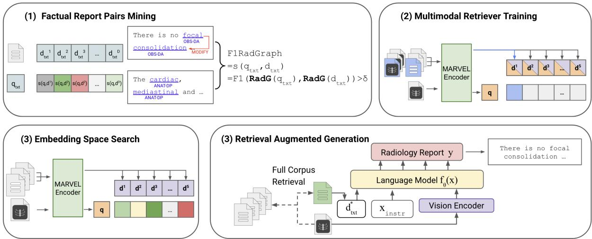
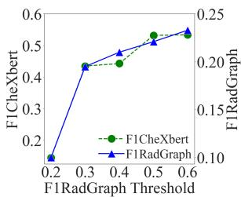
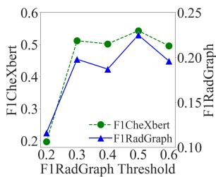
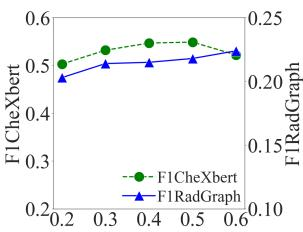
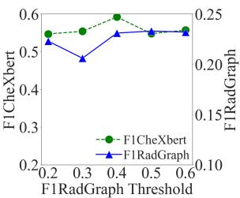
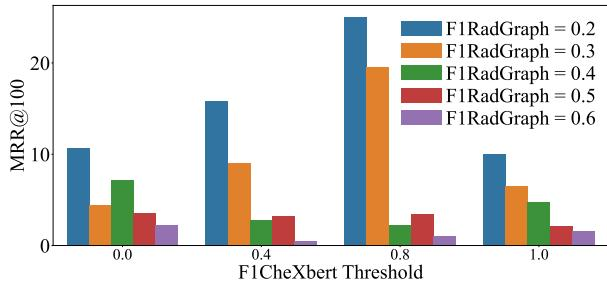
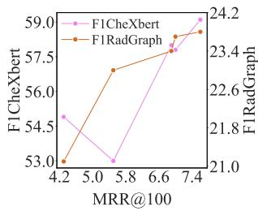
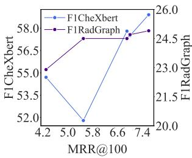
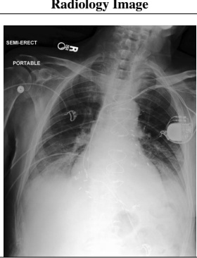
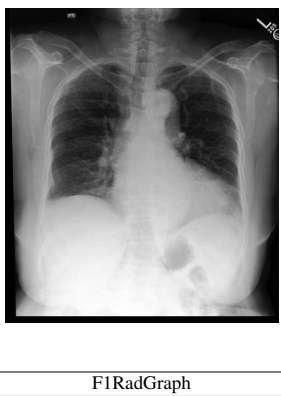

# Fact-Aware Multimodal Retrieval Augmentation for Accurate Medical Radiology Report Generation

Liwen Sun∗, James Zhao∗, Megan Han, Chenyan Xiong School of Computer Science, Carnegie Mellon University {liwens,jjzhao2,wenjingh,cx}@andrew.cmu.edu

## Abstract

Multimodal foundation models hold significant potential for automating radiology report generation, thereby assisting clinicians in diagnosing cardiac diseases. However, generated reports often suffer from serious factual inaccuracy. In this paper, we introduce a fact-aware multimodal retrieval-augmented pipeline in generating accurate radiology reports (FactMM-RAG). We first leverage RadGraph to mine factual report pairs, then integrate factual knowledge to train a universal multimodal retriever. Given a radiology image, our retriever can identify high-quality reference reports to augment multimodal foundation models, thus enhancing the factual completeness and correctness of report generation. Experiments on two benchmark datasets show that our multimodal retriever outperforms state-of-the-art retrievers on both language generation and radiology-specific metrics, up to 6.5% and 2% score in F1CheXbert and F1RadGraph. Further analysis indicates that employing our factually-informed training strategy imposes an effective supervision signal, without relying on explicit diagnostic label guidance, and successfully propagates fact-aware capabilities from the multimodal retriever to the multimodal foundation model in radiology report generation.

## 1 Introduction

Within hospitals worldwide, chest radiology serves as a critical technique in identifying cardiac diseases and abnormalities. Results of a chest radiograph are typically consolidated in a radiology report, including the source X-ray and a radiologist-produced findings section detailing clinical observations. Manually generating these reports, however, can be both time-consuming and potentially inaccessible in under-resourced hospitals (Speets et al., 2006; Iyeke et al., 2022). Recent multimodal foundation models have exhibited remarkable capabilities in challenging healthcare tasks, motivating an automation of this process to enhance physicians’ efficiency on clinical decision-making and improve patient health outcomes (Çallı et al., 2021; Li et al., 2023; Moor et al., 2023; Tu et al., 2023; Sun et al., 2024).

Although prior medical multimodal foundation models have demonstrated promising capabilities on report generation given the radiology image, they still suffer from serious hallucinations by generating factually inaccurate reports (Pal et al., 2023; Ahmad et al., 2023; Pal and Sankarasubbu, 2024). Factual correctness is especially critical in chest radiology domains, as minute textual differences can drastically invert radiology report meaning and downstream prescribed treatments (Delbrouck et al., 2022; Xie et al., 2023; Liu et al., 2024). Retrieval-Augmented Generation (RAG) has emerged as a popular paradigm to address this issue by grounding text generation with retrieved relevant knowledge given a query (Lewis et al., 2021; Chen et al., 2022; Gao et al., 2024). However, developing medical multimodal retrievers remains challenging, requiring retrievers to bridge the gap between symptomatic image semantics and factually-equivalent report text.

To capture fine-grained details in chest radiographs and improve the factual completeness of generated reports, we introduce FactMM-RAG, a fact-aware multimodal retrieval-augmented pipeline for generating accurate radiology reports given a radiology image. By designing a novel report pair-mining procedure incorporating factual knowledge, we develop a fact-aware retriever to augment multimodal foundation models in generating accurate chest X-ray radiology reports. Specifically, we first leverage RadGraph (Jain et al., 2021) to mine factually-oriented report pairs by annotating consistent radiology entities and relations between query and reference reports with certain abnormalities. Next, we train a universal multimodal encoding architecture through mined report pairs to conduct multimodal dense retrieval. Given an unseen patient’s radiology image, our retriever encodes it and searches for the most similar factually-informed reference report from an available report corpus. Passing them together into a multimodal foundation model unlocks its fact-aware potential to generate more accurate radiology reports.

Our experiments reveal that our retriever outperforms all state-of-the-art retrievers in both language generation and clinically relevant metrics on the MIMIC-CXR and CheXpert datasets, achieving up to 6.5% and 2% score in F1CheXbert and F1RadGraph for final RAG evaluation. We also investigate our retriever’s fact-aware capability controlled by factual similarity thresholds and confirm that our factually-informed training strategy can impose a useful supervision signal without relying on explicit diagnostic label guidance. Further analysis through retrieval evaluation metrics shows that the fact-aware capability of our retriever can be effectively propagated to the multimodal foundation models. Lastly, our case study highlights that among reports describing the same symptom from different retrievers, those generated by our model are more accurate and achieve greater factual correctness.

Our main contributions can be summarized as follows:

• We propose a fact-aware medical multimodal retriever to augment multimodal foundation models in generating accurate chest X-ray radiology reports.

• We design a method for mining factuallyinformed radiology report pairs that trains multimodal encoders to retrieve high-quality reference reports.

• We demonstrate that on two benchmark datasets, our medical multimodal retriever outperforms state-of-the-art medical multimodal retrievers on both language generation and clinically relevant metrics.

The rest of this paper is organized as follows. We review related work in in Section 2. We discuss the pipeline of FactMM-RAG in Sections 3. Section 4 and 5 discuss our experimental setup and results.

## 2 Related Work

Retrieval Augmented Generation. Retrieval Augmented Generation, utilizing external knowledge to enhance language models, has shown great promise in text-generation performance on factual accuracy especially for Open-Domain QA. (Borgeaud et al., 2022; Izacard et al., 2022). Guu et al. (2020); Lewis et al. (2021) involve end-to-end training through both generators and retrievers; Shi et al. (2023); Yu et al. (2023b) adapt the end-to-end pattern by employing black-box LLM training signal propagation for retriever tuning. Further works have expanded RAG to multiple modalities, employing unified image-text encoders (Radford et al., 2021) or separate pretrained encoders (Dosovitskiy et al., 2021; Raffel et al., 2023) and plugging retrieved documents into multimodal foundation models (Chen et al., 2022; Hu et al., 2023). Yasunaga et al. (2023) similarly integrates multimodal retrieval with both text and image generation capabilities.

Medical Multimodal Retriever. Joint training of image-text pairs in a shared embedding space, as exemplified by CLIP (Radford et al., 2021), facilitates visual and textual modality interactions, providing flexible representations for general-domain downstream tasks. Adapting general-domain multimodal retrievers to medical domains, however, is non-trivial due to the necessity of specialized knowledge. Zhang et al. (2022) introduces an unsupervised approach for radiology image representation learning from paired text descriptions. Huang et al. (2021) leverages global image-report and local sub-region features for multimodal retrieval and classification. Wang et al. (2022); You et al. (2023) propose medical knowledge extraction for constructing contrastive learning image-text pairs. Zhang et al. (2024) addresses the limited diversity within medical datasets, curating a large biomedical image-text collection towards a biomedical multimodal foundation model. Nevertheless, these existing medical multimodal retrievers neglect specific image information and do not adequately emphasize factual accuracy, resulting in imprecision when retrieving radiology reports.

  
Figure 1: An overview of the FactMM-RAG system. It mainly contains three stages: (1) Leveraging RadGraph to characterize each radiology report and mine factually-informed report pairs; (2) Integrating factual knowledge into the training of the universal multimodal retriever; (3) Given the radiology image, employing the fact-aware multimodal retriever to search for factually-informed reference reports and augmenting the multimodal foundation model in generating accurate radiology reports.

Medical Multimodal Foundation Model. Significant efforts have been made in applying multimodal foundation models to the medical imaging domain (Li et al., 2023; Moor et al., 2023; Tu et al., 2023; Sun et al., 2024). As chest X-ray radiology is the most commonly performed imaging examination, tailored medical multimodal foundation models for this critical area has gathered much attention (Chambon et al., 2022; Chen et al., 2021; Thawkar et al., 2023; Wu et al., 2023; Chen et al., 2024). Jain et al. (2021) advances this area by designing a novel information extraction schema to structure radiology reports from chest radiographs; Miura et al. (2021); Delbrouck et al. (2022) take a step forward, using reinforcement learning from semantic rewards to improve the factual quality of generated radiology reports; Chen et al. (2024) recently has also developed an instruction-tuned multimodal foundation model capable of sophisticated interpretation and analysis of chest X-rays.

One closely related line of work to ours is retrieval-based radiology report generation given only radiology images. For instance, Li et al. (2018) proposes a retrieval policy module to update radiology reports via hierarchical reinforcement learning; Endo et al. (2021) employs image-text embeddings from contrastive learning for retrievalaugmented radiology report generation; Ramesh et al. (2022) proposes synthesizing additional reports and reducing hallucinations from reference report priors to improve medical radiological report generation.

## 3 Methodology

In this section, we present the overall methodology of FactMM-RAG. We first detail the training procedure of our fact-aware medical multimodal retriever in Section 3.1. We then provide the pipeline for retrieval-augmented radiology report generation with our multimodal retriever in section 3.2. The overview is illustrated in Figure 1.

## 3.1 Fact-aware Multimodal Retrieval

This section discusses the training process of the multimodal retriever with factual knowledge. Each patient in the corpus has a chest X-ray radiology image along with its corresponding report. We begin by annotating each report using RadGraph (Jain et al., 2021), then constructing factual report pairs to train our multimodal retriever. We describe these steps as follows.

Chest Radiograph Annotation. Since radiology reports are free-text, we utilize the RadGraph information extraction tool to extract structured knowledge graphs from them. Specifically, RadGraph employs named entity recognition and relation extraction models to identify radiological entities (e.g. carina, lungs, abnormalities) and the clinical relations between them (e.g. modify, located at, suggestive of). Each radiology report is then segmented into distinct regions and stored as [(enti $\tt t y _ { 1 } .$ , entity label , relation1), (enti $\tt t y _ { 2 } .$ entity label2, relation2), . . .]. After characterizing the chest radiograph for each report in the training corpus, we construct factual report pairs.

Factual Report Pairs Mining. Each report has an associated medical label describing the symptom. We first utilize the query report to search for other reports with the same symptom, aiming to eliminate false negatives when constructing report pairs. Rather than solely relying on the diagnostic labels, we further capture the factually-oriented pathology semantics between different reports. Following F1RadGraph (Jain et al., 2021), we calculate the factual similarity $s ( q _ { t x t } , d _ { t x t } )$ between query report $q _ { t x t }$ and other reports $d _ { t x t }$ in the annotated format as follows,

$$
s ( q _ { t x t } , d _ { t x t } ) = \frac { 2 \cdot ( \hat { q } _ { t x t } \cap \hat { d } _ { t x t } ) } { \mathrm { l e n g t h } ( \hat { q } _ { t x t } ) + \mathrm { l e n g t h } ( \hat { d } _ { t x t } ) } ,\tag{1}
$$

where $\hat { q } _ { t x t } , \hat { d } _ { t x t }$ denotes reports with only annotated entities and relations in RadGraph structured form. We then set a strict threshold δ to filter out searched reports with low similarity score:

$$
N _ { q t x t } = \{ d _ { t x t } \in D | s ( q _ { t x t } , d _ { t x t } ) > \delta \} .\tag{2}
$$

where $N _ { q _ { t x t } }$ denotes factual positive report pairs for $q _ { t x t }$ and D is the total training corpus. Since each query report is associated with a corresponding radiology image, these factual report pairs can also be applied to the query report’s radiology image. Next, we train our multimodal retriever with mined factual report pairs.

Multimodal Dense Retrieval. Following previous work (Zhou et al., 2024), we universally encode each query image $q _ { i m g } $ and other imagetext pairs $( d _ { t x t } , d _ { i m g } )$ in the training corpus, using one encoder, MARVEL:

$$
\begin{array} { r } { \mathbf { q } = \mathbf { M A R V E L } ( q _ { i m g } ) ; } \end{array}\tag{3}
$$

$$
\begin{array} { r } { \mathbf { d } = \mathbf { M } \mathbf { A } \mathbf { R } \mathbf { V } \mathbf { E } \mathbf { L } ( d _ { t x t } , d _ { i m g } ) , } \end{array}\tag{4}
$$

where each image-text pair is represented as a single embedding. We then model the relevance score $f ( q , d )$ between the query image and other imagetext pairs by cosine similarity:

$$
f ( q , d ) = \cos ( { \bf q } , { \bf d } ) .\tag{5}
$$

To inject factually-oriented medical knowledge into multimodal retrieval, we train the encoder to minimize the following loss,

$$
\mathcal { L } = - \sum _ { \substack { q _ { i m g } \in D _ { d } + \in N _ { q _ { i m g } } } } \log \frac { \log e ^ { f ( \mathbf { q } , \mathbf { d } ^ { + } ) / \tau } } { e ^ { f ( \mathbf { q } , \mathbf { d } ^ { + } ) / \tau } + \sum _ { \mathbf { d } ^ { - } } e ^ { f ( \mathbf { q } , \mathbf { d } ^ { - } ) / \tau } } ,\tag{6}
$$

where $d ^ { + }$ are obtained through factual report pair mining and $d ^ { - }$ are in-batch negative samples (Karpukhin et al., 2020). Then, we use our multimodal retriever and foundation model to perform retrieval-augmented radiology finding generation.

## 3.2 Retrieval Augmentation for Accurate Radiology Report Generation

Given our trained fact-aware multimodal retriever, we encode the query image and each report in the training corpus. Then, we retrieve the report with the highest relevance score to the query image as the factually-informed relevant report. Subsequently, we pass the query image along with the relevant report into a multimodal foundation model to perform retrieval-augmented generation training. The multimodal foundation model is finetuned by standard autogressive loss,

$$
\mathcal { L } = - \frac { 1 } { n } \log \prod _ { i } ^ { n } p _ { \theta } \big ( y _ { i } \big | q _ { i m g } , d _ { t x t } ^ { * } , x _ { \mathrm { i n s t r } } , y _ { < i } \big ) ,\tag{7}
$$

where $q _ { i m g }$ is the query image, $d _ { t x t } ^ { * }$ is the retrieved factually-informed relevant report, xinstr is the prompt instruction, and y is the ground-truth report. During inference, we retrieve a relevant report from the training corpus using an unseen patient X-ray image, and pass them into the multimodal foundation model to generate findings with higher factual accuracy.

## 4 Experimental Setup

Dataset. Following Delbrouck et al. (2023), we use the processed MIMIC-CXR (Johnson et al., 2019) to train both retriever and foundation model. This dataset contains 125,417 training radiology image-report pairs, 991 validation pairs, and 1,624 test pairs. They are sourced from the Beth Israel Deaconess Medical Center. CheXpert (Irvin et al., 2019) is another chest X-ray dataset from Stanford Health Care. Since it contains complete finding reports only for a testing dataset containing 1000 pairs, we use it as zero-shot evaluation.

Evaluation Metrics. We evaluate our proposed system using both natural language generation and medically-tailored evaluation metrics. For language fluency measures, we use ROUGE-L (Lin, 2004) to evaluate the longest common subsequence overlap between the generated and reference findings, and BERTScore (Zhang et al., 2020a) to evaluate non-clinical semantic sentence similarity.

For clinical accuracy measures, we use CheXbert (Smit et al., 2020) to generate the ground-truth diagnostic labels for finding reports. Following Delbrouck et al. (2023), we then calculate the F1CheXbert (Zhang et al., 2020b), which is the F1-score for 5 observations (Cardiomegaly, Edema, Consolidation, Atelectasis, Pleural Effusion) by comparing the generated report with the reference report’s classifications. Beyond using the limited diagnostic labels for evaluation, we also adopt F1RadGraph (Jain et al., 2021) to measure factual correctness by calculating the overlap in radiological entities and clinical relations between the generated report and the reference report. See Appendix A.3 for more details.

Baselines. We mainly compare our retriever with other baselines under multimodal RAG setting. We include the following baselines, CLIP (Radford et al., 2021) is a multimodal retriever pretrained from general-domain image-text pairs; GLoRIA (Huang et al., 2021) leverages attention-weighted image regions with contextual words to learn localized and global representations for radiology images and reports; MedCLIP (Wang et al., 2022) and CXR-CLIP (You et al., 2023) build upon CLIP and utilize diagnostic labels as training signals for learning radiology image and text representations; BiomedCLIP (Zhang et al., 2024) extends the radiology-specific dataset and pretrains on a larger magnitude of biomedical data to learn multimodal representations; Med-MARVEL utilizes universal encoder MARVEL (Zhou et al., 2024) to conduct contrastive learning on each patient’s self image-report pair without further training on factual image-report pairs.

We also compare our method with non-RAG approach. "No Retriever" refers to directly fine-tuning the backbone to generate reports without retrieval augmentation; ORGan (Hou et al., 2023) first creates an observation plan, then feeds the plan and radiographs to generate the report through tree reasoning mechanism. Upper-bound results using an oracle in training corpus with top-1 factual similarity to test query report are presented. More details are in Appendix A.3.

Implementation Details. In our experiments, we use MARVEL (Zhou et al., 2024) as our multimodal retriever backbone. MARVEL is a language model based on T5-ANCE (Yu et al., 2023a), trained with modality-balanced hard negatives. We use LLaVA (Liu et al., 2023) as our multimodal foundation model backbone. Since each radiology study contains multiple image views for each patient, we select the frontal view. We also concatenate the finding and impression sections to form the X-ray report. To reduce training costs and address factual report pair imbalances, we rerank the retrieved reports by factual similarity and use the top 2 factual report pairs for each query to train our multimodal retriever. We leave more training details in Appendix A.1 and A.2.

## 5 Evaluation Results

In this section, we present our experimental results. We first evaluate the overall performance between different retrievers in section 5.1. Next, we discuss the ablation studies in section 5.2. We then explore the fact-aware capability of our retriever in section 5.3 and section 5.4. Lastly, we show the superiority of our retriever through a case study in section 5.5.

## 5.1 Overall Performance

The results of our fact-aware RAG system are shown in Table 1. In MIMIC-CXR, FactMM-RAG outperforms state-of-the-art retrievers by a significant margin, up to 6.5% in F1CheXbert and 2% in F1RadGraph. In the CheXpert zero-shot evaluation, FactMM-RAG outperforms state-of-the-art retrievers by 2% and 1.2% in these two metrics, indicating our retriever’s generalization capability compared to other models.

To establish the effectiveness of our RAG approach, we also show that FactMM-RAG significantly outperforms the fine-tuned backbone without retrieval augmentation by 10% and achieves competitive improvement over the strong non-RAG ORGan baseline.

Besides, we can observe that adopting the baseline retrievers on top of multimodal foundation models only yields marginal gains compared to the finetuning of foundation model generation without retrieval-augmentation. This shows that reports retrieved by baseline retrievers are factually-inferior to those from our retriever, potentially passing misleading information that prevents the foundation model from generating factual reports.

<table><tr><td rowspan="3">Model</td><td colspan="4">MIMIC-CXR</td><td colspan="4">CheXpert</td></tr><tr><td colspan="2">Factual Similarity</td><td colspan="2">Textual Similarity</td><td colspan="2">Factual Similarity</td><td colspan="2">Textual Similarity</td></tr><tr><td>F1CheXbert</td><td>F1RadGraph</td><td>ROUGE-L</td><td>BERTScore</td><td>F1CheXbert</td><td>F1RadGraph</td><td>ROUGE-L</td><td>BERTScore</td></tr><tr><td>No Retriever</td><td>0.496</td><td>0.234</td><td>0.294</td><td>0.549</td><td>0.371</td><td>0.173</td><td>0.231</td><td>0.469</td></tr><tr><td>ORGan (Hou et al., 2023)</td><td>0.541</td><td>0.240</td><td>0.308</td><td>0.552</td><td>0.431</td><td>0.181</td><td>0.232</td><td>0.470</td></tr><tr><td>CLIP (Radford et al., 2021)</td><td>0.507</td><td>0.241</td><td>0.300</td><td>0.552</td><td>0.381</td><td>0.172</td><td>0.231</td><td>0.468</td></tr><tr><td>GLoRIA (Huang et al., 2021)</td><td>0.476</td><td>0.232</td><td>0.294</td><td>0.543</td><td>0.397</td><td>0.173</td><td>0.231</td><td>0.468</td></tr><tr><td>MedCLIP (Wang et al., 2022)</td><td>0.517</td><td>0.238</td><td>0.298</td><td>0.549</td><td>0.408</td><td>0.182</td><td>0.238</td><td>0.471</td></tr><tr><td>CXR-CLIP (You et al., 2023)</td><td>0.501</td><td>0.243</td><td>0.302</td><td>0.553</td><td>0.406</td><td>0.183</td><td>0.241</td><td>0.471</td></tr><tr><td>BiomedCLIP (Zhang et al., 2024)</td><td>0.502</td><td>0.233</td><td>0.293</td><td>0.546</td><td>0.380</td><td>0.173</td><td>0.232</td><td>0.469</td></tr><tr><td>Med-MARVEL (Zhou et al., 2024)</td><td>0.537</td><td>0.237</td><td>0.306</td><td>0.549</td><td>0.454</td><td>0.185</td><td>0.243</td><td>0.472</td></tr><tr><td>FactMM-RAG</td><td>0.602</td><td>0.257</td><td>0.307</td><td>0.561</td><td>0.475</td><td>0.185</td><td>0.236</td><td>0.475</td></tr><tr><td>Oracle</td><td>0.972</td><td>0.523</td><td>0.495</td><td>0.677</td><td>0.951</td><td>0.384</td><td>0.350</td><td>0.548</td></tr></table>

Table 1: Overall performance of FactMM-RAG and baselines under the multimodal retrieval-augmentation setting. Models are evaluated by textual similarity and factual similarity between generated and reference reports. FactMM RAG outperforms the best baseline with p-value < 0.05.

  
(a) F1CheXbert Threshold: 0.0 (b) F1CheXbert Threshold: 0.4 (c) F1CheXbert Threshold: 0.8 (d) F1CheXbert Threshold: 1  
Figure 2: Factual performance of FactMM-RAG controlled by different F1CheXbert and F1RadGraph thresholds. We vary the F1RadGraph thresholds under one fixed F1CheXbert threshold selected from {0, 0.4, 0.8, 1}.

Specifically, compared to the retriever Med-MARVEL, we also observe factual-correctness performance gain based on two clinical metrics. Both use the same universal encoder backbone, but FactMM-RAG benefits from the injected factual medical knowledge, allowing it to search for the most similar and factually correct reports, thereby assisting the multimodal foundation model in generating more accurate reports.

## 5.2 Ablation Study

Multimodal Retrieval. Instead of relying on the multimodal foundation model to generate reports, we also evaluate the performance of the multimodal retrievers by directly encoding radiology images from the testing corpus and searching for the closest report from the training corpus for comparison with ground-truth reports. Table 2 shows that our retriever also achieves the best factual retrieval performance compared to other baselines under this setting across two datasets. This demonstrates that training the multimodal retriever with mined factually-informed report pairs can enhance its radiology image understanding capabilities and directly align it with precise reports.

Backbone Variation. We also investigate the impact of different retriever and foundation model backbones on radiology report generation in Table 2. We initialize our retriever model from two checkpoints: WebQA and ClueWeb in (Zhou et al., 2024). We observe that the ClueWeb checkpoint provides a marginal gain compared to the WebQA checkpoint. This can be attributed to the larger scale of the ClueWeb dataset used for pretraining. We also utilize Med-MARVEL as our retriever backbone, which exhibits similar performance to other backbones after training. This implies that even if our retriever is initialized with a backbone from a general domain, our factually-informed training strategy enables it to fully leverage medical knowledge and quickly adapt to the radiology-specific domain without degrading performance.

<table><tr><td rowspan="3">Model</td><td colspan="4">MIMIC-CXR</td><td colspan="4">CheXpert</td></tr><tr><td colspan="2">Factual Similarity</td><td colspan="2">Textual Similarity</td><td colspan="2">Factual Similarity</td><td colspan="2">Textual Similarity</td></tr><tr><td>F1CheXbert</td><td>F1RadGraph</td><td>ROUGE-L</td><td>BERTScore</td><td>F1CheXbert</td><td>F1RadGraph</td><td>ROUGE-L</td><td>BERTScore</td></tr><tr><td colspan="9">Setting: Multimodal Retrieval</td></tr><tr><td>CLIP (Radford et al., 2021)</td><td>0.341</td><td>0.160</td><td>0.238</td><td>0.489</td><td>0.285</td><td>0.130</td><td>0.207</td><td>0.439</td></tr><tr><td>GLoRIA (Huang et al., 2021)</td><td>0.346</td><td>0.137</td><td>0.211</td><td>0.453</td><td>0.359</td><td>0.135</td><td>0.216</td><td>0.447</td></tr><tr><td>MedCLIP (Wang et al., 2022)</td><td>0.539</td><td>0.198</td><td>0.261</td><td>0.508</td><td>0.478</td><td>0.161</td><td>0.225</td><td>0.454</td></tr><tr><td>CXR-CLIP (You et al., 2023)</td><td>0.516</td><td>0.215</td><td>0.277</td><td>0.524</td><td>0.444</td><td>0.167</td><td>0.230</td><td>0.458</td></tr><tr><td>BiomedCLIP (Zhang et al., 2024)</td><td>0.502</td><td>0.233</td><td>0.293</td><td>0.546</td><td>0.386</td><td>0.142</td><td>0.216</td><td>0.441</td></tr><tr><td>Med-MARVEL (Zhou et al., 2024)</td><td>0.550</td><td>0.212</td><td>0.279</td><td>0.525</td><td>0.479</td><td>0.160</td><td>0.222</td><td>0.454</td></tr><tr><td>FactMM-RAG</td><td>0.605</td><td>0.249</td><td>0.297</td><td>0.547</td><td>0.491</td><td>0.174</td><td>0.237</td><td>0.467</td></tr><tr><td>Oracle</td><td>0.992</td><td>0.429</td><td>0.399</td><td>0.612</td><td>0.999</td><td>0.438</td><td>0.362</td><td>0.554</td></tr><tr><td colspan="9">Setting: Multimodal Retrieval Augmented Generation</td></tr><tr><td> $\mathrm { C l u e W e b \mathrm { - } L L a V A _ { 1 . 5 } }$ </td><td>0.602</td><td>0.257</td><td>0.307</td><td>0.561</td><td>0.495</td><td>0.180</td><td>0.239</td><td>0.473</td></tr><tr><td> $\mathrm { W e b Q A \mathrm { - } L L a V A _ { 1 . 5 } }$ </td><td>0.572</td><td>0.262</td><td>0.304</td><td>0.562</td><td>0.456</td><td>0.184</td><td>0.237</td><td>0.474</td></tr><tr><td>Med  $\mathbf { \cdot M A R V E L \mathrm { - L L a V A _ { 1 . 5 } } }$ </td><td>0.581</td><td>0.260</td><td>0.311</td><td>0.563</td><td>0.475</td><td>0.185</td><td>0.236</td><td>0.474</td></tr><tr><td> $\mathrm { C l u e W e b \mathrm { - } L L a V A _ { 1 . 6 } }$ </td><td>0.601</td><td>0.252</td><td>0.303</td><td>0.558</td><td>0.492</td><td>0.178</td><td>0.237</td><td>0.471</td></tr></table>

Table 2: Ablation study of FactMM-RAG including multimodal retrieval and backbone variation.  
  
Figure 3: Retrieval evaluation of FactMM-RAG with different F1CheXbert and F1RadGraph thresholds. MRR calculates the mean reciprocal of rank at which the first relevant report that meets two factual similarity thresholds with query report is retrieved.

## 5.3 Fact-aware Capability Control

The factual similarity threshold in Equation 1 plays a critical role in controlling the fact-awareness of our multimodal retriever. We examine the performance of FactMM-RAG under different thresholds, as shown in Figure 2. Not only utilizing F1RadGraph thresholds, we also employ F1CheXbert to curate additional thresholds from the report’s diagnostic labels to mine report pairs.

Under the same F1CheXbert threshold for mining report pairs, we observe that an increase in the F1RadGraph threshold correlates with an improvement in factual performance. However, adopting stricter thresholds for identifying report pairs does not yield further improvements and reaches saturation. After calculating the average number of report pairs per query, we find that high thresholds can exclude many relevant report pairs, as shown in Figure 3. This exclusion results in the potential loss of factually useful pairs, thereby hindering the training of our multimodal retriever driven by additional factual medical knowledge.

  
(a) Multimodal Retrieval

(b) Multimodal RAG  
  
Figure 4: Analysis of fact-aware capability propagation. The x-axis MRR measures the retriever’s performance on retrieving factually relevant reports.

Rather than relying on diagnostic labels from CheXbert to identify high-quality report pairs, Figure 2a demonstrates that the F1RadGraph threshold alone can also effectively mine factual report pairs for training our multimodal retriever. As the F1RadGraph threshold increases, FactMM-RAG even matches the performance under high threshold settings in Figure 2d. This signifies that employing our training strategy with curated factual query-report pairs still imposes useful supervision signals without relying on explicit diagnostic label guidance.

## 5.4 Fact-aware Capability Propagation

To further understand the benefits of our retriever for the foundation model, we explore the effective propagation of fact-aware capabilities from the retriever to the foundation model. To demonstrate this behavior, we use the mined factual report pairs as reference reports for the query report. We then use the retrieval metric Mean Reciprocal Rank (MRR) as an intermediate evaluation, shown in Figure 4. From the plot, we observe that as training progresses, the retrieval metric increases alongside two clinical metrics. This factually-oriented upward trend in our retriever’s performance in Figure 4a is also reflected in the foundation model’s performance in Figure 4b. This indicates that employing a factually-informed reference report selection strategy to train our multimodal retriever can also enhance the foundation model’s ability to generate factually accurate radiology reports.

<table><tr><td rowspan=1 colspan=1>Radiology Image</td><td rowspan=1 colspan=1>Med-MARVEL</td><td rowspan=1 colspan=1>FactMM-RAG</td><td rowspan=1 colspan=1>Reference</td></tr><tr><td rowspan=2 colspan=1>SEMI-ERECT  ORPORTABLE</td><td rowspan=2 colspan=1>Single portable view of the chest. Thereare bilateral pleural effusions, moder-ate on the left and small on the right.There is also pulmonary vascular re-distribution and hazy alveolar infiltrate.cardiac silhouette is enlarged but un-changed. Median sternotomy wires andmediastinal clips are again noted.</td><td rowspan=2 colspan=1>A left-sided pacemaker is in place withleads terminating in the right atrium andright ventricle. The patient is status postmedian sternotomy and CABG. Theheart is moderately enlarged. Thereis mild pulmonary edema. A small leftpleural effusion is present. There is at-electasis at the left lung base. No pneu-mothorax is seen.</td><td rowspan=1 colspan=1>The patient is status post median ster-notomy and CABG. Left-sided dual-</td></tr><tr><td rowspan=1 colspan=1>chamber pacemaker is noted with leadsterminating in right atrium and rightventricle, unchanged. Cardiomegalyis similar. There is continued mild tomoderate pulmonary edema, slightlyimproved compared to the prior exam.Small layering bilateral pleural effu-sions also may be slightly decreased inthe interval. Bibasilar airspace opac-ities likely reflect atelectasis. There isno pneumothorax. No acute osseous ab-normalities are visualized.</td></tr><tr><td rowspan=1 colspan=1>F1RadGraph</td><td rowspan=1 colspan=1>0.218</td><td rowspan=1 colspan=1>0.413</td><td rowspan=1 colspan=1></td></tr><tr><td rowspan=2 colspan=1>CheXbert Observations</td><td rowspan=1 colspan=1>Cardiomegaly, Edema, Pleural Effusion</td><td rowspan=1 colspan=1>Cardiomegaly,Edema,Atelectasis,Pleural Effusion</td><td rowspan=1 colspan=1>Cardiomegaly,Edema,Atelectasis,Pleural Effusion</td></tr><tr><td rowspan=1 colspan=1>The heart is mildly enlarged. The aortais mildly tortuous. The mediastinal andhilar contours appear unchanged. Thereis no pleural effusion or pneumotho-rax. Streaky left basilar opacity sug-gests minor atelectasis. There is no defi-nite pleural effusion or pneumothorax.The bones appear demineralized. Thereis mild-to-moderate rightward convexcurvature centered along the mid tho-racic spine.</td><td rowspan=1 colspan=1>Heart size is mildly enlarged. The aortais tortuous. Mediastinal and hilar con-tours are otherwise unremarkable. Pul-monary vasculature is normal. Linearopacities in the left lower lobe are com-patible with subsegmental atelectasis.No focal consolidation, pleural effusionor pneumothorax is present. There areno acute osseous abnormalities.</td><td rowspan=1 colspan=1>Moderate enlargement of the cardiacsilhouette with a left ventricular pre-dominance is unchanged. The aorta re-mains tortuous, and the hilar contoursare stable. Pulmonary vascularity is notengorged. There is minimal atelecta-sis within the lung bases, but no focalconsolidation is present. No pleuraleffusion or pneumothorax is identified.There are no acute osseous abnormali-ties.</td></tr><tr><td rowspan=1 colspan=1>F1RadGraph</td><td rowspan=1 colspan=1>0.333</td><td rowspan=1 colspan=1>0.526</td><td rowspan=1 colspan=1></td></tr><tr><td rowspan=1 colspan=1>CheXbert Observations</td><td rowspan=1 colspan=1>Cardiomegaly, Atelectasis</td><td rowspan=1 colspan=1>Cardiomegaly, Atelectasis</td><td rowspan=1 colspan=1>Cardiomegaly, Atelectasis</td></tr></table>

Table 3: Case study on generated reports from MIMIC-CXR. Cyan text indicates radiological consistency with the ground-truth report. Orange text highlights extra accurate details provided by FactMM-RAG compared to Med-MARVEL. Red text denotes observations missing in Med-MARVEL.

## 5.5 Case Study

In this section, we present two examples from MIMIC-CXR to qualitatively analyze our retriever’s fact-aware capability, as illustrated in Table 3. In the first example, we observe that FactMM-RAG provides symptom observations consistent with the ground-truth report and generates more accurate factual details compared to Med-MARVEL, e.g., “post median sternotomy, atelectasis, not pneumothorax”; In the second example, we further observe that although both retrievers generate reports with diagnostic labels matching the ground-truth report, FactMM-RAG provides additional details compared to Med-MARVEL, such as “pulmonary vasculature is normal, no acute osseous abnormalities”. These characteristics confirm that adopting our fact-aware retriever can assist multimodal foundation models in generating more accurate radiology reports. We show retrieved reports from two samples in Appendix A.4.

## 6 Conclusion

In this paper, we aim at improving radiology report generation by introducing a fact-informed medical multimodal retriever for retrieval-augmented generation. In particular, we utilize RadGraph to annotate chest radiograph reports and mine clinicallyrelevant pairs. We integrate factual information into a universal multimodal retriever, presenting FactMM-RAG, a fact-aware multimodal retrievalaugmented radiology report generation pipeline. FactMM-RAG outperforms all state-of-the-art retrievers evaluated by factual correctness and textual coherence for final report generation in MIMIC-

CXR and CheXpert datasets. We further confirm the benefit of our multimodal retriever from the analysis of its fact-aware capability.

## 7 Limitations

Despite the strong performance of our FactMM-RAG pipeline, we acknowledge potential limitations of our proposed method. In particular, our work only emphasizes chest radiology domains. It also worth exploring our retrieval-augmented factual report generation pipeline in broader medical domains, such as brain scan or histology datasets.

Another concern lies in the chosen evaluation metrics, F1RadGraph and F1CheXbert. F1CheXbert reflects high-level observational accuracy, while F1RadGraph assesses the correctness of radiology entities and clinical relationships. However, other radiologically-specific metrics, such as report conciseness and clarity, should also be considered (Sureka et al., 2014). Ideally, we should incorporate methods of evaluation directly aligned with human evaluations or involve domain expertise itself in our pair-mining and final evaluation procedure. Moreover, it is worth performing a long-tail evaluation by leveraging more fine-grained ground-truth label annotations (Holste et al., 2023).

## 8 Ethics Considerations

A key ethical consideration in our work is the use of de-identified, credentialed medical data. In particular, the responsible usage policy of the MIMIC-CXR dataset strictly prohibits sharing access with third parties. To gain access to MIMIC-CXR, we completed a training course and signed a data use agreement, ensuring compliance with patient privacy regulations.

## References

Muhammad Aurangzeb Ahmad, Ilker Yaramis, and Taposh Dutta Roy. 2023. Creating trustworthy llms: Dealing with hallucinations in healthcare ai. Preprint, arXiv:2311.01463.

Sebastian Borgeaud, Arthur Mensch, Jordan Hoffmann, Trevor Cai, Eliza Rutherford, Katie Millican, George van den Driessche, Jean-Baptiste Lespiau, Bogdan Damoc, Aidan Clark, Diego de Las Casas, Aurelia Guy, Jacob Menick, Roman Ring, Tom Hennigan, Saffron Huang, Loren Maggiore, Chris Jones, Albin

Cassirer, Andy Brock, Michela Paganini, Geoffrey Irving, Oriol Vinyals, Simon Osindero, Karen Simonyan, Jack W. Rae, Erich Elsen, and Laurent Sifre. 2022. Improving language models by retrieving from trillions of tokens. Preprint, arXiv:2112.04426.

Pierre Chambon, Christian Bluethgen, Jean-Benoit Delbrouck, Rogier Van der Sluijs, Małgorzata Połacin, Juan Manuel Zambrano Chaves, Tanishq Mathew Abraham, Shivanshu Purohit, Curtis P. Langlotz, and Akshay Chaudhari. 2022. Roentgen: Visionlanguage foundation model for chest x-ray generation. Preprint, arXiv:2211.12737.

Wenhu Chen, Hexiang Hu, Xi Chen, Pat Verga, and William W. Cohen. 2022. Murag: Multimodal retrieval-augmented generator for open question answering over images and text. Preprint, arXiv:2210.02928.

Zhihong Chen, Yaling Shen, Yan Song, and Xiang Wan. 2021. Cross-modal memory networks for radiology report generation. In Proceedings of the 59th Annual Meeting of the Association for Computational Linguistics and the 11th International Joint Conference on Natural Language Processing (Volume 1: Long Papers), pages 5904–5914, Online. Association for Computational Linguistics.

Zhihong Chen, Maya Varma, Jean-Benoit Delbrouck, Magdalini Paschali, Louis Blankemeier, Dave Van Veen, Jeya Maria Jose Valanarasu, Alaa Youssef, Joseph Paul Cohen, Eduardo Pontes Reis, Emily B. Tsai, Andrew Johnston, Cameron Olsen, Tanishq Mathew Abraham, Sergios Gatidis, Akshay S. Chaudhari, and Curtis Langlotz. 2024. Chexagent: Towards a foundation model for chest x-ray interpretation. Preprint, arXiv:2401.12208.

Jean-Benoit Delbrouck, Pierre Chambon, Christian Bluethgen, Emily Tsai, Omar Almusa, and Curtis Langlotz. 2022. Improving the Factual Correctness of Radiology Report Generation with Semantic Rewards. In Findings ofthe Associationfor Computational Linguistics: EMNLP 2022, pages 4348–4360, Abu Dhabi, United Arab Emirates. Association for Computational Linguistics.

Jean-Benoit Delbrouck, Maya Varma, Pierre Chambon, and Curtis Langlotz. 2023. Overview of the RadSum23 Shared Task on Multi-modal and Multianatomical Radiology Report Summarization. In The 22nd Workshop on Biomedical Natural Language Processing and BioNLP Shared Tasks, pages 478– 482, Toronto, Canada. Association for Computational Linguistics.

Alexey Dosovitskiy, Lucas Beyer, Alexander Kolesnikov, Dirk Weissenborn, Xiaohua Zhai, Thomas Unterthiner, Mostafa Dehghani, Matthias Minderer, Georg Heigold, Sylvain Gelly, Jakob Uszkoreit, and Neil Houlsby. 2021. An image is worth 16x16 words: Transformers for image recognition at scale. Preprint, arXiv:2010.11929.

Mark Endo, Rayan Krishnan, Viswesh Krishna, Andrew Y. Ng, and Pranav Rajpurkar. 2021. Retrievalbased chest x-ray report generation using a pretrained contrastive language-image model. In Proceedings of Machine Learning for Health, volume 158 of Proceedings of Machine Learning Research, pages 209–219. PMLR.

Yunfan Gao, Yun Xiong, Xinyu Gao, Kangxiang Jia, Jinliu Pan, Yuxi Bi, Yi Dai, Jiawei Sun, Meng Wang, and Haofen Wang. 2024. Retrieval-augmented generation for large language models: A survey. Preprint, arXiv:2312.10997.

Kelvin Guu, Kenton Lee, Zora Tung, Panupong Pasupat, and Ming-Wei Chang. 2020. Realm: Retrievalaugmented language model pre-training. Preprint, arXiv:2002.08909.

Gregory Holste, Song Wang, Ajay Jaiswal, Yuzhe Yang, Mingquan Lin, Yifan Peng, and Atlas Wang. 2023. CXR-LT: Multi-Label Long-Tailed Classification on Chest X-Rays (version 1.1.0).

Wenjun Hou, Kaishuai Xu, Yi Cheng, Wenjie Li, and Jiang Liu. 2023. Organ: Observation-guided radiology report generation via tree reasoning. Preprint, arXiv:2306.06466.

Ziniu Hu, Ahmet Iscen, Chen Sun, Zirui Wang, Kai-Wei Chang, Yizhou Sun, Cordelia Schmid, David A. Ross, and Alireza Fathi. 2023. Reveal: Retrievalaugmented visual-language pre-training with multisource multimodal knowledge memory. Preprint, arXiv:2212.05221.

Shih-Cheng Huang, Liyue Shen, Matthew P Lungren, and Serena Yeung. 2021. GLoRIA: A Multimodal Global-Local Representation Learning Framework for Label-Efficient Medical Image Recognition. In Proceedings of the IEEE/CVF International Conference on Computer Vision, pages 3942–3951.

Jeremy Irvin, Pranav Rajpurkar, Michael Ko, Yifan Yu, Silviana Ciurea-Ilcus, Chris Chute, Henrik Marklund, Behzad Haghgoo, Robyn Ball, Katie Shpanskaya, Jayne Seekins, David A. Mong, Safwan S. Halabi, Jesse K. Sandberg, Ricky Jones, David B. Larson, Curtis P. Langlotz, Bhavik N. Patel, Matthew P. Lungren, and Andrew Y. Ng. 2019. CheXpert: A Large Chest Radiograph Dataset with Uncertainty Labels and Expert Comparison. Preprint, arXiv:1901.07031.

Lucky Iyeke, Rebecca Moss, Rachel Hall, Jun Wang, Lovleen Sandhu, Benjamin Appold, Ella Kalontar, Dimitra Menoudakos, Mahesh Ramnarine, Samuel P. LaVine, Seungwoo Ahn, and Michelle Richman. 2022. Reducing unnecessary ’admission’ chest x-rays: An initiative to minimize low-value care. Cureus, 14(10):e29817.

Gautier Izacard, Patrick Lewis, Maria Lomeli, Lucas Hosseini, Fabio Petroni, Timo Schick, Jane Dwivedi-Yu, Armand Joulin, Sebastian Riedel, and Edouard Grave. 2022. Atlas: Few-shot learning

with retrieval augmented language models. Preprint, arXiv:2208.03299.

Saahil Jain, Ashwin Agrawal, Adriel Saporta, Steven QH Truong, Du Nguyen Duong, Tan Bui, Pierre Chambon, Yuhao Zhang, Matthew P. Lungren, Andrew Y. Ng, Curtis P. Langlotz, and Pranav Rajpurkar. 2021. RadGraph: Extracting Clinical Entities and Relations from Radiology Reports. Preprint, arXiv:2106.14463.

Alistair E. W. Johnson, Tom J. Pollard, Seth J. Berkowitz, Nathaniel R. Greenbaum, Matthew P. Lungren, Chih-ying Deng, Roger G. Mark, and Steven Horng. 2019. MIMIC-CXR, a de-identified publicly available database of chest radiographs with free-text reports. Scientific Data, 6(1).

Vladimir Karpukhin, Barlas Oguz, Sewon Min, Patrick˘ Lewis, Ledell Wu, Sergey Edunov, Danqi Chen, and Wen tau Yih. 2020. Dense passage retrieval for open-domain question answering. Preprint, arXiv:2004.04906.

Patrick Lewis, Ethan Perez, Aleksandra Piktus, Fabio Petroni, Vladimir Karpukhin, Naman Goyal, Heinrich Küttler, Mike Lewis, Wen tau Yih, Tim Rocktäschel, Sebastian Riedel, and Douwe Kiela. 2021. Retrieval-Augmented Generation for Knowledge-Intensive NLP Tasks. Preprint, arXiv:2005.11401.

Christy Y. Li, Xiaodan Liang, Zhiting Hu, and Eric P. Xing. 2018. Hybrid retrieval-generation reinforced agent for medical image report generation. Preprint, arXiv:1805.08298.

Chunyuan Li, Cliff Wong, Sheng Zhang, Naoto Usuyama, Haotian Liu, Jianwei Yang, Tristan Naumann, Hoifung Poon, and Jianfeng Gao. 2023. Llavamed: Training a large language-and-vision assistant for biomedicine in one day. arXiv preprint arXiv:2306.00890.

Chin-Yew Lin. 2004. Rouge: A package for automatic evaluation of summaries. In Annual Meeting ofthe Associationfor Computational Linguistics.

Haotian Liu, Chunyuan Li, Qingyang Wu, and Yong Jae Lee. 2023. Visual Instruction Tuning. Preprint, arXiv:2304.08485.

Kang Liu, Zhuoqi Ma, Mengmeng Liu, Zhicheng Jiao, Xiaolu Kang, Qiguang Miao, and Kun Xie. 2024. Factual serialization enhancement: A key innovation for chest x-ray report generation. Preprint, arXiv:2405.09586.

Ilya Loshchilov and Frank Hutter. 2019. Decoupled weight decay regularization. Preprint, arXiv:1711.05101.

Yasuhide Miura, Yuhao Zhang, Emily Bao Tsai, Curtis P. Langlotz, and Dan Jurafsky. 2021. Improving factual completeness and consistency of image-to-text radiology report generation. Preprint, arXiv:2010.10042.

Michael Moor, Qian Huang, Shirley Wu, Michihiro Yasunaga, Yash Dalmia, Jure Leskovec, Cyril Zakka, Eduardo Pontes Reis, and Pranav Rajpurkar. 2023. Med-flamingo: a multimodal medical few-shot learner. In Proceedings of the 3rd Machine Learning for Health Symposium, volume 225 of Proceedings of Machine Learning Research, pages 353–367. PMLR.

Ankit Pal and Malaikannan Sankarasubbu. 2024. Gemini goes to med school: Exploring the capabilities of multimodal large language models on medical challenge problems & hallucinations. Preprint, arXiv:2402.07023.

Ankit Pal, Logesh Kumar Umapathi, and Malaikannan Sankarasubbu. 2023. Med-halt: Medical domain hallucination test for large language models. Preprint, arXiv:2307.15343.

Alec Radford, Jong Wook Kim, Chris Hallacy, Aditya Ramesh, Gabriel Goh, Sandhini Agarwal, Girish Sastry, Amanda Askell, Pamela Mishkin, Jack Clark, Gretchen Krueger, and Ilya Sutskever. 2021. Learning Transferable Visual Models From Natural Language Supervision. Preprint, arXiv:2103.00020.

Colin Raffel, Noam Shazeer, Adam Roberts, Katherine Lee, Sharan Narang, Michael Matena, Yanqi Zhou, Wei Li, and Peter J. Liu. 2023. Exploring the limits of transfer learning with a unified text-to-text transformer. Preprint, arXiv:1910.10683.

Vignav Ramesh, Nathan Andrew Chi, and Pranav Rajpurkar. 2022. Improving radiology report generation systems by removing hallucinated references to nonexistent priors. Preprint, arXiv:2210.06340.

Weijia Shi, Sewon Min, Michihiro Yasunaga, Minjoon Seo, Rich James, Mike Lewis, Luke Zettlemoyer, and Wen tau Yih. 2023. Replug: Retrievalaugmented black-box language models. Preprint, arXiv:2301.12652.

Akshay Smit, Saahil Jain, Pranav Rajpurkar, Anuj Pareek, Andrew Y. Ng, and Matthew P. Lungren. 2020. Chexbert: Combining automatic labelers and expert annotations for accurate radiology report labeling using bert. Preprint, arXiv:2004.09167.

Annemiek M. Speets, Yolanda van der Graaf, Arno W. Hoes, Sjouke Kalmijn, Arnold P. Sachs, Matthijs J. Rutten, Jan W. Gratama, Annemiek D. Montauban van Swijndregt, and Willem P. Mali. 2006. Chest radiography in general practice: Indications, diagnostic yield, and consequences for patient management. The British Journal of General Practice: The Journal of the Royal College of General Practitioners, 56(529):574–578.

Liwen Sun, Abhineet Agarwal, Aaron Kornblith, Bin Yu, and Chenyan Xiong. 2024. Ed-copilot: Reduce emergency department wait time with language model diagnostic assistance. Preprint, arXiv:2402.13448.

Binit Sureka et al. 2014. Seven c’s of effective radiology reporting. The Journal of National Accreditation Boardfor Hospitals & Healthcare Providers, 1(1):17. Accessed 14 June 2024.

Omkar Thawkar, Abdelrahman Shaker, Sahal Shaji Mullappilly, Hisham Cholakkal, Rao Muhammad Anwer, Salman Khan, Jorma Laaksonen, and Fahad Shahbaz Khan. 2023. Xraygpt: Chest radiographs summarization using large medical vision-language models. arXiv: 2306.07971.

Tao Tu, Shekoofeh Azizi, Danny Driess, Mike Schaekermann, Mohamed Amin, Pi-Chuan Chang, Andrew Carroll, Chuck Lau, Ryutaro Tanno, Ira Ktena, Basil Mustafa, Aakanksha Chowdhery, Yun Liu, Simon Kornblith, David Fleet, Philip Mansfield, Sushant Prakash, Renee Wong, Sunny Virmani, Christopher Semturs, S Sara Mahdavi, Bradley Green, Ewa Dominowska, Blaise Aguera y Arcas, Joelle Barral, Dale Webster, Greg S. Corrado, Yossi Matias, Karan Singhal, Pete Florence, Alan Karthikesalingam, and Vivek Natarajan. 2023. Towards generalist biomedical ai. Preprint, arXiv:2307.14334.

Zifeng Wang, Zhenbang Wu, Dinesh Agarwal, and Jimeng Sun. 2022. Medclip: Contrastive learning from unpaired medical images and text. Preprint, arXiv:2210.10163.

Chaoyi Wu, Xiaoman Zhang, Ya Zhang, Yanfeng Wang, and Weidi Xie. 2023. Towards generalist foundation model for radiology by leveraging web-scale 2d&3d medical data. Preprint, arXiv:2308.02463.

Qianqian Xie, Jiayu Zhou, Yifan Peng, and Fei Wang. 2023. Factreranker: Fact-guided reranker for faithful radiology report summarization. Preprint, arXiv:2303.08335.

Michihiro Yasunaga, Armen Aghajanyan, Weijia Shi, Rich James, Jure Leskovec, Percy Liang, Mike Lewis, Luke Zettlemoyer, and Wen tau Yih. 2023. Retrievalaugmented multimodal language modeling. Preprint, arXiv:2211.12561.

Kihyun You, Jawook Gu, Jiyeon Ham, Beomhee Park, Jiho Kim, Eun K. Hong, Woonhyuk Baek, and Byungseok Roh. 2023. Cxr-clip: Toward large scale chest x-ray language-image pre-training. In Medical Image Computing and Computer Assisted Intervention – MICCAI 2023, pages 101–111. Springer Nature Switzerland.

Shi Yu, Zhenghao Liu, Chenyan Xiong, and Zhiyuan Liu. 2023a. Openmatch-v2: An all-in-one multimodality plm-based information retrieval toolkit. pages 3160–3164.

Zichun Yu, Chenyan Xiong, Shi Yu, and Zhiyuan Liu. 2023b. Augmentation-adapted retriever improves generalization of language models as generic plug-in. Preprint, arXiv:2305.17331.

Visual Question Answering:   
Generate a radiology report from this image:   
<image>   
Retrieval Augmented Generation:   
Here is a report of a related patient:   
"<document>"   
Generate a radiology report from this image:   
<image>

Sheng Zhang, Yanbo Xu, Naoto Usuyama, Hanwen Xu, Jaspreet Bagga, Robert Tinn, Sam Preston, Rajesh Rao, Mu Wei, Naveen Valluri, Cliff Wong, Andrea Tupini, Yu Wang, Matt Mazzola, Swadheen Shukla, Lars Liden, Jianfeng Gao, Matthew P. Lungren, Tristan Naumann, Sheng Wang, and Hoifung Poon. 2024. Biomedclip: a multimodal biomedical foundation model pretrained from fifteen million scientific image-text pairs. Preprint, arXiv:2303.00915.

Tianyi Zhang, Varsha Kishore, Felix Wu, Kilian Q. Weinberger, and Yoav Artzi. 2020a. Bertscore: Evaluating text generation with bert. Preprint, arXiv:1904.09675.

Yuhao Zhang, Hang Jiang, Yasuhide Miura, Christopher D. Manning, and Curtis P. Langlotz. 2022. Contrastive Learning of Medical Visual Representations from Paired Images and Text. Preprint, arXiv:2010.00747.

Yuhao Zhang, Derek Merck, Emily Bao Tsai, Christopher D. Manning, and Curtis P. Langlotz. 2020b. Optimizing the factual correctness of a summary: A study of summarizing radiology reports. Preprint, arXiv:1911.02541.

Tianshuo Zhou, Sen Mei, Xinze Li, Zhenghao Liu, Chenyan Xiong, Zhiyuan Liu, Yu Gu, and Ge Yu. 2024. MARVEL: Unlocking the Multi-Modal Capability of Dense Retrieval via Visual Module Plugin. Preprint, arXiv:2310.14037.

Erdi Çallı, Ecem Sogancioglu, Bram van Ginneken, Kicky G. van Leeuwen, and Keelin Murphy. 2021. Deep learning for chest x-ray analysis: A survey. Medical Image Analysis, 72:102125.

## A Appendix

## A.1 Retriever Training Procedure

To training our fact-aware multimodal retriever, we not only use mined factual report pairs as positive reports to the query image, but also incorporate the query image’s corresponding report. Following (Yu et al., 2023a; Zhou et al., 2024), we also adopt modality-balanced hard negatives to train the retriever after in-batch negative training from the multimodal dense retrieval stage. We use AdamW (Loshchilov and Hutter, 2019) as our optimizer and training epochs = 15, early stopping epoch = 5, batch size = 32, learning rate = 5e-6, and the temperature hyperparameter $\tau = 0 . 0 1$ . For our MAR-VEL backbone, we use T5-ANCE (Yu et al., 2023a) as the text encoder and vision transformer (Dosovitskiy et al., 2021) as the vision encoder. Models are trained using 1 NVIDIA RTX A6000 for 10 hours.

Figure 5: Prompt templates for Visual Question Answering and Retrieval Augmented Generation

## A.2 RAG Finetuning Procedure

To create a RAG dataset for fine-tuning LLaVA, we search the nearest-neighbor document $d _ { t x t } ^ { * }$ for a query image $q _ { i m g }$ using a retriever’s embeddings. We filter out any results that involve retrieving a patient’s own report, the same patient’s other studies, or malformed reports in the training dataset (specified by being less than 5 characters). We apply the prompt templates in Figure 5, and fine-tune LLaVA-1.5 for one epoch. Models are trained using 8x NVIDIA RTX A6000 for 4 hours, with epochs=1, learning rate=2e-5, global batch size=128, from vicuna-7b-v1.5 checkpoint. We save the checkpoint after one full pass of the training dataset for final evaluation.

## A.3 Evaluation Details

Here, we provide implementation details regarding the evaluation methodology.

F1-RadGraph. For F1-RadGraph score computation, we follow previous work (MIMIC-CXR-RRS) 2 in employing RGER as F1-Radgraph score computation on an instance level. Using the radgraph library implementation, this equates to utilizing reward\_level="partial".

F1-CheXbert. F1-CheXbert score computation consists of the micro-averaged F1-score between 5 selected classes from the CheXbert labeler. Naturally, F1-CheXbert scores are only computable over entire datasets. For instance-level CheXbert scores (used for pair mining), we employ the proportion of equivalent predicted classes between a reference and predicted text sample. These instance-level F1-CheXbert scores can be computed using np.sum(ref == hyp) / 5, and take on values 0.0, 0.2, 0.4, 0.6, 0.8, 1.0 .

<table><tr><td rowspan=1 colspan=1>RadiologyImage</td><td rowspan=1 colspan=1>Med-Marvel</td><td rowspan=1 colspan=1>FactMM-RAG</td><td rowspan=1 colspan=1>Reference</td></tr><tr><td rowspan=5 colspan=1></td><td rowspan=5 colspan=1>A single portable chest radiograph wasobtained. Bilateral pleural effusionsand mild atelectasis have increased.Cardiomegaly is unchanged. There isno consolidation or pneumothorax. Pac-ing leads, sternotomy wires, vascularclips, and abdominal surgical clips areunchanged.</td><td rowspan=1 colspan=1>No focal consolidation is identified.</td><td rowspan=1 colspan=1>The patient is status post median ster-</td></tr><tr><td rowspan=4 colspan=1>There is unchanged appearance ofopacifications in the left lung base,likely due to a combination of atelec-tasis and pleural effusion. There is asmall right pleural effusion. Mild pul-monary edema persists. The heart ismoderately enlarged, but stable. Leftsided pacemaker is seen with transve-nous leads in the right atrium, right ven-tricle, and left ventricle.</td><td rowspan=1 colspan=1>notomy and CABG. Left-sided dual-chamber pacemaker is noted with leads</td></tr><tr><td rowspan=1 colspan=1>terminating in right atrium and right</td></tr><tr><td rowspan=1 colspan=1>ventricle, unchanged. Cardiomegaly</td></tr><tr><td rowspan=1 colspan=1>is similar. There is continued mild tomoderate pulmonary edema, slightlyimproved compared to the prior exam.Small layering bilateral pleural effu-sions also may be slightly decreased inthe interval. Bibasilar airspace opaci-ties likely reflect atelectasis.There is nopneumothorax. No acute osseous abnor-malities are visualized.</td></tr><tr><td rowspan=1 colspan=1>F1RadGraph</td><td rowspan=1 colspan=1>0.274</td><td rowspan=1 colspan=1>0.345</td><td rowspan=1 colspan=1></td></tr><tr><td rowspan=4 colspan=1>CheXbert Observations</td><td rowspan=1 colspan=1>Cardiomegaly, Atelectasis, Pleural Ef-fusion</td><td rowspan=1 colspan=1>Cardiomegaly, Edema,Atelectasis,Pleural Effusion</td><td rowspan=1 colspan=1>Cardiomegaly, Edema, Atelectasis,Pleural Effusion</td></tr><tr><td rowspan=3 colspan=1>The heart is mildly enlarged with aleft ventricular configuration. There ismild-to-moderate unfolding of the tho-racic aorta. The arch is partly calcified.The mediastinal and hilar contours ap-pear unchanged. There are streaky leftbasilar opacities suggesting minor at-electasis. A small eventration is notedalong the anterior right hemidiaphragm.There is an air-fluid level in the stomach.Air-fluid levels are seen in the epigas-tric region. There is no evidence forfree air. Cholecystectomy clips projectover the right upper quadrant. Moderatedegenerative changes are similar alongthe mid thoracic spine.</td><td rowspan=3 colspan=1>Moderate enlargement of the cardiacsilhouette is unchanged. The aorta re-mains tortuous. The mediastinal andhilar contours are normal. Pulmonaryvasculature is normal. Streaky atelecta-sis is noted in the left lower lobe. Theright lung is clear. No focal consoli-dation, pleural effusion or pneumotho-rax is present. Multiple clips are notedwithin the left upper abdomen.</td><td rowspan=1 colspan=1>Moderate enlargement of the cardiacsilhouette with a left ventricular pre-dominance is unchanged. The aorta re-</td></tr><tr><td rowspan=2 colspan=1>mains tortuous, and the hilar contoursare stable. Pulmonary vascularity is notengorged. There is minimal atelecta-sis within the lung bases, but no focalconsolidation is present. No pleuraleffusion or pneumothorax is identified.There are no acute osseous abnormali-ties.</td></tr><tr><td rowspan=1 colspan=1>engorged. Th</td></tr><tr><td rowspan=1 colspan=1>F1RadGraph</td><td rowspan=1 colspan=1>0.197</td><td rowspan=1 colspan=1>0.621</td><td rowspan=2 colspan=1>Cardiomegaly, Atelectasis</td></tr><tr><td rowspan=1 colspan=2>CheXbert Observations</td><td rowspan=1 colspan=1>Cardiomegaly Atelectasis</td><td rowspan=1 colspan=1>Cardiomegaly, Atelectasis</td></tr></table>

Table 4: Case study on retrieved reports from MIMIC-CXR. Cyan text indicates radiological consistency with the ground-truth report. Orange text highlights extra accurate details provided by FactMM-RAG compared to Med-MARVEL. Red text denotes observations missing in Med-MARVEL.

CheXpert Hidden Test Set. We use the 1000 hidden test reports from MIMIC-CXR-RRS and download the CheXpert images from Stanford AIMI Shared Datasets 3.

Oracle Retrieval. Oracle Retrieval is performed via ground-truth access to a reference document’s generated report. For training queries, this is always known, and an oracle retriever would obtain documents as $O r a c l e ( q _ { i } ) \doteq \underset { j \in \mathrm { c o r p u s } , j \ne i } { \arg \operatorname* { m a x } } s ( q _ { i } , d _ { j } )$ where $s ( q , d )$ is the sum of the F1-RadGraph and F1-CheXbert instance-wise scores. In practice, this results in retrieving samples with F1-CheXbert=1.0 and the largest F1-RadGraph score within the partition. Test-time retrieval performs the same operation, without the restriction of $\textit { j } \ne \textit { i }$ as self-retrieval is not possible due to the corpus being the training dataset.

Oracle RAG. Oracle-LLaVA is obtained by fine-tuning LLaVA under identical conditions, utilizing Oracle Retrieval for retrieving documents in the training and test set.

## A.4 Case study on Retrieved Reports

We now conduct case study on the retrieved reports shown in Table . We show that our FactMM-RAG captures most of the factual details in retrieved reports compared to the ground-truth reports. Thus, the factual correctness of our retriever can be propagated to the multimodal foundation models effectively. However, the reports retrieved from Med-MARVEL contain erroneous information, which negatively impacts the report generation by multimodal foundation models.