# Fine-grained Fallacy Detection with Human Label Variation

Alan Ramponi,1 Agnese Daffara,2,3 Sara Tonelli1

{alramponi,satonelli}@fbk.eu, agnese.daffara@ims.uni-stuttgart.de

1 Digital Humanities group, Fondazione Bruno Kessler, Italy 2 Department of Humanities, University of Pavia, Italy 3 Institute for Natural Language Processing, University of Stuttgart, Germany

## Abstract

We introduce FAINA, the first dataset for fallacy detection that embraces multiple plausible answers and natural disagreement. FAINA includes over 11K span-level annotations with overlaps across 20 fallacy types on social media posts in Italian about migration, climate change, and public health given by two expert annotators. Through an extensive annotation study that allowed discussion over multiple rounds, we minimize annotation errors whilst keeping signals of human label variation. Moreover, we devise a framework that goes beyond “single ground truth” evaluation and simultaneously accounts for multiple (equally reliable) test sets and the peculiarities of the task, i.e., partial span matches, overlaps, and the varying severity of labeling errors. Our experiments across four fallacy detection setups show that multi-task and multi-label transformer-based approaches are strong baselines across all settings. We release our data, code, and annotation guidelines to foster research on fallacy detection and human label variation more broadly.1

## 1 Introduction

Fallacies are traditionally defined as types of reasoning that seem valid but are not (Hamblin, 2022; Tindale, 2007). They occur when someone commits an error in the argumentation, either with the purpose of persuading the audience or unintentionally. Disentangling the object of the discussion from the way in which it is expressed is paramount because even true statements can be invalid due to their faulty composition. Social media is a perfect ground for studying fallacies, which have moved beyond the Aristotle’s realm of two-person debates into the vast domain of the internet. Fallacious social media content can mislead a large audience, in some cases leading to the proliferation of misinformation on highly-debated topics (Musi et al., 2022).

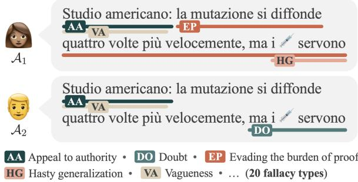  
Figure 1: Example showing multiple plausible span annotations provided by annotators $\mathcal { A } _ { 1 }$ and $\boldsymbol { A } _ { 2 }$ due to different interpretations (en: “American study: mutation spreadsfour timesfaster, but are needed”).

Recognizing fallacies in everyday argumentation may not only limit the spread of harmful content but also plays a key role in developing individuals critical thinking skills, ultimately contributing to mitigate faulty argumentation at its root and promoting democratic debate (Ecker et al., 2024).

Fallacy detection is an open challenge in NLP and has shown to be intrinsically difficult for both humans and machines (Alhindi et al., 2022). Although some fallacy detection datasets have been proposed in recent years, they either contain coarsegrained annotations (e.g., post-level; Jin et al., 2022; Habernal et al., 2018b, inter alia) or assume that no more than one fallacy can be expressed in a given text segment (Sahai et al., 2021; Goffredo et al., 2023). However, multiple fallacies may overlap in text (Jin et al., 2022) and knowing where a fallacy occurs is central for educational purposes. Moreover, current datasets encode a single “ground truth” for fallacies through label aggregation. This cancels out human label variation (Plank, 2022) that naturally occurs in fallacy annotation due to multiple plausible answers and genuine disagreement, in turn affecting modeling and evaluation.

We introduce FAINA (Fallacy detection with individual annotations), a dataset for fallacy detection with human label variation (Figure 1), along with experiments across setups of increasing complexity and thorough data analyses.

<table><tr><td>Work</td><td>Langs</td><td>Genres and domains/topics</td><td>Scope</td><td>#C</td><td>#I</td><td>Multi</td><td>HLV</td></tr><tr><td>Argotario (en) (Habernal et al., 2017)</td><td>en</td><td>General</td><td>pair</td><td>5†</td><td>909</td><td>x</td><td>x</td></tr><tr><td>Argotario (de) (Habernal et al., 2018a)</td><td>de</td><td>General</td><td>pair</td><td>5†</td><td>335</td><td>x</td><td>x</td></tr><tr><td>ChangeMyView (Habernal et al., 2018b)</td><td>en</td><td>Various topics (discussions)</td><td>text</td><td>1†</td><td>3,622</td><td>x</td><td>x</td></tr><tr><td>InformalFallacies* (Sahai et al., 2021)</td><td>en</td><td>D Politics; religion; veganism; fallacies</td><td>span</td><td>8</td><td>1,708</td><td>x</td><td>x</td></tr><tr><td>AdHomInTweets (Sheng et al., 2021)</td><td>en</td><td>BLM; MeToo; veganism; remote work</td><td>pair</td><td>6†</td><td>2,400‡</td><td>X</td><td>x</td></tr><tr><td>LanguageOfPopulism* (Macagno, 2022)</td><td>en;it; pt</td><td>乡 Political discourse (4 political leaders)</td><td>text</td><td>9†</td><td>1,919</td><td>√</td><td>x</td></tr><tr><td>Logic (Jin et al., 2022)</td><td>en</td><td>General</td><td>snippet</td><td>13</td><td>2,449</td><td>x</td><td>x</td></tr><tr><td>LogicClimate (Jin et al., 2022)</td><td>en</td><td>Climate change</td><td>snippet</td><td>13</td><td>1,079</td><td>x</td><td>x</td></tr><tr><td>COVID-19 (Musi et al., 2022)</td><td>en</td><td>COVID-19</td><td>snippet</td><td>10</td><td>526</td><td>X</td><td>x</td></tr><tr><td>Climate (Alhindi et al., 2022)</td><td>en</td><td>Climate change</td><td>snippet</td><td>10</td><td>477</td><td>X</td><td>x</td></tr><tr><td>ElecDeb60to16 (Goffredo et al., 2022)</td><td>en</td><td>Y Political debates (US pres. campaigns)</td><td>snippet</td><td>14</td><td>1,628</td><td>x</td><td>x</td></tr><tr><td>ElecDeb60to20 (Goffredo et al., 2023)</td><td>en</td><td>Political debates (US pres. campaigns)</td><td>span</td><td>6</td><td>1,989</td><td>X</td><td>x</td></tr><tr><td>RuFal (Shultz, 2024)</td><td>en</td><td>D Political discourse (Russian govt.)</td><td>text</td><td>13</td><td>700</td><td>x</td><td>x</td></tr><tr><td>FAINA (ours)</td><td>it</td><td>Climate change; migration; public health</td><td>span</td><td>20</td><td>11,064</td><td>√</td><td>√</td></tr></table>

Table 1: Existing fallacy detection datasets. Genres. \ news; \` educational; É social media/forums; ? transcripts. Scope of annotation. pair: question-answer/post-reply pair; text: whole text (e.g., post, paragraph); snippet: text excerpt; span: sequence of tokens in text. #C. Number of fallacy classes. #I. Number of human-annotated instances. Multi. Whether multiple/overlapping annotations for the same pair/text/snippet/span are provided. HLV. Whether the dataset includes human label variation. †: it also includes a negative class whose examples are not counted in #I for fair comparison. ‡: it includes 12K extra examples but are machine-annotated. \*: Arbitrary dataset name.

The FAINA dataset is the first annotated resource for fallacy detection embracing multiple plausible answers and natural disagreement. It is also the first dataset providing annotations at the fine-grained level of text segments with potential overlaps, accounting for over 11K annotated fallacies by two expert annotators across an inventory of 20 fallacy types. FAINA covers public discourse on migration, climate change, and public health issues in social media posts from Twitter, and focuses on Italian, a currently overlooked language in fallacy detection. To account for the complexity axes of the task, we design an evaluation framework that embraces the presence of multiple gold standards that are equally valid, partial span matches with overlaps, and the varying severity of fallacy classification errors.

We conduct experiments across four setups of increasing complexity, from post-level to spanlevel fallacy detection and using either fallacy macro-categories or the full inventory. Our results and analyses show that multi-task and multi-label transformer-based classifiers are strong baselines for fallacy detection tasks and that current large language models (LLMs) in zero-shot settings are still far from achieving satisfactory performance.

We also provide thorough data analyses, including insights on our multi-round annotation procedure which minimizes annotation errors whilst keeping label variation, and a manual audit of the outputs generated by LLMs. To foster research on fine-grained fallacy detection and broadly on human label variation in span-level tasks, we make our materials available to the NLP community.

## 2 Related Work

The increasing interest in fallacy detection has led to the creation of datasets with different characteristics in recent years (Table 1). Some works focused on the educational domain, either by collecting data through gamification (Habernal et al., 2017, 2018a) or from online quizzes (Jin et al., 2022), whereas others studied transcripts of political debates (Goffredo et al., 2022, 2023). Fallacies in news articles have been explored by Jin et al. (2022) and Alhindi et al. (2022) in climate change discourse, and by Musi et al. (2022) for analyzing COVID-19-related misinformation. Some works examined social media content using Reddit comments (Habernal et al., 2018b; Sahai et al., 2021) or tweets (Sheng et al., 2021), with a special interest on political discourse (Macagno, 2022; Shultz, 2024). We also analyze fallacies on social media but tackle previously unexplored topics over a fouryear time frame and deal with the Italian language.

Regarding annotation, current datasets mainly provide coarse-grained labels at the text (post, paragraph), snippet, or text pair level. The only exceptions are span-level datasets by Sahai et al. (2021) and Goffredo et al. (2023) which, however, do not foresee overlapping annotations. Inspired by work on propaganda detection (Da San Martino et al., 2019a,b, 2020) and persuasion techniques detection (Piskorski et al., 2023b), our dataset instead provides span-level annotations with overlaps for a better model transparency. Previous datasets include up to 3.6K human-annotated instances (Habernal et al., 2018b) across 14 fallacies (Goffredo et al., 2022). Instead, ours provides 11K human-labeled spans across 20 fallacy types.

Recent work highlighted the importance of considering human label variation (Plank, 2022), i.e., genuine disagreement (Poesio and Artstein, 2005), subjectivity and perspectives (Aroyo and Welty, 2015; Cabitza et al., 2023), and multiple plausible answers (Nie et al., 2020) as signal rather than noise. Yet, in fallacy detection all the labels from multiple annotators are typically aggregated (Sahai et al., 2021), selectively chosen (Musi et al., 2022; Habernal et al., 2017), or adjudicated through discussion or by an expert (Jin et al., 2022; Macagno, 2022; Goffredo et al., 2022, 2023, inter alia). More broadly, label variation has been mostly studied at the post or token level, with only few exceptions analyzing span-level disagreement in argument annotation (Lindahl, 2024; Hautli-Janisz et al., 2022). In our work, we resolve annotation errors while keeping genuine disagreement and multiple plausible answers, propose the first fallacy detection dataset at the span level with parallel annotations, and use human label variation during evaluation.

## 3 Harmonization of Fallacies

Given that different sets of fallacies have been proposed in the literature, we selected our tagset by reviewing fallacy types from previous work (Section 2) and harmonizing them. We thus compiled a list of 41 fallacies and conducted a pilot annotation on 15% of our data (Section 4). This exploratory phase allowed us to homogenize fallacy names and unify those with similar definitions under the same label (e.g., {Post hoc, False cause} Causal oversimplification), leading to a total of 20 fallacy types. Most fallacy definitions are derived from Musi et al. (2022) but also from Da San Martino et al. (2019b), reflecting the persuasive nature of posts in our data. Fallacy definitions are provided below (extended definitions and examples are in Appendix C.2):

1. Ad hominem (AH): an excessive attack on an individual or a group;

2. Appeal to authority (AA): appealing to an authority figure or a group consensus to support a thesis;

3. Appeal to emotion (AE): manipulation of the recipient’s emotions in order to win an argument;

4. Causal oversimplification (CO): the attributed causal relation is simplified and fallacious;

5. Cherry picking (CP): choosing evidence which supports a given position, dismissing findings which do not;

6. Circular reasoning (CR): the end of an argument comes back to the beginning without having proven itself;

7. Doubt (DO): questioning the credibility of someone or something;

8. Evading the burden of proof (EP): a position is advanced without any support as if it was self-evident;

9. False analogy (FA): two different things or situations are treated equally;

10. False dilemma (FD): a claim presenting only two options or sides when there are many;

11. Flag waving (FW): playing on strong national feeling (or with respect to a group) to justify or promote an action or idea;

12. Hasty generalization (HG): a generalization is drawn from a sample which is not representative or not applicable to the whole situation;

13. Loaded language (LL): using words/phrases with strong emotional implications (positive or negative) to influence an audience;

14. Name calling or labeling (NC): labeling the object of the propaganda campaign as either something the audience fears, hates, finds undesirable or otherwise loves or praises;

15. Red herring (RH): the argument supporting the claim diverges the attention to issues which are irrelevant for the claim at hand;

16. Slippery slope (SS): implies that an improbable or exaggerated consequence could result from a particular action;

17. Slogan (SL): a brief and striking phrase used to provoke excitement of the audience;

18. Strawman (ST): the arguer misinterprets an opponent’s argument for the purpose of more easily attacking it, demolishes it, and then concludes that the opponent’s real argument has been demolished;

19. Thought-terminating cliché (TC): short and generic phrase that discourages meaningful discussion;

20. Vagueness (VA): words which are ambiguous are shifted in meaning in the process of arguing or are left vague, being potentially subject to skewed interpretations.

We further organize these fallacy types into a taxonomy grouped around three macro-categories which include all the others: Insufficient proof, Simplification, and Distraction, following similar efforts (Dimitrov et al., 2024; Tindale, 2007). The full taxonomy is presented in Figure 4 and serves for evaluation purposes (Section 5).

## 4 FAINA Dataset

In this section, we describe the creation of FAINA, from data collection (Section 4.1) to data annotation (Section 4.2). We then provide detailed dataset statistics (Section 4.3). Data statements (Bender and Friedman, 2018) are available in Appendix A.

## 4.1 Data Collection and Sampling

We collect social media posts in Italian (it) that discuss issues pertaining to migration, climate change, and public health using the Twitter APIs.2 To minimize temporal and topic biases, the posts were collected from a large time frame of four years (from 2019-01-01 to 2022-12-31). We filter messages on the aforementioned topics by using a manually curated list of 436 keywords derived from trustable glossaries and manuals and extended to cover all applicable grammatical genders and numbers (see Appendix B for keywords and sources). We then retain posts with 5 tokens3 and select those with the largest number of likes and retweets as in Nakov et al. (2022), therefore focusing on the messages with highest impact to the society. Specifically, to simultaneously mitigate topic, author, and temporal bias in sampling, we keep the top-k posts (k = 10) for each month and topic, further excluding messages authored by the same user after their most impactful post, and resampling messages until we obtain k posts for each month-topic combination.4 As a result, we collect 1,440 posts balanced across topics (480 per topic) and time (360 per year) for fine-grained, span-level annotation with overlaps.

## 4.2 Manual Data Annotation

Span-level annotation with an inventory of 20 fallacy types and potential overlaps is an intrinsically difficult task. It requires annotators to devote significant effort in understanding the nuances of fallacies and master the annotation guidelines, both for span segmentation and labeling. We thus avoid crowdsourcing which, as also noted by Da San Martino et al. (2019b) for span-level propaganda annotation, is not suitable in this context. We instead devise an annotation protocol that foresees multiple rounds of annotation and discussion among two expert annotators $( A _ { 1 }$ and $\boldsymbol { \mathcal { A } } _ { 2 } )$ which allows us to minimize annotation errors whilst keeping signals of human label variation. Details on annotators profiles are in Appendix A. The annotation proved very challenging and took about 380 person-hours to be completed, discussions included.

Annotation protocol and guidelines After a pilot phase in which we formalize the annotation guidelines and consolidate the label set (Section 3), we conduct five rounds of annotation and discussion in an increasingly larger number of posts (i.e., 60, 120, 180, 360, 720) balanced across topics. At each round, annotators i) individually located all the text segments expressing fallacies, giving each of them one of the 20 labels from our inventory,5 ii) discussed with each other the annotated instances that diverged in the span extent and/or the assigned label, and iii) resolved the cases of disagreement due to errors or attention drops, therefore keeping the naturally-occurring variation in annotation due to multiple plausible answers (e.g., interpretation) and genuine disagreement (Plank, 2022). The guidelines and annotations from previous rounds have been updated at the end of each round based on the discussion outcomes. After completing all the rounds, the two annotators also revised their annotations to ensure that all posts were labeled consistently. We provide the annotation guidelines in Appendix C to foster future work covering other languages and additional annotators.

Inter-annotator agreement We calculate the inter-annotator agreement (IAA) at each annota tion round, both before and after discussion, and considering either span identification or span clas sification. This allows us to get insights on the whole annotation process besides final results only. Since our dataset includes span annotations of vary ing length which may also overlap, we avoid using Krippendorff’s alpha (α; Hayes and Krippendorff, 2007) or other metrics that are typically applied at the token-level. We instead use $\gamma$ (Mathet et al., 2015) and $\gamma _ { c a t }$ (Mathet, 2017) as implemented in the pygamma-agreement (v0.5.9) package (Titeux and Riad, 2021) to better account for span-level identification and classification with overlaps. The IAA on the final dataset is $\gamma ~ = ~ 0 . 6 2 4 0$ (span identification) and $\gamma _ { c a t } = 0 . 5 4 4 5$ (span classification), which is comparable to results reported on the related span-level propaganda detection task (Da San Martino et al., 2019b). By taking a closer look at the IAA over rounds (Figure 2), we notice that the difference between scores before and after discussion becomes less pronounced over rounds. This indicates that annotators increasingly align to each other, but also that annotating falla cies at the span level inherently calls for multiple discussions. At the same time, we notice that $\gamma$ and $\gamma _ { c a t }$ upper bounds (Figure 2; green line) are rather stable over rounds (i.e., [0.6, 0.7] and [0.5, 0.6] for γ and $\gamma _ { c a t } ,$ respectively), confirming that human label variation can be resolved only partially. Over all, identifying fallacy spans appears to be the main bottleneck for IAA, since finding and assigning a label to a text segment decreases the IAA only minimally (cf. Figure 2; left vs right). Finally, we can see that annotators are more resistant to find a consensus after the initial rounds (cf. Figure 2; fourth vs fifth round). We hypothesize that this is due to their increasing understanding of fallacies nuances. We report the IAA across fallacies in Ta ble 2, in which Doubt and Slogan emerge as the fallacies with highest IAA whereas Cherry picking and Vagueness are the hardest ones to agree on.

## 4.3 Data Statistics and Analysis

Overall, FAINA consists of 11,064 annotated spans $( 5 , 5 3 2 _ { \pm 2 5 3 }$ per annotator) across 58,490 tokens in

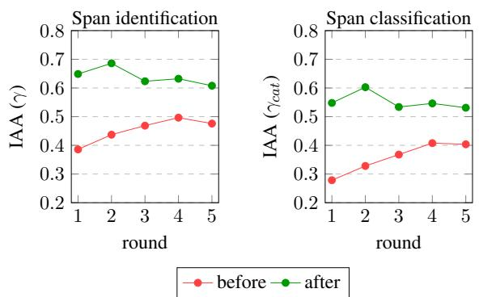  
Figure 2: Inter-annotator agreement (IAA) scores for both span identification (γ) and classification $( \gamma _ { c a t } )$ at each annotation round, before and after discussion.

<table><tr><td>Id</td><td>Fallacy type</td><td>Spans</td><td>Length</td><td> $\gamma _ { c a t }$ </td></tr><tr><td>AH</td><td>Ad hominem</td><td>319</td><td> $1 6 . 0 { \scriptstyle \pm 1 3 . 3 }$ </td><td>0.6651</td></tr><tr><td>AA</td><td>Appeal to authority</td><td>213</td><td> $6 . 4 \pm 4 . 3$ </td><td>0.6147</td></tr><tr><td>AE</td><td>Appeal to emotion</td><td>2,049</td><td> $5 . 1 \pm 4 . 9$ </td><td>0.4730</td></tr><tr><td>CO</td><td>Causal oversimplification</td><td>142</td><td> $1 9 . 0 _ { \pm 1 0 . 7 }$ </td><td>0.5282</td></tr><tr><td>CP</td><td>Cherry picking</td><td>94</td><td> $2 8 . 8 { \scriptstyle \pm 1 2 . 3 }$ </td><td>0.3415</td></tr><tr><td>CR</td><td>Circular reasoning</td><td>20</td><td> $2 6 . 8 { \scriptstyle \pm 1 1 . 0 }$ </td><td>0.5397</td></tr><tr><td>DO</td><td>Doubt</td><td>482</td><td> $1 6 . 1 _ { \pm 1 1 . 4 }$ </td><td>0.7103</td></tr><tr><td>EP</td><td>Evading the burden of proof</td><td>406</td><td> $1 6 . 2 \pm 9 . 9$ </td><td>0.4335</td></tr><tr><td>FA</td><td>False analogy</td><td>239</td><td> $2 2 . 1 _ { \pm 1 3 . 4 }$ </td><td>0.5243</td></tr><tr><td>FD</td><td>False dilemma</td><td>90</td><td> $1 5 . 9 _ { \pm 1 1 . 0 }$ </td><td>0.5568</td></tr><tr><td>FW</td><td>Flag waving</td><td>393</td><td> $4 . 3 \pm _ { 4 . 9 }$ </td><td>0.5735</td></tr><tr><td>HG</td><td>Hasty generalization</td><td>464</td><td> $1 1 . 2 \pm 8 . 0$ </td><td>0.4980</td></tr><tr><td>LL</td><td>Loaded language</td><td>2,484</td><td> $2 . 5 \ \pm 2 . 7$ </td><td>0.4365</td></tr><tr><td>NC</td><td>Name calling or labeling</td><td>1,124</td><td> $2 . 6 \pm 1 . 7$ </td><td>0.5566</td></tr><tr><td>RH</td><td>Red herring</td><td>257</td><td> $1 3 . 0 \ \pm 8 . 5$ </td><td>0.4378</td></tr><tr><td>SS</td><td>Slippery slope</td><td>172</td><td>10.8 ±6.8</td><td>0.6552</td></tr><tr><td>SL</td><td>Slogan</td><td>384</td><td>3.5 ±3.1</td><td>0.7101</td></tr><tr><td>ST</td><td>Strawman</td><td>109</td><td> $3 6 . 3 _ { \pm 1 5 . 4 }$ </td><td>0.5570</td></tr><tr><td>TC</td><td>Thought-terminating cliché</td><td>285</td><td> $5 . 2 \pm 3 . 0$ </td><td>0.5305</td></tr><tr><td>VA</td><td>Vagueness</td><td>1,338</td><td>9.1 ±8.6</td><td>0.3701</td></tr><tr><td>All</td><td></td><td>11,064</td><td> $7 . 6 \pm 9 . 3$ </td><td>0.5445</td></tr></table>

Table 2: Statistics and per-class IAA scores $( \gamma _ { c a t } )$ across all fallacy types. We report the number of spans and their average length (with standard deviation) at the token level considering all annotations. Individual statistics for both $\mathcal { A } _ { 1 }$ and $\boldsymbol { A } _ { 2 }$ are provided in Appendix D.

1,440 social media posts. We present per-fallacy statistics on all annotations in Table 2 and refer to Appendix D for individual statistics for $\mathcal { A } _ { 1 }$ and $\mathcal { A } _ { 2 }$

Fallacy spans have a length of $7 . 6 { \scriptstyle \pm 9 . 3 }$ tokens on average, but length greatly varies across fallacy types. The shortest fallacies are those related to language use (language fallacies in Tindale (2007)) such as Loaded language, Name calling or labeling, and Slogan (< 4 tokens), whereas the longest ones are those commonly referred to as logical fallacies andfallacies ofdiversion (Tindale, 2007), such as Strawman, Cherry picking, and Circular reasoning (> 25 tokens). The most and least frequent fallacies are Loaded language $( 1 , 2 4 2 _ { \pm 1 7 8 } )$ and Circular reasoning $\left( 1 0 _ { \pm 2 } \right)$ , respectively. The number of annotated spans and average token length for each fallacy type varies between annotators. For instance, False analogy has been annotated more by $\mathcal { A } _ { 1 }$ than by $\boldsymbol { A } _ { 2 }$ (147 vs 92 spans), but on average $\boldsymbol { A } _ { 2 }$ labeled longer text segments than $\boldsymbol { \mathcal { A } } _ { 1 }$ for that fallacy type, also with a higher standard deviation (24. $1 { \pm } 1 3 . 8$ vs $2 0 . 8 { \scriptstyle \pm 1 3 . 0 }$ tokens) (Appendix D).

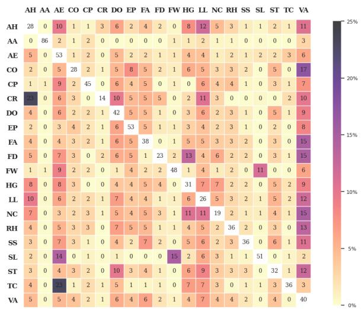  
Figure 3: Overlap of fallacy annotations in terms of token percentages. Each row indicates the percentage of tokens for a given fallacy type that overlaps with any other fallacy type (columns). White cells (diagonal) indicate the percentage of tokens for each fallacy type that does not overlap with any other fallacy type. Fallacy overlaps for $\mathcal { A } _ { 1 }$ and $\boldsymbol { A } _ { 2 }$ annotations are in Appendix D.

The FAINA dataset has dense annotation $( 3 . 8 \pm 0 .$ 2 spans/post) and overlaps among fallacy spans are also very frequent. In Figure 3 we show the percentage of pairwise overlaps at the token level across fallacy types considering all annotations (individual figures for $\mathcal { A } _ { 1 }$ and $\boldsymbol { A } _ { 2 }$ are in Appendix D). The percentage of tokens without overlaps is also shown (Figure 3; diagonal cells): for all fallacy types except AA, AE, EP, and SL, at least half of the tokens co-occur with other fallacies’ tokens. Among the most frequent overlaps are the fallacies Thoughtterminating cliché and Appeal to emotion $( 2 3 \% \pm 2 )$ ， since emotional words are often used in thoughtstopping discussions.

## 5 Experiments

In this section, we present experiments on fallacy detection using the FAINA dataset. We first introduce our experimental setup (Section 5.1) and the approaches we employed (Section 5.2). We then provide results and a thorough discussion, including insights for future work (Section 5.3).

## 5.1 Experimental Setup

Tasks We cast fallacy detection into different tasks along two dimensions: the annotation unit, i.e., post-level (POST) vs span-level (SPAN), and the classification granularity, i.e., coarse-grained with 3 fallacy macro-categories (C; Section $3 ) ^ { 6 }$ vs fine-grained with all the 20 fallacy types (F). As a result, we deal with four subtasks of increasing complexity (i.e., POST-C, POST-F, SPAN-C, and SPAN-F) implying the use of different evaluation metrics as detailed in the following.

Data splits For the sake of the experiments, we divide FAINA into k train and test data splits using k-fold cross validation $( k = 5 )$ . We use the train data portions for pretrained models to finetune, and use the test portion for evaluation. For model selection, we rely on the train splits, further diving them into train (80%) and dev (20%), and selecting the best model configuration based on average performance on dev data portions. Each data split contains annotations for the same posts, at either the post or span level, by both annotators.

Evaluation metrics We evaluate performance using different flavors of precision, recall, and $\mathrm { F _ { 1 } }$ score to capture the diverse challenges of each task. For POST tasks, in which the set of fallacies expressed in a post must be predicted, we use standard micro-averaged scores. For the more challenging SPAN tasks, in which all text segments expressing fallacies within a post must be identified and classified, we instead adopt precision, recall, and $\mathrm { F _ { 1 } }$ variants proposed by Da San Martino et al. (2019b) and extend them to operate on tokens.7 We use such variants since they are expressly designed for tasks with spans of varying length that may overlap. Moreover, to account for the severity of labeling errors (e.g., predicting Red herring instead of $A p \mathrm { - }$ peal to authority is less problematic than predicting False dilemma), we compute results using both strict and soft evaluation modes in the SPAN-F task. Concretely, while in strict mode we reward models only if they predict the intended label, in soft mode we give them partial credit if the predicted label is an immediate parent of the actual label (Figure 4). This is achieved by setting $\delta = 0 . 5$ as coefficient for partial label matches in the distance function of the metric by Da San Martino et al. (2019b).

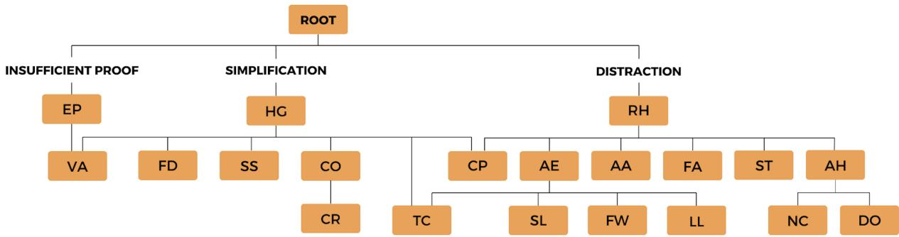  
Figure 4: Taxonomy of fallacy types that we designed for evaluation purposes. Labels below the root (i.e., Insufficient proof, Simplification, and Distraction) represent the fallacy macro-categories for POST-C and SPAN-C tasks.

Multiple gold standards FAINA consists of multiple parallel annotations (i.e., multiple views) that are equally reliable. To equally account for all test set versions while avoiding to favor those with more/less annotations (and thus avoiding to favor models that over/under-predict fallacies), we macro-average scores on individual test sets. The simplicity of this approach makes it suitable for extending evaluation on future test set versions.

## 5.2 Models

We perform experiments on all tasks using different models in supervised and unsupervised settings.

Supervised models Since each data instance in FAINA has multiple “ground truths”, i.e., parallel labels by annotators $\ A _ { 1 } , A _ { 2 } \in { \mathcal { A } } ,$ in the supervised setting we aim to jointly model all annotation versions (hereafter, views) to account for human label variation. We therefore adopt a multi-task learning (Caruana, 1997) approach to leverage signals of different but related views through a shared encoder and D decoders. Specifically, for POST tasks we propose a multi-view, multi-label (MVML) model that uses $D = | { \cal A } |$ decoders and thus outputs D sets of predicted labels, one for each view containing all labels that exceed a threshold τ . For SPAN tasks, which are sequence labeling problems relying on the BIO-tagging scheme, we instead propose a multi-view, multi-decoder (MVMD) model, with a separate decoder for each view and fallacy type $f \in \mathcal { F } \left( \mathrm { i . e . , } D = | \mathcal { A } \times \mathcal { F } | \right)$ . We give equal importance to all decoders, i.e., computing the multitask learning loss as $\begin{array} { r } { L = \sum _ { d } \lambda _ { d } L _ { d } . } \end{array}$ where $L _ { d }$ is the loss for task $d \in D$ and $\lambda _ { d } = 1$ the corresponding weight. For all tasks, we use widespread models pretrained on Italian data as encoders, namely AlBERTo (Polignano et al., 2019) and Um-BERTo (Parisi et al., 2020), leading to MVML-ALB and MVML-UMB models for POST tasks, and MVMD-ALB and MVMD-UMB for SPAN tasks. We implement our models using the MaChAmp v0.4 toolkit (van der Goot et al., 2021) and adopt default hyper-parameter values (Appendix E).

Unsupervised models Given the challenging nature of our tasks, we further assess classification performance with instruction-tuned LLMs in a zero-shot setting. We experiment with LLaMa-3 8B (Dubey et al., 2024) and Mixtral 8x7B (Jiang et al., 2024) to favor reproducibility, as they are freely available and widely used models. Moreover, both include Italian in their pretraining data. We design prompts that describe each task and output format, and either include fallacy definitions (Section 3) or just fallacy names (see Appendix E).8 During model selection, we observe that including definitions increased performance on the dev splits. Therefore, we select zero-shot models with definitions (ZSWD) for testing, i.e., ZSWD-LLAMA and ZSWD-MIXTR. Being unsupervised, these models naturally yield a single output for each data instance. We thus compare this output against all data instance views during evaluation. We use the Hugging Face library and employ default model hyperparameters.

## 5.3 Results and Discussion

Results across all task setups are reported in Table 3 (individual results are in Appendix E). We observe that our multi-view approaches $\mathbf { ( i . e . , M V M L ^ { - * } }$ and MVMD-\*) yield promising results both in postand span-level tasks, offering well-performing baselines upon which future approaches can be built. Concerning the encoders, UmBERTo (i.e., \*-UMB models) appears unstable on fine-grained tasks, while it achieves similar performance to Al-BERTo (i.e., \*-ALB models) in coarse-grained classification. The difference in performance between the two may be due to the former being pretrained on the Italian portion of the OSCAR corpus (Suárez et al., 2019), while AlBERTo is trained exclusively on tweets, and thus is more in line with FAINA data. As expected, classification at the span level with fine-grained labels (i.e., SPAN-F) is the hardest task setup, although the MVMD-ALB model achieves a $\mathrm { F _ { 1 } }$ score of 33.3 and 37.0 using strict and soft evaluation modes, respectively. These results are in line with performance on span-level tasks of similar complexity (Da San Martino et al., 2019b) and can be seen as strong baselines considering that 20 fallacy types are involved. We also observe that high recall is more challenging than high precision, probably because of the presence of multiple labels across partially and fully-overlapping spans.

As regards the second set of experiments using generative LLMs in a zero-shot setting (i.e, ZSWD-\* models), results appear unreliable. While we acknowledge that fine-tuning approaches cannot be directly compared with zero-shot classification, our main goal was instead to assess to what extent we can expect to challenge traditional supervised approaches with zero-shot generative models.9 Our results show that a complex task like fallacy detection, which involves capturing lexical, semantic, and even pragmatic aspects of communication, is still far from being addressed with generative models, especially if we aim at embracing human label variation. In addition to the low performance across the challenging SPAN setups (e.g., F1 of 3.4–5.0 and 4.2–6.5 on the SPAN-F task for ZSWD-LLAMA and ZSWD-MIXTR, respectively), LLMs are also more computationally expensive than the other proposed models, making them impractical in scenarios in which computational time is a requirement or large computational resources are not available. To further analyze the behavior of LLMs in fal-

<table><tr><td>Model</td><td></td><td>P</td><td>R</td><td> $\mathbf { F } _ { 1 }$ </td></tr><tr><td>POSC</td><td>MVML-ALB MVML-UMB ZSWD-LLAMA</td><td> $8 0 . 0 { \scriptstyle \pm 1 . 5 }$   $8 4 . 5 _ { \pm 1 . 3 }$   $5 7 . 9 _ { \pm 1 . 9 }$ </td><td> $7 4 . 0 { \scriptstyle \pm 2 . 3 }$   $7 0 . 1 _ { \pm 4 . 2 }$   $7 0 . 0 { \scriptstyle \pm 1 . 9 }$ </td><td> ${ 7 6 . 8 \pm 1 . 6 }$   $7 6 . 6 { \scriptstyle \pm 2 . 8 }$   $6 3 . 3 _ { \pm 1 . 5 }$ </td></tr><tr><td>POS-F</td><td>MVML-ALB MVML-UMB  ${ \mathrm { Z S W D - L L A M A } }$   $\mathrm { Z S W D \mathrm { - } M I X T R }$   $\mathbf { M V M D - A L B }$ </td><td> $6 3 . 0 { \scriptstyle \pm 2 . 0 }$   $3 9 . 0 { \scriptstyle \pm 3 . 7 }$   $2 0 . 9 { \scriptstyle \pm 1 . 5 }$   $2 6 . 0 { \scriptstyle \pm 1 . 8 }$ </td><td> $3 4 . 3 _ { \pm 1 . 9 }$   $1 4 . 6 { \scriptstyle \pm 1 . 6 }$   $2 4 . 3 _ { \pm 2 . 3 }$   $1 8 . 1 { \pm } 1 . 4 $ </td><td> ${ \pm 4 . 3 \mathrm { _ { \pm 1 . 9 } } }$   $2 1 . 3 { \scriptstyle \pm 2 . 2 }$   $2 2 . 5 { \scriptstyle \pm 1 . 8 }$   $2 1 . 4 { \scriptstyle \pm 1 . 5 }$ </td></tr><tr><td>SPANC</td><td> ${ \mathrm { Z S W D - L L A M A } }$ </td><td> $2 5 . 3 { \scriptstyle \pm 4 . 2 }$ </td><td> $7 . 0 { \scriptstyle \pm 0 . 8 }$ </td><td> $1 0 . 9 { \scriptstyle \pm 0 . 9 }$ </td></tr><tr><td></td><td></td><td></td><td></td><td></td></tr><tr><td></td><td></td><td></td><td></td><td></td></tr><tr><td></td><td>Strict mode</td><td></td><td></td><td></td></tr><tr><td></td><td></td><td></td><td></td><td></td></tr><tr><td></td><td> $\mathrm { Z S W D \mathrm { - } M I X T R }$ </td><td> $3 1 . 6 _ { \pm 1 . 2 }$ </td><td> $2 0 . 9 { \scriptstyle \pm 1 . 4 }$ </td><td> $2 5 . 1 _ { \pm 1 . 2 }$ </td></tr><tr><td></td><td></td><td></td><td></td><td></td></tr><tr><td></td><td></td><td></td><td></td><td></td></tr><tr><td></td><td></td><td></td><td></td><td></td></tr><tr><td></td><td> $\mathbf { M V M D - A L B }$ </td><td> $4 7 . 6 _ { \pm 1 . 9 }$ </td><td> $2 5 . 6 { \scriptstyle \pm 1 . 6 }$ </td><td> ${ 3 3 . 3 } _ { \pm 1 . 4 }$ </td></tr><tr><td></td><td></td><td></td><td></td><td></td></tr><tr><td></td><td>MVMD-UMB</td><td> $5 7 . 5 { \scriptstyle \pm 5 . 9 }$ </td><td> $3 . 9 { \scriptstyle \pm 0 . 7 }$ </td><td> $7 . 3 { \scriptstyle \pm 1 . 3 }$ </td></tr><tr><td></td><td>ZSWD-LLAMA</td><td> $4 . 5 { \scriptstyle \pm 0 . 5 }$ </td><td> $2 . 7 _ { \pm 0 . 4 }$ </td><td> $3 . 4 { \pm } 0 . 3$ </td></tr><tr><td>SPPA-E</td><td>ZSWD-MIXTR</td><td> $5 . 8 _ { \pm 1 . 1 }$ </td><td></td><td></td></tr><tr><td></td><td></td><td></td><td> $3 . 2 { \scriptstyle \pm 0 . 5 }$ </td><td> $4 . 2 _ { \pm 0 . 7 }$ </td></tr><tr><td></td><td>Soft mode</td><td></td><td></td><td></td></tr><tr><td></td><td> $\mathbf { M V M D - A L B }$ </td><td> $5 2 . 2 _ { \pm 2 . 0 }$ </td><td> $2 8 . 7 _ { \pm 1 . 7 }$ </td><td> ${ \bf 3 7 . 0 _ { \pm 1 . 5 } }$ </td></tr><tr><td></td><td>MVMD-UMB</td><td> $6 6 . 3 { \scriptstyle \pm 5 . 5 }$ </td><td> $4 . 8 _ { \pm 0 . 7 }$ </td><td> $8 . 9 { \scriptstyle \pm 1 . 3 }$ </td></tr><tr><td></td><td></td><td></td><td></td><td></td></tr><tr><td></td><td> ${ \mathrm { Z S W D - L L A M A } }$ </td><td> $6 . 4 _ { \pm 0 . 6 }$ </td><td> $4 . 2 _ { \pm 0 . 5 }$ </td><td> $5 . 0 { \scriptstyle \pm 0 . 4 }$ </td></tr><tr><td></td><td></td><td></td><td></td><td></td></tr><tr><td></td><td></td><td></td><td></td><td></td></tr><tr><td></td><td></td><td></td><td></td><td></td></tr><tr><td></td><td></td><td></td><td></td><td></td></tr><tr><td></td><td></td><td></td><td></td><td></td></tr><tr><td></td><td></td><td></td><td></td><td></td></tr><tr><td></td><td></td><td></td><td></td><td></td></tr><tr><td></td><td></td><td></td><td></td><td></td></tr><tr><td></td><td></td><td></td><td></td><td></td></tr><tr><td></td><td></td><td></td><td></td><td></td></tr><tr><td></td><td></td><td></td><td></td><td></td></tr><tr><td></td><td></td><td></td><td></td><td></td></tr><tr><td></td><td></td><td></td><td></td><td></td></tr><tr><td></td><td></td><td></td><td></td><td></td></tr><tr><td></td><td></td><td></td><td></td><td></td></tr><tr><td></td><td></td><td></td><td></td><td></td></tr><tr><td></td><td></td><td></td><td></td><td></td></tr><tr><td></td><td></td><td></td><td></td><td></td></tr><tr><td></td><td></td><td></td><td></td><td></td></tr><tr><td></td><td></td><td></td><td></td><td></td></tr><tr><td></td><td></td><td></td><td></td><td></td></tr><tr><td></td><td></td><td></td><td></td><td></td></tr><tr><td></td><td></td><td></td><td></td><td></td></tr><tr><td></td><td></td><td></td><td></td><td></td></tr><tr><td></td><td></td><td></td><td></td><td></td></tr><tr><td></td><td></td><td></td><td></td><td></td></tr><tr><td></td><td> $\mathrm { Z S W D \mathrm { - } M I X T R }$ </td><td> $8 . 2 { \scriptstyle \pm 1 . 5 }$ </td><td> $5 . 4 _ { \pm 1 . 0 }$ </td><td> $6 . 5 { \scriptstyle \pm 1 . 1 }$ </td></tr></table>

Table 3: Test set results for POST and SPAN tasks at the coarse-grained (C) andfine-grained (F) level. We report average precision (P), recall (R), and $\mathrm { F _ { 1 } }$ scores (w/ std dev) across $k = 5$ splits, averaged over all  test versions. For SPAN-F, we also present scores using both strict and soft modes. Best results are in bold. Results on individual test sets $( A _ { 1 }$ and $\boldsymbol { \mathcal { A } } _ { 2 } )$ are in Appendix E.

lacy detection, we conduct a manual analysis of the outputs of ZSWD-LLAMA and ZSWD-MIXTR across all task setups. We sample 50 outputs for each model and setup, for a total of 400 samples. We first audit them according to whether they provide an actual answer, extra instructions, both, or an empty response (Figure 5). Then, we analyze instances where an actual answer is provided, auditing if the output is in the requested format (format ok), provides extra explainations, wrong labels, or repetitions (repeat) (Figure 6).

For SPAN tasks, ZSWD-LLAMA provides few answers (20–34%; answer+both in Figure 5a) compared to ZSWD-MIXTR despite being instructiontuned, and instead mainly generates prompt continuations (80–96%; extra instructions+both in Figure 5a). ZSWD-MIXTR appears more robust, producing up to 98% answers (answer+both in Figure 5a), of which 92–94% in the requested format (format ok in Figure 6a). However, the results obtained with ZSWD-MIXTR (Table 3) are just slightly higher than those of ZSWD-LLAMA, suggesting that while ZSWD-MIXTR produces answers in most cases, those are not actually reliable.

answer extra instructions both empty  
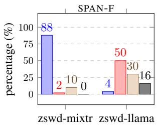

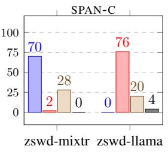  
(a) Analysis of the answers for SPAN tasks.

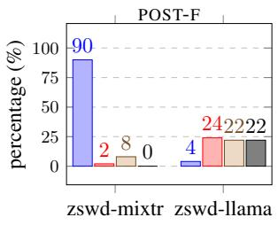

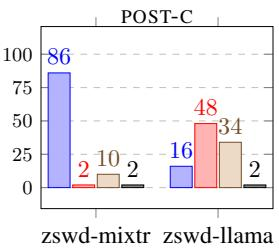  
answer extra instructions both empty  
(b) Analysis of the answers for POST tasks.

Figure 5: Analysis of the raw outputs generated by LLMs across the four tasks according to whether they contain an actual answer, extra instructions, both an actual answer and extra instructions, or an empty response.  
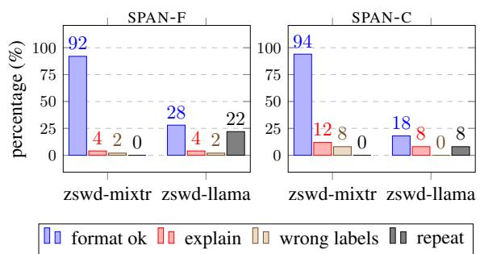  
(a) Analysis of the answers for SPAN tasks.

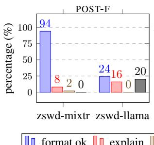

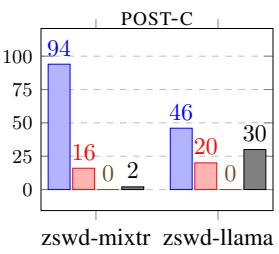  
(b) Analysis of the answers for POST tasks.  
Figure 6: Analysis of the actual answers (i.e., answer+both; Figure 5) generated by LLMs across the four tasks according to whether the output is in the requested format (format ok), provides explainations, wrong labels, or repetitions (repeat). A single answer may meet more than one aspect, e.g., it can be bothformat ok and repeat.

As a comparison, we report the results for POST tasks in Figure 5b and 6b. We observe that the general trends highlighted for the SPAN tasks still hold also for this setting. Overall, this qualitative analysis indicates that future work is needed for dealing with complex tasks such as fine-grained fallacy detection with LLMs in zero-shot setups.

## 6 Conclusions

We introduced FAINA, the first fallacy detection dataset embracing multiple plausible answers and natural disagreement at the fine-grained level of text segments. FAINA advances research on human label variation in NLP and opens new avenues for research. Given its multi-topic and multi-year nature, it can be used to benchmark fallacy detection approaches in out-of-domain scenarios and across time. Moreover, our annotation paradigm and guidelines can be applied to cover new languages, topics, and additional annotators. Lastly, FAINA can be used for novel work on cross-lingual annotation transfer in which source and target languages are shifted, e.g., from Italian to English.

## Limitations

Our dataset contains tweets in one language. Although the annotation scheme can be easily adopted for other languages, the findings and insights obtained from the experiments may not hold on other data sources and languages. For dataset creation and experiments with human label variation we rely on two annotators. We are aware that more perspectives could have been leveraged using crowdsourcing platforms. However, we opted to involve only expert annotators to prioritize annotation reliability, further providing the full annotation guidelines and details on the annotation protocol to encourage future extensions. The main focus of the paper is on the resource creation and assessment and its fine-grained evaluation; therefore, we employed a limited set of models in our experiments. The performance evaluation of additional models and the fine-tuning of LLMs is a research direction we would like to pursue in future work.

## Ethics Statement

The FAINA dataset has been created by paying particular attention to data minimization principles and complying with privacy requirements. Data was collected using the Twitter APIs when they were still freely available for research purposes, and up to one tweet per user has been retrieved for each month and topic. It is therefore impossible to profile users, and this also avoids the users’ writing style to interfere with classification performance.

To follow good scientific practices, the FAINA dataset is released including only the post texts, with no user information. Indeed, while in the past Twitter datasets were commonly released as a list of tweet IDs, this would make it hard to replicate our work because free Twitter APIs have been discontinued. The dataset is released in its anonymized form, after replacing user mentions, email addresses, phone numbers and URLs with placeholders, as described in Appendix A. To download FAINA, it is necessary to fill in an online form declaring compliance with user protection regulations and exclude data misuse.

## Acknowledgments

This work was funded by the European Union’s Horizon Europe research and innovation programme under grant agreement No. 101135437 (AI-CODE). We acknowledge also the support of the PNRR project FAIR – Future AI Research (PE00000013), under the NRRP MUR program funded by NextGeneration EU.

## References

Tariq Alhindi, Tuhin Chakrabarty, Elena Musi, and Smaranda Muresan. 2022. Multitask instructionbased prompting for fallacy recognition. In Proceedings ofthe 2022 Conference on Empirical Methods in Natural Language Processing, pages 8172–8187, Abu Dhabi, United Arab Emirates. Association for Computational Linguistics.

Lora Aroyo and Chris Welty. 2015. Truth is a lie: Crowd truth and the seven myths of human annotation. AI Magazine, 36(1):15–24.

Elena Barbera and Claudio Tortone. 2012. Glossario O.M.S. della promozione della salute. Technical report, Centro Regionale di Documentazione per la Promozione della Salute (DoRS), Grugliasco, Italy.

Paola Barretta, Piera Francesca Mastantuono, and Sabika Shah Povia. 2018. Linee Guida per l’Applicazione della Carta di Roma: Strumenti di Lavoro per un’Informazione Corretta sui Temi dell’Immigrazione e dell’Asilo. Associazione Carta di Roma, Rome, Italy.

Emily M. Bender and Batya Friedman. 2018. Data statements for natural language processing: Toward mitigating system bias and enabling better science. Transactions of the Association for Computational Linguistics, 6:587–604.

Federico Cabitza, Andrea Campagner, and Valerio Basile. 2023. Toward a perspectivist turn in ground truthing for predictive computing. Proceedings of the AAAI Conference on Artificial Intelligence, 37(6):6860–6868.

Rich Caruana. 1997. Multitask learning. Machine learning, 28:41–75.

Giovanni Da San Martino, Alberto Barrón-Cedeño, and Preslav Nakov. 2019a. Findings of the NLP4IF-2019 shared task on fine-grained propaganda detection. In Proceedings ofthe Second Workshop on Natural Language Processing for Internet Freedom: Censorship, Disinformation, and Propaganda, pages 162–170, Hong Kong, China. Association for Computational Linguistics.

Giovanni Da San Martino, Alberto Barrón-Cedeño, Henning Wachsmuth, Rostislav Petrov, and Preslav Nakov. 2020. SemEval-2020 task 11: Detection of propaganda techniques in news articles. In Proceedings ofthe Fourteenth Workshop on Semantic Evaluation, pages 1377–1414, Barcelona (online). International Committee for Computational Linguistics.

Giovanni Da San Martino, Seunghak Yu, Alberto Barrón-Cedeño, Rostislav Petrov, and Preslav Nakov. 2019b. Fine-grained analysis of propaganda in news article. In Proceedings of the 2019 Conference on Empirical Methods in Natural Language Processing and the 9th International Joint Conference on Natural Language Processing (EMNLP-IJCNLP), pages 5636–5646, Hong Kong, China. Association for Computational Linguistics.

Dimitar Dimitrov, Firoj Alam, Maram Hasanain, Abul Hasnat, Fabrizio Silvestri, Preslav Nakov, and Giovanni Da San Martino. 2024. SemEval-2024 task 4: Multilingual detection of persuasion techniques in memes. In Proceedings ofthe 18th International Workshop on Semantic Evaluation (SemEval-2024), pages 2009–2026, Mexico City, Mexico. Association for Computational Linguistics.

Abhimanyu Dubey, Abhinav Jauhri, Abhinav Pandey, Abhishek Kadian, Ahmad Al-Dahle, Aiesha Letman, Akhil Mathur, Alan Schelten, Amy Yang, Angela Fan, et al. 2024. The Llama 3 herd of models. arXiv preprint arXiv:2407.21783.

Ullrich Ecker, Jon Roozenbeek, Sander van der Linden, Li Qian Tay, John Cook, Naomi Oreskes, and Stephan Lewandowsky. 2024. Misinformation poses a bigger threat to democracy than you might think. Nature, 630(8015):29–32.

Pierpaolo Goffredo, Mariana Chaves, Serena Villata, and Elena Cabrio. 2023. Argument-based detection and classification of fallacies in political debates.

In Proceedings of the 2023 Conference on Empirical Methods in Natural Language Processing, pages 11101–11112, Singapore. Association for Computational Linguistics.

Pierpaolo Goffredo, Shohreh Haddadan, Vorakit Vorakitphan, Elena Cabrio, and Serena Villata. 2022. Fallacious argument classification in political debates. In Proceedings of the Thirty-First International Joint Conference on Artificial Intelligence, IJCAI-22, pages 4143–4149. International Joint Conferences on Artificial Intelligence Organization.

Ivan Habernal, Raffael Hannemann, Christian Pollak, Christopher Klamm, Patrick Pauli, and Iryna Gurevych. 2017. Argotario: Computational argumentation meets serious games. In Proceedings of the 2017 Conference on Empirical Methods in Natural Language Processing: System Demonstrations, pages 7–12, Copenhagen, Denmark. Association for Computational Linguistics.

Ivan Habernal, Patrick Pauli, and Iryna Gurevych. 2018a. Adapting serious game for fallacious argumentation to German: Pitfalls, insights, and best practices. In Proceedings of the Eleventh International Conference on Language Resources and Evaluation (LREC 2018), Miyazaki, Japan. European Language Resources Association (ELRA).

Ivan Habernal, Henning Wachsmuth, Iryna Gurevych, and Benno Stein. 2018b. Before name-calling: Dynamics and triggers of ad hominem fallacies in web argumentation. In Proceedings ofthe 2018 Conference of the North American Chapter of the Association for Computational Linguistics: Human Language Technologies, Volume 1 (Long Papers), pages 386–396, New Orleans, Louisiana. Association for Computational Linguistics.

Charles Leonard Hamblin. 2022. Fallacies. Advanced Reasoning Forum, Socorro, USA.

Annette Hautli-Janisz, Ella Schad, and Chris Reed. 2022. Disagreement space in argument analysis. In Proceedings of the 1st Workshop on Perspectivist Approaches to NLP @LREC2022, pages 1–9, Marseille, France. European Language Resources Association.

Andrew F. Hayes and Klaus Krippendorff. 2007. Answering the call for a standard reliability measure for coding data. Communication Methods and Measures, 1(1):77–89.

Albert Q Jiang, Alexandre Sablayrolles, Antoine Roux, Arthur Mensch, Blanche Savary, Chris Bamford, Devendra Singh Chaplot, Diego de las Casas, Emma Bou Hanna, Florian Bressand, et al. 2024. Mixtral of experts. arXiv preprint arXiv:2401.04088.

Zhijing Jin, Abhinav Lalwani, Tejas Vaidhya, Xiaoyu Shen, Yiwen Ding, Zhiheng Lyu, Mrinmaya Sachan, Rada Mihalcea, and Bernhard Schoelkopf. 2022. Logical fallacy detection. In Findings of the Association for Computational Linguistics: EMNLP 2022, pages 7180–7198, Abu Dhabi, United Arab Emirates. Association for Computational Linguistics.

Jan-Christoph Klie, Michael Bugert, Beto Boullosa, Richard Eckart de Castilho, and Iryna Gurevych. 2018. The INCEpTION platform: Machine-assisted and knowledge-oriented interactive annotation. In Proceedings ofthe 27th International Conference on Computational Linguistics: System Demonstrations, pages 5–9, Santa Fe, New Mexico. Association for Computational Linguistics.

Gianni Latini, Marco Bagliani, and Tommaso Orusa. 2020. Lessico e Nuvole: Le Parole del Cambiamento Climatico, 2nd edition. Università degli Studi di Torino, Turin, Italy.

Anna Lindahl. 2024. Disagreement in argumentation annotation. In Proceedings ofthe 3rd Workshop on Perspectivist Approaches to NLP (NLPerspectives) @ LREC-COLING 2024, pages 56–66, Torino, Italia. ELRA and ICCL.

Fabrizio Macagno. 2022. Argumentation schemes, fallacies, and evidence in politicians’ argumentative tweets—a coded dataset. Data in Brief, 44:108501.

Yann Mathet. 2017. The agreement measure γcat a complement to γ focused on categorization of a continuum. Computational Linguistics, 43(3):661–681.

Yann Mathet, Antoine Widlöcher, and Jean-Philippe Mé- tivier. 2015. The unified and holistic method gamma (γ) for inter-annotator agreement measure and alignment. Computational Linguistics, 41(3):437–479.

Ministry of Health. 2019. Glossario in materia di liste di attesa. https://www.salute.gov.it/imgs/C\_ 17\_pubblicazioni\_2824\_ulterioriallegati\_ ulterioreallegato\_2\_alleg.pdf. Accessed: 2024-01-01.

Elena Musi, Myrto Aloumpi, Elinor Carmi, Simeon Yates, and Kay O’Halloran. 2022. Developing fake news immunity: Fallacies as misinformation triggers during the pandemic. Online Journal ofCommunication and Media Technologies, 12(3):e202217.

Preslav Nakov, Alberto Barrón-Cedeño, Giovanni Da San Martino, Firoj Alam, Rubén Míguez, Tommaso Caselli, Mucahid Kutlu, Wajdi Zaghouani, Chengkai Li, Shaden Shaar, Hamdy Mubarak, Alex Nikolov, and Yavuz Selim Kartal. 2022. Overview of the CLEF-2022 CheckThat! lab task 1 on identifying relevant claims in tweets. In Proceedings of the Working Notes ofCLEF 2022 - Conference and Labs of the Evaluation Forum. CEUR-WS.org.

Yixin Nie, Xiang Zhou, and Mohit Bansal. 2020. What can we learn from collective human opinions on natural language inference data? In Proceedings ofthe 2020 Conference on Empirical Methods in Natural Language Processing (EMNLP), pages 9131–9143, Online. Association for Computational Linguistics.

Loreto Parisi, Simone Francia, and Paolo Magnani. 2020. UmBERTo: An Italian language model trained with whole word masking. https://github.com/ musixmatchresearch/umberto. Accessed: 2024- 01-01.

Harry Phillips and Patricia Bostian. 2011. The purposeful argument: A practical guide, brief edition, 1st edition. Cengage Learning, Boston, USA.

Jakub Piskorski, Nicolas Stefanovitch, Valerie-Anne Bausier, Nicolo Faggiani, Jens Linge, Sopho Kharazi, Nikolaos Nikolaidis, Giulia Teodori, Bertrand De Longueville, Brian Doherty, Jason Gonin, Camelia Ignat, Bonka Kotseva, Eleonora Mantica, Lorena Marcaletti, Enrico Rossi, Alessio Spadaro, Marco Verile, Giovanni Da San Martino, Firoj Alam, and Preslav Nakov. 2023a. News categorization, framing and persuasion techniques: Annotation guidelines. Technical Report JRC132862, European Commission, Ispra, Italy.

Jakub Piskorski, Nicolas Stefanovitch, Nikolaos Nikolaidis, Giovanni Da San Martino, and Preslav Nakov. 2023b. Multilingual multifaceted understanding of online news in terms of genre, framing, and persuasion techniques. In Proceedings ofthe 61st Annual Meeting of the Association for Computational Linguistics (Volume 1: Long Papers), pages 3001–3022, Toronto, Canada. Association for Computational Linguistics.

Barbara Plank. 2022. The “problem” of human label variation: On ground truth in data, modeling and evaluation. In Proceedings ofthe 2022 Conference on Empirical Methods in Natural Language Processing, pages 10671–10682, Abu Dhabi, United Arab Emirates. Association for Computational Linguistics.

Massimo Poesio and Ron Artstein. 2005. The reliability of anaphoric annotation, reconsidered: Taking ambiguity into account. In Proceedings ofthe Workshop on Frontiers in Corpus Annotations II: Pie in the Sky, pages 76–83, Ann Arbor, Michigan. Association for Computational Linguistics.

Marco Polignano, Pierpaolo Basile, Marco de Gemmis, Giovanni Semeraro, and Valerio Basile. 2019. Al-BERTo: Italian BERT language understanding model for NLP challenging tasks based on tweets. In Proceedings ofthe Sixth Italian Conference on Computational Linguistics, Bari, Italy. CEUR-WS.org.

Alan Ramponi. 2024. Language varieties of Italy: Technology challenges and opportunities. Transactions of the Associationfor Computational Linguistics, 12:19– 38.

Alan Ramponi, Camilla Casula, and Stefano Menini. 2024. Variationist: Exploring multifaceted variation and bias in written language data. In Proceedings of the 62nd Annual Meeting ofthe Associationfor Computational Linguistics (Volume 3: System Demonstrations), pages 346–354, Bangkok, Thailand. Association for Computational Linguistics.

Saumya Sahai, Oana Balalau, and Roxana Horincar. 2021. Breaking down the invisible wall of informal fallacies in online discussions. In Proceedings of the 59th Annual Meeting of the Association for Computational Linguistics and the 11th International

Joint Conference on Natural Language Processing (Volume 1: Long Papers), pages 644–657, Online. Association for Computational Linguistics.

Emily Sheng, Kai-Wei Chang, Prem Natarajan, and Nanyun Peng. 2021. “nice try, kiddo”: Investigating ad hominems in dialogue responses. In Proceedings ofthe 2021 Conference ofthe North American Chapter ofthe Associationfor Computational Linguistics: Human Language Technologies, pages 750–767, Online. Association for Computational Linguistics.

Benjamin Shultz. 2024. An entity-aware approach to logical fallacy detection in kremlin social media content. In Proceedings of the 2023 IEEE/ACM International Conference on Advances in Social Networks Analysis and Mining, page 780–783, Kusadasi, Turkey. Association for Computing Machinery.

Pedro Javier Ortiz Suárez, Benoît Sagot, and Laurent Romary. 2019. Asynchronous pipeline for processing huge corpora on medium to low resource infrastructures. In 7th Workshop on the Challenges in the Management ofLarge Corpora, pages 9–16, Cardiff, UK. Leibniz-Institut für Deutsche Sprache.

Christopher W Tindale. 2007. Fallacies and Argument Appraisal. Critical Reasoning and Argumentation. Cambridge University Press, Cambridge, UK.

Hadrien Titeux and Rachid Riad. 2021. pygammaagreement: Gamma γ measure for inter/intraannotator agreement in python. Journal of Open Source Software, 6(62):2989.

UNHCR. 2020. Glossario dei termini. https://www.unhcr.org/it/wp-content/ uploads/sites/97/2020/07/GLOSSARIO.pdf. Accessed: 2024-01-01.

Rob van der Goot, Ahmet Üstün, Alan Ramponi, Ibrahim Sharaf, and Barbara Plank. 2021. Massive choice, ample tasks (MaChAmp): A toolkit for multitask learning in NLP. In Proceedings of the 16th Conference ofthe European Chapter ofthe Association for Computational Linguistics: System Demonstrations, pages 176–197, Online. Association for Computational Linguistics.

Frans H. Van Eemeren and Rob Grootendorst. 2004. A systematic theory of argumentation: The pragmadialectical approach. Cambridge University Press, Cambridge, UK.

World Health Organization. 2021. Health promotion glossary of terms 2021. Technical report, World Health Organization, Geneva, Switzerland.

## Appendix

## A Data Statements

We present data statements (Bender and Friedman, 2018) for FAINA in the following.

CURATION RATIONALE. The dataset consists of anonymized social media messages from Twitter with fallacy annotations at the span level. The posts were collected using search keywords related to migration, climate change, and public health whose use is generally not negatively/positively connoted to minimize the over-representation of specific stances on the topics (see Appendix B). The dataset was created to study fallacious argumentation in social media, to educate about critical thinking, and to encourage research on embracing human label variation in NLP. The dataset is in a CoNLL-like format with individual annotators’ labels. Further details on data creation and annotation are in Section 4.

LANGUAGE VARIETIES. The language represented in the dataset is Italian (ita) in the form of spontaneous written speech. Rare instances (< 1%) also exhibit code-switching between Italian and local language varieties of Italy (Ramponi, 2024).

SPEAKER DEMOGRAPHIC. The corpus consists of anonymized social media posts and therefore user demographics are unknown.

ANNOTATOR DEMOGRAPHIC. The annotators are native speakers of Italian with background in linguistics and NLP. They identify themselves as a woman and a man, with age ranges 20–30 and 30–40. Both have naturally been exposed to public discourse around migration, climate change, and public health issues in the Italian context. They carried out data annotation as part of their work as employees at the host institution.

SPEECH SITUATION AND TEXT CHARACTER-ISTICS. The interaction is asynchronous and the speakers’ intended audience is everyone. The genre of the written texts is social media with a focus on migration, climate change, and public health issues. The posts have been published within a 4-year time period (i.e., from 2019-01-01 to 2022-12-31) and thus temporal biases in the dataset are minimized. The posts have been collected in February 2023.

PREPROCESSING AND DATA FORMATTING. The posts have been anonymized by replacing user mentions, email addresses, phone numbers, and URLs with placeholders (i.e., [USER], [EMAIL], [PHONE] and [URL], respectively). All emojis have been preserved in the text since they frequently signal language fallacies, whereas newline characters (i.e., \n, \r) have been replaced with single spaces.

## B Search Keywords

The search keywords have been selected from publicly-available glossaries, manuals, and reports produced by universities, agencies, and associations that deal with migration, climate change, and public health issues. Keyword selection was conducted ensuring to cover various subtopics, and each term/phrase was extended to cover all applicable grammatical genders and numbers. We report the original sources below and refer the reader to Table 4 for the full set of keywords across topics.

Migration We use the United Nations High Commissioner for Refugees’ glossary in Italian (UN-HCR, 2020) and the Guidelinesfor the Application ofthe Charter ofRome (Barretta et al., 2018). The resulting keywords represent the following aspects of migration: i) phenomena, ii) people, and iii) status and hospitality (see Table 4).

Climate change We rely on The Words of Climate Change, a linguistic manual that includes the definition for over 200 concepts in Italian by 82 authors about climate change across 30 diverse subject areas (Latini et al., 2020). Those include climate change concepts that span environmental, climate, energy, chemical, physical, social, and economic subject areas, among others (see Table 4).

Public health We mainly rely on the Health Promotion Glossary of Terms by the World Health Organization (2021) by manually translating terms or finding corresponding translations in the Italian version of the glossary (Barbera and Tortone, 2012). To broaden the scope of the search, we also draw keywords about specific public health areas from the Glossary on the Subject of Waiting Lists by the Italian Ministry of Health (2019), from a glossary on health inequalities,10 and from the “Themes” section of the Italian Ministry of Health website.11 The resulting keywords are in Table 4.

<table><tr><td>Topic MIGRATION</td><td>Search keywords apolid[e,i]; apolidia; centr[o,i] di accoglienza; centr[o,i] di identificazione ed espulsione; centr[o,i] di perma-</td></tr><tr><td></td><td>nenza per il rimpatrio; centri di permanenza per i rimpatri; centr[o,i] di permanenza temporanea; centr[o,i] per il rimpatrio; centri per i rimpatri; corridio[io,i] umanitar[io,i]; domand[a,e] d’asilo; domand[a,e] di asilo; emi- grant[e,i]; emigrat[o,i,a,e]; emigrazion[e,i]; espatr[io,i]; fattor[e,i] di spinta; immigrant[e,i]; immigrat[o,i,a,e]; immigrazion[e,i]; ius sanguinis; migrant[e,i]; migrator[io,i,ia,ie]; migrazion[e,i]; minor[e,i] stranier[o,i] non accompagnat[o,i]; minor[e,i] stranier[a,e] non accompagnat[a,e]; non-refoulemen[t,ts]; permess[o,i] di soggiorno; procedur[a,e] d’asilo; procedur[a,e] di asilo; protezion[e,i] sussidiari[a,e]; protezion[e,i] umanitari[a,e]; push facto[r,rs]; refoulemen[t,ts]; reinsediament[o,i]; respingiment[o,i]; richiedent[e,i] asilo; rifugiat[o,i,a,e]; rimpatr[io,i]; rimpatriat[o,i,a,e]; sfollat[o,i,a,e]; vittim[a,e] della tratta; vittim[a,e] di tratta</td></tr><tr><td>CLIMATE CHANGE</td><td>acidificazione dell&#x27;oceano; acidificazione degli oceani; aerosol atmosferic[o,i]; allagament[o,i]; alluvion[e,i]; alluvional[e,i]; ambientalismo di facciata; anidride carbonica; antropocene; aridità; bilanc[io,i] climatic[o,i]; bilanc[io,i] energetic[o,i]; bilanc[io,i] idrologic[o,i]; biocombustibil[e,i]; biodegradabil[e,i]; biodegradabilità; biodiversità; biossido di carbonio; cambiament[o,i] climatic[o,i]; cambiament[o,i] del clima; carbon cost; car- bon footprint; carbon pricing; carbon tax; cost[o,i] del carbonio; climate; climate change; climate cris[is,es]; climatic[o,a,i,he]; climatologia; co2; combustibil[e,i] fossil[e,i]; confin[e,i] planetar[io,i]; consum[o,i] di suolo; crisi climatic[a,he]; deforestazion[e,i]; desalinizzazion[e,i]; desertificazion[e,i]; diossido di carbonio; disboscament[o,i]; dissalazion[e,i]; ecological footprint; ecologismo di facciata; economi[a,e] circolar[e,i]; ef- fetto serra; emission[e,i]; energi[a,e] rinnovabil[e,i]; esondazion[e,i]; event[o,i] meteorologic[o,i] estrem[o,i]; fenomen[o,i] meteorologic[o,i] estrem[o,i]; finanza sostenibile; fonte di energia rinnovabile; fonti di energia rinnovabil[e,i]; forzant[e,i] radiativ[o,i]; gas serra; gas silvestre; glacialism[o,i]; glaciazion[e,i]; greenwashing; impronta carbonica; impronta di carbonio; impronta ecologica; innalzamento de[1,i] mar[e,i]; innalzamento del livello de[1,i] mar[e,i]; innalzamento dei livelli de[1,i] mar[e,i]; inondazion[e,i]; inquinamento atmo- sferico; inquinamento dell&#x27;atmosfera; isol[a,e] di calore; isol[a,e] urban[a,e] di calore; limit[e,i] planetar[io,i]; meteorologia; microclima; mobilità sostenibile; mutament[o,i] climatic[o,i]; olocene; ondat[a,e] di caldo; ondat[a,e] di calore; paleoclima; particellato; particolato; pedoclima; permafrost; permagelo; prezz[o,i] del carbonio; proiezion[e,i] climatic[a,he]; report di sostenibilità; riscaldamento climatico; riscaldamento globale; risch[io,i] climatic[o,i]; scenar[io,i] climatic[o,i]; sciogliment[o,i] dei ghiacciai; siccità; sistem[a,i] climatic[o,i]; sostenibilità ambientale; surriscaldamento climatico; surriscaldamento globale; svilupp[o,i] sostenibil[e,i]; tass[a,e] sul carbonio; transizion[e,i] ecologic[a,he]; transizion[e,i] energetic[a,he]; uso d[el,i] suolo; utilizzazion[e,i] del suolo; utilizzo d[el,i] suolo; variabilità climatic[a,he]</td></tr><tr><td>PUBLIC HEALTH</td><td>agend[a,e] di prenotazione; alfabetizzazione alla salute; alfabetizzazione sanitaria; assistenz[a,e] domi- ciliar[e,i]; assistenz[a,e] ospedalier[a,e]; assistenz[a,e] sanitari[a,e]; assistenza universale; aziend[a,e] o- spedalier[a,e]; aziend[a,e] sanitari[a,e]; bisogn[o,i] sanitar[io,i]; calendar[io,i] di prenotazione; caric[o,hi] di malattia; centro unificato di prenotazione; città san[a,e]; class[e,i] di priorità; comportament[o,i] a rischio; comportament[o,i] di salute; copertur[a,e] sanitari[a,e]; copertur[a,e] universal[e,i]; cur[a,e] medic[a,he]; cur[a,e] sanitari[a,e]; degent[e,i]; degenz[a,e]; determinant[e,i] della salute; determinant[e,i] di salute; dimission[e,i] ospedalier[a,e]; dispositiv[o,i] medic[o,i]; disuguaglianz[a,e] di salute; disuguaglianz[a,e] nella salute; disuguaglianz[a,e] sanitari[a,e]; educazione alla salute; educazione sanitaria; epidemi[a,e]; epidemic[o,a,i,he]; epidemiologia; epidemiologic[o,a,i,he]; equità di salute; equità nella salute; equità sanitari[a,e]; esenzion[e,i] dal ticket; esenzion[e,i] ticket; fattor[e,i] di rischio; indicator[e,i] di salute; investi- ment[o,i] nella sanità; investiment[o,i] per la salute; investiment[o,i] per la sanità; isol[a,e] san[a,e]; istitut[o,i] di cura; istituto di sanità pubblica; istituto superiore di sanità; list[a,e] di attesa; malatti[a,e] infettiv[a,e]; ministero della salute; ministero della sanità; misur[a,e] sanitari[a,e]; ospedali; ospedalier[o,i,a,e]; ospeda- lizzazion[e,i]; ospitalizzazion[e,i]; pandemi[a,e]; politic[a,he] sanitari[a,e]; post[o,i] letto; prestazion[e,i] ambulatorial[e,i]; prestazion[e,i] sanitari[a,e]; prestazion[e,i] specialistic[a,he] ambulatorial[e,i]; preven- zione delle malattie; prevenzione di malattie; prevenzione primaria; prevenzione sanitaria; prevenzione secondaria; prevenzione terziaria; programmazion[e,i] sanitari[a,e]; promozione della salute; promozione di salute; pronto soccorso; ricover[o,i]; salute globale; salute per tutti; salute pubblica; sanità; sanità pubblica; sanitar[io,i,ia,ie]; serviz[io,i] infermieristic[o,i]; serviz[io,i] medic[o,i]; serviz[io,i] sanitar[io,i]; settor[e,i] sanitar[io,i]; sicurezza dell[a,e] cur[a,e]; struttur[a,e] di ricovero; struttur[a,e] ospedalier[a,e]; struttur[a,e] sanitari[a,e]; terapi[a,e] intensiv[a,e]; trattament[o,i] di salute; trattament[o,i] medic[o,i]; trattament[o,i] sanitar[io,i]; uguaglianz[a,e] di salute; uguaglianz[a,e] nella salute; uguaglianz[a,e] sanitari[a,e]; vaccin[o,i]; vaccinazion[e,i]</td></tr></table>

Table 4: Search keywords used for collecting posts about migration, climate change, and public health issues. We report grammatical gender and number variants (if any) using squared brackets. If more than one bracket is present for a term/phrase, the variants must be read by considering the elements with the same index within each bracket.

## C Annotation Guidelines

In this section, we present the guidelines we designed for the annotation of fallacies in FAINA. We first introduce the general guidelines (Section C.1), i.e., those concerning neutrality and the identification of spans regardless of fallacy types. We then present fallacy-specific guidelines and extended definitions for each fallacy type (Section C.2).

## C.1 General Guidelines

Neutrality in annotation Fallacies must be identified on the basis of their argumentative invalidity, without considering the truth or falsity of the statement or whether the position advanced is ideologically agreeable. Any political or personal judgment must be set aside during annotation.

Extent of fallacy spans We adopt a minimalist approach and annotate the smallest linguistic unit which expresses the fallacy. All overlapping fallacies must be annotated, regardless of negation. Four types of annotation spans can be identified:

1. Word level. The fallacy is expressed through a single word, e.g.: “il becero profitto” (en: “the vulgar profit”) [Loaded language];

2. Phrase level. The fallacy is the union of more words, e.g.: “brigate rosse” (en: “red brigades”) [Name calling or labeling]. Fallacies of the same type that occur close to each other must be annotated together, e.g.: “[che razza] di padre [abbietto]!” (en: “[what a] [despicable] father!”) [Loaded language];

3. Clause level. All the clause contributes to express the fallacy. To highlight the logical passage from the premise to the conclusion, we require the annotation of conjunctions, relative pronouns, and verbs, e.g.: “questo è il primo passo verso la dittatura” (en: “this is thefirst step towards dictatorship”) [Slippery slope]; or “sostieni che bisogna lavorare, ma non eri proprio tu quello che faceva i festini a casa tua?” (en: “You argue that people should work, but weren’t you the one throwing parties at your house?”) [Ad hominem];

4. Sentence/post level. The fallacy may be expressed through the whole content of the post and usually requires two arguments, e.g.: “la Dora è piena di acqua, non è vero che c’è il riscaldamento globale!” (en: “The Dora is full of water, so it’s not true that there is global warming!” [Cherry picking]. If the premise or conclusion alone is sufficient, only the necessary part must be annotated (see individual fallacy guidelines in Appendix C.2).

Special characters Punctuation, emojis, emoticons, uppercase letters, and other graphic signs must be annotated when they carry semantic content that influences the argument or contribute to express the fallacy. Emojis and emoticons frequently convey fallacies such as Appeal to emotion and Loaded language. Uppercase letters and exclamation points are often used in the expression of the Loaded language fallacy. When annotating punctuation, contiguous marks referring to different fallacies must be annotated separately. Hashtags should be annotated including the “#” character. Some hashtags may simply serve as tags to ease the retrieval of posts about a topic and therefore do not express fallacies, whereas others are often used in Slogan fallacies. Among other symbols, [USER] placeholders must be annotated if they are part of an Appeal to authority fallacy. [URL] placeholders must instead be excluded from annotation.

Claims/arguments made by others Fallacies must be annotated even when part of the arguments are advanced by others. In this case, quotation marks should be excluded from annotation. Instead, reported testimonies do not require annotation since they typically convey personal opinions.

Pragmatic strategies Pragmatic strategies like irony can overlap with fallacies as they both involve violations of communicative norms (Van Eemeren and Grootendorst, 2004). Fallacious reasoning should be annotated in contexts involving irony, following the European guidelines for annotation of persuasion techniques (Piskorski et al., 2023a).

## C.2 Fallacy-specific Guidelines

We here provide the extended definitions for fallacies along with fallacy-specific guidelines (). Examples for each fallacy are provided in Table 5.

Ad hominem (AH) A personal attack to an individual or a group which deviates from the main thesis. It comprises Abusive AH (i.e., when the opponent’s character is attacked), Circumstantial AH (i.e., when the opponent is accused of being motivated by personal interest), and Tu quoque (i.e., when there is a contradiction between what the opponent says or does and what they have said or done) (Van Eemeren and Grootendorst, 2004).

 The attack can be addressed to a third person or group. The annotation must only include the attack itself, without the premises.

Appeal to authority (AA) The author appeals to an authority or a group consensus to support their thesis, without further evidence. Following Goffredo et al. (2022), we group two fallacies under this label, namely Appeal to authority and Ad populum/Bandwagon. This fallacy also includes the cases in which the author appeals to their own authority or opinion.

 The annotation comprises the smallest segment in which the authority is mentioned, the declarative conjunction (or a colon), and additional information about the circumstances, such as the source.

Appeal to emotion (AE) It involves the use of negative or positive personal emotions (e.g., shame, indignation, pity, or affection) to intentionally or unintentionally influence the audience. The label also includes the persuasion technique Appeal to fear/prejudice as defined by Da San Martino et al. (2019b).

 This fallacy is a subtype of Red herring as it deviates the attention from the main thesis, regardless of the language in use. In contrast, the subtype Loaded language involves strong language use.

Causal oversimplification (CO) It involves a simplified and fallacious causal relation. It includes the subtypes False cause and Post hoc as defined by Musi et al. (2022).

 Both the premises and the conclusion must be annotated.

Cherry picking (CP) This fallacy consists of choosing evidence to support a thesis while ignoring any other contrary evidence (Musi et al., 2022).

In contrast to Hasty generalization, where the author builds a conclusion based on the evidence, here the author selects evidence that supports a preexisting conclusion. Both the claim that confirms the thesis and the thesis itself must be annotated.

Circular reasoning (CR) An error of circularity: the end of an argument comes back to the beginning without having proven itself (Jin et al., 2022).

 The entire argumentation includes the premises and the conclusion, which usually extend over multiple sentences, and that must be annotated.

Doubt (DO) It is used to intentionally question the credibility of someone or something (Da San Martino et al., 2019b).

 It usually involves linguistic devices such as question marks, adverbs of doubt (e.g.: “forse”, en: “maybe”; “magari”, en: “perhaps”), adversative conjunctions (e.g.: “ma”, en: “but”; “però”, en: “however”), conditional conjunctions (e.g.: “se”, en: “if”), and rhetorical questions (e.g.: “siamo sicuri che...?”, en: “are we sure that...?”; “perché non...?”, en: “why not...?”).

Evading the burden of proof (EP) A thesis is advanced without any support as if it was self-evident, meaning that one or more arguments are missing in the argument structure (Musi et al., 2022).

 The fallacy should not be annotated in cases when no evidence could be theoretically provided. URLs can sometimes contain more information about the statement, neutralizing the fallacy.

False analogy (FA) This fallacy occurs when two different things or situations are placed on the same level because they are supposed to share similar aspects. The label includes False analogy as defined by Musi et al. (2022) and False equivalence as defined by Phillips and Bostian (2011).

 It can also include lists of entities that are implicitly equated, e.g.: “migranti e spazzatura” (en: “migrants and trash”). The annotated span must include both/all the concepts being discussed.

False dilemma (FD) It presents only two options or sides when there are many (Jin et al., 2022).

 The annotated span must include both the things being presented.

Flag waving (FW) This fallacy occurs when the author intentionally plays on a sense of belonging to a country, a group, or an ideology to support an argument, as if waving a flag.

 The fallacy can be frequently found in hashtags. Examples include names of political parties (e.g.: #FratellidItalia), or manifestations and organizations (e.g.: #FridaysForFuture).

Hasty generalization (HG) It occurs when a generalization is drawn from a sample which is too small, not representative, or not applicable to the whole situation if all the variables are taken into account (Musi et al., 2022). It is an example of Jumping to conclusions (Jin et al., 2022).

 We require to annotate the generalization itself, not the premises. In some cases, the generalization just consists in an overly broad statement, where the generalized sample is not expressed.

Loaded language (LL) It involves using words or phrases with strong emotional implications (either positive or negative) to influence the audience (Da San Martino et al., 2019b).

Cases that are not functional to the argumentation, regardless of intentionality, are not annotated. This fallacy is often found at word level. Frequent devices are swear words (e.g.: “cazzo”, en: “shit”), slang (e.g.: “sbirri”, en: “cops”), evaluative terms (e.g.: “famigerati”, en: “infamous”), colloquial expressions (e.g.: “non frega nulla”, en: “they don’t care”), discourse markers (e.g.: “dai”, en: “come on”; “ovviamente”, en: “obviously”), rhetorical strategies (e.g.: “ma per piacere...”, en: “oh, please...”), and repetitions, as well as graphic strategies like emojis, emoticons, hashtags, punctuation (e.g., exclamation marks), or uppercase letters. Instances which do not have inherent connotations but acquire a connotation in the pragmatic context should be evaluated individually by the annotator.

Name calling or labeling (NC) This fallacy involves labeling something or someone positively or negatively to influence the audience, for example associating it with an ideology. We group under this label the two propaganda techniques Name calling or labeling and Reductio ad Hitlerum as defined by Da San Martino et al. (2019b).

 The annotation includes the target, the label, and the article. In contrast with Loaded language, here the linguistic device specifically brings the target back to an ideological or minority group in which they do not identify.

Red herring (RH) The argument supporting the claim diverges the attention to issues which are irrelevant for the claim at hand (Musi et al., 2022). It includes the subtypes Appeal to worse problems, Appeal to tradition, and Appeal to nature as defined in Sahai et al. (2021).

 Only the passage that deviates from the thesis must be annotated.

Slippery slope (SS) It implies that an exaggerated consequence could result from a particular action (Goffredo et al., 2023).

 The annotation must only include the fallacy itself, without the premises. Note that, if the exaggeration is a plausible fact supported by evidence, it should not be annotated.

Slogan (SL) It consists of a brief and striking phrase that is used to provoke excitement of the audience (Goffredo et al., 2023).

 This fallacy can be frequently found in hashtags. Each hashtag is annotated separately, except when a sequence of related hashtags is found. In contrast to Flag waving, it does not specifically plays on a sense of belonging to a group or ideology. Examples include #ClimateChangeIsReal, #RiseForClimate, #ActOnClimate.

Strawman (ST) It consists of distorting someone else’s argument and then tearing it down. The arguer misinterprets an opponent’s argument for the purpose of more easily attacking it, demolishes it, and then concludes that the opponent’s real argument has been demolished (Musi et al., 2022).

 We require the annotation of the reported argument, which frequently includes Vagueness, and its attack.

Thought-terminating cliché (TC) It consists of a short and generic phrase that discourages critical thought and meaningful discussion (Da San Martino et al., 2019b).

 It is usually found at the end of a sentence and involves a final punctuation mark that should be annotated. Phrases created ad hoc by the post author must also be annotated, including corner cases such as “ma azzardo” (en: “just guessing”).

Vagueness (VA) It is found when ambiguous words are shifted in meaning in the process of arguing or are left vague, being potentially subject to skewed interpretations (Musi et al., 2022). The label also includes the Equivocation fallacy as defined by Jin et al. (2022).

 When the intentionality of the arguer is not clear, the annotator should evaluate if the content can be misinterpreted and lead to ambiguity. This often occurs with indefinite expressions such as “molti” (en: “many”), “quasi” (en: “almost”), “circa” (en: “about”), and general extenders such as “ecc.” (en: “etc.”). Vague expressions that do not play a role in influencing the audience and do not lead to potential ambiguity are not considered instances of Vagueness, and therefore should not be annotated (e.g.: “dopo mesi...”, en: “after months...”).

<table><tr><td>Fallacy type</td><td>Example</td></tr><tr><td>Ad hominem</td><td>Gli accoglienti e umanitari francesi non vogliono più i #migranti della #SeaWatch3. La loro parola vale meno di una scoreggia. The welcoming and humanitarian French no longer want the #migrants on the #SeaWatch3. Their word is worth less than a fart.</td></tr><tr><td>Appeal to authority</td><td>Lo dice anche la #Bundesbank, i #migranti servono ad abbassare i salari di tutti. The #Bundesbank also says it, #migrants serve to lower everyone&#x27;s wages.</td></tr><tr><td>Appeal to emotion</td><td>La manifestazione a #Voghera è arrabbiata, dignitosa e ordinata. Sta girando per tutta la città con molti immigrati e l&#x27;appoggio della sinistra. Vuole giustizia. The demonstration in #Voghera is angry, dignified, and orderly. It is moving through the city with many immigrants and the support of the left. It wants justice.</td></tr><tr><td>Causal oversimplification</td><td>Ho fatto lavare l’auto. Dopo mesi di siccità, sono sicuro che pioverà presto. I had the car washed. After months of drought, I’m sure it will rain soon.</td></tr><tr><td>Cherry picking</td><td>Questo video rinfrescherà la memoria a chi l’ha corta e mostrerà ai giovani che Roma ha sempre avuto voragini e alberi caduti dopo forti piogge. This video will refresh the memory of those with short memories and reveal to the young that Rome has always had sinkholes and fallen trees after heavy rains.</td></tr><tr><td>Circular reasoning</td><td>Le leggi sull’immigrazione sono già così fasciste che quando i fascisti promettono di introdurre nuove misure, stanno solo descrivendo le norme fasciste che già esistono e sono applicate da decenni. Immigration laws are already so fascist that when fascists promise to introduce new measures, they’re actually just describing the fascist rules that already</td></tr><tr><td>Doubt</td><td>Nella strage di Lampedusa morirono 368 migranti. L’Italia e l’Europa dissero “mai più&quot;. Forse ci credevano davvero. In the Lampedusa massacre, 368 migrants died. Italy and Europe said “never again&quot;. Maybe they really believed it.</td></tr><tr><td>Evading the burden of proof</td><td>Trovo geniali tedeschi e svedesi che censurano i crimini degli immigrati per restare in testa alla classifica dei popoli meno xenofobi. I find it ingenious how Germans and Swedes censor immigrants’ crimes to stay ahead in the ranking of the least xenophobic nations.</td></tr><tr><td>False analogy</td><td>Non vi fa sorgere qualche dubbio uno stato che blocca le #navidacrociera per prevenire il #covid ma fa sbarcare centinaia di immigrati dalle navi delle #ONG e dai #barchini? Doesn&#x27;t it raise some doubts about a state that blocks #cruiseships to prevent #covid,</td></tr><tr><td>False dilemma</td><td>Queste elezioni saranno uno spartiacque tra chi mette al centro la sostenibilità ambientale e chi difende il combustibile fossile. These elections will be a turning point between those who prioritize environmental</td></tr><tr><td>Flag waving</td><td>sustainability and those who defend fossil fuels. Con la forza e l’unità di questo popolo orgoglioso chiediamo a tutta la #Toscana di schierarsi subito. Vinciamo, insieme, per la Toscana più forte e unita! With the strength and unity of these proud people, we ask all of #Tuscany to stand</td></tr><tr><td>Hasty generalization</td><td>with us immediately. Let&#x27;s win, together, for a stronger and more united Tuscany! Se Draghi ha mentito agli Italiani sul vaccino, allora sta mentendo anche su guerra, clima, transizione ecologica, pnrr, energia, benzine e bollette! If Draghi lied to Italians about the vaccine, then he is also lying about the war, climate,</td></tr><tr><td>Loaded language</td><td>ecological transition, pnrr, energy, petrol, and bills! Epidemia colposa. Bomba in arrivo dalla Procura, valanga di indagati: tremano Speranza e Lorenzin. Culpable epidemic. Bombshell coming from the Public Prosecutor&#x27;s Office, avalanche</td></tr></table>

(Continued from the previous page)
<table><tr><td>Fallacy type</td><td>Example</td></tr><tr><td>Name calling or labeling</td><td>Un idiota fasciorazzista condivide una foto di un giovane immigrato inventando fosse senza biglietto; foto condivisa 80mila volte con frasi razziste; smentita di Trenitalia: “Aveva solo sbagliato posto&quot;. Siete solo dei razzisti di merda. A fasci-racist idiot shares a photo of a young immigrant claiming he was ticketless; photo shared 80k times with racist comments; Trenitalia&#x27;s denial: &quot;He just sat in the wrong seat&quot;. You&#x27;re just shitty racists.</td></tr><tr><td>Red herring</td><td>Siccome pandemia, crisi energetica, crisi climatica, inflazione e tensioni tra Russia e Ucraina non sono sufficienti, oggi il Corriere ci regala questo articolo 日 “Fidati dei professionisti dell’informazione&quot;. Since pandemic, energy crisis, climate crisis, inflation, and tensions between Russia and Ukraine aren’t enough, today the Corriere gives us this article Q &quot;Trust the professionals of information&quot;.</td></tr><tr><td>Slippery slope</td><td>[USER] dà la colpa delle violenze di Peschiera agli italiani. Un altro vergognoso gradino verso la voragine della stampa italiana. [USER] blames Italians for the violence in Peschiera. Another shameful step towards the abyss of Italian press.</td></tr><tr><td>Slogan</td><td>La difesa dei confini e la lotta all’immigrazione incontrollata di massa rimarranno una priorità. Difendiamo i confini! #BloccoNavaleSubito The defense of borders and the fight against uncontrolled mass immigration will</td></tr><tr><td>Strawman</td><td>remain a priority. Let&#x27;s defend the borders! #NavalBlockadeNow L’incipit del TG1: “Complice il bel tempo, continuano gli sbarchi a Lampedusa&quot;. Vogliamo il mare a forza 8 così ci pensa lui a smaltire i migranti?! The incipit of TG1: “Thanks to the good weather, landings in Lampedusa continue&quot;.</td></tr><tr><td>Thought-terminating cliché</td><td>Do we want a force 8 sea so it can get rid of migrants?! Nella UE tornano i muri antimigranti. Era ora. In EU, anti-migrant walls come back. It was about time.</td></tr><tr><td>Vagueness</td><td>Ogni centesimo speso in armi è tolto a sanità, ricerca, istruzione e transizione energetica: perciò non sono pro-Putin, che in questo ha fatto una scelta ben precisa. Every cent spent on weapons is taken away from healthcare, research, education, and energy transition: therefore, I am not pro-Putin, who has made a very clear choice in this regard.</td></tr></table>

Table 5: Examples of annotated spans for each fallacy type. Annotated spans are indicated in bold and English translations are in italic. Examples have been slightly edited to preserve users’ anonymity.

## D Additional Dataset Details

In this section, we present additional details about the FAINA dataset with regards to individual annotators’ labels. Individual summary statistics are presented in Table 6, whereas fallacy overlaps for each annotator are in Figure 7. We also use Variationist (v0.1.4) (Ramponi et al., 2024) and calculate the top-k (k = 10) most informative tokens for fallacy types that have an average span length of  10 tokens (Table 6),12 i.e., those that are mainly related to language use and are therefore characterized by specific lexical choices. Results are in Table 7.

## E Additional Experimental Details

In this section, we describe additional details on our experimental settings. All our experiments were run on a single GPU (Tesla V100-SXM2-32GB).

Hyper-parameters For supervised models, we employ the default MaChAmp (van der Goot et al., 2021) hyperparameter values (see Table 8) and fine-tune the models for SPAN and POST tasks for 20 and 10 epochs, respectively. The AlBERTo and UmBERTo versions we used are bert\_uncased\_L-12\_H-768\_A-12\_italian\_ alb3rt0 and umberto-commoncrawl-cased-v1. For unsupervised models, we use default settings from the Hugging Face library.

<table><tr><td></td><td colspan="2"> $\mathcal { A } _ { 1 } + \mathcal { A } _ { 2 }$ </td><td colspan="2"> $\mathcal { A } _ { 1 }$ </td><td colspan="2"> $\mathcal { A } _ { 2 }$ </td></tr><tr><td>Fallacy type</td><td>Spans</td><td>Length</td><td>Spans</td><td>Length</td><td>Spans</td><td>Length</td></tr><tr><td>Ad hominem</td><td>319</td><td> $1 6 . 0 { \scriptstyle \pm 1 3 . 3 }$ </td><td>166</td><td> $1 5 . 5 { \scriptstyle \pm 1 3 . 3 }$ </td><td>153</td><td> $1 6 . 5 { \scriptstyle \pm 1 3 . 3 }$ </td></tr><tr><td>Appeal to authority</td><td>213</td><td> $6 . 4 \pm 4 . 3$ </td><td>120</td><td> $6 . 4 \pm 4 . 5$ </td><td>93</td><td> $6 . 4 \pm 3 . 9$ </td></tr><tr><td>Appeal to emotion</td><td>2,049</td><td> $5 . 1 \pm 4 . 9$ </td><td>1,022</td><td> $5 . 7 \pm 5 . 6$ </td><td>1,047</td><td> $4 . 5 \pm 4 . 0$ </td></tr><tr><td>Causal oversimplification</td><td>142</td><td> $1 9 . 0 { \scriptstyle \pm 1 0 . 7 }$ </td><td>87</td><td> $1 9 . 4 _ { \pm 1 1 . 2 }$ </td><td>55</td><td> $1 8 . 3 { \scriptstyle \pm 1 0 . 0 }$ </td></tr><tr><td>Cherry picking</td><td>94</td><td> $2 8 . 8 _ { \pm 1 2 . 3 }$ </td><td>52</td><td> $2 8 . 2 _ { \pm 1 2 . 5 }$ </td><td>42</td><td> $2 9 . 5 _ { \pm 1 2 . 0 }$ </td></tr><tr><td>Circular reasoning</td><td>20</td><td> $2 6 . 8 { \scriptstyle \pm 1 1 . 0 }$ </td><td>12</td><td> $2 7 . 4 _ { \pm 1 0 . 5 }$ </td><td>8</td><td> $2 5 . 8 { \scriptstyle \pm 1 1 . 8 }$ </td></tr><tr><td>Doubt</td><td>482</td><td> $1 6 . 1 _ { \pm 1 1 . 4 }$ </td><td>236</td><td> $1 6 . 8 _ { \pm 1 2 . 2 }$ </td><td>246</td><td> $1 5 . 4 _ { \pm 1 0 . 4 }$ </td></tr><tr><td>Evading the burden of proof</td><td>406</td><td> $1 6 . 2 \pm 9 . 9$ </td><td>195</td><td> $1 6 . 3 _ { \pm 1 0 . 7 }$ </td><td>211</td><td> $1 6 . 2 \pm 9 . 2$ </td></tr><tr><td>False analogy</td><td>239</td><td> $2 2 . 1 _ { \pm 1 3 . 4 }$ </td><td>147</td><td> $2 0 . 8 { \scriptstyle \pm 1 3 . 0 }$ </td><td>92</td><td> $2 4 . 1 _ { \pm 1 3 . 8 }$ </td></tr><tr><td>False dilemma</td><td>90</td><td> $1 5 . 9 _ { \pm 1 1 . 0 }$ </td><td>44</td><td> $1 6 . 6 _ { \pm 1 2 . 1 }$ </td><td>46</td><td> $1 5 . 2 \ \pm { 9 . 8 }$ </td></tr><tr><td>Flag waving</td><td>393</td><td> $4 . 3 _ { \ \pm 4 . 9 }$ </td><td>197</td><td> $4 . 6 \pm 5 . 5$ </td><td>196</td><td> $3 . 9 _ { \ \pm 4 . 2 }$ </td></tr><tr><td>Hasty generalization</td><td>464</td><td> $1 1 . 2 \pm 8 . 0$ </td><td>241</td><td> $1 1 . 8 \pm 8 . 8$ </td><td>223</td><td> $1 0 . 6 \pm 6 . 9$ </td></tr><tr><td>Loaded language</td><td>2,484</td><td> $2 . 5 \ \pm 2 . 7$ </td><td>1,064</td><td> $2 . 8 \ \pm 3 . 6$ </td><td>1,420</td><td> $2 . 4 \pm 1 . 6$ </td></tr><tr><td>Name calling or labeling</td><td>1,124</td><td> $2 . 6 \pm 1 . 7$ </td><td>561</td><td> $2 . 5 \ \pm 1 . 6$ </td><td>563</td><td> $2 . 7 \pm 1 . 7$ </td></tr><tr><td>Red herring</td><td>257</td><td> $1 3 . 0 \pm 8 . 5$ </td><td>129</td><td> $1 4 . 2 \ \pm 9 . 3$ </td><td>128</td><td> $1 1 . 8 \pm 7 . 4$ </td></tr><tr><td>Slippery slope</td><td>172</td><td> $1 0 . 8 \ \pm 6 . 8$ </td><td>88</td><td> $1 1 . 4 \pm 7 . 5$ </td><td>84</td><td> $1 0 . 2 \pm 6 . 0$ </td></tr><tr><td>Slogan</td><td>384</td><td> $3 . 5 \ \pm 3 . 1$ </td><td>190</td><td> $3 . 4 \pm 3 . 0$ </td><td>194</td><td> $3 . 5 \ \pm 3 . 2$ </td></tr><tr><td>Strawman</td><td>109</td><td> $3 6 . 3 _ { \pm 1 5 . 4 }$ </td><td>67</td><td> $3 4 . 9 _ { \pm 1 6 . 1 }$ </td><td>42</td><td> $3 8 . 5 { \scriptstyle \pm 1 4 . 0 }$ </td></tr><tr><td>Thought-terminating cliché</td><td>285</td><td> $5 . 2 \pm 3 . 0$ </td><td>145</td><td> $5 . 3 _ { \mathrm { \ } \pm 3 . 2 }$ </td><td>140</td><td> $5 . 2 \pm 2 . 8$ </td></tr><tr><td>Vagueness</td><td>1,338</td><td> $9 . 1 \ \pm 8 . 6$ </td><td>536</td><td> $9 . 5 \ \pm 9 . 3$ </td><td>802</td><td> $8 . 9 \pm 8 . 2$ </td></tr><tr><td>All</td><td>11,064</td><td> $7 . 6 \_ 9 . 3$ </td><td>5,279</td><td> $8 . 2 \pm 9 . 9$ </td><td>5,785</td><td>7.1 ±8.6</td></tr></table>

Table 6: Per-annotator and overall annotation statistics across all fallacy types. We report the number of spans and their average length (with standard deviation) at the token level. $\mathcal { A } _ { 1 }$ and $\boldsymbol { A } _ { 2 }$ indicate annotation statistics by the individual annotators, whereas $\mathcal { A } _ { 1 } + \mathcal { A } _ { 2 }$ summarizes the overall ones.

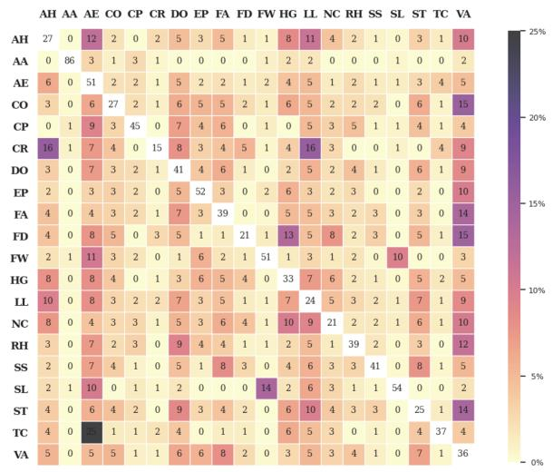  
(a) Fallacy overlaps in $\mathcal { A } _ { 1 }$ annotations.

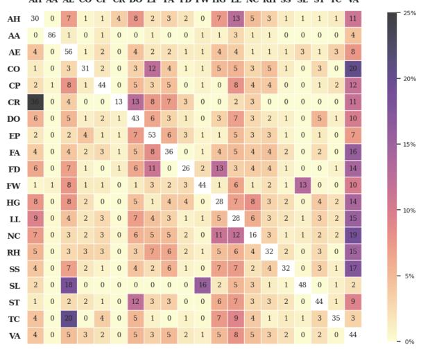  
(b) Fallacy overlaps in $\boldsymbol { A } _ { 2 }$ annotations.  
Figure 7: Overlap of fallacy annotations in $\boldsymbol { A } _ { 1 }$ and $\boldsymbol { A } _ { 2 }$ in terms of token percentages. Each row indicates the percentage of tokens for a given fallacy type that overlaps with any other fallacy type (columns). White cells (diagonal) indicate the percentage of tokens for each fallacy type that does not overlap with any other fallacy type. The overlap of fallacy tokens considering all the annotations $( A _ { 1 } + { A _ { 2 } } )$ is presented in Figure 3.

<table><tr><td>Fallacy type</td><td>Top-k tokens</td></tr><tr><td>Appeal to authority</td><td>user, articolo, studio, video, sa, papafrancesco, via, scientifico, intervista, scritto</td></tr><tr><td>Appeal to emotion</td><td>心 , schifo, 人, , vergogna, ,❤, umanità</td></tr><tr><td>Flag waving</td><td>italiani, user, fridaysforfuture, , m5s,, fratelliditalia, italiasulserio, fridayforfuture, piazza</td></tr><tr><td>Loaded language</td><td>lotta, cazzo, leggi, merda, , caro, invasione, coglioni, combattere, disastro</td></tr><tr><td>Name calling or labeling</td><td>immigrati, immigrazione, migranti, clandestini, sinistra, vax, negazionisti, dittatura, immigrato, sanitaria</td></tr><tr><td>Slogan</td><td>primadeldiluvio, italiasulserio, facciamorete, vaccinare, sostenibile, cambiaeninonilclima, climateactionnow, resistenza, toscana, iovotocalenda</td></tr><tr><td>Thought-terminating cliché</td><td>mah, so, sapevatelo, eh, capita, semplice, vince, ciao, stop, ragione</td></tr><tr><td>Vagueness</td><td>migranti, immigrati, immigrazione, lavoro, sanità, governo, politici, politica, italiani, pandemia</td></tr></table>

Table 7: Top-k (k = 10) most informative tokens for fallacy types with an average length of  10 tokens, i.e., those that are mainly related to language use, considering all the annotations in the dataset $( A _ { 1 } + { \mathcal { A } } _ { 2 } )$

<table><tr><td>Hyperparameter</td><td>Value</td></tr><tr><td>Optimizer</td><td>AdamW</td></tr><tr><td>β1, β2</td><td>0.9,0.99</td></tr><tr><td>Dropout</td><td>0.2</td></tr><tr><td>Epochs</td><td>10 / 20</td></tr><tr><td>Batch size</td><td>32</td></tr><tr><td>Learning rate LR scheduler</td><td>1e-4 Slanted triangular</td></tr><tr><td>Decay factor</td><td>0.38</td></tr><tr><td>Cut fraction</td><td>0.3</td></tr><tr><td>Task loss weight (λ)</td><td>1</td></tr><tr><td>Multi-label threshold (τ)</td><td>0.7</td></tr></table>

Table 8: Hyperparameter values employed for the supervised models in all our experiments.

Prompts and technical details The prompt template used across all experiments along with taskspecific prompt variables are presented in Table 9. For SPAN tasks, the output format was initially requested in the CoNLL format with the BIO-tagging scheme for unique identification of the fallacy segments; however, the models struggled to provide consistent outputs. Therefore, we provide an incremental identifier for each token in the input text (i.e., token id) and request the output following the format [first number-last number = Fallacy Label]. We chose square brackets because we observed that models could easily replicate them. Moreover, they facilitate the retrieval of the portion of the output in which fallacy predictions are actually provided, while disregarding other fallacy mentions across the output. We use regular expressions for extracting predictions from the output and also normalize the predicted fallacy names that clearly refer to the same fallacy type (e.g., we consider both the British spelling Name calling or labelling and the shortened Name calling label as instances of the Name calling or labeling fallacy).

Results on individual test sets In Table 10, we present the full results obtained by each model across all task setups on individual test sets (i.e., $\mathcal { A } _ { 1 }$ and 2), as well as those averaged over all test set versions $( \mathrm { i . e . , } A _ { 1 } + \mathcal { A } _ { 2 } )$

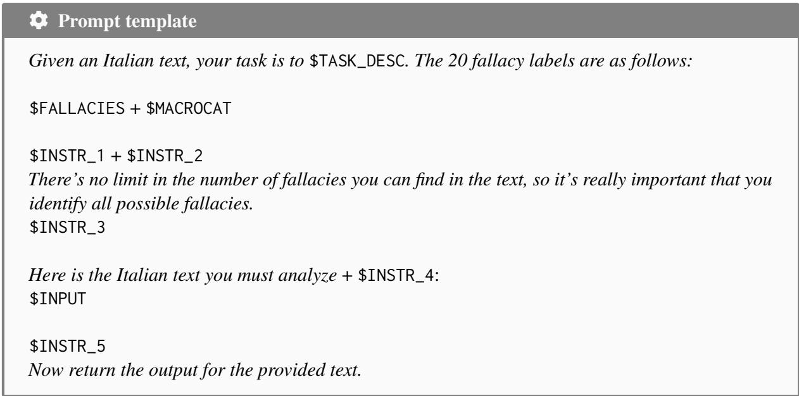

<table><tr><td>Variable</td><td>SPAN</td><td>POST</td><td>F</td><td>C Text snippet</td><td></td></tr><tr><td>$TASK_DESC</td><td>V</td><td></td><td></td><td></td><td>detect and classify the segments of text that contain fallacies</td></tr><tr><td>$TASK_DESC</td><td></td><td>V</td><td></td><td></td><td>detect the fallacies that are expressed in it</td></tr><tr><td>$FALLACIES</td><td>V</td><td>V</td><td></td><td></td><td>“fallacy_name: fallacy_description&quot;as described in Section 3 Fallacies are divided into three categories:</td></tr><tr><td>$MACROCAT</td><td>V</td><td>V</td><td></td><td>V</td><td>- Insufficient Proof: Evading the Burden of Proof; Vagueness. - Simplification: Hasty Generalization; Vagueness; False Dilemma; Slippery Slope; Causal Oversimplification; Circular Reasoning; Thought-Terminating Cliché; Cherry Picking. - Distraction: Red Herring; Cherry Picking; Appeal to Emotion; Thought-Terminating Cliché; Slogan; Flag Waving; Loaded Language; Appeal to Authority; False Analogy; Strawman; Ad Hominem; Name Calling or Labeling; Doubt.</td></tr><tr><td>$INSTR_1</td><td></td><td>V</td><td>V</td><td></td><td>You can only and exclusively use the labels I have listed for you. Remember to not modify the names of the fallacies!</td></tr><tr><td>$INSTR_1</td><td>V</td><td></td><td></td><td>V</td><td>You must detect the portions of text that contain fallacies and classify them as Insufficient Proof, Simplification and Distraction. Remember to only use these three labels!</td></tr><tr><td>$INSTR_1</td><td></td><td>V</td><td></td><td>V</td><td>You must annotate the text with the categories Insufficient Proof, Simplification and Distraction. Remember to only use these three labels! Fallacies can cover one or more tokens and they can overlap (more fallacies can be found on</td></tr><tr><td>$INSTR_2</td><td>V</td><td></td><td>V</td><td>✓</td><td>the same segment of text). When detecting the span of text, try to respect linguistic units, for example keep together consistent phrases or clauses, and when a logical passage includes more sentences, annotate all the important information.</td></tr><tr><td>$INSTR_3</td><td></td><td>V</td><td></td><td>V</td><td>A text can include up to three categories.</td></tr><tr><td>$INSTR_4</td><td>V</td><td></td><td>V</td><td></td><td>, split into individual tokens with associated identification numbers. Maintain this tokenization and do not alter the text</td></tr><tr><td>$INPUT $INPUT</td><td>V</td><td>V</td><td>V</td><td></td><td>The input text with one token per line following the format “token_id [tab] token_text&quot; The input text as it appears in its original form</td></tr><tr><td>$INSTR_5</td><td>V</td><td></td><td>V V</td><td></td><td>Your task is to detect the spans containing fallacies by indicating the first and last token numbers, and then classify them into the {twenty labels | three categories} provided. It&#x27;s really important that you DO NOT add any introduction, greetings, explanations, descriptions and additional sentences. The output you will produce must follow the format [first number-last number = {Fallacy Label | Category}], for example: [1-6 = {Evading the Burden of Proof | Insufficient Proof}], for each identified {fallacy | fallacy category}. If you do not find any fallacy, return [None]. It&#x27;s really important that you DO NOT add any introduction, greetings, explanations,</td></tr><tr><td>$INSTR_5</td><td></td><td>V</td><td>V</td><td>V</td><td>descriptions and additional sentences. The output you will produce must follow the format [{Fallacy Label | Category}], for example: [{Evading The Burden of Proof | Insufficient Proof}], for each identified {fallacy | fallacy category}. If you do not find any fallacy, return [None].</td></tr></table>

Table 9: Variables used in the prompt template above for SPAN or POST level tasks, using fine-grained (F) or coarse-grained (C) labels. In \$INSTR\_5 we use the notation “{F|C}” to indicate alternatives for F and C, respectively.

<table><tr><td></td><td></td><td colspan="3"> $\mathcal { A } _ { 1 } + \mathcal { A } _ { 2 }$ </td><td colspan="3"> $\mathcal { A } _ { 1 }$ </td><td colspan="3"> $\mathbf { \mathcal { A } } _ { 2 }$ </td></tr><tr><td></td><td>Model</td><td>P</td><td>R</td><td> $\mathbf { F } _ { 1 }$ </td><td>P</td><td>R</td><td> $\mathbf { F } _ { 1 }$ </td><td>P</td><td>R</td><td> $\mathbf { F } _ { 1 }$ </td></tr><tr><td></td><td> $\mathbf { M V M L - A L B }$ </td><td> $8 0 . 0 { \scriptstyle \pm 1 . 5 }$ </td><td> $7 4 . 0 { \scriptstyle \pm 2 . 3 }$ </td><td> ${ 7 6 . 8 \mathrm { \pm 1 . 6 } }$ </td><td> $7 8 . 8 { \scriptstyle \pm 1 . 9 }$ </td><td> $7 0 . 6 { \scriptstyle \pm 3 . 5 }$ </td><td> $7 4 . 5 _ { \pm 2 . 7 }$ </td><td> $8 1 . 3 { \scriptstyle \pm 1 . 0 }$ </td><td> $7 7 . 3 _ { \pm 1 . 1 }$ </td><td> $7 9 . 2 _ { \pm 0 . 4 }$ </td></tr><tr><td></td><td> $\mathbf { M V M L - U M B }$ </td><td> $8 4 . 5 { \scriptstyle \pm 1 . 3 }$ </td><td> $7 0 . 1 { \scriptstyle \pm 4 . 2 }$ </td><td> $7 6 . 6 { \scriptstyle \pm 2 . 8 }$ </td><td> $8 3 . 4 { \scriptstyle \pm 1 . 2 }$ </td><td> $6 7 . 2 { \scriptstyle \pm 4 . 4 }$ </td><td> $7 4 . 4 { \scriptstyle \pm 3 . 1 }$ </td><td> $8 5 . 6 { \scriptstyle \pm 1 . 3 }$ </td><td> $7 3 . 0 { \scriptstyle \pm 3 . 9 }$ </td><td> $7 8 . 8 { \scriptstyle \pm 2 . 6 }$ </td></tr><tr><td>POSTC</td><td> ${ \mathrm { Z S W D - L L A M A } }$ </td><td> $5 7 . 9 { \scriptstyle \pm 1 . 9 }$ </td><td> $7 0 . 0 { \scriptstyle \pm 1 . 9 }$ </td><td> $6 3 . 3 { \scriptstyle \pm 1 . 5 }$ </td><td> $5 4 . 8 { \scriptstyle \pm 2 . 0 }$ </td><td> $6 9 . 3 { \scriptstyle \pm 1 . 7 }$ </td><td> $6 1 . 2 { \scriptstyle \pm 1 . 7 }$ </td><td> $6 0 . 9 { \scriptstyle \pm 1 . 8 }$ </td><td> $7 0 . 6 { \scriptstyle \pm 2 . 1 }$ </td><td> $6 5 . 4 { \scriptstyle \pm 1 . 3 }$ </td></tr><tr><td></td><td> $\mathrm { Z S W D \mathrm { - } M I X T R }$ </td><td> $6 4 . 7 _ { \pm 1 . 6 }$ </td><td> $4 5 . 2 _ { \pm 1 . 0 }$ </td><td> $5 3 . 2 _ { \pm 1 . 2 }$ </td><td> $6 3 . 2 _ { \pm 1 . 7 }$ </td><td> $4 6 . 2 _ { \pm 1 . 6 }$ </td><td> $5 3 . 4 _ { \pm 1 . 6 }$ </td><td> $6 6 . 1 _ { \pm 1 . 6 }$ </td><td> $4 4 . 2 _ { \pm 0 . 5 }$ </td><td> $5 3 . 0 { \scriptstyle \pm 0 . 8 }$ </td></tr><tr><td>POST-F</td><td> $\mathbf { M V M L - A L B }$ </td><td> $6 3 . 0 { \scriptstyle \pm 2 . 0 }$ </td><td> $3 4 . 3 _ { \pm 1 . 9 }$ </td><td> ${ \pm 4 . 3 \mathrm { _ { \pm 1 . 9 } } }$ </td><td> $6 0 . 4 _ { \pm 1 . 7 }$ </td><td> $3 1 . 2 { \scriptstyle \pm 1 . 4 }$ </td><td> ${ \bf 4 1 . 1 _ { \pm 1 . 5 } }$ </td><td> $6 5 . 5 { \scriptstyle \pm 2 . 2 }$ </td><td> $3 7 . 4 _ { \pm 2 . 4 }$ </td><td> ${ \bf 4 7 . 6 _ { \pm 2 . 4 } }$ </td></tr><tr><td></td><td> $\mathbf { M V M L - U M B }$ </td><td> $3 9 . 0 { \scriptstyle \pm 3 . 7 }$ </td><td> $1 4 . 6 _ { \pm 1 . 6 }$ </td><td> $2 1 . 3 { \scriptstyle \pm 2 . 2 }$ </td><td> $3 1 . 5 _ { \pm 4 . 6 }$ </td><td> $1 1 . 5 { \scriptstyle \pm 1 . 8 }$ </td><td> $1 6 . 9 { \scriptstyle \pm 2 . 6 }$ </td><td> $4 6 . 5 _ { \pm 2 . 7 }$ </td><td> $1 7 . 7 _ { \pm 1 . 5 }$ </td><td> $2 5 . 7 _ { \pm 1 . 9 }$ </td></tr><tr><td></td><td> ${ \mathrm { Z S W D - L L A M A } }$ </td><td> $2 0 . 9 { \scriptstyle \pm 1 . 5 }$ </td><td> $2 4 . 3 { \scriptstyle \pm 2 . 3 }$ </td><td> $2 2 . 5 { \scriptstyle \pm 1 . 8 }$ </td><td> $2 0 . 7 { \scriptstyle \pm 1 . 4 }$ </td><td> $2 4 . 7 _ { \pm 2 . 1 }$ </td><td> $2 2 . 5 { \scriptstyle \pm 1 . 6 }$ </td><td> $2 1 . 1 { \pm } 1 . 6$ </td><td> $2 3 . 9 { \scriptstyle \pm 2 . 5 }$ </td><td> $2 2 . 5 { \scriptstyle \pm 2 . 0 }$ </td></tr><tr><td></td><td> $\mathrm { Z S W D \mathrm { - } M I X T R }$ </td><td> $2 6 . 0 { \scriptstyle \pm 1 . 8 }$ </td><td> $1 8 . 1 _ { \pm 1 . 4 }$ </td><td> $2 1 . 4 { \scriptstyle \pm 1 . 5 }$ </td><td> $2 5 . 7 _ { \pm 1 . 9 }$ </td><td> $1 8 . 4 _ { \pm 1 . 4 }$ </td><td> $2 1 . 4 { \scriptstyle \pm 1 . 6 }$ </td><td> $2 6 . 3 { \scriptstyle \pm 1 . 7 }$ </td><td> $1 7 . 8 { \scriptstyle \pm 1 . 3 }$ </td><td> $2 1 . 3 { \scriptstyle \pm 1 . 5 }$ </td></tr><tr><td>SPPANC</td><td>MVMD-ALB</td><td> $5 5 . 2 _ { \pm 1 . 7 }$ </td><td> $5 1 . 7 _ { \pm 2 . 1 }$ </td><td> $5 3 . 3 _ { \pm 1 . 4 }$ </td><td> $5 5 . 8 _ { \pm 1 . 2 }$ </td><td> $5 0 . 3 _ { \pm 2 . 4 }$ </td><td> $5 2 . 9 _ { \pm 1 . 8 }$ </td><td> $5 4 . 6 _ { \pm 2 . 1 }$ </td><td> $5 3 . 1 _ { \pm 1 . 8 }$ </td><td> $5 3 . 8 _ { \pm 1 . 0 }$ </td></tr><tr><td></td><td> $\mathbf { M V M D - U M B }$ </td><td> $5 9 . 8 _ { \pm 1 . 5 }$ </td><td> $5 0 . 4 _ { \pm 2 . 4 }$ </td><td> ${ \bar { 5 } } 4 . 7 _ { \pm 1 . 5 }$ </td><td> $6 1 . 8 _ { \pm 1 . 5 }$ </td><td> $4 9 . 9 _ { \pm 2 . 6 }$ </td><td> $5 5 . 2 _ { \pm 1 . 7 }$ </td><td> $5 7 . 9 _ { \pm 1 . 4 }$ </td><td> $5 0 . 8 _ { \pm 2 . 1 }$ </td><td> ${ \pm } 4 . 1 _ { \pm 1 . 3 }$ </td></tr><tr><td></td><td> ${ \mathrm { Z S W D - L L A M A } }$ </td><td> $2 5 . 3 { \scriptstyle \pm 4 . 2 }$ </td><td> $7 . 0 { \scriptstyle \pm 0 . 8 }$ </td><td> $1 0 . 9 { \scriptstyle \pm 0 . 9 }$ </td><td> $2 5 . 2 { \scriptstyle \pm 4 . 9 }$ </td><td> $6 . 9 { \scriptstyle \pm 0 . 7 }$ </td><td> $1 0 . 8 { \scriptstyle \pm 1 . 0 }$ </td><td> $2 5 . 4 { \scriptstyle \pm 3 . 6 }$ </td><td> $7 . 0 { \scriptstyle \pm 0 . 9 }$ </td><td> $1 0 . 9 { \scriptstyle \pm 0 . 9 }$ </td></tr><tr><td></td><td> $\mathrm { Z S W D \mathrm { - } M I X T R }$ </td><td> $3 1 . 6 _ { \pm 1 . 2 }$ </td><td> $2 0 . 9 _ { \pm 1 . 4 }$ </td><td> $2 5 . 1 _ { \pm 1 . 2 }$ </td><td> $3 1 . 8 _ { \pm 1 . 3 }$ </td><td> $2 0 . 9 _ { \pm 1 . 0 }$ </td><td> $2 5 . 2 _ { \pm 0 . 9 }$ </td><td> $3 1 . 3 _ { \pm 1 . 1 }$ </td><td> $2 0 . 8 { \scriptstyle \pm 1 . 7 }$ </td><td> $2 5 . 0 { \scriptstyle \pm 1 . 5 }$ </td></tr><tr><td></td><td>Strict mode</td><td></td><td></td><td></td><td></td><td></td><td></td><td></td><td></td><td></td></tr><tr><td></td><td> $\mathbf { M V M D - A L B }$ </td><td> $4 7 . 6 _ { \pm 1 . 9 }$ </td><td> $2 5 . 6 { \scriptstyle \pm 1 . 6 }$ </td><td> $3 3 . 3 _ { \pm 1 . 4 }$ </td><td> $4 7 . 1 _ { \pm 2 . 1 }$ </td><td> $2 4 . 4 _ { \pm 1 . 6 }$ </td><td> $3 2 . 1 _ { \pm 1 . 3 }$ </td><td> $4 8 . 0 { \scriptstyle \pm 1 . 7 }$ </td><td> $2 6 . 8 { \scriptstyle \pm 1 . 5 }$ </td><td> $3 4 . 4 _ { \pm 1 . 4 }$ </td></tr><tr><td></td><td> $\mathbf { M V M D - U M B }$ </td><td> $5 7 . 5 { \scriptstyle \pm 5 . 9 }$ </td><td> $3 . 9 \pm 0 . 7$ </td><td> $7 . 3 { \pm } 1 . 3 $ </td><td> $5 1 . 7 { \pm } 4 . 8 $ </td><td> $5 . 0 { \scriptstyle \pm 0 . 9 }$ </td><td> $9 . 2 { \pm } 1 . 5$ </td><td> $6 3 . 3 { \scriptstyle \pm 6 . 9 }$ </td><td> $2 . 9 { \scriptstyle \pm 0 . 6 }$ </td><td> $5 . 5 { \scriptstyle \pm 1 . 0 }$ </td></tr><tr><td></td><td> ${ \mathrm { Z S W D - L L A M A } }$ </td><td> $4 . 5 _ { \pm 0 . 5 }$ </td><td> $2 . 7 _ { \pm 0 . 4 }$ </td><td> $3 . 4 _ { \pm 0 . 3 }$ </td><td> $4 . 5 _ { \pm 0 . 4 }$ </td><td> $2 . 6 _ { \pm 0 . 4 }$ </td><td> $3 . 3 _ { \pm 0 . 4 }$ </td><td> $4 . 5 _ { \pm 0 . 6 }$ </td><td> $2 . 8 _ { \pm 0 . 3 }$ </td><td> $3 . 4 _ { \pm 0 . 3 }$ </td></tr><tr><td></td><td> $\mathrm { Z S W D \mathrm { - } M I X T R }$ </td><td> $5 . 8 _ { \pm 1 . 1 }$ </td><td> $3 . 2 _ { \pm 0 . 5 }$ </td><td> $4 . 2 _ { \pm 0 . 7 }$ </td><td> $5 . 9 _ { \pm 1 . 1 }$ </td><td> $3 . 3 { \scriptstyle \pm 0 . 6 }$ </td><td> $4 . 2 _ { \pm 0 . 7 }$ </td><td> $5 . 7 _ { \pm 1 . 0 }$ </td><td> $3 . 2 _ { \pm 0 . 4 }$ </td><td> $4 . 1 _ { \pm 0 . 6 }$ </td></tr><tr><td>SPPANF</td><td>Soft mode</td><td></td><td></td><td></td><td></td><td></td><td></td><td></td><td></td><td></td></tr><tr><td></td><td> $\mathbf { M V M D - A L B }$ </td><td> $5 2 . 2 { \scriptstyle \pm 2 . 0 }$ </td><td> $2 8 . 7 _ { \pm 1 . 7 }$ </td><td> ${ \bf 3 7 . 0 _ { \pm 1 . 5 } }$ </td><td> $5 2 . 0 { \scriptstyle \pm 2 . 1 }$ </td><td> $2 7 . 7 { \pm } 1 . 8$ </td><td> ${ \bf 3 6 . 1 { \bf _ { \pm 1 . 5 } } }$ </td><td> $5 2 . 3 { \scriptstyle \pm 1 . 8 }$ </td><td> $2 9 . 7 _ { \pm 1 . 6 }$ </td><td> $\mathbf { 3 7 . 9 2 1 . 5 }$ </td></tr><tr><td></td><td> $\mathbf { M V M D - U M B }$ </td><td> $6 6 . 3 { \scriptstyle \pm 5 . 5 }$ </td><td> $4 . 8 { \scriptstyle \pm 0 . 7 }$ </td><td> $8 . 9 { \pm } 1 . 3$ </td><td> $6 5 . 3 { \scriptstyle \pm 3 . 6 }$ </td><td> $6 . 4 { \scriptstyle \pm 0 . 9 }$ </td><td> $1 1 . 7 { \pm } 1 . 6$ </td><td> $6 7 . 2 { \scriptstyle \pm 7 . 4 }$ </td><td> $3 . 1 { \pm } 0 . 5$ </td><td> $6 . 0 { \scriptstyle \pm 0 . 9 }$ </td></tr><tr><td></td><td> ${ \mathrm { Z S W D - L L A M A } }$ </td><td> $6 . 4 _ { \pm 0 . 6 }$ </td><td> $4 . 2 _ { \pm 0 . 5 }$ </td><td> $5 . 0 { \scriptstyle \pm 0 . 4 }$ </td><td> $6 . 4 _ { \pm 0 . 8 }$ </td><td> $4 . 0 { \scriptstyle \pm 0 . 6 }$ </td><td> $4 . 9 _ { \pm 0 . 7 }$ </td><td> $6 . 4 _ { \pm 0 . 4 }$ </td><td> $4 . 4 _ { \pm 0 . 4 }$ </td><td> $5 . 2 _ { \pm 0 . 2 }$ </td></tr><tr><td></td><td> $\mathrm { Z S W D \mathrm { - } M I X T R }$ </td><td> $8 . 2 { \scriptstyle \pm 1 . 5 }$ </td><td> $5 . 4 _ { \pm 1 . 0 }$ </td><td> $6 . 5 _ { \pm 1 . 1 }$ </td><td> $8 . 3 { \scriptstyle \pm 1 . 6 }$ </td><td> $5 . 5 _ { \pm 1 . 1 }$ </td><td> $6 . 6 _ { \pm 1 . 2 }$ </td><td> $8 . 1 _ { \pm 1 . 5 }$ </td><td> $5 . 3 _ { \pm 0 . 8 }$ </td><td> $6 . 4 _ { \pm 1 . 1 }$ </td></tr></table>

Table 10: Test set results for POST and SPAN tasks at the coarse-grained (C) and fine-grained (F) level. We report average precision (P), recall (R), and $\mathrm { F _ { 1 } }$ scores (w/ std dev) across $k = 5$ splits, both on individual test sets $( \mathrm { i . e . , } A _ { 1 }$ and $\boldsymbol { \mathcal { A } } _ { 2 } )$ and averaged over all $| { \cal A } |$ test set versions $( \mathrm { i . e . , } A _ { 1 } + \mathcal { A } _ { 2 } )$ . For the SPAN-F task, we also present scores using both strict and soft modes. Best results for each task are in bold.