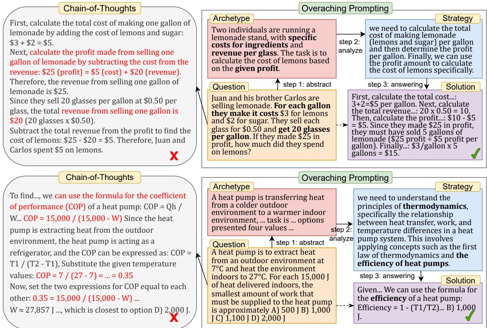
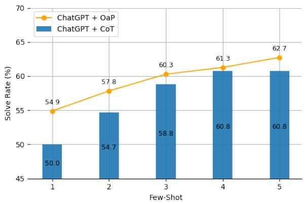
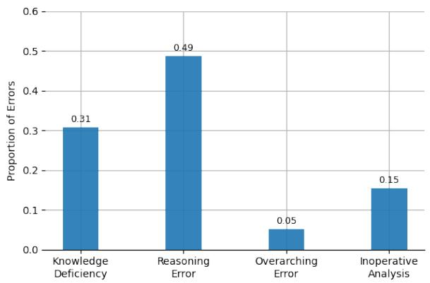
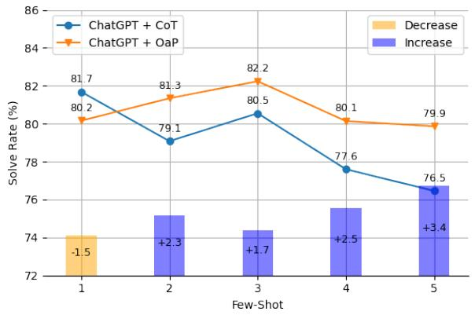
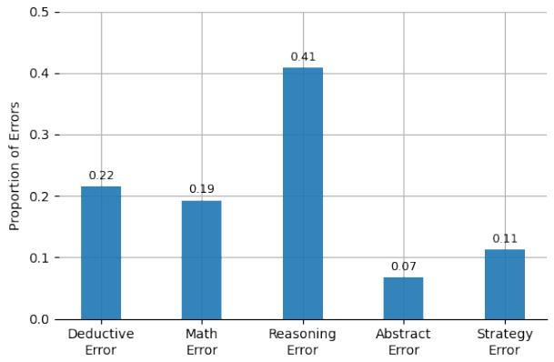
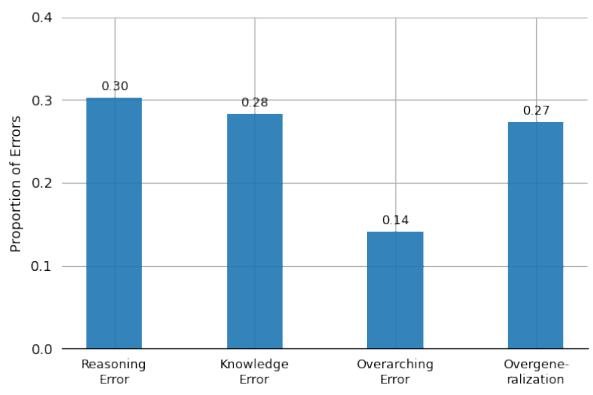

# Forest for the Trees: Overarching Prompting Evokes High-Level Reasoning in Large Language Models

Haoran Liao1 and Shaohua Hu1 and Zhihao Zhu1 and Hao He2 and Yaohui Jin1

1MoE Key Lab of Artificial Intelligence and 2 Department of Electronic Engineering

Shanghai Jiao Tong University

Shanghai, China

{liaohaoran,hushaohua,zzh2021,hehao,jinyh}@sjtu.edu.cn

## Abstract

Chain-of-thought (CoT) and subsequent methods adopted a deductive paradigm that decomposes the reasoning process, demonstrating remarkable performances across NLP tasks. However, such a paradigm faces the challenge of getting bogged down in low-level semantic details, hindering large language models (LLMs) from correctly understanding, select ing, and compositing conditions. In this work, we present Overarching Prompting (OAP), a simple prompting method that elicits the highlevel thinking of LLMs. Specifically, OAP first abstracts the whole problem into a simplified archetype and formulates strategies grounded in concepts and principles, establishing an overarching perspective for guiding reasoning. We conducted experiments with SoTA models, including ChatGPT, InstructGPT, and Llama3- 70B-instruct, and received promising performances across tasks including Knowledge QA, Mathematical, and Open-Domain Reasoning. For instance, OAP improved ChatGPT and CoT by 19.0% and 3.1% on MMLU’s College Physics, 8.8% and 2.3% on GSM8k, and 10.3% and 2.5% on StrategyQA, respectively.

## 1 Introduction

Recent astonishing advancements in large language models (LLMs), including GPT (Ouyang et al., 2022a; OpenAI, 2023) , LLama (Touvron et al., 2023a,b), Mistral (Jiang et al., 2023, 2024) family models, have greatly propelled the progress of natural language process (NLP). Scaling up model size and training corpus has yielded various emergent abilities (Wei et al., 2022a; Chan et al., 2022) in LLMs, such as instruction following (Chung et al., 2022; Webson and Pavlick, 2022; Min et al., 2022) and multi-step reasoning (Wei et al., 2022b; Zhou et al., 2022; Creswell et al., 2022). Among these remarkable abilities, Chain of Thought (CoT) (Wei et al., 2022b; Kojima et al., 2022) specifically enhances LLMs’ multi-step reasoning performances on complex tasks by prompting models to follow a bottom-up thinking paradigm. Instead of directly answering the question, CoT deductively constructs intermediate rationales and utilizes them to update premises, until reaching the desired result.

However, recent studies have shown that such a deductive paradigm, which relies directly on lowlevel details, exhibits failure modes that similar to human-like cognitive biases (Berglund et al., 2023; McCoy et al., 2023; Chen et al., 2024). For instance, LLMs can easily be misled as being extremely sensitive to irrelevant context (Shi et al., 2023), minor disturbances (Qiu et al., 2023) and premise order (Chen et al., 2024). Despite their knowledge, LLMs can still struggle to parse the problem to acquire what is required (Bian et al., 2023), or which conditions should be combined (Press et al., 2022). Additionally, the multistep process could fail by either missing necessary steps (Wang et al., 2023a) or accumulating hallucination (Lanham et al., 2023; Ling et al., 2024) during rationale generation.

Intuitively, diving immediately into intricate details can be inefficient in tackling complex problems. As the saying goes, can’t see the forestfor the trees, humans tend to abstract and simplify the problem, focusing on its essence and the key to its solution at a high level. Compared to handling nested and ambiguous low-level details, adopting a global perspective could improve the precision of semantics and evoke the inherent knowledge of LLMs about concepts and principles. Abstraction could also simplify problem parsing and provide global planning, guiding the subsequent reasoning.

Abstract thinking as an idea has been explored in various domains including mathematics, psychology, and computer science, and is considered crucial to human intelligence (Tenenbaum, 2018; Lachmy et al., 2021; Zheng et al., 2023b). Recent studies have implicitly adopted this idea to investigate how to transcend the vanilla deductive paradigm in LLMs. Some works introduced topdown perspectives in reasoning via problem decomposition (Zhou et al., 2022; Khot et al., 2022; Wang et al., 2023a), while others examined inductive skills from raw context (Honovich et al., 2022; Wang et al., 2023b). However, a clear and systematic mechanism for enabling models to think abstractly still remains unexplored. These methods often require high-level inferences directly from raw context, which can produce content and patterns that significantly differ from human approaches (Qiu et al., 2023).

In this work, we introduce a novel prompting method called Overarching Prompting (OAP) to stimulate high-level thinking in LLMs. In specific, we start by abstracting the entire problem context to form a problem archetype. This process is similar to compression or filtration, but it emphasizes conceptualizing and transcending low-level details to distill the problem’s essence using precise semantics. The archetype further allows LLMs to concentrate on concepts, rules and global relations rather than locally nested details, thereby eliciting inherent advanced knowledge and forming highlevel strategies for subsequent reasoning process.

We empirically validated our approach on a variety of datasets, including three knowledge QA datasets from MMLU, two mathematical reasoning datasets, and three open-domain reasoning datasets. Through the experiments, we observed that the proposed method consistently outperforms baselines across various tasks. Comprehensive analyses are further conducted to investigate the enhancements of OaP, examining the behaviors and failure modes of LLMs when applying abstract thinking. While generating archetype and strategies were less prone to produce errors, OaP sometimes can lead to ineffective analysis or overgeneralization errors.

## 2 Related Works

Modern LLMs and CoT Reasoning Modern large language models (Brown et al., 2020; Ouyang et al., 2022a; Touvron et al., 2023b), honed through large-scale unsupervised pre-training, exhibit remarkable emergent abilities like in-context learning (Webson and Pavlick, 2022; Min et al., 2022; Pan et al., 2023), instruction following (Ouyang et al., 2022b; Chung et al., 2022), and chainof-thought (CoT) reasoning (Brown et al., 2020; Chowdhery et al., 2022; Touvron et al., 2023a). Numerous methods have been proposed to improve the vanilla CoT paradigm (Jung et al., 2022; Wang et al., 2022; Madaan et al., 2024; Yao et al., 2023). CoT has also shown significant potential in diverse applications like retrieval (Trivedi et al., 2022; Patil et al., 2023), tools (Gao et al., 2023; Chen et al., 2023), and agents (Park et al., 2023; Shinn et al., 2023; Hong et al., 2023).

Human-like Biases in CoT Paradigm The deductive paradigm of CoT may lead to errors similar to human cognition, including exemplar bias (Fu et al., 2022; Honovich et al., 2022; Du et al., 2023), irrelevance distraction (Shi et al., 2023), narrative orders misleading (Berglund et al., 2023; Chen et al., 2024). Researchers proposed methods to tackle these issues, including self-improve (Zheng et al., 2023a; Madaan et al., 2024), step-by-step verification (Ling et al., 2024; Lightman et al., 2023), faithful process (Jung et al., 2022; Creswell and Shanahan, 2022), and problem clarification (Xi et al., 2023; Liao et al., 2024). Differently, our method grounds in human cognition, applying abstraction to reduce confusion caused by details.

High-level Thinking in LLMs Recent works have implicitly integrated the idea of abstraction, but still requiring results directly from lowlevel details, lacking systematical design and behaviour discussion centered on abstraction. For instance, breaking down a problem into simpler sub-problems provides a high-level perspective, yet still diving into details for examination (Zhou et al., 2022; Khot et al., 2022). Planning ahead offers a global view, yet instructions could be dependent (Wang et al., 2023a). Asking either before (Zheng et al., 2023b) or during (Press et al., 2022) reasoning helps to only transcend details locally. In contrast, our method overcomes these limitations by staring to transform the entire problem to establish a high-level semantic hierarchy, enabling abstraction based reasoning.

Besides, our work is also related to research about inductive skills (Yang et al., 2022; Mirchandani et al., 2023; Tang et al., 2023) and model behaviours (Chan et al., 2022; Prystawski and Goodman, 2023) of LLMs. Some of these works might involve a similar process of moving from general to specific, such as creating keywords and then filling in the details (Ning et al., 2023). However, these methods differ fundamentally from OaP, as they do not preprocess the original context, and are generally unsuitable for reasoning tasks. In other words, they emphasize rehearsal over abstraction.

  
Figure 1: Examples of Overarching Prompting (OAP) based on ChatGPT. Top: Given a mathematical problem, CoT was misled by low-level details, compositing conditions incorrectly. Instead, OaP decoupled the spurious correlations by abstracting details into a high-level archetype, which is accurately precise in semantics and elicits correct reasoning order. Bottom: When solving a physics problem, CoT made incorrect associations based on local details, whereas OaP grasped the overall scenario via abstraction and introduced relevant physical concepts, successfully deriving the correct formula.

## 3 Overarching Prompting

Abstract thinking singles out the rational, logical fqualities of a given content from its intellectually irrelevant components. – Carl Gustav Jung

Our intuition stems from the observation that the deductive paradigm of CoT may be overly detailoriented and lacks a broader perspective. By abstracting the problem into an archetype, we can enhance semantic precision, simplify the problem’s parsing, and evoke LLMs’ intrinsic knowledge.

Two examples are shown in Fig. 1. In multi-step mathematical tasks, the deductive process of CoT focuses on capturing local relationships for reasoning. This narrow focus can lead to cognitive errors, such as incorrect composition order (Press et al., 2022; Chen et al., 2024). In contrast, OaP emphasizes abstracting details to form a clearer archetype, helping to avoid misguidance. For knowledge intensive tasks, like physics problems, reasoning directly from low-level details can hinder access to the correct knowledge. By abstracting and conceptualizing the problem into a high-level semantic archetype, the context becomes clearer and more independent, assisting LLMs in connecting to the correct principles and concepts.

Our work is inspired by recent studies that also embrace the idea of abstraction. For example, decomposing methods (Zhou et al., 2022; Khot et al., 2022; Wang et al., 2023a) dissect the final question from a top-down perspective, while the step-back method (Zheng et al., 2023b) prompts LLMs to identify required concepts or principles. They typically derive advanced strategies or actions directly from contextual details. In contrast, OaP initially transforms the entire problem by considering semantic layers to promote abstract thinking.

## 3.1 Method Formulation

Given $X = \{ x _ { 1 } , x _ { 2 } , \cdot \cdot \cdot , x _ { n } \} \in D$ as the problem statements, where x could represent the premise sentences, asked question, and available options. CoT based prompting methods attempt to guide LLMs’ behaviours by generating intermediate rationale $y _ { i } = f _ { M } ( X ; p _ { t } , P _ { k } | y _ { < i } )$ fstep by step, until achieving the final yt. Specifically, M denotes the employed LLM, while $p _ { t }$ and $P _ { k }$ represent optional task instructions and k exemplar pairs, separately.

In the deductive paradigm of CoT, LLMs typically focus on local dependencies within the context based on attention. They then either deduce from a single condition as $x _ { i }  y _ { i }$ or composite multiple conditions as $\{ x _ { i } \} _ { x _ { i } \in D }  y _ { i }$ . The newly generated rationale $y _ { i }$ is added to the premises set as $X = X \cup y _ { i }$ for the next deduction step.

Our proposed OaP aids the LLMs to preprocess and transcend the given problem X into an easierto-parse archetype $P _ { A } = \{ p _ { 1 } , p _ { 2 } , \cdot \cdot \cdot , p _ { m } \} \in \mathcal { D }$ via abstraction:

$$
p _ { i } = f _ { M } ( \{ x _ { j } \} _ { x _ { j } \in \mathcal { N } _ { p _ { i } } } ; p _ { t } , P _ { k } , \Theta _ { \mathcal { N } _ { p _ { i } } } ) ,\tag{1}
$$

where the set of $x _ { j }$ is regarded as belonging to the same concept related to $p _ { i }$ in high semantic level, according to the inherent advanced knowledge $\Theta _ { \mathcal { N } }$ of model M, referring to given exemplars $P _ { k }$ . Then, the LLM can continue its abstract thinking to generate overarching strategy $\hat { Y } = \{ \hat { y } _ { i } \} _ { i = 1 } ^ { l }$ by

$$
\begin{array} { r } { \hat { y } _ { i } = f _ { M } ( [ X , P _ { A } ] ; p _ { t } , P _ { k } | \Theta _ { \mathcal { N } } ) , } \end{array}\tag{2}
$$

where both X and $P _ { A }$ are concatenated as inputs, but $P _ { A }$ played a more significant role. Finally, the strategy Yˆ can be considered a rehearsal or plan of the whole reasoning path and participates in the final CoT process: $y _ { i } = f _ { M } ( X , P _ { A } , \hat { Y } ; p _ { t } , P _ { k } | y _ { < i } )$ until reaching the final $y _ { t }$

## 3.2 Exemplar Designing

Given the wide-ranging meanings of abstraction, we employ few-shot learning to implement OaP in this work. While the abstract thinking may differ across tasks, therefore requiring separate exemplars creation for each task, the exemplars composition designing remains inherently straightforward and unambiguous. For the exemplars, we steer the generation of OaP analysis with “Let’s start with some high-level thinking.”, and conduct the formulation of archetypes and strategies as follow:

Archetype: We instruct the model to abstract and conceptualize details with the prompt “The problem statements can be abstracted as follows:”. We employ a succinct, high-level description that maintains the overall narrative structure while omitting low-level details. For simpler contexts, we elevate the level of abstraction in both expression and vocabulary. This process differs from standard summarization, which focuses on extracting key points. In OaP, irrelevant details are also abstracted, but elevating the semantic level enhances semantic precision and reduces interference. Additionally, we conclude the problem and options if exists.

Strategy: Given an advanced view from the problem archetype, OaP further generates overarching strategies with the prompt “From a high-level perspective, the problem could be addressed asfollows:”. These strategies consist of only abstract plans or ideas, mentioning potential concepts and principles for certain tasks, but do not detail any specific operations and calculations.

Given the simplicity of $\mathrm { O a P s }$ intermediates, we invoke LLMs once to generate them before reasoning, resulting in a slight increase in complexity than CoT. While creating exemplars requires manual effort, their purpose is to help LLMs understand the concepts and structures of OaP. Thus, the creation of exemplars does not require extensive expertise.

## 4 Exeperimental Setup

## 4.1 Datasets

We evaluated OaP on diverse reasoning benchmarks, which vary in terms of reasoning difficulties, context length, and context relevance to the question. We describe these datasets as following:

Knowledge Question Answering: We first evaluated knowledge QA tasks that contain shorter context but require more challenging knowledge. Three subtopics of MMLU (Hendrycks et al., 2020) are considered: (1) College Physics (Col\_Phy), (2) College Chemistry (Col\_Chem), and (3) Clinical Knowledge (Clin\_Knowl.), which are some of the most challenging subsets.

Mathematical Reasoning: Two mathematical datasets are considered: (4) GSM8k (Cobbe et al., 2021) and (5) AQuA (Ling et al., 2017), since they require comprehensive understanding of complex problems and powerful abilities like bottom-up composition and multi-step reasoning.

Open-domain Reasoning: We experiment with (6) StrategyQA (Geva et al., 2021), a hard opendomain dataset that implies multiple steps in the question and provide more complex details that could be irrelevant, and (7) ANLI (Nie et al., 2020) with open-domain questions that are enhanced via an iterative, adversarial procedure. We utilized its challenging subsets ANLI-A2 and ANLI-A3.

## 4.2 Models & Baselines

We compared OaP with diverse baselines, including (1) three foundation models, (2) standard fewshot CoT, (3) an abstraction-based method, and (4) two decomposition-based methods, as follows:

Foundation Models: We employ three SOTA LLMs as foundations in zero-shot, including two GPT-3.5 models (Ouyang et al., 2022a; OpenAI, 2023): (1) ChatGPT $( ^ { \bullet \bullet } \mathsf { g p t } - 3 . 5 \mathsf { - t u b o - } \theta 1 2 5 ^ { \prime \prime } )$ , (2) InstructGPT (“gpt-3.5-turbo-instruct”) and recently released (3) LLaMa3-70b-instruct of Meta-LLaMa family (Touvron et al., 2023a,b; AI@Meta, 2024). Due to cost constraints, we use LLaMA3- 70B-instruct for only knowledge QA and employ both GPT models for all tasks, without GPT-4.

Chain-of-Though (CoT): We basically demonstrated LLMs exemplar QA pairs in the style of CoT (Wei et al., 2022b), where the answers were regenerated by GPT-4 using “let’s think it step by step” (Kojima et al., 2022). To ensure fairness, we provided the same QA pairs to all few-shot baselines, making the metrics more favorable for CoT.

Step-back Prompting (SBP): SBP (Zheng et al., 2023b) is an abstraction-based method that prompts LLMs to associate required prior knowledge or questions. For MMLU and Math tasks, we employed SBP by identifying required concepts. For open-domain tasks, we deployed SBP by formulating a step-back question before providing answers.

Least-to-Most prompting (L2M) and Planand-Solve prompting (PaS): L2M (Zhou et al., 2022) and PaS (Wang et al., 2023a) both offer a top-down perspective for problem solving. L2M breaks down original problem into simpler subproblems, while PaS constructs planning steps.

## 4.3 Few-shot Learning & Decoding

Except for the direct predictions of the foundation models, we employed a few-shot setting for all comparison methods, using two examples to ensure the models understood the required answer style. For fairness, we used the same question-answer pairs from in the CoT style for all experiments, which means CoT was considered the standard format, while SBP, L2M, PaS, and our proposed OaP were uniformly treated as the “Analysis” part. We adopt a two-stage generation process to incorporate them into the QA pairs. We randomly selected two examples from the trainset or valset of each task and regenerated exemplars using GPT-4 following the original paper.

For all the experiments in this work, we conducted a greedy search, setting the temperature as zero. We ran each experiment five times and reported the average results with standard deviations.

All used templates, prompts, and exemplars can be found in the Appendix C.

## 5 Experimental Results

## 5.1 Knowledge Question Answering

Table 1: Solve Rates (%) on Knowledge QA tasks of MMLU, including college physics, college chemistry and clinic knowledge. We report the average mean and standard derivation of five runs. The best was highlighted in bold and the second best was underlined.
<table><tr><td>Method</td><td></td><td>Col_Phy ↑ Col_Chem↑ Clin_Knowl↑</td><td></td></tr><tr><td>LLAMA3-70B</td><td> $5 5 . 8 8 { \pm } 0 . 9 $ </td><td> $5 3 . 6 { \pm } 0 . 5 $ </td><td> $8 0 . 6 0 { \pm } 1 . 5 $ </td></tr><tr><td> $+ \mathrm { C o T }$ </td><td> $6 6 . 8 7 { \scriptstyle \pm 1 . 4 }$ </td><td> $5 7 . 4 { \pm } 0 . 8 $ </td><td> $7 7 . 1 8 { \pm } 0 . 9$ </td></tr><tr><td> $+ \operatorname { S B P }$ </td><td> $6 6 . 4 7 { \scriptstyle \pm 0 . 7 }$ </td><td> $5 8 . 4 { \pm } 0 . 8 $ </td><td> $7 4 . 1 9 { \pm } 1 . 5 $ </td></tr><tr><td> $\mathbf { \varepsilon } + \mathbf { L } 2 \mathbf { M }$ </td><td> $6 8 . 0 4 { \pm } 0 . 8 $ </td><td> $6 0 . 6 { \pm } 0 . 8 $ </td><td> $7 9 . 0 2 { \pm } 0 . 5 $ </td></tr><tr><td> $+ \mathrm { P a S }$ </td><td>67.85±0.7</td><td> $5 6 . 0 { \pm } 0 . 6 $ </td><td> $7 8 . 6 4 \pm 0 . 5$ </td></tr><tr><td>+ OaP (Ours)</td><td> $\mathbf { 7 0 . 5 9 } \pm \mathbf { 1 . 6 }$ </td><td> ${ \bf 6 1 . 4 \pm 0 . 5 }$ </td><td> $\mathbf { 8 2 . 1 9 } \pm \mathbf { 0 . 8 }$ </td></tr><tr><td>CHATGPT</td><td> $3 8 . 8 3 { \pm } 1 . 3 $ </td><td> $3 7 . 8 { \pm } 2 . 3 $ </td><td> $6 2 . 4 9 { \scriptstyle \pm 1 . 1 }$ </td></tr><tr><td> $+ \mathrm { C o T }$ </td><td> $5 4 . 7 0 { \scriptstyle \pm 3 . 5 }$ </td><td> $5 0 . 4 { \pm } 1 . 9$ </td><td> ${ 7 0 . 5 7 \pm 1 . 6 }$ </td></tr><tr><td> $+ \operatorname { S B P }$ </td><td> $5 4 . 9 0 { \scriptstyle \pm 3 . 9 }$ </td><td> $4 7 . 0 { \pm } 4 . 0 $ </td><td> $6 7 . 7 4 { \pm } 1 . 3$ </td></tr><tr><td> $\mathbf { \varepsilon } + \mathbf { L } 2 \mathbf { M }$ </td><td> $5 2 . 9 4 { \pm } 2 . 7 $ </td><td> $5 1 . 4 { \pm } 3 . 9$ </td><td> ${ \bf 7 3 . 2 1 { \pm } 0 . 9 }$ </td></tr><tr><td> $+ \mathrm { P a S }$ </td><td> $5 7 . 6 4 \pm 2 . 5$ </td><td> $4 4 . 8 { \pm } 2 . 1 $ </td><td> $7 0 . 1 1 { \scriptstyle \pm 0 . 6 }$ </td></tr><tr><td> $+ \operatorname { O a P } \left( \operatorname { O u r s } \right)$ </td><td> ${ \pm } 7 . 8 4 { \pm } 1 . 2 $ </td><td> ${ \pm 2 . 6 \pm 2 . 6 }$ </td><td> ${ \bf 7 3 . 2 1 { \pm } 1 . 3 }$ </td></tr><tr><td>INSTRUCTGPT</td><td> $3 6 . 0 8 { \pm } 1 . 6 $ </td><td> $4 3 . 6 { \pm } 1 . 0 $ </td><td> $6 9 . 7 4 { \pm } 1 . 7$ </td></tr><tr><td> $+ \mathrm { C o T }$ </td><td> $4 9 . 0 2 { \pm } 0 . 0 $ </td><td> $4 8 . 2 { \pm } 0 . 7$ </td><td> $\mathbf { 7 4 . 6 4 } { \pm } \mathbf { 1 . 2 }$ </td></tr><tr><td> $+ \operatorname { S B P }$ </td><td> $5 1 . 7 6 { \pm } 1 . 1$ </td><td> $4 8 . 0 { \pm } 1 . 3 $ </td><td> $6 9 . 8 1 { \pm } 1 . 0$ </td></tr><tr><td> $\mathbf { \varepsilon } + \mathbf { L } 2 \mathbf { M }$ </td><td> ${ \pm } 5 5 . 6 8 { \pm } 1 . 4$ </td><td> $4 7 . 0 { \pm } 1 . 3 $ </td><td> $6 7 . 1 0 { \pm } 1 . 4 $ </td></tr><tr><td> $+ \mathrm { P a S }$ </td><td> $4 7 . 8 4 \pm 1 . 7$ </td><td> $4 2 . 2 { \pm } 1 . 0 $ </td><td> $6 7 . 8 5 { \scriptstyle \pm 0 . 6 }$ </td></tr><tr><td> $+ \operatorname { O a P } \left( \operatorname { O u r s } \right)$ </td><td> $5 0 . 2 4 { \pm } 1 . 6 $ </td><td> ${ \pm } 2 . 2 { \pm } 1 . 0 $ </td><td> $\underline { { 7 1 . 0 4 \pm 1 . 4 } }$ </td></tr></table>

In this subsection, We first assessed OaP using three sub-topics from MMLU (Hendrycks et al., 2020) for specialized domain question answering. In these tasks, the necessity of abstraction typically lies not in information filtering, but often in adopting a higher-level perspective that captures or correlates more conceptual information to correctly parse the problem and figure out required scientific concepts, principles, or formulations.

Main Results We evaluated MMLU on three models: ChatGPT, InstructGPT, and the newly released LLaMa3-70b-instruct, with results presented in Table 1. We can observed that OaP consistently outperforms CoT and other baselines in most cases, showing an improvement of up to 19.01% over the foundation model. Although InstructGPT + OaP does not lead in College Physics and Clinical Knowledge, it remains competitive with SOTAs. Since we use CoT as the standard input-output and include other methods in the analysis part, baseline methods may underperform compared to CoT sometimes. However, OaP generally provides a stable improvement over CoT (up to 5.01%).

  
Figure 2: Left: Ablation studies of exemplar few shots. For each result, we run ChatGPT + CoT/OaP five times on College Physics. Right: Error analysis from results of ChatGPT + OaP on College Physics.

Ablation Fig. 2 (left) presents a few-shot ablation of ChatGPT + OaP and ChatGPT + CoT on College Physics. As the number of examples increases, the context length for OaP also increases, potentially leading to more error accumulation compared to CoT. However, $\mathrm { { \ O a P s } }$ performance continues to improve, indicating that the intermediate content generated by $\mathrm { O a P }$ is abstract and conceptual, with minimal errors introduced by the archetype and strategy. Besides, CoT’s growth trend appears better in the initial, but it plateaus between 4 and 5 shots, while OaP maintains a steady increase.

Error Analysis To better comprehend OaP’s performances, we annotated failure cases of ChatGPT + OaP on College Physics and classified them into four categories:

(1) Overarching Error: OaP wrongly abstracts the problem or provides misled strategies.

(2) Inoperative Analysis: The analysis of OaP is correct, but it’s too general to be of any use.

(3) Knowledge Deficiency: Although OaP is correct and elicits some valid reasoning, it fails to solve the problem due to the model’s ignorance or potential deficiency in OaP.

(4) Reasoing Error: Despite OaP being regarded as correct and off to a good start, the model ultimately failed to solve the problem due to intermediate errors or unknown reasons.

The error analysis, as depicted in Fig. 2 (right), suggest that the primary reasons for failure could be attributed to the model’s knowledge deficiency and inherent reasoning errors. OaP seldom introduces new errors during abstraction and thinking, such as altering the meaning or overlooking special cases. However, in 15% of the error cases for knowledge QA tasks, $\mathrm { O a P s }$ archetype and strategies might be overly general, rendering them ineffective. This could be due to the process of OaP inadvertently leading to the model’s lack of comprehension of specific details, or its inability to establish deep conceptual associations. In the remaining cases, while OaP can be deemed at least beneficial, it might be insufficient to bridge the reasoning gap.

## 5.2 Mathematical Reasoning

Table 2: Solve Rates (%) on Mathematical Reasoning, presenting average results of five runs. The best was highlighted in bold and the second best was underlined.
<table><tr><td rowspan="2">Method</td><td colspan="2">CHATGPT</td><td colspan="2">INSTRUCTGPT</td></tr><tr><td>GSM8k↑</td><td>AQuA↑</td><td>GSM8k↑</td><td>AQuA↑</td></tr><tr><td>BASE</td><td> $7 2 . 5 1 { \pm } 0 . 3 $ </td><td> $4 0 . 3 9 { \scriptstyle \pm 2 . 2 }$ </td><td> $3 8 . 5 3 { \pm } 0 . 2 \ $ </td><td>28.19±0.2</td></tr><tr><td> $+ \mathrm { C o T }$ </td><td> $7 9 . 0 8 { \pm } 0 . 4 $ </td><td> $5 8 . 8 2 { \pm } 1 . 9 $ </td><td> $7 1 . 3 7 { \pm } 0 . 2 $ </td><td> $5 5 . 1 2 { \pm } 0 . 1 $ </td></tr><tr><td> $+ \operatorname { S B P }$ </td><td> $7 9 . 0 4 \pm 0 . 3 $ </td><td> $5 3 . 9 4 { \pm } 1 . 2 $ </td><td> $6 6 . 1 6 { \pm } 0 . 3 $ </td><td> $5 5 . 1 2 { \pm } 1 . 2 $ </td></tr><tr><td> $\mathbf { + \thinspace L 2 M }$ </td><td> $7 8 . 2 7 { \scriptstyle \pm 0 . 6 }$ </td><td> $6 0 . 8 6 { \pm } 3 . 7 \ $ </td><td> $7 3 . 3 6 { \pm } 0 . 3 $ </td><td> $5 1 . 1 0 { \pm } 1 . 1$ </td></tr><tr><td> $+ \mathrm { P a S }$   $+ \mathrm { O a P }$ </td><td> $7 8 . 5 9 { \pm } 0 . 5 $   ${ \bf 8 1 . 3 4 } { \bf \pm 1 . 0 }$ </td><td> $5 9 . 1 3 { \pm } 2 . 6 $   ${ \bf 6 0 . 8 7 } \pm 2 . 0$ </td><td> $6 5 . 0 8 { \pm } 0 . 4 $   ${ \bf 7 4 . 0 2 { \pm } 0 . 8 }$ </td><td> $5 3 . 9 4 { \pm } 1 . 0 $   ${ \bf 5 6 . 1 7 \pm 1 . 3 }$ </td></tr></table>

We further validate the efficacy of OaP in handling multi-step tasks on two challenging mathematical datasets. These tasks involve contexts that present mathematical entities, relationships, and background information, most of which are pertinent to the problem and necessitate multi-step derivation and composition. Unlike MMLU, minimal specialized knowledge is required, with the primary challenge being accurate deduction and reasoning. In this scenario, abstraction could assist in shielding local information, thereby simplifying the parsing of underlying patterns and properties.

Main Results We performed experiments on two challenging datasets, GSM8k and AQuA, utilizing two state-of-the-art GPT-3.5 models: Chatgpt and

  
Figure 3: Left: Ablation study of few-shot setting, evaluated on GSM8k. For each result, we run five times and report the average. The relative improvements are presented via bars. Right: Five error types of error analysis on GSM8k, as annotated from failure cases from ChatGPT + OaP.

InstructGPT. Each experiment was replicated five times, with the mean and standard deviation reported. Table 2 presents the final results. As shown in the Table, OaP consistently outperformed the foundation model and other baselines, except that ChatGPT+L2M came close to ChatGPT + OaP on the AQuA dataset. SBP struggled with mathematical tasks, failing to outdo CoT. This could be because GSM8k and AQuA do not require elementary mathematical concepts or principles in SBP’s style additionally (see exemplars in Appendix C.5), as also discussed in their paper (Zheng et al., 2023b). But the abstraction paradigm of OaP still proved beneficial. Besides, L2M and PaS performed well only for certain tasks, but since CoT was the benchmark for both input and output, the results might be skewed towards CoT. Conversely, OaP always showed more consistent improvements under the same conditions, highlighting the significance of advanced cognitive processes in enhancing CoT.

Ablation The few-shot ablation study is depicted in Fig. 3 (left). Notably, CoT outperforms OaP when only one example is provided (1-shot), possibly due to the abstraction difficulty in complex mathematical tasks being higher compared to Knowledge QA. Thus, a single exemplar may be insufficient for the model to understand the intent and how to think at a higher level. As the number of examples increases, OaP gradually gains a relative advantage over CoT, underscoring OaP’s strength in mathematical reasoning. Simply increasing the number of examples does not consistently improve the model’s performance, which exhibits fluctuations. Given the similar trends in OaP and CoT, this variability could be attributed to the influence of our exemplar design on performance.

Error Analysis To investigate OaP’s behaviors, we also annotated error cases from the Chat-GPT+OaP on testset of GSM8k, categorizing the failure modes into five major types:

(1) Archetype Error: The model implemented abstraction inaccurately, leading to deviations and omissions in the contextual meaning.

(2) Strategy Error: The strategy may be flawed or misleading; or the strategy may be sound, but the model applied the strategy too rigidly, failing to capture the problem’s nuances and even occasionally not completing the reasoning process.

(3) Deductive Error: Errors stemming from the deductive paradigm of CoT, such as missing steps, incorrectly compositing conditions, or reasoning in a wrong order.

(4) Math Error: Despite the textual part being correctly stated, the model wrongly formulates the equation, erroneously inputs values, or performs incorrect calculations.

(5) Reasoning Error: While OaP provides appropriate guidance, the model fails in execution, producing errors such as misinterpretation of conditions and mathematical relationships, and inaccurate acquisition of mathematical knowledge.

Fig. 3 (right) presents the Error Analysis results. The error rate in OaP generation has increased compared to the knowledge QA tasks but remains relatively low at around 18%. A primary error in abstraction arises from the model’s inadequate understanding, such as misinterpreting specific scenarios as more general situations and missing details. The proportion of strategy errors has also increased compared to MMLU’s tasks. Some errors are due to incorrect analysis, while others occur when the model fails to execute despite appropriate OaP guidance. An interesting aspect of strategy error is that models might overly adhere to the strategy, strictly following the outlines rather than adapting to the actual problems. LLMs may even sometimes analyze how to solve the problem without actually solving it.

Table 3: Solve rates of OaP on Open-domain Reasoning, presenting average results of five runs. The best was highlighted in bold and the second best was underlined.
<table><tr><td>Method</td><td>StrategyQA↑</td><td> $\mathbf { A N L I - A } 2 \uparrow$ </td><td> $\mathbf { A N L I - A } 3 \uparrow$ </td></tr><tr><td>CHATGPT</td><td> $7 3 . 2 6 { \pm } 0 . 7 $ </td><td> $4 8 . 8 { \pm } 0 . 2 \ $ </td><td> $4 8 . 7 5 { \pm } 0 . 5 $ </td></tr><tr><td>+ CoT</td><td> $8 1 . 0 8 { \pm } 0 . 7 \ $ </td><td> $5 2 . 6 { \pm } 0 . 4 $ </td><td> $5 2 . 1 4 { \pm } 0 . 3 $ </td></tr><tr><td>+ SBP</td><td> $8 1 . 8 5 { \pm } 0 . 3 $ </td><td> ${ \bf 5 3 . 7 \pm 0 . 7 }$ </td><td> $5 3 . 2 5 { \pm } 0 . 9 $ </td></tr><tr><td>+ L2M</td><td> $7 8 . 1 6 { \pm } 0 . 2 $ </td><td> $5 0 . 3 { \pm } 0 . 7 $ </td><td> $5 1 . 2 8 { \pm } 0 . 9$ </td></tr><tr><td>+ PaS</td><td> $7 9 . 8 6 { \pm } 0 . 3 $ </td><td> $5 2 . 1 { \pm } 0 . 9 $ </td><td> $5 3 . 9 4 { \pm } 0 . 5 $ </td></tr><tr><td>+ OaP (Ours)</td><td> ${ \bf 8 3 . 6 0 { \pm } 1 . 1 }$ </td><td> $\underline { { 5 2 . 7 \pm 0 . 4 } }$ </td><td> ${ \pm \bf 5 4 . 0 8 } { \pm \bf 0 . 3 }$ </td></tr><tr><td>INSTRUCTGPT</td><td> $7 2 . 3 0 { \scriptstyle \pm 0 . 7 }$ </td><td> $4 3 . 2 { \pm } 0 . 1 $ </td><td> $4 4 . 5 0 { \scriptstyle \pm 0 . 1 }$ </td></tr><tr><td>+ CoT</td><td> $7 6 . 9 1 { \scriptstyle \pm 0 . 2 }$ </td><td> $4 9 . 5 { \pm } 0 . 1 $ </td><td> $4 8 . 2 8 { \pm } 0 . 2 $ </td></tr><tr><td> $+ \operatorname { S B P }$ </td><td> $7 0 . 3 1 { \pm } 0 . 4 $ </td><td> $4 9 . 2 { \pm } 0 . 6 $ </td><td> $4 7 . 2 2 { \pm } 0 . 0 $ </td></tr><tr><td> $\mathbf { + } \mathbf { L } 2 \mathbf { M }$ </td><td> $7 7 . 9 2 { \scriptstyle \pm 0 . 2 }$ </td><td> $4 5 . 5 { \pm } 0 . 2 $ </td><td> $4 6 . 4 7 { \scriptstyle \pm 0 . 2 }$ </td></tr><tr><td> $+ \mathrm { P a S }$ </td><td> $7 1 . 1 3 { \pm } 0 . 2 $ </td><td> $4 7 . 8 { \pm } 0 . 1 $ </td><td> $4 8 . 7 5 { \pm } 0 . 2 \ $ </td></tr><tr><td> $+ \operatorname { O a P } \left( \operatorname { O u r s } \right)$ </td><td> $7 6 . 5 6 { \pm } 0 . 5 $ </td><td> ${ \bf 5 1 . 3 { \pm 0 . 3 } }$ </td><td> ${ \bf 5 0 . 9 2 } \pm { \bf 0 . 3 }$ </td></tr></table>

Most errors are due to the model’s misconceptions and reasoning errors, including misinterpretation of conditions and mathematical relationships, and inaccurate mathematical knowledge acquisition. Deductive errors and calculation mistakes also make up a significant proportion. We believe this suggests that the OaP process is clear and concise, but it is still limited by the model’s capabilities.

## 5.3 Open-Domain Reasoning

We evaluated $\mathrm { O a P s }$ performances on open-domain tasks, which contain complex, diverse contexts with abundant irrelevant details. Unlike the precise expression in knowledge QA and mathematical problems, these tasks require a wider range of knowledge domains and involve more colloquial expressions, requiring the model to have broader contextual comprehension and reasoning abilities.

Main Results The experimental results are presented in Table 3. We can observe that OaP consistently ranked first or second in all tasks, indicating its robust performance across various models and task types. Conversely, the baselines showed less stable inferential performance due to task and model variations. Due to the lengthy context of theses task data, we did not provide corresponding few-shot ablation experiments.

  
Figure 4: Error Analysis on StrategyQA.

Error Analysis Similar to previous sections, we performed error analysis on StrategyQA using results from ChatGPT + OaP. We categorize the errors as following four types:

(1) Reasoning Error: LLMs made errors like logical errors during reasoning;

(2) Knowledge Error: the models introduced misled, unexpected or incorrect knowledge;

(3) Overarching Error: the model generated incorrect archetype or strategies;

(4) Overgeneralization: OaP unnecessarily broadened the problem, introducing superfluous analysis.

As shown in Fig. 4, the major error types originate from the model’s capacities (0.58). OaP introduces relatively few errors (0.14) but can lead to an overgeneralization problem (0.27). The overgeneralization may occur since StrategyQA requires reasoning from given premises, but overly invoking the model’s internal knowledge, accurate or not, can disrupt this process. Therefore, while $\mathrm { O a P s }$ analysis sometimes conceptualizes relevant scenarios, fostering a more comprehensive discussion that could be considered correct, it often results in unnecessary additions and analysis, causing the reasoning to exceed the intended scope of the question’s original setup.

## 6 Conclusion

In this study, we present a simple method, Overarching Prompting (OaP), to elicit high-level thinking in LLMs, investigating the idea of applying abstraction across reasoning tasks. OaP involves two key steps: archetype generation and strategy formulation. Experiments showed that $\mathrm { O a P }$ excels on most datasets, aiding in accurately pinpointing essentials of the problems and reducing details’ distractions.

## Limitation

While OaP rarely makes errors on its own, it can sometimes produce inoperative analysis or overgeneralization errors. LLMs may struggle to apply OaP correctly or may overly adhere to outlines without delving into details. We see the balance between abstract and detailed reasoning as future research, hoping it will inspire studies in humanlike cognition. Additionally, OaP may not be suitable for tasks with simple or unique contexts and often requires tailored examples for different tasks. Given its simplicity, conceptual clarity, and consistent gains, concerns about complexity, costs, and human effort are likely minimal. We provide more error cases in Appendix A and token analysis in Appendix B.

Despite its potential in a wide range of reasoning tasks, OaP is not universally applicable for generalization. Some tasks may not need or benefit from abstraction, and in certain cases, abstraction and conceptualization can introduce errors or unnecessarily complicate reasoning. Some tasks require models to focus on specific local steps or details rather than a global perspective.

## References

AI@Meta. 2024. Llama 3 model card. Github.

Lukas Berglund, Meg Tong, Max Kaufmann, Mikita Balesni, Asa Cooper Stickland, Tomasz Korbak, and Owain Evans. 2023. The reversal curse: Llms trained on "a is b" fail to learn "b is a". ArXiv, abs/2309.12288.

Ning Bian, Xianpei Han, Le Sun, Hongyu Lin, Yaojie Lu, and Ben He. 2023. Chatgpt is a knowledgeable but inexperienced solver: An investigation of commonsense problem in large language models. ArXiv, abs/2303.16421.

Tom Brown, Benjamin Mann, Nick Ryder, Melanie Subbiah, Jared D Kaplan, Prafulla Dhariwal, Arvind Neelakantan, Pranav Shyam, Girish Sastry, Amanda Askell, et al. 2020. Language models are few-shot learners. Advances in neural information processing systems, 33:1877–1901.

Stephanie Chan, Adam Santoro, Andrew Lampinen, Jane Wang, Aaditya Singh, Pierre Richemond, James McClelland, and Felix Hill. 2022. Data distributional properties drive emergent in-context learning in transformers. Advances in Neural Information Processing Systems, 35:18878–18891.

Xinyun Chen, Ryan A. Chi, Xuezhi Wang, and Denny Zhou. 2024. Premise order matters in reasoning with large language models. ArXiv, abs/2402.08939.

Xinyun Chen, Maxwell Lin, Nathanael Schärli, and Denny Zhou. 2023. Teaching large language models to self-debug. ArXiv, abs/2304.05128.

Aakanksha Chowdhery, Sharan Narang, Jacob Devlin, Maarten Bosma, Gaurav Mishra, Adam Roberts, Paul Barham, Hyung Won Chung, Charles Sutton, Sebastian Gehrmann, Parker Schuh, Kensen Shi, Sasha Tsvyashchenko, Joshua Maynez, Abhishek Rao, Parker Barnes, Yi Tay, Noam M. Shazeer, Vinodkumar Prabhakaran, Emily Reif, Nan Du, Benton C. Hutchinson, Reiner Pope, James Bradbury, Jacob Austin, Michael Isard, Guy Gur-Ari, Pengcheng Yin, Toju Duke, Anselm Levskaya, Sanjay Ghemawat, Sunipa Dev, Henryk Michalewski, Xavier García, Vedant Misra, Kevin Robinson, Liam Fedus, Denny Zhou, Daphne Ippolito, David Luan, Hyeontaek Lim, Barret Zoph, Alexander Spiridonov, Ryan Sepassi, David Dohan, Shivani Agrawal, Mark Omernick, Andrew M. Dai, Thanumalayan Sankaranarayana Pillai, Marie Pellat, Aitor Lewkowycz, Erica Moreira, Rewon Child, Oleksandr Polozov, Katherine Lee, Zongwei Zhou, Xuezhi Wang, Brennan Saeta, Mark Díaz, Orhan Firat, Michele Catasta, Jason Wei, Kathleen S. Meier-Hellstern, Douglas Eck, Jeff Dean, Slav Petrov, and Noah Fiedel. 2022. Palm: Scaling language modeling with pathways. ArXiv, abs/2204.02311.

Hyung Won Chung, Le Hou, S. Longpre, Barret Zoph, Yi Tay, William Fedus, Eric Li, Xuezhi Wang, Mostafa Dehghani, Siddhartha Brahma, Albert Webson, Shixiang Shane Gu, Zhuyun Dai, Mirac Suzgun, Xinyun Chen, Aakanksha Chowdhery, Dasha Valter, Sharan Narang, Gaurav Mishra, Adams Wei Yu, Vincent Zhao, Yanping Huang, Andrew M. Dai, Hongkun Yu, Slav Petrov, Ed Huai hsin Chi, Jeff Dean, Jacob Devlin, Adam Roberts, Denny Zhou, Quoc V. Le, and Jason Wei. 2022. Scaling instruction-finetuned language models. ArXiv, abs/2210.11416.

Karl Cobbe, Vineet Kosaraju, Mohammad Bavarian, Jacob Hilton, Reiichiro Nakano, Christopher Hesse, and John Schulman. 2021. Training verifiers to solve math word problems. ArXiv, abs/2110.14168.

Antonia Creswell and Murray Shanahan. 2022. Faithful reasoning using large language models. ArXiv, abs/2208.14271.

Antonia Creswell, Murray Shanahan, and Irina Higgins. 2022. Selection-inference: Exploiting large language models for interpretable logical reasoning. In The Eleventh International Conference on Learning Representations.

Chunhui Du, Jidong Tian, Haoran Liao, Jindou Chen, Hao He, and Yaohui Jin. 2023. Task-level thinking steps help large language models for challenging classification task. In Conference on Empirical Methods in Natural Language Processing.

Yao Fu, Hao Peng, Ashish Sabharwal, Peter Clark, and Tushar Khot. 2022. Complexity-based prompting for multi-step reasoning. In The Eleventh International Conference on Learning Representations.

Luyu Gao, Aman Madaan, Shuyan Zhou, Uri Alon, Pengfei Liu, Yiming Yang, Jamie Callan, and Graham Neubig. 2023. Pal: Program-aided language models. In International Conference on Machine Learning, pages 10764–10799. PMLR.

Mor Geva, Daniel Khashabi, Elad Segal, Tushar Khot, Dan Roth, and Jonathan Berant. 2021. Did aristotle use a laptop? a question answering benchmark with implicit reasoning strategies. Transactions of the Association for Computational Linguistics, 9:346– 361.

Dan Hendrycks, Collin Burns, Steven Basart, Andy Zou, Mantas Mazeika, Dawn Song, and Jacob Steinhardt. 2020. Measuring massive multitask language understanding. In International Conference on Learning Representations.

Sirui Hong, Mingchen Zhuge, Jonathan Chen, Xiawu Zheng, Yuheng Cheng, Jinlin Wang, Ceyao Zhang, Zili Wang, Steven Ka Shing Yau, Zijuan Lin, et al. 2023. Metagpt: Meta programming for multi-agent collaborative framework. In The Twelfth International Conference on Learning Representations.

Or Honovich, Uri Shaham, Samuel R. Bowman, and Omer Levy. 2022. Instruction induction: From few examples to natural language task descriptions. In Annual Meeting ofthe Associationfor Computational Linguistics.

Albert Q. Jiang, Alexandre Sablayrolles, Antoine Roux, Arthur Mensch, Blanche Savary, Chris Bamford, Devendra Singh Chaplot, Diego de Las Casas, Emma Bou Hanna, Florian Bressand, Gianna Lengyel, Guillaume Bour, Guillaume Lample, L’elio Renard Lavaud, Lucile Saulnier, Marie-Anne Lachaux, Pierre Stock, Sandeep Subramanian, Sophia Yang, Szymon Antoniak, Teven Le Scao, Théophile Gervet, Thibaut Lavril, Thomas Wang, Timothée Lacroix, and William El Sayed. 2024. Mixtral of experts. ArXiv, abs/2401.04088.

Albert Qiaochu Jiang, Alexandre Sablayrolles, Arthur Mensch, Chris Bamford, Devendra Singh Chaplot, Diego de Las Casas, Florian Bressand, Gianna Lengyel, Guillaume Lample, Lucile Saulnier, L’elio Renard Lavaud, Marie-Anne Lachaux, Pierre Stock, Teven Le Scao, Thibaut Lavril, Thomas Wang, Timothée Lacroix, and William El Sayed. 2023. Mistral 7b. ArXiv, abs/2310.06825.

Jaehun Jung, Lianhui Qin, Sean Welleck, Faeze Brahman, Chandra Bhagavatula, Ronan Le Bras, and Yejin Choi. 2022. Maieutic prompting: Logically consistent reasoning with recursive explanations. In Conference on Empirical Methods in Natural Language Processing.

Tushar Khot, Harsh Trivedi, Matthew Finlayson, Yao Fu, Kyle Richardson, Peter Clark, and Ashish Sabharwal. 2022. Decomposed prompting: A modular approach for solving complex tasks. In The Eleventh International Conference on Learning Representations.

Takeshi Kojima, Shixiang Shane Gu, Machel Reid, Yutaka Matsuo, and Yusuke Iwasawa. 2022. Large language models are zero-shot reasoners. Advances in Neural Information Processing Systems.

Royi Lachmy, Valentina Pyatkin, Avshalom Manevich, and Reut Tsarfaty. 2021. Draw me a flower: Processing and grounding abstraction in natural language. Transactions of the Association for Computational Linguistics, 10:1341–1356.

Tamera Lanham, Anna Chen, Ansh Radhakrishnan, Benoit Steiner, Carson E. Denison, Danny Hernandez, Dustin Li, Esin Durmus, Evan Hubinger, John Kernion, Kamil.e Lukovsiut.e, Karina Nguyen, Newton Cheng, Nicholas Joseph, Nicholas Schiefer, Oliver Rausch, Robin Larson, Sam McCandlish, Sandipan Kundu, Saurav Kadavath, Shannon Yang, Tom Henighan, Timothy D. Maxwell, Timothy Telleen-Lawton, Tristan Hume, Zac Hatfield-Dodds, Jared Kaplan, Janina Brauner, Sam Bowman, and Ethan Perez. 2023. Measuring faithfulness in chainof-thought reasoning. ArXiv, abs/2307.13702.

Haoran Liao, Jidong Tian, Shaohua Hu, Hao He, and Yaohui Jin. 2024. Look before you leap: Problem elaboration prompting improves mathematical reasoning in large language models. ArXiv, abs/2402.15764.

Hunter Lightman, Vineet Kosaraju, Yura Burda, Harrison Edwards, Bowen Baker, Teddy Lee, Jan Leike, John Schulman, Ilya Sutskever, and Karl Cobbe. 2023. Let’s verify step by step. ArXiv, abs/2305.20050.

Wang Ling, Dani Yogatama, Chris Dyer, and Phil Blunsom. 2017. Program induction by rationale generation: Learning to solve and explain algebraic word problems. In Annual Meeting of the Association for Computational Linguistics.

Zhan Ling, Yunhao Fang, Xuanlin Li, Zhiao Huang, Mingu Lee, Roland Memisevic, and Hao Su. 2024. Deductive verification of chain-of-thought reasoning. Advances in Neural Information Processing Systems, 36.

Aman Madaan, Niket Tandon, Prakhar Gupta, Skyler Hallinan, Luyu Gao, Sarah Wiegreffe, Uri Alon, Nouha Dziri, Shrimai Prabhumoye, Yiming Yang, et al. 2024. Self-refine: Iterative refinement with self-feedback. Advances in Neural Information Processing Systems, 36.

R. Thomas McCoy, Shunyu Yao, Dan Friedman, Matthew Hardy, and Thomas L. Griffiths. 2023. Embers of autoregression: Understanding large language models through the problem they are trained to solve. ArXiv, abs/2309.13638.

Sewon Min, Xinxi Lyu, Ari Holtzman, Mikel Artetxe, Mike Lewis, Hannaneh Hajishirzi, and Luke Zettlemoyer. 2022. Rethinking the role of demonstrations: What makes in-context learning work? In Conference on Empirical Methods in Natural Language Processing.

Suvir Mirchandani, F. Xia, Peter R. Florence, Brian Ichter, Danny Driess, Montse Gonzalez Arenas, Kanishka Rao, Dorsa Sadigh, and Andy Zeng. 2023. Large language models as general pattern machines. ArXiv, abs/2307.04721.

Yixin Nie, Adina Williams, Emily Dinan, Mohit Bansal, Jason Weston, and Douwe Kiela. 2020. Adversarial nli: A new benchmark for natural language understanding. In Proceedings of the 58th Annual Meeting of the Association for Computational Linguistics, pages 4885–4901.

Xuefei Ning, Zinan Lin, Zixuan Zhou, Zifu Wang, Huazhong Yang, and Yu Wang. 2023. Skeleton-ofthought: Large language models can do parallel decoding. In The Twelfth International Conference on Learning Representations.

OpenAI. 2023. Gpt-4 technical report. ArXiv, abs/2303.08774.

Long Ouyang, Jeffrey Wu, Xu Jiang, Diogo Almeida, Carroll Wainwright, Pamela Mishkin, Chong Zhang, Sandhini Agarwal, Katarina Slama, Alex Ray, et al. 2022a. Training language models to follow instructions with human feedback. Advances in Neural Information Processing Systems, 35:27730–27744.

Long Ouyang, Jeffrey Wu, Xu Jiang, Diogo Almeida, Carroll Wainwright, Pamela Mishkin, Chong Zhang, Sandhini Agarwal, Katarina Slama, Alex Ray, et al. 2022b. Training language models to follow instructions with human feedback. Advances in Neural Information Processing Systems, 35:27730–27744.

Jane Pan, Tianyu Gao, Howard Chen, and Danqi Chen. 2023. What in-context learning “learns” in-context: Disentangling task recognition and task learning. In Findings ofthe Associationfor Computational Linguistics: ACL 2023, pages 8298–8319.

Joon Sung Park, Joseph O’Brien, Carrie Jun Cai, Meredith Ringel Morris, Percy Liang, and Michael S Bernstein. 2023. Generative agents: Interactive simulacra of human behavior. In Proceedings ofthe 36th An nual ACM Symposium on User Interface Software and Technology, pages 1–22.

Shishir G. Patil, Tianjun Zhang, Xin Wang, and Joseph E. Gonzalez. 2023. Gorilla: Large language model connected with massive apis. ArXiv, abs/2305.15334.

Ofir Press, Muru Zhang, Sewon Min, Ludwig Schmidt, Noah A. Smith, and Mike Lewis. 2022. Measuring and narrowing the compositionality gap in language models. ArXiv, abs/2210.03350.

Ben Prystawski and Noah D. Goodman. 2023. Why think step-by-step? reasoning emerges from the locality of experience. ArXiv, abs/2304.03843.

Linlu Qiu, Liwei Jiang, Ximing Lu, Melanie Sclar, Valentina Pyatkin, Chandra Bhagavatula, Bailin

Wang, Yoon Kim, Yejin Choi, Nouha Dziri, and Xiang Ren. 2023. Phenomenal yet puzzling: Testing inductive reasoning capabilities of language models with hypothesis refinement. ArXiv, abs/2310.08559.

Freda Shi, Xinyun Chen, Kanishka Misra, Nathan Scales, David Dohan, Ed Huai hsin Chi, Nathanael Scharli, and Denny Zhou. 2023. Large language models can be easily distracted by irrelevant context. ArXiv, abs/2302.00093.

Noah Shinn, Federico Cassano, Ashwin Gopinath, Karthik Narasimhan, and Shunyu Yao. 2023. Reflexion: language agents with verbal reinforcement learning. In Advances in Neural Information Processing System.

Xiaojuan Tang, Zilong Zheng, Jiaqi Li, Fanxu Meng, Song-Chun Zhu, Yitao Liang, and Muhan Zhang. 2023. Large language models are in-context semantic reasoners rather than symbolic reasoners. ArXiv, abs/2305.14825.

Joshua B. Tenenbaum. 2018. Building machines that learn and think like people. In Adaptive Agents and Multi-Agent Systems.

Hugo Touvron, Thibaut Lavril, Gautier Izacard, Xavier Martinet, Marie-Anne Lachaux, Timothée Lacroix, Baptiste Rozière, Naman Goyal, Eric Hambro, Faisal Azhar, et al. 2023a. Llama: Open and efficient foundation language models. Arxiv, abs/2302.13971.

Hugo Touvron, Louis Martin, Kevin R. Stone, Peter Albert, Amjad Almahairi, Yasmine Babaei, Nikolay Bashlykov, Soumya Batra, Prajjwal Bhargava, Shruti Bhosale, Daniel M. Bikel, Lukas Blecher, Cristian Cantón Ferrer, Moya Chen, Guillem Cucurull, David Esiobu, Jude Fernandes, Jeremy Fu, Wenyin Fu, Brian Fuller, Cynthia Gao, Vedanuj Goswami, Naman Goyal, Anthony S. Hartshorn, Saghar Hosseini, Rui Hou, Hakan Inan, Marcin Kardas, Viktor Kerkez, Madian Khabsa, Isabel M. Kloumann, A. V. Korenev, Punit Singh Koura, Marie-Anne Lachaux, Thibaut Lavril, Jenya Lee, Diana Liskovich, Yinghai Lu, Yuning Mao, Xavier Martinet, Todor Mihaylov, Pushkar Mishra, Igor Molybog, Yixin Nie, Andrew Poulton, Jeremy Reizenstein, Rashi Rungta, Kalyan Saladi, Alan Schelten, Ruan Silva, Eric Michael Smith, R. Subramanian, Xia Tan, Binh Tang, Ross Taylor, Adina Williams, Jian Xiang Kuan, Puxin Xu, Zhengxu Yan, Iliyan Zarov, Yuchen Zhang, Angela Fan, Melanie Kambadur, Sharan Narang, Aurelien Rodriguez, Robert Stojnic, Sergey Edunov, and Thomas Scialom. 2023b. Llama 2: Open foundation and fine-tuned chat models. ArXiv, abs/2307.09288.

H. Trivedi, Niranjan Balasubramanian, Tushar Khot, and Ashish Sabharwal. 2022. Interleaving retrieval with chain-of-thought reasoning for knowledge-intensive multi-step questions. ArXiv, abs/2212.10509.

Lei Wang, Wanyu Xu, Yihuai Lan, Zhiqiang Hu, Yunshi Lan, Roy Ka-Wei Lee, and Ee-Peng Lim.

2023a. Plan-and-solve prompting: Improving zeroshot chain-of-thought reasoning by large language models. ArXiv, abs/2305.04091.

Ruocheng Wang, E. Zelikman, Gabriel Poesia, Yewen Pu, Nick Haber, and Noah D. Goodman. 2023b. Hypothesis search: Inductive reasoning with language models. ArXiv, abs/2309.05660.

Xuezhi Wang, Jason Wei, Dale Schuurmans, Quoc Le, Ed Huai hsin Chi, and Denny Zhou. 2022. Selfconsistency improves chain of thought reasoning in language models. ArXiv, abs/2203.11171.

Albert Webson and Ellie Pavlick. 2022. Do promptbased models really understand the meaning of their prompts? In Proceedings of the 2022 Conference of the North American Chapter of the Association for Computational Linguistics: Human Language Technologies, pages 2300–2344.

Jason Wei, Yi Tay, Rishi Bommasani, Colin Raffel, Barret Zoph, Sebastian Borgeaud, Dani Yogatama, Maarten Bosma, Denny Zhou, Donald Metzler, Ed Huai hsin Chi, Tatsunori Hashimoto, Oriol Vinyals, Percy Liang, Jeff Dean, and William Fedus. 2022a. Emergent abilities of large language models. Trans. Mach. Learn. Res., 2022.

Jason Wei, Xuezhi Wang, Dale Schuurmans, Maarten Bosma, Brian Ichter, Fei Xia, Ed H. Chi, Quoc V. Le, and Denny Zhou. 2022b. Chain-of-thought prompting elicits reasoning in large language models. In Advances in Neural Information Processing Systems.

Zhiheng Xi, Senjie Jin, Yuhao Zhou, Rui Zheng, Songyang Gao, Tao Gui, Qi Zhang, and Xuanjing Huang. 2023. Self-polish: Enhance reasoning in large language models via problem refinement. In Conference on Empirical Methods in Natural Language Processing.

Zonglin Yang, Li Dong, Xinya Du, Hao Cheng, E. Cambria, Xiaodong Liu, Jianfeng Gao, and Furu Wei. 2022. Language models as inductive reasoners. ArXiv, abs/2212.10923.

Shunyu Yao, Dian Yu, Jeffrey Zhao, Izhak Shafran, Thomas L. Griffiths, Yuan Cao, and Karthik Narasimhan. 2023. Tree of thoughts: Deliberate problem solving with large language models. ArXiv, abs/2305.10601.

Chuanyang Zheng, Zhengying Liu, Enze Xie, Zhenguo Li, and Yu Li. 2023a. Progressive-hint prompting improves reasoning in large language models. ArXiv, abs/2304.09797.

Huaixiu Steven Zheng, Swaroop Mishra, Xinyun Chen, Heng-Tze Cheng, Ed Chi, Quoc Le, and Denny Zhou. 2023b. Take a step back: Evoking reasoning via abstraction in large language models. ArXiv, abs/2310.06117.

Denny Zhou, Nathanael Scharli, Le Hou, Jason Wei, Nathan Scales, Xuezhi Wang, Dale Schuurmans, Olivier Bousquet, Quoc Le, and Ed Huai hsin Chi. 2022. Least-to-most prompting enables complex reasoning in large language models. ArXiv, abs/2205.10625.

## A Error Cases

To more clearly illustrate the behavioral patterns of OaP, we present several typical error cases in Tables 4 to 7.

Table 4: Abstract and strategy Error. Necessary condition “restart” is neglected.

<table><tr><td>Question</td><td>Carla is downloading a 200 GB file. Normally she can down- load 2 GB/minute, but 40% of the way through the down- load, Windows forces a restart to install updates, which takes 20 minutes. Then Carla has to restart the download from the beginning. How load does it take to download the file? (Answer: 160.0)</td></tr><tr><td>Archetype</td><td>Carla is downloading a large file at a certain speed, but a disruption occurs during the process, causing a delay. The task is to calculate the total time it takes to download the file.</td></tr><tr><td>Strategy</td><td>we need to calculate the time it takes to download 40% of the file, then factor in the 20-minute delay caused by the restart, and finally calculate the time it takes to download the remaining 60% of the file. By adding these times together, we can find the total time it takes to download the file.</td></tr></table>

Table 5: Strategy Error. The strategy can be regarded as correct but potential misleading.
<table><tr><td>Question Archetype</td><td>Tom found 214 seashells, Nancy found 432 seashells, and Benny found 86 seashells on the beach. When they cleaned them, they discovered that 67 were cracked. How many good seashells did they find together? (Answer: 665.0)</td></tr><tr><td></td><td>Three individuals found different numbers of seashells on the beach, and a certain number of them were cracked. The task is to calculate the total number of good seashells found by all three individuals.</td></tr><tr><td>Strategy</td><td>we need to calculate the total number of seashells found by each individual, subtract the cracked seashells, and then sum up the good seashells found by all three individuals to get the final answer.</td></tr><tr><td>Answer</td><td>First, let&#x27;s calculate the number of good seashells found by each individual after subtracting the cracked seashells: Tom found 214 seashells - 67 cracked seashells = 147 good seashells Nancy found 432 seashells - 67 cracked seashells = 365 good seashells Benny found 86 seashells - 67 cracked seashells = 19 good seashells Now, let&#x27;s sum up the good seashells found by all three individuals: 147 good seashells (Tom) + 365 good seashells (Nancy) + 19 good seashells (Benny) = 531 good seashells Therefore, Tom, Nancy, and Benny found a total of 531 good seashells together</td></tr></table>

## B Token Analysis

We use TikToken to count the output tokens on three datasets as an example. We calculate the average number of output tokens used to solve a problem and report the mean and standard deviation over five runs. The first stage (generating intermediates) is shown in Table 8 and the second stage (answering) is shown in Table 9. The token consumption can be seen to be on the same order of magnitude when compared with other methods.

Table 6: Overgeneralization on StrategyQA. OaP might be correct, but exceeds the original setup.
<table><tr><td rowspan="2">Question Archetype</td><td>Durian is a plant type that produces several kinds of fruit. Olfactory refers to the human sense of smell. Pleasant smells according to polls include flowers and sweet foods. Durian fruits have been banned in Singapore due to its overwhelming smell. Are Durian fruits an olfactory delight? (False)</td></tr><tr><td>Durian fruits are known for their strong smell, which has led to them being banned in certain places. The sense of smell is subjective, with pleasant smells varying from person to person. The task is to determine if Durian fruits can be considered an olfactory delight, despite being banned in some places.</td></tr><tr><td>Strategy</td><td>we need to consider the subjective nature of smell and whether the strong smell of Durian fruits can be considered pleasant to some individuals despite being overwhelming to others.</td></tr><tr><td>Answer</td><td>Durian fruits are known for their strong and pungent smell, which has led to them being banned in certain places like Singapore. While the smell of Durian fruits may be over- whelming and unpleasant to some individuals, it is impor- tant to note that the sense of smell is subjective. What one person finds unpleasant, another may find delightful. In the case of Durian fruits, there are indeed people who enjoy the smell and taste of the fruit, considering it to be an olfactory delight. Therefore, despite being banned in some places, Durian fruits can still be considered an olfactory delight to those who appreciate their unique aroma. The answer is True.</td></tr></table>

In addition, we propose that OaP was inherently designed with cost efficiency in mind. By using exemplars and guiding phrases, the LLM operates in a two-stage process, with costs similar to other two-stage models. Moreover, OaP generally abstracts and conceptualizes problems, simplifying intermediate outputs and producing limited tokens. Although it doesn’t completely resolve cost-effectiveness concerns, it suggests that any potential issues are likely to be less severe.

## C Prompts and Exemplars

Table 10 displays the templates utilized. We employed directly via question-answering, while implementing methods like OaP via two steps: first acquires the analysis and then requires answering. Table 11 illustrates the response templates for analysis. We called the LLMs only once to generate both the archetype and strategies for OaP. Besides, the upper template of SBP is designed for knowledge QA and mathematical reasoning, whereas the second is customized for open-domain Reasoning tasks.

In subsequent sections, we present all the QA pairs used as exemplars, in Sec C.1, adopting the CoT outputs as the standard response style. Then, in Section C.2 through C.5, we individually showcase exemplars of analyses for OaP, L2M, PaS, and SBP.

Table 7: Overgeneralization on StrategyQA. OaP might be correct, but exceeds the original setup.
<table><tr><td>Question</td><td>Jack Sparrow is the main character of the popular &#x27;Pirates of the Caribbean&#x27; movie franchise. Jack Sparrow is the captain of a pirate ship. Jack Sparrow sings many songs while on the sea. Does Jack Sparrow know any sea shantys? (True)</td></tr><tr><td>Archetype</td><td>Jack Sparrow is a fictional character known for being a pirate captain who sings songs while at sea. The task is to determine if Jack Sparrow knows any sea shanties, which are traditional work songs sung by sailors.</td></tr><tr><td>Strategy</td><td>we need to analyze the character of Jack Sparrow in the &#x27;Pirates of the Caribbean&#x27; franchise to see if there are any instances of him singing sea shanties in the movies or if it is mentioned in any other media related to the franchise.</td></tr><tr><td>Answer</td><td>In the &#x27;Pirates of the Caribbean&#x27; movie franchise, Jack Sparrow is indeed the captain of a pirate ship and is known for his charismatic and eccentric personality. While Jack Sparrow is shown singing various songs throughout the movies, there is no specific mention or depiction of him singing traditional sea shanties. Sea shanties are typically work songs sung by sailors to coordinate their efforts while performing tasks onboard a ship. Jack Sparrow&#x27;s songs in the movies are more for entertainment and storytelling purposes rather than traditional sea shanties. Therefore, based on the information available from the movies, it can be concluded that Jack Sparrow does not know any sea shanties. The answer is False.</td></tr></table>

Table 8: First Stage Results
<table><tr><td>Method</td><td>College Physics</td><td>GSM8k</td><td>StrategyQA</td></tr><tr><td>L2M</td><td> $7 0 . 1 \pm 1 . 2$ </td><td> $5 8 . 8 \pm 0 . 2$ </td><td> $8 3 . 5 \pm 0 . 4$ </td></tr><tr><td>PaS</td><td> $1 3 5 . 2 \pm 4 . 0$ </td><td> $8 9 . 8 \pm 7 . 9$ </td><td> $8 6 . 1 \pm 0 . 4$ </td></tr><tr><td>SBP</td><td> $1 9 3 . 0 \pm 3 . 0$ </td><td> $7 9 . 7 \pm 0 . 3$ </td><td> $1 1 8 . 1 \pm 0 . 4$ </td></tr><tr><td>OaP</td><td> $1 2 8 . 4 \pm 0 . 9$ </td><td> $1 1 7 . 4 \pm 0 . 2$ </td><td> $1 2 7 . 9 \pm 0 . 1$ </td></tr></table>

## C.1 Questions & CoT Reasoning

## C.1.1 College Physics

Q: “Characteristic X rays, appearing as sharp lines on a continuous background, are produced when high-energy electrons bombard a metal target. Which of the following processes results in the characteristic X rays? A) Electrons producing Cerenkov radiation B) Electrons col-ˇ liding with phonons in the metal C) Electrons filling inner shell vacancies that are created in the metal atoms D) Electrons combining with protons to form neutrons” A: “A) Cerenkov radiation is a type of electromagnetic ra-ˇ diation emitted when a charged particle passes through a dielectric medium at a speed greater than the phase velocity of light in that medium. This is not related to the production of characteristic X rays.\n B) Phonons are quasiparticles related to the vibrations of atoms in a crystal lattice. They are not involved in the production of characteristic X rays.\nC) When high-energy electrons bombard a metal target, they can knock out inner shell electrons from the metal atoms, creating vacancies. These vacancies are then filled by electrons from higher energy levels, and the energy difference is released in the form of characteristic X rays. So, this is the correct answer.\nD) Electrons combining with protons to form neutrons is a process that occurs in neutron stars, not in the production of characteristic X rays.\nSo, the process that results in the characteristic X rays is electrons filling inner shell vacancies that are created in the metal atoms.”

Table 9: Second Stage Results
<table><tr><td>Method</td><td>1 College Physics</td><td>GSM8k</td><td>StrategyQA</td></tr><tr><td>L2M</td><td> $2 2 7 . 0 \pm 4 . 2$ </td><td> $1 4 0 . 7 \pm 0 . 9$ </td><td> $1 4 4 . 5 \pm 0 . 7$ </td></tr><tr><td>PaS</td><td> $1 3 4 . 0 \pm 1 6 . 4$ </td><td> $1 1 9 . 6 \pm 3 0 . 0$ </td><td> $1 1 7 . 7 \pm 0 . 7$ </td></tr><tr><td>SBP</td><td> $1 5 2 . 4 \pm 7 . 2$ </td><td> $1 4 7 . 0 \pm 0 . 7$ </td><td> $8 3 . 0 \pm 0 . 5$ </td></tr><tr><td>OaP</td><td> $2 7 0 . 2 \pm 6 . 6$ </td><td> $1 4 6 . 2 \pm 0 . 5$ </td><td> $1 0 1 . 9 \pm 0 . 2$ </td></tr></table>

Table 10: Templates for two-stage question answering.
<table><tr><td>General Template for Analysis</td><td>General Template for Q/A tasks</td></tr><tr><td>Question: &lt;input/exemplar&gt; Analysis: &lt;none/exemplar&gt;</td><td>Question: &lt;input/exemplar&gt;</td></tr><tr><td></td><td>Analysis: &lt;generation or exem-</td></tr><tr><td></td><td>plar&gt; Answer: &lt;none/exemplar&gt;</td></tr></table>

Table 11: Response templates for OaP’s and baselines analyses.
<table><tr><td rowspan=1 colspan=1>Method</td><td rowspan=1 colspan=1>Template</td></tr><tr><td rowspan=1 colspan=1>L2M</td><td rowspan=1 colspan=1>Let&#x27;s break down this problem: {break_down questions}</td></tr><tr><td rowspan=1 colspan=1>PaS</td><td rowspan=1 colspan=1>Let&#x27;s devise a plan and solve the problem step by step:{instructions }</td></tr><tr><td rowspan=2 colspan=1>SBP</td><td rowspan=1 colspan=1>The physical/chemistry/clinical/mathematical principlesand concepts required to solve this task include: {step-backconcepts &amp; principles}</td></tr><tr><td rowspan=1 colspan=1>Let&#x27;s step back and paraphrase a question to a more genericstep-back question, which is easier to answer: {step-backquestion &amp; its answer}</td></tr><tr><td rowspan=1 colspan=1>OaP</td><td rowspan=1 colspan=1>Let&#x27;s start with some high-level thinking. The problem state-ments can be abstracted as follows: {high-level archetype}From a high-level perspective, the problem could be ad-dressed as follow: {high-level strategy}</td></tr></table>

Q: “Electromagnetic radiation emitted from a nucleus is most likely to be in the form of A) gamma rays, B) microwaves, C) ultraviolet radiation, D) visible light” A: “The nucleus of an atom is where nuclear reactions occur, such as radioactive decay or nuclear fusion. These reactions involve changes in the nuclear structure and are typically associated with the emission of very high-energy particles or radiation. \nA) Gamma rays are a type of electromagnetic radiation that originates from the nucleus of an atom during radioactive decay. They have the highest energy and shortest wavelength of all types of electromagnetic radiation.\nB) Microwaves are a type of electromagnetic radiation with longer wavelengths and lower energy than visible light. They are typically associated with technologies like microwave ovens or radar, not nuclear reactions.\nC) Ultraviolet radiation is a type of electromagnetic radiation with shorter wavelengths and higher energy than visible light. It is typically associated with processes like the emission of light from hot objects or chemical reactions, not nuclear reactions.\nD) Visible light is a type of electromagnetic radiation that is visible to the human eye. It is typically associated with processes like the emission of light from hot objects or chemical reactions, not nuclear reactions.\nSo, the electromagnetic radiation emitted from a nucleus is most likely to be in the form of A) gamma rays.”

## C.1.2 College Chemistry

Q: “A set of hybrid spˆ3 orbitals for a carbon atom is given above. Which of the following is NOT true about the orbitals? A) The orbitals are degenerate. B) The set of orbitals has a tetrahedral geometry. C) These orbitals are constructed from a linear combination of atomic orbitals. D) Each hybrid orbital may hold four electrons.”

A: “A) The orbitals are degenerate. This is true. In the context of quantum mechanics, “degenerate” means that the orbitals have the same energy level. In a carbon atom with spˆ3 hybridization, all four orbitals are indeed degenerate.\nB) The set of orbitals has a tetrahedral geometry. This is also true. The spˆ3 hybridization results in a tetrahedral geometry, with the four orbitals pointing towards the corners of a tetrahedron.\nC) These orbitals are constructed from a linear combination of atomic orbitals. This is true as well. The spˆ3 hybrid orbitals are formed by the combination of one s orbital and three p orbitals from the carbon atom.\nD) Each hybrid orbital may hold four electrons. This is NOT true. Each orbital can hold a maximum of two electrons, not four. Therefore, the correct answer is D.”

Q: “The anhydride of Ba(OH)2 is A) BaH2 B) BaOH C) Ba D) BaO”

A: “An anhydride is a compound that is formed by removing water from another compound. In this case, we are looking for the anhydride of Ba(OH)2. \nBa(OH)2 is barium hydroxide, which consists of one barium ion (Ba2+), two hydroxide ions (OH-). If we remove water (H2O) from this compound, we are left with one barium ion and one oxygen ion (O2-).\nTherefore, the anhydride of Ba(OH)2 is BaO. So, the correct answer is D) BaO.”

## C.1.3 Clinical Knowledge

Q: “Mr Wood has just returned from surgery and has severe internal bleeding. Which of the following observations would you NOT expect to find on undertaking post-operative observations? A) Hypotension. B) Bradycardia. C) Confusion D) Tachypnoea.”

A: “A) Hypotension, or low blood pressure, can be a sign of internal bleeding as the body may not be able to pump enough blood due to the loss.\nB) Bradycardia, or slow heart rate, is not typically associated with internal bleeding. In fact, the heart rate often increases (tachycardia) in response to blood loss as the body tries to maintain adequate blood flow.\nC) Confusion can occur if the brain is not getting enough blood due to internal bleeding, leading to a lack of oxygen and nutrients.\nD) Tachypnoea, or rapid breathing, can be a response to internal bleeding as the body tries to get more oxygen to compensate for the reduced blood flow.\n\nSo, the observation you would NOT expect to find in a patient with severe internal bleeding is B) Bradycardia.”

Q: “Which of the following represents Cushing’s response? A) Low blood pressure, tachycardia. B) High blood pressure, tachycardia. C) Low blood pressure, bradycardia. D) High blood pressure, bradycardia.”

A: “Cushing’s response is a physiological nervous system response to increased intracranial pressure. It results in Cushing’s triad of increased blood pressure, irregular or abnormal respirations, and bradycardia. Therefore, the correct answer is D) High blood pressure, bradycardia.”

## C.1.4 GSM8k

Q: “Joe plays a soccer tournament with his team. Matches won score 3 points for the winning team and tied matches score 1 point for both teams. Joe and his team won 1 game and drew 3. The first-place team has won 2 games and tied 2. By how many points did the first-place team beat Joe’s team?”

A: “The first-place team has won 2 games, which gives them 6 points (2 games x 3 points per game). They also tied 2 games, which gives them an additional 2 points (2 games x 1 point per tie). Therefore, the first-place team has a total of 8 points.\nJoe’s team won 1 game, giving them 3 points, and tied 3 games, giving them an additional 3 points (3 games x 1 point per tie). Therefore, Joe’s team has a total of 6 points.\nThe first-place team beat Joe’s team by 2 points (8 points - 6 points). The answer is 2.”

Q: “Jenny signs up for dinner theater with 5 of her friends. Each person pays \$50 for the ticket and \$10 for their entrée, and half the people also buy unlimited drink tickets for \$30/person. Then the dinner theater is canceled due to COVID, and each person gets a 90% refund. How much money did the group of six friends lose?”

A: “First, calculate how much each person paid for their ticket and entreee by adding the cost of the ticket to the cost of the entrée: \$50/ticket + \$10/entrée = \$60/person.\nThen multiply the cost per person by the number of people to find the total cost:\$60/person x 6 people = \$360.\nNext, calculate how many people bought drink tickets by dividing the total number of people by 2: 6 people / 2 = 3 people.\nThen multiply the number of people who bought drink tickets by the cost per drink ticket to find the total cost of the drink tickets: 3 people x \$30/person = \$90.\nThen add the cost of the tickets, entrées, and drink tickets to find the total cost: \$360 + \$90 = \$450.\nThen multiply the total cost by the refund rate to find how much money they got back: \$450 x 90% = \$405.\nThen subtract the refund from the total cost to find how much money the group lost: \$450 - \$405 = \$45. The answer is \$45.”

## C.1.5 AQuA

Q: “In the coordinate plane, points (x, 1) and (5, y) are on line k. If line k passes through the origin and has slope 1/5, then what are the values of x and y respectively? Options: A)4 and 1, B)1 and 5, C)5 and 1, D)3 and 5, E)5 and 3”

A: “Line k passes through the origin and has slope 1/5 means that its equation is y=1/5\*x.\nThus: (x, 1)=(5, 1) and (5, y) = (5,1) –>x=5 and y=1\nAnswer: C”

Q: “For all numbers p and q, the operation @ is defined by p@q = pˆ2 - pq. If xy \u2260 0, then which of the following can be equal to zero?\nI. x@y\nII. (xy)@y\nIII. x@(x + y) Options: A)II, B)I and II, C)I and III, D)II and III, E)All of the above”

A: “p@q = pˆ2 - pq=p(p-q).... so p@q will be zero if p=q or p=0.. but a cannot be equal to 0.. as per Q, x and y can take any int value except 0...\nnow lets look at the choices..\nwhen x=y, it will be 0... so ok...\nwhen we put xy=y, it is possible when x=1 and y any integer... so ok again\nwhen we put x=x+y.... only possibility when y=0 and it is given x and y cannot be 0....so not possible\nonly l and ll possible ans B....”

## C.1.6 StrategyQA

Q: “Mixed Martial arts in the UFC takes place in an enclosed structure called The Octagon. The Roman Colosseum games were fought in enclosed arenas where combatants would fight until the last man was standing. Mixed martial arts contests are stopped when one of the combatants is incapacitated. The Roman Colosseum was performed in front of crowds that numbered in the tens of thousands. Over 56,000 people attended UFC 193. Is Mixed martial arts totally original from Roman Colosseum games?”

A: “Firstly, both Mixed Martial Arts (MMA) and Roman Colosseum games involve combat sports, where the objective is to incapacitate the opponent. They both take place in enclosed structures and are performed in front of large crowds. However, there are also significant differences.\nThe rules and regulations of MMA are much more stringent and are designed to ensure the safety of the fighters. In contrast, Roman Colosseum games were often fights to the death with little regard for the safety of the combatants.\nMoreover, the types of combat in MMA and Roman Colosseum games are different. MMA combines various martial arts disciplines, while Roman Colosseum games often involved gladiators, animals, and other forms of spectacle. \nSo, while MMA may have some similarities with Roman Colosseum games, it is not a direct continuation or copy of them. It has its own unique characteristics and has evolved in its own right. Therefore, it can be considered as original from Roman Colosseum games. The answer is False.”

Q: “Giant squids live between 1,000 and 3,800 feet in the ocean. With a dry dive suit, a scuba tank, gloves, and so on, divers can reach depths of around 1000 feet. Without scuba gear people can safely dive a maximum of 60 feet without feeling the negative risks associated with diving beyond the limit. Is capturing giant squid in natural habitat impossible with no gear?”

A: “Firstly, giant squids live between 1,000 and 3,800 feet in the ocean. This is their natural habitat. Secondly, without any scuba gear, humans can safely dive a maximum of 60 feet. This is far less than the minimum depth at which giant squids live. Therefore, it would be impossible for a human to reach a giant squid in its natural habitat without any gear. Even with scuba gear, divers can only reach depths of around 1,000 feet, which is still less than the maximum depth at which giant squids live. So, capturing a giant squid in its natural habitat would be extremely difficult, if not impossible, even with gear. The answer is True.”

## C.1.7 ANLI

Q: “The premise is \“one of the orders issued by Ochola in April Login to license this image from 1\$. In short At Kira Road police station, the photocopier business has moved behind the station, far away from the prying eyes of those passing on the road to Bukoto while at Old Kampala Police station, clients are now buying the forms across the road.\” The hypothesis is \“The decision to move the photocopier business was done for privacy reasons.\” The Relation between the premise and hypothesis is a) entailment b) neutral c) contradiction?” A: “The premise states that the photocopier business has been moved away from the view of those passing by, implying that the move was made for privacy reasons. This directly supports the hypothesis that the decision to move the photocopier business was done for privacy reasons. Therefore, the relation between the premise and hypothesis is a) entailment.”

Q: “The premise is \“OK! Everybody sing! “I”m dreaming of a wet Christmas just like the ones we used to know.” While it may not compare with Bing Crosby”s classic “White Christmas,” it should be an accurate forecast for the remainder of the week. The National Weather Service is calling for a string of cold, wet storms coming to Northern California for the rest of the week. However, the weather guesseers don”t think it will be cold enough to bring snow to the valley or even the lower foothills.\” The hypothesis is \“There will be a string of rainy days in Southern California.\” The Relation between the premise and hypothesis is a) entailment b) neutral c) contradiction?”

A: “The premise talks about a forecast of cold, wet storms coming to Northern California for the rest of the week. The hypothesis, on the other hand, talks about a string of rainy days in Southern California. The premise does not provide any information about the weather in Southern California. Therefore, the relation between the premise and the hypothesis is b) neutral.”

## C.2 Overarching Prompting

## C.2.1 College Physics

A1: “A spherical conductor carries a net charge, and the task is to identify the charge’s distribution. The options presented four possibilities, differing in terms of charge motion, location (surface or volume), and influence of external charges.”

S1: “we need to understand the properties of conductors and make judgments based on behind physical principles like Coulomb’s Law regarding their charge distribution.”

A2: “The nucleus of an atom is emitting electromagnetic radiation, and the task is to identify the most likely form of this radiation. The options presented four possibilities, differing in terms of the type of electromagnetic radiation.”

S2: “we need to understand the properties of different types of electromagnetic radiation and their sources, particularly in relation to atomic nuclei. This involves knowledge of nuclear physics and the electromagnetic

spectrum.”

## C.2.2 College Chemistry

A1: “A set of hybrid spˆ3 orbitals for a carbon atom is given, and the task is to identify the statement that is NOT true about these orbitals. The options presented four possibilities, differing in terms of the properties and characteristics of the orbitals.”

S1: “we need to understand the properties and characteristics of hybrid spˆ3 orbitals, including their geometry, degeneracy, construction, and electron capacity. This involves knowledge of atomic structure, orbital hybridization, and quantum mechanics.”

A2: “The task is to identify the anhydride of Ba(OH)2. The options presented four possibilities, differing in terms of the chemical composition.”

S2: “we need to understand the concept of anhydrides and how they are formed from their corresponding hydroxides. This involves knowledge of inorganic chemistry and chemical reactions.”

## C.2.3 Clinical Knowledge

A1: “Mr. Wood has undergone surgery and is experiencing severe internal bleeding. The task is to identify which symptom would not be expected in this situation. The options presented four possibilities, differing in terms of physiological responses.”

S1: “we need to understand the physiological responses to internal bleeding, particularly post-surgery. This involves knowledge of human physiology and medical symptoms.”

A2: “The task is to identify the correct representation of Cushing’s response. The options presented four possibilities, differing in terms of blood pressure and heart rate conditions.”

S2: “we need to understand the physiological changes associated with Cushing’s response. This involves knowledge of cardiovascular physiology and the effects of certain medical conditions on the body.”

## C.2.4 GSM8k

A1: “In a point-based competition, different results (win, draw) yield varying points. Two teams have different results, and the task is to compare their total points.” S1: “we need to first calculate each team’s total points according to the problem. Then, the difference can be calculated based on their scores.”

A2: “In a group transaction, different items (tickets, food, drinks) have different costs. Some members purchase all items, while others purchase only some. Due to an event, a percentage of the total cost is refunded. The task is to calculate the total loss.”

S2: “we need to calculate the total cost for each person according to the problem and get the total cost for the group. Then, we can calculate the refund amount and finally find out the loss for the group.”

## C.2.5 AQuA

A1: “Two points are on a line. A slope of the line that passing through the origin is given. The task is to determine the coordinates of these points.”

S1: “we need to use the slope formula to find the equation of the line passing through the origin. Then, we can substitute the coordinates of the given points into the equation to solve for x and y.”

A2: “The problem defines a specific operation (@) and given two variables with its multiplyed result. The task is to determine which expressions of the two variables based on @ can be equal to zero under certain conditions.”

S2: “we need substitute the given expressions into the defined operation and simplifying to see which ones can result in zero.”

## C.2.6 StrategyQA

A1: “Two different types of combat sports (Mixed Martial Arts and Roman Colosseum games) are compared in terms of their fighting arenas, rules, and audience size. The task is to determine if Mixed Martial Arts is completely original or if it has similarities with Roman Colosseum games.”

S1: “we need to compare the characteristics of both sports according to the problem and then make a judgment based on the similarities and differences.”

A2: “There are two depths given, one for the habitat of the giant squids and one for the maximum depth a person can dive with or without gear. The task is to compare these two depths and determine if it’s possible for a person to reach the squids without gear.”

S2: “we need to compare the maximum depth a person can dive to the minimum depth at which giant squids live. If the maximum diving depth is less than the minimum squid depth, then it is impossible to reach the squids without gear.”

## C.2.7 ANLI

A1: “There is a premise that describes a directive issued by a specific authority, Ochola, related to the photocopier business. Following this directive, a business operation was relocated to a more secluded area at two different police stations. A hypothesis is presented suggesting that the relocation was made for privacy reasons. The task is to determine the relationship between the premise and the hypothesis.”

S1: “we need to understand and analyze the premise and the hypothesis using logical reasoning methods. For example, we could consider the nature of the authority, the reasons they might have for relocation, and the implications of the new location. We should validate our analysis by seeking evidence that supports or refutes our conclusions.”

A2: “There is a premise that initially invoking a jovial atmosphere with song lyrics, then transitioning into a weather forecast for Northern California, predicting a series of storms, with a specific note in certain areas. A hypothesis is presented suggesting that a series of rainy days in Southern California. The task is to determine the relationship between the premise and the hypothesis.” S2: “we need to understand and analyze the premise and the hypothesis using logical reasoning methods. For example, we could consider the geographical locations mentioned in both the premise and the hypothesis, the weather patterns, the specific conditions predicted, and the potential implications. We should validate our analysis by seeking evidence that supports or refutes our conclusions.”

## C.3 Least2Most Prompting

## C.3.1 College Physics

A1: “1. What is the process that results in characteristic X rays? 2. What are the characteristics of characteristic X rays? 3. Which of the given options aligns with the process of producing characteristic X rays?”

A2: “1. What is electromagnetic radiation? 2. What are the different types of electromagnetic radiation? 3. Which type of electromagnetic radiation is typically emitted from a nucleus?”

## C.3.2 College Chemistry

A1: “1. What are hybrid orbitals? 2. What is the significance of sp3 hybrid orbitals for a carbon atom? 3. ˆ Which statement does not align with the characteristics of sp3 hybrid orbitals?”ˆ

A2: “1. What is an anhydride? 2. What is the formula for barium hydroxide (Ba(OH)2)?”

## C.3.3 Clinical Knowledge

A1: “1. What are the typical signs and symptoms of internal bleeding? 2. Which of the given options does not align with the expected post-operative observations for a patient with severe internal bleeding?”

A2: “1. What is Cushing’s response? 2. What are the typical physiological changes associated with Cushing’s response? 3. Which of the given options aligns with the characteristics of Cushing’s response?”

## C.3.4 GSM8k

A1: “1. What’s each team’s total points? 2. What’s their point difference?”

A2: “1. What’s the total cost for each person? 2. What’s the total cost for the group? 3. How much is the refund amount? 4. What’s the total loss for the group?”

## C.3.5 AQuA

A1: “1. What is the equation of a line passing through the origin with a slope of 1/5? 2. How can we use this equation to find the values of x and y for the given points on the line? 3. Which option satisfies the conditions given in the problem?”

A2: “1. What is the operation @ defined as? 2. What does it mean for an expression to be equal to zero? 3. Can we determine which expressions can be equal to zero based on the given information about the operation @?”

## C.3.6 StrategyQA

A1: “1. What are the similarities between Mixed Martial Arts in the UFC and Roman Colosseum games?\n2. What are the differences between the two forms of combat sports?\n3. How has the concept of combat sports evolved from ancient times to modern times?”

A2: “1. What is the maximum depth that divers can safely reach with scuba gear?\n2. What is the maximum depth that people can safely dive without scuba gear?\n3. Are the depths at which giant squids live within the safe diving limits for divers with and without scuba gear?\n4. Based on the safe diving limits, is capturing giant squid in their natural habitat possible without gear?”

## C.3.7 ANLI

A1: “1. What is the premise of the statement? 2. What is the hypothesis of the statement? 3. What is the relation between the premise and hypothesis - entailment, neutral, or contradiction?”

A2: “1. What is the premise? 2. What is the hypothesis? 3. What is the relationship between the premise and the hypothesis?”

## C.4 Plan-and-Solve Prompting

## C.4.1 College Physics

A1: “1. Understand the concept of characteristic X rays and how they are produced.\n2. Eliminate options that do not align with the process of characteristic X ray production.\n3. Identify the correct process that results in characteristic X rays, which is electrons filling inner shell vacancies that are created in the metal atoms.”

A2: “1. Understand that electromagnetic radiation emitted from a nucleus is typically in the form of gamma rays.\n2. Recall that gamma rays are the highest energy form of electromagnetic radiation and are emitted during nuclear reactions or decay.”

## C.4.2 College Chemistry

A1: “1. Understand the concept of hybridization and spˆ3 orbitals.\n2. Examine each statement and determine if it is true or false based on the properties of spˆ3 orbitals.\n3. Identify the statement that does not align with the characteristics of spˆ3 orbitals.”

A2: “1. Determine the formula for Ba(OH)2. Ba(OH)2 is barium hydroxide.\n2. Identify the anhydride of Ba(OH)2. An anhydride is a compound formed by removing water from a hydrate.”

## C.4.3 Clinical Knowledge

A1: “1. Understand the normal physiological responses to surgery and post-operative care.\n2. Identify the signs and symptoms of internal bleeding.\n3. Determine which observation would be unexpected or concerning in the context of post-operative care for internal bleeding.”

A2: “1. Understand what Cushing’s response is.\n2. Identify the option that matches the description of Cushing’s response.”

## C.4.4 GSM8k

A1: “1. Calculate the total points earned by Joe’s team (3 points for a win and 1 point for a draw). 2. Calculate the total points earned by the first-place team. 3. Find the difference in points between the first-place team and Joe’s team.”

A2: “1. Calculate the total cost per person for the ticket and entrée.\n2. Calculate the total cost per person for the ticket, entrée, and unlimited drink tickets (for half the group).\n3. Calculate the total cost for Jenny and her 5 friends.\n4. Calculate the 90% refund each person receives.\n5. Calculate the total amount the group of six friends lost.”

## C.4.5 AQuA

A1: “1. Use the formula for slope to find the slope of the line passing through the points (x, 1) and (5, y).\n2. Since the line passes through the origin, the y-intercept is 0.\n3. Set up the equation using the slope and the y-intercept to find the values of x and y.”

A2: “1. Substitute the given operation into the expressions provided. 2. Simplify each expression to see which ones can be equal to zero. 3. Determine which options satisfy the condition xy \neq 0.”

## C.4.6 StrategyQA

A1: “1. Compare the similarities and differences between Mixed Martial Arts in the UFC and Roman Colosseum games.\n2. Consider the rules and structure of both types of combat sports.\n3. Analyze the historical context and cultural significance of both Mixed Martial Arts and Roman Colosseum games.\n4. Determine if Mixed Martial Arts is a totally original concept or if it has been influenced by Roman Colosseum games.”

A2: “1. Determine the maximum depth that a person can safely dive without scuba gear, which is 60 feet.\n2. Compare this depth to the depth at which giant squids live, which is between 1,000 and 3,800 feet.”

## C.4.7 ANLI

A1: “1. Understand the premise, which is about the photocopier business at Kira Road police station being moved behind the station and clients at Old Kampala Police station now buying forms across the road.\n2. Understand the hypothesis, which suggests that the decision to move the photocopier business was done for privacy reasons.\n3. Determine the relation between the premise and the hypothesis.”

A2: “1. Identify the premise and hypothesis.\n2. Compare the premise and hypothesis to determine their relationship.”

## C.5 Step-Back Prompting

## C.5.1 College Physics

A1: “1. Atomic structure and electron transitions: Understanding the structure of an atom, particularly the arrangement of electrons in different energy levels or shells, is crucial. When an electron from a higher energy level fills a vacancy in a lower energy level, energy is released in the form of X-ray radiation.\n2. Energy conservation: The energy difference between the higher and lower energy levels corresponds to the energy of the emitted X-ray photon.\n3. Interaction of radiation with matter: This involves understanding how electrons interact with the atoms of the metal target, leading to the ejection of inner shell electrons and subsequent electron transitions that emit characteristic X-rays.”

A2: “1. Nuclear physics: Understanding the types of radiation that can be emitted from the nucleus of an atom is essential. This includes knowledge of alpha, beta, and gamma radiation.\n2. Electromagnetic spectrum: Familiarity with the different types of electromagnetic radiation, including their energy levels and wavelengths, is crucial. Gamma rays, microwaves, ultraviolet radiation, and visible light are all parts of the electromagnetic spectrum, but they differ significantly in their properties and origins.\n3. Energy levels in the nucleus: The nucleus of an atom can undergo transitions that involve changes in energy levels. These transitions can result in the emission of electromagnetic radiation, typically of very high energy, such as gamma rays.”

## C.5.2 College Chemistry

A1: “1. Orbital Hybridization: This concept involves the mixing of atomic orbitals into new hybrid orbitals that are suitable for the pairing of electrons to form chemical bonds in molecular geometries. \n2. Molecular Geometry: The spatial arrangement of atoms in a molecule and the chemical bonds that hold the atoms together. Hybridization influences molecular geometry.\n3. Pauli Exclusion Principle and Hund’s Rule: These principles dictate the arrangement of electrons in orbitals. The Pauli Exclusion Principle states that no two electrons in an atom can have the same set of four quantum numbers, meaning an orbital can hold a maximum of two electrons with opposite spins. Hund’s Rule states that electrons will fill degenerate orbitals singly before filling them in pairs.”

A2: “1. Understanding of chemical compounds and their nomenclature: Knowing the structure and naming conventions of chemical compounds helps in identifying the correct anhydride form of a given compound.\n2. Knowledge of chemical reactions: Understanding how dehydration (removal of water) reactions work, especially in the context of forming anhydrides from hydrates or hydroxides.\n3. Concept of anhydrides: Anhydrides are compounds that can be formed by the removal of water molecules from a more complex compound. In the context of inorganic chemistry, anhydrides often refer to oxides formed from the dehydration of a hydroxide.”

## C.5.3 Clinical Knowledge

A1: “1. Vital signs: Vital signs include blood pressure, heart rate, respiratory rate, and mental status. Changes in these can indicate various health conditions.\n2. Physiological responses to blood loss: Severe blood loss can lead to specific physiological responses such as hypotension (low blood pressure) due to decreased blood volume, tachycardia (increased heart rate) as the body attempts to maintain adequate circulation, tachypnea (increased respiratory rate) to meet oxygen demands, and confusion due to reduced oxygen supply to the brain.\n3. Post-operative complications: Identifying what is expected versus what is an unusual response postsurgery.”

A2: “1. Cushing’s response: Cushing’s response is a physiological nervous system response to increased intracranial pressure that results in Cushing’s triad of increased blood pressure, irregular or decreased respiration, and bradycardia.\n2. Knowledge of medical terminology: Tachycardia refers to a fast heart rate, while bradycardia refers to a slow heart rate.”

## C.5.4 GSM8k

A1: “1. Basic arithmetic: Addition and multiplication are used to calculate the total points based on the number of wins and draws.\n2. Understanding of scoring rules in sports: Knowing how points are awarded in the tournament for wins and draws is crucial to solving the problem.”

A2: “1. Basic arithmetic operations: Addition, subtraction, multiplication, and division are used to calculate total costs, refunds, and losses.\n2. Percentages: Understanding how to calculate a percentage of a number, which is crucial for determining the refund amount.”

## C.5.5 AQuA

A1: “1. linear equations: A linear equation in two variables can be expressed in the form y = mx + b, where m is the slope and b is the y-intercept.\n2. Slope calculation: The slope of a line through two points (x1, y1) and (x2, y2) is given by (y2 - y1) / (x2 - x1).\n3. Substitution and solving equations: Substituting given values into the equation of the line to find unknown coordinates.”

A: “1. Algebraic manipulation: Understanding how to manipulate and simplify expressions using algebraic operations.\n2. Function properties: Analyzing the properties of the defined operation to determine under what conditions the result can be zero.”

## C.5.6 StrategyQA

A1: “Is there a direct connection between mixed martial arts in the UFC and the Roman Colosseum games? While there are some similarities between mixed martial arts in the UFC and the Roman Colosseum games, such as the enclosed arena and the combatants fighting until one is incapacitated, there is not a direct connection between the two. The UFC is a modern sport with rules and regulations in place to ensure the safety of the fighters, while the Roman Colosseum games were often brutal and deadly events with no such regulations. Additionally, the motivations and cultural contexts of the two events are vastly different. The UFC is a professional sport with athletes competing for titles and prize money, while the Roman Colosseum games were often used as a form of entertainment and political propaganda. While there may be some parallels between the two, it is important to recognize the distinct differences between mixed martial arts in the UFC and the Roman Colosseum games.”

A2: “Can humans capture giant squids in their natural habitat without any diving equipment? Based on the information provided, it is clear that humans cannot safely dive to the depths where giant squids live without diving equipment. The maximum depth a person can safely dive without gear is 60 feet, while giant squids live between 1,000 and 3,800 feet in the ocean. Therefore, it would be impossible for a human to capture a giant squid in its natural habitat without the use of diving equipment.”

## C.5.7 ANLI

A1: “Does the information in the premise support the hypothesis that the photocopier business was moved for privacy reasons? Based on the information provided in the premise, it is mentioned that the photocopier business has moved behind the station, far away from the prying eyes of those passing on the road. This could suggest that the move was done for privacy reasons, as stated in the hypothesis. Therefore, the relation between the premise and the hypothesis could be considered as entailment. However, without more specific information confirming that privacy was the reason for the move, there could also be a possibility of neutrality.”

A2: “Does the information in the premise support, contradict, or have no bearing on the hypothesis? The premise states that the National Weather Service is predicting a series of cold, wet storms for Northern California, but it does not mention Southern California. Therefore, the relation between the premise and the hypothesis is neutral, as the premise neither supports nor contradicts the hypothesis.”