# From Introspection to Best Practices: Principled Analysis of Demonstrations in Multimodal In-Context Learning

Nan Xu® Fei Wang Sheng Zhang Hoifung PoonMuhao Chen

University of Southern California Microsoft Research 8 University of California, Davis {nanx,fwang598}@usc.edu {shezhan,hoifung}@microsoft.com muhchen@ucdavis.edu

## Abstract

Motivated by in-context learning (ICL) capabilities of Large Language Models (LLMs), multimodal LLMs with additional visual modality exhibit similar ICL abilities when multiple image-text pairs are provided as demonstrations. However, relatively less work has been done to investigate the principles behind how and why multimodal ICL works. We conduct a systematic and principled evaluation of multimodal ICL for models of different scales on a broad spectrum of new yet critical tasks. Through perturbations over different modality information, we show that modalities matter differently across tasks in multimodal ICL. Guided by task-specific modality impact, we recommend modality-driven demonstration strategies to boost ICL performance. We also find that models may follow inductive biases from multimodal ICL even if they are rarely seen in or contradict semantic priors from pretraining data. Our principled analysis provides a comprehensive way of understanding the role of demonstrations in multimodal in-context learning, and sheds light on effectively improving multimodal ICL on a wide range of tasks. 1

## 1 Introduction

Motivated by in-context learning (ICL) capabilities of Large Language Models (LLMs) for NLP tasks (Brown et al., 2020; Garg et al., 2022; Akyürek et al., 2022), multimodal LLMs with additional visual modality are also exhibited with similar ICL abilities when multiple image-text pairs are provided as demonstrations (Alayrac et al., 2022; Bai et al., 2023; Sun et al., 2023; McKinzie et al., 2024). In recent studies, the Retrieval-based In-Context Example Selection (RICES, Yang et al. (2022)) approach, which retrieves similar images in the support set by comparing their visual features with testing images, has become a default

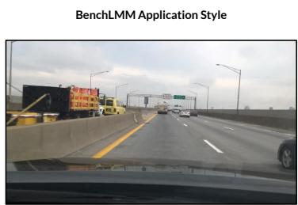  
Q: What is the intended behavior or action for the main vehicle in an autonomous driving scenario? A (GT): Go straight.

  
Q: What is the total amount of this receipt? A (GT): 203.00

(a) Questions and ground-truth answers from two of the investigated benchmarks: cross-style (left) and text-rich understanding (right).  
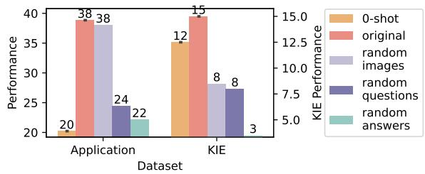

(b) ICL performance against visual and textual perturbations.  
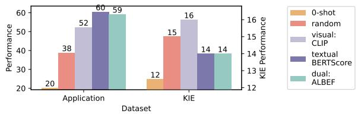  
(c) ICL performance given demonstrations selected by different modality-driven strategies.

Figure 1: (b) Modality matters differently on ICL across tasks: visual information matters little on Application but a lot on KIE, textual answers are more important to ICL on KIE than that on Application. (c) Demonstrations selected by text-driven strategy BERTScore benefit more on Application, while those selected by visual similarity (CLIP) bring higher accuracy on KIE.

approach to selecting demonstrations for multimodal ICL (Alayrac et al., 2022; Sun et al., 2023; Yang et al., 2024). However, relatively less work has been done to investigate the principles behind how and why multimodal ICL works, nor has there been enough justification for the necessity of selecting demonstrations according to visual modality and analyzing its advantages over other modalities. Yang et al. (2024) only explored better in-context configurations for image captioning, while Chen et al. (2023) argued that multimodal ICL is predominantly driven by the textual information in the demonstrations. However, their observations are limited to image captioning (Young et al., 2014; Chen et al., 2015) and general-purpose visual question answering tasks (Goyal et al., 2017; Gurari et al., 2018; Marino et al., 2019; Sidorov et al. 2020), which leaves a comprehensive exploration of the strengths of ICL and its limitations (Zong et al., 2024) largely open for multimodal LLMs.

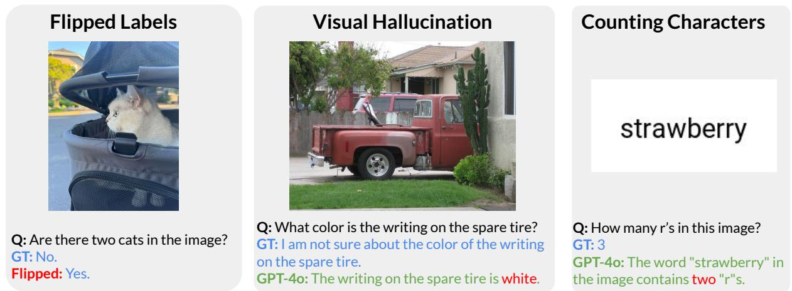  
Figure 2: Benchmarks with inductive bias contracting the semantic priors (left) or rarely seen in pretraining data (middle and right). We list ground-truth (GT), zero-shot responses from GPT-4o and provide ICL analysis in §6.

In this paper, we conduct a systematic and principled evaluation of multimodal ICL for models of different scales (ranging from OpenFlamingo 4B, Awadalla et al. (2023) to IDEFICS1 80B, Laurençon et al. (2023)) on a broad spectrum of new yet critical tasks as shown in Fig. 1a. These tasks require different types of capabilities, including hallucination mitigation (Wang et al., 2023), textrich image understanding (Liu et al., 2023; Li et al., 2024), medical information comprehension (He et al., 2020; Pacheco et al., 2020; Liu et al., 2021), and cross-style transfer (Cai et al., 2023), etc.

With diverse ICL capabilities examination, we show that the dependency of performance gain from ICL on demonstration modalities differs among tasks (§4). For example, perturbing visual information in demonstrations (e.g., removing or replacing with random, noised or permuted images) does not cause significant performance drop on ICL for Application task (Fig. 1b left), while resulting in decreased accuracy than that provided by correct demonstrations on tasks such as key information extraction (KIE) from text-rich images (Fig. 1b right). On the other hand, textual perturbations (e.g., replacing the question/answer with random or one from other candidates in the same demonstration set) hurt ICL performance to different extents across tasks. These observations strongly suggest the necessity of understanding modality impact on ICL prior to collecting demonstrations for specific tasks.

We conduct further investigation on how to select effective demonstrations to boost multimodal ICL performance (§5). Based on empirical experiments, we recommend the following practices to elicit better ICL performance from multimodal models: 1) Utilizing demonstrations selected by visual similarity (e.g., vision encoder of CLIP) for tasks observed with vital impact from visual modality on ICL performance, e.g., KIE task shown on the right of Fig. 1c. 2) Selecting demonstrations with high textual similarity (e.g., text encoder of CLIP (Radford et al., 2021) or BERTScore (Zhang et al., 2019)) for tasks if the textual modality plays an important role in ICL performance, e.g., Application task shown on the left of Fig. 1c. 3) Choosing demonstrations with both visual and textual similarity considered (e.g., ALBEF (Li et al., 2021) with a multimodal encoder that explicitly models interactions between image and text features) if dual modalities matter similarly to ICL performance.

Lastly, we illustrate that models may have the capability to capture task inductive biases from multimodal ICL (§6). We investigate two kinds of inductive bias: 1) contradicting semantic priors, and 2) rarely seen in pretraining. By deliberately flipping annotations of demonstrations to override strong semantic priors learned during pretraining (Fig. 2 left), small-scale models fail to comprehend or follow practices provided by randomly sampled demonstrations, while they learn to follow inductive biases given demonstrations selected according to textual similarities, an emergent ability unlocked by scaling studied in literature (Wei et al., 2022b; Zhou et al., 2022). Although multimodal LLMs are typically pretrained on true positives only but rarely on hallucination-inducing scenarios with unanswerable questions (Fig. 2 middle, Cha et al. (2024)), multimodal ICL greatly reduces hallucination over zero-shot inference. We also observe effectiveness of multimodal ICL in addressing the failure mode (Ball et al., 2024; Shin and Kaneko, 2024; Yehudai et al., 2024) of models on tasks humans find trivial (e.g., counting r's in the image plotting “strawberry" as shown in Fig. 2 right). Such capability to capture inductive bias of demonstrations without scaling up models is more attractive than using semantic priors, since the model would be able to perform a wide range of tasks without further tuning, even if those tasks are not seen in or even contradict pretraining data.

In summary, our principled analysis provides a comprehensive way of understanding the role of demonstrations in multimodal ICL. We empirically show that (1) modalities matter differently in multimodal ICL across tasks (§4), (2) demonstration strategies considering modality impact are able to boost ICL performance (§5), (3) models are capable of capturing task inductive biases from multimodal ICL (§6). Overall, our work aims to shed light on effectively improving multimodal ICL on a wide range of tasks even if those tasks are not seen in or even contradict pretraining data.

## 2 Related Work

Textual ICL LLMs have been recognized as strong few-shot learners since their emergence (Brown et al., 2020). With ICL, LLMs are empowered to generalize to a wide range of tasks at inference even if those tasks are not seen in pretraining data (Garg et al., 2022; Akyürek et al., 2022). To understand why ICL works, Min et al. (2022) empirically showed that the performance gain of ICL over zero-shot inference is mainly driven by the label space, distribution of input text, output labels, and overall format of the sequence, while the represented mapping from inputs to the outputs in demonstrations matters little. However, some recent work (Zhou et al., 2022; Wei et al., 2023) suggested that when scaling up to some extent, larger models can actually learn input-output mappings, which allows them to perform a variety of challenging tasks even if they contradict pretraining data.

Considering the additional visual information in multimodal ICL, we study the importance of different modalities and guide demonstration selection for better ICL performance accordingly.

Multimodal ICL After pretraining on interleaved image-text data or fine-tuning on multiturn conversations, multimodal LLMs have exhibited ICL abilities in tasks such as image captioning and general-purpose visual question answering (Alayrac et al., 2022; Bai et al., 2023; Sun et al., 2023; McKinzie et al., 2024). Considering these studies may not sufficiently reveal strengths and weaknesses of ICL, Zong et al. (2024) recently introduced VL-ICL Bench which encompasses a broad spectrum of tasks for multimodal ICL evaluation. However, there is not much work that conducts principled analysis on emergent ICL capabilities and provides insightful suggestions for future ICL practices. Yang et al. (2024) only explored better in-context configurations for image captioning. Qin et al. (2024) recognized three factors-demonstration retrieval, ordering and instructions, that contribute to multimodal ICL performance, without providing task-specific suggestions for demonstration selection to boost multimodal ICL capabilities.

One work that is closely connected to ours is Chen et al. (2023). Chen et al. (2023) argued that multimodal ICL is predominantly driven by the textual information in the demonstrations and proposed Mixed Modality In-Context Example Selection (MMICES), which first pre-filters samples based on visual feature similarity and then selects most similar ones based on textual similarity. However, their observations are limited to image captioning and general-purpose visual question answering tasks, which leaves a comprehensive exploration for the strengths of ICL and its limitations (Zong et al., 2024) largely open for multimodal LLMs. We conduct more comprehensive study on the impact of modality on ICL and find that modalities matter differently across tasks. Furthermore, we investigate how models of different scales capture task inductive biases from multimodal ICL.

## 3 Experimental Setup

In this section, we describe the experimental setup used in our analysis (§4-§6). We list evaluation benchmarks and corresponding metrics in Tab. 2, as well as studied model information in Tab. 3.

Evaluation Benchmarks After pretraining multimodal LLMs on interleaved image-text data or fine-tuning on multi-turn conversations, existing work (Alayrac et al., 2022; Bai et al., 2023; Sun et al., 2023; McKinzie et al., 2024) mainly focuses on evaluating their ICL abilities on image captioning such as COCO (Chen et al., 2015) and Flickr30K (Young et al., 2014), as well as generalpurpose visual question answering tasks such as OKVQA (Marino et al., 2019), VQAv2 (Goyal et al., 2017), TextVQA (Sidorov et al., 2020) and VizWiz (Gurari et al., 2018). Besides these classic vision-language tasks, we also consider one recently released benchmark, namely VL-ICL Bench (Zong et al., 2024), which encompasses a broad spectrum of challenging new tasks to investigate strengths and limitations of ICL capabilities.

Benefits of utilizing demonstrations as contexts for more critical and practical applications, though imperfect zero-shot performance is observed from state-of-the-art models, are not yet explored. Therefore, we further study ICL capabilities of multimodal LLMs on the following tasks. 1) Math Reasoning: MATH-Vision (Wang et al., 2024) is a large math reasoning benchmark that collects questions from real math competitions and tests the general visual perception and mathematical reasoning abilities; 2) Hallucination: AMBER (Wang et al., 2023) provides a discriminative way to evaluate various types of hallucination including existence, attribute and relation; 3) Text-rich Tasks: both OCRBench (Liu et al., 2023) and SEED-Bench-2-Plus (Li et al., 2024) assess text-rich visual comprehension of models, while the former focus on Optical Character Recognition (OCR) capabilities and the latter covers text-rich scenarios in the real world such as Charts, Maps, and Webs; 4) Medical Tasks: three datasets consider different medical modalities, i.e., Path-VQA (He et al., 2020) for pathology, Slake-VQA (Liu et al., 2021) for radiology and PAD-UFES-20 (Pacheco et al., 2020) for skin lesion images. 5) Multi-image Tasks: Seed-Bench-2 (Li et al., 2024) evaluates the ability to comprehend multimodal inputs containing multiple images. 6) Cross-style Transfer: BenchLMM (Cai et al., 2023) assesses the robustness of models against three different styles including artistic image, imaging sensor, and application styles.

Multimodal LLMs We evaluate pretrained multimodal LLMs without further instruction tuning, so that factors, such as seeing similar data or acquiring tested capabilities from the instruction dataset rather than through ICL, could be fairly reduced. Specifically, we consider the following pretrained models that scale from 4B to 80B and have previously demonstrated ICL abilities through limited analysis: OpenFlamingo (Awadalla et al., 2023) of two sizes (4B and 9B), IDEFICS of two scales from different versions (9B and 80B from the 1st version (Laurençon et al., 2023) and 8B from the 2nd version (Laurençon et al., 2024)), together with the 14B Emu1 (Sun et al., 2023).

Moreover, we evaluate the proprietary model, GPT-40 ² (OpenAI, 2024), to exhibit challenge levels of evaluated tasks on the one hand, and compare ICL capabilities between pretrained and instructiontuned models on the other hand.

Evaluation Metrics For image captioning, we report CIDEr (Vedantam et al., 2015) scores. For general-purpose VQA tasks, we adopt the common VQA evaluation metric (Antol et al., 2015), where 10 annotations are provided and the model prediction is deemed 100% accurate if at least three annotators provide that exact answer. To evaluate performance on two medical VQA task-slake-VQA and Path-VQA, we use the token-level F1 score following Tu et al. (2024). We follow the evaluation practices in BenchLMM where ChatGPT is employed to gauge the proximity of answers predicted by the LMMs to ground-truth answers. For remaining datasets, we utilize their original evaluation strategy-soft string matching, to eliminate the impact of answer formats.

Implementation Details We prompt multimodal LLMs with an instruction“Describe the image:" for caption generation, while employing openended answer generation for other tasks with a prompt in the form of “Question: the <question> Answer:", without any constraint on model's output space.3 We adopt the default decoding strategy and configurations (e.g., beam search with 5 as the number of beams for Emu1) suggested by each model vendor respectively. In contrast to the zero-shot setting, we consider 4- and 8-shot for in-context learning analysis 4, where the demonstrations are randomly sampled from candidates for each testing example unless otherwise stated.

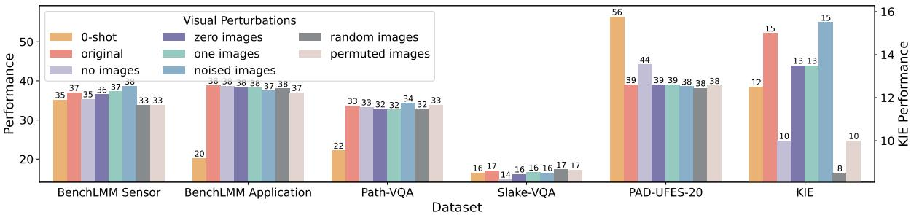

(a) Visual Modality  
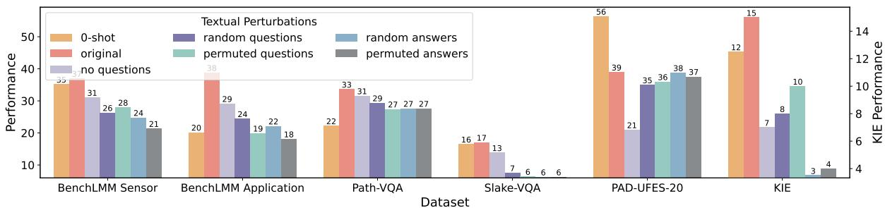  
(b) Textual Modality  
Figure 3: Multimodal ICL performance of IDEFICS1-80b reacts differently across tasks of different difficulty levels against perturbations on visual (top) and textual (bottom) information. For easy (i.e., BenchLMM Sensor and Application) and two moderate (i.e., Path-VQA and Slake-VQA) tasks, performance after various visual perturbations is very close to that given original correct demonstrations, while drops obviously when either textual question or answer is perturbed. For the moderate PAD-UFES-20, neither of the two modalities matters too much. For the hard KIE, we observe degraded performance when the image is removed or replaced. Similar observations from other 5 models can be found from Fig. 14 to Fig. 18.

## 4 Modalities Matter Differently in Multimodal ICL

As shown in Fig. 6 and Fig. 7, pretrained models and GPT-4o generally achieve better performance given demonstrations as context in existing ICL tasks. As demonstrated in Fig. 8, on more complex and reasoning-focused tasks, pretrained models generally benefit more from demonstrations while performance of GPT-4o is barely influenced

In this section, we examine which modality of the demonstrations takes more effect in multimodal in-context learning. For a comprehensive evaluation, we focus on three tasks of different difficulty levels: easy cross-style tasks (i.e., BenchLMM Sensor and Application in Fig. 8), moderate medical tasks (i.e., Path-VQA, Slake-VQA and PAD-UFES-20 in Fig. 8), and hard text-rich key information extraction task (i.e., KIE from OCRBench in Fig. 11). We visualize 4-shot performance of IDEFICS-80b within this section while leaving results of other models in Appendix (from Fig. 14 to Fig. 18.). The dependency of performance gain from ICL on demonstration modalities differs among tasks.

## 4.1 Impact of Visual Modality

In recent studies, the Retrieval-based In-Context Example Selection (RICES (Yang et al., 2022)) approach, which retrieves similar images in the support set by comparing their visual features with testing images, has become a default approach to select demonstrations for multimodal in-context learning (Alayrac et al., 2022; Sun et al., 2023; Yang et al., 2024). However, the necessity of selecting demonstrations according to visual modality and its advantages over others is not yet explored.

By fixing the textual modality (i.e., question and answer pairs) of demonstrations, we experiment with demonstrations containing different perturbations of visual modality: 1) no images where only textual question and answer pairs are provided; 2) zero/one images that all zero (black)/255(white) pixel values are used instead; 3) noised images that apply Gaussian noises to the original images; 4) random images sampled from the train set; 5) permuted images reorganize the order of demonstration images to misalign visual/textual modalities.

Results We compare ICL performance of IDEFICS1-80B6 before and after visual perturbations in Fig. 3 and other models from Fig. 14a to Fig. 18a. For easy cross-style and moderate medical tasks, we find that perturbing visual information in demonstrations does not cause significant performance drop on ICL, which is consistent with observations from prior work (Chen et al., 2023). However, for the hard KIE task, visual perturbations that remove or change content of images result in decreased accuracy than that provided with correct demonstrations, sometimes much worse performance than the zero-shot inference. This indicates that visual information plays an important role in improving ICL performance over zero-shot one, which is reasonable since this dataset requires extracting key-value pairs in the image (Liu et al., 2023). Meanwhile, the performance after applying Gaussian noises to images is very close to performance with correct images, which implies that multimodal LLMs are agnostic to image noises and able to extract key visual information for question answering.

## 4.2 Impact of Textual Modality

Previous studies have identified excessive dependence of multimodal LLMs on the language model's linguistic priors (Han et al., 2022; Li et al., 2023). Accordingly, the role of textual modality for multimodal ICL should be similarly important. Therefore, we keep the visual modality of demonstrations while performing the following perturbations upon textual question and answer pairs: 1) no questions/answers remove the question/answer component directly; 2) random questions/answers employ questions/answers sampled from the train set instead; 3) permuted questions/answers exchange question or answer component of demonstration examples while keeping the other two components unchanged.

Results In Fig. 3b, we visualize ICL performance in response to perturbations upon questions or answers of demonstrations independently. We find that textual perturbations hurt ICL performance to different extents. On tasks such as BenchLMM Sensor, Slake-VQA and KIE, perturbations on either questions or answers lead to greatly reduced accuracy even below zero-shot inference. By replacing correct answers from demonstrations with random ones or those misaligned with image-question pairs, we observe extremely bad performance on Slake-VQA and KIE. On other tasks, questions and answers are almost equally important to ICL.

## 5 How to Select Effective Demonstrations for Multimodal ICL

Motivated by variational roles of different modalities across different tasks, we further explore influence of modality-driven demonstration selection strategies on ICL performance in this section.

Vision-driven Demonstration Selection To retrieve demonstrations containing images similar to those in testing examples, we follow prior studies (Alayrac et al., 2022; Sun et al., 2023; Yang et al., 2024) by adopting the RICES strategy (Yang et al., 2022), which compares visual similarity according to features extracted from the pretrained visual encoder of CLIP (Radford et al., 2021).

Text-driven Demonstration Selection For fair comparison with RICES, we employ the textual encoder of CLIP as well for selecting demonstrations with similar textual features to testing examples. We also adopt the BERTScore (Zhang et al., 2019) metric 7, which considers token-level similarity between candidate and reference sentences and shows a strong correlation with human judgements on multiple common benchmarks.

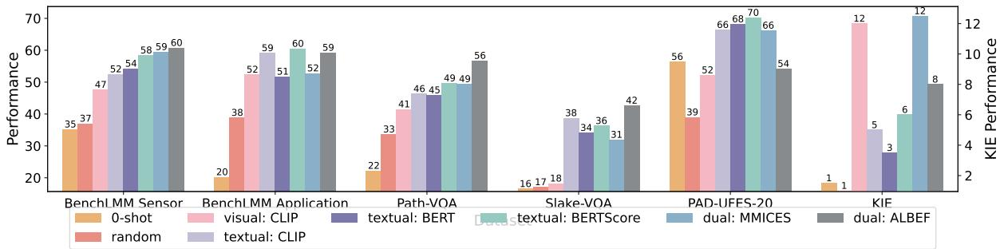  
Figure 4: Influence of modality-driven demonstration selection strategies on ICL performance of IDEFICS1-80B. Text-driven demonstration (e.g.,textual CLIP,BERT, andBERTScore) selection strategies always bring performance improvement over zero-shot inference and random strategy. Strategies considering visual modality (e.g.,visual CLIP,MMICES, andALBEF) enhance performance significantly on KIE, where visual modality proves to be critical for ICL performance as illustrated in Fig. 3a. We visualize similar observations of other five models from Fig. 14 to Fig. 18.

Dual-modality driven Demonstration Selection We first consider Mixed Modality In-Context Example Selection (MMICES) proposed by Chen et al. (2023), which first pre-filters K samples (K=32) based on visual feature similarity and then selects the most similar ones based on textual similarity. To represent vision-language features, we utilize ALBEF (Li et al., 2021), a multimodal encoder that explicitly models the interactions between image and text features and achieves stateof-the-art performance on image-text retrieval tasks. Since its multimodal encoder is built upon an image encoder (i.e., visual transformer ViT-B/16) and a text encoder $( \mathrm { i . e . , B E R T _ { b a s e } ) }$ , we also select demonstrations according to the embedding of the [CLS] token from $\mathrm { B E R T _ { b a s e } }$ as another textual-driven approach for contrast. For fair comparison, the visiondriven CLIP approach, the visual feature extractor of MMICES, and the visual encoder of ALBEF share the same visual transformer (i.e., ViT-B/16).

Considering the sensitivity of LLMs to the ordering in the prompt (Lu et al., 2022; Wu et al., 2023), we follow prior work (Alayrac et al., 2022; Gupta et al., 2023) with demonstrations ordered by an increasing order of similarity, such that the most similar demonstration appears right before the testing example.

Results We illustrate influence of demonstration selection strategies on ICL performance in Fig. 4. Providing demonstrations selected by textual similarity benefits ICL performance consistently across models and tasks. This is consistent with literature (Chen et al., 2023) and our observations in §4.2 that the textual modality plays an important role in ICL performance. In general, the larger text embedding model–BERTScore (124M parameters) leads to better ICL performance compared with smaller models like textual CLIP (63M parameters) and BERT (124M parameters).

As analyzed in §4.1, visual information of demonstrations is of vital importance to ICL performance for the task KIE that requires key-value pair extraction from images. Accordingly, we witness drastically improved ICL performance when demonstrations containing more similar images to testing images are provided by visual CLIP.

Strategies that consider dual modalities for demonstration selection (e.g., MMICES and AL-BEF) are similarly more advantageous compared with text-driven methods on KIE. We also find that they achieve trade-off performance regardless of various modality importance to specific tasks. Meanwhile, ALBEF which explicitly models the interactions between image and text features obtains better ICL performance than MMICES, which is constrained by the vision-driven pre-filter process.

## 6 Models May Capture Task Inductive Biases from Multimodal ICL

Prior work on NLP tasks shows that small language models like GPT-J-6B (Wang and Komatsuzaki 2021) and PaLM-8B (Chowdhery et al., 2023) rely primarily on semantic priors from pretraining (Min et al., 2022), while large models such as PaLM-540B and InstructGPT (Ouyang et al., 2022) can capture and follow inductive biases from in-context exemplars, performing a wide range of tasks even if those tasks are not seen (Garg et al., 2022; Akyürek et al., 2022) in or even contradict (Wei et al., 2023) pretraining data. However, it is unknown whether capturing inductive biases is still an emergent ability of model scale for multimodal ICL. We experiment with three benchmarks where the inductive bias contradicts semantic priors (Fig. 2 left) or are rarely seen (Fig. 2 middle & right) in pretraining.

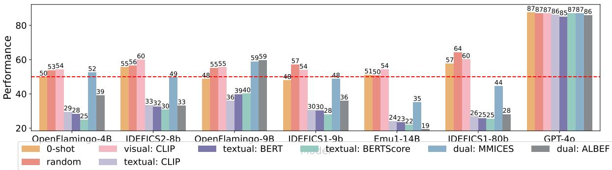  
Figure 5: The ability to capture inductive biases that contradict semantic priors when presented with flipped in-context exemplar annotations of AMBER Attribution emerges when demonstrations are selected according to textual modality (i.e.,textual CLIP,■BERT andBERTScore). Ground truth annotations for testing examples are not flipped, so if a model learns to follow flipped labels in demonstrations, its accuracy should be below 50%. Given random demonstrationsor those selected considering visual modality, models cannot flip predictions to follow flipped annotations, while models can do so provided with demonstrations selected by text-driven strategies (performance decreases to well below 50%). We show similar observations on Existence and Relation in Fig. 19.

## 6.1 Benchmarks

Flipped Labels We flip original labels from the hallucination benchmark AMBER (Wang et al., 2023). The selected demonstration is labeled as “Yes" if the description in the question is WRONG according to the image, “No" otherwise.

Visual Hallucination We adopt the VQAv2- IDK benchmark (Cha et al., 2024). It contains hallucination-inducing scenarios, where providing definitive answers is challenging and responses such as “I Don't Know" are desired. Multimodal LLMs are typically pretrained on true positives only but rarely on such hallucination-inducing scenarios, hence striving to answer with hallucination.

Counting Characters Recent state-of-theart LLMs are capable of performing complex reasoning (LlamaWebsite, 2024), math problem-solving (QwenLM, 2024), code generation (CodeGemmaTeam, 2024) and even challenging Mathematical Olympiad (IMO) tasks (DeepMind, 2024), but fail to handle problems that humans find trivial, e.g., counting the number of r's in the word “strawberry" or “barrier" (Ball et al., 2024; Shin and Kaneko, 2024; Yehudai et al., 2024). Interestingly, we find it similarly challenging for multimodal LLMs to count the occurrence of characters when the word is displayed as an image (i.e., individual black word plotted on white background). We investigate whether multimodal LLMs can discover and follow the inductive bias of character counting from demonstrations, which is probably rarely seen during model pretraining.

## 6.2 Implementation Details

We evaluate 500 testing instances in the 8-shot setting for all benchmarks, where demonstrations per testing instance are randomly sampled from 5, 000 candidates 8. For Flipped Labels where inductive bias conflicts with semantic priors, we compare 8-shot performance with the random guess (i.e., 50% accuracy for the yes/no questions). For the other two benchmarks where inductive bias from demonstrations is rarely seen during pretraining and expected to help models better perceive and address tasks, we compare few-shot with zero-shot results to learn whether inductive bias is captured.

## 6.3 Induct Bias Contradicting Semantic Priors

We show the abilities of different models for capturing inductive biases from demonstrations in Fig. 5. We flip annotations of demonstrations while keeping the ground-true answers of testing examples unflipped, hence the lower the accuracy, the stronger the capabilities of multimodal LLMs to capture inductive biases and further override semantic priors learned during pretraining. When provided with demonstrations randomly sampled or selected according to similarities of visual features (i.e., visual CLIP), all evaluated models fail to comprehend or follow practices against prior knowledge. This is consistent with existing studies showing that small language models ignore flipped labels presented incontext and thus rely primarily on semantic priors from pretraining (Wei et al., 2023). Surprisingly, all studied small-scale models tend to follow inductive biases from demonstrations with accuracy well below 50% when we switch demonstrations to those selected according to textual similarities (e.g., textual CLIP, BERT, BERTScore). We suspect that flipped annotations mainly convey inductive biases through texts, which makes text-driven selection strategies effective in guiding the behavior of small models to override semantic priors.

<table><tr><td>Setting</td><td>OpenFlamingo-4B</td><td>IDEFICS2-8b</td><td>OpenFlamingo-9B</td><td>IDEFICS1-9b</td><td>Emu1-14B</td><td>IDEFICS1-80b</td><td>GPT-40</td></tr><tr><td colspan="8">Visual Hallucination</td></tr><tr><td>0-shot</td><td>12.0</td><td>0.6</td><td>17.4</td><td>0.6</td><td>0.4</td><td>2.0</td><td>28.2</td></tr><tr><td>Random</td><td>76.2</td><td>37.4</td><td>73.2</td><td>61.4</td><td>37.6</td><td>59.6</td><td>33.4</td></tr><tr><td>visual: CLIP</td><td>79.2</td><td>38.8</td><td>71.6</td><td>68.6</td><td>49.4</td><td>64.4</td><td>40.0</td></tr><tr><td>textual: CLIP</td><td>79.2</td><td>49.0</td><td>70.4</td><td>66.0</td><td>53.2</td><td>62.0</td><td>41.2</td></tr><tr><td>textual: BERT</td><td>85.6</td><td>63.2</td><td>75.0</td><td>74.8</td><td>60.2</td><td>74.4</td><td>46.6</td></tr><tr><td>textual: BERTScore</td><td>84.2</td><td>62.2</td><td>74.6</td><td>74.4</td><td>57.8</td><td>75.8</td><td>44.2</td></tr><tr><td>dual: MMICES</td><td>78.8</td><td>43.6</td><td>70.4</td><td>69.4</td><td>49.8</td><td>64.6</td><td>39.8</td></tr><tr><td>dual: ALBEF</td><td>83.4</td><td>55.8</td><td>71</td><td>72.6</td><td>57.0</td><td>70.0</td><td>43.4</td></tr><tr><td colspan="8">Counting Characters</td></tr><tr><td>0-shot</td><td>19.6</td><td>68.8</td><td>9.4</td><td>60.6</td><td>24.6</td><td>36.4</td><td>77.4</td></tr><tr><td>Random</td><td>70.2</td><td>78.6</td><td>60.4</td><td>75.0</td><td>79.4</td><td>76.6</td><td>91.4</td></tr><tr><td>visual: CLIP</td><td>70.6</td><td>79.0</td><td>57.4</td><td>76.6</td><td>78.8</td><td>76.2</td><td>90.6</td></tr><tr><td>textual: CLIP</td><td>68.0</td><td>79.0</td><td>48.8</td><td>75.6</td><td>79.4</td><td>78.0</td><td>88.0</td></tr><tr><td>textual: BERT</td><td>56.4</td><td>77.4</td><td>38.2</td><td>75.4</td><td>79.4</td><td>70.0</td><td>85.8</td></tr><tr><td>textual: BERTScore</td><td>58.8</td><td>75.4</td><td>39.6</td><td>76.0</td><td>79.0</td><td>73.6</td><td>88.0</td></tr><tr><td>dual: MMICES</td><td>56.8</td><td>75.8</td><td>41.4</td><td>70.6</td><td>77.8</td><td>69.8</td><td>91.8</td></tr><tr><td>dual: ALBEF</td><td>66.2</td><td>78.0</td><td>40.4</td><td>73.6</td><td>77.8</td><td>74.0</td><td>84.6</td></tr></table>

Table 1: The capability to capture inductive biases that are rarely seen in pretraining emerges in multimodal ICL. Multimodal LLMs are able to capture and follow inductive bias, hence reducing hallucination in responses to unanswerable questions (top) and more accurately counting characters within queried words (bottom).

Notably, GPT-4o always follows the strong semantic priors and provides factual responses even when the demonstration annotations are flipped, which is quite opposite to the emergent ability unlocked of model scale discovered in the literature (Wei et al., 2022a, 2023). However, GPT-4o's failure to provide flipped answers following demonstrations does not indicate such a large model is unable to capture those inductive biases. We speculate that GPT-4o may be able to perceive provided biases that are against semantic priors, but reject to give non-factual responses due to its built-in safety mechanisms across modalities (OpenAI, 2024).

## 6.4 Inductive Bias Rarely Seen in Pretraining

In Tab. 1, we study whether models can capture inductive bias rarely seen in pretraining in multimodal ICL. In zero-shot setting, we observe quite poor performance consistently across studied models on two datasets. Although current models rarely see unanswerable questions during pretraining, we observe emergent abilities to answer unanswerable questions without hallucination in multimodal ICL (top in Tab. 1), especially with demonstrations selected by text-driven strategies. As shown at the bottom of Tab. 1, the accuracy of character counting improves greatly in ICL compared with zeroshot. Vision-driven demonstration selection strategy CLIP is more effective than others. Text-driven strategies do not achieve top performance, which is reasonable since key information to answer questions comes from letters in the image, rather than the text part.

## 7 Conclusion

We conduct a systematic and principled evaluation of multimodal ICL for models of different scales on a broad spectrum of new yet critical tasks. We find that modalities matter differently in multimodal ICL across tasks. Hence we utilize modality-driven demonstration strategies to boost ICL performance. Moreover, we find that demonstrations selected according to textual similarity help models capture inductive biases from multimodal ICL.

## Limitations

We conduct a systematic and principled evaluation of multimodal ICL for pretrained models of different scales on a broad spectrum of new yet critical tasks. One limitation of our study is lack of discussion over instruction-tuned models, which may present differently than pretrained ones.

## Ethics Statement

This paper presents comprehensive study of multimodal ICL on multiple existing benchmarks that have gone through ethical reviews in prior works. Therefore, we believe our work does not pose additional ethical issues.

## Acknowledgements

We appreciate the reviewers for their insightful comments and suggestions.

Muhao Chen was supported by the DARPA FoundSci Grant HR00112490370 and the NSF of the United States Grant ITE 2333736.

## References

Ekin Akyürek, Dale Schuurmans, Jacob Andreas, Tengyu Ma, and Denny Zhou. 2022. What learning algorithm is in-context learning? investigations with linear models. arXiv preprint arXiv:2211.15661.

Jean-Baptiste Alayrac, Jeff Donahue, Pauline Luc, Antoine Miech, Iain Barr, Yana Hasson, Karel Lenc, Arthur Mensch, Katherine Millican, Malcolm Reynolds, et al. 2022. Flamingo: a visual language model for few-shot learning. Advances in neural information processing systems, 35:23716–23736.

Stanislaw Antol, Aishwarya Agrawal, Jiasen Lu, Margaret Mitchell, Dhruv Batra, C Lawrence Zitnick, and Devi Parikh. 2015. Vqa: Visual question answering. In Proceedings of the IEEE international conference on computer vision, pages 2425–2433.

Anas Awadalla, Irena Gao, Josh Gardner, Jack Hessel, Yusuf Hanafy, Wanrong Zhu, Kalyani Marathe, Yonatan Bitton, Samir Gadre, Shiori Sagawa, et al. 2023. Openflamingo: An open-source framework for training large autoregressive vision-language models. arXiv preprint arXiv:2308.01390.

Jinze Bai, Shuai Bai, Shusheng Yang, Shijie Wang, Sinan Tan, Peng Wang, Junyang Lin, Chang Zhou, and Jingren Zhou. 2023. Qwen-vl: A versatile visionlanguage model for understanding, localization, text reading, and beyond.

Thomas Ball, Shuo Chen, and Cormac Herley. 2024. Can we count on llms? the fixed-effect fallacy and claims of gpt-4 capabilities. arXiv preprint arXiv:2409.07638.

Tom Brown, Benjamin Mann, Nick Ryder, Melanie Subbiah, Jared D Kaplan, Prafulla Dhariwal, Arvind Neelakantan, Pranav Shyam, Girish Sastry, Amanda Askell, et al. 2020. Language models are few-shot learners. Advances in neural information processing systems, 33:1877–1901.

Rizhao Cai, Zirui Song, Dayan Guan, Zhenhao Chen, Xing Luo, Chenyu Yi, and Alex Kot. 2023. Benchlmm: Benchmarking cross-style visual capability of large multimodal models. arXiv preprint arXiv:2312.02896.

Sungguk Cha, Jusung Lee, Younghyun Lee, and Cheoljong Yang. 2024. Visually dehallucinative instruction generation. In ICASSP 2024-2024 IEEE International Conference on Acoustics, Speech and Signal Processing (ICASSP), pages 5510–5514. IEEE.

Shuo Chen, Zhen Han, Bailan He, Mark Buckley, Philip Torr, Volker Tresp, and Jindong Gu. 2023. Understanding and improving in-context learning on visionlanguage models. arXiv preprint arXiv:2311.18021, 1(2).

Xinlei Chen, Hao Fang, Tsung-Yi Lin, Ramakrishna Vedantam, Saurabh Gupta, Piotr Dollár, and C Lawrence Zitnick. 2015. Microsoft coco captions: Data collection and evaluation server. arXiv preprint arXiv:1504.00325.

Aakanksha Chowdhery, Sharan Narang, Jacob Devlin, Maarten Bosma, Gaurav Mishra, Adam Roberts, Paul Barham, Hyung Won Chung, Charles Sutton, Sebastian Gehrmann, et al. 2023. Palm: Scaling language modeling with pathways. Journal of Machine Learning Research, 24(240):1–113.

CodeGemmaTeam. 2024. Codegemma: Open code models based on gemma. arXiv preprint arXiv:2406.11409.

DeepMind. 2024. Ai solves IMO problems at silver medal level. Accessed: 2024-10-06.

Shivam Garg, Dimitris Tsipras, Percy S Liang, and Gregory Valiant. 2022. What can transformers learn in-context? a case study of simple function classes. Advances in Neural Information Processing Systems, 35:30583-30598.

Yash Goyal, Tejas Khot, Douglas Summers-Stay, Dhruv Batra, and Devi Parikh. 2017. Making the v in vqa matter: Elevating the role of image understanding in visual question answering. In Proceedings of the IEEE conference on computer vision and pattern recognition, pages 6904–6913.

Shivanshu Gupta, Matt Gardner, and Sameer Singh. 2023. Coverage-based example selection for incontext learning. In Findings of the Association for Computational Linguistics: EMNLP 2023, pages 13924–13950, Singapore. Association for Computational Linguistics.

Danna Gurari, Qing Li, Abigale J Stangl, Anhong Guo, Chi Lin, Kristen Grauman, Jiebo Luo, and Jeffrey P Bigham. 2018. Vizwiz grand challenge: Answering visual questions from blind people. In Proceedings of the IEEE conference on computer vision and pattern recognition, pages 3608–3617.

Yudong Han, Liqiang Nie, Jianhua Yin, Jianlong Wu, and Yan Yan. 2022. Visual perturbation-aware collaborative learning for overcoming the language prior problem. arXiv preprint arXiv:2207.11850.

Xuehai He, Yichen Zhang, Luntian Mou, Eric Xing, and Pengtao Xie. 2020. Pathvqa: 30000+ questions for medical visual question answering. arXiv preprint arXiv:2003.10286.

Hugo Laurençon, Lucile Saulnier, Léo Tronchon, Stas Bekman, Amanpreet Singh, Anton Lozhkov, Thomas Wang, Siddharth Karamcheti, Alexander M. Rush, Douwe Kiela, Matthieu Cord, and Victor Sanh. 2023. Obelics: An open web-scale filtered dataset of interleaved image-text documents. Preprint, arXiv:2306.16527.

Hugo Laurençon, Léo Tronchon, Matthieu Cord, and Victor Sanh. 2024. What matters when building vision-language models? Preprint, arXiv:2405.02246.

Bohao Li, Yuying Ge, Yi Chen, Yixiao Ge, Ruimao Zhang, and Ying Shan. 2024. Seed-bench-2-plus: Benchmarking multimodal large language models with text-rich visual comprehension. arXiv preprint arXiv:2404.16790.

Junnan Li, Ramprasaath Selvaraju, Akhilesh Gotmare, Shafiq Joty, Caiming Xiong, and Steven Chu Hong Hoi. 2021. Align before fuse: Vision and language representation learning with momentum distillation. Advances in neural information processing systems, 34:9694–9705.

Yifan Li, Yifan Du, Kun Zhou, Jinpeng Wang, Wayne Xin Zhao, and Ji-Rong Wen. 2023. Evaluating object hallucination in large vision-language models. arXiv preprint arXiv:2305.10355.

Bo Liu, Li-Ming Zhan, Li Xu, Lin Ma, Yan Yang, and Xiao-Ming Wu. 2021. Slake: A semantically-labeled knowledge-enhanced dataset for medical visual question answering. In 2021 IEEE 18th International Symposium on Biomedical Imaging (ISBI), pages 1650–1654. IEEE.

Yuliang Liu, Zhang Li, Hongliang Li, Wenwen Yu, Mingxin Huang, Dezhi Peng, Mingyu Liu, Mingrui Chen, Chunyuan Li, Lianwen Jin, et al. 2023. On the hidden mystery of ocr in large multimodal models. arXiv preprint arXiv:2305.07895.

LlamaWebsite. 2024. Introducing llama 3.2. https: //www.11ama.com/. Accessed: 14-Oct-2024.

Yao Lu, Max Bartolo, Alastair Moore, Sebastian Riedel, and Pontus Stenetorp. 2022. Fantastically ordered prompts and where to find them: Overcoming fewshot prompt order sensitivity. In Proceedings of the 60th Annual Meeting of the Association for Computational Linguistics (Volume 1: Long Papers), pages 8086–8098, Dublin, Ireland. Association for Computational Linguistics.

Kenneth Marino, Mohammad Rastegari, Ali Farhadi, and Roozbeh Mottaghi. 2019. Ok-vqa: A visual question answering benchmark requiring external knowledge. In Proceedings of the IEEE/cvf conference on computer vision and pattern recognition, pages 3195–3204.

Brandon McKinzie, Zhe Gan, Jean-Philippe Fauconnier, Sam Dodge, Bowen Zhang, Philipp Dufter, Dhruti Shah, Xianzhi Du, Futang Peng, Floris Weers, et al. 2024. Mm1: Methods, analysis & insights from multimodal llm pre-training. arXiv preprint arXiv:2403.09611.

Sewon Min, Xinxi Lyu, Ari Holtzman, Mikel Artetxe, Mike Lewis, Hannaneh Hajishirzi, and Luke Zettlemoyer. 2022. Rethinking the role of demonstrations: What makes in-context learning work? In Proceedings of the 2022 Conference on Empirical Methods in Natural Language Processing, pages 11048–11064, Abu Dhabi, United Arab Emirates. Association for Computational Linguistics.

OpenAI. 2024. Hello GPT-4o. Accessed: 2024-06-13.

Long Ouyang, Jeffrey Wu, Xu Jiang, Diogo Almeida, Carroll Wainwright, Pamela Mishkin, Chong Zhang, Sandhini Agarwal, Katarina Slama, Alex Ray, et al. 2022. Training language models to follow instructions with human feedback. Advances in neural information processing systems, 35:27730–27744.

Andre GC Pacheco, Gustavo R Lima, Amanda S Salomao, Breno Krohling, Igor P Biral, Gabriel G de Angelo, Fábio CR Alves Jr, José GM Esgario, Alana C Simora, Pedro BC Castro, et al. 2020. Pad-ufes-20: A skin lesion dataset composed of patient data and clinical images collected from smartphones. Data in brief, 32:106221.

Libo Qin, Qiguang Chen, Hao Fei, Zhi Chen, Min Li, and Wanxiang Che. 2024. What factors affect multimodal in-context learning? an in-depth exploration. arXiv preprint arXiv:2410.20482.

QwenLM. 2024. Qwen2-math: Enhancing large language models for mathematical reasoning. https:// qwenlm.github.io/blog/qwen2-math/. Accessed: 2024-10-10.

Alec Radford, Jong Wook Kim, Chris Hallacy, Aditya Ramesh, Gabriel Goh, Sandhini Agarwal, Girish Sastry, Amanda Askell, Pamela Mishkin, Jack Clark, et al. 2021. Learning transferable visual models from natural language supervision. In International conference on machine learning, pages 8748–8763. PMLR.

Andrew Shin and Kunitake Kaneko. 2024. Large language models lack understanding of character composition of words. arXiv preprint arXiv:2405.11357.

Oleksii Sidorov, Ronghang Hu, Marcus Rohrbach, and Amanpreet Singh. 2020. Textcaps: a dataset for image captioning with reading comprehension. In Computer Vision-ECCV 2020: 16th European Conference, Glasgow, UK, August 23–28, 2020, Proceedings, Part II 16, pages 742–758. Springer.

Quan Sun, Qiying Yu, Yufeng Cui, Fan Zhang, Xiaosong Zhang, Yueze Wang, Hongcheng Gao, Jingjing Liu, Tiejun Huang, and Xinlong Wang. 2023. Generative pretraining in multimodality. arXiv preprint arXiv:2307.05222.

Tao Tu, Shekoofeh Azizi, Danny Driess, Mike Schaekermann, Mohamed Amin, Pi-Chuan Chang, Andrew Carroll, Charles Lau, Ryutaro Tanno, Ira Ktena, et al. 2024. Towards generalist biomedical ai. NEJM AI, 1(3):AIoa2300138.

Ramakrishna Vedantam, C Lawrence Zitnick, and Devi Parikh. 2015. Cider: Consensus-based image description evaluation. In Proceedings of the IEEE conference on computer vision and pattern recognition, pages 4566–4575.

Ben Wang and Aran Komatsuzaki. 2021. Gpt-j-6b: A 6 billion parameter autoregressive language model.

Junyang Wang, Yuhang Wang, Guohai Xu, Jing Zhang, Yukai Gu, Haitao Jia, Ming Yan, Ji Zhang, and Jitao Sang. 2023. An llm-free multi-dimensional benchmark for mllms hallucination evaluation. arXiv preprint arXiv:2311.07397.

Ke Wang, Junting Pan, Weikang Shi, Zimu Lu, Mingjie Zhan, and Hongsheng Li. 2024. Measuring multimodal mathematical reasoning with math-vision dataset. arXiv preprint arXiv:2402.14804.

Jason Wei, Yi Tay, Rishi Bommasani, Colin Raffel, Barret Zoph, Sebastian Borgeaud, Dani Yogatama, Maarten Bosma, Denny Zhou, Donald Metzler, et al. 2022a. Emergent abilities of large language models. arXiv preprint arXiv:2206.07682.

Jason Wei, Xuezhi Wang, Dale Schuurmans, Maarten Bosma, Fei Xia, Ed Chi, Quoc V Le, Denny Zhou, et al. 2022b. Chain-of-thought prompting elicits reasoning in large language models. Advances in neural information processing systems, 35:24824–24837.

Jerry Wei, Jason Wei, Yi Tay, Dustin Tran, Albert Webson, Yifeng Lu, Xinyun Chen, Hanxiao Liu, Da Huang, Denny Zhou, et al. 2023. Larger language models do in-context learning differently. arXiv preprint arXiv:2303.03846.

Zhiyong Wu, Yaoxiang Wang, Jiacheng Ye, and Lingpeng Kong. 2023. Self-adaptive in-context learning: An information compression perspective for incontext example selection and ordering. In Proceedings of the 61st Annual Meeting of the Association for

Computational Linguistics (Volume 1: Long Papers), pages 1423–1436, Toronto, Canada. Association for Computational Linguistics.

Xu Yang, Yongliang Wu, Mingzhuo Yang, Haokun Chen, and Xin Geng. 2024. Exploring diverse incontext configurations for image captioning. Advances in Neural Information Processing Systems, 36.

Zhengyuan Yang, Zhe Gan, Jianfeng Wang, Xiaowei Hu, Yumao Lu, Zicheng Liu, and Lijuan Wang. 2022. An empirical study of gpt-3 for few-shot knowledgebased vqa. In Proceedings of the AAAI Conference on Artificial Intelligence, volume 36, pages 3081– 3089.

Gilad Yehudai, Haim Kaplan, Asma Ghandeharioun, Mor Geva, and Amir Globerson. 2024. When can transformers count to n? arXiv preprint arXiv:2407.15160.

Peter Young, Alice Lai, Micah Hodosh, and Julia Hockenmaier. 2014. From image descriptions to visual denotations: New similarity metrics for semantic inference over event descriptions. Transactions of the Association for Computational Linguistics, 2:67–78.

Tianyi Zhang, Varsha Kishore, Felix Wu, Kilian Q Weinberger, and Yoav Artzi. 2019. Bertscore: Evaluating text generation with bert. arXiv preprint arXiv:1904.09675.

Denny Zhou, Nathanael Schärli, Le Hou, Jason Wei, Nathan Scales, Xuezhi Wang, Dale Schuurmans, Claire Cui, Olivier Bousquet, Quoc Le, et al. 2022. Least-to-most prompting enables complex reasoning in large language models. arXiv preprint arXiv:2205.10625.

Yongshuo Zong, Ondrej Bohdal, and Timothy Hospedales. 2024. V1-icl bench: The devil in the details of benchmarking multimodal in-context learning. arXiv preprint arXiv:2403.13164.

A Appendix

<table><tr><td>Capabilities Tested</td><td>Dataset</td><td>#Train</td><td>#Test</td><td>Metric</td><td>References</td></tr><tr><td rowspan="2">Captioning Image</td><td>COCO</td><td>2,815,816</td><td>500</td><td>CIDEr</td><td>Chen et al. (2015)</td></tr><tr><td>Flickr30K</td><td>29,000</td><td>500</td><td>CIDEr</td><td>Young et al. (2014)</td></tr><tr><td rowspan="4">General visual perception and textual understanding</td><td>OKVQA</td><td>9,009</td><td>500</td><td>Accuracy</td><td>Marino et al. (2019)</td></tr><tr><td>VQAv2</td><td>443,757</td><td>500</td><td>Accuracy</td><td>Goyal et al. (2017)</td></tr><tr><td>TextVQA</td><td>34,602</td><td>500</td><td>Accuracy</td><td>Sidorov et al. (2020)</td></tr><tr><td>VizWiz</td><td>20,523</td><td>500</td><td>Accuracy</td><td>Gurari et al. (2018)</td></tr><tr><td>In-context Learning</td><td>VL-ICL*</td><td>9,960</td><td>1,120</td><td>Accuracy</td><td>Zong et al. (2024)</td></tr><tr><td>Mathematical Reasoning</td><td>MATH-Vision</td><td>2,540</td><td>500</td><td>Accuracy</td><td>Wang et al. (2024)</td></tr><tr><td rowspan="3">Hallucination</td><td>AMBER Existence AMBER Attribute</td><td>8,763 7,124</td><td>500 500</td><td>Accuracy</td><td rowspan="3">Wang et al. (2023)</td></tr><tr><td>AMBER Relation</td><td>1,163</td><td>500</td><td>Accuracy</td></tr><tr><td></td><td></td><td></td><td>Accuracy</td></tr><tr><td>Text-rich Visual Comprehension</td><td>OCRBench*</td><td>53,991</td><td>900</td><td>Accuracy</td><td>Liu et al. (2023)</td></tr><tr><td></td><td>SEED-Bench-2-Plus*</td><td>1,174</td><td>1,103</td><td>Accuracy</td><td>Li et al. (2024)</td></tr><tr><td rowspan="3">Medical</td><td>Path-VQA</td><td>19,755</td><td>500</td><td>Token F1</td><td>He et al. (2020)</td></tr><tr><td>Slake-VQA</td><td>9,835</td><td>500</td><td>Token F1</td><td>Liu et al. (2021)</td></tr><tr><td>PAD-UFES-20</td><td>994</td><td>500</td><td>Accuracy</td><td>Pacheco et al. (2020)</td></tr><tr><td>Multiple Images</td><td>Seed-Bench-2</td><td>3,751</td><td>2,260</td><td>Accuracy</td><td>Li et al. (2024)</td></tr><tr><td rowspan="3">Cross-style</td><td>BenchLMM Artistic</td><td>100</td><td>400</td><td>Accuracy</td><td rowspan="3">Cai et al. (2023)</td></tr><tr><td>BenchLMM Sensor</td><td>300</td><td>400</td><td>Accuracy</td></tr><tr><td>BenchLMM Application</td><td>367</td><td>400</td><td>Accuracy</td></tr></table>

Table 2: Evaluation benchmark statistics. We adopt the default train and test split as the demonstration candidates and testing examples if the testing annotations are provided, otherwise the validation split is used instead. We randomly sample at most 500 instances for testing. The three datasets marked by \* are composed of multiple subsets and we consider average performance for analysis, leaving detailed results in Appendix.

<table><tr><td>Multimodal LLMs</td><td>Visual Encoders LLMs</td><td>#Params</td></tr><tr><td>OpenFlamingo-4B</td><td>openai CLIP ViT-L/14 togethercomputer/RedPajama-INCITE-Base-3B-v1 https://huggingface.co/openflamingo/OpenFlamingo-4B-vitl-rpj3b</td><td>4B</td></tr><tr><td>OpenFlamingo-9B</td><td>openai CLIP ViT-L/14 anas-awadalla/mpt-7b https://huggingface.co/openflamingo/OpenFlamingo-9B-vitl-mpt7b</td><td>9B</td></tr><tr><td>IDEFICS1-9B</td><td>laion/CLIP-ViT-H-14-1aion2B-s32B-b79K huggyllama/llama-7b https://huggingface.co/HuggingFaceM4/idefics-9b</td><td>9B</td></tr><tr><td>IDEFICS1-80B</td><td>laion/CLIP-ViT-H-14-laion2B-s32B-b79K huggyllama/llama-65b https://huggingface.co/huggyllama/1lama-65b</td><td>80B</td></tr><tr><td>IDEFICS2-8B</td><td>google/siglip-so400m-patch14-384 mistralai/Mistral-7B-v0.1 https://huggingface.co/HuggingFaceM4/idefics2-8b-base</td><td>8B</td></tr><tr><td>Emu1</td><td>EVA-CLIP LLaMA https://huggingface.co/BAAI/Emu/blob/main/Emu-pretrain.pt</td><td>14B</td></tr></table>

Table 3: Information of tested multimodal LLMs, their visual encoder, text models, number of parameters and the download links on Hugging face.

OpenFlamingo-4B IDEFICS2-8b OpenFlamingo-9B IDEFICS1-9b Emu1-14B IDEFICS1-80b

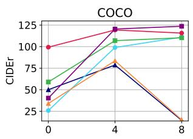

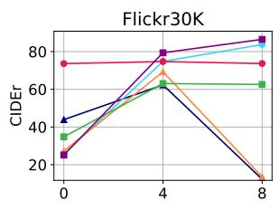

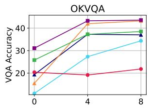

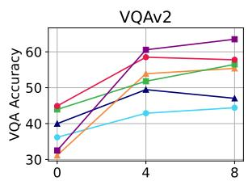

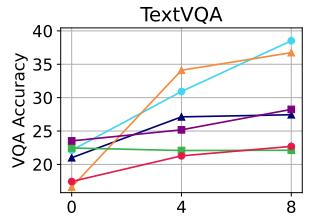

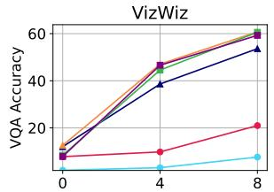

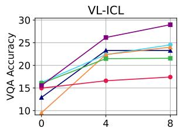  
Figure 6: Evaluation on existing ICL tasks including image captioning (COCO and Flickr30K), general-purpose VQA (OKVQA, VQAv2, TextVQA and VizWiz) and recently released VL-ICL benchmark. We observe ICL abilities in general, with different levels across tasks, models and demonstration amounts: Emu1 benefits less from provided demonstrations compared with others, while two OpenFlamingo models exhibit worse performance when 8 demonstrations are provided. Refer to Fig. 7 for GPT-4o performance and Fig. 9 for detailed results on each subset of the VL-ICL benchmark.

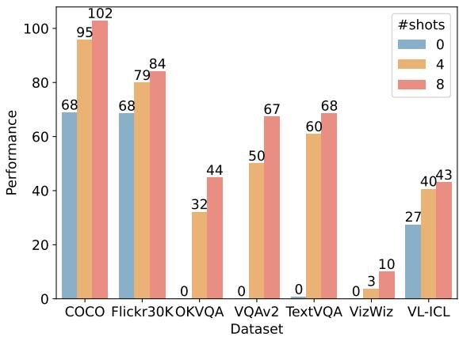  
Figure 7: Performance of GPT-4o on existing ICL benchmarks. GPT-4o obtains much better performance when more demonstrations are given as the context.9

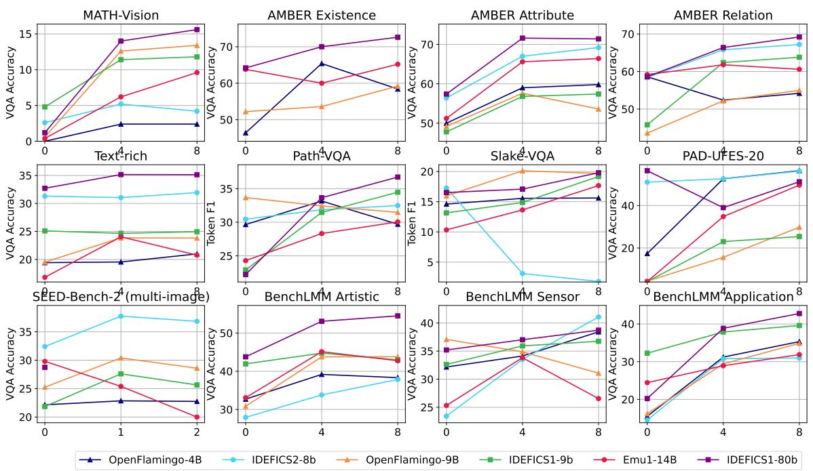

(a) Pretrained Models  
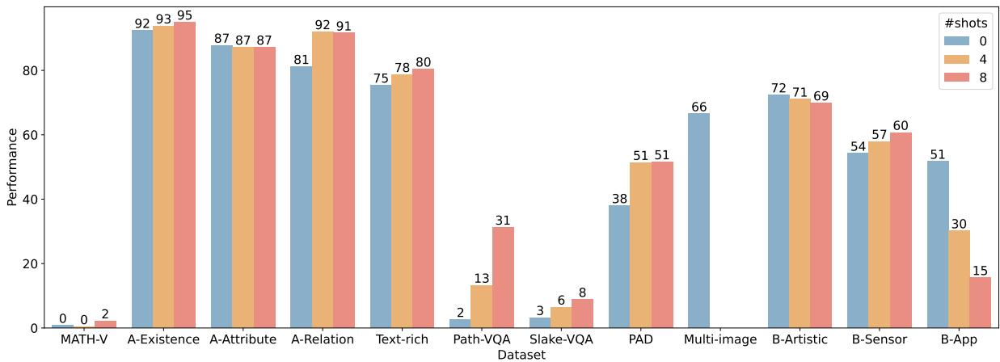  
(b) GPT-4o  
Figure 8: More comprehensive ICL capability evaluation of pretrained models (top 3 row) and GPT-4o (bottom row) on recently proposed benchmarks. Pretrained models exhibit ICL abilities across different tasks, while GPT-4o achieves much higher zero-shot performance but benefits merely from provided demonstrations.

Fast Matching MinilmageNet  
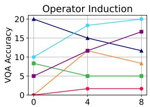

Interleaved Operator Induction Fast Open-Ended MinilmageNet  
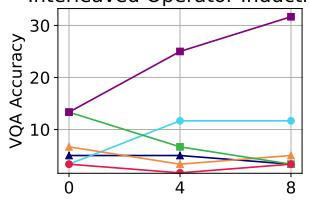

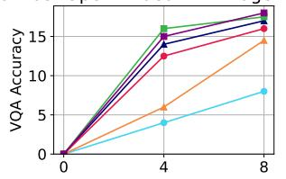

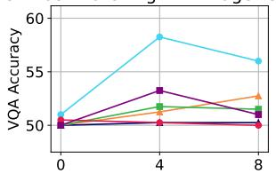

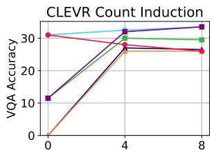

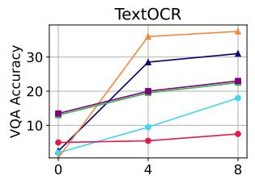  
OpenFlamingo-4B IDEFICS2-8b OpenFlamingo-9B IDEFICS1-9b Emu1-14B IDEFICS1-80b  
Figure 9: Detailed evaluation on VL-ICL Bench for multimodal in-context learning.

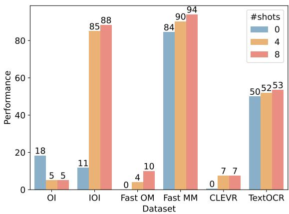  
Figure 10: Detailed performance of GPT-4o on VL-ICL Bench for multimodal in-context learning.

<table><tr><td colspan="2"></td></tr><tr><td></td><td>OpenFlamingo-4B IDEFICS2-8b</td></tr><tr><td></td><td>OpenFlamingo-9B</td></tr><tr><td></td><td>IDEFICS1-9b</td></tr><tr><td></td><td>Emu1-14B</td></tr><tr><td></td><td>IDEFICS1-80b</td></tr></table>

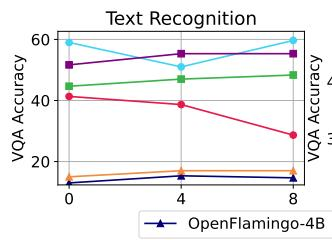

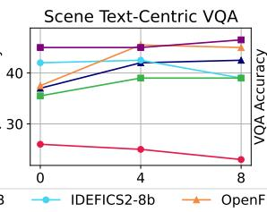

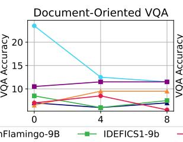

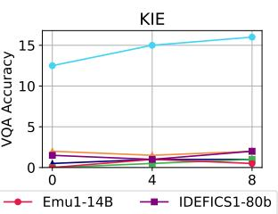

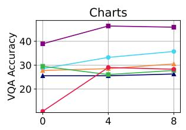

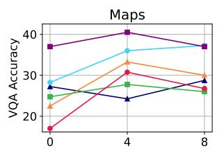

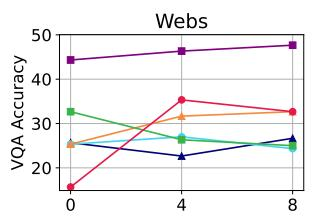

<table><tr><td></td><td>OpenFlamingo-4B</td></tr><tr><td></td><td>IDEFICS2-8b</td></tr><tr><td></td><td>OpenFlamingo-9B</td></tr><tr><td></td><td>IDEFICS1-9b</td></tr><tr><td></td><td>Emu1-14B</td></tr><tr><td></td><td>IDEFICS1-80b</td></tr></table>

Figure 11: Detailed evaluation on OCRBench (top) and SEED-Bench-2-Plus (bottom) for accessing Optical Character Recognition (OCR) capabilities.  
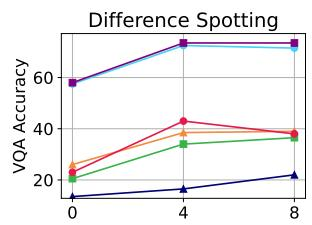

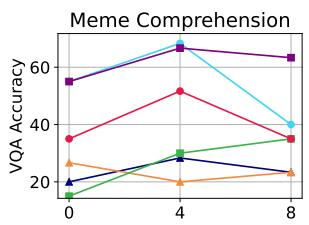

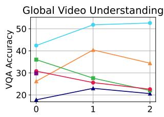

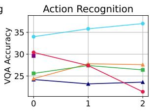

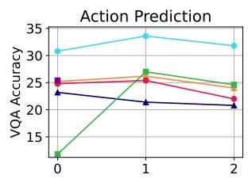

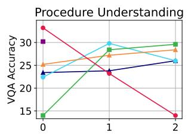  
Figure 12: Detailed evaluation on SEED-Bench-2 for the ability to comprehend multiple images and texts.

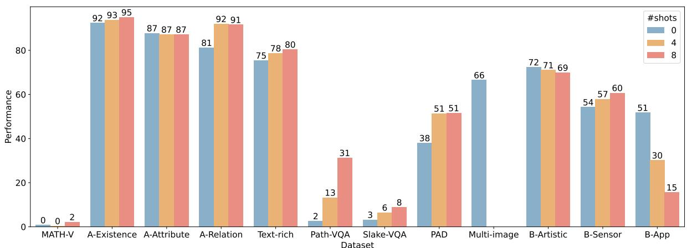  
Figure 13: Detailed evaluation of GPT-4o on OCRBench (top), SEED-Bench-2-Plus (middle) and SEED-Bench-2 (bottom).

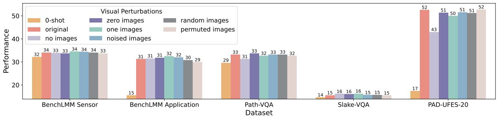

(a) Visual Modality  
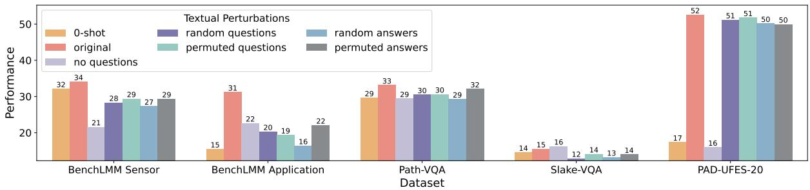

(b) Textual Modality  
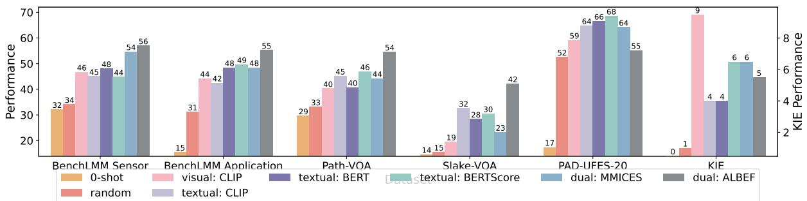  
(c) Textual Modality  
Figure 14: ICL performance of OpenFlamingo2-4B against perturbations over visual (top) and textual (middle) modalities and different demonstration selection strategies (bottom).

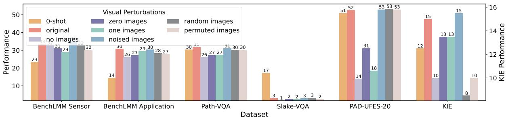

(a) Visual Modality  
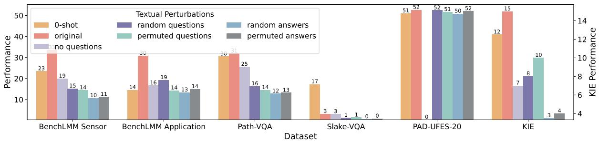

(b) Textual Modality  
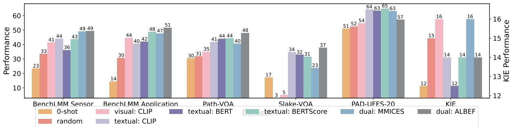  
(c) Textual Modality  
Figure 15: ICL performance of IDEFICS2-8b against perturbations over visual (top) and textual (middle) modalities and different demonstration selection strategies (bottom).

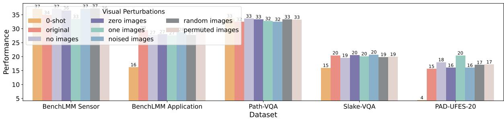

(a) Visual Modality  
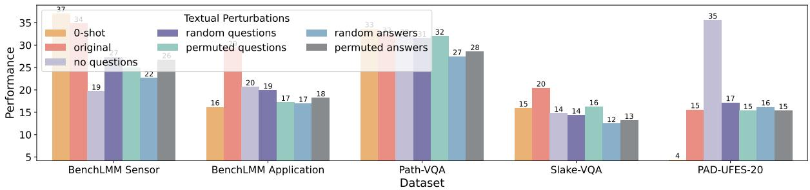

(b) Textual Modality  
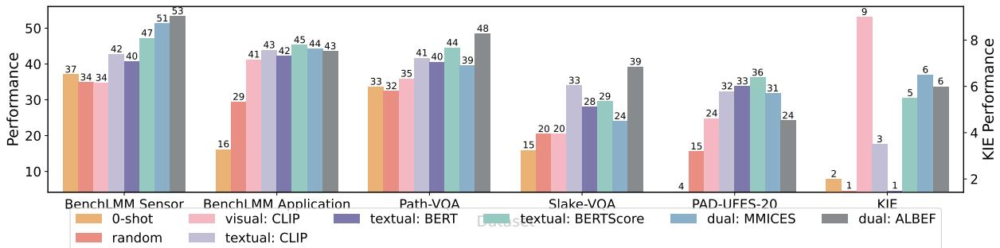  
(c) Textual Modality  
Figure 16: ICL performance of OpenFlamingo-9B against perturbations over visual (top) and textual (middle) modalities and different demonstration selection strategies (bottom).

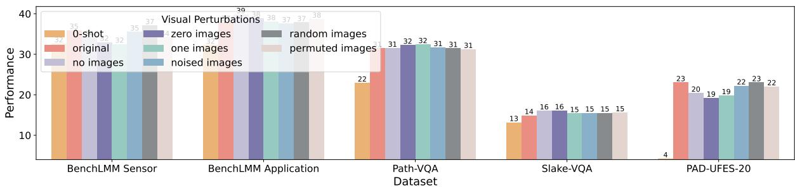

(a) Visual Modality  
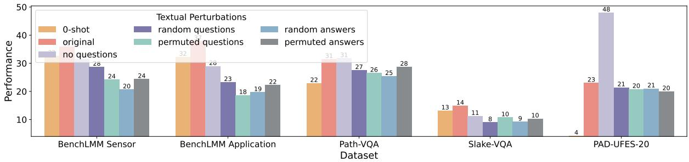

(b) Textual Modality  
  
(c) Textual Modality  
Figure 17: ICL performance of IDEFICS1-9b against perturbations over visual (top) and textual (middle) modalities and different demonstration selection strategies (bottom).

(a) Visual Modality  

(b) Textual Modality  
  
(c) Textual Modality  
Figure 18: ICL performance of Emu1-14B against perturbations over visual (top) and textual (middle) modalities and different demonstration selection strategies (bottom).

(a) AMBER Existence  
  
(b) AMBER Relation  
Figure 19: The abilities to capture inductive biases with flipped in-context annotations on AMBER Existence and Relation dataset.