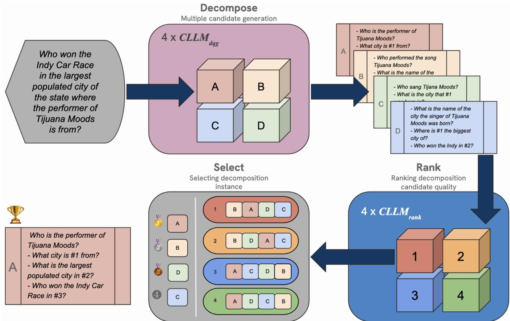
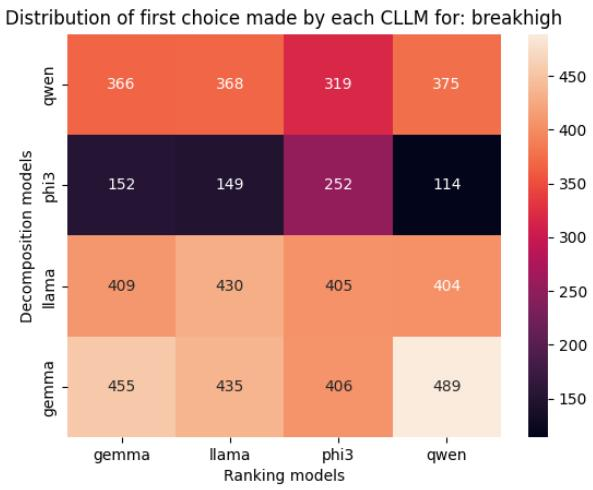
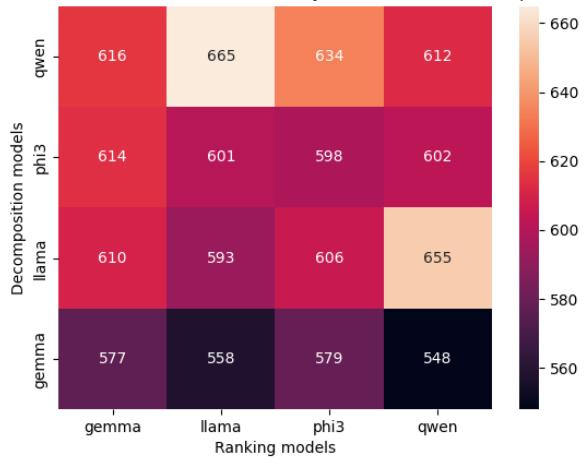
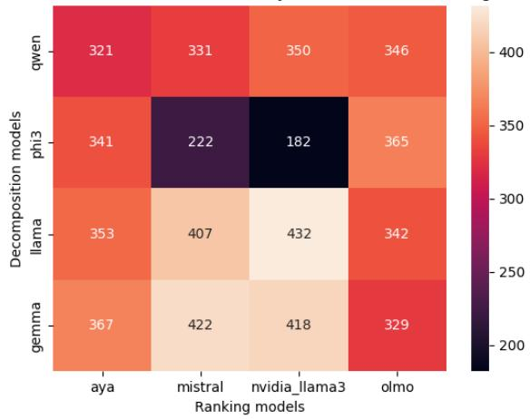
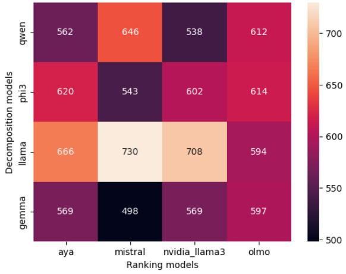
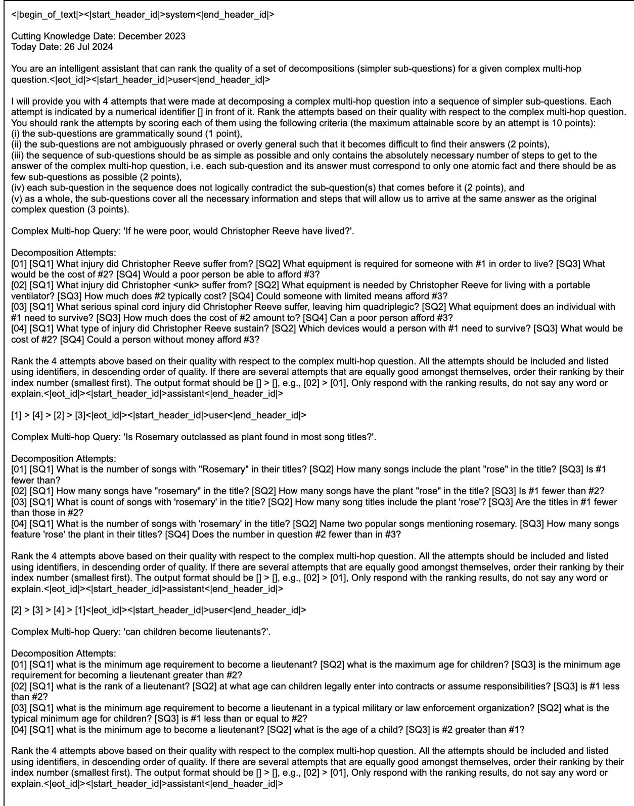
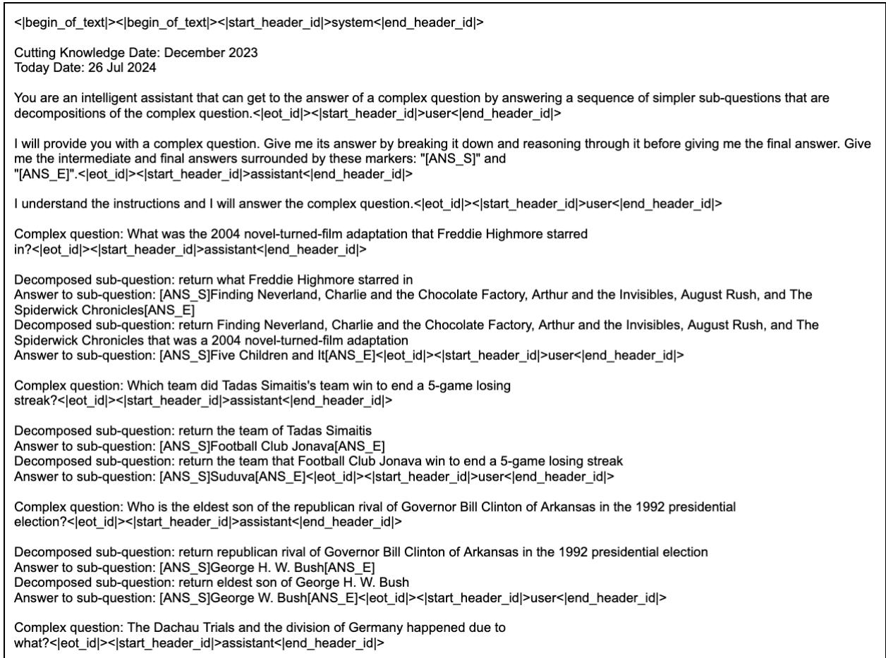

# Generating Complex Question Decompositions in the Face of Distribution Shifts

Kelvin Han and Claire Gardent CNRS/LORIA and Université de Lorraine {huiyuan.han,claire.gardent}@loria.fr

## Abstract

Question decomposition has been found to help large language models’ (LLMs) performance on complex question answering (QA) by breaking these questions into simpler subquestions for answering. Nonetheless, performance on the task remains dominated by supervised approaches, suggesting room for making LLMs better decomposers. One way of improving LLM training and fine-tuning is to leverage synthetic training data, but the superior performance of supervised approaches collapses in the face of distribution shifts, making them unsuitable for generating synthetic data across new domains and at scale. To address this, we propose an approach to generate synthetic decomposition data with only five annotated examples; we do this by (i) extending recent advancements in using LLM-as-judge and for reranking in novel ways, as well as (ii) using a panel of smaller-sized LLMs for data generation instead of resource-intensive larger models. Through careful validation of our approach over two benchmark datasets, we show that our data generation and modelling approaches bring consistent improvements over using few-shot prompting with LLMs for the task. Our code and models can be found at https://github.com/hankelvin/ complex\_question\_decomposition.

## 1 Introduction

The ability of large language models (LLMs) to perform on tasks not seen at training, especially reasoning-related ones, is a keen subject of research recently (Brown et al., 2020; Wei et al., 2024; Wang et al., 2023a). However, a “compositionality gap” remains as models scale in size, i.e. even as LLMs with larger parameter sizes show improvements on answering single-hop questions, their improvements towards answering complex multihop questions lag meaningfully behind the former (Press et al., 2023). To address this, decompositionbased approaches (Press et al., 2023; Zhou et al.,

2023; Khot et al., 2023; Dua et al., 2022) have been proposed, whereby an LLM is prompted to break a complex question or task into smaller subproblems that are incrementally solved,1 the benefits of which include: (i) these simpler tasks are performed relatively well by LLMs, and (ii) they facilitate extensions into retrieval, functions calling and tool usage that can aid the search for the solution (Press et al., 2023). When these sub-questions are used with LLMs to answer the complex question, it has been referred to as ‘Chain-of-Questions (CoQ) (Dua et al., 2022; Zhu et al., 2023) and there are indications of increased internal reasoning consistency when LLMs are made to answer complex queries in this way (Radhakrishnan et al., 2023).

Despite the promising performance of decomposition-based complex question answering (QA) approaches using LLMs, the current state-ofthe-art (SOTA) for the associated task of question decomposition (i.e. to produce a sequence of sub-questions such as the one in Footnote 1) is achieved with supervised approaches. On the other hand, as we discuss in Table 1 (see caption there), the performance of supervised models collapses in the face of a distribution shift (i.e. changes in the domain, types of questions, etc.). This makes neither zero-/few-shot LLMs approaches nor supervised models perfectly suitable for the task of question decomposition – the latter suggests the benefit of a more general-purpose modelling approach, while the former suggests that there is room for LLMs to become better at decomposing complex questions. One direction for improving LLM capabilities is through training/fine-tuning with synthetic LLM-generated data (Gunasekar et al., 2023; Li et al., 2023a), which is what we

explore in this work.

<table><tr><td>Dataset</td><td>Model</td><td>EM↑</td><td>SARI ↑</td><td>GED ↓</td></tr><tr><td rowspan="3">break</td><td>F-T5 (B)</td><td>0.1845</td><td>0.8094</td><td>0.2098</td></tr><tr><td>F-T5 (M)</td><td>0.0000↓</td><td>0.4512↓</td><td>0.5901↓</td></tr><tr><td>F-T5 (2)</td><td>0.0000↓</td><td>0.4316↓</td><td>0.6070↓</td></tr><tr><td rowspan="3">musique</td><td>F-T5 (M)</td><td>0.1618</td><td>0.7429</td><td>0.2283</td></tr><tr><td>F-T5 (B)</td><td>0.0000↓</td><td>0.5421↓</td><td>0.4616↓</td></tr><tr><td>F-T5 (2)</td><td>0.0108↓</td><td>0.4949↓</td><td>0.5549↓</td></tr><tr><td rowspan="3">2wiki</td><td>f-T5 (2)</td><td>0.8735</td><td>0.9865</td><td>0.0197</td></tr><tr><td>f-T5 (B)</td><td>0.0000↓</td><td>0.5706↓</td><td>0.5458↓</td></tr><tr><td>f-T5 (M)</td><td>0.2150↓</td><td>0.7419↓</td><td>0.4346↓</td></tr></table>

Table 1: Performance for supervised question decomposition models (F-T5 is a model fine-tuned on Flan-T5- large, see Appendix A for details). (B), (M), (2) denotes models that were fine-tuned on the training sets of the break, musique and 2wiki datasets (see Section 4 and dataset examples in Table B in the appendix). When tested on data with a different distribution (e.g. F-T5 (M) on break), supervised models’ performance drops significantly (denoted by a ) compared to one trained on the same distribution. EM, SARI and GED are automatic metrics used to evaluate decomposition quality, see Section 5.1 for details. indicates higher the better, indicates lower the better. Implementation details for these models can be found in Appendix A.

In this work, we focus on the task of decomposing English complex questions for machine reading comprehension (MRC), into a sequence of subquestions (Wolfson et al., 2020). Our contributions are: (i) an approach to generate decompositions with smaller-sized models – of between three and nine billion parameters, or “compact” LLMs (CLLMs) as we refer to them in this work – that are more resource-efficient; (ii) novel extensions of recent advances in using LLM-as-judge (Zheng et al., 2024) and LLM-as-rankers (Pradeep et al., 2023a), together with panel voting (Verga et al., 2024), in our approach that allows us to derive synthetic training data with only five annotated decomposition examples; and (iii) an extensive evaluation comparing against supervised approaches and fewshot prompting of LLMs, showing that using the generated data to fine-tune CLLMs brings about question decomposition performance comparable with or better than larger models.

Our work is novel in the using of panels of CLLMs to both produce the synthetic complex question data and also to rank the generated decompositions for quality. Being able to do so with CLLMs is meaningful as being able to create a human-annotated decomposition dataset at scale requires substantial resources and comes with restrictions.2 Being able to do so with only five annotated examples for a given dataset allows the automatic creation of question decomposition data for new question types and new domains.

## 2 Related work

Complex question decomposition Decomposition-based approaches for answering complex MRC questions have been proposed – and found to improve QA performance – from before the time of LLMs; going back as far as to linguistically-based question splitting methods such as those of (Kalyanpur et al., 2012). However, question decomposition (Perez et al., 2020; Dua et al., 2022; Patel et al., 2022) is almost always done in service of QA as the end goal and seldom directly investigated on its own. In addition, many proposed solutions also often assume access to either annotated decompositions (Wolfson et al., 2020) or to a question decomposition model (Guo et al., 2022; Zhu et al., 2023).

Synthetic data for improving LLMs Recent improvements in LLM training for instructionfollowing and alignment with human preferences (Wei et al., 2022a; Ouyang et al., 2024; Rafailov et al., 2024) have brought about new opportunities to use LLMs for generating synthetic data, and research has shown (Zelikman et al., 2022; Gunasekar et al., 2023; Li et al., 2023a; Wang et al., 2023b; Kumar et al., 2024) that training on such synthetic data drive further model performance. The current approach is to produce such synthetic data using a single LLM of the largest sizes (e.g. GPT-4, Llama 70B/405B, PaLM (Agrawal et al., 2023)); however, this entails significant resources (compute and runtime) and, as we show, do not yet bring about substantially better question decomposition performance over smaller-sized LLMs. Some work has focused on reducing the resourceintensiveness of the process via knowledge distillation (Rosenbaum et al., 2022; Zhang et al., 2023; Li et al., 2024a) from large models to smaller ones.

Initial efforts have also mainly focused on generating class-conditioned text data used for classification tasks (e.g. movie review sentiment analysis) (Li et al., 2023b; Yu et al., 2024; Ding et al., 2023) and for instruction-following training data (Honovich et al., 2023). For QA, (Agrawal et al., 2023) used a 540B-parameter model to generate multilingual questions that can be answered from a single passage; whereas the datasets in our work are multihop across two or more documents. In computer vision, (Li et al., 2024b) used templates to generate decompositions of complex visual questions as a way to obtain training data to improve LLM complex visual QA performance; though the complex questions they work with are focused on a narrow context (a visual chart) unlike the open-domain nature of the complex questions encountered in the MRC datasets we investigate.

Our approach and findings align with contemporaneous work (Bansal et al., 2024) showing that under a fixed compute budget constraint, the use of smaller (and weaker) LLMs for generating synthetic training data to fine-tune models for math reasoning tasks leads to outcomes that outperform doing the same using costly larger models. It can also be seen as generalising existing methods that generate synthetic data by sampling repeatedly (Singh et al., 2024) from the same model to obtain wider coverage and diversity of generations before selecting the optimal solution.

LLM as judges and rankers (Zheng et al., 2024) examined the use of a single large chat LLM for judging LLM outputs. (Verga et al., 2024) recently extended this to using the majority vote of a panel of three smaller-sized LLMs to judge and identify the best candidate for a task, with the motivation that doing so alleviates the need for using a single resource-intensive LLM for evaluation. The tasks they examined include single- and multi-hop QA, and they found that all of the largest-sized LLMs they investigated (GPT-4, Command-R and Haiku) give results that have lower correlations with human judgements of answer correctness compared to using a panel of CLLMs. Another line of research has shown that LLMs show promise for use in ranking tasks in information retrieval (Sun et al., 2023; Pradeep et al., 2023a,b), finding that it is possible to use few-shot prompting of LLMs, for ranking a collection of documents for their relevance to a search query, to obtain performance that is competitive with supervised approaches.

## 3 Approach

In this section, we describe (i) our approach for generating synthetic decomposition data; and (ii) how we fine-tune CLLMs with this data to bring about more robust decomposition performance.

The task we explore involves decomposing a complex question $q _ { c }$ (without any additional context) into an ordered sequence of simpler subquestions $q _ { s } \in Q _ { s }$ (Wolfson et al., 2020). Depending on the structure of $q _ { c } ,$ , each $q _ { s }$ may contain a referring variable (i.e. a placeholder) that points to the answer of a preceding question. In this way, by successively substituting the obtained answers and answering each $q _ { s }$ in sequence, the final answer obtained gives the same as answering $q _ { c }$ directly.

## 3.1 Generating synthetic decompositions

There are three main steps in our approach to generate synthetic question decomposition training data for any X, a given dataset of complex questions. Figure 1 contains an illustration giving an overview of our approach.

Multiple candidate generation First, we use a series of CLLMs (we denote these as $\mathbf { C L L M } _ { d q g } )$ to obtain candidate decompositions. In our experiments, we use four different $\mathrm { C L L M } _ { d q g }$ and by doing so, we obtain multiple solutions for the decomposition instead of relying on a single LLM’s output (e.g. via repeated sampling with temperature). Since the datasets we work on have different forms of representing the decomposed sub-questions (see Section 4 and examples in Appendix B), we use five-shot and chainof-thought (CoT) (Wei et al., 2022b) prompting (example prompt in Appendix G) to help ensure the CLLM generate decompositions of the desired form. We only use the complex questions from a given dataset X (plus the same five randomly chosen exemplars from the training sets of each dataset for the CoT prompts).

Ranking decomposition candidate quality The second step involves assessing the quality of the decomposition candidates. To do so, we use a panel of CLLMs (that we denote as $\mathbf { C L L M } _ { r a n k }$ each) for ranking all of the candidate decompositions from the first step; this is in a similar vein as what (Verga et al., 2024) did for QA. Specifically, we prompt each $\mathbf { C L L M } _ { r a n k }$ to rank the quality of the candidate decomposition that each $\mathrm { C L L M } _ { d q g }$ produced for a given $q _ { c }$ . In order to do this, we: (i) extended RankL $\mathsf { L } \mathsf { M } ^ { 3 }$ (Pradeep et al., 2023a,b) to the novel task of ranking question decomposition quality.

RankLLM was however designed for zero-shot passage ranking with an LLM fine-tuned for that task;4 as such, instead of using their model, we use a CLLM with two-shot prompting. This two-shot prompting (Figure 5 in Appendix G) is necessary to provide the $\mathbf { C L L M } _ { r a n k }$ with exemplars of our new ranking task. However, since there is no annotated data for the task, we obtained the exemplars by using $\mathrm { G P T - 4 o \ ( g p t - } 4 0 \mathrm { - } 2 0 2 4 \mathrm { - } \theta 8 \mathrm { - } \theta 6 \mathrm { ) }$ to systematically introduce errors to a set of $( q _ { c } , Q _ { s } )$ tuples drawn from the training set of X. We do this by designing a scoring scheme and using it to instruct GPT-4o (see Figure 6 in Appendix G) to add combinations of various types of errors to a $Q _ { s }$ so that the errors sum to a certain score. We do this multiple times to the $Q _ { s }$ for a given $q _ { c }$ so that the scores for all its modified $Q _ { s }$ fall into even intervals. This allows us to compose sets of rank-able instances by sampling from the bins and using these as exemplars. We use the same set of exemplars for every ranking task for a given dataset X. We also use the same set of CLLMs that were used in the first step (we explore other CLLM combinations in Section 6 below). To mitigate the effects of positional bias (Zhao et al., 2021), we randomly shuffled the order of the $\mathrm { C L L M } _ { d q g } \mathrm { s }$ presented in each ranking task.

  
Figure 1: Overview of our approach for generating synthetic question decomposition data.

Selecting decomposition instance Finally, from the rankings of the decompositions obtained from step two above, we identify the decomposition candidate that is preferred by the panel of $\mathrm { C L L M } _ { r a n k } \mathrm { s } .$ We refer to the data obtained here as PANEL. Since we extend from the binary score setting investigated by (Verga et al., 2024) into ranked preferences, we use Single Transferable Vote (STV) (Tideman, 1995) to select the top-ranked decomposition candidate for each $q _ { c }$ in the training set of $X . ^ { 5 }$ Borrowing an analogy from electoral methods, we can view each $\mathbf { C L L M } _ { r a n k }$ as an agent being prompted to express a preference order for the pool of candidates – an instance of $q _ { c }$ corresponds to an electoral seat, the set of $\mathbf { C L L M } _ { d q g } \mathbf { s } ^ { \prime }$ outputs for $q _ { c }$ are the candidates for the ‘seat’ and the set of $\mathbf { C L L M } _ { r a n k }$ ranks are the votes cast for each candidate.

The four CLLMs that we use for both decomposition $( \mathbf { C L L M } _ { d q g } )$ and ranking $\left( \mathbf { C L L M } _ { r a n k } \right)$ , are the smallest models of the Llama 3.1 (8B) (Dubey et al., 2024), Gemma 2 (9B) (Team et al., 2024),

Phi-3.5 (3.8B) (Abdin et al., 2024) and Qwen-2.5 (7B) (Qwen Team, 2024) model families,6 which were the highest-ranked at the time of this work.7

To summarise, since the input for the decomposition only requires a complex question without the need for gold decompositions and their answers (other than a few exemplars that can be easily obtained), the approach can be easily applied on a collection of unseen complex queries to obtain new synthetic training data.

## 3.2 Question decomposition models

We then use the generated decompositions (i.e. PANEL) to fine-tune CLLMs (Llama 3.1 (8B) and Qwen 2.5 (7B)) to give improved models for question decomposition. When fine-tuning the CLLMs, we use LoRA adapters (Hu et al., 2022) with a rank of 32 for all of the model’s linear layers,8 and RSLoRA (Kalajdzievski, 2023) for controlling the α parameter for the LoRA adapters. Here, we use a three-shot CoT prompt (an example of the prompt is in Figure 4 of Appendix G) and fine-tune all the models for two epochs, which took about 8 hours for one model on an Nvidia A100 GPU.

## 4 Data

We focus our work on MRC datasets (examples in Appendix B) whose complex questions have the answers to their sub-questions distributed across multiple documents, which are harder to answer and whose open-domain nature has the most potential benefit from decomposition-based QA with LLMs (compared to complex questions answerable from a single document that can already be performed well by existing reader models).

‚ break (Wolfson et al., 2020) is a dataset designed specifically for the task of question decomposition. We use the “high-level” version that contains questions encountered in machine reading comprehension (MRC) and which was collected by drawing upon complex questions $q _ { c }$ from three existing datasets. Each $q _ { c }$ in break comes with its $Q _ { s }$ – annotated in the QDMR formalism with the help of crowd workers – but does not contain any answers. We evaluate on the portion of break drawn from HotpotQA (Yang et al., 2018) (about 45%) which is the only one of the three where the answers to the complex questions are distributed over two text documents.9

‚ musique (Trivedi et al., 2022) was designed to have complex questions that are harder for MRC models to derive a correct answer via reasoning shortcuts. It was constructed in a “bottom-up” manner with single-hop questions that were drawn from five other datasets, whereby sets (of sizes between two and four) of single-hop questions with bridge entities between them are put together and presented to crowd-workers to compose a complex question covering the set. We use the “answerable” version of the dataset where each $q _ { c }$ in break comes with its $Q _ { s } ,$ which are in natural language (NL) and come with their answers.10

‚ 2wikimultihop (Ho et al., 2020) was constructed using a set of templates based on questions from HotpotQA. New multi-hop questions were instantiated from these templates using entity pairs drawn from Wikidata, with steps taken to ensure that the supporting information (Wikipedia pages for the entities) require multi-hop reasoning by an MRC model. Since this dataset was constructed from a relatively small set of templates, the distribution of question types in it is constrained, making it easier to learn; so we only use it for evaluating supervised models’ out-of-distribution performance (Table 1) and we focus our subsequent experiments on the other two datasets above.

## 5 Evaluation

Existing work on decomposition-based approaches with LLMs (Khot et al., 2023) focus on the QA aspect of the task and treat decomposition (in the form of CoT, CoQ, tree-of-thought etc) as a means for additional computation to allow the model to derive better performance on the answering of $q _ { c } ;$ as such they focus evaluation on the token F1 of the final answer obtained for $q _ { c }$ . We evaluate on the development sets of break and musique (Section 6)

and include QA (Section 5.2) and we also investigate the generated decompositions (Section 5.1).

## 5.1 Automatic metrics

Following (Wolfson et al., 2020), we evaluate generated decompositions $\hat { Q } _ { s }$ from musique and breakeval using these automatic metrics that compare between the $\hat { Q } _ { s }$ against the reference decompositions $( Q _ { s } )$ for each dataset: (i) exact match (EM), (ii) SARI (Xu et al., 2016), and (iii) graph edit distance (GED).11 Higher scores are better for EM and SARI, lower scores are better for GED.

‚ EM measures whether a $\hat { Q } _ { s }$ is phrased and structured in exactly the same way as the reference in the dataset.

‚ SARI was originally applied towards evaluating text simplification – it measures how much of the tokens of a reference text have been added, deleted and kept when comparing a generated text against it. To evaluate the quality of $\hat { Q } _ { s } ^ { } .$ , (i) the added, deleted or kept n-grams between the $Q _ { s }$ and $q _ { c }$ are computed, and (ii) the same is done between $\hat { Q } _ { s }$ and $q _ { c } ,$ . The difference between the added, deleted and kept sets of tokens for $Q _ { s }$ and $\hat { Q } _ { s }$ are then used in computing the SARI score.

‚ GED measures the structure of $\hat { Q } _ { s }$ against $Q _ { s }$ by using an alignment-based approach to measure the cost required for the minimal set of operations (addition or deletion of nodes and edges, and the substitution of nodes) to transform one to the other. Here, each $q _ { s }$ (or $\hat { q _ { s } } )$ is a node and an edge is an alignment between $q _ { s } ^ { i }$ and $\ddot { q _ { s } ^ { i } }$ . The GED score provides an indication of the granularity of a generated decomposition against a reference; for instance, a three-hop question could be decomposed into two questions (of two-hop and one-hop), or three questions (of one-hop each).

## 5.2 QA evaluation

We also assess whether the decompositions can give the same answer as $q _ { c }$ by answering the generated sub-questions with an LLM using CoQ prompting (LLM-CoQ) for both break and musique (see Appendix G for prompt example), as well as a supervised model for musique. For the LLM-CoQ evaluation, we use two CLLMs,

Llama and Qwen (from their public checkpoints, i.e. not our fine-tuned decompositions models) and prompt the model to answer the sub-questions successively based on the supporting passages in the original datasets, giving us the upper-bound performance in a retrieval-augmented generation (RAG) setting. For musique, we also extend (Zhang et al., 2024)’s code (which was used to achieve SOTA on the musique leaderboard) to train a supervised QA model for it. Their initial model was not intended for single-hop QA, but since musique is comprised of complex questions of between two and four hops and since we have their decompositions in the training set, we add all of the single-hop sub-questions for training this model. We also use the same templates (see Footnote 10) to realise the Zeroshot RE instances in it. For break, since there are no answers annotated for its sub-questions, we were not able to use a similar supervised QA model to evaluate it.

## 6 Results and analysis

<table><tr><td>Dataset</td><td>Model</td><td>EM↑</td><td>SARI ↑</td><td>GED ↓</td></tr><tr><td rowspan="4">break</td><td>GPT-40 Llama 3.1 70B</td><td>0.0181 0.0289</td><td>0.6314 0.6675</td><td>0.3666 0.3366</td></tr><tr><td>Few-shot Llama 3.1 8B Gemma 2 9B</td><td>0.0188 0.0195</td><td>0.6391 0.6325</td><td>0.3557 0.3561</td></tr><tr><td>Phi 3.5-mini Qwen 2.5 7B PANEL</td><td>0.0051 0.0072 0.0166</td><td>0.5818 0.5946</td><td>0.4684 0.4104</td></tr><tr><td>FT-PANEL Llama 3.1 8B</td><td>0.0217</td><td>0.6919 0.6728</td><td>0.3649 0.3290</td></tr><tr><td rowspan="4">musique</td><td>Qwen 2.5 7B GPT-40</td><td>0.0145 0.0066</td><td>0.6352 0.6050</td><td>0.3543 0.3233</td></tr><tr><td>Llama 3.1 70B Few-shot Llama 3.1 8B</td><td>0.0083 0.0149</td><td>0.6349 0.6079</td><td>0.3136 0.3786</td></tr><tr><td>Gemma 2 9B Phi 3.5-mini Qwen 2.5 7B</td><td>0.0161 0.0165 0.0070</td><td>0.5505 0.5985 0.5778</td><td>0.4757 0.4077 0.3994</td></tr><tr><td>PANEL FT-PANEL</td><td>0.0132</td><td>0.6553</td><td>0.3699</td></tr><tr><td></td><td>Llama 3.1 8B Qwen 2.5 7B</td><td>0.0223 0.0149</td><td>0.6332 0.6211</td><td>0.3296 0.3559</td></tr></table>

Table 2: Question decomposition performance (Automatic metrics). FT-PANEL denotes LLM fine-tuned on PANEL synthetic data (last row of each section). In bold is top-performing across row.

We compare between using (i) few-shot CoT prompting of the (C)LLM (Few-shot), (ii) the rank and panel voting procedure corresponding to Steps 1 to 3 in Section 3.1 to select decomposition candidates (PANEL), and (iii) our decomposition models (FT-PANEL) that involve fine-tuning a CLLM with the generated decompositions obtained on the training sets of break/musique (i.e. PANEL). The models we compare with under Few-shot include the same four models that we use in our data generation procedure (Gemma 2 (9b), Llama 3.1 (8B), Phi-3.5 (3.8B) and Qwen 2.5 (7)). For comparison, we also include larger models GPT-4o and Llama 3.1 (70B). 12 The decomposition performance for each of these can be found in Table 2, and the results for the QA evaluation can be found in Table 3 (LLM-CoQ) as well as Table 6 in Appendix D (supervised QA for musique).

<table><tr><td></td><td colspan="4">break</td><td colspan="4">musique</td></tr><tr><td></td><td colspan="2">QA: Llama</td><td colspan="2">QA: Qwen</td><td colspan="2">QA: Llama</td><td colspan="2">QA: Qwen</td></tr><tr><td></td><td>EM</td><td>F1</td><td>EM</td><td>F1</td><td>EM</td><td>F1</td><td>EM</td><td>F1</td></tr><tr><td>GPT-40</td><td>0.4436</td><td>0.6580</td><td>0.5065</td><td>0.6983</td><td>0.4638</td><td>0.6376</td><td>0.4737</td><td>0.6380</td></tr><tr><td>F-T5</td><td>0.4226</td><td>0.6285</td><td>0.4689</td><td>0.6529</td><td>0.4253</td><td>0.5862</td><td>0.4373</td><td>0.5897</td></tr><tr><td>Few-shot</td><td></td><td></td><td></td><td></td><td></td><td></td><td></td><td></td></tr><tr><td>Llama 3.1 8B</td><td>0.4045</td><td>0.6131</td><td>0.4682</td><td>0.6523</td><td>0.4154</td><td>0.5735</td><td>0.4220</td><td>0.5811</td></tr><tr><td>Gemma 2 9B</td><td>0.4479</td><td>0.6640</td><td>0.5145</td><td>0.6998</td><td>0.3678</td><td>0.5023</td><td>0.4137</td><td>0.5620</td></tr><tr><td>Phi 3.5-mini</td><td>0.3632</td><td>0.5524</td><td>0.4624</td><td>0.6484</td><td>0.4146</td><td>0.5591</td><td>0.4286</td><td>0.5778</td></tr><tr><td>Qwen 2.5 7B</td><td>0.4052</td><td>0.6261</td><td>0.4638</td><td>0.6547</td><td>0.4249</td><td>0.5798</td><td>0.4328</td><td>0.5874</td></tr><tr><td>FT-PANEL</td><td></td><td></td><td></td><td></td><td></td><td></td><td></td><td></td></tr><tr><td>Llama 3.1 8B</td><td>0.4479</td><td>0.6671</td><td>0.5145</td><td>0.7072</td><td>0.4667</td><td>0.6343</td><td>0.4679</td><td>0.6290</td></tr><tr><td>Qwen 2.5 7B</td><td>0.4211</td><td>0.6359</td><td>0.4682</td><td>0.6583</td><td>0.4497</td><td>0.6088</td><td>0.4485</td><td>0.6022</td></tr></table>

Table 3: QA performance on generated decompositions, with few-shot CoQ prompting using Llama 3.1 8B and Qwen 2.5 7B. Fine-tuning with data from PANEL always leads to improvements on the CLLM. The highest score for each dataset is in bold

## 6.1 Panel of CLLMs performance

While it can be meaningful to examine EM performance for question decomposition under a supervised setting (where the training and test-time data are drawn from the same distribution and EM indicates the ability of such models to learn from the distribution of the training data), it is less so for few-shot prompting of LLMs for the task, i.e. the LLMs have not been trained to match the distribution of the original datasets and are unlikely to produce decompositions with the exact phrasing (despite those decompositions being valid ones). As such, we focus our attention on SARI and GED performance (Table 2); and note that to assess the quality of a decomposition, these two metrics have to be viewed holistically, together with the QA evaluation performance (Table 6).

‚ PANEL improves on single $\mathbf { C L L M } _ { d q g }$ performance Despite our use of in-dataset exemplars for the few-shot prompting, we observe that CLLM performance varies between different data (e.g. the Phi model’s performance relative to the other CLLMs differs substantially between break and musique, potentially due to a combination of factors such as parameter size, training data and preference tuning). Without advance knowledge of a CLLM’s decomposition performance on a given collection of complex questions, using the approach to obtain PANEL (Steps 1 to 3 of Section 3.1) allows us to aggregate over the performance possible of each $\mathrm { C L L M } _ { d q g }$ . Using PANEL almost always leads to better performance than single CLLMs – (i) in the case of break, only the Llama and Gemma models (0.3557, 0.3561) have better GED than PANEL (0.3649) and PANEL outperforms elsewhere for SARI and GED; and (ii) in the case of musique, PANEL clearly outperforms every single CLLM.

‚ Fine-tuning with data from PANEL consistently brings improved performance Our decomposition models FT-PANEL constantly outperforms few-shot prompting of the same CLLM they were based on. This gives between 2.53 (0.6332 vs 0.6079) and 4.33 points (0.6211 vs 0.5778) increase in SARI as well as between 2.67 (0.3290 vs 0.3557) and 5.61 (0.3543 vs 0.4104) points improvement in GED. The QA evaluation further validates this, with token F1 gains of up to 5.49 points for break and 6.08 points for musique with LLM-CoQ and, and up to 4.49 points for musique using the supervised QA model.

‚ Comparable performance with larger LLMs While CLLMs generally underperform larger LLMs (first set of column in Table 2), FT-PANEL gives results that are comparable or better than that of a large LLM (GPT-4o) on SARI, GED as well as in the QA evaluation. This shows that our nearzero-shot synthetic data generation procedure, as well as fine-tuning, can be used as a means to obtain better decomposition models.

## 6.2 Analysis: CLLMs for ranking decomposition

Distribution of first choice made by each CLLM for: musique  
  
Figure 2: Voting distribution for break (top) and musique (bottom). The horizontal axes of the heatmaps show the $\mathrm { C L L M } _ { d q g }$ models whereas the vertical axes show the $\mathbf { C L L M } _ { r a n k }$ models; they show the number of times $\mathbf { a } \operatorname { C L L M } _ { r a n k }$ picks $\mathbf { C L L M _ { { d q g } } } ^ { \prime }$ s decompositions as its top choice.

In this section, we evaluate the LLM-as-judge and panel voting methods that we extend to ranking question decompositions and situate them against concerns raised recently about LLM selfpreference (Liu et al., 2024; Koo et al., 2024).

‚ Mitigating self-preference It has been shown recently (Panickssery et al., 2024) that, when they are deployed for evaluating generated outputs, LLMs show “non-trivial accuracy at distinguishing themselvesfrom other LLMs and human” and that there is a correlation between an LLM recognising its own outputs and preferring these over others (referred to as “self-preference”), which raises concerns as self-evaluation is increasingly used in data generation for LLM training and fine-tuning, such as for reward modelling (Wang et al., 2024) and self-correction (Madaan et al., 2023). Our approach naturally mitigates this by aggregating preferences collected from multiple CLLMs instead of relying on the same (or a single) LLM to evaluate the generated decomposition. A purely selfpreferring ranking choice made by a model, unless sufficiently supported by other models, would not be chosen in the STV process we used.

$\mathbf { C L L M } _ { r a n k }$ preferences corresponds with eventual QA performance Besides the consistent improvement of ST-PANEL over that of each $\mathrm { C L L M } _ { d q g }$ (Table 2), another indicator supporting the use of CLLMs for ranking question decompositions $\hat { Q } _ { s } ,$ is found in the preference patterns of the panel broken down by $\mathbf { C L L M } _ { r a n k }$ (Figure 2). Most notably, for break, all $\mathbf { C L L M } _ { r a n k }$ models consistently favour Phi’s decompositions the least (see Figure 2 top), which the QA evaluation also validates – those Phi decomposition candidates go on to obtain the lowest QA scores amongst the four $\mathrm { C L L M s } _ { d q g }$ (see ‘Few-shot’ rows in Table 3). Similarly, for musique, the decomposition outputs of the Gemma model were favoured the least, and its decompositions likewise performed the worst in the QA evaluation. There is also a general consensus on the quality of the Gemma model’s decompositions for break and Qwen’s (three out of four) decompositions for musique, which are also broadly corroborated by their QA evaluation performance.

‚ Composition of the $\mathbf { C L L M } _ { r a n k }$ panel matters We find that not all CLLMs may be suitable for use in the task of ranking question decompositions. Another way to further address the issue of self-preference may be to use a different set of CLLMs for the ranking task instead of the same ones that were used for question decomposition. We explore this using the Aya 23 (8B) (Aryabumi et al., 2024), Mistral v0.3 (7B) (Jiang et al., 2023),

Nvidia-Llama (8B)13 and Olmo (7B) (Groeneveld et al., 2024) models. These models are, however, all weaker compared to the four we used in our main experiments. We find that using these weaker models for ranking leads to candidates of lower quality being picked (consistently lower SARI and GED scores, see Table 4). Even when taking STV over the preferences expressed by all eight models together, it does not give better results; this suggests that the added CLLMs do not have sufficient capabilities to perform that task well, and their imperfect preferences act instead to skew the candidate choices. This is broadly reflected in the more dispersed voting patterns of these models (Figure 3 in Appendix E)

<table><tr><td>Dataset</td><td>Model</td><td>EM</td><td>SARI</td><td>GED</td></tr><tr><td>break</td><td>4x stronger 4x weaker 8x</td><td>0.0153 0.0150 0.0166</td><td>0.6820 0.6724 0.6811</td><td>0.4099 0.4327 0.4184</td></tr><tr><td>musique</td><td>4x stronger 4x weaker 8x</td><td>0.0132 0.0128 0.0141</td><td>0.6553 0.6507 0.6543</td><td>0.3699 0.3915 0.3751</td></tr></table>

Table 4: Varying the composition of the panel of CLLM rankers. 4x stronger is the use of the Gemma, Llama, Phi and Qwen models for ranking, 4x weaker is the use of the Aya, Mistral, Nvidia-Llama and Olmo models. 8x is the use of all eight of these models.

## 6.3 Out-of-distribution performance

We also go on to investigate the out-of-domain performance of the fine-tuned CLLMs (i.e. FT-PANEL). We refer to this as FT-PANEL (OOD) and test these two settings: (i) train on musique & test on break (Train-Br/Test-Mu), as well as (ii) train on break & test on musique (Train-Mu/Test-Br). We ran the full evaluation suite (EM, SARI, GED and downstream QA) and provide the results in Tables 7-8 in Appendix F. Compared to Fewshot (which gives a baseline), the performance of FT-PANEL (OOD) is varied, and is tied to (i) the test dataset (i.e. the nature of the OOD distribution), and (ii) the model that is fine-tuned.

‚ Test dataset differences While Train-Mu/Test-Br generally brings improvements over the baseline, it is less clear for the opposite setting i.e. Train-Br/Test-Mu. The Train-Br/Test-Mu results are also broadly consistent with the much larger

OOD drops for break than for musique in the supervised setting (Table 1). These are likely due to the nature of the sub-questions in the break dataset – there, annotators were instructed to use a restricted set of words when writing the subquestions, giving them a specialised form with limited linguistic variability.14 While this facilitates parsing, it means that training/tuning on it for decomposition will not be as helpful when the resulting model is applied to a dataset like musique where sub-questions are in natural language.

‚ Underlying CLLM differences We find that fine-tuning Llama 3.1 (8B) with the synthetic data brings improved or comparable OOD performance (both break and musique), but this is not the case for Qwen 2.5 (7B), which we also found across all our experiments to be generally weaker in question decomposition. Furthermore, despite being finetuned with the more specialised synthetic data we produce from break, Llama 3.1 (8B) is still able to perform on musique (i.e. FT-PANEL (OOD)) with (i) >2% and >4% improvement in SARI and GED and (ii) >1.5% improvement or comparable performance in F1 in the downstream QA evaluations. This provides an indication of the usefulness of our approach (subject to LLM performance).

## 7 Conclusion

We propose an approach for producing synthetic complex question decomposition data using only five annotated examples and novel extensions of LLM-as-judge/rankers as well as LLM panel voting for the task of ranking complex question decompositions. We then fine-tune smaller-sized “compact” LLMs (CLLMs) with the generated data and show – with validation over two benchmark datasets and comparisons against supervised models and few-shot LLM prompting – that it leads to consistently improved question decomposition performance. Notably, the improvements give the CLLMs performance on the decomposition task that is comparable to or better than larger LLMs. Having CLLMs that decompose questions better improves their abilities for decomposition-based QA, which has been shown to be promising for closing the “compositionality gap” that they face in answering complex questions. It can also serve as a means to produce synthetic data that can be used to train and fine-tune CLLMs (potentially for larger ones as well) for further improvements.

## 8 Acknowledgments

We thank the anonymous reviewers for their feedback. We gratefully acknowledge the support of the French National Research Agency (Gardent; award ANR-20-CHIA-0003, XNLG “Multi-lingual, Multi-Source Text Generation”), the Region Grand Est and Facebook AI Research (FAIR/Meta) Paris. Experiments presented in this paper were carried out using the Grid’5000 testbed, supported by a scientific interest group hosted by Inria and including CNRS, RENATER and several Universities as well as other organizations (see https://www.grid5000.fr).

## 9 Limitations

Notwithstanding the promising performance of LLM-as-rankers, one unresolved challenge lies with the observation that current LLMs, when prompted often produce outputs that vary when the order of the information in the prompt is shuffled (Zhao et al., 2021); this includes rank predictions that are not internally consistent when the order of the input set is shuffled; a phenomenon generally referred to as ‘position bias’. This refers to situations where, given a set of N choices to be ranked, an LLM often makes a ranking prediction $R _ { i }$ when the input ordering is $O _ { i }$ , but $R _ { j }$ when the ordering is shuffled and presented as $O _ { j } ;$ i.e. the rank preferences expressed in $R _ { i }$ are not fully respected in $R _ { j }$ These position biases will have an impact on the selection of the preferred decomposition candidate, and while we took care to shuffle the order of the $\mathbf { C L L M } _ { r a n k }$ and the panel of LLM approach we use may help to mitigate this, methods such as using repeated sampling with order shuffling to find a “central” ranking (Tang et al., 2024) more directly addresses this (but require additional resources for the repeated sampling).

In this work, we focus on MRC complex questions that are multi-hop and whose answers to their sub-questions are across multiple documents, since such questions are the most challenging to address in QA and likely to be so for question decomposition too. We expect similar findings for decomposing complex questions that can be answered from a single document as these are easier to answer (i.e. the information sought and the hops in the complex question have a natural proximity to each other since they are expressed in the same document) and therefore likely easier to decompose.

## 10 Ethics statement

Our proposed approach is for the generation of synthetic question decomposition data, with the view that they can be used to improve LLM performance on the task. On the one hand, clear gains have been obtained from the use of synthetic data for LLM training/fine-tuning – from performance on benchmarks as well as validation through the productionusage of LLMs that have been trained partly on synthetic data (e.g. the Phi family of models (Gunasekar et al., 2023; Li et al., 2023a)). On the other hand, a singular reliance on synthetic LLMgenerated data (without being complemented with human-produced data) for training models is ex pected to lead to ‘model collapse’ (Shumailov et al., 2024). This refers to a phenomenon when models (including LLMs) are cyclically trained/fine-tuned on synthetic data (i.e. trained with synthetic data, used to generate new data, which is then used to train the next generation of the model and so on) to the effect that they no longer learn the true distribu tions of human-produced data (including the longtails) and ‘collapse’ to the distributions represented by the synthetic data (with their own sets of errors and biases). The risk is that, with an anticipated widespread adoption and reliance on LLMs, ‘model collapse’ could lead to societal harms such as those arising from stereotypes, misinformation or inaccuracies being propagated at scale. Research on the topic is, however, nascent, and it is not yet clear (i) the extent (Dohmatob et al., 2024) of the risk, (ii) the boundaries where using synthetic training data tip over to cause harm, and (iii) what methods may be identified to mitigate the phenomenon.

## References

Marah Abdin, Jyoti Aneja, Hany Awadalla, Ahmed Awadallah, Ammar Ahmad Awan, Nguyen Bach, Amit Bahree, Arash Bakhtiari, Jianmin Bao, Harkirat Behl, Alon Benhaim, Misha Bilenko, Johan Bjorck, Sébastien Bubeck, Martin Cai, Qin Cai, Vishrav Chaudhary, Dong Chen, Dongdong Chen, Weizhu Chen, Yen-Chun Chen, Yi-Ling Chen, Hao Cheng, Parul Chopra, Xiyang Dai, Matthew Dixon, Ronen Eldan, Victor Fragoso, Jianfeng Gao, Mei Gao, Min Gao, Amit Garg, Allie Del Giorno, Abhishek Goswami, Suriya Gunasekar, Emman Haider, Junheng Hao, Russell J. Hewett, Wenxiang Hu, Jamie Huynh, Dan Iter, Sam Ade Jacobs, Mojan Javaheripi, Xin Jin, Nikos Karampatziakis, Piero Kauffmann, Mahoud Khademi, Dongwoo Kim, Young Jin Kim, Lev Kurilenko, James R. Lee, Yin Tat Lee, Yuanzhi Li, Yunsheng Li, Chen Liang, Lars Liden, Xihui

Lin, Zeqi Lin, Ce Liu, Liyuan Liu, Mengchen Liu, Weishung Liu, Xiaodong Liu, Chong Luo, Piyush Madan, Ali Mahmoudzadeh, David Majercak, Matt Mazzola, Caio César Teodoro Mendes, Arindam Mitra, Hardik Modi, Anh Nguyen, Brandon Norick, Barun Patra, Daniel Perez-Becker, Thomas Portet, Reid Pryzant, Heyang Qin, Marko Radmilac, Liliang Ren, Gustavo de Rosa, Corby Rosset, Sambudha Roy, Olatunji Ruwase, Olli Saarikivi, Amin Saied, Adil Salim, Michael Santacroce, Shital Shah, Ning Shang, Hiteshi Sharma, Yelong Shen, Swadheen Shukla, Xia Song, Masahiro Tanaka, Andrea Tupini, Praneetha Vaddamanu, Chunyu Wang, Guanhua Wang, Lijuan Wang, Shuohang Wang, Xin Wang, Yu Wang, Rachel Ward, Wen Wen, Philipp Witte, Haiping Wu, Xiaoxia Wu, Michael Wyatt, Bin Xiao, Can Xu, Jiahang Xu, Weijian Xu, Jilong Xue, Sonali Yadav, Fan Yang, Jianwei Yang, Yifan Yang, Ziyi Yang, Donghan Yu, Lu Yuan, Chenruidong Zhang, Cyril Zhang, Jianwen Zhang, Li Lyna Zhang, Yi Zhang, Yue Zhang, Yunan Zhang, and Xiren Zhou. 2024. Phi-3 technical report: A highly capable language model locally on your phone. Preprint, arXiv:2404.14219.

Priyanka Agrawal, Chris Alberti, Fantine Huot, Joshua Maynez, Ji Ma, Sebastian Ruder, Kuzman Ganchev, Dipanjan Das, and Mirella Lapata. 2023. QAmeleon: Multilingual QA with only 5 examples. Transactions of the Association for Computational Linguistics, 11:1754–1771.

Viraat Aryabumi, John Dang, Dwarak Talupuru, Saurabh Dash, David Cairuz, Hangyu Lin, Bharat Venkitesh, Madeline Smith, Jon Ander Campos, Yi Chern Tan, Kelly Marchisio, Max Bartolo, Sebastian Ruder, Acyr Locatelli, Julia Kreutzer, Nick Frosst, Aidan Gomez, Phil Blunsom, Marzieh Fadaee, Ahmet Üstün, and Sara Hooker. 2024. Aya 23: Open weight releases to further multilingual progress. Preprint, arXiv:2405.15032.

Hritik Bansal, Arian Hosseini, Rishabh Agarwal, Vinh Q. Tran, and Mehran Kazemi. 2024. Smaller, weaker, yet better: Training llm reasoners via compute-optimal sampling. Preprint, arXiv:2408.16737.

Tom B. Brown, Benjamin Mann, Nick Ryder, Melanie Subbiah, Jared Kaplan, Prafulla Dhariwal, Arvind Neelakantan, Pranav Shyam, Girish Sastry, Amanda Askell, Sandhini Agarwal, Ariel Herbert-Voss, Gretchen Krueger, Tom Henighan, Rewon Child, Aditya Ramesh, Daniel M. Ziegler, Jeffrey Wu, Clemens Winter, Christopher Hesse, Mark Chen, Eric Sigler, Mateusz Litwin, Scott Gray, Benjamin Chess, Jack Clark, Christopher Berner, Sam McCandlish, Alec Radford, Ilya Sutskever, and Dario Amodei. 2020. Language models are few-shot learners. In Proceedings of the 34th International Conference on Neural Information Processing Systems, NIPS ’20, Red Hook, NY, USA. Curran Associates Inc.

Bosheng Ding, Chengwei Qin, Linlin Liu, Yew Ken Chia, Boyang Li, Shafiq Joty, and Lidong Bing. 2023. Is GPT-3 a good data annotator? In Proceedings

of the 61st Annual Meeting of the Association for Computational Linguistics (Volume 1: Long Papers), pages 11173–11195, Toronto, Canada. Association for Computational Linguistics.

Elvis Dohmatob, Yunzhen Feng, Arjun Subramonian, and Julia Kempe. 2024. Strong model collapse. Preprint, arXiv:2410.04840.

Dheeru Dua, Shivanshu Gupta, Sameer Singh, and Matt Gardner. 2022. Successive prompting for decomposing complex questions. In Proceedings of the 2022 Conference on Empirical Methods in Natural Language Processing, pages 1251–1265, Abu Dhabi, United Arab Emirates. Association for Computational Linguistics.

Dheeru Dua, Yizhong Wang, Pradeep Dasigi, Gabriel Stanovsky, Sameer Singh, and Matt Gardner. 2019. DROP: A reading comprehension benchmark requiring discrete reasoning over paragraphs. In Proceedings of the 2019 Conference of the North American Chapter of the Association for Computational Linguistics: Human Language Technologies, Volume 1 (Long and Short Papers), pages 2368–2378, Minneapolis, Minnesota. Association for Computational Linguistics.

Abhimanyu Dubey, Abhinav Jauhri, Abhinav Pandey, Abhishek Kadian, Ahmad Al-Dahle, Aiesha Letman, Akhil Mathur, Alan Schelten, Amy Yang, Angela Fan, Anirudh Goyal, Anthony Hartshorn, Aobo Yang, Archi Mitra, Archie Sravankumar, Artem Korenev, Arthur Hinsvark, Arun Rao, Aston Zhang, Aurelien Rodriguez, Austen Gregerson, Ava Spataru, Baptiste Roziere, Bethany Biron, Binh Tang, Bobbie Chern, Charlotte Caucheteux, Chaya Nayak, Chloe Bi, Chris Marra, Chris McConnell, Christian Keller, Christophe Touret, Chunyang Wu, Corinne Wong, Cristian Canton Ferrer, Cyrus Nikolaidis, Damien Allonsius, Daniel Song, Danielle Pintz, Danny Livshits, David Esiobu, Dhruv Choudhary, Dhruv Mahajan, Diego Garcia-Olano, Diego Perino, Dieuwke Hupkes, Egor Lakomkin, Ehab AlBadawy, Elina Lobanova, Emily Dinan, Eric Michael Smith, Filip Radenovic, Frank Zhang, Gabriel Synnaeve, Gabrielle Lee, Georgia Lewis Anderson, Graeme Nail, Gregoire Mialon, Guan Pang, Guillem Cucurell, Hailey Nguyen, Hannah Korevaar, Hu Xu, Hugo Touvron, Iliyan Zarov, Imanol Arrieta Ibarra, Isabel Kloumann, Ishan Misra, Ivan Evtimov, Jade Copet, Jaewon Lee, Jan Geffert, Jana Vranes, Jason Park, Jay Mahadeokar, Jeet Shah, Jelmer van der Linde, Jennifer Billock, Jenny Hong, Jenya Lee, Jeremy Fu, Jianfeng Chi, Jianyu Huang, Jiawen Liu, Jie Wang, Jiecao Yu, Joanna Bitton, Joe Spisak, Jongsoo Park, Joseph Rocca, Joshua Johnstun, Joshua Saxe, Junteng Jia, Kalyan Vasuden Alwala, Kartikeya Upasani, Kate Plawiak, Ke Li, Kenneth Heafield, Kevin Stone, Khalid El-Arini, Krithika Iyer, Kshitiz Malik, Kuenley Chiu, Kunal Bhalla, Lauren Rantala-Yeary, Laurens van der Maaten, Lawrence Chen, Liang Tan, Liz Jenkins, Louis Martin, Lovish Madaan, Lubo Malo, Lukas Blecher, Lukas Landzaat, Luke de Oliveira, Madeline Muzzi, Mahesh Pasupuleti, Mannat Singh,

Manohar Paluri, Marcin Kardas, Mathew Oldham, Mathieu Rita, Maya Pavlova, Melanie Kambadur, Mike Lewis, Min Si, Mitesh Kumar Singh, Mona Hassan, Naman Goyal, Narjes Torabi, Nikolay Bash lykov, Nikolay Bogoychev, Niladri Chatterji, Olivier Duchenne, Onur Çelebi, Patrick Alrassy, Pengchuan Zhang, Pengwei Li, Petar Vasic, Peter Weng, Pra jjwal Bhargava, Pratik Dubal, Praveen Krishnan, Punit Singh Koura, Puxin Xu, Qing He, Qingxiao Dong, Ragavan Srinivasan, Raj Ganapathy, Ramon Calderer, Ricardo Silveira Cabral, Robert Stojnic, Roberta Raileanu, Rohit Girdhar, Rohit Patel, Ro main Sauvestre, Ronnie Polidoro, Roshan Sumbaly, Ross Taylor, Ruan Silva, Rui Hou, Rui Wang, Saghar Hosseini, Sahana Chennabasappa, Sanjay Singh, Sean Bell, Seohyun Sonia Kim, Sergey Edunov, Shaoliang Nie, Sharan Narang, Sharath Raparthy, Sheng Shen, Shengye Wan, Shruti Bhosale, Shun Zhang, Simon Vandenhende, Soumya Batra, Spencer Whitman, Sten Sootla, Stephane Collot, Suchin Gu rurangan, Sydney Borodinsky, Tamar Herman, Tara Fowler, Tarek Sheasha, Thomas Georgiou, Thomas Scialom, Tobias Speckbacher, Todor Mihaylov, Tong Xiao, Ujjwal Karn, Vedanuj Goswami, Vibhor Gupta, Vignesh Ramanathan, Viktor Kerkez, Vincent Gonguet, Virginie Do, Vish Vogeti, Vladan Petro vic, Weiwei Chu, Wenhan Xiong, Wenyin Fu, Whit ney Meers, Xavier Martinet, Xiaodong Wang, Xiao qing Ellen Tan, Xinfeng Xie, Xuchao Jia, Xuewei Wang, Yaelle Goldschlag, Yashesh Gaur, Yasmine Babaei, Yi Wen, Yiwen Song, Yuchen Zhang, Yue Li, Yuning Mao, Zacharie Delpierre Coudert, Zheng Yan, Zhengxing Chen, Zoe Papakipos, Aaditya Singh, Aaron Grattafiori, Abha Jain, Adam Kelsey, Adam Shajnfeld, Adithya Gangidi, Adolfo Victoria, Ahuva Goldstand, Ajay Menon, Ajay Sharma, Alex Boesen berg, Alex Vaughan, Alexei Baevski, Allie Feinstein, Amanda Kallet, Amit Sangani, Anam Yunus, An drei Lupu, Andres Alvarado, Andrew Caples, An drew Gu, Andrew Ho, Andrew Poulton, Andrew Ryan, Ankit Ramchandani, Annie Franco, Aparajita Saraf, Arkabandhu Chowdhury, Ashley Gabriel, Ashwin Bharambe, Assaf Eisenman, Azadeh Yaz dan, Beau James, Ben Maurer, Benjamin Leonhardi, Bernie Huang, Beth Loyd, Beto De Paola, Bhargavi Paranjape, Bing Liu, Bo Wu, Boyu Ni, Braden Han cock, Bram Wasti, Brandon Spence, Brani Stojkovic, Brian Gamido, Britt Montalvo, Carl Parker, Carly Burton, Catalina Mejia, Changhan Wang, Changkyu Kim, Chao Zhou, Chester Hu, Ching-Hsiang Chu, Chris Cai, Chris Tindal, Christoph Feichtenhofer, Da mon Civin, Dana Beaty, Daniel Kreymer, Daniel Li, Danny Wyatt, David Adkins, David Xu, Davide Tes tuggine, Delia David, Devi Parikh, Diana Liskovich, Didem Foss, Dingkang Wang, Duc Le, Dustin Holland, Edward Dowling, Eissa Jamil, Elaine Mont gomery, Eleonora Presani, Emily Hahn, Emily Wood, Erik Brinkman, Esteban Arcaute, Evan Dunbar, Evan Smothers, Fei Sun, Felix Kreuk, Feng Tian, Firat Ozgenel, Francesco Caggioni, Francisco Guzmán, Frank Kanayet, Frank Seide, Gabriela Medina Flo rez, Gabriella Schwarz, Gada Badeer, Georgia Swee, Gil Halpern, Govind Thattai, Grant Herman, Grigory Sizov, Guangyi, Zhang, Guna Lakshminarayanan,

Hamid Shojanazeri, Han Zou, Hannah Wang, Han wen Zha, Haroun Habeeb, Harrison Rudolph, He len Suk, Henry Aspegren, Hunter Goldman, Ibrahim Damlaj, Igor Molybog, Igor Tufanov, Irina-Elena Veliche, Itai Gat, Jake Weissman, James Geboski James Kohli, Japhet Asher, Jean-Baptiste Gaya, Jeff Marcus, Jeff Tang, Jennifer Chan, Jenny Zhen Jeremy Reizenstein, Jeremy Teboul, Jessica Zhong Jian Jin, Jingyi Yang, Joe Cummings, Jon Carvill Jon Shepard, Jonathan McPhie, Jonathan Torres, Josh Ginsburg, Junjie Wang, Kai Wu, Kam Hou U, Karan Saxena, Karthik Prasad, Kartikay Khandelwal, Katayoun Zand, Kathy Matosich, Kaushik Veeraraghavan, Kelly Michelena, Keqian Li, Kun Huang, Kunal Chawla, Kushal Lakhotia, Kyle Huang, Lailin Chen, Lakshya Garg, Lavender A, Leandro Silva, Lee Bell, Lei Zhang, Liangpeng Guo, Licheng Yu, Liron Moshkovich, Luca Wehrstedt, Madian Khabsa, Manav Avalani, Manish Bhatt, Maria Tsimpoukelli, Martynas Mankus, Matan Hasson, Matthew Lennie, Matthias Reso, Maxim Groshev, Maxim Naumov, Maya Lathi, Meghan Keneally, Michael L Seltzer, Michal Valko, Michelle Restrepo, Mihir Patel, Mik Vyatskov, Mikayel Samvelyan, Mike Clark, Mike Macey, Mike Wang, Miquel Jubert Her moso, Mo Metanat, Mohammad Rastegari, Mun ish Bansal, Nandhini Santhanam, Natascha Parks Natasha White, Navyata Bawa, Nayan Singhal, Nick Egebo, Nicolas Usunier, Nikolay Pavlovich Laptev, Ning Dong, Ning Zhang, Norman Cheng, Oleg Chernoguz, Olivia Hart, Omkar Salpekar, Ozlem Kalinli, Parkin Kent, Parth Parekh, Paul Saab, Pa van Balaji, Pedro Rittner, Philip Bontrager, Pierre Roux, Piotr Dollar, Polina Zvyagina, Prashant Ratan chandani, Pritish Yuvraj, Qian Liang, Rachad Alao, Rachel Rodriguez, Rafi Ayub, Raghotham Murthy Raghu Nayani, Rahul Mitra, Raymond Li, Rebekkah Hogan, Robin Battey, Rocky Wang, Rohan Mah eswari, Russ Howes, Ruty Rinott, Sai Jayesh Bondu, Samyak Datta, Sara Chugh, Sara Hunt, Sargun Dhillon, Sasha Sidorov, Satadru Pan, Saurabh Verma Seiji Yamamoto, Sharadh Ramaswamy, Shaun Lind say, Shaun Lindsay, Sheng Feng, Shenghao Lin, Shengxin Cindy Zha, Shiva Shankar, Shuqiang Zhang, Shuqiang Zhang, Sinong Wang, Sneha Agar wal, Soji Sajuyigbe, Soumith Chintala, Stephanie Max, Stephen Chen, Steve Kehoe, Steve Satterfield Sudarshan Govindaprasad, Sumit Gupta, Sungmin Cho, Sunny Virk, Suraj Subramanian, Sy Choudhury, Sydney Goldman, Tal Remez, Tamar Glaser, Tamara Best, Thilo Kohler, Thomas Robinson, Tianhe Li, Tianjun Zhang, Tim Matthews, Timothy Chou, Tzook Shaked, Varun Vontimitta, Victoria Ajayi, Victoria Montanez, Vijai Mohan, Vinay Satish Kumar, Visha Mangla, Vítor Albiero, Vlad Ionescu, Vlad Poenaru, Vlad Tiberiu Mihailescu, Vladimir Ivanov, Wei Li Wenchen Wang, Wenwen Jiang, Wes Bouaziz, Wil Constable, Xiaocheng Tang, Xiaofang Wang, Xiao jian Wu, Xiaolan Wang, Xide Xia, Xilun Wu, Xinbo Gao, Yanjun Chen, Ye Hu, Ye Jia, Ye Qi, Yenda Li, Yilin Zhang, Ying Zhang, Yossi Adi, Youngjin Nam, Yu, Wang, Yuchen Hao, Yundi Qian, Yuzi He, Zach Rait, Zachary DeVito, Zef Rosnbrick, Zhaoduo Wen Zhenyu Yang, and Zhiwei Zhao. 2024. The llama 3

Dirk Groeneveld, Iz Beltagy, Evan Walsh, Akshita Bhagia, Rodney Kinney, Oyvind Tafjord, Ananya Jha, Hamish Ivison, Ian Magnusson, Yizhong Wang, Shane Arora, David Atkinson, Russell Authur, Khyathi Chandu, Arman Cohan, Jennifer Dumas, Yanai Elazar, Yuling Gu, Jack Hessel, Tushar Khot, William Merrill, Jacob Morrison, Niklas Muennighoff, Aakanksha Naik, Crystal Nam, Matthew Peters, Valentina Pyatkin, Abhilasha Ravichander, Dustin Schwenk, Saurabh Shah, William Smith, Emma Strubell, Nishant Subramani, Mitchell Wortsman, Pradeep Dasigi, Nathan Lambert, Kyle Richardson, Luke Zettlemoyer, Jesse Dodge, Kyle Lo, Luca Soldaini, Noah Smith, and Hannaneh Hajishirzi. 2024. OLMo: Accelerating the science of language models. In Proceedings of the 62nd Annual Meeting of the Association for Computational Linguistics (Volume 1: Long Papers), pages 15789–15809, Bangkok, Thailand. Association for Computational Linguistics.

Suriya Gunasekar, Yi Zhang, Jyoti Aneja, Caio Cesar, Teodoro Mendes, Allie Del Giorno, Sivakanth Gopi, Mojan Javaheripi, Piero Kauffmann, Gustavo de Rosa, Olli Saarikivi, Adil Salim, Shital Shah, Harkirat Singh Behl, Xin Wang, Sébastien Bubeck, Ronen Eldan, Adam Tauman Kalai, Yin Tat Lee, and Yuanzhi Li. 2023. Textbooks are all you need.

Xiao-Yu Guo, Yuan-Fang Li, and Gholamreza Haffari. 2022. Complex reading comprehension through question decomposition. In Proceedings of the 20th Annual Workshop of the Australasian Language Technology Association, pages 31–40, Adelaide, Australia. Australasian Language Technology Association.

Xanh Ho, Anh-Khoa Duong Nguyen, Saku Sugawara, and Akiko Aizawa. 2020. Constructing a multi-hop QA dataset for comprehensive evaluation of reasoning steps. In Proceedings of the 28th International Conference on Computational Linguistics, pages 6609–6625, Barcelona, Spain (Online). International Committee on Computational Linguistics.

Or Honovich, Thomas Scialom, Omer Levy, and Timo Schick. 2023. Unnatural instructions: Tuning language models with (almost) no human labor. In Proceedings of the 61st Annual Meeting of the Association for Computational Linguistics (Volume 1: Long Papers), pages 14409–14428, Toronto, Canada. Association for Computational Linguistics.

Edward J Hu, yelong shen, Phillip Wallis, Zeyuan Allen-Zhu, Yuanzhi Li, Shean Wang, Lu Wang, and Weizhu Chen. 2022. LoRA: Low-rank adaptation of large language models. In International Conference on Learning Representations.

Albert Q. Jiang, Alexandre Sablayrolles, Arthur Mensch, Chris Bamford, Devendra Singh Chaplot, Diego de las Casas, Florian Bressand, Gianna Lengyel, Guillaume Lample, Lucile Saulnier, Lélio Renard Lavaud,

Marie-Anne Lachaux, Pierre Stock, Teven Le Scao, Thibaut Lavril, Thomas Wang, Timothée Lacroix, and William El Sayed. 2023. Mistral 7b. Preprint, arXiv:2310.06825.

Damjan Kalajdzievski. 2023. A rank stabilization scaling factor for fine-tuning with lora. Preprint, arXiv:2312.03732.

A. Kalyanpur, S. Patwardhan, B. K. Boguraev, A. Lally, and J. Chu-Carroll. 2012. Fact-based question decomposition in deepqa. IBM Journal of Research and Development, 56(3.4):13:1–13:11.

Tushar Khot, Harsh Trivedi, Matthew Finlayson, Yao Fu, Kyle Richardson, Peter Clark, and Ashish Sabharwal. 2023. Decomposed prompting: A modular approach for solving complex tasks. In The Eleventh International Conference on Learning Representations.

Ryan Koo, Minhwa Lee, Vipul Raheja, Jong Inn Park, Zae Myung Kim, and Dongyeop Kang. 2024. Benchmarking cognitive biases in large language models as evaluators. In Findings of the Association for Computational Linguistics ACL 2024, pages 517– 545, Bangkok, Thailand and virtual meeting. Association for Computational Linguistics.

Aviral Kumar, Vincent Zhuang, Rishabh Agarwal, Yi Su, John D Co-Reyes, Avi Singh, Kate Baumli, Shariq Iqbal, Colton Bishop, Rebecca Roelofs, Lei M Zhang, Kay McKinney, Disha Shrivastava, Cosmin Paduraru, George Tucker, Doina Precup, Feryal Behbahani, and Aleksandra Faust. 2024. Training language models to self-correct via reinforcement learning. Preprint, arXiv:2409.12917.

Omer Levy, Minjoon Seo, Eunsol Choi, and Luke Zettlemoyer. 2017. Zero-shot relation extraction via reading comprehension. In Proceedings of the 21st Conference on Computational Natural Language Learning (CoNLL 2017), pages 333–342, Vancouver, Canada. Association for Computational Linguistics.

Xiang Li, Shizhu He, Fangyu Lei, JunYang Jun-Yang, Tianhuang Su, Kang Liu, and Jun Zhao. 2024a. Teaching small language models to reason for knowledge-intensive multi-hop question answering. In Findings of the Association for Computational Linguistics ACL 2024, pages 7804–7816, Bangkok, Thailand and virtual meeting. Association for Computational Linguistics.

Yuanzhi Li, Sébastien Bubeck, Ronen Eldan, Allie Del Giorno, Suriya Gunasekar, and Yin Tat Lee. 2023a. Textbooks are all you need ii: phi-1.5 technical report.

Zhuowan Li, Bhavan Jasani, Peng Tang, and Shabnam Ghadar. 2024b. Synthesize step-by-step: Tools templates and llms as data generators for reasoning-based chart vqa. In Proceedings of the IEEE/CVF Conference on Computer Vision and Pattern Recognition (CVPR), pages 13613–13623.

Zhuoyan Li, Hangxiao Zhu, Zhuoran Lu, and Ming Yin. 2023b. Synthetic data generation with large language models for text classification: Potential and limitations. In Proceedings of the 2023 Conference on Empirical Methods in Natural Language Processing, pages 10443–10461, Singapore. Association for Computational Linguistics.

Yiqi Liu, Nafise Moosavi, and Chenghua Lin. 2024. LLMs as narcissistic evaluators: When ego inflates evaluation scores. In Findings of the Association for Computational Linguistics ACL 2024, pages 12688– 12701, Bangkok, Thailand and virtual meeting. Association for Computational Linguistics.

Aman Madaan, Niket Tandon, Prakhar Gupta, Skyler Hallinan, Luyu Gao, Sarah Wiegreffe, Uri Alon, Nouha Dziri, Shrimai Prabhumoye, Yiming Yang, Shashank Gupta, Bodhisattwa Prasad Majumder, Katherine Hermann, Sean Welleck, Amir Yazdanbakhsh, and Peter Clark. 2023. Self-refine: Iterative refinement with self-feedback. In Advances in Neural Information Processing Systems, volume 36, pages 46534–46594. Curran Associates, Inc.

Long Ouyang, Jeff Wu, Xu Jiang, Diogo Almeida, Carroll L. Wainwright, Pamela Mishkin, Chong Zhang, Sandhini Agarwal, Katarina Slama, Alex Ray, John Schulman, Jacob Hilton, Fraser Kelton, Luke Miller, Maddie Simens, Amanda Askell, Peter Welinder, Paul Christiano, Jan Leike, and Ryan Lowe. 2024. Training language models to follow instructions with human feedback. In Proceedings of the 36th International Conference on Neural Information Processing Systems, NIPS ’22, Red Hook, NY, USA. Curran Associates Inc.

Arjun Panickssery, Samuel R. Bowman, and Shi Feng. 2024. Llm evaluators recognize and favor their own generations. Preprint, arXiv:2404.13076.

Pruthvi Patel, Swaroop Mishra, Mihir Parmar, and Chitta Baral. 2022. Is a question decomposition unit all we need? In Proceedings of the 2022 Conference on Empirical Methods in Natural Language Processing, pages 4553–4569, Abu Dhabi, United Arab Emirates. Association for Computational Linguistics.

Ethan Perez, Patrick Lewis, Wen-tau Yih, Kyunghyun Cho, and Douwe Kiela. 2020. Unsupervised question decomposition for question answering. In Proceedings of the 2020 Conference on Empirical Methods in Natural Language Processing (EMNLP), pages 8864–8880, Online. Association for Computational Linguistics.

Ronak Pradeep, Sahel Sharifymoghaddam, and Jimmy Lin. 2023a. RankVicuna: Zero-shot listwise document reranking with open-source large language models. arXiv:2309.15088.

Ronak Pradeep, Sahel Sharifymoghaddam, and Jimmy Lin. 2023b. RankZephyr: Effective and robust zero-shot listwise reranking is a breeze! arXiv:2312.02724.

Ofir Press, Muru Zhang, Sewon Min, Ludwig Schmidt, Noah Smith, and Mike Lewis. 2023. Measuring and narrowing the compositionality gap in language models. In Findings of the Association for Computational Linguistics: EMNLP 2023, pages 5687–5711, Singapore. Association for Computational Linguistics.

Qwen Team. 2024. Qwen2.5: A party of foundation models.

Ansh Radhakrishnan, Karina Nguyen, Anna Chen, Carol Chen, Carson Denison, Danny Hernandez, Esin Durmus, Evan Hubinger, Jackson Kernion, Kamile Lukoši ˙ ut¯ e, Newton Cheng, Nicholas Joseph,˙ Nicholas Schiefer, Oliver Rausch, Sam McCandlish, Sheer El Showk, Tamera Lanham, Tim Maxwell, Venkatesa Chandrasekaran, Zac Hatfield-Dodds, Jared Kaplan, Jan Brauner, Samuel R. Bowman, and Ethan Perez. 2023. Question decomposition improves the faithfulness of model-generated reasoning. Preprint, arXiv:2307.11768.

Rafael Rafailov, Archit Sharma, Eric Mitchell, Stefano Ermon, Christopher D. Manning, and Chelsea Finn. 2024. Direct preference optimization: your language model is secretly a reward model. In Proceedings of the 37th International Conference on Neural Information Processing Systems, NIPS ’23, Red Hook, NY, USA. Curran Associates Inc.

Andy Rosenbaum, Saleh Soltan, Wael Hamza, Amir Saffari, Marco Damonte, and Isabel Groves. 2022. Clasp: Few-shot cross-lingual data augmentation for semantic parsing. In AACL-IJCNLP 2022.

Ilia Shumailov, Zakhar Shumaylov, Yiren Zhao, Yarin Gal, Nicolas Papernot, and Ross Anderson. 2024. The curse of recursion: Training on generated data makes models forget. Preprint, arXiv:2305.17493.

Avi Singh, John D Co-Reyes, Rishabh Agarwal, Ankesh Anand, Piyush Patil, Xavier Garcia, Peter J Liu, James Harrison, Jaehoon Lee, Kelvin Xu, Aaron T Parisi, Abhishek Kumar, Alexander A Alemi, Alex Rizkowsky, Azade Nova, Ben Adlam, Bernd Bohnet, Gamaleldin Fathy Elsayed, Hanie Sedghi, Igor Mordatch, Isabelle Simpson, Izzeddin Gur, Jasper Snoek, Jeffrey Pennington, Jiri Hron, Kathleen Kenealy, Kevin Swersky, Kshiteej Mahajan, Laura A Culp, Lechao Xiao, Maxwell Bileschi, Noah Constant, Roman Novak, Rosanne Liu, Tris Warkentin, Yamini Bansal, Ethan Dyer, Behnam Neyshabur, Jascha Sohl-Dickstein, and Noah Fiedel. 2024. Beyond human data: Scaling self-training for problem-solving with language models. Transactions on Machine Learning Research. Expert Certification.

Weiwei Sun, Lingyong Yan, Xinyu Ma, Shuaiqiang Wang, Pengjie Ren, Zhumin Chen, Dawei Yin, and Zhaochun Ren. 2023. Is ChatGPT good at search? investigating large language models as re-ranking agents. In Proceedings of the 2023 Conference on Empirical Methods in Natural Language Processing, pages 14918–14937, Singapore. Association for Computational Linguistics.

Alon Talmor and Jonathan Berant. 2018. The web as a knowledge-base for answering complex questions. In Proceedings of the 2018 Conference of the North American Chapter of the Association for Computational Linguistics: Human Language Technologies, Volume 1 (Long Papers), pages 641– 651, New Orleans, Louisiana. Association for Computational Linguistics.

Raphael Tang, Crystina Zhang, Xueguang Ma, Jimmy Lin, and Ferhan Ture. 2024. Found in the middle: Permutation self-consistency improves listwise ranking in large language models. In Proceedings of the 2024 Conference of the North American Chapter of the Association for Computational Linguistics: Human Language Technologies (Volume 1: Long Papers), pages 2327–2340, Mexico City, Mexico. Association for Computational Linguistics.

Gemma Team, Morgane Riviere, Shreya Pathak, Pier Giuseppe Sessa, Cassidy Hardin, Surya Bhupati raju, Léonard Hussenot, Thomas Mesnard, Bobak Shahriari, Alexandre Ramé, Johan Ferret, Peter Liu, Pouya Tafti, Abe Friesen, Michelle Casbon, Sabela Ramos, Ravin Kumar, Charline Le Lan, Sammy Jerome, Anton Tsitsulin, Nino Vieillard, Piotr Stanczyk, Sertan Girgin, Nikola Momchev, Matt Hoffman, Shantanu Thakoor, Jean-Bastien Grill, Behnam Neyshabur, Olivier Bachem, Alanna Walton, Aliaksei Severyn, Alicia Parrish, Aliya Ahmad, Allen Hutchison, Alvin Abdagic, Amanda Carl, Amy Shen, Andy Brock, Andy Coenen, An thony Laforge, Antonia Paterson, Ben Bastian, Bilal Piot, Bo Wu, Brandon Royal, Charlie Chen, Chintu Kumar, Chris Perry, Chris Welty, Christopher A. Choquette-Choo, Danila Sinopalnikov, David Weinberger, Dimple Vijaykumar, Dominika Rogozinska,´ Dustin Herbison, Elisa Bandy, Emma Wang, Eric Noland, Erica Moreira, Evan Senter, Evgenii Eltyshev, Francesco Visin, Gabriel Rasskin, Gary Wei, Glenn Cameron, Gus Martins, Hadi Hashemi, Hanna Klimczak-Plucinska, Harleen Batra, Harsh Dhand,´ Ivan Nardini, Jacinda Mein, Jack Zhou, James Svens son, Jeff Stanway, Jetha Chan, Jin Peng Zhou, Joana Carrasqueira, Joana Iljazi, Jocelyn Becker, Joe Fer nandez, Joost van Amersfoort, Josh Gordon, Josh Lipschultz, Josh Newlan, Ju yeong Ji, Kareem Mohamed, Kartikeya Badola, Kat Black, Katie Millican, Keelin McDonell, Kelvin Nguyen, Kiranbir Sodhia, Kish Greene, Lars Lowe Sjoesund, Lau ren Usui, Laurent Sifre, Lena Heuermann, Leticia Lago, Lilly McNealus, Livio Baldini Soares, Logan Kilpatrick, Lucas Dixon, Luciano Martins, Machel Reid, Manvinder Singh, Mark Iverson, Martin Görner, Mat Velloso, Mateo Wirth, Matt Davi dow, Matt Miller, Matthew Rahtz, Matthew Watson, Meg Risdal, Mehran Kazemi, Michael Moynihan, Ming Zhang, Minsuk Kahng, Minwoo Park, Mofi Rahman, Mohit Khatwani, Natalie Dao, Nenshad Bardoliwalla, Nesh Devanathan, Neta Dumai, Nilay Chauhan, Oscar Wahltinez, Pankil Botarda, Parker Barnes, Paul Barham, Paul Michel, Pengchong Jin, Petko Georgiev, Phil Culliton, Pradeep Kup pala, Ramona Comanescu, Ramona Merhej, Reena

Jana, Reza Ardeshir Rokni, Rishabh Agarwal, Ryan Mullins, Samaneh Saadat, Sara Mc Carthy, Sarah Cogan, Sarah Perrin, Sébastien M. R. Arnold, Sebastian Krause, Shengyang Dai, Shruti Garg, Shruti Sheth, Sue Ronstrom, Susan Chan, Timothy Jordan, Ting Yu, Tom Eccles, Tom Hennigan, Tomas Kocisky, Tulsee Doshi, Vihan Jain, Vikas Yadav, Vilobh Meshram, Vishal Dharmadhikari, Warren Barkley, Wei Wei, Wenming Ye, Woohyun Han, Woosuk Kwon, Xiang Xu, Zhe Shen, Zhitao Gong, Zichuan Wei, Victor Cotruta, Phoebe Kirk, Anand Rao, Minh Giang, Ludovic Peran, Tris Warkentin, Eli Collins, Joelle Barral, Zoubin Ghahramani, Raia Hadsell, D. Sculley, Jeanine Banks, Anca Dragan, Slav Petrov, Oriol Vinyals, Jeff Dean, Demis Hassabis, Koray Kavukcuoglu, Clement Farabet, Elena Buchatskaya, Sebastian Borgeaud, Noah Fiedel, Armand Joulin, Kathleen Kenealy, Robert Dadashi, and Alek Andreev. 2024. Gemma 2: Improving open language models at a practical size. Preprint, arXiv:2408.00118.

Nicolaus Tideman. 1995. The single transferable vote. Journal of Economic Perspectives, 9(1):27–38.

Harsh Trivedi, Niranjan Balasubramanian, Tushar Khot, and Ashish Sabharwal. 2022. MuSiQue: Multihop questions via single-hop question composition. Transactions of the Association for Computational Linguistics, 10:539–554.

Pat Verga, Sebastian Hofstatter, Sophia Althammer, Yixuan Su, Aleksandra Piktus, Arkady Arkhangorodsky, Minjie Xu, Naomi White, and Patrick Lewis. 2024. Replacing judges with juries: Evaluating llm generations with a panel of diverse models. Preprint, arXiv:2404.18796.

Xuezhi Wang, Jason Wei, Dale Schuurmans, Quoc V Le, Ed H. Chi, Sharan Narang, Aakanksha Chowdhery, and Denny Zhou. 2023a. Self-consistency improves chain of thought reasoning in language models. In The Eleventh International Conference on Learning Representations.

Yizhong Wang, Yeganeh Kordi, Swaroop Mishra, Alisa Liu, Noah A. Smith, Daniel Khashabi, and Hannaneh Hajishirzi. 2023b. Self-instruct: Aligning language models with self-generated instructions. In Proceedings of the 61st Annual Meeting of the Association for Computational Linguistics (Volume 1: Long Papers), pages 13484–13508, Toronto, Canada. Association for Computational Linguistics.

Zhilin Wang, Alexander Bukharin, Olivier Delalleau, Daniel Egert, Gerald Shen, Jiaqi Zeng, Oleksii Kuchaiev, and Yi Dong. 2024. Helpsteer2- preference: Complementing ratings with preferences. Preprint, arXiv:2410.01257.

Jason Wei, Maarten Bosma, Vincent Zhao, Kelvin Guu, Adams Wei Yu, Brian Lester, Nan Du, Andrew M. Dai, and Quoc V Le. 2022a. Finetuned language models are zero-shot learners. In International Conference on Learning Representations.

Jason Wei, Xuezhi Wang, Dale Schuurmans, Maarten Bosma, Brian Ichter, Fei Xia, Ed H. Chi, Quoc V. Le, and Denny Zhou. 2024. Chain-of-thought prompting elicits reasoning in large language models. In Proceedings of the 36th International Conference on Neural Information Processing Systems, NIPS ’22, Red Hook, NY, USA. Curran Associates Inc.

Jason Wei, Xuezhi Wang, Dale Schuurmans, Maarten Bosma, Brian Richter, Fei Xia, Ed Chi, Quoc V Le, and Denny Zhou. 2022b. Chain-of-thought prompting elicits reasoning in large language models. In Advances in Neural Information Processing Systems, volume 35, pages 24824–24837. Curran Associates, Inc.

Tomer Wolfson, Mor Geva, Ankit Gupta, Matt Gardner, Yoav Goldberg, Daniel Deutch, and Jonathan Berant. 2020. Break it down: A question understanding benchmark. Transactions of the Association for Computational Linguistics, 8:183–198.

Wei Xu, Courtney Napoles, Ellie Pavlick, Quanze Chen, and Chris Callison-Burch. 2016. Optimizing statistical machine translation for text simplification. Transactions of the Association for Computational Linguistics, 4:401–415.

Zhilin Yang, Peng Qi, Saizheng Zhang, Yoshua Bengio, William Cohen, Ruslan Salakhutdinov, and Christopher D. Manning. 2018. HotpotQA: A dataset for diverse, explainable multi-hop question answering. In Proceedings of the 2018 Conference on Empirical Methods in Natural Language Processing, pages 2369–2380, Brussels, Belgium. Association for Computational Linguistics.

Yue Yu, Yuchen Zhuang, Jieyu Zhang, Yu Meng, Alexander Ratner, Ranjay Krishna, Jiaming Shen, and Chao Zhang. 2024. Large language model as attributed training data generator: a tale of diversity and bias. In Proceedings of the 37th International Conference on Neural Information Processing Systems, NIPS ’23, Red Hook, NY, USA. Curran Associates Inc.

Eric Zelikman, Yuhuai Wu, Jesse Mu, and Noah Goodman. 2022. Star: Bootstrapping reasoning with reasoning. In Advances in Neural Information Processing Systems, volume 35, pages 15476–15488. Curran Associates, Inc.

Jiahao Zhang, Haiyang Zhang, Dongmei Zhang, Liu Yong, and Shen Huang. 2024. End-toend beam retrieval for multi-hop question answering. In Proceedings of the 2024 Conference of the North American Chapter of the Association for Computational Linguistics: Human Language Technologies (Volume 1: Long Papers), pages 1718– 1731, Mexico City, Mexico. Association for Computational Linguistics.

Ruoyu Zhang, Yanzeng Li, Yongliang Ma, Ming Zhou, and Lei Zou. 2023. LLMaAA: Making large language models as active annotators. In Findings of the

Association for Computational Linguistics: EMNLP 2023, pages 13088–13103, Singapore. Association for Computational Linguistics.

Zihao Zhao, Eric Wallace, Shi Feng, Dan Klein, and Sameer Singh. 2021. Calibrate before use: Improving few-shot performance of language models. In Proceedings of the 38th International Conference on Machine Learning, volume 139 of Proceedings of Machine Learning Research, pages 12697–12706. PMLR.

Lianmin Zheng, Wei-Lin Chiang, Ying Sheng, Siyuan Zhuang, Zhanghao Wu, Yonghao Zhuang, Zi Lin, Zhuohan Li, Dacheng Li, Eric P. Xing, Hao Zhang, Joseph E. Gonzalez, and Ion Stoica. 2024. Judging llm-as-a-judge with mt-bench and chatbot arena. In Proceedings of the 37th International Conference on Neural Information Processing Systems, NIPS ’23, Red Hook, NY, USA. Curran Associates Inc.

Denny Zhou, Nathanael Schärli, Le Hou, Jason Wei, Nathan Scales, Xuezhi Wang, Dale Schuurmans, Claire Cui, Olivier Bousquet, Quoc V Le, and Ed H. Chi. 2023. Least-to-most prompting enables complex reasoning in large language models. In The Eleventh International Conference on Learning Representations.

Wang Zhu, Jesse Thomason, and Robin Jia. 2023. Chain-of-questions training with latent answers for robust multistep question answering. In Proceedings of the 2023 Conference on Empirical Methods in Natural Language Processing, pages 8845–8860, Singapore. Association for Computational Linguistics.

## A Contextualising supervised models and few-shot LLMs

For investigating the performance of supervised methods in the face of distribution shifts (Table 1), we train one model for each of the datasets that we use in this work (Section 4). Of these, only break (Wolfson et al., 2020) was designed with the task of question decomposition in mind and is the only one that has a public leaderboard tracking decomposition performance.15 The current SOTA for it is held by a model that was fine-tuned on Flan-T5-large16; and so we do the same for each of the datasets to obtain supervised decomposition models for them.

## B Dataset examples

Examples from each of the datasets can be found in Table 5.

15https://leaderboard.allenai.org/break\_high\_ level/submissions/public

16https://huggingface.co/google/flan-t5-large

<table><tr><td rowspan=1 colspan=1>Dataset</td><td rowspan=1 colspan=1>Complex Question</td><td rowspan=1 colspan=1>Reference decomposition / evidences</td></tr><tr><td rowspan=2 colspan=1>break</td><td rowspan=1 colspan=1>How many yards did all offensive touchdowns com-bine for?</td><td rowspan=1 colspan=1>return yards of offensive touchdowns; return thesum of #1</td></tr><tr><td rowspan=1 colspan=1>The football club FC Nürnberg is loaning LucasHufnagel from is based in what city?</td><td rowspan=1 colspan=1>return the football club that FC Nürnberg is loan-ing Lucas Hufnagel from; return the city that #1 isbased in</td></tr><tr><td rowspan=2 colspan=1>musique</td><td rowspan=1 colspan=1>When did Allied troops land in the region whereSemitic Phoenicians settled?</td><td rowspan=1 colspan=1>Where did the Semitic Phoenicians settle?; whendid allied troops land in #1</td></tr><tr><td rowspan=1 colspan=1>Who established the first Committee of Correspon-dence in the city where a member of the OriginalMemphis Five was born, and why?</td><td rowspan=1 colspan=1>Original Memphis Five » has part; #1 » place ofbirth; who established the first committee of corre-spondence in #2 in 1772 and why *</td></tr><tr><td rowspan=2 colspan=1>2wikimultihop</td><td rowspan=1 colspan=1>Who is the mother of the director of film Polish-Russian War (Film)?</td><td rowspan=1 colspan=1>(Polish-Russian War, director, Xawery Żuławski &gt;,Xawery Żuławski, mother, Małgorzata Braunek **</td></tr><tr><td rowspan=1 colspan=1>Which film has the director who was born later, ElExtraño Viaje or Love In Pawn?</td><td rowspan=1 colspan=1>El extraño viaje, director, Fernando FernánGómez &gt;, &lt; Love in Pawn, director, Charles Saun-ders &gt;,  Fernando Fernán Gómez, date of birth, 28August 1921 &gt;, &lt; Charles Saunders (director), dateof birth, 8 April 1904**</td></tr></table>

Table 5: Examples of complex questions and their reference decompositions in break and musique; or in the case of 2wikimultihop their evidences. \*:We converted the musique instances which had sub-questions taken from Zero Shot RE (in the form of entity-predicate tuples) into natural language questions (see Section 4). For instance, the first two sub-questions were converted to: “Who has a part in Original Memphis Five” and “What is the birth place of#1”. \*\*: We converted the evidences provided in 2wikimultihop to NL questions and added sub-questions where necessary (e.g for comparison questions) to complete the reasoning chains to obtain the final answers; see Appendix C.

## C Natural language questions for Zeroshot RE instances in 2wiki

We wrote a set of templates to convert the triples (corresponding to a simple question (SQ)) here into NL questions. In addition, for ‘comparison and ‘bridge comparison’ types of questions in 2wikimultihop where the evidence alone does not constitute a complete reasoning chain, we identified the templates within these two sets and wrote rules to add SQs to complete the reasoning chain. For instance, the CQ “Which film has the director who died earlier, The Marseille Contract or Strangers Of The Night?” with the answer “Strangers Of The Night” in the dataset is paired with evidence that allows us to construct this set of SQs: “Who directed The Marseille Contract”, “Who directed Strangers ofthe Night”, “When did #1 die”, “When did #2 die”. Our rules added “Which isfirst/earlier #3 or #4?”, “Which director died on #5?”, and “What film did #6 direct?” to complete the reasoning chain and allow a reader model to be able to obtain the final answer.

## D QA Evaluation: supervised

<table><tr><td colspan="2">musique</td></tr><tr><td></td><td>EM F1</td></tr><tr><td>GPT-40</td><td>0.4915 0.5931</td></tr><tr><td>F-T5 0.4741</td><td>0.5702</td></tr><tr><td>Few-shot Llama 3.1 8B</td><td>0.4617 0.5610</td></tr><tr><td>Gemma 2 9B Phi 3.5-mini</td><td>0.4117 0.4919 0.4808 0.5771</td></tr><tr><td>Qwen 2.5 7B</td><td>0.4758 0.5726</td></tr><tr><td>FT-PANEL</td><td></td></tr><tr><td>Llama 3.1 8B</td><td>0.6059</td></tr><tr><td>Qwen 2.5 7B</td><td>0.5060 0.4894 0.5877</td></tr></table>

Table 6: QA performance on generated decompositions. Fine-tuning with the synthetic decomposition always leads to improvements on the CLLM (i.e. FT variants with the few-shot results). The highest score for each dataset is in bold.

## E Using weaker $\mathbf { C L L M } _ { r a n k }$ models

Distribution of first choice made by each CLLM for: breakhigh  

Distribution of first choice made by each CLLM for: musique  
  
Figure 3: Voting distribution for break (top) and musique (bottom). The horizontal axes of the heatmaps show the $\mathrm { C L L M } _ { d q g }$ models whereas the vertical axes show the $\mathbf { C L L M } _ { r a n k }$ models; they show the number of times a $\mathbf { C L L M } _ { r a n k }$ picks $\mathrm { C L L M } _ { d q g } \mathrm { ' s }$ decompositions as its top choice.

## F Out-of-domain application: FT-PANEL (OOD)

<table><tr><td></td><td></td><td colspan="3">break: Train-Mu/Test-Br</td><td colspan="3">musique: Train-Br/Test-Mu</td></tr><tr><td></td><td>Decomposer model</td><td>EM↑</td><td>SARI↑</td><td>GED↓</td><td>EM↑</td><td>SARI↑</td><td>GED↓</td></tr><tr><td>Few-shot</td><td>Llama 3.1 8B Qwen 2.5 7B</td><td>0.0188 0.0072</td><td>0.6391 0.5946</td><td>0.3557 0.4104</td><td>0.0149 0.0070</td><td>0.6079 0.5778</td><td>0.3786 0.3994</td></tr><tr><td>FT-PANEL (OOD)</td><td>Llama 3.1 8B Qwen 2.5 7B</td><td>0.0260 0.0224</td><td>0.6517 0.6390</td><td>0.3626 0.4000</td><td>0.0174 0.0050</td><td>0.6210 0.5812</td><td>0.3620 0.4420</td></tr></table>

Table 7: Question decomposition performance (Automatic metrics). Few-shot is an off-the-shelf application of the model with few-shot prompting (i.e. same as Table 2). FT-PANEL (OOD) is the out-of-distribution setting where the model has been fine-tuned on synthetic data generated on the another dataset. In bold are cases where FT-PANEL (OOD) outperforms the corresponding Few-shot.

<table><tr><td></td><td></td><td colspan="4">break: Train-Mu/Test-Br</td><td colspan="4">musique: Train-Br/Test-Mu</td></tr><tr><td rowspan="2"></td><td rowspan="2">Decomposer Model</td><td colspan="2">QA: Llama</td><td colspan="2">QA: Qwen</td><td colspan="2">QA: Llama</td><td colspan="2">QA: Qwen</td></tr><tr><td>EM</td><td>F1</td><td>EM</td><td>F1</td><td>EM</td><td>F1</td><td>EM</td><td>F1</td></tr><tr><td rowspan="2">Few-shot</td><td>Llama 3.1 8B</td><td>0.4045</td><td>0.6131</td><td>0.4682</td><td>0.6523</td><td>0.4154</td><td>0.5735</td><td>0.4220</td><td>0.5811</td></tr><tr><td>Qwen 2.5 7B</td><td>0.4052</td><td>0.6261</td><td>0.4638</td><td>0.6547</td><td>0.4249</td><td>0.5798</td><td>0.4328</td><td>0.5874</td></tr><tr><td rowspan="2">FT-PANEL (OOD)</td><td>Llama 3.1 8B</td><td>0.4457</td><td>0.6446</td><td>0.5007</td><td>0.6875</td><td>0.4274</td><td>0.5835</td><td>0.4282</td><td>0.5802</td></tr><tr><td>Qwen 2.5 7B</td><td>0.4175</td><td>0.6367</td><td>0.4602</td><td>0.6622</td><td>0.3666</td><td>0.5061</td><td>0.3736</td><td>0.5125</td></tr></table>

Table 8: QA performance on generated decompositions, with few-shot CoQ prompting using Llama 3.1 8B and Qwen 2.5 7B. Few-shot is an off-the-shelf application of the model with few-shot prompting (i.e. same as Table 3). FT-PANEL (OOD) is the out-of-distribution setting where the model has been fine-tuned on synthetic data generated on the another dataset. In bold are cases where FT-PANEL (OOD) outperforms the corresponding Few-shot.

<table><tr><td>Prompt &lt;|im_start|&gt;system</td><td>You are an intelligent assistant who decomposes complex questions into simpler sub-questions.&lt;|im_end|&gt;</td></tr><tr><td>&lt;|im_start|&gt;user</td><td>I will provide you with one complex multi-hop question. Decompose it into a set of simpler sub-questions so that it will be easier to</td></tr><tr><td>other by a &quot;;&quot;.</td><td>identify and retrieve the information for answering them instead of the complex question. It is important that the sub-questions (i) are not ambiguously worded, (ii) are logically connected, and (iii) that they cover all the necessary information and steps to answer the original complex question. It is very important that the decompositions must be as simple as possible, i.e. (i) there should only be as many sub-questions as absolutely necessary; and (ii) each sub-question and its answer should cover only a single atomic fact. Please provide the sub-questions in a single line, in the order that you would like them to be answered. They should be separated from each</td></tr><tr><td></td><td>When composing a sub-question, you must ensure that answers of earlier sub-questions are properly referred to whenever possible; when you need to do this, use a variable (e.g. &quot;#1&quot;) for referring to the previous answer. It is very important to get the numbering for the answer variable correct. A sub-question should never refer to the answer of a sub-question that comes after it.</td></tr><tr><td>immediately after; do not say anything else.&lt;|im_end|&gt; &lt;|im_start|&gt;assistant</td><td>Start your reply with your reasoning (in less than 50 words), and then immediately give the sequence of sub-questions, and stop</td></tr><tr><td>&lt;|im start|&gt;user</td><td>I understand the instructions and I will decompose the complex question into simpler sub-questions. &lt;|im_end|&gt;</td></tr><tr><td>&lt;|im_start|&gt;assistant</td><td>Let&#x27;s do some examples of how to decompose the complex question into simpler sub-questions: Complex question: When did Allied troops land in the region where Semitic Phoenicians settled?&lt;lim_end|&gt;</td></tr><tr><td>&lt;|im_start|&gt;user</td><td>Let&#x27;s think step-by-step. To decompose this complex question, first, I will want to ask: &quot;Where did the Semitic Phoenicians settle?&quot;. Finally, based on the answer to the previous question #1 (North Africa), I will be able to get to the complex question&#x27;s answer by answering this question: &quot;when did allied troops land in North Africa?&quot;. Therefore the sequence of sub-questions should be: [SQ1] Where did the Semitic Phoenicians settle?[SQ2] when did allied troops land in #1&lt;|im_end|&gt;</td></tr><tr><td>&lt;|im start|&gt;assistant</td><td>Complex question: Who wrote the national anthem of the country of Bahamas Ministry of Tourism and Aviation?&lt;lim_end|&gt;</td></tr><tr><td>the national anthem of the #1&lt;|im_end|&gt;</td><td>Let&#x27;s think step-by-step. To decompose this complex question, first, I will want to ask: &quot;What is the country Bahamas Ministry of Tourism and Aviation is in/from?&quot;. Finally, based on the answer to the previous question #1 (The Bahamas), I will be able to get to the complex question&#x27;s answer by answering this question: &quot;who wrote the national anthem of the The Bahamas?&quot;. Therefore the</td></tr><tr><td>&lt;|im_start|&gt;user &lt;|im_start|&gt;assistant</td><td>sequence of sub-questions should be: [SQ1] What is the country Bahamas Ministry of Tourism and Aviation is in/from[SQ2] who wrote</td></tr><tr><td></td><td>Complex question: What did the business that published StarTropics rely primarily on for its support?&lt;|im_end|&gt; Let&#x27;s think step-by-step. To decompose this complex question, first, I will want to ask: &quot;What business published StarTropics?&quot;. Finally,</td></tr><tr><td></td><td>based on the answer to the previous question #1 (Nintendo), I will be able to get to the complex question&#x27;s answer by answering this question: &quot;Nintendo relied primarily on what for its support?&quot;. Therefore the sequence of sub-questions should be: [SQ1] What business published StarTropics?[$Q2] #1 relied primarily on what for its support?&lt;|im_end|&gt;</td></tr><tr><td></td><td>&lt;|im_start|&gt;user Complex question: Who won the Indy Car Race in the largest populated city of the state where the performer of Tijuana Moods is</td></tr><tr><td></td><td></td></tr><tr><td></td><td></td></tr><tr><td></td><td></td></tr><tr><td></td><td></td></tr><tr><td></td><td>from?&lt;|im_end|&gt;</td></tr><tr><td></td><td></td></tr><tr><td></td><td>&lt;|im_start|&gt;assistant</td></tr><tr><td></td><td></td></tr><tr><td>Target</td><td></td></tr><tr><td></td><td></td></tr><tr><td></td><td></td></tr><tr><td></td><td></td></tr><tr><td></td><td></td></tr><tr><td></td><td>Let&#x27;s think step-by-step. To decompose this complex question, first, I will want to ask: &quot;Who is the performer of Tijuana Moods?&quot;. Then,</td></tr><tr><td></td><td></td></tr><tr><td></td><td></td></tr><tr><td></td><td>based on the answer to the previous question #1 (Charles Mingus), I will look for the answer to: &quot;What city is Charles Mingus from?&quot;.</td></tr><tr><td></td><td></td></tr><tr><td></td><td></td></tr><tr><td></td><td></td></tr><tr><td></td><td></td></tr><tr><td></td><td>Then, based on the answer to the previous question #2 (Arizona), I will look for the answer to: &quot;What is the largest populated city in</td></tr><tr><td></td><td></td></tr><tr><td></td><td></td></tr><tr><td></td><td></td></tr><tr><td></td><td></td></tr><tr><td></td><td></td></tr><tr><td></td><td>Arizona ?&quot;. Finally, based on the answer to the previous question #3 (Phoenix), I will be able to get to the complex question&#x27;s answer</td></tr><tr><td></td><td></td></tr><tr><td></td><td></td></tr><tr><td>by answering this question: &quot;who won the indy car race in Phoenix?&quot;. Therefore the sequence of sub-questions should be: [SQ1] Who</td><td></td></tr></table>

Figure 4: Few-shot Chain-of-Thought prompt used in complex question decomposition.

  
Figure 5: Few-shot Chain-of-Thought prompt used in ranking the quality of candidate complex question decomposition.

  
Figure 6: Scoring scheme, error typology and prompt used for generating question decomposition ranking data with GPT-4o.

  
Figure 7: Few-shot Chain-of-Question prompt used in QA evaluation.