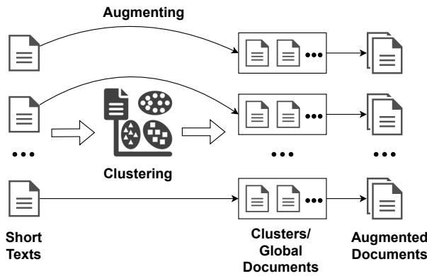
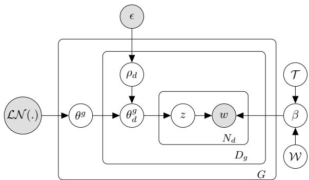
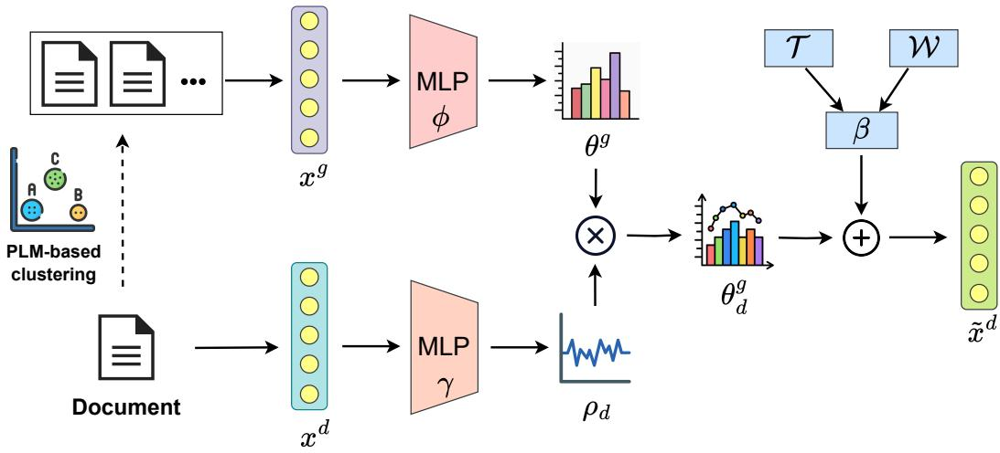
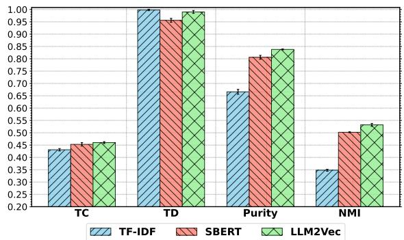
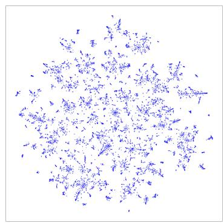
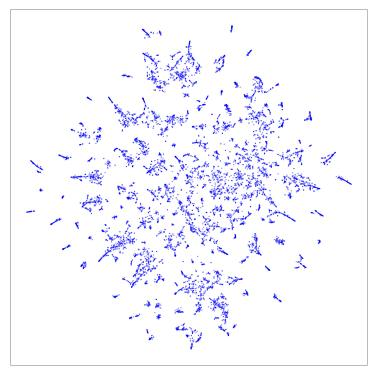
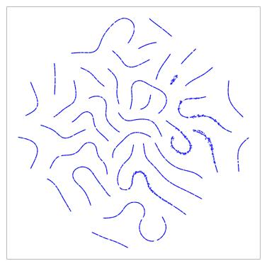

# GloCOM: A Short Text Neural Topic Model via Global Clustering Context

Quang Duc Nguyen1, 2\*, Tung Nguyen1\*, Duc Anh Nguyen1,

Linh Van Ngo1†, Sang Dinh1, Thien Huu Nguyen3

1Hanoi University of Science and Technology (HUST), Vietnam

2Nanyang Technological University, Singapore

3University of Oregon, USA

## Abstract

Uncovering hidden topics from short texts is challenging for traditional and neural models due to data sparsity, which limits word cooccurrence patterns, and label sparsity, stemming from incomplete reconstruction targets. Although data aggregation offers a potential solution, existing neural topic models often overlook it due to time complexity, poor aggregation quality, and difficulty in inferring topic proportions for individual documents. In this paper, we propose a novel model, GloCOM (Global Clustering COntexts for Topic Models), which addresses these challenges by constructing aggregated global clustering contexts for short documents, leveraging text embeddings from pre-trained language models. GloCOM can infer both global topic distributions for clustering contexts and local distributions for individual short texts. Additionally, the model incorporates these global contexts to augment the reconstruction loss, effectively handling the label sparsity issue. Extensive experiments on short text datasets show that our approach outperforms other state-ofthe-art models in both topic quality and document representations.1

## 1 Introduction

Topic models (Hofmann, 1999; Blei et al., 2003) have proven effective in discovering topics within a corpus and providing a high-level representation of documents. Topic models are applied in various domains, including text mining (Van Linh et al., 2017; Valero et al., 2022), bioinformatics (Juan et al., 2020), and recommender systems (Le et al., 2018) and streaming learning (Nguyen et al., 2019; Van Linh et al., 2022; Nguyen et al., 2021, 2022b, 2025). However, while they perform well with long texts, these models often struggle with short data (Tuan et al., 2020; Bach et al., 2023; Ha et al., 2019; Nguyen et al., 2022a,b). Datasets containing short documents, such as headlines, comments, or search snippets, offer limited information on word co-occurrence (Qiang et al., 2022), essential for identifying latent topics. This challenge, known as data sparsity, significantly hinders the ability of recent models to generate high-quality topics. Moreover, the brevity of short texts introduces label sparsity (Lin et al., 2024), where unobserved but relevant words are ignored in the evidence lower bound, causing biased reconstruction loss in Variational Autoencoder (VAE)-based neural topic models (Kingma and Welling, 2013).

Document aggregation has effectively addressed short text topic modeling challenges (Hong and Davison, 2010; Quan et al., 2015; Mai et al., 2016). However, modern neural network-based topic models (Wu et al., 2020, 2022; Lin et al., 2024) have not paid much attention to this approach due to the limitations demonstrated in traditional research. Particularly, aggregation approaches that rely on auxiliary information (Hong and Davison, 2010; Mehrotra et al., 2013) are often restricted to specific data types, while self-aggregation methods face challenges such as high time complexity or overfitting as data volume increases (Quan et al., 2015; Zuo et al., 2016). Moreover, some methods are unable to infer topic distributions for individual documents (Weng et al., 2010; Tang et al., 2013).

The kNNTM (Lin et al., 2024) model is the first short text neural topic model to address label sparsity using kNN-based document aggregation. By enhancing the reconstruction target with semantically related documents, the model can leverage word co-occurrence patterns and the relationships between documents in the dataset. Although this approach has proven effective, kNNTM still faces significant time costs due to optimal transport measures between every pair of documents in the corpus. Another natural and cost-effective method for aggregation is through clustering, but data sparsity is also an unavoidable issue for clustering algorithms based on traditional text representation with term frequency (Quan et al., 2015; Jin et al., 2011).

<table><tr><td>Cluster 1: #1: nokia lumia launch</td></tr><tr><td>#2: moto order start shipping december support</td></tr><tr><td>#3: microsoft officially launched xbox console gamers</td></tr><tr><td>Cluster 2: #4: black friday sale cyber monday</td></tr><tr><td>#5: local shop start sale thanksgiving day</td></tr><tr><td>#6: shopper black friday</td></tr></table>

Table 1: Examples of short texts with their corresponding clustering contexts from the GoogleNews (Yin and Wang, 2016) dataset using a PLM embeddings model, all-MiniLM-L6-v2 (Reimers and Gurevych, 2019). The global topic distributions might have high probabilities for topics like Technology and Sales for Clusters 1 and 2, respectively.

To address these issues, we propose a novel topic model called GloCOM, which constructs a Neural Topic Model using Global Clustering Context. Our model first clusters the document set and then creates global contexts (or global documents) by merging short documents (or local documents) within each cluster. The topic model then incorporates global and local texts, yielding global and local topic distributions. Each local topic distribution is derived from the global distribution of its corresponding context, supplemented by a learnable noise parameter. This approach enables the model to harness the benefits of document aggregation to enhance word co-occurrences and handle the data sparsity issue while inferring representations for individual documents. Furthermore, advancements in foundation models (Devlin et al., 2019; Brown et al., 2020) have improved short text processing effectiveness for downstream tasks. Consequently, we employ pre-trained language model (PLM) embeddings (Reimers and Gurevych, 2019; BehnamGhader et al., 2024) to represent texts during the clustering process. As shown in Table 1, the effectiveness of PLM-based global clustering can thus enhance the semantic quality of the topics.

Besides, we augment the model’s reconstruction targets by combining the original short text with the globally aggregated documents mentioned above. This approach allows us to globally capture absent yet relevant words related to the original input, such as “shop” and “shopper” in documents #5 and #6, which belong to the same cluster, as shown in Table 1. This strategy effectively addresses the issue of label sparsity, where the probabilities of related, unobserved words are inappropriately reduced, resulting in biased training signals and producing high-quality topics and document-topic distributions. Moreover, compared to the considerable time demands of kNNTM (Lin et al., 2024), our method, using cluster context augmentation, is far more time- and computation-efficient. We summarize our contributions as follows:

• We propose a novel Neural Topic Model for short texts, named GloCOM, which addresses data sparsity by leveraging pre-trained language model embeddings to construct global clustering contexts for documents.

• We introduce a novel inference mechanism that captures both global and local document-topic distributions, which enhances the representation of individual short documents.

• We enhance the VAE’s reconstruction loss by integrating short texts with global clustering contexts, allowing the model to capture unobserved yet relevant words and improve topic quality.

• We conduct extensive experiments on benchmark datasets, demonstrating that GloCOM outperforms existing models in terms of topic coherence and document-topic distribution.

## 2 Preliminaries

## 2.1 Notations

Denote $\mathbf { X } = \{ x ^ { d } \} _ { d = 1 } ^ { D }$ as a collection of Bag-of-Words (BoW) representations of D documents with the vocabulary of V words. Topic models aim to discover K hidden topics in this corpus. The pre-trained language model embedding of document d is $x _ { P L M } ^ { d }$ . The clustering algorithm applied to $x _ { P L M } ^ { d }$ produces G clusters. We have $\beta \in \mathbb { R } ^ { V \times K }$ $\mathbf { \beta } = \left( \beta _ { 1 } , \dots , \beta _ { K } \right)$ , where each $\beta _ { k } \in \mathbb { R } ^ { \dot { V } \times 1 }$ , as the topic-word distributions of K desired topics.

With L as the word embedding dimension, we set $\mathbf { w } _ { v } \in \mathbb { R } ^ { L } , v \in \{ 1 , 2 , \dots , V \}$ and $\mathbf { t } _ { k } \in \mathbb { R } ^ { L } , k \in$ $\{ 1 , 2 , \ldots , K \}$ to be the word embeddings of word v and topic embeddings of topic k, respectively. Each document $x ^ { d }$ has the topic proportion $\theta _ { d } \in$ $\mathbb { R } ^ { K }$ indicating what topic it includes. $\mathbb { 1 } _ { N }$ denotes a vector of length $N _ { \ast }$ where each entry is set to 1.

  
Figure 1: Our short text aggregation illustration. We cluster short texts using PLM embeddings and form global documents by concatenating texts from each cluster. Each text is then augmented with its corresponding global document, creating an augmented document used in the reconstruction loss.

## 2.2 VAE-based Topic Model

Similar to many recent neural topic models (Dieng et al., 2020; Wu et al., 2023), our approach is built on a VAE framework, which consists of two primary components: (i) an inference encoder that produces document-topic distributions; and (ii) a generative decoder that reconstructs the original text using the encoder’s output and the topicword proportions. For the encoder, the Bag-of-Words (BoW) representation of a document $x ^ { d }$ is processed through neural networks to obtain the parameters of a normal distribution, where the mean $\mu = h _ { \mu } ( x ^ { d } )$ and the diagonal covariance matrix $\Sigma = \mathrm { d i a g } ( h _ { \Sigma } ( x ^ { d } ) )$ are computed. The reparameterization trick (Kingma and Welling, 2013) is then employed to sample a latent variable α from the posterior distribution $q ( \alpha | x ) = \mathcal { N } ( \alpha | \mu , \Sigma )$ , while the prior distribution of α is $p ( \alpha ) = \mathcal { N } ( \alpha | \mu _ { 0 } , \Sigma _ { 0 } )$ Afterwards, the softmax function is applied to α, producing the topic proportion $\theta = \operatorname { s o f t m a x } ( \alpha )$

Regarding the second component, VAE-based neural topic models aim to construct an effective representation for the topic-word distributions $\beta \in \mathbb { R } ^ { \bar { V } \times K }$ . There are several approaches to modeling $\beta ,$ such as directly inferring it through an optimization process (Srivastava and Sutton, 2017) or decomposing $\beta$ into the product of word embeddings and topic embeddings $\tau .$ . Alternatively, (Wu et al., 2023) propose another form of $\beta$ that effectively addresses the issue of topic collapse as follows:

$$
\beta _ { i j } = \frac { \exp \left( - \| \mathbf { w } _ { i } - \mathbf { t } _ { j } \| ^ { 2 } / \tau \right) } { \sum _ { j ^ { \prime } = 1 } ^ { K } \exp \left( - \| \mathbf { w } _ { i } - \mathbf { t } _ { j ^ { \prime } } \| ^ { 2 } / \tau \right) } ,\tag{1}
$$

where $\tau$ is a temperature hyperparameter. The word embeddings $\tau$ are typically initialized using pretrained embeddings such as GloVe (Pennington et al., 2014).

VAE-based models aim to reconstruct the BoW representations of documents using the topic-word distribution matrix $\beta$ and document-topic proportion $\theta _ { d }$ as $\hat { x } ^ { d } \sim$ Multinomial(softmax $( \beta \theta _ { d } ) )$ . The topic modeling loss consists of a reconstruction term and a regularization term, as follows:

$$
\begin{array} { c } { { { \mathcal { L } } _ { \mathrm { T M } } = \displaystyle \frac { 1 } { D } \sum _ { d = 1 } ^ { D } \Big [ - ( x ^ { d } ) ^ { \top } \log ( \operatorname { s o f t m a x } ( \beta \theta _ { d } ) ) } } \\ { { + \mathrm { K L } ( q ( \alpha | x ^ { d } ) \| p ( \alpha ) ) \Big ] } } \end{array}
$$

Furthermore, we leverage the Embedding Clustering Regularization loss $\mathcal { L } _ { \mathrm { E C R } }$ (Wu et al., 2023) to handle the topic repetition problem, which is prevalent issues in short text topic models, as highlighted in previous studies (Wu et al., 2020, 2022). We further provide details about Embedding Clustering Regularization in Appendix B.

## 3 Methodology

We propose a novel topic model framework for short texts, which introduces an effective clusterbased text aggregation method and an innovative inference for both the global enhanced context and each individual document. Furthermore, we reuse the global context to augment the VAE’s reconstruction labels, addressing the label sparsity issue.

## 3.1 Short Text Aggregation via PLM-based Clustering

Modern neural topic models for short texts do not focus heavily on the text aggregation approach because traditional term frequency representations fail to effectively capture word co-occurrence within a group of short texts (Quan et al., 2015). To overcome this limitation, we utilize pre-trained language model embeddings (Reimers and Gurevych, 2019; BehnamGhader et al., 2024), which excel at capturing linguistic patterns and contextual nuances, to represent texts for clustering. These enriched embeddings facilitate document clustering by grouping texts with similar semantic meanings.

Our short text aggregation process is described in Figure 1. We concatenate short texts (local documents) within the same cluster, forming what we refer to as a global document $x ^ { g }$ , with $g$ being the cluster containing document $x ^ { d }$ . To address the label sparsity problem, we construct the augmented documents as $\tilde { { \boldsymbol { x } } } ^ { d } = { \boldsymbol { x } } ^ { d } + \eta { \boldsymbol { x } } ^ { g }$ , where η is the augmentation coefficient.

While standard topic models are typically applied directly to the global documents to extract topics, our study introduces a novel approach: we estimate both global and local topic distributions for the corresponding global and local documents, with the reconstruction loss built using the augmented documents.

## 3.2 Global Clustering Context Topic Model

Now, we provide formal descriptions of GloCOM. Let $\theta ^ { g } \in \mathbb { R } ^ { K }$ denote the topic distribution of the global document $x ^ { g }$ . We introduce a latent adaptive variable, $\rho _ { d } \in \mathbb { R } ^ { K }$ , which controls the extent to which $\theta ^ { g }$ influences the topic proportions of each individual document within the cluster. Using both $\theta ^ { g }$ and $\rho _ { d }$ , we construct the topic distribution for each short text, denoted as $\theta _ { d } ^ { g } \in \mathbb { R } ^ { K }$ . Under the GloCOM, the generative process for the documents (as illustrated in Figure 2) is as follows:

1. Calculate the distribution over words $\beta$ as described in Eq. 1.

2. For each cluster g : Generate $\theta ^ { g } \sim \mathcal { L N } ( 0 , I )$ with $\mathcal { L N }$ denotes logistic-normal distribution.

3. For each document d in cluster g:

(a) Draw adaptive variable $\rho _ { d } \sim \mathcal { N } ( 1 , \epsilon I )$ where ϵ is a hyperparameter.

(b) Generate topic distribution

$$
\theta _ { d } ^ { g } = \mathrm { s o f t m a x } ( \theta ^ { g } \odot \rho _ { d } )\tag{2}
$$

(c) For each $n ^ { t h }$ word in document d:

i. Draw a topic index:

$$
z _ { d n } \sim \mathrm { M u l t i n o m i a l } ( \theta _ { d } ^ { g } )
$$

ii. Draw the word:

$$
w _ { d n } \sim \mathrm { M u l t i n o m i a l } ( \beta _ { z _ { d n } } )
$$

In Step 1, we define the topic-word distributions $\beta$ using Eq. 1. This formulation captures the clustering relationships between topics and word embeddings (Wu et al., 2023), effectively addressing the issue of topic repetition, which is particularly problematic for short text topic models due to limited word co-occurrences (Wu et al., 2020, 2022).

Steps 2, 3a, and 3b introduce key innovations for short text topic modeling in our approach. We treat the global context within a cluster as a single long document, generating its topic distribution. The global context serves as a semantic representation for the entire cluster, which consists of multiple sub-documents, and enhances word co-occurrence in short text corpora. By leveraging the topic distribution from this global document, we generate topic proportions for each sub-document through an adaptive variable, $\rho _ { d }$ , specific to each short text.

  
Figure 2: The probabilistic graphical model illustrating the generative process of documents in GloCOM.

Step 3c follows most topic modeling approaches (Blei et al., 2003; Srivastava and Sutton, 2017; Dieng et al., 2020). In this step, a topic assignment is first sampled for each word, and then the topicword distribution is used to generate the words for the document. What sets this process apart is that the topic assignments are drawn from $\theta _ { d } ^ { g } .$ , a newly designed topic proportion for short texts that captures both the cluster’s global semantic context and the individual document’s specific information.

## 3.3 Inference and Estimation

The marginal likelihood over dataset X is composed of a sum over the marginal likelihoods of individual documents $x ^ { d }$ . Here, we also consider the group of texts, the expansion of the marginal likelihood can be expressed as:

$$
\log p ( \mathbf { X } | w , t , \epsilon ) { = } \sum _ { d } ^ { D } { \sum _ { g } ^ { G } } \mathbb { I } [ x ^ { d } \in g ] \log p ( x ^ { d } | w , t , \epsilon )
$$

Here, $\mathbb { I } [ x ^ { d } ~ \in ~ \mathfrak { g } ]$ equals 1 if $\boldsymbol { x ^ { d } } ~ \in ~ g$ and equals to 0 otherwise. The challenge is that the marginal likelihood of each document is intractable to compute, due to the difficult integral of log $p ( x ^ { d } | w , t , \epsilon )$ over the global topic distribution $\theta ^ { g }$ and the adaptive variable $\rho _ { d } \mathbf { : }$ $\begin{array} { r } { \int \int p ( \theta ^ { g } , \rho _ { d } | x ^ { d } , \epsilon ) p ( x ^ { d } | \theta ^ { g } , \rho _ { d } , w , t ) \mathrm { d } \theta ^ { g } \mathrm { d } \rho _ { d } } \end{array}$

To solve this problem, we introduce the variational distribution $q _ { \phi , \gamma } ( \theta ^ { g } , \rho _ { d } | x ^ { g } , x ^ { d } )$ , which is the approximation to the intractable true posterior $p ( \theta ^ { g } , \rho _ { d } | x ^ { d } , \epsilon )$ . For greater simplification, we use the fully factorized assumption in the variational distribution: $q _ { \phi , \gamma } ( \theta ^ { g } , \rho _ { d } | x ^ { g } , x ^ { d } )$ $q _ { \phi } ( \theta ^ { g } | x ^ { g } ) q _ { \gamma } ( \rho _ { d } | x ^ { d } )$ . We then employ amortized inference for both θg and $\rho _ { d } .$ , where their variational distribution depends on the data and the shared variational parameters ϕ and $\gamma _ { : }$ , respectively. Specifically, both $q _ { \phi } ( \theta ^ { g } | x ^ { g } )$ and $q _ { \gamma } ( \rho _ { d } | x ^ { d } )$ are modeled as Gaussian distributions, with their means and variances generated from inference neural networks parameterized by $\phi$ and $\gamma .$ . However, while the network for $\rho _ { d }$ processes $x ^ { d }$ itself, the input to the network for $\theta ^ { g }$ is the global document $x ^ { g }$ , which includes $x ^ { d }$

  
Figure 3: The overall architecture of GloCOM. Our methods generate global and augmented documents from clustering based on pre-trained language model embeddings. GloCOM proposes a novel approach to estimate both global and local doc-topic distributions and incorporates the augmented documents into the reconstruction loss.

The marginal likelihood of each data point can be written as:

$$
\begin{array} { l } { \log p ( x ^ { d } | w , t , \epsilon ) = \mathcal { L } ^ { d } ( \phi , \gamma , w , t ) } \\ { + D _ { K L } ( q _ { \phi , \gamma } ( \theta ^ { g } , \rho _ { d } | x ^ { g } , x ^ { d } ) | | p ( \theta ^ { g } , \rho _ { d } | x ^ { d } , \epsilon ) ) } \end{array}
$$

Since the $D _ { K L }$ is non-negative, the term $\mathcal { L } ^ { d } ( \phi , \gamma , w , t )$ is called the variational lower bound on the marginal likelihood of document d, and can be expanded as:

$$
\begin{array} { r l } & { \log p ( x ^ { d } | w , t , \epsilon ) \ge \mathcal { L } ^ { d } ( \phi , \gamma , w , t ) } \\ & { = \mathbb { E } _ { q _ { \phi , \gamma } ( \theta ^ { g } , \rho _ { d } | x ^ { g } , x ^ { d } ) } \left[ \log p ( x ^ { d } , \theta ^ { g } , \rho _ { d } | w , t , \epsilon ) \right] } \\ & { \quad - \mathbb { E } _ { q _ { \phi , \gamma } ( \theta ^ { g } , \rho _ { d } | x ^ { g } , x ^ { d } ) } \left[ \log q _ { \phi , \gamma } ( \theta ^ { g } , \rho _ { d } | x ^ { g } , x ^ { d } ) \right] } \\ & { = \mathbb { E } _ { q _ { \phi } ( \theta ^ { g } | x ^ { g } ) q _ { \gamma } ( \rho _ { d } | x ^ { d } ) } \left[ \log p ( x ^ { d } | \theta ^ { g } , \rho _ { d } , w , t ) \right] } \\ & { \quad - D _ { K L } \left( q _ { \phi } ( \theta ^ { g } | x ^ { g } ) | | p ( \theta ^ { g } ) \right) } \\ & { \quad - D _ { K L } ( q _ { \gamma } ( \rho _ { d } | x ^ { d } ) | | p ( \rho _ { d } | \epsilon ) ) } \end{array}
$$

Optimizing the lower bound can lead to better approximations of the marginal likelihood and ensure that the approximate posterior $q _ { \phi , \gamma } ( \theta ^ { g } , \rho _ { d } | x ^ { d } )$

closely resembles the true posterior distribution. The first component of the lower bound represents the reconstruction loss, which aims to recreate the input data. The remaining components serve as regularizers, promoting the alignment of global and local topic distributions with their prior distributions. To ensure that the lower bound remains tractable and differentiable, we employ Monte Carlo approximations and the reparameterization trick (Kingma and Welling, 2013). We then use the augmented reconstruction label $\tilde { x } ^ { d }$ , as discussed in Section 3.1. Finally, the lower bound for document d can be expressed as:

$$
\begin{array} { r l } { \mathcal { L } ^ { d } ( \phi , \gamma , w , t ) = - ( \tilde { x } ^ { d } ) ^ { \top } \log \left( \operatorname { s o f t m a x } ( \beta \theta _ { d } ^ { g } ) \right) } & { { } } \\ { - D _ { K L } \left( q _ { \phi } ( \theta ^ { g } | x ^ { g } ) | | p ( \theta ^ { g } ) \right) } & { { } } \\ { - D _ { K L } ( q _ { \gamma } ( \rho _ { d } | x ^ { d } ) | | p ( \rho _ { d } | \epsilon ) ) } & { { } ( } \end{array}\tag{3}
$$

We consider the marginal likelihood lower bound of the full dataset as $\mathcal { L } _ { T M }$ , which is expressed as follows:

$$
\mathcal { L } _ { \mathrm { T M } } = \sum _ { d } ^ { D } \sum _ { g } ^ { G } \mathbb { I } [ x ^ { d } \in g ] \mathcal { L } ^ { d } ( \phi , \gamma , w , t )\tag{4}
$$

To mitigate the topic collapse problem, we apply Embedding Clustering Regularization, as detailed in Section 2. In summary, the overall objective function of GloCOM is described below:

$$
\mathcal { L } _ { \mathrm { G l o C O M } } = \mathcal { L } _ { \mathrm { T M } } + \lambda _ { \mathrm { E C R } } \mathcal { L } _ { \mathrm { E C R } } ,\tag{5}
$$

where $\lambda _ { \mathrm { E C R } }$ is a weight hyperparameter. The overall architecture of GloCOM shown in Figure 3. We also provide the training algorithm in Appendix A.

<table><tr><td rowspan="2">Model K = 50</td><td colspan="4">GoogleNews</td><td colspan="3">SearchSnippets</td><td colspan="3">StackOverflow</td><td colspan="4">Biomedical</td></tr><tr><td>TC</td><td>TD</td><td>Purity</td><td>NMI</td><td>TC TD</td><td>Purity</td><td>NMI</td><td>TC TD</td><td>Purity</td><td>NMI</td><td>TC</td><td>TD</td><td>Purity</td><td>NMI</td></tr><tr><td>ProdLDA</td><td>0.437</td><td>0.991</td><td></td><td>0.2010.384</td><td>0.4060.5460.731</td><td></td><td>0.435</td><td>0.388</td><td>0.588 0.117</td><td>0.151</td><td></td><td>0.469 0.520</td><td>0.136</td><td>0.177</td></tr><tr><td>ETM</td><td>0.402 0.916</td><td></td><td></td><td>0.3660.560</td><td>0.397 0.594 0.688</td><td></td><td>0.389</td><td>0.367 0.766</td><td>0.418</td><td>0.280</td><td></td><td>0.450 0.723</td><td>0.4060.273</td><td></td></tr><tr><td>ECRTM</td><td>0.441 0.987</td><td></td><td></td><td>0.3960.615</td><td>0.450 0.9980.711 0.419</td><td></td><td></td><td>0.381 0.941 0.197</td><td></td><td>0.192</td><td></td><td>0.4680.9870.414 0.315</td><td></td><td></td></tr><tr><td>FASTopic</td><td>0.446 0.440</td><td></td><td></td><td>0.351 0.659</td><td>0.395 0.7100.792 0.481</td><td></td><td></td><td>0.317 0.2220.408</td><td></td><td>0.486</td><td></td><td>0.4180.4820.4560.369</td><td></td><td></td></tr><tr><td>NQTM</td><td>0.4080.959</td><td></td><td></td><td>0.5360.716</td><td>0.436 0.9220.4350.150</td><td></td><td></td><td>0.382 0.9330.392 0.238</td><td></td><td></td><td></td><td>0.471 0.915 0.191 0.109</td><td></td><td></td></tr><tr><td>TSCTM</td><td>0.437 0.988</td><td></td><td></td><td>0.552 0.761</td><td>0.4240.9930.7240.386</td><td></td><td></td><td></td><td>0.378 0.911 0.572 0.418</td><td></td><td></td><td>0.484 0.9720.4800.341</td><td></td><td></td></tr><tr><td>KNNTM</td><td>0.435 0.986</td><td></td><td>0.579</td><td>0.795</td><td>0.425 0.995</td><td></td><td>0.768 0.429</td><td>0.380 0.922</td><td>0.636</td><td>0.490</td><td></td><td>0.490 0.972</td><td>0.526</td><td>0.380</td></tr><tr><td>GloCOM</td><td>0.475 0.999</td><td></td><td>0.586</td><td>0.817</td><td>0.453 0.956</td><td>0.806</td><td>0.502</td><td>0.390 0.962</td><td>0.653</td><td>0.588</td><td></td><td>0.490 0.998 0.546</td><td></td><td></td></tr><tr><td>Model</td><td></td><td>GoogleNews</td><td></td><td></td><td></td><td>SearchSnippets</td><td></td><td></td><td>StackOverflow</td><td></td><td></td><td>Biomedical</td><td></td><td>0.437</td></tr><tr><td>K = 100</td><td>TC</td><td>TD</td><td>Purity</td><td>NMI</td><td>TC</td><td>TD Purity</td><td>NMI</td><td>TC</td><td>TD</td><td>Purity NMI</td><td>TC</td><td>TD</td><td>Purity</td><td></td></tr><tr><td>ProdLDA</td><td>0.435 0.611</td><td></td><td></td><td>0.611 0.600</td><td>0.424 0.679</td><td>0.766</td><td>0.415</td><td>0.382</td><td>0.466 0.098</td><td>0.090</td><td></td><td>0.463 0.465</td><td>0.079</td><td>NMI 0.050</td></tr><tr><td>ETM</td><td>0.398 0.677</td><td></td><td></td><td>0.5540.713</td><td>0.389 0.448</td><td></td><td>0.692 0.365</td><td>0.369</td><td>0.4440.475</td><td></td><td>0.331</td><td>0.452 0.4760.4040.268</td><td></td><td></td></tr><tr><td>ECRTM</td><td>0.418 0.991</td><td></td><td></td><td>0.3420.491</td><td></td><td>0.432 0.9660.789</td><td>0.443</td><td></td><td>0.375 0.993 0.172</td><td></td><td>0.179</td><td>0.4440.9740.1240.113</td><td></td><td></td></tr><tr><td>FASTopic</td><td>0.4380.369</td><td></td><td></td><td>0.4580.722</td><td></td><td>0.386 0.6340.807</td><td>0.458</td><td></td><td>0.309 0.1860.495</td><td>0.514</td><td></td><td>0.4400.4570.495</td><td></td><td>0.375</td></tr><tr><td>NQTM</td><td>0.397 0.898</td><td></td><td></td><td>0.7060.788</td><td></td><td>0.4380.6380.3340.077</td><td></td><td></td><td>0.379 0.8180.417</td><td></td><td>0.255</td><td>0.460 0.572 0.142</td><td></td><td>0.056</td></tr><tr><td>TSCTM</td><td>0.4480.9410.7540.835</td><td></td><td></td><td></td><td></td><td>0.4300.8940.7570.384</td><td></td><td></td><td>0.3800.6200.5630.386</td><td></td><td></td><td>0.4850.8060.487</td><td></td><td>0.330</td></tr><tr><td>KNNTM</td><td>0.441 0.959</td><td></td><td>0.797</td><td>0.870</td><td>0.4210.948</td><td></td><td>0.800 0.421</td><td></td><td>0.381 0.663</td><td>0.611</td><td>0.436</td><td>0.483 0.848</td><td>0.530</td><td>0.362</td></tr><tr><td>GloCOM</td><td>0.450 0.944</td><td></td><td>0.761</td><td>0.900</td><td></td><td>0.443 0.920</td><td>0.822</td><td>0.501</td><td>0.382 0.804</td><td>0.658</td><td>0.585</td><td>0.462 0.997</td><td></td><td>0.5360.422</td></tr></table>

Table 2: Topic quality, measured using TC and TD, and document-topic distribution quality, assessed with NMI and Purity with $K = 5 0$ and $K = 1 0 0$ . The bold values indicate the best performance. We report the standard deviation in Appendix D.

## 4 Experiments

## 4.1 Experimental Setups

Datasets. We use four real-world short text datasets for our experiment: (i) GoogleNews, which covers 152 main news topics from over 11,000 Google articles; (ii) SearchSnippets consisting of over 12,000 web search results divided into 8 different domains; (iii) StackOverflow, which contains 20,000 question titles from 20 different tags; (iv) Biomedical comprising nearly 20,000 medical articles spread across 20 groups. Please refer to Appendix C.1 for the dataset statistics and preprocessing details.

Baselines. We compare our method with the following baselines in two paradigms. For conventional topic models, we consider (i) ProdLDA (Srivastava and Sutton, 2017), a pioneering VAE-based topic model; (ii) ETM (Dieng et al., 2020), which incorporates word embeddings; (iii) ECRTM (Wu et al., 2023), based on ETM with regularization between word and topic embeddings; (iv) FASTopic (Wu et al., 2024b), a state-of-the-art model for identifying topics via word, topic, and document embeddings. For short text topic models, we include (vi) NQTM (Wu et al., 2020), a neural topic model dedicated to short text problems with vector quantization for topic distributions; (vii) TSCTM (Wu et al., 2022), adapted from NQTM with an additional contrastive loss on topic distributions; (viii) kNNTM (Lin et al., 2024), a recent state-of-the-art short text neural topic model that augments a document with its neighbors via the kNN algorithm. Except for kNNTM2, we use the implementation of the other models provided by TopMost (Wu et al., 2024c) and fine-tune these baselines on various datasets and topic numbers.

Evaluation Metrics. We follow mainstream studies for short text topic modeling (Wu et al., 2020, 2022; Lin et al., 2024) and evaluate the topic quality and document-topic distribution quality. For topic quality, we consider two metrics: Topic Coherence (TC) and Topic Diversity (TD). Topic Coherence assesses how coherent the identified topics are by examining the co-occurrences of the top words with an external corpus. We adopt a widelyused coherence metric $C _ { V }$ , which has shown superior performance compared to other coherence metrics (Röder et al., 2015). Specifically, we compute $C _ { V }$ with Wikipedia texts as a reference corpus using Palmetto library (Röder et al., 2015). Furthermore, Topic Diversity measures how distinct the topics are by calculating the proportion of unique top words across the topics. We take the top 15 words for each discovered topic for TC and TD. For the quality of the document-topic distribution, we assess document clustering using Purity and NMI, consistent with previous studies (Zhao et al., 2021; Wu et al., 2022; Lin et al., 2024).

<table><tr><td colspan="2">Method</td><td>TC TD</td><td>Purity NMI</td></tr><tr><td rowspan="3">Google News</td><td>ECRTM</td><td>0.441 0.987 0.396</td><td>0.615</td></tr><tr><td>GloCOM+NoC GloCOM+NoA</td><td>0.465 0.989 0.436</td><td>0.548 0.768 0.548 0.770</td></tr><tr><td>GloCOM</td><td>1.000 0.475 0.999</td><td>0.586 0.817</td></tr><tr><td rowspan="3">Search</td><td>ECRTM</td><td>0.450 0.998</td><td>0.711 0.419</td></tr><tr><td>GloCOM+NoC</td><td>0.449 0.855</td><td>0.805 0.484</td></tr><tr><td>GloCOM+NoA</td><td></td><td>0.797 0.491</td></tr><tr><td rowspan="2">Snippets</td><td></td><td>0.445 1.000</td><td></td></tr><tr><td>GloCOM</td><td>0.453 0.956</td><td>0.806 0.502</td></tr></table>

Table 3: Ablation study with K = 50 on GoogleNews and SearchSnippets datasets. Due to space limitations, we report the standard deviation in the Appendix D.

Implementation Details. We use the same hyperparameter settings as those in previous stateof-the-art text models (Bianchi et al., 2021; Lin et al., 2024), including epoch numbers, batch size, learning rate, number of hidden layers, etc. We set all-MiniLM-L6-v2 (Reimers and Gurevych, 2019) as the default pre-trained language model for clustering, and the effectiveness of different recent embedding models is also discussed in Section 4.4. Regarding the hyperparameters unique to our method, such as ϵ, η, λECR, we perform a grid search to identify the optimal values. The remaining detailed settings are described in Appendix C.2.

## 4.2 Topic Quality and Document-Topic Distribution Quality Evaluations

We conducted experiments to assess the efficacy of our approach compared to other baselines. We chose the topic number, K, as 50 and 100, following common practices in short-text and standard topic modeling literature (Wu et al., 2022, 2023; Lin et al., 2024). Table 2 presents the overall topic quality and document-topic distribution quality across four datasets: GoogleNews, Search-Snippets, StackOverflow, and Biomedical. From the results, our approach demonstrates its superiority over other state-of-the-art models in terms of text clustering, especially in the case of K = 50, which validates the effectiveness of our method. By deriving a local text document from its aggregated global clustering document, GloCOM can greatly enhance the quality of the document-topic distribution thus improving the semantic richness of the document representation.

  
Figure 4: Clustering effectiveness of the GloCOM model with different representations for short text clustering (K = 50) on the SearchSnippets dataset.

Furthermore, the competitive TC results of Glo-COM compared to kNNTM demonstrate the benefits of our global short text aggregation in providing unbiased training for handling the label sparsity issue. This suggests that documents within a cluster have more semantically similar words compared to those using kNN optimal transport-based distance. It is worth noting that, while the ECRTM model has a high TD in some settings, its TC score and text clustering results are notably lower than those of other short text methods. Appendix E displays examples of the discovered topics from our model. We further discuss the time and resources required for training these models, as well as hyperparameter sensitivity, in Appendix D.

## 4.3 Ablation Study

We analyze the effects of different variants of Glo-COM, including (i) ECRTM, the base model of GloCOM; (ii) GloCOM+NoA, a GloCOM without global augmentation for input document; and (iii) GloCOM+NoC, a GloCOM without global clustering context, on both GoogleNews and SearchSnippets under 50 topics. As shown in Table 3, the improvements from the ECRTM model to other Glo-COM variants demonstrate the two modules’ effectiveness. Moreover, the model incorporating both modules achieves the highest performance in terms of document-topic distribution quality. Regarding topic quality, the GloCOM model obtains the best TC score while compromising the TD score when not using global augmentation.

  
(a) TSCTM

  
(b) kNNTM

  
(c) GloCOM  
Figure 5: The t-SNE visualization shows the topic distributions learned by three short text models.

## 4.4 Clustering Effectiveness

To demonstrate the necessity of pre-trained language model (PLM) embeddings for clustering in our approach, we conducted experiments on different representations including (i) TF-IDF, a common representation used in traditional selfaggregation topic model (Quan et al., 2015); (ii) SBERT, a PLM-based embedding representation adopted from BERT (Reimers and Gurevych, 2019); (iii) LLM2Vec, a PLM-based representation harnessing the power of large language models (BehnamGhader et al., 2024). As shown in Figure 4, incorporating PLM-based embedding models notably improves the effectiveness of our method compared to the TF-IDF model. These results prove the efficacy and necessity of using PLMbased representation, as discussed in Section 3.1. Furthermore, GloCOM using LLM2Vec embedding representations achieves better results across all evaluation metrics compared to GloCOM using all-MiniLM-L6-v2. This demonstrates that the performance of GloCOM can be further enhanced with the adoption of more advanced PLMs.

## 4.5 Topic Distribution Analysis

Figure 5 displays the t-SNE (Van der Maaten and Hinton, 2008) visualization for learned documenttopic distributions with K = 50 on the SearchSnippets short text dataset. It is evident that compared to TSCTM and kNNTM, the samples in GloCOM are more aggregated and more distinctly spread across the space. These clear separations and divisions demonstrate the effectiveness of our method by generating local topic distributions from their clustered global distribution. This also explains GloCOM’s competitive topic quality performance.

## 5 Related Work

Standard Topic Modeling. Traditional topic models like LDA (Blei et al., 2003) and probabilistic LSI (Hofmann, 1999) rely on generative probabilistic frameworks. Despite improvements (Blei and Lafferty, 2006; Li et al., 2015; Nguyen et al., 2022b), they remain inefficient and underperform compared to modern neural networkbased approaches, especially those using VAE architectures (Kingma and Welling, 2013). Current advancements include integrating pre-trained language models (Bianchi et al., 2021; Han et al., 2023; Pham et al., 2024b), leveraging optimal transport distances (Zhao et al., 2021), and applying contrastive loss (Nguyen and Luu, 2021). Other methods refine the generative process by using pretrained embeddings (Dieng et al., 2020; Xu et al., 2022), or optimal transport distances (Wang et al., 2022; Wu et al., 2023, 2024b). However, these models still struggle with short texts due to data and label sparsity problems, as shown in Section 4. While some studies use large language models to describe topics as descriptions (Pham et al., 2024a), this differs from the original LDA framework used in this paper, which infers topic-word distributions.

Short Text Topic Modeling. Conventional short text topic models (Li et al., 2016, 2017; Yin and Wang, 2014) assume each text is generated by a few topics, while Biterm Topic Models (Yan et al., 2013; Cheng et al., 2014) incorporate co-occurrence patterns. Aggregation techniques (Hong and Davison, 2010; Tang et al., 2013; Quan et al., 2015) have also been used to mitigate data sparsity. However, these methods have drawbacks, such as the difficulty of inferring individual document topics (Weng et al., 2010) and high computational costs (Zuo et al., 2016). Clustering is also ineffective, as term frequency representations fail to capture short text semantics (Jin et al., 2011).

Neural short text topic models have recently outperformed traditional models in both performance and generalization (Wu et al., 2024a). Some use pre-trained embeddings (Dieng et al., 2020; Bianchi et al., 2021) or word co-occurrence graphs (Zhu et al., 2018; Wang et al., 2021), while others focus on variable-length corpora (Zhang and Lauw, 2022). Topic distribution quantization (Wu et al., 2020, 2022) has shown to effectively handle data sparsity, with kNNTM (Lin et al., 2024) pioneering label sparsity solutions. Although kN-NTM is state-of-the-art for short documents, its use of optimal transport distances increases computational costs compared to our global aggregation clustering approach.

## 6 Conclusion

In this paper, we propose a novel neural model for short text topic modeling, called GloCOM, which leverages aggregated global clustering context and integrates this context into the reconstruction target. Our experiments demonstrate that our method effectively addresses both data and label sparsity challenges, outperforming state-of-the-art models and producing high-quality topics and document representations for short texts.

## Limitations

Although our approach demonstrates promising results in addressing sparsity issues in short text topic modeling, there are a few limitations to acknowledge. Firstly, the method needs to determine the number of groups for creating global documents. Future research can focus on automatically selecting the optimal number of clusters, such as with HDBSCAN (Campello et al., 2013). Secondly, the method’s reliance on clustering with pre-trained language models makes it challenging to apply in dynamic or real-time settings. Addressing this limitation will require further research into adapting both clustering and topic modeling for dynamic environments.

## Ethical Considerations

We adhere to the ACL Code of Ethics and the terms of each codebase license. Our method aims to advance the field of topic modeling, and we are confident that, when used properly and with care, it poses no significant social risks.

## Acknowledgments

This research is funded by Hanoi University of Science and Technology (HUST) under project number T2024-TN-002

## References

Tran Xuan Bach, Nguyen Duc Anh, Ngo Van Linh, and Khoat Than. 2023. Dynamic transformation of prior knowledge into bayesian models for data streams. IEEE Transactions on Knowledge and Data Engineering, 35(4):3742–3750.

Parishad BehnamGhader, Vaibhav Adlakha, Marius Mosbach, Dzmitry Bahdanau, Nicolas Chapados, and Siva Reddy. 2024. LLM2Vec: Large language models are secretly powerful text encoders. In First Conference on Language Modeling.

Federico Bianchi, Silvia Terragni, and Dirk Hovy. 2021. Pre-training is a hot topic: Contextualized document embeddings improve topic coherence. In Proceedings of the 59th Annual Meeting of the Association for Computational Linguistics and the 11th International Joint Conference on Natural Language Processing (Volume 2: Short Papers), pages 759–766.

David M. Blei and John D. Lafferty. 2006. Dynamic topic models. In Proceedings of the 23rd International Conference on Machine Learning, page 113–120.

David M Blei, Andrew Y Ng, and Michael I Jordan. 2003. Latent dirichlet allocation. Journal of Machine Learning Research, pages 993–1022.

Tom Brown, Benjamin Mann, Nick Ryder, Melanie Subbiah, Jared D Kaplan, Prafulla Dhariwal, Arvind Neelakantan, Pranav Shyam, Girish Sastry, Amanda Askell, et al. 2020. Language models are few-shot learners. In Advances in Neural Information Processing Systems, pages 1877–1901.

Ricardo JGB Campello, Davoud Moulavi, and Jörg Sander. 2013. Density-based clustering based on hierarchical density estimates. In Pacific-Asia conference on knowledge discovery and data mining, pages 160–172. Springer.

Xueqi Cheng, Xiaohui Yan, Yanyan Lan, and Jiafeng Guo. 2014. Btm: Topic modeling over short texts. IEEE Transactions on Knowledge and Data Engineering, pages 2928–2941.

Marco Cuturi. 2013. Sinkhorn distances: Lightspeed computation of optimal transport. In Advances in Neural Information Processing Systems, pages 2292– 2300.

Jacob Devlin, Ming-Wei Chang, Kenton Lee, and Kristina Toutanova. 2019. Bert: Pre-training of deep bidirectional transformers for language understanding. In Proceedings of the 2019 Conference of the

North American Chapter ofthe Associationfor Computational Linguistics: Human Language Technologies, NAACL-HLT 2019, pages 4171–4186.

Adji B Dieng, Francisco JR Ruiz, and David M Blei. 2020. Topic modeling in embedding spaces. Transactions ofthe Associationfor Computational Linguistics, pages 439–453.

Cuong Ha, Van-Dang Tran, Linh Ngo Van, and Khoat Than. 2019. Eliminating overfitting of probabilistic topic models on short and noisy text: The role of dropout. International Journal of Approximate Reasoning, 112:85–104.

Sungwon Han, Mingi Shin, Sungkyu Park, Changwook Jung, and Meeyoung Cha. 2023. Unified neural topic model via contrastive learning and term weighting. In Proceedings ofthe 17th Conference ofthe European Chapter ofthe Associationfor Computational Linguistics, pages 1802–1817.

Thomas Hofmann. 1999. Probabilistic latent semantic indexing. In Proceedings ofthe 22nd annual international ACM SIGIR conference on Research and development in information retrieval, pages 50–57.

Liangjie Hong and Brian D. Davison. 2010. Empirical study of topic modeling in twitter. In Proceedings of the First Workshop on Social Media Analytics, page 80–88.

Ou Jin, Nathan N. Liu, Kai Zhao, Yong Yu, and Qiang Yang. 2011. Transferring topical knowledge from auxiliary long texts for short text clustering. In Proceedings ofthe 20th ACM International Conference on Information and Knowledge Management, page 775–784.

Liran Juan, Yongtian Wang, Jingyi Jiang, Qi Yang, Guohua Wang, and Yadong Wang. 2020. Evaluating individual genome similarity with a topic model. Bioinformatics, pages 4757–4764.

Diederik P. Kingma and Jimmy Ba. 2015. Adam: A method for stochastic optimization. In 3rd International Conference on Learning Representations.

Diederik P Kingma and Max Welling. 2013. Autoencoding variational bayes. In 2nd International Conference on Learning Representations.

Hoa M Le, Son Ta Cong, Quyen Pham The, Ngo Van Linh, and Khoat Than. 2018. Collaborative topic model for poisson distributed ratings. International Journal of Approximate Reasoning, pages 62–76.

Chenliang Li, Yu Duan, Haoran Wang, Zhiqian Zhang, Aixin Sun, and Zongyang Ma. 2017. Enhancing topic modeling for short texts with auxiliary word embeddings. ACM Transactions on Information Systems, 36(2):1–30.

Chenliang Li, Haoran Wang, Zhiqian Zhang, Aixin Sun, and Zongyang Ma. 2016. Topic modeling for short

texts with auxiliary word embeddings. In Proceedings of the 39th International ACM SIGIR Conference on Research and Development in Information Retrieval, page 165–174.

Ximing Li, Jihong Ouyang, You Lu, Xiaotang Zhou, and Tian Tian. 2015. Group topic model: organizing topics into groups. Information Retrieval Journal, pages 1–25.

Yang Lin, Xinyu Ma, Xin Gao, Ruiqing Li, Yasha Wang, and Xu Chu. 2024. Combating label sparsity in short text topic modeling via nearest neighbor augmentation. In Findings of the Association for Computational Linguistics ACL 2024, pages 13762–13774.

Stuart Lloyd. 1982. Least squares quantization in pcm. IEEE Transactions on Information Theory, pages 129–137.

Khai Mai, Sang Mai, Anh Nguyen, Ngo Van Linh, and Khoat Than. 2016. Enabling hierarchical dirichlet processes to work better for short texts at large scale. In Advances in Knowledge Discovery and Data Mining, pages 431–442. Springer.

Rishabh Mehrotra, Scott Sanner, Wray Buntine, and Lexing Xie. 2013. Improving lda topic models for microblogs via tweet pooling and automatic labeling. In Proceedings ofthe 36th International ACM SIGIR Conference on Research and Development in Information Retrieval, pages 889–892.

Duc Anh Nguyen, Kim Anh Nguyen, Canh Hao Nguyen, Khoat Than, et al. 2021. Boosting prior knowledge in streaming variational bayes. Neurocomputing, 424:143–159.

Ha Nguyen, Hoang Pham, Son Nguyen, Ngo Van Linh, and Khoat Than. 2022a. Adaptive infinite dropout for noisy and sparse data streams. Machine Learning, 111(8):3025–3060.

Thong Nguyen and Anh Tuan Luu. 2021. Contrastive learning for neural topic model. In Advances in Neural Information Processing Systems, pages 11974– 11986.

Tung Nguyen, Trung Mai, Nam Nguyen, Linh Ngo Van, and Khoat Than. 2022b. Balancing stability and plasticity when learning topic models from short and noisy text streams. Neurocomputing, pages 30–43.

Tung Nguyen, Tung Pham, Linh Ngo Van, Ha-Bang Ban, and Khoat Than. 2025. Out-of-vocabulary handling and topic quality control strategies in streaming topic models. Neurocomputing, 614:128757.

Van-Son Nguyen, Duc-Tung Nguyen, Linh Ngo Van, and Khoat Than. 2019. Infinite dropout for training bayesian models from data streams. In 2019 IEEE International Conference on Big Data (Big Data), pages 125–134.

Jeffrey Pennington, Richard Socher, and Christopher D Manning. 2014. Glove: Global vectors for word representation. In Proceedings ofthe 2014 Conference on Empirical Methods in Natural Language Processing (EMNLP), pages 1532–1543.

Gabriel Peyré and Marco Cuturi. 2018. Computational optimal transport. Foundations and Trends in Machine Learning, pages 355–607.

Chau Minh Pham, Alexander Hoyle, Simeng Sun, and Mohit Iyyer. 2024a. Topicgpt: A prompt-based topic modeling framework. In Proceedings of the 2024 Conference of the North American Chapter of the Association for Computational Linguistics: Human Language Technologies (Volume 1: Long Papers), pages 2956–2984.

Duy-Tung Pham, Thien Trang Nguyen Vu, Tung Nguyen, Linh Ngo Van, Duc Anh Nguyen, and Thien Huu Nguyen. 2024b. Neuromax: Enhancing neural topic modeling via maximizing mutual information and group topic regularization. In Findings ofthe Associationfor Computational Linguistics: EMNLP 2024.

Xuan-Hieu Phan, Le-Minh Nguyen, and Susumu Horiguchi. 2008. Learning to classify short and sparse text & web with hidden topics from largescale data collections. In Proceedings of the 17th International Conference on World Wide Web, pages 91–100.

Jipeng Qiang, Qian Zhenyu, Yun Li, Yunhao Yuan, and Xindong Wu. 2022. Short text topic modeling techniques, applications, and performance: A survey. IEEE Transactions on Knowledge and Data Engineering, pages 1427–1445.

Xiaojun Quan, Chunyu Kit, Yong Ge, and Sinno Jialin Pan. 2015. Short and sparse text topic modeling via self-aggregation. In Proceedings of the 24th International Conference on Artificial Intelligence, page 2270–2276.

Nils Reimers and Iryna Gurevych. 2019. Sentence-bert: Sentence embeddings using siamese bert-networks. In Proceedings of the 2019 Conference on Empirical Methods in Natural Language Processing and the 9th International Joint Conference on Natural Language Processing (EMNLP-IJCNLP), pages 3982–3992.

Michael Röder, Andreas Both, and Alexander Hinneburg. 2015. Exploring the space of topic coherence measures. In Proceedings ofthe Eighth ACM International Conference on Web Search and Data Mining, page 399–408.

Akash Srivastava and Charles Sutton. 2017. Autoencoding variational inference for topic models. In International Conference on Learning Representations.

Jian Tang, Ming Zhang, and Qiaozhu Mei. 2013. One theme in all views: modeling consensus topics in multiple contexts. In Proceedings ofthe 19th ACM

SIGKDD International Conference on Knowledge Discovery and Data Mining, page 5–13.

Anh Phan Tuan, Bach Tran, Thien Huu Nguyen, Linh Ngo Van, and Khoat Than. 2020. Bag of biterms modeling for short texts. Knowledge and Information Systems, 62(10):4055–4090.

Francisco B Valero, Marion Baranes, and Elena V Epure. 2022. Topic modeling on podcast short-text metadata. In European Conference on Information Retrieval, pages 472–486.

Laurens Van der Maaten and Geoffrey Hinton. 2008. Visualizing data using t-sne. Journal of Machine Learning Research, pages 2579–2605.

Ngo Van Linh, Nguyen Kim Anh, Khoat Than, and Chien Nguyen Dang. 2017. An effective and interpretable method for document classification. Knowledge and Information Systems, pages 763–793.

Ngo Van Linh, Tran Xuan Bach, and Khoat Than. 2022. A graph convolutional topic model for short and noisy text streams. Neurocomputing, 468:345–359.

Dongsheng Wang, Dandan Guo, He Zhao, Huangjie Zheng, Korawat Tanwisuth, Bo Chen, and Mingyuan Zhou. 2022. Representing mixtures of word embeddings with mixtures of topic embeddings. In The Tenth International Conference on Learning Representations.

Yiming Wang, Ximing Li, Xiaotang Zhou, and Jihong Ouyang. 2021. Extracting topics with simultaneous word co-occurrence and semantic correlation graphs: Neural topic modeling for short texts. In Findings ofthe Associationfor Computational Linguistics: EMNLP 2021, pages 18–27.

Jianshu Weng, Ee-Peng Lim, Jing Jiang, and Qi He. 2010. Twitterrank: finding topic-sensitive influential twitterers. In Proceedings ofthe Third ACM International Conference on Web Search and Data Mining, WSDM ’10, page 261–270.

Xiaobao Wu, Xinshuai Dong, Thong Thanh Nguyen, and Anh Tuan Luu. 2023. Effective neural topic modeling with embedding clustering regularization. In International Conference on Machine Learning, pages 37335–37357.

Xiaobao Wu, Chunping Li, Yan Zhu, and Yishu Miao. 2020. Short text topic modeling with topic distribution quantization and negative sampling decoder. In Proceedings of the 2020 Conference on Empirical Methods in Natural Language Processing (EMNLP), pages 1772–1782.

Xiaobao Wu, Anh Tuan Luu, and Xinshuai Dong. 2022. Mitigating data sparsity for short text topic modeling by topic-semantic contrastive learning. In Proceedings of the 2022 Conference on Empirical Methods in Natural Language Processing, pages 2748–2760.

Xiaobao Wu, Thong Nguyen, and Anh Tuan Luu. 2024a.   
A survey on neural topic models: Methods, applica  
tions, and challenges. Artificial Intelligence Review,   
pages 1–30.   
Xiaobao Wu, Thong Nguyen, Delvin Ce Zhang,   
William Yang Wang, and Anh Tuan Luu. 2024b.   
Fastopic: A fast, adaptive, stable, and transferable   
topic modeling paradigm. In Advances in Neural   
Information Processing Systems.   
Xiaobao Wu, Fengjun Pan, and Anh Tuan Luu. 2024c.   
Towards the topmost: A topic modeling system   
toolkit. In Proceedings of the 62nd Annual Meet   
ing of the Association for Computational Linguistics   
(Volume 3: System Demonstrations), pages 31–41.   
Jiaming $\mathrm { { X u , } }$ Bo $\mathrm { { X u , } }$ Peng Wang, Suncong Zheng, Guan   
hua Tian, and Jun Zhao. 2017. Self-taught convolu   
tional neural networks for short text clustering. Neu  
ral Networks, pages 22–31.   
Yi Xu, Dongsheng Wang, Bo Chen, Ruiying Lu, Zhibin   
Duan, Mingyuan Zhou, et al. 2022. Hyperminer:   
Topic taxonomy mining with hyperbolic embedding.   
In Advances in Neural Information Processing Sys   
tems, pages 31557–31570.   
Xiaohui Yan, Jiafeng Guo, Yanyan Lan, and Xueqi   
Cheng. 2013. A biterm topic model for short texts.   
In Proceedings of the 22nd International Conference   
on World Wide Web, page 1445–1456.   
Jianhua Yin and Jianyong Wang. 2014. A dirichlet   
multinomial mixture model-based approach for short   
text clustering. In Proceedings of the 20th ACM   
SIGKDD International Conference on Knowledge   
Discovery and Data Mining, page 233–242.   
Jianhua Yin and Jianyong Wang. 2016. A model-based   
approach for text clustering with outlier detection. In   
2016 IEEE 32nd International Conference on Data   
Engineering (ICDE), pages 625–636.   
Delvin Ce Zhang and Hady Lauw. 2022. Meta   
complementing the semantics of short texts in neural   
topic models. In Advances in Neural Information   
Processing Systems, pages 29498–29511.   
He Zhao, Dinh Phung, Viet Huynh, Trung Le, and Wray   
Buntine. 2021. Neural topic model via optimal trans   
port. In 9th International Conference on Learning   
Representations.   
Qile Zhu, Zheng Feng, and Xiaolin Li. 2018.   
GraphBTM: Graph enhanced autoencoded varia   
tional inference for biterm topic model. In Proceed   
ings of the 2018 Conference on Empirical Methods   
in Natural Language Processing, pages 4663–4672.   
Yuan Zuo, Junjie Wu, Hui Zhang, Hao Lin, Fei Wang,   
Ke Xu, and Hui Xiong. 2016. Topic modeling of   
short texts: A pseudo-document view. Proceedings   
ofthe 22nd ACM SIGKDD International Conference   
on Knowledge Discovery and Data Mining, pages   
2105–2114.

## A GloCOM Algorithm

Algorithm 1 GloCOM training procedure.   
Input: Input corpus X, Topic number $K ,$ epoch   
number N, and clusters $G .$   
Output: K topic-word distributions $\beta _ { k }$ , N doc  
topic distributions $\theta _ { d } ^ { g }$   
1: for epoch from 1 to N do   
2: For a random batch of B documents do   
3: $\mathcal { L } _ { \mathrm { b a t c h } }  0 ;$   
4: for each local doc $x ^ { d }$ and its respective   
global doc $x ^ { g }$ in the batch do   
5: Compute the adaptive variable $p _ { d } ;$   
6: Compute the global topic distribution $\theta ^ { g } ;$   
7: Compute the local topic distribution $\theta _ { d } ^ { g }$   
by Eq. 2;   
8: batch batch + GloCOM by Eq. 5;   
9: end for   
10: Update model parameters with $\nabla { \mathcal { L } } _ { \mathrm { b a t c h } } ;$   
11: end for

## B Embedding Clustering Regularization

Proposed by (Wu et al., 2023), Embedding Clustering Regularization (ECR) ensures that each topic embedding serves as the center of its distinct word embedding cluster in the semantic space. Specifically, it leverages optimal transport (OT) distance (Peyré and Cuturi, 2018) as follows:

$$
\mathcal { L } _ { \mathrm { E C R } } = \sum _ { i = 1 } ^ { V } \sum _ { j = 1 } ^ { K } \Vert \mathbf { w } _ { i } - \mathbf { t } _ { j } \Vert ^ { 2 } \psi _ { i j } ^ { * } ,
$$

with $\psi ^ { * }$ is the solution to the following OT optimization problem:

$$
\begin{array} { r l } & { \mathrm { m i n i m i z e   } \left. C _ { \mathrm { W T } } , \psi \right. - \nu H ( \psi ) } \\ & { \mathrm { s . t . } \psi \in { \mathbb { R } } ^ { V \times K } } \\ & { \quad \quad \quad \psi \mathbb { 1 } _ { K } = \displaystyle \frac { 1 } { V } \mathbb { 1 } _ { V } , \psi ^ { T } \mathbb { 1 } _ { V } = \frac { 1 } { K } \mathbb { 1 } _ { K } , } \end{array}
$$

where $C _ { \mathrm { W T } } \in \mathbb { R } ^ { V \times K }$ represents the distance matrix between word embeddings and topic embeddings. The optimal transport matrix $\psi ^ { * }$ is derived using the Sinkhorn algorithm. For two matrices $X , Y$ with the same size, $\begin{array} { r } { \langle X , Y \rangle = \sum _ { i , j } X _ { i j } Y _ { i j } } \end{array}$ $\begin{array} { r } { H ( P ) = - \langle P , \log P - 1 \rangle = - \sum _ { i , j } P _ { i j } ( \log P _ { i j } - } \end{array}$ 1) is the Shannon entropy of P (Cuturi, 2013).

## C Experiment Details

## C.1 Dataset Statistics

We evaluate the performance of our GloCOM model and other baselines using four benchmark datasets for short text topic modeling. The specifics of each dataset are as follows:

<table><tr><td>Dataset</td><td># of texts</td><td>average text length labels</td><td># of</td><td>vocab size</td><td># of groups</td></tr><tr><td>GoogleNews</td><td>11,019</td><td>5.753</td><td>152</td><td>3,473</td><td>200</td></tr><tr><td>SearchSnippets</td><td>12,294</td><td>14.426</td><td>8</td><td>4,618</td><td>40</td></tr><tr><td>StackOverflow</td><td>16,378</td><td>4.988</td><td>20</td><td>2,226</td><td>40</td></tr><tr><td>Biomedical</td><td>19,433</td><td>7.430</td><td>20</td><td>3,867</td><td>40</td></tr></table>

Table 4: Dataset statistics after preprocessing.

• GoogleNews includes 11,109 article titles related to 152 events, originally published and processed by (Yin and Wang, 2016).

• SearchSnippets consists of 12,340 snippets extracted from web searches, categorized into 8 groups by (Phan et al., 2008).

• StackOverflow is the dataset used in a Kaggle challenge3. For this work, 20,000 question titles from 20 categories were randomly selected by (Xu et al., 2017).

• Biomedical is a subset of PubMed data provided by BioASQ4, with 20,000 paper titles randomly selected from 20 categories by (Xu et al., 2017).

We then aim to replicate the experimental settings established by (Lin et al., 2024). We first obtain preprocessed versions of four datasets provided by the STTM library5 (Qiang et al., 2022). For each dataset, we then remove words with a frequency below 3 from the corpus and the vocabulary. After that, we filter out all documents with a term length of less than 2. These preprocessing steps are implemented using TopMost6.

For global clustering, these texts are embedded into a semantic representation by the common pre-trained language model, all-MiniLM-L6-v27. Then, these embeddings are clustered into a chosen number of groups based on the dataset characteristics using K-Means (Lloyd, 1982). Table 4 provides an overview of the dataset statistics after preprocessing.

## C.2 Model Implementation

All experiments are conducted on two GeForce RTX 3090 24GB GPUs with CUDA version 12.5, using PyTorch 2.4.1 in a Python 3.10.14 environment. For our GloCOM model, it takes less than 10 minutes to complete the training process per setting. We utilize the same encoder network settings for both global document distribution (ϕ) and local adapter (γ) inference networks. Following the architecture in (Wu et al., 2023), both networks comprise a two-layer softplus-activated MLP and an additional layer for the mean and covariance of the latent variable for a fair comparison. We set τ = 0.2 in Eq. 1 as default by (Wu et al., 2023). We train our model for N = 200 epochs with a batch size of 200, applying the common Adam optimizer (Kingma and Ba, 2015) with a learning rate of 0.002. The other hyperparameters, η — the augmentation coefficient, ϵ — the prior variance factor of the adaptive variable, and λECR — the ECR weight hyperparameter, are selected from a range as follows:

$$
\bullet \ \eta \in [ 0 . 0 1 , 0 . 0 5 , 0 . 1 , 0 . 5 , 1 . 0 ]
$$

$$
\bullet \ \epsilon \in [ 0 . 0 0 1 , 0 . 0 1 , 0 . 1 ]
$$

$$
\bullet \lambda _ { \mathrm { E C R } } \in [ 1 0 , 2 0 , 3 0 , 6 0 , 9 0 ]
$$

We conduct sensitivity analysis on these hyperparameters, as well as the number of clusters, G, of our GloCOM, in Appendix D.

## C.3 kNNTM Implementation

The kNNTM (Lin et al., 2024) model is the stateof-the-art short text topic modeling baseline. However, the codebase is not publicly available, so we replicate the implementation of kNNTM with exact settings for the model and for each dataset as described in (Lin et al., 2024). For the additional Biomedical dataset, we use the same settings as the SearchSnippets dataset.

It is worth noting that calculating the optimal transport distance required for pairwise document comparisons is costly and time-consuming. It takes about two weeks on four NVIDIA A100 80GB GPUs to measure the distances for four datasets, even though we use the Sinkhorn algorithm (Cuturi, 2013) with a batch implementation. We will publish the code for the kNNTM models alongside our codebase.

<table><tr><td colspan="2">Method</td><td>TC</td><td>TD</td><td>Purity</td><td>NMI</td></tr><tr><td rowspan="4">Google</td><td>ECRTM</td><td> $0 . 4 4 1 { \scriptstyle \pm 0 . 0 0 3 }$ </td><td> $0 . 9 8 7 { \scriptstyle \pm 0 . 0 2 3 }$ </td><td> $0 . 3 9 6 { \scriptstyle \pm 0 . 0 0 7 }$ </td><td> $0 . 6 1 5 { \scriptstyle \pm 0 . 0 1 1 }$ </td></tr><tr><td> $\mathrm { G l o C O M + N o C }$ </td><td> $0 . 4 6 5 { \scriptstyle \pm 0 . 0 1 0 }$ </td><td> $0 . 9 8 9 { \pm } 0 . 0 1 0 $ </td><td> $0 . 5 4 8 { \pm } 0 . 0 1 3$ </td><td> $0 . 7 6 8 { \scriptstyle \pm 0 . 0 1 1 }$ </td></tr><tr><td> $\mathrm { G l o C O M + N o A }$ </td><td> $0 . 4 3 6 { \scriptstyle \pm 0 . 0 0 1 }$ </td><td> $\mathbf { 1 . 0 0 0 { \pm } 0 . 0 0 0 }$ </td><td> $0 . 5 4 8 { \pm } 0 . 0 1 3$ </td><td> $0 . 7 7 0 { \scriptstyle \pm 0 . 0 0 4 }$ </td></tr><tr><td>GloCOM</td><td> $\mathbf { 0 . 4 7 5 { \pm } 0 . 0 0 9 }$ </td><td> $0 . 9 9 9 { \scriptstyle \pm 0 . 0 0 1 }$ </td><td> $\mathbf { 0 . 5 8 6 { \pm 0 . 0 1 2 } }$ </td><td> $\mathbf { 0 . 8 1 7 { \pm } 0 . 0 0 2 }$ </td></tr><tr><td rowspan="4">Search Snippets</td><td>ECRTM</td><td> $0 . 4 5 0 { \scriptstyle \pm 0 . 0 0 6 }$ </td><td> $0 . 9 9 8 { \scriptstyle \pm 0 . 0 0 2 }$ </td><td> $0 . 7 1 1 { \scriptstyle \pm 0 . 0 2 0 }$ </td><td> $0 . 4 1 9 { \scriptstyle \pm 0 . 0 2 2 }$ </td></tr><tr><td>GloCOM+NoC</td><td> $0 . 4 4 9 { \scriptstyle \pm 0 . 0 0 3 }$ </td><td> $0 . 8 5 5 { \scriptstyle \pm 0 . 0 2 8 }$ </td><td> $0 . 8 0 5 { \scriptstyle \pm 0 . 0 0 8 }$ </td><td> $0 . 4 8 4 { \scriptstyle \pm 0 . 0 0 1 }$ </td></tr><tr><td>GloCOM+NoA</td><td> $0 . 4 4 5 { \scriptstyle \pm 0 . 0 0 8 }$ </td><td> $\mathbf { 1 . 0 0 0 { \pm } 0 . 0 0 0 }$ </td><td> $0 . 7 9 7 { \scriptstyle \pm 0 . 0 1 1 }$ </td><td> $0 . 4 9 1 { \scriptstyle \pm 0 . 0 0 4 }$ </td></tr><tr><td>GloCOM</td><td> $\mathbf { 0 . 4 5 3 { \scriptstyle \pm 0 . 0 0 7 } }$ </td><td> $0 . 9 5 6 { \scriptstyle \pm 0 . 0 0 8 }$ </td><td> $\mathbf { 0 . 8 0 6 { \pm } 0 . 0 0 8 }$ </td><td> $\mathbf { 0 . 5 0 2 { \pm 0 . 0 0 1 } }$ </td></tr></table>

Table 5: Full ablation study results with K = 50 on GoogleNews and SearchSnippets datasets. We report the mean and the standard deviation of three different runs.

<table><tr><td>Model</td><td>Training Time (s)</td><td>Memory Required (MB)</td></tr><tr><td>ProdLDA</td><td>48</td><td>818</td></tr><tr><td>ETM</td><td>38</td><td>838</td></tr><tr><td>ECRTM</td><td>350</td><td>846</td></tr><tr><td>FASTopic</td><td>24</td><td>2506</td></tr><tr><td>NQTM</td><td>385</td><td>6126</td></tr><tr><td>TSCTM</td><td>76</td><td>818</td></tr><tr><td>KNNTM*</td><td>53</td><td>2120</td></tr><tr><td>GloCOM</td><td>540</td><td>1298</td></tr></table>

Table 6: Comparison of different topic modeling methods in terms of time and memory consumption for training. (\*) KNNTM requires 50 hours on four A100 GPUs to calculate OT distances before training.

<table><tr><td>η</td><td>TC</td><td>TD</td><td>Purity NMI</td></tr><tr><td>0.01</td><td>0.443</td><td>1.000 0.783</td><td>0.488</td></tr><tr><td>0.05</td><td>0.452</td><td>0.980</td><td>0.812 0.499</td></tr><tr><td>0.1</td><td>0.453</td><td>0.956</td><td>0.806 0.502</td></tr><tr><td>0.5</td><td>0.452</td><td>0.895</td><td>0.805 0.503</td></tr><tr><td>1.0</td><td>0.445</td><td>0.878</td><td>0.790 0.502</td></tr></table>

Table 7: Sensitivity analysis on the augmentation coefficient, η, on SearchSnippets dataset with $K = 5 0$

## D Additional Results

Due to space constraints, the standard deviations of the results in the Section 4 are not included in the main paper. Here, we present the means and standard deviations of the results in Tables 11, 12, and 5, which correspond to Tables 2 and 3 in the main paper. Tables 7-10 display the hyperparameters’ sensitivity analysis results of our GloCOM model conducted on SearchSnippets with $K = 5 0$

Table 6 shows the training time and memory for short texts models on SearchSnippets with 50 topics. Compared to other state-of-the-art models, such as KNNTM, our GloCOM has lower memory requirements. This is because KNNTM requires storing all the OT distances between each pair of training documents in every training loop. Despite having one more neural network γ to infer the adaptive variable. The training time is still less than 10 minutes on a single RTX 3090, which is reasonable for real-world applications.

<table><tr><td>€</td><td>TC</td><td>TD</td><td>Purity NMI</td></tr><tr><td>0.001</td><td>0.443</td><td>0.994 0.830</td><td>0.514</td></tr><tr><td>0.01</td><td>0.450</td><td>0.978</td><td>0.813 0.470</td></tr><tr><td>0.1</td><td>0.453</td><td>0.956</td><td>0.806 0.502</td></tr></table>

Table 8: Sensitivity analysis on the prior variance factor, ϵ, on SearchSnippets dataset with K = 50.

<table><tr><td>λECR</td><td>TC</td><td>TD Purity</td><td>NMI</td></tr><tr><td>30</td><td>0.453</td><td>0.956 0.806</td><td>0.502</td></tr><tr><td>60</td><td>0.442</td><td>1.000</td><td>0.802 0.499</td></tr><tr><td>90</td><td>0.438</td><td>1.000 0.798</td><td>0.494</td></tr></table>

Table 9: Sensitivity analysis on the ECR weight hyperparameter, $\lambda _ { \mathrm { E C R } }$ , on SearchSnippets dataset with $K = 5 0$

<table><tr><td>G</td><td>TC TD</td><td>Purity NMI</td></tr><tr><td>30</td><td>0.443 0.988</td><td>0.818 0.529</td></tr><tr><td>40</td><td>0.453 0.956</td><td>0.806 0.502</td></tr><tr><td>50</td><td>0.438 0.980</td><td>0.813 0.505</td></tr></table>

Table 10: Sensitivity analysis on the number of clusters (groups), G, on SearchSnippets dataset with K = 50.

<table><tr><td rowspan="2">Model</td><td colspan="4">GoogleNews</td><td colspan="4">SearchSnippets</td></tr><tr><td>TC</td><td>TD</td><td>Purity</td><td>NMI</td><td>TC</td><td>TD</td><td>Purity</td><td>NMI</td></tr><tr><td>ProdLDA</td><td>0.437±0.001</td><td>0.991±0.003</td><td>0.201±0.011</td><td>0.384±0.031</td><td>0.406±0.007</td><td>0.546±0.039</td><td>0.731±0.017</td><td>0.435±0.009</td></tr><tr><td>ETM</td><td>0.402±0.0040.916±0.006</td><td></td><td>0.366±0.032</td><td>0.560±0.030</td><td>0.397±0.003</td><td>0.594±0.012</td><td>0.688±0.002</td><td>0.389±0.013</td></tr><tr><td>ECRTM</td><td>0.441±0.003</td><td>0.987±0.023</td><td>0.396±0.007</td><td>0.615±0.011</td><td>0.450±0.006</td><td>0.998±0.002</td><td>0.711±0.020</td><td>0.419±0.022</td></tr><tr><td>FASTopic</td><td>0.446±0.0100.440±0.020</td><td></td><td>0.351±0.0060.659±0.006</td><td></td><td>0.395±0.0010.710±0.019</td><td></td><td>0.792±0.008</td><td>0.481±0.008</td></tr><tr><td>NQTM</td><td>0.408±0.0030.959±0.002</td><td></td><td>0.536±0.005</td><td>0.716±0.010</td><td>0.436±0.0010.922±0.003</td><td></td><td>0.435±0.007</td><td>0.150±0.007</td></tr><tr><td>TSCTM</td><td>0.437±0.005</td><td>0.988±0.003</td><td>0.552±0.009</td><td>0.761±0.010</td><td>0.424±0.003</td><td>0.993±0.007</td><td>0.724±0.005</td><td>0.386±0.006</td></tr><tr><td>KNNTM</td><td>0.435±0.006</td><td>0.986±0.006</td><td>0.579±0.010</td><td>0.795±0.007</td><td>0.425±0.004</td><td>0.995±0.003</td><td>0.768±0.001</td><td>0.429±0.001</td></tr><tr><td>GloCOM</td><td>0.475±0.009</td><td>0.999±0.001</td><td>0.586±0.012</td><td>0.817±0.002</td><td>0.453±0.007</td><td>0.956±0.008</td><td>0.806±0.008</td><td>0.502±0.001</td></tr></table>

<table><tr><td rowspan="2">Model</td><td colspan="4">StackOverflow</td><td colspan="4">Biomedical</td></tr><tr><td>TC</td><td>TD</td><td>Purity</td><td>NMI</td><td>TC</td><td>TD</td><td>Purity</td><td>NMI</td></tr><tr><td>ProdLDA</td><td>0.388±0.006</td><td>0.588±0.011</td><td>0.117±0.023</td><td>0.151±0.025</td><td>0.469±0.009</td><td>0.520±0.054</td><td>0.136±0.014</td><td>0.177±0.014</td></tr><tr><td>ETM</td><td>0.367±0.006</td><td>0.766±0.015</td><td>0.418±0.012</td><td>0.280±0.005</td><td>0.450±0.008</td><td>0.723±0.023</td><td>0.406±0.003</td><td>0.273±0.005</td></tr><tr><td>ECRTM</td><td>0.381±0.006</td><td>0.941±0.035</td><td>0.197±0.024</td><td>0.192±0.026</td><td>0.468±0.005</td><td>0.987±0.013</td><td>0.414±0.005</td><td>0.315±0.005</td></tr><tr><td>FASTopic</td><td>0.317±0.010</td><td>0.222±0.021</td><td>0.408±0.007</td><td>0.486±0.011</td><td>0.418±0.007</td><td>0.482±0.017</td><td>0.456±0.003</td><td>0.369±0.004</td></tr><tr><td>NQTM</td><td>0.382±0.002</td><td>0.933±0.008</td><td>0.392±0.016</td><td>0.238±0.007</td><td>0.471±0.007</td><td>0.915±0.022</td><td>0.191±0.011</td><td>0.109±0.006</td></tr><tr><td>TSCTM</td><td>0.378±0.005</td><td>0.911±0.011</td><td>0.572±0.009</td><td>0.418±0.002</td><td>0.484±0.006</td><td>0.972±0.009</td><td>0.480±0.008</td><td>0.341±0.004</td></tr><tr><td>KNNTM</td><td>0.380±0.005</td><td>0.922±0.009</td><td>0.636±0.005</td><td>0.490±0.005</td><td>0.490±0.008</td><td>0.972±0.008</td><td>0.526±0.011</td><td>0.380±0.007</td></tr><tr><td>GloCOM</td><td>0.390±0.012</td><td>0.962±0.006</td><td>0.653±0.002</td><td>0.588±0.002</td><td>0.490±0.005</td><td>0.998±0.003</td><td>0.546±0.005</td><td>0.437±0.004</td></tr></table>

Table 11: Full topic quality results, measured using TC and TD, and document-topic distribution quality, assessed with NMI and Purity with K = 50. The bold values indicate the best performance. We report the mean and the standard deviation of three different runs.

<table><tr><td rowspan="2">Model</td><td colspan="4">GoogleNews</td><td colspan="4">SearchSnippets</td></tr><tr><td>TC</td><td>TD</td><td>Purity</td><td>NMI</td><td>TC</td><td>TD</td><td>Purity</td><td>NMI</td></tr><tr><td>ProdLDA</td><td>0.435±0.007</td><td>0.611±0.015</td><td>0.611±0.015</td><td>0.600±0.046</td><td>0.424±0.005</td><td>0.679±0.018</td><td>0.766±0.004</td><td>0.415±0.004</td></tr><tr><td>ETM</td><td>0.398±0.001</td><td>0.677±0.018</td><td>0.554±0.014</td><td>0.713±0.012</td><td>0.389±0.001</td><td>0.448±0.012</td><td>0.692±0.012</td><td>0.365±0.013</td></tr><tr><td>ECRTM</td><td>0.418±0.004</td><td>0.991±0.006</td><td>0.342±0.012</td><td>0.491±0.013</td><td>0.432±0.003</td><td>0.966±0.006</td><td>0.789±0.006</td><td>0.443±0.002</td></tr><tr><td>FASTopic</td><td>0.438±0.011</td><td>0.369±0.025</td><td>0.458±0.010</td><td>0.722±0.010</td><td>0.386±0.008</td><td>0.634±0.017</td><td>0.807±0.015</td><td>0.458±0.010</td></tr><tr><td>NQTM</td><td>0.397±0.001</td><td>0.898±0.010</td><td>0.706±0.003</td><td>0.788±0.001</td><td>0.438±0.004</td><td>0.638±0.006</td><td>0.334±0.011</td><td>0.077±0.005</td></tr><tr><td>TSCTM</td><td>0.448±0.002</td><td>0.941±0.008</td><td>0.754±0.001</td><td>0.835±0.002</td><td>0.430±0.005</td><td>0.894±0.020</td><td>0.757±0.008</td><td>0.384±0.004</td></tr><tr><td>KNNTM</td><td>0.441±0.003</td><td>0.959±0.004</td><td>0.797±0.010</td><td>0.870±0.001</td><td>0.421±0.001</td><td>0.948±0.006</td><td>0.800±0.006</td><td>0.421±0.002</td></tr><tr><td>GloCOM</td><td>0.450±0.006</td><td>0.944±0.007</td><td>0.761±0.012</td><td>0.900±0.003</td><td>0.443±0.001</td><td>0.920±0.002</td><td>0.822±0.001</td><td>0.501±0.003</td></tr></table>

<table><tr><td rowspan="2">Model</td><td colspan="4">StackOverflow</td><td colspan="4">Biomedical</td></tr><tr><td>TC</td><td>TD</td><td>Purity</td><td>NMI</td><td>TC</td><td>TD</td><td>Purity</td><td>NMI</td></tr><tr><td>ProdLDA</td><td>0.382±0.001</td><td>0.466±0.019</td><td>0.098±0.001</td><td>0.090±0.015</td><td>0.463±0.005</td><td>0.465±0.040</td><td>0.079±0.005</td><td>0.050±0.006</td></tr><tr><td>ETM</td><td>0.369±0.001</td><td>0.444±0.006</td><td>0.475±0.020</td><td>0.331±0.017</td><td>0.452±0.004</td><td>0.476±0.009</td><td>0.404±0.007</td><td>0.268±0.006</td></tr><tr><td>ECRTM</td><td>0.375±0.003</td><td>0.993±0.004</td><td>0.172±0.013</td><td>0.179±0.016</td><td>0.444±0.001</td><td>0.974±0.007</td><td>0.124±0.007</td><td>0.113±0.008</td></tr><tr><td>FASTopic</td><td>0.309±0.005</td><td>0.186±0.012</td><td>0.495±0.013</td><td>0.514±0.016</td><td>0.440±0.002</td><td>0.457±0.040</td><td>0.495±0.013</td><td>0.375±0.011</td></tr><tr><td>NQTM</td><td>0.379±0.001</td><td>0.818±0.006</td><td>0.417±0.003</td><td>0.255±0.002</td><td>0.460±0.007</td><td>0.572±0.046</td><td>0.142±0.002</td><td>0.056±0.002</td></tr><tr><td>TSCTM</td><td>0.380±0.004</td><td>0.620±0.010</td><td>0.563±0.007</td><td>0.386±0.006</td><td>0.485±0.005</td><td>0.806±0.009</td><td>0.487±0.004</td><td>0.330±0.003</td></tr><tr><td>KNNTM</td><td>0.381±0.003</td><td>0.663±0.016</td><td>0.611±0.013</td><td>0.436±0.003</td><td>0.483±0.001</td><td>0.848±0.006</td><td>0.530±0.003</td><td>0.362±0.001</td></tr><tr><td>GloCOM</td><td>0.382±0.007</td><td>0.804±0.004</td><td>0.658±0.002</td><td>0.585±0.002</td><td>0.462±0.008</td><td>0.997±0.002</td><td>0.536±0.007</td><td>0.422±0.005</td></tr></table>

Table 12: Full topic quality results, measured using TC and TD, and document-topic distribution quality, assessed with NMI and Purity with K = 100. The bold values indicate the best performance. We report the mean and the standard deviation of three different runs.

Discovered Topic Examples #1: espn ncaasports mlb standings lacrosse devils playoff hockey suns tna wwe afl rumors scores basketball #2: ideology labour capitalism marxists party socialism electoral kazakhstan radical worker taiwan democratic gates peaceful marxist #3: navy nuclear dod army mil weapons treaty nationalsecurity rand alamos corps bomb atlantic naval invasion #4: messaging mcafee wi isps paypal voip lan measuring microprocessors supercomputing connections pakistan websearch wideless scandal #5: medicare parliament bills legislation leg legislative enacted appropriations fiscal representatives senate legislature opsi noaa ngdc #6: lyrics blues orchestra symphony rock pianos thurston piano bluegrass concerts midi orchestras bands nasoalmo solo #7: oprah entourage mainetoday comedy vhs comedies myspace askmen roberts ellen metacafe wwe julia rank lycos #8: messenger dom isp python kdd xmldocument verizon webbrowser markup speedtest linksys fi symantec verisign safari #9: exchanges import currencies trading futures leads inflation forex commodity commodities export traders exporters dollar boats #10: presenter bodybuilding resorts circuit thoroughbred ski antique forensics routines moments resort aspen guild democracies simpsons #11: hepatitis smoking epidemiology infections infectious prevention liver cdc cigarettes lung aids unaids diseases cancers cancer #12: snowboarding skiing snowboard miniclip softball miyazato sania forehand mirza candystand addictinggames funbrain tennis tournaments volleyball #13: aging genome biotech biomedical plants molecules majors evolutionary molecular genetics physiology informatics plant neuroscience biotechnology #14: astronomy physicsweb astrophysics sciam geophysics nida missions iop inventions nasa warming weisstein gsfc popsci physics #15: shareholder realestate nasdaq timeshare investments debt hotjobs consolidation shareholders bankruptcy moneycentral financials mortgage venture securities #16: geographies ivillage ucf iop athletes mens garros psychoanalysis econ professors pyramids arl advisors globalisation lecturers #17: identities mathematician axioms newton mathematica proofs mizar neil mathforum gravitation maa axiom solids equations isaac #18: cert speakeasy ppl maths civilizations evansville mls chakvetadze amherst portraits buenos sporting athens arch balls #19: merit techweb sorensen podtech cancertopics pcguide screensavers foodborne parascope aidsinfo coupons popsci cores optimization unveils #20: admissions doctorate gslis scholarships degree hunter grad majors graduate colleges degrees simmons doctoral finaid graduation

Table 13: Top 15 related words of 20 discovered topics from SearchSnippets. Repeated words are bold and underlined.

## E Examples of Discovered Topics

We provide the first 20 discovered topics of our GloCOM models from the SearchSnippets dataset under K = 50. As shown in Table 13, the model can identify meaningful topics, such as Topic #2, which is about ideology, with relevant words like “capitalism”, “marxists”, and “socialism”. Note that although the word “wee” appears in both Topic #1, about sports, and Topic #7, about entertainment, this is correct as WEE refers to World Wrestling Entertainment. This further validates our model’s effectiveness in identifying high-quality topics in short-text datasets despite having a slightly lower topic diversity metric compared to the ECRTM and KNNTM models, as shown in Table 2.